# 每日股市市场报告 (2026-02-15)

> **免责声明**: 本报告由 **代码与 Gemini AI 自动生成**，仅供研究参考，**不构成**任何投资建议。投资有风险，入市需谨慎。作者及 AI 不对任何基于此内容的投资决策承担责任。

## 📑 目录
[TOC]

##  长期投资逻辑
这些股票被选为**人工智能和半导体**革命的核心支柱：
- **基础制造**：**TSM**、**ASML** 和 **AMAT** 提供不可或缺的晶圆代工能力和半导体设备。
- **算力基础设施**：**NVDA**、**AMD** 和 **AVGO** 驱动 AI 训练和推理所需的高性能计算核心。
- **超大规模平台**：**GOOGL** 和 **META** 是顶尖的 AI 算法开发者和大规模工程应用平台。
- **AI 能源配套**：**VST** 和 **VRT** 为下一代 AI 数据中心提供关键的电力供应和热能管理解决方案。
此组合覆盖了当前技术超级周期的全产业链价值点。

 **注：排序权重**：Ticker 按照 AI 检测出的 **方向** 排序（**看多**优先，其次是 **中性**，最后是 **看空**）。
---

## 🔍 观察池机会分析

## AMAT
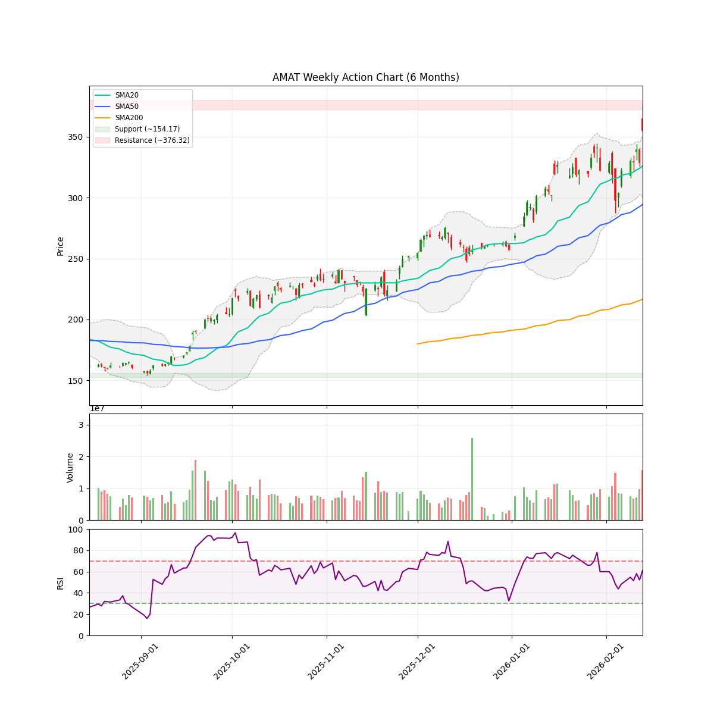
### 研报分析

### 技术指标概览 (Technical Overview)
- **当前价格**: $354.91
- **RSI (14)**: 61.00
- **移动平均线**: SMA20: $325.91 | SMA50: $294.43 | SMA200: $216.60 (Bullish)
- **波动率**: ATR (14): 19.86 (预计周度波动: +/- $44.40)
- **关键位 (6m)**: 支撑位 $154.17 | 阻力位 $376.32
- **即时状态**: Above SMA50

作为高级对冲基金行业研究员，针对 Applied Materials (AMAT) 截至 2026年2月15日 的表现，我提交以下深度诊断简报：

### 技术与基本面诊断

- **方向**: **看多 (Bullish)**
- **关键位**: 
    - **支撑位**: **$325.91** (理由：SMA20 均线提供短期强力支撑，且与 2 月初财报发布前的反弹起征点相近。)
    - **阻力位**: **$376.32** (理由：当前为 6 个月高点，也是短期的心理获利了结压力位。)
- **走势洞察**: 
    AMAT 目前展现出极其强劲的看涨形态。股价不仅远高于 SMA50 ($294.43) 和 SMA200 ($216.60)，且 RSI 指标为 61.00，表明市场情绪虽然高涨但尚未进入超买区（未达 70），仍有上行空间。SMA20 与 SMA50 的距离逐渐拉大，确认了当前的中短期加速趋势。鉴于最新财报后的跳空上涨，技术面呈现出“突破后回踩确认”的健康特征。
- **波动率见解**: 预期波动区间 **+/- $44.40**。

### 核心事件预警

1.  **强劲的 Q2 展望与服务业务转型**: 
    AMAT 第一季度财报在营收和利润上均超出了华尔街预期，这主要得益于服务业务的激增，有效抵消了芯片市场的暂时放缓 (来源: [Yahoo Finance](https://finance.yahoo.com/news/applied-materials-q1-earnings-beat-145600580.html))。更关键的是，公司对第二季度的每股收益 (EPS) 展望远高于市场共识，显示出管理层对 2026 年上半年半导体资本支出回收的信心 (来源: [Yahoo Finance UK](https://uk.finance.yahoo.com/video/applied-materials-stock-surges-q1-212121954.html))。

2.  **分析师目标价大幅上调**: 
    TD Cowen 近期将 AMAT 的目标价从 $315 直接上调至 $450 (来源: [Investing.com](https://in.investing.com/news/analyst-ratings/applied-materials-stock-price-target-raised-to-450-from-315-at-td-cowen-93CH-5240385.html))。这种大幅度的上调通常反映了机构投资者对公司在下一代半导体制造设备（如 GAA 晶体管技术）领域领先地位的重新估值。

3.  **业绩后的动能延续**: 
    继 2026 年 2 月 12 日销售额超预期后，股价出现了显著的“飞跃”现象，确认了市场对该股的重新定价逻辑 (来源: [StockStory](https://finance.yahoo.com/news/applied-materials-nasdaq-amat-q4-211007322.html))。

---

**即将推出的催化剂 (日期)**

- **2026年02月19日**: 财报发布后的分析师电话会议深度解读（预计将讨论先进制程设备的出货份额）。
- **2026年03月05日**: 预计下季度分红派息公告日（由于现金流充裕，市场关注是否有增发红利可能）。
- **2026年05月14日**: 2026 财年第二季度财报发布（将验证当前高增的前瞻指引是否兑现）。

**研究员简评**:
AMAT 目前正处于由服务业务转型和半导体周期回暖驱动的二次增长期。考虑到 ATR 指标 ($19.86) 显示出的日内波动性，建议在 $330-$340 区间进行逢低布局，首个目标位看向 $450。
### 近期新闻与事件
- **[Invezz]** [Applied Materials stock: Will AMAT rise or fall after earnings?](https://invezz.com/news/2026/02/09/applied-materials-stock-will-amat-rise-or-fall-after-earnings/)
- **[Investing.com]** [Applied Materials stock price target raised to $450 from $315 at TD Cowen By...](https://in.investing.com/news/analyst-ratings/applied-materials-stock-price-target-raised-to-450-from-315-at-td-cowen-93CH-5240385)
- **[Zacks]** [Is AUO Corporation - Sponsored ADR (AUOTY) Stock Outpacing Its Computer and...](https://finance.yahoo.com/news/auo-corporation-sponsored-adr-auoty-144003762.html)
- **[StockStory]** [Applied Materials’s (NASDAQ:AMAT) Q4 Sales Top Estimates, Stock Soars](https://finance.yahoo.com/news/applied-materials-nasdaq-amat-q4-211007322.html)
- **[Barchart]** [Applied Materials Q1 Earnings Preview: Can AMAT Stock Maintain Momentum?](https://finance.yahoo.com/news/applied-materials-q1-earnings-preview-194319699.html)

---

## AMD
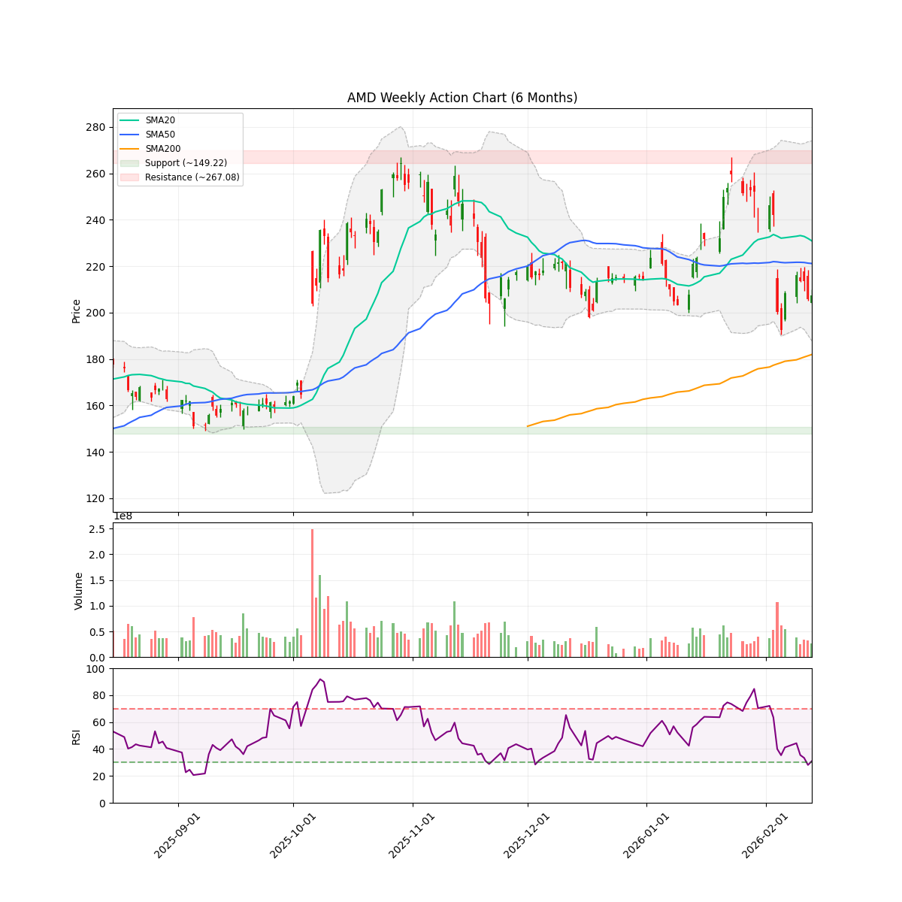
### 研报分析

### 技术指标概览 (Technical Overview)
- **当前价格**: $207.32
- **RSI (14)**: 30.99
- **移动平均线**: SMA20: $230.89 | SMA50: $221.14 | SMA200: $181.95 (Bullish)
- **波动率**: ATR (14): 14.66 (预计周度波动: +/- $32.79)
- **关键位 (6m)**: 支撑位 $149.22 | 阻力位 $267.08
- **即时状态**: Below SMA50

### 技术与基本面诊断

- **方向**: **看多 (超卖反弹预期)**
- **关键位**: 
    - **支撑位**: **181.95** (理由：长期 200 日均线 SMA200 是核心技术支撑，若股价跌破此位将引发趋势性反转)
    - **阻力位**: **230.89** (理由：该价位对应 SMA20，是短期多空转换的强弱分界点，也是 RBC 给出的目标价附近)
- **走势洞察**: 目前 AMD 股价处于超卖区间，RSI 指标（30.99）已接近 30 的技术性反弹临界点。尽管短期受制于 20 日和 50 日均线（均在当前股价上方，形成下行压力），但股价仍远高于 200 日均线（181.95），表明长期牛市趋势未破。近期股价回撤已充分释放抛售压力，技术面存在向 SMA50（221.14）回归的动力。
- **波动率见解**: 预期波动区间 **+/- $32.79**。ATR(14) 达到 14.66，暗示市场对 AMD 的定价存在剧烈分歧，波动性正处于高位。

### 核心事件预警

- **Arista Networks 算力平台转向**: Arista 已将其大部分 AI 工作负载从 Nvidia 转移到 AMD 加速器。这一背书极大地增强了投资者对 AMD 在 AI 硬件领域竞争力的信心，特别是在 MI300/MI400 系列的渗透率方面。(来源: [Simply Wall St](https://finance.yahoo.com/news/arista-endorsement-puts-amd-ai-160950050.html))
- **市场过度抛售信号**: 知名策略师 Jim Cramer 指出 AMD 股价跌幅已远超其基本面表现，认为当前价格点位具备较强的吸引力，这种情绪面回暖往往是触底反弹的前兆。(来源: [Insider Monkey](https://finance.yahoo.com/news/advanced-micro-devices-inc-amd-151341261.html))
- **机构评级分歧与目标价锚定**: 尽管 DA Davidson 初始覆盖给出“中性”评级，但 RBC Capital 维持了 230 美元的目标价，这为当前 207 美元的股价提供了约 11% 的潜在上行心理空间。(来源: [Investing.com](https://www.investing.com/news/analyst-ratings/amd-stock-price-target-maintained-at-230-by-rbc-ahead-of-earnings-93CH-4479241))
- **板块联动压力**: 虽然 AMD 自身利好频出，但市场仍关注 2 月 25 日 Nvidia 的表现，若龙头企业数据超预期，将带动 AMD 突破当前的阻力区间。(来源: [Motley Fool](https://finance.yahoo.com/news/clock-ticking-nvidia-stock-set-112200031.html))

**即将推出的催化剂 (日期)**
- **2026年02月25日**: **Nvidia (NVDA) 财报发布** (作为 AI 芯片板块的风向标，其财报及业绩指引将直接决定 AMD 能否突破 SMA20 阻力位)
- **2026年03月12日**: **AMD 全球开发者大会 (预期)** (重点关注下一代 MI400 加速器的最新进展及生态合作更新)
### 近期新闻与事件
- **[Simply Wall St.]** [Arista Endorsement Puts AMD AI Accelerators In Sharper Investor Focus](https://finance.yahoo.com/news/arista-endorsement-puts-amd-ai-160950050.html)
- **[Insider Monkey]** [Advanced Micro Devices Inc. (AMD) Was Down Way Too Much, Says Jim Cramer](https://finance.yahoo.com/news/advanced-micro-devices-inc-amd-151341261.html)
- **[StockStory]** [AMD (AMD) Stock Trades Up, Here Is Why](https://finance.yahoo.com/news/amd-amd-stock-trades-why-203111944.html)
- **[Investing.com]** [AMD stock coverage initiated by DA Davidson with Neutral rating By Investing.com](https://in.investing.com/news/analyst-ratings/amd-stock-coverage-initiated-by-da-davidson-with-neutral-rating-93CH-5238653)
- **[Motley Fool]** [The Clock Is Ticking: Nvidia Stock Is Set to Soar After Feb. 25](https://finance.yahoo.com/news/clock-ticking-nvidia-stock-set-112200031.html)

---

## AVGO
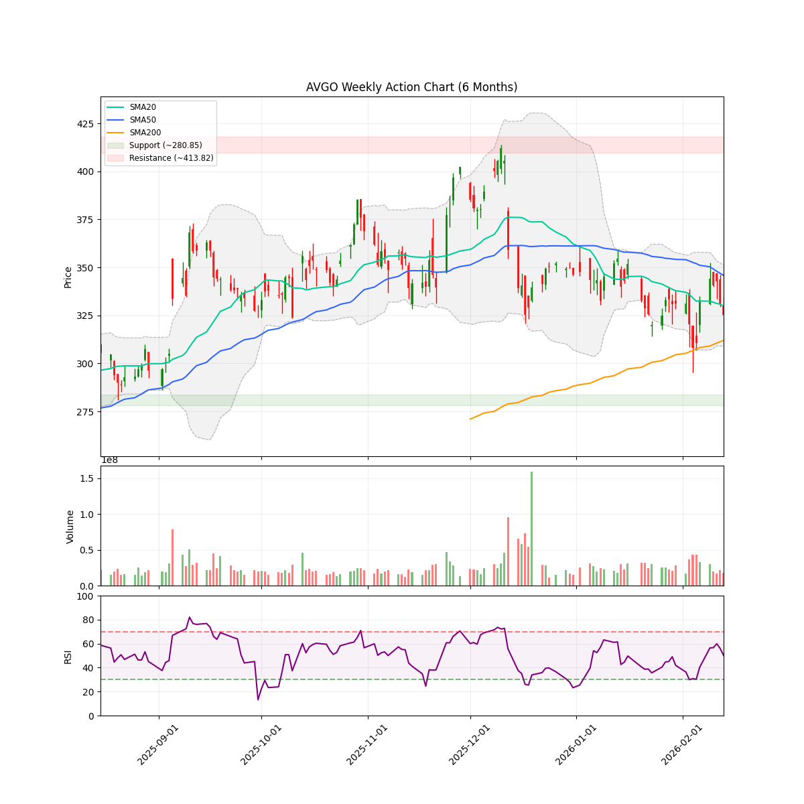
### 研报分析

### 技术指标概览 (Technical Overview)
- **当前价格**: $325.17
- **RSI (14)**: 50.17
- **移动平均线**: SMA20: $329.90 | SMA50: $345.77 | SMA200: $311.98 (Bullish)
- **波动率**: ATR (14): 16.31 (预计周度波动: +/- $36.47)
- **关键位 (6m)**: 支撑位 $280.85 | 阻力位 $413.82
- **即时状态**: Below SMA50

### 个股深度诊断简报：博通 (AVGO)

**报告日期**：2026年02月15日
**研究员**：高级行业研究员

---

### 技术与基本面诊断

- **方向**: **谨慎看多 (Cautiously Bullish)**
- **关键位**: 
    - **支撑位**: **$311.98** (基于SMA200长期均线。此点位是判断多头底线与长期趋势是否反转的核心技术支撑。)
    - **支撑位**: **$280.85** (6个月低点，作为强力防守区间。)
    - **阻力位**: **$345.77** (SMA50均线。股价目前处于该水平下方，若能放量突破，将确认重回中期上涨通道。)
- **走势洞察**: 
    AVGO 目前股价为 $325.17，处于短期震荡回踩阶段。尽管趋势被界定为看多（Bullish），但价格已运行至 SMA20 ($329.90) 和 SMA50 ($345.77) 下方，显示出短期内存在抛压。RSI 指标位于 50.17 的中性位，意味着市场正在寻找方向。考虑到目前的超大规模集成电路（ASIC）需求，股价在 SMA200 ($311.98) 附近表现出了较强的承接力度。
- **波动率见解**: 预期波动区间 +/- **$36.47**。

---

### 核心事件预警

- **AI 基础设施支出的持续溢出效应**：
    随着亚马逊等超大规模云服务商（Hyperscalers）宣布其 2026 年度的巨额资本支出计划，博通作为定制 AI 芯片的核心供应商将直接受益。市场预期博通在数据中心应用领域的渗透率将随着这一波资本支出浪潮进一步提升。(来源: [Forbes](https://www.forbes.com/sites/greatspeculations/2026/02/13/heres-how-avgo-stock-could-rise-to-450/))

- **市场资金偏好转移与机构吸筹**：
    在英伟达（NVIDIA）短期走势陷入平台整理之际，博通作为半导体板块的“第二增长引擎”正吸引机构资金的重新配置。(来源: [24/7 Wall St](https://247wallst.com/investing/2026/02/14/wall-streets-ai-paradox-why-has-nvidias-stock-flatlined-as-hyperscaler-spend-explodes/))。同时，著名投资者 Cathie Wood 已在近期股价回调中表现出明显的买入倾向，暗示市场底部区域的支撑正在加强。(来源: [Yahoo Finance](https://finance.yahoo.com/news/cathie-wood-gobbles-dip-broadcom-143002027.html))

- **媒体与分析师看涨情绪升温**：
    主流金融评论员 Jim Cramer 在 2026-02-15 的讨论中再次重申了博通在电信网络及数据中心芯片领域的领军地位，这可能会提升散户投资者的情绪。(来源: [Insider Monkey](https://www.msn.com/en-us/money/markets/jim-cramer-discusses-broadcom-avgo-stock/ar-AA1WplW4))

---

### 即将推出的催化剂 (日期)

- **2026年03月05日**: **2026财年第一季度财报发布** —— 届时市场将重点关注其定制 ASIC 业务的订单积压量以及 VMWare 整合后的协同效应。
- **2026年03月15日**: **春季全球 AI 半导体技术峰会** —— 博通预计将发布其下一代 3.2T/6.4T 交换机芯片及其对先进封装技术的最新支持方案。
- **2026年04月20日**: **超大规模云服务商 Q1 资本支出更新期** —— 市场将通过亚马逊、谷歌等公司的财报确认其对博通定制芯片的追加采购规模。
### 近期新闻与事件
- **[Insider Monkey]** [Jim Cramer Discusses Broadcom (AVGO) Stock](https://www.msn.com/en-us/money/markets/jim-cramer-discusses-broadcom-avgo-stock/ar-AA1WplW4)
- **[Forbes]** [Here's How AVGO Stock Could Rise To $450](https://www.forbes.com/sites/greatspeculations/2026/02/13/heres-how-avgo-stock-could-rise-to-450/)
- **[Yahoo Finance]** [As Cathie Wood Gobbles Up the Dip in Broadcom Stock, Should You Add AVGO Too?](https://finance.yahoo.com/news/cathie-wood-gobbles-dip-broadcom-143002027.html)
- **[24/7 Wall St.]** [Broadcom (NASDAQ: AVGO) Stock Price Prediction and Forecast 2026-2030 (Feb 2026)](https://247wallst.com/forecasts/2026/02/14/broadcom-avgo-price-prediction-and-forecast-2025-2030/)
- **[Zacks Investment Research]** [Broadcom Inc. (AVGO) is a trending stock: Facts to know before betting on it](https://www.msn.com/it-it/money/azioniprincipali/broadcom-inc-avgo-is-a-trending-stock-facts-to-know-before-betting-on-it/ar-AA1W4fo5)

---

## CEG
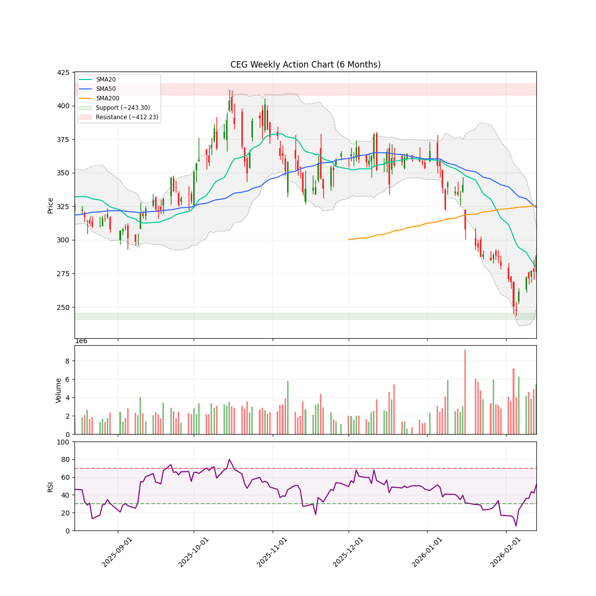
### 研报分析

### 技术指标概览 (Technical Overview)
- **当前价格**: $288.43
- **RSI (14)**: 51.75
- **移动平均线**: SMA20: $279.35 | SMA50: $323.98 | SMA200: $325.74 (Bearish)
- **波动率**: ATR (14): 12.81 (预计周度波动: +/- $28.64)
- **关键位 (6m)**: 支撑位 $243.30 | 阻力位 $412.23
- **即时状态**: Below SMA50

**个股深度诊断简报：Constellation Energy (CEG)**
**报告日期：** 2026-02-15
**研究员：** 高级行业研究员

---

### 技术与基本面诊断

- **方向**: **中性偏多 (Neutral-Bullish)**
- **关键位**: 
    - **支撑位**: **$279.35** (SMA20 均线支撑，近期股价站稳该线后开启反弹趋势)；强支撑于 **$243.30** (六个月低点)。
    - **阻力位**: **$323.98** (SMA50 均线，当前处于空头趋势的压力位)；强阻力于 **$325.74** (SMA200 长期牛熊分界线)。
- **走势洞察**: 
  尽管 CEG 目前整体处于看跌趋势（股价低于 SMA50 和 SMA200），但短期内已显示出显著的触底反弹迹象。股价在过去一周飙升约 10%，成功收复 $288.43 并突破 SMA20（$279.35）。RSI 处于 51.75 的均衡区，暗示市场正在为即将到来的财报季重新定价，摆脱了年初以来的过度抛售状态。
- **波动率见解**: 预期波动区间 **+/- $28.64**。结合 ATR (14) 为 12.81，表明在财报发布前后，市场情绪极其敏感，股价可能在阻力位 $323 附近面临方向性选择。

---

### 核心事件预警

- **财报季利好预期与 ESP 正向偏差**: 
  CEG 即将发布第四季度财报。Zacks 研究指出，该公司目前拥有 +3.13% 的盈利预测偏差（Earnings ESP），且预计营收将增长 1.9%。这表明分析师普遍看好其能源组合在 AI 数据中心驱动下的长期上行潜力 (来源: [Zacks](https://www.zacks.com/stock/news/2863275/constellation-to-post-q4-earnings-whats-in-store-for-the-stock))。
  
- **AI 需求与数据中心协议的支撑**: 
  近期股价从低位反弹，主要受到数据中心交易协议和分析师上调评级的推动。尽管年初至今跌幅仍接近 18.35%，但市场已开始消化 AI 基础设施对核电等零碳能源的激增需求 (来源: [Yahoo Finance](https://finance.yahoo.com/news/constellation-energy-surges-10-week-223024755.html))。

- **行业对比与增长属性**: 
  在与 Vistra 等同行的竞争中，CEG 被视为具有强增长属性的标的，尤其是其利用核能资产满足高负荷用电需求的能力，使其在标普 500 成员中具备防御与进攻的双重属性 (来源: [Zacks Investment Research on MSN](https://www.msn.com/en-us/money/topstocks/here-s-why-constellation-energy-corporation-ceg-is-a-strong-growth-stock/ar-AA1W4sw2?ocid=BingNewsVerp))。

---

### 即将推出的催化剂 (日期)

- **2026年02月18日**: **2025年第四季度财报发布及财测电话会议** (预计日期)。这是决定股价能否突破 SMA50 阻力位的关键时间节点，市场将密切关注其与科技巨头签订的最新核能供电合同进展。
- **2026年03月01日**: **机构持仓披露期**。随着 AI 能源概念重新受到关注，大型基金在二月底至三月初的调仓动作将影响 CEG 的流动性和支撑力度。
- **2026年03月15日**: **季度电力负荷预测报告更新**。鉴于 AI 导致的数据中心电力需求持续波动，该时间节点的行业预测将直接影响清洁能源股的估值溢价。
### 近期新闻与事件
- **[Zacks]** [Best S&P 500 Stocks to Buy Before Earnings: CEG, PWR](https://finance.yahoo.com/news/best-p-500-stocks-buy-202400657.html)
- **[Zacks]** [Constellation to Post Q4 Earnings: What's in Store for the Stock?](https://www.zacks.com/stock/news/2863275/constellation-to-post-q4-earnings-whats-in-store-for-the-stock)
- **[Motley Fool]** [Better Utility Stock: Constellation Energy vs. Vistra](https://finance.yahoo.com/news/better-utility-stock-constellation-energy-235700075.html)
- **[Yahoo Finance]** [Constellation Energy Surges 10% This Week on Data Center Deals and Analyst Upgrades](https://finance.yahoo.com/news/constellation-energy-surges-10-week-223024755.html)
- **[Yahoo Finance on MSN]** [Walmart earnings, spending data, and more AI disruptions: What to watch this week](https://www.msn.com/en-us/money/top-stocks/walmart-earnings-spending-data-and-more-ai-disruptions-what-to-watch-this-week/ar-AA1Worpd?ocid=BingNewsVerp)

---

## GOOGL
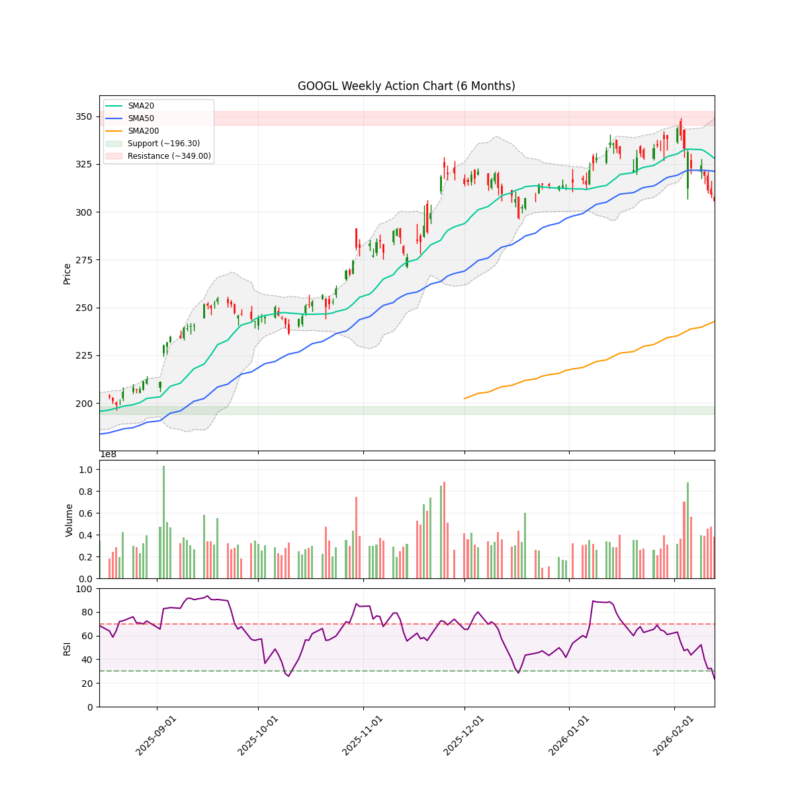
### 研报分析

### 技术指标概览 (Technical Overview)
- **当前价格**: $305.72
- **RSI (14)**: 23.43
- **移动平均线**: SMA20: $327.90 | SMA50: $321.21 | SMA200: $242.65 (Bullish)
- **波动率**: ATR (14): 10.93 (预计周度波动: +/- $24.44)
- **关键位 (6m)**: 支撑位 $196.30 | 阻力位 $349.00
- **即时状态**: Below SMA50

作为高级对冲基金行业研究员，针对 GOOGL（Alphabet Inc.）在 2026-02-15 的表现及后续走势，我提交如下深度诊断简报：

### 技术与基本面诊断

- **方向**: **看多** (超跌反弹/长期价值重估)
- **关键位**: 
    - **支撑位**: **$196.30** (基于6个月低点的强技术支撑)
    - **阻力位**: **$349.00** (6个月高点，也是当前上行趋势的主要压力区)
- **走势洞察**: 
  当前 GOOGL 价格（305.72）已显著低于 SMA20（327.90）和 SMA50（321.21），显示出短期内的剧烈回调。然而，**RSI 指标目前为 23.43**，处于极度超卖区间。结合技术面看，股价虽然在 SMA50 下方波动，但远离 SMA200（242.65）且处于超卖状态，预示着近期可能出现均值回归的强力反弹。
- **波动率见解**: 预期波动区间 **+/- $24.44**。

---

### 核心事件预警

- **抄底资金涌入与长期价值确立**：尽管近期市场波动，但分析显示投资者正积极在回调中买入 GOOGL 这一核心 AI 标的 (来源: [Motley Fool](https://finance.yahoo.com/news/1-artificial-intelligence-ai-stock-051400990.html))。同时，Alphabet 被列为值得“永久持有”的三大核心资产之一，这表明机构投资者对其在 2026 年及以后的长期基本面持有极高信心 (来源: [Motley Fool](https://finance.yahoo.com/news/3-stocks-buy-hold-forever-132000724.html))。

- **市场风格切换与英伟达财报前的观望**：目前“美股七雄”整体出现低迷，市场资金流向中盘股。然而，随着通胀冷却和即将到来的英伟达（NVIDIA）财报，市场情绪可能重新回归大型科技股。若英伟达业绩超预期，将直接提振包括 Google 在内的 AI 板块估值 (来源: [Forbes](https://www.forbes.com/sites/bill_stone/2026/02/15/magnificent-7-slump-median-stock-rallies-q4-earnings-signal/))。

---

### 即将推出的催化剂 (日期)

- **2026年02月18日**: **NVIDIA Q4 财报发布** (此事件将决定整体 AI 产业链及大型科技股的风险偏好方向，对 GOOGL 能否重回 SMA50 至关重要)。
- **2026年03月12日**: **Google AI 全球开发者春季预览会** (预期将展示 Gemini 2.5 版本的深度集成功能，直接回应市场对于 AI 商业化路径的担忧)。
- **2026年04月28日**: **Alphabet 2026年第一季度财报发布** (市场将重点关注其资本开支 ROI 的提升以及 YouTube 广告业务的复苏情况)。

**总结建议**: 
目前 GOOGL 处于技术性超卖状态（RSI < 25），且基本面被顶尖分析师视为“长线持有”的首选。虽然短期受大盘波动影响处于 SMA50 下方，但在 300 美元关口具备较强的防御性。建议利用当前的“黄金坑”机会，分批建仓以捕捉即将到来的 AI 业绩兑现行情。
### 近期新闻与事件
- **[Investor's Business Daily on MSN]** [Dow Jones Futures: What To With This Dangerous Market; Apple, Google, Amazon, Nvidia In Focus](https://www.msn.com/en-us/money/savingandinvesting/dow-jones-futures-what-to-with-this-dangerous-market-apple-google-amazon-nvidia-in-focus/ar-AA1WjsfT?ocid=BingNewsVerp)
- **[Insider Monkey]** [Is Alphabet Inc. (GOOGL) The Most Profitable Mega Cap Stock to Buy?](https://finance.yahoo.com/news/alphabet-inc-googl-most-profitable-150924706.html)
- **[Motley Fool]** [1 Artificial Intelligence (AI) Stock Investors Are Buying on the Dip](https://finance.yahoo.com/news/1-artificial-intelligence-ai-stock-051400990.html)
- **[The Motley Fool on MSN]** [Did Google's Gemini just say "checkmate" to OpenAI's ChatGPT?](https://www.msn.com/en-us/money/topstocks/did-google-s-gemini-just-say-checkmate-to-openai-s-chatgpt/ar-AA1WomuM?ocid=BingNewsVerp)
- **[Motley Fool]** [3 Stocks to Buy and Hold Forever: A Long-Term Play for Your Portfolio](https://finance.yahoo.com/news/3-stocks-buy-hold-forever-132000724.html)

---

## MU
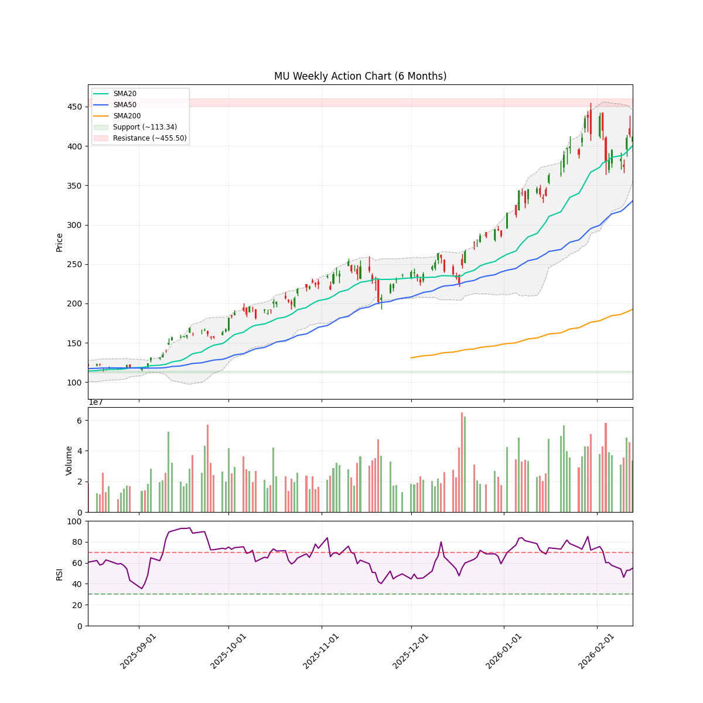
### 研报分析

### 技术指标概览 (Technical Overview)
- **当前价格**: $411.66
- **RSI (14)**: 54.93
- **移动平均线**: SMA20: $400.32 | SMA50: $330.17 | SMA200: $192.57 (Bullish)
- **波动率**: ATR (14): 31.56 (预计周度波动: +/- $70.57)
- **关键位 (6m)**: 支撑位 $113.34 | 阻力位 $455.50
- **即时状态**: Above SMA50

**个股深度诊断简报：美光科技 (MU)**
**报告日期：** 2026年02月15日
**研究员：** 高级行业研究员

---

### 技术与基本面诊断

- **方向**: **看多** (Bullish)
- **关键位**: 
    - **支撑位**: **$400.32** (理由：SMA20均线目前在此价位提供强力短期技术支撑，且与近期大涨后的企稳区间重合)
    - **阻力位**: **$455.50** (理由：过去6个月的最高点，是股价挑战历史新高的核心心理与筹码压力区)
- **走势洞察**: 
    MU 当前呈现出极强的多头排列形态。股价目前报收 $411.66，远高于 SMA50 ($330.17) 和 SMA200 ($192.57)，显示中长期趋势极度乐观。RSI 指标目前处于 54.93，意味着尽管近期经历了快速上涨（如2月12日的10%跳空），但市场尚未进入超买区，仍有进一步上行空间。由于 HBM4 的提前交付，市场正在经历估值逻辑的重构。
- **波动率见解**: "预期波动区间 +/- **$70.57**。" (基于当前波动率，本周股价可能在 $341 - $482 之间剧烈波动，需警惕高位回调风险。)

---

### 核心事件预警

- **HBM4 提前量产交付引发估值重估**：美光宣布 HBM4 内存芯片的交付时间比原计划提前一个季度，这一重大基本面利好直接推动了股价近期 10% 的涨幅。目前的市场共识是：在 2026 年底之前，美光的高带宽内存 (HBM) 产能已处于供不应求的状态 (来源: [Blockonomi](https://blockonomi.com/micron-mu-stock-surges-10-on-accelerated-hbm4-chip-timeline/))。

- **AI 超算中心的需求强韧**：来自 AI 超大规模云计算厂商（Hyperscalers）的内存订单依然是美光业绩增长的核心引擎。虽然市场竞争正在加剧，但英伟达 (Nvidia) 驱动的 HBM 需求增强，使得摩根士丹利等头部投行上调了美光的股价目标 (来源: [TheStreet/MSN](https://www.msn.com/en-us/money/topstocks/morgan-stanley-tweaks-micron-stock-price-target-as-pressure-builds/ar-AA1Wff0e))。

- **DDR5 价格上涨溢价**：除了高端 HBM 业务外，主流市场的 DDR5 价格持续走强，这为美光提供了更宽的利润护城河。Wolf Research 的调研确认，公司在第一季度已经开始了 HBM4 的规模化出货，这早于行业平均预期 (来源: [Investing.com Australia](https://au.investing.com/news/stock-market-news/micron-stock-rises-as-presentation-at-wolfe-conference-confirms-hbm4-shipments-ahead-of-schedule-93CH-4256203))。

---

### 即将推出的催化剂 (日期)

- **2026年03月26日**: **美光科技 2026 财年第二季度财报发布会** (届时将披露 HBM4 提前交付对利润率的实际提振数据)。
- **2026年04月10日**: **全球半导体领袖峰会 (GSLS)** (预计美光将更新其下一代超高密度内存模块的研发进度)。
- **2026年05月15日**: **主要 AI 客户 (Nvidia/AMD) 季度采购订单披露** (将验证 HBM4 订单的续约情况及 2027 年的产能预定比例)。
### 近期新闻与事件
- **[Yahoo Finance]** [Competition Is Heating Up for Micron. Should You Buy, Sell, or Hold MU Stock Now?](https://finance.yahoo.com/news/competition-heating-micron-buy-sell-200228492.html)
- **[Blockonomi]** [Micron (MU) Stock Surges 10% on Accelerated HBM4 Chip Timeline](https://blockonomi.com/micron-mu-stock-surges-10-on-accelerated-hbm4-chip-timeline/)
- **[TheStreet]** [Morgan Stanley tweaks Micron stock price target as pressure builds](https://www.msn.com/en-us/money/topstocks/morgan-stanley-tweaks-micron-stock-price-target-as-pressure-builds/ar-AA1Wff0e)
- **[Investing.com Australia]** [Micron stock rises as presentation at Wolfe conference confirms HBM4 shipments ahead of schedule](https://au.investing.com/news/stock-market-news/micron-stock-rises-as-presentation-at-wolfe-conference-confirms-hbm4-shipments-ahead-of-schedule-93CH-4256203)
- **[Zacks Investment Research]** [Is trending stock Micron Technology, Inc. (MU) a buy now?](https://www.msn.com/en-us/money/economy/is-trending-stock-micron-technology-inc-mu-a-buy-now/ar-AA1VZIiV)

---

## NVDA
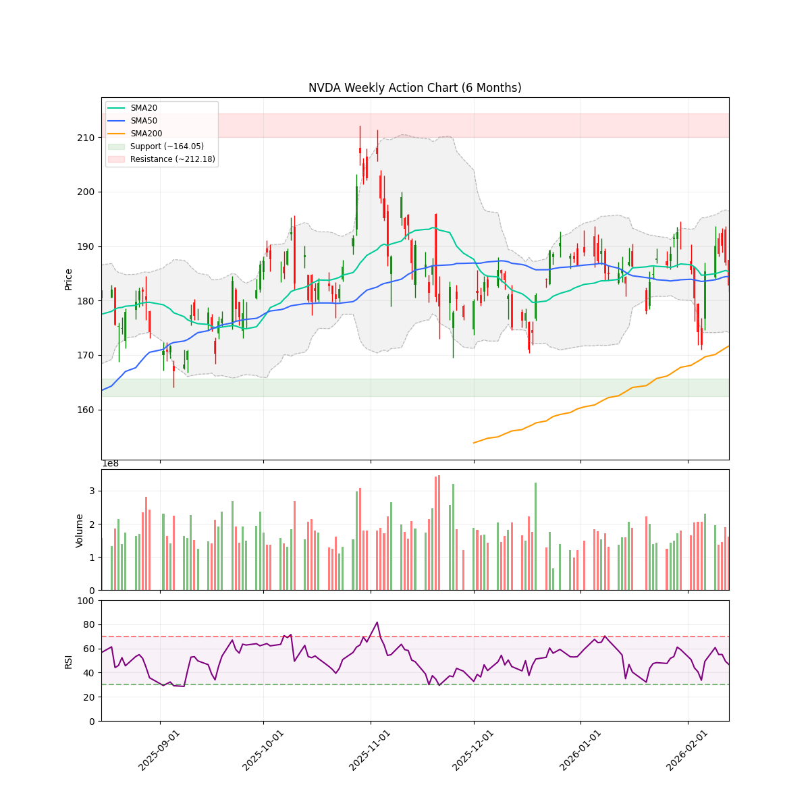
### 研报分析

### 技术指标概览 (Technical Overview)
- **当前价格**: $182.81
- **RSI (14)**: 46.68
- **移动平均线**: SMA20: $185.30 | SMA50: $184.41 | SMA200: $171.66 (Bullish)
- **波动率**: ATR (14): 7.00 (预计周度波动: +/- $15.65)
- **关键位 (6m)**: 支撑位 $164.05 | 阻力位 $212.18
- **即时状态**: Below SMA50

作为高级对冲基金行业研究员，针对当前日期（2026年02月15日）NVDA（英伟达）的市场表现与基本面动态，我的深度诊断简报如下：

### 技术与基本面诊断
- **方向**: **中性偏多 (Neutral-Bullish)**
- **关键位**: 
    - **支撑位**: **$171.66** (SMA200 长期牛熊分界线，提供强力技术心理支撑) ；次级支撑见 **$164.05** (近6个月低点)。
    - **支撑位**: **$185.30** (SMA20 压力位，需放量突破以确认短期反转)；强阻力位见 **$212.18** (6个月高点)。
- **走势洞察**: 
    目前 NVDA 处于震荡筑底阶段。股价（$182.81）虽略低于 SMA20（$185.30）和 SMA50（$184.41），显示短期动能受压，但仍运行在 SMA200（$171.66）这一关键长期趋势线上方。RSI 位于 46.68，处于中性区间，显示市场既无超买压力也无恐慌性抛售。当前的“平盘”走势（Flatlined）反映了市场在 2 月 25 日财报发布前的极度观望情绪。
- **波动率见解**: "预期波动区间 +/- **$15.65**。"

### 核心事件预警
- **超大规模资本开支与股价背离的“AI悖论”**: 尽管超大规模云服务商（Hyperscalers）在 AI 基础设施上的投入已飙升至 7000 亿美元，但英伟达股价近期表现相对低迷。这种背离暗示市场对资本开支能否迅速转化为利润存在疑虑，或是利好已部分被消化 (来源: [24/7 Wall St.](https://247wallst.com/investing/2026/02/14/wall-streets-ai-paradox-why-has-nvidias-stock-flatlined-as-hyperscaler-spend-explodes/))。
- **2026财年第四季度财报定调**: 市场普遍预期 2 月 25 日的财报将是一个“炸裂式”（Blowout）的季度。由于 2026 财年 AI 支出持续激增，分析师认为目前是财报前潜伏的良机 (来源: [AOL](https://www.aol.com/finance/clock-ticking-nvidia-stock-set-112200112.html)) (来源: [The Motley Fool](https://www.fool.com/investing/2026/02/09/better-ai-stock-to-buy-now-palantir-or-nvidia/))。
- **分析师情绪与动能积蓄**: 瑞银（UBS）于 2月 11 日重申了对英伟达的看多立场，认为随着关键催化剂临近，动能正在积聚。吉姆·克拉默（Jim Cramer）亦强调英伟达在其品类中的开创性地位，尽管年初至今股价微跌 3%，但长期护城河依然稳固 (来源: [Insider Monkey](https://www.msn.com/en-us/money/markets/analyst-sees-nvidia-nvda-momentum-building-into-key-catalysts/ar-AA1WlIun)) (来源: [Insider Monkey](https://www.msn.com/en-us/money/markets/nvidia-nvda-invented-its-category-says-jim-cramer/ar-AA1WoR0z))。
- **宏观轮动压力**: 当前市场出现“科技七巨头”（Magnificent 7）滞涨而中位数股票补涨的轮动迹象。在通胀降温的背景下，投资者正在屏息以待英伟达的财报，以确认科技龙头是否能重新夺回市场领导权 (来源: [Forbes](https://www.forbes.com/sites/bill_stone/2026/02/15/magnificent-7-slump-median-stock-rallies-q4-earnings-signal/))。

**即将推出的催化剂 (日期)**
- [2026年02月25日]: **发布 2026 财年第四季度（截至2026年1月）财报** (此为决定股价能否突破 $212 阻力位的核心事件)。
- [2026年03月中旬]: **GTC 2026 大会 (预测)** (通常在 3 月举行，届时可能发布下一代 GPU 架构进展，将成为财报后的第二波动能来源)。
### 近期新闻与事件
- **[Insider Monkey]** [NVIDIA (NVDA) Invented Its Category, Says Jim Cramer](https://www.msn.com/en-us/money/markets/nvidia-nvda-invented-its-category-says-jim-cramer/ar-AA1WoR0z)
- **[AOL]** [The Clock Is Ticking: Nvidia Stock Is Set to Soar After Feb. 25](https://www.aol.com/finance/clock-ticking-nvidia-stock-set-112200112.html)
- **[The Globe and Mail]** [Should You Buy the Dip in Microsoft Stock?](https://www.theglobeandmail.com/investing/markets/stocks/NVDA/pressreleases/231079/should-you-buy-the-dip-in-microsoft-stock/)
- **[24/7 Wall St.]** [Wall Street's AI Paradox: Why Has NVIDIA's Stock Flatlined as Hyperscaler Spend Explodes?](https://247wallst.com/investing/2026/02/14/wall-streets-ai-paradox-why-has-nvidias-stock-flatlined-as-hyperscaler-spend-explodes/)
- **[Insider Monkey]** [Analyst Sees NVIDIA (NVDA) Momentum Building Into Key Catalysts](https://www.msn.com/en-us/money/markets/analyst-sees-nvidia-nvda-momentum-building-into-key-catalysts/ar-AA1WlIun)

---

## TSM
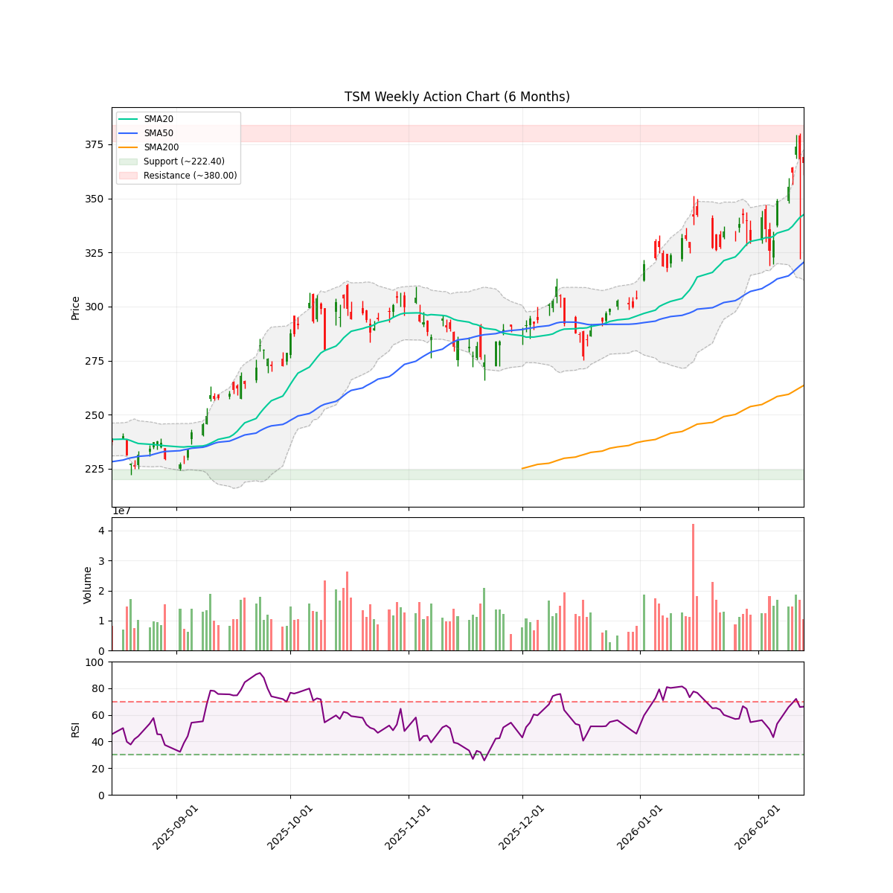
### 研报分析

### 技术指标概览 (Technical Overview)
- **当前价格**: $366.36
- **RSI (14)**: 66.20
- **移动平均线**: SMA20: $342.48 | SMA50: $320.46 | SMA200: $263.53 (Bullish)
- **波动率**: ATR (14): 16.78 (预计周度波动: +/- $37.51)
- **关键位 (6m)**: 支撑位 $222.40 | 阻力位 $380.00
- **即时状态**: Above SMA50

作为高级对冲基金行业研究员，针对当前日期 2026-02-15 的 TSM（台积电）个股表现，我提交如下深度诊断简报：

### 技术与基本面诊断
- **方向**: **看多 (Bullish)**
- **关键位**: 
    - **支撑位**: **342.48** (由 SMA20 提供的近期动态趋势支撑，是短期多头防守的核心位置)
    - **阻力位**: **380.00** (6个月以来的高点，也是当前上行趋势的主要心理与技术压力位)
- **走势洞察**: 
    TSM 目前呈现出极强的多头排列，股价稳居 SMA50 (320.46) 和 SMA200 (263.53) 之上，显示中长期趋势向上。RSI 指标目前为 66.20，虽接近 70 的超买区间，但尚未出现顶背离，暗示上行惯性依然存在。考虑到股价正逼近 380.00 的历史阻力位，短期内可能在 SMA20 上方进行高位震荡以消化获利盘。
- **波动率见解**: "预期波动区间 **+/- $37.51**。"

### 核心事件预警
- **AI 基础设施扩张驱动的产能升级**: 随着人工智能基础设施市场的持续爆发，台积电正在加大资本开支，加速扩建晶圆厂（Fabs）以提升产能，力求在高速增长的 AI 芯片需求中占据主导地位 (来源: [Motley Fool](https://finance.yahoo.com/news/2-growth-stocks-invest-1-003700847.html))。
- **分析师一致性看涨预判**: 尽管目前股价处于高位，但主流投行与券商对 TSM 的平均建议仍为“买入”。市场共识目标价显示，该股较当前水平仍有约 25.3% 的潜在上涨空间 (来源: [Zacks](https://finance.yahoo.com/news/tsmc-tsm-climb-25-25-145501686.html))。
- **超越传统资产的增长潜力**: 机构分析认为，在 AI 浪潮的估值重塑下，TSM 这类拥有核心技术护城河的科技股，其长期投资潜力已超过包括加密货币在内的多种高风险资产 (来源: [Motley Fool](https://finance.yahoo.com/news/3-tech-stocks-more-potential-093500450.html))。

**即将推出的催化剂 (日期)**
- **2026年03月10日**: 2026年2月度度营收数据披露（市场将通过此数据验证 AI 订单的兑现程度）。
- **2026年04月16日**: 2026年第一季度财报电话会议（届时将更新全年资本支出预算及 2nm 工艺的量产进度预测）。
### 近期新闻与事件
- **[Motley Fool]** [Top Stocks to Double Up on Right Now](https://finance.yahoo.com/news/top-stocks-double-now-004900276.html)
- **[Motley Fool]** [2 Growth Stocks to Invest $1,000 in Right Now](https://finance.yahoo.com/news/2-growth-stocks-invest-1-003700847.html)
- **[Zacks]** [4 Stocks Trading Near 52-Week High With Room to Rise Further](https://finance.yahoo.com/news/4-stocks-trading-near-52-154200159.html)
- **[Motley Fool]** [3 Tech Stocks With More Potential Than Any Cryptocurrency](https://finance.yahoo.com/news/3-tech-stocks-more-potential-093500450.html)
- **[The Motley Fool on MSN]** [Top stocks to double up on right now](https://www.msn.com/en-us/money/topstocks/top-stocks-to-double-up-on-right-now/ar-AA1WmQSQ?ocid=BingNewsVerp)

---

## VRT
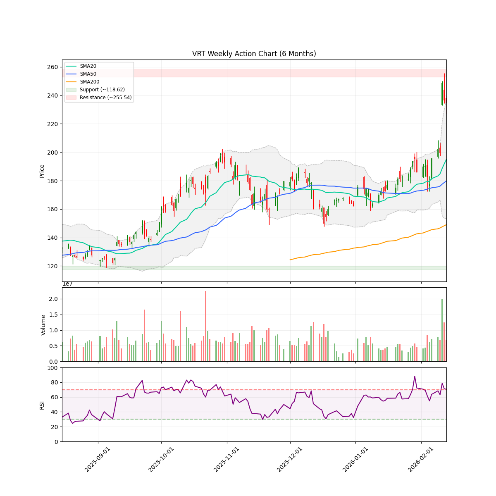
### 研报分析

### 技术指标概览 (Technical Overview)
- **当前价格**: $234.53
- **RSI (14)**: 70.71
- **移动平均线**: SMA20: $194.99 | SMA50: $179.76 | SMA200: $149.03 (Bullish)
- **波动率**: ATR (14): 15.97 (预计周度波动: +/- $35.72)
- **关键位 (6m)**: 支撑位 $118.62 | 阻力位 $255.54
- **即时状态**: Above SMA50

你好。我是高级行业研究员。针对 Vertiv Holdings Co (VRT) 在 2026 年 2 月 15 日的市场表现及最新资讯，我为你整理了这份深度诊断简报。

### 技术与基本面诊断
- **方向**: **看多 (Bullish)** —— 尽管短期存在超买回调压力，但中长期上升趋势极其稳固。
- **关键位**: 
    - **支撑位**: **194.99** (SMA20 均线支撑) 及 **118.62** (6个月低点支撑)。
    - **阻力位**: **255.54** (6个月高点，也是当前上行趋势的直接心理压力位)。
- **走势洞察**: VRT 目前处于强劲的牛市轨道中，价格显著高于 SMA50 (179.76) 和 SMA200 (149.03)。然而，**RSI 指标已达 70.71**，进入技术性超买区间，暗示短期涨势可能趋于平缓或出现小幅技术性回撤。近期 18.3% 的股价跳升是由超预期的财报驱动的，这种由基本面支撑的突破通常具有较强的持续性 (来源: [StockStory](https://finance.yahoo.com/news/vertiv-vrt-shares-skyrocket-know-174553161.html))。
- **波动率见解**: "预期波动区间 +/- **$35.72**。" 根据当前 15.97 的 ATR (14) 计算，波动性维持在高位，建议投资者在参与时预留足够的止损空间。

### 核心事件预警
- **订单量爆发式增长**: 知名分析师 Jim Cramer 指出 Vertiv 的订单增长表现“令人难以置信”，这验证了 AI 基础设施（数据中心散热与电力管理）需求的极高景气度 (来源: [Insider Monkey](https://finance.yahoo.com/news/vertiv-vrt-orders-were-incredible-151232966.html))。
- **2025年Q4财报双超预期**: VRT 最近公布的财报显示，每股收益 (EPS) 超预期 5.80%，营收超预期 0.07%，并发布了令人振奋的下一季度指引。这证明了其在数据中心领域的“卖铲人”地位依然稳固 (来源: [Zacks](https://finance.yahoo.com/news/vertiv-holdings-co-vrt-beats-120501035.html); [Motley Fool](https://finance.yahoo.com/news/think-too-buy-vertiv-stock-154000088.html))。
- **机构情绪转换**: 市场正在讨论当前是否仍是入场时机。鉴于其股价已较 1 月低点反弹超过 50%，短期追高风险正在积聚，但由于其强劲的财务增长潜力，分析师仍将其视为稳健的增长股 (来源: [Barchart](https://finance.yahoo.com/news/too-chase-rally-vertiv-stock-151144822.html); [sharewise](https://www.sharewise.com/us/news_articles/Is_Vertiv_VRT_a_Solid_Growth_Stock_3_Reasons_to_Think_Yes_Zacks_20260212_1845))。

**即将推出的催化剂 (日期)**
- [2026年02月27日]: 预计发布年度 10-K 报告 (SEC 备案)，届时将披露更多关于 2026 年资本支出计划的细节。
- [2026年03月15日]: 行业领先的 AI 与基础设施投资者大会 (预期参与)，可能进一步提升市场对其液冷技术份额的预期。
- [2026年05月06日]: 2026 财年第一季度财报发布窗口 (预估日期)，市场将关注订单积压量 (Backlog) 是否持续转化为营收。
### 近期新闻与事件
- **[Insider Monkey]** [Vertiv (VRT)’s Orders Were Incredible, Says Jim Cramer](https://finance.yahoo.com/news/vertiv-vrt-orders-were-incredible-151232966.html)
- **[Barchart]** [Is It Too Late to Chase the Rally in Vertiv Stock?](https://finance.yahoo.com/news/too-chase-rally-vertiv-stock-151144822.html)
- **[Motley Fool]** [Think It's Too Late to Buy Vertiv Stock? Here's the 1 Reason Why There's Still...](https://finance.yahoo.com/news/think-too-buy-vertiv-stock-154000088.html)
- **[Zacks]** [Vertiv Holdings Co. (VRT) Beats Q4 Earnings and Revenue Estimates](https://finance.yahoo.com/news/vertiv-holdings-co-vrt-beats-120501035.html)
- **[StockStory]** [Vertiv (VRT) Shares Skyrocket, What You Need To Know](https://finance.yahoo.com/news/vertiv-vrt-shares-skyrocket-know-174553161.html)

---

## VST
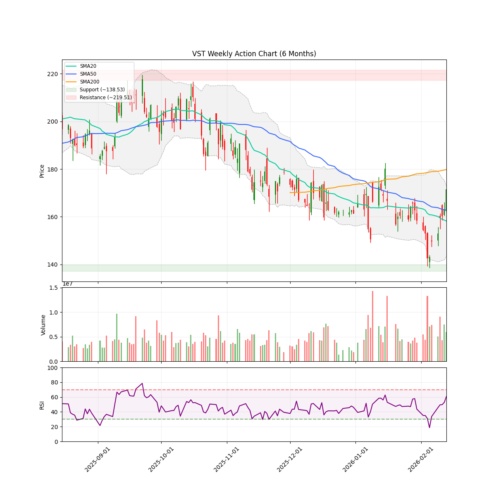
### 研报分析

### 技术指标概览 (Technical Overview)
- **当前价格**: $171.49
- **RSI (14)**: 60.76
- **移动平均线**: SMA20: $158.17 | SMA50: $162.84 | SMA200: $179.81 (Bearish)
- **波动率**: ATR (14): 7.79 (预计周度波动: +/- $17.42)
- **关键位 (6m)**: 支撑位 $138.53 | 阻力位 $219.51
- **即时状态**: Above SMA50

作为高级对冲基金行业研究员，针对 **Vistra Corp. (VST)** 的最新数据及市场动向，我为您整理了如下个股深度诊断简报。

---

### 技术与基本面诊断

- **方向**: **看多 (Bullish)**
- **关键位**: 
    - **支撑位**: **$162.84** (当前 SMA50 均线提供核心支撑，该位也是近期震荡区间的心理防线)；次级支撑见 **$158.17** (SMA20)。
    - **阻力位**: **$203.00** (杰富瑞最新调高的目标价)；强阻力位见 **$219.51** (6个月高点)。
- **走势洞察**: 
    虽然长周期指标 (SMA200: $179.81) 显示大趋势仍处于调整后的空头排列，但短期走势已明显转暖。VST 目前价格（$171.49）已成功站上 SMA20 和 SMA50，显示出强劲的反弹势头。RSI 为 60.76，处于扩张区间但尚未进入超买区，表明多头情绪仍有释放空间。近期在标普500大跌的情况下，VST 表现出极强的相对强度（Relative Strength），是典型的防御加成长属性的电力能源标的。
- **波动率见解**: 预期波动区间 **+/- $17.42**。

### 核心事件预警

- **评级上调与风险收益比改善**: 杰富瑞 (Jefferies) 分析师 Julien Dumoulin-Smith 于 2月10日将 VST 评级从“持有”上调至“买入”，并将目标价从 $191 调高至 $203。分析指出，VST 目前是市场上最具上行潜力的个股之一，其风险回报比已显著优化 (来源: [Insider Monkey](https://www.msn.com/en-us/money/topstocks/vistra-corp-vst-upgraded-by-jefferies-following-improved-riskreward-profile/ar-AA1WkuWj))。

- **市场逆势表现**: 在 2月13日的交易中，标普500指数下跌 1.57%，而 VST 逆势上涨 1.84%，收于 $163.10 以上。这种在市场回调时表现出的韧性，反映了机构资金在波动市中对该电力巨头的避险偏好 (来源: [Zacks.com](https://www.msn.com/en-us/money/savingandinvesting/vistra-corp-vst-gains-as-market-dips-what-you-should-know/ar-AA1WeVQB))。

- **估值重估争议**: 随着 VST 近期股价回升，市场对其“昂贵的市盈率倍数”出现了讨论。投资者正重新审视其基本面是否能支撑当前的估值溢价，特别是在过去一年收益表现参差不齐的情况下 (来源: [Yahoo Finance](https://finance.yahoo.com/news/assessing-vistra-vst-valuation-choppy-161159598.html))。

- **回购计划潜在利好**: 2025年三季度全美股票回购总额达2490亿美元，分析师预测2026年回购规模将持续处于高位。VST 作为现金流充裕的能源公司，其潜在的回购策略被视为提升每股价值（EPS）的核心驱动力 (来源: [The Motley Fool](https://www.fool.com/research/stock-buyback-statistics/))。

### 即将推出的催化剂 (日期)

- **2026年02月26日**: 预计发布 2025 财年年度财务报告及 2026 年盈利指引（根据历史财报周期推测，该事件将决定股价能否突破 $200 关口）。
- **2026年03月10日**: 杰富瑞调价后的机构持仓变动披露期，预计将有更多被动资金根据最新买入评级进行调仓。
- **2026年03月15日**: 预计公布新一季度的股份回购执行计划详情，若回购力度超预期，将直接推升股价向阻力位 $219.51 迈进。

---
**研究员简评**: VST 目前正处于由技术性反弹向趋势性上涨转化的关键期。尽管估值倍数较高，但在 AI 驱动的电力需求增长背景下，其稀缺的调度能力及最近获投行背书的背景，使其成为对冲宏观波动的优质配置标的。建议关注支撑位 $162.84 附近的低吸机会。
### 近期新闻与事件
- **[The Motley Fool]** [Stock Buyback Statistics](https://www.fool.com/research/stock-buyback-statistics/)
- **[Insider Monkey]** [Vistra Corp. (VST) Upgraded by Jefferies Following Improved Risk/Reward Profile](https://www.msn.com/en-us/money/topstocks/vistra-corp-vst-upgraded-by-jefferies-following-improved-riskreward-profile/ar-AA1WkuWj)
- **[Zacks.com]** [Vistra Corp. (VST) Gains As Market Dips: What You Should Know](https://www.msn.com/en-us/money/savingandinvesting/vistra-corp-vst-gains-as-market-dips-what-you-should-know/ar-AA1WeVQB)
- **[Yahoo Finance]** [Assessing Vistra (VST) Valuation After Choppy Returns And A Rich Earnings Multiple](https://finance.yahoo.com/news/assessing-vistra-vst-valuation-choppy-161159598.html)
- **[Fintel]** [Jefferies upgrades Vistra (VST)](https://www.msn.com/en-us/money/top-stocks/jefferies-upgrades-vistra-vst/ar-AA1W6FRf)

---

## AMZN
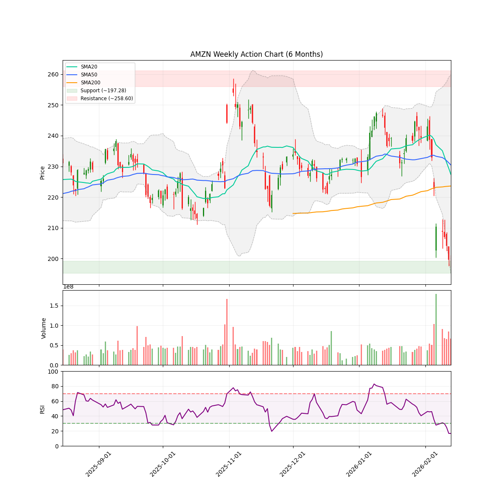
### 研报分析

### 技术指标概览 (Technical Overview)
- **当前价格**: $198.79
- **RSI (14)**: 16.68
- **移动平均线**: SMA20: $227.39 | SMA50: $230.46 | SMA200: $223.62 (Bullish)
- **波动率**: ATR (14): 8.40 (预计周度波动: +/- $18.78)
- **关键位 (6m)**: 支撑位 $197.28 | 阻力位 $258.60
- **即时状态**: Below SMA50

### 技术与基本面诊断

- **方向**: **短线看空，存在超卖反弹机会**
- **关键位**: 
    - **支撑位**: **197.28** (过去6个月的低点，目前股价已逼近此关键心理与技术防线)
    - **阻力位**: **223.62** (200日移动平均线 SMA200，目前已由支撑转为强力阻力位)
- **走势洞察**: 
  AMZN 当前技术面呈现极度疲软状态。RSI 指标已跌至 **16.68**，处于极度超卖区间（通常低于30即为超卖），反映出市场近期的恐慌性抛售。尽管长期趋势描述为“Bullish”，但股价目前已跌破 SMA20、SMA50 和 SMA200 所有关键均线，且 SMA20 (227.39) 远高于现价，显示短期下行压力巨大。股价在 2026 年初以来的累计跌幅显著，目前正在测试 197.28 的关键支撑。
- **波动率见解**: "预期波动区间 +/- **$18.78**。"

### 核心事件预警

- **连续阴线与超卖信号**: 亚马逊股价自2026年开年以来表现不佳，跌幅已达14%，且近期出现了连续九个交易日的下滑，这种走势是自2006年以来首次出现，预示着市场情绪已降至冰点，但也可能暗示着阶段性底部正在形成 (来源: [Motley Fool](https://finance.yahoo.com/news/amazon-stock-just-did-something-085500593.html))。
- **管理层减持**: 首席执行官 Herrington 近期出售了价值约 20.8 万美元的股票，虽然金额对公司体量而言较小，但在股价持续探底的过程中，内部人士减持可能会进一步压制投资者信心 (来源: [Investing.com](https://ng.investing.com/news/insider-trading-news/amazon-ceo-herrington-sells-208k-in-amzn-stock-93CH-2343353))。
- **市场估值修复争议**: 尽管有分析质疑亚马逊能否在年内重回 260 美元高位，但由于其相对于“雄伟七巨头”其他成员的估值吸引力，部分分析师仍将其视为可以“逢低吸纳”的对象 (来源: [Motley Fool](https://finance.yahoo.com/news/amazon-stock-going-260-095500126.html); [Yahoo Finance](https://finance.yahoo.com/news/3-cheap-magnificent-seven-stocks-052000553.html))。
- **AI 部门联动效应**: 亚马逊资本支出（AMZN Capital）与 AI 算力需求紧密相关。由于英伟达（Nvidia）即将在 2 月 25 日发布业绩，市场对整个云服务（AWS）和 AI 基础设施链条的预期将直接影响 AMZN 的反弹动力 (来源: [Motley Fool](https://finance.yahoo.com/news/clock-ticking-nvidia-stock-set-112200031.html))。

**即将推出的催化剂 (日期)**

- **2026年02月25日**: **英伟达 (Nvidia) 财报发布** (作为 AI 与数据中心领域的风向标，其业绩及前瞻指引将直接驱动亚马逊 AWS 业务的估值逻辑重塑)。
- **2026年03月01日 (预期)**: **机构持仓 13F 文件披露截止后期** (届时将明确顶级对冲基金在 200 美元关口下方是否对 AMZN 进行了大规模调仓或抄底)。
### 近期新闻与事件
- **[Yahoo Finance]** [3 Cheap "Magnificent Seven" Stocks to Buy Hand Over Fist](https://finance.yahoo.com/news/3-cheap-magnificent-seven-stocks-052000553.html)
- **[Motley Fool]** [Amazon Stock Just Did Something Last Seen in 2006. It Signals a Big Move in the...](https://finance.yahoo.com/news/amazon-stock-just-did-something-085500593.html)
- **[Investing.com]** [Amazon CEO Herrington sells $208k in AMZN stock By Investing.com](https://ng.investing.com/news/insider-trading-news/amazon-ceo-herrington-sells-208k-in-amzn-stock-93CH-2343353)
- **[Motley Fool]** [Is Amazon Stock Going to $260?](https://finance.yahoo.com/news/amazon-stock-going-260-095500126.html)
- **[Motley Fool]** [The Clock Is Ticking: Nvidia Stock Is Set to Soar After Feb. 25](https://finance.yahoo.com/news/clock-ticking-nvidia-stock-set-112200031.html)

---
