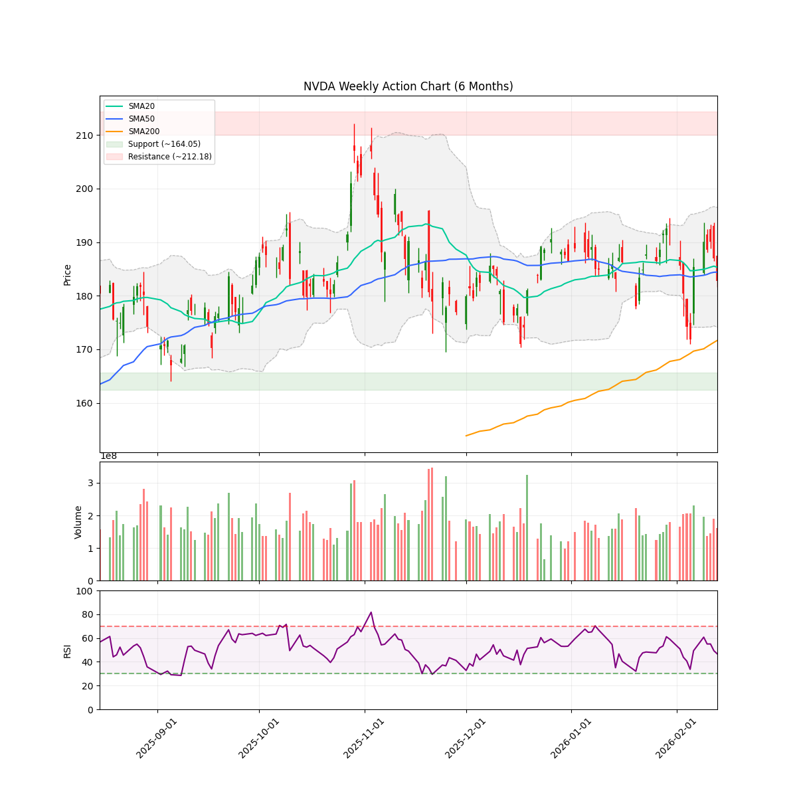
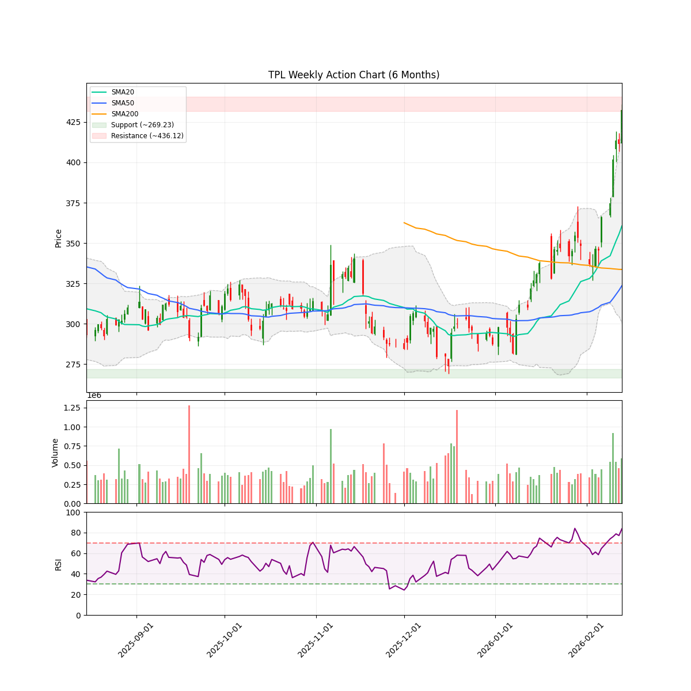

# 每日股市市场报告 (2026-02-16)

> **免责声明**: 本报告由 **代码与 Gemini AI 自动生成**，仅供研究参考，**不构成**任何投资建议。投资有风险，入市需谨慎。作者及 AI 不对任何基于此内容的投资决策承担责任。

## 📑 目录
[TOC]

##  长期投资逻辑
本组合旨在捕捉 **人工智能（AI）与半导体协议** 带来的跨周期结构性增长，核心投资策略聚焦于“确定性”与“物理瓶颈”：
- **底层制程垄断 (Foundry & WFE Moats)**：
  布局处于全球半导体精密制造顶端的“工业母机”级别公司。寻找具备极高准入门槛的晶圆代工及前道设备供应商，作为全产业链最稳固的底座资产。
- **算力稀缺性与连接带宽 (Compute & Interconnect Scarcity)**：
  聚焦在高性能计算芯（HPC）及高带宽连接领域占据主导地位的标的。AI 的终极竞争是“规模”，寻找能有效解决数据交换瓶颈并提供核心推理/训练能力的算力巨头。
- **应用生态与数据霸权 (Platform & Data Sovereignty)**：
  布局拥有闭环生态、海量高质量私有数据及云基础设施的科技巨头。它们是 AI 商业化落地的最终守门人，拥有将技术转化为持续现金流的分配权。
- **物理边界保障 (Power & Thermal Infrastructure)**：
  关注 AI 扩张的“最终瓶颈”——电力供应与热能管理。重点布局为下一代超大规模数据中心提供高功率密度能源、液冷技术及电网扩容方案的能源基建商。
**风控策略**：利用 AlphaJAX 的量化动量评分（Quant Score）作为过滤器，结合 LLM 叙事审计（Narrative Audit）捕捉“业绩超预期 + 叙事逻辑改善”的共振点，实现跨周期的超额收益。

 **注：排序权重**：Ticker 按照 AI 检测出的 **方向** 排序（**看多**优先，其次是 **中性**，最后是 **看空**）。
---

## 🔍 观察池机会分析

### NVDA

#### 研报分析

### 技术指标概览 (Technical Overview)
- **当前价格**: $182.81
- **RSI (14)**: 46.68
- **移动平均线**: SMA20: $185.30 | SMA50: $184.41 | SMA200: $171.66 (Bullish)
- **波动率**: ATR (14): 7.00 (预计周度波动: +/- $15.65)
- **关键位 (6m)**: 支撑位 $164.05 | 阻力位 $212.18
- **即时状态**: Below SMA50

# 情绪审计报告：英伟达 (NVDA)
**报告日期：** 2026年02月16日
**研究员：** 叙事经济学研究组 (Hedge Fund Research Associate)

---

### 1. 催化剂分类 (Catalyst Categorization)

基于当前新闻流和市场动态，我们将催化剂分为以下三个等级：

*   **A-Tier (核心催化剂)**
    *   **Q4 财报预期 (2026-02-25)：** 瑞银 (UBS) 预计营收将达到 675 亿美元，并将目标价设为 260 美元。这是当前决定股价中短期走向的最关键变量。
    *   **营收高增长叙事：** 尽管股价近期承压，但财报显示的顶线增长加速（Top-line growth）仍是核心驱动力。
*   **B-Tier (机构与行业支撑)**
    *   **顶级对冲基金背书：** Clifford Asness 将 NVDA 作为其最大持仓（占比 2.62%，约 40.9 亿美元），显示了长线机构的信心。[来源: Insider Monkey]
    *   **分析师一致看涨：** 三家机构在财报前发布看涨评论，暗示专业投资者对业绩指引持乐观态度。[来源: Blockonomi]
*   **C-Tier (市场杂音与情绪溢价)**
    *   **零售端搜索热度：** Zacks 将其列为“最受关注股票”，反映了散户的持续高关注度，但同时也预示着波动的风险。[来源: Zacks]
    *   **媒体情绪博弈：** 《Motley Fool》关于“为什么 2026 年表现不佳”的讨论属于典型的市场噪音，试图解释短期价格波动而非基本面变化。

---

### 2. 背离检测 (Divergence Detection)

**当前状态：典型的“好消息下的阴跌” (Bearish Exhaustion / Bull Trap?)**

*   **基本面 vs 价格：** 瑞银给出了 260 美元的目标价（较当前有 42% 上涨空间），且机构大佬持续增持，但股价目前处于 SMA50 (184.41) 之下，且 2026 年至今下跌 2%，跑输标普 500 指数。
*   **技术分析视角：** RSI 为 46.68，处于中性偏弱区间。股价在 SMA20 (185.30) 下方波动，显示短期买盘力量不足。
*   **结论：** 市场处于“财报前恐惧症”状态。尽管利好消息频出，但资金在 2 月 25 日财报公布前保持高度审慎。这种背离通常意味着：要么是**多头陷阱**（市场在消化坏消息），要么是**看跌动能耗尽**（即将迎来财报后的爆发）。

---

### 3. 情绪评分 (Sentiment Score)

#### **逻辑得分：7.2 / 10**

*   **得分逻辑：** 
    *   **基本面 (+3.5)：** 营收预期极高（675亿），AI 基础设施需求依然是全球硬通货。
    *   **机构筹码 (+2.5)：** 顶级对冲基金重仓，提供了较强的底部支撑。
    *   **技术面与情绪 (-1.8)：** 跌破 50 日均线，且 2026 年开局表现疲软，短期动能指标欠佳。
    *   **叙事可持续性 (+3.0)：** AI 叙事并未破裂，而是进入了从“愿景”到“落地”的验证期。

---

### 4. 关键指标总结

*   **当前价格：** 182.81
*   **支撑位 (6个月低点)：** 164.05
*   **阻力位 (6个月高点)：** 212.18
*   **下周震荡区间：** +/- 15.65 (基于 ATR 波动率预估)
*   **引用新闻：**
    1.  [Blockonomi - UBS 目标价 260 美元](https://blockonomi.com/nvidia-nvda-stock-gets-three-bullish-calls-before-q4-earnings-drop/)
    2.  [Insider Monkey - Clifford Asness 持仓](https://www.insidermonkey.com/blog/is-nvidia-nvda-clifford-asness-top-pick-1696437/)
    3.  [Yahoo Finance - 2026 年表现滞后分析](https://finance.yahoo.com/news/why-nvidia-stock-underperforming-2026-050600256.html)

---

### 5. 下一个重大日期 (Next Major Date)

**2026 年 2 月 25 日**
**事件：** Q4 财报发布 (Earnings Release)
**观察点：** 重点关注实际营收是否达到瑞银预测的 675 亿美元水平，以及对 2026 年下半年的毛利率指引。如果财报超预期且股价收复 SMA50 (184.41)，则确认为空头回补趋势。
#### 近期新闻与事件
- **[Blockonomi]** [Nvidia (NVDA) Stock Gets Three Bullish Calls Before Q4 Earnings Drop](https://blockonomi.com/nvidia-nvda-stock-gets-three-bullish-calls-before-q4-earnings-drop/)
- **[The Globe and Mail]** [Prediction: Micron's Stock Price Will Be Worth This Much by the End of 2026](https://www.theglobeandmail.com/investing/markets/stocks/NVDA/pressreleases/239474/prediction-microns-stock-price-will-be-worth-this-much-by-the-end-of-2026/)
- **[Zacks Investment Research]** [NVIDIA Corporation (NVDA) is a trending stock: Facts to know before betting on it](https://www.msn.com/en-us/money/topstocks/nvidia-corporation-nvda-is-a-trending-stock-facts-to-know-before-betting-on-it/ar-AA1WsBBz)
- **[The Motley Fool]** [Is Nvidia Stock Going to $300?](https://www.msn.com/en-us/money/topstocks/is-nvidia-stock-going-to-300/ar-AA1Wt0Vo)
- **[Insider Monkey]** [Is NVIDIA (NVDA) Clifford Asness' Top Pick?](https://www.insidermonkey.com/blog/is-nvidia-nvda-clifford-asness-top-pick-1696437/)

---

### TPL

#### 研报分析

### 技术指标概览 (Technical Overview)
- **当前价格**: $432.31
- **RSI (14)**: 83.69
- **移动平均线**: SMA20: $360.58 | SMA50: $323.59 | SMA200: $333.66 (Bearish)
- **波动率**: ATR (14): 16.58 (预计周度波动: +/- $37.06)
- **关键位 (6m)**: 支撑位 $269.23 | 阻力位 $436.12
- **即时状态**: Above SMA50

# 情绪审计报告：Texas Pacific Land (TPL) - 叙事经济学分析

**当前日期：** 2026-02-16  
**股票代码：** TPL  
**当前价格：** $432.31  

---

## 1. 催化剂分类 (Catalyst Categorization)

基于“叙事经济学”框架，TPL 正在经历从传统的“能源特许权使用费”向“人工智能基础设施”叙事的重大转型。

*   **A-Tier (核心驱动力):**
    *   **AI 数据中心转型：** TPL 宣布与 Bolt Data & Energy 合作，在西德克萨斯州土地上建设大规模数据中心集群，涉及 5000 万美元投资及水权供应。这改变了其估值逻辑（从大宗商品转为 AI 算力底座）。
    *   **链接：** [Assessing TPL After Its AI Data Center Partnership](https://finance.yahoo.com/news/assessing-texas-pacific-land-tpl-061101728.html)
*   **B-Tier (趋势增强):**
    *   **强劲的动量逻辑：** 年初至今 (YTD) 涨幅达 44%，过去一个月上涨 31.6%，表现远超大盘，吸引了动量交易者的关注。
    *   **链接：** [TPL Surges After AI Pivot](https://247wallst.com/investing/2026/02/12/energy-royalty-company-texas-pacific-land-corp-tpl-surges-after-ai-pivot/)
*   **C-Tier (日常噪音/辅助):**
    *   **内部人增持：** Horizon Kinetics 以 339 美元的价格购入股票（虽是利好，但目前价格已远超该成本位）。
    *   **链接：** [Horizon Kinetics buys TPL share at $339](https://www.investing.com/news/insider-trading-news/horizon-kinetics-buys-texas-pacific-land-tpl-share-at-339-93CH-4470813)

---

## 2. 背离检测 (Divergence Detection)

**技术面警示：**
*   **超买信号：** 当前 RSI 为 **83.69**，处于极端超买区域。
*   **价格与均线偏离：** 股价 ($432.31) 远高于 SMA20 ($360.58) 和 SMA200 ($333.66)。
*   **阻力位压力：** 股价正逼近 6 个月高点阻力位 **$436.12**。

**分析结论：** 目前并未出现“好消息下跌”的看跌耗尽，相反，市场处于**“利好出尽前的高亢期”**。虽然 AI 叙事是真实的，但短期内价格上涨速度远超基本面改善速度。这更像是一个**“动量陷阱”**，即基本面优秀但入场时机极度危险。

---

## 3. 情绪评分 (Sentiment Score)

### **评分：9.2 / 10 (极度乐观)**
*   **理由：** 市场目前将 TPL 视为“AI 时代的土地所有者”。在“叙事经济学”中，这种独特的、不可复制的资产（土地+水资源+电力接入）与 AI 算力需求的结合是最具说服力的故事。目前的乐观情绪几乎是单边倒的。

---

## 4. 逻辑评分 (Logic Score)

### **评分：7.5 / 10 (长期可持续，短期存在回调风险)**
*   **可持续性分析：** TPL 的商业模式（高毛利、低资本支出）与数据中心租赁业务高度契合。然而，7.5 分而非 10 分的原因在于：当前估值已透支了未来 12-18 个月的增长预期，且技术指标显示回调迫在眉睫。

---

## 5. 关键日期与操作建议

*   **下一个重大日期 (Next Major Date):** **2026年5月初**（预计 Q1 财报发布日）。市场将届时寻找有关 Bolt Data 合作进展的具体合同细节。
*   **风险提示：** 警惕在 $436 阻力位附近的假突破。若无法有效站稳 $436，可能会回测 SMA20 支撑位（约 $360 附近）。

**总结：** TPL 目前正处于“叙事巅峰”。对于长期持有者，AI 转型是重大利好；但对于新入场者，当前的 RSI 指标暗示此时进入极易踩入“短期估值顶部”的陷阱。建议等待价格回落至 ATR 波动范围内的合理区间再行布局。
#### 近期新闻与事件
- **[Yahoo Finance]** [Are Wall Street Analysts Predicting Texas Pacific Land Stock Will Climb or Sink?](https://finance.yahoo.com/news/wall-street-analysts-predicting-texas-181748805.html?fr=yhssrp_catchall)
- **[24/7 Wall St.]** [Energy Royalty Company Texas Pacific Land Corp (TPL) Surges After AI Pivot](https://247wallst.com/investing/2026/02/12/energy-royalty-company-texas-pacific-land-corp-tpl-surges-after-ai-pivot/)
- **[Seeking Alpha]** [50% In Just 5 Stocks: Why I'm Willing To Invest Big In High-Quality](https://seekingalpha.com/article/4869469-50-percent-just-5-stocks-why-im-willing-to-invest-big-in-high-quality)
- **[Yahoo Finance]** [Assessing Texas Pacific Land (TPL) After Its AI Data Center Partnership With Bolt Data & Energy](https://finance.yahoo.com/news/assessing-texas-pacific-land-tpl-061101728.html)
- **[MarketWatch]** [Texas Pacific Land Corp. stock outperforms competitors on strong trading day](https://www.msn.com/en-us/money/topstocks/texas-pacific-land-corp-stock-outperforms-competitors-on-strong-trading-day/ar-AA1W5FFd)

---
