# 每日股市市场报告 (2026-02-17)

> **免责声明**: 本报告由 **代码与 Gemini AI 自动生成**，仅供研究参考，**不构成**任何投资建议。投资有风险，入市需谨慎。作者及 AI 不对任何基于此内容的投资决策承担责任。

## 📑 目录
[TOC]

##  长期投资逻辑
本组合旨在捕捉 **人工智能（AI）与半导体协议** 带来的跨周期结构性增长，核心投资策略聚焦于“确定性”与“物理瓶颈”：
- **底层制程垄断 (Foundry & WFE Moats)**：
  布局处于全球半导体精密制造顶端的“工业母机”级别公司。寻找具备极高准入门槛的晶圆代工及前道设备供应商，作为全产业链最稳固的底座资产。
- **算力稀缺性与连接带宽 (Compute & Interconnect Scarcity)**：
  聚焦在高性能计算芯（HPC）及高带宽连接领域占据主导地位的标的。AI 的终极竞争是“规模”，寻找能有效解决数据交换瓶颈并提供核心推理/训练能力的算力巨头。
- **应用生态与数据霸权 (Platform & Data Sovereignty)**：
  布局拥有闭环生态、海量高质量私有数据及云基础设施的科技巨头。它们是 AI 商业化落地的最终守门人，拥有将技术转化为持续现金流的分配权。
- **物理边界保障 (Power & Thermal Infrastructure)**：
  关注 AI 扩张的“最终瓶颈”——电力供应与热能管理。重点布局为下一代超大规模数据中心提供高功率密度能源、液冷技术及电网扩容方案的能源基建商。
**风控策略**：利用 AlphaJAX 的量化动量评分（Quant Score）作为过滤器，结合 LLM 叙事审计（Narrative Audit）捕捉“业绩超预期 + 叙事逻辑改善”的共振点，实现跨周期的超额收益。

 **注：排序权重**：Ticker 按照 AI 检测出的 **方向** 排序（**看多**优先，其次是 **中性**，最后是 **看空**）。
---

<!-- DISCORD_SUMMARY_START -->
## 🧠 对冲基金经理全局诊断与资金分配策略
# 资深投资组合经理 (PM) 策略周报
**系统日期：** 2026年02月17日
**核心逻辑：** 风险降维、去杠杆化、利用技术性背离补齐蓝筹。

---

### 一、 账户全盘诊断：严重的仓位失衡警告

目前账户面临**极高的集中度风险**。
1.  **AMD 风险敞口过载**：AMD 占账户总资产（NAV）的 **51.63%**，严重违反了“单一标的不超过 30%”的纪律（Decision Parameters）。此外，AMD 的逻辑评分仅为 **4.5**，属于“减持/退出”区间，必须立即干预。
2.  **现金储备充足**：$5.75万现金提供了极佳的调仓空间，无需担忧流动性。
3.  **持仓逻辑背离**：GOOGL 处于技术性极度超卖（RSI 23），而 VST 处于基本面强劲的修复期（Score 7.8），两者的配置权重有待优化。

---

### 二、 可操作交易计划 (Actionable Trading Plan)

#### 1. 核心行动：AMD 降权（强制减持）
*   **状态**：逻辑评分 4.5（跌破 5 分关键线），且正股浮亏 6.00%。
*   **操作**：**卖出 300 股 AMD 正股**。
*   **目的**：
    *   将 AMD 仓位比例从 51.6% 降至约 **25%-28%**，符合 30% 的合规红线。
    *   保留 300 股以覆盖现有的 -1.0 备兑看涨期权（Covered Call），同时释放约 $6.22 万现金。
*   **期权处理**：维持 -AMD260313C230 仓位，目前盈利 39.8%，让时间价值进一步衰减。

#### 2. 战术增持：GOOGL 抄底（利用超卖）
*   **状态**：逻辑评分 6.8，RSI 23.43（极度超卖），基本面云业务增长 48%。
*   **操作**：**买入 11 股 GOOGL**，将总持仓凑整至 150 股。
*   **目的**：利用“看跌衰竭”机会，在 $305 附近加仓，摊薄成本，博取向 SMA50 ($321) 的回归反弹。

#### 3. 观察持有：VST 财报防御
*   **状态**：逻辑评分 7.8（高分），RSI 60 偏高。
*   **操作**：**静默持有**。
*   **目的**：VST 距离财报（2月26日）较近。现有的 -1.0 P145 卖权盈利已达 73%，建议持有至到期或盈利 90% 后平仓。不要在财报前盲目追高。

---

### 三、 If-Then 压力测试方案（预案准备）

*   **场景 A：AI 板块持续杀估值（市场继续下探）**
    *   **If**: GOOGL 跌破 $290 支撑，且 AMD 跌向 SMA200 ($181)。
    *   **Then**: 停止所有买入。保持高现金比例（预计减持 AMD 后现金将超过 $11万）。**严禁**在 AMD 逻辑评分低于 5 的情况下“越跌越买”。

*   **场景 B：技术性超卖引发暴力反弹（空头挤压）**
    *   **If**: GOOGL 快速收复 $320 (SMA50)，VST 突破 $180 (SMA200)。
    *   **Then**: 针对 VST 现有的正股利润进行“移动止盈”，将止盈位上移至 $165。AMD 剩余的 300 股继续观察，若评分回升至 5 以上再考虑重新入场。

*   **场景 C：VST 财报大幅利好/利空**
    *   **If**: 2月26日财报后股价跳空高开。
    *   **Then**: 立即平仓 VST Put 锁定剩余利润，同时卖出部分正股以锁定 15% 以上的单边收益。

---

### 四、 最终执行指令摘要 (Summary)

1.  **SELL**: 300 股 AMD (市价/限价 $207+)，腾出约 25% 的组合空间。
2.  **BUY**: 11 股 GOOGL (限价 $305 左右)，补齐至 150 股，利用 RSI 超卖。
3.  **HOLD**: VST 正股与 Put 仓位，等待财报后的 IV 崩塌。
4.  **CASH**: 调整后现金预计维持在 $11.5万 左右，占 NAV 约 45%，处于防守反击的“舒适区”。

**PM 寄语**：*“目前的账户最大的敌人不是亏损，而是 AMD 的单点故障风险。先截断风险，再谈利润。”*
<!-- DISCORD_SUMMARY_END -->
---

## 💼 现有持仓个股诊断

### AMD
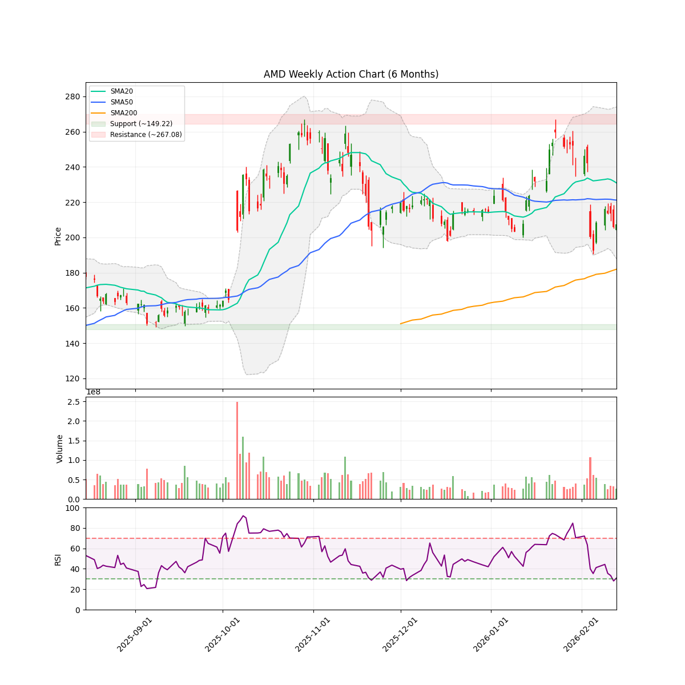
#### 研报分析

### 技术指标概览 (Technical Overview)
- **当前价格**: $207.32
- **RSI (14)**: 30.99
- **移动平均线**: SMA20: $230.89 | SMA50: $221.14 | SMA200: $181.95 (Bullish)
- **波动率**: ATR (14): 14.66 (预计周度波动: +/- $32.79)
- **关键位 (6m)**: 支撑位 $149.22 | 阻力位 $267.08
- **即时状态**: Below SMA50

# 情绪审计报告：AMD (Advanced Micro Devices)
**日期：** 2026年02月17日
**职位：** 对冲基金研究员 (叙事经济学专家)

---

### 1. 催化剂分类 (Catalyst Categorization)

基于近期新闻流和市场反馈，我们将 AMD 的驱动因素分为以下三个等级：

*   **A-Tier (核心催化剂):**
    *   **Q4 业绩超预期：** 营收 $103亿，EPS $1.53，均超过市场预期。
    *   **数据中心爆发：** 数据中心收入增长 39% 至 $54亿，显示 AI 基础设施需求依然强劲 ([Seeking Alpha](https://seekingalpha.com/article/4868890-amd-inflection-is-here))。
*   **B-Tier (行业与指引催化剂):**
    *   **2026年展望：** 尽管 Q1 指引略显保守 ($98亿)，但分析师认为 2026 年是“去风险化”的 AI 复合增长年 ([Seeking Alpha](https://seekingalpha.com/article/4868297-amd-a-de-risked-ai-compounder))。
    *   **AI 拐点论：** 市场开始确认 AMD 在 AI 基础设施中的二号位稳定性。
*   **C-Tier (噪音与次要因素):**
    *   **AMDY 收益分配：** 关于 YieldMax ETF 55% 收益率的讨论，属于衍生品市场噪音 ([Yahoo Finance](https://finance.yahoo.com/news/really-55-yield-yieldmax-amd-184630804.html))。
    *   **短期情绪波动：** 2月12日无利空跌落 3%，被视为市场风险偏好转移 ([Invezz](https://invezz.com/news/2026/02/12/amd-stock-tumbles-3-analysts-say-market-is-missing-this-key-catalyst/))。

---

### 2. 背离检测 (Divergence Detection)

**当前状态：显著的“好消息下跌” (Good News Drop)**

*   **现象：** AMD 在公布了超预期的 Q4 财报后，股价反而出现了 8%-12% 的剧烈回撤 ([Blockonomi](https://blockonomi.com/amd-stock-investors-dump-shares-despite-earnings-beat-heres-why/))。
*   **叙事诊断：** 这并非基本面恶化，而是**“叙事陷阱”**。市场对 AI 的预期已达到“完美定价”，任何关于 Q1 指引的微小瑕疵（$98亿 vs 激进预期的差距）都会被放大为抛售理由。
*   **空头竭尽迹象：** RSI 目前处于 **30.99**，已进入技术性超卖区间。股价跌破 SMA20 ($230.89) 和 SMA50 ($221.14)，正在向 SMA200 ($181.95) 寻求长线支撑。这表明短期投机筹码正在出清，空头力量可能接近竭尽。

---

### 3. 情绪评分 (Sentiment Score)

**得分：4.5 / 10 (中性偏悲观 - 处于洗盘阶段)**

*   **逻辑：** 尽管 A-Tier 催化剂证明了公司赚钱能力，但市场叙事已从“无脑买入 AI”转向“挑剔软件缺口与规模挑战” ([Blockonomi 反馈分析师质疑](https://blockonomi.com/amd-stock-why-this-analyst-remains-skeptical-of-ai-strategy/))。目前股价处于下行惯性中，需要时间消化高估值。

---

### 4. 账户持仓诊断

*   **正股 (600股):** 成本 $220.54，当前 $207.32，浮亏 **-6.00%**。
    *   *诊断：* 价格处于 SMA50 以下，短期趋势承压。但考虑到 RSI 超卖，此时割肉风险较大。
*   **期权 (-1.0 AMD260313C230):** 备兑呼叫期权 (Covered Call) 表现优异，盈利 **+39.80%**。
    *   *诊断：* 这笔操作成功对冲了股价下跌的部分损失。随着标的价格远离 $230 的行权价，该期权的时间价值正在加速衰减。

---

### 5. 关键日期与建议

*   **下一个重大日期：** **2026年3月13日** (期权到期日)。
*   **策略建议：**
    *   鉴于 RSI 指向超卖，且股价接近 6 个月低点支撑 ($149 尚远，但在 $200 整数关口有心理支撑)，建议继续持有正股并利用 Covered Call 降低成本。
    *   密切关注 **2026年4月下旬** 的 Q1 财报预告，那是下一个扭转叙事的关键节点。

---
**结论：** AMD 当前正处于“利好出尽”后的叙事修复期。虽然技术面破位，但基本面（数据中心增长）未见系统性失败，属于典型的**机构洗盘陷阱**而非系统性崩溃。
#### 近期新闻与事件
- **[Yahoo Finance]** [Can You Really Get 55% Yield from the YieldMax AMD Option Income Strategy ETF (AMDY)?](https://finance.yahoo.com/news/really-55-yield-yieldmax-amd-184630804.html)
- **[Blockonomi]** [AMD Stock: Why This Analyst Remains Skeptical of AI Strategy](https://blockonomi.com/amd-stock-why-this-analyst-remains-skeptical-of-ai-strategy/)
- **[Seeking Alpha]** [AMD's Inflection Is Here](https://seekingalpha.com/article/4868890-amd-inflection-is-here)
- **[Seeking Alpha]** [AMD: A De-Risked AI Compounder](https://seekingalpha.com/article/4868297-amd-a-de-risked-ai-compounder)
- **[Invezz]** [AMD stock tumbles 3%: analysts say market is missing this key catalyst](https://invezz.com/news/2026/02/12/amd-stock-tumbles-3-analysts-say-market-is-missing-this-key-catalyst/)

---

### GOOGL
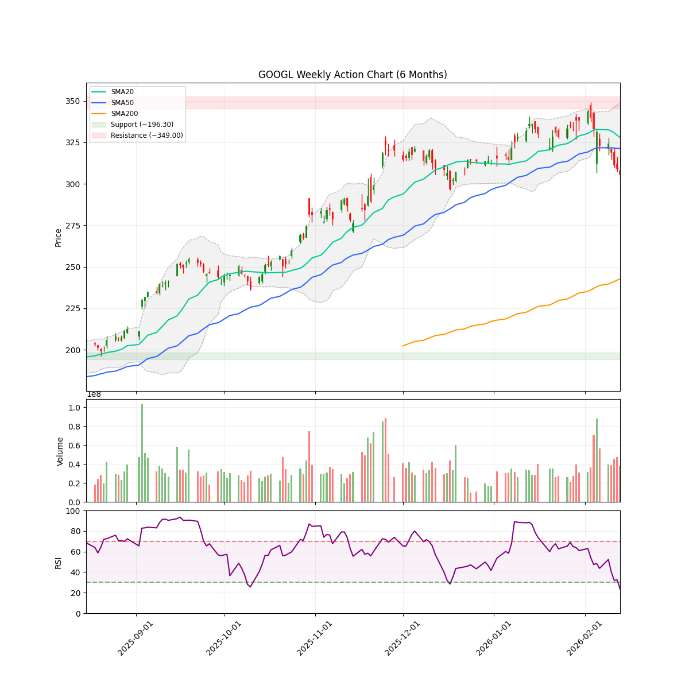
#### 研报分析

### 技术指标概览 (Technical Overview)
- **当前价格**: $305.72
- **RSI (14)**: 23.43
- **移动平均线**: SMA20: $327.90 | SMA50: $321.21 | SMA200: $242.65 (Bullish)
- **波动率**: ATR (14): 10.93 (预计周度波动: +/- $24.44)
- **关键位 (6m)**: 支撑位 $196.30 | 阻力位 $349.00
- **即时状态**: Below SMA50

# 谷歌 (GOOGL) 情绪审计报告

**报告日期：** 2026年02月17日
**研究员：** 叙事经济学分析助理 (Narrative Economics Associate)

---

### 1. 催化剂分类 (Catalyst Categorization)

基于近期新闻流与市场叙事，我们将驱动因素分为以下三个层级：

*   **A-Tier (核心驱动力):**
    *   **业绩基本面强劲：** 2025年Q4财报显示营收增长18%，特别是**云业务 (Google Cloud) 激增48%**。这表明谷歌在AI基础设施领域的变现能力已进入爆发期。 [引用: Seeking Alpha]
    *   **战略合作潜力：** Gemini 与苹果 (Apple) 的整合叙事依然是长期估值重估的关键催化剂。
*   **B-Tier (行业与宏观叙事):**
    *   **分析师目标价支撑：** 尽管近期回调，主流分析师（如 24/7 Wall St.）仍给出 **$348** 的目标价，较当前价位有约 14% 的上行空间。 [引用: 24/7 Wall St.]
    *   **估值回归：** 在近期回调后，Simply Wall St 认为其估值在长期维度上具有吸引力。
*   **C-Tier (市场噪音/短期压力):**
    *   **AI 资本开支恐慌 (CapEx Debate)：** 市场对高昂的AI投入能否快速转化为现金流存在短期疑虑，导致股价近期出现 2%-5% 的波动。 [引用: Invezz]
    *   **中立评级干扰：** 部分机构（如 Monness）维持中立态度，抑制了短期的追涨热情。

---

### 2. 背离检测 (Divergence Detection)

**当前状态：典型的“看跌衰竭” (Bearish Exhaustion)**

*   **基本面 vs. 股价背离：** 谷歌云业务增长 48% 且整体营收增长 18%（A-Tier 消息），但股价却处于下跌通道中。
*   **技术指标极端：** RSI 仅为 **23.43**，处于严重超卖区间。股价虽跌破 SMA50 ($321.21)，但远高于 SMA200 ($242.65) 的牛熊分界线。
*   **结论：** 目前的下跌并非由公司基本面恶化引起，而是市场在经历快速上涨后的“利润回吐”以及对AI投资回报周期的“过度担忧”。这种“好消息叠加股价下跌”的情况，预示着一个潜在的**中线买点**或**机构洗盘陷阱**。

---

### 3. 情绪逻辑评分 (Logic Score)

#### **评分：6.8 / 10**

*   **得分逻辑：**
    *   **(+3.0)** 强劲的云业务增长与AI领先地位（基本面底座）。
    *   **(+2.0)** RSI 极度超卖，技术面存在强烈的反弹需求。
    *   **(-1.5)** 跌破短期均线 (SMA20/50)，短期技术趋势偏空。
    *   **(+1.3)** 用户的持仓成本 ($262.26) 具有极高的安全垫，目前仍有 16.57% 的利润，心理优势明显。

**总结：** 并非系统性崩溃 (Systemic Failure)，而是一个受宏观叙事压制的**上涨趋势回调 (Healthy Pullback)**。

---

### 4. 账户头寸诊断与行动建议

*   **当前头寸：** 139股 @ $262.26
*   **盈亏状态：** +16.57% (盈利保护中)
*   **诊断：** 股价目前在 $305 附近，距离 SMA200 ($242.65) 仍有空间，但在 6个月低点 ($196.30) 之上。由于 RSI 已处于冰点，**此时割肉或大幅减仓是不明智的。**

**行动建议：**
1.  **持有 (Hold)：** 利用现有的 16% 盈利空间作为缓冲，分摊波动。
2.  **关注支撑：** 关注 $290-$300 心理关口的支撑力度。

---

### 5. 关键日期提醒 (Next Major Date)

*   **下一次财报发布 (预计):** **2026年4月28日** (Q1 2026 Earnings)
*   **事件说明：** 该日期将直接回应市场关于“AI资本开支转化为利润速度”的质疑，是决定谷歌能否突破 $350 阻力的核心转折点。

---

**参考资料链接：**
- [24/7 Wall St. - $348 Target](https://247wallst.com/investing/2026/02/16/analysts-set-348-target-for-google-after-february-dip/)
- [Seeking Alpha - Q4 Growth Details](https://seekingalpha.com/article/4868075-alphabet-stock-is-down-but-not-for-long)
- [Invezz - Near-term Risks](https://invezz.com/news/2026/02/17/alphabet-stock-declines-2-as-wall-street-flags-near-term-risks/)
#### 近期新闻与事件
- **[24/7 Wall St.]** [Analysts Set $348 Target for Google After February Dip](https://247wallst.com/investing/2026/02/16/analysts-set-348-target-for-google-after-february-dip/)
- **[Insider Monkey]** [Monness Maintains Neutral Stance on Alphabet Inc. (GOOGL) Stock](https://finance.yahoo.com/news/monness-maintains-neutral-stance-alphabet-123339990.html)
- **[Motley Fool]** [Should You Buy D-Wave Quantum Stock Before Earnings?](https://finance.yahoo.com/news/buy-d-wave-quantum-stock-125700937.html)
- **[Simply Wall St.]** [Alphabet (GOOGL) Valuation Check After Short-Term Pullback And Strong Multi-Year...](https://finance.yahoo.com/news/alphabet-googl-valuation-check-short-020555098.html)
- **[Motley Fool]** [3 Stocks to Double Up on Right Now](https://finance.yahoo.com/news/3-stocks-double-now-092000693.html)

---

### VST
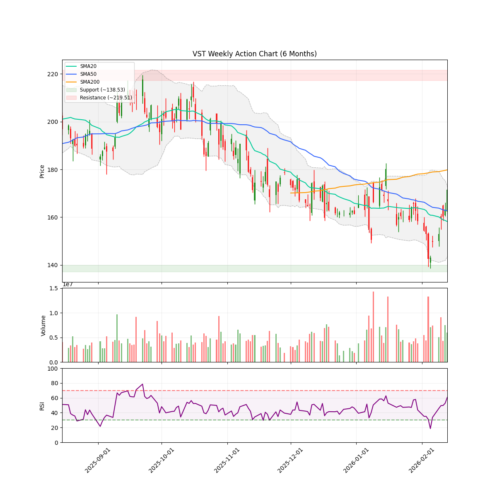
#### 研报分析

### 技术指标概览 (Technical Overview)
- **当前价格**: $171.49
- **RSI (14)**: 60.76
- **移动平均线**: SMA20: $158.17 | SMA50: $162.84 | SMA200: $179.81 (Bearish)
- **波动率**: ATR (14): 7.79 (预计周度波动: +/- $17.42)
- **关键位 (6m)**: 支撑位 $138.53 | 阻力位 $219.51
- **即时状态**: Above SMA50

# 情绪审计报告：Vistra Corp. (VST)
**致：** 投资委员会
**担任职位：** 对冲基金研究员（叙事经济学方向）
**日期：** 2026年02月17日

---

## 1. 催化剂分类 (Catalyst Categorization)

根据“叙事经济学”框架，我们将影响 VST 的新闻分为三个层级，以评估其增长的持续性：

*   **A-Tier（核心驱动力）：机构重磅上调与目标价锚定**
    *   **Jefferies 评级上调（2026-02-10/14）：** 分析师 Julien Dumoulin-Smith 将 VST 从“持有”上调至“买入”，并将目标价上调至 $203。
    *   **高盛（Goldman Sachs）看涨更新：** 超过 90% 的分析师持看涨态度，共识目标价集中在 $227-$232 之间。
    *   **逻辑：** 这种顶尖机构的集体背书为股价提供了坚实的“地板”，并引导了市场的估值逻辑从传统公用事业向“AI 基础设施”转型。

*   **B-Tier（行业叙事）：AI 电力需求扩张**
    *   **AI Power Play（2026-02-17）：** 市场正深度消化 AI 数据中心对电力的爆发式需求。VST 作为标杆企业，其叙事已从“能源供应”演变为“AI 时代的军火商”。

*   **C-Tier（短期噪音）：期权异动与行业横向对比**
    *   **异常期权活动（2026-02-06）：** 虽有大单流入，但在财报前属于常规投机行为。
    *   **与 PSEG 的对比：** 属于板块轮动中的日常比稿，对长期叙事影响有限。

---

## 2. 背离检测 (Divergence Detection)

*   **价格与新闻的一致性：** 近期（2月10日后）利好频传（Jefferies 上调），股价从 $162 左右稳步回升至 $171.49，这表明**市场正在积极吸收利好**，尚未出现“利好出尽”的疲态或熊气竭尽的背离。
*   **技术面阻力：** 尽管股价已站上 SMA20 ($158.17) 和 SMA50 ($162.84)，但仍低于 **SMA200 ($179.81)**。这意味着长线趋势仍处于修复期。
*   **结论：** 目前处于“良性反弹”阶段。若股价触及 $180 (SMA200) 时出现放量滞涨，则需警惕短期“叙事陷阱”。

---

## 3. 情绪评分 (Logic Score)

### **评分：7.8 / 10**

**评分逻辑：**
*   **加分项 (+2.0)：** 顶级投行（高盛、Jefferies）的强力加持，提供了极高的叙事可信度。
*   **加分项 (+1.5)：** AI 电力需求的宏观叙事具有长期可持续性，非短期泡沫。
*   **减分项 (-0.7)：** 股价仍受制于 200 日均线 ($179.81) 的技术压制，且 RSI (60.76) 接近超买区。
*   **持仓反馈：** 用户当前的正股成本 ($157.38) 和卖出的 Put ($145) 均处于极佳的安全垫位置。

---

## 4. 仓位策略诊断

*   **当前头寸分析：**
    *   **正股 (100股)：** 盈利 +8.96%，成本价低于目前所有短期均线，建议继续持有。
    *   **空头看跌期权 (-VST260227P145)：** 盈利 +73.30%。该期权将于财报后到期，目前行权价 ($145) 远低于 6 个月低点 ($138.53) 附近的强支撑位，风险极低。
*   **风险提示：** ATR 为 7.79，每周波动区间约 $17.42。由于财报临近，波动率（IV）可能攀升。

---

## 5. 关键事件节点 (Next Major Date)

*   **下一次重大事件：财报发布会**
*   **预计日期：2026年2月26日** (根据 2月6日新闻提到的“20天后”推算)。
*   **注：** 您的期权持仓 VST260227P145 将在财报发布后的次日到期，届时 IV 崩塌（IV Crush）将加速您的期权权利金归零，对空头头寸有利。

---

**引述新闻来源：**
1. [Jefferies Upgrades Vistra - 2026-02-14](https://www.msn.com/en-us/money/topstocks/vistra-corp-vst-upgraded-by-jefferies-following-improved-riskreward-profile/ar-AA1WkuWj)
2. [Goldman Sachs Bullish Update - 2026-02-11](https://www.msn.com/en-us/money/markets/analyst-sentiment-on-vistra-vst-remains-strong-following-goldman-sachs-bullish-update/ar-AA1W9Kd9)
3. [AI Power Play Narrative - 2026-02-17](https://rickorford.com/vistra-stock-the-ai-power-play-wall-street-is-betting-on/)
#### 近期新闻与事件
- **[RickOrford.com]** [Vistra Stock: The AI Power Play Wall Street Is Betting On](https://rickorford.com/vistra-stock-the-ai-power-play-wall-street-is-betting-on/)
- **[Insider Monkey]** [Vistra Corp. (VST) Upgraded by Jefferies Following Improved Risk/Reward Profile](https://www.msn.com/en-us/money/topstocks/vistra-corp-vst-upgraded-by-jefferies-following-improved-riskreward-profile/ar-AA1WkuWj)
- **[Yahoo Finance]** [Assessing Vistra (VST) Valuation After Choppy Returns And A Rich Earnings Multiple](https://finance.yahoo.com/news/assessing-vistra-vst-valuation-choppy-161159598.html)
- **[Fintel]** [Jefferies upgrades Vistra (VST)](https://www.msn.com/en-us/money/top-stocks/jefferies-upgrades-vistra-vst/ar-AA1W6FRf)
- **[Insider Monkey]** [Analyst Sentiment on Vistra (VST) Remains Strong Following Goldman Sachs' Bullish Update](https://www.msn.com/en-us/money/markets/analyst-sentiment-on-vistra-vst-remains-strong-following-goldman-sachs-bullish-update/ar-AA1W9Kd9)

---

## 🔍 观察池机会分析

### AMAT
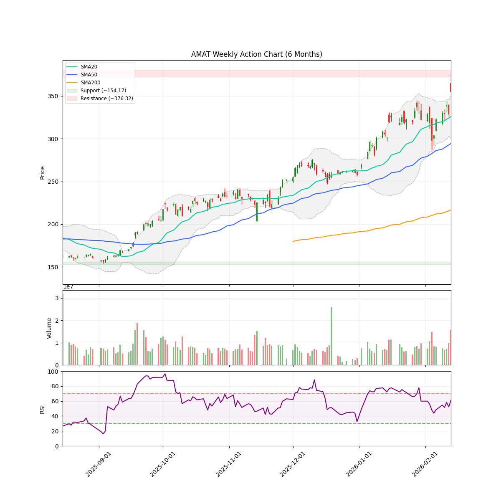
#### 研报分析

### 技术指标概览 (Technical Overview)
- **当前价格**: $354.91
- **RSI (14)**: 61.00
- **移动平均线**: SMA20: $325.91 | SMA50: $294.43 | SMA200: $216.60 (Bullish)
- **波动率**: ATR (14): 19.86 (预计周度波动: +/- $44.40)
- **关键位 (6m)**: 支撑位 $154.17 | 阻力位 $376.32
- **即时状态**: Above SMA50

# 应用材料 (AMAT) 情绪审计报告
**报告日期：** 2026年02月17日
**分析师：** 对冲基金研究员 (叙事经济学方向)

---

### 1. 催化剂分类 (Catalyst Categorization)

根据“叙事经济学”框架，我们将近期消息分为三个层级，以评估趋势的可持续性：

*   **A-Tier (核心驱动力 - 极强)：**
    *   **超预期的Q1财报：** 实际营收达70.1亿美元，超过分析师预期的68.9亿美元。同时，公司对下一季度的指引（EPS $2.44-$2.84）表现强劲，直接证实了半导体资本支出（WFE）的高景气度。
    *   **机构重磅上调目标价：** TD Cowen 将其目标价从 $315 暴力上调至 $450。这种大幅度的目标价调整通常意味着机构对AI长期基础设施需求的逻辑发生了本质性转变。
*   **B-Tier (行业协同 - 强)：**
    *   **AI 叙事溢价：** 被 Insider Monkey 等媒体列为 AI 领域的关键观察股。作为晶圆制造设备的领导者，AMAT 处于 AI 浪潮的最上游。
*   **C-Tier (噪音与次要因素)：**
    *   **Lynx Equity 的谨慎报告：** 财报前夕的看空声音已被随后的利好财报完全消化，目前视为市场洗盘的噪音。

---

### 2. 背离检测 (Divergence Detection)

*   **价格与新闻一致性：** 市场目前处于**“利好确认”**阶段。股票在强劲财报发布后“飙升”（Soars），并未出现“利好出尽”的下跌。
*   **技术面配合：** 当前价格 ($354.91) 远高于 SMA50 ($294.43) 和 SMA200 ($216.60)，呈现完美的牛市排列。
*   **背离结论：** **未发现看跌背离。** RSI 为 61，处于强势区但尚未进入超买极端（>70），这表明目前的上涨是由基本面（盈利能力）支撑的，而非单纯的投机情绪泡沫。

---

### 3. 情绪评分 (Sentiment Score): 8.8 / 10

**逻辑说明：**
*   **+3.0:** 财报营收与指引双双超预期，证明了业绩的“硬度”。
*   **+2.5:** TD Cowen 的 $450 目标价提供了巨大的叙事空间（较当前价仍有约 26% 的上涨空间）。
*   **+2.0:** AI 基础设施建设从“共识”转为“订单实证”。
*   **+1.5:** 技术指标健康，支撑位上移，下行压力较小。
*   **-0.2:** 财报后的初始涨幅已部分计价，短期需警惕 ATR (14) 指示的波动性。

---

### 4. 关键证据引用 (Evidence Citations)

*   **财报表现：** "The maker of chipmaking equipment posted revenue of $7.01 billion in the period, which also topped Street forecasts." — [KHOU (2026-02-12)](https://www.khou.com/article/syndication/associatedpress/applied-materials-fiscal-q1-earnings-snapshot/616-5ed0cfeb-ce8e-4927-a46f-2387d0ff5a80)
*   **机构上调：** "TD Cowen has raised its price target on Applied Materials... to $450.00 from $315.00." — [Investing.com (2026-02-13)](https://www.investing.com/news/analyst-ratings/applied-materials-stock-price-target-raised-to-450-from-315-at-td-cowen-93CH-4506000)
*   **市场反应：** "Applied Materials’s (NASDAQ:AMAT) Q4 Sales Top Estimates, Stock Soars." — [StockStory (2026-02-12)](https://finance.yahoo.com/news/applied-materials-nasdaq-amat-q4-211007322.html)

---

### 5. 下一个重大时间点 (Next Major Date)

**预计日期：2026年5月14日 (Q2 财报发布)**
*注：基于其季度发布周期，AMAT 通常在 5 月中旬公布其第二财季（截至4月）的业绩。届时市场将重点关注其针对 AI 芯片先进制程设备的订单转化率。*

---

### 总结
AMAT 目前正处于由**“业绩实证”**驱动的可持续牛市周期中。$450 的机构目标价已为市场画好了新的蓝图。只要 RSI 不在短期内突破 80 且价格维持在 SMA20 ($325.91) 之上，任何回调均应视为增持机会，而非“陷阱”。
#### 近期新闻与事件
- **[Insider Monkey]** [Applied Materials (AMAT) Seen Winning Whether WFE Growth Is Market- or...](https://finance.yahoo.com/news/applied-materials-amat-seen-winning-120135930.html)
- **[Investing.com]** [Applied Materials stock price target raised to $450 from $315 at TD Cowen By...](https://www.investing.com/news/analyst-ratings/applied-materials-stock-price-target-raised-to-450-from-315-at-td-cowen-93CH-4506000)
- **[Investing.com]** [Applied Materials stock falls ahead of earnings as Lynx sounds caution By...](https://uk.investing.com/news/stock-market-news/applied-materials-stock-falls-ahead-of-earnings-as-lynx-sounds-caution-93CH-4504194)
- **[StockStory]** [Applied Materials’s (NASDAQ:AMAT) Q4 Sales Top Estimates, Stock Soars](https://finance.yahoo.com/news/applied-materials-nasdaq-amat-q4-211007322.html)
- **[Barchart]** [Applied Materials Q1 Earnings Preview: Can AMAT Stock Maintain Momentum?](https://finance.yahoo.com/news/applied-materials-q1-earnings-preview-194319699.html)

---

### AMZN
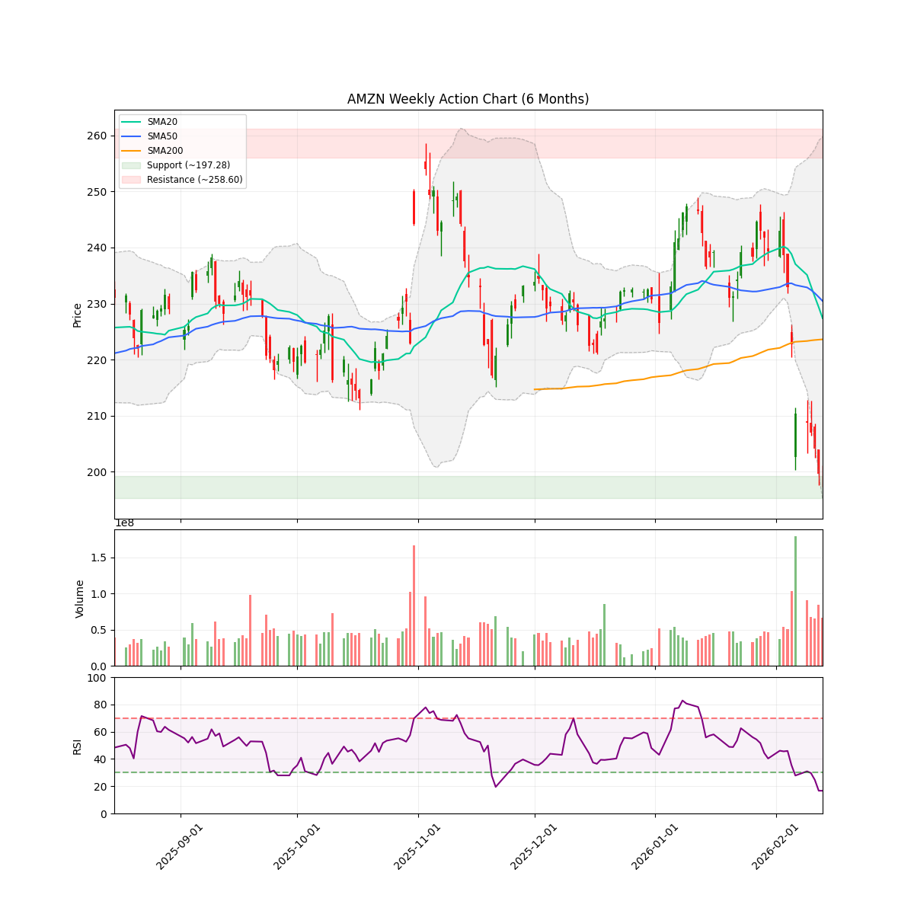
#### 研报分析

### 技术指标概览 (Technical Overview)
- **当前价格**: $198.79
- **RSI (14)**: 16.68
- **移动平均线**: SMA20: $227.39 | SMA50: $230.46 | SMA200: $223.62 (Bullish)
- **波动率**: ATR (14): 8.40 (预计周度波动: +/- $18.78)
- **关键位 (6m)**: 支撑位 $197.28 | 阻力位 $258.60
- **即时状态**: Below SMA50

# 亚马逊 (AMZN) 情绪审计报告

**日期：** 2026-02-17
**研究员：** 叙事经济学（Narrative Economics）分析小组
**标的：** AMZN (Amazon.com, Inc.)
**当前价格：** $198.79

---

### 1. 催化剂分类 (Catalyst Categorization)

| 级别 | 驱动事件 | 详细描述 |
| :--- | :--- | :--- |
| **A-Tier (核心)** | **Q4 财报后效应/盈利预告** | 虽然 Blockonomi 和 Seeking Alpha 在 2 月初对财报持乐观预期（预期 EPS $1.97），但当前价格（$198.79）远低于财报前的 $230-$240 区间，显示市场对财报后的指引或增长空间存在严重分歧。 |
| **B-Tier (行业)** | **AWS 与 AI 云计算地位** | [Insider Monkey] 确认亚马逊仍是 14 强云计算股票之一。AI 基础设施的长期叙事依然稳固，但短期被宏观情绪掩盖。 |
| **C-Tier (杂讯)** | **高管减持与媒体背书** | CEO Herrington 减持 $208k [Investing.com] 属于常规操作，金额极小，无实质负面意义。Jim Cramer 的“绝对信任” [Insider Monkey] 通常被视为散户情绪指标，对机构逻辑驱动较小。 |

---

### 2. 背离检测 (Divergence Detection)

**核心观察：极度看跌的情绪与基本面叙事的背离。**

*   **技术性衰竭：** RSI 指标目前处于 **16.68** 的极端超卖区域。通常 RSI 低于 30 即为超卖，低于 20 则意味着短期抛售压力已达到非理性的顶峰（Bearish Exhaustion）。
*   **价格与均线背离：** 股价 ($198.79) 不仅远低于 SMA50 ($230.46)，甚至跌破了 SMA200 ($223.62)。这种“破位”通常预示着中期趋势转弱，但结合 RSI 来看，更像是一个**情绪陷阱 (Trap)**，诱导散户在底部割肉。
*   **叙事背离：** 媒体（Motley Fool, Seeking Alpha）仍在发布“加倍买入”、“价值低估”的报告，但市场价格却在持续刷新 6 个月低点 ($197.28)。这表明机构资金可能正在利用高波动率进行筹码清洗，或者正在重新定价 AWS 的长期利润率。

---

### 3. 情绪审计与逻辑评分

#### **情绪分数: 2.5/10 (恐慌/系统性抛售)**
*   **解释：** 市场目前处于极度恐慌状态。RSI 16.68 说明卖盘已经出尽，目前的叙事充满了对“增长见顶”的担忧，即便利好新闻（如云业务排名）也无法提振股价。

#### **逻辑评分 (Logic Score): 8.5/10 (反弹潜力)**
*   **依据：** 
    1.  **支撑位精准：** 股价正处于 6 个月低点支持位 $197.28 上方不到 1 刀的位置。
    2.  **估值吸引力：** 正如 [Seeking Alpha] 提到，AMZN 的前瞻 PEG 为 1.9x，在“七巨头”中处于折价状态。
    3.  **波动率机会：** ATR (8.40) 显示波动剧烈，配合周波动范围预测 (+/- 18.78)，一旦触底反弹，空间巨大。

---

### 4. 结论与建议

**审计结论：目前处于“多头陷阱”后的“空头过度抛售”阶段。**
当前的抛售已脱离了基本面叙事（AWS 依然强劲），更多是受财报后技术面破位引发的连锁清算。考虑到 RSI 的极端读数和 6 个月支撑位的临近，这是一个典型的**反转候选标的**。

*   **识别风险：** 若跌破 $197.28 且无快速拉回，则趋势转向“系统性失效”。
*   **引用文献：**
    *   [Seeking Alpha: AMZN 估值折价分析](https://seekingalpha.com/article/4865014-amazon-stock-is-cheap-heading-into-q4-earnings)
    *   [Forbes: 关于“逢低买入”的价值博弈分析](https://www.forbes.com/sites/greatspeculations/2026/02/09/buy-the-dip-in-amazon-stock/)

---

### 5. 下一关键日期 (Next Major Date)

*   **2026年4月下旬 (预计 2026-04-30 左右)：** **2026 财年第一季度 (Q1) 财报发布。**
*   **短期关注点：** 本周是否能守住 $197.28 的关键心理防线。
#### 近期新闻与事件
- **[Insider Monkey]** [Is Amazon.com, Inc. (AMZN) One of the 14 Best Cloud Computing Stocks to Buy...](https://finance.yahoo.com/news/amazon-com-inc-amzn-one-123516174.html)
- **[Motley Fool]** [3 Stocks to Double Up on Right Now](https://finance.yahoo.com/news/3-stocks-double-now-092000693.html)
- **[Investing.com]** [Amazon CEO Herrington sells $208k in AMZN stock By Investing.com](https://www.investing.com/news/insider-trading-news/amazon-ceo-herrington-sells-208k-in-amzn-stock-93CH-4507118)
- **[Insider Monkey]** [I Have “Total Faith” In Amazon.com (AMZN) CEO, Says Jim Cramer](https://finance.yahoo.com/news/total-faith-amazon-com-amzn-164958180.html)
- **[Motley Fool]** [The Smartest Growth Stock to Buy With $500 Right Now](https://finance.yahoo.com/news/smartest-growth-stock-buy-500-203500671.html)

---

### ANET
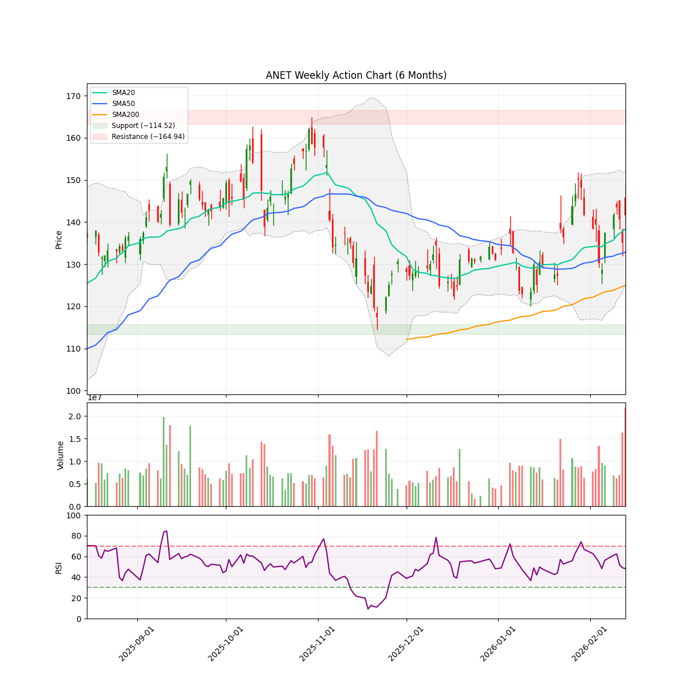
#### 研报分析

### 技术指标概览 (Technical Overview)
- **当前价格**: $141.59
- **RSI (14)**: 48.21
- **移动平均线**: SMA20: $138.33 | SMA50: $132.87 | SMA200: $125.05 (Bullish)
- **波动率**: ATR (14): 7.17 (预计周度波动: +/- $16.04)
- **关键位 (6m)**: 支撑位 $114.52 | 阻力位 $164.94
- **即时状态**: Above SMA50

# Arista Networks (ANET) 情绪审计报告

**致：** 投资委员会
**日期：** 2026年02月17日
**职位：** 对冲基金研究助理（叙事经济学方向）

---

### 1. 催化剂分类 (Categorize Catalysts)

根据“叙事经济学”框架，我们将 ANET 的近期驱动因素分类如下：

*   **A-Tier（核心动力）：**
    *   **Q4 2025 财报双超预期：** 2026年2月12日发布的财报显示，每股收益（EPS）为 $0.82（预期 $0.76），营收 $24.9亿，均超预期。[Investing.com](https://www.investing.com/news/earnings/arista-networks-earnings-beat-by-006-revenue-topped-estimates-4503999)
    *   **强劲的前瞻指引：** 公司发布的 Q1 销售指引高于市场一致预期，显示出超大规模云服务商（Hyperscalers）对 AI 网络基础设施的持续强劲需求。[Benzinga via MSN](https://www.msn.com/en-us/money/news/arista-stock-surges-after-q4-beat-q1-sales-outlook-tops-estimates/ar-AA1Wihxv?ocid=BingNewsVerp)

*   **B-Tier（行业共振）：**
    *   **AI 基础设施扩容潮：** 2026年被视为 AI 股票的“重置年”，超大规模厂商的资本支出（Capex）依然处于爆发期，这为 ANET 提供了持续的市场溢价空间。[IBD via MSN](https://www.msn.com/en-us/technology/artificial-intelligence/ai-stocks-reset-in-2026-amid-software-reckoning-hyperscaler-capex-boom/ar-AA1Wwhip?ocid=BingNewsVerp)
    *   **分析师积极评价：** 华尔街顶尖分析师在财报后维持或上调了 ANET 的长期看好评级。[Insider Monkey](https://finance.yahoo.com/news/arista-networks-inc-anet-strengthens-150618247.html)

*   **C-Tier（市场噪音）：**
    *   **纳斯达克短期波动：** 2月15日纳指因宏观因素波动下跌50点，对 ANET 造成的股价压力属于系统性噪音，而非公司基本面恶化。

---

### 2. 背离检测 (Divergence Detection)

**分析：**
*   **价格与基本面：** 财报数据（A-Tier）极其强劲，股价在2月13日出现跳空上涨（Surge）。目前股价（141.59）高于 SMA20 (138.33) 和 SMA50 (132.87)，处于健康的上升通道。
*   **心理背离：** 虽然 IBD 提到 2026 年是 AI 的“重置年”，导致部分 AI 软件股回调，但 ANET 作为“卖铲子的人”（硬件网络设备），其财报后的价格走势证明了它正处于“避险性进攻”地位。
*   **技术指标提示：** RSI 处于 **48.21**，这是一个非常耐人寻味的数据。尽管财报利好且股价高于均线，但 RSI 并未进入超买区（>70），甚至低于中轴。这表明**利好消息已被市场理性消化，并没有引发散户式的盲目狂热**。
*   **结论：** 并非“多头陷阱”。RSI 的中性状态配合股价稳居均线上方，暗示这是一个**可持续的趋势**，而非估值泡沫的顶端。

---

### 3. 情绪评分 (Sentiment Score)

#### **逻辑评分：8.5/10**

*   **评分理由：** 
    *   (+3.0) 扎实的 Q4 财报表现与超预期的 Q1 指引（确定性极高）。
    *   (+2.5) 处于 AI 叙事的核心圈层（以太网交换机替代 InfiniBand 的潜在逻辑）。
    *   (+2.0) 技术形态呈现完美的看涨排列（SMA20 > SMA50 > SMA200）。
    *   (+1.0) 市场情绪处于“理性繁荣”，无明显的超买风险。
    *   (-1.0) 宏观背景下纳斯达克波动的系统性风险。
    *   (-1.0) 市场对 AI 资本支出能否持续转为利润的长期质疑（虽然短期内利好 ANET）。

---

### 4. 下一个关键日期 (Next Major Date)

*   **关键日期：2026年2月25日**
*   **事件：NVIDIA (NVDA) 财报发布**
*   **逻辑：** 作为 AI 行业的领头羊，英伟达对 AI 基础设施需求的评论将直接定义 ANET 在接下来一个月的叙事走向。若英伟达确认 AI 算力需求无放缓迹象，ANET 有望挑战 6 个月高点 $164.94。

---

### 5. 投资建议（叙事经济学视角）

ANET 目前正处于从“单纯的云网络供应商”向“AI 骨干网络垄断者”叙事转化的中后期。目前的 RSI 中性状态为机构资金提供了二次入场的“舒适区”。

**操作建议：** 利用 ATR (7.17) 进行波动管理，在 SMA20 (138.33) 附近逢低关注，目标位指向 $160 以上，止损位参考 $125 (SMA200) 的支撑强度。

---
**报告人：** 叙事经济学研究组
**状态：** **看多 (Bullish)**
#### 近期新闻与事件
- **[Insider Monkey on MSN]** [Arista Networks Inc (ANET) Strengthens Position in AI Networking](https://www.msn.com/en-us/money/topstocks/arista-networks-inc-anet-strengthens-position-in-ai-networking/ar-AA1WswIN?ocid=BingNewsVerp)
- **[Yahoo Finance Canada]** [Arista Networks, Inc. (ANET) Stock Forecasts](https://ca.finance.yahoo.com/research/reports/MS_0P0001354B_AnalystReport_1771019242000)
- **[Benzinga on MSN]** [5 stocks in the spotlight: Wall Street's most accurate analysts weigh in](https://www.msn.com/en-us/money/news/5-stocks-in-the-spotlight-wall-street-s-most-accurate-analysts-weigh-in/ar-AA1Ww546?ocid=BingNewsVerp)
- **[Investor's Business Daily on MSN]** [AI stocks reset in 2026 amid software reckoning, hyperscaler capex boom](https://www.msn.com/en-us/technology/artificial-intelligence/ai-stocks-reset-in-2026-amid-software-reckoning-hyperscaler-capex-boom/ar-AA1Wwhip?ocid=BingNewsVerp)
- **[Insider Monkey]** [Arista Networks Inc (ANET) Strengthens Position in AI Networking](https://finance.yahoo.com/news/arista-networks-inc-anet-strengthens-150618247.html)

---

### ASML
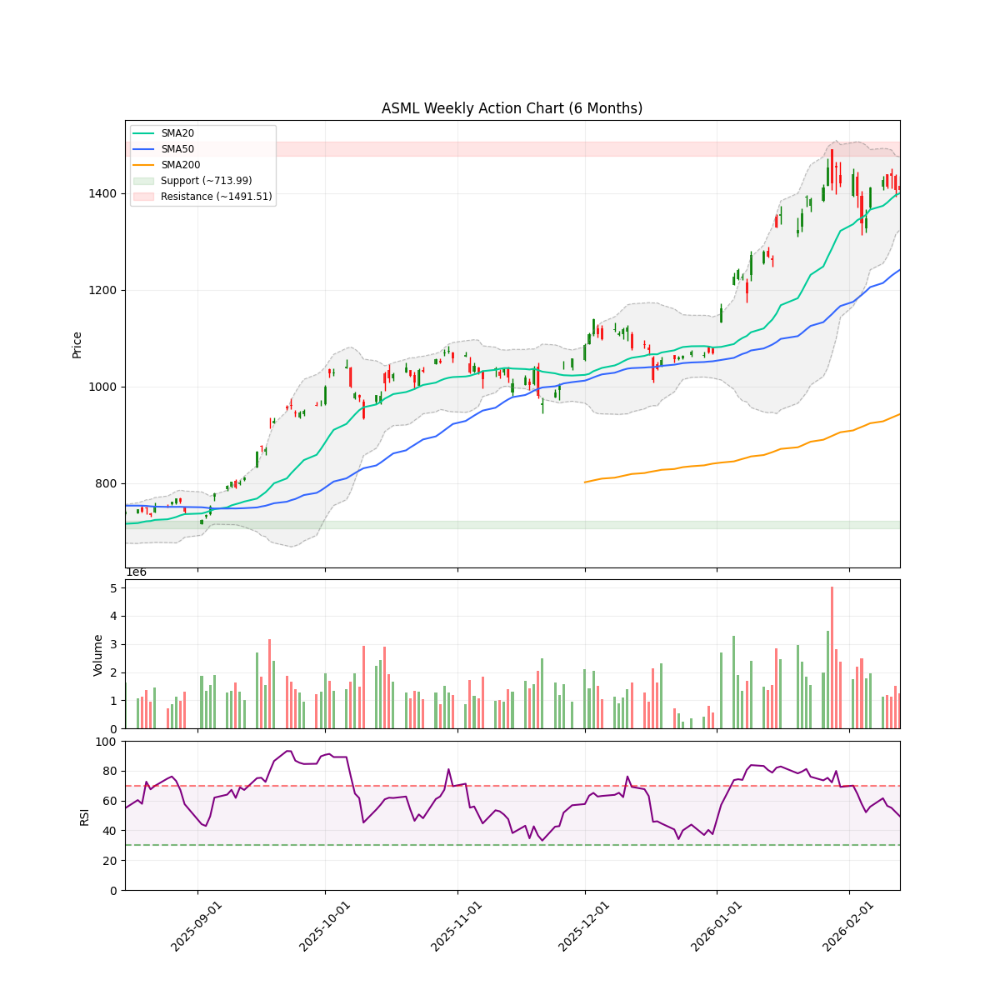
#### 研报分析

### 技术指标概览 (Technical Overview)
- **当前价格**: $1406.61
- **RSI (14)**: 49.41
- **移动平均线**: SMA20: $1400.01 | SMA50: $1241.48 | SMA200: $942.54 (Bullish)
- **波动率**: ATR (14): 55.92 (预计周度波动: +/- $125.05)
- **关键位 (6m)**: 支撑位 $713.99 | 阻力位 $1491.51
- **即时状态**: Above SMA50

# ASML 情绪审计报告：叙事经济学与趋势可持续性评估

**报告日期：** 2026年02月17日
**分析师：** 对冲基金研究助理（叙事经济学组）
**标的：** ASML Holding N.V. (ASML)

---

### 1. 催化剂分类 (Catalyst Categorization)

我们将当前的驱动因素按影响力权重分为三个等级，以评估上涨动能的质量：

*   **A-Tier（核心基本面与机构背书）：**
    *   **机构目标价大幅上调：** Bernstein 和 RBC Capital 上调 ASML 目标价，Morgan Stanley 预测其 2027 年利润将较 2025 年翻倍。这代表了长线机构资金的深度认可。 [来源: Insider Monkey](https://finance.yahoo.com/news/bernstein-rbc-capital-raise-asml-124147459.html)
    *   **强劲的订单积压 (Backlog)：** 388亿欧元的订单储备为 2026 年的增长提供了极高的能见度，这是典型的“硬核”利好。 [来源: Zacks](https://finance.yahoo.com/news/asml-climbs-11-month-time-151600663.html)
*   **B-Tier（行业 beta 与周期叙事）：**
    *   **AI 驱动的 EUV 需求：** 随着 AI 芯片扩产，极紫外光刻机 (EUV) 的需求被视为结构性机会。
    *   **月度动量：** 近一个月股价上涨 11%，反映了市场资金正在向半导体上游设备集中。
*   **C-Tier（散户情绪与噪音）：**
    *   **预测 2000 美元目标价：** Motley Fool 等媒体的煽动性预测（如“改变一生”的买入机会），通常代表零售端情绪已接近亢奋点。 [来源: Motley Fool](https://finance.yahoo.com/news/prediction-asmls-stock-price-hit-173500976.html)

---

### 2. 背离检测 (Divergence Detection)

**技术面与叙事面的冲突观察：**
*   **现象：** 尽管华尔街分析师密集发布看涨预测（目标价看至 $2,000），但 ASML 的 **RSI 目前仅为 49.41**，处于中性区间。
*   **分析：** 股价目前位于 1406.61，极其贴近 **SMA20 (1400.01)**。这表明在经历了一轮上涨后，市场进入了盘整期。
*   **潜在利空叙事：** Seeking Alpha 指出“周期性低谷可能刚刚开始”，重点担忧中国市场销售下滑及高估值下的执行风险。 [来源: Seeking Alpha](https://seekingalpha.com/article/4867437-asml-the-cyclical-downturn-is-just-beginning)
*   **结论：** 市场尚未出现“利好出尽”的暴跌，但也未盲目追随媒体的高调看涨。目前的横盘震荡消化了部分过热情绪，属于健康的上涨中继。

---

### 3. 逻辑评分 (Logic Score): 8.5/10

**评分理由：**
*   **(+) 叙事深度 (Narrative Depth)：** ASML 拥有全球唯一的 EUV 供应能力，其“AI 基础设施底座”的叙事极其坚固，难以被替代。
*   **(+) 财务确定性：** 388亿欧元的订单积压是抵御宏观波动的重要护城河。
*   **(-) 估值风险：** Seeking Alpha 提到的高估值溢价是现实存在的，且中国市场的地缘政治限制是该股最大的黑天鹅变量。
*   **核心结论：** 这是一个由**强基本面驱动**而非单纯由散户热钱驱动的趋势，陷阱风险较低，但短期存在技术性回调至 SMA50 (1241.48) 的可能性。

---

### 4. 关键新闻链接引用

1.  **Bernstein & RBC 调升目标价:** [点击查看](https://finance.yahoo.com/news/bernstein-rbc-capital-raise-asml-124147459.html)
2.  **388亿欧元订单积压分析:** [点击查看](https://finance.yahoo.com/news/asml-climbs-11-month-time-151600663.html)
3.  **Morgan Stanley 70% 涨幅预测:** [点击查看](https://www.aol.com/articles/prediction-asml-stock-could-surge-164400827.html)
4.  **看空观点（周期下行论）:** [点击查看](https://seekingalpha.com/article/4867437-asml-the-cyclical-downturn-is-just-beginning)

---

### 5. 下一个重大日期 (Next Major Date)

**预计日期：2026年4月中旬（2026年第一季度财报发布日）**

*   **关注重点：** 届时将验证 2026 年所谓“过渡年”后的爆发性增长是否在订单数据中得到进一步体现，以及高管对中国出口限制的最新评论。

---
**风险提示：** 尽管情绪偏向乐观，但若股价有效跌破 SMA20 (1400.01)，则可能回测支撑位 1241.48，投资者应关注该关键位的防守。
#### 近期新闻与事件
- **[Motley Fool]** [Prediction: ASML's Stock Price Will Hit $2,000 by This Time](https://finance.yahoo.com/news/prediction-asmls-stock-price-hit-173500976.html)
- **[Zacks]** [ASML Climbs 11% in a Month: Time to Buy, Sell or Hold the Stock?](https://finance.yahoo.com/news/asml-climbs-11-month-time-151600663.html)
- **[Motley Fool]** [Bold Prediction: ASML Is About to Soar. Here's Why.](https://finance.yahoo.com/news/bold-prediction-asml-soar-heres-170213852.html)
- **[Insider Monkey]** [Bernstein and RBC Capital Raise ASML Price Targets](https://finance.yahoo.com/news/bernstein-rbc-capital-raise-asml-124147459.html)
- **[The Motley Fool]** [Could Buying ASML Stock Today Set You Up for Life?](https://www.fool.com/investing/2026/02/13/could-buying-asml-stock-today-set-you-up-for-life/)

---

### AVGO
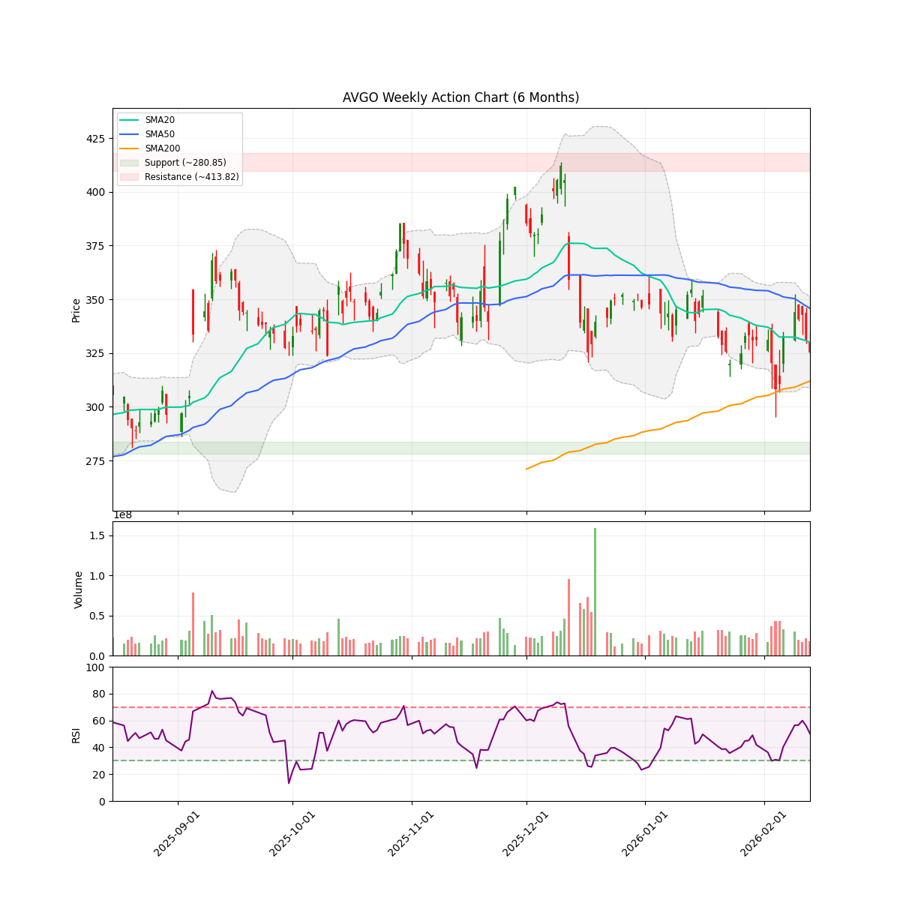
#### 研报分析

### 技术指标概览 (Technical Overview)
- **当前价格**: $325.17
- **RSI (14)**: 50.17
- **移动平均线**: SMA20: $329.90 | SMA50: $345.77 | SMA200: $311.98 (Bullish)
- **波动率**: ATR (14): 16.31 (预计周度波动: +/- $36.47)
- **关键位 (6m)**: 支撑位 $280.85 | 阻力位 $413.82
- **即时状态**: Below SMA50

# 情绪审计报告：博通 (AVGO)
**日期：** 2026年02月17日
**职位：** 对冲基金研究员（叙事经济学专家）

---

### 1. 催化剂分类 (Catalyst Categorization)

基于当前新闻流，我们将 AVGO 的驱动因素分为以下三个等级：

*   **A-Tier (核心基本面/高影响)**
    *   **业绩超预期预期 (Double Beat)：** [Seeking Alpha](https://seekingalpha.com/article/4870172-broadcom-stock-expect-another-double-beating-earnings-preview) 指出市场高度确信 AVGO 将在即将到来的财报中实现收益与营收的双重超预期。
    *   **定制 AI 芯片需求暴增：** [Forbes](https://www.forbes.com/sites/greatspeculations/2026/02/13/heres-how-avgo-stock-could-rise-to-450/) 强调了亚马逊 (Amazon) 等超大规模云计算巨头增加 AI 基础设施资本支出，AVGO 作为定制 AI 芯片供应商直接受益。
*   **B-Tier (机构情绪/行业趋势)**
    *   **分析师持续看好：** [Yahoo Finance](https://finance.yahoo.com/news/wall-street-analysts-bullish-broadcom-100618979.html) 报道称分析师对 AVGO 的长期前景维持强力看涨，且其 2026 年至今的表现（+5.2%）优于标普 500 指数。
    *   **宏观科技股抛售潮：** [Investopedia](https://www.investopedia.com/stock-market-today-s-and-p-500-dow-jones-02172026-11907626) 提到因通胀担忧，科技股在 2 月中旬整体承压，这属于外部性负面影响。
*   **C-Tier (噪声/小信号)**
    *   **估值担忧：** [Insider Monkey](https://finance.yahoo.com/news/broadcom-avgo-ai-role-acknowledged-115725887.html) 提到虽然 AI 角色被认可，但短期估值可能过高。
    *   **媒体提及：** Jim Cramer 在节目中讨论 AVGO，通常视为市场情绪的滞后指标。

---

### 2. 背离检测 (Divergence Detection)

**分析：**
目前 AVGO 表现出明显的**“基本面走强与价格短期疲软”的背离**。
*   **利好：** 亚马逊增加资本支出、财报“双超”预期、AI 基础设施需求明确。
*   **现实：** 股价 ($325.17) 目前低于 SMA20 ($329.90) 和 SMA50 ($345.77)，且 Zacks 报告显示其跌幅超过大盘。

**结论：** 这不是“熊市竭尽”，而是一个由宏观通胀担忧驱动的**技术面回调**。由于 RSI 处于 50.17 的中性位置，且价格仍高于 SMA200 ($311.98)，这更有可能是一个**机构洗盘陷阱**，而非趋势反转。

---

### 3. 情绪评分 (Sentiment Score)

**分值：6.8 / 10**

*   **逻辑：** 叙事逻辑极其强大（AI 硬件的核心供应节点），但短期内受到宏观流动性收紧和估值回归的压制。市场正在等待财报确认，以支撑 Forbes 提到的 $450 目标价。

---

### 4. 逻辑评分 (Logic Score)

**分值：8.5 / 10**

*   **依据：** AVGO 的业务增长逻辑具有高度确定性。作为超大规模云服务商（Hyperscalers）定制芯片的唯一替代方案，其业绩与 AI 资本支出高度正相关。目前的下跌更多是由于市场情绪而非公司基本面恶化。

---

### 5. 关键日期与技术支撑 (Next Major Date & Levels)

*   **下一个重大日期：** **2026年3月初**（预计 2026 第一财季财报发布日）。
*   **关键技术位：**
    *   **强支撑：** $311.98 (SMA200) - 若跌破此位，叙事将发生动摇。
    *   **阻力位：** $345.77 (SMA50) - 突破此位意味着回调结束，重回牛市轨道。

---

**审计总结：**
AVGO 目前正处于“业绩公告前”的震荡期。新闻周期释放的是 A 级利好，但技术面受制于大盘。对于坚定的叙事投资者而言，SMA200 附近的跌幅提供了良好的介入点，但需警惕财报前 macro（通胀数据）带来的波动风险。
#### 近期新闻与事件
- **[Insider Monkey]** [Broadcom’s (AVGO) AI Role Acknowledged, But Valuation Concerns Remain](https://finance.yahoo.com/news/broadcom-avgo-ai-role-acknowledged-115725887.html)
- **[Investopedia]** [Stock Market Today: Tech Stocks Lead Indexes Lower To Start Week of Inflation,...](https://www.investopedia.com/stock-market-today-s-and-p-500-dow-jones-02172026-11907626)
- **[Insider Monkey]** [Jim Cramer Discusses Broadcom (AVGO) Stock](https://finance.yahoo.com/news/jim-cramer-discusses-broadcom-avgo-151357096.html)
- **[Zacks]** [Broadcom Inc. (AVGO) Dips More Than Broader Market: What You Should Know](https://finance.yahoo.com/news/broadcom-inc-avgo-dips-more-224503496.html)
- **[Barchart]** [Are Wall Street Analysts Bullish on Broadcom Stock?](https://finance.yahoo.com/news/wall-street-analysts-bullish-broadcom-100618979.html)

---

### CEG
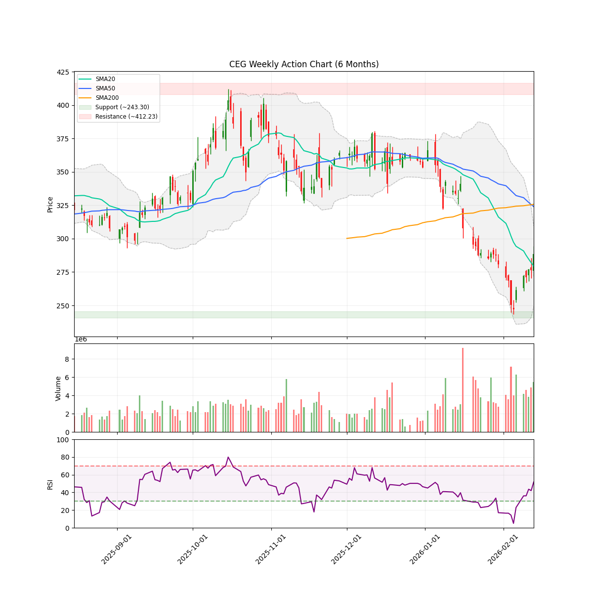
#### 研报分析

### 技术指标概览 (Technical Overview)
- **当前价格**: $288.43
- **RSI (14)**: 51.75
- **移动平均线**: SMA20: $279.35 | SMA50: $323.98 | SMA200: $325.74 (Bearish)
- **波动率**: ATR (14): 12.81 (预计周度波动: +/- $28.64)
- **关键位 (6m)**: 支撑位 $243.30 | 阻力位 $412.23
- **即时状态**: Below SMA50

# 情绪审计报告：Constellation Energy (CEG)
**致：** 投资委员会
**职位：** 对冲基金研究员（叙事经济学专家）
**日期：** 2026年02月17日

---

### 1. 催化剂分类 (Categorize Catalysts)

*   **A-Tier（核心催化剂）：**
    *   **Q4 财报发布：** 2026年2月17日当周发布财报。Zacks 预测其盈利将超预期（Earnings ESP +3.13%），这对正处于技术性调整的股价至关重要。[参考：Zacks, 2026-02-12]
    *   **AI 能源叙事溢价：** 核心叙事逻辑在于 AI 数据中心对核能的长期刚需。虽然近期市场对 AI 产生疲劳感（AI Disruption Fears），但 CEG 的核电资产具有稀缺性。[参考：Reuters, 2026-02-17]

*   **B-Tier（行业与板块影响）：**
    *   **电力公用事业板块轮动：** 随着财报季进入尾声，公用事业板块的现金流稳定性开始吸引避险资金。[参考：Yahoo Finance, 2026-02-17]

*   **C-Tier（市场噪音/常规变动）：**
    *   **内部分析师评级：** Zacks 将其列为“强力增长股”，这更多是基于量化指标的常规更新，而非基本面重大突变。[参考：MSN, 2026-02-11]

---

### 2. 背离检测 (Divergence Detection)

*   **看跌详述：** 尽管市场预期盈利超预期（Zacks），但 CEG 的股价表现出明显的**技术性弱势**。目前价格（288.43）远低于 SMA50 (323.98) 和 SMA200 (325.74)。
*   **背离现象：** 在 1 月份市场上涨时，CEG 反而下跌 2.38%，显示出与大盘的负相关性 [参考：Nasdaq, 2026-01-22]。
*   **结论：** 存在“利好不涨”的背离。这表明市场对 CEG 之前的过高估值（412.23 高点）正在进行去杠杆和去泡沫化。目前的 RSI 为 51.75，处于中性，尚未达到“看跌竭尽”的极端超卖状态。

---

### 3. 情绪评分 (Sentiment Score)

#### **逻辑评分：5.5 / 10**
*(评分标准：0-系统性崩溃；10-无可阻挡的牛市周期)*

**评分逻辑：**
*   **叙事吸引力 (7/10)：** 作为核能领军者，其 AI 能源供应的长期叙事依然完整。
*   **技术面压力 (3/10)：** 长期趋势线（SMA200）的失守是重大的技术破坏，需要一个强力的“A-Tier”财报才能扭转趋势。
*   **市场情绪 (5/10)：** 投资者目前处于“观望盈利”状态，$290 以下的吸筹意愿正在增加，但缺乏追高动力。

---

### 4. 关键日期与技术支撑 (Next Major Date)

*   **下一个重大日期：** **2026年02月17日/18日** (当前正在进行的财报发布及电话会议)。
*   **关键点位：**
    *   **支撑位：** 243.30（6个月低点/强力支撑）。
    *   **阻力位：** 323.98（SMA50，需站稳此线才能宣告熊市趋势结束）。

---

### 5. 叙事总结：是“机会”还是“陷阱”？

目前的 CEG 呈现出**“叙事稳固但动量匮乏”**的特征。
*   **如果** 财报指引中明确提到了新的数据中心供电合同（A-Tier 确认），那么 290 美元以下将是一个坚实的**底部区域**。
*   **如果** 财报仅仅是微弱达标而指引平平，在 SMA50/200 的重压下，目前的震荡可能演变为**“价值陷阱”**，股价或将下探 243.30 的 6 个月支撑位。

**操作建议：** 在今日财报后的分析师电话会议明确其“2026年资本支出计划”后再行介入。目前维持“中立偏谨慎”立场。
#### 近期新闻与事件
- **[Yahoo Finance]** [Stock market today: Nasdaq, S&P 500 slide to kick off shortened week with AI...](https://finance.yahoo.com/news/live/stock-market-today-nasdaq-sp-500-slide-to-kick-off-shortened-week-with-ai-fears-in-focus-143417547.html)
- **[Motley Fool]** [Should You Buy Constellation Energy Stock While It's Below $290?](https://finance.yahoo.com/news/buy-constellation-energy-stock-while-012800497.html)
- **[Zacks]** [Constellation Energy Corporation (CEG) Expected to Beat Earnings Estimates: Can...](https://finance.yahoo.com/news/constellation-energy-corporation-ceg-expected-150006923.html)
- **[Zacks]** [Constellation to Post Q4 Earnings: What's in Store for the Stock?](https://www.zacks.com/stock/news/2863275/constellation-to-post-q4-earnings-whats-in-store-for-the-stock)
- **[Reuters]** [US stock futures slip on persistent AI disruption fears](https://www.reuters.com/sustainability/sustainable-finance-reporting/us-stock-futures-slip-persistent-ai-disruption-fears-2026-02-17/)

---

### ETN
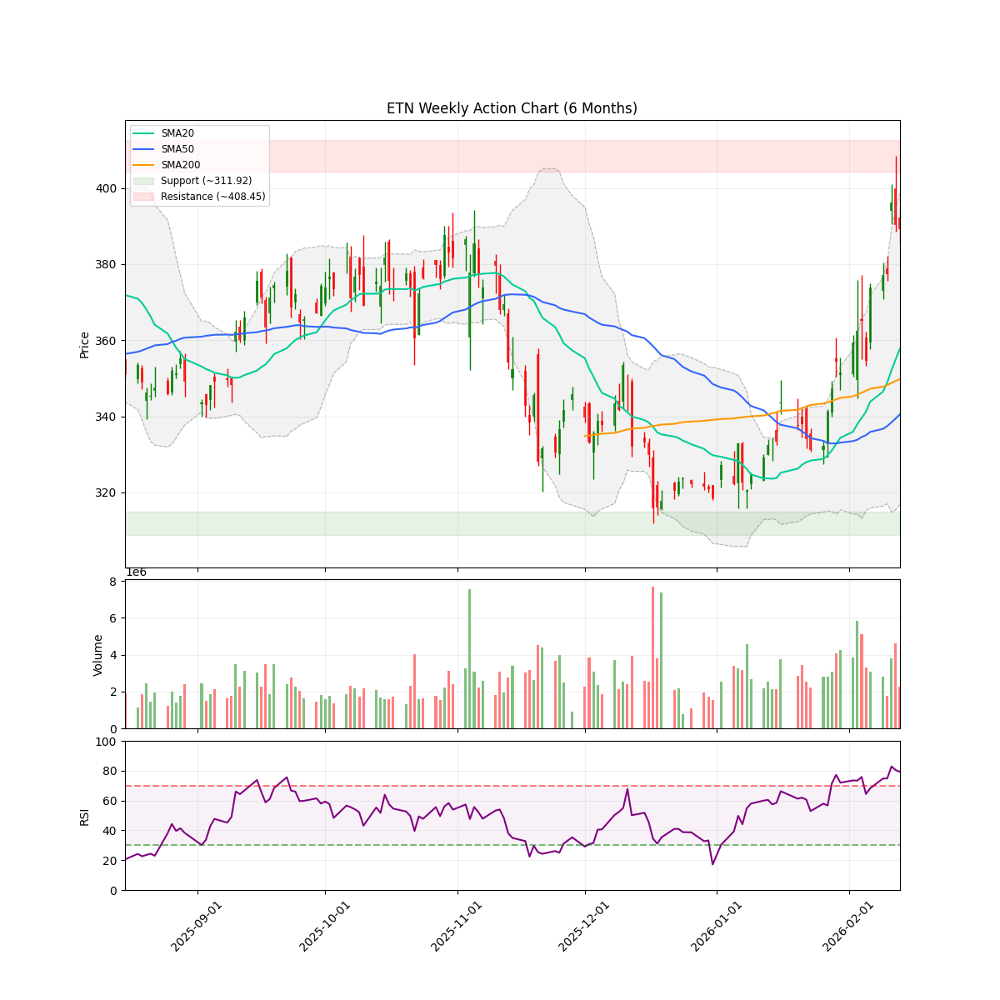
#### 研报分析

### 技术指标概览 (Technical Overview)
- **当前价格**: $389.25
- **RSI (14)**: 79.30
- **移动平均线**: SMA20: $357.84 | SMA50: $340.58 | SMA200: $349.81 (Bearish)
- **波动率**: ATR (14): 14.93 (预计周度波动: +/- $33.39)
- **关键位 (6m)**: 支撑位 $311.92 | 阻力位 $408.45
- **即时状态**: Above SMA50

# 伊顿公司 (ETN) 情绪审计报告

**致：** 投资委员会
**职位：** 叙事经济学研究员
**日期：** 2026年02月17日

---

### 1. 催化剂分级 (Catalyst Categorization)

*   **A-Tier (核心叙事推动者)：**
    *   **AI 基础设施溢价：** RBC Capital 将 ETN 定义为“被低估的 AI 受益股”，并强调其“业绩超越并上调指引 (Beat-and-Raise)”的潜力。这标志着 ETN 已从传统的工业股逻辑转向 AI 数据中心电力管理逻辑，这是当前市场最强大的叙事流。
    *   **业绩上调预期：** 尽管 2026 年指引初值审慎，但机构分析师普遍预期其在电力转换和配电领域的积压订单将推动超额收益。

*   **B-Tier (市场热度与共识)：**
    *   **Zacks 趋势关注：** 该股近期在各大金融平台搜索量激增，显示出强烈的散户与机构共识。
    *   **分析师一致看好：** Barchart 报告显示华尔街分析师情绪普遍乐观，市场正在重新定价其估值倍数。

*   **C-Tier (市场噪音)：**
    *   **Jim Cramer 背书：** Jim Cramer 在 2 月 15 日称其“仍可买入”。虽然提升了短期情绪，但在叙事经济学中，这通常被视为情绪过热的末端信号。

---

### 2. 背离检测 (Divergence Detection)

*   **技术面背离：** 当前股价 ($389.25) 远高于 SMA50 ($340.58) 和 SMA200 ($349.81)。
*   **超买警示：** **RSI 高达 79.30**，处于严重超买区域。虽然基本面（AI 需求）极为强劲，但技术面显示出“情绪溢价”过高。
*   **结论：** 尽管新闻流全是利好（Good News），但股价已计入了大部分预期。目前的趋势并非“利好下跌”的看跌耗尽，而是**“利好出尽”的潜在回调风险**。$408.45 的阻力位近在咫尺，当前价位追高的风险回报比（R/R）并不理想。

---

### 3. 情绪评分 (Sentiment Score)

#### **8.5 / 10**
**评价：** **强劲牛市循环，但伴随过热风险。**
ETN 正处于从“工业公用事业”向“AI 核心基础设施”转型的叙事高峰期。机构的“Beat-and-Raise”预期支撑了逻辑厚度，但 79.30 的 RSI 意味着短期内可能出现技术性回调（Trap）。

---

### 4. 逻辑诊断与建议

*   **叙事状态：** 可持续的结构性趋势。电力短缺和数据中心扩建是未来 2-3 年的长期逻辑，并非短期泡沫。
*   **潜在陷阱：** RSI 极高叠加 Cramer 的“散户动员”，可能导致短期内出现“追高者陷阱”。如果股价未能放量突破 $408.45 阻力位，可能会回测 SMA20 ($357.84) 寻找支撑。

---

### 5. 关键参考信息

*   **引用新闻：**
    *   *RBC Capital 关于 AI 潜力与业绩预期的分析 (2026-02-11)* [链接](https://finance.yahoo.com/news/rbc-capital-highlights-eaton-etn-180836005.html)
    *   *Zacks 趋势股分析 (2026-02-11)* [链接](https://www.msn.com/en-us/money/other/eaton-corporation-plc-etn-is-a-trending-stock-facts-to-know-before-betting-on-it/ar-AA1W8N3f)
*   **下个重大日期：** 
    *   **2026年5月初 (预计)**：2026年第一季度 (Q1) 财报发布日。这将是验证 RBC “业绩超越并上调”预期的第一个关键窗口。
    *   **近期关注：** 需观察股价在接近 $408.45 阻力位时的波动率变化。
#### 近期新闻与事件
- **[Insider Monkey]** [Eaton (ETN) is Still Buyable, Says Jim Cramer](https://www.msn.com/en-us/money/topstocks/eaton-etn-is-still-buyable-says-jim-cramer/ar-AA1WplWe)
- **[Zacks Investment Research]** [Eaton Corporation, PLC (ETN) is a trending stock: Facts to know before betting on it](https://www.msn.com/en-us/money/other/eaton-corporation-plc-etn-is-a-trending-stock-facts-to-know-before-betting-on-it/ar-AA1W8N3f)
- **[Barchart]** [Are Wall Street analysts bullish on Eaton stock?](https://www.msn.com/en-us/money/other/are-wall-street-analysts-bullish-on-eaton-stock/ar-AA1W9mV8)
- **[Insider Monkey]** [RBC Capital Highlights Eaton (ETN) Beat-and-Raise Potential Despite Conservative...](https://finance.yahoo.com/news/rbc-capital-highlights-eaton-etn-180836005.html)
- **[Zacks]** [Eaton Corporation, PLC (ETN) Is a Trending Stock: Facts to Know Before Betting...](https://finance.yahoo.com/news/eaton-corporation-plc-etn-trending-140003785.html)

---

### MSFT
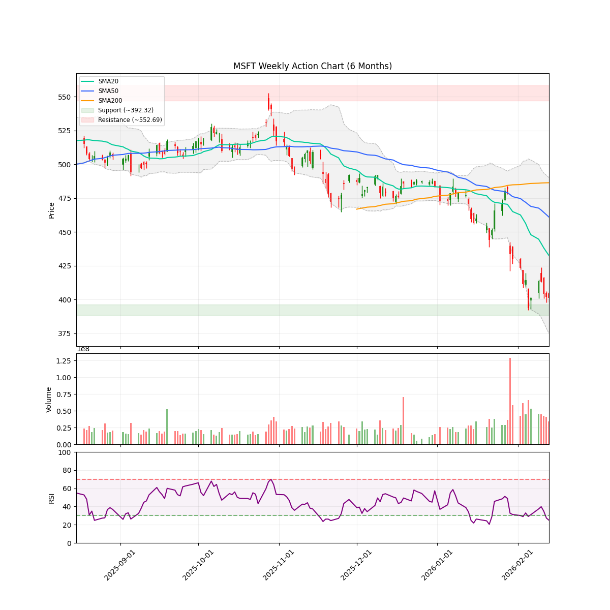
#### 研报分析

### 技术指标概览 (Technical Overview)
- **当前价格**: $401.32
- **RSI (14)**: 24.92
- **移动平均线**: SMA20: $432.49 | SMA50: $460.94 | SMA200: $486.37 (Bearish)
- **波动率**: ATR (14): 15.20 (预计周度波动: +/- $33.99)
- **关键位 (6m)**: 支撑位 $392.32 | 阻力位 $552.69
- **即时状态**: Below SMA50

# 微软 (MSFT) 情绪审计报告

**职位：** 对冲基金研究员 (叙事经济学方向)
**审计日期：** 2026年02月17日
**股票代码：** MSFT (微软)
**当前价格：** 401.32

---

### 1. 催化剂分类 (Catalyst Categorization)

| 等级 | 驱动因素 | 详细说明 |
| :--- | :--- | :--- |
| **A-Tier (核心)** | 财报后抛售与 AI 路线图 | 尽管有 6250 亿美元的积压订单和强劲的云增长，但财报后的抛售反映了市场对 45% OpenAI 风险敞口的重新评估。 [Seeking Alpha](https://seekingalpha.com/article/4867121-microsoft-post-earnings-sell-off-justified-but-the-stock-remains-a-buy) |
| **B-Tier (行业)** | 机构评级调整 | Melius Research 将评级从“买入”下调至“持有”，目标价下调至 430 美元，这在短期内抑制了机构回补意愿。 [Insider Monkey](https://www.msn.com/en-us/money/topstocks/melius-research-downgrades-microsoft-corporation-msft-stock-to-hold/ar-AA1WwgzR) |
| **C-Tier (杂讯)** | 媒体“抄底”言论 | Forbes 和 The Motley Fool 等媒体持续发布“估值便宜”和“极度买入”的言论，通常属于滞后的散户情绪引导。 [Forbes](https://www.forbes.com/sites/greatspeculations/2026/02/13/why-microsoft-stock-is-a-bargain-at-400/) |

---

### 2. 背离检测 (Divergence Detection)

**分析结论：看跌情绪衰竭 (Bearish Exhaustion)**

*   **价格 vs. 叙事背离：** 目前 MSFT 处于极度超卖状态（RSI 为 24.92），股价已跌破 SMA20、50 和 200 指数。然而，市场叙事（Narrative）依然高度集中在“长期 AI 领导地位”和“强劲的资本配置”。
*   **估值背离：** 卖方分析师的平均目标价为 596 美元（隐含 48% 的上涨空间），而实际股价却在 400 美元附近徘徊。
*   **逻辑诊断：** 当前并非“系统性失败”，而是**典型的财报后叙事重塑**。市场正在消化资本开支增加与 OpenAI 依赖风险，这种“坏消息中的好公司”表现，正接近 392.32 美元的 6 个月低位支撑点。

---

### 3. 情绪评分 (Sentiment Score)

#### **逻辑评分: 3.8 / 10**
*(注：0为系统性崩溃，10为无可阻挡的牛市循环)*

**评分依据：**
*   **短期 (Bearish):** 价格趋势完全受制于均线压制（低于 SMA50），且近期遭遇机构下调评级。
*   **中期 (Neutral):** 正在测试 6 个月支撑位 (392.32)，波动率 (ATR) 较大，暗示底部震荡尚未结束。
*   **长期 (Bullish):** 基本面积压订单 (Backlog) 依然庞大，AI 叙事并未证伪，仅是估值溢价的强制修正。

---

### 4. 关键新闻引用 (News Citations)

1.  **Melius Research 下调评级：** 2026年2月17日，评级由“买入”降至“持有”，目标价 430 美元。[URI](https://www.msn.com/en-us/money/topstocks/melius-research-downgrades-microsoft-corporation-msft-stock-to-hold/ar-AA1WwgzR)
2.  **财报后抛售分析：** 提到 6250 亿美元积压订单与 OpenAI 风险并存。[Seeking Alpha URI](https://seekingalpha.com/article/4867121-microsoft-post-earnings-sell-off-justified-but-the-stock-remains-a-buy)
3.  **分析师看涨共识：** 华尔街平均目标价指向 596 美元。[USA TODAY URI](https://www.usatoday.com/story/money/2026/02/16/buy-the-dip-in-microsoft-stock/88690494007/)

---

### 5. 下一个重大日期 (Next Major Date)

**预计下一个关键日期：2026年4月28日 (2026财年第三季度财报发布日)**
*   *注：此日期基于往年财报周期推算。市场届时将密切关注 AI 资本支出 (CapEx) 的转化率以及 Azure 增长是否能重新加速以匹配其估值。*

---

**研究员总结：** MSFT 目前正处于“多头陷阱”转“悲观过度”的过渡期。技术面显示极度超卖，400 美元心理关口及 392 美元的 6 个月低点是关键防线。建议等待 RSI 回出超卖区并站稳 SMA20 再行入场，短期内机构下调评级的负面惯性仍需消化。
#### 近期新闻与事件
- **[Forbes]** [Why Microsoft Stock Is A Bargain At $400](https://www.forbes.com/sites/greatspeculations/2026/02/13/why-microsoft-stock-is-a-bargain-at-400/)
- **[USA TODAY]** [Should you buy the dip in Microsoft stock?](https://www.usatoday.com/story/money/2026/02/16/buy-the-dip-in-microsoft-stock/88690494007/)
- **[Seeking Alpha]** [Microsoft: I Like This Price And I Like This Strategy More Than The Stock](https://seekingalpha.com/article/4870278-microsoft-i-like-this-price-and-i-like-this-strategy-more-than-the-stock)
- **[Insider Monkey]** [Melius Research downgrades Microsoft Corporation (MSFT) stock to hold](https://www.msn.com/en-us/money/topstocks/melius-research-downgrades-microsoft-corporation-msft-stock-to-hold/ar-AA1WwgzR)
- **[The Motley Fool]** [Investors Are Selling This AI Stock, but Is It Actually a Screaming Buy?](https://www.msn.com/en-us/money/topstocks/investors-are-selling-this-ai-stock-but-is-it-actually-a-screaming-buy/ar-AA1WtBvw)

---

### NVDA
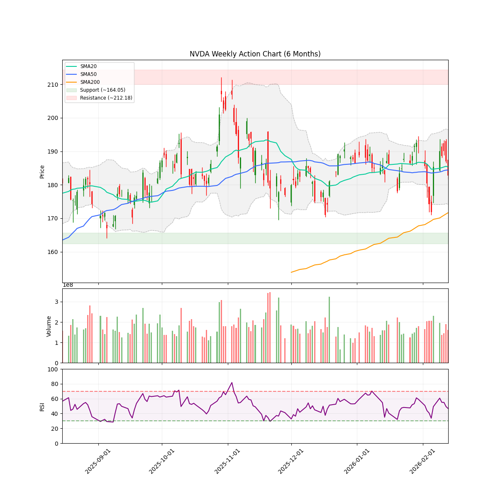
#### 研报分析

### 技术指标概览 (Technical Overview)
- **当前价格**: $182.81
- **RSI (14)**: 46.68
- **移动平均线**: SMA20: $185.30 | SMA50: $184.41 | SMA200: $171.66 (Bullish)
- **波动率**: ATR (14): 7.00 (预计周度波动: +/- $15.65)
- **关键位 (6m)**: 支撑位 $164.05 | 阻力位 $212.18
- **即时状态**: Below SMA50

# 情绪审计报告：NVIDIA (NVDA) - 叙事经济学分析

**日期：** 2026年2月17日
**分析师：** 对冲基金研究助理（叙事经济学专业）
**当前股价：** 182.81
**核心观点：** 市场正处于“叙事真空期”，强劲的基础设施支出与疲软的短期股价表现形成了鲜明的**背离**，2月25日的财报将是打破这一僵局的关键叙事转折点。

---

### 1. 催化剂分类 (Catalyst Categorization)

*   **A-Tier (核心催化剂)**
    *   **2月25日 2026财年第四季度财报：** 历史记录显示，英伟达在过去22个季度中有20次超出市场预期。Seeking Alpha分析指出，NVDA有望再次实现“双超”（营收与盈利均超预期），这是支撑股价重回上升通道的终极动力。 [参考链接: Seeking Alpha]
    *   **超大规模云服务商（Hyperscalers）支出爆发：** 尽管股价低迷，但科技巨头在AI基础设施上的投入高达7000亿美元，这构成了长期的需求底座。 [参考链接: 24/7 Wall St.]

*   **B-Tier (行业与机构催化剂)**
    *   **华尔街估值偏好：** 尽管Palantir等AI概念股抢夺眼球，但多数分析师仍认为NVDA处于低估区间，其AI生态系统和高毛利软件构成了稳固的竞争护城河。 [参考链接: Motley Fool]

*   **C-Tier (噪音与传闻)**
    *   **拆股传闻：** 市场上关于2026年拆股的讨论（类比2025年的ServiceNow和Netflix）属于短期情绪扰动，缺乏实质性财务支撑。 [参考链接: Motley Fool]
    *   **Zacks 趋势关注：** 属于技术性噪音，更多反映散户搜索量而非机构资金流向。 [参考链接: Zacks]

---

### 2. 背离检测 (Divergence Detection)

**分析结论：看跌竭尽 (Bearish Exhaustion) 与 叙事悖论**

目前存在显著的**“利好不涨”**现象：
*   **现象：** 科技巨头在AI领域的资本支出（CapEx）激增，但NVDA股价在过去六个月表现平平，涨幅远落后于费城半导体指数（PHLX Semiconductor Sector）39%的涨幅。 [参考链接: AOL]
*   **技术面背离：** 股价目前处于 SMA50 (184.41) 之下，RSI 为 46.68。这意味着市场已经消化了大部分乐观预期，短期内陷入了“AI支出是否能转化为实际收入增长”的疑虑中。
*   **诊断：** 这并非“系统性失效”，而是典型的**财报前洗盘**。当基本面（7000亿支出）与股价走势严重脱节时，往往意味着空头力量接近竭尽，市场正在等待财报这一催化剂来重新锚定估值。

---

### 3. 情绪评分 (Logic Score)

#### **评分：6.8 / 10**

*   **逻辑说明：** 
    *   **(+2.5) 极强的防御性：** 20/22次的财报超越记录提供了极高的胜率安全垫。
    *   **(+2.0) 宏观叙事支撑：** AI基建投入不仅没减少，反而呈现“气球式”扩张。
    *   **(-1.5) 技术面承压：** 股价处于短期均线下方，且RSI显示动能匮乏。
    *   **(-1.2) 叙事陷阱风险：** 市场对“AI泡沫”的讨论在股价横盘期间有所抬头，短期内若财报指引不及预期，可能触发补跌。

---

### 4. 下个关键日期 (Next Major Date)

**2026年2月25日**
*   **事件：** 第四季度财报发布。
*   **行动指南：** 关注公司对2027财年的业绩指引。如果指引能够确认那7000亿美元资本支出正转化为订单，股价有望突破212.18美元的阻力位并冲击300美元的中期目标。

---

**风险提示：** 虽然叙事经济学看好长期趋势，但由于目前股价位于SMA20和SMA50下方，短期震荡可能下探164.05美元支撑位。建议在财报发布前保持中性偏多头寸。
#### 近期新闻与事件
- **[Zacks]** [NVIDIA Corporation (NVDA) Is a Trending Stock: Facts to Know Before Betting on...](https://finance.yahoo.com/news/nvidia-corporation-nvda-trending-stock-140003503.html)
- **[Motley Fool]** [Nvidia Earnings on Feb. 25: What History Tells Us About Nvidia Stock's...](https://finance.yahoo.com/news/nvidia-earnings-feb-25-history-112000921.html)
- **[Motley Fool]** [Stock-Split Watch: Is Nvidia (NVDA) Next?](https://finance.yahoo.com/news/stock-split-watch-nvidia-nvda-233800149.html)
- **[Motley Fool]** [Palantir vs. Nvidia: Wall Street Says This Is the Best AI Stock to Buy Now](https://finance.yahoo.com/news/palantir-vs-nvidia-wall-street-083200496.html)
- **[AOL]** [Is Nvidia Stock Going to $300?](https://www.aol.com/articles/nvidia-stock-going-300-155000395.html)

---

### TSM
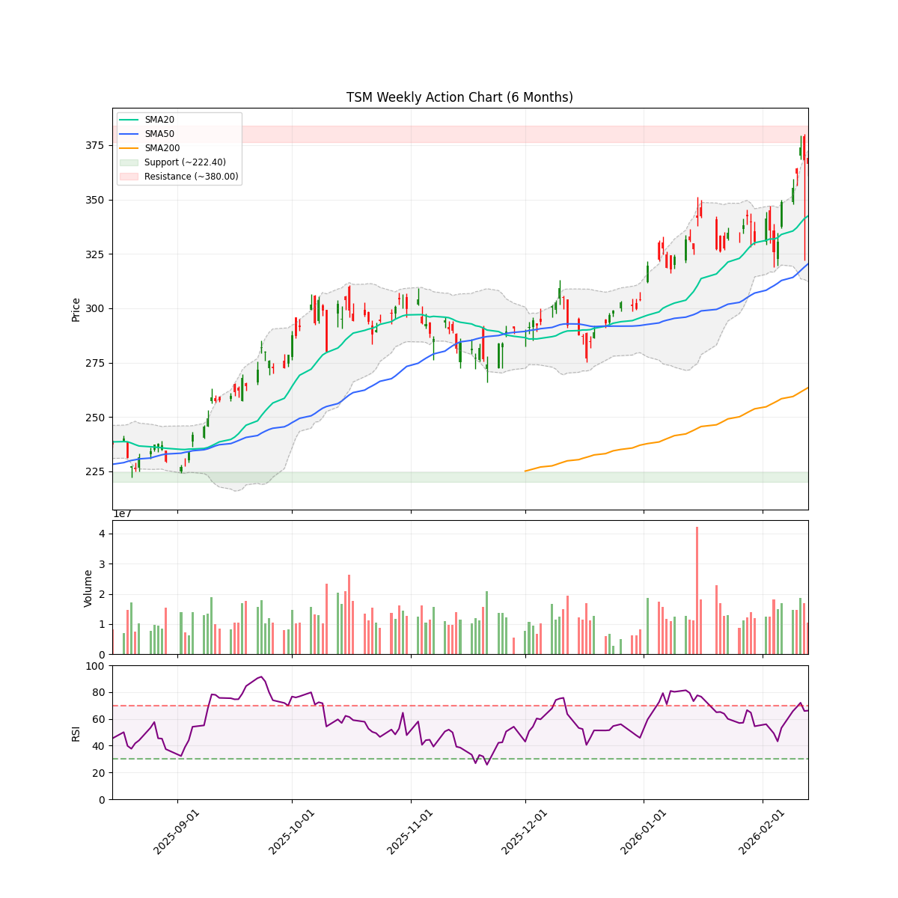
#### 研报分析

### 技术指标概览 (Technical Overview)
- **当前价格**: $366.36
- **RSI (14)**: 66.20
- **移动平均线**: SMA20: $342.48 | SMA50: $320.46 | SMA200: $263.53 (Bullish)
- **波动率**: ATR (14): 16.78 (预计周度波动: +/- $37.51)
- **关键位 (6m)**: 支撑位 $222.40 | 阻力位 $380.00
- **即时状态**: Above SMA50

# 情绪审计报告：台积电 (TSM)
**日期：** 2026年02月17日
**分析师：** 对冲基金研究助理（叙事经济学专业）

---

### 1. 催化剂分类 (Catalyst Categorization)

*   **A-Tier (核心驱动力)**
    *   **爆炸性业绩表现：** TSM 报告了创纪录的 1 月份销售额，显示出全球对人工智能 (AI) 硬件的需求依然极其强劲 ([Benzinga/MSN](https://www.msn.com/en-us/money/news/taiwan-semiconductor-stock-smashes-52-week-high-after-blowout-january-sales/ar-AA1W3auO?ocid=BingNewsVerp))。
    *   **机构重仓增持：** 乔治·索罗斯 (George Soros) 的量子基金在去年第四季度将其 TSM 持仓大幅增加了 **157%**，这提供了极强的机构背书 ([My Investing News](https://www.msn.com/en-us/money/top-stocks/9-stocks-george-soros-is-betting-his-fortune-on/ar-AA1WuE2j?ocid=BingNewsVerp))。
*   **B-Tier (行业协同)**
    *   **产能扩张叙事：** 持续的 AI 产能扩张计划支持了长期估值逻辑，尽管市场开始出现估值过高的质疑 ([Simply Wall St](https://finance.yahoo.com/news/tsmc-record-sales-ai-capacity-043132375.html))。
    *   **量化评级看涨：** Seeking Alpha 的量化评级对索罗斯的前几大持仓（包括 TSM）保持高度关注 ([Seeking Alpha](https://www.msn.com/en-us/money/topstocks/quant-ratings-on-soros-fund-management-s-top-holdings-amzn-googl-tsm-nvda/ar-AA1WsTVd?ocid=BingNewsVerp))。
*   **C-Tier (市场噪音)**
    *   **宏观情绪波动：** 2026年2月17日的通胀担忧导致科技股整体走低，这是系统性风险而非 TSM 基本面恶化 ([Investopedia](https://www.investopedia.com/stock-market-today-s-and-p-500-dow-jones-02172026-11907626))。

---

### 2. 背离检测 (Divergence Detection)

**分析：** 
目前存在明显的**基本面与宏观情绪的背离**。
*   **利好：** TSM 刚创下 52 周新高，且 1 月销售额大超预期。
*   **价格反应：** 当前价格 (366.36) 较近期阻力位 (380.00) 有所收敛。虽然今日（2月17日）科技板块因通胀预期整体走弱，但 TSM 的 RSI 为 66.20，处于强势区间但尚未进入“极端超买” (RSI > 70)。
*   **结论：** 属于**“强势休整”**。如果 TSM 在整体科技股下挫时能守住 SMA20 (342.48)，则说明看涨叙事（AI 基础设施需求）已完全覆盖了宏观利率担忧，这并非“陷阱”，而是健康的趋势回调。

---

### 3. 情绪评分 (Sentiment Score)

**得分：8.8 / 10**

**理由：**
*   **不可阻挡的叙事：** TSM 作为 AI 时代的“卖铲人”，其逻辑已从预期转向实际的营收爆发（1月创纪录销售）。
*   **筹码分布：** 索罗斯等顶级机构的大比例增持为股价提供了坚实的心理支撑位。
*   **技术形态：** 股价远高于 SMA50 和 SMA200，典型的多头排列。唯一的压制力来自于 380 附近的心理阻力位以及宏观通胀数据的短期干扰。

---

### 4. 逻辑评分 (Logic Score)

**得分：9.2 / 10**

**逻辑链：** 
AI 硬件支出 -> TSM 订单满载 -> 营收创纪录 -> 机构抢筹 -> 股价推高。
该逻辑目前具有极高的透明度和数据支撑，不属于纯粹的投机炒作。

---

### 5. 下一个关键日期 (Next Major Date)

*   **2026年3月10日左右：** 披露 2026年2月月度营收数据（将验证 1 月份的强劲增长是否具有持续性）。
*   **2026年4月中旬：** 2026年第一季度 (Q1) 正式财报发布会。

---

**研究建议：**
关注 **340-350** 区间的支撑力度。若回撤至此区间且缩量，则是理想的叙事介入点。由于 TSM 处于强势看涨周期，除非地缘政治或产能利用率出现系统性下滑，否则任何基于宏观担忧（如 CPI 数据）的下跌均为“黄金坑”。
#### 近期新闻与事件
- **[My Investing News on MSN]** [9 stocks George Soros is betting his fortune on](https://www.msn.com/en-us/money/top-stocks/9-stocks-george-soros-is-betting-his-fortune-on/ar-AA1WuE2j?ocid=BingNewsVerp)
- **[Seeking Alpha on MSN]** [Quant ratings on Soros Fund Management's top holdings: AMZN, GOOGL, TSM, NVDA](https://www.msn.com/en-us/money/topstocks/quant-ratings-on-soros-fund-management-s-top-holdings-amzn-googl-tsm-nvda/ar-AA1WsTVd?ocid=BingNewsVerp)
- **[Investopedia]** [Stock Market Today: Tech Stocks Lead Indexes Lower To Start Week of Inflation,...](https://www.investopedia.com/stock-market-today-s-and-p-500-dow-jones-02172026-11907626)
- **[Motley Fool]** [3 Reasons to Buy Taiwan Semiconductor Manufacturing Stock Like There's No...](https://finance.yahoo.com/news/3-reasons-buy-taiwan-semiconductor-232000554.html)
- **[Simply Wall St.]** [TSMC Record Sales And AI Capacity Expansion Raise Valuation Questions](https://finance.yahoo.com/news/tsmc-record-sales-ai-capacity-043132375.html)

---

### VRT
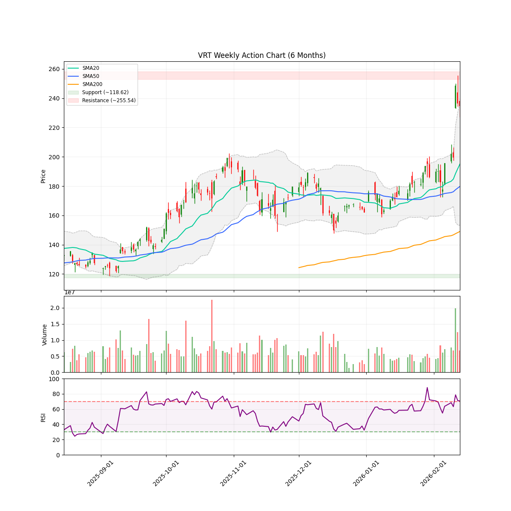
#### 研报分析

### 技术指标概览 (Technical Overview)
- **当前价格**: $234.53
- **RSI (14)**: 70.71
- **移动平均线**: SMA20: $194.99 | SMA50: $179.76 | SMA200: $149.03 (Bullish)
- **波动率**: ATR (14): 15.97 (预计周度波动: +/- $35.72)
- **关键位 (6m)**: 支撑位 $118.62 | 阻力位 $255.54
- **即时状态**: Above SMA50

# 情绪审计报告：Vertiv Holdings Co. (VRT)
**职位：** 对冲基金研究助理（叙事经济学视角）
**审计日期：** 2026年02月17日

---

### 1. 催化剂分类 (Catalyst Categorization)

*   **A-Tier（核心动力）：**
    *   **2026年营收指引超预期：** 公司发布的2026年营收指引为132.5亿至137.5亿美元，远高于分析师预期的123.9亿美元。尽管Q4利润略低于预期，但其前瞻性指引触发了股价单日23%的暴涨。
    *   **订单积压（Backlog）创新高：** 目前积压订单达到创纪录的150亿美元，这证明了AI驱动的数据中心基础设施需求具有极强的持续性，而非短期泡沫。
*   **B-Tier（机构与行业惯性）：**
    *   **AI基础设施叙事：** 随着AI从软件向硬件基础设施（冷却系统、配电）传导，VRT作为行业领导者处于风口。
    *   **机构关注度：** Zacks将其列为热门搜索股票，显示出散户与机构投资者的双重兴趣。
*   **C-Tier（市场噪音）：**
    *   **媒体名人效应：** Jim Cramer在节目中提及VRT订单增长“令人难以置信”，虽增加了曝光度，但属于滞后指标。

### 2. 背离检测 (Divergence Detection)

**分析：** 在2026年2月12日左右，VRT表现出了明显的**“利空出尽”**式看涨背离。
*   **现象：** 尽管Q4每股收益（EPS）未达华尔街预期，但股价并未下跌，反而因为超强劲的未来指引和订单量而跳空大涨23%。
*   **结论：** 市场目前的逻辑已经从“关注过去一个季度的财务细节”转向“对AI长期基础设施溢价的定价”。RSI处于70.71的超买区间，结合SMA20（194.99）与现价（234.53）的巨大偏离，短期可能存在由于获利了结引发的回撤，但中期上升趋势极为稳固。

### 3. 情绪评分 (Logic Score)

**得分：8.5 / 10**

*   **理由：** 
    *   **优势 (+2.5)：** 创纪录的150亿美金订单积压提供了极高的业绩确定性。
    *   **优势 (+2.0)：** 远超预期的前瞻指引彻底改写了估值模型。
    *   **优势 (+2.0)：** 均线系统（SMA50/200）呈完美多头排列，趋势强度极高。
    *   **风险 (-1.0)：** RSI > 70 表明短期情绪过热，技术面上存在回调压力。
    *   **风险 (-0.5)：** 估值溢价已反映了大部分AI预期，容错率降低。

### 4. 核心引用与证据 (Evidence)

*   **关于营收指引：** 根据 [Blockonomi](https://blockonomi.com/vertiv-vrt-stock-gains-23-on-strong-2026-revenue-guidance/) 报道，VRT在2026年指引发布后股价飙升23%，营收预测中值高出市场预期约10亿美元。
*   **关于基本面韧性：** [Yahoo Finance](https://finance.yahoo.com/news/buy-sell-hold-vertiv-stock-162700810.html) 指出，尽管Q4财报后有小幅波动，但其AI驱动的订单增长和150亿美元的积压订单是维持看涨情绪的关键。
*   **关于市场热度：** [Zacks Investment Research](https://www.msn.com/en-us/money/topstocks/vertiv-holdings-co-vrt-is-a-trending-stock-facts-to-know-before-betting-on-it/ar-AA1WswQL) 确认该股是近期平台上搜索量最高的股票之一，显示叙事正在向大众传播。

### 5. 下一个关键日期 (Next Major Date)

**预计日期：2026年5月初（Q1 2026 财报发布日）**
*   **关注重点：** 观察150亿美元订单的转化率以及液冷产品（Liquid Cooling）在大规模数据中心部署中的实际毛利率表现。

---
**审计总结：** VRT 目前正处于“不可阻挡的看涨周期”的中后期。叙事已从“预期”转向“订单证实”。建议关注 RSI 回调至 60 附近的低吸机会，警惕 255.54 美元的强阻力位。
#### 近期新闻与事件
- **[Yahoo Finance]** [Should You Buy, Sell, or Hold Vertiv Stock Post Q4 Earnings?](https://finance.yahoo.com/news/buy-sell-hold-vertiv-stock-162700810.html)
- **[Zacks Investment Research]** [Vertiv Holdings Co. (VRT) is a trending stock: Facts to know before betting on it](https://www.msn.com/en-us/money/topstocks/vertiv-holdings-co-vrt-is-a-trending-stock-facts-to-know-before-betting-on-it/ar-AA1WswQL)
- **[Blockonomi]** [Vertiv (VRT) Stock Gains 23% on Strong 2026 Revenue Guidance](https://blockonomi.com/vertiv-vrt-stock-gains-23-on-strong-2026-revenue-guidance/)
- **[Insider Monkey]** [Vertiv (VRT)'s Orders Were Incredible, Says Jim Cramer](https://www.msn.com/en-us/money/topstocks/vertiv-vrt-s-orders-were-incredible-says-jim-cramer/ar-AA1Wp3UQ)
- **[Zacks.com]** [Is Vertiv (VRT) a Solid Growth Stock? 3 Reasons to Think "Yes"](https://www.msn.com/en-us/money/topstocks/is-vertiv-vrt-a-solid-growth-stock-3-reasons-to-think-yes/ar-AA1WekRc)

---
