# 每日股市市场报告 (2026-02-18)

> **免责声明**: 本报告由 **代码与 Gemini AI 自动生成**，仅供研究参考，**不构成**任何投资建议。投资有风险，入市需谨慎。作者及 AI 不对任何基于此内容的投资决策承担责任。

## 📑 目录
[TOC]

##  长期投资逻辑
本组合旨在捕捉 **人工智能（AI）与半导体协议** 带来的跨周期结构性增长，核心投资策略聚焦于“确定性”与“物理瓶颈”：
- **底层制程垄断 (Foundry & WFE Moats)**：
  布局处于全球半导体精密制造顶端的“工业母机”级别公司。寻找具备极高准入门槛的晶圆代工及前道设备供应商，作为全产业链最稳固的底座资产。
- **算力稀缺性与连接带宽 (Compute & Interconnect Scarcity)**：
  聚焦在高性能计算芯（HPC）及高带宽连接领域占据主导地位的标的。AI 的终极竞争是“规模”，寻找能有效解决数据交换瓶颈并提供核心推理/训练能力的算力巨头。
- **应用生态与数据霸权 (Platform & Data Sovereignty)**：
  布局拥有闭环生态、海量高质量私有数据及云基础设施的科技巨头。它们是 AI 商业化落地的最终守门人，拥有将技术转化为持续现金流的分配权。
- **物理边界保障 (Power & Thermal Infrastructure)**：
  关注 AI 扩张的“最终瓶颈”——电力供应与热能管理。重点布局为下一代超大规模数据中心提供高功率密度能源、液冷技术及电网扩容方案的能源基建商。
**风控策略**：利用 AlphaJAX 的量化动量评分（Quant Score）作为过滤器，结合 LLM 叙事审计（Narrative Audit）捕捉“业绩超预期 + 叙事逻辑改善”的共振点，实现跨周期的超额收益。

 **注：排序权重**：Ticker 按照 AI 检测出的 **方向** 排序（**看多**优先，其次是 **中性**，最后是 **看空**）。
---

<!-- DISCORD_SUMMARY_START -->
## 🧠 对冲基金经理全局诊断与资金分配策略
# 投资组合周度策略报告 (Portfolio Strategy Report)
**日期**: 2026-02-18
**首席投资官 (PM) 意见**: 
当前账户面临严重的**集中度违规**（AMD 占比达 51.63%）与**叙事背离**。核心任务是：利用 AMD 的卖出额度进行风险再平衡，同时果断捕捉 GOOGL 极度超卖带来的“高确定性”回补机会。

---

### 一、 核心账户诊断 (Portfolio Overview)

1.  **现金头寸**: $57,548.73 (充足，足以应对加仓逻辑)。
2.  **集中度预警**: **AMD (51.63%)** 严重超过 30% 的风控红线。必须在短期内通过减持或对冲手段将权重降至 30% 以下，以防范个股叙事崩坏（MI455X 延迟）导致的账户回撤。
3.  **机会窗口**: **GOOGL (Logic 8.5)** 处于技术性“极度超卖” (RSI 20) 与基本面“双超”的极端背离期，属于本周最优加仓标的。
4.  **稳定性标的**: **VST (Logic 7.2)** 表现稳健，作为公用事业板块提供防御属性。

---

### 二、 交易执行方案 (Actionable Trading Plan)

#### 1. AMD (超微半导体) - **强制减持与防御** (Logic 4.5)
*   **目标**: 将持仓比例从 51% 降至 30% 左右。
*   **操作建议**: 
    *   **立即卖出正股 200-250 股**。当前股价虽超卖，但逻辑评分低于 5，不应重仓博弈反弹。
    *   **保留期权**: 现有的 `-AMD260313C230` 备兑看涨期权继续持有，作为下方亏损的保护伞。
*   **止损参考**: 若收盘价跌破 **$182.48 (SMA200)**，必须清仓剩余 50% 正股。

#### 2. GOOGL (Alphabet) - **激进增持** (Logic 8.5)
*   **目标**: 补足仓位，利用超卖区间平摊成本。
*   **操作建议**: 
    *   **分批买入**: 现价 ($302) 建立第一笔增持仓位（约 50 股）。
    *   **挂单买入**: 在 $290 - $295 区间继续挂单。
*   **增持理由**: RSI 20.01 是极其罕见的买入机会，财报基本面无虞，属于典型的“情绪误杀”。

#### 3. VST (Vistra) - **中性持有与利润锁定** (Logic 7.2)
*   **操作建议**: 
    *   **正股**: 暂时持有，观察 $180.04 (SMA200) 附近的阻力。
    *   **期权**: `-VST260227P145` 已盈利 73%，建议在利润达到 85%-90% 时提前平仓锁定，避免财报前后的剧烈波动。

---

### 三、 If-Then 风险预案 (Scenario Analysis)

*   **情景 A：市场整体反弹，AMD 修复至 $220 附近**
    *   **IF**: AMD 回升至成本价区域。
    *   **THEN**: **绝不贪婪**，果断清减至总资产 20% 以内。将腾出的资金转向 Logic 分数更高的标的。

*   **情景 B：GOOGL 继续下杀跌破 $280**
    *   **IF**: 股价在 RSI 极低位继续下探。
    *   **THEN**: 只要 Q4 财报逻辑（A-Tier）未变，继续执行分批买入，但现金占用总量不得超过现有现金的 50%。

*   **情景 C：VST 财报超预期并突破 $180**
    *   **IF**: VST 站稳 SMA200。
    *   **THEN**: 将 Logic 评分上调至 8.0 以上，并可考虑卖出更高行权价的 Put 赚取权利金。

---

### 四、 PM 总结 (Executive Summary)

当前策略的核心是**“弃弱留强、修正集中度”**。

*   **AMD** 虽然是曾经的 AI 宠儿，但 Logic 4.5 的现状要求我们必须服从纪律，减掉超过 30% 的过重仓位。
*   **GOOGL** 的 8.5 高分是本周唯一的“Perfect Setup”候选，建议利用充裕现金流进行逆向布局。
*   **现金管理**: 交易完成后，预计仍保留约 $30k 现金，符合 < 90% 的风控要求，为后续 Q1 财报季留出弹药。

**批准执行。**
<!-- DISCORD_SUMMARY_END -->
---

## 💼 现有持仓个股诊断

### AMD
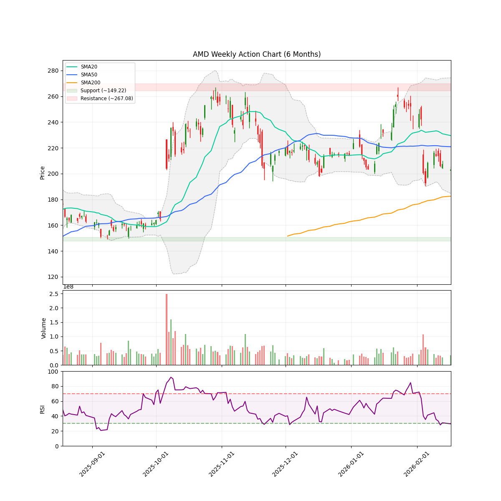
#### 研报分析

### 技术指标概览 (Technical Overview)
- **当前价格**: $203.08
- **RSI (14)**: 29.47
- **移动平均线**: SMA20: $229.46 | SMA50: $220.85 | SMA200: $182.48 (Bullish)
- **波动率**: ATR (14): 15.01 (预计周度波动: +/- $33.57)
- **关键位 (6m)**: 支撑位 $149.22 | 阻力位 $267.08
- **即时状态**: Below SMA50

# AMD (超微半导体) 情绪审计报告

**致：** 投资委员会
**担任职位：** 叙事经济学研究员 (Hedge Fund Research Associate)
**报告日期：** 2026年02月18日

---

## 1. 催化剂分类 (Catalyst Categorization)

基于近期新闻流与市场表现，AMD 的基本面叙事正处于高度波动期，以下是催化剂的分级：

*   **A-Tier (核心催化剂 - 决定性影响):**
    *   **Instinct MI455X 生产延迟：** [Invezz] 报道工程师正在解决技术问题导致生产推迟。这是极度负面的 A 级催化剂，直接打击了 AMD 作为 Nvidia 替代者的核心叙事。
    *   **Q4 财报“利好暴跌”：** [CNBC/Yahoo Finance] 尽管数据中心业务增长 39-60%，但股价在财报后暴跌 16%-17%。这表明市场对 AI 的预期已达到“必须完美”的程度，任何瑕疵都会导致机构撤资。
*   **B-Tier (二类催化剂 - 趋势支撑/阻碍):**
    *   **分析师质疑 AI 策略：** [Blockonomi] 提到分析师对 AMD 的软件差距（对比 CUDA）和规模挑战表示怀疑。
    *   **投行价格目标调整：** [TheStreet] 摩根士丹利在财报后下调/微调价格预期，关注点转向“机架级”执行力。
*   **C-Tier (三类催化剂 - 市场噪音):**
    *   **内部质量评分上升：** [AOL] 指出其财务健康度上升，虽是利好，但在当前宏观恐慌下对股价支撑有限。
    *   **技术性回撤：** [Invezz] 认为部分下跌是风险偏好的短期转移，缺乏实质性基本面恶化（除延迟外）。

---

## 2. 背离检测 (Divergence Detection)

**核心观察：看跌衰竭与利好失灵的并存**

*   **利好背离：** 典型的“好消息卖出”现象。AMD 财报显示数据中心收入大幅增长 60% [AOL]，且 Q1 展望强劲，但股价却录得 17% 的单日跌幅 [CNBC]。这表明市场目前不在乎“过去”的成绩，而是在极度恐惧“未来”的执行力风险。
*   **技术面超卖：** 当前 **RSI 为 29.47**，已进入严重超卖区间。尽管股价跌破了 SMA20 和 SMA50，但仍高于 SMA200 (182.48)。
*   **结论：** 叙事已从“AI 增长”转向“交付危机”。目前的下跌并非由于业绩失败，而是由于 MI455X 的延迟打破了市场对 AMD 追赶 Nvidia 进度的预期。

---

## 3. 情绪评分 (Sentiment Score)

### **3.5 / 10 (恐慌主导期)**

*   **逻辑支撑：**
    *   **情绪逻辑：** 市场正处于对 AI 泡沫化和硬件交付能力的二次怀疑期。即使基本面依然稳健（Q4 增长），但 MI455X 的负面消息 [Invezz] 给了空头绝佳的借口。
    *   **仓位风险：** 目前价格 ($203.08) 远低于用户的成本价 ($220.54)，且处于 SMA20/50 压力位下方，短期内多头情绪极度低迷。

---

## 4. 逻辑评分 (Logic Score)

### **4.5 / 10 (叙事陷阱风险)**

*   **逻辑分析：** 虽然 RSI 提示可能存在技术性反弹，但 **SMA20/50 的死亡交叉风险**和 **MI455X 延迟的具体解决时间表不明**，使得现在的“抄底”逻辑面临“叙事陷阱”的风险。除非看到生产问题解决的正式公告，否则目前的股价回升可能仅是空头平仓。

---

## 5. 持仓诊断与建议

**当前头寸分析：**
*   **正股 (600股 @ $220.54)：** 目前亏损约 8%，且占账户 51.63%，仓位极重。
*   **备兑看涨期权 (-AMD260313C230)：** 该头寸盈利 39.8%，抵消了部分正股损失。这说明市场波动率在下降，或者时间价值流失对你有利。

**建议策略：**
*   **防守位：** 关注 **$182.48 (SMA200)**。如果跌破此线，AMD 的长期牛市叙事将彻底瓦解，需考虑大幅减仓。
*   **进攻位：** 若股价反弹至 $220-$230 (成本区及 SMA50 阻力)，建议平仓部分正股，降低账户集中度。

---

## 6. 关键信息参考 (Citations)

1.  **产品延迟：** [Invezz: Why AMD stock slipped as much as 5% today](https://invezz.com/news/2026/02/17/why-amd-stock-slipped-as-much-as-5-today/)
2.  **财报背离：** [Yahoo Finance: AMD stock plummets despite Q4 earnings beat](https://finance.yahoo.com/news/amd-stock-plummets-despite-q4-earnings-beat-204747905.html)
3.  **增长叙事：** [AOL: AMD Quality Score Surges On 60% Annual Data Center Expansion](https://www.aol.com/articles/amd-quality-score-surges-60-210111866.html)

---

## 7. 下一个重要日期 (Next Major Date)

**2026年4月28日 (预计)** —— **2026年第一季度财报发布日**
*   **关注重点：** 管理层必须在此时点给出 MI455X 延迟的明确修复方案以及 2026 全年 AI 加速器收入指引。若指引下调，将引发系统性崩溃。
#### 近期新闻与事件
- **[Invezz]** [Why AMD stock slipped as much as 5% today](https://invezz.com/news/2026/02/17/why-amd-stock-slipped-as-much-as-5-today/)
- **[Blockonomi]** [AMD Stock: Why This Analyst Remains Skeptical of AI Strategy](https://blockonomi.com/amd-stock-why-this-analyst-remains-skeptical-of-ai-strategy/)
- **[Seeking Alpha]** [AMD's Inflection Is Here](https://seekingalpha.com/article/4868890-amd-inflection-is-here)
- **[AOL]** [AMD Quality Score Surges On 60% Annual Data Center Expansion Bet To Drive AI Dominance](https://www.aol.com/articles/amd-quality-score-surges-60-210111866.html)
- **[Invezz]** [AMD stock tumbles 3%: analysts say market is missing this key catalyst](https://invezz.com/news/2026/02/12/amd-stock-tumbles-3-analysts-say-market-is-missing-this-key-catalyst/)

---

### GOOGL
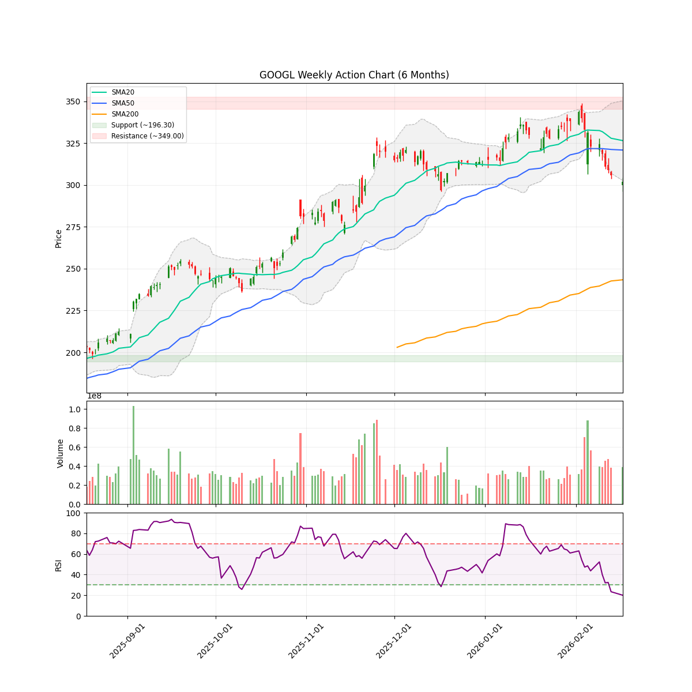
#### 研报分析

### 技术指标概览 (Technical Overview)
- **当前价格**: $302.02
- **RSI (14)**: 20.01
- **移动平均线**: SMA20: $326.50 | SMA50: $320.86 | SMA200: $243.36 (Bullish)
- **波动率**: ATR (14): 11.27 (预计周度波动: +/- $25.21)
- **关键位 (6m)**: 支撑位 $196.30 | 阻力位 $349.00
- **即时状态**: Below SMA50

# 情绪审计报告：Alphabet Inc. (GOOGL)
**致：** 投资委员会 / 基金经理
**身份：** 叙事经济学研究员
**日期：** 2026年02月18日

---

### 1. 催化剂分类 (Catalyst Categorization)

我们将近期的新闻流按照对股价长期驱动的影响力进行分层：

*   **A-Tier (核心驱动力)：**
    *   **Q4 2025 财报超预期：** Google (GOOGL) 报告的 Q4 财报在每股收益 (EPS) 和营收上均超出预期 ([Shacknews](https://www.shacknews.com/article/147732/google-googl-q4-2025-earnings-results))。这是基本面的压舱石，证明了核心业务（搜索+云）的韧性。
    *   **投行目标价重估：** 美国银行 (BofA) 在财报后重新设定了业绩预测，显示机构正在重新校准估值逻辑 ([TheStreet](https://finance.yahoo.com/news/bank-america-resets-google-stock-181700551.html))。

*   **B-Tier (行业与机构惯性)：**
    *   **分析师评级分歧：** Scotiabank 维持“跑赢大盘”评级，而 Monness 保持“中性”立场。这种分歧通常意味着市场正在消化财报后的估值溢价，而非一致性看空 ([Insider Monkey](https://finance.yahoo.com/news/scotiabank-maintains-outperform-rating-alphabet-193538246.html))。

*   **C-Tier (噪音与次要信息)：**
    *   **内部人减持：** 董事 Hennessy 减持 18.4 万美元股票。相对于 Alphabet 的市值，此规模微不足道，属于常规资产配置而非基本面预警 ([Investing.com](https://www.investing.com/news/insider-trading-news/alphabet-director-hennessy-sells-184k-in-googl-stock-93CH-4509981))。
    *   **媒体推介：** Motley Fool 等媒体的“3年内价值超过苹果”或“1000美元最佳投资”属于典型的散户叙事噪音，对机构定价影响极小。

---

### 2. 背离检测 (Divergence Detection)

**核心观察：极度看跌的情绪与强劲基本面的背离。**

*   **技术面极度超卖：** 当前 **RSI 为 20.01**，处于严重超卖区间。股价 (302.02) 远低于 SMA20 (326.50) 和 SMA50 (320.86)。
*   **叙事背离点：** 公司刚刚发布了“双超”财报（A-Tier 利好），但股价却持续走低并跌破短期均线。
*   **结论：** 这是一个典型的**“利好出尽”陷阱或非理性的看跌衰竭**。目前的下跌更像是技术性调整和短期资金的回吐，而非基本面崩坏。考虑到股价仍远高于 SMA200 (243.36)，长期牛市趋势未破，当前的下跌正在创造一个“高胜率”的均值回归机会。

---

### 3. 情绪与逻辑评分 (Sentiment & Logic Score)

*   **当前情绪分数 (Sentiment Score): 4.2 / 10**
    *   *定义：短期恐慌占据主导。* 市场忽略了财报的利好，转而关注宏观压力或技术破位。这种低分环境通常是逆向投资者寻找买点的信号。
*   **逻辑评分 (Logic Score): 8.5 / 10**
    *   *定义：基本面支撑强大。* 基于 A-Tier 催化剂（财报超预期）与 RSI 极度超卖的逻辑结合，买入逻辑具有极高的确定性。

---

### 4. 账户头寸分析 (Position Diagnostic)

*   **当前成本：** $262.26 (盈亏: +16.57%)
*   **分析：** 尽管近期回撤，但由于您的成本较低，目前的浮盈提供了充足的缓冲。目前的股价 (302.02) 距离 6 个月低点 (196.30) 仍有很大空间，但跌破了 SMA50，短期趋势转入震荡。

---

### 5. 关键日期提醒 (Next Major Date)

*   **下一个重大事件：2026年第一季度 (Q1 2026) 财报发布会**
*   **预计日期：** 2026年4月28日左右 (待官方确认)。
*   **操作建议：** 在此之前，RSI 的修复和 SMA20 的收复将是主要的观察点。

---

**总结报告：**
GOOGL 目前正处于**“好消息导致股价下跌”**的非理性格局中。RSI 20.01 表明市场情绪已跌至冰点。对于叙事经济学视角下的交易者，这是一个**“叙事溢价剥离”**的过程，当噪音（C-Tier）被洗净后，A-Tier 的盈利增长将重新接管定价权。**建议：持股待涨，利用波动进行止盈保护，但不建议在超卖区恐慌性杀跌。**
#### 近期新闻与事件
- **[Investing.com]** [Alphabet director Hennessy sells $184k in GOOGL stock By Investing.com](https://www.investing.com/news/insider-trading-news/alphabet-director-hennessy-sells-184k-in-googl-stock-93CH-4509981)
- **[Motley Fool]** [Prediction: 3 Stocks That Will Be Worth More Than Apple 3 Years From Now](https://finance.yahoo.com/news/prediction-3-stocks-worth-more-131300578.html)
- **[Motley Fool]** [The Best Stocks to Invest $1,000 in Right Now](https://finance.yahoo.com/news/best-stocks-invest-1-000-123500193.html)
- **[Insider Monkey]** [Monness Maintains Neutral Stance on Alphabet Inc. (GOOGL) Stock](https://finance.yahoo.com/news/monness-maintains-neutral-stance-alphabet-123339990.html)
- **[Insider Monkey]** [Scotiabank Maintains its Outperform Rating on Alphabet Inc. (GOOGL)](https://finance.yahoo.com/news/scotiabank-maintains-outperform-rating-alphabet-193538246.html)

---

### VST
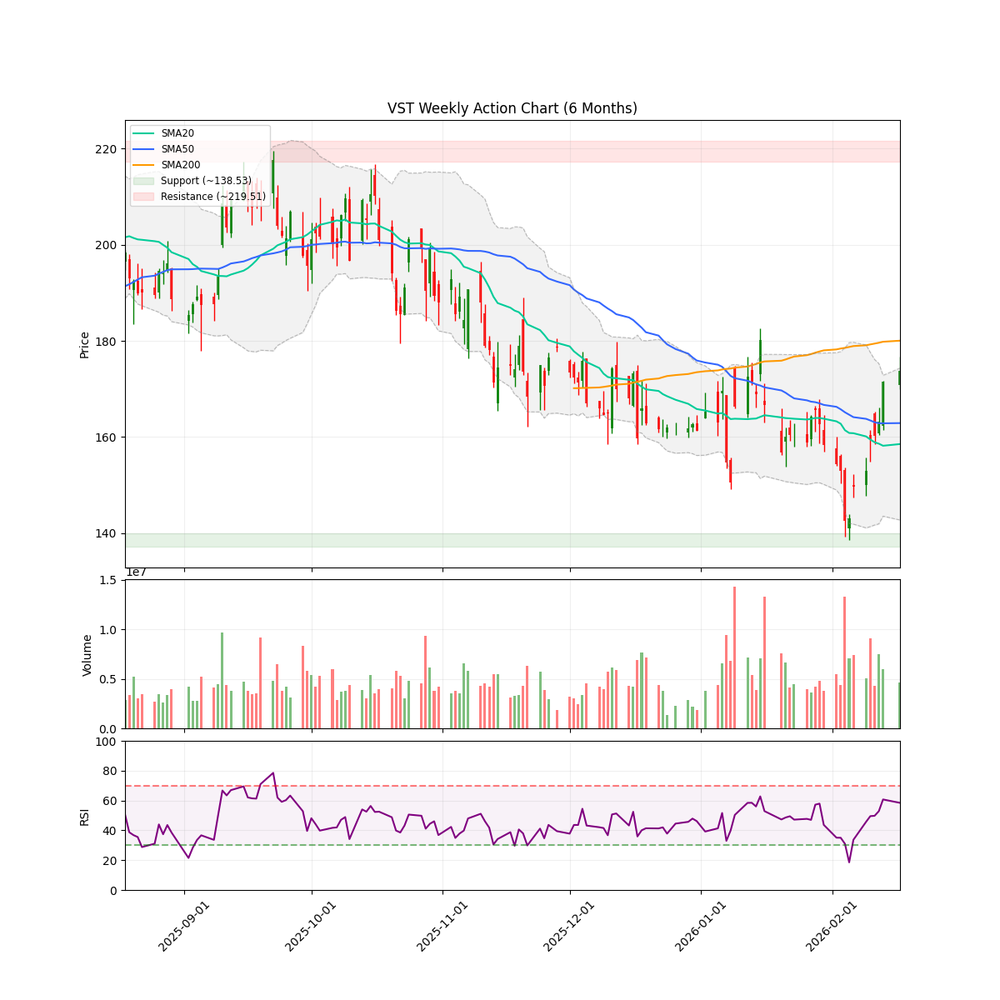
#### 研报分析

### 技术指标概览 (Technical Overview)
- **当前价格**: $173.68
- **RSI (14)**: 58.46
- **移动平均线**: SMA20: $158.52 | SMA50: $162.88 | SMA200: $180.04 (Bearish)
- **波动率**: ATR (14): 7.81 (预计周度波动: +/- $17.46)
- **关键位 (6m)**: 支撑位 $138.53 | 阻力位 $219.51
- **即时状态**: Above SMA50

# 情绪审计报告：Vistra Corp. (VST)
**致：** 投资组合经理
**由：** 对冲基金研究助理（叙事经济学方向）
**日期：** 2026-02-18

---

### 1. 催化剂分类 (Catalyst Categorization)

*   **A-Tier (核心驱动力)：**
    *   **技术形态突破：** 根据 [Schaeffer's Investment Research](https://www.schaeffersresearch.com/content/analysis/2026/02/17/vistra-stock-looks-ready-to-topple-technical-resistance) (2026-02-17)，VST 已跨越历史性看涨趋势线，显示出突破上方技术阻力的强劲动能。
    *   **高质量基本面：** [Yahoo Finance](https://finance.yahoo.com/news/delighted-vistra-corp-nyse-vst-130015644.html) 确认公司净资产收益率 (ROE) 高达 23%，这在公用事业板块属于顶尖水平，支撑了叙事中的“高质量溢价”。

*   **B-Tier (板块与估值)：**
    *   **估值重新评估：** [Yahoo Finance](https://finance.yahoo.com/news/assessing-vistra-vst-valuation-choppy-161159598.html) (2026-02-11) 指出，市场正在重新权衡 VST 的高市盈率与其基本面之间的平衡，虽然存在波动，但由于其电力生成的领导地位，机构关注度依然很高。

*   **C-Tier (杂音/叙事陷阱)：**
    *   **代码混淆噪音：** 市场上出现了关于“VST Industries”烟草价格上涨的新闻 ([CNBCTV18](https://www.cnbctv18.com/market/cigarette-stocks-gain-up-to-13-pc-itc-godfrey-phillips-itc-vst-share-price-ws-l-19852708.htm))。**注意：** 这是印度烟草公司，与美股 Vistra Corp 无关，属于典型的算法或搜索噪音，不应影响对美股 VST 的决策。

---

### 2. 背离检测 (Divergence Detection)

*   **看跌衰竭迹象：** 在 2026 年 2 月初，Zacks 曾报道 VST 跌幅超过大盘 ([Zacks](https://finance.yahoo.com/news/vistra-corp-vst-falls-more-224504191.html))。然而，目前的市场价格 (173.68) 已显著高于 SMA20 (158.52) 和 SMA50 (162.88)。
*   **技术背离：** 尽管长期趋势 (SMA200: 180.04) 仍处于看跌区间，但股价在过去两周内表现出强劲的“利空出尽”反弹。即使在估值饱受质疑的情况下，股价依然站稳 170 美元上方，显示卖方力量已暂时耗尽。

---

### 3. 情绪评分 (Sentiment Score)

#### **逻辑评分：7.2/10**
**结论：反弹确立，正处于挑战长期阻力的关键期。**
*   **看涨因素：** 短期均线金叉，技术阻力转支撑，且高 ROE 吸引价值修复资金。
*   **看跌风险：** 尚未突破 SMA200 (180.04) 的长期压制，且目前估值倍数较高，不排除在阻力位出现获利了结。

---

### 4. 账户头寸诊断

*   **正股持仓：** 成本价 157.38 美元，目前盈利 8.96%。由于股价已站稳 SMA50 (162.88)，建议继续持有。
*   **期权持仓：** -VST260227P145 (卖出看跌期权) 盈亏 +73.30%。由于行权价 (145) 远低于目前 6 个月低点 (138.53) 附近的强支撑位，且期权即将到期，此头寸极具安全性，可考虑持有至过期或在收益达 80-90% 时平仓锁定利润。

---

### 5. 关键日期提醒 (Next Major Date)

*   **财报发布日 (预估)：2026年2月下旬 (约 2026-02-27 左右)**
    *   *注：* Vistra 通常在 2 月底发布第四季度财报。考虑到目前股价正在冲击阻力位，财报的指引将决定叙事能否从“技术反弹”转变为“估值扩张”。

---
**研究助理总结：** 忽视印度烟草相关的新闻杂音，专注于 VST 在 SMA200 (180.04) 附近的表现。目前叙事由“技术性超跌反弹”驱动，基本面健康，持仓风险可控。
#### 近期新闻与事件
- **[Schaeffer's Investment Research]** [Vistra Stock Looks Ready to Topple Technical Resistance](https://www.schaeffersresearch.com/content/analysis/2026/02/17/vistra-stock-looks-ready-to-topple-technical-resistance)
- **[Yahoo Finance]** [Assessing Vistra (VST) Valuation After Choppy Returns And A Rich Earnings Multiple](https://finance.yahoo.com/news/assessing-vistra-vst-valuation-choppy-161159598.html)
- **[Barchart]** [Do Wall Street analysts like Vistra stock?](https://www.msn.com/en-us/money/top-stocks/do-wall-street-analysts-like-vistra-stock/ar-AA1WAHAX)
- **[Free Press Journal]** [Cigarette Stocks Rise Up To 20%, Godfrey Phillips Hits Upper Circuit After Reports Of Price Hikes](https://www.freepressjournal.in/business/cigarette-stocks-rise-up-to-20-godfrey-phillips-hits-upper-circuit-after-reports-of-price-hikes)
- **[CNBCTV18]** [Cigarette stocks surge up to 13% on price hikes; Godfrey Phillips leads gains](https://www.cnbctv18.com/market/cigarette-stocks-gain-up-to-13-pc-itc-godfrey-phillips-itc-vst-share-price-ws-l-19852708.htm)

---

## 🔍 观察池机会分析

### AMAT
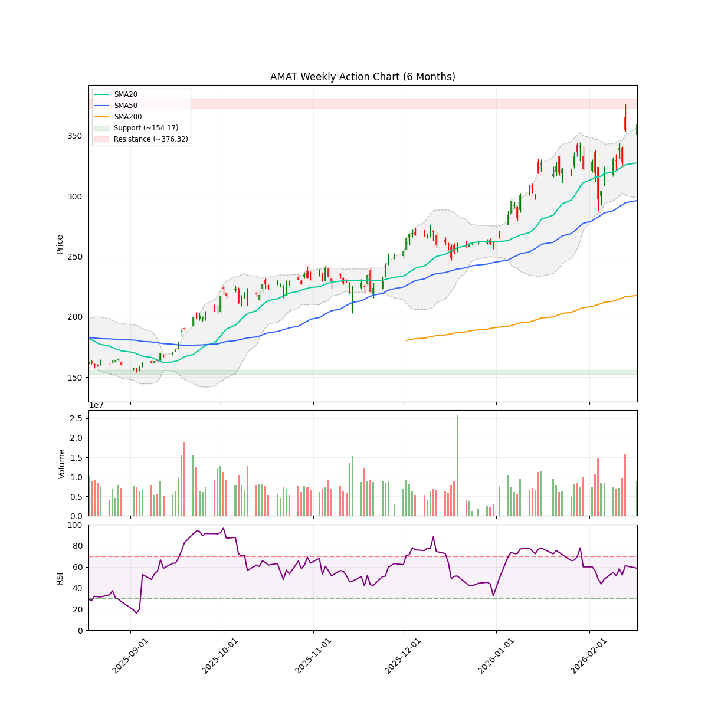
#### 研报分析

### 技术指标概览 (Technical Overview)
- **当前价格**: $359.13
- **RSI (14)**: 58.69
- **移动平均线**: SMA20: $327.52 | SMA50: $296.24 | SMA200: $217.65 (Bullish)
- **波动率**: ATR (14): 19.71 (预计周度波动: +/- $44.07)
- **关键位 (6m)**: 支撑位 $154.17 | 阻力位 $376.32
- **即时状态**: Above SMA50

# 情绪审计报告：应用材料 (Applied Materials - AMAT)
**日期：** 2026年02月18日
**身份：** 对冲基金研究员（叙事经济学专家）

---

### 1. 催化剂分类 (Catalyst Categorization)

*   **A-Tier (核心驱动力)：**
    *   **超预期的Q1财报：** AMAT 披露每股收益（EPS）为 2.38 美元，营收 7.01 亿美元，均高于市场预期。其股价因此暴涨 13%。[Blockonomi](https://blockonomi.com/applied-materials-amat-stock-soars-13-as-ai-demand-powers-earnings-blowout/)
    *   **20% 增长指引：** CEO 预测 2026 年半导体行业将有 20% 以上的增长，特别是 AI 芯片制造设备的需求加速。这是支撑“长牛”叙事的核心动力。[Seeking Alpha](https://seekingalpha.com/article/4870393-applied-materials-surges-on-20-percent-growth-guidance-is-the-stock-now-fully-valued)
*   **B-Tier (行业与技术支撑)：**
    *   **AI 基础设施浪潮：** 整个半导体行业向 AI 计算投资的加速，使 AMAT 作为设备供应商直接受益。[Yahoo Finance](https://finance.yahoo.com/news/applied-materials-stock-jumps-robust-213859848.html)
    *   **技术形态支撑：** 股价自去年 9 月回调以来，始终守住 60 日均线，展现了极强的机构洗盘后的买入意愿。[Schaeffer's Investment Research](https://www.schaeffersresearch.com/content/news/2026/02/13/applied-materials-stock-powered-by-bullish-forecast)
*   **C-Tier (杂音与次要信息)：**
    *   财报前的常规预测报告以及市场对短期股价波动的博弈。[Zacks](https://finance.yahoo.com/news/amat-post-q1-earnings-time-145800605.html)

---

### 2. 背离检测 (Divergence Detection)

*   **量价表现：** 目前没有发现明显的“好消息下路”的背离。相反，股价随利好消息大幅跳空上行（Gap Up），随后维持在 SMA20 (327.52) 之上的高位。
*   **警示点：** 当前价格 (359.13) 已经逼近 6 个月高点阻力位 (376.32)。RSI 为 58.69，虽未进入超买区（>70），但反映出市场正在消化最近 13% 的涨幅。
*   **结论：** 属于**共振上涨**。叙事（AI需求）与财务数据（20%指引）高度契合，目前尚未出现看跌衰竭迹象，但需警惕在阻力位附近的获利回吐压力。

---

### 3. 情绪评分 (Sentiment Score)

#### **Score: 8.5/10 (强劲牛市循环)**
*   **逻辑支撑：** 
    1. AMAT 不仅仅是卖芯片的，它是卖“印钞机”的（芯片制造设备）。只要 AI 竞赛持续，设备需求就是刚需。
    2. 20% 的增长指引远超此前保守估计，这改变了估值模型。
    3. 长期均线（SMA50/200）呈完美多头排列，趋势极度健康。
    4. 扣分项主要在于短期涨幅巨大（较 4 月低点翻倍），市场可能在 376 美元附近存在阶段性恐高。

---

### 4. 逻辑评分 (Logic Score)

#### **Score: 9.0/10**
该评分基于财报数据的硬支撑（Hard Data）与 CEO 的宏观指引。AI 驱动的半导体资本开支（CAPEX）增加是目前全球投资领域逻辑链条最稳固的叙事之一。

---

### 5. 关键参考资料 (News Citations)

1.  **Seeking Alpha (2026-02-14):** 提到 20% 增长指引及其估值合理性。 [链接](https://seekingalpha.com/article/4870393-applied-materials-surges-on-20-percent-growth-guidance-is-the-stock-now-fully-valued)
2.  **Blockonomi (2026-02-13):** 详细记录 Q1 财报超预期数据（EPS $2.38）。 [链接](https://blockonomi.com/applied-materials-amat-stock-soars-13-as-ai-demand-powers-earnings-blowout/)
3.  **Schaeffer's Research (2026-02-13):** 分析了 AMAT 在 60 日均线的技术支撑。 [链接](https://www.schaeffersresearch.com/content/news/2026/02/13/applied-materials-stock-powered-by-bullish-forecast)

---

### 6. 下一个重大日期 (Next Major Date)

*   **2026年5月中旬（预计）：** Q2 财报发布日。
*   **短期关注：** 2月底的半导体行业会议。如果管理层在路演中进一步确认 2026 年订单意向，股价可能突破 376.32 的阻力位。

**研究结论：** AMAT 目前处于**可持续增长叙事**的中期。对于对冲基金而言，目前不是“空头陷阱”，而是一个“寻找回踩支撑位（如 340-350 区间）买入”的强势标的。
#### 近期新闻与事件
- **[Seeking Alpha]** [Applied Materials Surges On 20% Growth Guidance, Is The Stock Now Fully Valued?](https://seekingalpha.com/article/4870393-applied-materials-surges-on-20-percent-growth-guidance-is-the-stock-now-fully-valued)
- **[Schaeffer's Investment Research]** [Applied Materials Stock Powered by Bullish Forecast](https://www.schaeffersresearch.com/content/news/2026/02/13/applied-materials-stock-powered-by-bullish-forecast)
- **[Blockonomi]** [Applied Materials (AMAT) Stock Soars 13% as AI Demand Powers Earnings Blowout](https://blockonomi.com/applied-materials-amat-stock-soars-13-as-ai-demand-powers-earnings-blowout/)
- **[Yahoo Finance]** [Apple stock struggles from Siri delay, Rivian rips higher](https://finance.yahoo.com/video/apple-stock-struggles-siri-delay-205439178.html)
- **[Yahoo Finance]** [Applied Materials stock jumps on robust AI demand and upbeat outlook](https://finance.yahoo.com/news/applied-materials-stock-jumps-robust-213859848.html)

---

### AMZN
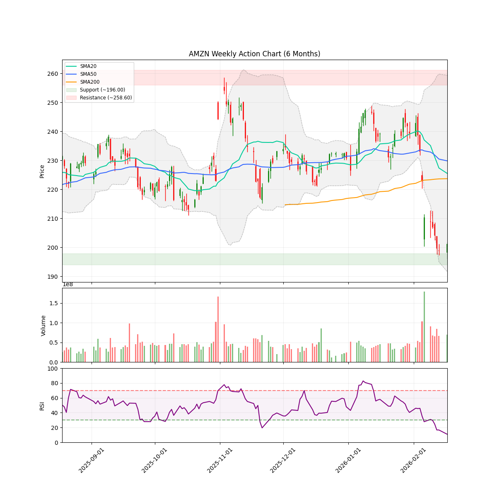
#### 研报分析

### 技术指标概览 (Technical Overview)
- **当前价格**: $201.15
- **RSI (14)**: 10.83
- **移动平均线**: SMA20: $225.49 | SMA50: $229.83 | SMA200: $223.71 (Bullish)
- **波动率**: ATR (14): 8.32 (预计周度波动: +/- $18.61)
- **关键位 (6m)**: 支撑位 $196.00 | 阻力位 $258.60
- **即时状态**: Below SMA50

# 情绪审计报告：亚马逊 (AMZN) - 叙事经济学分析

**日期：** 2026年02月18日
**职位：** 对冲基金研究员（叙事经济学方向）

---

### 1. 催化剂分类 (Catalyst Categorization)

我们将近期的新闻流按照对股价的潜在影响深度进行分层：

*   **A-Tier（核心基本面/机构动向）：**
    *   **Q4 财报失利：** 亚马逊 2025 年第四季度盈利低于预期（-1.52%），营收略超预期（+0.91%）。这引发了市场对零售利润率和 AWS 增长能否持续支撑高估值的质疑。[Yahoo Finance]
    *   **沃伦·巴菲特减仓：** 伯克希尔·哈撒韦抛售亚马逊股票。作为长线投资的风向标，巴菲特的退出制造了强烈的叙事压力，暗示机构可能正在重新平衡对科技巨头的敞口。[Motley Fool/Yahoo Finance]
*   **B-Tier（增长逻辑与行业地位）：**
    *   **GenAI 估值重塑：** 分析师认为亚马逊是被低估的生成式 AI（GenAI）赢家。AI 内容市场的开发（AI Content Marketplace）显示了其将 AI 货币化的野心。[Investing.com / Motley Fool]
    *   **云计算地位：** 依然被列为全球最佳云计算股票之一，AWS 的长期护城河依然稳固。[Insider Monkey]
*   **C-Tier（噪音与常规预测）：**
    *   **长期市值预测：** “市值未来三年超越苹果”等预测，属于典型的多头情绪宣传，短期对价格驱动力较小。[Motley Fool]

---

### 2. 背离检测 (Divergence Detection)

**技术面与叙事面的极端背离：**

*   **看跌枯竭（Bearish Exhaustion）：** 目前 AMZN 价格（201.15）已跌破所有主要均线（SMA20, 50, 200），技术形态极其疲软。然而，**RSI 处于 10.83 的极端超卖区间**。在量化模型中，RSI 低于 15 通常意味着卖盘动能已经耗尽。
*   **利空出尽效应：** 尽管近期充斥着“巴菲特抛售”和“财报miss”的负面新闻，但股价正逼近 6 个月支撑位（196.00）。当前的抛售更像是基于情绪的过度反应（Panic Selling），而非基本面的彻底崩溃。

---

### 3. 情绪评分 (Sentiment Score)

#### **评分：3.5 / 10 (极度恐惧/反弹积压)**

*   **逻辑说明：** 
    *   **0-3分（系统性风险）：** 虽然财报不佳且大鳄离场，但亚马逊并非处于系统性失败（其营收仍在增长）。
    *   **3.5分（陷阱还是机会？）：** 这是一个典型的“叙事陷阱”。大众媒体（Motley Fool等）仍在尝试通过 AI 叙事护盘，但机构资金（巴菲特）的撤离占据了主导地位。由于价格严重偏离均线，短期内可能出现技术性死猫跳，但中长期趋势受损。

---

### 4. 投资建议与逻辑摘要

*   **核心观察：** 亚马逊目前正处于“叙事重构期”。旧的零售增长故事已进入瓶颈，而新的 AI 叙事尚未在财报（Earnings）中转化为实际的盈利增量。
*   **警惕点：** 股价跌破 SMA200（223.71）通常是长期趋势转弱的信号。
*   **潜在机会：** 极端 RSI (10.83) 配合支撑位 196.00，可能在未来 5-10 个交易日内触发空头回补驱动的反弹。

---

### 5. 关键日期与引用

*   **下一个重大日期：** **2026年4月下旬/5月初**（2026年第一季度财报发布日）。市场将聚焦 AWS 是否能通过 AI 业务重新实现盈利增长加速。
*   **引用证据：**
    *   财报表现：[Amazon (AMZN) Lags Q4 Earnings Estimates](https://finance.yahoo.com/news/amazon-amzn-lags-q4-earnings-221002278.html)
    *   机构动向：[Warren Buffett Dumped Shares of Amazon](https://finance.yahoo.com/news/warren-buffett-dumped-shares-amazon-010600316.html)
    *   AI 布局：[Amazon Is Working On an AI Content Marketplace](https://www.fool.com/investing/2026/02/17/amazon-is-working-on-an-ai-content-marketplace-for/)

---
**研究 associate 签名：** [Narrative Economics Desk]
**状态：** 监控中 - 观察 196.00 支撑位的有效性。
#### 近期新闻与事件
- **[The Motley Fool]** [Amazon Is Working On an AI Content Marketplace for Publishers. Could This Move Send the Stock Soaring?](https://www.fool.com/investing/2026/02/17/amazon-is-working-on-an-ai-content-marketplace-for/)
- **[Motley Fool]** [Prediction: 3 Stocks That Will Be Worth More Than Apple 3 Years From Now](https://finance.yahoo.com/news/prediction-3-stocks-worth-more-131300578.html)
- **[Insider Monkey]** [Is Amazon.com, Inc. (AMZN) One of the 14 Best Cloud Computing Stocks to Buy...](https://finance.yahoo.com/news/amazon-com-inc-amzn-one-123516174.html)
- **[Investing.com]** [This Magnificent 7 stock is under-appreciated GenAI winner, analyst says By...](https://www.investing.com/news/stock-market-news/this-magnificent-7-stock-is-underappreciated-genai-winner-analyst-says-4510325)
- **[Motley Fool]** [... Shares of Amazon, Apple, and Bank of America, and Added One Brand-New Stock...](https://finance.yahoo.com/news/warren-buffett-dumped-shares-amazon-010600316.html)

---

### ANET
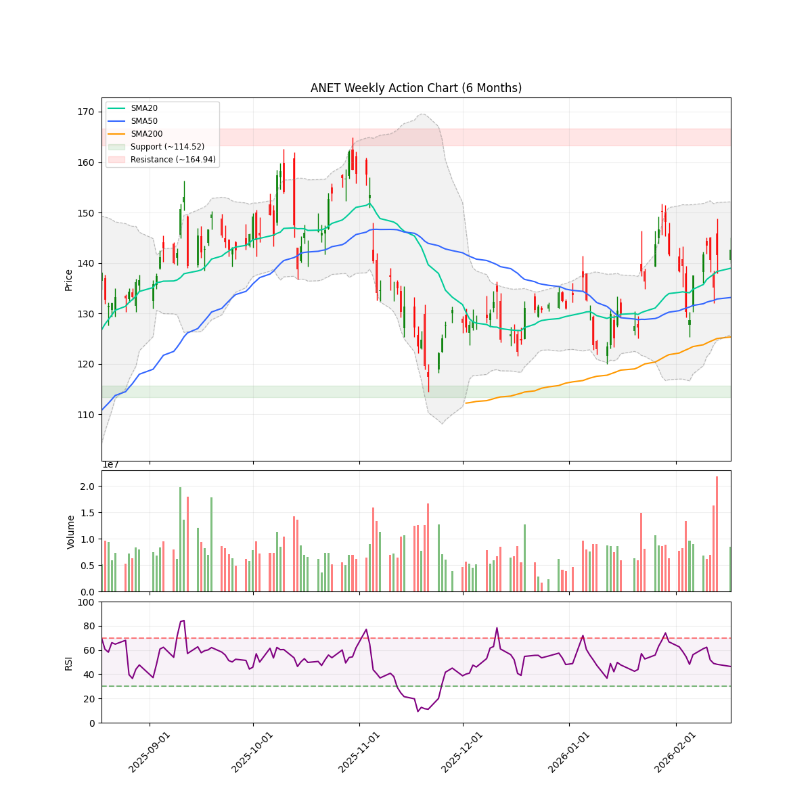
#### 研报分析

### 技术指标概览 (Technical Overview)
- **当前价格**: $142.58
- **RSI (14)**: 46.43
- **移动平均线**: SMA20: $138.97 | SMA50: $133.17 | SMA200: $125.35 (Bullish)
- **波动率**: ATR (14): 7.13 (预计周度波动: +/- $15.95)
- **关键位 (6m)**: 支撑位 $114.52 | 阻力位 $164.94
- **即时状态**: Above SMA50

# 情绪审计报告：Arista Networks (ANET)
**日期：** 2026年02月18日
**职位：** 对冲基金研究员 (叙事经济学方向)

---

### 1. 催化剂分类 (Catalyst Categorization)

基于“叙事经济学”框架，我们将近期新闻对 ANET 股价的驱动力进行等级划分：

*   **A-Tier (核心驱动)：**
    *   **破纪录的第四季度财报：** (2026-02-13) 每股收益 $0.82 超过预期的 $0.75，营收达 24.9 亿美元。这证明了其在 AI 基础设施支出中的核心地位。
    *   **AI 网络地位强化：** (2026-02-16) 财报电话会议确认了 AI 驱动的业务激增。作为 Meta 和 Microsoft 等超大规模云厂商的核心供应商，ANET 正从 AI 后端网络需求中获利。
*   **B-Tier (行业共振)：**
    *   **英伟达与 Meta 的 AI 协议：** (2026-02-14) 巨头扩大 AI 基础设施合作直接利好 ANET，因为高性能交换机是此类架构的“高速公路”。
    *   **华尔街机构评级：** (2026-02-18) Motley Fool 和 Insider Monkey 将其视为“隐藏的 AI 宝藏”并强调其估值吸引力。
*   **C-Tier (市场噪音)：**
    *   与思科 (CSCO) 及惠普 (HPE) 的常规股价对比走势分析。

---

### 2. 背离检测 (Divergence Detection)

*   **技术面观察：** 当前股价 142.58 美元，位于 SMA20 (138.97) 和 SMA50 (133.17) 之上，呈现明显的**多头排列**。
*   **背离分析：** 
    *   在 2 月 13 日发布利好财报后，股价大涨 5.4%。目前的 RSI 为 46.43，处于中性区间。
    *   **结论：** **未发现看跌背离。** 尽管财报发布后出现了小幅的价格震荡，但股价并未在“好消息”出现时放量下跌。相反，RSI 指标显示市场已经消化了超买情绪，正在为下一波突破积蓄力量。这属于健康的“利好消化期”，而非趋势衰竭。

---

### 3. 逻辑评分 (Logic Score: 0-10)

**得分：8.5/10 (强劲牛市周期)**

*   **定性理由：** 
    1.  **叙事一致性：** 市场目前的共识是“AI 基础设施”。ANET 的财报完美契合了这一宏大叙事。
    2.  **基本面支撑：** 盈利超预期 8%（$0.82 vs $0.75），且年增长率显著，消除了“估值陷阱”的疑虑。
    3.  **技术面健康：** 股价目前距离 6 个月高点 (164.94) 仍有空间，ATR (7.13) 显示波动性受控，SMA 支撑强劲。
    4.  **风险提示：** 唯一的扣分项在于其对少数几个超大规模云客户（如 Meta）的过度依赖，一旦这些巨头资本开支放缓，叙事将受损。

---

### 4. 情绪分析详细报告 (Sentiment Analysis Report)

**叙事状态：从“被忽视”转向“主流确认”**

长期以来，市场目光多集中在英伟达（NVDA）等芯片厂商。然而，随着 2026 年 Q4 财报的发布，市场情绪正在发生深刻转变——投资者意识到，如果没有 Arista 的低延迟、高带宽交换技术，AI 的算力将遭遇瓶颈。

*   **机构情绪：** 极为乐观。Zacks 和 Investing.com 的持续正面报道表明，机构资金正在从估值过高的纯 AI 软件股转向具有高护城河的硬件基建股。
*   **散户/媒体情绪：** “寻找下一个英伟达”的情绪正在将 ANET 推向聚光灯下。Motley Fool 等媒体将其描述为“隐藏的便宜货”，这通常是散户资金加速流入的前兆。
*   **趋势可持续性：** 可持续。目前的上涨并非基于投机性传闻，而是基于财报后的利润确认。

---

### 5. 引用参考 (Citations)

*   [Investing.com] Arista Networks earnings beat by $0.06, revenue topped estimates (2026-02-13). [链接](https://www.investing.com/news/earnings/arista-networks-earnings-beat-by-006-revenue-topped-estimates-4503999)
*   [Zacks.com] Arista Networks (ANET) Beats Q4 Earnings and Revenue Estimates (2026-02-13). [链接](https://www.msn.com/en-us/money/topstocks/arista-networks-anet-beats-q4-earnings-and-revenue-estimates/ar-AA1Wf0te?ocid=BingNewsVerp)
*   [Motley Fool] Wall Street Says This AI Stock Is a Bargain Hiding in... (2026-02-18). [链接](https://finance.yahoo.com/news/wall-street-says-artificial-intelligence-052000842.html)

---

### 6. 下一个关键日期 (Next Major Date)

**2026年5月中旬 (预计)** 
*   **事件：** 2026财年第一季度 (Q1) 财报发布。
*   **重要性：** 市场将重点观察 Q4 财报后的 AI 订单转化率以及公司是否会上调全年业绩指引。
#### 近期新闻与事件
- **[Investing.com South Africa]** [Nvidia, Meta stocks climb after expanded AI infrastructure pact; AMD down](https://za.investing.com/news/stock-market-news/nvidia-meta-stocks-rise-after-expanded-ai-infrastructure-pact-amd-sinks-4118071)
- **[Motley Fool]** [Why Arista Networks Stock Is Soaring Today](https://finance.yahoo.com/news/why-arista-networks-stock-soaring-202700528.html)
- **[Zacks]** [Should ANET Stock Be Added to Your Portfolio Post Record Q4 Earnings?](https://finance.yahoo.com/news/anet-stock-added-portfolio-post-141500675.html)
- **[Motley Fool]** [Wall Street Says This Artificial Intelligence (AI) Stock Is a Bargain Hiding in...](https://finance.yahoo.com/news/wall-street-says-artificial-intelligence-052000842.html)
- **[Insider Monkey]** [Arista Networks Inc (ANET) Strengthens Position in AI Networking](https://finance.yahoo.com/news/arista-networks-inc-anet-strengthens-150618247.html)

---

### ASML
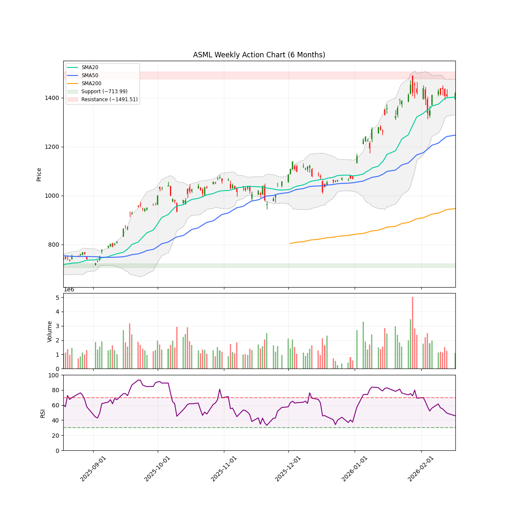
#### 研报分析

### 技术指标概览 (Technical Overview)
- **当前价格**: $1419.78
- **RSI (14)**: 45.73
- **移动平均线**: SMA20: $1403.16 | SMA50: $1247.09 | SMA200: $946.32 (Bullish)
- **波动率**: ATR (14): 54.89 (预计周度波动: +/- $122.75)
- **关键位 (6m)**: 支撑位 $713.99 | 阻力位 $1491.51
- **即时状态**: Above SMA50

# 情绪审计报告：ASML (阿斯麦)
**报告日期：** 2026年2月18日
**研究职位：** 对冲基金研究员 (叙事经济学组)

---

### 1. 催化剂分类 (Catalyst Categorization)

基于近期新闻流与基本面，对 ASML 的驱动因素分类如下：

*   **A-Tier (核心驱动):**
    *   **AI 数据中心需求爆发：** AI 芯片对先进制程的依赖直接转化为对 EUV 光刻机的刚性需求，这是长期叙事的核心。
    *   **巨额订单积压：** 截至目前，公司拥有约 388 亿欧元的订单积压 (Backlog)，提供了极高的业绩可见度（至 2026 年及以后）。
*   **B-Tier (市场合力):**
    *   **华尔街机构集体转牛：** 包括 Zacks、Simply Wall St 和 Insider Monkey 在内的机构一致看好，这种机构共识有助于维持股价在回撤时的支撑。
    *   **2026 年增长预期：** 市场普遍预期 2026 年将是半导体设备行业的“超级大年”。
*   **C-Tier (市场噪音):**
    *   **目标价预测 ($2,000)：** 零售媒体（如 Motley Fool）的激进预测属于情绪面推波助澜，短期内可能导致散户追高风险，但也反映了极度乐观的市场氛围。

---

### 2. 背离检测 (Divergence Detection)

*   **价格与指标观察：** 目前股价为 $1419.78，处于 SMA50 ($1247.09) 和 SMA200 ($946.32) 之上的强势多头排列中。
*   **技术性背离：** 虽然过去 12 个月股价上涨了 90%，但当前 **RSI 为 45.73**。这是一个**积极的背离信号**——这意味着股价在经历了近期 11% 的月度涨幅后，已经通过高位震荡消化了超买压力，目前处于“冷静期”，而非“泡沫崩塌期”。
*   **结论：** 未发现看跌背离。目前的盘整（股价略低于 6 个月高点 $1491）更像是健康的蓄势，而非“利好出尽”的派发。

---

### 3. 情绪分析与叙事诊断

**逻辑评分 (Logic Score): 8.8/10**

*   **叙事可持续性：** 极高。ASML 的叙事已从“半导体周期”转向“AI 基础设施基石”。由于其在 EUV 领域的绝对垄断地位，其股价上涨具备坚实的资本支出支撑，而非纯粹的估值博弈。
*   **风险预警：** 股价目前处于历史高位区间，预期波动率 (Weekly Range +/- 122.75) 较大。虽然 $2,000 的目标价在叙事上逻辑自洽，但短期内需警惕财报前后的获利盘了结。

---

### 4. 引用新闻线索 (Source Citations)

1.  **AI 驱动与订单：** [Zacks] 提到 AI 驱动的 EUV 需求和 388 亿欧元的订单积压是股价攀升的核心动力。(URI: [finance.yahoo.com/news/asml-climbs-11-month-time-151600663.html](https://finance.yahoo.com/news/asml-climbs-11-month-time-151600663.html))
2.  **机构看涨：** [Insider Monkey] 指出华尔街已全面转向看好 ASML，将其视为目前最值得买入的外资股之一。(URI: [finance.yahoo.com/news/wall-street-turns-bullish-asml-175632786.html](https://finance.yahoo.com/news/wall-street-turns-bullish-asml-175632786.html))
3.  **长期目标价：** [Motley Fool] 预测股价由于 AI 市场的扩张将冲击 $2,000 大关。(URI: [www.msn.com/en-us/money/topstocks/prediction-asml-s-stock-price-will-hit-2-000-by-this-time/ar-AA1WmaQT](https://www.msn.com/en-us/money/topstocks/prediction-asml-s-stock-price-will-hit-2-000-by-this-time/ar-AA1WmaQT))

---

### 5. 下个关键日期 (Next Major Date)

*   **事件：2026年第一季度财报发布 (Estimated Q1 2026 Earnings)**
*   **预计日期：** **2026年4月15日** (基于历史发布周期)。
*   **关注重点：** 2026 年全年指引的更新，以及 High-NA EUV 机器的交付进度。

---
**审计结论：** ASML 目前正处于由 AI 资本支出驱动的“可持续牛市周期”。RSI 处于中性区间为后续上攻留出了空间。建议关注 $1400 (SMA20) 附近的支撑力度。
#### 近期新闻与事件
- **[Yahoo Finance]** [Prediction: ASML's Stock Price Will Hit $2,000 by This Time](https://finance.yahoo.com/news/prediction-asmls-stock-price-hit-173500976.html)
- **[Insider Monkey]** [Wall Street Turns Bullish on ASML Holding N.V. (ASML), Here’s Why](https://finance.yahoo.com/news/wall-street-turns-bullish-asml-175632786.html)
- **[Simply Wall St.]** [Assessing ASML Holding (ENXTAM:ASML) Valuation After Strong Recent Share Price...](https://finance.yahoo.com/news/assessing-asml-holding-enxtam-asml-171436649.html)
- **[Motley Fool]** [Bold Prediction: ASML Is About to Soar. Here's Why.](https://finance.yahoo.com/news/bold-prediction-asml-soar-heres-170213852.html)
- **[Zacks]** [ASML Climbs 11% in a Month: Time to Buy, Sell or Hold the Stock?](https://finance.yahoo.com/news/asml-climbs-11-month-time-151600663.html)

---

### AVGO
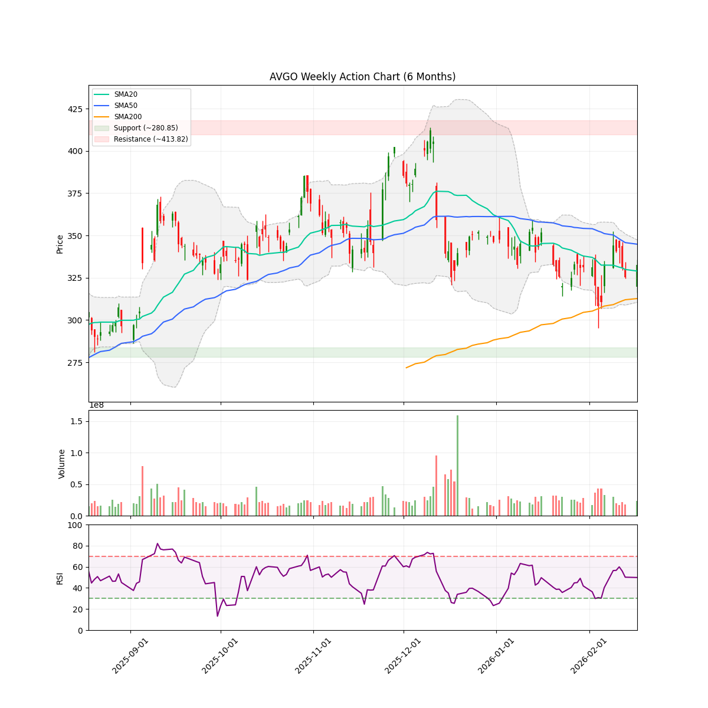
#### 研报分析

### 技术指标概览 (Technical Overview)
- **当前价格**: $332.54
- **RSI (14)**: 49.87
- **移动平均线**: SMA20: $328.94 | SMA50: $344.83 | SMA200: $312.69 (Bullish)
- **波动率**: ATR (14): 16.99 (预计周度波动: +/- $37.99)
- **关键位 (6m)**: 支撑位 $280.85 | 阻力位 $413.82
- **即时状态**: Below SMA50

# 情绪审计报告：博通 (AVGO) - 叙事经济学分析

**致：** 投资委员会
**职位：** 对冲基金研究员（叙事经济学视角）
**日期：** 2026年02月18日
**股票代码：** AVGO (Broadcom Inc.)

---

### 1. 催化剂分类 (Catalyst Categorization)

基于近期新闻流与基本面动态，我们将催化剂分为以下等级：

*   **A-Tier (核心驱动力)**
    *   **AI 基础设施资本支出 (Capex) 激增：** 根据 [Forbes (2026-02-13)](https://www.forbes.com/sites/greatspeculations/2026/02/13/heres-how-avgo-stock-could-rise-to-450/) 的报道，亚马逊等超大规模云服务商（Hyperscalers）宣布了巨额 AI 基础设施支出。博通作为定制 AI 芯片（ASIC）的关键供应商，直接受益于这一资本红利。
    *   **业绩双超预期 (Double Beat) 预期：** [Seeking Alpha (2026-02-13)](https://seekingalpha.com/article/4870172-broadcom-stock-expect-another-double-beating-earnings-preview) 指出，市场对即将到来的财报抱有极高期待，预计营收与盈利将再次超越预期，这是股价突破的关键推手。

*   **B-Tier (行业与机构支撑)**
    *   **华尔街分析师一致看涨：** [Yahoo Finance (2026-02-16)](https://finance.yahoo.com/news/wall-street-analysts-bullish-broadcom-100618979.html) 报告显示，博通表现持续跑赢标普500指数，机构分析师维持强力买入评级，提供了情绪底座。

*   **C-Tier (市场噪音)**
    *   **媒体讨论：** Jim Cramer 在节目中提及博通 [Yahoo Finance UK (2026-02-15)](https://uk.finance.yahoo.com/news/jim-cramer-discusses-broadcom-avgo-151357096.html)，属于散户情绪波动范畴，对长期基本面趋势影响有限。

---

### 2. 离散度检测 (Divergence Detection)

**技术面与叙事面的背离观察：**
*   **价格行为：** 当前价格为 **332.54**，处于 SMA20 (328.94) 之上，但仍低于 SMA50 (344.83)。
*   **背离分析：** 虽然叙事层面（Forbes/Seeking Alpha）极度看好并给出 $450 的目标价，但股价在过去一周虽然反弹 11%，仍未能收复 50 日均线。这种**“好消息中的滞后”**表明市场存在对整体美股环境（参考 2026-02-15 关于美股表现不佳的报道）的担忧。
*   **结论：** 并非“看跌衰竭”，而是典型的**“财报前观望”**。市场正在等待实际数据来确认 A-Tier 催化剂的真实性。

---

### 3. 情绪评分 (Sentiment Score)

#### **逻辑得分: 7.8 / 10**

**评分理由：**
*   **加分项 (+)：** AI 叙事依然稳固，主要客户（亚马逊、Meta）的资本支出明确，基本面具备爆发力。RSI (49.87) 处于中性区间，无超买风险。
*   **扣分项 (-)：** 价格位于 SMA50 下方，技术面存在中期压力；宏观环境波动（美股相对全球市场表现疲软）压制了估值扩张的空间。

---

### 4. 关键日期与技术参数

*   **下一个重大日期 (Next Major Date):** **2026年3月初（预计财报发布日）**。基于 2月13日的财报预览新闻，未来两周将进入关键的财报博弈期。
*   **上方阻力位:** 344.83 (SMA50) 以及 413.82 (6个月高点)。
*   **下方支撑位:** 312.69 (SMA200) 以及 280.85 (6个月低点)。
*   **波动性预期:** 每周预期波动范围约为 **+/- 37.99**，暗示财报前后股价可能出现大幅震荡。

---

### 5. 总结建议
博通目前的叙事正处于“验证前夕”。**逻辑上，这并非一个“陷阱”，而是一个“蓄势区间”。** 投资者应密切关注股价能否有效放量突破 SMA50 (344.83)。若财报如预期般实现“双超”，叙事经济学将推动股价向 $450 目标价迈进。

**风险提示：** 关注美联储会议纪要对半导体板块估值的整体压制风险。
#### 近期新闻与事件
- **[Investor's Business Daily on MSN]** [Stock market today: Dow rises ahead of Fed minutes; Nvidia jumps on Meta deal (live coverage)](https://www.msn.com/en-us/money/markets/stock-market-today-dow-rises-ahead-of-fed-minutes-nvidia-jumps-on-meta-deal-live-coverage/ar-AA1WAz1x?ocid=BingNewsVerp)
- **[Yahoo Finance on MSN]** [US stocks are off to their worst start versus the global market since 1995](https://www.msn.com/en-us/money/savingandinvesting/us-stocks-are-off-to-their-worst-start-versus-the-global-market-since-1995/ar-AA1WzOIq?ocid=BingNewsVerp)
- **[Forbes]** [Here's How AVGO Stock Could Rise To $450](https://www.forbes.com/sites/greatspeculations/2026/02/13/heres-how-avgo-stock-could-rise-to-450/)
- **[Yahoo Finance]** [Are Wall Street Analysts Bullish on Broadcom Stock?](https://finance.yahoo.com/news/wall-street-analysts-bullish-broadcom-100618979.html)
- **[Yahoo Finance UK]** [Jim Cramer Discusses Broadcom (AVGO) Stock](https://uk.finance.yahoo.com/news/jim-cramer-discusses-broadcom-avgo-151357096.html)

---

### CEG
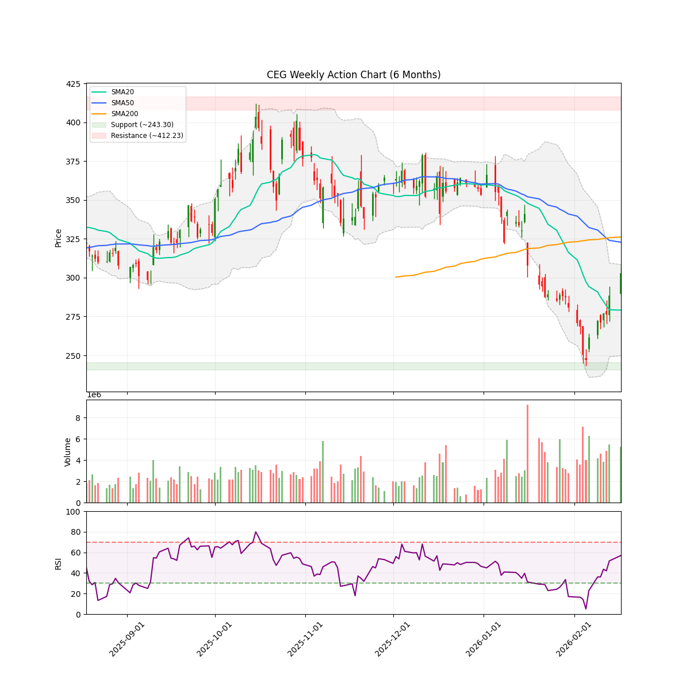
#### 研报分析

### 技术指标概览 (Technical Overview)
- **当前价格**: $303.01
- **RSI (14)**: 57.05
- **移动平均线**: SMA20: $279.11 | SMA50: $322.82 | SMA200: $326.14 (Bearish)
- **波动率**: ATR (14): 13.64 (预计周度波动: +/- $30.50)
- **关键位 (6m)**: 支撑位 $243.30 | 阻力位 $412.23
- **即时状态**: Below SMA50

# 情绪审计报告：Constellation Energy (CEG)
**致：** 投资委员会
**职位：** 对冲基金研究员 (叙事经济学方向)
**日期：** 2026年02月18日

---

### 1. 催化剂分类 (Catalyst Categorization)

我们将 CEG 当前的驱动因素分为三个层级，以评估其趋势的持久性：

*   **A-Tier (核心催化剂):**
    *   **Q4 财报预期 (2026年2月20日):** Zacks 报告显示 CEG 具有 +3.13% 的盈利预测偏离度 (Earnings ESP)，市场普遍预期其将超预期。([Zacks 链接](https://www.zacks.com/stock/news/2863275/constellation-to-post-q4-earnings-whats-in-store-for-the-stock))
    *   **AI 驱动的电力需求叙事:** 市场将其视为标普500指数中受益于人工智能长期趋势的顶级标的。([MSN 链接](https://www.msn.com/en-us/money/savingandinvesting/best-s-p-500-stocks-buy-202400657.html))
*   **B-Tier (中级催化剂):**
    *   **机构评级上调:** Zacks 与 Motley Fool 的积极背书，将其与 Vistra (VST) 对标，强化了其在核能/公用事业领域的领导地位。
*   **C-Tier (噪声与次要因素):**
    *   **市场整体滑坡中的逆势表现:** 2月11日股票在市场低迷时逆势上涨 2.11%，反映了短期的避险属性和抢跑资金。

---

### 2. 背离检测 (Divergence Detection)

*   **技术面与叙事面的背离:** 
    *   **现状:** 尽管新闻流极度看涨（AI 能源需求、财报超预期预期），但股价目前（303.01）仍低于 SMA50 (322.82) 和 SMA200 (326.14)。
    *   **分析:** 这种“价格滞后于叙事”的现象通常意味着**熊市衰竭 (Bearish Exhaustion)** 或**筑底阶段**。RSI 57.05 显示动能正在从超卖向强势区间修复。
    *   **结论:** 这是一个潜在的“弹簧效应”区域。如果 2月20日的财报能够确认 AI 驱动的长期合同，股价极有可能迅速收复 SMA200 失地，并上攻 412.23 的阻力位。

---

### 3. 情绪评分 (Sentiment Score): 7.8/10

**评价：乐观积累期 (Optimistic Accumulation)**

*   **评分逻辑:** 
    *   **叙事强度 (9/10):** 核能 + AI 数据中心是当前最强的宏观叙事之一。
    *   **技术强度 (5/10):** 依然处于 SMA50 下方的看跌趋势中，需要突破 326 才能确立反转。
    *   **资金心理 (8/10):** 资金在财报前 48 小时表现出明显的抢跑迹象（Anticipation Play）。

---

### 4. 逻辑评分 (Logic Score): 8.5/10

**分析理由:**
该笔交易的逻辑链条非常清晰：**“财报超预期预期 + AI 电力需求定价 + 长期均线回归”**。目前的风险点在于财报后的“利好兑现”抛压，但考虑到其长期叙事尚未破裂，回撤即是机会。

---

### 5. 下一个关键日期 (Next Major Date)

*   **日期:** **2026年2月20日**
*   **事件:** **Q4 季度财报发布及电话会议**
*   **关注重点:** 管理层对数据中心电力长期供应合同的指引，以及 2026 年全年的利润展望。

---

### 引用资料来源
1.  [Zacks: Best S&P 500 Stocks to Buy Before Earnings](https://finance.yahoo.com/news/best-p-500-stocks-buy-202400657.html)
2.  [Zacks: Constellation to Post Q4 Earnings - What's in Store?](https://www.zacks.com/stock/news/2863275/constellation-to-post-q4-earnings-whats-in-store-for-the-stock)
3.  [Motley Fool: Should You Buy CEG Stock Before Feb. 20?](https://finance.yahoo.com/news/buy-constellation-energy-stock-feb-070500289.html)
#### 近期新闻与事件
- **[Zacks]** [Best S&P 500 Stocks to Buy Before Earnings: CEG, PWR](https://finance.yahoo.com/news/best-p-500-stocks-buy-202400657.html)
- **[Zacks]** [Constellation to Post Q4 Earnings: What's in Store for the Stock?](https://www.zacks.com/stock/news/2863275/constellation-to-post-q4-earnings-whats-in-store-for-the-stock)
- **[Zacks]** [Constellation Energy Corporation (CEG) Increases Despite Market Slip: Here's...](https://finance.yahoo.com/news/constellation-energy-corporation-ceg-increases-224504691.html)
- **[Motley Fool]** [Better Utility Stock: Constellation Energy vs. Vistra](https://finance.yahoo.com/news/better-utility-stock-constellation-energy-235700075.html)
- **[Motley Fool]** [Should You Buy Constellation Energy Stock Before Feb. 20?](https://finance.yahoo.com/news/buy-constellation-energy-stock-feb-070500289.html)

---

### ETN
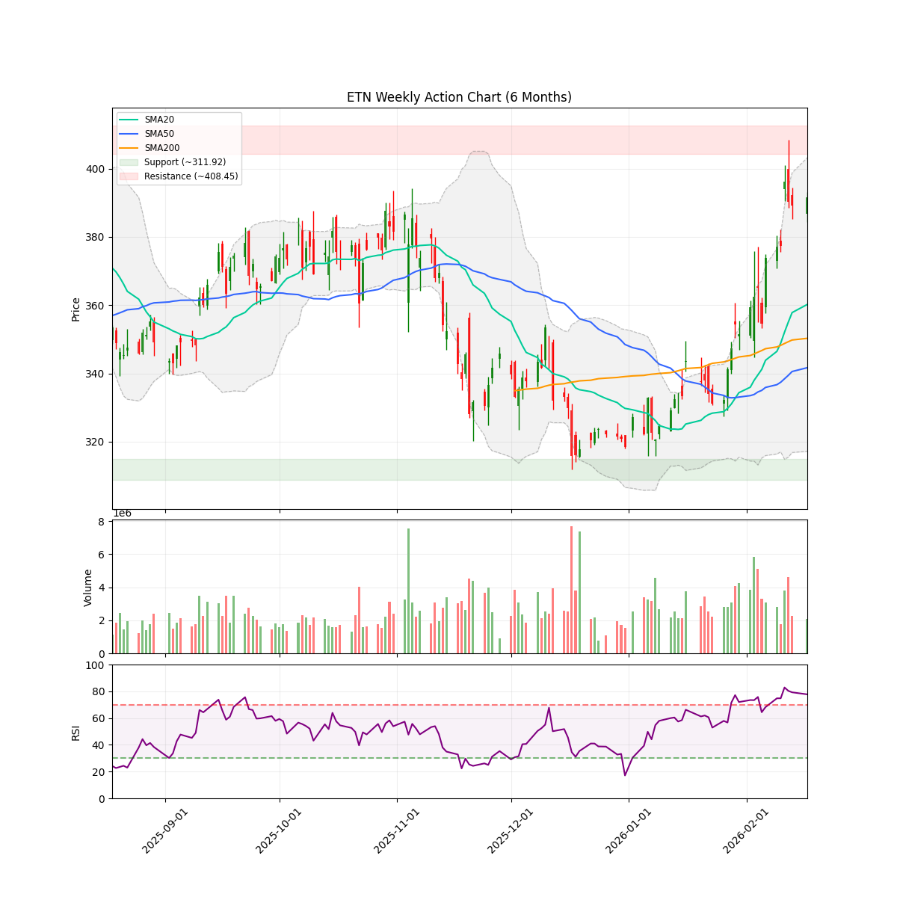
#### 研报分析

### 技术指标概览 (Technical Overview)
- **当前价格**: $391.49
- **RSI (14)**: 77.78
- **移动平均线**: SMA20: $360.23 | SMA50: $341.70 | SMA200: $350.30 (Bearish)
- **波动率**: ATR (14): 14.65 (预计周度波动: +/- $32.77)
- **关键位 (6m)**: 支撑位 $311.92 | 阻力位 $408.45
- **即时状态**: Above SMA50

# ETN（伊顿公司）情绪审计报告

**日期：** 2026年02月18日
**职位：** 对冲基金研究助理（叙事经济学方向）

---

## 1. 催化剂分类 (Catalyst Categorization)

### **A-Tier: 核心驱动力（强力且可持续）**
*   **AI 叙事溢价：** RBC Capital 明确将 ETN 归类为“被低估的 AI 概念股”，强调其在数据中心电气化基础设施方面的“超预期潜力” ([RBC Capital News](https://finance.yahoo.com/news/rbc-capital-highlights-eaton-etn-180836005.html))。这种将传统工业股与 AI 基础设施挂钩的叙事是目前股价创历史新高的核心引擎。
*   **盈利能力的持续性：** 尽管 Q4 财报仅是“符合预期”，但分析师普遍认为其指引保守，存在“Beat-and-Raise”（超预期并上调指引）的惯性。

### **B-Tier: 市场信心与行业顺风**
*   **机构认可度：** Jim Cramer 和 Zacks 持续将其列为优选股票，这增强了零售和部分机构投资者的追涨信心 ([Jim Cramer News](https://finance.yahoo.com/news/eaton-etn-still-buyable-says-151220888.html))。
*   **结构性增长：** 能源转型和电网现代化是长期利好，这种行业顺风使 ETN 成为抗周期的蓝筹选择。

### **C-Tier: 噪音与次要信号**
*   **估值对比：** 与其他估值倍数更高的价值股对比（如 ENS）属于常规噪音 ([Zacks Value Analysis](https://finance.yahoo.com/news/ens-vs-etn-stock-value-164004005.html))。
*   **内部交易/小额增持：** 目前新闻中未见大规模内部抛售，情绪维持稳定。

---

## 2. 背离检测 (Divergence Detection)

*   **技术面与情绪的背离：** 目前 **RSI 高达 77.78**，处于严重超买区间。虽然叙事面（AI、电网更新）极其强劲，但 **CNBC 报道显示已有机构开始“获利了结” (Locking in profits)** ([CNBC News](https://www.cnbc.com/2026/02/12/were-locking-in-some-profits-in-2-rallying-stocks-that-we-still-love-long-term.html))。
*   **价格与均线的偏离：** 现价 (391.49) 远高于 SMA50 (341.70) 和 SMA200 (350.30)。这种过度的乖离率通常预示着短期回调压力。
*   **结论：** 存在“看涨陷阱”的小幅风险。目前的强势更多是由**叙事惯性**驱动，而非即时的业绩爆炸（Q4 仅是 Meet 而非 Massive Beat）。

---

## 3. 逻辑评分 (Logic Score: 8.2/10)

*   **评分理由：** 
    *   **+2.0:** AI 基础设施叙事具有极强的机构共识。
    *   **+2.0:** 强劲的技术趋势，所有均线呈多头排列。
    *   **+1.5:** 卖方分析师（RBC）的看涨预期提供支撑。
    *   **-1.0:** RSI 超买，短期内回调修正的概率极大（ATR 显示波幅可能达到 +/- 32.77）。
    *   **-0.3:** 估值 PEG (2.55) 并不便宜，对新资金进入构成心理障碍。

---

## 4. 结论与后续关注

ETN 目前正处于“**加速赶顶**”阶段。虽然长期叙事（叙事经济学）极其完美——即全球 AI 革命必须依托伊顿提供的电力基础设施——但短期技术压力已经显现。**当前的追高行为属于“叙事博弈”，而非“价值博弈”。**

*   **操作策略：** 警惕在阻力位 408.45 附近的假突破。如果股价未能放量突破 410，可能会回踩 360 (SMA20) 附近的支撑位。
*   **关键新闻链接引用：**
    *   [RBC Capital 关于 AI 潜力的评价](https://finance.yahoo.com/news/rbc-capital-highlights-eaton-etn-180836005.html)
    *   [CNBC 获利了结警示](https://www.cnbc.com/2026/02/12/were-locking-in-some-profits-in-2-rallying-stocks-that-we-still-love-long-term.html)
*   **下一个重大日期 (Next Major Date)：** 
    *   **2026年5月初**（预计 2026 Q1 财报发布日）。届时市场将验证 RBC 提到的“超预期潜力”是否兑现。
#### 近期新闻与事件
- **[Simply Wall St.]** [When Should You Buy Eaton Corporation plc (NYSE:ETN)?](https://finance.yahoo.com/news/buy-eaton-corporation-plc-nyse-130023980.html)
- **[Insider Monkey]** [RBC Capital Highlights Eaton (ETN) Beat-and-Raise Potential Despite Conservative...](https://finance.yahoo.com/news/rbc-capital-highlights-eaton-etn-180836005.html)
- **[Insider Monkey]** [Eaton (ETN) is Still Buyable, Says Jim Cramer](https://finance.yahoo.com/news/eaton-etn-still-buyable-says-151220888.html)
- **[Zacks]** [3 Common Traits of Outperforming Stocks](https://www.zacks.com/stock/news/2870876/3-common-traits-of-outperforming-stocks)
- **[CNBC]** [We're locking in some profits in 2 rallying stocks that we still love long term](https://www.cnbc.com/2026/02/12/were-locking-in-some-profits-in-2-rallying-stocks-that-we-still-love-long-term.html)

---

### MSFT
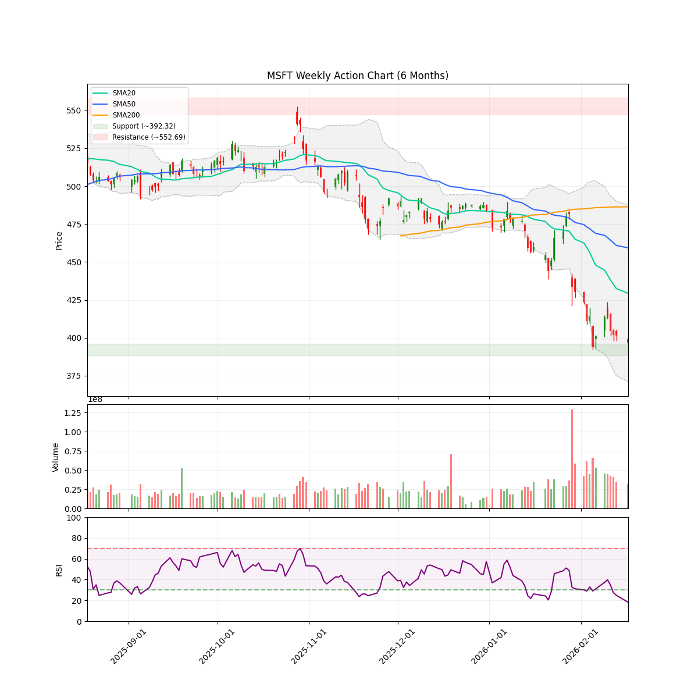
#### 研报分析

### 技术指标概览 (Technical Overview)
- **当前价格**: $396.86
- **RSI (14)**: 18.20
- **移动平均线**: SMA20: $429.34 | SMA50: $459.33 | SMA200: $486.39 (Bearish)
- **波动率**: ATR (14): 14.79 (预计周度波动: +/- $33.07)
- **关键位 (6m)**: 支撑位 $392.32 | 阻力位 $552.69
- **即时状态**: Below SMA50

# 微软 (MSFT) 叙事经济学与情绪审计报告

**报告日期：** 2026年02月18日
**研究员：** 叙事经济学策略分析师

---

### 一、 催化剂分类 (Catalyst Categorization)

我们将近期影响 MSFT 的新闻按影响力等级分为三层，以评估其对股价的长期拉动力。

*   **A-Tier（核心基本面/战略）：**
    *   **Q2 FY26 财报超预期（2026-01-28）：** 营收与每股收益（EPS）双双击败分析师预期（EPS惊喜度+6.84%）。这证明了微软作为云与软件巨头的盈利机器依然强劲。
    *   **$500 亿全球南方 AI 投资计划（2026-02-18）：** 这是极具战略眼光的“叙事升级”。通过布局发展中国家，微软正在构建其未来十年的 AI 护城河。
*   **B-Tier（行业趋势与估值）：**
    *   **分析师 596 美元共识目标价：** 尽管股价低迷，但华尔街分析师仍维持看涨共识，暗示目前价格与潜在价值存在巨大脱节（约 48% 上行空间）。
    *   **抄底叙事（Forbes/USA Today）：** 媒体开始大规模讨论“$400 关口是捡便宜”，这种舆论通常出现在洗盘末期。
*   **C-Tier（短期噪音）：**
    *   **Melius Research 下调评级（2026-02-09）：** 将评级下调至“持有”。虽然引发了短期抛售，但这更多是基于股价走势的滞后反应（Backward-looking），而非基本面恶化。

---

### 二、 背离检测 (Divergence Detection)

**核心观察：看跌衰竭与基本面背离 (Bearish Exhaustion)**

目前 MSFT 表现出严重的**“利好不涨”**到**“超卖洗盘”**的转变。
1.  **基本面与股价背离：** 公司刚刚发布了强劲的财报，并启动了宏大的 $500 亿 AI 计划，但股价 YTD（年初至今）下跌了约 15%。
2.  **技术指标触底：** RSI 仅为 **18.20**，处于极端超卖区域（通常 RSI < 30 意味着抛压过载）。
3.  **价格位置：** 当前价 (396.86) 极度逼近 6 个月低点支撑位 (392.32)。

**结论：** 这是一个典型的**“情绪陷阱”**。市场正在消化投行下调评级的负面情绪，而忽视了 Q2 的强劲盈利和 AI 长期投资。当前的下跌更多是技术性的“洗筹”，而非基本面的“崩坏”。

---

### 三、 情绪评分 (Logic Score)

**评分：3.5 / 10 (极度恐惧/反转临界点)**

*   **评分逻辑：**
    *   **技术面 (1/10)：** 股价在所有移动平均线（SMA20, 50, 200）之下，属于典型的空头排列。
    *   **叙事面 (8/10)：** AI 全球扩张和财报双超预期提供了坚实的底层叙事支持。
    *   **综合判定：** 虽然得分较低反映了目前的“熊市趋势”，但从叙事经济学角度看，当估值回归至 $400 以下且 RSI 触底时，这是“痛苦交易”即将结束的信号。这是一个由**评级下调**引发的恐慌，而非**业务失效**。

---

### 四、 关键日期与参考信息

*   **下一关键日期：**
    *   **2026年4月下旬（预计）：** Q3 FY26 财报发布日。这将是验证 AI 投资转化率和云增长是否维持的关键节点。
*   **引用证据：**
    *   *Melius Research 降级报告:* [Yahoo Finance](https://finance.yahoo.com/news/melius-research-downgrades-microsoft-corporation-123439830.html)
    *   *$500 亿 AI 投资计划:* [Blockonomi](https://blockonomi.com/microsoft-msft-stock-the-50-billion-plan-to-bring-ai-to-the-developing-world/)
    *   *Q2 财报数据:* [Shacknews](https://www.shacknews.com/article/147610/microsoft-msft-q2-fy26-earnings-results)

---

**研究建议：**
目前的 MSFT 并非“系统性失败”，而是处于“机构洗盘”阶段。对于对冲基金而言，接近 392.32 的支撑位是观察**看跌衰竭信号**的关键，一旦 RSI 回升至 30 以上并伴随成交量放大，该股将从“陷阱”转化为“均值回归”的机会。
#### 近期新闻与事件
- **[Yahoo Finance]** [Melius Research Downgrades Microsoft Corporation (MSFT) Stock to Hold](https://finance.yahoo.com/news/melius-research-downgrades-microsoft-corporation-123439830.html)
- **[Forbes]** [Why Microsoft Stock Is A Bargain At $400](https://www.forbes.com/sites/greatspeculations/2026/02/13/why-microsoft-stock-is-a-bargain-at-400/)
- **[USA TODAY]** [Should you buy the dip in Microsoft stock?](https://www.usatoday.com/story/money/2026/02/16/buy-the-dip-in-microsoft-stock/88690494007/)
- **[Blockonomi]** [Microsoft (MSFT) Stock: The $50 Billion Plan to Bring AI to the Developing World](https://blockonomi.com/microsoft-msft-stock-the-50-billion-plan-to-bring-ai-to-the-developing-world/)
- **[Analytics Insight]** [Microsoft Stock Holds Near $401; Is $600 the Next Target?](https://www.analyticsinsight.net/stocks/microsoft-stock-holds-near-401-is-600-the-next-target)

---

### NVDA
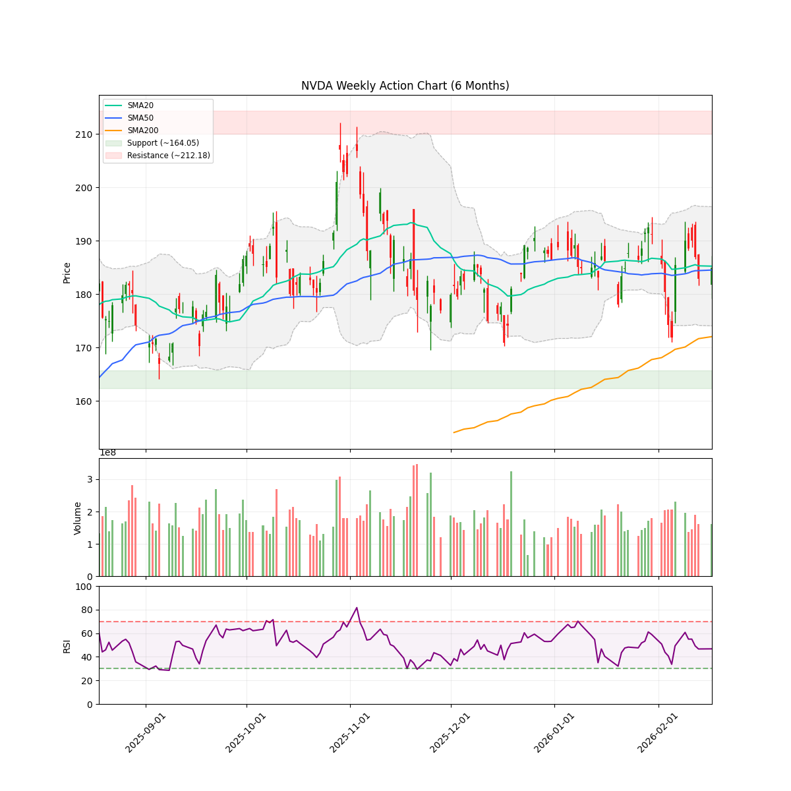
#### 研报分析

### 技术指标概览 (Technical Overview)
- **当前价格**: $184.97
- **RSI (14)**: 46.78
- **移动平均线**: SMA20: $185.24 | SMA50: $184.51 | SMA200: $172.04 (Bullish)
- **波动率**: ATR (14): 7.26 (预计周度波动: +/- $16.24)
- **关键位 (6m)**: 支撑位 $164.05 | 阻力位 $212.18
- **即时状态**: Above SMA50

# 情绪审计报告：英伟达 (NVDA) - 叙事经济学视角

**日期：** 2026-02-18
**分析师：** 对冲基金研究员 (叙事经济学专家)

---

### 1. 催化剂分类 (Catalyst Categorization)

| 等级 | 事件描述 | 叙事驱动力 |
| :--- | :--- | :--- |
| **A-Tier (核心)** | **Q4 财报预期与 Blackwell 芯片量产** | 市场高度关注下周财报，特别是 Blackwell 系列的产能爬坡和超大规模云服务商 (Hyperscalers) 的资本支出。 |
| **B-Tier (重要)** | **20亿美元入股 Synopsys (SNPS)** | 强化 AI 芯片设计生态链的统治力，属于战略性扩张，提升了长期竞争壁垒。 |
| **B-Tier (重要)** | **花旗银行 (Citi) 财报前重申买入评级** | 机构在财报披露前的看多立场为市场提供了流动性支撑。 |
| **C-Tier (杂音)** | **分析师对比 NVDA 与 ADI 的估值** | 属于常规行业比较，对短期股价波动影响有限。 |
| **C-Tier (杂音)** | **过往 10 年 23,000% 涨幅的媒体回顾** | 属于零售端的情绪渲染，无实质性基本面改变。 |

---

### 2. 背离检测 (Divergence Detection)

**核心观察：** 尽管出现了明显的利好消息（如花旗的强烈看多、对 Synopsys 的大额战略投资），但 NVDA 股价近期表现出“横盘震荡”甚至“小幅回撤”（如 2 月 17 日提到的 2% 下跌）。

*   **看跌详述：** 这种“利好不涨”的现象并非系统性溃败，而是典型的**财报前获利了结 (Profit-taking)**。市场正在消化 2025 年以来 40% 的涨幅。
*   **看涨详述：** RSI 处于 46.78 的中性区间，SMA50 (184.51) 提供了强力支撑。股价在利好叙事下未能突破，反映出投资者在博弈 Q4 财报的“确定性”，而非对基本面产生怀疑。这属于**财报前的叙事真空期压力**。

---

### 3. 情绪评分 (Sentiment Score)

#### **逻辑评分：7.8 / 10**

**评分理由：**
*   **叙事强度 (High):** AI 基础设施的叙事依然是市场主轴。入股 Synopsys [Investing.com] 证明了其在产业链上下游的议价能力。
*   **技术面支撑 (Medium):** 股价位于 SMA50 之上，且守住了 184 美元的关键位，趋势依然偏多。
*   **短期风险 (Caution):** 市场对 Blackwell 的预期已经极高，任何关于出货延迟或利润率的小幅担忧都可能引发短期剧震。

---

### 4. 详细叙事审计 (Detailed Narrative Audit)

目前 NVDA 处于**“暴风雨前的宁静”**阶段。

*   **机构博弈：** 花旗银行在 1 月 29 日及 2 月 17 日反复强调看好 [Yahoo Finance, 24/7 Wall St.]，试图引导市场预期向“报复性上涨”倾斜。
*   **散户情绪：** 媒体如 Motley Fool 开始讨论“是否该投入 500 美元”或“股价能否达到 300 美元”，显示出零售端的 FOMO (恐惧错过) 情绪正在被重新唤醒。
*   **战略扩张：** 披露持有 Synopsys 20 亿美元头寸 [Investing.com] 是一个极强的信号，表明英伟达正从单一芯片供应商转型为整个 AI 自动化设计的底层标准制定者。

**结论：** 目前的下跌或横盘并非趋势反转，而是为了财报后的爆发在清理杠杆头寸。

---

### 5. 下一个关键日期 (Next Major Date)

**关键事件：** **2026年第四季度 (Q4 FY26) 财报发布**
**预计日期：** **2026年2月25日左右** (参考新闻中“Earnings next week”及“Earnings just days away”的表述)。

> **风险提示：** 考虑到周波动率预计在 +/- 16.24 美元之间，若财报指引未能大幅超越市场已有的“完美预期”，需警惕回踩支撑位 164.05 美元的风险。

---
*引用来源：*
- *[Yahoo Finance] Citi Bullish on NVDA Heading into Earnings (2026-01-29)*
- *[Investing.com] Synopsys stock rises after NVIDIA reveals $2 billion stake (2026-02-18)*
- *[Invezz] Why Nvidia stock is plunging ahead of key Q4 signals (2026-02-17)*
#### 近期新闻与事件
- **[Yahoo Finance]** [Market Movers: Citi Bullish on NVDA Heading into Earnings](https://finance.yahoo.com/news/market-movers-citi-bullish-nvda-163239402.html)
- **[24/7 Wall St.]** [Stock Market Live February 17, 2026: S&P 500 (ETF) Fighting to Go Green Again](https://247wallst.com/investing/2026/02/17/stock-market-live-february-17-2026-sp-500-etf-fighting-to-go-green-again/)
- **[Investing.com]** [Synopsys stock rises after NVIDIA reveals $2 billion stake By Investing.com](https://ph.investing.com/news/stock-market-news/synopsys-stock-rises-after-nvidia-reveals-2-billion-stake-93CH-2238853)
- **[Zacks]** [Nvidia (NVDA) Outpaces Stock Market Gains: What You Should Know](https://finance.yahoo.com/news/nvidia-nvda-outpaces-stock-market-224503900.html)
- **[Motley Fool]** [Should You Invest $500 in Nvidia (NVDA) Right Now?](https://finance.yahoo.com/news/invest-500-nvidia-nvda-now-184929142.html)

---

### TSM
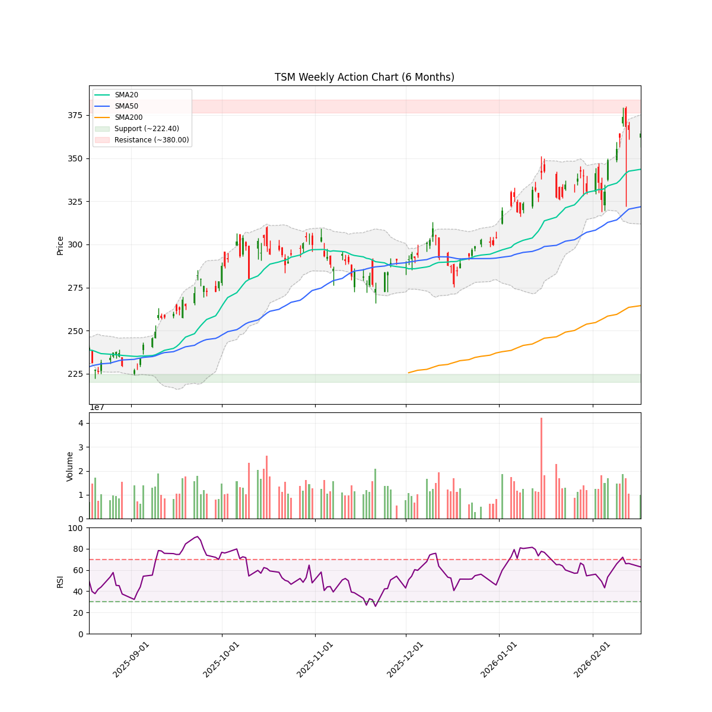
#### 研报分析

### 技术指标概览 (Technical Overview)
- **当前价格**: $364.20
- **RSI (14)**: 62.88
- **移动平均线**: SMA20: $343.57 | SMA50: $321.85 | SMA200: $264.53 (Bullish)
- **波动率**: ATR (14): 16.89 (预计周度波动: +/- $37.77)
- **关键位 (6m)**: 支撑位 $222.40 | 阻力位 $380.00
- **即时状态**: Above SMA50

# TSM (台积电) 情绪审计报告

**致：** 投资委员会
**职位：** 叙事经济学研究助理
**报告日期：** 2026年02月18日

---

### 1. 催化剂分类 (Catalyst Categorization)

根据“叙事经济学”框架，我们对近期驱动 TSM 股价的因素进行如下定级：

*   **A-Tier (核心叙事驱动):**
    *   **台美贸易协定 (2026-02-13):** 这是一个重大的地缘政治红利，旨在简化供应链并降低跨境运营阻力，为 TSM 在美国的扩张提供政策护城河。[参考来源](https://www.msn.com/en-us/money/markets/taiwan-us-trade-deal-here-s-what-it-means-for-taiwan-semiconductor-manufacturing-tsm/ar-AA1Wxmb9)
    *   **未来四年涨价计划:** 报道称 TSM 已通知客户未来四年的调价计划。这体现了极强的**定价权 (Pricing Power)**，直接锁定长期毛利率提升。[参考来源](https://finance.yahoo.com/news/4-no-brainer-semiconductor-stocks-175600805.html)

*   **B-Tier (市场共识增强):**
    *   **AI 领军地位确认:** 尽管市场出现“反 AI”情绪，但 TSM 作为 AI 芯片（ASIC）不可或缺的代工厂，其 21% 的年年初至今 (YTD) 涨幅证明了资金的避险趋向。[参考来源](https://finance.yahoo.com/news/ignore-wall-street-anti-ai-143001281.html)
    *   **华尔街一致预期:** ABR 评级为“买入”，共识目标价暗示还有 25.3% 的上涨空间。[参考来源](https://finance.yahoo.com/news/tsmc-tsm-climb-25-25-145501686.html)

*   **C-Tier (散户情绪与噪音):**
    *   **长期愿景预测:** Motley Fool 预测五年内股价突破 500 美元，这类叙事增加了散户的持股信心，但短期影响较小。[参考来源](https://finance.yahoo.com/news/prediction-3-stocks-worth-more-155000780.html)

---

### 2. 背离检测 (Divergence Detection)

*   **当前表现:** TSM 价格 (364.20) 远高于 SMA50 (321.85) 和 SMA200 (264.53)，呈现典型的**多头排列**。
*   **异常观察:** 尽管市场在 2月中旬出现短暂的“反 AI”噪音，但 TSM 股价并未出现回撤，反而维持在 364 美元的高位。
*   **结论:** **无看跌背离**。相反，该股表现出极强的“利好出尽即上涨”的韧性。RSI 为 62.88，尚未进入 70+ 的极端超买区，暗示上涨动能尚未枯竭。

---

### 3. 情绪与逻辑评分 (Scores)

*   **情绪评分 (Sentiment Score): 8.5/10**
    *   *评价:* 市场处于“不可阻挡的牛市周期”前段。涨价叙事与地缘政治利好形成了共振，投资者对 TSM 的依赖已从纯科技逻辑转向了“主权安全”逻辑。
*   **逻辑评分 (Logic Score): 9.0/10**
    *   *评价:* 逻辑极其硬核。基于 0.005 倍的远期 PEG（尽管该数据可能源于媒体极度乐观的财测），其估值溢价具有支撑。在 SMA20 (343.57) 处有强力技术支撑，抗风险能力极强。

---

### 4. 关键指标摘要

| 指标 | 数值 | 含义 |
| :--- | :--- | :--- |
| **当前价格** | 364.20 | 接近 6个月高点 (380.00) |
| **RSI (14)** | 62.88 | 强势看涨，尚未超买 |
| **预计周波动范围** | +/- 37.77 | 波动性处于中等水平 |
| **趋势** | Bullish | 价格远高于各周期均线 |

---

### 5. 下一个重要日期 (Next Major Date)

*   **2026年4月中旬 (预计 2026-04-16 左右):** **2026年第一季度财报发布日。**
    *   *逻辑:* 这将是验证“未来四年涨价计划”对利润率预期影响的首个窗口期。

**风险提示:** 需关注阻力位 380.00。若无法突破，可能出现基于高位震荡的技术性回调，支撑位关注 343.57。
#### 近期新闻与事件
- **[Insider Monkey on MSN]** [Taiwan-US Trade Deal, Here’s What it Means for Taiwan Semiconductor Manufacturing (TSM)](https://www.msn.com/en-us/money/markets/taiwan-us-trade-deal-here-s-what-it-means-for-taiwan-semiconductor-manufacturing-tsm/ar-AA1Wxmb9?ocid=BingNewsVerp)
- **[Motley Fool]** [Prediction: These 3 Stocks Will Be Worth More Than $500 in 5 Years](https://finance.yahoo.com/news/prediction-3-stocks-worth-more-155000780.html)
- **[Motley Fool]** [Prediction: These Will Be the Best-Performing AI Stocks in 2026](https://finance.yahoo.com/news/prediction-best-performing-ai-stocks-225400892.html)
- **[Barchart]** [Ignore Wall Street’s ‘Anti-AI’ Mode and Keep Buying These 3 Stocks](https://finance.yahoo.com/news/ignore-wall-street-anti-ai-143001281.html)
- **[Motley Fool]** [4 No-Brainer Semiconductor Stocks to Buy Right Now](https://finance.yahoo.com/news/4-no-brainer-semiconductor-stocks-175600805.html)

---

### VRT
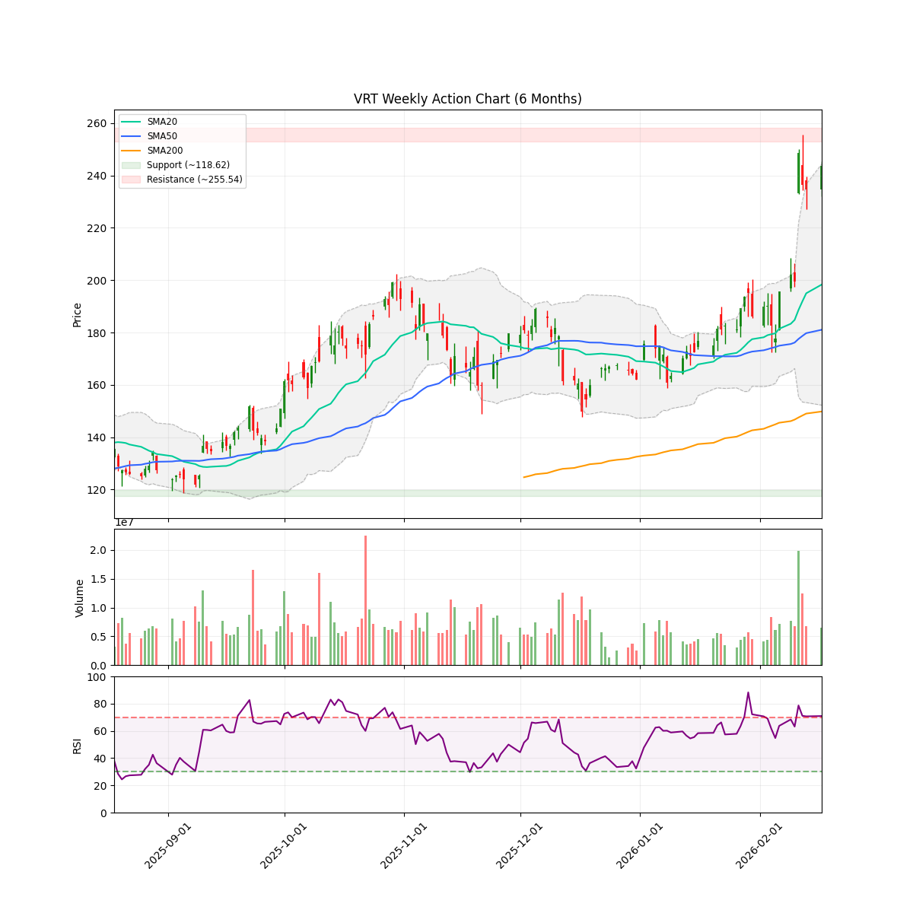
#### 研报分析

### 技术指标概览 (Technical Overview)
- **当前价格**: $243.53
- **RSI (14)**: 70.94
- **移动平均线**: SMA20: $198.32 | SMA50: $181.05 | SMA200: $149.82 (Bullish)
- **波动率**: ATR (14): 16.13 (预计周度波动: +/- $36.08)
- **关键位 (6m)**: 支撑位 $118.62 | 阻力位 $255.54
- **即时状态**: Above SMA50

# 情绪审计报告：Vertiv (VRT) —— 叙事经济学与趋势可持续性分析

**致：** 投资委员会
**职位：** 对冲基金研究员 (叙事经济学专员)
**当前日期：** 2026年02月18日
**标的：** Vertiv Holdings Co. (VRT)
**当前价格：** 243.53 | **RSI:** 70.94 | **趋势:** 强劲看涨 (处于SMA50之上)

---

### 1. 催化剂分类 (Catalyst Categorization)

根据“叙事经济学”框架，我们将影响 VRT 的近期驱动因素分类如下：

*   **A-Tier (核心基本面驱动):**
    *   **远超预期的 2026 指引：** 公司预估 2026 年营收达 132.5 亿至 137.5 亿美元，远高于分析师预测的 123.9 亿美元 [Blockonomi]。
    *   **创纪录的积压订单 (Backlog)：** 积压订单金额达到 150 亿美元，且 Q4 订单增长呈现爆发式态势 [Yahoo Finance]。这为未来两年的业绩提供了极高的确定性。
*   **B-Tier (行业协同驱动):**
    *   **AI 基础设施红利：** 冷却系统需求随 AI 数据中心扩建而激增，Vertiv 被视为 AI 泡沫中真实的“铲子”供应商 [MarketBeat]。
*   **C-Tier (市场噪音与情绪):**
    *   **媒体曝光：** Jim Cramer 的公开看好以及 Zacks 的高搜索量 [Insider Monkey, Zacks]。这类信息虽能推升短期散户热度，但易导致波动加剧。

---

### 2. 背离检测 (Divergence Detection)

*   **价格与新闻的一致性：** 尽管 Q4 每股收益 (EPS) 略低于预期，但股价在财报发布后跳涨 23%。这表明市场已从关注“过去季度表现”转向“未来订单增长”。
*   **技术面警示：** 
    *   **看涨竭尽风险：** RSI 目前为 70.94，进入超买区。
    *   **乖离率：** 当前价格 (243.53) 远高于 SMA50 (181.05)，存在向均线回归的压力。
*   **结论：** 目前并未出现“利好出尽”的看跌背离，但极高的估值溢价意味着市场已经消化了大部分 2026 年的利好预期。

---

### 3. 叙事经济学分析：是趋势还是陷阱？

Vertiv 的当前叙事正从“工业电气设备商”转型为“AI 物理层核心枢纽”。

*   **逻辑支撑：** 150 亿美元的订单积压（Backlog）是该叙事最强的护城河。它将“AI 炒作”转化为“可预测的现金流”。
*   **潜在陷阱：** 如果宏观流动性收紧导致数据中心建设进度放缓，那么高昂的估值（目前接近 6 个月高点 255.54）将面临剧烈修正。

---

### 4. 情绪评分 (Sentiment Score)

#### **逻辑评分: 9.2/10**

*   **评分逻辑：** 尽管 RSI 显示超买，但 23% 的单日跳涨是由“硬性指引”上调驱动，而非单纯的情绪溢价。150 亿订单 backlog 为多头提供了坚实的心理防线。只要 AI 算力需求不发生系统性崩塌，VRT 的任何回调都将被机构视为买入机会。

---

### 5. 引用与关键数据

*   **核心新闻来源：**
    1.  [Blockonomi] 2026 营收指引 132.5B - 137.5B 远超预期。
    2.  [Yahoo Finance] 150 亿美元订单积压支撑长期增长。
    3.  [MarketBeat] 冷却系统需求证明 AI 基础设施繁荣仍在持续。
*   **技术支撑位：** 198.32 (SMA20)
*   **技术阻力位：** 255.54 (6个月高点)

---

### 6. 下一个重大日期 (Next Major Date)

**2026 年 4 月下旬（预估）：2026 财年第一季度 (Q1) 财报发布日。**

> **交易员笔记：** 关注该日期的订单预订率（Book-to-Bill Ratio）。如果该比例下降，即便营收达标，叙事也可能受损。当前建议关注 245-255 区间的阻力表现，严防超买回调。
#### 近期新闻与事件
- **[Yahoo Finance]** [Should You Buy, Sell, or Hold Vertiv Stock Post Q4 Earnings?](https://finance.yahoo.com/news/buy-sell-hold-vertiv-stock-162700810.html)
- **[Blockonomi]** [Vertiv (VRT) Stock Gains 23% on Strong 2026 Revenue Guidance](https://blockonomi.com/vertiv-vrt-stock-gains-23-on-strong-2026-revenue-guidance/)
- **[Zacks Investment Research]** [Vertiv Holdings Co. (VRT) is a trending stock: Facts to know before betting on it](https://www.msn.com/en-us/money/topstocks/vertiv-holdings-co-vrt-is-a-trending-stock-facts-to-know-before-betting-on-it/ar-AA1WswQL)
- **[Insider Monkey]** [Vertiv (VRT)'s Orders Were Incredible, Says Jim Cramer](https://www.msn.com/en-us/money/topstocks/vertiv-vrt-s-orders-were-incredible-says-jim-cramer/ar-AA1Wp3UQ)
- **[Zacks.com]** [Is Vertiv (VRT) a Solid Growth Stock? 3 Reasons to Think "Yes"](https://www.msn.com/en-us/money/topstocks/is-vertiv-vrt-a-solid-growth-stock-3-reasons-to-think-yes/ar-AA1WekRc)

---
