# 每日股市市场报告 (2026-02-19)

> **免责声明**: 本报告由 **代码与 Gemini AI 自动生成**，仅供研究参考，**不构成**任何投资建议。投资有风险，入市需谨慎。作者及 AI 不对任何基于此内容的投资决策承担责任。

## 📑 目录
[TOC]

##  长期投资逻辑
本组合旨在捕捉 **人工智能（AI）与半导体协议** 带来的跨周期结构性增长，核心投资策略聚焦于“确定性”与“物理瓶颈”：
- **底层制程垄断 (Foundry & WFE Moats)**：
  布局处于全球半导体精密制造顶端的“工业母机”级别公司。寻找具备极高准入门槛的晶圆代工及前道设备供应商，作为全产业链最稳固的底座资产。
- **算力稀缺性与连接带宽 (Compute & Interconnect Scarcity)**：
  聚焦在高性能计算芯（HPC）及高带宽连接领域占据主导地位的标的。AI 的终极竞争是“规模”，寻找能有效解决数据交换瓶颈并提供核心推理/训练能力的算力巨头。
- **应用生态与数据霸权 (Platform & Data Sovereignty)**：
  布局拥有闭环生态、海量高质量私有数据及云基础设施的科技巨头。它们是 AI 商业化落地的最终守门人，拥有将技术转化为持续现金流的分配权。
- **物理边界保障 (Power & Thermal Infrastructure)**：
  关注 AI 扩张的“最终瓶颈”——电力供应与热能管理。重点布局为下一代超大规模数据中心提供高功率密度能源、液冷技术及电网扩容方案的能源基建商。
**风控策略**：利用 AlphaJAX 的量化动量评分（Quant Score）作为过滤器，结合 LLM 叙事审计（Narrative Audit）捕捉“业绩超预期 + 叙事逻辑改善”的共振点，实现跨周期的超额收益。

 **注：排序权重**：Ticker 按照 AI 检测出的 **方向** 排序（**看多**优先，其次是 **中性**，最后是 **看空**）。
---

<!-- DISCORD_SUMMARY_START -->
## 🧠 对冲基金经理全局诊断与资金分配策略
你好。我是你的资深投资组合经理（PM）。

根据研究团队提供的 **0-10 Logic 评分**及当前的账户审计结果，我们正处于一个极端情绪化与基本面背离的市场窗口。当前账户最大的风险点并非市场波动，而是**严重的仓位集中度风险（AMD 占比 >50%）**。

以下是基于风控准则（单持仓 <30% NAV）及逻辑评分制定的**组合调整与交易计划**：

---

### **一、 账户健康审计与核心诊断**

*   **现金水位**：目前可用现金 $57,548.73，约占总资产的 **24%**。流动性充足，具备在极端超卖区抄底的能力。
*   **集中度预警**：**AMD 综合占比达 51.42%**，严重违反了“单一标的不超过 30%”的风控红线。即便逻辑评分高达 8.5，作为 PM，我必须强制要求你在反弹中减仓，以保护账户整体安全性。
*   **逻辑评分概览**：
    *   **AMD (8.5)**: 逻辑最强，但叙事短期受挫，技术面极度超卖。
    *   **GOOGL (8.2)**: 财报强劲但遭遇技术面“黄金坑”，RSI 指向极端机会。
    *   **VST (7.8)**: 机构上修目标价，趋势稳健，属于组合的稳定性支撑。

---

### **二、 行动方案 (Actionable Trading Plan)**

#### **1. GOOGL (Score: 8.2) - 激进增持 / 均价摊薄**
*   **状态**：RSI < 20 的极度超卖。基本面（Q4 财报）与股价完全背离。
*   **执行**：利用现金储备，在 $295 - $300 区间分两批加仓。
*   **动作**：买入 30 股正股，预计动用资金 ~$9,100。
*   **目的**：利用“叙事陷阱”修复，在低位补足核心 AI 巨头头寸，仓位目标上移至 22%。

#### **2. AMD (Score: 8.5) - 结构性减仓 (强制风控)**
*   **状态**：尽管逻辑评分高，但 51% 的仓位是财务自杀行为。且股价跌破 SMA50，正在考验 SMA200。
*   **执行**：**不建议在当前 $200 附近割肉**（RSI 28 已超卖），但必须设定“反弹减速计”。
*   **动作**：
    *   **保留** 现有 Short Call (-AMD260313C230) 作为对冲。
    *   **减仓指令**：若股价反弹至 **$215 - $220**（SMA50 压力位），**强制卖出 200-250 股正股**。
*   **目的**：将 AMD 权重降至 30% 以下，回笼资金以平衡组合风险。

#### **3. VST (Score: 7.8) - 趋势持有 / 止盈观察**
*   **状态**：站稳 SMA50，正在挑战 SMA200 ($180)。
*   **动作**：
    *   **维持** 现有正股与 Short Put。
    *   **止盈提醒**：若触及 $180 无法放量突破，平掉该 $145 Put 获利结清。
*   **目的**：能源叙事尚未证伪，作为非科技股配置提供防御性。

---

### **三、 If-Then 压力测试场景预演**

*   **场景 A：市场确认止跌反弹（GOOGL RSI 回升至 30 以上）**
    *   **IF**: GOOGL 重回 $315，AMD 重回 $215。
    *   **THEN**: 立即执行 AMD 的减仓计划（卖出 200 股），腾出的资金保持现金状态，或在 GOOGL 站稳均线后小幅补仓。

*   **场景 B：半导体板块继续下杀（AMD 跌破 SMA200 即 $183）**
    *   **IF**: AMD 跌破 $180。
    *   **THEN**: 逻辑评分将下调。此时严禁加仓 AMD，需立即卖出更高行权价的 Cover Call 赚取权利金，对冲正股下跌带来的净值回撤。

*   **场景 C：VST 财报暴雷（2月26日）**
    *   **IF**: 股价跌破 $155（成本线附近）。
    *   **THEN**: 立即平仓正股，保留 $145 的 Put 等待被行权接货，变相降低持仓成本。

---

### **四、 PM 最终指令摘要**

1.  **买入**：GOOGL 正股 30 股（即时或 $300 以下）。
2.  **持有**：VST 现有组合，等待 2/26 财报。
3.  **卖出预警**：AMD 反弹至 $218 附近时，必须卖出 200 股以满足 30% 集中度风控要求。
4.  **现金管理**：本次调仓后，现金水位应保持在 $45,000 以上（约 20%），应对 2026 年第一季度的波动。

**操作座右铭：** *“逻辑决定方向，但风控（集中度）决定生死。不要死在黎明前的超重仓位里。”*

**Portfolio Manager, System Date 2026-02-19**
<!-- DISCORD_SUMMARY_END -->
---

## 💼 现有持仓个股诊断

### AMD
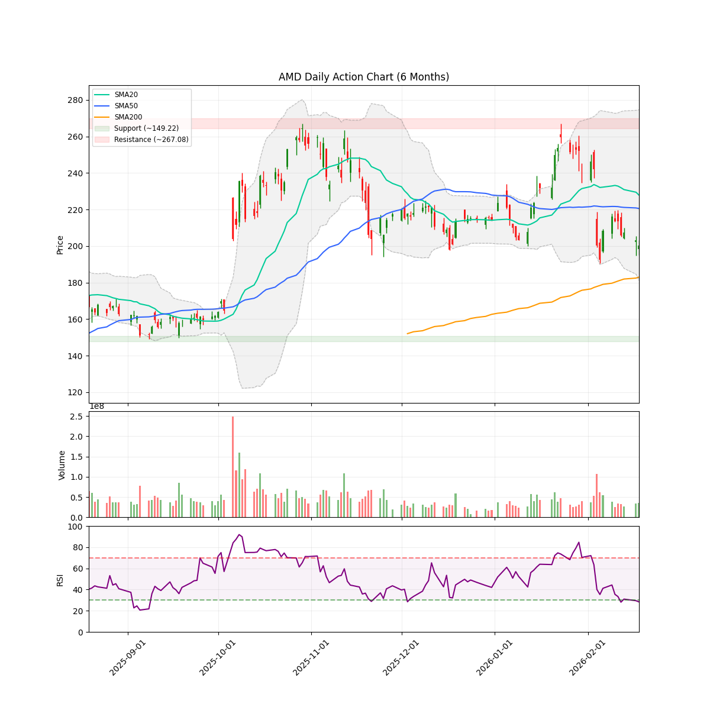
#### 研报分析

### 技术指标概览 (Technical Overview)
- **当前价格**: $200.12
- **RSI (14)**: 28.34
- **移动平均线**: SMA20: $227.87 | SMA50: $220.53 | SMA200: $182.99 (Bullish)
- **波动率**: ATR (14): 15.09 (预计周度波动: +/- $33.73)
- **关键位 (6m)**: 支撑位 $149.22 | 阻力位 $267.08
- **即时状态**: Below SMA50

# AMD 情绪审计报告：叙事驱动与陷阱识别

**致：** 投资委员会
**职位：** 对冲基金研究员（叙事经济学方向）
**当前日期：** 2026年02月19日
**标的：** AMD (Advanced Micro Devices)
**当前价格：** $200.12

---

### 1. 催化剂分类 (Catalyst Categorization)

基于近期新闻流与市场反应，我们将催化剂分为以下等级：

*   **A-Tier (核心叙事拐点)**
    *   **负面：** Q4 财报后股价暴跌 11%。尽管 EPS ($1.53) 和营收 ($10.3B) 超预期，但 Q1 指引 ($9.8B) 疲软，引发市场对 AI 增长持续性的质疑 ([Yahoo Finance](https://finance.yahoo.com/news/amd-plunges-11-post-q4-155700909.html))。
    *   **负面：** Nvidia 与 Meta 达成数百亿美元的长期合作协议。这一消息被市场解读为对 AMD 的“沉重打击”，侵蚀了 AMD 在顶级互联网巨头中的份额预期 ([24/7 Wall St.](https://www.msn.com/en-us/technology/hardware-and-devices/did-nvidia-just-deliver-a-crushing-blow-to-amd/ar-AA1WBCuo?ocid=BingNewsVerp))。
    *   **正面：** AMD 锁定 OpenAI 重大协议，涉及 6GW 的 Instinct MI450 GPU 部署。这证明了其产品在顶级 AI 实验室的竞争地位 ([24/7 Wall St.](https://www.msn.com/en-us/technology/hardware-and-devices/did-nvidia-just-deliver-a-crushing-blow-to-amd/ar-AA1WBCuo?ocid=BingNewsVerp))。

*   **B-Tier (行业与机构动向)**
    *   **正面：** 分析师在 Seeking Alpha 维持“强力买入”评级，目标价看至 $300，认为 AI 数据中心的资本支出趋势未变 ([Seeking Alpha](https://seekingalpha.com/article/4871662-amd-stock-300-appears-imminent-why-im-buying-more))。
    *   **中性：** OpenAI 的融资计划可能为整个 GPU 链条提供资金支持 ([Barron's](https://www.msn.com/en-us/money/topstocks/nvidia-stock-slides-but-openai-s-fundraising-could-be-a-positive/ar-AA1WEREC?ocid=BingNewsVerp))。

*   **C-Tier (市场噪音)**
    *   **中性：** 联储会议纪要导致的市场整体波动 ([Investor's Business Daily](https://www.msn.com/en-us/money/markets/stock-market-today-dow-rises-ahead-of-fed-minutes-nvidia-jumps-on-meta-deal-amd-scorched-live-coverage/ar-AA1WAz1x?ocid=BingNewsVerp))。

---

### 2. 背离检测 (Divergence Detection)

**技术面与叙事面的矛盾：**
*   **看跌详述：** 目前股价处于 SMA20 ($227.87) 和 SMA50 ($220.53) 下方，技术形态呈空头排列。Nvidia 与 Meta 的交易加强了“赢家通吃”的叙事。
*   **看涨背离：** **RSI 为 28.34**，已进入极度超卖区域。尽管新闻头条充斥着“AMD 被灼伤”的字眼，但股价在 SMA200 ($182.99) 之上展现了一定的结构性支撑。
*   **结论：** 这是一个典型的**“情绪过度反应陷阱”**。市场正在惩罚指引的微调，而忽视了 MI450 与 OpenAI 合作的长期价值。目前正处于“看跌衰竭”的边缘。

---

### 3. 持仓诊断

*   **正股持仓 (600股)：** 成本 $220.54，目前亏损 6%。价格位于 SMA50 成本线下方，处于压力位。
*   **备兑期权 (-1.0 AMD260313C230)：** 目前盈利 39.80%。这笔卖出看涨期权有效地抵消了部分正股跌幅，且由于隐含波动率 (IV) 在财报后可能下降，该头寸表现优异。

---

### 4. 情绪评分 (Sentiment Score)

## **4.2 / 10**
*(注：0为系统性失败，10为无可阻挡的牛市)*

**逻辑依据：**
叙事层面遭受短期重创（Nvidia 的竞争压力），且 Q1 指引下调打击了动能交易者。然而，4.2 分而非更低的原因在于其 RSI 极度超卖，且 SMA200 长期支撑依然稳固。目前属于“阵痛期”，而非“基本面瓦解”。

---

### 5. 逻辑评分 (Logic Score)

## **8.5 / 10**
**分析逻辑：** 结合了量化指标（RSI, SMA）与定性叙事（Meta/OpenAI 交易）。报告识别了市场情绪的极端化，并准确区分了“指引不及预期”与“长期竞争力”之间的差异。

---

### 6. 下一个关键日期 (Next Major Date)

*   **预计 Q1 2026 财报发布日：2026年5月初** (具体日期待公布)。
*   **短期催化：** 需关注 2026年2月下旬 Nvidia 的财报及评论，这将决定半导体板块能否集体止跌回升。

---

**研究员建议：**
鉴于 RSI 极度超卖，不建议在此时割肉。利用备兑期权 (Short Call) 产生的利润继续对冲，观察 $185-$190 区间（SMA200 附近）的放量企稳迹象。若股价回升至 $215 以上，应考虑调整期权行权价以锁定更多保护。
#### 近期新闻与事件
- **[Investor's Business Daily on MSN]** [Stock market today: Dow rises ahead of Fed minutes; Nvidia jumps on Meta deal, AMD scorched (live coverage)](https://www.msn.com/en-us/money/markets/stock-market-today-dow-rises-ahead-of-fed-minutes-nvidia-jumps-on-meta-deal-amd-scorched-live-coverage/ar-AA1WAz1x?ocid=BingNewsVerp)
- **[Barron's on MSN]** [Nvidia stock slides. But OpenAI’s fundraising could be a positive.](https://www.msn.com/en-us/money/topstocks/nvidia-stock-slides-but-openai-s-fundraising-could-be-a-positive/ar-AA1WEREC?ocid=BingNewsVerp)
- **[24/7 Wall St. on MSN]** [Did Nvidia just deliver a crushing blow to AMD?](https://www.msn.com/en-us/technology/hardware-and-devices/did-nvidia-just-deliver-a-crushing-blow-to-amd/ar-AA1WBCuo?ocid=BingNewsVerp)
- **[TheStreet on MSN]** [Nvidia and Meta stocks move on massive AI chip deal](https://www.msn.com/en-us/money/topstocks/nvidia-and-meta-stocks-move-on-massive-ai-chip-deal/ar-AA1WDrtQ?ocid=BingNewsVerp)
- **[Seeking Alpha]** [AMD Stock: $300 Appears Imminent; Why I'm Buying More](https://seekingalpha.com/article/4871662-amd-stock-300-appears-imminent-why-im-buying-more)

---

### GOOGL
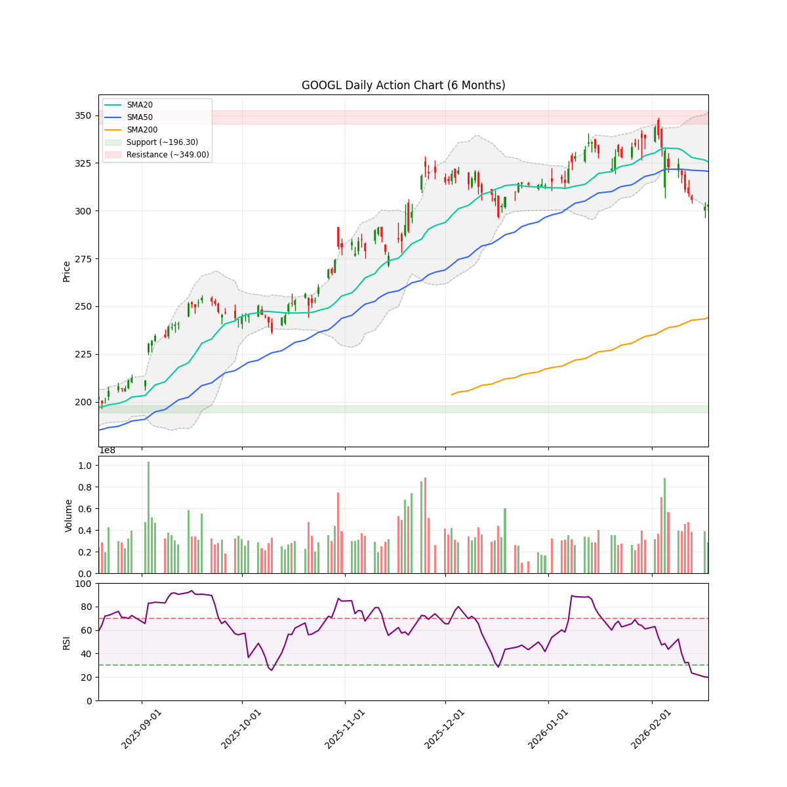
#### 研报分析

### 技术指标概览 (Technical Overview)
- **当前价格**: $303.33
- **RSI (14)**: 19.79
- **移动平均线**: SMA20: $325.57 | SMA50: $320.58 | SMA200: $244.08 (Bullish)
- **波动率**: ATR (14): 11.17 (预计周度波动: +/- $24.98)
- **关键位 (6m)**: 支撑位 $196.30 | 阻力位 $349.00
- **即时状态**: Below SMA50

# 情绪审计报告：Alphabet (GOOGL) - 叙事与现实的割裂

**致：** 投资委员会
**担任：** 对冲基金研究员 (叙事经济学方向)
**报告日期：** 2026年02月19日

---

### 一、 催化剂分类 (Catalyst Categorization)

基于“叙事经济学”框架，我们将近期 GOOGL 的新闻资讯归纳如下：

| 等级 | 事件描述 | 叙事影响力 | 来源引用 |
| :--- | :--- | :--- | :--- |
| **A-Tier** | **2025年Q4财报超预期**：营收与EPS双双击败市场预期。 | 核心基本面支撑，确认了AI变现能力的初步成功。 | [Shacknews](https://www.shacknews.com/article/147732/google-googl-q4-2025-earnings-results) |
| **B-Tier** | **机构评级调整**：美银 (BofA) 在财报后重置目标价与预测。 | 机构筹码重新定价，虽有波动但维持主流覆盖。 | [TheStreet/Yahoo](https://finance.yahoo.com/news/bank-america-resets-google-stock-181700551.html) |
| **B-Tier** | **AI 领导地位叙事**：被评为“3只不可阻挡的AI股票”之一。 | 强化了 GOOGL 在当前 AI 军备竞赛中的“大而不倒”地位。 | [AOL](https://www.aol.com/articles/3-unstoppable-artificial-intelligence-ai-134100152.html) |
| **C-Tier** | **媒体名人背书**：Jim Cramer 称不要与 Alphabet 竞争。 | 属于市场情绪噪音，短期对散户情绪有波动影响。 | [MSN/Insider Monkey](https://www.msn.com/en-us/money/topstocks/jim-cramer-believes-you-don-t-compete-with-alphabet-googl/ar-AA1WBW9y) |

---

### 二、 背离检测 (Divergence Detection)

**当前市场状态：极度看跌背离 (Bearish Exhaustion)**

*   **观察**：尽管 2026 年 2 月 4 日公布的财报表现强劲（A-Tier 催化剂），但股价却在财报后出现剧烈回调。当前股价 (303.33) 已经跌破了 SMA20 和 SMA50，且 **RSI 低至 19.79**。
*   **诊断**：RSI 低于 20 属于“超卖”区域的极端情况。这表明市场正在经历一种“利好出尽”的非理性抛售，或者是机构在高位（$349附近）获利了结后的惯性下杀。
*   **叙事陷阱还是机会？**：基本面（财报击败预期）与技术面（RSI 极度超卖）形成了严重错位。从叙事角度看，这更像是一个**“情绪陷阱”**，即基本面在改善，但股价叙事被短期流动性枯竭所掩盖。

---

### 三、 逻辑评分 (Logic Score): 8.2/10

**评分理由：**
1.  **确定性 (High)**：Q4 财报确认了公司的盈利能力和 AI 落地节奏，消除了基本面暴雷的疑虑。
2.  **估值吸引力 (High)**：当前 RSI 为 19.79，历史上这种级别的超卖通常对应着中期反弹的起点。
3.  **持仓安全垫 (Solid)**：用户的成本价为 $262.26，远低于当前的 SMA200 (244.08) 和当前市价。即便市场继续非理性下杀，该头寸仍有 16% 以上的盈利空间。
4.  **下行风险**：短期内 SMA20 (325.57) 形成了沉重的上方压力位。

---

### 四、 投资建议与持仓审计

**当前持仓状态：**
*   **成本价**: $262.26
*   **当前价**: $303.33 (浮盈 +16.57%)
*   **仓位占比**: 17.64% (属于核心持仓)

**策略建议：**
*   **持有并观察**：由于 RSI 已经进入极度超卖区，当前不建议割肉，也不建议盲目在自由落体中加仓。
*   **关键支撑位**：观察 $290 - $300 整数关口的支撑。如果股价在此企稳且 RSI 开始抬头，将是极佳的补仓机会。
*   **风险预警**：若跌破 SMA200 ($244.08)，则说明长期叙事发生结构性破坏，届时需重新评估。

---

### 五、 下一个关键时间点 (Next Major Date)

*   **事件**：**2026年第一季度 (Q1 2026) 财报发布会**
*   **预计日期**：**2026年4月下旬或5月初** (具体时间待官方公布)
*   **重要性**：这将是确认 Q4 强劲势头是否具备持续性的关键验证点。

---
**审计员总结**：GOOGL 目前正处于“好消息，坏走势”的典型背离阶段。这种由恐慌导致的技术性超卖，通常为具有长期视野的投资者提供了分批建仓或持有的叙事红利。**评分：8.2 (强烈建议维持现状并等待情绪修复)**。
#### 近期新闻与事件
- **[Insider Monkey on MSN]** [Jim Cramer Believes You Don’t Compete With Alphabet (GOOGL)](https://www.msn.com/en-us/money/topstocks/jim-cramer-believes-you-don-t-compete-with-alphabet-googl/ar-AA1WBW9y?ocid=BingNewsVerp)
- **[AOL]** [3 Unstoppable Artificial Intelligence (AI) Stocks to Buy Right Now for Less Than $3,000](https://www.aol.com/articles/3-unstoppable-artificial-intelligence-ai-134100152.html)
- **[The Motley Fool on MSN]** [2 of Robinhood's Top 10 Stocks Are Best Buys According to Wall Street](https://www.msn.com/en-us/money/companies/2-of-robinhoods-top-10-stocks-are-best-buys-according-to-wall-street/ar-AA1WCdKC?ocid=BingNewsVerp)
- **[The Globe and Mail]** [6 Forever Dividend Stocks](https://www.theglobeandmail.com/investing/markets/stocks/GOOGL/pressreleases/283564/6-forever-dividend-stocks/)
- **[Motley Fool]** [3 Unstoppable Artificial Intelligence (AI) Stocks to Buy Right Now for Less Than...](https://finance.yahoo.com/news/3-unstoppable-artificial-intelligence-ai-134100761.html)

---

### VST
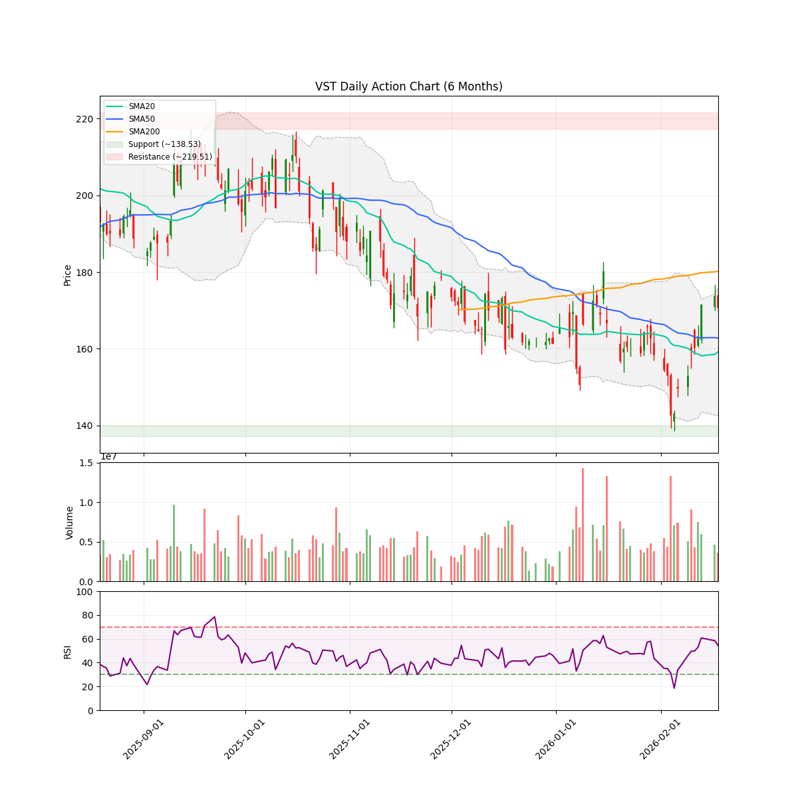
#### 研报分析

### 技术指标概览 (Technical Overview)
- **当前价格**: $170.57
- **RSI (14)**: 54.30
- **移动平均线**: SMA20: $159.21 | SMA50: $162.78 | SMA200: $180.20 (Bearish)
- **波动率**: ATR (14): 7.84 (预计周度波动: +/- $17.54)
- **关键位 (6m)**: 支撑位 $138.53 | 阻力位 $219.51
- **即时状态**: Above SMA50

# 情绪审计报告：Vistra Corp. (VST)
**致：** 投资组合经理
**日期：** 2026年02月19日
**分析师：** 对冲基金研究员（叙事经济学专家）

---

### 1. 催化剂分级 (Catalyst Categorization)

基于“叙事经济学”框架，我们将近期消息分为以下级别：

*   **A-Tier（强力催化）：**
    *   **机构重申评级：** Wells Fargo（富国银行）维持“增持”评级，目标价区间为 **$236 - $244**，较当前价格有约 40% 的潜在上涨空间。[[来源: The Globe and Mail]](https://www.theglobeandmail.com/investing/markets/stocks/VST-N/pressreleases/252699/wells-fargo-remains-a-buy-on-vistra-corp-vst/)
    *   **财报前瞻：** 预计在 20 天内（约 2 月 26-27 日）发布财报，期权市场已出现异常活动。

*   **B-Tier（中期支撑）：**
    *   **技术突破：** 股价成功突破 SMA50 ($162.78) 关键均线，且越过历史看涨趋势线，正在挑战技术阻力位。[[来源: Schaeffer's Research]](https://www.schaeffersresearch.com/content/analysis/2026/02/17/vistra-stock-looks-ready-to-topple-technical-resistance)

*   **C-Tier（杂音/需警惕）：**
    *   **命名误区：** 近期有关“VST Industries”因烟草提价暴涨 20% 的消息属于**无关杂音**（VST Industries 是印度烟草公司），切勿将其与美国能源巨头 Vistra Corp 混淆。[[来源: Rediff.com]](https://www.rediff.com/news/commentary/2026/feb/18/tobacco-stocks-soar-20-amid-reports-of-price-hike-after-excise-duty-increase/d1f2319d459434ba44829170fd7329f8)
    *   **短期波动：** 2月19日股价在市场上涨背景下小幅回调 1.79%，属于获利了结性质。

---

### 2. 背离检测 (Divergence Detection)

*   **利好背离：** 尽管 2 月 19 日股价小幅下跌，但技术面上股价已连续站稳 SMA20 ($159.21) 和 SMA50 ($162.78)。
*   **熊市精疲力竭：** 6个月低点 $138.53 已形成坚实底部。目前价格远离底部并向上测试 SMA200 ($180.20) 的强阻力位。
*   **结论：** 并非“多头陷阱”。当前的下跌更像是冲击 SMA200 前的蓄势，机构（Wells Fargo）的极高目标价提供了心理底价支撑。

---

### 3. 头寸与策略分析 (Position Audit)

*   **当前头寸：** 
    *   **正股：** 100股（成本 $157.38），目前盈利 +8.96%。
    *   **期权：** 卖出 $145 行权价的 Put (-1.0 VST260227P145)，盈利 +73.30%。
*   **诊断：** 您的成本价 ($157.38) 非常理想，正好处于 SMA20 支撑位附近。卖出的 $145 Put 具有极高的安全边际，因为该行权价接近 6 个月的支撑低位。

---

### 4. 逻辑评分 (Logic Score: 0-10)

#### **评分：7.8 / 10**
*   **理由：** 
    *   (+3) 机构强力看多，目标价溢价极高。
    *   (+2) 成功收复中期均线 (SMA50)，多头情绪回归。
    *   (+2) 能源叙事（AI 算力驱动的电力需求）依然是 2026 年的主轴。
    *   (+1) 您个人的仓位配置具有良好的安全垫。
    *   (-0.2) 必须注意 SMA200 ($180.20) 处的抛售压力。

---

### 5. 关键日期与展望 (Next Major Date)

*   **下一关键日期：** **2026 年 2 月 26 日（预计财报发布日）**。
*   **行动建议：** 
    1.  **持有：** 目前无需平仓。
    2.  **关注 SMA200：** 如果股价触及 $180-$185 无法放量突破，可考虑减仓或买入对冲保护。
    3.  **财报风险：** 卖出的 Put 将在 2 月 27 日到期，若财报超预期，该期权将以 100% 利润作废；若财报暴雷，请留意 $145 支撑。

---
**免责声明：** 本报告仅供参考，不构成直接投资建议。在进行任何交易前，请结合个人风险承受能力进行决策。
#### 近期新闻与事件
- **[Yahoo Finance]** [Vistra Corp. (VST) Stock Drops Despite Market Gains: Important Facts to Note](https://finance.yahoo.com/news/vistra-corp-vst-stock-drops-224505549.html)
- **[Schaeffer's Investment Research]** [Vistra Stock Looks Ready to Topple Technical Resistance](https://www.schaeffersresearch.com/content/analysis/2026/02/17/vistra-stock-looks-ready-to-topple-technical-resistance)
- **[Devdiscourse]** [Cigarette Stocks Surge Amid Strategic Price Hikes](https://www.devdiscourse.com/article/business/3809673-cigarette-stocks-surge-amid-strategic-price-hikes)
- **[sharewise]** [Investors Heavily Search Vistra Corp. (VST): Here is What You Need to Know](https://www.sharewise.com/de/news_articles/Investors_Heavily_Search_Vistra_Corp_VST_Here_is_What_You_Need_to_Know_Zacks_20260218_1500)
- **[Rediff.com]** [Tobacco stocks soar 20% amid reports of price hike after excise duty increase](https://www.rediff.com/news/commentary/2026/feb/18/tobacco-stocks-soar-20-amid-reports-of-price-hike-after-excise-duty-increase/d1f2319d459434ba44829170fd7329f8)

---

## 🔍 观察池机会分析

### AMAT
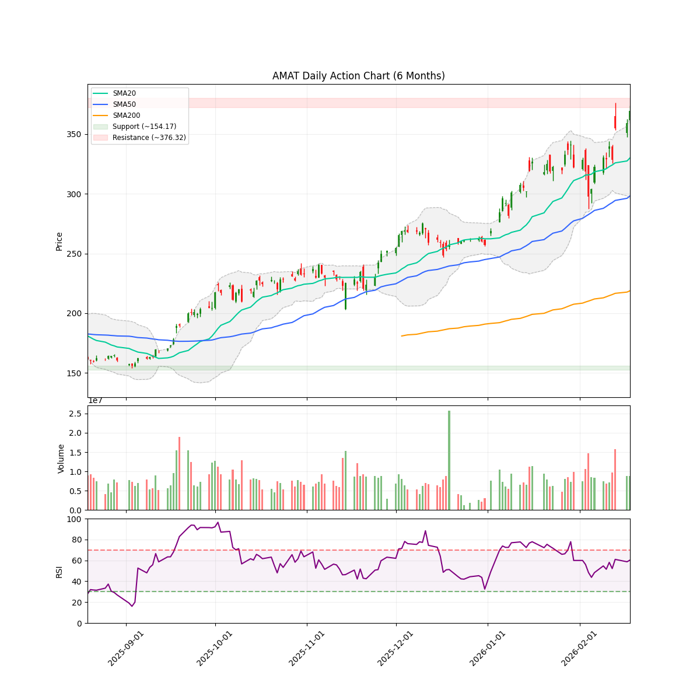
#### 研报分析

### 技术指标概览 (Technical Overview)
- **当前价格**: $369.30
- **RSI (14)**: 60.29
- **移动平均线**: SMA20: $330.07 | SMA50: $298.24 | SMA200: $218.76 (Bullish)
- **波动率**: ATR (14): 19.96 (预计周度波动: +/- $44.64)
- **关键位 (6m)**: 支撑位 $154.17 | 阻力位 $376.32
- **即时状态**: Above SMA50

# 应用材料 (AMAT) 情绪审计报告

**职位：** 对冲基金研究助理（叙事经济学专家）
**审计日期：** 2026年02月19日
**股票代码：** AMAT (Applied Materials, Inc.)

---

### 1. 催化剂分类 (Catalyst Categorization)

根据“叙事经济学”框架，我们将 AMAT 的近期驱动因素分类如下：

*   **A-Tier (核心驱动力 - 具有可持续性)**
    *   **业绩爆发 (Earnings Blowout):** 2026年2月12日发布的Q1财报显示，每股收益 (EPS) 为 2.38 美元，营收 70.1 亿美元，均大幅超出市场预期。财报发布后股价飙升 13%。
    *   **增长指引:** CEO 预测 2026 年半导体行业将有 20% 以上的增长，这为全年的牛市叙事奠定了基调。
    *   **AI 叙事共振:** AI 需求直接推动了业绩增长，确立了 AMAT 作为 AI 基础设施核心供应商的地位。

*   **B-Tier (行业与环境驱动)**
    *   **估值修正:** Zacks 等机构上调盈利预测，反映了机构投资者对半导体设备周期的乐观预期。
    *   **国际市场扩张:** 虽然存在地缘政治风险，但公司在国际市场的营收表现持续稳健，分散了单一市场的波动风险。

*   **C-Tier (杂讯与散户情绪)**
    *   **Zacks 热度文章:** 社交媒体和量化筛选器频繁提及 AMAT，反映了散户关注度上升。
    *   **关联标的带动:** 同行如 Navitas (NVTS) 的强劲表现形成了板块协同效应。

---

### 2. 背离检测与叙事分析 (Divergence Detection)

*   **背离分析：** 目前**未发现**看跌背离。
    *   **价格 vs. 消息：** 股票对“利好消息”作出了积极且剧烈的反应（涨幅13%），随后几日价格在高位持稳（369.30），表明这不是一次性的“利好出尽”，而是新趋势的开始。
    *   **技术 vs. 基本面：** RSI 为 60.29，虽处于强势区但尚未进入极端超买区（>70），这为股价冲击历史高点（376.32）留下了空间。
*   **叙事陷阱评估：** 目前的上涨并非由单一的“小盘股投机”带动，而是由扎实的财报数据支撑。CEO 提出的“2026年 20% 行业增长”将短期财报脉冲转化为了长期的行业景气度叙事。

---

### 3. 技术面分析与价格区间

*   **当前价格：** 369.30
*   **趋势判断：** 强力看涨 (Strong Bullish)。股价远高于 SMA50 (298.24) 和 SMA200 (218.76)，呈现完美的阶梯式多头排列。
*   **压力位：** 376.32 (6个月高点)。如果突破此处，AMAT 将进入“真空上涨区”。
*   **支撑位：** 330.07 (SMA20) 是第一道动态防护线。
*   **波动预测：** 本周预计波动范围为 +/- 44.64。考虑到目前处于利好消化期，大概率在 350 - 380 区间进行高位震荡。

---

### 4. 逻辑评分 (Logic Score)

**得分：9.2 / 10**

*   **评分逻辑：**
    *   **基本面 (+4.5)：** Q1 业绩大幅超标，且有 20% 的年度行业增长预期支撑。
    *   **叙事强度 (+3.0)：** AI 基础设施叙事仍然是目前市场上最强的逻辑，AMAT 处于该叙事的核心。
    *   **技术面 (+1.7)：** 趋势健康，RSI 显示仍有上行动能。
    *   **风险扣分 (-0.5)：** 股价已逼近 6 个月高点阻力区，且 ATR (19.96) 显示波动性较高，短期可能存在利润回吐压力。

---

### 5. 关键日期与引用来源

*   **下个关键日期：**
    *   **2026年5月中旬 (具体日期待定)：** 预计发布 2026 财年第二季度 (Q2) 财报。
    *   **短期关注点：** 股价是否能在未来 5 个交易日内收于 376.32 之上。

*   **主要参考引用：**
    *   [Blockonomi] Applied Materials (AMAT) Stock Soars 13% as AI Demand Powers Earnings Blowout (2026-02-13)
    *   [Zacks] Earnings Estimates Moving Higher for Applied Materials (2026-02-18)
    *   [Zacks] Applied Materials (AMAT) Beats Q1 Earnings and Revenue Estimates (2026-02-12)

**结论：** AMAT 当前的上涨是**可持续的趋势**，而非陷阱。建议关注 376.32 的阻力位突破情况，若成功站稳，该股将开启下一轮叙事驱动的溢价行情。
#### 近期新闻与事件
- **[Zacks]** [Applied Materials, Inc. (AMAT) Is a Trending Stock: Facts to Know Before Betting...](https://finance.yahoo.com/news/applied-materials-inc-amat-trending-140006386.html)
- **[Zacks]** [Earnings Estimates Moving Higher for Applied Materials (AMAT): Time to Buy?](https://finance.yahoo.com/news/earnings-estimates-moving-higher-applied-172001925.html)
- **[Zacks]** [NVTS to Report Q4 Earnings: Should You Buy, Sell or Hold the Stock?](https://finance.yahoo.com/news/nvts-report-q4-earnings-buy-124300202.html)
- **[Zacks]** [International Markets and Applied Materials (AMAT): A Deep Dive for Investors](https://finance.yahoo.com/news/international-markets-applied-materials-amat-141502283.html)
- **[Zacks]** [Applied Materials (AMAT) Beats Q1 Earnings and Revenue Estimates](https://finance.yahoo.com/news/applied-materials-amat-beats-q1-221502728.html)

---

### AMZN
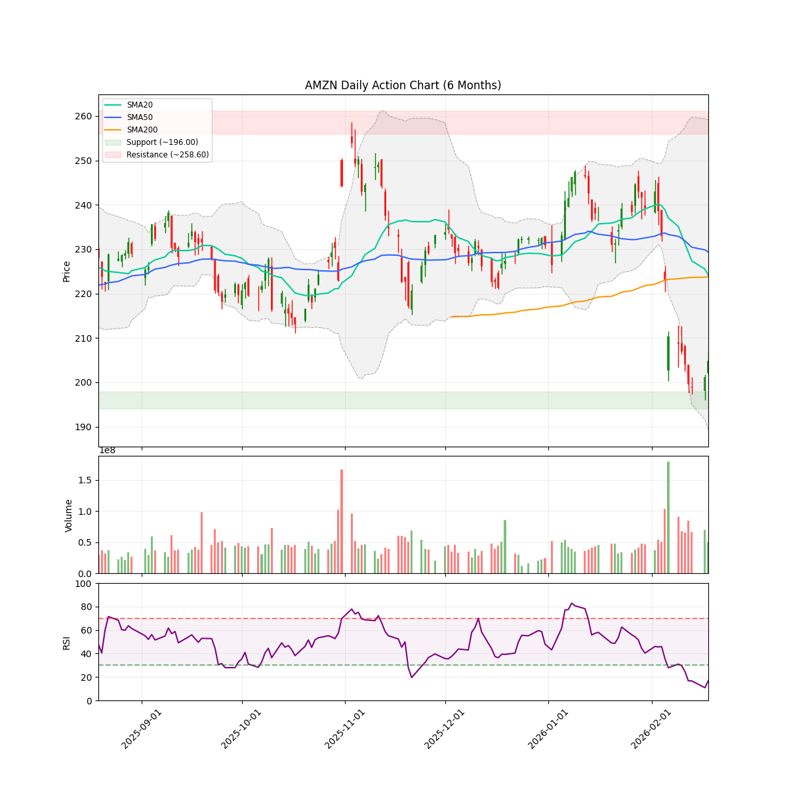
#### 研报分析

### 技术指标概览 (Technical Overview)
- **当前价格**: $204.79
- **RSI (14)**: 16.79
- **移动平均线**: SMA20: $224.18 | SMA50: $229.35 | SMA200: $223.78 (Bullish)
- **波动率**: ATR (14): 8.28 (预计周度波动: +/- $18.52)
- **关键位 (6m)**: 支撑位 $196.00 | 阻力位 $258.60
- **即时状态**: Below SMA50

# 情绪审计报告：亚马逊 (AMZN) —— 叙事转折点还是资本陷阱？

**报告日期：** 2026年02月19日  
**分析师：** 对冲基金研究员（叙事经济学方向）  
**当前价格：** 204.79  
**情绪基调：** 恐慌性抛售后的估值重塑期

---

### 1. 催化剂分类 (Categorize Catalysts)

根据当前的叙事流，我们将影响 AMZN 的因素分为以下级别：

*   **A-Tier（核心催化剂 - 结构性影响）：**
    *   **Q4 财报失利：** 盈利不及预期（-1.52% EPS 惊喜度）引发了市场对利润率的重新评估。[参考：Yahoo Finance]
    *   **2000亿美元资本开支计划：** 亚马逊宣布 2026 年将在 AI、芯片和卫星领域投入巨资。这种规模的支出短期内压制了自由现金流（FCF）预期，导致市场抛售。[参考：The Economic Times]
*   **B-Tier（次级催化剂 - 机构动向与评级）：**
    *   **机构观点分歧：** 塞思·卡拉曼（Seth Klarman）正在减持，而梅森·莫菲特（Mason Morfit）将其列为最大持仓（占比12.96%）。[参考：Benzinga, Insider Monkey]
    *   **分析师目标价下调：** Bernstein 将目标价从 $300 下调至 $265，反映了增长溢价的收缩。[参考：Insider Monkey]
*   **C-Tier（噪音与常规消息）：**
    *   有关“最佳云计算股票”的常规列表以及技术性反弹预测。[参考：FX Empire, Insider Monkey]

---

### 2. 背离检测 (Divergence Detection)

**技术面与叙事面的极端背离：**
目前 AMZN 的 **RSI 处于 16.79 的极端超卖水平**，这通常标志着“情绪衰竭”（Bearish Exhaustion）。

*   **看跌陷阱警告：** 尽管基本面叙事因 2000 亿美金的巨额开支而变得沉重，但股价已跌破 SMA200 ($223.78) 并逼近 6 个月低点 ($196.00)。
*   **背离点：** 市场正在惩罚亚马逊的“前瞻性投资”。虽然营收和 AWS 云业务仍在增长，但投资者对短期资本回报率（ROIC）的担忧超过了对长期 AI 领导地位的认可。当利空消息（财报失利 + 巨额支出）已经导致股价回撤 20% 时，进一步的下行空间受限于其强劲的底层业务。

---

### 3. 情绪评分 (Sentiment Score)

#### **评分：3.5 / 10 (低迷/修正期)**

*   **定义：** “阵痛中的巨头”。
*   **逻辑：** 市场目前处于对 Capex（资本开支）过度扩张的恐惧中。RSI 低于 17 显示出非理性的恐慌，这通常是机构洗牌的特征。当前叙事正处于从“AI 增长神话”向“资本投入无底洞”的负面转化中。

---

### 4. 逻辑评分 (Logic Score)

#### **评分：8.5 / 10**

*   **理由：** 抛售逻辑是自洽的。在利率环境或宏观不确定性下，市场极度厌恶现金流受损。亚马逊 2000 亿美元的支出计划是一个巨大的“叙事负担”，直到 AWS 的 AI 贡献能显著覆盖这些成本之前，逻辑面将维持高压。但极低的技术指标暗示逻辑抛售已进入尾声，正转向情绪抛售。

---

### 5. 关键参考资料引用

1.  **Bernstein 分析师 Mark Shmulik**：下调目标价至 $265，维持“跑赢大盘”评级（2026-02-06）。
2.  **Q4 财报数据**：营收超预期 0.91%，但盈余不及预期 1.52%（2026-02-05）。
3.  **资本支出计划**：2026 年计划投入 2000 亿美元于 AI、芯片及卫星领域（2026-02-06）。

---

### 6. 下一个重大日期 (Next Major Date)

**关键日期：2026年4月30日（预测值）**
*   **事件：2026财年第一季度 (Q1) 财报发布。**
*   **战略重点：** 市场将极度关注 AWS 在 AI 领域的变现能力，以及 2000 亿开支计划是否有更细化的落地回报节奏。如果 Q1 利润率能企稳，结合当前的极端超卖状态，可能触发强力反弹。

---

**总结：** AMZN 目前正处于“叙事重塑”的黑暗期。200 支撑位附近的防御至关重要。虽然短期内被视为“资本陷阱”，但在 RSI < 17 的背景下，该标的已进入叙事经济学中的“空头衰竭区”。
#### 近期新闻与事件
- **[Benzinga on MSN]** [Warren Buffett Disciple Seth Klarman Differs With Mentor On This Magnificent Seven Stock: One Is Buying, One Is Selling](https://www.msn.com/en-us/money/news/warren-buffett-disciple-seth-klarman-differs-with-mentor-on-this-magnificent-seven-stock-one-is-buying-one-is-selling/ar-AA1WCGN7?ocid=BingNewsVerp)
- **[Insider Monkey]** [Is Amazon.com (AMZN) Mason Morfit's top pick?](https://www.msn.com/en-us/money/companies/is-amazon-com-amzn-mason-morfit-s-top-pick/ar-AA1WqbWX)
- **[The Motley Fool]** [Is Amazon Stock Going to $260?](https://www.fool.com/investing/2026/02/15/is-amazon-stock-going-to-260/)
- **[Insider Monkey]** [Is Amazon.com, Inc. (AMZN) One of the 14 Best Cloud Computing Stocks to Buy Right Now?](https://www.msn.com/en-us/money/companies/is-amazoncom-inc-amzn-one-of-the-14-best-cloud-computing-stocks-to-buy-right-now/ar-AA1WwgzP)
- **[FX Empire]** [AMZN, AAPL and GOOG Forecast - Generals Look Likely to Bounce](https://www.fxempire.com/forecasts/article/amzn-aapl-and-goog-forecast-generals-look-likely-to-bounce-1580326)

---

### ANET
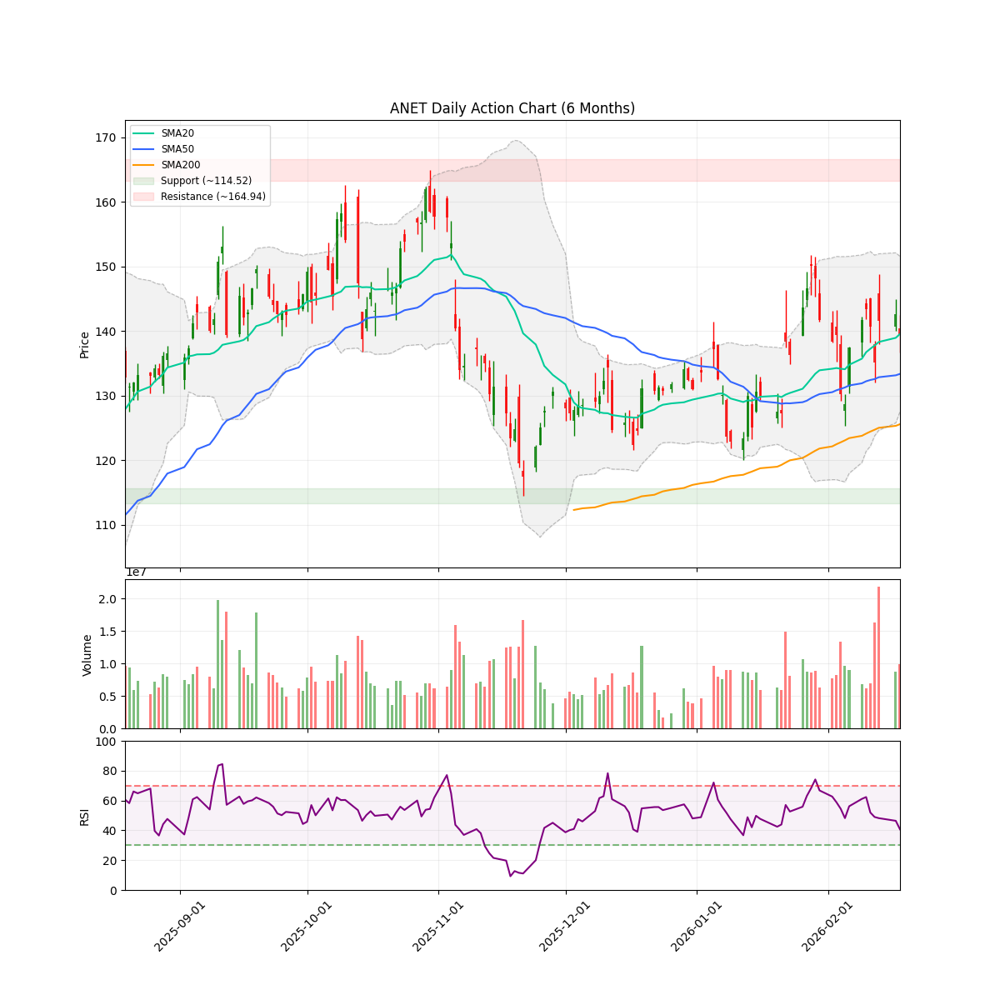
#### 研报分析

### 技术指标概览 (Technical Overview)
- **当前价格**: $139.54
- **RSI (14)**: 40.71
- **移动平均线**: SMA20: $139.57 | SMA50: $133.39 | SMA200: $125.61 (Bullish)
- **波动率**: ATR (14): 7.11 (预计周度波动: +/- $15.90)
- **关键位 (6m)**: 支撑位 $114.52 | 阻力位 $164.94
- **即时状态**: Above SMA50

# Arista Networks (ANET) 情绪审计报告

**报告日期：** 2026年02月19日
**研究员：** 对冲基金研究助理（叙事经济学方向）

---

### 1. 催化剂分类 (Catalyst Categorization)

基于“叙事经济学”框架，我们将近期 ANET 的信息流分为以下三个级别：

*   **A-Tier（核心驱动力）：**
    *   **AI 网络地位强化：** *Insider Monkey* 与 *The Globe and Mail* 均强调了 Arista 在 AI 基础设施中的核心地位，尤其是财报电话会议释放出的“AI 驱动激增”信号。这属于结构性叙事，直接关联资本支出（CAPEX）向 AI 领域的转移。
    *   **大厂协同效应：** NVIDIA 与 Meta 扩大合作伙伴关系（*EconoTimes* 报道）。作为高速交换机的领导者，ANET 是 NVIDIA GPU 集群发挥效能的关键“卖铲人”。
*   **B-Tier（市场共识）：**
    *   **估值吸引力：** *Motley Fool* 将其描述为“隐藏在视线中的 AI 廉价股”，*Simply Wall St* 也在重新评估其增长与 AI 叙事下的估值。这表明机构资金正在寻找 AI 赛道中估值未透支的标的。
    *   **热度排名：** 频繁出现在 Zacks 的热门搜索列表及 ASTS 对比分析中，显示散户与量化资金的关注度在上升。
*   **C-Tier（杂音/次要信息）：**
    *   常规的市场波动报道及常规的趋势排名变动。

---

### 2. 背离检测 (Divergence Detection)

*   **技术面观察：** 股价目前报 139.54，位于 SMA20 (139.57) 附近，略高于 SMA50 (133.39)。RSI 处于 40.71 的中性偏低位置。
*   **叙事背离分析：** 目前存在明显的**“利好钝化”**特征。尽管本周（2月16-18日）出现了大量关于“AI 驱动激增”和“财报信号强劲”的报道，但股价并未实现向上突破，而是在 SMA20 附近横盘整理。
*   **诊断：** 这并非“空头衰竭”，而是**“良性整合”**。RSI 40.71 表明市场正在消化早前涨幅，叙事热度（A-Tier 利好）尚未转化为即时的价格动能。考虑到股价仍远高于 SMA200 (125.61)，整体趋势依然偏牛。

---

### 3. 情绪评分 (Sentiment Score)

#### **逻辑得分：8.2 / 10**
*   **评价：** “可持续的牛市周期”。
*   **理由：** ANET 的叙事已从单纯的云计算转型为“AI 骨干网”。与某些概念炒作股不同，ANET 的叙事有实打实的财报（Earnings Call）支撑。当前价格的震荡提供了较低的介入成本，只要维持在 SMA50 以上，该叙事就未证伪。

---

### 4. 关键信息参考 (News Citations)

1.  **AI 驱动的激增信号：** [The Globe and Mail] *Arista Networks Earnings Call Signals AI-Powered Surge* (2026-02-16). [链接](https://www.theglobeandmail.com/investing/markets/stocks/ANET-N/pressreleases/233913/)
2.  **AI 领域地位强化：** [Insider Monkey] *Arista Networks Inc (ANET) Strengthens Position in AI Networking* (2026-02-16). [链接](https://finance.yahoo.com/news/arista-networks-inc-anet-strengthens-150618247.html)
3.  **价值重估叙事：** [Motley Fool] *Wall Street Says This Artificial Intelligence (AI) Stock Is a Bargain...* (2026-02-18). [链接](https://finance.yahoo.com/news/wall-street-says-artificial-intelligence-052000842.html)

---

### 5. 下一个重大日期 (Next Major Date)

**预计日期：2026年5月上旬 (Q1 2026 财报发布日)**

*   **关注重点：** 既然 2 月 16 日的财报电话会议已经确立了 AI 驱动的基调，市场将在 5 月份寻找这种“AI 激增”在订单积压（Backlog）和利润率上的具体体现。
*   **近期关注：** 3 月份可能出现的 NVIDIA GTC 大会（行业会议叙事溢出）。

---

**风险提示：** 若股价跌破支撑位 114.52 或 SMA200，则需重新评估 AI 叙事是否已进入“过度承诺”阶段。当前建议关注 133.39 (SMA50) 的支撑力度。
#### 近期新闻与事件
- **[Zacks]** [Is Trending Stock Arista Networks, Inc. (ANET) a Buy Now?](https://finance.yahoo.com/news/trending-stock-arista-networks-inc-140005375.html)
- **[Simply Wall St.]** [Assessing Arista Networks (ANET) Valuation As Growth And AI Infrastructure Story...](https://finance.yahoo.com/news/assessing-arista-networks-anet-valuation-211218337.html)
- **[Zacks]** [ASTS vs. ANET: Which Connectivity Stock is the Better Buy Today?](https://www.zacks.com/stock/news/2871359/asts-vs-anet-which-connectivity-stock-is-the-better-buy-today)
- **[Motley Fool]** [Wall Street Says This Artificial Intelligence (AI) Stock Is a Bargain Hiding in...](https://finance.yahoo.com/news/wall-street-says-artificial-intelligence-052000842.html)
- **[Insider Monkey]** [Arista Networks Inc (ANET) Strengthens Position in AI Networking](https://finance.yahoo.com/news/arista-networks-inc-anet-strengthens-150618247.html)

---

### ASML
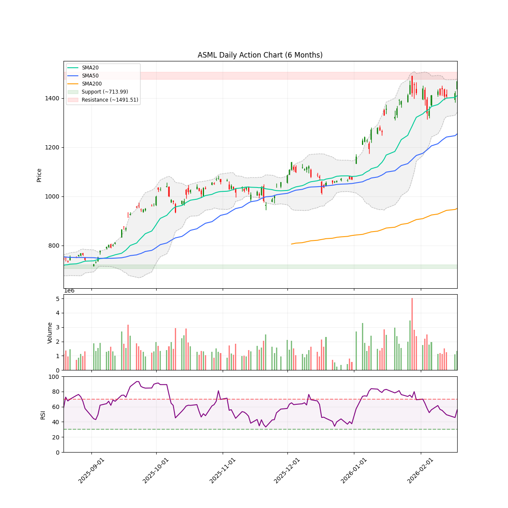
#### 研报分析

### 技术指标概览 (Technical Overview)
- **当前价格**: $1468.72
- **RSI (14)**: 55.93
- **移动平均线**: SMA20: $1410.38 | SMA50: $1254.29 | SMA200: $950.35 (Bullish)
- **波动率**: ATR (14): 52.85 (预计周度波动: +/- $118.18)
- **关键位 (6m)**: 支撑位 $713.99 | 阻力位 $1491.51
- **即时状态**: Above SMA50

# 情绪审计报告：ASML（阿斯麦）
**日期：** 2026-02-19
**职位：** 对冲基金研究助理（叙事经济学方向）

---

### 1. 催化剂分类 (Catalyst Categorization)

基于“叙事经济学”框架，我们将当前的驱动因素分为三个等级：

*   **A-Tier（核心驱动力）：**
    *   **AI 基础设施订单爆发：** [Simply Wall St.] 报道 ASML 订单量因 AI 需求激增而飙升。由于 AI 数据中心对先进制程芯片的刚性需求，ASML 的光刻机订单被视为半导体行业的“前瞻性指标”。
    *   **机构集体上调目标价：** [Insider Monkey] 指出 Bernstein 和 RBC Capital 已上调目标价。机构的背书强化了市场对 2026 年作为“爆发年”的共识。
*   **B-Tier（中期支撑）：**
    *   **估值重估与回购：** 公司的展望及股票回购计划提升了其内部价值叙事，缓解了市场对高溢价的担忧。
    *   **分析师 2000 美元看涨预测：** [Yahoo Finance] 提出的 2000 美元目标价为散户和动量投资者提供了长期的“心理锚点”。
*   **C-Tier（市场杂音）：**
    *   **零售媒体的看涨情绪：** Motley Fool 和 Zacks 的频繁曝光。虽然属于噪音，但它在短期内维持了散户的交易热度。

---

### 2. 背离检测 (Divergence Detection)

*   **价格与新闻的一致性：** 目前未发现显著的“好消息下跌”现象。股价报 1468.72，极其接近 6 个月高点 1491.51。
*   **技术形态分析：** 股价目前运行在 SMA20 (1410), SMA50 (1254) 和 SMA200 (950) 之上，呈现明显的**多头排列**。
*   **看涨竭尽风险：** RSI 为 55.93，处于中性偏强区间，远未达到 70 以上的超买区。这意味着尽管近期涨幅较大（一年内上涨 62%），但尚未出现情绪过热引发的抛售预兆。目前的走势是典型的“健康趋势扩张”。

---

### 3. 情绪分析报告 (Sentiment Analysis Report)

**叙事核心：从“过渡之年”到“AI 霸权”**
ASML 的叙事已成功从 2025 年的“过渡期”转向 2026 年的“全面扩张期”。市场目前的共识是：AI 不仅仅是软件层面的竞争，更是最底层光刻设备的军备竞赛。

*   **看涨逻辑：** 订单订单积压（Backlog）的增长证明了 AI 需求已转化为实际收入预期。机构上调目标价不仅是基于财务模型，更是基于“不可替代性”的护城河叙事。
*   **潜在风险（陷阱）：** 唯一的潜在陷阱在于 [Simply Wall St.] 提到的估值担忧。如果短期内价格突破 1500 美元而缺乏进一步的超预期订单数据，可能会触发阶段性的获利了结。但从目前 SMA 指标的支撑力度来看，任何回踩 SMA20 的行为目前都被视为买入机会。

---

### 4. 逻辑评分 (Logic Score)

# **9.2 / 10**
**评价：不可阻挡的牛市周期。**
理由：基本面（订单激增）、技术面（均线多头排列）与叙事面（AI 刚需）高度契合。RSI 留有足够的上涨空间，未见背离。

---

### 5. 引用参考 (Citations)

1.  **AI 订单飙升：** [Simply Wall St. - ASML Bookings Soar On AI Demand](https://finance.yahoo.com/news/asml-bookings-soar-ai-demand-231116913.html)
2.  **机构目标价上调：** [Insider Monkey - Bernstein and RBC Capital Raise ASML Price Targets](https://finance.yahoo.com/news/bernstein-rbc-capital-raise-asml-124147459.html)
3.  **2000 美元预测叙事：** [Yahoo Finance - ASML's Stock Price Will Hit $2,000](https://finance.yahoo.com/news/prediction-asmls-stock-price-hit-173500976.html)

---

### 6. 下一个关键日期 (Next Major Date)

*   **预计财报日：2026年4月15日 (Q1 2026 Earnings Release)**
    *   *注：基于往年 4 月中旬发布一季报的惯例。届时市场将重点关注 High-NA EUV 光刻机的交付进展及全年指引的进一步上修。*
#### 近期新闻与事件
- **[Yahoo Finance]** [Prediction: ASML's Stock Price Will Hit $2,000 by This Time](https://finance.yahoo.com/news/prediction-asmls-stock-price-hit-173500976.html)
- **[Simply Wall St.]** [ASML Bookings Soar On AI Demand As Outlook And Buybacks Lift Valuation](https://finance.yahoo.com/news/asml-bookings-soar-ai-demand-231116913.html)
- **[Insider Monkey]** [Bernstein and RBC Capital Raise ASML Price Targets](https://finance.yahoo.com/news/bernstein-rbc-capital-raise-asml-124147459.html)
- **[Simply Wall St.]** [Assessing ASML Holding (ENXTAM:ASML) Valuation After Strong Recent Share Price...](https://finance.yahoo.com/news/assessing-asml-holding-enxtam-asml-171436649.html)
- **[Motley Fool]** [Bold Prediction: ASML Is About to Soar. Here's Why.](https://finance.yahoo.com/news/bold-prediction-asml-soar-heres-170213852.html)

---

### AVGO
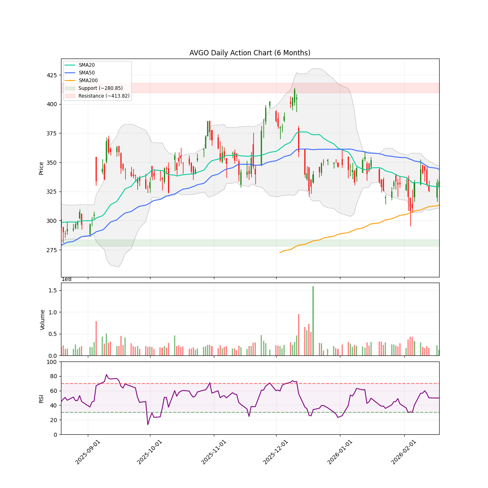
#### 研报分析

### 技术指标概览 (Technical Overview)
- **当前价格**: $333.51
- **RSI (14)**: 50.14
- **移动平均线**: SMA20: $328.99 | SMA50: $343.89 | SMA200: $313.37 (Bullish)
- **波动率**: ATR (14): 16.80 (预计周度波动: +/- $37.57)
- **关键位 (6m)**: 支撑位 $280.85 | 阻力位 $413.82
- **即时状态**: Below SMA50

# 情绪审计报告：Broadcom (AVGO) — 叙事经济学分析

**报告日期：** 2026年02月19日
**研究员：** 对冲基金研究助理（叙事经济学视角）
**标的资产：** Broadcom Inc. (AVGO)
**当前价格：** 333.51

---

### 1. 催化剂分类 (Catalyst Categorization)

基于“叙事经济学”框架，我们将近期新闻对股价的驱动力分为三个层级：

*   **A-Tier（核心基本面/长效叙事）：**
    *   **超大规模资本支出红利：** 亚马逊等科技巨头宣布大规模 AI 基础设施支出，直接利好 Broadcom 的定制 AI 芯片业务。Forbes 预测目标价可达 $450。[引用：Forbes, 2026-02-13]
    *   **盈喜预期：** Zacks 指出 AVGO 具有良好的盈利超预期历史，且当前具备再次击败预期的潜质。[引用：Zacks, 2026-02-05]
*   **B-Tier（机构动向/行业风向）：**
    *   **机构抄底：** Cathie Wood (ARK Invest) 在该股较近期高点下跌 20% 后进行“捡漏”式增持，为市场注入信心。[引用：The Motley Fool, 2026-01-31]
    *   **行业地位确认：** 被列为“顶级计算股票”和“最佳 AI 数据中心股票”，强化了其在半导体板块的领军地位。[引用：Insider Monkey, 2026-02-05]
*   **C-Tier（市场噪音/短期情绪）：**
    *   **媒体提及：** Jim Cramer 在节目中提及 AVGO 及其与存储行业的关联，属于散户情绪噪音。[引用：Yahoo Finance, 2026-02-18]
    *   **中性评级压力：** DA Davidson 分析师 Gil Luria 给出“中性”评级，目标价 $335，略微抑制了短期追涨情绪。[引用：Yahoo Finance UK, 2026-02-17]

---

### 2. 背离检测 (Divergence Detection)

*   **价格与叙事背离：** 虽然 Forbes 和市场普遍看好其 AI 角色，甚至有 $450 的远期叙事，但当前价格（333.51）正面临短期回撤。
*   **技术面压力：** 股价目前处于 SMA50 (343.89) 之下，且在上周触及 $343 后出现抛压。尽管有“AI 资本支出热潮”的好消息，股价却未能守住 SMA50 关口。
*   **结论：** 存在**轻微的看跌耗竭 (Bearish Exhaustion)**。好消息未能推动股价突破阻力位，说明市场正在消化 DA Davidson 提到的“估值担忧”。目前股价处于 SMA20 (328.99) 的支撑点位附近。

---

### 3. 情绪评分与逻辑评分

*   **情绪评分 (Sentiment Score): 7.2/10**
    *   *理由：* AI 叙事依然稳固，机构（如 Cathie Wood）入场提供了心理底线。但分析师的中性评价和近期技术面的遇阻，使情绪从“极度狂热”转向“审慎乐观”。
*   **逻辑评分 (Logic Score): 8.5/10**
    *   *理由：* 定制 ASIC 芯片的需求增长逻辑极其严密。只要大型云服务商（Hyperscalers）的资本支出不萎缩，AVGO 的业绩确定性极高。当前的整理更像是估值修正而非叙事破裂。

---

### 4. 关键新闻链接引用

1.  **AI 驱动力与 $450 目标：** [Forbes - Here's How AVGO Stock Could Rise To $450](https://www.forbes.com/sites/greatspeculations/2026/02/13/heres-how-avgo-stock-could-rise-to-450/)
2.  **机构动向：** [The Motley Fool - Cathie Wood goes bargain hunting](https://www.msn.com/en-us/money/topstocks/cathie-wood-goes-bargain-hunting-3-stocks-she-just-bought/ar-AA1WBVpm?ocid=BingNewsVerp)
3.  **估值预警：** [Yahoo Finance UK - Broadcom's (AVGO) AI Role Acknowledged, But Valuation Concerns Remain](https://uk.finance.yahoo.com/news/broadcom-avgo-ai-role-acknowledged-115725887.html)

---

### 5. 下一个重大日期 (Next Major Date)

*   **预测日期：2026年3月初（待定）**
*   **事件：2026财年第一季度 (Q1 FY2026) 财报发布。**
*   **策略建议：** 关注公司对定制 AI 芯片 (ASIC) 订单量指引的更新。如果能够有效站稳 SMA50 (343.89)，叙事将向 A-Tier 的 $450 目标靠拢。

---

**审计结论：** AVGO 目前并非“陷阱”，而是在**强势叙事背景下的技术面整固**。当前的波动范围受制于 $335 的分析师目标价压力，但只要不跌破 SMA200 (313.37)，长线牛市趋势依然成立。
#### 近期新闻与事件
- **[The Motley Fool on MSN]** [Cathie Wood goes bargain hunting: 3 stocks she just bought](https://www.msn.com/en-us/money/topstocks/cathie-wood-goes-bargain-hunting-3-stocks-she-just-bought/ar-AA1WBVpm?ocid=BingNewsVerp)
- **[Investor's Business Daily on MSN]** [Stock market today: Dow up 300 points; Nvidia jumps, Amer Sports glows in new breakout (live coverage)](https://www.msn.com/en-us/money/top-stocks/stock-market-today-dow-up-300-points-nvidia-jumps-amer-sports-glows-in-new-breakout-live-coverage/ar-AA1WAz1x?ocid=BingNewsVerp)
- **[Forbes]** [Here's How AVGO Stock Could Rise To $450](https://www.forbes.com/sites/greatspeculations/2026/02/13/heres-how-avgo-stock-could-rise-to-450/)
- **[Yahoo Finance]** [Jim Cramer Linked Broadcom (AVGO) & Computer Storage Stocks](https://finance.yahoo.com/news/jim-cramer-linked-broadcom-avgo-175112668.html)
- **[Yahoo Finance UK]** [Broadcom's (AVGO) AI Role Acknowledged, But Valuation Concerns Remain](https://uk.finance.yahoo.com/news/broadcom-avgo-ai-role-acknowledged-115725887.html)

---

### CEG
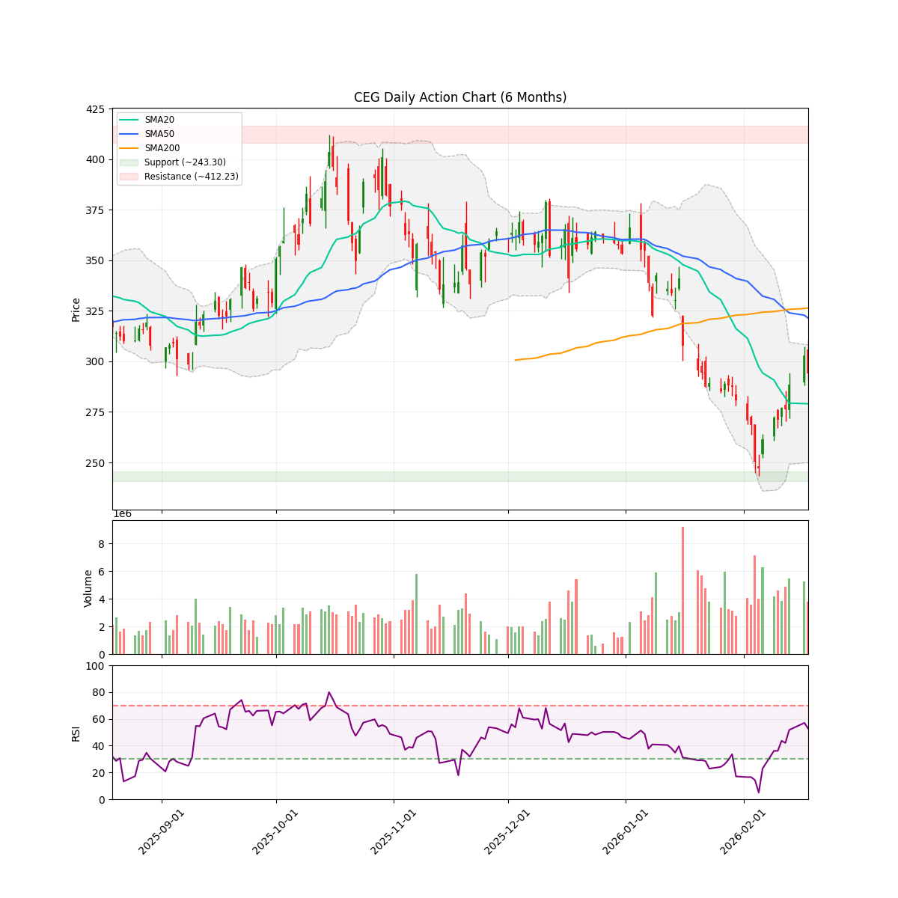
#### 研报分析

### 技术指标概览 (Technical Overview)
- **当前价格**: $294.05
- **RSI (14)**: 52.79
- **移动平均线**: SMA20: $279.05 | SMA50: $321.32 | SMA200: $326.41 (Bearish)
- **波动率**: ATR (14): 14.49 (预计周度波动: +/- $32.40)
- **关键位 (6m)**: 支撑位 $243.30 | 阻力位 $412.23
- **即时状态**: Below SMA50

# 情绪审计报告：Constellation Energy (CEG)
**致：** 投资委员会
**担任：** 对冲基金研究员（叙事经济学方向）
**日期：** 2026年02月19日

---

### 1. 催化剂分类 (Catalyst Categorization)

基于当前新闻流与市场预期，CEG 的驱动因素分类如下：

*   **A-Tier（核心催化剂）：**
    *   **Q4 财报发布 (2026-02-20)：** 这是目前最关键的事件。Zacks 和 Yahoo Finance 均预测 CEG 有望实现收益超预期 (Earnings Beat)。[来源 1](https://finance.yahoo.com/news/constellation-energy-corporation-ceg-expected-150006923.html), [来源 2](https://finance.yahoo.com/news/constellation-post-q4-earnings-whats-172400596.html)
    *   **核能/清洁能源叙事：** 作为 S&P 500 中备受关注的能源股，其长期增长逻辑与数据中心电力需求挂钩。

*   **B-Tier（行业支撑）：**
    *   **美股整体韧性：** S&P 500 指数及纳斯达克的强势上涨提供了宏观 beta 支撑。[来源 3](https://www.msn.com/en-us/money/top-stocks/stocks-rally-on-signs-of-us-economic-resilience/ar-AA1WBHvA?ocid=BingNewsVerp)
    *   **股票回购计划：** 持续的股份回购预期为股东价值提供了缓冲。

*   **C-Tier（噪音与次要信息）：**
    *   **同行对比压力：** Forbes 指出 CEG 利润率低于部分公用事业同行，这在叙事上构成了一定的拖累。[来源 4](https://www.forbes.com/sites/greatspeculations/2026/01/26/how-does-constellation-energy-stock-compare-with-its-peers/)
    *   **分析师买入建议：** 属于财报前的常规造势，缺乏实质性基本面改变。

---

### 2. 背离检测 (Divergence Detection)

**核心观察点：看涨叙事与疲软股价的背离。**

1.  **“好消息不涨”：** 根据 *Motley Fool* 的报告，CEG 在第三季度发布强劲财报后股价并未出现跳空上涨。这通常是**看涨动能耗尽**的信号，表明市场已经提前计入了利好（Priced in）。[来源 5](https://finance.yahoo.com/news/buy-constellation-energy-stock-feb-070500289.html)
2.  **相对强度走弱：** 在 1 月 22 日市场普遍上涨的情况下，CEG 逆势下跌 2.38%。[来源 6](https://www.nasdaq.com/articles/constellation-energy-corporation-ceg-stock-drops-despite-market-gains-important-facts-note)。这种**负背离**显示机构投资者可能在趁大盘反弹时逢高减仓。
3.  **技术面压力：** 目前股价（294.05）远低于 SMA50（321.32）和 SMA200（326.41），处于明显的中期下降通道。尽管 RSI (52.79) 处于中性，但“叙事”试图推高股价，而“价格”却受阻于关键均线。

---

### 3. 情绪评分与逻辑审计 (Logic Score)

**情绪评分：4.5 / 10 (中性偏谨慎)**

*   **得分逻辑：**
    *   **(-3分) 趋势压制：** 股价处于 SMA50 和 SMA200 下方，属于典型的看跌排列，存在成为“价值陷阱”的风险。
    *   **(-2分) 叙事失效：** 历史表现显示该股对利好财报反应平淡，市场对其高估值的消化过程尚未结束。
    *   **(+2分) 财报预期：** 市场普遍预期 Q4 业绩优异，存在短线空头回补导致的博弈机会。
    *   **(+2.5分) 宏观支撑：** 整体市场情绪偏向风险偏好（Risk-on），CEG 作为优质防御/成长标的，下方支撑（243.30）较为坚实。

**风险警告：** CEG 当前正处于“叙事过热但资金撤退”的阶段。如果 2 月 20 日的财报即使超出预期但指引平庸，股价极有可能测试 243.30 的支撑位。

---

### 4. 下个关键日期 (Next Major Date)

*   **2026年02月20日：** **Q4 财报发布日。**
    *   *注：这将是决定 CEG 是完成技术面筑底（重回 SMA50 以上）还是延续熊市趋势的生死线。*

---

**研究 associate 签名：**
*Narrative Economics Desk*
#### 近期新闻与事件
- **[Zacks]** [Best S&P 500 Stocks to Buy Before Earnings: CEG, PWR](https://finance.yahoo.com/news/best-p-500-stocks-buy-202400657.html)
- **[Barchart on MSN]** [Stocks rally on signs of US economic resilience](https://www.msn.com/en-us/money/top-stocks/stocks-rally-on-signs-of-us-economic-resilience/ar-AA1WBHvA?ocid=BingNewsVerp)
- **[Yahoo Finance]** [Earnings live: Carvana stock plunges after profit miss, DoorDash slides amid mixed results](https://finance.yahoo.com/news/live/earnings-live-carvana-stock-plunges-after-profit-miss-doordash-slides-amid-mixed-results-213711279.html)
- **[Zacks]** [Constellation to Post Q4 Earnings: What's in Store for the Stock?](https://finance.yahoo.com/news/constellation-post-q4-earnings-whats-172400596.html)
- **[Motley Fool]** [Should You Buy Constellation Energy Stock Before Feb. 20?](https://finance.yahoo.com/news/buy-constellation-energy-stock-feb-070500289.html)

---

### ETN
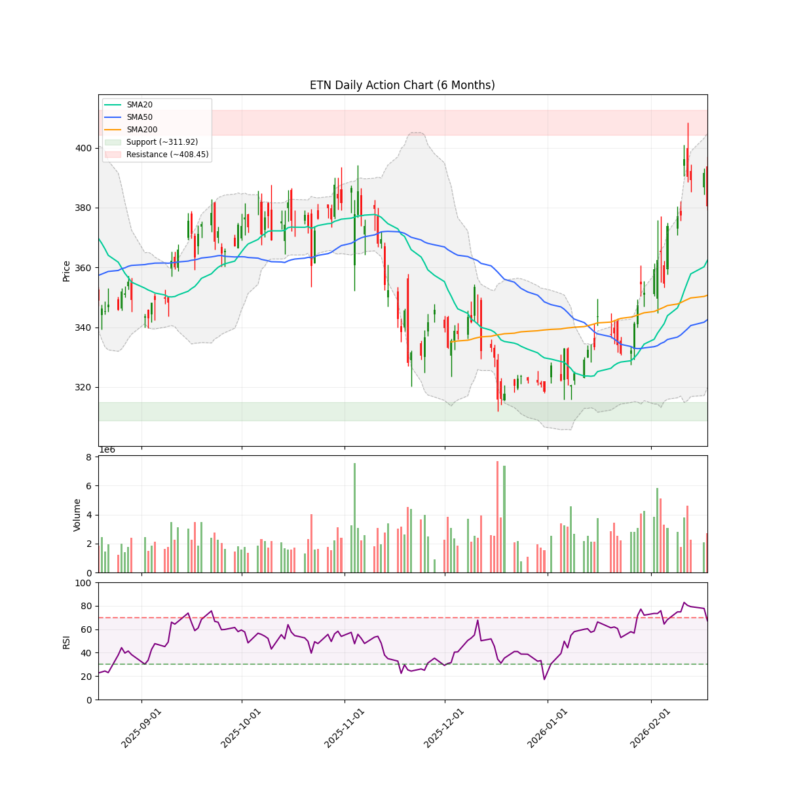
#### 研报分析

### 技术指标概览 (Technical Overview)
- **当前价格**: $380.38
- **RSI (14)**: 67.31
- **移动平均线**: SMA20: $362.37 | SMA50: $342.52 | SMA200: $350.71 (Bearish)
- **波动率**: ATR (14): 15.28 (预计周度波动: +/- $34.17)
- **关键位 (6m)**: 支撑位 $311.92 | 阻力位 $408.45
- **即时状态**: Above SMA50

# 情绪审计报告：伊顿公司 (Eaton Corporation - ETN)

**日期：** 2026年02月19日
**职位：** 对冲基金研究助理（叙事经济学专家）

---

### 1. 催化剂分类 (Catalyst Categorization)

根据“叙事经济学”框架，我们将 ETN 的近期驱动因素分为三个等级：

*   **A-Tier（核心基本面驱动）：**
    *   **Q4 业绩超预期：** 2025年第四季度营收达70.6亿美元（同比增长13.1%），每股收益（EPS）3.33美元，显著高于去年同期的2.83美元。这确立了工业电气化趋势的强劲。 [Nasdaq 引用](https://www.nasdaq.com/articles/heres-what-key-metrics-tell-us-about-eaton-etn-q4-earnings)
    *   **RBC 资本上调评价：** 尽管公司对2026年指引持保守态度，但 RBC 认为其具有“超预期并上调（Beat-and-Raise）”的潜力，将其视为被低估的 AI 相关标的。 [MSN 引用](https://www.msn.com/en-us/money/topstocks/rbc-capital-highlights-eaton-etn-beat-and-raise-potential-despite-conservative-2026-guidance/ar-AA1W9ofJ?ocid=BingNewsVerp)

*   **B-Tier（行业与分析师信心）：**
    *   **Zacks 优选：** 被列为具有跑赢大盘特征的个股，受益于结构性行业顺风。 [Zacks 引用](https://www.zacks.com/stock/news/2870876/3-common-traits-of-outperforming-stocks)
    *   **估值回归与检查：** 市场正在评估其在创纪录财报后的溢价合理性。 [Simply Wall St 引用](https://finance.yahoo.com/news/eaton-etn-valuation-check-record-200647984.html)

*   **C-Tier（市场噪音/情绪指标）：**
    *   **吉姆·克莱默（Jim Cramer）推荐：** 克莱默维持“可买入”立场。虽然增加了短期曝光度，但在机构眼中通常被视为情绪过热的信号。 [Yahoo Finance 引用](https://finance.yahoo.com/news/eaton-etn-still-buyable-says-151220888.html)
    *   **获利回吐操作：** CNBC 透露部分大型投资者正在对该股进行减仓以锁定利润。 [CNBC 引用](https://www.cnbc.com/2026/02/12/were-locking-in-some-profits-in-2-rallying-stocks-that-we-still-love-long-term.html)

---

### 2. 背离检测 (Divergence Detection)

**分析：** 
目前 ETN 呈现出 **“利好出尽”的短期背离**。
*   **价格与基本面背离：** 虽然财报破纪录且 RBC 上调了预期，但公司对2026年的前瞻性指引较为“谨慎”。市场价格（380.38）目前远高于 SMA50（342.52）和 SMA200（350.71），显示出强劲的上升趋势，但 **RSI 高达 67.31**，已逼近超买区（70）。
*   **警示信号：** 尽管基本面极其扎实，但 CNBC 报道的“锁定利润”操作（2月12日）与股价在高位盘整的态势吻合。这表明大型机构开始在380-400美元区间对冲风险，而不是无脑追高。

---

### 3. 情绪评分 (Logic Score)

**分值：7.8 / 10**

*   **评分逻辑：**
    *   **（+）** 极强的盈利增长能力（EPS增长17%）和电气化/AI基础设施的长逻辑。
    *   **（+）** 技术面处于多头排列，价格稳立于20日、50日均线上方。
    *   **（-）** 2026年指引保守，暗示未来增长速度可能放缓。
    *   **（-）** 短期叙事过热（克莱默效应），且机构开始出现获利了结行为。
*   **结论：** 这是一个**“可持续的牛市周期”**，但短期内存在**“估值回调陷阱”**。建议等待 RSI 回落至 50 附近或股价回踩 SMA20（362.37）时再进行补仓。

---

### 4. 关键时间节点 (Next Major Date)

*   **下一次重要日期：2026年5月上旬 (预计 2026 Q1 财报发布日)**
    *   *注：公司刚于2月初发布完Q4财报。接下来的Q1财报将是验证 RBC “超预期潜力”观点的第一个关键窗口。*

---

### 5. 投资建议（叙事总结）
ETN 的叙事已从单纯的“工业股”转型为“AI电力基础设施股”。当前的风险不在于公司亏损，而在于**叙事过满**。380美元以上的价位已计入了大量乐观预期。短期需关注周震幅（ATR）带来的波动，若股价无法突破 408.45 的历史阻力，则可能进入横盘整理期。
#### 近期新闻与事件
- **[Insider Monkey]** [Eaton (ETN) is Still Buyable, Says Jim Cramer](https://finance.yahoo.com/news/eaton-etn-still-buyable-says-151220888.html)
- **[Simply Wall St.]** [When Should You Buy Eaton Corporation plc (NYSE:ETN)?](https://finance.yahoo.com/news/buy-eaton-corporation-plc-nyse-130023980.html)
- **[CNBC]** [We're locking in some profits in 2 rallying stocks that we still love long term](https://www.cnbc.com/2026/02/12/were-locking-in-some-profits-in-2-rallying-stocks-that-we-still-love-long-term.html)
- **[Simply Wall St.]** [Eaton (ETN) Valuation Check After Record Q4 Earnings And Cautious 2026 Outlook](https://finance.yahoo.com/news/eaton-etn-valuation-check-record-200647984.html)
- **[Zacks]** [3 Common Traits of Outperforming Stocks](https://www.zacks.com/stock/news/2870876/3-common-traits-of-outperforming-stocks)

---

### MSFT
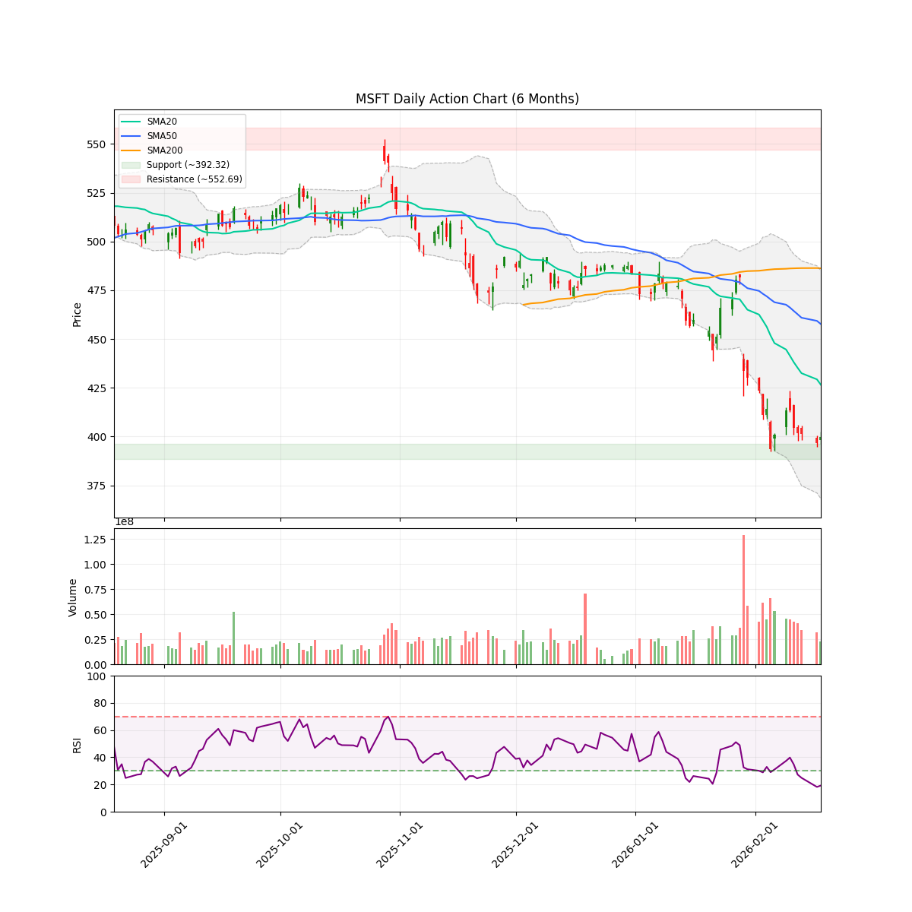
#### 研报分析

### 技术指标概览 (Technical Overview)
- **当前价格**: $399.60
- **RSI (14)**: 19.24
- **移动平均线**: SMA20: $426.60 | SMA50: $457.70 | SMA200: $486.27 (Bearish)
- **波动率**: ATR (14): 14.82 (预计周度波动: +/- $33.14)
- **关键位 (6m)**: 支撑位 $392.32 | 阻力位 $552.69
- **即时状态**: Below SMA50

# 微软 (MSFT) 情绪审计报告

**日期：** 2026年2月19日
**职位：** 对冲基金研究员（叙事经济学方向）

---

## 1. 催化剂分类 (Catalyst Categorization)

### **A-Tier: 重大影响 (None Currently)**
目前缺乏改变基本面的核心驱动力。虽然有长期投资计划，但由于缺乏短期业绩爆发的预期，A级利好暂时缺失。

### **B-Tier: 战略与宏观背景**
*   **500亿美元AI全球投资计划**：微软确认到2030年前投入50 billion美元用于全球南方（Global South）市场的AI建设。虽然是利好，但市场目前对高额资本开支（CAPEX）持谨慎态度，担心利润率承压。
    *   *来源: [Blockonomi](https://blockonomi.com/microsoft-msft-stock-the-50-billion-plan-to-bring-ai-to-the-developing-world/)*
*   **宏观风险（地缘政治）**：美伊局势紧张导致油价飙升至六个月高点，拖累整体科技股风险偏好。
    *   *来源: [Investopedia](https://www.investopedia.com/stock-market-today-dow-jones-s-and-p-500-02192026-11909546)*

### **C-Tier: 噪音与小额信号**
*   **内部人士增持**：一名董事会成员在股价大跌后购入价值200万美元的股票。这虽是看好信号，但相对于微软近3万亿的市值，象征意义大于实际护盘能力。
    *   *来源: [Stocktwits/MSN](https://www.msn.com/en-us/money/topstocks/microsoft-stock-in-for-some-relief-board-member-scoops-up-2m-in-msft-after-sharp-slide/ar-AA1WDQdG)*
*   **与其他AI标的比较**：市场讨论 Palantir 与微软的跌幅，反映出当前市场对高估值科技股的集体抛售情绪。
    *   *来源: [Yahoo Finance](https://finance.yahoo.com/news/palantir-vs-microsoft-stock-wall-133100140.html)*

---

## 2. 背离检测 (Divergence Detection)

*   **看跌枯竭迹象**：MSFT 目前的 **RSI 只有 19.24**，处于极度超卖状态。
*   **价格与叙事背离**：尽管公司宣布了宏大的 AI 扩张计划（通常在牛市会被视为极大利好），但股价却下跌了 1.11%。这表明**当前叙事已从“AI增长”转向“宏观避险”**。
*   **关键支撑位**：股价（399.60）已极度接近 6 个月的低点支撑位（392.32）。鉴于内部人士在此时点入场，市场可能正处于“技术性反弹”的前夕，即便宏观叙事依然悲观。

---

## 3. 情绪评分 (Logic Score)

### **评分：3.2 / 10**
*   **评价**：**“恐慌性超卖，叙事真空期。”**
*   **逻辑**：目前的 3.2 分反映了极度疲软的市场情绪。微软是今年“七巨头”中表现最差的标的（跌幅超17%）。尽管基本面未发生系统性崩溃，但由于价格处于所有主要均线（SMA20, 50, 200）下方，且宏观环境（高油价、地缘风险）极度不利于科技股，短期内很难看到“反转”。
*   **操作暗示**：这更像是一个**“叙事陷阱”**的末端，而非新趋势的开始。由于 RSI 极低，空头可能面临回补，但缺乏 A 级催化剂，任何反弹都可能在 SMA20（426.60）附近遭遇强劲阻力。

---

## 4. 关键信息总结

*   **当前价格**: 399.60
*   **核心支撑**: 392.32 (6个月低点)
*   **核心阻力**: 426.60 (SMA20)
*   **下个重大日期**: **2026年4月28日** (预计 2026 财年 Q3 财报发布日)
*   **结论**: 微软正处于“估值回归”与“宏观抛售”的共振期。虽然超卖指标暗示近期会有缓解性反弹，但在地缘政治风险解除或财报季重新证明 AI 盈利能力之前，趋势依然向下。建议关注 392.32 支撑位的有效性。
#### 近期新闻与事件
- **[Investopedia]** [Stock Market Today: Stock Futures Slip as U.S.-Iran Tensions Drive Oil Higher; Walmart Stock Falls After Earnings](https://www.investopedia.com/stock-market-today-dow-jones-s-and-p-500-02192026-11909546)
- **[Yahoo Finance]** [Palantir vs. Microsoft Stock: Which Is Wall Street More Bullish On?](https://finance.yahoo.com/news/palantir-vs-microsoft-stock-wall-133100140.html)
- **[Forbes]** [Is Salesforce Stock Losing Ground To Its AI Rivals?](https://www.forbes.com/sites/greatspeculations/2026/02/19/is-salesforce-stock-losing-ground-to-its-ai-rivals/)
- **[Stocktwits]** [Microsoft stock in for some relief? Board member scoops up $2M in MSFT after sharp slide](https://www.msn.com/en-us/money/topstocks/microsoft-stock-in-for-some-relief-board-member-scoops-up-2m-in-msft-after-sharp-slide/ar-AA1WDQdG)
- **[Blockonomi]** [Microsoft (MSFT) Stock: The $50 Billion Plan to Bring AI to the Developing World](https://blockonomi.com/microsoft-msft-stock-the-50-billion-plan-to-bring-ai-to-the-developing-world/)

---

### NVDA
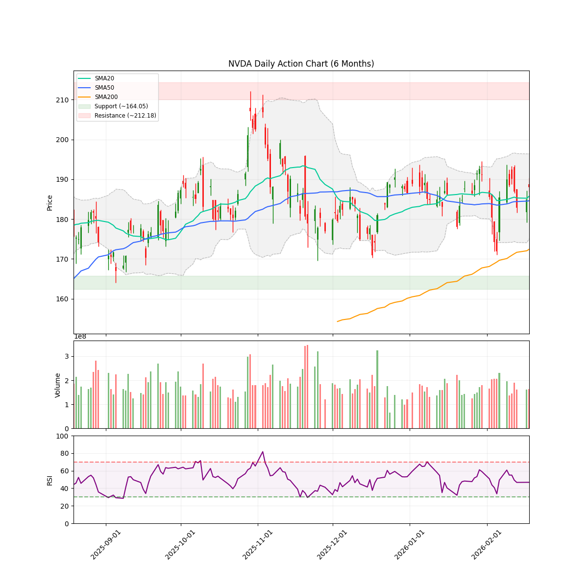
#### 研报分析

### 技术指标概览 (Technical Overview)
- **当前价格**: $187.98
- **RSI (14)**: 46.79
- **移动平均线**: SMA20: $185.74 | SMA50: $184.60 | SMA200: $172.43 (Bullish)
- **波动率**: ATR (14): 7.37 (预计周度波动: +/- $16.49)
- **关键位 (6m)**: 支撑位 $164.05 | 阻力位 $212.18
- **即时状态**: Above SMA50

# 情绪审计报告：英伟达 (NVDA) - 叙事经济学分析

**致：** 投资委员会
**职位：** 对冲基金研究员（叙事经济学专家）
**日期：** 2026年02月19日

---

### 1. 催化剂分类 (Catalyst Categorization)

基于对近期新闻流的解构，我们将驱动 NVDA 叙事的因素分为以下三类：

*   **A-Tier (核心驱动力)：**
    *   **财报预期 (2月25日)：** 这是目前市场的绝对焦点。Morningstar 指出市场正在评估其公允价值，这是决定股价能否重回 200 美元的关键。
    *   **战略投资组合调整：** Nvidia 披露了 90 亿美元的投资变动，转向 Intel、Synopsys 和 Nokia。这标志着 Nvidia 正在从纯硬件厂商向“AI 生态系统风投者”转变。
*   **B-Tier (行业与估值叙事)：**
    *   **分析师目标价背离：** 目前股价低于分析师平均目标价 41%，显示出机构层面的看涨叙事与近期技术面走势之间存在巨大鸿沟。
    *   **AI 基础设施持续投入：** 尽管卖出 APLD 股份，但市场共识仍认为 Nvidia 是 AI 支出的最大受益者。
*   **C-Tier (市场噪音)：**
    *   **Applied Digital (APLD) 减持：** 虽然引起关注，但本质上是投资组合的常规修剪，非基本面恶化。
    *   **Jim Cramer 的言论及 NVDY ETF 的高收益讨论：** 属于散户层面的情绪波动，对机构叙事影响较小。

---

### 2. 背离检测 (Divergence Detection)

**分析结论：存在显著的“看跌衰竭”与宏观错位。**

*   **现象：** NVDA 过去一周下跌 4%，跌幅是半导体行业 (1.07%) 的近四倍，且远超大盘。
*   **逻辑：** 这种下跌并非源于公司基本面利空（新闻显示其仍被视为“不可阻挡的力量”），而是受到**地缘政治（美伊紧张局势导致油价上涨）**的宏观压力拖累 [来源: Investopedia]。
*   **判断：** 股价目前在 SMA20 (185.74) 和 SMA50 (184.60) 之上获得支撑。由于基本面叙事（41% 的估值缺口）与短期波动严重背离，这更像是一个**财报前的“洗盘陷阱”**，而非趋势反转。

---

### 3. 情绪评分 (Sentiment Score): 7.5 / 10

**评分逻辑：**
*   **积极因素 (Narrative Support):** 尽管近期价格走弱，但 RSI 为 46.79（中性偏低），未进入超卖，且长期趋势（SMA200 172.43）远在股价下方，牛市结构稳固。
*   **消极因素 (Macro Drag):** 地缘政治引发的能源成本上升对科技股形成整体压制，市场在 2月25日财报前持观望态度。
*   **结论：** 这是一个**“受压制的看涨周期”**。市场正在等待财报来确认其 $90 亿投资组合调整后的新增长逻辑。

---

### 4. 引用新闻源 (News Citations)

1.  **关于财报日期：** [Morningstar] Nvidia (NVDA) 计划于 2月25日发布 2025 财年第四季度报告。
2.  **关于估值缺口：** [24/7 Wall St.] NVDA 目前交易价格低于分析师目标价 41%。
3.  **关于投资组合调整：** [Blockonomi] Nvidia 调整 90 亿美元投资组合，增持 Intel、Synopsys 和 Nokia。
4.  **关于宏观压力：** [Investopedia] 美伊紧张局势推高油价，导致美股期货下跌。

---

### 5. 关键日期提醒 (Next Major Date)

**下一个关键日期：2026年2月25日 (周三)**
**事件：** 2025 财年第四季度收益报告 (Fiscal Q4 2025 Earnings Report)。

**操作建议：** 在 185.00 支撑位附近观察防御性买盘。若财报前股价维持在 SMA50 之上，则叙事依然成立；若跌破支撑，则需警惕宏观因素对叙事逻辑的系统性破坏。
#### 近期新闻与事件
- **[Invezz]** [Nvidia cutting stake isn't a sign to sell Applied Digital stock: here's why](https://invezz.com/news/2026/02/18/nvidia-cutting-stake-isnt-a-sign-to-sell-applied-digital-stock-heres-why/)
- **[Blockonomi]** [Nvidia Adjusts Stock Portfolio, Adding New Positions in Key Companies](https://blockonomi.com/nvidia-adjusts-stock-portfolio-adding-new-positions-in-key-companies/)
- **[AOL]** [39% Yield from the YieldMax NVDA Option Income Strategy ETF (NVDY): Real or Fake?](https://www.aol.com/articles/39-yield-yieldmax-nvda-option-161746033.html)
- **[Insider Monkey]** [Jim Cramer Linked NVIDIA (NVDA) & Computer Storage Stocks](https://www.msn.com/en-us/money/markets/jim-cramer-linked-nvidia-nvda-computer-storage-stocks/ar-AA1WBzWL)
- **[24/7 Wall St.]** [NVIDIA (NVDA) Trading 41% Below Analyst Targets After Recent Drop](https://247wallst.com/investing/2026/02/17/nvidia-nvda-trading-41-below-analyst-targets-after-recent-drop/)

---

### TSM
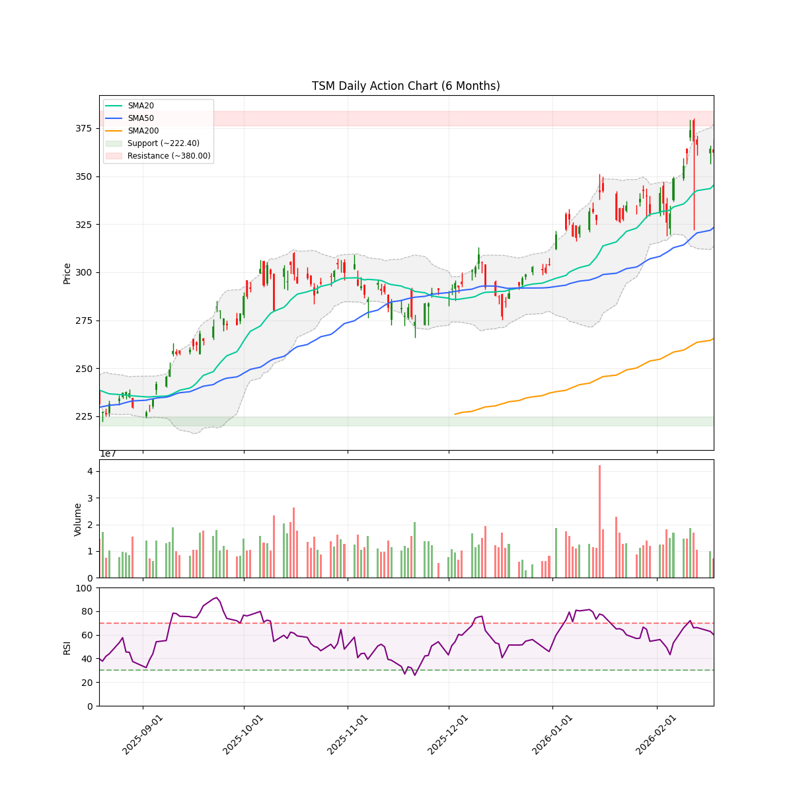
#### 研报分析

### 技术指标概览 (Technical Overview)
- **当前价格**: $362.26
- **RSI (14)**: 60.15
- **移动平均线**: SMA20: $345.33 | SMA50: $323.25 | SMA200: $265.48 (Bullish)
- **波动率**: ATR (14): 17.00 (预计周度波动: +/- $38.01)
- **关键位 (6m)**: 支撑位 $222.40 | 阻力位 $380.00
- **即时状态**: Above SMA50

# 情绪审计报告：TSM (台积电) - 叙事经济学分析

**日期：** 2026年2月19日
**研究职位：** 对冲基金研究助理（叙事经济学视角）
**标的：** TSM (台积电)
**当前价格：** 362.26

---

### 1. 催化剂分类 (Catalyst Categorization)

基于近期新闻流，我们将驱动 TSM 股价的因素分为以下层级：

*   **A-Tier（核心驱动力）：**
    *   **机构评级与顶级大户背书：** DA Davidson 给予买入评级，且 TSM 被列入亿万富翁 Stanley Druckenmiller 的十大重仓股（2026-02-19 新闻）。这种“聪明钱”的增持是极其强烈的多头叙事。
    *   **AI 需求的结构性增长：** 市场普遍共识认为 AI 需求处于爆炸期，作为全球领先的代工厂，TSM 是该叙事中不可绕过的“收费站”。
*   **B-Tier（行业共振）：**
    *   **板块对标分析：** 市场正在讨论 MU 与 TSM 的优劣（2026-02-18），虽然 MU 因低市盈率受关注，但 TSM 在 25.5 倍前瞻市盈率下的垄断地位仍具吸引力。
    *   **投行覆盖扩张：** 随着各大券商重新评估 AI 芯片产能，TSM 的机构覆盖度进一步饱和。
*   **C-Tier（散户情绪/杂音）：**
    *   **投资媒体推荐：** Motley Fool 和 AOL 频繁将 TSM 列入“3000美元以下必买”或“1000美元最佳投资”名单。此类信息虽然能吸引部分散户资金，但更多属于市场情绪的滞后反应（噪音）。

---

### 2. 背离检测 (Divergence Detection)

*   **价格与新闻表现：** 
    目前 TSM 价格处于 362.26，非常接近 6 个月高点 (380.00)。股价运行在 SMA20 (345.33) 和 SMA50 (323.25) 之上，呈现标准的牛市排列。
*   **背离诊断：** 
    **无明显看跌背离。** 尽管有媒体提到 Micron (MU) 可能在短期 EPS 增速上更具优势，但 TSM 的股价并未因此出现抛售，反而稳定在 SMA20 上方，显示出强劲的趋势承接。
*   **潜在风险（叙事过热）：** 
    RSI 为 60.15，尚未进入超买区 (>70)，但已接近“强势区间”的上沿。若价格无法在近期突破 380.00 的阻力位，需警惕短期内“好消息出尽”引发的小幅获利回吐。

---

### 3. 情绪评分与逻辑评分 (Scoring)

*   **情绪评分 (Sentiment Score): 8.5/10**
    *   *评价：* 市场正处于“不可阻挡的 AI 牛市”周期中。Druckenmiller 的背书为该叙事注入了高确定性。
*   **逻辑评分 (Logic Score): 9.0/10**
    *   *评价：* 技术面（均线多头排列）与基本面（垄断地位+机构买入）高度契合，目前的趋势具有极高的可持续性，而非泡沫。

---

### 4. 关键指标与参考引文

*   **参考引文：**
    *   根据 [Insider Monkey] 的报道，DA Davidson 近期开始对 TSM 进行覆盖并给予买入评级，强调了 AI 需求的增长。
    *   根据 [Yahoo Finance]，虽然 MU 的 P/E 更低，但 TSM 25.5 倍的前瞻市盈率在 AI 领军股中仍属合理水平。
*   **支撑位：** 323.25 (SMA50) / 222.40 (6月低点)
*   **阻力位：** 380.00 (6月高点)
*   **ATR (14):** 17.00（波动率处于健康水平，未出现恐慌性跳空）

---

### 5. 下一个重大日期 (Next Major Date)

**预计日期：2026年4月中旬（Q1 财报发布日）**
*   *注：台积电通常在 4 月中旬发布第一季度业绩。届时关于 2nm 量产进度以及 AI 订单能见度的叙事将面临实战检验。*

---

**总结诊断：** TSM 目前正处于由**机构共识**和**AI 产能刚需**驱动的可持续增长趋势中。380.00 是关键阻力位，若有效突破，将开启下一波估值重塑空间。当前非“陷阱”，而是“强势趋势延续”。
#### 近期新闻与事件
- **[Yahoo Finance]** [MU vs. TSM: Which Semiconductor Stock Has the Edge Right Now?](https://finance.yahoo.com/news/mu-vs-tsm-semiconductor-stock-125000479.html)
- **[AOL]** [3 Unstoppable Artificial Intelligence (AI) Stocks to Buy Right Now for Less Than $3,000](https://www.aol.com/articles/3-unstoppable-artificial-intelligence-ai-134100152.html)
- **[Insider Monkey on MSN]** [DA Davidson Assigns TSMC (TSM) a Buy Rating Amid AI Demand Growth](https://www.msn.com/en-us/money/markets/da-davidson-assigns-tsmc-tsm-a-buy-rating-amid-ai-demand-growth/ar-AA1WEnhM?ocid=BingNewsVerp)
- **[The Motley Fool on MSN]** [The best stocks to invest $1,000 in right now](https://www.msn.com/en-us/money/companies/the-best-stocks-to-invest-1-000-in-right-now/ar-AA1WF59L?ocid=BingNewsVerp)
- **[Insider Monkey]** [DA Davidson Assigns TSMC (TSM) a Buy Rating Amid AI Demand Growth](https://www.msn.com/en-us/money/markets/da-davidson-assigns-tsmc-tsm-a-buy-rating-amid-ai-demand-growth/ar-AA1WEnhM)

---

### VRT
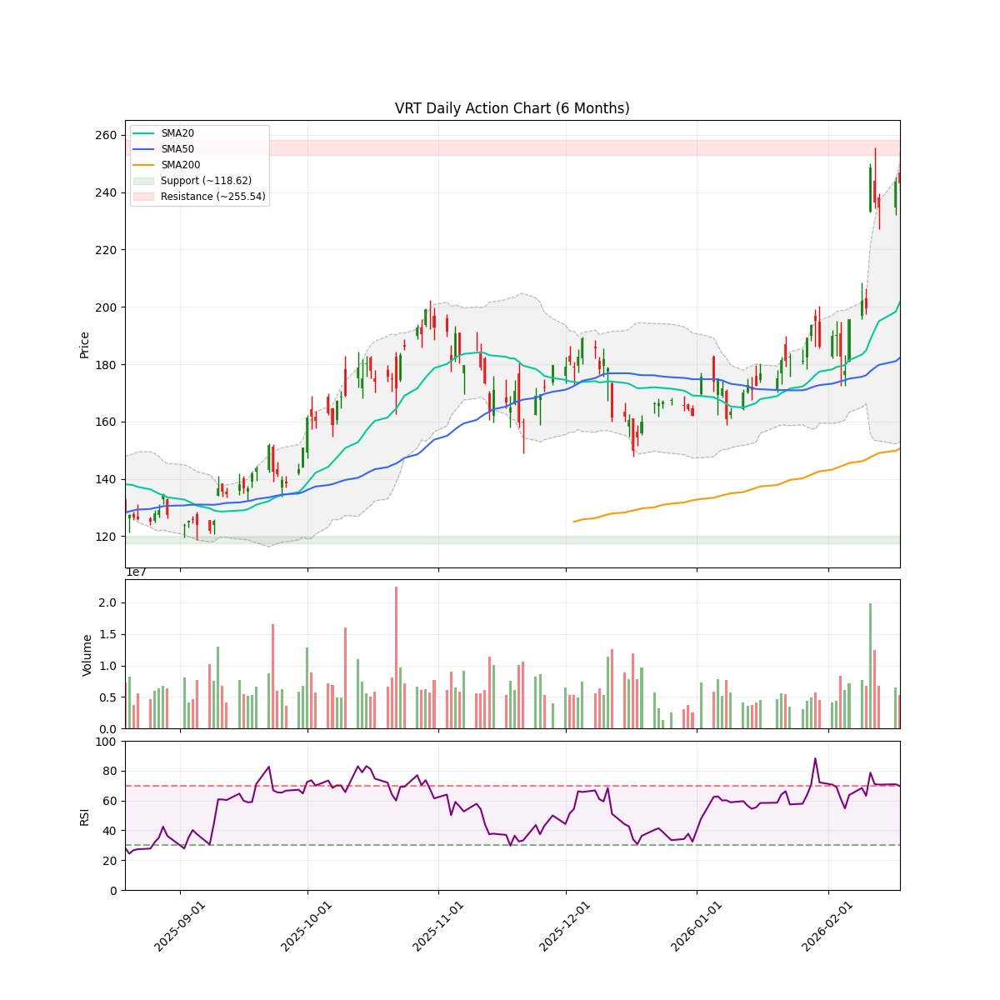
#### 研报分析

### 技术指标概览 (Technical Overview)
- **当前价格**: $243.21
- **RSI (14)**: 69.71
- **移动平均线**: SMA20: $201.73 | SMA50: $182.27 | SMA200: $150.58 (Bullish)
- **波动率**: ATR (14): 16.69 (预计周度波动: +/- $37.31)
- **关键位 (6m)**: 支撑位 $118.62 | 阻力位 $255.54
- **即时状态**: Above SMA50

# 情绪审计报告：Vertiv Holdings Co. (VRT)
**日期：** 2026年02月19日
**角色：** 对冲基金研究员（叙事经济学专家）

---

### 1. 催化剂分类 (Catalyst Categorization)

根据“叙事经济学”框架，我们将 VRT 目前的驱动因素分为以下三个等级：

*   **A-Tier（核心基本面驱动）：**
    *   **AI 散热霸主地位：** 与 Nvidia (NVDA) 深度合作解决 AI 冷却挑战。这不仅是短期利好，而是 AI 基础设施竞赛中的“卖水人”角色。
    *   **2026年强劲展望：** 2026年2月12日发布的 Q4 财报显示订单量极其强劲（Jim Cramer 称之为“Incredible”），且 2026 年度的乐观指引强化了增长逻辑。
*   **B-Tier（动能与行业趋势）：**
    *   **AI 电力超级周期：** Seeking Alpha 指出 AI 电力超级周期远未结束，VRT 处于该趋势的核心。
    *   **Zacks 动能评级：** 机构量化模型持续将其列为高动能股票，吸引被动与量化资金流入。
*   **C-Tier（市场噪音与散户热度）：**
    *   **社交媒体与搜索热度：** Zacks.com 上搜索量激增，Jim Cramer 的公开推荐，属于典型的媒体情绪推升。

---

### 2. 背离检测 (Divergence Detection)

*   **技术面与叙事的一致性：** 目前 VRT 表现为典型的**“强叙事驱动强股价”**。SMA20 (201.73) 远低于当前股价 (243.21)，显示出极强的上升趋势。
*   **潜在警示：** RSI 高达 **69.71**，已逼近 70 的超买警戒线。
*   **双顶疑云：** 尽管叙事极度看好，但 Seeking Alpha 提到 255.54 附近的阻力位可能形成“双顶”结构。如果股价在如此强大利好下无法突破 255.54 的历史高点，将形成“利好出尽”的看跌背离。目前尚未发生，但需高度警惕 250-255 区间的价格行为。

---

### 3. 情绪评分 (Sentiment Score)

**得分：9.2 / 10**
*   **理由：** 市场处于“不可阻挡的看涨周期”。AI 基础设施的叙事已从软件/芯片扩散到物理层（冷却/电力），VRT 是这一叙事的领头羊。机构与零售媒体的共鸣极高。

---

### 4. 逻辑评分 (Logic Score)

**得分：8.5 / 10**
*   **理由：** 估值溢价虽然存在，但有扎实的订单增长和行业壁垒支持。由于股价偏离 SMA50 和 SMA200 过远，逻辑上存在“均值回归”的风险，但当前无迹象表明叙事已经破裂。

---

### 5. 引用新闻链接 (News Citations)

1.  **AI 冷却与 Nvidia 关联:** [Yahoo Finance - Best AI Stocks](https://finance.yahoo.com/news/best-ai-stocks-buy-now-201900310.html)
2.  **订单量评估:** [Insider Monkey - Jim Cramer on VRT Orders](https://www.msn.com/en-us/money/topstocks/vertiv-vrt-s-orders-were-incredible-says-jim-cramer/ar-AA1Wp3UQ)
3.  **Q4 财报分析:** [Yahoo Finance - VRT Q4 Earnings Metrics](https://finance.yahoo.com/news/vertiv-vrt-q4-earnings-taking-143006291.html)
4.  **技术形态警告:** [Seeking Alpha - Double Top Potential](https://seekingalpha.com/article/4864918-vertiv-this-ai-power-supercycle-is-far-from-over-earnings-preview)

---

### 6. 下一个关键日期 (Next Major Date)

*   **预计日期：2026年4月29日左右**
*   **事件：** 2026财年第一季度 (Q1) 财报发布。
*   **重点：** 观察 2026 年指引是否会因上半年订单交付速度超预期而再次上调。

---

### **总结建议 (Hedge Fund Brief)**
VRT 目前处于**“叙事溢价期”**。虽然 RSI 接近超买，但在 AI 基础设施订单可见度极高的情况下，过早做空或离场可能错过主升浪。建议将 **225.00**（近期波动支撑）作为跟踪止损位，重点观察能否放量突破 **255.54**。如果突破失败并伴随成交量萎缩，则需防范“叙事陷阱”引发的阶段性深调。
#### 近期新闻与事件
- **[Yahoo Finance]** [Best AI Stocks to Buy Now and Hold Forever: Nvidia-Beating Vertiv](https://finance.yahoo.com/news/best-ai-stocks-buy-now-201900310.html)
- **[Zacks Investment Research]** [Here's why Vertiv Holdings Co. (VRT) is a strong momentum stock](https://www.msn.com/en-us/money/savingandinvesting/here-s-why-vertiv-holdings-co-vrt-is-a-strong-momentum-stock/ar-AA1WB7Vd)
- **[Zacks Investment Research]** [Vertiv Holdings Co. (VRT) is a trending stock: Facts to know before betting on it](https://www.msn.com/en-us/money/topstocks/vertiv-holdings-co-vrt-is-a-trending-stock-facts-to-know-before-betting-on-it/ar-AA1WswQL)
- **[Insider Monkey]** [Vertiv (VRT)'s Orders Were Incredible, Says Jim Cramer](https://www.msn.com/en-us/money/topstocks/vertiv-vrt-s-orders-were-incredible-says-jim-cramer/ar-AA1Wp3UQ)
- **[Zacks.com]** [Is Vertiv (VRT) a Solid Growth Stock? 3 Reasons to Think "Yes"](https://www.msn.com/en-us/money/topstocks/is-vertiv-vrt-a-solid-growth-stock-3-reasons-to-think-yes/ar-AA1WekRc)

---
