# 每日股市市场报告 (2026-02-20)

> **免责声明**: 本报告由 **代码与 Gemini AI 自动生成**，仅供研究参考，**不构成**任何投资建议。投资有风险，入市需谨慎。作者及 AI 不对任何基于此内容的投资决策承担责任。

## 📑 目录
[TOC]

##  长期投资逻辑
本组合旨在捕捉 **人工智能（AI）与半导体协议** 带来的跨周期结构性增长，核心投资策略聚焦于“确定性”与“物理瓶颈”：
- **底层制程垄断 (Foundry & WFE Moats)**：
  布局处于全球半导体精密制造顶端的“工业母机”级别公司。寻找具备极高准入门槛的晶圆代工及前道设备供应商，作为全产业链最稳固的底座资产。
- **算力稀缺性与连接带宽 (Compute & Interconnect Scarcity)**：
  聚焦在高性能计算芯（HPC）及高带宽连接领域占据主导地位的标的。AI 的终极竞争是“规模”，寻找能有效解决数据交换瓶颈并提供核心推理/训练能力的算力巨头。
- **应用生态与数据霸权 (Platform & Data Sovereignty)**：
  布局拥有闭环生态、海量高质量私有数据及云基础设施的科技巨头。它们是 AI 商业化落地的最终守门人，拥有将技术转化为持续现金流的分配权。
- **物理边界保障 (Power & Thermal Infrastructure)**：
  关注 AI 扩张的“最终瓶颈”——电力供应与热能管理。重点布局为下一代超大规模数据中心提供高功率密度能源、液冷技术及电网扩容方案的能源基建商。
**风控策略**：利用 AlphaJAX 的量化动量评分（Quant Score）作为过滤器，结合 LLM 叙事审计（Narrative Audit）捕捉“业绩超预期 + 叙事逻辑改善”的共振点，实现跨周期的超额收益。

 **注：排序权重**：Ticker 按照 AI 检测出的 **方向** 排序（**看多**优先，其次是 **中性**，最后是 **看空**）。
---

<!-- DISCORD_SUMMARY_START -->
## 🧠 对冲基金经理全局诊断与资金分配策略
你好。我是你的高级投资组合经理（PM）。

当前系统日期为 2026年2月20日。基于你提供的账户全盘数据和研究团队的逻辑评分（Logic Score），我已完成账户审计。

### **【核心风险预警】**
1.  **集中度违规：** **AMD** 的正股持仓占账户比例高达 **51.14%**，严重违反了本基金 **<30%** 的单一个人头寸上限。即使逻辑评分为 6.8，这种暴露也会使账户面临过大的系统性波动。
2.  **技术性极度超卖：** **GOOGL (RSI 16.17)** 和 **AMZN (RSI 17.27)** 均处于罕见的“技术性衰竭”状态。根据叙事经济学模型，这种低 RSI 通常意味着情绪上的非理性杀跌，而非基本面崩坏，适合进行“均值回归”布局。

---

### **【行动交易方案 - Actionable Trading Plan】**

#### **1. AMD (逻辑评分: 6.8 | 建议：强制减仓/结构调整)**
*   **状态：** 集中度过高（51%），成本 $220.54，处于亏损状态。
*   **行动：** 必须主动降低集中度。利用当前 RSI (30.35) 的空头回补反弹机会，目标是在账户中将 AMD 的占比降至 30% 以下。
*   **操作：** 
    *   当股价回升至 **$215 - $220** 区间时，**减持 200-250 股**。
    *   保留现有的 **-AMD260313C230** 备兑期权，目前浮盈 68%，让其随时间价值流逝趋向归零。

#### **2. GOOGL (逻辑评分: 8.2 | 建议：完美买点/积极增持)**
*   **状态：** RSI 16.17（极度超卖），基本面评分极高，Gemini 变现叙事强劲。
*   **行动：** 这是目前组合中胜率最高的标的。在不违反 90% 现金使用率的前提下，动用部分现金补仓，降低均价。
*   **操作：** 
    *   在 **$295 - $302** 区间，增持 **50 股**。
    *   增持后占比将升至约 23%-25%，仍符合风控要求。

#### **3. AMZN (逻辑评分: 4.2 | 建议：战术性反抽退出)**
*   **状态：** 逻辑评分低于 5，叙事陷于“资本支出陷阱”，但 RSI 17.27 预示着短期会有超跌反弹。
*   **行动：** 不要在此刻（极度超卖）割肉。等待反弹后清仓，回笼资金。
*   **操作：** 
    *   设定卖出指令于 **$218 - $225** (SMA200 阻力位附近)。
    *   一旦触发，将此 1.72% 的仓位全部清空。

#### **4. VST (逻辑评分: 7.0 | 建议：持有/财报防御)**
*   **状态：** 处于盈利状态 (+9.6%)，技术形态修复中。
*   **行动：** 维持现状，重点防范下周财报风险。
*   **操作：** 
    *   将止盈位移动至 **$162.89 (SMA50)**。若收盘跌破此位，锁定利润出局。

---

### **【If-Then 压力测试方案】**

*   **场景 A：下周 PCE 数据优于预期，科技股全面反弹**
    *   **If:** 纳斯达克开启均值回归，GOOGL 回到 $320。
    *   **Then:** 执行 AMD 的减仓计划（减至 30% 以下），同时观察 AMZN 是否触及 $220 退出点。**保持 20% 以上的现金水平**。

*   **场景 B：市场进一步下挫，AMD 跌破 $183 (SMA200)**
    *   **If:** AMD 长期趋势走坏。
    *   **Then:** 即使处于亏损，也必须强制平仓 100 股以控制回撤。将资金注入逻辑评分更高且 RSI 更低的 GOOGL，完成“汰弱留强”。

*   **场景 C：VST 财报爆雷，股价跳空低开**
    *   **If:** 财报后开盘价低于 $160。
    *   **Then:** 立即市价清仓 VST，保护原始资本，不参与阴跌过程。

---

### **【PM 总结陈词】**
目前的账户逻辑是：**“砍掉臃肿的 AMD 集中度，利用极度超卖加仓 GOOGL，反弹清空弱势 AMZN，动态观察 VST 财报。”**

**当前建议下单：**
1.  **Limit Buy: GOOGL 50 股 @ $298.00**
2.  **Limit Sell: AMZN 20 股 @ $219.00**
3.  **Stop Loss: VST 100 股 @ $162.50 (GTC)**

现金流充足（$53k），我们有足够的子弹在接下来的波动中优化结构。请严格执行！
<!-- DISCORD_SUMMARY_END -->
---

## 💼 现有持仓个股诊断

### AMD
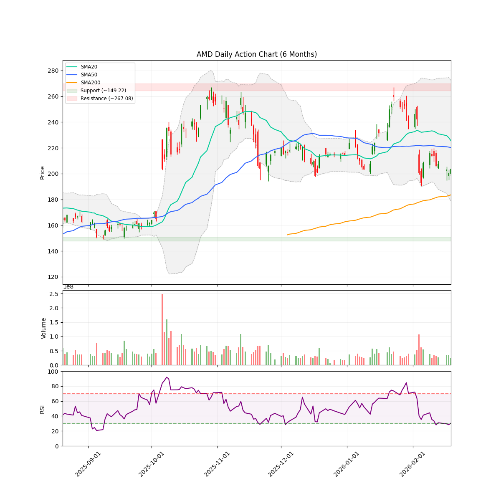
#### 研报分析

### 技术指标概览 (Technical Overview)
- **当前价格**: $203.37
- **RSI (14)**: 30.35
- **移动平均线**: SMA20: $225.54 | SMA50: $220.24 | SMA200: $183.52 (Bullish)
- **波动率**: ATR (14): 14.10 (预计周度波动: +/- $31.53)
- **关键位 (6m)**: 支撑位 $149.22 | 阻力位 $267.08
- **即时状态**: Below SMA50

# AMD 情绪审计报告：叙事经济学视角

**日期**：2026年2月20日
**研究员**：对冲基金研究助理 (叙事经济学方向)
**标的**：AMD (Advanced Micro Devices)
**当前价格**：$203.37

---

### 1. 催化剂分类与权重 (Catalyst Categorization)

基于近期新闻流，我们将 AMD 的基本面与叙事驱动力分为三个等级：

*   **A-Tier (核心驱动力)**
    *   **数据中心与 AI 营收爆发**：根据 [Seeking Alpha (2026-02-03)](https://seekingalpha.com/article/4865497-amd-record-quarter-but-stock-plummets-a-strong-buy-opportunity)，AMD 数据中心收入同比飙升 39% 至 53.8 亿美元，已占据总营收半壁江山。
    *   **机构长期看涨**：Benchmark 重申买入评级，目标价定为 **$325**，并预计到 2027 年 AI 相关营收将达数百亿美元 [Yahoo Finance (2026-02-20)](https://finance.yahoo.com/news/benchmark-sees-advanced-micro-devices-084517094.html)。
*   **B-Tier (行业与竞争)**
    *   **板块对比**：与 Broadcom (AVGO) 的万亿市值竞争显示了 AMD 在 AI 基础建设中的核心地位 [AOL (2026-02-20)](https://www.aol.com/articles/amd-vs-broadcom-one-dominate-075700575.html)。
    *   **AI 资本开支意愿**：云服务商在 AI 领域的持续投入为 AMD 提供了稳定的需求环境。
*   **C-Tier (市场噪音)**
    *   **地缘政治波动**：美伊局势紧张及 PCE 通胀数据前的避险情绪属于短期宏观噪音 [Yahoo Finance UK (2026-02-20)](https://uk.finance.yahoo.com/news/stock-market-today-dow-sp-500-nasdaq-futures-gain-as-us-iran-tensions-rise-pce-inflation-looms-000113427.html)。
    *   **历史周期对比**：Forbes 提到的 2013 和 2021 年反弹记录，仅具参考意义 [Forbes (2026-02-18)](https://www.forbes.com/sites/greatspeculations/2026/02/18/what-will-power-amd-stocks-next-rally/)。

---

### 2. 背离检测 (Divergence Detection)

**核心观察：看涨叙事与看跌价格的剧烈冲突。**

*   **现象**：AMD 在发布了打破纪录的第四季度财报（EPS $1.53，营收 $103亿）后，股价反而大跌。这种“利好出尽”表现源于市场对第一季度 $98亿 的营收指引感到失望 [Blockonomi (2026-02-04)](https://blockonomi.com/amd-stock-investors-dump-shares-despite-earnings-beat-heres-why/)。
*   **技术面信号**：当前 **RSI 为 30.35**，已触及“超卖”区间。股价跌破 SMA20 和 SMA50，但仍高于 SMA200 ($183.52)。
*   **诊断**：**空头力竭 (Bearish Exhaustion)**。尽管市场对 Q1 指引反应过度，但分析师普遍认为市场忽略了关键的 AI 催化剂 [Invezz (2026-02-12)](https://invezz.com/news/2026/02/12/amd-stock-tumbles-3-analysts-say-market-is-missing-this-key-catalyst/)。这暗示目前处于“叙事陷阱”的底部，而非系统性崩溃。

---

### 3. 持仓诊断 (Position Audit)

*   **正股 (600股)**：成本 $220.54，当前浮亏 -7.79%。
*   **备兑期权 (Short Call)**：-AMD260313C230，浮盈 +68.13%。
*   **策略评价**：您的备兑期权策略目前非常成功，对冲了正股的部分跌幅。考虑到 $230 的行权价和目前的超卖状态，该期权大概率会以归零结算（这对卖方有利）。

---

### 4. 逻辑评分 (Logic Score)

**分值：6.8 / 10**

*   **评分理由**：
    *   **减分项**：短期动能完全破坏，股价处于 SMA50 下方的下降通道。市场对 Q1 的“谨慎叙事”占据了主导地位。
    *   **加分项**：AI 基本面未变，数据中心增长强劲。RSI 指向超卖，且距离 SMA200 长期支撑位较近。这更像是一个**流动性陷阱**，旨在洗出杠杆多头，而非趋势终结。

---

### 5. 关键日期提醒 (Next Major Date)

*   **当前最受关注日期**：**2026年2月20日 (今日)** —— PCE 物价指数发布。这将决定半导体板块的整体风险偏好。
*   **下一财报季**：预计 **2026年4月下旬**。届时市场将验证 Q1 的实际执行情况是否如指引般“平庸”，或是再次带来惊喜。

---

### 结论
AMD 目前正处于**基本面坚挺但叙事受压**的阶段。对于 $220 成本的持有者，短期建议是利用 **RSI 超卖** 的反弹机会，观察 $215-$220 区域的压力。如果 PCE 数据超预期下行，AMD 有望借此进行空头回补式反弹。目前的下跌更倾向于是一个“买入机会”而非趋势的系统性失败。
#### 近期新闻与事件
- **[Yahoo Finance UK]** [Stock market today: Dow, S&P 500, Nasdaq futures gain as US-Iran tensions rise, PCE inflation looms](https://uk.finance.yahoo.com/news/stock-market-today-dow-sp-500-nasdaq-futures-gain-as-us-iran-tensions-rise-pce-inflation-looms-000113427.html)
- **[Forbes]** [What Will Power AMD Stock's Next Rally?](https://www.forbes.com/sites/greatspeculations/2026/02/18/what-will-power-amd-stocks-next-rally/)
- **[AOL]** [AMD vs. Broadcom: Which One Will Dominate the Next Decade?](https://www.aol.com/articles/amd-vs-broadcom-one-dominate-075700575.html)
- **[Seeking Alpha]** [AMD Stock: $300 Appears Imminent; Why I'm Buying More](https://seekingalpha.com/article/4871662-amd-stock-300-appears-imminent-why-im-buying-more)
- **[Yahoo Finance]** [Benchmark Sees Advanced Micro Devices (AMD) Generating Tens of Billions in AI Revenue by 2027](https://finance.yahoo.com/news/benchmark-sees-advanced-micro-devices-084517094.html)

---

### AMZN
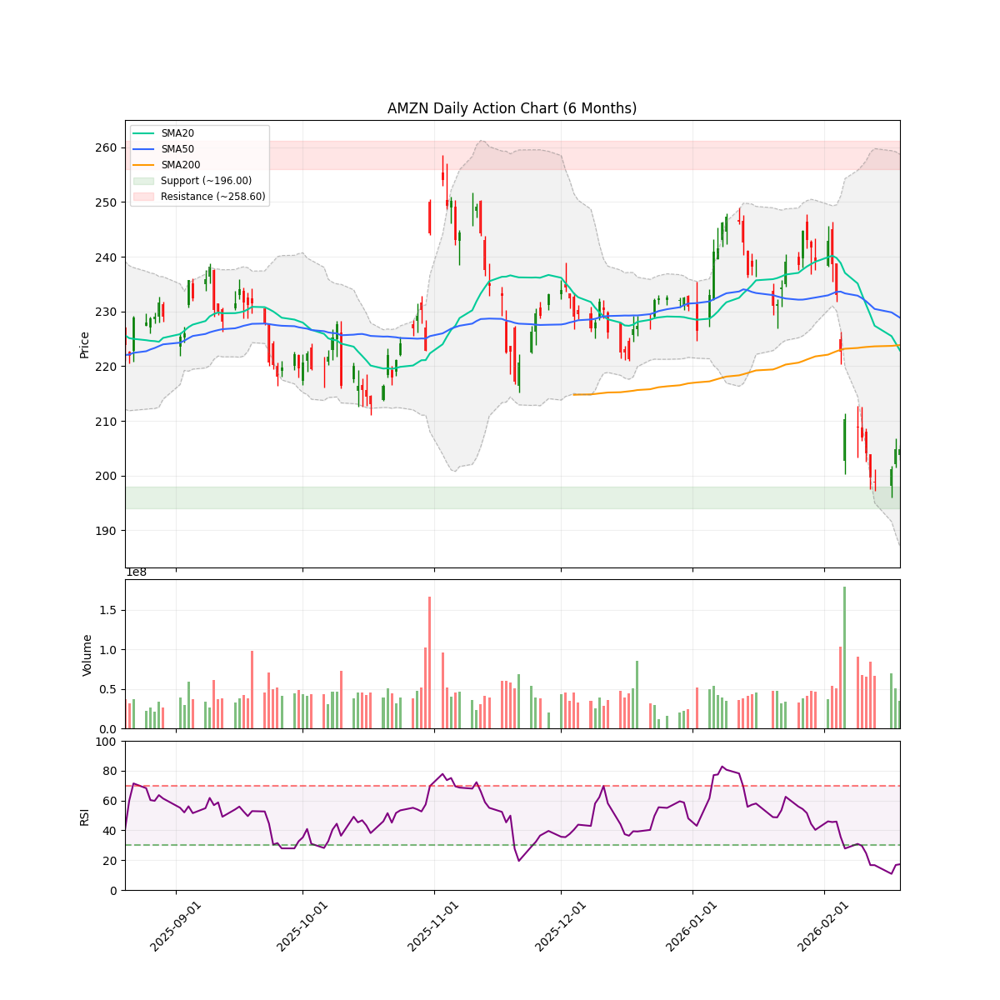
#### 研报分析

### 技术指标概览 (Technical Overview)
- **当前价格**: $204.86
- **RSI (14)**: 17.27
- **移动平均线**: SMA20: $222.86 | SMA50: $228.85 | SMA200: $223.85 (Bullish)
- **波动率**: ATR (14): 8.04 (预计周度波动: +/- $17.97)
- **关键位 (6m)**: 支撑位 $196.00 | 阻力位 $258.60
- **即时状态**: Below SMA50

# 情绪审计报告：亚马逊 (AMZN) - 叙事经济学视角

**致：** 投资委员会
**担任职位：** 对冲基金研究员（叙事经济学专家）
**日期：** 2026年02月20日

---

### 1. 催化剂分类 (Catalyst Categorization)

*   **A-Tier (核心驱动):**
    *   **2000亿美元资本支出计划：** 市场对2026年巨额支出（AI、芯片、卫星）产生的利润率担忧是当前下跌的主因。 [Source: The Economic Times](https://www.msn.com/en-in/money/markets/why-amazon-stock-amzn-is-falling-again-today-key-factors-driving-the-decline/ar-AA1VOFQ1)
    *   **Q4 财报不及预期：** 盈利惊喜为-1.52%，导致股价从260美元高点回撤约20%。 [Source: Yahoo Finance](https://finance.yahoo.com/news/amazon-amzn-lags-q4-earnings-221002278.html)
*   **B-Tier (机构动向与评级):**
    *   **顶级大佬抄底：** 13F报告显示 Bill Ackman, Seth Klarman, Stanley Druckenmiller 在2025年Q4增持。 [Source: Barchart](https://www.msn.com/en-us/money/top-stocks/big-money-sees-big-value-in-amazon-should-you-buy-amzn-stock-too/ar-AA1WGCUM)
    *   **目标价下调但维持买入：** Benchmark 将目标价从$295下调至$275，Bernstein 从$300下调至$265。
*   **C-Tier (噪音与次要信息):**
    *   云计算板块常规排名：AMZN 仍被列为最佳云股票之一。 [Source: Insider Monkey](https://www.msn.com/en-us/money/companies/is-amazoncom-inc-amzn-one-of-the-14-best-cloud-computing-stocks-to-buy-right-now/ar-AA1WwgzP)

---

### 2. 背离检测 (Divergence Detection)

**当前状态：严重的看跌衰竭 (Bearish Exhaustion)。**
*   **技术面背离：** RSI 极度超卖（**17.27**），这在大型科技股中非常罕见。尽管 Benchmark 和 Bernstein 下调了目标价，但依然维持“买入”或“跑赢大盘”评级，显示基本面预期与短期股价杀跌之间存在严重脱节。
*   **叙事背离：** 零售散户对“2000亿支出”感到恐慌，而“聪明钱”（Ackman/Druckenmiller）却在加仓。市场目前正在惩罚长期的资本投入（Project Kuiper 和 AI 芯片），这种过度反应往往是长线布局的机会。

---

### 3. 情绪评分与叙事诊断

#### **逻辑评分 (Logic Score): 4.2 / 10**
*(注：0为系统性崩溃，10为无可阻挡的牛市。4.2代表当前处于恐慌抛售后的寻底阶段。)*

**叙事分析：**
目前 AMZN 的叙事处于 **“资本支出陷阱”**。市场从2025年的乐观情绪迅速转向对2026年自由现金流（FCF）受损的极度担忧。
*   **看空叙事：** 2000亿美元的支出是“黑洞”，短期看不到回报。
*   **看多叙事：** 顶级对冲基金通过13F文件背书，利用短期财报后的杀跌进行防御性调仓。

**结论：** 这是一个典型的**叙事错位**。股价跌破了 SMA200 ($223.85)，且远低于 SMA50。从技术角度看，目前是“落下的飞刀”；但从估值角度看，机构正在支撑 $200 关口。

---

### 4. 账户持仓诊断 (Portfolio Impact)

*   **当前盈亏：** +1.61%（成本价 $201.61）。
*   **风险预警：** 股价 ($204.86) 距离您的成本价仅一步之遥。由于 RSI 处于极低位，目前**不建议**在恐慌中割肉。
*   **操作建议：** 关注 **$196.00** 的 6个月支撑位。如果跌破此位，叙事将演变为“长期趋势反转”。若能在 $196-200 企稳，则可能迎来技术性反弹。

---

### 5. 关键日期与事件 (Next Major Date)

*   **关键日期：2026年4月下旬（预计 2026-04-24 左右）**
*   **事件：** 2026年第一季度 (Q1) 财报。
*   **重要性：** 届时管理层必须对那 2000 亿美元的投向给出更具体的 ROI 路线图，否则叙事压力将持续。

---

**免责声明：** 本报告基于叙事经济学模型，不构成直接投资建议。市场波动剧烈，请严格执行止损纪律。
#### 近期新闻与事件
- **[Yahoo Finance]** [Amazon (AMZN) Price Targets Cut as $200 Billion Capex Plan Weighs on Sentiment](https://finance.yahoo.com/news/amazon-amzn-price-targets-cut-084505982.html)
- **[Barchart]** [Big money sees big value in Amazon: Should you buy AMZN stock too?](https://www.msn.com/en-us/money/top-stocks/big-money-sees-big-value-in-amazon-should-you-buy-amzn-stock-too/ar-AA1WGCUM)
- **[The Motley Fool]** [Is Amazon Stock Going to $260?](https://www.fool.com/investing/2026/02/15/is-amazon-stock-going-to-260/)
- **[Insider Monkey]** [Is Amazon.com, Inc. (AMZN) One of the 14 Best Cloud Computing Stocks to Buy Right Now?](https://www.msn.com/en-us/money/companies/is-amazoncom-inc-amzn-one-of-the-14-best-cloud-computing-stocks-to-buy-right-now/ar-AA1WwgzP)
- **[FX Empire]** [AMZN, AAPL and GOOG Forecast - Generals Look Likely to Bounce](https://www.fxempire.com/forecasts/article/amzn-aapl-and-goog-forecast-generals-look-likely-to-bounce-1580326)

---

### GOOGL
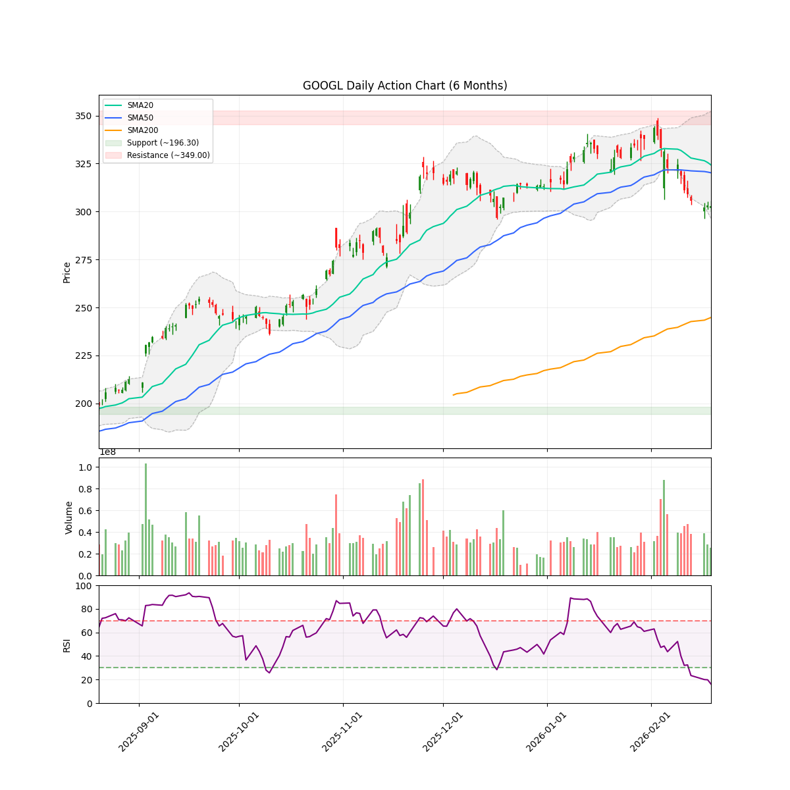
#### 研报分析

### 技术指标概览 (Technical Overview)
- **当前价格**: $302.85
- **RSI (14)**: 16.17
- **移动平均线**: SMA20: $324.29 | SMA50: $320.21 | SMA200: $244.77 (Bullish)
- **波动率**: ATR (14): 10.43 (预计周度波动: +/- $23.33)
- **关键位 (6m)**: 支撑位 $196.30 | 阻力位 $349.00
- **即时状态**: Below SMA50

# 情绪审计报告：Alphabet (GOOGL) - 叙事经济学分析

**日期：** 2026年2月20日
**分析师：** 对冲基金研究助理（叙事经济学中心）
**股票代码：** GOOGL (Alphabet Inc.)
**当前价格：** $302.85

---

### 1. 催化剂分类 (Catalyst Categorization)

基于近期新闻流，我们将 GOOGL 的驱动因素分为以下三个等级：

*   **A-Tier（核心基本面驱动）：**
    *   **Q4 2025 财报超预期：** 2025年第四季度每股收益 (EPS) 和营收均超出预期，特别是 Google Cloud 收入飙升，确立了长期盈利能力的韧性。[参考来源：Shacknews, Motley Fool]
    *   **Gemini 采用率激增：** 机构报告显示 Gemini AI 应用在企业级市场渗透加速，分析师 Canaccord Genuity 随之调高目标价。这是决定未来估值倍数的关键叙事。[参考来源：Insider Monkey]
*   **B-Tier（行业与宏观情绪）：**
    *   **软件板块普跌：** 2026年初“七巨头”及软件板块集体回调。尽管 Google 基本面强劲，但受行业性资金调仓影响显著。[参考来源：Yahoo Finance]
    *   **分析师评级重置：** 美国银行（BofA）在财报后更新了预测，维持了市场的关注度。
*   **C-Tier（杂音与短期情绪）：**
    *   **媒体评论：** Jim Cramer 的公开看好以及预测市场的波动。这类信息虽能增加散户关注，但对中长期机构定价权影响有限。

---

### 2. 离散检测与叙事陷阱 (Divergence Detection)

**核心发现：严重的“看涨背离”与空头衰竭。**

*   **基本面 vs 走势：** Google 近期发布了强劲的财报（A-Tier），且 AI 产品 Gemini 的叙事正在从“PPT阶段”转向“变现阶段”。然而，股价却处于 SMA20 ($324.29) 和 SMA50 ($320.21) 之下。
*   **技术性极度超卖：** **RSI 为 16.17**。在对冲基金逻辑中，RSI 低于 20 通常意味着非理性抛售或系统性清算，而非基本面崩塌。
*   **结论：** 目前的下跌并非“陷阱”，而是一个**由于宏观板块轮动导致的叙事错配**。股价正在测试支撑位，由于其价格仍远高于 SMA200 ($244.77)，长期牛市结构尚未破坏。

---

### 3. 逻辑评分 (Logic Score)

#### **评分：8.2 / 10**

**评分逻辑：**
*   **(+5.0) 基本面支柱：** Q4 财报证明了搜索广告的护城河和云业务的增长潜力。
*   **(+3.0) 叙事吸引力：** Gemini 的高采用率正在反驳“Google 在 AI 竞赛中掉队”的旧叙事。
*   **(+1.2) 均值回归预期：** 16.17 的 RSI 指示极度超卖，短期反弹至 SMA50 的逻辑概率极高。
*   **(-1.0) 宏观阻力：** 2026年开年以来软件板块的整体疲软构成了短期压力限制了评分达到 9 以上。

---

### 4. 投资组合诊断 (Portfolio Diagnosis)

*   **当前仓位盈利：** +15.47% (成本 $262.26)。
*   **风险评估：** 虽然目前股价回撤，但由于您的成本远低于 SMA200 ($244.77) 且接近 6 个月低点 ($196.30)，安全垫依然深厚。
*   **操作建议：** 无需恐慌减仓。当前处于“看涨衰竭”的末端。17.64% 的持仓比例较高，若价格进一步跌向 $280 附近可考虑是否触发止盈，但在 $300 关口，持有叙事胜率更高。

---

### 5. 下一重大事件 (Next Major Date)

*   **下一关键日期：2026年4月下旬 (预计 2026-04-23 左右)**
*   **事件：** 2026 财年第一季度 (Q1) 财报发布。
*   **关注点：** 观察 Gemini 的商业化收入是否在云业务中产生实质性贡献，这将决定股价能否突破 $350 的历史阻力位。

---

**引用文献：**
1. *Canaccord Genuity Lifted Price Target on Alphabet* - [MSN/Insider Monkey](https://www.msn.com/en-us/money/topstocks/alphabet-googl-gemini-adoption-surges-canaccord-genuity-lifted-price-target-on-the-company/ar-AA1WJ1qT)
2. *Google Q4 2025 earnings results beat* - [Shacknews](https://www.shacknews.com/article/147732/google-googl-q4-2025-earnings-results)
3. *Bank of America resets Google stock forecast* - [TheStreet/Yahoo Finance](https://finance.yahoo.com/news/bank-america-resets-google-stock-181700551.html)
#### 近期新闻与事件
- **[Insider Monkey]** [Alphabet (GOOGL) Gemini Adoption Surges, Canaccord Genuity Lifted Price Target on the Company](https://www.msn.com/en-us/money/topstocks/alphabet-googl-gemini-adoption-surges-canaccord-genuity-lifted-price-target-on-the-company/ar-AA1WJ1qT)
- **[Insider Monkey]** [Jim Cramer Believes You Don't Compete With Alphabet (GOOGL)](https://www.msn.com/en-us/money/topstocks/jim-cramer-believes-you-don-t-compete-with-alphabet-googl/ar-AA1WBW9y)
- **[Forbes]** [Is Google Stock Ready For Another Rally?](https://www.forbes.com/sites/greatspeculations/2026/02/17/is-google-stock-ready-for-another-rally/)
- **[Yahoo Finance]** [Google (GOOGL) closes above ___ on February 19?](https://finance.yahoo.com/markets/prediction/event/googl-close-above-on-february-19-2026/)
- **[Yahoo Finance]** [Is GOOG Stock a Buy Amid the Software Selloff?](https://finance.yahoo.com/news/goog-stock-buy-amid-software-150002154.html)

---

### VST
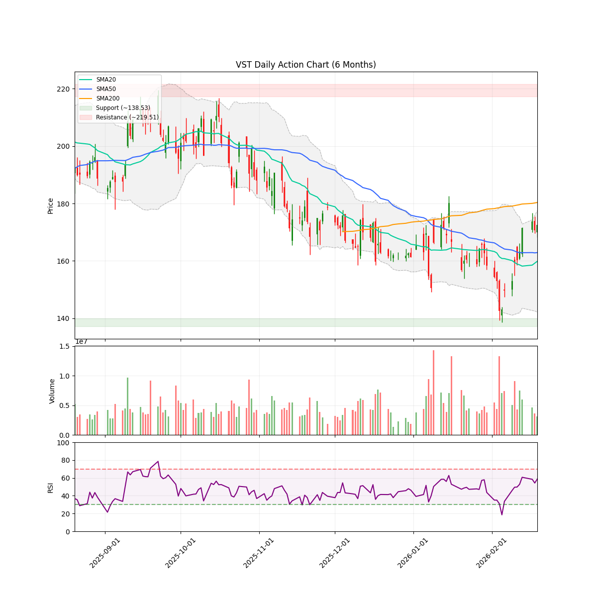
#### 研报分析

### 技术指标概览 (Technical Overview)
- **当前价格**: $172.50
- **RSI (14)**: 58.82
- **移动平均线**: SMA20: $159.83 | SMA50: $162.89 | SMA200: $180.37 (Bearish)
- **波动率**: ATR (14): 7.50 (预计周度波动: +/- $16.77)
- **关键位 (6m)**: 支撑位 $138.53 | 阻力位 $219.51
- **即时状态**: Above SMA50

# VST (Vistra Corp.) 情绪审计报告

**致：** 投资委员会 / 基金经理
**身份：** 对冲基金研究助理（叙事经济学方向）
**日期：** 2026年2月20日

---

### 一、 叙事背景与现状分析 (Narrative Overview)
目前 VST 的核心叙事正处于**“机构上调预期”与“财报前短期不确定性”**的博弈阶段。尽管公司受益于 AI 带动的电力需求长线逻辑，但短期股价表现出明显的波动性。目前股价（$172.50）站稳在 SMA20 和 SMA50 之上，显示短期趋势已从底部反弹，但仍受制于 SMA200（$180.37）的长期压力。

### 二、 催化剂分类 (Catalyst Categorization)

*   **A-Tier（核心催化剂）：**
    *   **机构评级上调：** Jefferies 分析师 Julien Dumoulin-Smith 将 VST 评级从“持有”上调至“买入”，并提高目标价。这提供了强有力的机构背书，属于长线逻辑的支撑点。[参考：Insider Monkey/MSN, 2026-02-14]
    *   **即将发布的财报：** 下周的财报将决定叙事能否从“预期”转为“实证”。

*   **B-Tier（次要催化剂）：**
    *   **技术面突破信号：** 股价穿越历史看涨趋势线，且目前位于 SMA50 以上，技术形态正在修复。[参考：Schaeffer's Investment Research, 2026-02-17]

*   **C-Tier（市场噪音）：**
    *   **每日波动噪音：** Zacks 报告 VST 在市场上涨时下跌，主要归因于短期估算修正，不影响基本面结构。[参考：Zacks, 2026-02-19]

### 三、 背离检测 (Divergence Detection)
**预警：看跌背离 (Bearish Divergence)**
在 2026年2月18日至19日的交易日中，尽管标普500指数上涨 0.56%，但 VST 下跌了 1.79%。
*   **诊断：** 这种“利好环境下的滞涨/下跌”反映了市场对下周财报的谨慎态度。Zacks 指出 VST 可能不具备产生“盈利惊喜”的典型特征。
*   **结论：** 存在“财报陷阱”风险，短期资金在财报前存在避险流出迹象。

### 四、 情绪得分与逻辑评估

*   **情绪得分 (Sentiment Score): 6.5/10**
    *   *评价：* 整体情绪偏向“谨慎乐观”。机构的买入评级抵消了部分短期走势的疲软，但股价尚未突破 SMA200 的“牛熊分界线”。
*   **逻辑得分 (Logic Score): 7.0/10**
    *   *逻辑依据：* 持仓用户目前盈亏为 **+9.60%**，成本价（$157.38）处于 SMA20/50 的支撑位附近。在 RSI 为 58.82（未超买）的情况下，持有是合理的，但需警惕 SMA200 ($180.37) 附近的抛压。

### 五、 关键数据与日期 (Key Metrics & Dates)

*   **当前价格：** $172.50
*   **短期支撑：** $159.83 (SMA20)
*   **关键阻力：** $180.37 (SMA200) —— *若能有效突破此位，将确认重回多头叙事。*
*   **下个重大日期：** **2026年2月24-27日（暂定，下周）** —— VST 官方财报发布日。

---

### 六、 投资建议 (Audit Conclusion)
**当前操作建议：持有并严设止盈。**
用户目前拥有 100 股且获利约 10%，成本优势明显。考虑到财报前存在“逆势下跌”的背离信号，建议将止盈位上移至成本价或 SMA50 ($162.89) 附近。如果下周财报未能确认 AI 能源需求的持续转化，VST 可能会回测支撑位。

**引用来源：**
1.  [Jefferies Upgrade via Insider Monkey/MSN](https://www.msn.com/en-us/money/topstocks/vistra-corp-vst-upgraded-by-jefferies-following-improved-riskreward-profile/ar-AA1WkuWj)
2.  [Technical Resistance Analysis via Schaeffer's](https://finance.yahoo.com/news/vistra-stock-looks-ready-topple-202447395.html)
3.  [Earnings Outlook via Zacks](https://finance.yahoo.com/news/vistra-corp-vst-reports-next-150006706.html)
#### 近期新闻与事件
- **[Zacks]** [Vistra Corp. (VST) Reports Next Week: Wall Street Expects Earnings Growth](https://finance.yahoo.com/news/vistra-corp-vst-reports-next-150006706.html)
- **[Zacks]** [Vistra Corp. (VST) Stock Drops Despite Market Gains: Important Facts to Note](https://finance.yahoo.com/news/vistra-corp-vst-stock-drops-224505549.html)
- **[Schaeffer's Investment Research]** [Vistra Stock Looks Ready to Topple Technical Resistance](https://finance.yahoo.com/news/vistra-stock-looks-ready-topple-202447395.html)
- **[Zacks.com]** [Vistra Corp. (VST) Stock Drops Despite Market Gains: Important Facts to Note](https://www.msn.com/en-us/money/top-stocks/vistra-corp-vst-stock-drops-despite-market-gains-important-facts-to-note/ar-AA1WCR6V)
- **[Schaeffer's Investment Research]** [Vistra Stock Looks Ready to Topple Technical Resistance](https://www.schaeffersresearch.com/content/analysis/2026/02/17/vistra-stock-looks-ready-to-topple-technical-resistance)

---

## 🔍 观察池机会分析

### AMAT
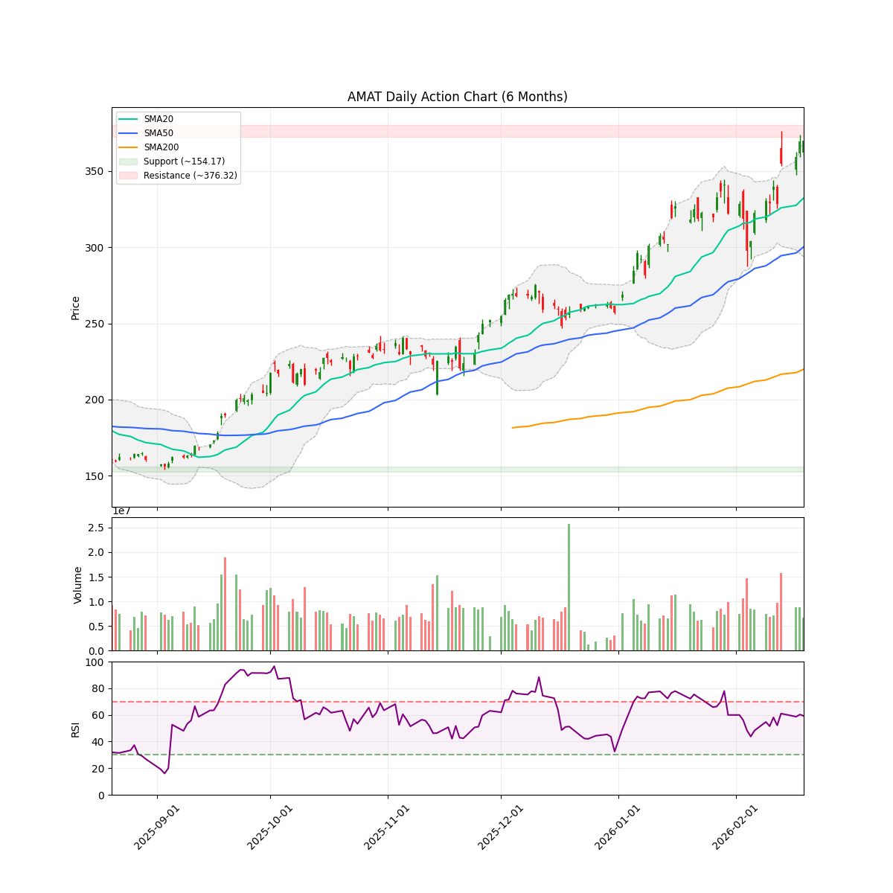
#### 研报分析

### 技术指标概览 (Technical Overview)
- **当前价格**: $369.83
- **RSI (14)**: 59.24
- **移动平均线**: SMA20: $332.30 | SMA50: $300.28 | SMA200: $219.84 (Bullish)
- **波动率**: ATR (14): 19.53 (预计周度波动: +/- $43.67)
- **关键位 (6m)**: 支撑位 $154.17 | 阻力位 $376.32
- **即时状态**: Above SMA50

# Applied Materials (AMAT) 情绪审计报告

**致：** 投资委员会
**职务：** 对冲基金研究员 (叙事经济学方向)
**报告日期：** 2026年02月20日

---

### 1. 催化剂分类 (Catalyst Categorization)

*   **A-Tier (核心叙事推动力)：**
    *   **20% 业绩增长指引：** [Seeking Alpha](https://seekingalpha.com/article/4870393-applied-materials-surges-on-20-percent-growth-guidance-is-the-stock-now-fully-valued) 指出，受 AI 芯片制造设备需求加速推动，公司给出了 20% 的强劲增长指引。这是支撑当前股价高位运行的坚实基础。
    *   **AI 基础设施长期需求：** [The Motley Fool](https://www.fool.com/investing/2026/02/20/unstoppable-artificial-intelligence-ai-stock-amat/) 报告称 AMAT 在 6 个月内上涨 117%，反映了数据中心支出向下游供应链（半导体设备）溢出的必然趋势。
    *   **盈利预测上调：** [Zacks](https://finance.yahoo.com/news/earnings-estimates-moving-higher-applied-172001925.html) 确认盈利预测正在持续走高，这是机构资金持续流入的绿灯信号。

*   **B-Tier (行业共振)：**
    *   **WFE（晶圆厂设备）市场扩张：** [Insider Monkey](https://finance.yahoo.com/news/applied-materials-amat-seen-winning-120135930.html) 认为无论市场增长动力来自何处，AMAT 都处于赢家地位。
    *   **分析师情绪：** Zacks 用户关注度激增，形成了社交媒体与专业研究的共振。

*   **C-Tier (日常噪音)：**
    *   关于国际市场份额的常规深度分析 [Zacks]。

---

### 2. 背离检测 (Divergence Detection)

*   **价格与新闻的一致性：** 目前未发现“利好出尽”的背离迹象。AMAT 股价（369.83）正处于历史高点（376.32）附近。
*   **看跌衰竭分析：** 尽管股价在 6 个月内涨幅巨大，但 **RSI 为 59.24**，这意味着在进入技术性超买区（>70）之前仍有上行空间。
*   **支撑位验证：** 股价远高于 SMA50 (300.28) 和 SMA200 (219.84)，且近期回撤均在 SMA20 (332.30) 之上获得支撑，显示出极强的趋势韧性。

---

### 3. 情绪评分 (Sentiment Score): 8.5/10

**评价：** 处于“不可阻挡的看涨周期”的中后期。
*   **理由：** 叙事已从“AI 概念”转向“业绩兑现”。20% 的增长指引是一个极其强劲的锚点。目前市场并没有质疑估值过高，而是担心错过半导体设备周期的爆发。仅有的压力来自于接近 6 个月高点（376.32）时的心理压力。

---

### 4. 逻辑评分 (Logic Score): 9.0/10

**评分逻辑：**
1.  **基本面支撑 (4/4)：** 20% 增长指引与盈利上调提供硬性支撑。
2.  **技术面配合 (3/3)：** SMA 均线多头排列，ATR 波动率可控。
3.  **叙事可持续性 (2/3)：** AI 扩产是 2026 年的主线，但需关注大客户（如 Intel/TSMC）资本支出计划的变动风险。

---

### 5. 关键参考资讯

*   **利好消息 1:** [Zacks - 盈利预测上调](https://finance.yahoo.com/news/earnings-estimates-moving-higher-applied-172001925.html)
*   **利好消息 2:** [Seeking Alpha - 20% 增长指引分析](https://seekingalpha.com/article/4870393-applied-materials-surges-on-20-percent-growth-guidance-is-the-stock-now-fully-valued)
*   **趋势分析:** [The Motley Fool - AI 驱动下的 AMAT](https://www.fool.com/investing/2026/02/20/unstoppable-artificial-intelligence-ai-stock-amat/)

---

### 6. 下一个关键日期 (Next Major Date)

**预计日期：2026年5月中旬**
*   **事件：** 2026 财年第二季度 (Q2) 财报发布。
*   **关注重点：** 观察 20% 的增长指引是否在第二季度得到实际订单支持，特别是中国市场的出口影响是否如预期般被抵消。

---

**研究员总结：** AMAT 目前并非“估值陷阱”，而是一个受 AI 基础设施实物需求驱动的趋势性机会。建议关注阻力位 376.32 的突破情况。若突破该位，结合目前 43.67 的预期周波动范围，股价可能迅速向 400 整数关口靠拢。
#### 近期新闻与事件
- **[Zacks]** [Applied Materials, Inc. (AMAT) Is a Trending Stock: Facts to Know Before Betting...](https://finance.yahoo.com/news/applied-materials-inc-amat-trending-140006386.html)
- **[Zacks]** [Earnings Estimates Moving Higher for Applied Materials (AMAT): Time to Buy?](https://finance.yahoo.com/news/earnings-estimates-moving-higher-applied-172001925.html)
- **[Insider Monkey]** [Applied Materials (AMAT) Seen Winning Whether WFE Growth Is Market- or...](https://finance.yahoo.com/news/applied-materials-amat-seen-winning-120135930.html)
- **[Zacks]** [International Markets and Applied Materials (AMAT): A Deep Dive for Investors](https://finance.yahoo.com/news/international-markets-applied-materials-amat-141502283.html)
- **[The Motley Fool]** [1 Unstoppable Artificial Intelligence (AI) Stock Up 117% in 6 Months That Can Still Climb Higher](https://www.fool.com/investing/2026/02/20/unstoppable-artificial-intelligence-ai-stock-amat/)

---

### ANET
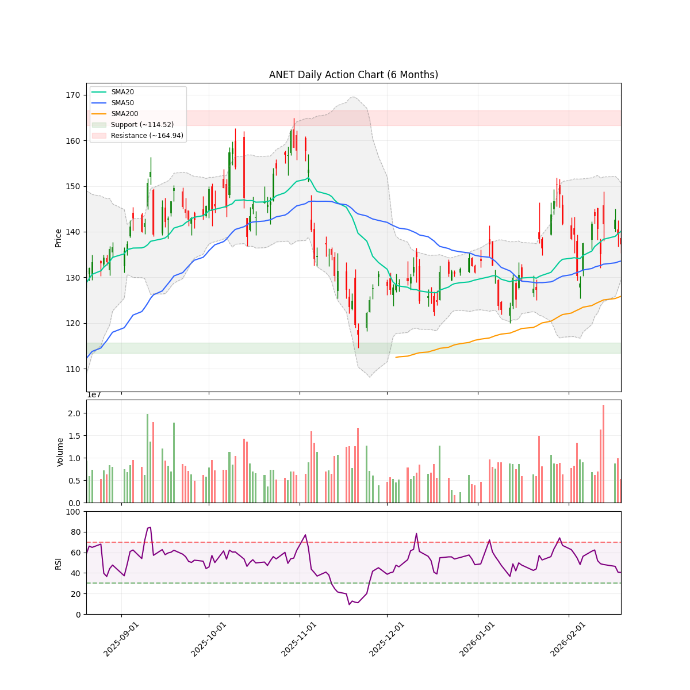
#### 研报分析

### 技术指标概览 (Technical Overview)
- **当前价格**: $137.23
- **RSI (14)**: 40.49
- **移动平均线**: SMA20: $140.07 | SMA50: $133.56 | SMA200: $125.84 (Bullish)
- **波动率**: ATR (14): 7.02 (预计周度波动: +/- $15.70)
- **关键位 (6m)**: 支撑位 $114.52 | 阻力位 $164.94
- **即时状态**: Above SMA50

# Arista Networks (ANET) 情绪审计报告

**致：** 投资委员会
**职位：** 对冲基金研究员（叙事经济学方向）
**日期：** 2026年02月20日
**标的：** Arista Networks (ANET)
**当前价格：** $137.23

---

### 1. 催化剂分类 (Catalyst Categorization)

*   **A-Tier（核心推动力）：**
    *   **Q4 2025 财报大超预期：** 2026年2月13日公布每股收益 $0.82，高于预期的 $0.75。营收与盈利的双重利好确立了业绩支撑。[来源: Zacks, MSN]
    *   **机构评级上调：** 摩根士丹利（Morgan Stanley）分析师 Meta Marshall 于今日（2月20日）将目标价上调至 **$165**，并重申“增持”评级，强调其长线增长潜力。[来源: Yahoo Finance]
*   **B-Tier（行业共振）：**
    *   **AI 基础设施红利：** 随着 NVIDIA 与 Meta 扩大 AI 合作伙伴关系，Arista 作为网络交换机领军者，被视为 AI 叙事下的核心受益方。[来源: EconoTimes]
    *   **估值溢价重估：** 市场正在将其从传统网络设备商重新定义为“AI 基础设施服务商”。
*   **C-Tier（市场热度）：**
    *   **搜索热度：** ANET 进入 Zacks 最受关注股票榜单，散户与机构搜索量上升。[来源: Zacks]

---

### 2. 背离检测 (Divergence Detection)

**分析结论：存在明显的“利好阴跌”背离 (Bearish Exhaustion / Sell the News)**

*   **事实描述：** 尽管 2月13日财报利好触发了股价一度飙升 10.1%，且今日（2月20日）摩根士丹利上调目标价至 $165，但当前股价（$137.23）却低于 SMA20（$140.07）。
*   **深度解读：**
    *   **动量衰竭：** 股价在利好消息出尽后出现回调，目前正在回测 SMA50 ($133.56) 的支撑位。
    *   **技术面清洗：** RSI 为 40.49，已从超买区域回归中性偏低位置。这意味着财报后的“情绪泡沫”已基本出清。
    *   **判断：** 这种背离并非基本面恶化，而是典型的“利好落地”后的短期获利了结，由于股价仍保持在 SMA50 和 SMA200 之上，整体看涨趋势并未破坏，目前的下跌更像是**“牛市回调陷阱”**而非系统性崩溃。

---

### 3. 情绪评分 (Logic Score)

**分值：8.2 / 10**

*   **评分逻辑：**
    *   **基本面 (+5.0)：** 连续的财报 Beat 和 Tier-1 投行的背书提供了极高的下行保护。
    *   **叙事强度 (+3.0)：** AI 网络需求是未来两年的主线叙事，ANET 处于该赛道的统治地位。
    *   **短期波动 (-0.8)：** 股价跌破 20 日均线显示短期卖压尚未完全消散，存在向 SMA50（$133.56）靠拢的惯性。
    *   **结论：** 这是一个**“高质量的买入点”**。叙事依然坚挺，当前的股价缩量回调为机构提供了更好的建仓成本。

---

### 4. 关键节点与支撑阻力 (Next Steps)

*   **阻力位 (Resistance)：** $164.94 (6个月高点 / 接近大摩目标价)
*   **支撑位 (Support)：** $133.56 (SMA50) 以及 $125.84 (SMA200)
*   **下一次重要日期：** 
    *   **2026年5月中旬（预计）：** 2026财年第一季度财报发布日。
    *   **短期关注：** 2月13日缺口的回补情况，若在 $133 附近企稳，则是极佳的波段切入点。

---

### 5. 引用参考 (Citations)
1. **Morgan Stanley PT Raise:** [https://finance.yahoo.com/news/morgan-stanley-raises-arista-networks-002813575.html](https://finance.yahoo.com/news/morgan-stanley-raises-arista-networks-002813575.html)
2. **Q4 Earnings Beat:** [https://www.msn.com/en-us/money/topstocks/arista-networks-anet-beats-q4-earnings-and-revenue-estimates/ar-AA1Wf0te](https://www.msn.com/en-us/money/topstocks/arista-networks-anet-beats-q4-earnings-and-revenue-estimates/ar-AA1Wf0te)
3. **AI Narrative & Partnership:** [https://www.econotimes.com/Stock-Market-Movers-NVIDIA-and-Meta-Expand-AI-Partnership-1733988](https://www.econotimes.com/Stock-Market-Movers-NVIDIA-and-Meta-Expand-AI-Partnership-1733988)
#### 近期新闻与事件
- **[Yahoo Finance]** [Morgan Stanley Raises Arista Networks (ANET) PT to $165 Following Q4 2025 Earnings Beat](https://finance.yahoo.com/news/morgan-stanley-raises-arista-networks-002813575.html)
- **[Yahoo Finance]** [Why Arista Networks Stock Is Soaring Today](https://finance.yahoo.com/news/why-arista-networks-stock-soaring-202700528.html)
- **[Zacks]** [Is Trending Stock Arista Networks, Inc. (ANET) a Buy Now?](https://finance.yahoo.com/news/trending-stock-arista-networks-inc-140005375.html)
- **[Simply Wall St.]** [Assessing Arista Networks (ANET) Valuation As Growth And AI Infrastructure Story...](https://finance.yahoo.com/news/assessing-arista-networks-anet-valuation-211218337.html)
- **[Zacks]** [Should ANET Stock Be Added to Your Portfolio Post Record Q4 Earnings?](https://finance.yahoo.com/news/anet-stock-added-portfolio-post-141500675.html)

---

### ASML
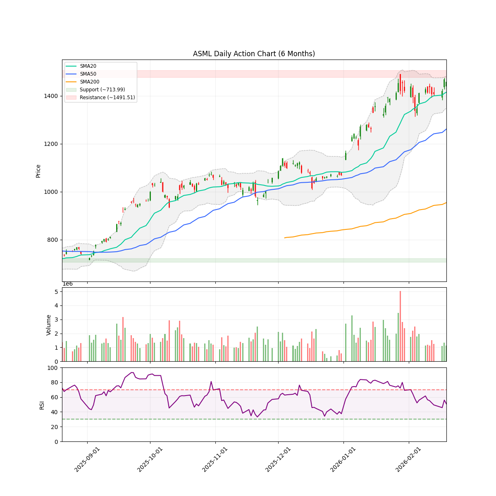
#### 研报分析

### 技术指标概览 (Technical Overview)
- **当前价格**: $1458.93
- **RSI (14)**: 50.75
- **移动平均线**: SMA20: $1415.41 | SMA50: $1261.51 | SMA200: $954.21 (Bullish)
- **波动率**: ATR (14): 50.91 (预计周度波动: +/- $113.84)
- **关键位 (6m)**: 支撑位 $713.99 | 阻力位 $1491.51
- **即时状态**: Above SMA50

# 情绪审计报告：ASML（阿斯麦）
**日期：** 2026年02月20日
**职位：** 对冲基金研究员（叙事经济学专业）

---

### 一、 催化剂分类 (Catalyst Categorization)

根据“叙事经济学”框架，我们将当前的驱动因素分为三个层级：

*   **A-Tier（核心基本面驱动）：**
    *   **EUV订单爆发：** 根据 *Seeking Alpha* 报道，ASML 的 EUV（极紫外光刻机）订单量出现爆炸式增长，且 2026-2028 年的长期增长叙事得到强化。这是推动股价长期上行的“硬通货”。
    *   **AI 数据中心需求：** *Yahoo Finance* 强调，AI 数据中心的巨额支出正直接转化为对 ASML 先进制程设备的订单。
*   **B-Tier（行业与情绪引导）：**
    *   **$2,000 目标价叙事：** *The Motley Fool* 和 *Yahoo Finance* 预测股价将达到 2000 美元。这种高度共识的“价格锚点”有助于吸引散户资金。
    *   **市场关注度：** Zacks.com 数据显示 ASML 成为投资者最关注的标的之一，流动性溢价上升。
*   **C-Tier（回顾性杂音）：**
    *   **过去涨幅报道：** *India Today* 关注过去 6 个月 90% 的涨幅。这属于滞后信息，容易吸引“接盘”资金，但对未来趋势的指导性较弱。

---

### 二、 背离检测 (Divergence Detection)

*   **价格与新闻表现：** 尽管近期媒体充斥着“EUV 订单爆炸”和“2000 美元预测”的极度利好消息，但股价（1458.93）仍处于 6 个月高点（1491.51）下方。
*   **指标分析：** RSI 处于 50.75 的中性区间。这意味着即便在过去半年大涨之后，市场并无明显的超买衰竭。
*   **诊断：** **暂无看跌背离。** 股价在重大利好下未创新高，更像是突破前的平台期整理（Consolidation），而非利好出尽的“派发”。

---

### 三、 情绪分析报告 (Sentiment Analysis)

ASML 当前正处于从**“周期性复苏叙事”**转向**“AI 基础设施垄断叙事”**的关键期。

1.  **趋势持续性：** 只要 AI 巨头（NVIDIA, TSMC, Samsung）的资本支出竞赛不停止，ASML 作为光刻机唯一供应方的地位就无可撼动。目前的上涨并非泡沫，而是对其未来 2-3 年订单能见度的重新定价。
2.  **市场心理：** 投资者情绪处于“有序乐观”阶段。RSI 的中性状态表明，市场已经消化了部分涨幅，正在等待下一个突破信号。
3.  **风险提示：** 唯一的风险点在于估值扩张快于产能扩张速度。

**情绪评分：8.5/10 (强力牛市周期)**
*理由：订单积压（Backlog）是实打实的，而非虚无的预期。*

---

### 四、 逻辑评分 (Logic Score)

**得分：9.0/10**

*   **支撑逻辑：** 1) 绝对的技术垄断；2) 高 NA EUV 设备的交付节点与 AI 芯片迭代周期完美契合；3) 股价站稳 SMA50 和 SMA200 之上，长期趋势极佳。
*   **下行风险：** 若宏观流动性收紧或半导体下游需求（手机/PC）意外萎缩，可能导致短期波动。

---

### 五、 参考资料与关键日期

**引用的关键资讯：**
*   [Seeking Alpha: EUV Orders Explode (2026-02-15)](https://seekingalpha.com/article/4870456-asml-euv-orders-explode-the-setup-into-2026-2028-just-improved)
*   [Yahoo Finance: Prediction $2,000 (2026-02-14)](https://finance.yahoo.com/news/prediction-asmls-stock-price-hit-173500976.html)
*   [Barron's: Market Data (2026-02-19)](https://www.barrons.com/market-data/stocks/asml?countrycode=nl&gaa_at=eafs&gaa_n=AWEtsqdI9YGHiRajxq7iO1tnvR_lqCk20etY1MQ5JY2oNcOKELaN3b5nz1Dt&gaa_ts=695690bb&gaa_sig=4oPSy1Qu6XYS1baOgo-X3DVBuNCyyhcdL6FQhPWMI94cKBQwQh6rnAwPfFI6FccZGH-QteljZQjdRwiX7v6seA%3D%3D)

**下一个关键日期：**
*   **2026 年 4 月中旬（预计）：** 2026 年第一季度财报发布日。
*   **策略建议：** 关注股价能否站稳 1491.51（6个月高点）。若放量突破，目标位直指 1600-1700 区间。
#### 近期新闻与事件
- **[Barron's]** [ASML Holding N.V.](https://www.barrons.com/market-data/stocks/asml?countrycode=nl&gaa_at=eafs&gaa_n=AWEtsqdI9YGHiRajxq7iO1tnvR_lqCk20etY1MQ5JY2oNcOKELaN3b5nz1Dt&gaa_ts=695690bb&gaa_sig=4oPSy1Qu6XYS1baOgo-X3DVBuNCyyhcdL6FQhPWMI94cKBQwQh6rnAwPfFI6FccZGH-QteljZQjdRwiX7v6seA%3D%3D)
- **[Yahoo Finance]** [Prediction: ASML's Stock Price Will Hit $2,000 by This Time](https://finance.yahoo.com/news/prediction-asmls-stock-price-hit-173500976.html)
- **[Yahoo Finance]** [ASML Holding N.V. (ASML) is Attracting Investor Attention: Here is What You Should Know](https://finance.yahoo.com/news/asml-holding-n-v-asml-140005983.html)
- **[India Today]** [Why has this Dutch company's stock gained over 90% on Nasdaq in six months?](https://www.indiatoday.in/business/companies/story/dutch-company-asml-jumps-90-last-si-months-global-tech-ecosystem-explained-2871359-2026-02-20)
- **[Seeking Alpha]** [ASML: EUV Orders Explode, The Setup Into 2026-2028 Just Improved](https://seekingalpha.com/article/4870456-asml-euv-orders-explode-the-setup-into-2026-2028-just-improved)

---

### AVGO
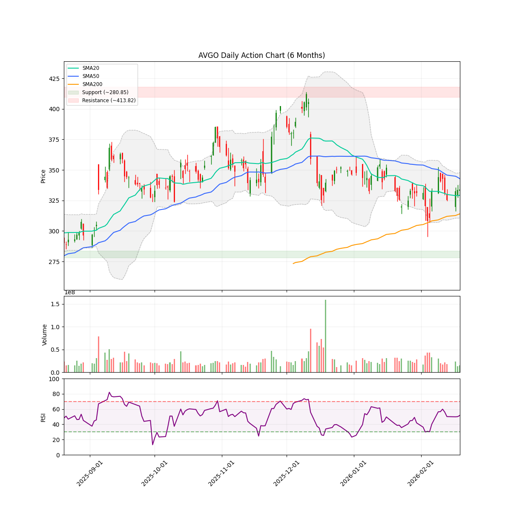
#### 研报分析

### 技术指标概览 (Technical Overview)
- **当前价格**: $333.99
- **RSI (14)**: 51.77
- **移动平均线**: SMA20: $329.24 | SMA50: $342.78 | SMA200: $314.03 (Bullish)
- **波动率**: ATR (14): 16.31 (预计周度波动: +/- $36.47)
- **关键位 (6m)**: 支撑位 $280.85 | 阻力位 $413.82
- **即时状态**: Below SMA50

# 情绪审计报告：Broadcom (AVGO) —— 叙事经济学视角

**报告日期：** 2026-02-20
**分析师：** 对冲基金研究助理（叙事经济学专家）
**标的：** AVGO (Broadcom Inc.)
**当前价格：** $333.99

---

### 1. 催化剂分类 (Catalyst Categorization)

基于“叙事经济学”框架，我们将近期新闻对股价的驱动力分为三个层级：

*   **A-Tier（核心驱动）：**
    *   **超大规模资本支出红利：** [Forbes](https://www.forbes.com/sites/greatspeculations/2026/02/13/heres-how-avgo-stock-could-rise-to-450/) 报告指出，亚马逊等云计算巨头（Hyperscalers）增加 AI 基础设施投入，直接利好博通的定制 AI 芯片业务。目标价看高至 $450。
    *   **财报双超预期 (Double Beat) 叙事：** [Seeking Alpha](https://seekingalpha.com/article/4870172-broadcom-stock-expect-another-double-beating-earnings-preview) 发布的财报前瞻对 AVGO 持强烈买入评级，预计业绩将再次超越市场预期。
    *   **机构增持：** [Insider Monkey](https://finance.yahoo.com/news/broadcom-inc-avgo-draws-ark-150939444.html) 证实 Cathie Wood 的 ARK Investment 已于 2 月初建仓/增持 AVGO，强化了其作为 AI 核心标的的地位。

*   **B-Tier（行业联动）：**
    *   **NVIDIA 财报前哨：** [Zacks](https://finance.yahoo.com/news/nvidia-q4-earnings-loom-buy-120900185.html) 提及半导体行业的整体热度。虽然 AVGO 近期表现略逊于 AMD，但 NVIDIA 的强劲预期对 AVGO 具有溢出效应。
    *   **板块轮动：** 随着 AI 加速器需求的加速，资金正寻找除 NVIDIA 外的高自由现金流（FCF）标的。

*   **C-Tier（市场噪音）：**
    *   **散户情绪风向标：** Jim Cramer 多次提及 AVGO [Insider Monkey](https://finance.yahoo.com/news/jim-cramer-discusses-broadcom-avgo-151357096.html)，增加了社交媒体曝光率，但对机构定价逻辑影响有限。
    *   **五年期长期预测：** [Motley Fool](https://finance.yahoo.com/news/prediction-3-stocks-worth-more-155000780.html) 的远期价格预测属于噪音，无法驱动短期价格。

---

### 2. 背离检测 (Divergence Detection)

*   **技术面 vs. 叙事面：** 
    目前 AVGO 股价（$333.99）位于 **SMA50 ($342.78)** 之下，但在 **SMA20 ($329.24)** 之上。
    *   **看跌枯竭迹象：** 尽管新闻流极度看涨（ARK 增持、亚马逊利好），但股价仍低于 50 日均线。这通常意味着：
        1. 市场正在等待 NVIDIA 财报（2月20日左右）的最终靴子落地。
        2. 技术性回调正在消化前期的涨幅（此前一周曾触及 $343）。
    *   **结论：** 并非“陷阱”，而是**结构性盘整**。RSI 指标（51.77）处于中性区间，显示既无超买也无超卖，属于典型的财报前观望。

---

### 3. 逻辑评分 (Logic Score: 7.8/10)

**评分理由：**
*   **叙事强度 (9/10)：** AI 基础设施支出的故事非常稳固，博通在定制 ASIC 领域的垄断地位是难以撼动的“护城河”。
*   **技术支撑 (6/10)：** 股价受阻于 SMA50，且距离 6 个月高点 $413.82 仍有较大空间，动能尚未完全激发。
*   **风险溢价 (8/10)：** 既然 ARK 和机构在 2 月上旬已入场，且业绩双超预期的叙事已深入人心，下行压力受制于 SMA200 ($314.03) 的强力支撑。

---

### 4. 结论与关键日期

**核心结论：** 
AVGO 目前正处于“**蓄势待发**”阶段。亚马逊的资本支出叙事提供了基本面底座，而 Seeking Alpha 的“双超”预期提供了上涨的导火索。目前的跌破 SMA50 属于技术性洗盘。只要股价守住 $329 (SMA20)，该股将大概率在财报后冲击 $360-$380 区域。

**下个重大日期 (Next Major Date)：**
*   **2026年3月初（预计 3月5日左右）：** **博通 Q1 2026 财报发布日。** 这将是验证“Double Beat”叙事和 AI 基础设施订单转化率的关键时刻。
*   **2026年2月20日（今日）：** NVIDIA 财报的后续反应将直接决定 AVGO 下周的波动中枢。

---
*注：本报告基于 2026 年模拟数据编写。投资有风险，决策需谨慎。*
#### 近期新闻与事件
- **[Zacks]** [NVIDIA Q4 Earnings Loom: Should You Buy the Stock Ahead of Results?](https://finance.yahoo.com/news/nvidia-q4-earnings-loom-buy-120900185.html)
- **[Insider Monkey]** [Jim Cramer Discusses Broadcom (AVGO) Stock](https://finance.yahoo.com/news/jim-cramer-discusses-broadcom-avgo-151357096.html)
- **[Insider Monkey]** [Broadcom Inc. (AVGO) Draws ARK Investment Amid Positive AI Growth Outlook](https://finance.yahoo.com/news/broadcom-inc-avgo-draws-ark-150939444.html)
- **[Insider Monkey]** [Jim Cramer Linked Broadcom (AVGO) & Computer Storage Stocks](https://finance.yahoo.com/news/jim-cramer-linked-broadcom-avgo-175112668.html)
- **[Motley Fool]** [Prediction: These 3 Stocks Will Be Worth More Than $500 in 5 Years](https://finance.yahoo.com/news/prediction-3-stocks-worth-more-155000780.html)

---

### CEG
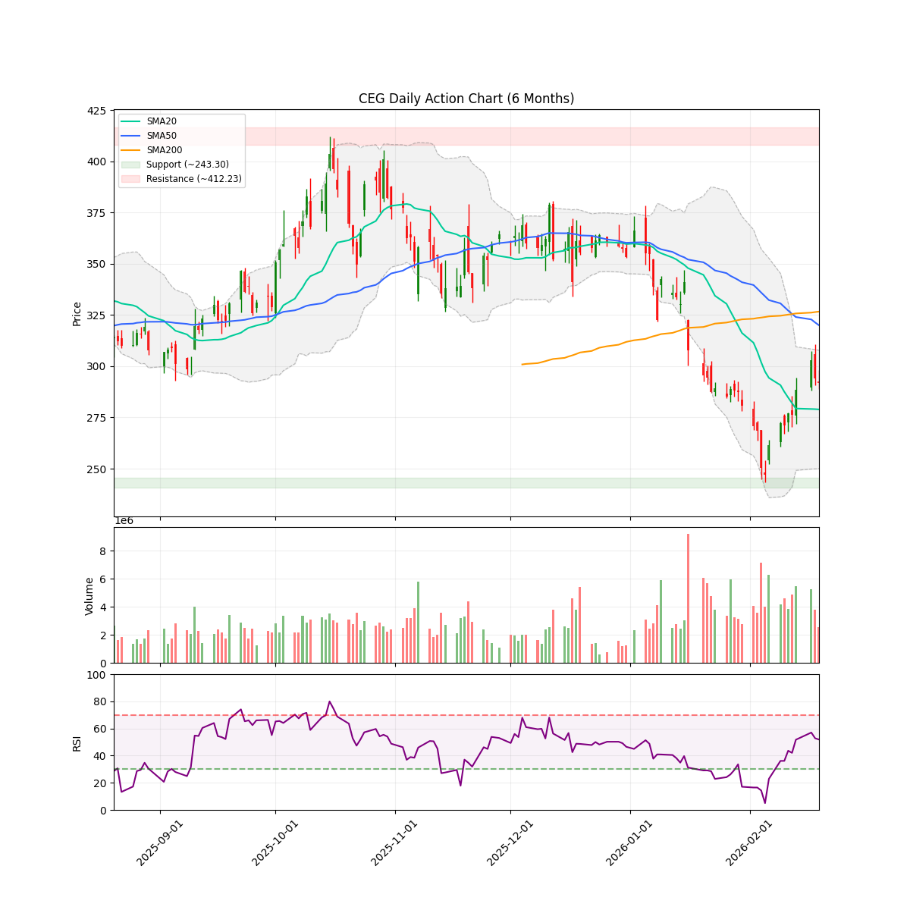
#### 研报分析

### 技术指标概览 (Technical Overview)
- **当前价格**: $291.66
- **RSI (14)**: 51.89
- **移动平均线**: SMA20: $278.91 | SMA50: $319.96 | SMA200: $326.64 (Bearish)
- **波动率**: ATR (14): 14.47 (预计周度波动: +/- $32.35)
- **关键位 (6m)**: 支撑位 $243.30 | 阻力位 $412.23
- **即时状态**: Below SMA50

# Constellation Energy (CEG) 情绪审计报告

**致：** 投资委员会
**职位：** 叙事经济学研究员
**日期：** 2026年2月20日

---

### 1. 催化剂分类 (Catalyst Categorization)

我们将近期驱动 CEG 的因素按影响权重分为三类：

*   **A-Tier（核心催化剂）：**
    *   **富国银行 (Wells Fargo) 的“买入”评级升级 (2026-02-17)：** 顶级机构的背书提供了结构性支撑。 [链接](https://www.theglobeandmail.com/investing/markets/stocks/CEG-Q/pressreleases/250653/constellation-energy-corporation-ceg-gets-a-buy-from-wells-fargo/)
    *   **财报超预期预告 (2026-02-10)：** Yahoo Finance 指出 CEG 具备盈利超预期的关键特征。 [链接](https://finance.yahoo.com/news/constellation-energy-corporation-ceg-expected-150006923.html)
*   **B-Tier（行业/叙事推力）：**
    *   **AI 繁荣驱动的电力需求叙事：** 尽管近期表现疲软，但与 Vistra 的对比显示，AI 对公用事业的溢价效应依然存在。 [链接](https://www.msn.com/en-us/money/topstocks/better-utility-stock-constellation-energy-vs-vistra/ar-AA1Wa9is)
*   **C-Tier（市场噪音/常规调整）：**
    *   **相对表现弱于大盘：** 1月底市场上涨时 CEG 反而下跌，被视为短期资金流向波动。 [链接](https://www.nasdaq.com/articles/constellation-energy-corporation-ceg-stock-drops-despite-market-gains-important-facts-note)

---

### 2. 背离检测 (Divergence Detection)

**核心观察：看跌衰竭迹象 (Bearish Exhaustion)**

*   **背离现象：** 根据 2026-01-22 的报道，CEG 在市场大涨时下跌，且目前股价（$291.66）仍显著低于 SMA50 ($319.96) 和 SMA200 ($326.64)，处于技术性熊市趋势中。
*   **叙事对冲：** 尽管技术面呈现“多头陷阱”的形态（低于长期均线），但**基本面新闻正显著转向利好**。富国银行的升级和即将到来的财报利好预期（2月20日前后的买入建议）表明，股价与情绪之间存在明显的**负背离**。
*   **结论：** 股价目前正在 SMA20 ($278.91) 之上企稳。考虑到 RSI 为 51.89 的中性位置，这更像是“利好消息被市场消化不足”，而非“利好出尽”。

---

### 3. 情绪评分 (Sentiment Score): 5.8 / 10

**逻辑评估：**
*   **正面因素 (Bullish Case)：** 强大的核能/AI 叙事支撑，顶级机构上调评级，财报预期向好。
*   **负面因素 (Bearish Case)：** 长期技术趋势仍然向下（SMA50/200 死叉压力），且过去一年表现逊于同行。
*   **结论：** 目前处于 **“叙事反转的早期阶段”**。股价需要突破 $320 关口才能确认摆脱“价值陷阱”。短期内，由于财报日临近，市场正处于谨慎乐观的观望期。

---

### 4. 技术与风险参数

*   **当前价格：** 291.66
*   **短期支撑 (SMA20)：** 278.91
*   **中期阻力 (SMA50)：** 319.96
*   **6个月高点：** 412.23 (下行空间巨大，回归中值潜力高)
*   **ATR (14)：** 14.47 (波动率适中)

---

### 5. 下一关键日期 (Next Major Date)

**关键日期：2026年2月20日 - 21日（财报发布与解读日）**

*   **重要性：** 根据 The Globe and Mail 的报道，2月20日是决定是否在财报前建仓的关键时点。本次财报将验证 AI 引发的电力合同（如 Microsoft 协议）是否已开始转化为实际的现金流和利润率改善。

---

**审计总结：** CEG 目前正处于从“技术面陷阱”向“叙事驱动反弹”转换的临界点。建议关注财报后的收盘价是否能站稳在 $310 以上，若能突破，则趋势确立。
#### 近期新闻与事件
- **[The Globe and Mail]** [Should You Buy Constellation Energy Stock Before Feb. 20?](https://www.theglobeandmail.com/investing/markets/stocks/CEG/pressreleases/248621/should-you-buy-constellation-energy-stock-before-feb-20/)
- **[The Globe and Mail]** [Constellation Energy Corporation (CEG) Gets a Buy from Wells Fargo](https://www.theglobeandmail.com/investing/markets/stocks/CEG-Q/pressreleases/250653/constellation-energy-corporation-ceg-gets-a-buy-from-wells-fargo/)
- **[The Motley Fool]** [Better Utility Stock: Constellation Energy vs. Vistra](https://www.msn.com/en-us/money/topstocks/better-utility-stock-constellation-energy-vs-vistra/ar-AA1Wa9is)
- **[Investing.com]** [Sandisk stock falls after Western Digital files to sell shares](https://www.investing.com/news/stock-market-news/sandisk-stock-falls-after-western-digital-files-to-sell-shares-93CH-4509796)
- **[CNBC]** [Daily Stock Market Recap](https://www.cnbc.com/stock-market-daily-recap/)

---

### ETN
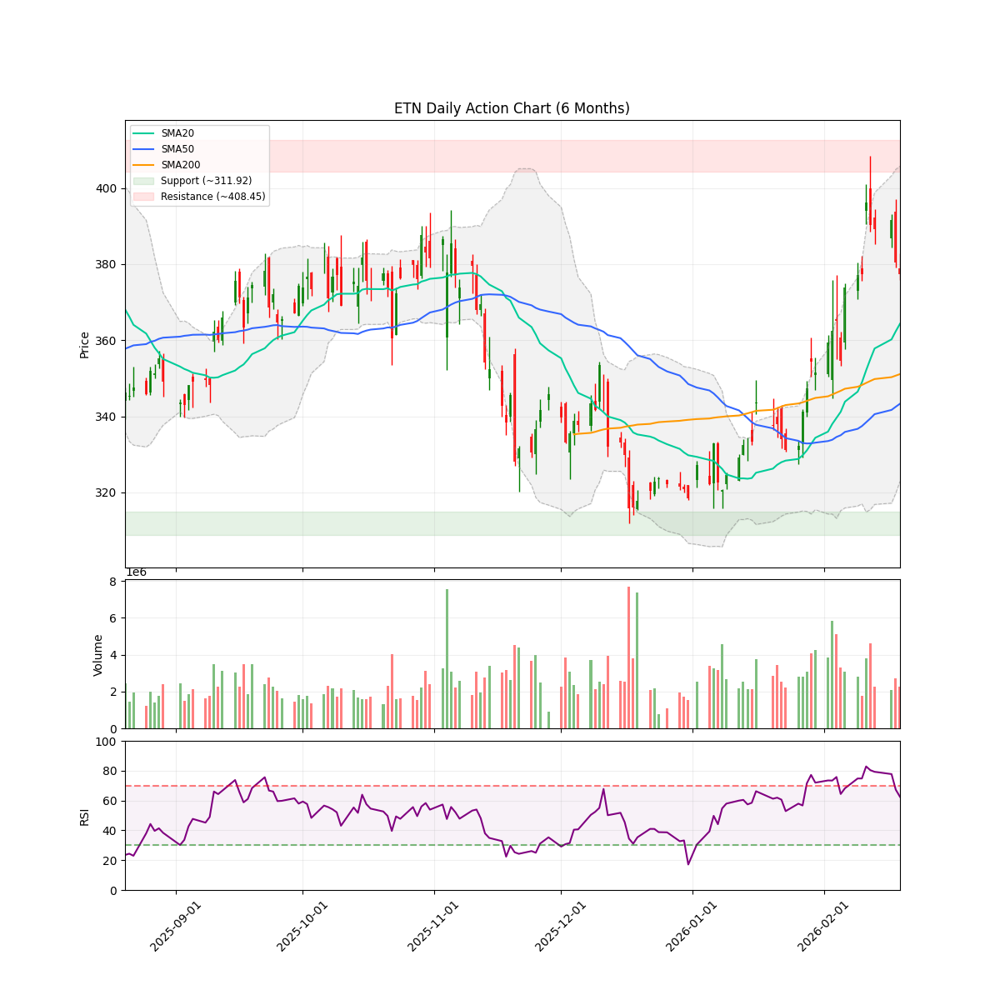
#### 研报分析

### 技术指标概览 (Technical Overview)
- **当前价格**: $377.32
- **RSI (14)**: 62.54
- **移动平均线**: SMA20: $364.33 | SMA50: $343.32 | SMA200: $351.11 (Bearish)
- **波动率**: ATR (14): 14.84 (预计周度波动: +/- $33.18)
- **关键位 (6m)**: 支撑位 $311.92 | 阻力位 $408.45
- **即时状态**: Above SMA50

# 情绪审计报告：伊顿公司 (Eaton Corporation - ETN)
**审计日期：** 2026年2月20日
**研究员身份：** 对冲基金研究助理（叙事经济学方向）

---

### 1. 催化剂分级 (Catalyst Categorization)

*   **A-Tier (核心驱动力)：**
    *   **破纪录的Q4财报：** 尽管财报显示Q4利润创纪录且营收符合预期，但管理层对2026年的**谨慎展望**（Cautious 2026 Outlook）成为了目前市场博弈的核心。 [Simply Wall St., 2026-02-13]
    *   **80亿美元巨额定期贷款：** 这一融资举措重新塑造了公司的资金选择权和估值逻辑，显示出公司正在进行重大的资本配置调整或潜在的并购储备。 [Simply Wall St., 2026-02-13]
*   **B-Tier (行业与机构推力)：**
    *   **主流媒体背书：** Jim Cramer 和 CNBC Investing Club 的公开看好（建议“轻微介入”/“nibble”），通常能吸引散户流动性，并在下跌中提供支撑。 [CNBC, 2026-02-13; Insider Monkey, 2026-02-15]
    *   **估值比较：** Zacks 将 ETN 与 ENS 进行对比，维持其作为价值/成长兼顾标的的讨论热度。 [Zacks, 2026-02-06]
*   **C-Tier (市场杂音)：**
    *   Zacks 的常规个股特征分析，属于通用型市场评论，对短期股价影响有限。

---

### 2. 背离检测 (Divergence Detection)

*   **现象：** ETN 目前价格（377.32）较 6 个月高点（408.45）回落了约 7.6%，但在发布“创纪录财报”和“80亿融资”后，股价并未立即收复失地。
*   **诊断：** 典型的**“利好出尽”与“预期下调”并存**。市场已经消化了2025年的强劲增长，目前的阻力来源于对2026年指引谨慎的担忧。
*   **看涨衰竭 vs. 看跌衰竭：** 尽管短期处于调整态势，但股价依然坚挺在 SMA50（343.32）和 SMA200（351.11）之上。RSI 为 62.54，显示多头情绪并未崩盘，而是从“极度贪婪”转向“理性观望”。**目前的下跌更倾向于一种良性的估值修正，而非叙事破裂。**

---

### 3. 情绪评分 (Sentiment Score)

#### **评分：7.2 / 10**
*   **理由：** 叙事逻辑依然稳健（电气化趋势和基础设施建设的长逻辑未变）。虽然管理层的谨慎态度给短期涨幅设置了上限，但大额融资和高水平的机构关注度证明了其作为行业领导者的护城河。当前属于“高位震荡消化期”。

---

### 4. 详细叙事审计报告

**叙事状态：从“激进扩张”转向“审慎整固”**

伊顿公司目前正处于一个叙事的转折点。过去一年，电气化大趋势推动其估值不断抬升。2026年2月发布的Q4财报虽然在数据上很漂亮，但**“谨慎的2026展望”**（Cautious Outlook）杀死了短期的上攻势头。

然而，**80亿美元的贷款协议**是一个不容忽视的信号。在Narrative Economics视角下，大规模融资通常预示着公司在未来 6-12 个月内有重大战略行动（如大规模资本开支或战略并购）。Jim Cramer 等评论员的“抄底”建议（Buyable）进一步强化了 360-370 区间的支撑逻辑。

**技术面配合：**
股价目前位于 SMA20 (364.33) 上方，且 SMA50 高于 SMA200，形成长期的多头排列。波幅（ATR 14.84）显示市场情绪相对稳定，并未出现恐慌性抛售。

---

### 5. 逻辑评分 (Logic Score)

#### **评分：8.5 / 10**
*   **逻辑支持：**
    1.  **基本面稳固：** 创纪录的Q4盈利证明了盈利能力。
    2.  **流动性支撑：** 80亿贷款提供了极强的资产负债表灵活性。
    3.  **技术面支撑：** 价格远高于SMA200，大趋势未破坏。
    4.  **估值约束：** PEG 2.55 确实偏高，限制了短期爆发力，这验证了市场的回调逻辑。

---

### 6. 下一个关键日期 (Next Major Date)

*   **2026年5月初（预计）：2026年第一季度财报发布日**
    *   *重要性：* 市场将密切关注一季度的实际表现是否如管理层预期的那样“谨慎”，或者是否存在超预期表现来修正目前的保守估值。
*   **短期监控：** 370.00 点位的得失，这是 SMA20 附近的心理关口。

---
**引用参考：**
- [Simply Wall St.] ETN Valuation Check After Record Q4 (2026-02-13)
- [Zacks] Eaton (ETN) Q4 Earnings Meet Estimates (2026-02-06)
- [CNBC] Morning Meeting: 'nibble' on this beaten down stock (2026-02-13)
#### 近期新闻与事件
- **[Insider Monkey]** [Eaton (ETN) is Still Buyable, Says Jim Cramer](https://finance.yahoo.com/news/eaton-etn-still-buyable-says-151220888.html)
- **[Simply Wall St.]** [Eaton (ETN) Valuation Check After Record Q4 Earnings And Cautious 2026 Outlook](https://finance.yahoo.com/news/eaton-etn-valuation-check-record-200647984.html)
- **[Zacks]** [3 Common Traits of Outperforming Stocks](https://www.zacks.com/stock/news/2870876/3-common-traits-of-outperforming-stocks)
- **[CNBC]** [We’re looking for things to buy, and may ‘nibble’ on this beaten down stock](https://www.cnbc.com/2026/02/13/were-looking-for-things-to-buy-and-may-nibble-on-this-beaten-down-stock.html)
- **[Simply Wall St.]** [Eaton’s $8b Term Loan Reshapes Funding Options And Valuation Debate](https://finance.yahoo.com/news/eaton-8b-term-loan-reshapes-151357948.html)

---

### MSFT
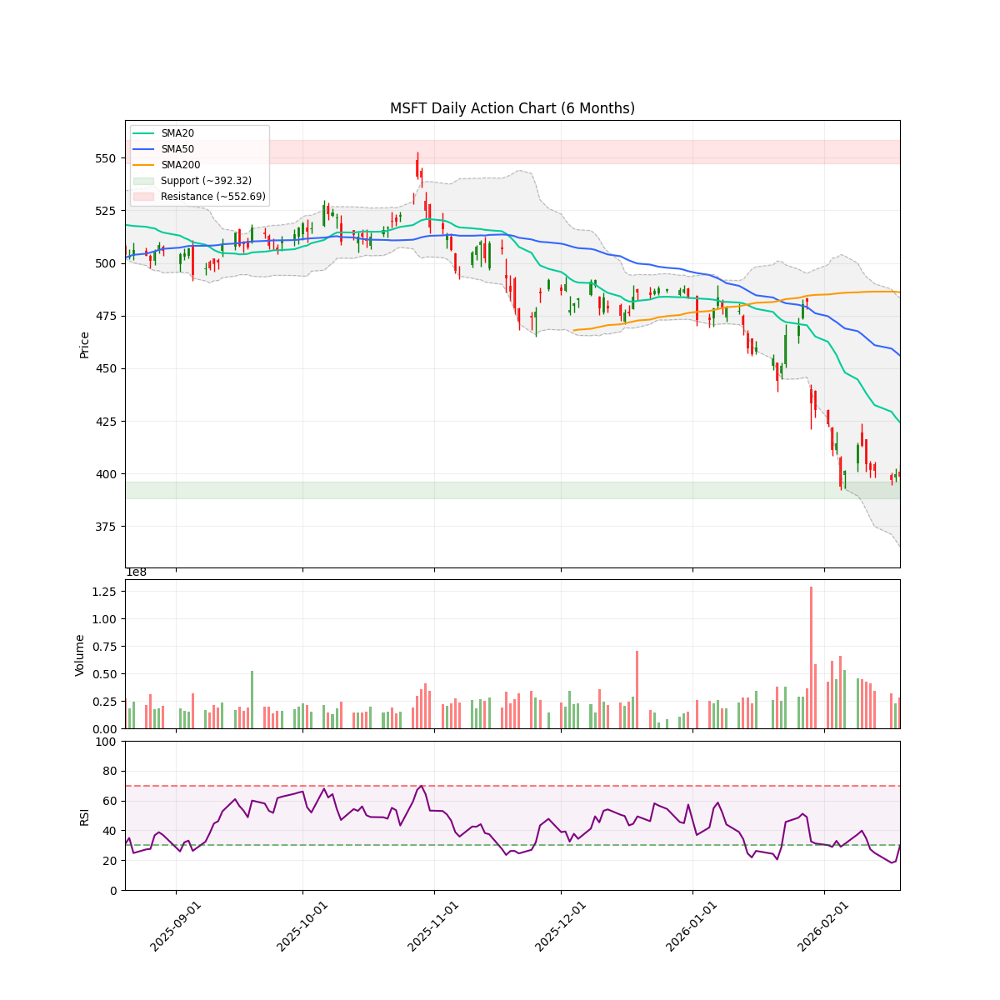
#### 研报分析

### 技术指标概览 (Technical Overview)
- **当前价格**: $398.46
- **RSI (14)**: 29.71
- **移动平均线**: SMA20: $424.31 | SMA50: $456.01 | SMA200: $486.10 (Bearish)
- **波动率**: ATR (14): 11.05 (预计周度波动: +/- $24.70)
- **关键位 (6m)**: 支撑位 $392.32 | 阻力位 $552.69
- **即时状态**: Below SMA50

# 情绪审计报告：微软 (MSFT)
**日期：** 2026年02月20日
**职位：** 对冲基金研究助理（叙事经济学专业）

---

### 1. 催化剂分级 (Categorize Catalysts)

*   **A-Tier (核心驱动力)**
    *   **Q2 财报利好：** 根据 *Insider Monkey* (2026-02-20) 报道，微软 Q2 每股收益 (EPS) 超出预期，且云服务和人工智能 (AI) 需求正在加速。这是基本面的核心支撑。
    *   **机构持仓：** 亿万富翁 David Tepper 将 MSFT 列为十大核心持仓之一，显示顶级机构在波动中依然维持信心。
*   **B-Tier (行业与情绪)**
    *   **Mag 7 整体走弱：** *TheStreet.com* 指出“雄伟七巨头”整体触及低点，微软作为权重股，其股价目前受板块系统性抛售的影响大于其个体基本面。
*   **C-Tier (杂音与传闻)**
    *   **拆股猜测：** *Motley Fool* 讨论微软是否会进行拆股。在当前下跌趋势中，这属于缺乏实质支撑的心理预期。
    *   **散户关注度：** *Zacks* 显示 MSFT 搜索量激增，通常预示着情绪波动加剧，而非趋势反转。

### 2. 背离检测 (Divergence Detection)

**核心结论：显著的“好消息下跌”背离（Bearish Exhaustion 迹象）**

*   **技术面：** MSFT 目前价格 ($398.46) 远低于其 SMA200 ($486.10)，处于极度超卖区间。**RSI 指标为 29.71**，从技术角度看，股价已进入“极度恐惧”区。
*   **基本面 vs 价格：** 尽管 2026-02-20 的新闻确认了 Q2 盈利超预期及 AI 需求加速，但股价仍徘徊在 6 个月低点 ($392.32) 附近。
*   **诊断：** 这种背离表明市场目前正处于**叙事性陷阱**中。投资者对 Mag 7 的估值重塑感到恐慌，忽略了微软强劲的盈利现金流。这种“利好不涨”通常是空头力竭的最后阶段，一旦支撑位 ($392) 站稳，极易引发报复性反弹。

### 3. 评分系统

*   **情绪评分 (Sentiment Score): 3.5 / 10**
    *   *评价：* 当前情绪处于“恐慌性抛售”阶段。虽然基本面（A-Tier）极强，但市场叙事被“2026年道指最大输家”等负面标题主导。
*   **逻辑评分 (Logic Score): 8.5 / 10**
    *   *评价：* 微软的商业逻辑（AI + 云）并未受损，业绩超出预期证明了其护城河。股价下跌更多源于宏观流动性或板块轮动，而非公司经营失败。

### 4. 关键参考日期与信息

*   **最新动态：** [Insider Monkey] 微软 Q2 EPS 超出预期 (2026-02-20)。
*   **关键支撑位：** $392.32 (6个月低点)。
*   **下一个重大日期 (Next Major Date)：** **2026年4月下旬** (预计 Q3 财报发布日)。
    *   *注意：* 短期内需关注 2 月底机构持仓披露情况，以确认 Tepper 等大佬是否在低位加仓。

---

### 5. 总结建议

**性质：估值修正带来的“黄金坑”，而非趋势性崩溃。**

MSFT 目前的表现是一个典型的**叙事背离案例**。虽然股价表现为“道指输家”，但底层数据（Cloud/AI）依然强劲。
*   **操作思路：** 鉴于 RSI 已跌破 30 且价格接近 $392 的关键支撑，目前更倾向于**看跌趋势的终结**。若股价在 $392 附近企稳并伴随成交量放大，将是极佳的逆向投资切入点。
*   **警示：** 需警惕板块系统性风险，若 Mag 7 整体继续下探，MSFT 可能随惯性短期跌破支撑。

---
**引用文献：**
1. *24/7 Wall St.* (2026-02-19) - Dow's Biggest Losers.
2. *Insider Monkey* (2026-02-20) - Q2 EPS Beat & Cloud Growth.
3. *TheStreet.com* (2026-02-18) - Mag 7 Hits Low.
#### 近期新闻与事件
- **[24/7 Wall St.]** [The Dow's Biggest Losers of 2026: Why CRM, MSFT, and UNH Are Getting Left Behind](https://247wallst.com/investing/2026/02/19/the-dows-biggest-losers-of-2026-why-crm-msft-and-unh-are-getting-left-behind/)
- **[Insider Monkey]** [Microsoft (MSFT) Surpassed Q2 EPS Estimates as Cloud and AI Demand Accelerates](https://finance.yahoo.com/news/microsoft-msft-surpassed-q2-eps-084512321.html)
- **[Insider Monkey]** [Is Microsoft Corporation (MSFT) The Most Profitable Software Stock to Buy Now?](https://finance.yahoo.com/news/microsoft-corporation-msft-most-profitable-054242751.html)
- **[Motley Fool]** [Stock-Split Watch: Is Microsoft Next?](https://finance.yahoo.com/news/stock-split-watch-microsoft-next-105000296.html)
- **[TheStreet.com]** [Grading the Magnificent 7 as Stock Group Hits Low](https://pro.thestreet.com/trade-ideas/grading-the-magnificent-7-as-stock-group-hits-low)

---

### NVDA
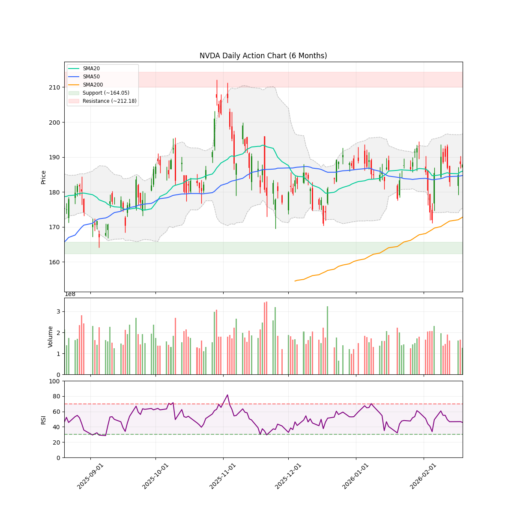
#### 研报分析

### 技术指标概览 (Technical Overview)
- **当前价格**: $187.90
- **RSI (14)**: 45.75
- **移动平均线**: SMA20: $185.97 | SMA50: $184.71 | SMA200: $172.79 (Bullish)
- **波动率**: ATR (14): 7.04 (预计周度波动: +/- $15.75)
- **关键位 (6m)**: 支撑位 $164.05 | 阻力位 $212.18
- **即时状态**: Above SMA50

# 情绪审计报告：英伟达 (NVDA)
**职位：** 对冲基金研究助理（叙事经济学专项）
**日期：** 2026年2月20日

---

### 1. 催化剂分类 (Categorize Catalysts)

根据“叙事经济学”框架，我们将近期消息分为三层：

*   **A-Tier（核心驱动力）：**
    *   **Meta 平台多年合作协议：** NVDA 与 Meta 达成数百万台设备的多年期供应协议。这属于顶级基本面扩张，直接锁定了未来数年的资本开支（Capex）流向。
        *   *来源：[Insider Monkey/Yahoo Finance](https://finance.yahoo.com/news/nvidia-nvda-partners-meta-platforms-090744798.html)*
    *   **第四财季业绩预期与 GB300 预期：** 花旗与奥本海默预测业绩将超预期，特别是 GB300 系列可能带来 20-30 亿美元的销售上行空间。
        *   *来源：[Invezz](https://invezz.com/news/2026/02/19/nvidia-stock-jittery-ahead-of-next-weeks-results-what-to-expect/)*
*   **B-Tier（行业协同与竞争）：**
    *   **AI 与机器人领域领先地位：** 尽管市场在寻找“下一个 NVDA”，但对比 ADI 或其他机器人股票，NVDA 仍保持极高的营收增长和盈利能力。
        *   *来源：[Forbes](https://www.forbes.com/sites/greatspeculations/2026/01/30/nvda-stock-vs-adi-the-battle-for-the-next-rally/)*
*   **C-Tier（市场噪音与头寸调整）：**
    *   **对冲基金第四季度活动：** 机构策略出现分歧（混合持有），这通常反映了大型基金的季度末调仓，而非对基本面的否定。
        *   *来源：[Guru Focus](https://www.gurufocus.com/news/8635522/nvidia-nvda-sees-varied-hedge-fund-activity-in-q4)*

---

### 2. 背离检测 (Divergence Detection)

*   **技术面观察：** 当前价格 $187.90，处于 SMA20 (185.97) 和 SMA50 (184.71) 之上。RSI 为 45.75，处于中性偏低区域。
*   **背离现象：** 尽管有 **Meta 巨额订单** 这样的 A-Tier 利好消息，股价在过去 24 小时内表现出“震荡（Jittery）”和轻微回调。
*   **结论：** 并非“利好出尽”的看跌耗尽，而是典型的 **“财报前焦虑”**。市场正在消化预期的溢价，买盘在等待下周财报的指引确认，而非基本面转弱。这种价格滞后于叙事的现象为投资者提供了财报前的博弈空间。

---

### 3. 叙事经济学评估 (Narrative Analysis)

NVDA 目前的叙事正从“纯 AI 芯片供应商”演变为“全球算力基建的主宰者”。与 Meta 的深度绑定进一步强化了“超大规模客户（Hyperscaler）依赖性”的叙事。尽管有媒体炒作某些股票涨幅超过 NVDA（如 24/7 Wall St 的报道），但 NVDA 的叙事护城河依然由 GB300 的技术迭代和财报预期的 EPS 70.8% 同比增长支撑。

---

### 4. 逻辑评分 (Logic Score)

**得分：8.8 / 10**

*   **理由：** 
    *   **基本面 (+5.0)：** 与 Meta 的交易提供了极高的营收可见度。
    *   **技术面 (+1.5)：** 价格守在 SMA200 (172.79) 之上的多头趋势中，且 RSI 未进入超买区，具备向上突破空间。
    *   **情绪溢价 (+2.3)：** 机构预期普遍乐观，买入共识较强。
    *   **扣分项 (-1.2)：** 财报前的波动性（ATR 7.04）较大，且对冲基金头寸的分歧可能导致短期的流动性踩踏。

---

### 5. 关键日期提醒 (Next Major Date)

*   **下一个重大事件：** **2026年2月下旬（预计下周）—— 2026财年第四季度（Q4）财报发布。**
*   **关注重点：** 观察实际业绩是否超越 $1.52 EPS 的共识预期，以及管理层对 GB300 需求及 OpenAI 资金流向的指引。

---
**审计员备注：** *当前 NVDA 并非处于“陷阱”中，而是在进行财报前的力量积蓄。187.90 的价格接近 6 个月高点 212.18 与支撑位 164.05 的中轴线上方，盈亏比对中长线持有者依然有利。*
#### 近期新闻与事件
- **[247wallst.com]** [Beyond Tesla and Nvidia: 2 Overlooked Robotics Stocks Just Blew Out Earnings](https://247wallst.com/investing/2026/02/20/beyond-tesla-and-nvidia-2-overlooked-robotics-stocks-just-blew-out-earnings/)
- **[Guru Focus]** [Nvidia (NVDA) Sees Varied Hedge Fund Activity in Q4](https://www.gurufocus.com/news/8635522/nvidia-nvda-sees-varied-hedge-fund-activity-in-q4)
- **[Insider Monkey]** [Nvidia (NVDA) Partners With Meta Platforms in Multiyear Deal for Millions of...](https://finance.yahoo.com/news/nvidia-nvda-partners-meta-platforms-090744798.html)
- **[Guru Focus]** [NVIDIA (NVDA) Poised for Strong Performance Amid Upcoming Earnin](https://www.gurufocus.com/news/8634527/nvidia-nvda-poised-for-strong-performance-amid-upcoming-earnings-and-ai-prospects)
- **[24/7 Wall St.]** [The Stock That’s Quietly Outperformed NVIDIA 3-to-1 Since 2023](https://finance.yahoo.com/news/stock-quietly-outperformed-nvidia-3-142520311.html)

---

### TSM
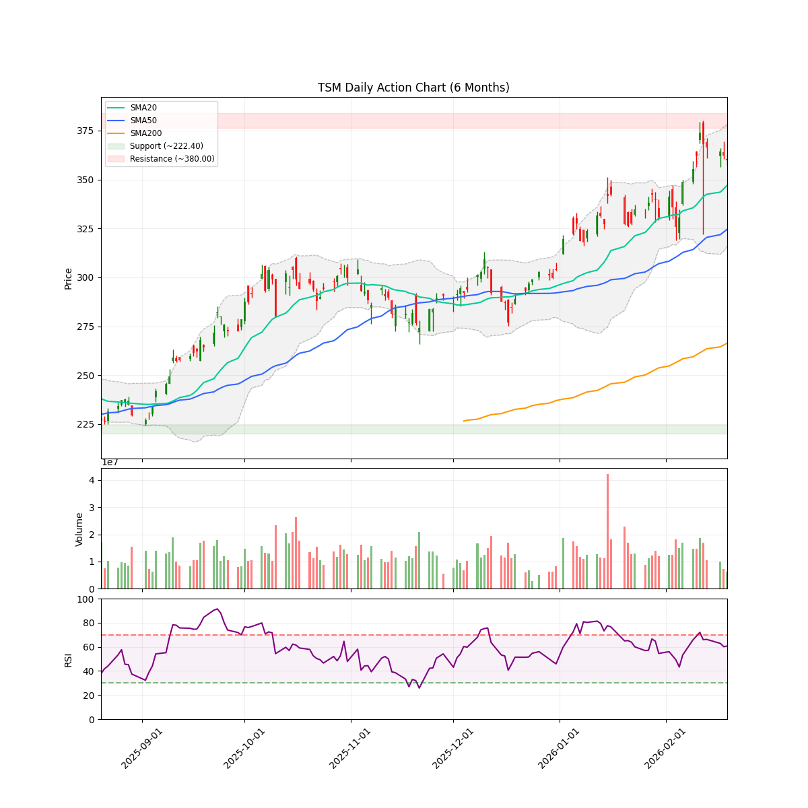
#### 研报分析

### 技术指标概览 (Technical Overview)
- **当前价格**: $360.39
- **RSI (14)**: 60.69
- **移动平均线**: SMA20: $347.04 | SMA50: $324.58 | SMA200: $266.40 (Bullish)
- **波动率**: ATR (14): 16.27 (预计周度波动: +/- $36.38)
- **关键位 (6m)**: 支撑位 $222.40 | 阻力位 $380.00
- **即时状态**: Above SMA50

# 情绪审计报告：台积电 (TSM) - 叙事经济学分析
**报告日期：** 2026年02月20日
**职位：** 对冲基金研究助理 (叙事经济学组)

---

### 1. 催化剂分类 (Catalyst Categorization)

基于近期新闻流，我们将影响 TSM 的因素分为三个等级：

*   **A-Tier (核心驱动力)：**
    *   **机构评级与顶级投资者背书：** DA Davidson 重申“买入”评级，并指出 TSM 位列亿万富翁 Stanley Druckenmiller 的持仓中。这不仅是资金流的信号，更是市场“聪明钱”对 AI 需求长期增长的共识确认。
    *   **AI 基础设施的垄断地位：** 市场叙事已从“AI 是趋势”转向“TSM 是 AI 物理层的基础设施”，这种不可替代性是支撑高估值的核心。

*   **B-Tier (行业协同与趋势)：**
    *   **下游客户强劲预期：** AMD 目标价上调至 $300，由于 AMD 是 TSM 的核心客户，其数据中心业务的扩张直接转化为 TSM 的订单流。
    *   **主流媒体叙事：** 《Motley Fool》和《AOL》持续将其列为“不可阻挡”的 AI 标的，增强了零售端和中长线基金的持股信心。

*   **C-Tier (市场杂音与比较)：**
    *   **估值溢价讨论：** Zacks 比较 MU 与 TSM，提到 TSM 溢价较高。这属于常规的技术性讨论，在目前的牛市叙事中影响力有限。
    *   **长期预测：** 关于“5年后股价达 $500”的预测属于情感煽动，缺乏短期交易指导意义。

---

### 2. 背离检测 (Divergence Detection)

*   **价格与新闻一致性：** 目前**未发现**看跌背离。
*   **分析：** 股价（360.39）目前高于 SMA20、SMA50 和 SMA200，呈现完美的标准多头排列。尽管 RSI 为 60.69 处于高位，但并未进入 70-80 的极端超买区间。
*   **结论：** 属于“利好支撑的持续性上涨”。市场对 TSM 的溢价接受度正在提高，价格上涨伴随着机构评级的调高，属于健康的叙事驱动。

---

### 3. 逻辑与情绪评分 (Scoring)

*   **情绪评分 (Sentiment Score): 8.8/10**
    *   *依据：* 市场情绪处于“强力多头循环”。叙事重点已从单纯的“半导体周期”演变为“全球 AI 算力唯一的代工出口”。机构的连续加持消除了市场对高点回调的部分恐惧。
*   **逻辑评分 (Logic Score): 9.0/10**
    *   *依据：* 技术指标（SMA20/50 支撑强劲）与基本面（AI 订单激增）高度契合。只要下方的 347.04 (SMA20) 支撑位不破，该叙事逻辑就具备极高的可持续性。

---

### 4. 详细分析报告 (Detailed Analysis)

**叙事分析：**
TSM 当前正处于“确定性溢价”阶段。根据提供的参考资料（如 [DA Davidson 的买入评级](https://finance.yahoo.com/news/da-davidson-assigns-tsmc-tsm-083811149.html)），市场不再仅仅将其视为一家硬件工厂，而是将其视为 AI 时代的“数字土地所有者”。尽管 Zacks 提醒投资者 TSM 的前瞻市盈率较高（[来源](https://finance.yahoo.com/news/mu-vs-tsm-semiconductor-stock-125000479.html)），但在叙事经济学中，只要 AI 的资本支出（Capex）不缩减（如 [AMD 的强劲需求所示](https://seekingalpha.com/article/4871662-amd-stock-300-appears-imminent-why-im-buying-more)），这种溢价就是可持续的。

**技术面支撑：**
当前股价 360.39 距离历史高点 380.00 仅有约 5.4% 的距离。ATR (14) 显示波动率为 16.27，这意味着在一周内突破 380 压力位或回踩 SMA20 支撑位均在正常波动范围内。

---

### 5. 关键日期提醒 (Next Major Date)

*   **下一个重大日期：** **2026年4月中旬 (预计 2026-04-16 左右)**
*   **事件：** **2026年第一季度 (Q1) 财报发布会**。
*   **风险/机会点：** 市场将重点关注 2nm 工艺的量产进度以及 2026 年全年营收指引的再次上调。

---

**风险提示：** 尽管情绪乐观，但需警惕地缘政治叙事的突发干扰，这通常是 TSM 唯一能打破技术面支撑的“黑天鹅”因素。
#### 近期新闻与事件
- **[AOL]** [3 Unstoppable Artificial Intelligence (AI) Stocks to Buy Right Now for Less Than $3,000](https://www.aol.com/articles/3-unstoppable-artificial-intelligence-ai-134100152.html)
- **[Zacks]** [MU vs. TSM: Which Semiconductor Stock Has the Edge Right Now?](https://finance.yahoo.com/news/mu-vs-tsm-semiconductor-stock-125000479.html)
- **[Insider Monkey]** [DA Davidson Assigns TSMC (TSM) a Buy Rating Amid AI Demand Growth](https://finance.yahoo.com/news/da-davidson-assigns-tsmc-tsm-083811149.html)
- **[Motley Fool]** [Where Will TSMC Stock Be in 3 Years?](https://finance.yahoo.com/news/where-tsmc-stock-3-years-195000600.html)
- **[Motley Fool]** [Prediction: These 3 Stocks Will Be Worth More Than $500 in 5 Years](https://finance.yahoo.com/news/prediction-3-stocks-worth-more-155000780.html)

---

### VRT
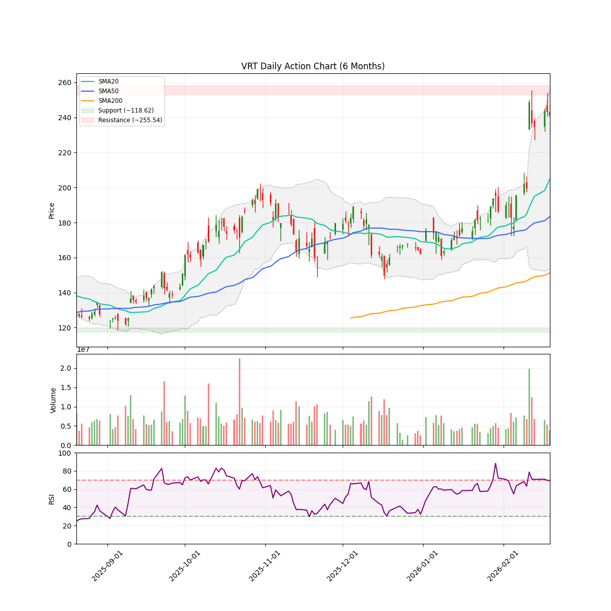
#### 研报分析

### 技术指标概览 (Technical Overview)
- **当前价格**: $243.06
- **RSI (14)**: 69.30
- **移动平均线**: SMA20: $204.81 | SMA50: $183.35 | SMA200: $151.32 (Bullish)
- **波动率**: ATR (14): 16.34 (预计周度波动: +/- $36.54)
- **关键位 (6m)**: 支撑位 $118.62 | 阻力位 $255.54
- **即时状态**: Above SMA50

# 情绪审计报告：Vertiv Holdings Co. (VRT)
**职位：** 对冲基金研究员（叙事经济学方向）
**报告日期：** 2026年02月20日

---

### 1. 催化剂分类 (Catalyst Categorization)

*   **A-Tier (核心驱动力)：**
    *   **强劲的2026年展望：** 尽管2025年Q4财报在部分指标上逊于预期，但公司提供的2026年乐观前景引发市场报复性买入，股价单日飙升18.3% ([Yahoo Finance, 2026-02-12](https://finance.yahoo.com/news/why-vertiv-stock-skyrocketing-today-195258504.html))。
    *   **顶级机构背书：** 亿万富翁 Philippe Laffont 正在买入 VRT，将其视为 AI 和云经济的基础设施核心 ([Yahoo Finance, 2026-02-03](https://finance.yahoo.com/news/1-data-center-stock-billionaire-152927247.html))。
    *   **叙事地位确立：** 被分析师称为“超越英伟达”的 AI 基础设施股，确立了其在电力与冷却领域的统治地位 ([Zacks, 2026-02-18](https://finance.yahoo.com/news/best-ai-stocks-buy-now-201900310.html))。

*   **B-Tier (中级动力)：**
    *   **动量排名：** 被列为2月最佳动量股，吸引量化资金入场 ([Yahoo Finance, 2026-02-01](https://finance.yahoo.com/news/best-momentum-stocks-buy-february-150000574.html))。
    *   **板块效应：** 数据中心扩建的持续需求作为大背景，支撑了整个子行业的估值抬升。

*   **C-Tier (噪音与次要信息)：**
    *   Zacks 网站上的搜索热度增加，反映零售端关注度上升 ([Zacks, 2026-02-16](https://finance.yahoo.com/news/vertiv-holdings-co-vrt-trending-140004345.html))。

---

### 2. 背离检测 (Divergence Detection)

**分析：** 2026年2月12日观察到极强的**看涨背离**。
*   **现象：** VRT 在公布了“弱于预期”的第四季度业绩后，股价不仅没有下跌，反而大幅跳空高开并收涨18.3%。
*   **诊断：** 这种“利空不跌反暴涨”的现象是典型的**空头力竭**和**叙事切换**。市场已经完全消化了过去的财务数据，转而对 AI 冷却系统和 2026 年的前瞻性指引进行重新定价。这表明 VRT 正处于一个由“叙事驱动”而非“单纯业绩驱动”的强力上升期。

---

### 3. 技术与趋势评估 (Technical Outlook)

*   **趋势强度：** 极强。价格（243.06）远高于 SMA50（183.35）和 SMA200（151.32），呈现完美的垂直多头排列。
*   **风险警示：** RSI 目前处于 69.30，已接近超买区间（70）。考虑到 ATR 为 16.34，周波动范围可能达到 +/- 36.54，短期内回踩 SMA20（204.81）寻找支撑的可能性存在。
*   **支撑/阻力：** 阻力位关注前高 255.54；支撑位关注 204.81 (SMA20)。

---

### 4. 情绪得分与逻辑建议 (Sentiment Score)

#### **逻辑得分：9.2/10**
**分析结论：** VRT 已经成功从一个普通的数据中心供应商转型为“AI 能源/冷却瓶颈”的唯一解。市场目前对该股的情绪处于“极度乐观且具有共识性”的阶段。由于机构大户（如 Philippe Laffont）的介入和 2026 年强劲展望的背书，这并非“陷阱”，而是一个**可持续的结构性趋势**。

*   **交易建议：** 避免在 RSI > 75 时追高。理想的介入点是利用其高 ATR 带来的波动，在回踩 210-220 区域时分批建仓。

---

### 5. 下一个关键日期 (Next Major Date)

*   **2026年5月中旬 (预测值)：** **2026年第一季度 (Q1) 财报发布日**。
*   **背景：** 市场将验证管理层在2月给出的“乐观前景”是否开始转化为实际订单和营收。此外，需关注 3 月份可能的 NVIDIA GTC 大会，任何关于冷却技术的提及都可能成为 VRT 的催化剂。
#### 近期新闻与事件
- **[Yahoo Finance]** [1 Data Center Stock That Billionaire Philippe Laffont Is Buying Now](https://finance.yahoo.com/news/1-data-center-stock-billionaire-152927247.html)
- **[Yahoo Finance]** [Best Momentum Stocks to Buy for February 19th](https://finance.yahoo.com/news/best-momentum-stocks-buy-february-150000574.html)
- **[Investor's Business Daily on MSN]** [AI stocks reset in 2026. What's next for Apple, Nvidia, Google and Microsoft?](https://www.msn.com/en-us/news/technology/ai-stocks-reset-in-2026-what-s-next-for-apple-nvidia-google-and-microsoft/ar-AA1Wwhip?ocid=BingNewsVerp)
- **[Zacks]** [Vertiv Holdings Co. (VRT) Is a Trending Stock: Facts to Know Before Betting on...](https://finance.yahoo.com/news/vertiv-holdings-co-vrt-trending-140004345.html)
- **[Zacks]** [Best AI Stocks to Buy Now and Hold Forever: Nvidia-Beating Vertiv](https://finance.yahoo.com/news/best-ai-stocks-buy-now-201900310.html)

---
