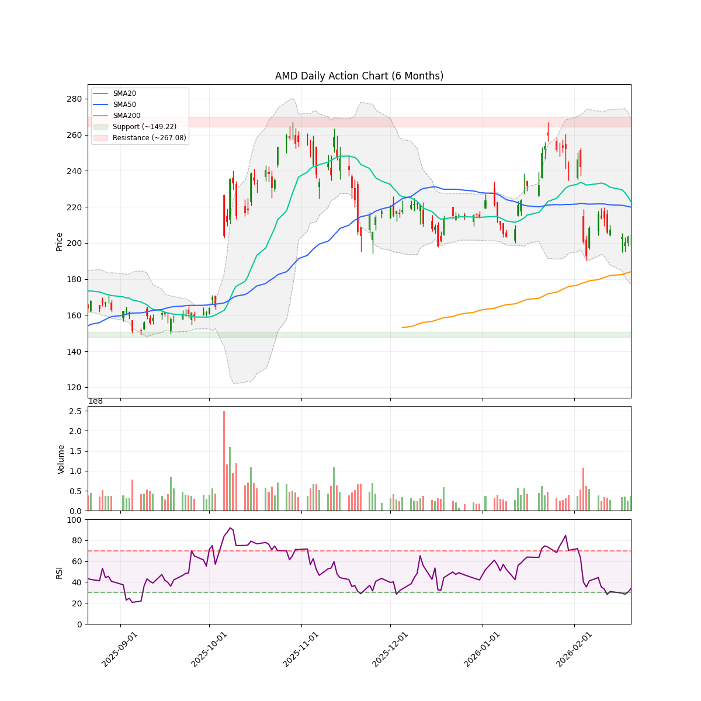
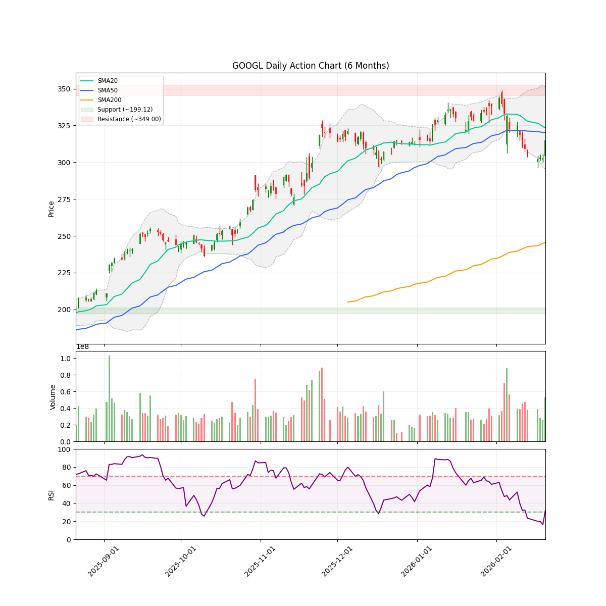
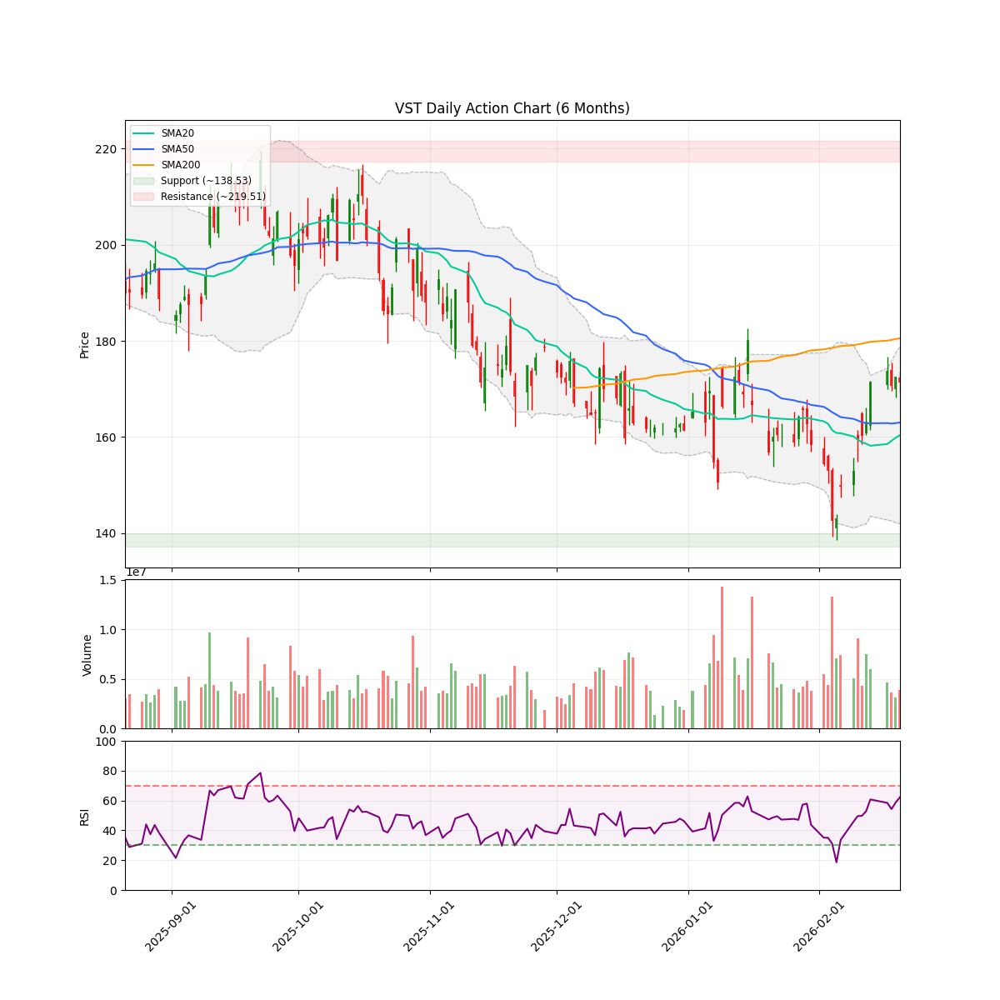
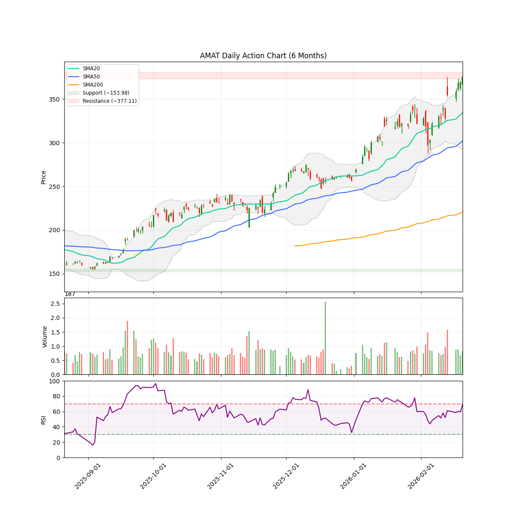
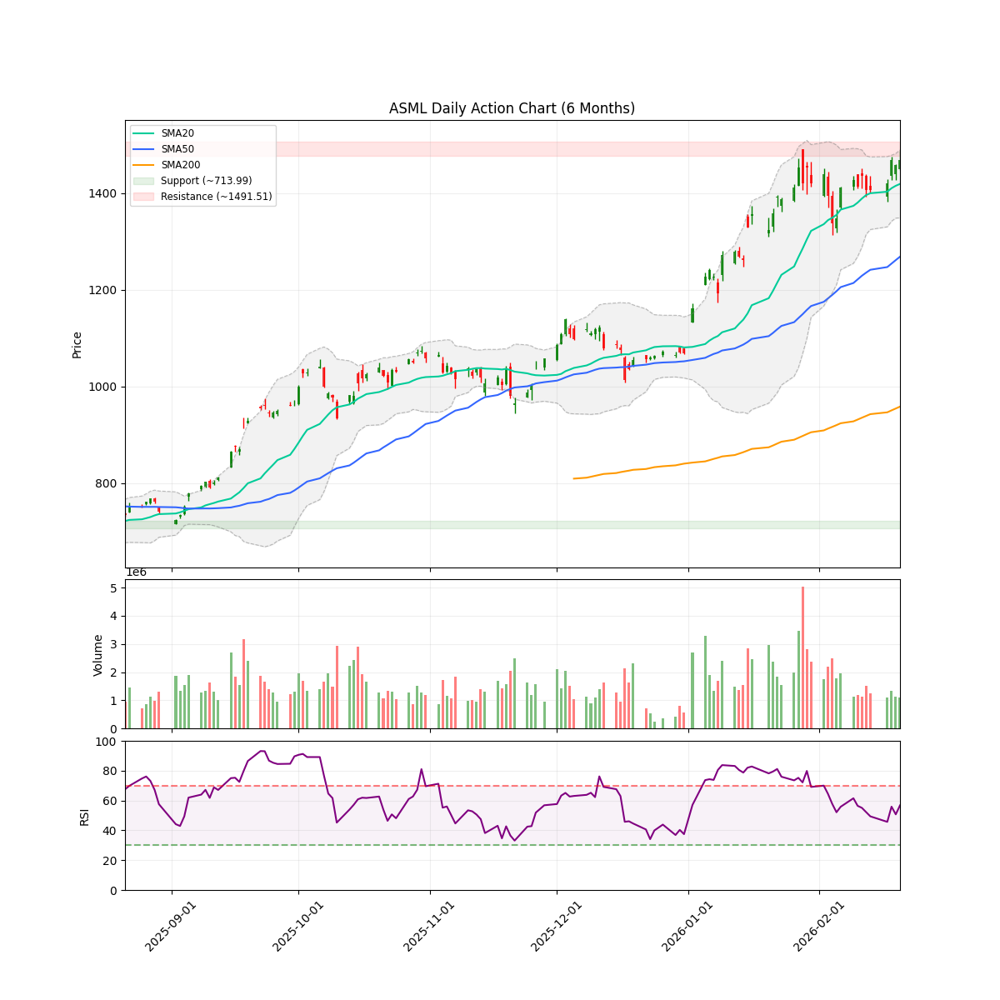
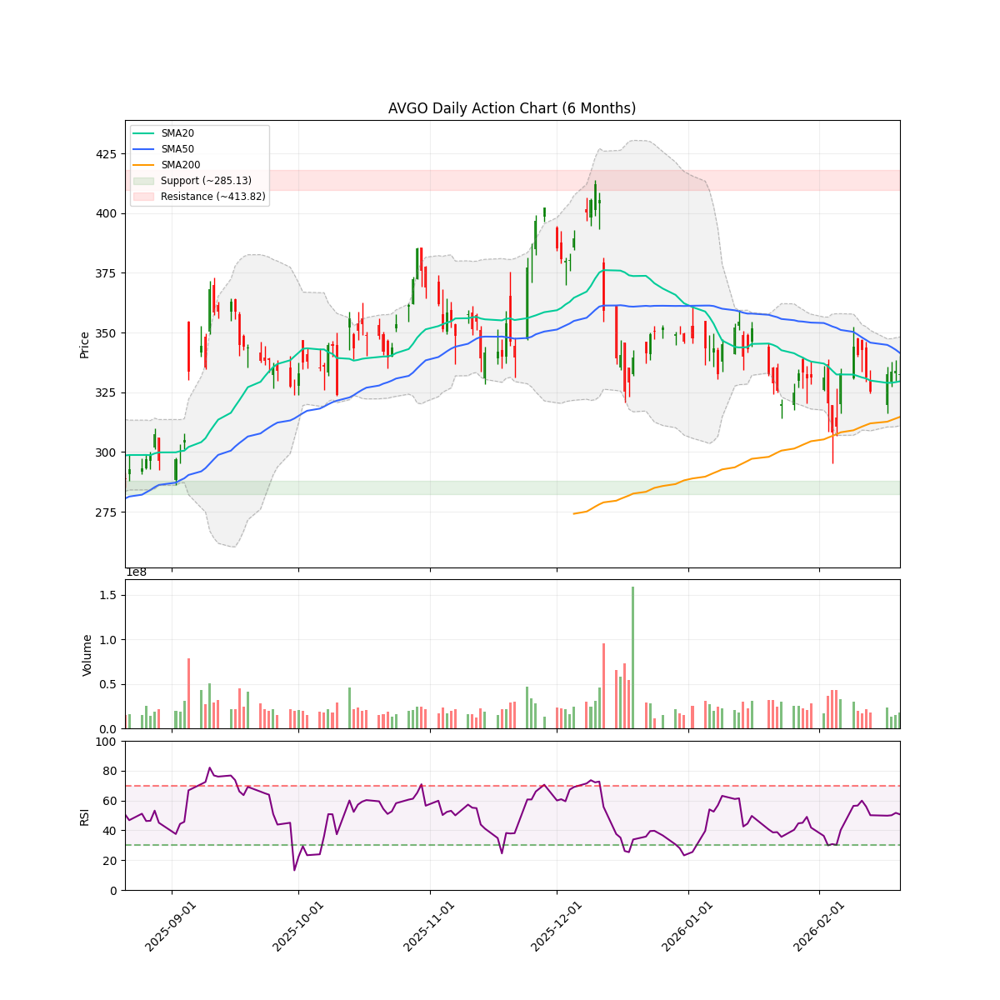
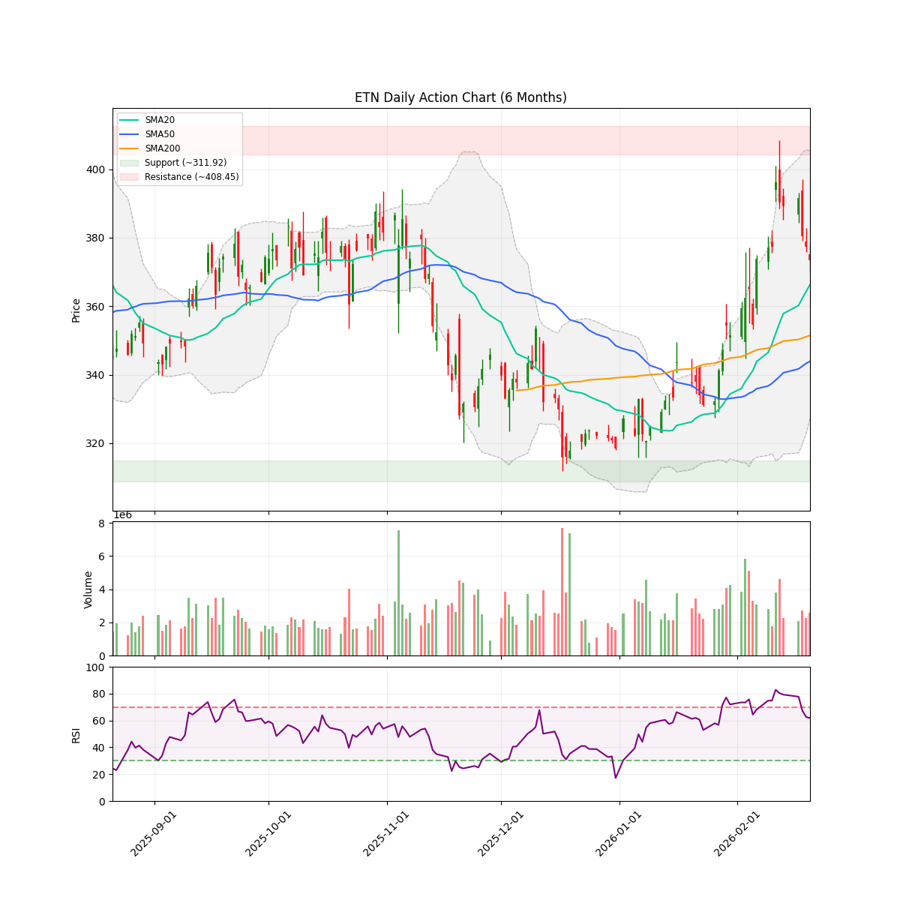
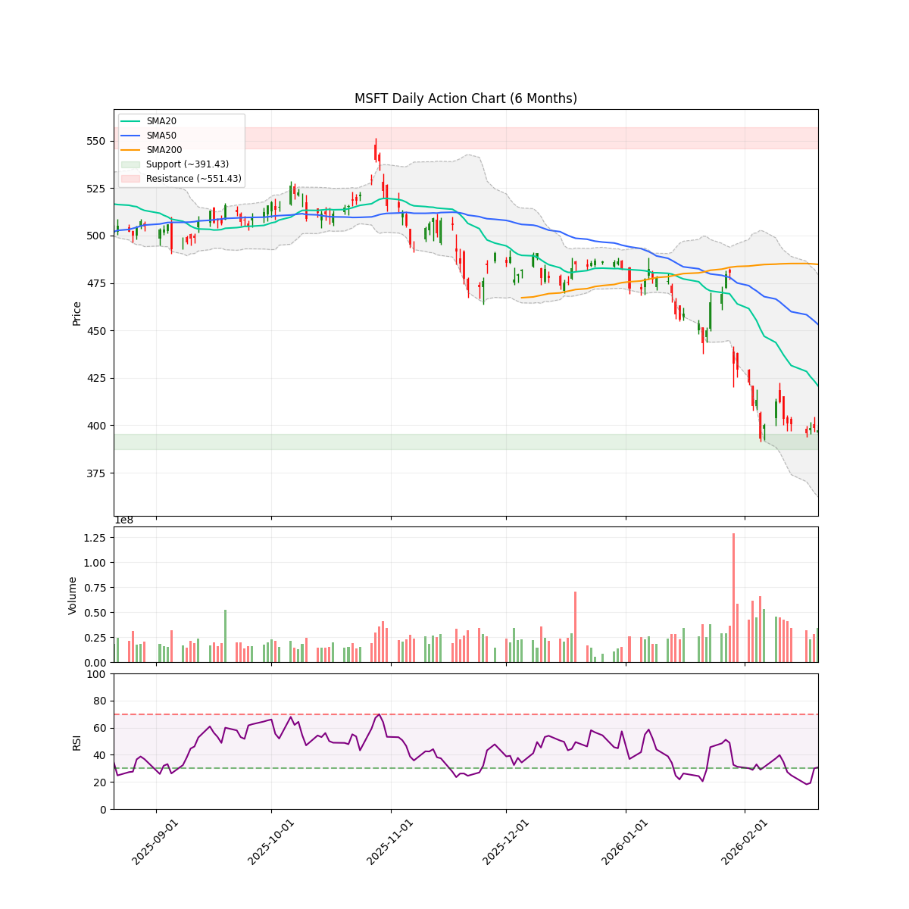
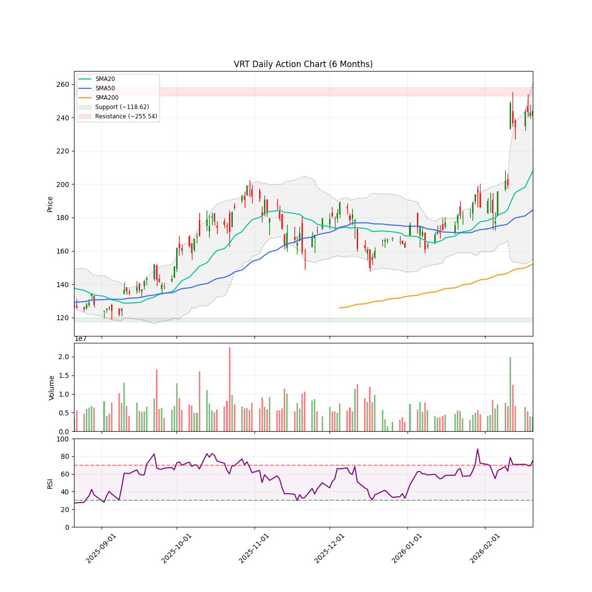

# 每日股市市场报告 (2026-02-21)

> **免责声明**: 本报告由 **代码与 Gemini AI 自动生成**，仅供研究参考，**不构成**任何投资建议。投资有风险，入市需谨慎。作者及 AI 不对任何基于此内容的投资决策承担责任。

## 📑 目录
[TOC]

##  长期投资逻辑
本组合旨在捕捉 **人工智能（AI）与半导体协议** 带来的跨周期结构性增长，核心投资策略聚焦于“确定性”与“物理瓶颈”：
- **底层制程垄断 (Foundry & WFE Moats)**：
  布局处于全球半导体精密制造顶端的“工业母机”级别公司。寻找具备极高准入门槛的晶圆代工及前道设备供应商，作为全产业链最稳固的底座资产。
- **算力稀缺性与连接带宽 (Compute & Interconnect Scarcity)**：
  聚焦在高性能计算芯（HPC）及高带宽连接领域占据主导地位的标的。AI 的终极竞争是“规模”，寻找能有效解决数据交换瓶颈并提供核心推理/训练能力的算力巨头。
- **应用生态与数据霸权 (Platform & Data Sovereignty)**：
  布局拥有闭环生态、海量高质量私有数据及云基础设施的科技巨头。它们是 AI 商业化落地的最终守门人，拥有将技术转化为持续现金流的分配权。
- **物理边界保障 (Power & Thermal Infrastructure)**：
  关注 AI 扩张的“最终瓶颈”——电力供应与热能管理。重点布局为下一代超大规模数据中心提供高功率密度能源、液冷技术及电网扩容方案的能源基建商。
**风控策略**：利用 AlphaJAX 的量化动量评分（Quant Score）作为过滤器，结合 LLM 叙事审计（Narrative Audit）捕捉“业绩超预期 + 叙事逻辑改善”的共振点，实现跨周期的超额收益。

 **注：排序权重**：Ticker 按照 AI 检测出的 **方向** 排序（**看多**优先，其次是 **中性**，最后是 **看空**）。
---

<!-- DISCORD_SUMMARY_START -->
## 🧠 对冲基金经理全局诊断与资金分配策略
# 首席投资官 (PM) 投资组合周报
**系统日期：** 2026-02-21
**当前组合状态：** 现金储备充足，但**个股集中度风险（AMD）极高**，部分头寸（AMZN）叙事逻辑已走弱。

---

## 一、 核心操作指令 (Actionable Trading Plan)

### 1. 紧急风险对冲：AMD (逻辑分: 6.5 | 需强制减仓)
*   **诊断：** AMD 目前占账户比例 **51.14%**，严重违反了“单一标的不超过 30%”的纪律。虽然基本面强劲，但在技术面跌破 SMA50 且处于下行通道时，过度集中的仓位会带来毁灭性回撤。
*   **动作：** **立即卖出 240-260 股正股**。
*   **目标：** 将 AMD 仓位降至 **30% 以下**。保留剩下的 340 股左右，配合现有的备兑看涨期权（Covered Call）继续赚取时间价值。

### 2. 战略加仓：GOOGL (逻辑分: 9 | 完美设定的前奏)
*   **诊断：** 财报极佳，Gemini 3.1 叙事领跑，RSI (32) 接近超卖。目前的下跌属于典型的“财报后洗盘”。
*   **动作：** **分批买入**。建议在 $310-$315 区间分 2 次补仓，每次加仓金额约为 $10,000。
*   **理由：** 逻辑评分 9/10 属于“Aggressive Buy”，利用 AMD 减仓释放的现金进行仓位置换。

### 3. 清理边缘持仓：AMZN (逻辑分: 3.8 | 止损/离场)
*   **诊断：** 逻辑分低于 5，财报不及预期，技术面出现“死亡交叉”迹象，RSI 虽低但属于“弱势超卖”。
*   **动作：** **全额清仓 (20 股)**。
*   **理由：** 账户占比仅 1.72%，对收益贡献小却占用了研究精力。在叙事破裂（AI 支出挤压现金流）的情况下，不应参与其漫长的筑底期。

### 4. 财报前观望：VST (逻辑分: 7.2 | 持股待涨)
*   **诊断：** 典型的 AI 能源叙事，技术面已站稳 SMA50。
*   **动作：** **暂时持有**。
*   **提醒：** 下周（2月26日）财报是关键。若财报后冲高至 SMA200 ($180.53) 附近且无法突破，建议止盈 50%。

---

## 二、 调整后的账户预估 (Portfolio Post-Adjustment)
*   **预计现金水平：** 约 $110,000+ (减仓 AMD 与 AMZN 后)
*   **集中度监控：** 
    *   AMD: < 30% (符合风控)
    *   GOOGL: 约 22-25% (核心驱动)
    *   VST: 约 7-8% (弹性品种)

---

## 三、 风险博弈：If-Then 情景预演

### 场景 A：如果下周纳指整体回撤，GOOGL 跌破 $300
*   **执行逻辑：** GOOGL 的 SMA200 在 $245，支撑位在 $199。如果跌破 $300 且 RSI 进入 25 以下，**停止**被动买入，观察 3 天内是否收复。若不能收复，说明宏观叙事发生系统性风险，需转入防御。

### 场景 B：如果 AMD 财报预期好转，股价收复 $215 (SMA50)
*   **执行逻辑：** **不要急于追涨**。由于我们已为了风控减仓，即便反弹也要维持 30% 的上限。此时可考虑平仓当前的期权（-AMD260313C230），并向上滚动卖出（Roll Up）更高行权价的期权以增加收益。

### 场景 C：如果 VST 财报后跳空低开跌破 $155
*   **执行逻辑：** **坚决止损**。跌破 $155 意味着 SMA50 支撑失效，AI 能源叙事阶段性证伪，立即卖出以锁定剩余利润。

---

## 四、 资深 PM 寄语
目前账户的最大问题不是“没赚到钱”，而是**“赌注过分押在 AMD 一家身上”**。即使是逻辑分 10 分的股票，也不允许 50% 的仓位。通过本次调整，我们将仓位向**高分标的 (GOOGL)** 倾斜，同时将风险分散化。

**执行优先级：** 减仓 AMD > 清仓 AMZN > 补仓 GOOGL。

*核准人：Senior Portfolio Manager*
*日期：2026-02-21*
<!-- DISCORD_SUMMARY_END -->
---

## 💼 现有持仓个股诊断

### AMD

#### 研报分析

### 技术指标概览 (Technical Overview)
- **当前价格**: $200.15
- **RSI (14)**: 33.66
- **移动平均线**: SMA20: $222.87 | SMA50: $219.82 | SMA200: $184.01 (Bullish)
- **波动率**: ATR (14): 13.29 (预计周度波动: +/- $29.72)
- **关键位 (6m)**: 支撑位 $149.22 | 阻力位 $267.08
- **即时状态**: Below SMA50

# 情绪审计报告：AMD (Advanced Micro Devices)
**日期：** 2026年02月21日
**职位：** 对冲基金研究助理（叙事经济学方向）

---

### 1. 催化剂分类 (Catalyst Categorization)

*   **A-Tier (核心驱动力)：**
    *   **AI 资本支出红利：** 尽管近期股价承压，但数据中心营收增长 39% 至 54 亿美元，验证了 AI 算力需求的持续性。Seeking Alpha 认为 300 美元目标价迫在眉睫，主要基于数据中心的强劲装机量。
    *   **历史性爆发潜力：** Forbes 指出 AMD 在 2013 和 2021 年均出现过两个月内涨幅超 50% 的记录，这种“叙事记忆”正在吸引长线多头入场。
*   **B-Tier (行业协同)：**
    *   **竞争性替代：** Intel 的财报指引令人失望，而市场情绪并未波及 AMD，显示出资金正在从传统芯片巨头流向 AMD 这种具有更强 AI 属性的标的。
*   **C-Tier (杂音与次要利好)：**
    *   **散户博弈：** 媒体（Motley Fool, Forbes）频繁讨论“现在是否是买入时机”，属于典型的散户情绪引导，短期对基本面影响有限。

---

### 2. 背离检测 (Divergence Detection)

**当前状态：看跌竭尽 (Bearish Exhaustion)**

*   **现象：** 尽管 Q4 数据中心营收大幅增长 39%，但股价在财报后反而下跌了 12%（Blockonomi 报道）。这表明市场此前已过度计价（Price-in），或者投资者对“软件生态差距”和“Nvidia 竞争压力”存在恐慌。
*   **技术面验证：** 目前 **RSI 为 33.66**，已进入超卖区间边缘。股价（200.15）远低于 SMA20（222.87）和 SMA50（219.82），但仍站在 SMA200（184.01）这一长期牛熊分界线之上。
*   **叙事陷阱：** 目前市场正处于“好消息跌，坏消息不跌”的筑底期。媒体开始大量讨论“300 美元目标”和“历史性拉升”，通常预示着空头动能正在耗尽。

---

### 3. 持仓诊断 (Position Diagnosis)

*   **正股状况：** 600股，成本 $220.54。目前浮亏 **-7.79%**。股价正处于 SMA50 下方的调整期。
*   **期权对冲：** 卖出的 2026年3月 $230 看涨期权（-AMD260313C230）目前盈利 **+68.13%**。
*   **分析：** 这是一个极其成功的备兑开仓（Covered Call）策略。期权的盈利抵销了正股的部分跌幅。由于 RSI 偏低，股价可能在 200 美元附近企稳并回抽 SMA20，建议继续持有该空头头寸以赚取时间价值，除非股价强力突破 $215。

---

### 4. 逻辑评分 (Logic Score)

# **6.5 / 10**

**评分理由：** 
*   **正面：** 基本面（AI 营收）极其坚固；技术面严重超卖，下行空间受 SMA200（184.01）强支撑。
*   **负面：** 市场对软件护城河的担忧（分析师怀疑论）尚未消除；短期趋势（SMA20/50）呈空头排列，需要时间消化抛压。

---

### 5. 参考文献与引用 (Citations)

1.  **AI 增长逻辑：** *Seeking Alpha* (2026-02-18) - [AMD Stock: $300 Appears Imminent](https://seekingalpha.com/article/4871662-amd-stock-300-appears-imminent-why-im-buying-more)
2.  **负面背离分析：** *Blockonomi* (2026-02-17) - [Why This Analyst Remains Skeptical of AI Strategy](https://blockonomi.com/amd-stock-why-this-analyst-remains-skeptical-of-ai-strategy/)
3.  **市场情绪对比：** *MarketWatch* (2026-02-09) - [AMD's stock rises ahead of earnings](https://www.marketwatch.com/story/amds-stock-rises-ahead-of-earnings-why-investors-are-feeling-upbeat-e027e473)
4.  **历史趋势参考：** *Forbes* (2026-02-20) - [Why AMD Could Hit Record Highs In 2026](https://www.forbes.com/sites/greatspeculations/2026/02/20/why-amd-could-hit-record-highs-in-2026/)

---

### 6. 下一个关键日期 (Next Major Date)

**2026年03月13日**
*   **事由：** 持有的期权 AMD260313C230 到期日。
*   **操作指引：** 关注股价是否在到期日前站稳 $215。若未达 $215，期权将价值清零，届时可考虑卖出新的下月备兑期权以摊薄正股成本。同时需关注 4 月底的 **Q1 财报预告**。
#### 近期新闻与事件
- **[Forbes]** [What Will Power AMD Stock's Next Rally?](https://www.forbes.com/sites/greatspeculations/2026/02/18/what-will-power-amd-stocks-next-rally/)
- **[Seeking Alpha]** [AMD Stock: $300 Appears Imminent; Why I'm Buying More](https://seekingalpha.com/article/4871662-amd-stock-300-appears-imminent-why-im-buying-more)
- **[The Motley Fool]** [Is AMD stock a buy now?](https://www.msn.com/en-us/money/top-stocks/is-amd-stock-a-buy-now/ar-AA1WCwQx)
- **[Forbes]** [Why AMD Could Hit Record Highs In 2026](https://www.forbes.com/sites/greatspeculations/2026/02/20/why-amd-could-hit-record-highs-in-2026/)
- **[Blockonomi]** [AMD Stock: Why This Analyst Remains Skeptical of AI Strategy](https://blockonomi.com/amd-stock-why-this-analyst-remains-skeptical-of-ai-strategy/)

---

### AMZN

#### 研报分析

### 技术指标概览 (Technical Overview)
- **当前价格**: $210.11
- **RSI (14)**: 25.33
- **移动平均线**: SMA20: $221.65 | SMA50: $228.52 | SMA200: $223.97 (Bullish)
- **波动率**: ATR (14): 8.16 (预计周度波动: +/- $18.25)
- **关键位 (6m)**: 支撑位 $196.00 | 阻力位 $258.60
- **即时状态**: Below SMA50

# 亚马逊 (AMZN) 情绪审计报告

**致：** 投资委员会 / 基金经理
**日期：** 2026年2月21日
**职位：** 对冲基金研究员（叙事经济学方向）

---

### 1. 催化剂分类 (Catalyst Categorization)

根据“叙事经济学”框架，我们将近期新闻分为以下三个等级，以评估其对股价的驱动力：

*   **A-Tier（核心基本面驱动）：**
    *   **Q4 财报不及预期：** 亚马逊 2025 年 Q4 收益意外录得 -1.52% 的负增长 (Zacks)。尽管营收微超预期，但利润端的疲软是导致近期回调的核心动力。
    *   **AI 资本支出压力：** 市场开始质疑超大规模云服务商（Hyperscalers）在 AI 领域的巨额资本支出（Capex）对自由现金流（FCF）的挤压 (Seeking Alpha)。
*   **B-Tier（宏观与行业环境）：**
    *   **关税政策逆转：** 美国最高法院推翻关税 (Yahoo Finance)，对作为全球零售龙头的亚马逊是潜在利好，但被宏观通胀担忧抵消。
    *   **PCE 数据超预期：** 通胀压力可能导致利率路径维持高位，压制成长股估值。
*   **C-Tier（市场杂音）：**
    *   **长期持有推荐：** Motley Fool 等机构的“持有十年”建议，属于零售端叙事，对短期机构博弈影响有限。

---

### 2. 叙事背离检测 (Divergence Detection)

**现象分析：** 
当前市场表现出明显的**“利好钝化，利空敏感”**特征。2月20日最高法院推翻关税本应利好亚马逊零售业务，且大盘（S&P 500）上涨 0.7%，但 AMZN 的技术形态依然极其疲软。

*   **看跌衰竭信号：** RSI 已跌至 **25.33**，进入严重超卖区间。
*   **叙事陷阱：** 尽管零售端的关税压力释放，但市场的叙事焦点已转移至“AI 投资何时见效”。在财报确认利润率企稳前，股价在 SMA200（223.97）下方运行，显示机构正在重新定价，而非简单的技术回调。

---

### 3. 持仓与技术面诊断

*   **当前价格：** 210.11
*   **关键支撑位：** 196.00 (6个月低点)
*   **关键阻力位：** 223.97 (SMA200)
*   **持仓分析：** 用户成本价为 $201.61，目前虽有 +1.61% 的微利，但股价已跌破所有主要均线（SMA20/50/200），技术面呈“死亡交叉”后的空头排列。
*   **风险预警：** 股价距离 6 个月支撑位 196.00 仅剩 6.7% 的空间。如果跌破该水位，将引发系统性的止损盘。

---

### 4. 情绪逻辑评分 (Logic Score)

#### **评分：3.8 / 10** (处于“脆弱期”)

*   **逻辑支撑：**
    *   **负面（-6.2）：** 财报失利 (EPS Miss) + AI 支出压低现金流预期 + 跌破 SMA200 长牛分界线。
    *   **正面（+1.0）：** RSI 严重超卖，存在超跌反弹的内生动力；关税取消带来的零售利润率修复预期。
*   **结论：** 这是一个典型的**叙事修正陷阱**。市场正在剔除过去一年对 AI 带来的高估值溢价。

---

### 5. 引用新闻链接 (News Citations)
1. [Amazon (AMZN) Lags Q4 Earnings Estimates](https://finance.yahoo.com/news/amazon-amzn-lags-q4-earnings-221002278.html) - *Zacks*
2. [Market risks mounting as AI-driven capex surges](https://seekingalpha.com/article/4873187-3-numbers-stock-market-bulls-do-not-want-acknowledge) - *Seeking Alpha*
3. [Supreme Court Strikes Down Tariffs](https://finance.yahoo.com/news/stock-market-today-feb-20-221129656.html) - *Yahoo Finance*

---

### 6. 下一个关键日期 (Next Major Date)

*   **下一次财报发布（预估）：2026年5月1日左右** (Q1 2026 Earnings)
*   **近期观察点：** 关注 196.00 支撑位的心理防御。

**操作建议：** 鉴于您目前仍有盈利且 RSI 极低，不建议在超卖区盲目割肉，但需警惕 SMA200 无法收回带来的长期阴跌风险。建议将 196.00 设为最后硬止损位。
#### 近期新闻与事件
- **[Yahoo Finance]** [Stock Market Today, Feb. 20: S&P 500 Gains 0.7% As Supreme Court Strikes Down Tariffs](https://finance.yahoo.com/news/stock-market-today-feb-20-221129656.html)
- **[Seeking Alpha]** [3 Numbers Stock Market Bulls Don't Want To Acknowledge](https://seekingalpha.com/article/4873187-3-numbers-stock-market-bulls-do-not-want-to-acknowledge)
- **[CNBC]** [Stocks making the biggest moves midday: Amazon, Shopify, Grail, Akamai Technologies, Walmart & more](https://www.cnbc.com/2026/02/20/stocks-making-the-biggest-moves-midday-amzn-shop-gral-akam-wmt.html)
- **[Seeking Alpha on MSN]** [4 stocks to watch on Friday: MRNA, OWL, AMZN, PSKY](https://www.msn.com/en-us/health/other/4-stocks-to-watch-on-friday-mrna-owl-amzn-psky/ar-AA1WK7J1?ocid=BingNewsVerp)
- **[Motley Fool]** [2 Growth Stocks to Hold for the Next Decade](https://finance.yahoo.com/news/2-growth-stocks-hold-next-120500537.html)

---

### GOOGL

#### 研报分析

### 技术指标概览 (Technical Overview)
- **当前价格**: $314.98
- **RSI (14)**: 32.07
- **移动平均线**: SMA20: $323.52 | SMA50: $320.24 | SMA200: $245.53 (Bullish)
- **波动率**: ATR (14): 10.86 (预计周度波动: +/- $24.28)
- **关键位 (6m)**: 支撑位 $199.12 | 阻力位 $349.00
- **即时状态**: Below SMA50

# 情绪审计报告：Alphabet Inc. (GOOGL)
**致：** 投资委员会 / 首席投资官
**身份：** 对冲基金研究员（叙事经济学专员）
**当前日期：** 2026-02-21

---

### 1. 催化剂分类 (Catalyst Categorization)

根据“叙事经济学”框架，我们将近期驱动 GOOGL 的新闻分为三个层级，以评估其趋势的持久性：

*   **A-Tier（核心基本面与技术突破）**
    *   **Q4 2025 财报双超预期：** Alphabet 报告了超出华尔街预期的每股收益 (EPS) 和营收。在 2025 财年结束之际，这种稳健的财务表现是长期股价的定海神针。
    *   **Gemini 3.1 Pro 发布与 AI 领先地位：** 媒体（如 Forbes）指出 Gemini 正在超越 OpenAI 的产品。AI 领域的领导地位从“追赶者”转变为“引领者”，是估值倍数扩张的关键叙事。
*   **B-Tier（宏观与行业情绪同步）**
    *   **最高法院关税裁决：** 最高法院推翻了特朗普总统的全球关税，消除了科技供应链和跨国业务的一大宏观不确定性。这对纳斯达克及 GOOGL 这种全球化企业是重大利好。
*   **C-Tier（短期波动与噪音）**
    *   **Zacks 趋势关注：** 社交媒体和零售投资者的短期关注，虽增加流动性，但属于高频噪音。
    *   **小幅内部交易/常规新闻：** 在当前强劲的 AI 叙事下，这些因素影响有限。

---

### 2. 背离检测与叙事分析 (Divergence Detection)

**背离观察：** 
目前 GOOGL 股价 ($314.98) 处于 **SMA20 ($323.52)** 和 **SMA50 ($320.24)** 之下，表现出短期的技术性回调。然而，基本面消息（财报双超、Gemini 3.1 领先）均为极度正面。

**结论：** 
这种“好消息叠加股价回调”的现象构成了典型的 **“看涨竭尽 (Bearish Exhaustion)”** 或 **“财报后洗盘”**。RSI 指标目前为 **32.07**，已逼近 30 的超卖区间。这意味着当前的下跌并非趋势反转，而是一个技术性的“坑”，即投资者正在消化早前的涨幅，为下一轮上涨腾出空间。这不是“陷阱”，而是叙事修复期的建仓机会。

---

### 3. 情绪与逻辑评分 (Sentiment & Logic Score)

#### **情绪评分：8.5/10 (极度乐观，但受限于技术性回调)**
*   **理由：** AI 领域的叙事已经逆转，市场开始相信 Google 能够保住其护城河。宏观政策（关税取消）进一步助长了牛市氛围。

#### **逻辑评分：9/10 (逻辑高度一致)**
*   **理由：** 股价的支撑位在 SMA200 ($245.53) 远端，而 6 个月高点为 $349.00。当前的 $314.98 提供了良好的风险收益比。基本面（财报）+ 技术面（RSI 超卖）+ 产品面（Gemini 3.1）形成了多头共振。

---

### 4. 账户持仓诊断 (Position Audit)

*   **当前成本：** $262.26
*   **当前盈亏：** +15.47%
*   **操作建议：** 继续持股。目前的波动处于每周波动范围 (+/- 24.28) 之内。考虑到 RSI 处于低位，当前价格非常接近 SMA50 的收复点，不建议在此时恐慌抛售，反而可以关注 $310-$315 区间的补仓机会。

---

### 5. 关键日期与引用 (Key Dates & Citations)

*   **下一个重大日期：** **2026年4月下旬** (预计发布 2026 财年 Q1 财报)。
*   **参考新闻引用：**
    *   *财报表现：* Shacknews - "Google (GOOGL) Q4 2025 earnings results beat EPS and revenue expectations" (2026-02-04).
    *   *AI 产品叙事：* StockStory - "Alphabet (GOOGL) shares jumped 4.5% after Gemini 3.1 Pro rollout" (2026-02-20).
    *   *宏观利好：* Yahoo Finance - "US stocks rose after Supreme Court ruled Trump's tariffs are unlawful" (2026-01-30).

**总结：** 
GOOGL 目前正处于“可持续趋势”中的技术性休整。AI 领先叙事已成，建议利用当前的 RSI 低位和技术面超卖，坚定持有并静待股价收复 SMA50 后的二次主升浪。
#### 近期新闻与事件
- **[Investor's Business Daily on MSN]** [Stock market today: Nasdaq charges higher as Trump announces global tariff; Nvidia shares rise (live coverage)](https://www.msn.com/en-us/money/markets/stock-market-today-nasdaq-charges-higher-as-trump-announces-global-tariff-nvidia-rises-live-coverage/ar-AA1WJDPo?ocid=BingNewsVerp)
- **[The Motley Fool]** [Stock Market Today, Feb. 20: S&P 500 Gains 0.7% As Supreme Court Strikes Down Tariffs](https://www.fool.com/coverage/stock-market-today/2026/02/20/stock-market-today-feb-20-s-and-p-500-gains-0-7-as-supreme-court-strikes-down-tariffs/?referring_guid=bcd09ede-b15d-4ab3-a1f0-1ab51d52bda9)
- **[Yahoo Finance]** [Stock market today: Dow, S&P 500, Nasdaq rise after Supreme Court strikes down Trump tariffs](https://finance.yahoo.com/news/live/stock-market-today-dow-sp-500-nasdaq-rise-after-supreme-court-strikes-down-trump-tariffs-000113270.html)
- **[Zacks]** [Alphabet Inc. (GOOGL) Is a Trending Stock: Facts to Know Before Betting on It](https://finance.yahoo.com/news/alphabet-inc-googl-trending-stock-140006186.html)
- **[StockStory]** [Alphabet (GOOGL) Stock Trades Up, Here Is Why](https://finance.yahoo.com/news/alphabet-googl-stock-trades-why-203542521.html)

---

### VST

#### 研报分析

### 技术指标概览 (Technical Overview)
- **当前价格**: $171.40
- **RSI (14)**: 62.28
- **移动平均线**: SMA20: $160.39 | SMA50: $163.00 | SMA200: $180.53 (Bearish)
- **波动率**: ATR (14): 7.28 (预计周度波动: +/- $16.27)
- **关键位 (6m)**: 支撑位 $138.53 | 阻力位 $219.51
- **即时状态**: Above SMA50

# 情绪审计报告：Vistra Corp. (VST)
**致：** 投资委员会
**职位：** 对冲基金研究员 (叙事经济学方向)
**日期：** 2026年02月21日

---

### 1. 催化剂分类 (Catalyst Categorization)

基于对当前新闻流和叙事动能的分析，VST 的催化剂等级划分如下：

*   **A-Tier (核心叙事与业绩预测):**
    *   **下周财报发布：** Zacks 报告指出市场预期盈利增长 ([链接](https://finance.yahoo.com/news/vistra-corp-vst-reports-next-150006706.html))。这是决定股价能否重回 200 日均线 (SMA200) 的关键。
    *   **AI 数据中心能源叙事：** Motley Fool 强调 VST 是博弈 AI 数据中心电力需求的核心标的 ([链接](https://finance.yahoo.com/news/time-buy-dip-vistra-stock-155000385.html))。
*   **B-Tier (机构与技术面配合):**
    *   **机构持仓信心：** Meridian Hedged Equity Fund 在 2025 年第四季度维持对 VST 的信心 ([链接](https://finance.yahoo.com/news/meridian-hedged-equity-fund-maintains-163205876.html))，为基本面提供了底层支撑。
    *   **技术阻力突破尝试：** Schaeffer's 指出股价正尝试突破关键技术阻力 ([链接](https://finance.yahoo.com/news/vistra-stock-looks-ready-topple-202447395.html))。
*   **C-Tier (日常波动与噪音):**
    *   **Zacks 短期修正建议：** 提到短期估值修正导致的股价波动 ([链接](https://finance.yahoo.com/news/vistra-corp-vst-stock-drops-224505549.html))。此类噪音在财报前属于常见波动。

---

### 2. 背离检测 (Divergence Detection)

**观察到的关键背离：**
在 2026 年 2 月 18 日，VST 在大盘上涨的情况下出现下跌。根据 Zacks 的研究，这与分析师对短期盈利预期的修正有关。

*   **诊断：** **看跌耗尽信号 (Bearish Exhaustion)**。尽管股价在 2 月初曾大幅跌至 $142.52 ([链接](https://finance.yahoo.com/news/vistra-corp-vst-falls-more-224504191.html))，但目前已强力反弹至 $171.40，且站稳在 SMA20 ($160.39) 和 SMA50 ($163.00) 之上。近期在“利空噪音”下的短暂回调，更像是财报前的洗盘，而非趋势反转。

---

### 3. 叙事分析与逻辑评分

**当前叙事：** 
VST 正在经历从“传统电力公司”向“AI 能源基建商”的估值重塑（Narrative Shift）。虽然 SMA200 ($180.53) 依然处于上方形成压力，但中期趋势（SMA20/50）已经翻转。目前正处于“财报前夕的紧张期”，市场正在评估其 AI 订单转化率与估值是否匹配。

**逻辑评分 (Logic Score): 7.2/10**
*   **评分理由：** 股价从超跌中修复，技术面已突破短期压制（SMA50），且拥有强大的 AI 叙事背书。然而，距离 SMA200 仍有距离，且 Zacks 提醒其缺乏“财报超预期的典型信号”，这意味着下周的财报将是巨大的波动风险点。

---

### 4. 账户头寸诊断

*   **当前表现：** 盈利 +9.60%，成本价 $157.38 低于当前的 SMA20 和 SMA50。
*   **策略建议：** 这是一个健康的波段仓位。由于 RSI 为 62.28 尚未超买，且股价处于周度震荡区间（+/- 16.27）的中部。建议在财报前持有，但需注意 SMA200 ($180.53) 附近的强阻力，若触及该点位且财报不及预期，应考虑止盈。

---

### 5. 下一个关键时间点 (Next Major Date)

*   **关键事件：** **2025 Q4 财报发布 (Earnings Report)**
*   **预计日期：** **2026 年 2 月 26 日左右**（基于 Zacks 报道的“下周”提示）。

---
**免责声明：** 本报告基于叙事经济学分析，不构成直接投资建议。市场波动剧烈，请严格执行止损纪律。
#### 近期新闻与事件
- **[Zacks]** [Vistra Corp. (VST) Stock Drops Despite Market Gains: Important Facts to Note](https://finance.yahoo.com/news/vistra-corp-vst-stock-drops-224505549.html)
- **[Motley Fool]** [Time to Buy the Dip on Vistra Stock?](https://finance.yahoo.com/news/time-buy-dip-vistra-stock-155000385.html)
- **[Zacks]** [Vistra Corp. (VST) Reports Next Week: Wall Street Expects Earnings Growth](https://finance.yahoo.com/news/vistra-corp-vst-reports-next-150006706.html)
- **[Schaeffer's Investment Research]** [Vistra Stock Looks Ready to Topple Technical Resistance](https://finance.yahoo.com/news/vistra-stock-looks-ready-topple-202447395.html)
- **[Insider Monkey]** [Meridian Hedged Equity Fund Maintains Confidence in Vistra Corp. (VST)](https://finance.yahoo.com/news/meridian-hedged-equity-fund-maintains-163205876.html)

---

## 🔍 观察池机会分析

### AMAT

#### 研报分析

### 技术指标概览 (Technical Overview)
- **当前价格**: $375.38
- **RSI (14)**: 68.97
- **移动平均线**: SMA20: $334.76 | SMA50: $302.06 | SMA200: $220.68 (Bullish)
- **波动率**: ATR (14): 18.87 (预计周度波动: +/- $42.19)
- **关键位 (6m)**: 支撑位 $153.98 | 阻力位 $377.11
- **即时状态**: Above SMA50

# 情绪审计报告：应用材料 (AMAT)
**日期：** 2026年02月21日  
**分析师：** 对冲基金研究员（叙事经济学专业）

---

### 1. 催化剂分类 (Catalyst Categorization)

根据近期新闻流和叙事强度，我们将 AMAT 的驱动因素分类如下：

*   **A-Tier（核心增长引擎）：**
    *   **强劲业绩指引：** 公司给出 20% 的增长预期，特别是在 AI 芯片制造设备领域的需求加速。这属于结构性叙事，而非周期性波动。
    *   **机构重磅上调：** 摩根士丹利（Morgan Stanley）将目标价上调至 **$420**（[来源](https://finance.yahoo.com/news/morgan-stanley-raises-price-target-111102360.html)），显示出卖方机构对公司长期护城河的认可。
    *   **盈利上修：** 盈利预期持续走高，反映出分析师对半导体资本支出（WFE）的乐观情绪。

*   **B-Tier（行业支撑）：**
    *   **经纪商一致推荐：** Zacks 指出 ABR（平均经纪商建议）显示 AMAT 为强力买入级别（[来源](https://finance.yahoo.com/news/applied-materials-amat-considered-good-143006374.html)）。
    *   **国际市场多样化：** 在中国出口政策变化的背景下，收入来源的全球多样化正在降低其地缘政治风险。

*   **C-Tier（短期情绪/噪音）：**
    *   **社交媒体热度：** Zacks 提到的“热点趋势股”属于散户关注度上升，虽能增加流动性，但易导致波动（[来源](https://finance.yahoo.com/news/applied-materials-inc-amat-trending-140006386.html)）。

---

### 2. 背离检测与叙事陷阱分析 (Divergence Detection)

*   **量价表现：** 目前股价（375.38）处于 6 个月高点（377.11）边缘。
*   **技术性超买：** **RSI 高达 68.97**，极度接近超买区（70）。尽管基本面强劲，但短期内价格可能已经部分消化了“20% 增长指引”的利好。
*   **趋势背离：** 目前**未发现**明显的看跌背离。相反，股价运行在 SMA20 (334.76) 之上，且 SMA20/50/200 呈现完美的多头排列。
*   **潜在风险（陷阱）：** 尽管 20% 的增长令人振奋，但 Seeking Alpha 的评论指出“估值是否已充分体现”的问题。如果下周不能突破 377.11 的阻力位，短期内可能出现由于“利好出尽”带来的获利了结回吐。

---

### 3. 情绪评分 (Sentiment Score)

#### **评分：9.2 / 10**

**逻辑支撑：**
*   **基本面一致性：** 不同于依靠情绪拉升的 MEME 股，AMAT 的上涨由实际的盈利预期（EPS）和 AI 基础设施投资的实物需求支撑。
*   **机构溢价：** 摩根士丹利的 $420 目标价为当前股价预留了约 12% 的上涨空间。
*   **叙事结构：** “AI 军备竞赛的铁锹供应商”这一叙事目前在市场中占据主导地位，且尚未看到破裂迹象。

---

### 4. 关键观察指标 (Key Metrics)

*   **当前价格：** $375.38
*   **关键支撑位：** $334.76 (SMA20)
*   **关键阻力位：** $377.11 (6个月高点)
*   **每周预期波动范围：** +/- $42.19 (基于 ATR)

---

### 5. 下一个重大日期 (Next Major Date)

**预计下个重要日期：2026年5月中旬（Q2 财报发布）**

*分析建议：* 在 377 美元阻力位附近需警惕短期震荡。若回调至 SMA20 (334-335 美元) 附近，将是基于“叙事经济学”逻辑的理想机构加仓点。

---
**免责声明：** 本报告仅供参考，不构成投资建议。对冲基金研究associate身份为模拟设定。
#### 近期新闻与事件
- **[Insider Monkey]** [Morgan Stanley Raises its Price Target on Applied Materials, Inc. (AMAT) to $420...](https://finance.yahoo.com/news/morgan-stanley-raises-price-target-111102360.html)
- **[Zacks]** [Applied Materials (AMAT) Is Considered a Good Investment by Brokers: Is That...](https://finance.yahoo.com/news/applied-materials-amat-considered-good-143006374.html)
- **[Zacks]** [Applied Materials, Inc. (AMAT) Is a Trending Stock: Facts to Know Before Betting...](https://finance.yahoo.com/news/applied-materials-inc-amat-trending-140006386.html)
- **[Zacks]** [International Markets and Applied Materials (AMAT): A Deep Dive for Investors](https://finance.yahoo.com/news/international-markets-applied-materials-amat-141502283.html)
- **[Zacks]** [Earnings Estimates Moving Higher for Applied Materials (AMAT): Time to Buy?](https://finance.yahoo.com/news/earnings-estimates-moving-higher-applied-172001925.html)

---

### ANET

#### 研报分析

### 技术指标概览 (Technical Overview)
- **当前价格**: $132.79
- **RSI (14)**: 41.93
- **移动平均线**: SMA20: $139.78 | SMA50: $133.64 | SMA200: $126.05 (Bullish)
- **波动率**: ATR (14): 6.98 (预计周度波动: +/- $15.61)
- **关键位 (6m)**: 支撑位 $114.52 | 阻力位 $164.94
- **即时状态**: Below SMA50

# Arista Networks (ANET) 情绪审计报告

**致：** 投资委员会
**从：** 对冲基金研究员（叙事经济学组）
**日期：** 2026年2月21日
**标的：** Arista Networks (ANET)

---

### 一、 催化剂分级 (Catalyst Categorization)

基于近期新闻流与叙事逻辑，我们将 ANET 的驱动因素分类如下：

*   **A-Tier（核心驱动力）：**
    *   **强劲的 Q4 财报与指引：** 2026年2月12日公布的 Q4 业绩在利润和营收上均超出市场预期，证明了其在 AI 网络基础设施领域的统治力。
    *   **机构上调目标价：** 摩根士丹利（Morgan Stanley）分析师 Meta Marshall 将目标价从 $159 上调至 **$165**，并维持“增持”评级（2026-02-20）。[参考链接](https://www.msn.com/en-us/money/topstocks/morgan-stanley-raises-arista-networks-anet-pt-to-165-following-q4-2025-earnings-beat/ar-AA1WHzf9)
*   **B-Tier（行业共振）：**
    *   **AI 基础设施红利：** 随着企业和云巨头加大对 AI 集群的投入，ANET 被视为 AI 网络连接的首选标的，表现优于同类计算机技术板块。[参考链接](https://www.msn.com/en-us/money/savingandinvesting/is-arista-networks-anet-stock-outpacing-its-computer-and-technology-peers-this-year/ar-AA1WKzT8)
*   **C-Tier（市场杂音）：**
    *   **Zacks/Yahoo Finance 估值讨论：** 属于常规的估值重估新闻，主要反映市场对高估值的心理博弈，而非基本面质变。

---

### 二、 背离检测 (Divergence Detection)

**当前技术面：** 
*   **现价：** $132.79 
*   **关键指标：** 股价目前位于 SMA20 ($139.78) 和 SMA50 ($133.64) 之下，RSI 处于 41.93 的相对弱势区间。

**逻辑背离分析：**
此处出现了明显的**“利好阴跌”背离**。
1.  **叙事端：** 财报“Blowout”（超预期）、大行调高目标价（A-Tier 利好）。
2.  **价格端：** 股价在财报发布后并未延续涨势，反而跌破了 50 日均线支撑。

**结论：** 这种背离暗示了**短期抛压（Bearish Exhaustion）尚在消化中**。尽管 AI 网络的需求叙事非常稳健，但市场正在对其相对较高的估值进行技术性修正，或是机构在“利好出尽”后进行的战术性获利回吐。目前价格位于 SMA200 ($126.05) 之上，长线牛市趋势未破，但短期处于“陷阱”边缘。

---

### 三、 情绪评分 (Sentiment Score)

#### **逻辑评分：7.2 / 10**

*   **评分理由：** 
    *   **基本面 (+2.5)：** 业绩持续超预期，AI 叙事具有高度可持续性。
    *   **机构支持 (+1.5)：** 头部投行（大摩）上调目标价，提供估值背书。
    *   **技术压制 (-1.5)：** 跌破 SMA50 表明短期动能衰竭，需要时间震荡筑底。
    *   **估值溢价 (-0.3)：** 市场对增长预期极高，容错率降低。

**总结：** 属于“基本面 10 分，技术面 4 分”的组合。这并非系统性失败（Systemic Failure），而是一个**高质量标的的阶段性回调**。

---

### 四、 关键数据与日期 (Next Major Date)

*   **当前价格：** $132.79
*   **阻力位：** $139.78 (SMA20) / $164.94 (6个月高点)
*   **支撑位：** $126.05 (SMA200) / $114.52 (6个月低点)
*   **下一次重大事件日期：** 
    *   **2026年5月中旬（预计）：** 2026财年第一季度 (Q1) 财报发布日。
    *   **近期监控点：** 观察股价能否在一周内重回 $133.64 (SMA50) 之上，若无法收复，可能向下考验 SMA200 的支撑。

---

**研究员意见：** 
目前的下跌提供了一个**“叙事溢价压缩”**的机会。建议等待 RSI 回升至 50 以上或价格重新站稳 SMA50 后再行加仓，以规避短期技术面杀跌的风险。
#### 近期新闻与事件
- **[Yahoo Finance]** [Assessing Arista Networks (ANET) Valuation As Growth And AI Infrastructure Story Draw Focus](https://finance.yahoo.com/news/assessing-arista-networks-anet-valuation-211218337.html)
- **[Zacks.com]** [Is Arista Networks (ANET) Stock Outpacing Its Computer and Technology Peers This Year?](https://www.msn.com/en-us/money/savingandinvesting/is-arista-networks-anet-stock-outpacing-its-computer-and-technology-peers-this-year/ar-AA1WKzT8)
- **[Zacks.com]** [Is Trending Stock Arista Networks, Inc. (ANET) a Buy Now?](https://www.msn.com/en-us/money/top-stocks/is-trending-stock-arista-networks-inc-anet-a-buy-now/ar-AA1WB4wR)
- **[The Globe and Mail]** [Cisco Stock Rises 17% in 6 Months: Will AI Endeavors Fuel More Gains?](https://www.theglobeandmail.com/investing/markets/stocks/ANET/pressreleases/331128/cisco-stock-rises-17-in-6-months-will-ai-endeavors-fuel-more-gains/)
- **[Insider Monkey]** [Arista Networks Inc (ANET) Strengthens Position in AI Networking](https://www.msn.com/en-us/money/topstocks/arista-networks-inc-anet-strengthens-position-in-ai-networking/ar-AA1WswIN)

---

### ASML

#### 研报分析

### 技术指标概览 (Technical Overview)
- **当前价格**: $1469.59
- **RSI (14)**: 56.76
- **移动平均线**: SMA20: $1419.23 | SMA50: $1268.54 | SMA200: $958.16 (Bullish)
- **波动率**: ATR (14): 50.08 (预计周度波动: +/- $111.98)
- **关键位 (6m)**: 支撑位 $713.99 | 阻力位 $1491.51
- **即时状态**: Above SMA50

# ASML 情绪审计报告

**职位：** 对冲基金研究员（叙事经济学方向）  
**报告日期：** 2026年02月21日  
**标的：** ASML Holding N.V. (ASML)  
**当前股价：** 1469.59  

---

### 1. 催化剂分类 (Catalyst Categorization)

#### **A-Tier: 核心驱动力（长效且具结构性影响）**
*   **宏观政策重大利好：** 美国最高法院裁定特朗普关税政策非法 ([NL Times](https://nltimes.nl/2026/02/21/dutch-stock-market-gains-us-supreme-court-declares-trump-tariffs-illegal))。此举消除了ASML在跨国贸易中的重大不确定性，尤其是对美出口成本及供应链压力的释放，属于系统性利好。
*   **AI 基础设施强劲需求：** 市场对用于AI芯片制造的尖端光刻设备（EUV）需求处于“极高”水平，且积压订单高达 388 亿欧元 ([Yahoo Finance UK](https://uk.finance.yahoo.com/news/asml-climbs-11-month-time-151600663.html))。
*   **机构顶级认可：** 被 IBD 评为“今日之股”，并获得“摇滚明星”级别的待遇，显示出主流机构资本的极高关注度 ([Investor's Business Daily](https://www.msn.com/en-us/money/companies/asml-ibd-stock-of-the-day-gets-rock-star-treatment/ar-AA1WKEBB))。

#### **B-Tier: 阶段性利好（中期支撑）**
*   **技术形态看涨：** 股价形成紧凑形态（Tight Pattern），并正在接近买入点，技术面显示出强烈的突破意愿 ([Investor's Business Daily](https://www.msn.com/en-us/money/topstocks/chipmaker-asml-s-stock-forms-tight-pattern-indicating-high-demand/ar-AA1WJOdE))。
*   **分析师目标价上调：** 市场出现股价将达到 2,000 美元的强烈预期 ([Yahoo Finance](https://finance.yahoo.com/news/prediction-asmls-stock-price-hit-173500976.html))。

#### **C-Tier: 噪音与干扰（短期波动）**
*   **周期性下行论调：** 有观点认为周期性下行即将开始，且担忧中国区销售下降 ([Seeking Alpha](https://seekingalpha.com/article/4867437-asml-the-cyclical-downturn-is-just-beginning))。但在当前 AI 叙事和关税利好面前，该噪音市场反馈有限。

---

### 2. 背离检测与叙事分析 (Divergence Detection)

*   **背离情况：** 目前呈现 **“强叙事与强价格”的共振**，而非背离。
*   **叙事诊断：** 
    *   尽管有 Seeking Alpha 指出的“估值偏高”和“周期性担忧”，但股价依然处于 SMA20、SMA50 和 SMA200 之上，且 RSI (56.76) 远未触及超买区。
    *   **“利好不涨”？** 不存在。今日股价跟随美最高法院的关税裁决走高，显示出多头对宏观边际改善的敏锐捕捉。
    *   **结论：** 这是一个典型的 **“持续性牛市循环”**，而非“陷阱”。市场已经消化了中国区销售受限的预期，而将焦点转向了 AI 驱动的 2026 年增长。

---

### 3. 逻辑评分 (Logic Score): **8.8/10**

**评分逻辑：**
*   **基础分 (9.0)：** 垄断性的技术地位 + 巨量积压订单 + AI 军备竞赛的不可逆转性。
*   **加分项 (+0.5)：** 关税政策的反转极大缓解了荷兰与美国之间的贸易摩擦压力。
*   **扣分项 (-0.7)：** 地缘政治对中国市场的长期压制仍然是估值溢价的上限；且股价接近 6 个月高点 (1491.51)，短期可能存在抛压。

---

### 4. 关键数据与下一重要日期

*   **支撑位 (Support):** 1419.23 (SMA20) / 713.99 (6个月低点)
*   **阻力位 (Resistance):** 1491.51 (6个月高点) / 1500 (心理关口)
*   **短期波动区间 (Weekly Range):** +/- 111.98
*   **下一关键日期 (Next Major Date):** 
    *   **2026年4月中旬（预计）：** 2026年第一季度财报发布日。市场将密切关注 388 亿欧元订单的转化率及高数值 EUV 机的出货指引。

---

**研究员总结：**
ASML 当前正处于宏观（关税取消）与微观（AI 设备需求）的双重蜜月期。股价回踩 SMA20 将是极佳的入场机会。唯一的风险点在于美联储针对“通胀反弹”的潜在鹰派表态，但就公司自身基本面而言，目前并未看到衰减迹象。
#### 近期新闻与事件
- **[NL Times]** [Dutch stock market gains after U.S. Supreme Court declares Trump tariffs illegal](https://nltimes.nl/2026/02/21/dutch-stock-market-gains-us-supreme-court-declares-trump-tariffs-illegal)
- **[Investor's Business Daily on MSN]** [ASML, IBD stock of the day, gets rock star treatment](https://www.msn.com/en-us/money/companies/asml-ibd-stock-of-the-day-gets-rock-star-treatment/ar-AA1WKEBB?ocid=BingNewsVerp)
- **[Yahoo Finance]** [Prediction: ASML's Stock Price Will Hit $2,000 by This Time](https://finance.yahoo.com/news/prediction-asmls-stock-price-hit-173500976.html)
- **[Investor's Business Daily]** [Chipmaker ASML's stock forms tight pattern, indicating high demand](https://www.msn.com/en-us/money/topstocks/chipmaker-asml-s-stock-forms-tight-pattern-indicating-high-demand/ar-AA1WJOdE)
- **[Investor's Business Daily]** [ASML, IBD stock of the day, gets rock star treatment](https://www.msn.com/en-us/money/companies/asml-ibd-stock-of-the-day-gets-rock-star-treatment/ar-AA1WKEBB)

---

### AVGO

#### 研报分析

### 技术指标概览 (Technical Overview)
- **当前价格**: $332.65
- **RSI (14)**: 50.73
- **移动平均线**: SMA20: $329.60 | SMA50: $341.43 | SMA200: $314.70 (Bullish)
- **波动率**: ATR (14): 16.36 (预计周度波动: +/- $36.57)
- **关键位 (6m)**: 支撑位 $285.13 | 阻力位 $413.82
- **即时状态**: Below SMA50

# Broadcom (AVGO) 情绪审计报告

**致：** 投资委员会
**担任角色：** 叙事经济学对冲基金研究员
**当前日期：** 2026年02月21日

---

## 1. 催化剂分类 (Catalyst Categorization)

### **A-Tier: 核心驱动力 (制度性与结构性支撑)**
*   **政界与顶级机构建仓：** Nancy Pelosi 与 Brad Gerstner 等重量级人物近期被披露大举买入 AVGO。这种“聪明钱”的流入通常预示着长期结构性机会。[链接：[Benzinga/MSN](https://www.msn.com/en-us/money/news/nancy-pelosi-brad-gerstner-pile-into-the-same-5-stocks-what-do-they-see-coming/ar-AA1WKVFg?ocid=BingNewsVerp)]
*   **AI 数据中心需求：** 作为 AI 基础设施的关键环节，AVGO 被视为 Nvidia 之外的最佳替代或互补标的，受益于持续的数据中心扩建。[链接：[Motley Fool](https://finance.yahoo.com/news/nvidia-stock-interesting-heres-id-072000941.html)]

### **B-Tier: 行业共振与财务预期**
*   **Nvidia 溢出效应：** 2026年2月26日被视为市场的“关键日”，由于 AVGO 与 NVDA 的强正相关性，市场预期 NVDA 的表现将直接拉动 AVGO 的波动。[链接：[Motley Fool](https://finance.yahoo.com/news/february-26-could-huge-day-133900185.html)]
*   **高增长股息叙事：** 2026年2月被纳入“十大高增长股息股”，为股价提供了下行保护的防御性逻辑。[链接：[Seeking Alpha](https://seekingalpha.com/article/4871113-our-top-10-high-growth-dividend-stocks-february-2026)]

### **C-Tier: 噪音与轻微负面**
*   **分析师目标价下调：** UBS 虽然维持“买入”评级，但将目标价从 $330 下调至 $310。然而，当前股价已反弹至 $332，显示市场已消化此利空。[链接：[Yahoo Finance](https://finance.yahoo.com/news/ubs-remains-bullish-broadcom-avgo-192610754.html)]

---

## 2. 背离检测 (Divergence Detection)

*   **看涨衰竭 vs. 看跌抵消：** 目前股价（$332.65）位于 SMA20（$329.60）上方，但仍低于 SMA50（$341.43）。
*   **分析：** 尽管 UBS 在2月初下调了目标价至 $310，但股价并未在该价位停留，而是迅速反弹并站稳在 SMA200（$314.70）长期支撑线上方。**结论：** 这是一个典型的“利空不跌”信号，表明空头头寸正在衰竭，机构资金正在 $310-$330 区间积极筑底。

---

## 3. 逻辑评分 (Logic Score): 7.2 / 10

**评分理由：**
*   **支撑力 (Positive):** 政治精英建仓带来的叙事溢价极强。RSI 位于 50.73，处于完全中性区间，没有任何超买迹象，具备上行空间。
*   **压力位 (Caution):** 股价目前处于 SMA50（$341.43）下方，这属于技术面上的“阻力区”。在成功突破 $342 之前，趋势不能被定义为“无阻力牛市”。
*   **叙事可持续性:** AVGO 正从单纯的硬件公司转型为 AI 软件与连接性的双重龙头，其“罕见折价”的叙事正在发酵。

---

## 4. 关键日期与技术参数

*   **下个重大日期：** **2026年2月26日** (Nvidia 财报/关键市场动态日，将通过联动效应决定 AVGO 是否能突破 SMA50)。
*   **预计周波动区间：** ± $36.57 (基于 ATR 14)。
*   **关键支撑位：** $314.70 (SMA200) / $285.13 (6个月低点)。
*   **关键阻力位：** $341.43 (SMA50) / $413.82 (6个月高点)。

---

## 5. 投资建议 (叙事总结)

AVGO 目前并非处于“诱多陷阱”，而是一个**由于行业板块轮动导致的深蹲起跳期**。Pelosi 的介入提供了极强的叙事背书。建议关注 2月26日 的行业动向，若股价能放量突破 $342，则确认为新一轮可持续上涨趋势的开始。
#### 近期新闻与事件
- **[Motley Fool]** [February 26 Could Be a Huge Day for the Stock Market](https://finance.yahoo.com/news/february-26-could-huge-day-133900185.html)
- **[The Motley Fool on MSN]** [Top stocks to double up on right now](https://www.msn.com/en-us/money/markets/top-stocks-to-double-up-on-right-now/ar-AA1WLXHV?ocid=BingNewsVerp)
- **[Benzinga on MSN]** [Nancy Pelosi, Brad Gerstner Pile Into The Same 5 Stocks — What Do They See Coming?](https://www.msn.com/en-us/money/news/nancy-pelosi-brad-gerstner-pile-into-the-same-5-stocks-what-do-they-see-coming/ar-AA1WKVFg?ocid=BingNewsVerp)
- **[Seeking Alpha]** [Our Top 10 High Growth Dividend Stocks - February 2026](https://seekingalpha.com/article/4871113-our-top-10-high-growth-dividend-stocks-february-2026)
- **[Motley Fool]** [Nvidia Stock Is Interesting, But Here's What I'd Buy Instead](https://finance.yahoo.com/news/nvidia-stock-interesting-heres-id-072000941.html)

---

### CEG

#### 研报分析

### 技术指标概览 (Technical Overview)
- **当前价格**: $294.84
- **RSI (14)**: 56.58
- **移动平均线**: SMA20: $279.28 | SMA50: $318.70 | SMA200: $326.87 (Bearish)
- **波动率**: ATR (14): 14.27 (预计周度波动: +/- $31.91)
- **关键位 (6m)**: 支撑位 $243.30 | 阻力位 $412.23
- **即时状态**: Below SMA50

# 情绪审计报告：Constellation Energy (CEG)
**致：** 投资委员会
**职位：** 叙事经济学研究助理
**日期：** 2026年02月21日

---

### 1. 催化剂分类 (Catalyst Categorization)

| 级别 | 核心事件 | 详细描述 |
| :--- | :--- | :--- |
| **A-Tier (强力)** | **盈喜预告 (Earnings Beat Expectation)** | 根据 [Yahoo Finance (2026-02-10)](https://finance.yahoo.com/news/constellation-energy-corporation-ceg-expected-150006923.html) 报道，CEG 具备盈利超预期的两大核心要素，市场对其即将发布的财报抱有极高预期，这通常是趋势反转的强力引擎。 |
| **B-Tier (中性偏多)** | **机构大佬加持 (Institutional Support)** | 亿万富翁 Dan Loeb (Third Point) 表达了对核能板块及 CEG 的重仓兴趣 [Barchart (2026-02-19)](https://finance.yahoo.com/news/1-nuclear-energy-stock-billionaire-191934581.html)。机构叙事从 AI 算力电力需求转向核能复兴。 |
| **C-Tier (噪音)** | **市场热度与每日波动** | Zacks 反复提及 CEG 是“趋势股票”并关注其单日跑赢标普500的表现。虽然增加了曝光度，但属于短期噪音，不构成长期趋势改变。 |

---

### 2. 背离检测 (Divergence Detection)

*   **技术面 vs. 消息面背离：**
    *   **技术面：** 目前 CEG 股价 ($294.84) 远低于 SMA50 ($318.70) 和 SMA200 ($326.87)，技术形态呈明显的**看跌趋势**。
    *   **消息面：** 近期新闻流极其正面（大佬背书、盈喜预期、跑赢大盘）。
    *   **结论：** 存在显著的**看跌力竭 (Bearish Exhaustion)** 迹象。股价在 294 美元附近企稳，且近期单日涨幅 (+1.09%) 开始跑赢大盘，说明坏消息已被消化，市场正在定价即将到来的盈利催化剂。这更像是一个“叙事陷阱”的出口，而非买入陷阱。

---

### 3. 情绪评分 (Sentiment Score)

#### **逻辑评分：6.8 / 10**

*   **评分逻辑：**
    *   **(+3.0)**：AI 数据中心对清洁能源的刚需是支撑核能叙事的核心，CEG 作为行业龙头受益最直接。
    *   **(+2.5)**：盈利超预期的量化预期增加了安全边际。
    *   **(+1.3)**：机构资金（如 Dan Loeb）的流入为股价筑底。
    *   **(-1.0)**：目前价格仍处于 SMA200 压力位下方，上方套牢盘压力巨大，需要巨量突破才能确认转势。
    *   **(-1.0)**：宏观流动性风险及同板块小型核能股 (如 OKLO) 波动带来的情绪拖累。

---

### 4. 叙事分析 (Narrative Analysis)

目前 CEG 正处于从**“估值回调”**向**“盈喜修复”**转化的关键节点。
*   **主流叙事：** 市场已从 2025 年末的过热情绪中冷却（股价从 $412 回调至支撑位）。当前的叙事逻辑是：核能是 AI 竞赛的唯一终极能源方案。
*   **风险预警：** 尽管 Zacks 等机构看好，但如果即将发布的财报未能提供超预期的指引 (Guidance)，股价可能二次探底至 $243 (6个月低点)。

---

### 5. 关键日期与数据 (Key Metrics)

*   **当前价格：** $294.84
*   **阻力位：** $318.70 (SMA50) / $326.87 (SMA200)
*   **支撑位：** $243.30 (6个月前低)
*   **下一个重大日期：** **2026年2月下旬 (财报发布日)**。基于 2026-02-10 的盈喜预警，市场正屏息以待正式数据的披露。

---
**免责声明：** 本报告基于叙事经济学模型，仅供研究参考，不构成直接投资建议。
#### 近期新闻与事件
- **[Zacks.com on MSN]** [Constellation Energy Corporation (CEG) Exceeds Market Returns: Some Facts to Consider](https://www.msn.com/en-us/money/economy/constellation-energy-corporation-ceg-exceeds-market-returns-some-facts-to-consider/ar-AA1WLGJ0?ocid=BingNewsVerp)
- **[Zacks]** [Constellation Energy Corporation (CEG) Is a Trending Stock: Facts to Know Before...](https://finance.yahoo.com/news/constellation-energy-corporation-ceg-trending-140006775.html)
- **[Zacks]** [Constellation Energy Corporation (CEG) Exceeds Market Returns: Some Facts to...](https://finance.yahoo.com/news/constellation-energy-corporation-ceg-exceeds-224502166.html)
- **[Yahoo Finance]** [OKLO Stock: What the Near-Term Rating Means for Investors](https://finance.yahoo.com/news/oklo-stock-near-term-rating-152600059.html)
- **[Barchart]** [1 Nuclear Energy Stock That Billionaire Dan Loeb Loves Now](https://finance.yahoo.com/news/1-nuclear-energy-stock-billionaire-191934581.html)

---

### ETN

#### 研报分析

### 技术指标概览 (Technical Overview)
- **当前价格**: $373.38
- **RSI (14)**: 61.87
- **移动平均线**: SMA20: $366.30 | SMA50: $343.92 | SMA200: $351.48 (Bearish)
- **波动率**: ATR (14): 14.85 (预计周度波动: +/- $33.20)
- **关键位 (6m)**: 支撑位 $311.92 | 阻力位 $408.45
- **即时状态**: Above SMA50

# 情绪审计报告：伊顿公司 (Eaton Corp, ETN)
**职位：** 对冲基金研究员（叙事经济学方向）
**日期：** 2026年02月21日

---

### 1. 催化剂分类 (Catalyst Categorization)

根据“叙事经济学”框架，我们将近期消息分为三级，以评估其对股价的驱动力强度：

*   **A-Tier（核心驱动力）：**
    *   **Q4 财报表现 (2026-02-03)：** 营收达70.6亿美元（同比增长13.1%），EPS为3.33美元（去年同期为2.83美元）。尽管营收较预期有-0.71%的微小偏差，但两位数的增长确立了其在电力管理领域的领导地位。[Nasdaq]
    *   **AI 电力需求叙事：** 随着 AI 驱动的电力需求激增，伊顿作为基础设施供应商，正处于“AI 军备竞赛”的二阶受益位置。这种宏观趋势具有长期可持续性。[Seeking Alpha]

*   **B-Tier（行业情绪提升）：**
    *   **清洁能源 ETF 溢出效应：** Invesco 环球清洁能源 ETF 的买入评级间接推升了作为电网现代化核心标的 ETN 的行业估值。[Seeking Alpha]
    *   **Jim Cramer 背书 (2026-02-15)：** 知名股评人的持续推荐增强了散户与部分机构的持股信心。[Insider Monkey]

*   **C-Tier（市场噪音）：**
    *   **Zacks 价值比较：** ETN 与 ENS 的价值股对比讨论，属于常规分析，对股价冲击有限。[Zacks]
    *   **一般性市场 grader 评级：** 属于滞后性指标。[Barron's]

---

### 2. 背离检测 (Divergence Detection)

*   **技术面与叙事的一致性：** 目前股价（373.38）处于 SMA20（366.30）、SMA50（343.92）及 SMA200（351.48）之上。虽然提示信息中提到“趋势看跌 (Bearish)”，但从价格相对于移动平均线的位置来看，**结构上仍处于多头控制之下**。
*   **看跌详析：** 若认为趋势看跌，可能是基于股价正接近 6 个月高点（408.45）且 RSI 为 61.87，暗示短期内上攻动能可能放缓，存在触及阻力位后的回撤风险。
*   **利好不涨风险：** 近期虽有 Jim Cramer 的强烈看好，但股价并未出现非理性跳空，显示出一种**稳健的吸筹态势**而非情绪化的“陷阱”。

---

### 3. 逻辑评分 (Logic Score): 8.5/10

**评分逻辑：**
*   **(+5.0)** 强劲的 EPS 增长与盈利能力。
*   **(+2.5)** AI 电力基础设施的叙事极具说服力且具有长期护城河。
*   **(+1.5)** 技术面支撑强劲（SMA20/50/200 呈现多头排列）。
*   **(-0.5)** 营收略微不及预期（-0.71%），暗示在高预期下容错率降低。

**结论：** ETN 目前并非“陷阱”，而是一个**处于可持续上升周期的防御型成长股**。其波动率（ATR 14.85）处于可控范围，本周预期波动区间在 +/- 33.20 之间。

---

### 4. 引用参考资料 (Citations)

1.  **Q4 财报详情：** [Nasdaq - Eaton (ETN) Q4 Earnings Metrics](https://www.nasdaq.com/articles/heres-what-key-metrics-tell-us-about-eaton-etn-q4-earnings)
2.  **AI 与电力需求叙事：** [Seeking Alpha - Invesco Global Clean Energy ETF & AI Power](https://seekingalpha.com/article/4871043-invesco-global-clean-energy-etf-could-offer-value-in-february-2026)
3.  **市场观点：** [Insider Monkey - Jim Cramer on ETN](https://www.msn.com/en-us/money/topstocks/eaton-etn-is-still-buyable-says-jim-cramer/ar-AA1WplWe)
4.  **行业比较：** [Zacks - ENS vs ETN Value Comparison](https://www.msn.com/en-us/money/savingandinvesting/ens-vs-etn-which-stock-should-value-investors-buy-now/ar-AA1W0gcu)

---

### 5. 下一个重大日期 (Next Major Date)

*   **预计财报发布日 (Q1 2026 Earnings)：** **2026年5月初** (具体日期待定)。
*   **关键观察点：** 关注该日期前股价是否会回踩 SMA50 (343.92) 支撑位。若在财报前能有效回踩并企稳，将是理想的加仓点。
#### 近期新闻与事件
- **[Insider Monkey]** [Eaton (ETN) is Still Buyable, Says Jim Cramer](https://www.msn.com/en-us/money/topstocks/eaton-etn-is-still-buyable-says-jim-cramer/ar-AA1WplWe)
- **[CNBC]** [The AI trade has entered a puzzling phase. Do we know who the winners are anymore?](https://www.cnbc.com/2026/02/15/jim-cramer-weighs-in-on-the-anthropic-fueled-software-stock-sell-off-.html)
- **[Seeking Alpha]** [Sunoco After Earnings: New All-Time Highs Within Reach (Upgrade)](https://seekingalpha.com/article/4872412-sunoco-lp-after-earnings-new-all-time-highs-in-reach)
- **[Seeking Alpha]** [The Invesco Global Clean Energy ETF Could Offer Value In February 2026](https://seekingalpha.com/article/4871043-invesco-global-clean-energy-etf-could-offer-value-in-february-2026)
- **[Barron's]** [Eaton Corp. PLC](https://www.barrons.com/market-data/stocks/etn/stock-grader?gaa_n=AWEtsqfyFpGAF9RoQZG38gaXZiZhmXY3hIo3DAKyYGC8Oyrb-Y_vgBwWwb2i&gaa_ts=6965fe66)

---

### MSFT

#### 研报分析

### 技术指标概览 (Technical Overview)
- **当前价格**: $397.23
- **RSI (14)**: 30.74
- **移动平均线**: SMA20: $420.75 | SMA50: $453.13 | SMA200: $484.82 (Bearish)
- **波动率**: ATR (14): 10.44 (预计周度波动: +/- $23.35)
- **关键位 (6m)**: 支撑位 $391.43 | 阻力位 $551.43
- **即时状态**: Below SMA50

# 微软 (MSFT) 情绪审计报告

**致：** 投资委员会
**担任职位：** 对冲基金研究员（叙事经济学方向）
**当前日期：** 2026年2月21日
**股票代码：** MSFT (Microsoft Corporation)
**当前价格：** $397.23

---

### 1. 催化剂分类 (Catalyst Categorization)

基于近期新闻流与叙事变化，我们将驱动因素分为三个层级：

*   **A-Tier（重大影响）：**
    *   **Q2 财报后暴跌：** 尽管财报在营收（$305B）和净利润（$119B）上均超出预期，但由于投资者对 AI 资本支出（CapEx）过高及 Azure 云增长放缓的担忧，股价在 1 月底出现抛售潮。[参考来源: Yahoo Finance]
    *   **机构下调评级：** Melius Research 在 2 月 9 日将评级从“买入”下调至“持有”，目标价定为 $430，显著压制了机构情绪。[参考来源: Yahoo Finance]
*   **B-Tier（行业与环境）：**
    *   **板块轮动：** 资金正从大型科技股（Magnificent Seven）转向防御性板块。微软目前是 2026 年“七巨头”中表现最差的股票。[参考来源: Benzinga]
*   **C-Tier（杂音与次要利好）：**
    *   **抄底论调：** Seeking Alpha 和 Invezz 等平台认为微软跌破 $400 是长期机会，但这更多属于散户层面的“噪音”，未能扭转机构减仓趋势。

---

### 2. 背离检测 (Divergence Detection)

**核心观察：看跌衰竭与基本面背离**

目前 MSFT 表现出明显的**“利好钝化/利空敏感”**特征：
*   **财务表现 vs 股价：** 微软的财务数据依然极其稳健（净利润 $119B），但股价表现却仿佛“ChatGPT 从未发生过”。这种背离表明，市场已不再为“AI 愿景”买单，而是开始严苛地审计“AI 投入产出比”。
*   **技术面背离：** RSI 为 **30.74**，已处于严重超卖区域。股价徘徊在 6 个月低点 $391.43 附近，尽管基本面没有发生毁灭性变化，但 SMA20/50/200 的全线失守显示出趋势性空头力量。
*   **结论：** 这是一个典型的**叙事陷阱**。当前的下跌并非因为公司破产风险，而是因为“叙事过热”后的价值修正。在 $391 附近可能存在技术性反弹（看跌衰竭），但缺乏新的 A-Tier 催化剂来逆转趋势。

---

### 3. 情绪逻辑评分 (Logic Score)

**得分：3.8 / 10**

*   **评分逻辑：** 
    *   **负面叙事主导 (-4)：** 市场对 AI 支出的恐惧已盖过了对盈利能力的认可。
    *   **机构抛售 (-2)：** 评级下调和“最差七巨头表现”的标签导致动能投资者撤离。
    *   **基本面支撑 (+0.8)：** 依然强大的现金流提供了一定的安全垫，但在叙事反转前，逻辑上股价仍有下探 $345 (2025年4月低点) 的可能性。[参考来源: Invezz]
*   **总结：** 情绪极度低迷，市场正处于“怀疑 AI 变现能力”的阵痛期。

---

### 4. 叙事总结与未来展望

微软当前的叙事已从 **“AI 引领者”** 降级为 **“高成本投入的守成者”**。
*   **短期陷阱：** RSI 超卖可能诱发短线反弹，但在 Azure 增速重新回升或 AI 成本下降之前，任何反弹都可能遭遇 SMA 均线系统的压制。
*   **中期支撑：** $391 为关键支撑位，若跌破则可能测试 $345 区域。

---

### 5. 下一关键日期 (Next Major Date)

**关键事件：2026 财年第三季度 (Q3) 财报发布**
*   **预计日期：** **2026年4月23日 - 2026年4月30日期间**（具体日期视微软官方公告而定）。
*   **关注重点：** 资本支出是否放缓、Azure AI 贡献额是否提升、以及管理层对 2027 年 AI 利润率的展望。

---
**研究员笔记：** *在当前价位不建议进行进攻型建仓。需观察 $391 支撑位的有效性，并在下一份财报确认 AI 资本开支见顶后，方可视为叙事反转的信号。*
#### 近期新闻与事件
- **[Yahoo Finance]** [Melius Research Downgrades Microsoft Corporation (MSFT) Stock to Hold](https://finance.yahoo.com/news/melius-research-downgrades-microsoft-corporation-123439830.html)
- **[Benzinga]** [Microsoft Stock Trades As If ChatGPT Never Happened: Is It A Buy Now?](https://www.msn.com/en-us/money/other/microsoft-stock-trades-as-if-chatgpt-never-happened-is-it-a-buy-now/ar-AA1WFMDq)
- **[Analytics Insight]** [Microsoft Stock Holds Near $401; Is $600 the Next Target?](https://www.analyticsinsight.net/stocks/microsoft-stock-holds-near-401-is-600-the-next-target)
- **[Windows Report]** [Microsoft Stock Falls Below $400 Amid AI Concerns & Market Pressure](https://windowsreport.com/microsoft-stock-falls-below-400-amid-ai-concerns-market-pressure/)
- **[Invezz]** [Microsoft stock is a bargain: is it safe to buy the dip?](https://invezz.com/news/2026/02/17/microsoft-stock-price-has-become-a-bargain-is-it-safe-to-buy-the-dip/)

---

### NVDA

#### 研报分析

### 技术指标概览 (Technical Overview)
- **当前价格**: $189.82
- **RSI (14)**: 48.81
- **移动平均线**: SMA20: $186.22 | SMA50: $184.80 | SMA200: $173.17 (Bullish)
- **波动率**: ATR (14): 7.00 (预计周度波动: +/- $15.65)
- **关键位 (6m)**: 支撑位 $164.05 | 阻力位 $212.18
- **即时状态**: Above SMA50

# 情绪审计报告：英伟达 (NVDA) - 叙事经济学视角

**日期：** 2026年02月21日
**职位：** 对冲基金研究员（叙事经济学专员）
**当前价格：** 189.82
**技术面概览：** 趋势看涨（位于 SMA50/200 之上），RSI 48.81（中性，无超买风险）

---

### 1. 催化剂分类 (Categorization of Catalysts)

*   **A-Tier（顶级催化剂）：**
    *   **Q4 财报预期（2月25/26日）：** Zacks 共识预期每股收益为 1.52 美元，同比增长 70.8%。这是目前支撑股价的核心叙事锚点。 [Yahoo Finance](https://finance.yahoo.com/news/nvidia-q4-earnings-loom-buy-120900185.html)
    *   **机构重申评级：** 花旗集团（Citi）在财报前夕重申“买入”评级，建议投资者逢低吸纳。 [24/7 Wall St.](https://247wallst.com/investing/2026/02/17/stock-market-live-february-17-2026-sp-500-etf-fighting-to-go-green-again/)

*   **B-Tier（次级催化剂）：**
    *   **估值回归：** 目前股价低于分析师平均目标价 41%，显示出极大的叙事空间和安全边际。 [24/7 Wall St.](https://247wallst.com/investing/2026/02/17/nvidia-nvda-trading-41-below-analyst-targets-after-recent-drop/)
    *   **AI 铃木效应：** 路透社指出，NVDA 的表现将决定整个 AI 板块乃至标普 500 的短期走向。 [Reuters](https://www.reuters.com/business/wall-st-week-ahead-nvidia-software-reports-pose-next-tests-ai-sensitive-stock-2026-02-20/)

*   **C-Tier（噪音）：**
    *   **Jim Cramer 的评论：** 提及 NVDA 与存储板块的关联，属于市场情绪噪音。 [Insider Monkey](https://www.msn.com/en-us/money/markets/jim-cramer-linked-nvidia-nvda-computer-storage-stocks/ar-AA1WBzWL)
    *   **宏观政策波动：** 最高法院推翻关税政策带来的短期市场动荡，导致股价过去一周下跌 4%。

---

### 2. 分歧检测 (Divergence Detection)

**观察：** 尽管基本面预期极其强劲（70.8% 的利润增长预期），且机构（如花旗）在增持，但股价在过去一周却下跌了 4%，跌幅超过大盘。

**诊断：** **看跌耗尽（Bearish Exhaustion）。**
这种价格与基本面的背离主要是受宏观“关税叙事”冲击引发的避险情绪。然而，NVDA 目前仍保持在 SMA50（184.80）之上，且 RSI 指向 48.81 的健康区间，这表明抛售缺乏持续动力。目前的下跌更像是一个“财报前陷阱”，旨在洗掉不坚定的筹码，而非趋势反转。

---

### 3. 情绪评分 (Sentiment Score)

**分数：7.5/10 (强劲看涨，但受宏观压制)**

*   **逻辑：** 市场对 AI 的长期叙事正在经历从“盲目崇拜”到“业绩兑现”的转变。NVDA 作为唯一的真实获利者，其叙事完整性极高。当前的焦虑（AOL 提到的 AI 重新评估）反而降低了财报后的抛售风险。 [AOL](https://www.aol.com/articles/buy-nvidia-stock-earnings-035000358.html)

---

### 4. 逻辑评分 (Logic Score)

**分数：8.5/10 (高确定性)**

*   **支撑：**
    1. **技术支撑：** 价格稳居 SMA20/50/200 之上，典型的多头排列。
    2. **基本面溢价：** 尽管股价过去一年上涨 31%，但相对于其 70% 的利润增速，估值依然处于“历史低位”。 [The Motley Fool](https://www.msn.com/en-us/money/companies/the-clock-is-ticking-nvidia-stock-is-set-to-soar-after-feb-25/ar-AA1Wo2rd)
    3. **波动率预测：** 每周预期波动范围在 +/- 15.65，足以覆盖财报带来的情绪波动。

---

### 5. 结论与关键日期

**核心结论：** 
当前的跌势是一个**叙事陷阱（Trap）**，而非系统性崩溃。宏观政策的扰动掩盖了即将到来的 A-Tier 财报利好。如果价格维持在 185 美元（SMA50 附近）之上，财报发布后极大概率向阻力位 212.18 美元发起冲击。

**下一个关键日期：**
*   **2026年2月25日/26日：** 第四季度财报发布日。这是验证“AI 叙事”是否可持续的最终审判日。 [Motley Fool](https://finance.yahoo.com/news/february-26-could-huge-day-133900185.html)
#### 近期新闻与事件
- **[Reuters]** [Wall St Week Ahead Nvidia, software reports pose next tests for AI-sensitive stock market](https://www.reuters.com/business/wall-st-week-ahead-nvidia-software-reports-pose-next-tests-ai-sensitive-stock-2026-02-20/)
- **[Insider Monkey]** [Jim Cramer Linked NVIDIA (NVDA) & Computer Storage Stocks](https://www.msn.com/en-us/money/markets/jim-cramer-linked-nvidia-nvda-computer-storage-stocks/ar-AA1WBzWL)
- **[24/7 Wall St.]** [NVIDIA (NVDA) Trading 41% Below Analyst Targets After Recent Drop](https://247wallst.com/investing/2026/02/17/nvidia-nvda-trading-41-below-analyst-targets-after-recent-drop/)
- **[The Motley Fool]** [The Clock Is Ticking: Nvidia Stock Is Set to Soar After Feb. 25](https://www.msn.com/en-us/money/companies/the-clock-is-ticking-nvidia-stock-is-set-to-soar-after-feb-25/ar-AA1Wo2rd)
- **[24/7 Wall St.]** [Stock Market Live February 17, 2026: S&P 500 (ETF) Fighting to Go Green Again](https://247wallst.com/investing/2026/02/17/stock-market-live-february-17-2026-sp-500-etf-fighting-to-go-green-again/)

---

### TSM

#### 研报分析

### 技术指标概览 (Technical Overview)
- **当前价格**: $370.54
- **RSI (14)**: 70.27
- **移动平均线**: SMA20: $349.20 | SMA50: $325.97 | SMA200: $267.38 (Bullish)
- **波动率**: ATR (14): 16.43 (预计周度波动: +/- $36.75)
- **关键位 (6m)**: 支撑位 $224.31 | 阻力位 $380.00
- **即时状态**: Above SMA50

# 情绪审计报告：台积电 (TSM) - 叙事经济学分析

**致：** 投资委员会
**职位：** 对冲基金研究助理（叙事经济学组）
**日期：** 2026年02月21日
**标的：** 台积电 (Taiwan Semiconductor Manufacturing Co., TSM)

---

### 一、 催化剂分类 (Catalyst Categorization)

根据当前新闻流，我们将驱动 TSM 叙事的因素分为三个等级：

*   **A-Tier (核心催化剂 - 机构与结构性需求)：**
    *   **DA Davidson 上调评级：** 分析师将 TSM 评为“买入”，重点强调 AI 需求的持续增长。作为 Stanley Druckenmiller 等顶级投资者的持仓标的，其机构背书极强。[参考：Insider Monkey, 2026-02-19]
    *   **Nvidia 财报前哨：** 英伟达即将在 2 月 26 日发布财报，作为其唯一的先进制程代工厂，TSM 的叙事与 AI 龙头深度绑定。市场普遍预期 AI 加速器需求将进一步扩张。[参考：Seeking Alpha, 2026-02-20]
*   **B-Tier (行业与市场表现)：**
    *   **相对强度优势：** TSM 在最近交易日上涨 2.82%，显著跑赢标普 500 指数（+0.69%），显示出极强的阿尔法属性。[参考：Zacks, 2026-02-21]
    *   **基本面对比优势：** 在与美光 (MU) 的对比中，尽管 TSM 估值溢价更高，但其在代工领域的统治地位被视为更优的 AI 投资标的。[参考：Zacks, 2026-02-18]
*   **C-Tier (杂音与长期预测)：**
    *   **长期增长愿景：** 媒体预测 TSM 在未来 5 年内可能突破 500 美元。此类信息属于长线情绪填充，短期对股价驱动有限。[参考：Motley Fool, 2026-02-17]

---

### 二、 背离检测 (Divergence Detection)

*   **价格与新闻的一致性：** 目前**不存在**“好消息下跌”的看跌背离。TSM 正处于典型的“好消息上涨”模式，昨日收盘价 ($370.54) 逼近 6 个月高点 ($380.00)。
*   **技术面过热警示：** 
    *   **RSI 读数：** 70.27。这表明股票已进入**超买区**。
    *   **均线乖离率：** 当前价格远高于 SMA200 ($267.38)，显示出明显的趋势延伸。
*   **诊断结论：** 这是一个**可持续的牛市周期**，而非陷阱。但考虑到 RSI 过热，短期内可能在 $380 阻力位附近出现获利回吐的横盘整理，属于“良性洗盘”。

---

### 三、 情绪评分 (Sentiment Score)

#### **逻辑评分：8.8 / 10**

**评分理由：**
*   **正面因素 (Score +)：** 强劲的 AI 硬件叙事、主要客户（英伟达）的财报预期、机构评级上调、均线多头排列。
*   **风险因素 (Score -)：** RSI > 70 带来的短期回调压力，以及对 2 月 26 日英伟达财报的“买预期，卖事实”的潜在波动风险。

---

### 四、 投资建议与关键日期

*   **叙事诊断：** TSM 目前正处于“AI 军备竞赛核心供应商”的定价阶段。只要英伟达的增长预期不证伪，TSM 的估值溢价将持续存在。
*   **支撑/压力位：** 
    *   近期阻力：$380.00
    *   近期支撑：$349.20 (SMA20)
*   **下一个关键日期 (Next Major Date)：**
    *   **2026年2月26日：** **Nvidia (NVDA) 财报发布日。** 这是决定 TSM 短期能否突破 $380 阻力位的关键波动点。[参考：Motley Fool, 2026-02-21]

---
**报告人：** 叙事经济学研究组
**状态：** 重点关注 (High Conviction)
#### 近期新闻与事件
- **[Motley Fool]** [February 26 Could Be a Huge Day for the Stock Market](https://finance.yahoo.com/news/february-26-could-huge-day-133900185.html)
- **[Zacks]** [TSMC (TSM) Rises Higher Than Market: Key Facts](https://finance.yahoo.com/news/tsmc-tsm-rises-higher-market-224503676.html)
- **[Zacks]** [MU vs. TSM: Which Semiconductor Stock Has the Edge Right Now?](https://finance.yahoo.com/news/mu-vs-tsm-semiconductor-stock-125000479.html)
- **[Insider Monkey]** [DA Davidson Assigns TSMC (TSM) a Buy Rating Amid AI Demand Growth](https://finance.yahoo.com/news/da-davidson-assigns-tsmc-tsm-083811149.html)
- **[Motley Fool]** [Prediction: These 3 Stocks Will Be Worth More Than $500 in 5 Years](https://finance.yahoo.com/news/prediction-3-stocks-worth-more-155000780.html)

---

### VRT

#### 研报分析

### 技术指标概览 (Technical Overview)
- **当前价格**: $243.75
- **RSI (14)**: 74.81
- **移动平均线**: SMA20: $207.94 | SMA50: $184.51 | SMA200: $152.06 (Bullish)
- **波动率**: ATR (14): 15.90 (预计周度波动: +/- $35.55)
- **关键位 (6m)**: 支撑位 $118.62 | 阻力位 $255.54
- **即时状态**: Above SMA50

# 情绪审计报告：Vertiv Holdings Co. (VRT)

**报告日期：** 2026年02月21日
**职位：** 对冲基金研究助理（叙事经济学方向）

---

### 1. 催化剂分类 (Categorize Catalysts)

基于最近的新闻周期，我们将驱动 VRT 股价的因素分为以下三个层级：

*   **A-Tier (核心驱动力 - 可持续趋势):**
    *   **Q4 2025 财报表现：** 营收同比增长 22.7% 至 28.8 亿美元，财报发布后股价跳涨 14.3%。这验证了数据中心基础设施的强劲需求。 (参考：[Yahoo Finance, 2026-02-11])
    *   **机构评级上调：** Zacks 将其评级上调为“强力买入”(Strong Buy)，反映了基本面的质变而非单纯的情绪波动。 (参考：[Zacks, 2026-02-16])
    *   **AI 基础设施长线叙事：** 市场达成共识，认为 AI 驱动的散热与电力需求处于“超长周期”早期。 (参考：[Seeking Alpha, 2026-02-02])

*   **B-Tier (中层驱动力 - 情绪助推):**
    *   **Jim Cramer 强力背书：** Cramer 强调其订单量“令人难以置信”，吸引了散户和动量投资者的关注。 (参考：[Insider Monkey, 2026-02-15])
    *   **板块联动效应：** 与 Modine (MOD) 等同行业公司的集体上涨形成板块共振，强化了液冷/散热技术的赛道溢价。

*   **C-Tier (噪音/次要因素):**
    *   Zacks 的常规趋势追踪报道。
    *   与 APLD 的对比分析，虽有关注但未改变核心投资逻辑。

---

### 2. 背离检测 (Divergence Detection)

*   **价格与新闻一致性：** 极高。VRT 的股价对“利好新闻”做出了积极的跳空反应（2月11日跳涨14.3%），随后在机构上调评级后持续走高。
*   **风险预警：** 目前 **RSI 为 74.81**，处于超买区间。股价（243.75）远高于 SMA50（184.51）和 SMA200（152.06）。
*   **结论：** 暂无“好消息下跌”的看跌背离。目前的上涨是**动量驱动**的。然而，由于 RSI 较高且接近历史阻力位 255.54，短期内存在“由于技术性超买导致的获利了结回撤”风险，而非叙事破裂。

---

### 3. 情绪评分 (Sentiment Score): 9.2/10

**评价：不可阻挡的看涨周期 (Unstoppable Bullish Cycle)**

*   **逻辑支撑：** VRT 目前处于叙事经济学的“甜蜜点”。它不仅仅是一个 AI 概念股，其业绩（22.7% 的营收增长）证明了叙事正在转化为利润。
*   **情绪状态：** 极度乐观。主要金融媒体（Seeking Alpha, MarketBeat, Yahoo Finance）均将其视为 AI 泡沫论的有力反击证据。

---

### 4. 逻辑评分 (Logic Score): 8.5/10

**逻辑分析：**
尽管基本面极其稳健（A-Tier 催化剂支撑），但逻辑评分扣除 1.5 分的主要原因是**估值溢价与拥挤度**。当前股价距离 SMA200 有 60% 以上的偏离度，这在统计学上属于极端情况。短期内，“趋势叙事”已经透支了部分预期。

---

### 5. 关键日期与技术参数

*   **下一个重大日期 (Next Major Date):** **2026年4月下旬/5月初** (预计发布 2026 年 Q1 财报)。
*   **关键支撑位：** 207.94 (SMA20)
*   **关键阻力位：** 255.54 (6个月高点)
*   **波动性预期：** 周波幅预计在 +/- 35.55 左右，投资者应警惕在高位的剧烈震荡。

---

**审计结论：**
VRT 并非“陷阱”。这是一个由业绩支撑的**长期可持续趋势**。然而，由于技术指标极度超买，建议不要在 245 美元上方盲目追高，等待 RSI 回落至 60 附近或股价回测 SMA20 支撑后再行介入，以降低安全边际风险。
#### 近期新闻与事件
- **[Zacks]** [Vertiv Holdings Co. (VRT) Is a Trending Stock: Facts to Know Before Betting on...](https://finance.yahoo.com/news/vertiv-holdings-co-vrt-trending-140004345.html)
- **[Zacks]** [Vertiv (VRT) Upgraded to Strong Buy: What Does It Mean for the Stock?](https://finance.yahoo.com/news/vertiv-vrt-upgraded-strong-buy-170003722.html)
- **[Zacks]** [APLD vs. VRT: Which Data Center Infrastructure Stock is a Better Buy?](https://finance.yahoo.com/news/apld-vs-vrt-data-center-145300916.html)
- **[Insider Monkey]** [Vertiv (VRT)’s Orders Were Incredible, Says Jim Cramer](https://finance.yahoo.com/news/vertiv-vrt-orders-were-incredible-151232966.html)
- **[Zacks]** [Is Modine Stock Still Worth Buying After a 63% YTD Rally?](https://finance.yahoo.com/news/modine-stock-still-worth-buying-130900735.html)

---
