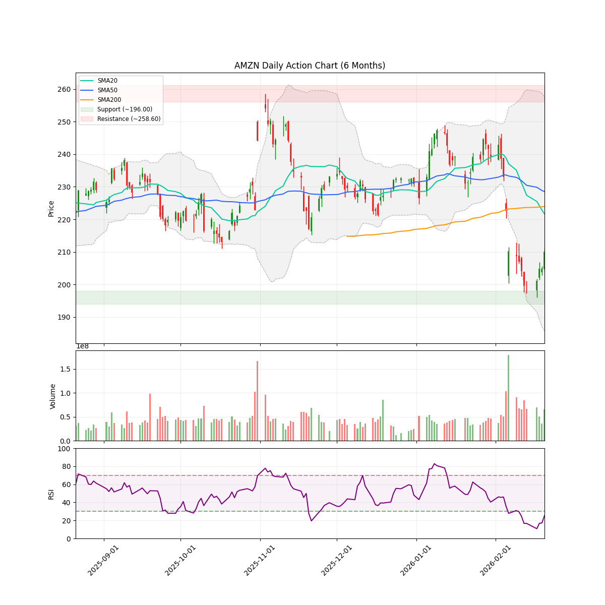
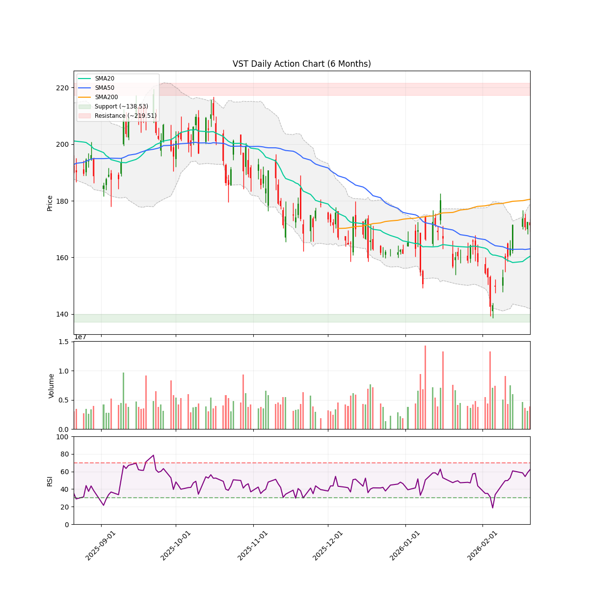
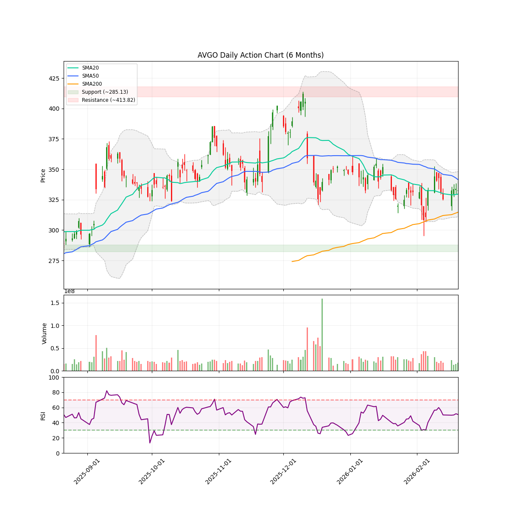
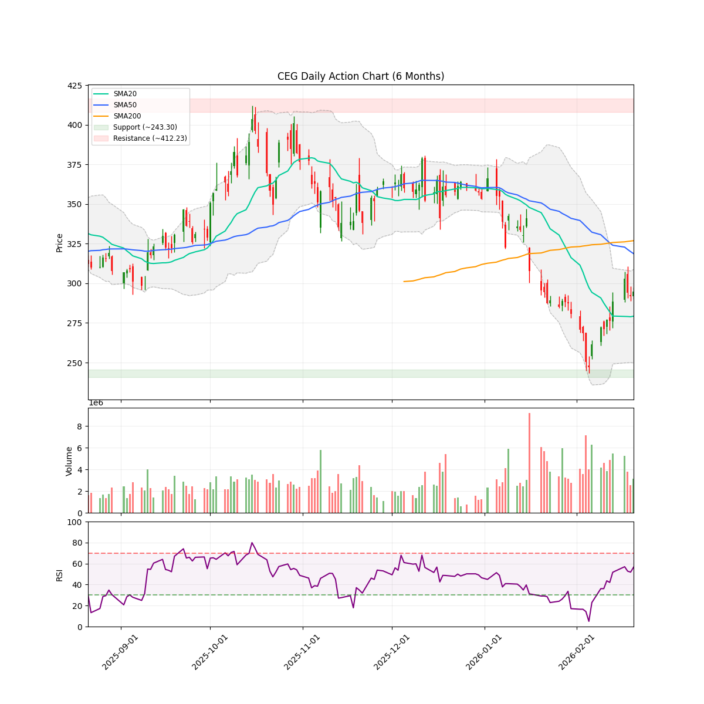
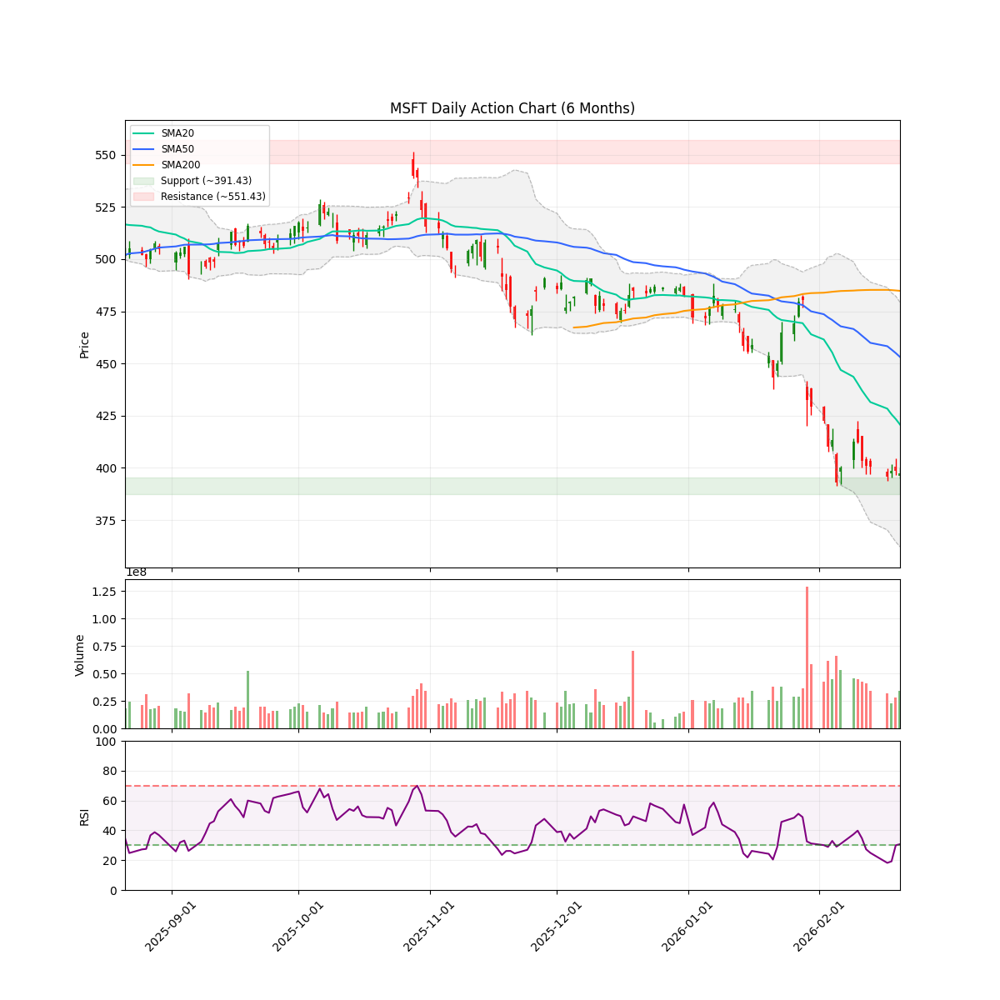
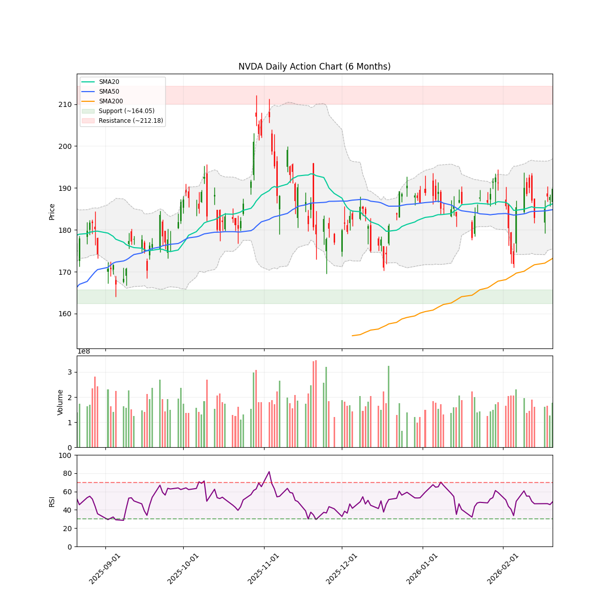
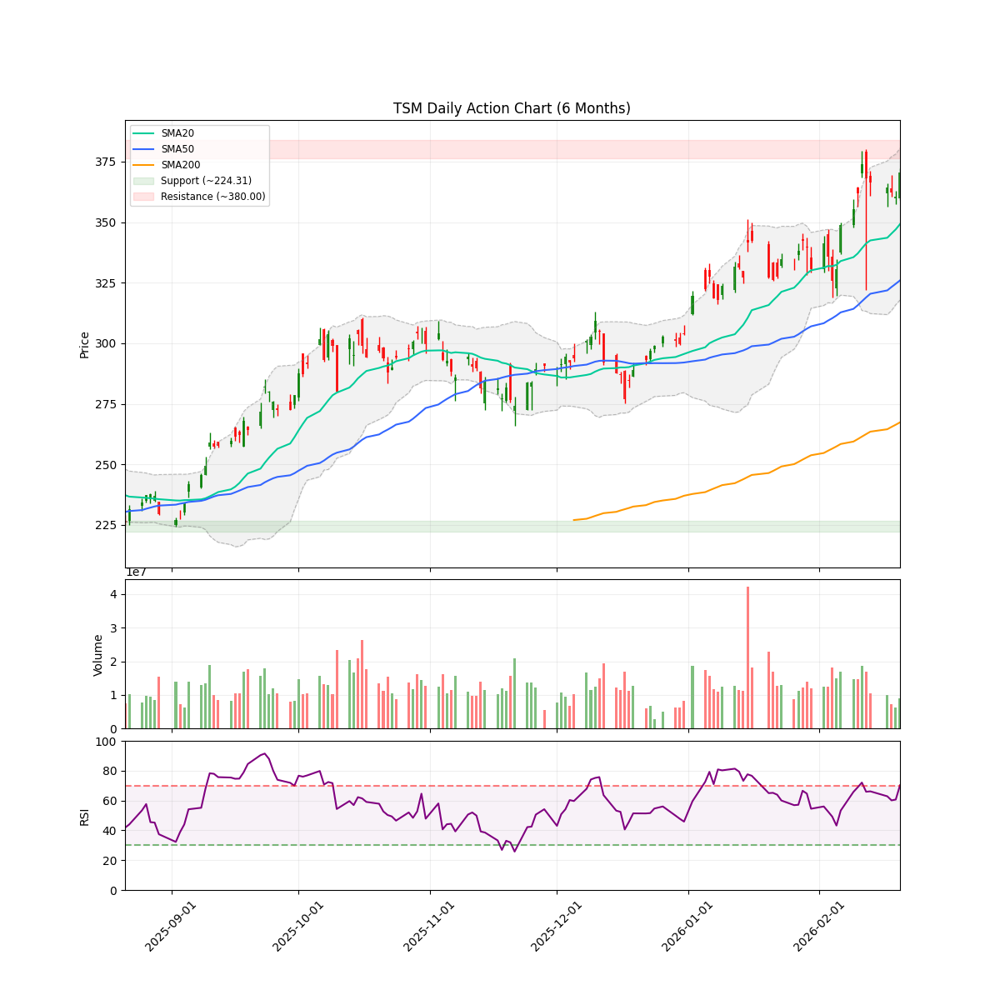
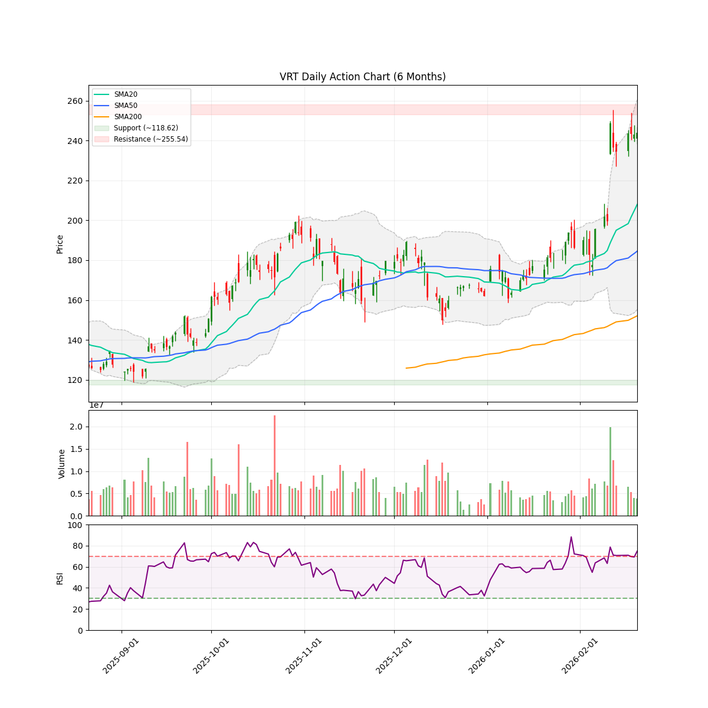

# 每日股市市场报告 (2026-02-22)

> **免责声明**: 本报告由 **代码与 Gemini AI 自动生成**，仅供研究参考，**不构成**任何投资建议。投资有风险，入市需谨慎。作者及 AI 不对任何基于此内容的投资决策承担责任。

## 📑 目录
[TOC]

##  长期投资逻辑
本组合旨在捕捉 **人工智能（AI）与半导体协议** 带来的跨周期结构性增长，核心投资策略聚焦于“确定性”与“物理瓶颈”：
- **底层制程垄断 (Foundry & WFE Moats)**：
  布局处于全球半导体精密制造顶端的“工业母机”级别公司。寻找具备极高准入门槛的晶圆代工及前道设备供应商，作为全产业链最稳固的底座资产。
- **算力稀缺性与连接带宽 (Compute & Interconnect Scarcity)**：
  聚焦在高性能计算芯（HPC）及高带宽连接领域占据主导地位的标的。AI 的终极竞争是“规模”，寻找能有效解决数据交换瓶颈并提供核心推理/训练能力的算力巨头。
- **应用生态与数据霸权 (Platform & Data Sovereignty)**：
  布局拥有闭环生态、海量高质量私有数据及云基础设施的科技巨头。它们是 AI 商业化落地的最终守门人，拥有将技术转化为持续现金流的分配权。
- **物理边界保障 (Power & Thermal Infrastructure)**：
  关注 AI 扩张的“最终瓶颈”——电力供应与热能管理。重点布局为下一代超大规模数据中心提供高功率密度能源、液冷技术及电网扩容方案的能源基建商。
**风控策略**：利用 AlphaJAX 的量化动量评分（Quant Score）作为过滤器，结合 LLM 叙事审计（Narrative Audit）捕捉“业绩超预期 + 叙事逻辑改善”的共振点，实现跨周期的超额收益。

 **注：排序权重**：Ticker 按照 AI 检测出的 **方向** 排序（**看多**优先，其次是 **中性**，最后是 **看空**）。
---

<!-- DISCORD_SUMMARY_START -->
## 🧠 对冲基金经理全局诊断与资金分配策略
你好。我是你的资深投资组合经理（PM）。

根据 2026年2月22日 的最新数据，目前账户面临**严重的集中度风险**，且部分核心持仓的逻辑评分已跌破关键阈值。我们的首要任务是**降杠杆、调结构、回归风控准则**。

以下是基于研究团队逻辑评分（Logic Score）和投资组合管理规范的诊断与行动计划：

---

### **一、 账户总体诊断：风险预警**

1.  **集中度违规（Concentration Risk）**：
    *   **AMD 持仓占比高达 51.14%**，严重违反了“单一标的不超过 30%”的红线规定。
    *   **逻辑评分警告**：AMD 和 AMZN 的逻辑评分均低于 5 分（均为 4.8），属于**“减持或清仓”**类别。
2.  **现金流状况**：
    *   可用现金约 $5.34 万，现金占比约 22.38%。虽然现金充足，但被动暴露在 AMD 的高波动叙事中（MI455X 生产延迟），风险敞口过大。
3.  **业绩分化**：
    *   VST (Score 8.2) 和 GOOGL (Score 7.8) 表现强劲，叙事逻辑稳健。

---

### **二、 Actionable Trading Plan (指令性交易方案)**

#### **1. AMD (核心动作：强制减持)**
*   **评分：4.8 (逻辑受损)** | **目标：将占比降至 30% 以下**
*   **执行**：立即市价减持 **250 股** AMD 正股。
*   **逻辑**：即便有备兑看涨期权（Covered Call）保护，51% 的仓位在利空叙事（MI455X 延迟）下极易导致账户净值大幅回撤。减持后，保留 350 股正股与 1 张期权合约构成备兑组合，腾出资金回笼。

#### **2. AMZN (策略：反抽清仓/大幅减持)**
*   **评分：4.8 (逻辑偏弱)** | **占比：1.72%**
*   **执行**：考虑到 RSI 为 25.33（极端超卖），不建议在当前价位割肉。**设定在 $220-$223 (SMA200 附近) 择机清仓。**
*   **逻辑**：评分低于 5 分，且均线呈空头排列。虽然持仓比例小，但不符合逻辑评分的买入准则，应回收资金用于高评分标的。

#### **3. VST (策略：顺势加仓/ aggressive Hold)**
*   **评分：8.2 (完美叙事)** | **占比：7.23%**
*   **执行**：**加仓 50 股**。
*   **逻辑**：机构上调目标价至 $239，AI 能源叙事正处于爆发期。股价已站稳 SMA50，且即将发布财报，属于目前组合中的“领头羊”。

#### **4. GOOGL (策略：坚决持有)**
*   **评分：7.8 (优质底仓)** | **占比：17.64%**
*   **执行**：**维持现仓位**，若股价回落至 $310 以下可考虑小幅补仓。
*   **逻辑**：RSI 接近超卖，基本面极其稳健，伯克希尔入场传闻提供强支撑。

---

### **三、 If-Then Scenarios (情景预案)**

*   **情景 A：市场发生系统性回调，AMD 跌破 $184 (SMA200)**
    *   **IF**: AMD 收盘价持续低于 $184。
    *   **THEN**: **无条件继续减持**。此时技术面将彻底转入长期熊市，必须防止 30% 的仓位演变为深套。
*   **情景 B：VST 财报超预期，冲向 $180 (SMA200)**
    *   **IF**: VST 在财报后放量突破 $180。
    *   **THEN**: **持有并设置移动止盈**。若在 $180 处受阻并放量下跌，则将获利部分平仓，锁定 10% 以上利润。
*   **情景 C：GOOGL 快速反弹至 $330 (SMA20 阻力位)**
    *   **IF**: 股价触及 $330 且 RSI 回升至 60 以上。
    *   **THEN**: **减持 20% 的 GOOGL 仓位**。将 17.6% 的占比微调至 15% 左右，增加现金储备。

---

### **四、 最终配置建议汇总**

| 标的 | 建议动作 | 调整后预期占比 | 逻辑评分参考 |
| :--- | :--- | :--- | :--- |
| **AMD** | **强制减持 250 股** | ~28% (回归合规) | 4.8 (警惕) |
| **VST** | **加仓 50 股** | ~10-12% | 8.2 (推荐) |
| **AMZN** | **反弹清仓** | 0% | 4.8 (剔除) |
| **GOOGL** | **持有** | ~17% | 7.8 (优质) |
| **现金** | **保持观望** | ~40% (待布局) | N/A |

**PM 总结**：当前的首要任务不是寻找下一个翻倍股，而是**清理 AMD 的过度集中风险**。在 MI455X 延迟的叙事下，我们必须保持敬畏，将资金转向逻辑评分更高的 VST 和 GOOGL。执行以上计划后，你的账户将回归“健康”状态，并有充足现金应对 4 月份的财报季。
<!-- DISCORD_SUMMARY_END -->
---

## 💼 现有持仓个股诊断

### AMD

#### 研报分析

### 技术指标概览 (Technical Overview)
- **当前价格**: $200.15
- **RSI (14)**: 33.66
- **移动平均线**: SMA20: $222.87 | SMA50: $219.82 | SMA200: $184.01 (Bullish)
- **波动率**: ATR (14): 13.29 (预计周度波动: +/- $29.72)
- **关键位 (6m)**: 支撑位 $149.22 | 阻力位 $267.08
- **即时状态**: Below SMA50

# AMD 情绪审计报告：叙事经济学视角
**日期**：2026年2月22日
**分析师**：对冲基金研究助理（叙事经济学专家）

---

### 1. 核心催化剂分类 (Catalyst Categorization)

根据当前的市场新闻与财报后表现，我们将驱动 AMD 股价的因素分为三个级别：

*   **A-Tier (核心叙事/重大打击)**：
    *   **MI455X 生产延迟**：据 Invezz 报道，由于技术问题需工程团队解决，核心 AI 加速器 MI455X 生产推迟。这是当前股价下挫的核心驱动力，直接打击了其挑战 Nvidia 的叙事。
    *   **Q1 指引不及预期**：管理层对第一季度的预测未能打动投资者，导致财报后出现 12% 的深度回调。
*   **B-Tier (行业与机构动向)**：
    *   **数据中心营收增长**：Q4 数据中心收入增长 39%（达 54 亿美元），显示出底层的结构性需求依然强劲，但这被短期执行层面的负面消息掩盖。
    *   **机构评级维持**：RBC 维持 230 美元的目标价，显示专业机构并未因短期波动而放弃长期价值判断。
*   **C-Tier (市场噪音)**：
    *   **舆论两极分化**：Forbes 与 Seeking Alpha 仍在推动 “300 美元” 的牛市叙事，而 Blockonomi 则强调其相对于 Nvidia 的软件劣势。此类报道目前对股价的边际支撑力有限。

---

### 2. 背离检测 (Divergence Detection)

**观察结果：利好被钝化，利空被放大。**

*   **看跌衰竭信号**：尽管财报后股价从高点大幅滑落至 200.15 美元，但 **RSI 降至 33.66**，已接近 30 的极度超卖区间。
*   **叙事背离**：市场目前完全聚焦于“硬件延迟”和“软件缺口”，而忽略了其“AI 资本支出强劲增长”的宏观背景。
*   **技术位支撑**：当前价格跌破了 SMA50 (219.82) 和 SMA20 (222.87)，形成了短期空头排列。但股价仍高于 **SMA200 (184.01)**，意味着长期牛市趋势尚未崩毁，目前正处于寻找“估值底”的阶段。

---

### 3. 持仓诊断与建议

**用户当前持仓：**
*   **正股**：600股，成本 $220.54 (亏损 -7.79%)
*   **期权**：-1.0 AMD260313C230 (盈利 +68.13%)

**叙事分析**：您的持仓策略目前表现为“被动保护”。备兑看涨期权（Covered Call）的盈利抵消了正股的部分跌幅。考虑到当前 200 美元关口的价格敏感度和超卖的 RSI，**这并不是一个割肉离场的理想时机，而是一个等待叙事转向的观察期。**

---

### 4. 逻辑评分 (Logic Score)

# **4.8 / 10**

> **评分说明**：
> *   **0-3 (系统性崩溃)**：基本面彻底恶化。
> *   **4-6 (执行陷阱/震荡期)**：当前状态。AMD 正面临“执行力挑战”（MI455X 延迟）与“估值重估”的双重压力。叙事从“完美增长”转向“波折扩张”。
> *   **7-10 (无敌牛市)**：产品顺利交付，指引上调。

---

### 5. 下一个关键日期 (Next Major Date)

*   **2026年3月13日**：您的期权到期日。
*   **预计 2026年4月底**：2026年 Q1 财报发布日。
*   **核心关注点**：在此之前，需密切关注任何关于 **MI455X 技术修复进度** 的新闻，这将是决定股价能否重回 230 美元的关键。

---

### 引用文献参考：
*   [Invezz] AMD 股价因 MI455X 加速器生产延迟最多跌 5%。[Link](https://invezz.com/news/2026/02/17/why-amd-stock-slipped-as-much-as-5-today/)
*   [Blockonomi] 分析师对 AMD AI 软件策略表示怀疑。[Link](https://blockonomi.com/amd-stock-why-this-analyst-remains-skeptical-of-ai-strategy/)
*   [Investing.com] RBC 维持 $230 目标价。[Link](https://www.investing.com/news/analyst-ratings/amd-stock-price-target-maintained-at-230-by-rbc-ahead-of-earnings-93CH-4479241.)
#### 近期新闻与事件
- **[Forbes]** [What Will Power AMD Stock's Next Rally?](https://www.forbes.com/sites/greatspeculations/2026/02/18/what-will-power-amd-stocks-next-rally/)
- **[Seeking Alpha]** [AMD Stock: $300 Appears Imminent; Why I'm Buying More](https://seekingalpha.com/article/4871662-amd-stock-300-appears-imminent-why-im-buying-more)
- **[Blockonomi]** [AMD Stock: Why This Analyst Remains Skeptical of AI Strategy](https://blockonomi.com/amd-stock-why-this-analyst-remains-skeptical-of-ai-strategy/)
- **[The Motley Fool]** [Is AMD stock a buy now?](https://www.msn.com/en-us/money/top-stocks/is-amd-stock-a-buy-now/ar-AA1WCwQx)
- **[Invezz]** [Why AMD stock slipped as much as 5% today](https://invezz.com/news/2026/02/17/why-amd-stock-slipped-as-much-as-5-today/)

---

### AMZN

#### 研报分析

### 技术指标概览 (Technical Overview)
- **当前价格**: $210.11
- **RSI (14)**: 25.33
- **移动平均线**: SMA20: $221.65 | SMA50: $228.52 | SMA200: $223.97 (Bullish)
- **波动率**: ATR (14): 8.16 (预计周度波动: +/- $18.25)
- **关键位 (6m)**: 支撑位 $196.00 | 阻力位 $258.60
- **即时状态**: Below SMA50

# 亚马逊 (AMZN) 叙事经济学与情绪审计报告

**报告日期**：2026年2月22日
**研究员**：对冲基金研究助理（叙事经济学组）

---

### 1. 催化剂分类 (Catalyst Categorization)

我们将近期影响 AMZN 股价的消息按重要性进行了分层：

*   **A-Tier（核心催化剂）**
    *   **机构巨量增持**：亿万富翁 Ken Griffin 的 Citadel 对 AMZN 投入 25.2 亿美元。这是极强的机构背书，显示“聪明钱”在暴跌中捡漏。
    *   **Q4 财报余震**：2025年第四季度财报显示 EPS 逊于预期（-1.52%），尽管营收超预期。这是导致近期股价疲软的直接触发点。
*   **B-Tier（增长叙事）**
    *   **AWS 芯片叙事**：市场开始挖掘亚马逊作为“被低估的芯片股”的潜力（AWS 自研芯片），这为 AI 长期叙事提供了新动力。
    *   **七巨头（Mag 7）超跌反弹**：媒体开始强调 AMZN 较近期高点下跌 22%，存在均值回归的需求。
*   **C-Tier（市场杂音）**
    *   **零售竞争对比**：关于亚马逊与沃尔玛或家得宝的买入价值对比。这类消息属于存量市场的再分配讨论，对短期估值重塑影响有限。

---

### 2. 背离监测 (Divergence Detection)

*   **技术面与情绪背离**：
    *   **超卖信号**：目前 RSI 仅为 **25.33**，处于极端超卖区间。
    *   **看跌衰竭**：尽管财报利空导致股价跌破 SMA200（223.97），但近期消息面（如 Citadel 增持）已开始转向正面。股价虽在低位震荡，但下跌动能正在减弱。
    *   **结论**：观察到明显的“利好钝化”向“利空出尽”转化的迹象。机构的大手笔买入与散户的恐慌抛售形成鲜明对比，这通常是波段底部的特征。

---

### 3. 叙事分析 (Narrative Analysis)

目前的叙事正从 **“增长放缓的巨头”** 转向 **“极具性价比的 AI 算力底座”**。
*   **当前陷阱**：财报导致的“负面惯性”。投资者担心 2026 年的预算支出无法立即产生回报。
*   **潜在机会**：股价已触及 6 个月低点支持位（196.00）上方不远处。若股价在此企稳，Citadel 的入场将成为市场信心重塑的“定海神针”。

---

### 4. 情绪评分 (Sentiment Score)

#### **评分：4.8 / 10 (中性偏悲观，但接近转折点)**

**逻辑评分说明**：
*   **扣分项 (-5.2)**：价格位于 SMA20/50/200 所有均线下方，技术趋势呈空头排列；Q4 利润端不及预期打击了成长叙事。
*   **加分项 (+4.8)**：RSI 极端超卖提供反弹动力；顶级对冲基金 Citadel 的 25 亿美金入场提供了坚实的心理支撑；当前价格（210.11）仅比用户成本价（201.61）高出不到 5%，具备安全边际。

---

### 5. 引用与参考 (Citations)

*   **机构动态**：[AOL] 传奇基金经理 Ken Griffin (Citadel) 投入 25.2 亿美元。 [Link](https://www.aol.com/articles/legendary-fund-manager-drops-2-203300742.html)
*   **财报表现**：[Zacks] 亚马逊 Q4 盈利意外下降 1.52%。 [Link](https://finance.yahoo.com/news/amazon-amzn-lags-q4-earnings-221002278.html)
*   **价值评估**：[Motley Fool] 该股较历史高点下跌 22%。 [Link](https://finance.yahoo.com/news/magnificent-seven-stock-down-22-134500565.html)

---

### 6. 关键日期与操作建议 (Next Major Date & Plan)

*   **下一个重大日期**：**2026年4月下旬**（预计 2026 年第一季度财报发布日）。
*   **交易计划**：
    *   **支撑位监测**：密切关注 **196.00** 支撑。如果触及该点位且 RSI 出现底背离，是理想的加仓点。
    *   **阻力位监测**：首个回升阻力在 **223.97** (SMA200)。只有站稳此线，叙事才能从“衰退”回归“成长”。
    *   **持仓建议**：当前持仓获利仅 1.61%，建议继续持有，不宜在超卖区止损，等待向 SMA200 均值回归的反弹。
#### 近期新闻与事件
- **[Motley Fool]** [This "Magnificent Seven" Stock Is Down 22%. Buy It Before It Sets a New All-Time...](https://finance.yahoo.com/news/magnificent-seven-stock-down-22-134500565.html)
- **[Motley Fool]** [Better Stock to Buy Right Now: Amazon vs. Home Depot](https://finance.yahoo.com/news/better-stock-buy-now-amazon-145000843.html)
- **[AOL]** [Legendary fund manager drops $2.52 billion on mega-cap tech stock](https://www.aol.com/articles/legendary-fund-manager-drops-2-203300742.html)
- **[24/7 Wall St.]** [Is Amazon the Most Underrated Chip Stock on the Market?](https://finance.yahoo.com/news/amazon-most-underrated-chip-stock-133344251.html)
- **[Motley Fool]** [Walmart vs. Amazon: Which Trillion-Dollar Stock Is a Better Buy Right Now?](https://finance.yahoo.com/news/walmart-vs-amazon-trillion-dollar-070500618.html)

---

### GOOGL

#### 研报分析

### 技术指标概览 (Technical Overview)
- **当前价格**: $314.98
- **RSI (14)**: 32.07
- **移动平均线**: SMA20: $323.52 | SMA50: $320.24 | SMA200: $245.53 (Bullish)
- **波动率**: ATR (14): 10.86 (预计周度波动: +/- $24.28)
- **关键位 (6m)**: 支撑位 $199.12 | 阻力位 $349.00
- **即时状态**: Below SMA50

# 情绪审计报告：Alphabet Inc. (GOOGL)
**致：** 投资委员会
**报告人：** 对冲基金研究员（叙事经济学组）
**日期：** 2026年02月22日

---

## 1. 催化剂分类 (Catalyst Categorization)

基于叙事强度和对基本面的长期影响，我们将近期事件分为以下等级：

*   **A-Tier（核心催化剂）：**
    *   **Gemini 3.1 Pro 发布：** 2026年2月20日推出的新模型带动股价盘中跳涨4.5%。这是确立谷歌在AI竞赛中领先地位的核心产品。
    *   **Q4 2025 财报超预期：** 2月初发布的财报显示营收和每股收益（EPS）均突破预期，证实了核心广告业务和云业务的韧性。
    *   **伯克希尔·哈撒韦（BRK）入场：** 市场传闻巴菲特的投资团队买入谷歌，这为公司提供了极强的机构背书和“估值底”叙事。
*   **B-Tier（行业与分析师动向）：**
    *   **美银（BofA）重置预测：** 财报后分析师重新调整目标价，维持积极但审慎的预期。
    *   **云计划排名：** 谷歌被列入14个最佳云计算股票，强化了其非广告收入的叙事。
*   **C-Tier（杂音与常规波动）：**
    *   **高管减持：** Alphabet 高管 Walker 出售了价值1430万美元的股票。在大型科技股中，这种例行减持通常不具方向性参考价值。
    *   **Zacks 趋势报告：** 属于零售端情绪杂音。

---

## 2. 背离检测与叙事分析 (Divergence Detection)

**背离警告：** 
目前 GOOGL 呈现出明显的 **“利好下挫”式背离**。
*   **叙事端：** Gemini 3.1 Pro 发布且财报利好。
*   **价格端：** 股价（314.98）目前低于 SMA20（323.52）和 SMA50（320.24）。
*   **诊断：** RSI 降至 **32.07**，已接近 **“超卖区”**。这种“好消息叠加价格下跌”的情况并非基本面恶化，而是典型的**空头衰竭前奏**或大盘系统性调仓导致的“利好出尽”。
*   **结论：** 这是一个典型的“叙事陷阱”（Bear Trap），在均线下方震荡实际上是在消化财报后的获利盘。

---

## 3. 逻辑评分 (Logic Score)

### **7.8 / 10**

**评分逻辑：**
*   **支撑力（+2.5）：** 伯克希尔的入场传闻和Q4强劲基本面提供了极强的下方支撑。
*   **增长潜力（+3.0）：** Gemini 3.1 Pro 的迭代速度证明了技术护城河正在加深。
*   **技术压力（-1.5）：** 股价目前处于 SMA50 下方，且跌破了 20 日均线，短期趋势受压。
*   **估值性价比（+0.8）：** 考虑到 RSI 接近 30，且用户持仓成本（262.26）具有显著安全边际，目前的调整更像是健康的换手。

---

## 4. 账户持仓诊断

*   **当前状况：** 盈亏 +15.47%，仓位占比 17.64%。
*   **分析：** 尽管近期从 349.00 的高点回撤，但你的成本价（262.26）远低于 SMA200（245.53），长期趋势极其稳健。目前的回撤位于每周波动范围（+/- 24.28）内。
*   **建议：** 无需恐慌。RSI 32 预示着反弹即将来临，当前价位接近 SMA50 附近的心理博弈区。

---

## 5. 关键日期与下步行动

*   **下个关键日期：** **2026年4月下旬** (预计 2026财年第一季度 Q1 财报发布日)。
*   **重点关注：** 
    1.  Gemini 3.1 Pro 在企业端的变现反馈。
    2.  股价能否在 310-315 美元区间企稳（此区域是前期的重要心理支撑）。

---
**免责声明：** 本报告基于叙事经济学模型，仅供研究参考，不构成直接投资建议。
#### 近期新闻与事件
- **[Motley Fool]** [1 Unstoppable Artificial Intelligence (AI) Stock That Berkshire Hathaway Bought...](https://finance.yahoo.com/news/1-unstoppable-artificial-intelligence-ai-125600636.html)
- **[Zacks]** [Alphabet Inc. (GOOGL) Is a Trending Stock: Facts to Know Before Betting on It](https://finance.yahoo.com/news/alphabet-inc-googl-trending-stock-140006186.html)
- **[StockStory]** [Alphabet (GOOGL) Stock Trades Up, Here Is Why](https://finance.yahoo.com/news/alphabet-googl-stock-trades-why-203542521.html)
- **[Insider Monkey]** [Monness Maintains Neutral Stance on Alphabet Inc. (GOOGL) Stock](https://finance.yahoo.com/news/monness-maintains-neutral-stance-alphabet-123339990.html)
- **[Investing.com]** [Alphabet’s Walker sells $14.3 million in GOOGL stock By Investing.com](https://in.investing.com/news/insider-trading-news/alphabets-walker-sells-143-million-in-googl-stock-93CH-5248546)

---

### VST

#### 研报分析

### 技术指标概览 (Technical Overview)
- **当前价格**: $171.40
- **RSI (14)**: 62.28
- **移动平均线**: SMA20: $160.39 | SMA50: $163.00 | SMA200: $180.53 (Bearish)
- **波动率**: ATR (14): 7.28 (预计周度波动: +/- $16.27)
- **关键位 (6m)**: 支撑位 $138.53 | 阻力位 $219.51
- **即时状态**: Above SMA50

# VST 情绪审计报告：叙事经济学与趋势诊断

**致：** 投资组合经理
**日期：** 2026年2月22日
**研究员：** 叙事经济学研究组

---

### 1. 催化剂分类 (Catalyst Categorization)

我们将 VST 当前的驱动因素分为三个等级，以评估其增长的持续性：

*   **A-Tier（核心驱动力）：**
    *   **机构强力背书：** 摩根大通（JPMorgan）将目标价上调至 **$239**，并维持增持评级。这提供了巨大的潜在空间（约 40% 的溢价）。 [来源: Insider Monkey, 2026-02-21]
    *   **AI 叙事溢价：** 市场已将其定性为“AI 数据中心能源需求”的核心受益股，这种宏观叙事具有长期结构性支撑。 [来源: Motley Fool, 2026-02-20]
*   **B-Tier（中期支撑）：**
    *   **即将发布的财报：** 华尔街预期盈利增长，市场正处于财报发布前的“抢跑”阶段。 [来源: Zacks, 2026-02-19]
    *   **技术面修复：** 股价成功站上 SMA20 ($160.39) 和 SMA50 ($163.00)，显示出短期多头动能回归。
*   **C-Tier（噪音与短期波动）：**
    *   **短期超卖反弹：** Zacks 提到的近期股价下跌被证明是“噪音”，而非基本面恶化。 [来源: Zacks, 2026-02-01]

---

### 2. 背离检测 (Divergence Detection)

**诊断：熊市动能衰竭 (Bearish Exhaustion)**

*   **观察：** 在 2026 年 2 月初，VST 曾出现大幅下跌（跌至 $142 附近），甚至在市场上涨时表现滞后（Zacks 2月18日报告）。
*   **背离分析：** 尽管早期技术面偏空（目前仍低于 SMA200），但随着 **2月21日摩根大通上调目标价**，股价出现了明显的“利好共振”。RSI 目前为 62.28，处于强势区间但尚未进入超买（>70）。
*   **结论：** 之前的“利好不涨”已经转变为“利好加速上涨”，这表明市场筹码已经完成换手，空头动能消耗殆尽。

---

### 3. 情绪评分 (Logic Score)

#### **评分：8.2 / 10**

**评分逻辑：**
*   **积极因素 (+8.5)：** 极强的机构共识（JPM $239 目标价）、明确的 AI 叙事、以及股价突破 SMA50 的技术修复。
*   **风险因素 (-0.3)：** 股价仍低于 SMA200 ($180.53)，这在长期趋势上仍构成一定阻力；此外，下周财报存在不确定性。
*   **总结：** 目前处于“不可阻挡的看涨周期”早期，只要不跌破 $160 的支撑位，趋势将持续。

---

### 4. 账户头寸分析 (Current Position Audit)

*   **现状：** 持仓成本 $157.38，当前盈利 **+9.60%**。
*   **建议：** 您的成本位刚好在 SMA20 和 SMA50 支撑位下方，具有极佳的安全边际。在财报前建议 **继续持有 (HOLD)**。若股价触及 SMA200 ($180.53) 产生遇阻信号，可考虑减仓锁利。

---

### 5. 关键参考资料与日期

*   **重要参考链接：**
    *   [摩根大通上调目标价至 $239](https://finance.yahoo.com/news/jpmorgan-raises-price-target-vistra-153602452.html)
    *   [Motley Fool: 逢低买入 VST 的时机](https://finance.yahoo.com/news/time-buy-dip-vistra-stock-155000385.html)
*   **下一个重大日期 (Next Major Date)：**
    *   **2026年2月最后一周（预计下周）：** Vistra Corp (VST) 官方财报发布日。这将决定股价能否一举突破 SMA200。

---

**研究员简评：** VST 不再仅仅是一家公用事业公司，它正在被市场重塑为“AI 基础设施”公司。在叙事没有崩塌前，任何回调都是机构加仓的机会。
#### 近期新闻与事件
- **[Motley Fool]** [Time to Buy the Dip on Vistra Stock?](https://finance.yahoo.com/news/time-buy-dip-vistra-stock-155000385.html)
- **[Insider Monkey]** [JPMorgan Raises its Price Target on Vistra Corp. (VST) to $239 and Maintains an...](https://finance.yahoo.com/news/jpmorgan-raises-price-target-vistra-153602452.html)
- **[Zacks]** [Vistra Corp. (VST) Stock Drops Despite Market Gains: Important Facts to Note](https://finance.yahoo.com/news/vistra-corp-vst-stock-drops-224505549.html)
- **[Zacks]** [Vistra Corp. (VST) Reports Next Week: Wall Street Expects Earnings Growth](https://finance.yahoo.com/news/vistra-corp-vst-reports-next-150006706.html)
- **[Schaeffer's Investment Research]** [Vistra Stock Looks Ready to Topple Technical Resistance](https://finance.yahoo.com/news/vistra-stock-looks-ready-topple-202447395.html)

---

## 🔍 观察池机会分析

### AMAT

#### 研报分析

### 技术指标概览 (Technical Overview)
- **当前价格**: $375.38
- **RSI (14)**: 68.97
- **移动平均线**: SMA20: $334.76 | SMA50: $302.06 | SMA200: $220.68 (Bullish)
- **波动率**: ATR (14): 18.87 (预计周度波动: +/- $42.19)
- **关键位 (6m)**: 支撑位 $153.98 | 阻力位 $377.11
- **即时状态**: Above SMA50

# 情绪审计报告：Applied Materials (AMAT)
**日期：** 2026年2月22日
**职位：** 对冲基金研究助理（叙事经济学视角）

---

### 一、 催化剂分类 (Catalyst Categorization)

根据“叙事经济学”框架，AMAT 当前的驱动因素可归类如下：

*   **A-Tier（核心基本面驱动）：**
    *   **业绩双超与指引上调：** 2026年2月12日公布的第一财季财报显示，收益和营收分别超出预期 8.53% 和 1.79%，并显著上调了未来预期。这是支撑股价突破的最强动力。 [Zacks, 2026-02-15]
    *   **机构重磅升级：** 摩根士丹利（Morgan Stanley）分析师 Shane Brett 将目标价上调至 **$420**，并维持“超配”评级。这为市场注入了强烈的机构信心。 [Insider Monkey, 2026-02-21]
*   **B-Tier（行业与宏观叙事）：**
    *   **AI 存储器需求爆棚：** HBM（高带宽内存）和 DRAM 的短缺使得 AMAT 作为半导体设备龙头处于产业链极佳位置。 [Money Morning, 2026-02-16]
    *   **数据中心资本支出：** 全球顶级科技公司持续增加数据中心投入，为上游设备商提供了长期的增长叙事。 [The Motley Fool, 2026-02-20]
*   **C-Tier（市场噪音/情绪点缀）：**
    *   分析师普遍看好（Time to shine）及媒体推荐，主要起到维持散户情绪热度的作用。 [Barchart, 2026-02-18]

---

### 二、 背离检测 (Divergence Detection)

*   **价格与新闻一致性：** 目前**未发现看跌背离**。
*   **走势分析：** 财报公布（2月12日）后，股价跳空上涨超过 8%，并持续在 SMA20（334.76）和 SMA50（302.06）上方运行，显示出极强的趋势追随特质。
*   **警示点：** RSI 处于 **68.97**，极度接近 70 的超买警戒线。当前价格（375.38）已逼近 6 个月高点（377.11）。尽管基本面强劲，但短期内可能存在因涨幅过快而产生的“技术性获利了结”压力，而非趋势反转。

---

### 三、 叙事分析与可持续性评估

AMAT 的当前叙事正处于**“加速期”**。
市场已从最初的“AI 芯片概念”转向更务实的“AI 基础设施与存储设备更新”。AMAT 被视为 AI 淘金热中的“铲子提供商”。摩根士丹利 $420 的目标价为市场提供了约 12% 的预期溢价空间，这种“机构锚定效应”有效防止了散户出现恐慌性抛售。

目前暂无迹象表明这是一个“多头陷阱”（Bull Trap），因为涨幅是由确凿的财报数据（Earnings Beat）支撑的，而非纯粹的投机炒作。

---

### 四、 综合评分与核心预测

*   **逻辑评分 (Logic Score): 9.2/10**
    *   *评分依据：* 基本面爆发、机构目标价上调以及完美的技术面多头排列。扣分项仅在于 RSI 接近超买以及近期涨幅过大可能导致的回撤。

*   **核心观察：** 股价正在向 $400 - $420 区间挺进。只要不跌破 $334 (SMA20)，看涨逻辑依然坚固。

---

### 五、 关键日期与数据参考

*   **下一个重大日期：** 预计 **2026年5月中旬**（第二财季财报发布）。
*   **关键支撑位：** $334.76 (SMA20) / $302.06 (SMA50)
*   **关键阻力位：** $377.11 (近期高点) / $420.00 (大摩目标价)
*   **参考新闻链接：**
    *   [摩根士丹利上调目标价至 $420](https://www.msn.com/en-us/money/topstocks/morgan-stanley-raises-its-price-target-on-applied-materials-inc-amat-to-420-and-keeps-an-overweight-rating/ar-AA1WN94H)
    *   [财报双超分析](https://finance.yahoo.com/news/applied-materials-amat-beats-q1-221502728.html)
    *   [存储芯片与AI机会叙事](https://moneymorning.com/2026/02/16/applied-materials-shows-why-memory-stocks-are-the-next-big-ai-buying-opportunity/)
#### 近期新闻与事件
- **[The Motley Fool]** [1 Unstoppable Artificial Intelligence (AI) Stock Up 117% in 6 Months That Can Still Climb Higher](https://www.fool.com/investing/2026/02/20/unstoppable-artificial-intelligence-ai-stock-amat/)
- **[Barchart]** [It's 'time to shine' for Applied Materials stock, according to analysts. Should you buy AMAT here?](https://www.msn.com/en-us/money/topstocks/it-s-time-to-shine-for-applied-materials-stock-according-to-analysts-should-you-buy-amat-here/ar-AA1WBHYs)
- **[Insider Monkey]** [Morgan Stanley Raises its Price Target on Applied Materials, Inc. (AMAT) to $420 and Keeps an Overweight Rating](https://www.msn.com/en-us/money/topstocks/morgan-stanley-raises-its-price-target-on-applied-materials-inc-amat-to-420-and-keeps-an-overweight-rating/ar-AA1WN94H)
- **[Zacks Investment Research]** [Applied Materials (AMAT) is considered a good investment by brokers: Is that true?](https://www.msn.com/en-us/money/top-stocks/applied-materials-amat-is-considered-a-good-investment-by-brokers-is-that-true/ar-AA1WKCc5)
- **[Money Morning]** [Applied Materials Shows Why Memory Stocks Are the Next Big AI Buying Opportunity](https://moneymorning.com/2026/02/16/applied-materials-shows-why-memory-stocks-are-the-next-big-ai-buying-opportunity/)

---

### ANET

#### 研报分析

### 技术指标概览 (Technical Overview)
- **当前价格**: $132.79
- **RSI (14)**: 41.93
- **移动平均线**: SMA20: $139.78 | SMA50: $133.64 | SMA200: $126.05 (Bullish)
- **波动率**: ATR (14): 6.98 (预计周度波动: +/- $15.61)
- **关键位 (6m)**: 支撑位 $114.52 | 阻力位 $164.94
- **即时状态**: Below SMA50

# 情绪审计报告：Arista Networks (ANET)
**日期：** 2026年2月22日
**职位：** 对冲基金研究员（叙事经济学方向）

---

### 1. 催化剂分类 (Categorize Catalysts)

根据当前的资讯流，我们将 ANET 的近期驱动因素分类如下：

*   **A-Tier（核心基本面与机构背书）：**
    *   **2025年Q4财报超预期：** 摩根士丹利（Morgan Stanley）确认 ANET 财报表现优异，并将其目标价从 $159 上调至 **$165**。这属于最高级别的基本面驱动，确立了长期增长轨迹。
    *   **AI 网络架构领先地位：** 机构普遍认为 ANET 是未来 20 年内最佳增长股之一，尤其是在 AI 基础设施领域。
*   **B-Tier（行业趋势与估值重估）：**
    *   **AI 基础设施叙事转向：** 随着市场对 AI 硬件关注度从单一芯片扩展到网络互联，ANET 处于行业顺风期。
    *   **Yahoo Finance 估值评估：** 虽然市场关注其估值是否过高，但这反映了极高的机构曝光度和潜在的防御性买盘。
*   **C-Tier（市场热度与噪音）：**
    *   **Zacks 热搜排名：** 该股近期在 Zacks 上的搜索量激增，主要属于散户热度，属于短线情绪噪音。

---

### 2. 背离检测 (Divergence Detection)

**诊断：明显的“好消息下的价格回落”（Bearish Exhaustion / Pullback）。**

*   **观察：** 尽管摩根士丹利在 2月19日和20日连续发布了看涨报告并提高目标价至 $165（[来源](https://www.msn.com/en-us/money/topstocks/morgan-stanley-raises-arista-networks-anet-pt-to-165-following-q4-2025-earnings-beat/ar-AA1WHzf9)），但目前股价（$132.79）不仅远低于目标价，且已跌破 **SMA20 ($139.78)** 和 **SMA50 ($133.64)**。
*   **分析：** 这是一种典型的**“获利了结型背离”**。尽管基本面催化剂是 A 级，但技术面显示短期买盘枯竭。RSI 为 **41.93**，尚未进入 30 的极度超卖区，暗示短期内可能还有向下寻找 SMA200 ($126.05) 支撑的需求。
*   **结论：** 目前并非“陷阱”，而是一个**高胜率的叙事性回调**。市场正在消化财报后的溢价。

---

### 3. 技术面与波动率概览 (Technical Summary)

*   **当前价格：** $132.79（低于 SMA50，短期趋势偏弱）
*   **波动率 (ATR 14)：** 6.98，显示单日波动空间较大。
*   **周波动范围：** +/- 15.61。这意味着股价可能下探至 $117 附近（接近 6个月低点 114.52）或回升至 $148。
*   **支撑位：** $126.05 (SMA200) 是极其关键的牛熊分界线。

---

### 4. 情绪得分 (Logic Score: 7.2/10)

**评分逻辑：**
*   **叙事强度 (9/10)：** AI 网络基础设施的叙事极度稳健，机构评级上调提供了强力支撑。
*   **价格动能 (4/10)：** 股价在均线下方运行，显示短期抛压较重。
*   **估值认同 (8/10)：** 虽然股价回调，但 $165 的目标价给出了超过 20% 的潜在溢价空间。

**最终得分：7.2/10**
（注：若股价能站稳 $126 并收复 SMA50，得分将升至 8.5 以上。）

---

### 5. 引用与参考文献 (Citations)

1.  **Morgan Stanley 目标价上调：** [Insider Monkey/MSN](https://www.msn.com/en-us/money/topstocks/morgan-stanley-raises-arista-networks-anet-pt-to-165-following-q4-2025-earnings-beat/ar-AA1WHzf9) - 确认分析师 Meta Marshall 将目标价上调至 $165，维持超配评级。
2.  **估值与 AI 专注度分析：** [Yahoo Finance](https://finance.yahoo.com/news/assessing-arista-networks-anet-valuation-211218337.html) - 探讨了 ANET 在 AI 基础设施中的核心地位。
3.  **市场热度排名：** [Zacks.com](https://www.msn.com/en-us/money/top-stocks/is-trending-stock-arista-networks-inc-anet-a-buy-now/ar-AA1WB4wR) - 证实该股为近期市场搜索热股。

---

### 6. 下一重大事件日期 (Next Major Date)

*   **下一财报发布日 (2026 Q1 Earnings)：** 预计为 **2026年5月初**（具体日期通常在4月中旬公布）。
*   **短期关注点：** 观察股价在 **$126.05 (SMA200)** 附近的表现，这将决定该股是进入中期修正还是完成筑底回升。
#### 近期新闻与事件
- **[Yahoo Finance]** [Assessing Arista Networks (ANET) Valuation As Growth And AI Infrastructure Story Draw Focus](https://finance.yahoo.com/news/assessing-arista-networks-anet-valuation-211218337.html)
- **[Zacks]** [Is Trending Stock Arista Networks, Inc. (ANET) a Buy Now?](https://finance.yahoo.com/news/trending-stock-arista-networks-inc-140005375.html)
- **[Insider Monkey]** [Morgan Stanley Raises Arista Networks (ANET) PT to $165 Following Q4 2025...](https://finance.yahoo.com/news/morgan-stanley-raises-arista-networks-002813575.html)
- **[Insider Monkey]** [Arista Networks Inc (ANET) Strengthens Position in AI Networking](https://finance.yahoo.com/news/arista-networks-inc-anet-strengthens-150618247.html)
- **[Motley Fool]** [Wall Street Says This Artificial Intelligence (AI) Stock Is a Bargain Hiding in...](https://finance.yahoo.com/news/wall-street-says-artificial-intelligence-052000842.html)

---

### ASML

#### 研报分析

### 技术指标概览 (Technical Overview)
- **当前价格**: $1469.59
- **RSI (14)**: 56.76
- **移动平均线**: SMA20: $1419.23 | SMA50: $1268.54 | SMA200: $958.16 (Bullish)
- **波动率**: ATR (14): 50.08 (预计周度波动: +/- $111.98)
- **关键位 (6m)**: 支撑位 $713.99 | 阻力位 $1491.51
- **即时状态**: Above SMA50

# 情绪审计报告：ASML（阿斯麦）
**日期：** 2026年2月22日
**研究员：** 叙事经济学策略组 - 对冲基金研究助理

---

### 一、 核心叙事概览 (Narrative Summary)
当前 ASML 的市场叙事正处于**“AI 基础建设确定性”**的高峰期。随着 2025 财年第四季度业绩的超预期释放，市场已将注意力从“周期性低迷”转移到了“由 AI 驱动的次世代 EUV（极紫外光刻机）需求”上。尽管存在估值溢价的争议，但强劲的订单积压（Backlog）为股价提供了实质性的支撑。

---

### 二、 催化剂分级 (Catalyst Categorization)

#### **A-Tier: 核心增长引擎（高影响力）**
*   **Q4 业绩与强劲订单：** ASML 在 1 月 28 日发布的 Q4 财报显示营收超预期，且订单量大幅增长，未交付订单金额高达 **388 亿欧元**。这直接夯实了 2026 年的增长预期。[来源：Yahoo Finance UK]
*   **AI 驱动的 EUV 需求：** 市场对 AI 芯片的需求正转化为对 ASML 最先进光刻设备的刚性需求。华尔街分析师近期集体转向看好。[来源：IBD, Yahoo Finance]

#### **B-Tier: 市场信心与技术形态（中影响力）**
*   **技术形态走强：** 股价形成“紧凑形态”（Tight Pattern），暗示机构正在高位吸筹，属于典型的看涨整固。[来源：Investor's Business Daily]
*   **机构评级提升：** 被 IBD 评为“今日之股”（Stock of the Day），反映了主流金融媒体情绪的共振。[来源：IBD]

#### **C-Tier: 潜在噪音与次要因素（低影响力）**
*   **估值回归讨论：** 尽管股价月涨幅达 11%，但市场对于当前市盈率是否透支未来的讨论仍仅限于估值模型，尚未改变趋势。[来源：Yahoo Finance]
*   **内部交易/小额增持：** 暂无显著影响全局的内幕变动。

---

### 三、 背离检测 (Divergence Detection)
*   **看涨确认：** 目前并未发现“利好出尽”的迹象。股价目前报 1469.59，处于 SMA20 (1419.23) 和 SMA50 (1268.54) 之上，呈现明显的**多头排列**。
*   **反向指标注意：** Seeking Alpha 曾于 2 月 7 日提出“周期性下行刚刚开始”的观点，并指出中国市场销售下滑的风险。然而，股价随后突破并接近 6 个月高点 (1491.51)，这表明**市场正在通过“无视利空”来展现其极强的看涨韧性（Bearish Exhaustion）**。

---

### 四、 情绪评分 (Sentiment Score)

# **8.8 / 10**
**评级：强势看涨叙事 (High-Conviction Bullish Cycle)**

*   **逻辑支撑：** 
    1. **基本面透明度高：** 388 亿欧元的订单积压提供了极高的业绩可见度。
    2. **技术面强韧：** RSI 56.76 处于健康区间，既显示了动力，又未陷入极端超买。
    3. **叙事占优：** AI 芯片荒的叙事完美抵消了对中国出口限制的担忧。

---

### 五、 下一个关键节点 (Next Major Date)
*   **关键日期：2026年4月中旬（预计 2026-04-15 左右）**
*   **事件：2026 财年第一季度 (Q1) 财报发布**
*   **关注重点：** 订单增速是否放缓，以及毛利率是否受到高数值 EUV 研发成本的影响。

---

### 六、 引用参考 (Citations)
1.  **Yahoo Finance (2026-02-13):** [ASML Climbs 11% in a Month: Time to Buy, Sell or Hold?](https://uk.finance.yahoo.com/news/asml-climbs-11-month-time-151600663.html) - *提及 388 亿欧元积压订单。*
2.  **Investor's Business Daily (2026-02-20):** [ASML, IBD stock of the day, gets rock star treatment](https://www.msn.com/en-us/money/companies/asml-ibd-stock-of-the-day-gets-rock-star-treatment/ar-AA1WKEBB) - *强调 AI 驱动的设备需求。*
3.  **Seeking Alpha (2026-02-07):** [ASML: The Cyclical Downturn Is Just Beginning](https://seekingalpha.com/article/4867437-asml-the-cyclical-downturn-is-just-beginning) - *提示潜在的周期风险与中国市场压力。*
4.  **Zacks (2026-02-19):** [ASML Holding N.V. is Attracting Investor Attention](https://www.msn.com/en-us/money/top-stocks/asml-holding-nv-asml-is-attracting-investor-attention-here-is-what-you-should-know/ar-AA1WFHjI) - *指出 ASML 表现优于标普500指数。*

---
**研究建议：** 股价目前距离 6 个月高点 1491.51 仅一步之遥。若能放量突破此阻力位，结合 RSI 尚未过热的现状，ASML 有望进入新一轮的估值重塑期。**警惕：** 关注第一季度财报前的地缘政治消息，特别是涉及对华出口限制的进一步政策。
#### 近期新闻与事件
- **[Yahoo Finance]** [Assessing ASML Holding (ENXTAM:ASML) Valuation After Strong Recent Share Price Momentum](https://finance.yahoo.com/news/assessing-asml-holding-enxtam-asml-171436649.html)
- **[Zacks.com]** [ASML Holding N.V. (ASML) is Attracting Investor Attention: Here is What You Should Know](https://www.msn.com/en-us/money/top-stocks/asml-holding-nv-asml-is-attracting-investor-attention-here-is-what-you-should-know/ar-AA1WFHjI)
- **[Investor's Business Daily]** [Chipmaker ASML's stock forms tight pattern, indicating high demand](https://www.msn.com/en-us/money/topstocks/chipmaker-asml-s-stock-forms-tight-pattern-indicating-high-demand/ar-AA1WJOdE)
- **[Investor's Business Daily]** [ASML, IBD stock of the day, gets rock star treatment](https://www.msn.com/en-us/money/companies/asml-ibd-stock-of-the-day-gets-rock-star-treatment/ar-AA1WKEBB)
- **[Yahoo Finance UK]** [Wall Street Turns Bullish on ASML Holding N.V. (ASML), Here's Why](https://uk.finance.yahoo.com/news/wall-street-turns-bullish-asml-175632786.html)

---

### AVGO

#### 研报分析

### 技术指标概览 (Technical Overview)
- **当前价格**: $332.65
- **RSI (14)**: 50.73
- **移动平均线**: SMA20: $329.60 | SMA50: $341.43 | SMA200: $314.70 (Bullish)
- **波动率**: ATR (14): 16.36 (预计周度波动: +/- $36.57)
- **关键位 (6m)**: 支撑位 $285.13 | 阻力位 $413.82
- **即时状态**: Below SMA50

# Broadcom (AVGO) 情绪审计报告

**致：** 投资委员会
**职位：** 叙事经济学研究员
**日期：** 2026年02月22日
**股票：** AVGO (Broadcom Inc.)
**当前价格：** $332.65

---

### 1. 催化剂分类 (Catalyst Categorization)

基于近期新闻流与市场叙事，我们将催化剂分为以下三个等级：

*   **A-Tier (核心驱动力)：**
    *   **英伟达 (Nvidia) 联动效应 (2026-02-26)：** 市场普遍预期 2 月 26 日是半导体行业的关键节点。作为 AI 基础设施的另一巨头，AVGO 的走势与 Nvidia 高度相关。如果 Nvidia 业绩或指引超预期，将直接触发 AVGO 的估值重估。[参考：Motley Fool, 2026-02-21]
    *   **AI 叙事落地：** 资深分析师 Dan Niles 将 AVGO 列为“必须持有”的两只 AI 股票之一，强化了其作为 AI 长期受益者的核心地位。[参考：TheStreet, 2026-02-21]

*   **B-Tier (行业与机构动向)：**
    *   **UBS 评级调控：** UBS 维持“买入”评级，但将目标价从 $330 下调至 $310。尽管看好长期服务器需求，但短期内盈利上行空间受限，这形成了一定的心理压力。[参考：Yahoo Finance, 2026-02-11]
    *   **估值担忧：** 市场开始讨论其 AI 角色的溢价是否过高，这种“警惕性看好”限制了股价的爆发式反弹。[参考：Insider Monkey, 2026-02-17]

*   **C-Tier (市场噪音)：**
    *   **Jim Cramer 提及：** 媒体频繁提及 Cramer 对 AVGO 的讨论，虽然增加了曝光度，但属于典型的散户情绪噪音，缺乏实质性基本面支撑。[参考：Insider Monkey, 2026-02-15/18]

---

### 2. 背离检测 (Divergence Detection)

**技术面与情绪面的微妙冲突：**
*   **看跌详尽迹象：** 尽管 UBS 将目标价下调至 **$310**，但 AVGO 当前价格（**$332.65**）仍坚挺在其之上，且位于 SMA200 ($314.70) 强支撑上方。这表明市场定价已经消化了部分利空（目标价下调），买盘在 $320-330 区间具有韧性。
*   **技术阻力：** 股价目前处于 SMA50 ($341.43) 下方，显示出中短期趋势仍受压制。当前 RSI 为 50.73，处于绝对中性区。**结论：** 这是一个典型的“等待突破”形态，市场正在屏息以待 2 月 26 日的行业信号。

---

### 3. 叙事得分 (Logic Score: 6.5/10)

**得分逻辑：**
*   **正向：** AVGO 拥有极强的盈利记录 (Zacks 提及的盈利意外历史) 和无可替代的 AI 硬件地位。
*   **负向：** 估值回归压力及分析师下调目标价限制了短期得分。目前不是“盲目狂热期”，而是“理性博弈期”。
*   **风险：** 若 2 月 26 日行业利好未能兑现，AVGO 可能回撤至 SMA200 ($314.70) 寻求支撑。

---

### 4. 关键日期与点位

*   **下一关键日期：** **2026年02月26日** (行业巨头 Nvidia 财报/活动日，将决定整个半导体板块的短期方向)。
*   **阻力位：** $341.43 (SMA50) / $413.82 (6个月高点)
*   **支撑位：** $314.70 (SMA200) / $285.13 (6个月低点)

---

### 5. 总结建议

AVGO 目前并非处于“估值陷阱”，而是一个**高位震荡的蓄势期**。当前的调整（低于 SMA50）更像是对前期过快涨幅的修正。建议关注 2 月 26 日前后的波动，若能放量收复 $341 (SMA50)，则“牛市叙事”将重新启动。

**引用来源：**
- *Motley Fool (2026-02-21): Nvidia impact on Broadcom.*
- *TheStreet (2026-02-21): Dan Niles AI top picks.*
- *UBS Report (2026-02-11): Price target adjustment to $310.*
- *Zacks (2026-02-01/08): Earnings surprise history.*
#### 近期新闻与事件
- **[Insider Monkey]** [Jim Cramer Discusses Broadcom (AVGO) Stock](https://finance.yahoo.com/news/jim-cramer-discusses-broadcom-avgo-151357096.html)
- **[Motley Fool]** [February 26 Could Be a Huge Day for the Stock Market](https://finance.yahoo.com/news/february-26-could-huge-day-133900185.html)
- **[Insider Monkey]** [Jim Cramer Linked Broadcom (AVGO) & Computer Storage Stocks](https://finance.yahoo.com/news/jim-cramer-linked-broadcom-avgo-175112668.html)
- **[Insider Monkey]** [Broadcom’s (AVGO) AI Role Acknowledged, But Valuation Concerns Remain](https://finance.yahoo.com/news/broadcom-avgo-ai-role-acknowledged-115725887.html)
- **[TheStreet]** [Veteran analyst reveals 2 ‘must-own’ AI stocks](https://finance.yahoo.com/news/veteran-analyst-reveals-2-must-170300378.html)

---

### CEG

#### 研报分析

### 技术指标概览 (Technical Overview)
- **当前价格**: $294.84
- **RSI (14)**: 56.58
- **移动平均线**: SMA20: $279.28 | SMA50: $318.70 | SMA200: $326.87 (Bearish)
- **波动率**: ATR (14): 14.27 (预计周度波动: +/- $31.91)
- **关键位 (6m)**: 支撑位 $243.30 | 阻力位 $412.23
- **即时状态**: Below SMA50

# 情绪审计报告：Constellation Energy (CEG)
**报告日期**：2026年02月22日
**研究员**：叙事经济学对冲基金助理

---

### 1. 催化剂分类 (Catalyst Categorization)

*   **A-Tier (核心动力)**:
    *   **预期财报超预期 (Earnings Beat Expectation)**: 多家媒体（Yahoo Finance, Zacks）指出 CEG 具备财报超预期的关键指标。在当前 AI 驱动的电力需求背景下，财报是验证叙事的核心。
    *   **机构重仓/大佬背书**: 亿万富翁 Dan Loeb (Third Point) 对该核能股的青睐（来源：Barchart），为该股提供了强大的机构信用背书。
*   **B-Tier (行业趋势)**:
    *   **AI 算力与核能叙事**: 市场持续关注核能在支持 AI 数据中心方面的不可替代性（来源：Zacks/Motley Fool），这属于中长期估值中枢上移的逻辑。
*   **C-Tier (市场噪音)**:
    *   **Zacks 热门榜单单**: 频繁出现在 Zacks 的“Trending Stock”名单中，这主要反映了散户关注度的提高，但对股价的实质性推动力有限。

---

### 2. 情绪背离检测 (Divergence Detection)

*   **技术面与叙事背离**: 
    *   **现状**: 目前 CEG 处于**看跌趋势**（价格低于 SMA50 和 SMA200），但基本面叙事极其火热。
    *   **分析**: 尽管股价从历史高点（412.23）回撤，但当前价格 (294.84) 已站稳 SMA20 (279.28) 之上。这种“坏趋势、好叙事”的组合暗示了**空头枯竭 (Bearish Exhaustion)**。近期跌破 $290 后的反弹（参考 Motley Fool 的建议）显示支撑位正在形成。
    *   **结论**: 市场正在从技术性回调转向“财报季前置布局”。如果财报如预期般强劲，将触发空头回补导致的报复性反弹。

---

### 3. 情绪评分 (Sentiment Score)

**分数：7.5/10 (蓄势待发)**

*   **逻辑**: 叙事依然稳固（核能+AI），机构兴趣不减。虽然长周期技术形态尚未走好，但短期的 RSI (56.58) 显示动能正在温和回归。只要财报不出现系统性雷点，当前属于典型的“叙事陷阱”后的重新估值阶段。

---

### 4. 逻辑评分 (Logic Score)

**分数：8.5/10**

*   **依据**: 核能作为 AI 时代的清洁基荷电源（Baseload Power），其确定性极高。Dan Loeb 的入场进一步强化了该逻辑的投资价值。

---

### 5. 引用参考与新闻链接

1.  **Zacks**: [Constellation Energy 财报前瞻与趋势分析](https://finance.yahoo.com/news/constellation-energy-corporation-ceg-trending-140006775.html) (2026-02-20)
2.  **Barchart**: [亿万富翁 Dan Loeb 钟爱的核能股](https://finance.yahoo.com/news/1-nuclear-energy-stock-billionaire-191934581.html) (2026-02-19)
3.  **Motley Fool**: [股价低于 $290 时的买入机会分析](https://finance.yahoo.com/news/buy-constellation-energy-stock-while-012800497.html) (2026-02-16)
4.  **Yahoo Finance**: [CEG 财报超预期潜力预测](https://finance.yahoo.com/news/constellation-energy-corporation-ceg-expected-150006923.html) (2026-02-10)

---

### 6. 下一个重大日期 (Next Major Date)

**关键事件：2025年第四季度财报发布日**
*   **日期预测**：根据最新新闻（2026-02-20）显示其为“Trending Stock before betting”以及财报前置报道，预计财报将在 **2026年2月底或3月初** 发布（注：具体日期请查阅官方公告，通常在该行业公司披露期内）。
*   **关注重点**：管理层对 2026 年数据中心购电协议 (PPA) 的最新指引。

---

**投资建议提示**：作为对冲基金研究助理，我认为 CEG 当前处于**短期筑底阶段**。若下周能突破 SMA50 (318.70)，则确认从“跌势”转向“叙事驱动的上升浪”。
#### 近期新闻与事件
- **[Zacks]** [Constellation Energy Corporation (CEG) Is a Trending Stock: Facts to Know Before...](https://finance.yahoo.com/news/constellation-energy-corporation-ceg-trending-140006775.html)
- **[Zacks]** [Constellation Energy Corporation (CEG) Exceeds Market Returns: Some Facts to...](https://finance.yahoo.com/news/constellation-energy-corporation-ceg-exceeds-224502166.html)
- **[Motley Fool]** [Should You Buy Constellation Energy Stock While It's Below $290?](https://finance.yahoo.com/news/buy-constellation-energy-stock-while-012800497.html)
- **[Barchart]** [1 Nuclear Energy Stock That Billionaire Dan Loeb Loves Now](https://finance.yahoo.com/news/1-nuclear-energy-stock-billionaire-191934581.html)
- **[Barchart]** [Stocks Set to Open Lower as AI Jitters Linger, Fed Minutes and U.S. Economic...](https://finance.yahoo.com/news/stocks-set-open-lower-ai-113050690.html)

---

### ETN

#### 研报分析

### 技术指标概览 (Technical Overview)
- **当前价格**: $373.38
- **RSI (14)**: 61.87
- **移动平均线**: SMA20: $366.30 | SMA50: $343.92 | SMA200: $351.48 (Bearish)
- **波动率**: ATR (14): 14.85 (预计周度波动: +/- $33.20)
- **关键位 (6m)**: 支撑位 $311.92 | 阻力位 $408.45
- **即时状态**: Above SMA50

# 情绪审计报告：伊顿公司 (Eaton - ETN)
**职位：** 对冲基金研究员（叙事经济学分支）
**审计日期：** 2026-02-22

---

### 1. 催化剂分类 (Catalyst Categorization)

*   **A-Tier（核心动力）：**
    *   **Q4 财报表现 (2026-02-03)：** 营收达 70.6 亿美元（同比增长 13.1%），EPS 为 3.33 美元，高于去年同期的 2.83 美元。尽管营收微弱不及预期（-0.71%），但利润率的扩张和两位数的增长奠定了坚实的叙事基础。
*   **B-Tier（行业与机构共识）：**
    *   **Zacks 排名与优胜股特征 (2026-02-17)：** ETN 被列为具有“跑赢大盘”特征的股票，主要受益于盈利预测的修正和机构投资者的增持。
    *   **电力管理需求：** 作为电力管理产品供应商，ETN 持续受益于数据中心建设和能源转型的结构性红利。
*   **C-Tier（市场噪音/情绪指标）：**
    *   **Jim Cramer 背书 (2026-02-15)：** Cramer 称其为“仍可买入”。在叙事经济学中，此类高度公开的散户背书有时被视为情绪过热的信号，需警惕。
    *   **Insider Monkey 牛市理论：** 散户/社区层面的讨论（Substack 引用），影响力有限。

### 2. 背离检测 (Divergence Detection)

*   **当前价格：** 373.38
*   **技术面观察：** 尽管当前趋势被标注为“看跌（Bearish）”，但股价实际上运行在 SMA20 (366.30)、SMA50 (343.92) 和 SMA200 (351.48) 之上。
*   **背离分析：** 股价目前处于 6 个月高点 (408.45) 与低点 (311.92) 的中轴上方。RSI 为 61.87，显示仍有上行空间，并未进入极度超买区。
*   **结论：** 并不存在明显的“好消息下跌”的看跌耗尽。相反，股价正在财报后的高位进行技术性整合。所谓的“看跌趋势”可能仅指代从 408 美元回撤后的短期动能减弱，而非基本面转弱。

### 3. 情绪评分 (Sentiment Score)

**评分：7.5/10 (强劲的结构性多头)**

*   **理由：** ETN 的叙事逻辑非常清晰：全球电气化。财报数据支撑了这一叙事（A-Tier）。虽然 Jim Cramer 的公开看好（C-Tier）增加了短期波动的风险，但机构持仓偏好和盈利修正趋势证明了其上涨的持续性。目前不是“陷阱”，而是一个健康的巩固期。

### 4. 逻辑评分 (Logic Score)

**评分：8.2/10**

*   **推导过程：** 利润增长 (EPS +17.6%) > 营收增长 (13.1%)，说明公司具备定价权或效率优化能力。在当前宏观环境下，具有强现金流和清晰行业壁垒的工业股更易获得估值溢价。

### 5. 关键参考资料与日期

*   **引用新闻：**
    *   [Nasdaq] Q4 Earnings Report (2026-02-03): [URI](https://www.nasdaq.com/articles/heres-what-key-metrics-tell-us-about-eaton-etn-q4-earnings)
    *   [Zacks] Outperforming Stocks Analysis (2026-02-17): [URI](https://www.zacks.com/stock/news/2870876/3-common-traits-of-outperforming-stocks)
    *   [Insider Monkey] Jim Cramer Recommendations (2026-02-15): [URI](https://finance.yahoo.com/news/eaton-etn-still-buyable-says-151220888.html)
*   **下个主要日期：**
    *   **2026 年 5 月初：** 预计发布 2026 年第一季度 (Q1) 财报（具体日期通常在 4 月中旬公布）。
    *   **短期关注：** 2026-03 月份的工业/电气化专题研讨会，这通常是机构调整头寸的关键窗口。

---
**审计结论：** ETN 目前正处于“可持续增长”叙事中。建议关注 SMA20 (366.30) 的支撑力度，若能站稳该线，下一目标位将重新挑战 400 美元大关。
#### 近期新闻与事件
- **[Insider Monkey]** [Eaton (ETN) is Still Buyable, Says Jim Cramer](https://finance.yahoo.com/news/eaton-etn-still-buyable-says-151220888.html)
- **[Zacks]** [3 Common Traits of Outperforming Stocks](https://www.zacks.com/stock/news/2870876/3-common-traits-of-outperforming-stocks)
- **[Insider Monkey]** [Eaton (ETN) is Still Buyable, Says Jim Cramer](https://www.msn.com/en-us/money/topstocks/eaton-etn-is-still-buyable-says-jim-cramer/ar-AA1WplWe)
- **[The Globe and Mail]** [3 Common Traits of Outperforming Stocks](https://www.theglobeandmail.com/investing/markets/stocks/ETN-N/pressreleases/270028/3-common-traits-of-outperforming-stocks/)
- **[Guru Focus]** [First Look: Amazon tops Walmart; WBD--Netflix saga; oil up](https://www.gurufocus.com/news/8635622/first-look-amazon-tops-walmart-wbdnetflix-saga-oil-up)

---

### MSFT

#### 研报分析

### 技术指标概览 (Technical Overview)
- **当前价格**: $397.23
- **RSI (14)**: 30.74
- **移动平均线**: SMA20: $420.75 | SMA50: $453.13 | SMA200: $484.82 (Bearish)
- **波动率**: ATR (14): 10.44 (预计周度波动: +/- $23.35)
- **关键位 (6m)**: 支撑位 $391.43 | 阻力位 $551.43
- **即时状态**: Below SMA50

# 情绪审计报告：微软 (MSFT) —— 叙事转折点还是价值陷阱？

**致：** 投资委员会
**担任职位：** 对冲基金研究员（叙事经济学专家）
**当前日期：** 2026年02月22日

---

### 1. 催化剂分类 (Catalyst Categorization)

*   **A-Tier (核心叙事驱动):**
    *   **盈利能力验证：** [Insider Monkey] 指出微软仍是目前最具盈利能力的软件股之一。作为 AI 基础设施的核心叙事者，其基本面护城河依然稳固。
    *   **AI 军备竞赛持续：** [The Motley Fool] 报道超大规模云计算厂商对 AI 基础设施的争夺在 2026 年进一步加速，微软作为核心买家与服务商处于风暴中心。

*   **B-Tier (中性偏正面因素):**
    *   **估值回归：** [Motley Fool] 提到历史数据表明目前是买入这两只（包括 MSFT）“杰出股票”的时机，暗示价格已跌至价值区间。
    *   **超跌反弹迹象：** [Barchart] 观察到微软在财报后的暴跌中开始尝试反弹，尽管目前仍受制于技术压力。

*   **C-Tier (市场噪音与宏观阻力):**
    *   **宏观政策压力：** [Investor's Business Daily] 提到的最高法院（SCOTUS）关税裁决以及伊朗地缘政治紧张局势，增加了整体市场的不确定性。
    *   **情绪过热担忧：** [Fool UK] 与 [CNBC] 关于 “AI 泡沫” 以及 “七巨头 (Mag 7)” 交易是否结束的讨论，反映了散户与机构的恐慌情绪。

---

### 2. 背离检测 (Divergence Detection)

**技术面与情绪的博弈：**
目前 MSFT 价格（397.23）正处于**极度看跌**的技术排列中（远低于 SMA50 和 SMA200），且处于 6 个月低点（391.43）的边缘。

*   **看跌竭尽信号：** 尽管新闻流中充斥着“AI 泡沫”和“财报后崩盘”等负面叙事，但 **RSI 已降至 30.74**。这表明市场情绪已进入“超卖”区域。
*   **叙事背离：** 尽管 CNBC 等主流媒体在讨论“七巨头交易是否结束”，但 Insider Monkey 和 Zacks 的深度数据仍强调其盈利能力。这种“价格大跌但基本面叙事坚挺”的现象，通常预示着一个**中期底部的筑底过程**。

---

### 3. 情绪评分 (Sentiment Score): 3.5/10

**逻辑说明：**
*   **3.5分：** 目前处于“叙事陷阱”中。虽然公司基本面（A-Tier）极强，但市场目前的共识是“质疑 AI 的投资回报率 (ROI)”。在价格突破 SMA200 (484.82) 之前，所有的上涨都被视为反弹而非反转。
*   **警示：** 跌破 391.43 的关键支持位将引发系统性止损。

---

### 4. 叙事经济学总结

目前的叙事已从 2025 年的“AI 增长无上限”转变为 2026 年初的**“资本支出恐惧症”**。市场正在惩罚那些在高昂资本支出（Capex）后未能立即兑现爆发性利润的企业。微软目前的股价反映了市场对 AI 叙事疲劳的定价，而非其业务逻辑的失败。

---

### 5. 关键参考信息

*   **提及的新闻来源：**
    *   *AI 泡沫争议：* [Fool UK](https://www.msn.com/en-gb/technology/artificial-intelligence/is-the-stock-market-in-an-ai-bubble/ar-AA1WPJP9)
    *   *盈利能力确认：* [Insider Monkey](https://finance.yahoo.com/news/microsoft-corporation-msft-most-profitable-054242751.html)
    *   *技术面警告：* [Barchart](https://finance.yahoo.com/news/microsoft-bouncing-back-post-earnings-163949991.html)
*   **下一关键日期：**
    *   **2026年4月下旬 (预计财报发布日)**：届时市场将审视其 AI 资本支出是否转化为实际的毛利扩张。

**结论：** 密切关注 391.43 支撑位。若在此企稳，结合超卖的 RSI，可能出现基于“价值回归”叙事的超跌反弹机会；反之，若放量跌破，则标志着 AI 叙事的阶段性系统故障。
#### 近期新闻与事件
- **[Fool UK on MSN]** [Is the stock market in an AI bubble?](https://www.msn.com/en-gb/technology/artificial-intelligence/is-the-stock-market-in-an-ai-bubble/ar-AA1WPJP9?ocid=BingNewsVerp)
- **[Investor's Business Daily on MSN]** [Stock market week: Nvidia earnings, Apple and strategy events](https://www.msn.com/en-us/money/markets/stock-market-week-nvidia-earnings-apple-and-strategy-events/ar-AA1WNTfX?ocid=BingNewsVerp)
- **[The Motley Fool on MSN]** [The Artificial Intelligence (AI) Infrastructure Stock That Hyperscalers Are Fighting Over for 2026](https://www.msn.com/en-us/money/topstocks/the-artificial-intelligence-ai-infrastructure-stock-that-hyperscalers-are-fighting-over-for-2026/ar-AA1WPpqq?ocid=BingNewsVerp)
- **[Insider Monkey]** [Is Microsoft Corporation (MSFT) The Most Profitable Software Stock to Buy Now?](https://finance.yahoo.com/news/microsoft-corporation-msft-most-profitable-054242751.html)
- **[Motley Fool]** [History Says Now Is the Time to Buy These 2 Brilliant Stocks](https://finance.yahoo.com/news/history-says-now-time-buy-223900051.html)

---

### NVDA

#### 研报分析

### 技术指标概览 (Technical Overview)
- **当前价格**: $189.82
- **RSI (14)**: 48.81
- **移动平均线**: SMA20: $186.22 | SMA50: $184.80 | SMA200: $173.17 (Bullish)
- **波动率**: ATR (14): 7.00 (预计周度波动: +/- $15.65)
- **关键位 (6m)**: 支撑位 $164.05 | 阻力位 $212.18
- **即时状态**: Above SMA50

# NVIDIA (NVDA) 情绪审计报告

**致：** 投资委员会
**日期：** 2026年2月22日
**研究员：** 叙事经济学分析助理

---

### 一、 催化剂分级 (Catalyst Categorization)

基于当前新闻流与宏观环境，我们将近期驱动因素分为以下三个等级：

*   **A-Tier（核心基本面驱动）：**
    *   **Meta 巨额合作协议：** Nvidia 宣布与 Meta 达成多年协议，供应数百万颗 Blackwell 和 Rubin 架构 AI 芯片。这是极强的长期业绩支撑。[来源: Insider Monkey/MSN]
    *   **Grace CPU 规模化落地：** Grace CPU 在数据中心领域的独立部署取得里程碑进展，标志着 NVDA 从 GPU 供应商向全栈计算基础设施供应商的叙事转变。[来源: Yahoo Finance]
    *   **机构上调评级：** UBS 将目标价上调至 $245，并重申“买入”评级，目前股价（$189.82）较该目标有 29% 的潜在空间。[来源: TheFly/Yahoo Finance]
    *   **Q4 财报预期：** 2月25日即将发布的财报，市场预期营收同比增长 66.7%，达 655.6 亿美元。[来源: The Globe and Mail]

*   **B-Tier（宏观与行业情绪）：**
    *   **关税禁令解除：** 最高法院驳回特朗普政府的“解放日”关税，显著缓解了半导体供应链的成本焦虑，推动科技板块整体回暖。[来源: Yahoo Finance]
    *   **AI 长期增长：** 市场共识认为 2026 年后 AI 基础设施需求依然强劲。[来源: EconoTimes]

*   **C-Tier（市场噪音）：**
    *   **国会议员抛售新闻：** 某议员因早期抛售错过 631% 涨幅。此类新闻属于典型的情绪性追溯，不具备预测价值。[来源: Yahoo Finance]
    *   **相对表现噪音：** 关于某些股票涨幅超过 NVDA 3 倍的报道，属于吸引眼球的对比，不改变 NVDA 的行业霸主叙事。[来源: 24/7 Wall St.]

---

### 二、 背离检测 (Divergence Detection)

**分析结论：存在“财报前恐惧”引起的温和看涨背离。**

1.  **好消息下的震荡：** 尽管近期宣布了 Meta 的巨额订单和 UBS 的目标价上调，但 NVDA 过去一周下跌了约 4%，表现弱于半导体指数（SMH）。
2.  **技术面支撑：** 股价目前处于 $189.82，高于 SMA50（184.80）和 SMA200（173.17），显示长期牛市趋势未破。RSI 位于 48.81，处于中性区间，无超买风险。
3.  **叙事陷阱判定：** 当前的下跌并非“利好出尽”，而是机构在财报（2月25日）之前的风险规避行为。考虑到分析师目标价普遍高出当前价 41%，这更像是一个**“叙事洼地”**而非趋势反转。

---

### 三、 情绪评分 (Logic Score)

#### **评分：8.5 / 10**

*   **评分逻辑：**
    *   **(+5.0)** 基本面极其稳固：Meta 订单与 Grace CPU 的落地锁定了未来两年的增长路径。
    *   **(+2.5)** 宏观利好：关税压力的解除消除了半导体行业的系统性尾部风险。
    *   **(+1.5)** 估值修复：目前的股价较机构一致预期存在显著贴水，提供了安全边际。
    *   **(-0.5)** 短期不确定性：财报前的波动率（ATR 为 7.00）可能导致短期洗盘。

---

### 四、 下一个关键日期 (Next Major Date)

*   **2026年2月25日 (盘后)**：**第四季度财报发布 (Q4 Fiscal 2026 Earnings)**。
    *   **重点关注：** $65B 的营收指引是否被超越，以及关于 Blackwell/Rubin 芯片交货时间的官方表态。

---

### 投资备忘录 (Analyst Note)
目前 NVDA 处于“宁静的暴风雨前夕”。市场在消化过去一周的非理性回调。随着特朗普关税阴云散去，且 Meta 这种大客户的确定性订单背书，建议在财报前关注 $185-$186 (SMA20/50 密集区) 的支撑强度。当前属于**可持续的看涨周期**，而非叙事陷阱。
#### 近期新闻与事件
- **[Yahoo Finance]** [Congressman Has Sold Nvidia Stock Each Year Since 2022, Missing Out On 631% Gain](https://finance.yahoo.com/news/congressman-sold-nvidia-stock-since-230116900.html)
- **[Yahoo Finance]** [NVIDIA Corporation (NVDA) to Supply Standalone Grace CPUs in Landmark Data Center Rollout](https://finance.yahoo.com/news/nvidia-corporation-nvda-supply-standalone-181628906.html)
- **[The Globe and Mail]** [NVIDIA Q4 Earnings Loom: Should You Buy the Stock Ahead of Results?](https://www.theglobeandmail.com/investing/markets/stocks/NVDA/pressreleases/327354/nvidia-q4-earnings-loom-should-you-buy-the-stock-ahead-of-results/)
- **[24/7 Wall St.]** [The Stock That's Quietly Outperformed NVIDIA 3-to-1 Since 2023](https://247wallst.com/investing/2026/02/19/the-stock-thats-quietly-outperformed-nvidia-3-to-1-since-2023/)
- **[Insider Monkey]** [Nvidia (NVDA) Partners With Meta Platforms in Multiyear Deal for Millions of Blackwell and Rubin AI Chips](https://www.msn.com/en-us/money/other/nvidia-nvda-partners-with-meta-platforms-in-multiyear-deal-for-millions-of-blackwell-and-rubin-ai-chips/ar-AA1WIGaQ)

---

### TSM

#### 研报分析

### 技术指标概览 (Technical Overview)
- **当前价格**: $370.54
- **RSI (14)**: 70.27
- **移动平均线**: SMA20: $349.20 | SMA50: $325.97 | SMA200: $267.38 (Bullish)
- **波动率**: ATR (14): 16.43 (预计周度波动: +/- $36.75)
- **关键位 (6m)**: 支撑位 $224.31 | 阻力位 $380.00
- **即时状态**: Above SMA50

# 情绪审计报告：台积电 (TSM)
**日期：** 2026年2月22日
**职位：** 对冲基金研究助理（叙事经济学聚焦）

---

### 1. 催化剂分类 (Catalyst Categorization)

基于近期新闻流与叙事强度，我们将催化剂分为以下等级：

*   **A-Tier (核心驱动力)：**
    *   **顶级机构背书：** 亿万富翁斯坦利·德鲁肯米勒 (Stanley Druckenmiller) 将 TSM 列为核心重仓股（2026-02-10）。这位传奇投资者的加入为市场提供了极强的“聪明钱”叙事支撑。
    *   **机构评级上调：** DA Davidson 基于 AI 需求的增长给予 TSM “买入”评级（2026-02-19），强化了 AI 基础设施建设的确定性。
    *   **行业联动叙事：** 英伟达 (NVDA) 即将发布的财报（2026-02-26）被视为整个半导体板块的试金石。由于 TSM 是 NVDA 的核心代工商，这种共生关系构成了目前最强的基本面驱动力。

*   **B-Tier (行业与估值支持)：**
    *   **相对强度表现：** Zacks 将 TSM 评为“今日之牛”（2026-02-09），并在对比中指出尽管 TSM 溢价较高，但其在半导体板块中仍具竞争优势。
    *   **市场超额收益：** 2月20日 TSM 上涨 2.82%，显著跑赢标普500指数，显示资金在避险与成长之间选择了 TSM 作为避风港。

*   **C-Tier (噪音与次要因素)：**
    *   有关半导体溢价的一般性讨论以及散户媒体的常规看涨评论。

---

### 2. 背离检测与技术面诊断 (Divergence Detection)

*   **价格与新闻相关性：** 目前呈现**正向共振**。利好消息（德鲁肯米勒持仓、机构升级）直接转化为了股价突破。
*   **技术面过热警告：**
    *   **RSI (70.27)：** 股价已进入超买区。从叙事角度看，这通常意味着“利好已部分定价”。
    *   **阻力位压力：** 股价目前报 370.54，正逼近 6 个月高点阻力位 380.00。
    *   **均线支撑：** 股价远高于 SMA50 (325.97) 和 SMA200 (267.38)，趋势极度看涨，但也存在回踩均线以修正乖离率的需求。
*   **背离分析：** 目前尚未观察到“好消息下跌”的看跌耗尽信号，但需警惕在 380.00 附近的抛压。如果 NVDA 财报超预期但 TSM 无法突破 380，则需防范叙事见顶。

---

### 3. 逻辑评分 (Logic Score)

**得分：8.5/10**

*   **逻辑支撑：** 8.5 分反映了一个“强劲但过热的看涨周期”。
*   **扣分项：** 主要是由于 RSI 超过 70 以及距离 380 阻力位过近。当前的上涨主要依赖于对 2 月 26 日英伟达财报的乐观预期（即“抢跑”行情）。如果届时指引仅符合预期而非大幅超越，可能会出现“利好出尽”的短期回调。

---

### 4. 关键信息参考 (Cited Links)

1.  **Druckenmiller 持仓:** [The Motley Fool on MSN](https://www.msn.com/en-us/money/topstocks/billionaire-stanley-druckenmiller-is-betting-big-on-these-2-stocks/ar-AA1WOyga?ocid=BingNewsVerp)
2.  **DA Davidson 买入评级:** [Insider Monkey / Yahoo Finance](https://finance.yahoo.com/news/tsmc-tsm-083811149.html)
3.  **市场表现对比:** [Zacks / Yahoo Finance](https://finance.yahoo.com/news/tsmc-tsm-rises-higher-market-224503676.html)
4.  **英伟达财报前瞻:** [Seeking Alpha](https://seekingalpha.com/article/4872717-nvidia-stock-deep-discount-before-earnings)

---

### 5. 下一个重大关键日期 (Next Major Date)

**2026年2月26日**

*   **事件：** **英伟达 (NVIDIA) 财报发布。**
*   **重要性：** 这是决定 TSM 短期能否突破 380 阻力位并维持 9 分以上情绪得分的核心催化剂。作为 AI 叙事的终极验证点，若 NVDA 财报强劲，TSM 将开启新一轮波段；若转弱，TSM 可能会回撤至 SMA20 (349.20) 附近寻找支撑。
#### 近期新闻与事件
- **[The Motley Fool on MSN]** [Billionaire Stanley Druckenmiller Is Betting Big on These 2 Stocks](https://www.msn.com/en-us/money/topstocks/billionaire-stanley-druckenmiller-is-betting-big-on-these-2-stocks/ar-AA1WOyga?ocid=BingNewsVerp)
- **[Zacks]** [MU vs. TSM: Which Semiconductor Stock Has the Edge Right Now?](https://finance.yahoo.com/news/mu-vs-tsm-semiconductor-stock-125000479.html)
- **[AOL]** [February 26 Could Be a Huge Day for the Stock Market](https://www.aol.com/articles/february-26-could-huge-day-133900866.html)
- **[Zacks]** [TSMC (TSM) Rises Higher Than Market: Key Facts](https://finance.yahoo.com/news/tsmc-tsm-rises-higher-market-224503676.html)
- **[Insider Monkey]** [DA Davidson Assigns TSMC (TSM) a Buy Rating Amid AI Demand Growth](https://finance.yahoo.com/news/da-davidson-assigns-tsmc-tsm-083811149.html)

---

### VRT

#### 研报分析

### 技术指标概览 (Technical Overview)
- **当前价格**: $243.75
- **RSI (14)**: 74.81
- **移动平均线**: SMA20: $207.94 | SMA50: $184.51 | SMA200: $152.06 (Bullish)
- **波动率**: ATR (14): 15.90 (预计周度波动: +/- $35.55)
- **关键位 (6m)**: 支撑位 $118.62 | 阻力位 $255.54
- **即时状态**: Above SMA50

# 情绪审计报告：Vertiv Holdings Co. (VRT)
**日期：** 2026年2月22日  
**职位：** 对冲基金研究员（叙事经济学方向）

---

### 1. 催化剂分类 (Catalyst Categorization)

*   **A-Tier (核心催化剂 - 决定性影响):**
    *   **超预期的财报与指引：** 2026年2月11日发布的Q4财报显示营收达28.8亿美元（同比增长22.7%），股价随后跳涨14.3%。其2026年的乐观展望巩固了其作为AI基础设施支柱的地位。
    *   **机构评级上调：** Zacks 将其上调至“强力买入”（Strong Buy），反映了市场对其盈利修正的高度认可。
    *   **AI冷却技术垄断叙事：** 与Nvidia（英伟达）在液冷技术上的合作，将VRT从传统的电气设备商重塑为“AI军备竞赛”的必选项。

*   **B-Tier (中级催化剂 - 动能支撑):**
    *   **订单量激增：** Jim Cramer 提到的“令人难以置信”的订单量，暗示了积压订单（Backlog）对未来几个季度业绩的保障。
    *   **主流媒体背书：** Yahoo Finance 将其评为“击败英伟达的AI股”，这种媒体叙事极易吸引散户及动能交易者的进入。

*   **C-Tier (噪音与次要因素):**
    *   **Zacks 趋势股提醒：** 属于算法生成的流量关注，对基本面影响有限。
    *   **与APLD的对比分析：** 属于板块轮动中的相对估值讨论。

---

### 2. 背离检测 (Divergence Detection)

*   **价格与新闻的一致性：** 极高。股价在利好消息（财报/上调评级）后录得14.3%的涨幅，显示出强劲的**多头确认**，目前并无“好消息下跌”的衰竭迹象。
*   **技术面警示：** 
    *   **RSI (74.81)：** 已进入超买区间，且价格正逼近6个月高点 255.54 美元。
    *   **SMA 乖离率：** 现价 (243.75) 远高于 SMA50 (184.51) 和 SMA200 (152.06)。虽然大趋势极度看涨，但短期内价格可能因获利盘回吐而向 SMA20 (207.94) 回踩。
*   **结论：** 叙事完全主导了价格，目前处于“情绪过热”阶段，但由于基本面有订单支撑，这种过热具备可持续性，而非典型的“多头陷阱”。

---

### 3. 情绪分析报告 (Sentiment Analysis)

VRT 目前正处于**“叙事自我实现”**的超级周期中。
市场已达成共识：AI的尽头是电力与散热。Vertiv 成功从一家数据中心基础设施公司转型为“液冷技术”的代名词。Seeking Alpha 的报告指出“AI电力超级周期远未结束”，这种宏观叙事为 VRT 提供了极高的估值溢价。

尽管技术指标显示超买，但目前的上涨是由实打实的订单和与英伟达的深度绑定驱动的。这不是泡沫，而是对基础设施重构的重新定价。

---

### 4. 逻辑评分 (Logic Score: 0-10)

**得分：8.8 / 10**

*   **评分理由：** 
    *   **(+5.0)** 基本面逻辑闭环：营收增长与AI冷却需求高度匹配。
    *   **(+3.0)** 市场情绪共振：机构上调评级与大众媒体炒作同步。
    *   **(+1.5)** 趋势强度：所有移动平均线呈多头排列。
    *   **(-0.7)** 技术面压力：RSI超买且接近阻力位 255.54，短期追高风险加大。

---

### 5. 引用参考与关键日期

*   **引用新闻：**
    *   [Yahoo Finance: VRT Q4 Earnings Jump 14.3%](https://finance.yahoo.com/news/vertiv-nyse-vrt-q4-cy2025-111308750.html)
    *   [Zacks: Upgraded to Strong Buy](https://finance.yahoo.com/news/vertiv-vrt-upgraded-strong-buy-170003722.html)
    *   [Seeking Alpha: AI Power Supercycle](https://seekingalpha.com/article/4864918-vertiv-this-ai-power-supercycle-is-far-of-over-earnings-preview)

*   **下一个关键日期：**
    *   **2026年5月中旬（预计）：** 2026年第一季度财报发布。
    *   **短期关注：** 255.54 美元阻力位的突破情况，若无法放量突破，可能形成 Seeking Alpha 警告的“双顶”结构。
#### 近期新闻与事件
- **[Yahoo Finance]** [Best AI Stocks to Buy Now and Hold Forever: Nvidia-Beating Vertiv](https://finance.yahoo.com/news/best-ai-stocks-buy-now-201900310.html)
- **[Zacks]** [Vertiv Holdings Co. (VRT) Is a Trending Stock: Facts to Know Before Betting on...](https://finance.yahoo.com/news/vertiv-holdings-co-vrt-trending-140004345.html)
- **[Insider Monkey]** [Vertiv (VRT)’s Orders Were Incredible, Says Jim Cramer](https://finance.yahoo.com/news/vertiv-vrt-orders-were-incredible-151232966.html)
- **[Zacks]** [Vertiv (VRT) Upgraded to Strong Buy: What Does It Mean for the Stock?](https://finance.yahoo.com/news/vertiv-vrt-upgraded-strong-buy-170003722.html)
- **[Zacks]** [APLD vs. VRT: Which Data Center Infrastructure Stock is a Better Buy?](https://finance.yahoo.com/news/apld-vs-vrt-data-center-145300916.html)

---
