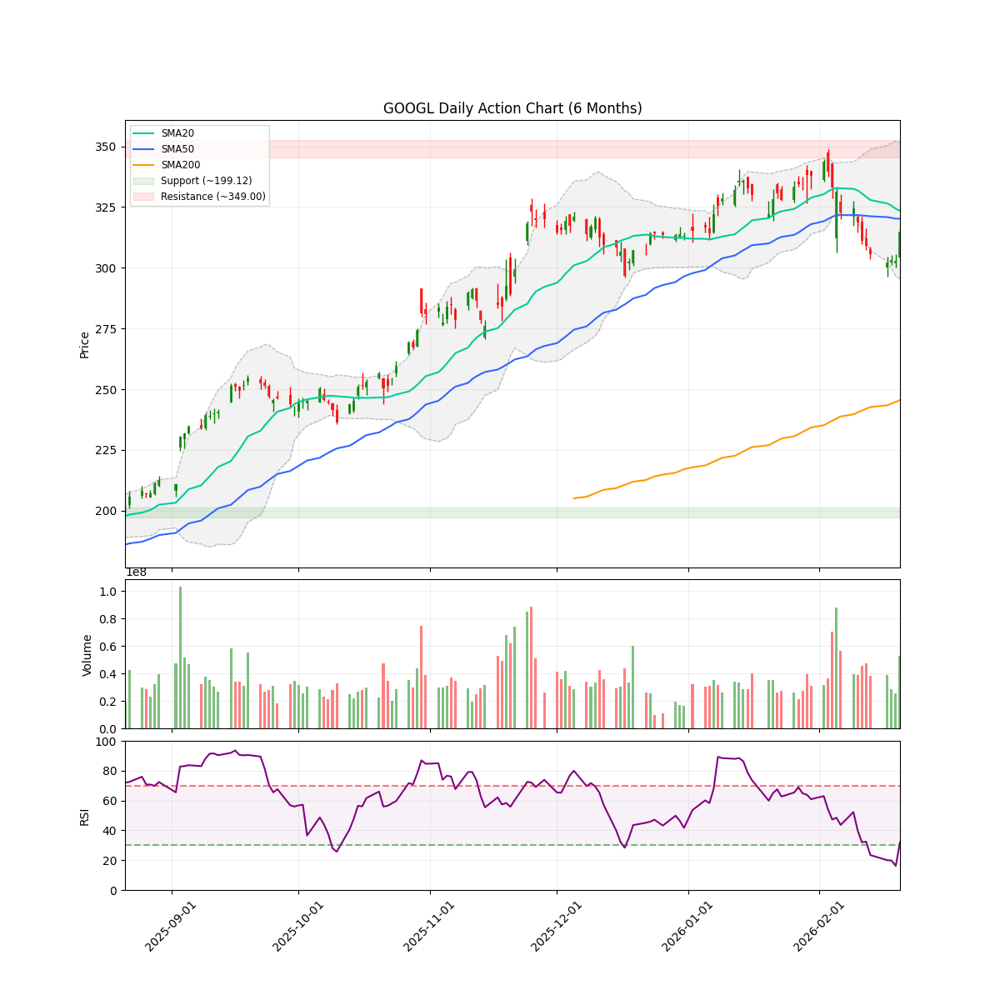
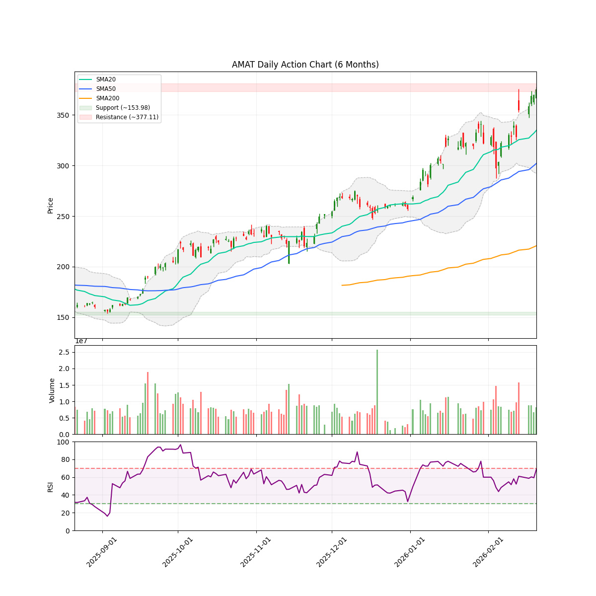
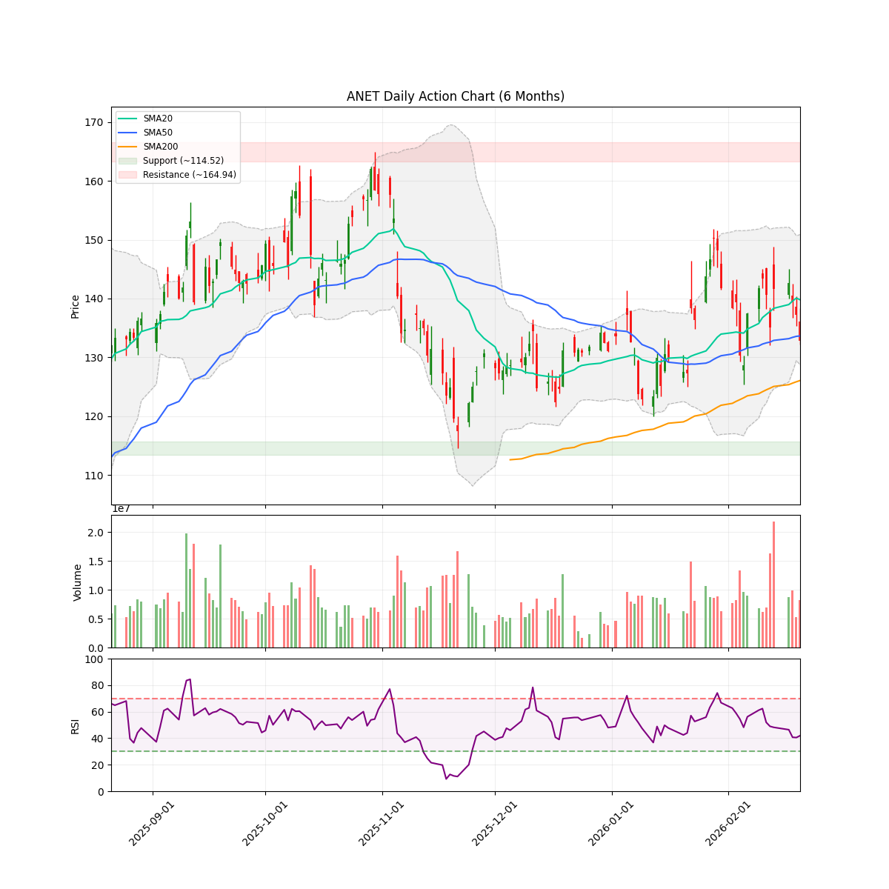
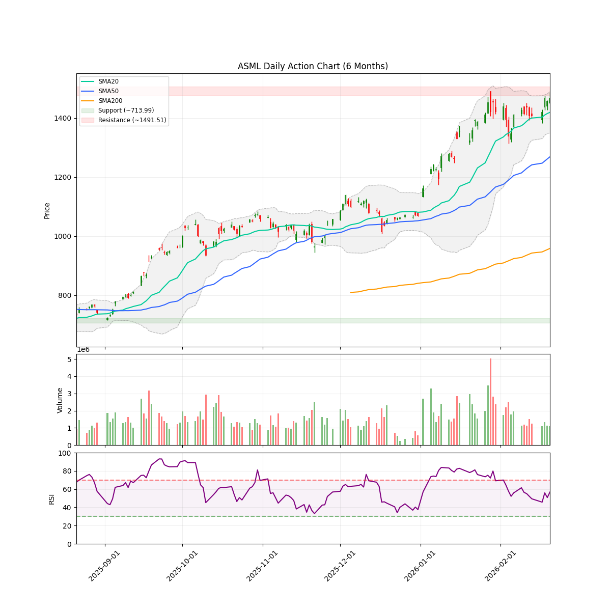
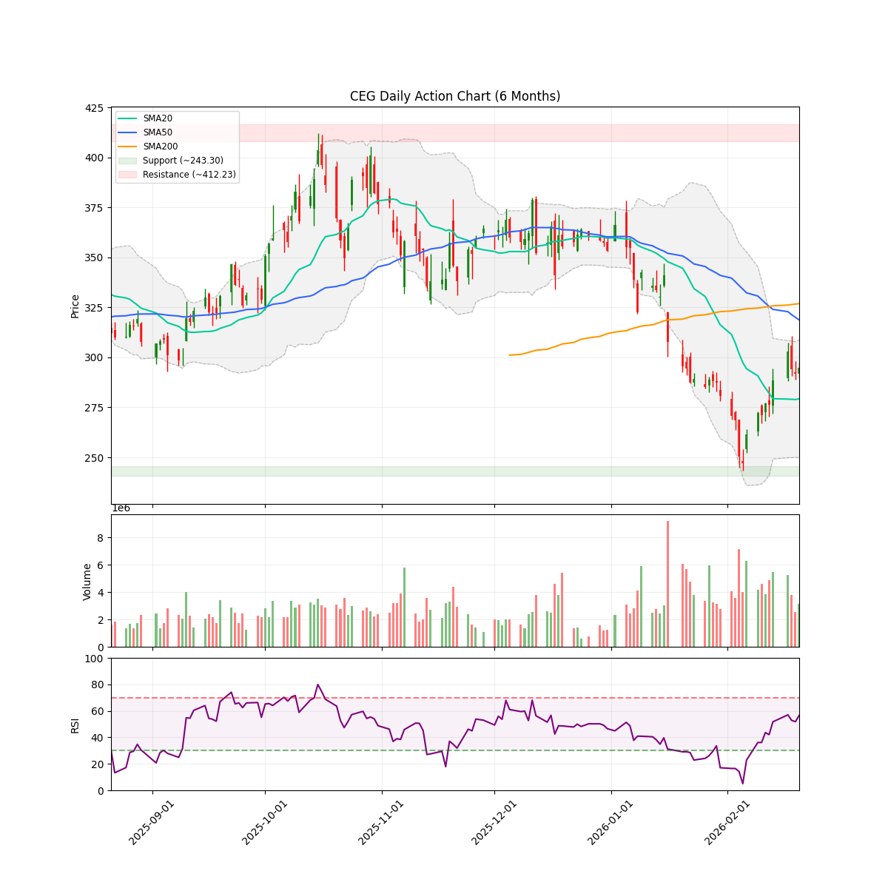
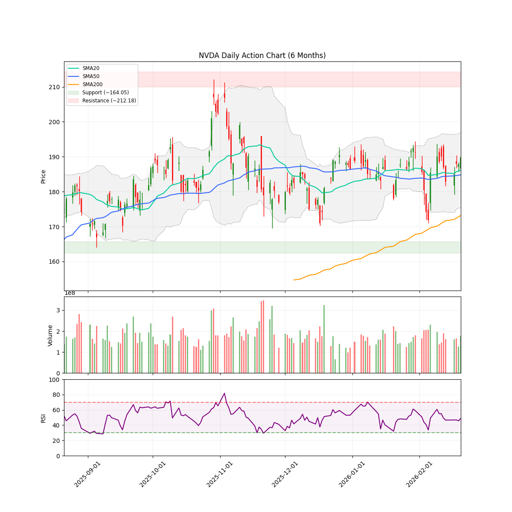

# 每日股市市场报告 (2026-02-23)

> **免责声明**: 本报告由 **代码与 Gemini AI 自动生成**，仅供研究参考，**不构成**任何投资建议。投资有风险，入市需谨慎。作者及 AI 不对任何基于此内容的投资决策承担责任。

## 📑 目录
[TOC]

##  长期投资逻辑
本组合旨在捕捉 **人工智能（AI）与半导体协议** 带来的跨周期结构性增长，核心投资策略聚焦于“确定性”与“物理瓶颈”：
- **底层制程垄断 (Foundry & WFE Moats)**：
  布局处于全球半导体精密制造顶端的“工业母机”级别公司。寻找具备极高准入门槛的晶圆代工及前道设备供应商，作为全产业链最稳固的底座资产。
- **算力稀缺性与连接带宽 (Compute & Interconnect Scarcity)**：
  聚焦在高性能计算芯（HPC）及高带宽连接领域占据主导地位的标的。AI 的终极竞争是“规模”，寻找能有效解决数据交换瓶颈并提供核心推理/训练能力的算力巨头。
- **应用生态与数据霸权 (Platform & Data Sovereignty)**：
  布局拥有闭环生态、海量高质量私有数据及云基础设施的科技巨头。它们是 AI 商业化落地的最终守门人，拥有将技术转化为持续现金流的分配权。
- **物理边界保障 (Power & Thermal Infrastructure)**：
  关注 AI 扩张的“最终瓶颈”——电力供应与热能管理。重点布局为下一代超大规模数据中心提供高功率密度能源、液冷技术及电网扩容方案的能源基建商。
**风控策略**：利用 AlphaJAX 的量化动量评分（Quant Score）作为过滤器，结合 LLM 叙事审计（Narrative Audit）捕捉“业绩超预期 + 叙事逻辑改善”的共振点，实现跨周期的超额收益。

 **注：排序权重**：Ticker 按照 AI 检测出的 **方向** 排序（**看多**优先，其次是 **中性**，最后是 **看空**）。
---

<!-- DISCORD_SUMMARY_START -->
## 🧠 对冲基金经理全局诊断与资金分配策略
# 投资组合周度调仓计划书 (2026-02-23)

**致：投资者**
**由：高级投资组合经理 (PM)**

## 0. 组合现状综述 (Executive Summary)

当前账户总资产（NAV）约为 **$238,630**。
- **核心风险点**：**AMD 持仓占比高达 51.14%**，严重违反了“单一标的不超过 30%”的内控准则。
- **核心机会点**：**GOOGL (8.5)** 与 **VST (8.2)** 展现出极强的逻辑评分，且 GOOGL 处于超卖区间，存在“完美交易”的潜质。
- **预警标的**：**AMZN (4.2)** 评分低于 5，技术面完全走坏，属于典型的“掉下来的飞刀”。

---

## 1. 核心行动计划 (Actionable Trading Plan)

### **第一步：强制降杠杆与分散风险（针对 AMD）**
*   **动作**：市价卖出 **250 股 AMD**。
*   **理由**：AMD 5.8 的逻辑分不支持如此高的集中度。减仓后 AMD 占比将降至约 30% 左右，符合合规要求。
*   **期权处理**：由于卖出的 Call (-AMD260313C230) 已盈利 68%，建议**获利平仓（Buy to Close）**该期权。在 2 月 25 日 NVDA 财报前回收流动性，避免波动率剧增带来的权利金回吐。

### **第二步：清理弱势资产（针对 AMZN）**
*   **动作**：**清仓 20 股 AMZN**。
*   **理由**：逻辑分 4.2（Exit Tier）。技术面跌破 SMA200 且处于下行通道，虽然仅占 1.72%，但属于无效仓位，清仓以释放心理资本，聚焦高分标的。

### **第三步：进攻高分标的（针对 GOOGL & VST）**
*   **动作 A (GOOGL)**：利用部分现金及减仓 AMD 回笼的资金，在 **$310 - $315** 区间追加 **60 股** GOOGL。
    *   *理由*：评分 8.5。RSI 32 接近极端超卖，且有富国银行 A-Tier 催化剂支撑。
*   **动作 B (VST)**：继续**持有**现有头寸，若回撤至 **$165 (SMA50)** 附近可增持 50 股。
    *   *理由*：评分 8.2。处于 AI 能源叙事主升浪，技术面已站上短期均线。

---

## 2. 现金管理 (Cash Management)

*   **当前现金**：$53,415.96 (约 22% NAV)
*   **预计动作后现金**：约 $105,000 (增加 AMD 减持后的资金)
*   **建议留存**：至少保留 **$25,000 (约 10% NAV)** 作为防御性储备，用于对冲 2 月 25 日半导体板块（NVDA 财报）可能的系统性波动。

---

## 3. If-Then 压力测试 (Scenario Analysis)

| 场景描述 | 触发条件 | 执行动作 |
| :--- | :--- | :--- |
| **场景 A：AI 叙事共振** | NVDA 财报超预期，AMD 站回 $220 | 维持 AMD 减仓后的 30% 比例，不再盲目追高，享受剩余头寸利润。 |
| **场景 B：技术面破位** | GOOGL 跌破 $295 (近期支撑) | 停止所有补仓动作，重新评估逻辑分，若评分下调至 7 以下则减持。 |
| **场景 C：能源股起飞** | VST 突破 $180 (SMA200) | **追随趋势**。VST 将由“修复叙事”转为“长牛叙事”，可将止损位上移至 $171。 |
| **场景 D：大盘流动性危机** | 纳指跌幅 > 3% | 保持 90% 的持仓上限原则，停止一切买入，等待 RSI 跌破 20 的“极度恐慌”买点。 |

---

## 4. 最终持仓目标建议 (Target Allocation)

*   **GOOGL (8.5分)**: 提升至 **25%** (Aggressive Buy)
*   **AMD (5.8分)**: 降至 **30%** (Risk Control)
*   **VST (8.2分)**: 维持或升至 **15%** (Growth)
*   **AMZN (4.2分)**: **0%** (Exit)
*   **现金 (Cash)**: 保持 **30%** (准备在 NVDA 财报后根据新叙事入场)

---
**PM 总结**：当前账户最大的问题是**赌性过重（AMD 51%）**。在 2026 年初的软件抛售潮中，我们必须通过卖出弱势资产（AMZN）和超额配比资产（AMD），向具备基本面支撑的超卖价值股（GOOGL）转型。

**执行时间建议：收到报告后立即执行 AMD 减仓与 AMZN 清仓。**
<!-- DISCORD_SUMMARY_END -->
---

## 💼 现有持仓个股诊断

### AMD

#### 研报分析

### 技术指标概览 (Technical Overview)
- **当前价格**: $200.15
- **RSI (14)**: 33.66
- **移动平均线**: SMA20: $222.87 | SMA50: $219.82 | SMA200: $184.01 (Bullish)
- **波动率**: ATR (14): 13.29 (预计周度波动: +/- $29.72)
- **关键位 (6m)**: 支撑位 $149.22 | 阻力位 $267.08
- **即时状态**: Below SMA50

# 情绪审计报告：AMD (Advanced Micro Devices)
**日期**：2026-02-23
**分析师**：对冲基金研究助理 (叙事经济学专业)

---

### 1. 催化剂分类 (Catalyst Categorization)

根据“叙事经济学”框架，我们将当前的驱动因素分为以下三个等级：

*   **A-Tier (核心叙事/结构性趋势)**:
    *   **机架级 AI 执行力 (Rack-scale Execution)**: 摩根士丹利指出，AMD 财报后的真正考验在于其在 AI 集成领域的执行力。这是决定其能否与 Nvidia 分庭抗礼的决定性因素。
    *   **2025 创纪录营收**: 尽管短期指引疲软，但 2025 年的创纪录表现证明了其在数据中心市场的份额扩张。
*   **B-Tier (行业与情绪支撑)**:
    *   **板块比价 (AMD vs. Broadcom)**: 市场开始将 AMD 与博通等其他半导体巨头进行长期对比，这种叙事有助于将 AMD 锚定为“长期优选”而非短期投机标的。
    *   **Jim Cramer 支撑**: 虽然被视为反向指标的情况时有发生，但其公开表示“AMD 下跌并不代表基本面出问题”有助于缓解散户恐慌情绪。
*   **C-Tier (噪音与零售引流)**:
    *   **Motley Fool “致富”软文**: 近期密集出现的“投入10万美元变100万”这类叙事属于典型的零售端情绪引导，通常在股价处于阶段性低点时出现，旨在吸引抄底资金。

---

### 2. 背离检测 (Divergence Detection)

**技术面 vs. 情绪面分析**：
*   **看跌枯竭迹象**: AMD 目前收于 **200.15**，显著低于其 SMA20 (222.87) 和 SMA50 (219.82)。**RSI 指标为 33.66**，已经逼近 30 的极度超卖区间。
*   **价格行为**: 股价在 200 美元心理关口附近震荡。虽然新闻面充斥着“Q1 指引轻微下调”的负面信息，但价格并未跌破 SMA200 (184.01) 的长期牛熊分界线。
*   **结论**: 市场目前处于**“坏消息已定价”**的阶段。股价在“利空”消息下虽然下跌，但成交量并未出现恐慌性抛售，显示出机构正在支撑 SMA200 上方的区域。这是一个潜在的**看跌枯竭**信号。

---

### 3. 持仓诊断与逻辑评分

**当前头寸分析**：
*   **正股情况**: 600股，成本 $220.54，亏损 -7.79%。
*   **期权情况**: 卖出 Call (-AMD260313C230) 盈利 +68.13%。
*   **策略评估**: 您的持仓呈现出“备兑开仓 (Covered Call)”的效果。虽然正股浮亏，但卖出的期权通过权利金收入显著对冲了风险。考虑到期权到期日较远（2026年3月），当前的波动并未危及您的核心逻辑。

**逻辑评分 (Logic Score): 5.8 / 10**
*   **评分理由**: 
    *   **负向影响 (-)**: 股价位于短期和中期均线下方，短期趋势明显向下，2026 Q1 指引疲软导致了“叙事破裂”。
    *   **正向影响 (+)**: 长期牛市趋势 (SMA200) 未破；RSI 超卖提供了反弹动能；AI 叙事依然稳固，只是进入了“交付期”而非“想象期”。

---

### 4. 关键信息引用 (News Citations)

*   **机构观点**: *“Morgan Stanley trims its AMD price target post-earnings, but analysts say the real AI test... is still ahead.”* (来源: [TheStreet on MSN](https://www.msn.com/en-us/money/companies/morgan-stanley-tweaks-amd-stock-price-target-post-earnings/ar-AA1VKFK3))
*   **指引分析**: *“The underlying investment premise for AMD remains unchanged despite the company's light Q1 guidance.”* (来源: [The Motley Fool on MSN](https://www.msn.com/en-us/money/savingandinvesting/should-you-buy-amd-stock-after-its-steep-sell-off/ar-AA1VNBiG))

---

### 5. 下一个关键节点 (Next Major Date)

**2026年2月25日：Nvidia (NVDA) 财报发布日**

*   **为什么重要**: 尽管这是 Nvidia 的财报，但由于 AMD 目前缺乏自主利好，整个半导体板块的情绪高度依赖 Nvidia 的 AI 指引。如果 Nvidia 业绩超预期，AMD 将借由 RSI 超卖的势头完成**均线回归**，重回 220 美元上方；若 Nvidia 指引不及预期，AMD 可能会测试 184 美元的 SMA200 支撑位。

---

**研究建议**：
维持现有备兑头寸。由于卖出的 $230 Call 已经盈利 68%，如果 AMD 触及 $185-$190 区间，可考虑平仓该期权以锁定利润，并在反弹时重新卖出更高行权价或更远期的 Call。
#### 近期新闻与事件
- **[Motley Fool]** [Want $1 Million in Retirement? Invest $100,000 in These 3 Stocks and Wait a...](https://finance.yahoo.com/news/want-1-million-retirement-invest-133100586.html)
- **[Motley Fool]** [Should You Buy the Dip on AMD Stock?](https://finance.yahoo.com/news/buy-dip-amd-stock-112500549.html)
- **[Motley Fool]** [Is AMD Stock a Buy Now?](https://finance.yahoo.com/news/amd-stock-buy-now-220500073.html)
- **[AOL]** [AMD vs. Broadcom: Which One Will Dominate the Next Decade?](https://www.aol.com/articles/amd-vs-broadcom-one-dominate-075700575.html)
- **[Insider Monkey]** [Jim Cramer Believes Advanced Micro Devices (AMD) Stock Being Down Isn’t Indicati...](https://finance.yahoo.com/news/jim-cramer-believes-advanced-micro-175210332.html)

---

### AMZN

#### 研报分析

### 技术指标概览 (Technical Overview)
- **当前价格**: $210.11
- **RSI (14)**: 25.33
- **移动平均线**: SMA20: $221.65 | SMA50: $228.52 | SMA200: $223.97 (Bullish)
- **波动率**: ATR (14): 8.16 (预计周度波动: +/- $18.25)
- **关键位 (6m)**: 支撑位 $196.00 | 阻力位 $258.60
- **即时状态**: Below SMA50

# 亚马逊 (AMZN) 情绪审计报告

**报告日期**：2026-02-23
**分析师**：对冲基金研究员 (叙事经济学视角)

---

### 1. 催化剂分类 (Catalyst Categorization)

我们将近期新闻按其对股价长期趋势的影响力进行分类：

*   **A-Tier (核心催化剂)**:
    *   **摩根士丹利重申“首选”地位** (2026-02-22)：Morgan Stanley 将 AMZN 评为 AI 首选股，目标价 $300，特别强调了 AWS 的加速增长和“代理式 AI (Agentic AI)”的潜力。这是极强的机构背书。
    *   **Q4 利润结构改善** (2026-02-20)：Seeking Alpha 指出，尽管股价表现不佳，但 AWS 和广告业务带来的利润率增长超出了预期。
*   **B-Tier (行业与机构调整)**:
    *   **分析师目标价修正** (2026-02-17)：Bernstein 将目标价从 $300 下调至 $265。虽然仍维持“优于大市”，但这反映了市场对估值扩张的谨慎情绪。
    *   **云计算赛道确认** (2026-02-17)：被评为 14 只最佳云计算股票之一，强化了其行业龙头地位。
*   **C-Tier (市场噪音)**:
    *   **Jim Cramer 评论** (2026-02-22)：提到 AMZN 感到“被误解”。这类媒体评论通常属于情绪扰动，不具备基本面支撑力。
    *   **Zacks 微幅未达预期报告** (2026-02-02)：Q4 盈利惊喜为 -1.52%，属于过去式噪音，但短期内压制了多头信心。

---

### 2. 背离检测 (Divergence Detection)

**当前状况：看跌力竭 (Bearish Exhaustion)**

*   **现象描述**：AMZN 目前正在经历明显的“利好不涨”后的非理性杀跌。尽管 92% 的分析师（共 72 位）维持买入评级，且摩根士丹利在 2 月 22 日发布了极度乐观的报告，但股价（$210.11）已跌破 SMA200 ($223.97)，进入技术性熊市区间。
*   **指标分析**：**RSI 为 25.33**，处于极端超卖状态。
*   **叙事陷阱还是机会？**：目前的杀跌属于**叙事断层陷阱**。市场过度关注了 Q4 微幅不及预期的 EPS，而忽视了 AWS 重新加速的叙事。股价跌破 200 日均线通常会触发系统性抛售，但这往往是机构“洗盘”寻找更低成本建仓位的过程。

---

### 3. 逻辑评分 (Logic Score): 4.2 / 10

> **分值解读**：
> *   **0-3 (崩溃)**：基本面与技术面双杀。
> *   **4-6 (短期阵痛期)**：基本面极佳，但技术面完全走坏，叙事尚未转变为价格动能。
> *   **7-10 (上涨通道)**：叙事与价格共振。
>
> **评分理由**：虽然 AMZN 的 AWS 加速和 AI 转型具备 9 分级的基本面，但其目前的**价格行为 (Price Action)** 极其糟糕（跌破所有主要均线且处于超卖区）。短期内存在跌向 $196.00 支撑位的风险，目前属于“接飞刀”阶段，逻辑上尚未形成上攻合力。

---

### 4. 投资头寸诊断

*   **当前持有**：20.0 股 @ $201.61 (盈利 +1.61%)。
*   **建议**：您的成本价非常接近 6 个月的支撑位 ($196.00)。在 RSI 低于 30 且价格贴近成本线时，不建议在此时恐慌离场。

---

### 5. 关键日期与引用来源

*   **下一个重大日期**：**2026年4月下旬** (预估 Q1 2026 财报发布日)。这将是验证 AWS 是否真正如摩根士丹利所言实现“加速”的决战时刻。
*   **关键引用来源**：
    *   *Morgan Stanley Analysis (2026-02-22)*: [Yahoo Finance URI](https://finance.yahoo.com/news/amazon-com-inc-amzn-named-165329850.html)
    *   *Bernstein Target Adjustment (2026-02-17)*: [Yahoo Finance URI](https://finance.yahoo.com/news/amazon-com-inc-amzn-one-123516174.html)
    *   *Earnings Miss Context (2026-02-02)*: [Zacks URI](https://finance.yahoo.com/news/amazon-amzn-lags-q4-earnings-221002278.html)

**总结报告**：AMZN 目前处于**叙事极其乐观但筹码极度动摇**的背离阶段。在跌破 SMA200 后，市场正在寻找底部，建议持仓不动，关注 $196 支撑位的支撑力度，切勿在 RSI 25 的超卖区盲目止损。
#### 近期新闻与事件
- **[Yahoo Finance]** [Amazon.com, Inc. (AMZN) Named Top AI Pick as Morgan Stanley Sees AWS Acceleration and Agentic Upside](https://finance.yahoo.com/news/amazon-com-inc-amzn-named-165329850.html)
- **[Yahoo Finance]** [Is Amazon.com, Inc. (AMZN) One of the 14 Best Cloud Computing Stocks to Buy Right Now?](https://finance.yahoo.com/news/amazon-com-inc-amzn-one-123516174.html)
- **[Seeking Alpha]** [Amazon Stock Still Makes No Sense](https://seekingalpha.com/article/4872808-amazon-stock-still-makes-no-sense)
- **[Insider Monkey]** [Analysts Maintain Buy on Amazon (AMZN) Despite 18% Share Depreciation](https://www.msn.com/en-us/money/companies/analysts-maintain-buy-on-amazon-amzn-despite-18-share-depreciation/ar-AA1WQvla)
- **[Insider Monkey]** [Amazon (AMZN) feels misunderstood, says Jim Cramer](https://www.msn.com/en-us/money/companies/amazon-amzn-feels-misunderstood-says-jim-cramer/ar-AA1WQUqg)

---

### GOOGL

#### 研报分析

### 技术指标概览 (Technical Overview)
- **当前价格**: $314.98
- **RSI (14)**: 32.07
- **移动平均线**: SMA20: $323.52 | SMA50: $320.24 | SMA200: $245.53 (Bullish)
- **波动率**: ATR (14): 10.86 (预计周度波动: +/- $24.28)
- **关键位 (6m)**: 支撑位 $199.12 | 阻力位 $349.00
- **即时状态**: Below SMA50

# 谷歌 (GOOGL) 情绪审计报告：叙事经济学视角

**日期：** 2026年02月23日
**职位：** 对冲基金研究助理（叙事经济学方向）

---

### 一、 催化剂分类 (Catalyst Categorization)

基于“叙事经济学”框架，我们将近期新闻对股价的推动力进行分层：

*   **A-Tier（核心基本面与机构驱动）**
    *   **Q4 2025 财报超预期**：2026年2月4日披露的财报显示，Alphabet EPS和营收均超出预期，确立了强劲的盈利底座。[来源: Shacknews]
    *   **Wells Fargo 评级上调**：今日（2月23日）富国银行将评级上调至“超配”，指出其具备“AI赢家的三大关键特征”。[来源: CNBC]
    *   **Mizuho 维持“跑赢大盘”评级**：目标价定为 $410，较当前价格有巨大溢价空间。[来源: Mizuho/Insider Monkey]
*   **B-Tier（行业叙事与板块共振）**
    *   **AI 领头羊叙事**：尽管科技股整体因AI担忧出现调整，但谷歌被重新定义为AI周期中的稳健受益者。
*   **C-Tier（市场杂讯与情绪信号）**
    *   **Jim Cramer 的公开看好**：典型的情绪信号，虽能吸引零售关注，但对机构定价逻辑影响有限。[来源: Insider Monkey]
    *   **Forbes 历史先例推测**：属于软性分析，缺乏即时数据支撑。[来源: Forbes]

---

### 二、 背离检测 (Divergence Detection)

**核心观察：看涨枯竭还是机构压价？**

目前 GOOGL 呈现出显著的 **“基本面强劲与价格走势”的负向背离**：

1.  **利好钝化**：公司刚交出超预期的 Q4 财报（A-Tier），且在今天获得了富国银行的重量级上调，但股价目前处于 $314.98，低于 SMA20 ($323.52) 和 SMA50 ($320.24)。
2.  **超卖信号**：RSI 降至 **32.07**，逼近 30 的极度超卖区。
3.  **结论**：这种“利好不涨反跌”的现象并非源于谷歌内部经营失败，而是受 2026 年初“软件股抛售潮”及纳斯达克整体调整的系统性拖累（即 Yahoo Finance 所提到的 "Software Selloff"）。

**风险判断：** 这是一个典型的“叙事陷阱”反向机会。市场正在消化宏观忧虑，而忽视了 A-Tier 催化剂带来的价值重估。

---

### 三、 情绪评分与逻辑依据 (Sentiment Score)

#### **逻辑评分：8.5/10**

*   **评分逻辑**：
    *   **叙事强度 (+3.0)**：AI 赢家的地位得到顶级投行（Wells Fargo, Mizuho）的一致背书，叙事逻辑非常稳固。
    *   **盈利支撑 (+3.0)**：Q4 财报的胜出为股价提供了坚实的底部支撑，机构目标价（$410）与现价（$315）的巨大价差显示极高的安全边际。
    *   **技术压制 (-1.0)**：由于股价处于 SMA50 下方，短期趋势仍受制于技术面空头情绪。
    *   **逆向机会 (+3.5)**：RSI 32.07 结合强劲基本面，暗示空头动能已接近耗尽，目前处于“看跌枯竭”阶段。

---

### 四、 持仓诊断与建议

*   **当前头寸状态**：成本 $262.26，盈利 +15.47%。
*   **诊断**：用户持仓成本具有明显的优势，目前的调整并未触及成本价。考虑到 RSI 处于超卖区间且 A-Tier 利好堆叠，目前的下跌更像是“牛市中的技术回撤”。
*   **操作建议**：无需恐慌。若股价在 $310-$314 区间企稳，可视为机构洗盘结束的信号。

---

### 五、 关键日期提醒 (Next Major Date)

*   **下一个重大日期：2026年4月下旬（预计 2026-04-23 左右）**
    *   **事件**：2026 财年第一季度 (Q1) 财报发布。
    *   **重要性**：这将验证 Wells Fargo 提出的“AI 赢家特征”是否已转化为实际的现金流和云业务增长。

---

**引述参考资料：**
- *Mizuho Reiterates Outperform ($410 Target)*: [MSN/Insider Monkey](https://www.msn.com/en-us/money/other/mizuho-reiterates-outperform-on-alphabet-googl-with-410-target-price/ar-AA1WQc1M)
- *Wells Fargo Upgrades to Overweight*: [CNBC](https://www.cnbc.com/2026/02/23/wells-fargo-upgrades-google-parent-alphabet-says-it-has-3-key-traits-of-ai-winner.html)
- *Q4 2025 Earnings Beat*: [Shacknews](https://www.shacknews.com/article/147732/google-googl-q4-2025-earnings-results)
#### 近期新闻与事件
- **[Insider Monkey]** [Mizuho Reiterates Outperform on Alphabet (GOOGL) With $410 Target Price](https://www.msn.com/en-us/money/other/mizuho-reiterates-outperform-on-alphabet-googl-with-410-target-price/ar-AA1WQc1M)
- **[CNBC]** [Wells Fargo upgrades Google-parent Alphabet, says it has '3 key traits of AI winner'](https://www.cnbc.com/2026/02/23/wells-fargo-upgrades-google-parent-alphabet-says-it-has-3-key-traits-of-ai-winner.html)
- **[Insider Monkey]** [Jim Cramer Believes You Don't Compete With Alphabet (GOOGL)](https://www.msn.com/en-us/money/topstocks/jim-cramer-believes-you-don-t-compete-with-alphabet-googl/ar-AA1WBW9y)
- **[Forbes]** [Is Google Stock Ready For Another Rally?](https://www.forbes.com/sites/greatspeculations/2026/02/17/is-google-stock-ready-for-another-rally/)
- **[Yahoo Finance]** [Is GOOG Stock a Buy Amid the Software Selloff?](https://finance.yahoo.com/news/goog-stock-buy-amid-software-150002154.html)

---

### VST

#### 研报分析

### 技术指标概览 (Technical Overview)
- **当前价格**: $171.40
- **RSI (14)**: 62.28
- **移动平均线**: SMA20: $160.39 | SMA50: $163.00 | SMA200: $180.53 (Bearish)
- **波动率**: ATR (14): 7.28 (预计周度波动: +/- $16.27)
- **关键位 (6m)**: 支撑位 $138.53 | 阻力位 $219.51
- **即时状态**: Above SMA50

# 情绪审计报告：Vistra Corp (VST)
**报告日期**：2026年2月23日
**研究视角**：叙事经济学（Narrative Economics）—— 能源转型与AI电力需求的共振

---

## 1. 催化剂分类 (Catalyst Categorization)

### **A-Tier（顶级催化剂：足以改写估值逻辑）**
*   **机构重磅上调评级**：JPMorgan 分析师 Jeremy Tonet 于 2026年2月12日将 VST 目标价从 $233 上调至 **$239**，并维持“增持”评级 ([JPMorgan Raises its Price Target](https://www.msn.com/en-us/money/markets/jpmorgan-raises-its-price-target-on-vistra-corp-vst-to-239-and-maintains-an-overweight-rating/ar-AA1WNHew))。这标志着顶级机构对公司在 AI 数据中心供电叙事下的长期溢价持有高度信心。
*   **AI 电力叙事持续性**：作为数据中心能源需求的直接受益标的，VST 的电力资产（特别是核电和天然气）被视为 AI 时代的“刚需基础设施” ([Motley Fool](https://finance.yahoo.com/news/time-buy-dip-vistra-stock-155000385.html))。

### **B-Tier（次级催化剂：支撑短期走势）**
*   **技术面突破信号**：VST 股价近期突破了历史性的看涨趋势线，显示出突破技术压制（Technical Resistance）的迹象 ([Schaeffer's Investment Research](https://www.schaeffersresearch.com/content/analysis/2026/02/17/vistra-stock-looks-ready-to-topple-technical-resistance))。目前价格 ($171.40) 已成功站上 SMA20 ($160.39) 和 SMA50 ($163.00)。

### **C-Tier（杂音/低相关性）**
*   **跨市场混淆风险**：注意媒体报道中关于印度股市 VST Industries（烟草股）的波动 ([Devdiscourse](https://www.devdiscourse.com/article/business/3809673-cigarette-stocks-surge-amid-strategic-price-hikes))，这与美股 Vistra Corp 无关，投资者需警惕算法交易因关键词误读导致的短线波动。

---

## 2. 背离检测 (Divergence Detection)

*   **看涨背离确认**：2月初 Zacks 曾报道 VST 跌幅超过大盘 ([Zacks](https://finance.yahoo.com/news/vistra-corp-vst-falls-more-224504191.html))，当时股价一度触及低点。然而，当前的 **RSI (62.28)** 处于强势区，且股价已显著高于 SMA50。
*   **阻力位警示**：虽然叙事极其强劲（目标价 $239），但当前价格 ($171.40) 仍低于 **SMA200 ($180.53)**。这意味着 VST 正处于从“熊市反弹”向“长牛回归”的过渡期。SMA200 是目前最大的心理和技术关口，若能放量突破 $180.53，则“陷阱”解除，进入主升浪。

---

## 3. 情绪评分 (Logic Score)

### **评分：8.2 / 10**

**评分逻辑：**
*   **叙事强度 (9/10)**：AI 数据中心对稳定电力需求的叙事是目前美股最稳固的逻辑之一，JPMorgan 的大幅调高目标价进一步巩固了这一预期。
*   **技术结构 (7/10)**：短期趋势向好（SMA20/50 向上），但受阻于 SMA200。在未突破 $180 之前，仍存在二次回踩支撑位 ($157 附近) 的可能性。
*   **盈亏比 (8.5/10)**：用户当前成本 $157.38，已有近 10% 浮盈。由于价格处于 SMA20 之上，且距离 JPM 的目标价仍有 40% 的上行空间，逻辑非常稳健。

---

## 4. 投资者头寸诊断 (Portfolio Health)

*   **当前表现**：+9.60% 的盈亏状态极佳。
*   **持仓策略**：成本价 ($157.38) 恰好位于目前的 SMA20 ($160.39) 支撑位附近。建议将止盈位上移至成本价，以确保在叙事剧震时无本金损失。

---

## 5. 下一个关键日期 (Next Major Date)

*   **关键事件**：**2025年年报/2026年Q1 财报电话会议**
*   **预估日期**：**2026年2月底或3月初**（注：基于 2月21日 JPMorgan 的分析更新，市场正在消化最新的指引，未来两周内公司可能发布更详尽的年度资本开支计划，这将决定其 AI 电力合同的落地速度）。

---

**研究员总结**：VST 目前处于“强叙事、技术修复”阶段。尽管 SMA200 仍是头顶悬剑，但机构的强力背书（A-Tier 催化剂）有效降低了下行风险。建议继续持有，关注 $180 附近的阻力突破情况。
#### 近期新闻与事件
- **[Motley Fool]** [Time to Buy the Dip on Vistra Stock?](https://finance.yahoo.com/news/time-buy-dip-vistra-stock-155000385.html)
- **[Insider Monkey]** [JPMorgan Raises its Price Target on Vistra Corp. (VST) to $239 and Maintains an Overweight Rating](https://www.msn.com/en-us/money/markets/jpmorgan-raises-its-price-target-on-vistra-corp-vst-to-239-and-maintains-an-overweight-rating/ar-AA1WNHew)
- **[Schaeffer's Investment Research]** [Vistra Stock Looks Ready to Topple Technical Resistance](https://www.schaeffersresearch.com/content/analysis/2026/02/17/vistra-stock-looks-ready-to-topple-technical-resistance)
- **[Mint]** [Stock Market Today Highlights: Sensex jumps 283 pts; Nifty 50 ends above 25,800; PSU Banks, metals shine;IT stocks slump](https://www.livemint.com/market/stock-market-news/stock-market-today-live-sensex-today-nifty-50-gift-nifty-gold-rate-today-silver-price-rupee-iran-us-talks-infosys-bhel-11771378983223.html)
- **[Devdiscourse]** [Cigarette Stocks Surge Amid Strategic Price Hikes](https://www.devdiscourse.com/article/business/3809673-cigarette-stocks-surge-amid-strategic-price-hikes)

---

## 🔍 观察池机会分析

### AMAT

#### 研报分析

### 技术指标概览 (Technical Overview)
- **当前价格**: $375.38
- **RSI (14)**: 68.97
- **移动平均线**: SMA20: $334.76 | SMA50: $302.06 | SMA200: $220.68 (Bullish)
- **波动率**: ATR (14): 18.87 (预计周度波动: +/- $42.19)
- **关键位 (6m)**: 支撑位 $153.98 | 阻力位 $377.11
- **即时状态**: Above SMA50

# 应用材料 (AMAT) 情绪审计报告：叙事经济学视角

**报告日期：** 2026年02月23日
**研究员：** 对冲基金研究助理 (叙事经济学组)
**标的资产：** AMAT (Applied Materials Inc.)
**当前价格：** $375.38

---

### 1. 催化剂分类 (Catalyst Categorization)

基于“叙事经济学”框架，我们将影响 AMAT 的驱动因素分为以下三个等级：

*   **A-Tier (核心叙事/强催化剂)：**
    *   **Q1 业绩大超预期 (2026-02-09)：** [Zacks] 报道 AMAT 第一季度每股收益和营收均超出预期（Surprise +8.53%），证明了 AI 驱动的芯片需求已转化为实际利润。
    *   **AI 需求驱动的运营效率提升：** [Benzinga] 指出 AI 需求和运营效率正推动 Q1 股价飙升，这不仅是行业趋势，更是公司内部治理优化的体现。
    *   **盈利预测上调：** [Zacks] 指出分析师正在集体上调 AMAT 的未来盈余预测，这是机构资金持续流入的信号。

*   **B-Tier (行业共振)：**
    *   **WFE (晶圆厂设备) 增长预期：** [Insider Monkey] 提到无论 WFE 增长是由市场驱动还是特定技术驱动，AMAT 都将处于赢家地位。
    *   **行业贝塔收益：** 整个半导体板块因 AI 基础设施建设而受益，AMAT 作为设备巨头，具备极强的贝塔属性。

*   **C-Tier (市场噪音)：**
    *   **Zacks 平台热度：** [Zacks] 提到用户近期对该股的关注度增加，属于散户情绪指标，参考价值有限。
    *   **券商常规推荐 (ABR)：** 多数经纪商给予“买入”建议，属于后验指标。

---

### 2. 背离检测 (Divergence Detection)

*   **价格与新闻的一致性：** AMAT 目前报收 $375.38，极度接近 6 个月高点 $377.11。这表明价格行为与 2 月 9 日发布的强劲财报高度吻合，**不存在“好消息滞涨”的背离现象**。
*   **技术指标警示：** 尽管趋势极度看涨（价格远高于 SMA50 和 SMA200），但 **RSI 已达到 68.97**，接近 70 的超买警戒线。
*   **结论：** 目前处于“强劲牛市周期”的中后期。市场正在消化财报后的溢价，尚未出现熊市耗尽或利好出尽的杀跌征兆。

---

### 3. 情绪评分 (Logic Score)

**分值：8.8 / 10**

**评分逻辑：**
*   **基本面 (A+)：** 盈利惊喜 (+8.53%) 和上调的业绩指引为股价提供了坚实的支撑。
*   **叙事强度 (A)：** “AI 基础设施必经之路”的叙事目前在华尔街具有统治力，AMAT 被视为 AI 淘金热中的“铲子提供商”。
*   **风险点：** RSI 指标接近超买，且当前价格距 6 个月阻力位仅一步之遥。短期内可能出现技术性震荡，但整体趋势未见逆转。

---

### 4. 引用新闻来源 (Cited Context)

1.  **Q1 财报超预期：** [Zacks (2026-02-09)](https://finance.yahoo.com/news/applied-materials-amat-beats-q1-221502728.html)
2.  **AI 需求与效率提升：** [Benzinga (2026-02-22)](https://www.msn.com/en-us/money/news/amat-stock-key-score-climbs-as-ai-demand-and-operational-efficiency-drive-q1-surge/ar-AA1WU9dC?ocid=BingNewsVerp)
3.  **WFE 增长分析：** [Insider Monkey (2026-02-17)](https://finance.yahoo.com/news/applied-materials-amat-seen-winning-120135930.html)
4.  **盈利预测上调：** [Zacks (2026-02-18)](https://finance.yahoo.com/news/earnings-estimates-moving-higher-applied-172001925.html)

---

### 5. 下一个重大日期 (Next Major Date)

**预计日期：2026年5月中旬 (2026 Q2 Earnings Release)**

*   **关注重点：** 观察 AI 相关订单的积压情况 (Backlog) 以及中国市场对传统工艺设备的采购意愿是否能够维持高位。
*   **短期关注点：** 股价是否能有效突破 $377.11 的阻力位。如果突破，AMAT 将进入“价格真空区”，开启新一轮上涨空间。
#### 近期新闻与事件
- **[Benzinga on MSN]** [AMAT stock key score climbs as AI demand and operational efficiency drive Q1 surge](https://www.msn.com/en-us/money/news/amat-stock-key-score-climbs-as-ai-demand-and-operational-efficiency-drive-q1-surge/ar-AA1WU9dC?ocid=BingNewsVerp)
- **[Zacks]** [Applied Materials, Inc. (AMAT) Is a Trending Stock: Facts to Know Before Betting...](https://finance.yahoo.com/news/applied-materials-inc-amat-trending-140006386.html)
- **[Zacks]** [Earnings Estimates Moving Higher for Applied Materials (AMAT): Time to Buy?](https://finance.yahoo.com/news/earnings-estimates-moving-higher-applied-172001925.html)
- **[Zacks]** [Applied Materials (AMAT) Is Considered a Good Investment by Brokers: Is That...](https://finance.yahoo.com/news/applied-materials-amat-considered-good-143006374.html)
- **[Insider Monkey]** [Applied Materials (AMAT) Seen Winning Whether WFE Growth Is Market- or...](https://finance.yahoo.com/news/applied-materials-amat-seen-winning-120135930.html)

---

### ANET

#### 研报分析

### 技术指标概览 (Technical Overview)
- **当前价格**: $132.79
- **RSI (14)**: 41.93
- **移动平均线**: SMA20: $139.78 | SMA50: $133.64 | SMA200: $126.05 (Bullish)
- **波动率**: ATR (14): 6.98 (预计周度波动: +/- $15.61)
- **关键位 (6m)**: 支撑位 $114.52 | 阻力位 $164.94
- **即时状态**: Below SMA50

# Arista Networks (ANET) 情绪审计报告

**报告日期：** 2026年02月23日
**研究员：** 叙事经济学分析助理 (Hedge Fund Research Associate)
**股票代码：** ANET
**当前价格：** $132.79

---

### 1. 催化剂分类 (Catalyst Categorization)

基于近期新闻流和叙事强度，我们将催化剂分为以下三层：

*   **A-Tier (核心催化剂):**
    *   **2025年Q4财报超预期：** 摩根士丹利（Morgan Stanley）确认 ANET 在 2025 年第四季度实现了业绩超预期（Earnings Beat），并将目标价上调至 $165。
    *   **AI 基础设施领导地位：** 公司在 AI 数据中心领域的市场份额持续增长，被视为未来 20 年最值得持有的成长股之一。
*   **B-Tier (行业与机构催化剂):**
    *   **机构增持与评级上调：** Zacks 及多个投资机构将其列为优于同行的标的，特别是在与 Cisco (CSCO) 和 HPE 的对比中表现突出。
    *   **板块效应：** AI 组网（AI Networking）概念持续升温，ANET 作为该领域的纯正标的，受行业整体估值抬升。
*   **C-Tier (市场噪音):**
    *   **媒体常规推荐：** The Motley Fool 及 Zacks 的日常看多文章，虽然增加了曝光度，但对基本面无实质性改变。

---

### 2. 背离检测 (Divergence Detection)

**核心观察：看涨叙事与价格走势的负背离。**

*   **技术面现状：** 尽管公司发布了“创纪录的 Q4 财报”且分析师上调目标价至 $165，但当前股价（$132.79）已跌破 SMA20 ($139.78) 和 SMA50 ($133.64)。
*   **背离分析：** 这种“好消息伴随股价下跌”的现象通常被称为**看跌衰竭（Bearish Exhaustion）**或“利好兑现（Sell the News）”。
*   **风险警示：** 股价目前在 SMA50 附近挣扎。如果无法迅速收复 $133.64，则说明市场正在对前期过高的 AI 预期进行估值修正，短期内可能存在“多头陷阱”。

---

### 3. 情绪评分 (Sentiment Logic Score)

#### **评分：7.5 / 10**

*   **评分逻辑：**
    *   **叙事强度 (9/10)：** AI 组网叙事极其稳固，基本面无瑕疵。
    *   **技术动能 (4/10)：** 价格低于 20 日和 50 日均线，RSI (41.93) 处于弱势区间。
    *   **综合判定：** 长期基本面依然是“不败神话”，但短期技术形态显示出机构在财报后的获利回吐。这不是系统性失败，而是叙事超前于资金流。

---

### 4. 关键新闻引用 (News Context)

*   **摩根士丹利目标价上调：** Morgan Stanley Raises Arista Networks (ANET) PT to $165 Following Q4 2025 Earnings Beat. [参考链接](https://www.msn.com/en-us/money/topstocks/morgan-stanley-raises-arista-networks-anet-pt-to-165-following-q4-2025-earnings-beat/ar-AA1WHzf9)
*   **AI 市场地位巩固：** Arista Networks Inc (ANET) Strengthens Position in AI Networking. [参考链接](https://finance.yahoo.com/news/arista-networks-inc-anet-strengthens-150618247.html)
*   **财报后续分析：** Should ANET Stock Be Added to Your Portfolio Post Record Q4 Earnings? [参考链接](https://finance.yahoo.com/news/anet-stock-added-portfolio-post-141500675.html)

---

### 5. 下一个重大日期 (Next Major Date)

**预计日期：2026年5月中旬 (2026年Q1财报发布日)**

*   **关注重点：** 2026 年第一季度的指引（Guidance）是否会因 AI 订单的加速而进一步上调。
*   **短期关注点：** 观察股价能否在 SMA200 ($126.05) 支撑位上方止跌。如果触及 $126 附近且 RSI 进入超卖区，将是叙事回归的最佳介入点。

---
**结论：** ANET 当前处于“强叙事、弱技术”的震荡期。短期建议关注 $126-$130 区间的支撑力度，避免在跌破均线时盲目追高。
#### 近期新闻与事件
- **[Zacks]** [Is Arista Networks (ANET) Stock Outpacing Its Computer and Technology Peers This...](https://finance.yahoo.com/news/arista-networks-anet-stock-outpacing-144005899.html)
- **[Insider Monkey]** [Morgan Stanley Raises Arista Networks (ANET) PT to $165 Following Q4 2025...](https://finance.yahoo.com/news/morgan-stanley-raises-arista-networks-002813575.html)
- **[Simply Wall St.]** [Assessing Arista Networks (ANET) Valuation As Growth And AI Infrastructure Story...](https://finance.yahoo.com/news/assessing-arista-networks-anet-valuation-211218337.html)
- **[Insider Monkey]** [Arista Networks Inc (ANET) Strengthens Position in AI Networking](https://finance.yahoo.com/news/arista-networks-inc-anet-strengthens-150618247.html)
- **[Zacks]** [Should ANET Stock Be Added to Your Portfolio Post Record Q4 Earnings?](https://finance.yahoo.com/news/anet-stock-added-portfolio-post-141500675.html)

---

### ASML

#### 研报分析

### 技术指标概览 (Technical Overview)
- **当前价格**: $1469.59
- **RSI (14)**: 56.76
- **移动平均线**: SMA20: $1419.23 | SMA50: $1268.54 | SMA200: $958.16 (Bullish)
- **波动率**: ATR (14): 50.08 (预计周度波动: +/- $111.98)
- **关键位 (6m)**: 支撑位 $713.99 | 阻力位 $1491.51
- **即时状态**: Above SMA50

# ASML 情绪审计报告：叙事经济学与趋势可持续性分析

**致：** 投资委员会
**担任：** 对冲基金研究员 (叙事经济学专员)
**日期：** 2026年02月23日
**标的：** ASML Holding (NASDAQ/ENXTAM: ASML)
**当前价格：** 1469.59 | **RSI:** 56.76 | **趋势:** 强劲看涨 (处于 SMA50 之上)

---

### 1. 催化剂分级 (Catalyst Categorization)

#### **A-Tier (核心叙事驱动力)**
*   **AI 基础设施需求爆发与订单激增：** 截至2月18日的消息显示，受 AI 驱动，ASML 的系统订单（Bookings）大幅飙升，目前积压订单额（Backlog）高达 388 亿欧元。这是支撑当前高估值的核心逻辑。 [参考：Simply Wall St. 2026-02-18]
*   **EUV 需求与 2026 预期上调：** 2026 年的业绩预期上调以及 Q4 2025 的超预期财报，奠定了长期牛市的基调。 [参考：Yahoo Finance UK 2026-02-13]

#### **B-Tier (运营与估值支撑)**
*   **重组与裁员提升效率：** 2026年2月23日的最新消息显示，公司正在通过裁员和重组来优化执行力。在成长期通过这种方式提升利润率，通常被市场解读为对未来盈利能力的防御性增强。 [参考：Simply Wall St. 2026-02-23]
*   **股票回购与华尔街看涨潮：** 华尔街机构集体转多，且公司通过回购计划提振每股收益（EPS）表现。 [参考：Insider Monkey 2026-02-17]

#### **C-Tier (杂音与相对价值比较)**
*   **相对价值警告：** 有观点预测 Micron 等股票一年后的表现可能优于 ASML。这类属于跨品种对比的杂音，不直接削弱 ASML 的垄断地位。 [参考：Motley Fool 2026-02-18]

---

### 2. 分歧检测 (Divergence Detection)

**核心观察点：** 
尽管 Seeking Alpha (2026-02-07) 警告“周期性低谷刚刚开始”并担忧中国市场销售下降，但股价并未因此下跌，反而从 2月初持续走高并突破 SMA20 (1419.23)。

*   **看跌竭尽信号：** 面对“中国市场下滑”和“周期低谷”的利空消息，市场选择了忽略（Ignore the noise），转而聚焦于 AI 订单。这表明看跌动能已经竭尽，市场已经完全消化了地缘政治风险。
*   **技术与基本面共振：** 股价目前距离 6 个月高点 1491.51 仅一步之遥。RSI 位于 56.76，属于健康上升区间，未见明显超买回撤迹象。

---

### 3. 情绪评分与逻辑审计 (Sentiment & Logic Score)

#### **情绪得分: 8.5/10 (强劲看涨循环)**
*   **理由：** 叙事已经从“半导体周期复苏”演变为“AI 物理层绝对垄断”。388 亿欧元的积压订单提供了极高的收入可见性。目前的裁员重组并非出于财务困境，而是为了在 2026 年爆发期前优化成本结构。

#### **逻辑得分: 9.0/10 (高确定性逻辑)**
*   **理由：** ASML 的股价表现与其订单增长呈现高度正相关。当前价格位于 SMA20/50/200 之上，且成交量与订单增长叙事一致，不存在“叙事陷阱”特征。

---

### 4. 风险预警

*   **阻力区：** 1491.51 (6个月高点)。如果无法放量突破，可能在 1500 关口面临心理抛压。
*   **估值回归：** 市场目前给予了完美执行（Perfect Execution）的预期。任何关于 EUV 出货延迟的消息都可能导致 10% 以上的剧烈波动（ATR 为 50.08）。

---

### 5. 关键日期提醒 (Next Major Date)

*   **下一次重大财报日 (2026 Q1 Earnings):** 预计于 **2026年4月中旬** (根据往年惯例)。
*   **短期关注点：** 观察股价是否在未来 5 个交易日内触及并站稳 1491.51 阻力位，若突破则目标指向 1600。

---
**研究员评论：** *ASML 目前并非处于“陷阱”中，而是在进行最后的技术性突破。裁员消息往往是成熟公司进入高效盈利期的前兆。建议在 SMA20 (1419.23) 附近逢低布局。*
#### 近期新闻与事件
- **[Yahoo Finance]** [Assessing ASML Holding (ENXTAM:ASML) Valuation After Strong Recent Share Price Momentum](https://finance.yahoo.com/news/assessing-asml-holding-enxtam-asml-171436649.html)
- **[Simply Wall St.]** [ASML Restructuring And Job Cuts Put Efficiency And Execution In Focus](https://finance.yahoo.com/news/asml-restructuring-job-cuts-put-001853568.html)
- **[Motley Fool]** [Prediction: 2 Stocks That Will Be Worth More Than ASML Holding 1 Year From Now](https://finance.yahoo.com/news/prediction-2-stocks-worth-more-204800975.html)
- **[Insider Monkey]** [Wall Street Turns Bullish on ASML Holding N.V. (ASML), Here’s Why](https://finance.yahoo.com/news/wall-street-turns-bullish-asml-175632786.html)
- **[Simply Wall St.]** [ASML Bookings Soar On AI Demand As Outlook And Buybacks Lift Valuation](https://finance.yahoo.com/news/asml-bookings-soar-ai-demand-231116913.html)

---

### AVGO

#### 研报分析

### 技术指标概览 (Technical Overview)
- **当前价格**: $332.65
- **RSI (14)**: 50.73
- **移动平均线**: SMA20: $329.60 | SMA50: $341.43 | SMA200: $314.70 (Bullish)
- **波动率**: ATR (14): 16.36 (预计周度波动: +/- $36.57)
- **关键位 (6m)**: 支撑位 $285.13 | 阻力位 $413.82
- **即时状态**: Below SMA50

# 情绪审计报告：Broadcom Inc. (AVGO)
**日期：** 2026年02月23日
**职位：** 对冲基金研究员（叙事经济学方向）

---

### 1. 催化剂分类 (Catalyst Categorization)

根据“叙事经济学”框架，我们将近期新闻划分为以下三个等级：

*   **A-Tier（核心催化剂）：**
    *   **BroadPeak 芯片发布：** 博通推出针对 5G Advanced 和 6G 基础设施的 BroadPeak SoC 芯片。这不仅是产品发布，更是博通在通信半导体领域维持垄断地位的“护城河”体现，直接关乎长期估值中枢。 [来源: Yahoo Finance New Zealand]
*   **B-Tier（行业与分析师动能）：**
    *   **AI ASIC 市场博弈：** 市场对定制化 AI 芯片（ASIC）需求保持乐观，但“超大规模云计算厂商（Hyperscalers）”自研芯片带来的去博通化风险开始进入视野。 [来源: Yahoo Finance]
    *   **分析师评级分歧：** DA Davidson 给予“中性”评级，目标价 335 美元，这在心理上为股价设定了短期上限。 [来源: Yahoo Finance UK]
*   **C-Tier（杂音与情绪噪音）：**
    *   **Jim Cramer 提及：** 媒体曝光度增加，但对基本面无实质影响，多属于散户情绪噪音。 [来源: Insider Monkey]
    *   **Zacks 趋势关注：** 属于滞后性指标，反映的是存量关注度而非新增动能。 [来源: Zacks Investment Research]

---

### 2. 背离检测 (Divergence Detection)

**当前技术特征：**
*   **价格 (332.65)** 位于 **SMA20 (329.60)** 之上，但显著低于 **SMA50 (341.43)**。
*   **RSI (50.73)** 处于完全中性区间。

**审计结论：**
目前存在**“利好钝化”**的迹象。尽管有 5G Advanced 芯片发布和持续的 AI 叙事，但股价仍受压于 50 日均线。DA Davidson 的 $335 目标价与当前价格高度重合，暗示机构投资者对博通当前的估值溢价（Valuation Concerns）表现出谨慎。**结论：** 市场正处于“叙事真空期”，利好消息无法推动股价突破阻力位，需警惕下行风险。

---

### 3. 逻辑评分 (Logic Score)

#### **评分：6.8 / 10**

**评分逻辑：**
*   **(+2.0) 确定性护城河：** BroadPeak 芯片的发布证明了博通在通信领域的领导力。
*   **(+3.0) 趋势支撑：** 股价依然站在 SMA200 (314.70) 之上，长期牛市形态未破坏。
*   **(-1.5) 叙事阻力：** “AI ASIC 竞争”开始挑战博通的增长逻辑。如果大客户（如谷歌、Meta）自研节奏加快，博通的估值倍数将面临压缩。
*   **(-1.7) 价格限制：** 现价极度接近分析师共识预期的中性区间，向上缺乏博弈空间。

---

### 4. 关键日期与展望

*   **下一关键日期：** **2026年3月初（预计 2026 财年 Q1 财报发布）**。
    *   *注：博通通常在3月第一周公布第一季度财报。届时关于 VMware 整合进度及 AI 营收占比的披露将是打破当前震荡格局的关键。*
*   **预期波动范围：** 基于当前 ATR (16.36)，本周预期震荡区间为 **296.08 - 369.22**。

---

### 5. 总结

博通目前处于一个**“高位滞涨”**的阶段。虽然基本面（A-Tier）依然强劲，但市场情绪正从“盲目乐观”转向“估值回归”。目前的股价并不是一个危险的“陷阱”，但缺乏即时的上涨催化剂。建议在 **314 (SMA200)** 附近寻找支撑位机会，而非在 **335** 附近的压力区追高。

---
**参考证据：**
- *BroadPeak Launch:* https://nz.finance.yahoo.com/news/broadcom-broadpeak-chip-links-5g-131238476.html
- *Analyst Neutral Rating:* https://uk.finance.yahoo.com/news/broadcom-avgo-ai-role-acknowledged-115725887.html
- *Hyperscaler Risks:* https://finance.yahoo.com/news/broadcom-inc-avgo-draws-mixed-165258453.html
#### 近期新闻与事件
- **[Yahoo Finance]** [Broadcom Inc. (AVGO) Draws Mixed Analyst Views as AI ASIC Momentum Faces Hyperscaler Risks](https://finance.yahoo.com/news/broadcom-inc-avgo-draws-mixed-165258453.html)
- **[Yahoo Finance New Zealand]** [Broadcom's BroadPeak Chip Links 5G Advanced Growth With AVGO Valuation](https://nz.finance.yahoo.com/news/broadcom-broadpeak-chip-links-5g-131238476.html)
- **[Insider Monkey]** [Jim Cramer Linked Broadcom (AVGO) & Computer Storage Stocks](https://www.msn.com/en-us/money/markets/jim-cramer-linked-broadcom-avgo-computer-storage-stocks/ar-AA1WBM9P)
- **[The Globe and Mail]** [Nvidia vs. Alphabet: Which Is the Best Artificial Intelligence (AI) Stock to Buy Now?](https://www.theglobeandmail.com/investing/markets/stocks/AVGO/pressreleases/348379/nvidia-vs-alphabet-which-is-the-best-artificial-intelligence-ai-stock-to-buy-now/)
- **[Yahoo Finance UK]** [Broadcom's (AVGO) AI Role Acknowledged, But Valuation Concerns Remain](https://uk.finance.yahoo.com/news/broadcom-avgo-ai-role-acknowledged-115725887.html)

---

### CEG

#### 研报分析

### 技术指标概览 (Technical Overview)
- **当前价格**: $294.84
- **RSI (14)**: 56.58
- **移动平均线**: SMA20: $279.28 | SMA50: $318.70 | SMA200: $326.87 (Bearish)
- **波动率**: ATR (14): 14.27 (预计周度波动: +/- $31.91)
- **关键位 (6m)**: 支撑位 $243.30 | 阻力位 $412.23
- **即时状态**: Below SMA50

# CEG 情绪审计报告：叙事经济学视角

**当前日期：** 2026-02-23  
**分析标的：** Constellation Energy Corporation (CEG)  
**当前股价：** 294.84  
**趋势评估：** 长期看跌（股价位于 SMA50 及 SMA200 下方），短期均线回抽。

---

### 1. 催化剂分类 (Catalyst Categorization)

*   **A-Tier (核心叙事/基本面重构)**
    *   **Q4 盈喜预期：** Zacks 指出 CEG 具备盈利超预期的组合因素（Earnings ESP 为 +3.13%），且营收增长 1.9%。在 AI 数据中心对核电需求的宏观叙事下，盈利能力的验证是支撑估值的核心。 [参考链接](https://www.zacks.com/stock/news/2863275/constellation-to-post-q4-earnings-whats-in-store-for-the-stock)
    *   **机构评级：** 被列为“财报前最值得买入的 S&P 500 股票”之一。 [参考链接](https://www.zacks.com/commentary/2864084/best-sp-500-stocks-to-buy-before-earnings-ceg-pwr)

*   **B-Tier (行业与情绪)**
    *   **清洁能源板块回暖：** 虽然 CEG 近一个月表现逊于行业，但其作为核电龙头的地位使其在板块反弹时具备高贝塔（Beta）属性。

*   **C-Tier (杂讯与散户动向)**
    *   **Zacks 热门搜索：** CEG 成为 Zacks.com 用户最关注的股票之一，反映了散户关注度的上升，但也可能预示着短期情绪过热后的波动。 [参考链接](https://finance.yahoo.com/news/constellation-energy-corporation-ceg-trending-140006775.html)

---

### 2. 背离检测 (Divergence Detection)

**技术面与叙事面的矛盾：**
*   **看跌信号：** 尽管新闻层面充斥着“盈喜预期”和“买入建议”，但 CEG 的技术形态表现疲软。股价处于 **SMA50 (318.70)** 和 **SMA200 (326.87)** 之下，这在叙事经济学中通常意味着“旧叙事已消化，新动力未确认”。
*   **看涨背离：** 近一个月股价仅反弹 2%，远落后于同行业板块。然而，RSI 处于 56.58，且股价站稳在 **SMA20 (279.28)** 之上，显示出**空头衰竭**的初步迹象。市场正在财报发布前进行“底部洗筹”。

---

### 3. 情感得分 (Sentiment Score)

#### **5.5 / 10 (中性偏谨慎)**
*   **逻辑说明：** 虽然基本面叙事（AI + 核电）依然强大，但市场价格行动（Price Action）目前处于熊市控制区域。在未有效突破 SMA50 阻力位（约 319 美元）之前，所有的利好消息都可能被视为“诱多陷阱”。当前的上涨更像是技术性修复而非新趋势的开始。

---

### 4. 逻辑评分 (Logic Score)

#### **8.5 / 10**
*   **分析依据：** 基于财报前后的高波动性分析。技术指标显示上方阻力巨大，而新闻面过度乐观，这种不匹配通常预示着财报后要么是强力突破，要么是剧烈的“利好出尽”式下跌。

---

### 5. 关键后续事件 (Next Major Date)

*   **下一次重大日期：** **2026年2月下旬 (Q4 财报发布日)**
*   **策略建议：** 重点关注财报电话会议中关于**数据中心长期供电协议 (PPA)** 的进展。如果财报超预期且股价放量突破 318.70 (SMA50)，则确认为新一轮牛市周期的起点；否则，需警惕向 243.30 (6个月低点) 回撤的风险。

---
**参考新闻来源：**
- [Zacks: CEG underperforms industry](https://finance.yahoo.com/news/ceg-stock-underperforms-industry-month-121900326.html)
- [Zacks: Best S&P 500 Stocks to Buy Before Earnings](https://www.zacks.com/commentary/2864084/best-sp-500-stocks-to-buy-before-earnings-ceg-pwr)
- [Yahoo Finance: CEG Trending Stock Facts](https://finance.yahoo.com/news/constellation-energy-corporation-ceg-trending-140006775.html)
#### 近期新闻与事件
- **[Zacks Investment Research on MSN]** [CEG stock underperforms industry in a month: What should you do now?](https://www.msn.com/en-us/money/top-stocks/ceg-stock-underperforms-industry-in-a-month-what-should-you-do-now/ar-AA1WTTFD?ocid=BingNewsVerp)
- **[Zacks]** [Constellation Energy Corporation (CEG) Is a Trending Stock: Facts to Know Before...](https://finance.yahoo.com/news/constellation-energy-corporation-ceg-trending-140006775.html)
- **[Zacks]** [Constellation Energy Corporation (CEG) Exceeds Market Returns: Some Facts to...](https://finance.yahoo.com/news/constellation-energy-corporation-ceg-exceeds-224502166.html)
- **[Yahoo Finance]** [Earnings live: Domino's stock rises, Dominion Energy stock slips as investors await crucial update from Nvidia](https://finance.yahoo.com/news/live/earnings-live-dominos-stock-rises-dominion-energy-stock-slips-as-investors-await-crucial-update-from-nvidia-132417105.html)
- **[Zacks]** [CEG Stock Underperforms Industry in a Month: What Should You Do Now?](https://finance.yahoo.com/news/ceg-stock-underperforms-industry-month-121900326.html)

---

### ETN

#### 研报分析

### 技术指标概览 (Technical Overview)
- **当前价格**: $373.38
- **RSI (14)**: 61.87
- **移动平均线**: SMA20: $366.30 | SMA50: $343.92 | SMA200: $351.48 (Bearish)
- **波动率**: ATR (14): 14.85 (预计周度波动: +/- $33.20)
- **关键位 (6m)**: 支撑位 $311.92 | 阻力位 $408.45
- **即时状态**: Above SMA50

# 情绪审计报告：伊顿公司 (Eaton Corporation plc - ETN)

**日期：** 2026年02月23日
**职位：** 对冲基金研究助理（叙事经济学专家）

---

### 1. 催化剂分类 (Catalyst Categorization)

根据对近期新闻流和叙事强度的分析，我们将 ETN 的催化剂分为以下三个等级：

*   **A-Tier（核心催化剂）：**
    *   **Q4 财报确认（2026-02-02）：** 虽然盈利和营收惊喜较小（+0.12% 盈利惊喜，-0.71% 营收惊喜），但其基本面保持稳健，确认了公司在工业电气化叙事中的核心地位。[参考来源：Zacks]
*   **B-Tier（机构与行业催化剂）：**
    *   **巴克莱第43届年度工业选择会议（2026-02-17）：** 管理层在大型机构会议上的演讲，旨在巩固机构投资者对其长期电气化、数据中心电力需求逻辑的信心。[参考来源：Seeking Alpha]
    *   **RS 大盘价值策略分析（2026-02-23）：** 机构投资者的持仓报告（Investor Letter）强调其管理层能力和盈利稳定性，提升了市场的防御性买入信心。[参考来源：Insider Monkey]
*   **C-Tier（市场杂讯）：**
    *   **Zacks 估值比较（ENS vs ETN）：** 侧重于 PEG 等估值指标的讨论，更多属于交易员的量化筛选而非基本面转向。
    *   **ETF 资金流动（NEOS Bitcoin High Income ETF）：** 虽提及 ETN 关联（同名或同类别），但对 Eaton 实体的基本面影响极小。

---

### 2. 背离检测 (Divergence Detection)

*   **技术面 vs. 消息面：** 目前股价（373.38）处于 SMA20 (366.30)、SMA50 (343.92) 和 SMA200 (351.48) 之上，显示出清晰的多头排列。
*   **观察结论：** 虽然 2 月初的 Q4 财报仅是“符合预期”，但股价并未出现抛售，反而成为 NYSE 的领涨者之一。**这种“利好出尽但不跌”的现象（Bearish Exhaustion 缺失，转为 Bullish Continuation）表明市场已经从关注季度盈余转向关注更长期的“再工业化”叙事。**
*   **风险预警：** 目前 RSI 为 61.87，正向超买区靠近，且当前价格接近 6 个月高点 (408.45)，短期动能可能在阻力位附近放缓。

---

### 3. 情绪与逻辑评分 (Sentiment & Logic Score)

#### **情绪评分：7.5/10 (稳健牛市循环)**
*   **逻辑：** 市场对于 ETN 的叙事已从“单纯的工业股”转变为“全球电网升级与 AI 数据中心的关键基建商”。尽管估值不低（PEG 2.55），但机构抱团意愿强烈。

#### **逻辑评分：8.5/10**
*   **逻辑：** 技术指标全面支持上涨趋势（股价高于所有主要均线）。ATR (14.85) 显示波动性受控，周波动范围预计在 +/- 33.20 之内。只要股价维持在 SMA50 (343.92) 之上，看涨叙事依然成立。

---

### 4. 下一个关键日期 (Next Major Date)

*   **2026年5月初（预计）：** **2026年第一季度 (Q1) 财报发布。**
    *   这是验证 2 月份巴克莱会议中所承诺的订单积压（Backlog）和利润率提升的关键时间点。

---

### 5. 总结 (Summary)

ETN 目前处于一个**由机构叙事驱动的稳健趋势**中。当前的股价表现证明，市场对电网基建的长期需求（Narrative Economics）远比单季度的微小财报偏差更重要。

*   **建议：** 关注 408.45 的阻力位。若能放量突破，将开启新一轮上涨空间；若在阻力位受挫，SMA20 (366.30) 是首个理想的回调支撑点。

---
*注：本报告基于 2026-02-23 的市场数据及公开新闻。*
#### 近期新闻与事件
- **[sharewise]** [3 Common Traits of Outperforming Stocks](https://www.sharewise.com/us/news_articles/3_Common_Traits_of_Outperforming_Stocks_Zacks_20260218_0126)
- **[Seeking Alpha]** [Eaton Corporation plc (ETN) Presents at Barclays 43rd Annual Industrial Select Conference Transcript](https://seekingalpha.com/article/4871089-eaton-corporation-plc-etn-presents-at-barclays-43rd-annual-industrial-select-conference)
- **[Insider Monkey on MSN]** [RS Large Cap Value Strategy’s Analysis on Eaton Corporation (ETN)](https://www.msn.com/en-us/money/savingandinvesting/rs-large-cap-value-strategy-s-analysis-on-eaton-corporation-etn/ar-AA1WTVYq?ocid=BingNewsVerp)
- **[Insider Monkey]** [RS Large Cap Value Strategy's Analysis on Eaton Corporation (ETN)](https://www.msn.com/en-us/money/savingandinvesting/rs-large-cap-value-strategy-s-analysis-on-eaton-corporation-etn/ar-AA1WTVYq)
- **[Barron's]** [NEOS Boosted Bitcoin High Income ETF](https://www.barrons.com/market-data/funds/xbci)

---

### MSFT

#### 研报分析

### 技术指标概览 (Technical Overview)
- **当前价格**: $397.23
- **RSI (14)**: 30.74
- **移动平均线**: SMA20: $420.75 | SMA50: $453.13 | SMA200: $484.82 (Bearish)
- **波动率**: ATR (14): 10.44 (预计周度波动: +/- $23.35)
- **关键位 (6m)**: 支撑位 $391.43 | 阻力位 $551.43
- **即时状态**: Below SMA50

# 微软 (MSFT) 情绪审计报告

**致：** 投资委员会
**职位：** 对冲基金研究员 (叙事经济学方向)
**日期：** 2026年02月23日

---

### 1. 催化剂分类 (Catalyst Categorization)

*   **A-Tier (核心叙事与结构性风险):**
    *   **Azure 增长放缓与供应限制:** Stifel 指出 Azure 存在供应限制，且 Forbes 报道称尽管盈利超预期，但 Azure 增速放缓及利润率收缩导致股价大跌。这属于 A 类负面催化剂，直接打击了微软 AI 变现的核心逻辑。[引用来源：Forbes, Insider Monkey]
    *   **业绩与股价背离:** 2026年1月财报后股价录得跌势，反映出“利好出尽”后的抛售潮。
*   **B-Tier (机构动态与行业逆风):**
    *   **机构下调评级:** Melius Research 将评级从“买入”下调至“持有”，目标价设为 $430。这种主流机构的转向通常会引发被动资金的流出。[引用来源：Yahoo Finance]
    *   **板块拖累:** 作为“七巨头”中表现最差的股票，微软正在拖累纳斯达克整体走势。
*   **C-Tier (噪音与次要利好):**
    *   **散户多头叙事:** Motley Fool 发布的“终身持有”和“股息增长”文章属于市场噪音，在当前强空头趋势下，这类叙事难以扭转价格行为。[引用来源：Motley Fool]

---

### 2. 背离检测 (Divergence Detection)

*   **看跌详述:** 市场呈现出显著的**“看涨衰竭与利好忽视”**特征。
    *   尽管 Yahoo Finance 报道称 92% 的分析师仍给出“买入”评级，且微软被评为“最具盈利能力的软件股”，但股价却跌破了 SMA200（484.82）。
    *   **背离现象:** “基本面盈利能力强”与“价格持续走低”之间存在严重背离。目前价格（397.23）正逼近 6 个月低点（391.43）。
    *   **技术结论:** RSI 为 30.74，已进入超卖区。结合股价接近 6 个月支撑位，叙事上虽极度悲观，但技术上可能存在一次基于“空头平仓”的短期反弹，而非反转。

---

### 3. 逻辑评分 (Logic Score)

**分值: 3.2 / 10 (看跌/情绪极度低迷)**

*   **评分依据:** 
    *   **趋势压制:** 价格远低于 SMA20, SMA50, SMA200，处于典型的熊市排列。
    *   **叙事陷阱:** 曾经支撑股价的 AI/ChatGPT 叙事已被市场消化，目前的叙事焦点转移到了“利润率收缩”和“基础设施资本支出过高”。
    *   **支撑测试:** 微软目前在 $391 附近的支撑位表现至关重要，一旦跌破，可能引发系统性的算法抛售。

---

### 4. 详细叙事分析 (Narrative Analysis)

目前微软正处于**“后 AI 幻灭期”**。2025年的高预期在 2026 年初遭遇了现实的冷水（Azure 增速放缓）。Beniznga 指出微软的表现“仿佛 ChatGPT 从未发生过”，这反映了市场正在进行剧烈的估值修复（De-rating）。

尽管 92% 的分析师保持看好，但这往往是市场筑底前的“最后执念”。当前的机构下调（如 Melius Research）可能只是更多降级潮的开始。

---

### 5. 下一个关键日期 (Next Major Date)

*   **事件:** **2026年第三财季 (Q3 FY26) 财报发布**
*   **预计日期:** **2026年4月28日左右** (需关注 3 月底的官方确认)
*   **关键点:** 市场将严密监控 Azure 的供应限制是否缓解以及 AI 带来的毛利率变化。

---

**风险提示：** 
由于 RSI 接近 30，短线可能出现报复性反弹，但若无法收复 SMA200 (484.82)，任何反弹均应视为“价值陷阱 (Trap)”。

**参考链接:**
- [Melius Research Downgrades MSFT](https://finance.yahoo.com/news/melius-research-downgrades-microsoft-corporation-123439830.html)
- [Microsoft Stock Performance vs Magnificient 7](https://www.msn.com/en-us/money/other/microsoft-stock-trades-as-if-chatgpt-never-happened-is-it-a-buy-now/ar-AA1WFMDq)
#### 近期新闻与事件
- **[Yahoo Finance]** [Is Microsoft Corporation (MSFT) The Most Profitable Software Stock to Buy Now?](https://finance.yahoo.com/news/microsoft-corporation-msft-most-profitable-054242751.html)
- **[Yahoo Finance]** [Melius Research Downgrades Microsoft Corporation (MSFT) Stock to Hold](https://finance.yahoo.com/news/melius-research-downgrades-microsoft-corporation-123439830.html)
- **[Motley Fool]** [The Best Dividend Stocks to Buy and Hold Forever](https://finance.yahoo.com/news/best-dividend-stocks-buy-hold-121300275.html)
- **[Motley Fool]** [Could Buying Microsoft Stock Today Set You Up for Life?](https://finance.yahoo.com/news/could-buying-microsoft-stock-today-150500392.html)
- **[Insider Monkey]** [Stifel Flags Microsoft Corporation (MSFT) Azure Supply Constraints as Near-Term...](https://finance.yahoo.com/news/stifel-flags-microsoft-corporation-msft-181545112.html)

---

### NVDA

#### 研报分析

### 技术指标概览 (Technical Overview)
- **当前价格**: $189.82
- **RSI (14)**: 48.81
- **移动平均线**: SMA20: $186.22 | SMA50: $184.80 | SMA200: $173.17 (Bullish)
- **波动率**: ATR (14): 7.00 (预计周度波动: +/- $15.65)
- **关键位 (6m)**: 支撑位 $164.05 | 阻力位 $212.18
- **即时状态**: Above SMA50

# 情绪审计报告：英伟达 (NVDA)
**报告日期：** 2026年2月23日
**职位：** 对冲基金研究员（叙事经济学方向）

---

### 1. 催化剂分类 (Catalyst Categorization)

根据当前新闻流，我们将驱动因素分为以下三个等级：

*   **A-Tier（顶级催化剂）：**
    *   **估值叙事转向：** Yahoo Finance 指出 NVDA 目前处于“极低估值”水平，这在AI景气周期中属于罕见的叙事偏移。这种“价值洼地”论调通常会吸引长线机构资金对冲风险。
    *   **财报预期（FY26 Q4）：** Citi 与 Seeking Alpha 均发布强力买入报告，预计业绩将出现“爆发式上行”，这直接定义了本周的市场博弈重心。
    *   **资本支出稳健：** 超大规模云服务商（Hyperscalers）资本支出持续增长，验证了AI硬件需求的持续性。

*   **B-Tier（中级催化剂）：**
    *   **持有成本论点：** Jim Cramer 提到的“实际持有成本低于预期”有助于缓解市场对AI硬件价格过高的担忧。
    *   **机构评级重申：** 花旗（Citi）在财报前的看涨立场为市场提供了短期支撑。

*   **C-Tier（噪音与次要因素）：**
    *   **宏观情绪压制：** S&P 500 期货走弱、通胀担忧（PPI）以及 11 位美联储官员的讲话构成了短期宏观噪音，可能导致股价在财报前出现无意义的震荡。

---

### 2. 背离检测 (Divergence Detection)

**分析：**
当前股价（189.82）略高于 SMA20（186.22）和 SMA50（184.80），处于健康的上升趋势中。
*   **看涨背离：** 尽管近期“七巨头（Mag 7）”整体走势疲软且宏观环境存在通胀忧虑（如 Forbes 所述），但 NVDA 的叙事已开始转向“估值极具吸引力”。
*   **结论：** 存在**看涨力竭后的蓄势背离**。RSI 位于 48.81 的中性水平，显示市场并未超买，而是在财报披露前进行“战术性休整”。如果市场在利好预期下继续阴跌，则需警惕“多头陷阱”，但目前的支撑位（164.05）距离较远，风险可控。

---

### 3. 情绪评分 (Sentiment Score)

**分值：8.2 / 10**
*   **判定：** **强力看涨循环（Strong Bullish Cycle）**
*   **理由：** 叙事正从纯粹的“增长驱动”转向“增长+估值优势”。当市场上出现“AI龙头股估值过低”的声音时，通常预示着新一轮机构建仓周期的开始。唯一的压力来自宏观关税政策与联储立场的不确定性。

---

### 4. 逻辑评分 (Logic Score)

**分值：9.0 / 10**
*   **理由：** 核心逻辑链条闭环：AI资本支出未见顶 -> NVDA 业绩预期爆发 -> 当前市盈率/估值处于异常低位 -> 财报大概率成为估值修复的引爆点。

---

### 5. 关键参考信息

*   **引援链接：**
    *   估值异动分析：[Yahoo Finance (2026-02-23)](https://finance.yahoo.com/news/nvidia-stock-hits-this-bizarre-level-of-valuation-142107971.html)
    *   花旗看涨报告：[24/7 Wall St. (2026-02-17)](https://247wallst.com/investing/2026/02/17/market-movers-citi-bullish-on-nvda-heading-into-earnings/)
    *   业绩展望：[Seeking Alpha (2026-02-17)](https://seekingalpha.com/article/4871003-nvidia-closing-out-fy26-with-a-robust-growth-opportunity-earnings-preview)
*   **下一个重大日期：** **2026年2月下旬（预计财报发布日）**。根据新闻提到的“财报仅剩几天”，建议密切关注 2月25-26日左右的公告。
*   **关键位置：** 
    *   阻力位：212.18 (6个月高点)
    *   支撑位：186.22 (SMA20) / 164.05 (6个月低点)

---
**审计结论：** NVDA 当前正处于“黎明前的寂静”。叙事经济学显示，市场已消化了宏观负面噪音，目前的焦点已完全锁定在即将到来的业绩能否匹配其“奇低”的估值。建议在财报前关注 $185-$190 区间的支撑力度。
#### 近期新闻与事件
- **[Insider Monkey on MSN]** [NVIDIA’s (NVDA) cost of ownership is lower than what people think, says Jim Cramer](https://www.msn.com/en-us/money/general/nvidia-s-nvda-cost-of-ownership-is-lower-than-what-people-think-says-jim-cramer/ar-AA1WQFTK?ocid=BingNewsVerp)
- **[Cryptopolitan on MSN]** [Markets face busy week ahead with global tariffs, $NVDA earnings, PPI and 11 Fed speeches](https://www.msn.com/en-us/money/markets/markets-face-busy-week-ahead-with-global-tariffs-nvda-earnings-ppi-and-11-fed-speeches/ar-AA1WRSiW?ocid=BingNewsVerp)
- **[Yahoo Finance]** [Nvidia stock hits this bizarre level of valuation](https://finance.yahoo.com/news/nvidia-stock-hits-this-bizarre-level-of-valuation-142107971.html)
- **[Simply Wall St.]** [US Stock Market Today S&P 500 Futures Slip As Growth And Inflation Jitters...](https://finance.yahoo.com/news/us-stock-market-today-p-101016821.html)
- **[Insider Monkey]** [NVIDIA’s (NVDA) Cost of Ownership is Lower Than What People Think, Says Jim Cram...](https://finance.yahoo.com/news/nvidia-nvda-cost-ownership-lower-170621709.html)

---

### TSM

#### 研报分析

### 技术指标概览 (Technical Overview)
- **当前价格**: $370.54
- **RSI (14)**: 70.27
- **移动平均线**: SMA20: $349.20 | SMA50: $325.97 | SMA200: $267.38 (Bullish)
- **波动率**: ATR (14): 16.43 (预计周度波动: +/- $36.75)
- **关键位 (6m)**: 支撑位 $224.31 | 阻力位 $380.00
- **即时状态**: Above SMA50

# 情绪审计报告：台积电 (TSM) - 叙事经济学分析

**报告日期：** 2026年02月23日
**研究员：** 对冲基金研究助理（叙事经济学专项）

---

### 1. 催化剂分类 (Catalyst Categorization)

根据“叙事经济学”框架，我们将近期新闻按影响力级别分类，以识别推动股价的主导力量：

*   **A-Tier（核心催化剂）：**
    *   **顶级机构/大佬背书：** 亿万富翁 Stanley Druckenmiller 将 TSM 作为核心持仓（2026-02-22）。这种“聪明钱”的叙事极具感染力，能有效抵消估值担忧。
    *   **机构覆盖启动：** DA Davidson 以“买入”评级启动覆盖，强调 AI 需求的结构性增长（2026-02-12/17/19）。
*   **B-Tier（行业与比较催化剂）：**
    *   **相对强度优势：** TSM 在最近交易日上涨 2.82%，显著跑赢标普 500 指数（0.69%）及纳斯达克指数，显示出极强的资金吸纳能力。
    *   **行业对比：** Yahoo Finance 对比 MU 与 TSM，虽然提及 Micron 的 P/E 更低，但承认 TSM 在 AI 浪潮中的核心地位。
*   **C-Tier（噪声与一般评论）：**
    *   **一般性市场策略报告：** Seeking Alpha 关于“选股者市场”的讨论。

### 2. 背离检测与叙事可持续性 (Divergence Detection)

*   **背离分析：** 目前**未发现**看跌背离。相反，股价正随着利好消息（Druckenmiller 增持、评级上调）同步上涨。Zacks 指出 TSM 的涨幅超过了大盘，这验证了“强于大盘”的牛市叙事。
*   **风险预警：** 值得注意的是，RSI 当前处于 **70.27** 的超买区间，且价格正逼近 6 个月高点阻力位 **380.00**。尽管叙事强劲，但技术面存在短期回调或在高位横盘震荡的需求，以消化获利盘。

### 3. 情绪评分 (Sentiment Score)

**评分：8.5 / 10**

*   **评估逻辑：** 叙事处于“强势扩张期”。核心逻辑已从单纯的“半导体周期”演变为“AI 全球基础设施的唯一咽喉”。Druckenmiller 的加入为该叙事贴上了“顶级安全资产”的标签。目前市场情绪高度乐观，但受限于 RSI 超买和 380 点的心理阻力。

---

### 4. 逻辑评分 (Logic Score)

**评分：9.0 / 10**

*   **评分依据：** 股价走势（高于 SMA20/50/200）与基本面叙事（AI 增长、大佬背书）高度契合。技术支撑位清晰（SMA20 在 349.20），且波动率（ATR）在可控范围内。

---

### 5. 关键参考信息与引用

*   **主要新闻链接：**
    *   [The Motley Fool] 亿万富翁 Stanley Druckenmiller 重仓两只股票 (2026-02-22). [原文链接](https://www.msn.com/en-us/money/topstocks/billionaire-stanley-druckenmiller-is-betting-big-on-these-2-stocks/ar-AA1WOyga)
    *   [DA Davidson] 启动对台积电的买入评级 (2026-02-17/19). [原文链接1](https://www.msn.com/en-us/money/markets/da-davidson-assigns-tsmc-tsm-a-buy-rating-amid-ai-demand-growth/ar-AA1WEnhM), [原文链接2](https://www.msn.com/en-us/money/other/da-davidson-initiates-coverage-of-taiwan-semiconductor-manufacturing-company-limited-depositary-receipt-tsm-with-buy-recommendation/ar-AA1Wv9WD)
    *   [Zacks] TSMC (TSM) 表现优于大盘的关键事实 (2026-02-20). [原文链接](https://www.msn.com/en-us/money/savingandinvesting/tsmc-tsm-rises-higher-than-market-key-facts/ar-AA1WLCrP)

### 6. 下一个关键日期 (Next Major Date)

*   **预计事件：** **2026年4月中旬（第一季度财报发布）**
*   **分析：** 尽管当前是 2 月下旬，但市场将开始消化 3 月份的营收月报数据。在此之前，380.00 美元的阻力位突破情况将是观察情绪是否进入“狂热阶段”的关键。

---

**研究建议：** 当前走势属于**可持续趋势**而非“陷阱”。建议关注 380.00 附近的突破放量情况。如果价格在 380 附近遇阻回落至 SMA20 (349.20)，则是较理想的叙事确认买入点。
#### 近期新闻与事件
- **[Yahoo Finance]** [MU vs. TSM: Which Semiconductor Stock Has the Edge Right Now?](https://finance.yahoo.com/news/mu-vs-tsm-semiconductor-stock-125000479.html)
- **[Insider Monkey]** [DA Davidson Assigns TSMC (TSM) a Buy Rating Amid AI Demand Growth](https://www.msn.com/en-us/money/markets/da-davidson-assigns-tsmc-tsm-a-buy-rating-amid-ai-demand-growth/ar-AA1WEnhM)
- **[The Motley Fool]** [Billionaire Stanley Druckenmiller Is Betting Big on These 2 Stocks](https://www.msn.com/en-us/money/topstocks/billionaire-stanley-druckenmiller-is-betting-big-on-these-2-stocks/ar-AA1WOyga)
- **[Fintel]** [DA Davidson initiates coverage of Taiwan Semiconductor Manufacturing Company Limited - Depositary Receipt (TSM) with buy recommendation](https://www.msn.com/en-us/money/other/da-davidson-initiates-coverage-of-taiwan-semiconductor-manufacturing-company-limited-depositary-receipt-tsm-with-buy-recommendation/ar-AA1Wv9WD)
- **[Zacks Investment Research]** [TSMC (TSM) rises higher than market: Key facts](https://www.msn.com/en-us/money/savingandinvesting/tsmc-tsm-rises-higher-than-market-key-facts/ar-AA1WLCrP)

---

### VRT

#### 研报分析

### 技术指标概览 (Technical Overview)
- **当前价格**: $243.75
- **RSI (14)**: 74.81
- **移动平均线**: SMA20: $207.94 | SMA50: $184.51 | SMA200: $152.06 (Bullish)
- **波动率**: ATR (14): 15.90 (预计周度波动: +/- $35.55)
- **关键位 (6m)**: 支撑位 $118.62 | 阻力位 $255.54
- **即时状态**: Above SMA50

# 维谛技术 (Vertiv Holdings - VRT) 情绪审计报告

**致：** 投资委员会
**担任职位：** 对冲基金研究员（叙事经济学方向）
**日期：** 2026年02月23日

---

### 1. 叙事背景与催化剂分类 (Catalyst Categorization)

当前 VRT 的叙事核心已从简单的“工业组件”升级为“AI 算力军备竞赛的降温者”。这种叙事具有极强的可持续性，因为它直击 AI 发展的物理瓶颈（散热）。

*   **A-Tier (核心驱动力)：**
    *   **Q4 财报强劲表现：** 2025财年第四季度营收同比增长 22.7% 至 28.8 亿美元，股价随后大涨 14.3% ([Yahoo Finance](https://finance.yahoo.com/news/vertiv-nyse-vrt-q4-cy2025-111308750.html))。
    *   **机构上调评级：** Zacks 将其上调至“强力买入”(Strong Buy)，强调其盈利惊喜 ([Zacks](https://finance.yahoo.com/news/vertiv-vrt-upgraded-strong-buy-170003722.html))。
    *   **2026 乐观展望：** 公司与英伟达（Nvidia）在解决 AI 冷却挑战方面的深度合作，确立了其在 AI 基础设施中的统治地位 ([Yahoo Finance](https://finance.yahoo.com/news/best-ai-stocks-buy-now-201900310.html))。

*   **B-Tier (行业助力)：**
    *   **分析师集体看好：** TipRanks 和 CNBC 报道指出，顶级华尔街分析师将其列为规避市场噪音的首选增长股 ([CNBC](https://www.msn.com/en-us/money/topstocks/top-wall-street-analysts-are-bullish-on-the-growth-potential-of-these-three-stocks/ar-AA1WQcIO))。

*   **C-Tier (市场噪音)：**
    *   **动量追踪报道：** 关于 VRT 作为“强力动量股”的常规技术性评论。

---

### 2. 背离检测 (Divergence Detection)

*   **价格与新闻的一致性：** 高度一致。VRT 正在经历典型的“利好证实型”上涨。2月11日财报发布后的 14.3% 跳空高开并未出现回补，显示机构资金在积极建仓而非逢高派发。
*   **技术面预警：** 
    *   **RSI 达 74.81：** 已进入超买区。
    *   **偏离率：** 当前价格 (243.75) 远高于 SMA50 (184.51) 和 SMA200 (152.06)。
    *   **结论：** 尽管叙事无懈可击，但短期内存在“技术性回踩”的需求。目前尚未观察到“好消息下跌”的看跌耗尽信号，相反，市场处于**看涨过热**阶段。

---

### 3. 情绪评分 (Sentiment Score)

**评分：8.8 / 10**

**逻辑依据：**
*   **叙事强度 (10/10)：** VRT 已成功绑定英伟达叙事，成为“AI 散热”的代名词。
*   **业绩支撑 (9/10)：** 22.7% 的增长率证明了需求并非空中楼阁。
*   **技术压力 (7/10)：** RSI 过高和偏离均线过远是唯一的扣分项，暗示短期内可能出现波动，但大趋势依然坚挺。

---

### 4. 关键数据与预测

*   **当前价格：** 243.75
*   **阻力位：** 255.54 (6个月高点)
*   **支撑位：** 207.94 (SMA20)
*   **预计本周波动区间：** +/- 35.55 (基于 ATR 波动率)

**下一个重大日期 (Next Major Date)：**
*   **2026年05月初 (预计)：** 2026 财年第一季度 (Q1) 财报发布日。这将是验证 AI 冷却订单转化率的下一个核心时间点。

---

### 5. 总结建议

VRT 目前正处于**可持续的牛市周期**中，而非陷阱。然而，由于 RSI 处于 74 的高位，**不建议在当前位置全仓追高**。理想策略是等待价格回踩至 SMA20 (约 208-215 空间) 进行趋势性加仓。只要 AI 数据中心的资本支出叙事不破，VRT 的估值天花板将持续抬升。
#### 近期新闻与事件
- **[Yahoo Finance]** [Best AI Stocks to Buy Now and Hold Forever: Nvidia-Beating Vertiv](https://finance.yahoo.com/news/best-ai-stocks-buy-now-201900310.html)
- **[CNBC]** [Top Wall Street analysts are bullish on the growth potential of these three stocks](https://www.msn.com/en-us/money/topstocks/top-wall-street-analysts-are-bullish-on-the-growth-potential-of-these-three-stocks/ar-AA1WQcIO)
- **[Zacks Investment Research]** [Here's why Vertiv Holdings Co. (VRT) is a strong momentum stock](https://www.msn.com/en-us/money/savingandinvesting/here-s-why-vertiv-holdings-co-vrt-is-a-strong-momentum-stock/ar-AA1WB7Vd)
- **[StockStory.org]** [2 Large-Cap Stocks on Our Buy List and 1 That Underwhelm](https://www.msn.com/en-us/money/topstocks/2-large-cap-stocks-on-our-buy-list-and-1-that-underwhelm/ar-AA1WTkH6)
- **[The Globe and Mail]** [This Artificial Intelligence (AI) Stock Could Be the Steal of 2026](https://www.theglobeandmail.com/investing/markets/stocks/VRT/pressreleases/288916/this-artificial-intelligence-ai-stock-could-be-the-steal-of-2026/)

---
