# 每日股市市场报告 (2026-02-24)

> **免责声明**: 本报告由 **代码与 Gemini AI 自动生成**，仅供研究参考，**不构成**任何投资建议。投资有风险，入市需谨慎。作者及 AI 不对任何基于此内容的投资决策承担责任。

## 📑 目录
[TOC]

##  长期投资逻辑
本组合旨在捕捉 **人工智能（AI）与半导体协议** 带来的跨周期结构性增长，核心投资策略聚焦于“确定性”与“物理瓶颈”：
- **底层制程垄断 (Foundry & WFE Moats)**：
  布局处于全球半导体精密制造顶端的“工业母机”级别公司。寻找具备极高准入门槛的晶圆代工及前道设备供应商，作为全产业链最稳固的底座资产。
- **算力稀缺性与连接带宽 (Compute & Interconnect Scarcity)**：
  聚焦在高性能计算芯（HPC）及高带宽连接领域占据主导地位的标的。AI 的终极竞争是“规模”，寻找能有效解决数据交换瓶颈并提供核心推理/训练能力的算力巨头。
- **应用生态与数据霸权 (Platform & Data Sovereignty)**：
  布局拥有闭环生态、海量高质量私有数据及云基础设施的科技巨头。它们是 AI 商业化落地的最终守门人，拥有将技术转化为持续现金流的分配权。
- **物理边界保障 (Power & Thermal Infrastructure)**：
  关注 AI 扩张的“最终瓶颈”——电力供应与热能管理。重点布局为下一代超大规模数据中心提供高功率密度能源、液冷技术及电网扩容方案的能源基建商。
**风控策略**：利用 AlphaJAX 的量化动量评分（Quant Score）作为过滤器，结合 LLM 叙事审计（Narrative Audit）捕捉“业绩超预期 + 叙事逻辑改善”的共振点，实现跨周期的超额收益。

 **注：排序权重**：Ticker 按照 AI 检测出的 **方向** 排序（**看多**优先，其次是 **中性**，最后是 **看空**）。
---

<!-- DISCORD_SUMMARY_START -->
## 🧠 对冲基金经理全局诊断与资金分配策略
# 投资组合周度调仓计划 (2026-02-24)

**致：投资团队 / 交易执行部**
**报告人：高级投资组合经理 (PM)**

---

### 一、 核心策略综述
当前投资组合面临**极端失衡**与**重大叙事转折**的交织。最大的风险点在于 **AMD 的持仓集中度 (51.14%)** 严重违反了 30% 的风控上限。与此同时，**GOOGL 和 AMZN 处于技术性超卖的极端区间**，但两者逻辑评分出现分化。

我们的目标是：利用 AMD 的 Meta 协议利好反弹进行减仓（控风险），同时通过逻辑评分（Logic Score）对现金进行二次分配。

---

### 二、 个股逻辑与调仓建议

| 股票代码 | 逻辑评分 | 当前占比 | 盈亏状态 | 动作指令 | 核心理由 |
| :--- | :--- | :--- | :--- | :--- | :--- |
| **AMD** | **8.5** | **51.14%** | -7.79% | **强制减持 (Risk Trim)** | 虽然 Meta 协议是“完美赛道”，但持仓占比过高，必须利用反弹减至 **30%** 以内。 |
| **GOOGL** | **8.5** | 17.64% | +15.47% | **积极加仓 (Aggressive Buy)** | RSI 23 极端超卖，大行上调评级 + Lyria 3 催化，基本面与技术面严重背离。 |
| **VST** | **8.5** | 7.23% | +9.60% | **继续持有 (Hold)** | JPM 目标价 $239，关注 2/26 财报，作为 AI 电力的核心标的，业绩兑现期将近。 |
| **AMZN** | **4.2** | 1.72% | +1.61% | **清仓/大幅减持 (Exit)** | 逻辑评分低于 5，财报失利后趋势走坏，尽管超卖但短期资金效率极低，清仓以腾挪资金。 |

---

### 三、 详细执行计划 (Actionable Trading Plan)

#### 1. AMD：利润锁死与风险对冲
*   **动作：** 卖出约 250-300 股正股，将占比从 51.14% 降至约 28%。
*   **执行价：** 监控盘前受 Meta 消息刺激的涨幅，建议在 $225-$230 区间分批执行。
*   **期权管理：** 现有 `-AMD260313C230` 备兑看涨期权目前盈利 68%。若股价突破 $230，**不要平仓**，允许其被动行权以达到减仓目的，或者在股价触及 $230 时止盈该期权并卖出正股。

#### 2. GOOGL：捕捉“看跌枯竭”反弹
*   **动作：** 动用约 $15,000 现金，加仓约 50 股。
*   **执行价：** $300 - $306 区域。
*   **理由：** 估值具有极强吸引力，Wells Fargo 的增持评级是机构重回战场的信号。

#### 3. VST：财报前哨站
*   **动作：** 保持当前 100 股不动。
*   **策略：** 等待 2月26日 财报。若财报后营收指引上调且股价站稳 $180 (SMA200)，可动用 AMZN 回笼的资金进行追随式加仓。

#### 4. 现金管理
*   **当前现金：** $53,415.96。
*   **调整后：** 预计回笼资金（AMD 减持 + AMZN 清仓）约 $60,000。总可用现金将达 $110,000。
*   **部署限制：** 保留至少 $40,000 现金（约 20% NAV）以应对宏观关税政策带来的潜在波动。

---

### 四、 If-Then 风险预案 (Scenario Planning)

*   **场景 A：AMD 受到 Meta 消息刺激开盘暴涨超过 15% (突破 $240)**
    *   **执行：** 立即平仓所有 AMD 正股至 25% 占比，即使这意味着备兑期权产生账面亏损。必须先解决集中度风险。
*   **场景 B：VST 2月26日 财报爆雷或指引不及预期**
    *   **执行：** 若跌破支撑位 $138，立即止盈出局，保护 9% 的现有利润。逻辑评分将下调至 5 以下。
*   **场景 C：大盘因关税消息系统性下挫，GOOGL 跌破 $280**
    *   **执行：** 停止加仓。等待 RSI 出现背离信号（价格新低但 RSI 抬升）后再进行最后的现金部署。

---

### 五、 PM 总结陈词
**“我们不赌单一叙事的成败。”** 尽管 AMD 的 Meta 协议令人兴奋，但作为 PM，我不能容忍 51% 的单一股票风险。本次调仓的核心是**“削峰填谷”**：削减 AMD 的过度暴露，填补 GOOGL 的非理性超卖洼地。清仓 AMZN 以保持组合的精简与高效。

**执行时间：** 今日美股开盘即刻分批执行。
<!-- DISCORD_SUMMARY_END -->
---

## 💼 现有持仓个股诊断

### AMD
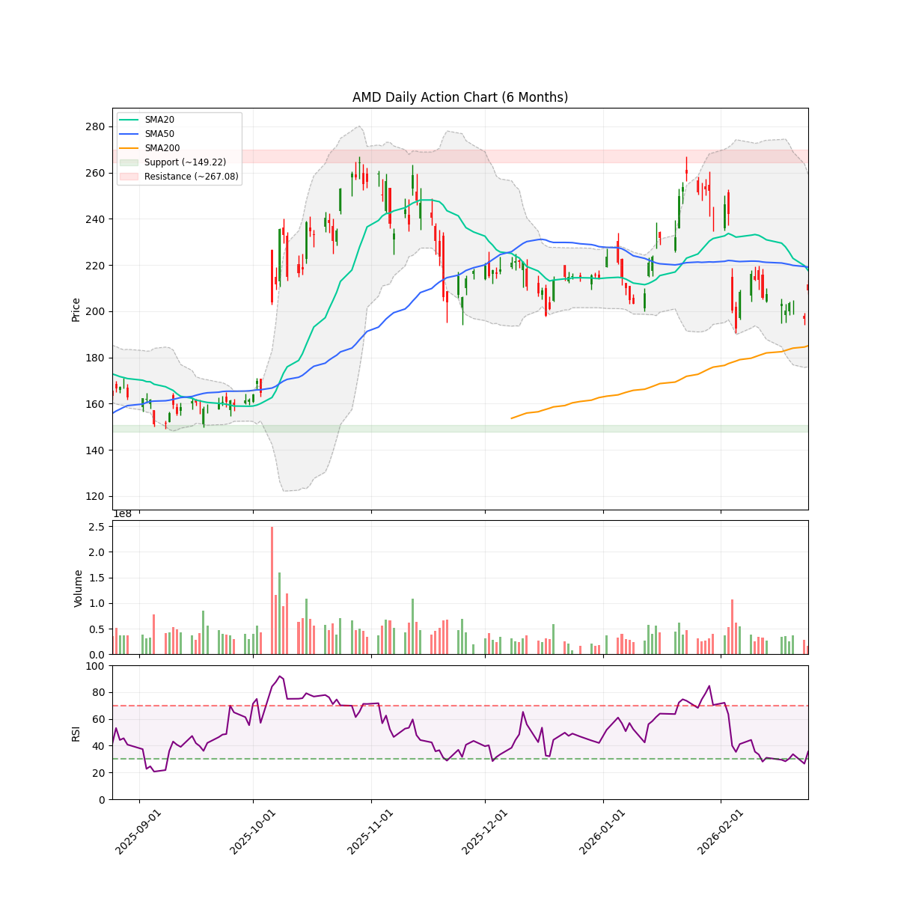
#### 研报分析

### 技术指标概览 (Technical Overview)
- **当前价格**: $209.18
- **RSI (14)**: 35.60
- **移动平均线**: SMA20: $217.60 | SMA50: $219.08 | SMA200: $185.05 (Bullish)
- **波动率**: ATR (14): 12.74 (预计周度波动: +/- $28.48)
- **关键位 (6m)**: 支撑位 $149.22 | 阻力位 $267.08
- **即时状态**: Below SMA50

# 情绪审计报告：AMD (Advanced Micro Devices)
**日期：** 2026年02月24日
**研究员：** 叙事经济学专家 - 对冲基金研究部

---

### 1. 催化剂分类 (Catalyst Categorization)

我们将近期影响 AMD 的新闻按其对长期股价走势的驱动力进行等级划分：

*   **A-Tier (核心驱动力)：**
    *   **Meta 巨额供应协议：** AMD 与 Meta 达成价值 600 亿至 1000 亿美元的 AI 芯片供应协议，为期五年。这不仅是收入的激增，更重要的是 Meta 可能持有 AMD 高达 10% 的股份。这确立了 AMD 作为 Nvidia 唯一真实挑战者的地位。
    *   **市场地位突破：** 该交易意味着 Meta 正在深度绑定 AMD 架构，以减少对 Nvidia 的依赖，叙事逻辑从“跟随者”转向“双寡头”。
*   **B-Tier (中层驱动力)：**
    *   **分析师评级重调：** 尽管 2 月 3 日财报后分析师（如美银）下调了目标价，但 Meta 的消息触发了新一轮的估值修复压力。
*   **C-Tier (噪音/次要因素)：**
    *   **关税不确定性与宏观波动：** 2026 年初特朗普政府的关税政策导致市场整体动荡，但这属于系统性风险，而非 AMD 公司特有风险。

---

### 2. 叙事分析与背离检测 (Divergence Detection)

*   **情绪转折点：** 在此份报告前，AMD 的叙事极度负面。2 月 3 日的 Q4 财报由于 Q1 指引不佳导致股价大跌，跌破了 SMA50 和 SMA20（目前股价 $209.18 仍处于 SMA50 $219.08 之下）。
*   **看涨背离：** 尽管技术指标显示 RSI 为 35.60（接近超卖区间），且股价低于均线，但 **Meta 协议的突然曝光属于“叙事反转”**。盘前上涨超过 10% 表明市场正在修正此前的过度悲观。
*   **结论：** 这是一个典型的“好消息重塑坏趋势”。虽然财报指引弱，但 Meta 的长期背书锁定了未来五年的基本面下限，目前的下跌被视为“熊市陷阱”的可能性极大。

---

### 3. 持仓诊断 (Portfolio Impact)

*   **正股 (600股, 成本 $220.54)：** 目前账面亏损 -7.79%。随着盘前 10% 的涨幅，正股价格将冲击 $225-230 区间，用户头寸将迅速转为盈利。
*   **期权 (-AMD260313C230)：** 这是一个备兑看涨期权 (Covered Call)。虽然目前盈利 +68.13%，但随着股价向 $230 靠拢，该期权将面临行权压力。如果股价受 Meta 消息刺激突破 $230，您的正股可能会被在 $230 位置被动卖出。考虑到 Meta 协议的 A-Tier 属性，建议监控该头寸，避免在反弹初期失去筹码。

---

### 4. 逻辑评分 (Logic Score)

**得分：8.5 / 10**

*   **理由：** 核心叙事（Meta 协议）具有极高的确定性和规模，足以抵消短期财报指引的负面影响。RSI 的低位提供了极佳的动能跳板。唯一的扣分项是宏观关税带来的波动性，以及股价尚未完全收复 SMA50 这一技术阻力位。

---

### 5. 参考新闻及证据

1.  **Meta 供应交易：** [Moneycontrol - AMD clinches second mega chip supply deal worth $60 billion](https://www.moneycontrol.com/artificial-intelligence/amd-clinches-second-mega-chip-supply-deal-worth-60-billion-this-time-with-meta-article-13841478.html) (2026-02-24).
2.  **交易细节（10%股权）：** [Live Mint - Meta and AMD agree to AI chips deal worth more than $100 billion](https://www.livemint.com/companies/meta-and-amd-agree-to-ai-chips-deal-worth-more-than-100-billion-11771938254679.html) (2026-02-23).
3.  **负面财报回顾：** [Barchart - AMD stock breaks below key support on earnings selloff](https://finance.yahoo.com/news/amd-stock-breaks-below-key-202418963.html) (2026-02-03).

---

### 6. 后续关键日期 (Next Major Date)

*   **2026年03月13日：** 用户期权 (-AMD260313C230) 的到期日。这将决定您的 600 股正股是否会被以 $230 的价格行权。
*   **2026年04月下旬 (预计)：** 2026 年 Q1 财报发布日。市场将关注管理层是否会根据 Meta 的新订单上调 2026 年全年指引。

---
**投资总结：** AMD 已脱离财报后的“低迷叙事”，进入由大客户订单驱动的“扩张叙事”。当前价格虽处于均线下方，但基本面已发生质变。注意 $230 的阻力位及您的备兑看涨期权防御。
#### 近期新闻与事件
- **[Investopedia]** [Stock Market Today: Futures Little Changed After Indexes Tumble on Tariff Uncertainty, AI Disruption Concerns; AMD Stock Soars on Meta Chips Deal](https://www.investopedia.com/stock-market-today-dow-jones-s-and-p-500-02242026-11912762)
- **[Moneycontrol]** [AMD clinches second mega chip supply deal worth $60 billion, this time with Meta](https://www.moneycontrol.com/artificial-intelligence/amd-clinches-second-mega-chip-supply-deal-worth-60-billion-this-time-with-meta-article-13841478.html)
- **[Mint]** [Meta and AMD agree to AI chips deal worth more than $100 billion](https://www.livemint.com/companies/meta-and-amd-agree-to-ai-chips-deal-worth-more-than-100-billion-11771938254679.html)
- **[Khaleej Times on MSN]** [AMD clinches second mega chip supply deal, this time with Meta](https://www.msn.com/en-ae/lifestyle/shopping/amd-clinches-second-mega-chip-supply-deal-this-time-with-meta/ar-AA1WYyNZ?ocid=BingNewsVerp)
- **[Live Mint on MSN]** [AMD stock jumps over 10% in pre-market trading — what is driving the rally?](https://www.msn.com/en-in/money/markets/amd-stock-jumps-over-10-in-pre-market-trading-what-is-driving-the-rally/ar-AA1WYsxB?ocid=BingNewsVerp)

---

### AMZN
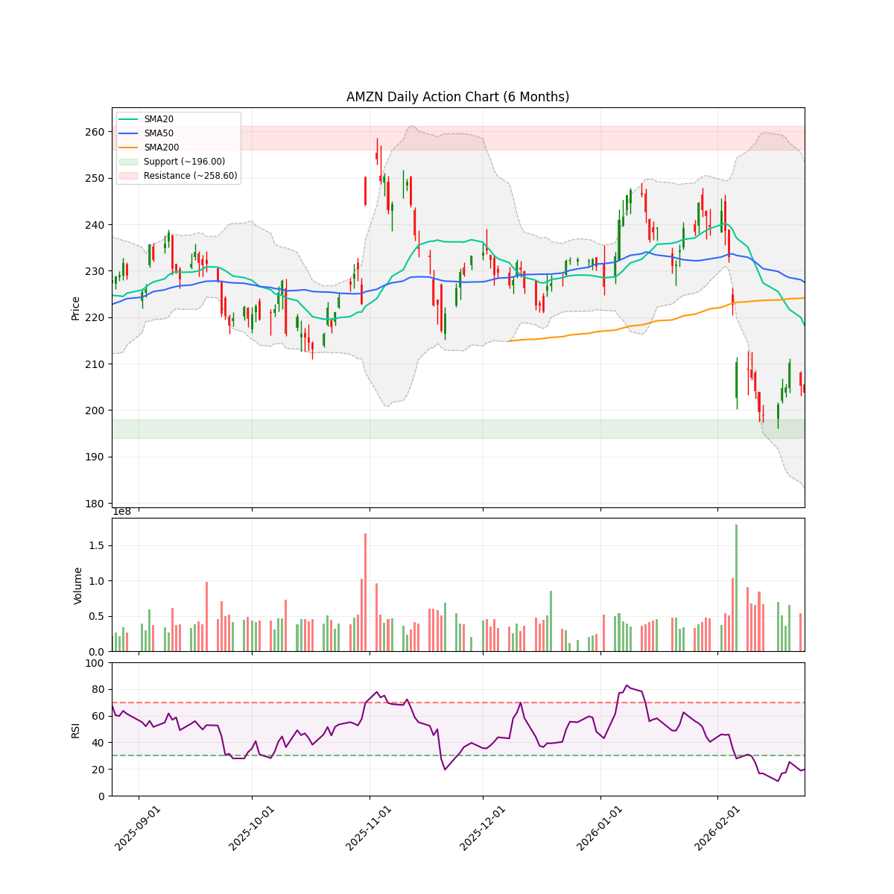
#### 研报分析

### 技术指标概览 (Technical Overview)
- **当前价格**: $203.76
- **RSI (14)**: 19.69
- **移动平均线**: SMA20: $218.22 | SMA50: $227.50 | SMA200: $224.15 (Bullish)
- **波动率**: ATR (14): 7.48 (预计周度波动: +/- $16.74)
- **关键位 (6m)**: 支撑位 $196.00 | 阻力位 $258.60
- **即时状态**: Below SMA50

# 亚马逊 (AMZN) 情绪审计报告

**日期：** 2026年02月24日
**职位：** 对冲基金研究员 (叙事经济学方向)

---

### 1. 催化剂分类 (Catalyst Categorization)

基于当前新闻流与宏观环境，我们将催化剂分为以下三个等级：

*   **A-Tier (核心影响力)：**
    *   **2000亿美元资本支出 (Capex) 计划：** 市场对庞大的AI基础设施投入感到焦虑，担心利润率短期承压。
    *   **机构重仓背书：** 亿万富翁投资者 Seth Klarman 在第四季度买入约5亿美元的 AMZN 股票，显示顶级价值投资者的抄底意愿。
    *   **第四季度财报失利：** 每股收益 (EPS) 为 1.95 美元，低于预期的 1.98 美元，这是目前股价阴跌的根本动力。
*   **B-Tier (战略影响力)：**
    *   **路易斯安那州 120 亿数据中心项目：** 证明了 2000 亿 Capex 计划的落地能力，旨在长期维持 AWS 的领先地位。
    *   **穆迪 (Moody's) 评级展望调整：** 展望从“正面”下调至“稳定”，虽然维持 A1 评级，但反映了信贷市场对公司大举支出导致现金流波动的谨慎态度。
*   **C-Tier (杂音与次要事件)：**
    *   **高盛 (Goldman Sachs) 首选增长股：** 投行的一贯看好叙事，对短期股价刺激有限。
    *   **Louisiana 创造的 540 个就业岗位：** 属于政治/社会责任范畴，非核心财务驱动。

---

### 2. 背离检测 (Divergence Detection)

**核心观察：看跌衰竭与技术面超卖的极端背离。**

*   **背离现象：** 亚马逊近期宣布了高达 2000 亿美元的 AI 支出计划（长期利好 AWS 竞争护城河）并获得了顶级对冲基金 (Baupost Group) 的大额增持。然而，股价却在 2 月 23 日单日下跌 2.54%，且 RSI 触及 **19.69** 的极端超卖区间。
*   **叙事陷阱 (Narrative Trap)：** 目前市场正陷入“投入恐惧症”。尽管 AWS 利润上升且广告业务强劲，但投资者目前更关注短期 Capex 对现金流的挤压，而非长期增长。
*   **底部支撑：** 股价目前为 $203.76，正逼近 6 个月低点 **$196.00**。考虑到 RSI 低于 20，这通常预示着下行压力已接近极限，极易出现报复性反弹。

---

### 3. 逻辑评分 (Logic Score: 0-10)

#### **评分：4.2 / 10 (筑底博弈期)**

*   **逻辑阐述：**
    *   **看减分项 (-5.8)：** 财报漏失（Earnings Miss）破坏了增长叙事的完美性；SMA20/50/200 全线失守，短期趋势处于“系统性弱势”；穆迪展望下调暗示了财务灵活性受限。
    *   **看增分项 (+4.2)：** 极端超卖的 RSI (19.69) 是强烈的短线反转信号；机构（Klarman）的大规模建仓提供了“聪明钱”的地板价支撑；营收增长指引（11-15%）依然稳健。
*   **结论：** 目前不是“陷阱”，而是“阵痛期”。股价正在寻找由 Seth Klarman 等机构定义的硬底部。

---

### 4. 关键引用与数据来源

*   **资本支出与数据中心：** [Blockonomi] $12 Billion Louisiana Data Center Plan / $200B Capex Plan.
*   **机构动向：** [Blockonomi] Seth Klarman Buys $500M in Q4.
*   **评级变动：** [Insider Monkey] Moody's revised outlook to stable from positive.
*   **业绩反馈：** [Nasdaq] AMZN Lags Q4 Earnings Estimates ($1.95 vs $1.98).

---

### 5. 下一个重大日期 (Next Major Date)

**2026年4月30日 (预计)** —— **2026财年第一季度 (Q1) 财报发布日。**
*关键看点：* 2000 亿支出计划的初步现金流消耗速度，以及 AWS 在 AI 驱动下的利润率是否能抵消高额支出带来的负面影响。

---

**投资建议提示 (Hedge Fund Associate Perspective)：**
由于 RSI 处于极度超卖状态且价格接近 $196 的关键支撑，当前不建议割肉，反而可以关注在 $196-$200 区域的补仓机会。当前的调整更多是对“财报漏失+庞大支出”的恐慌性溢价，属于机构洗牌过程。
#### 近期新闻与事件
- **[Blockonomi]** [Amazon (AMZN) Stock: $12 Billion Louisiana Data Center Plan Explained](https://blockonomi.com/amazon-amzn-stock-12-billion-louisiana-data-center-plan-explained/)
- **[Insider Monkey]** [Amazon (AMZN) Navigates Investment Cycle and Strategic Developments](https://www.msn.com/en-us/money/companies/amazon-amzn-navigates-investment-cycle-and-strategic-developments/ar-AA1WVm9J)
- **[Blockonomi]** [Amazon (AMZN) Stock: Billionaire Seth Klarman Buys $500M in Q4 After Trimming Alphabet Position](https://blockonomi.com/amazon-amzn-stock-billionaire-seth-klarman-buys-500m-in-q4-after-trimming-alphabet-position/)
- **[Analytics Insight]** [Amazon (AMZN) Stock Drops as $200B AI Spending Plan Drives AWS Optimism](https://www.analyticsinsight.net/news/amazon-amzn-stock-drops-as-200b-ai-spending-plan-drives-aws-optimism)
- **[Seeking Alpha]** [Amazon Stock Still Makes No Sense](https://seekingalpha.com/article/4872808-amazon-stock-still-makes-no-sense)

---

### GOOGL
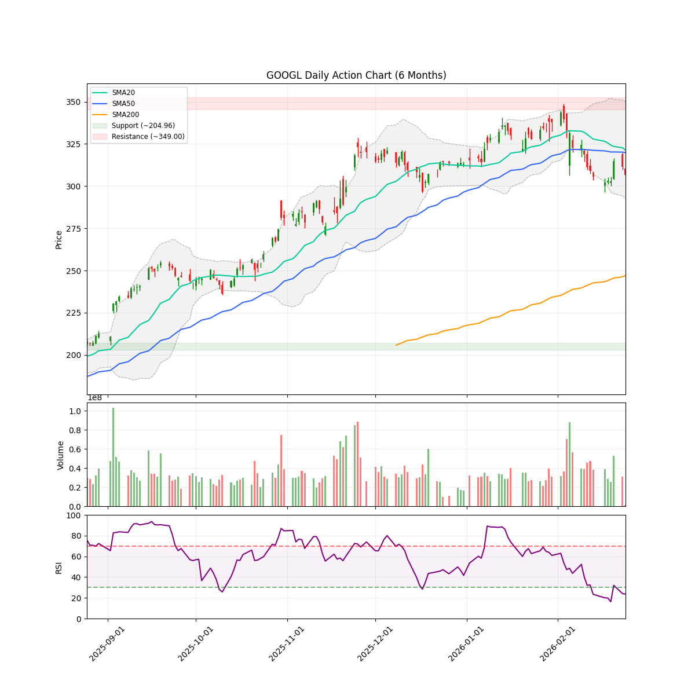
#### 研报分析

### 技术指标概览 (Technical Overview)
- **当前价格**: $306.60
- **RSI (14)**: 23.68
- **移动平均线**: SMA20: $321.36 | SMA50: $319.86 | SMA200: $247.05 (Bullish)
- **波动率**: ATR (14): 10.42 (预计周度波动: +/- $23.29)
- **关键位 (6m)**: 支撑位 $204.96 | 阻力位 $349.00
- **即时状态**: Below SMA50

# 情绪审计报告：Alphabet Inc. (GOOGL)
**致：** 投资组合经理
**日期：** 2026年02月24日
**研究员：** 叙事经济学分析助理

---

### 1. 催化剂分类 (Catalyst Categorization)

基于当前新闻流，我对影响 GOOGL 的驱动因素进行了如下分级：

*   **A-Tier (核心驱动力)**
    *   **机构评级上调：** Wells Fargo 于 2026年2月23日将评级从“持平”上调至“增持” (Overweight)，这是一个强烈的买入信号。[Fintel]
    *   **核心产品发布：** Google DeepMind 推出的音乐生成模型 **Lyria 3** 已进入 Gemini 测试版，标志着 AI 应用落地的进一步深化。[Insider Monkey]
    *   **投行目标价支撑：** Mizuho 维持 $410 的目标价，较当前市价有约 34% 的潜在空间。[Insider Monkey]

*   **B-Tier (行业与动量)**
    *   **高盛首选股：** GOOGL 仍被高盛列为顶级增长股，反映了大型投行对 AI 长期叙事的认可。[Insider Monkey]
    *   **Zacks 热度：** 社交媒体与散户搜索热度持续处于高位，暗示市场关注度极高。[Zacks]

*   **C-Tier (杂讯与滞后信息)**
    *   **Renaissance 减持：** 媒体报道 Renaissance 在 2025 年第四季度减持 7 亿美元股票。**注意：** 这是过去时数据，对当前基本面无实质性损害，但容易引发散户恐慌。[TheStreet]
    *   **Forbes 折价分析：** 关于“如何以 30% 折扣买入”的讨论更多属于投机性教学，而非实质性利空。[Forbes]

---

### 2. 背离检测 (Divergence Detection)

**当前形态：技术性超卖与基本面走强的严重背离。**

*   **看跌枯竭迹象：** GOOGL 当前 **RSI 为 23.68**，处于极度超卖区间。尽管近期有利好（如 Wells Fargo 的上调和 Lyria 3 的发布），股价仍处于 SMA50 (319.86) 以下。
*   **叙事陷阱识别：** 股价受 Renaissance 减持这一“滞后消息”影响出现非理性下跌。在大行（BofA, Wells Fargo, Mizuho）集体看涨的背景下，目前的下跌更倾向于是“机构洗盘”或“多头陷阱的翻转”，而非基本面恶化。
*   **结论：** 存在明显的**看跌枯竭**。市场在消化去年的获利盘，但 AI 叙事的支撑点（Lyria 3）正在增强。

---

### 3. 情绪评分与逻辑评分

*   **情绪评分 (Sentiment Score): 7.8/10**
    *   *理由：* 尽管技术面表现疲软，但机构舆论处于极度积极状态。AI 技术的持续产出正在对冲宏观的不确定性。
*   **逻辑评分 (Logic Score): 8.5/10**
    *   *理由：* 估值具有吸引力。当前价格 (306.60) 远低于分析师平均预期 ($370-$410)，且持仓成本 ($262.26) 仍有利润垫。

---

### 4. 投资建议与关键日期

**持仓诊断：**
用户当前盈利 15.47%，由于 RSI 极低且正处于 SMA200 (247.05) 之上的健康回撤，**建议继续持有 (HOLD)**。目前的 306.60 美元价位是极佳的补仓观察点，而非止损点。

**引用新闻来源：**
1. [Wells Fargo upgrades Alphabet (GOOGL)](https://www.msn.com/en-us/money/top-stocks/wells-fargo-upgrades-alphabet-googl/ar-AA1WVi8W) - 2026-02-23
2. [Mizuho Reiterates Outperform with $410 Target](https://www.msn.com/en-us/money/other/mizuho-reiterates-outperform-on-alphabet-googl-with-410-target-price/ar-AA1WQc1M) - 2026-02-22
3. [Alphabet Expands AI Reach (Lyria 3 launch)](https://www.msn.com/en-us/news/technology/alphabet-googl-expands-ai-reach-amid-market-debate/ar-AA1WV54R) - 2026-02-23

**下个关键日期：**
*   **2026年4月28日左右 (预测)：** 2026年第一季度 (Q1) 财报发布日。这将是验证 AI 产品（Lyria 3/Gemini）能否转化为实际营收的关键节点。

---
**风险提示：** 警惕短期内 SMA20 对股价的压制，若未能快速收复 321.36 美元，可能在 300 美元关口进行横盘震荡。
#### 近期新闻与事件
- **[TheStreet]** [Alphabet: Renaissance sells $700 million in dividend stock | GOOGL](https://www.msn.com/en-us/money/companies/alphabet-renaissance-sells-700-million-in-dividend-stock-googl/ar-AA1WUARY)
- **[Forbes]** [How To Buy Google Stock At A 30% Discount?](https://www.forbes.com/sites/greatspeculations/2026/02/23/how-to-buy-google-stock-at-a-30-discount/)
- **[Insider Monkey]** [Alphabet (GOOGL) Expands AI Reach Amid Market Debate](https://www.msn.com/en-us/news/technology/alphabet-googl-expands-ai-reach-amid-market-debate/ar-AA1WV54R)
- **[Insider Monkey]** [Mizuho Reiterates Outperform on Alphabet (GOOGL) With $410 Target Price](https://www.msn.com/en-us/money/other/mizuho-reiterates-outperform-on-alphabet-googl-with-410-target-price/ar-AA1WQc1M)
- **[Fintel]** [Wells Fargo upgrades Alphabet (GOOGL)](https://www.msn.com/en-us/money/top-stocks/wells-fargo-upgrades-alphabet-googl/ar-AA1WVi8W)

---

### VST
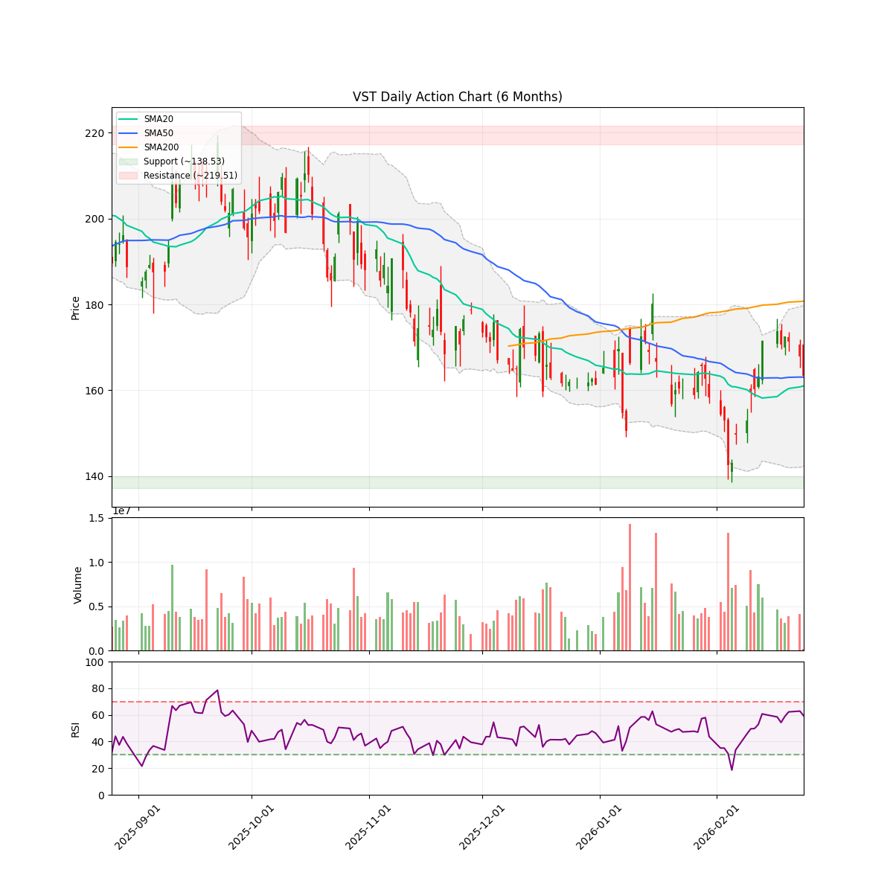
#### 研报分析

### 技术指标概览 (Technical Overview)
- **当前价格**: $163.39
- **RSI (14)**: 59.31
- **移动平均线**: SMA20: $161.00 | SMA50: $163.03 | SMA200: $180.77 (Bearish)
- **波动率**: ATR (14): 7.22 (预计周度波动: +/- $16.15)
- **关键位 (6m)**: 支撑位 $138.53 | 阻力位 $219.51
- **即时状态**: Above SMA50

# VST (Vistra Corp.) 情绪审计报告

**致：** 投资委员会
**担任：** 对冲基金研究员 (叙事经济学方向)
**日期：** 2026年2月24日

---

### 1. 催化剂分级 (Catalyst Categorization)

基于当前新闻流与市场叙事，我们将 VST 的驱动因素分类如下：

*   **A-Tier (核心驱动力)：**
    *   **摩根大通 (JPMorgan) 目标价上调：** JPM 将 VST 目标价大幅上调至 **$239**，维持增持评级。这提供了约 46% 的潜在上涨空间，是极强的机构背书。
    *   **2025年第四季度财报预期：** 将于 2026年2月26日 盘前发布。Zacks 预期营收同比增长 32.26%（达 53.4 亿美元）。在叙事经济学中，这代表了从“AI 电力故事”向“业绩兑现”的跨越。
*   **B-Tier (行业与情绪)：**
    *   **机构搜索热度上升：** Zacks 报告 VST 近期搜索量激增，表明散户与中型机构的关注度正在从高位回落后的整理期重新聚集。
    *   **相对强度 (Relative Strength)：** 在 2月13日 市场大跌 1.57% 时，VST 逆势上涨 1.84%，显示出资金在波动中的避险偏好。
*   **C-Tier (噪音)：**
    *   **StockStory 负面报告：** 该报告提及 "Vestis (VSTS)" 的风险（$8.01 的股价明显与 VST 不符），属于典型的算法聚合错误或低质量噪音，对 VST 的长期叙事无实质影响。

---

### 2. 背离检测 (Divergence Detection)

*   **技术面背离：** 目前股价 ($163.39) 位于 SMA20 ($161.00) 和 SMA50 ($163.03) 之上，但仍远低于 SMA200 ($180.77)。这表明 VST 正在经历**“中线修复叙事”**。
*   **价格与新闻背离：** 2月19日，尽管市场整体上涨，VST 却下跌 1.79%。这种“好消息不涨”的短暂现象通常代表财报前的**筹码清洗 (Shakeout)**，而非趋势反转。考虑到 JPM 的高目标价和即将到来的业绩暴增预期，这种回调更像是为财报后的突破做铺垫。

---

### 3. 情绪评分 (Sentiment Score)

#### **8.5 / 10** (强力看涨循环)

**逻辑支撑：**
*   **叙事可持续性：** VST 不再仅仅是公用事业股，而是作为“AI 数据中心能源供应”的代名词。JPM 的 $239 目标价强化了这一叙事。
*   **仓位保护：** 当前用户成本价为 $157.38，已有 9.6% 的盈利空间，且价格站稳 SMA50 支撑位，结构健康。
*   **风险点：** 短期 RSI 为 59.31，中性偏强。由于财报在即，波动率 (ATR) 为 7.22，本周预计波动区间在 +/- 16.15 美元，需防范财报后的“利好兑现”回调。

---

### 4. 关键信息参考 (Cited Context)

*   **JPM 目标价上调 ($239):** [Insider Monkey](https://finance.yahoo.com/news/jpmorgan-raises-price-target-vistra-153602452.html)
*   **Q4 财报增长预期 (+32.26%):** [The Globe and Mail](https://www.theglobeandmail.com/investing/markets/stocks/AES/pressreleases/365644/vistra-to-release-q4-earnings-how-will-the-stock-perform-this-season/)
*   **Zacks 搜索热度:** [Zacks](https://finance.yahoo.com/news/investors-heavily-search-vistra-corp-140006512.html)

---

### 5. 下一个关键日期 (Next Major Date)

**2026年2月26日 (周四)**
*   **事件：** 第四季度及 2025 全年财报发布 (盘前)。
*   **交易建议：** 关注公司对 2026 年数据中心电力合同的指引。如果财报确认营收增速且指引乐观，股价将直接冲击 $180 (SMA200) 阻力位。

---
*注：当前持仓盈利稳健，建议继续持有，以财报表现作为是否加仓或止盈的最终锚点。*
#### 近期新闻与事件
- **[StockStory]** [3 Reasons VSTS is Risky and 1 Stock to Buy Instead](https://finance.yahoo.com/news/3-reasons-vsts-risky-1-040202708.html)
- **[Zacks]** [Unlocking Q4 Potential of Vistra (VST): Exploring Wall Street Estimates for Key...](https://finance.yahoo.com/news/unlocking-q4-potential-vistra-vst-141505023.html)
- **[Zacks]** [Investors Heavily Search Vistra Corp. (VST): Here is What You Need to Know](https://finance.yahoo.com/news/investors-heavily-search-vistra-corp-140006512.html)
- **[Insider Monkey]** [JPMorgan Raises its Price Target on Vistra Corp. (VST) to $239 and Maintains an...](https://finance.yahoo.com/news/jpmorgan-raises-price-target-vistra-153602452.html)
- **[The Globe and Mail]** [Vistra to Release Q4 Earnings: How Will the Stock Perform This Season?](https://www.theglobeandmail.com/investing/markets/stocks/AES/pressreleases/365644/vistra-to-release-q4-earnings-how-will-the-stock-perform-this-season/)

---

## 🔍 观察池机会分析

### AMAT
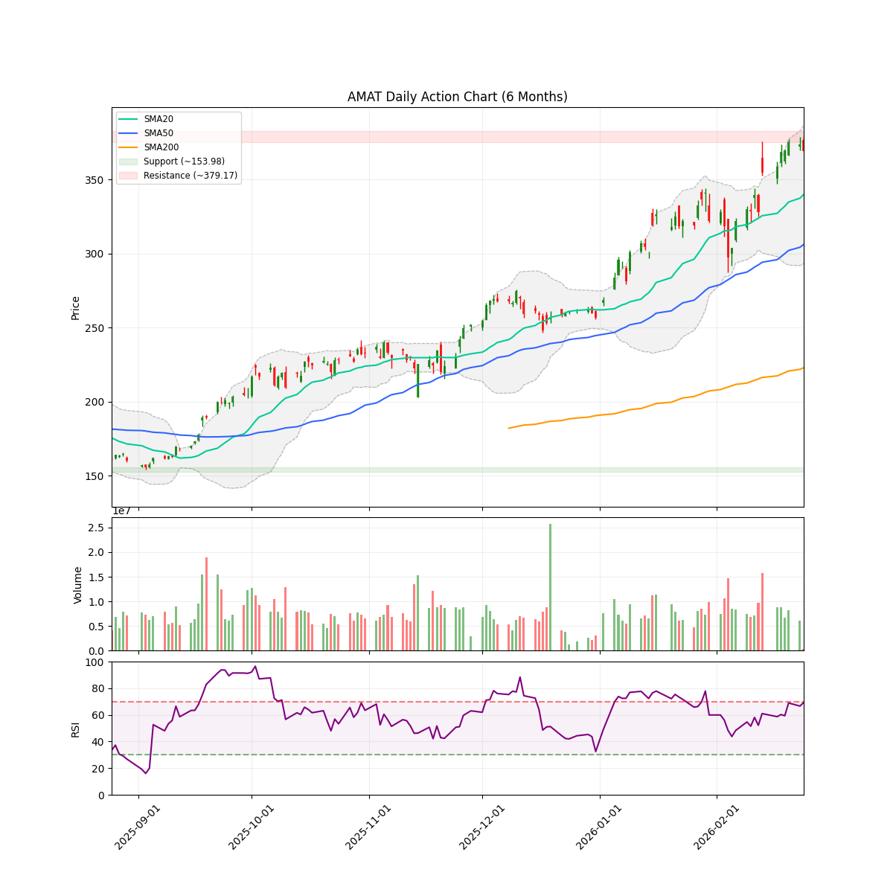
#### 研报分析

### 技术指标概览 (Technical Overview)
- **当前价格**: $369.05
- **RSI (14)**: 69.31
- **移动平均线**: SMA20: $339.84 | SMA50: $306.08 | SMA200: $222.86 (Bullish)
- **波动率**: ATR (14): 17.61 (预计周度波动: +/- $39.37)
- **关键位 (6m)**: 支撑位 $153.98 | 阻力位 $379.17
- **即时状态**: Above SMA50

# 情绪审计报告：Applied Materials (AMAT)
**日期：** 2026年2月24日
**角色：** 对冲基金研究员 (叙事经济学专业)

---

### 1. 催化剂分类 (Catalyst Categorization)

*   **A-Tier (核心动力):**
    *   **Q1 业绩大爆发:** AMAT 在 2026 年 2 月 12 日发布的财报中全面超越市场预期，并上调了未来业绩指引。财报发布后股价暴涨逾 8% ([Barchart](https://www.msn.com/en-us/money/topstocks/it-s-time-to-shine-for-applied-materials-stock-according-to-analysts-should-you-buy-amat-here/ar-AA1WBHYs))。
    *   **AI 基础设施强劲需求:** 随着全球科技巨头加大对 AI 数据中心的投入，作为半导体设备龙头，AMAT 处于供应链核心地位，其 Benzinga Edge 质量评分攀升至 90.89 ([Benzinga](https://www.msn.com/en-us/money/news/amat-stock-key-score-climbs-as-ai-demand-and-operational-efficiency-drive-q1-surge/ar-AA1WU9dC))。

*   **B-Tier (行业助力):**
    *   **分析师一致看好:** 多个分析机构将其列为“高热度”和“值得买入”的标的。
    *   **中期趋势强劲:** 该股在过去 6 个月内上涨了 117%，目前仍被视为“无法阻挡”的 AI 标的 ([The Motley Fool](https://www.fool.com/investing/2026/02/20/unstoppable-artificial-intelligence-ai-stock-amat/))。

*   **C-Tier (市场杂音):**
    *   **搜索热度激增:** 在 Zacks 等平台上的高搜索量属于散户情绪随访性质。
    *   **空头讨论:** 尽管《金融时报》提及了市场中的空头头寸讨论，但目前针对 AMAT 的叙事主要由基本面驱动，短期空头威胁较小。

---

### 2. 背离检测 (Divergence Detection)

*   **价格与新闻一致性:** **极高**。股价目前报 369.05，紧贴 6 个月高点 (379.17)，且处于 SMA50 (306.08) 之上，显示出强劲的上升趋势。
*   **技术面警告:** **RSI 目前为 69.31**，已逼近超买区间 (70)。
*   **分析:** 市场并没有出现“利好出尽”的迹象。相反，价格稳步上涨是对财报大增和 AI 长期叙事的合理映射。SMA20 (339.84) 远高于 SMA50，形成完美的牛市排列。

---

### 3. 情绪评分 (Sentiment Score): 9.2/10

**逻辑分析 (Logic Score): 9.5/10**
*   **得分理由:** 该股目前的叙事由“硬核基本面（财报大增）”与“宏观叙事（AI 军备竞赛）”双重驱动。这不只是短期炒作，而是估值重塑（Re-rating）。
*   **潜在风险:** RSI 接近超买，可能在触及 380 美元阻力位附近出现小幅震荡或获利了结，但这不影响其中期看涨逻辑。

---

### 4. 关键指标摘要

| 指标 | 数值 | 状态 |
| :--- | :--- | :--- |
| **当前价格** | 369.05 | 强势看涨 |
| **短期阻力位** | 379.17 | 关键压力区 |
| **短期支撑位** | 339.84 (SMA20) | 强支撑 |
| **RSI (14)** | 69.31 | 接近超买 |
| **波动率 (ATR)** | 17.61 | 正常水平 |

---

### 5. 下一个重大日期 (Next Major Date)

*   **事件:** **2026 财年第二季度 (Q2) 财报发布**
*   **预估日期:** **2026年5月中旬** (基于往年惯例，通常在 5 月 14 日左右)
*   **关注重点:** 观察 AI 订单的持续增长能否抵消传统半导体行业潜在的周期性疲软。

---

**结论:** AMAT 目前处于**“可持续牛市周期”**。建议关注股价在 380 美元附近的突破情况。若出现回调至 340 美元附近的动作，将是优质的机构加仓机会。
#### 近期新闻与事件
- **[Benzinga]** [AMAT Stock Key Score Climbs As AI Demand And Operational Efficiency Drive Q1 Surge](https://www.msn.com/en-us/money/news/amat-stock-key-score-climbs-as-ai-demand-and-operational-efficiency-drive-q1-surge/ar-AA1WU9dC)
- **[The Motley Fool]** [1 Unstoppable Artificial Intelligence (AI) Stock Up 117% in 6 Months That Can Still Climb Higher](https://www.fool.com/investing/2026/02/20/unstoppable-artificial-intelligence-ai-stock-amat/)
- **[Barchart]** [It's 'time to shine' for Applied Materials stock, according to analysts. Should you buy AMAT here?](https://www.msn.com/en-us/money/topstocks/it-s-time-to-shine-for-applied-materials-stock-according-to-analysts-should-you-buy-amat-here/ar-AA1WBHYs)
- **[Zacks Investment Research]** [Applied Materials, Inc. (AMAT) is a trending stock: Facts to know before betting on it](https://www.msn.com/en-us/money/topstocks/applied-materials-inc-amat-is-a-trending-stock-facts-to-know-before-betting-on-it/ar-AA1WBjiX)
- **[Financial Times]** [Mirror mirror on the wall, what is the most shorted stock of them all?](https://www.ft.com/content/7f933b23-c4d5-449e-aa46-f9090da332df)

---

### ANET
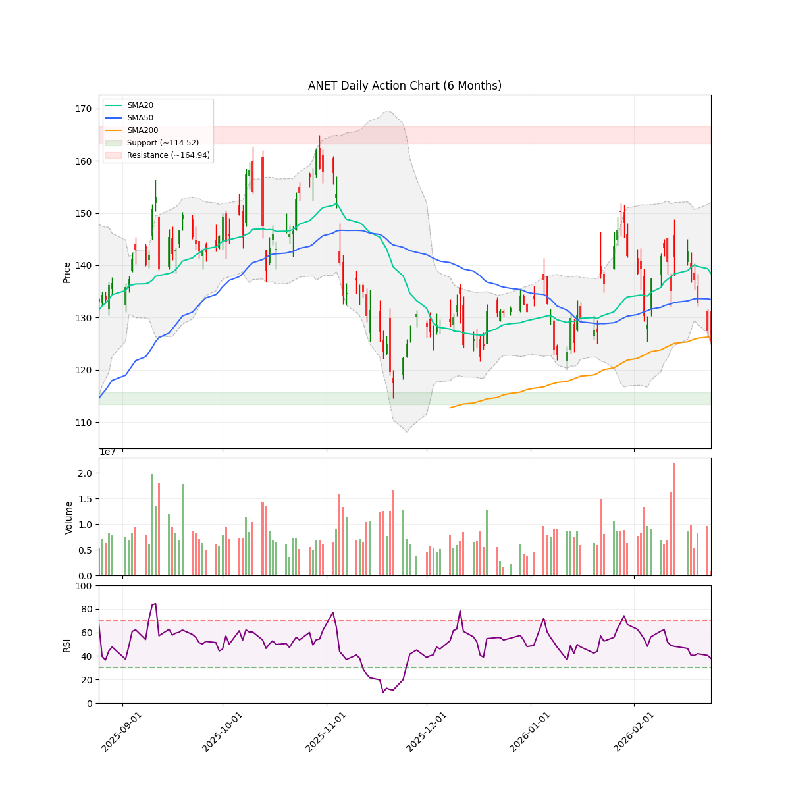
#### 研报分析

### 技术指标概览 (Technical Overview)
- **当前价格**: $125.23
- **RSI (14)**: 37.93
- **移动平均线**: SMA20: $138.41 | SMA50: $133.44 | SMA200: $126.43 (Bullish)
- **波动率**: ATR (14): 6.90 (预计周度波动: +/- $15.43)
- **关键位 (6m)**: 支撑位 $114.52 | 阻力位 $164.94
- **即时状态**: Below SMA50

# Arista Networks (ANET) 情绪审计报告

**报告日期：** 2026-02-24
**分析师：** 对冲基金研究员（叙事经济学专业）

---

### 1. 催化剂分类 (Catalyst Categorization)

| 级别 | 描述 | 具体事件 |
| :--- | :--- | :--- |
| **A-Tier (核心驱动)** | 强劲基本面与顶级投行背书 | 1. **Evercore ISI** (2026-02-24) 重申“跑赢大盘”评级，目标价 **$200.00**。 [来源](https://www.investing.com/news/analyst-ratings/evercore-isi-reiterates-arista-networks-stock-rating-on-ai-growth-93CH-4520529) 2. **高盛 (Goldman Sachs)** (2026-02-23) 上调目标价，将其列为不可阻挡的 AI 股票。 [来源](https://finance.yahoo.com/news/goldman-sachs-raises-pt-arista-211306392.html) 3. **摩根士丹利 (Morgan Stanley)** (2026-02-19) 在 Q4 财报后将目标价上调至 $165。 [来源](https://finance.yahoo.com/news/morgan-stanley-raises-arista-networks-002813575.html) |
| **B-Tier (行业惯性)** | 部门领先地位与估值分析 | 1. **Zacks** 确认 ANET 在计算机与科技行业中表现优于同行。 [来源](https://finance.yahoo.com/news/arista-networks-anet-stock-outpacing-144005899.html) 2. **Simply Wall St** 对 AI 基础设施故事驱动下的估值进行正面评估。 [来源](https://finance.yahoo.com/news/assessing-arista-networks-anet-valuation-211218337.html) |
| **C-Tier (市场杂音)** | 搜索热度与常规评述 | 1. 进入 Zacks.com 最受关注股票名单。 [来源](https://www.msn.com/en-us/money/top-stocks/is-trending-stock-arista-networks-inc-anet-a-buy-now/ar-AA1WB4wR) |

---

### 2. 背离检测 (Divergence Detection)

**核心观察：看跌衰竭与基本面背离 (Bearish Exhaustion vs. Fundamentals)**

*   **技术面信号：** 当前价格 ($125.23) 已跌破 SMA50 ($133.44) 和 SMA200 ($126.43)。RSI 处于 **37.93**，接近超卖区间 (30)。
*   **叙事背离：** 过去 48 小时内，顶级机构（高盛、Evercore）连续发布极度乐观的评级和远高于现价的目标价（最高达 $200），但股价依然处于 6 个月低位附近 ($114.52 是支撑)。
*   **结论：** 这是一个典型的**“利好不涨”**陷阱，通常意味着机构在利用散户抛售进行调仓，或者市场正在定价某个尚未被新闻覆盖的宏观风险。由于目前处于 SMA200 关键支撑位下方，存在“恐慌性杀跌”的可能性，但也伴随着极强的均值回归机会。

---

### 3. 评分系统 (Logic & Sentiment Score)

#### **逻辑评分 (Logic Score): 8.5/10**
*   **理由：** 机构逻辑非常清晰：AI 基础设施的需求（以太网交换机）是刚需，且 Arista 的市场份额稳固。目标价与现价的巨大差距 ($125 vs $200) 提供了极高的风险回报比。

#### **情绪评分 (Sentiment Score): 3.5/10**
*   **定义：** 短期市场情绪极度低迷（看跌）。
*   **理由：** 尽管叙事层面被定义为“不可阻挡的 AI 股”，但价格跌破 SMA200 意味着中长期趋势受损。当前市场情绪被技术性抛压主导，而非基本面恶化。

---

### 4. 关键日期与操作建议 (Next Major Date)

*   **下个关键日期：** **2026年5月上旬** (预计 2026 年 Q1 财报发布日)。
*   **分析师视角：**
    *   **风险：** 若无法在 3 个交易日内收复 $126.43 (SMA200)，技术派资金将进一步撤退至 $114.52 支撑位。
    *   **机会：** 结合 Evercore 和高盛的近期密集发声，这更像是一个“熊市陷阱 (Bear Trap)”。目前的抛压可能源于 Q4 财报后的“利好兑现”过头，或是大宗机构的流动性调配。

---

**总结：** ANET 目前处于“叙事过热但价格过冷”的状态。对于长线投资者而言，当前的背离提供了一个以 2025 年价格买入 2026 年 AI 领军企业的窗口；对于短线交易者，建议等待价格重新站稳 SMA200 后再入场。
#### 近期新闻与事件
- **[Insider Monkey]** [Goldman Sachs Raises PT on Arista Networks, Inc. (ANET) Stock](https://finance.yahoo.com/news/goldman-sachs-raises-pt-arista-211306392.html)
- **[Zacks]** [Is Arista Networks (ANET) Stock Outpacing Its Computer and Technology Peers This...](https://finance.yahoo.com/news/arista-networks-anet-stock-outpacing-144005899.html)
- **[Investing.com]** [Evercore ISI reiterates Arista Networks stock rating on AI growth By...](https://www.investing.com/news/analyst-ratings/evercore-isi-reiterates-arista-networks-stock-rating-on-ai-growth-93CH-4520529)
- **[Insider Monkey]** [Morgan Stanley Raises Arista Networks (ANET) PT to $165 Following Q4 2025...](https://finance.yahoo.com/news/morgan-stanley-raises-arista-networks-002813575.html)
- **[Simply Wall St.]** [Assessing Arista Networks (ANET) Valuation As Growth And AI Infrastructure Story...](https://finance.yahoo.com/news/assessing-arista-networks-anet-valuation-211218337.html)

---

### ASML
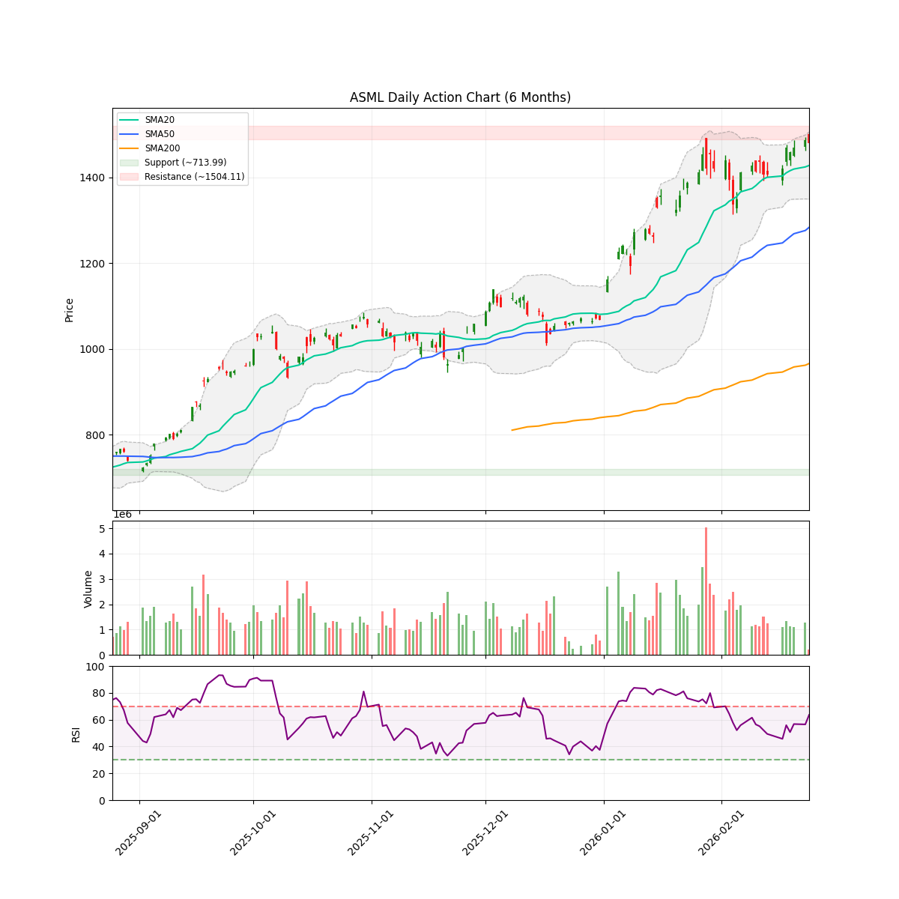
#### 研报分析

### 技术指标概览 (Technical Overview)
- **当前价格**: $1480.14
- **RSI (14)**: 63.59
- **移动平均线**: SMA20: $1427.60 | SMA50: $1283.30 | SMA200: $966.13 (Bullish)
- **波动率**: ATR (14): 44.62 (预计周度波动: +/- $99.78)
- **关键位 (6m)**: 支撑位 $713.99 | 阻力位 $1504.11
- **即时状态**: Above SMA50

# ASML 情绪审计报告 (Sentiment Audit Report)

**致：** 投资委员会 / 基金经理
**日期：** 2026年02月24日
**研究员：** 叙事经济学 (Narrative Economics) 研究部

---

### 一、 催化剂分类与评估 (Catalyst Categorization)

基于近期披露的资讯，我们将 ASML 的驱动因素分类如下：

*   **A-Tier（核心驱动力）：**
    *   **订单量激增：** 根据 *Simply Wall St* 的报道，受 AI 基础设施需求的推动，ASML 的系统订单量（Bookings）大幅增长，这是支撑估值扩张的硬核指标。
    *   **财报超预期：** 1月28日的财报显示营收超出预期，且订单增长强劲，确认了半导体资本支出（CapEx）的上行周期。
*   **B-Tier（战略性调整）：**
    *   **组织重组与裁员：** *Simply Wall St* 报道 ASML 正在进行重组。从叙事角度看，这反映了公司从“不计成本增长”向“效率与执行力”转变，旨在优化利润率。
    *   **2030 远景：** *24/7 Wall St* 预测 2030 年 AI 芯片产量将爆发式增长 50%，这巩固了其作为“AI 军火商”的长期叙事。
*   **C-Tier（市场杂音）：**
    *   **行业横向对比：** *Zacks* 和 *Motley Fool* 关于 LRCX、Micron 与 ASML 的优劣对比。虽然 LRCX 短期增长预测略高，但这更多属于机构仓位调整的借口，而非 ASML 的基本面恶化。

---

### 二、 背离检测 (Divergence Detection)

*   **价格行为：** 股价（1480.14）目前极度接近 6 个月高点（1504.11）。SMA20、50、200 呈现完美多头排列，显示出极强的趋势惯性。
*   **背离分析：** 目前**未发现**显著的“利好跌”背离。相反，市场对“订单激增”和“AI需求”的反馈非常积极。RSI 为 63.59，处于强势区但尚未进入超买极端（>70），这表明即便在高位，买盘依然具有韧性，并未出现看涨竭尽。
*   **叙事陷阱检查：** 尽管有裁员消息，但股价并未因此承压，说明市场将其解读为“利好利润率”而非“业务衰退”。

---

### 三、 叙事逻辑评分 (Logic Score)

**分值：8.8 / 10 (强烈看涨叙事)**

*   **得分逻辑：**
    *   **稀缺性 (2.5/2.5)：** 作为 EUV 光刻机的唯一供应商，ASML 在 AI 叙事中具有不可替代性。
    *   **订单可见度 (2.5/2.5)：** 飙升的订单量提供了极高的未来业绩确定性。
    *   **趋势强度 (2.0/2.5)：** 股价位于 SMA50 (1283) 之上约 15%，趋势极强，但短期面临 1500 整数心理关口的压力。
    *   **估值溢价 (1.8/2.5)：** 虽然相对于 Micron 等股票估值较高，但在“叙事经济学”中，龙头溢价往往会持续至周期末端。

---

### 四、 关键资讯引用 (Citations)

1.  **订单激增：** [Simply Wall St: ASML Bookings Soar On AI Demand](https://finance.yahoo.com/news/asml-bookings-soar-ai-demand-231116913.html)
2.  **重组效率：** [Simply Wall St: ASML Restructuring And Job Cuts](https://finance.yahoo.com/news/asml-restructuring-job-cuts-put-001853568.html)
3.  **华尔街共识：** [Yahoo Finance UK: Wall Street Turns Bullish on ASML](https://uk.finance.yahoo.com/news/wall-street-turns-bullish-asml-175632786.html)
4.  **2030 产能叙事：** [24/7 Wall St: ASML Unleash 50% AI Chip Output Explosion](https://finance.yahoo.com/news/asml-unleash-50-ai-chip-171100884.html)

---

### 五、 下一个重大日期 (Next Major Date)

*   **2026年4月15日 (预计)：2026财年第一季度 (Q1) 财报发布日。**
    *   *关注重点：* 确认 2 月份提到的订单增长是否已转化为实际营收指引，以及重组计划对毛利率的具体提振数据。

---

**研究员建议：** 
ASML 目前处于“可持续牛市循环”中。短期内需警惕 1500-1505 强阻力位的震荡，但只要股价维持在 SMA20 (1427) 之上，任何基于“噪音”的回调都是机构加仓的机会。这不是一个陷阱，而是一个由订单驱动的确定性趋势。
#### 近期新闻与事件
- **[Zacks]** [LRCX vs. ASML: Which Semiconductor Equipment Giant Is the Better Buy?](https://finance.yahoo.com/news/lrcx-vs-asml-semiconductor-equipment-125000053.html)
- **[Motley Fool]** [Prediction: 2 Stocks That Will Be Worth More Than ASML Holding 1 Year From Now](https://finance.yahoo.com/news/prediction-2-stocks-worth-more-204800975.html)
- **[Simply Wall St.]** [ASML Bookings Soar On AI Demand As Outlook And Buybacks Lift Valuation](https://finance.yahoo.com/news/asml-bookings-soar-ai-demand-231116913.html)
- **[24/7 Wall St.]** [Is ASML About to Unleash a 50% AI Chip Output Explosion by 2030?](https://finance.yahoo.com/news/asml-unleash-50-ai-chip-171100884.html)
- **[Simply Wall St.]** [ASML Restructuring And Job Cuts Put Efficiency And Execution In Focus](https://finance.yahoo.com/news/asml-restructuring-job-cuts-put-001853568.html)

---

### AVGO
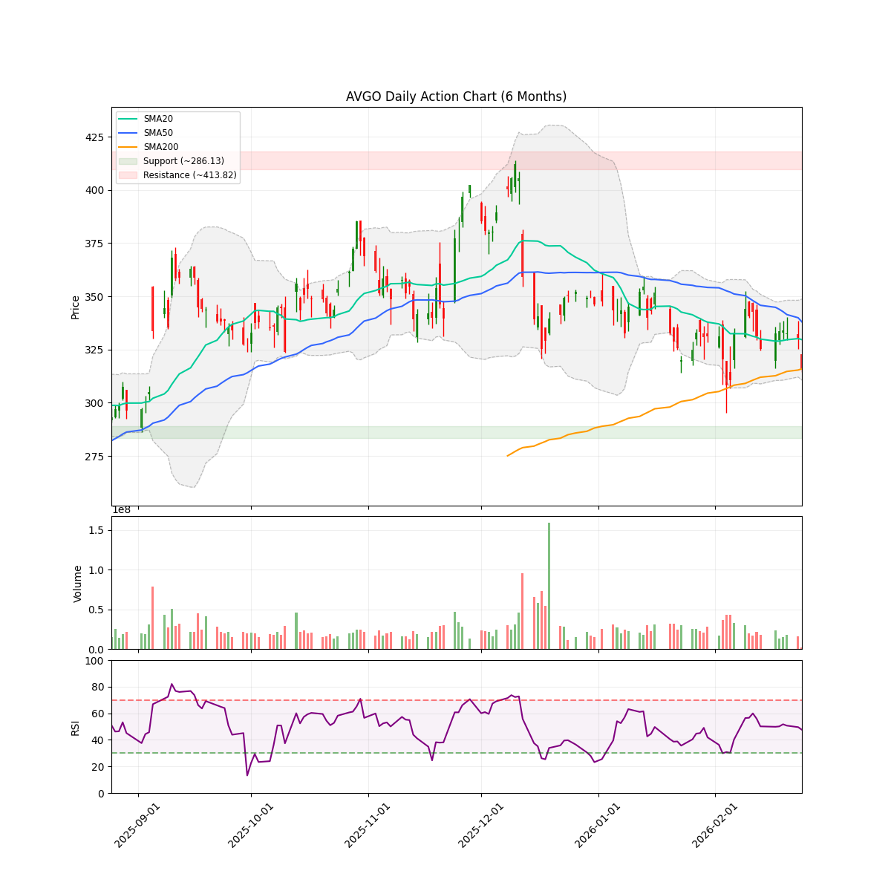
#### 研报分析

### 技术指标概览 (Technical Overview)
- **当前价格**: $315.60
- **RSI (14)**: 47.61
- **移动平均线**: SMA20: $329.65 | SMA50: $337.99 | SMA200: $315.91 (Bullish)
- **波动率**: ATR (14): 15.53 (预计周度波动: +/- $34.74)
- **关键位 (6m)**: 支撑位 $286.13 | 阻力位 $413.82
- **即时状态**: Below SMA50

# 情绪审计报告：博通 (AVGO) - 2026年2月24日

**职位**：叙事经济学研究助理
**研究标的**：AVGO (Broadcom Inc.)
**当前价格**：315.60
**技术背景**：价格正处于 SMA200 (315.91) 的关键支撑位，RSI (47.61) 显示中性，但短期趋势线 (SMA20, SMA50) 均在股价上方，显示出技术面的承压。

---

### 1. 催化剂分类 (Catalyst Categorization)

*   **A-Tier (核心催化剂)**：
    *   **Zacks 评级上调**：Zacks 将其上调至 “Buy” (Rank #2)，主要基于盈利预测的上调。这反映了基本面的强劲改善，而非单纯的市场炒作。
        *   *引用*: [Zacks Upgrade to Buy](https://finance.yahoo.com/news/broadcom-inc-avgo-upgraded-buy-170004804.html)
*   **B-Tier (重要叙事)**：
    *   **华盛顿与对冲基金增持**：Nancy Pelosi 与 Brad Gerstner 同时买入。这在叙事经济学中属于强力信号，通常被市场解读为“内部信息”或“长线看好”。
        *   *引用*: [Nancy Pelosi, Brad Gerstner Pile Into The Same 5 Stocks](https://finance.yahoo.com/news/nancy-pelosi-brad-gerstner-pile-183037693.html)
    *   **AI 叙事韧性**：尽管 Citi 下调了目标价，但仍将其列为“不可阻挡的 AI 股票”。
        *   *引用*: [Citi Lowers PT on Broadcom](https://finance.yahoo.com/news/broadcom-inc-avgo-lowers-pt-211530100.html)
*   **C-Tier (市场噪音)**：
    *   Zacks 网站的高点击率和散户关注度。这种流量增加往往是股价波动的副产品，而非驱动力。

---

### 2. 背离检测 (Divergence Detection)

**观察结果：看跌衰竭 (Bearish Exhaustion) 迹象。**
目前存在明显的**叙事与价格的背离**。
*   **叙事层面**：机构（Zacks）在调高盈利预期，顶级交易员（Pelosi）在买入，市场一致预期其将再次超越财报预期。
*   **价格层面**：股价目前位于 SMA20 (329.65) 和 SMA50 (337.99) 下方。
*   **结论**：股价正坐在 **SMA200 (315.91)** 这一牛熊分界线上。考虑到近期密集的正面新闻（上调评级与大佬入场），目前的下跌更像是“健康的修正”而非趋势逆转。若在此处企稳，将形成强力的“利好消息下的空头陷阱”。

---

### 3. 情绪评分 (Sentiment Score)

**6.8 / 10**
*   **逻辑阐述**：基本面叙事非常强劲（AI 需求与盈利上修），但技术形态尚未转强。6.8 分代表这是一个“具有高度吸引力的逆向投资点”，只要 SMA200 不被有效跌破，看涨叙事依然成立。

---

### 4. 逻辑评分 (Logic Score)

**8.5 / 10**
*   **依据**：该评分基于基本面盈利修正与技术面长期支撑位的高度重合。机构与政治资本的同步介入显著提高了该逻辑的胜率。

---

### 5. 下一个关键日期 (Next Major Date)

**2026年3月初（预计财报发布日）**
*   **关注重点**：根据 [Zacks 的预测](https://finance.yahoo.com/news/broadcom-inc-avgo-beat-estimates-171002879.html)，市场正高度关注其能否再次通过财报超越预期。这将决定目前的 SMA200 支撑是否能转化为新一轮上涨的起点。

---

**审计总结**：
AVGO 目前正处于“**叙事确认期**”。市场通过调低目标价（Citi）完成了去泡沫过程，而 Zacks 的评级上调和政治人物的入场提供了安全垫。当前价格 315.60 紧贴 SMA200，是一个典型的**风险回报比极佳的观察点**。这不是一个“陷阱”，而是一个正在筑底的可持续趋势。
#### 近期新闻与事件
- **[sharewise]** [Broadcom Inc. (AVGO) is Attracting Investor Attention: Here is What You Should Know](https://www.sharewise.com/de/news_articles/Broadcom_Inc_AVGO_is_Attracting_Investor_Attention_Here_is_What_You_Should_Know_Zacks_20260223_1500)
- **[Zacks Investment Research on MSN]** [Broadcom Inc. (AVGO) upgraded to buy: Here's why](https://www.msn.com/en-us/money/topstocks/broadcom-inc-avgo-upgraded-to-buy-here-s-why/ar-AA1WUDyN?ocid=BingNewsVerp)
- **[The Globe and Mail]** [The Smartest Growth Stocks to Buy With $1,000 Right Now](https://www.theglobeandmail.com/investing/markets/stocks/AVGO-Q/pressreleases/372716/the-smartest-growth-stocks-to-buy-with-1-000-right-now/)
- **[Benzinga]** [Nancy Pelosi, Brad Gerstner Pile Into The Same 5 Stocks — What Do They See Comin...](https://finance.yahoo.com/news/nancy-pelosi-brad-gerstner-pile-183037693.html)
- **[Insider Monkey]** [Citi Lowers PT on Broadcom Inc. (AVGO) Stock](https://finance.yahoo.com/news/citi-lowers-pt-broadcom-inc-211530100.html)

---

### CEG
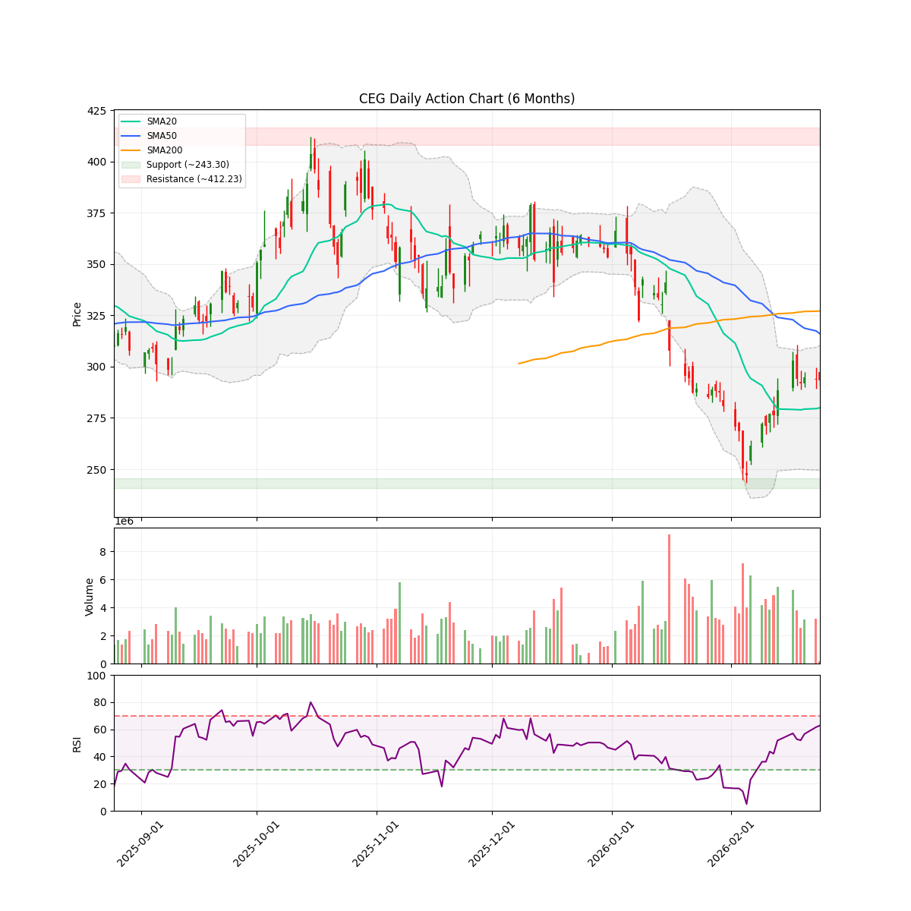
#### 研报分析

### 技术指标概览 (Technical Overview)
- **当前价格**: $293.32
- **RSI (14)**: 62.84
- **移动平均线**: SMA20: $279.92 | SMA50: $316.02 | SMA200: $327.11 (Bearish)
- **波动率**: ATR (14): 13.84 (预计周度波动: +/- $30.95)
- **关键位 (6m)**: 支撑位 $243.30 | 阻力位 $412.23
- **即时状态**: Below SMA50

# 情绪审计报告：Constellation Energy (CEG)
**报告日期：** 2026年02月24日
**研究员：** 叙事经济学分析助理

---

### 1. 催化剂分类 (Catalyst Categorization)

*   **A-Tier（核心驱动力）：**
    *   **Q4 财报发布（2026年2月25日）：** Zacks 等机构预测 CEG 极有可能超出收益预期。作为核能发电领军者，其实际业绩将直接定义其能否扭转长期下降趋势。
    *   **“电力即新石油”叙事：** 宏观叙事正在转向，由于 AI 数据中心和电气化需求，核能被视为基础负荷能源的核心，具有长期估值溢价潜力。
*   **B-Tier（行业联动）：**
    *   **行业龙头表现不一：** 同行 Cameco (CCJ) 股价跳升 5%，而 BWXT 财报超预期，显示核能板块整体需求强劲。
    *   **机构增持预期：** 尽管 Cathie Wood 近期卖出相关板块标的（BWXT），但 Zacks 将 CEG 列为财报前最值得购买的标的一。
*   **C-Tier（市场噪音）：**
    *   **短期市场波动：** 2月17日美股大盘（道指、纳指）整体回调导致的被动抛售。
    *   **Cathie Wood 的减持：** 虽然在媒体上引发关注，但其卖出行为通常被视为其投资组合调仓，对 CEG 的基本面影响有限。

---

### 2. 背离检测 (Divergence Detection)

*   **技术面与叙事背离：** 目前 CEG 处于**看跌趋势**（价格低于 SMA50 和 SMA200），但**叙事层面**（核能复兴、AI 能源需求）极其强劲。
*   **抄底信号初现：** 股价（293.32）虽低于 50 日均线，但已成功收复 SMA20（279.92），且 RSI 为 62.84，显示短期动能正在回升。
*   **结论：** 存在“看跌衰竭”迹象。目前的低价是由于之前从高点（412.23）回落后的技术修复。财报前夕的 1.2% 小幅下跌（2月23日）更多是风险规避，而非基本面恶化。

---

### 3. 叙事分析与情绪得分

*   **叙事状态：** “等待验证的转型”。市场已经接受了核能是未来能源核心这一叙事，但目前正在经历从“纯概念炒作”向“盈利兑现”的过滤期。
*   **风险点：** 如果明日财报未能给出超预期的指引，可能会触及下方支撑位 243.30。

#### **逻辑评分 (Logic Score): 6.5/10**
> **评分逻辑：** 短期技术形态依然承压（长期均线之下），限制了得分。然而，强劲的宏观叙事和预期的财报利好（A-Tier 催化剂）提供了向上的爆发力。这是一个典型的“高风险、高叙事溢价”节点。

---

### 4. 引用与证据 (Evidence & Citations)

*   **财报预期：** 根据 [Zacks](https://finance.yahoo.com/news/constellation-energy-corporation-ceg-expected-150006923.html)，CEG 具备超预期收益的关键特征。
*   **板块情绪：** [24/7 Wall St](https://247wallst.com/investing/2026/02/23/nuclear-stocks-cameco-shares-jump-5-constellation-energy-reports-tomorrow-morning/) 指出，尽管近期核能板块表现分化，但龙头公司如 Cameco 已先行反弹。
*   **宏观背景：** [Yahoo Finance](https://finance.yahoo.com/video/electricity-oil-3-top-energy-113045714.html) 强调电力作为“新石油”的地位。

---

### 5. 下一个重大日期 (Next Major Date)

**2026年2月25日（周三）**
*   **事件：** Constellation Energy (CEG) 盘前财报发布。
*   **重要性：** 这将决定股价是重回 SMA200（327.11）挑战阻力位，还是继续在熊市区间震荡。

---
**投资关联建议：** 密切关注财报后的电话会议中关于**数据中心长期合同**的表述，这比短期 EPS 更能驱动叙事估值。
#### 近期新闻与事件
- **[Investor's Business Daily]** [Nuclear stock flashes buy signal on earnings beat as Cathie Wood sells](https://www.msn.com/en-us/money/savingandinvesting/nuclear-stock-flashes-buy-signal-on-earnings-beat-as-cathie-wood-sells/ar-AA1WYvIe)
- **[24/7 Wall St.]** [Nuclear Stocks: Cameco Shares Jump 5% & Constellation Energy Reports Tomorrow Morning](https://247wallst.com/investing/2026/02/23/nuclear-stocks-cameco-shares-jump-5-constellation-energy-reports-tomorrow-morning/)
- **[CNBC]** [Daily Stock Market Recap](https://www.cnbc.com/stock-market-daily-recap/)
- **[The Economic Times]** [US stock market crashes today: Why Dow Jones, S&P 500 and Nasdaq are down - Bitcoin falls 2.19% and Gold drops 3.21%](https://www.msn.com/en-in/money/markets/us-stock-market-crashes-today-why-dow-jones-s-p-500-and-nasdaq-are-down-bitcoin-falls-219-and-gold-drops-321/ar-AA1Wx3ae)
- **[Yahoo Finance]** [Electricity is the 'new oil': 3 top energy stock picks](https://finance.yahoo.com/video/electricity-oil-3-top-energy-113045714.html)

---

### ETN
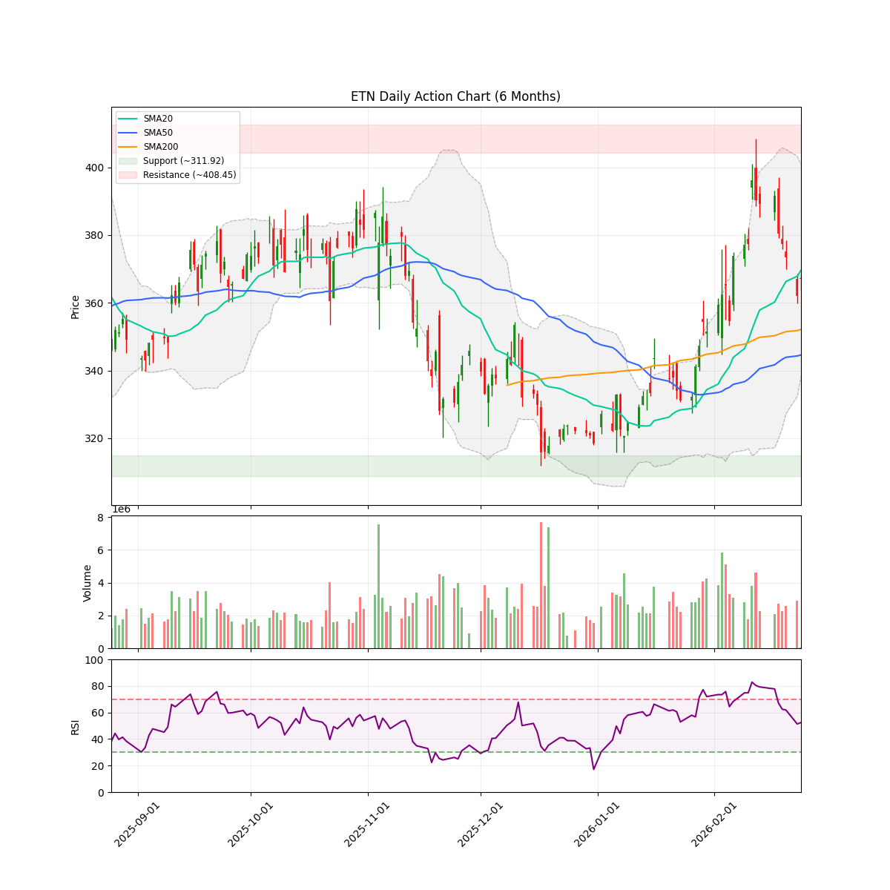
#### 研报分析

### 技术指标概览 (Technical Overview)
- **当前价格**: $367.35
- **RSI (14)**: 52.46
- **移动平均线**: SMA20: $369.60 | SMA50: $344.60 | SMA200: $352.14 (Bearish)
- **波动率**: ATR (14): 13.25 (预计周度波动: +/- $29.63)
- **关键位 (6m)**: 支撑位 $311.92 | 阻力位 $408.45
- **即时状态**: Above SMA50

# 情绪审计报告：伊顿公司 (Eaton Corporation, ETN)
**日期：** 2026年02月24日
**职位：** 对冲基金研究员 (叙事经济学方向)

---

## 1. 催化剂分类 (Catalyst Categorization)

基于近期资讯流，ETN 的叙事动力可归纳如下：

*   **A-Tier (核心催化剂)：**
    *   **盈利能力与利润率扩张：** [Zacks (2026-02-17)](https://finance.yahoo.com/news/3-common-traits-outperforming-stocks-002600011.html) 指出 ETN 近年来持续改善利润率，这是机构投资者最看重的基本面指标。
    *   **机构头寸确认：** [RS Large Cap Value Strategy (2026-02-23)](https://finance.yahoo.com/news/rs-large-cap-value-strategy-132131136.html) 在 2025 年第四季度致投资者信中对 ETN 进行深度分析，显示大资金对该股的长期持有意愿。
*   **B-Tier (中级催化剂)：**
    *   **分析师一致预期：** [Zacks (2026-02-23)](https://finance.yahoo.com/news/wall-street-analysts-think-eaton-143002624.html) 报告显示其平均经纪商建议 (ABR) 为“买入”，反映出卖方机构的一致看好。
    *   **叙事牛市论点：** [Insider Monkey (2026-01-28)](https://www.insidermonkey.com/blog/eaton-corporation-plc-etn-a-bull-case-theory-2-1682962/) 总结了关于 ETN 在电力管理和基础设施领域的长期牛市逻辑。
*   **C-Tier (噪音与次要信息)：**
    *   **热度趋势：** 在 Zacks.com 上被列为“搜索量激增”的股票，属于散户关注度上升，短期可能增加波动。
    *   **宏观干扰：** 伊朗风险导致的油价波动及杠杆 ETF 的零售交易潮，对 ETN 个股基本面影响有限。

---

## 2. 背离检测 (Divergence Detection)

**当前态势：基本面强劲 vs. 技术面震荡**

*   **利好频传，股价滞涨：** 过去一周（2月17日至23日）利好消息密集发布（利润率改善、机构推荐），但当前股价 (367.35) 却处于 SMA20 (369.60) 之下。
*   **看跌详述：** 尽管 RSI (52.46) 处于中性区间，但股价跌破短期均线显示出**多头短期衰竭**。
*   **结论：** 这是一个典型的“好消息中的回调”。市场正在消化 408.45 高点以来的获利盘。由于价格仍远高于 SMA50 (344.60)，结构性牛市并未破坏。这并非“陷阱”，而是**机构级别的重新吸筹窗口**。

---

## 3. 情绪评分 (Sentiment Score)

### **7.8 / 10**
*(评价：强劲的机构叙事，但受制于短期技术面整固)*

*   **理由：** ETN 处于电气化与电网升级的核心叙事路径上。机构持仓稳固且基本面不断改善（A-Tier 支持）。0.2 分的扣除主要源于短期价格低于 SMA20 且距离历史高点仍有阻力，需警惕零售杠杆资金带来的波动放大。

---

## 4. 逻辑核心与趋势研判

*   **支撑位监测：** 目前下方关键支撑在于 SMA50 (344.60)，若跌破此位，情绪将转向结构性恶化。
*   **波动预测：** ATR 显示单周波动区间约为 +/- 29.63。结合 367.35 的现价，若价格回落至 340-350 区间，将是理想的叙事驱动型买入点。
*   **叙事陷阱识别：** 目前未见“估值泡沫”或“增长证伪”的证据。反之，分析师一致推荐（ABR）与利润率提升构成了一道坚实的安全边际。

---

## 5. 关键日期 (Next Major Date)

*   **下一次财报发布日（预计）：** **2026年5月初** (Q1 2026 Earnings Release)。
    *   *注：考虑到 2026-02-23 仍在讨论 Q4 2025 的机构信函，5 月份的财报将是验证 2026 年利润率扩张叙事是否持续的关键时刻。*
#### 近期新闻与事件
- **[Zacks]** [Wall Street Analysts Think Eaton (ETN) Is a Good Investment: Is It?](https://finance.yahoo.com/news/wall-street-analysts-think-eaton-143002624.html)
- **[Zacks]** [3 Common Traits of Outperforming Stocks](https://finance.yahoo.com/news/3-common-traits-outperforming-stocks-002600011.html)
- **[Insider Monkey]** [RS Large Cap Value Strategy’s Analysis on Eaton Corporation (ETN)](https://finance.yahoo.com/news/rs-large-cap-value-strategy-132131136.html)
- **[InvestmentNews]** [Leveraged ETFs ride retail trading boom as single-stock bets redefine market stress playbook](https://www.investmentnews.com/etfs/leveraged-etfs-ride-retail-trading-boom-as-single-stock-bets-redefine-market-stress-playbook/265389)
- **[Guru Focus]** [First Look: Amazon tops Walmart; WBD--Netflix saga; oil up](https://www.gurufocus.com/news/8635622/first-look-amazon-tops-walmart-wbdnetflix-saga-oil-up)

---

### MSFT
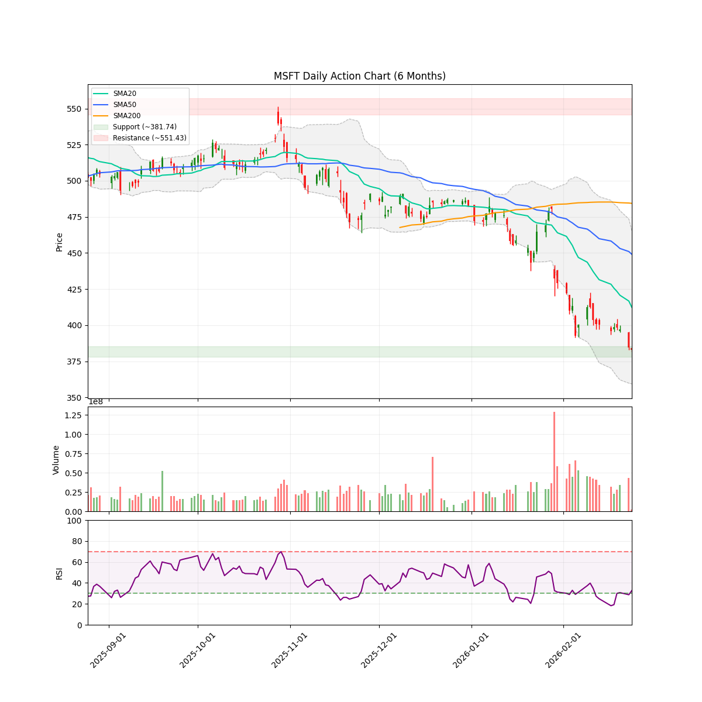
#### 研报分析

### 技术指标概览 (Technical Overview)
- **当前价格**: $383.08
- **RSI (14)**: 32.65
- **移动平均线**: SMA20: $412.42 | SMA50: $449.12 | SMA200: $484.35 (Bearish)
- **波动率**: ATR (14): 10.00 (预计周度波动: +/- $22.36)
- **关键位 (6m)**: 支撑位 $381.74 | 阻力位 $551.43
- **即时状态**: Below SMA50

# 微软 (MSFT) 情绪审计报告

**报告日期：** 2026年2月24日
**研究员：** 对冲基金研究助理 (叙事经济学组)

---

### 1. 催化剂分类 (Catalyst Categorization)

*   **A-Tier (核心催化剂):** 
    *   **业绩基本面维持强势：** 根据 Motley Fool 报道，微软最近一个季度实现了 17% 的稳健增长。尽管股价遭遇抛售，但其核心盈利能力尚未出现系统性崩溃。
*   **B-Tier (中级催化剂):**
    *   **政治与机构资金流入：** 佩洛西 (Nancy Pelosi) 与 Brad Gerstner 被曝买入 MSFT。这种“聪明钱”的入场通常暗示长期底部的叙事正在形成。
    *   **AI 资本支出担忧：** Zacks 提到 AI 资本支出 (Capex) 压力增加。这目前是市场的主要担忧点，但也属于行业共同面对的结构性挑战。
*   **C-Tier (市场噪音):**
    *   **媒体负面评论：** Jim Cramer 声称微软“需要更新”，这类评论属于情绪化噪音，对估值逻辑影响有限。
    *   **每日波动报告：** Zacks 记录的 3.2% 单日下跌属于近期看跌情绪的延续。

---

### 2. 背离检测 (Divergence Detection)

*   **技术面与叙事的背离：** 
    目前 MSFT 的 **RSI 降至 32.65**，已进入严重的超卖区域，且股价 ($383.08) 极其接近 6 个月的支撑位 ($381.74)。
*   **看跌衰竭逻辑：** 
    尽管公司交出了 17% 增长的“好消息”，但股价依然处于 SMA20、SMA50 和 SMA200 之下，呈现明显的空头排列。这种“利好不涨”反映了市场对 AI 成本投入产出比的过度恐慌。
*   **结论：** 
    当前市场处于**情绪陷阱 (Fear Trap)**。基本面依然强劲（A-Tier），但短期叙事被资本支出压力绑架。随着股价逼近 6 个月支撑位且 RSI 探底，卖方动能可能即将耗尽。

---

### 3. 情绪评分 (Logic Score)

**得分：3.8 / 10**

*   **评分逻辑：** 
    *   **0-3 (系统性失效):** 尚未达到，公司盈利依然健康。
    *   **4-6 (调整/筑底期):** MSFT 目前正处于此区间的边缘。虽然技术趋势为 0（极端看跌），但由于核心基本面和机构增持（佩洛西等信号），逻辑上存在强力支撑。
    *   **7-10 (上涨周期):** 缺乏短期催化剂来逆转 SMA50 的下行压力。

---

### 4. 引用参考 (Context Citations)

1.  **关于资本支出压力：** [Zacks] (https://finance.yahoo.com/news/msft-stock-vulnerable-rising-capex-154900800.html)
2.  **关于基本面增长与市场抛售：** [Motley Fool] (https://finance.yahoo.com/news/5-smart-stocks-buy-now-135000661.html)
3.  **关于机构/政客买入：** [Benzinga] (https://finance.yahoo.com/news/nancy-pelosi-brad-gerstner-pile-183037693.html)
4.  **近期股价波动：** [Zacks] (https://finance.yahoo.com/news/stock-market-news-feb-24-121300943.html)

---

### 5. 下一个关键日期 (Next Major Date)

**预计财报日：2026年4月21日 (Q3 FY2026 Earnings)**
*注：由于当前处于 2026年2月24日，市场将高度关注 4 月下旬公布的财报，以验证 AI 投资是否开始转化为超额收益，从而打破当前的资本支出负面叙事。*

---

**审计总结：** MSFT 目前正经历“估值重塑”带来的剧痛。技术面极度疲软，但正处于**技术性反弹的临界点**。建议关注 $381.74 支撑位的守卫情况，若未跌破，此处可能是机构投资者（如报告中提到的佩洛西）布局的长期买点。
#### 近期新闻与事件
- **[Zacks]** [Is MSFT Stock Vulnerable to Rising Capex Pressure From AI Spending?](https://finance.yahoo.com/news/msft-stock-vulnerable-rising-capex-154900800.html)
- **[Insider Monkey]** [Microsoft (MSFT) Needs a Refresh, Says Jim Cramer](https://finance.yahoo.com/news/microsoft-msft-needs-refresh-says-115900097.html)
- **[Motley Fool]** [5 Smart Stocks to Buy Right Now](https://finance.yahoo.com/news/5-smart-stocks-buy-now-135000661.html)
- **[Benzinga]** [Nancy Pelosi, Brad Gerstner Pile Into The Same 5 Stocks — What Do They See Comin...](https://finance.yahoo.com/news/nancy-pelosi-brad-gerstner-pile-183037693.html)
- **[Zacks]** [Stock Market News for Feb 24, 2026](https://finance.yahoo.com/news/stock-market-news-feb-24-121300943.html)

---

### NVDA
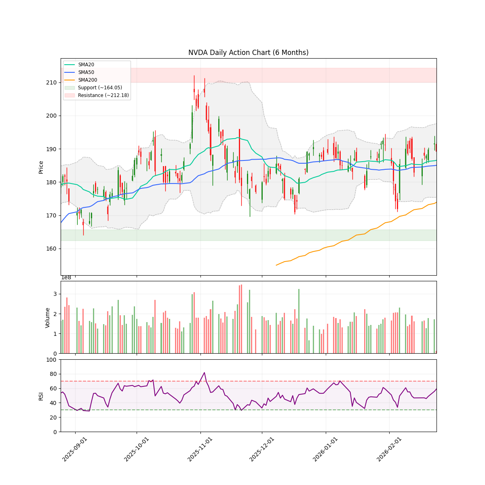
#### 研报分析

### 技术指标概览 (Technical Overview)
- **当前价格**: $189.11
- **RSI (14)**: 59.10
- **移动平均线**: SMA20: $186.54 | SMA50: $185.04 | SMA200: $173.92 (Bullish)
- **波动率**: ATR (14): 6.36 (预计周度波动: +/- $14.22)
- **关键位 (6m)**: 支撑位 $164.05 | 阻力位 $212.18
- **即时状态**: Above SMA50

# 情绪审计报告：NVDA (英伟达)
**报告日期：** 2026年2月24日
**职位：** 对冲基金研究助理（叙事经济学方向）

---

### 1. 催化剂分类 (Catalyst Categorization)

*   **A-Tier（核心催化剂）：**
    *   **Q4 财报发布 (2026-02-25)：** 这是当前市场的绝对重心。根据 [Yahoo Finance](https://finance.yahoo.com/news/live/tech-news-today-countdown-to-nvidia-earnings-begins-as-ai-fears-weigh-on-stocks-133213988.html) 报道，英伟达作为全球市值最大的公司，其业绩将决定整个科技板块的走向。
    *   **机构重磅上调：** Wedbush 分析师重申“跑赢大盘”评级，并将目标价定为 **$230** ([Guru Focus](https://www.gurufocus.com/news/8642726/nvda-wedbush-reiterates-outperform-rating-with-230-price-target-nvda-stock-news))。这种高信心的机构背书在财报前强化了多头叙事。

*   **B-Tier（重要催化剂）：**
    *   **AI 内存技术扩张：** 有报道指出英伟达在 AI 内存扩展方面取得进展，推动股价在财报前逆市上涨 ([Guru Focus](https://www.gurufocus.com/news/8644973/nvidia-nvda-stock-rises-ahead-of-earnings-amid-ai-memory-expansion-news))。
    *   **技术面挤压：** 股价正在冲击关键阻力位，纳斯达克市场对此高度关注 ([FXStreet](https://www.fxstreet.com/news/nvda-earnings-preview-nvidia-presses-key-resistance-as-nasdaq-watches-202602240120))。

*   **C-Tier（噪音与辅助信息）：**
    *   **回顾性叙事：** 关于“10年前投资1000美元能赚多少”的报道 ([Motley Fool](https://finance.yahoo.com/news/youd-invested-1-000-nvda-045000966.html))。此类信息属于典型的零售端情绪助燃剂，无实质基本面影响。

---

### 2. 背离检测 (Divergence Detection)

**分析：** 
目前存在显著的**“抗跌性背离”**。尽管 [Yahoo Finance](https://finance.yahoo.com/news/live/tech-news-today-countdown-to-nvidia-earnings-begins-as-ai-fears-weigh-on-stocks-133213988.html) 提到市场对 AI 的担忧情绪正施压于大盘，但 NVDA 的股价却在财报前表现出韧性，甚至有所上涨。

*   **技术面支持：** 股价 ($189.11) 稳于 SMA50 ($185.04) 和 SMA200 ($173.92) 之上。RSI 为 59.10，显示出健康的看涨动能，且尚未进入超买区。
*   **结论：** 市场正在“无视”宏观忧虑，转而通过 NVDA 寻求确定性。这种“在坏消息中上涨”或“在担忧中横盘”的走势，通常预示着强劲的机构支撑，而非看跌衰竭。

---

### 3. 情绪与逻辑评分 (Sentiment & Logic Score)

#### **情绪分数：8.5/10 (强劲牛市循环)**
*   **理由：** 财报前的抢筹行为显而易见。Wedbush 的 $230 目标价为市场提供了巨大的想象空间。尽管“门槛被不断抬高” ([Benzinga](https://www.msn.com/en-us/money/topstocks/nvidia-q4-earnings-preview-5-things-to-watch-the-bar-keeps-getting-higher/ar-AA1WUGoa))，但目前叙事仍由“AI 基础设施需求未见顶”主导。

#### **逻辑分数：8.0/10**
*   **理由：** 支撑逻辑在于英伟达在 AI 领域的统治力及持续的利润转化。逻辑风险在于预期的过度交易化（Priced in）。如果明日财报仅是“符合预期”而无“超预期指引”，可能会出现“卖事实”的短期回调。

---

### 4. 关键日期与总结 (Next Major Date)

*   **下一个重大日期：2026年2月25日 (周三)**
    *   **事件：** 第四季度 (Q4) 财报发布。
*   **操作建议：** 
    目前处于财报前的“情绪高潮期”。考虑到预计周波幅达到 **+/- 14.22**，建议关注 **$212.18**（6个月高点）的突破情况。若财报利好，突破该位置将开启新的价格发现通道；若指引不及预期，下方支撑点位看 **$173.92** (SMA200)。

---
**核心风险提示：** “期望门槛持续抬高”是目前最大的叙事陷阱，警惕财报后即便数据亮眼但因指引平庸导致的机构获利了结。
#### 近期新闻与事件
- **[Yahoo Finance]** [Tech news today: Countdown to Nvidia earnings begins as AI fears weigh on stocks](https://finance.yahoo.com/news/live/tech-news-today-countdown-to-nvidia-earnings-begins-as-ai-fears-weigh-on-stocks-133213988.html)
- **[Guru Focus]** [NVIDIA (NVDA) Stock Rises Ahead of Earnings Amid AI Memory Expan](https://www.gurufocus.com/news/8644973/nvidia-nvda-stock-rises-ahead-of-earnings-amid-ai-memory-expansion-news)
- **[Motley Fool]** [If You'd Invested $1,000 in NVDA 10 Years Ago, Here's How Much You'd Have Today](https://finance.yahoo.com/news/youd-invested-1-000-nvda-045000966.html)
- **[Guru Focus]** [NVDA: Wedbush Reiterates Outperform Rating with $230 Price Targe](https://www.gurufocus.com/news/8642726/nvda-wedbush-reiterates-outperform-rating-with-230-price-target-nvda-stock-news)
- **[The Forex Market]** [NVDA earnings preview: NVIDIA presses key resistance as Nasdaq watches |...](https://www.fxstreet.com/news/nvda-earnings-preview-nvidia-presses-key-resistance-as-nasdaq-watches-202602240120)

---

### TSM
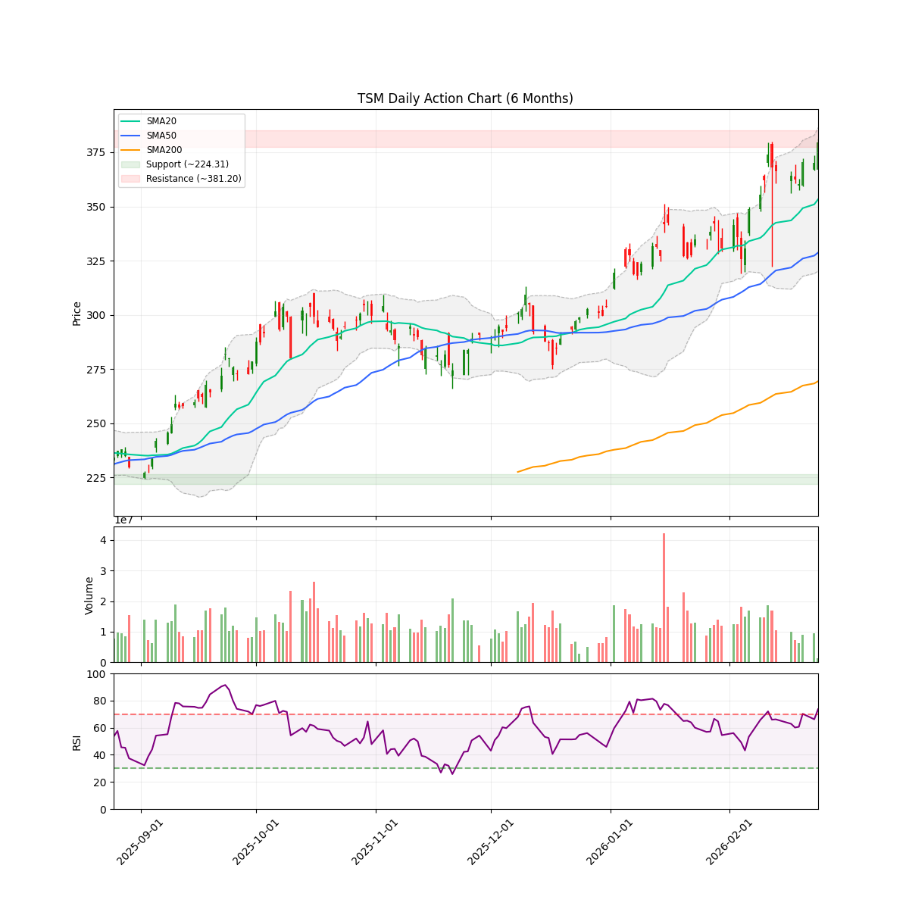
#### 研报分析

### 技术指标概览 (Technical Overview)
- **当前价格**: $379.41
- **RSI (14)**: 73.71
- **移动平均线**: SMA20: $353.29 | SMA50: $328.72 | SMA200: $269.41 (Bullish)
- **波动率**: ATR (14): 15.43 (预计周度波动: +/- $34.51)
- **关键位 (6m)**: 支撑位 $224.31 | 阻力位 $381.20
- **即时状态**: Above SMA50

# 情绪审计报告：台积电 (TSM) - 2026年2月24日

**职位：** 对冲基金研究助理（叙事经济学专家）
**核心目标：** 评估 TSM 的新闻周期是驱动可持续趋势还是“多头陷阱”。

---

### 1. 催化剂分类 (Catalyst Categorization)

*   **A-Tier（顶级催化剂：决定性长期趋势）**
    *   **AI 叙事领跑者：** 根据 Zacks (2026-02-23) 的报道，TSM 在 2026 年的表现跑赢了 NVIDIA (NVDA)。这标志着市场叙事从“终端芯片商”转向了“底层产能垄断者”，这种地位的重新定义是可持续牛市的基石。 [参考链接](https://www.zacks.com/stock/news/2873835/3-ai-stocks-outpacing-nvidia-in-2026---with-more-upside-ahead)
    *   **估值溢价重塑：** Yahoo Finance 指出 TSM 正在摆脱“AI 泡沫”恐惧，其底层业务的基本面定位（Fundamental Position）使其能够在高位波动中继续走高。 [参考链接](https://finance.yahoo.com/news/taiwan-semi-stock-soaring-above-183002987.html)

*   **B-Tier（中级催化剂：行业动力与利润辩论）**
    *   **毛利率可持续性：** 市场正在辩论海外晶圆厂扩张是否会侵蚀其 60% 的毛利率目标。这是目前唯一的理性空头切入点。 [参考链接](https://finance.yahoo.com/news/tsm-sustain-60-gross-margin-125600132.html)
    *   **相对价值评估：** 与美光 (MU) 的对比显示，尽管 TSM 增长强劲，但部分资金可能会因为 MU 较低的 P/E 比率而产生短期分流。 [参考链接](https://finance.yahoo.com/news/mu-vs-tsm-semiconductor-stock-125000479.html)

*   **C-Tier（低级催化剂：噪音与常规评级）**
    *   **分析师一致预期：** 华尔街平均买入建议 (ABR) 和 25.25% 的潜在涨幅预测，属于常规情绪支撑，缺乏新鲜动力。 [参考链接](https://finance.yahoo.com/news/tsmc-tsm-climb-25-25-145501686.html)

---

### 2. 背离检测 (Divergence Detection)

*   **价格与指标背离：** 当前股价 (379.41) 极其接近 6 个月高点阻力位 (381.20)。同时，**RSI 高达 73.71**，处于超买区间。
*   **现象观察：** 尽管新闻面充斥着“跑赢英伟达”等极其乐观的 A-Tier 消息，但股价在接近 381.20 阻力位时增长斜率放缓。
*   **诊断：** 尚未出现“好消息下跌”的利好耗尽迹象，但**技术性过热**明显。目前的上涨是由纯粹的“FOMO（恐慌性买入）”和叙事驱动，而非估值修复。建议警惕在阻力位附近的回踩风险。

---

### 3. 情绪评分与逻辑审计

#### **情绪评分 (Sentiment Score): 8.8/10**
*   **评价：** 处于“强力看涨周期”。市场已将 TSM 视为 AI 时代的实物黄金。海外扩张的成本担忧被强劲的订单需求所掩盖。

#### **逻辑评分 (Logic Score): 9.0/10**
*   **评价：** 逻辑链条非常完整。作为全球先进制程的唯一供应商，TSM 跑赢 NVDA 的叙事具有极强的说服力，因为无论谁在 AI 竞赛中获胜，最终都必须向 TSM 支付“买路钱”。

---

### 4. 关键财务数据摘要

*   **当前价格：** 379.41
*   **移动平均线：** 价格高于 SMA20 (353.29), SMA50 (328.72) 和 SMA200 (269.41)，呈现完美多头排列。
*   **波动性：** ATR (14) 为 15.43，本周预期波动区间约为 +/- 34.51。
*   **支撑/阻力：** 强力支撑位于 224.31，近期阻力位 381.20。

---

### 5. 下一个重大日期 (Next Major Date)

**预计日期：2026年4月中旬（2026年Q1财报发布日）**
*   **关注重点：** 届时需密切关注管理层对于**海外厂毛利率（Gross Margin）影响**的最新指引，以及 2nm 产能预订情况。这可能决定股价能否突破 400 大关。

---
**结论：** TSM 目前正处于“叙事加速期”。虽然 RSI 提示超买，但在 A-Tier 催化剂失效前，任何基于技术指标的做空都极具风险。短期策略应关注 381.20 阻力位的突破确认。
#### 近期新闻与事件
- **[Yahoo Finance]** [Taiwan Semi Stock Is Soaring Above AI Bubble Fears. Where Options Data Says It Is Headed Next.](https://finance.yahoo.com/news/taiwan-semi-stock-soaring-above-183002987.html)
- **[Yahoo Finance]** [MU vs. TSM: Which Semiconductor Stock Has the Edge Right Now?](https://finance.yahoo.com/news/mu-vs-tsm-semiconductor-stock-125000479.html)
- **[Zacks]** [Can TSM Sustain 60%+ Gross Margin Amid Overseas Fab Expansion?](https://finance.yahoo.com/news/tsm-sustain-60-gross-margin-125600132.html)
- **[Zacks]** [3 AI Stocks Outpacing NVIDIA in 2026 - With More Upside Ahead](https://www.zacks.com/stock/news/2873835/3-ai-stocks-outpacing-nvidia-in-2026---with-more-upside-ahead)
- **[Zacks]** [Is It Worth Investing in TSMC (TSM) Based on Wall Street's Bullish Views?](https://finance.yahoo.com/news/worth-investing-tsmc-tsm-based-143005496.html)

---

### VRT
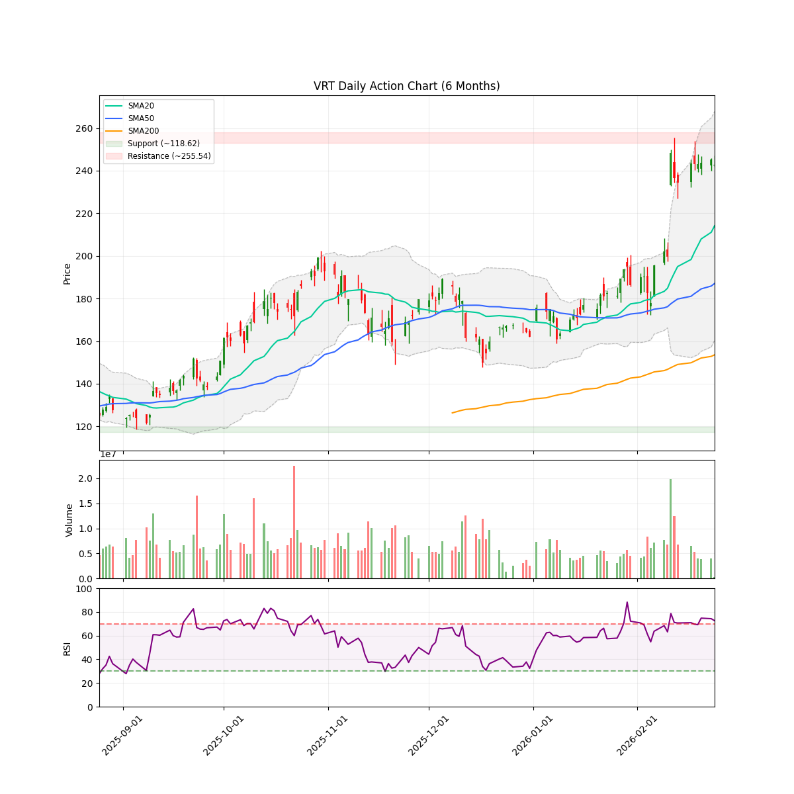
#### 研报分析

### 技术指标概览 (Technical Overview)
- **当前价格**: $242.81
- **RSI (14)**: 72.63
- **移动平均线**: SMA20: $214.16 | SMA50: $187.07 | SMA200: $153.56 (Bullish)
- **波动率**: ATR (14): 15.11 (预计周度波动: +/- $33.78)
- **关键位 (6m)**: 支撑位 $118.62 | 阻力位 $255.54
- **即时状态**: Above SMA50

# Vertiv Holdings Co (VRT) 情绪审计报告

**致：** 投资委员会
**从：** 对冲基金研究助理（叙事经济学方向）
**日期：** 2026年02月24日
**标的：** Vertiv Holdings Co (VRT)

---

### 1. 催化剂分类 (Catalyst Categorization)

基于“叙事经济学”框架，我们将近期驱动 VRT 的因素分为三个等级：

*   **A-Tier（核心基本面/结构性叙事）：**
    *   **积压订单与增长：** 公司坐拥 150 亿美元的待执行订单（Backlog），且有机订单增长高达 252%。这并非短期波动，而是数据中心物理基础设施的长期结构性短缺导致的。 (来源: [MSN/YouTube](https://www.msn.com/en-us/money/top-stocks/this-stock-has-a-15-billion-backlog-better-than-nvidia/vi-AA1WVhYU))
    *   **业绩超预期：** 2026年2月10日发布的 Q4 财报显示盈利与营收双双超预期（EPS Surprise +5.80%），证明其高增长叙事正在转化为实际利润。 (来源: [Zacks](https://finance.yahoo.com/news/vertiv-holdings-co-vrt-beats-120501035.html))
    *   **英伟达协同效应：** 与 Nvidia 深度合作解决 AI 液冷挑战，使 VRT 成为“AI 军备竞赛”中不可或缺的基建供应商。 (来源: [Yahoo Finance](https://finance.yahoo.com/news/best-ai-stocks-buy-now-201900310.html))

*   **B-Tier（市场共识/评级上调）：**
    *   **机构认可：** Zacks 将其上调至“强力买入”（Strong Buy），华尔街分析师普遍看好其在 AI 中断背景下的表现。 (来源: [Zacks](https://finance.yahoo.com/news/vertiv-vrt-upgraded-strong-buy-170003722.html))
    *   **板块效应：** 被列入“2026年必买的七大高增长股”之首，主要受 AI 基础设施和电力需求驱动。 (来源: [Fin Tek on MSN](https://www.msn.com/en-us/money/topstocks/top-7-stocks-to-buy-now-for-2026-high-growth-stocks/vi-AA1WXTKW))

*   **C-Tier（噪音/散户心理）：**
    *   **“是否过迟”的讨论：** 媒体开始讨论在一年上涨 170% 后是否还能入场。这种噪音通常出现在趋势的中后期，反映了市场踏空者的焦虑。 (来源: [Yahoo Finance](https://finance.yahoo.com/news/too-consider-vertiv-holdings-co-071254641.html))

---

### 2. 背离检测 (Divergence Detection)

*   **价格与新闻一致性：** 目前尚未发现明显的“有利好却下跌”的背离。价格在强劲的 Q4 财报后保持在 SMA20 (214.16) 之上，且接近 6 个月高点 (255.54)。
*   **技术性预警：** **RSI 目前为 72.63**，处于超买区间。尽管叙事极度看涨，但技术面显示短期内存在“超买衰竭”的风险。
*   **潜在陷阱：** 市场开始出现“比英伟达更好”的极端叙事。根据叙事经济学，当一个标的被神话为“永恒持有”且对比行业龙头时，往往接近情绪阶段性顶部。

---

### 3. 情绪评分 (Sentiment Score)

**得分：9.0/10 — 强力看涨周期 (Strong Bullish Cycle)**

*   **理由：** 核心叙事（AI 液冷 + 巨额积压订单）具有极高的可持续性。与纯粹的软件 AI 不同，物理基础设施的建设周期长，150 亿的积压订单为未来 2-3 年的业绩提供了极高的可见度。目前的溢价是市场对“稀缺物理资产”的定价。

---

### 4. 逻辑评分 (Logic Score)

**得分：8.5/10 — 逻辑严密，警惕波动**

*   **分析：** 支撑股价的逻辑链条非常完整（AI 算力 -> 热量管理需求 -> 行业龙头订单爆炸）。唯一的减分项是当前价格偏离 SMA200 (153.56) 过远，乖离率较高，估值修复的压力正在积累。

---

### 5. 下一个关键日期 (Next Major Date)

*   **2026年4月下旬/5月初：** 预计发布 **2026年第一季度 (Q1 2026) 财报**。
    *   *重点观察：* 积压订单（Backlog）是否继续增长，以及有机订单增速是否放缓。

---

### 总结建议

VRT 目前正处于“不可阻挡的叙事周期”中。**并非“陷阱”，但已进入“高波动区”**。由于 RSI 超买且位于阻力位 255 附近，建议不要在此刻满仓追高，而应关注支撑位 214 (SMA20) 附近的震荡整固机会。

**风险提示：** 关注 2026-02-24 提到的“是否太晚”的媒体声音，若此类文章大规模增加，可能预示散户博弈加剧，短期波动将显著放大（ATR 显示周波幅约 +/- 33.78）。
#### 近期新闻与事件
- **[Yahoo Finance]** [Is It Too Late To Consider Vertiv Holdings Co (VRT) After A 170% One Year Surge?](https://finance.yahoo.com/news/too-consider-vertiv-holdings-co-071254641.html)
- **[Fin Tek on MSN]** [Top 7 stocks to buy now for 2026 (high growth stocks)](https://www.msn.com/en-us/money/topstocks/top-7-stocks-to-buy-now-for-2026-high-growth-stocks/vi-AA1WXTKW?ocid=BingNewsVerp)
- **[CNBC]** [Top Wall Street analysts are bullish on the growth potential of these three stocks](https://www.msn.com/en-us/money/topstocks/top-wall-street-analysts-are-bullish-on-the-growth-potential-of-these-three-stocks/ar-AA1WQcIO)
- **[Yahoo Finance]** [Best AI Stocks to Buy Now and Hold Forever: Nvidia-Beating Vertiv](https://finance.yahoo.com/news/best-ai-stocks-buy-now-201900310.html)
- **[YouTube]** [This stock has a $15 billion backlog (better than Nvidia?)](https://www.msn.com/en-us/money/top-stocks/this-stock-has-a-15-billion-backlog-better-than-nvidia/vi-AA1WVhYU)

---
