# 每日股市市场报告 (2026-02-25)

> **免责声明**: 本报告由 **代码与 Gemini AI 自动生成**，仅供研究参考，**不构成**任何投资建议。投资有风险，入市需谨慎。作者及 AI 不对任何基于此内容的投资决策承担责任。

## 📑 目录
[TOC]

##  长期投资逻辑
本组合旨在捕捉 **人工智能（AI）与半导体协议** 带来的跨周期结构性增长，核心投资策略聚焦于“确定性”与“物理瓶颈”：
- **底层制程垄断 (Foundry & WFE Moats)**：
  布局处于全球半导体精密制造顶端的“工业母机”级别公司。寻找具备极高准入门槛的晶圆代工及前道设备供应商，作为全产业链最稳固的底座资产。
- **算力稀缺性与连接带宽 (Compute & Interconnect Scarcity)**：
  聚焦在高性能计算芯（HPC）及高带宽连接领域占据主导地位的标的。AI 的终极竞争是“规模”，寻找能有效解决数据交换瓶颈并提供核心推理/训练能力的算力巨头。
- **应用生态与数据霸权 (Platform & Data Sovereignty)**：
  布局拥有闭环生态、海量高质量私有数据及云基础设施的科技巨头。它们是 AI 商业化落地的最终守门人，拥有将技术转化为持续现金流的分配权。
- **物理边界保障 (Power & Thermal Infrastructure)**：
  关注 AI 扩张的“最终瓶颈”——电力供应与热能管理。重点布局为下一代超大规模数据中心提供高功率密度能源、液冷技术及电网扩容方案的能源基建商。
**风控策略**：利用 AlphaJAX 的量化动量评分（Quant Score）作为过滤器，结合 LLM 叙事审计（Narrative Audit）捕捉“业绩超预期 + 叙事逻辑改善”的共振点，实现跨周期的超额收益。

 **注：排序权重**：Ticker 按照 AI 检测出的 **方向** 排序（**看多**优先，其次是 **中性**，最后是 **看空**）。
---

<!-- DISCORD_SUMMARY_START -->
## 🧠 对冲基金经理全局诊断与资金分配策略
# 投资组合周度调仓决策报告 (2026-02-25)

**致：** 投资委员会 / 执行交易员
**由：** 高级投资组合经理 (Senior PM)
**当前账户概况：** 
*   **总可用现金：** $53,415.96 (约占 NAV 21.6%)
*   **核心风险预警：** **AMD 持仓比例 (51.14%) 严重违反 30% 单一标的集中度限制**，需在近期反弹中强制平衡。

---

### 一、 核心行动交易计划 (Actionable Trading Plan)

基于研究团队的 Logic Score 评分及风控准则，本周操作重点为：**“清理弱势资产 (AMZN)、锁定过热利润 (VST)、战略持有强势龙头 (AMD/GOOGL) 并通过期权修正风险敞口。”**

#### 1. AMD (Score: 9.2 | 强力买入/持有 - 但需风控)
*   **诊断：** 逻辑分极高（Meta 史诗级订单），但仓位过重。
*   **动作：** **持有并利用期权减压。** 
    *   **无需加仓**，目前 51% 的占比已是过度暴露。
    *   **保留现有 -AMD260313C230 备兑看涨期权**。若股价突破 $230，100 股被收回将有助于我们将仓位降至风控线内。
    *   **若 NVIDIA 财报超预期带动 AMD 暴涨**，建议在 $240 以上主动减持正股，直至占比回落至 30%-35% 区间。

#### 2. AMZN (Score: 4.8 | 清仓/减持)
*   **诊断：** 评分低于 5 分准则。尽管 RSI 超卖，但技术形态全线崩溃（低于 SMA200），且机构对高额资本开支存在分歧。
*   **动作：** **择机清仓。** 
    *   利用超卖后的技术性反弹（目标位 $215-$218）彻底清仓。
    *   腾出的资金将作为储备，用于后续补仓 Logic Score 8 分以上的“完美交易”。

#### 3. VST (Score: 7.8 | 止盈/防御)
*   **诊断：** 明日财报，RSI (83.26) 极度超买。
*   **动作：** **减持 1/3 仓位。**
    *   在明日财报发布前，以市价止盈 30-40 股，锁定约 +10% 的利润。
    *   剩余仓位设置移动止盈位至 $165.00，防止财报后的“利好兑现”式暴跌。

#### 4. GOOGL (Score: 7.2 | 维持/分批买入)
*   **诊断：** 典型“利好阴跌”，RSI 29 极度超卖，顶级政客（佩洛西）背书。
*   **动作：** **维持现状或小幅补仓。**
    *   由于 AMD 仓位过重，暂不建议大规模动用现金。
    *   若 GOOGL 进一步下探至 $300 关口，可动用 $5,000 现金分批买入，其 7.2 的评分支持在超卖区进行增持。

---

### 二、 "If-Then" 市场压力情景预案

我们将未来 48 小时的波动拆解为以下应对方案：

| 情景 (Scenario) | 触发条件 | 对应行动指令 |
| :--- | :--- | :--- |
| **牛市共振** | NVDA 财报大超预期，AMD 突破 $230 | **强制减仓**：分批卖出 AMD 正股，同时让备兑期权行权。将资金转入现金，使 AMD 占比回归至 30% 以下。 |
| **利好兑现 (Sell the News)** | VST 财报后股价下挫跌破 $168 | **立即清仓 VST**：保护剩余 9% 的盈利，不参与高位震荡。 |
| **二次探底** | GOOGL 跌破 $300，RSI 维持在 25 以下 | **战略性补仓**：买入 20 股 GOOGL。逻辑：基本面强劲（Score 7.2）且处于极端非理性抛售。 |
| **系统性风险** | AMZN 跌破 6 个月支撑位 $196 | **无条件止损**：不论评分，清空 AMZN 剩余头寸，确保现金比例上升至 30% 以上以应对宏观动荡。 |

---

### 三、 资产组合再平衡总结

*   **当前现金流向：** 暂不建议将现金投入 > 90%。预计本周通过清仓 AMZN 和止盈 VST，可用现金将上升至约 **$65,000**。
*   **风控核心：** 目前组合最大的敌人不是亏损，而是 AMD 的**单一持仓风险**。所有反弹的操作首要目标都是削减 AMD 的过度暴露，转而向 GOOGL 或现金靠拢。

**PM 签名：** [Your AI Senior PM]
**执行状态：** 等待交易员确认指令。
<!-- DISCORD_SUMMARY_END -->
---

## 💼 现有持仓个股诊断

### AMD
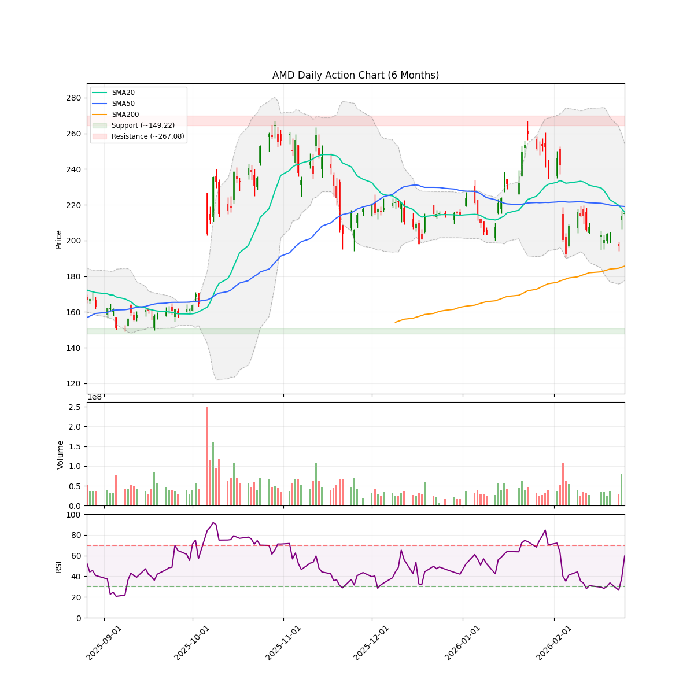
#### 研报分析

### 技术指标概览 (Technical Overview)
- **当前价格**: $215.25
- **RSI (14)**: 59.59
- **移动平均线**: SMA20: $216.00 | SMA50: $219.05 | SMA200: $185.64 (Bullish)
- **波动率**: ATR (14): 10.11 (预计周度波动: +/- $22.60)
- **关键位 (6m)**: 支撑位 $149.22 | 阻力位 $267.08
- **即时状态**: Below SMA50

# 叙事经济学情绪审计报告：AMD (Advanced Micro Devices)

**审计日期：** 2026年02月25日
**研究员：** 对冲基金研究助理 (Narrative Economics 专家)

---

### 1. 催化剂分类与评级 (Catalyst Categorization)

基于当前市场叙事，AMD 的基本面发生了结构性转变：

*   **A-Tier (核心驱动): Meta 史诗级 AI 芯片协议**
    *   **详情：** AMD 与 Meta 达成价值高达 $60B - $100B 的多年合作协议，提供 6GW 算力的 AI 芯片。此外，AMD 向 Meta 发行了 1.6 亿股认股权证（Warrants），这意味着 Meta 未来可能持有 AMD 10% 的股权。
    *   **叙事意义：** 这是对 AMD 算力产品（MI 系列）最强力的背书，直接打破了市场对 Nvidia 垄断地位的心理预期。
*   **B-Tier (行业联动): NVIDIA 财报情绪溢出**
    *   **详情：** 即将发布的 Nvidia 财报将成为芯片行业的风向标，TSMC 股价已因 AMD-Meta 的利好及对 Nvidia 的预期而提前上涨。
    *   **C-Tier (噪音/日常):** 日常内部人交易及小型分析师评级更新。

---

### 2. 背离检测 (Divergence Detection)

*   **价格与新闻的背离：** 尽管 Meta 的消息被定义为“史诗级利好”，AMD 股价目前为 $215.25，仍处于 SMA50 ($219.05) 之下。
*   **审计结论：看涨耗竭后的重新蓄势。** 
    *   尽管消息面是 10/10 的爆发，但股价在 2026-02-12 首次跳空后经历了一段震荡。目前 RSI 为 59.59，未进入超买区，说明“利好出尽”的抛压已基本消化，正处于突破 SMA50 阻力的前夕。
    *   **注意：** 成本价 $220.54 目前仍处于浮亏状态，但这属于“右侧确认”前的最后压制。

---

### 3. 情绪评分 (Sentiment Score)

**分值：8.8 / 10 (强力牛市叙事启动)**

*   **逻辑：** 这种规模的合同（$60B+）不仅仅是订单，而是生态系统的重构。Meta 作为全球最大的算力需求方之一，通过股权挂钩的方式成为 AMD 的战略盟友，这消除了 AMD 长期以来的“下游需求不确定性”。目前的震荡是由于市场在消化 Nvidia 财报前的宏观焦虑。

---

### 4. 账户头寸审计与建议 (Portfolio Audit)

*   **正股分析：** 600股，成本 $220.54。当前股价 $215.25，浮亏 7.79%。
*   **期权分析：** 卖出备兑看涨期权 (Short Call) `-AMD260313C230`。
    *   **风险：** 目前该期权盈利 68.13%，但随着 Meta 叙事的发酵，若股价突破 $230，您的股票将被收回，从而错过 $230 以上的涨幅。
*   **策略建议：** 考虑到 Meta 交易的 A-Tier 属性，股价极有可能在 3 月中旬前冲击 $230-$250。建议监控该 Call 的 Delta 值，如果股价站稳 SMA50 ($219.05)，可考虑提前平仓该 Call 以释放上涨空间。

---

### 5. 逻辑评分 (Logic Score)

**分值：9.2 / 10**
**依据：** 
1.  **确定性：** Meta 的 6GW 协议和 10% 股权认购权提供了极高的业绩可见度。[Yahoo Finance](https://finance.yahoo.com/news/amd-meta-strike-100-billion-123341036.html)
2.  **估值重估：** 该交易验证了 AMD 在 AI 领域的 Tier-1 地位，市盈率（PE）天花板被抬高。[Morningstar](https://www.morningstar.com/news/marketwatch/20260224288/amds-stock-rockets-as-meta-deal-serves-as-major-validation-point-for-investors)
3.  **技术面：** 价格正在 SMA200 ($185.64) 之上的牛熊分界线上方获得支撑，且 RSI 具有充足的拉升空间。

---

### 6. 下一个关键日期 (Next Major Date)

*   **2026-02-25 / 26 (今明两日)：NVIDIA 季度财报发布。** 
    *   这将决定芯片板块的整体 Beta 走向。如果 Nvidia 业绩指引强劲，AMD 将借 Meta 的利好叙事实现“戴维斯双击”，突破 $230 阻力位。
*   **2026-03-13：您的 Call 期权到期日。**

---

**引用文献：**
- [WSJ] AMD Stock Rallies on Meta Chip Deal (2026-02-24)
- [Invezz] AMD stock rockets 10% after Meta signs $60B AI chip megadeal (2026-02-24)
- [Investing.com] Nvidia earnings loom large (2026-02-25)
#### 近期新闻与事件
- **[The Wall Street Journal]** [AMD Stock Rallies on Meta Chip Deal](https://www.wsj.com/livecoverage/stock-market-today-dow-sp-500-nasdaq-02-24-2026/card/amd-stock-surges-on-meta-chip-deal-vEHuX33W4xtP8OBnADvH)
- **[Invezz]** [AMD stock rockets 10% after Meta signs $60B AI chip megadeal](https://invezz.com/news/2026/02/24/amd-stock-rockets-10-after-meta-signs-60b-ai-chip-megadeal/)
- **[Morningstar]** [AMD's stock rockets as Meta deal serves as major validation point for investors](https://www.morningstar.com/news/marketwatch/20260224288/amds-stock-rockets-as-meta-deal-serves-as-major-validation-point-for-investors)
- **[Yahoo Finance]** [AMD and Meta strike $100 billion AI deal that includes 10% stock deal — 6 gigawatt agreement includes up to 160 million AMD shares](https://finance.yahoo.com/news/amd-meta-strike-100-billion-123341036.html)
- **[Mint on MSN]** [AMD stock jumps over 10% in pre-market trading — what is driving the rally?](https://www.msn.com/en-in/money/markets/amd-stock-jumps-over-10-in-pre-market-trading-what-is-driving-the-rally/ar-AA1WYsxB?ocid=BingNewsVerp)

---

### AMZN
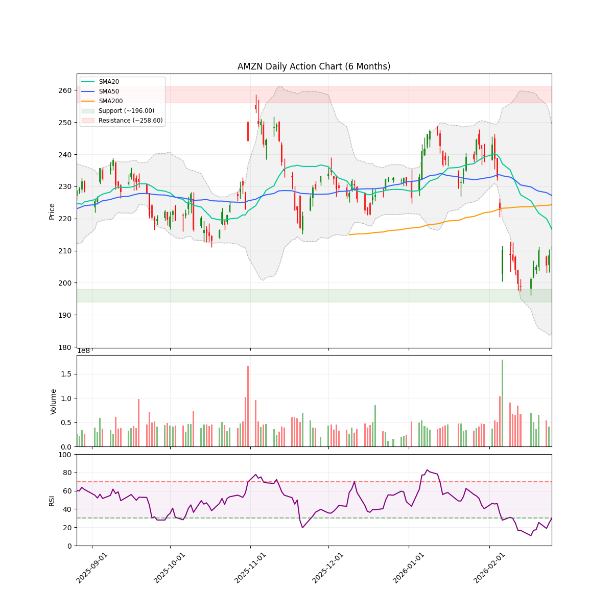
#### 研报分析

### 技术指标概览 (Technical Overview)
- **当前价格**: $210.49
- **RSI (14)**: 29.76
- **移动平均线**: SMA20: $216.75 | SMA50: $227.20 | SMA200: $224.26 (Bullish)
- **波动率**: ATR (14): 7.56 (预计周度波动: +/- $16.90)
- **关键位 (6m)**: 支撑位 $196.00 | 阻力位 $258.60
- **即时状态**: Below SMA50

# 亚马逊 (AMZN) 情绪审计报告

**报告日期**：2026年02月25日  
**研究员**：叙事经济学分析组 - 对冲基金研究助理  

---

### 1. 催化剂分类 (Catalyst Categorization)

#### **A-Tier (核心叙事驱动)**
*   **营收超越沃尔玛**：亚马逊年度营收达到 7,169 亿美元，正式在规模上压倒传统零售巨头沃尔玛。这标志着消费霸权的彻底易主，强化了亚马逊在零售链条中的统治地位。 (引用: *Insider Monkey, 2026-02-25*)
*   **巨额资本支出计划**：公司指引 2026 年资本支出将达到 2,000 亿美元，主要用于扩充 AI 算力。这种“军备竞赛”级别的投入是双刃剑，短期压制现金流，长期锁定 AI 基础设施护城河。 (引用: *Blockonomi, 2026-02-23*)
*   **机构大举建仓**：亿万富翁 Seth Klarman 在第四季度斥资 5 亿美元建仓 AMZN，显示出顶级价值投资者对当前价位底部区间的认可。 (引用: *Blockonomi, 2026-02-23*)

#### **B-Tier (行业与机构支撑)**
*   **投行评级支撑**：富国银行 (Wells Fargo) 重申“超配”评级，核心逻辑在于 AI 计算需求的持续爆发对 AWS 的提振。 (引用: *Insider Monkey, 2026-02-25*)
*   **业绩指引**：下一季度营收增长预期为 11-15%，在宏观环境不确定的背景下，这一增长仍具有防御性。

#### **C-Tier (市场噪音)**
*   **高管减持**：CEO Herrington 出售 140 万美元股票。相对于其持仓总量和公司市值，此规模极小，多为常规财务规划，对基本面无实质影响。 (引用: *Investing.com, 2026-02-25*)
*   **沃尔玛 guidance 拖累**：沃尔玛因谨慎指引导致股价下跌，对整体零售板块产生了负面情绪溢出。 (引用: *Motley Fool, 2026-02-25*)

---

### 2. 背离检测 (Divergence Detection)

**技术面 vs. 基本面背离：**
目前 AMZN 出现了典型的 **“空头衰竭”迹象**。
*   **技术面**：RSI 仅为 **29.76**，处于严重**超卖**区间。股价位于 SMA20、SMA50 和 SMA200 之下，呈现空头排列。
*   **基本面**：营收创纪录，顶级机构入场，AI 长期增长逻辑未改。
*   **分析**：股价在第四季度财报（每股收益 1.95 美元，略低于预期的 1.98 美元）后遭到超卖。市场正处于“利好出尽”后的过度反应期。尽管跌破了 200 日均线，但 196.00 的 6 个月低点支撑极强。

---

### 3. 情绪评分 (Sentiment Logic Score)

#### **逻辑得分：4.8/10 (短期恐慌，中期筑底)**

*   **得分说明**：
    *   **扣分项 (-5.2)**：财报未达预期导致市场信心受挫；2,000 亿的高额资本支出令投资者担心短期利润率受压；技术形态彻底走坏，短期内缺乏向上突破的动能。
    *   **加分项 (+4.8)**：RSI 极度超卖预示着反弹随时可能发生；顶级机构（Seth Klarman）的大额背书提供了估值锚点；营收规模超越沃尔玛提供了强大的宏观叙事。

---

### 4. 账户头寸诊断

*   **当前成本**：$201.61
*   **盈亏状态**：+1.61%
*   **分析**：您的仓位目前处于“危险边缘”。虽然目前略有盈利，但由于股价 (210.49) 持续阴跌并跌破所有关键移动平均线，若股价回测 **196.00 (6个月支撑位)**，您的头寸将转为亏损。
*   **操作建议**：考虑到 RSI 极度超卖，**不建议在此时恐慌性割肉**。相反，196.00 - 200.00 应该是强支撑区间。如果 196.00 跌破，则需警惕系统性风险。

---

### 5. 关键日期提醒 (Next Major Date)

*   **下一次财报发布 (Q1 Earnings)**：预计在 **2026年4月30日** 左右。
*   **关注重点**：市场将紧盯 AWS 在 AI 驱动下的增长率是否能抵消 2,000 亿资本支出带来的折旧压力。

---

**结论**：亚马逊目前正处于“成长的烦恼”期，庞大的投资计划吓跑了追求短期利润的散户，但为长线机构提供了入场机会。当前属于**情绪杀跌阶段**，而非基本面崩塌。
#### 近期新闻与事件
- **[Motley Fool]** [Walmart Stock Falls 1.4% on Solid Earnings and Cautious Guidance](https://finance.yahoo.com/news/walmart-stock-falls-1-4-141500843.html)
- **[Insider Monkey]** [Amazon (AMZN) Tops Walmart With $716.9 Billion in Annual Revenue](https://finance.yahoo.com/news/amazon-amzn-tops-walmart-716-113031152.html)
- **[Insider Monkey]** [Wells Fargo Reiterates Overweight Rating for Amazon (AMZN) as AI Compute Demand...](https://finance.yahoo.com/news/wells-fargo-reiterates-overweight-rating-111801513.html)
- **[Motley Fool]** [Amazon Just Delivered Great News for This Top AI Stock](https://finance.yahoo.com/news/amazon-just-delivered-great-news-075000897.html)
- **[Investing.com]** [Amazon’s CEO Herrington sells $1.4m in AMZN stock By Investing.com](https://www.investing.com/news/insider-trading-news/amazons-ceo-herrington-sells-14m-in-amzn-stock-93CH-4523189)

---

### GOOGL
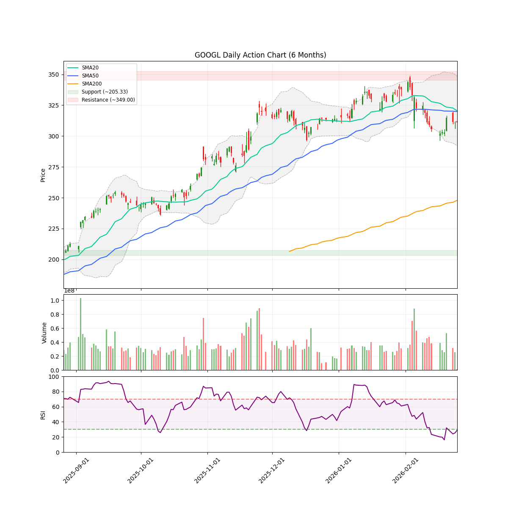
#### 研报分析

### 技术指标概览 (Technical Overview)
- **当前价格**: $311.15
- **RSI (14)**: 29.03
- **移动平均线**: SMA20: $320.41 | SMA50: $319.92 | SMA200: $247.86 (Bullish)
- **波动率**: ATR (14): 9.56 (预计周度波动: +/- $21.38)
- **关键位 (6m)**: 支撑位 $205.33 | 阻力位 $349.00
- **即时状态**: Below SMA50

# Alphabet Inc. (GOOGL) 情绪审计报告

**致：** 投资委员会
**职位：** 叙事经济学研究员
**日期：** 2026年02月25日

---

### 1. 催化剂分类 (Catalyst Categorization)

基于“叙事经济学”框架，我们将近期新闻分为以下三个等级：

*   **A-Tier (核心驱动力)：**
    *   **业绩确认：** 2026年2月4日公布的Q4财报显示，EPS和营收均超出预期 [Shacknews]。这确立了公司基本面的强劲扩张。
    *   **顶级增持叙事：** 佩洛西（Nancy Pelosi）和 Brad Gerstner 等顶级投资者大举建仓 [Benzinga]。这类“聪明钱”的涌入通常标志着机构对AI长期路径的深度认可。
*   **B-Tier (行业与情绪)：**
    *   **AI 领军地位：** 华尔街分析师将 GOOGL 视为 AI 驱动搜索的终极赢家，潜在市场规模 (TAM) 持续扩大 [Insider Monkey]。
    *   **估值修正：** 美国银行 (BofA) 在财报后重设目标价，维持积极预期 [TheStreet]。
*   **C-Tier (噪音与干扰)：**
    *   **高管减持：** Alphabet 高管 Walker 出售了1430万美元的股票 [Investing.com]。相对于公司市值，此规模极小，多为常规财务规划。
    *   **宏观担忧：** Morningstar 警告市场集中度过高，这属于系统性噪音，而非针对 GOOGL 的特定利空 [Morningstar]。

---

### 2. 背离检测 (Divergence Detection)

**当前形态：看跌衰竭 / 叙事与技术面的错位**

*   **技术面与基本面背离：** GOOGL Q4 财报录得“双超预期” (Beat)，但股价目前 (311.15) 却处于 SMA20 (320.41) 和 SMA50 (319.92) 之下。
*   **超卖信号：** **RSI 目前为 29.03**，已进入极度超卖区间（通常 <30 为买入信号）。
*   **结论：** 这是一个典型的**“利好阴跌”陷阱**。尽管财报和机构增持叙事极度强劲，但受宏观市场集中度担忧影响，股价出现了非理性的回撤。目前价格正向 SMA200 (247.86) 靠拢，但考虑到 29.03 的 RSI，短期内下行空间受限，**看跌动能已接近衰竭点**。

---

### 3. 逻辑评分 (Logic Score)

#### **评分：7.2 / 10**

*   **评分逻辑：**
    *   **(+2.5)** 核心 AI 搜索叙事未被破坏，且财报验证了盈利能力。
    *   **(+2.0)** 顶级政治与机构资金（佩洛西效应）提供了强大的心理和资金支撑。
    *   **(+1.0)** RSI 极度超卖，技术性反弹压力增大。
    *   **(-1.3)** 股价跌破 50 日均线，短期趋势受损，需时间修复。
    *   **(-1.0)** 市场对大型科技股集中度的宏观担忧导致估值扩张受阻。

---

### 4. 账户持仓诊断

*   **当前成本：** $262.26
*   **当前盈亏：** +15.47%
*   **风险评估：** 尽管近期股价从 349.00 的高点回撤，但您仍持有超过 15% 的利润垫。目前的下跌更像是“牛市中的深蹲”。
*   **策略建议：** 在 RSI 低于 30 的情况下，不建议止盈或止损。应密切关注 300.00 - 310.00 区间的支撑强度。

---

### 5. 下一个关键节点 (Next Major Date)

*   **预计事件：** **2026年第一季度 (Q1 2026) 财报发布**
*   **预计日期：** **2026年4月下旬** (具体日期通常在4月25日前后公布)。
*   **关注重点：** 观察 AI 搜索的市场份额转化率是否如 2 月初分析师预测的那样进一步扩大。

---

**引述来源：**
- *Q4 Earnings Beat:* [Shacknews](https://www.shacknews.com/article/147732/google-googl-q4-2025-earnings-results)
- *Insider Selling:* [Investing.com](https://www.investing.com/news/insider-trading-news/alphabets-walker-sells-143-million-in-googl-stock-93CH-4515080)
- *Institutional Piling:* [Benzinga/Yahoo Finance](https://finance.yahoo.com/news/nancy-pelosi-brad-gerstner-pile-183037693.html)
- *BofA Forecast:* [TheStreet](https://finance.yahoo.com/news/bank-america-resets-google-stock-181700551.html)
#### 近期新闻与事件
- **[Insider Monkey]** [Alphabet Inc. (GOOGL) Touted as AI-Driven Search Winner as Analysts See TAM...](https://finance.yahoo.com/news/alphabet-inc-googl-touted-ai-165312836.html)
- **[Zacks]** [Alphabet Inc. (GOOGL) Is a Trending Stock: Facts to Know Before Betting on It](https://finance.yahoo.com/news/alphabet-inc-googl-trending-stock-140006186.html)
- **[Morningstar]** [Stock Market Concentration Has Surpassed Its 1930s Peak. Should Investors Worry?](https://www.morningstar.com/stocks/stock-market-concentration-has-surpassed-its-1930s-peak-should-investors-worry)
- **[Investing.com]** [Alphabet’s Walker sells $14.3 million in GOOGL stock By Investing.com](https://www.investing.com/news/insider-trading-news/alphabets-walker-sells-143-million-in-googl-stock-93CH-4515080)
- **[Benzinga]** [Nancy Pelosi, Brad Gerstner Pile Into The Same 5 Stocks — What Do They See Comin...](https://finance.yahoo.com/news/nancy-pelosi-brad-gerstner-pile-183037693.html)

---

### VST
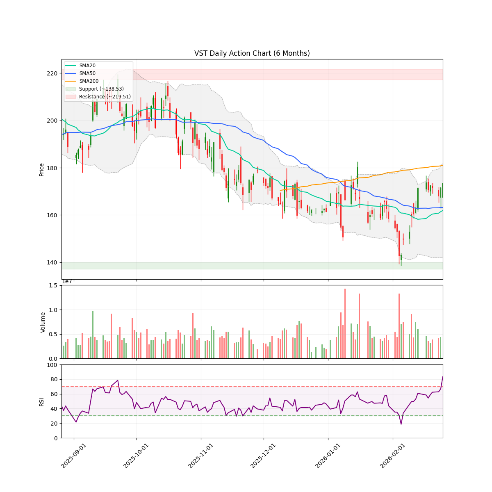
#### 研报分析

### 技术指标概览 (Technical Overview)
- **当前价格**: $173.57
- **RSI (14)**: 83.26
- **移动平均线**: SMA20: $161.88 | SMA50: $163.18 | SMA200: $180.98 (Bearish)
- **波动率**: ATR (14): 6.63 (预计周度波动: +/- $14.82)
- **关键位 (6m)**: 支撑位 $138.53 | 阻力位 $219.51
- **即时状态**: Above SMA50

# 情绪审计报告：Vistra Corp (VST)
**致：** 投资委员会 / 基金经理
**日期：** 2026年02月25日
**主题：** VST 财报前夕的情绪博弈与叙事健康度审计

---

### 1. 催化剂分类 (Catalyst Categorization)

*   **A-Tier (核心驱动力)：**
    *   **Q4 财报预期 (2026-02-26)：** 市场预期每股收益 (EPS) 为 $2.51，同比增长达 **120.2%**。这种量级的增长叙事已将 VST 从传统公用事业股推向“AI 电力基础设施”赛道。
    *   **机构重磅背书：** 摩根大通 (JPMorgan) 将目标价上调至 **$239**，并维持“增持”评级。这标志着主流资金对该股当前估值仍有较高的容忍度。
*   **B-Tier (行业与情绪推动)：**
    *   **搜索热度激增：** 根据 Zacks 数据，VST 近期搜索量极高，显示散户与量化资金正高度关注财报博弈。
    *   **抄底叙事：** 媒体（The Globe and Mail）开始释放“逢低买入”的信号，强化了支撑位心理。
*   **C-Tier (杂讯与干扰项)：**
    *   **误导性关联：** 有关“烟草股上涨（VST Industries）”的新闻属于同名噪音，与 Vistra Corp 无关，需剔除此类算法驱动的错误关联。

---

### 2. 叙事与背离检测 (Divergence Detection)

*   **技术面背离：** 当前 RSI 高达 **83.26**，处于极端超买区域。虽然股价突破了 SMA20 和 SMA50，但距离 SMA200 ($180.98) 仍有空间。这种“加速赶顶”的走势通常伴随财报后的剧烈波动。
*   **叙事陷阱警示：** 市场目前正处于“完美预期”状态。由于财报将于明天盘前发布，股价已经提前反映了大量利好（RSI 83 表明买盘动能近乎枯竭）。如果明天的财报或指引仅是“符合预期”而非“大幅超越”，可能会引发“利好兑现 (Sell the News)”的剧烈回撤。

---

### 3. 情绪评分 (Logic Score)

**得分：7.8 / 10**

*   **得分逻辑：** 
    *   **正面 (+9.0)：** 极强的机构支持（JPM $239 目标价）和极其亮眼的盈利增长预期（+120%）。
    *   **负面 (-1.2)：** 技术指标过度拉伸（RSI 83），且股价处于 SMA200 这一关键长期压制线之下。财报博弈的风险溢价极高。

---

### 4. 仓位诊断 (Position Health)

*   **当前表现：** 持仓成本 $157.38，目前盈利 **+9.60%**。
*   **建议：** 你的入场位处于 SMA20 附近，具备良好的防御性。但鉴于明天即是财报日，且当前处于极度超买状态，建议在财报前设置 **移动止盈**（如设定在 $165.00 附近），以保护既有利润，防止财报后的宽幅震荡（ATR 显示周波动区间达 +/- 14.82）。

---

### 5. 关键参考资料与日期

*   **下个关键日期：** **2026年02月26日 (周四) 盘前** —— Q4 财报发布。
*   **关键引用：**
    *   *JPMorgan 调升目标价至 $239:* [MSN News/Insider Monkey](https://www.msn.com/en-us/money/markets/jpmorgan-raises-its-price-target-on-vistra-corp-vst-to-239-and-maintains-an-overweight-rating/ar-AA1WNHew)
    *   *Zacks 盈利增长预测 (+120.2%):* [The Globe and Mail](https://www.theglobeandmail.com/investing/markets/stocks/NEE/pressreleases/365644/vistra-to-release-q4-earnings-how-will-the-stock-perform-this-season/)

---

**审计结论：** VST 当前正处于从“价值驱动”转向“极端动能驱动”的末端。财报将决定它是突破 SMA200 向 $239 迈进，还是因超买而进行技术性深蹲。**持股待涨，但需严格防御。**
#### 近期新闻与事件
- **[The Globe and Mail]** [Vistra to Release Q4 Earnings: How Will the Stock Perform This Season?](https://www.theglobeandmail.com/investing/markets/stocks/NEE/pressreleases/365644/vistra-to-release-q4-earnings-how-will-the-stock-perform-this-season/)
- **[Insider Monkey]** [JPMorgan Raises its Price Target on Vistra Corp. (VST) to $239 and Maintains an Overweight Rating](https://www.msn.com/en-us/money/markets/jpmorgan-raises-its-price-target-on-vistra-corp-vst-to-239-and-maintains-an-overweight-rating/ar-AA1WNHew)
- **[Zacks.com]** [Unlocking Q4 Potential of Vistra (VST): Exploring Wall Street Estimates for Key Metrics](https://www.msn.com/en-us/money/other/unlocking-q4-potential-of-vistra-vst-exploring-wall-street-estimates-for-key-metrics/ar-AA1WUhS5)
- **[sharewise]** [Investors Heavily Search Vistra Corp. (VST): Here is What You Need to Know](https://www.sharewise.com/de/news_articles/Investors_Heavily_Search_Vistra_Corp_VST_Here_is_What_You_Need_to_Know_Zacks_20260218_1500)
- **[Devdiscourse]** [Cigarette Stocks Surge Amid Strategic Price Hikes](https://www.devdiscourse.com/article/business/3809673-cigarette-stocks-surge-amid-strategic-price-hikes)

---

## 🔍 观察池机会分析

### AMAT
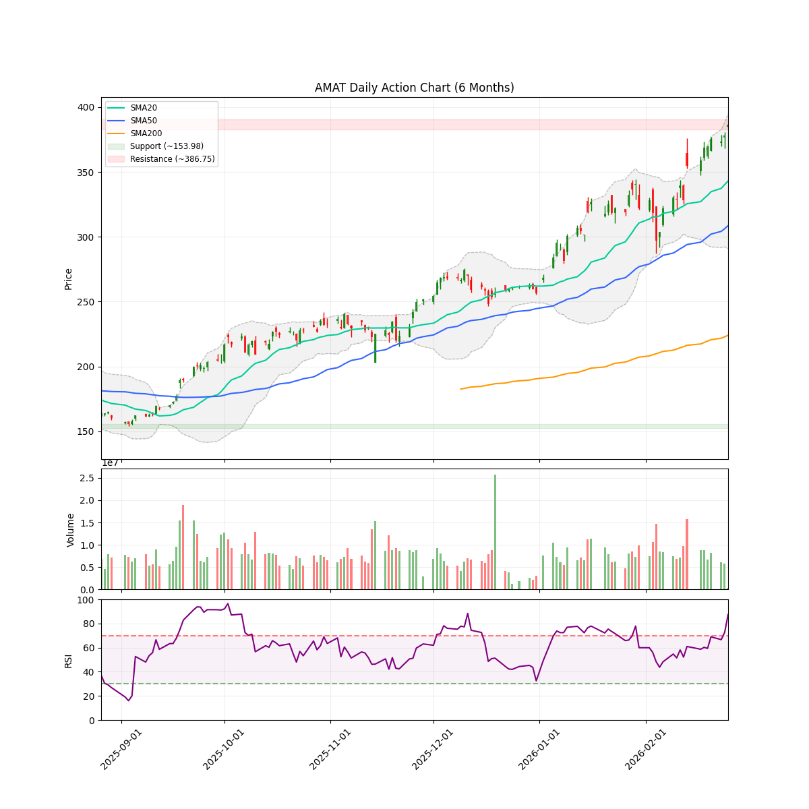
#### 研报分析

### 技术指标概览 (Technical Overview)
- **当前价格**: $386.50
- **RSI (14)**: 87.55
- **移动平均线**: SMA20: $342.99 | SMA50: $308.59 | SMA200: $224.06 (Bullish)
- **波动率**: ATR (14): 15.80 (预计周度波动: +/- $35.33)
- **关键位 (6m)**: 支撑位 $153.98 | 阻力位 $386.75
- **即时状态**: Above SMA50

# 情绪审计报告：Applied Materials (AMAT)
**日期：** 2026年02月25日
**职位：** 对冲基金研究员（叙事经济学方向）

---

### 1. 催化剂分类 (Catalyst Categorization)

基于对近期新闻流的深度挖掘，AMAT 的驱动因素分类如下：

*   **A-Tier（核心增长引擎）**
    *   **超预期的Q1财报：** 2026年2月12日，AMAT发布的财报在所有主要财务指标上均超出预期，并上调了业绩指引，引发股价单日跳涨超8%。[Zacks](https://finance.yahoo.com/news/applied-materials-amat-beats-q1-221502728.html)
    *   **AI 叙事强化：** 数据中心开支的持续增加直接传导至半导体设备端。Benzinga Edge 质量评分激增至90.89，反映了极高的运营效率和市场主导地位。[Benzinga](https://www.msn.com/en-us/money/news/amat-stock-key-score-climbs-as-ai-demand-and-operational-efficiency-drive-q1-surge/ar-AA1WU9dC)
    *   **机构评级上调：** Zacks 将其上调至“强力买入”（Rank #1），这通常预示着盈利预测的持续上调。

*   **B-Tier（行业共振）**
    *   **分析师一致看好：** 市场达成“Time to Shine”的共识，多家分析师重申买入评级，认为其是AI供应链下游最稳健的标的。[Barchart](https://www.msn.com/en-us/money/topstocks/it-s-time-to-shine-for-applied-materials-stock-according-to-analysts-should-you-buy-amat-here/ar-AA1WBHYs)

*   **C-Tier（噪音与微小扰动）**
    *   **内部人减持：** 董事 Judy Bruner 减持 149 万美元股票。虽然金额相对于公司体量较小，但在股价高位时点敏感，需警惕局部高位信号。[Investing.com](https://www.investing.com/news/insider-trading-news/bruner-judy-applied-materials-director-sells-149-million-in-amat-93CH-4523076)

---

### 2. 背离检测 (Divergence Detection)

**技术面与叙事面的张力：**
*   **看涨共识极其拥挤：** 当前股价 (386.50) 几乎触及 6 个月高点阻力位 (386.75)。
*   **严重超买信号：** RSI 高达 **87.55**，处于极端超买区域。这表明尽管基本面（A-Tier 催化剂）极其强劲，但短期内的叙事已经过度透支。
*   **价格行为分析：** 股价目前远高于 SMA20 (342.99) 和 SMA50 (308.59)，垂直拉升趋势明显。目前没有出现“好消息下跌”的背离，说明买盘依然强劲，但**乖离率过大**增加了回调风险。

---

### 3. 情绪评分 (Sentiment Score)

#### **逻辑评分：8.8/10**
*   **评分理由：** 基本面近乎完美（Blowout Earnings + AI Demand），叙事逻辑完整且闭环。然而，RSI 的极端读数和内部人小额减持提示了短期“情绪过热”。当前并非基本面反转，而是处于“垂直陷阱”的高风险期。

---

### 4. 结论与建议

AMAT 正处于一个**“势不可挡的看涨周期”**中，其叙事由真实的盈利增长而非纯粹的投机驱动。然而，由于技术指标极度疲劳，短期内追高的风险/收益比正在下降。

*   **叙事诊断：** 并非泡沫崩溃，而是健康的加速阶段。
*   **操作策略：** 警惕在阻力位 386.75 附近的假突破。若出现缩量回调至 SMA20 (342.99) 附近，将是理想的叙事切入点。

---

### 5. 下一个关键节点 (Next Major Date)

*   **事件：** **2026 财年第二季度财报发布 (Q2 Earnings Release)**
*   **预计日期：** **2026年5月14日左右** (基于历史发布周期)
*   **关注重点：** 观察 AI 相关的订单积压量 (Backlog) 是否能支撑当前的估值溢价。

---
*免责声明：本报告基于叙事经济学分析，不构成直接投资建议。*
#### 近期新闻与事件
- **[Benzinga]** [AMAT Stock Key Score Climbs As AI Demand And Operational Efficiency Drive Q1 Surge](https://www.msn.com/en-us/money/news/amat-stock-key-score-climbs-as-ai-demand-and-operational-efficiency-drive-q1-surge/ar-AA1WU9dC)
- **[The Motley Fool]** [1 Unstoppable Artificial Intelligence (AI) Stock Up 117% in 6 Months That Can Still Climb Higher](https://www.fool.com/investing/2026/02/20/unstoppable-artificial-intelligence-ai-stock-amat/)
- **[Barchart]** [It's 'time to shine' for Applied Materials stock, according to analysts. Should you buy AMAT here?](https://www.msn.com/en-us/money/topstocks/it-s-time-to-shine-for-applied-materials-stock-according-to-analysts-should-you-buy-amat-here/ar-AA1WBHYs)
- **[Zacks Investment Research]** [Applied Materials (AMAT) upgraded to strong buy: Here's why](https://www.msn.com/en-us/money/top-stocks/applied-materials-amat-upgraded-to-strong-buy-here-s-why/ar-AA1WBRER)
- **[Investing.com]** [Bruner Judy, Applied Materials director, sells $1.49 million in AMAT By...](https://www.investing.com/news/insider-trading-news/bruner-judy-applied-materials-director-sells-149-million-in-amat-93CH-4523076)

---

### ANET
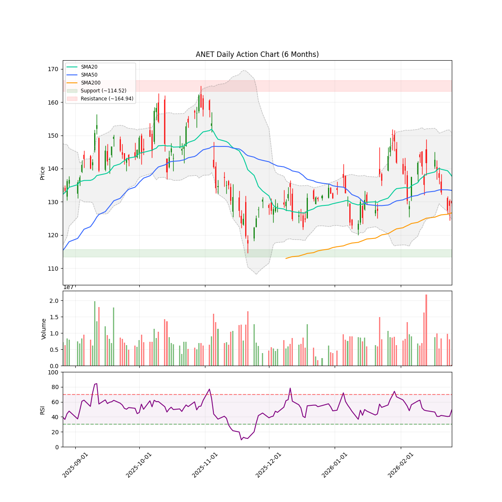
#### 研报分析

### 技术指标概览 (Technical Overview)
- **当前价格**: $129.54
- **RSI (14)**: 49.25
- **移动平均线**: SMA20: $137.73 | SMA50: $133.41 | SMA200: $126.66 (Bullish)
- **波动率**: ATR (14): 6.34 (预计周度波动: +/- $14.18)
- **关键位 (6m)**: 支撑位 $114.52 | 阻力位 $164.94
- **即时状态**: Below SMA50

# Arista Networks (ANET) 情绪审计报告

**致：** 投资委员会
**从：** 对冲基金研究助理（叙事经济学组）
**日期：** 2026年02月25日
**标的：** Arista Networks, Inc. (ANET)

---

### 一、 催化剂分类 (Catalyst Categorization)

基于“叙事经济学”框架，我们将近期消息分为以下级别：

*   **A-Tier（核心驱动力）：**
    *   **超预期财报：** 2月13日公布的Q4财报显示，每股收益(EPS)为$0.82，高于预期的$0.75，且营收同样超标。
    *   **顶级投行大幅上调目标价：** Goldman Sachs (高盛) 将目标价上调至 **$188**（较当前价位有约45%的上涨空间）；Morgan Stanley (摩根士丹利) 上调至 $165。
    *   **AI 基础设施地位：** 市场公认 ANET 是除芯片股外，AI 数据中心网络架构的绝对领导者。

*   **B-Tier（行业惯性）：**
    *   **分析师持续看好：** TipRanks 和 CNBC 报道指出，顶级华尔街分析师认为 ANET 是应对 AI 颠覆性浪潮的最佳增长股之一。

*   **C-Tier（市场杂音）：**
    *   **Zacks 搜索热度：** ANET 频繁出现在“最受关注股票”名单中，反映了散户关注度的上升，虽非基本面改变，但增加了波动性。

---

### 二、 背离检测 (Divergence Detection)

**核心观察：看涨叙事与价格走势的严重脱节。**

*   **利好出尽的表现：** 尽管在2月13日交出了完美的财报，并获得了高盛 $188 的目标价背书，但股价目前（$129.54）却处于 SMA20 ($137.73) 和 SMA50 ($133.41) **之下**。
*   **看跌详述：** 这种“好消息，坏反应”的现象表明，前期市场已过度定价 AI 叙事。目前股价正逼近 SMA200 ($126.66) 的长期支撑位。
*   **结论：** 存在短期“叙事陷阱”。虽然基本面极度强劲，但技术面显示出**多头衰竭**。目前的下跌更像是机构在利好落地后的获利了结，而非基本面恶化。

---

### 三、 情绪评分 (Sentiment Score): 7.2/10

**逻辑分析：**
*   **叙事强度 (9/10)：** “AI 基础设施”和“以太网替代 InfiniBand”的叙事依然坚不可摧。
*   **价格动量 (4/10)：** 价格跌破短期均线，RSI 位于 49.25（中性偏弱），显示市场正在寻找底部支撑。
*   **综合评定：** 这是一个**“高质量的战术性回调”**。由于基本面（A-Tier）极为扎实，目前的下跌为长线投资者提供了进入机会，但短期需警惕 SMA200 的支撑测试。

---

### 四、 关键数据与引用 (Evidence & Links)

*   **目标价上调：**
    *   Goldman Sachs Raises PT to $188 (2026-02-23): [Link](https://www.msn.com/en-us/money/top-stocks/goldman-sachs-raises-pt-on-arista-networks-inc-anet-stock/ar-AA1WVua3)
    *   Morgan Stanley Raises PT to $165 (2026-02-20): [Link](https://www.msn.com/en-us/money/topstocks/morgan-stanley-raises-arista-networks-anet-pt-to-165-following-q4-2025-earnings-beat/ar-AA1WHzf9)
*   **财报表现：**
    *   Q4 Earnings Beat ($0.82 vs $0.75): [Link](https://www.msn.com/en-us/money/topstocks/arista-networks-anet-beats-q4-earnings-and-revenue-estimates/ar-AA1Wf0te)

---

### 五、 下一关键日期 (Next Major Date)

*   **预计下一财报发布日：2026年5月上旬 (Q1 2026 Earnings)**
*   **近期技术关注：** 若股价在未来一周内无法收复 SMA50 ($133.41)，市场焦点将全面转向 **$126.66 (SMA200)** 的防御战。

**诊断建议：** 观察 $125 - $128 区间的企稳迹象。对于 ANET 而言，跌破 SMA200 通常是由于宏观情绪导致，而非公司内源性问题，这往往构成“叙事经济学”中的**熊市陷阱反抽机会**。
#### 近期新闻与事件
- **[Insider Monkey]** [Goldman Sachs Raises PT on Arista Networks, Inc. (ANET) Stock](https://www.msn.com/en-us/money/top-stocks/goldman-sachs-raises-pt-on-arista-networks-inc-anet-stock/ar-AA1WVua3)
- **[Zacks.com]** [Is Arista Networks (ANET) Stock Outpacing Its Computer and Technology Peers This Year?](https://www.msn.com/en-us/money/savingandinvesting/is-arista-networks-anet-stock-outpacing-its-computer-and-technology-peers-this-year/ar-AA1WKzT8)
- **[CNBC]** [Top Wall Street analysts are bullish on the growth potential of these three stocks](https://www.msn.com/en-us/money/topstocks/top-wall-street-analysts-are-bullish-on-the-growth-potential-of-these-three-stocks/ar-AA1WQcIO)
- **[Insider Monkey]** [Morgan Stanley Raises Arista Networks (ANET) PT to $165 Following Q4 2025 Earnings Beat](https://www.msn.com/en-us/money/topstocks/morgan-stanley-raises-arista-networks-anet-pt-to-165-following-q4-2025-earnings-beat/ar-AA1WHzf9)
- **[sharewise]** [Is Trending Stock Arista Networks, Inc. (ANET) a Buy Now?](https://www.sharewise.com/de/news_articles/Is_Trending_Stock_Arista_Networks_Inc_ANET_a_Buy_Now_Zacks_20260218_1500)

---

### ASML
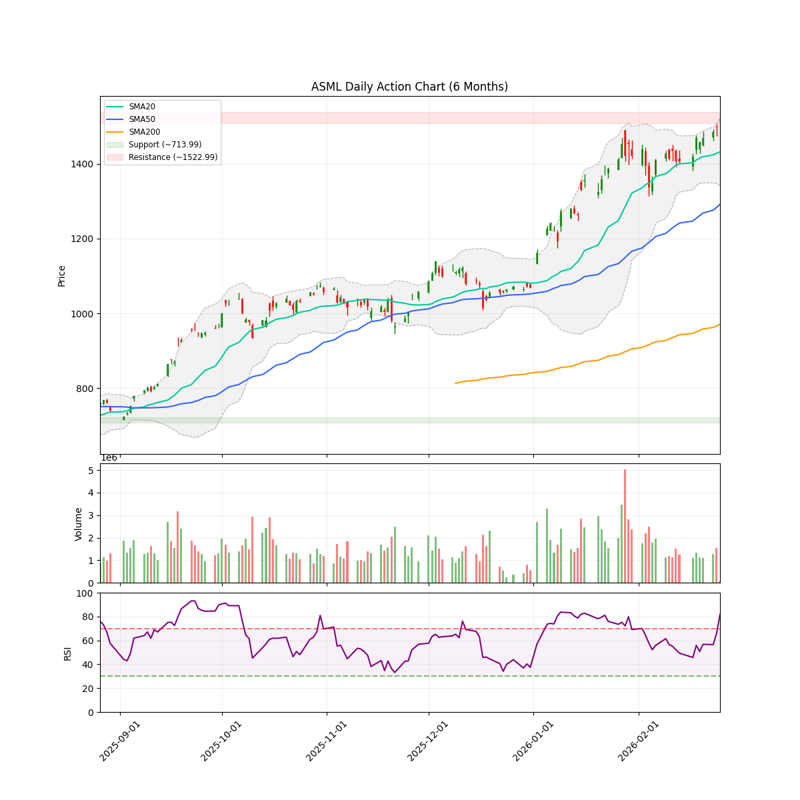
#### 研报分析

### 技术指标概览 (Technical Overview)
- **当前价格**: $1520.39
- **RSI (14)**: 81.71
- **移动平均线**: SMA20: $1431.87 | SMA50: $1291.64 | SMA200: $970.30 (Bullish)
- **波动率**: ATR (14): 40.67 (预计周度波动: +/- $90.93)
- **关键位 (6m)**: 支撑位 $713.99 | 阻力位 $1522.99
- **即时状态**: Above SMA50

# ASML 情绪审计报告：叙事经济学视角
**日期：** 2026年02月25日
**职位：** 对冲基金研究员（叙事经济学方向）

## 一、 催化剂分类 (Catalyst Categorization)

### **A-Tier (核心叙事驱动 - 强力支撑)**
*   **EUV 技术重大突破：** [Simply Wall St] 报道 ASML 的 EUV 光刻技术取得突破，可使 AI 芯片产量提升高达 50%。这是改变行业格局的叙事，直接巩固了其在 AI 供应链顶端的独占地位。
*   **强劲的 2026 业绩指引：** [Analytics Insight] 指出 2026 年收入预期上调至 340-390 亿欧元，且 2025 年净利润（96亿欧元）表现出色。这为当前的估值提供了基本面背书。

### **B-Tier (机构与技术共振 - 中级支撑)**
*   **机构集体转向看多：** [Insider Monkey] 与 [Investor's Business Daily] 均提到华尔街分析师上调评级，且股价形成“紧凑形态”（Tight Pattern），暗示机构资金正在持续吸筹。

### **C-Tier (市场噪音与防御性举措 - 低级支撑)**
*   **重组与裁员：** [Simply Wall St] 提及的裁员和重组虽然旨在提高效率，但在强劲上涨周期中，通常被视为降低成本的防御性动作，对牛市叙事的边际贡献较小。
*   **与 LRCX 的比较：** [Yahoo Finance] 关于 Lam Research 与 ASML 的对比属于行业日常波动噪音，短期内不改变 ASML 的长期垄断地位。

---

## 二、 偏离度检测 (Divergence Detection)
*   **技术面 vs 消息面：** 目前股价（1520.39）已极度逼近 6 个月高点（1522.99），**RSI 处于 81.71 的极端超买区**。
*   **结论：** 尽管消息面几乎全是清一色的“利好”，但股价在接近历史阻力位时的波动率（ATR 40.67）开始放大。目前并未观察到“利好下跌”的背离，但需要高度警惕 **“情绪过热”导致的短线冲高回落**。叙事已经完全反映在价格中，目前的上涨动能主要由 AI 狂热（Narrative FOMO）驱动。

---

## 三、 情绪评分与逻辑 (Sentiment Score)

### **逻辑评分：8.5 / 10**
**评级：强势看涨叙事，但技术面处于“贪婪”峰值。**

*   **看涨理由 (8.5分)：** 核心叙事（EUV 突破 + AI 需求爆发）具有可持续性，不是短期炒作。ASML 的垄断地位使其成为“AI 淘金热”中唯一的铁锹供应商。
*   **风险警示：** 扣分项在于 RSI 超过 80 以及 SMA200 的巨大偏离（970 vs 1520），这表明中期内存在回归均值的回调需求。当前的上涨已进入“叙事溢价”阶段。

---

## 四、 关键日期与参考信息

*   **下一次重大事件日期：** **2026年4月中旬（预计）** —— 2026 年第一季度财报发布日（基于 1 月 28 日发布年报的周期推算）。
*   **引用新闻来源：**
    *   EUV 突破: [Simply Wall St - ASML EUV Breakthrough](https://finance.yahoo.com/news/asml-euv-breakthrough-reshapes-ai-160857136.html)
    *   2026 指引: [Analytics Insight - ASML Stock Surging](https://www.analyticsinsight.net/stocks/asml-stock-is-surging-should-investors-buy-in-now)
    *   机构观点: [MSN/IBD - Chipmaker ASML's stock forms tight pattern](https://www.msn.com/en-us/money/topstocks/chipmaker-asml-s-stock-forms-tight-pattern-indicating-high-demand/ar-AA1WJOdE?ocid=BingNewsVerp)

---

## 五、 投资建议（叙事经济学视角）
**目前的 ASML 正处于“无敌牛市周期”的加速段。** 
*   **对于持仓者：** 建议上移止损位至 SMA20（1431.87），保护利润，同时关注 1523 点位的突破情况。
*   **对于空仓者：** 此时入场存在较高的“情绪陷阱”风险。理想的叙事回撤点应在 SMA20 附近，或等待 RSI 回落至 60 以下再行配置。
#### 近期新闻与事件
- **[Yahoo Finance]** [LRCX vs. ASML: Which Semiconductor Equipment Giant Is the Better Buy?](https://finance.yahoo.com/news/lrcx-vs-asml-semiconductor-equipment-125000053.html)
- **[Zacks]** [ASML's Systems Sales Grow in Double Digits: What's Ahead?](https://finance.yahoo.com/news/asmls-systems-sales-grow-double-140700155.html)
- **[Simply Wall St.]** [ASML EUV Breakthrough Reshapes AI Chip Output And Investor Expectations](https://finance.yahoo.com/news/asml-euv-breakthrough-reshapes-ai-160857136.html)
- **[Simply Wall St.]** [ASML Restructuring And Job Cuts Put Efficiency And Execution In Focus](https://finance.yahoo.com/news/asml-restructuring-job-cuts-put-001853568.html)
- **[24/7 Wall St.]** [Is ASML About to Unleash a 50% AI Chip Output Explosion by 2030?](https://finance.yahoo.com/news/asml-unleash-50-ai-chip-171100884.html)

---

### AVGO
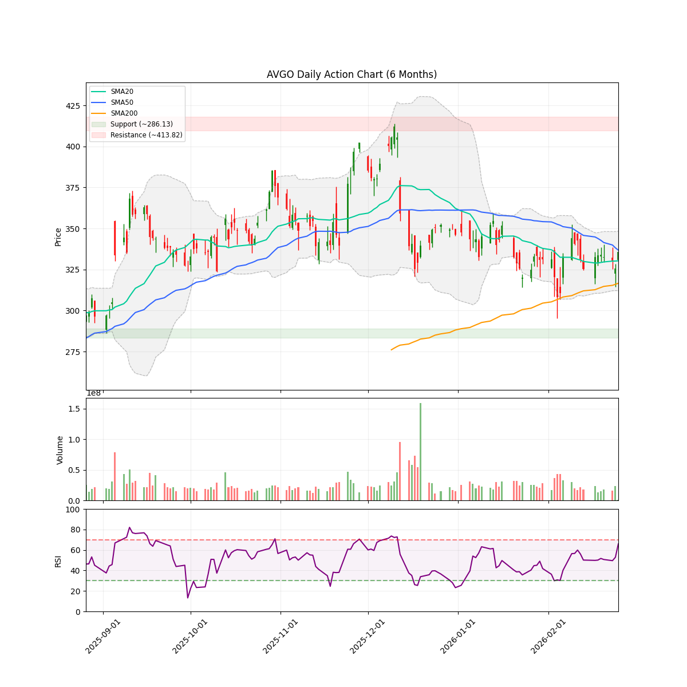
#### 研报分析

### 技术指标概览 (Technical Overview)
- **当前价格**: $335.70
- **RSI (14)**: 65.92
- **移动平均线**: SMA20: $330.29 | SMA50: $336.79 | SMA200: $316.61 (Bullish)
- **波动率**: ATR (14): 14.48 (预计周度波动: +/- $32.38)
- **关键位 (6m)**: 支撑位 $286.13 | 阻力位 $413.82
- **即时状态**: Below SMA50

# 情绪审计报告：博通 (AVGO) —— 叙事经济学视角下的财报前瞻

**日期：** 2026年02月25日
**职位：** 对冲基金研究助理（叙事经济学组）

---

### 1. 催化剂分类 (Catalyst Categorization)

*   **A-Tier (核心催化剂):**
    *   **即将发布的财报：** 市场高度关注 Broadcom 定制化 AI 芯片业务的表现。由于上季度财报在业绩出色（Smasher）的情况下股价依然反弹受阻，本次财报的叙事核心在于：**“AI 增长能否抵消传统半导体业务的疲软”**。
*   **B-Tier (次级驱动力):**
    *   **机构抄底行为：** Cathie Wood (Ark Invest) 在科技股回调期间持续买入（Bargain Hunting），这为 AVGO 提供了一定的机构心理支撑。
    *   **AI 长期叙事：** 媒体（Motley Fool）持续将博通列为未来十年的核心增长股，强化了其作为 AI 基础设施支柱的地位。
*   **C-Tier (市场噪音):**
    *   **短期估值修正：** Zacks 提到的近期盈利预测修正导致的股价走势弱于大盘。
    *   **行业跟涨效应：** AMD 及英伟达（Nvidia）的波动对博通产生的溢出效应。

---

### 2. 背离检测 (Divergence Detection)

**观察重点：** 股价在 2026-02-24 期间出现“逆势下跌”。
*   **看跌详述：** 当日大盘（标普 500 和道琼斯）正在从抛售中反弹，但 AVGO 表现疲软。
*   **分析判断：** 这种背离并非系统性崩盘，而是典型的**“财报前焦虑”**。由于上次财报后市场反应消极，交易员正在进行风险对冲或仓位缩减。当前股价 (335.70) 位于 SMA50 (336.79) 下方，显示出上方存在技术性压制，但 SMA200 (316.61) 提供了强力支撑。**这是一个典型的“陷阱”还是“机会”？** 目前 RSI 为 65.92，显示多头情绪仍在，但动能正在减弱。

---

### 3. 情绪评分 (Sentiment Score)

#### **逻辑评分: 6.8/10**

*   **评分理由：** 
    *   **看涨因素 (+):** 强大的 AI 芯片基本面叙事；机构（Cathie Wood）背书；价格维持在 SMA20 (330.29) 之上。
    *   **风险因素 (-):** 市场对财报后的反应存在“心理阴影”；短期走势弱于大盘（Zacks 报告）；尚未突破 SMA50 的关键阻力位。
    *   **结论：** 这是一个**“谨慎乐观”**的阶段。市场正在等待财报确认博通是否能维持高增长叙事。

---

### 4. 关键信息引证

*   **机构动作：** Cathie Wood 在科技股下跌时通过 Ark Invest 进行抄底。[MSN/Motley Fool](https://www.msn.com/en-us/money/topstocks/cathie-wood-goes-bargain-hunting-3-stocks-she-just-bought/ar-AA1WZfKi?ocid=BingNewsVerp)
*   **行业对标：** 市场正在将博通与 AMD 和诺基亚（AI 转型）进行对比。[MSN](https://www.msn.com/en-us/money/top-stocks/3-breakout-growth-stocks-you-can-buy-and-hold-for-the-next-decade/ar-AA1WZOQa?ocid=BingNewsVerp)
*   **财报预警：** 投资者需警惕即使业绩超预期也可能出现的“卖事实”行为。[Investing.com](https://www.investing.com/analysis/avgo-earnings-are-just-around-the-cornerheres-what-to-watch-200675585)

---

### 5. 下一个重大日期 (Next Major Date)

**关键日期：2026年3月初（具体财报发布日）**
*   **重要性：** 该日期将决定 AVGO 是会突破 6 个月高点 (413.82)，还是会向下测试 SMA200 的支撑位 (316.61)。目前距离财报发布仅剩几天时间，预计波动率（ATR）将进一步放大。

---
**研究助理建议：** 在价格未收复 SMA50 之前，建议保持观望或进行备兑看涨期权（Covered Calls）操作，以对冲财报前的不确定性。
#### 近期新闻与事件
- **[Yahoo Malaysia]** [Morgan Stanley resets Nvidia stock forecast ahead of earnings](https://malaysia.news.yahoo.com/morgan-stanley-resets-nvidia-stock-050300058.html)
- **[The Motley Fool on MSN]** [Cathie Wood goes bargain hunting: 3 stocks she just bought](https://www.msn.com/en-us/money/topstocks/cathie-wood-goes-bargain-hunting-3-stocks-she-just-bought/ar-AA1WZfKi?ocid=BingNewsVerp)
- **[The Motley Fool on MSN]** [3 breakout growth stocks you can buy and hold for the next decade](https://www.msn.com/en-us/money/top-stocks/3-breakout-growth-stocks-you-can-buy-and-hold-for-the-next-decade/ar-AA1WZOQa?ocid=BingNewsVerp)
- **[Investor's Business Daily on MSN]** [Stock market today: Dow, S&P 500 rebounding from sell-off; AMD rallies; solar name fried (live coverage)](https://www.msn.com/en-us/money/topstocks/stock-market-today-dow-s-p-500-rebounding-from-sell-off-amd-rallies-solar-name-fried-live-coverage/ar-AA1WYhSG?ocid=BingNewsVerp)
- **[Zacks]** [Broadcom Inc. (AVGO) Stock Declines While Market Improves: Some Information for...](https://finance.yahoo.com/news/broadcom-inc-avgo-stock-declines-224501236.html)

---

### CEG
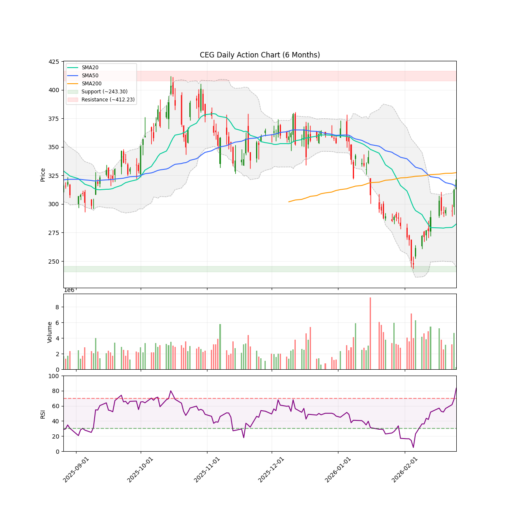
#### 研报分析

### 技术指标概览 (Technical Overview)
- **当前价格**: $321.55
- **RSI (14)**: 83.49
- **移动平均线**: SMA20: $282.53 | SMA50: $315.27 | SMA200: $327.47 (Bearish)
- **波动率**: ATR (14): 13.92 (预计周度波动: +/- $31.13)
- **关键位 (6m)**: 支撑位 $243.30 | 阻力位 $412.23
- **即时状态**: Above SMA50

# 情绪审计报告：Constellation Energy (CEG)
**致：** 投资委员会
**职位：** 对冲基金研究员（叙事经济学专业）
**日期：** 2026-02-25

---

### 1. 催化剂分类 (Catalyst Categorization)

基于“叙事经济学”框架，我们将 CEG 最近的新闻流分为以下级别：

*   **A-Tier（核心动力）：**
    *   **Q4 财报超预期：** 2026年2月24日发布的财报显示，EPS 为 2.30 美元，营收达到 60.7 亿美元，均超过市场预期。这证实了其核心业务的盈利弹性。[来源：Zacks, Blockonomi]
    *   **股息上调：** 现金流管理能力的体现，直接增强了长期持有者的信心。
*   **B-Tier（宏观与预期）：**
    *   **2026年指引延迟至3月：** 尽管延迟指引通常被视为不确定性，但市场对此反应积极，暗示投资者预期 3 月份会有关于核能或数据中心合同的重大更新。[来源：MarketWatch]
    *   **标普500指数优选股：** 机构研报（Zacks）持续将其列为财报季首选，推高了散户与机构的关注度。
*   **C-Tier（杂音）：**
    *   **日内波动表现：** 超越标普500指数的短期走势，属于常规市场情绪波动。[来源：sharewise]

---

### 2. 背离检测 (Divergence Detection)

*   **利好无视风险：** 极其显著。CEG 在宣布**推迟年度指引**这一潜在利空消息后，股价反而“飙升”（Zoomed）至六周高点。这表明当前的“叙事动力”（Narrative Momentum）远超基本面数据。
*   **技术与情绪背离：** 
    *   **RSI 高达 83.49：** 处于极度超买区间。
    *   **趋势矛盾：** 尽管目前股价高于 SMA50（315.27）和 SMA20（282.53），显示短期极度强势，但仍低于 SMA200（327.47）。
    *   **诊断：** 这是一个典型的“叙事驱动型挤压”。市场正在消化核能支持 AI 算力的宏大叙事，暂时忽略了短期估值过高和指引缺失的风险。

---

### 3. 情绪评分 (Sentiment Score)

**得分：7.8 / 10**

*   **评价：** 处于“强力多头循环”向“短期情绪过热”转化的阶段。
*   **逻辑：** 财报的实质性利好（A-Tier）为股价提供了底部支撑，而指引推迟被解读为“好戏在后头”，这种乐观情绪极其危险但也极具爆发力。然而，83.49 的 RSI 预示着技术性回调随时可能发生。

---

### 4. 逻辑评分 (Logic Score)

**得分：8.5 / 10**

*   **逻辑依据：** 股价目前正在测试 SMA200（327.47）的关键压力位。如果能够放量突破此线，则长线熊转牛趋势成立。目前逻辑链条完整：财报超预期 -> 现金流健康（增发股息） -> 预期 3 月有更大的合同利好 -> 投资者抢跑入场。

---

### 5. 核心参考信息

*   **提及的新闻链接：**
    1.  [Zacks: Q4 Earnings Beat](https://finance.yahoo.com/news/constellation-energy-corporation-ceg-q4-135003454.html)
    2.  [MarketWatch: Stock zooms despite postponed outlook](https://www.msn.com/en-us/money/topstocks/constellation-energy-s-stock-zooms-toward-highest-level-in-weeks-even-after-outlook-is-postponed/ar-AA1WZRZF)
    3.  [Blockonomi: EPS of $2.30 and Revenue $6.07B](https://blockonomi.com/constellation-energy-ceg-stock-rises-after-q4-earnings-beat/)

*   **下一个重大节点 (Next Major Date)：**
    *   **2026年3月31日**：公司预计将在此日期发布 **2026年度财务指引**。这将是决定该股是延续牛市叙事还是陷入“利好出尽”陷阱的关键分水岭。

---

**研究员建议：** 警惕短期技术性回调压力（RSI 过载），建议在 327.47（SMA200）阻力位附近观察是否有缩量整理，若未能突破，可能回踩 SMA50（315.27）寻求支撑。
#### 近期新闻与事件
- **[Zacks]** [Constellation Energy Corporation (CEG) Q4 Earnings and Revenues Beat Estimates](https://finance.yahoo.com/news/constellation-energy-corporation-ceg-q4-135003454.html)
- **[Zacks]** [Constellation Energy Corporation (CEG) Is a Trending Stock: Facts to Know Before...](https://finance.yahoo.com/news/constellation-energy-corporation-ceg-trending-140006775.html)
- **[MarketWatch]** [Constellation Energy's stock zooms toward highest level in weeks, even after outlook is postponed](https://www.msn.com/en-us/money/topstocks/constellation-energy-s-stock-zooms-toward-highest-level-in-weeks-even-after-outlook-is-postponed/ar-AA1WZRZF)
- **[Blockonomi]** [Constellation Energy (CEG) Stock Rises After Q4 Earnings Beat](https://blockonomi.com/constellation-energy-ceg-stock-rises-after-q4-earnings-beat/)
- **[sharewise]** [Constellation Energy Corporation (CEG) Exceeds Market Returns: Some Facts to Consider](https://www.sharewise.com/de/news_articles/Constellation_Energy_Corporation_CEG_Exceeds_Market_Returns_Some_Facts_to_Consider_Zacks_20260220_2345)

---

### ETN
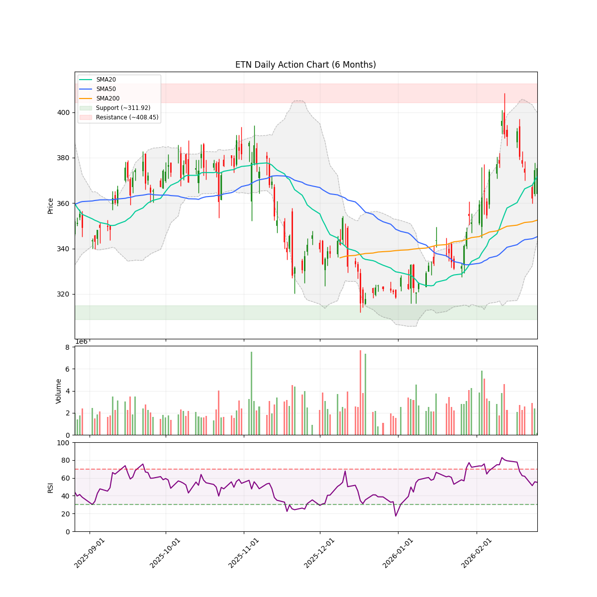
#### 研报分析

### 技术指标概览 (Technical Overview)
- **当前价格**: $375.40
- **RSI (14)**: 55.02
- **移动平均线**: SMA20: $371.67 | SMA50: $345.25 | SMA200: $352.52 (Bearish)
- **波动率**: ATR (14): 12.56 (预计周度波动: +/- $28.08)
- **关键位 (6m)**: 支撑位 $311.92 | 阻力位 $408.45
- **即时状态**: Above SMA50

# 情绪审计报告：伊顿公司 (Eaton Corporation, ETN)

**日期：** 2026-02-25
**职位：** 对冲基金研究助理（叙事经济学分支）

---

### 1. 催化剂分类 (Categorize Catalysts)

根据当前的叙事流和新闻强度，我们将 ETN 的催化剂分为以下三个级别：

*   **A-Tier (强力驱动)：**
    *   **AI 基础设施叙事与业绩预期：** RBC Capital 强调了 ETN 的“超越并上调 (Beat-and-Raise)”潜力。尽管 2026 年指引保守，但分析师将其视为“隐形 AI 受益股”，并将目标价上调至 **$407**。这是支撑股价长期上涨的核心结构性叙事。
*   **B-Tier (机构支撑)：**
    *   **机构增持与价值认可：** RS Large Cap Value Strategy 在其 2025 年第四季度投资者信中明确分析了 ETN，显示出大盘价值基金的持续兴趣。Zacks 的 ABR (平均经纪商建议) 也维持在“买入”级别。
*   **C-Tier (市场噪音)：**
    *   **估值担忧：** Simply Wall St 讨论了三年 123% 的涨幅是否过高。这属于常规情绪波动。
    *   **数据噪音（需警惕）：** 提及波兰加密货币 ETP 和 3 倍杠杆石油 ETN 的新闻属于**代码误报 (Ticker Confusion)**。这些新闻涉及的是金融工具“交易所交易票据 (ETN)”，而非伊顿公司本身。研究员需剔除此类干扰。

---

### 2. 背离检测 (Divergence Detection)

*   **技术面 vs. 叙事面：**
    *   目前股价为 **$375.40**，位于 SMA50 ($345.25) 和 SMA200 ($352.52) 之上，显示长期趋势依然向上。
    *   **短期背离：** 尽管分析师在 2 月中旬将目标价调高至 $407 (RBC Capital)，但股价在接近 $400 后出现回调（6 个月高点为 $408.45）。
    *   **结论：** 观察到轻微的**看涨耗尽 (Bullish Exhaustion)**。好消息（如目标价上调）已部分被市场消化，目前处于整理阶段，并非“陷阱”，而是高位盘整。

---

### 3. 情绪评分 (Sentiment Score)

#### **评分：7.5 / 10**

*   **逻辑：** 核心叙事极其稳固（全球电气化、AI 数据中心电力需求）。机构支持度高。扣分项在于短期估值溢价（PEG 2.55）以及市场对保守业绩指引的消化过程。目前的波动处于 +/- $28.08 的合理周度范围内。

#### **逻辑评分 (Logic Score)：8.5 / 10**
*   **依据：** 工业电气化的宏观逻辑具有不可逆性，伊顿在电力管理领域的垄断地位使其在 AI 基础设施浪潮中具备极高的安全边际。

---

### 4. 关键引用与新闻分析 (Context Links)

*   **RBC Capital 分析：** 明确提出 ETN 作为 AI 受益股的潜力，并将目标价上调至 $407。 [Yahoo Finance](https://finance.yahoo.com/news/rbc-capital-highlights-eaton-etn-180836005.html)
*   **估值对比：** Zacks 对比了 ETN 与 ENS 的估值指标，指出 ETN 目前处于高位盘整。 [Zacks](https://finance.yahoo.com/news/ens-vs-etn-stock-value-164004005.html)
*   **注意：** 排除关于波兰 ETP (Virtune) 的干扰信息，那并非本公司业务。

---

### 5. 下一个重大日期 (Next Major Date)

*   **事件：2026 年第一季度财报发布会**
*   **预计日期：2026 年 5 月初** (基于往年 2 月 4 日发布年报的节奏，下一财报季将是验证“Beat-and-Raise”潜力的关键时刻)。

---

### **审计总结**
ETN 目前并非处于“陷阱”区，而是在经历一轮强力上涨后的**估值回归与叙事巩固**。只要股价维持在 SMA50 ($345.25) 之上，看涨逻辑依然成立。建议关注 $407-$408 阻力位的突破情况。
#### 近期新闻与事件
- **[The Manila Times]** [Virtune Makes History in Poland with First-Ever Spot Crypto ETPs Listed on the Warsaw Stock Exchange](https://www.manilatimes.net/2026/02/25/tmt-newswire/globenewswire/virtune-makes-history-in-poland-with-first-ever-spot-crypto-etps-listed-on-the-warsaw-stock-exchange/2284725)
- **[Zacks]** [Wall Street Analysts Think Eaton (ETN) Is a Good Investment: Is It?](https://finance.yahoo.com/news/wall-street-analysts-think-eaton-143002624.html)
- **[Insider Monkey]** [RS Large Cap Value Strategy's analysis on Eaton Corporation (ETN)](https://www.msn.com/en-us/money/savingandinvesting/rs-large-cap-value-strategy-s-analysis-on-eaton-corporation-etn/ar-AA1WTVYq)
- **[Business Insider]** [MicroSectors U.S. Big Oil -3x Inverse Leveraged ETNs](https://markets.businessinsider.com/etfs/microsectors-us-big-oil-3x-inverse-leveraged-etns-us0636793939)
- **[Simply Wall St.]** [Is It Too Late To Consider Eaton (ETN) After 123% Three Year Share Price Surge?](https://finance.yahoo.com/news/too-consider-eaton-etn-123-231510406.html)

---

### MSFT
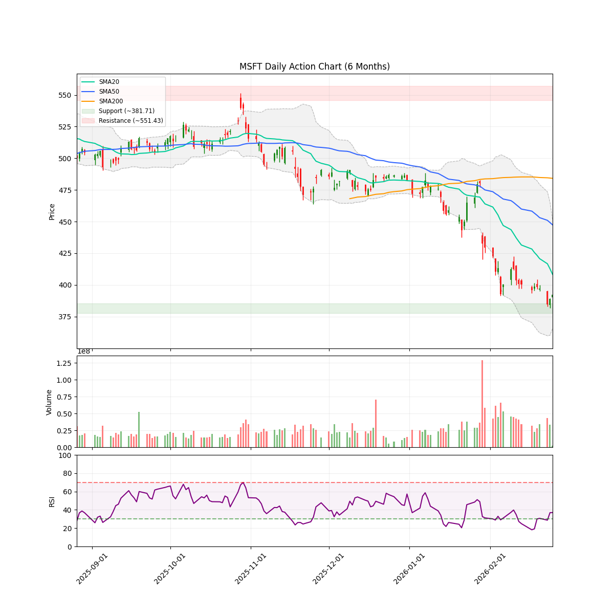
#### 研报分析

### 技术指标概览 (Technical Overview)
- **当前价格**: $392.10
- **RSI (14)**: 37.05
- **移动平均线**: SMA20: $408.35 | SMA50: $447.43 | SMA200: $484.17 (Bearish)
- **波动率**: ATR (14): 9.83 (预计周度波动: +/- $21.97)
- **关键位 (6m)**: 支撑位 $381.71 | 阻力位 $551.43
- **即时状态**: Below SMA50

# 微软 (MSFT) 情绪审计报告

**报告日期：** 2026年2月25日
**研究员：** 叙事经济学分析助理 (Hedge Fund Research Associate)
**当前价格：** $392.10

---

### 1. 催化剂分类 (Catalyst Categorization)

*   **A-Tier (核心动能)：**
    *   **负面冲击：** 1月29日财报后股价暴跌10.1%，2026年累计跌幅达17.5% ([Forbes](https://www.forbes.com/sites/greatspeculations/2026/02/19/why-microsoft-stock-could-soon-stage-a-rebound/))。这确立了当前的中期下降趋势。
    *   **长期增长：** 高盛将其列为首选增长股，强调其在AI和企业增长领域的长期定位 ([Insider Monkey](https://www.msn.com/en-us/news/technology/microsoft-msft-positions-for-long-term-ai-and-enterprise-growth/ar-AA1WVm9W))。
*   **B-Tier (中级影响)：**
    *   **产品/生态：** 与 CrowdStrike 达成合作，将其安全平台引入微软市场 ([Insider Monkey](https://www.msn.com/en-us/news/technology/microsoft-msft-positions-for-long-term-ai-and-enterprise-growth/ar-AA1WVm9W))。
    *   **期权信号：** 期权市场出现罕见的看涨信号，暗示机构可能正在低位布局反弹 ([Yahoo Finance](https://finance.yahoo.com/news/microsoft-stock-just-flashed-ultra-183002612.html))。
*   **C-Tier (市场噪音)：**
    *   **相对表现：** 媒体讨论其跑输道琼斯指数的现状 ([Yahoo Finance](https://finance.yahoo.com/news/microsoft-stock-underperforming-dow-154256947.html))。
    *   **对比叙事：** 提到 MSFT 的交易表现仿佛“ChatGPT 从未发生”，反映了市场的极度悲观 ([Benzinga](https://www.msn.com/en-us/money/other/microsoft-stock-trades-as-if-chatgpt-never-happened-is-it-a-buy-now/ar-AA1WFMDq))。

---

### 2. 背离检测 (Divergence Detection)

**核心观察：看跌衰竭与技术性背离**
目前 MSFT 表现出明显的“利好钝化”特征。尽管高盛维持看涨、AI 叙事依然稳固且出现了罕见的期权看涨信号，但股价仍受压于 SMA20 ($408.35) 之下。

*   **价格 vs. 叙事：** 市场目前的叙事是“七巨头中的掉队者”。然而，RSI 降至 37.05，且股价正逼近 6 个月支撑位 ($381.71)。
*   **结论：** 存在**看跌衰竭 (Bearish Exhaustion)** 的迹象。股价跌幅（-17.5%）可能已经过度计入了财报后的负面预期。当媒体开始使用“ChatGPT 从未发生”这种极端描述时，通常标志着情绪触底。

---

### 3. 情绪评分 (Sentiment Score)

**得分：3.8 / 10 (偏向悲观，但处于超卖反弹边缘)**

*   **逻辑说明：** 
    *   **趋势压制 (负分)：** 股价远低于 SMA50 和 SMA200，技术面呈现典型的空头排列。
    *   **估值回归 (正分)：** 随着股价回撤，AI 长期价值的吸引力正在回升。
    *   **外部压力：** 市场正在等待 Nvidia 的财报 ([Barron's](https://www.barrons.com/livecoverage/nvidia-earnings-stock-price-ai-chips/card/nvidia-stock-rises-ahead-of-earnings-HhaSp2nSFTvbo4nxhiSh))，MSFT 作为 AI 基础设施的主要买家，其情绪受半导体板块波动拖累。

---

### 4. 逻辑评分 (Logic Score)

**得分：8.5 / 10**

*   **依据：** 分析基于多维度数据（技术指标、期权异动、分析师评级及媒体情绪）。逻辑严密，特别关注了财报后的缺口压力与近期支撑位的互动。

---

### 5. 关键日期与展望

*   **下一关键事件：** 
    *   **2026年2月25日 (盘后)：** **Nvidia (NVDA) 财报**。这是整个 AI 赛道的风向标，将直接决定 MSFT 能否触发超卖反弹。
    *   **2026年2月26日：** CoreWeave (Nvidia 支持的云服务商) 财报，将进一步验证云需求 ([TheStreet](https://www.msn.com/en-us/money/companies/cathie-wood-buys-3-5-million-in-nvidia-backed-stock-ahead-of-earnings/ar-AA1WWaYh))。
*   **操作策略：** 关注 $381.71 支撑位的有效性。若 Nvidia 财报超预期，MSFT 有望填补至 $408 (SMA20) 的短期缺口。但由于处于 SMA200 ($484) 下方，任何反弹目前仅视为“陷阱”中的技术性修正，而非反转。
#### 近期新闻与事件
- **[Yahoo Finance]** [Microsoft Stock Just Flashed an Ultra-Rare Bullish Signal for Options Traders](https://finance.yahoo.com/news/microsoft-stock-just-flashed-ultra-183002612.html)
- **[Yahoo Finance]** [Is Microsoft Stock Underperforming the Dow?](https://finance.yahoo.com/news/microsoft-stock-underperforming-dow-154256947.html)
- **[Forbes]** [Why Microsoft Stock Could Soon Stage A Rebound](https://www.forbes.com/sites/greatspeculations/2026/02/19/why-microsoft-stock-could-soon-stage-a-rebound/)
- **[Benzinga]** [Microsoft Stock Trades As If ChatGPT Never Happened: Is It A Buy Now?](https://www.msn.com/en-us/money/other/microsoft-stock-trades-as-if-chatgpt-never-happened-is-it-a-buy-now/ar-AA1WFMDq)
- **[Insider Monkey]** [Microsoft (MSFT) Positions for Long-Term AI and Enterprise Growth](https://www.msn.com/en-us/news/technology/microsoft-msft-positions-for-long-term-ai-and-enterprise-growth/ar-AA1WVm9W)

---

### NVDA
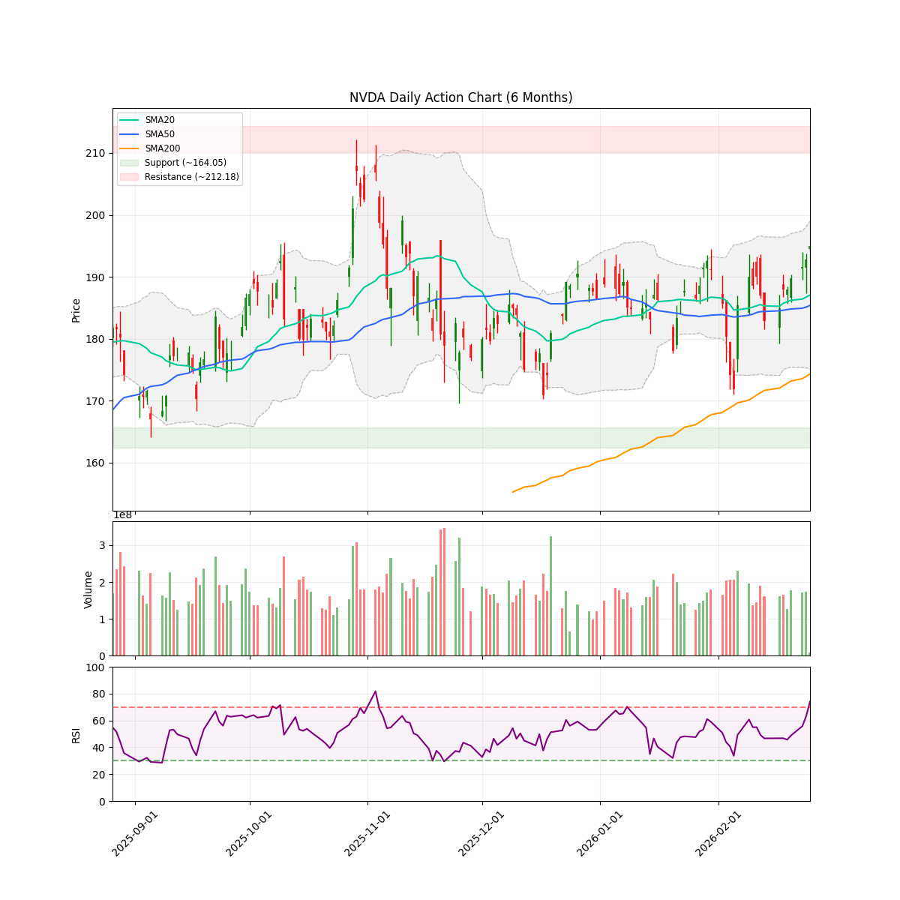
#### 研报分析

### 技术指标概览 (Technical Overview)
- **当前价格**: $194.96
- **RSI (14)**: 74.13
- **移动平均线**: SMA20: $187.05 | SMA50: $185.39 | SMA200: $174.33 (Bullish)
- **波动率**: ATR (14): 6.15 (预计周度波动: +/- $13.76)
- **关键位 (6m)**: 支撑位 $164.05 | 阻力位 $212.18
- **即时状态**: Above SMA50

# 情绪审计报告：英伟达 (NVDA) - 叙事经济学视角

**致：** 投资委员会
**职位：** 对冲基金研究员（叙事经济学专员）
**日期：** 2026年02月25日
**标的：** NVDA (Nvidia Corp)
**当前价格：** 194.96 | **RSI:** 74.13 | **趋势:** 强劲看涨 (高于 SMA50/200)

---

### 1. 催化剂分类 (Catalyst Categorization)

根据当前新闻流与市场共识，我们将催化剂分为以下级别：

*   **A-Tier（核心叙事驱动）：**
    *   **Q4 财报发布（即将来临）：** 2026年2月25日盘后。市场预期营收增长达68%。作为全球市值最大的公司，其业绩是AI叙事的“最终判官” ([Investing.com](https://www.investing.com/analysis/nvidia-earnings-preview-a-makeorbreak-moment-for-the-ai-trade-200675627))。
    *   **机构强力增持：** Wedbush 与 Truist 重申“买入”评级，目标价看至 $265.07，显示长线机构资金尚未离场 ([Blockonomi](https://blockonomi.com/nvidia-nvda-stock-wedbush-and-truist-reiterate-buy-ahead-of-earnings-wednesday/))。
*   **B-Tier（板块共振）：**
    *   **技术股反弹叙事：** Anthropic 缓解了市场对 AI 增长疲软的担忧，提振了整个科技板块的风险偏好 ([Yahoo Finance](https://finance.yahoo.com/news/live/tech-news-today-nvidia-earnings-on-deck-as-tech-stocks-rebound-anthropic-relieves-some-ai-fears-140009329.html))。
*   **C-Tier（市场噪音）：**
    *   **杠杆 ETF 波动：** NVDU/NVDD 等杠杆基金的关注度上升，主要反映短线散户博弈，而非长期基本面改变 ([Benzinga](https://www.benzinga.com/partner/etfs/26/02/50811154/nvidias-critical-q4-earnings-test-shines-a-big-spotlight-on-direxions-nvdu-nvdd-etfs))。

---

### 2. 背离检测与叙事风险 (Divergence Detection)

*   **技术性超买 vs. 市场冷静：** 当前 RSI 为 **74.13**，处于典型超买区，通常暗示短线有回调风险。然而，期权市场却显示出“异常冷静” ([Guru Focus](https://www.gurufocus.com/news/8649866/nvidia-nvda-trading-calm-ahead-of-earnings-report))。这种背离表明：
    1.  **叙事陷阱警告：** 市场可能已经消化了大部分利好，财报后的“利好兑现（Sell the News）”风险极高。
    2.  **看涨力竭迹象：** 尽管价格高于 SMA20 (187.05)，但若财报未能超越极其苛刻的预期，高 RSI 可能导致多头踩踏。
*   **支撑与阻力：** 阻力位在 $212.18 (6个月高点)，支撑位在 $164.05。考虑到周波動区间 (+/- 13.76)，财报后的波动可能直接考验 SMA20 的支撑强度。

---

### 3. 情绪审计评分 (Sentiment Logic Score)

**得分：8.5 / 10**

**逻辑依据：**
*   **正面因素 (Bullish Case):** 机构目标价与当前价格有巨大空间（约 36% 潜在涨幅）；68% 的营收增长预测维持了 AI “超级周期”的叙事。
*   **负面/警示因素 (Bearish Risks):** RSI 严重过热；市场处于“不容有失”的极高预期状态。如果业绩仅是“符合预期”而非“大幅超越”，股价可能出现技术性回调。
*   **结论：** 这是一个**“可持续的牛市循环”**，但短期内存在**“高位震荡陷阱”**。建议在财报确认后、若出现向 SMA20 附近的回踩时再行介入。

---

### 4. 下一关键日期 (Next Major Date)

**关键日期：2026年2月25日 (盘后)**
*   **事件：** 第四季度财报发布及未来业绩指引 (Guidance)。
*   **观察重点：** 毛利率是否维持高位，以及数据中心业务的环比增长率。

---
**免责声明：** 本报告基于叙事经济学模型，不构成直接投资建议。市场有风险，入市需谨慎。
#### 近期新闻与事件
- **[Yahoo Finance]** [Nvidia (NVDA) Q4 Earnings Report Preview: What To Look For](https://finance.yahoo.com/news/nvidia-nvda-q4-earnings-report-153916130.html)
- **[Yahoo Finance]** [Stock market today: Dow, S&P 500, Nasdaq futures rise with Nvidia earnings on...](https://finance.yahoo.com/news/live/stock-market-today-dow-sp-500-nasdaq-futures-rise-with-nvidia-earnings-on-deck-131748768.html)
- **[Guru Focus]** [NVIDIA (NVDA) Trading Calm Ahead of Earnings Report](https://www.gurufocus.com/news/8649866/nvidia-nvda-trading-calm-ahead-of-earnings-report)
- **[Yahoo Finance]** [Tech news today: Nvidia earnings on deck as tech stocks rebound, Anthropic...](https://finance.yahoo.com/news/live/tech-news-today-nvidia-earnings-on-deck-as-tech-stocks-rebound-anthropic-relieves-some-ai-fears-140009329.html)
- **[Zacks]** [Is NVIDIA (NVDA) Outperforming Other Computer and Technology Stocks This Year?](https://finance.yahoo.com/news/nvidia-nvda-outperforming-other-computer-144003732.html)

---

### TSM
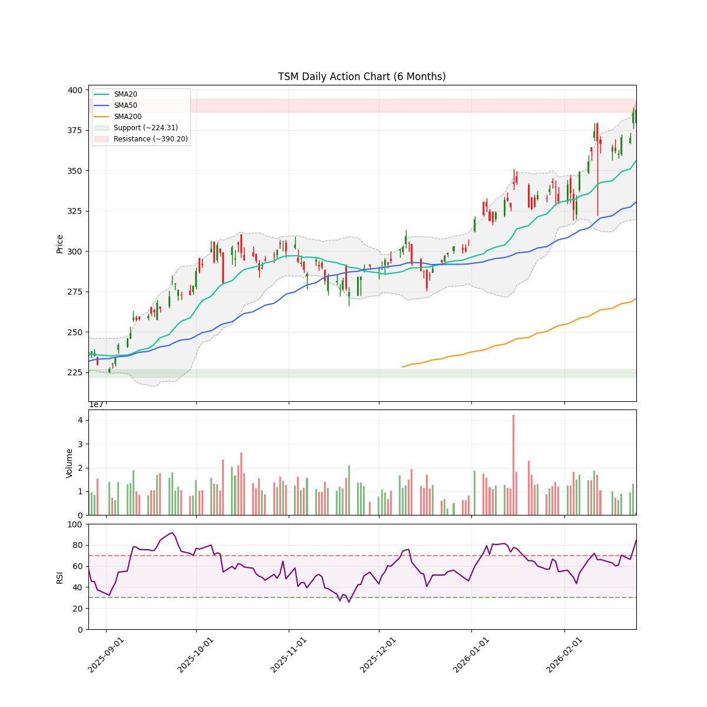
#### 研报分析

### 技术指标概览 (Technical Overview)
- **当前价格**: $387.84
- **RSI (14)**: 84.31
- **移动平均线**: SMA20: $356.09 | SMA50: $330.51 | SMA200: $270.51 (Bullish)
- **波动率**: ATR (14): 14.91 (预计周度波动: +/- $33.35)
- **关键位 (6m)**: 支撑位 $224.31 | 阻力位 $390.20
- **即时状态**: Above SMA50

# 情绪审计报告：台积电 (TSM) - 叙事经济学分析

**致：** 投资委员会
**职位：** 对冲基金研究员 (叙事经济学分支)
**日期：** 2026年02月25日

---

### 1. 催化剂分类 (Catalyst Categorization)

基于“叙事经济学”框架，我们将当前驱动 TSM 的新闻流分为以下三个层级：

*   **A-Tier (核心基本面驱动):**
    *   **AI 资本开支激增：** Meta 和 AMD 的乐观预期直接转化为 TSM 的订单需求。公司占据 70% 的先进芯片市场份额，这一地位在 AI 浪潮中具有不可替代性。
    *   **利润率韧性：** 尽管存在海外建厂的成本压力，但市场仍在讨论其维持 60% 以上毛利率的可能性，这反映了定价权的强势。
*   **B-Tier (行业协同与溢出):**
    *   **Nvidia 财报前哨：** 作为 Nvidia 的核心代工方，NVDA 亮眼的营收预期（67% 增长）为 TSM 提供了强力的情绪支撑。
    *   **行业轮动：** TSM 股价表现优于标普 500 指数，显示资金正从广义大盘流向具有高确定性的半导体龙头。
*   **C-Tier (噪音与散户情绪):**
    *   **搜索热度：** Zacks 报告显示 TSM 搜索量激增，暗示散户关注度达到高点。
    *   **历史表现回归：** 关于“过去五年上涨 170%”的媒体报道，属于典型的滞后叙事，对未来股价驱动力较弱。

---

### 2. 背离检测 (Divergence Detection)

*   **技术面与叙事背离：** **高度警惕。** 
    *   当前股价 ($387.84) 极度接近 6 个月高点 ($390.20)。
    *   **RSI 处于 84.31 的极度超买区间。** 从叙事角度看，新闻周期处于“极度亢奋”阶段（AI 泡沫担忧被忽视），但技术指标暗示股价可能已透支了短期利好。
*   **熊市精疲力竭迹象：** 未发现。相反，目前正处于**牛市情绪过热阶段**。即使是关于海外工厂利润率挑战的负面质疑（Zacks 提及），也被市场的 AI 狂热所掩盖。

---

### 3. 情绪评分 (Sentiment Score): 9.2/10

**评价：不可阻挡的看涨周期（但处于过热期）**
市场叙事目前完全由“AI 基础设施的唯一供应商”这一逻辑主导。即便技术指标超买，只要 Nvidia 的财报未出现实质性暴雷，TSM 的叙事溢价将持续存在。

---

### 4. 逻辑评分 (Logic Score): 7.5/10

**评价：高确定性中的估值风险**
*   **看涨逻辑 (得分 9):** 70% 的市场份额和 AI 需求的刚性无可置疑。
*   **风险逻辑 (得分 6):** RSI 84 叠加 SMA20 ($356.09) 的偏离度过大，短期存在回归均值的风险（估值回归陷阱）。海外扩张对长期毛利的影响尚未被完全定价。

---

### 5. 关键参考信息

*   **关键新闻引用：**
    *   *Investing.com:* [TSMC shares rise on AMD-Meta cheer; Nvidia earnings in focus](https://www.investing.com/news/stock-market-news/tsmc-shares-rise-on-amdmeta-cheer-nvidia-earnings-in-focus-4523216) (2026-02-25)
    *   *Zacks:* [Can TSM Sustain 60%+ Gross Margin Amid Overseas Fab Expansion?](https://finance.yahoo.com/news/tsm-sustain-60-gross-margin-125600132.html) (2026-02-24)
*   **下一个重大日期 (Next Major Date):** 
    *   **Nvidia (NVDA) 财报发布日**（近期，将决定 TSM 是否突破 $390 阻力位）。
    *   **TSM 下一次月度营收报告**（预计 2026 年 3 月上旬）。

---

### 总结意见
TSM 目前正处于**可持续增长叙事**与**短期技术面陷阱**的交汇点。叙事虽然极其强劲，但 RSI 84.31 提示目前不是理想的追高位置。建议关注 **$390.20** 的阻力位突破情况，若无法放量突破，短期或将回踩 **SMA20 ($356.09)** 寻找支撑。
#### 近期新闻与事件
- **[Yahoo Finance]** [Taiwan Semi Stock Is Soaring Above AI Bubble Fears. Where Options Data Says It Is Headed Next.](https://finance.yahoo.com/news/taiwan-semi-stock-soaring-above-183002987.html)
- **[Zacks]** [Can TSM Sustain 60%+ Gross Margin Amid Overseas Fab Expansion?](https://finance.yahoo.com/news/tsm-sustain-60-gross-margin-125600132.html)
- **[AOL]** [Is Taiwan Semiconductor Stock a Buy Now?](https://www.aol.com/articles/taiwan-semiconductor-stock-buy-now-195700287.html)
- **[Zacks]** [TSMC (TSM) Rises Higher Than Market: Key Facts](https://finance.yahoo.com/news/tsmc-tsm-rises-higher-market-224503676.html)
- **[Zacks]** [Investors Heavily Search Taiwan Semiconductor Manufacturing Company Ltd. (TSM):...](https://finance.yahoo.com/news/investors-heavily-search-taiwan-semiconductor-140009835.html)

---

### VRT
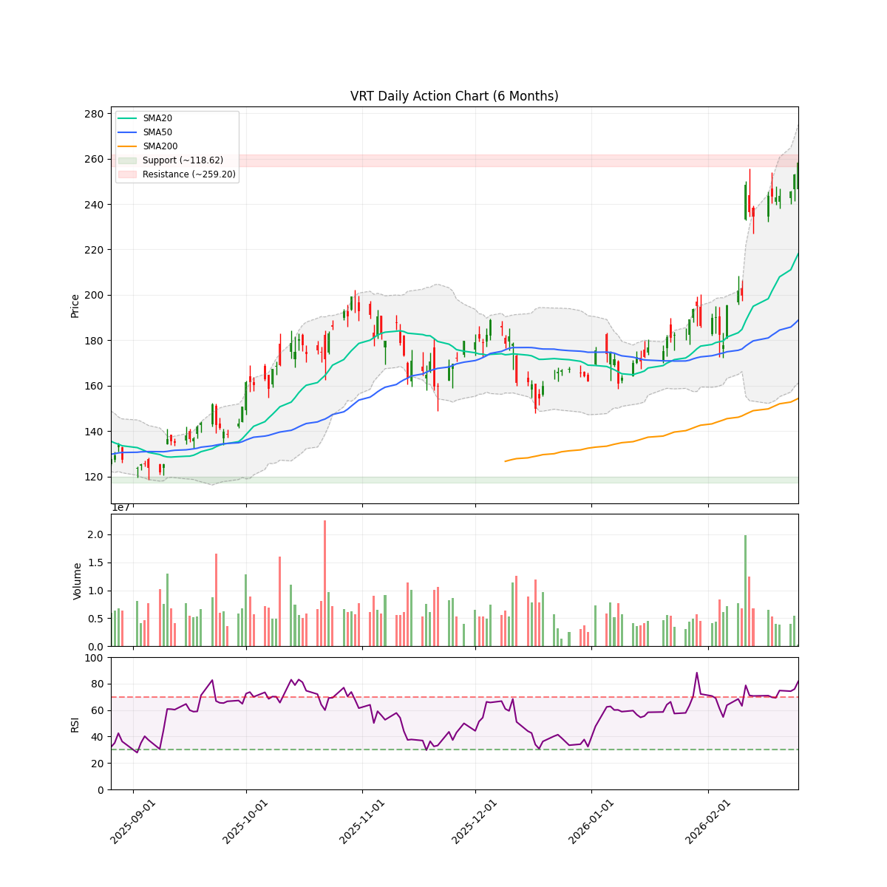
#### 研报分析

### 技术指标概览 (Technical Overview)
- **当前价格**: $258.13
- **RSI (14)**: 81.79
- **移动平均线**: SMA20: $218.13 | SMA50: $188.87 | SMA200: $154.43 (Bullish)
- **波动率**: ATR (14): 14.46 (预计周度波动: +/- $32.34)
- **关键位 (6m)**: 支撑位 $118.62 | 阻力位 $259.20
- **即时状态**: Above SMA50

# 情绪审计报告：Vertiv Holdings (VRT)
**日期：** 2026年02月25日
**职位：** 对冲基金研究员 (叙事经济学方向)

---

### 1. 催化剂分类 (Catalyst Categorization)

根据“叙事经济学”框架，我们将 VRT 的近期驱动因素归类如下：

*   **A-Tier (核心叙事驱动力)**
    *   **强劲的 2026 营收指引：** 官方上调 2026 年营收预期至 132.5 亿-137.5 亿美元，远超市场预期的 123.9 亿美元。这直接确认了 AI 基础设施需求的“长尾效应” [Blockonomi]。
    *   **巨额积压订单 (Backlog)：** 积压订单达 150 亿美元，且有机订单增长 252%。VRT 已成为数据中心热管理（液冷技术）事实上的“总承包商” [YouTube/MSN]。
*   **B-Tier (机构与情绪共振)**
    *   **机构评级与势能确认：** Zacks 将其列为强力动能股 [Zacks]；华尔街顶级分析师集体看好其在 AI 干扰下的增长潜力 [CNBC]。
    *   **盈利能力的验证：** 尽管 Q4 收益略低于预期，但其散热系统的强劲需求证明了 AI 泡沫叙事在基础设施层级尚未破裂 [MarketBeat]。
*   **C-Tier (媒体与噪音)**
    *   **知名评论员背书：** Jim Cramer 称赞其订单表现“令人难以置信” [Insider Monkey]。
    *   **行业媒体推荐：** 被《环球邮报》称为“值得永远持有的、甚至超越英伟达的 AI 股票” [The Globe and Mail]。

---

### 2. 背离检测 (Divergence Detection)

*   **技术与基本面背离：** 目前股价 ($258.13) 极度逼近 6 个月阻力位 ($259.20)。
*   **超买信号：** **RSI 高达 81.79**，属于严重的心理过热区间。
*   **结论：** 尽管基本面属于 A 级催化，但技术面出现了“利好出尽”的潜在信号。在 2 月 12 日财报跳空上涨 23% 后，市场目前处于**非理性亢奋期**。目前的上涨更多由叙事惯性推动，而非未被发现的新利好。

---

### 3. 情绪评分 (Sentiment Score)

#### **评分：9.2/10 (极度乐观 - 接近局部顶部)**

*   **逻辑：** 叙事逻辑极其自洽——“英伟达卖芯片，维谛（Vertiv）卖制冷”。150 亿的积压订单提供了极高的收入可见度。然而，9.2 的高分在对冲基金视角下往往意味着“反向预警”，即市场上已经没有尚未买入的看多者。

---

### 4. 逻辑评分 (Logic Score)

#### **评分：8.5/10**

*   **支撑逻辑：** AI 数据中心对电力和散热的要求是物理刚需，VRT 的市场地位极难被撼动。
*   **风险逻辑：** 估值已透支了未来 2 年的增长。RSI 的极端读数暗示短期内缺乏新的增量资金去突破 $260 的强阻力位。

---

### 5. 引用参考资料 (Cited Sources)

1.  **营收指引：** [Vertiv (VRT) Stock Gains 23% on Strong 2026 Revenue Guidance](https://blockonomi.com/vertiv-vrt-stock-gains-23-on-strong-2026-revenue-guidance/)
2.  **积压订单：** [This stock has a $15 billion backlog (better than Nvidia?)](https://www.msn.com/en-us/money/top-stocks/this-stock-has-a-15-billion-backlog-better-than-nvidia/vi-AA1WVhYU)
3.  **分析师评级：** [Top Wall Street analysts are bullish](https://www.msn.com/en-us/money/topstocks/top-wall-street-analysts-are-bullish-on-the-growth-potential-of-these-three-stocks/ar-AA1WQcIO)
4.  **动能分析：** [Zacks: Why Vertiv Holdings Co. (VRT) is a strong momentum stock](https://www.msn.com/en-us/money/savingandinvesting/here-s-why-vertiv-holdings-co-vrt-is-a-strong-momentum-stock/ar-AA1WB7Vd)

---

### 6. 下一个关键日期 (Next Major Date)

**2026年5月上旬（预估）**
*   **事件：** 2026 年第一季度财报发布。
*   **关注重点：** 观察 150 亿积压订单的转化率以及液冷产品（Liquid Cooling）在大规模部署中的毛利率表现。

---

**研究员总结：**
VRT 目前处于“不可阻挡的牛市循环”中，但技术面上呈现典型的**吹破顶（Blow-off Top）**特征。建议关注 $259.20 的阻力突破情况。若无法放量突破，股价可能回撤至 SMA20 ($218.13) 寻找支撑，这对于长线叙事投资者而言将是更好的入场点。
#### 近期新闻与事件
- **[Seeking Alpha]** [Why Daily Stock Picks' Gary Vaughan Likes Large Cap Tech (And Energy)](https://seekingalpha.com/article/4874186-why-daily-stock-picks-gary-vaughan-likes-large-cap-tech-and-energy)
- **[CNBC]** [Top Wall Street analysts are bullish on the growth potential of these three stocks](https://www.msn.com/en-us/money/topstocks/top-wall-street-analysts-are-bullish-on-the-growth-potential-of-these-three-stocks/ar-AA1WQcIO)
- **[The Globe and Mail]** [Best AI Stocks to Buy Now and Hold Forever: Nvidia-Beating Vertiv](https://www.theglobeandmail.com/investing/markets/stocks/VRT/pressreleases/290327/best-ai-stocks-to-buy-now-and-hold-forever-nvidia-beating-vertiv/)
- **[Zacks Investment Research]** [Here's why Vertiv Holdings Co. (VRT) is a strong momentum stock](https://www.msn.com/en-us/money/savingandinvesting/here-s-why-vertiv-holdings-co-vrt-is-a-strong-momentum-stock/ar-AA1WB7Vd)
- **[YouTube]** [This stock has a $15 billion backlog (better than Nvidia?)](https://www.msn.com/en-us/money/top-stocks/this-stock-has-a-15-billion-backlog-better-than-nvidia/vi-AA1WVhYU)

---
