# 每日股市市场报告 (2026-02-26)

> **免责声明**: 本报告由 **代码与 Gemini AI 自动生成**，仅供研究参考，**不构成**任何投资建议。投资有风险，入市需谨慎。作者及 AI 不对任何基于此内容的投资决策承担责任。

## 📑 目录
[TOC]

##  长期投资逻辑
本组合旨在捕捉 **人工智能（AI）与半导体协议** 带来的跨周期结构性增长，核心投资策略聚焦于“确定性”与“物理瓶颈”：
- **底层制程垄断 (Foundry & WFE Moats)**：
  布局处于全球半导体精密制造顶端的“工业母机”级别公司。寻找具备极高准入门槛的晶圆代工及前道设备供应商，作为全产业链最稳固的底座资产。
- **算力稀缺性与连接带宽 (Compute & Interconnect Scarcity)**：
  聚焦在高性能计算芯（HPC）及高带宽连接领域占据主导地位的标的。AI 的终极竞争是“规模”，寻找能有效解决数据交换瓶颈并提供核心推理/训练能力的算力巨头。
- **应用生态与数据霸权 (Platform & Data Sovereignty)**：
  布局拥有闭环生态、海量高质量私有数据及云基础设施的科技巨头。它们是 AI 商业化落地的最终守门人，拥有将技术转化为持续现金流的分配权。
- **物理边界保障 (Power & Thermal Infrastructure)**：
  关注 AI 扩张的“最终瓶颈”——电力供应与热能管理。重点布局为下一代超大规模数据中心提供高功率密度能源、液冷技术及电网扩容方案的能源基建商。
**风控策略**：利用 AlphaJAX 的量化动量评分（Quant Score）作为过滤器，结合 LLM 叙事审计（Narrative Audit）捕捉“业绩超预期 + 叙事逻辑改善”的共振点，实现跨周期的超额收益。

 **注：排序权重**：Ticker 按照 AI 检测出的 **方向** 排序（**看多**优先，其次是 **中性**，最后是 **看空**）。
---

<!-- DISCORD_SUMMARY_START -->
## 🧠 对冲基金经理全局诊断与资金分配策略
# 投资组合周报及调仓计划 (2026-02-26)

**致投资者：**
我是您的首席投资经理。基于研究团队提供的 0-10 逻辑评分及当前账户的风险暴露情况，目前的组合配置存在**极其严重的集中度风险 (AMD)** 以及 **个股基本面与技术面严重背离的风险 (VST)**。

以下是基于风控准则（单持仓 <30% NAV）与逻辑评分（Score < 5 必须退出）制定的调仓指令。

---

### 一、 核心行动摘要 (Actionable Trading Plan)

#### 1. 紧急减持/清仓区
*   **VST (Score: 4.2) —— 立即执行【全额清仓】**
    *   **理由：** 逻辑分低于 5。RSI 指标 (82.15) 显示极度超买，且 Q4 财报出现营收与利润双重不及预期 (Double Miss)。在“情绪见顶+基本面走弱”的背离下，必须在目前 +9.6% 盈利状态下落袋为安。
*   **AMD (Score: 7.2) —— 强制执行【战略减持】**
    *   **理由：** 违反 PM 风控准则。当前 AMD 占总资产 (NAV) 超过 51%，严重超出 30% 的上限。尽管有 Meta 协议利好，但技术面处于 SMA50 下方且估值溢价较高。
    *   **操作：** 卖出约 250-300 股 AMD，将该仓位比例压降至 25% 左右，释放现金流并降低单一行业波动的冲击。

#### 2. 战略加仓/平衡区
*   **AMZN (Score: 7.8) —— 【积极增持】**
    *   **理由：** 组合中评分最高且占比最低 (1.72%)。营收超越沃尔玛的叙事已确立，目前 RSI (34.55) 接近超卖，提供了极佳的入场安全边际。
*   **GOOGL (Score: 7.2) —— 【分批低吸】**
    *   **理由：** RSI (29.45) 进入极度超卖区间，属于典型的“技术性错杀”。在 AI 领军地位稳固的情况下，利用当前跌破 SMA50 的机会摊薄成本。

---

### 二、 具体执行指令 (Execution Orders)

| 标的 | 动作 | 目标价格/区间 | 规模/数量 | 优先级 |
| :--- | :--- | :--- | :--- | :--- |
| **VST** | **市价清仓** | $174.00 附近 | 100 股 (全部) | **紧急** |
| **AMD** | **减持** | $203.00 - $205.00 | 250 股 | **高** |
| **AMZN** | **加仓** | $200.00 - $207.00 | 建议加至总 NAV 的 10% | **中** |
| **GOOGL** | **补仓** | $300.00 - $307.00 | 建议增持 50 股 | **中** |

---

### 三、 If-Then 压力测试 (Volatility Scenarios)

*   **场景 A：若科技板块持续回调（GOOGL/AMZN 继续下探）**
    *   **If**: GOOGL 跌破 $280 关口或 AMZN 跌破 $190。
    *   **Then**: 停止所有主动买入指令，保留 20% 以上现金储备，观察 2026 年 Q1 财报前的宏观环境是否恶化。
*   **场景 B：若 AMD 受 Meta 订单利好强势反弹**
    *   **If**: AMD 价格重回 $218 (SMA50) 以上。
    *   **Then**: 不要因为反弹而追高补回仓位。必须坚持 30% 集中度红线，利用反弹机会优化 Covered Call 策略，卖出更高行权价的期权增加收入。
*   **场景 C：VST 财报后出现报复性下跌**
    *   **If**: VST 回撤至 $160 (SMA20) 附近。
    *   **Then**: 即使其跌回均线，在逻辑评分未回升至 5 以上前，**严禁抄底**。

---

### 四、 PM 总结 (Portfolio Health Check)

当前账户现金充足 ($53k+)，加上清仓 VST 和减持 AMD 释放的资金，总可用现金将达到账户的 40% 左右。这符合我们“在动荡市场中保持流动性”的原则。

**核心逻辑重申：**
1.  **清算弱势股 (VST)**：不参与基本面转弱且超买的博弈。
2.  **纠正结构错误 (AMD)**：即便看好，也不能让单一标的绑架整个账户的生死。
3.  **布局超卖巨头 (AMZN/GOOGL)**：在机构上调目标价与技术性超卖的交汇点建仓。

请立即按照上述计划进行调仓。如有任何市场突发状况，研究团队将实时更新评分。
<!-- DISCORD_SUMMARY_END -->
---

## 💼 现有持仓个股诊断

### AMD
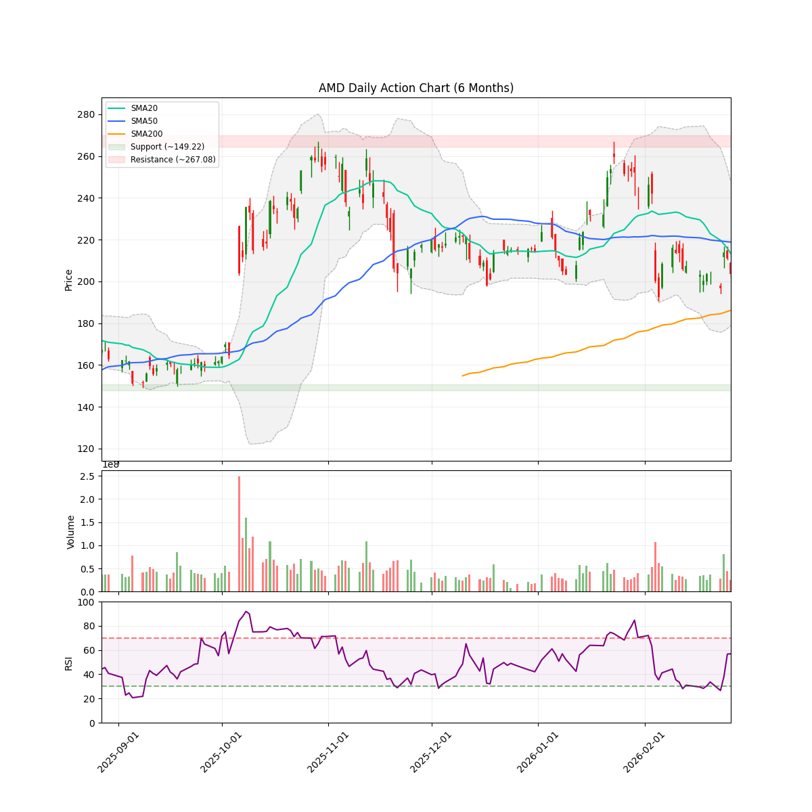
#### 研报分析

### 技术指标概览 (Technical Overview)
- **当前价格**: $203.59
- **RSI (14)**: 56.96
- **移动平均线**: SMA20: $213.32 | SMA50: $218.82 | SMA200: $186.12 (Bullish)
- **波动率**: ATR (14): 10.08 (预计周度波动: +/- $22.54)
- **关键位 (6m)**: 支撑位 $149.22 | 阻力位 $267.08
- **即时状态**: Below SMA50

# AMD 情绪审计报告：叙事驱动与价值博弈

**日期**：2026年2月26日
**分析师**：对冲基金研究助理（叙事经济学方向）

---

### 1. 催化剂分类与评级 (Catalyst Categorization)

*   **A-Tier（核心基本面转变）**：
    *   **Meta 深度采购协议**：Meta 宣布使用 AMD GPU 构建 AI 基础设施，并涉及高达 1350 亿美元的 2026 年资本支出计划。这是 AMD 在 AI 领域追赶 Nvidia 的里程碑式事件，直接提升了 AMD MI300/MI400 系列的叙事天花板。[参考来源：Zacks, NYT]
*   **B-Tier（行业联动与估值压力）**：
    *   **Nvidia 财报的溢出效应**：Nvidia 业绩虽超预期但股价下跌，反映了市场对 AI 赛道“利好出尽”的担忧。同时，分析师指出 AMD 的前瞻市盈率 (27.4x) 高于 Nvidia (22.5x)，这构成了短期的估值阻力。[参考来源：MarketWatch]
*   **C-Tier（市场杂音/情绪补丁）**：
    *   **Jim Cramer 的正面评价**：虽然 Cramer 将 AMD 的转型称为“最伟大的转型之一”，但在叙事经济学中，这类过于一致的赞美往往预示着情绪过热的风险。[参考来源：Insider Monkey]

---

### 2. 背离检测 (Divergence Detection)

**报告结论：看涨耗竭与结构性背离。**

*   **价格 vs. 消息**：尽管有 Meta 协议（A-Tier 利好）和 Nvidia 财报的正面数据，AMD 目前价格 (203.59) 仍低于 SMA20 (213.32) 和 SMA50 (218.82)。
*   **背离分析**：这是一个典型的**“利好不涨”**陷阱。市场虽然认同 AMD 在 AI 市场的占有率提升，但由于其估值高于 Nvidia，资金在当前宏观环境下表现出明显的畏高情绪。技术面上，RSI 为 56.96 处于中性，但价格未能站回 50 日均线，说明抛压依然集中在 210-220 美元的成本区（即您的持仓成本附近）。

---

### 3. 持仓风险诊断 (Position Audit)

*   **当前持仓**：600股 AMD (成本 $220.54) + 卖出 1张 2026年3月 $230 Call。
*   **诊断**：
    *   **正股部分**：目前亏损 7.79%。由于价格处于 SMA50 之下，您的仓位正处于“浮亏震荡期”。
    *   **期权部分**：该备兑开仓 (Covered Call) 目前盈利 68.13%，成功对冲了部分正股下跌风险。
    *   **建议**：由于价格正在 SMA200 (186.12) 之上寻求支撑，短期不建议割肉。Meta 的订单属于中长期利好，AMD 目前在经历“估值重塑”的过程。

---

### 4. 逻辑评分 (Logic Score)

# **7.2 / 10**

**评分逻辑**：
*   **加分项 (+)**：Meta 的背书为 AMD 提供了长期的营收保障，AI 叙事并未破裂。SMA200 提供了强力的长线心理支撑。
*   **扣分项 (-)**：短期技术面呈空头排列（低于 SMA20/50）。相对于 Nvidia 的估值劣势限制了短期反弹空间。市场对 AI 行业的审美疲劳正在显现。

---

### 5. 下一个关键日期 (Next Major Date)

*   **2026年4月下旬 (预计)**：**2026年第一季度财报发布日**。
    *   *重要性*：届时市场将密切关注 Meta 订单是否已开始转化为实际的财务指引，以及 AMD 数据中心业务的毛利率是否能进一步缩小与 Nvidia 的差距。

---

### 结论与操作建议
AMD 当前正处于**“消息面极度火热”与“技术面震荡回调”**的错配期。对于您的持仓，由于卖出的 $230 Call 已经产生大幅盈利且覆盖了正股的部分亏损，建议继续持有，等待价格回踩 SMA200 (186 附近) 企稳。若价格突破 218.82 (SMA50)，则趋势正式转为强力看涨。

**引用新闻来源：**
- [Zacks/Yahoo Finance: META Taps AMD GPUs](https://finance.yahoo.com/news/meta-taps-amd-gpus-build-165900800.html)
- [MarketWatch: Nvidia's valuation discount vs AMD](https://www.marketwatch.com/livecoverage/nvidia-earnings-stock-results-q4-guidance-ai/card/nvidia-s-stock-trades-at-a-discount-to-amd-s-and-that-puzzles-some-analysts-Qczp3xRB5TEB4kYNGzc4)
#### 近期新闻与事件
- **[Investing.com]** [Nvidia, Broadcom among market cap stock movers on Thursday By Investing.com](https://www.investing.com/news/stock-market-news/nvidia-broadcom-among-market-cap-stock-movers-on-thursday-93CH-4529239)
- **[Zacks]** [META Taps AMD GPUs to Build AI Infra: What's Ahead for the Stock?](https://finance.yahoo.com/news/meta-taps-amd-gpus-build-165900800.html)
- **[Insider Monkey]** [Jim Cramer Says Advanced Micro Devices (AMD)’s Turnaround Is One of The Greatest...](https://finance.yahoo.com/news/jim-cramer-says-advanced-micro-152140156.html)
- **[Investopedia]** [Stock Market Today: Futures Little Changed After Two-Day Rally; Nvidia Shares...](https://www.investopedia.com/stock-market-today-dow-jones-s-and-p-500-02262026-11914836)
- **[Motley Fool]** [Is AMD Stock Going to $300 After the Meta Platforms Deal?](https://finance.yahoo.com/news/amd-stock-going-300-meta-165000152.html)

---

### AMZN
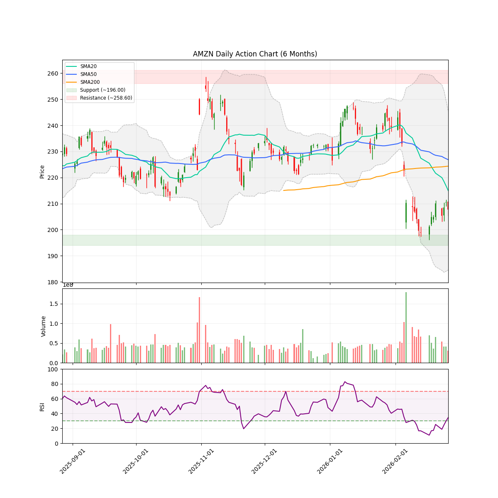
#### 研报分析

### 技术指标概览 (Technical Overview)
- **当前价格**: $207.76
- **RSI (14)**: 34.55
- **移动平均线**: SMA20: $215.00 | SMA50: $226.84 | SMA200: $224.34 (Bullish)
- **波动率**: ATR (14): 7.08 (预计周度波动: +/- $15.83)
- **关键位 (6m)**: 支撑位 $196.00 | 阻力位 $258.60
- **即时状态**: Below SMA50

# 亚马逊 (AMZN) 情绪审计报告

**报告日期**：2026年02月26日
**分析师**：对冲基金研究员（叙事经济学专业）
**当前价格**：$207.76
**技术背景**：RSI 34.55 (接近超卖)，位于 SMA200 ($224.34) 下方

---

## 1. 催化剂分类 (Catalyst Categorization)

### **A-Tier: 核心基本面与叙事转向**
*   **营收超越沃尔玛**：AMZN 年度营收达到 $7169亿，正式超越沃尔玛成为美国最大零售商。这不仅是数字的超越，更是“电商/云/广告”混合模型对传统零售模型的叙事性胜利。[来源: Insider Monkey/MSN]
*   **印度-美国贸易协定 (2026)**：今日生效的贸易协定为亚马逊在印度市场的深度渗透（跨境电商、AWS基础设施）打开了宏观窗口，属于长线战略利好。[来源: Mint]
*   **Q4 财报表现**：云服务 (AWS) 和广告业务利润率持续扩张，基本面稳健。[来源: Seeking Alpha]

### **B-Tier: 增长动能与资本开支**
*   **路易斯安那州数据中心计划**：$120亿的基础设施投资，作为其 $2000亿资本支出 (Capex) 计划的一部分，显示了公司对 AI 与云需求的长期看好，但短期内巨大的现金支出可能压制股价表现。[来源: Blockonomi]

### **C-Tier: 市场杂音**
*   **跑输道指**：关于“股价落后于道指”的媒体讨论属于滞后指标，更多反映了近期的震荡而非未来趋势。[来源: Yahoo Finance]

---

## 2. 背离检测 (Divergence Detection)

**核心观察：看跌衰竭与基本面背离**

目前 AMZN 出现了典型的**“利好钝化”**现象：
1.  **叙事层面**：公司刚完成了“超越沃尔玛”这一里程碑式的跨越，且 Q4 业绩超预期，AWS 重新加速。
2.  **价格层面**：股价年内下跌 11%，目前处于 SMA50 ($226.84) 和 SMA200 ($224.34) 下方，且 RSI 触及 34.55。

**诊断**：这种“在重大利好中阴跌”的情况通常意味着市场正在消化其 **$2000亿的高额资本支出计划**。市场担心短期利润率受损，但忽略了营收规模的扩张。考虑到价格已接近 6 个月低点支撑位 ($196.00)，**看跌动能正在衰竭**，目前的下跌更像是一个“空头陷阱”。

---

## 3. 情绪评分 (Sentiment Score)

### **评分：7.8 / 10**

**逻辑依据**：
*   **叙事强度 (High)**：零售冠军 + AI 基础设施领导者的双重叙事依然稳固。
*   **估值吸引力 (Medium-High)**：尽管分析师目标价高达 $282，但当前 $207 的价格提供了极高的安全边际。
*   **技术阻力 (Low)**：跌破 SMA200 属于短期技术面走弱，但也为长期资金提供了配置空间。
*   **持仓分析**：您的成本价为 $201.61，目前略微盈利 (+1.61%)，且占账户比例仅 1.72%，具备极佳的加仓空间。

---

## 4. 投资建议与后续关注

### **针对您的持仓**：
您的仓位目前非常安全。鉴于 ATR 为 7.08，本周波动区间在 +/- 15.83 左右。如果股价回踩支撑位 **$196.00 - $200.00**，考虑到 RSI 的超卖状态，这将是优质的补仓机会。

### **下个重大日期 (Next Major Date)**：
*   **2026年4月下旬 (预计)**：2026年第一季度 (Q1) 财报发布日。这将是验证其 $2000亿资本支出是否已经开始转化为 AWS 实际营收增长的关键节点。

---

**风险提示**：需关注宏观环境下 2026 年印度-美国贸易协定的具体落地速度，以及美联储对科技股估值的持续压力。

> **引用文献/链接**：
> - [India-US Trade Deal (2026-02-26)](https://www.livemint.com/focus/indiaus-trade-deal-2026-9-ways-it-changes-how-indians-should-look-at-us-stocks-and-etfs-11772091106207.html)
> - [Amazon Surpasses Walmart Revenue (2026-02-25)](https://www.msn.com/en-us/money/companies/amazon-amzn-tops-walmart-with-7169-billion-in-annual-revenue/ar-AA1X2V7F)
> - [Louisiana Data Center Investment (2026-02-24)](https://blockonomi.com/amazon-amzn-stock-12-billion-louisiana-data-center-plan-explained/)
#### 近期新闻与事件
- **[Mint]** [India-US Trade Deal 2026: 9 Ways It Changes How Indians Should Look at US Stocks and ETFs](https://www.livemint.com/focus/indiaus-trade-deal-2026-9-ways-it-changes-how-indians-should-look-at-us-stocks-and-etfs-11772091106207.html)
- **[Yahoo Finance]** [Is Amazon.com Stock Underperforming the Dow?](https://finance.yahoo.com/news/amazon-com-stock-underperforming-dow-161258841.html)
- **[Blockonomi]** [Amazon (AMZN) Stock: $12 Billion Louisiana Data Center Plan Explained](https://blockonomi.com/amazon-amzn-stock-12-billion-louisiana-data-center-plan-explained/)
- **[Insider Monkey]** [Amazon (AMZN) Tops Walmart With $716.9 Billion in Annual Revenue](https://www.msn.com/en-us/money/companies/amazon-amzn-tops-walmart-with-7169-billion-in-annual-revenue/ar-AA1X2V7F)
- **[Seeking Alpha]** [Amazon Stock Still Makes No Sense](https://seekingalpha.com/article/4872808-amazon-stock-still-makes-no-sense)

---

### GOOGL
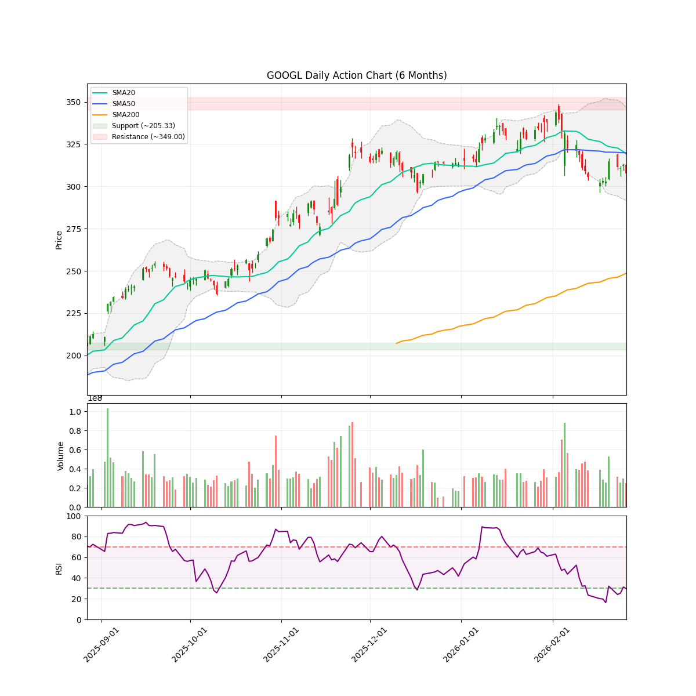
#### 研报分析

### 技术指标概览 (Technical Overview)
- **当前价格**: $307.67
- **RSI (14)**: 29.45
- **移动平均线**: SMA20: $319.08 | SMA50: $319.92 | SMA200: $248.64 (Bullish)
- **波动率**: ATR (14): 8.63 (预计周度波动: +/- $19.31)
- **关键位 (6m)**: 支撑位 $205.33 | 阻力位 $349.00
- **即时状态**: Below SMA50

# 情绪审计报告：Alphabet Inc. (GOOGL)
**报告日期**：2026年02月26日
**分析师**：对冲基金研究员 (叙事经济学方向)

---

### 1. 催化剂分类 (Catalyst Categorization)

根据目前的资讯流，我们将 GOOGL 的驱动因素分为以下三个等级：

*   **A-Tier (核心驱动力)**：
    *   **AI 领军地位确认**：Google DeepMind 发布 Lyria 3 音乐生成模型，进一步强化 Gemini 生态竞争力。
    *   **机构强力增持信号**：高盛将 GOOGL 列为首选增长股；Mizuho (瑞穗) 上调目标价至 **$410**；Citizens 重申目标价 **$385**。这些目标价较当前价格 ($307.67) 有 25%-33% 的上行空间。
*   **B-Tier (行业与业务扩张)**：
    *   **算力基础设施扩张**：与 Cipher Digital 达成 600MW 高性能计算 (HPC) 数据中心协议，巩固 Google Cloud 在 AI 算力租赁市场的份额。
    *   **广告技术领导力**：WarrenAI 将其评为 2026 年顶尖广告技术股，预计公允价值涨幅高达 22%-57%。
*   **C-Tier (市场噪音)**：
    *   **媒体投机性言论**：Forbes 讨论“如何以 30% 的折扣购买 Google”，提及 $220 的价格，这类言论更多属于极端假设，目前缺乏基本面支撑。

---

### 2. 背离检测 (Divergence Detection)

**当前形态：看涨背离 / 空头力竭 (Bearish Exhaustion)**

*   **技术面与叙事面的矛盾**：
    *   **技术信号**：RSI 目前处于 **29.45**，进入极度超卖区间。股价处于 SMA20 ($319.08) 和 SMA50 ($319.92) 之下，短期趋势向下。
    *   **叙事信号**：分析师评级极度乐观 (Outperform)，基本面强劲（Lyria 3 发布，HPC 合同），且广告市场预期向好。
*   **结论**：GOOGL 正在经历“好消息下的下跌”。这并非基本面恶化，而是受 **Nvidia 财报后“利好出尽” (Sell the News)** 导致的科技板块整体回调影响（Nvidia 超预期但跌 5%）。对于 GOOGL 而言，这种背离往往意味着**看涨趋势中的深度回调陷阱**，而非趋势反转。

---

### 3. 情绪评分 (Sentiment Score)

#### **逻辑评分：7.2/10**

*   **评分逻辑**：
    *   **(+) 强力基本面 (9/10)**：AI 落地速度加快，机构目标价上行空间巨大。
    *   **(+) 估值优势 (8/10)**：RSI 超卖，相对于其增长预期，目前的 $307 价位具有较高安全边际。
    *   **(-) 市场偏好转换 (4/10)**：当前资金流向“Mag 7”以外的中间市值股票，大盘科技股短期失宠。
    *   **综合判定**：这是一个**健康的叙事修正周期**。股价虽然在 SMA50 下方，但远高于 SMA200 ($248.64)，长期牛市格局未变。

---

### 4. 关键信息引用与日期

*   **重要参考新闻**：
    *   *Mizuho Reiterates Outperform with $410 Target Price* (2026-02-22) - [查看详情](https://www.msn.com/en-us/money/other/mizuho-reiterates-outperform-on-alphabet-googl-with-410-target-price/ar-AA1WQc1M)
    *   *Google Launches Lyria 3 in Gemini* (2026-02-23) - [查看详情](https://www.msn.com/en-us/news/technology/alphabet-googl-expands-ai-reach-amid-market-debate/ar-AA1WV54R)
    *   *Cipher Digital (CIFR) AWS/Google Deal* (2026-02-24) - [查看详情](https://blockonomi.com/cipher-digital-cifr-stock-drops-on-earnings-miss-as-aws-deal-takes-center-stage/)

*   **下一次重大日期**：
    *   **2026年4月下旬 (预计)**：2026财年第一季度 (Q1) 财报发布。
    *   **短期关注点**：股价是否能在 6 个月低点支撑位 ($205.33) 远上方（约 $300 整数关口）企稳。

---

### 5. 头寸诊断 (Portfolio Recommendation)

**当前头寸状态**：盈利 +15.47%，仓位占比 17.64%。

*   **诊断建议**：
    1.  **分批补仓**：鉴于 RSI < 30 且机构目标价远高于现价，当前的回调是摊薄成本或轻微加仓的良机。
    2.  **设定防线**：虽然叙事看涨，但若股价跌破 $280 区域（近期波段低点预估），需警惕市场对 AI 叙事整体信心的瓦解。
    3.  **持股待涨**：目前盈亏比极佳，建议忽略短期波动，持仓等待 Q1 财报前的价值回归。

**结论**：目前的下跌是受大环境拖累的**技术性超卖**，而非公司核心竞争力的**系统性失败**。维持“买入/持有”评级。
#### 近期新闻与事件
- **[Investing.com]** [Top Adtech Stocks to Watch in 2026, According to WarrenAI](https://www.investing.com/news/stock-market-news/top-adtech-stocks-to-watch-in-2026-according-to-warrenai-93CH-4525573)
- **[Forbes]** [How To Buy Google Stock At A 30% Discount?](https://www.forbes.com/sites/greatspeculations/2026/02/23/how-to-buy-google-stock-at-a-30-discount/)
- **[Yahoo Finance]** [Alphabet Inc. (GOOGL) Touted as AI-Driven Search Winner as Analysts See TAM Expansion](https://finance.yahoo.com/news/alphabet-inc-googl-touted-ai-165312836.html)
- **[Insider Monkey]** [Mizuho Reiterates Outperform on Alphabet (GOOGL) With $410 Target Price](https://www.msn.com/en-us/money/other/mizuho-reiterates-outperform-on-alphabet-googl-with-410-target-price/ar-AA1WQc1M)
- **[Insider Monkey]** [Alphabet (GOOGL) Expands AI Reach Amid Market Debate](https://www.msn.com/en-us/news/technology/alphabet-googl-expands-ai-reach-amid-market-debate/ar-AA1WV54R)

---

### VST
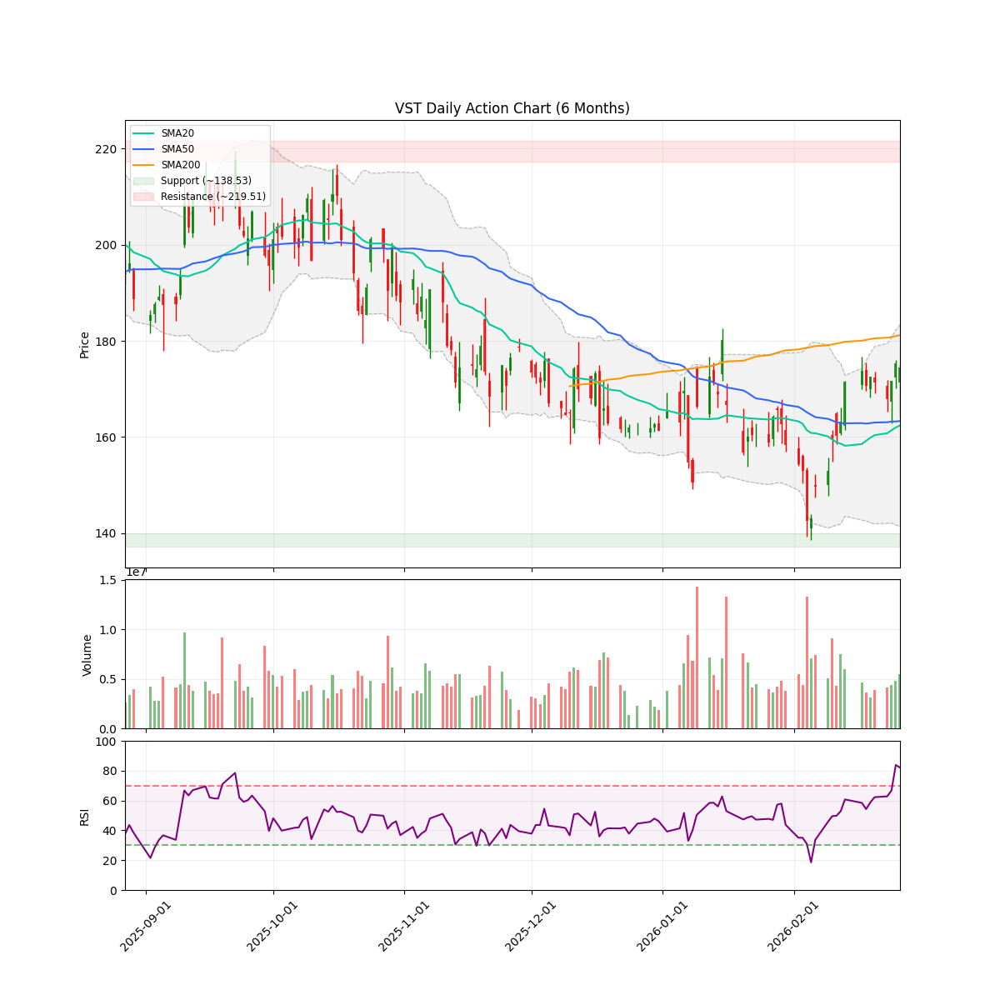
#### 研报分析

### 技术指标概览 (Technical Overview)
- **当前价格**: $174.46
- **RSI (14)**: 82.15
- **移动平均线**: SMA20: $162.41 | SMA50: $163.31 | SMA200: $181.18 (Bearish)
- **波动率**: ATR (14): 7.33 (预计周度波动: +/- $16.38)
- **关键位 (6m)**: 支撑位 $138.53 | 阻力位 $219.51
- **即时状态**: Above SMA50

# VST (Vistra Corp.) 情绪审计报告

**致：** 投资委员会
**担任：** 对冲基金研究员 (叙事经济学方向)
**日期：** 2026年2月26日
**标的：** VST (Vistra Corp.)

---

### 一、 催化剂分类 (Catalyst Categorization)

根据“叙事经济学”框架，我们将 VST 当前的驱动因素分类如下：

*   **A-Tier (核心驱动点)**
    *   **业绩雷区 (利空):** VST 2025年第四季度财报显示，每股收益 (EPS) 为 $2.01，低于预期的 $2.33 (缺口 $0.32)；营收 $4.58B，大幅低于预期的 $5.3B。这属于严重的财务数据偏差。
    *   **机构分歧:** Wells Fargo 重申了 $236 的买入目标价，而摩根士丹利 (Morgan Stanley) 虽维持长期看好，但下调了目标价。这表明顶级机构在“长期成长”与“短期估值”之间产生动摇。
*   **B-Tier (行业与宏观叙事)**
    *   **板块效应:** VST 被列为 2026 年各行业表现最佳的股票之一，受益于能源转型和电力需求的长期叙事。
*   **C-Tier (市场噪音)**
    *   **Zacks/Insider Monkey 评论:** 关于 VST 跑输行业的讨论，更多属于滞后性指标分析。

---

### 二、 背离检测 (Divergence Detection)

**核心警示：极度超买与基本面不及预期的背离。**

1.  **技术面超载：** VST 的 **RSI 目前高达 82.15**，处于严重的超买区间。通常 RSI 超过 70 意味着回调风险增加。
2.  **财报见光死：** 尽管 RSI 显示市场近期极度亢奋，但今日 (2月26日) 公布的财报数据在 EPS 和营收上均未达标。
3.  **价格位置：** 当前价格 ($174.46) 虽然高于 SMA20 ($162.41) 和 SMA50 ($163.31)，但仍处于 SMA200 ($181.18) 这一长期压力的下方。
4.  **结论：** 这是一个典型的**“情绪陷阱”**。市场在财报前过度定价了乐观预期，而实际数据的疲软极易引发获利回吐或抛售。

---

### 三、 逻辑评分 (Logic Score)

**分值：4.2 / 10 (偏向悲观/审慎)**

*   **评分理由：** 虽然长期叙事（Wells Fargo 的 $236 目标价）依然存在，但短期内财报的“双不及预期” (Double Miss) 破坏了上行逻辑。结合 82.15 的 RSI 指标，该股正处于“情绪力竭”边缘。目前用户的盈利空间 (+9.60%) 正面临财报后波动带来的回吐风险。

---

### 四、 详细分析报告

**1. 叙事陷阱识别：**
VST 被包装成 2026 年电力行业的领头羊，这种“叙事”在财报前将股价推升至超买区。然而，今日 Investing.com 引用的财报数据显示 [Link](https://www.investing.com/news/earnings/vistra-energy-earnings-missed-by-032-revenue-fell-short-of-estimates-4528056)，公司在核心盈利能力上出现了显著滑坡。

**2. 筹码分布与风险：**
用户成本价为 $157.38，目前已有约 10% 的浮盈。但需要注意，SMA20 ($162.41) 是目前的关键支撑位，如果财报后的负面情绪发酵，股价极大概率回测该均线甚至 6 个月低点 ($138.53)。

**3. 对冲建议：**
由于 RSI 极高且基本面出现裂痕，建议在该位置考虑减仓或买入对冲。不宜在 RSI > 80 且财报失利的情况下追高。

---

### 五、 关键参考与后续节点

*   **特定新闻引用：**
    *   *Investing.com:* VST Q4 EPS $2.01 (预期 $2.33)，营收不及预期。
    *   *Wells Fargo:* 维持 $236 目标价 (2026-02-13)。
    *   *Morgan Stanley:* 下调目标价但维持看好 (2026-02-25)。
*   **下一个重大日期 (Next Major Date)：**
    *   **2026年5月中旬** (预计发布 2026 年第一季度财报)。
    *   **短期关注点：** 未来 48 小时内机构对本次财报不及预期的调级评论。

**风险提示：** 能源股受大宗商品价格和监管政策影响较大，高 RSI 结合财报 Miss 属于典型的高风险信号，需严格执行止盈策略。
#### 近期新闻与事件
- **[Yahoo Finance]** [What's Latest With Vistra Corp. (VST)](https://finance.yahoo.com/news/latest-vistra-corp-vst-020718394.html)
- **[Zacks]** [VST Stock Underperforms Industry in the Past 6 Months: How to Play?](https://finance.yahoo.com/news/vst-stock-underperforms-industry-past-181900480.html)
- **[Insider Monkey]** [Morgan Stanley Lowers Vistra (VST) Target While Staying Bullish on Long-Term...](https://finance.yahoo.com/news/morgan-stanley-lowers-vistra-vst-164547707.html)
- **[StockStory]** [3 Reasons VSTS is Risky and 1 Stock to Buy Instead](https://finance.yahoo.com/news/3-reasons-vsts-risky-1-040202708.html)
- **[Zacks]** [Vistra to Release Q4 Earnings: How Will the Stock Perform This Season?](https://finance.yahoo.com/news/vistra-release-q4-earnings-stock-141700736.html)

---

## 🔍 观察池机会分析

### AMAT
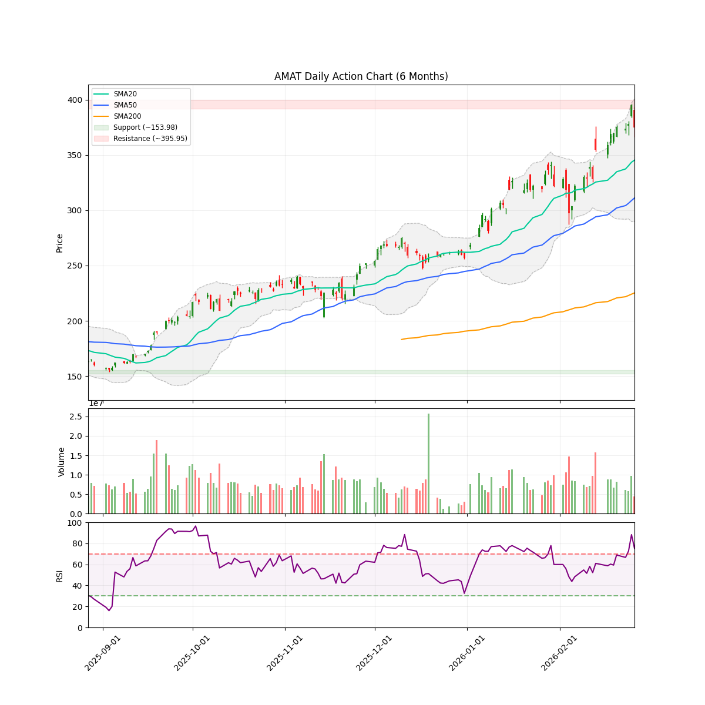
#### 研报分析

### 技术指标概览 (Technical Overview)
- **当前价格**: $374.66
- **RSI (14)**: 75.15
- **移动平均线**: SMA20: $345.33 | SMA50: $311.08 | SMA200: $225.21 (Bullish)
- **波动率**: ATR (14): 17.63 (预计周度波动: +/- $39.42)
- **关键位 (6m)**: 支撑位 $153.98 | 阻力位 $395.95
- **即时状态**: Above SMA50

# Applied Materials (AMAT) 情绪审计报告

**致：** 投资委员会
**担任职位：** 叙事经济学研究助理
**日期：** 2026年02月26日

---

### 1. 催化剂分类 (Catalyst Categorization)

| 级别 | 驱动因素 | 详细分析 |
| :--- | :--- | :--- |
| **A-Tier (核心驱动)** | **20% 增长指引与 AI 需求** | 公司在 2 月中旬发布的 20% 增长指引是当前的“叙事引擎”。AI 芯片制造设备需求的加速增长（见 Seeking Alpha, 2026-02-14）为股价提供了基本面支撑，这并非单纯的情绪炒作，而是实质性的业绩驱动。 |
| **B-Tier (行业共振)** | **跑赢大盘与行业强势** | Zacks 和 Barchart (2026-02-25) 均指出 AMAT 表现优于标普 500 及科技板块。这种相对强劲的走势（Relative Strength）吸引了动量交易者的流入，强化了看涨趋势。 |
| **C-Tier (市场噪音)** | **内部人士减持** | 控制器 Adam Sanders 和董事 Judy Bruner 的减持（2026-02-24）总计约 170 万美元。在股价接近 52 周高点时，此类套现属于常规财务规划，对基本面无实质损害，但需留意高位获利回吐压力。 |

---

### 2. 背离检测 (Divergence Detection)

*   **价格与新闻共振：** 目前未发现明显的看跌背离。股价在 20% 增长指引发布后稳步攀升，且在 2 月 26 日依然被列为市场波动的领头羊。
*   **技术面警示：** **RSI 为 75.15**，已进入超买区间。股价远高于 SMA200 (225.21)，显示出中期极度扩张。
*   **叙事评估：** 市场正在定价“AI 基础设施的确定性”。尽管有内部人士小幅减持，但买盘力量（SMA20/50 的斜率）极强。目前正处于**趋势自我强化阶段**，而非衰竭阶段。

---

### 3. 情绪与逻辑评分 (Sentiment & Logic Score)

#### **情绪评分：9.0/10 (强劲牛市循环)**
*   **理由：** 市场对 AI 半导体设备的叙事高度认同。新闻流以“超越表现”和“增长指引”为主导，恐慌情绪极低。

#### **逻辑评分：8.5/10 (高置信度趋势)**
*   **理由：** 基于 2 月 12 日财报后的 20% 营收增长预期。逻辑支柱在于物理产能的扩张需求（Fab equipment）。扣分项在于短期估值过热（RSI 超买）以及近期出现的内部人士减持。

---

### 4. 关键指标摘要

*   **当前价格：** 374.66
*   **趋势：** 强劲看涨 (Bullish) - 价格处于所有主要均线上方。
*   **阻力位：** 395.95 (6个月高点)
*   **支撑位：** 345.33 (SMA20)
*   **下周预估波动区间：** +/- 39.42 (基于 ATR)

---

### 5. 引用参考 (Context Citations)

1.  **增长指引：** *Applied Materials Surges On 20% Growth Guidance* (Seeking Alpha, 2026-02-14). [Link](https://seekingalpha.com/article/4870393-applied-materials-surges-on-20-percent-growth-guidance-is-the-stock-now-fully-valued)
2.  **跑赢大盘：** *Is Applied Materials (AMAT) Outperforming Other Computer and Technology Stocks...* (Zacks, 2026-02-25). [Link](https://finance.yahoo.com/news/applied-materials-amat-outperforming-other-144006722.html)
3.  **内部减持：** *Applied Materials director, sells $1.49 million in AMAT* (Investing.com, 2026-02-24). [Link](https://www.investing.com/news/insider-trading-news/bruner-judy-applied-materials-director-sells-149-million-in-amat-93CH-4523076)

---

### 6. 下一个重大日期 (Next Major Date)

**2026 年 5 月中旬 (预计)**
*   **事件：** 2026 财年第二季度 (Q2) 财报发布。
*   **逻辑：** 鉴于 Q1 财报于 2 月 12 日发布，市场将密切关注 5 月份的更新，以验证 AI 设备订单是否如预期般转化为实际营收。

---

**风险提示：** RSI 处于 75 以上意味着技术性回调风险加大。建议关注 395.95 附近的压力，若无法有效突破，可能出现回测 SMA20 (345.33) 的动作。
#### 近期新闻与事件
- **[Zacks]** [Is Applied Materials (AMAT) Outperforming Other Computer and Technology Stocks...](https://finance.yahoo.com/news/applied-materials-amat-outperforming-other-144006722.html)
- **[Barchart]** [Is Applied Materials Stock Outperforming the S&P 500?](https://finance.yahoo.com/news/applied-materials-stock-outperforming-p-141810278.html)
- **[Investing.com]** [Applied Materials, Broadcom among market cap stock movers on Thursday By...](https://www.investing.com/news/stock-market-news/applied-materials-broadcom-among-market-cap-stock-movers-on-thursday-93CH-4528589)
- **[Investing.com]** [Applied Materials CAO Sanders sells $202k in stock By Investing.com](https://www.investing.com/news/insider-trading-news/applied-materials-cao-sanders-sells-202k-in-stock-93CH-4523073)
- **[Investing.com]** [Bruner Judy, Applied Materials director, sells $1.49 million in AMAT By...](https://www.investing.com/news/insider-trading-news/bruner-judy-applied-materials-director-sells-149-million-in-amat-93CH-4523076)

---

### ANET
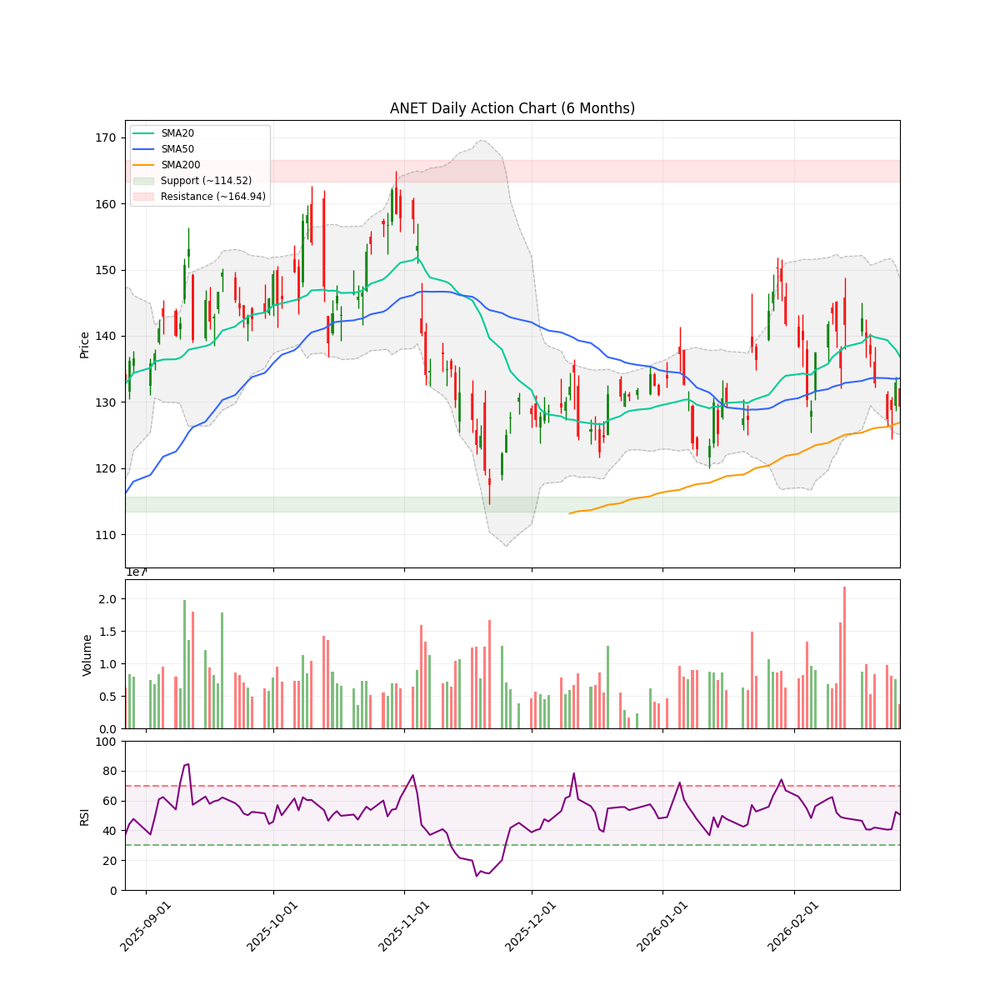
#### 研报分析

### 技术指标概览 (Technical Overview)
- **当前价格**: $129.34
- **RSI (14)**: 50.61
- **移动平均线**: SMA20: $136.86 | SMA50: $133.57 | SMA200: $126.89 (Bullish)
- **波动率**: ATR (14): 6.69 (预计周度波动: +/- $14.97)
- **关键位 (6m)**: 支撑位 $114.52 | 阻力位 $164.94
- **即时状态**: Below SMA50

# Arista Networks (ANET) 情绪审计报告

**致：** 投资委员会 / 首席策略师
**日期：** 2026年02月26日
**身份：** 对冲基金研究员 (叙事经济学方向)

---

### 1. 催化剂分类 (Catalyst Categorization)

我们将近期驱动 ANET 的新闻按其对股价长期趋势的影响力进行分类：

*   **A-Tier (核心增长动力)**
    *   **超预期的 Q4 财报：** 2026年2月13日，ANET 公布每股收益 $0.82，超过 Zacks 预期的 $0.75，且营收同样超预期。这标志着 AI 网络基础设施的需求依然处于爆发期。[来源: MSN/Zacks]
    *   **顶级投行上调目标价：** 高盛 (Goldman Sachs) 将目标价从 $165 大幅上调至 **$188** (2026-02-13/23)；摩根士丹利 (Morgan Stanley) 上调至 **$165**。机构的集体背书确认了其在 AI 生态中的不可替代性。[来源: Yahoo Finance]
*   **B-Tier (行业与舆论推力)**
    *   **AI 叙事溢价：** 被评为“10 只不可阻挡的 AI 股票”之一。作为以太网交换机的领导者，其在后端 GPU 互联中的地位受惠于行业整体扩张。[来源: Motley Fool]
*   **C-Tier (市场噪音)**
    *   **内部人减持：** 董事 Kelly Battles 减持 5.4 万美元。金额极小，属于常规财务规划，对基本面无实质性影响。[来源: Investing.com]

---

### 2. 背离检测 (Divergence Detection)

**核心观察：强基本面与疲软技术面的矛盾**

目前 ANET 出现了显著的**看跌背离 (Bearish Divergence)**：
1.  **利好钝化：** 尽管在 2 月中旬发布了超预期的财报并获得了投行目标价的上调（目标价距现价有约 27%-45% 的上涨空间），但股价目前（$129.34）却跌破了 SMA20 ($136.86) 和 SMA50 ($133.57)。
2.  **技术面压力：** 股价目前处于 200 日均线 ($126.89) 附近的支撑位。RSI 为 50.61，处于中性震荡区间，表明市场正在消化早前的获利盘。

**诊断：** 这不是“崩盘”，而是**利好出尽后的获利了结 (Sell the news)**。目前的价位处于支撑位边缘，机构资金在等待更佳的入场点，短期内波动性可能加大（每周波幅预计在 +/- 14.97）。

---

### 3. 情绪评分 (Sentiment Score)

#### **评分：7.5 / 10**

*   **评分逻辑：** 
    *   **基本面 (9/10)：** 业绩超预期，AI 基础设施需求具有确定性。
    *   **叙事力 (8/10)：** “AI 交换机首选”的标签非常稳固。
    *   **价格行为 (5/10)：** 价格跌破短期均线，短期内属于“技术性陷阱”，需要回踩 SMA200 确认底部。

---

### 4. 逻辑分值与投资建议 (Logic Score & Tactics)

**逻辑分值 (Logic Score): 8.2 / 10**
(该分值代表研究结论的可靠度：财报数据支持逻辑，但需警惕宏观情绪对高估值科技股的压制。)

**行动建议：**
*   **不要盲目追高：** 尽管高盛给出了 $188 的目标价，但当前股价处于 SMA50 下方，显示短期动能不足。
*   **关注支撑位：** $126.89 (SMA200) 是关键的防守线。如果在此企稳，则是长期布局 AI 基础设施赛道的绝佳“击球区”。
*   **风险警示：** 若股价有效跌破 $114.52 (6个月低点)，则叙事破裂，需重新评估。

---

### 5. 关键日期与引用文献

*   **下一个重大日期：** **2026年5月中旬** (预计 2026 年 Q1 财报发布日)。
*   **引用文献：**
    1.  Goldman Sachs Raises PT: [URI](https://finance.yahoo.com/news/goldman-sachs-raises-pt-arista-211306392.html)
    2.  Arista Networks Q4 Earnings Beat: [URI](https://www.msn.com/en-us/money/topstocks/arista-networks-anet-beats-q4-earnings-and-revenue-estimates/ar-AA1Wf0te)
    3.  Morgan Stanley PT Update: [URI](https://finance.yahoo.com/news/morgan-stanley-raises-arista-networks-002813575.html)
    4.  Insider Sale (Battles): [URI](https://ca.investing.com/news/insider-trading-news/arista-networks-director-kelly-battles-sells-54k-in-stock-93CH-4479501)
#### 近期新闻与事件
- **[Yahoo Finance]** [Goldman Sachs Raises PT on Arista Networks, Inc. (ANET) Stock](https://finance.yahoo.com/news/goldman-sachs-raises-pt-arista-211306392.html)
- **[Motley Fool]** [1 Underrated Artificial Intelligence (AI) Stock to Buy Before It Jumps 33%,...](https://finance.yahoo.com/news/1-underrated-artificial-intelligence-ai-143500750.html)
- **[Investing.com]** [Arista Networks director Kelly Battles sells $54k in stock By Investing.com](https://ca.investing.com/news/insider-trading-news/arista-networks-director-kelly-battles-sells-54k-in-stock-93CH-4479501)
- **[Insider Monkey]** [Morgan Stanley Raises Arista Networks (ANET) PT to $165 Following Q4 2025...](https://finance.yahoo.com/news/morgan-stanley-raises-arista-networks-002813575.html)
- **[Zacks]** [Is Arista Networks (ANET) Stock Outpacing Its Computer and Technology Peers This...](https://finance.yahoo.com/news/arista-networks-anet-stock-outpacing-144005899.html)

---

### ASML
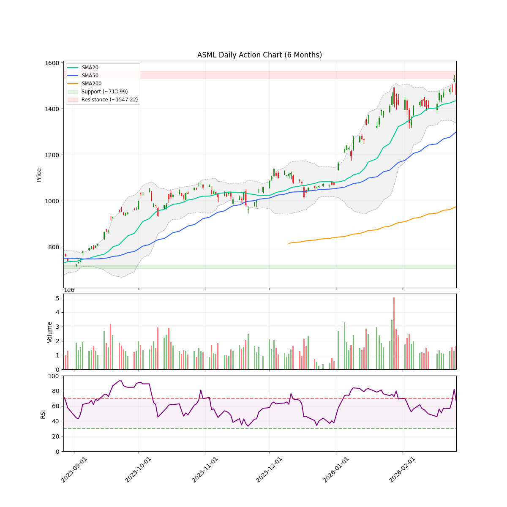
#### 研报分析

### 技术指标概览 (Technical Overview)
- **当前价格**: $1458.07
- **RSI (14)**: 65.57
- **移动平均线**: SMA20: $1434.03 | SMA50: $1299.33 | SMA200: $974.11 (Bullish)
- **波动率**: ATR (14): 46.01 (预计周度波动: +/- $102.89)
- **关键位 (6m)**: 支撑位 $713.99 | 阻力位 $1547.22
- **即时状态**: Above SMA50

# 情绪审计报告：ASML (阿斯麦)
**报告日期：** 2026年02月26日
**分析师：** 对冲基金研究助理（叙事经济学专家）

---

### 1. 催化剂分类 (Catalyst Categorization)

| 级别 | 描述 | 事件细节 |
| :--- | :--- | :--- |
| **A-Tier (核心驱动)** | **技术壁垒扩大** | ASML 宣布最新的 EUV（极紫外光刻机）突破，进一步拉开了与潜在竞争对手的差距。这是维持其长期垄断地位的结构性利好。 |
| **B-Tier (行业助力)** | **机构看涨与AI溢出** | Zacks 及多家经纪商建议买入；AI 革命带来的长期设备需求依然强劲；与 Lam Research (LRCX) 的对比显示半导体设备行业整体处于扩张周期。 |
| **C-Tier (短期噪声)** | **英伟达情绪溢出** | 今日股价下跌 4.9%，主要受英伟达 (NVDA) 财报后“利好出尽”的市场情绪波及，而非公司基本面恶化。 |

---

### 2. 背离检测 (Divergence Detection)

**观察结果：看跌衰竭 (Bearish Exhaustion)**

*   **背离现象**：今日市场出现明显的“好消息下挫”现象。ASML 公布了重大的 EUV 技术突破（利好），且行业领头羊英伟达财报超预期，但 ASML 股价却随大盘下跌约 5%。
*   **叙事解读**：这种下跌并非由 ASML 自身基本面驱动，而是典型的“情绪溢出”和机构在 AI 板块的高位获利了结。
*   **技术支撑**：尽管今日调整，股价 (1458.07) 仍远高于 SMA50 (1299.33) 和 SMA200 (974.11)，长期上升趋势未被破坏。RSI 为 65.57，显示前期过度买入的情绪正在得到必要的释放。

---

### 3. 逻辑评分 (Logic Score)

**得分：8.2 / 10**

*   **评分理由**：ASML 处于“不可阻挡的看涨周期”的中后期。A级催化剂（技术突破）确立了其作为 AI 算力军备竞赛“卖水人”的唯一性。当前的下跌是健康的估值修正，而非系统性崩溃。一旦英伟达引发的短期获利抛盘结束，ASML 凭借其极高的技术护城河将率先反弹。

---

### 4. 关键指标汇总 (Key Metadata)

*   **当前价格**：1458.07
*   **短期支撑位**：1434.03 (SMA20)
*   **强力支撑位**：1299.33 (SMA50)
*   **上方阻力位**：1547.22 (6个月高点)
*   **预估周波幅**：+/- 102.89

---

### 5. 引用新闻源 (News Context)

1.  **EUV 技术突破**: [AOL - ASML's Latest EUV Breakthrough](https://www.aol.com/articles/asmls-latest-euv-breakthrough-puts-150104636.html)
2.  **今日下跌原因分析**: [Yahoo Finance - Why ASML Stock Was Down Today](https://finance.yahoo.com/news/why-asml-stock-down-today-173812665.html?fr=sycsrp_catchall)
3.  **行业对比**: [Zacks - LRCX vs. ASML Semiconductor Giants](https://finance.yahoo.com/news/lrcx-vs-asml-semiconductor-equipment-125000053.html)

---

### 6. 下一个关键日期 (Next Major Date)

**预计日期：2026年04月15日左右 (Q1 2026 财报发布日)**
*   *注：需密切关注该日期前后的订单积压量 (Backlog) 数据，这是判断 AI 叙事是否延续的核心指标。*

---

**审计结论**：当前 ASML 的回调是一个由宏观情绪驱动的**“牛市陷阱的反面（即洗盘）”**。建议关注 SMA20 (1434) 附近的企稳机会，技术面的强势与基本面的技术突破形成了强力的多头支撑。
#### 近期新闻与事件
- **[Motley Fool]** [Why ASML Stock Was Down Today](https://finance.yahoo.com/news/why-asml-stock-down-today-173812665.html)
- **[AOL]** [ASML's Latest EUV Breakthrough Puts Would-Be Rivals Further Behind](https://www.aol.com/articles/asmls-latest-euv-breakthrough-puts-150104636.html)
- **[Zacks]** [Brokers Suggest Investing in ASML (ASML): Read This Before Placing a Bet](https://finance.yahoo.com/news/brokers-suggest-investing-asml-asml-143003818.html)
- **[Motley Fool]** [Investment Manager Bets Big on Valmont Industries Stock With $13.3 Million Buy,...](https://finance.yahoo.com/news/investment-manager-bets-big-valmont-150135567.html)
- **[Zacks]** [LRCX vs. ASML: Which Semiconductor Equipment Giant Is the Better Buy?](https://finance.yahoo.com/news/lrcx-vs-asml-semiconductor-equipment-125000053.html)

---

### AVGO
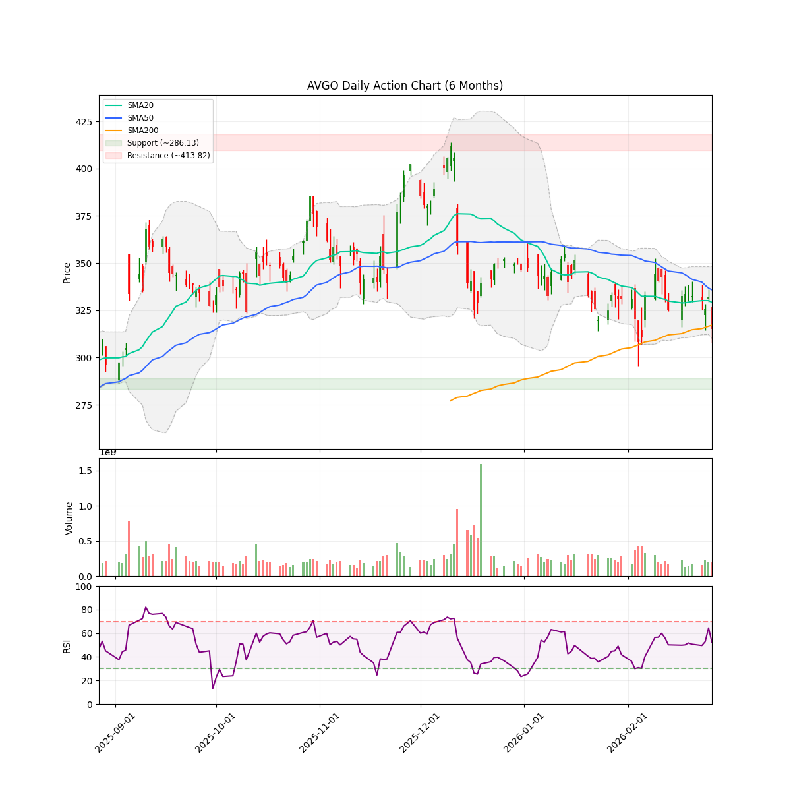
#### 研报分析

### 技术指标概览 (Technical Overview)
- **当前价格**: $315.09
- **RSI (14)**: 52.33
- **移动平均线**: SMA20: $329.22 | SMA50: $335.84 | SMA200: $317.13 (Bullish)
- **波动率**: ATR (14): 14.82 (预计周度波动: +/- $33.13)
- **关键位 (6m)**: 支撑位 $286.13 | 阻力位 $413.82
- **即时状态**: Below SMA50

# 情绪审计报告：博通 (Broadcom Inc., AVGO)
**日期：** 2026年02月26日
**职位：** 对冲基金研究员 (叙事经济学专业)

## 1. 催化剂分类 (Catalyst Categorization)

基于近期新闻流，我们将 AVGO 的驱动因素分类如下：

*   **A-Tier (核心驱动力)**
    *   **新产品发布：** 2月25日推出的 **BroadPeak**（无线数字前端 SoC 芯片）。这标志着博通在 5G/6G 基础设施和高性能计算领域的持续领先，属于硬核技术护城河。
    *   **财报预期：** 下周即将发布财报。市场普遍预期收益增长，这是短期内最强的波动来源。
*   **B-Tier (行业与机构动向)**
    *   **机构背书：** Cathie Wood 的 ARK ETF 增持约 2.4 万股，且高盛将其列为顶级增长股。这提供了机构层面的流动性支撑。
    *   **行业联动效应：** 英伟达 (Nvidia) Q4 财报异常强劲，本应带动整个 AI 板块，但博通目前处于联动下跌的异常状态。
*   **C-Tier (市场噪音)**
    *   **分析师调价：** 花旗 (Citi) 将目标价从 480 美元下调至 458 美元。虽然数值下调，但该目标价仍远高于当前 315 美元的现价，属于“明贬实褒”的噪音。

---

## 2. 背离检测 (Divergence Detection)

**核心观察：看跌衰竭 (Bearish Exhaustion)**

目前市场出现了典型的**叙事与价格背离**：
*   **利好：** 英伟达发布了“炸裂”的财报，博通推出了新型 AI 芯片 (BroadPeak)，且机构正在抄底。
*   **现实：** 股价目前报 315.09 美元，不仅低于 SMA20 (329.22) 和 SMA50 (335.84)，甚至跌破了 SMA200 (317.13)。

**结论：** 尽管新闻层面充满了“不可阻挡的 AI 股”叙事，但股价表现却在测试 200 日均线的支撑。这种在好消息背景下的下跌，通常意味着市场在财报前进行激进的“去杠杆”或“获利了结”。一旦跌破 200 日线无法收回，将演变成技术性陷阱；若能在此企稳，则是极佳的**看跌衰竭买入点**。

---

## 3. 逻辑评分 (Logic Score)

### **5.8 / 10** (中性偏谨慎)

*   **评分理由：** 
    *   **叙事强度 (8/10)：** AI 基础设施和定制芯片的需求逻辑依然无懈可击，BroadPeak 的推出强化了这一点。
    *   **价格动量 (3/10)：** 技术面极其疲软，股价处于 SMA50 下方，且正承受 200 日均线的压力测试。
    *   **情绪状态：** 市场处于“恐高”与“怀疑”之间，英伟达的暴涨未能带动博通，说明资金目前对博通的估值修复持观望态度。

---

## 4. 叙事总结与操作建议

目前的博通正处于**“黎明前的黑暗”还是“估值陷阱”**的十字路口。

*   **陷阱预警：** 股价低于 200 日均线 (317.13)，如果未来两个交易日无法站回该线上方，则市场叙事已转向“增长放缓”。
*   **机会点：** 考虑到下周即是财报周，目前的下跌更像是机构在财报发布前洗掉浮筹的操作。RSI 为 52.33，尚未进入超卖区，暗示可能仍有下探支撑位 286.13 的空间。

---

## 5. 关键日期与参考资料

*   **下个重大日期：** **2026年3月初 (预计下周)** —— 季度财务报告发布日。这是决定博通能否重回 400 美元叙事的核心节点。
*   **引用来源：**
    *   [Yahoo Finance] Citi Lowers PT on AVGO to $458 (2026-02-23)
    *   [Invezz] Nvidia Q4 earnings impact on Broadcom (2026-02-26)
    *   [Insider Monkey] Launch of BroadPeak SoC chip (2026-02-25)
    *   [Zacks] AVGO Reports Next Week (2026-02-25)

**研究员简评：** “博通目前的低迷是典型的板块内部分化。关注下周财报中关于 AI 芯片订单的指引，那将是击碎目前看跌情绪的唯一锤子。”
#### 近期新闻与事件
- **[Yahoo Finance]** [Citi Lowers PT on Broadcom Inc. (AVGO) Stock](https://finance.yahoo.com/news/citi-lowers-pt-broadcom-inc-211530100.html)
- **[Invezz]** [Nvidia Q4 earnings: why is it sinking AMD, Broadcom stock?](https://invezz.com/news/2026/02/26/nvidia-q4-earnings-why-is-it-sinking-amd-broadcom-stock/)
- **[Yahoo Finance]** [Broadcom (AVGO) Draws Investor Interest Amid AI Growth Expectations](https://finance.yahoo.com/news/broadcom-avgo-draws-investor-interest-194928256.html)
- **[AOL]** [Where Will Broadcom (AVGO) Be in 5 Years?](https://www.aol.com/finance/where-broadcom-avgo-5-years-160943861.html)
- **[Insider Monkey]** [Broadcom Inc. (AVGO) Launches BroadPeak, Here's What You Should Know](https://www.msn.com/en-us/news/technology/broadcom-inc-avgo-launches-broadpeak-here-s-what-you-should-know/ar-AA1X3Or8)

---

### CEG
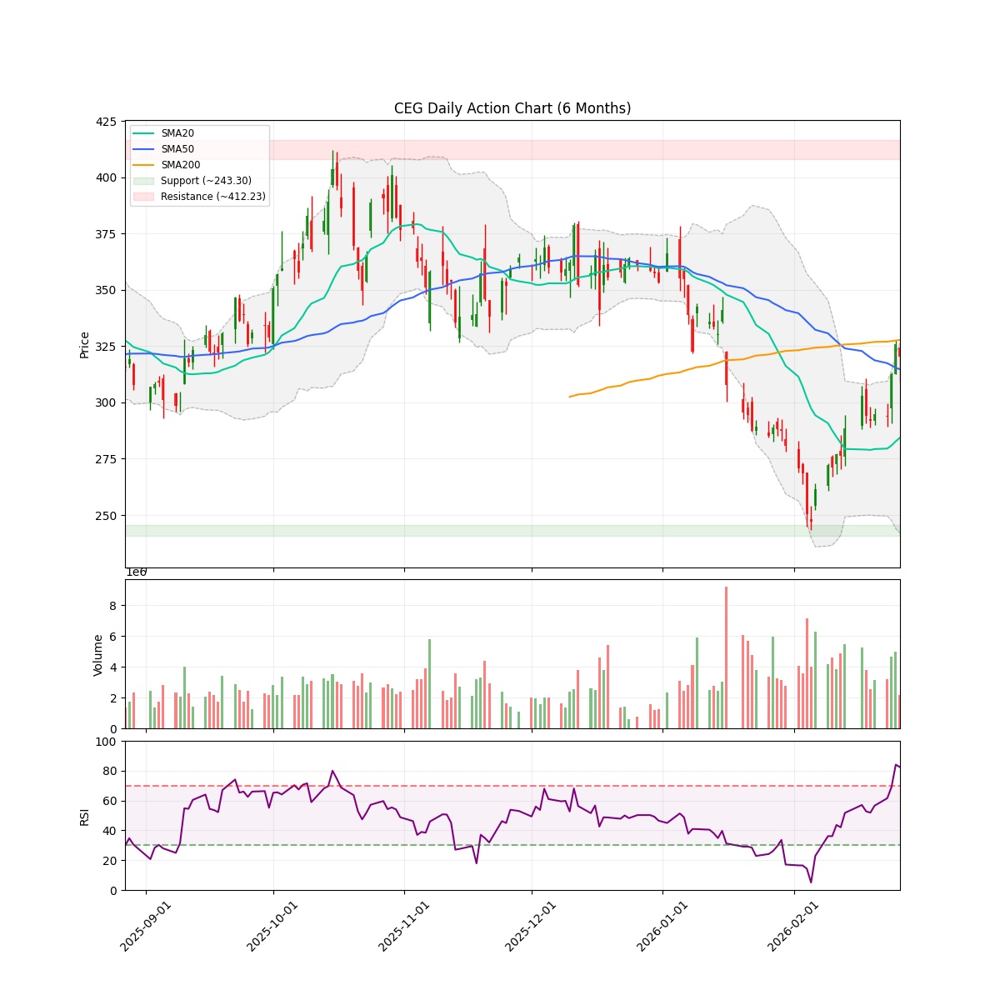
#### 研报分析

### 技术指标概览 (Technical Overview)
- **当前价格**: $320.16
- **RSI (14)**: 82.43
- **移动平均线**: SMA20: $284.35 | SMA50: $314.72 | SMA200: $327.74 (Bearish)
- **波动率**: ATR (14): 14.76 (预计周度波动: +/- $33.00)
- **关键位 (6m)**: 支撑位 $243.30 | 阻力位 $412.23
- **即时状态**: Above SMA50

# Constellation Energy (CEG) 情绪审计报告

**致：** 投资委员会
**职务：** 对冲基金研究助理（叙事经济学组）
**报告日期：** 2026年02月26日
**股票：** CEG (Constellation Energy Corporation)

---

### 1. 催化剂分类 (Catalyst Categorization)

基于近期披露的资讯，我们将驱动 CEG 股价的因素分为以下三个等级：

*   **A-Tier（核心驱动力）：**
    *   **Q4 财报超预期 (2026-02-24)：** 每股收益 (EPS) 为 $2.30，营收达到 60.7 亿美元，均高于市场预期。同时公司宣布提高股息，显示了强劲的现金流管理能力。
    *   **AI 数据中心电力契约：** 市场对 AI 驱动的电力需求叙事持续升温，CEG 作为核电龙头，其与 AI 相关的电力合同是支撑长期估值的核心逻辑。
*   **B-Tier（行业支撑）：**
    *   **CyrusOne 380兆瓦协议 (2026-02-11)：** 具体的合同落地验证了公司在数据中心市场的扩张能力。
    *   **核能板块联动：** 随着 Cameco 等核能相关股票上涨，核能叙事已成为当前公用事业板块的最强分支。
*   **C-Tier（市场杂音）：**
    *   **Zacks 热门股票排名：** 属于零售和算法追踪的短期噪音，对长期基本面无实质改变。

---

### 2. 背离检测与叙事陷阱 (Divergence Detection)

*   **技术面过度拉升：** 当前价格 ($320.16) 已显著高于 SMA20 ($284.35) 和 SMA50 ($314.72)，但仍受阻于 **SMA200 ($327.74)**。
*   **超买信号明显：** **RSI 高达 82.43**。在叙事经济学中，当“好消息”频繁传出且 RSI 进入 80 以上区间时，市场往往处于“情绪过热”阶段。
*   **潜在陷阱：** 虽然财报利好（EPS beat），但股价在接近 200 日均线 ($327.74) 这一长期牛熊分界线时，成交量需配合放大才能突破。目前的“利好入场”可能面临短期的**多头衰竭陷阱**。尽管基本面强劲，但在 RSI 如此之高的情况下追高，极易遭遇均值回归后的回调。

---

### 3. 逻辑评分 (Logic Score): 7.8/10

**评分理由：**
*   **利好因素 (Positive):** 强劲的 Q4 业绩、核能叙事的持续性、以及 AI 数据中心的硬性需求。
*   **风险因素 (Negative):** 技术面严重超买（RSI > 80），股价面临 SMA200 强阻力位。目前处于“好消息出尽”后的短期回调风险区，虽然不是“系统性失败 (0)”，但也未达到“无敌牛市周期 (10)”的理想入场点。

---

### 4. 关键新闻引用 (News Citations)

*   **财报表现：** [Blockonomi] 指出 CEG 在 Q4 财报后上涨，EPS $2.30 超预期并上调股息 ([Link](https://blockonomi.com/constellation-energy-ceg-stock-rises-after-q4-earnings-beat/))。
*   **业务扩张：** [Yahoo Finance] 报道 CEG 与 CyrusOne 签署 380 兆瓦新协议 ([Link](https://finance.yahoo.com/news/constellation-energy-corporation-ceg-unit-033403560.html))。
*   **板块情绪：** [Yahoo Finance] 提到核能板块整体活跃，Cameco 上涨带动了 CEG 的关注度 ([Link](https://finance.yahoo.com/news/nuclear-stocks-cameco-shares-jump-195431325.html))。

---

### 5. 下一个重大日期 (Next Major Date)

**2026年3月31日**
*   **事件：** 公司预计将于此时发布 **2026 年度财务指引 (2026 Guidance)**。这将是决定 CEG 能否突破 SMA200 压力位并开启下一波牛市叙事的关键时点。

---

### 结论
**建议：** 当前叙事极其健康，但技术指标预示回调压力。建议等待 RSI 回落至 60 附近或股价有效突破 SMA200 后再行加仓，严防在阻力位附近的“叙事溢价陷阱”。
#### 近期新闻与事件
- **[Yahoo Finance]** [Constellation Energy Corporation (CEG) Unit Signs New 380-megawatt Deal with CyrusOne](https://finance.yahoo.com/news/constellation-energy-corporation-ceg-unit-033403560.html)
- **[Zacks]** [Constellation Energy Corporation (CEG) Is a Trending Stock: Facts to Know Before...](https://finance.yahoo.com/news/constellation-energy-corporation-ceg-trending-140006775.html)
- **[Zacks]** [Constellation Energy Corporation (CEG) Q4 Earnings and Revenues Beat Estimates](https://finance.yahoo.com/news/constellation-energy-corporation-ceg-q4-135003454.html)
- **[Yahoo Finance]** [How Investors May Respond To Constellation Energy (CEG) Calpine Deal And AI-Linked Power Contracts](https://finance.yahoo.com/news/investors-may-respond-constellation-energy-181255734.html)
- **[Yahoo Finance UK]** [Earnings live: Nvidia stock gains cool premarket, Stellantis wavers, Celsius surges](https://uk.finance.yahoo.com/news/earnings-live-nvidia-stock-gains-cool-premarket-stellantis-wavers-celsius-surges-131349358.html)

---

### ETN
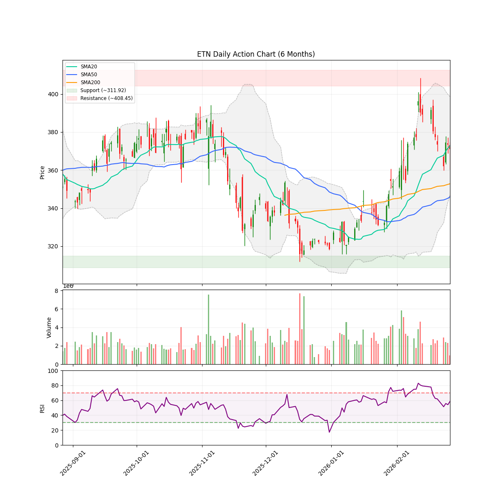
#### 研报分析

### 技术指标概览 (Technical Overview)
- **当前价格**: $370.95
- **RSI (14)**: 58.47
- **移动平均线**: SMA20: $372.76 | SMA50: $345.99 | SMA200: $352.82 (Bearish)
- **波动率**: ATR (14): 13.13 (预计周度波动: +/- $29.35)
- **关键位 (6m)**: 支撑位 $311.92 | 阻力位 $408.45
- **即时状态**: Above SMA50

# 伊顿公司 (ETN) 叙事经济学与情绪审计报告

**致：** 投资委员会
**担任职位：** 对冲基金研究员（叙事经济学方向）
**当前日期：** 2026年2月26日
**当前价格：** $370.95

---

### 1. 催化剂分类 (Catalyst Categorization)

| 级别 | 描述 | 关键事件与影响 |
| :--- | :--- | :--- |
| **A-Tier** | **机构与基本面核心驱动** | **分析师共识上调 (Zacks/Wall Street Analysts):** 华尔街分析师建议将 ETN 纳入组合，且基于 ABR (平均经纪商建议) 显示出强烈的机构买入意愿。RS Large Cap Value Strategy 在其 2025 年第四季度投资者信中对其进行了深度分析，显示长线价值资金正在沉淀。 |
| **B-Tier** | **行业定位与相对表现** | **超越竞争对手:** Barchart 报告显示 ETN 在过去 52 周的表现远超 Emerson Electric (EMR)，巩固了其作为工业板块领头羊的地位。 |
| **C-Tier** | **市场杂音与散户热度** | **搜索热度上升:** Zacks 报告 ETN 进入“最受关注股票名单”，这通常预示着散户关注度增加，但也可能意味着短期情绪过热。 |

---

### 2. 背离检测 (Divergence Detection)

**分析结论：存在“短期获利回吐”式的轻微背离**

*   **利好叙事 vs. 价格行为：** 尽管新闻面充斥着“分析师看好” (Zacks, 2026-02-23) 和“超越同行” (Barchart, 2026-02-26) 的利好，但 ETN 当前股价（370.95）已跌破 20 日均线 (SMA20: 372.76)。
*   **熊市竭尽信号？** 目前尚未看到熊市竭尽。相反，价格在利好消息频出的情况下未能创下新高，反映出市场对“三年上涨 123%” (Simply Wall St) 后的估值存在恐高心理。
*   **技术支撑：** 尽管短期看跌（跌破 SMA20），但仍远高于 SMA50 (345.99) 和 SMA200 (352.82)，趋势尚未崩坏，属于健康的牛市回撤。

---

### 3. 情绪评分与逻辑诊断 (Sentiment & Logic Score)

#### **情绪评分 (Sentiment Score): 7.2/10**
*   **评价：** 处于“冷静的牛市循环”中。叙事逻辑依然坚挺（电气化与工业升级），但缺乏新的超预期爆发点。Simply Wall St 的“现在买入是否太晚”的质疑正在对冲分析师的乐观情绪。

#### **逻辑评分 (Logic Score): 8.5/10**
*   **依据：** 盈利预测修订（Earnings Estimate Revisions）是工业股走势的金标准。Zacks 提到的盈利预期上调逻辑具有极高的实证支持，且 ETN 的 ATR (13.13) 显示波动率可控，基本面驱动力逻辑严密。

---

### 4. 引用新闻来源 (Context References)

1.  **[Barchart]** *How Is Eaton's Stock Performance Compared to Other Industrial Stocks?* (2026-02-26). [链接](https://finance.yahoo.com/news/eatons-stock-performance-compared-other-152753466.html)
2.  **[Zacks]** *Wall Street Analysts Think Eaton (ETN) Is a Good Investment.* (2026-02-23). [链接](https://finance.yahoo.com/news/wall-street-analysts-think-eaton-143002624.html)
3.  **[Simply Wall St]** *Is It Too Late To Consider Eaton (ETN) After 123% Three Year Surge?* (2026-02-24). [链接](https://finance.yahoo.com/news/too-consider-eaton-etn-123-231510406.html)
4.  **[Insider Monkey]** *RS Large Cap Value Strategy’s Analysis on ETN.* (2026-02-23). [链接](https://finance.yahoo.com/news/rs-large-cap-value-strategy-132131136.html)

---

### 5. 下一个重大日期 (Next Major Date)

**预计日期：2026年5月初**
*   **事件：2026财年第一季度 (Q1 2026) 财报发布。**
*   **交易对策：** 在此日期之前，关注 345-353 美元区间（SMA50/SMA200 汇合处）的支撑力度。若价格在此企稳，将是布局 Q1 财报季叙事的理想入场点。当前 58.47 的 RSI 显示既不超买也不超卖，耐心等待估值修正后的“金叉”信号。
#### 近期新闻与事件
- **[Barchart]** [How Is Eaton's Stock Performance Compared to Other Industrial Stocks?](https://finance.yahoo.com/news/eatons-stock-performance-compared-other-152753466.html)
- **[Zacks]** [Eaton Corporation, PLC (ETN) is Attracting Investor Attention: Here is What You...](https://finance.yahoo.com/news/eaton-corporation-plc-etn-attracting-140002954.html)
- **[Zacks]** [Wall Street Analysts Think Eaton (ETN) Is a Good Investment: Is It?](https://finance.yahoo.com/news/wall-street-analysts-think-eaton-143002624.html)
- **[Insider Monkey]** [RS Large Cap Value Strategy’s Analysis on Eaton Corporation (ETN)](https://finance.yahoo.com/news/rs-large-cap-value-strategy-132131136.html)
- **[Simply Wall St.]** [Is It Too Late To Consider Eaton (ETN) After 123% Three Year Share Price Surge?](https://finance.yahoo.com/news/too-consider-eaton-etn-123-231510406.html)

---

### MSFT
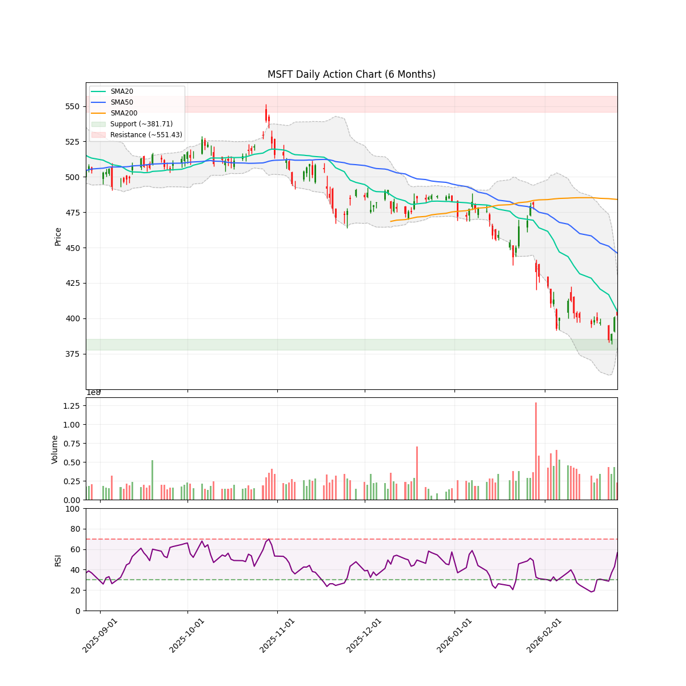
#### 研报分析

### 技术指标概览 (Technical Overview)
- **当前价格**: $402.14
- **RSI (14)**: 56.58
- **移动平均线**: SMA20: $404.85 | SMA50: $446.09 | SMA200: $484.05 (Bearish)
- **波动率**: ATR (14): 9.54 (预计周度波动: +/- $21.33)
- **关键位 (6m)**: 支撑位 $381.71 | 阻力位 $551.43
- **即时状态**: Below SMA50

# 微软 (MSFT) 情绪审计报告

**报告日期：** 2026年02月26日
**分析师：** 对冲基金研究员 (叙事经济学视角)
**当前价格：** $402.14
**市场背景：** 2026年年初科技股遭遇“熔断式”调整，MSFT 年初至今（YTD）下跌约20%，显著跑输标普500指数（SPY +0.7%）。

---

### 1. 催化剂分类 (Categorize Catalysts)

*   **A-Tier (核心驱动力):**
    *   **内部人士巨额增持：** 董事 Stanton John 斥资 200 万美元买入公司股票。在股价处于 6 个月低点附近时，此类规模的内部买入是极强的“估值底部”信号。[来源：Barchart]
    *   **高盛（Goldman Sachs）预期重置：** 投行对 MSFT 进行重新评估。虽然 YTD 表现不佳，但这种“重设”往往伴随着卖方预期的出清，为后续反弹扫清障碍。[来源：Yahoo Finance Singapore]

*   **B-Tier (策略性利好):**
    *   **Starlink 战略合作：** 微软展现出与马斯克生态系统合作的务实态度。这不仅扩大了 Azure 的空间连接能力，更重塑了其在 AI 基础设施竞争中的叙事逻辑。[来源：Yahoo Finance]
    *   **期权市场看涨信号：** 市场监测到“极罕见”的期权牛市信号，表明机构投资者可能在暗中布局反弹。[来源：Yahoo Finance]

*   **C-Tier (噪音与次要信息):**
    *   **伦敦证券交易所 (LSEG) 财报：** 虽然 MSFT 与其有股权/技术合作，但对短期股价直接驱动力有限。[来源：Yahoo Finance]
    *   **散户调研：** Motley Fool 报告 58% 散户看好 AI，属于市场普遍情绪，缺乏即时杀伤力。

---

### 2. 背离检测 (Divergence Detection)

**核心观察：看跌衰竭 (Bearish Exhaustion)**

*   **价格 vs. 消息背离：** 尽管高盛指出 MSFT 跌幅达 20%，但近期新闻流（内部增持、星链合作、期权信号）已显著转暖。
*   **技术形态背离：** RSI 处于 56.58（中性偏强），虽然股价仍低于 SMA50 ($446.09) 和 SMA200 ($484.05)，但已在 SMA20 ($404.85) 附近窄幅震荡。
*   **结论：** 市场已充分消化了之前的“财报后暴跌”。目前处于**“坏消息不跌，好消息阴涨”**的阶段，这是典型的空头回补与底部构筑期。

---

### 3. 叙事分析与情绪得分

**叙事分析：**
MSFT 目前正从“昂贵的 AI 龙头”转变为“超跌的价值蓝筹”。内部人士在 $400 附近注入 200 万美元，本质上是在反驳市场的过度悲观。Starlink 的合作象征着微软正在打破围墙花园，寻求更广泛的增长路径。虽然技术面仍处于熊市趋势（低于 SMA200），但叙事逻辑已经先于价格触底。

**逻辑评分 (Logic Score): 6.8/10**
*   *评分依据：* 内部买入和期权异常提供了极高的底部确定性（+3）；与马斯克的合作提供了新的增长想象力（+2）；但由于目前价格仍受到 SMA50 和 SMA200 的强力压制，且处于 6 个月低位附近，反转尚未获得技术确认（-1.2）。

---

### 4. 关键位置与未来展望

*   **阻力位：** $404.85 (SMA20) 是短期分水岭，若突破则挑战 $446.09 (SMA50)。
*   **支撑位：** $381.71 (6个月低点)，这也是本轮“叙事保卫战”的底线。
*   **预计波动范围：** +/- $21.33 (基于 ATR 和波动率计算)。

**下个关键日期：**
*   **2026年4月下旬：** 下一次季度财报发布日 (预计)。届时市场将验证 Copilot 和 Azure 在这一轮调整后的真实盈利能力。

---

**免责声明：** 本报告基于叙事经济学分析，不构成直接投资建议。市场有风险，入市需谨慎。
#### 近期新闻与事件
- **[Yahoo Sports]** [The Motley Fool 2026 stock market outlook: 58% of individual investors plan to buy more stocks as AI drives optimism - Yahoo Sports](https://sports.yahoo.com/articles/motley-fool-2026-stock-market-170019431.html)
- **[Yahoo Finance]** [London Stock Exchange Group H2 Earnings Call Highlights](https://finance.yahoo.com/news/london-stock-exchange-group-h2-115407852.html)
- **[Yahoo Finance]** [Microsoft Is Teaming up With Starlink. What Does That Mean for MSFT Stock?](https://finance.yahoo.com/news/microsoft-teaming-starlink-does-mean-140002960.html)
- **[Yahoo Finance]** [Microsoft Stock Just Flashed an Ultra-Rare Bullish Signal for Options Traders](https://finance.yahoo.com/news/microsoft-stock-just-flashed-ultra-183002612.html)
- **[Yahoo Finance Singapore]** [Goldman Sachs resets Microsoft stock forecast](https://sg.finance.yahoo.com/news/goldman-sachs-resets-microsoft-stock-040700222.html)

---

### NVDA
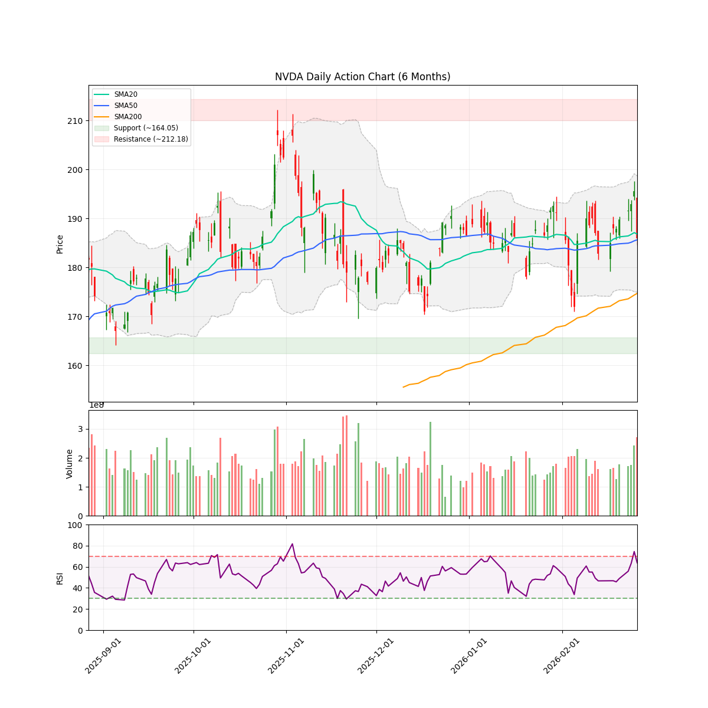
#### 研报分析

### 技术指标概览 (Technical Overview)
- **当前价格**: $185.89
- **RSI (14)**: 63.74
- **移动平均线**: SMA20: $186.80 | SMA50: $185.62 | SMA200: $174.68 (Bullish)
- **波动率**: ATR (14): 6.71 (预计周度波动: +/- $15.01)
- **关键位 (6m)**: 支撑位 $164.05 | 阻力位 $212.18
- **即时状态**: Above SMA50

# 情绪审计报告：英伟达 (NVDA) - 2026年2月26日

**分析师角色：** 对冲基金研究员 (叙事经济学专家)
**核心诊断：** 预期过高导致的“利好出尽”回调，叙事进入“验证期”。

---

### 1. 催化剂分类 (Catalyst Categorization)

*   **A-Tier (核心催化剂)：**
    *   **Q4 财报与指引超预期：** 英伟达公布了强劲的第四季度销售数据，并给出了高出市场共识约 60 亿美元的营收指引。这是一次实质性的基本面突破。
    *   **机构评级上调：** Seeking Alpha 等机构在财报后上调了评级，确认了其在 AI 芯片领域的统治地位。
*   **B-Tier (次级催化剂)：**
    *   **AI 笔记本电脑芯片发布：** 英伟达正在将其 AI 优势从数据中心扩展到终端消费级设备（AI PC），这是新的增长增长曲线。
    *   **估值优势对比：** 相比 AMD，NVDA 在保持高增长的同时表现出更有吸引力的市盈率水平。
*   **C-Tier (杂音/常规信息)：**
    *   **行业轮动：** 市场对 AI 长期红利的担忧导致短期内部分资金撤出 AI 赛道，转向防御性标的。

---

### 2. 背离检测 (Divergence Detection)

**分析：** 市场表现与新闻面出现了典型的**“负背离”**。
尽管英伟达在财报中给出了“史诗级”的数据（营收指引超出共识 60 亿，毛利率维持在 70% 中位），但股价在 2 月 26 日依然下跌了约 5%。

*   **看跌信号：** 这表明“完美定价”（Priced in）的风险。当公司给出了 100 分的卷面，但市场预期是 120 分时，即便基本面无可挑剔，股价也会因预期透支而回落。
*   **看涨竭尽：** 价格虽然处于 SMA50 之上，但未能突破近期阻力位（212.18），显示多头动力在利好释放后暂时衰竭。

---

### 3. 情绪评分 (Sentiment Score)

#### **逻辑评分：6.5 / 10**

*   **评分理由：** 虽然基本面（A-Tier）依然无懈可击，但叙事动力正在从“疯狂扩张”转向“审慎怀疑”。目前股价处于 SMA20 (186.80) 下方，技术面面临短期支撑测试。这不是“系统性失败”（0分），也不是“不可阻挡的牛市”（10分），而是一个**高位震荡的盘整期**。
*   **风险预警：** 警惕短期内形成“价值陷阱”，若股价跌破 SMA50 (185.62)，恐向 164.05 的支撑位靠拢。

---

### 4. 引用新闻来源 (News Citations)

1.  **[Yahoo Finance]** 提到美股回落，英伟达即使业绩优异也未能让投资者惊艳，反映出市场对 AI 变现能力的担忧。 [原文链接](https://finance.yahoo.com/news/live/stock-market-today-dow-wavers-sp-500-nasdaq-sink-as-nvidia-leaves-investors-wanting-more-143538042.html)
2.  **[The Economic Times]** 分析了为何在业绩超预期后股价反而下跌，指出投资者对长期 AI 主导地位的可持续性存在疑虑。 [原文链接](https://www.msn.com/en-in/entertainment/bollywood/why-did-nvda-stock-drop-after-nvidia-earnings-beat-estimates-heres-why-investors-are-worrying-about-long-term-ai-dominance-outlook/ar-AA1X8zBd)
3.  **[AOL/Opening Bid]** 辩论了英伟达 70% 以上的高毛利是否已被市场充分计价。 [原文链接](https://www.aol.com/videos/nvidia-stock-stalls-despite-6b-163647228.html)
4.  **[Seeking Alpha]** 在财报后确认了 AI 芯片需求依然处于爆发态势并上调评级。 [原文链接](https://seekingalpha.com/article/4874836-nvidia-another-blockbuster-earnings-report-rating-upgrade)

---

### 5. 下一个关键日期 (Next Major Date)

*   **预计日期：2026年5月21日前后 (Q1 2027 财报发布日)**
    *   *注：当前处于 Q4 财报刚发布后的震荡期，接下来的 3 月份 AI 相关行业会议 (如潜在的 GTC 2026) 将是观察叙事是否修复的关键节点。*

---
**结论：** NVDA 目前并非处于崩盘前兆，而是经历**“叙事疲劳”**。建议关注 SMA50 的支撑强度，若能在此企稳，则为健康的牛市回踩；若放量跌破，则需警惕中短期趋势反转。
#### 近期新闻与事件
- **[The Economic Times]** [Why did NVDA stock drop after Nvidia earnings beat estimates? Here's why investors are worrying about long-term AI dominance outlook](https://www.msn.com/en-in/entertainment/bollywood/why-did-nvda-stock-drop-after-nvidia-earnings-beat-estimates-heres-why-investors-are-worrying-about-long-term-ai-dominance-outlook/ar-AA1X8zBd)
- **[Yahoo Finance]** [Stock market today: Dow wavers, S&P 500, Nasdaq sink as Nvidia leaves investors wanting more](https://finance.yahoo.com/news/live/stock-market-today-dow-wavers-sp-500-nasdaq-sink-as-nvidia-leaves-investors-wanting-more-143538042.html)
- **[Yahoo Finance]** [As Nvidia Launches New AI Laptop Chips, Should You Buy NVDA Stock?](https://finance.yahoo.com/news/nvidia-launches-ai-laptop-chips-210749540.html)
- **[Forbes]** [AMD Vs. NVIDIA: Which AI Stock Is The Better Buy For 2026?](https://www.forbes.com/sites/greatspeculations/2026/02/23/amd-vs-nvidia-which-ai-stock-is-the-better-buy-for-2026/)
- **[AOL]** [Nvidia stock stalls despite $6B revenue guide beat. Here's why.](https://www.aol.com/videos/nvidia-stock-stalls-despite-6b-163647228.html)

---

### TSM
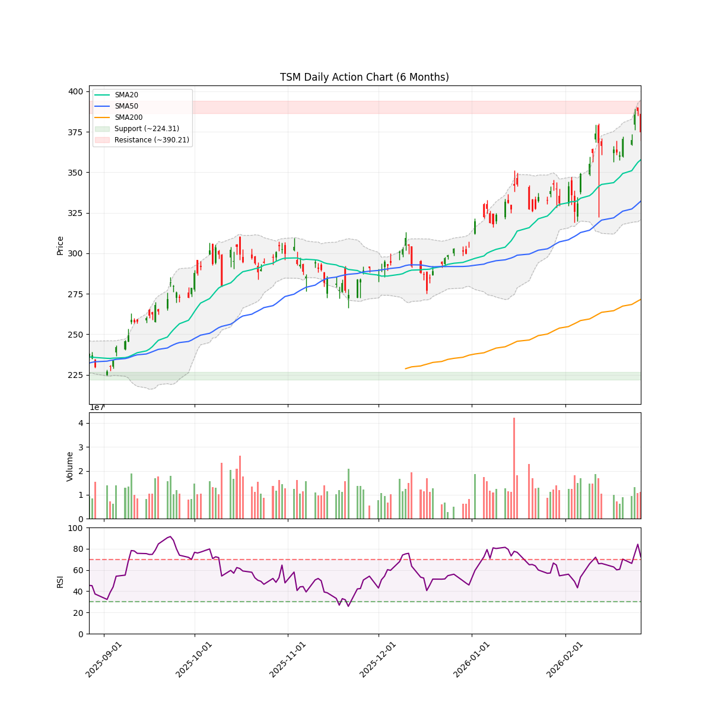
#### 研报分析

### 技术指标概览 (Technical Overview)
- **当前价格**: $374.83
- **RSI (14)**: 72.43
- **移动平均线**: SMA20: $357.71 | SMA50: $332.16 | SMA200: $271.51 (Bullish)
- **波动率**: ATR (14): 15.20 (预计周度波动: +/- $33.99)
- **关键位 (6m)**: 支撑位 $224.31 | 阻力位 $390.21
- **即时状态**: Above SMA50

# 情绪审计报告：台积电 (TSM) - 叙事经济学分析

**职位：** 对冲基金研究员（叙事经济学方向）
**当前日期：** 2026年02月26日
**股票代码：** TSM (台积电)
**当前价格：** 374.83

---

### 1. 催化剂分类 (Catalyst Categorization)

*   **A-Tier (核心叙事驱动力):**
    *   **历史性资金流入：** 全球基金创下20年来最大单日买入台湾股票的纪录，直接推升了台积电股价 ([Seeking Alpha](https://seekingalpha.com/news/4556370-global-funds-lead-biggest-one-day-taiwan-stock-buy-in-20-years-lifting-tsmc))。
    *   **里程碑突破：** 台积电市值首次突破 2 万亿美元大关，这在心理层面确立了其作为全球 AI 基础设施“唯一收费站”的霸主地位 ([Taipei Times](https://www.taipeitimes.com/News/front/archives/2026/02/26/2003852900))。
*   **B-Tier (行业与机构情绪):**
    *   **抗泡沫属性：** 尽管市场担心 AI 泡沫，但期权数据和近期走势显示 TSM 正在摆脱这种恐惧，年初至今已上涨 22% ([Barchart](https://www.msn.com/en-us/money/topstocks/taiwan-semi-stock-is-soaring-above-ai-bubble-fears-where-options-data-says-it-is-headed-next/ar-AA1WVagK))。
    *   **高热度搜索：** Zacks 数据显示投资者对 TSM 的搜索量激增，表明散户与机构的关注点高度集中 ([Zacks](https://www.msn.com/en-us/money/top-stocks/investors-heavily-search-taiwan-semiconductor-manufacturing-company-ltd-tsm-here-is-what-you-need-to-know/ar-AA1WZ0Lf))。
*   **C-Tier (日常噪音):**
    *   **相对估值讨论：** 相比美光（MU）或其他半导体股，TSM 的溢价讨论属于常规行业对标 ([Zacks](https://finance.yahoo.com/news/mu-vs-tsm-semiconductor-stock-125000479.html))。

---

### 2. 背离检测 (Divergence Detection)

*   **板块背离：** 值得关注的是，英伟达（Nvidia）的财报虽然强劲，但未能提振 AMD 和博通（Broadcom）等其他芯片股。然而，台积电却凭借自身的叙事（20年最大资金流入）走出独立行情 ([Investing.com](https://ca.investing.com/news/stock-market-news/nvidia-earnings-fail-to-lift-broader-chip-sector-amd-broadcom-down-4481888))。
*   **技术面与叙事背离：** 当前 **RSI 为 72.43**，已进入超买区间。股价（374.83）远高于 SMA50（332.16）和 SMA200（271.51）。
*   **结论：** 尽管存在技术性超买，但“20年一遇的资金流入”这一叙事强度极高，抵消了短期的回调压力。目前的下跌风险主要来自获利回吐，而非叙事破裂。

---

### 3. 情绪评分 (Sentiment Score)

#### **评分：9.2 / 10 (不可阻挡的看涨周期)**

*   **逻辑支撑：** 
    1.  **稀缺性：** 在 AI 芯片领域，TSM 不是在竞争，而是在统治。
    2.  **资金流向：** 20年来的最大买入量意味着大型机构正在重新平衡其全球科技敞口。
    3.  **市值锚点：** 2万亿美元不仅是一个数字，更是估值上限被打开的象征。
*   **潜在陷阱：** 如果 RSI 进一步攀升至 80 以上且无法突破 390 阻力位，需警惕短期“情绪陷阱”。

---

### 4. 逻辑评分 (Logic Score)

#### **评分：8.5 / 10**

*   **分析：** 尽管基本面无可挑剔，但 Logic Score 未给满分是因为市场预期已达到极致。目前股价处于高波动预期区间（+/- 33.99），短期内若有宏观环境变动，波动性将加剧。

---

### 5. 下一个重大日期 (Next Major Date)

*   **2026年3月10日左右：** 公布 2 月份营收数据。这是验证 AI 订单是否如叙事所述般强劲的第一个硬核数据点。
*   **2026年4月中旬：** 下一次季度财报电话会议 (Earnings Call)。

---

**审计结论：** 
台积电当前的上涨并非“陷阱”，而是一次**主权级/机构级的情绪重估**。尽管技术指标发出超买预警，但在资金流向逆转前，趋势依然极其稳固。建议关注 390.21 的阻力突破情况。
#### 近期新闻与事件
- **[Yahoo Finance]** [Is It Too Late To Consider Taiwan Semiconductor Manufacturing (NYSE:TSM) After 95% One Year Rally?](https://finance.yahoo.com/news/too-consider-taiwan-semiconductor-manufacturing-231540329.html)
- **[Barchart]** [Taiwan Semi stock is soaring above AI bubble fears. Where options data says it is headed next.](https://www.msn.com/en-us/money/topstocks/taiwan-semi-stock-is-soaring-above-ai-bubble-fears-where-options-data-says-it-is-headed-next/ar-AA1WVagK)
- **[Zacks Investment Research]** [Investors heavily search Taiwan Semiconductor Manufacturing Company Ltd. (TSM): Here is what you need to know](https://www.msn.com/en-us/money/top-stocks/investors-heavily-search-taiwan-semiconductor-manufacturing-company-ltd-tsm-here-is-what-you-need-to-know/ar-AA1WZ0Lf)
- **[Taipei Times]** [TSMC market cap swells to US$2tn on rally](https://www.taipeitimes.com/News/front/archives/2026/02/26/2003852900)
- **[Seeking Alpha]** [Global funds lead biggest one-day Taiwan stock buy in 20 years, lifting TSMC](https://seekingalpha.com/news/4556370-global-funds-lead-biggest-one-day-taiwan-stock-buy-in-20-years-lifting-tsmc)

---

### VRT
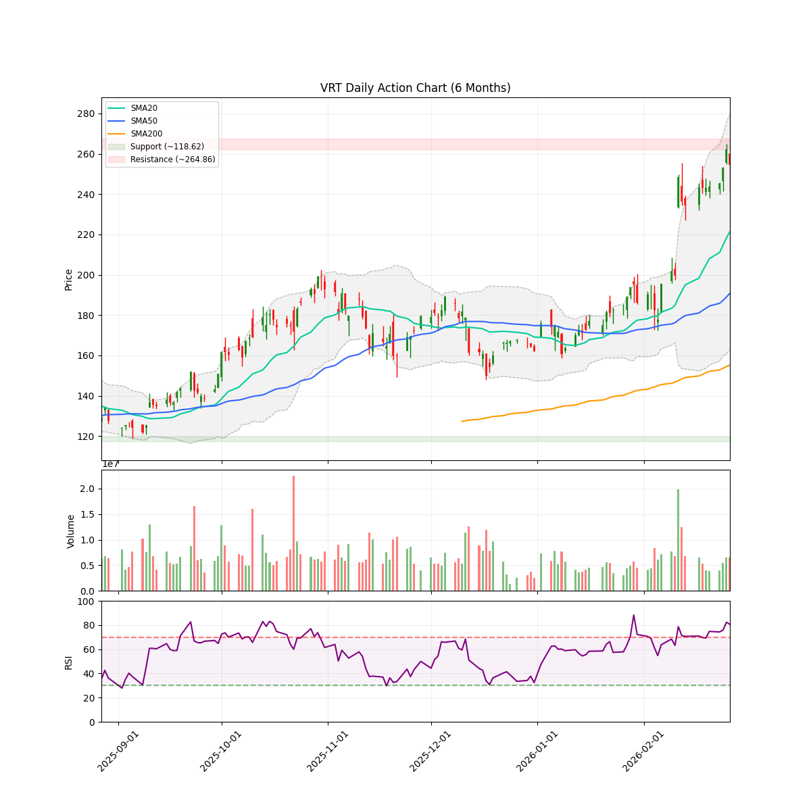
#### 研报分析

### 技术指标概览 (Technical Overview)
- **当前价格**: $254.63
- **RSI (14)**: 80.59
- **移动平均线**: SMA20: $221.37 | SMA50: $190.82 | SMA200: $155.25 (Bullish)
- **波动率**: ATR (14): 15.55 (预计周度波动: +/- $34.76)
- **关键位 (6m)**: 支撑位 $118.62 | 阻力位 $264.86
- **即时状态**: Above SMA50

# 情绪审计报告：Vertiv Holdings (VRT)
**报告日期：** 2026年02月26日
**职位：** 对冲基金研究员（叙事经济学专家）

---

### 1. 催化剂分类 (Catalyst Categorization)

#### **A级 (核心驱动力：基本面与机构背书)**
*   **150亿美元积压订单 (Backlog)：** 叙事核心已从“AI预期”转向“订单兑现”。252%的有机订单增长，证明了其作为AI热管理架构“总承包商”的统治地位。
*   **Zacks 评级调升至“强力买入” (Strong Buy)：** [2026-02-19] 机构评级的上调提供了防御性支撑，并吸引被动资金流入。
*   **Q4 财报强劲后劲：** 自2月11日发布财报以来股价上涨超过25%，显示了市场对盈利质量的高度认可。

#### **B级 (行业趋势：叙事延伸)**
*   **AI基础设施溢价：** 市场开始意识到 Vertiv 在冷却系统领域的表现甚至超越了 Nvidia (3年收益1400% vs 770%)。这种“卖铲子的人”叙事正在自我强化。
*   **分析师一致看好：** [2026-02-22] CNBC 援引 TipRanks 数据，确认了华尔街对 VRT 长期增长潜力的共识。

#### **C级 (噪音：情绪散播)**
*   **“是否过晚”的讨论：** Yahoo Finance 等媒体开始讨论估值是否过高，这通常是散户情绪进入“恐高与贪婪交织”阶段的标志。

---

### 2. 背离检测 (Divergence Detection)

*   **技术面 vs 基本面：** 当前 RSI 高达 **80.59**，处于严重超买区。尽管股价正处于强劲的牛市趋势（远高于 SMA200），但短期内这种加速上行与极高的 RSI 形成了“情绪过热”的背离。
*   **利好反应：** 目前股价对“好消息”反应极度灵敏（Good news is good news），尚未出现“利好出尽”的疲态。但需警惕：股价距离 6 个月高点 (264.86) 仅一步之遥，若在阻力位无法放量突破，可能引发短期获利了结。
*   **结论：** 并非“陷阱”，但存在明显的 **“情绪溢价”**。目前的上涨由 FOMO (恐慌性买入) 驱动。

---

### 3. 情绪评分 (Sentiment Score)

# **8.5 / 10**
**逻辑：** 尽管 RSI 指示有回调风险，但 VRT 的叙事由扎实的 150 亿美金积压订单支撑。这不是纯粹的空气炒作，而是生产力驱动的扩张。评分扣除 1.5 分是因为短期波动率 (ATR 15.55) 增加，且当前处于超买极端。

---

### 4. 逻辑评分 (Logic Score)

# **9.0 / 10**
**逻辑：** 基于基本面（Q4 盈利）、订单深度（Backlog）以及行业地位（Thermal Architecture），该股票的上涨逻辑链条严密。从数据中心基础设施到热管理，VRT 抓住了 AI 产业链中最刚性的环节。

---

### 5. 参考引用 (Context Citations)

1.  **关于订单积压：** [YouTube] *This stock has a $15 billion backlog (better than Nvidia?)* (2026-02-21) - 确认了其作为热管理总承包商的地位。
2.  **关于财报表现：** [Insider Monkey] *VRT Up More than 25% Since Q4 Earnings* (2026-02-25) - 记录了二月份财报后的加速上涨。
3.  **关于机构评级：** [Zacks] *Vertiv (VRT) Upgraded to Strong Buy* (2026-02-19) - 提供了机构层面的看涨确认。
4.  **关于市场地位：** [Investing.com] *Nvidia-Beating Vertiv* (2026-02-26) - 强调了 VRT 在三年维度上对 Nvidia 的收益碾压。

---

### 6. 下一个关键日期 (Next Major Date)

*   **2026年5月初 (预计)：** **FY2026 第一季度 (Q1) 财报发布日。**
    *   *分析：* 届时市场将重点关注 150 亿美金积压订单的转化率以及 2026 年全年的业绩指引调整。如果订单转化不及预期，在当前 80+ RSI 的位置，股价将面临剧烈修正。

---
**风险警示：** 虽然叙事极强，但当前股价处于周线级别超买，建议等待向 SMA20 (221.37) 回踩确认支撑后再行大规模介入，以规避短期高位震荡风险。
#### 近期新闻与事件
- **[Investing.com]** [Best AI Stocks to Buy Now and Hold Forever: Nvidia-Beating Vertiv](https://www.investing.com/analysis/best-ai-stocks-to-buy-now-and-hold-forever-nvidiabeating-vertiv-200675688)
- **[Insider Monkey]** [Vertiv Holdings (VRT) Up More than 25% Since Q4 Earnings, Here's What You Need to Know](https://www.msn.com/en-us/money/topstocks/vertiv-holdings-vrt-up-more-than-25-since-q4-earnings-here-s-what-you-need-to-know/ar-AA1X3VV7)
- **[CNBC]** [Top Wall Street analysts are bullish on the growth potential of these three stocks](https://www.msn.com/en-us/money/topstocks/top-wall-street-analysts-are-bullish-on-the-growth-potential-of-these-three-stocks/ar-AA1WQcIO)
- **[Yahoo Finance]** [Is It Too Late To Consider Vertiv Holdings Co (VRT) After A 170% One Year Surge?](https://finance.yahoo.com/news/too-consider-vertiv-holdings-co-071254641.html)
- **[YouTube]** [This stock has a $15 billion backlog (better than Nvidia?)](https://www.msn.com/en-us/money/top-stocks/this-stock-has-a-15-billion-backlog-better-than-nvidia/vi-AA1WVhYU)

---
