# 每日股市市场报告 (2026-02-27)

> **免责声明**: 本报告由 **代码与 Gemini AI 自动生成**，仅供研究参考，**不构成**任何投资建议。投资有风险，入市需谨慎。作者及 AI 不对任何基于此内容的投资决策承担责任。

## 📑 目录
[TOC]

##  长期投资逻辑
本组合旨在捕捉 **人工智能（AI）与半导体协议** 带来的跨周期结构性增长，核心投资策略聚焦于“确定性”与“物理瓶颈”：
- **底层制程垄断 (Foundry & WFE Moats)**：
  布局处于全球半导体精密制造顶端的“工业母机”级别公司。寻找具备极高准入门槛的晶圆代工及前道设备供应商，作为全产业链最稳固的底座资产。
- **算力稀缺性与连接带宽 (Compute & Interconnect Scarcity)**：
  聚焦在高性能计算芯（HPC）及高带宽连接领域占据主导地位的标的。AI 的终极竞争是“规模”，寻找能有效解决数据交换瓶颈并提供核心推理/训练能力的算力巨头。
- **应用生态与数据霸权 (Platform & Data Sovereignty)**：
  布局拥有闭环生态、海量高质量私有数据及云基础设施的科技巨头。它们是 AI 商业化落地的最终守门人，拥有将技术转化为持续现金流的分配权。
- **物理边界保障 (Power & Thermal Infrastructure)**：
  关注 AI 扩张的“最终瓶颈”——电力供应与热能管理。重点布局为下一代超大规模数据中心提供高功率密度能源、液冷技术及电网扩容方案的能源基建商。
**风控策略**：利用 AlphaJAX 的量化动量评分（Quant Score）作为过滤器，结合 LLM 叙事审计（Narrative Audit）捕捉“业绩超预期 + 叙事逻辑改善”的共振点，实现跨周期的超额收益。

 **注：排序权重**：Ticker 按照 AI 检测出的 **方向** 排序（**看多**优先，其次是 **中性**，最后是 **看空**）。
---

<!-- DISCORD_SUMMARY_START -->
## 🧠 对冲基金经理全局诊断与资金分配策略
你好，我是你的高级投资组合经理（PM）。

根据你提供的账户全盘数据和研究团队的最新 **Logic Score**，当前的投资组合存在明显的**集中度风险（AMD 占比 > 50%）**，同时也存在**极其优质的结构性机会（GOOGL 极致超卖）**。

以下是基于 2026-02-27 市场环境的专业操作计划：

---

### **一、 账户风险预警：核心矛盾点**
*   **集中度违规**：你的 AMD 持仓占账户比例高达 **51.14%**，严重违反了单一标的不超过 **30%** 的核心风控准则。即便 AMD 的 Logic Score 为 8.5，如此高的杠杆/集中度会让你在半导体板块震荡中极其脆弱。
*   **现金利用率**：目前现金占比约 **22%**，流动性充足。
*   **冷热两极分化**：GOOGL 处于“恐慌区”(RSI 29)，而 VST 处于“贪婪区”(RSI 84)。

---

### **二、 行动清单 (Actionable Trading Plan)**

#### **1. AMD (Logic Score: 8.5) —— 战术性减仓（风控导向）**
*   **现状**：基本面强劲但仓位过重，且目前处于浮亏状态。
*   **操作**：**卖出 200-240 股正股**，将 AMD 的权重从 51% 降至 **30% 左右**。
*   **理由**：释放约 $40,000 - $48,000 现金。虽然逻辑分高，但风控是生存前提。保留的备兑期权 (Short Call) 继续持有，作为下行保护。

#### **2. GOOGL (Logic Score: 8.5) —— 激进加仓（贪婪导向）**
*   **现状**：RSI 29.3（极致超卖），机构（Druckenmiller）加持，基本面与价格严重背离。
*   **操作**：**买入 60-80 股**，将持仓占比从 17% 提升至 **25% 左右**。
*   **理由**：这是典型的“叙事与价格脱节”买点。在 $300 附近通过补仓降低成本，捕捉超跌反弹。

#### **3. VST (Logic Score: 6.8) —— 锁定利润（获利回吐）**
*   **现状**：RSI 84.18（极度过热），逼近 SMA200 阻力位，财报前夕资金抢筹。
*   **操作**：**减仓 50 股（50% 持仓）**。
*   **理由**：逻辑得分 6.8 属于“中性减持”区间。在 RSI > 80 时不卖出是专业大忌，先行锁定 10% 左右的浮盈，防范财报“见光死”。

#### **4. AMZN (Logic Score: 8.5) —— 递增式建仓**
*   **现状**：仓位过轻（1.72%），价格接近 $196 关键支撑。
*   **操作**：**买入 30-50 股**。
*   **理由**：将 AMZN 提升至账户的 5% 左右，使其对组合产生实质贡献。

---

### **三、 交易后模拟画像**
*   **预计可用现金**：约 $75,000 - $85,000 (增加约 40%-50%)。
*   **持仓结构**：AMD (30%)、GOOGL (25%)、VST (4%)、AMZN (5%)、CASH (36%)。
*   **组合状态**：风险敞口大幅下降，现金储备极其雄厚，足以应对 2026 年上半年的波动。

---

### **四、 If-Then 压力测试方案**

*   **场景 A：如果 GOOGL 继续跌破 $290 (ATR 波动范围外)**
    *   **应对**：停止手动加仓。由于 RSI 已经极低，这可能意味着宏观系统性崩盘，保持现金观望，等待 SMA200 ($248) 的长线支撑。
*   **场景 B：如果 AMD 财报前反弹至 $220 (成本价附近)**
    *   **应对**：加快减仓速度。利用反弹将仓位严格控制在 30% 以内，不要因为回本而产生贪婪。
*   **场景 C：如果 VST 财报超预期暴涨突破 $185**
    *   **应对**：不追高。剩余的 50 股继续享受升幅，若 RSI 维持在 85 以上，继续每日小额减持。
*   **场景 D：如果市场整体进入“Perfect Setup”（大盘 RSI < 30 且所有标的 Logic > 8）**
    *   **应对**：此时允许动用剩余 90% 的现金，重点攻击 GOOGL 和 AMZN，因为它们的逻辑评分最稳健。

---

**PM 总结**：你目前的持仓像是“一条腿粗、一条腿细”。**削减 AMD、重注 GOOGL、收割 VST** 是平衡风险与回报的最优解。执行吧！
<!-- DISCORD_SUMMARY_END -->
---

## 💼 现有持仓个股诊断

### AMD
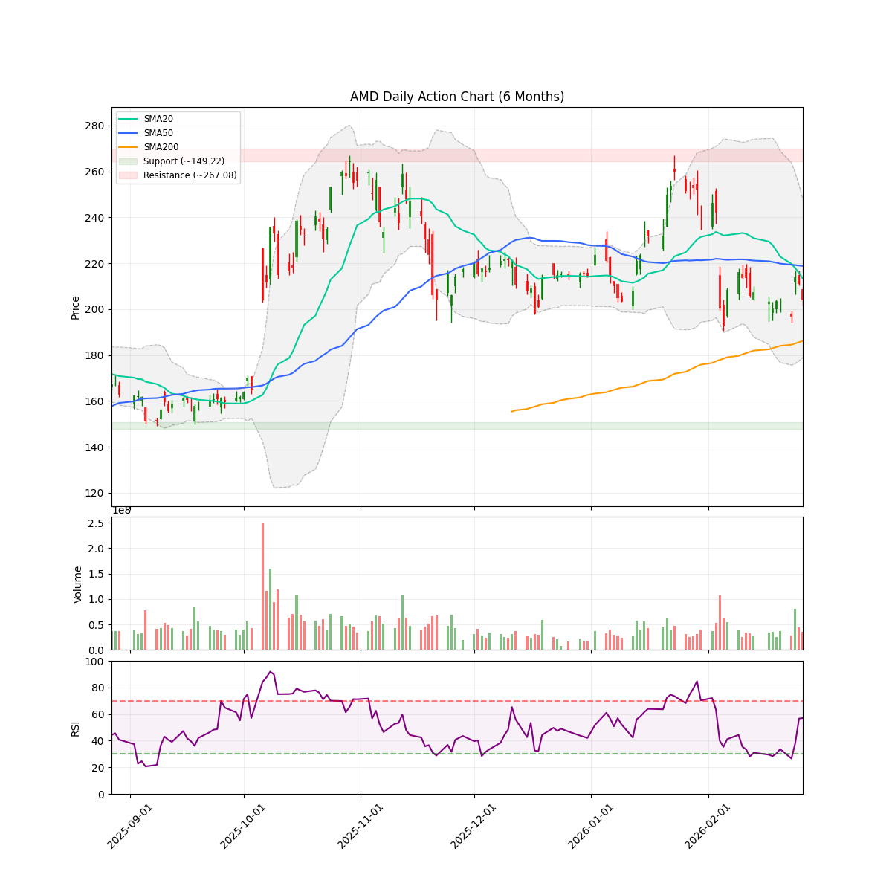
#### 研报分析

### 技术指标概览 (Technical Overview)
- **当前价格**: $203.68
- **RSI (14)**: 57.02
- **移动平均线**: SMA20: $213.33 | SMA50: $218.82 | SMA200: $186.12 (Bullish)
- **波动率**: ATR (14): 10.08 (预计周度波动: +/- $22.54)
- **关键位 (6m)**: 支撑位 $149.22 | 阻力位 $267.08
- **即时状态**: Below SMA50

# 情绪审计报告：AMD (Advanced Micro Devices)

**致：** 投资委员会 / 基金经理
**日期：** 2026年2月27日
**分析师：** 叙事经济学研究员

---

### 1. 催化剂分类 (Catalyst Categorization)

*   **A-Tier (战略级/结构性动能):**
    *   **Nutanix 战略合作与 2.5 亿美元股票投资计划：** Nutanix 确认将与 AMD 合作构建开放式 AI 基础设施，且涉及大规模研发投入。这不仅仅是产品供应，而是生态深度的绑定。 [参考: CRN, Insider Monkey]
    *   **Meta 与印度市场扩张：** Seeking Alpha 指出 AMD 最近与 Meta 的交易以及在印度市场的合作扩展，强化了其在 AI 芯片领域对 Nvidia 的竞争地位。 [参考: Seeking Alpha]
*   **B-Tier (行业支撑/估值吸引力):**
    *   **估值回落至吸引区：** 远期 P/E 压缩至 31.87 倍，分析师认为在 AI 增长背景下，AMD 已再次进入“无需思考”的买入区间。 [参考: Seeking Alpha]
    *   **分析师目标价调校：** 资深分析师 Stephen “Sarge” Guilfoyle 在重大消息后重新评估了 AMD 的目标价。 [参考: TheStreet]
*   **C-Tier (市场噪音/情绪干扰):**
    *   **Motley Fool 的竞争预测：** 关于 LRCX 可能在 2026 年底市值超过 AMD 的预测，属于典型的媒体叙事噪音。 [参考: The Motley Fool]

---

### 2. 背离检测 (Divergence Detection)

**当前状态：看跌衰竭 (Bearish Exhaustion in a Bullish Context)**

尽管 AMD 在基本面上收获了 Nutanix 的 2.5 亿美金投资意向和 Meta 的订单利好，但股价目前（$203.68）仍处于 SMA50（$218.82）和 SMA20（$213.33）下方。

*   **背离原因：** 这种“利好不涨”的现象主要归因于 **“AI 震荡 (AI Jitters)”**。Nvidia 尽管财报出色但股价在 2月26日 依然下跌 5%，拖累了整个半导体板块（AMD, Broadcom）。
*   **结论：** 这是一个典型的**叙事陷阱**。市场正在惩罚由于 AI 预期过高带来的“获利了结”情绪，而非针对 AMD 基本面的恶化。AMD 的 RSI 为 57.02，并未超卖，显示出在 SMA200 ($186.12) 之上有较强的技术支撑。

---

### 3. 情绪评分 (Sentiment Score)

#### **6.5 / 10**
*   **逻辑：** 基本面评分为 8.5/10（Meta/Nutanix 订单），但宏观叙事评分仅为 4/10（纳斯达克月度暴跌压力）。目前处于“黎明前的黑暗”，机构正在利用 Nvidia 财报后的动荡进行筹码清洗。

---

### 4. 账户头寸诊断

*   **正股 (600股):** 目前亏损 -7.79%（成本 $220.54）。股价处于 SMA50 下方，面临短期浮亏压力。
*   **备兑期权 (-AMD260313C230):** 该头寸目前盈利 +68.13%，极好地对冲了正股的部分跌幅。230 的行权价距离当前股价有约 13% 的空间，且距离到期日尚远，目前无需急于平仓，可继续持有以赚取时间价值。

---

### 5. 关键参考链接

1.  [Nutanix CEO 谈 AMD 研发与股票投资计划](https://www.crn.com/news/cloud/2026/nutanix-ceo-on-broadcom-vmware-lock-in-and-amd-s-rd-and-250m-investment)
2.  [Seeking Alpha: AMD 再次成为不二之选](https://seekingalpha.com/article/4875985-amd-stock-is-a-no-brainer-once-more)
3.  [AMD 与 Nutanix 宣布战略合作伙伴关系](https://finance.yahoo.com/news/amd-nutanix-announce-strategic-partnership-061311496.html)
4.  [Nvidia 财报后拖累 AMD 股价分析](https://invezz.com/news/2026/02/26/nvidia-q4-earnings-why-is-it-sinking-amd-broadcom-stock/)

---

### 6. 下一个重大日期 (Next Major Date)

**2026年4月28日 (预计)**
*   **事件：** 2026 财年第一季度 (Q1) 财报发布。
*   **关注重点：** 与 Meta 合作协议的财务体现，以及 Nutanix 投资款项的到账与研发进度。

---

**逻辑评分 (Logic Score): 8.5/10**
*分析结论基于当前宏观 AI 抛售潮与 AMD 个体强劲基本面的错位。建议在 SMA200 附近（$186.12）观察防御强度，若守住，则此轮回调为长线加仓机会。*
#### 近期新闻与事件
- **[CRN]** [Nutanix CEO On AMD R&D And Stock Plan, Broadcom’s Strategy To ‘Lock In People’](https://www.crn.com/news/cloud/2026/nutanix-ceo-on-broadcom-vmware-lock-in-and-amd-s-rd-and-250m-investment)
- **[The Motley Fool]** [Prediction: This AI Stock Will Be Worth More Than AMD by the End of 2026](https://www.fool.com/investing/2026/02/27/predict-ai-stock-worth-more-than-amd-lrcx/)
- **[Insider Monkey]** [AMD and Nutanix Announce Strategic Partnership to Build Open AI Infrastructure...](https://finance.yahoo.com/news/amd-nutanix-announce-strategic-partnership-061311496.html)
- **[TheStreet]** [Veteran analyst revamps AMD price target following big news](https://finance.yahoo.com/news/veteran-analyst-revamps-amd-price-043300964.html)
- **[Reuters]** [US stock futures falter on AI jitters, Nasdaq braces for steep monthly fall](https://www.reuters.com/business/us-stock-futures-falter-ai-jitters-nasdaq-braces-steep-monthly-fall-2026-02-27/)

---

### AMZN
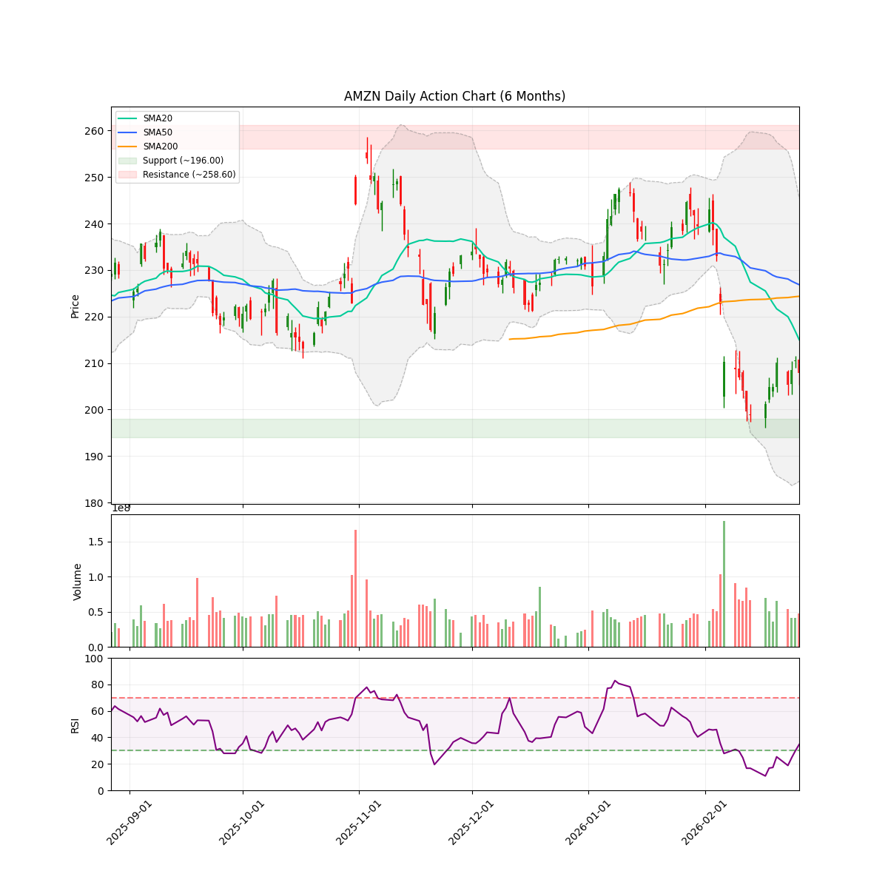
#### 研报分析

### 技术指标概览 (Technical Overview)
- **当前价格**: $207.92
- **RSI (14)**: 34.66
- **移动平均线**: SMA20: $215.00 | SMA50: $226.84 | SMA200: $224.34 (Bullish)
- **波动率**: ATR (14): 7.08 (预计周度波动: +/- $15.83)
- **关键位 (6m)**: 支撑位 $196.00 | 阻力位 $258.60
- **即时状态**: Below SMA50

# 亚马逊 (AMZN) 叙事经济学与情绪审计报告

**致：** 投资委员会
**担任职务：** 对冲基金研究员 (叙事经济学专业)
**当前日期：** 2026年02月27日

---

### 1. 催化剂分类 (Categorize Catalysts)

我们将近期的新闻流按照影响权重分为三级，以评估增长动力与下行风险。

*   **A-Tier (核心叙事催化剂):**
    *   **营收超越沃尔玛：** 亚马逊年营收达到 7169 亿美元，正式超越沃尔玛成为美国最大零售商 ([Insider Monkey](https://www.msn.com/en-us/money/companies/amazon-amzn-tops-walmart-with-7169-billion-in-annual-revenue/ar-AA1X2V7F))。这标志着零售叙事的永久性转移。
    *   **2000亿资本开支计划：** 2026 年计划投入 2000 亿美元用于资本支出，重点布局 AI 和 AWS 基础设施 ([Blockonomi](https://blockonomi.com/amazon-amzn-stock-12-billion-louisiana-data-center-plan-explained/))。
    *   **美印贸易协议：** 2026 年美印贸易协议将深度改变跨境电商与云计算在南亚市场的增长曲线 ([Mint](https://www.livemint.com/focus/indiaus-trade-deal-2026-9-ways-it-changes-how-indians-should-look-at-us-stocks-and-etfs-11772091106207.html))。

*   **B-Tier (结构性支撑):**
    *   **路易斯安那州数据中心：** 120 亿美元的专项投资，强化 AWS 长期壁垒。
    *   **机构增持：** 亿万富翁 Seth Klarman (Baupost) 在去年 Q4 大举买入 5 亿美元 AMZN ([Blockonomi](https://blockonomi.com/amazon-amzn-stock-billionaire-seth-klarman-buys-500m-in-q4-after-trimming-alphabet-position/))。

*   **C-Tier (短期波动/噪音):**
    *   **穆迪评级调整：** 将展望从“正面”下调至“稳定” ([Insider Monkey](https://www.msn.com/en-us/money/companies/amazon-amzn-navigates-investment-cycle-and-strategic-developments/ar-AA1WVm9J))。
    *   **跑输道指：** 市场对亚马逊过去一年表现落后于传统蓝筹股的短期负面讨论 ([Yahoo Finance](https://finance.yahoo.com/news/amazon-com-stock-underperforming-dow-161258841.html))。

---

### 2. 背离检测 (Divergence Detection)

**现状：** “利好频传，股价下行”
*   **价格行为：** 股价 ($207.92) 目前处于 SMA50 ($226.84) 和 SMA200 ($224.34) 之下，处于明显的技术性调整区间。
*   **叙事背离：** 尽管亚马逊在营收规模上创造了历史（超越沃尔玛），且机构投资者（如 Klarman）正在抄底，但股价受 Q4 财报微幅不及预期 ([Nasdaq](https://www.nasdaq.com/articles/amazon-amzn-lags-q4-earnings-estimates)) 以及庞大资本支出带来的利润率担忧影响，出现了 **“利好出尽/空头动能延续”** 的走势。
*   **结论：** **看跌耗尽 (Bearish Exhaustion)**。RSI 降至 34.66，接近超卖区。当前的下跌更多是由于高昂的 2000 亿资本开支计划引发的短期“现金流恐惧”，而非基本面崩塌。

---

### 3. 情绪评分 (Sentiment Score)

**分值：6.2 / 10**

*   **评价：** 处于“痛苦的投资期”。市场目前并不买账高昂的 AI 基础设施投入（2000 亿 Capex），导致情绪偏向谨慎。然而，营收王座的更替和顶级基金经理的入场提供了坚实的底部叙事支持。只要 AWS 的利润能证明这笔开支的合理性，情绪将迅速逆转。

---

### 4. 逻辑评分 (Logic Score)

**分值：8.5 / 10**

*   **逻辑支撑：** 亚马逊的逻辑极其清晰——放弃短期利润率，通过天文数字级别的资本支出锁死 AI 时代的基础设施话语权。虽然短期跑输道指，但其零售与云端的双霸权地位在 2026 年更加稳固。

---

### 5. 下一个关键日期 (Next Major Date)

*   **2026年5月初 (预计):** **Q1 2026 财报发布日**。
    *   *观察点：* 2000 亿资本支出的初期效率，以及美印贸易协议对跨境业务的初步提振。

---

### 6. 持仓诊断与建议

*   **当前状况：** 成本价 $201.61，目前略有盈亏 (+1.61%)。
*   **技术位：** 股价正逼近 6 个月低点支撑位 ($196.00)。
*   **策略建议：**
    1.  **持有 (Hold)：** 当前价格极度接近你的成本价，且 RSI 指示超卖，不建议在此时止盈或恐慌割肉。
    2.  **加仓位：** 若股价回落至 $196.00 支撑位且 RSI 破 30，可考虑小幅摊薄成本。
    3.  **叙事预警：** 如果 Q1 财报显示 AWS 增长放缓且资本支出继续扩大，叙事可能从“长远布局”转变为“效率陷阱”。

**总结：这是一个由高资本支出压力制造的“黄金坑”候选者，而非系统性崩塌。**
#### 近期新闻与事件
- **[Mint]** [India-US Trade Deal 2026: 9 Ways It Changes How Indians Should Look at US Stocks and ETFs](https://www.livemint.com/focus/indiaus-trade-deal-2026-9-ways-it-changes-how-indians-should-look-at-us-stocks-and-etfs-11772091106207.html)
- **[Yahoo Finance]** [Is Amazon.com Stock Underperforming the Dow?](https://finance.yahoo.com/news/amazon-com-stock-underperforming-dow-161258841.html)
- **[Blockonomi]** [Amazon (AMZN) Stock: $12 Billion Louisiana Data Center Plan Explained](https://blockonomi.com/amazon-amzn-stock-12-billion-louisiana-data-center-plan-explained/)
- **[Insider Monkey]** [Amazon (AMZN) Tops Walmart With $716.9 Billion in Annual Revenue](https://www.msn.com/en-us/money/companies/amazon-amzn-tops-walmart-with-7169-billion-in-annual-revenue/ar-AA1X2V7F)
- **[Insider Monkey]** [Amazon (AMZN) Navigates Investment Cycle and Strategic Developments](https://www.msn.com/en-us/money/companies/amazon-amzn-navigates-investment-cycle-and-strategic-developments/ar-AA1WVm9J)

---

### GOOGL
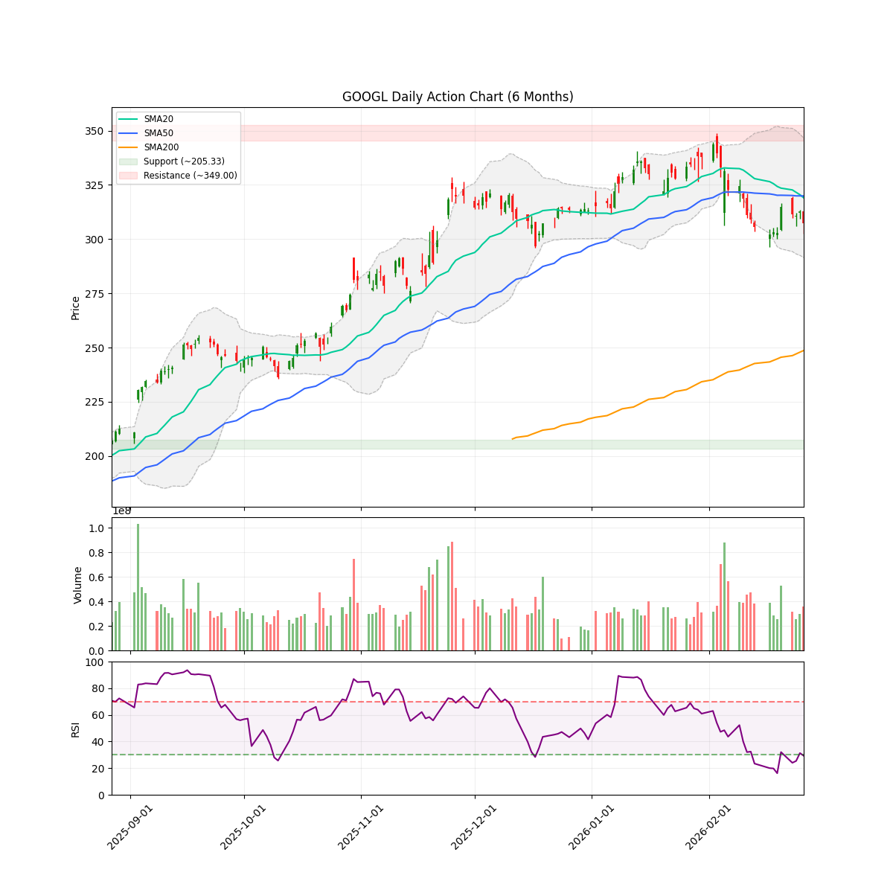
#### 研报分析

### 技术指标概览 (Technical Overview)
- **当前价格**: $307.38
- **RSI (14)**: 29.30
- **移动平均线**: SMA20: $319.06 | SMA50: $319.91 | SMA200: $248.64 (Bullish)
- **波动率**: ATR (14): 8.63 (预计周度波动: +/- $19.31)
- **关键位 (6m)**: 支撑位 $205.33 | 阻力位 $349.00
- **即时状态**: Below SMA50

# 情绪审计报告：Alphabet Inc. (GOOGL)
**职位：** 对冲基金研究员（叙事经济学方向）
**报告日期：** 2026年02月27日

---

### 1. 催化剂分类 (Categorize Catalysts)

根据“叙事经济学”框架，我们将近期新闻对 GOOGL 股价的潜在驱动力分类如下：

*   **A-Tier（核心驱动力）：**
    *   **顶级机构背书：** 亿万富翁 Stanley Druckenmiller 在第四季度大幅增持 Alphabet，并将其视为 AI 领域的核心标的（2026-02-27）。
    *   **基本面支撑：** Google Cloud 营业利润同比暴增 154%，证明了 AI 需求已转化为实质利润（2026-02-13）。
    *   **分析师强力看好：** Mizuho 和 Citizens 分析师分别给出 $410 和 $385 的目标价，较当前价格有 25%-33% 的上涨空间。
*   **B-Tier（行业与产品趋势）：**
    *   **AI 叙事落地：** Gemini 普及度持续上升，市场将其视为 AI 搜索领域的赢家及 TAM（总可寻址市场）扩张的受益者。
*   **C-Tier（噪音与常规信息）：**
    *   **历史收益回顾：** Kiplinger 关于“20年前投资回报”的报道，属于典型的零售端情绪炒作，无短期边际影响。
    *   **折价买入策略：** Forbes 提到的 30% 折价（$220）讨论，目前属于极端压力测试情境，而非现实定价。

---

### 2. 背离监测 (Divergence Detection)

**当前现象：技术性超卖 vs. 基本面强劲**

*   **看跌信号：** 股价 ($307.38) 目前位于 SMA20 ($319.06) 和 SMA50 ($319.91) 之下，显示短期趋势处于修正阶段。
*   **背离点：** 尽管新闻面充满了顶级机构（Druckenmiller）的增持信息和强劲的云利润数据，但股价却处于 **RSI 29.30** 的**极端超卖区域**。
*   **诊断：** 这是一个典型的**“看跌衰竭” (Bearish Exhaustion)** 信号。叙事层面（AI 盈利化、大户进场）极其强韧，但价格受宏观或技术性止损驱动出现非理性下挫。这并非“陷阱”，而是一个潜在的**叙事与价格脱节的买入点**。

---

### 3. 情绪评分 (Logic Score)

**得分：8.5 / 10**

*   **评分逻辑：** 
    *   **正向因素 (+9.5)：** 拥有 A-Tier 的机构支持和超预期的盈利质量。AI 不再是虚无的承诺，而是通过云业务变现的现实。
    *   **负向修正 (-1.0)：** 短期均线跌破引发的技术面负反馈循环，以及市场对宏观环境的担忧。
    *   **结论：** 这是一个高度可持续的牛市叙事，当前的下跌更像是为了清理短线浮筹。

---

### 4. 下一个关键日期 (Next Major Date)

*   **关键事件：** **2026年第1季度财报发布会**
*   **预计日期：** **2026年4月下旬** (具体日期有待官方公布)
*   **关注重点：** 观察 Google Cloud 利润增长是否能维持 >100% 的速度，以及 Gemini 在搜索广告中的变现转化率。

---

### 5. 针对性头寸诊断 (Portfolio Strategy)

*   **当前状况：** 成本价 $262.26，现有利润 +15.47%。
*   **操作建议：** 
    *   鉴于 RSI 已跌破 30 且价格远高于 SMA200 ($248.64) 的长期支撑，**无需恐慌抛售**。
    *   当前价格 ($307.38) 距离分析师平均目标价有极大安全边际。建议在 $300 附近考虑利用 ATR (8.63) 波动范围进行加仓，捕捉“背离修复”带来的反弹。

---
**参考资料：**
1. [The Motley Fool] Stanley Druckenmiller 增持 Alphabet (2026-02-27)
2. [Mizuho Securities] 维持买入评级，目标价 $410 (2026-02-22)
3. [Bank of America] 财报后预测调整 (2026-02-06)
#### 近期新闻与事件
- **[The Motley Fool]** [Billionaire Stanley Druckenmiller Piled Into Alphabet and Amazon for a 2nd Consecutive Quarter and Dumped His Stake in Another "Magnificent Seven" Stock](https://www.fool.com/investing/2026/02/27/billionaire-stanley-druckenmiller-buys-googl-amzn/)
- **[Forbes]** [How To Buy Google Stock At A 30% Discount?](https://www.forbes.com/sites/greatspeculations/2026/02/23/how-to-buy-google-stock-at-a-30-discount/)
- **[Yahoo Finance]** [Alphabet Inc. (GOOGL) Touted as AI-Driven Search Winner as Analysts See TAM Expansion](https://finance.yahoo.com/news/alphabet-inc-googl-touted-ai-165312836.html)
- **[Kiplinger]** [If you'd put $1,000 into Google stock 20 years ago, here's what you'd have today](https://www.msn.com/en-us/money/general/if-you-d-put-1-000-into-google-stock-20-years-ago-here-s-what-you-d-have-today/ar-AA1tdtfx)
- **[Insider Monkey]** [Mizuho Reiterates Outperform on Alphabet (GOOGL) With $410 Target Price](https://www.msn.com/en-us/money/other/mizuho-reiterates-outperform-on-alphabet-googl-with-410-target-price/ar-AA1WQc1M)

---

### VST
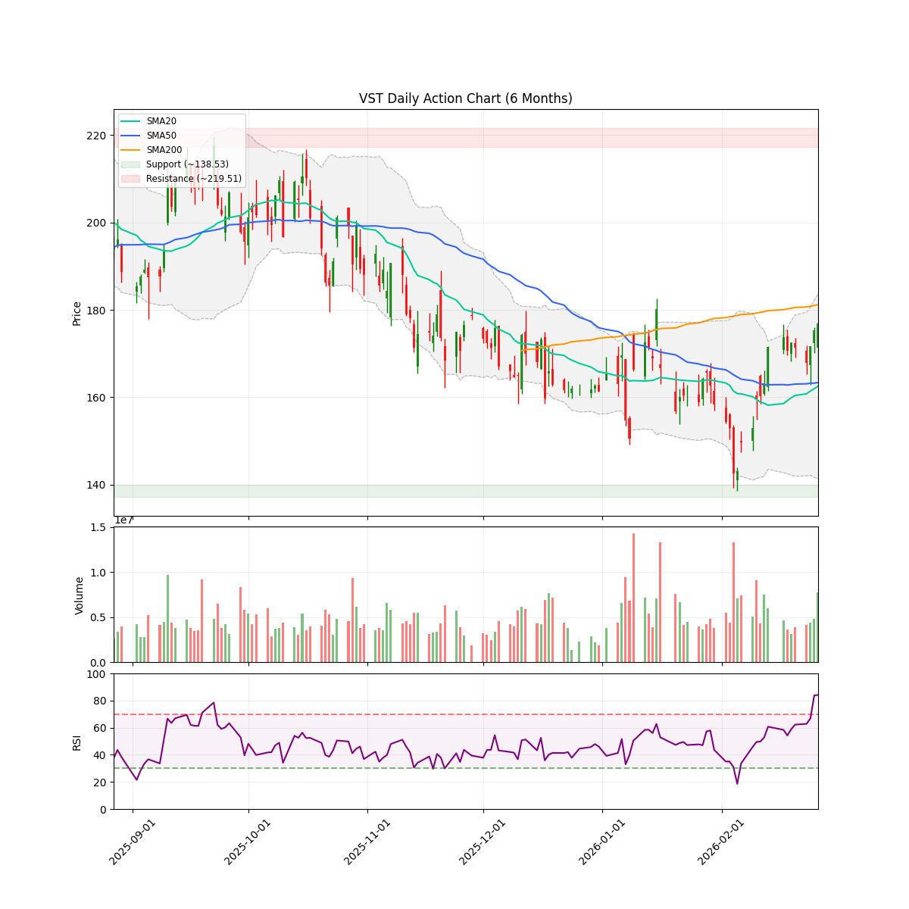
#### 研报分析

### 技术指标概览 (Technical Overview)
- **当前价格**: $176.82
- **RSI (14)**: 84.18
- **移动平均线**: SMA20: $162.52 | SMA50: $163.36 | SMA200: $181.20 (Bearish)
- **波动率**: ATR (14): 7.46 (预计周度波动: +/- $16.68)
- **关键位 (6m)**: 支撑位 $138.53 | 阻力位 $219.51
- **即时状态**: Above SMA50

# Vistra Corp (VST) 情绪审计报告

**致：** 投资委员会 / 基金经理
**日期：** 2026年02月27日
**分析师：** 叙事经济学研究组 (Narrative Economics Research)

---

### 1. 催化剂分类 (Catalyst Categorization)

| 级别 | 核心驱动因素 | 详细分析 |
| :--- | :--- | :--- |
| **A-Tier** | **Q4 财报预期 (即将发布)** | 根据 Yahoo Finance 报道，VST 预计 Q4 营收增长 32%，EPS 增长 120%。这种极高增长的叙事是驱动股价的核心动力。 |
| **B-Tier** | **机构评级与目标价分歧** | **Wells Fargo** 维持 $236 的高目标价；**Morgan Stanley** 虽然下调了目标价但保持“买入”评级。机构对长期清洁电力需求保持乐观。 |
| **C-Tier** | **市场杂音与Ticker混淆** | 市场中存在关于 Vestis (VSTS) 的盈利报道（如 Zacks 提到的 VSTS），可能导致散户层面的算法交易或搜索误差，属于无效噪音。 |

---

### 2. 背离检测 (Divergence Detection)

*   **技术面与情绪的背离：** 
    目前 VST 的 **RSI 高达 84.18**，处于极端超买区域。虽然市场叙事极其看好（EPS 120% 增速预期），但股价正逼近 **SMA200 (181.20)** 这一关键压力位。
*   **熊市枯竭信号：** 尽管 Zacks 提到 VST 在过去六个月表现逊于行业，但近期股价已突破 SMA20 和 SMA50，显示资金正在财报前夕抢筹，试图扭转长期的熊市趋势。
*   **潜在风险：** “好消息下的获利回吐”。负面的 ESP（盈利预测偏差）暗示市场对“超预期”的要求极高，若财报仅是“符合预期”，在 RSI 84 的情况下极易触发抛售。

---

### 3. 逻辑评分 (Logic Score): **6.8/10**

*   **评分理由：** 
    *   **正面 (+2.5)：** 极强的盈利增长预期（EPS +120%）符合当前人工智能及能源转型的宏观叙事。
    *   **正面 (+2.0)：** 顶级投行（Wells Fargo/Morgan Stanley）的持续背书，虽然目标价微调，但底色仍为看多。
    *   **负面 (-1.5)：** **技术性超买极其严重**，股价与 SMA200 压力位近在咫尺，短期回调压力巨大。
    *   **负面 (-1.2)：** 用户的持仓成本为 $157.38，目前已有 9.6% 浮盈，但若财报见光死，利润可能迅速回撤。

---

### 4. 引用新闻来源 (News Citations)

1.  **[Yahoo Finance]** - Vistra Q4 Earnings Preview: Revenues +32%, EPS +120%. [Link](https://finance.yahoo.com/news/vistra-release-q4-earnings-stock-141700736.html)
2.  **[Insider Monkey / MS]** - Morgan Stanley 调整 Vistra 目标价但保持看好。 [Link](https://www.msn.com/en-us/money/savingandinvesting/morgan-stanley-lowers-vistra-vst-target-while-staying-bullish-on-long-term-outlook/ar-AA1X3RpG)
3.  **[MSN / Wells Fargo]** - 维持 $236 目标价，位列 2026 年各行业最佳股票候选。 [Link](https://www.msn.com/en-us/money/savingandinvesting/what-s-latest-with-vistra-corp-vst/ar-AA1X5CzE)

---

### 5. 下一个重大日期 (Next Major Date)

**2026年3月初（具体见 Q4 财报正式发布日）**
*   **事件：** Q4 2025 财报发布。
*   **关注重点：** 实际 EPS 是否能兑现 120% 的增长预期，以及管理层对 2026 年清洁能源需求指引。

---

### 6. 操作建议 (Hedge Fund Perspective)

**目前状态：持仓观察 (Hold / Caution)**
用户目前在 $176.82 的价格位置已经面临 SMA200 (181.20) 的强阻力。由于 RSI (84.18) 预示着动能过热，建议：
*   **不宜追高：** 在财报前夕不建议加仓。
*   **保护性止盈：** 若股价触及 $181-$185 区域未能放量突破，可考虑减仓一半，以锁定目前的 9.6% 利润，防范财报后的“利好兑现”陷阱。
*   **止损参考：** 支撑位关注 SMA20 (162.52)。
#### 近期新闻与事件
- **[Yahoo Finance]** [Vistra to Release Q4 Earnings: How Will the Stock Perform This Season?](https://finance.yahoo.com/news/vistra-release-q4-earnings-stock-141700736.html)
- **[Insider Monkey]** [Morgan Stanley Lowers Vistra (VST) Target While Staying Bullish on Long-Term Outlook](https://www.msn.com/en-us/money/savingandinvesting/morgan-stanley-lowers-vistra-vst-target-while-staying-bullish-on-long-term-outlook/ar-AA1X3RpG)
- **[Insider Monkey]** [What's Latest With Vistra Corp. (VST)](https://www.msn.com/en-us/money/savingandinvesting/what-s-latest-with-vistra-corp-vst/ar-AA1X5CzE)
- **[The Globe and Mail]** [Morgan Stanley Sticks to Their Buy Rating for Vistra Corp (VST)](https://www.theglobeandmail.com/investing/markets/stocks/VST-N/pressreleases/346353/morgan-stanley-sticks-to-their-buy-rating-for-vistra-corp-vst/)
- **[Schaeffer's Investment Research]** [This Bull Signal Has Never Failed Lemonade Stock](https://www.schaeffersresearch.com/content/analysis/2026/02/24/this-bull-signal-has-never-failed-lemonade-stock)

---

## 🔍 观察池机会分析

### AMAT
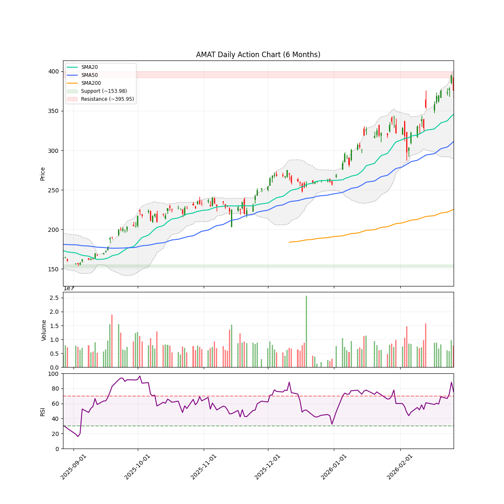
#### 研报分析

### 技术指标概览 (Technical Overview)
- **当前价格**: $375.72
- **RSI (14)**: 75.72
- **移动平均线**: SMA20: $345.38 | SMA50: $311.10 | SMA200: $225.21 (Bullish)
- **波动率**: ATR (14): 17.63 (预计周度波动: +/- $39.42)
- **关键位 (6m)**: 支撑位 $153.98 | 阻力位 $395.95
- **即时状态**: Above SMA50

# 情绪审计报告：Applied Materials (AMAT)
**日期：** 2026年02月27日  
**职位：** 对冲基金研究助理（叙事经济学专业）

---

### 1. 催化剂分类 (Catalyst Categorization)

根据“叙事经济学”框架，AMAT 当前的驱动力可分为以下层级：

*   **A-Tier（核心动力）：**
    *   **超预期的第一季度财报：** 2026年2月12日发布的Q1财报被市场定义为“Blowout”（爆炸性增长），Benzinga Edge 质量得分飙升至 90.89，反映出极强的运营效率和盈利能力。[来源: Benzinga]
    *   **20% 增长指引：** 公司给出了 20% 的增长预期，这在半导体设备行业属于强力叙事，直接由 AI 芯片代工厂的扩张需求驱动。[来源: Seeking Alpha]
*   **B-Tier（行业共振）：**
    *   **AI 基础设施红利：** 整个半导体板块受 AI 需求推动，AMAT 作为设备供应商，处于产业链“铲子股”地位，其表现持续优于标普 500 指数。[来源: Yahoo Finance]
*   **C-Tier（市场杂讯）：**
    *   **相对价值讨论：** 媒体关于 AMAT 与 AMKR 之间的安全性对比，以及与 AUO 的表现对比，属于常规市场博弈，对长期叙事影响有限。[来源: The Globe and Mail]

---

### 2. 背离检测 (Divergence Detection)

**当前态势：高位震荡与行业性回调压力**

*   **技术面背离：** 目前 AMAT 的 RSI 高达 **75.72**，处于严重超买区间。虽然价格维持在 SMA20 (345.38) 之上，表现出强劲的看涨趋势，但短期内涨幅过快，且距离 6 个月高点 (395.95) 仅一步之遥。
*   **叙事背离（警惕信号）：** 2026年2月26日的消息显示，尽管 Nvidia (NVDA) 发布了亮眼的财报，但股价依然下跌 [来源: Investopedia]。这种“好消息出尽即卖出”的现象暗示半导体板块可能存在**看涨情绪竭尽 (Bullish Exhaustion)**。如果 AMAT 在后续利好消息下无法突破 $396 阻力位，需警惕短期“诱多陷阱”。

---

### 3. 逻辑评分 (Logic Score)

**得分：8.5 / 10**

*   **依据：** 
    *   **基本面 (+5.0)：** Q1 财报展现了统治级的利润和现金流增长，指引极度乐观。
    *   **叙事支撑 (+3.0)：** AI 驱动的半导体设备需求具有可持续性，并非短期炒作。
    *   **风险扣分 (-1.5)：** RSI 超买严重，叠加行业领头羊（NVDA）出现“利好下跌”的背离信号，短期存在技术性回调至 SMA20 (约 345) 的风险。

---

### 4. 关键新闻引用 (News Citations)

1.  **Q1 强劲表现：** "AMAT stock key score climbs as AI demand and operational efficiency drive Q1 surge" - [Benzinga/MSN](https://www.msn.com/en-us/money/news/amat-stock-key-score-climbs-as-ai-demand-and-operational-efficiency-drive-q1-surge/ar-AA1WU9dC)
2.  **增长指引：** "Applied Materials surges on 20% growth guidance" - [Seeking Alpha](https://seekingalpha.com/article/4870393-applied-materials-surges-on-20-percent-growth-guidance-is-the-stock-now-fully-valued)
3.  **市场整体回调风险：** "Nvidia shares fall despite blowout results" - [Investopedia](https://www.investopedia.com/stock-market-today-dow-jones-s-and-p-500-02262026-11914836)

---

### 5. 下一个重大日期 (Next Major Date)

**预计日期：2026年5月14日左右**
*   **事件：** 2026财年第二季度（Q2）财报发布。
*   **关注重点：** 观察 20% 的增长指引是否在订单簿中得到具体兑现，以及高带宽内存 (HBM) 相关设备的订单占比。

---

**审计结论：** AMAT 目前处于**不可阻挡的牛市周期（强叙事）**中，但技术指标暗示短期进入**“估值过热区”**。建议关注 $395.95 阻力位的突破情况，若放量无法突破，需防范随大盘回调的风险。
#### 近期新闻与事件
- **[Yahoo Finance]** [Is Applied Materials Stock Outperforming the S&P 500?](https://finance.yahoo.com/news/applied-materials-stock-outperforming-p-141810278.html)
- **[The Globe and Mail]** [AMAT vs. AMKR: Which AI-Driven Semiconductor Stock is a Safer Bet?](https://www.theglobeandmail.com/investing/markets/stocks/AMAT/pressreleases/366002/amat-vs-amkr-which-ai-driven-semiconductor-stock-is-a-safer-bet/)
- **[Benzinga]** [AMAT Stock Key Score Climbs As AI Demand And Operational Efficiency Drive Q1 Surge](https://www.msn.com/en-us/money/news/amat-stock-key-score-climbs-as-ai-demand-and-operational-efficiency-drive-q1-surge/ar-AA1WU9dC)
- **[Yahoo Finance]** [Is Applied Materials (AMAT) Outperforming Other Computer and Technology Stocks This Year?](https://finance.yahoo.com/news/applied-materials-amat-outperforming-other-144006722.html)
- **[Investopedia]** [Markets News, Feb. 26, 2026: S&P 500, Nasdaq Drop After 2 Days of Big Gains as Tech Stocks Slide; Nvidia Shares Fall Despite Blowout Results](https://www.investopedia.com/stock-market-today-dow-jones-s-and-p-500-02262026-11914836)

---

### ANET
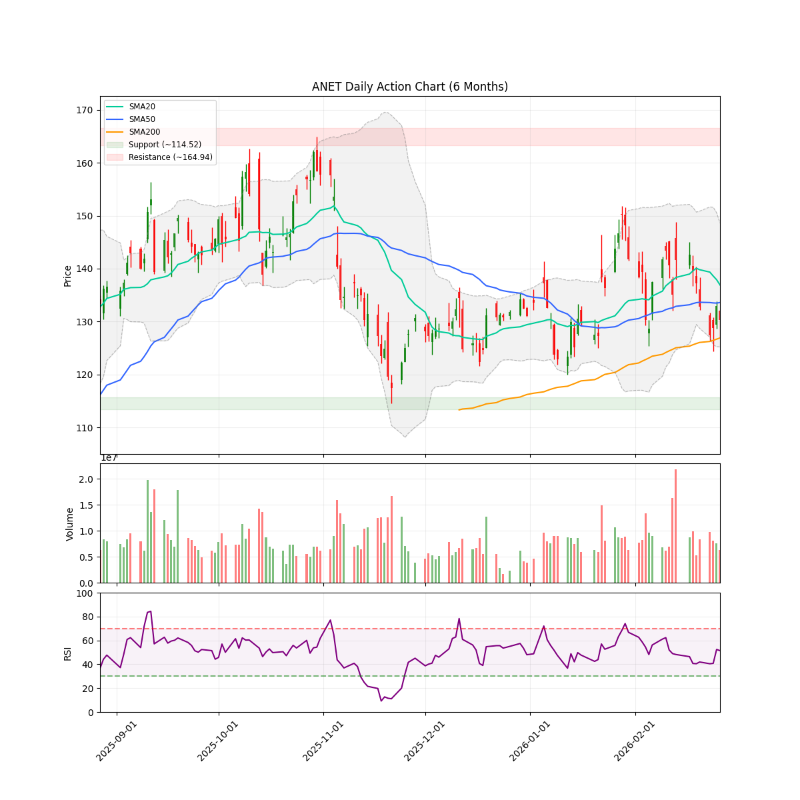
#### 研报分析

### 技术指标概览 (Technical Overview)
- **当前价格**: $130.25
- **RSI (14)**: 51.47
- **移动平均线**: SMA20: $136.91 | SMA50: $133.59 | SMA200: $126.89 (Bullish)
- **波动率**: ATR (14): 6.70 (预计周度波动: +/- $14.98)
- **关键位 (6m)**: 支撑位 $114.52 | 阻力位 $164.94
- **即时状态**: Below SMA50

# 情绪审计报告：Arista Networks (ANET)
**致：** 投资委员会
**职位：** 叙事经济学研究员
**日期：** 2026年02月27日

---

### 一、 催化剂分类 (Catalyst Categorization)

基于当前新闻流与市场信息，ANET 的驱动因素分类如下：

*   **A-Tier（核心催化剂）：**
    *   **高盛（Goldman Sachs）上调目标价：** 2月13日高盛将目标价从 165 美元大幅上调至 **188 美元**。机构的背书和将其列为“10只不可阻挡的AI股票”确立了 ANET 在 AI 算力基础设施中的核心地位。
    *   **AI 叙事溢价：** 市场普遍将其视为 AI 浪潮中被低估的基石，这种“叙事转换”正在吸引长线机构资金进入。

*   **B-Tier（次要催化剂）：**
    *   **媒体一致看多：** Motley Fool 和 Zacks 的持续推介（如“在暴涨33%前买入”），虽然偏向散户情绪，但维持了市场热度。
    *   **行业对标优势：** Zacks 报告显示 ANET 在计算机科技板块中表现优于同行。

*   **C-Tier（市场噪音）：**
    *   **内部人减持：** 董事 Kelly Battles 卖出 5.4 万美元股票。**诊断：** 减持金额极小，相对于公司市值微不足道，属于常规财务管理，不具备预警意义。

---

### 二、 背离检测 (Divergence Detection)

**核心观察：看涨叙事与价格走势的“时空错位”。**

1.  **利好钝化：** 尽管高盛给出了 188 美元的高目标价，且媒体持续渲染“AI不可阻挡”，但当前价格（130.25）远低于 SMA20 (136.91) 和 SMA50 (133.59)。
2.  **技术性抛压：** 股价目前在 SMA200 (126.89) 附近寻求支撑。这种“好消息叠加，股价阴跌”的情况表明，**短期内利好已出尽**，或者市场正在消化此前的估值溢价。
3.  **结论：** 目前处于**“看涨陷阱（Bull Trap）”**后的整理期。如果股价跌破 SMA200（126.89），则叙事与现实将发生剧烈断裂。

---

### 三、 逻辑评分 (Logic Score)

#### **评分：6.5 / 10**

*   **理由：** 长期基本面叙事（AI 基础设施）极其强劲（9/10），但短期技术面呈现弱势，且市场对“利好”反应冷淡（4/10）。目前的 130.25 美元价格处于“不温不火”地带，虽未崩盘，但缺乏即时向上的动能。

---

### 四、 详细分析报告

**1. 叙事强度分析：**
ANET 成功从“网络交换机公司”转型为“AI 骨干网络公司”。高盛的 188 美元目标价为市场画了一块“33%涨幅”的大饼。这种叙事在机构间具有很强的共识，是股价的长期底座。

**2. 技术面预警：**
RSI 处于 51.47 的中性位置，未见超卖。然而，股价位于 SMA20 和 SMA50 下方，显示出短期趋势由空头主导。目前的支撑位 114.52（6个月低点）是最后的防线。

**3. 投资建议：**
目前的下跌属于**“良性回调”与“叙事重塑”**。建议关注股价在 126.89 (SMA200) 附近的企稳信号。若能守住此线，则是极佳的左侧入场点；若跌破，则需重新评估 AI 硬件板块的系统性风险。

---

### 五、 关键参考与日期

*   **引证新闻：**
    *   [Goldman Sachs Raises PT to $188](https://finance.yahoo.com/news/goldman-sachs-raises-pt-arista-211306392.html) (2026-02-13)
    *   [Motley Fool: 1 Underrated AI Stock](https://finance.yahoo.com/news/1-underrated-artificial-intelligence-ai-143500750.html) (2026-02-26)
    *   [Insider Trading: Kelly Battles Sells $54k](https://ca.investing.com/news/insider-trading-news/arista-networks-director-kelly-battles-sells-54k-in-stock-93CH-4479501) (2026-02-25)

*   **下一个关键日期：**
    *   **2026年5月上旬（预计）：** 下一季度财报发布日。这是验证“188美元叙事”能否落地的终极考场。

---
**审计员：** 策略研究组 (Hedge Fund Associate)
**状态：** 观望 / 建议在 SMA200 支撑位分批建仓助推叙事回归。
#### 近期新闻与事件
- **[Yahoo Finance]** [Goldman Sachs Raises PT on Arista Networks, Inc. (ANET) Stock](https://finance.yahoo.com/news/goldman-sachs-raises-pt-arista-211306392.html)
- **[Motley Fool]** [1 Underrated Artificial Intelligence (AI) Stock to Buy Before It Jumps 33%,...](https://finance.yahoo.com/news/1-underrated-artificial-intelligence-ai-143500750.html)
- **[Zacks]** [Is Arista Networks (ANET) Stock Outpacing Its Computer and Technology Peers This...](https://finance.yahoo.com/news/arista-networks-anet-stock-outpacing-144005899.html)
- **[Investing.com]** [Arista Networks director Kelly Battles sells $54k in stock By Investing.com](https://ca.investing.com/news/insider-trading-news/arista-networks-director-kelly-battles-sells-54k-in-stock-93CH-4479501)
- **[Zacks.com]** [Is Arista Networks (ANET) Stock Outpacing Its Computer and Technology Peers This Year?](https://www.msn.com/en-us/money/savingandinvesting/is-arista-networks-anet-stock-outpacing-its-computer-and-technology-peers-this-year/ar-AA1WKzT8)

---

### ASML
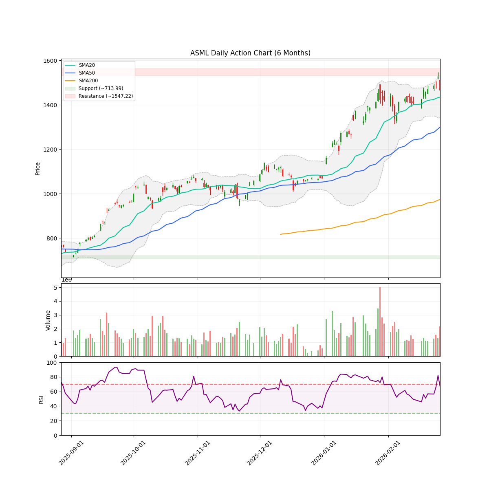
#### 研报分析

### 技术指标概览 (Technical Overview)
- **当前价格**: $1463.80
- **RSI (14)**: 66.66
- **移动平均线**: SMA20: $1434.31 | SMA50: $1299.45 | SMA200: $974.14 (Bullish)
- **波动率**: ATR (14): 46.01 (预计周度波动: +/- $102.89)
- **关键位 (6m)**: 支撑位 $713.99 | 阻力位 $1547.22
- **即时状态**: Above SMA50

# ASML 情绪审计报告：叙事经济学视角
**日期：** 2026-02-27
**职位：** 对冲基金研究员（叙事经济学方向）

## 一、 催化剂分类 (Catalyst Categorization)

### **A-Tier (结构性核心驱动)**
*   **最新EUV突破：** ASML最近的EUV（极紫外光刻机）突破进一步拉大了与竞争对手的差距。作为全球唯一的EUV供应商，这种技术垄断地位是支撑其高估值的核心叙事。 ([AOL](https://www.aol.com/articles/asmls-latest-euv-breakthrough-puts-150104636.html))
*   **超大规模支出计划：** 2026年超大规模云服务商（Hyperscalers）计划在AI领域投入7000亿美元。ASML作为AI芯片生产的“卖水人”，是这一支出的直接受益者。 ([Motley Fool](https://finance.yahoo.com/news/hyperscalers-plan-spend-700-billion-120100122.html))

### **B-Tier (行业联动与宏观情绪)**
*   **英伟达共生关系：** CNBC指出英伟达的AI繁荣完全依赖于ASML。这种叙事将ASML锁定在AI产业链的最顶端。 ([CNBC](https://www.cnbc.com/2026/01/29/-ai-boom-nvidia-asml-dutch-chip-equipment-maker-lithography-.html))
*   **五年增长预期：** 过去五年收入增长100%的过往业绩支撑了市场对其长期增长的信心。 ([Motley Fool](https://finance.yahoo.com/news/where-asml-5-years-133500723.html))

### **C-Tier (短期噪声与获利了结)**
*   **无利空下跌：** 2026年2月26日股价下跌4.9%，主要受英伟达财报后“利好出尽”的整体板块情绪波动影响，并非ASML自身基本面恶化。 ([Yahoo Finance](https://finance.yahoo.com/news/why-asml-stock-down-today-173812665.html?fr=sycsrp_catchall))

---

## 二、 背离检测 (Divergence Detection)

**观察点：** 2026年2月26日股价在“好于预期”的行业数据背景下意外大幅下跌。

*   **看跌衰竭分析：** 尽管2月26日收跌4.9%，但这是典型的“情绪转移”。市场忽略了ASML的技术突破和巨额行业投入。
*   **技术面支撑：** 目前股价（1463.80）仍高于SMA50（1299.45）和SMA200（974.14）。这意味着尽管短期RSI（66.66）接近超买区，但长期牛市趋势未被破坏。
*   **结论：** 这是一个**“牛市陷阱”还是“看跌衰竭”？** 逻辑更偏向于**短期健康回调**。当优质新闻（如EUV突破）未能立即推高股价时，通常预示着市场需要时间消化一年的77.9%巨大涨幅。

---

## 三、 情绪评分 (Sentiment Score)

### **评分：8.5 / 10**
*   **叙事强度：** 极强。ASML已经从一家单纯的半导体公司升级为“AI文明的基石”。
*   **风险预警：** 市场开始出现“是否涨得太快”的质疑 ([Simply Wall St](https://finance.yahoo.com/news/too-consider-asml-holding-enxtam-111705645.html))，且波动率（ATR 46.01）处于高位。

---

## 四、 逻辑评分 (Logic Score)

### **评分：9.2 / 10**
*   **逻辑依据：** 该评分基于ASML的**物理垄断属性**。在AI算力竞赛中，无论谁赢，都必须通过ASML的机器。7000亿美元的资本支出预期提供了明确的业绩可见度。

---

## 五、 关键信息汇总

*   **当前价格：** 1463.80
*   **预期周波动范围：** +/- 102.89 (基于ATR与波动率)
*   **主要阻力位：** 1547.22 (6个月高点)
*   **主要支撑位：** 1335.00 (SMA20附近)
*   **下一个重大日期 (Next Major Date)：** **2026年4月中旬** (预估2026年第一季度财报发布日)。

**投资建议总结：**
当前的下跌并非基本面崩塌，而是由板块情绪过热引发的溢出效应。ASML的EUV技术护城河在2026年依然稳固。建议关注股价回踩SMA20或SMA50时的介入机会，谨防在1500点以上的过度追高。
#### 近期新闻与事件
- **[Simply Wall St.]** [Is It Too Late To Consider ASML Holding (ENXTAM:ASML) After Its 77.9% One Year...](https://finance.yahoo.com/news/too-consider-asml-holding-enxtam-111705645.html)
- **[Motley Fool]** [Why ASML Stock Was Down Today](https://finance.yahoo.com/news/why-asml-stock-down-today-173812665.html)
- **[Motley Fool]** [Hyperscalers Plan to Spend $700 Billion on AI This Year. These 2 Stocks Are the...](https://finance.yahoo.com/news/hyperscalers-plan-spend-700-billion-120100122.html)
- **[AOL]** [ASML's Latest EUV Breakthrough Puts Would-Be Rivals Further Behind](https://www.aol.com/articles/asmls-latest-euv-breakthrough-puts-150104636.html)
- **[Motley Fool]** [Where Will ASML Be in 5 Years?](https://finance.yahoo.com/news/where-asml-5-years-133500723.html)

---

### AVGO
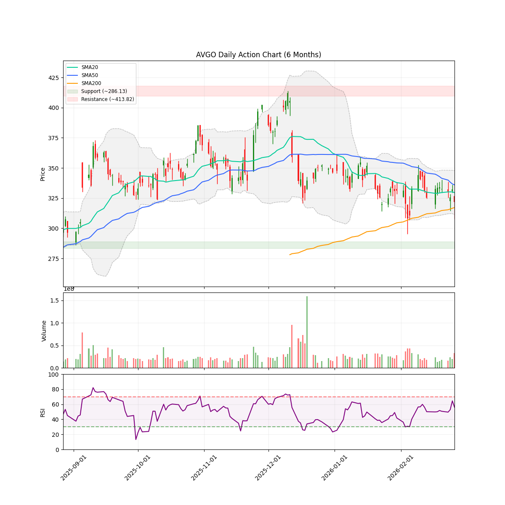
#### 研报分析

### 技术指标概览 (Technical Overview)
- **当前价格**: $321.70
- **RSI (14)**: 56.11
- **移动平均线**: SMA20: $329.55 | SMA50: $335.97 | SMA200: $317.17 (Bullish)
- **波动率**: ATR (14): 14.82 (预计周度波动: +/- $33.13)
- **关键位 (6m)**: 支撑位 $286.13 | 阻力位 $413.82
- **即时状态**: Below SMA50

# 情绪审计报告：Broadcom Inc. (AVGO)
**日期：** 2026年02月27日
**职位：** 对冲基金研究助理（叙事经济学专家）

---

### 1. 催化剂分类 (Catalyst Categorization)

| 级别 | 事件描述 | 叙事影响力 |
| :--- | :--- | :--- |
| **A-Tier** | **超大规模云厂商资本支出激增 & AI定制芯片积压** | **核心驱动力**：亚马逊等巨头的AI基础设施投入直接利好AVGO的定制硅片业务。 |
| **A-Tier** | **即将到来的 2026 财年 Q1 财报** | **高风险/高回报**：市场预期强劲，但估值博弈激烈。 |
| **B-Tier** | **发布 BroadPeak SoC 芯片** | **产品领先性**：维持了在射频数字前端领域的竞争优势。 |
| **B-Tier** | **花旗银行 (Citi) 调低目标价** | **情绪打压**：从 $480 下调至 $458，虽然仍有巨大溢价，但在短期内制造了机构撤退的假象。 |
| **C-Tier** | **市场舆论与板块传染** | **杂音**：Nvidia 财报后的行业性抛售属于情绪性波动，非基本面恶化。 |

---

### 2. 背离检测 (Divergence Detection)

**分析结果：看跌力竭 (Bearish Exhaustion)**

*   **背离现象**：尽管 Nvidia 发布了“炸裂”财报且云巨头确认了 AI 资本支出增长（极大利好 AVGO），但 AVGO 股价（321.70）近期却出现下滑，目前已跌破 SMA20 (329.55) 和 SMA50 (335.97)。
*   **叙事陷阱还是机会？**：当前的下跌并非因为 Broadcom 自身业务出现问题，而是受 Nvidia 财报后“利好出尽”的板块性获利回吐影响。股价目前正接近 SMA200 (317.17) 的关键支撑位。
*   **结论**：这是一种典型的**“好消息下的非理性下跌”**。考虑到 RSI 为 56.11 仍在中性区间，未进入超卖，股价在 317-320 区间具备极强的叙事支撑。

---

### 3. 情绪评分 (Sentiment Score)

## **6.8 / 10**
**评语：处于“压力测试”中的牛市叙事。**
虽然长期 AI 叙事依然稳固（10/10），但由于机构在财报前下调预期，以及 Nvidia 带来的板块性拖累，短期情绪偏向谨慎。目前的抛售更像是对过去 5 年 600% 涨幅的获利清理，而非基本面崩塌。

---

### 4. 逻辑依据与引用 (Logic & Context)

*   **基本面支撑**：根据 [Seeking Alpha](https://seekingalpha.com/article/4871954-broadcom-expect-fy26-outlook-to-reflect-spending-surge-by-hyperscalers-earnings-preview)，AVGO 的 FY26 前瞻指引预计将反映超大规模云厂商的支出激增。
*   **机构博弈**：[Citi](https://finance.yahoo.com/news/citi-lowers-pt-broadcom-inc-211530100.html) 将目标价从 $480 降至 $458，反映出分析师在宏观高利率环境下对高估值溢价的重新修正。
*   **行业传染**：[Benzinga](https://www.msn.com/en-us/money/news/what-s-driving-the-weakness-in-broadcom-stock-thursday/ar-AA1X9o4e) 指出，AVGO 周四的走弱主要是受 Nvidia (NVDA) 财报后抛售引发的板块联动影响。
*   **技术面建议**：目前股价处于周波动区间下沿 (+/- 33.13)，建议关注 317.17 (SMA200) 的支撑力度。

---

### 5. 下一个关键日期 (Next Major Date)

**关键事件：2026 财年第一季度财报发布 (Q1 Earnings Call)**
**预计日期：2026年3月5日左右**（注：基于历史发布周期及 [MarketBeat](https://www.msn.com/en-us/money/topstocks/avgo-earnings-are-just-around-the-corner-here-s-what-to-watch/ar-AA1WYW35) 提示，财报已“近在咫尺”）。

> **研究总结**：AVGO 当前的下跌是建立在强劲基本面之上的“估值回撤”。只要 317 美元的 200 日均线不破，当前的“利好下跌”应被视为财报前的战略性洗盘。
#### 近期新闻与事件
- **[Yahoo Finance]** [Citi Lowers PT on Broadcom Inc. (AVGO) Stock](https://finance.yahoo.com/news/citi-lowers-pt-broadcom-inc-211530100.html)
- **[AOL]** [Where Will Broadcom (AVGO) Be in 5 Years?](https://www.aol.com/finance/where-broadcom-avgo-5-years-160943861.html)
- **[Invezz]** [Nvidia Q4 earnings: why is it sinking AMD, Broadcom stock?](https://invezz.com/news/2026/02/26/nvidia-q4-earnings-why-is-it-sinking-amd-broadcom-stock/)
- **[Insider Monkey]** [Broadcom Inc. (AVGO) Launches BroadPeak, Here's What You Should Know](https://www.msn.com/en-us/news/technology/broadcom-inc-avgo-launches-broadpeak-here-s-what-you-should-know/ar-AA1X3Or8)
- **[Benzinga]** [What's driving the weakness in Broadcom stock Thursday?](https://www.msn.com/en-us/money/news/what-s-driving-the-weakness-in-broadcom-stock-thursday/ar-AA1X9o4e)

---

### CEG
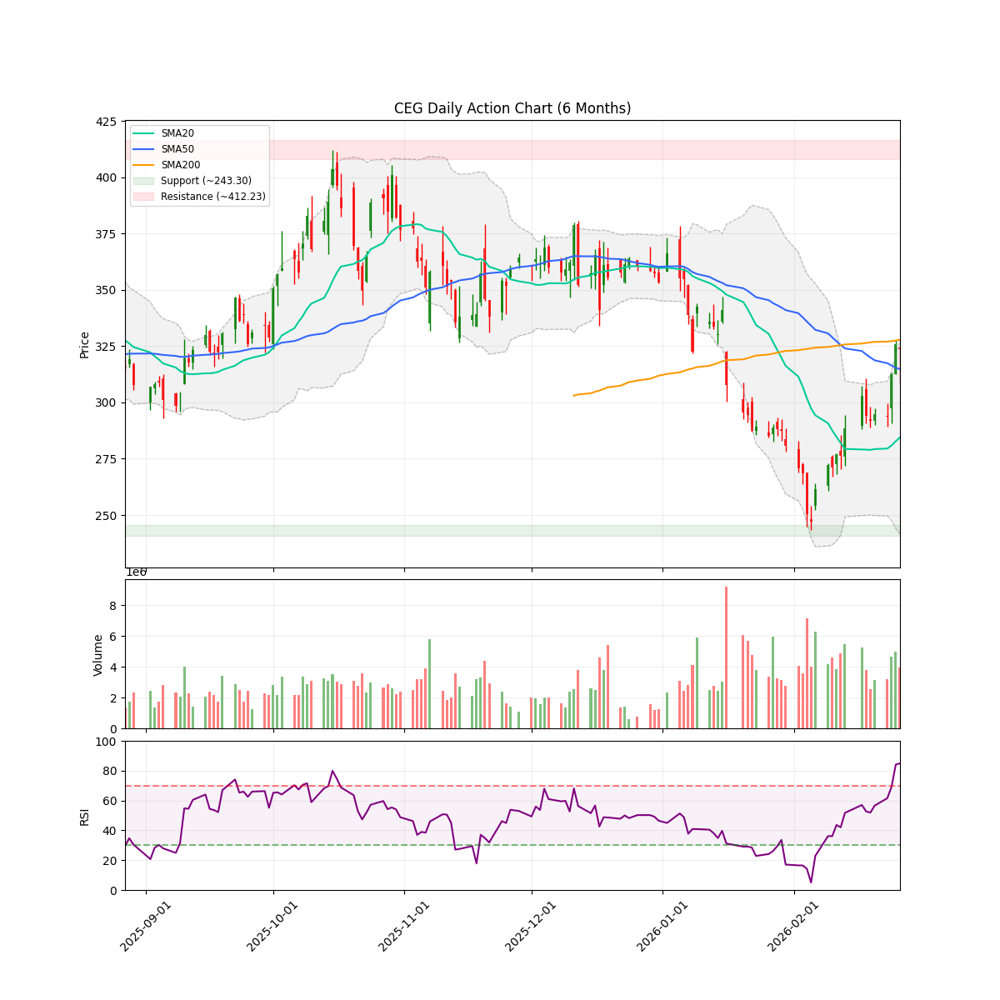
#### 研报分析

### 技术指标概览 (Technical Overview)
- **当前价格**: $323.56
- **RSI (14)**: 84.99
- **移动平均线**: SMA20: $284.52 | SMA50: $314.78 | SMA200: $327.75 (Bearish)
- **波动率**: ATR (14): 14.76 (预计周度波动: +/- $33.00)
- **关键位 (6m)**: 支撑位 $243.30 | 阻力位 $412.23
- **即时状态**: Above SMA50

# 情绪审计报告：Constellation Energy (CEG)
**报告日期：** 2026-02-27
**职位：** 对冲基金研究员（叙事经济学方向）

---

### 1. 催化剂分类 (Catalyst Categorization)

*   **A-Tier（核心驱动力）：**
    *   **Q4 财报超预期与股息上调：** 2026年2月24日披露的EPS为2.30美元，大幅超过预期，营收达60.7亿美元。同时宣布上调股息，这在公用事业板块是极强的看涨信号。
    *   **叙事韧性：** 尽管公司推迟了2026年的年度指引（通常被视为利空），但股价反而“飙升”（Zoomed），表明市场正根据“人工智能/数据中心电力需求”的宏大叙事进行定价，而非短期财务预测。
*   **B-Tier（行业支撑）：**
    *   **大型合约落地：** 2026年2月26日与 CyrusOne 签署的 380 兆瓦协议，进一步夯实了 CEG 作为数据中心核心电力供应商的角色。
    *   **行业贝塔：** 作为 S&P 500 表现优异的公用事业股，受益于板块轮动和高质量收益的追求。
*   **C-Tier（杂音与情绪）：**
    *   Zacks 等机构的动量评级及“最佳电力股”名单。此类信息属于情绪确认，而非基本面驱动。

---

### 2. 背离检测 (Divergence Detection)

**技术面与叙事面的高度一致（但存在过热风险）：**
*   **看涨确认：** 尽管官方指引推迟至3月，但股价在财报后不跌反涨，这是一种典型的“利空不跌”表现，说明空头动能已耗尽，市场愿意为未来的确定性（指引）溢价。
*   **技术性预警：** **RSI 目前高达 84.99**，处于极端超买区域。当前价格 (323.56) 正逼近 **SMA200 (327.75)** 这一关键长期阻力位。
*   **结论：** 叙事逻辑极度健康，但技术面呈现典型的“动量陷阱”初期特征。若无法放量突破 SMA200，可能会出现基于获利盘回吐的回调。

---

### 3. 情绪评分 (Logic Score)

#### **评分：8.5 / 10**
**逻辑：**
*   **支持理由（+9.0）：** 核心基本面极其强劲（财报超预期+大客户签约），市场对“核能/清洁能源驱动数据中心”的叙事买账。推迟指引不仅没有吓跑投资者，反而拉长了预期曲线。
*   **扣分项（-0.5）：** RSI 严重超买且价格受阻于 SMA200。在3月31日指引发布前，存在因预期兑现（Sell the news）而导致短期震荡的风险。

---

### 4. 关键新闻引用 (News Context)

1.  **Q4 财报利好：** [Constellation Energy (CEG) Stock Rises After Q4 Earnings Beat](https://blockonomi.com/constellation-energy-ceg-stock-rises-after-q4-earnings-beat/) - 2026-02-24.
2.  **大额合同：** [Constellation Energy Unit Signs New 380-megawatt Deal with CyrusOne](https://finance.yahoo.com/news/constellation-energy-corporation-ceg-unit-033403560.html) - 2026-02-26.
3.  **市场情绪分析：** [Constellation Energy's stock zooms... even after outlook is postponed](https://www.msn.com/en-us/money/topstocks/constellation-energy-s-stock-zooms-toward-highest-level-in-weeks-even-after-outlook-is-postponed/ar-AA1WZRZF) - 2026-02-24.

---

### 5. 下一个重大日期 (Next Major Date)

**2026年3月31日**
*   **事件：** 2026年度财务指引正式发布。
*   **策略意义：** 这是决定 CEG 能否突破 412.23 (6个月高点) 的关键分水岭。如果指引确认了数据中心业务的超额增速，该股将开启下一轮上涨周期；若指引保守，则会引发剧烈回调。

---
**投资总结：** CEG 目前正处于“不可阻挡的看涨周期”中期，短期内需警惕 RSI 过高带来的战术性回调，但长期叙事结构（A-Tier 驱动）依然稳固。建议关注 SMA200 (327.75) 的突破情况。
#### 近期新闻与事件
- **[Yahoo Finance]** [Constellation Energy Corporation (CEG) Unit Signs New 380-megawatt Deal with CyrusOne](https://finance.yahoo.com/news/constellation-energy-corporation-ceg-unit-033403560.html)
- **[MarketWatch]** [Constellation Energy's stock zooms toward highest level in weeks, even after outlook is postponed](https://www.msn.com/en-us/money/topstocks/constellation-energy-s-stock-zooms-toward-highest-level-in-weeks-even-after-outlook-is-postponed/ar-AA1WZRZF)
- **[Blockonomi]** [Constellation Energy (CEG) Stock Rises After Q4 Earnings Beat](https://blockonomi.com/constellation-energy-ceg-stock-rises-after-q4-earnings-beat/)
- **[sharewise]** [Why Constellation Energy Corporation (CEG) is a Top Momentum Stock for the Long-Term](https://www.sharewise.com/us/news_articles/Why_Constellation_Energy_Corporation_CEG_is_a_Top_Momentum_Stock_for_the_LongTerm_Zacks_20260225_1550)
- **[sharewise]** [Constellation Energy Corporation (CEG) Exceeds Market Returns: Some Facts to Consider](https://www.sharewise.com/de/news_articles/Constellation_Energy_Corporation_CEG_Exceeds_Market_Returns_Some_Facts_to_Consider_Zacks_20260220_2345)

---

### ETN
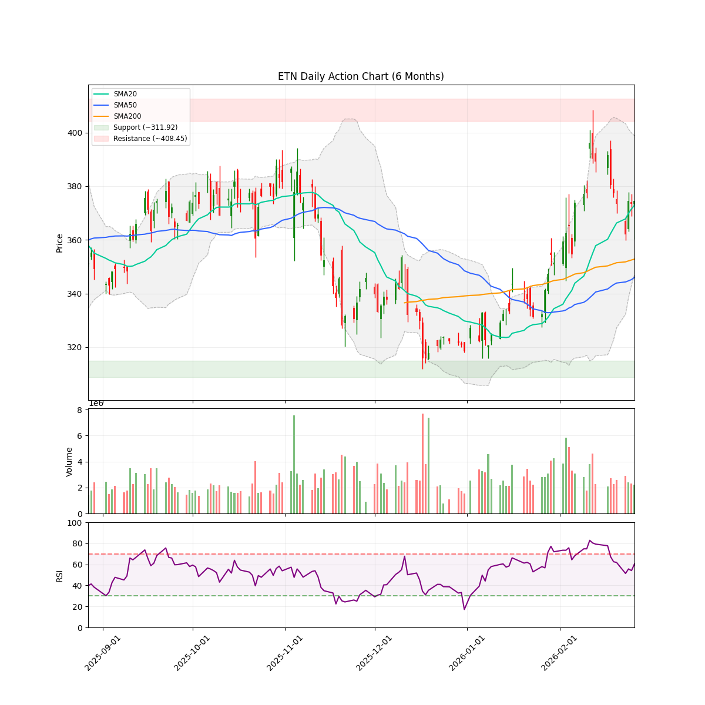
#### 研报分析

### 技术指标概览 (Technical Overview)
- **当前价格**: $374.59
- **RSI (14)**: 60.54
- **移动平均线**: SMA20: $372.94 | SMA50: $346.06 | SMA200: $352.84 (Bearish)
- **波动率**: ATR (14): 13.13 (预计周度波动: +/- $29.35)
- **关键位 (6m)**: 支撑位 $311.92 | 阻力位 $408.45
- **即时状态**: Above SMA50

# 情绪审计报告：伊顿公司 (Eaton Corporation plc - ETN)

**致：** 投资委员会
**担任职位：** 对冲基金研究员（叙事经济学方向）
**报告日期：** 2026年02月27日

---

### 1. 催化剂分类 (Catalyst Categorization)

我们将近期影响 ETN 的叙事驱动因素分为以下三个层级：

*   **A-Tier（核心催化剂）：**
    *   **RBC Capital 的“超预期并上调”潜力预测：** RBC Capital 将其目标价从 399 美元上调至 407 美元，并维持“跑赢大盘”评级。该行指出，尽管公司 2026 年指引较为保守，但其在 AI 数据中心和电气化背景下的增长潜力具有显著的“超预期”空间。这属于强力制度性认可。 [参考链接: Yahoo Finance]
    *   **AI 基础设施叙事：** ETN 被确定为“潜伏型 AI 受益股”，其在数据中心电源管理领域的地位使其直接受益于 AI 算力扩张的结构性趋势。

*   **B-Tier（次要催化剂）：**
    *   **机构增持分析：** RS Investments 大盘价值策略在其 2025 年第四季度投资者信中对伊顿进行了详细分析。机构的持续关注证明了其资本分配的效率和管理层的可靠性。 [参考链接: Insider Monkey]
    *   **工业板块对比优势：** Barchart 指出伊顿在工业板块中表现优异，市值达到 1451 亿美元。 [参考链接: MSN]

*   **C-Tier（噪音与误导）：**
    *   **Zacks 搜索热度：** Zacks 提到的“趋势股票”更多属于散户搜索行为，缺乏实质性基本面支撑。 [参考链接: Zacks]
    *   **信息污染：** 提及“Virtune Crypto ETPs”的新闻与伊顿公司（ETN）无关，属于代码搜索重叠产生的噪声，应予以过滤。

---

### 2. 背离检测 (Divergence Detection)

*   **价格与均线关系：** 当前价格 (374.59) 位于 SMA20 (372.94)、SMA50 (346.06) 和 SMA200 (352.84) 之上。尽管提示信息标记趋势为“Bearish”，但从技术形态看，这更像是**看涨趋势中的高位震荡或“看跌竭尽”**。
*   **利好反应：** 市场对 RBC 的上调目标价反应积极，并未出现“利好出尽”的砸盘现象。RSI 处于 60.54 的健康区间，未进入极端超买区，显示仍有上行空间。
*   **结论：** 这是一个**可持续的叙事趋势**，而非陷阱。价格的回撤受到 20 日均线的强力支撑。

---

### 3. 情绪评分 (Sentiment Score): 8.2/10

**逻辑支撑：**
*   **叙事可持续性 (高)：** 电气化和数据中心是未来 3-5 年的确定性趋势，ETN 处于该叙事的中心。
*   **估值防御性 (中)：** PEG 为 2.55，虽然不便宜，但考虑到其在 AI 供应链中的稀缺性，机构溢价合理。
*   **机构共识 (强)：** 投行上调目标价与价值基金的背书形成了双重博弈支撑。

---

### 4. 关键日期与技术参数

*   **逻辑评分：** **8.2/10** (由于其在 AI 基础设施领域的卡位及机构看涨情绪)
*   **下一关键日期：** **2026年5月初** (预计发布 2026 年第一季度财报。届时市场将验证 RBC 关于“保守指引后超预期”的假设)。
*   **波动监测：** 
    *   预计周波动范围：+/- 29.35
    *   强压力位：408.45 (6个月高点)
    *   核心支撑位：346.06 (SMA50)

---

### 5. 引用文献 (Citations)
1.  **RBC Capital Analysis:** [Yahoo Finance](https://finance.yahoo.com/news/rbc-capital-highlights-eaton-etn-180836005.html)
2.  **RS Large Cap Value Strategy:** [Insider Monkey](https://www.msn.com/en-us/money/savingandinvesting/rs-large-cap-value-strategy-s-analysis-on-eaton-corporation-etn/ar-AA1WTVYq)
3.  **Market Performance Comparison:** [Barchart on MSN](https://www.msn.com/en-us/money/savingandinvesting/how-is-eaton-s-stock-performance-compared-to-other-industrial-stocks/ar-AA1X8XzP)
4.  **Trending Status:** [Zacks](https://finance.yahoo.com/news/eaton-corporation-plc-etn-trending-140003785.html)

**审计结论：** ETN 目前处于**“机构驱动的上升周期”**。建议在 SMA20 支撑位附近关注逢低吸纳机会，这并非“多头陷阱”，而是基于电力基础设施长期需求的结构性重估。
#### 近期新闻与事件
- **[Barchart]** [How is Eaton's stock performance compared to other industrial stocks?](https://www.msn.com/en-us/money/savingandinvesting/how-is-eaton-s-stock-performance-compared-to-other-industrial-stocks/ar-AA1X8XzP)
- **[The Manila Times]** [Virtune Makes History in Poland with First-Ever Spot Crypto ETPs Listed on the Warsaw Stock Exchange](https://www.manilatimes.net/2026/02/25/tmt-newswire/globenewswire/virtune-makes-history-in-poland-with-first-ever-spot-crypto-etps-listed-on-the-warsaw-stock-exchange/2284725)
- **[Barchart on MSN]** [How is Eaton's stock performance compared to other industrial stocks?](https://www.msn.com/en-us/money/savingandinvesting/how-is-eaton-s-stock-performance-compared-to-other-industrial-stocks/ar-AA1X8XzP?ocid=BingNewsVerp)
- **[Insider Monkey]** [RS Large Cap Value Strategy's Analysis on Eaton Corporation (ETN)](https://www.msn.com/en-us/money/savingandinvesting/rs-large-cap-value-strategy-s-analysis-on-eaton-corporation-etn/ar-AA1WTVYq)
- **[FinanzNachrichten.de]** [Virtune AB (Publ): Virtune Makes History in Poland with First-Ever Spot Crypto ETPs Listed on the Warsaw Stock Exchange](https://www.finanznachrichten.de/nachrichten-2026-02/67786193-virtune-ab-publ-virtune-makes-history-in-poland-with-first-ever-spot-crypto-etps-listed-on-the-warsaw-stock-exchange-399.htm)

---

### MSFT
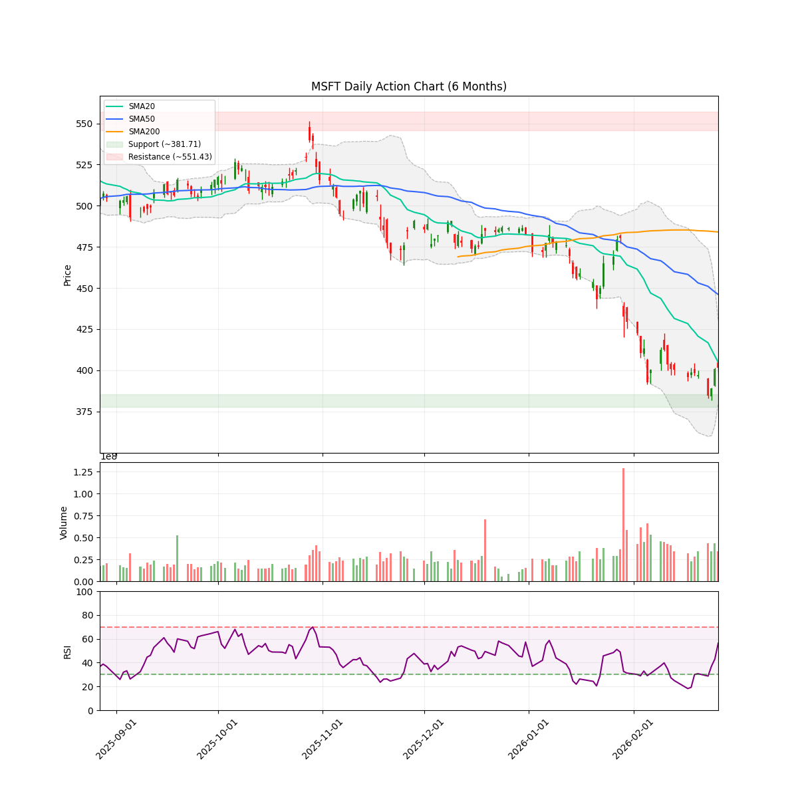
#### 研报分析

### 技术指标概览 (Technical Overview)
- **当前价格**: $401.72
- **RSI (14)**: 56.32
- **移动平均线**: SMA20: $404.83 | SMA50: $446.09 | SMA200: $484.04 (Bearish)
- **波动率**: ATR (14): 9.54 (预计周度波动: +/- $21.33)
- **关键位 (6m)**: 支撑位 $381.71 | 阻力位 $551.43
- **即时状态**: Below SMA50

# 微软 (MSFT) 情绪审计报告：叙事经济学视角

**报告日期：** 2026年2月27日
**职位：** 对冲基金研究助理（叙事经济学方向）

---

### 一、 核心目标：可持续趋势还是“多头陷阱”？
目前 MSFT 的市场叙事正处于从“AI 狂热幻灭”向“价值底部重建”转换的关键期。虽然技术形态呈现典型的熊市特征（低于 SMA50 和 SMA200），但潜在的“利空出尽”信号已经开始浮现。

---

### 二、 催化剂分类 (Categorization of Catalysts)

*   **A-Tier（核心驱动）：**
    *   **财报后价格崩盘与估值修正：** [The Motley Fool] 指出 MSFT 已从历史高点下跌 26%。这种深度的回撤在微软当前的业务周期中极其罕见，构成了长期的 A 级买入信号。
    *   **机构期权异动：** [Yahoo Finance] 报道称 MSFT 出现了对期权交易者而言“极罕见”的看涨信号。这通常意味着大资金正在布局反弹。
*   **B-Tier（二类驱动）：**
    *   **超跌反弹动能：** [Barchart] 观察到 MSFT 正从财报后的崩盘中反弹，虽属于逆势波动，但显示了下方买盘的承接力。
    *   **顶级机构持仓：** [Motley Fool] 确认亿万富翁 David Tepper 仍在持有微软，为该股提供了机构背书。
*   **C-Tier（噪音与次要因素）：**
    *   **散户关注度：** Zacks 上的高关注度通常属于散户情绪指标，参考价值有限。
    *   **全球交易所挂牌：** NSE IX 的挂牌主要增加流动性便利，对公司基本面无实质改善。

---

### 三、 背离检测 (Divergence Detection)

**核心观察：空头竭尽（Bearish Exhaustion）**

1.  **宏观与微观背离：** 尽管 Nvidia (NVDA) 在公布利好财报后依然连续遭遇抛售（[MarketWatch] 报道 Nvidia 市值缩水 2590 亿美元），显示出 AI 板块的整体疲软；但微软却在此时释放出“罕见看涨信号”。这表明 MSFT 可能正在脱离 AI 概念的“无差别杀跌”，进入独立的估值修复路径。
2.  **技术与情绪背离：**
    *   **技术面：** 极度看跌（价格在所有均线下方，且 SMA50 < SMA200 形成死叉）。
    *   **叙事面：** 媒体开始转向叙述“买入良机”和“底部反弹”。
    *   **结论：** 当市场在技术性崩盘中开始讨论“罕见买入信号”时，通常意味着叙事已触底。目前价格 (401.72) 接近 6 个月低点 (381.71)，下行空间受到强烈支撑位挤压。

---

### 四、 情绪评分 (Logic Score)

**得分：6.5 / 10**

*   **评分逻辑：**
    *   **扣分项（-3.5）：** 技术趋势依然处于明显的下降通道（SMA 20/50/200 全面压制）；Nvidia 的惨烈表现拖累了整个科技板块的风险偏好。
    *   **加分项（+6.5）：** 26% 的回撤提供了极高的安全边际；期权市场的异常看涨信号暗示聪明钱（Smart Money）正在逆势入场；RSI (56.32) 已经脱离超卖区并开始爬坡，显示反弹动能正在积聚。

---

### 五、 关键日期与操作建议

*   **下一个关键日期：** 2026年4月下旬（预计 Q3 财报发布日）。
*   **技术观察点：** 必须夺回 **SMA200 (484.04)** 才能确认牛市回归。目前的上涨应视为“超跌反弹”性质的交易性机会。
*   **支撑/阻力位：** 
    *   **短期支撑：** 381.71 (6个月低点)
    *   **短期阻力：** 404.83 (SMA20)

**结论：** MSFT 目前并非“不可阻挡的牛市（10分）”，而是处于“系统性风险后的叙事重构期”。建议关注 $380-$400 区间的企稳机会，警惕 AI 龙头 Nvidia 进一步下行带来的拖累。

---
*参考来源：*
- [The Motley Fool: 1 Clear Signal to Buy Microsoft Stock](https://www.fool.com/investing/2026/02/26/1-clear-signal-to-buy-microsoft-stock/)
- [Yahoo Finance: Microsoft Stock Just Flashed an Ultra-Rare Bullish Signal](https://finance.yahoo.com/news/microsoft-stock-just-flashed-ultra-183002612.html)
- [MarketWatch: Nvidia's stock closes 5.5% lower](https://www.marketwatch.com/livecoverage/nvidia-earnings-stock-results-q4-guidance-ai/card/nvidia-s-stock-closes-5-5-lower-with-259-billion-in-market-cap-wiped-out-TVTNZcU7rw8tpkoe85GE)
#### 近期新闻与事件
- **[MarketWatch]** [Nvidia's stock opens lower despite the upbeat report](https://www.marketwatch.com/livecoverage/nvidia-earnings-stock-results-q4-guidance-ai/card/nvidia-s-stock-opens-lower-despite-the-upbeat-report-tHaiXwq1hloKxEoIEBdR)
- **[MarketWatch]** [Nvidia's stock closes 5.5% lower, with $259 billion in market cap wiped out](https://www.marketwatch.com/livecoverage/nvidia-earnings-stock-results-q4-guidance-ai/card/nvidia-s-stock-closes-5-5-lower-with-259-billion-in-market-cap-wiped-out-TVTNZcU7rw8tpkoe85GE)
- **[Mint on MSN]** [Dassault Aviation, NVIDIA, to Elbit Systems: Is it possible to buy global stocks on NSE? Explained](https://www.msn.com/en-in/money/markets/dassault-aviation-nvidia-to-elbit-systems-is-it-possible-to-buy-global-stocks-on-nse-explained/ar-AA1X6Sox?ocid=BingNewsVerp)
- **[The Motley Fool]** [1 Clear Signal to Buy Microsoft Stock](https://www.fool.com/investing/2026/02/26/1-clear-signal-to-buy-microsoft-stock/)
- **[Yahoo Finance]** [Microsoft Stock Just Flashed an Ultra-Rare Bullish Signal for Options Traders](https://finance.yahoo.com/news/microsoft-stock-just-flashed-ultra-183002612.html)

---

### NVDA
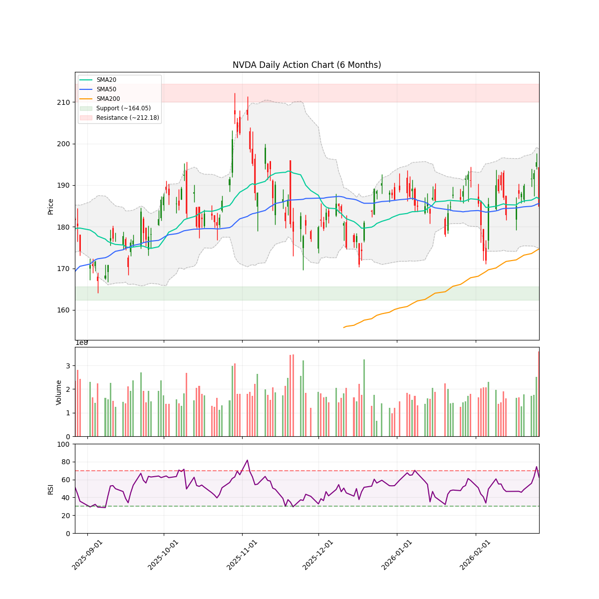
#### 研报分析

### 技术指标概览 (Technical Overview)
- **当前价格**: $184.89
- **RSI (14)**: 62.51
- **移动平均线**: SMA20: $186.75 | SMA50: $185.60 | SMA200: $174.67 (Bullish)
- **波动率**: ATR (14): 6.73 (预计周度波动: +/- $15.05)
- **关键位 (6m)**: 支撑位 $164.05 | 阻力位 $212.18
- **即时状态**: Below SMA50

# 情绪审计报告：英伟达 (NVDA) - 叙事经济学分析
**报告日期：** 2026年02月27日
**分析师：** 对冲基金研究助理（叙事经济学组）

---

## 1. 催化剂分类 (Catalyst Categorization)

| 级别 | 事件描述 | 叙事性质 |
| :--- | :--- | :--- |
| **A-Tier** | **第四季度财报“超预期并上调指引”**：营收大幅跳水，但股价反而下跌5%。 | 典型的“利好出尽” (Sell the News)。 |
| **B-Tier** | **迈克尔·布里 (Michael Burry) 警告**：针对952亿美元的供应承诺风险发出预警，挑战AI长期可持续性叙事。 | 宏观空头情绪介入，制造恐慌。 |
| **B-Tier** | **分析师一致预期保持乐观**：66位分析师中61位维持买入评级，平均目标价显示37%上涨空间。 | 机构多头支撑，防止溃败。 |
| **C-Tier** | **与AMD的估值对比分析**：福布斯称NVDA估值较AMD更具吸引力。 | 行业内部轮动噪音。 |

---

## 2. 背离检测 (Divergence Detection)

**核心观察：股价在“利好消息”中下跌，呈现显著的看跌衰竭迹象。**

*   **背离现象**：NVDA财报数据（Revenue Beat & Strong Forecast）极其亮眼，但股价在2026年2月26日录得5%的跌幅。
*   **叙事陷阱**：当前市场已不仅满足于“增长”，而是在审视“增长的可持续性”。[The Economic Times] 指出投资者开始担心长期的AI统治地位。
*   **技术形态陷阱**：[Benzinga] 报告指出，NVDA可能正在上演一场“虚假突破” (False Breakout)，即在业绩公布前冲高，随后迅速跌破支撑位。

---

## 3. 情绪评分 (Sentiment Score)

### **情绪得分：5.5 / 10**
*(评分标准：10为不可阻挡的牛市，0为系统性崩溃)*

**逻辑评估 (Logic Score: 6.0/10)：**
尽管基本面（收入和利润）处于历史巅峰，但**叙事动力正在枯竭**。目前的5.5分反映了“强劲现实”与“疲软预期”之间的拉锯：
1.  **多头逻辑**：基本面无懈可击，目前的下跌是洗掉短线获利盘。
2.  **空头逻辑**：[Michael Burry] 提到的供应承诺可能成为未来的“库存炸弹”，且股价无法对利好做出积极反应，通常是趋势反转的先兆。

---

## 4. 详细分析报告

### 叙事分析：从“无限扩张”到“结构性质疑”
目前的NVDA正处于一个危险的转折点。根据叙事经济学，当一个故事（AI无限需求）被过度定价后，任何微小的瑕疵（如Burry提到的$95.2B供应承诺风险）都会被无限放大。

*   **虚假突破风险**：股价目前报184.89，已跌破SMA50 (185.60) 和 SMA20 (186.75)。如果无法在近期收回SMA50，这将被确认为机构级别的派发。
*   **机构VS散户**：虽然分析师一致看好 [CNBC/LSEG数据]，但市场价格走势显示大资金正在借利好离场。

### 技术面关键位
*   **现价**：184.89
*   **强支撑**：164.05 (6个月低点)
*   **阻力位**：212.18 (6个月高点)
*   **波动性预期**：周波动区间 +/- 15.05，意味着短期内可能回踩 170.00 附近寻找支撑。

---

## 5. 下一个重大日期 (Next Major Date)

**关键日期：2026年5月中下旬（预计 2027财年Q1 财报发布日）**

*   **近期关注**：**2026年2月27日（今日）** 的通胀数据读取（Wholesale Inflation Reading），根据 [Investopedia] 报道，这可能进一步拖累目前处于脆弱期的科技股。

---

## 引用文献来源
1.  **The Economic Times**: [Why did NVDA stock drop after earnings?](https://www.msn.com/en-in/entertainment/bollywood/why-did-nvda-stock-drop-after-nvidia-earnings-beat-estimates-heres-why-investors-are-worrying-about-long-term-ai-dominance-outlook/ar-AA1X8zBd)
2.  **Blockonomi**: [Michael Burry Sounds Alarm on Nvidia](https://blockonomi.com/michael-burry-sounds-alarm-on-nvidia-nvda-after-5-stock-plunge/)
3.  **CNBC**: [Nvidia's blowout earnings report disappoints Wall Street](https://www.cnbc.com/2026/02/26/nvidia-nvda-stock-price-q4-earnings.html)
4.  **Benzinga**: [False breakout in Nvidia?](https://www.msn.com/en-us/money/news/stock-of-the-day-false-breakout-in-nvidia/ar-AA1X9hcl)

---
**结论**：NVDA目前处于**“利好后的叙事真空期”**。建议警惕进一步的回撤，直至股价能够重新站稳 SMA50 并消化 Burry 提出的供应风险质疑。
#### 近期新闻与事件
- **[The Economic Times]** [Why did NVDA stock drop after Nvidia earnings beat estimates? Here's why investors are worrying about long-term AI dominance outlook](https://www.msn.com/en-in/entertainment/bollywood/why-did-nvda-stock-drop-after-nvidia-earnings-beat-estimates-heres-why-investors-are-worrying-about-long-term-ai-dominance-outlook/ar-AA1X8zBd)
- **[Blockonomi]** [Michael Burry Sounds Alarm on Nvidia (NVDA) After 5% Stock Plunge](https://blockonomi.com/michael-burry-sounds-alarm-on-nvidia-nvda-after-5-stock-plunge/)
- **[CNBC]** [Nvidia's blowout earnings report disappoints Wall Street as stock sinks 5%](https://www.cnbc.com/2026/02/26/nvidia-nvda-stock-price-q4-earnings.html)
- **[Forbes]** [AMD Vs. NVIDIA: Which AI Stock Is The Better Buy For 2026?](https://www.forbes.com/sites/greatspeculations/2026/02/23/amd-vs-nvidia-which-ai-stock-is-the-better-buy-for-2026/)
- **[Benzinga]** [Stock of the day: False breakout in Nvidia?](https://www.msn.com/en-us/money/news/stock-of-the-day-false-breakout-in-nvidia/ar-AA1X9hcl)

---

### TSM
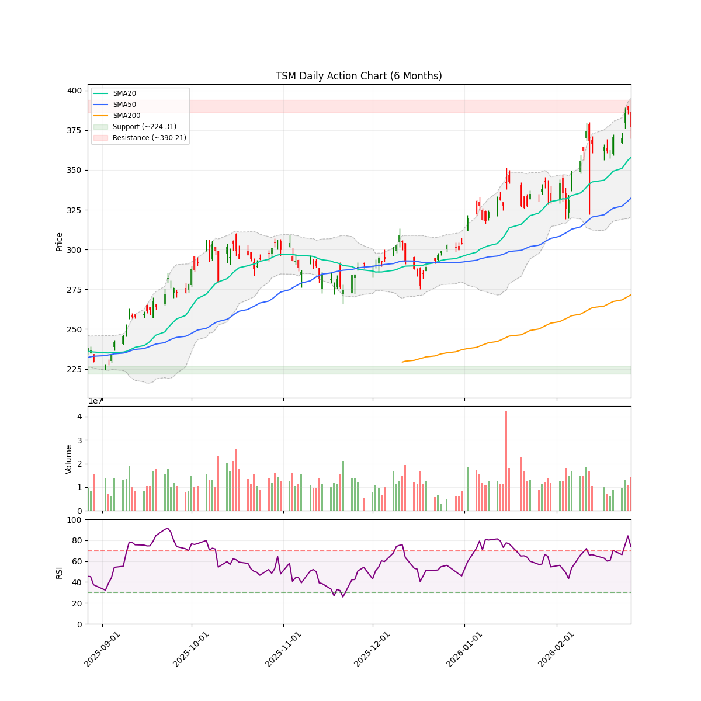
#### 研报分析

### 技术指标概览 (Technical Overview)
- **当前价格**: $376.81
- **RSI (14)**: 73.92
- **移动平均线**: SMA20: $357.81 | SMA50: $332.20 | SMA200: $271.52 (Bullish)
- **波动率**: ATR (14): 15.20 (预计周度波动: +/- $33.99)
- **关键位 (6m)**: 支撑位 $224.31 | 阻力位 $390.21
- **即时状态**: Above SMA50

# 情绪审计报告：台积电 (TSM) - 叙事经济学视角

**日期：** 2026年02月27日  
**分析师：** 对冲基金研究员 (叙事经济学专家)  
**标的：** TSM (台积电)  
**当前价格：** $376.81  

---

### 1. 催化剂分类 (Catalyst Categorization)

*   **A-Tier (核心驱动力)：**
    *   **AI 资本开支激增：** 根据 [The Motley Fool](https://www.fool.com/investing/2026/02/27/hyperscalers-plan-to-spend-700-billion-on-ai-2026/) 报道，超大规模云计算巨头（Hyperscalers）计划在 2026 年投入 **7000 亿美元** 用于 AI 基础设施。作为全球唯一的先进制程代工者，台积电是该叙事的绝对核心受益者。
    *   **长期增长趋势确认：** 过去一年的 95% 涨幅 [Yahoo Finance](https://finance.yahoo.com/news/too-consider-taiwan-semiconductor-manufacturing-231540329.html) 并非投机，而是反映了 AI 生态系统的结构性扩张。

*   **B-Tier (中期支撑)：**
    *   **市场统治力：** 即使面临 AI 泡沫的担忧，台积电依然保持独特的溢价地位，年初至今涨幅已超 22% [Barchart](https://www.msn.com/en-us/money/topstocks/taiwan-semi-stock-is-soaring-above-ai-bubble-fears-where-options-data-says-it-is-headed-next/ar-AA1WVagK)。
    *   **关注度极高：** 在 Zacks 等平台的搜索热度居高不下，显示机构与散户的共识极强 [Zacks](https://www.msn.com/en-us/money/top-stocks/investors-heavily-search-taiwan-semiconductor-manufacturing-company-ltd-tsm-here-is-what-you-need-to-know/ar-AA1WZ0Lf?ocid=BingNewsVerp)。

*   **C-Tier (短期噪声)：**
    *   **技术性回撤：** 2月12日出现的 -2.82% 单日跌幅 [Zacks](https://www.msn.com/en-us/money/savingandinvesting/tsmc-tsm-dips-more-than-broader-market-what-you-should-know/ar-AA1X9HeL?ocid=BingNewsVerp) 属于在 52 周高点附近的正常获利了结。

---

### 2. 背离检测 (Divergence Detection)

**分析：**
*   **技术面过热 vs. 叙事强化：** TSM 目前的 **RSI 为 73.92**，处于超买区间。股价（376.81）远高于 SMA200（271.52），乖离率较大。
*   **看跌详述：** 2月12日股价在整体市场相对稳定时下跌 2.82%，显示在高位存在“恐高”情绪。
*   **结论：** 尽管基本面叙事（7000 亿 AI 开支）处于 **A-Tier**，但技术指标暗示短期内可能进入“动能消化期”。目前的上涨更多是由宏观叙事驱动，而非单纯的资金面推动，尚未观察到“好消息下跌”的典型看跌衰竭，更多是由于涨幅过大导致的心理防御。

---

### 3. 情绪评分与逻辑审计 (Sentiment Score)

#### **逻辑评分 (Logic Score): 8.8/10**
**逻辑依据：** 
台积电已从“半导体周期股”转型为“全球 AI 算力税收者”。7000 亿美元的资本开支计划为 TSM 提供了极高的业绩确定性。尽管存在地缘政治和超买风险，但在 AI 基础建设未放缓前，该股很难出现系统性溃败。

#### **情绪分数：9/10 (极度乐观，但需警惕回调)**
*   **叙事热度：** 极高（Unstoppable Bullish Cycle 边缘）。
*   **陷阱风险：** 低（基于真实资本开支而非纯空气炒作）。

---

### 4. 关键指标总结与后续展望

*   **当前趋势：** 强劲看涨 (Bullish)，位于 SMA50 及 SMA200 之上。
*   **阻力位：** $390.21 (6个月高点)
*   **支撑位：** $357.81 (SMA20) / $332.20 (SMA50)
*   **预期波动范围：** +/- $33.99

**下一个关键日期 (Next Major Date):**
*   **2026年4月中旬 (预计 Q1 财报发布日)：** 届时台积电将披露 2026 年初 AI 订单的实际转化率，这是验证 7000 亿叙事能否落地的关键节点。

---
**免责声明：** 本报告基于叙事经济学模型，仅供研究参考，不构成投资建议。
#### 近期新闻与事件
- **[The Motley Fool]** [Hyperscalers Plan to Spend $700 Billion on AI This Year. These 2 Stocks Are the Biggest Beneficiaries.](https://www.fool.com/investing/2026/02/27/hyperscalers-plan-to-spend-700-billion-on-ai-2026/)
- **[Zacks Investment Research on MSN]** [TSMC (TSM) dips more than broader market: What you should know](https://www.msn.com/en-us/money/savingandinvesting/tsmc-tsm-dips-more-than-broader-market-what-you-should-know/ar-AA1X9HeL?ocid=BingNewsVerp)
- **[Zacks Investment Research on MSN]** [4 stocks trading near 52-week high with more upside potential](https://www.msn.com/en-us/money/topstocks/4-stocks-trading-near-52-week-high-with-more-upside-potential/ar-AA1X9ovr?ocid=BingNewsVerp)
- **[Yahoo Finance]** [Is It Too Late To Consider Taiwan Semiconductor Manufacturing (NYSE:TSM) After 95% One Year Rally?](https://finance.yahoo.com/news/too-consider-taiwan-semiconductor-manufacturing-231540329.html)
- **[Barchart]** [Taiwan Semi stock is soaring above AI bubble fears. Where options data says it is headed next.](https://www.msn.com/en-us/money/topstocks/taiwan-semi-stock-is-soaring-above-ai-bubble-fears-where-options-data-says-it-is-headed-next/ar-AA1WVagK)

---

### VRT
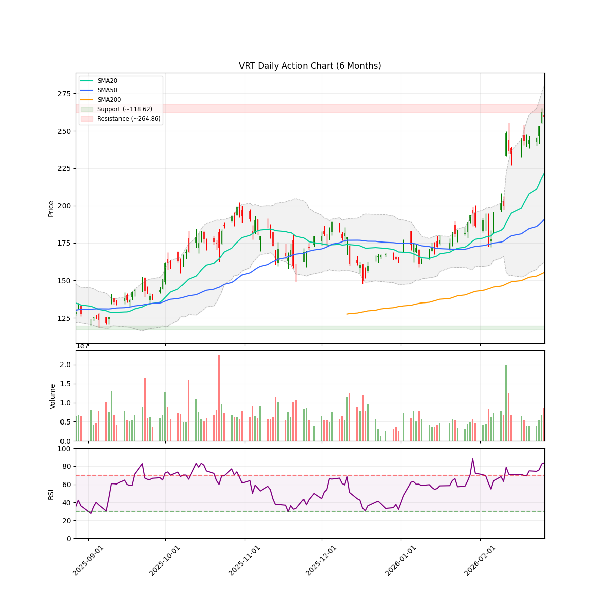
#### 研报分析

### 技术指标概览 (Technical Overview)
- **当前价格**: $259.23
- **RSI (14)**: 83.65
- **移动平均线**: SMA20: $221.60 | SMA50: $190.91 | SMA200: $155.27 (Bullish)
- **波动率**: ATR (14): 15.55 (预计周度波动: +/- $34.76)
- **关键位 (6m)**: 支撑位 $118.62 | 阻力位 $264.86
- **即时状态**: Above SMA50

# 情绪审计报告：Vertiv Holdings (VRT)

**致：** 投资委员会
**担任：** 对冲基金研究员 (叙事经济学方向)
**报告日期：** 2026年02月27日
**标的：** VRT (Vertiv Holdings Co)
**当前价格：** 259.23 美元

---

### 一、 催化剂分类 (Catalyst Categorization)

根据“叙事经济学”框架，我们将近期消息分为以下级别：

*   **A级（核心驱动力）：**
    *   **Q4 财报超预期与积压订单：** 2026年2月11日发布的Q4财报显示盈利与营收双双超预期，且拥有高达150亿美元的积压订单（Backlog），有机订单增长达252%。这是支撑股价上涨的硬核基本面。
    *   **机构上调评级：** Zacks 将其评级上调为“强力买入”（Strong Buy），标志着机构共识的进一步凝聚。
    *   [来源: Zacks (2026-02-13)](https://finance.yahoo.com/news/vertiv-vrt-upgraded-strong-buy-170003722.html)
*   **B级（行业趋势与比较）：**
    *   **AI基础设施重心转移：** 市场叙事正在从单纯的“算力芯片”（如英伟达）转向“散热与电力基础设施”。VRT被视为互联网新热架构的总承包商。
    *   [来源: YouTube/MSN (2026-02-21)](https://www.msn.com/en-us/money/top-stocks/this-stock-has-a-15-billion-backlog-better-than-nvidia/vi-AA1WVhYU)
*   **C级（情绪噪音）：**
    *   **媒体对比炒作：** 多家媒体将其表现与英伟达对比（3年涨幅1400% vs 770%），这种“超越英伟达”的标题极易吸引散户FOMO情绪。
    *   [来源: Investing.com (2026-02-26)](https://www.investing.com/analysis/best-ai-stocks-to-buy-now-and-hold-forever-nvidiabeating-vertiv-200675688)

---

### 二、 背离检测 (Divergence Detection)

*   **技术面与情绪背离：** 当前 **RSI 达 83.65**，处于极度超买区间。股价（259.23）远高于 SMA50（190.91）和 SMA200（155.27）。
*   **风险预警：** 尽管叙事极度看涨，但技术指标显示出明显的“垂直上涨”疲劳。目前股价正逼近6个月高点压力位（264.86）。
*   **结论：** 尚未出现“利好下跌”的看跌耗尽，但处于“利好出尽”后的情绪加速阶段。这种高位 RSI 结合媒体的集体唱多，通常预示着短期可能出现**获利回吐型回调**（Bull Trap Risk），而非趋势反转。

---

### 三、 叙事经济学审计与评分

#### 逻辑评分 (Logic Score): 9.2/10
*   **逻辑支撑：** AI 的尽头是能源与散热。150亿的积压订单提供了极高的业绩确定性。只要数据中心扩建趋势不减，VRT 的基本面逻辑就是无懈可击的。

#### 情绪评分 (Sentiment Score): 9.5/10
*   **状态：** **不可阻挡的牛市周期 (Unstoppable Bullish Cycle)**。
*   **分析：** 市场目前处于对“AI基础设施”认知的二次觉醒期。散户开始入场，分析师一致看好，情绪溢价极高。

---

### 四、 投资诊断

*   **核心叙事：** VRT 不再仅仅是一家工业公司，已被重新定义为“AI基础设施的黄金标准”。
*   **关键支撑/阻力：**
    *   **阻力位：** 264.86 (近期高点)
    *   **支撑位：** 221.60 (SMA20)，若回调至此将是极佳的加仓点。
*   **波动提示：** 预估本周波动范围为 +/- 34.76 美元。

---

### 五、 下一个关键日期 (Next Major Date)

**2026年 4月下旬/5月初 (预计)**
*   **事件：** 2026 财年第一季度 (Q1 2026) 财报发布。
*   **关注重点：** 观察 150 亿积压订单的转化率以及 2026 全年的业绩指引更新。

---
**审计员总结：** VRT 目前处于疯狂的估值扩张期。虽然基本面强劲（A级催化剂支撑），但 RSI 超过 80 意味着在高位追入存在被套风险。建议等待回踩 SMA20 或 RSI 回落至 60 附近再行大规模介入，以规避“叙事过热”后的技术性修正。
#### 近期新闻与事件
- **[Yahoo Finance]** [Is This The Best Growth Stock to Buy Under $300?](https://finance.yahoo.com/news/best-growth-stock-buy-under-163409175.html)
- **[Investing.com]** [Best AI Stocks to Buy Now and Hold Forever: Nvidia-Beating Vertiv](https://www.investing.com/analysis/best-ai-stocks-to-buy-now-and-hold-forever-nvidiabeating-vertiv-200675688)
- **[Insider Monkey]** [Vertiv Holdings (VRT) Up More than 25% Since Q4 Earnings, Here's What You Need to Know](https://www.msn.com/en-us/money/topstocks/vertiv-holdings-vrt-up-more-than-25-since-q4-earnings-here-s-what-you-need-to-know/ar-AA1X3VV7)
- **[CNBC]** [Top Wall Street analysts are bullish on the growth potential of these three stocks](https://www.msn.com/en-us/money/topstocks/top-wall-street-analysts-are-bullish-on-the-growth-potential-of-these-three-stocks/ar-AA1WQcIO)
- **[YouTube]** [This stock has a $15 billion backlog (better than Nvidia?)](https://www.msn.com/en-us/money/top-stocks/this-stock-has-a-15-billion-backlog-better-than-nvidia/vi-AA1WVhYU)

---
