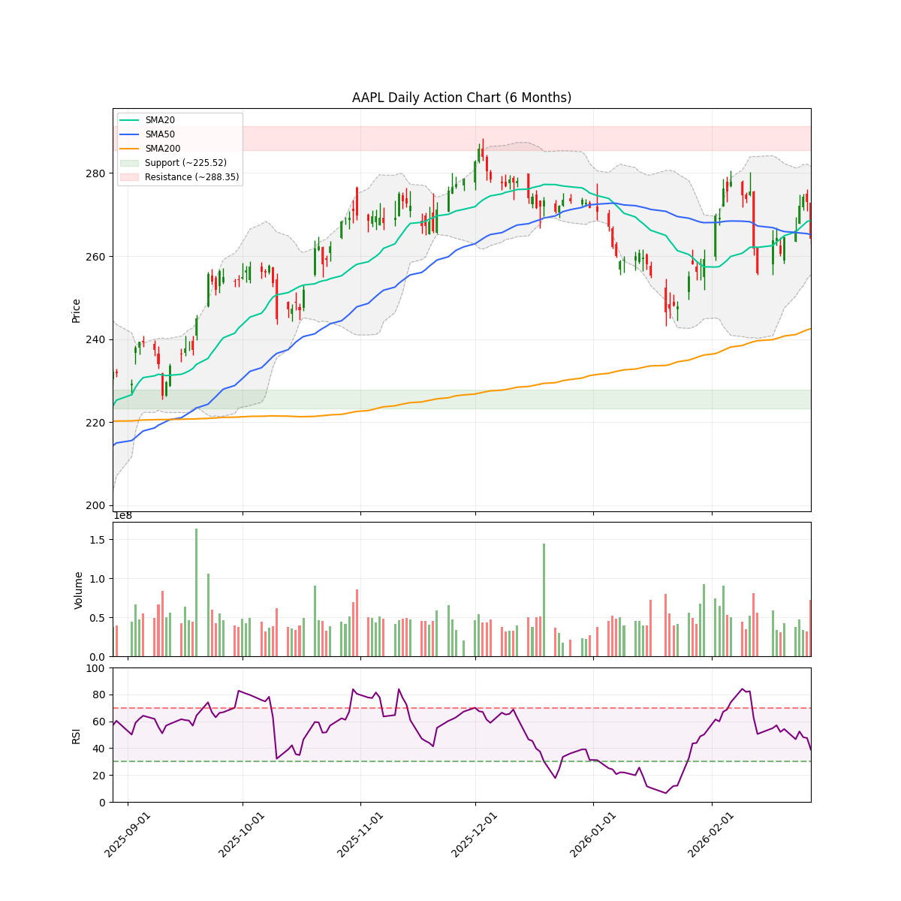
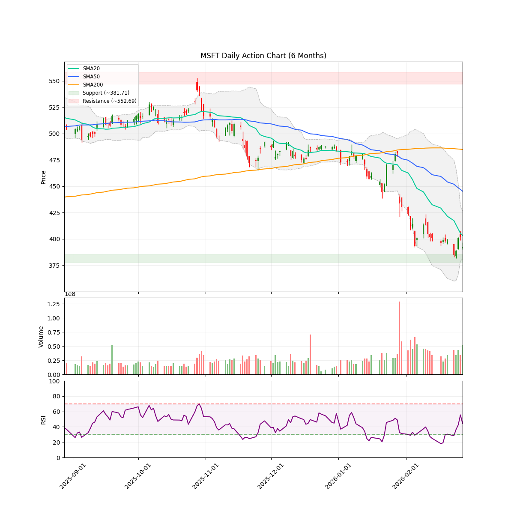

# 每日股市市场报告 (2026-02-28)

> **免责声明**: 本报告由 **代码与 Gemini AI 自动生成**，仅供研究参考，**不构成**任何投资建议。投资有风险，入市需谨慎。作者及 AI 不对任何基于此内容的投资决策承担责任。

## 📑 目录
[TOC]

##  长期投资逻辑
本组合旨在捕捉 **人工智能（AI）与半导体协议** 带来的跨周期结构性增长，核心投资策略聚焦于“确定性”与“物理瓶颈”：
- **底层制程垄断 (Foundry & WFE Moats)**：
  布局处于全球半导体精密制造顶端的“工业母机”级别公司。寻找具备极高准入门槛的晶圆代工及前道设备供应商，作为全产业链最稳固的底座资产。
- **算力稀缺性与连接带宽 (Compute & Interconnect Scarcity)**：
  聚焦在高性能计算芯（HPC）及高带宽连接领域占据主导地位的标的。AI 的终极竞争是“规模”，寻找能有效解决数据交换瓶颈并提供核心推理/训练能力的算力巨头。
- **应用生态与数据霸权 (Platform & Data Sovereignty)**：
  布局拥有闭环生态、海量高质量私有数据及云基础设施的科技巨头。它们是 AI 商业化落地的最终守门人，拥有将技术转化为持续现金流的分配权。
- **物理边界保障 (Power & Thermal Infrastructure)**：
  关注 AI 扩张的“最终瓶颈”——电力供应与热能管理。重点布局为下一代超大规模数据中心提供高功率密度能源、液冷技术及电网扩容方案的能源基建商。
**风控策略**：利用 AlphaJAX 的量化动量评分（Quant Score）作为过滤器，结合 LLM 叙事审计（Narrative Audit）捕捉“业绩超预期 + 叙事逻辑改善”的共振点，实现跨周期的超额收益。

 **注：排序权重**：Ticker 按照 AI 检测出的 **方向** 排序（**看多**优先，其次是 **中性**，最后是 **看空**）。
---

## 🔍 观察池机会分析

### AAPL

#### 研报分析
⚠️ **AI 分析已跳过**：用户在运行参数中指定了 `--no-ai`，本报告不包含大模型智能分析。
#### 近期新闻与事件
- **[Yahoo Finance]** [Apple (AAPL) closes above ___ on March 2?](https://finance.yahoo.com/markets/prediction/event/aapl-close-above-on-march-2-2026/)
- **[Insider Monkey]** [Apple (AAPL) Got The Best Free Ride, Says Jim Cramer](https://www.msn.com/en-us/money/topstocks/apple-aapl-got-the-best-free-ride-says-jim-cramer/ar-AA1X8eyF)
- **[The Globe and Mail]** [Before Retiring, Warren Buffett Dumped 77% of Berkshire's Stake in Amazon and Opened a New Position in a Stock That Has Become a Digital Media Juggernaut](https://www.theglobeandmail.com/investing/markets/stocks/AAPL/pressreleases/385132/before-retiring-warren-buffett-dumped-77-of-berkshires-stake-in-amazon-and-opened-a-new-position-in-a-stock-that-has-become-a-digital-media-juggernaut/)
- **[Benzinga]** [Apple, Microsoft, AppLovin and an energy stock: CNBC's 'Final Trades'](https://www.msn.com/en-us/money/news/apple-microsoft-applovin-and-an-energy-stock-cnbc-s-final-trades/ar-AA1WUdXQ)
- **[FX Empire]** [AMZN, AAPL and GOOG Forecasts - Tech Stocks Looking to Continue Upside](https://www.fxempire.com/forecasts/article/amzn-aapl-and-goog-forecasts-tech-stocks-looking-to-continue-upside-1581790)

---

### MSFT

#### 研报分析
⚠️ **AI 分析已跳过**：用户在运行参数中指定了 `--no-ai`，本报告不包含大模型智能分析。
#### 近期新闻与事件
- **[TheStreet]** [Goldman Sachs resets Microsoft stock forecast](https://www.thestreet.com/investing/stocks/goldman-sachs-resets-microsoft-stock-forecast)
- **[The Motley Fool]** [1 Clear Signal to Buy Microsoft Stock](https://www.fool.com/investing/2026/02/26/1-clear-signal-to-buy-microsoft-stock/)
- **[Yahoo Finance]** [Microsoft Stock Just Flashed an Ultra-Rare Bullish Signal for Options Traders](https://finance.yahoo.com/news/microsoft-stock-just-flashed-ultra-183002612.html)
- **[Insider Monkey]** [Here's What Weighed on Microsoft's (MSFT) Performance](https://www.msn.com/en-us/money/savingandinvesting/here-s-what-weighed-on-microsoft-s-msft-performance/ar-AA1XdjLP)
- **[Morningstar]** [Microsoft's stock selloff is approaching a critical crossroads unseen in over 10 years](https://www.morningstar.com/news/marketwatch/20260224127/microsofts-stock-selloff-is-approaching-a-critical-crossroads-unseen-in-over-10-years)

---
