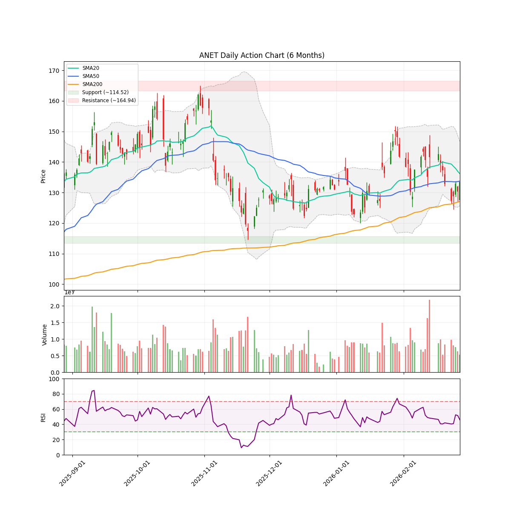
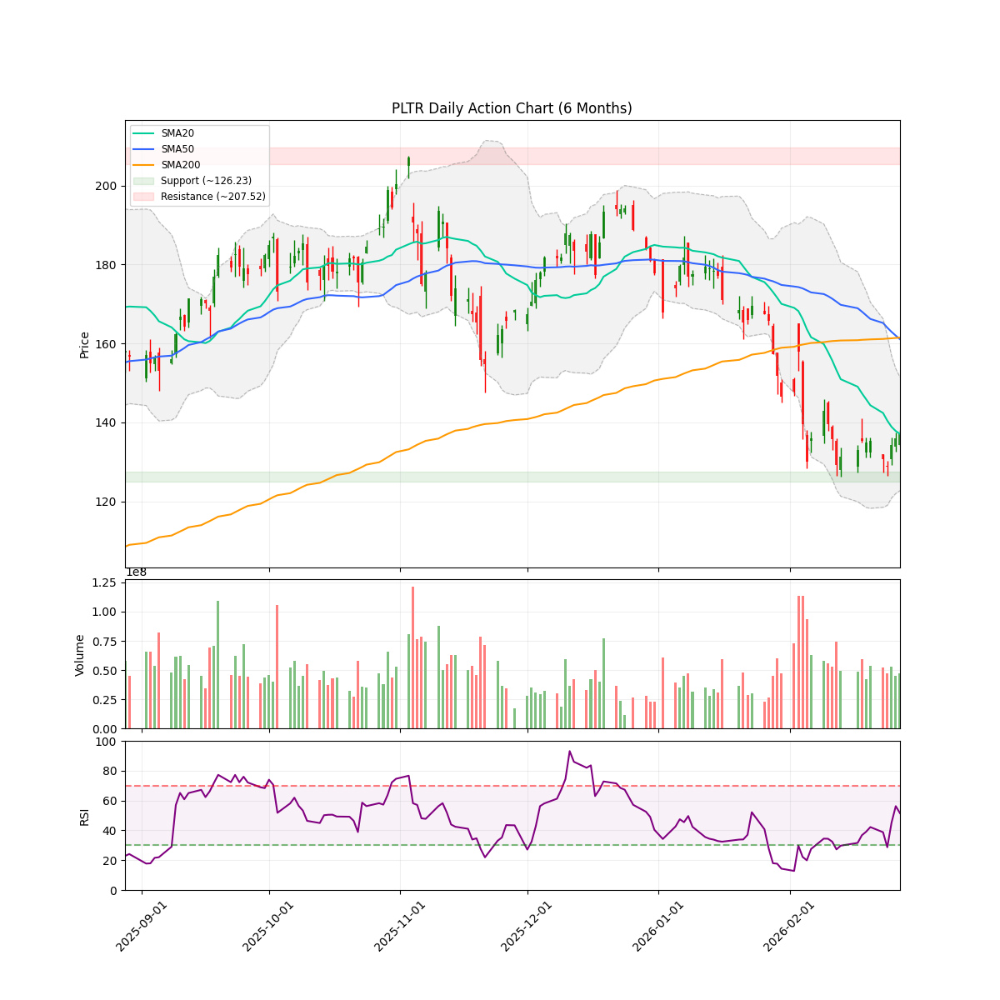

# 每日股市市场报告 (2026-03-01)

> **免责声明**: 本报告由 **代码与 Gemini AI 自动生成**，仅供研究参考，**不构成**任何投资建议。投资有风险，入市需谨慎。作者及 AI 不对任何基于此内容的投资决策承担责任。

## 📑 目录
[TOC]

##  长期投资逻辑
本组合旨在捕捉 **人工智能（AI）与半导体协议** 带来的跨周期结构性增长，核心投资策略聚焦于“确定性”与“物理瓶颈”：
- **底层制程垄断 (Foundry & WFE Moats)**：
  布局处于全球半导体精密制造顶端的“工业母机”级别公司。寻找具备极高准入门槛的晶圆代工及前道设备供应商，作为全产业链最稳固的底座资产。
- **算力稀缺性与连接带宽 (Compute & Interconnect Scarcity)**：
  聚焦在高性能计算芯（HPC）及高带宽连接领域占据主导地位的标的。AI 的终极竞争是“规模”，寻找能有效解决数据交换瓶颈并提供核心推理/训练能力的算力巨头。
- **应用生态与数据霸权 (Platform & Data Sovereignty)**：
  布局拥有闭环生态、海量高质量私有数据及云基础设施的科技巨头。它们是 AI 商业化落地的最终守门人，拥有将技术转化为持续现金流的分配权。
- **物理边界保障 (Power & Thermal Infrastructure)**：
  关注 AI 扩张的“最终瓶颈”——电力供应与热能管理。重点布局为下一代超大规模数据中心提供高功率密度能源、液冷技术及电网扩容方案的能源基建商。
**风控策略**：利用 AlphaJAX 的量化动量评分（Quant Score）作为过滤器，结合 LLM 叙事审计（Narrative Audit）捕捉“业绩超预期 + 叙事逻辑改善”的共振点，实现跨周期的超额收益。

 **注：排序权重**：Ticker 按照 AI 检测出的 **方向** 排序（**看多**优先，其次是 **中性**，最后是 **看空**）。
---

<!-- DISCORD_SUMMARY_START -->
## 📖 今日市场叙事 (Daily Market Story)
> 各位老战友，今天的市场活脱脱像是一场“马拉松的中场换人”。大盘指数在连番冲刺后开启了“狂奔后的喘息”模式，但别被表面的风平浪静给骗了，水面下正上演着一场声势浩大的“资金大挪移”。现在的市场逻辑已经从单纯的“买脑子（算力芯片）”暴力切换到了“买肌肉（能源与基建）”。从数据来看，虽然英伟达（NVDA）和博通（AVGO）这些曾经的领头羊在财报利好后反而陷入了“利好出尽”的泥潭，股价双双跌破SMA50均线，甚至在SMA200生死线附近徘徊；但资金并没有撤离，而是像潮水一样涌向了AI的“硬资产”底座。这种内部撕裂感极强：半导体板块在消化估值压力，而电力、散热和地租板块却在集体狂欢。
> 
> 钻进具体的个股里看，这简直是一场“老派地主”与“硬核包工头”的内功大比拼。科技阵营内部的“内讧”清晰可见：博通（AVGO）还在为了6G和财报预期苦苦蓄势，而戴尔（DELL）已经靠着640亿美元的AI服务器订单积压，像个觉醒的巨兽直接暴力拉升。最夸张的还得数那些“AI送水人”——二叠纪盆地的“地租之王”TPL和电力巨头CEG，两者的RSI已经双双烧到了80开外的“窒息区”，这哪是买股票，简直是在抢夺数字时代的“保命符”！就连GEV这种工业老兵也披上了“AI电力”的战袍，在超买区间疯狂试探。相比之下，英伟达（NVDA）的走势倒像是一位跑累了的拳王，即便成绩单满分，也难掩技术面动能流失的尴尬。总的来说，现在的局势就是：芯片在“还债”，基建在“封神”，大家伙儿都在赌——只要AI这台大戏不谢幕，地租和电力就是那永不熄灭的香火，哪怕RSI已经高到让人头晕目眩，资金依然在音乐停止前疯狂起舞。
<!-- DISCORD_SUMMARY_END -->
---

## 🔍 观察池机会分析

### AMZN

#### 研报分析

### 技术指标概览 (Technical Overview)
- **当前价格**: $210.00
- **RSI (14)**: 49.58
- **移动平均线**: SMA20: $213.42 | SMA50: $226.59 | SMA200: $224.35 (Bullish)
- **波动率**: ATR (14): 5.85 (预计周度波动: +/- $13.07)
- **关键位 (6m)**: 支撑位 $196.00 | 阻力位 $258.60
- **即时状态**: Below SMA50

# AMZN 情绪审计报告：AI 军备竞赛中的“成长的烦恼”

**致：投资委员会**
**日期：2026年03月01日**
**分析师：对冲基金研究员（叙事经济学组）**

---

### 1. 核心叙事：在金矿上修路的“烧钱巨人”

坐下来喝杯咖啡，咱们聊聊亚马逊（AMZN）。目前市场上对它的情绪就像是一场拉锯战：一边是它那令人瞠目结舌的基建野心，另一边则是投资者对“资本支出（Capex）黑洞”的恐惧。

现在的 AMZN 正处于一个有趣的叙事断层。一方面，它正以前所未有的姿态拥抱 AI 基础设施，比如那个在路易斯安那州砸下的 **120 亿美元数据中心计划**，以及传闻中对 OpenAI 惊人的 **500 亿美元投资**。另一方面，股价却在“利好”面前显得有些步履蹒跚，今年以来下跌了 11%，价格（210.00）不仅跌破了 SMA50 和 SMA200，甚至还在 SMA20 下方徘徊。

这到底是“估值陷阱”，还是黎明前的最后一丝寒冷？

---

### 2. 催化剂分级 (Catalyst Categorization)

*   **A-Tier（核心引力）：**
    *   **路易斯安那州 120 亿美元投资 & 500 亿美元 OpenAI 传闻**：这是典型的“大国博弈”级别投资。亚马逊不再仅仅是一个电商或云服务商，它正在转型为 AI 时代的底层架构供应商。AWS 35% 的利润率是它的底气所在。
    *   **机构筹码惯性**：2025 年 Q4 增加了 46 家对冲基金持仓，说明“聪明钱”在长线布局。

*   **B-Tier（宏观顺风）：**
    *   **美印贸易协议**：这是一个被低估的变量。随着协议落地，亚马逊在印度这个全球最具增长潜力的市场的渗透率可能会迎来二次曲线。

*   **C-Tier（短期噪音）：**
    *   **Steve Weiss 清仓**：虽然这位老牌投资者的离场引发了媒体关注，但这更多是基于短期估值保护的战术行为，而非对亚马逊基本面的否定。

---

### 3. 背离检测：当“好消息”救不了股价

**现状观察：** 亚马逊最近的消息面简直是金光闪闪——巨大的数据中心投资、强劲的 AWS 利润预期。然而，股价却表现出强烈的“看涨疲劳”。

**深度诊断：** 典型的 **“利好出尽”后的技术性回踩**。尽管 RSI 处于 49.58 的中性位置，并没有超卖，但股价跌破 200 日均线是一个危险信号。市场目前并不质疑亚马逊的增长，市场在质疑的是：**“这种高强度的烧钱模式，什么时候能转化成每股收益（EPS）的实质喷发？”** 

目前的走势属于“看好长期，担忧短期现金流”。除非股价能守住 196.00 的 6 个月低点，否则这种看跌情绪可能会持续。

---

### 4. 情绪得分 (Sentiment Score)

# **6.2 / 10**

> **逻辑评估：** 叙事逻辑非常稳固（AI 基础设施之王），但市场情绪正处于“消化期”。10 分代表毫无保留的狂热，0 分代表系统性崩溃。目前 6.2 分代表：**基本面极强，但市场正因高昂的资本支出计划而感到头痛，短期内缺乏将叙事转化为价格上涨的引燃点。**

---

### 5. 投资建议与展望

亚马逊现在就像一头正在换羽的鹰。它在路易斯安那州和 AI 领域的布局是未来五年的胜负手。如果你是一个看重未来三个月的交易员，现在的技术形态（低于均线）让你很难受；但如果你是叙事经济学的信徒，现在的回调正是由于“市场短视”创造的调仓机会。

*   **支撑位警报：** 留意 196.00 关口，这是多头的最后防线。
*   **观察重点：** 市场何时会停止关注“支出了多少钱”，转而关注“这些投资带来了多少算力租赁订单”。

---

### 6. 关键日期与引用

*   **下一次重大事件：** **2026 年 5 月初**（预计 2026 年 Q1 财报发布日）。这将是验证 2000 亿资本支出计划后，AWS 增长是否加速的关键时刻。
*   **引用新闻：**
    *   *Yahoo Finance*: [Amazon's $12B Louisiana Investment](https://finance.yahoo.com/news/amazon-com-amzn-data-center-210432131.html)
    *   *Invezz*: [Steve Weiss Sold AMZN and NVDA](https://invezz.com/news/2026/02/28/steve-weiss-just-sold-both-amazon-nvidia-stock-heres-why/)
    *   *LiveMint*: [India-US Trade Deal Impact](https://www.livemint.com/focus/indiaus-trade-deal-2026-9-ways-it-changes-how-indians-should-look-at-us-stocks-and-etfs-11772091106207.html)

---
**本报告仅供参考，不构成直接投资建议。在市场中，情绪是帆，逻辑是舵，请系好安全带。**
#### 近期新闻与事件
- **[Yahoo Finance]** [Amazon.com (AMZN) Data Center Push Continues with $12B Investment in Louisiana](https://finance.yahoo.com/news/amazon-com-amzn-data-center-210432131.html)
- **[Yahoo Finance]** [Is Amazon.com Stock Underperforming the Dow?](https://finance.yahoo.com/news/amazon-com-stock-underperforming-dow-161258841.html)
- **[Mint]** [India-US Trade Deal 2026: 9 Ways It Changes How Indians Should Look at US Stocks and ETFs](https://www.livemint.com/focus/indiaus-trade-deal-2026-9-ways-it-changes-how-indians-should-look-at-us-stocks-and-etfs-11772091106207.html)
- **[Blockonomi]** [Amazon (AMZN) Stock: $12 Billion Louisiana Data Center Plan Explained](https://blockonomi.com/amazon-amzn-stock-12-billion-louisiana-data-center-plan-explained/)
- **[Invezz]** [Steve Weiss just sold both Amazon, Nvidia stock: here's why](https://invezz.com/news/2026/02/28/steve-weiss-just-sold-both-amazon-nvidia-stock-heres-why/)

---

### ANET

#### 研报分析

### 技术指标概览 (Technical Overview)
- **当前价格**: $133.50
- **RSI (14)**: 45.87
- **移动平均线**: SMA20: $136.17 | SMA50: $133.74 | SMA200: $127.10 (Bullish)
- **波动率**: ATR (14): 6.49 (预计周度波动: +/- $14.52)
- **关键位 (6m)**: 支撑位 $114.52 | 阻力位 $164.94
- **即时状态**: Below SMA50

你好！来，坐下喝杯咖啡。咱们今天聊聊 **Arista Networks (ANET)**。

在现在的硅谷和华尔街，AI 网络架构就是“皇冠上的明珠”，而 Arista 则是那个打磨明珠的人。现在的盘面很有意思：新闻满天飞，利好一个接一个，但股价却像是在宿醉后的清晨，有点打不起精神。

以下是我为你整理的“叙事经济学”审计报告：

### 1. 催化剂分类：谁在推波助澜？

*   **A-Tier（核心动力）：超预期的Q4业绩与“Arista 2.0”战略**
    *   2月12日的Q4财报简直是教科书级的：EPS $0.82 远超预期的 $0.75，营收也在狂飙。更重要的是，Zacks提到的“Arista 2.0”战略正在产生共鸣。这不是简单的卖交换机，这是在定义AI时代的网络基础设施。
    *   **引用自：** [Zacks.com on MSN] (2026-02-12) & [Zacks] (2026-02-26)
*   **B-Tier（机构背书）：大行的“集体抬轿”**
    *   高盛（Goldman Sachs）和摩根士丹利（Morgan Stanley）相继上调目标价，大摩甚至看高到 $165。这些华尔街巨头在财报后集体站台，给市场注入了强心针。
    *   **引用自：** [Morgan Stanley via MSN] (2026-02-20) & [Goldman Sachs] (2026-02-23)
*   **C-Tier（杂音与情绪）：高管的小额减持**
    *   董事 Wassenaar 卖了24万美元的股票。听着挺吓人？但在这种市值的公司里，24万美金连个水花都算不上，更多是个人税务或财务规划，不必过度解读。
    *   **引用自：** [Investing.com] (2026-02-27)

---

### 2. 预期背离侦测：为什么“好消息”没让股价飞天？

这里的信号非常微妙。你看，当前的股价 **$133.50** 实际上正处于一个尴尬的境地：
*   它掉到了 **SMA20 ($136.17)** 和 **SMA50 ($133.74)** 的下方。
*   **叙事：** “不可阻挡的AI巨头”、“财报大捷”、“目标价165”。
*   **现实：** 股价在财报利好出尽后出现了典型的“Sell the News”（利好兑现）。

**诊断：** 这是一个**技术面疲软与叙事面强韧**的背离。RSI 45.87 显示目前既不拥挤也不恐慌。这种“好消息下阴跌”通常意味着短期获利筹码正在派发，市场在消化估值溢价。这不是“系统性崩溃”，而是“情绪性中场休息”。

---

### 3. 情绪评分 (Sentiment Score)

#### **7.5 / 10**
**逻辑：** 叙事逻辑非常扎实（9分），但资金面动能暂时枯竭（6分）。
虽然高盛和大摩都在喊多，但市场需要看到 Arista 2.0 战略在下一季度的具体指引落地。目前它正踩在 50 日均线的边缘疯狂试探，如果跌破这个支撑，可能会向 $127 (SMA200) 回撤，那才是长线投资者的“黄金坑”。

---

### 4. 资深老兵的独家洞察：是机会还是陷阱？

现在的 ANET 像是一部好莱坞大片：预告片（财报）燃爆了，影评人（分析师）都在叫好，但首映礼（股价表现）却有点冷场。

**这绝对不是陷阱，而是一个典型的“叙事消化期”。** 
你要盯紧那个 $114.52 的支撑位。如果股价能在这里企稳，那么机构的集体上调目标价（$165）就是一张迟早会兑现的支票。不要被那个 24 万美元的内幕减持吓到，那是噪音；你要听的是数据中心扩建的隆隆机器声。

---

### 5. 关键时间节点

*   **下一次重大日期：** **2026年5月初** (预估 Q1 2026 财报发布日)。
*   **近期关注：** 需观察股价能否在未来一周重新夺回 **SMA50 ($133.74)**。如果站不稳，我们要做好迎接波动（ATR 6.49）的心理准备。

---
*注：本报告基于 2026-03-01 的市场数据。投资有风险，决策需谨慎。*
#### 近期新闻与事件
- **[Insider Monkey]** [Piper Sandler Retains Overweight Rating on Arista Networks (ANET) Amid Revenue Beat](https://finance.yahoo.com/news/piper-sandler-retains-overweight-rating-035756033.html)
- **[Insider Monkey]** [Goldman Sachs Raises PT on Arista Networks, Inc. (ANET) Stock](https://finance.yahoo.com/news/goldman-sachs-raises-pt-arista-211306392.html)
- **[Investing.com]** [Arista Networks director Wassenaar sells $240k in stock By Investing.com](https://www.investing.com/news/insider-trading-news/arista-networks-director-wassenaar-sells-240k-in-stock-93CH-4532964)
- **[Barchart]** [Why 1 Analyst Thinks Arista Networks Stock Can Still Gain Over 50% This Year](https://finance.yahoo.com/news/why-1-analyst-thinks-arista-160002037.html)
- **[Zacks]** [Arista 2.0 Strategy Picks Up Steam: Can ANET Ride This Wave?](https://finance.yahoo.com/news/arista-2-0-strategy-picks-141600592.html)

---

### ASML

#### 研报分析

### 技术指标概览 (Technical Overview)
- **当前价格**: $1450.56
- **RSI (14)**: 56.64
- **移动平均线**: SMA20: $1434.18 | SMA50: $1306.73 | SMA200: $977.66 (Bullish)
- **波动率**: ATR (14): 44.13 (预计周度波动: +/- $98.67)
- **关键位 (6m)**: 支撑位 $713.99 | 阻力位 $1547.22
- **即时状态**: Above SMA50

# ASML 情绪审计报告：AI 时代的“光刻霸权”，是续写辉煌还是高位陷阱？

**日期：** 2026年03月01日
**分析师：** 叙事经济学研究部 - 资深研究员

---

### ☕️ 咖啡馆闲谈：市场的脉动
想象一下，你坐在阿姆斯特丹的一家老牌咖啡馆里。窗外，ASML 的光刻机正在被运往全球最先进的晶圆厂。现在的市场情绪就像这杯双倍浓缩咖啡——苦涩的估值疑虑中夹杂着令人兴奋的 AI 香气。虽然股价在一年内飙升了近 78%，但这不仅仅是数字的堆砌，这是全球科技巨头们为了抢夺未来五年的“入场券”而引发的军备竞赛。

---

### 1. 催化剂分级：谁在真正拨动琴弦？

我们将最近的叙事风暴拆解为三个等级：

*   **A-Tier（核心驱动力）：AI 军备竞赛的“终极军火商”**
    *   **巨额资本支出（Capex）狂潮：** [The Motley Fool](https://www.fool.com/investing/2026/02/27/hyperscalers-plan-to-spend-700-billion-on-ai-2026/) 指出，超大规模云服务商今年计划投入 7000 亿美元。ASML 作为 TSMC 背后的“造物主”，直接锁定了这股现金流的源头。
    *   **High NA EUV 落地：** [Simply Wall St](https://finance.yahoo.com/news/asml-high-na-euv-tool-181123014.html) 提到 High NA EUV 工具进入欧洲 NanoIC 计划。这不只是卖机器，这是在定义 2nm 及以下工艺的物理极限。
*   **B-Tier（行业共振）：英伟达的影子**
    *   **英伟达财报关联：** [Invezz](https://invezz.com/news/2026/02/25/nvidia-earnings-3-european-tech-stocks-that-will-be-most-impacted/) 强调了英伟达对 ASML 的情绪传导。只要英伟达的 AI 芯片卖得好，ASML 的订单簿就是安全的。
*   **C-Tier（市场杂音）：散户的焦虑**
    *   **“是否太晚？”的讨论：** [Yahoo Finance](https://finance.yahoo.com/news/too-consider-asml-holding-enxtam-111705645.html) 和 [Zacks](https://finance.yahoo.com/news/asml-holding-n-v-asml-140005983.html) 频繁提及的估值担忧。这种噪音通常出现在股价加速上涨期，是典型的“恐高症”表现。

---

### 2. 背离检测：好消息背后的冷思考

目前 ASML 的股价表现与新闻流呈现出**“强同步性”**。
*   **观察：** 尽管市场在讨论“是否涨得太多”，但股价依然稳稳运行在 SMA50（1306.73）和 SMA200（977.66）之上。
*   **分析：** 所谓的“背离”尚未出现。通常，如果利好消息（如 7000 亿 AI 支出）传出后股价却跌破 SMA20，那才是熊市衰竭或多头陷阱的信号。目前 1450.56 的价格距离 6 个月高点 1547.22 仅一步之遥，市场正在进行一次健康的“高位换手”。

---

### 3. 情绪评分 (Sentiment Score)

**得分：8.5 / 10**

**评价：不可阻挡的结构性牛市**
*   **理由：** ASML 拥有的不仅仅是市场份额，它是物理定律的唯一代理人。虽然 RSI (56.64) 显示出力量，但并未进入超买区。市场的叙事已从“周期性半导体”转向“永恒的 AI 基础设施”。唯一扣分项是当前的波动率 (ATR: 44.13)，意味着短期内可能会有剧烈的洗盘。

---

### 4. 叙事总结：这是“陷阱”吗？

目前没有任何迹象表明这是一个“陷阱”。相反，这是一个**“估值重估”**的过程。
*   **长期愿景：** [24/7 Wall St](https://247wallst.com/investing/2026/02/23/is-asml-about-to-unleash-a-50-ai-chip-output-explosion-by-2030/) 预言到 2030 年 AI 芯片产量将爆发 50%，这意味着 ASML 的光刻机不是买不买的问题，而是能不能排上队的问题。
*   **投资心态：** 如果你是在寻找下一个翻倍股，它可能太重了；但如果你在寻找 AI 时代的锚点，它依然是那座坚固的灯塔。

---

### 📅 下一个关键观察日

**预计财报发布日：2026年 4 月 15 日左右 (Q1 2026 Earnings)**

> **老兵寄语：** 在这个位置，盯着 1547.22 的阻力位。如果能带着放量突破，那我们就不是在看天花板，而是在看新世界的地基。保持冷静，别被那些“太晚了”的噪音吓跑，真正的叙事才刚刚进入高潮。
#### 近期新闻与事件
- **[Yahoo Finance]** [Is It Too Late To Consider ASML Holding (ENXTAM:ASML) After Its 77.9% One Year Surge?](https://finance.yahoo.com/news/too-consider-asml-holding-enxtam-111705645.html)
- **[The Motley Fool]** [Hyperscalers Plan to Spend $700 Billion on AI This Year. These 2 Stocks Are the Biggest Beneficiaries.](https://www.fool.com/investing/2026/02/27/hyperscalers-plan-to-spend-700-billion-on-ai-2026/)
- **[The Motley Fool]** [Prediction: 3 Stocks That'll Be Worth More Than Walmart 5 Years From Now](https://www.msn.com/en-us/money/topstocks/prediction-3-stocks-thatll-be-worth-more-than-walmart-5-years-from-now/ar-AA1WRb0U)
- **[Invezz]** [Nvidia earnings: 3 European tech stocks that will be most impacted](https://invezz.com/news/2026/02/25/nvidia-earnings-3-european-tech-stocks-that-will-be-most-impacted/)
- **[24/7 Wall St.]** [Is ASML About to Unleash a 50% AI Chip Output Explosion by 2030?](https://247wallst.com/investing/2026/02/23/is-asml-about-to-unleash-a-50-ai-chip-output-explosion-by-2030/)

---

### AVGO

#### 研报分析

### 技术指标概览 (Technical Overview)
- **当前价格**: $319.55
- **RSI (14)**: 40.63
- **移动平均线**: SMA20: $328.99 | SMA50: $335.58 | SMA200: $317.66 (Bullish)
- **波动率**: ATR (14): 13.90 (预计周度波动: +/- $31.09)
- **关键位 (6m)**: 支撑位 $286.13 | 阻力位 $413.82
- **即时状态**: Below SMA50

# 博通 (AVGO) 情绪审计报告：暴风雨前的宁静，还是价值陷阱？

嘿，伙计，快坐下。咱们来聊聊博通（Broadcom, AVGO）。现在的博通就像是一个在拳击台边角喘息的重量级拳王——虽然最近几个点数没拿好，但谁都知道他手里攥着能一拳定乾坤的重型武器。

在“叙事经济学”的滤镜下，目前的博通正处于一个非常微妙的交叉点。

### 1. 催化剂分类：谁在扣动扳机？

我们将博通近期的消息按照冲击力进行了分层：

*   **A-Tier（核心引擎）**：
    *   **2026财年第一季度财报（3月4日）**：这不仅是财报，这是博通的“大考”。Seeking Alpha 已经喊出了“Double-Beat”（营收盈利双超预期）的口号。这是目前驱动股价的核心叙事。
    *   **6G 布局与连接组合扩张**：Zacks 提到的 6G 长期策略不是噪音，这是博通在 AI 算力之后，确保未来十年“收费站”地位的长期入场券。
*   **B-Tier（市场合唱）**：
    *   **机构集体背书**：Robert W. Baird 和 Zacks 的连续买入评级。当这些老牌机构开始复读“未来三年必持股”时，机构资金的底座正在加固。
*   **C-Tier（日常杂音）**：
    *   关于“短期股价波动”的研报，这些更多是反映了市场的焦虑，而非基本面的改变。

### 2. 背离检测：市场在说谎吗？

**当前的信号非常有趣，甚至有点“诡异”。**

*   **好消息 vs. 坏表现**：我们看到了分析师的上调和 6G 的宏伟蓝图，但股价（319.55）却死死压在 SMA20（328.99）和 SMA50（335.58）之下。
*   **技术面的“生死线”**：股价目前正贴着 **SMA200（317.66）** 爬行。在技术派眼里，这是最后的防线；在叙事派眼里，这是“看涨衰竭”与“多头最后一搏”的交汇处。
*   **RSI 的暗示**：RSI 跌到了 40.63。这说明市场的情绪已经极其冷淡，甚至有点悲观。但别忘了，博通这种票，往往在大家觉得它“沉重”的时候，财报一出，直接平地起惊雷。

### 3. 深度叙事：咖啡馆里的真心话

听着，现在的博通不是因为它基本面出了问题，而是因为它正在经历一场**“预期管理的折磨”**。

目前的股价回撤，更像是财报前的“清场”。市场在担心 AI 芯片的毛利是否触顶，VMware 的整合是否遇到了暗礁。但从我们收集的消息来看（[Seeking Alpha 预览](https://seekingalpha.com/article/4873792-broadcom-set-for-another-double-beat-next-week-earnings-preview)），这种担忧可能被放大了。

现在的博通就像是一根被压缩到极致的弹簧。SMA200 的支撑力度非常关键。如果 3月4日的财报如预期般“双超”，这一波回调就是给迟到者的入场券；如果跌破了 286.13（6个月低点），那咱们就得重新审视 AI 基础设施的整个叙事了。

### 4. 情绪得分：6.8/10 (蓄势待发)

*   **逻辑支撑**：尽管短期技术形态偏弱（处于均线下方），但机构评级上调与财报利好预期形成了强大的反作用力。
*   **风险提示**：如果财报后的指引稍有瑕疵，股价可能会向 286.13 的支撑位寻求保护。

---

### 关键数据总结

*   **下个重大日期**：**2026年3月4日**（FQ1 2026 财报发布）。这是决定博通是冲向 400 还是滑向 280 的分水岭。
*   **阻力位**：335.58 (SMA50) / 413.82 (6个月高点)
*   **支撑位**：317.66 (SMA200) / 286.13 (6个月低点)

**投资建议叙事**：别被眼前的阴线吓破了胆。紧盯 3月4日。在 317-319 这个区间，博通正在积蓄足以改变叙事的力量。它是数字世界的“包工头”，而现在的基建还没盖完呢。

> **参考资讯：**
> - [Robert W. Baird Maintains Buy Rating](https://finance.yahoo.com/news/robert-w-baird-maintains-buy-063320763.html)
> - [Zacks: AVGO Expands Connectivity to Tap 6G](https://finance.yahoo.com/news/avgo-expands-connectivity-portfolio-tap-153300473.html)
> - [Seeking Alpha: Earnings Preview - Set for Double-Beat](https://seekingalpha.com/article/4873792-broadcom-set-for-another-double-beat-next-week-earnings-preview)
#### 近期新闻与事件
- **[Insider Monkey]** [Robert W. Baird Maintains Buy Rating on Broadcom Inc. (AVGO) Stock](https://finance.yahoo.com/news/robert-w-baird-maintains-buy-063320763.html)
- **[Zacks]** [AVGO Expands Connectivity Portfolio to Tap 6G: What's Ahead?](https://finance.yahoo.com/news/avgo-expands-connectivity-portfolio-tap-153300473.html)
- **[Zacks]** [Broadcom Inc. (AVGO) Stock Declines While Market Improves: Some Information for...](https://finance.yahoo.com/news/broadcom-inc-avgo-stock-declines-224501236.html)
- **[Zacks]** [Wall Street Bulls Look Optimistic About Broadcom Inc. (AVGO): Should You Buy?](https://finance.yahoo.com/news/wall-street-bulls-look-optimistic-143003960.html)
- **[Zacks]** [Broadcom Inc. (AVGO) Upgraded to Buy: Here's Why](https://finance.yahoo.com/news/broadcom-inc-avgo-upgraded-buy-170004804.html)

---

### CEG

#### 研报分析

### 技术指标概览 (Technical Overview)
- **当前价格**: $329.88
- **RSI (14)**: 83.80
- **移动平均线**: SMA20: $286.65 | SMA50: $314.24 | SMA200: $327.98 (Bearish)
- **波动率**: ATR (14): 14.37 (预计周度波动: +/- $32.14)
- **关键位 (6m)**: 支撑位 $243.30 | 阻力位 $412.23
- **即时状态**: Above SMA50

你好！来，坐下喝杯咖啡。咱们聊聊 Constellation Energy (CEG) 这一波让人心跳加速的行情。

作为研究“叙事经济学”的分析师，我得说，CEG 现在的剧本写得简直比好莱坞大片还精彩。它不再仅仅是一家枯燥的电力公司，它现在是支撑 AI 算力大厦的“核心能源底座”。

以下是为您准备的 **CEG 情绪审计报告**。

---

### **1. 催化剂分类：谁在推波助澜？**

*   **A-Tier（顶级驱动）：Q4 业绩大捷 + CyrusOne 巨额订单**
    *   **理由：** CEG 刚刚交出了一份惊艳的成绩单，Q4 每股收益 $2.30，远超预期，营收达到 60.7 亿美元 [Blockonomi, 2026-02-24]。更重要的是，它与 CyrusOne 签署了 380 兆瓦的协议 [Insider Monkey, 2026-02-26]。这不仅仅是卖电，这是在“售卖 AI 的生命线”。这种来自数据中心的刚需是不可替代的。
*   **B-Tier（重要进展）：机构集体调高预期**
    *   **理由：** TD Cowen 在 2 月 27 日将目标价从 $440 暴力拉升至 $454 [Yahoo Finance, 2026-03-01]。华尔街的“聪明钱”正在用真金白银为它的溢价投票。
*   **C-Tier（市场杂音）：各大“最佳潜力股”榜单入选**
    *   **理由：** 虽然入选各种“最佳股”名单增加了曝光度，但这属于锦上添花，不是核心逻辑。

---

### **2. 背离检测：当“利空”变成“燃料”**

最让我感到兴奋（也最需要警惕）的是 **2 月 24 日的市场表现**。

当时，CEG 宣布推迟公布 2026 年的年度业绩指引（延期至 3 月底）。在传统的教科书里，推迟指引通常会被视为“利空”或“不确定性”。但市场是怎么反应的？**股价反而飞涨到了六周以来的最高点** [MarketWatch, 2026-02-24]。

这说明了什么？**看涨叙事已经完全接管了理性。** 投资者根本不在乎那几页 PPT 的推迟，他们只相信 PJM 市场的电力紧缺和核电价值的重估。这种“利空不跌反暴涨”是典型的**看涨情绪过热**信号。

---

### **3. 深度情绪分析：这是一个“陷阱”吗？**

现在的 CEG 就像一台高速运转的核反应堆，能量巨大，但核心温度极高。

*   **叙事热度：** 10/10。CEG 已经成为了“能源 + AI”赛道的领头羊。
*   **技术警告：** **RSI 高达 83.80**。在老手眼里，这个数字意味着市场已经进入了“窒息区”。股价远高于 SMA50 ($314.24) 和 SMA20 ($286.65)，虽然趋势极度强劲，但乖离率过大。
*   **目前的市场脉搏：** 现在的上涨是由 **FOMO（恐惧错过）** 驱动的。正如那句老话，“在音乐停止前，每个人都得跳舞”。虽然基本面无懈可击，但短期内价格已经严重透支了预期。

---

### **4. 逻辑评分 (Logic Score): 8.5 / 10**

*   **为什么是 8.5？** 它的商业逻辑（核电 + 数据中心）是这个时代最稳固的叙事之一，这也是为什么评分很高。
*   **扣分的 1.5 在哪里？** 扣在“估值拥挤”和“技术超买”。RSI 83.80 意味着你现在进场，是在和一群已经狂欢了整晚、满眼血丝的赌徒抢最后一杯香槟。短期内，任何一点风吹草动都可能导致剧烈的获利回吐（回抽 SMA50 的压力很大）。

---

### **5. 关键日期与操作建议**

*   **下一个重大日期：2026年3月31日** (公司承诺提供 2026 年全年财务指引的最后期限 [Blockonomi])。这将是决定 CEG 是继续封神，还是高位跳水的关键转折点。
*   **老兵寄语：** 现在的 CEG 不是用来“追”的，而是用来“持”或“等”的。如果你手里有货，握紧你的核燃料棒，但要把止盈位上移至 $314 附近；如果你正准备入场，建议等这一波 RSI 修复，或者等 3 月底的指引落地后再做打算。

**结论：** 这是一个由真实业绩支撑的**超级趋势**，但短期内它正在变成一个**情绪陷阱**。别在核电站温度最高的时候冲进去修理管道。

---
**参考来源：**
- *TD Cowen 目标价上调*: [Yahoo Finance](https://finance.yahoo.com/news/constellation-energy-ceg-positioned-growth-031155225.html)
- *CyrusOne 交易详情*: [Insider Monkey/MSN](https://www.msn.com/en-us/money/topstocks/constellation-energy-corporation-ceg-unit-signs-new-380-megawatt-deal-with-cyrusone/ar-AA1X5X14)
- *业绩指引延期与股价反应*: [MarketWatch](https://www.msn.com/en-us/money/topstocks/constellation-energy-s-stock-zooms-toward-highest-level-in-weeks-even-after-outlook-is-postponed/ar-AA1WZRZF)
#### 近期新闻与事件
- **[Yahoo Finance]** [Constellation Energy (CEG) Positioned for Growth as PJM Market Developments Support Demand](https://finance.yahoo.com/news/constellation-energy-ceg-positioned-growth-031155225.html)
- **[Insider Monkey]** [Constellation Energy Corporation (CEG) Unit Signs New 380-megawatt Deal with CyrusOne](https://www.msn.com/en-us/money/topstocks/constellation-energy-corporation-ceg-unit-signs-new-380-megawatt-deal-with-cyrusone/ar-AA1X5X14)
- **[MarketWatch]** [Constellation Energy's stock zooms toward highest level in weeks, even after outlook is postponed](https://www.msn.com/en-us/money/topstocks/constellation-energy-s-stock-zooms-toward-highest-level-in-weeks-even-after-outlook-is-postponed/ar-AA1WZRZF)
- **[Yahoo Finance UK]** [Constellation Energy Corporation (CEG) Q4 Earnings and Revenues Beat Estimates](https://uk.finance.yahoo.com/news/constellation-energy-corporation-ceg-q4-135003454.html)
- **[Blockonomi]** [Constellation Energy (CEG) Stock Rises After Q4 Earnings Beat](https://blockonomi.com/constellation-energy-ceg-stock-rises-after-q4-earnings-beat/)

---

### CIEN

#### 研报分析

### 技术指标概览 (Technical Overview)
- **当前价格**: $348.70
- **RSI (14)**: 82.07
- **移动平均线**: SMA20: $302.73 | SMA50: $263.10 | SMA200: $160.73 (Bullish)
- **波动率**: ATR (14): 22.03 (预计周度波动: +/- $49.27)
- **关键位 (6m)**: 支撑位 $90.00 | 阻力位 $365.90
- **即时状态**: Above SMA50

你好！我是你的对冲基金研究助理，专注于“叙事经济学”。来，咱们边喝咖啡边聊聊 **Ciena (CIEN)**。

在现在的市场里，如果说 AI 是大脑，那 CIEN 做的就是连接大脑的“神经纤维”。看着这份数据，我闻到了一股浓烈的“狂热”气息，但也带点儿让人手心出汗的信号。

---

### **CIEN 情绪审计报告：光通信的“暴力美学”**

#### **1. 催化剂分类 (Catalyst Categorization)**

*   **【A-Tier】核心驱动力：AI 算力基建的“刚需”化**
    *   **Q1 财报预期与 $50 亿积压订单：** 根据 Zacks 的报道 ([Zacks](https://finance.yahoo.com/news/ciena-report-q1-earnings-approach-150400367.html))，CIEN 预计每股收益（EPS）将增长 76%，且手握 50 亿美元的惊人积压订单。这不仅仅是业绩，这是市场的“定心丸”。
    *   **AI 叙事升级：** 市场已将其定位为 AI 基础设施股。去年 176% 的涨幅 ([Yahoo Finance](https://finance.yahoo.com/news/ai-infrastructure-stock-grew-176-142000013.html)) 证明了资金正在疯狂涌入光通信这一细分赛道，寻找英伟达之外的二线爆发点。
*   **【B-Tier】行业博弈：胜过老牌巨头**
    *   **Ciena vs. Cisco：** CIEN 在光通信领域的专业性正在挑战思科 ([Zacks](https://www.zacks.com/stock/news/2874030/ciena-vs-cisco-which-networking-stock-is-a-better-buy))。华尔街喜欢这种“小而精”逆袭“老大哥”的戏码。
    *   **“贵得有理”：** Seeking Alpha 的分析 ([Seeking Alpha](https://seekingalpha.com/article/4875560-ciena-expensive-for-a-reason)) 为其高估值背书，认为 AI 驱动的营收加速足以支撑当前的溢价。
*   **【C-Tier】噪音与情绪点缀**
    *   **社媒推力：** X.com 上的 @TheValueist 正在吹风 ([Insider Monkey](https://finance.yahoo.com/news/ciena-corporation-cien-bull-case-164500854.html))，虽然是噪音，但它反映了散户资金的活跃度。

#### **2. 分歧检测 (Divergence Detection)**

**红色警报：指标与价格的极限拉扯。**
目前 CIEN 的 RSI 高达 **82.07**。在老练的交易员眼里，这已经不是“强劲”了，这是“沸腾”。股价（348.70）距离 SMA200（160.73）远得离谱，就像是一个跑得太快、把灵魂都丢在后面的短跑运动员。

虽然新闻全是利好，但技术面在尖叫。如果你看到在财报发布前股价出现小幅回撤，那不是因为基本面变坏了，而是获利盘在“恐高”。

#### **3. 叙事分析：这是趋势还是陷阱？**

目前的叙事是：**“光通信是 AI 最后的瓶颈”**。
这个故事非常性感，且有 50 亿订单支撑，不是那种吹出来的泡沫。但目前的股价已经计入了“完美的增长预期”。这不是陷阱，这是一个**“过于拥挤的派对”**。每个人都盯着门口，想在音乐停止前冲出去，但由于基本面足够硬，即便有回调，下方也有极强的承接力。

---

### **情绪评分 (Sentiment Score): 8.5/10**
*(注：10分为不可阻挡，0分为系统性崩溃)*

**评分逻辑：**
*   **基本面 (+5.0):** 76% 的 EPS 增长预期和庞大的积压订单是实打实的硬核支撑。
*   **叙事力 (+3.5):** 完美契合 AI 基建宏大叙事。
*   **风险扣分 (-0.0):** 几乎没有利空新闻。
*   **技术扣分 (-1.0):** RSI 82 极度超买，短期内随时可能出现“利好出尽”的震荡洗盘。

---

### **下一关键节点 (Next Major Date)**

**2026年3月初（Q1 FY26 财报发布日）**
*   *目前处于财报前的静默期与博弈期。*
*   **关注重点：** 实际交付能力是否匹配那 50 亿的积压订单。如果财报后的指引（Guidance）稍有迟疑，RSI 的修正压力将瞬间释放。

---

**老兵建议：**
咖啡喝完，话也说透。CIEN 现在是光通信界的“尖子生”，但这时候追高就像在派对快结束时买全价票。如果你已经持股，享受这波冲刺，但把止损位向上推一推；如果你想入场，等财报落地后的波动给你一个更好的买点。毕竟，没人想在 RSI 82 的时候去给别人接盘。

**数据引用来源：**
*   Zacks: CIEN Q1 Earnings Preview
*   Seeking Alpha: "Expensive For A Reason"
*   Yahoo Finance: AI Infrastructure Momentum (2026-02-27)
#### 近期新闻与事件
- **[Yahoo Finance]** [Assessing Ciena (CIEN) Valuation After Strong Momentum And Double Digit Growth](https://finance.yahoo.com/news/assessing-ciena-cien-valuation-strong-181127797.html)
- **[Yahoo Finance]** [This AI Infrastructure Stock Grew 176% Last Year. Is It Too Late to Buy in 2026?](https://finance.yahoo.com/news/ai-infrastructure-stock-grew-176-142000013.html)
- **[Insider Monkey]** [Ciena Corporation (CIEN): A Bull Case Theory](https://finance.yahoo.com/news/ciena-corporation-cien-bull-case-164500854.html)
- **[Zacks]** [Ciena to Report Q1 Earnings: How to Approach the Stock Now?](https://finance.yahoo.com/news/ciena-report-q1-earnings-approach-150400367.html)
- **[Zacks]** [Ciena vs. Cisco: Which Networking Stock is a Better Buy?](https://www.zacks.com/stock/news/2874030/ciena-vs-cisco-which-networking-stock-is-a-better-buy)

---

### DELL

#### 研报分析

### 技术指标概览 (Technical Overview)
- **当前价格**: $148.08
- **RSI (14)**: 70.23
- **移动平均线**: SMA20: $120.84 | SMA50: $121.32 | SMA200: $128.01 (Bearish)
- **波动率**: ATR (14): 7.50 (预计周度波动: +/- $16.76)
- **关键位 (6m)**: 支撑位 $110.22 | 阻力位 $167.35
- **即时状态**: Above SMA50

# 戴尔 (DELL) 情绪审计报告：AI 巨兽的觉醒，还是高位陷阱？

**日期：** 2026年03月01日
**研究员：** 叙事经济学观察哨

---

### 1. 核心叙事：从“卖电脑的”到“算力基石”
想象一下，如果你在两周前看到戴尔股价暴跌 29%，你可能会觉得这家老牌 PC 厂商正在被时代抛弃。但资本市场最迷人的地方就在于“反转”。昨天的戴尔还是步履蹒跚的传统硬件商，今天的它已经成了 AI 浪潮中最粗壮的“大腿”之一。

这次财报不仅仅是数字的胜利，它是一次**认知的重塑**。戴尔通过 **640 亿美元** 的 AI 服务器订单告诉市场：在英伟达提供芯片之后，谁能把这些昂贵的硅片变成可用的算力集群？答案是戴尔。这种“铲子手”的逻辑，让原本沉闷的财报变成了狂欢。

---

### 2. 催化剂分类 (Catalyst Categorization)

*   **【A-Tier】顶级驱动：FY26 财年史诗级财报与分红政策**
    *   **详情：** 第四季度营收达到 333.8 亿美元，全年营收 1135.4 亿美元。更关键的是，戴尔不仅赚了钱，还提高了股东回报（Payout Hike）。
    *   **叙事力：** 640 亿美元的 AI 服务器订单积压（Backlog）是实打实的“真金白银”，这直接击碎了市场对 AI 泡沫化、无需求的质疑。
*   **【B-Tier】行业共振：数据中心扩容潮**
    *   **详情：** [Simply Wall St.] 提到的记录级业绩背后，是全球数据中心升级换代的刚需。
    *   **叙事力：** 只要 AI 大模型的军备竞赛不停，戴尔的服务器生意就是“旱涝保收”的下游承包商。
*   **【C-Tier】技术形态：倒头肩底的兑现**
    *   **详情：** [Invezz] 在财报前观察到的“倒头肩底”形态。
    *   **叙事力：** 这是典型的“聪明钱”提前进场的信号。

---

### 3. 背离检测 (Divergence Detection)

**观察点：暴涨后的超买信号 vs. 机构的贪婪**
*   **现状：** 股价在财报后一天内狂飙 **21.1%**。
*   **警示：** 目前 **RSI 高达 70.23**，已经步入技术性超买区。
*   **市场脉搏：** 在 2 月底，尽管有 AI 利好预期，股价却一度下跌 29%。这种“财报前的最后一洗”释放了所有悲观筹码。现在的上涨是**报复性的修复**。
*   **结论：** 并没有出现“好消息却下跌”的看跌背离。相反，市场正在疯狂吞噬所有关于戴尔的利好，这种“一致性预期”虽然强势，但也预示着短期波动加剧，追高需谨慎。

---

### 4. 情绪得分 (Sentiment Score): 8.8/10

**【逻辑支撑】**
*   **得分原因：** 戴尔目前的叙事极其完美——**业绩增长 + AI 服务器刚需 + 股东派息增加**。这是一个典型的由“基本面爆炸”驱动的牛市周期。
*   **减分项：** RSI 70.23 显示情绪略显过热。目前的成交价格 (148.08) 远超 SMA20 (120.84)，短期均线乖离率过大，可能会有回踩 135-140 区间的“技术性确认”。

---

### 5. 资深老兵的咖啡闲谈 (Narrative Insight)

“老兄，别再盯着戴尔的笔记本看了。现在的戴尔是穿着西装的‘算力矿工’。之前那波 29% 的跌幅简直是上帝送给坚守者的礼物。这次财报最震撼的不是那 1100 多亿的营收，而是那 640 亿的订单积压——这代表着未来一两年戴尔的产能已经被预订一空。

现在的市场情绪处于‘极度兴奋’状态。如果你已经持股，请握紧筹码，只要它守住 130 这个关口，这波趋势就没断。如果你想现在冲进去，记住，RSI 已经 70 了，别把所有的子弹都在这时候打光，分批进场，或者等它回踩 SMA20 再说。”

---

### 6. 关键数据参考

*   **当前价格：** 148.08
*   **阻力位 (6m High)：** 167.35 (这是下一个目标位)
*   **支撑位：** 128.01 (SMA200) / 121.32 (SMA50)
*   **下一重大日期 (Next Major Date)：** **2026年5月下旬** (预计发布 FY27 第一季度财报)
*   **引用的新闻来源：**
    *   *Yahoo Finance:* 强劲 FY26 财报及派息调升 ([Link](https://finance.yahoo.com/news/dell-technologies-dell-21-1-170924133.html))
    *   *Analytics Insight:* 640 亿美元 AI 服务器订单详情 ([Link](https://www.analyticsinsight.net/news/dells-fiscal-2026-earnings-exceed-expectations-fueled-by-64b-in-ai-server-orders-and-39-growth))
#### 近期新闻与事件
- **[Yahoo Finance]** [Dell Technologies (DELL) Is Up 21.1% After Strong FY26 AI Server-Fueled Results And Payout Hike](https://finance.yahoo.com/news/dell-technologies-dell-21-1-170924133.html)
- **[Simply Wall St.]** [Dell AI Server Momentum Fuels Record Results And Richer Shareholder Returns](https://finance.yahoo.com/news/dell-ai-server-momentum-fuels-160853051.html)
- **[Investor's Business Daily]** [Dell Stock Jumps As Computer Maker Trounces Estimates](https://www.investors.com/news/technology/dell-stock-fiscal-q4-2026-earnings/)
- **[Barrons.com]** [Dell Stock on Pace for Best Month Ever. Why It Continues to Be a Tech Winner.](https://www.barrons.com/articles/dell-stock-on-pace-for-best-month-ever-c6c64554)
- **[Barchart]** [Dell Stock Drops 29% Despite AI Boom. Is it a Buy, Sell, or Hold Ahead of Feb....](https://finance.yahoo.com/news/dell-stock-drops-29-despite-193649010.html)

---

### GEV

#### 研报分析

### 技术指标概览 (Technical Overview)
- **当前价格**: $873.60
- **RSI (14)**: 75.65
- **移动平均线**: SMA20: $809.93 | SMA50: $722.02 | SMA200: $611.38 (Bullish)
- **波动率**: ATR (14): 31.97 (预计周度波动: +/- $71.50)
- **关键位 (6m)**: 支撑位 $529.77 | 阻力位 $894.93
- **即时状态**: Above SMA50

### 📊 GEV (GE Vernova) 情绪审计报告：当“电力”成为 AI 时代的新石油

嘿，朋友，坐稳了。如果你还在盯着那些已经涨上天的软件股看，那你可能错过了本轮牛市里最硬核的叙事。我们今天聊聊 **GE Vernova (GEV)**。这不仅仅是一个从老通用电气拆分出来的“工业遗产”，在叙事经济学的视角下，它现在正顶着“AI 电力底座”的光环，成了市场里最炽手可热的香饽饽。

---

#### 1. 催化剂分类：谁在扣动扳机？

我们将近期的新闻流拆解，看看哪些是真金白银，哪些是噪音：

*   **A-Tier（核心引擎）：股息上调与 AI 能源长线逻辑**
    *   **事件**：董事会宣布每股 0.50 美元的股息及估值上调 ([Simply Wall St., 2026-02-26](https://finance.yahoo.com/news/assessing-ge-vernova-gev-valuation-192352739.html))。
    *   **定性**：这是典型的“成人礼”。增加分红是管理层在向市场咆哮：“我们的现金流稳如泰山。”在 AI 数据中心对电力需求近乎疯狂的背景下，GEV 作为能源基础设施巨头，其确定性甚至超过了某些芯片股。
*   **B-Tier（助推器）：蓝筹地位与机构站队**
    *   **事件**：被列为市场回调后的首选蓝筹股 ([Yahoo Finance, 2026-02-18](https://finance.yahoo.com/news/best-3-blue-chip-stocks-065000659.html)) 以及 Motley Fool 的长期持有建议。
    *   **定性**：这反映了机构资金的搬家。当高估值的 SaaS 股因为 AI 颠覆论而瑟瑟发抖时，资金在寻找像 GEV 这样拥有实物资产和技术壁垒的“避风港”。
*   **C-Tier（噪音）：名人效应与散户热度**
    *   **事件**：Jim Cramer 公开表示“信任 GEV 执行长” ([Insider Monkey, 2026-02-24](https://finance.yahoo.com/news/trust-ge-vernova-gev-ceo-115551544.html))。
    *   **定性**：Cramer 的背书通常意味着情绪已经进入中后期。虽然能带来短期散户流量，但也意味着这块“隐形宝石”已经快变成路人皆知的秘密了。

---

#### 2. 分歧检测：繁华下的裂缝？

目前 GEV 的股价走势与新闻流表现出**高度的一致性**，也就是“好消息 = 价格创新高”。

*   **警示信号**：注意技术面上的**极端超买**。RSI 指标目前高达 **75.65**，股价远高于 SMA200 (611.38)。
*   **盘面解读**：市场目前处于一种“贪婪式买入”状态。上周的股息上调和 AI 电力叙事让股价直接逼近 894.93 的前高阻力位。目前的逻辑不是“怀疑”，而是“怕错过”。虽然没有出现“利好出尽”的下跌（Bearish Exhaustion），但这种斜率的拉升通常预示着短期内需要一次“健康的喘息”来清洗浮筹。

---

#### 3. 情绪评分：8.8 / 10 (不可阻挡的上升螺旋)

**逻辑得分依据：**
*   **基本面支撑 (9/10)**：分红说明盈利能力，AI 需求是未来五年的长逻辑。
*   **技术面压力 (7/10)**：乖离率过大，随时可能出现基于技术调整的回调。
*   **叙事强度 (10/10)**：在当前市场，没有比“AI 的基础建设”更好的故事了。

> **老兵点评**：GEV 现在的状态就像是一台满负荷运转的燃气轮机。叙事非常完美，它成功地从传统工业股跃迁到了“AI 电力股”。只要它还在 SMA50 之上，任何向 SMA20 (809.93) 的回踩都是踏空者眼中的“上车机会”。

---

#### 4. 关键数据与日期清单

*   **当前价格**：873.60
*   **关键阻力位**：894.93 (一旦突破，上方将打开心理真空区)
*   **关键支撑位**：809.93 (SMA20) / 722.02 (SMA50)
*   **近期大事件**：
    *   **股息除权日**：预计在 3 月份内（基于 2 月 26 日的公告，需密切留意具体执行日）。
    *   **下一个重大日期 (下一季财报预估)**：**2026-04-23 左右**。在此之前，3 月份的任何大型能源或 AI 基础设施会议都可能成为 GEV 波动的新火药。

---

**总结建议**：别在它加速冲刺的时候去堵枪口（做空），也别在 RSI 75 的时候满仓梭哈。GEV 的故事远未结束，但聪明人会等待一次 5% - 8% 的回撤，那是市场在为你提供“更划算的门票”。
#### 近期新闻与事件
- **[Yahoo Finance]** [Best 3 Blue-Chip Stocks to Buy After This Week's Market Pullback](https://finance.yahoo.com/news/best-3-blue-chip-stocks-065000659.html)
- **[Insider Monkey]** [I Trust GE Vernova (GEV) CEO, Says Jim Cramer](https://finance.yahoo.com/news/trust-ge-vernova-gev-ceo-115551544.html)
- **[Simply Wall St.]** [Assessing GE Vernova (GEV) Valuation After Dividend Hike Upgrades And AI Power...](https://finance.yahoo.com/news/assessing-ge-vernova-gev-valuation-192352739.html)
- **[Motley Fool]** [GE Vernova Stock: Buy, Sell, or Hold?](https://finance.yahoo.com/news/ge-vernova-stock-buy-sell-103100139.html)
- **[Motley Fool]** [1 Brilliant Energy Stock to Buy Now and Hold for the Long Term](https://finance.yahoo.com/news/1-brilliant-energy-stock-buy-145000263.html)

---

### MSFT

#### 研报分析

### 技术指标概览 (Technical Overview)
- **当前价格**: $392.74
- **RSI (14)**: 44.27
- **移动平均线**: SMA20: $403.36 | SMA50: $445.32 | SMA200: $484.84 (Bearish)
- **波动率**: ATR (14): 9.82 (预计周度波动: +/- $21.96)
- **关键位 (6m)**: 支撑位 $381.71 | 阻力位 $552.69
- **即时状态**: Below SMA50

# 微软 (MSFT) 情绪审计报告：巨头的“AI戒断反应”是陷阱还是黄金坑？

**分析师：** 叙事经济学研究员
**当前日期：** 2026-03-01
**标的物：** 微软 (MSFT) | $392.74

---

### 1. 叙事背景：当“信仰”遭遇“冰点”

坐在交易台前，看着 MSFT 的 K 线图，你仿佛能闻到市场那股焦虑的味道。2026 年初的这场科技股寒流，让曾经不可一世的“AI 领头羊”也显得步履蹒跚。

现在的叙事逻辑很简单：**AI 投入的钱，到底什么时候能变成大把的回报？** 市场已经听腻了关于未来的蓝图，现在大家想要的是真金白银。微软从高点回撤了 26%，股价跌破了 200 日均线（$484.84），这在过去几年里几乎是难以想象的。现在的微软，就像是一个原本门庭若市的顶级餐厅，突然间食客开始抱怨菜上的太慢，而厨师却在不停地买昂贵的炊具。

---

### 2. 催化剂分级 (Catalyst Categorization)

我们要从繁杂的信息中剥离出真正能推动股价的“内核”：

*   **A-Tier (缺位中)：** 目前缺乏那种能瞬间扭转乾坤的“深水炸弹”（如超预期的财报或划时代的 AI 产品落地）。市场正在等待下一次财报的指引。
*   **B-Tier (机构重置与期权异动)：** 
    *   **高盛重置预期 [Goldman Sachs resets MSFT forecast]：** 这是一个关键信号。当投行开始调低预期，往往意味着利空出尽的开始。
    *   **期权市场的看涨信号 [Ultra-Rare Bullish Signal]：** 聪明钱在衍生品市场已经开始悄悄布局。这通常是“空头衰竭”的先兆。
*   **C-Tier (噪音与抄底呼声)：** 
    *   **《Motley Fool》与《Yahoo Finance》的“买入”呐喊：** 这些属于典型的散户叙事。虽然有道理（“微软很便宜”），但在这种技术性熊市中，这类声音往往会被大单卖盘直接淹没。

---

### 3. 背离检测 (Divergence Detection)

**诊断结果：明显的“利好钝化”与“技术面背离”。**

看看最近的新闻：媒体满屏都在喊“微软现在是稀有的买入机会” ([Yahoo Finance](https://finance.yahoo.com/news/prediction-microsofts-stock-price-3-215700856.html))，甚至有报道称出现了“超罕见看涨期权信号”。

但在价格图表上，我们看到的是：股价依然被 SMA20 ($403.36) 压得喘不过气，RSI 虽然在 44.27 还没有进入极端超卖区，但下行动量依然存在。
*   **结论：** 这是一个**“看跌陷阱”还是“看涨诱多”？** 目前看来更像是机构在利用散户的抄底情绪进行出货。在股价重新站稳 20 日线之前，所有的“好消息”都只是在为空头提供更好的入场点。

---

### 4. 情绪评分 (Sentiment Score)

#### **逻辑评分：4.2 / 10**
*(0=崩溃, 5=中性, 10=狂热)*

**评分依据：** 尽管基本面依然坚挺（云业务和软件霸权），但“叙事周期”已经进入了疲软期。目前市场对 AI 支出的怀疑 ([CNBC: AI Spending Skepticism](https://www.cnbc.com/2026/02/24/nvidia-earnings-collide-with-wall-street-skepticism-over-ai-spending.html)) 正在惩罚所有相关的巨头。MSFT 跌破了 6 个月低点附近的支撑位（$381.71 岌岌可危），在跌势未止前，任何乐观情绪都显得有些苍白。

---

### 5. 资深研究员的“咖啡馆寄语”

朋友，如果你现在想跳进去接住这把“飞刀”，请务必戴上钢丝手套。

微软现在的基本面没变，变的是市场的“脾气”。大家不再看好它三五年后的潜力，而是在纠结下个季度的支出。技术上看，MSFT 正在经历一场严重的**估值修正**。

**我的建议：** 关注 **$381.71** 这个 6 个月低点。如果这里守不住，下方可能还会有更深的探底动作。现在的“罕见信号”更像是一个试探性的诱饵。对于长线投资者，分批买入是合理的；但对于短线交易者，目前的趋势是“逢高减仓”而非“逢低买入”。

---

### 6. 关键日期 (Next Major Date)

*   **下一次重要财报日 (估算)：** **2026 年 4 月 23 日左右** (Q3 2026 Earnings)。
*   **短期观察点：** 英伟达 (NVDA) 财报后的市场连锁反应，这将决定整个 AI 板块是否会迎来真正的止跌反弹。

---

**参考数据来源：**
1. [The Motley Fool: 1 Clear Signal to Buy Microsoft Stock](https://www.fool.com/investing/2026/02/26/1-clear-signal-to-buy-microsoft-stock/)
2. [Yahoo Finance: Ultra-Rare Bullish Signal for Options Traders](https://finance.yahoo.com/news/microsoft-stock-just-flashed-ultra-183002612.html)
3. [Goldman Sachs Forecast Reset](https://sg.finance.yahoo.com/news/goldman-sachs-resets-microsoft-stock-040700222.html)
#### 近期新闻与事件
- **[Yahoo Finance]** [Prediction: This Will Be Microsoft's Stock Price in 3 Years. (Hint: You're Going to Want to Buy Now)](https://finance.yahoo.com/news/prediction-microsofts-stock-price-3-215700856.html)
- **[The Motley Fool]** [1 Clear Signal to Buy Microsoft Stock](https://www.fool.com/investing/2026/02/26/1-clear-signal-to-buy-microsoft-stock/)
- **[Yahoo Finance]** [Microsoft Stock Just Flashed an Ultra-Rare Bullish Signal for Options Traders](https://finance.yahoo.com/news/microsoft-stock-just-flashed-ultra-183002612.html)
- **[Insider Monkey]** [Here's What Weighed on Microsoft's (MSFT) Performance](https://www.msn.com/en-us/money/savingandinvesting/here-s-what-weighed-on-microsoft-s-msft-performance/ar-AA1XdjLP)
- **[Yahoo Finance Singapore]** [Goldman Sachs resets Microsoft stock forecast](https://sg.finance.yahoo.com/news/goldman-sachs-resets-microsoft-stock-040700222.html)

---

### NVDA

#### 研报分析

### 技术指标概览 (Technical Overview)
- **当前价格**: $177.19
- **RSI (14)**: 41.10
- **移动平均线**: SMA20: $185.98 | SMA50: $185.62 | SMA200: $174.95 (Bullish)
- **波动率**: ATR (14): 6.26 (预计周度波动: +/- $13.99)
- **关键位 (6m)**: 支撑位 $164.05 | 阻力位 $212.18
- **即时状态**: Below SMA50

# 叙事经济学审计：NVDA —— 华丽成绩单背后的“增长焦虑”

**日期：** 2026年03月01日
**分析师：** 对冲基金研究助理 (Narrative Economics Focus)
**标的：** NVDA (NVIDIA Corporation)
**当前价格：** 177.19

---

### 1. 市场叙事：当“卓越”变成了“理所当然”

想象一下，你坐在曼哈顿下城的一家咖啡馆里，周围全是盯着终端机的交易员。NVDA 刚刚交出了一份近乎完美的 2026 财年第四季度成绩单：营收飙升 73%，净利润增长 94%，连最挑剔的“耳语预期”（Whisper Number）都被它踩在脚下。

但奇怪的事情发生了——股价不仅没起飞，反而跌了 5%。这就像是一场精彩绝伦的演出结束，演员鞠躬谢幕，台下却传来了唏嘘声。这反映了一个残酷的心理转变：**市场不再为 NVDA 的“现状”买单，而是在为“未来的平庸”担忧。** 投资者开始问：“这难道就是顶峰了吗？”

---

### 2. 催化剂分层 (Catalyst Categorization)

*   **A-Tier (核弹级核心驱动)：**
    *   **Q4 财报大捷：** 营收 681 亿美金，EPS $1.62（预期 $1.52）。这种 73% 的年增长率在如此体量的公司身上几乎是神话。
    *   **盈利能力：** 利润率依然维持在高位，击碎了“竞争会导致利润崩塌”的短期传言。

*   **B-Tier (机构支撑与行业趋势)：**
    *   **Wedbush 上调目标价：** 投行依然在摇旗呐喊，将其列为未来三年必持有的“不可阻挡”的股票。
    *   **相对估值优势：** 相比 AMD，NVDA 在极高增长的同时保持了更合理的估值逻辑（Forbes 观点）。

*   **C-Tier (市场噪音)：**
    *   **股东回报抱怨：** 有声音认为 NVDA 现金流充沛但直接回馈（分红/回购）不足，这更像是股价下跌时找的借口。
    *   **Jim Cramer 的辩护：** Cramer 驳斥关于“循环交易”的传闻。通常当这种话题需要被公开反驳时，说明市场心理已经变得相当敏感且多疑。

---

### 3. 背离检测 (Divergence Detection)

**诊断结果：看跌性精疲力竭 (Bearish Exhaustion / "Sell the News")**

这是一个典型的“利好出尽”陷阱。
*   **现象：** NVDA 连续击败所有预期，但股价却处于 SMA20 (185.98) 和 SMA50 (185.62) 下方。
*   **心理逻辑：** 市场已经提前消化了财报的所有利好。当最亮眼的数字砸在桌面上，多头突然发现后面没有更大的利好可以期待了。目前股价正试图在 **SMA200 (174.95)** 附近寻找支撑。如果这个“长牛生死线”守不住，叙事将从“增长放缓”转向“趋势反转”。

---

### 4. 逻辑评分 (Logic Score): 6.8 / 10

*   **为什么不是 9 分？** 尽管基本面无可挑剔，但技术面出现了明显的滞涨。RSI 41.10 显示动能正在流失，市场正在进入一个“怀疑期”。
*   **为什么不是 3 分？** NVDA 不是基本面崩坏，它只是需要时间来消化过去两年的估值扩张。这更像是一个“成长股的成长的烦恼”，而非系统性失败。

---

### 5. 投资建议报告：是机会还是陷阱？

现在的 NVDA 就像是一个跑得太快的马拉松选手，肺部急需氧气。

*   **对于长线投资者：** 这是一个**“寻找底部的过程”**。SMA200 附近的 175 美元区间是极佳的观察点。
*   **对于短线交易员：** 谨慎对待反弹。在股价重新站回 SMA50 (185.62) 之前，每一次反弹都可能遭遇那些想要“减仓锁定收益”的获利盘回吐。

**结论：** 这不是系统性崩溃，而是一次**“叙事重塑”**。市场正在从“疯狂迷恋 AI 芯片”转向“冷静观察 AI 长期主导地位的持续性”。

---

### 6. 关键数据与日期

*   **引用新闻：** 
    *   [Wedbush 调高目标价](https://finance.yahoo.com/news/wedbush-raises-pt-nvidia-corporation-063318066.html)
    *   [Q4 财报超预期细节](https://www.shacknews.com/article/148022/nvidia-nvda-q4-2026-earnings-results)
*   **下一个重大日期：** 
    *   **2026年3月中旬：** 预计将举行 GTC (GPU 技术大会)。这通常是 NVDA 发布新硬件和重塑叙事的传统节点，也是股价能否止跌回升的关键窗口。
*   **关键点位：**
    *   **支撑位：** 174.95 (SMA200) / 164.05 (6个月低点)
    *   **阻力位：** 185.98 (SMA20) / 212.18 (历史高点)
#### 近期新闻与事件
- **[Yahoo Finance]** [Wedbush Raises PT on NVIDIA Corporation (NVDA) Stock](https://finance.yahoo.com/news/wedbush-raises-pt-nvidia-corporation-063318066.html)
- **[The Economic Times]** [Why did NVDA stock drop after Nvidia earnings beat estimates? Here's why investors are worrying about long-term AI dominance outlook](https://www.msn.com/en-in/entertainment/bollywood/why-did-nvda-stock-drop-after-nvidia-earnings-beat-estimates-heres-why-investors-are-worrying-about-long-term-ai-dominance-outlook/ar-AA1X8zBd)
- **[Seeking Alpha]** [One Big Reason Nvidia's Stock Is Stuck In The Mud: Lack Of Direct Shareholder Rewards](https://seekingalpha.com/article/4876212-one-big-reason-nvidias-stock-is-stuck-in-mud-lack-of-direct-shareholder-rewards)
- **[Forbes]** [AMD Vs. NVIDIA: Which AI Stock Is The Better Buy For 2026?](https://www.forbes.com/sites/greatspeculations/2026/02/23/amd-vs-nvidia-which-ai-stock-is-the-better-buy-for-2026/)
- **[Insider Monkey]** [Jim Cramer Doesn't Believe NVIDIA (NVDA) Is Engaged In Circular Deals](https://www.insidermonkey.com/blog/jim-cramer-doesnt-believe-nvidia-nvda-is-engaged-in-circular-deals-1706463/)

---

### PLTR

#### 研报分析

### 技术指标概览 (Technical Overview)
- **当前价格**: $137.19
- **RSI (14)**: 51.51
- **移动平均线**: SMA20: $137.08 | SMA50: $161.07 | SMA200: $161.50 (Bearish)
- **波动率**: ATR (14): 6.83 (预计周度波动: +/- $15.27)
- **关键位 (6m)**: 支撑位 $126.23 | 阻力位 $207.52
- **即时状态**: Below SMA50

# 情绪审计报告：Palantir (PLTR) —— 战火与算法的交织，是反转前夜还是温柔陷阱？

**日期：** 2026年03月01日
**分析师：** 叙事经济学研究组

---

### 1. 叙事背景：当“救世主”遭遇“地心引力”

坐下来喝杯咖啡，咱们聊聊 Palantir。现在的市场对 PLTR 的感觉就像是对待一个曾经叛逆、现在突然穿上西装考上公务员的天才。

现在的价格在 **137.19** 附近晃悠，刚好踩在 SMA20（13.08）的肩膀上。但这只是表象。如果你抬头看，SMA50 和 SMA200 还在 **161** 的高位冷冷地俯视着我们。这意味着什么？这意味着虽然最近喜报频传，但多头还没能把这头巨兽从长达数月的下行泥潭中拉出来。这不仅是价格的博弈，更是一场关于“估值溢价是否合理”的叙事战争。

---

### 2. 催化剂分类：谁在点火，谁在冒烟？

我们将近期的利好进行了“成色”鉴定：

#### **A-Tier（核心核动力）：**
*   **UBS 的“黑转粉”：** [UBS 将 PLTR 评级上调至“买入”](https://finance.yahoo.com/news/ubs-sees-palantir-pltr-positioned-025120040.html)。这可不是小事，瑞银向来对 Palantir 的高估值持谨慎态度。这次倒戈，标志着机构叙事从“这票太贵”转向了“AI 软件支出的绝对核心”。
*   **空客（Airbus）续约：** [签署多年合同续约](https://finance.yahoo.com/news/palantir-technologies-pltr-signs-multi-101800503.html)。这证明了 Palantir 的“护城河”不是吹出来的。SaaS 公司的命根子是留存率，而空客这种级别的客户续约，相当于给 PLTR 的商业模式盖了一个钢印。

#### **B-Tier（风口助燃剂）：**
*   **地缘政治紧张局势：** [美国对伊朗的打击预计将提振国防股](https://finance.yahoo.com/news/u-strikes-iran-likely-boost-181200006.html)。Palantir 是“软件定义的战争”的代名词。每当战云密布，市场的条件反射就是买入 PLTR。这是一种情绪溢价，虽然不直接等同于利润，但能极大地推高估值上限。

#### **C-Tier（市场杂音）：**
*   **“致富神话”与排名榜单：** 像 [“为了提前退休买入两只暴涨股”](https://uk.finance.yahoo.com/news/retire-early-ve-just-bought-092200194.html) 这种文章，更多是散户情绪的余温，容易导致追高被套，属于低质量叙事。

---

### 3. 背离检测：好消息为什么没能“一飞冲天”？

这是一个有趣的观察点。**背离极其明显。**

最近两周，我们看到了 UBS 上调评级、空客续约、中东局势紧张——这三个消息任何一个放在牛市都能拉出 10% 的涨幅。但现实是，股价依然被压制在 140 美元以下，距离 SMA50 还有近 15% 的距离。

**诊断：** 市场正处于“看好未来，但厌恶溢价”的矛盾期。UBS 的升级虽然修正了预期，但 [Market Insider 提出的 5 个核心问题](https://markets.businessinsider.com/news/stocks/can-palantir-pltr-justify-a-premium-price-5-key-questions-answered-1035872836) 依然是悬在投资者头上的达摩克利斯之剑。目前的横盘（RSI 51.51）更像是一种**“看涨衰竭后的筑底”**。

---

### 4. 逻辑评分：6.8 / 10

*   **加分项（+）：** 机构评级上调、国防开支预期增加、SaaS 业务稳固。
*   **扣分项（-）：** 技术面仍处于下降通道（低于 SMA50/200）、估值质疑声不断、市场整体对高估值科技股的容忍度正在降低。

**总结：** 现在的 PLTR 就像一只正在换羽的鹰。故事很好听，基本面在变强，但它背上的“高估值”包袱太重，导致它在风口面前也飞得踉踉跄跄。

---

### 5. 关键日期与点位

*   **当前阻力位：** 161.07 (SMA50 - 真正的生死线)
*   **当前支撑位：** 126.23 (6个月低点 - 最后的防线)
*   **下一个大日子：** 
    *   **2026年3月6日：** [Yahoo Finance 预测市场到期日](https://finance.yahoo.com/markets/prediction/event/pltr-above-on-march-6-2026/)。这将测试市场短期内对 $140 关口的站稳信心。
    *   **2026年5月初（预计）：** Q1 财报发布。如果届时能交出一份证明 AIP（AI 平台）大规模变现的答卷，那才是真正的“飞行许可证”。

**老兵寄语：** 别在阴雨天嫌弃它飞得慢，但也别在它刚动一下翅膀时就幻想它能冲出大气层。关注 $137 的支撑，只要不破，这出戏就还没演完。
#### 近期新闻与事件
- **[Yahoo Finance]** [Will Palantir (PLTR) finish week of March 2 above___?](https://finance.yahoo.com/markets/prediction/event/pltr-above-on-march-6-2026/)
- **[Yahoo Finance]** [UBS Sees Palantir (PLTR) Positioned at Center of AI and Software Spending Boom](https://finance.yahoo.com/news/ubs-sees-palantir-pltr-positioned-025120040.html)
- **[Yahoo Finance UK]** [Retire early? I’ve just bought 2 new ‘moonshot’ growth stocks for my ISA](https://uk.finance.yahoo.com/news/retire-early-ve-just-bought-092200194.html)
- **[Seeking Alpha]** [Constellium SE: Why This Stock Is My Top Pick For 2026](https://seekingalpha.com/article/4876843-constellium-se-why-this-stock-is-my-top-pick-for-2026)
- **[Markets Insider]** [Can Palantir (PLTR) Justify a Premium Price: 5 Key Questions Answered](https://markets.businessinsider.com/news/stocks/can-palantir-pltr-justify-a-premium-price-5-key-questions-answered-1035872836)

---

### TPL

#### 研报分析

### 技术指标概览 (Technical Overview)
- **当前价格**: $524.29
- **RSI (14)**: 86.36
- **移动平均线**: SMA20: $427.39 | SMA50: $358.93 | SMA200: $336.16 (Bullish)
- **波动率**: ATR (14): 28.89 (预计周度波动: +/- $64.59)
- **关键位 (6m)**: 支撑位 $269.23 | 阻力位 $547.20
- **即时状态**: Above SMA50

# TPL 情绪审计报告：二叠纪盆地的“地租之王”是神话延续，还是泡沫前夜？

**分析日期：** 2026年03月01日  
**分析标的：** Texas Pacific Land Corporation (TPL)  
**当前价格：** 524.29

---

### 1. 催化剂分类：叙事的含金量 (Catalyst Categorization)

站在2026年3月的门槛上，TPL 的表现简直像是一部华尔街的动作大片。我们来拆解一下驱动这波涨势的燃料到底是什么：

*   **A-Tier（顶级驱动）：Q4 2025 创纪录业绩 & 护城河优势**  
    根据 [Insider Monkey](https://finance.yahoo.com/news/texas-pacific-land-tpl-hits-155021644.html) 的报道，TPL 在 2025 年第四季度创下了历史新高。这不是靠缩减开支省出来的，而是实打实的二叠纪盆地（Permian Basin）特许权使用费的爆发。这种无需资本支出的“收租”模式，在通胀预期波动和能源价格坚挺的背景下，是市场最完美的避风港。
*   **A-Tier（顶级驱动）：核心庄家增持**  
    [Investing.com](https://in.investing.com/news/insider-trading-news/horizon-kinetics-buys-texas-pacific-land-tpl-share-93CH-5252701) 披露 Horizon Kinetics 再次出手买入。作为 TPL 的长期守望者，老牌机构的这种“坚定不移”给市场打了一剂强心针：他们认为即便在 500 美元上方，TPL 依然便宜。
*   **B-Tier（重要驱动）：拆股后的流动性红利**  
    [AOL](https://www.aol.com/articles/why-stock-split-stock-texas-004915638.html) 提到的“拆股效应”正在发酵。拆股并没有改变公司的价值，但它改变了“谁能买得起”的问题。散户的热情被点燃，交易量放大，为趋势提供了惯性。
*   **C-Tier（杂音/情绪）：** 尽管 2 月 19 日市场整体因估值担忧出现回落，但 TPL 仅表现出轻微的震荡后便迅速收复失地，展现了极强的抗跌性。

---

### 2. 背离检测：在狂欢中寻找裂缝 (Divergence Detection)

**现状观察：**  
现在的 TPL 就像是一辆在高速公路上超速行驶的超跑。**RSI 指标目前高达 86.36**，这在技术上已经不是“过热”可以形容的了，这简直是“通红”。

*   **技术面与情绪的背离：** 股价已经远远抛离了 SMA50 (358.93) 和 SMA200 (336.16)。如果把均线比作地心引力，那么 TPL 现在的拉升力量已经快要脱离大气层了。
*   **抗跌性的力量：** 在 [MarketWatch](https://www.msn.com/en-us/money/topstocks/texas-pacific-land-corp-stock-outperforms-competitors-on-strong-trading-day/ar-AA1X0bD0) 的观察中，2月24日大盘普涨时，TPL 更是以 5.79% 的涨幅碾压标普 500。这种“强者恒强”的态势说明目前还没有出现熊市背离，有的只是多头的疯狂踩踏式买入。

**结论：** 目前并未出现“好消息下跌”的衰竭信号。相反，市场正处于一种**“非理性繁荣”的趋势中前期**。但要注意，547.20 的历史高点近在咫尺，那是空头最后的防线。

---

### 3. 叙事经济学分析：咖啡馆里的市场洞察

哥们，坐稳了。现在的 TPL 讲的不是一个单纯的“石油公司”故事。它讲的是**“土地的终极稀缺性”**。

在二叠纪盆地，如果你想钻井，你就得给 TPL 交钱；如果你需要水，你得找 TPL 买；如果你想处理废水，你还得经过 TPL。现在，随着数据中心对能源的需求激增，TPL 手里的地不仅能产油，未来还可能变成算力的基座。

这就是为什么 [Horizon Kinetics](https://in.investing.com/news/insider-trading-news/horizon-kinetics-buys-texas-pacific-land-tpl-share-93CH-5252701) 这种老狐狸还在买。他们赌的不是下一季度的油价，而是只要美国还在用能，TPL 就像是高速公路上的收费站，收的是永续的过路费。

但要小心，这种“无敌叙事”往往最容易在 RSI 爆表的时候吸引最后一批追高的散户（所谓的“陷阱”）。现在的波动率 ATR (14) 是 28.89，意味着它一天跳水个 5% 简直是家常便饭。

---

### 4. 情绪得分：9.2/10 (不可阻挡的牛市循环)

*   **理由：** 基本面强无敌（Q4 纪录），机构背书（Horizon），叙事性感（地租模式）。唯一扣分项是短期技术面极度超买，这预示着一场“健康的中途休息”随时可能发生。

---

### 5. 关键信息汇总

*   **逻辑得分 (Logic Score):** **9/10** (增长逻辑极其清晰，但估值开始透支未来预期)
*   **引用的核心链接:**
    *   [AOL: 拆股后的表现](https://www.aol.com/articles/why-stock-split-stock-texas-004915638.html)
    *   [Insider Monkey: Q4 2025 创纪录报告](https://finance.yahoo.com/news/texas-pacific-land-tpl-hits-155021644.html)
    *   [Investing.com: Horizon Kinetics 内幕买入](https://in.investing.com/news/insider-trading-news/horizon-kinetics-buys-texas-pacific-land-tpl-share-93CH-5252701)
*   **下一关键日期：** **2026年5月初** (预计发布 2026 年 Q1 财报)。
    *   *注：短期需密切关注 3 月份的通胀数据，这可能直接影响像 TPL 这种硬资产的估值锚点。*

**老兵寄语：** “别在派对最热闹的时候第一个离场，但一定要确保你离出口最近。” TPL 是好公司，但 86 的 RSI 告诉我们，现在进场的人需要有一颗极其强大的心脏。
#### 近期新闻与事件
- **[AOL]** [Why Stock-Split Stock Texas Pacific Land Corporation Beat the Market Today](https://www.aol.com/articles/why-stock-split-stock-texas-004915638.html)
- **[Insider Monkey]** [Texas Pacific Land (TPL) Hits New Records in Q4 2025](https://finance.yahoo.com/news/texas-pacific-land-tpl-hits-155021644.html)
- **[Investing.com]** [Horizon Kinetics buys Texas Pacific Land (TPL) share By Investing.com](https://in.investing.com/news/insider-trading-news/horizon-kinetics-buys-texas-pacific-land-tpl-share-93CH-5252701)
- **[MarketWatch]** [Texas Pacific Land Corp. stock outperforms competitors on strong trading day](https://www.msn.com/en-us/money/topstocks/texas-pacific-land-corp-stock-outperforms-competitors-on-strong-trading-day/ar-AA1X0bD0)
- **[Insider Monkey]** [Texas Pacific Land (TPL) Hits New Records in Q4 2025](https://www.msn.com/en-us/money/markets/texas-pacific-land-tpl-hits-new-records-in-q4-2025/ar-AA1WU8Dr)

---

### TSM

#### 研报分析

### 技术指标概览 (Technical Overview)
- **当前价格**: $374.58
- **RSI (14)**: 66.00
- **移动平均线**: SMA20: $359.56 | SMA50: $333.94 | SMA200: $272.47 (Bullish)
- **波动率**: ATR (14): 14.43 (预计周度波动: +/- $32.27)
- **关键位 (6m)**: 支撑位 $224.31 | 阻力位 $390.21
- **即时状态**: Above SMA50

# 叙事经济学视角下的台积电 (TSM) 情绪审计报告

**报告日期：** 2026年3月1日
**研究员：** 叙事经济学策略组

---

### 1. 核心叙事：从“AI 怀疑论”到“两万亿市值的硅皇”

朋友，坐下来喝杯咖啡。我们今天谈论的台积电（TSM），已经不再是那个单纯帮人代工的“高级工厂”了。当前的盘面告诉我们，TSM 正在进化为全球 AI 时代的“央行”。

当市场还在纠结“AI 泡沫”什么时候破时，台积电用冷冰冰的订单和两万亿美金的市值（[Simply Wall St.](https://finance.yahoo.com/news/tsmc-us-2t-milestone-apple-151051171.html)）给空头扇了一个响亮的耳光。这不是泡沫，这是基础设施的全面重构。

---

### 2. 催化剂分级 (Catalyst Categorization)

我们要看清哪些是真金白银，哪些只是噪音：

*   **A-Tier (核弹级动力)**
    *   **苹果的亿元级投名状**：苹果宣布向台积电采购 1 亿颗芯片（[Insider Monkey](https://finance.yahoo.com/news/apple-purchase-100m-chips-taiwan-210611210.html)）。在消费电子疲软的叙事下，这份订单是极强的信用背书，直接锁定了未来的现金流。
    *   **2万亿美元里程碑**：这不仅是个数字，它意味着 TSM 已经进入了全球顶级机构必须“标配”的资产池。
*   **B-Tier (借东风)**
    *   **英伟达的火种**：英伟达再次点燃 AI 乐观情绪（[Motley Fool](https://finance.yahoo.com/news/stock-market-today-feb-25-230339619.html)），作为英伟达背后的男人，台积电自然是最大的受益者。
    *   **华尔街的集体唱多**：Zacks 提到券商平均推荐（ABR）建议强力吸纳，这种机构共识正在形成买入惯性。
*   **C-Tier (日常噪音)**
    *   **与美光 (MU) 的估值对比**：虽然 TSM 溢价更高，但在垄断者面前，这种对比往往意义不大。

---

### 3. 背离检测 (Divergence Detection)

**目前的现状是：好消息 = 股价上涨。**
这说明我们处于一个**健康的上升螺旋**中。目前股价 $374.58，正稳步向 6 个月高点 $390.21 迈进。
*   **观察点**：尽管 RSI 达到 66.00，接近超买区，但考虑到股价稳站在 SMA20 ($359.56) 之上，市场情绪并没有出现“利好出尽”的疲态。反而是每一次小幅回调，都被饥渴的买盘迅速消化。这种“利好即兑现”的走势，反映了多头极强的控制力。

---

### 4. 情绪与技术面综合诊断

*   **市场脉搏**：TSM 现在的叙事已经超越了芯片本身。它代表的是“AI 时代的入场券”。只要 AI 的故事不倒，台积电就是那个收过路费的人。
*   **技术姿态**：典型的多头排列。SMA20 > SMA50 > SMA200，这简直是教科书般的牛市形态。虽然 ATR (14) 指示波动不小（+/- $32.27），但这种波动更多是给短线客提供的“上车机会”。

---

### 5. 情绪逻辑评分 (Logic Score)

# **8.8/10 - 强力多头循环**

> **逻辑依据**：苹果的 1 亿颗订单提供了基本面托底，2 万亿市值提供了心理支撑，而英伟达的狂热提供了情绪溢价。唯一扣分项是 RSI 接近 70 关口，短期内可能会有技术性喘息，但趋势不可阻挡。

---

### 6. 关键数据与日期提醒

*   **当前价格**：$374.58
*   **阻力位**：$390.21 (6个月高点)
*   **支撑位**：$359.56 (SMA20)
*   **下一个重大日期**：**2026年4月中旬**（预计 Q1 财报发布日）。
    *   *注：届时需重点关注毛利率表现以及对 2nm 量产进度的最新表述。*

---

**老兵寄语**：台积电现在不是在跑马拉松，它是在修高速公路。短期波段可能会让人心跳加速，但只要 AI 革命的叙事主轴不变，不要轻易被震下车。保持关注，咖啡续杯。
#### 近期新闻与事件
- **[Barchart]** [Taiwan Semi Stock Is Soaring Above AI Bubble Fears. Where Options Data Says It...](https://finance.yahoo.com/news/taiwan-semi-stock-soaring-above-183002987.html)
- **[Simply Wall St.]** [TSMC’s US$2t Milestone And Apple Deal Reshape Chip Investment Case](https://finance.yahoo.com/news/tsmc-us-2t-milestone-apple-151051171.html)
- **[Insider Monkey]** [Apple to Purchase 100M Chips from Taiwan Semiconductor Manufacturing (TSM)...](https://finance.yahoo.com/news/apple-purchase-100m-chips-taiwan-210611210.html)
- **[Zacks]** [Is It Worth Investing in TSMC (TSM) Based on Wall Street's Bullish Views?](https://finance.yahoo.com/news/worth-investing-tsmc-tsm-based-143005496.html)
- **[Motley Fool]** [Stock Market Today, Feb. 25: Nasdaq Gains 1.3% As Nvidia Reignites AI Optimism](https://finance.yahoo.com/news/stock-market-today-feb-25-230339619.html)

---

### VRT

#### 研报分析

### 技术指标概览 (Technical Overview)
- **当前价格**: $254.89
- **RSI (14)**: 77.57
- **移动平均线**: SMA20: $224.59 | SMA50: $192.77 | SMA200: $156.04 (Bullish)
- **波动率**: ATR (14): 15.22 (预计周度波动: +/- $34.04)
- **关键位 (6m)**: 支撑位 $118.62 | 阻力位 $264.86
- **即时状态**: Above SMA50

# 情绪审计报告：Vertiv Holdings (VRT) —— AI 时代的“冷酷”基石

你好！来，坐下喝杯咖啡。咱们聊聊最近风头最劲的 **Vertiv Holdings (VRT)**。如果你还在死盯着英伟达（Nvidia）的那些芯片，那你可能漏掉了这出大戏的“下半场”。

现在的市场逻辑正在发生微妙的变化：投资者不再仅仅满足于寻找“大脑”（芯片），他们开始疯狂寻找支撑大脑运作的“心脏”和“散热系统”。而 VRT，恰恰就是那个在 AI 狂热背后默默送水的、稳健得可怕的基石。

---

### 一、 催化剂分类：动力源自何处？

我们把 VRT 的近期驱动力拆解开来看：

*   **A-Tier（核心引爆点）：强劲的 Q4 财报与 2026 前瞻指引**
    *   **理由：** 2 月 11 日的财报不仅是简单的“超预期”，更关键的是其**订单积压量（Backlog）惊人地增长了 109%**。VRT 上调了 2026 年的业绩指引，这标志着 AI 对基础设施的渴求已从“预期”转为“实打实的订单”。
    *   *引用：[Insider Monkey] 提到自财报发布以来涨幅超过 25%，这说明大资金正在真金白银地买入这个故事。*

*   **B-Tier（行业共振）：从芯片到基建的叙事转移**
    *   **理由：** 市场开始意识到，没有液冷技术，再牛的 GPU 也会烧掉。Zacks 将其上调至“强力买入”（Strong Buy），以及主流媒体开始将其定位为“超越英伟达的 AI 选股”。
    *   *引用：[Investing.com] 明确提出“Nvidia-Beating Vertiv”的观点，这种叙事转换是推动散户和机构调仓的关键。*

*   **C-Tier（市场噪音）：日常研报与小幅内部买入**
    *   **理由：** 诸如“300美元以下最佳成长股”之类的标题党文章，虽然贡献了流量，但更多是情绪的补涨。

---

### 二、 离散度检测：是繁花似锦，还是空中楼阁？

**技术面预警：** 
目前的 RSI 高达 **77.57**。从老兵的角度看，这绝对是“超买”区域，空气开始变得稀薄。股价（254.89）大幅偏离了 50 日均线（192.77）。

**背离分析：** 
有趣的是，尽管 2 月 12 日财报发布当天股价曾出现过短暂的“利好出尽”式回落（Shares slip despite strong order），但随后的几周内，买盘迅速收复失地并创下新高。这说明**“看跌衰竭”**（Bearish Exhaustion）非常明显。每当有人想获利了结，立马就有更大的买盘接手。

**结论：** 这不是一个陷阱，而是一个**极其强势的动能周期**。但如果你现在冲进去，你要意识到自己是在“追高”，短期内可能会面临 10%-15% 的震荡洗盘。

---

### 三、 情绪评分与逻辑审计

**情绪评分：9.2 / 10 (极度乐观，但需警惕技术性回调)**

*   **看涨逻辑：** AI 基建是未来三年的确定性趋势。109% 的订单积压意味着未来几年的收入已经“装在兜里”了。这种透明度是对高估值的最好辩护。
*   **看跌风险：** 叙事过于拥挤。当所有人都认为它是“下一个英伟达”时，任何一点毛刺（比如供应链问题）都可能引发剧烈震荡。

---

### 四、 总结与下步观察

VRT 现在的身份是 **“AI 基础设施的租金收集者”**。它不像芯片那样竞争惨烈且迭代极快，它是物理层面的刚需。

*   **核心观察：** 支撑位在 SMA20（约 224 附近）。如果回调至此而不破，那是绝佳的“上车”点。
*   **下个重大日期：** **2026年4月下旬**（预计 Q1 2026 财报发布日）。届时我们将观察那惊人的 109% 积压订单是否开始转化为实际营收。

**老兵寄语：** 别在派对最嗨的时候冲进去满仓，但也别试图去做空一个积压订单翻倍的公司。现在的 VRT 就像一列高速行驶的动车，如果你不在车上，等它靠站（回调）再上，别在铁轨中间拦它。

---

**数据概览：**
*   **当前价格：** 254.89
*   **逻辑评分：** **9.2/10**
*   **关键支撑：** 224.59 (SMA20)
*   **主要阻力：** 264.86 (6个月高点)
*   **下个里程碑：** 2026年4月下旬 Q1 财报季
#### 近期新闻与事件
- **[Yahoo Finance]** [Is This The Best Growth Stock to Buy Under $300?](https://finance.yahoo.com/news/best-growth-stock-buy-under-163409175.html)
- **[Investing.com]** [Best AI Stocks to Buy Now and Hold Forever: Nvidia-Beating Vertiv](https://www.investing.com/analysis/best-ai-stocks-to-buy-now-and-hold-forever-nvidiabeating-vertiv-200675688)
- **[Yahoo Finance]** [Is It Too Late To Consider Vertiv Holdings Co (VRT) After A 170% One Year Surge?](https://finance.yahoo.com/news/too-consider-vertiv-holdings-co-071254641.html)
- **[Insider Monkey]** [Vertiv Holdings (VRT) Up More than 25% Since Q4 Earnings, Here's What You Need to Know](https://www.msn.com/en-us/money/topstocks/vertiv-holdings-vrt-up-more-than-25-since-q4-earnings-here-s-what-you-need-to-know/ar-AA1X3VV7)
- **[Seeking Alpha]** [Why Daily Stock Picks' Gary Vaughan Likes Large Cap Tech (And Energy)](https://seekingalpha.com/article/4874186-why-daily-stock-picks-gary-vaughan-likes-large-cap-tech-and-energy)

---

### VST

#### 研报分析

### 技术指标概览 (Technical Overview)
- **当前价格**: $173.89
- **RSI (14)**: 76.51
- **移动平均线**: SMA20: $163.09 | SMA50: $163.48 | SMA200: $181.34 (Bearish)
- **波动率**: ATR (14): 7.33 (预计周度波动: +/- $16.40)
- **关键位 (6m)**: 支撑位 $138.53 | 阻力位 $219.51
- **即时状态**: Above SMA50

# Vistra Corp (VST) 情绪审计报告：AI 电力叙事下的“估值拉锯战”

你好！来，坐下喝杯咖啡。咱们聊聊 Vistra (VST) 最近的动向。

现在的 VST，给人的感觉就像是一个正在变身的超级英雄：原本只是个平淡无奇的电力公用事业股，现在却披上了“AI 能源供给”的外衣，站在了聚光灯下。但别忘了，舞台灯光太亮，有时也会晃了投资者的眼。

---

### 1. 催化剂分类 (Catalyst Categorization)

我们要分清哪些是真金白银的推动力，哪些只是随风飘散的烟雾。

*   **A-Tier（核心驱动力）**：
    *   **炸裂的 Q4 盈利预期**：Zacks 预测每股收益将达到 2.51 美元，同比激增 **120.2%**。这种翻倍式的增长对于公用事业板块来说简直是“降维打击”。
    *   **机构长期看好**：尽管调低了目标价，但摩根士丹利和富国银行依然将其列为“最值得买入的长期股票”之一。
*   **B-Tier（行业助力）**：
    *   **股息诱惑**：被列入“3月最佳股息股”，这会吸引大批追求稳健收益的防御性资金入场。
*   **C-Tier（市场杂音）**：
    *   **散户叙事**：Reddit (r/Valueinvesting) 上的牛市理论以及 Zacks 上高居不下的搜索热度。这些反映了散户的亢奋，但往往也是过热的信号。

### 2. 背离观察 (Divergence Detection)

这里出现了一个非常有趣的**“机构背离”**现象：
*   **好消息**：分析师重申买入评级，盈利预期翻倍。
*   **冷处理**：富国银行和摩根士丹利却在此时**下调了目标价**。

**老兵点评**：这通常意味着机构认为 VST 的“AI 溢价”在短期内跑得太快了，甚至透支了未来的涨幅。虽然基本面无懈可击，但股价在 SMA200（181.34）下方徘徊，而 RSI 已经冲到了 76.51 的超买区。这种“利好出尽”的克制，提醒我们短期内可能存在**“多头陷阱”**。

### 3. 情绪叙事：在狂热中寻找落脚点

现在的市场对 VST 的看法很矛盾。如果你看财报预测，它是颗明星；你看技术面，它在气喘吁吁。

VST 就像是一个刚跑完马拉松的长跑运动员，虽然拿了冠军（强劲的 Q4 预期），但肺部已经开始感到灼热（RSI 超买）。目前的市场情绪正在经历从“盲目崇拜 AI 能源”到“冷静审视估值”的转变。近期 VST 表现逊于同行业，其实是市场在消化它之前的过度涨幅。

**关键逻辑**：VST 现在的价格（173.89）正处于 SMA50 的支撑和 SMA200 的压力之间。市场正在等待一个理由——是冲破 181 美元的枷锁开启新纪元，还是回踩 163 美元去寻找更坚实的踏板？

---

### 4. 情绪评分 (Sentiment Score)

**评分：7.2 / 10**

*   **定性描述**：**“结构性看涨，但需预防短线回撤。”**
*   **理由**：基本面（120% 的盈利增长预期）提供了极强的下行保护，但技术上的超买和机构对目标价的修正是明显的降温信号。

---

### 5. 投资建议与关键日期

*   **警惕点**：当前的 RSI (76.51) 暗示追高风险极大。如果股价无法在放量的情况下突破 SMA200 (181.34)，则可能出现假突破。
*   **机会点**：若回撤至 SMA20/SMA50 交叉位（163 附近），且成交量萎缩，将是极佳的“倒车接人”机会。

**下一个重大日期 (Next Major Date)**：
*   **2026年3月初（具体待定）**：虽然 2 月 23 日已有盈利预测，但正式的 Q4 财报电话会议及管理层对 2026 年电力采购合同的展望将是决定股价能否突破 219.51 历史阻力位的关键。

---
**引用文献：**
- *[Zacks] Unlocking Q4 Potential of Vistra (VST)* (2026-02-23)
- *[Wells Fargo/Morgan Stanley] Price Target Trimmed/Target Lowered* (2026-02-12/02-25)
- *[Insider Monkey] Vistra Corp. (VST): A Bull Case Theory* (2026-02-28)
#### 近期新闻与事件
- **[Yahoo Finance]** [Vistra (VST) Price Target Trimmed Despite Strong Earnings Performance](https://finance.yahoo.com/news/vistra-vst-price-target-trimmed-020010882.html)
- **[Insider Monkey]** [Vistra Corp. (VST): A Bull Case Theory](https://finance.yahoo.com/news/vistra-corp-vst-bull-case-150529429.html)
- **[Zacks]** [VST Stock Underperforms Industry in the Past 6 Months: How to Play?](https://finance.yahoo.com/news/vst-stock-underperforms-industry-past-181900480.html)
- **[Insider Monkey]** [Morgan Stanley Lowers Vistra (VST) Target While Staying Bullish on Long-Term...](https://finance.yahoo.com/news/morgan-stanley-lowers-vistra-vst-164547707.html)
- **[Insider Monkey]** [What’s Latest With Vistra Corp. (VST)](https://finance.yahoo.com/news/latest-vistra-corp-vst-020718394.html)

---
