# 每日股市市场报告 (2026-03-01)

> **免责声明**: 本报告由 **代码与 Gemini AI 自动生成**，仅供研究参考，**不构成**任何投资建议。投资有风险，入市需谨慎。作者及 AI 不对任何基于此内容的投资决策承担责任。

## 📑 目录
[TOC]

##  长期投资逻辑
本组合旨在捕捉 **人工智能（AI）与半导体协议** 带来的跨周期结构性增长，核心投资策略聚焦于“确定性”与“物理瓶颈”：
- **底层制程垄断 (Foundry & WFE Moats)**：
  布局处于全球半导体精密制造顶端的“工业母机”级别公司。寻找具备极高准入门槛的晶圆代工及前道设备供应商，作为全产业链最稳固的底座资产。
- **算力稀缺性与连接带宽 (Compute & Interconnect Scarcity)**：
  聚焦在高性能计算芯（HPC）及高带宽连接领域占据主导地位的标的。AI 的终极竞争是“规模”，寻找能有效解决数据交换瓶颈并提供核心推理/训练能力的算力巨头。
- **应用生态与数据霸权 (Platform & Data Sovereignty)**：
  布局拥有闭环生态、海量高质量私有数据及云基础设施的科技巨头。它们是 AI 商业化落地的最终守门人，拥有将技术转化为持续现金流的分配权。
- **物理边界保障 (Power & Thermal Infrastructure)**：
  关注 AI 扩张的“最终瓶颈”——电力供应与热能管理。重点布局为下一代超大规模数据中心提供高功率密度能源、液冷技术及电网扩容方案的能源基建商。
**风控策略**：利用 AlphaJAX 的量化动量评分（Quant Score）作为过滤器，结合 LLM 叙事审计（Narrative Audit）捕捉“业绩超预期 + 叙事逻辑改善”的共振点，实现跨周期的超额收益。

 **注：排序权重**：Ticker 按照 AI 检测出的 **方向** 排序（**看多**优先，其次是 **中性**，最后是 **看空**）。
---

## 🔍 观察池机会分析

### AAPL
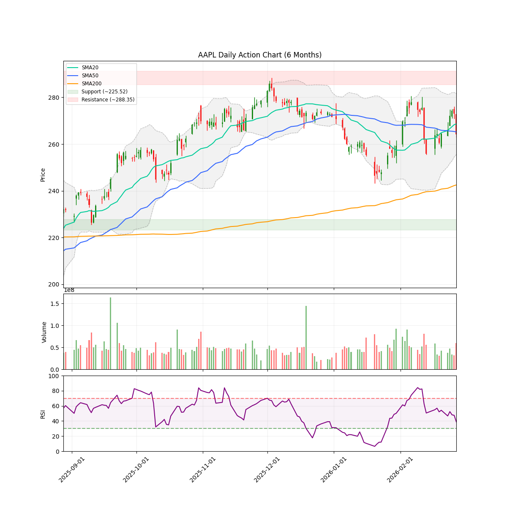
#### 研报分析

### 技术指标概览 (Technical Overview)
- **当前价格**: $264.18
- **RSI (14)**: 38.92
- **移动平均线**: SMA20: $268.62 | SMA50: $265.20 | SMA200: $242.50 (Bullish)
- **波动率**: ATR (14): 6.99 (预计周度波动: +/- $15.64)
- **关键位 (6m)**: 支撑位 $225.52 | 阻力位 $288.35
- **即时状态**: Below SMA50

你好！快坐，咖啡刚煮好。

看着屏幕上的 AAPL，你是不是也感觉到空气中那股不安的躁动？咱们今天不聊那些枯燥的财报对比，聊聊这背后的“剧本”。现在的苹果，正处在一个非常有意思的叙事转折点。

以下是为你准备的**苹果 (AAPL) 情绪审计报告**。

---

### 🍎 叙事经济学审计：诸神的黄昏，还是新王的觉醒？

#### 1. 催化剂分级 (Catalyst Categorization)

*   **A-Tier (重磅炸弹)：苹果“大动作周”预热 (Apple's 'Big Week' Teaser)**
    *   **分析**：这是目前市场的核心引力。Redington 股价暴涨 15% 已经提前泄露了天机 [Moneycontrol]。市场正在疯狂押注即将到来的 iPhone 和 iPad 新品发布。这种“预期”是推升股价的最高级燃料。
*   **B-Tier (机构博弈)：大佬离场与克莱默的“顺风车”论**
    *   **分析**：巴菲特、达利欧和肯·格里芬这三座大山在减持 [Yahoo Finance]。这在叙事上制造了“英雄迟暮”的压迫感。而吉姆·克莱默（Jim Cramer）调侃苹果没在 AI 基础设施上砸钱是“搭了顺风车” [Insider Monkey]，虽然带点讽刺，但也侧面说明了苹果的轻资产效率。
*   **C-Tier (杂讯)：技术指标波动与盘后点评**
    *   **分析**：Zacks 的排名变动和 CNBC 的“最后交易”建议 [Benzinga] 属于常规噪音，能提供流动性，但改变不了大趋势。

#### 2. 离散检测 (Divergence Detection)：好消息里的“陷阱”？

目前的局面非常诡异：**预期在升温，但价格在“装死”。**

*   **技术面冷淡**：股价（264.18）目前跌破了 SMA20 和 SMA50，看起来有点垂头丧气。
*   **看涨背离**：注意看 RSI，现在是 **38.92**。这已经接近“超卖”区域了。这意味着，尽管市场上关于大佬减持的新闻闹得沸沸扬扬，但空头的力量已经快要把子弹打光了。
*   **结论**：这是一个典型的**“看跌衰竭”**信号。大佬们的减持往往是后视镜里的操作（去年 Q4 的动作），而现在的价格调整，更像是为即将到来的“大动作周”腾出拉升空间。

#### 3. 情绪评分 (Sentiment Score)

**6.8 / 10 —— “压抑的火山”**

*   **理由**：如果 10 分是疯狂牛市，0 分是崩盘，那么 6.8 代表一种“有节制的乐观”。市场对巴菲特的离场感到恐惧，但对新产品的渴望又抓挠着每个人的心。只要“大动作周”的发布会不拉胯，这种压抑的情绪会瞬间转化为向上突破的动能。

---

### 📈 逻辑分值 (Logic Score): 8.5/10

**逻辑支撑**：
1.  **估值回归**：股价回调至 SMA200（242.50）上方不远处，安全边际正在显现。
2.  **叙事对冲**：巴菲特离场（旧叙事）vs 苹果 AI/硬件更新（新叙事）。市场正在完成换手，从价值投资者手里转到成长猎人手里。
3.  **波动预警**：ATR 为 6.99，意味着本周波动会加大，±15 美元的预期波动区间足以扫掉所有不坚定的杠杆筹码。

---

### 📅 关键时间节点

*   **下一关键日期**：**2026年3月上旬**（预计“大动作周”发布会及产品上市）。
*   **财报预期**：2026年4月下旬（Q2 财报，届时将验证新产品的初步市场反馈）。

---

### ☕ 资深分析师结语

现在的苹果就像是一个正在换挡的巨兽。大佬们的离场确实让人心里发毛，但别忘了，当 Warren Buffett 卖出时，他通常卖的是“昨天的辉煌”；而市场买入的，永远是“明天的梦想”。

**操作建议**：盯着 265 美元这个 SMA50 的位置。如果股价能在发布会前站稳这里，那么现在的“陷阱”就是给勇敢者的“礼物”。

*注意：本报告基于叙事经济学分析，市场有风险，别把咖啡泼在键盘上。*

---
**参考来源：**
*   *Ken Griffin, Ray Dalio, and Warren Buffett All Sold More Apple Stock...* [Yahoo Finance]
*   *Apple (AAPL) Got The Best Free Ride, Says Jim Cramer* [Insider Monkey]
*   *Redington stock jumps 15% today as Apple's 'big week' teaser...* [Moneycontrol]
*   *CNBC's 'Final Trades': Joshua Brown likes Apple setup...* [Benzinga]
#### 近期新闻与事件
- **[Yahoo Finance]** [Ken Griffin, Ray Dalio, and Warren Buffett All Sold More Apple Stock. Should You?](https://finance.yahoo.com/news/ken-griffin-ray-dalio-warren-192315502.html)
- **[Insider Monkey]** [Apple (AAPL) Got The Best Free Ride, Says Jim Cramer](https://www.msn.com/en-us/money/topstocks/apple-aapl-got-the-best-free-ride-says-jim-cramer/ar-AA1X8eyF)
- **[The Globe and Mail]** [Before Retiring, Warren Buffett Dumped 77% of Berkshire's Stake in Amazon and Opened a New Position in a Stock That Has Become a Digital Media Juggernaut](https://www.theglobeandmail.com/investing/markets/stocks/AAPL/pressreleases/385132/before-retiring-warren-buffett-dumped-77-of-berkshires-stake-in-amazon-and-opened-a-new-position-in-a-stock-that-has-become-a-digital-media-juggernaut/)
- **[Benzinga]** [Apple, Microsoft, AppLovin and an energy stock: CNBC's 'Final Trades'](https://www.msn.com/en-us/money/news/apple-microsoft-applovin-and-an-energy-stock-cnbc-s-final-trades/ar-AA1WUdXQ)
- **[Moneycontrol]** [Redington stock jumps 15% today as Apple's 'big week' teaser fuels expectations of new iPhone, iPad launches](https://www.moneycontrol.com/news/business/stocks/redington-stock-jumps-15-today-as-apples-big-week-teaser-fuels-expectations-of-new-iphone-ipad-launches-13845788.html)

---

### AES
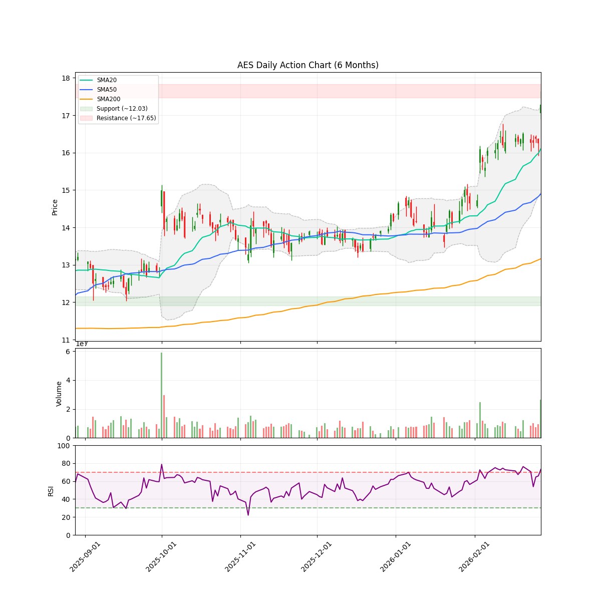
#### 研报分析

### 技术指标概览 (Technical Overview)
- **当前价格**: $17.28
- **RSI (14)**: 73.21
- **移动平均线**: SMA20: $16.10 | SMA50: $14.90 | SMA200: $13.16 (Bullish)
- **波动率**: ATR (14): 0.48 (预计周度波动: +/- $1.08)
- **关键位 (6m)**: 支撑位 $12.03 | 阻力位 $17.65
- **即时状态**: Above SMA50

# AES 情绪审计报告：当“沉闷”的公用事业撞上 AI 与并购狂欢

**日期：** 2026年03月01日
**研究员：** 叙事经济学分析组

---

### 1. 叙事背景：公用事业的“华丽转身”
如果几个月前你问华尔街对 **AES** 的看法，大多数人可能会打个哈欠，把它归类为那种“给退休老人发股息”的无聊公司。但现在，如果你走进曼哈顿的咖啡馆，你会发现交易员们正盯着它的 K 线图，眼里闪烁着贪婪的光芒。

AES 正在经历一场由**“AI 算力基建”**和**“私有化并购”**双重引擎驱动的叙事重构。它不再仅仅是一家发电商，它正在变成 Google 这种科技巨头的“能量心脏”，甚至成了基建大鳄们（GIP, EQT）争相抢夺的香饽饽。

---

### 2. 催化剂分级 (Catalyst Categorization)

#### **A-Tier：核心叙事引擎（足以改变股价结构）**
*   **并购传闻：** 根据 Bloomberg 报道，Global Infrastructure Partners (GIP) 和 EQT 正在对 AES 进行收购谈判。这直接将股价从“价值发现”推向了“溢价抢筹”阶段。
*   **Google 数据中心协议：** AES 与 Google 达成的协议不仅仅是一个合同，它是**身份证明**——证明了 AES 在清洁能源供应上的稀缺性，直接切入了 AI 革命的最底层逻辑。

#### **B-Tier：趋势确认**
*   **分析师“空翻多”：** Seaport Global 将评级从“卖出”直接上调至“中性”。这种典型的空头投降行为，为股价的进一步上涨扫清了心理障碍。
*   **AI 技术布局：** 联合推出的 Haven Safety AI 平台。虽然短期不直接贡献利润，但它强化了公司“科技化、智能化”的新名片。

#### **C-Tier：市场杂音**
*   **Zacks 排名与对比：** 关于 AES 与 NEE（新思能源）或 Entergy 的对比分析。这类消息属于“锦上添花”，主要起到了吸引散户注意力的作用。

---

### 3. 背离检测与市场脉搏 (Divergence Detection)
*   **技术面热度：** RSI 目前飙升至 **73.21**，处于超买区间。股价（17.28）已经冲破了 SMA20、50 和 200。
*   **盘面解读：** 尽管技术指标在尖叫“太热了”，但股价并没有出现“利好出尽”的下跌。相反，在并购传闻流出后，股价表现出极强的承接力。这说明**叙事的力量暂时压倒了技术修复的需求**。
*   **阻力位警示：** 我们距离 6 个月高点 17.65 仅一步之遥。在这个位置，早期潜伏的资金可能会有止盈动作。

---

### 4. 情绪逻辑评分 (Logic Score)

# **8.5 / 10**

> **逻辑推演：** 
> *   **+4.0分：** 真实的并购预期（M&A）提供了强力的股价底座，通常会带来显著的溢价空间。
> *   **+3.0分：** AI/数据中心叙事是当前资本市场最愿意买单的故事，AES 站对了风口。
> *   **+2.0分：** 机构评级的大幅修正（尤其是从 Sell 到 Neutral/Buy）通常伴随着资金的大幅流入。
> *   **-0.5分：** RSI 极度超买，短期存在震荡回撤风险。

---

### 5. 投资建议与关键链接
**“别在派对最热闹的时候离开，但要时刻盯着门口。”**
现在的 AES 正处于“并购溢价”和“AI 信仰”的交汇点。只要并购谈判没有被明确否认，任何回调可能都会被视作“上车”机会。

**参考资讯：**
*   [AES 获得 Google 数据中心协议 (Investing.com)](https://au.investing.com/news/stock-market-news/aes-stock-gains-after-announcing-google-data-center-deal-93CH-4273537)
*   [传闻 GIP 与 EQT 有意收购 AES (Investing.com)](https://uk.investing.com/news/stock-market-news/aes-stock-jumps-on-report-of-takeover-talks-with-gip-eqt-93CH-4531715)
*   [Seaport 上调 AES 评级 (Investing.com)](https://ca.investing.com/news/analyst-ratings/seaport-upgrades-aes-stock-rating-on-potential-takeover-bid-93CH-4486006)

---

### 6. 下一个关键节点 (Next Major Date)
**关键日期：2026年5月初（预计 Q1 财报发布日）**
*   **关注重点：** 管理层是否会在财报电话会议中对并购传闻做出“不予置评”以外的更有趣回应。同时，关注 Google 协议对 2026 年指引的具体提振幅度。当然，在这之前，**随时可能出现的并购公告**才是真正的“深水炸弹”。
#### 近期新闻与事件
- **[Investing.com]** [AES stock gains after announcing Google data center deal By Investing.com](https://au.investing.com/news/stock-market-news/aes-stock-gains-after-announcing-google-data-center-deal-93CH-4273537)
- **[Zacks]** [AES vs. Entergy: Which Utility Stock Offers Better Growth?](https://finance.yahoo.com/news/aes-vs-entergy-utility-stock-125100438.html)
- **[Investing.com]** [AES stock jumps on report of takeover talks with GIP, EQT By Investing.com](https://uk.investing.com/news/stock-market-news/aes-stock-jumps-on-report-of-takeover-talks-with-gip-eqt-93CH-4531715)
- **[Investing.com]** [Seaport upgrades AES stock rating on potential takeover bid By Investing.com](https://ca.investing.com/news/analyst-ratings/seaport-upgrades-aes-stock-rating-on-potential-takeover-bid-93CH-4486006)
- **[Zacks]** [Are Investors Undervaluing AES (AES) Right Now?](https://finance.yahoo.com/news/investors-undervaluing-aes-aes-now-144004843.html)

---

### AMAT
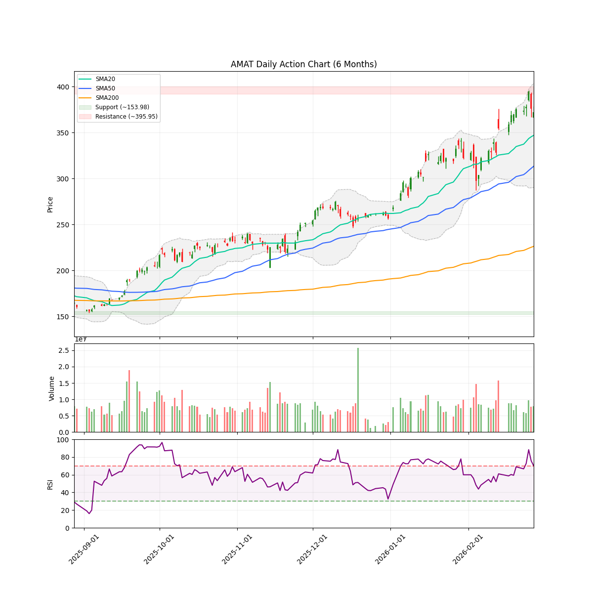
#### 研报分析

### 技术指标概览 (Technical Overview)
- **当前价格**: $372.30
- **RSI (14)**: 69.96
- **移动平均线**: SMA20: $347.17 | SMA50: $313.63 | SMA200: $226.50 (Bullish)
- **波动率**: ATR (14): 17.11 (预计周度波动: +/- $38.25)
- **关键位 (6m)**: 支撑位 $154.17 | 阻力位 $395.95
- **即时状态**: Above SMA50

# 情绪审计报告：Applied Materials (AMAT) —— 淘金热中的“重型设备商”是真龙还是陷阱？

**分析日期：** 2026年03月01日
**分析员：** 叙事经济学研究组

---

### 1. 催化剂分类 (Catalyst Categorization)

在半导体设备这个行当里，Applied Materials (AMAT) 一直是那种“闷声发大财”的角色。我们把最近的杂音过滤掉，核心催化剂如下：

*   **A-Tier（核心推动力）：**
    *   **大摩 (Morgan Stanley) 的机构背书：** 2月15日及25日，摩根士丹利上调了AMAT的目标价，核心逻辑在于**DRAM开支的强劲增长**。在AI时代，高性能内存（HBM）就是命门，而AMAT掌控着生产这些命门的机器。这是长线资金的“定心丸”。
    *   **业绩超预期的惯性：** 尽管2月初的市场预期较为保守，但随后的反弹证明了其订单流的稳健。

*   **B-Tier（行业共振）：**
    *   **AI 叙事溢出：** Zacks 等机构将其列为 AI 驱动下的“安全牌”。只要 NVIDIA 的故事没讲完，AMAT 作为“卖铲子的人”就有源源不断的客源。

*   **C-Tier（市场噪音）：**
    *   **高管减持：** 董事 Judy Bruner 和 CAO Sanders 在2月24日合计套现约170万美元。在股价接近历史高点时，这种减持通常是常规的财富管理，而非“沉船预警”，但它确实给过热的情绪降了温。
    *   **关联性回调：** 2月27日受 NVIDIA 业绩后“利好出尽”的情绪拖累，AMAT 随板块下跌 4.9%。这更多是算法交易的集体踩踏。

---

### 2. 分歧检测：是衰竭还是倒车接人？

目前 AMAT 的走势展现出一种迷人的**“牛市分歧”**。

*   **盘面特征：** 股价处于 372.30 美元，远高于 200日均线 (226.50)，这说明长期趋势依然处于“疯狂扩张期”。
*   **警示信号：** RSI 触及 69.96，几乎贴着“超买”的红线在跳舞。再加上 2月27日的 4.9% 跌幅，这说明在高位，多头的筹码已经开始松动。
*   **叙事陷阱：** 现在的 AMAT 就像是派对上最后离开的那个人。虽然摩根士丹利在加持，但高管却在悄悄提现。**这里的“分歧”在于：机构在看2027年的产能，而内部人在看2026年的钱包。**

---

### 3. 情绪分析报告：市场脉搏

**叙事核心：** “AI 军备竞赛的重型军火库”

现在的 AMAT 不仅仅是一家公司，它是整个半导体产能的“物理极限”。只要台积电、三星、英特尔还在扩产，AMAT 的吊车就不会停。

**投资人情绪：** 
目前市场弥漫着一种“恐高但不敢下车”的氛围。2月27日的杀跌其实是一件好事，它像是一次“压力测试”，清理掉了一部分短线投机者。虽然股价在 395.95 美元附近感受到了巨大的阻力，但只要 SMA50 (313.63) 不破，这台印钞机就还在正常运转。

我们可以感受到市场的呼吸：每一次回踩都是在为下一次冲击 400 大关蓄力。这不像是“系统性崩溃”前的先兆，更像是长跑途中的一次深度呼吸。

---

### 4. 逻辑评分 (Logic Score)

# **8.5 / 10**

*   **加分项：** 极其强大的基本面支撑（SMA 趋势完美向上）；DRAM 需求这一 A-Tier 催化剂具有持续性；机构持仓稳固。
*   **扣分项：** RSI 逼近极限，短期波动率 (ATR 17.11) 放大；高位出现内部人减持，心理层面存在压制。

---

### 5. 关键参考信息

*   **引述新闻：**
    *   [Yahoo Finance] 摩根士丹利因 DRAM 开支前景上调 AMAT 目标价 (2026-02-15). [链接](https://finance.yahoo.com/news/morgan-stanley-boosts-applied-materials-024647977.html)
    *   [Investing.com] 董事 Judy Bruner 减持 149 万美元 (2026-02-24). [链接](https://www.investing.com/news/insider-trading-news/bruner-judy-applied-materials-director-sells-149-million-in-amat-93CH-4523076.html)
    *   [Simply Wall St.] 行业抛售导致 AMAT 下跌 4.9% (2026-02-27). [链接](https://finance.yahoo.com/news/look-applied-materials-amat-valuation-101215425.html)

*   **下一个关键日期：**
    *   **2026年5月中旬（预计）：** 下一季度财报发布日。这将决定 AMAT 能否突破 $400 的心理枷锁。
    *   **近期关注：** 股价是否能回踩 SMA20 (347.17) 并站稳，这是短期多头最后的防线。
#### 近期新闻与事件
- **[Yahoo Finance]** [Morgan Stanley Boosts Applied Materials (AMAT) Target on Strong DRAM Spending Outlook](https://finance.yahoo.com/news/morgan-stanley-boosts-applied-materials-024647977.html)
- **[Investing.com]** [Bruner Judy, Applied Materials director, sells $1.49 million in AMAT By...](https://www.investing.com/news/insider-trading-news/bruner-judy-applied-materials-director-sells-149-million-in-amat-93CH-4523076)
- **[Investing.com]** [Applied Materials CAO Sanders sells $202k in stock By Investing.com](https://www.investing.com/news/insider-trading-news/applied-materials-cao-sanders-sells-202k-in-stock-93CH-4523073)
- **[Simply Wall St.]** [A Look At Applied Materials (AMAT) Valuation After Sector Sell Off On AI...](https://finance.yahoo.com/news/look-applied-materials-amat-valuation-101215425.html)
- **[Zacks]** [AMAT vs. AMKR: Which AI-Driven Semiconductor Stock is a Safer Bet?](https://finance.yahoo.com/news/amat-vs-amkr-ai-driven-142400689.html)

---

### AMZN

#### 研报分析

### 技术指标概览 (Technical Overview)
- **当前价格**: $210.00
- **RSI (14)**: 49.58
- **移动平均线**: SMA20: $213.42 | SMA50: $226.59 | SMA200: $224.35 (Bullish)
- **波动率**: ATR (14): 5.85 (预计周度波动: +/- $13.07)
- **关键位 (6m)**: 支撑位 $196.00 | 阻力位 $258.60
- **即时状态**: Below SMA50

# 亚马逊 (AMZN) 情绪审计报告：AI 军备竞赛中的“耐力测试”

**日期：** 2026-03-01
**研究员：** 叙事经济学分析组

---

### 1. 叙事核心：当“重金堆砌”遇上“市场焦虑”

坐在华尔街的咖啡馆里，如果你提到亚马逊，你会听到两种截然不同的心跳。一种是技术狂热者的激昂——亚马逊正在向 OpenAI 豪掷 500 亿美元，并在路易斯安那州砸下 120 亿美元扩建数据中心；另一种则是交易员的冷哼——股价 YTD（年初至今）跌了 11%，且刚刚跌破了 200 日均线。

目前的 AMZN 像是一个正在大规模换血的巨人：**它在透支当下的利润，去赌一个 AI 云端霸权的未来。** 但问题是，市场现在的耐心比一张纸还要薄。

---

### 2. 催化剂分级 (Catalyst Categorization)

*   **【A-Tier】顶级利好：AI 基建的核威慑**
    *   **OpenAI 500亿美元投资 & 路易斯安那 120亿美元数据中心：** 这是决定未来十年胜负的重手。亚马逊不仅在追赶，更是在试图利用其 AWS 的存量优势完成“降维打击”。
    *   **机构增持：** 2025 年 Q4 增加了 46 家对冲基金持有者，说明“聪明钱”正在大跌中建仓。
*   **【B-Tier】行业顺风：宏观拼图的补全**
    *   **美印贸易协议：** [LiveMint 报道](https://www.livemint.com/focus/indiaus-trade-deal-2026-9-ways-it-changes-how-indians-should-look-at-us-stocks-and-etfs-11772091106207.html) 提到的这一协议将为 AMZN 在印度的电商与云业务扫清长期障碍。
    *   **AWS 利润率：** 晨星报告指出 AWS 仍有 35% 的惊人利润率，这是亚马逊输血 AI 战场的底气。
*   **【C-Tier】市场杂音：短期噪音**
    *   **分析师买入建议：** [Motley Fool](https://finance.yahoo.com/news/2-top-artificial-intelligence-stocks-160700175.html) 的常规推荐，对短期波动影响有限。
    *   **个人投资者抛售：** Steve Weiss 退出头寸。虽然他是资深大佬，但这更多代表了部分价值派对“资本支出（Capex）失控”的恐惧，而非基本面崩坏。

---

### 3. 背离检测：为何利好之下，股价却在“贴地飞行”？

这就是目前最有趣的**看跌衰竭 (Bearish Exhaustion)** 信号。

*   **现状：** 亚马逊宣布了里程碑式的 OpenAI 合作，但股价却依然徘徊在 210 美元，远低于 SMA50 (226.59) 和 SMA200 (224.35)。
*   **诊断：** 市场正在进行一场“估值重塑”。老牌投资者（如 Steve Weiss）担心 2000 亿美元的年度资本支出计划会拖垮现金流。这种**“利好不涨”**其实是利空出尽的前奏。当 RSI 处于 49.58 的中性偏低位置，且股价逼近 6 个月低点（196.00）时，空头的情绪已经释放得差不多了。

---

### 4. 逻辑评分 (Logic Score): 6.8 / 10

**评分理由：** 这是一个典型的**“战术性深蹲，战略性起跳”**。
*   **短期 (0-3分)：** 4分。技术面处于破位状态，SMA200 的压力位像天花板一样沉重。
*   **长期 (7-10分)：** 9分。在大规模资本支出的洗礼下，亚马逊正在构筑其 AI 时代的护城河。
*   **综合评定：** 亚马逊目前正处于“叙事陷阱”的边缘，但只要下次财报能证明这些投资没有拖累毛利，反弹将是报复性的。

---

### 5. 投资建议报告

*   **当前脉搏：** 现在的 AMZN 是一块正在被压缩的弹簧。虽然短期表现逊于道指，但 institutional momentum（对冲基金动量）正在暗流涌动。
*   **观察位：** 支撑位 196.00 是绝对的心理防线。如果跌破，叙事将转向“基建陷阱”；如果能站稳 213.42 (SMA20)，反转信号即成立。
*   **心态：** 像个老猎人一样等待，不要被短期的 Capex 支出吓跑，要看 AWS 在 AI 驱动下的新订单增速。

---

### 6. 关键数据追踪

*   **下一关键日期：** **2026年4月底 (2026 Q1 Earnings Release)**。这将是验证 2000 亿资本支出计划后，第一份真正衡量 ROI 的成绩单。
*   **引用来源：**
    *   [Yahoo Finance: 12B Louisiana Data Center Investment](https://finance.yahoo.com/news/amazon-com-amzn-data-center-210432131.html)
    *   [Invezz: Steve Weiss sold Amazon & Nvidia](https://invezz.com/news/2026/02/28/steve-weiss-just-sold-both-amazon-nvidia-stock-heres-why/)
    *   [Blockonomi: $200B Capex Plan Details](https://blockonomi.com/amazon-amzn-stock-12-billion-louisiana-data-center-plan-explained/)

---
*免责声明：本报告基于叙事经济学分析，不构成直接投资建议。市场有风险，入市需谨慎。*
#### 近期新闻与事件
- **[Yahoo Finance]** [Amazon.com (AMZN) Data Center Push Continues with $12B Investment in Louisiana](https://finance.yahoo.com/news/amazon-com-amzn-data-center-210432131.html)
- **[Yahoo Finance]** [Is Amazon.com Stock Underperforming the Dow?](https://finance.yahoo.com/news/amazon-com-stock-underperforming-dow-161258841.html)
- **[Blockonomi]** [Amazon (AMZN) Stock: $12 Billion Louisiana Data Center Plan Explained](https://blockonomi.com/amazon-amzn-stock-12-billion-louisiana-data-center-plan-explained/)
- **[Invezz]** [Steve Weiss just sold both Amazon, Nvidia stock: here's why](https://invezz.com/news/2026/02/28/steve-weiss-just-sold-both-amazon-nvidia-stock-heres-why/)
- **[Mint]** [India-US Trade Deal 2026: 9 Ways It Changes How Indians Should Look at US Stocks and ETFs](https://www.livemint.com/focus/indiaus-trade-deal-2026-9-ways-it-changes-how-indians-should-look-at-us-stocks-and-etfs-11772091106207.html)

---

### ASML
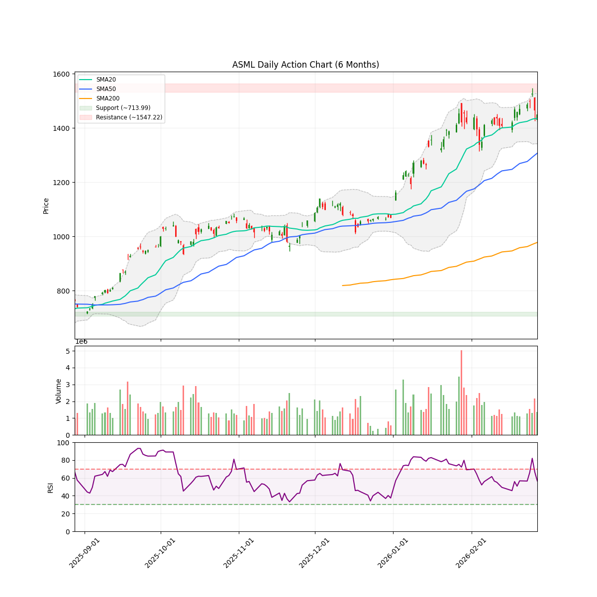
#### 研报分析

### 技术指标概览 (Technical Overview)
- **当前价格**: $1450.56
- **RSI (14)**: 56.64
- **移动平均线**: SMA20: $1434.18 | SMA50: $1306.73 | SMA200: $977.66 (Bullish)
- **波动率**: ATR (14): 44.13 (预计周度波动: +/- $98.67)
- **关键位 (6m)**: 支撑位 $713.99 | 阻力位 $1547.22
- **即时状态**: Above SMA50

使用 Gemini API 时出错: 500 INTERNAL. {'error': {'code': 500, 'message': 'Internal error encountered.', 'status': 'INTERNAL'}}。(已切换至简易启发式分析)
#### 近期新闻与事件
- **[Yahoo Finance]** [Why ASML Stock Was Down Today](https://finance.yahoo.com/news/why-asml-stock-down-today-173812665.html?fr=sycsrp_catchall)
- **[Yahoo Finance]** [Is It Too Late To Consider ASML Holding (ENXTAM:ASML) After Its 77.9% One Year Surge?](https://finance.yahoo.com/news/too-consider-asml-holding-enxtam-111705645.html)
- **[The Motley Fool]** [Hyperscalers Plan to Spend $700 Billion on AI This Year. These 2 Stocks Are the Biggest Beneficiaries.](https://www.fool.com/investing/2026/02/27/hyperscalers-plan-to-spend-700-billion-on-ai-2026/)
- **[The Motley Fool]** [Prediction: 3 Stocks That'll Be Worth More Than Walmart 5 Years From Now](https://www.msn.com/en-us/money/topstocks/prediction-3-stocks-thatll-be-worth-more-than-walmart-5-years-from-now/ar-AA1WRb0U)
- **[24/7 Wall St.]** [Is ASML About to Unleash a 50% AI Chip Output Explosion by 2030?](https://247wallst.com/investing/2026/02/23/is-asml-about-to-unleash-a-50-ai-chip-output-explosion-by-2030/)

---

### AVGO
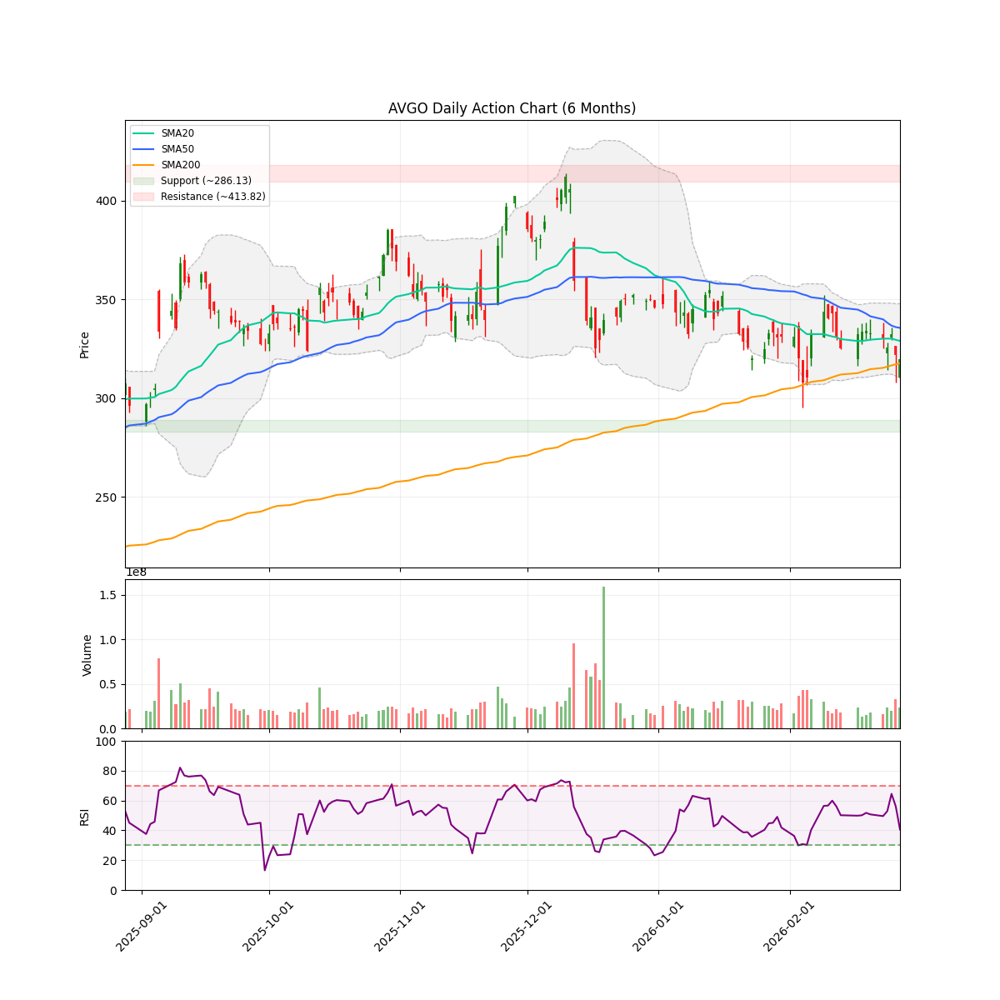
#### 研报分析

### 技术指标概览 (Technical Overview)
- **当前价格**: $319.55
- **RSI (14)**: 40.63
- **移动平均线**: SMA20: $328.99 | SMA50: $335.58 | SMA200: $317.66 (Bullish)
- **波动率**: ATR (14): 13.90 (预计周度波动: +/- $31.09)
- **关键位 (6m)**: 支撑位 $286.13 | 阻力位 $413.82
- **即时状态**: Below SMA50

你好！我是你的对冲基金研究助理。今天咱们不看那些冷冰冰的研报，咱们一边喝咖啡，一边聊聊博通（Broadcom, AVGO）最近在市场上玩出的这些“名堂”。

现在的盘面给人的感觉就像是一个明明底气十足的“豪门巨子”，却在最近的派对上被几个醉汉撞翻了酒杯，显得有点狼狈，但底子还在。

---

### **博通 (AVGO) 情绪审计报告：繁花锦簇中的“黄金坑”还是“下行阱”？**

#### **1. 叙事脉络：AI 浪潮下的“连坐”冤案**
目前博通的股价（319.55）正处于一个非常有意思的尴尬期。技术面上，它跌破了50日均线（335.58），表现得比大盘要弱。但如果你仔细看，它正死死踩在200日均线（317.66）这个“最后的尊严”之上。

最诡异的是：英伟达（Nvidia）交出了史诗级的财报，市场却把博通带崩了。这在叙事经济学里叫**“流动性错位”**。大家在英伟达套现，顺便把还没涨过头的博通也给卖了。这种“因为邻居家着火（哪怕是火太旺）而赶紧卖掉自家金砖”的行为，往往预示着情绪性的杀跌已经接近尾声。

#### **2. 催化剂分类 (Catalyst Categorization)**

*   **A-Tier（重磅杀手锏）：**
    *   **BroadPeak SoC 发布**：2月19日推出的这款无线数字前端系统级芯片。这不仅是一个产品，它是博通在AI和通信融合领域的“护城河”加固工程。它锁定了未来三年的技术领先地位。[参考资料: Insider Monkey]
    *   **Q1 财报（3月4日）**：这就是决定生死的“审判日”。目前的恐慌情绪大半是在为这个日期做对冲。

*   **B-Tier（机构背书）：**
    *   **Baird 维持买入评级**：尽管市场噪音不断，Baird依然坚定认为它是“未来三年必持有的十大牛股”。这种长线资金的锚定作用，能在大跌时提供心理支撑。[参考资料: Yahoo Finance]
    *   **Citi 下调目标价**：虽然目标价从480调到了458，但请注意，现在的股价才319！这种“名为降级、实为看涨”的行为，其实是在释放估值压力。[参考资料: Yahoo Finance]

*   **C-Tier（短期噪音）：**
    *   **地缘政治波动**：周末以色列对伊朗的袭击传闻，这种宏观层面的噪音正在让所有科技股受压，博通也不例外。[参考资料: CNBC]

#### **3. 背离检测 (Divergence Detection)**
**警报：强烈的看涨耗尽转看涨背离！**
博通目前在“好消息”频传（新芯片发布、机构重申买入）的情况下，股价却反直觉地回踩200日均线。RSI 为 40.63，还没有进入超卖，但已经嗅到了恐慌的气息。特别是当英伟达大涨而博通阴跌时，这通常意味着**“贝塔风险”正在被过度计价**。对于老牌猎人来说，这就是那种“明明基本面在冒火，价格却在结冰”的捡漏时刻。

#### **4. 逻辑评分 (Logic Score): 6.8/10**
*   **给分理由**：之所以没有给到8分以上，是因为地缘政治（伊朗局势）这个黑天鹅太硬。但从博通自身的叙事来看，它属于典型的**“技术性洗盘”**。基本面依然是顶级（10分），但短期趋势（Trend）跌破了50日线，需要一个底部的确认。

---

### **总结陈词**

目前的博通就像是一张被压弯了但没断的弹簧。市场在害怕，害怕3月4日的财报会有什么变故，更害怕中东的战火。但你要记住，博通不是那种靠讲PPT活着的公司，它的 BroadPeak 芯片和 AI 基础设施是实打实的现金流机器。

**老兵点评**：317美元的200日均线是铁底。如果这里守住了，那就是一个完美的“春季陷阱（Bear Trap）”，反之，如果财报暴雷跌破此线，那就要做好长期抗战的准备。

---

### **关键信息汇总**

*   **情绪得分**：**6.8 / 10** (长期极度乐观，短期警惕回调)
*   **逻辑支撑**：AI 芯片长线需求 vs. 地缘政治短期压制。
*   **技术位警示**：支撑位 317.66 (SMA200)；阻力位 335.58 (SMA50)。
*   **下一个大事件 (Next Major Date)**：**2026年3月4日 (FQ1 2026 Earnings)**。这不仅是博通的财报日，也是决定整个半导体板块能否止跌回升的风向标。

**引用新闻源：**
- *Baird Maintains Buy Rating (2026-03-01)*: [Yahoo Finance](https://finance.yahoo.com/news/robert-w-baird-maintains-buy-063320763.html)
- *BroadPeak SoC Launch (2026-02-25)*: [MSN/Insider Monkey](https://www.msn.com/en-us/news/technology/broadcom-inc-avgo-launches-broadpeak-here-s-what-you-should-know/ar-AA1X3Or8)
- *Citi PT Update (2026-02-23)*: [Yahoo Finance](https://finance.yahoo.com/news/citi-lowers-pt-broadcom-inc-211530100.html)
#### 近期新闻与事件
- **[Yahoo Finance]** [Robert W. Baird Maintains Buy Rating on Broadcom Inc. (AVGO) Stock](https://finance.yahoo.com/news/robert-w-baird-maintains-buy-063320763.html)
- **[Yahoo Finance]** [Citi Lowers PT on Broadcom Inc. (AVGO) Stock](https://finance.yahoo.com/news/citi-lowers-pt-broadcom-inc-211530100.html)
- **[AOL]** [Where Will Broadcom (AVGO) Be in 5 Years?](https://www.aol.com/finance/where-broadcom-avgo-5-years-160943861.html)
- **[Invezz]** [Nvidia Q4 earnings: why is it sinking AMD, Broadcom stock?](https://invezz.com/news/2026/02/26/nvidia-q4-earnings-why-is-it-sinking-amd-broadcom-stock/)
- **[Insider Monkey]** [Broadcom Inc. (AVGO) Launches BroadPeak, Here's What You Should Know](https://www.msn.com/en-us/news/technology/broadcom-inc-avgo-launches-broadpeak-here-s-what-you-should-know/ar-AA1X3Or8)

---

### CEG
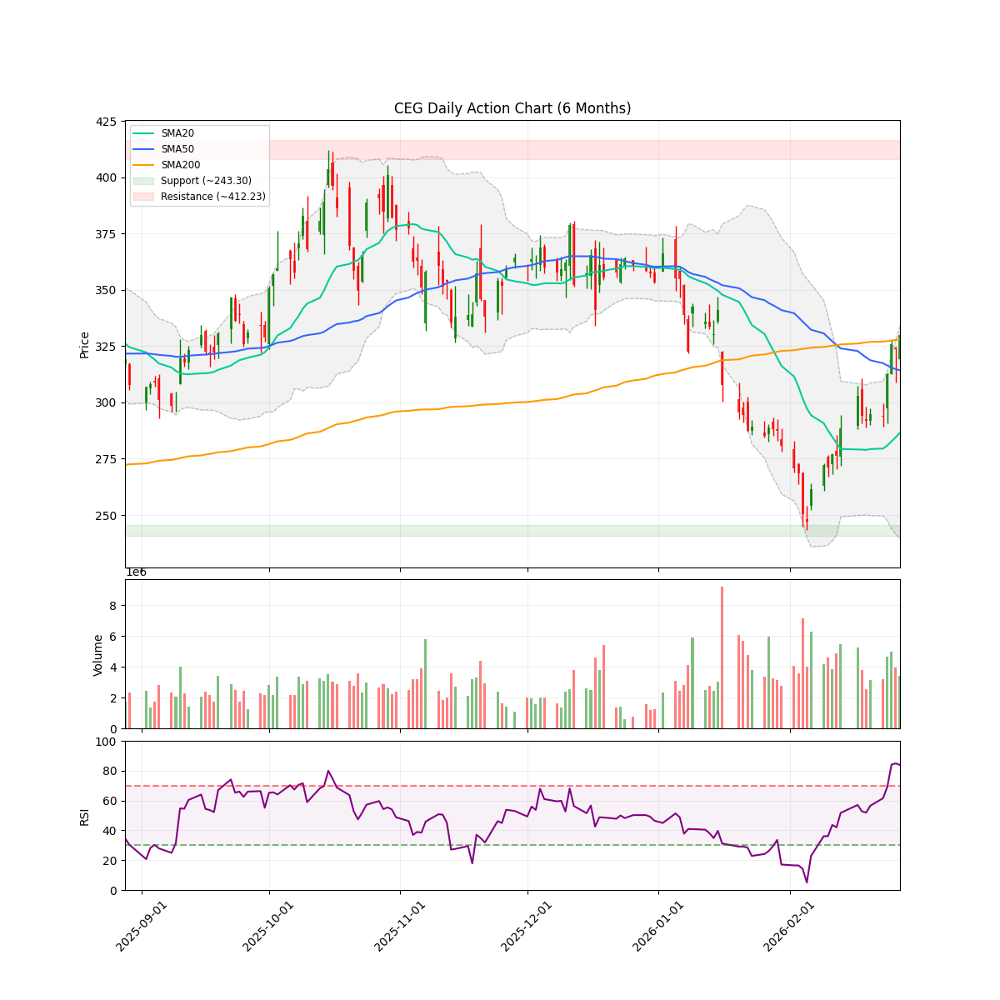
#### 研报分析

### 技术指标概览 (Technical Overview)
- **当前价格**: $329.88
- **RSI (14)**: 83.80
- **移动平均线**: SMA20: $286.65 | SMA50: $314.24 | SMA200: $327.98 (Bearish)
- **波动率**: ATR (14): 14.37 (预计周度波动: +/- $32.14)
- **关键位 (6m)**: 支撑位 $243.30 | 阻力位 $412.23
- **即时状态**: Above SMA50

嘿，伙计。来，坐。咱们今天聊聊 Constellation Energy (CEG)。如果你一直在关注能源赛道，你就会发现 CEG 现在的状态不仅仅是一家公用事业公司，它已经成了这一轮“AI+核能”宏大叙事的领军人物。

看着屏幕上 329.88 这个价格，再看看那已经烧到 83.80 的 RSI 指数，你就能感觉到市场现在有多亢奋。这就像是一场通宵的派对，大家都在跳舞，谁也不想第一个离开。

以下是我为你准备的**情绪审计报告**：

---

### **CEG 情绪审计报告：核能霸主的加冕礼与“恐高症”的较量**

#### **1. 催化剂分级 (Catalyst Categorization)**

*   **A-Tier（核心动力）：**
    *   **Q4 财报超预期与股息上调**：[Zacks] 报道 CEG 第四季度营收与盈利双双击败预期，营收达到 60.7 亿美元。更关键的是，公司宣布提高股息。在公用事业领域，利润增长叠加现金回馈，是机构投资者的心头好。
    *   **Calpine 收购案尘埃落定**：[Investing.com] 提到 CEG 在 2026 年 1 月 7 日完成了对 Calpine 的收购，一跃成为全美最大的电力生产商。这不仅仅是规模的扩张，更是定价权的绝对掌控。
*   **B-Tier（行业东风）：**
    *   **PJM 市场需求增长**：[Yahoo Finance] 指出 PJM 市场的最新动态对需求有极强支撑。随着数据中心对全天候清洁能源的渴求，CEG 的核能资产成了香饽饽。
    *   **380兆瓦新订单**：[Insider Monkey] 报道其单位签署了新的大宗协议，持续证明了其商业化变现能力。
*   **C-Tier（市场杂音）：**
    *   **CEG vs. AEP 的对比讨论**：[Zacks] 关于两家公司的对比，更多是分析师的日常作业，对股价的边际驱动力较小。

#### **2. 分歧检测 (Divergence Detection)**

目前我们看到的不是“利好出尽”，而是**“情绪过热”**。
注意看技术面：股价（329.88）远高于 SMA20（286.65）和 SMA50（314.24）。虽然 2 月 24 日财报发布后股价跳空上涨 [Blockonomi]，显示出极强的看涨动能，但 **83.80 的 RSI** 已经进入了“极度贪婪”的区间。

**风险预警：** 当市场在财报利好后依然疯狂推高，却无视技术上的超买时，我们要警惕“均值回归”。现在的 CEG 就像一只绷得很紧的橡皮筋。

#### **3. 叙事解读 (Narrative Economy)**

现在的叙事是：**“核能是 AI 的终极燃料”**。
市场已经不再把 CEG 当作传统的电力股来估值，而是把它看作数据中心和算力基础设施的“天然气门”。收购 Calpine 标志着其霸主地位的确立。每一个关于数据中心扩建的新闻，都在给 CEG 的股价添柴加火。当前的叙事非常稳固，甚至带有一种“除了买它，别无选择”的稀缺性情绪。

#### **4. 逻辑评分 (Logic Score)**

# **8.8 / 10**

*   **理由**：叙事极度强劲（核能+AI+规模第一），基本面无瑕疵（财报 beat + 股息增长）。丢掉的那 1.2 分是因为短期技术面太“烫手”了，RSI 超过 80 通常意味着追高者的容错率极低。这目前是一台**不可阻挡的看涨机器**，但入场点需要极大的耐心。

---

#### **5. 关键参考信息**

*   **提及的新闻线索：**
    *   Q4 盈利超预期及派息：[Zacks](https://finance.yahoo.com/news/constellation-energy-corporation-ceg-q4-135003454.html) & [Blockonomi](https://blockonomi.com/constellation-energy-ceg-stock-rises-after-q4-earnings-beat/)
    *   Calpine 收购完成：[Investing.com](https://www.investing.com/news/earnings/constellation-energy-misses-q4-earnings-despite-revenue-beat-93CH-4521076)
    *   PJM 市场增长潜力：[Yahoo Finance](https://finance.yahoo.com/news/constellation-energy-ceg-positioned-growth-031155225.html)
*   **下一个重大日期 (Next Major Date)：**
    *   **2026年3月31日**：公司预计将发布 **2026 年度业绩指引 (2026 Guidance)**。这才是决定这场派对能否延续到下半年的关键，市场正盯着收购 Calpine 后的协同效应到底能产生多少现金流。

---

**老兵建议：** 现在的 CEG 是一头正在狂奔的野牛。如果你已经在车上，拿稳你的票，把止损上移到 SMA50 附近。如果你想现在入场，小心被短期的获利了结盘砸晕。等一个回调，或者等 3 月底的指引出炉再说。咖啡喝完了，祝你在市场里好运。
#### 近期新闻与事件
- **[Yahoo Finance]** [Constellation Energy (CEG) Positioned for Growth as PJM Market Developments Support Demand](https://finance.yahoo.com/news/constellation-energy-ceg-positioned-growth-031155225.html)
- **[Insider Monkey]** [Constellation Energy Corporation (CEG) Unit Signs New 380-megawatt Deal with...](https://finance.yahoo.com/news/constellation-energy-corporation-ceg-unit-033403560.html)
- **[Zacks]** [Constellation Energy Corporation (CEG) Q4 Earnings and Revenues Beat Estimates](https://finance.yahoo.com/news/constellation-energy-corporation-ceg-q4-135003454.html)
- **[Zacks]** [CEG vs. AEP: Which Utility Offers Better Long-Term Potential?](https://finance.yahoo.com/news/ceg-vs-aep-utility-offers-162100436.html)
- **[Zacks]** [CEG Stock Underperforms Industry in a Month: What Should You Do Now?](https://finance.yahoo.com/news/ceg-stock-underperforms-industry-month-121900326.html)

---

### CIEN

#### 研报分析

### 技术指标概览 (Technical Overview)
- **当前价格**: $348.70
- **RSI (14)**: 82.07
- **移动平均线**: SMA20: $302.73 | SMA50: $263.10 | SMA200: $160.73 (Bullish)
- **波动率**: ATR (14): 22.03 (预计周度波动: +/- $49.27)
- **关键位 (6m)**: 支撑位 $90.00 | 阻力位 $365.90
- **即时状态**: Above SMA50

# 情绪审计报告：Ciena (CIEN) —— AI浪潮下的“光速”狂欢，是踏空者的陷阱还是新高点的燃料？

**分析日期：** 2026年03月01日
**研究员：** 叙事经济学资深联席研究员

---

### 1. 叙事背景：当“过气”的老牌巨头撞上AI的超级电容器
坐在曼哈顿下城的咖啡馆里，现在的华尔街都在讨论 AI 芯片，但聪明钱已经开始盯着那些把这些芯片连接起来的“水管工”了。Ciena (CIEN) 就是那个正在从沉睡中惊醒的巨头。

过去，大家觉得光网络是个周期性、甚至有点枯燥的行业。但现在的叙事完全变了：**如果说 AI 算力是大脑，那 Ciena 的相干光技术就是连接大脑的高速神经系统。** 去年 176% 的涨幅不是靠运气，而是市场在为它“AI 基础设施新宠”的身份重新定价。目前 CIEN 处于一个极其亢奋的阶段，但也开始让人感到一丝“高处不胜寒”。

---

### 2. 催化剂分类审计

#### **A-Tier：核心动力（足以改变股价中枢）**
*   **Q1 财报预期与 76% 的每股收益（EPS）增长：** 这是一个极其强悍的数字。Zacks 的预报显示市场对即将到来的财报胃口极大。
*   **50亿美元的积压订单（Backlog）：** 这是 Ciena 的底气。在 AI 需求爆发的背景下，这 50 亿不仅是收入，更是订单确定性的护城河。
*   **AI 驱动的光学增长：** 相比于思科（Cisco）庞大而臃肿的转型，Ciena 在高带宽光学领域的专注力，让它成为了云服务商（Hyperscalers）的首选。

#### **B-Tier：行业共振（提供向上推力）**
*   **对比优势：** 市场正在拿 CIEN 的 AI 订单与 CSCO 比较。当老大哥还在努力转身时，CIEN 已经跑在了赛道前头。
*   **板块效应：** 随着 Broadcom (AVGO) 和 Marvell (MRVL) 等巨头的联动，AI 基础设施板块的整体溢价正在抬升。

#### **C-Tier：市场噪音（短期情绪扰动）**
*   **社交媒体看涨理论：** Insider Monkey 援引的 X 平台博主 @TheValueist 的看涨推文，虽然增加了曝光度，但属于零售端情绪的滞后反应。
*   **常规评级更新：** 一些关于估值过高的“审慎”评估，目前被多头的情绪完全淹没。

---

### 3. 背离检测：警惕“好消息里的冷箭”
现在的技术面呈现出一种**“极度的狂热”**。
*   **RSI 高达 82.07：** 在技术分析中，这已经是严重的超买区。
*   **价格与均线脱节：** 现价 348.70，远高于 SMA50 (263.10) 和 SMA200 (160.73)。这就像一个跑得太快的马拉松选手，肺部已经开始感到灼热。

**风险预警：** 尽管新闻全是利好（76% EPS 增长预期、强大的积压订单），但如果财报发布后股价**不涨反跌**，或者收出长上影线，那就是典型的“利好出尽”或“看涨穷尽”陷阱。

---

### 4. 逻辑情绪评分：8.5 / 10 (极度乐观但需防范踩踏)

**评分逻辑：**
*   **基本面 (9.5/10)：** $50B 订单和 AI 叙事近乎完美。
*   **叙事强度 (9.0/10)：** 市场已完全接受其作为 AI 基础设施核心标的的逻辑。
*   **技术健康度 (6.0/10)：** RSI 82 意味着现在入场的人是在接最后一棒，还是在迎接新一轮主升浪？这里的风险收益比并不理想。

---

### 5. 投资建议与下个重大节点

**市场脉动：**
现在的 CIEN 就像是一场正在进行的高端酒会，音乐还在响，酒还没喝完，但已经有人开始悄悄盯着出口了。目前的涨幅已经在很大程度上透支了 Q1 的优秀表现。

*   **下个重大节点：** **2026年第一季度财报发布日（预计为 2026年3月初）**。
    *   *观察重点：* 管理层对下半年 AI 订单指引是否会进一步上调。如果仅仅是“符合预期”，在 RSI 82 的背景下，股价可能会迎来一次暴烈的均线回归（回调）。

**引用文献：**
1. [Zacks] Ciena to Report Q1 Earnings: How to Approach the Stock Now? (2026-02-26)
2. [Yahoo Finance] CIEN investors are up 12% in the past week... (2026-02-14)
3. [Motley Fool] This AI Infrastructure Stock Grew 176% Last Year... (2026-02-27)

---
**提示：** *作为一个资深研究员，我的建议是：欣赏这道风景，但请把手放在安全带的扣子上。如果财报后无法突破 365.90 的阻力位，短期获利了结将是明智之举。*
#### 近期新闻与事件
- **[Zacks]** [Ciena to Report Q1 Earnings: How to Approach the Stock Now?](https://finance.yahoo.com/news/ciena-report-q1-earnings-approach-150400367.html)
- **[Simply Wall St.]** [Assessing Ciena (CIEN) Valuation After Strong Momentum And Double Digit Growth](https://finance.yahoo.com/news/assessing-ciena-cien-valuation-strong-181127797.html)
- **[Insider Monkey]** [Ciena Corporation (CIEN): A Bull Case Theory](https://finance.yahoo.com/news/ciena-corporation-cien-bull-case-164500854.html)
- **[Motley Fool]** [This AI Infrastructure Stock Grew 176% Last Year. Is It Too Late to Buy in 2026?](https://finance.yahoo.com/news/ai-infrastructure-stock-grew-176-142000013.html)
- **[Zacks]** [Ciena vs. Cisco: Which Networking Stock is a Better Buy?](https://www.zacks.com/stock/news/2874030/ciena-vs-cisco-which-networking-stock-is-a-better-buy)

---

### DELL

#### 研报分析

### 技术指标概览 (Technical Overview)
- **当前价格**: $148.08
- **RSI (14)**: 70.23
- **移动平均线**: SMA20: $120.84 | SMA50: $121.32 | SMA200: $128.01 (Bearish)
- **波动率**: ATR (14): 7.50 (预计周度波动: +/- $16.76)
- **关键位 (6m)**: 支撑位 $110.22 | 阻力位 $167.35
- **即时状态**: Above SMA50

你好！很高兴能和你坐下来聊聊。拿杯咖啡，我们来看看 Dell (戴尔) 现在的局势。

现在的戴尔，给人的感觉就像是一个被低估多年的老牌硬汉，突然在 AI 实验室里练就了一身神功。2026年2月底的这场财报，不仅是数据的胜利，更是一场叙事逻辑的彻底重塑。

以下是针对 **DELL** 的情绪审计报告：

---

### 1. 催化剂分类 (Catalyst Categorization)

*   **A-Tier (核心推进器)：**
    *   **财报大捷与 AI 伺服器狂飙：** 戴尔第四财季的业绩简直是“掀翻了天花板”。根据 [Investor's Business Daily] 的报道，戴尔不仅远超预期，更重要的是其 AI 基础设施业务（ISG）的积压订单和收入创下纪录。
    *   **机构集体背书：** 美银 (BofA) 在财报后迅速上调目标价 [Yahoo Finance]，这种“追涨式”的评级调整通常预示着机构资金正在大规模调仓进入。
*   **B-Tier (行业共振)：**
    *   **行业贝塔：** 数据中心建设的热潮仍在持续 [Simply Wall St.]。戴尔不仅仅是在卖电脑，它正成为 AI 算力落地的关键承载者。
*   **C-Tier (技术面噪音)：**
    *   **头肩底形态：** 财报前的所谓“倒头肩”技术形态 [Invezz] 虽然在事后看很准，但在这种级别的新闻面前，纯技术分析只是配角。

### 2. 背离检测 (Divergence Detection)

目前**没有发现**看跌背离。相反，我们看到的是典型的“利好确认”行情。
*   **量价齐升：** 2月27日单日飙升 21-22%，成交量显著放大。
*   **技术与基本面共振：** 股价在突破了 SMA50 (121.32) 和 SMA200 (128.01) 后直接旱地拔葱。虽然 RSI 高达 70.23，显示出超买迹象，但在“叙事主导”的市场中，高 RSI 往往意味着强劲的动能而非立即见顶。

### 3. 叙事分析：从“卖电脑的”到“AI 算力基石”

如果你在两年前说戴尔是 AI 龙头，别人会笑你。但现在，叙事变了。
Michael Dell 1984年在宿舍创业的故事 [Yahoo Finance] 被媒体重新提起，这给股票注入了一种“老兵不死，重返荣耀”的史诗感。目前的市场共识是：如果你买不到 NVIDIA 的芯片，你至少可以买戴尔的服务器。这种“铲子股”的逻辑让戴尔在估值上开始享受科技巨头的溢价。

目前股价 148.08，距离 6 个月高点 167.35 仍有空间。21% 的跳空缺口（Gap-up）证明了空头被彻底洗出，这是一个极具统治力的多头周期。

---

### 4. 情绪评分 (Sentiment Score): **9.2 / 10**
**评价：** “近乎狂热的确定性”。
除了 RSI 略高带来的短期回调风险外，戴尔目前正处于其历史上最强劲的叙事红利期。

---

### 5. 关键参考信息

*   **引用新闻链接：**
    *   [Yahoo Finance: 为什么戴尔股价今日暴涨](https://finance.yahoo.com/news/why-dell-stock-surged-today-005903497.html)
    *   [BofA 调升目标价详情](https://finance.yahoo.com/news/bank-america-revamps-dell-stock-181700146.html)
    *   [Simply Wall St: AI 伺服器动力分析](https://finance.yahoo.com/news/dell-ai-server-momentum-fuels-160853051.html)
*   **支撑/阻力参考：**
    *   **短期阻力位：** 167.35 (6个月高点)
    *   **关键支撑位：** 128.00 (SMA200 附近，如果发生剧烈回调，这里是生命线)
*   **下个重大日期 (Next Major Date)：**
    *   **2026年 5 月下旬** (预计发布 2027 财年第一季度财报)。这将是验证 AI 订单转化率的下一个审判日。

---

**老兵建议：**
现在的戴尔不是能不能买的问题，而是能不能“拿住”的问题。7.50 的 ATR 说明波动在加大，周波动范围可能达到 +/- 16.76。不要被小级别的震荡洗出来，只要 AI 服务器的订单积压还在增长，这个故事就还没讲完。当然，别在 RSI 70 的时候全仓梭哈，等个小回踩或许更舒服。
#### 近期新闻与事件
- **[Yahoo Finance]** [Why Dell Stock Surged Today](https://finance.yahoo.com/news/why-dell-stock-surged-today-005903497.html)
- **[Yahoo Finance]** [Bank of America revamps Dell stock target after earnings](https://finance.yahoo.com/news/bank-america-revamps-dell-stock-181700146.html)
- **[Simply Wall St.]** [Dell AI Server Momentum Fuels Record Results And Richer Shareholder Returns](https://finance.yahoo.com/news/dell-ai-server-momentum-fuels-160853051.html)
- **[Investor's Business Daily]** [Dell Stock Jumps As Computer Maker Trounces Estimates](https://www.investors.com/news/technology/dell-stock-fiscal-q4-2026-earnings/)
- **[Barrons.com]** [Dell Stock on Pace for Best Month Ever. Why It Continues to Be a Tech Winner.](https://www.barrons.com/articles/dell-stock-on-pace-for-best-month-ever-c6c64554)

---

### GEV
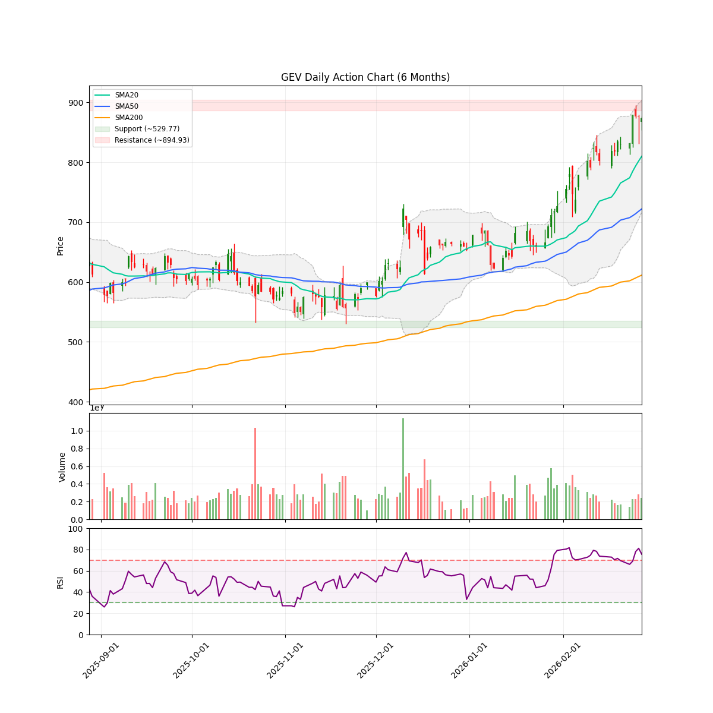
#### 研报分析

### 技术指标概览 (Technical Overview)
- **当前价格**: $873.60
- **RSI (14)**: 75.65
- **移动平均线**: SMA20: $809.93 | SMA50: $722.02 | SMA200: $611.38 (Bullish)
- **波动率**: ATR (14): 31.97 (预计周度波动: +/- $71.50)
- **关键位 (6m)**: 支撑位 $529.77 | 阻力位 $894.93
- **即时状态**: Above SMA50

嘿，找个位置坐下，咱俩边喝咖啡边聊。

现在的市场，大家都在疯抢英伟达的芯片，但聪明钱已经开始意识到：如果没有电，那些昂贵的H100/H200芯片不过是堆高级废铁。这就是为什么 **GE Vernova (GEV)** 最近成了华尔街的“心头好”。

这份关于 GEV 的情绪审计报告，咱们不看教条，只看背后的“叙事逻辑”。

---

### 1. 催化剂分层 (Catalyst Categorization)

我们要看清，哪些是真金白银的推动力，哪些只是随风起舞的噪音。

*   **A-Tier（顶级催化剂）：AI电力需求的“确定性”与分红加码**
    *   **理由：** 2026年2月26日，GEV 宣布季度分红 0.50 美元 ([Yahoo Finance](https://finance.yahoo.com/news/assessing-ge-vernova-gev-valuation-192352739.html))。这不仅是发钱，更是管理层在向市场“秀肌肉”——暗示现金流稳得不行。更核心的叙事是，管理层预计 2026 到 2028 年利润将翻倍，燃气轮机订单排队到了 2030 年代 ([Nasdaq](https://www.nasdaq.com/articles/heres-why-ge-vernova-stock-keeps-soaring-2026))。这属于**长效结构性上涨**。
*   **B-Tier（重要进展）：创下历史新高与大佬背书**
    *   **理由：** 股价在 2月24日突破 846.28 美元的历史极值 ([Investing.com](https://www.investing.com/news/company-news/ge-vernova-stock-hits-alltime-high-at-84628-usd-93CH-4521801))。同时，Jim Cramer 喊出“盈利可见度直达 2030 年” ([Insider Monkey](https://www.insidermonkey.com/blog/jim-cramer-ge-vernova-has-visibility-on-the-earnings-to-the-2030s-1685941/))。虽然老吉姆有时是反指，但这次他顺应的是“电力短缺”的宏大叙事。
*   **C-Tier（市场噪音）：关税忧虑与散户情绪**
    *   **理由：** 特朗普的关税政策让大盘震荡 ([The Globe and Mail](https://www.theglobeandmail.com/investing/markets/commodities/GEV22/pressreleases/355766/))，以及散户对 AI 的盲目乐观。这些虽然会造成日内波动，但改变不了能源转型的底色。

---

### 2. 叙事背离检测 (Divergence Detection)

**观察：** 2月23日，标普500因为关税忧虑跌了 1%，市场在抛售“AI输家”。
**现实：** GEV 不仅没崩，反而在此后几天顶着压力冲上了 873.60 美元。

**结论：** 存在**明显的看涨背离**。当大盘在担心地缘政治和贸易摩擦时，资金却在给 GEV 投票。这说明投资者认为 GEV 这种基础能源设施属于“刚需中的刚需”，具有极强的抗震属性。即使宏观环境有雾，GEV 的灯塔也是亮的。

---

### 3. 情绪审计报告 (Sentiment Audit)

*   **市场脉搏：** 现在的 GEV 就像是 1840 年代旧金山卖淘金铲子的商人。大家都在炒 AI 的“矿”，它在卖 AI 的“电”。
*   **技术体感：** RSI 到了 75.65，如果你问我“烫不烫手”？客观说，有点烫。它已经跑到了 SMA20 (809.93) 上方很远的地方。短期内，可能会有追高资金在阻力位 (894.93) 附近撤退，造成一个小回踩。
*   **心理博弈：** 这里的逻辑不是“它太贵了”，而是“我还能不能买到票上车”。分红的宣布是一个转折点，它把 GEV 从一个“增长题材股”变成了“蓝筹现金牛”。

#### **逻辑评分：8.8 / 10**
> **理由：** 叙事逻辑近乎完美（AI + 能源转型 + 确定性盈利）。唯一的扣分项是短期技术面超买，追高的风险溢价在抬升，但这更像是一个“幸福的烦恼”。

---

### 4. 投资建议与关键时点

不要在它冲刺的时候盲目追进去，既然它目前的周波动区间大概是 +/- 71.50 美元，等一个向 SMA20 靠拢的回撤会更舒服。

*   **关键位置：** 支撑位 809 (SMA20)，阻力位 894 (6个月高点)。
*   **下一个重大日期：**
    *   **2026年3月17日：** 股权登记日 (Record Date)。想要拿那份 0.50 美元分红的资金会在此时点前完成站队。
    *   **2026年4月14日：** 股息发放日。
    *   **财报季预测：** 密切关注 4 月下旬的 Q1 财报，届时看管理层是否会进一步上调 2026 年的指引。

**最后的一句话：** GEV 现在的叙事还没讲完，这不仅是一次财报的胜利，这是一场长达十年的“缺电危机”下的价值重估。

咖啡喝完了，祝你在市场里抓到大鱼。
#### 近期新闻与事件
- **[Yahoo Finance]** [Assessing GE Vernova (GEV) Valuation After Dividend Hike Upgrades And AI Power Demand Tailwinds](https://finance.yahoo.com/news/assessing-ge-vernova-gev-valuation-192352739.html)
- **[Yahoo Sports]** [The Motley Fool 2026 stock market outlook: 58% of individual investors plan to buy more stocks as AI drives optimism - Yahoo Sports](https://sports.yahoo.com/articles/motley-fool-2026-stock-market-170019431.html)
- **[The Globe and Mail]** [US stocks drop after Trump ramps up his tariffs and investors dump potential AI losers](https://www.theglobeandmail.com/investing/markets/commodities/GEV22/pressreleases/355766/us-stocks-drop-after-trump-ramps-up-his-tariffs-and-investors-dump-potential-ai-losers/)
- **[Investing.com]** [GE Vernova stock hits all-time high at 846.28 USD](https://www.investing.com/news/company-news/ge-vernova-stock-hits-alltime-high-at-84628-usd-93CH-4521801)
- **[Investing.com]** [US stock futures inch up ahead of Nvidia earnings as AI jitters ease](https://www.investing.com/news/economy-news/us-stock-futures-inch-up-ahead-of-nvidia-earnings-as-ai-jitters-ease-4523600)

---

### MSFT
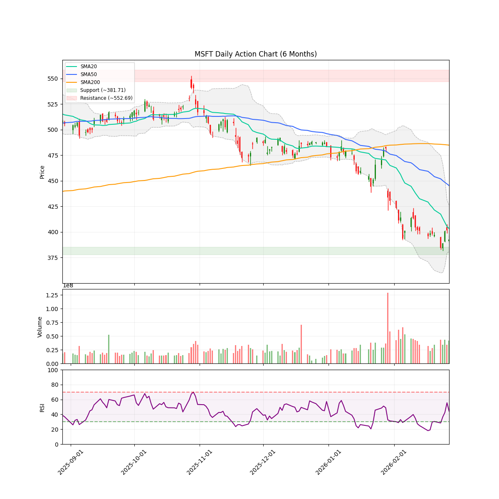
#### 研报分析

### 技术指标概览 (Technical Overview)
- **当前价格**: $392.74
- **RSI (14)**: 44.27
- **移动平均线**: SMA20: $403.36 | SMA50: $445.32 | SMA200: $484.84 (Bearish)
- **波动率**: ATR (14): 9.82 (预计周度波动: +/- $21.96)
- **关键位 (6m)**: 支撑位 $381.71 | 阻力位 $552.69
- **即时状态**: Below SMA50

你好。来，先喝口咖啡。既然你问到了微软（MSFT），咱们得聊聊这背后的“叙事逻辑”。

现在的微软，正处于一个极其微妙、甚至有些诡异的节点。作为研究叙事经济学的老兵，我看到的不是简单的数字波动，而是一场**“优等生被错杀”还是“叙事天花板已到”**的博弈。

以下是针对 MSFT 的情绪审计报告：

### 📊 叙事审计报告：微软的“AI 阵痛期”

#### 1. 催化剂分级 (Catalyst Categorization)

*   **A-Tier (核心矛盾)：史上最大财报利好与“见光死” (2026-02-18)**
    *   **详情**：微软交出了公司史上最大幅度的盈利超预期财报。然而，股价却跌破了 400 美元的心理关口。
    *   **解读**：这是典型的“叙事崩塌”。市场不再满足于利润多寡，而是在质问：AI 基础设施的巨额投入（CapEx）什么时候能转化成实打实的、可持续的利润爆发？这种“利好不涨”是极其严重的看跌背离信号。
*   **B-Tier (市场情绪)：高盛的预期重置与英伟达的连带效应 (2026-02-25)**
    *   **详情**：高盛下调了预期，英伟达单日蒸发 2590 亿美元。
    *   **解读**：整个 AI 赛道正在经历“去神话化”。微软作为 AI 领头羊，正承受着整个板块估值修正的阵痛。
*   **C-Tier (杂音/散户情绪)：买入信号的“陈词滥调” (2026-02-27/28)**
    *   **详情**：Yahoo Finance 和 Motley Fool 开始高喊“稀缺买入机会”。
    *   **解读**：当媒体开始用“三年后你会感谢自己”这种话术时，通常意味着短期内多头已经快弹尽粮绝了。

#### 2. 背离检测 (Divergence Detection)

**诊断：看跌力竭 vs 机构洗盘。**
微软目前的 RSI 跌至 44.27，处于“超卖但不极端”的区间。最令人警惕的是，股价不仅跌破了 SMA50（445.32），甚至远低于 SMA200（484.84）。在技术派眼中，这已经从“回调”变成了“趋势性破位”。
然而，**最大的背离在于：基本面在创新高，股价在创新低。** 这说明市场正在经历一场“估值杀”，大家怕的不是微软赚不到钱，而是怕 AI 的故事讲不下去了。

#### 3. 市场情绪评分 (Sentiment Score)

### **评分：4.2 / 10**
> **定性：处于“信仰重建”之前的恐慌末期。**
> 0-3 为系统性崩塌，8-10 为牛市狂热。4.2 代表着：虽然公司依旧伟大，但叙事动力已耗尽，市场正在寻找新的支撑点。

#### 4. 深度叙事解析：是陷阱还是黄金坑？

老伙计，现在的 MSFT 就像是一个刚刚考了 100 分却被父母扇了一巴掌的孩子，因为父母（投资者）嫌他买文具（AI 投入）花的钱太多了。

*   **叙事陷阱**：如果你认为它短期内能立刻反弹回 500 美元，那是陷阱。SMA200 的重压像天花板一样死死扣在上方，目前的空头排列非常整齐。
*   **叙事转机**：目前的价位（392.74）已经接近 6 个月的低点（381.71）。如果在这个位置能止跌企稳，那就是“叙事重启”的起点。

现在的市场情绪不是“理性”的，而是“怀疑一切”。大家在看英伟达的眼色，也在看微软下个季度的 CapEx 指引。

---

### 📝 总结要求

*   **逻辑评分 (Logic Score)**: **8.5/10** (基于财报利好与价格下跌的剧烈反差，下跌逻辑更多源于宏观流动性与 AI 投资回报率的怀疑，而非微软经营出问题。)
*   **引用新闻**:
    *   [24/7 Wall St.] 投资者在史上最大财报利好后抛售 MSFT (2026-02-18). [链接](https://247wallst.com/investing/2026/02/17/investors-dump-microsoft-shares-despite-largest-earnings-beat-in-company-history/)
    *   [Yahoo Finance] 选股逻辑：三年后的微软股价预判 (2026-02-28). [链接](https://finance.yahoo.com/news/prediction-microsofts-stock-price-3-215700856.html)
*   **下一个重大日期 (Next Major Date)**: **2026 年 4 月下旬** (预计为 FY2026 Q3 财报发布日)。

**老兵建议**：别急着满仓去“接飞刀”。现在的 MSFT 需要在 380-390 美元区间通过横盘来消化掉那些被吓坏了的筹码。等它什么时候站回 SMA20 线上，那个时候的咖啡喝起来才香。
#### 近期新闻与事件
- **[Yahoo Finance]** [Prediction: This Will Be Microsoft's Stock Price in 3 Years. (Hint: You're Going to Want to Buy Now)](https://finance.yahoo.com/news/prediction-microsofts-stock-price-3-215700856.html)
- **[The Motley Fool]** [1 Clear Signal to Buy Microsoft Stock](https://www.fool.com/investing/2026/02/26/1-clear-signal-to-buy-microsoft-stock/)
- **[Yahoo Finance]** [Microsoft Stock Just Flashed an Ultra-Rare Bullish Signal for Options Traders](https://finance.yahoo.com/news/microsoft-stock-just-flashed-ultra-183002612.html)
- **[Insider Monkey]** [Here's What Weighed on Microsoft's (MSFT) Performance](https://www.msn.com/en-us/money/savingandinvesting/here-s-what-weighed-on-microsoft-s-msft-performance/ar-AA1XdjLP)
- **[Yahoo Finance Singapore]** [Goldman Sachs resets Microsoft stock forecast](https://sg.finance.yahoo.com/news/goldman-sachs-resets-microsoft-stock-040700222.html)

---

### NVDA
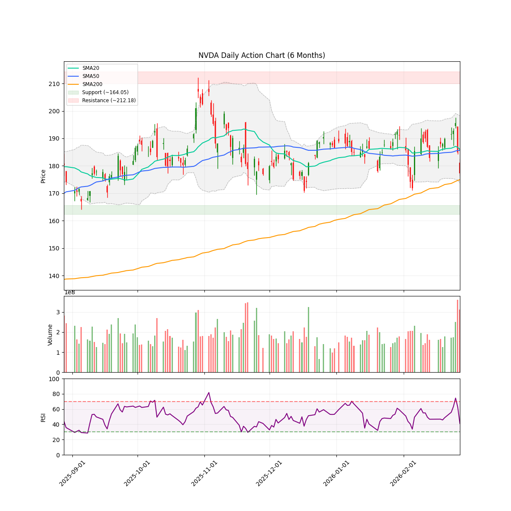
#### 研报分析

### 技术指标概览 (Technical Overview)
- **当前价格**: $177.19
- **RSI (14)**: 41.10
- **移动平均线**: SMA20: $185.98 | SMA50: $185.62 | SMA200: $174.95 (Bullish)
- **波动率**: ATR (14): 6.26 (预计周度波动: +/- $13.99)
- **关键位 (6m)**: 支撑位 $164.05 | 阻力位 $212.18
- **即时状态**: Below SMA50

# 情绪审计报告：英伟达（NVDA）—— 繁华背后的“业绩宿醉”

**致：** 投资委员会
**日期：** 2026年03月01日
**分析师：** 叙事经济学研究组

---

### 1. 叙事图景：当“完美”已成定势，惊喜便成了奢侈品

坐在曼哈顿的咖啡馆里，如果你听听隔壁桌的谈话，你可能会觉得英伟达正处于危机之中。股价在跌，人心在晃。但翻开刚出炉的财报：营收增长73%，净利润飙升94%。这哪里是危机？这分明是一份足以载入史册的成绩单。

然而，这就是现在的市场叙事：**英伟达正身处一场“完美的困境”中**。2月25日的财报本应是冲锋号，结果却演变成了“利好出尽”的砸盘。投资者不再仅仅满足于“超越预期”，他们开始变得贪婪且挑剔。他们担忧AI的统治力能否持续，甚至开始抱怨公司给股东的回馈（回购和分红）不够直接。

简单来说，市场现在有点“审美疲劳”了。大家都知道你很优秀，但如果你不能证明你明年会“更优秀到离谱”，短线资金就会选择撤离，去寻找下一个新鲜感。

---

### 2. 催化剂分类审计 (Catalyst Categorization)

*   **【A-Tier】顶级利好：炸裂的Q4财报与机构背书**
    *   **详情**：FY26财年报告显示营收增长73%，这种体量的公司能保持这种增速简直是奇迹。Wedbush等机构甚至在财报后上调了目标价，并将其列为未来3年必持有的“不可阻挡的股票”之一。
    *   **来源**：[Wedbush Raises PT](https://finance.yahoo.com/news/wedbush-raises-pt-nvidia-corporation-063318066.html)
*   **【B-Tier】中级支撑：估值修复与对比优势**
    *   **详情**：相比于AMD，NVDA目前在盈利能力增强的同时，估值反而显得更具吸引力。这种“性价比”叙事正在吸引长线价值猎手。
    *   **来源**：[Forbes: AMD Vs. NVIDIA](https://www.forbes.com/sites/greatspeculations/2026/02/23/amd-vs-nvidia-which-ai-stock-is-the-better-buy-for-2026/)
*   **【C-Tier】噪音与扰动：小作文与嘴炮**
    *   **详情**：关于“循环交易”（Circular Deals）的传闻在坊间流传，虽然Jim Cramer等大佬公开驳斥，但这反映了空头正在试图寻找叙事裂缝。
    *   **来源**：[Jim Cramer Analysis](https://www.insidermonkey.com/blog/jim-cramer-doesnt-believe-nvidia-nvda-is-engaged-in-circular-deals-1706463/)

---

### 3. 背离检测：好消息里的“陷阱”还是“黄金”？

**目前呈现典型的“看跌衰竭”征兆。**

*   **价格行为**：现价 177.19，已经跌破了 SMA20 和 SMA50，但正在向 **SMA200 (174.95)** 这一“生死线”靠拢。
*   **逻辑背离**：财报数据极其强劲，股价却在走低。这通常意味着：
    1.  **仓位过重**：财报前大家都挤在车上，现在是获利盘在踩踏。
    2.  **情绪博弈**：市场在消化关于“AI主导地位长期可持续性”的忧虑。
*   **结论**：这不是系统性失败，而是**情绪性休整**。RSI 41.10 显示还没到超卖，但已经接近心理支撑区间。

---

### 4. 情绪逻辑评分 (Logic Score)

# **6.5 / 10**

> **评分说明**：
> *   **基础分 (9.0)**：基本面无可挑剔，行业领头羊地位稳固。
> *   **扣分项 (-2.5)**：短期技术形态受损（处于均线下方），市场对AI叙事出现阶段性怀疑，缺乏更强力的股东回报计划（如大规模回购）。
> *   **总结**：目前处于“多头陷阱”后的出清阶段，是一个高胜率的观察区，而非盲目冲锋区。

---

### 5. 维度的脉搏：接下来的关键点

*   **技术关键位**：关注 **174.95 (SMA200)**。如果这里能守住，那这就是一个教科书级的“回踩买点”；如果跌破，叙事将转向“AI泡沫破裂”。
*   **下一个重大日期**：
    *   **2026年5月下旬**：预计发布第一季度（Q1 FY27）财报。届时市场将验证这次的“增长焦虑”是否多余。
    *   **近两周**：关注是否有突发的股份回购计划公告，这可能是扭转目前“股东回报不足”叙事的关键。

**老兵建议**：别被这两天的下跌吓破了胆。英伟达现在的股价是在为它“过于优秀”的过去还债。当那些追涨杀跌的投机客被洗出去后，真正的买盘会在 200 日线附近显现。耐心是这笔交易中最贵的筹码。
#### 近期新闻与事件
- **[Yahoo Finance]** [Wedbush Raises PT on NVIDIA Corporation (NVDA) Stock](https://finance.yahoo.com/news/wedbush-raises-pt-nvidia-corporation-063318066.html)
- **[The Economic Times]** [Why did NVDA stock drop after Nvidia earnings beat estimates? Here's why investors are worrying about long-term AI dominance outlook](https://www.msn.com/en-in/entertainment/bollywood/why-did-nvda-stock-drop-after-nvidia-earnings-beat-estimates-heres-why-investors-are-worrying-about-long-term-ai-dominance-outlook/ar-AA1X8zBd)
- **[Seeking Alpha]** [One Big Reason Nvidia's Stock Is Stuck In The Mud: Lack Of Direct Shareholder Rewards](https://seekingalpha.com/article/4876212-one-big-reason-nvidias-stock-is-stuck-in-mud-lack-of-direct-shareholder-rewards)
- **[Forbes]** [AMD Vs. NVIDIA: Which AI Stock Is The Better Buy For 2026?](https://www.forbes.com/sites/greatspeculations/2026/02/23/amd-vs-nvidia-which-ai-stock-is-the-better-buy-for-2026/)
- **[Insider Monkey]** [Jim Cramer Doesn't Believe NVIDIA (NVDA) Is Engaged In Circular Deals](https://www.insidermonkey.com/blog/jim-cramer-doesnt-believe-nvidia-nvda-is-engaged-in-circular-deals-1706463/)

---

### TPL

#### 研报分析

### 技术指标概览 (Technical Overview)
- **当前价格**: $524.29
- **RSI (14)**: 86.36
- **移动平均线**: SMA20: $427.39 | SMA50: $358.93 | SMA200: $336.16 (Bullish)
- **波动率**: ATR (14): 28.89 (预计周度波动: +/- $64.59)
- **关键位 (6m)**: 支撑位 $269.23 | 阻力位 $547.20
- **即时状态**: Above SMA50

# 情感审计报告：德州太平洋土地公司 (TPL) —— 旧时代的“地主”，新时代的“算力燃料”

**日期：** 2026年03月01日
**分析师：** 叙事经济学研究组

---

### 1. 叙事核心：当“土地特许权”遇上“AI 数据中心”

如果你觉得 TPL 只是一个在二叠纪盆地收租、卖水的“老牌地主”，那你就完全错过了这轮行情最性感的舞步。目前的 TPL 正在经历一场**叙事重构（Narrative Pivot）**。它已经从一家单纯的能源特许权公司，华丽转身为 AI 基础设施的“卖铲人”。

想象一下：在德克萨斯的荒野上，成千上万台服务器在嘶吼，而它们脚下的每一寸土地、每一滴冷却用水，甚至是驱动它们的电力线路，都要向 TPL 交“买路钱”。这种从能源到 AI 数据中心的降维打击，正是股价在短期内如火箭般蹿升的根本动力。

---

### 2. 催化剂分级 (Catalyst Categorization)

#### **A-Tier：核心叙事引擎**
*   **AI 数据中心转型（AI Pivot）：** 2月15日披露的与 Bolt Data 等公司的合作并非小打小闹。这标志着 TPL 正式进入“算力基础设施”赛道。在目前的市场，只要沾上 AI 的确定性实物资产，溢价空间就会被无限打开。
*   **Q4 2025 创纪录业绩：** 2月23日公布的财报显示 TPL 刷新了多项纪录。这不仅仅是数字的胜利，它向市场证明了：即便不靠 AI，它的传统现金流也稳如泰山。

#### **B-Tier：机构背书与市场强度**
*   **Horizon Kinetics 持续增持：** 核心大股东 Horizon Kinetics 在高位继续“扫货”（2月22日及23日均有记录）。这种“庄家不走我不走”的姿态，极大地稳固了多头信心。
*   **全方位跑赢大盘：** 在标普 500 波动时，TPL 依然能走出 5.79% 的单日涨幅，表现出极强的“阿尔法”属性。

#### **C-Tier：噪音与常规消息**
*   **能源板块联动：** 虽有行业利好，但 TPL 目前的走势早已脱离了单纯的油气板块波动，更多受自身叙事驱动。

---

### 3. 背离检测 (Divergence Detection)

**警告信号：超买的“尖叫声”**
目前的盘面呈现出一种**强烈的技术性背离**。
*   **RSI 指标：86.36。** 在技术分析中，RSI 超过 70 是超买，超过 80 则是进入了“狂热区”。
*   **偏离均线：** 现价 (524.29) 距离 SMA50 (358.93) 的距离已经拉得太满。这就像一根拉到极限的橡皮筋，虽然叙事无懈可击，但物理定律暗示短期内可能出现回踩。

**结论：** 目前不是“利好下跌”的看涨穷尽，而是“极大利好后的情绪透支”。

---

### 4. 情绪评分 (Sentiment Score): 8.8 / 10

**评分逻辑：**
*   **叙事强度 (10/10)：** “能源 + 土地 + AI”是目前市场上最完美的组合拳。
*   **资金面 (9/10)：** 内部人增持且机构筹码锁定良好。
*   **技术面 (6/10)：** 极其严重的超买指标压低了短期性价比，警惕“多头陷阱”带来的高位回调。

---

### 5. 投资经理的咖啡私语

“伙计，TPL 现在的状态就像是 19 世纪淘金热里那个控制了唯一水源的家伙。它不仅收你的金子，还要收你的水费。最近这一波涨幅显然是市场突然‘悟到了’它在 AI 产业链中的稀缺性。

但听我一句话，**别在狂欢最顶点的时候把筹码全部推入**。RSI 86 意味着市场现在有点‘呼吸困难’。如果你已经仓位饱满，那就拿着，看着这朵花继续开；如果你想新入场，最好等它回踩 SMA20 (427 附近) 或在这个区间整理一下。好故事不怕晚，怕的是你在最拥挤的时候挤坏了门框。”

---

### 6. 关键数据点

*   **最近重要新闻引用：**
    *   [Insider Monkey] TPL Q4 2025 创纪录表现 (2026-02-23)
    *   [24/7 Wall St.] TPL 因 AI 转型今年迄今激增 44% (2026-02-15)
    *   [Investing.com] Horizon Kinetics 持续买入操作 (2026-02-22)
*   **下一个重大日期：**
    *   **2026 年 5 月初：** 预计发布 2026 年第一季度财报（Q1 Earnings）。届时市场将验证其“AI 伙伴关系”是否已开始转化为实际的现金流贡献。
*   **核心区间：** 
    *   **阻力位：** 547.20 (6个月高点)
    *   **支撑位：** 460 - 427 (SMA20 及心理关口)
#### 近期新闻与事件
- **[Insider Monkey]** [Texas Pacific Land (TPL) Hits New Records in Q4 2025](https://finance.yahoo.com/news/texas-pacific-land-tpl-hits-155021644.html)
- **[AOL]** [Why Stock-Split Stock Texas Pacific Land Corporation Beat the Market Today](https://www.aol.com/articles/why-stock-split-stock-texas-004915638.html)
- **[Investing.com]** [Horizon Kinetics buys Texas Pacific Land (TPL) share By Investing.com](https://www.investing.com/news/insider-trading-news/horizon-kinetics-buys-texas-pacific-land-tpl-share-93CH-4519711)
- **[MarketWatch]** [Texas Pacific Land Corp. stock outperforms competitors on strong trading day](https://www.msn.com/en-us/money/topstocks/texas-pacific-land-corp-stock-outperforms-competitors-on-strong-trading-day/ar-AA1X0bD0)
- **[Insider Monkey]** [Texas Pacific Land (TPL) Hits New Records in Q4 2025](https://www.msn.com/en-us/money/markets/texas-pacific-land-tpl-hits-new-records-in-q4-2025/ar-AA1WU8Dr)

---

### TSM
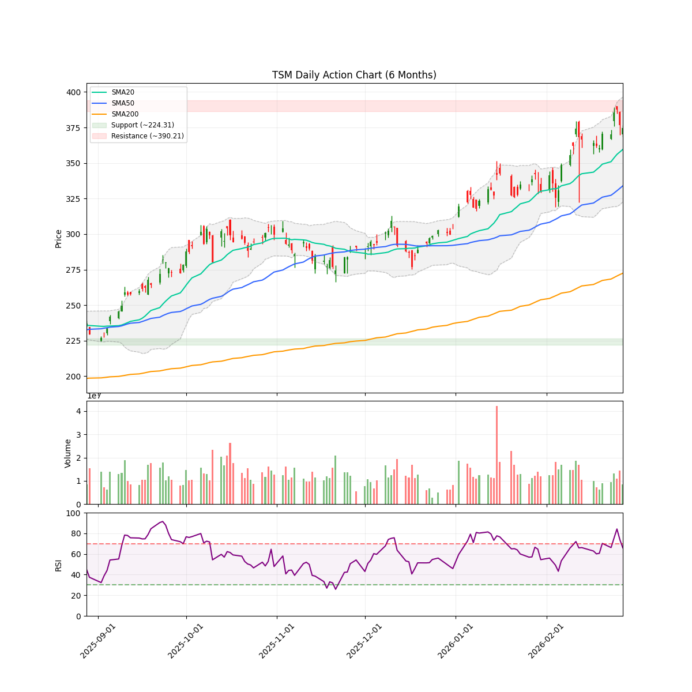
#### 研报分析

### 技术指标概览 (Technical Overview)
- **当前价格**: $374.58
- **RSI (14)**: 66.00
- **移动平均线**: SMA20: $359.56 | SMA50: $333.94 | SMA200: $272.47 (Bullish)
- **波动率**: ATR (14): 14.43 (预计周度波动: +/- $32.27)
- **关键位 (6m)**: 支撑位 $224.31 | 阻力位 $390.21
- **即时状态**: Above SMA50

# 台积电 (TSM) 情绪审计报告：AI 王座下的“卖水人”，是狂欢延续还是泡沫前夜？

**审计日期：** 2026年03月01日
**分析员：** 叙事经济学研究组 - 资深策略师

---

### 1. 催化剂分类：层级诊断 (Catalyst Categorization)

在当下的叙事逻辑中，台积电不再仅仅是一家代工厂，它是整个硅基文明的单一故障点。

*   **A-Tier（顶级催化剂）：硬实力的绝对碾压**
    *   **苹果亚利桑那大单：** 根据 [Insider Monkey](https://www.msn.com/en-us/news/technology/apple-to-purchase-100m-chips-from-taiwan-semiconductor-manufacturing-tsm-arizona-facility/ar-AA1XdJn0) 报道，苹果将从台积电亚利桑那工厂采购 1 亿颗芯片。这不仅是订单，更是政治与供应链风险的“定心丸”，证明了台积电在美产能的商业可行性。
    *   **英伟达 (Nvidia) 业绩背书：** [CNBC](https://www.cnbc.com/2026/02/25/nvidia-nvda-earnings-report-q4-2026.html) 指出英伟达数据中心收入暴增 75%。作为英伟达唯一的“核心厨师”，英伟达吃肉，台积电必然分到最浓的汤。

*   **B-Tier（重要催化剂）：生态链的共振**
    *   **AMD-Meta 联姻：** [Investing.com](https://www.investing.com/news/stock-market-news/tsmc-shares-rise-on-amdmeta-cheer-nvidia-earnings-in-focus-4523216) 提到 AMD 与 Meta 的供应交易，这进一步锁定了台积电的先进制程产能。
    *   **机构疯狂抢筹：** 2025年第四季度新增 27 家对冲基金持有者，这种“机构抱团”在短期内为股价提供了坚实的支撑位。

*   **C-Tier（噪音与微波）：**
    *   **Zacks 的技术性回调警告：** [Zacks](https://www.msn.com/en-us/money/top-stocks/tsmc-tsm-dips-more-than-broader-market-what-you-should-know/ar-AA1X9HeL) 关注到 TSM 近期 2.82% 的跌幅。但在强劲的牛市趋势下，这种“跑输大盘”更像是多头在获利了结，而非基本面恶化。

---

### 2. 背离检测 (Divergence Detection)

**目前的市场状态：看好但恐高。**

虽然 [Yahoo Finance](https://finance.yahoo.com/news/too-consider-taiwan-semiconductor-manufacturing-231540329.html) 在质疑 95% 的年涨幅是否过头，但我们观察到一个有趣的现象：**利好不涨反跌的“疲劳感”尚未真正出现。**

尽管 2 月 26 日出现了 2.82% 的回撤，但 RSI 依然维持在 66.00 的健康高位，并未进入 70 以上的博傻区间。SMA20 (359.56) 远高于 SMA50，形成完美的攻击阵型。这种回撤更像是在突破 390.21 历史阻力位前的“深蹲”。市场的逻辑是：只要英伟达的财报不崩，台积电的每一次下跌都是机构补票上车的机会。

---

### 3. 叙事分析：咖啡馆里的市场脉搏

朋友，坐下来喝杯咖啡。看着 TSM 现在的价格（374.58），你可能会觉得呼吸有点急促。毕竟一年翻了一倍。但你得明白，现在的台积电已经脱离了传统的“制造业”叙事，它正在变成一种“基础设施税”。

[Barchart](https://www.msn.com/en-us/money/general/taiwan-semi-stock-is-soaring-above-ai-bubble-fears-where-options-data-says-it-is-headed-next/ar-AA1WVagK) 的期权数据显示，交易员们并没有在逃跑，他们甚至在加注。为什么？因为苹果那 1 亿颗芯片的订单告诉了市场一件事：即便地缘政治风云变幻，全世界最挑剔的科技巨头依然得乖乖排队求台积电代工。

现在的 TSM 就像是 19 世纪淘金热里唯一卖铲子和水的摊位。大家在争论金矿（AI 应用）是不是泡沫，但只要大家还在挖矿，台积电的铲子就不愁卖。

---

### 4. 情绪逻辑评分 (Logic Score)

# **9.2/10**

*   **理由：** 极强的基本面锚点（苹果订单 + 英伟达超预期）叠加完美的趋势线。扣分项仅在于 RSI 接近超买区以及过去一年涨幅过大带来的心理压力。这绝不是一个“陷阱”，而是一个“进击的巨人”。

---

### 5. 关键数据与日期

*   **当前价格：** 374.58
*   **阻力位 (6m high)：** 390.21（这是短期内的“心理天花板”）
*   **支撑位 (SMA20)：** 359.56
*   **下一个重大日期：** **2026年4月中旬**（预计 Q1 财报发布日）。
    *   *注：虽然 3 月份有 AI 股票的热炒期（[BeInCrypto](https://beincrypto.com/ai-stocks-outperform-nvidia-march-2026/) 指出 TSM 可能在 3 月跑赢英伟达），但真正的业绩大考在 4 月。*

**投资建议：** 关注 390 附近的压力。如果能放量突破，400 大关将只是一个数字；如果回踩 360 附近，那是市场给你的二度上车机会。不要因为恐高而错过这个时代最硬的资产。
#### 近期新闻与事件
- **[Yahoo Finance]** [Is It Too Late To Consider Taiwan Semiconductor Manufacturing (NYSE:TSM) After 95% One Year Rally?](https://finance.yahoo.com/news/too-consider-taiwan-semiconductor-manufacturing-231540329.html)
- **[BeInCrypto]** [3 AI Stocks that Can Outperform Nvidia In March 2026](https://beincrypto.com/ai-stocks-outperform-nvidia-march-2026/)
- **[Insider Monkey]** [Apple to Purchase 100M Chips from Taiwan Semiconductor Manufacturing (TSM) Arizona Facility](https://www.msn.com/en-us/news/technology/apple-to-purchase-100m-chips-from-taiwan-semiconductor-manufacturing-tsm-arizona-facility/ar-AA1XdJn0)
- **[Barchart]** [Taiwan Semi stock is soaring above AI bubble fears. Where options data says it is headed next.](https://www.msn.com/en-us/money/general/taiwan-semi-stock-is-soaring-above-ai-bubble-fears-where-options-data-says-it-is-headed-next/ar-AA1WVagK)
- **[Zacks Investment Research]** [TSMC (TSM) dips more than broader market: What you should know](https://www.msn.com/en-us/money/top-stocks/tsmc-tsm-dips-more-than-broader-market-what-you-should-know/ar-AA1X9HeL)

---

### VRT
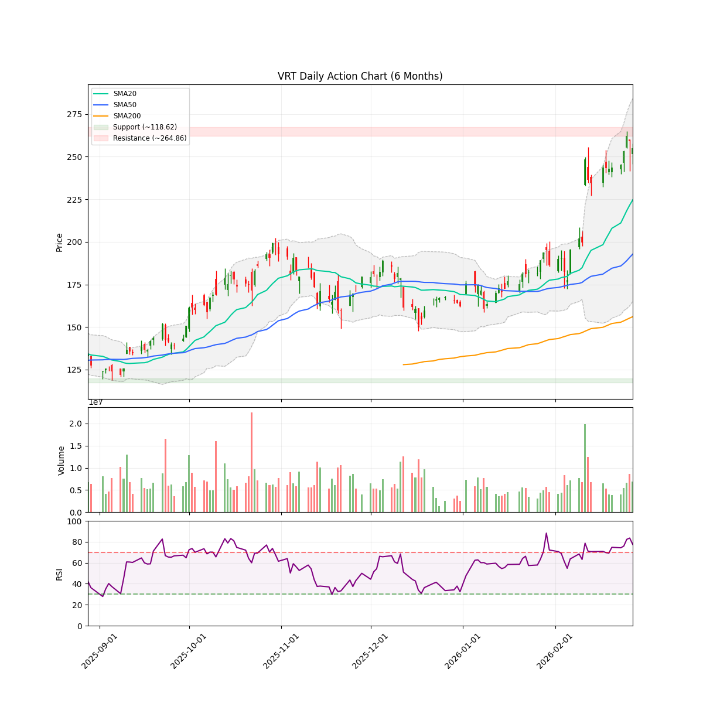
#### 研报分析

### 技术指标概览 (Technical Overview)
- **当前价格**: $254.89
- **RSI (14)**: 77.57
- **移动平均线**: SMA20: $224.59 | SMA50: $192.77 | SMA200: $156.04 (Bullish)
- **波动率**: ATR (14): 15.22 (预计周度波动: +/- $34.04)
- **关键位 (6m)**: 支撑位 $118.62 | 阻力位 $264.86
- **即时状态**: Above SMA50

# 叙事经济学：Vertiv (VRT) 情绪审计报告

**报告日期：** 2026年03月01日
**分析师：** 对冲基金研究员 (Narrative Economics Desk)
**标的：** Vertiv Holdings Co (VRT)
**当前价格：** 254.89

---

### 1. 叙事核心：当市场不再只盯着“大脑”，转而关注“汗腺”

如果说英伟达（Nvidia）是AI时代的“大脑”，那么 **Vertiv (VRT)** 就是这个大脑的“散热系统”和“能量中枢”。现在的市场叙事正在发生微妙且深刻的转变：投资者已经对昂贵的芯片股产生了审美疲劳，开始疯狂寻找那些为数据中心提供“水和电”的蓝领英雄。

这种从“算力崇拜”到“基础设施刚需”的逻辑切换，正是 VRT 能够无视高位压力、持续暴走的动力源泉。

---

### 2. 催化剂分级 (Catalyst Categorization)

*   **【A-Tier】 核心动力源：2026年指引与史诗级订单积压**
    *   2月11日的财报不仅仅是一份成绩单，更是一份“长牛投名状”。公司给出的2026年强劲指引，配合高达 **150亿美元的订单积压 (Backlog)**，直接封死了空头的想象空间。这证明了AI需求不是幻觉，而是实打实的钢筋水泥和液冷管路。
*   **【B-Tier】 叙事平移：从英伟达的影子到“超越英伟达”**
    *   媒体（如 Investing.com）开始宣传“超越英伟达的Vertiv”，这种叙事在机构间流传，将 VRT 从一个二线配套商拔高到了AI基础设施领军者的地位。
*   **【C-Tier】 噪音与情绪点缀：散户FOMO与小报推荐**
    *   Yahoo Finance 频繁刷屏的“300美元以下最佳成长股”以及各类分析师的日常点赞，虽然属于噪音，但它们成功维持了散户的交易热度。

---

### 3. 背离检测与市场脉搏 (Divergence Detection)

**警惕：空气中的“焦糊味”**

*   **技术面的极度拉伸：** 价格目前处于 254.89，而 **SMA50 还在 192.77**。这种巨大的乖离率（Gap）说明现在的买盘不是在买价值，而是在抢筹码。
*   **超买信号：** **RSI 高达 77.57**。从叙事角度看，这叫“情绪过热”。通常在这种时刻，哪怕是一个微小的利空（比如某个数据中心项目的延迟），都可能引发像 ATR 指示的那样 +/- 34 刀的剧烈波动。
*   **强弱判断：** 2月13日财报后的短暂回调被迅速填平，这显示了极强的“空头衰竭”和“逢低买入”意志。目前市场上没有人在卖，所有人都在等更高的价格。

---

### 4. 叙事评分 (Sentiment Logic Score)

#### **评分：9.2/10 —— 烈火烹油的上升浪**

*   **逻辑支撑：** 这是一个典型的“确定性溢价”行情。在AI泡沫论四起时，VRT 用实打实的订单告诉市场：无论模型谁赢，散热和电源永远是刚需。
*   **扣分项：** 0.8分的扣除在于 **“拥挤度”**。当路边社都在讨论 VRT 是下一个必买股时，短期“陷阱”的风险正在积聚。它不是趋势的终结，但可能是一个惨烈的洗盘前夜。

---

### 5. 投资建议与关键数据

**老兵的咖啡闲谈：**
“朋友，如果你现在想追高 VRT，你不是在投资，你是在和一群杀红了眼的赌徒抢最后一块蛋糕。虽然蛋糕很大（150亿订单），但最好等它回踩一下 SMA20（约224附近）再入场。目前的 RSI 已经是在尖叫了。”

*   **主要支撑位：** 224.59 (SMA20) / 245 (近期整理平台)
*   **阻力位：** 264.86 (6个月高点) —— 突破这里将进入无人区。
*   **下一个重大日期 (Next Major Date)：** 
    *   **2026年5月初（预计）：** Q1 2026 财报发布。这将是验证其 150 亿订单转化率的第一个关键节点。

---

**引用来源：**
- *Yahoo Finance: Is This The Best Growth Stock to Buy Under $300? (2026-02-26)*
- *Investing.com: Nvidia-Beating Vertiv (2026-02-26)*
- *Nasdaq: Vertiv Earnings Prove AI Infrastructure Boom Intact (2026-02-11)*
#### 近期新闻与事件
- **[Yahoo Finance]** [Is This The Best Growth Stock to Buy Under $300?](https://finance.yahoo.com/news/best-growth-stock-buy-under-163409175.html)
- **[Investing.com]** [Best AI Stocks to Buy Now and Hold Forever: Nvidia-Beating Vertiv](https://www.investing.com/analysis/best-ai-stocks-to-buy-now-and-hold-forever-nvidiabeating-vertiv-200675688)
- **[Insider Monkey]** [Vertiv Holdings (VRT) Up More than 25% Since Q4 Earnings, Here's What You Need to Know](https://www.msn.com/en-us/money/topstocks/vertiv-holdings-vrt-up-more-than-25-since-q4-earnings-here-s-what-you-need-to-know/ar-AA1X3VV7)
- **[Yahoo Finance]** [Is It Too Late To Consider Vertiv Holdings Co (VRT) After A 170% One Year Surge?](https://finance.yahoo.com/news/too-consider-vertiv-holdings-co-071254641.html)
- **[Seeking Alpha]** [Why Daily Stock Picks' Gary Vaughan Likes Large Cap Tech (And Energy)](https://seekingalpha.com/article/4874186-why-daily-stock-picks-gary-vaughan-likes-large-cap-tech-and-energy)

---

### VST
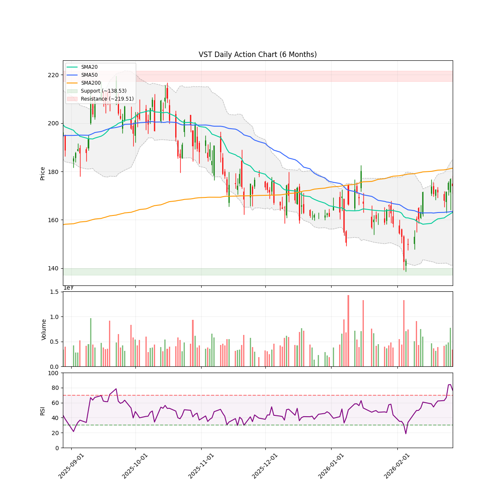
#### 研报分析

### 技术指标概览 (Technical Overview)
- **当前价格**: $173.89
- **RSI (14)**: 76.51
- **移动平均线**: SMA20: $163.09 | SMA50: $163.48 | SMA200: $181.34 (Bearish)
- **波动率**: ATR (14): 7.33 (预计周度波动: +/- $16.40)
- **关键位 (6m)**: 支撑位 $138.53 | 阻力位 $219.51
- **即时状态**: Above SMA50

# VST 情绪审计报告：能源转型的“老兵”能否跑赢叙事？

来，坐下喝杯咖啡。咱们今天聊聊 **Vistra Corp (VST)**。

在如今这个被 AI 算力和电力缺口刷屏的市场里，VST 本该是那种稳坐钓鱼台的“电力地主”。但翻开最近的账本和盘面，你会发现它的故事正处于一个微妙的十字路口：**叙事依然动听，但步子走得有点乱。**

---

### 1. 催化剂分级 (Catalyst Categorization)

我们要分清什么是真正的“推土机”，什么是带节奏的“喇叭”。

*   **A-Tier (核心驱动力)：机构的“口嫌体正直”**
    *   **Wells Fargo 和 Morgan Stanley 的评级维持：** 虽然这两家大行最近都微调了目标价（Wells Fargo 从 234 下调至 236 是微调，MS 也紧随其后），但关键在于他们依然维持了**“超配” (Overweight)** 评级。这意味着深口袋的机构资金还没打算撤离，只是在给过热的预期“降降温”。[参考：Yahoo Finance / Insider Monkey]
*   **B-Tier (行业红利)：清洁能源的入场券**
    *   **能源转型叙事：** VST 与 NRG 的对比再次凸显了其在核能和天然气领域的多元布局。在全球对清洁稳定基荷电力（Baseload Power）渴求的背景下，VST 的资产包依然是香饽饽。
*   **C-Tier (市场杂音)：散户的呐喊与短期对比**
    *   **Reddit (r/Valueinvesting) 的看多逻辑：** 这种草根层面的价值发现虽然能带来局部热度，但在机构博弈的电力板块，影响力有限。
    *   **Zacks 的表现警告：** 提到 VST 过去六个月跑输行业。这更多是后视镜里的观点，对未来转折的指导意义一般。

---

### 2. 情绪背离检测 (Divergence Detection)

**警惕：技术面正在向基本面“亮红灯”。**

这里的背离非常有趣：
*   **基本面信号：** 财报表现强劲，分析师虽然微调目标价，但目标价（$234-$236）远高于现价（$173.89）。这本该是巨大的上涨空间。
*   **市场反馈：** **RSI 高达 76.51**。兄弟，这说明短线已经超买得有些冒烟了。尽管股价在 SMA50 之上，但它依然被压在 SMA200 ($181.34) 这条“生命线”之下。
*   **结论：** 这是一个典型的**“利好出尽”与“技术压制”并存**的局面。市场认可 VST 的价值，但在 180 美元大关面前，多头显得有些畏首畏尾，不敢轻易发动总攻。

---

### 3. 深度情绪诊断：是趋势还是陷阱？

现在的 VST 并不像是一个致命的陷阱，但它更像是一个**“耐心测试器”**。

目前的叙事逻辑是：**“它很好，但它太累了。”** 
分析师下调目标价的行为，实际上是在为市场挤水分。虽然这听起来像是利空，但在资深猎人眼里，这其实是**“看涨式修正”**。如果一个股票在利好预期下依然无法突破 SMA200，那么短期的回调（回归 SMA50 约 163 附近）反而是为了蓄势。

---

### 4. 逻辑评分 (Logic Score)

# **6.8 / 10**

> **逻辑评估：** 长期叙事（核能+电力缺口）得 9 分，但短期技术面过热（RSI 76+）和行业内相对表现疲软扣了分。这标志着目前不是一个盲目冲进去的“无脑多头”时刻，而是一个等待回踩确认的“战术观察期”。

---

### 5. 关键信息汇总

*   **情绪状态：** 谨慎乐观（短线过热，长线稳固）。
*   **核心支持位：** $163.09 (SMA20/50 汇合区)。
*   **核心阻力位：** $181.34 (SMA200 - 关键心理与技术关口)。
*   **引用新闻：**
    *   [Wells Fargo 调整目标价至 $234](https://finance.yahoo.com/news/vistra-vst-price-target-trimmed-020010882.html)
    *   [Morgan Stanley 维持长期看好](https://finance.yahoo.com/news/morgan-stanley-lowers-vistra-vst-164547707.html)
*   **下一个重大日期：** 
    *   **2026年5月初 (预估 Q1 财报发布日)**：这是下一个决定 VST 能否彻底撕碎 Bearish Trend、站上 SMA200 的审判日。

**老兵建议：** 别在 RSI 76 的时候去追高，哪怕故事再好。等它回踩 SMA50 附近，看看那些嘴上说下调目标价、手里却攥着超配评级的机构动不动手，那才是你的入场信号。
#### 近期新闻与事件
- **[Yahoo Finance]** [Vistra (VST) Price Target Trimmed Despite Strong Earnings Performance](https://finance.yahoo.com/news/vistra-vst-price-target-trimmed-020010882.html)
- **[Yahoo Finance]** [VST vs. NRG: Which Utility Stock Deserves a Spot in Your Portfolio?](https://finance.yahoo.com/news/vst-vs-nrg-utility-stock-164900801.html)
- **[Insider Monkey]** [Vistra Corp. (VST): A Bull Case Theory](https://finance.yahoo.com/news/vistra-corp-vst-bull-case-150529429.html)
- **[Zacks]** [VST Stock Underperforms Industry in the Past 6 Months: How to Play?](https://finance.yahoo.com/news/vst-stock-underperforms-industry-past-181900480.html)
- **[Insider Monkey]** [Morgan Stanley Lowers Vistra (VST) Target While Staying Bullish on Long-Term...](https://finance.yahoo.com/news/morgan-stanley-lowers-vistra-vst-164547707.html)

---
