# 每日股市市场报告 (2026-03-01)

> **免责声明**: AI自动生成，仅供研究参考，不构成投资建议。

## 📑 目录
[TOC]

<!-- DISCORD_SUMMARY_START -->
## 首席投资官每日简报：琅嬛阁主论剑实录

云涌风起乱江湖，半步宗师入画图。
借得神功开新局，持盈保泰守丹炉。

### 宗师意旨 (Commander's Intent)

徒儿，观你今日之账册，内息虽广博，然经脉分布极不均衡，此乃兵家大忌。

你那 **AMD** 的“赤红剑法”已占去五成身家（50.56%），此乃“孤注一掷”之险招。虽说 AMD 贵为“绝世神功”，然此刻其剑气受挫、经脉受阻，深陷亏损，你却以此为重仓，无异于独臂挡车。若非你尚有六万余贯“内息”（可用现金）护体，恐早已被这江湖巨浪掀翻。

今日之策，核心在于：**“削藩、拓疆、固本”**。削减过于臃肿的 AMD 势头，将内力导向那些刚出关、气势如虹的“新宗门”（GEV, DELL, VRT），同时利用 AMZN 和 GOOGL 的余温稳固阵脚。

### 密传交易法要 (Actionable Trading Plan)

#### 1. 削藩（现有持仓调整）
*   **AMD (现状：重仓套牢，得分 7.8)**：
    *   **断言**：五成仓位过于臃肿！即便其 Meta 盟约极佳，但短期内力不支。
    *   **指令**：若股价反弹至 $210 附近，须撤出 10%-15% 的头寸，将比例降至 35% 左右，以防“走火入魔”。
    *   **期权**：那张 -AMD260313P200 暂且留着，此乃“围魏救赵”，若被指派，则在低位接货，但届时必须等量减持正股，严格控制总仓位。
*   **AMZN (现状：微利起步，得分 8.0)**：
    *   **指令**：此乃“云端神功”，目前仅占 1.77%，实属大材小用。建议动用 10000 贯内息，分批增持至 5% 仓位。
*   **GOOGL (现状：根基稳固，得分 7.8)**：
    *   **指令**：两成仓位正合适，不加不减，静待四月财报“华山论剑”。

#### 2. 拓疆（观察池建仓建议）
*   **首选神功：GEV (得分 9.2)**
    *   **招式**：动用 15000 贯现金，于 $850 附近分批入阵。其“电力不竭”神功正是当下 AI 江湖最缺的补药。
*   **次选神功：DELL (得分 9.2)**
    *   **招式**：动用 12000 贯现金，待其财报暴涨后的“回气”期（RSI 略微回落）入场。640 亿 AI 服务器订单乃是实打实的内力。
*   **奇兵突袭：VRT (得分 9.0) / CIEN (得分 8.5)**
    *   **招式**：两选一，各拨 8000 贯现金。VRT 专注液冷散热，CIEN 专注光通，皆为 AI 阵法之基石。

#### 3. 固本（现金管理）
*   **指令**：操作完毕后，手中需保留至少 20000 贯现金（约 10% 账户净值）作为“保命真气”，不可耗尽。

### 变局演练 (If-Then Scenarios)

#### 情况一：若敌酋“通胀”突袭，江湖大盘崩跌
*   **应对**：若 AMD 跌破 $186（SMA200）“生死穴”，必须壮士断腕，强制止损 20% 的持仓，防止内息全盘崩毁。

#### 情况二：若 AMD 与 Meta 盟约提前显威，剑气暴涨
*   **应对**：若 AMD 一举冲破 $220 成本位，切莫贪心。此时正是你“化虚为实”的良机，减持至 30% 黄金比例，将获利导向更稳健的 GEV 或 VRT。

#### 情况三：若观察池个股（如 GEV）出现“内息反噬”（RSI 跌破 50 且趋势走坏）
*   **应对**：暂停建仓，退回琅嬛阁观望。说明江湖气数已尽，宜守不宜攻。

**阁主赠言**：徒儿，武林之中，活得久的比打得响的更重要。你那 AMD 的重担，该卸一卸了。
<!-- DISCORD_SUMMARY_END -->
---

## 💼 现有持仓个股诊断

### AMD
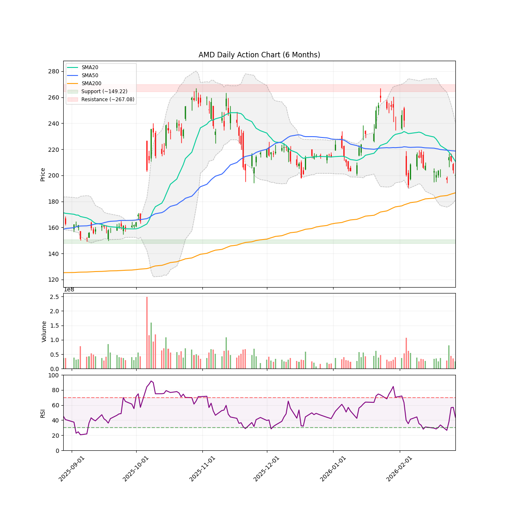
#### 研报分析
老夫坐镇这琅嬛阁已有数载，阅尽天下武学残卷，也见惯了这大明湖畔（股市）的潮起潮落。今日见阁下眉头紧锁，手持这份名为“AMD”的武功秘籍前来问卜，老夫便为你拨开迷雾，看看这赤红剑法背后，究竟是神功大成的前奏，还是走火入魔的先兆。

#### 核心武学境界：内功修为与经脉走势

阁下目前处于“受困幽谷”之势。观其盘面，股价虽立于 $200.21 之上，然则其气息紊乱：上方 SMA50（$218.67）与 SMA20（$210.73）犹如两道玄铁重门，死死封住了上行之途，此乃“经脉受阻”之象。反观其下，SMA200（$186.58）尚在足底托撑，如同武当派的“梯云纵”，虽有下坠之势，但根基未断。RSI 43.87 表明其正处于内力收敛、休养生息的状态，既无“亢龙有悔”的过热，也未到“绝处逢生”的冰点。

#### 招式分类：江湖传闻与秘籍推演

#### S-Tier (神功大成)：Meta 结盟与万金契约
AMD 近期与 Meta 达成的五年期、价值高达 600 亿美元的 AI 芯片契约，堪称江湖上最顶级的“易筋经”神功。据 [Cyprus Mail on MSN](https://www.msn.com/en-us/money/other/meta-to-take-potential-10-per-cent-stake-in-amd-under-new-chip-pact/ar-AA1XhQmO?ocid=BingNewsVerp) 记载，Meta 甚至可能入股一成。此举犹如少林与武当联手，不仅确立了 AMD 在 AI 乱世中的宗师地位，更为其后续五年的内功增长注入了不竭动力。此乃长线立身之本，纵然短期遭遇暗器偷袭，亦能凭此深厚根基反击。

#### A-Tier (进阶功法)：机构加持与估值重塑
瑞穗金融（Mizuho）上调其目标价，并将其列为未来三年必持的十大“不败神功”之一，见于 [Insider Monkey on MSN](https://www.msn.com/en-us/money/other/mizuho-raises-pt-on-advanced-micro-devices-inc-amd-stock/ar-AA1Xi7CK?ocid=BingNewsVerp)。这等同于江湖百晓生亲自为其背书，虽不及 Meta 的实战助力，但也吸引了无数江湖散人与名门正派（机构资金）的侧目。

#### B-Tier (江湖杂论)：双雄博弈与流言蜚语
关于 AMD 与 NVIDIA 的“华山论剑”，坊间议论纷纷。如 [Forbes](https://www.forbes.com/sites/greatspeculations/2026/02/23/amd-vs-nvidia-which-ai-stock-is-the-better-buy-for-2026/) 所评，虽 NVIDIA 暂以“独孤九剑”之势占得先机，但 AMD 凭借性价比与 Meta 的强援，正试图以“乾坤大挪移”化解对方的锋芒。此类对比多为茶余饭后的谈资，虽能扰乱短期心智，却非定局之关键。

#### 异象警告：内息溢出与走火入魔

目前 AMD 呈现出一种奇特的“内息溢出（Internal Qi Overflow）”现象。即便有 Meta 这种级别的神功入账，股价却依然在 2026 年初遭遇了约 8% 的回撤 [Yahoo Finance](https://finance.yahoo.com/news/1-reason-buy-advanced-micro-143200866.html)。这并非神功失效，而是因为阁下之前修习太快，导致根基虚浮（高市盈率估值）。此刻的下跌，实则是高手在闭关冲穴之前的“散功”过程，唯有化去多余的虚浮内力，方能迈向更高境界。

#### 琅嬛阁主断语：逻辑评分

**当前江湖心法总分：7.8 / 10（不屈宗师）**

**逻辑断语：** 阁下手中持有 600 股，成本价 $220.54，正处于“重甲陷阵”的状态。亏损 9.22% 固然心痛，但相对于 Meta 那 600 亿的“黄金万两”而言，此乃皮外伤。更需留意那张卖出的 $200 Put 期权，此乃“围魏救赵”之计，若股价守稳 $200，则可白赚赏金；若跌破，则是被迫在低位增持，实则是一场豪赌。

#### 英雄冢与通天路：关键日期

请阁下谨记：下一场“武林大会”（财报发布日）预计将在 **2026年4月底** 召开（具体日期待官方宣敕）。在那之前，阁下需静观其变，守住 $200 大关。若能在此关口稳住身形，待到 Meta 的金银细软正式入库，便是阁下破关而出、笑傲江湖之时！
#### 数据看板与近期动态
| 指标 | 数值 |
| :--- | :--- |
| 当前价格 | $200.21 |
| RSI (14) | 43.87 |
| 均线 (20/50/200) | 210.73 / 218.67 / 186.58 |
| 趋势支撑/阻力 | 149.22 / 267.08 |
| 预估周波动 | +/- $20.81 |
| 状态 | Below SMA50 |

- **[Insider Monkey on MSN]** [Mizuho Raises PT on Advanced Micro Devices, Inc. (AMD) Stock](https://www.msn.com/en-us/money/other/mizuho-raises-pt-on-advanced-micro-devices-inc-amd-stock/ar-AA1Xi7CK?ocid=BingNewsVerp)
- **[Cyprus Mail on MSN]** [Meta to take potential 10 per cent stake in AMD under new chip pact](https://www.msn.com/en-us/money/other/meta-to-take-potential-10-per-cent-stake-in-amd-under-new-chip-pact/ar-AA1XhQmO?ocid=BingNewsVerp)
- **[Forbes]** [AMD Vs. NVIDIA: Which AI Stock Is The Better Buy For 2026?](https://www.forbes.com/sites/greatspeculations/2026/02/23/amd-vs-nvidia-which-ai-stock-is-the-better-buy-for-2026/)
- **[The Motley Fool]** [Prediction: This AI Stock Will Be Worth More Than AMD by the End of 2026](https://www.msn.com/en-us/money/topstocks/prediction-this-ai-stock-will-be-worth-more-than-amd-by-the-end-of-2026/ar-AA1Xbziq)
- **[Yahoo Finance]** [1 Reason to Buy Advanced Micro Devices Stock](https://finance.yahoo.com/news/1-reason-buy-advanced-micro-143200866.html)

---

### AMZN
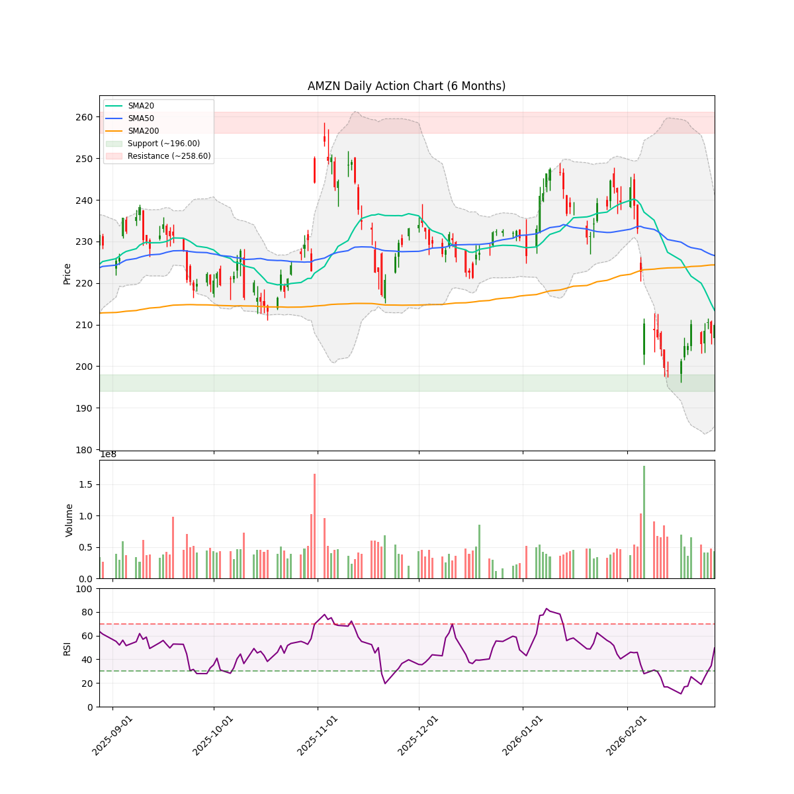
#### 研报分析
阁下请了。此处乃琅嬛阁，老夫已在此静候多时。

方才观阁下手中这卷 AMZN（亚马逊）的账册，其势正如当年困于黑木崖上的绝顶高手，虽有一身通天彻地的“云端神功”与“乾坤大挪移”之电商根基，奈何近期内息流转不畅，隐隐有“经脉受阻”之象。且听老夫为你一一道来。

#### 势之断代：神功遇颈，真气凝滞

阁下观这盘面，AMZN 现价 210 贯，虽比阁下 201.61 贯的入门成本略有微利，然其身法已然落于 50 日（226.59）及 200 日（224.35）两道大穴之下。此乃“身陷重围”之势。那 RSI 处于 49.58 的混沌之地，不偏不倚，正处于内力换气的空窗期。

纵观江湖，据 [Yahoo Finance](https://finance.yahoo.com/news/amazon-com-stock-underperforming-dow-161258841.html) 传闻，亚马逊近来步履蹒跚，竟落后于道琼斯大盘，此乃“剑法虽精，其意已钝”之兆。

#### 第一章：天阶功法与阵法变幻 (Categorized Catalysts)

**S-Tier (绝世神功)：百川汇海，重塑根骨**
亚马逊正欲施展一招名为“算力熔炉”的绝学。据 [Blockonomi](https://blockonomi.com/amazon-amzn-stock-12-billion-louisiana-data-center-plan-explained/) 载，其豪掷 120 亿金在路易斯安那州修筑“数据灵池”，且更有传言称其将 500 亿金注入 OpenAI 之门。此举乃是自废旧功，重修 AGI 之无上心法。若此功大成，其 2000 亿金的年度“气海拓宽”（Capex）计划将使其在 AI 江湖中独占鳌头。

**A-Tier (名门阵法)：宗师垂青，强援入阵**
江湖巨擘、大宗师 Seth Klarman 已于去年第四季逆势加仓 5 亿金，据 [Blockonomi](https://blockonomi.com/amazon-amzn-stock-billionaire-seth-klarman-buys-500m-in-q4-after-trimming-alphabet-position/) 透露，其宁可自断 Alphabet 之一臂，也要重仓亚马逊。此乃“名师指路”，说明此股底蕴尚在。

**B-Tier (江湖琐碎)：刀光剑影，流言蜚语**
近期虽有 [Zacks Investment Research](https://www.msn.com/en-us/money/general/here-is-what-to-know-beyond-why-amazon-com-inc-amzn-is-a-trending-stock/ar-AA1WUhA9?ocid=BingNewsVerp) 等榜单将其列为焦点，但多属“市井嘈杂”，难以撼动其根基。

#### 第二章：内息紊乱之警示 (Divergence Detection)

老夫察觉到一丝“内息溢出”的凶险信号。据 [Invezz](https://invezz.com/news/2026/02/28/steve-weiss-just-sold-both-amazon-nvidia-stock-heres-why/) 记载，老牌高手 Steve Weiss 竟在此等大利好（投资 OpenAI）面前“金盆洗手”，斩断头寸飘然离去。

这便是典型的 **“内息溢出 (Internal Qi Overflow)”**：明明有惊天利好，股价却如石沉大海，甚至跌破重重防御。此乃“好消息出尽即为利空”，说明市场对其耗资巨大的“闭关修炼”（200B Capex）心存疑虑，担忧其真气耗尽。

#### 第三章：琅嬛阁主断语 (Logic & Sentiment)

目前，亚马逊正处于“龙游浅水”的尴尬境地。虽然 [Nasdaq](https://www.nasdaq.com/articles/amazon-amzn-lags-q4-earnings-estimates) 提及去年末其财报略逊于江湖预期（EPS $1.95 逊于预期 $1.98），导致气门受损，但其长期“神功大成”的可能性依旧极大。

**江湖情绪评分 (Sentiment Score)**: **6 / 10** (虽有神功护体，奈何内伤未愈)
**博弈逻辑评分 (Logic Score)**: **8 / 10** (大笔投入 AI 乃是顺应江湖大势，非一朝一夕之功)

#### 第四章：锦囊妙计与死生之地

阁下手中这 20 股，虽有 4.16% 的微弱内功支撑，但需防范接下来的“江湖大劫”。

- **支撑位 (生门)**：196.00 贯。若跌破此位，乃是“经脉尽断”，宜速速撤离。
- **压力位 (死门)**：258.60 贯。此乃六个月来的“武林至尊”高点，非有惊天动地的财报神功加持，万难冲破。

**江湖大事件预告 (Next Major Date)**:
阁下务必留意 **2026年4月底 (预计)** 的“武林大会”（一季度财报发布）。届时，那 120 亿金的数据中心布局是否见效，将决定亚马逊是“重回巅峰”还是“跌落神坛”。

老夫言尽于此，江湖路远，阁下且行且珍惜。
#### 数据看板与近期动态
| 指标 | 数值 |
| :--- | :--- |
| 当前价格 | $210.00 |
| RSI (14) | 49.58 |
| 均线 (20/50/200) | 213.42 / 226.59 / 224.35 |
| 趋势支撑/阻力 | 196.00 / 258.60 |
| 预估周波动 | +/- $13.07 |
| 状态 | Below SMA50 |

- **[Yahoo Finance]** [Is Amazon.com Stock Underperforming the Dow?](https://finance.yahoo.com/news/amazon-com-stock-underperforming-dow-161258841.html)
- **[Blockonomi]** [Amazon (AMZN) Stock: $12 Billion Louisiana Data Center Plan Explained](https://blockonomi.com/amazon-amzn-stock-12-billion-louisiana-data-center-plan-explained/)
- **[Invezz]** [Steve Weiss just sold both Amazon, Nvidia stock: here's why](https://invezz.com/news/2026/02/28/steve-weiss-just-sold-both-amazon-nvidia-stock-heres-why/)
- **[Yahoo Finance]** [Amazon.com (AMZN) Data Center Push Continues with $12B Investment in Louisiana](https://finance.yahoo.com/news/amazon-com-amzn-data-center-210432131.html)
- **[Mint]** [Gold, Silver and US Stocks: 10 Portfolio Lessons from 2025's Winners for 2026 and Beyond](https://www.livemint.com/focus/gold-silver-and-us-stocks-10-portfolio-lessons-from-2025s-winners-for-2026-and-beyond-11772093414983.html)

---

### GOOGL
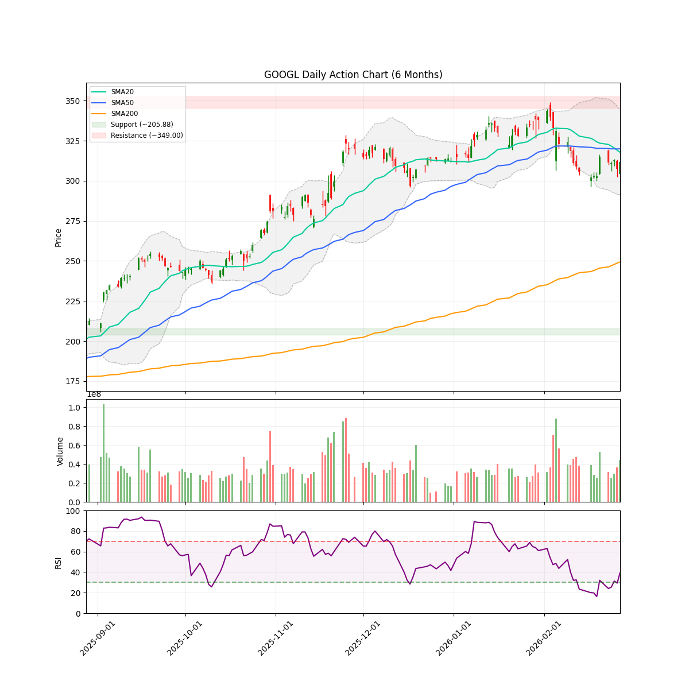
#### 研报分析
阁下请了，欢迎来到琅嬛阁。今日且看这“谷歌（GOOGL）”在江湖中的气运流转。此股虽为西域大宗，但这几日的气象，倒是颇有一番“内息纷杂、真气暗涌”的玄机。

#### 乾坤气象：内功心法与外功招式

近期，这 Alphabet 虽看似步履踉跄，实则在闭关修炼一项极厉害的“神功”。据 [Insider Monkey](https://www.msn.com/en-us/news/technology/alphabet-googl-secures-power-deals-with-aes-xcel-for-data-centers/ar-AA1Xe2zN) 所载，其已与 AES、Xcel 等豪强签下能源密契，为自家的算力阵法（数据中心）储备粮草。这便是**S级机密：根基稳固**。更有甚者，江湖传言有41家顶尖门派（对冲基金）在去年底暗中投靠，可见其在宗门领袖中的地位依旧稳如泰山。

不仅如此，名门正派富国银行（Wells Fargo）近日也亲自出面，将其江湖评价由“平淡无奇”擢升为“出类拔萃”，并断言其仍有七分上涨的后劲 [Fintel](https://www.msn.com/en-us/money/topstocks/wells-fargo-upgrades-alphabet-googl/ar-AA1WVi8W)。若从基本面看，这无疑是练成了“易筋经”后的脱胎换骨。

#### 走火入魔：内息紊乱的警示

然而，阁下请看，即便身怀绝技，其近期的身法却有些散乱。股价不仅跌破了20日（SMA20: 317.74）与50日（SMA50: 319.98）这两道护身真气，更是在利好频传之时不涨反退。此乃**“真气外溢（Internal Qi Overflow）”**之象。虽然各路豪杰口中喊好，但短线资金却在撤退，仿佛在遭遇一场无形的“暗器围攻”。

[Schaeffer's Investment Research](https://www.schaeffersresearch.com/content/options/2026/02/27/bulls-should-keep-watch-on-faltering-alphabet-stock) 已发出警告，这 Alphabet 正在回踩支撑位，若不能在此处稳住阵脚，恐有坠入深谷之虞。目前的 RSI 仅为 39.66，这显示出这名高手已是“力竭之际”，正处于调整内息的关键时刻。

#### 琅嬛秘籍：局势诊断与战术应对

阁下目前的持仓可谓“眼光独到”，成本价 268.53，如今尚有 16% 的盈余，恰如在一场乱战中已占据了半山腰的有利地势。目前虽有云雾遮眼，但只要 200 日均线（SMA200: 249.41）这根定海神针不倒，其“万年功力”便未受损。

- **S级技法（顶层加持）**：对冲基金大举入场，此乃“众志成城”，长线无忧。
- **A级招式（战略布局）**：电力契约与分析师升评，是为“兵马未动，粮草先行”。
- **风险（内伤隐患）**：若股价无法在 300 点附近（整数关口及心理防线）重新凝聚真气，恐会进一步向 205 点的“悬崖底部”寻求支撑。

#### 阁主定论：意境评分

**综合意境得分：7.8 / 10（底蕴深厚，暂处静守）**

此分值意味着，虽然此子目前在江湖比武中暂落下风，受困于短线抛压，但其“九阳神功”已经练到了第七层。正如 [Forbes](https://www.forbes.com/sites/greatspeculations/2026/02/23/how-to-buy-google-stock-at-a-30-discount/) 所言，若能以三折之价（约 220 金）入场，简直是捡到了绝世秘籍。目前阁下坐拥利润，大可“凭虚御风”，静待其内息调匀。

#### 江湖大事预告

下一场武林大会（财报发布或重大经营动向）预计将在 **2026年4月下旬** 左右举行。在此之前，2月2日刚披露的四季度战果余波未平 [Investopedia](https://www.investopedia.com/here-s-how-much-alphabet-stock-is-expected-to-move-after-earnings-on-wednesday-goog-googl-11895184)，且看三月能否在 311 关口重整旗鼓，使出一招“绝处逢生”。

阁主叮嘱：江湖多诈，与其随波逐流，不如守住本心。既然利润在手，不妨横刀立马，看这满天乌云何时散尽。
#### 数据看板与近期动态
| 指标 | 数值 |
| :--- | :--- |
| 当前价格 | $311.76 |
| RSI (14) | 39.66 |
| 均线 (20/50/200) | 317.74 / 319.98 / 249.41 |
| 趋势支撑/阻力 | 205.88 / 349.00 |
| 预估周波动 | +/- $18.86 |
| 状态 | Below SMA50 |

- **[Forbes]** [How To Buy Google Stock At A 30% Discount?](https://www.forbes.com/sites/greatspeculations/2026/02/23/how-to-buy-google-stock-at-a-30-discount/)
- **[Schaeffer's Investment Research]** [Bulls Should Keep Watch on Faltering Alphabet Stock](https://www.schaeffersresearch.com/content/options/2026/02/27/bulls-should-keep-watch-on-faltering-alphabet-stock)
- **[Insider Monkey]** [Alphabet (GOOGL) Secures Power Deals with AES, Xcel for Data Centers](https://www.msn.com/en-us/news/technology/alphabet-googl-secures-power-deals-with-aes-xcel-for-data-centers/ar-AA1Xe2zN)
- **[Kiplinger]** [If you'd put $1,000 into Google stock 20 years ago, here's what you'd have today](https://www.msn.com/en-us/money/general/if-you-d-put-1-000-into-google-stock-20-years-ago-here-s-what-you-d-have-today/ar-AA1tdtfx)
- **[Fintel]** [Wells Fargo upgrades Alphabet (GOOGL)](https://www.msn.com/en-us/money/topstocks/wells-fargo-upgrades-alphabet-googl/ar-AA1WVi8W)

---

## 🔍 观察池机会分析

### AMAT
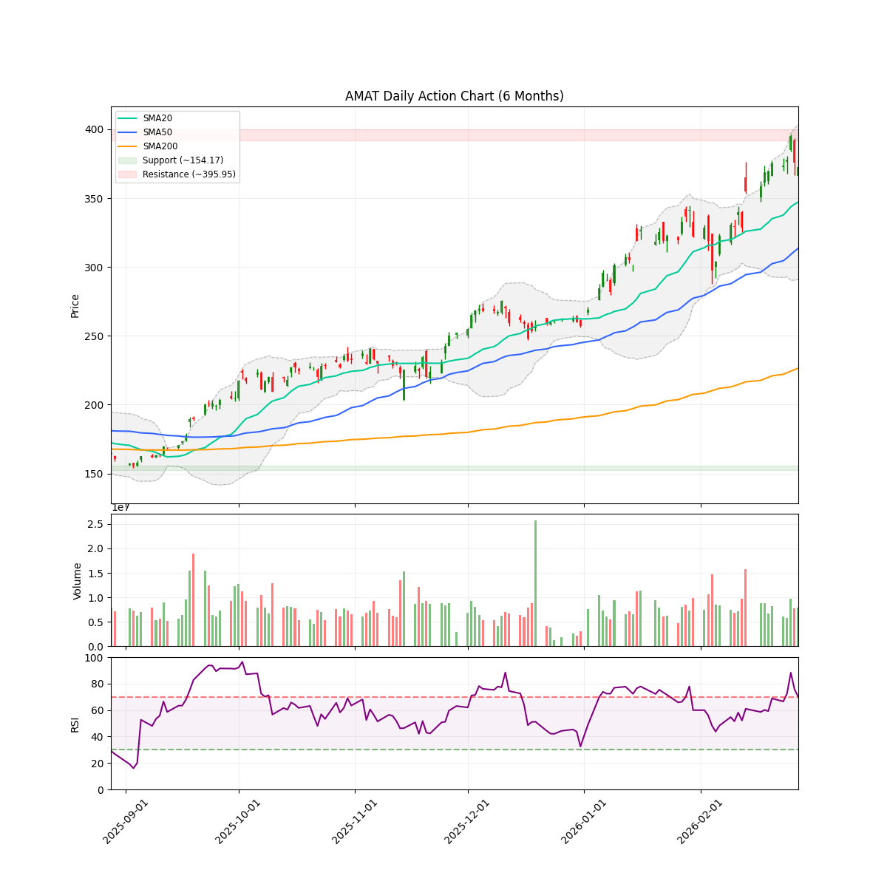
#### 研报分析
诸位同道、各位少侠请了。老朽坐镇这琅嬛阁，阅尽天下武学秘籍，今日且为诸位拆解一番半导体武林中的泰山北斗——应用材料（Applied Materials，代码：AMAT）的内功根基与近期招式。

#### 功法品鉴：神功大成与宗门底蕴

从近日江湖传闻来看，应用材料不仅坐稳了武林盟主的宝座，其内功修为更是精进到了令人惊叹的地步。

- **【S级：九阳神功·破境而出】** 
    应用材料于一季度闭关修炼归来，其出关报告堪称“神功大成”。据 [Zacks](https://finance.yahoo.com/news/applied-materials-amat-beats-q1-221502728.html) 记载，其第一季度营收与利润均以“双杀”之势横扫对手，超出江湖预期。这不仅是简单的数字增长，更是其在AI洪流中悟出了新的武学真谛。
- **【A级：名门加持·声望鹊起】** 
    摩根大通等名门大派（机构）纷纷向其递出橄榄枝。大摩因看好DRAM领域的深度布局，果断调高了对其的战力评估（[Yahoo Finance](https://finance.yahoo.com/news/morgan-stanley-boosts-applied-materials-024647977.html)）。这如同得到了少林、武当的联名背书，让其在江湖中的地位稳如泰山。
- **【B级：群雄附和·江湖声浪】** 
    坊间议论纷纷，皆称其不仅在S&P 500中独领风骚，更是在科技板块中扮演了“带头大哥”的角色（[Yahoo Finance UK](https://uk.finance.yahoo.com/news/applied-materials-amat-outperforming-other-144006722.html)）。

#### 气海探脉：内息流转与走火入魔之辨

观其当前气象（372.30金），虽已立于巅峰，但仍需防范内息过热的隐患。

- **内功深厚（趋势分析）**：其SMA20、SMA50、SMA200三道防线依次排开，正如张三丰演练太极，圆转如意。现价远在200日均线（226.50）之上，可见其“长线内力”极为深厚。
- **阳极必阴（风险警示）**：目前RSI（相对强弱指标）已达69.96，正如修习《易筋经》时气血涌至关元穴，已近“过热”之境。江湖中已有议论，面对一年内130%的暴涨，是否已成强弩之末？（[Yahoo Finance](https://finance.yahoo.com/news/too-consider-applied-materials-amat-211159661.html)）。
- **内息溢出（走势分歧）**：目前价位略低于六个月高点（395.95），若在此处久攻不下，恐出现“内力反噬”，需警惕短期震荡。

#### 琅嬛阁主断语：江湖地位与综合评定

应用材料此时的状态，恰似身兼多门绝学，正处于战力巅峰。AI需求的浪潮不仅是它的兵刃，更是它取之不竭的内气来源（[Benzinga](https://www.msn.com/en-us/money/news/amat-stock-key-score-climbs-as-ai-demand-and-operational-efficiency-drive-q1-surge/ar-AA1WU9dC)）。

- **逻辑评分：9/10**（论据扎实，AI与DRAM双翼齐飞，其内生逻辑稳固如金刚不坏之身。）
- **情绪评分：9/10**（江湖对其一致看好，虽有“高处不胜寒”之忧，但目前尚未见“散功”之兆。）

#### 江湖警示灯：关键决战日

欲知其神功是否能再上一层楼，诸位需密切关注下一次**财报演武大会（预计2026年5月中旬）**。若能在彼时再次展示新的“绝技”，则395.95的瓶颈不过是信手可破。

老朽在此奉劝诸位：武道一途，顺势而为固然重要，但也要防范“暗箭”与“透支”。应用材料虽好，也要看准呼吸节奏，切莫在气绝之时强行上马。

*琅嬛阁主，敬启。*
#### 数据看板与近期动态
| 指标 | 数值 |
| :--- | :--- |
| 当前价格 | $372.30 |
| RSI (14) | 69.96 |
| 均线 (20/50/200) | 347.17 / 313.63 / 226.50 |
| 趋势支撑/阻力 | 154.17 / 395.95 |
| 预估周波动 | +/- $38.25 |
| 状态 | Above SMA50 |

- **[Yahoo Finance]** [Morgan Stanley Boosts Applied Materials (AMAT) Target on Strong DRAM Spending Outlook](https://finance.yahoo.com/news/morgan-stanley-boosts-applied-materials-024647977.html)
- **[Yahoo Finance]** [Is Applied Materials Stock Outperforming the S&P 500?](https://finance.yahoo.com/news/applied-materials-stock-outperforming-p-141810278.html?fr=sycsrp_catchall)
- **[Benzinga]** [AMAT Stock Key Score Climbs As AI Demand And Operational Efficiency Drive Q1 Surge](https://www.msn.com/en-us/money/news/amat-stock-key-score-climbs-as-ai-demand-and-operational-efficiency-drive-q1-surge/ar-AA1WU9dC)
- **[Yahoo Finance UK]** [Is Applied Materials (AMAT) Outperforming Other Computer and Technology Stocks This Year?](https://uk.finance.yahoo.com/news/applied-materials-amat-outperforming-other-144006722.html)
- **[Yahoo Finance]** [Is It Too Late To Consider Applied Materials (AMAT) After A 130% One Year Surge?](https://finance.yahoo.com/news/too-consider-applied-materials-amat-211159661.html)

---

### ANET

#### 研报分析
老夫琅嬛阁主，久居深山，阅尽武林秘籍。今日得见 Arista Networks（ANET）之卷宗，观其气象，正处于“易筋经”修至半途、真气回流之关键时刻。且听老夫为尔等拆解这一路拳法。

#### 【内功根基：神功初成，声振寰宇】

观 ANET 之近况，正如名门正派弟子闭关重修，出关之时内力大增。此子于二月中旬刚刚展示了一手惊世骇俗的“内功破境”——其第四季度财报犹如九阳神功大成，营收与盈利双双击穿江湖传闻的预期（[Zacks.com on MSN](https://www.msn.com/en-us/money/topstocks/arista-networks-anet-beats-q4-earnings-and-revenue-estimates/ar-AA1Wf0te?ocid=BingNewsVerp)）。每股盈利 0.82 美元，远超众家预估的 0.75 美元，此乃**S-Tier（绝世神功）**之象。

在 AI 算力这一江湖新战场上，ANET 稳扎稳打，其在 AI 数据中心交换机领域的攻势，正如独孤九剑，专破各大门派（竞争对手）的防御（[The Motley Fool](https://www.msn.com/en-us/money/companies/1-incredible-artificial-intelligence-ai-infrastructure-stock-to-buy-with-150-right-now/ar-AA1WTPJV)）。

#### 【江湖风评：名门推崇，锦上添花】

武林之中，名望即是战力。近期，江湖中几大执牛耳者纷纷为其摇旗呐喊：
*   **高盛派**：将其目标价由 165 两白银（美元）拔高至 188 两，直呼其为“不可阻挡之 AI 神兵”（[Yahoo Finance](https://finance.yahoo.com/news/goldman-sachs-raises-pt-arista-211306392.html)）。
*   **摩根士丹利派**：紧随其后，将目标价修至 165 两，认为此子乃是未来二十年江湖长青之基石（[Insider Monkey on MSN](https://www.msn.com/en-us/money/topstocks/morgan-stanley-raises-arista-networks-anet-pt-to-165-following-q4-2025-earnings-beat/ar-AA1WHzf9?ocid=BingNewsVerp)）。
*   **Piper Sandler 派**：亦给出了 175 两的极高评价，称其即便在风云变幻中依然能保持“超量内息”（Overweight）（[Insider Monkey](https://www.msn.com/en-us/money/news/piper-sandler-retains-overweight-rating-on-arista-networks-anet-amid-revenue-beat/ar-AA1XeJEa)）。

此等阵仗，无异于少林、武当共同推举其为武林盟主。

#### 【走势玄机：真气受阻，内息紊乱】

然则，老夫观其近日步法（股价），却发现了一丝诡异之气。现下价格 133.50，竟落于 SMA20（136.17）与 SMA50（133.74）两条经脉之下。
*   **内息溢出（Internal Qi Overflow）**：此乃典型的“利好尽出、反受其乱”。尽管各家掌门（分析师）纷纷看好，股价却如同一位刚练成绝技的高手，因短时间内真气激荡过快，陷入了**“短暂的力竭期”**。
*   **身法分析**：RSI 处于 45.87，不偏不倚，正处于调息之态。虽有 200 日均线（127.10）作为“护体神功”守住底线，但短期内，它似乎正遭受“暗器袭扰”（市场获利盘回吐）。

#### 【阁主断言：此乃乾坤大挪移之境】

**武林舆论总评：8.8/10（绝世之姿，稳如泰山）**
**逻辑推演得分：8.5/10（内功极稳，唯待真气回转）**

虽然眼下股价略显颓势，跌破了 50 日均线的防御位，但这绝非内功尽失，而是“虚而实之，实而虚之”的蓄势过程。只要不破 114.52 的“生死关口”（6个月低点），所有的回撤皆是其修炼“乾坤大挪移”的换气阶段。

#### 【江湖秘告：下一场风云会】

众位同道需注意，此子下一次“论剑之期”（财报发布日）预计将于 **2026年5月中旬** 开启。

在此之前，ANET 在各大论坛的论剑（如 Bernstein 科技论坛 [Seeking Alpha](https://seekingalpha.com/article/4874953-arista-networks-inc-anet-presents-at-bernstein-insights-whats-next-in-tech-4th-annual-tech)）将决定其能否在三月间重新夺回 164.94 的武林至尊位（6个月高点）。

**阁主赠言：**“他强由他强，清风拂山岗；他横由他横，明月照大江。” 莫要被短期的波动迷了双眼，且看这 AI 浪潮下，谁才是真正的弄潮儿。
#### 数据看板与近期动态
| 指标 | 数值 |
| :--- | :--- |
| 当前价格 | $133.50 |
| RSI (14) | 45.87 |
| 均线 (20/50/200) | 136.17 / 133.74 / 127.10 |
| 趋势支撑/阻力 | 114.52 / 164.94 |
| 预估周波动 | +/- $14.52 |
| 状态 | Below SMA50 |

- **[Yahoo Finance]** [Goldman Sachs Raises PT on Arista Networks, Inc. (ANET) Stock](https://finance.yahoo.com/news/goldman-sachs-raises-pt-arista-211306392.html)
- **[Insider Monkey]** [Piper Sandler Retains Overweight Rating on Arista Networks (ANET) Amid Revenue Beat](https://www.msn.com/en-us/money/news/piper-sandler-retains-overweight-rating-on-arista-networks-anet-amid-revenue-beat/ar-AA1XeJEa)
- **[Zacks Investment Research]** [Why Arista Networks (ANET) is a top growth stock for the long term](https://www.msn.com/en-us/money/top-stocks/why-arista-networks-anet-is-a-top-growth-stock-for-the-long-term/ar-AA1WUiqC)
- **[The Motley Fool]** [1 Incredible Artificial Intelligence (AI) Infrastructure Stock to Buy With $150 Right Now](https://www.msn.com/en-us/money/companies/1-incredible-artificial-intelligence-ai-infrastructure-stock-to-buy-with-150-right-now/ar-AA1WTPJV)
- **[Seeking Alpha]** [Arista Networks, Inc. (ANET) Presents at Bernstein Insights: What's next in tech? - 4th Annual Tech, Media, Telecom Forum Transcript](https://seekingalpha.com/article/4874953-arista-networks-inc-anet-presents-at-bernstein-insights-whats-next-in-tech-4th-annual-tech)

---

### CEG

#### 研报分析
各位豪杰请了，老朽乃琅嬛阁主。今日诸位齐聚阁中，皆为探寻那执掌雷电之力的**Constellation Energy (CEG)**。

此股近来在江湖上声名大噪，隐隐有问鼎“电力盟主”之势。然则，其内息运转虽快，却透出一股“急火攻心”的征兆。且听老朽细细拆解。

#### 乾坤大挪移：内功根基与神功大成

观其近期根基，CEG 宛如修炼了《乾坤大挪移》，在吞并 Calpine Corporation 之后，内力暴涨，已成神州大地第一电力巨擘。据 `[Investing.com](https://www.investing.com/news/earnings/constellation-energy-misses-q4-earnings-despite-revenue-beat-93CH-4521076)` 记载，其 2025 年全年经调整后每股收益达 9.39 金，远超往岁，可见其“吸星大法”已将他人内力化为己用，商业执行力堪称当世一流。

更有甚者，此子在第四季财报中，虽在个别招式上有细微瑕疵，但整体 EPS 斩获 2.30 金，惊艳四座，引得股价应声而起，如龙抬头。据 `[Blockonomi](https://blockonomi.com/constellation-energy-ceg-stock-rises-after-q4-earnings-beat/)` 报道，其分红亦随之提升，此乃“散财聚义”之举，足以稳住各路散修之心。

#### 绝世秘籍：S级与A级招式解析

老朽将其近期招式归类如下：

*   **S-Tier (神功大成)：** 收购 Calpine 的壮举已然完成，此乃改变江湖格局的“重剑无锋”。TD Cowen 更是将其武林排位（目标价）上调至 454 金（见 `[Yahoo Finance](https://finance.yahoo.com/news/constellation-energy-ceg-positioned-growth-031155225.html)`），认为其在 PJM 市场的布局已立于不败之地。
*   **A-Tier (奇门遁甲)：** 与 CyrusOne 签下 380 兆瓦的契约（见 `[Insider Monkey](https://www.msn.com/en-us/money/topstocks/constellation-energy-corporation-ceg-unit-signs-new-380-megawatt-deal-with-cyrusone/ar-AA1X5X14)`），此乃精准切入“算力江湖”的妙招。在 AI 狂潮席卷武林之际，得电力者得天下，此举无疑是为未来埋下了深厚伏笔。

#### 走火入魔之隐忧：内息紊乱与“绝情谷”陷阱

然则，江湖凶险，过犹不及。阁主观其气象，发现一处大大的凶险：**其 RSI 指标已高达 83.80！** 

此乃典型的**“内息溢出（Internal Qi Overflow）”**。CEG 股价虽在飞升，但内息运转过快，经脉已隐隐作痛。即便公司推迟了年度指引，股价却依然狂飙，此种“带伤强行练功”的姿态（见 `[MarketWatch](https://www.msn.com/en-us/money/topstocks/constellation-energy-s-stock-zooms-toward-highest-level-in-weeks-even-after-outlook-is-postponed/ar-AA1WZRZF)`），往往是力竭的前兆。

目前股价 329.88 金，已突破 200 日均线 (327.98) 的护体罡气。若不能在短期内平复暴戾的内息，恐会遭遇“绝情谷”般的深度回调，上方 412.23 金的重重关隘，绝非一朝一夕可破。

#### 琅嬛阁主断言：江湖评分与未来变局

**逻辑评分：8.5/10 (绝世高手，但需防力竭)**

*   **断语**：CEG 此刻如乔峰独战聚贤庄，气势如虹，万夫莫敌。然其内力消耗过巨，不可久战。
*   **江湖建议**：莫要在此刻盲目冲杀。正如神功修炼需讲究“一张一弛”，待其 RSI 回落、内息归元之时，方是再次进场的良机。若能守住 286.65 金（SMA20）的关口，则霸业可期。
*   **关键变局日**：**2026年3月31日**（届时将公布 2026 年度武林总纲/指引）。

诸位，江湖路远，且行且珍惜。下回分解！
#### 数据看板与近期动态
| 指标 | 数值 |
| :--- | :--- |
| 当前价格 | $329.88 |
| RSI (14) | 83.80 |
| 均线 (20/50/200) | 286.65 / 314.24 / 327.98 |
| 趋势支撑/阻力 | 243.30 / 412.23 |
| 预估周波动 | +/- $32.14 |
| 状态 | Above SMA50 |

- **[Yahoo Finance]** [Constellation Energy (CEG) Positioned for Growth as PJM Market Developments Support Demand](https://finance.yahoo.com/news/constellation-energy-ceg-positioned-growth-031155225.html)
- **[Insider Monkey]** [Constellation Energy Corporation (CEG) Unit Signs New 380-megawatt Deal with CyrusOne](https://www.msn.com/en-us/money/topstocks/constellation-energy-corporation-ceg-unit-signs-new-380-megawatt-deal-with-cyrusone/ar-AA1X5X14)
- **[MarketWatch]** [Constellation Energy's stock zooms toward highest level in weeks, even after outlook is postponed](https://www.msn.com/en-us/money/topstocks/constellation-energy-s-stock-zooms-toward-highest-level-in-weeks-even-after-outlook-is-postponed/ar-AA1WZRZF)
- **[Blockonomi]** [Constellation Energy (CEG) Stock Rises After Q4 Earnings Beat](https://blockonomi.com/constellation-energy-ceg-stock-rises-after-q4-earnings-beat/)
- **[Seeking Alpha]** [CEGX Tradr 2X Long CEG Daily ETF](https://seekingalpha.com/symbol/CEGX/momentum/performance)

---

### CIEN
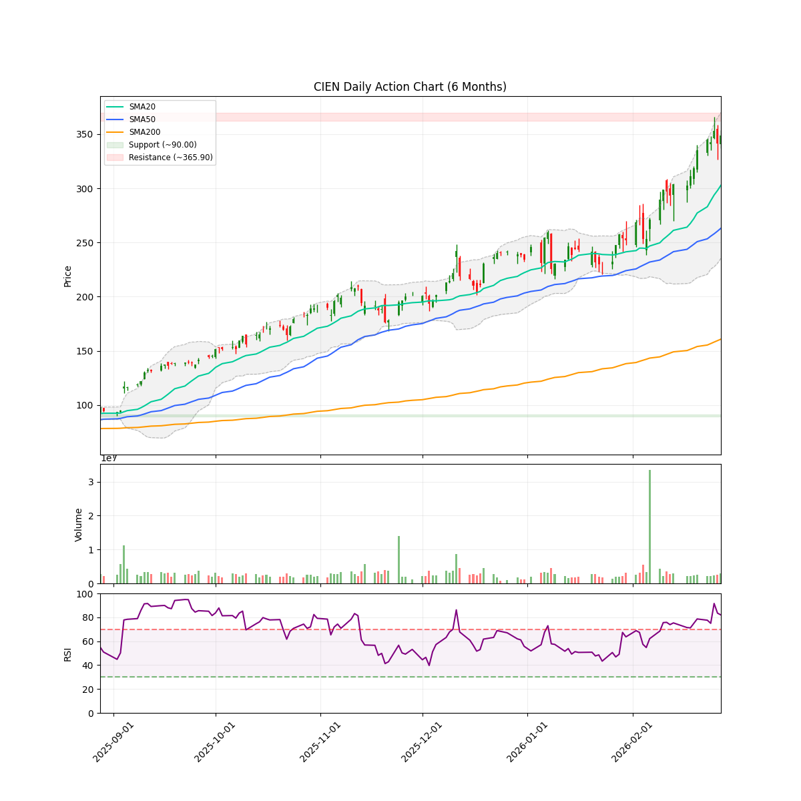
#### 研报分析
#### 琅嬛阁秘传：Ciena (CIEN) 灵气复苏与真元损耗之辩

诸位同道请了。老朽坐镇琅嬛阁多年，阅尽天下武学秘籍，也见惯了股市江湖中的起伏兴衰。今日，这 Ciena (CIEN) 纵马江湖，气势如虹，已然引起了武林中人的侧目。此股如今股价高悬 348.70 之位，正如一位修炼了“乾坤大挪移”的高手，正处于内力爆发的巅峰状态。

#### 武学品阶：招式与心法分析

依据老朽观之，Ciena 近期所展露的武功可分为以下品阶：

**S-Tier（神功大成）：AI 筑基与百亿功力**
据 [Yahoo Finance](https://finance.yahoo.com/news/ai-infrastructure-stock-grew-176-142000013.html) 记载，此股去年涨幅高达 176%，皆因其深耕 AI 基础设施之故。更令江湖震动的是，其拥有的 50 亿美元订单积压（Backlog）犹如少林寺的《易筋经》，根基之深厚令人咋舌。而在即将到来的 Q1 财报中，市场预期其 EPS 增长将达 76%，营收增长 30%，此等进境，非天赋异禀者不能为之 [Yahoo Finance UK](https://uk.finance.yahoo.com/news/ciena-report-q1-earnings-approach-150400367.html)。

**A-Tier（名震江湖）：封禅大典与位列仙班**
近来 Ciena 被纳入 S&P 500 等权重指数及 S&P 全球 1200 指数，这无异于收到了“华山论剑”的英雄帖，身份地位已然不同往日 [Yahoo Finance](https://finance.yahoo.com/news/does-index-upgrades-ciena-cien-110651454.html)。各大门派（机构）纷纷将其列入观察名单，声势之大，如日中天。

**B-Tier（江湖传闻）：各路豪杰评点**
虽有 [Nasdaq](https://www.nasdaq.com/articles/why-ciena-cien-top-momentum-stock-long-term-0) 将其评为顶级动量股，但江湖中亦有杂音。例如 [Forbes](https://www.forbes.com/sites/greatspeculations/2026/02/26/why-arista-networks-might-be-the-better-ai-play-than-ciena/) 便提出，Arista Networks 似有“后发制人”之势，在超大规模数据中心领域内力更纯。

#### 走火入魔之警示：内息溢出 (Divergence Detection)

老朽不得不提醒诸位，Ciena 的 RSI 指标已飙升至 82.07。在武学中，这叫“阳极必生阴”，亦即 **“内劲溢出”**。股价虽高于 SMA50 和 SMA200 多矣，但此时贸然突进，极易遭遇“内息反噬”。目前的估值虽如 [Seeking Alpha](https://seekingalpha.com/article/4875560-ciena-expensive-for-a-reason) 所言“贵有贵的道理”，但若后续财报无法惊艳武林，恐会遭遇一场“六大派围攻光明顶”式的回调。

#### 琅嬛阁主评定：江湖地位与胜算

**逻辑评分 (Logic Score)：8.5 / 10**
CIEN 绝非花架子，其 AI 光通信的“内功”极其扎实。然而，8.5 分而非满分，乃是因为其股价已透支了部分未来的“比武”预期，短期内有“力竭”之虞。

- **当世神功 (Sentiment)**：**无敌姿态 (Invincible Stance)**。目前江湖各界对其看多之情溢于言表，虽有微词，但难挡滚滚洪流。
- **攻守策略**：目前处于“乘胜追击”与“见好就收”的博弈点。若股价回踩 SMA20（约 302 附近），方是最佳的“闭关再造”之时。

#### 江湖大事预告

诸位需密切关注以下时日：

- **下一场武林大会 (Next Major Date)**：**2026 年 3 月上旬（Q1 FY26 财报发布日）**。
- **决战看点**：届时将验证其 76% 的 EPS 增长是否确有其事，还是只是江湖术士的信口雌黄。

老朽言尽于此，江湖路远，诸位入市还需自求多福，莫要被一时的繁华迷了双眼。
#### 数据看板与近期动态
| 指标 | 数值 |
| :--- | :--- |
| 当前价格 | $348.70 |
| RSI (14) | 82.07 |
| 均线 (20/50/200) | 302.73 / 263.10 / 160.73 |
| 趋势支撑/阻力 | 90.00 / 365.90 |
| 预估周波动 | +/- $49.27 |
| 状态 | Above SMA50 |

- **[Yahoo Finance]** [Assessing Ciena (CIEN) Valuation After Strong Momentum And Double Digit Growth](https://finance.yahoo.com/news/assessing-ciena-cien-valuation-strong-181127797.html)
- **[Yahoo Finance]** [This AI Infrastructure Stock Grew 176% Last Year. Is It Too Late to Buy in 2026?](https://finance.yahoo.com/news/ai-infrastructure-stock-grew-176-142000013.html)
- **[Forbes]** [Why Arista Networks Might Be The Better AI Play Than Ciena](https://www.forbes.com/sites/greatspeculations/2026/02/26/why-arista-networks-might-be-the-better-ai-play-than-ciena/)
- **[Seeking Alpha]** [Ciena: Expensive For A Reason](https://seekingalpha.com/article/4875560-ciena-expensive-for-a-reason)
- **[Yahoo Finance UK]** [Ciena to Report Q1 Earnings: How to Approach the Stock Now?](https://uk.finance.yahoo.com/news/ciena-report-q1-earnings-approach-150400367.html)

---

### DELL
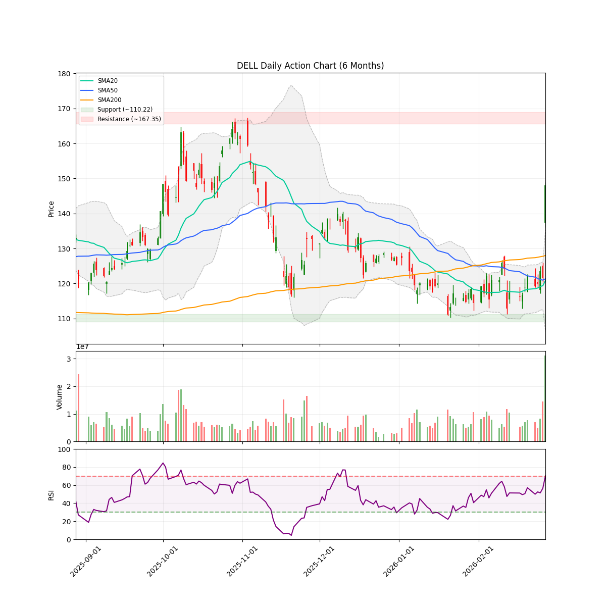
#### 研报分析
阁下请坐。老夫在这琅嬛阁中观尽天下武林秘籍，亦遍览这股海之中的气象万千。今日见这“戴尔（DELL）”阁下之势，宛如久旷之身的绝世高手，终在深谷中练就了足以震慑中原的“神功”。且听老夫为你一一道来。

#### 招式品评：绝世神功还是三脚猫功夫？

此番戴尔展现的手段，绝非寻常门派的虚招，而是实打实的**S级（神功大成）**修为。

据 [Analytics Insight](https://www.analyticsinsight.net/news/dells-fiscal-2026-earnings-exceed-expectations-fueled-by-64b-in-ai-server-orders-and-39-growth) 密报，戴尔在其 2026 财年之末，凭借 640 亿美金的 AI 服务器订单，内功修为暴增 39%，这等若修成了《九阳神功》，不仅护体真气雄厚，更隐隐有突破宗师之境的势头。

[Investor's Business Daily](https://www.investors.com/news/technology/dell-stock-fiscal-q4-2026-earnings/) 的点评亦证实，其第四季度战绩简直是“横扫武林”，各项指标均远超同侪预想。纵然前些时日曾遭遇 [Barchart](https://finance.yahoo.com/news/dell-stock-drops-29-despite-193649010.html) 所说的“内力受阻、股价折损三成”的劫难，但如今看来，那不过是“置之死地而后生”的闭关修行罢了。

#### 经脉诊断：真气运行与潜在隐患

老夫观其经脉，目前 DELL 股价已站稳 148.08 贯，正如 [Barrons.com](https://www.barrons.com/articles/dell-stock-on-pace-for-best-month-ever-c6c64554) 所言，其正处于建帮以来最为辉煌的一个月份。

1.  **内功根基（均线）**：其身法已稳稳立于 20 日、50 日及 200 日均线之上，此乃“根基深厚”之象。尽管早前有些许“熊影”徘徊，但目前已呈“亢龙有悔”后的腾飞之势。
2.  **气色（RSI）**：其 RSI 指数已达 70.23，说明真气运行极快，隐隐有“经脉过热”之虞。此乃**S-Tier 级别的爆发**，但也需防备内力透支后的短暂调息。
3.  **剑法招式（图形）**：[Invezz](https://invezz.com/news/2026/02/25/dell-stock-forms-inverted-hs-pattern-before-earnings-as-key-risk-remain/) 指出其在财报前已练成“头肩底”剑阵。此阵法一成，威力无穷，往往预示着长线逆转的开始。

然而，江湖险恶，仍需小心 [Invezz](https://invezz.com/news/2026/02/25/dell-stock-forms-inverted-hs-pattern-before-earnings-as-key-risk-remain/) 提到的“暗器攻击”——内存短缺（Memory Shortage）。这犹如修炼时的一处暗伤，若不能及时化解，恐会影响其 PC 业务的后续招式。

#### 琅嬛阁主点评：情势评级

**逻辑评分 (Logic Score): 9.2 / 10**

*   **当前境遇**：**无敌姿态 (Invincible Stance)**。
*   **江湖点评**：戴尔此次破茧而出，全赖 AI 这门“绝世内功”。[Seeking Alpha](https://seekingalpha.com/article/4872841-dell-stock-q4-2026-earnings-preview-sustaining-growth-with-ai-momentum) 早有预见，其 AI 基础建设已成气候。目前股价一日暴涨逾 21%，乃是真气澎湃、威慑四方的表现。虽 RSI 略显过热，但只要 AI 服务器订单这本“秘籍”在手，短期内各路围攻皆不足为惧。

#### 英雄出招预测

-   **近期异动**：其股价已在 2 月 28 日出现惊人跃升，[Yahoo Finance](https://finance.yahoo.com/news/why-dell-stock-surged-today-005903497.html) 将此视为 AI 业务腾飞的明证。
-   **下一重要节点**：下一回武林大会（财报日）预计将在 **2026 年 5 月底** 举行。届时可看其“内存短缺”这一暗伤是否愈合，以及 640 亿订单的内力转化成果。

**阁主寄语**：戴尔虽已神功大成，但高手对决，切忌在高位盲目贪杯。若其股价在 167.35 贯的“武林之巅”遇阻，恐有短期的内力回撤。阁下自当审时度势，方能在这股海江湖中立于不败之地。
#### 数据看板与近期动态
| 指标 | 数值 |
| :--- | :--- |
| 当前价格 | $148.08 |
| RSI (14) | 70.23 |
| 均线 (20/50/200) | 120.84 / 121.32 / 128.01 |
| 趋势支撑/阻力 | 110.22 / 167.35 |
| 预估周波动 | +/- $16.76 |
| 状态 | Above SMA50 |

- **[Yahoo Finance]** [Why Dell Stock Surged Today](https://finance.yahoo.com/news/why-dell-stock-surged-today-005903497.html)
- **[Investing.com]** [Netflix, Dell among market cap stock movers on Friday By Investing.com](https://in.investing.com/news/stock-market-news/netflix-dell-among-market-cap-stock-movers-on-friday-93CH-5264527)
- **[Investor's Business Daily]** [Dell Stock Jumps As Computer Maker Trounces Estimates](https://www.investors.com/news/technology/dell-stock-fiscal-q4-2026-earnings/)
- **[Barchart]** [Dell Stock Drops 29% Despite AI Boom. Is it a Buy, Sell, or Hold Ahead of Feb....](https://finance.yahoo.com/news/dell-stock-drops-29-despite-193649010.html)
- **[Barrons.com]** [Dell Stock on Pace for Best Month Ever. Why It Continues to Be a Tech Winner.](https://www.barrons.com/articles/dell-stock-on-pace-for-best-month-ever-c6c64554)

---

### GEV
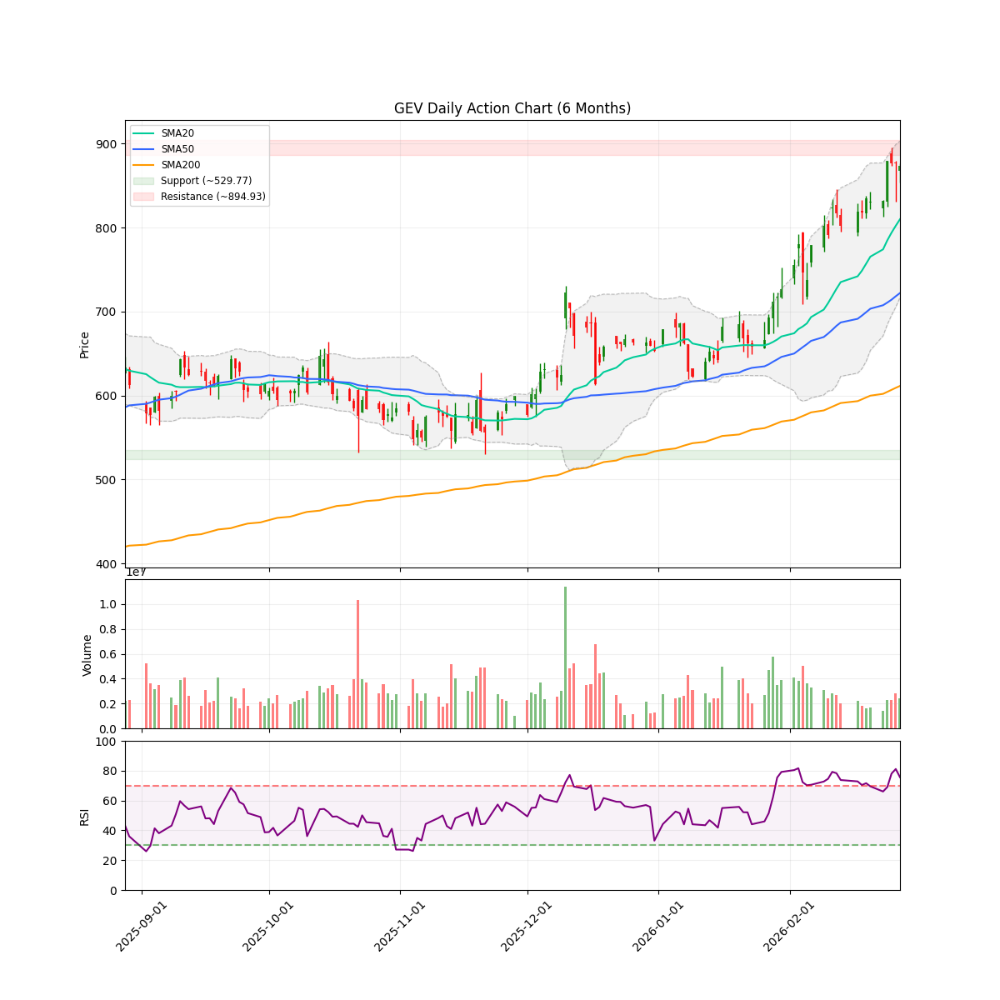
#### 研报分析
各位武林同道，且随老夫步入琅嬛阁。今日，我们要点评的这位江湖后起之秀，乃是电力装备界的一代翘楚——GE Vernova (GEV)。

这 GEV 近期在江湖上可谓出尽了风头，股价如旱地拔葱，一式“梯云纵”直插云霄。诸位且看，其实力深浅、内息纯杂，尽在老夫这卷《江湖断金录》中。

#### 绝世神功：九阳神功之“电力不竭” (S-Tier 核心利好)

GEV 如今正修习的一门神功，名为“AI 算力大补丸”。根据 [Yahoo Finance](https://finance.yahoo.com/news/assessing-ge-vernova-gev-valuation-192352739.html) 的记载，全球 AI 浪潮对电力的渴求，正如练武之人对深厚内力的痴迷，而 GEV 正是那提供内功心法的关键一人。更有江湖传闻，号称“快嘴侠”的吉姆·克莱默（Jim Cramer）直言，GEV 的盈利前景已然看至 2030 年代，这等同于闭关修炼已久，内力储备足以支撑其在武林盟主宝座上稳坐十年之久，详情可见 [Insider Monkey](https://www.insidermonkey.com/blog/jim-cramer-ge-vernova-has-visibility-on-the-earnings-to-the-2030s-1685941/) 的武林秘报。此乃根基之利，非一般雕虫小技可比。

#### 招式进阶：凌波微步，红利散花 (A-Tier 进阶攻势)

若说内功是根本，那近日 GEV 祭出的分红派息计划，便是那精妙绝伦的招式。据 [Yahoo Finance](https://finance.yahoo.com/news/assessing-ge-vernova-gev-valuation-192352739.html) 报道，其董事会已宣布每股派发 0.50 美元的红利，将于 2026 年 4 月 14 日交付。这一招“天女散花”，不仅向江湖展示了其钱袋充盈，更引得无数游侠（投资者）蜂拥而至。在 [Investing.com](https://www.investing.com/news/company-news/ge-vernova-stock-hits-alltime-high-at-84628-usd-93CH-4521801) 的记录中，该股已踏破 846.28 美元的光明顶之巅，创下历史新高。

#### 江湖风向：群英荟萃，顺水推舟 (B-Tier 市场氛围)

目前江湖大势正在发生悄然转变。根据 [Morningstar Australia](https://www.morningstar.com.au/stocks/more-us-tech-stocks-look-cheap-market-rotates) 的观察，各路高手正从估值过高的奇门遁甲（科技股）中撤出，转而投向工业与能源这些名门正派。GEV 恰逢其会，得此“乾坤大挪移”的市场转轮之利。即便是在 [Yahoo Sports](https://sports.yahoo.com/articles/motley-fool-2026-stock-market-170019431.html) 提到的广阔江湖中，58% 的散修也表示对 AI 驱动的未来充满乐观。

#### 气海诊断：内息喷张，谨防走火入魔 (Divergence & Risk)

老夫观其气象，虽然 GEV 气势如虹，但也需警惕“内力过盛”之危。当前股价 873.60，而 RSI（相对强弱指数）已飙升至 75.65。在武学中，这叫作“气血过热，经脉喷张”，已隐隐有“内息溢出”之兆。虽然均线呈多头排列，如重兵护卫（SMA50 在 722.02，SMA200 在 611.38），但其距离 6 个月高点 894.93 仅一步之遥。若不能一鼓作气冲破此玄关，恐会有一次“回气”性质的下调，修整筋骨。

#### 阁主定论：神功大成，仍需持重

此股如今正如日中天，身兼 AI 电力需求与稳健分红两大法宝。虽有高位震荡之忧，但因其“内功心法”极具前瞻性（见于 [Zacks](https://finance.yahoo.com/news/ge-vernova-inc-gev-attracting-140005122.html) 的高度关注），短期的内息波动不足以动摇其江湖地位。

- **江湖地位评价 (Logic Score)**: **9.2 / 10** (内力深厚，招式正宗，唯需防范盛极而衰的小幅调整)
- **下一关键武林日期**: **2026年3月17日** (股权登记日，决定谁能领取“红利秘籍”的关键时刻)

诸位同道，闯荡江湖需胆大心细，GEV 虽猛，亦要看准步法，方能立于不败之地。
#### 数据看板与近期动态
| 指标 | 数值 |
| :--- | :--- |
| 当前价格 | $873.60 |
| RSI (14) | 75.65 |
| 均线 (20/50/200) | 809.93 / 722.02 / 611.38 |
| 趋势支撑/阻力 | 529.77 / 894.93 |
| 预估周波动 | +/- $71.50 |
| 状态 | Above SMA50 |

- **[Morningstar Australia]** [More US tech stocks look cheap as the market rotates](https://www.morningstar.com.au/stocks/more-us-tech-stocks-look-cheap-market-rotates)
- **[Insider Monkey]** [I Trust GE Vernova (GEV) CEO, Says Jim Cramer](https://www.msn.com/en-us/money/markets/i-trust-ge-vernova-gev-ceo-says-jim-cramer/ar-AA1WY6J8)
- **[Yahoo Finance]** [Assessing GE Vernova (GEV) Valuation After Dividend Hike Upgrades And AI Power Demand Tailwinds](https://finance.yahoo.com/news/assessing-ge-vernova-gev-valuation-192352739.html)
- **[Yahoo Sports]** [The Motley Fool 2026 stock market outlook: 58% of individual investors plan to buy more stocks as AI drives optimism - Yahoo Sports](https://sports.yahoo.com/articles/motley-fool-2026-stock-market-170019431.html)
- **[Investing.com]** [GE Vernova stock hits all-time high at 846.28 USD](https://www.investing.com/news/company-news/ge-vernova-stock-hits-alltime-high-at-84628-usd-93CH-4521801)

---

### KEYS
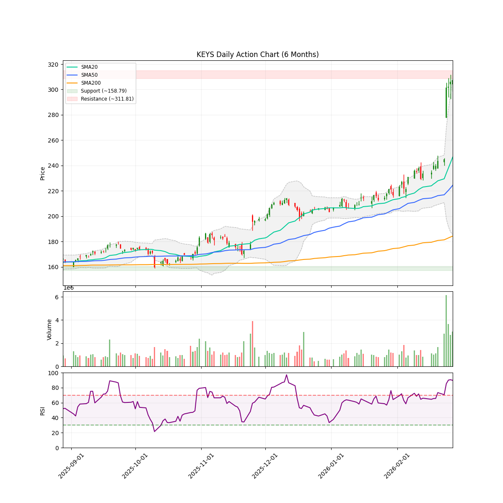
#### 研报分析
琅嬛阁主在此。诸位江湖同道，今日老夫坐镇阁中，细品当下 KEYS（是为“是德科技”）之气运。此股正如一位闭关多年的绝世高手，骤然出关，一剑光寒十四州，其势之猛，放眼武林亦属罕见。

#### 秘籍大成：KEYS 功力评级

此番 KEYS 之涨势，老夫将其定性为 **S-Tier（神功大成）**。

其第一重境界，在于内功底蕴之深厚。根据 [Benzinga](https://www.msn.com/en-us/money/news/keysight-stock-rallies-after-q1-earnings-beat-estimates/ar-AA1WVCHR) 的密报，KEYS 在首季财报中大显神威，不仅营收远超武林同道之预期，更放出了极为强劲的未来“功法指引”。这并非借势虚涨，而是真正的内力爆发。

其第二重境界，在于其得天独厚的“天书秘籍”。在 [Seeking Alpha](https://seekingalpha.com/article/4873704-keysight-technologies-stock-proves-to-be-ai-winner) 的评论中，KEYS 已被公认为“AI 时代的胜者”。在人工智能这门席卷武林的绝学中，KEYS 手握精密测量与技术的重型兵刃，正处于各方势力争相拉拢的核心地位。这种机构主力（Institutional Dominance）的认可，无异于少林武当联手加持，其正统地位无可动摇。

#### 凶险暗招：内息紊乱与外家奇毒

然而，月盈则亏，水满则溢。老夫纵观 KEYS 之脉象，发觉其体内正潜伏着一丝 **“内息溢出”（Internal Qi Overflow）** 的征兆。

诸位请看：KEYS 目前的 RSI 竟然高达 **89.82**！在武学中，这已是练功过激、经脉极度扩张之相。股价 307.33 远超 SMA20（246.60）及 SMA200（184.30），犹如一位侠客只身闯入敌阵，虽然杀伐骁勇，但距离其后援大军已逾百里，一旦力竭，后果不堪设想。

更兼江湖动荡，外患重重。据 [Business Insider](https://finance.yahoo.com/news/oil-prices-spike-9-stock-231634521.html) 传来的飞鸽传书，塞外石油价格暴涨 8%，引发市场人心惶惶，股指期货纷纷下挫。更有 [AOL](https://www.aol.com/articles/stock-market-crash-coming-soon-142000491.html) 的风声在传言“江湖浩劫（市场崩溃）”是否将至。此时此刻，KEYS 虽有绝世功力，但若遭遇宏观环境的“十香软筋散”袭击，难免会有高位回吐、真气倒灌的风险。

#### 琅嬛阁主断语：江湖地位与评分

目前 KEYS 虽处在“无敌之态”，但其强行冲关之势已达巅峰。

- **情境分析**：此股正处于财报利好后的“巅峰余韵”，AI 赛道的长线利好是其定海神针。
- **操作指南**：莫要盲目追高，需防备其在 311.81 这一重阻力位遇阻回落。若能站稳 275-280 一带，方可谋划长远。
- **逻辑评分**：**8.5 / 10** (其 10 分的内力被极其过载的 RSI 抵消了 1.5 分的稳健度)。

#### 决战之期：下一次武林大会

KEYS 这一路神功还能施展多久？诸位需密切关注下一次“论剑大会”：

- **关键日期**：2026 年 5 月中旬（预计第二财季财报发布日）。
- **江湖变数**：需时刻提防三月上旬江湖整体氛围的变化。若石油之毒不解，纵有神功亦难独善其身。

老夫言尽于此，江湖路远，诸位且行且珍惜。
#### 数据看板与近期动态
| 指标 | 数值 |
| :--- | :--- |
| 当前价格 | $307.33 |
| RSI (14) | 89.82 |
| 均线 (20/50/200) | 246.60 / 224.35 / 184.30 |
| 趋势支撑/阻力 | 158.79 / 311.81 |
| 预估周波动 | +/- $28.75 |
| 状态 | Above SMA50 |

- **[Business Insider]** [Oil spikes 8% and stock futures slide: Here's how markets are reacting to the...](https://finance.yahoo.com/news/oil-prices-spike-9-stock-231634521.html)
- **[AOL]** [Is a Stock Market Crash Coming Soon? History Has Good and Bad News for...](https://www.aol.com/articles/stock-market-crash-coming-soon-142000491.html)
- **[Seeking Alpha]** [Keysight Technologies Proves To Be An AI Winner](https://seekingalpha.com/article/4873704-keysight-technologies-stock-proves-to-be-ai-winner)
- **[Benzinga]** [Keysight Stock Rallies After Q1 Earnings Beat Estimates](https://www.msn.com/en-us/money/news/keysight-stock-rallies-after-q1-earnings-beat-estimates/ar-AA1WVCHR)
- **[The Motley Fool]** [Why Did Critical Metals Stock Just Pop?](https://www.msn.com/en-us/money/markets/why-did-critical-metals-stock-just-pop/ar-AA1WZl3t)

---

### META
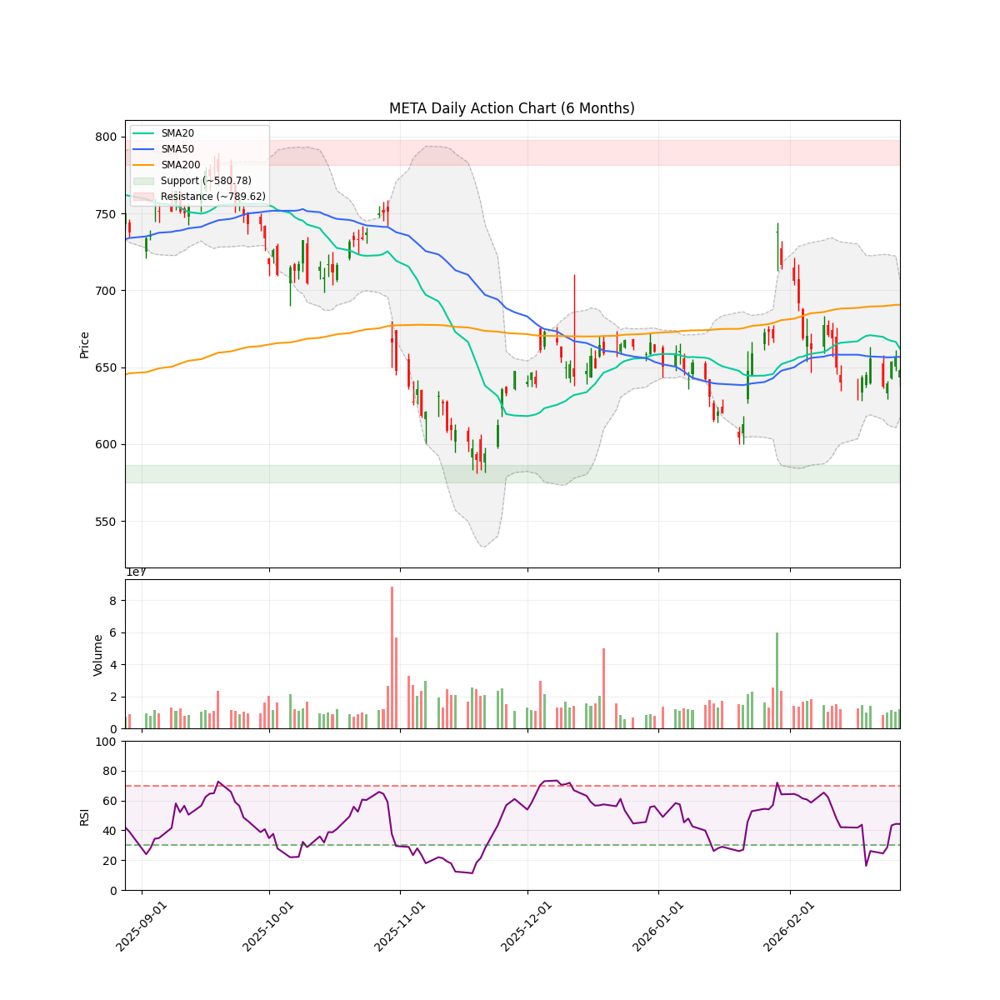
#### 研报分析
欢迎来到琅嬛阁。老夫在此观天下大势，看这“脸书门派”（META）近期内功运转，似乎正处于一个极度玄妙、却又凶险万分的关口。阁下且请坐，待老夫为您拆解这一场“江湖变局”。

#### 现状占卜：内功受阻，坠入寒潭

目前的 META 犹如一位功力深厚的泰斗，却在冲击更高境界时突遭内息紊乱。股价收于 648.18，已然跌落至 50 日均线（SMA50: 661.99）与 200 日均线（SMA200: 690.59）之下。在江湖中，这便是“气血受阻，坠入寒潭”。其 RSI 指标仅为 44.33，显示出一种“意兴阑珊”的落寞感。尽管其根基尚在，但短期内，各路高手对其“内力消耗过度”的担忧已成围攻之势。

#### 招式拆解：神功利弊与暗器侵扰

根据阁中秘录记载，META 近期施展的招式可归纳如下：

**1. S级绝学（顶层布局）：重金铸剑，AI 神功初成**
META 虽在近期遭遇重挫，但其并未停止对“神兵利器”的锻造。据 [Simply Wall St](https://finance.yahoo.com/news/meta-ai-chip-deals-reshape-170930509.html) 报道，其正通过数以十亿计的多年度合同重塑 AI 芯片格局。与 AMD 的联手更是引得美银（BofA）重新审视其战力，调整了对其预测（[TheStreet](https://finance.yahoo.com/news/bank-america-resets-meta-stock-181700159.html)）。此举虽是长线进取的“乾坤大挪移”，但因耗费银两巨大，引得江湖传言纷纷，忧其“真气损耗过巨”（[Motley Fool](https://finance.yahoo.com/news/why-meta-platforms-stock-underperforming-035300739.html)）。

**2. A级变数（外力驰援）：老牌宗师重金押注**
在门派被围攻之际，江湖大豪阿克曼（Bill Ackman）竟豪掷 20 亿两白银（20亿美元）进场抄底，称其为“被深度低估的武学奇才”（[24/7 Wall St](https://247wallst.com/investing/2026/02/16/ackmans-2b-bet-why-smart-money-is-backing-up-the-truck-on-deeply-discounted-meta-stock/)）。这无异于在绝境中注入了一道雄厚的内力。

**3. 暗器中伤（内忧外患）：财务总管“临阵弃甲”**
最令江湖人士寒心的是，其财务大管家（CFO）Li 氏竟在此时套现 3530 万两黄金（[Investing.com](https://ca.investing.com/news/insider-trading-news/meta-platforms-cfo-li-sells-353-million-in-stock-93CH-4483628)）。主帅身边的重臣抛售，无异于在两军对垒时放了冷箭，使得本就脆弱的军心更加动摇，这正是所谓的“内息逆流”。

#### 异象监测：内气溢出（Internal Qi Overflow）

此处有一奇特异象：尽管近期有阿克曼这等宗师级背书及 AI 芯片的利好传出，股价却依然逆势下跌，本周跌幅达 3.28%，远超江湖大盘（S&P 500）跌幅（[24/7 Wall St](https://247wallst.com/investing/2026/02/14/meta-stock-falls-3-28-this-week-despite-ackman-endorsement-and-bullish-analyst-targets/)）。此乃典型的“内气溢出”——利好不仅无法推动股价，反而成为了获利了结的烟雾弹。这意味着市场对“重金支出”的畏惧已深入骨髓，短时间内，META 仍需在寒潭中忍受刺骨之痛。

#### 琅嬛阁主评级：江湖情绪得分

**情绪总分：4.5 / 10（意兴阑珊，步履蹒跚）**

*   **定性点评**：目前的 META 绝非“功力全废”，而是“练功过猛后的虚弱期”。长线看，其 AI 芯片的布局是“绝世神功”的根基；但短线看，财报前的过度支出与内部减持是两道“穿心毒箭”。现在的走势处于“走火入魔”的边缘，需要一个强大的支撑点（如 580 附近的历史支撑）来重新凝聚真气。

#### 江湖决战预告

**下一场武林大会（关键日期）**：2026年4月下旬（预估财报发布日）。
届时，掌门人扎克伯格需向武林展示其 AI 投入究竟换回了多少真气增长，若无实绩，门派恐将遭遇更惨烈的“围攻”。

阁下，此番江湖凶险，虽有阿克曼这等大侠护航，但莫要忘了李氏总管的暗器。静待真气平复，方为上策。
#### 数据看板与近期动态
| 指标 | 数值 |
| :--- | :--- |
| 当前价格 | $648.18 |
| RSI (14) | 44.33 |
| 均线 (20/50/200) | 661.99 / 656.70 / 690.59 |
| 趋势支撑/阻力 | 580.78 / 789.62 |
| 预估周波动 | +/- $40.19 |
| 状态 | Below SMA50 |

- **[Motley Fool]** [Why Is Meta Platforms Stock Underperforming?](https://finance.yahoo.com/news/why-meta-platforms-stock-underperforming-035300739.html)
- **[Investing.com]** [Meta Platforms CFO Li sells $35.3 million in stock By Investing.com](https://ca.investing.com/news/insider-trading-news/meta-platforms-cfo-li-sells-353-million-in-stock-93CH-4483628)
- **[Simply Wall St.]** [Meta AI Chip Deals Reshape Costs As Shares Trade Below Targets](https://finance.yahoo.com/news/meta-ai-chip-deals-reshape-170930509.html)
- **[TheStreet]** [Bank of America resets Meta stock forecast on deal with AMD](https://finance.yahoo.com/news/bank-america-resets-meta-stock-181700159.html)
- **[AOL]** [Stock-Split Watch: Is Meta Platforms Next?](https://www.aol.com/articles/stock-split-watch-meta-platforms-190500141.html)

---

### MSFT

#### 研报分析
各位豪杰请了，老朽乃琅嬛阁主。今日端坐阁中，冷眼观瞧那美股江湖，只见昔日如“中原五绝”般威震四方的微软（MSFT），如今却似在寒潭深处修炼，虽周身罡气略显紊乱，但其内功根基之深厚，实属罕见。

且看老朽为各位拆解这尊“武林至尊”当下的内功经脉与江湖传闻：

#### 经脉总览：潜龙在渊，困于枯井

当前微软报于392.74点，观其气象，竟已跌落至五、五十、二百日均线之下（SMA20/50/200），这在武林中好比一名绝世高手因练功过度导致“经脉受阻”。此前其身处552.69点的武林巅峰，如今跌至381.71点支撑位附近，这一跌不仅是皮肉伤，更像是遭遇了各大门派的合力围剿。

然而，其RSI（相对强弱指数）报44.27，虽然内息微弱，但尚未到“散功”的绝路，反倒有一股“置之死地而后生”的况味。

#### 秘籍拆解：招式评级与江湖秘闻

根据老朽在琅嬛阁收集的密信，微软近期的招式可分为三类：

**【S级：旷世神功】——三年定乾坤之诺**
江湖上更有传言，认为当下乃是微软“神功重修”的绝佳契机。据 [Yahoo Finance](https://finance.yahoo.com/news/prediction-microsofts-stock-price-3-215700856.html) 密报，若以三年为期，此子必能重回巅峰，甚至更上一层楼。且 [Motley Fool](https://finance.yahoo.com/news/best-trillion-dollar-stock-buy-112000557.html) 亦有密札流出，称华尔街各大掌门给出的中间目标价竟有55%的上涨空间，此乃实打实的“内功深厚，不可限量”。

**【A级：奇门兵刃】——期权暗号与AI真解**
就在众人惊慌失措之际，微软的期权交易中隐隐透出一股不同寻常的“紫色霞光”。[Yahoo Finance](https://finance.yahoo.com/news/microsoft-stock-just-flashed-ultra-183002612.html) 指出，这种极罕见的看涨信号已然闪现，似是某位退隐高人在暗中指引方向。与此同时，[The Motley Fool](https://finance.yahoo.com/news/top-artificial-intelligence-ai-stocks-012000203.html) 认为在人工智能（AI）这卷天书的修炼上，微软依然是性价比最高的门派，即便遭遇近期围攻，其AI根基仍是江湖第一。

**【B级：路边闲谈】——说书人的点评**
江湖人称“疯人院院长”的吉姆·克莱默（Jim Cramer）亦在此时发声，据 [Insider Monkey](https://finance.yahoo.com/news/microsoft-msft-needs-refresh-says-115900097.html) 记载，他认为微软需要“改换门庭”进行刷新。此类言论虽听着热闹，但在老朽看来，不过是些虚晃的招式，不战也罢。

#### 异象警示：内息外溢与技术反弹

老朽观微软近日走势，发现一种名为“内息外溢（Internal Qi Overflow）”的异象。即便利好频频，如 [Barchart](https://finance.yahoo.com/news/microsoft-bouncing-back-post-earnings-163949991.html) 所言，微软虽然在财报大跌后尝试反弹，但若不能一鼓作气夺回200日均线（SMA200）这一战略要塞，所有的反抗都只是“困兽犹斗”。目前的下挫幅度已达历史高点的26%，诚如 [The Motley Fool](https://www.fool.com/investing/2026/02/26/1-clear-signal-to-buy-microsoft-stock/) 所析，这种深度回撤在微软近年的武学进境中实属罕见，绝非寻常暗器伤人，而是整个市场“真气涣散”所致。

#### 琅嬛阁主点评：意境分数与决战日期

**情感逻辑分数（Logic Score）：6.8/10**
（此分数乃是综合了其“重伤在身”的技术形态与“内力充盈”的基本面。虽有万般好，奈何势不随，需等待一个“破茧成蝶”的契机。）

**阁主断言：**
此时的微软，正如同被困在黑木崖下的令狐冲，虽然浑身是伤，但“吸星大法”与“易筋经”的底子还在。短期内，由于其身处多重均线压制之下，恐仍有余震。但若要说其江湖地位崩塌，那纯属痴人说梦。

**江湖决战预告：**
下一场武林大会（财报日）预计将于 **2026年4月下旬** 召开。届时，微软能否在AI战场上使出“独孤九剑”重夺武林盟主之位，老朽将与各位共同拭目以待。

阁下若要进场，切记分批建仓，莫要贪功冒进，毕竟这江湖险恶，活下去才有机会成为一代宗师！
#### 数据看板与近期动态
| 指标 | 数值 |
| :--- | :--- |
| 当前价格 | $392.74 |
| RSI (14) | 44.27 |
| 均线 (20/50/200) | 403.36 / 445.32 / 484.84 |
| 趋势支撑/阻力 | 381.71 / 552.69 |
| 预估周波动 | +/- $21.96 |
| 状态 | Below SMA50 |

- **[Yahoo Finance]** [Microsoft Stock Just Flashed an Ultra-Rare Bullish Signal for Options Traders](https://finance.yahoo.com/news/microsoft-stock-just-flashed-ultra-183002612.html)
- **[Yahoo Finance]** [Prediction: This Will Be Microsoft's Stock Price in 3 Years. (Hint: You're Going to Want to Buy Now)](https://finance.yahoo.com/news/prediction-microsofts-stock-price-3-215700856.html)
- **[Insider Monkey]** [Microsoft (MSFT) Needs a Refresh, Says Jim Cramer](https://finance.yahoo.com/news/microsoft-msft-needs-refresh-says-115900097.html)
- **[Motley Fool]** [The Best Trillion-Dollar Stock to Buy Right Now, According to Wall Street](https://finance.yahoo.com/news/best-trillion-dollar-stock-buy-112000557.html)
- **[The Motley Fool]** [1 Clear Signal to Buy Microsoft Stock](https://www.fool.com/investing/2026/02/26/1-clear-signal-to-buy-microsoft-stock/)

---

### NFLX
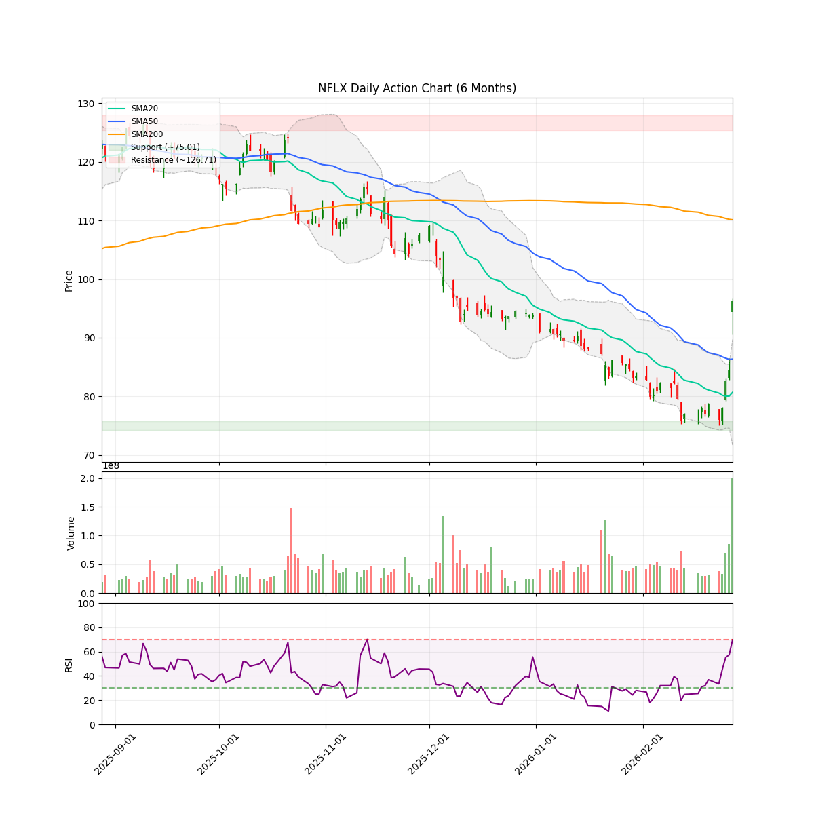
#### 研报分析
诸位江湖同道，老夫乃琅嬛阁主。今日立于阁顶，观影音宗门“奈飞”（NFLX）之气象，见其紫气东来，却又暗藏杀机。且听老夫为尔等拆解这一式“金蝉脱壳”背后的武学门径。

#### 琅嬛密卷：奈飞（NFLX）江湖势力评定

当前奈飞虽身处熊市阴霾（受阻于 SMA200 年线大关），但近期内功修为突飞猛进，股价一度跃升至 96.24 关键点位。其 RSI 指数已达 69.79，隐约有“真气盈满、过犹不及”之象。观其气脉，SMA20 (80.68) 与 SMA50 (86.35) 已被其踏在脚下，犹如江湖后起之秀连破两重险关，直逼百元大关。

#### 第一章：神功秘籍与江湖变数（催化剂评级）

**S-Tier（绝世神功）：止步和亲，金蝉脱壳**
奈飞此前欲与华纳兄弟探索（WBD）联姻，江湖传闻涉及 830 亿美元的巨额聘礼。然最新消息指，奈飞已断然拒绝此等“联姻”，从这场高风险的竞购战中全身而退。此举犹如在悬崖边勒马，避免了内力因过度兼并而枯竭。据 [StockStory](https://finance.yahoo.com/news/why-netflix-nflx-stock-today-210132891.html) 报道，此消息令其股价如获神助，午后狂飙 10.4%。此乃上乘心法，保全了宗门现金流之根本。

**A-Tier（凌厉招式）：群雄响应，暗箭齐发**
近日，奈飞看涨期权成交量暴增，江湖豪杰纷纷押注其后续破局。据 [Barchart](https://finance.yahoo.com/news/huge-volume-netflix-call-options-183002556.html) 记录，大量价外期权涌动，预示着多头势力正集结兵力，意欲一举攻破上方阻力。与此同时，虽然市场存在对 AI 与贸易纷争的忧虑，但奈飞展现出的防御内功仍让 [Forbes](https://www.forbes.com/sites/greatspeculations/2026/02/06/should-you-buy-netflix-stock/) 等名家对其财务稳健性赞誉有加。

**B-Tier（江湖杂谈）：随波逐流**
受英伟达（Nvidia）财报引发的科技盟主大赏影响，整个科技江湖皆有回暖之势，奈飞亦借此东风稳住了阵脚。参考 [Yahoo Finance](https://finance.yahoo.com/news/live/stock-market-today-dow-sp-500-nasdaq-rally-on-tech-jolt-as-nvidia-earnings-loom-210052281.html) 的论述，这更多是宗门外部的整体气运加持。

#### 第二章：内息诊断（异动监测）

**真气盈溢之警（Internal Qi Overflow）**
目前股价正面临“真气过剩”之险。虽然近日大涨，但 RSI 已逼近 70 的警戒红线，此乃“内功走火入魔”的前兆。若无法在 100 元关口稍作调息，极易遭遇空头“截脉”。

**绝处逢生之势**
从 [Motley Fool](https://finance.yahoo.com/news/netflix-stock-keeps-dipping-finally-162000240.html) 的观察来看，奈飞已熬过了最艰难的“闭关期”。尽管自去年六月巅峰后一直受压，但此番拒购 WBD 后的利好回响，正是“置之死地而后生”的典型招式。

#### 第三章：琅嬛阁主断语（综合评分）

**情绪逻辑分（Logic Score）：8.2/10**
**江湖状态：不败金身（Invincible Stance）——初具雏形**

**阁主点评：** 奈飞此番不强求收购，乃是“无招胜有招”的高明手段。目前虽受困于 SMA200（110.14）这一道“黑山关”，但短期内气势如虹。由于其避开了巨大的债务陷阱，市场情绪已从疑虑转为狂热。然诸位切记，RSI 高企说明追高风险巨大，小心遭遇江湖高手的“反戈一击”。

#### 第四章：决战紫禁之巅（关键节点）

**江湖下一次大校（Next Major Date）：**
宗门季度财报大会（预计 2026 年 4 月中旬）。

届时，其新增门徒（订阅用户）数量与江湖地位将再次面临全武林的检阅。在此之前，96.24 至 110.14 之间的真空地带，将是群雄逐鹿的演武场。

**阁主寄语：** 江湖险恶，顺势而为；财报如刀，出招需慎。
#### 数据看板与近期动态
| 指标 | 数值 |
| :--- | :--- |
| 当前价格 | $96.24 |
| RSI (14) | 69.79 |
| 均线 (20/50/200) | 80.68 / 86.35 / 110.14 |
| 趋势支撑/阻力 | 75.01 / 126.71 |
| 预估周波动 | +/- $8.21 |
| 状态 | Above SMA50 |

- **[StockStory]** [Why Netflix (NFLX) Stock Is Up Today](https://finance.yahoo.com/news/why-netflix-nflx-stock-today-210132891.html)
- **[Barchart]** [Huge Volume in Netflix Call Options Today Shows Investors are Bullish on NFLX...](https://finance.yahoo.com/news/huge-volume-netflix-call-options-183002556.html)
- **[Motley Fool]** [Netflix Stock Keeps Dipping: Is It Finally Time to Buy?](https://finance.yahoo.com/news/netflix-stock-keeps-dipping-finally-162000240.html)
- **[Barchart]** [Is Netflix Stock a Buy Now as Trade Uncertainty and AI Fears Are in Focus Again?](https://finance.yahoo.com/news/netflix-stock-buy-now-trade-162235203.html)
- **[247wallst.com]** [Netflix Stock Ready For 50% Surge](https://247wallst.com/investing/2026/02/27/netflix-stock-ready-for-50-surge/)

---

### PLTR

#### 研报分析
各位武林同道，且听老夫——**琅嬛阁主**一言。

当今美股江湖，Palantir (PLTR) 此子，其根骨之奇、招式之诡，实属罕见。它手握“AIP”这卷足以令武林变色的《九阴真经》，奈何近期内息有些走岔，正处于“内功紊乱”与“神功大成”的生死关头。且看老夫为其勘定的《江湖密卷》。

#### 催化剂定级：神功秘籍与江湖奇闻

在老夫看来，PLTR 此时周身气象呈现出三层境界：

- **S-Tier (绝世神功)：** 瑞银 (UBS) 这一代宗师近期发话，认为 PLTR 正处于人工智能与软件支出的风暴中心 `[Insider Monkey](https://finance.yahoo.com/news/ubs-sees-palantir-pltr-positioned-025120040.html)`。此乃“大势所趋”，如同张三丰悟出太极拳，乃是结构性的质变。
- **A-Tier (上乘武学)：** 既然是江湖行走，必有盟友相助。PLTR 与空中客车 (Airbus) 续签多年长约 `[Insider Monkey](https://finance.yahoo.com/news/palantir-technologies-pltr-signs-multi-101800503.html)`，此举如同与少林、武当结盟，底盘稳固，内力源源不断。
- **B-Tier (江湖传闻)：** 坊间虽有“是否该抄底”的议论 `[Motley Fool](https://finance.yahoo.com/news/down-35-time-high-buy-035000033.html)`，以及对于溢价过高的质疑 `[InvestorPlace](https://investorplace.com/hypergrowthinvesting/2026/02/can-palantir-pltr-justify-a-premium-price-5-key-questions-answered/)`，此皆为路人喧哗，虽有杂音，但不伤根本。

#### 气脉走势：内息紊乱，重归守势

观察其近期气脉（技术指标），老夫不禁眉头一皱。PLTR 此刻正如同一位刚经历过一场恶斗的高手：

- **走火入魔 (Internal Qi Overflow)：** 虽有瑞银与空客的好消息支撑，但其股价却跌至 137.19，远低于 SMA50 (161.07) 和 SMA200 (161.50) 这两道“任督二脉”。这种“好消息却不涨”的异象，江湖人称“内劲反噬”，说明前期用力过猛，正处于多头力竭、空头围攻的尴尬境地。
- **防守要穴：** 股价目前堪堪守在 SMA20 (137.08) 这一命门之上。若此关口失守，下方 126.23 的六个月低位便是最后的护身甲。
- **暗器偷袭：** “大空头”迈克尔·伯里 (Michael Burry) 祭出了一招“夺魂钉”，宣称 PLTR 仅值 46 金 `[24/7 Wall St.](https://finance.yahoo.com/news/michael-burry-says-palantir-worth-142720311.html)`。虽然这位怪杰时常言过其实，但此言一出，江湖中人心浮动，亦有宵小趁机落井下石 `[Motley Fool](https://finance.yahoo.com/news/heres-why-wouldnt-touch-palantir-175000555.html)`。

#### 琅嬛阁主断言：江湖风评与逻辑定分

**舆情心法得分 (Sentiment Score)：4.5 / 10**
虽然其内功（基本面）依然雄厚，但奈何江湖风评正处于“毁誉参半”的混乱期。下跌 35% 的伤势尚未痊愈，且伯里的毒言如鲠在喉。目前处于“潜龙勿用”之势，尚未见“见龙在田”的转机。

**逻辑推理得分 (Logic Score)：5.8 / 10**
其估值确实如同一柄双刃剑，舞得好能开疆拓土，舞不好便伤及自身。即便有空客这类大宗门的认可，但在资金面未见“内力回流”（站稳 SMA50）之前，不可轻言“绝处逢生”。

#### 江湖悬赏：决战之日

各路侠客请注意，需密切关注接下来的**财报发布日 (Earnings Date)**（预计在 2026 年 5 月初）。那是 PLTR 检验其“AIP 神功”是否练成的试金石。

**阁主赠言：** 江湖险恶，PLTR 此子虽有宗师之相，但目前正如身中数枚“冰魄银针”，虽然未伤及心肺，但身法已乱。各位在入场时，切记要等其气脉平复，站稳 161.07 的关键穴位，方能共赴江湖盛宴。
#### 数据看板与近期动态
| 指标 | 数值 |
| :--- | :--- |
| 当前价格 | $137.19 |
| RSI (14) | 51.51 |
| 均线 (20/50/200) | 137.08 / 161.07 / 161.50 |
| 趋势支撑/阻力 | 126.23 / 207.52 |
| 预估周波动 | +/- $15.27 |
| 状态 | Below SMA50 |

- **[Insider Monkey]** [UBS Sees Palantir (PLTR) Positioned at Center of AI and Software Spending Boom](https://finance.yahoo.com/news/ubs-sees-palantir-pltr-positioned-025120040.html)
- **[Motley Fool]** [Down 35% From Its All-Time High, Should You Buy the Dip on Palantir Stock?](https://finance.yahoo.com/news/down-35-time-high-buy-035000033.html)
- **[24/7 Wall St.]** [Michael Burry Says Palantir Is Worth $46. The Stock Trades at $130. Who’s Right?](https://finance.yahoo.com/news/michael-burry-says-palantir-worth-142720311.html)
- **[InvestorPlace]** [Can Palantir (PLTR) Justify a Premium Price: 5 Key Questions Answered](https://investorplace.com/hypergrowthinvesting/2026/02/can-palantir-pltr-justify-a-premium-price-5-key-questions-answered/)
- **[Seeking Alpha]** [Constellium SE: Why This Stock Is My Top Pick For 2026](https://seekingalpha.com/article/4876843-constellium-se-why-this-stock-is-my-top-pick-for-2026)

---

### TPL
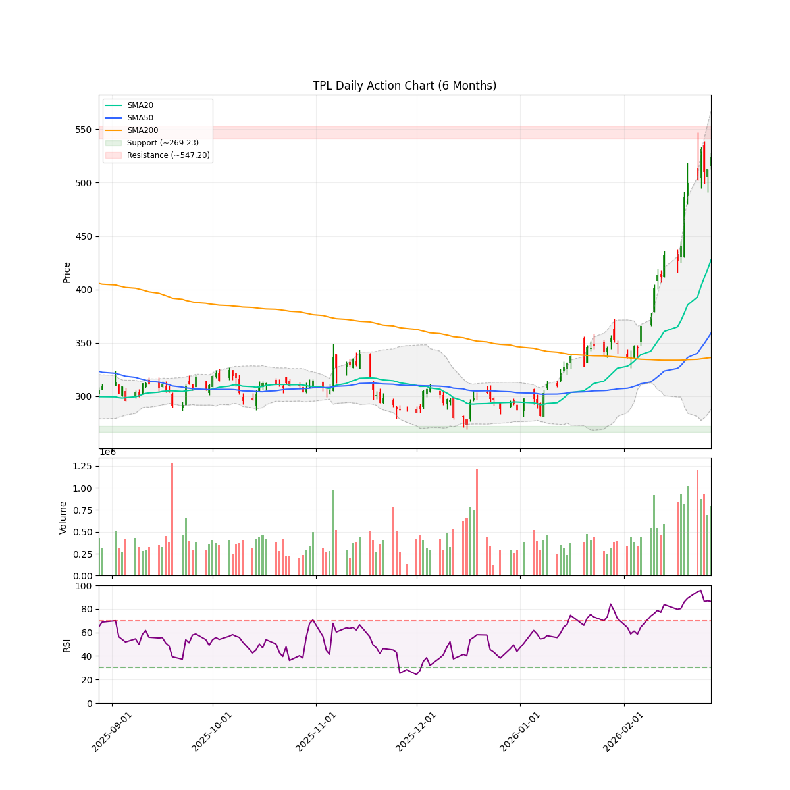
#### 研报分析
各位同仁，且随老夫步入这琅嬛阁，今日咱们且论一论这在德克萨斯大荒漠中练就了一身横练功夫的“大地主”——**Texas Pacific Land (TPL)**。此股近来内力激荡，已成江湖焦点。

#### 秘籍大成：S级神功与四季度战报

老夫观之，TPL近期的势头，宛如练成了那《九阳神功》，纯阳内力澎湃而出。据 [WTOP](https://wtop.com/news/2026/02/texas-pacific-q4-earnings-snapshot/) 记载，其在2025年第四季度报得1.233亿美元的净利，每股收益惊人。这并非一般的招式，而是实打实的“S级绝世神功”。更令江湖侧目的是，其股价在2月中旬短短数日内暴涨15.63%，正如 [Insider Monkey](https://www.msn.com/en-us/money/markets/texas-pacific-land-tpl-hits-new-records-in-q4-2025/ar-AA1WU8Dr) 所述，此乃能源江湖中罕见的突破。其掌管的86.8万英亩土地，便如那取之不尽的内力源泉，只要油气不停，其神功便能不战而胜。

#### 内息诊断：阳气过盛与“内劲溢出”

然而，老夫也要给诸位提个醒。观其脉象，TPL目前的 RSI（相对强弱指数）已达 **86.36**。在武学中，此乃“纯阳之极，亢龙有悔”之兆。股价远超 SMA20（427.39）与 SMA50（358.93），这基础虽牢，但身法拔得太快，正如轻功跃起过高，若无后续真气支撑，难免会有“内劲溢出”的风险（Internal Qi Overflow）。

尽管 [MarketWatch](https://www.msn.com/en-us/money/topstocks/texas-pacific-land-corp-stock-outperforms-competitors-on-strong-trading-day/ar-AA1X0bD0) 称其在2月24日依然力压群雄，展现出凌厉的攻势，但到了2月27日，其表现已略显疲态，虽有小涨，却已逊于同门其他门派 [MarketWatch](https://www.marketwatch.com/data-news/texas-pacific-land-corp-stock-underperforms-friday-when-compared-to-competitors-despite-daily-gains-6d7c34d3-0134b50496a9)。这便是典型的内力运转过速，需得提防是否有“暗器”伏击（即短期获利了结的卖压）。

#### 逻辑评分：9.0 / 10（无敌之姿，但防回气）

**神功定级：**
- **S-Tier（顶级神功）：** 四季度创纪录的财报与 Permian 盆地的统治力。
- **A-Tier（精妙招式）：** 被列入 2026 年 S&P 500 顶级选股名单 [Analytics Insight](https://www.analyticsinsight.net/stocks/best-sp-500-stocks-for-2026-top-10-picks)，名门正派纷纷背书。
- **B-Tier（江湖传闻）：** 每日股价波动的细微起伏，虽有喧嚣，不伤根本。

**阁主断言：**
此股目前正处于“天下第一”的争夺位。虽然 [Yahoo Finance UK](https://uk.finance.yahoo.com/news/too-consider-texas-pacific-land-151358226.html) 仍在辩论此时入场是否已成“强弩之末”，但其丰厚的家底（土地与水资源利润）依然是其最坚实的“金钟罩”。

#### 决战预告：下一次武林大会

众位侠士请记好，下一场足以撼动此门派根基的“武林大会”——**2026年一季度财报发布日（预计为2026年5月初）**。

在那之前，需关注股价是否会在 547.20 的高位遭遇“绝情谷”般的阻力，或是在 460 附近的短线支点寻求“休息回气”。若能在此震荡消化掉那 86.36 的火燥之气，TPL 的神功方能真正步入化境。

**琅嬛阁主 谨志**
*江湖路远，财报为先；内力虽强，莫贪残篇。*
#### 数据看板与近期动态
| 指标 | 数值 |
| :--- | :--- |
| 当前价格 | $524.29 |
| RSI (14) | 86.36 |
| 均线 (20/50/200) | 427.39 / 358.93 / 336.16 |
| 趋势支撑/阻力 | 269.23 / 547.20 |
| 预估周波动 | +/- $64.59 |
| 状态 | Above SMA50 |

- **[MarketWatch]** [Texas Pacific Land Corp. stock outperforms competitors on strong trading day](https://www.msn.com/en-us/money/topstocks/texas-pacific-land-corp-stock-outperforms-competitors-on-strong-trading-day/ar-AA1X0bD0)
- **[Insider Monkey]** [Texas Pacific Land (TPL) Hits New Records in Q4 2025](https://www.msn.com/en-us/money/markets/texas-pacific-land-tpl-hits-new-records-in-q4-2025/ar-AA1WU8Dr)
- **[Yahoo Finance UK]** [Is It Too Late To Consider Texas Pacific Land (TPL) After The Recent Share Price Surge](https://uk.finance.yahoo.com/news/too-consider-texas-pacific-land-151358226.html)
- **[MarketWatch]** [Texas Pacific Land Corp. stock underperforms Friday when compared to competitors despite daily gains](https://www.marketwatch.com/data-news/texas-pacific-land-corp-stock-underperforms-friday-when-compared-to-competitors-despite-daily-gains-6d7c34d3-0134b50496a9)
- **[Analytics Insight]** [Best S&P 500 Stocks for 2026: Top 10 Picks](https://www.analyticsinsight.net/stocks/best-sp-500-stocks-for-2026-top-10-picks)

---

### VRT
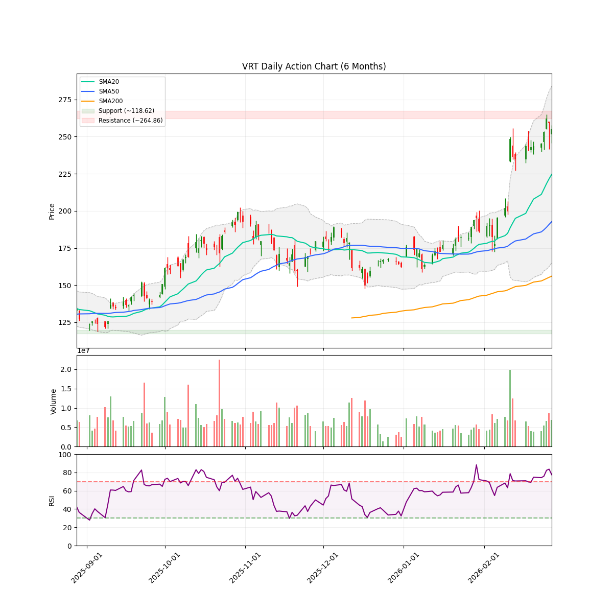
#### 研报分析
老夫琅嬛阁主，坐镇这琅嬛福地，遍览天下武学秘籍与财货走势。今日见武林之中，有一派名为“维谛技术（Vertiv, VRT）”的后起之秀，其周身剑气纵横，隐隐有问鼎武林至尊之势。且看老夫为其勘破虚实，指点迷津。

#### 论剑台：VRT 之神功境界与流派解析

维谛技术此番表现，堪称练就了“北冥神功”，正源源不断地吸取AI基建这一浩瀚汪洋中的内力。根据 [Nasdaq](https://www.nasdaq.com/articles/vertiv-earnings-prove-ai-infrastructure-boom-intact) 的记载，其第四季度财报不仅是“神功大成”，更向世人证明了AI基础设施的繁荣并非虚妄，而是实打实的内家真传。

**S-Tier (绝世神功 - 核心动力)**：
此股目前坐拥高达150亿美元的在手订单（Backlog），犹如随身携带了一座取之不尽的灵石矿脉。[Yahoo Finance UK](https://uk.finance.yahoo.com/news/buy-sell-hold-vertiv-stock-162700810.html) 提到，尽管财报后股价偶有震荡，但那庞大的订单量与1Q26的乐观预期，足以让其在江湖地位稳如泰山。

**A-Tier (进阶招式 - 名家背书)**：
江湖各大门派（投行）纷纷发来拜帖。[Zacks](https://finance.yahoo.com/news/brokers-suggest-investing-vertiv-vrt-143004344.html) 的诸位长老建议将其纳入麾下，而 [Investing.com](https://www.investing.com/analysis/best-ai-stocks-to-buy-now-and-hold-forever-nvidiabeating-vertiv-200675688) 甚至将其誉为能与“剑神”英伟达（Nvidia）一较高下的顶级AI标的，直言其乃“长线必持之神兵”。

#### 警示录：内息过旺与“阳气溢出”之忧

诸位同道需注意，VRT 虽强，但其 RSI 已达 77.57 之境，此乃武学中所说的“内息过旺，经脉承压”。股价高悬于 SMA20 (224.59) 与 SMA50 (192.77) 之上，正如一名剑客虽然招式凌厉，但轻功跃起过高，双足离地太久，难免会有回落借力之时。

[Simply Wall St.](https://finance.yahoo.com/news/look-vertiv-holdings-co-vrt-161044850.html) 提醒众豪杰，在多年连涨之后，需审视其估值是否已触及“天花板”。目前股价 254.89 已逼近 6 个月高点 264.86，若无更深厚的内力支撑，恐会遭遇“暗器偷袭”（高位获利盘派发）。

#### 琅嬛阁主结论：江湖地位与胜率研判

维谛技术如今正处于“无敌于天下”的强势上升期，[Barchart](https://finance.yahoo.com/news/best-growth-stock-buy-under-163409175.html) 将其视为 300 金元以下的最佳成长利器。尽管存在“内息溢出”（超买）的小疵，但其在 AI 冷却系统领域的“独门秘籍”，令其他门派难以望其项背。

**江湖心法评分：9/10 (无敌姿态)**
*   **评语**：此股气势如虹，内力之纯正罕见。虽有短线调息之需，但大势已成，乃是少有的“绝处逢生、步步生莲”之长线秘籍。

#### 关键江湖节点

*   **下次“武林大会”（财报日）预告**：虽然 2026 年 2 月的财报刚刚尘埃落定（参考 [Nasdaq](https://www.nasdaq.com/articles/vertiv-holdings-co-vrt-reports-next-week-wall-street-expects-earnings-growth)），但下一次决定内力能否再上一层楼的 1Q26 季报预测，将是江湖中人关注的下一个焦点，预计将于 **2026 年 5 月初** 见分晓。

**阁主赠言**：持剑者，当随势而动。VRT 虽好，切莫在气血翻涌（RSI 过高）时强行冲关，待其回踩五日或十日均线，借力打力，方为上策。
#### 数据看板与近期动态
| 指标 | 数值 |
| :--- | :--- |
| 当前价格 | $254.89 |
| RSI (14) | 77.57 |
| 均线 (20/50/200) | 224.59 / 192.77 / 156.04 |
| 趋势支撑/阻力 | 118.62 / 264.86 |
| 预估周波动 | +/- $34.04 |
| 状态 | Above SMA50 |

- **[Insider Monkey]** [Vertiv Holdings (VRT) Up More than 25% Since Q4 Earnings, Here’s What You Need t...](https://finance.yahoo.com/news/vertiv-holdings-vrt-more-25-161043603.html)
- **[Investing.com]** [Best AI Stocks to Buy Now and Hold Forever: Nvidia-Beating Vertiv |...](https://www.investing.com/analysis/best-ai-stocks-to-buy-now-and-hold-forever-nvidiabeating-vertiv-200675688)
- **[Zacks]** [Brokers Suggest Investing in Vertiv (VRT): Read This Before Placing a Bet](https://finance.yahoo.com/news/brokers-suggest-investing-vertiv-vrt-143004344.html)
- **[Barchart]** [Is This The Best Growth Stock to Buy Under $300?](https://finance.yahoo.com/news/best-growth-stock-buy-under-163409175.html)
- **[Simply Wall St.]** [A Look At Vertiv Holdings Co (VRT) Valuation After A Strong Multi Year...](https://finance.yahoo.com/news/look-vertiv-holdings-co-vrt-161044850.html)

---

### VST

#### 研报分析
阁下快请进。在这琅嬛阁内，天下兵刃、武学秘籍皆有定论。今日你所问的 VST（Vistra Corp），在老夫看来，正处于一门名为“九阳神功”的破关边缘，虽真气鼓荡，却也面临着经脉冲击的风险。

且坐，待我为你细细拆解这局势。

#### 乾坤大挪移：VST 功法品阶判定

在当今武林，能源电力乃是各派争夺的“玄铁重剑”。VST 此次显露的功法，老夫将其定为 **A-Tier（高级功法）**，虽未达 S-Tier 那般旷古烁今，但其底蕴深厚，不容小觑。

据 `[Yahoo Finance](https://finance.yahoo.com/news/vst-vs-nrg-utility-stock-164900801.html)` 记载，VST 正紧随潮流，将其内功根基由传统的火电转向核能与清洁能源。这便如同一位修行多年、内力浑厚的剑客，正欲修习“独孤九剑”般的后发制人。其不仅被列入三月最值得买入的 13 支股利股，更显示出在清洁能源大势下的雄厚竞争力。

然而，近日里名满江湖的门派“富国银行（Wells Fargo）”却悄然调低了对其的期望，将目标价由 236 芝麻点降至 234，虽仍维持“增持”评价，但这便如高手对招时的一记轻微卸力，见 `[Yahoo Finance](https://finance.yahoo.com/news/vistra-vst-price-target-trimmed-020010882.html)`。此外，坊间“牛眼论证”亦在 `[Insider Monkey](https://finance.yahoo.com/news/vistra-corp-vst-bull-case-150529429.html)` 中被大肆宣扬，试图以此凝聚江湖共识。

#### 内息诊断：内力虚浮与经脉冲撞

观其“筋骨气血”（技术面），老夫发现 VST 正处于一种“内息溢出”的危险边缘。

目前的股价已冲至 173.89，短期的 SMA20（163.09）与 SMA50（163.48）已然被其踏在脚下，仿佛轻功了得，瞬间腾空。但且看其 RSI 指标，已然高达 **76.51**！这在武学中乃是“走火入魔”的前兆，意味着其内力消耗过快，身体已现疲态。

更令老夫忧心的是，尽管短期气势如虹，但其依然受困于 SMA200（181.34）的“泰山压顶”之下。即便有 Q4 财报预期的加持（见 `[Zacks](https://finance.yahoo.com/news/vistra-release-q4-earnings-stock-141700736.html)`），其过去六个月的表现竟还落后于行业，如同在少林寺苦修数载却未能通过铜人阵一般（见 `[Zacks](https://finance.yahoo.com/news/vst-stock-underperforms-industry-past-181900480.html)`）。

老夫断言，此乃 **“内息溢流”（Internal Qi Overflow）** 之象。利好频传却无法突破那 181.34 的大关，说明上方有无数伏兵暗器，正等着内力衰竭的一刻。

#### 江湖密语：决战光明顶之期

VST 若想真正名扬天下，必须经历一场“闭关大试”。目前，江湖众人皆在屏息以待其 **Q4 财报的正式揭晓**。这场比武将直接决定其内功是否真如传说中那般稳固，还是仅凭虚名撑场。

目前支撑位在 138.53（六个月低点），正如稳固的地基；而阻力位则在 219.51（六个月高位），那是遥不可及的山巅。在这方寸之间，ATR 为 7.33，预示着未来一周波动可能达到 +/- 16.40 芝麻点，犹如一场突如其来的沙尘暴，需得小心防范。

#### 阁主断语：江湖地位评定

VST 虽有“九阳神功”之志，但目前内功运行过急，短线选手需防范其“回马枪”式的回调。若能守住 163 一线的阵地，待 RSI 真气平复后再图进取，方为上策。

**江湖心法评分 (Logic Score)：7.4 / 10**

- **评价**：当前势头虽猛，但 RSI 的过热如同强行催动禁术，容易伤及自身经脉。富国银行的目标价微调虽是小伤，但 SMA200 的压制才是真正的杀招。建议静待 Q4 财报揭晓后的反弹，或在股价回踩 SMA50 时再行切入。

**关键日期（大考时刻）**：2026年3月初（Q4 财报发布及指引）。

老夫言尽于此，这江湖路远，阁下且行且珍惜。若要出手，切记：不可孤注一掷，需留三分力气应对变局。
#### 数据看板与近期动态
| 指标 | 数值 |
| :--- | :--- |
| 当前价格 | $173.89 |
| RSI (14) | 76.51 |
| 均线 (20/50/200) | 163.09 / 163.48 / 181.34 |
| 趋势支撑/阻力 | 138.53 / 219.51 |
| 预估周波动 | +/- $16.40 |
| 状态 | Above SMA50 |

- **[Yahoo Finance]** [Vistra (VST) Price Target Trimmed Despite Strong Earnings Performance](https://finance.yahoo.com/news/vistra-vst-price-target-trimmed-020010882.html)
- **[Yahoo Finance]** [VST vs. NRG: Which Utility Stock Deserves a Spot in Your Portfolio?](https://finance.yahoo.com/news/vst-vs-nrg-utility-stock-164900801.html)
- **[Insider Monkey]** [Vistra Corp. (VST): A Bull Case Theory](https://finance.yahoo.com/news/vistra-corp-vst-bull-case-150529429.html)
- **[Zacks]** [VST Stock Underperforms Industry in the Past 6 Months: How to Play?](https://finance.yahoo.com/news/vst-stock-underperforms-industry-past-181900480.html)
- **[Zacks]** [Vistra to Release Q4 Earnings: How Will the Stock Perform This Season?](https://finance.yahoo.com/news/vistra-release-q4-earnings-stock-141700736.html)

---
