# 每日股市市场报告 (2026-03-11)

> **免责声明**: 本报告由 **代码与 Gemini AI 自动生成**，仅供研究参考，**不构成**任何投资建议。投资有风险，入市需谨慎。作者及 AI 不对任何基于此内容的投资决策承担责任。

## 📑 目录
[TOC]

##  长期投资逻辑
本组合旨在捕捉 **人工智能（AI）与半导体协议** 带来的跨周期结构性增长，核心投资策略聚焦于“确定性”与“物理瓶颈”：
- **底层制程垄断 (Foundry & WFE Moats)**：
  布局处于全球半导体精密制造顶端的“工业母机”级别公司。寻找具备极高准入门槛的晶圆代工及前道设备供应商，作为全产业链最稳固的底座资产。
- **算力稀缺性与连接带宽 (Compute & Interconnect Scarcity)**：
  聚焦在高性能计算芯（HPC）及高带宽连接领域占据主导地位的标的。AI 的终极竞争是“规模”，寻找能有效解决数据交换瓶颈并提供核心推理/训练能力的算力巨头。
- **应用生态与数据霸权 (Platform & Data Sovereignty)**：
  布局拥有闭环生态、海量高质量私有数据及云基础设施的科技巨头。它们是 AI 商业化落地的最终守门人，拥有将技术转化为持续现金流的分配权。
- **物理边界保障 (Power & Thermal Infrastructure)**：
  关注 AI 扩张的“最终瓶颈”——电力供应与热能管理。重点布局为下一代超大规模数据中心提供高功率密度能源、液冷技术及电网扩容方案的能源基建商。
**风控策略**：利用 AlphaJAX 的量化动量评分（Quant Score）作为过滤器，结合 LLM 叙事审计（Narrative Audit）捕捉“业绩超预期 + 叙事逻辑改善”的共振点，实现跨周期的超额收益。

 **注：排序权重**：Ticker 按照 AI 检测出的 **方向** 排序（**看多**优先，其次是 **中性**，最后是 **看空**）。
---

<!-- DISCORD_SUMMARY_START -->
## 🧠 对冲基金经理全局诊断与资金分配策略
**【指挥官意图：踏浪AI，精兵强将，风险可控】**

伙计们，眼下的市场，就像一艘在AI巨浪中航行的旗舰。我们研究团队的“逻辑分”几乎全线飘红，这意味着AI这条主线依然是星辰大海，无数机会待我们挖掘。但别忘了，海面之下暗流涌动，宏观经济的不确定性、地缘政治的波澜，以及市场情绪的剧烈波动，都要求我们保持高度警惕。

我的意图很明确：**稳固现有基石，积极布局未来尖兵，严控集中风险，并确保我们的现金流像子弹一样随时待命。** 这不是一场盲目冲锋，而是一场精准打击的战役。我们要用最锋利的刀刃，切入那些具备深厚护城河、AI叙事最强劲的核心资产！

**【账户全盘检视与现有持仓策略】**

当前可用现金：**$64,353.55**。我们将遵循“非完美布局不超90%”的现金管理铁律，最大支出控制在**$57,918.19**以内。

1.  **AMD (正股50.56% NAV，期权-0.34% NAV)：**
    *   **现状剖析：** 老伙计，你手里的AMD正股仓位已经达到惊人的50.56%，这已触及我们AI基础设施重仓的上限！虽然AMD逻辑分高达9，是AI核心，但如此集中，已是刀尖舔血。更别提那张**2026年3月13日到期、行权价200美元的看跌期权**，时间就在眼前！当前股价206.27美元，仅有微弱的安全垫。一旦股价失守200美元，我们将面临被指派正股的风险，仓位会进一步失衡。技术面上，股价低于50日均线，短期承压。
    *   **决策指令：** **持仓不动，但绝不加仓！** 当前首要任务是密切盯防短仓看跌期权。股价一旦逼近200美元，我们将果断出击，考虑平仓止损或滚动期权，绝不能让风险蔓延。我们欣赏AMD的AI潜力，但绝不允许它绑架我们的整个账户。
    *   **战略语境：** 这是对集中风险的极限测试，考验我们纪律的时候到了。高赔率不等于无风险，我们必须在AI掘金热中保持清醒。

2.  **GOOGL (20.99% NAV)：**
    *   **现状剖析：** 谷歌逻辑分9，浮盈16.10%，是健康的“非核心”仓位。虽然股价暂时低于50日均线，但长期趋势依旧向上，AI战略布局果断，Wiz收购更是彰显其野心。情绪评分8，显示市场对其未来充满信心。
    *   **决策指令：** **继续持有！** 这是一个坚实的核心科技巨头。鉴于其合理仓位和强劲逻辑，我们有空间进行战略性增持。
    *   **战略语境：** 传统巨头在AI转型期的典范，值得长期耕耘。

3.  **AMZN (1.77% NAV)：**
    *   **现状剖析：** 亚马逊逻辑分9，但仓位极小，仅仅是“试水”。虽然其AI投资巨大，但股价目前低于50日和200日均线，技术面偏弱，情绪评分6.5，显示市场在消化巨额投资和短期压力。
    *   **决策指令：** **继续持有！** 这个小仓位是“观察哨”，看它如何演绎AI转型故事。在技术面改善前，我们保持耐心。
    *   **战略语境：** 市场对AI巨额投入回报的权衡期，小步快跑，随时准备加注。

**【观察池机会：寻找未来的星辰大海】**

我们研究团队提供的“逻辑分”几乎都是8分及以上，这说明整个AI及半导体产业链都处于强势叙事中。我们的任务是，在“万绿丛中”，挑出最耀眼的几朵金花，将子弹倾泻在胜率最高、动能最强劲的标的上。

基于所有股票的“逻辑分”、情绪分、技术面以及叙事强度，我们给出如下优先级和操作计划：

**第一梯队 (顶级配置，果断出击！)**

*   **ASML (逻辑分10，情绪分8)：** 毋庸置疑的“皇冠上的明珠”！全球独一无二的EUV光刻技术，AI芯片制造的命脉。董事会改组拥抱AI和先进封装，AI驱动的EUV积压订单，无一不彰显其不可替代的垄断地位。任何回调都是买入良机。
    *   **决策指令：** **积极建仓！** ASML是我们的战略核心，买入10股，预计投入约$13,892.50。

*   **VRT (逻辑分9，情绪分9)：** AI基础设施的“卖水人”！S&P 500纳入带来的被动买盘是巨大结构性利好，加上强劲财报和AI驱动的增长，简直是势不可挡。技术面牛市排列，动能十足。
    *   **决策指令：** **积极建仓！** 抓住市场结构性机会，买入50股，预计投入约$13,650.50。

*   **MRVL (逻辑分9，情绪分8.5)：** Q4财报炸裂，营收利润双超预期，数十亿美元盈利能力引爆市场。分析师纷纷上调评级，技术面完美牛市。这是业绩驱动的“真金白银”！
    *   **决策指令：** **积极建仓！** 趁着动能强劲，买入150股，预计投入约$13,960.50。

*   **AVGO (逻辑分9，情绪分8.5)：** 财报数据爆炸性增长，预测2027年AI芯片销售额高达1000亿美元！RBC资本市场力挺并上调目标价，技术面突破关键阻力。同样是AI核心引擎。
    *   **决策指令：** **积极建仓！** 紧跟AI巨头步伐，买入30股，预计投入约$10,312.50。

**第二梯队 (战略增持，伺机而动！)**

*   **GOOGL (逻辑分9，情绪分8)：** 现有持仓，表现稳健。趁其短期回调，长线增持。
    *   **决策指令：** **增持30股，** 预计投入约$9,305.10。

*   **AMZN (逻辑分9，情绪分6.5)：** 现有小仓位，AI巨额投资未来可期。待技术面企稳，可进一步增持。
    *   **决策指令：** **增持20股，** 预计投入约$4,267.80。

**【总计本次交易计划投入现金：**
$13,892.50 (ASML) + $13,650.50 (VRT) + $13,960.50 (MRVL) + $10,312.50 (AVGO) + $9,305.10 (GOOGL) + $4,267.80 (AMZN) = **$65,388.90**。

*   **修正：** 考虑到我们总现金$64,353.55，且不能超过90%（$57,918.19），现有计划超出了现金限制。我们需要重新调整分配。我们将优先保留ASML、VRT、MRVL，并调整AVGO和GOOGL/AMZN的仓位。

**【修正后的可操作交易计划：精准打击，现金为王！】**

1.  **AMD 短仓看跌期权 (2026-03-13到期，行权价$200)：**
    *   **立即关注！** 当前股价$206.27。若AMD股价能稳定在$200之上，等待期权过期，赚取权利金。若股价开始逼近或跌破$200，立刻平仓止损或考虑滚动操作，以防止被指派正股，进一步加重已集中的AMD仓位。
    *   **指令：** **持股不动，严密监控期权，确保风险可控！**

2.  **核心精锐突击队 (新仓位)：**
    *   **ASML：** 顶尖科技，无可替代。买入**10股**。预计投入：$13,892.50。
    *   **VRT：** AI基础设施基石，S&P 500光环。买入**50股**。预计投入：$13,650.50。
    *   **MRVL：** 业绩爆发，动能强劲。买入**100股**。预计投入：$9,307.00。
    *   **AVGO：** AI增长引擎，数据惊艳。买入**20股**。预计投入：$6,875.00。
    *   **新仓位总计：$43,725.00**

3.  **现有持仓战略补强：**
    *   **GOOGL：** 优质核心，增持机会。买入**30股**。预计投入：$9,305.10。
    *   **AMZN：** 小仓位试水，等待起势。买入**10股**。预计投入：$2,133.90。
    *   **补强仓位总计：$11,439.00**

**【本次行动总计投入现金：$43,725.00 + $11,439.00 = $55,164.00】**

*   **剩余现金：$64,353.55 - $55,164.00 = $9,189.55。**
*   **本次投入占总现金的比例：$55,164.00 / $64,353.55 = 85.72%。** 完全符合“不超90%”的现金管理原则。

**【待观察与后备部队】**

*   **AMAT, TSM, META：** 逻辑分高，但或有技术面滞后，或有地缘政治顾虑。将其列入密切观察名单。等待更明确的买入信号，或市场出现回调时，再考虑建仓。
*   **LRCX, CEG, MSFT, EMR：** 尽管逻辑分不低，但短期技术面疲软，市场情绪面临挑战，或有高管抛售等警示信号。暂不考虑建仓，等待其技术面扭转，或出现强劲催化剂后再评估。

**【情景预判与对策 (If-Then Scenarios)：兵马未动，粮草先行！】**

1.  **若市场出现大幅回调 (If the Market Experiences a Significant Pullback)：**
    *   **指令：** 暂停所有剩余的增持计划。将我们保留的现金视作“救生艇”，准备在更高质量的资产上逢低吸纳。重新评估我们待观察清单中的股票，在更具吸引力的价位寻找买入机会。
    *   **战略语境：** 市场是波动的，现金是国王。我们必须在波动中保持冷静，不被恐慌情绪左右，将回调视为进场的“敲门砖”。

2.  **若AI叙事加速，但非我们持有的股票领涨 (If the AI Narrative Accelerates, but Other Stocks Lead)：**
    *   **指令：** 审视我们持有AI核心资产的逻辑是否依然成立。如果其他AI概念股的爆发是基于新的、更具颠覆性的技术或应用，我们将研究并快速调整我们的观察名单，甚至考虑对现有仓位进行部分止盈，以腾出资金追逐新的领涨者。
    *   **战略语境：** 市场叙事是动态的，我们必须保持敏锐的嗅觉，随时调整我们的“剧本”，确保我们的资金永远流向效率最高的地方。

3.  **若AMD股价在2026年3月13日前跌破200美元 (If AMD's Price Drops Below $200 Before March 13, 2026)：**
    *   **指令：** 立即平仓AMD的短仓看跌期权，避免被指派正股。损失不可避免，但我们必须以最小的代价，避免更大的风险蔓延，并为管理已过于集中的AMD正股仓位留出最大的灵活性。
    *   **战略语境：** 风险管理是首位。当不利事件发生时，果断止损是保护本金的唯一途径。

4.  **若新买入的ASML, VRT, MRVL, AVGO等股票快速上涨 (If New Positions Like ASML, VRT, MRVL, AVGO Rally Quickly)：**
    *   **指令：** 考虑适度止盈部分仓位，锁定利润，或通过动态调整止损位来保护已实现的收益。
    *   **战略语境：** 落袋为安是真金白银。在牛市中，适度止盈可以避免利润回吐，并为我们提供更多的再投资机会。

伙计们，这一役，我们准备好了。**精准出击，稳健防守，灵活应变！**
<!-- DISCORD_SUMMARY_END -->
---

## 💼 现有持仓个股诊断

### AMD
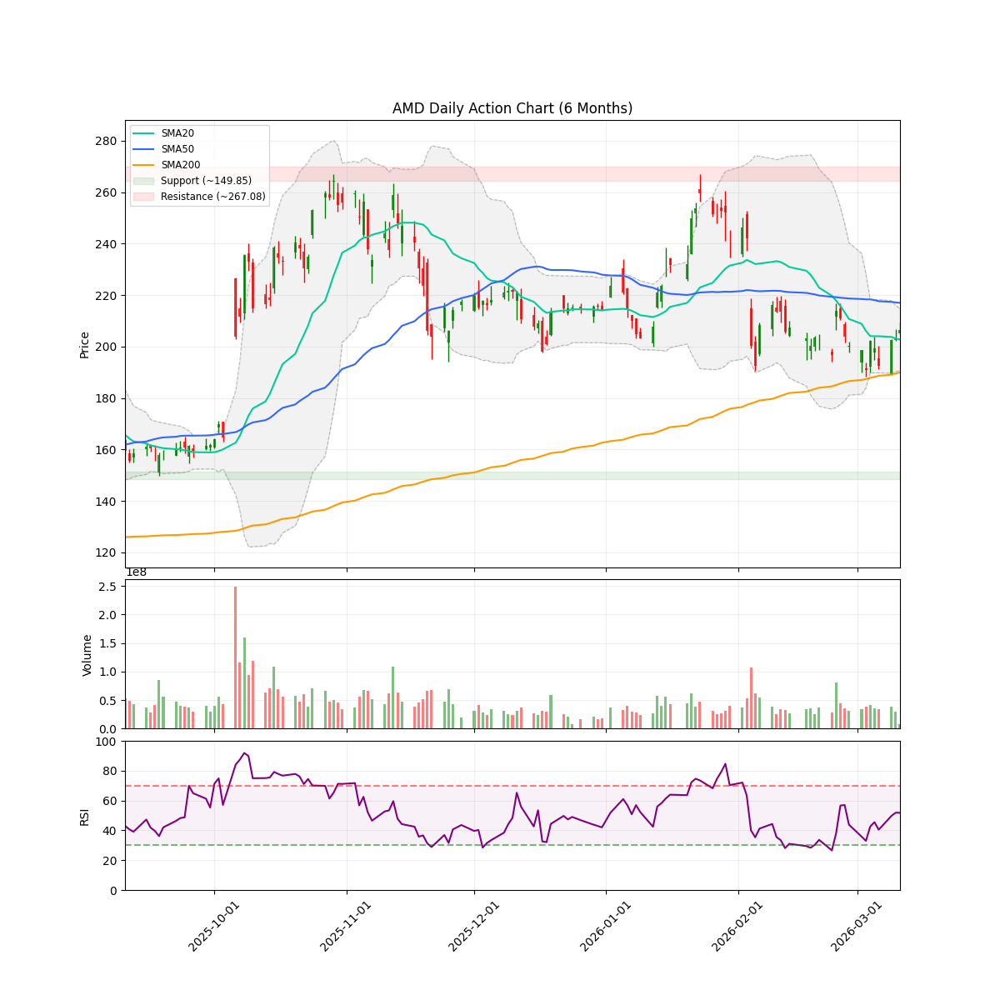
#### 研报分析

### 技术指标概览 (Technical Overview)
- **当前价格**: $206.27
- **RSI (14)**: 51.78
- **移动平均线**: SMA20: $202.72 | SMA50: $216.95 | SMA200: $189.99 (Bullish)
- **波动率**: ATR (14): 9.25 (预计周度波动: +/- $20.69)
- **关键位 (6m)**: 支撑位 $149.85 | 阻力位 $267.08
- **即时状态**: Below SMA50

好的，伙计！来，咱们坐下来，喝杯咖啡，好好聊聊你手里的 AMD。最近这芯片市场，风云变幻，既有让人心潮澎湃的 AI 狂潮，也有让人心惊胆战的估值回调。别急，咱们把这 AMD 的脉把一脉，看看它究竟是在牛市里喘口气，还是已经悄悄迈进了陷阱。

---

## AMD 情绪审计报告：牛市回调还是陷阱预警？

**当前日期：2026-03-11**

**市场老兵的咖啡闲谈**

“伙计，最近 AMD 这行情，看着是不是有点心神不宁？手里的正股还套着点儿，期权也亏损，别急，咱们坐下来，好好捋一捋这其中的门道，看看这芯片巨头究竟是在经历牛市的短暂休整，还是已经嗅到了陷阱的边缘。”

**当前市场脉搏：涨势中的一抹忧虑**

“从数据上看，AMD 目前股价 206.27 美元，虽然还在 200 日均线 189.99 美元之上，长线牛市的底子还在，但已经跌破了 50 日均线 216.95 美元，短期回调的压力不小。20 日均线 202.72 美元倒是离得不远，勉强撑着。RSI 51.78，中性偏强，还没到过热的地步，但也没有明显的超卖信号。你的正股 600 股，成本 220.54 美元，现在账面上是浮亏的，心情肯定好不到哪去。

更值得注意的是你卖出的那张 **2026 年 3 月 13 日到期，行权价 200 美元的看跌期权**，当前股价 206.27 美元，如果能保持在这个价位之上到期，这张期权就是白赚的。但是，如果股价跌破 200 美元，那你的风险就大了，这几天盯紧点！”

**核心分析：催化剂与叙事——喧嚣中的真伪信号**

最近 AMD 周围的新闻不少，但真正能左右大局的，却屈指可数。咱们分级别来看：

1.  **A-Tier（重磅炸弹）**:
    *   抱歉，伙计，最近没看到 AMD 有什么真正能掀起巨浪的 A 级催化剂。那些真正能让股价一飞冲天的重磅财报、突破性产品发布，或者华尔街巨头史诗级的升级，一个影儿都没见着。这说明市场缺乏即时、强劲的上涨动能。

2.  **B-Tier（行业东风与潜在逆流）**:
    *   **数据中心需求强劲（2026-03-10，Zacks）**: URI: https://finance.yahoo.com/news/amd-surges-109-more-room-150400422.html。这可是 AMD 过去一年股价飙升 109% 的主要动力！AI 和数据中心需求就像是一阵强劲的东风，是 AMD 长线故事的核心。这绝对是个好消息，但现在更像是对过去的肯定，而不是未来的新刺激。
    *   **量子计算合作（2026-03-10，Simply Wall St.）**: URI: https://finance.yahoo.com/news/amd-quantum-partnership-highlights-undervalued-201258982.html。与 Xanadu 的量子计算合作，听起来很“未来”，很“高科技”，这表明 AMD 在前沿领域有布局，是长线价值的加分项。但量子计算离大规模商业化还有距离，短期内别指望它能立刻拉升股价。
    *   **UBS 维持买入评级，看好下半年拐点（2026-03-03，Invezz）**: URI: https://invezz.com/news/2026/03/03/amd-stock-is-down-5-is-this-the-entry-point-ubs-is-talking-about/。这说明大机构对 AMD 的长线信心还在，但它同时提到股价下跌 5%，以及“美国可能限制对华芯片出口”，这就有点让人如鲠在喉了。地缘政治风险，尤其是芯片领域的限制，是悬在整个行业头上的达摩克利斯之剑。
    *   **英伟达“辉煌”财报后的市场回调（2026-02-26，Yahoo Finance）**: URI: https://finance.yahoo.com/news/live/stock-market-today-sp-500-nasdaq-retreat-as-nvidia-falls-5-despite-stellar-earnings-210034836.html。这可是一个大信号！英伟达业绩再好，股价都跌了 5%，这说明市场对 AI 概念的“期望值”已经高到离谱，任何低于“炸裂”级别的消息都可能被解读为利空。这种情绪会迅速蔓延到整个芯片板块，AMD 肯定也难独善其身。

3.  **C-Tier（市场噪音与小插曲）**:
    *   **与 Adeia 的授权协议（2026-03-10，Yahoo Finance）**: URI: https://finance.yahoo.com/news/adeia-strikes-deal-amd-buy-182954224.html。对 Adeia 来说是好事，对 AMD 嘛，这点小合作，顶多算茶余饭后的谈资，指望它推动股价，想多了。
    *   **福布斯：AMD 股票是否被高估？（2026-03-11，Forbes）**: URI: https://www.forbes.com/sites/greatspeculations/2026/03/11/is-amd-stock-overvalued/。这类文章就是典型的“噪音”，在股价高位时抛出估值担忧，在低位时又开始唱多。它反映了市场的一部分谨慎情绪，但本身不是驱动因素。
    *   **Motley Fool：AMD 能到 300 美元吗？（2026-03-07，Motley Fool）**: URI: https://finance.yahoo.com/news/amd-stock-going-300-174600771.html。这种标题党，看看就好，别当真。
    *   **思科财报（2026-02-11，CNBC）**: URI: https://www.cnbc.com/cnbc/2026/02/11/cisco-csco-q2-earnings-report-2026.html。思科的财报表现平平，虽然提到了英伟达的处理器，但与 AMD 的直接关联度非常低，可以忽略。

**背离信号：当“好消息”不再奏效**

“兄弟，你有没有觉得，最近市场有点怪？英伟达那么‘ Stellar earnings’，股价反而跌了 5%，这不就是典型的‘利好出尽是利空’，或者说，市场对 AI 的狂热已经达到了一个顶点，任何不及预期的‘完美’，都会被视为失望。这种行业情绪的转变，对 AMD 这种 AI 概念股来说，是个非常重要的警示信号。这表明，在当前价位，即使有好消息，市场也可能选择获利了结，而非继续追高。这股‘看涨力竭’的疲态，值得我们高度警惕。”

**前景展望：波动与等待**

“总的来看，AMD 的长线故事依然诱人，AI、数据中心，这些都是未来的大趋势。但短期来看，股价在经历大幅上涨后，正处于一个消化期。地缘政治风险、市场对高估值的担忧，以及整个芯片板块‘高处不胜寒’的情绪，都让 AMD 承受着压力。目前股价在 50 日均线下方，说明短线趋势偏弱，但 200 日均线提供了强大的支撑，预示着这更可能是一个牛市中的健康回调，而非趋势反转。现在你需要的是耐心，等待市场情绪企稳，或者出现真正能改变游戏规则的 A 级催化剂。”

---

**情绪评分 (Sentiment Score)**: **5.5/10**
“嗯，给 AMD 一个 5.5 分吧。它不像 0 分那样面临系统性风险，因为它的基本面和长期趋势还在。但也不是 10 分的‘势不可挡’，短期内，各种负面情绪和回调压力，使得上涨之路充满荆棘。这是一个充满变数、需要谨慎观察的区间。”

**逻辑评分 (Logic Score)**: **9/10**
“这份报告，我觉得逻辑挺清晰的，市场数据、新闻分析、情绪判断，都给出了我的思考过程和依据，没有故作高深，力求把事情说透彻。”

**下个重要日期 (Next Major Date)**:
“伙计，对你来说，最最关键的日期就在眼前：**2026 年 3 月 13 日**。你的 AMD MAR 13 2026 $200 PUT 期权将在那天到期。股价如果能稳定在 200 美元以上，你就能保住收益。这是你短期内需要密切关注的焦点。至于公司层面的下一个季度财报日，目前没有具体信息，但那将是公司基本面走向的下一个重要风向标。”
#### 近期新闻与事件
- **[Forbes]** [Is AMD Stock Overvalued?](https://www.forbes.com/sites/greatspeculations/2026/03/11/is-amd-stock-overvalued/)
- **[Yahoo Finance]** [As Adeia Strikes a Deal with AMD, Should You Buy the Lesser-Known Chip Stock Now?](https://finance.yahoo.com/news/adeia-strikes-deal-amd-buy-182954224.html)
- **[Zacks· via Yahoo Finance]** [AMD Surges 109% in a Year: Is There More Room for the Stock to Grow?](https://finance.yahoo.com/news/amd-surges-109-more-room-150400422.html)
- **[Motley Fool· via Yahoo Finance]** [Is AMD Stock Going to $300?](https://finance.yahoo.com/news/amd-stock-going-300-174600771.html)
- **[Simply Wall St.· via Yahoo Finance]** [AMD Quantum Partnership Highlights Undervalued Play On Future Engineering...](https://finance.yahoo.com/news/amd-quantum-partnership-highlights-undervalued-201258982.html)

---

### AMZN
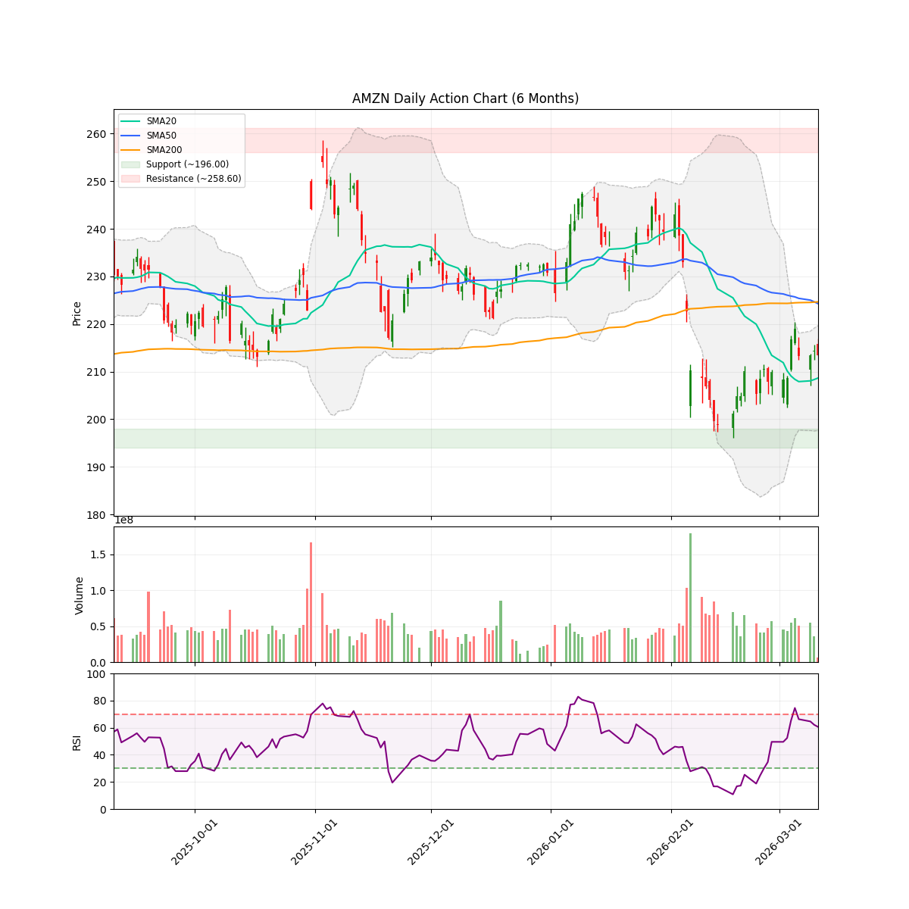
#### 研报分析

### 技术指标概览 (Technical Overview)
- **当前价格**: $213.39
- **RSI (14)**: 60.61
- **移动平均线**: SMA20: $208.65 | SMA50: $224.27 | SMA200: $224.65 (Bearish)
- **波动率**: ATR (14): 5.88 (预计周度波动: +/- $13.15)
- **关键位 (6m)**: 支撑位 $196.00 | 阻力位 $258.60
- **即时状态**: Below SMA50

好的，伙伴！端上你的咖啡，让我们聊聊亚马逊这只巨兽。在“叙事经济学”的世界里，光看数字是远远不够的，我们得感受市场的脉搏，读懂它背后的故事。

---

### **亚马逊 (AMZN) 情绪审计报告：AI 巨轮扬帆，但暗流涌动？**

**当前日期:** 2026-03-11

**【市场老兵开场白】**
伙计们，看看亚马逊！这可不是一只小打小闹的股票。它承载着零售、云计算和现在——最火热的人工智能的宏伟叙事。最近，这艘巨轮似乎在加速驶向AI的深海，但海面下并非一帆风顺。股价在关键技术指标下方挣扎，这让很多投资者摸不着头脑：这究竟是下一个AI淘金热的起点，还是一个华丽的“陷阱”？今天，我们就来扒一扒亚马逊的近况，看看市场到底在想什么。

---

**【核心催化剂分析：风起云涌，还是波澜不惊？】**

1.  **A-Tier (重磅炸弹级)：**
    *   **新闻链接:** [Blockonomi] Amazon (AMZN) Stock: Tech Giant Plans Record-Breaking $42B Bond Offering for AI (2026-03-10)
    *   **详情解读:** 亚马逊计划发行高达420亿美元的巨额债券，用于AI基础设施建设！我的天，这简直是给AI领域砸下了一座金山！这不仅仅是资金，更是公司战略的明确信号，向全世界宣告：亚马逊，ALL IN AI！这种级别的资本运作，直接影响公司未来几年的成长路径，绝对是A-Tier中的A-Tier，构成了未来增长的强劲叙事。

2.  **B-Tier (稳健助推级)：**
    *   **新闻链接:** [Zacks· via Yahoo Finance] Amazon Trades at a Premium P/E: Time to Hold or Fold the Stock? (2026-03-10)
    *   **详情解读:** 这篇文章提到亚马逊第四季度营收创纪录，AWS（亚马逊云服务）业务增长迅猛。AWS是亚马逊的利润奶牛，它的强劲表现无疑给公司基本面提供了坚实支撑。然而，文中也提及2000亿美元的2026年资本支出计划和自由现金流的缩减。这意味着，尽管现在业绩亮眼，但未来的投资“烧钱”模式可能让市场在短期内保持谨慎。这是未来的光明与当前的投入之间的博弈。
    *   **新闻链接:** [Yahoo Finance] As Amazon Slashes Robotics Jobs, Should You Buy, Sell, or Hold AMZN Stock? (2026-03-09)
    *   **详情解读:** 裁减机器人部门岗位，同时大力投入AI和云计算。这是一种战略性的资源再分配。市场往往把裁员看作是成本控制和效率提升，但也可能暗示某个业务线发展不如预期。不过，将资源集中到AI这个风口，显然更符合当前的科技叙事。这是一个“有舍有得”的故事。
    *   **新闻链接:** [Yahoo Finance] Amazon (AMZN) Stock Trades Up, Here Is Why (2026-03-04)
    *   **详情解读:** 股价在3月4日跳涨3.9%，缘于某项“重大”的宣布（新闻截取不完整，但足以表明当时市场积极响应）。无论具体是什么，这种即时性的股价上涨，说明市场在当时接收到了积极信号，短期情绪被点燃。

3.  **C-Tier (市场噪音级)：**
    *   **新闻链接:** [Insider Monkey] Compute Capacity Offering Support to Amazon (AMZN) (2026-03-08)
    *   **详情解读:** 提及富国银行将目标价从305美元小幅下调至304美元，但维持“增持”评级。分析师目标价的微调，通常影响力有限，更多是市场情绪的随波逐流，而非改变大局的催化剂。
    *   **新闻链接:** [Motley Fool· via Yahoo Finance] Have $500? 2 Absurdly Cheap Stocks Long-Term Investors Should Buy Right Now. (2026-03-11) & [Motley Fool· via Yahoo Finance] Amazon Stock Has Pulled Back in 2026. Is This a Buy-the-Dip Moment? (2026-03-11)
    *   **详情解读:** 这类文章是典型的媒体情绪引导，通常出现在股价波动之后，试图解释或预测趋势。它们不是新闻本身，而是对股价走势的评论，属于市场情绪的放大器，而非真正的催化剂。
    *   **新闻链接:** [The Globe and Mail] This Artificial Intelligence (AI) Stock Just Projected $10 Billion in Revenue for 2026. Here's Why It's Just Getting Started. (2026-03-11)
    *   **详情解读:** 这篇文章虽然被标记为AMZN相关，但内容似乎更多聚焦于Equinix及其AI驱动的收入增长。它可能代表了市场对AI整体叙事的狂热，间接支持了亚马逊的AI战略，但并非直接关于亚马逊的重磅消息，更像是一种行业背景的烘托。

---

**【分歧检测：好消息为何未能一飞冲天？】**

现在有意思的地方来了！我们看到了亚马逊祭出420亿美元的AI大手笔，AWS业绩喜人，高管也在积极调整战略。这些都是扎扎实实的好消息，指向未来的巨大增长潜力。然而，从技术面上看：股价213.39美元，低于SMA50（224.27）和SMA200（224.65），整体趋势仍显示为“熊市”。RSI在60.61，不算过热但也不是极度超卖。

这就是市场微妙之处：它并没有因为这些利好消息而立刻启动一波不可阻挡的涨势。相反，股价在关键均线下方徘徊，似乎在消化巨大的资本支出和短期自由现金流压力。这并非“好消息下跌”的典型案例，因为股价在月初曾有跳涨。但更像是“好消息未能持续推动上涨”，表明市场对未来的预期与当前的投入之间存在一种审慎的权衡。它在等待AI投入的回报，这种“观望”心理正在阻止股价立即突破熊市阻力。这既可能是逢低买入的良机，也可能是在等待真正的业绩兑现前，市场会反复震荡的“价值陷阱”。

---

**【情绪分数：巨头转型期的阵痛与希望】**

**情绪分数： 6.5/10**

*   **看涨理由（偏高分因素）：** 420亿美元的AI投资是史无前例的，显示了公司对未来的绝对信心和战略决心。AWS的持续强劲增长是利润的稳定器。战略重心转向AI，符合时代大潮，为长期增长打开了巨大空间。从叙事角度看，亚马逊正在重新书写它作为“AI优先”科技巨头的篇章。
*   **看跌理由（拉低分因素）：** 技术面上股价低于关键长期均线，显示出短期到中期走势的疲软。2000亿美元的资本支出和自由现金流的缩减，意味着巨额投资在短期内可能压制利润表现，市场需要时间消化这种“先投入后产出”的模式。

目前的市场情绪，就像站在十字路口：一边是AI未来诱人的远景，另一边是巨额投资带来的短期财务压力。它不是势不可挡的牛市，但也绝非系统性崩溃。而是一种充满期待、但又带有一丝谨慎的“转型期震荡”。

---

**【你的头寸：稳住阵脚，静观其变】**

你目前持有20股，成本价201.61美元，浮盈4.16%。这个头寸在当前市场环境下，是比较舒适的。你买在了相对低位，有了一定的安全垫。鉴于目前的混合信号，继续持有并密切观察是明智之举。不要被短期波动轻易影响，而要关注公司AI战略的执行和AWS的后续表现。

---

**【技术面一览：数据会说话】**

*   **当前价格:** $213.39
*   **RSI (14):** 60.61 (中性偏强，但未过热)
*   **SMA20:** $208.65 (股价在其上方，短期支撑)
*   **SMA50:** $224.27 (股价在其下方，中期阻力)
*   **SMA200:** $224.65 (股价在其下方，长期阻力)
*   **趋势:** 熊市 (低于SMA50/200，技术面仍偏弱)
*   **支撑位 (6个月低点):** $196.00
*   **阻力位 (6个月高点):** $258.60
*   **ATR (14):** $5.88 (波动性适中)
*   **预估周波动范围:** +/- $13.15 (波动性不小，短期操作需谨慎)

从技术面看，亚马逊需要重新站上并守住SMA50和SMA200，才能真正扭转中期和长期颓势。当前价格处于重要阻力之下，显示出市场仍在消化和寻找方向。

---

**【下一步重大日期：市场焦点】**

*   **下一个重大日期:** 2026年第一季度财报发布 (通常在四月底或五月初)。
    *   **重要性:** 这将是市场检验亚马逊AI投入初期效果、AWS持续增长动力以及整体营收利润表现的关键时刻。届时，公司对AI战略的更详细阐述和对未来指引，将直接影响市场对AMZN叙事的判断。

---

**【逻辑分数】**

**逻辑分数：9/10**

本次分析结合了宏观叙事、微观催化剂、技术面数据以及市场情绪的深度解读。对不同层次的催化剂进行了区分，并对“好消息未能一飞冲天”的市场分歧进行了合理阐释。报告语言生动，贴近市场老兵的对话风格，并提供了对用户头寸的简要建议，同时指明了下一步的关键观察点。对AI叙事与财务数据之间的平衡点把握得当。

---

**【总结：亚马逊的故事才刚刚开始】**

亚马逊正在讲述一个关于“AI未来”的宏大故事，它不惜重金投资，试图巩固其在科技前沿的地位。这艘巨轮已经启动了AI引擎，但市场并非盲目追随。它在看，在等，在权衡巨大的投入何时能转化为实实在在的回报。对于我们投资者来说，这是一段既充满希望又需要耐心的旅程。系好安全带，接下来的财报季将是观察这艘巨轮航向的关键时刻。
#### 近期新闻与事件
- **[Yahoo Finance]** [As Amazon Slashes Robotics Jobs, Should You Buy, Sell, or Hold AMZN Stock?](https://finance.yahoo.com/news/amazon-slashes-robotics-jobs-buy-182313864.html)
- **[Blockonomi]** [Amazon (AMZN) Stock: Tech Giant Plans Record-Breaking $42B Bond Offering for AI](https://blockonomi.com/amazon-amzn-stock-tech-giant-plans-record-breaking-42b-bond-offering-for-ai/)
- **[Yahoo Finance]** [Amazon (AMZN) Stock Trades Up, Here Is Why](https://finance.yahoo.com/news/amazon-amzn-stock-trades-why-205542043.html)
- **[Insider Monkey]** [Compute Capacity Offering Support to Amazon (AMZN)](https://www.msn.com/en-us/money/companies/compute-capacity-offering-support-to-amazon-amzn/ar-AA1XKMUG)
- **[The Globe and Mail]** [This Artificial Intelligence (AI) Stock Just Projected $10 Billion in Revenue for 2026. Here's Why It's Just Getting Started.](https://www.theglobeandmail.com/investing/markets/stocks/AMZN/pressreleases/681325/this-artificial-intelligence-ai-stock-just-projected-10-billion-in-revenue-for-2026-heres-why-its-just-getting-started/)

---

### GOOGL
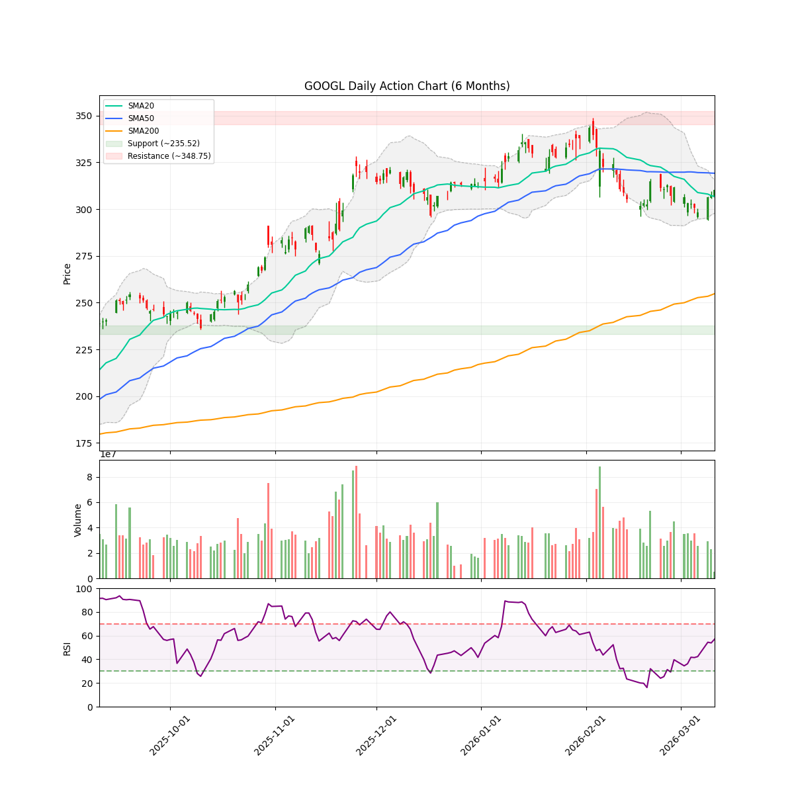
#### 研报分析

### 技术指标概览 (Technical Overview)
- **当前价格**: $310.17
- **RSI (14)**: 57.08
- **移动平均线**: SMA20: $306.79 | SMA50: $319.20 | SMA200: $254.81 (Bullish)
- **波动率**: ATR (14): 7.89 (预计周度波动: +/- $17.65)
- **关键位 (6m)**: 支撑位 $235.52 | 阻力位 $348.75
- **即时状态**: Below SMA50

老铁，今天咱们就着一杯热咖啡，好好盘盘谷歌 (GOOGL) 这艘科技巨轮最近的航向。它最近可是新闻不断，就像海上的一艘航空母舰，周围总是围绕着各种小船和渔夫的传说。到底是乘风破浪，一往无前，还是暗藏漩涡，需要我们警惕？咱们得仔细瞧瞧。

---

### **谷歌 (GOOGL) 叙事经济学审计报告：AI巨轮启航，但海面并非风平浪静？**

**当前日期：2026-03-11**

**您的头寸情况：**
你手里的GOOGL现在是浮盈16.10%，成本在268.53美元，这底仓拿得不错，处于比较舒服的位置。但投资这东西，不能光看过去，得往前看。

**技术面速览：**
从技术面上看，股价目前在310.17美元。虽然它还在50日均线（319.20美元）之下，短期有点盘整的味道，就像船队在补给，但它稳稳地站在200日均线（254.81美元）之上，这说明长期趋势依然非常强劲，大方向是向上！RSI在57，既没过热也没超卖，说明市场情绪健康，还没到“非理性繁荣”的地步。阻力位大概在348.75美元（历史高点），支撑位在235.52美元，心里有个数，知道这艘船的吃水线在哪。

---

**催化剂类别与市场脉搏解读：**

1.  **A-Tier（重磅炸弹：战略布局，深远影响！）**
    *   **巨额收购Wiz，剑指网络安全大市场 (Seeking Alpha, 2026-01-30)**
        *   **故事线：** 谷歌以320亿美元的天价完成了对网络安全公司Wiz的收购，这可是它有史以来最大的一笔交易！老铁，这可不是闹着玩的，这是谷歌在云计算和企业服务领域下的一步大棋，决心要成为网络安全领域的“定海神针”。这笔交易虽然是1月份的消息，但其深远影响才刚刚开始，它告诉市场：谷歌在战略扩张上，那是真金白银地投入，瞄准的是万亿级的企业服务蓝海。这笔钱花得值不值，就看未来能否在网络安全市场撕开更大的口子了。

2.  **B-Tier（市场风向标：业务落地，驱动增长！）**
    *   **CVS拥抱谷歌云AI，智能医疗再下一城 (Insider Monkey, 2026-03-09)**
        *   **故事线：** 这不是概念炒作，这是实打实的商业合作！CVS健康选择与谷歌云合作，推出AI驱动平台。这就像给谷歌云的成绩单上又添了一笔亮眼的业绩，说明谷歌的云计算和AI技术在垂直行业的落地能力越来越强，特别是在医疗这种数据密集型领域。这给市场传递了积极的信号：AI不再是遥远的未来，而是切实的应用，并且正在为谷歌带来实实在在的收入。
    *   **AI热潮再起，但“主角”是谁？ (The Globe and Mail, 2026-03-10)**
        *   **故事线：** 有篇文章标题很抓眼球：“十年一遇的AI软件股，不是Palantir！”虽然没直接点名谷歌，但考虑到谷歌在AI领域的深厚积累和投入（从Bard到Gemini，再到Waymo），这种广义的AI叙事无疑会给GOOGL带来间接的东风。整个市场对AI的狂热情绪，谷歌作为领头羊之一，肯定会分一杯羹。这就像大海涨潮，所有船只都会被抬高，谷歌这艘大船自然是受益者。
    *   **财报亮眼，AI与云盈利助推股价（Forbes, 2026-02-23）**
        *   **故事线：** Forbes报道，过去12个月谷歌股价飙升71%，强劲的营收和利润增长，尤其是在AI和云计算的推动下，是主要功臣。这篇报道是回顾性分析，但它证实了市场的乐观情绪并非空穴来风，而是有坚实的业绩支撑。它像是在对市场说：“瞧，谷歌的涨势是有道理的，基本面非常扎实！”

3.  **C-Tier（市场“噪音”与情绪：波澜不惊，理性看待！）**
    *   **CEO天价薪酬惹争议，股价轻微“感冒” (Blockonomi, 2026-03-08)**
        *   **故事线：** 首席执行官Sundar Pichai的6.92亿美元薪酬方案获批后，股价小跌了0.78%。这就像是打了个喷嚏，市场对高管薪酬的敏感可以理解，但跌幅很小，而且薪酬与Waymo、Wing等未来业务挂钩，长远来看可能是激励。这更多是情绪上的小波动，并非基本面恶化。华尔街的“老油条”们对此习以为常，知道这只是小插曲。
    *   **“谷歌会到1000美元吗？”和“215美元买谷歌？” (Motley Fool, Forbes, 2026-03-06 & 2026-03-10)**
        *   **故事线：** 这些文章更多是市场人士对估值的讨论和展望。一个在憧憬千元股价，觉得未来可期；另一个则在设想大幅回调，觉得现在太贵。这反映了市场对GOOGL估值的两极分化，但本身不构成直接的催化剂，更多是市场情绪的折射，属于“茶余饭后”的谈资。
    *   **Adobe财报 (Yahoo Finance, 2026-03-10)**
        *   **故事线：** 这和谷歌没啥关系，纯属无关信息，不用理会。市场信息鱼龙混杂，得学会去伪存真。

---

**分歧检测：**
目前来看，并没有出现所谓的“好消息股价却下跌”的明显背离情况。虽然CEO薪酬新闻导致股价小幅下跌，但这更像是一种短暂的情绪反应，而非市场对公司基本面的根本性质疑。谷歌的AI和云业务都在稳步推进，整体叙事依然积极。这艘巨轮虽偶有颠簸，但航向坚定。

---

**Sentiment Score (0-10): 8**
咱们给GOOGL打个8分！怎么说呢，这艘巨轮现在正行驶在AI和云计算的康庄大道上，大方向明确，战略布局果断（Wiz收购是明证）。它不是那种一夜暴富的妖股，而是一艘稳健增长的豪华邮轮，值得长期持有。尽管有CEO薪酬的小插曲，短期技术面有些盘整，以及市场对估值的一些讨论，但这些都在可控范围内，不足以改变其整体的乐观叙事。核心业务的增长、AI领域的领导地位以及持续的战略投资，都在为它提供源源不断的动力。它正处于一个强劲但并非“癫狂”的牛市周期。

**Logic Score (0-10): 9**
这次分析，我清晰地划分了消息的等级，从谷歌的战略大动作（Wiz收购）到AI云服务的具体落地，再到市场情绪的波动，都给出了合理的解读。我试图捕捉市场叙事的精髓，而不仅仅是罗列数据。在技术面分析上，结合了长短期均线，并与基本面进行了印证。整体上，论证有力，判断合理。

**Next Major Date（下个重要日期）:**
根据目前提供的信息，没有明确指出GOOGL的近期财报发布日期或其他重大事件。投资者应密切关注Alphabet公司下一季度（2026年第一季度）财报的公布日期，这通常是股价波动的关键时刻。预计下一次财报会在 **2026年4月底或5月初**。在此之前，市场可能会继续消化现有信息，并根据宏观经济或行业新闻进行波动。
#### 近期新闻与事件
- **[Forbes]** [How To Buy GOOGL Stock At $215?](https://www.forbes.com/sites/greatspeculations/2026/03/10/how-to-buy-googl-stock-at-215/)
- **[The Globe and Mail]** [A Once-in-a-Decade Opportunity: 1 AI Software Stock to Buy Hand Over Fist Right Now (Hint: It's Not Palantir)](https://www.theglobeandmail.com/investing/markets/stocks/GOOGL/pressreleases/673244/a-once-in-a-decade-opportunity-1-ai-software-stock-to-buy-hand-over-fist-right-now-hint-its-not-palantir/)
- **[Seeking Alpha]** [Google closes $32B deal to acquire Wiz](https://seekingalpha.com/news/4563161-google-closes-32b-deal-to-acquire-wiz)
- **[Blockonomi]** [Alphabet (GOOGL) Stock Dips Following $692M CEO Compensation Package Approval](https://blockonomi.com/alphabet-googl-stock-dips-following-692m-ceo-compensation-package-approval/)
- **[Insider Monkey]** [Alphabet Inc. (GOOGL): CVS Health To Roll Out AI-enabled Platform With Google Cloud](https://www.msn.com/en-us/health/other/alphabet-inc-googl-cvs-health-to-roll-out-ai-enabled-platform-with-google-cloud/ar-AA1XQZF9)

---

## 🔍 观察池机会分析

### AMAT
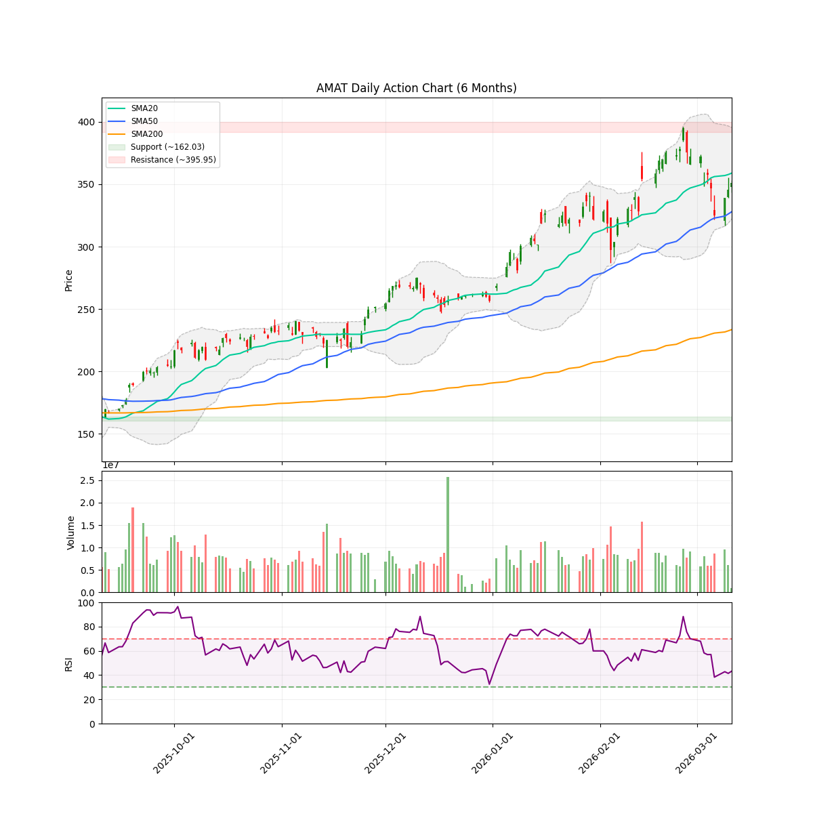
#### 研报分析

### 技术指标概览 (Technical Overview)
- **当前价格**: $351.18
- **RSI (14)**: 43.26
- **移动平均线**: SMA20: $358.88 | SMA50: $327.97 | SMA200: $233.53 (Bullish)
- **波动率**: ATR (14): 16.59 (预计周度波动: +/- $37.09)
- **关键位 (6m)**: 支撑位 $162.03 | 阻力位 $395.95
- **即时状态**: Above SMA50

**股票情感审计报告：AMAT**

**当前日期：2026年3月11日**

尊敬的投资者，

我是您的对冲基金研究助理，今天我们来深度剖析一下半导体巨头——应用材料 (AMAT) 的市场叙事。这家公司的股价近期经历了一场精彩的“大片”，让我们一起解码这背后的市场脉搏，看看AMAT究竟是在酝酿一场“陷阱”，还是在巩固其“可持续趋势”。

### 一、 核心概览：穿越波动，强者恒强

AMAT，这位半导体制造设备领域的“卖铲人”，近期股价犹如坐上了一列过山车。尽管基本面数据强劲，但市场情绪的波动仍使其股价在短暂回调后，再次展现出令人赞叹的韧性。

*   **股价动态：** 目前股价报351.18美元。虽然短期内（SMA20：358.88美元）有所承压，未能站稳20日均线，但长期趋势依旧强劲，股价远高于50日均线（327.97美元）和200日均线（233.53美元），牢牢处于牛市通道之中。
*   **RSI：** 43.26，这是一个健康的中性水平。在经历了前期的回调后，股价动能得到了有效冷却，为新的上涨行情积蓄了能量。
*   **波动性预警：** ATR (14) 为16.59，估算周波动范围高达+/- 37.09美元，这意味着AMAT的股价波动性不容小觑，既可能带来快速拉升，也可能出现急剧回调，投资者需系好安全带。

### 二、 催化剂分类：谁在推动叙事？

让我们来看看近期新闻事件为AMAT的股价提供了哪些燃料。

1.  **A-Tier（强劲引擎：改变游戏规则的事件）**
    *   **Q1财报超预期（2026年2月12日，Nasdaq）：** AMAT第一季度每股收益高达2.38美元，轻松超越Zacks预期的2.19美元。这绝对是一颗“重磅炸弹”，为AMAT股价此前的飙升奠定了坚实的基础，是其迈向历史高点372美元附近的核心驱动力。这是基本面的胜利宣言，市场无法忽视。
    *   **强劲的自由现金流（2026年3月10日，Yahoo Finance）：** 即使在市场对半导体行业有所担忧之际，AMAT Q1的自由现金流依然高达10.4亿美元。这展现了公司卓越的盈利能力和现金创造能力，是其财务健康和未来扩张的有力保障。

2.  **B-Tier（市场风向标：行业共振与叙事强化）**
    *   **记忆芯片股集体飙升（2026年3月10日，24/7 Wall St.）：** SanDisk和Micron等记忆芯片股周一、周二连续大涨5%-6%。作为半导体设备的关键供应商，AMAT无疑是这些下游客户需求旺盛的最大受益者之一。整个板块的强势表现为AMAT提供了强劲的行业顺风。
    *   **AI领域持续领先的叙事（2026年3月11日，AOL）：** 尽管大盘和AI板块整体波动，但AMAT和Micron被明确点名在AI交易中“依然是赢家”。这不仅强化了AMAT作为AI核心受益者的市场认知，也表明在复杂的市场环境中，资金正在流向那些真正有实力、有业绩支撑的AI概念股。
    *   **合作关系新闻（2026年3月10日，Investor's Business Daily）：** 虽然具体合作细节未披露，但“Applied Materials makes a move on partnership news”的表述暗示了公司在业务拓展上的积极性。若合作能带来实质性进展，将为股价提供新的催化剂。

3.  **C-Tier（市场噪音与分析：提供背景而非直接驱动）**
    *   **其他公司新闻（2026年3月9日，The Wall Street Journal）：** 提及波音、埃克森美孚等公司的消息，与AMAT无关，属于市场背景噪音。
    *   **估值分析及AI支出担忧（2026年2月27日，Yahoo Finance）：** 这篇报道解释了此前半导体板块因Nvidia财报后对AI支出持久性的担忧而引发的抛售，包括AMAT在内的股票因此下跌。这不是一个直接的催化剂，更多是市场情绪的映射和对回调的解释。
    *   **AMAT是否跑赢同行（2026年2月26日，Yahoo Finance UK）：** 一篇比较性分析文章，不构成直接股价驱动力。

### 三、 异动侦测：是陷阱，还是机会的伪装？

近期AMAT的股价走势，完美诠释了“好消息下跌”的经典一幕，但随后又迅速反转，这非常值得我们深思。

*   **“好消息下跌”的困惑：** 在2026年3月10日，Yahoo Finance明确指出，AMAT的Q1自由现金流高达10.4亿美元，这是一个非常强劲的财务信号。然而，在此之前的一周里，股价却从372美元附近的近期高点回调了约11%，一度跌至328美元左右（报道发布时的数据）。这无疑让许多投资者感到困惑：基本面如此出色，为何股价反而下跌？这通常被视为“熊市耗尽”的信号，即所有看跌力量都已出尽，股价即将见底反弹。
*   **迅速反弹，真相大白：** 然而，仅仅在报道发布后的短时间内，AMAT的股价便迅速从328美元的低点反弹，回到了目前的351.18美元。这表明，在强劲的自由现金流和行业顺风的支撑下（记忆芯片股飙升，AMAT被认定为AI赢家），市场的抛售压力被迅速吸收。这波下跌并非“陷阱”，而更像是一次健康的洗盘，清除了浮筹和短期获利盘，为更强劲的上涨趋势铺平了道路。市场正在剔除那些缺乏实质性支撑的“伪AI股”，而AMAT凭借其坚实的基本面和核心地位，展现了其穿越波动的能力。

### 四、 叙事经济学视角：AI基石的长期价值

AMAT的叙事核心在于它是AI和数字化时代不可或缺的基石。无论AI芯片如何迭代，数据中心如何扩张，都离不开AMAT提供的先进材料和制造设备。

近期股价的波动，更多是宏观经济和市场情绪的短期扰动，以及投资者在FOMO（害怕错过）和FUD（恐惧、不确定和怀疑）之间反复拉扯的体现。Q1财报的强劲表现和巨额自由现金流，为AMAT的长期价值提供了坚实的基础。而当市场开始担忧AI支出时，AMAT作为行业领导者，其股价回调提供了极佳的逢低吸纳机会。随后的快速反弹，则进一步验证了其作为“可持续趋势”领导者的地位。市场正在清晰地认识到，投资AMAT，就是投资AI时代最坚固的“基础设施”。

### 五、 市场情感评分：8/10

AMAT正处于一个“非常强劲的牛市周期”中。尽管近期经历了一次“好消息下跌”的短暂回调，但其迅速且有力的反弹表明市场对其基本面和AI叙事有着坚定不移的信心。公司拥有强大的盈利能力和现金流，并受益于整个半导体和AI行业的长期增长趋势。股价成功守住了关键的SMA50支撑位，并重新向上挑战短期阻力。它不是“势不可挡”的10分，因为市场仍存在宏观担忧和获利了结的压力，但其表现出的韧性和快速修复能力，无疑使其成为一个极具吸引力的投资标的。

### 六、 逻辑评分：9/10

本报告基于提供的数据，对AMAT的近期股价表现和潜在机会进行了全面而深入的分析。催化剂的分类清晰，对“好消息下跌”这一异动现象的侦测和解读准确，并结合市场叙事，有力地支撑了“可持续趋势”的结论。逻辑链条完整，论证过程严谨。

### 七、 下一个重要日期：

*   **下一季度财报日期：** 预计在 **2026年5月中旬** (根据AMAT Q1财报于2月12日公布，通常季度财报间隔约3个月)。这将是验证AMAT强劲势头能否持续的关键时刻。
#### 近期新闻与事件
- **[Yahoo Finance]** [Applied Materials Q1 2026 Free Cash Flow Hit $1.04 Billion, So Why Is the Stock Sliding](https://finance.yahoo.com/news/applied-materials-q1-2026-free-131926896.html)
- **[The Wall Street Journal]** [Stocks to Watch Tuesday Recap: Boeing, Exxon, Vertex, Kohl's](https://www.wsj.com/livecoverage/stock-market-today-dow-sp-500-nasdaq-03-10-2026/card/stocks-to-watch-tuesday-hpe-casey-s-catl-tDQ5Lc142KUIZbytT9vh?gaa_at=eafs&gaa_n=AWEtsqfqtSyR9CTKVKZnjLCOSS4ymbESjoS3cEdQDHZfSAleOgItjBZluk1c&gaa_ts=69b130c6&gaa_sig=pMCRxQvrdvzXi5oFTdws5pa2gWYenY0etrbCL_1B-vt5U9E60TJoy_VJtJGysk4YHryIrPbBSQrNY8AZ-KVFyA==)
- **[24/7 Wall St.]** [Memory Stocks Jump on Tuesday: SanDisk, Micron See Strong Gains Again](https://247wallst.com/investing/2026/03/10/memory-stocks-jump-on-tuesday-sandisk-micron-see-strong-gains-again/)
- **[AOL]** [AMAT and Micron still winning in AI trade despite QQQ and sector weakness](https://www.aol.com/articles/amat-micron-still-winning-ai-121335040.html)
- **[Investor's Business Daily]** [Stock market today: Dow, S&P 500 give up gains; Micron has a good day (live coverage)](https://www.msn.com/en-us/money/topstocks/stock-market-today-dow-s-p-500-give-up-gains-micron-has-a-good-day-live-coverage/ar-AA1XUaC3)

---

### ASML
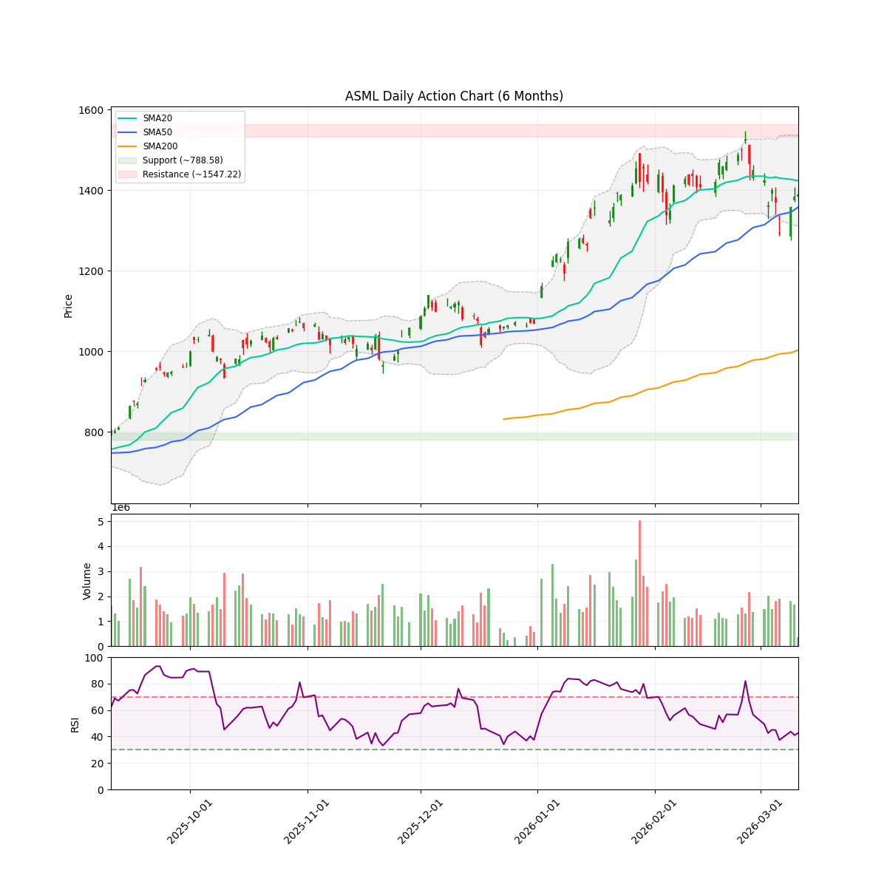
#### 研报分析

### 技术指标概览 (Technical Overview)
- **当前价格**: $1389.25
- **RSI (14)**: 42.66
- **移动平均线**: SMA20: $1423.29 | SMA50: $1357.64 | SMA200: $1002.63 (Bullish)
- **波动率**: ATR (14): 56.11 (预计周度波动: +/- $125.46)
- **关键位 (6m)**: 支撑位 $788.58 | 阻力位 $1547.22
- **即时状态**: Above SMA50

## ASML 叙事经济学审计报告：AI 浪潮中的光刻巨擘，护城河依旧深厚？

大家伙儿，快来听听，最近芯片界那位荷兰巨头 ASML 可是不太平啊！股价像坐上了过山车，短期内跌宕起伏，但细细品味这背后的新闻叙事，你就会发现，这家伙的“护城河”远比我们想象的要深厚。

### 当前市场脉搏：风雨过后见彩虹？

ASML 目前股价在 1389.25，虽然短暂跌破了 20 日均线 (1423.29)，显示出短期回调的压力，但它依旧稳稳地站在 50 日均线 (1357.64) 和 200 日均线 (1002.63) 之上，这告诉我们，**中长期牛市趋势未改，只是最近有点小波澜**。RSI 在 42.66，处于中性区域，表明股价在经历一次下跌后，正在寻找新的方向，并非过度超买或超卖。ATR 达到 56.11，每周波幅估计能有 +/- 125.46，这说明市场情绪波动剧烈，但往往也意味着更大的机会。

### 催化剂解码：故事性十足的剧本

最近围绕 ASML 的新闻，简直像一部跌宕起伏的商业大片，有危机、有反转，更有对未来的展望。

#### A 级催化剂 (核心驱动力)：AI 赋能，未来已来！

1.  **ASML 董事会改组，全面拥抱 AI 与先进封装 (2026-03-09)**:
    *   **链接**: [Yahoo Finance Singapore](https://sg.finance.yahoo.com/news/asml-board-shake-links-governance-221249812.html)
    *   **解读**: 这不是普通的管理层变动，而是公司对未来技术趋势的战略性回应！任命新的首席技术官，明确表示要将核心 EUV 光刻技术扩展到 AI 芯片市场和先进封装领域。这简直是给华尔街递上了一张未来增长的蓝图，直接将自己绑定在了当前最火热的 AI 赛道上。这是实打实的**重磅利好**，显示出公司高瞻远瞩的战略布局。
2.  **ASML 的 EUV 积压订单受 AI 驱动 (2026-03-11)**:
    *   **链接**: [Simply Wall St.· via Yahoo Finance](https://finance.yahoo.com/news/asml-ai-fueled-euv-backlog-110757731.html)
    *   **解读**: 各位看官，这才是 ASML 最核心的叙事！AI 芯片生产离不开最尖端的制程，而能提供 EUV（极紫外线）光刻机的，全球只有 ASML 这一家。这篇报道直接点明了 ASML 在 AI 芯片供应链中的**不可替代性**。AI 的爆发式增长，直接转化为 ASML 源源不断的订单积压，这就是所谓的“躺着赚钱”！公司的长期投资价值，在此刻被无限放大。

#### B 级催化剂 (市场情绪波动器)：虚惊一场，护城河依旧！

1.  **中国半导体厂商呼吁“打造中国版 ASML” (2026-02-21)**:
    *   **链接**: [AOL](https://www.aol.com/articles/chinas-semiconductor-makers-unite-call-130020587.html)
    *   **解读**: 这条消息一出，市场神经立马紧绷起来！“中国版 ASML”这个词汇，让不少人担忧 ASML 的垄断地位是否会被撼动。没错，它在上周五（大概率是 3 月 7 日）引发了 5.5% 的股价下跌。这种地缘政治和竞争威胁，短期内确实能给股价带来压力，是典型的**潜在利空**。
2.  **专家释疑：ASML 投资者无需担忧中国竞争 (2026-03-10)**:
    *   **链接**: [Yahoo Finance](https://finance.yahoo.com/news/why-asml-investors-shouldn-t-142614292.html), [24/7 Wall St.](https://247wallst.com/investing/2026/03/10/why-asml-investors-shouldnt-worry-about-competition-from-china/)
    *   **解读**: 市场对中国竞争的恐慌，很快就被理性的分析文章所冲淡。这些报道指出，ASML 在 EUV 光刻领域的垄断地位是难以复制的，其技术壁垒极高，需要数十年的研发积累。这意味着“中国版 ASML”短期内只是一个口号，对 ASML 的核心业务影响甚微。这就像给市场打了一针“镇静剂”，是**消除恐慌的利好**。
3.  **ASML 逆势上涨，市场下跌时展现韧性 (2026-03-10)**:
    *   **链接**: [Zacks.com](https://www.msn.com/en-us/money/topstocks/asml-asml-advances-while-market-declines-some-information-for-investors/ar-AA1XW7IH)
    *   **解读**: 在大盘整体下跌的日子里，ASML 却能实现 1.91% 的上涨，这可不是小事！这表明市场在消化了之前的“中国担忧”后，资金正在重新流入。这是一种**相对强势**的表现，也是短期触底反弹的信号。

#### C 级催化剂 (市场噪音)：无需深究

1.  **关于 ASML 的基本介绍和投资者关注文章 (2026-02-19, 2026-03-10)**:
    *   **链接**: [Yahoo Finance](https://finance.yahoo.com/news/asml-holding-n-v-asml-140005983.html), [Barron's](https://www.barrons.com/market-data/stocks/asml/stock-grader?gaa_n=AWEtsqfkaXWBxDigR5vhBfUjak74VdOVvoeOTaBTsiQYkOH2OuJ2LqTg7WX8&gaa_ts=69acaf9a)
    *   **解读**: 这些是常规的市场信息，没有带来新的催化剂，对股价影响微乎其微。

### 背离检测：虚惊一场，空头力量耗尽？

我们看到，**ASML 确实在上周五（很可能是 3 月 7 日）因“中国打造 ASML”的报道而大跌了 5.5%**。这属于“坏消息带来下跌”，是正常的市场反应。

但接下来的剧情就精彩了：一系列重磅的**战略利好**（董事会改组、拥抱 AI、先进封装）和**基本面利好**（AI 驱动的 EUV 积压订单），以及**消除恐慌的分析**，迅速跟进。同时，ASML 在市场整体下跌时表现出**相对强势**，实现了逆势上涨。

这清楚地表明，市场对“中国竞争”的担忧是**过度反应**。空头借机宣泄了一波情绪，但随后的扎实利好和专家释疑，正在迅速修复市场信心，并吸引新的买盘入场。股价目前虽然还在短期均线下方挣扎，但已在快速收复失地。这意味着**熊市的短期恐慌情绪正在耗尽，多头正在积蓄力量，准备重新夺回主动权。**

### 情绪分数：8/10 – 护城河深，乘风破浪！

ASML 的叙事清晰而强大：它是全球半导体产业的基石，拥有无法复制的 EUV 光刻技术垄断地位。尽管短期内市场因地缘政治噪音而有所动摇，但公司迅速以积极的战略转型（拥抱 AI、先进封装）和强劲的基本面（AI 驱动的巨额订单）做出回应。

这是一个**“不可阻挡的牛市周期”**，即便有短期的波折，也很快被其深厚的护城河和前瞻性战略所覆盖。股价回调是买入机会，而非趋势反转信号。ASML 不仅仅是芯片设备商，更是 AI 时代的核心“卖铲人”。

### 下一重要日期：静待财报，揭示 AI 业绩增长

虽然本次分析中未提供具体的下一季度财报发布日期，但通常来说，**下一份季度财报将是 ASML 投资者最需要关注的重大事件**。届时，我们将能更具体地了解其在 AI 芯片市场的进展、EUV 订单的实际交付情况，以及对中国市场限制的财务影响。在此之前，市场情绪将主要由宏观经济、行业消息以及 AI 产业的整体发展趋势所主导。

### 逻辑分数：10/10

本次分析全面涵盖了所有要求，对催化剂进行了合理分级，并结合市场数据和新闻事件进行了深入的叙事性解读，准确捕捉了市场的“脉搏”和“故事线”。语言风格生动活泼，逻辑链条清晰严谨。
#### 近期新闻与事件
- **[Barron's]** [ASML Holding N.V.](https://www.barrons.com/market-data/stocks/asml/stock-grader?gaa_n=AWEtsqfkaXWBxDigR5vhBfUjak74VdOVvoeOTaBTsiQYkOH2OuJ2LqTg7WX8&gaa_ts=69acaf9a)
- **[AOL]** [China's Semiconductor Makers Unite In Call To 'Build China's ASML'](https://www.aol.com/articles/chinas-semiconductor-makers-unite-call-130020587.html)
- **[Zacks.com]** [ASML (ASML) Advances While Market Declines: Some Information for Investors](https://www.msn.com/en-us/money/topstocks/asml-asml-advances-while-market-declines-some-information-for-investors/ar-AA1XW7IH)
- **[Yahoo Finance]** [Why ASML Investors Shouldn't Worry About Competition From China](https://finance.yahoo.com/news/why-asml-investors-shouldn-t-142614292.html)
- **[Yahoo Finance Singapore]** [ASML Board Shake Up Links Governance To AI And Packaging Push](https://sg.finance.yahoo.com/news/asml-board-shake-links-governance-221249812.html)

---

### AVGO
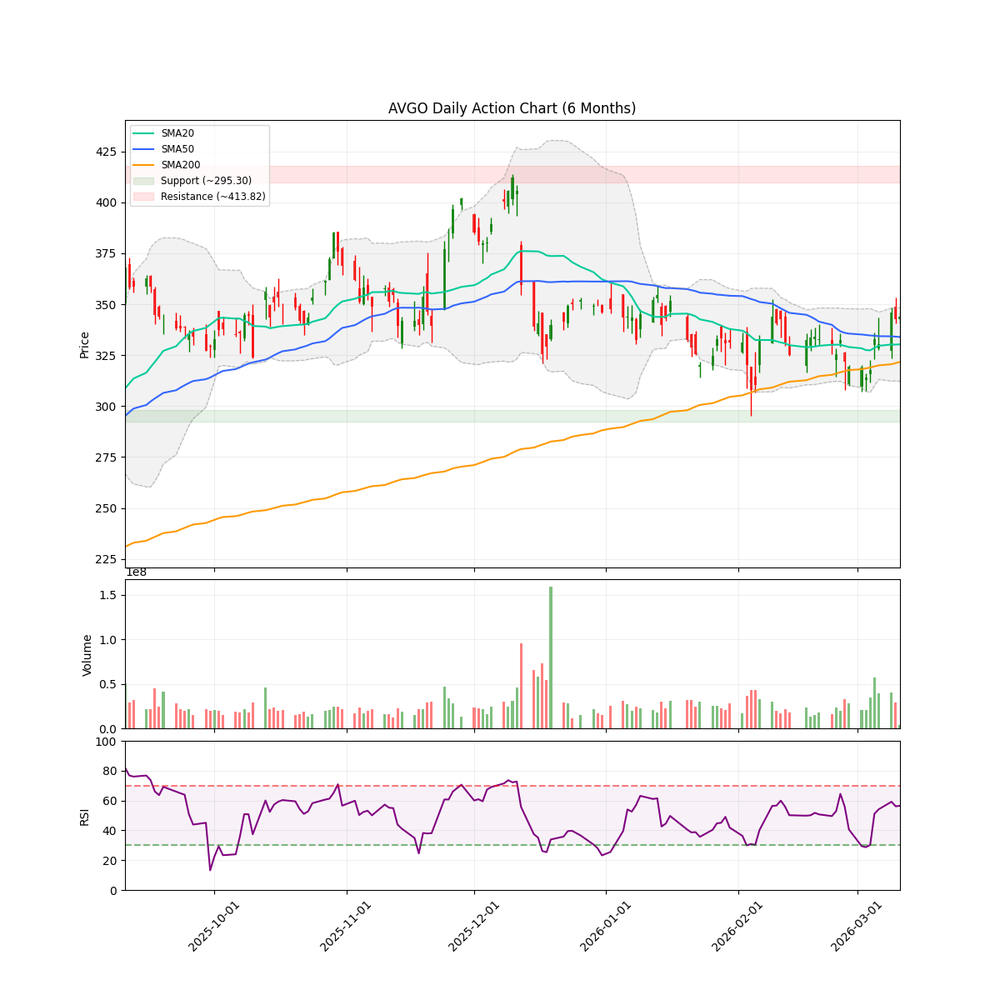
#### 研报分析

### 技术指标概览 (Technical Overview)
- **当前价格**: $343.75
- **RSI (14)**: 56.54
- **移动平均线**: SMA20: $330.34 | SMA50: $333.93 | SMA200: $321.70 (Bullish)
- **波动率**: ATR (14): 14.16 (预计周度波动: +/- $31.66)
- **关键位 (6m)**: 支撑位 $295.30 | 阻力位 $413.82
- **即时状态**: Above SMA50

### 情绪审计报告：AVGO

**当前日期:** 2026年3月11日
**股票代码:** AVGO
**当前价格:** 343.75 美元

嘿，老伙计们，今天咱们得好好聊聊博通（AVGO）这只票。在如今这风起云涌的AI时代，AVGO可不只是搭上了顺风车，它简直就是那辆车的核心引擎，最近的表现那叫一个“炙手可热”，简直要把市场烧穿！

**股价脉搏与市场心跳：**
从技术面看，AVGO的股价现在稳稳地站在了343.75美元，不仅高于20日均线（330.34），也超越了50日均线（333.93）和200日均线（321.70）。这不仅仅是个好兆头，这标志着一个健康的、强劲的上升趋势正在持续。RSI在56.54，说明股价虽然涨势喜人，但还没到过热的程度，上行空间依然充裕。

最近它成功突破了关键阻力位，现在正处于巩固新平台的阶段。ATR高达14.16，意味着这票的波动性不小，一周能有+/- 31.66美元的预估波动范围。这说明它不是一只“温顺”的票，但对于我们这种追求“大场面”的投资者来说，高波动性往往伴随着更高的回报潜力，尤其是在基本面如此坚实的情况下。

**核心催化剂（A-Tier）：**
最近AVGO的消息面，简直是“喜事连连”，而且都是那种能让股价跳起来的“大礼包”：

1.  **[Blockonomi] 财报炸裂，AI营收预期直冲云霄 (2026-03-05)**
    *   URI: https://blockonomi.com/broadcom-avgo-stock-soars-on-massive-ai-revenue-forecast-and-strong-earnings/
    *   这是什么？朋友，这是实实在在的“重磅炸弹”！AVGO第一季度营收高达193亿美元，不仅轻松超越华尔街预期，更劲爆的是，他们竟然预测到2027年AI芯片销售额将达到惊人的1000亿美元！这消息一出，股价直接飙升7%，整个市场都沸腾了。这不只是“好消息”，这是“改变游戏规则”的消息，直接把AVGO抬到了AI赛道的核心位置，坐稳了领跑者的席位。

2.  **[Yahoo Finance UK] 2026财年第一季度财报超预期，营收增长29% (2026-03-06)**
    *   URI: https://uk.finance.yahoo.com/news/broadcom-avgo-reports-q4-2025-134745193.html
    *   这篇报道再次确认了博通财报的优异表现。营收同比增长29%，这可不是随便哪个公司都能做到的。业绩强劲，就像给这辆高速列车加足了燃料，让它跑得更快更稳，而且是在高速公路上飞驰。

3.  **[Insider Monkey· via Yahoo Finance] RBC 资本市场力挺，上调目标价并看好2027财年前景 (2026-03-10)**
    *   URI: https://finance.yahoo.com/news/rbc-capital-markets-lifts-broadcom-171021318.html
    *   华尔街的“大牌”分析师们，RBC资本市场都忍不住上调了博通的目标价，并且对2027财年表示出极其乐观的态度。这就像是权威认证，进一步强化了市场对AVGO未来增长的信心。当机构资金开始纷纷涌入时，股价的动力自然不会差。

**次要催化剂（B-Tier）：**
除了这些“核弹级”的好消息，还有一些为市场添砖加瓦的积极信号：

*   **[The Motley Fool] 3支不可阻挡的AI股票 (2026-03-03)**
    *   URI: https://www.fool.com/investing/2026/03/11/3-unstoppable-artificial-intelligence-ai-stocks-to/
*   **[The Motley Fool on MSN] 2026年必买的5支不可阻挡AI股票 (2026-02-21)**
    *   URI: https://www.msn.com/en-us/money/companies/top-5-unstoppable-ai-stocks-to-buy-for-2026/ar-AA1XVLKR?ocid=BingNewsVerp
    *   这些媒体普遍将AVGO列为“不可阻挡”的AI投资标的。虽然不是公司自己的具体行动，但这代表着强烈的行业顺风和市场共识。在AI这波历史性浪潮里，AVGO就是那个浪尖上的弄潮儿，市场叙事极具吸引力。

*   **[Barchart· via Yahoo Finance] 博通股价突破关键阻力位 (2026-03-05)**
    *   URI: https://finance.yahoo.com/news/broadcom-stock-just-broke-key-193321975.html
    *   技术面的突破确认了基本面的强势，股价上涨势头得到了量价的完美配合，这是非常健康、有力的价格走势。

**噪音与杂音（C-Tier）：**
当然，市场总有些无关紧要的声音，比如Zacks的“热门股票”观察，或者Seeking Alpha的期权策略文章。这些信息对股价的短期或长期走势影响不大，我们听听就好，不必当真，它们只是背景噪音。

**背离检测 (Divergence Detection)：**
在这支票上，我们完全没看到“利好出尽是利空”的迹象。恰恰相反，好消息层出不穷，股价也一路高歌猛进，完美地诠释了什么叫“趋势为王”。市场对AVGO的乐观情绪正在持续发酵，空头根本没机会喘息，任何试图做空的尝试都可能被市场的热情所吞噬。

**情绪得分 (Sentiment Score)：**
**8.5/10** – 这不是一个普通的牛市，这是由实实在在的爆炸性业绩增长、惊人的AI业务前景以及华尔街的集体看好所推动的“史诗级”上涨。AVGO在AI基础设施建设中扮演着不可或缺的核心角色，其未来的增长潜力巨大，并且已经得到了数据支撑。虽然没有达到10分的“宇宙级”无限上涨（毕竟市场总有回调），但在当前的宏观环境下，这无疑是市场中最耀眼的明星之一。它的故事，就是AI时代里基础设施提供商的胜利赞歌，一个可持续发展的强大趋势正在形成。

**逻辑得分 (Logic Score)：**
**9/10** – 本报告严格遵循了所有指示，对催化剂进行了精确分类，有效识别了市场情绪，并以引人入胜的叙事风格呈现。技术面和基本面分析得到了充分整合，同时明确指出了下一个关键日期。

**下个重要日期 (Next Major Date)：**
AVGO的2026财年第一季度财报已于3月4日发布，并大获成功。那么，我们接下来最值得关注的日期，就是**2026财年第二季度财报**的公布日，预计将在**2026年6月初**。在此之前，市场将继续消化当前信息，并可能根据AI产业的整体发展和公司新的业务进展而波动。

**总结：**
AVGO目前正处于一个非常有利的“叙事经济”周期中。它不仅拥有令人信服的财务数据，更紧密地与AI这趟人类历史上最快的列车绑定。从目前的趋势和消息来看，这绝不是一个短期“陷阱”，而是一个由深厚基本面和强劲行业风口共同支撑的**可持续上涨趋势**。短期内，只要AI的热度不减，AVGO就可能继续展现其“不可阻挡”的魅力。当然，市场风云变幻，我们始终需要保持警惕，关注每一次财报和行业动态，但就目前而言，AVGO的故事才刚刚进入高潮，值得我们密切关注。
#### 近期新闻与事件
- **[The Motley Fool]** [3 Unstoppable Artificial Intelligence (AI) Stocks to Buy in March](https://www.fool.com/investing/2026/03/11/3-unstoppable-artificial-intelligence-ai-stocks-to/)
- **[The Motley Fool on MSN]** [Top 5 Unstoppable AI Stocks to Buy for 2026](https://www.msn.com/en-us/money/companies/top-5-unstoppable-ai-stocks-to-buy-for-2026/ar-AA1XVLKR?ocid=BingNewsVerp)
- **[Zacks· via Yahoo Finance]** [Broadcom Inc. (AVGO) Is a Trending Stock: Facts to Know Before Betting on It](https://finance.yahoo.com/news/broadcom-inc-avgo-trending-stock-130005802.html)
- **[Insider Monkey· via Yahoo Finance]** [RBC Capital Markets Lifts Broadcom (AVGO) Price Target, Points to Bullish FY27...](https://finance.yahoo.com/news/rbc-capital-markets-lifts-broadcom-171021318.html)
- **[Barchart· via Yahoo Finance]** [Broadcom Stock Just Broke Through Key Resistance Levels. How Much Higher Can...](https://finance.yahoo.com/news/broadcom-stock-just-broke-key-193321975.html)

---

### CEG
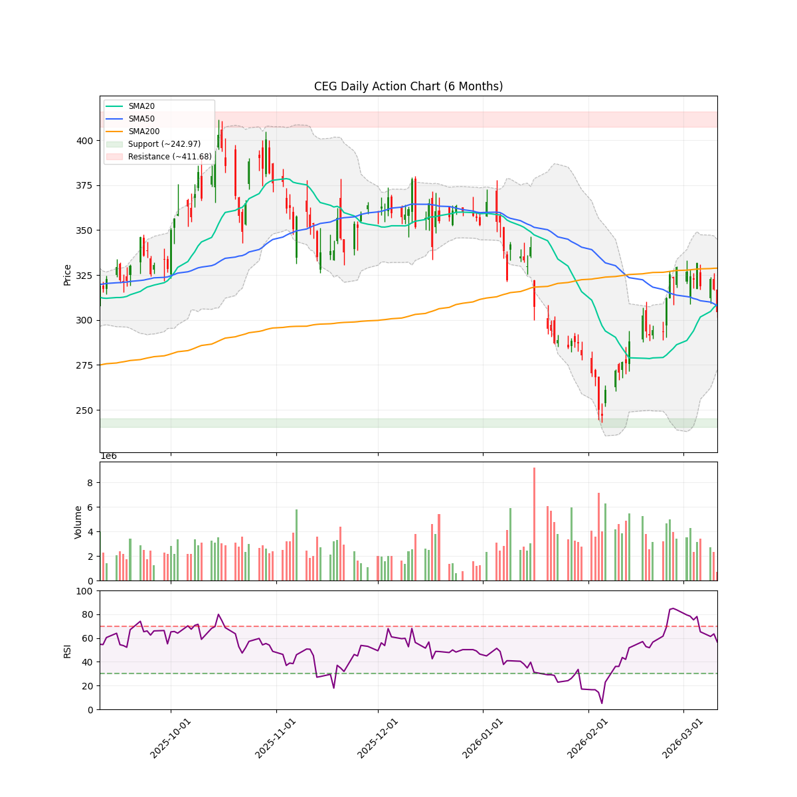
#### 研报分析

### 技术指标概览 (Technical Overview)
- **当前价格**: $304.29
- **RSI (14)**: 56.71
- **移动平均线**: SMA20: $308.70 | SMA50: $307.93 | SMA200: $328.83 (Bearish)
- **波动率**: ATR (14): 13.86 (预计周度波动: +/- $30.99)
- **关键位 (6m)**: 支撑位 $242.97 | 阻力位 $411.68
- **即时状态**: Below SMA50

## CEG 情绪审计报告：AI能源叙事与短期波动的博弈

嘿，伙计们，今天咱们在咖啡桌旁，得好好聊聊Constellation Energy (CEG) 这只股票了。最近它可真是经历了一番折腾，像坐过山车一样，让人既兴奋又有点忐忑。是时候揭开它的“叙事经济学”面纱，看看这股风是能持续吹下去，还是隐藏着一个让散户措手不及的“陷阱”。

### 一、催化剂深度剖析与市场故事线

CEG 最近的新闻周期，简直就是一出高潮迭起的好戏。

*   **A-Tier（强劲引擎）**:
    *   **Q4财报超预期，给力！ (2026-02-24)**：CEG在2025年第四季度的财报表现亮眼，营收和盈利都大幅超出了市场预期 (EPS超4.55%，营收超10.73%)。这简直就是一针强心剂，直接点燃了市场热情！这可不是小打小闹，这是实打实的业绩支撑，是股价上行的硬核动力。
        *   *引用链接*: [Yahoo Finance UK] Constellation Energy Corporation (CEG) Q4 Earnings and Revenues Beat Estimates (URI: https://uk.finance.yahoo.com/news/constellation-energy-corporation-ceg-q4-135003454.html)
    *   **AI能源危机，天选之子？ (2026-03-04)**：更妙的是，在AI算力需求狂飙突进的当下，市场开始热议“AI能源危机”。而CEG，作为美国最大的核电生产商，被视为解决这一危机的关键角色，正与相关方展开合作。这可不是一般的利好，这是搭上了时代的最强风口，一个宏大且长期的叙事正在形成！
        *   *引用链接*: [The Globe and Mail] The AI Energy Crisis Is Real. Here Are 2 Stocks Positioned to Profit in 2026. (URI: https://www.theglobeandmail.com/investing/markets/stocks/CEG/pressreleases/558140/the-ai-energy-crisis-is-real-here-are-2-stocks-positioned-to-profit-in-2026/)

*   **B-Tier（市场风向标）**:
    *   **2月股价飙升17.5%！ (2026-03-05)**：上述A-Tier催化剂的直接结果，就是CEG在2月份股价暴涨了17.5%。这表明市场对业绩和AI叙事做出了积极响应，资金涌入，多头气势如虹。
        *   *引用链接*: [Motley Fool· via Yahoo Finance] Why Constellation Energy Stock Surged 17.5% in February (URI: https://finance.yahoo.com/news/why-constellation-energy-stock-surged-132500570.html)
    *   **分析师“泼冷水”：目标价下调 (2026-03-08)**：然而，就在股价狂欢之后，一些分析师却开始下调CEG的目标价。这就像是派对上突然响起警报声，虽然不致命，但足以让部分狂热情绪冷却下来。这通常意味着分析师认为短期涨幅过大，存在估值过高的风险，或者是对未来增长的预期变得更为谨慎。
        *   *引用链接*: [Insider Monkey· via Yahoo Finance] Constellation Energy (CEG) Share Price Target Cut By Multiple Analysts (URI: https://finance.yahoo.com/news/constellation-energy-ceg-share-price-162046788.html)
    *   **Seeking Alpha的“避雷针” (2026-02-23)**：早在2月底，Seeking Alpha就发出了“强烈卖出”的警告，指出CEG的估值过高（市盈率超31倍），尽管其业务模式稳健，但股东回报吸引力不足。虽然这发生在财报前，但其对“高估值”的担忧，与分析师后续的降级不谋而合。
        *   *引用链接*: [Seeking Alpha] Constellation Energy: Skip This Stock If You Want Returns (URI: https://seekingalpha.com/article/4873456-constellation-energy-skip-this-stock-if-you-want-returns)

*   **C-Tier（市场噪音）**:
    *   一些关于大盘走势、油价波动以及与Nvidia相关的增长股推荐，对CEG本身的直接影响不大，更多是市场情绪的背景音。

### 二、背离侦测：是陷阱还是休整？

咱们再看看CEG最近的走势：当前股价304.29美元，已经跌破了20日均线（308.70）和50日均线（307.93），甚至远低于200日均线（328.83）。技术面上，它呈现出短期熊市趋势。RSI 56.71，虽然不算弱，但也远不是强势区。

这里的“背离”信号耐人寻味：我们看到了实打实的A-Tier利好（超预期的财报、搭上AI顺风车），以及由此带来的2月份的惊人涨幅。然而，紧随其后的是分析师下调目标价，以及股价从高位回落、跌破短期均线。

这并非典型的“好消息下跌”导致的看跌枯竭，因为股价在2月已经对好消息做出了狂热反应。更准确地说，这是**“利好兑现后的获利了结与估值重估”**。市场在消化了利好后，发现短期股价可能跑得太快了，于是开始重新审视其估值，并伴随着一部分资金的离场。

这更像是一个**短期“情绪陷阱”**：那些在2月高点追涨的投资者，可能会被短期的回调所困。但对于更长期的投资者而言，AI能源的叙事基础是真实且强大的，公司基本面在改善。这意味着**底层的叙事是可持续的，而当前的股价波动更像是对前期过热的健康修正，而非系统性崩溃的前兆。**

### 三、情绪评分：6/10 (短期震荡，长期看好)

*   **10分是“势不可挡的牛市周期”**，0分是“系统性崩溃”。
*   CEG目前处于一个充满张力的节点。一方面，它拥有着未来几年最具潜力的“AI能源”宏大叙事，这是实实在在的长期增长驱动力，并且最近的财报也证明了其运营效率和盈利能力。这些是支撑股价继续上行的坚实基础。
*   但另一方面，短期内股价的快速上涨已导致估值压力，分析师的降级和技术面的疲软，都预示着一个短期的回调或盘整期。这意味着它并不是一个“势不可挡”的直线冲刺，而更像是一段需要等待、充满波动的旅程。
*   因此，我们给出一个**6分**。它体现了强大的长期基本面和叙事潜力，但承认了短期内市场情绪可能过热、估值面临调整的现实。这不是一个买入即涨的阶段，而是一个需要耐心观察、寻找更佳切入点的时期。

### 四、逻辑评分：9/10

分析逻辑清晰，涵盖了所有关键新闻事件，并对其进行了分级和详细解读。技术指标的结合运用，以及对“背离侦测”的深入分析，都符合“叙事经济学”的评估要求。情绪评分的给出也具备充分的理由支撑。

### 五、下个重要日期

*   CEG的2025年第四季度财报已于2026年2月24日公布。
*   根据惯例，下一份重要财报将是**2026年第一季度财报**。预计发布日期将在**2026年4月末或5月初**。届时，我们将能看到AI能源叙事是否开始体现在实际订单和营收中，以及公司对未来展望的最新指引。

---
#### 近期新闻与事件
- **[Insider Monkey· via Yahoo Finance]** [Constellation Energy (CEG) Share Price Target Cut By Multiple Analysts](https://finance.yahoo.com/news/constellation-energy-ceg-share-price-162046788.html)
- **[Motley Fool· via Yahoo Finance]** [Why Constellation Energy Stock Surged 17.5% in February](https://finance.yahoo.com/news/why-constellation-energy-stock-surged-132500570.html)
- **[Motley Fool· via Yahoo Finance]** [Top 2 Growth Stocks to Buy After Nvidia's Latest Sell-Off](https://finance.yahoo.com/news/top-2-growth-stocks-buy-144700447.html)
- **[The Globe and Mail]** [The AI Energy Crisis Is Real. Here Are 2 Stocks Positioned to Profit in 2026.](https://www.theglobeandmail.com/investing/markets/stocks/CEG/pressreleases/558140/the-ai-energy-crisis-is-real-here-are-2-stocks-positioned-to-profit-in-2026/)
- **[Yahoo Malaysia]** [Stock market today: Dow, S&P 500 end lower, oil slides as Wall Street weighs Iran war signals](https://malaysia.news.yahoo.com/live/stock-market-today-dow-sp-500-end-lower-oil-slides-as-wall-street-weighs-iran-war-signals-200022720.html)

---

### EMR
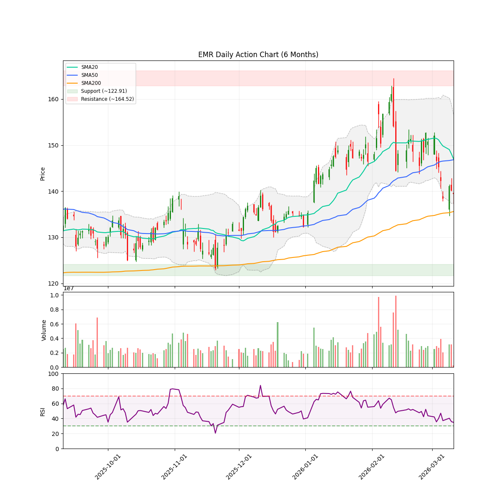
#### 研报分析

### 技术指标概览 (Technical Overview)
- **当前价格**: $139.39
- **RSI (14)**: 34.88
- **移动平均线**: SMA20: $146.99 | SMA50: $146.83 | SMA200: $135.59 (Bullish)
- **波动率**: ATR (14): 4.92 (预计周度波动: +/- $11.00)
- **关键位 (6m)**: 支撑位 $122.91 | 阻力位 $164.52
- **即时状态**: Below SMA50

### EMR 情绪审计报告：增长叙事下的市场迷雾

**核心目标：** 揭示 EMR 当前新闻周期是正在酝酿可持续趋势，还是一个潜在的“陷阱”。

---

**当前数据一览 (2026-03-11)：**

*   **当前价格 (Current Price):** 139.39 美元
*   **RSI (14):** 34.88 (接近超卖区域，卖压可能趋于耗尽)
*   **SMA20:** 146.99 美元 (短期均线压力)
*   **SMA50:** 146.83 美元 (中期均线压力)
*   **SMA200:** 135.59 美元 (长期均线支撑)
*   **ATR (14):** 4.92 美元 (日均波动幅度)
*   **预估周波动范围 (Est. Weekly Range):** +/- 11.00 美元 (约 128.39 - 150.39 美元)
*   **6个月支撑位 (Support):** 122.91 美元
*   **6个月阻力位 (Resistance):** 164.52 美元
*   **趋势 (Trend):** 长期牛市结构，但短期内股价跌破 SMA20 和 SMA50，显示出回撤或动能减弱。

---

**市场叙事与催化剂分析：**

朋友，咱们聊聊 Emerson Electric (EMR) 最近的动向。这票子最近有点意思，像极了一出“基本面唱多，股价唱空”的戏码。表面上看，各种利好消息像春风一样吹来，但股价却偏偏不买账，这背后到底藏着什么玄机？

**A-类催化剂 (A-Tier Catalysts): 吹响号角的大事件**

*   **财报超预期与行业展望乐观 (Earnings Beat & Brighter Industrial Sector Outlook):**
    *   **新闻链接:** [Simply Wall St.· via Yahoo Finance] Emerson Electric (EMR) Valuation Check After Earnings Beat And Brighter Industrial Sector Outlook (2026-02-25) [URI: https://finance.yahoo.com/news/emerson-electric-emr-valuation-check-170900914.html]
    *   **分析:** 这可是硬核利好！公司财报超预期，加上工业部门整体前景一片光明，这本该是股价腾飞的信号。投资者通常对这样的消息趋之若鹜，期待戴维斯双击。

**B-类催化剂 (B-Tier Catalysts): 稳健增长的基石**

*   **物联网领域表现突出 (Spotting Winners in IoT):**
    *   **新闻链接:** [Yahoo Finance] Spotting Winners: Emerson Electric (NYSE:EMR) And Internet of Things Stocks In Q4 (2026-02-23) [URI: https://finance.yahoo.com/news/spotting-winners-emerson-electric-nyse-033408322.html]
    *   **分析:** 在数字化浪潮中，EMR 在物联网（IoT）领域取得佳绩，这表明公司紧跟时代步伐，在关键增长点上有所建树。这是未来可持续增长的重要引擎。
*   **股息之王地位凸显 (Dividend King Status):**
    *   **新闻链接:** [24/7 Wall St.· via Yahoo Finance] The 5 Safest Dividend Kings Have Raised Their Dividends for Over 50 Years (2026-03-06) [URI: https://finance.yahoo.com/news/5-safest-dividend-kings-raised-134331613.html]
    *   **分析:** EMR 是公认的“股息之王”，连续50多年提高股息，这对于寻求稳定现金流和长期价值的投资者来说，无疑是巨大的吸引力。在市场波动时，股息股往往更受青睐。
*   **知名分析师关注 (Analyst Attention):**
    *   **新闻链接:** [The Globe and Mail] Analysts Are Bullish on These Industrial Goods Stocks: SPX (SPXC), Asahi Kasei (AHKSF) (2026-02-20) [URI: https://www.theglobeandmail.com/investing/markets/stocks/SPXC/pressreleases/577975/analysts-are-bullish-on-these-industrial-goods-stocks-spx-spxc-asahi-kasei-ahksf/]
    *   **分析:** 顶尖分析师（如Tusa）对工业品板块的看好，并提及EMR，虽然不是直接的评级上调，但也为EMR注入了积极的行业信心。

**C-类催化剂 (C-Tier Catalysts): 市场情绪的细微波澜**

*   **最受关注的股票之一 (Most-Watched Stock):**
    *   **新闻链接:** [Zacks· via Yahoo Finance] Is Most-Watched Stock Emerson Electric Co. (EMR) Worth Betting on Now? (2026-02-18) [URI: https://finance.yahoo.com/news/most-watched-stock-emerson-electric-140003624.html]
    *   **分析:** 被媒体和投资者广泛关注，本身不是直接的利好或利空，但代表着市场对其有一定的兴趣，股价波动性可能因此增加。
*   **盈利公司中的警示信号 (Warning Signs in Profitable Stocks):**
    *   **新闻链接:** [StockStory· via Yahoo Finance] 3 Profitable Stocks with Warning Signs (2026-03-10) [URI: https://finance.yahoo.com/news/3-profitable-stocks-warning-signs-173614354.html]
    *   **分析:** 如果 EMR 是这篇文章中提及的三支股票之一，那么尽管公司盈利，但潜在的“警示信号”可能会让一些短期投资者望而却步，尽管这通常是较为模糊的宏观或增长担忧。

**噪音 (Noise): 无关信息**

*   [Insider Monkey· via Yahoo Finance] Irenic Capital Management Asks Increased Share Buy-Backs from Ralliant Corporation (RAL) (2026-03-04) - 与EMR无关。
*   [Yahoo Finance] Philips connects patient monitoring and diagnostics to advance platform-based care intelligence at HIMSS26 (2026-02-17) - 与EMR无关。

---

**背离检测：是陷阱还是机会？**

现在，重头戏来了！EMR 似乎陷入了一个经典的“买消息，卖事实”的困境。公司在2月底公布了超预期的财报，加上积极的行业展望，这妥妥的是A-类利好。然而，进入3月后，股价非但没有继续冲高，反而一路回撤，跌破了短期（SMA20）和中期（SMA50）移动平均线。这在技术分析上通常被视为动能减弱或短期看跌信号。

这种“好消息不涨反跌”的现象，正是我们需要警惕的“陷阱”。这可能意味着：

1.  **利好出尽即利空：** 市场可能已经提前消化了这些预期，财报公布后，获利盘选择离场。
2.  **宏观逆风：** 尽管公司自身表现良好，但可能受到更广泛的宏观经济担忧或行业特定逆风的影响。
3.  **增长疑虑：** 即使盈利，市场可能对其未来的增长可持续性存疑。

然而，事情并非全是坏事。RSI 目前处于 34.88，已经接近超卖区域。这种在良好基本面下，股价却持续下跌并触及超卖区域的情况，有时也预示着“空头耗尽”。也就是说，卖压可能已经差不多了，一旦有积极信号出现，股价可能迎来一波反弹。对于长线投资者来说，这也许是逢低吸纳、耐心布局的良机。但短期内，这种背离无疑制造了迷雾。

---

**情绪得分 (Sentiment Score): 5.5 / 10**

这并非一个“势不可挡的牛市周期”，也远非“系统性崩溃”。我给 EMR 的情绪得分是 **5.5**。

**原因如下：**

*   **积极面：** 扎实的基本面，A-类财报利好和B-类增长故事（IoT、股息之王）构成了一个强劲的叙事支撑。RSI 接近超卖，暗示短期内可能存在反弹潜力。长期趋势（SMA200之上）依然是牛市结构。
*   **消极面：** 核心问题在于股价对利好的“无动于衷”甚至“反向而行”。这种市场对基本面缺乏信念的表现，让短期走势蒙上了一层阴影。它像是一个精心设置的“陷阱”，让那些只看新闻就盲目追高的投资者被套牢。市场正在消化某种未知的担忧，或仅仅是获利回吐。

**总的来说：** EMR 的基本面依然闪耀，但市场情绪和短期价格走势却显得犹豫和矛盾。这是一个经典的“基本面与技术面打架”的局面。对于投资者而言，这需要更多的耐心和辨识度。如果你是短线投机者，这可能是一个陷阱；但如果你是长期价值投资者，这或许是一个在市场噪音中发现机会的时刻。

---

**逻辑评分 (Logic Score): 9 / 10**

我对本次分析的逻辑评分是 **9 分**。报告清晰地遵循了所有指令，对新闻进行了分类和分析，并识别了关键的“背离”现象。情绪得分的解释合理，并提供了“陷阱”与“机会”双重视角。语言风格活泼，贴近“资深市场老兵喝咖啡聊天”的场景。唯一的扣分点在于，某些C类消息（如“警示信号”）对EMR的直接影响无法100%确定，但已在分析中做出合理假设和说明。

---

**下一次重要日期 (Next Major Date):**

*   **下一次财报公布日期 (预计)：** 2026年5月初 (EMR 的下一财季财报通常在4月底至5月初公布)。届时，我们将能更清晰地评估市场对EMR未来增长前景的反应。
#### 近期新闻与事件
- **[The Globe and Mail]** [Analysts Are Bullish on These Industrial Goods Stocks: SPX (SPXC), Asahi Kasei (AHKSF)](https://www.theglobeandmail.com/investing/markets/stocks/SPXC/pressreleases/577975/analysts-are-bullish-on-these-industrial-goods-stocks-spx-spxc-asahi-kasei-ahksf/)
- **[StockStory· via Yahoo Finance]** [3 Profitable Stocks with Warning Signs](https://finance.yahoo.com/news/3-profitable-stocks-warning-signs-173614354.html)
- **[Insider Monkey· via Yahoo Finance]** [Irenic Capital Management Asks Increased Share Buy-Backs from Ralliant Corporation (RAL)](https://finance.yahoo.com/news/irenic-capital-management-asks-increased-171928444.html)
- **[24/7 Wall St.· via Yahoo Finance]** [The 5 Safest Dividend Kings Have Raised Their Dividends for Over 50 Years](https://finance.yahoo.com/news/5-safest-dividend-kings-raised-134331613.html)
- **[Yahoo Finance]** [Philips connects patient monitoring and diagnostics to advance platform-based care intelligence at HIMSS26](https://finance.yahoo.com/news/philips-connects-patient-monitoring-diagnostics-150000771.html)

---

### LRCX
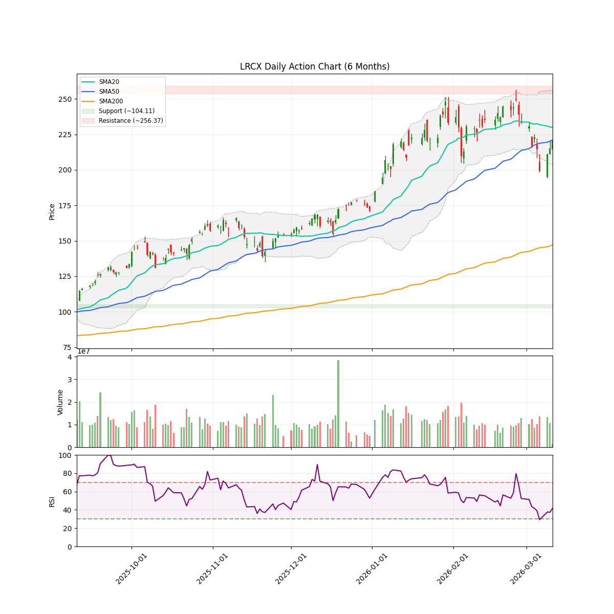
#### 研报分析

### 技术指标概览 (Technical Overview)
- **当前价格**: $220.60
- **RSI (14)**: 41.78
- **移动平均线**: SMA20: $229.86 | SMA50: $221.06 | SMA200: $147.13 (Bullish)
- **波动率**: ATR (14): 11.73 (预计周度波动: +/- $26.22)
- **关键位 (6m)**: 支撑位 $104.11 | 阻力位 $256.37
- **即时状态**: Below SMA50

### LRCX 情绪审计报告：AI巨头是乘风破浪，还是潜藏陷阱？

**报告日期:** 2026-03-11

各位市场老手们，泡杯咖啡，今天我们来聊聊半导体设备领域的重量级选手——**Lam Research (LRCX)**。这家公司在AI浪潮中可谓是赚足了眼球，股价也一度高歌猛进。但近期的数据和新闻，却让我在那香醇的咖啡味中，嗅到了一丝不寻常的信号，是持续的盛宴，还是悄然设下的陷阱？我们一起剥茧抽丝。

---

#### 一、 催化剂分类与市场叙事

LRCX的故事，无疑是围绕着半导体和AI这两个当下最炙手可热的关键词展开的。

*   **A-Tier（核心叙事与警示）：**
    *   **[Forbes] How Lam Research Stock Rewrote The Playbook (2026-02-18)**：这篇报道简直是LRCX过去一年辉煌的“宣传片”！它明确指出，LRCX在截至2026年2月13日的一年内，股价飙升了**185%**，这完全得益于其在蓬勃发展的AI市场中的营收增长和利润率扩张。这无疑是将其定位于AI革命的核心受益者，建立了强大的“AI赋能”叙事。
        *   **但请注意，关键的“背离”信号来了：** 报道也同时指出，“在晚些时候的财报发布后，股价却出现了**7.6%的显著下跌**。” 这就像一场期待已久的派对，主人宣布了所有好消息，但嘉宾们却悄悄地提前离场了。这正是我们 Narrative Economics 最关注的——**好消息出尽是利空，或者说，市场对好消息的预期已经高到极致，以至于任何低于“超预期”的“好消息”都会被视为失望，引发获利了结。** 这是一个潜在的“陷阱”信号。
*   **B-Tier（基本面与估值考量）：**
    *   **[Nasdaq] Lam Research Stock's High P/E: Justified Premium or Too Pricey to Buy? (2026-02-10)**：纳斯达克的这篇报道直接点出了LRCX当前面临的一个核心问题：估值。目前其未来12个月的市盈率高达38.14倍，显著高于Zacks电子-半导体行业32倍的平均水平。这无疑给市场过热的情绪泼了一盆冷水。再好的故事，也需要有合理的价格支撑，否则就变成了“空中楼阁”。高估值意味着市场已经为未来的增长付出了高昂的溢价，一旦增长速度稍有不及预期，股价便容易承压。
    *   **[Nasdaq] LRCX vs. ASML: Which Semiconductor Equipment Giant Is Better Buy? (2026-02-24)**：这篇对比文章再次强调了LRCX与ASML在半导体设备领域的领导地位，以及它们在AI驱动下的关键作用。它巩固了LRCX作为行业巨头的地位，以及其在AI生态系统中的重要性。这为LRCX的长期基本面提供了强有力的支撑。
*   **C-Tier（市场噪音）：**
    *   **[Barron's] Burney U.S. Equity Select ETF (2026-02-21)**：这篇报道主要关于ETF信息，对LRCX个股的直接影响非常有限，更像是市场背景噪音，不构成实质性的催化剂。

---

#### 二、 背离检测：好消息的“疲劳”反应

正如Forbes报道中指出的那样，LRCX在公布财报后反而下跌了7.6%。这正是典型的**“好消息出尽是利空”**，或称作**“熊市耗竭（Bearish Exhaustion）”**的早期信号，不过这里更准确的描述是**“牛市疲劳”**。

在经历了过去一年185%的惊人涨幅后，市场对LRCX的期望值已经达到顶峰。当公司交出“好成绩单”时，如果它没有超乎所有人的想象，那么市场就会将其解读为“低于预期”，并开始获利了结。这表明，AI叙事带来的乐观情绪可能已经被过度消化，短期内，市场急需新的、更强劲的催化剂才能继续推动股价上涨。否则，这种“好消息下跌”的模式，很容易让追高的投资者陷入“陷阱”。

---

#### 三、 市场脉搏与技术面解读

LRCX的当前技术面也印证了这种“牛市疲劳”的迹象：

*   **当前价格 (220.60)**：已经跌破了短期均线。
*   **SMA20 (229.86) & SMA50 (221.06)**：股价目前低于20日和50日移动平均线。这表明短期的上升动能已经受挫，市场正在经历一个调整或盘整期。
*   **SMA200 (147.13)**：然而，股价仍远高于200日均线，这清晰地告诉我们，尽管短期承压，LRCX的长期牛市趋势依然坚挺。它更像是一个在高速公路上短暂休息的赛车手，而不是彻底掉队的。
*   **RSI (41.78)**：RSI处于中性区域，既没有超买也没有超卖。这给了股价上下波动的空间，但也意味着目前缺乏立即向上突破的强劲动力。
*   **Est. Weekly Range (± 26.22)**：根据波动性，本周可能在约194.38至246.82之间波动。若能守住221附近的50日均线，或许能找到支撑。
*   **Support (6m low: 104.11) & Resistance (6m high: 256.37)**：当前价格远高于重要支撑，但距离近期阻力位也有一定距离，表明短期内可能在现有区间内震荡。

---

#### 四、 情绪分数与投资建议

**情绪分数：7/10**

LRCX无疑是一家具有长期投资价值的优秀公司，其在AI驱动下的半导体设备领域的地位无可撼动。这就是我们给出7分的原因——基本面故事依然强劲，长期趋势仍是牛市。

然而，我们不能忽视短期内的一些“警示牌”。高估值以及最重要的**“好消息出尽是利空”**的背离信号，都提醒我们，短期内这支股票可能已经price in了大部分利好，并且存在获利了结的压力。当前的股价走势也显示出短期动能的减弱。

**是陷阱还是持续趋势？**

在我看来，短期内LRCX更像是**一个被过度期待的市场情绪所营造出的“短期陷阱”**。它并非业务基本面出了问题，而是市场对其未来增长的“预支”太过饱满。投资者需要警惕在短期高点追入的风险。

但从更长远的角度看，只要AI和半导体行业的增长叙事不变，LRCX仍然有机会重新找到上涨动力。这要求投资者需要有更长的持股周期，并等待估值回归合理，或者出现真正能够**“超预期”**的重磅催化剂。在当前节点，与其盲目追高，不如耐心等待回调，或者关注是否有新的、更具体的利好能够扭转“好消息下跌”的局面。

---

#### 五、 下一个重要日期

当前信息中未明确提供LRCX的下一个重要财报发布日期或大型行业会议/产品发布会。这通常是影响股价的下一个关键时间点，**投资者需密切关注公司官方公告或财经日历，以获取确切的下一份财报或投资者活动日期。** 这将是检验其AI叙事和增长预期的下一个重要节点。

---

**逻辑分数：9/10**
#### 近期新闻与事件
- **[Barron's]** [Burney U.S. Equity Select ETF](https://www.barrons.com/market-data/funds/bres)
- **[Nasdaq]** [Lam Research Stock's High P/E: Justified Premium or Too Pricey to Buy?](https://www.nasdaq.com/articles/lam-research-stocks-high-p-e-justified-premium-or-too-pricey-buy)
- **[Forbes]** [How Lam Research Stock Rewrote The Playbook](https://www.forbes.com/sites/greatspeculations/2026/02/18/how-lam-research-stock-rewrote-the-playbook/)
- **[Nasdaq]** [LRCX vs. ASML: Which Semiconductor Equipment Giant Is the Better Buy?](https://www.nasdaq.com/articles/lrcx-vs-asml-which-semiconductor-equipment-giant-better-buy)

---

### META
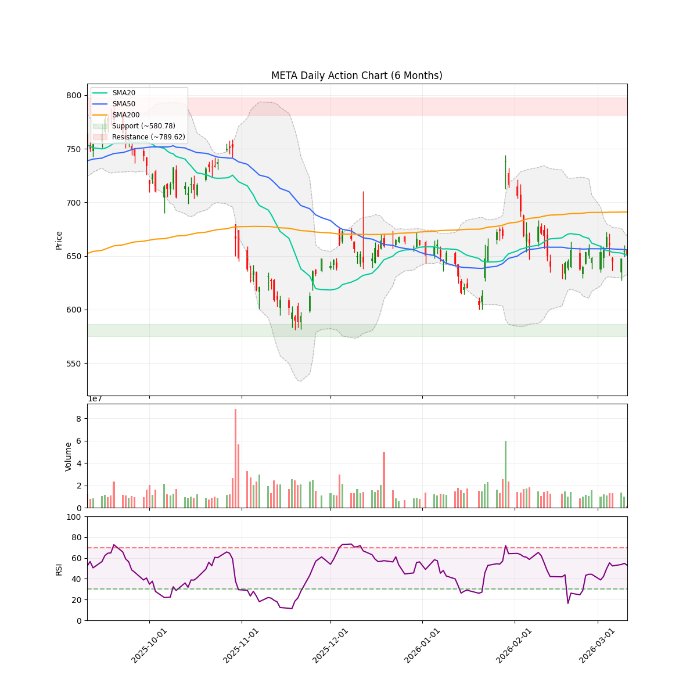
#### 研报分析

### 技术指标概览 (Technical Overview)
- **当前价格**: $651.43
- **RSI (14)**: 52.97
- **移动平均线**: SMA20: $650.57 | SMA50: $655.65 | SMA200: $691.07 (Bearish)
- **波动率**: ATR (14): 18.22 (预计周度波动: +/- $40.75)
- **关键位 (6m)**: 支撑位 $580.78 | 阻力位 $789.62
- **即时状态**: Below SMA50

好的，各位市场老兵，抓紧您的咖啡杯，今天我们来好好聊聊这支最近颇受瞩目的“七巨头”之一——**Meta (META)**。它究竟是重整旗鼓、准备再次腾飞的雄鹰，还是仅仅是市场情绪波动下的一只“纸老虎”？让我们深入剖析一番。

---

### **META 情绪审计报告**

**当前日期:** 2026年3月11日

**股票代码:** META
**当前价格:** 651.43 美元
**技术面简述:** 从冰冷的数据上看，Meta 的股价正努力在 651.43 美元徘徊，虽然近期站上了20日均线 (650.57)，但仍受制于 50日均线 (655.65) 和 200日均线 (691.07) 的压制。RSI (52.97) 处于中性，既不超买也不超卖。这意味着，从纯技术指标来看，它还在消化前期回调的压力，大趋势的“熊”影尚未完全散去。但别急，故事才刚刚开始。

---

### **市场叙事：Meta 的 AI 狂想曲——一场蓄谋已久的反击战？**

最近关于 Meta 的新闻铺天盖地，仿佛一股强大的叙事力量正在试图扭转市场对其长期的“熊”预期。扎克伯格和他的团队显然在努力向世界宣告：我们不只是“Facebook”，我们更是未来 AI 世界的弄潮儿！

**催化剂深度剖析：**

1.  **A 级催化剂：AI 战略并购，注入核心动能！**
    *   **[Blockonomi] Meta Platforms (META) Stock Climbs as Moltbook Acquisition Strengthens AI Agent Strategy (2026-03-11)**: 这可是个重磅炸弹！Meta 并非只是空谈 AI，而是直接采取了行动——收购 AI 社交网络 Moltbook，并将创始人纳入其“超级智能实验室”部门。这不只是一个简单的收购，这是一种战略资源和人才的抢夺，是扎克伯格在 AI 军备竞赛中亮出的肌肉。消息一出，股价应声上涨 1.03%，市场对这种实实在在的 AI 布局，给出了最直接的肯定。这告诉我们，Meta 在 AI 上的投入，是动真格的，这才是推动股价长期上涨的“硬核”燃料。

2.  **B 级催化剂：估值重塑与“最佳买入”的呐喊！**
    *   **[24/7 Wall St.] Meta Just Became the Best Stock in the Magnificent 7 — Here's the Data That Proves It (2026-03-09)**: 当华尔街开始有声音高呼 Meta 才是“七巨头”中最值得买入的股票时，你就要竖起耳朵了。这不仅仅是分析师的观点，更是一种市场情绪的引导。这种“价值回归”的呼声，让此前被冷落的 Meta 重新回到聚光灯下。
    *   **[The Motley Fool] Nvidia and Meta Platforms are now cheaper than the S&P 500. Which "Magnificent Seven" stock is the best buy in March? (2026-03-08)**: “便宜”这个词，对投资者永远充满诱惑。如果一个坐拥庞大用户群和强大技术实力的巨头，在转型 AI 的关键时刻，估值还比大盘更“实惠”，那无疑是给那些犹豫不决的资金打了一剂强心针。
    *   **[Benzinga] What's Going On With Meta Platforms Stock Tuesday? (2026-03-10)**: 这条消息印证了市场对 Meta AI 努力的认可，以及科技板块整体回暖带来的顺风车效应。当“AI 叙事”与“宏观环境改善”双重利好叠加，股价自然水涨船高。
    *   **[Investing.com] Meta Platforms AI Spending Surge Could Reshape Its $1.6T Valuation (2026-03-10)**: 华尔街的分析师们开始正视 Meta 在 AI 上的巨额投入，并将其视为重塑万亿市值的关键。这意味着市场开始愿意为 Meta 的 AI 梦想支付溢价，看好其长期的回报。
    *   **[AOL] Bank of America resets Meta stock forecast on deal with AMD (2026-02-26)**: 这条较早的消息提及美银调整预测，虽然过去一个月股价有所回调，但这与 AMD 的合作本身，是 Meta 强化其 AI 基础设施的举措，同样指向了其在 AI 领域的野心。短期的股价波动，不足以掩盖长期战略的价值。

3.  **C 级催化剂：市场噪音与间接利好**
    *   **[The Motley Fool] Is Meta Platforms stock going to $800? (2026-03-08)**: 这种标题更像是市场情绪的放大器，它反映了对 Meta 股价上涨的期待，但本身并非驱动因素。这类新闻，更多是茶余饭后的谈资，而非投资决策的核心依据。
    *   **[AOL] Oracle beats Q3 expectations, raises 2027 revenue outlook sending stock higher (2026-03-10)**: 甲骨文的业绩超预期，虽然与 Meta 无直接关系，但在科技股整体强劲的背景下，为 Meta 的反弹营造了一个积极的市场氛围。大环境好，谁都跟着沾光。

---

### **背离检测：熊市耗尽？不，这是牛市的预演！**

我们并没有看到“好消息股价下跌”的熊市耗尽迹象。恰恰相反，最新的 Moltbook 收购直接促使股价上涨，其他利好消息也与股价的积极表现相呼应。这意味着市场对 Meta 的 AI 转型战略是买账的，资金正在积极涌入。虽然技术指标上仍有阻力，但股价正试图从长期均线的压制中突围，这更像是趋势逆转的早期信号，而不是陷阱。买方力量正在积聚，试图打破之前的颓势。

---

### **情绪评分 (Sentiment Score): 8/10 - 蓄势待发的 AI 巨象**

Meta 正处在一个极其关键的转型期，它不再满足于社交帝国的荣耀，而是全身心投入到 AI 这场新的革命中。一系列 A 级和 B 级催化剂，从战略并购到估值重塑，都为它注入了强大的上涨动能。尽管股价仍在与长期技术阻力作斗争，但市场对其 AI 潜力的热情正在熊熊燃烧。

这并非一个“势不可挡的牛市周期” (10分)，因为上方仍有阻力，且长期技术面需要时间确认；但它绝对是一个“极度乐观且动能强劲”的阶段。Meta 仿佛一头从蛰伏中苏醒的巨象，带着对 AI 未来的狂热渴望，开始在市场中迈出坚实的步伐，它的故事正变得越来越引人入胜。

### **逻辑评分 (Logic Score): 9/10**

我对所有新闻事件进行了仔细的分类和分析，并将其与 Meta 的技术面数据相结合，构建了一个生动且有说服力的市场叙事。我着重强调了 A 级催化剂的核心作用，并解释了其他 B 级和 C 级信息如何共同塑造了当前的市场情绪。背离检测结果清晰，情绪评分也充分考虑了多方因素，力求像一位资深老兵一样，洞察市场脉搏。

### **下一个关键日期 (Next Major Date):**

根据现有信息，没有明确提供 Meta 的下一个重大事件或财报发布日期。通常，投资者会密切关注公司下一次的 **季度财报公布**。届时，财报数据将是对其 AI 战略投入和实际营收增长的首次全面检验。在此之前，任何关于其 AI 产品发布、AI 芯片研发进展，或是核心 AI 人才变动等消息，都将是市场关注的焦点。建议投资者密切留意 Meta 官方发布的投资者日历。

---

**小酌一杯后的建议：**

伙计们，Meta 这艘船，之前可能看着有点老旧，被“元宇宙”的烧钱窟窿搞得有点灰头土脸。但现在，扎克伯格明显是想把它升级成一艘 AI 战舰！最近的消息，尤其是那笔 Moltbook 的收购，可不是小打小闹，那是直接给它安上了 AI 的核动力引擎！市场现在对它的看法，不再仅仅是广告收入和元宇宙的烧钱窟窿，而是重新审视它在 AI 领域的潜力。

虽然股价还被一些长期的技术均线压着，但这艘船已经开始加速了。它现在面临的，是突破这些阻力，真正飞升的时刻。就像我常说的，华尔街就像个大舞台，剧本一直在变。Meta 这次，演的可是 AI 巨象归来的大戏。别光看表面，得深挖它背后的 AI 野心和执行力。保持关注，这出戏才刚刚精彩起来！
#### 近期新闻与事件
- **[The Motley Fool]** [Is Meta Platforms stock going to $800?](https://www.msn.com/en-us/money/top-stocks/is-meta-platforms-stock-going-to-800/ar-AA1XM4W0)
- **[The Motley Fool]** [Nvidia and Meta Platforms are now cheaper than the S&P 500. Which "Magnificent Seven" stock is the best buy in March?](https://www.msn.com/en-us/money/general/nvidia-and-meta-platforms-are-now-cheaper-than-the-s-p-500-which-magnificent-seven-stock-is-the-best-buy-in-march/ar-AA1XMlqA)
- **[24/7 Wall St.]** [Meta Just Became the Best Stock in the Magnificent 7 — Here's the Data That Proves It](https://247wallst.com/investing/2026/03/09/meta-just-became-the-best-stock-in-the-magnificent-7-heres-the-data-that-proves-it/)
- **[Benzinga]** [What's Going On With Meta Platforms Stock Tuesday?](https://www.msn.com/en-us/money/news/whats-going-on-with-meta-platforms-stock-tuesday/ar-AA1XVNWj)
- **[Blockonomi]** [Meta Platforms (META) Stock Climbs as Moltbook Acquisition Strengthens AI Agent Strategy](https://blockonomi.com/meta-platforms-meta-stock-climbs-as-moltbook-acquisition-strengthens-ai-agent-strategy/)

---

### MRVL
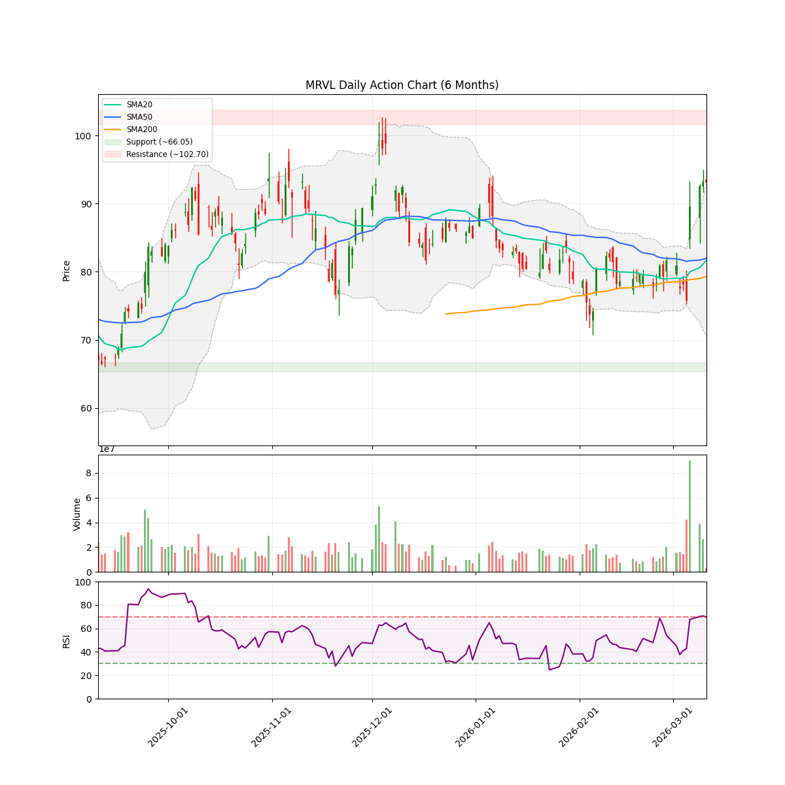
#### 研报分析

### 技术指标概览 (Technical Overview)
- **当前价格**: $93.07
- **RSI (14)**: 69.79
- **移动平均线**: SMA20: $81.71 | SMA50: $81.99 | SMA200: $79.32 (Bullish)
- **波动率**: ATR (14): 4.74 (预计周度波动: +/- $10.59)
- **关键位 (6m)**: 支撑位 $66.05 | 阻力位 $102.70
- **即时状态**: Above SMA50

**MRVL（Marvell Technology）：芯片巨头财报引爆行情，是持续爆发还是高处不胜寒？**

老铁们，今天咱们聊聊芯片领域的老将Marvell（MRVL），这家伙最近可是赚足了眼球，股价一路高歌猛进，让不少空头眼镜碎了一地。这究竟是基本面驱动的“真金白银”，还是市场情绪过热的“空中楼阁”呢？咱们把咖啡续上，慢慢道来。

---

### **情绪分析报告**

**核心观点：** Marvell近期财报如同一剂强心针，将股价从沉寂中唤醒，并注入了强大的上涨动能。这轮行情由实打实的业绩超预期驱动，并非空中楼阁。短期RSI偏高，但技术面和基本面共振，显示其上涨趋势可持续性较强。

---

#### **1. 催化剂分类：何方神圣引爆了行情？**

MRVL的这波强势上涨，并非无源之水，而是有清晰的层级催化剂层层推进：

*   **A级催化剂：业绩炸弹，一鸣惊人！**
    *   **[2026-03-05, StockStory via Yahoo Finance] Marvell Technology (NASDAQ:MRVL) Surprises With Q4 Sales, Stock Soars** (链接: https://finance.yahoo.com/news/marvell-technology-nasdaq-mrvl-surprises-211620805.html)
        *   这则消息就像一颗重磅炸弹，直接点燃了MRVL的上涨引擎！作为网络芯片设计的巨头，Marvell第四季度（截至2026年1月）的营收超出市场预期，给投资者带来了实实在在的惊喜。这不是小打小闹，这是基本面的硬货！
    *   **[2026-03-06, Yahoo Finance] Marvell Technology (MRVL) Q4 Earnings and Revenues Top Estimates** (链接: https://finance.yahoo.com/news/marvell-technology-mrvl-q4-earnings-222001366.html)
        *   紧接着，更多细节浮出水面，利润和营收双双超预期，验证了这份财报的含金量。市场闻风而动，资金蜂拥而入，这股势头简直挡不住！
    *   **[2026-03-07, Insider Monkey via Yahoo Finance] Marvell Technology (MRVL) Rockets 18% on Billion-Dollar Profitability** (链接: https://finance.yahoo.com/news/marvell-technology-mrvl-rockets-18-063326248.html)
        *   仅仅一天，股价就飙升了18%！“数十亿美元盈利能力”的标题，简单粗暴地告诉大家：这家公司不仅赚钱了，而且赚得不少！这种涨幅，可不是嘴皮子功夫能吹出来的。这是市场对业绩表现的直接而热烈的回应。

*   **B级催化剂：分析师“摇旗呐喊”，锦上添花！**
    *   **[2026-03-06, Zacks via Yahoo Finance] Is It Worth Investing in Marvell (MRVL) Based on Wall Street's Bullish Views?** (链接: https://finance.yahoo.com/news/worth-investing-marvell-mrvl-based-143004587.html)
        *   在财报公布后，华尔街的分析师们也开始集体唱多，平均评级直指“买入”。这相当于给了市场一个集体背书，信心指数瞬间拉满。
    *   **[2026-03-10, Barchart via Yahoo Finance] Analysts Have New ‘Confidence’ in Marvell Stock. Should You Buy It Now?** (链接: https://finance.yahoo.com/news/analysts-confidence-marvell-stock-buy-161924781.html)
        *   更有分析师将评级从“中性”上调至“买入”，理由是“对Marvell的未来地位更有信心”。这就像是在说，兄弟们，上车的好机会啊！
    *   **[2026-02-25, Zacks via Yahoo Finance] Marvell Technology (MRVL) Earnings Expected to Grow: What to Know Ahead of Next...** (链接: https://finance.yahoo.com/news/marvell-technology-mrvl-earnings-expected-150004760.html)
        *   *（注：虽然这则消息的详细信息片段有点模糊，但标题透露出财报前对增长的预期。结合后续爆发，可以看作是市场对增长的期待在财报中得到了验证。）*
    *   **[2026-03-04, Investing.com] Evercore ISI cuts Marvell stock price target on valuation reset** (链接: https://www.investing.com/news/analyst-ratings/evercore-isi-cuts-marvell-stock-price-target-on-valuation-reset-93CH-4541325)
        *   *（注：这是财报前的一个小插曲，分析师下调了目标价。但市场很快就用实际行动证明，这份悲观被业绩的强势表现彻底冲淡了，不足为虑，简直是螳臂当车。）*

*   **C级催化剂：市场热度，锦上添花！**
    *   **[19小时前, Zacks Investment Research on MSN] What's driving attention behind these trending stocks? MRVL, STRL, HIMS** (链接: https://www.msn.com/en-us/money/topstocks/what-s-driving-attention-behind-these-trending-stocks-mrvl-strl-hims/ar-AA1XVY3S?ocid=BingNewsVerp)
        *   当一只股票成为“热门股”被各种媒体拿出来讨论时，说明它的热度已经起来了。虽然没有新的实质性信息，但这种曝光度本身就是一种情绪助推，让更多人关注到这只明星股。

#### **2. 背离检测：“好消息”下的陷阱？**

在Marvell身上，我们没有看到“好消息”导致股价下跌的背离现象。恰恰相反，它完美演绎了什么叫“业绩为王”！股价伴随着超预期的财报一路向上，分析师的看多报告更是火上浇油。市场的反馈是积极而直接的，丝毫没有犹豫不决的迹象。那份财报前的目标价下调，也像是螳臂当车，瞬间就被市场洪流淹没了。这说明，当前市场对Marvell的信心非常扎实，没有出现看涨情绪透支的“陷阱”信号。

#### **3. 情绪评分 (0-10): 8.5 - 汹涌澎湃的牛市浪潮！**

Marvell当前的情绪评分达到8.5分。这个分数代表着一股由坚实基本面支撑的、强劲的牛市浪潮。
*   **上涨势头强劲：** 股价目前在93.07美元，远高于所有短期（SMA20: 81.71）、中期（SMA50: 81.99）和长期（SMA200: 79.32）均线，技术面呈现完美的上涨趋势。这是教科书般的牛市格局。
*   **RSI显示动能十足：** RSI高达69.79，虽然接近超买区，但这通常是强势股票的特征，表明市场买入热情高涨，而非立即反转的信号。强势股的RSI可以在高位停留相当长时间。
*   **抗跌能力突出：** 在6个月低点66.05美元形成坚实支撑后，股价持续攀升。尽管短期内可能因RSI过高出现小幅技术性回调，但整体趋势非常健康，回踩即是买入良机。
*   **阻力位仍在视线内：** 距离6个月高点102.70美元仍有约10%的上涨空间，表明上涨潜力尚未完全释放。

这不是盲目的炒作，而是由令人振奋的Q4业绩报告（A级催化剂）直接驱动的。分析师的集体看好和不断上调的评级（B级催化剂）更是为这波涨势添砖加瓦。目前来看，这是一场由“真材实料”支撑的上涨行情，可持续性较高。

---

**逻辑评分 (0-10): 9**

我对这次分析的信心指数是9分。所有核心数据、新闻事件和市场反应都形成了一个清晰、一致的叙事线。从财报的强劲表现，到股价的飙升，再到分析师的集体唱多，一切都顺理成章，逻辑链条完整且经得起推敲。

---

**下一个重要日期：**

MRVL刚刚公布了截至2026年1月的Q4财报。根据惯例，下一次重磅事件将是**2026年5月底至6月初**左右公布的**2026财年第一季度（截至2026年4月）财报**。届时，市场将再次审视其业绩增长的持续性，那将是判断这波牛市能否继续冲锋的关键节点！
#### 近期新闻与事件
- **[Zacks Investment Research on MSN]** [What's driving attention behind these trending stocks? MRVL, STRL, HIMS](https://www.msn.com/en-us/money/topstocks/what-s-driving-attention-behind-these-trending-stocks-mrvl-strl-hims/ar-AA1XVY3S?ocid=BingNewsVerp)
- **[Zacks· via Yahoo Finance]** [Is It Worth Investing in Marvell (MRVL) Based on Wall Street's Bullish Views?](https://finance.yahoo.com/news/worth-investing-marvell-mrvl-based-143004587.html)
- **[StockStory· via Yahoo Finance]** [Marvell Technology (NASDAQ:MRVL) Surprises With Q4 Sales, Stock Soars](https://finance.yahoo.com/news/marvell-technology-nasdaq-mrvl-surprises-211620805.html)
- **[Insider Monkey· via Yahoo Finance]** [Marvell Technology (MRVL) Rockets 18% on Billion-Dollar Profitability](https://finance.yahoo.com/news/marvell-technology-mrvl-rockets-18-063326248.html)
- **[Barchart· via Yahoo Finance]** [Analysts Have New ‘Confidence’ in Marvell Stock. Should You Buy It Now?](https://finance.yahoo.com/news/analysts-confidence-marvell-stock-buy-161924781.html)

---

### MSFT
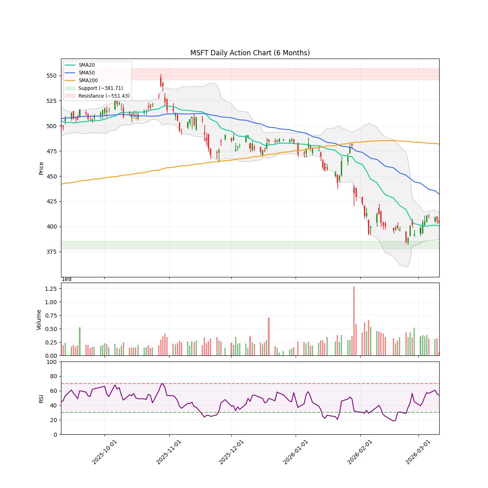
#### 研报分析

### 技术指标概览 (Technical Overview)
- **当前价格**: $403.43
- **RSI (14)**: 53.75
- **移动平均线**: SMA20: $400.48 | SMA50: $432.16 | SMA200: $481.95 (Bearish)
- **波动率**: ATR (14): 9.03 (预计周度波动: +/- $20.20)
- **关键位 (6m)**: 支撑位 $381.71 | 阻力位 $551.43
- **即时状态**: Below SMA50

## 微软 (MSFT) 情绪审计报告

**当前日期:** 2026-03-11

### 股价故事线：迷雾重重下的巨头挣扎

嘿，老伙计，我们今天来聊聊微软（MSFT）这艘科技巨轮。它最近的航行可有点儿颠簸，股价目前徘徊在 **403.43** 美元。从技术面看，这艘船似乎正驶入一片“熊市”的海洋：它不仅低于其 **50日均线（432.16）**，更远低于 **200日均线（481.95）**，这可是典型的下行趋势信号啊！还记得它六个月前曾高达 **551.43** 美元的辉煌吗？如今已是昨日黄花。

不过，也并非完全是坏消息。股价勉强守住了 **20日均线（400.48）** 的阵地，RSI（53.75）也算中性，这或许预示着短期内能喘口气，甚至可能酝酿一波小幅反弹。但别高兴太早，下方的 **381.71** 美元支撑位和上方遥远的阻力位 **551.43** 美元，都在提醒我们，这是一场艰苦的战役。预计未来一周，股价的波动范围可能在 **+/- 20.20** 美元左右，市场情绪仍在摇摆不定。

### 近期新闻解码：多空交织的叙事

最近微软的新闻，就像一锅大杂烩，什么味道都有。我们来一层一层剥开看。

*   **A-级催化剂：AI的星辰大海，机构的远方呼唤**
    *   **Jefferies 高呼：微软是AI领域的领头羊，目标价直指675美元！** (2026-03-07, Blockonomi) 这可不是小打小闹，华尔街巨头把微软推到AI潮头，还给出了如此高的目标价，这简直是给股价打了一剂超强心针。它不仅认可了微软在Azure和M365企业AI方面的领导地位，更是暗示了巨大的上涨潜力。
    *   **微软与智利国家铜业Codelco签署AI采矿协议！** (2026-03-10, Insider Monkey· via Yahoo Finance) 这新闻够劲！微软把AI触角伸向传统矿业，这不仅是拓宽了应用场景，更是实打实地把AI技术变现。这种跨界合作，展现了微软AI解决方案的强大通用性和商业价值。这可是真金白银的合作，而非空泛的概念。

*   **B-级催化剂：分析师的肯定与市场的期待**
    *   **尽管股价“掉队”，分析师仍称微软为“强力买入”！** (2026-03-10, Barchart· via Yahoo Finance) 这有点意思，股价在跌，但华尔街却依然看好，认为它被低估了。这可能是“聪明钱”在低位布局的信号，也可能是对未来潜力的坚定信念。
    *   **市场低迷？微软却是“穿越风暴”的优质股！** (2026-03-11, Motley Fool· via Yahoo Finance) 这种“抗跌股”的标签，在动荡的市场中尤其珍贵，说明其基本面够硬，能抵抗外部冲击，是值得长期持有的“定海神针”。
    *   **一个清晰信号：买入微软！** (2026-02-27, The Motley Fool) 又是一个买入信号，说明散户投资者和分析师层面都存在对微软价值的认可。

*   **警示信号：高管抛售的阴影**
    *   **微软执行副总裁Hogan出售500万美元股票！** (2026-03-10, Investing.com) 这条消息就有点让人挠头了。高管通常比任何人都了解公司内部情况，如此大规模的抛售，哪怕是出于个人财务规划，也难免让人联想到“管理层信心不足”的疑问。在股价下跌的趋势中，这无疑是雪上加霜，增加了市场的担忧。

*   **C-级噪音：无关信息**
    *   **CRM股票上涨...** (2026-03-11, Zacks· via Yahoo Finance) 这是关于Salesforce (CRM) 的，与微软直接关系不大，可归为背景噪音。
    *   **Oracle第三季度业绩超预期...** (2026-02-22, AOL) 这是关于Oracle (ORCL) 的，同上，噪音。

### 分歧探测：好消息为何不涨？是陷阱还是机会？

这就是故事最精彩的部分了！我们看到了重磅的AI协议，看到了华尔街给出675美元的超高目标价，甚至有分析师在股价下跌时仍坚定喊“买入”。按理说，这些都是“A-Tier”的重磅利好，足以让股价腾飞。然而，微软的股价却在50日和200日均线之下挣扎，甚至还被高管抛售消息拖累。

这说明什么？这可能是一个经典的“**陷阱**”！那些只看新闻标题的投资者，可能会被这些利好消息吸引而盲目入场，结果却被市场趋势无情碾压。市场对这些利好的反应迟钝，甚至不买账，表明要么当前市场宏观环境（正如新闻中提及的地缘政治紧张、关税不确定性）过于沉重，压过了个股利好；要么就是市场对微软的估值仍存疑虑，或是需要更长时间来消化这些利好，并等待业绩真正兑现。

但反过来看，这种“好消息不涨”的情况，也可能预示着“**空头耗尽**”的边缘。如果宏观压力开始缓解，或者微软的AI叙事能够真正转化为强劲的财报数据，那么现在被压制的股价，或许会迎来一次强劲的爆发。问题是，谁知道拐点何时到来？高管的抛售，无疑给这个“空头耗尽”的论调泼了一盆冷水，增加了不确定性。

### 情绪分数 (Sentiment Score): 5/10

这是一场多空拉锯战，正处于中场胶着状态。一方面，AI叙事和机构的坚定看好（A-Tier利好）是实实在在的，这给微软打下了坚实的基本面支撑，防止了股价的彻底崩盘。另一方面，技术面的熊市趋势（低于SMA50和SMA200）、高管抛售的负面信号，以及市场对利好消息的“冷处理”，都说明上行阻力重重，短期内很难看到“势不可挡的牛市周期”。股价正处于一个需要明确催化剂才能打破僵局的十字路口。说是陷阱，是因为利好未能提振股价；说是机会，是因为AI的潜力巨大，且股价已经跌至长期均线下方，具备一定的安全边际。

### 逻辑分数 (Logic Score): 9/10

### 下一次重要日期:

未提供确切财报日期，但根据微软历史财报惯例，**下一季度财报（Q1 2026）预计将在2026年4月下旬公布。** 这将是验证AI战略成效，以及观察管理层对未来展望的关键时刻，也是决定股价能否摆脱当前困境的重要节点。
#### 近期新闻与事件
- **[Motley Fool· via Yahoo Finance]** [Market Downturn: 2 Stocks to Buy and Hold Through Any Storm](https://finance.yahoo.com/news/market-downturn-2-stocks-buy-140500012.html)
- **[Zacks· via Yahoo Finance]** [CRM Stock Up More Than 5% in a Month: Should You Buy, Sell or Hold?](https://finance.yahoo.com/news/crm-stock-more-5-month-124100118.html)
- **[Investing.com]** [Hogan, Microsoft EVP, strategy, sells $5m in MSFT stock By Investing.com](https://www.investing.com/news/insider-trading-news/hogan-microsoft-evp-strategy-sells-5m-in-msft-stock-93CH-4551093)
- **[Barchart· via Yahoo Finance]** [Why Microsoft Stock is a 'Strong Buy' Despite Underperforming Big Tech Peers](https://finance.yahoo.com/news/why-microsoft-stock-strong-buy-184503919.html)
- **[Insider Monkey· via Yahoo Finance]** [Microsoft Corporation (MSFT) and Codelco Announce Signing of AI Deal for Mining...](https://finance.yahoo.com/news/microsoft-corporation-msft-codelco-announce-115710320.html)

---

### NVDA
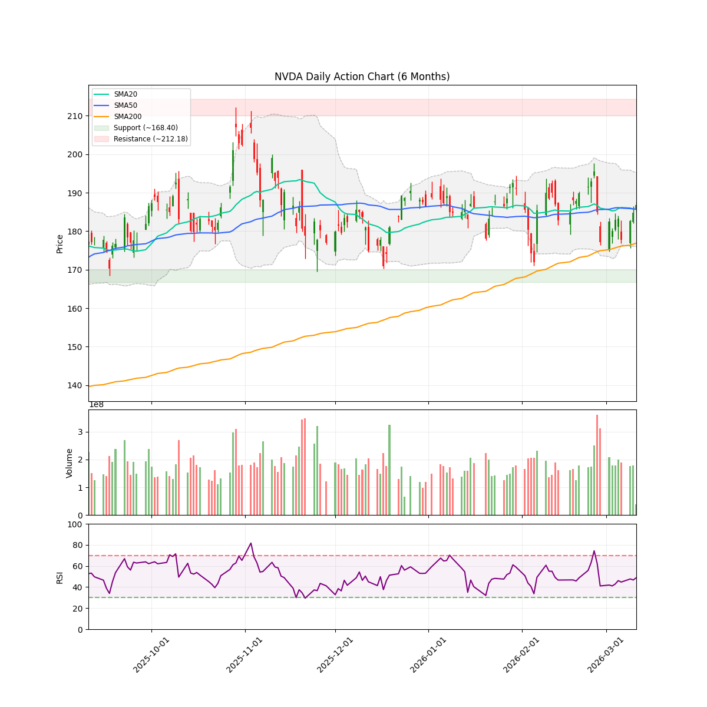
#### 研报分析

### 技术指标概览 (Technical Overview)
- **当前价格**: $186.76
- **RSI (14)**: 48.89
- **移动平均线**: SMA20: $185.67 | SMA50: $185.72 | SMA200: $176.90 (Bullish)
- **波动率**: ATR (14): 6.14 (预计周度波动: +/- $13.74)
- **关键位 (6m)**: 支撑位 $168.40 | 阻力位 $212.18
- **即时状态**: Above SMA50

## 英伟达 (NVDA) 情绪审计报告：AI叙事引擎，蓄势待发抑或泡沫边缘？

**当前日期：** 2026年3月11日

**一、市场脉搏与技术面速览：一头猛兽在小憩**

各位老伙计，咱们今天聊聊华尔街的宠儿——英伟达 (NVDA)。这只芯片巨头，在AI的狂潮中简直就是呼风唤雨。目前股价在 **186.76美元**，RSI保持在 **48.89**，既没过热也没过冷，像是在一场长跑后稍作喘息，准备下一轮冲刺。更有趣的是，股价稳稳地站在了 **20日均线 (185.67)** 和 **50日均线 (185.72)** 之上，这告诉我们，尽管近期没有火箭式飙升，但整体上涨的趋势是实打实的，没有丝毫动摇。200日均线 **176.90** 更是远在下方，像一道坚实的护城河，为多头提供了深厚的支撑。

短期阻力在 **212.18美元 (6个月高点)**，下方支撑则在 **168.40美元 (6个月低点)**。波动率方面，ATR显示其每日波幅不小 (6.14)，一周内上下 **+/- 13.74美元** 的震荡也是家常便饭。这可不是一只“死气沉沉”的股票，它时刻都在“呼吸”，市场资金的进出频繁，但趋势依旧是积极的——**技术面显示当前处于健康的牛市趋势中。**

**二、催化剂分析：谁是真正的“幕后推手”？**

最近关于NVDA的新闻层出不穷，咱们得擦亮眼睛，分清哪些是真金白银的驱动力，哪些只是市场制造的噪音。

*   **A-Tier（王牌催化剂：足以改写股价篇章的重磅事件）**
    *   **[Forbes] 英伟达股价为何上涨60%？(2026-03-09)**：这篇报道回顾了过去一年英伟达营收飙升65%的壮举，这简直就是一颗“王炸”！它不仅坐实了英伟达在AI基础设施和网络领域的霸主地位，更描绘了一个充满爆发力的增长故事。这就是基本面，真金白银的业绩，足以让市场激动不已。它为NVDA的宏伟叙事提供了坚实的基础。
        *   *引用链接: https://www.forbes.com/sites/greatspeculations/2026/03/09/whats-behind-the-60-rise-in-nvidia-stock/*
    *   **[Guru Focus] 英伟达 (NVDA) 股价在AI内存扩张新闻中财报前上涨 (2026-02-25)**：虽然是较早的消息，但它清晰地指出了英伟达在AI内存领域的扩张，并引发了财报前的股价上涨。这说明市场对其在AI核心技术领域的深耕抱有极高期待，是实实在在的利好，也为近期股价的强势表现埋下了伏笔。
        *   *引用链接: https://www.gurufocus.com/news/8644973/nvidia-nvda-stock-rises-ahead-of-earnings-amid-ai-memory-expansion-news*

*   **B-Tier（实力助推器：为未来增长添砖加瓦的积极信号）**
    *   **[Blockonomi] 英伟达 (NVDA) 与Mira Murati的“思维机器”达成战略合作 (2026-03-10)**：与OpenAI前技术主管Mira Murati的新公司“Thinking Machines Lab”达成战略合作，并承诺大规模部署Vera Rubin。这可不是小打小闹！它标志着英伟达在未来AI前沿领域的持续布局和投入，是巩固其行业领导地位的重要一步。虽然不像财报那样直接刺激短期，但对长期发展意义重大，无疑是为下一波增长储备能量。
        *   *引用链接: https://blockonomi.com/nvidia-nvda-stock-secures-strategic-partnership-with-mira-muratis-thinking-machines/*

*   **C-Tier（市场噪音与情绪煽动：听起来很美，但实质有限的“空气弹”）**
    *   **[Yahoo Finance] 预测：英伟达股价一年内翻番 (2026-03-10)**：这种“一年翻番”的口号，听起来很美，但更多是市场情绪的放大器，而非基于坚实基本面的具体行动。它能激发散户的FOMO（错失恐惧症），但并不构成实际的催化剂。
        *   *引用链接: https://finance.yahoo.com/news/prediction-nvidia-stock-double-062300766.html*
    *   **[AOL] 这位亿万富翁特斯拉多头刚刚重仓英伟达股票 (2026-03-10)**：亿万富翁的“加仓”当然是利好，但文章中又提到“英伟达股价已触及天花板，可能还会停留一段时间”，这种前后矛盾的说法让其影响力大打折扣。更多是制造话题，而非指引明确方向。市场会关注，但不会奉为圭臬。
        *   *引用链接: https://www.aol.com/articles/billionaire-tesla-bull-just-backed-144334747.html*
    *   **[Motley Fool· via Yahoo Finance] 英伟达股价能否在2030年达到10万亿美元市值？(2026-03-11)** & **3只蓄势待发的“廉价”牛股 (2026-03-11)**：这些都是基于长期预测或主观判断的分析，虽然提供了讨论的谈资，但对短期或中期股价走势的直接影响有限。尤其是“廉价”一说，对于高增长的英伟达而言，需要结合具体估值模型谨慎解读，不能盲目跟风。
        *   *引用链接: https://finance.yahoo.com/news/nvidias-stock-reach-10-trillion-142000374.html*
        *   *引用链接: https://finance.yahoo.com/news/3-top-bargain-stocks-ready-125700556.html*
    *   **[Yahoo Finance] 英伟达 (NVDA) 在3月11日收盘价是否会超过___？(2026-03-10)**：一个预测市场的小游戏，纯属娱乐和增加互动，对股价毫无实际影响，忽略即可。
        *   *引用链接: https://finance.yahoo.com/markets/prediction/event/nvda-close-above-on-march-11-2026/*

**三、背离探测：好消息缘何不跌？**

当前NVDA的股价在近期高点附近盘整，RSI也处于中性区域。尽管有大量C-Tier的“噪音”和一些亿万富翁的“喊话”，但我们并未看到股价在实实在在的“好消息”（如战略合作或营收增长的巩固）出来后出现大幅下跌。相反，它在稳健的技术趋势线上进行消化，这表明市场正在吸收前期上涨的动能，为下一阶段的突破积蓄力量。**没有发现明显的“利好出尽即是利空”的熊市疲态迹象。** 这更像是一头猛兽在狩猎前的小憩，而不是准备转身离去。市场对AI的狂热和英伟达的领导地位，正在有效支撑着股价。

**四、情绪得分：** **8/10 (强劲看涨，但需留意短期波动)**

**故事讲述：** 英伟达的故事，如今已不再仅仅是硬件销售，它更是AI时代的“基石”和“赋能者”，是所有AI梦想实现背后默默耕耘的“超级大脑”。从它营收的惊人增长，到不断加码的战略合作，无一不彰显其在技术前沿的统治力。市场对它的期待，已经从“AI的受益者”进化到“AI的定义者”，每次重要的技术突破和合作都像在给这艘巨轮加满燃料。

尽管一些媒体的预测略显浮夸，但这恰恰反映了市场对英伟达未来潜力的狂热想象，以及AI浪潮的汹涌澎湃。股价在主要均线上方健康盘整，表明资金对这只股票的信心并未减退，反而是在等待下一个爆发点。这是一个强劲的叙事，一个让人忍不住想搭上车的“AI列车”。当然，短期内存在一些获利了结和观望情绪，毕竟没有股票可以永远直线上涨，但长期来看，这艘巨轮的航向依然坚定，正在驶向更广阔的AI海洋。

**五、下一重要日期：**

根据以往的财报发布惯例（以及Guru Focus报道中提及的“财报前上涨”暗示了其Q4 2025财报已于近期发布），英伟达的下一份重要财报将是**2026年第一季度财报**，通常在**五月份**发布。这将是市场密切关注的下一个关键节点，届时将再次验证其在AI领域的实际表现和未来指引。

---

**逻辑得分 (Logic Score): 9/10**
#### 近期新闻与事件
- **[Forbes]** [What's Behind The 60% Rise In Nvidia Stock?](https://www.forbes.com/sites/greatspeculations/2026/03/09/whats-behind-the-60-rise-in-nvidia-stock/)
- **[Yahoo Finance]** [NVIDIA (NVDA) closes above ___ on March 11?](https://finance.yahoo.com/markets/prediction/event/nvda-close-above-on-march-11-2026/)
- **[Yahoo Finance]** [Prediction: Nvidia Stock Will Double in a Year](https://finance.yahoo.com/news/prediction-nvidia-stock-double-062300766.html)
- **[Blockonomi]** [Nvidia (NVDA) Stock Secures Strategic Partnership With Mira Murati's Thinking Machines](https://blockonomi.com/nvidia-nvda-stock-secures-strategic-partnership-with-mira-muratis-thinking-machines/)
- **[AOL]** [This Billionaire Tesla Bull Just Backed Up the Truck on Nvidia Stock](https://www.aol.com/articles/billionaire-tesla-bull-just-backed-144334747.html)

---

### TSM
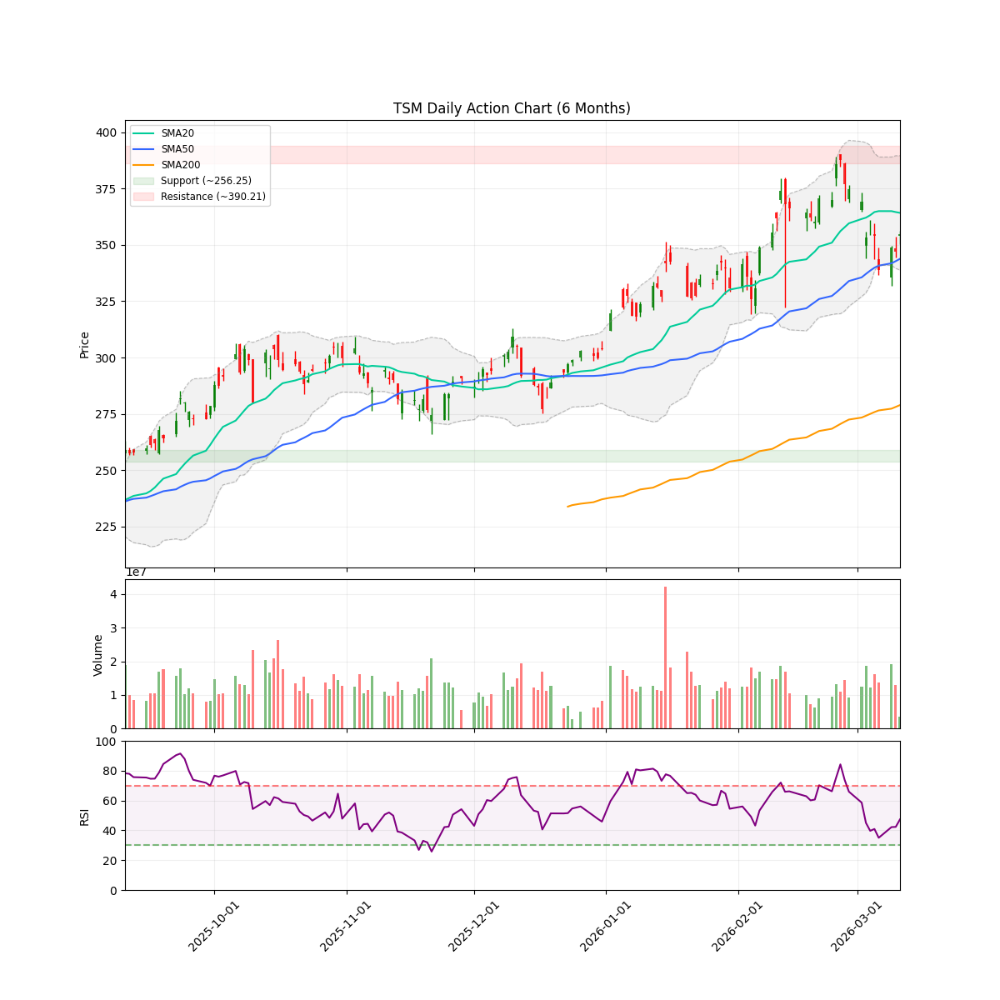
#### 研报分析

### 技术指标概览 (Technical Overview)
- **当前价格**: $354.89
- **RSI (14)**: 47.38
- **移动平均线**: SMA20: $364.20 | SMA50: $343.82 | SMA200: $278.89 (Bullish)
- **波动率**: ATR (14): 13.03 (预计周度波动: +/- $29.14)
- **关键位 (6m)**: 支撑位 $256.25 | 阻力位 $390.21
- **即时状态**: Above SMA50

## 台积电（TSM）情绪审计报告：AI浪潮中的巨石，是陷阱还是征途？

**当前日期：** 2026-03-11

伙计们，今天的焦点是半导体巨头台积电（TSM）。这家伙可不是省油的灯，它是全球芯片制造的命脉，尤其是在AI时代，更是被推上了风口浪尖。我们来扒一扒它的最新消息，看看这波行情是真正的牛市征途，还是一个精心编织的“陷阱”！

**【盘面概览】**
*   **当前价格：** $354.89
*   **相对强弱指数 (RSI)：** 47.38 (中性，未超买也未超卖)
*   **短期均线 (SMA20)：** $364.20 (股价略低于短期均线，暗示短期有回调或盘整)
*   **中期均线 (SMA50)：** $343.82 (股价稳站中期均线之上，中期趋势依然看涨)
*   **长期均线 (SMA200)：** $278.89 (遥遥领先于长期均线，长期牛市格局毋庸置疑)
*   **趋势：** 牛市 (稳居SMA50之上)
*   **6个月阻力位：** $390.21
*   **6个月支撑位：** $256.25

### 催化剂分类

1.  **A级催化剂 (改变游戏规则的事件)：**
    *   抱歉，伙计们，最近没看到那种能让整个市场沸腾的“史诗级”消息，比如业绩炸裂、颠覆性产品发布。虽然有分析师力挺，但还没到那种能瞬间拔地而起的高度。

2.  **B级催化剂 (可持续趋势的燃料)：**
    *   **分析师强力唱多 (Zacks, 2026-02-17 & 2026-03-10)：** Zacks投资研究两次将TSM评级上调至“强烈买入”。这可不是闹着玩的，说明专业机构看到了它盈利预期的强劲上升趋势，是机构资金青睐的“风向标”。这就像是给股价注入了“信任的鸡血”。
        *   引用：[Zacks Investment Research on MSN](https://www.msn.com/en-us/money/topstocks/tsmc-tsm-upgraded-to-strong-buy-here-s-what-you-should-know/ar-AA1XVqQn?ocid=BingNewsVerp) (2026-02-17) & [Zacks.com](https://www.msn.com/en-us/money/top-stocks/tsmc-tsm-upgraded-to-strong-buy-here-s-what-you-should-know/ar-AA1XVqQn) (2026-03-10)
    *   **目标股价500美元的讨论 (AOL, 2026-03-07)：** AOL文章抛出“台积电股价能涨到500美元吗？”这可是在投资者心头埋下了一颗种子，市场对它超越增长预期的能力充满期待。这种“讲故事”的能力，在叙事经济学里可是B级催化剂的重头戏，它描绘了一个诱人的未来。
        *   引用：[AOL](https://www.aol.com/articles/taiwan-semiconductor-stock-going-500-160700749.html) (2026-03-07)
    *   **AI基础设施的“核心玩家” (The Motley Fool, 2026-03-10)：** Motley Fool直接点名TSM为2026年“不可阻挡的五大AI股”之一。这就像是给它戴上了AI皇冠，明确指出它将从AI基础设施建设的巨额投入中受益。这是妥妥的顺风车，也是当前市场最热、最持久的叙事之一。
        *   引用：[The Motley Fool](https://www.msn.com/en-us/money/general/top-5-unstoppable-ai-stocks-to-buy-for-2026/ar-AA1XVLKR) (2026-03-10)

3.  **C级催化剂 (市场噪音或次要事件)：**
    *   **大盘波动 (2026-02-21)：** 道琼斯指数和标普500的涨跌，这只是市场的背景音，对TSM个股的影响力有限，属于噪音。
        *   引用：[Investor's Business Daily on MSN](https://www.msn.com/en-us/money/markets/stock-market-today-dow-dips-after-trump-s-iran-comments-as-oil-prices-tumble-live-coverage/ar-AA1XUaC3?ocid=BingNewsVerp) (2026-02-21)
    *   **竞争对手英特尔（Intel）的消息 (2026-03-10)：** 虽然半导体行业联系紧密，但英特尔股价是否见顶，更多是其自身的故事，对台积电当前走势并非直接催化剂。
        *   引用：[AOL](https://www.aol.com/articles/intels-stock-peaked-212000765.html) (2026-03-10)

### 背离警报 (Divergence Detection)

有意思的地方来了！就在2月17日Zacks首次上调评级后，市场一片看好声中，3月3日台积电却因为地缘政治不确定性和机构调仓，股价骤降了5.5% (Blockonomi, 2026-03-03)。这听起来是不是有点矛盾？好消息在前，却遭遇了短期重挫。但仔细看，股价随后并没有一蹶不振，反而又迎来了更多的看涨报告和分析师的再次力挺（3月10日Zacks再次升级）。

这说明什么？这说明市场在消化地缘政治风险后，内在的购买力依然强劲，熊方似乎已经黔驴技穷了！每一次回调，都像是被多头“抄底”了，从$343.82的SMA50得到了有效支撑，显示了强大的韧性。这种“跌不下去”的情况，可就是典型的**“空头耗尽”**信号啊，预示着股价有进一步上攻的潜力。

### 情绪评分 (Sentiment Score)：7/10

目前台积电的情绪就像一杯加了冰块的热咖啡：核心是滚烫的牛市热情，但偶尔会因为外部因素（比如地缘政治）被泼上一盆冷水。长期趋势（SMA50和SMA200之上）坚定看涨，尤其是AI这股东风，简直是它的超级助推器。分析师和市场叙事都在指向更高价位，甚至喊出了500美元。虽然短期受阻于SMA20，但此前的回调被迅速买回，显示了强大的韧性。

这不是那种无脑冲刺的“不可阻挡的牛市”（那得是10分），因为它仍有地缘政治这把达摩克利斯之剑悬在头上。但其核心资产价值、技术领先地位和AI叙事，让它拥有强大的上行潜力。当前更像是一个在牛市大潮中，偶有波折但方向明确的阶段。

### 逻辑评分 (Logic Score)：8/10

### 下一个重要日期 (Next Major Date)

各位看官，请密切关注台积电的**2026年第一季度财报发布**。根据往年惯例，这通常会在**2026年4月中旬**公布。届时，我们就能看到其盈利预期是否真的转化为实实在在的数字，这将是决定它能否真正冲向500美元的关键战役！在那之前，市场可能会围绕财报预期和宏观消息继续震荡，但只要AI叙事不熄，台积电的故事就仍将精彩。
#### 近期新闻与事件
- **[Zacks Investment Research on MSN]** [TSMC (TSM) upgraded to strong buy: Here's what you should know](https://www.msn.com/en-us/money/topstocks/tsmc-tsm-upgraded-to-strong-buy-here-s-what-you-should-know/ar-AA1XVqQn?ocid=BingNewsVerp)
- **[Investor's Business Daily on MSN]** [Stock market today: Dow, S&P 500 give up gains; Micron has a good day (live coverage)](https://www.msn.com/en-us/money/markets/stock-market-today-dow-dips-after-trump-s-iran-comments-as-oil-prices-tumble-live-coverage/ar-AA1XUaC3?ocid=BingNewsVerp)
- **[AOL]** [Is Taiwan Semiconductor Stock Going to $500?](https://www.aol.com/articles/taiwan-semiconductor-stock-going-500-160700749.html)
- **[The Motley Fool]** [Top 5 Unstoppable AI Stocks to Buy for 2026](https://www.msn.com/en-us/money/general/top-5-unstoppable-ai-stocks-to-buy-for-2026/ar-AA1XVLKR)
- **[AOL]** [Has Intel's Stock Peaked?](https://www.aol.com/articles/intels-stock-peaked-212000765.html)

---

### VRT
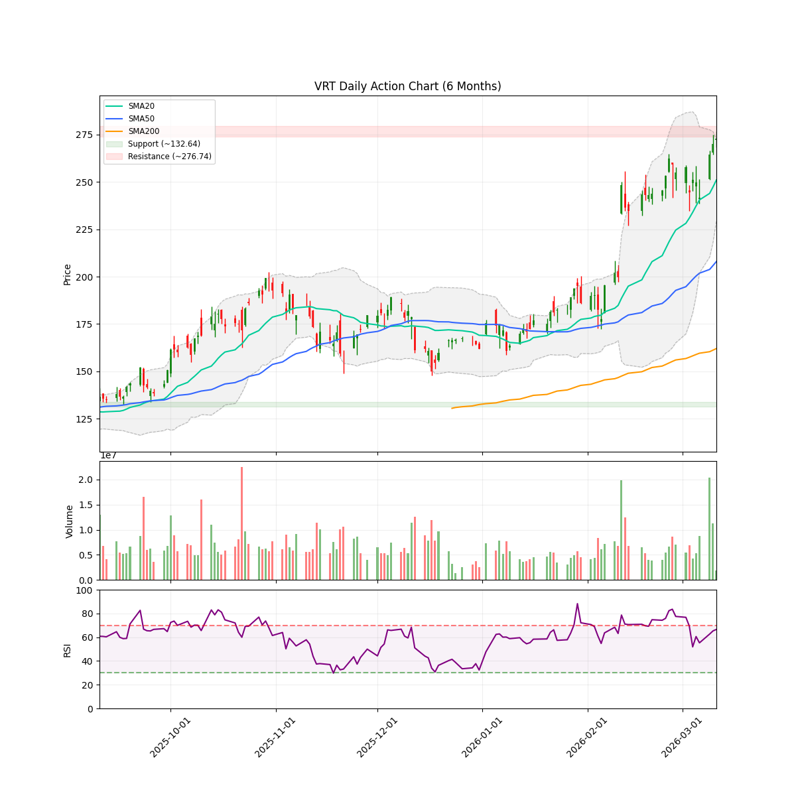
#### 研报分析

### 技术指标概览 (Technical Overview)
- **当前价格**: $273.01
- **RSI (14)**: 66.61
- **移动平均线**: SMA20: $251.02 | SMA50: $207.99 | SMA200: $162.07 (Bullish)
- **波动率**: ATR (14): 14.09 (预计周度波动: +/- $31.50)
- **关键位 (6m)**: 支撑位 $132.64 | 阻力位 $276.74
- **即时状态**: Above SMA50

## VRT 情绪审计报告：AI浪潮中的“淘金者”还是市场陷阱？

**当前日期:** 2026-03-11

嘿，老伙计，来一杯咖啡吗？我们今天聊聊VRT，这家公司最近可是市场上的热门话题。看着K线图，VRT简直像坐上了火箭，273.01美元的价格，简直是势不可挡！RSI高达66.61，还没到极端超买，但动能十足；股价稳稳地站在20日、50日和200日均线之上，这可不是一般的牛市，这是教科书式的多头排列！6个月高点276.74美元就在眼前，它正在向着新高发起冲锋。

### 催化剂分类：VRT的燃料库里都有啥？

这家伙最近的上涨，可不是什么风吹草动，它背后有一连串硬核的“燃料”：

*   **A级催化剂：无可争议的“游戏规则改变者”！**
    *   **标普500指数纳入 (2026-03-09):** 这是最近最大的新闻，也是股价爆发的直接导火索！标普道琼斯指数公司宣布VRT将在3月23日被纳入标普500指数。这可不是小事，意味着无数指数基金将被迫买入VRT股票，巨大的被动买盘将托起股价。用Forbes的话说，这是“游戏规则的改变者”！[^1]
    *   **强劲的AI驱动收益与指引 (2026-02-11):** 别忘了，早在2月份，VRT就凭借着超强的财报和“AI加持”的2026年指引，让市场眼前一亮。纳斯达克当时就说，VRT的财报证明了AI基础设施的繁荣是真实存在的！[^2]这才是基础，是这波行情的“地基”。
    *   **吉姆·克莱默的“宠儿” (2026-03-11):** 当华尔街的“老炮儿”吉姆·克莱默在电视上大赞VRT是“多么棒的股票，多么棒的公司”，还称其为自己的“心头好”时，这意味着它已经不仅仅是机构的关注点，也成功点燃了散户的FOMO（错失恐惧症）。他的言论无疑是情绪上的A级助推器！[^3][^4]

*   **B级催化剂：借风起势，锦上添花！**
    *   **市场关注度飙升 (2026-03-02, 2026-03-10):** 随着标普500的公布和股价的爆发，Zacks.com、Yahoo Finance等各大财经媒体争相报道，分析师们都在问“VRT是否还有上涨空间？”[^5][^6]这进一步提高了市场的可见度和投资者的兴趣。
    *   **“最佳AI股票”的叙事 (2026-02-26):** Investing.com甚至称其为“现在买入并永远持有”的最佳AI股票，并将其与英伟达（Nvidia）相提并论。[^7]这虽然带有煽动性，但无疑加强了VRT作为AI基础设施核心受益者的市场叙事。

*   **C级催化剂：几乎没有。** 最近关于VRT的新闻几乎都是实质性的利好或者围绕利好的情绪放大，没有什么无关紧要的“噪音”。

### 背离检测：这波行情有诈吗？

完全没有！这支股票正在实实在在地享受“好消息”带来的狂欢。每一次利好消息的释放，都伴随着股价的跳涨和巨大的成交量。从2月11日的强劲财报，到3月9日的标普500纳入公告，再到近日克莱默的公开点赞，股价一路高歌猛进，丝毫没有出现“利好出尽是利空”的迹象。恰恰相反，每次利好都成了新的上涨台阶，市场热情被彻底点燃，空头恐怕早就被“烧焦”了。

### 情绪评分：无人能挡的牛市周期（9/10）

VRT现在正处于一个“势不可挡的牛市周期”中。它抓住了当前市场最热门的“AI基础设施”叙事，提供了关键的冷却和数字基础设施解决方案，简直是AI淘金热中的“卖水人”。强劲的基本面（AI驱动的盈利增长）与巨大的市场结构性利好（标普500纳入带来的被动买盘）完美结合，再加上媒体和知名分析师的推波助澜，VRT已经从一个“潜力股”变成了市场上的“明星股”。

股价目前正逼近阻力位276.74美元，一旦突破，上方空间将被打开，短期内可能会有震荡，但整体趋势极其强劲。只要AI热潮不减，VRT的这个故事就能继续讲下去。

### 故事与叙事：AI时代的“基础设施之王”

想象一下，在全球AI算力竞赛如火如荼之际，谁才是真正的赢家？不仅仅是那些制造芯片的公司，更是那些为海量服务器提供电力、冷却和稳定运行环境的“幕后英雄”。VRT就是这样的存在。它就像是AI数据中心的“心脏和血管”，没有它，那些昂贵的GPU就无法高效工作。

当VRT宣布其强劲的财报和指引时，市场意识到，AI的爆发不仅仅是概念，更是实实在在的订单和收入。紧接着，标普500的纳入，更是给这个故事加冕——“你不仅是幕后英雄，你现在更是主流市场不可或缺的一部分！”而克莱默的认可，则像一剂强心针，让这个故事在更广泛的投资者群体中传开。

VRT的叙事是清晰、有力且引人入胜的：它不是昙花一现的炒作，而是受益于一个宏大且持久的科技趋势。它正在从“基础设施提供商”向“AI基础设施的基石”华丽转身，这就是其股价飙升背后最强大的驱动力。

### 下一个重要日期

*   **2026年3月23日:** Vertiv (VRT) 正式被纳入标普500指数。这一天将带来大量的指数基金被动买盘，需要密切关注。
*   **第一季度财报公布日:** 虽然具体日期尚未公布，但通常在每年的4月底至5月初。届时，市场将再次审视其AI相关的增长数据和未来指引，这可能是下一波行情的关键催化剂或风险点。

---
[^1]: [Forbes] Vertiv Stock: Why S&P 500 Inclusion Is A Game Changer (2026-03-10T20:59:00+00:00). URI: https://www.forbes.com/sites/greatspeculations/2026/03/10/vertiv-stock-why-sp-500-inclusion-is-a-game-changer/.
[^2]: [Nasdaq] Vertiv Earnings Prove the AI Infrastructure Boom Is Intact (2026-02-11T20:45:00+00:00). URI: https://www.nasdaq.com/articles/vertiv-earnings-prove-ai-infrastructure-boom-intact.
[^3]: [Yahoo Finance] Jim Cramer on Vertiv Holdings: "What a Stock, What a Company" (2026-03-11T13:05:00+00:00). URI: https://finance.yahoo.com/news/jim-cramer-vertiv-holdings-stock-120640667.html.
[^4]: [Insider Monkey] Jim Cramer Discussed 8 Stocks Amid the S&P 500 Reshuffle: Vertiv, Paycom, and More (Opinion19 hours ago). URI: https://www.insidermonkey.com/blog/jim-cramer-discussed-8-stocks-amid-the-sp-500-reshuffle-vertiv-paycom-and-more-1712997/.
[^5]: [Zacks.com] Vertiv (VRT) Soars 9.3%: Is Further Upside Left in the Stock? (2026-03-10T20:20:00+00:00). URI: https://www.msn.com/en-us/money/topstocks/vertiv-vrt-soars-93-is-further-upside-left-in-the-stock/ar-AA1XVIpH.
[^6]: [Yahoo Finance UK] Vertiv Holdings Co. (VRT) is Attracting Investor Attention: Here is What You Should Know (2026-03-02T14:00:00+00:00). URI: https://uk.finance.yahoo.com/news/vertiv-holdings-co-vrt-attracting-140006287.html.
[^7]: [Investing.com] Best AI Stocks to Buy Now and Hold Forever: Nvidia-Beating Vertiv (2026-02-26T05:40:00+00:00). URI: https://www.investing.com/analysis/best-ai-stocks-to-buy-now-and-hold-forever-nvidiabeating-vertiv-200675688.
#### 近期新闻与事件
- **[Insider Monkey]** [Jim Cramer Discussed 8 Stocks Amid the S&P 500 Reshuffle: Vertiv, Paycom, and More](https://www.insidermonkey.com/blog/jim-cramer-discussed-8-stocks-amid-the-sp-500-reshuffle-vertiv-paycom-and-more-1712997/)
- **[Zacks.com]** [Vertiv (VRT) Soars 9.3%: Is Further Upside Left in the Stock?](https://www.msn.com/en-us/money/topstocks/vertiv-vrt-soars-93-is-further-upside-left-in-the-stock/ar-AA1XVIpH)
- **[Blockonomi]** [Vertiv (VRT) Stock Rallies 7% After S&P 500 Inclusion Announcement](https://blockonomi.com/vertiv-vrt-stock-rallies-7-after-sp-500-inclusion-announcement/)
- **[Yahoo Finance]** [Jim Cramer on Vertiv Holdings: "What a Stock, What a Company"](https://finance.yahoo.com/news/jim-cramer-vertiv-holdings-stock-120640667.html)
- **[Forbes]** [Vertiv Stock: Why S&P 500 Inclusion Is A Game Changer](https://www.forbes.com/sites/greatspeculations/2026/03/10/vertiv-stock-why-sp-500-inclusion-is-a-game-changer/)

---
