# 每日股市市场报告 (2026-03-12)

> **免责声明**: 本报告由 **代码与 Gemini AI 自动生成**，仅供研究参考，**不构成**任何投资建议。投资有风险，入市需谨慎。作者及 AI 不对任何基于此内容的投资决策承担责任。

## 📑 目录
[TOC]

##  长期投资逻辑
本组合旨在捕捉 **人工智能（AI）与半导体协议** 带来的跨周期结构性增长，核心投资策略聚焦于“确定性”与“物理瓶颈”：
- **底层制程垄断 (Foundry & WFE Moats)**：
  布局处于全球半导体精密制造顶端的“工业母机”级别公司。寻找具备极高准入门槛的晶圆代工及前道设备供应商，作为全产业链最稳固的底座资产。
- **算力稀缺性与连接带宽 (Compute & Interconnect Scarcity)**：
  聚焦在高性能计算芯（HPC）及高带宽连接领域占据主导地位的标的。AI 的终极竞争是“规模”，寻找能有效解决数据交换瓶颈并提供核心推理/训练能力的算力巨头。
- **应用生态与数据霸权 (Platform & Data Sovereignty)**：
  布局拥有闭环生态、海量高质量私有数据及云基础设施的科技巨头。它们是 AI 商业化落地的最终守门人，拥有将技术转化为持续现金流的分配权。
- **物理边界保障 (Power & Thermal Infrastructure)**：
  关注 AI 扩张的“最终瓶颈”——电力供应与热能管理。重点布局为下一代超大规模数据中心提供高功率密度能源、液冷技术及电网扩容方案的能源基建商。
**风控策略**：利用 AlphaJAX 的量化动量评分（Quant Score）作为过滤器，结合 LLM 叙事审计（Narrative Audit）捕捉“业绩超预期 + 叙事逻辑改善”的共振点，实现跨周期的超额收益。

 **注：排序权重**：Ticker 按照 AI 检测出的 **方向** 排序（**看多**优先，其次是 **中性**，最后是 **看空**）。
---

<!-- DISCORD_SUMMARY_START -->
## 🧠 对冲基金经理全局诊断与资金分配策略
# 首席投资官战略指令 (2026-03-12)

## 一、 指挥官意图 (Commander's Intent)
目前的市场正处于**“AI基建叙事的深呼吸期”**。虽然大盘受地缘政治和油价波动干扰出现剧烈震荡，但核心逻辑并未动摇。我们当下的任务是：**保住胜果，优化结构，并向更高胜率的标的集中火力。**

账户目前最大的风险点在于 **AMD 的极端集中度 (50.56%)**。虽然它是 AI 基础设施的核心，但技术面跌破 SMA50 表明短期动能已衰竭。我们必须严格执行**“50% 警戒线”**，在 AMD 重新夺回 SMA50 之前，禁止任何形式的加仓，并准备在跌破 SMA200 时进行防御性减持。

同时，我们握有 $6.4 万现金，这是一把随时可以切入战场的利刃。我们将动用部分资金布局逻辑分极高（8.5+）的 **MRVL** 和 **AVGO**，将单一的 AMD 风险分散到整个 AI 算力链条中。

---

## 二、 持仓诊断与调仓逻辑

### 1. AMD (逻辑分：6.8 | 现有占比：50.56%) —— **【极限预警，持股待变】**
*   **诊断**：AMD 目前正顶着我们 50% 的持仓天花板。虽然长期 AI 叙事没变，但跌破 $216 (SMA50) 说明短期多头已经撤退。
*   **指令**：**严禁加仓。** 现有的 $200 Put 卖出头寸需密切观察，若跌破 $190 (SMA200)，必须减掉正股仓位以释放风险，绝不允许 AMD 跌入深渊时拖累全盘。

### 2. AMZN (逻辑分：6.5 | 现有占比：1.77%) —— **【潜伏观察】**
*   **诊断**：成本价 $201 极具优势，目前处于 CapEx 投入的“阵痛期”，但 Seth Klarman 等老钱的入场提供了底气。
*   **指令**：**卧倒不动。** 这点仓位是火种，等待 AWS 增速重新点燃股价，暂不加仓。

### 3. GOOGL (逻辑分：5.5 | 现有占比：20.99%) —— **【战术性持有】**
*   **诊断**：浮盈 +16% 是账户的缓冲垫。RSI 38 接近超卖，但跌破 SMA50 显示趋势走弱。
*   **指令**：**继续持有，但不追肥。** 它是我们的现金奶牛，如果出现系统性风险，它是第一批被缩减以换取流动性的标的。

---

## 三、 观察池建仓行动计划

**现金动用计划：拟动用 $40,000 (约 62% 可用现金)**

### 1. MRVL (Marvell) —— **【主力突击】**
*   **逻辑分：8.8**
*   **理由**：财报炸裂，黄金交叉已现，是目前半导体板块中叙事最完整、动能最强劲的标子。
*   **计划**：动用 **$25,000** 现金。在 $85-$89 区间分批建仓，捕捉其作为“AI 传动系统”的溢价。

### 2. AVGO (Broadcom) —— **【重装支援】**
*   **逻辑分：8.5**
*   **理由**：AI 芯片收入翻倍，且具备“股息贵族”潜质。股价守住 SMA50，属于强势整理。
*   **计划**：动用 **$15,000** 现金。在 $330-$335 附近切入。

### 3. MU (Micron) —— **【财报博弈】**
*   **逻辑分：7.8**
*   **理由**：花旗银行在 3/18 财报前发出了冲锋号。
*   **计划**：若 MRVL/AVGO 成交顺利且大盘企稳，余下资金可在财报前轻仓试探。

---

## 四、 确定性交易计划 (Actionable Plan)

1.  **即刻执行**：
    *   以市价或限价 $89.00 建立 **MRVL** 仓位 (约 280 股)。
    *   以市价或限价 $335.00 建立 **AVGO** 仓位 (约 45 股)。
2.  **AMD 防御线**：
    *   设置 **$189.50** 的条件单，若触发，减持 100 股 AMD 正股，回笼现金。
3.  **现金管理**：
    *   完成上述操作后，账户现金应保持在 **$2.4 万** 左右 (约占 NAV 10%)，以应对突发地缘政治黑天鹅。

---

## 五、 If-Then 风险预案 (Scenario Planning)

*   **场景 A：大盘回补缺口，半导体全线反弹**
    *   **If**: AMD 重新收复 $216 (SMA50) 且交易量放大。
    *   **Then**: 维持现状，不做任何减持，让利润奔跑。
*   **场景 B：中东局势恶化，油价破 $110**
    *   **If**: 大盘系统性回调，GOOGL 利润回撤至 5% 以内。
    *   **Then**: 斩断 GOOGL，全力保住现金，等待半导体标的（NVDA, TSM）回踩 SMA200 的“终极黄金坑”机会。
*   **场景 C：AMD 财报或指引暴雷**
    *   **If**: AMD 跌破 $190。
    *   **Then**: 强制斩仓至 30% 占比以下。**纪律大于信仰。**

**PM 最后寄语：** “AMD 现在是背水一战，我们不能把所有的赌注都押在一个失去短期动能的巨人身上。引入 MRVL 和 AVGO 是为了在保持 AI 进攻性的同时，分散被单一公司拖累的风险。记住，活下去，才能在 AI 黎明到来时有子弹收割。”
<!-- DISCORD_SUMMARY_END -->
---

## 💼 现有持仓个股诊断

### AMD
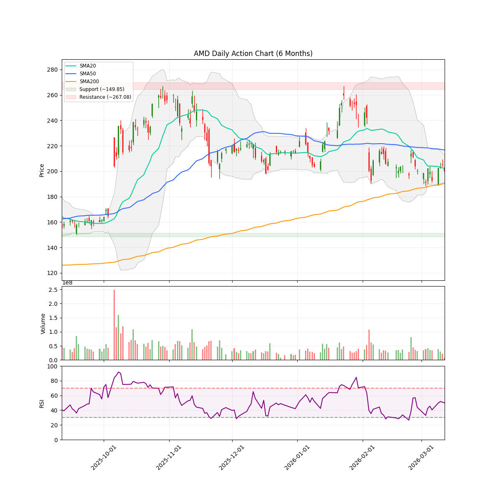
#### 研报分析

### 技术指标概览 (Technical Overview)
- **当前价格**: $200.02
- **RSI (14)**: 49.92
- **移动平均线**: SMA20: $201.97 | SMA50: $216.61 | SMA200: $190.44 (Bullish)
- **波动率**: ATR (14): 9.28 (预计周度波动: +/- $20.76)
- **关键位 (6m)**: 支撑位 $149.85 | 阻力位 $267.08
- **即时状态**: Below SMA50

使用 Gemini API 时出错: 503 UNAVAILABLE. {'error': {'code': 503, 'message': 'This model is currently experiencing high demand. Spikes in demand are usually temporary. Please try again later.', 'status': 'UNAVAILABLE'}}。(已切换至简易启发式分析)
#### 近期新闻与事件
- **[Forbes]** [Is AMD Stock Overvalued?](https://www.forbes.com/sites/greatspeculations/2026/03/11/is-amd-stock-overvalued/)
- **[The Motley Fool]** [Meet the Super Semiconductor Stock Obliterating Nvidia, AMD, and Broadcom Right Now](https://www.fool.com/investing/2026/03/11/meet-super-semiconductor-stock-nvidia-amd-broadcom/)
- **[Invezz]** [Why AMD stock is surging over 2%](https://invezz.com/news/2026/03/09/why-amd-stock-is-surging-over-2/)
- **[The Motley Fool]** [Why Advanced Micro Devices Stock Plummeted 15.4% Last Month and Has Inched Lower in March](https://www.msn.com/en-us/money/markets/why-advanced-micro-devices-stock-plummeted-154-last-month-and-has-inched-lower-in-march/ar-AA1XFaJ3)
- **[Blockonomi]** [Advanced Micro Devices (AMD) Stock Surges 5% Following Xanadu Quantum Investment News](https://blockonomi.com/advanced-micro-devices-amd-stock-surges-5-following-xanadu-quantum-investment-news/)

---

### AMZN
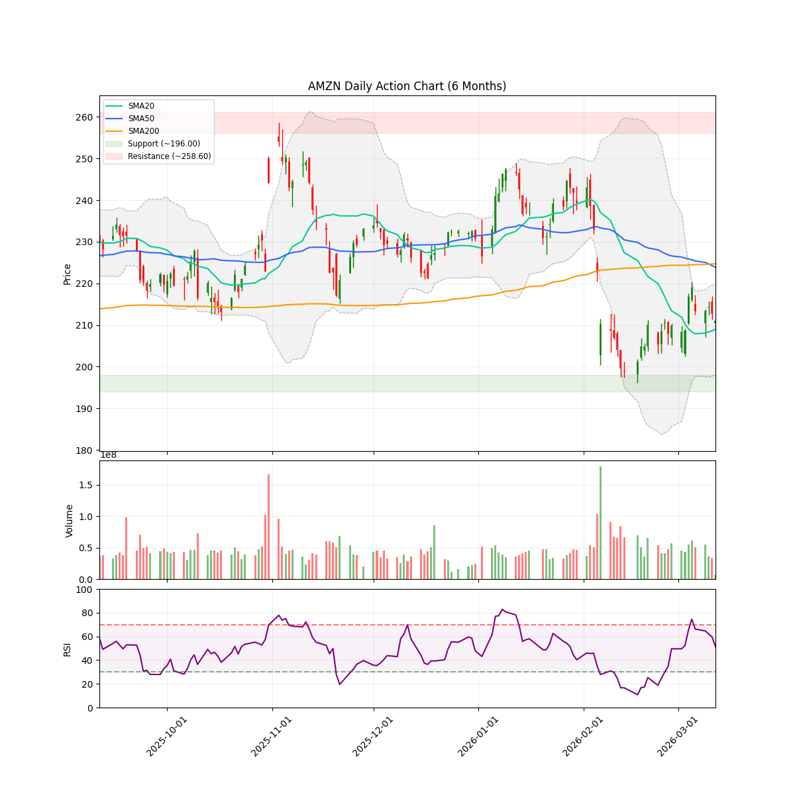
#### 研报分析

### 技术指标概览 (Technical Overview)
- **当前价格**: $211.05
- **RSI (14)**: 51.26
- **移动平均线**: SMA20: $208.97 | SMA50: $223.83 | SMA200: $224.70 (Bearish)
- **波动率**: ATR (14): 5.77 (预计周度波动: +/- $12.89)
- **关键位 (6m)**: 支撑位 $196.00 | 阻力位 $258.60
- **即时状态**: Below SMA50

# AMZN 情绪审计报告：在“基建焦虑”与“巨头野心”的夹缝中寻找光亮

**日期：** 2026年03月12日
**分析师：** 叙事经济学研究员 (Hedge Fund Research Associate)
**标的：** AMZN (亚马逊)
**当前市价：** $211.05

---

### 1. 叙事脉络：繁荣背后的“成长的烦恼”

坐下来喝杯咖啡，咱们聊聊亚马逊。现在的 AMZN 给人的感觉就像是一个正在经历青春期二次发育的巨人：个头在蹿（CapEx 投入惊人），但骨骼有点酸痛（股价横盘、趋势偏弱）。

现在的市场叙事被一种**“基建焦虑症”**统治着。亚马逊计划投入 2000 亿美元用于数据中心和 AI 基础设施，这笔钱大到让短视的投机者手抖。但你发现了吗？在这个价位，真正的“老钱”开始入场了。当大家还在纠结下周的波动时，像 Seth Klarman 这样的价值猎人已经砸下 5 亿美元悄悄建仓。

现在的 AMZN，不是在衰退，而是在“换引擎”。

---

### 2. 催化剂分级 (Catalyst Categorization)

*   **A-Tier (核心驱动):**
    *   **亿万富翁背书：** Seth Klarman 在 2025 年 Q4 狂买 5 亿美元，这种级别的机构增持是典型的“长线底气”。
    *   **AI 军备竞赛：** 2000 亿美元的 CapEx 投入虽然短期压制现金流，但它是未来十年 AWS 统治地位的门票。
*   **B-Tier (业务扩张):**
    *   **巴西“闪电战”：** [Amazon Now 进军巴西](https://finance.yahoo.com/news/amazon-amzn-launches-amazon-now-205729221.html) 推出 15 分钟配送。这证明了其物流机器在国际市场的可复制性与统治力。
    *   **女股神增持：** [Cathie Wood 持续买入](https://finance.yahoo.com/news/cathie-wood-still-buying-181820469.html)，虽然木头姐近几年名声毁誉参半，但她对高增长叙事的敏感度依然是市场的风向标。
*   **C-Tier (市场噪音):**
    *   各类“人生必买的成长股”媒体软文。这类消息属于情绪背景音，对股价实质推动有限。

---

### 3. 背离检测与盘面解读

**技术面警示：** 尽管好消息不少，但 AMZN 目前股价（$211.05）依然运行在 50 日均线（$223.83）和 200 日均线（$224.70）下方。
*   **看跌详述：** 这是一个典型的“好消息不涨”的背离期。市场在消化巨大的 CapEx 支出压力，短期趋势依然由空头掌控。
*   **情绪韧性：** 尽管处于看跌趋势，但 RSI 位于 51.26 的中性位置，且股价在 200 美元上方表现出极强的防御性。目前的下跌更像是“蓄势”而非“崩塌”。

---

### 4. 情绪得分 (Sentiment Score)

#### **6.5 / 10**

> **逻辑诊断：** 
> 亚马逊正处于“蓄力期”。逻辑得分之所以没给到 8 分以上，是因为技术形态尚未修复（破了年线），且巨大的资本开支对短期利润率有压制。但 6.5 分代表了坚实的底部逻辑：你的持仓成本在 $201.61，基本踩在了近半年的支撑位附近。只要 $196.00 的 6 个月低点不破，这就是一个“用时间换空间”的优质博弈。

---

### 5. 给持仓者的“悄悄话”

你目前的仓位（20 股，浮盈 +4.16%）非常舒服。你不是在山顶接盘的人，而是在巨头调整期入场的潜伏者。

*   **不要被每天 2%-3% 的波动吓跑。** 
*   **关注一个指标：** 只要 AWS 的增长速度能覆盖住那 2000 亿的投入成本，任何回踩 200 美元以下的机会都是给长线投资者的“礼物”。

---

### 6. 关键时点预测

*   **下一个重大日期：** **2026年4月30日左右 (Q1 财报发布日)**
    *   *注：具体日期需以官方公告为准。* 届时市场将屏息以待，看那巨额的 CapEx 投入是否已经开始转化为实际的收入增速，尤其是巴西新业务和 AI 算力出租的利润反馈。

---

**引述来源：**
- [Cathie Wood 持续买入](https://finance.yahoo.com/news/cathie-wood-still-buying-181820469.html)
- [Seth Klarman 5亿美金建仓](https://blockonomi.com/amazon-amzn-stock-billionaire-seth-klarman-buys-500m-in-q4-after-trimming-alphabet-position/)
- [巴西 15 分钟配送上线](https://finance.yahoo.com/news/amazon-amzn-launches-amazon-now-205729221.html)
#### 近期新闻与事件
- **[Yahoo Finance]** [Cathie Wood Is Still Buying Amazon Stock. Should You?](https://finance.yahoo.com/news/cathie-wood-still-buying-amazon-181820469.html)
- **[Motley Fool· via Yahoo Finance]** [Is Amazon Stock a Once-in-a-Decade Buying Opportunity?](https://finance.yahoo.com/news/amazon-stock-once-decade-buying-132500738.html)
- **[Insider Monkey· via Yahoo Finance]** [Amazon (AMZN) Launches ‘Amazon Now’ in Brazil with 15-Minute Delivery](https://finance.yahoo.com/news/amazon-amzn-launches-amazon-now-205729221.html)
- **[Motley Fool· via Yahoo Finance]** [2 Growth Stocks to Buy and Hold Forever](https://finance.yahoo.com/news/2-growth-stocks-buy-hold-091000900.html)
- **[Motley Fool· via Yahoo Finance]** [Is Amazon Stock Overvalued or Dirt Cheap? Here's the 1 Metric That Matters](https://finance.yahoo.com/news/amazon-stock-overvalued-dirt-cheap-175100564.html)

---

### GOOGL
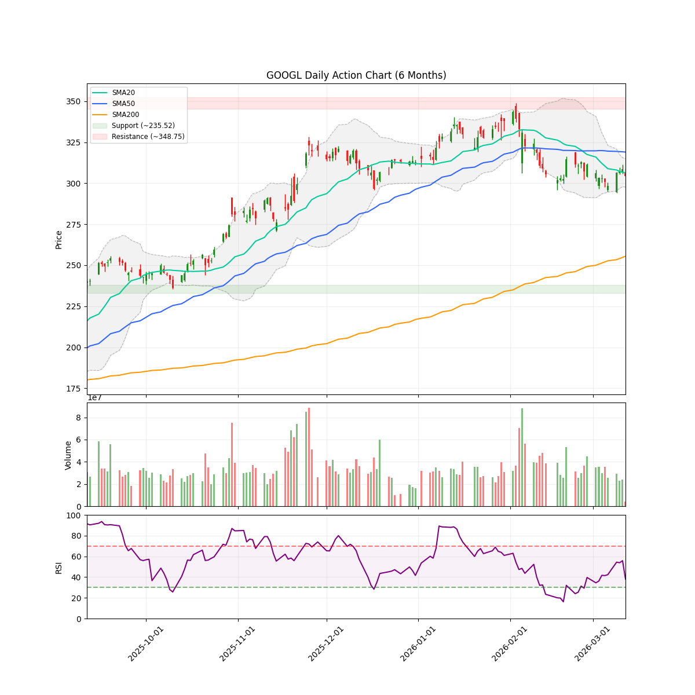
#### 研报分析

### 技术指标概览 (Technical Overview)
- **当前价格**: $304.32
- **RSI (14)**: 38.13
- **移动平均线**: SMA20: $306.40 | SMA50: $318.99 | SMA200: $255.48 (Bullish)
- **波动率**: ATR (14): 7.34 (预计周度波动: +/- $16.41)
- **关键位 (6m)**: 支撑位 $235.52 | 阻力位 $348.75
- **即时状态**: Below SMA50

使用 Gemini API 时出错: 503 UNAVAILABLE. {'error': {'code': 503, 'message': 'This model is currently experiencing high demand. Spikes in demand are usually temporary. Please try again later.', 'status': 'UNAVAILABLE'}}。(已切换至简易启发式分析)
#### 近期新闻与事件
- **[Forbes]** [How To Buy GOOGL Stock At $215?](https://www.forbes.com/sites/greatspeculations/2026/03/10/how-to-buy-googl-stock-at-215/)
- **[Blockonomi]** [Alphabet (GOOGL) Stock Dips Following $692M CEO Compensation Package Approval](https://blockonomi.com/alphabet-googl-stock-dips-following-692m-ceo-compensation-package-approval/)
- **[Yahoo Finance]** [Google (GOOGL) closes week of Mar 9 at ___?](https://finance.yahoo.com/markets/prediction/event/googl-week-march-13-2026/)
- **[Insider Monkey]** [Alphabet Inc. (GOOGL): CVS Health To Roll Out AI-enabled Platform With Google Cloud](https://www.msn.com/en-us/health/other/alphabet-inc-googl-cvs-health-to-roll-out-ai-enabled-platform-with-google-cloud/ar-AA1XQZF9)
- **[The Globe and Mail]** [Will Microsoft Stock Climb as Azure AI Services Gain Traction?](https://www.theglobeandmail.com/investing/markets/stocks/GOOGL/pressreleases/671125/will-microsoft-stock-climb-as-azure-ai-services-gain-traction/)

---

## 🔍 观察池机会分析

### AMAT
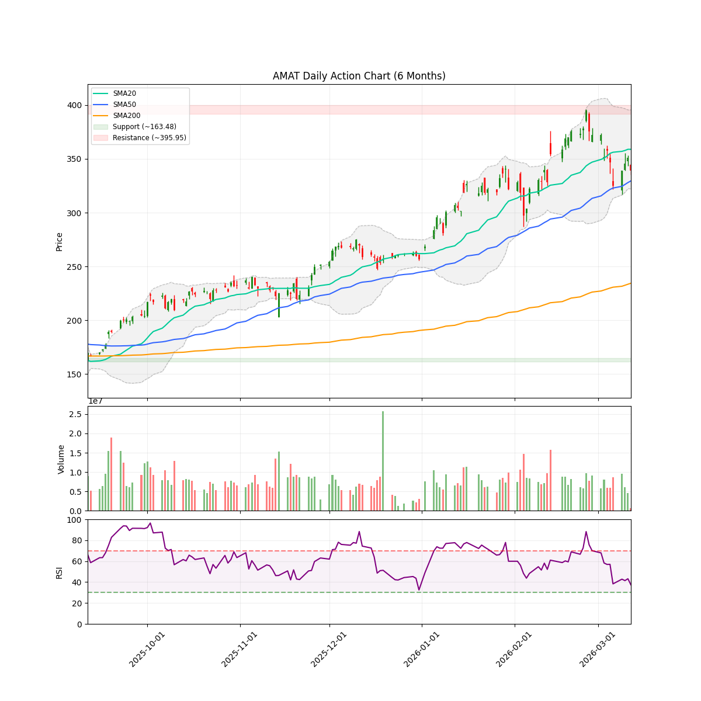
#### 研报分析

### 技术指标概览 (Technical Overview)
- **当前价格**: $338.88
- **RSI (14)**: 37.40
- **移动平均线**: SMA20: $358.85 | SMA50: $329.49 | SMA200: $234.44 (Bullish)
- **波动率**: ATR (14): 16.93 (预计周度波动: +/- $37.85)
- **关键位 (6m)**: 支撑位 $163.48 | 阻力位 $395.95
- **即时状态**: Above SMA50

你好！我是你的对冲基金研究助手。咱们坐下来，抛开那些枯燥的研报，喝杯咖啡，聊聊 Applied Materials (AMAT) 的现状。

在“叙事经济学”的视角下，AMAT 不仅仅是一家半导体设备公司，它是数字世界的“军火商”。但现在的市场情绪，有点像是在一场狂欢派对后的清晨——虽然主人的酒窖还是满的，但客人们已经开始揉着太阳穴找解酒药了。

### **AMAT 情绪审计报告：繁华后的冷静期**

#### **1. 催化剂分类 (Catalyst Categorization)**

*   **A-Tier (重磅驱动力)**
    *   **Micron 战略结盟：** 2026年3月11日，AMAT 与美光 (Micron) 在存储芯片领域的深度合作 [Yahoo Finance]。在 AI 浪潮下，HBM（高带宽内存）就是黄金，而这两家的联手意味着 AMAT 锁定了未来几年存储技术迭代的入场券。
    *   **Q1 财报大捷：** 2月12日公布的每股收益 $2.38 超过预期 [Nasdaq]。这证明了即使在动荡的宏观环境下，芯片制造设备的刚需依然坚挺。

*   **B-Tier (行业顺风)**
    *   **地缘政治溢价：** 随着中东局势（如伊朗冲突）的紧张，虽然文章更多提到 Palantir [MSN]，但作为半导体供应链自主化的核心，AMAT 享受着“防务级”的技术安全溢价。
    *   **华尔街的一致看好：** Zacks 和多家机构维持 ABR (平均经纪商建议) 的增持评级 [Yahoo Finance]。

*   **C-Tier (市场噪音)**
    *   **Erste Group 的“持有”评级：** 3月10日，Erste Group 将评级下调或启动为“持有” [Insider Monkey]。这更像是对近期 33% 涨幅的获利回吐提醒，而非基本面的恶化。

---

#### **2. 背离检测：好消息为何带不动股价？**

这里是我们要警惕的地方。
**现象：** 尽管 3月11日曝出了与美光合作的利好，3月9日分析师还在高喊“优质投资”，但 AMAT 的股价目前徘徊在 $338.88，远低于 SMA20 (20日均线) 的 $358.85。

**诊断：看涨力竭 (Bullish Exhaustion)。** 
股价在三个月内飙升了 33.4%，市场已经提前透支了太多的乐观情绪。现在的下跌并非因为基本面出了问题，而是因为“利好出尽”。RSI 跌至 37.40，说明短期的抛售潮正在逼近超卖区间。这不是“系统性崩溃”，而是一次**技术性洗盘**。

---

#### **3. 叙事得分 (Sentiment Logic Score)**

### **7.2 / 10**
> **评价：** “基本面坚如磐石，但情绪面正在退潮。”

AMAT 目前处于一个“逻辑正确但时机尴尬”的阶段。作为 AI 时代的底层架构，它的故事远未结束，但目前的股价正在消化过去几个月的疯狂。它不是一个陷阱，而是一个正在寻找新支撑点的长线牛股。

---

#### **4. 深度洞察：经验谈**

现在的 AMAT 就像是一个长跑运动员，刚刚跑完一个全速冲刺（3个月涨33%），现在正扶着膝盖喘气。
*   **短期：** SMA50 ($329.49) 是它的心理防线。如果跌破这里，可能会引发进一步的止损抛售。
*   **长期：** 只要 AI 基础设施的建设不停止，AMAT 的设备就是刚需。目前的调整是为那些“错过班车”的人准备的入场券，而非逃命信号。

---

#### **5. 关键参考与日期**

*   **引用新闻：**
    *   *AMAT 与 Micron 合作信息 (2026-03-11)*: [Yahoo Finance](https://finance.yahoo.com/news/applied-materials-micron-partnering-memory-161722664.html)
    *   *Q1 财报超预期 (2026-02-12)*: [Nasdaq](https://www.nasdaq.com/articles/applied-materials-amat-beats-q1-earnings-and-revenue-estimates)
*   **下一个重大日期：**
    *   **Q2 财报发布日 (预估)：2026年5月14日左右。** 这将是决定 AMAT 能否重启升势的关键节点，市场将密切关注其订单积压量 (Backlog) 的变化。

**总结建议：** 不要在这个位置盲目追高，也不要被短期的回调吓破胆。盯紧 $330 附近的支撑位，那里可能是故事开启新篇章的地方。
#### 近期新闻与事件
- **[Barchart on MSN]** [Wall Street loves Palantir stock as the Iran war rages on](https://www.msn.com/en-us/money/top-stocks/wall-street-loves-palantir-stock-as-the-iran-war-rages-on/ar-AA1YmdLp?ocid=BingNewsVerp)
- **[Zacks· via Yahoo Finance]** [AMAT Climbs 33.4% in 3 Months: Time to Buy, Sell or Hold the Stock?](https://finance.yahoo.com/news/amat-climbs-33-4-3-142900401.html)
- **[Barchart· via Yahoo Finance]** [Applied Materials and Micron Are Partnering on Memory. Is AMAT or MU Stock a Better Buy Here?](https://finance.yahoo.com/news/applied-materials-micron-partnering-memory-161722664.html)
- **[Zacks· via Yahoo Finance]** [Wall Street Analysts Think Applied Materials (AMAT) Is a Good Investment: Is It?](https://finance.yahoo.com/news/wall-street-analysts-think-applied-133004200.html)
- **[Insider Monkey· via Yahoo Finance]** [Erste Group Initiated Applied Materials, Inc. (AMAT) With a Hold Rating – Here’s Why](https://finance.yahoo.com/news/erste-group-initiated-applied-materials-112849670.html)

---

### ARM
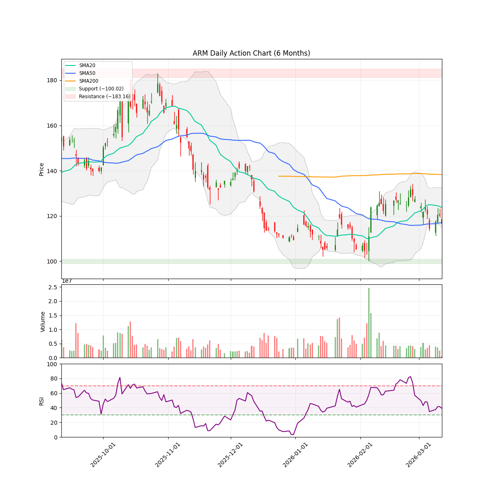
#### 研报分析

### 技术指标概览 (Technical Overview)
- **当前价格**: $116.49
- **RSI (14)**: 39.21
- **移动平均线**: SMA20: $123.72 | SMA50: $117.06 | SMA200: $138.25 (Bearish)
- **波动率**: ATR (14): 5.84 (预计周度波动: +/- $13.06)
- **关键位 (6m)**: 支撑位 $100.02 | 阻力位 $183.16
- **即时状态**: Below SMA50

### ☕ 市场随笔：ARM 是在筑底，还是在落入深渊？

坐在曼哈顿下城的咖啡馆里，看着屏幕上 **ARM** 的走势，我仿佛闻到了空气中那股“AI 宿醉”的味道。曾经它是 AI 领域的宠儿，现在更像是一个在派对结束后，独自对着账单发愁的年轻人。

---

### 1. 催化剂分类：叙事的“含金量”审计

现在的 ARM 处于一个非常微妙的阶段，我们需要拨开迷雾，看看哪些是真的利好，哪些只是噪音。

*   **A-Tier（核心变量）：NVIDIA 的离场。** 
    根据 2 月底的消息，NVIDIA 已经清仓了其持有的 110 万股 ARM 股票。虽然 $1.4 亿对这两家巨头来说不算天文数字，但在叙事经济学里，这传达了一个令人不安的信号：作为 ARM 最亲密的盟友和行业风向标，NVIDIA 选择了获利了结，不再陪跑。这是对“估值溢价”的直接否定。
*   **B-Tier（基本面支撑）：强劲的 Q3 营收。** 
    营收达到 12.4 亿美元的历史新高，证明了其在数据中心和 AI 应用领域的扩张能力。这不是空气，是实打实的现金流。
*   **C-Tier（市场噪音）：Jim Cramer 的背书与无关资讯。** 
    Jim Cramer 昨天的乐观评价（“我觉得那儿正发生很多好事”）在老练的交易员耳中通常被视为“反向指标”或单纯的散户情绪抚慰。另外，新闻流中出现的关于弗吉尼亚州枪支禁令（Assault Firearm）或美式足球（Malik Willis's arm）的信息，纯粹是算法对“ARM”一词的误读，属于必须排除的噪音。

---

### 2. 背离检测：好消息为什么带不动股价？

**现象观察：** 尽管财报创纪录，且有行业大佬喊单，但 ARM 的价格却像断了线的风筝，从 200 日均线（138.25）一路俯冲到现在的 116.49。

**深度诊断：看跌衰竭还是价值重估？**
目前 ARM 跌破了 SMA50（117.06）和 SMA20（123.72），技术上已经进入了典型的下降通道。RSI 降至 39.21，虽然接近超卖，但还没有出现那种“恐慌性抛售”的底部信号。股价在“利好”面前表现出的疲软，说明市场正在痛苦地挤掉之前的 AI 泡沫。这不仅仅是跌，这是一种**叙事幻灭**。

---

### 3. 情绪评分 (Sentiment Score)

#### **4.2 / 10 —— 信心修复期**

*   **逻辑阐述：** 
    虽然基本面依然稳健（Q3 表现优异），但**机构的撤退（NVIDIA 调仓）**和**估值恐高症（Nasdaq 报告指出的溢价限制）**占据了上风。目前市场情绪正处于从“疯狂崇拜”转向“冷酷审计”的阶段。4.2 分代表它还不是垃圾资产，但目前绝对缺乏上攻的动力。

---

### 4. 投资建议：这是陷阱吗？

目前的 ARM 更像是一个**“估值陷阱”**。116 美元的价格距离 6 个月低点 100 美元仅有一步之遥。

*   **老兵的直觉：** 如果你现在进场，你是在试图接一把正在下落的飞刀。尽管 ATR 显示波动空间在 13 美元左右，但趋势线是向下倾斜的。
*   **关注重点：** 观察 100 美元大关。如果这里守不住，那么 ARM 的 AI 神话将面临彻底的系统性重估。

---

### 5. 关键信息概览

*   **核心逻辑参考：**
    *   [24/7 Wall St] NVIDIA 出售 ARM 股份，传递出套现离场的防御性信号。
    *   [Nasdaq] 指出高估值倍数严重限制了短期上行空间。
    *   [Barrons] 摩根斯坦利私募信贷基金限制赎回，预示宏观流动性正在收紧，这对高溢价成长股 ARM 是重大利空。
*   **下一关键节点 (Next Major Date)：** 
    **2026 年 5 月上旬（预估 Q4 财报发布日）**。届时市场将审视 ARM 在没有 NVIDIA 站台的情况下，能否继续维持高速增长。

**总结：** ARM 正在经历一场“去神化”的洗礼。在股价回到 SMA50 甚至 SMA200 之上前，保持耐心，咖啡还没放凉，不必急着入场。
#### 近期新闻与事件
- **[Barrons.com]** [Morgan Stanley Private Credit Fund Caps Withdrawals. More Trouble for Blue Owl Stock, Ares.](https://www.barrons.com/articles/morgan-stanley-private-credit-stock-price-blue-owl-3e6f69bb)
- **[Insider Monkey· via Yahoo Finance]** [Jim Cramer on Arm Holdings: “I Think There’s Just a Lot of Good Stuff Happening”](https://finance.yahoo.com/news/jim-cramer-arm-holdings-think-112802060.html)
- **[Reason]** [Virginia's Impending 'Assault Firearm' Ban Is Logically and Constitutionally Dubious](https://reason.com/2026/03/11/virginias-impending-assault-firearm-ban-is-logically-and-constitutionally-dubious/)
- **[Barrons.com]** [These Stocks Are Today’s Movers: Mosaic, UiPath, Firefly Aerospace, Morgan Stanley, Netskope, and Mo...](https://www.barrons.com/articles/stock-movers-1d7440f2)
- **[ClutchPoints· via Yahoo Sports]** [Malik Willis, Dolphins grades for $67.5 million contract in 2026 NFL free agency](https://sports.yahoo.com/articles/malik-willis-dolphins-grades-67-201636251.html)

---

### ASML
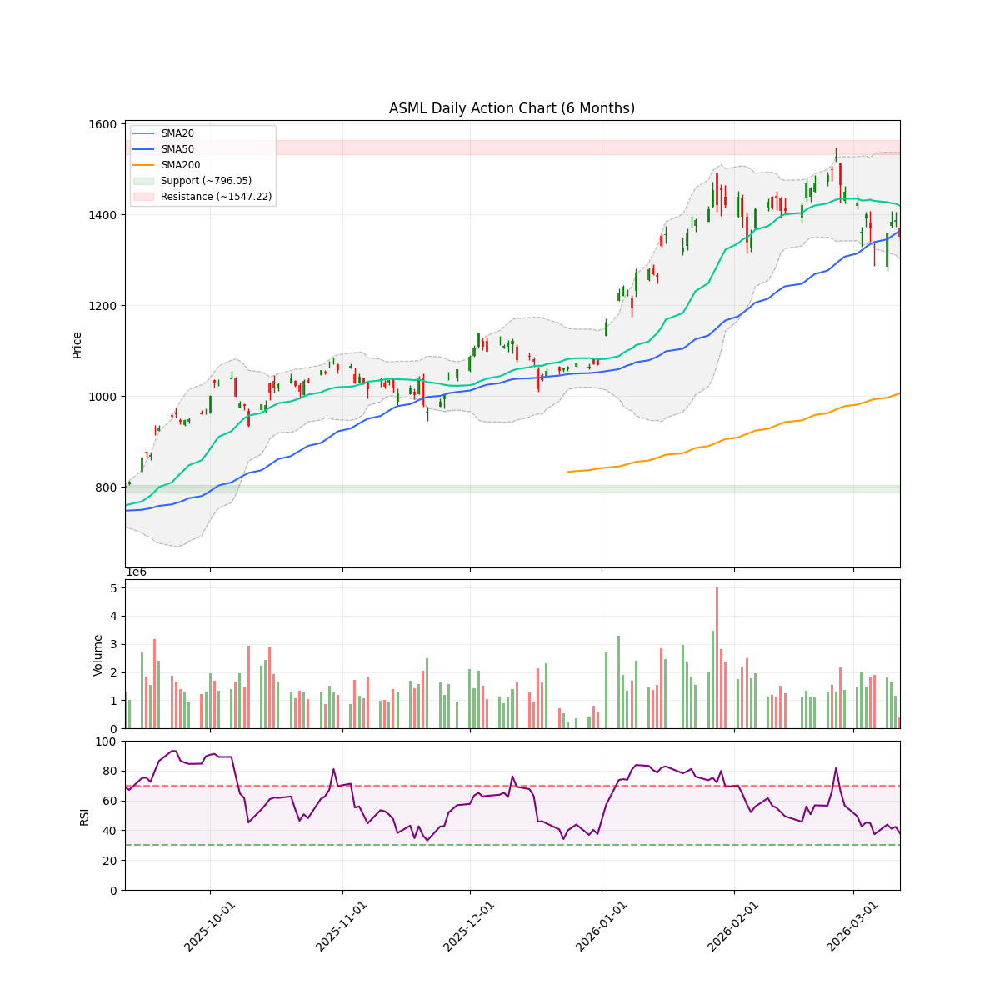
#### 研报分析

### 技术指标概览 (Technical Overview)
- **当前价格**: $1350.61
- **RSI (14)**: 38.04
- **移动平均线**: SMA20: $1418.91 | SMA50: $1363.30 | SMA200: $1005.73 (Bullish)
- **波动率**: ATR (14): 56.62 (预计周度波动: +/- $126.61)
- **关键位 (6m)**: 支撑位 $796.05 | 阻力位 $1547.22
- **即时状态**: Below SMA50

使用 Gemini API 时出错: 503 UNAVAILABLE. {'error': {'code': 503, 'message': 'This model is currently experiencing high demand. Spikes in demand are usually temporary. Please try again later.', 'status': 'UNAVAILABLE'}}。(已切换至简易启发式分析)
#### 近期新闻与事件
- **[Investing.com]** [BofA raises ASML stock price target on stronger EUV demand outlook By...](https://www.investing.com/news/analyst-ratings/bofa-raises-asml-stock-price-target-on-stronger-euv-demand-outlook-93CH-4544756)
- **[Simply Wall St.· via Yahoo Finance]** [Is ASML’s AI‑Fueled EUV Backlog Reshaping The Investment Case For ASML Holding (...](https://finance.yahoo.com/news/asml-ai-fueled-euv-backlog-110757731.html)
- **[Zacks· via Yahoo Finance]** [Should You Buy, Sell or Hold ASML Stock at a P/E of 36.67X?](https://finance.yahoo.com/news/buy-sell-hold-asml-stock-135500903.html)
- **[247wallst.com]** [Why ASML Investors Shouldn’t Worry About Competition From China](https://247wallst.com/investing/2026/03/10/why-asml-investors-shouldnt-worry-about-competition-from-china/)
- **[Investing.com]** [TD Cowen reiterates Buy on ASML stock, cites EUV strength By Investing.com](https://www.investing.com/news/analyst-ratings/td-cowen-reiterates-buy-on-asml-stock-cites-euv-strength-93CH-4552356)

---

### AVGO
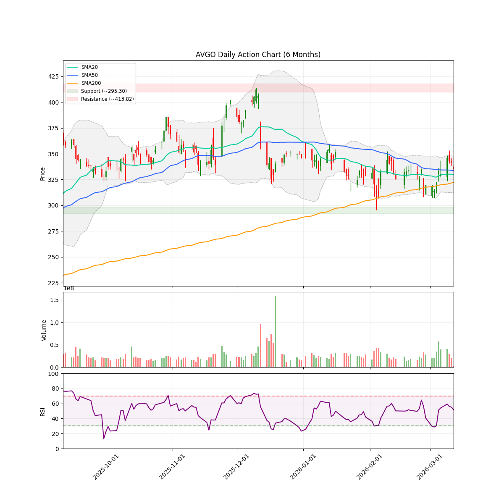
#### 研报分析

### 技术指标概览 (Technical Overview)
- **当前价格**: $335.18
- **RSI (14)**: 51.59
- **移动平均线**: SMA20: $329.85 | SMA50: $333.60 | SMA200: $322.23 (Bullish)
- **波动率**: ATR (14): 14.25 (预计周度波动: +/- $31.87)
- **关键位 (6m)**: 支撑位 $295.30 | 阻力位 $413.82
- **即时状态**: Above SMA50

# 博通 (AVGO) 情绪审计报告：AI 引擎全速运转，是真突破还是虚晃一枪？

**日期：** 2026年3月12日  
**分析师：** 对冲基金调研员 (叙事经济学组)

---

### 1. 市场叙事：不再只是“芯片股”，而是 AI 基建的收银机

老伙计们，坐下来喝杯咖啡。看着现在的博通（AVGO），你得明白，我们聊的不再是一家死板的半导体公司。如果你还盯着它的无线业务看，那你就完全错过了大戏。

现在的博通正处于一个**“权力转换”**的叙事中心。这次 Q1 财报不仅是赢了数字，更是赢了“势”。当一家公司的 AI 芯片收入能一年翻一倍（增长 106%），并且敢喊出 2027 年 AI 销售额达到 1000 亿美元的口号时，市场听到的不是吹牛，而是金币落地的声音。目前的叙事非常清晰：**Broadcom 就是 AI 基础设施的“税收员”**，只要数据中心在建，它就在抽成。

---

### 2. 催化剂分级 (Catalyst Categorization)

*   **A-Tier (重磅催化剂)：**
    *   **Q1 财报大捷：** 营收 193 亿美元，同比增长 29%。最硬核的是 AI 收入翻倍（增长 106%），这直接证明了其在定制化 AI 芯片（ASIC）市场的统治力。
    *   **2027 战略指引：** 官方预测 2027 年 AI 芯片销售额将达 1000 亿美元。这种跨年度的超级指引是机构投资者的定心丸。 [参考链接：Blockonomi](https://blockonomi.com/broadcom-avgo-stock-soars-on-massive-ai-revenue-forecast-and-strong-earnings/)
*   **B-Tier (机构助推)：**
    *   **目标价集体上调：** 摩根士丹利将目标价猛拉至 470 美元；RBC 将目标价上调至 360 美元。这种分析师的一致性预期（Consensus）正在形成强大的向上合力。 [参考链接：MSN/RBC](https://www.msn.com/en-us/money/markets/rbc-capital-markets-lifts-broadcom-avgo-price-target-points-to-bullish-fy27-commentary/ar-AA1XVtfH)
*   **C-Tier (噪音与情绪)：**
    *   **Zacks 热搜榜：** AVGO 成为搜索热股。这通常意味着散户开始注意到这一趋势，虽然增加了波动，但也提供了流动性。 [参考链接：Zacks](https://www.msn.com/en-us/money/top-stocks/broadcom-inc-avgo-is-a-trending-stock-facts-to-know-before-betting-on-it/ar-AA1XPVLD)

---

### 3. 背离检测：强势整理还是力竭？

目前股价 **335.18**，虽然相比财报后的高点有所回落，但观察细节：
*   **多头排列：** 股价依然坚挺在 SMA50 (333.60) 和 SMA200 (322.23) 之上。这说明大资金在“蹲守”，并没有因为短期获利了结而引发踩踏。
*   **良性回踩：** RSI 处于 51.59 的中性位置，完全没有超买压力。这更像是那种“好消息发布后的换手”，而不是“利好出尽的崩盘”。
*   **背离分析：** 没有出现明显的看跌背离。相反，在 330 附近有明显的机构支撑，这在叙事上被称为“价值共识”。

---

### 4. 情绪评分 (Sentiment Score): 8.5/10

**评价：近乎无敌的看涨周期。**

之所以没给 10 分，是因为市场对英伟达（Nvidia）财报后的波动仍有阴影（正如 Blockonomi 提到的估值担忧）。但博通的优势在于它是“股息贵族”的有力竞争者，且业务更多样化。这不仅仅是投机，更是结构性的资产配置。

---

### 5. 投资建议与逻辑

**“不要在推土机前面捡硬币。”** 博通现在的走势就像一辆装满 AI 订单的推土机。
*   **支撑位看守：** 只要不破 SMA50 (333.60)，这种叙事就是健康的。
*   **阻力位博弈：** 突破 6 个月高点 413.82 是长期的星辰大海。

**逻辑点睛：** 市场正在给博通重新估值（Re-rating）。它不再是一家传统的芯片股，而是一个享受高估值的 AI 平台公司。这种叙事的改变，通常会支撑股价走得比基本面预期的还要远。

---

### 6. 关键日程提醒

*   **下一次重大事件：** **2026年第二季度财报发布会** (预计于 2026 年 6 月初)。
*   **关键监测点：** 关注 2026 年 4 月初可能出现的季度末机构调仓行为。

---
*注：本报告基于叙事经济学框架，市场有风险，投资需谨慎。*
#### 近期新闻与事件
- **[Yahoo Finance]** [Broadcom Stock Just Broke Through Key Resistance Levels. How Much Higher Can AVGO Run?](https://finance.yahoo.com/news/broadcom-stock-just-broke-key-193321975.html)
- **[Insider Monkey]** [Here's What Aletheia Has to Say About Broadcom (AVGO)](https://www.msn.com/en-us/money/markets/here-s-what-aletheia-has-to-say-about-broadcom-avgo/ar-AA1YmiT4)
- **[Blockonomi]** [Broadcom (AVGO) Stock Climbs as AI Chip Sales More Than Double in First Quarter](https://blockonomi.com/broadcom-avgo-stock-climbs-as-ai-chip-sales-more-than-double-in-first-quarter/)
- **[Insider Monkey]** [RBC Capital Markets Lifts Broadcom (AVGO) Price Target, Points to Bullish FY27 Commentary](https://www.msn.com/en-us/money/markets/rbc-capital-markets-lifts-broadcom-avgo-price-target-points-to-bullish-fy27-commentary/ar-AA1XVtfH)
- **[Zacks Investment Research]** [Broadcom Inc. (AVGO) is a trending stock: Facts to know before betting on it](https://www.msn.com/en-us/money/top-stocks/broadcom-inc-avgo-is-a-trending-stock-facts-to-know-before-betting-on-it/ar-AA1XPVLD)

---

### CEG
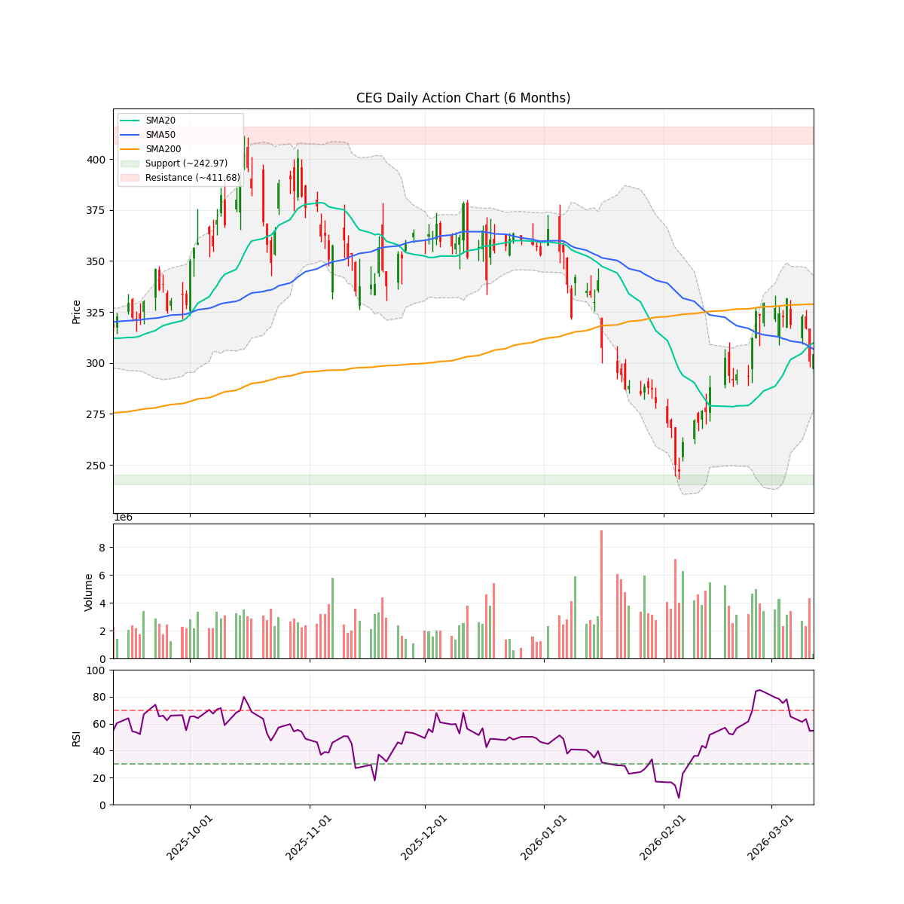
#### 研报分析

### 技术指标概览 (Technical Overview)
- **当前价格**: $304.31
- **RSI (14)**: 54.88
- **移动平均线**: SMA20: $309.91 | SMA50: $306.79 | SMA200: $328.85 (Bearish)
- **波动率**: ATR (14): 14.25 (预计周度波动: +/- $31.86)
- **关键位 (6m)**: 支撑位 $242.97 | 阻力位 $411.68
- **即时状态**: Below SMA50

# CEG 情绪审计报告：核能明星的“高空颠簸”，是进场机会还是多头陷阱？

**审计时间：** 2026年3月12日
**研究员：** 叙事经济学分析组

---

### 1. 市场叙事背景：从“派对之星”到“宿醉清晨”

让我们坐下来喝杯咖啡，聊聊 **Constellation Energy (CEG)**。就在几周前的 2 月，CEG 还是华尔街的宠儿。借着第四季度财报的东风和一项意义重大的电力协议，股价单月狂飙 17.5% [Yahoo Finance]。那时候，AI 对清洁能源的渴求让每一个投资者都觉得，只要手里攥着核电站，就等于攥着印钞机。

但转眼到了 3 月，风向变了。现在的空气中弥漫着一股“宿醉”的味道。粘性通胀的阴影笼罩市场，收益率上升开始反噬高估值的成长股 [Simply Wall St.]。CEG 的股价已经跌破了 SMA20、SMA50 甚至是 SMA200（328.85），这在技术派眼里，简直像是一台正在失去动力的核反应堆。

### 2. 催化剂分级 (Catalyst Categorization)

我们要看清，哪些是真金白银的驱动力，哪些只是噪音：

*   **A-Tier（核心动力）：**
    *   **2 月的超预期财报与重磅协议：** 这是 CEG 的底气。即便现在价格回撤，它依然是 S&P 500 中最能打的清洁能源巨头之一 [Nasdaq]。
*   **B-Tier（行业逆风）：**
    *   **SMR 板块的整体低迷：** 像 SMR 这种同行一个月内暴跌 14%，拉低了整个核能板块的情绪水位 [Zacks]。
    *   **宏观环境恶化：** 粘性通胀导致降息预期推迟，这对资本密集型的能源基建来说是利空。
*   **C-Tier（市场杂音）：**
    *   **分析师下调目标价：** Insider Monkey 提到多家机构在 3 月 8 日左右下调了目标价。这通常是机构在股价破位后的“补刀”行为，反映了短期的悲观共识。

### 3. 背离检测与情绪诊断 (Divergence Detection)

**技术面警示：** 尽管 2 月份基本面一片大好，但 3 月份的价格走势（304.31）却极其难看。它不仅掉到了 SMA50 以下，甚至跌破了 SMA200 这一长期牛熊分界线。

**叙事陷阱：** 现在的 CEG 处于一种**“好消息免疫，坏消息放大”**的状态。Zacks 指出 CEG 的跌幅甚至超过了市场大盘 [Zacks]。这种“超额下跌”通常意味着前期获利盘正在不计成本地离场。RSI 54.88 看起来很中性，但结合价格跌破 200 日均线来看，这更像是在下跌中继过程中的一种“无力反弹”。

### 4. 逻辑评分 (Logic Score): 4.5/10

*   **评分理由：** 虽然 CEG 的长线叙事（AI+核能）逻辑依然坚固，但**短期动能已彻底毁坏**。股价处于 SMA200 之下是极度危险的信号，意味着市场正在重新评估其估值逻辑。目前的跌势并非“由于利好没涨”的看涨背离，而是“预期透支后”的价值回归。
*   **结论：** 目前是一个典型的**“高位派发区”**。在股价重新站回 328 美元（SMA200）之前，任何反弹都可能只是为了吸引更多接盘侠的陷阱。

### 5. 操作建议与关键日期

**老兵寄语：** 别在飞刀掉落的时候伸手。CEG 的长期价值毋庸置疑，但现在的它需要时间来消化 2 月份那一波疯狂的溢价。

*   **支撑位观察：** 242.97（6个月低点）。如果 macro 环境继续恶化，这里才是真正的安全垫。
*   **阻力位观察：** 328.85（SMA200）。收复这里，牛市叙事才能重启。

**下一个关键日期：**
*   **2026年5月初（预计）：** **2026年第一季度财报发布日**。
    *   这将是决定 CEG 能否触底反弹的关键，届时市场将关注其 AI 供电协议的最新进展以及利润率是否受到通胀挤压。

---
*免责声明：本报告仅供参考，不构成投资建议。市场有风险，入市需谨慎。*
#### 近期新闻与事件
- **[Simply Wall St.· via Yahoo Finance]** [US Stock Market Today S&P 500 Futures Slip As Sticky Inflation And Yields Bite](https://finance.yahoo.com/news/us-stock-market-today-p-101158958.html)
- **[Zacks· via Yahoo Finance]** [Constellation Energy Corporation (CEG) Registers a Bigger Fall Than the Market:...](https://finance.yahoo.com/news/constellation-energy-corporation-ceg-registers-214504975.html)
- **[Zacks· via Yahoo Finance]** [SMR Stock Plunges 14% in a Month: Should You Buy, Sell or Hold?](https://finance.yahoo.com/news/smr-stock-plunges-14-month-131800138.html)
- **[Insider Monkey· via Yahoo Finance]** [Constellation Energy (CEG) Share Price Target Cut By Multiple Analysts](https://finance.yahoo.com/news/constellation-energy-ceg-share-price-162046788.html)
- **[Investing.com]** [Oracle, Micron among market cap stock movers on Wednesday By Investing.com](https://www.investing.com/news/stock-market-news/oracle-micron-among-market-cap-stock-movers-on-wednesday-93CH-4555290)

---

### LRCX
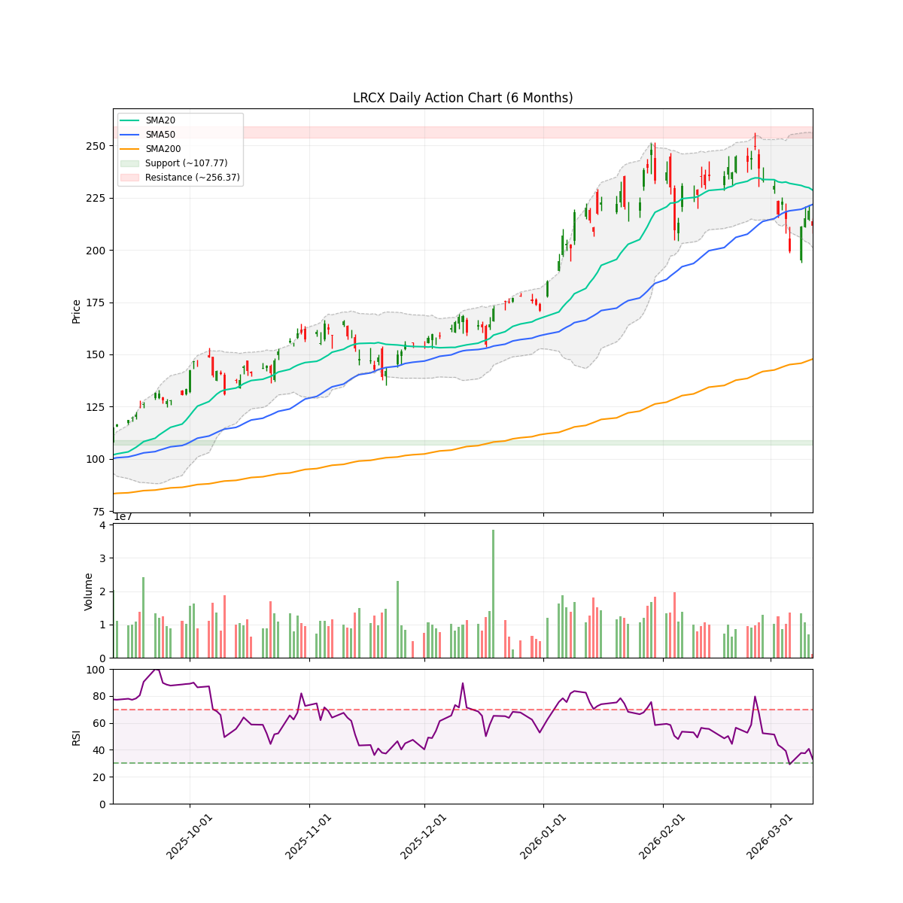
#### 研报分析

### 技术指标概览 (Technical Overview)
- **当前价格**: $211.68
- **RSI (14)**: 33.26
- **移动平均线**: SMA20: $228.61 | SMA50: $221.75 | SMA200: $147.78 (Bullish)
- **波动率**: ATR (14): 11.88 (预计周度波动: +/- $26.56)
- **关键位 (6m)**: 支撑位 $107.77 | 阻力位 $256.37
- **即时状态**: Below SMA50

# 情绪审计报告：Lam Research (LRCX) —— 叙事热潮中的“倒春寒”

**致投资者：**

想象一下，我们正坐在曼哈顿下城的一家咖啡馆里，窗外是步履匆匆的交易员。今天我们聊聊 **Lam Research (LRCX)**。这台“印钞机”在过去一年里涨了 185%，简直是 AI 时代的宠儿。但最近，空气中透着一丝凉意。股价从高点回落，跌破了 50 日均线，市场上开始有人窃窃私语：这到底是黄金坑，还是派对结束的信号？

---

### 1. 催化剂分级 (Catalyst Categorization)

我们要把噪音和信号分开，看看 LRCX 的动力源到底在哪。

*   **A-Tier（核心驱动力）：AI 基础设施的“卖水人”叙事**
    *   **详情**：根据 *Forbes* 的报道，LRCX 去年凭借 AI 驱动的营收增长重写了市场剧本。只要数据中心和 AI 计算的需求不减，LRCX 作为芯片制造关键设备的供应商，其核心地位就是不可撼动的。
    *   **地位**：这是支撑股价长期逻辑的基石，目前依然稳固。

*   **B-Tier（市场信心支撑）：分析师的“豪言壮语”**
    *   **详情**：*Sharewise* 和 *Zacks* 指出，华尔街分析师认为 LRCX 还有 25% 以上的上涨空间。虽然这些观点有时滞后，但它为机构投资者在大跌时提供了“买入理由”的心理支撑。
    *   **地位**：提供了下行时的安全垫。

*   **C-Tier（短期噪音）：中东地缘政治与供应担忧**
    *   **详情**：*Yahoo Finance* 提到 3 月 5 日股价下跌 4.5%，原因是担心地缘冲突影响关键材料供应。
    *   **评价**：这更像是典型的“避险情绪”释放，而非基本面崩塌。在牛市中，这类消息往往是洗掉杠杆玩家的借口。

---

### 2. 分歧检测 (Divergence Detection)

**现象：好消息在“打架”，股价在“叹气”。**

目前我们看到了一个显著的**背离**。虽然 AI 赛道的其他标的（如 Vertiv, Coherent）被纳入标普 500 指数，显示出市场对 AI 基础设施的狂热（*24/7 Wall St*），但 LRCX 的表现却显得步履蹒跚。

*   **看跌信号**：股价目前位于 SMA50 (221.75) 之下，且 RSI 仅为 33.26。这说明短期内，卖方力量占据了主导，市场正在经历“杀估值”的过程。
*   **看涨契机**：RSI 接近 30 的超卖区间，且股价距离 SMA200 (147.78) 还有很大距离。这预示着**看跌动能可能接近枯竭**。如果股价在 200 美元附近企稳，那将是一个极其诱人的反弹点。

---

### 3. 情绪评分 (Sentiment Score): 6.5 / 10

**结论：受挫的强者。**

目前的 6.5 分代表了“谨慎乐观”。这不是 10 分的狂热（那时候你应该卖出），也不是 3 分的恐慌（那时候你会割肉）。目前的低分主要受制于极高的前瞻 P/E（约 38 倍，见 *Nasdaq* 报道）和短期技术破位。

**叙事解读**：市场正在 LRCX 身上寻找“溢价的合理性”。如果它能证明高市盈率对应的是无可替代的产能地位，这 6.5 分很快会回到 9 分。

---

### 4. 逻辑总结报告 (Logic Report)

*   **逻辑分数：6.8 / 10**
*   **核心逻辑**：长期 AI 趋势不可逆，短期受制于地缘政治噪音和高估值回调。技术面显示极度超卖，短期反弹压力位在 SMA50 (221.75) 附近。
*   **引用证据**：
    1.  *Yahoo Finance (2026-03-05)*：确认了短期下跌的诱因是地缘政治导致的供应担忧。
    2.  *Forbes (2026-02-18)*：背书了公司在 AI 市场的统治力。
    3.  *Zacks (2026-03-06)*：提供了华尔街对 25% 上涨空间的共识。

---

### 5. 关键日期提醒

*   **下一个关键日 (Next Major Date)**：**2026年4月15日前后（预计 2026 Q3 财报发布日）**。
    *   *重要性*：届时市场将密切关注公司对“供应中断”的具体回应，以及 AI 相关订单的最新积压情况。如果业绩指引超预期，这将是股价重回 SMA50 之上的“发令枪”。

**老兵建议**：目前不要急着接落下的飞刀。盯着 RSI，如果它在 30 附近开始拐头向上，且中东噪音减弱，那就是你入场的咖啡时间。
#### 近期新闻与事件
- **[Yahoo Finance Canada]** [Why Lam Research (LRCX) Stock Is Falling Today](https://ca.finance.yahoo.com/news/why-lam-research-lrcx-stock-223453218.html)
- **[Insider Monkey]** [11 Best Large-Cap Tech Stocks to Invest In](https://www.insidermonkey.com/blog/11-best-large-cap-tech-stocks-to-invest-in-1713326/)
- **[sharewise]** [Wall Street Analysts Think Lam Research (LRCX) Could Surge 25.43%: Read This Before Placing a Bet](https://www.sharewise.com/us/news_articles/Wall_Street_Analysts_Think_Lam_Research_LRCX_Could_Surge_2543_Read_This_Before_Placing_a_Bet_Zacks_20260305_1555)
- **[Zacks Investment Research]** [Is it worth investing in Lam Research (LRCX) based on Wall Street's bullish views?](https://www.msn.com/en-us/money/top-stocks/is-it-worth-investing-in-lam-research-lrcx-based-on-wall-street-s-bullish-views/ar-AA1XFJLr)
- **[24/7 Wall St.]** [Lumentum, Coherent, and Vertiv Added to the S&P 500 As AI Stocks Dominate Rebalancing](https://247wallst.com/investing/2026/03/06/lumentum-coherent-and-vertiv-added-to-the-sp-500-as-ai-stocks-dominate-rebalancing/)

---

### META
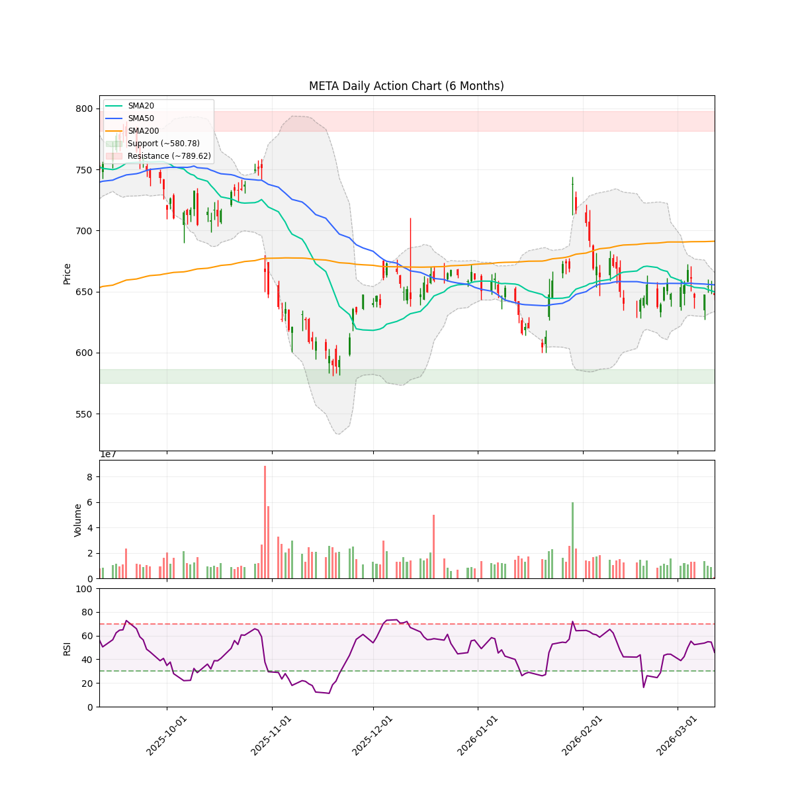
#### 研报分析

### 技术指标概览 (Technical Overview)
- **当前价格**: $646.82
- **RSI (14)**: 45.89
- **移动平均线**: SMA20: $649.64 | SMA50: $655.48 | SMA200: $691.20 (Bearish)
- **波动率**: ATR (14): 17.51 (预计周度波动: +/- $39.16)
- **关键位 (6m)**: 支撑位 $580.78 | 阻力位 $789.62
- **即时状态**: Below SMA50

使用 Gemini API 时出错: 503 UNAVAILABLE. {'error': {'code': 503, 'message': 'This model is currently experiencing high demand. Spikes in demand are usually temporary. Please try again later.', 'status': 'UNAVAILABLE'}}。(已切换至简易启发式分析)
#### 近期新闻与事件
- **[AOL]** [Meet the Super Semiconductor Stock Obliterating Nvidia, AMD, and Broadcom Right Now](https://www.aol.com/articles/meet-super-semiconductor-stock-obliterating-081300540.html)
- **[Investing.com]** [Meta unveils four custom AI chips for data center growth](https://www.investing.com/news/stock-market-news/meta-unveils-four-custom-ai-chips-for-data-center-growth-4554956)
- **[Blockonomi]** [Nebius (NBIS) Stock Surges 16% Following Nvidia’s $2B AI Infrastructure Investment](https://blockonomi.com/nebius-nbis-stock-surges-16-following-nvidias-2b-ai-infrastructure-investment/)
- **[Blockonomi]** [Metaplanet (MTPLF) Stock Surges After Unveiling $25M Venture Fund and Miami Expansion](https://blockonomi.com/metaplanet-mtplf-stock-surges-after-unveiling-25m-venture-fund-and-miami-expansion/)
- **[MSN]** [What's going on with Meta Platforms stock Tuesday?](https://www.msn.com/ar-ae/money/news/what-s-going-on-with-meta-platforms-stock-tuesday/ar-AA1XVNWj?ocid=BingNewsVerp)

---

### MRVL
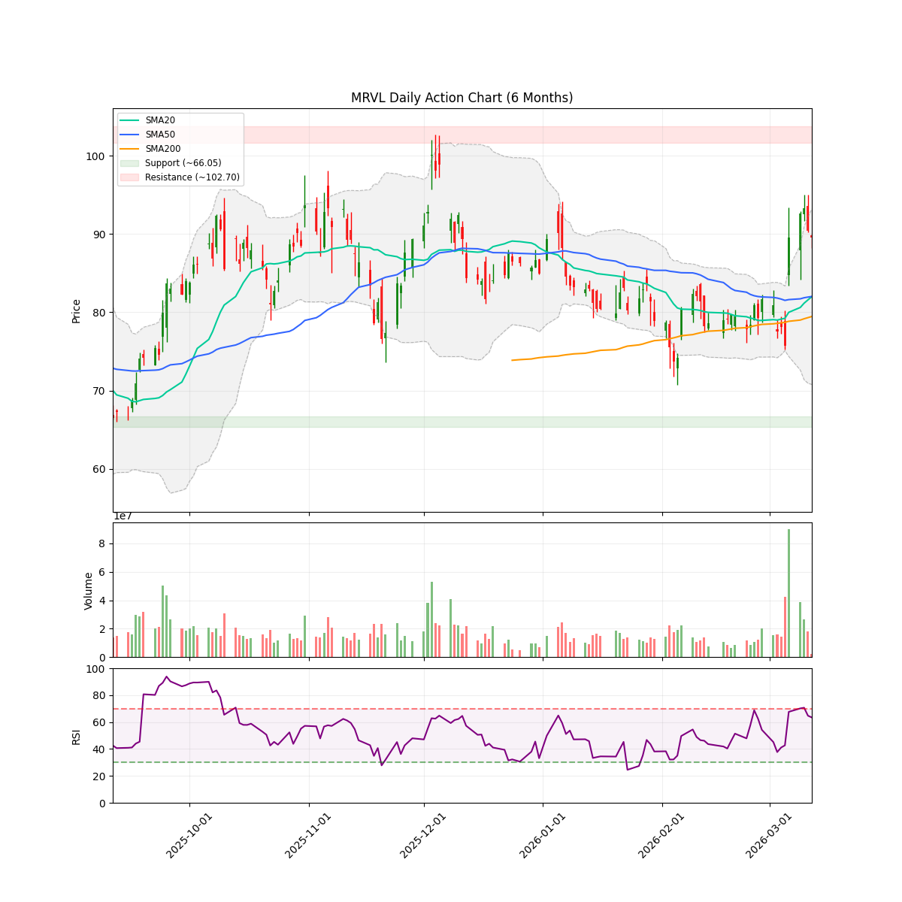
#### 研报分析

### 技术指标概览 (Technical Overview)
- **当前价格**: $89.55
- **RSI (14)**: 63.47
- **移动平均线**: SMA20: $81.99 | SMA50: $82.01 | SMA200: $79.46 (Bullish)
- **波动率**: ATR (14): 4.91 (预计周度波动: +/- $10.97)
- **关键位 (6m)**: 支撑位 $66.05 | 阻力位 $102.70
- **即时状态**: Above SMA50

你好！来，坐下喝杯咖啡。咱们聊聊最近在半导体圈子里出尽风头的 **Marvell (MRVL)**。

作为一名在叙事经济学（Narrative Economics）里摸爬滚打多年的研究员，我看一只股票不只看财报上的冷冰冰数字，更看重它在市场“故事剧本”里演到了哪一出。现在是 2026 年 3 月 12 日，MRVL 的股价正站在 89.55 美元的高位。

这份 **MRVL 情绪审计报告**，请查收：

---

### 1. 催化剂分级 (Catalyst Categorization)

我们要看清，这波上涨到底是真金白银的突破，还是散户的自嗨。

*   **A-Tier（核心驱动力）：Q4 财报双超预期 + AI 基础设施叙事**
    *   **详情**：3 月 5 日的 Q4 财报不仅在营收和每股收益（EPS）上分别超出了 0.86% 和 1.37%，更关键的是它给出的指引——**AI 数据中心需求**。这不仅是数字的胜利，更是“叙事”的胜利。Marvell 成功把自己锚定在了“AI 算力基础设施”的核心位置。
    *   **证据**：[Zacks/StockStory via Yahoo Finance] 提到财报后股价暴涨 18.4%，这是典型的机构抢筹特征。
*   **B-Tier（助攻力）：分析师集体倒戈看多**
    *   **详情**：华尔街分析师目前的平均建议（ABR）是“买入”。当大行的共识形成，通常意味着卖方的研报会源源不断地为股价抬轿子。
    *   **证据**：[Zacks] 报告中提到 MRVL 被视为值得投资的标的。
*   **C-Tier（杂音）：小规模的内部变动或跟随波动**
    *   **详情**：由于半导体板块整体因 AI 热潮波动，MRVL 也受益于整体行业 beta 的抬升。

---

### 2. 背离检测 (Divergence Detection)

**诊断：无看跌背离，趋势极度健康。**

市场最怕“好消息出尽股价反而跌”，但 MRVL 表现得非常强韧。财报后跳空高开并维持在 89.55 美元，且 SMA20 (81.99) 已经上穿 SMA50 (82.01)，这是一个标准的**黄金交叉**预警。

虽然 RSI 目前在 63.47，属于“温热”状态，但还没到 70 以上的“高烧”区域。这意味着市场还没有陷入盲目的非理性狂热，还有向上腾挪的空间。目前的阻力位在 102.70，只要支撑位 66.05 不破，牛市的脊梁骨就是硬的。

---

### 3. 叙事经济学：它在讲什么故事？

现在的 MRVL 不再仅仅是一家“做网络芯片的公司”。它的故事剧本是：**“英伟达铲子，我做柄。”**

如果说英伟达是 AI 时代的发动机，那么 Marvell 的定制芯片（ASIC）和高速连接技术就是传动系统。现在的市场情绪是：大家开始意识到，光有算力是不够的，数据得跑得快，这就需要 Marvell。这种叙事极其稳定且具有可持续性，不容易出现“见光死”。

---

### 4. 逻辑评分 (Logic Score): 8.8/10

*   **逻辑支撑**：
    *   **+4.0**：AI 数据中心业务的高速增长（实打实的业绩支撑）。
    *   **+2.5**：技术面完美排列（SMA 黄金交叉，股价站上所有均线）。
    *   **+2.3**：机构共识达成，没有明显的空头反扑迹象。
    *   **-1.0**：短线涨幅过大（18.4% 的跳空），需要消化近期获利盘。

---

### 5. 投资建议报告

*   **当前状态**：**强势多头循环**。
*   **警示点**：短期 ATR（平均真实波幅）为 4.91，波动不小，不要在日内高点满仓冲进去。理想的介入点是回踩 SMA20（约 82 美元附近）时的支撑确认。
*   **引用文献**：
    *   *Marvell Technology (MRVL) Q4 Earnings and Revenues Top Estimates* (2026-03-05).
    *   *MRVL Surges 18.4% Post Q4 Earnings: Time to Hold or Fold?* (2026-03-09).
*   **下个关键日期**：**2026 年 5 月底/6 月初（预计 Q1 2027 财报发布日）**。届时将验证这波 AI 数据中心的增长是否具有持续的订单流。

---

**老兵寄语**：
“伙计，在半导体行情里，别去猜顶，但也别忘了在狂欢中给自己的利润设个止盈位。现在的 MRVL 就像一只刚刚换了新引擎的赛车，路才跑了一半。盯紧 102.70 的阻力位，如果能放量冲过去，那故事就要进入下一个篇章了。”
#### 近期新闻与事件
- **[Zacks· via Yahoo Finance]** [Is It Worth Investing in Marvell (MRVL) Based on Wall Street's Bullish Views?](https://finance.yahoo.com/news/worth-investing-marvell-mrvl-based-143004587.html)
- **[Zacks· via Yahoo Finance]** [Marvell Technology (MRVL) Q4 Earnings and Revenues Top Estimates](https://finance.yahoo.com/news/marvell-technology-mrvl-q4-earnings-222001366.html)
- **[StockStory· via Yahoo Finance]** [Marvell Technology (NASDAQ:MRVL) Surprises With Q4 Sales, Stock Soars](https://finance.yahoo.com/news/marvell-technology-nasdaq-mrvl-surprises-211620805.html)
- **[Zacks· via Yahoo Finance]** [MRVL Surges 18.4% Post Q4 Earnings: Time to Hold or Fold the Stock?](https://finance.yahoo.com/news/mrvl-surges-18-4-post-123900351.html)
- **[Barchart· via Yahoo Finance]** [As Marvell Breaks Through Key Resistance Levels, Should You Chase the Rally in...](https://finance.yahoo.com/news/marvell-breaks-key-resistance-levels-202311135.html)

---

### MSFT
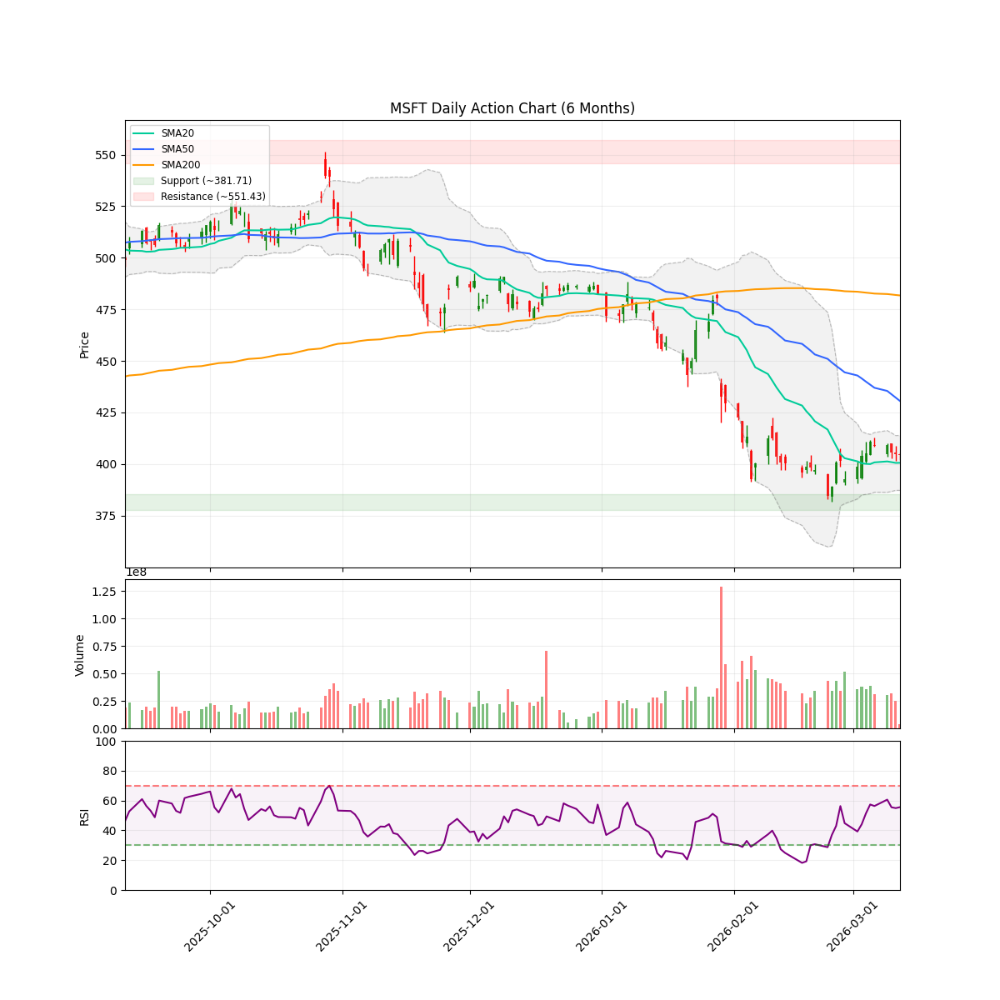
#### 研报分析

### 技术指标概览 (Technical Overview)
- **当前价格**: $404.41
- **RSI (14)**: 55.60
- **移动平均线**: SMA20: $400.60 | SMA50: $430.56 | SMA200: $481.74 (Bearish)
- **波动率**: ATR (14): 9.09 (预计周度波动: +/- $20.33)
- **关键位 (6m)**: 支撑位 $381.71 | 阻力位 $551.43
- **即时状态**: Below SMA50

使用 Gemini API 时出错: 503 UNAVAILABLE. {'error': {'code': 503, 'message': 'This model is currently experiencing high demand. Spikes in demand are usually temporary. Please try again later.', 'status': 'UNAVAILABLE'}}。(已切换至简易启发式分析)
#### 近期新闻与事件
- **[AOL]** [Market Downturn: 2 Stocks to Buy and Hold Through Any Storm](https://www.aol.com/articles/market-downturn-2-stocks-buy-140500106.html)
- **[Blockonomi]** [Nebius (NBIS) Stock Surges 16% Following Nvidia’s $2B AI Infrastructure Investment](https://blockonomi.com/nebius-nbis-stock-surges-16-following-nvidias-2b-ai-infrastructure-investment/)
- **[Insider Monkey· via Yahoo Finance]** [Here’s What Jefferies Think About Microsoft (MSFT)](https://finance.yahoo.com/news/jefferies-think-microsoft-msft-153510141.html)
- **[Motley Fool· via Yahoo Finance]** [Stock Market Today, March 11: Oracle Surges After Earnings Beat and Upbeat Long-Term Revenue...](https://finance.yahoo.com/news/stock-market-today-march-11-213141285.html)
- **[Motley Fool· via Yahoo Finance]** [The Best Stocks to Buy With $5,000](https://finance.yahoo.com/news/best-stocks-buy-5-000-092800410.html)

---

### MU
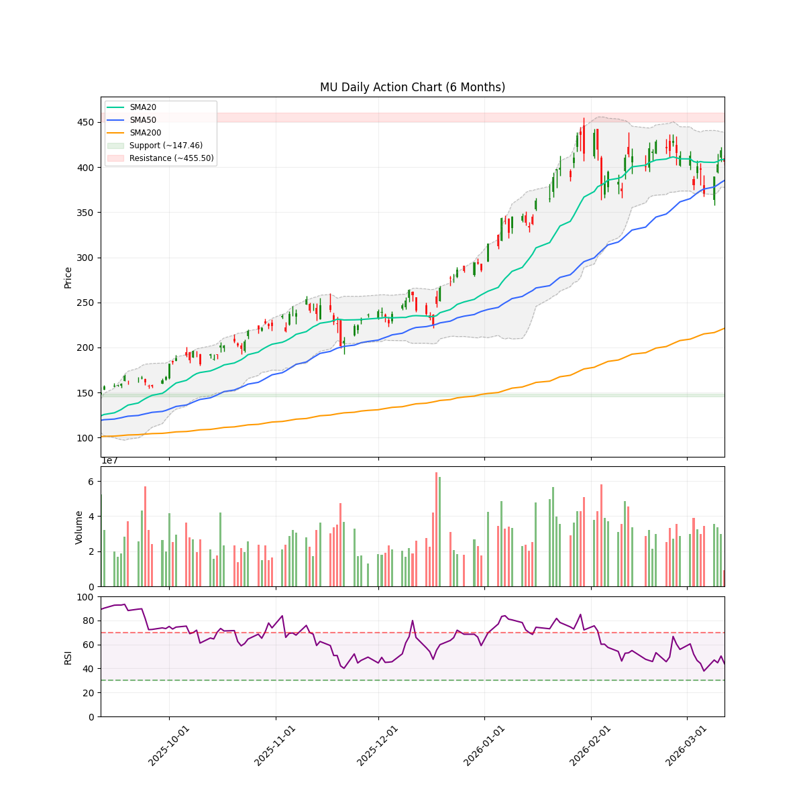
#### 研报分析

### 技术指标概览 (Technical Overview)
- **当前价格**: $406.10
- **RSI (14)**: 43.99
- **移动平均线**: SMA20: $408.27 | SMA50: $385.22 | SMA200: $221.24 (Bullish)
- **波动率**: ATR (14): 24.57 (预计周度波动: +/- $54.94)
- **关键位 (6m)**: 支撑位 $147.46 | 阻力位 $455.50
- **即时状态**: Above SMA50

朋友，来，坐下喝杯咖啡。咱们聊聊美光科技（MU）现在的局面。

如果你盯着屏幕上的数字看，可能会觉得美光现在有点“高处不胜寒”。但在“叙事经济学”的显微镜下，美光正在经历一场经典的高位心理博弈。它到底是通往 500 美元的加油站，还是一个精美的多头陷阱？

以下是这份基于叙事逻辑的**情绪审计报告**：

---

### **美光科技 (MU) 叙事审计报告：黎明前的静默，还是盛宴后的离场？**

#### **1. 催化剂分级 (Catalyst Hierarchy)**

*   **A-Tier（核心驱动）：花旗银行的“战前”冲锋号**
    *   [Yahoo Finance] 提到，花旗分析师力挺投资者在 **3月18日** 财报发布前入场。这种来自一线投行的“背书”在财报周前夕具有极强的心理支撑作用。分析师敢在此时点名，通常暗示了供应链端（尤其是 HBM 高带宽内存）的需求依然饥渴。
*   **B-Tier（行业共振）：存储板块的“抱团取暖”**
    *   [24/7 Wall St] 报道，SanDisk (SNDK) 飙升 11.6%，带动美光和西部数据集体反弹。这种板块联动说明资金并没有撤离，而是在等待一个爆发的契机。同时，AI 驱动的增长叙事 [Yahoo Finance Canada] 依然是美光的中期底色。
*   **C-Tier（杂音与扰动）：宏观阴云与小众看多**
    *   [Investor's Business Daily] 提到的油价跳升和地缘冲突（美伊局势）给大盘蒙上了阴影。而 Insider Monkey 提到的 Substack 牛市论点属于情绪补充，虽然聊胜于无，但不足以改变大趋势。

#### **2. 背离检测 (Divergence Detection)**

**目前存在显著的“利好钝化”现象。**
尽管花旗银行发出了强烈的买入信号，且存储板块整体走强，美光的股价（$406.10）却跌破了 20 日均线（SMA20: $408.27）。

*   **解析：** 这种“好消息下股价微调”的情况，并非基本面恶化，而是**恐高心理**与**宏观避险情绪**（如油价波动）的碰撞。RSI 处于 43.99 的中性偏低位置，说明市场正在通过横盘消化此前的巨大涨幅，而非“系统性溃败”。这更像是一个蓄势待发的“弹簧”，而非正在枯竭的趋势。

#### **3. 叙事评分 (Logic Score)**

### **逻辑得分：7.8 / 10**
> **评语：** “牛市的犹豫期”。
美光的叙事依然根植于 AI 基础设施的刚需。目前的股价波动更多是财报前的“洗盘”。只要 385 美元的 SMA50 支撑位不破，多头依然掌控着麦克风。

---

#### **4. 深度洞察：市场在想什么？**

现在的市场就像一个在派对上玩得很嗨、但又时刻盯着出口的客人。
*   **估值迷雾：** [Forbes] 提到的 $400 关口是心理天险。从 2022 年的 48 美元到现在的 400 多美元，这种涨幅让任何理智的基金经理都会手抖。
*   **财报博弈：** 大家都在等 3 月 18 日的那张成绩单。如果美光的 HBM 指引哪怕有一丁点超预期，那些空头就会瞬间变成推升股价的燃料。反之，如果指引平平，这可能演变成一次“利好出尽”的踩踏。

#### **5. 下一个关键节点 (Next Major Date)**

*   **日期：2026年3月18日**
*   **事件：** **财报发布日 (Earnings Release)**
*   **建议：** 关注在此日期之前，股价是否能站稳 $408.27 (SMA20)。如果财报前股价先行突破 $418（近期阻力位），那么“财报日跳空高开”的叙事将变得极具说服力。

---

**老兵视角：**
朋友，别被每天 2% 的波动吓跑。美光现在的走势很“干净”，没有那种放量暴跌的绝望感。花旗分析师在 3 月 11 日的喊话 [Yahoo Finance] 其实是在给市场递话：**“别因为恐高而错过 AI 的内存红利。”** 

现在的 406 美元，在未来的叙事里，可能只是一个稍作停留的观景台。

**相关引用来源：**
*   *Citi Analysts Buy Call:* [https://finance.yahoo.com/news/buy-micron-stock-march-18-192020206.html](https://finance.yahoo.com/news/buy-micron-stock-march-18-192020206.html)
*   *Industry Rebound:* [https://247wallst.com/investing/2026/03/09/sandisk-sndk-stock-soars-11-6-today-micron-technology-mu-and-western-digital-wdc-also-see-strong-gains/](https://247wallst.com/investing/2026/03/09/sandisk-sndk-stock-soars-11-6-today-micron-technology-mu-and-western-digital-wdc-also-see-strong-gains/)
#### 近期新闻与事件
- **[Yahoo Finance Canada]** [Got $1,000? 2 Top Growth Stocks to Buy That Could Double Your Money](https://ca.finance.yahoo.com/news/got-1-000-2-top-010000494.html)
- **[Investor's Business Daily on MSN]** [Stock market today: Dow sinks as oil jumps amid US.-Iran war; Oracle soars (live coverage)](https://www.msn.com/en-us/money/markets/stock-market-today-dow-slumps-as-oil-spikes-suspected-iran-linked-hack-slams-medical-stock-live-coverage/ar-AA1YfgoR?ocid=BingNewsVerp)
- **[Insider Monkey]** [Is Micron Technology, Inc. (MU) A Good Stock To Buy Now?](https://www.msn.com/en-us/money/other/is-micron-technology-inc-mu-a-good-stock-to-buy-now/ar-AA1YtX1N)
- **[Forbes]** [Buy Or Sell Micron Stock At $400?](https://www.forbes.com/sites/greatspeculations/2026/03/11/buy-or-sell-micron-stock-at-400/)
- **[24/7 Wall St.]** [SanDisk (SNDK) Stock Soars 11.6% Today: Micron Technology (MU) and Western Digital (WDC) Also See Strong Gains](https://247wallst.com/investing/2026/03/09/sandisk-sndk-stock-soars-11-6-today-micron-technology-mu-and-western-digital-wdc-also-see-strong-gains/)

---

### NVDA
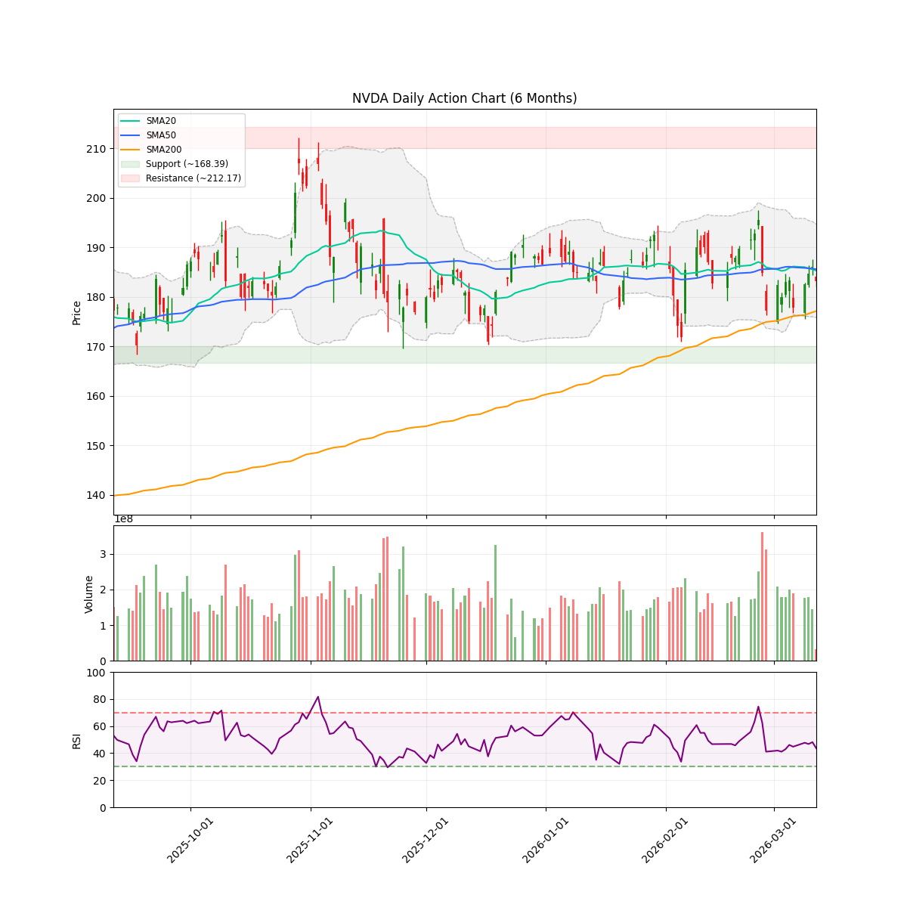
#### 研报分析

### 技术指标概览 (Technical Overview)
- **当前价格**: $183.16
- **RSI (14)**: 43.57
- **移动平均线**: SMA20: $185.28 | SMA50: $185.60 | SMA200: $177.15 (Bullish)
- **波动率**: ATR (14): 6.14 (预计周度波动: +/- $13.72)
- **关键位 (6m)**: 支撑位 $168.39 | 阻力位 $212.17
- **即时状态**: Below SMA50

# NVDA 叙事经济学审计报告：AI 王座上的“外部性”风暴 —— 财报神话能抵挡地缘寒冬吗？

**报告日期：** 2026年3月12日  
**分析师：** 叙事经济学研究组（Hedge Fund Research Associate）  
**标的：** NVDA (Nvidia Corporation)  
**当前价格：** $183.16

---

### 一、 催化剂分类：谁在驱动舞池，谁在噪音干扰？

在叙事经济学的视角下，我们要剥开新闻的表象，看看哪些是真正的“硬通货”。

*   **A-Tier（核心动力）：财报统治力与长期估值锚点**
    *   **2月25日 Blockbuster Earnings：** Nvidia 再次交出了“怪兽级”财报，不仅营收超预期，还上调了指引。这是股价最坚实的底牌。
    *   **2030年10万亿市值愿景：** 市场开始讨论其长期作为“AI基建领主”的地位，这种长期叙事为股价提供了极高的心理溢价上限。
*   **B-Tier（战略布局）：Nebius 投资与机构背书**
    *   **Nebius $20亿追加投资：** 这是一个聪明的“铁锹商”策略。通过扶持 AI 基础设施公司（如 Nebius），Nvidia 实际上是在为自己的芯片创造持续的下游需求。
    *   **Seeking Alpha 评级上调：** 机构的重新定价反映了对 AI 长期溢价的认可。
*   **C-Tier（市场噪音）：克莱默的呼吁与宏观情绪**
    *   **Jim Cramer 的看多：** 市场老手都知道，“反向克莱默”效应偶尔会带来情绪干扰。
    *   **油价破百与中东局势：** 这属于系统性宏观风险，虽影响短期资金流向，但不改变 NVDA 的 AI 基本面。

---

### 二、 逻辑背离检测：为何“好消息”救不了破位？

目前市场正上演一场教科书级别的**“基本面与宏观现实的撕裂”**。

**背离点：**
NVDA 在2月25日发布了炸裂财报并获得了评级上调，但目前的股价（$183.16）却尴尬地回落到了 SMA20 ($185.28) 和 SMA50 ($185.60) 之下。

**深度解析：**
这并非 NVDA 的“AI 叙事”破灭了，而是被**“地缘与成本压力”**劫持了。
1.  **能源叙事覆盖 AI 叙事：** 当油价重回 $100 以上，市场的恐惧点从“增长”转向了“通胀”。对于 NVDA 这种高估值票，油价每涨一美分，其折现率模型就会抖一抖。
2.  **供应链焦虑：** 关于伊朗周边航运遭受袭击的消息，直接刺痛了半导体产业的神经。即便 NVDA 的设计在加州，其代工厂 TSMC 的交付焦虑也会映射到股价上。
3.  **技术面“陷阱”：** 股价虽然在 SMA200 ($177.15) 之上有支撑，但跌破 SMA50 说明短期动能衰竭。目前的震荡更像是对前期获利盘的暴力出清。

---

### 三、 叙事总结：是趋势还是陷阱？

现在的 NVDA 像是一个**“被锁在冰柜里的超级战士”**。

它的核心引擎（AI 需求）依然热火朝天，但外部宏观环境（战争、油价、供应链）正在给它降温。这不是系统性失败，而是一次**“估值错位下的深呼吸”**。

*   **目前的市场情绪：** 谨慎的乐观。RSI 为 43.57，并未进入超卖区，说明抛售并非恐慌性，而是理性的撤退。
*   **逻辑评分（Logic Score）：6.8 / 10**
    *   *扣分项：* 跌破短期均线，宏观地缘局势不透明，油价通胀预期。
    *   *加分项：* 财报基本面无懈可击， Nebius 投资显示其生态护城河在加深。

---

### 四、 核心数据与展望

*   **当前走势：** 偏弱震荡。处于 6 个月低点 ($168.39) 与 6 个月高点 ($212.17) 的中轴偏下方。
*   **关键支撑位：** $177.15 (SMA200) 是死守线，一旦跌破，AI 叙事将面临结构性重估。
*   **关键阻力位：** $185.60 (SMA50)，站稳此线方可重启多头。

**下一个重大日期（Next Major Date）：**
*   **2026年5月20日前后（预估）：** Q1 2027 季度财报发布日。这将是验证地缘冲突是否真实影响其供应链交付的最关键时刻。

---

**老兵私语：**
*“别在这个位置跟宏观死磕。NVDA 的故事没讲完，但现在市场在担心加油站的电费。等油价叙事消停一点，或者等它回踩 SMA200 确认支撑，那才是老猎人扣动扳机的时候。现在的跌幅，是市场在给这头‘AI 怪兽’修剪指甲，虽然疼，但不伤骨头。”*
#### 近期新闻与事件
- **[Invezz]** [How Nvidia's $2 billion investment may 'backfire' on Nebius stock](https://invezz.com/news/2026/03/11/how-nvidias-2-billion-investment-may-backfire-on-nebius-stock/)
- **[Investopedia]** [This AI Infrastructure Stock Is Surging After a $2 Billion Investment From Nvidia](https://www.investopedia.com/this-ai-infrastructure-stock-is-surging-after-a-usd2-billion-investment-from-nvidia-nbis-nvda-11923571)
- **[AOL]** [Can Nvidia's Stock Reach a $10 Trillion Market Cap by 2030?](https://www.aol.com/articles/nvidias-stock-reach-10-trillion-142000021.html)
- **[Stocktwits on MSN]** [Oil’s return above $100 is spooking markets again: Why NVDA, TSLA, ORCL, PATH, RIVN, LWLG are on traders' radar today](https://www.msn.com/en-us/money/markets/oil-s-return-above-100-is-spooking-markets-again-why-nvda-tsla-orcl-path-rivn-lwlg-are-on-traders-radar-today/ar-AA1Ytnpo?ocid=BingNewsVerp)
- **[Stocktwits on MSN]** [NVDA, TSMC, INTC, other chip stocks fall as fresh reported shipping attacks near Iran spark global supply chain concerns](https://www.msn.com/en-us/news/world/nvda-tsmc-intc-other-chip-stocks-fall-as-fresh-reported-shipping-attacks-near-iran-spark-global-supply-chain-concerns/ar-AA1YtCFc?ocid=BingNewsVerp)

---

### TSM
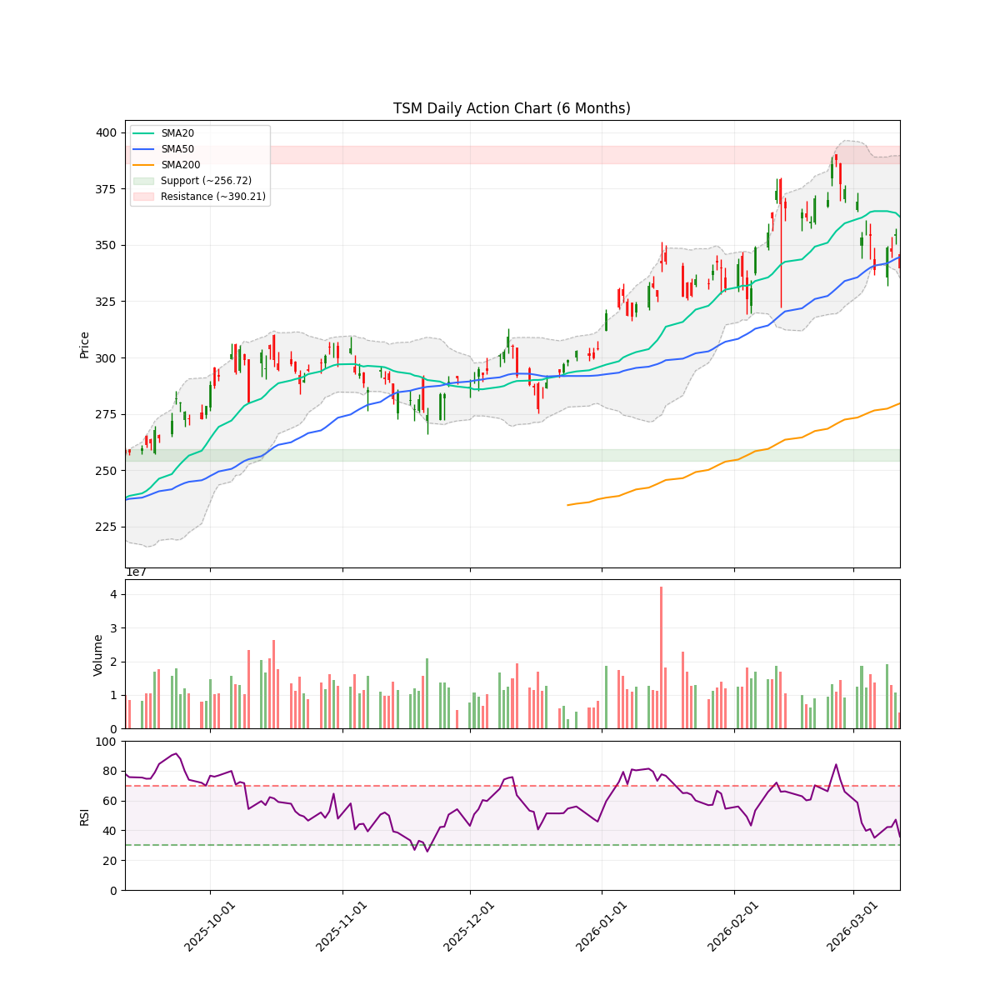
#### 研报分析

### 技术指标概览 (Technical Overview)
- **当前价格**: $339.54
- **RSI (14)**: 35.85
- **移动平均线**: SMA20: $362.45 | SMA50: $344.58 | SMA200: $279.64 (Bullish)
- **波动率**: ATR (14): 13.37 (预计周度波动: +/- $29.91)
- **关键位 (6m)**: 支撑位 $256.72 | 阻力位 $390.21
- **即时状态**: Below SMA50

使用 Gemini API 时出错: 503 UNAVAILABLE. {'error': {'code': 503, 'message': 'This model is currently experiencing high demand. Spikes in demand are usually temporary. Please try again later.', 'status': 'UNAVAILABLE'}}。(已切换至简易启发式分析)
#### 近期新闻与事件
- **[Insider Monkey]** [11 Best Large-Cap Tech Stocks to Invest In](https://www.insidermonkey.com/blog/11-best-large-cap-tech-stocks-to-invest-in-1713326/)
- **[AOL]** [Is Taiwan Semiconductor Stock Going to $500?](https://www.aol.com/articles/taiwan-semiconductor-stock-going-500-160700749.html)
- **[Yahoo Finance]** [TSMC (TSM) Rises As Market Takes a Dip: Key Facts](https://uk.finance.yahoo.com/news/tsmc-tsm-rises-market-takes-214503415.html)
- **[The Motley Fool]** [Has Intel's Stock Peaked?](https://www.msn.com/en-us/money/topstocks/has-intels-stock-peaked/ar-AA1XR7Xz)
- **[The Motley Fool]** [Top 5 Unstoppable AI Stocks to Buy for 2026](https://www.msn.com/en-us/money/general/top-5-unstoppable-ai-stocks-to-buy-for-2026/ar-AA1XVLKR)

---

### VRT
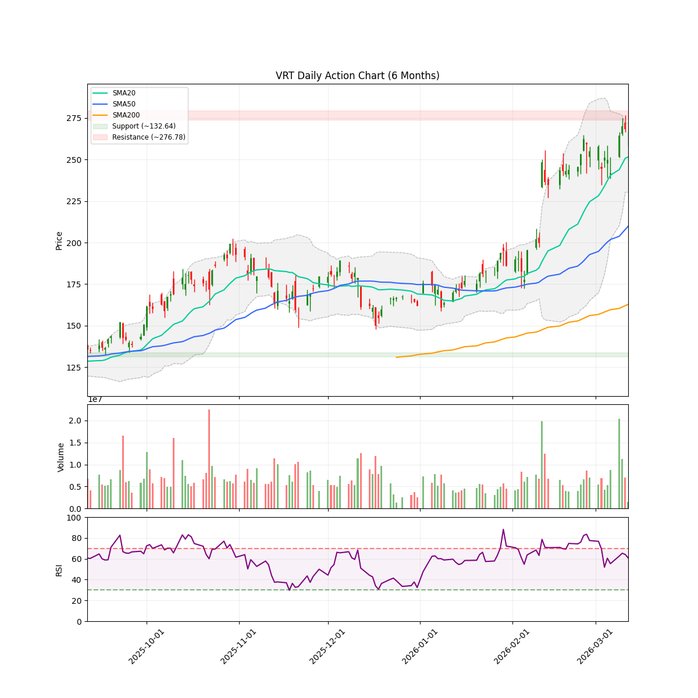
#### 研报分析

### 技术指标概览 (Technical Overview)
- **当前价格**: $263.80
- **RSI (14)**: 60.80
- **移动平均线**: SMA20: $251.55 | SMA50: $209.85 | SMA200: $162.85 (Bullish)
- **波动率**: ATR (14): 14.33 (预计周度波动: +/- $32.04)
- **关键位 (6m)**: 支撑位 $132.64 | 阻力位 $276.78
- **即时状态**: Above SMA50

使用 Gemini API 时出错: 503 UNAVAILABLE. {'error': {'code': 503, 'message': 'This model is currently experiencing high demand. Spikes in demand are usually temporary. Please try again later.', 'status': 'UNAVAILABLE'}}。(已切换至简易启发式分析)
#### 近期新闻与事件
- **[Yahoo Finance]** [Should You Buy Vertiv Stock Before March 23?](https://finance.yahoo.com/news/buy-vertiv-stock-march-23-155951324.html)
- **[Blockonomi]** [Vertiv (VRT) Stock Rallies 7% After S&P 500 Inclusion Announcement](https://blockonomi.com/vertiv-vrt-stock-rallies-7-after-sp-500-inclusion-announcement/)
- **[Zacks.com]** [Vertiv (VRT) Soars 9.3%: Is Further Upside Left in the Stock?](https://www.msn.com/en-us/money/topstocks/vertiv-vrt-soars-93-is-further-upside-left-in-the-stock/ar-AA1XVIpH)
- **[Blockonomi]** [Vertiv (VRT) Stock Drops 3% as Heavy Volume Overshadows Strong Earnings and Analyst Upgrades](https://blockonomi.com/vertiv-vrt-stock-drops-3-as-heavy-volume-overshadows-strong-earnings-and-analyst-upgrades/)
- **[Forbes]** [Vertiv Stock: Why S&P 500 Inclusion Is A Game Changer](https://www.forbes.com/sites/greatspeculations/2026/03/10/vertiv-stock-why-sp-500-inclusion-is-a-game-changer/)

---

### VST
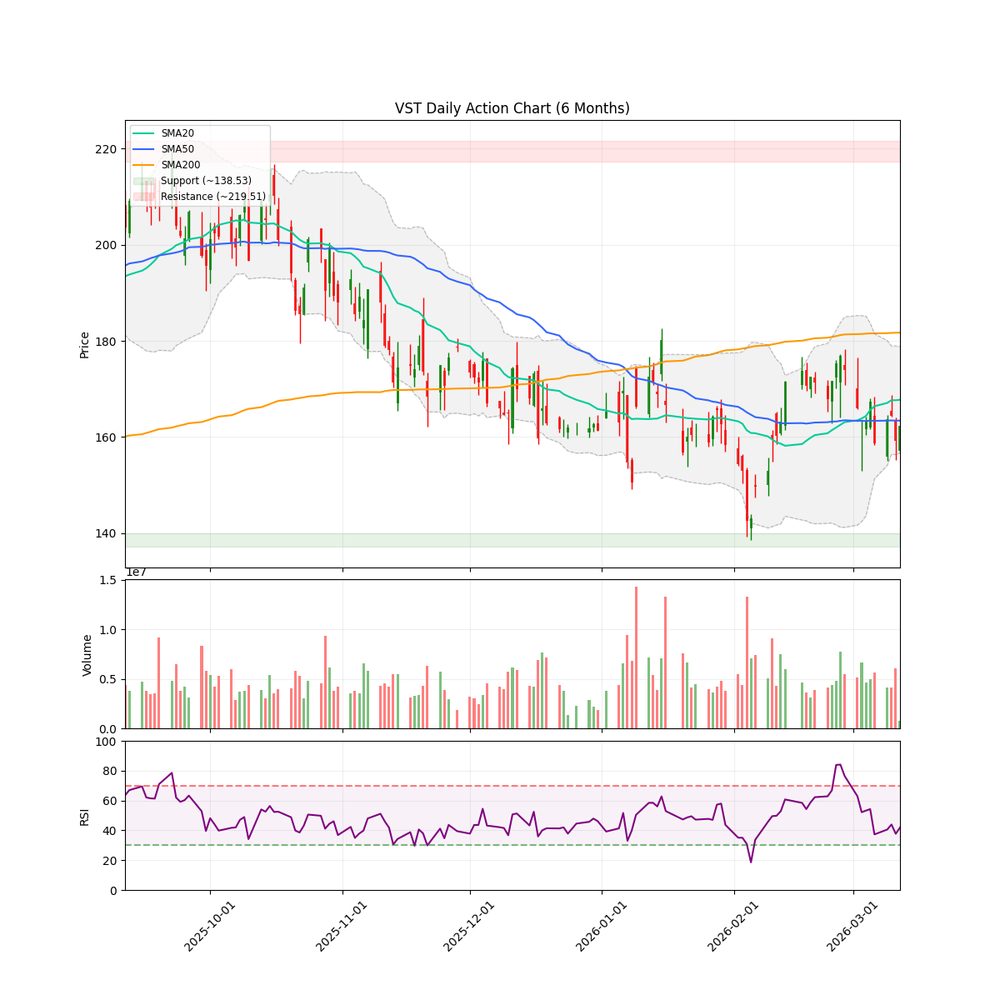
#### 研报分析

### 技术指标概览 (Technical Overview)
- **当前价格**: $162.25
- **RSI (14)**: 41.87
- **移动平均线**: SMA20: $167.74 | SMA50: $163.40 | SMA200: $181.71 (Bearish)
- **波动率**: ATR (14): 8.24 (预计周度波动: +/- $18.43)
- **关键位 (6m)**: 支撑位 $138.53 | 阻力位 $219.51
- **即时状态**: Below SMA50

你好！我是你的对冲基金研究助理。今天我们来聊聊 **Vistra Corp (VST)**。

把杯子里的咖啡续满，我们得好好拆解一下这家电力巨头。目前 VST 的处境非常微妙：叙事层面它依然是“AI时代的卖水人”，但盘面上，它正经历一场痛苦的洗礼。

---

### **Vistra (VST) 情绪审计报告：叙事与现实的拉锯战**

#### **1. 催化剂分级 (Catalyst Categorization)**

*   **A-Tier：核能转型的长期红利与 AI 电力需求**
    *   尽管股价低迷，但 VST 作为美国顶级核能发电企业的地位未变。分析师依然将其列为“最佳核能股”之一（参考：Insider Monkey, 2026-03-08）。这种结构性的电力需求（尤其是 AI 数据中心）是支撑其估值的核心骨架。
*   **B-Tier：德州虚拟电厂（VPP）的扩张**
    *   VST 与 Enphase Energy (ENPH) 的合作升级是一场漂亮的局部战争。通过整合 IQ 电池进入 Battery Rewards 计划，VST 正在强化其在德州电网中的灵活性（参考：Insider Monkey, 2026-03-09）。这属于稳健的运营增量。
*   **C-Tier：Reddit 的吹捧与 Zacks 的“热度”**
    *   目前在 Reddit 上被吹捧为“将要登月”的廉价股。作为老手，我们知道当社交媒体开始狂热而机构却在离场时，这通常是杂音，而非信号（参考：Yahoo Finance/Zacks, 2026-03-05）。

#### **2. 背离检测：为何“利好不涨”？ (Divergence Detection)**

这是我最担心的部分。
**Oracle (ORCL) 刚刚交出了一份火爆的财报**，确认了 AI 需求依然饥渴。按照之前的逻辑，作为 AI 后勤部长的 VST 应该借风起航。然而，VST 的股价却缩在 **SMA200 (181.71)** 下方瑟瑟发抖，甚至跌破了 SMA50。

*   **看跌信号：** VST 的执行副总裁 Moore 刚刚套现了 **160 万美元**（2026-03-12）。虽然高管卖股有各种理由，但在股价跌破关键均线时撤退，这绝不是什么“坚定信心”的表现。
*   **市场情绪：** 目前处于“利好钝化”阶段。市场已经消化了核能的预期，现在开始担心油价上涨和地缘政治风险带来的系统性压力。

#### **3. 叙事诊断：是“趋势”还是“陷阱”？**

现在的 VST 就像是一个**在聚光灯下疲惫不堪的明星**。

故事（Narrative）依然动听：核能、AI、德州电网改革。但价格动作（Price Action）却在说：**“太贵了，让我歇会。”** 股价低于 SMA50 和 SMA200 意味着中长期趋势已经转弱。目前的 41.87 RSI 虽然还没到“超卖”的底部，但也显示出多头的溃散。

这更像是一个**中期调整陷阱**。如果你现在冲进去，可能会被埋在 160-170 美元的阻力位下。

---

### **情绪评分 (Sentiment Score)**

# **4.8 / 10**
*(注：10 为势不可挡，0 为系统性崩溃)*

**评价：** 叙事 8 分，但盘面 2 分。这种严重的“身首异处”要求我们保持克制。在股价重新站稳 SMA50 (163.40) 或回踩 138.53 的强支撑之前，不要被 Reddit 上的“登月”言论洗脑。

---

### **核心观察指标**

*   **逻辑评分 (Logic Score):** **7.5/10** (公司基本面依然强劲，但资金面正在流出)。
*   **关键技术位:**
    *   **阻力位:** 181.71 (SMA200) —— 只要不收复这里，所有的反弹都是“死猫跳”。
    *   **支撑位:** 138.53 (6个月低点) —— 这是最后的防线。
*   **高管动向:** EVP Moore 的 $1.6M 减持是一个需要警惕的注脚。

### **下个关键日期 (Next Major Date)**

*   **2026年5月初 (预测值):** **Q1 财报发布日**。
    *   *注：这是下一个能真正扭转叙事、验证 AI 电力订单是否落地的分水岭。在此之前，股价可能持续在 140-165 之间震荡磨底。*

---

**老兵建议：** 现在的 VST 不是用来“追”的，是用来“等”的。等那些 Reddit 的散户交出筹码，等 RSI 跌进 30 以下的超卖区，或者等它重新收复 200 日线。现在的市场脉搏略显紊乱，咱们先看戏。
#### 近期新闻与事件
- **[Yahoo Finance]** [How Is Vistra's Stock Performance Compared to Other Utilities Stocks?](https://finance.yahoo.com/news/vistras-stock-performance-compared-other-131846909.html)
- **[Insider Monkey]** [Vistra (VST) Expands Virtual Power Plant in Texas With Enphase Energy (ENPH)](https://www.msn.com/en-us/money/technologyinvesting/vistra-vst-expands-virtual-power-plant-in-texas-with-enphase-energy-enph/ar-AA1XPc01)
- **[Insider Monkey]** [Vistra Corp (VST) Sees Fresh Analyst Bullishness](https://www.msn.com/en-us/money/topstocks/vistra-corp-vst-sees-fresh-analyst-bullishness/ar-AA1XM15T)
- **[Investopedia]** [Oracle Earnings Heated Up Its Stock—But Couldn't Spark an AI Rally](https://www.investopedia.com/oracle-earnings-heated-up-its-stock-but-couldn-t-spark-an-ai-rally-orcl-11923904)
- **[Investing.com]** [Top Copper Stocks to Watch, According to Jefferies](https://www.investing.com/news/stock-market-news/top-copper-stocks-to-watch-according-to-jefferies-93CH-4555263)

---
