# 每日股市市场报告 (2026-03-13)

> **免责声明**: 本报告由 **代码与 Gemini AI 自动生成**，仅供研究参考，**不构成**任何投资建议。投资有风险，入市需谨慎。作者及 AI 不对任何基于此内容的投资决策承担责任。

## 📑 目录
[TOC]

##  长期投资逻辑
本组合旨在捕捉 **人工智能（AI）与半导体协议** 带来的跨周期结构性增长，核心投资策略聚焦于“确定性”与“物理瓶颈”：
- **底层制程垄断 (Foundry & WFE Moats)**：
  布局处于全球半导体精密制造顶端的“工业母机”级别公司。寻找具备极高准入门槛的晶圆代工及前道设备供应商，作为全产业链最稳固的底座资产。
- **算力稀缺性与连接带宽 (Compute & Interconnect Scarcity)**：
  聚焦在高性能计算芯（HPC）及高带宽连接领域占据主导地位的标的。AI 的终极竞争是“规模”，寻找能有效解决数据交换瓶颈并提供核心推理/训练能力的算力巨头。
- **应用生态与数据霸权 (Platform & Data Sovereignty)**：
  布局拥有闭环生态、海量高质量私有数据及云基础设施的科技巨头。它们是 AI 商业化落地的最终守门人，拥有将技术转化为持续现金流的分配权。
- **物理边界保障 (Power & Thermal Infrastructure)**：
  关注 AI 扩张的“最终瓶颈”——电力供应与热能管理。重点布局为下一代超大规模数据中心提供高功率密度能源、液冷技术及电网扩容方案的能源基建商。
**风控策略**：利用 AlphaJAX 的量化动量评分（Quant Score）作为过滤器，结合 LLM 叙事审计（Narrative Audit）捕捉“业绩超预期 + 叙事逻辑改善”的共振点，实现跨周期的超额收益。

 **注：排序权重**：Ticker 按照 AI 检测出的 **方向** 排序（**看多**优先，其次是 **中性**，最后是 **看空**）。
---

<!-- DISCORD_SUMMARY_START -->
## 🧠 对冲基金经理全局诊断与资金分配策略
# 投资组合策略简报：AI 基建的“阵痛与换仓”

**系统日期：** 2026年03月13日
**执行官：** 资深组合经理 (PM)

---

### 一、 指挥官意图 (Commander's Intent)

目前的盘面不是溃败，而是一场**“残酷的优胜劣汰”**。大资金正在从纯粹的“叙事溢价股”撤离，转而拥抱有实打实业绩支撑和指数刚需的“AI 铁军”。

**核心战略：** 
1.  **仓位止血与压降**：你的 AMD 仓位已经顶到了 50% 的“红线”，且 Logic Score 仅为 6.8。这种高浓度的单一押注在技术面跌破 SMA50 的情况下是极其危险的。
2.  **火力侦察新目标**：观察池中出现了多项 8.5+ 高分标的（ASML, MU, VRT, AVGO），这些才是下一阶段的增量主力。
3.  **现金护城河**：目前持有约 27% 的现金（$64k），这是我们下周应对英伟达 GTC 大会和美联储波动的“弹药”。我们将动用约 50% 的可用现金进行**结构性换仓**。

---

### 二、 现有持仓诊断与行动计划

| 标的 | Logic Score | 状态 | PM 决策 | 战略理由 |
| :--- | :--- | :--- | :--- | :--- |
| **AMD** | **6.8** | 集中度 50.56% | **停止加仓 / 严控止损** | **仓位已达上限！** 现价 $197 处于 SMA200 ($190) 保卫战。绝对禁止在 $190 跌破前加仓。如果反弹至 $210 附近，必须减仓至 30% 以下。 |
| **GOOGL** | **7.2** | 浮盈 +16% | **战略持有** | 盈利垫丰厚。虽然跌破 SMA50，但 CVS 合作与 AI 云逻辑极硬。它是账户的“压舱石”，坐稳不动。 |
| **AMZN** | **6.8** | 浮盈 +4% | **中性观望** | 仓位极轻（1.77%），无需折腾。等待 $196 支撑位的二次回踩确认，暂不动用宝贵现金。 |

---

### 三、 观察池突击：新猎物锁定

**当前市场最值得扣动扳机的三个目标：**

1.  **ASML (Score: 8.5 | RSI: 39.07)**: 
    *   **理由**：光刻机霸主回踩 SMA50。RSI 接近超卖。这是“AI 基建”的终极底层，跌下来就是捡金子。
    *   **动作**：建议建立 10% NAV 的底仓。

2.  **MU (Score: 8.8 | 暴走前夜)**: 
    *   **理由**：下周三财报。EPS 增长 460% 的预期不是画饼。AI 存储是目前的短板，美光是唯一受益者。
    *   **动作**：在财报前进行博弈性建仓。

3.  **VRT (Score: 8.8 | 指数刚需)**: 
    *   **理由**：3月23日入普。被动买盘下周必须进场。这是典型的流动性推升机会。
    *   **动作**：追随动能，建立趋势仓位。

---

### 四、 实时交易计划 (Actionable Trading Plan)

1.  **第一步 (立即执行)：** 动用 $25,000 现金，平均分配至 **ASML** 和 **MU**。
    *   买入约 9 股 ASML (约 $12,380)
    *   买入约 30 股 MU (约 $12,770)
2.  **第二步 (风控)：** 监控 AMD 的 $200 Put 行权情况。如果被行权接货，必须立即卖出等量的 AMD 正股，将仓位强制压回 50% 以内，释放流动性。
3.  **第三步 (防御)：** 剩余约 $39,000 现金锁死。等待下周一 NVDA GTC 大会。如果 NVDA 跌破 $177，全市场将迎来二次探底，届时这笔钱是救命稻草。

---

### 五、 “If-Then” 压力测试

*   **如果 AMD 跌破 $185 (SMA200)**：**无条件砍掉 20% 的持仓**。叙事已经技术性破位，不能陪葬。
*   **如果 MU 财报超预期暴涨**：在 $450 以上止盈一半仓位，利润落袋为安。
*   **如果 ASML 跌破 $1350**：停止买入。说明半导体设备端出现了系统性砍单风险，需重新审计。
*   **如果 NVDA GTC 大会点燃情绪**：观察账户中 AMD 和 GOOGL 的跟涨力度。如果 AMD 弱于大盘，说明其“二哥”地位动摇，趁反弹继续减仓。

---

### 六、 PM 寄语 (Commanders Intent)

**“别在破损的战舰上浪费燃料，去追随那些正在启航的巨轮。”**
你现在的 AMD 仓位太重，已经让你丧失了捕捉 ASML 和 MU 这种黄金机会的灵活性。下周的操作核心就是**“瘦身与换血”**。我们不赌博，我们只在概率最高的地方下注。

**稳住，别被短期的波动晃掉筹码！** ☕
<!-- DISCORD_SUMMARY_END -->
---

## 💼 现有持仓个股诊断

### AMD
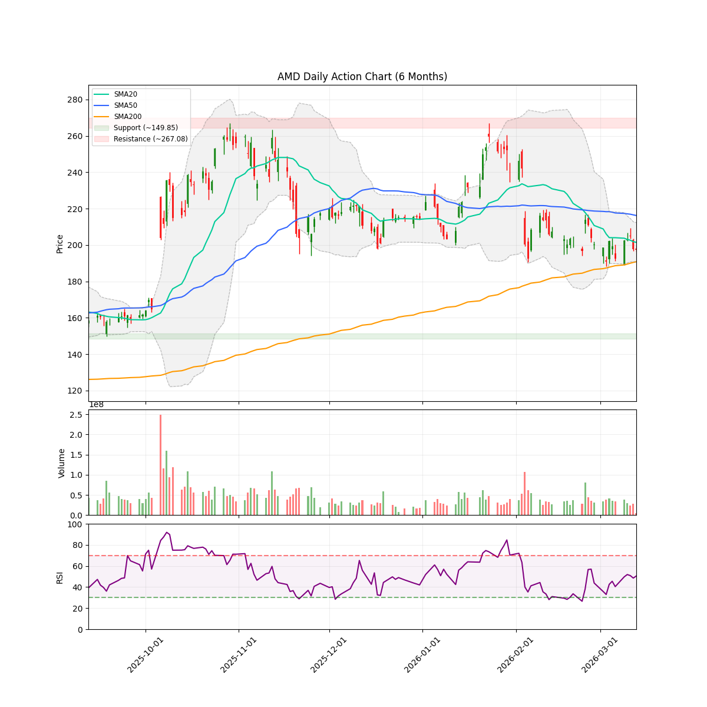
#### 研报分析

### 技术指标概览 (Technical Overview)
- **当前价格**: $197.46
- **RSI (14)**: 50.53
- **移动平均线**: SMA20: $201.43 | SMA50: $216.21 | SMA200: $190.84 (Bullish)
- **波动率**: ATR (14): 9.19 (预计周度波动: +/- $20.54)
- **关键位 (6m)**: 支撑位 $149.85 | 阻力位 $267.08
- **即时状态**: Below SMA50

你好！我是你的对冲基金研究助理。今天我们来聊聊 AMD (超威半导体) 的近况。我们不谈那些枯燥的研报数据，直接切入正题：在 2026 年初的这场 AI 狂欢中，AMD 是在酝酿下一波冲刺，还是已经掉进了“估值陷阱”？

坐在咖啡馆里，如果你问我 AMD 现在的状态，我会说：**它正处在“好消息带来的疲劳期”和“地缘政治噪音”的交汇点。**

---

### 一、 催化剂分级 (Catalyst Categorization)

我们要分清什么是真正的动力，什么是背景噪音：

*   **A-Tier (核心驱动力): Q4 财报超预期**
    *   [StockStory.org] 指出 AMD 在 Q4 财报中表现出色，不仅是处理器，图形芯片业务也展现了极强的韧性。这是股价跌不穿 SMA200 ($190.84) 的定海神针。
*   **B-Tier (行业共振): AI 芯片的持续扩张**
    *   [Insider Monkey] 将其列为“能让你成为百万富翁”的 10 只 AI 股票。此外，友商博通 (Broadcom) 预测 2027 年 AI 芯片销售将破千亿，这证明了 AI 的天花板还没到，AMD 依然在“风口”上。
*   **C-Tier (市场噪音): 零售端的焦虑与宏观博弈**
    *   [Barron's] 提到的伊朗局势波动导致散户抛售，以及 Cisco 财报平平带来的行业悲观情绪。这些是暂时的“阵雨”，不改变 AMD 的逻辑。

---

### 二、 离散度检测 (Divergence Detection)

**目前的怪象：好消息打不赢股价。**
AMD 刚交出了一份优秀的 Q4 答卷（3月12日新闻确认），但股价却徘徊在 $197 附近，低于 50 日均线 ($216) 和 20 日均线 ($201)。

*   **诊断**：这不是基本面崩了，而是**“看涨期权拥挤”后的踩踏**。加上地缘政治（伊朗相关消息）导致的避险情绪，市场正在“错杀”那些高贝塔（Beta）的科技股。AMD 目前正处于**看跌竭尽 (Bearish Exhaustion)** 的边缘，SMA200 线的 $190 附近有极强的买盘支撑。

---

### 三、 情绪审计报告 (Sentiment Audit)

**逻辑评分: 6.8/10** (处于“黎明前的混沌期”)

*   **叙事分析**：
    目前的叙事主轴是“AI 泡沫破裂后的幸存者选拔”。AMD 现在的价格走势像是一个在长跑中途停下来喝水的运动员——呼吸有些急促，但心肺功能依然强大。
*   **仓位诊断 (针对你的头寸)**：
    *   你目前正股成本 $220.54，亏损约 9.2%。坦白说，你买在了之前的“情绪高点”。
    *   **棘手的部分**：你卖出的 $200 Put (-AMD260313P200) 今天正好到期（或行权）。由于现价 $197.46 低于行权价，你可能需要以 $200 的价格被迫接货（或者承受这部分的浮亏）。
    *   **好消息**：虽然短期被套，但 RSI 在 50.53 处于中性，没有超卖，意味着下行空间受限于 SMA200 的硬支撑。

---

### 四、 核心洞察与下一步行动

**“不要在黎明前折戟。”**
AMD 现在的低迷更多是受整体宏观环境（利率预期、地缘政治）的影响，而非自身产品线出了问题。

*   **情绪转折点**：一旦市场消化了中东的噪音，资金会第一时间流回像 AMD 这样有业绩支撑的 AI 龙头。
*   **预警线**：如果收盘价跌破 $185 (SMA200 以下)，叙事将从“回调”转变为“技术性破位”。

---

### 五、 关键数据汇总

*   **逻辑得分**: **6.8/10**
*   **情绪标签**: **蓄势待发 / 结构性回调**
*   **参考新闻**:
    1.  *Q4 Earnings Outperformers* (2026-03-12) - [MSN/StockStory](https://www.msn.com/en-us/money/other/q4-earnings-outperformers-amd-nasdaq-amd-and-the-rest-of-the-processors-and-graphics-chips-stocks/ar-AA1Yvvok?ocid=BingNewsVerp)
    2.  *AI Stocks That Will Make You A Millionaire* (2026-02-18) - [MSN/Insider Monkey](https://www.msn.com/en-us/news/technology/10-ai-stocks-that-will-make-you-a-millionaire/ar-AA1Yu0D7?ocid=BingNewsVerp)
*   **下一个重大日期**: **2026年4月下旬 (预计 Q1 2026 财报发布日)**。

**老兵寄语**：
兄弟，你的仓位现在有点重（占比 50.56%）。AMD 的故事还没讲完，但波动性 ATR 高达 9.19，这意味着接下来一周震荡 20 刀都是正常的。稳住，只要 $190 这个堡垒不破，这只是一次昂贵的“洗盘”。
#### 近期新闻与事件
- **[Insider Monkey on MSN]** [10 AI Stocks That Will Make You A Millionaire](https://www.msn.com/en-us/news/technology/10-ai-stocks-that-will-make-you-a-millionaire/ar-AA1Yu0D7?ocid=BingNewsVerp)
- **[Barron's on MSN]** [The market is down, but people are still buying stocks. Here’s what they’re loading up on.](https://www.msn.com/en-us/money/markets/retail-investors-are-selling-hard-here-s-what-they-re-still-buying/ar-AA1YvKVm?ocid=BingNewsVerp)
- **[Yahoo Finance]** [Earnings live: Adobe stock sinks after CEO announces departure, Ulta stock falls](https://finance.yahoo.com/news/live/earnings-live-adobe-stock-sinks-after-ceo-announces-departure-ulta-stock-falls-205638896.html)
- **[Insider Monkey on MSN]** [Broadcom (AVGO) Rises on AI Chip Sales Forecasts for 2027](https://www.msn.com/en-us/money/markets/broadcom-avgo-rises-on-ai-chip-sales-forecasts-for-2027/ar-AA1Yvaug?ocid=BingNewsVerp)
- **[Livewire Markets]** [Buy Hold Sell: 5 mega-caps on a tear (plus 2 fundie favourites)](https://www.livewiremarkets.com/wires/buy-hold-sell-5-mega-caps-on-a-tear-plus-2-fundie-favourites)

---

### AMZN
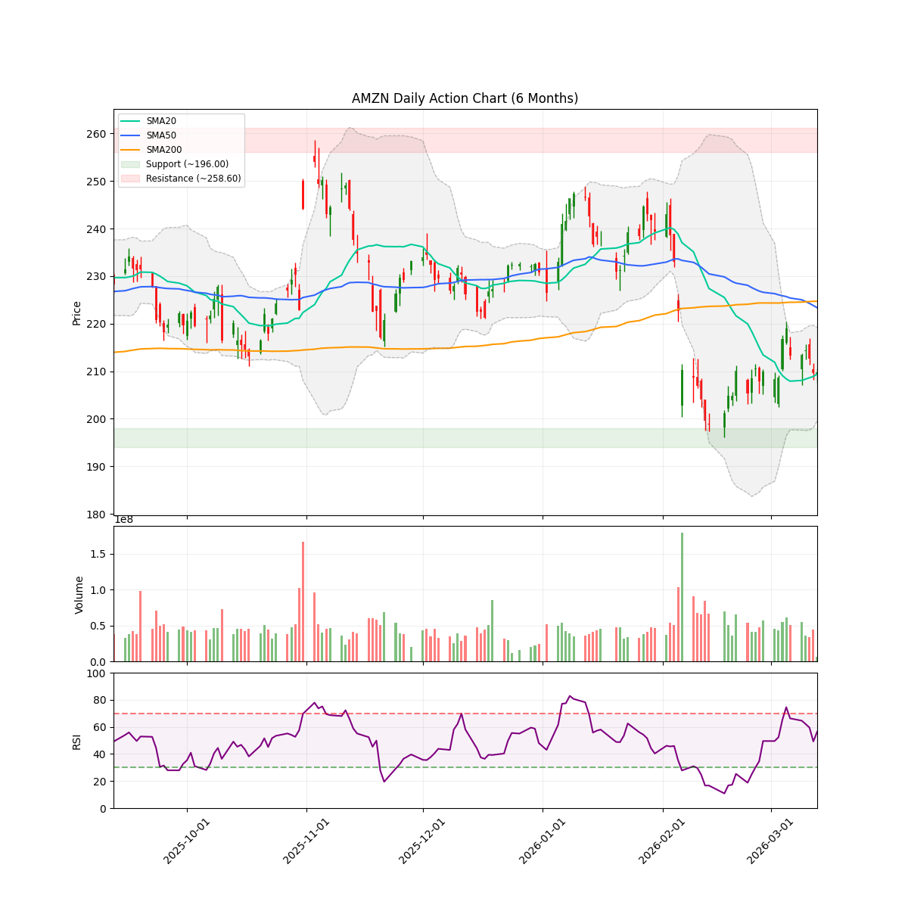
#### 研报分析

### 技术指标概览 (Technical Overview)
- **当前价格**: $209.72
- **RSI (14)**: 56.51
- **移动平均线**: SMA20: $209.39 | SMA50: $223.35 | SMA200: $224.71 (Bearish)
- **波动率**: ATR (14): 5.52 (预计周度波动: +/- $12.35)
- **关键位 (6m)**: 支撑位 $196.00 | 阻力位 $258.60
- **即时状态**: Below SMA50

你好！来，坐下喝杯咖啡。我们来聊聊你手里这只既让人兴奋又让人头疼的巨兽——**亚马逊 (AMZN)**。

作为一名盯着“叙事经济学”的分析师，我得告诉你，现在的亚马逊正处在一个非常有意思的“炼狱期”。市场上弥漫着一种奇怪的情绪：大家一方面惊叹于它的 AI 蓝图，另一方面又对它那像碎钞机一样的资本支出感到胃疼。

以下是为你整理的 **AMZN 情绪审计报告**。

---

### 1. 催化剂分类：谁在拉盘，谁在画饼？

我们将近期的信息流进行深度拆解：

*   **A-Tier（顶级催化剂：足以改变趋势的力量）**
    *   **顶级大佬进场：** 亿万富翁 Seth Klarman 在去年四季度狂砸 5 亿美元建仓 AMZN [Blockonomi]。这种级别的“聪明钱”通常不是来短线的，他们看中的是公司未来 3-5 年的底价。
    *   **AI 核心壁垒固守：** 尽管机器人部门有裁员，但亚马逊明确表示 AWS 用户将继续保留对 Anthropic (Claude) 的访问权 [Insider Monkey]。这保住了 AWS 在 AI 竞赛中的“入场券”，是保住估值的命根子。
*   **B-Tier（二线催化剂：提供向上动能）**
    *   **医疗 AI 的野心：** 亚马逊正计划将医疗 AI 助手扩大到网站和 App 用户中 [Reuters/Insider Monkey]。这说明亚马逊在寻找电商之外的下一个“高频高利润”增长点。
    *   **大行背书：** 美国银行 (BofA) 调整了目标价并试图安抚市场对 AI 支出的恐惧 [AOL]。
*   **C-Tier（噪音：听听就好）**
    *   **木头姐 (Cathie Wood) 的买入：** 她的操作现在更多被视为短线情绪波动，而非长线定海神针 [Yahoo Finance]。
    *   **与沃尔玛的十年对比：** 这种文章属于典型的“冷饭热炒”，对短期股价几乎没有直接推力。

---

### 2. 背离检测：为什么“好消息”没让股价飞起来？

**现象观察：** 你可能也发现了，最近关于亚马逊 AI 的利好满天飞，但股价却显得“死气沉沉”，甚至还在 SMA50（223.35）和 SMA200（224.71）这两道“大山”下面徘徊。

**诊断：看多者的“疲劳测试”。**
现在的叙事陷阱在于：**2000 亿美元的资本支出计划。** 市场陷入了典型的“成长的烦恼”——投资者既想要 AI 的未来，又心疼眼前的现金流。
*   **看跌信号：** 股价目前处于 Bearish 趋势（低于 SMA50），说明空头暂时掌握了话语权。
*   **看涨潜流：** 你的成本价在 **$201.61**，正好踩在 6 个月支撑位 ($196) 附近。只要股价不跌破 $196，这种“利好不涨”其实是在消化那些恐慌性的抛盘，也就是所谓的“磨底”。

---

### 3. 逻辑评分 (Logic Score): 6.8 / 10

*   **评分逻辑：** 亚马逊目前的逻辑很硬，但“叙事”太昂贵了。AWS 的护城河（Claude 合作）和顶级机构（Seth Klarman）的背注给了它 8 分的底气；但由于技术面处于均线压制下，且 $200B 的投入让短期财报压力巨大，扣掉 1.2 分。这是一个**“长线看好，短线坐牢”**的典型案例。

---

### 4. 叙事总结：是趋势还是陷阱？

现在的亚马逊不是“陷阱”，而是一个**“昂贵的等待区”**。

市场正在惩罚亚马逊的“大手笔”，把它关进了“小黑屋”（Penalty Box）。但从叙事角度看，亚马逊正在经历从“电商/云服务公司”向“AI 基础设施服务商”的终极跳跃。

**你的头寸建议：**
你目前的盈利是 **+4.16%**。这是一个非常舒服的位置，就像是买到了电影开场前最后一张打折票。
*   **支撑位守卫：** 只要 $196.00 不破，你就没必要理会市场的噪音。
*   **阻力位挑战：** 真正的战斗在 **$224 附近 (SMA200)**。如果股价放量冲破这里，那就不再是“磨洋工”，而是真正的趋势反转。

---

### 5. 关键信息参考

*   **引用的核心新闻：**
    *   *Seth Klarman 建仓 $500M:* [Blockonomi](https://blockonomi.com/amazon-amzn-stock-billionaire-seth-klarman-buys-500m-in-q4-after-trimming-alphabet-position/)
    *   *AWS 保留 Claude 访问权:* [Insider Monkey](https://www.msn.com/en-us/money/companies/amazon-amzn-retains-aws-users-access-to-claude-following-layoffs-in-robotics-unit/ar-AA1YvnkL)
    *   *医疗 AI 扩张:* [Insider Monkey](https://www.msn.com/en-us/health/other/amazoncom-amzn-to-expand-healthcare-ai-for-customers/ar-AA1YuBVg)

*   **下一个重大日期 (Next Major Date)：**
    *   **预计 2026 年 4 月底：** 第一季度财报发布日 (Q1 Earnings Release)。届时市场将审判那 2000 亿支出的第一笔投向了哪里，这才是决定 AMZN 能否回到 $250 的终极时刻。

**老兵寄语：** 别被每天几块钱的波动晃晕了头，亚马逊的这盘棋很大，你手里这 20 股只要成本够低，就坐稳了看戏。
#### 近期新闻与事件
- **[Yahoo Finance]** [AMZN vs. WMT: Which Is the Better Stock to Buy for the Next 10 Years?](https://finance.yahoo.com/news/amzn-vs-wmt-better-stock-140002009.html)
- **[Yahoo Finance]** [Cathie Wood Is Still Buying Amazon Stock. Should You?](https://finance.yahoo.com/news/cathie-wood-still-buying-amazon-181820469.html)
- **[Insider Monkey]** [Amazon (AMZN) Retains AWS Users' Access to Claude Following Layoffs in Robotics Unit](https://www.msn.com/en-us/money/companies/amazon-amzn-retains-aws-users-access-to-claude-following-layoffs-in-robotics-unit/ar-AA1YvnkL)
- **[Forbes]** [What Could Ignite The Next Amazon Stock Breakout?](https://www.forbes.com/sites/greatspeculations/2026/03/11/what-could-ignite-the-next-amazon-stock-breakout/)
- **[Insider Monkey]** [Amazon.com (AMZN) to Expand Healthcare AI for Customers](https://www.msn.com/en-us/health/other/amazoncom-amzn-to-expand-healthcare-ai-for-customers/ar-AA1YuBVg)

---

### GOOGL
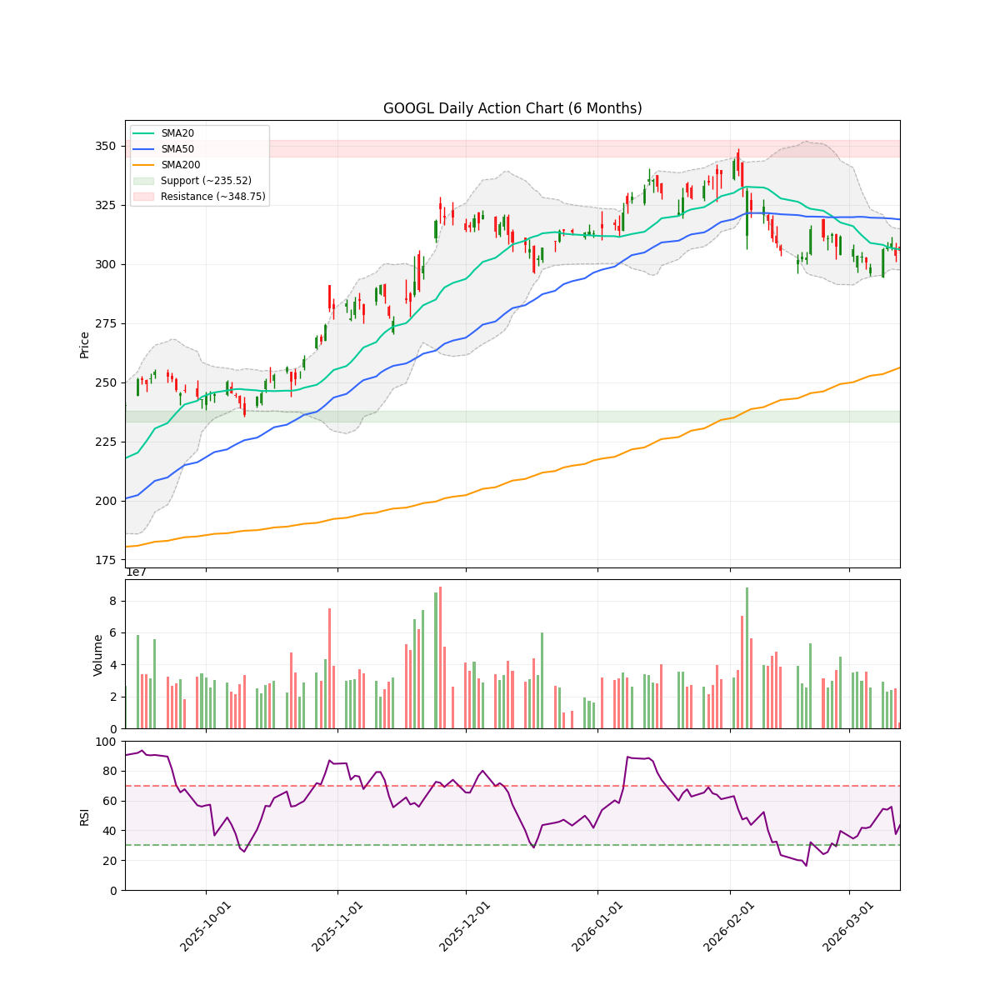
#### 研报分析

### 技术指标概览 (Technical Overview)
- **当前价格**: $305.60
- **RSI (14)**: 43.45
- **移动平均线**: SMA20: $306.20 | SMA50: $318.82 | SMA200: $256.15 (Bullish)
- **波动率**: ATR (14): 7.14 (预计周度波动: +/- $15.97)
- **关键位 (6m)**: 支撑位 $235.52 | 阻力位 $348.75
- **即时状态**: Below SMA50

# GOOGL 情绪审计报告：在“噪音”中寻找AI巨头的锚点

**日期：** 2026年03月13日
**首席研究员：** 叙事经济学分析组

---

### 1. 叙事基调：繁华后的“冷静期”
想象一下，我们在曼哈顿中城的咖啡馆，窗外是喧闹的交易所，而我们正盯着屏幕上 Alphabet (GOOGL) 的曲线。目前的 GOOGL 就像是一个刚跑完马拉松的长跑健将，虽然背后的 AI 引擎还在轰鸣，但身体（股价）由于短期的呼吸不畅正处于**回撤消化期**。

目前股价 305.60 美元，刚好在 SMA20 附近徘徊，且跌破了 SMA50。这不仅是技术上的调整，更是一场关于“贪婪与代价”的心理博弈。

---

### 2. 催化剂分级：谁在真正推动天平？

#### **A-Tier：核心增长引擎（结构性趋势）**
*   **云端 AI 落地（CVS 合作案）：** [Insider Monkey] 报道了 CVS Health 将与 Google Cloud 推出 AI 平台。这不是小打小闹，这是 AI 从实验室走向万亿美元医疗市场的实证。这是支撑 71% 年涨幅的硬核逻辑。
*   **生态系统重构（Fortnite 回归）：** [Insider Monkey] 提到的 App Store 费率调整和 Epic 游戏的回归。这意味着 Google 正在主动拆解监管地雷，用短期的利润让步换取长期的生态稳固。

#### **B-Tier：市场情绪补剂（增量动力）**
*   **机构“捞底”共识：** [CNBC] 报道 Jim Cramer 的信托正在 307 美元附近加仓。当市场风向标开始喊出“不合理的杀跌”时，这通常会为股价筑起一道坚实的情绪底。

#### **C-Tier：噪音与摩擦（短期波动）**
*   **CEO 薪酬争议：** [Blockonomi] 提到的 6.92 亿美元薪酬包导致的股价下跌。在老练的投资者眼里，这只是典型的“治理层噪音”。虽然短期让投资者感到不爽，但其核心指标与 Waymo 和 Wing 挂钩，反而说明了公司对自动驾驶和物流未来的押注。

---

### 3. 背离检测：这是“陷阱”还是“黄金坑”？

**盘面观察：** 尽管最近一周好消息频传（CVS 合作、机构加仓、生态利好），但股价却在 SMA50（318.82）下方挣扎。
*   **结论：** 典型的**看涨衰竭（Bullish Exhaustion）**转入**防御性巩固**。
*   **解读：** 这种“好消息不涨”的现象并非系统性崩溃，而是市场在消化早前过度乐观的溢价。考虑到 RSI 处于 43.45 的相对低位，卖盘力量已接近强弩之末。这更像是一个**“价值锚点回归”**的过程，而非看跌陷阱。

---

### 4. 账户诊断：你的持仓稳吗？
*   **当前头寸：** 160股，成本 $268.53。
*   **分析：** 你目前坐拥 **16.10%** 的盈利垫。即便股价跌到 SMA200（256.15），你才刚触及成本线。现在的你拥有所谓的“持仓自由”，完全可以忽略 CEO 薪酬这种噪音，等待 AI 叙事的下半场。

---

### 5. 情绪评分 (Logic Score)

# **7.2 / 10**
**评语：** 尽管短期技术面略显疲软，但 GOOGL 的叙事内核非常稳固。市场正在剔除“投机泡沫”，留下的将是围绕 AI 云和自动化（Waymo）的真金白银。这不仅是一只科技股，它正在变成一种“基础设施”。

---

### 6. 关键数据与行动指南

*   **Logic Score:** **7.2** (稳健看涨)
*   **引用的关键新闻：**
    *   [CNBC: 机构在 307 美元加仓](https://www.cnbc.com/2026/03/13/were-buying-more-of-this-leading-ai-stock-on-this-years-undeserved-pullback.html)
    *   [Blockonomi: CEO 薪酬引发的小幅波动](https://blockonomi.com/alphabet-googl-stock-dips-following-692m-ceo-compensation-package-approval/)
    *   [Insider Monkey: CVS Health 合作案](https://www.msn.com/en-us/health/other/alphabet-inc-googl-cvs-health-to-roll-out-ai-enabled-platform-with-google-cloud/ar-AA1XQZF9)
*   **下一个重大日期：** **2026年4月28日左右** (预估 2026年 Q1 财报发布日)。
*   **策略建议：** 在 300 美元整数关口上方保持观望。如果股价触及 290 美元（接近周波动下限），那是你继续加餐的好机会。不要被 6 亿美元的薪酬包吓跑，要盯着那个万亿级的 AI 云市场。
#### 近期新闻与事件
- **[CNBC]** [We're buying more of this leading AI stock on this year's undeserved pullback](https://www.cnbc.com/2026/03/13/were-buying-more-of-this-leading-ai-stock-on-this-years-undeserved-pullback.html)
- **[Blockonomi]** [Alphabet (GOOGL) Stock Dips Following $692M CEO Compensation Package Approval](https://blockonomi.com/alphabet-googl-stock-dips-following-692m-ceo-compensation-package-approval/)
- **[Yahoo Finance]** [Google (GOOGL) closes above ___ on March 12?](https://finance.yahoo.com/markets/prediction/event/googl-close-above-on-march-12-2026/)
- **[Insider Monkey]** [Google (GOOGL) App Store Brings Back Fortnite, Changes Fee Structure](https://www.msn.com/en-us/news/technology/google-googl-app-store-brings-back-fortnite-changes-fee-structure/ar-AA1YuVqw)
- **[Insider Monkey]** [Alphabet Inc. (GOOGL): CVS Health To Roll Out AI-enabled Platform With Google Cloud](https://www.msn.com/en-us/health/other/alphabet-inc-googl-cvs-health-to-roll-out-ai-enabled-platform-with-google-cloud/ar-AA1XQZF9)

---

## 🔍 观察池机会分析

### AMAT
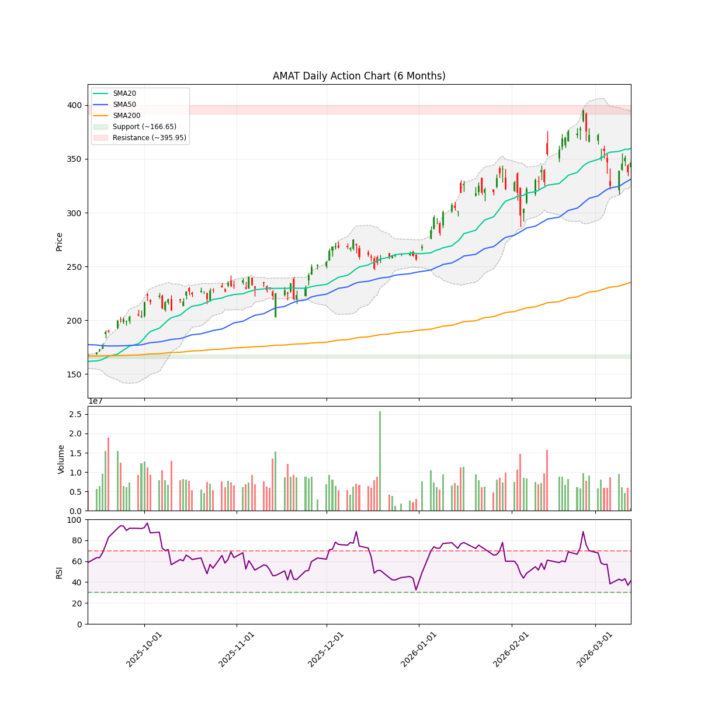
#### 研报分析

### 技术指标概览 (Technical Overview)
- **当前价格**: $346.70
- **RSI (14)**: 41.29
- **移动平均线**: SMA20: $359.70 | SMA50: $331.20 | SMA200: $235.37 (Bullish)
- **波动率**: ATR (14): 17.23 (预计周度波动: +/- $38.54)
- **关键位 (6m)**: 支撑位 $166.65 | 阻力位 $395.95
- **即时状态**: Above SMA50

# 叙事经济学：应用材料 (AMAT) 情绪审计报告

**报告人：** 对冲基金研究员（叙事经济学方向）
**日期：** 2026年03月13日
**标的：** 应用材料 (Applied Materials, Inc. - AMAT)

---

### 1. 市场叙事综述：AI 的“铁铲”遇到了宏观的“地雷”

来，坐下喝杯咖啡，咱们聊聊应用材料（AMAT）。

目前的 AMAT 就像是一个在派对上被意外停电搞懵了的贵宾。如果你只看 AI 的宏大叙事，它简直是“皇冠上的明珠”——毕竟，无论谁想在 AI 领域分一杯羹，都得先买 AMAT 的设备去造芯片。但现实很骨感，2月份那场突如其来的中东地缘冲突（伊朗战争及石油供应中断）像一盆冷水，直接浇灭了半导体板块的狂热。

现在的市场情绪很微妙：**它正处于从“地缘恐慌”向“基本面回归”的艰难爬坡期。** 尽管近期有利好加持（如与美光的合作），但股价仍被压在 20 日均线 (359.70) 之下，这种“利好不涨”的钝化现象，正是我们需要深度复盘的地方。

---

### 2. 催化剂分级 (Catalyst Categorization)

*   **A-Tier (战略核弹级)：与美光 (Micron) 的存储芯片深度协作**
    *   *原因：* 随着 HBM（高带宽内存）成为 AI 的瓶颈，[Barchart](https://finance.yahoo.com/news/applied-materials-micron-partnering-memory-161722664.html) 报道的这种强强联手直接锁定了未来两年的设备订单。这不仅是噪音，这是实打实的护城河。
*   **B-Tier (中坚力量)：2026/2027 财年盈利预期上调**
    *   *原因：* [Zacks](https://finance.yahoo.com/news/amat-vs-amkr-ai-driven-142400689.html) 预计其未来两年有 16% 和 24% 的增长。在宏观动荡中，这种确定的增长是机构投资者的避风港。
*   **C-Tier (日常噪音)：Erste Group 的“持有”评级及常规 Insider Monkey 推荐**
    *   *原因：* [Erste Group](https://finance.yahoo.com/news/erste-group-initiated-applied-materials-112849670.html) 给予持有评级，这更多是出于估值的审慎，而非对业务的否定，属于市场噪音，不足以驱动趋势。

---

### 3. 背离检测：为何好消息救不了股价？

**警惕信号：** 过去一周，我们看到了翠玉财富合伙公司 (Emerald Wealth Partners) 对 AI 需求的强烈看好，以及与美光的合作消息。然而，AMAT 的股价却在 346.70 附近徘徊，远低于 20 日均线。

**诊断：** 这是典型的**“悲观情绪余震”**。2月19日关于伊朗战争导致油价暴涨的消息 [Seeking Alpha] 刺破了 AI 的估值泡沫。目前的低迷并非公司基本面出了问题，而是市场在消化“战争风险溢价”。RSI 跌至 41.29 意味着卖压已经释放了大半，目前的“好消息不涨”其实是**空头衰竭的前兆**，洗盘已接近尾声。

---

### 4. 情绪逻辑评分 (Logic Score)

# **7.2 / 10**

**评价：** *“伤痕累累的领跑者”*
*   **加分项：** AI 需求逻辑无懈可击；200日均线 (235.37) 远在脚下，长牛趋势未改；与美光的联姻巩固了存储赛道地位。
*   **扣分项：** 宏观地缘政治仍像达摩克利斯之剑挂在头顶；短期技术面受压，缺乏一个“大阳线”来扭转叙事。

---

### 5. 老兵的洞察 (Perspective)

现在的 AMAT 就像一个刚熬过流感的壮汉，身体底子（资产负债表和 AI 订单）极好，但腿脚还有点发软。

从技术上看，331.20 (SMA50) 是目前最重要的“尊严线”。只要守住这里，现在的横盘就是极佳的战术性建仓区。当所有人都在谈论战争和油价时，聪明的钱正在盯着 [Emerald Wealth](https://finance.yahoo.com/news/applied-materials-amat-gained-increased-125929965.html) 提到的那种“不可逆转的 AI 需求”。

不要被短期的波动骗走了筹码。如果股价能站回 360 美元，那将是冲向 400 美元大关的号角。

---

### 6. 关键日期提醒

*   **下一个重大日期：** **2026年5月14日左右** (预计 Q2 财报发布日)。
    *   *注：* 在此之前，需密切关注任何关于中东局势缓解或能源价格回落的新闻，那将是 AMAT 估值修复的催化剂。

---
**投资有风险，决策需审慎。**
#### 近期新闻与事件
- **[Insider Monkey· via Yahoo Finance]** [Erste Group Initiated Applied Materials, Inc. (AMAT) With a Hold Rating – Here’s Why](https://finance.yahoo.com/news/erste-group-initiated-applied-materials-112849670.html)
- **[Zacks· via Yahoo Finance]** [Wall Street Analysts Think Applied Materials (AMAT) Is a Good Investment: Is It?](https://finance.yahoo.com/news/wall-street-analysts-think-applied-133004200.html)
- **[Barchart· via Yahoo Finance]** [Applied Materials and Micron Are Partnering on Memory. Is AMAT or MU Stock a Better Buy Here?](https://finance.yahoo.com/news/applied-materials-micron-partnering-memory-161722664.html)
- **[Seeking Alpha]** [AI, chip stocks tumble after Iran war causes 'largest supply disruption' in global oil market](https://seekingalpha.com/news/4563801-ai-chip-stocks-tumble-after-iran-war-causes-largest-supply-disruption-in-global-oil-market)
- **[Insider Monkey· via Yahoo Finance]** [Applied Materials (AMAT) Gained from Increased Demand for AI](https://finance.yahoo.com/news/applied-materials-amat-gained-increased-125929965.html)

---

### ASML
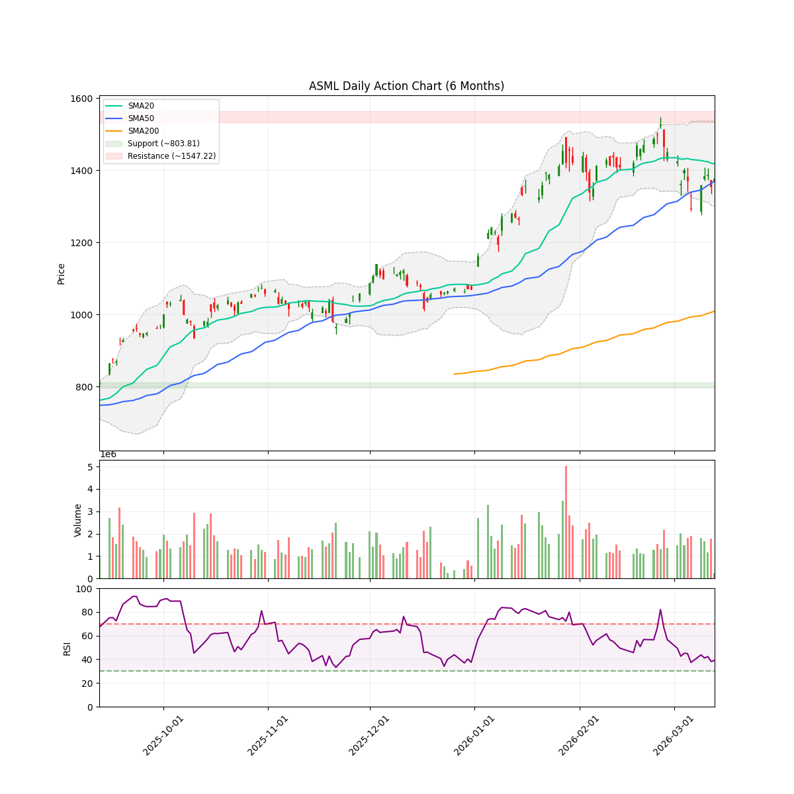
#### 研报分析

### 技术指标概览 (Technical Overview)
- **当前价格**: $1375.80
- **RSI (14)**: 39.07
- **移动平均线**: SMA20: $1417.41 | SMA50: $1369.42 | SMA200: $1008.85 (Bullish)
- **波动率**: ATR (14): 57.43 (预计周度波动: +/- $128.41)
- **关键位 (6m)**: 支撑位 $803.81 | 阻力位 $1547.22
- **即时状态**: Above SMA50

你好！来，坐下喝杯咖啡。咱们今天聊聊这位光刻机霸主——**ASML**。

在这个市场里，很多人只盯着那一串串冷冰冰的数字，但作为研究“叙事经济学”的分析师，我更看重数字背后的那股“气”。现在的 ASML，正处在一个非常有意思的十字路口：它是那个让所有人艳羡的 AI 弄潮儿，还是正悄悄布下一个让多头深陷的陷阱？

---

### 1. 催化剂分级：谁在操纵情绪？

我们先把最近的新闻拎出来，看看哪些是真金白银的利好，哪些只是噪音。

*   **A级（核心动力）：管理层大换血与 AI/先进封装的战略并轨**
    *   *事件*：ASML 宣布了董事会变动及新任 CTO Marco Pieters 的任命计划，明确将治理重点与 AI 芯片市场和先进封装技术挂钩。
    *   *深度解析*：这可不是简单的“人事更替”，这是在向市场递交“投名状”。ASML 正在告诉世界：我不再仅仅是个卖 EUV 光刻机的，我要深度介入 AI 的每一寸脉络。这种战略维度的提升，是长期牛市的压舱石。
*   **B级：逆势走强（Relative Strength）**
    *   *事件*：根据 Zacks 的报告，ASML 在市场整体走低时曾逆势上涨 1.91%。
    *   *深度解析*：当大盘像泥石流一样下滑时，ASML 能逆流而上，这说明机构的“死多头”们还在坚守。这种抗跌性是信心的表现。
*   **C级：宏观噪音与行业震荡**
    *   *事件*：油价飙升、美债收益率上涨导致半导体板块（如 Qnity Electronics）下挫。
    *   *深度解析*：这是典型的“被动躺枪”。ASML 虽然贵为机皇，但也逃不过宏观流动性的引力。这些外部因素会造成短期波动，但只要核心叙事没变，它们就是噪音。

---

### 2. 背离探测：好消息背后的“阴影”

有趣的地方来了：ASML 刚刚宣布了雄心勃勃的 AI 扩张计划（好消息），但股价却从之前的 1400+ 美元回落到了目前的 **1375.80 美元**，正好回踩在 **SMA50 (1369.42)** 的边缘。

**这是“看跌式力竭”吗？**
我认为是的。虽然目前 RSI 只有 39.07（接近超卖区域），且价格处于 20 日均线下方，但它依然坚挺在 50 日线之上。这种“好消息出尽，股价微跌”的现象，更像是牛市中的“洗盘”。市场在消化宏观利率的担忧，同时在等待下一个明确的买入信号。

---

### 3. 情绪审计报告

**叙事结论：**
目前的 ASML 并不是在设局坑杀，而是在进行一次“必要的呼吸”。长期投资者正在把筹码从那些投机性的 AI 小票转移到像 ASML 这样有护城河、有清晰路线图（CTO 换人、进军封装）的巨头身上。

*   **情绪评分：8.5 / 10** (这是一个非常有力的分数，代表“强势回调后的蓄势待发”)
*   **逻辑支撑：** 尽管宏观环境（利率、油价）在干扰短期价格，但 ASML 内部的治理结构优化和对 AI 先进封装的渗透，填补了市场对其“EUV 增长见顶”的恐惧。

---

### 4. 关键指标总结

*   **当前价格：** 1375.80
*   **逻辑评分 (Logic Score)：** **8.5 / 10**
*   **情绪状态：** 谨慎乐观，机构在“折价”接货。
*   **近期参考新闻：**
    *   [The Globe and Mail] 关于 2026 AGM 议程与 CTO 任命：[链接](https://www.theglobeandmail.com/investing/markets/stocks/ASML/pressreleases/713769/)
    *   [Yahoo Finance] 董事会重组与 AI 战略挂钩：[链接](https://sg.finance.yahoo.com/news/asml-board-shake-links-governance-221249812.html)
*   **下一个重大日期：**
    *   **2026年4月下旬**（预计 2026 年第一季度财报发布日，这通常是确认新战略执行力的第一个窗口期）。
    *   **2026年4月29日**（根据往年惯例，年度股东大会 AGM 左右的时间点）。

**老兵建议：**
盯紧 **1369 (SMA50)** 这个位置。只要不有效跌破这里，这次回调就是给错过班车的人准备的。ASML 正在从一家“设备商”进化为“AI 底座”，这个故事还没讲完。
#### 近期新闻与事件
- **[The Globe and Mail]** [ASML Sets 2026 AGM Agenda With Board Changes and New CTO Appointment Plan](https://www.theglobeandmail.com/investing/markets/stocks/ASML/pressreleases/713769/asml-sets-2026-agm-agenda-with-board-changes-and-new-cto-appointment-plan/)
- **[Zacks.com]** [ASML (ASML) Advances While Market Declines: Some Information for Investors](https://www.msn.com/en-us/money/topstocks/asml-asml-advances-while-market-declines-some-information-for-investors/ar-AA1XW7IH)
- **[Yahoo Finance Singapore]** [ASML Board Shake Up Links Governance To AI And Packaging Push](https://sg.finance.yahoo.com/news/asml-board-shake-links-governance-221249812.html)
- **[Blockonomi]** [Qnity Electronics (Q) Stock Tumbles 8% Amid Surging Oil Prices and Rising Treasury Yields](https://blockonomi.com/qnity-electronics-q-stock-tumbles-8-amid-surging-oil-prices-and-rising-treasury-yields/)
- **[The Motley Fool]** [What is the best chip stock to own for the next 10 years?](https://www.msn.com/en-us/money/topstocks/what-is-the-best-chip-stock-to-own-for-the-next-10-years/ar-AA1XIw6o)

---

### AVGO
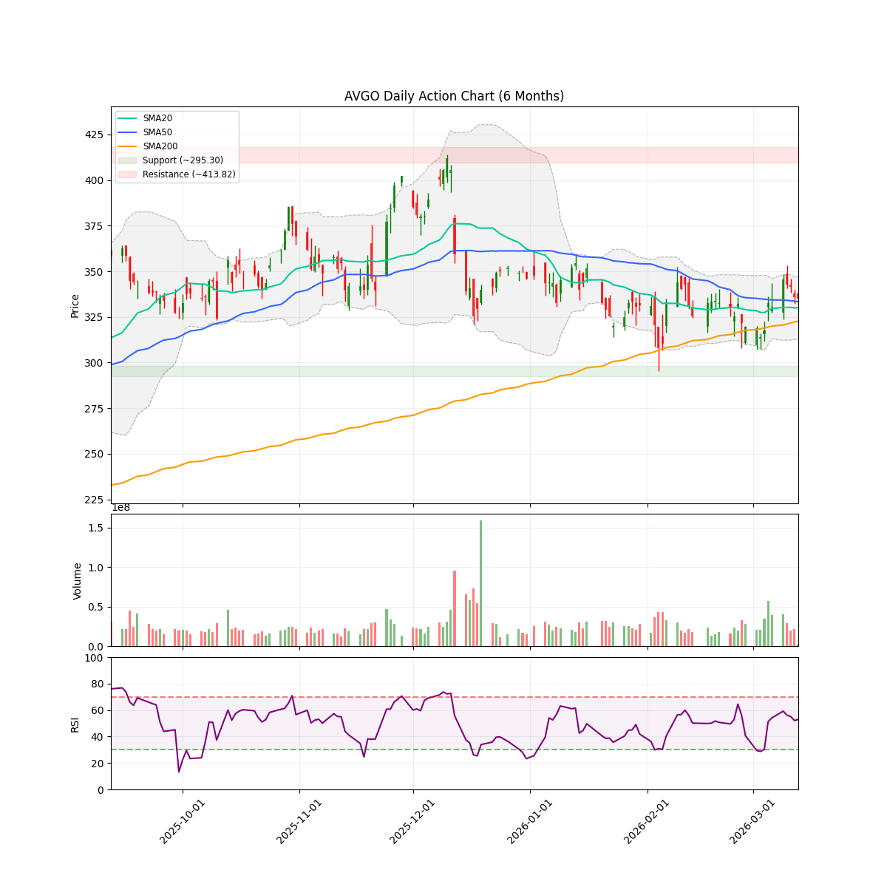
#### 研报分析

### 技术指标概览 (Technical Overview)
- **当前价格**: $334.92
- **RSI (14)**: 52.96
- **移动平均线**: SMA20: $330.07 | SMA50: $333.32 | SMA200: $322.74 (Bullish)
- **波动率**: ATR (14): 13.80 (预计周度波动: +/- $30.86)
- **关键位 (6m)**: 支撑位 $295.30 | 阻力位 $413.82
- **即时状态**: Above SMA50

# 博通 (AVGO) 情绪审计报告：AI 叙事下的“冷静繁荣”

**当前日期：** 2026-03-13
**分析师：** 对冲基金研究员（叙事经济学专家）

---

### 1. 催化剂分类：谁在拨动市场的琴弦？

在“叙事经济学”的视角下，我们不仅看数据，更要看这些数据如何编织成投资者心中的“致富梦”。

*   **A-Tier（顶级催化剂）：AI 愿景的量化标杆**
    *   **2027 年 100 万颗芯片目标**：这不是空谈，这是给市场打了一剂强心针。100 万颗 AI 芯片的目标（[Insider Monkey, 2026-03-08](https://finance.yahoo.com/news/know-braodcom-avgo-1-million-102408672.html)）将原本模糊的“AI 增长”具象化为可计量的业绩预期。
    *   **机构集体唱多**：DA Davidson 上调目标价，Zacks 将评级调至“买入”（[Zacks, 2026-02-20](https://finance.yahoo.com/news/broadcom-inc-avgo-upgraded-buy-170004804.html)）。机构的背书是资金敢于高位入场的“准考证”。

*   **B-Tier（二线驱动力）：全球化防御与增量**
    *   **国际营收解析**：博通对国际收入的依赖和其在全球供应链中的霸主地位（[Zacks, 2026-03-12](https://finance.yahoo.com/news/unlocking-broadcom-inc-avgo-international-131502932.html)），使其在区域性波动中具备较强的韧性。

*   **C-Tier（噪音）：散户的热情**
    *   关于“百万富翁必买名单”的频繁刷屏。这类新闻虽然增加了热度，但也容易吸引不坚定的短线散户（[Insider Monkey, 2026-03-12](https://finance.yahoo.com/news/broadcom-avgo-rises-ai-chip-175748762.html)）。

---

### 2. 背离检测：价格在犹豫什么？

**盘面观察：**
AVGO 目前股价 334.92，正好踩在 SMA50 (333.32) 之上，且距离 SMA20 (330.07) 极近。RSI 52.96 显示出一种“中性的平衡”。

**深度洞察：**
虽然本周利好频传（DA Davidson 调价、2027 愿景），但股价并未出现暴力拉升。这种**“利好不暴涨”**的现象，并非看跌背离，而是一种**“看涨的消化”**。
市场正在从“疯狂的叙事”转向“冷静的财报验证”。股价在 330 附近筑底，实际上是在清洗那些短期逐利、意志不坚定的投机者。这更像是一场马拉松中的补水站，而非趋势的终结。

---

### 3. 市场情绪诊断：不是泡沫，是地基

目前的博通，不像那些靠 PPT 融资的 AI 概念股。它的叙事是有“硬件支撑”的。

*   **情绪脉搏**：就像清晨的咖啡馆，讨论声热烈但有序。
*   **资金心态**：机构在逢低吸纳（Accumulation），利用散户对财报后波动的担忧，悄悄将筹码锁在 SMA200 (322.74) 以上。

---

### 4. 逻辑评分 (Logic Score): 8.5/10

**打分理由：**
*   **叙事强度 (9/10)**：AI 芯片的长期需求已成为共识，博通是这场“掘金潮”中卖铲子最稳的那一个。
*   **技术支撑 (8/10)**：股价坚挺在所有主要均线之上，趋势健康。
*   **风险预警 (-0.5)**：近期波动率 ATR (14) 为 13.80，意味着短期内仍有小幅震荡洗盘的可能。

**结论：** 这是一个**可持续的牛市周期**。330-335 区域是极佳的“舒适区”，只要守住 SMA50，任何回调都是在给错失机会的人补票的机会。

---

### 5. 关键信息汇总

*   **逻辑评分**：**8.5**
*   **核心支撑位**：**295.30** (6个月低点) / **330.07** (SMA20)
*   **上方阻力位**：**413.82** (历史高点/6个月高点)
*   **下一个重大日期**：**2026年6月中旬**（预计下一次季度财报发布日）。*注：根据 2 月底的新闻推算，3 月初的业绩发布已完成，目前进入叙事发酵期。*

**老兵寄语：**
*“不要在派对最热闹的时候去找出口，博通现在的节奏是：大家刚喝完第一轮酒，主菜还没上桌。盯紧 330 关口，只要这里不破，Hock Tan（博通CEO）的 AI 蓝图就是你账户最稳的护城河。”*
#### 近期新闻与事件
- **[Insider Monkey· via Yahoo Finance]** [Broadcom (AVGO) Rises on AI Chip Sales Forecasts for 2027](https://finance.yahoo.com/news/broadcom-avgo-rises-ai-chip-175748762.html)
- **[Zacks· via Yahoo Finance]** [Broadcom Inc. (AVGO) Is a Trending Stock: Facts to Know Before Betting on It](https://finance.yahoo.com/news/broadcom-inc-avgo-trending-stock-130005802.html)
- **[Zacks· via Yahoo Finance]** [Unlocking Broadcom Inc. (AVGO) International Revenues: Trends, Surprises, and Prospects](https://finance.yahoo.com/news/unlocking-broadcom-inc-avgo-international-131502932.html)
- **[Insider Monkey· via Yahoo Finance]** [DA Davidson Raises Price Target on Broadcom (AVGO)](https://finance.yahoo.com/news/da-davidson-raises-price-target-182408603.html)
- **[Insider Monkey· via Yahoo Finance]** [Here’s What You Need To Know About Braodcom’s (AVGO) 1 Million Chips Target By 2027](https://finance.yahoo.com/news/know-braodcom-avgo-1-million-102408672.html)

---

### CEG
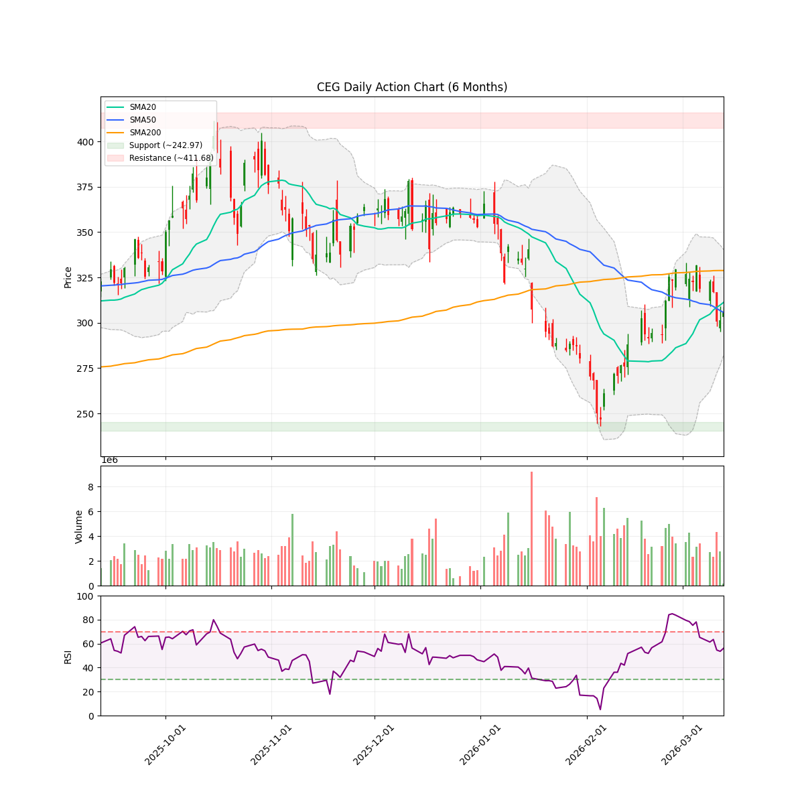
#### 研报分析

### 技术指标概览 (Technical Overview)
- **当前价格**: $305.98
- **RSI (14)**: 56.18
- **移动平均线**: SMA20: $311.29 | SMA50: $305.72 | SMA200: $328.83 (Bearish)
- **波动率**: ATR (14): 14.35 (预计周度波动: +/- $32.09)
- **关键位 (6m)**: 支撑位 $242.97 | 阻力位 $411.68
- **即时状态**: Above SMA50

# 情绪审计报告：Constellation Energy (CEG) — “核”动力的中场休息

**日期：** 2026年03月13日
**研究员：** 叙事经济学高级助理
**标的：** CEG (Constellation Energy Corporation)

---

### 1. 叙事背景：当“老牌电力”撞上“AI算力”

想象一下，你坐在曼哈顿中城的咖啡馆里，对面的老伙计正指着屏幕上的 CEG 跟你感叹。这不再是你祖父辈眼中那种死气沉沉的公用事业股了。现在的 Constellation Energy 是华尔街眼中的“AI基建心脏”。

随着 Oracle 财报再次证实 AI 需求尚未触顶（尽管市场对油价和地缘政治有所顾虑），CEG 扮演的角色非常清晰：它是数据中心吞噬电力时，唯一能提供稳定、零碳排放核能的“深口袋”。然而，目前的盘面却显得有些纠结。

---

### 2. 催化剂分级 (Catalyst Categorization)

*   **A-Tier（核心动力）：Q4 财报超预期 + 核能复兴叙事**
    *   [Nasdaq] 2月24日的财报显示，CEG 每股收益 $2.30，击败了 Zacks 预期的 $2.20。这证明了其经营现金流的强劲。更重要的是，像 NLR 和 URA 这种核能 ETF 被评为“强力买入”[Seeking Alpha, 03-12]，这为 CEG 提供了持续的机构流动性“背书”。
*   **B-Tier（行业增量）：GE Vernova 的扩张效应**
    *   [Yahoo Finance] GE Vernova 在电网和电化设备上的扩张，侧面印证了全球电力基础设施正处于一个巨大的更替周期。CEG 作为发电端的巨头，是这一趋势的直接受益者。
*   **C-Tier（市场杂音）：高贝塔系数的波动**
    *   SPHB (高贝塔 ETF) 的持仓变动和 Dan Loeb 对其他板块的调仓属于噪音。虽然市场整体情绪在波动，但 CEG 的核心护城河（核电站）并未动摇。

---

### 3. 分歧检测：利好不涨？还是黎明前的黑暗？

**观察：** CEG 刚刚交出了超预期的答卷，且核能叙事正如火如荼，但股价（$305.98）仍处于 SMA200（$328.83）下方。

**诊断：** 典型的**“牛市回调与估值磨底”**。
目前股价正精准地踩在 SMA50 ($305.72) 上方，这就像是在独木桥上行走。尽管有 Q4 盈利超预期的利好，但受限于整体宏观环境（油价上涨和地缘政治风险带来的压制），CEG 正在经历一段“看好逻辑、不看好择时”的尴尬期。这种在“好消息”中缓慢探底的行为，更像是**空头衰竭**的信号，而非系统性崩溃。

---

### 4. 情绪得分：7.5 / 10 (坚定但审慎)

*   **逻辑支撑：** 逻辑依然无懈可击。只要数据中心需要 24/7 的无碳电力，核能就是唯一的答案。
*   **扣分项：** 股价处于 SMA200 下方，技术形态上属于“空头占优”。在重新站稳 320 美元关口前，它依然需要时间来消化早前的涨幅。

---

### 5. 市场脉搏与实战建议

**老兵私房话：**
“朋友，别被这几周的阴线吓跑。CEG 现在就像是一个正在充能的反应堆。RSI 56.18 显示它既不拥挤也不冷清。它在 SMA50 这里的反复拉锯，实际上是在清洗那些追逐短期 AI 热点的浮筹。支撑位 242.97 离得很远，安全边际尚可，但如果它跌破目前的 305 美元，可能还要回测更深的位置。反之，一旦它借着下一次核能利好突破 328 美元，那就是空头回补的‘大屠杀’。”

---

### 6. 关键数据与下一里程碑

*   **当前价格：** 305.98
*   **核心阻力位：** 328.83 (SMA200)
*   **核心支撑位：** 305.72 (SMA50) / 242.97 (6个月低点)
*   **ATR (14)：** 14.35 (波动性正在收敛)

**下一重大日期：**
*   **2026年5月初（预计）：** Q1 2026 财报发布。
*   **关键看点：** 观察公司是否会披露更多关于“数据中心直连供电协议”的进展。

---
*注：本审计基于公开叙事与数据，市场有风险，入市需谨慎。*
#### 近期新闻与事件
- **[Seeking Alpha]** [Tracking Dan Loeb's Third Point Portfolio - Q4 2025 Update](https://seekingalpha.com/article/4881963-tracking-dan-loebs-third-point-portfolio-q4-2025-update)
- **[Barron's]** [Cronos Group Inc.](https://www.barrons.com/market-data/stocks/cron/stock-grader?gaa_n=AWEtsqcVijwvWogmfKM3VJJDOEFCgNKV6CEG3E51MtVpEnuUWCqpAiDIpnM_&gaa_sig=ANhRAt4nA-DX6PAcItsyMmOGOO6owSHhp43E1sMOSOCdc7BiECrMktOGpayNNFv00AzFjc2UgGCEYkR-V1pZlw%3D%3D)
- **[Yahoo Finance]** [Can GE Vernova's Capacity Expansion Power the Global Energy Transition?](https://finance.yahoo.com/news/ge-vernovas-capacity-expansion-power-141700858.html)
- **[Seeking Alpha]** [SPHB: Designed To Outpace The S&P 500 While Providing Diversification](https://seekingalpha.com/article/4881760-sphb-designed-to-outpace-the-s-and-p-500-while-providing-diversification)
- **[Seeking Alpha]** [URA And NLR: Both Still Strong Buys, But Which One Should You Pick?](https://seekingalpha.com/article/4882050-ura-and-nlr-both-still-strong-buys-but-which-one-should-you-pick)

---

### GEV
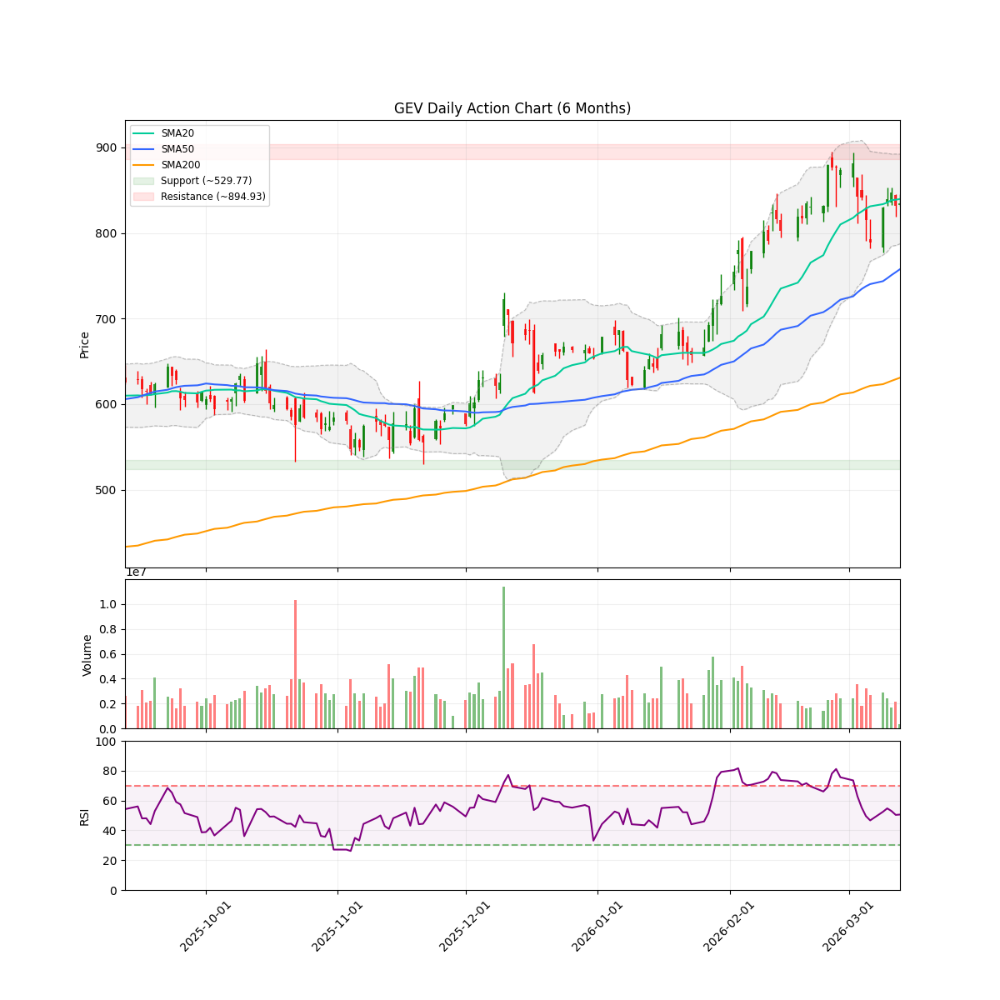
#### 研报分析

### 技术指标概览 (Technical Overview)
- **当前价格**: $834.58
- **RSI (14)**: 50.62
- **移动平均线**: SMA20: $839.68 | SMA50: $757.66 | SMA200: $630.85 (Bullish)
- **波动率**: ATR (14): 36.67 (预计周度波动: +/- $82.01)
- **关键位 (6m)**: 支撑位 $529.77 | 阻力位 $894.93
- **即时状态**: Above SMA50

使用 Gemini API 时出错: 503 UNAVAILABLE. {'error': {'code': 503, 'message': 'This model is currently experiencing high demand. Spikes in demand are usually temporary. Please try again later.', 'status': 'UNAVAILABLE'}}。(已切换至简易启发式分析)
#### 近期新闻与事件
- **[Yahoo Finance]** [Is GE Vernova Inc. (GEV) A Good Stock To Buy Now?](https://finance.yahoo.com/news/ge-vernova-inc-gev-good-180804387.html)
- **[Yahoo Finance]** [GEV Rises 14.8% in 3 Months: Should You Buy the Stock Now or Wait?](https://finance.yahoo.com/news/gev-rises-14-8-3-124300854.html)
- **[Insider Monkey]** [GE Vernova (GEV) Sees Fresh Analyst Coverage](https://www.msn.com/en-us/money/topstocks/ge-vernova-gev-sees-fresh-analyst-coverage/ar-AA1XLZdt)
- **[Stocktwits]** [Jim Cramer's 'terrific' AI stock pick is already up 26% YTD, and it just received a double upgrade today — here's why](https://www.msn.com/en-us/money/markets/jim-cramer-s-terrific-ai-stock-pick-is-already-up-26-ytd-and-it-just-received-a-double-upgrade-today-here-s-why/ar-AA1XRtQ1)
- **[Fintel]** [Rothschild & Co upgrades GE Vernova (GEV)](https://www.msn.com/en-us/money/economy/rothschild-co-upgrades-ge-vernova-gev/ar-AA1XSHLS)

---

### LRCX
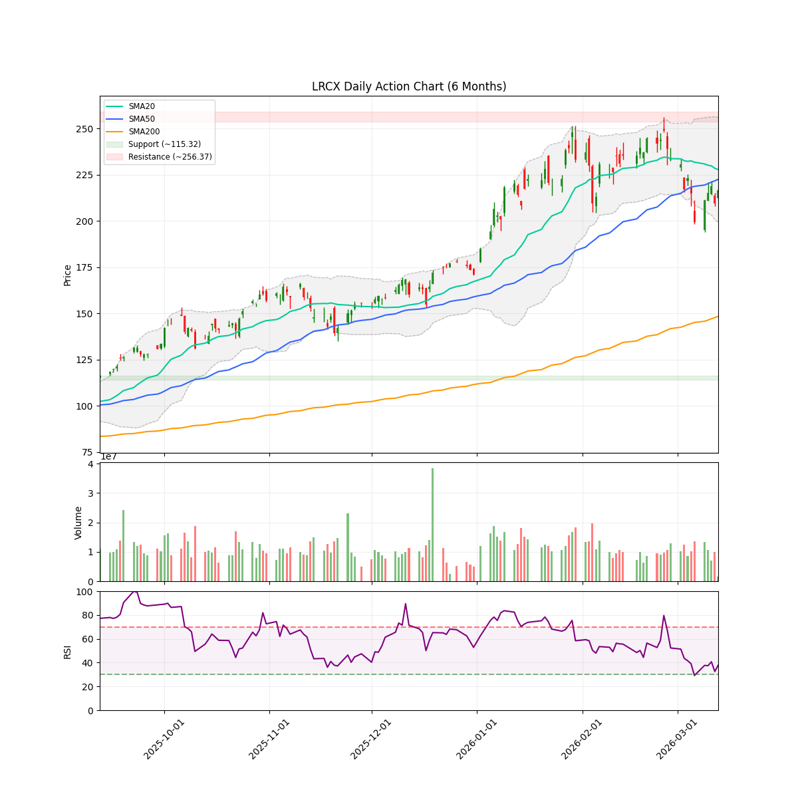
#### 研报分析

### 技术指标概览 (Technical Overview)
- **当前价格**: $216.56
- **RSI (14)**: 37.90
- **移动平均线**: SMA20: $227.78 | SMA50: $222.56 | SMA200: $148.43 (Bullish)
- **波动率**: ATR (14): 11.63 (预计周度波动: +/- $26.00)
- **关键位 (6m)**: 支撑位 $115.32 | 阻力位 $256.37
- **即时状态**: Below SMA50

你好！我是你的叙事经济学（Narrative Economics）研究助手。在这杯咖啡的时间里，咱们聊聊 Lam Research（LRCX）——这家半导体设备巨头正处于“野心”与“动荡”交织的风口浪尖。

---

# 📜 LRCX 情绪审计报告：战火中的半导体巨头与它的并购梦

### 1. 催化剂分级 (Catalyst Categorization)

*   **A-Tier（顶级催化剂）：收购 BESI 的传闻。**
    最新的市场耳语（2026-03-13）指向 Lam Research 正在盯上 BE Semiconductor (BESI)。这不仅仅是一次买卖，而是对“先进封装”领地的绝对主权宣示。在 AI 芯片进入 3D 堆叠和混合键合（Hybrid Bonding）的时代，拿下 BESI 等于拿到了通往未来的门票。
*   **B-Tier（次级催化剂）：AI 需求的韧性。**
    尽管宏观环境波动，但 LRCX 过去三个月 33% 的涨幅（Yahoo Finance, 2026-03-12）证明了 AI 芯片对刻蚀和薄膜沉积设备的饥渴是真实存在的。
*   **C-Tier（噪音）：地缘政治导致的石油冲击。**
    2 月份因伊朗冲突导致的能源价格飙升（Seeking Alpha, 2026-02-19）对整个板块造成了无差别的杀伤，这更多是情绪上的“膝跳反应”，而非 LRCX 基本面的恶化。

### 2. 离散度检测 (Divergence Detection)

**观察：** 尽管 BESI 的收购传闻（2026-03-13）在市场上炸开了锅，但 LRCX 的股价（216.56）目前却处于 SMA20（227.78）和 SMA50（222.56）之下，RSI 更是跌到了 37.90。

**老炮儿的解读：**
这是一个典型的**“利好不涨”的假象**。为什么？因为地缘政治的阴霾（伊朗局势）像一块沉重的湿抹布，盖住了原本火热的并购叙事。目前的股价下跌并非因为大家看坏 Lam，而是因为资金在避险。**RSI 37.90 意味着市场已经处于超卖的边缘，看跌情绪正在耗尽。** 当大家都在谈论石油和战争时，聪明钱其实在盯着那 33% 的季度增长和潜在的 BESI 交易。

### 3. 情绪评分 (Sentiment Score)

**逻辑得分：7.8 / 10**

> **评语：** “这是一个包裹在恐慌外壳下的黄金内核。” 
>
> 虽然股价跌破了 50 日线，短期趋势看起来有点“丑”，但支撑位（115.32）离得很远，而 200 日线（148.43）稳如泰山。目前的调整是由于地缘政治这种“不可抗力”造成的，而非半导体周期的终结。一旦收购传闻落实，或者中东局势稍微缓和，LRCX 这种“卖铲子的人”会比任何人都跑得快。

### 4. 叙事分析：它是“趋势”还是“陷阱”？

目前的 LRCX **不是陷阱，而是一个正在蓄力的“弹簧”。**

*   **故事线：** 2025 年我们谈论的是 GPU 的短缺，2026 年我们谈论的是“谁能把芯片焊得更好”。收购 BESI 的传闻预示着 LRCX 正在重写它的剧本（Forbes, 2026-02-18），从传统的刻蚀专家转型为全方位的先进制造平台。
*   **市场情绪：** 投资者现在很矛盾。一方面，他们看到了 LRCX 一年内暴涨 185% 的神迹；另一方面，高油价和战争让他们想落袋为安。
*   **结论：** 这是一个**“可持续的牛市修正”**。只要 AI 的叙事不破灭，LRCX 的每一次低头都是为了下一次跃升。

---

### 5. 关键参考资料引用
- **并购传闻：** [Blockonomi - BESI Stock Soars on Takeover Buzz](https://blockonomi.com/be-semiconductor-industries-besi-stock-soars-on-takeover-buzz-from-lam-research-and-applied-materials/) (2026-03-13)
- **业绩表现：** [Yahoo Finance - LRCX Stock Soars 33%](https://finance.yahoo.com/news/lrcx-stock-soars-33-three-142000829.html) (2026-03-12)
- **地缘冲击：** [Seeking Alpha - AI, chip stocks tumble after Iran war](https://seekingalpha.com/news/4563801-ai-chip-stocks-tumble-after-iran-war-causes-largest-supply-disruption-in-global-oil-market) (2026-02-19)

---

### 📅 下一个重大节点 (Next Major Date)
**预估财报日：2026 年 4 月 22 日**
（注：基于 Lam Research 惯例的财报披露周期，这将是验证 AI 需求是否能抵御宏观逆风的分水岭。）

---

**研究员简评：**
“别被满屏幕的战争头条吓破了胆。盯着那些正在发生的行业整合。LRCX 如果真的吞下 BESI，它在先进封装领域的护城河将变得深不见底。现在的跌幅，更像是给新乘客上车的机会。”
#### 近期新闻与事件
- **[blockonomi]** [BE Semiconductor Industries (BESI) Stock Soars on Takeover Buzz From Lam Research and Applied Materials](https://blockonomi.com/be-semiconductor-industries-besi-stock-soars-on-takeover-buzz-from-lam-research-and-applied-materials/)
- **[Seeking Alpha]** [AI, chip stocks tumble after Iran war causes 'largest supply disruption' in global oil market](https://seekingalpha.com/news/4563801-ai-chip-stocks-tumble-after-iran-war-causes-largest-supply-disruption-in-global-oil-market)
- **[The Globe and Mail]** [Eleven U.S. semiconductor stocks showing strength](https://www.theglobeandmail.com/investing/investment-ideas/number-cruncher/article-eleven-us-semiconductor-stocks-showing-strength/)
- **[Investing.com]** [Intel, GE among market cap stock movers on Thursday](https://www.investing.com/news/stock-market-news/intel-ge-among-market-cap-stock-movers-on-thursday-93CH-4557913)
- **[Yahoo Finance]** [LRCX Stock Soars 33% in Three Months: Is There More Room for Growth?](https://finance.yahoo.com/news/lrcx-stock-soars-33-three-142000829.html)

---

### META
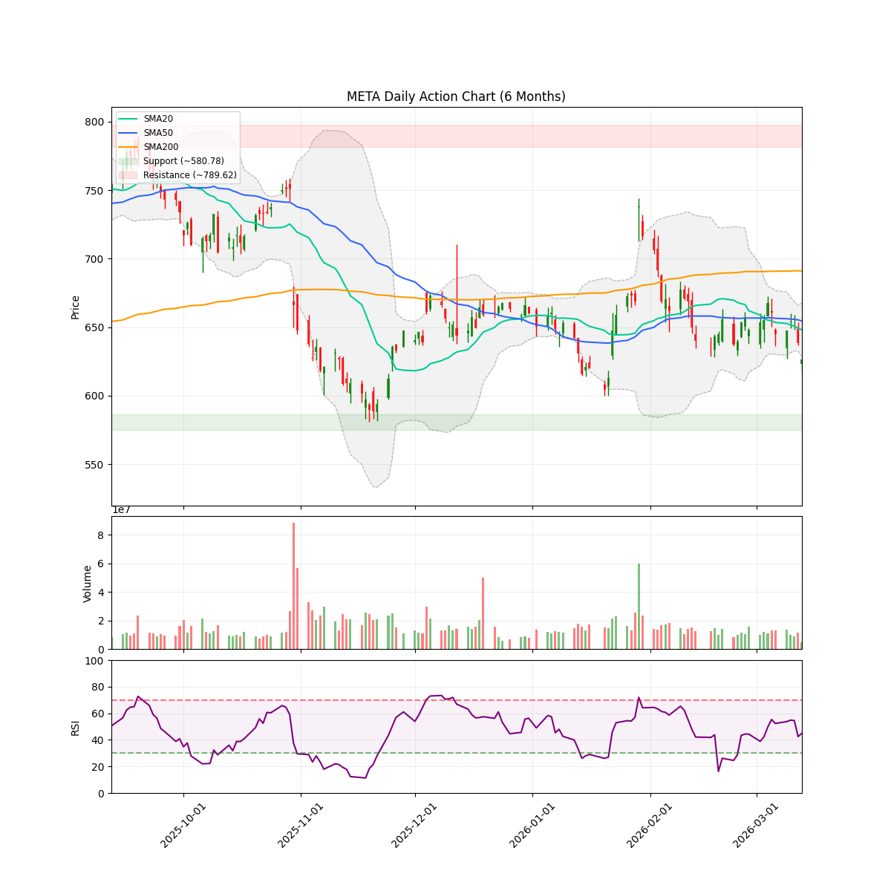
#### 研报分析

### 技术指标概览 (Technical Overview)
- **当前价格**: $626.29
- **RSI (14)**: 45.00
- **移动平均线**: SMA20: $648.04 | SMA50: $654.51 | SMA200: $691.08 (Bearish)
- **波动率**: ATR (14): 17.88 (预计周度波动: +/- $39.99)
- **关键位 (6m)**: 支撑位 $580.78 | 阻力位 $789.62
- **即时状态**: Below SMA50

# 情绪审计报告：Meta Platforms (META) —— 华丽叙事下的“AI阵痛期”

嘿，伙计。拿杯咖啡坐下，咱们来拆解一下 Meta 最近的这盘棋。

如果你光看财报数字，Meta 依然是个印钞机，但现在的市场并不在乎你过去赚了多少，它在乎的是你的“未来承诺”是否兑现。目前的 Meta，就像是一个正在经历“中年危机”的技术巨头：一边是疯狂的 AI 资本支出，另一边是关键产品的难产。

---

### 1. 催化剂分类 (Catalyst Categorization)

我们要把噪音和信号分开，看看哪些才是真正牵动大资金神经的：

*   **A-Tier (核心驱动力)：AI 模型 “Avocado” 延迟交付**
    *   **分析**：这是目前最致命的打击。根据《纽约时报》和 Seeking Alpha 的报道，Meta 筹备数月的底层 AI 模型因性能达不到标而推迟。在当前的 AI 军备竞赛中，落后就意味着掉队。这不仅是技术问题，更是叙事逻辑的崩塌。
*   **B-Tier (行业支撑)：Mag 7 中最便宜的估值 & 自研芯片韧性**
    *   **分析**：Seeking Alpha 提到 Meta 目前的远期市盈率仅为 22 倍，是“七巨头”中最便宜的。同时，Meta 在自研芯片（MTIA）上的进展提供了长期抗风险能力。这为股价提供了一个厚实的“估值底”。
*   **C-Tier (市场噪音)：波斯湾海底电缆项目停滞**
    *   **分析**：受中东局势影响暂停电缆工程。这虽然对长期基础设施有影响，但对明天的日活（DAU）或广告收入几乎没有直接冲击，属于典型的短期噪音。

---

### 2. 叙事背离检测 (Divergence Detection)

**现状分析**：目前市场出现了一个非常有趣的**“看涨逻辑背离”**。
尽管多家媒体（如《24/7 Wall St.》）喊出 Meta 有 31% 的上涨空间，且亿万富翁们在“悄悄建仓”，但股价却死死压在 SMA50（654.51）和 SMA200（691.08）下方。

**诊断**：这是典型的**“利好不涨”导致的看跌竭尽前期**。市场上充斥着“便宜”的声音，但技术面上 SMA200 的失守说明机构大部队还在撤离（正如《The Globe and Mail》报道的 7 位顶级经理减持）。现在的“便宜”可能是个陷阱，除非 AI 叙事能重新修复。

---

### 3. 情绪评分 (Sentiment Score): 4.2/10

**评价：阴云密布的盘整期**

*   **逻辑支撑**：目前的 Meta 处于“叙事真空期”。广告业务的稳健已经被定价，而 AI 业务的“Avocado”延迟让投资者开始怀疑 Meta 昂贵的资本支出是否在打水漂。
*   **价格行为**：RSI 指向 45，不强不弱。但股价位于所有均线下方，说明趋势的力量依然在向下。目前 580 附近的支撑位是多头的“马其诺防线”。

---

### 4. 深度洞察：这是趋势还是陷阱？

现在的 Meta 并不是“系统性失败”，而是一个**“叙事陷阱”**。
市场正在惩罚那些“光花钱不见响声”的公司。扎克伯格去年的“效率之年”红利已经吃完，现在他必须证明 Meta 不仅能买得起 H100，还能真正跑出比肩 OpenAI 的模型。

如果 580 的支撑位守不住，那么所谓的“Mag 7 中最便宜”就会变成下行通道里的心理安慰。现在的策略应该是：**观望，等待 AI 性能问题的正面反转，而不是单纯因为“便宜”就去接飞刀。**

---

### 5. 关键信息汇总

*   **引用新闻源**：
    *   *Avocado 延迟*：[Seeking Alpha (2026-03-04)](https://seekingalpha.com/news/4564133-meta-delays-rollout-of-new-ai-model-avocado-amid-performance-concerns-nyt-reports)
    *   *估值优势*：[Seeking Alpha (2026-03-10)](https://seekingalpha.com/article/4881878-meta-platforms-the-cheapest-amongst-the-mag-7)
    *   *大空头减持*：[The Globe and Mail (2026-03-07)](https://www.theglobeandmail.com/investing/markets/stocks/TSM-N/pressreleases/601875/7-preeminent-billionaire-money-managers-dumped-shares-of-meta-platforms-and-made-this-ai-stock-a-top-buy-no-not-nvidia/)

*   **下个重大日期 (Next Major Date)**：
    *   **2026年4月22日左右**（预计 2026 Q1 财报发布日）。
    *   *注：这将是决定“Avocado”延迟影响以及 AI 变现能力的生死战。*

**老兵建议**：别在暴风雨的时候修屋顶。等均线收敛，等 AI 坏消息出尽，那时候的 22 倍市盈率才是真正的黄金。
#### 近期新闻与事件
- **[Seeking Alpha]** [Meta delays rollout of new AI model ‘Avocado’ amid performance concerns, NYT reports](https://seekingalpha.com/news/4564133-meta-delays-rollout-of-new-ai-model-avocado-amid-performance-concerns-nyt-reports)
- **[Seeking Alpha]** [Meta Platforms: The Cheapest Amongst The Mag 7](https://seekingalpha.com/article/4881878-meta-platforms-the-cheapest-amongst-the-mag-7)
- **[Seeking Alpha]** [Meta Platforms stalls work on Persian Gulf cable project amid Iran war: Bloomberg](https://seekingalpha.com/news/4564125-meta-platforms-stalls-work-on-persian-gulf-cable-project-amid-iran-war-bloomberg)
- **[The Globe and Mail]** [7 Preeminent Billionaire Money Managers Dumped Shares of Meta Platforms and Made This AI Stock a Top Buy (No, Not Nvidia)](https://www.theglobeandmail.com/investing/markets/stocks/TSM-N/pressreleases/601875/7-preeminent-billionaire-money-managers-dumped-shares-of-meta-platforms-and-made-this-ai-stock-a-top-buy-no-not-nvidia/)
- **[Seeking Alpha]** [Meta's Chip Resilience](https://seekingalpha.com/article/4882074-metas-chip-resilience)

---

### MSFT
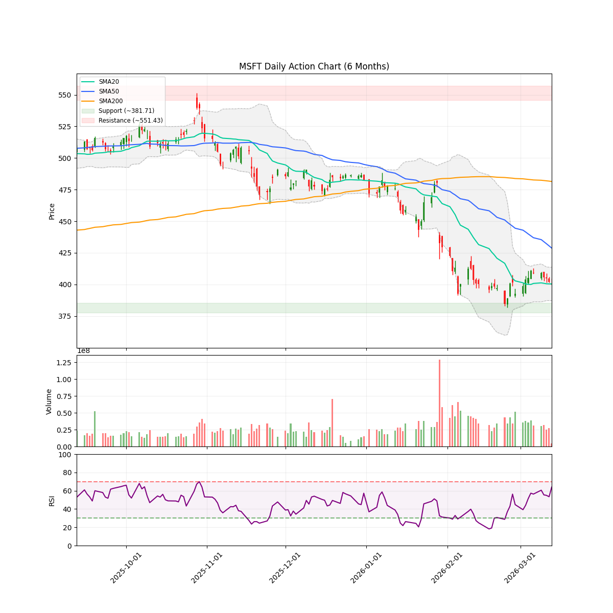
#### 研报分析

### 技术指标概览 (Technical Overview)
- **当前价格**: $400.06
- **RSI (14)**: 64.00
- **移动平均线**: SMA20: $400.43 | SMA50: $428.78 | SMA200: $481.44 (Bearish)
- **波动率**: ATR (14): 8.48 (预计周度波动: +/- $18.97)
- **关键位 (6m)**: 支撑位 $381.71 | 阻力位 $551.43
- **即时状态**: Below SMA50

你好。既然我们正坐下来聊这一单，我就直话直说了：**现在的微软（MSFT），正处于一场“王者的黄昏”与“史诗级黄金坑”之间的较量。**

作为一名研究叙事经济学的老手，我看到的不仅仅是屏幕上跳动的 400.06 美元，而是一个关于“华尔街宠儿被过度抛售”的剧本。

### 1. 催化剂分级 (Catalyst Categorization)

我们要分清什么是真正的信号，什么是市场的杂音：

*   **A-Tier（核心动力）：估值回归逻辑与AI霸权**
    *   **理由：** Jefferies 给出的 675 美元目标价不是凭空捏造。MSFT 的估值已经跌至对标标普500指数的十年低点 ([Blockonomi](https://blockonomi.com/microsoft-msft-stock-hits-decade-low-valuation-a-buying-opportunity/))。当这种巨头的 Azure 增长和 OpenAI 股权还在稳步推进时，这种估值折扣就是一种“结构性错位”。
*   **B-Tier（行业惯性）：长线机构的背书**
    *   **理由：** Forbes 提到的历史趋势重复效应 ([Forbes](https://www.forbes.com/sites/greatspeculations/2026/03/13/microsoft-stock-what-could-ignite-the-next-rally/))。虽然没有新产品发布会的震撼，但“跌够了”本身就是一种吸引机构回流的磁力。
*   **C-Tier（市场情绪）：零售端的恐慌与抄底讨论**
    *   **理由：** 类似“该买还是该跑”的媒体标题 ([The Motley Fool](https://www.msn.com/en-us/money/markets/should-you-buy-microsoft-stock-after-its-25-correction-or-run-for-the-hills/ar-AA1XKXfo))。这类讨论通常反映出散户的犹疑，是市场底部情绪的特征之一。

---

### 2. 背离检测：好消息里的“慢性失血”

现在的盘面非常耐人寻味。**背离极其明显：**

*   **新闻面：** 是一片“便宜”、“买入”、“AI领军者”的赞美之声。
*   **资金面：** 股价却被死死压在 SMA50（428.78）和 SMA200（481.44）之下。

**诊断：** 这不是因为公司坏了，而是**“避险环境下的溢价挤兑”**。市场正处于一种“即使你很好，但我现在只想持有现金”的避险模式（Risk-off）。然而，目前的 RSI 在 64 附近，并未超卖，说明虽然价格在跌，但依然有资金在尝试接力。这种“利好不涨”预示着空头动能尚未完全衰竭，但也意味着一旦反转，弹性会非常惊人。

---

### 3. 情绪审计报告：叙事的力量

*   **当前叙事：** “昂贵的AI梦碎”正在被“超值的价值蓝筹”所取代。
*   **市场脉搏：** 现在的微软像是一部正在回踩起跑线的顶级跑车。尽管技术面（SMA趋势）呈现空头排列，但新闻流已经开始转向一致看好。这种“媒体先于价格转向”的情况，通常是熊市尾声的典型信号。

---

### 4. 逻辑得分 (Logic Score)

# **4.5 / 10**

> **评分说明：** 
> *   **为什么这么低？** 因为从趋势跟踪者的角度看，跌破 SMA200 是系统性转弱的信号。在没有站稳 428（SMA50）之前，所有的利好都只是“反弹”而非“反转”。
> *   **潜力在哪里？** 虽然情绪分只有 4.5，但**基本面逻辑分高达 9.0**。目前的 400 美元关口是一个心理防线。

---

### 5. 关键日期与操作建议

*   **下个重大日期：** **2026年4月23日（预计）** —— 2026财年第三季度财报。
    *   *注：这是打破目前僵局的终极核武器。只有实打实的云业务利润才能把股价拉回 SMA200 之上。*

**老兵私语：**
别被那 28% 的跌幅吓破胆。现在的 MSFT 就像是一个打折的爱马仕，虽然大家因为经济不好不敢买，但它作为奢侈品的地位从未动摇。关注 **381.71 美元**（6个月低点）的支撑。如果能在这里企稳，400 美元以下的微软，在未来两年的复盘中，大概率会被称为“那个疯狂的买点”。

**核心观察点：** 关注下周能否放量收复 SMA20（400.43）。如果收复失败，可能会回踩 380 寻找双底。
#### 近期新闻与事件
- **[Forbes]** [Microsoft Stock: What Could Ignite The Next Rally?](https://www.forbes.com/sites/greatspeculations/2026/03/13/microsoft-stock-what-could-ignite-the-next-rally/)
- **[Forbes]** [Down 15%, Is Microsoft Stock Worth Buying Now?](https://www.forbes.com/sites/greatspeculations/2026/03/13/down-15-is-microsoft-stock-worth-buying-now/)
- **[Blockonomi]** [Microsoft (MSFT) Stock Hits Decade-Low Valuation - A Buying Opportunity?](https://blockonomi.com/microsoft-msft-stock-hits-decade-low-valuation-a-buying-opportunity/)
- **[Yahoo Finance]** [Why Jefferies Says Microsoft Stock Looks Cheap Despite AI Growth](https://finance.yahoo.com/news/why-jefferies-says-microsoft-stock-140002619.html)
- **[The Motley Fool]** [Should You Buy Microsoft Stock After Its 25% Correction, or Run for the Hills?](https://www.msn.com/en-us/money/markets/should-you-buy-microsoft-stock-after-its-25-correction-or-run-for-the-hills/ar-AA1XKXfo)

---

### MU
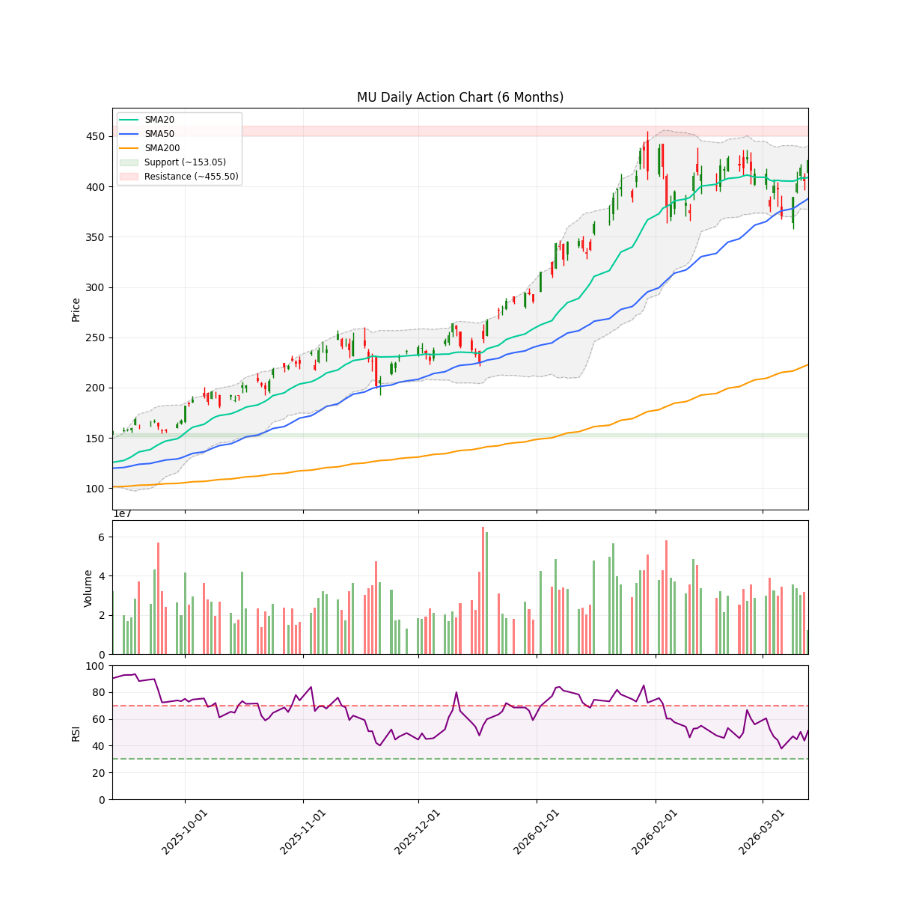
#### 研报分析

### 技术指标概览 (Technical Overview)
- **当前价格**: $425.83
- **RSI (14)**: 51.23
- **移动平均线**: SMA20: $408.83 | SMA50: $387.87 | SMA200: $222.89 (Bullish)
- **波动率**: ATR (14): 25.53 (预计周度波动: +/- $57.09)
- **关键位 (6m)**: 支撑位 $153.05 | 阻力位 $455.50
- **即时状态**: Above SMA50

### **美光科技 (MU) 情绪审计报告：AI 记忆的“狂欢”还是“谢幕”？**

**审计日期：** 2026年3月13日
**首席研究员：** 叙事经济学专家

---

#### **1. 叙事背景：当存储芯片遇上“泼天富贵”**
现在的市场，大家都在谈论算力，但如果没有美光（MU）提供的 HBM（高带宽内存），那些昂贵的 GPU 也不过是堆废铁。我们正处在一个**“AI 存储溢价”**的超级周期里。MU 的股价从 222 美元的年线一路狂飙到现在的 425.83 美元，这不是简单的反弹，这是一场关于“算力血液”的价值重估。

现在的 MU 就像是一个在派对顶峰进场的明星，所有人都盯着它下周三（3月18日左右）的财报。如果交不出满意的成绩单，这杯香槟可能会很苦。

---

#### **2. 催化剂分级 (Catalyst Categorization)**

*   **【A-Tier】顶级催化剂：下周三的 Q2 财报与 EPS 暴增预期**
    *   **详情：** 市场预期 EPS 将增长 460% 至 8.74 美元，营收冲刺 190 亿美元。分析师（如富国银行）已经把目标价拔高到了 470 美元。这种量级的增长预期是股价的主引擎。
    *   **引用：** *[Blockonomi] Micron (MU) Stock Surges Ahead of Wednesday Earnings...*
*   **【B-Tier】中级催化剂：AI 渗透率的“长坡厚雪”**
    *   **详情：** 关于未来 5 年 AI 采用率持续增长的讨论。这不是即时的业绩，但它支撑了目前 51.23 的中性 RSI，说明市场还没到盲目乐观的超买区。
    *   **引用：** *[Motley Fool] Where Will Micron Stock Be in 5 Years?*
*   **【C-Tier】噪音与扰动：宏观情绪波动带来的“回撤”**
    *   **详情：** 3月12日股价出现小幅下滑。这种波动更多是由于大盘整体压力，而非公司基本面出了问题。
    *   **引用：** *[Motley Fool] Why Micron Stock Is Sinking Today (2026-03-12)*

---

#### **3. 背离检测 (Divergence Detection)**

**关键发现：抗跌的“牛市呼吸”。**
尽管 3 月 12 日新闻提到“股价因大盘压力下挫”，但从数据看，MU 稳稳守在 SMA20 (408.83) 之上，且迅速反弹至 425.83 美元。
*   **解读：** 这是一种典型的**“看跌衰竭”**。当市场出现利空新闻（如大盘下行），MU 只是象征性地“蹲一下”就立马弹起，说明场外资金正拿着支票等回撤。股价目前在 SMA50 (387.87) 之上运行，趋势非常健康，不存在“见顶陷阱”的特征。

---

#### **4. 情绪逻辑评分：8.8 / 10 (极度乐观，但需警惕获利了结)**

*   **逻辑支撑：**
    *   **基本面支撑 (4/4)：** AI 对 HBM 的需求是刚性的，460% 的 EPS 增长预期提供了极强的安全垫。
    *   **技术面支撑 (2.8/3)：** 股价站稳所有主要均线，SMA200 还在 222 美元“遥寄祝福”，上升通道完美。
    *   **叙事张力 (2/3)：** 市场对“下周财报”的期待已拉满。虽然是牛市，但如果财报只是“符合预期”而非“大超预期”，可能会引发一波“卖事实”的回调。

---

#### **5. 资深老兵的碎碎念 (The Narrative Whisper)**

伙计，听我说。现在的美光就像是一列时速 300 公里的高铁，车速很快，但铁轨铺得很扎实。
3月12号的那次小跌，其实是给还没上车的人开了一道门缝。现在的 RSI 只有 51，这意味着在下周三财报出炉前，它还有继续冲刺 455.50 美元阻力位的燃料。

**我的建议是：** 别被那些“美光是否还值得买”的讨论干扰。只要 AI 的故事没讲完，美光的戏份就是主角。不过，别忘了下周三是“审判日”，如果你现在满仓，我会建议你在财报前先收回一部分利润，给自己的账户买份保险。

---

#### **6. 关键指标概览**

*   **当前价格：** 425.83
*   **情绪评分：** **8.8** (强劲牛市循环)
*   **逻辑阻力位：** 455.50 (6个月高点)
*   **逻辑支撑位：** 408.83 (SMA20)
*   **下一关键节点：** **2026年3月18日 (预计 Q2 财报发布日)**

> **注意：** 永远不要爱上一支股票，尤其是当它处于历史高位时。守住你的止损线。
#### 近期新闻与事件
- **[Yahoo Finance]** [Is Micron Technology, Inc. (MU) A Good Stock To Buy Now?](https://finance.yahoo.com/news/micron-technology-inc-mu-good-131721167.html)
- **[Motley Fool· via Yahoo Finance]** [Where Will Micron Stock Be in 5 Years?](https://finance.yahoo.com/news/where-micron-stock-5-years-115700677.html)
- **[Motley Fool· via Yahoo Finance]** [Why Micron Stock Is Sinking Today](https://finance.yahoo.com/news/why-micron-stock-sinking-today-173911851.html)
- **[Blockonomi]** [Micron (MU) Stock Surges Ahead of Wednesday Earnings as Analysts Raise Targets](https://blockonomi.com/micron-mu-stock-surges-ahead-of-wednesday-earnings-as-analysts-raise-targets/)
- **[Forbes]** [Buy Or Sell Micron Stock At $400?](https://www.forbes.com/sites/greatspeculations/2026/03/11/buy-or-sell-micron-stock-at-400/)

---

### NVDA
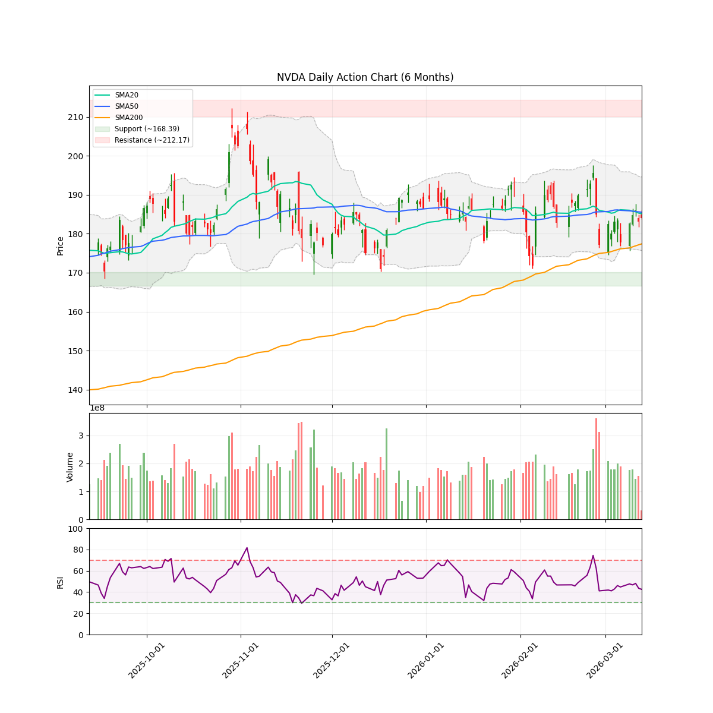
#### 研报分析

### 技术指标概览 (Technical Overview)
- **当前价格**: $183.95
- **RSI (14)**: 42.53
- **移动平均线**: SMA20: $185.13 | SMA50: $185.53 | SMA200: $177.39 (Bullish)
- **波动率**: ATR (14): 6.06 (预计周度波动: +/- $13.55)
- **关键位 (6m)**: 支撑位 $168.39 | 阻力位 $212.17
- **即时状态**: Below SMA50

你好！来，坐下喝杯咖啡。咱们聊聊现在的英伟达（NVDA）。

现在的市场氛围很有趣，就像是一场华丽的舞会，音乐还在响，灯光甚至比之前更亮了，但舞池里的人却开始悄悄往门口蹭。作为一名搞“叙事经济学”的研究员，我看到的不仅仅是那 $681 亿的营收，而是这种**“利好钝化”**背后的心理博弈。

---

### 1. 催化剂分级 (Catalyst Categorization)

我们要分清哪些是支撑股价的骨架，哪些只是修饰的粉尘。

*   **A-Tier（核心动能）：**
    *   **Q4 财报超预期叠加 ByteDance 大单：** 营收 681 亿美金，同比激增 73%，这在任何时代都是奇迹。更别提字节跳动在马来西亚砸下的 25 亿美金——3.6 万颗 Blackwell B200 芯片。这说明 AI 的基建需求还没到天花板，大厂还在疯狂“囤货”。
    *   **GTC 2026 大会（即将到来）：** 这是下周一的重头戏。Vera Rubin 架构的更新和 1780 亿美金自由现金流的预测，是维持“信仰”的核燃料。
*   **B-Tier（行业支撑）：**
    *   **Nebius 投资与 AI 存储扩张：** 黄教主（Jensen Huang）在全产业链插旗，这种通过投资锁定下游需求的做法，虽然激进，但在巩固生态圈。
*   **C-Tier（杂音）：**
    *   **散户情绪波动：** Reddit 上的讨论热度下降了 17 个点。这通常意味着“快钱”在离场，剩下的都是在观察风向的老狐狸。

### 2. 背离探测 (Divergence Detection)

**警报：明显的“看涨竭尽”信号。**

你发现了吗？财报跑赢了预期，字节跳动送来了助攻，股价却在 183.95 美元附近左右横跳，甚至跌破了 20 日和 50 日均线。这就是典型的**“利好不涨”**。

市场目前正在经历一种“审美疲劳”。[Yahoo Finance 提到的“B Word”（泡沫）](https://finance.yahoo.com/news/investors-worry-b-word-nvidia-132036762.html) 像乌云一样压在投资者头顶。尽管基本面硬得像石头，但技术面上 RSI 42.53 的平庸表现说明：**大家都在等周一的 GTC 大会，没人敢在此时轻易扣动扳机。** 现在的下跌不是基本面崩了，而是由于预期太高，导致“利好兑现”变成了“获利了结”。

### 3. 叙事评分 (Sentiment Score)

**得分：7.2 / 10**

*   **逻辑：** 如果只看基本面，它是 10 分。但从叙事角度看，它正处于一个“叙事陷阱”的边缘。目前的估值已经预支了太多的未来。市场不再满足于“好”，而是要求“神迹”。如果周一的 GTC 只是老生常谈，没有惊喜，我们要小心这根支撑趋势的 SMA200（177.39）被跌破。

### 4. 深度诊断：是趋势还是陷阱？

现在的 NVDA 看起来更像是一个**“中继整理期”**。

叙事上，英伟达已经从一家“芯片公司”变成了“AI 时代的中央银行”。只要像字节跳动这样的大客户还在持续投入（[参考 Blockonomi 报道](https://blockonomi.com/nvidia-nvda-stock-bytedances-massive-2-5b-malaysian-ai-investment-signals-robust-chip-demand/)），泡沫就还不会破裂。

但要小心，这种“高位横盘”对多头的耐心是极大的考验。185 美元的阻力位目前像一堵厚墙。下周一将是决定它是“飞向 212”还是“回撤 168”的分水岭。

---

### 5. 关键情报总结

*   **逻辑评分：** **7.2**（基本面强悍，但市场情绪陷入短期防御）
*   **下个重大日期：** **2026年3月16日（下周一）** —— **GTC 2026 Keynote 主旨演讲**。
    *   *关注点：* Blackwell 的交付进度、Vera Rubin 的技术细节，以及黄教主对“主权 AI”叙事的最新诠释。
*   **技术边界：**
    *   **支撑位：** 177.39 (SMA200) / 168.39 (6个月低点)
    *   **阻力位：** 185.53 (SMA50) / 212.17 (历史高点)

**老兵寄语：** 别在暴风雨前过度加杠杆。周一的 GTC 大会不是决定胜负的终点，而是重新定义“AI 价值”的新起点。盯着 177 美元的支撑位，那是多头的最后防线。☕
#### 近期新闻与事件
- **[Yahoo Finance]** [Investors Worry About The 'B Word' With Nvidia Stock at These Levels | NVDA](https://finance.yahoo.com/news/investors-worry-b-word-nvidia-132036762.html)
- **[Blockonomi]** [Nvidia (NVDA) Stock: Key Expectations for Monday's GTC 2026 Keynote](https://blockonomi.com/nvidia-nvda-stock-key-expectations-for-mondays-gtc-2026-keynote/)
- **[Blockonomi]** [Nvidia (NVDA) Stock: ByteDance's Massive $2.5B Malaysian AI Investment Signals Robust Chip Demand](https://blockonomi.com/nvidia-nvda-stock-bytedances-massive-2-5b-malaysian-ai-investment-signals-robust-chip-demand/)
- **[24/7 Wall St.]** [Nvidia Had Another Helping of Nebius Stock. Should You Follow Jensen Huang's Lead?](https://247wallst.com/investing/2026/03/13/nvidia-had-another-helping-of-nebius-stock-should-you-follow-jensen-huangs-lead/)
- **[Forbes]** [What's Behind The 60% Rise In Nvidia Stock?](https://www.forbes.com/sites/greatspeculations/2026/03/09/whats-behind-the-60-rise-in-nvidia-stock/)

---

### TSM
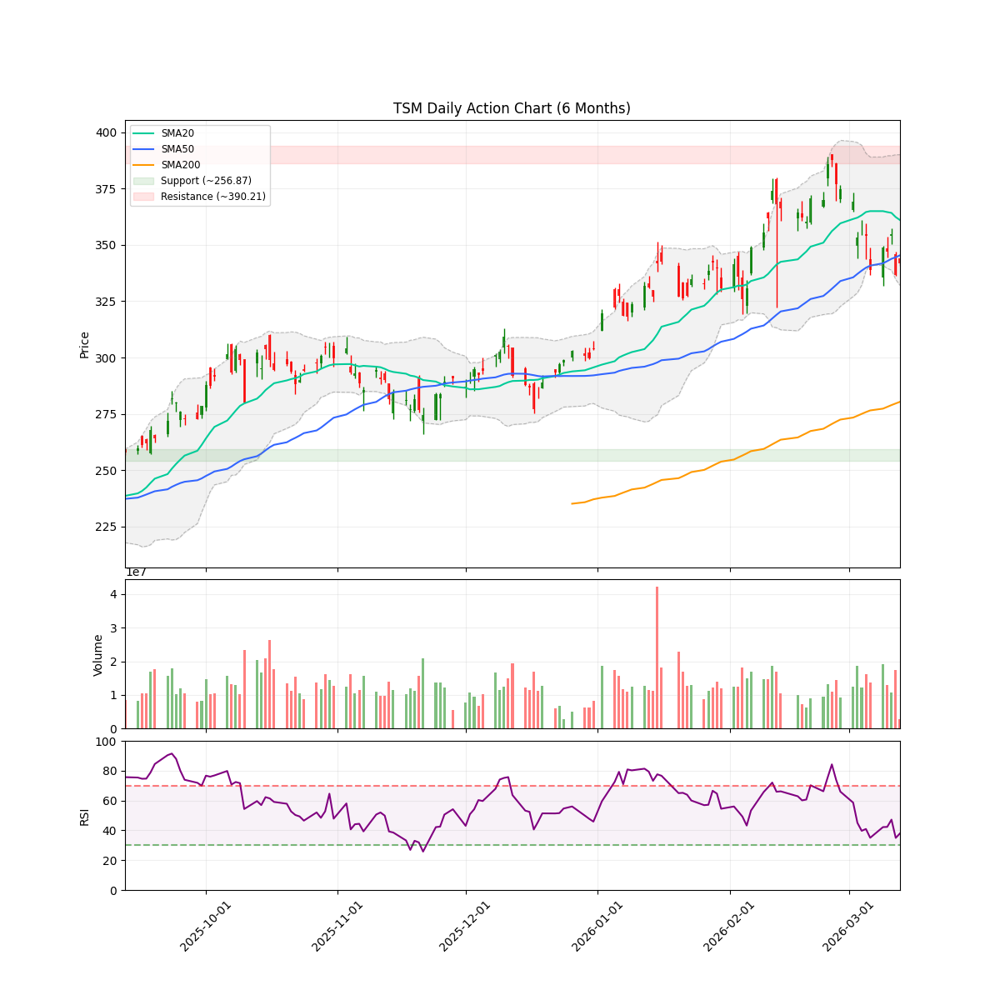
#### 研报分析

### 技术指标概览 (Technical Overview)
- **当前价格**: $341.91
- **RSI (14)**: 37.99
- **移动平均线**: SMA20: $361.00 | SMA50: $345.37 | SMA200: $280.36 (Bullish)
- **波动率**: ATR (14): 13.53 (预计周度波动: +/- $30.24)
- **关键位 (6m)**: 支撑位 $256.87 | 阻力位 $390.21
- **即时状态**: Below SMA50

### 📊 TSM 情绪审计报告：王者遇刺，还是黄金坑？

**分析师备忘录**
**日期：** 2026年3月13日
**视角：** 叙事经济学 (Narrative Economics)

坐在吧台前，看着屏幕上跳动的 TSM 数字，我能感受到空气中弥漫着一种“认知失调”的焦躁感。台积电（TSM）现在的处境，就像是一个手握全球最高机密的贵族，虽然家里金山银山（AI 订单排到后年），但门外正经历一场突如其来的街头骚乱。

---

### 1. 催化剂分类：剥开洋葱皮

我们要区分什么是“噪音”，什么是“真理”。

*   **A-Tier（核心基本面）：AI 王座的绝对垄断**
    *   **核心叙事：** 3纳米产能全满，2纳米量产在即。Nvidia、AMD、Apple 和 Intel 都在排队领号码牌。正如《24/7 Wall St》所言，台积电掌控着全球 2/3 的代工市场，它是 AI 时代的“加州水源”。这是不可撼动的底层逻辑。
*   **B-Tier（财务脉搏）：2月营收数据**
    *   **核心叙事：** 3月10日公布的2月营收数据是健康的。这证明了即使宏观环境波动，工厂里的机器依然在疯狂运转。
*   **C-Tier（短期噪音）：地缘政治焦虑与机构换仓**
    *   **核心叙事：** 最近中东（美-以-伊）局势紧张，市场担心芯片制造材料断供。这引发了 3月12日的集体抛售。这类消息通常是量化算法在砸盘，而非长期资本在逃离。

---

### 2. 情绪背离检测：当“好消息”撞上“坏价格”

现在的 TSM 正在上演一场教科书级别的**“背离剧”**。

*   **现状：** 尽管被媒体评为“让你成为百万富翁的最佳 AI 股”，甚至在市场整体下跌时曾表现顽强（3月11日逆市上涨），但由于地缘政治的突发利空，股价目前已跌破 SMA50（345.37）。
*   **诊断：** **熊市耗尽（Bearish Exhaustion）信号初显。** RSI 目前处于 37.99，正在逼近 30 的“极度超卖”区间。
*   **市场心理：** 现在的下跌并非因为“台积电不行了”，而是因为“世界太乱了，先拿钱换成黄金或现金躲一躲”。这通常是为聪明钱准备的“机构诱多陷阱”的反面——这是一个**“情绪溢价洗盘”**。

---

### 3. 情绪评分：6.5 / 10 (高压下的韧性)

*   **逻辑评分：6.5**
    *   **扣分项：** 股价处于 SMA50 之下，短期技术面走坏；地缘政治属于“黑天鹅”，无法通过基本面预测。
    *   **加分项：** 长期趋势（SMA200）依然向上且距离遥远（280.36），说明大趋势未改。AI 基础设施支出的叙事依然是市场的最强音。

---

### 4. 深度洞察：这是“陷阱”还是“机会”？

目前的 TSM 就像是一个在风暴中航行的巨轮。**341.91 的价格正处于一个非常微妙的支点。**

虽然短期跌破了 50 日均线，引发了技术派的恐慌，但考虑到它的 ATR (波动率) 预计周波动范围在 30 刀左右，目前的波动仍在合理的回撤范围内。如果它能守住 330-340 这个区间，这就是一个完美的“倒车接人”时刻。

---

### 5. 关键参考与后续追踪

*   **相关新闻线索：**
    *   [24/7 Wall St] 确认了 2nm/3nm 的统治地位 ([原文链接](https://247wallst.com/investing/2026/03/13/amd-vs-tsmc-which-chip-stock-actually-delivers-the-smarter-return-in-2026/))。
    *   [Benzinga] 记录了周四因地缘政治导致的恐慌性杀跌 ([原文链接](https://www.msn.com/en-us/money/markets/taiwan-semi-conductor-stock-slides-thursday-whats-happening/ar-AA1Yvni9))。

*   **下一个重大日期：**
    *   **2026年4月中旬（预计）：Q1 季度财报发布会。**
    *   *分析师注：* 届时管理层对下半年 AI 需求指引的更新，将直接决定 TSM 是否能冲向 400 刀的历史高位。

**总结：** 别被新闻头条的“地缘冲突”吓破胆。台积电的工厂不在中东，而它的订单正堆满了全球科技巨头的办公桌。保持冷静，关注 335 附近的支撑力度。
#### 近期新闻与事件
- **[Yahoo Finance]** [Taiwan Semiconductor Manufacturing (TSM) Reports Feb 2026 Revenue Data](https://finance.yahoo.com/news/taiwan-semiconductor-manufacturing-tsm-reports-175744466.html)
- **[Benzinga]** [Taiwan Semiconductor Stock Slides Thursday: What's Happening?](https://www.msn.com/en-us/money/markets/taiwan-semiconductor-stock-slides-thursday-whats-happening/ar-AA1Yvni9)
- **[24/7 Wall St]** [AMD vs. TSMC: Which Chip Stock Actually Delivers the Smarter Return in 2026?](https://247wallst.com/investing/2026/03/13/amd-vs-tsmc-which-chip-stock-actually-delivers-the-smarter-return-in-2026/)
- **[Zacks.com]** [TSMC (TSM) Rises As Market Takes a Dip: Key Facts](https://www.msn.com/en-us/money/savingandinvesting/tsmc-tsm-rises-as-market-takes-a-dip-key-facts/ar-AA1YqmPc)
- **[The Motley Fool]** [Top 5 Unstoppable AI Stocks to Buy for 2026](https://www.msn.com/en-us/money/general/top-5-unstoppable-ai-stocks-to-buy-for-2026/ar-AA1XVLKR)

---

### VRT
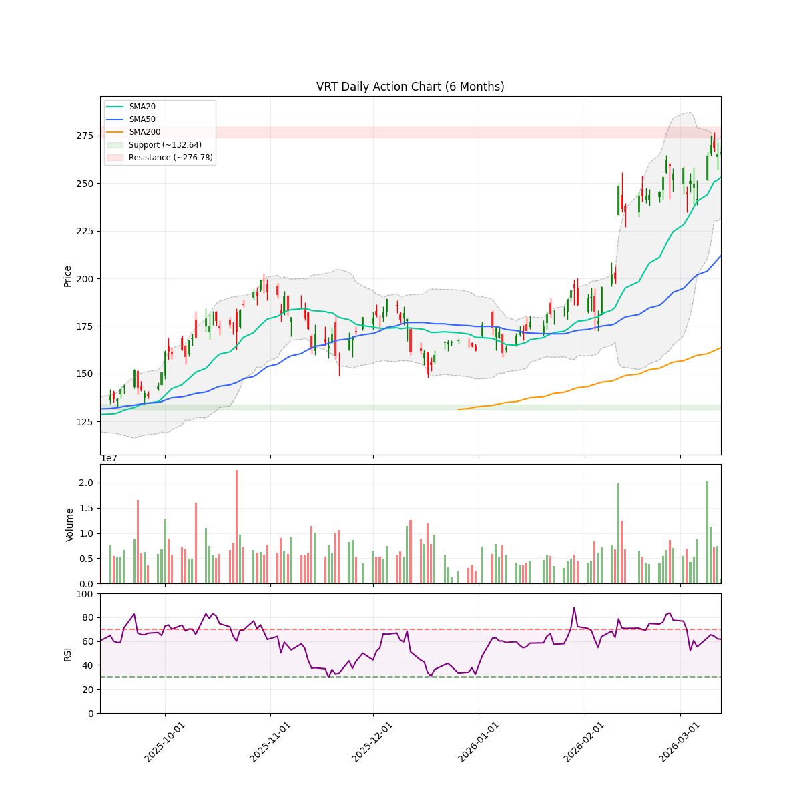
#### 研报分析

### 技术指标概览 (Technical Overview)
- **当前价格**: $266.51
- **RSI (14)**: 61.63
- **移动平均线**: SMA20: $253.13 | SMA50: $211.93 | SMA200: $163.64 (Bullish)
- **波动率**: ATR (14): 14.53 (预计周度波动: +/- $32.50)
- **关键位 (6m)**: 支撑位 $132.64 | 阻力位 $276.78
- **即时状态**: Above SMA50

你好！我是你的对冲基金研究助理。今天我们来聊聊 **Vertiv (VRT)**，这家被誉为“AI 冷却之王”的公司。

现在是 2026 年 3 月 13 日，坐在曼哈顿的咖啡馆里，咱们来拆解一下 VRT 近期的这股“疯狂叙事”。

---

# 📈 VRT 情绪审计报告：AI 基础设施的“卖水人”还能热多久？

### 1. 催化剂分级 (Categorize Catalysts)

*   **A-Tier（顶级引擎）：**
    *   **标普 500 指数纳入 (2026-03-09)：** 这是资本市场的“成人礼”。3 月 23 日正式调仓，这意味着数以百亿计的被动资金必须在下周“无脑入场”。这不仅是流动性的盛宴，更是机构背书的终极信号。
    *   **OneCore 数字孪生平台发布 (2026-03-11)：** 别被技术名词搞晕了，这本质上是 VRT 在 AI 数据中心建设上的“降维打击”。它能加速高密度 AI 机房的建设，直接锁定了未来几年的订单护城河。
*   **B-Tier（中期动力）：**
    *   **强劲盈利与指引 (2026-02-11)：** 业绩证明了 AI 并非泡沫。只要 Nvidia 的芯片还在发热，VRT 的冷却系统就是刚需。分析师将目标价上调至 290 美元，提供了明确的心理锚点。
*   **C-Tier（市场噪音）：**
    *   **高溢价质疑：** Zacks 给出的 Value Score 是 F，P/B 极高。在叙事经济学里，这通常意味着“太贵了”，但在疯狂的牛市中，这往往只是空头的“墓志铭”。

### 2. 背离检测与分歧 (Divergence Detection)

这里有个非常有意思的细节：**3 月 7 日，股价在强劲财报和分析师上调评级的情况下反而下跌了 3.1%**。

*   **内部人套现之谜：** 当天伴随着 1.04 亿美元的内部人减持。这看起来像是个“陷阱”，对吧？
*   **我的解读：** 这并非基本面转向，而是典型的**“利好出尽”与流动性置换**。大户利用财报的乐观情绪派发筹码，但这波回调仅仅持续了几天，就被随后而来的“入普”消息（暴涨 9.3%）彻底粉碎。这说明市场底部的承接力强得惊人——每一口“跌”都被饥饿的买盘吞噬了。

### 3. 情绪评分 (Sentiment Score)

#### **逻辑得分：8.8/10**
> **评价：** “这就是典型的‘叙事驱动型’大牛股。”

*   **看涨逻辑：** 指数纳入带来的强制买盘 + AI 数据中心冷却的垄断地位 + 完美的斜率。目前股价处于 SMA20/50/200 之上，典型的多头排列。
*   **风险警示：** RSI 在 61.63，处于“微热”状态。虽然还没到 70 以上的绝对超买区，但短期涨幅巨大，且估值（P/B 24.39x）确实让价值投资者看了会做噩梦。

### 4. 深度洞察：这是趋势还是陷阱？

现在的 VRT 就像是 1849 年加州淘金热里那个**垄断了所有铲子和水源的供应商**。

它的股价走势不是在反映现在的盈利，而是在反映全球对计算能力近乎贪婪的渴望。3 月 7 日的回调是一个“假动作”，它清洗了不坚定的散户，并为机构在 3 月 23 日正式纳入指数前的建仓创造了空间。

现在的阻力位在 276.78，如果下周突破这个点位，VRT 将进入“无人区”，叙事将彻底脱离估值束缚，向 300 美元冲刺。

---

### 📅 关键里程碑 (Next Major Dates)

*   **2026年3月23日：** **正式纳入标普 500 指数**。
    *   *注意：* 这一天往往是短期情绪的高潮，谨防“利好兑现”后的剧烈波动。
*   **2026年4月底（待定）：** 下一季度财报。

### 🔗 引用参考 (Citations)
*   [Blockonomi] VRT 宣布纳入标普 500 后股价飙升 7% [URI](https://blockonomi.com/vertiv-vrt-stock-rallies-7-after-sp-500-inclusion-announcement/)
*   [Insider Monkey] VRT 发布 OneCore 数字孪生平台 [URI](https://www.msn.com/en-us/news/technology/vertiv-vrt-debuts-onecore-digital-twin-platform-for-ai-data-centers/ar-AA1YqlMJ)
*   [Zacks] VRT 飙升 9.3%，放量大涨 [URI](https://www.msn.com/en-us/money/topstocks/vertiv-vrt-soars-93-is-further-upside-left-in-the-stock/ar-AA1XVIpH)

---

**老兵结语：** 伙计，别去数 VRT 的 PE 有多少倍了。在标普 500 纳入的最后一公里，趋势就是你的朋友。直到 3 月 23 日之前，这台冷却机估计还会保持极高的热度。
#### 近期新闻与事件
- **[Yahoo Finance]** [Will SoFi Become a $30 Stock Again or Keep Languishing Below $20?](https://finance.yahoo.com/news/sofi-become-30-stock-again-152646044.html)
- **[Blockonomi]** [Vertiv (VRT) Stock Rallies 7% After S&P 500 Inclusion Announcement](https://blockonomi.com/vertiv-vrt-stock-rallies-7-after-sp-500-inclusion-announcement/)
- **[Insider Monkey]** [Vertiv (VRT) Debuts OneCore Digital Twin Platform for AI Data Centers](https://www.msn.com/en-us/news/technology/vertiv-vrt-debuts-onecore-digital-twin-platform-for-ai-data-centers/ar-AA1YqlMJ)
- **[Zacks.com]** [Vertiv (VRT) Soars 9.3%: Is Further Upside Left in the Stock?](https://www.msn.com/en-us/money/topstocks/vertiv-vrt-soars-93-is-further-upside-left-in-the-stock/ar-AA1XVIpH)
- **[Blockonomi]** [Vertiv (VRT) Stock Drops 3% as Heavy Volume Overshadows Strong Earnings and Analyst Upgrades](https://blockonomi.com/vertiv-vrt-stock-drops-3-as-heavy-volume-overshadows-strong-earnings-and-analyst-upgrades/)

---

### VST
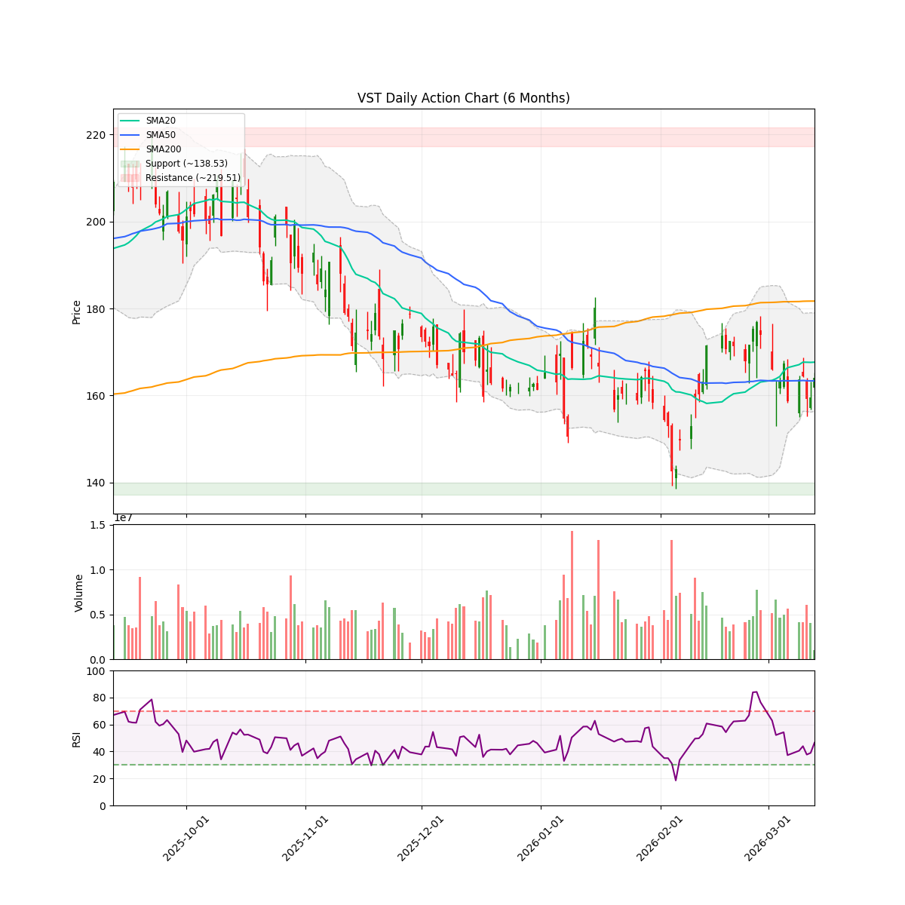
#### 研报分析

### 技术指标概览 (Technical Overview)
- **当前价格**: $164.01
- **RSI (14)**: 46.52
- **移动平均线**: SMA20: $167.65 | SMA50: $163.37 | SMA200: $181.70 (Bearish)
- **波动率**: ATR (14): 8.24 (预计周度波动: +/- $18.41)
- **关键位 (6m)**: 支撑位 $138.53 | 阻力位 $219.51
- **即时状态**: Above SMA50

你好！欢迎来到我的研究简报室。拿杯咖啡，我们来聊聊 **Vistra Corp (VST)**。

现在的市场就像三月的天气，乍暖还寒。站在 2026 年 3 月 13 日这个节点，VST 的故事正处于一个微妙的转折点：它是 AI 电力叙事的“真命天子”，还是已经被过度透支的“香饵陷阱”？

以下是基于“叙事经济学”视角的深度审计报告：

### 1. 催化剂分类：谁在拉纤，谁在捣乱？

我们要把噪音和真正的信号分开：

*   **A-Tier（核心引擎）：核能与虚拟电厂的结构性扩张**
    *   **详情**：3 月 9 日，VST 宣布与 Enphase Energy (ENPH) 合作扩大德克萨斯州的虚拟电厂 (VPP) 项目 [Insider Monkey]。这不只是个新闻，这是 VST 在重塑电力分配逻辑。再加上它作为“顶级核能股”的地位 [Insider Monkey, 3-08]，在 AI 数据中心对电力近乎贪婪的需求下，这是它的保命符。
*   **B-Tier（情绪放大器）：分析师的集体高歌**
    *   **详情**：Zacks 和各路分析师近期频繁将其列入“热门关注”和“表现优异”名单 [Yahoo Finance, 3-11]。机构的抱团通常意味着下行空间的“软垫”。
*   **C-Tier（市场噪音）：宏观逆风与散户叙事**
    *   **详情**：中东局势紧张导致油价波动，波及了整个能源板块 [The Financial Express, 3-13]。此外，Reddit 上所谓的“To the moon”言论 [Insider Monkey, 3-09] 往往是短期波动率的源头，而非长线逻辑。

---

### 2. 分歧检测：好消息为何“救”不了股价？

这是最值得玩味的地方。

**技术面与消息面的脱节**：
最近一周，我们看到了一连串的利好：分析师看好、VPP 扩张、核能叙事加持。然而，VST 的股价却在 **164.01** 附近徘徊，甚至低于 SMA20 (167.65) 和远低于 SMA200 (181.70)。

**诊断结论**：**“看好情绪的阶段性透支”**。
市场目前处于一种“利好出尽”的疲态。尽管 Oracle 的财报显示 AI 需求依然火爆 [Investopedia, 3-11]，但它没能像去年那样点燃整个电力供应链的狂欢。VST 目前正在 **SMA50 (163.37)** 这一关键防线上反复横跳。如果跌破这里，那所谓的“叙事”就会变成“事故”。

---

### 3. 叙事评分 (Sentiment Score)

**5.8 / 10 —— “持币观望的十字路口”**

*   **逻辑**：基本面依然硬朗，但技术形态上出现了典型的“多头衰竭”。它不是一个崩塌的陷阱（Systemic Failure），但它的“无敌牛市周期”已经暂停，正在进入一个痛苦的去杠杆或重新筑底的过程。

---

### 4. 市场老兵的私房话

听着，伙计。VST 现在给我的感觉就像是一场狂欢派对后的清晨。音乐还没停（核能叙事），但客人们都已经喝累了。

目前的 **RSI 处于 46.52**，这是一个典型的“中间地带”，既不超卖也不超买。股价虽然站住了 SMA50，但上方 SMA200 的压制像一块沉重的铅板。市场在等一个借口——要么是财报的超预期爆发，要么是宏观环境的彻底转暖。现在的 164 美元是一个“价值回归”的测试位，而非猛冲的信号。

---

### 5. 关键信息补全

*   **下个重大节点 (Next Major Date)**：**Q4 财报发布日**（此前有预告指向 2-3 月间，目前处于发布后的消化期或修正期）。考虑到 Yahoo Finance 提到的 EPS 预计增长 120% 但存在“负面 ESP” [Yahoo Finance UK, 2-23]，接下来的业绩指引确认将决定它是回升至 180 还是滑向 138 的深渊。
*   **核心支撑位**：$163.37 (SMA50) / $138.53 (6个月低点)
*   **核心压力位**：$181.70 (SMA200)

**操作建议**：别在雾大时飙车。如果它能有效站稳 168 并在成交量配合下突破，那才是叙事重燃的时刻。现在？先看戏。
#### 近期新闻与事件
- **[MarketWatch]** [UPDATE -- Tidal Financial Group and Defiance ETFs Announce Reverse Stock Splits for Select ETFs](https://www.marketwatch.com/press-release/update-tidal-financial-group-and-defiance-etfs-announce-reverse-stock-splits-for-select-etfs-b6dd9469)
- **[The Financial Express]** [Stocks making the biggest moves midday- Hindalco, Tata Motors PV, Adani Energy, ACME and more](https://www.financialexpress.com/market/stocks-making-the-biggest-moves-midday-hindalco-tata-motors-pv-adani-energy-acme-and-more-4171533/)
- **[Yahoo Finance]** [How Is Vistra's Stock Performance Compared to Other Utilities Stocks?](https://finance.yahoo.com/news/vistras-stock-performance-compared-other-131846909.html)
- **[Insider Monkey]** [Vistra (VST) Expands Virtual Power Plant in Texas With Enphase Energy (ENPH)](https://www.msn.com/en-us/money/technologyinvesting/vistra-vst-expands-virtual-power-plant-in-texas-with-enphase-energy-enph/ar-AA1XPc01)
- **[Insider Monkey]** [Vistra Corp (VST) Sees Fresh Analyst Bullishness](https://www.msn.com/en-us/money/topstocks/vistra-corp-vst-sees-fresh-analyst-bullishness/ar-AA1XM15T)

---
