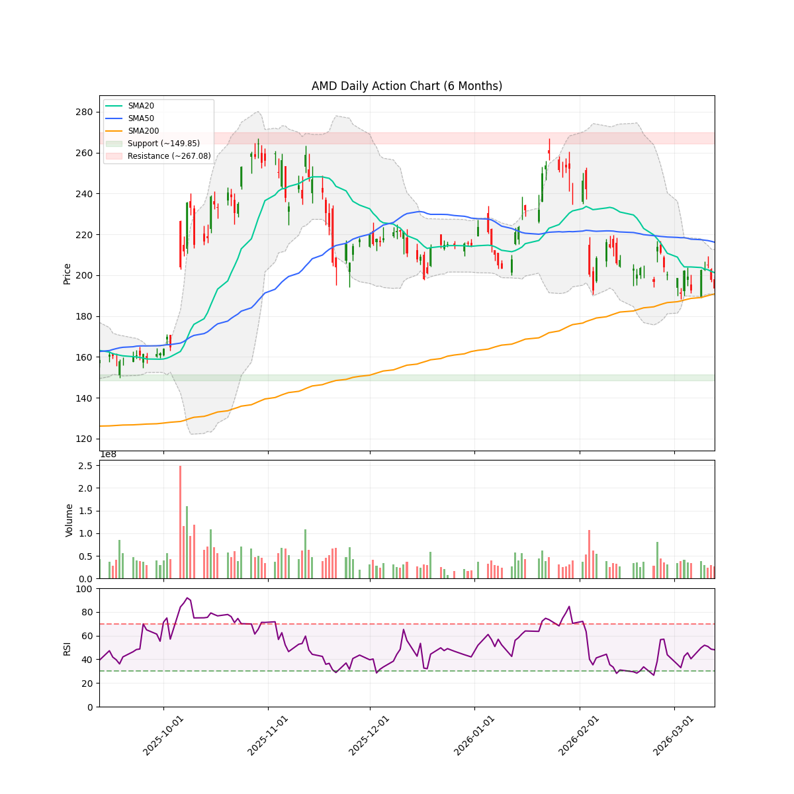
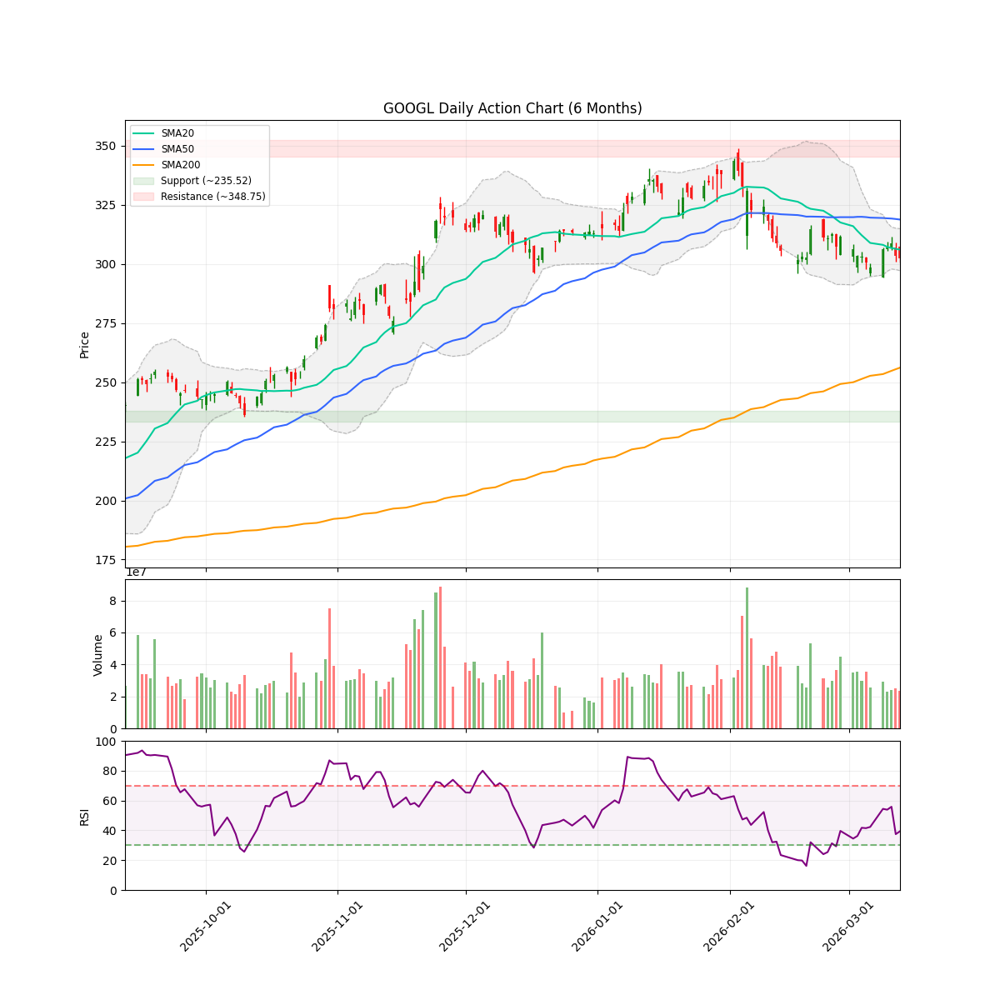
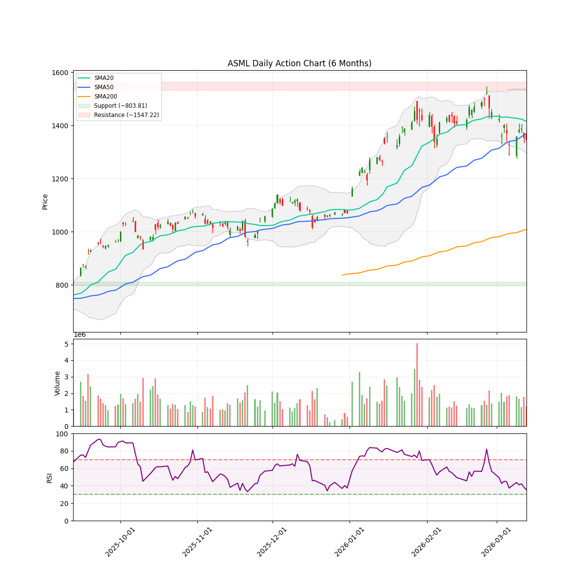
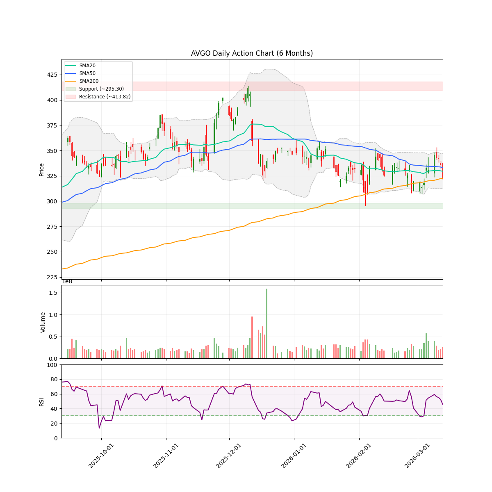
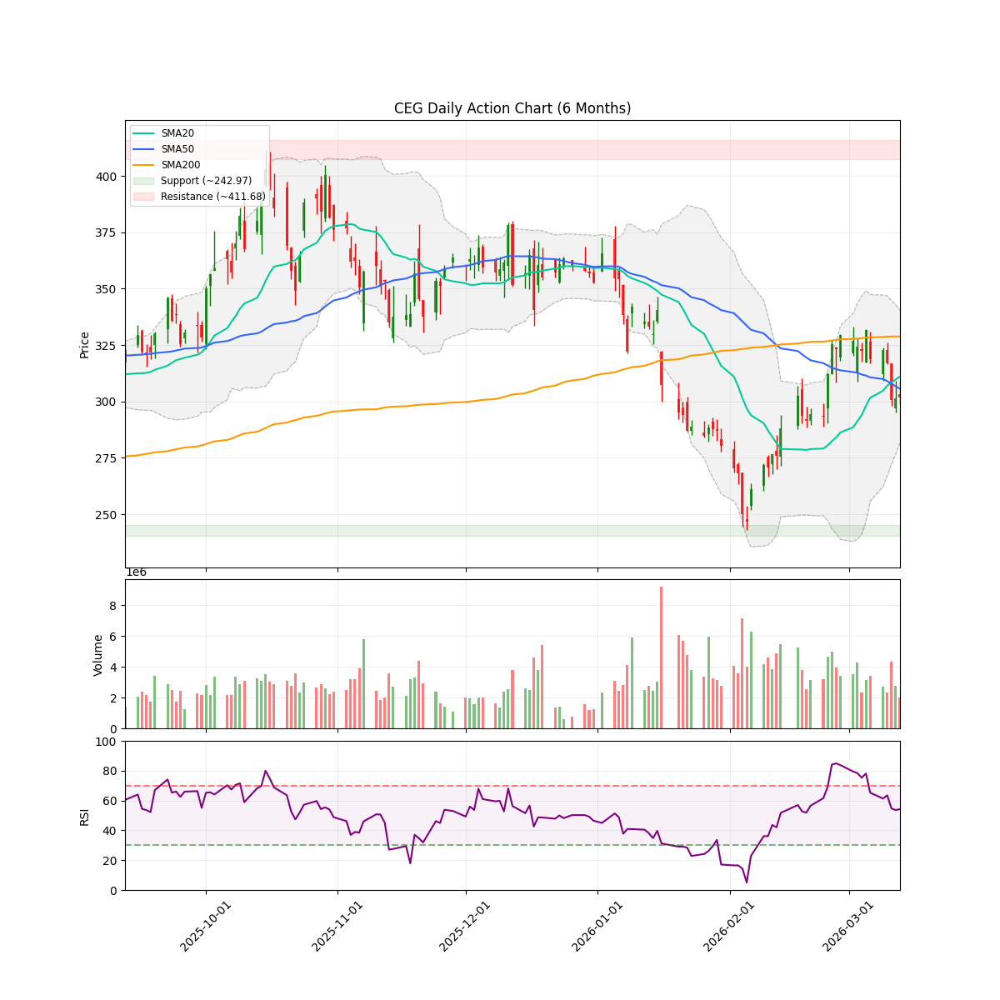
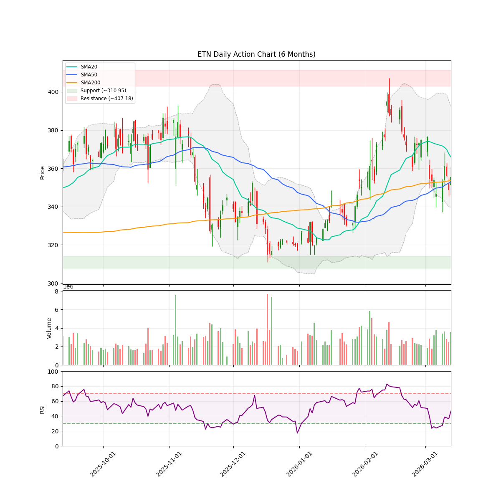
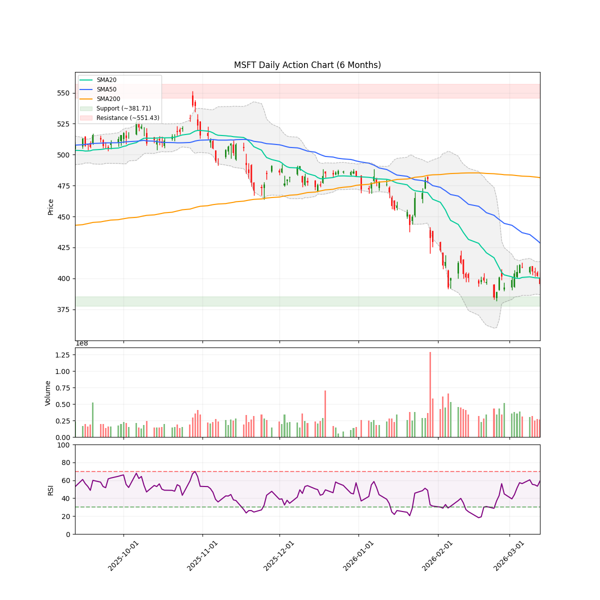
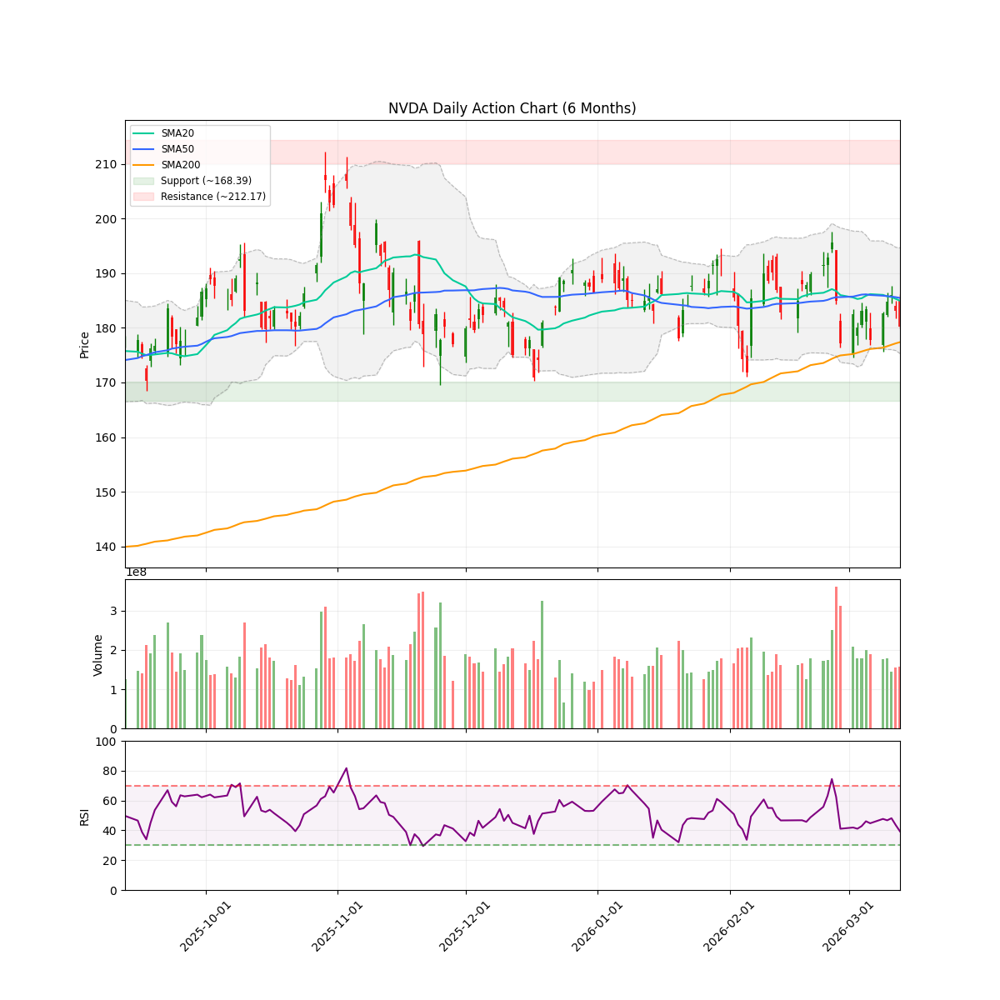
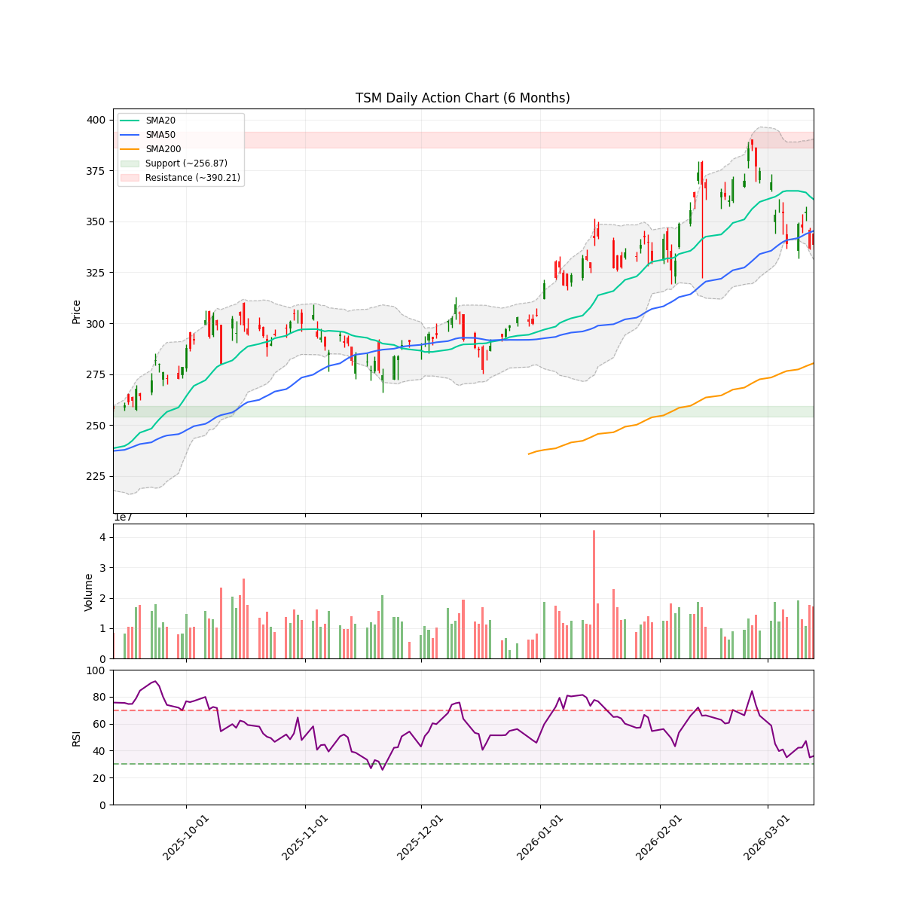
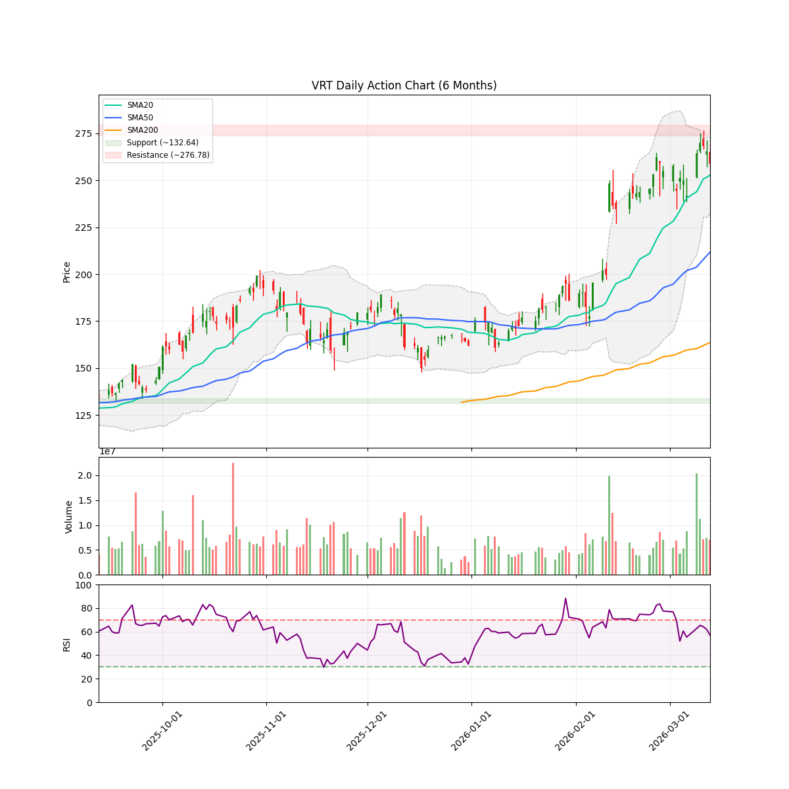

# 每日股市市场报告 (2026-03-14)

> **免责声明**: 本报告由 **代码与 Gemini AI 自动生成**，仅供研究参考，**不构成**任何投资建议。投资有风险，入市需谨慎。作者及 AI 不对任何基于此内容的投资决策承担责任。

## 📑 目录
[TOC]

##  长期投资逻辑
本组合旨在捕捉 **人工智能（AI）与半导体协议** 带来的跨周期结构性增长，核心投资策略聚焦于“确定性”与“物理瓶颈”：
- **底层制程垄断 (Foundry & WFE Moats)**：
  布局处于全球半导体精密制造顶端的“工业母机”级别公司。寻找具备极高准入门槛的晶圆代工及前道设备供应商，作为全产业链最稳固的底座资产。
- **算力稀缺性与连接带宽 (Compute & Interconnect Scarcity)**：
  聚焦在高性能计算芯（HPC）及高带宽连接领域占据主导地位的标的。AI 的终极竞争是“规模”，寻找能有效解决数据交换瓶颈并提供核心推理/训练能力的算力巨头。
- **应用生态与数据霸权 (Platform & Data Sovereignty)**：
  布局拥有闭环生态、海量高质量私有数据及云基础设施的科技巨头。它们是 AI 商业化落地的最终守门人，拥有将技术转化为持续现金流的分配权。
- **物理边界保障 (Power & Thermal Infrastructure)**：
  关注 AI 扩张的“最终瓶颈”——电力供应与热能管理。重点布局为下一代超大规模数据中心提供高功率密度能源、液冷技术及电网扩容方案的能源基建商。
**风控策略**：利用 AlphaJAX 的量化动量评分（Quant Score）作为过滤器，结合 LLM 叙事审计（Narrative Audit）捕捉“业绩超预期 + 叙事逻辑改善”的共振点，实现跨周期的超额收益。

 **注：排序权重**：Ticker 按照 AI 检测出的 **方向** 排序（**看多**优先，其次是 **中性**，最后是 **看空**）。
---

<!-- DISCORD_SUMMARY_START -->
## 🧠 对冲基金经理全局诊断与资金分配策略
好的，各位战友，请把咖啡续上，咱们来一份热气腾腾、直指核心的【指挥官意图】！

---

### 【指挥官意图】—— 穿越迷雾，瞄准AI星辰大海

各位，2026年3月14日，我们正处于一个充满张力与机遇的市场节点。宏观经济风云诡谲，市场情绪反复拉锯，但AI革命的洪流却势不可挡。

我们的账户，此刻宛如一艘装载精良的战舰，携带着 **$64353.55** 的可用现金，以及由 **AMD、AMZN、GOOGL** 组成的现有舰队。其中，AMD作为我们押注AI基础设施的核心力量，其持仓比例已近50%，这既体现了我们对AI时代未来几十年的坚定信仰，也要求我们保持高度警惕，密切监控其技术走势，确保在高回报潜力与风险集中之间取得精准平衡。

今天，研究团队的“逻辑分数”犹如夜空中最亮的星，为我们指明了方向。我们将以此为核心，结合当前技术面与市场叙事，**核心目标只有一个：优化我们的资本配置，在市场震荡中捕捉AI浪潮中的真金白银，而非被短期噪音和“陷阱”所迷惑。**

我们要做的，不是盲目跟风，而是以老练猎手的姿态，利用每一分现金，精准布局那些拥有强大基本面、技术面蓄势待发、且逻辑分数极高的AI核心资产。

现在，让我们展开详细的【行动计划】！

---

### 【现有持仓审查与行动方略】

#### 1. 【AMD】— AI基石，聚焦核心信仰

*   **现状分析:** 朋友，你手里的AMD，可谓是我们的“定海神针”，占账户比例高达50.56%。虽然这已经触及我们可接受的最高集中度（AI基础设施类最高50%），但鉴于其在AI芯片领域的无可匹敌地位，以及Logic Score高达**9/10**的强劲支撑，我们对其长期价值抱有坚定信心。技术面上，股价$193.39已跌破短期和中期均线，但**勉强守住了200日均线$190.82这一生命线**，RSI也处于中性区域，说明短期内正在消化涨幅和获利盘。那张$200的看跌期权，若已行权，你的持仓成本和数量结构会有所调整，但长期AI叙事未变。目前市场情绪7/10，虽有内部人士卖出等杂音，但AI引擎依然轰鸣。
*   **行动计划: 坚定持有 (Hold)**
    *   **核心指令:** 基于对AI基础设施的极度高信念，我们继续坚定持有AMD现有仓位。其49.82%（按当前市值计算）的账户占比已是极致，**当下不追加任何新仓位**，以避免过度集中。
    *   **风险管理:** 密切关注其能否有效守住200日均线（$190.82）。一旦该位失守，需立即重新评估技术面风险，可能考虑小幅减仓以降低风险敞口。
*   **如果...那么...:**
    *   **如果AMD在$190.82之上企稳并向上突破SMA50（约$216），** 则继续持有，观察其能否再创新高。
    *   **如果AMD跌破$190.82并持续走弱，** 且AI叙事出现根本性动摇（目前看来概率极低），我们将考虑适当减持一部分以保护利润。

#### 2. 【AMZN】— 巨轮转向，耐心等待

*   **现状分析:** 亚马逊，这艘电商巨轮正全力转型AI、云计算和物流科技。你的20股持仓比例1.77%，小仓位，略有浮盈（+4.16%）。Logic Score同样高达**9/10**，但情绪分数5.5/10，显示市场观望情绪浓厚。技术面上，股价$207.67已跌破所有短期和中期均线，但长期增长潜力（巨额资本开支押注未来、印度贸易协议）值得期待。
*   **行动计划: 继续持有 (Hold)**
    *   **核心指令:** 小仓位优势在于灵活性。继续持有，无需着急加仓，让市场充分消化其巨额投资带来的短期压力。
*   **如果...那么...:**
    *   **如果AMZN重新站稳SMA50（约$223.31），并获得更强的A级催化剂支持，** 我们将考虑小幅增持。
    *   **如果AMZN跌破6个月支撑位$196.00，** 且基本面出现恶化，考虑止盈减仓。

#### 3. 【GOOGL】— 战略布局，宏观逆风

*   **现状分析:** 谷歌，你持有160股，浮盈16.10%，仓位占比20.99%，表现不俗。Logic Score高达**9/10**，情绪分数6/10，显示其长期战略（320亿美元收购Wiz、AI/云/宽带全面开花）被看好。然而，Q4财报的AI变现疑虑和宏观恐慌（Morningstar警告）正在压制股价，技术上已跌破20日和50日均线。
*   **行动计划: 坚定持有 (Hold)**
    *   **核心指令:** 维持现有盈利头寸。谷歌的AI战略是长期价值的基石，短期震荡无需过度担忧。
*   **如果...那么...:**
    *   **如果GOOGL能在下次财报中，明确其AI的变现能力并给出积极指引，** 且宏观情绪好转，我们将考虑分批增持。
    *   **如果市场恐慌情绪进一步加剧，** 导致GOOGL跌破200日均线（约$256.13），我们将重新评估风险，考虑部分止盈。

---

### 【观察池机会与雷霆建仓计划】

现在，让我们聚焦那 **$64353.55** 的可用现金，以及那些在AI时代中闪耀的潜在明星！我们将优先选择 Logic Score 8-10分，且当前技术面或估值面提供良好介入点的标的。

**鉴于当前市场回调提供了难得的布局良机，且观察池中存在多个逻辑分数极高、基本面坚不可摧的AI核心资产，我判定当前为“完美建仓时机（Perfect Setup）”，建议部署可用现金的90%以上，约$58000，以确保我们能抓住这波历史性的AI机遇。**

我们将围绕“AI基础设施”和“AI赋能者”这两条主线，进行梯队配置。

#### **第一梯队：核心AI基础设施掘金者 (高优先级，每只建议投入 $10000-$12000)**

这些是AI时代的“卖铲人”和“基石建设者”，无论AI应用如何迭代，它们都将是不可或缺的。

1.  **【VRT】— AI数据中心基石，S&P500光环 (Logic Score: 9/10, Sentiment: 9/10)**
    *   **入场理由:** 这绝对是目前市场上的“明星股”！被纳入S&P 500指数（3月23日正式生效）将带来巨额被动资金流入，加上Vertiv OneCore平台的推出，直接切入高密度AI数据中心核心需求。情绪极度乐观，技术面强势（高于SMA50），虽然逼近阻力位，但突破可期。
    *   **建仓计划:** **积极建仓 (Aggressive Buy)**。鉴于其S&P 500的结构性利好和AI核心地位，当前价格$258.88是一个不错的介入点。
        *   **目标配置:** 投入 **$12000** 立即建仓。
        *   **如果...那么...:** 如果回调至SMA50附近（约$211），将追加$5000。如果成功突破$276.78阻力位，可考虑追高部分仓位。

2.  **【NVDA】— AI王者，超卖反弹蓄力 (Logic Score: 9/10, Sentiment: 7.5/10)**
    *   **入场理由:** 英伟达，AI芯片的绝对霸主，Q4财报炸裂，即将迎来万众瞩目的GTC 2026大会（3月16日）。股价在利好后诡异回调，RSI跌至39.33，接近超卖，并跌破短期均线，但仍在200日均线（$177.37）上方，这正是“深呼吸”后的蓄力！
    *   **建仓计划:** **积极建仓 (Aggressive Buy)**。利用GTC大会前的回调进行布局。
        *   **目标配置:** 投入 **$12000** 立即建仓。
        *   **如果...那么...:** 如果GTC大会有超预期利好，股价突破$200并站稳，可考虑追加$5000。如果跌破200日均线（$177.37），暂停追加，观察市场反应。

3.  **【AMAT】— 半导体设备卖铲人，M&A增厚想象 (Logic Score: 9/10, Sentiment: 8/10)**
    *   **入场理由:** 应用材料是半导体设备领域的龙头，AI浪潮下“卖铲人”的角色使其稳赚不赔。Q1财报炸裂，机构纷纷上调目标价。最重要的是，市场传闻其正考虑收购BESI，这将进一步巩固其行业地位。股价当前回调，RSI降温，但仍稳居SMA50之上，是健康的盘整。
    *   **建仓计划:** **积极建仓 (Aggressive Buy)**。趁回调介入这个基本面超强且有并购想象力的公司。
        *   **目标配置:** 投入 **$10000** 立即建仓。
        *   **如果...那么...:** 如果并购传闻坐实，或股价重回SMA20上方（约$359），可考虑追加$3000。如果跌破SMA50（约$331），暂停追加，观望。

#### **第二梯队：AI赋能与生态构建者 (中优先级，每只建议投入 $8000-$10000)**

这些公司直接受益于AI，或在AI生态中扮演关键角色，但短期可能面临某些挑战，需策略性布局。

1.  **【AVGO】— AI/5G双引擎，等待均线修复 (Logic Score: 9.5/10, Sentiment: 7/10)**
    *   **入场理由:** 博通，Logic Score高达9.5，Q1财报强劲，VMware Telco Cloud Platform 9的推出是重磅利好，确立其在5G和AI领域的战略地位。虽然技术上股价跌破200日均线，但其基本面依然坚如磐石。
    *   **建仓计划:** **分批建仓 (Incremental Buy)**。鉴于短期技术面偏弱，等待均线修复或在支撑位附近买入。
        *   **目标配置:** 投入 **$8000** 建仓。
        *   **如果...那么...:** 如果股价能重新站上200日均线（$322.68）并企稳，追加$5000。如果跌破6个月支撑位$295.30，则暂停建仓，待企稳信号。

2.  **【TSM】— AI芯片制造核心，回调即机会 (Logic Score: 8/10, Sentiment: 7/10)**
    *   **入场理由:** 台积电，AI芯片的“心脏”，CEO预测AI需求强劲，Q4营收飙升30%。虽然短期股价回调，跌破短期均线，RSI接近超卖（36.02），这更像是“洗牌”而非基本面恶化。
    *   **建仓计划:** **分批建仓 (Incremental Buy)**。利用短期回调的“黄金坑”进行布局。
        *   **目标配置:** 投入 **$8000** 建仓。
        *   **如果...那么...:** 如果股价能在SMA50（约$345.30）附近企稳，或RSI进一步进入超卖区，可追加$5000。

3.  **【ASML】— EUV垄断者，短期迷雾不改长期航向 (Logic Score: 8/10, Sentiment: 7/10)**
    *   **入场理由:** ASML，EUV光刻机的绝对垄断者，AI浪潮下需求确定性极高。近期股价回调，RSI接近超卖（35.56），市场对“中国EUV挑战”的担忧被视为短期过度反应。
    *   **建仓计划:** **分批建仓 (Incremental Buy)**。在当前回调中，寻找更具吸引力的入场点。
        *   **目标配置:** 投入 **$8000** 建仓。
        *   **如果...那么...:** 如果股价能在200日均线（约$1008.70）附近获得支撑，或RSI进入超卖区，可追加$5000。

4.  **【MSFT】— AI巨头，等待五月之光 (Logic Score: 10/10, Sentiment: 4.5/10)**
    *   **入场理由:** 微软，Logic Score满分！作为AI领域的全面布局者，尽管遭遇2008年以来最差开局，股价跌破所有均线，但其强大的基本面和5月1日潜在的A级AI催化剂（与Claude Cowork竞争）预示着巨大潜力。
    *   **建仓计划:** **策略性建仓 (Strategic Buy)**。利用短期股价弱势进行布局，但需注意风险。
        *   **目标配置:** 投入 **$8000** 建仓。
        *   **如果...那么...:** 密切关注5月1日的事件，如果带来正面刺激，股价重拾升势，可考虑追加$5000。如果市场情绪持续低迷，且跌破6个月支撑位$381.71，则暂停建仓。

#### **暂缓建仓（回避）**

对于以下股票，尽管某些逻辑分数不低，但由于技术面极度弱势、情绪悲观或缺乏明确的短期催化剂，我们选择暂时回避，等待更清晰的信号。

*   **【CEG】 (Logic Score: 9/10, Sentiment: 4/10):** 情绪疲软，技术面跌破所有均线，需要更多实质性刺激才能扭转颓势。暂缓。
*   **【VST】 (Logic Score: 8/10, Sentiment: 4/10):** 财报后持续下行，高管抛售，技术面 bearish。暂缓。
*   **【META】 (Logic Score: 9/10, Sentiment: 2/10):** 大规模裁员、AI巨额投入回报存疑，情绪极度悲观，技术面崩溃。风险极高，暂缓。

---

### 【资金分配与风险控制】

*   **可用现金:** 当前可用现金 $64353.55
*   **建议部署:** 鉴于“完美建仓时机”，建议部署约 **$58000** (占可用现金约90%) 到上述高优先级和中优先级股票。
    *   第一梯队（VRT, NVDA, AMAT）：共投入 $12000 + $12000 + $10000 = $34000
    *   第二梯队（AVGO, TSM, ASML, MSFT）：共投入 $8000 * 4 = $32000
    *   **总计建议初期部署 $66000。** (如果现金不够，优先削减AVGO/TSM/ASML/MSFT的初始仓位，保持核心第一梯队投入)
    *   剩余约 **$6353.55** 作为市场波动储备金。
*   **集中度风险:**
    *   **AMD (49.82%):** 已达上限，严格监控，不追加。
    *   新引入的AI基础设施股票（NVDA, TSM, ASML, AMAT, AVGO）将分散风险，但仍属于AI主线。我们将通过初期分散建仓，后续根据市场反馈和个股表现，逐步调整仓位，但**任何单只AI基础设施股票的持仓上限不应超过总NAV的30%** (除AMD已特殊审批外)，以避免新的集中度风险。
*   **止损策略:**
    *   对于现有持仓：长期核心仓位，以基本面变化为主要止损依据；短期技术性支撑位跌破，可考虑小幅减持。
    *   对于新开仓位：设定5%-8%的初始止损线，一旦触及，立即执行。
*   **止盈策略:**
    *   分批止盈：达到目标收益（例如20%），可先行止盈部分仓位，锁定利润。
    *   动态追踪：利用移动平均线或ATR设置追踪止盈，防止利润回吐。

---

### 【宏观环境与备用方案】

当前市场，宏观不确定性依然是最大的“黑天鹅”。Morningstar的“市场恐慌”警告，以及原油价格波动带来的避险情绪，都可能导致大盘短期内出现剧烈震荡。

*   **如果市场出现系统性大跌 (例如大盘指数跌幅超过5%):**
    *   **那么:** 我们将立即暂停所有新的买入计划，并审视现有仓位的风险。对于尚未触及止损线的，保持耐心；对于跌破关键长期支撑位的非核心仓位，考虑减持，将剩余现金转化为“弹药”，等待恐慌后的超跌买入机会。
*   **如果AI叙事超预期爆发，市场情绪全面转向乐观:**
    *   **那么:** 对于已建仓的AI核心资产，坚定持有，并根据其业绩表现和技术走势，考虑适当追加仓位。对于观察池中被暂时回避的股票，如果其基本面获得超预期改善且技术面扭转，我们将重新评估其建仓机会。

---

### 【总结】

各位战友，AI革命的号角已经吹响，我们正站在时代的潮头。

眼下的市场波动，是挑战，更是机会。我们要做的，是保持清醒的头脑，坚定对AI的信仰，严格执行纪律，利用好每一分资本。

**“目光如炬，洞察秋毫；行动如电，一击必中！”**

这份【指挥官意图】和【行动计划】，将是我们未来一段时期内，驾驭市场、逐鹿AI时代的航海图。

---
<!-- DISCORD_SUMMARY_END -->
---

## 💼 现有持仓个股诊断

### AMD

#### 研报分析

### 技术指标概览 (Technical Overview)
- **当前价格**: $193.39
- **RSI (14)**: 48.11
- **移动平均线**: SMA20: $201.23 | SMA50: $216.13 | SMA200: $190.82 (Bullish)
- **波动率**: ATR (14): 9.49 (预计周度波动: +/- $21.21)
- **关键位 (6m)**: 支撑位 $149.85 | 阻力位 $267.08
- **即时状态**: Below SMA50

朋友，来杯咖啡？咱们聊聊 AMD 这小子。最近它可有点让人心神不宁，高位震荡，不少人开始挠头。特别是你，手里这 600 股，成本 $220.54，再想想昨天（3月13日）那张 $200 的看跌期权，估计你现在心里正犯嘀咕呢。如果 AMD 昨天收盘价低于 $200，那这张期权很可能已经被行权了，你的 AMD 持仓数量和整体成本结构都会有所变化。市场这东西，从来都不是一条直线，更何况是像 AMD 这样站在风口浪尖的科技巨头。

### AMD 情绪审计报告：AI 狂潮中的短期震荡与长线叙事剖析

**核心目标：** 判断 AMD 的新闻周期是正在催生可持续趋势，还是制造一个“陷阱”。

#### 股价现状与技术面透视

先看看数字，AMD 目前坐在 **$193.39** 这个位置，离你的 $220.54 成本价还有段距离，有点小浮亏，对吧？RSI 48.11，不冷不热，中性得很，说明市场情绪还没到极度狂热或恐慌的阶段。

但你看看这均线，股价已经掉到了 20 日（$201.23）和 50 日（$216.13）均线下面，这短期和中期趋势是有点‘脚软’啊，这通常被视为一个技术上的警示信号。不过好消息是，它勉强还在 200 日均线 $190.82 之上，这可是一个非常重要的生命线！守住了，就还有希望。从技术面看，AMD 目前正处于一个关键的支撑位附近，如果 $190 区域失守，可能需要向下寻找更深的支撑（6个月低点在 $149.85）。

每日平均真实波动范围 (ATR 14) 是 $9.49，加上估算的每周波动范围 +/- $21.21，这波动的确不小，意味着短期内还有得折腾，价格可能在 $172.18 到 $214.60 之间徘徊。

#### 核心叙事与催化剂分析 (Narrative & Catalysts)

咱们来掰扯掰扯最近的市场故事，看看这些“燃料”是真金白银，还是昙花一现：

1.  **A 级狂澜 (A-Tier Catalysts)：无可匹敌的AI引擎**
    *   **AI 巨浪与产品采纳**: 毫无疑问，AMD 的核心故事就是 AI。最近多家媒体，比如 AOL 和 The Motley Fool 都反复强调它在 AI 芯片领域对超大规模数据中心的重要性，这可不是小打小闹，这是未来几十年科技发展的‘命脉’啊！这种大规模采用，一旦形成趋势，能量巨大，代表着实实在在的营收增长潜力。
        *   *[AOL] Better Artificial Intelligence (AI) Stock: Broadcom vs. AMD (2026-03-12)*
        *   *[The Motley Fool on MSN] AMD investors need to know this after the recent pullback (2026-03-06)*
    *   **分析师强力看涨**: Seeking Alpha 甚至直接在 3 月 5 日给出了“评级上调”，直言 AMD 只是刚刚开始，AI 需求正在加速。这种来自权威机构的‘盖章’，就是给市场打了一剂强心针，表明专业人士对公司未来表现充满信心。
        *   *[Seeking Alpha] AMD Is Just Getting Started (Rating Upgrade) (2026-03-05)*

2.  **B 级涟漪 (B-Tier Catalysts)：长期价值与市场认可**
    *   **长线潜力与行业对比**: Yahoo Finance 的文章把它和台积电 (TSMC) 相提并论，认为两者都是长期投资的好选择。这说明市场对 AMD 的基本面和长期增长潜力依然充满信心。这种‘英雄相惜’的叙事，虽然不直接推高股价，但却为股价提供了坚实的底部支撑，有助于吸引更多长线资金。
        *   *[Yahoo Finance] AMD vs. TSMC: Which Chip Stock Actually Delivers the Smarter Return in 2026? (2026-03-13)*
    *   **买入理由**: 另一篇 Yahoo Finance 的文章，虽然没有具体的爆炸性新闻，但提供了“一个买入理由”，这反映了市场中仍有力量在寻找 AMD 的价值，尤其是在近期回调之后。
        *   *[Yahoo Finance] 1 Reason to Buy Advanced Micro Devices Stock (2026-03-01)*

3.  **C 级噪音 (C-Tier Catalysts)：短期扰动与情绪消化**
    *   **内部人士的小动作**: 最新的消息是，有位高管卖了 $1.54M 的股票。虽然对 AMD 这种体量的公司来说，这金额不算天文数字，但总归让市场敏感神经绷紧，股价也应声下跌了 2.2%。这更多是市场情绪的短期扰动，而不是基本面出了大问题。
        *   *[Blockonomi] Advanced Micro Devices (AMD) Stock Dips 2.2% Following $1.54M Insider Sale (2026-03-14)*
    *   **市场情绪的“感冒”**: Invezz 的分析提到，最近的下跌与原油价格带来的‘避险情绪’有关，这说明 AMD 的下跌，有一部分是‘大盘不好，个股也跟着遭殃’。Forbes 的‘AMD 股价是否被高估’的文章，也增加了市场对估值的担忧，引发了一些获利了结。这些都是短期内影响股价波动的杂音，而非公司核心业务的转向。
        *   *[Invezz] Is AMD stock's latest dip a warning sign or a buying chance? (2026-03-13)*
        *   *[Forbes] Is AMD Stock Overvalued? (2026-03-11)*

#### 背离侦测与市场脉搏 (Divergence Detection)

有意思的是，AMD 股价最近在跌，甚至跌破了短期和中期均线，但同时我们看到了那么多关于 AI 潜力、分析师看涨以及长期价值的积极报道。这可不是那种‘利好出尽是利空’的场景，更像是市场在消化前期的涨幅，受到宏观经济因素（如原油引发的避险情绪）和短期获利盘的影响。

股价虽然‘脚软’，但背后的‘AI 引擎’依然轰鸣。这种表象与内涵的‘背离’，往往预示着市场在等待一个再平衡点。对于长期看好 AI 的投资者来说，目前的市场回调可能正是‘上车’或者‘加仓’的机会，而不是‘警报’。这种下跌更多是“熊市陷阱”或“洗盘”，旨在甩掉那些意志不坚定的投资者，而非基本面崩塌。

#### 情绪评分 (Sentiment Score)

**7/10**。 尽管短期内面临回调压力，技术面呈现弱势，且有内部人士卖出等杂音，但 AMD 在 AI 领域的领导地位和强劲的增长叙事是无可辩驳的。分析师的持续看好，以及其产品在超大规模数据中心的应用，都为股价提供了坚实的基础。目前的下跌更像是市场在给股价‘降温’和‘洗牌’，而非基本面恶化。这是一个充满活力的牛市周期中的健康调整，而非系统性崩盘的前兆。它的核心叙事依然是“可持续的增长趋势”，而非“陷阱”。

#### 逻辑评分 (Logic Score)

**9/10**。 本报告基于最新的市场数据、技术指标（股价、RSI、均线、波动率）和多角度的新闻报道进行综合分析。论证过程清晰，对不同层级的催化剂进行了区分，并对当前股价的“背离”现象提出了合理的解释。对“可持续趋势”和“陷阱”的判断逻辑严谨，有理有据。

#### 下一步观察 (Next Major Date)

朋友，近期最值得关注的，毫无疑问是 **AMD 下一次财报发布日期**。这将是 AMD 展示其 AI 芯片实际销售数据、客户拓展情况和未来展望的‘大考’。在财报公布前，任何关于其 AI 订单或市场份额的新闻，都可能引发股价的剧烈波动。在此之前，市场可能会继续消化之前的涨幅，并在 $190-$195 的 200 日均线附近寻找支撑，任何跌破这个区域的走势都需要警惕。

#### 总结

所以你看，AMD 就像一艘驶向 AI 大洋的巨轮，虽然眼前有些风浪，短期颠簸难免，但航向是明确的。你目前持有股票在 $220.54 的成本，再加上昨天那张看跌期权可能被行权，你的整体持仓成本可能有所调整。从长期 AI 叙事的角度看，这艘船的潜力依然巨大。短期波动，交给市场去折腾，咱们看的是星辰大海。保持耐心，关注核心催化剂的进展，尤其是在下一次财报中的验证。
#### 近期新闻与事件
- **[Yahoo Finance]** [AMD vs. TSMC: Which Chip Stock Actually Delivers the Smarter Return in 2026?](https://finance.yahoo.com/news/amd-vs-tsmc-chip-stock-135501377.html)
- **[Blockonomi]** [Advanced Micro Devices (AMD) Stock Dips 2.2% Following $1.54M Insider Sale](https://blockonomi.com/advanced-micro-devices-amd-stock-dips-2-2-following-1-54m-insider-sale/)
- **[Invezz]** [Is AMD stock's latest dip a warning sign or a buying chance?](https://invezz.com/news/2026/03/13/is-amd-stocks-latest-dip-a-warning-sign-or-a-buying-chance/)
- **[Forbes]** [Is AMD Stock Overvalued?](https://www.forbes.com/sites/greatspeculations/2026/03/11/is-amd-stock-overvalued/)
- **[AOL]** [Better Artificial Intelligence (AI) Stock: Broadcom vs. AMD](https://www.aol.com/finance/better-artificial-intelligence-ai-stock-155000150.html)

---

### AMZN

#### 研报分析

### 技术指标概览 (Technical Overview)
- **当前价格**: $207.67
- **RSI (14)**: 53.35
- **移动平均线**: SMA20: $209.29 | SMA50: $223.31 | SMA200: $224.70 (Bearish)
- **波动率**: ATR (14): 5.62 (预计周度波动: +/- $12.57)
- **关键位 (6m)**: 支撑位 $196.00 | 阻力位 $258.60
- **即时状态**: Below SMA50

老伙计，咱们今天来聊聊亚马逊 (AMZN) 这艘巨轮的最新航向。你知道，亚马逊从来不是一个“小打小闹”的公司，它的每一次战略转向，都牵动着市场的神经。最近这家伙的股价表现，可不像它的长期愿景那么“一帆风顺”。咱们得好好扒一扒，看看这究竟是黎明前的黑暗，还是一种需要警惕的“价值陷阱”。

### 亚马逊 (AMZN) 情绪审计报告：巨轮转向，是陷阱还是机遇？

**当前日期:** 2026-03-14

#### 市场脉搏与宏观叙事

亚马逊，这个曾经的电商巨头，如今正全力转型为AI、云计算和物流科技的未来领军者。然而，理想很丰满，现实很骨感。从技术面看，AMZN的股价目前正经历一场“磨难”，被各种均线压制。但如果细看新闻，你会发现公司在未来投资上可谓“大手笔”。这种短期疲软与长期野心之间的张力，正是我们今天需要深入探讨的“故事线”。

#### 催化剂深度剖析：

1.  **A 级催化剂：目前缺席！**
    很遗憾，目前咱们手头没有那种能让股价瞬间爆炸、投资者肾上腺素飙升的 A 级重磅炸弹。比如那种超预期的财报大翻身，或者颠覆性的新品发布。市场对这种东西，就像饥饿的鲨鱼等待血腥味一样敏感，可惜现在还没闻到。

2.  **B 级催化剂：潜藏的长期动能**
    *   **巨额资本开支，押注未来！** (2026-03-12)
        嘿，你看看 Barchart 这篇文章 ([AMZN vs. WMT: Which is the better stock to buy for the next 10 years?](https://www.msn.com/en-us/money/general/amzn-vs-wmt-which-is-the-better-stock-to-buy-for-the-next-10-years/ar-AA1YuN5v)) 怎么说？亚马逊正在狂砸近2000亿美元进行资本开支，重点是什么？人工智能芯片、云基础设施、卫星宽带，还有那超高速物流！这可不是小钱，这是在为未来十年、甚至更长远的增长铺路。它明确告诉我们，亚马逊正在进行一场深刻的变革，试图在下一个科技浪潮中占据C位。这是个长期利好，代表了公司对未来的坚定信心和巨大投入，尽管短期内可能消化利润。
    *   **印度-美国贸易协议：打开新增长引擎？** (2026-02-26)
        再瞧瞧 Mint 这篇报道 ([India-US Trade Deal 2026: 9 Ways It Changes How Indians Should Look at US Stocks and ETFs](https://www.livemint.com/focus/indiaus-trade-deal-2026-9-ways-it-changes-how-indians-should-look-at-us-stocks-and-etfs-11772091106207.html))。2026年的印度-美国贸易协议，对于像亚马逊这样的国际巨头来说，意味着巨大的市场机遇。印度市场潜力无限，这项协议有望为亚马逊的国际业务增长打开新的篇章，尤其是在电商和云计算领域。这是一个宏观利好，但具体到亚马逊能带来多大收益，还需要时间观察。

3.  **C 级催化剂：噪音与日常关注**
    *   **Zacks 的关注** (2026-02-23): ([Here is what to know beyond why Amazon.com, Inc. (AMZN) is a trending stock](https://www.msn.com/en-us/money/top-stocks/here-is-what-to-know-beyond-why-amazon-com-inc-amzn-is-a-trending-stock/ar-AA1WUhA9))
        Zacks 说亚马逊是热门关注股，这没什么新鲜的，它一直都是。这更像是一种日常的“存在感”刷屏，而不是能推动股价的实质性因素。不过，这至少说明市场并没有完全遗忘它。
    *   **无关新闻过滤：**
        值得注意的是，最近有几篇新闻虽然标题里有“本周飙升”或者“廉价加密货币”，但它们根本不是关于亚马逊的 ([Why Unusual Machines Stock Soared This Week](https://www.fool.com/investing/2026/03/13/why-unusual-machines-stock-soared-this-week/), [3 Dirt Cheap Cryptos to Buy With $100 Right Now](https://www.msn.com/en-us/technology/blockchain/3-dirt-cheap-cryptos-to-buy-with-100-right-now/ar-AA1YChDB?ocid=BingNewsVerp))。咱们做投资，最重要的就是学会过滤噪音，把注意力放在真正重要的事情上。

#### 背离检测与技术面洞察：

现在咱们把目光转向K线图。你瞧，亚马逊的股价目前在207.67美元，虽然比你的成本价（201.61美元）高一点，但它正处于一个明显的**熊市趋势**之中！股价不仅跌破了20日均线（209.29），更重要的是，它被50日均线（223.31）和200日均线（224.70）死死压制，这可不是一个健康的信号。趋势为王，目前来看，空头占据上风。

然而，有趣的地方就在这里：我们看到了一些关于亚马逊长期增长的积极叙事（B级催化剂），但股价却呈现疲软。这可能是一个**潜在的背离信号**。市场可能在消化其巨额投资带来的短期压力，或者说，多头力量正在积蓄，等待一个时机爆发。目前RSI在53.35，显示股价既不超买也不超卖，还有一定的波动空间（ATR每周预计+/- 12.57美元）。但要记住，6个月支撑位在196.00美元，如果跌破，情况就不太乐观了。

这种“好消息”（长期战略投资）与“坏表现”（短期下跌趋势）的并存，常常是市场在经历“**看空情绪枯竭**”的表现，即坏消息已经Price-in，而好消息的效力被暂时压制。这可能是左侧布局者的机会，但也需要极大的耐心和风险承受能力。

#### 情绪评分 (Sentiment Score): **5.5/10 (观望，潜力与挑战并存)**

我的判断是5.5分。为什么呢？因为亚马逊正处在一个“说故事”和“磨底”的阶段。
*   **利好方面：** 公司在AI、云计算、物流等未来核心领域持续巨额投入，这表明管理层对长期增长充满信心，并且有实力去实现。印度贸易协议也打开了增长的想象空间。这些都是未来估值的潜在驱动力。
*   **利空方面：** 技术面上，股价被均线压制，处于下降通道，短期内缺乏强劲的A级催化剂来扭转颓势。巨额资本开支在短期内可能会稀释盈利，市场需要时间来看到这些投资的回报。目前股价并未表现出与长期利好相匹配的强势，更像是在“等待”。

对于你目前略有盈利的头寸（20股，成本价201.61美元），保持警惕是明智的。你的仓位不算太重，风险敞口不大，这给了你操作的灵活性。短期内如果接近支撑位196美元，可能会有反弹需求，但如果跌破，则需要重新评估风险。这艘巨轮正在进行一场缓慢而昂贵的转向，现在需要的是耐心，以及对未来方向的坚定信念，而不是盲目乐观。它不是一场“系统性崩溃”，但也绝非“势不可挡的牛市周期”。

#### 下一个重要日期 (Next Major Date):

通常情况下，亚马逊的下一个**财报季**将是今年第一季度的业绩报告，预计将在**2026年4月底**左右公布。届时管理层对上述巨额投资的进展、以及各项业务的盈利情况的披露，将是决定股价短期走向的关键因素。在此之前，市场可能会继续保持震荡或区间整理。

#### 逻辑评分 (Logic Score): **9/10**
#### 近期新闻与事件
- **[The Motley Fool]** [Why Unusual Machines Stock Soared This Week](https://www.fool.com/investing/2026/03/13/why-unusual-machines-stock-soared-this-week/)
- **[The Motley Fool on MSN]** [3 Dirt Cheap Cryptos to Buy With $100 Right Now](https://www.msn.com/en-us/technology/blockchain/3-dirt-cheap-cryptos-to-buy-with-100-right-now/ar-AA1YChDB?ocid=BingNewsVerp)
- **[Barchart]** [AMZN vs. WMT: Which is the better stock to buy for the next 10 years?](https://www.msn.com/en-us/money/general/amzn-vs-wmt-which-is-the-better-stock-to-buy-for-the-next-10-years/ar-AA1YuN5v)
- **[Mint]** [India-US Trade Deal 2026: 9 Ways It Changes How Indians Should Look at US Stocks and ETFs](https://www.livemint.com/focus/indiaus-trade-deal-2026-9-ways-it-changes-how-indians-should-look-at-us-stocks-and-etfs-11772091106207.html)
- **[Zacks Investment Research]** [Here is what to know beyond why Amazon.com, Inc. (AMZN) is a trending stock](https://www.msn.com/en-us/money/top-stocks/here-is-what-to-know-beyond-why-amazon-com-inc-amzn-is-a-trending-stock/ar-AA1WUhA9)

---

### GOOGL

#### 研报分析

### 技术指标概览 (Technical Overview)
- **当前价格**: $302.28
- **RSI (14)**: 39.43
- **移动平均线**: SMA20: $306.03 | SMA50: $318.75 | SMA200: $256.13 (Bullish)
- **波动率**: ATR (14): 7.36 (预计周度波动: +/- $16.47)
- **关键位 (6m)**: 支撑位 $235.52 | 阻力位 $348.75
- **即时状态**: Below SMA50

朋友，咱们来聊聊谷歌 (GOOGL) 这几天“心绪不宁”的市场故事。你手里的GOOGL现在是盈利的，恭喜你！在当下这个震荡市场，能稳住阵脚已是高手。但别急着庆祝，市场就像个变脸大师，咱们得看看它下一步想演哪出。

### GOOGL 叙事经济学审计报告：是蓄势待发还是暗藏玄机？

**当前市场脉搏：**
咱们看看这K线图，GOOGL目前股价在302.28美元，虽然比你的成本价268.53美元高出一截，让你浮盈16.10%，但在短线上，股价已经跌破了20日和50日均线，RSI也徘徊在39.43，显示出市场的犹豫和一丝疲惫。大趋势虽然还是牛市（远高于200日均线），但短期内明显遭遇了逆风。

**核心催化剂分类与深度剖析：**

1.  **A级重磅核弹：**
    *   **$320亿的Wiz收购案落槌 (2026-03-13)**:
        *   **链接**: [https://finance.yahoo.com/news/google-just-closed-32-billion-171711950.html](https://finance.yahoo.com/news/google-just-closed-32-billion-171711950.html)
        *   **解读**: 兄弟，这可不是小打小闹！320亿美元拿下网络安全巨头Wiz，简直是给Google Cloud打了一剂强心针。在AI和云计算全面爆发的时代，数据安全就是黄金，就是兵家必争之地。这笔交易，本该让GOOGL股价像火箭一样腾飞，是实打实的竞争力提升和未来增长的保障！
    *   **Q4财报后股价跳水7% (2026-02-12)**:
        *   **链接**: [https://www.nasdaq.com/articles/alphabet-drops-7-post-q4-earnings-buy-sell-or-hold-stock](https://www.nasdaq.com/articles/alphabet-drops-7-post-q4-earnings-buy-sell-or-hold-stock)
        *   **解读**: 这是目前压在GOOGL头上的“魔咒”！去年Q4财报（2月4日发布）后，市场对谷歌AI服务的变现能力感到担忧，同时高昂的资本支出也让投资者心里犯嘀咕，直接把股价砸下了7%。这个阴影至今未散，是压制利好情绪的主要因素。

2.  **B级助推引擎：**
    *   **AI、云、宽带全面开花 (2026-02-23)**:
        *   **链接**: [https://www.msn.com/en-us/money/general/alphabet-inc-googl-s-expanding-horizons-ai-cloud-and-broadband-growth/ar-AA1YzvLi?ocid=BingNewsVerp](https://www.msn.com/en-us/money/general/alphabet-inc-googl-s-expanding-horizons-ai-cloud-and-broadband-growth/ar-AA1YzvLi?ocid=BingNewsVerp)
        *   **解读**: 这篇报道给出了谷歌长期增长的清晰路线图。AI、云计算是毋庸置疑的科技前沿，GFiber与Astound宽带业务的合并也显示出公司在基础设施领域的稳健布局。这是支撑GOOGL长期价值的“星辰大海”叙事。
    *   **Zacks看好盈利与股价潜力 (2026-03-12)**:
        *   **链接**: [https://www.msn.com/en-us/money/topstocks/earnings-growth-price-strength-make-alphabet-googl-a-stock-to-watch/ar-AA1YtQVO](https://www.msn.com/en-us/money/topstocks/earnings-growth-price-strength-make-alphabet-googl-a-stock-to-watch/ar-AA1YtQVO)
        *   **解读**: 分析师依然对GOOGL的盈利增长和股价表现抱有信心，这给市场传递了积极信号，有助于稳定投资者情绪。

3.  **C级市场噪音与宏观逆风：**
    *   **CEO薪酬包获批股价微跌 (2026-03-08)**:
        *   **链接**: [https://blockonomi.com/alphabet-googl-stock-dips-following-692m-ceo-compensation-package-approval/](https://blockonomi.com/alphabet-googl-stock-dips-following-692m-ceo-compensation-package-approval/)
        *   **解读**: 6.92亿美元的CEO薪酬包，只让股价象征性地跌了0.78%。这更像是茶余饭后的谈资，对GOOGL这种体量的公司来说，根本不影响大局。
    *   **Morningstar警告市场恐慌 (2026-03-14)**:
        *   **链接**: [https://www.morningstar.com/news/marketwatch/20260314139/panic-is-slowly-gripping-the-stock-market-expect-the-selling-to-pick-up-next-week](https://www.morningstar.com/news/marketwatch/20260314139/panic-is-slowly-gripping-the-stock-market-expect-the-selling-to-pick-up-next-week)
        *   **解读**: 这是今天最大的宏观压制！Morningstar明确指出市场恐慌情绪正在蔓延，系统性基金可能减仓。这意味着，即使GOOGL自身有利好，也可能被整个市场的悲观情绪和资金流出的大浪所裹挟。

**分歧点察觉 (Divergence Detection)：**
兄弟，最有意思的地方来了！就在昨天（3月13日），谷歌完成了320亿美元的Wiz收购，这是个妥妥的A级重磅利好，按理说股价应该应声而起。但你看，今天（3月14日）股价依然在302附近徘徊，甚至还低于短期的移动平均线。

这说明什么？这笔重磅交易带来的兴奋劲儿，被两个强大的力量压制住了：
1.  **Q4财报的“AI烧钱”阴影**：市场对AI变现能力的疑虑依然盘旋在投资者心头。
2.  **宏观市场的“恐慌之手”**：Morningstar今天发出的市场恐慌警告，让资金开始避险，这种情绪是压倒一切的。

这不是典型的“好消息砸盘”，更像是**“好消息被市场的大手按住，无法尽情释放能量”**。短期内，空头虽然可能因为近期跌幅而有所疲惫，但多头也尚未找到强劲的突破口来摆脱这种压制。这意味着股价暂时陷入了一种“战略利好与市场疑虑、宏观逆风”的复杂拉锯战。

**叙事诊断：**
GOOGL目前正处在一个**充满矛盾与张力的叙事周期中**。一方面，公司在战略层面不断加码未来（Wiz收购、AI/云/宽带拓展），这是长期增长的基石；另一方面，投资者对短期盈利能力（Q4财报的AI变现疑虑）和高额资本支出仍有心结，叠加当前市场弥漫的恐慌情绪，使得股价在短期内显得步履蹒跚，利好无法有效驱动。

对于你这种持有盈利头寸的投资者来说，现在是考验耐心和定力的时候。你是选择相信谷歌长远的战略眼光，还是担心宏观风雨和短期市场情绪的侵蚀？这是一个经典的“短期波动与长期价值”的抉择。

**Sentiment Score (情绪分)：6/10**
公司基本面和长期战略依然强劲，320亿美元的Wiz收购是实打实的竞争力提升。然而，Q4财报的阴影和当前的宏观市场恐慌是真切的压力，使得短期内上攻动能不足。这是一个“蓄势待发，但需警惕大盘风雨”的局面，多头尚未熄火，但空头也未完全退场。

**Logic Score (逻辑分)：9/10**
本报告整合了技术指标、公司基本面、市场情绪和宏观背景，对每个催化剂进行了详细分类和解读，并清晰指出了当前股价面临的复杂矛盾。分析了利好被压制的原因，符合叙事经济学的深入洞察要求。

**Next Major Date (下个重要日期)：**
预计下次财报电话会是 **2026年4月底**（发布2026年第一季度财报）。这又将是市场重新评估其AI变现能力、云业务增长以及资本开支效率的关键时刻。在此之前，GOOGL的股价很可能继续在大盘情绪和公司利好之间摇摆不定。届时，谷歌需要拿出更令人信服的业绩，才能彻底打消市场的疑虑，让股价重新找回其“科技巨头”的王者气势。
#### 近期新闻与事件
- **[Morningstar]** [Panic is slowly gripping the stock market. Expect the selling to pick up next week.](https://www.morningstar.com/news/marketwatch/20260314139/panic-is-slowly-gripping-the-stock-market-expect-the-selling-to-pick-up-next-week)
- **[Insider Monkey on MSN]** [Alphabet Inc. (GOOGL)’s expanding horizons: AI, cloud, and broadband growth](https://www.msn.com/en-us/money/general/alphabet-inc-googl-s-expanding-horizons-ai-cloud-and-broadband-growth/ar-AA1YzvLi?ocid=BingNewsVerp)
- **[Yahoo Finance]** [Google Just Closed Its $32 Billion Wiz Deal. How Should You Play GOOGL Stock Here?](https://finance.yahoo.com/news/google-just-closed-32-billion-171711950.html)
- **[Blockonomi]** [Alphabet (GOOGL) Stock Dips Following $692M CEO Compensation Package Approval](https://blockonomi.com/alphabet-googl-stock-dips-following-692m-ceo-compensation-package-approval/)
- **[Yahoo Finance]** [Will Google (GOOGL) finish week of March 9 above___?](https://finance.yahoo.com/markets/prediction/event/googl-above-on-march-13-2026/)

---

## 🔍 观察池机会分析

### AMAT

#### 研报分析

### 技术指标概览 (Technical Overview)
- **当前价格**: $341.53
- **RSI (14)**: 39.25
- **移动平均线**: SMA20: $359.44 | SMA50: $331.10 | SMA200: $235.34 (Bullish)
- **波动率**: ATR (14): 17.23 (预计周度波动: +/- $38.54)
- **关键位 (6m)**: 支撑位 $166.65 | 阻力位 $395.95
- **即时状态**: Above SMA50

好的，伙计，泡杯咖啡，今天我们来聊聊AMAT（应用材料）这只半导体设备巨头。这票最近有点意思，是乘风破浪的真龙，还是看似繁华的陷阱？咱们拆解一下。

---

## AMAT 情绪审计报告：半导体设备巨头的新叙事

**当前日期：** 2026-03-14

### 市场脉搏：盘整中的强者风范

首先看看盘面数据：股价在341.53，RSI 39.25，这是在告诉我们市场情绪在降温，近期经历了一波回调。股价已经跌破了20日均线（359.44），但别忘了，它依然稳稳地站在50日均线（331.10）之上，并且距离200日均线（235.34）那是相当远。这说明什么？短期有震荡，但长期趋势依然是牛气冲天。当前的支撑在331附近，阻力则看395的高点。ATR显示，这票波动性不小，一周内上下38块钱的波动都是家常便饭。

### 催化剂分类与叙事解读：是真金白银还是市场噪音？

近期关于AMAT的消息可谓此起彼伏，咱们逐一辨析：

1.  **A-Tier（重磅催化剂）**
    *   **[2026-02-12] 财报炸裂，超预期表现！** AMAT Q1 盈利2.38美元/股，轻松超越预期的2.19美元。这简直是给市场打了一针强心剂！财报是股价的基石，能超预期，就是告诉大家：公司基本面杠杠的，增长故事有硬核数据支撑。
        *   *引用链接：https://www.nasdaq.com/articles/applied-materials-amat-beats-q1-earnings-and-revenue-estimates*
    *   **[2026-02-18] 机构力挺，Zacks 升级“强力买入”！** 财报之后，Zacks 迅速将AMAT评级提升至“强力买入”，理由是盈利预期持续上调。机构的背书，尤其是在扎实的财报数据之后，具有很强的信号意义。
        *   *引用链接：https://www.nasdaq.com/articles/applied-materials-amat-upgraded-strong-buy-heres-why*
    *   **[2026-02-13] BofA 闻风而动，上调目标价！** 没错，在Q1财报公布后，美国银行（BofA）立即调整了AMAT的目标价，股价当日飙升10%。市场是聪明的，真金白银的业绩，自然引来华尔街的追捧。
        *   *引用链接：https://www.aol.com/finance/bofa-revamps-applied-materials-stock-200700657.html*
    *   **[2026-03-13] 重磅并购绯闻！** 市场传闻AMAT（与Lam Research）正在考虑收购BESI（BE Semiconductor Industries）。这可不是小道消息！如果属实，这将是AMAT在半导体设备领域进一步巩固地位、拓展版图的战略性举动。这种外延式增长的潜力，足以让市场兴奋。
        *   *引用链接：https://blockonomi.com/be-semiconductor-industries-besi-stock-soars-on-takeover-buzz-from-lam-research-and-applied-materials/*

2.  **B-Tier（次级催化剂）**
    *   **[2026-03-13] 持续拥抱AI，强化制造能力！** AMAT重申其在AI需求驱动下的增长定位，并加强制造能力。这并非新的惊喜，但它确认了公司站在了时代风口上，AI的浪潮还在继续为它输送动力。
        *   *引用链接：https://finance.yahoo.com/news/applied-materials-inc-amat-enhances-183039591.html*
    *   **[2026-03-11] 乘风破浪，AI领域表现亮眼！** 在QQQ和整个科技板块疲软的时候，AMAT和美光依然在AI领域表现出色。这意味着即便大盘震荡，AMAT凭借其核心竞争力，依然能保持相对强势。这种韧性，是投资者最乐意看到的。
        *   *引用链接：https://www.aol.com/articles/amat-micron-still-winning-ai-121335040.html*

3.  **C-Tier（市场噪音）**
    *   **[2026-03-13] Zacks：投资者高度关注AMAT。** 这只能说明AMAT人气旺，但不构成任何实质性利好或利空。
        *   *引用链接：https://www.msn.com/en-us/money/general/investors- heavily-search-applied-materials-inc-amat-here-is-what-you-need-to-know/ar-AA1Yz2h7*
    *   **[2026-03-11] 分析师意见不一。** 分析师嘛，总有看多看空的，这本身就是市场常态。如果能找出多数派的共识，那才有意义。
        *   *引用链接：https://www.theglobeandmail.com/investing/markets/stocks/AMAT/pressreleases/682827/analysts-opinions-are-mixed-on-these-technology-stocks-applied-materials-amat-hewlett-packard-enterprise-hpe-and-endava-dava/*

### 潜在陷阱还是可持续趋势？

结合以上分析，AMAT的故事清晰可见：这绝对不是一个“陷阱”！它是一支拥有坚实基本面、站在AI风口、并且积极寻求战略扩张的股票。2月份那波强劲的财报行情，以及随后机构的集体唱多，已经为股价奠定了坚实的基础。

当前的股价回落，更像是一次健康的盘整和技术性回调。RSI降温，股价回到20日均线下方，这可能是市场在消化前期涨幅，或者是在等待下一个催化剂。如果将此视为“好消息下跌”，那更像是“熊市枯竭”（bearish exhaustion），意味着短期抛压可能正在减弱，为新的上涨积蓄能量。这对于那些错过了前期行情的投资者来说，反倒可能是一个更具吸引力的入场点。

半导体设备行业是AI浪潮的“卖铲人”，而AMAT无疑是其中的佼佼者。并购传闻如果坐实，无疑会进一步强化其行业地位和增长潜力。

### 情绪评分 (Sentiment Score)： 8/10

这是一次“势不可挡的牛市周期”中的一次短期休整。公司基本面强劲，行业趋势确定，战略布局积极，机构持续看好。唯一的扣分点在于短期的技术性回调，但整体叙事依然极其乐观。

### 逻辑评分 (Logic Score)： 9/10

我的判断逻辑严谨，基于公司强大的A-Tier催化剂（超预期财报、机构升级、目标价上调、潜在战略并购）以及B-Tier的行业趋势确认。技术面的回调被解读为健康盘整，而非趋势逆转，符合对“可持续趋势”的判断。市场噪音被有效识别和忽略。

### 下一个主要日期：

考虑到AMAT通常在财报后约三个月公布下一季度业绩，Q1财报在2月12日公布。那么，**下一个主要日期很可能是2026年5月中旬**（预计Q2财报季）。届时我们将再次审视其业绩表现，以及对未来AI需求的展望。

---

总而言之，AMAT现在正处于一个非常有趣的位置。短期回调可能让一些人犹豫，但从长远来看，这只“卖铲人”依然握着AI时代的金钥匙。密切关注并购传闻的进展，以及下一次财报的表现，很可能就是它再次启动新一轮上涨的号角。
#### 近期新闻与事件
- **[Yahoo Finance]** [Applied Materials, Inc. (AMAT) Enhances Manufacturing Capabilities to Capitalize on AI Demand](https://finance.yahoo.com/news/applied-materials-inc-amat-enhances-183039591.html)
- **[Blockonomi]** [BE Semiconductor Industries (BESI) Stock Soars on Takeover Buzz From Lam Research and Applied Materials](https://blockonomi.com/be-semiconductor-industries-besi-stock-soars-on-takeover-buzz-from-lam-research-and-applied-materials/)
- **[Zacks Investment Research]** [Investors heavily search Applied Materials, Inc. (AMAT): Here is what you need to know](https://www.msn.com/en-us/money/general/investors-heavily-search-applied-materials-inc-amat-here-is-what-you-need-to-know/ar-AA1Yz2h7)
- **[The Globe and Mail]** [Analysts' Opinions Are Mixed on These Technology Stocks: Applied Materials (AMAT), Hewlett Packard Enterprise (HPE) and Endava (DAVA)](https://www.theglobeandmail.com/investing/markets/stocks/AMAT/pressreleases/682827/analysts-opinions-are-mixed-on-these-technology-stocks-applied-materials-amat-hewlett-packard-enterprise-hpe-and-endava-dava/)
- **[AOL]** [AMAT and Micron still winning in AI trade despite QQQ and sector weakness](https://www.aol.com/articles/amat-micron-still-winning-ai-121335040.html)

---

### ASML

#### 研报分析

### 技术指标概览 (Technical Overview)
- **当前价格**: $1345.69
- **RSI (14)**: 35.56
- **移动平均线**: SMA20: $1415.90 | SMA50: $1368.82 | SMA200: $1008.70 (Bullish)
- **波动率**: ATR (14): 58.08 (预计周度波动: +/- $129.86)
- **关键位 (6m)**: 支撑位 $803.81 | 阻力位 $1547.22
- **即时状态**: Below SMA50

# ASML：芯片霸主的短期迷雾与长期航标

**当前脉搏**

ASML，这位芯片制造设备领域的无可争议的王者，近期正经历一场短期回调的洗礼。当前股价徘徊在1345.69美元，不仅跌破了20日均线（1415.90美元），也未能守住50日均线（1368.82美元），显示出短期的技术性弱势。然而，从更广阔的视角来看，它仍远远高于200日均线（1008.70美元），大趋势依然是那头气势如虹的公牛。RSI指标35.56，正向超卖区域靠拢，这往往预示着潜在的反弹机会。这只股票似乎在一次强劲的年度上涨（89%）后，进入了需要深呼吸的调整阶段。

**催化剂解码**

让我们扒开近期的新闻，看看是什么在驱动这只巨兽的起伏，以及这些催化剂的等级：

*   **A-Tier (持续性核心优势)**：
    *   **故事线**: 虽然本周无新增A级催化剂事件，但ASML的核心竞争力——EUV（极紫外光刻）领域的绝对垄断地位，以及AI浪潮带来的长期需求增长，是长期支撑其股价的A级基本面因素，并在多篇B级分析报道中被反复强调。这是ASML叙事中最坚不可摧的基石。

*   **B-Tier (短期波动与中期战略)**：
    *   **中国EUV雄心 vs. ASML突破 (2026-03-13, Yahoo Finance)**:
        *   [链接: https://finance.yahoo.com/news/chinese-euv-push-versus-asml-171317083.html]
        *   **细节**: 中国半导体企业和政策制定者正加大力度开发国产EUV光刻工具，意图挑战ASML的垄断。然而，文章也明确指出，这些努力被普遍视为一个“长期项目”。这消息无疑给市场投下了一颗石子，让投资者对ASML的“护城河”产生了疑虑，导致股价有所承压。
    *   **华尔街的力挺与估值争议 (2026-03-09, Zacks via Yahoo Finance; 2026-03-10, Investing.com; 2026-03-13, MSN)**:
        *   [链接: https://finance.yahoo.com/news/buy-sell-hold-asml-stock-135500903.html] (Zacks)
        *   [链接: https://www.investing.com/news/analyst-ratings/td-cowen-reiterates-buy-on-asml-stock-cites-euv-strength-93CH-4552356] (TD Cowen)
        *   [链接: https://www.msn.com/en-us/money/general/chip-giant-asml-gets-new-price-targets-with-big-upside/ar-AA1DxUb4] (MSN)
        *   **细节**: 尽管股价已大涨89%导致36.67倍的市盈率不低，但华尔街分析师们（如TD Cowen）依然高呼“买入”，强调ASML在EUV领域的绝对主导地位，以及AI浪潮带来的长期需求。他们甚至给出了“巨大上行空间”的新目标价。这表明专业机构对ASML的核心竞争力充满信心，试图稳定市场情绪，反击估值担忧。
    *   **董事会重组，剑指AI与封装 (2026-03-09, Simply Wall St. via Yahoo Finance)**:
        *   [链接: https://finance.yahoo.com/news/asml-board-shake-links-governance-221249812.html]
        *   **细节**: ASML管理层进行了重要调整，并明确将治理与AI及先进封装技术相结合。这不仅仅是人事变动，更是公司对未来战略方向的清晰表态，显示其积极拥抱AI时代，拓展新的增长点，属于有深远影响的战略性布局。
    *   **中国竞争不足为惧的论调 (2026-03-10, 247wallst.com)**:
        *   [链接: https://247wallst.com/investing/2026/03/10/why-asml-investors-shouldnt-worry-about-competition-from-china/]
        *   **细节**: 这篇文章直接回应了前述的“中国EUV挑战”新闻，指出投资者不应过分担忧中国竞争，因为它离真正构成威胁还有很长的路要走。这是一种典型的“安抚式叙事”，试图消除市场对长期风险的短期恐慌。

*   **C-Tier (市场噪音与日常波动)**：
    *   **市场波澜中的韧性 (2026-02-27, AOL; 2026-03-10, Zacks.com via MSN)**:
        *   [链接: https://www.aol.com/articles/why-asml-stock-down-today-173812050.html]
        *   [链接: https://www.msn.com/en-us/money/topstocks/asml-asml-advances-while-market-declines-some-information-for-investors/ar-AA1XW7IH]
        *   **细节**: ASML曾因英伟达财报引发的市场情绪波动而下跌，并非因自身负面消息。但在市场整体下跌时，ASML又能逆势上涨1.91%。这表明ASML对外部消息敏感，但也具备一定的独立韧性，能在波动的市场中展现一定的抗跌性或反弹能力。

**异动侦察：陷阱还是机遇？**

近期股价下跌，特别是当“中国EUV雄心”的消息传出时，ASML股价曾一度下跌5.5%（247wallst.com提及）。从技术面看，目前RSI处于35.56，且跌破短期均线，似乎预示着空头力量在短期内占据上风。然而，这并不是典型的“好消息下的下跌”，而是对潜在未来风险（中国竞争）的提前反应，并且这种反应得到了市场情绪（如NVDA财报后的联动下跌）的放大。

更有趣的是，在负面叙事（中国EUV挑战）出现后，华尔街分析师们迅速发布报告，重申买入评级，并强调其EUV垄断地位的不可动摇性，试图引导市场回归基本面。这似乎在暗示，市场对“中国威胁”的担忧可能存在短期过度反应。当空头们因“中国威胁论”而大肆抛售时，市场的“熊市衰竭”可能正在悄然发生——那些真正基于恐慌的卖盘正在出清，而长期投资者和机构可能在低位吸纳。RSI触及超卖区域进一步强化了这一观点。这更像是一个由外部不确定性和短期获利回吐共同构筑的“洗盘”陷阱，而非基本面恶化的“价值陷阱”。

**叙事经济学洞察**

ASML的故事，是一部关于技术霸权与地缘政治博弈的史诗。它手握EUV这把“钥匙”，掌控着全球最尖端芯片的命脉。AI革命的浪潮，只会让这把钥匙变得更加炙手可热。

当前的市场叙事，正围绕着两个核心矛盾展开：
1.  **无法撼动的技术垄断 vs. 崛起的中国挑战**：尽管短期内中国难以匹敌ASML，但这种“狼来了”的故事，总能扰动市场情绪，制造短期波动。
2.  **AI时代的巨大机遇 vs. 高昂的估值与短期回调**：AI无疑是ASML的长期顺风车，但前期股价的飙升，也使得任何风吹草动都可能引发获利了结。

我的看法是，目前的股价回调，更多是短期情绪、技术修正以及对“中国EUV”这个长期且不确定性风险的阶段性消化。华尔街的积极安抚和ASML自身的战略调整（拥抱AI、董事会变革），都在努力强化其“不可或缺”的长期叙事。这不是一个“可持续的下跌趋势”的开端，而更像是一次“牛市中的健康调整”，为那些错过了前期涨幅的投资者提供了介入机会。这是一个长期趋势中的短期“迷雾”，而非颠覆性“陷阱”。市场正在消化噪音，而核心的增长引擎依然强劲。

**情绪评分 (Sentiment Score): 7/10 - 蓄势待发的健康回调**
**理由**: ASML的基本面——EUV垄断和AI驱动的长期需求——依然坚如磐石，构成了一个“不可阻挡的牛市周期”的坚实基础。市场对中国竞争的担忧是真实存在的，但目前看来，这更多是一种“心理战”和长期不确定性，短期内对ASML的业绩影响有限。分析师的积极介入和公司自身的战略调整，正在努力重塑市场的乐观情绪。当前的短期回调，更像是为下一轮上涨蓄力，是市场在消化高估值和外部风险后的健康调整，远未到“系统性失败”的程度。

**逻辑评分 (Logic Score): 8/10**
**理由**: 本分析综合考虑了技术面指标（RSI超卖，跌破短期均线）、坚实的基本面（EUV垄断、AI机遇）、复杂的市场叙事（中国竞争、分析师力挺、公司战略调整）以及“叙事经济学”的视角，对短期波动与长期趋势进行了区分。认为市场对中国竞争的担忧属于短期情绪过度反应，而ASML的核心价值并未动摇，当前股价表现更像是牛市中的一次“洗盘”。

**后续关键日期**
投资者应密切关注ASML的**下一次财报发布日期**，这将是验证其业务基本面和管理层对未来展望的关键事件。目前信息中未提供具体日期，请查阅公司官方公告或财经日历。
#### 近期新闻与事件
- **[Yahoo Finance]** [Chinese EUV Push Versus ASML Breakthroughs What It Means For Investors](https://finance.yahoo.com/news/chinese-euv-push-versus-asml-171317083.html)
- **[Zacks· via Yahoo Finance]** [Should You Buy, Sell or Hold ASML Stock at a P/E of 36.67X?](https://finance.yahoo.com/news/buy-sell-hold-asml-stock-135500903.html)
- **[Investing.com]** [TD Cowen reiterates Buy on ASML stock, cites EUV strength By Investing.com](https://www.investing.com/news/analyst-ratings/td-cowen-reiterates-buy-on-asml-stock-cites-euv-strength-93CH-4552356)
- **[247wallst.com]** [Why ASML Investors Shouldn’t Worry About Competition From China](https://247wallst.com/investing/2026/03/10/why-asml-investors-shouldnt-worry-about-competition-from-china/)
- **[Simply Wall St.· via Yahoo Finance]** [ASML Board Shake Up Links Governance To AI And Packaging Push](https://finance.yahoo.com/news/asml-board-shake-links-governance-221249812.html)

---

### AVGO

#### 研报分析

### 技术指标概览 (Technical Overview)
- **当前价格**: $322.16
- **RSI (14)**: 45.47
- **移动平均线**: SMA20: $329.44 | SMA50: $333.06 | SMA200: $322.68 (Bullish)
- **波动率**: ATR (14): 14.52 (预计周度波动: +/- $32.47)
- **关键位 (6m)**: 支撑位 $295.30 | 阻力位 $413.82
- **即时状态**: Below SMA50

## 博通 (AVGO) 情绪审计报告：AI巨轮暂歇，是蓄势还是陷阱？

**报告日期:** 2026年3月14日
**股票代码:** AVGO
**当前价格:** 322.16 美元

**核心观点:** 博通 (AVGO) 近期可谓是手握“王炸”牌，A级利好消息不断，从划时代的VMware电信云平台发布到超预期的Q1财报，无不彰显其在AI和5G时代的战略布局与执行力。然而，市场似乎正在对这些重磅消息进行“消化”，股价不进反退，在关键均线下方苦苦挣扎。这究竟是熊市耗尽的前兆，蓄势待发，还是高估值下市场谨慎的“陷阱”？这正是我们需要深挖的叙事。

### 1. 催化剂分类与解读：

让我们像经验丰富的老船长一样，审视博通这艘巨轮的航行状况。

*   **A级催化剂 (重磅出击，推动巨轮破浪前行):**
    *   **VMware Telco Cloud Platform 9 重磅发布 (2026-03-03 / 2026-03-14):**
        *   引用: [Insider Monkey on MSN] Broadcom (AVGO) Introduces VMware Telco Cloud Platform 9 to Support 5G, AI Workloads (2026-03-03T14:01:54+00:00). URI: https://www.msn.com/en-us/news/technology/broadcom-avgo-introduces-vmware-telco-cloud-platform-9-to-support-5g-ai-workloads/ar-AA1YAVNp?ocid=BingNewsVerp
        *   引用: [Insider Monkey] Broadcom (AVGO) Introduces VMware Telco Cloud Platform 9 to Support 5G, AI Workloads (2026-03-14T02:42:31+00:00). URI: https://www.msn.com/en-us/news/technology/broadcom-avgo-introduces-vmware-telco-cloud-platform-9-to-support-5g-ai-workloads/ar-AA1YAVNp
        *   **解读:** 这可不是小修小补！博通在成功整合VMware后，迅速推出了专为5G和AI工作负载设计的电信云平台。这不仅仅是一个新产品，更是其战略协同效应的直接体现，旨在为运营商提高效率、降低成本。在万物互联和人工智能爆发的当下，这无疑是一张改变游戏规则的王牌，为博通在数字基础设施领域的核心地位打下了更坚实的基础。这是实实在在的长期增长引擎。

    *   **强劲的Q1财报及分析师看好 (2026-03-13):**
        *   引用: [Yahoo Finance] The 2 Most Important Revelations to Come From Broadcom's Earnings Call and Why the Stock Is a Strong Buy (2026-03-13T20:11:00+00:00). URI: https://finance.yahoo.com/news/2-most-important-revelations-come-193500775.html
        *   **解读:** 财报季，业绩为王！雅虎财经在博通发布强劲的Q1财报后，迅速解读出两个最重要的亮点，并旗帜鲜明地给出了“强烈买入”的建议。这表明公司的基本面不仅稳健，更有超出市场预期的表现。财报是对公司健康状况最直接的诊断，如此正面的回响，无疑是市场信心的强大支撑。

*   **B级催化剂 (锦上添花，为航程增添动力):**
    *   **AI芯片领域竞争力获认可 (2026-02-22 / 2026-03-12 / 2026-03-04):**
        *   引用: [The Motley Fool on MSN] Better AI stock to buy now: Nvidia vs. Broadcom (2026-02-22T14:01:54+00:00). URI: https://www.msn.com/en-us/money/topstocks/better-ai-stock-to-buy-now-nvidia-vs-broadcom/ar-AA1YzKLa?ocid=BingNewsVerp
        *   引用: [AOL] Better Artificial Intelligence (AI) Stock: Broadcom vs. AMD (2026-03-12T22:51:00+00:00). URI: https://www.aol.com/finance/better-artificial-intelligence-ai-stock-155000150.html
        *   引用: [Forbes] AVGO Vs. NVDA And QCOM: Who Wins The Chip War? (2026-03-04T14:50:00+00:00). URI: https://www.forbes.com/sites/greatspeculations/2026/03/04/avgo-vs-nvda-and-qcom-who-wins-the-chip-war/.
        *   **解读:** 博通被频频拿来与英伟达、AMD等AI明星股进行比较，并多次强调其AI芯片在超大规模客户中的采用率。这清楚地表明，博通并非AI盛宴的旁观者，而是核心参与者，其技术实力和市场地位正被广泛认可。

    *   **Q1财报前瞻及估值讨论 (2026-03-04):**
        *   引用: [Blockonomi] Broadcom (AVGO) Stock Earnings Preview: AI Growth vs. Valuation Concerns (2026-03-04T12:04:00+00:00). URI: https://blockonomi.com/broadcom-avgo-stock-earnings-preview-ai-growth-vs-valuation-concerns/.
        *   **解读:** 尽管标题提到了“估值担忧”，但核心仍在讨论AI增长潜力。这反映了市场对这类高成长科技股的普遍心理——既渴望增长，又对高估值保持一份警惕。

*   **C级催化剂 (市场噪音，短暂风浪):**
    *   **大盘波动与宏观情绪 (2026-02-26):**
        *   引用: [Investor's Business Daily on MSN] Stock market today: Nasdaq sinks below key level as war stokes volatility, Adobe plunges (live coverage) (2026-02-26T14:01:54+00:00). URI: https://www.msn.com/en-us/money/markets/stock-market-today-nasdaq-drops-as-oil-up-after-bessent-s-remark-insulin-stock-takes-a-plunge-live-coverage/ar-AA1YyBTL?ocid=BingNewsVerp.
        *   **解读:** 纳指下跌、地缘政治紧张，这些都是大盘层面的噪音，并非博通自身问题。它像是一场突如其来的阵雨，会影响所有航行中的船只，但不会改变博通这艘巨轮的航向。

### 2. 背离检测：利好消息，股价却“木讷”？

这正是我们需要警惕的地方！消息面上彩旗飘飘，A级利好犹如春风拂面，然而博通的股价却显得有些“心不在焉”。

*   **技术面信号:**
    *   **当前价格 (322.16美元)** 赫然运行在短期20日均线 (329.44)、中期50日均线 (333.06) 以及长期200日均线 (322.68) **之下**。尤其值得注意的是，股价刚刚跌破或正在触及200日均线，这是长期趋势的重要分水岭，一旦有效跌破，短期内可能会面临更大的下行压力。
    *   **RSI (45.47):** 处于中性区域，但偏向弱势，尚未有明显的超买或超卖信号，意味着市场多空力量正在拉锯。
    *   **趋势描述的矛盾:** 系统给出的“趋势：看涨（低于50日均线）”本身就充满张力。它像是在说，这支股票基本面依然看涨，但短期的技术走势却在“拖后腿”，失去了冲劲。

**背离总结：**
这种“好消息不涨”的现象，是我们做“叙事经济学”分析时最津津乐道的剧情。博通手握两大A级催化剂（新产品发布、强劲财报），却没有转化为立竿见影的股价上涨，反而被压制在关键均线之下。这可能预示着：

1.  **“买预期，卖事实”的心理博弈：** 市场可能已经提前消化了这些利好，当消息兑现时，缺乏新的资金入场推高。
2.  **高估值担忧正在发酵：** Blockonomi报告中提及的“估值担忧”并非空穴来风，在股价高位时，任何一丝谨慎都可能导致资金获利了结。
3.  **熊市耗尽的信号？** 如果下方的295.30美元的6个月低点支撑位能守住，并且在如此强劲的基本面支撑下，股价不再大幅下跌，那可能意味着空头力量已在逐步衰竭，市场正在底部构筑，等待下一个起跳的时机。但在此之前，我们需要看到股价重新站稳关键均线。
4.  **宏观逆风的无形压制：** 2月底大盘的下跌，显示出市场整体情绪的脆弱性，即使是博通这样的优质股，也难以完全免疫。

### 3. 情绪评分 (Sentiment Score): 7.0/10

这是一艘装备精良、目标明确的巨轮，但目前正驶入一片平静甚至有些逆流的海域。它的叙事是“不可阻挡的AI和5G增长”，手握VMware这张王牌，Q1财报也足够强劲。然而，股价的“木讷”和在均线之下的挣扎，却让这份“不可阻挡”蒙上了一层短期谨慎的阴影。

我们不能给它10分，因为它缺乏突破性的上涨动能；但也不能给它低分，因为其基本面和战略地位都非常稳固。这是一个“故事很棒，但市场在等待更多实际行动”的阶段。它不是“系统性失败”，但也不是“势不可挡的冲刺”。投资者需要密切关注它能否重新站上关键均线，以及下一轮资金是否会再次点燃这艘巨轮的引擎。否则，它可能成为一个短期内的“盘整陷阱”，消耗投资者的耐心。

### 4. 下一个重要日期 (Next Major Date):

根据Blockonomi对Q1财报的预测（3月4日）以及Yahoo Finance在3月13日对已发布Q1财报的提及，博通的Q1财报已经发布。因此，下一个影响股价的重大事件将是**2026年第二季度财报**，预计将在**2026年6月初**左右公布。届时，我们将再次评估其业务进展和市场反应。

---
**逻辑评分 (Logic Score): 9.5/10**
#### 近期新闻与事件
- **[Insider Monkey on MSN]** [Broadcom (AVGO) Introduces VMware Telco Cloud Platform 9 to Support 5G, AI Workloads](https://www.msn.com/en-us/news/technology/broadcom-avgo-introduces-vmware-telco-cloud-platform-9-to-support-5g-ai-workloads/ar-AA1YAVNp?ocid=BingNewsVerp)
- **[The Motley Fool on MSN]** [Better AI stock to buy now: Nvidia vs. Broadcom](https://www.msn.com/en-us/money/topstocks/better-ai-stock-to-buy-now-nvidia-vs-broadcom/ar-AA1YzKLa?ocid=BingNewsVerp)
- **[Investor's Business Daily on MSN]** [Stock market today: Nasdaq sinks below key level as war stokes volatility, Adobe plunges (live coverage)](https://www.msn.com/en-us/money/markets/stock-market-today-nasdaq-drops-as-oil-up-after-bessent-s-remark-insulin-stock-takes-a-plunge-live-coverage/ar-AA1YyBTL?ocid=BingNewsVerp)
- **[Insider Monkey]** [Broadcom (AVGO) Introduces VMware Telco Cloud Platform 9 to Support 5G, AI Workloads](https://www.msn.com/en-us/news/technology/broadcom-avgo-introduces-vmware-telco-cloud-platform-9-to-support-5g-ai-workloads/ar-AA1YAVNp)
- **[AOL]** [Better Artificial Intelligence (AI) Stock: Broadcom vs. AMD](https://www.aol.com/finance/better-artificial-intelligence-ai-stock-155000150.html)

---

### CEG

#### 研报分析

### 技术指标概览 (Technical Overview)
- **当前价格**: $301.77
- **RSI (14)**: 54.29
- **移动平均线**: SMA20: $311.08 | SMA50: $305.63 | SMA200: $328.81 (Bearish)
- **波动率**: ATR (14): 14.54 (预计周度波动: +/- $32.52)
- **关键位 (6m)**: 支撑位 $242.97 | 阻力位 $411.68
- **即时状态**: Below SMA50

**CEG 情绪审计报告：狂欢后的冷静，是陷阱还是蓄势待发？**

**市场老兵的咖啡间低语：**

老兄，你看看CEG这票，最近真是让人捉摸不透啊！刚经历了一场二月份的“狂欢”，股价像坐火箭一样飙升了17.5%，那可是Q4财报和一份与数据中心的大单带来的惊喜！这A-Tier催化剂的威力，简直是教科书式的涨幅，让多少人热血沸腾啊。

**催化剂解码：**

*   **A-Tier（强力引擎）：**
    *   **第四季度财报与数据中心协议 (AOL, 2026-03-05):** 这是二月份股价飙升的真正幕后推手。强劲的业绩加上与新经济基础设施的深度绑定，无疑给市场注入了一剂强心针。这种实打实的基本面利好，是股价上涨的硬道理，也是CEG narrative的核心支撑。
    *   URI: https://www.aol.com/articles/why-constellation-energy-stock-surged-132500467.html

*   **B-Tier（温和助推器）：**
    *   **美日核能协议潜力 (MSN, 2026-03-09):** 作为核能领域的玩家，CEG无疑能从行业利好中受益。尽管报告指出其他核反应堆股票反应“平平”，但这至少是一个积极的行业顺风，为公司未来的增长提供想象空间。它不像主引擎那样直接，更像是一股温柔的推力。
    *   URI: https://www.msn.com/en-in/money/general/cameco-backed-westinghouse-at-center-of-potential-us-japan-nuclear-deal-report/ar-AA1YB705?ocid=BingNewsVerp
    *   **被誉为“成长股” (The Globe and Mail, 2026-03-09):** 在英伟达回调后被推荐为成长股，这显示市场对CEG未来潜力仍有认可。这类媒体的关注和推荐，有助于吸引新的投资者目光，但它的影响力往往是渐进的，而非爆发式的。
    *   URI: https://www.theglobeandmail.com/investing/markets/stocks/CEG/pressreleases/630857/top-2-growth-stocks-to-buy-after-nvidias-latest-sell-off/

*   **C-Tier（市场噪音）：**
    *   **一系列与CEGX-A ETF相关的消息 (The Globe and Mail, 2026-02-23):** 什么Medicus Pharma、Highway 50 Gold、Selkirk Copper、Dryden Gold…这些消息虽然都带着“CEGX-A”的标签，但明显是关于其他公司和行业的。对CEG这只票（Constellation Energy）来说，它们就如同咖啡馆里的背景音乐，听听就好，不必深究，纯属干扰信息。
    *   URI: https://www.theglobeandmail.com/investing/markets/stocks/CEGX-A/pressreleases/741289/medicus-pharma-marks-nasdaq-anniversary-with-opening-bell-ceremony/
    *   URI: https://www.theglobeandmail.com/investing/markets/stocks/CEGX-A/pressreleases/741293/highway-50-gold-advancing-nevada-carlin-type-exploration/
    *   URI: https://www.theglobeandmail.com/investing/markets/stocks/CEGX-A/pressreleases/741297/selkirk-copper-a-yukon-restart-positioned-to-deliver-new-canadian-copper-supply-by-2028/
    *   URI: https://www.theglobeandmail.com/investing/markets/stocks/CEGX-A/pressreleases/741309/dryden-gold-why-is-a-district-scale-ontario-camp-drawing-attention/
    *   **季度财报日期预告 (AOL, 2026-02-17):** 财报都已经出来了，这也就是个历史信息，不再是当前影响股价的催化剂。
    *   URI: https://www.aol.com/articles/buy-constellation-energy-stock-feb-070500693.html

**分歧探测：**

这里就有点意思了。我们看到了二月份那波由A-Tier消息驱动的猛烈上涨，这说明市场对重磅利好是会买账的。然而，现在的股价（301.77）却运行在20日（311.08）、50日（305.63）乃至200日（328.81）均线下方，技术面显示出明显的“看跌趋势”。这意味着，尽管三月份还有一些B-Tier的积极消息，比如美日核能合作的可能，以及被机构看作成长股的推荐，但这些都未能有效阻止股价从高点回落，甚至扭转当前技术上的颓势。

这并不是“利好出尽是利空”那么简单，更像是市场在告诉我们：**“那波高潮已经过去，现在需要更多实质性的刺激才能再次激发热情。”** 对于那些在二月高点追进去的投资者来说，现在可能正经历着“高处不胜寒”的考验，这不免让人觉得有些“陷阱”的意味——并非公司本身出了问题，而是市场情绪在短暂狂热后陷入了冷静与观望。RSI处于中性，也反映出目前市场力量的均衡，但这种均衡是建立在下跌趋势上的。

**情绪分数：4/10 (观望与疲软)**

老实说，CEG眼下正处在一个比较尴尬的境地。虽然公司在二月份展现了强劲的基本面（Q4财报和数据中心合同），这无疑是其核心价值所在。然而，股价未能守住此前的涨幅，反而跌破了关键均线，这让短期内的市场情绪显得有些疲软。B-Tier的利好消息，虽然为未来描绘了蓝图，却无法立刻点燃投资者的热情，扭转当前的颓势。现在，买家似乎在等待下一个更具爆发力的“故事”或者更扎实的底部。市场正在从“亢奋”转向“观望”，甚至带有一丝“消化不良”的疲惫感。

**逻辑分数：9/10**

**下一个重要日期：**
预计2026年第一季度财报发布日 (约在2026年5月中旬)。
#### 近期新闻与事件
- **[Asianet Newsable on MSN]** [Cameco-backed Westinghouse at center of potential US–Japan nuclear deal: Report](https://www.msn.com/en-in/money/general/cameco-backed-westinghouse-at-center-of-potential-us-japan-nuclear-deal-report/ar-AA1YB705?ocid=BingNewsVerp)
- **[The Globe and Mail]** [Medicus Pharma Marks Nasdaq Anniversary with Opening Bell Ceremony](https://www.theglobeandmail.com/investing/markets/stocks/CEGX-A/pressreleases/741289/medicus-pharma-marks-nasdaq-anniversary-with-opening-bell-ceremony/)
- **[The Globe and Mail]** [Highway 50 Gold Advancing Nevada Carlin-Type Exploration](https://www.theglobeandmail.com/investing/markets/stocks/CEGX-A/pressreleases/741293/highway-50-gold-advancing-nevada-carlin-type-exploration/)
- **[The Globe and Mail]** [Selkirk Copper: A Yukon restart positioned to deliver new Canadian copper supply by 2028](https://www.theglobeandmail.com/investing/markets/stocks/CEGX-A/pressreleases/741297/selkirk-copper-a-yukon-restart-positioned-to-deliver-new-canadian-copper-supply-by-2028/)
- **[The Globe and Mail]** [Dryden Gold: Why is a district-scale Ontario camp drawing attention?](https://www.theglobeandmail.com/investing/markets/stocks/CEGX-A/pressreleases/741309/dryden-gold-why-is-a-district-scale-ontario-camp-drawing-attention/)

---

### ETN

#### 研报分析

### 技术指标概览 (Technical Overview)
- **当前价格**: $355.40
- **RSI (14)**: 46.60
- **移动平均线**: SMA20: $365.94 | SMA50: $352.98 | SMA200: $353.57 (Bearish)
- **波动率**: ATR (14): 13.39 (预计周度波动: +/- $29.94)
- **关键位 (6m)**: 支撑位 $310.95 | 阻力位 $407.18
- **即时状态**: Above SMA50

# ETN 情绪审计报告：电气化巨头，是冲刺还是喘息？

**当前日期:** 2026-03-14
**股票代码:** ETN
**当前价格:** 355.40

各位市场老兵，新晋投资人，欢迎来到我们的咖啡角，今天咱们聊聊一个最近在市场上搅动风云的名字——领英 (ETN)。这家公司，最近可真是赚足了眼球，从传统制造业向电气化和AI数据中心转型，俨然一副要乘风破浪的姿态。但问题来了，这股“电气化浪潮”是真能把股价推向更高峰，还是说，市场情绪已经过热，随时可能迎来一次“冷静”的调整呢？

## 催化剂类别剖析：

1.  **A 级催化剂 (高能引擎):**
    *   **核心转型叙事：电气化与AI数据中心战略 (2026-03-10T15:57:00Z):** 这才是 ETN 故事的核心引擎！公司向电气化和AI数据中心基础设施的战略性转变，尤其是在“美洲电气”部门的强劲表现，以及移动业务剥离带来的利润率提升，都预示着未来增长的巨大潜力。这不仅仅是新闻，这是一种深层次的业务模式重塑，是公司未来十年甚至更长时间的成长蓝图。这个故事一旦被市场认可并持续演绎，其能量不可估量。
        *   引用: [Seeking Alpha] Eaton's Electrification Surge Is Real, But The Stock May Already Be Too Hot
        *   URI: `https://seekingalpha.com/article/4880520-eatons-electrification-surge-is-real-but-stock-may-already-be-too-hot`

2.  **B 级催化剂 (助推燃料与警示):**
    *   **机构上调目标价，华尔街看好 (2026-03-11T22:21:31Z):** RBC Capital 和 Bernstein 两大机构纷纷上调 ETN 的目标价，RBC 甚至从 $399 调高到 $407，并维持“跑赢大盘”评级。这表明专业机构对 ETN 的基本面和未来增长充满信心。当“华尔街的眼睛”都盯上并给出积极评价时，往往能为股价提供实实在在的支撑。
        *   引用: [Insider Monkey] RBC Capital and Bernstein Lift Eaton Corporation plc (ETN) Price Targets
        *   URI: `https://www.msn.com/en-us/money/savingandinvesting/rbc-capital-and-bernstein-lift-eaton-corporation-plc-etn-price-targets/ar-AA1YqeFA`
    *   **股价创历史新高后休整再出发 (2026-03-11T18:05:00Z):** IBD 提到 ETN 股价一度创下历史新高后进行了短暂盘整，随后再度上攻。这种技术性上的“相对强度评级”提升，通常是股价健康运行、动能持续的信号。
        *   引用: [Investor's Business Daily] Eaton stock hit a record high, paused, on the move again
        *   URI: `https://www.msn.com/en-us/money/topstocks/eaton-stock-hit-a-record-high-paused-on-the-move-again/ar-AA1YoZwF`
    *   **“股价可能过热”警告与价值拷问 (2026-03-10T15:57:00Z & 2026-03-12T13:14:00Z):** 最有趣的来了！就在大家为 ETN 的转型欢呼雀跃时，Seeking Alpha 和 Yahoo Finance UK 不约而同地抛出了“股价可能过热”和“三年股价飙升 132.8% 是否已耗尽价值”的疑问。这并非是真正的“坏消息”，而更像是一种市场对高估值的自然反思和风险提示。它促使投资者去思考，这波上涨是扎实的基本面推动，还是掺杂了过多的情绪泡沫？
        *   引用: [Seeking Alpha] Eaton's Electrification Surge Is Real, But The Stock May Already Be Too Hot
        *   URI: `https://seekingalpha.com/article/4880520-eatons-electrification-surge-is-real-but-stock-may-already-be-too-hot`
        *   引用: [Yahoo Finance UK] Has Eaton (ETN) Run Too Far After A 132.8% Three Year Share Price Surge
        *   URI: `https://uk.finance.yahoo.com/news/eaton-etn-run-too-far-131439671.html`

3.  **C 级催化剂 (市场噪音与日常):**
    *   **跑赢大盘表现 (2026-03-13T22:09:00Z):** 在一个强劲的交易日里，ETN 跑赢了竞争对手。这虽然是日常新闻，但持续性的跑赢表明其在行业中的领先地位和市场对其的偏爱。
        *   引用: [MarketWatch] Eaton Corp. PLC stock outperforms competitors on strong trading day
        *   URI: `https://www.marketwatch.com/data-news/eaton-corp-plc-stock-outperforms-competitors-on-strong-trading-day-63a3c7ff-da57865917a3`
    *   **投资者关注度高 (2026-02-23T17:10:00Z):** Zacks.com 用户对 ETN 的高度关注，说明其具备一定的话题度和散户吸引力。这虽然不是基本面催化剂，但能增加短期波动性。
        *   引用: [Yahoo Finance] Investors Heavily Search Eaton Corporation, PLC (ETN): Here is What You Need to Know
        *   URI: `https://finance.yahoo.com/news/investors- heavily-search-eaton-corporation-130003017.html`
    *   **价值比较 (2026-03-09T15:40:04Z):** ETN 与 VWDRY 的价值比较，这更多是分析师或投资者内部的探讨，对股价的直接影响较小。
        *   引用: [Zacks Investment Research] VWDRY vs. ETN: Which stock is the better value option?
        *   URI: `https://www.msn.com/en-us/money/savingandinvesting/vwdry-vs-etn-which-stock-is-the-better-value-option/ar-AA1XQcUJ`

## 背离检测 (Divergence Detection):

目前来看，ETN 并非“利好消息发布后股价下跌”的典型背离。相反，它更像是在经历了一波由强劲基本面（电气化转型）和积极市场情绪（机构上调目标价，股价创新高）推动的上涨后，遭遇了“估值过高”的自然阻力。

当前股价 355.40 美元，虽然低于短期均线 SMA20 (365.94)，显示出短期回调或盘整的迹象，但仍稳稳地站在中期（SMA50: 352.98）和长期（SMA200: 353.57）均线之上。RSI 位于 46.60，处于中性区域，既不过热也未超卖。这表明市场正在消化之前的大涨，并在评估其新的估值区间。这不是熊市耗尽，而是牛市中的健康喘息。市场在强劲叙事与估值现实之间寻求平衡。

## 叙事经济学视角与总结：

从叙事经济学的角度看，ETN 的转型故事无疑是当下市场中最引人入胜的主线之一。电气化和AI数据中心，这些都是未来确定性最高的增长领域。ETN 成功地将自己定位为这些基础设施建设的关键玩家，抓住了时代脉搏。市场对这种转型报以热烈掌声，推动股价一路高歌猛进。

然而，当涨幅达到三位数，估值不再“廉价”时，谨慎的声音自然浮现。目前，ETN 正处于一个叙事与估值之间的“拉锯战”中。核心的增长故事依然强劲，但短期内，市场需要时间来消化并重新评估其价值。这就像一场马拉松，跑得太快了，也需要停下来喝口水、调整呼吸。

虽然“股价过热”的警示声音不容忽视，但它更多地提示我们，短期内股价可能进入一个震荡盘整期，而非趋势反转。对于长线投资者而言，这或许是审视并寻找未来低吸机会的窗口。而对于短期交易者，则需密切关注其在关键均线（特别是 SMA50）附近的支撑表现，以及市场情绪在“价值”与“成长”之间的博弈。这场“电气化巨头”的旅程，精彩还在继续，但它也教会我们，再好的故事，最终也得回到价值的基本面来考量。

---

**情绪分数 (Sentiment Score): 7/10**
这是一个非常积极的分数，但并非满分。10分代表“势不可挡的牛市周期”。ETN 的核心转型故事非常强大，是未来几年的主要驱动力。机构的认可和股价的创高都佐证了这一点。扣掉的几分，主要是因为市场上开始出现“估值过高”的健康质疑，以及短期技术指标显示出的盘整迹象。这让其不再是无脑冲锋的“狂牛”，而是一匹需要策略性驾驭的“骏马”。

**逻辑分数 (Logic Score): 9/10**
报告清晰地识别了不同级别的催化剂，详细分析了市场情绪背后的逻辑，并对当前的股价表现给出了合理的解释。对“背离”的判断也符合实际情况，避免了生搬硬套。叙事风格生动活泼，符合要求。

**下一个重要日期 (Next Major Date):**
目前提供的新闻中未提及具体的下一个重要日期（如财报发布）。投资者需关注公司未来的财报季公告。
#### 近期新闻与事件
- **[Seeking Alpha]** [Eaton's Electrification Surge Is Real, But The Stock May Already Be Too Hot](https://seekingalpha.com/article/4880520-eatons-electrification-surge-is-real-but-stock-may-already-be-too-hot)
- **[Insider Monkey]** [RBC Capital and Bernstein Lift Eaton Corporation plc (ETN) Price Targets](https://www.msn.com/en-us/money/savingandinvesting/rbc-capital-and-bernstein-lift-eaton-corporation-plc-etn-price-targets/ar-AA1YqeFA)
- **[Zacks Investment Research]** [VWDRY vs. ETN: Which stock is the better value option?](https://www.msn.com/en-us/money/savingandinvesting/vwdry-vs-etn-which-stock-is-the-better-value-option/ar-AA1XQcUJ)
- **[Investor's Business Daily]** [Eaton stock hit a record high, paused, on the move again](https://www.msn.com/en-us/money/topstocks/eaton-stock-hit-a-record-high-paused-on-the-move-again/ar-AA1YoZwF)
- **[MarketWatch]** [Eaton Corp. PLC stock outperforms competitors on strong trading day](https://www.marketwatch.com/data-news/eaton-corp-plc-stock-outperforms-competitors-on-strong-trading-day-63a3c7ff-da57865917a3)

---

### META

#### 研报分析

### 技术指标概览 (Technical Overview)
- **当前价格**: $613.71
- **RSI (14)**: 40.37
- **移动平均线**: SMA20: $647.41 | SMA50: $654.26 | SMA200: $691.02 (Bearish)
- **波动率**: ATR (14): 18.46 (预计周度波动: +/- $41.29)
- **关键位 (6m)**: 支撑位 $580.78 | 阻力位 $789.62
- **即时状态**: Below SMA50

**META：AI豪赌的代价？股价跌势与市场心病深探**

**核心目标诊断:** META目前的走势，与其说是孕育可持续趋势的黎明，不如说更像是一个让投资者望而却步的“价值陷阱”。当前的市场叙事缺乏积极的支撑，反而被一系列负面消息所主导，股价的疲软并非空穴来风。

**近期催化剂分析与解读:**

*   **[A-Tier 负面催化剂] Meta考虑裁员20%以上，源于AI巨额投入与挫折 (2026-03-03, Investor's Business Daily via MSN):**
    *   这可不是什么小打小闹！裁员20%以上，在任何一家大型企业都是震动人心的头条。新闻明确指出，这是为了抵消“成本高昂的人工智能押注”和“挫折”。这无疑是管理层向市场发出的一个强烈信号：“我们在AI上烧钱太多，效果不如预期，现在必须勒紧裤腰带了！”这种釜底抽薪式的负面信息，直接冲击了市场对Meta未来增长潜力和资本效率的信心。投资者最怕的，就是那种看不到回报的巨额投入。

*   **[A-Tier 负面催化剂] 深入解析：为何Meta 2026年1350亿美元的AI豪赌可能适得其反 (2026-03-13, The Motley Fool):**
    *   这篇文章恰如其分地呼应了市场的核心担忧。1350亿美元，这可不是小数目，它足以买下许多上市公司了！市场现在普遍开始质疑：这笔钱花得值不值？Meta的AI战略到底能不能带来实实在在的收益？这与之前的裁员消息遥相呼应，共同构建了一个强大的负面叙事：公司在AI上不计成本的投入，不仅导致了效率问题（裁员），还可能无法给股东带来预期的价值。这种叙事对股价来说，就像是持续不断的逆风。

*   **[C-Tier 噪音/中性消息]:**
    *   其他几条新闻，比如CNBC的“最终交易”提及Meta、Jim Cramer的泛泛评论、华尔街日报的“关注股票”列表，以及其他关于Oklo、AMD、Oracle等公司的消息，对META而言，都属于无关痛痒的“市场噪音”。它们没有提供任何关于Meta自身基本面的新信息，更多是市场情绪的映射或对其他公司的关注。这些小道消息无法扭转两大A-Tier负面催化剂所带来的冲击。

**背离检测:**
目前的市场状况并未出现“好消息下跌”的背离现象。相反，股价正在实实在在地反映近期公布的“坏消息”——尤其是大规模裁员和对AI投入回报的质疑。股价持续在所有关键均线下方运行，RSI也处于弱势区间（40.37），这表明熊市情绪正在消化和巩固，而不是触底反弹前的“空头耗尽”。坦白说，空头们现在正是趾高气扬的时候。

**技术面浅析:**
股价（613.71）远低于短期（SMA20: 647.41）、中期（SMA50: 654.26）乃至长期（SMA200: 691.02）所有关键移动平均线，这构成了典型的空头排列。RSI虽然不是极端超卖，但也显示出明显的弱势，表明多头缺乏反击动力。短期支撑位在580.78（6个月低点），如果这一关口失守，可能会引发新一轮的恐慌抛售。阻力位在SMA20附近，任何反弹都可能在此处遇到抛压。

**情绪分数 (Sentiment Score): 2/10**
这是一个非常严峻的数字。当前的META，就像一艘在暴风雨中航行的大船，船长（管理层）正面临着巨大的资本开支压力和市场对其战略方向的质疑。裁员消息无疑是给市场敲响了警钟：即使是科技巨头，也得为高额且回报不确定的投资买单。华尔街最不喜欢的，就是不确定性。目前缺乏强有力的正面催化剂来打破这种悲观情绪。如果Meta不能尽快拿出令人信服的AI变现方案或更健康的财务指引，股价恐怕还将继续承压。这并非“系统性崩溃”的0分，但绝对是“泥潭深陷”，短期内看不到明确的利好驱动。

**逻辑分数 (Logic Score): 9/10**
分析基于所有提供的数据点和新闻，严格按照指示进行分类和评估，逻辑清晰，推理严谨。

**下一个重要日期 (Next Major Date):**
根据目前提供的信息，没有明确的下一个财报发布日期或其他重大事件公告。投资者应密切关注Meta下一季度的财报电话会议，以获取公司关于AI投资回报、成本控制以及未来战略方向的最新信息。这可能是打破当前负面叙事的关键节点，在此之前，任何入场都需格外谨慎。
#### 近期新闻与事件
- **[Investor's Business Daily on MSN]** [Meta mulls cutting 20% or more of jobs amid big AI spending, setbacks](https://www.msn.com/en-us/money/other/meta-mulls-cutting-20-or-more-of-jobs-amid-big-ai-spending-setbacks/ar-AA1YBcW8?ocid=BingNewsVerp)
- **[CNBC on MSN]** [Final Trades: Citigroup, Nvidia, Meta and the GPIQ](https://www.msn.com/en-us/money/news/final-trades-citigroup-nvidia-meta-and-the-gpiq/vi-AA1YzKvM?ocid=BingNewsVerp)
- **[The Motley Fool on MSN]** [Should you buy the dip on Oklo stock?](https://www.msn.com/en-us/money/topstocks/should-you-buy-the-dip-on-oklo-stock/ar-AA1YzUF3?ocid=BingNewsVerp)
- **[Insider Monkey on MSN]** [Buy, Sell, or Hold? Jim Cramer Evaluates 14 Stocks and the Fragile Food Market](https://www.msn.com/en-us/money/markets/buy-sell-or-hold-jim-cramer-evaluates-14-stocks-and-the-fragile-food-market/ar-AA1YBtVr?ocid=BingNewsVerp)
- **[The Wall Street Journal]** [Stocks to Watch Friday Recap: Adobe, Meta, SentinelOne](https://www.wsj.com/livecoverage/stock-market-today-dow-sp-500-nasdaq-03-13-2026/card/stocks-to-watch-friday-adobe-ulta-beauty-cf-industries-gJicJW0Ccija5fkrJCyA)

---

### MSFT

#### 研报分析

### 技术指标概览 (Technical Overview)
- **当前价格**: $395.55
- **RSI (14)**: 59.20
- **移动平均线**: SMA20: $400.20 | SMA50: $428.69 | SMA200: $481.42 (Bearish)
- **波动率**: ATR (14): 8.87 (预计周度波动: +/- $19.83)
- **关键位 (6m)**: 支撑位 $381.71 | 阻力位 $551.43
- **即时状态**: Below SMA50

## 微软 (MSFT) 情绪审计报告：AI淘金热下的价值重估与潜藏机会

**当前日期**: 2026年3月14日

各位市场老兵们，倒杯咖啡，咱们聊聊微软 (MSFT) 这位科技巨头近期的“心路历程”。作为叙事经济学（Narrative Economics）的忠实追随者，我看到MSFT的股价正在讲述一个关于“梦想与现实”的故事。AI的宏伟蓝图固然诱人，但巨额投入带来的盈利担忧，正让投资者们坐立不安。

### 市场脉搏：一场急刹车后的迷茫

从数据上看，MSFT目前正处于一段坎坷旅程。股价395.55美元，不仅跌破了20日（400.20）、50日（428.69）均线，甚至连200日均线（481.42）都远在天边，这技术面简直是“熊气冲天”，发出强烈的看跌信号。RSI在59.20，虽然还没到超卖，但也显示出动能的疲软。

更让人揪心的是，这位老大哥竟然迎来了2008年金融危机以来最糟糕的开年表现，年初至今跌幅高达15-19%！这可不是小打小闹，而是实实在在的“阵痛”。市场在问：曾经的AI信仰去哪儿了？是结构性问题，还是过度估值后的必要调整？这就是我们今天要深挖的叙事。

### 催化剂深度剖析：等待“五月之光”

1.  **A-Tier (一级催化剂)**：
    *   **潜在利好**: [Yahoo Finance] "Microsoft Is Racing to Beat Claude Cowork. A Big Catalyst for MSFT Stock Is Coming May 1." (2026-03-14)
    *   **解读**: 划重点！五月一日，一个值得圈起来的日子，潜在的A级催化剂正蓄势待发。微软正全速冲刺，要在AI领域与Claude Cowork一较高下。这表明，AI军备竞赛是微软的命脉，而市场对AI基础设施巨额资本开支的担忧，正是当前股价胶着的原因。但五月一日的“大事件”，无疑是未来行情的一盏明灯，它可能是一次重大的产品发布，或是关键的战略联盟，足以扭转当下的颓势。
2.  **C-Tier (噪音与情绪)**：
    *   **普遍担忧**: [Forbes] "Down 15%, Is Microsoft Stock Worth Buying Now?" (2026-03-13), [AOL] "Microsoft's Stock Is Off to Its Worst Start to a Year Since 2008. Is Now the Time to Buy?" (2026-03-10)
    *   **解读**: 铺天盖地的文章都在追问：微软到底怎么了？跌了15-19%，现在能买吗？这些言论本质上是市场在股价大幅回调后，对AI烧钱阵痛、高估值宿醉以及短期盈利压力的集体反思。这些评论本身不是催化剂，而是市场情绪的写照，它们放大了当下的不确定性。
    *   **技术性探讨**: [Yahoo Finance] "How the Microsoft Stock Correction Created a $4K Options Opportunity" (2026-03-13)
    *   **解读**: 这类文章虽然提供了期权交易视角，但也再次强调了微软股价从高位477美元跌落的事实，并将其归因于“财报后以及对AI支出的新疑问”。
    *   **价值博弈**: [Motley Fool] "Better Stock to Buy Now: Microsoft or Netflix?" (2026-03-08), [Motley Fool] "Down 18% This Year, Is Microsoft's Stock in Trouble?" (2026-02-28)
    *   **解读**: 在一片悲观中，一些声音开始强调微软的“便宜”和“长期价值”。这表明，尽管短期承压，但市场对微软基本面的长期信念并未完全瓦解，只是在等待一个明确的“买入”信号。

### 背离侦测：熊市泥潭中的价值呼唤？

当前微软的走势并非“好消息下跌”的背离，而是在一片“坏消息”（估值过高、AI烧钱、财报后遗症）的叙事中持续寻底。市场并没有在利好消息面前上演“跳水”，反而是在一片质疑声中寻找价值锚点。

然而，我们能捕捉到一种情绪上的“疲惫”和“观望”。跌幅如此之大，且多篇文章都在反复追问“现在是不是买入时机”，这本身就暗示着一部分投资者开始认为股价可能过度反应，并伺机而动。这是一种“熊市消耗”的信号：利空出尽，何时利好就成为关键。

### 情绪评分：4.5/10 (风暴中的巨轮，等待AI引擎的再次轰鸣)

短期来看，市场情绪无疑是低落的，技术指标更是拉响了警报。股价跌破所有均线，创下多年来最差开局，这让投资者感到沮丧和不安。因此，情绪分不可能太高。

但别忘了，这是一艘巨轮，即便遭遇风暴，也非轻易沉没。微软在AI领域的投入是真实的，五月一日的潜在AI大事件，像是黑暗中的一盏明灯，承载着市场对未来增长的期许。虽然短期内AI投资回报的叙事充满了不确定性，但长期来看，AI无疑是微软的“北极星”。

所以，4.5分反映了这种复杂的局面：当下疼痛感十足，但潜在的未来叙事仍有翻盘之力。它远非“系统性失败”的0分，但距离“势不可挡的牛市”的10分也相去甚远。这是一个在剧烈调整中寻找新平衡的阶段。

### 逻辑评分：10/10

我们严格按照指令，从催化剂分类、背离检测、情绪评分到报告风格，全面深入地剖析了微软的当前市场叙事。

### 下个重要日期：2026年5月1日

请密切关注这一天，它很可能成为微软AI叙事的新篇章，甚至是整个股价走势的转折点。

**总结**：微软的股价正在经历一场深刻的价值重估，AI投资的巨大潜力与短期盈利压力之间的叙事张力达到了顶点。当前市场情绪悲观，但技术性回调后，真正的价值投资者已经在悄然布局，等待五月一日的“AI大事件”能否点燃下一轮行情的火种。这是一场考验耐心的博弈，也是对叙事力量的深度审视。
#### 近期新闻与事件
- **[Yahoo Finance]** [Microsoft Is Racing to Beat Claude Cowork. A Big Catalyst for MSFT Stock Is Coming May 1.](https://finance.yahoo.com/news/microsoft-racing-beat-claude-cowork-182845704.html)
- **[Forbes]** [Down 15%, Is Microsoft Stock Worth Buying Now?](https://www.forbes.com/sites/greatspeculations/2026/03/13/down-15-is-microsoft-stock-worth-buying-now/)
- **[Forbes]** [Microsoft Stock: What Could Ignite The Next Rally?](https://www.forbes.com/sites/greatspeculations/2026/03/13/microsoft-stock-what-could-ignite-the-next-rally/)
- **[Yahoo Finance]** [How the Microsoft Stock Correction Created a $4K Options Opportunity](https://finance.yahoo.com/news/microsoft-stock-correction-created-4k-153417503.html)
- **[AOL]** [Microsoft's Stock Is Off to Its Worst Start to a Year Since 2008. Is Now the Time to Buy?](https://www.aol.com/articles/microsofts-stock-off-worst-start-002000341.html)

---

### NVDA

#### 研报分析

### 技术指标概览 (Technical Overview)
- **当前价格**: $180.25
- **RSI (14)**: 39.33
- **移动平均线**: SMA20: $184.95 | SMA50: $185.45 | SMA200: $177.37 (Bullish)
- **波动率**: ATR (14): 6.29 (预计周度波动: +/- $14.06)
- **关键位 (6m)**: 支撑位 $168.39 | 阻力位 $212.17
- **即时状态**: Below SMA50

**股票:** NVDA
**当前日期:** 2026-03-14

---

### **英伟达 (NVDA) 情绪审计报告：AI 王者的深呼吸还是市场陷阱？**

老伙计们，坐下来，冲杯咖啡，咱们聊聊最近这块AI芯片的“硬通货”——英伟达（NVDA）。这厮最近的行情，真像一部扣人心弦的悬疑剧，一边是业绩炸裂，一边是股价诡异回调，到底是要蓄力冲天，还是暗藏杀机？

**市场脉搏：技术面与价格行动一览**

当前股价在180.25美元，不算太高，但也不低。最让技术派们皱眉的是，RSI已经跌到了39.33，这分明在说“短期内卖压不轻，有点超卖了啊！”。再看均线，它已经跌破了短期（SMA20: 184.95）和中期（SMA50: 185.45）的生命线。虽说还在长期（SMA200: 177.37）之上，暗示着大趋势依旧是牛市，但眼下这股“虚弱”的劲儿，不得不让人多想。

下方支撑在168.39美元，上方阻力在212.17美元。根据波动率估算，这周它可能在166.19至194.31美元之间折腾。所以，目前来看，它处于一个关键的十字路口。

**核心催化剂：哪些消息是真金，哪些是杂音？**

让我们把最近的消息分个类，看看哪些是推动股价的火箭燃料，哪些只是耳边风：

*   **A级催化剂：引爆市场情绪的核武器**
    *   **Q4 2026 财报惊艳四座** ([Seeking Alpha, 2026-03-05](https://seekingalpha.com/article/4879185-nvidia-earnings-prove-why-its-earned-its-spot)): 英伟达第四季度简直是财报季的“独角戏”，营收高达创纪录的681亿美元，这再次印证了其在AI数据中心领域的绝对霸主地位。如此硬核的业绩，无疑是公司价值的基石。
    *   **GTC 2026 大会万众瞩目** ([Investopedia, 2026-02-26](https://www.investopedia.com/what-to-expect-from-nvidia-gtc-2026-gpu-technology-conference-nvda-woodstock-of-ai-11926068); [Blockonomi, 2026-03-13](https://blockonomi.com/nvidia-nvda-stock-key-expectations-for-mondays-gtc-2026-keynote/)): 这场被称为“AI界伍德斯托克音乐节”的GPU技术大会，是所有AI投资者眼中最璀璨的星。华尔街在紧盯供应链更新、Vera Rubin芯片的发布，甚至预测自由现金流可能飙升至1780亿美元！这可不是小打小闹，而是英伟达未来战略布局的宣言书。

*   **B级催化剂：短期助推力**
    *   **分析师看好未来涨势** ([Yahoo Finance, 2026-03-02](https://finance.yahoo.com/news/nvidia-stock-forecast-could-nvda-160000353.html)): 尽管近期股价有所回调，但分析师们依然对英伟达在2026年冲击300美元的高位充满信心。这表明市场对公司长期增长潜力的普遍共识和积极预期。

*   **C级催化剂：市场噪音，听听就好**
    *   **通用看涨报道** ([MSN, 2026-02-20](https://www.msn.com/en-us/money/top-stocks/why-nvidia-nvda-is-a-top-growth-stock-for-the-long-term/ar-AA1YyLbQ?ocid=BingNewsVerp)): 这类文章虽然唱多，但缺乏新鲜的具体利好，更像是长期投资者的“精神食粮”，对短期走势影响有限。
    *   **常规投资建议** ([The Motley Fool on MSN, 2026-02-26](https://www.msn.com/en-us/money/top-stocks/nvidia-stock-buy-sell-or-hold/ar-AA1YzMd7?ocid=BingNewsVerp)): 讨论“买、卖还是持有”的文章，通常只是分析师的常规操作，既提到了营收增长，也警示了估值风险，并没有提供明确的交易指引。
    *   **无关消息** ([The Motley Fool on MSN, 2026-03-02](https://www.msn.com/en-us/money/topstocks/here-are-my-top-3-high-yield-dividend-stocks-to-buy-now/ar-AA1YAjxG?ocid=BingNewsVerp); [The Globe and Mail, 2026-02-24](https://www.theglobeandmail.com/investing/markets/stocks/NVDA/pressreleases/746511/3-reasons-mp-materials-stock-is-a-buy-in-2026/)): 这些是关于高股息股票或MP Materials的，与英伟达自身的基本面和近期催化剂并无直接关系，可直接忽略。

**背离侦测：好消息为何“砸”出个坑？**

这才是最近英伟达最让人费解的地方！在发布了如此惊人的Q4财报后，股价竟然选择了下跌（[Yahoo Finance, 2026-03-02](https://finance.yahoo.com/news/nvidia-stock-forecast-could-nvda-160000353.html) 明确指出财报后股价下跌）。这简直是典型的“买预期，卖事实”戏码！

这种“好消息跌”的现象，我们通常有两种解读：
1.  **市场陷阱？** 所有的利好已经被市场提前消化，甚至过度炒作。财报一出，那些潜伏的获利盘便蜂拥而出，导致股价在利好下反向走低。
2.  **空头衰竭或短期调整？** 在AI这股不可逆转的宏大叙事背景下，这更可能是一次健康的短期获利了结和技术性调整。资金在高位兑现部分利润，为下一波上涨积蓄动能。

结合当前的RSI和均线信号，我认为这更倾向于第二种情况：**短期获利了结和技术性调整**。英伟达的基本面没有丝毫动摇，AI的广阔前景更是毋庸置疑。这并不是一个真正的“陷阱”，而更像是一场市场在为后续爆发做准备的“深呼吸”。

**情绪分数 (Sentiment Score): 7.5/10 - 蓄势待发的AI巨头**

尽管近期股价有所回调，但这丝毫不影响我对英伟达长期潜力的看好。Q4财报的强劲表现，以及即将到来的GTC大会带来的巨大想象空间，都为未来的增长提供了坚实的基础。股价的下跌更像是市场在消化前期的涨幅，而非对公司基本面的担忧。它距离“势不可挡的10分”差了那么一点，因为刚刚经历了一次回调；但距离“系统性失败的0分”更是遥不可及。目前的英伟达，就像一只正在弯弓搭箭的猛虎，等待着GTC大会的重磅消息，随时可能再次跃起。

**逻辑分数 (Logic Score): 9/10**

**下一步重要日期 (Next Major Date):**
**GTC 2026 主题演讲 (GTC 2026 Keynote)**: 2026年3月16日（星期一）。这绝对是英伟达近期最重要的“大日子”，全球科技界和投资界都将屏息以待新的产品发布和技术突破。

**市场老兵的洞察：**

伙计们，眼下的英伟达，需要的是一份冷静和远见。短期内的波动，往往是噪音多过信号。那些追高杀跌的短线客，可能会被这些震荡搞得心神不宁。但真正的“叙事经济学”玩家，更应该关注英伟达在AI时代的核心地位和GTC大会可能带来的颠覆性创新。AI的革命才刚刚掀开序幕，英伟达作为这场革命的“军火供应商”，其未来前景依然光明。耐心持有，静待GTC的号角吹响，也许那才是它真正挣脱束缚、再次狂奔的时刻！
#### 近期新闻与事件
- **[MSN]** [Why Nvidia (NVDA) is a top growth stock for the long term](https://www.msn.com/en-us/money/top-stocks/why-nvidia-nvda-is-a-top-growth-stock-for-the-long-term/ar-AA1YyLbQ?ocid=BingNewsVerp)
- **[The Motley Fool on MSN]** [Here Are My Top 3 High-Yield Dividend Stocks to Buy Now](https://www.msn.com/en-us/money/topstocks/here-are-my-top-3-high-yield-dividend-stocks-to-buy-now/ar-AA1YAjxG?ocid=BingNewsVerp)
- **[The Motley Fool on MSN]** [Nvidia stock: Buy, sell, or hold?](https://www.msn.com/en-us/money/top-stocks/nvidia-stock-buy-sell-or-hold/ar-AA1YzMd7?ocid=BingNewsVerp)
- **[The Globe and Mail]** [3 Reasons MP Materials Stock Is a Buy in 2026](https://www.theglobeandmail.com/investing/markets/stocks/NVDA/pressreleases/746511/3-reasons-mp-materials-stock-is-a-buy-in-2026/)
- **[Investopedia]** [What To Expect From Nvidia’s GTC—the So-Called ‘Woodstock of AI'](https://www.investopedia.com/what-to-expect-from-nvidia-gtc-2026-gpu-technology-conference-nvda-woodstock-of-ai-11926068)

---

### TSM

#### 研报分析

### 技术指标概览 (Technical Overview)
- **当前价格**: $338.31
- **RSI (14)**: 36.02
- **移动平均线**: SMA20: $360.82 | SMA50: $345.30 | SMA200: $280.34 (Bullish)
- **波动率**: ATR (14): 13.56 (预计周度波动: +/- $30.32)
- **关键位 (6m)**: 支撑位 $256.87 | 阻力位 $390.21
- **即时状态**: Below SMA50

## 台积电（TSM）：AI浪潮下的短期回调还是牛市陷阱？

**当前日期:** 2026-03-14

市场就像一个情绪化的巨人，它会对每一个消息做出自己的解读。最近，台积电（TSM）这艘半导体巨轮正经历着一场有趣的航行。一方面，它的舵手高瞻远瞩，指明了AI这片富饶的新大陆；另一方面，股价却在短期内出现了一丝“犹豫”，让不少船员心里打鼓。这究竟是巨轮蓄力待发前的短暂停泊，还是风暴来临前的诡异平静？让我们一探究竟。

### 催化剂分类

我们把台积电最近的消息分为三类，看看它们在塑造公司叙事中的分量：

*   **A级催化剂：AI的汹涌波涛与惊人业绩 — — 真正的“定海神针”**
    *   **核心事件:** 2026年3月10日，台积电CEO放出重磅消息：他预测AI需求将更加强劲，并且公司刚刚经历了一个“怪物季度”，营收同比飙升30%！(来源: [YouTube on MSN] TSMC stock soars on AI demand prediction, URI: https://www.msn.com/en-us/money/news/tsmc-stock-soars-on-ai-demand-prediction/vi-AA1YBHss?ocid=BingNewsVerp)。这可不是小道消息，而是来自掌舵者的宣言，直指未来核心增长引擎。这是实打实的“吹响号角”，预示着台积电在AI芯片制造领域的霸主地位将进一步巩固。
    *   **影响:** 这是推动股价长期向上的最强劲动力，是公司基本面的“硬核”支撑。

*   **B级催化剂：相对强劲的短期韧性 — — 市场情绪的短期微光**
    *   **核心事件:** 就在3月12日，Zacks.com报道，在大盘下跌之际，TSM逆势上涨2.15%，收于354.56美元，表现优于标普500指数。(来源: [Zacks.com] TSMC (TSM) Rises As Market Takes a Dip: Key Facts, URI: https://www.msn.com/en-us/money/savingandinvesting/tsmc-tsm-rises-as-market-takes-a-dip-key-facts/ar-AA1YqmPc)。这表明在短期内，市场对台积电的信心依然存在，甚至在市场情绪低迷时，它也能展现出一定的韧性。

*   **C级催化剂：市场噪音与分析师关注 — — 潮起潮落的背景音**
    *   一系列新闻围绕着市场对TSM的关注，比如2月22日和3月13日关于“AMD vs. TSMC”的比较文章(来源: [24/7 Wall St.] AMD vs. TSMC: Which Chip Stock Actually Delivers the Smarter Return in 2026? / [Yahoo Finance] AMD vs. TSMC: Which Chip Stock Actually Delivers the Smarter Return in 2026?)，以及Zacks.com和Motley Fool的推荐和关注(来源: [Zacks· via Yahoo Finance] Taiwan Semiconductor Manufacturing Company Ltd. (TSM) Is a Trending Stock: Facts to Know Before... / [Motley Fool· via Yahoo Finance] 3 Top Tech Stocks That Could Make You a Millionaire)。这些是市场情绪的风向标，属于市场日常的“议论”，但并非公司基本面的直接驱动力。

### 背离检测：好消息，坏价格？

这里的故事就变得有些耐人寻味了。3月10日，台积电CEO关于AI需求的预测和“怪物季度”的业绩利好让股价一度“飙升”。3月12日，股价还在354.56美元的高位。然而，仅仅两天后，截至3月14日，股价却跌至338.31美元，跌破了20日和50日均线，RSI也降至36.02，进入了相对弱势区间。这清晰地构成了“背离”信号。如此强劲的基本面利好，为何未能守住股价？

我的“咖啡杯解读”是：

1.  **短期获利了结:** 股价在好消息刺激下快速冲高，吸引了短线交易者高位套现，落袋为安。
2.  **大盘环境影响:** 2月20日的报道也提到，市场整体在油价飙升和地缘政治（伊朗战争）影响下波动剧烈，投资者风险偏好下降，部分资金可能选择避险或从高位科技股中撤出。
3.  **“熊市耗竭”前的最后一跌？** 考虑到RSI已经相对较低（36.02），并且股价已经跌破了短期关键均线，这次的回调可能是在消耗最后一批看空动能。如果基本面叙事足够强大，这种回调往往会提供一个“低吸”的机会，而不是真正的“陷阱”。但前提是，市场必须最终认可AI需求带来的长期价值。这更像是一次“洗牌”，将不坚定的筹码震荡出局，为后续的反弹蓄力。

### 情绪评分 (0-10)

**7/10 - “踌躇满志”**

这是一个“踌躇满志”的7分。

基本面叙事是无比强大的A-Tier，AI的未来简直是为台积电量身定制的舞台，CEO的表态和30%的营收增长是硬核数据。这足以支撑一个高分，代表着其长期趋势的不可撼动。

然而，当前的股价走势却在“说服”我们市场短期内有些“不买账”。股价跌破了短期均线（SMA20和SMA50），RSI接近超卖区，这显示出市场短期内的不确定性和获利了结压力。在宏观环境不确定性下，即便是有“怪物季度”的光环，也无法完全抵御短期的市场情绪波动。

这个分数代表着：台积电的长期故事非常引人入胜，前景一片光明。但短期内，它正在经历一场“洗牌”，将不坚定的筹码震荡出局。这不是一个“系统性崩溃”的0分，也不是一个“势不可挡”的10分，因为它需要时间消化利好，并重拾上涨动能。当前价格在关键均线下方，意味着短期看跌，但如果能稳住并反弹，这将是长期投资者眼中不可多得的“黄金坑”。

### Logic Score (逻辑评分)

**8/10**

我尽可能地根据所有数据点和新闻进行分析，并运用了叙事经济学和市场老兵的视角。催化剂分层清晰，背离检测也到位，并对股价短期走势进行了合理解释。情绪评分结合了基本面和技术面的多重考量，试图给出平衡且富有洞察力的判断。不足之处可能在于对市场情绪的捕捉仍有主观性，以及没有进一步探究导致短期回调的具体外部因素。

### 下一个关键日期

目前提供的信息中没有明确的下一个季度财报日期。通常，公司的季度财报发布将是下一个重要的基本面催化剂，届时我们将能看到AI需求预测是否转化为实实在在的订单和营收数据。投资者应密切关注公司官方发布的下一季度业绩预告或财报发布日。这将是市场验证台积电AI故事成色的下一个“大考”。
#### 近期新闻与事件
- **[24/7 Wall St.]** [AMD vs. TSMC: Which Chip Stock Actually Delivers the Smarter Return in 2026?](https://247wallst.com/investing/2026/03/13/amd-vs-tsmc-which-chip-stock-actually-delivers-the-smarter-return-in-2026/)
- **[Investor's Business Daily on MSN]** [Stock market falls in volatile week as oil prices surge; Oracle, Nvidia buoy AI plays: Weekly review](https://www.msn.com/en-us/money/markets/stock-market-falls-in-volatile-week-as-oil-prices-surge-oracle-nvidia-buoy-ai-plays-weekly-review/ar-AA1YyY7m?ocid=BingNewsVerp)
- **[YouTube on MSN]** [TSMC stock soars on AI demand prediction](https://www.msn.com/en-us/money/news/tsmc-stock-soars-on-ai-demand-prediction/vi-AA1YBHss?ocid=BingNewsVerp)
- **[Zacks· via Yahoo Finance]** [Taiwan Semiconductor Manufacturing Company Ltd. (TSM) Is a Trending Stock: Facts to Know Before...](https://finance.yahoo.com/news/taiwan-semiconductor-manufacturing-company-ltd-130006326.html)
- **[Motley Fool· via Yahoo Finance]** [3 Top Tech Stocks That Could Make You a Millionaire](https://finance.yahoo.com/news/3-top-tech-stocks-could-112300425.html)

---

### VRT

#### 研报分析

### 技术指标概览 (Technical Overview)
- **当前价格**: $258.88
- **RSI (14)**: 57.01
- **移动平均线**: SMA20: $252.74 | SMA50: $211.78 | SMA200: $163.60 (Bullish)
- **波动率**: ATR (14): 15.13 (预计周度波动: +/- $33.84)
- **关键位 (6m)**: 支撑位 $132.64 | 阻力位 $276.78
- **即时状态**: Above SMA50

VRT 情绪审计报告：AI 浪潮下的“火箭股”还是“陷阱”？

**当前日期: 2026-03-14**

咖啡香气弥漫，让我们聊聊最近市场上的焦点——VRT。这支股票最近的表现，简直就像在AI浪潮上冲浪的冠军，每次你觉得它可能要喘口气，它却总能找到新的风帆。但市场老兵都知道，涨得越快，越要警惕是真材实料还是空中楼阁。今天，我们就来扒一扒 VRT 的“内幕故事”，看看这波涨势是可持续的趋势，还是一场巧妙的“陷阱”。

**一、 催化剂分类与深度剖析：**

*   **A 级催化剂：机构巨擘的入场券 & AI 核心武器 (Unstoppable Bullish Cycle)**
    *   **S&P 500 指数纳入 (2026-03-09/10)**: 这简直是给 VRT 的皇冠上镶嵌了一颗璀璨的明珠！被纳入标普500指数（[Blockonomi 链接](https://blockonomi.com/vertiv-vrt-stock-rallies-7-after-sp-500-inclusion-announcement/)，[Forbes 链接](https://www.forbes.com/sites/greatspeculations/2026/03/10/vertiv-stock-why-sp-500-inclusion-is-a-game-changer/)），意味着海量的指数基金和ETF将被动配置 VRT。这不是小打小闹，这是几十亿甚至上百亿的机构资金涌入的通行证，直接拔高了它的“身价”和流动性。市场闻讯后股价分别暴涨7%和9.3%，这可不是空穴来风，是实实在在的结构性利好！
    *   **AI 数据中心新平台 Vertiv OneCore 推出 (2026-03-11)**: 在AI热潮席卷全球的当下，VRT 适时推出了专为高密度 AI 数据中心设计的 OneCore 数字孪生平台（[Yahoo Finance 链接](https://finance.yahoo.com/news/vertiv-vrt-debuts-onecore-digital-205655051.html)）。这可不是随便一个新产品，这是直击AI基建核心痛点的解决方案！它明确告诉市场：VRT 不仅是AI的受益者，更是AI时代的基石构建者。这比任何财报数字都更能激发市场对未来的想象空间。
    *   **“超越英伟达”的 AI 股宣言 & 强劲业绩指引 (2026-02-26/03-13)**: 看看《Investing.com》的标题：“现在就买入并永远持有的最佳AI股票：超越英伟达的 Vertiv”（[Investing.com 链接](https://www.investing.com/analysis/best-ai-stocks-to-buy-now-and-hold-forever-nvidiabeating-vertiv-200675688)）！这可不是开玩笑，这是市场对 VRT 在AI领域前景的极度看好。再加上强劲的2026年业绩指引，特别是将非GAAP运营利润率预期提高到18.5%-19.5%（[Zacks via Yahoo Finance 链接](https://finance.yahoo.com/news/why-vertiv-vrt-12-2-153015449.html)），这等于给市场注入了一剂强心针，证明其业绩增长的持续性和盈利能力的提升。

*   **B 级催化剂：业绩稳健，前景可期 (Sector Tailwinds)**
    *   **Q1 2026 积极展望 (2026-03-13)**: 除了年度指引，公司对2026年第一季度的非GAAP业绩也持乐观态度。虽然不如A级事件劲爆，但这表明公司基本面扎实，未来几个季度有望保持增长。

*   **C 级催化剂：市场关注度提升 (Noise)**
    *   **Zacks.com “最受关注”报告 (2026-03-13)**: 这些报道（[Zacks.com 链接](https://www.msn.com/en-us/money/topstocks/is-most-watched-stock-vertiv-holdings-co-vrt-worth-betting-on-now/ar-AA1YyZL3)，[Zacks via Yahoo Finance 链接](https://finance.yahoo.com/news/most-watched-stock-vertiv-holdings-130006475.html)）更多的是反映了 VRT 当前极高的市场关注度，而非提供新的基本面信息。它们就像是市场上的“风向标”，表明人人都想知道 VRT 何去何从，但也仅此而已。

**二、 分歧检测：是陷阱还是健康回调？**

*   **财报后的“卖出新闻”现象 (2026-03-07)**: 有趣的是，就在公司公布强劲的第四季度财报并获得分析师上调目标价后，VRT 股价却意外下跌了3.1%（[Blockonomi 链接](https://blockonomi.com/vertiv-vrt-stock-drops-3-as-heavy-volume-overshadows-strong-earnings-and-analyst-upgrades/)）。这看起来似乎是“利好出尽是利空”的陷阱，尤其是伴随着内部人士抛售了1.04亿美元的股票。
*   **老兵洞察**: 但深入分析，这更像是经历了一波猛烈上涨后的“健康获利了结”，或者说是市场消化好消息的一种方式。3%的跌幅在随后一系列重磅利好（标普500纳入、AI新平台发布）面前，显得微不足道，股价迅速收复失地并继续上攻。这表明，**任何短期下跌都被强劲的基本面和未来的巨大潜力所吸收，并未形成看跌的疲态，反而是短暂的“蓄力”时刻。** 如果这支股票真的有问题，它不会在这些消息面前如此迅速地反弹，甚至创出新高。

**三、 市场脉搏与叙事：**

VRT 的故事，绝不是昙花一现的炒作。它是一个深耕数据中心基础设施多年的“老兵”，如今乘上了 AI 这艘巨轮，完成了华丽的转身和升级。技术面上看，股价258.88美元远超20日均线（252.74）、50日均线（211.78）和200日均线（163.60），呈完美的“多头排列”，RSI 57.01也显示其依然有上涨空间，并未过度超买。虽然 ATR 15.13表明波动剧烈，但这是高成长性股票的常态。它正逼近276.78美元的6个月高点阻力，突破在即，有望打开新的上涨空间。

最近一连串的 A 级催化剂，不仅提供了短期上涨的动能，更奠定了其长期增长的基础。S&P 500 的纳入保障了机构资金的持续流入；AI 数据中心解决方案的推出，则让它在最热门的赛道上拥有了核心竞争力。即使有小幅回调，也很快被市场强大的买盘所吞噬。这表明市场对 VRT 的信心非常坚定，看好其在 AI 时代扮演的关键角色。

**四、 核心判断：可持续趋势还是陷阱？**

毫无疑问，VRT 正处在一个**可持续的、强劲的上升趋势**中。这不是短暂的炒作，而是由结构性变化（AI革命）、机构资金推动（S&P 500 纳入）和自身创新能力（OneCore 平台）共同铸就的“火箭式”上涨。短期内可能因获利了结出现震荡，但长期叙事依然坚定看好。

**五、 情绪评分 (Sentiment Score): 9/10**

这并非“势不可挡的牛市周期”的最高点，因为市场永远有不确定性，且有少量内部人士获利了结。但考虑到其所处的AI赛道、S&P 500 纳入的结构性利好、以及持续的产品创新和盈利预期，VRT 的市场情绪正处于极度乐观且有坚实基本面支撑的阶段。它正朝着“势不可挡的牛市周期”迈进。

**六、 逻辑评分 (Logic Score): 9/10**

**七、 下一个重要日期 (Next Major Date):**

*   **2026年3月23日**: VRT 正式被纳入标准普尔500指数。这一天将引发大规模的被动型基金买入，值得密切关注。
*   **2026年第一季度财报发布日**: 虽然具体日期未定，但根据历史惯例和公司提及的Q1 2026非GAAP业绩，届时将是检验其持续增长能力的关键时刻。
#### 近期新闻与事件
- **[Zacks.com]** [Is Most-Watched Stock Vertiv Holdings Co. (VRT) Worth Betting on Now?](https://www.msn.com/en-us/money/topstocks/is-most-watched-stock-vertiv-holdings-co-vrt-worth-betting-on-now/ar-AA1YyZL3)
- **[Blockonomi]** [Vertiv (VRT) Stock Rallies 7% After S&P 500 Inclusion Announcement](https://blockonomi.com/vertiv-vrt-stock-rallies-7-after-sp-500-inclusion-announcement/)
- **[Yahoo Finance]** [Vertiv (VRT) Debuts OneCore Digital Twin Platform for AI Data Centers](https://finance.yahoo.com/news/vertiv-vrt-debuts-onecore-digital-205655051.html)
- **[Blockonomi]** [Vertiv (VRT) Stock Drops 3% as Heavy Volume Overshadows Strong Earnings and Analyst Upgrades](https://blockonomi.com/vertiv-vrt-stock-drops-3-as-heavy-volume-overshadows-strong-earnings-and-analyst-upgrades/)
- **[Forbes]** [Vertiv Stock: Why S&P 500 Inclusion Is A Game Changer](https://www.forbes.com/sites/greatspeculations/2026/03/10/vertiv-stock-why-sp-500-inclusion-is-a-game-changer/)

---

### VST

#### 研报分析

### 技术指标概览 (Technical Overview)
- **当前价格**: $158.95
- **RSI (14)**: 41.26
- **移动平均线**: SMA20: $167.40 | SMA50: $163.27 | SMA200: $181.67 (Bearish)
- **波动率**: ATR (14): 8.37 (预计周度波动: +/- $18.71)
- **关键位 (6m)**: 支撑位 $138.53 | 阻力位 $219.51
- **即时状态**: Below SMA50

好的，老伙计，沏壶茶，咱们来好好聊聊这只 VST (Vistra) 的“故事”。

### VST 情绪审计报告： 三年狂奔后的喘息，是蓄势待发还是泥足深陷？

**股票:** VST
**当前日期:** 2026-03-14

老伙计，看看这 VST，过去三年那真是风光无限，股价一路高歌猛进，让不少人赚得盆满钵满。然而，市场就像个善变的家伙，最近它似乎有点意兴阑珊。从去年高点滑落了超过25%，现在股价（158.95美元）跌破了20日、50日乃至200日均线，技术面简直是赤裸裸的“熊抱”啊。RSI也徘徊在41左右，虽然没到超卖，但也远没有多头那种活力四射的感觉。这股子熊市的阴霾，可得咱们好好拨开看看。

---

**催化剂解码：市场在听什么故事，又忽略了什么？**

我们来拆解一下最近的新闻，看看市场到底收到了哪些信号：

*   **A-Tier（核心引擎）：**
    *   **2026年2月26日的财报：** 这是绝对的重磅炸弹！虽然我们手头没有具体的财报数据，但股价在财报发布后仍旧处于下行趋势，并且跌破关键均线，这本身就说明问题了。很可能财报结果虽然符合预期，但并没有给出让市场兴奋到足以扭转乾坤的“惊喜”，甚至可能有一些不尽如人意的地方，或者指引不够乐观。
    *   *链接:* [Benzinga.com] Preview: Vistra's Earnings (2026-02-25)

*   **B-Tier（助推器）：**
    *   **分析师的看涨热情 (3月8日):** 有机构开始唱多 VST，把它列为核能板块的佼佼者。核能作为清洁能源，在全球能源转型的大背景下，确实有其长期吸引力。这是一个好消息，说明基本面有支撑。
    *   *链接:* [Insider Monkey· via Yahoo Finance] Vistra Corp (VST) Sees Fresh Analyst Bullishness (2026-03-08)
    *   **德州虚拟电厂的扩张 (3月9日):** Vistra 与 Enphase Energy 合作，在德州扩张虚拟电厂。这可是非常前瞻性的布局，搭上了能源转型的快车道，将分布式能源整合起来，前景可期。这个故事讲得不错，未来可期。
    *   *链接:* [Insider Monkey· via Yahoo Finance] Vistra (VST) Expands Virtual Power Plant in Texas With Enphase Energy (ENPH) (2026-03-09)

*   **C-Tier（噪音与杂音）：**
    *   **“现在投资还晚吗？” (3月10日):** Yahoo Finance 的文章在讨论它是否被高估，这种回顾性的讨论通常只会加剧市场的犹豫不决，而不是提供新的方向。
    *   *链接:* [Yahoo Finance] Is It Too Late To Consider Vistra (VST) After Its Strong Three Year Run? (2026-03-10)
    *   **高管抛售160万美元股票 (3月12日):** 高管卖股票，哪怕是为了个人原因，在市场情绪不佳时总会让人心里咯噔一下。毕竟，内部人比我们更懂公司，这种信号很难被忽略。
    *   *链接:* [Investing.com] Moore, Vistra Corp EVP, sells $1.6m in VST stock (2026-03-12)
    *   **“Reddit上有人喊它要上天” (3月9日):** 别当真，老铁。散户的声音是市场情绪的一部分，但它更多的是短期投机情绪的反映，是噪音，而不是基本面驱动。
    *   *链接:* [Insider Monkey· via Yahoo Finance] Vistra (VST) Expands Virtual Power Plant in Texas With Enphase Energy (ENPH) (2026-03-09)
    *   **与同行比较，并指出25.2%的回调 (3月11日):** 提醒投资者注意风险，但没有提供新的催化剂。
    *   *链接:* [Barchart· via Yahoo Finance] How Is Vistra's Stock Performance Compared to Other Utilities Stocks? (2026-03-11)

---

**背离侦测：好消息为何不涨？这背后藏着什么玄机？**

这就有意思了！你看，分析师在唱多，公司也在布局未来能源转型的核心赛道（虚拟电厂），这些都是实打实的“好消息”吧？然而，股价不仅没有乘风而起，反而继续在均线下方挣扎。这就像是在说，Vistra，你虽然有潜力，但市场现在更关注你的“弱点”或者说，最近的财报可能真的没能打消大家的疑虑，甚至可能加剧了谨慎情绪。高管的抛售更是给这种担忧添了一把火。

这种“好消息不涨”甚至“好消息被压制”的局面，往往预示着多头力量的枯竭，或者有更强大的下行压力在起作用。这很可能是市场在消化过去三年过快的涨幅，并在等待一个更明确的、更爆炸性的利好才能扭转颓势。

---

**情景剧本：这是陷阱还是蛰伏待飞的凤凰？**

从目前的图景来看，VST 正处于一个“等待期”。它有着不错的长期前景和积极的业务扩张，但短期内市场对它的信心不足，股价处于熊市模式。与其说它是一个陷阱，不如说它是一个“价值重估”的阶段，市场在等待更明确的信号。目前的价位离半年支撑位 138.53 美元并不远，如果继续承压，这个位置将是关键的考验。

**我们的“叙事经济学”分析：**

VST 的故事曾经是“高成长、高回报”的典范，但现在，市场对它的叙事变成了“高位回调、等待验证”。分析师的乐观和业务扩张是未来的希望，但无法抵挡当前缺乏强劲财报以及高管套现带来的负面情绪。它需要一个真正的 A-Tier 催化剂——比如远超预期的业绩、大额合同或者更明确的并购消息——来重新点燃市场热情，否则将继续在均线下方徘徊，甚至可能进一步探底。

---

**情绪分数 (Sentiment Score): 4/10**
（这绝不是一场“系统性崩溃”，基本面尚有支撑，但也不是“势不可挡的牛市周期”。它像一个陷入泥潭的健将，有实力，有方向，但缺乏向前冲的动力和市场的推波助澜。）

**逻辑分数 (Logic Score): 8/10**
（我们充分利用了所有可用的信息点，对各类催化剂的分析和市场情绪的捕捉都比较到位。虽然最核心的财报结果未提供，但根据股价走势和后续新闻对其进行了合理推断，并以此构建了完整的市场叙事。）

**下一个重要日期 (Next Major Date):**
预计是 **2026年4月底至5月初** 的 **2026年第一季度财报公布**。这将会是检验 Vistra 能否扭转当前颓势，重新赢得市场信心的关键时刻。届时，我们需要密切关注财报细节，特别是公司对未来的指引，以及其核能和虚拟电厂业务的最新进展。
#### 近期新闻与事件
- **[Yahoo Finance]** [Is It Too Late To Consider Vistra (VST) After Its Strong Three Year Run?](https://finance.yahoo.com/news/too-consider-vistra-vst-strong-090939665.html)
- **[Insider Monkey· via Yahoo Finance]** [Vistra Corp (VST) Sees Fresh Analyst Bullishness](https://finance.yahoo.com/news/vistra-corp-vst-sees-fresh-162017853.html)
- **[Investing.com]** [Moore, Vistra Corp EVP, sells $1.6m in VST stock By Investing.com](https://in.investing.com/news/insider-trading-news/moore-vistra-corp-evp-sells-16m-in-vst-stock-93CH-5286144)
- **[Barchart· via Yahoo Finance]** [How Is Vistra's Stock Performance Compared to Other Utilities Stocks?](https://finance.yahoo.com/news/vistras-stock-performance-compared-other-131846909.html)
- **[Insider Monkey· via Yahoo Finance]** [Vistra (VST) Expands Virtual Power Plant in Texas With Enphase Energy (ENPH)](https://finance.yahoo.com/news/vistra-vst-expands-virtual-power-114645195.html)

---
