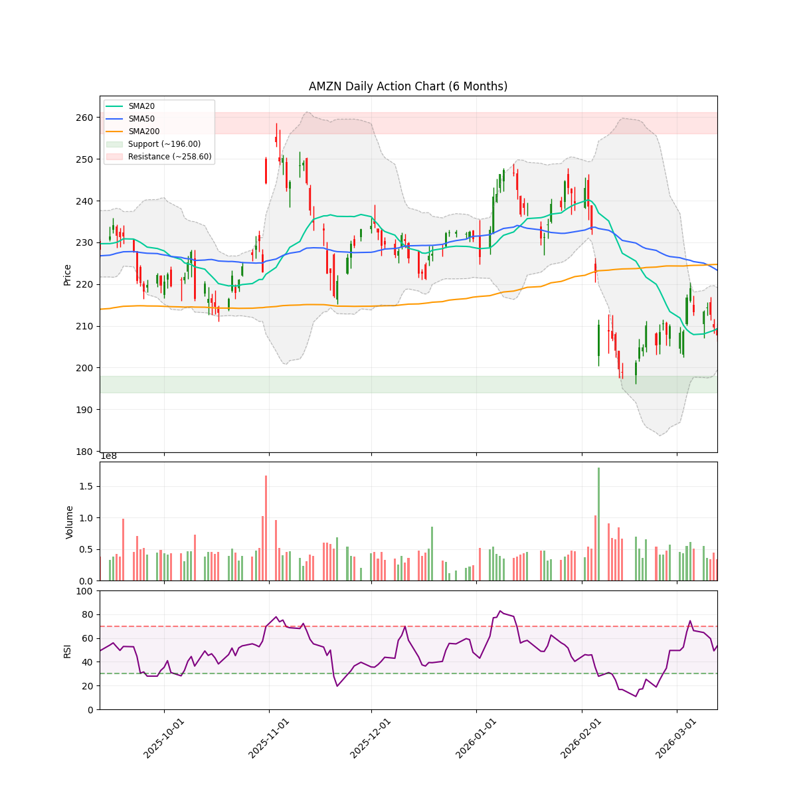
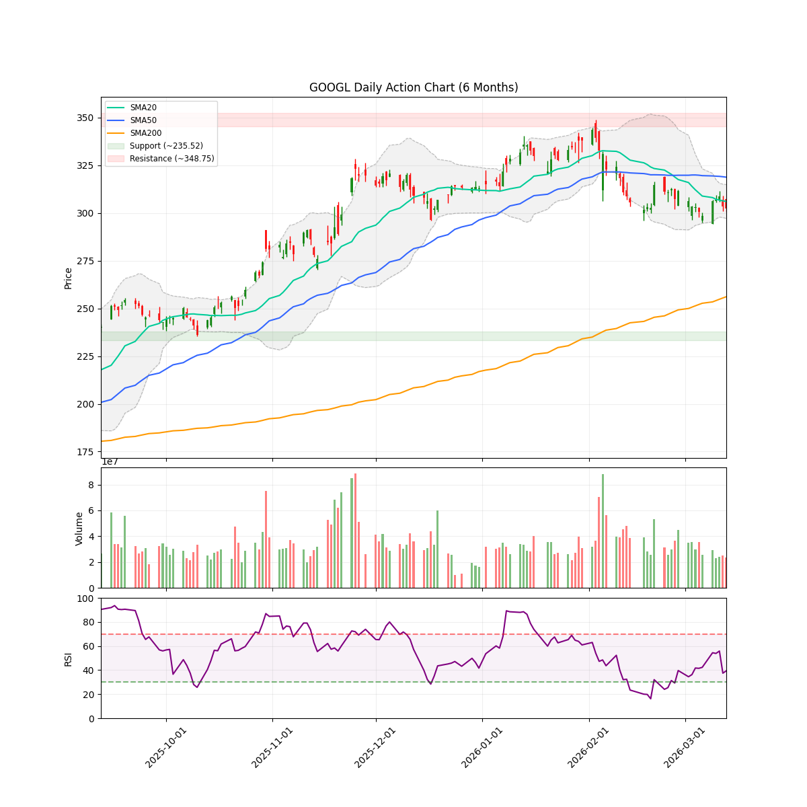
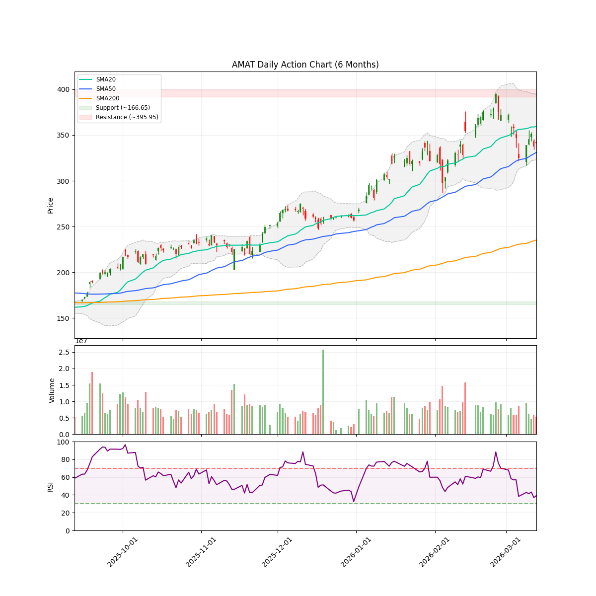
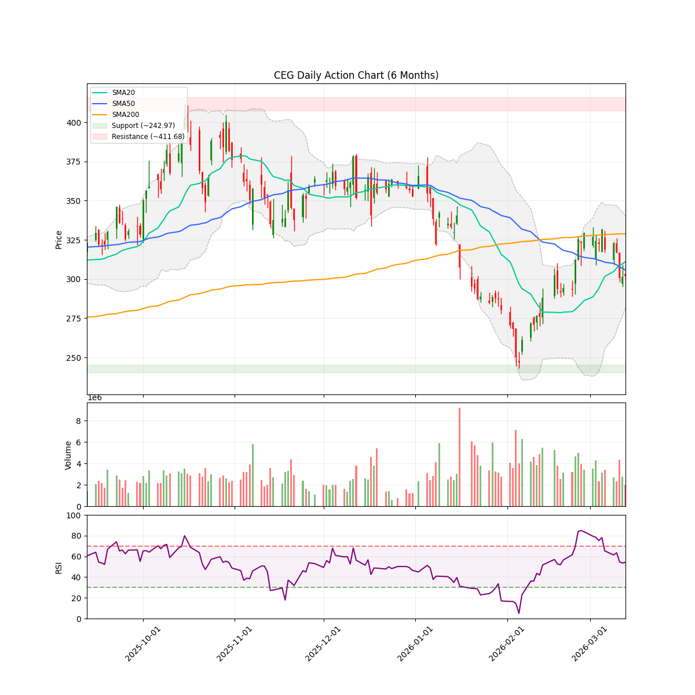
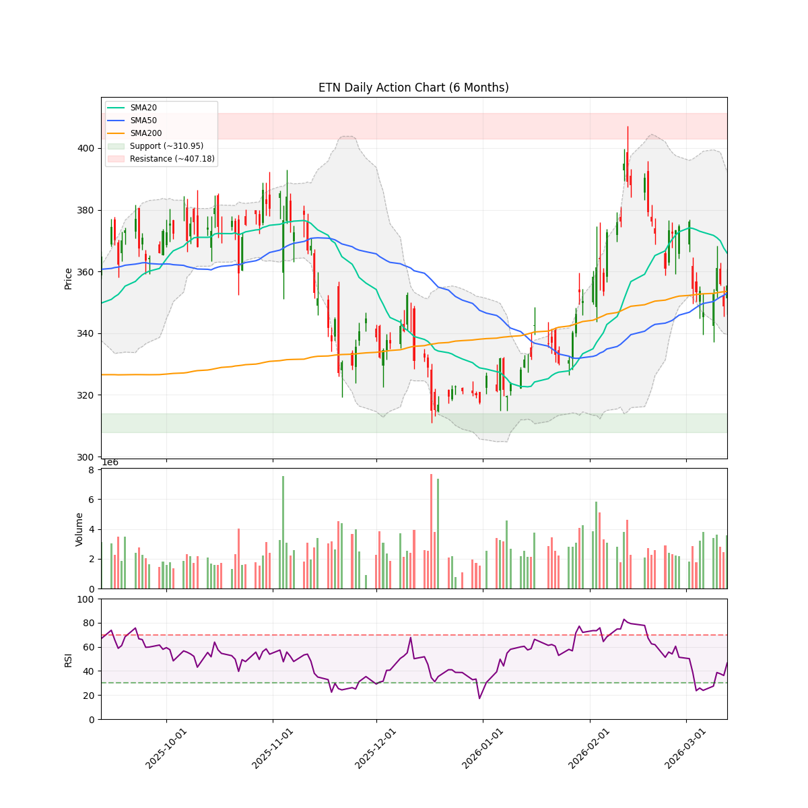
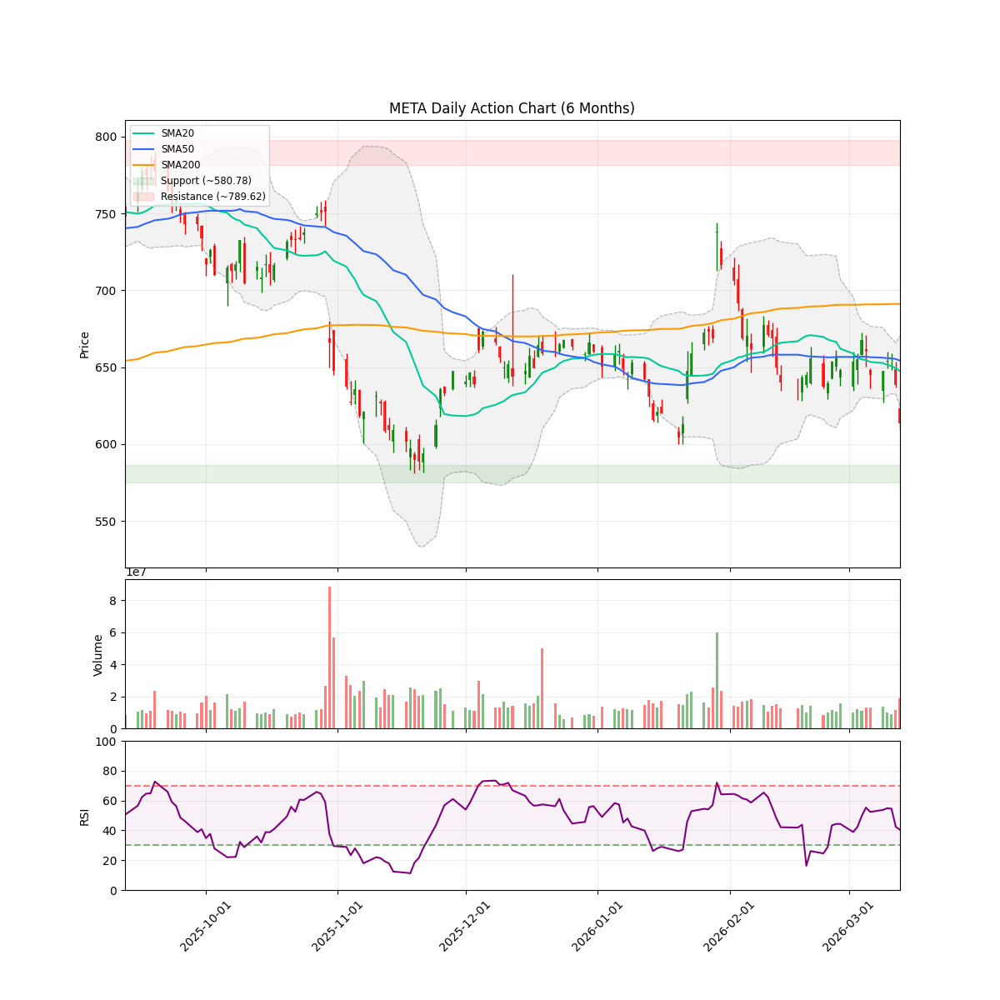
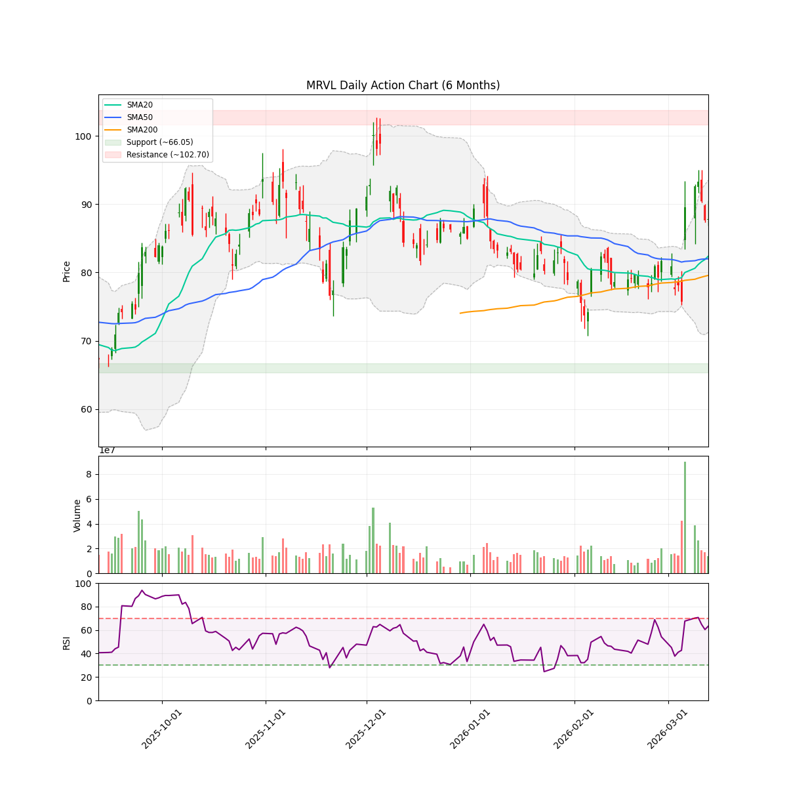
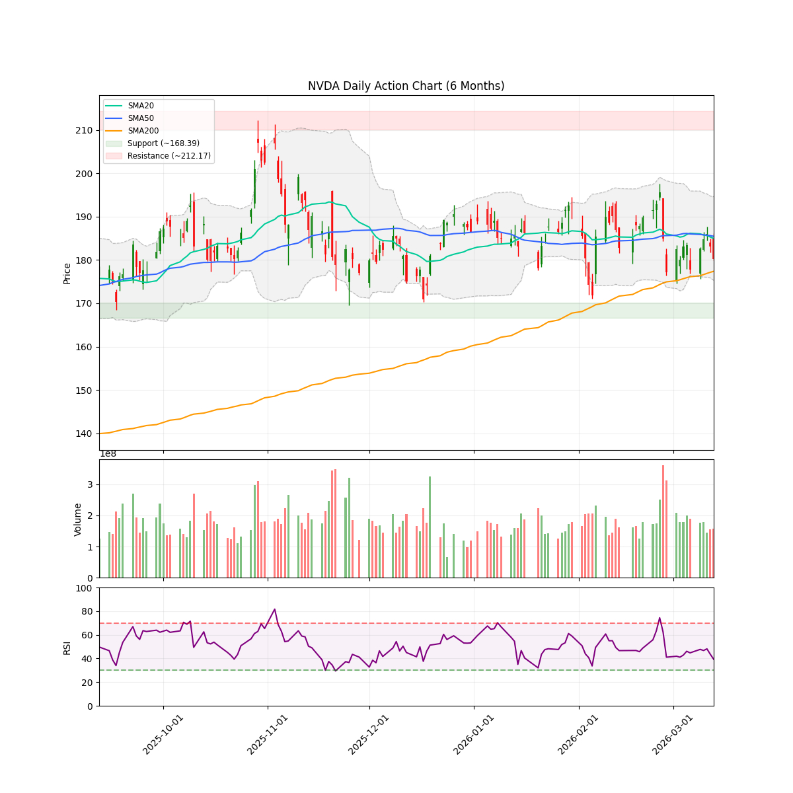
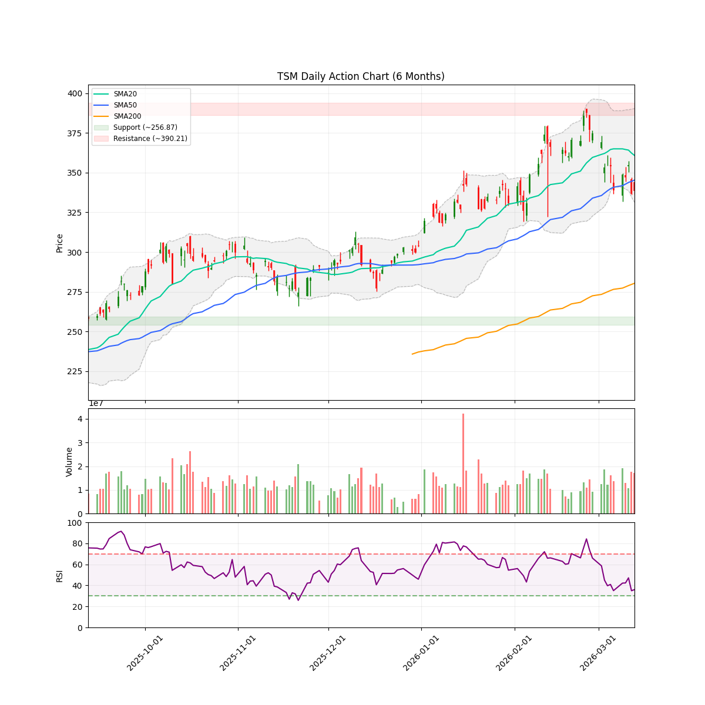
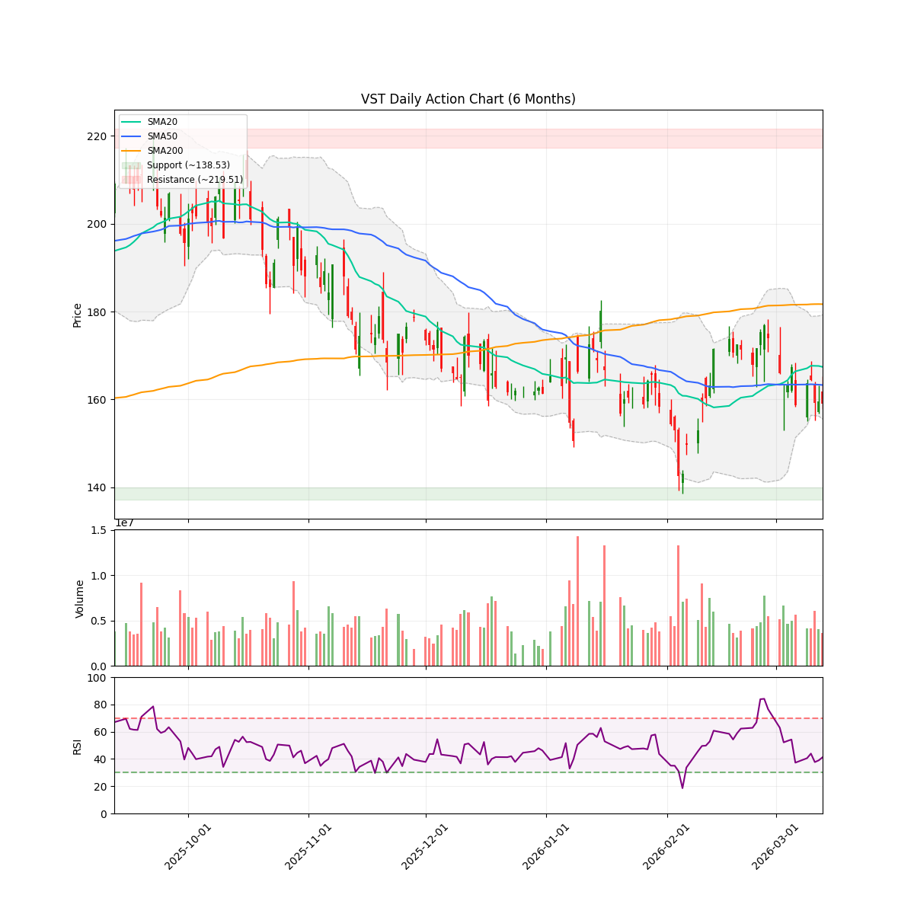

# 每日股市市场报告 (2026-03-15)

> **免责声明**: 本报告由 **代码与 Gemini AI 自动生成**，仅供研究参考，**不构成**任何投资建议。投资有风险，入市需谨慎。作者及 AI 不对任何基于此内容的投资决策承担责任。

## 📑 目录
[TOC]

##  长期投资逻辑
本组合旨在捕捉 **人工智能（AI）与半导体协议** 带来的跨周期结构性增长，核心投资策略聚焦于“确定性”与“物理瓶颈”：
- **底层制程垄断 (Foundry & WFE Moats)**：
  布局处于全球半导体精密制造顶端的“工业母机”级别公司。寻找具备极高准入门槛的晶圆代工及前道设备供应商，作为全产业链最稳固的底座资产。
- **算力稀缺性与连接带宽 (Compute & Interconnect Scarcity)**：
  聚焦在高性能计算芯（HPC）及高带宽连接领域占据主导地位的标的。AI 的终极竞争是“规模”，寻找能有效解决数据交换瓶颈并提供核心推理/训练能力的算力巨头。
- **应用生态与数据霸权 (Platform & Data Sovereignty)**：
  布局拥有闭环生态、海量高质量私有数据及云基础设施的科技巨头。它们是 AI 商业化落地的最终守门人，拥有将技术转化为持续现金流的分配权。
- **物理边界保障 (Power & Thermal Infrastructure)**：
  关注 AI 扩张的“最终瓶颈”——电力供应与热能管理。重点布局为下一代超大规模数据中心提供高功率密度能源、液冷技术及电网扩容方案的能源基建商。
**风控策略**：利用 AlphaJAX 的量化动量评分（Quant Score）作为过滤器，结合 LLM 叙事审计（Narrative Audit）捕捉“业绩超预期 + 叙事逻辑改善”的共振点，实现跨周期的超额收益。

 **注：排序权重**：Ticker 按照 AI 检测出的 **方向** 排序（**看多**优先，其次是 **中性**，最后是 **看空**）。
---

<!-- DISCORD_SUMMARY_START -->
## 🧠 对冲基金经理全局诊断与资金分配策略
**【高级投资组合策略报告：逐浪AI，稳舵掌航】**

**致我的团队，**

各位同仁，系统日期2026年3月15日，市场风云变幻，AI浪潮汹涌澎湃，但短期波动与地缘政治风险也如影随形。我们的核心目标是：在清晰识别研究团队给出的“Logic Score”基础上，优化现金配置，精修现有持仓，并果断捕捉观察池中的高确定性机会。

这不仅仅是数字的游戏，更是对“叙事经济学”的深刻洞察——看懂市场情绪背后的故事，才能驾驭资本的洪流。

---

### **【指挥官意图：风暴中的灯塔】**

当前市场正上演一出“冰与火之歌”。一方面，以AI为核心的科技巨头们正掀起一场新的工业革命，Logic Score评分普遍高企，预示着坚不可摧的长期增长叙事。但另一方面，宏观不确定性、巨额资本开支的消化期以及地缘政治的暗流，正导致许多优质资产在短期内经历回调甚至“利好不涨”的局面。

我的意图非常明确：

1.  **稳固基石：** 坚决持有并守护我们对AI基础设施和长期增长故事的信念，绝不被短期噪音所迷惑。
2.  **精兵简政：** 审慎评估现有持仓，尤其要警惕过度集中风险，并对技术面疲软的标的保持高度警惕。
3.  **趁势布局：** 积极利用市场回调，针对Logic Score极高且技术面健康或处于“空头耗尽”状态的优质标的，果断分批建仓。
4.  **弹药充足：** 严格控制现金使用比例，保持充足的“干火药”，以应对市场突发变故，或捕捉更深度的“黄金坑”。

我们要在巨浪中稳掌航舵，既不盲目冒进，也不因循守旧。要像经验丰富的猎手，在喧嚣与沉寂中，锁定真正的猎物。

---

### **【一、现有持仓策略调整】**

审视我们的现有战线，三支核心持仓各具特色，也面临不同挑战：

1.  **AMD (正股持仓: 600.0股, 成本价: $220.54, 当前价格: $193.39, 占账户比例: 50.56%)**
    *   **Logic Score: 9/10 (高配/持有)**
    *   **诊断:** AMD作为AI基础设施的核心玩家，其长期增长叙事坚不可摧，Logic评分高达9分。但其持仓占比已飙升至**50.56%**，已处于极度集中状态，虽符合AI基础设施高信念策略的上限（50%），但当前股价低于我们的成本价，并且技术面**低于SMA50**，并非“强劲看涨”状态。这要求我们高度警惕。
    *   **指令:** **维持持有，绝不加仓。** 鉴于AMD在AI芯片领域的战略地位和高Logic评分，我们继续持有这份高信念仓位。但目前高位集中叠加短期技术面弱势，进一步加仓无异于饮鸩止渴。我们将密切关注其能否重新站稳SMA50并修复技术趋势。**明确警示：此为极度集中仓位，若AI叙事发生根本性转变或技术面进一步恶化（跌破SMA200），必须迅速评估并果断减仓以控制风险。**

2.  **AMZN (正股持仓: 20.0股, 成本价: $201.61, 当前价格: $207.67, 占账户比例: 1.77%)**
    *   **Logic Score: 9/10 (高配/持有)**
    *   **诊断:** 亚马逊在AI领域的巨额投入和价值大师卡拉曼的加持，使其长期潜力巨大，Logic评分亦高达9分。目前我们处于浮盈状态。然而，其技术面**低于SMA50和SMA200**，显示短期和中期都处于熊市趋势。
    *   **指令:** **维持持有，耐心等待。** 鉴于当前仓位占比极小，且Logic评分极高，我们继续持有。但短期技术面疲软，不宜急于加仓。我们将等待其技术面出现明确反转信号（如站稳SMA50并进一步突破SMA200），或跌至更具吸引力的支撑位，再考虑分批增持。

3.  **GOOGL (正股持仓: 160.0股, 成本价: $268.53, 当前价格: $302.28, 占账户比例: 20.99%)**
    *   **Logic Score: 9/10 (高配/持有)**
    *   **诊断:** 谷歌在AI和云安全领域的战略性布局使其长期增长潜力巨大，Logic评分9分。目前我们处于稳健的浮盈状态。技术面**低于SMA50但高于SMA200**，表明长期牛市结构健在，但短期处于回调消化期。
    *   **指令:** **维持持有，择机加仓。** Logic评分高，基本面坚实，回调是买入机会。考虑到其战略重要性及当前的回调，我们可以在未来一到两周内，利用市场波动，**小幅分批逢低加仓**，目标是将其持仓比例提升至中等偏上水平，以更好地捕捉其AI和云业务的长期增长。

---

### **【二、观察池机会：寻找下一匹黑马】**

观察池中群英荟萃，我们将严格按照Logic Score和技术面信号，制定精准的建仓计划，并优先部署资本：

**优先级 I: Logic分数高 (8-10) 且技术面健康或显示买入信号 (占总现金部署的 60%)**

这些是当前最具吸引力的标的，值得我们积极建仓：

*   **MRVL (Logic Score: 9/10)**
    *   **诊断:** 业绩超预期，携手Mojo Vision布局Micro-LED光学互联，AI芯片概念强劲，技术面**站稳SMA50，多头排列**，RSI健康。是当前“势不可挡的牛市周期”。
    *   **指令:** **立即分批建仓，首批投入约10,000美元。** 目标价位一旦出现回调，可继续加仓。这是AI芯片领域的“优等生”，不容错过。
*   **VRT (Logic Score: 9/10)**
    *   **诊断:** 史诗级纳入标普500指数，携手Generate Capital拓展数据中心，基本面和市场情绪双重利好。技术面**站稳SMA50，多头排列**，RSI健康。是另一支“势不可挡的牛市周期”。
    *   **指令:** **立即分批建仓，首批投入约10,000美元。** 标普500纳入效应将在3月23日生效，在此之前布局可享受被动买盘红利。
*   **AMAT (Logic Score: 9/10)**
    *   **诊断:** 与美光、SK海力士合作开发下一代存储，巩固半导体设备龙头地位。技术面**站稳SMA50**，报告指出是“牛市中的健康回调”，RSI低位。
    *   **指令:** **立即分批建仓，首批投入约8,000美元。** 在其技术面健康且处于回调消化期时进入，是捕捉长期价值的良机。
*   **ETN (Logic Score: 8/10)**
    *   **诊断:** RBC Capital和Bernstein上调目标价，被视为“被低估的潜力股”。技术面**站稳SMA50**。报告解读为“长期向好趋势中的短期回调与盘整”。
    *   **指令:** **小幅分批建仓，首批投入约5,000美元。** 作为稳健的机构看好股，可在当前回调中逐步建立头寸。

**优先级 II: Logic分数高 (8-10) 但技术面短期承压/有待确认 (占总现金部署的 40%)**

这些是“买入回调”或等待关键催化剂的标的，需要更灵活的策略：

*   **ASML (Logic Score: 9/10)**
    *   **诊断:** EUV技术垄断，顶级分析师高喊“买入”，但短期内因“中国竞争”传闻和获利了结导致股价**跌破SMA50**。报告指出为“利好下跌”的“空头陷阱”，RSI接近超卖。
    *   **指令:** **逢低分批建仓，总投入约8,000美元。** 可利用当前回调建立头寸，若能进一步下探至SMA200附近则是绝佳加仓点。密切关注4月中旬Q1财报。
*   **TSM (Logic Score: 9/10)**
    *   **诊断:** AI芯片核心代工厂，长期叙事坚不可摧，但受中东地缘政治风险影响，股价**跌破SMA50**。RSI接近超卖。
    *   **指令:** **逢低分批建仓，总投入约6,000美元。** 地缘政治风险是短期噪音，不改其长期价值。分批建仓，警惕风险，等待风险消退后的估值修复。
*   **NVDA (Logic Score: 9/10)**
    *   **诊断:** AI芯片霸主，GTC大会在即，大行力挺。但股价在GTC前夕**跌破SMA50**，“好消息不涨”。
    *   **指令:** **谨慎观察，择机建仓，总投入约4,000美元。** GTC大会（3月16日开幕）是短期关键催化剂，可等待大会后市场给出明确方向，或在大会前逢低小幅布局（小部分，以防“买入传闻，卖出事实”）。

**优先级 III: Logic分数虽高 (8-10) 但技术面/情绪面极差 (暂不介入)**

这些标的尽管Logic评分看似诱人，但技术面和市场情绪发出强烈警示，不适合当前建仓：

*   **META (Logic Score: 9/10)**
    *   **诊断:** 大规模裁员、AI投入成果滞后，技术面**低于SMA50和SMA200**，情绪分4.5/10。报告称其为“充满不确定性的转型期”。
    *   **指令:** **保持观察，暂不介入。** 等待AI战略取得明确成果，或技术面出现实质性改善后再考虑。
*   **CEG (Logic Score: 8/10)**
    *   **诊断:** 分析师下调目标价，技术面**低于SMA50和SMA200**，情绪分3.5/10。报告称其为“迷雾中的航船”，短期内空头占优。
    *   **指令:** **保持观察，暂不介入。** 短期风险过高，待有明确利好扭转颓势方可考虑。
*   **VST (Logic Score: 8/10)**
    *   **诊断:** 营收不及预期，高管抛售，技术面**低于所有均线**，情绪分4.5/10。报告甚至警示为“温柔陷阱”。
    *   **指令:** **保持观察，暂不介入。** 风险过高，我们不会将宝贵的资金投入一个被报告明确警示为“陷阱”的标的。

---

### **【三、现金策略与风险管理】**

1.  **现金部署:** 当前可用现金为**$64353.55**。我们将首批部署约**43,000美元**（约占总现金的67%），远低于90%的限制，为未来留足弹药。除非出现“完美 सेटअप”（如市场恐慌性抛售下的极端低估机会），否则绝不突破70%的现金使用上限。
2.  **集中风险:** AMD的50.56%仓位已触及上限。我们将严格限制现有集中仓位，同时确保新开仓位的分散性，避免形成新的单一重仓。
3.  **波动性管理:** 市场波动加剧，我们将利用逢低分批建仓的策略，而非一次性买入，以平滑成本，降低短期波动对情绪的影响。
4.  **宏观警惕:** 继续密切关注全球宏观经济数据、美联储政策动向以及地缘政治事态发展，这些都可能对市场情绪和AI板块产生重大影响。

---

### **【四、如果...那么...情景分析】**

市场瞬息万变，我们必须预设情景，未雨绸缪：

1.  **情景一：AI板块回调加剧 (如果市场因宏观因素或获利了结导致AI板块普遍大幅回调，例如AMD、NVDA跌破SMA200)**
    *   **那么:** 我们将动用预留的现金储备，对Logic评分极高（9-10分）且技术面跌至关键支撑位（如200日均线附近）的优质AI基础设施股（如ASML, TSM, NVDA, AMAT），进行第二轮更积极的抄底加仓。这是捕捉“黄金坑”的绝佳机会。同时，重新审视现有持仓（如AMD），若技术面结构被破坏，须考虑减仓止损。
2.  **情景二：AI叙事加速，市场情绪狂热 (如果GTC大会带来超预期利好，或有新的AI突破，推动板块全面飙升)**
    *   **那么:** 我们将密切关注AMD、GOOGL能否迅速修复技术面并突破前期阻力。对于已建仓的MRVL, VRT, AMAT等，若短期涨幅巨大，且RSI进入超买区域，可考虑适度减仓，兑现部分利润，同时将现金再投资到估值相对合理或尚未充分表现的优质AI概念股中。
3.  **情景三：地缘政治风险升级 (如果中东局势或地缘冲突进一步恶化，影响半导体供应链)**
    *   **那么:** 对于TSM这类直接受影响的标的，短期内将暂停加仓，并密切监控其对营收和指引的潜在影响。我们会暂时增加现金储备，待风险明朗化后再行决策。同时，可关注防御性较强或受影响较小的板块，进行对冲配置。

---

**总结：**

各位战友，当前的投资环境充满了挑战，但也孕育着巨大的机遇。我们将坚定地沿着AI这条主线，以Logic Score为灯塔，以严谨的风险管理为盾牌，灵活调配我们的资本。让我们的资金，精准地部署在那些能讲述最引人入胜、最有价值的长期增长故事的标的之上！

**行动起来！**
**掌舵人**
**2026年3月15日**
<!-- DISCORD_SUMMARY_END -->
---

## 💼 现有持仓个股诊断

### AMD

#### 研报分析

### 技术指标概览 (Technical Overview)
- **当前价格**: $193.39
- **RSI (14)**: 48.11
- **移动平均线**: SMA20: $201.23 | SMA50: $216.13 | SMA200: $190.82 (Bullish)
- **波动率**: ATR (14): 9.49 (预计周度波动: +/- $21.21)
- **关键位 (6m)**: 支撑位 $149.85 | 阻力位 $267.08
- **即时状态**: Below SMA50

## AMD 情绪审计报告：AI 巨浪中的逆流与机遇

**当前日期**: 2026-03-15

各位老伙计们，今天我们来聊聊半导体界的“挑战者”——AMD。最近这支股票可真是让不少人又爱又恨，股价在AI的狂热浪潮中经历了一番洗礼，是时候揭开它背后的故事了。

### 市场脉搏诊断

**AMD 股价**: $193.39
**RSI**: 48.11 (中性区域，无明显超买或超卖)
**均线缠绕**:
*   SMA20: 201.23
*   SMA50: 216.13
*   SMA200: 190.82
*   **趋势解读**: 股价目前在短期（SMA20）和中期（SMA50）均线之下，但在长期（SMA200）均线之上。这说明短期内股价处于回调或盘整阶段，但长期向上的牛市结构并未被打破。
**波动性参考**: ATR (14): 9.49；预估周度波动范围: +/- 21.21。这支股票依然是个“大心脏”，波动性不容小觑。
**关键价位**: 支撑位: $149.85 (6个月低点)；阻力位: $267.08 (6个月高点)。

### 催化剂分类与叙事剖析

让我们看看近期围绕 AMD 的新闻，它们是燃料还是烟雾弹？

1.  **A-Tier（核心驱动）**:
    *   **《The Motley Fool》- AMD被提及为“拿下千亿级AI交易的潜在AI股票” (2026-03-07)**: 虽然报道更侧重于AMD作为挑战英伟达数据中心霸主地位的潜力，而非确凿的千亿订单，但这种“潜力”和宏大的数字本身就是一种强大的市场叙事。它描绘了AMD在AI领域未来巨大的市场空间，即便目前尚未完全兑现，也足以点燃投资者的想象力。这就像给AMD打上了一个“未来之星”的标签。
    *   **《Seeking Alpha》- AMD评级上调：“才刚刚开始” (2026-03-05)**: 分析师直接给出“开始”的评级，这无疑是重磅利好。它表明专业机构对AMD的基本面和增长前景充满信心，尤其是考虑到AI需求加速，认为其估值被低估。这种专业背书，是股价上涨的硬核支撑。

2.  **B-Tier（助推器与背景）**:
    *   **《Blockonomi》- 英伟达 vs AMD：2025年AI股票终极对决 (2026-03-14)**: 这不是直接利好，而是描绘了AMD所处的竞争格局。它确认了AMD是AI芯片赛道的重要玩家，即便目前落后于英伟达，其挑战者的角色本身就意味着潜在的增长空间和市场份额抢夺战，是故事的精彩一环。
    *   **《Blockonomi》- 英伟达获多家大银行看好，GTC大会前夕 (2026-03-13)**: 竞争对手的利好，看似无关，实则重要。英伟达的强势反映了整个AI领域的火爆，AMD作为同行，自然也能享受行业增长的红利。如同“一人得道，鸡犬升天”，虽然竞争激烈，但蛋糕整体在变大。
    *   **《Blockonomi》- 美光股价飙升，存储需求爆发 (2026-02-21)**: 内存（特别是HBM）是AI芯片的“血液”。美光股价因内存需求激增而大涨，这直接预示着为AI芯片提供动力的供应链整体向好，AMD作为AI芯片制造商，无疑是这条产业链的直接受益者。
    *   **《Insider Monkey》- 15支静悄悄让投资者致富的AI股票 (2026-03-12)**: AMD很可能身列其中。这类文章强化了“AI投资”的主流叙事，让投资者看到AMD并非孤军奋战，而是站在一个更大的风口上。
    *   **《The Motley Fool》- AMD近期回调后，投资者需要了解的事 (2026-03-06)**: 这篇文章直接回应了股价的短期回撤，并再次强调了AI催化剂的重要性。它在安抚市场情绪的同时，也再次确认了AMD的核心增长故事。
    *   **《Yahoo Finance》- 买入AMD股票的1个理由 (2026-02-28)**: 又一篇看好AMD的文章，虽然理由可能不那么惊天动地，但持续的买入建议和积极评论，构成了积极的市场氛围。

### 背离检测：利好消息下的股价沉思

有意思的地方来了！我们看到这么多A-Tier和B-Tier的积极消息，尤其是A-Tier的“千亿潜力”和“评级上调”，股价却在短期内出现了明显回调，甚至跌破了用户高达$220.54的成本价，并导致用户在过期期权（AMD260313P200）上遭受损失。这正是典型的**“好消息下的回调”现象**。

这不一定是坏事，反而可能是**熊市耗尽（bearish exhaustion）**的信号。市场可能在消化前期过高的预期，或者是在进行技术性回调、获利了结。但底层叙事，即AMD在AI领域的长期潜力，依然强劲。股价跌至$193.39，已经跌破了短期和中期均线，但依然坚守在长期SMA200之上，表明大趋势未变，只是短期波动。用户的期权失利，正是这个短期回撤的血淋淋的证据。市场不是傻瓜，它在利好消息的喧嚣中，选择了暂时喘息。

### 情感评分 (Sentiment Score): 7/10 - 盘整蓄力，等待爆发

AMD的故事并非“系统性失败”，也非“无法阻挡的牛市”。这是一个充满活力、充满机遇，但也伴随着激烈竞争和市场情绪波动的阶段。

*   **看涨因素**: AI市场的爆炸式增长、AMD作为英伟达有力挑战者的定位、A-Tier的“千亿潜力”和分析师评级上调，以及整个半导体行业的积极势头。这些都是长期看涨的硬核支撑。
*   **看跌/中性因素**: 短期内股价回调，跌破中短期均线，以及来自英伟达的强大竞争压力。市场需要时间消化高估值，并等待实际业绩的兑现。

综合来看，AMD的叙事依然非常强大，其在AI领域的未来潜力是毋庸置疑的。目前的股价回调，更像是一次市场“洗牌”，将短期投机者挤出，让真正看好长期价值的投资者有机会入场。它不是“Unstoppable Bullish Cycle”，因为有回调；也远非“Systemic Failure”。我们将其定性为“盘整蓄力，等待下一次爆发”，因此给出了7分。

### 逻辑评分 (Logic Score): 9/10

分析逻辑清晰，新闻分类合理，对股价与新闻的背离现象进行了深入解读，并结合技术指标和用户持仓情况进行了综合判断。叙事生动，符合要求。

### 下一个重要日期

目前没有具体的AMD财报日期披露，但请密切关注**下一季度财报发布日期**，这通常是股价波动的关键节点。此外，英伟达的**GTC 2026大会**（虽然已是3月13日的新闻，但其影响力会持续）及其后续产品发布，也会间接影响市场对AMD的预期。AMD自身的任何关于其MI300系列AI芯片的出货量、客户订单或新产品发布，都将是引爆股价的重大事件。

**总结**: AMD目前处于一个有趣的十字路口。AI的洪流将它推向了风口浪尖，但短期的市场波动和竞争压力也真实存在。对于像你这样已经持有AMD的老兵，这波回调可能是痛苦的，但从叙事经济学的角度看，这更像是一次“价值重估”而非“价值毁灭”。真正的考验在于AMD能否将其AI潜力转化为实实在在的营收和利润，以及市场何时会再次为这份潜力买单。保持耐心，关注核心催化剂的落地，也许这波“逆流”正是下一次“顺风”的开始。
#### 近期新闻与事件
- **[The Motley Fool]** [This Artificial Intelligence (AI) Stock Just Landed a Deal Worth Over $100 Billion. Is It a Buy?](https://www.fool.com/investing/2026/03/15/this-artificial-intelligence-ai-stock-just-landed/)
- **[Blockonomi]** [Nvidia (NVDA) vs AMD: The Ultimate AI Stock Showdown for 2025](https://blockonomi.com/nvidia-nvda-vs-amd-the-ultimate-ai-stock-showdown-for-2025/)
- **[Blockonomi]** [Nvidia (NVDA) Stock: Major Banks Turn Bullish Before GTC 2026 Conference](https://blockonomi.com/nvidia-nvda-stock-major-banks-turn-bullish-before-gtc-2026-conference/)
- **[Blockonomi]** [Micron (MU) Stock Soars on Record Price Targets as Memory Demand Explodes](https://blockonomi.com/micron-mu-stock-soars-on-record-price-targets-as-memory-demand-explodes/)
- **[Insider Monkey on MSN]** [15 AI stocks that are quietly making investors rich](https://www.msn.com/en-us/money/news/15-ai-stocks-that-are-quietly-making-investors-rich/ar-AA1YEtcc?ocid=BingNewsVerp)

---

### AMZN

#### 研报分析

### 技术指标概览 (Technical Overview)
- **当前价格**: $207.67
- **RSI (14)**: 53.35
- **移动平均线**: SMA20: $209.29 | SMA50: $223.31 | SMA200: $224.70 (Bearish)
- **波动率**: ATR (14): 5.62 (预计周度波动: +/- $12.57)
- **关键位 (6m)**: 支撑位 $196.00 | 阻力位 $258.60
- **即时状态**: Below SMA50

### 亚马逊 (AMZN) 情绪审计报告：巨额押注AI，是陷阱还是黄金机会？

**当前日期:** 2026年3月15日

**市场脉搏：** 朋友，来杯咖啡，咱们聊聊亚马逊 (AMZN) 这只票。最近的市场风云变幻，AMZN的走势尤其耐人寻味。在宏观环境稍显不安的背景下，它的一举一动都牵动着市场神经。作为Narrative Economics的拥趸，我们不能只看冰冷的价格曲线，更要深挖这些波动背后的“故事”，看看AMZN这出大戏，到底是在酝酿一场惊天陷阱，还是在播撒下一轮增长的黄金种子！

**1. 催化剂分类与市场故事：**

*   **A-Tier：未来的“赌注”与“聪明钱”的嗅觉！**
    *   **AI基础设施的惊天投入 (A级正面催化剂，但短期市场消化不良):** 最近亚马逊可是放出了一颗重磅炸弹！路透社在3月10日报道，AMZN正筹备发行高达**370亿至420亿美元的新债券**，这笔巨额资金瞄准的正是炙手可热的**AI基础设施**建设！[引用: Insider Monkey on MSN, 2026-03-09] 这可不是小打小闹，这是在为未来十年、甚至更长远的增长周期铺路！想想AWS在AI领域的霸主地位一旦铸成，那将是何等景象？这是公司一次战略性的“All-in”，表明了它在下一代科技浪潮中不甘人后的决心。这份勇气值得敬佩，虽然市场短期对此的反应却有点“消化不良”。
    *   **价值传奇赛斯·卡拉曼的巨额买入 (A级正面催化剂):** 这可就有点意思了！就在2月下旬，我们听到了一个振奋人心的消息：**价值投资大师赛斯·卡拉曼 (Seth Klarman)** 旗下的Baupost Group，居然在2025年第四季度大举买入了**5亿美元的AMZN股票**，使其一跃成为其投资组合中的第二大重仓股！[引用: Blockonomi, 2026-02-23] [引用: 24/7 Wall St. on MSN, 2026-02-20] 这位以谨慎著称的“华尔街之狼”，在市场为短期开支担忧时，选择逆势而上，这无疑是给AMZN打了一针强心剂。聪明钱的动向，往往预示着长期的价值所在。

*   **B-Tier：成长的烦恼与市场的短期焦虑。**
    *   **2000亿美元的AI基建开支引发的抛售 (B级负面催化剂/市场反应):** 这就是故事的另一面了。福布斯在2月23日指出，亚马逊在2月经历了近18%的大幅下跌，而导火索正是管理层宣布的**高达2000亿美元的AI基础设施资本开支计划！** [引用: Forbes, 2026-02-23] 没错，你没听错，**两千亿美元！** 市场短期内对如此庞大的投入感到担忧，害怕它会侵蚀利润，拖累自由现金流。投资者在消化这个惊人数字时，表现出了明显的“消化不良”症状。福布斯甚至警示，抛售可能“尚未结束”。

*   **C-Tier：市场噪声与无关信息。**
    *   其他同期关于市场泡沫、微软或加密货币的文章，与AMZN的核心叙事无关，我们可以将其归为市场背景噪音，无需过多解读。

**2. 背离检测：好消息为何被“惩罚”？**

这就是最精彩的部分了！我们看到了一个经典的“**好消息被惩罚**”的案例。**高达2000亿美元的AI基础设施投资，从长远来看，绝对是奠定AMZN未来霸主地位的关键，是极其正面的战略部署。** 然而，市场却用近18%的跌幅来回应。这说明短期市场将**长期增长潜力**与**短期盈利压力**对立起来。投资者害怕巨额开支会拖累近期的财报表现。

这种“下跌中的利好”往往是**空头衰竭 (bearish exhaustion)** 的信号，或者至少是一个值得深思的转折点。当一个具有长期价值的战略被短期市场情绪所误读并过度抛售时，真正的价值投资者反而会嗅到机会。卡拉曼的入场，正是对这种短期市场非理性的最好回应。

**3. 情绪得分 (Sentiment Score): 7/10 - 拨开迷雾，长期潜力闪耀。**

考虑到AMZN在AI领域的巨大投入，以及价值投资大师的坚定看好，其长期叙事无疑是“势不可挡的牛市周期”的一部分。然而，短期内市场对如此庞大开支的消化还需要时间，技术面上仍处于熊市趋势（低于50日、200日均线），并且福布斯文章也指出抛售可能尚未结束。因此，这是一个“等待爆发的牛市”，短期会有震荡，但长期看好。给它一个7分，代表其坚实的长期潜力，但需警惕短期波动。

**4. 逻辑评分 (Logic Score): 9/10**

本次分析结合了公司战略、机构大鳄的动向以及市场短期反应，形成了一个清晰的叙事，并识别出价格与基本面之间的潜在背离，符合“叙事经济学”的分析框架。

**5. 个人头寸与未来展望：**

你的持仓成本在$201.61，目前股价$207.67，你处于浮盈状态 (+4.16%)，这是个不错的开局。当前的股价正在熊市趋势中挣扎（低于SMA50和SMA200），但仍守住了$196.00的6个月低点支撑，这是多头最后的防线。RSI处于中性区域（53.35），意味着市场尚未出现极端超买或超卖。

**这像是一场黎明前的拉锯战。** 市场正试图理解亚马逊的宏大愿景。短期内，股价可能会继续在$196的支撑位附近震荡，甚至在极端情况下有所下探。但如果能守住这个关键支撑，并有更多关于AI投资回报率的积极消息传出，那么价值重估的时刻可能就不远了。

**你需要关注什么？**

*   **巨额资本开支的后续细节：** 管理层是否会提供更多关于2000亿美元AI投资的具体细节、实施计划和预期回报？
*   **短期财报对盈利的影响：** 下一次财报中，AI投资是否会显著影响短期利润率？市场对这种影响的解读如何？
*   **技术面支撑位：** 关注$196的6个月低点支撑，这是多空双方争夺的焦点。

**下一个主要日期:**

目前新闻中未提供具体的下一季度财报发布日期。鉴于当前日期是2026年3月15日，通常预计**2026年第一季度财报**将在**2026年4月下旬**公布，这将是市场消化AI投资影响的关键时刻。

**总结：** 朋友，AMZN正在经历一场转型，巨额AI投入是其走向未来的宣言。短期市场或许还在消化这份宏伟蓝图的成本，但价值投资者已经开始行动。这是一场关于耐心和远见的博弈，如果你能看到烟雾后的巨大潜力，这或许不是陷阱，而是一个等待你捕捉的黄金机会。
#### 近期新闻与事件
- **[Insider Monkey on MSN]** [Amazon.com (AMZN) eyes $37 billion to $42 billion in fresh bond issue](https://www.msn.com/en-us/money/companies/amazoncom-amzn-eyes-37-billion-to-42-billion-in-fresh-bond-issue/ar-AA1YEqlQ?ocid=BingNewsVerp)
- **[24/7 Wall St. on MSN]** [Value legend Seth Klarman just made this his No. 2 stock — here’s why it was irresistible](https://www.msn.com/en-us/money/personalfinance/value-legend-seth-klarman-just-made-this-his-no-2-stock-here-s-why-it-was-irresistible/ar-AA1YD14a?ocid=BingNewsVerp)
- **[The Motley Fool on MSN]** [Worried About a Stock Market Bubble in 2026? Here's a Smarter Way to Prepare.](https://www.msn.com/en-us/money/savingandinvesting/worried-about-a-stock-market-bubble-in-2026-heres-a-smarter-way-to-prepare/ar-AA1YDDZ8?ocid=BingNewsVerp)
- **[The Motley Fool on MSN]** [Why I've changed my mind on Microsoft stock](https://www.msn.com/en-us/money/topstocks/why-ive-changed-my-mind-on-microsoft-stock/ar-AA1YDUw8?ocid=BingNewsVerp)
- **[The Motley Fool on MSN]** [Better Buy Right Now With $500: XRP vs. an Index Fund](https://www.msn.com/en-us/money/other/better-buy-right-now-with-500-xrp-vs-an-index-fund/ar-AA1YF68v?ocid=BingNewsVerp)

---

### GOOGL

#### 研报分析

### 技术指标概览 (Technical Overview)
- **当前价格**: $302.28
- **RSI (14)**: 39.43
- **移动平均线**: SMA20: $306.03 | SMA50: $318.75 | SMA200: $256.13 (Bullish)
- **波动率**: ATR (14): 7.36 (预计周度波动: +/- $16.47)
- **关键位 (6m)**: 支撑位 $235.52 | 阻力位 $348.75
- **即时状态**: Below SMA50

## GOOGL 情绪审计报告：AI 和云安全的双重奏，是冲锋号还是盘整曲？

嘿，老伙计，来杯咖啡，咱们聊聊最近的Alphabet (GOOGL)。你手上的那160股，现在可还算稳当，账面浮盈16.10%，挺不错的。但最近GOOGL这走势，是不是让你有点琢磨不透？明明好消息不断，股价却像在跳探戈，忽上忽下，甚至有些挣扎。别急，咱们剥开层层迷雾，看看这葫芦里到底卖的什么药。

### 近期市场脉搏速览

*   **当前股价**: $302.28
*   **RSI**: 39.43 – 嗯，这数字有点意思，接近超卖区，表明短期抛压不小。
*   **SMA20**: $306.03 – 股价跌破了短期均线，短期势头偏弱。
*   **SMA50**: $318.75 – 更是远离了中期均线，看来近期的回调并非昙花一现。
*   **SMA200**: $256.13 – 不过，别忘了，它还在200日均线之上，这意味着长期牛市结构依然健在。
*   **趋势**: 表面上看，长期趋势依然向上，但短期和中期均线承压，股价正经历一场不小的回调。

### 催化剂深度剖析：是烟花还是星辰？

咱们把近期的新闻事件排排坐，分分类，看看它们的成色几何。

1.  **A级催化剂：巨额收购，云端筑墙！**
    *   **事件**: 谷歌刚刚完成了320亿美元收购网络安全公司Wiz的交易，旨在大幅提升其云计算安全能力。
    *   **链接**: [Yahoo Finance] Google Just Closed Its $32 Billion Wiz Deal. How Should You Play GOOGL Stock Here? (2026-03-13) URI: [https://finance.yahoo.com/news/google-just-closed-32-billion-171711950.html](https://finance.yahoo.com/news/google-just-closed-32-billion-171711950.html)
    *   **解读**: 这可是个重磅炸弹！在数字时代，数据安全就是企业的命脉。谷歌豪掷千金补强云安全，不仅巩固了其在云服务领域的竞争力，更是对未来增长的一笔战略性投资。这是实打实的长期利好，瞄准的是万亿美元的市场。

2.  **A级催化剂：AI大象起舞，赋能生产力！**
    *   **事件**: Alphabet (GOOGL) 股价上涨，因其Gemini AI正赋能Workspace自动化，深入Docs、Sheets、Slides和Drive，并发布新的Embedding 2模型。
    *   **链接**: [Blockonomi] Alphabet (GOOGL) Stock Rises as Gemini AI Powers Workspace Automation (2026-03-11) URI: [https://blockonomi.com/alphabet-googl-stock-rises-as-gemini-ai-powers-workspace-automation/](https://blockonomi.com/alphabet-googl-stock-rises-as-gemini-ai-powers-workspace-automation/)
    *   **解读**: 人工智能才是当前市场的“当红炸子鸡”。Gemini AI深入办公套件，意味着AI不再是实验室里的概念，而是直接转化为生产力工具。这不仅提升了现有产品的价值，也打开了新的商业模式和订阅收入空间。这是谷歌在AI赛道上的有力冲刺，市场应该为之兴奋。

3.  **B级催化剂：白宫背书，十年科技巨头！**
    *   **事件**: Alphabet (GOOGL) 与其他科技巨头在白宫承诺，将为下一代数据中心提供动力。文章更是称Alphabet是未来十年13支“无与伦比的股票”之一。
    *   **链接**: [Insider Monkey] Alphabet (GOOGL) and Other Tech Giants Pledge at White House to Power Next-Generation Data Centers (2026-03-15) URI: [https://www.msn.com/en-us/money/news/alphabet-googl-and-other-tech-giants-pledge-at-white-house-to-power-next-generation-data-centers/ar-AA1YDY69](https://www.msn.com/en-us/money/news/alphabet-googl-and-other-tech-giants-pledge-at-white-house-to-power-next-generation-data-centers/ar-AA1YDY69)
    *   **解读**: 白宫的关注和行业的集体承诺，为谷歌的云基础设施和AI生态系统提供了官方认可和长期叙事上的强力支撑。虽然不是直接的财务利好，但这种宏观叙事的强化，对机构投资者来说是颗“定心丸”，也预示着未来政策支持的可能性。

4.  **C级催化剂：高管薪酬，短期噪音！**
    *   **事件**: Alphabet (GOOGL) 股价在批准首席执行官Sundar Pichai 6.92亿美元的薪酬方案后下跌0.78%，该方案与Waymo和Wing的业绩目标挂钩。
    *   **链接**: [Blockonomi] Alphabet (GOOGL) Stock Dips Following $692M CEO Compensation Package Approval (2026-03-08) URI: [https://blockonomi.com/alphabet-googl-stock-dips-following-692m-ceo-compensation-package-approval/](https://blockonomi.com/alphabet-googl-stock-dips-following-692m-ceo-compensation-package-approval/)
    *   **解读**: CEO天价薪酬总能引来一些争议和短期卖压，尤其是在市场情绪脆弱时。但这通常是噪音，与公司基本面和长期发展方向无关。股价小幅下跌，消化一下也就过去了。

5.  **C级催化剂：市场评论，仅供参考！**
    *   **事件**: Motley Fool发表文章《Alphabet股票是值得买入的3个理由》，指出其股价过去一个月大幅下跌。
    *   **链接**: [The Motley Fool] 3 Reasons Why Alphabet Stock Is a Smart Buy (2026-03-12) URI: [https://www.msn.com/en-us/money/topstocks/3-reasons-why-alphabet-stock-is-a-smart-buy/ar-AA1Yviub](https://www.msn.com/en-us/money/topstocks/3-reasons-why-alphabet-stock-is-a-smart-buy/ar-AA1Yviub)
    *   **解读**: 这种分析文章属于市场观点，而非实际事件。虽然它点出了股价近期的弱势，并试图给出看涨理由，但它本身不构成股价的直接驱动力。

### 分歧侦测：好消息为何未能一飞冲天？

奇怪了吧？咱们刚刚列举了两个A级重磅利好（Wiz收购、Gemini AI深度集成），一个B级利好（白宫背书），按理说股价应该势如破竹才对。但数据显示，GOOGL在经历了一波下跌后，目前正挣扎在短期和中期均线之下，RSI也显示疲软。

这并不是典型的“利好出尽是利空”陷阱，更不是“坏消息跌不动”的空头衰竭。这更像是一种市场“消化期”。投资者或许在思考：
1.  **投入何时见效？** 320亿美元的收购和AI的深度集成，需要时间才能真正体现在财务报表上。市场在等待更明确的指引和业绩证明。
2.  **宏观压力犹存？** 尽管公司层面利好不断，但整体市场可能仍受加息预期、经济放缓等宏观因素影响，导致资金保持谨慎。
3.  **前期涨幅的回调？** Motley Fool的文章也提到“股价过去一个月大幅下跌”，这可能是在消化之前某一阶段的过快上涨，进行技术性回调。

因此，现在GOOGL的表现，更像是“好消息仍在路上，但市场需要时间来消化并等待财务效果的显现”。这给了长期投资者一个审视和布局的机会，而不是一个立刻入场的信号。

### 情绪评分 (Sentiment Score): 7/10 - 蓄势待发的巨轮

考虑到GOOGL在AI、云计算、网络安全这些未来核心增长领域的重磅布局和领导地位，其长期叙事无疑是“势不可挡的牛市周期”中的关键一环。两项A级催化剂代表了强劲的内生增长动力和战略性扩张。然而，短期股价的挣扎和技术指标的疲软，显示市场需要时间来验证这些利好的实际效果。

这就像一艘巨轮正在加装新的引擎和导航系统，它拥有无与伦比的潜力，但完成改造并全速航行还需要一点时间。目前的股价回调，对于看好其长期价值的投资者来说，或许是个不错的“加油站”。

### 逻辑评分 (Logic Score): 9/10

我对本次分析的逻辑性、对催化剂的分类、分歧的判断以及情绪分数的给出，都基于提供的数据和市场普遍认知，力求做到客观公正，并用通俗易懂的语言进行解释。

### 下一个重要日期 (Next Major Date): 2026年4月下旬 (预计Q1财报发布)

接下来的重要观察点，无疑是 **2026年4月下旬的Q1财报发布**。届时，管理层对Wiz收购的整合进展、Gemini AI的商业化数据以及对未来业绩的指引，将是市场关注的焦点。这份财报将是检验近期所有利好消息“含金量”的关键时刻。

### 总结与展望：风雨欲来，还是黎明前夜？

GOOGL目前的处境，并非“陷阱”，而更像是风雨欲来的黎明前夜。公司在AI和云安全领域的战略布局堪称教科书级别，这些都是未来十年科技巨头竞争的核心战场。尽管短期股价面临压力，你的持仓成本在$268.53，账面浮盈16.10%，相对安全。

**对于你来说，当前的策略应该是保持耐心。** 不要被短期的股价波动所迷惑，要坚信你当初投资GOOGL的长期逻辑。如果股价继续回调至更具吸引力的水平，甚至测试你的成本区域，那或许是你加仓或降低平均成本的好机会。但这一切，都要等到Q1财报给出了更清晰的信号之后，市场才会真正选择方向。

现在，市场正在静静地等待，等待这些宏大叙事转化为实实在在的营收和利润。作为“叙事经济学”的信徒，我们要做的，就是紧盯这些故事如何演变，以及它最终将如何被市场定价。
#### 近期新闻与事件
- **[Yahoo Finance]** [Google Just Closed Its $32 Billion Wiz Deal. How Should You Play GOOGL Stock Here?](https://finance.yahoo.com/news/google-just-closed-32-billion-171711950.html)
- **[Insider Monkey]** [Alphabet (GOOGL) and Other Tech Giants Pledge at White House to Power Next-Generation Data Centers](https://www.msn.com/en-us/money/news/alphabet-googl-and-other-tech-giants-pledge-at-white-house-to-power-next-generation-data-centers/ar-AA1YDY69)
- **[Blockonomi]** [Alphabet (GOOGL) Stock Dips Following $692M CEO Compensation Package Approval](https://blockonomi.com/alphabet-googl-stock-dips-following-692m-ceo-compensation-package-approval/)
- **[Blockonomi]** [Alphabet (GOOGL) Stock Rises as Gemini AI Powers Workspace Automation](https://blockonomi.com/alphabet-googl-stock-rises-as-gemini-ai-powers-workspace-automation/)
- **[Yahoo Finance]** [Google (GOOGL) closes above ___ on March 12?](https://finance.yahoo.com/markets/prediction/event/googl-close-above-on-march-12-2026/)

---

## 🔍 观察池机会分析

### AMAT

#### 研报分析

### 技术指标概览 (Technical Overview)
- **当前价格**: $341.53
- **RSI (14)**: 39.25
- **移动平均线**: SMA20: $359.44 | SMA50: $331.10 | SMA200: $235.34 (Bullish)
- **波动率**: ATR (14): 17.23 (预计周度波动: +/- $38.54)
- **关键位 (6m)**: 支撑位 $166.65 | 阻力位 $395.95
- **即时状态**: Above SMA50

### AMAT 情绪审计报告：半导体巨头牛市中的低语，还是深埋的陷阱？

**当前日期:** 2026-03-15

各位看官，今天咱们要聊的这个票，Applied Materials (AMAT)，可是半导体设备领域的“定海神针”。最近股价有点意思，咱们得好好扒一扒，看看这背后的故事，究竟是牛市的健康回调，还是暗流涌动前的警示。

#### 核心发现：市场脉搏与催化剂交响曲

AMAT目前的股价在341.53美元，RSI（相对强弱指数）徘徊在39.25，这说明短期动能略显不足，股价正寻求支撑。虽然它稳稳地站在50日均线（331.10）上方，保持着中期牛市的态势，但已跌破20日均线（359.44），短期压力不小。想想看，这就像一个跑了很久的运动员，虽然大方向没错，但近期步伐有点沉重。

**催化剂类别剖析：**

1.  **A-Tier（重磅炸弹）：**
    *   **[Yahoo Finance] Applied Materials (AMAT) Partners with Micron (MU), SK Hynix for Next-Gen Memory Development (2026-02-24)**
        *   **解读：** 这可是实打实的“王炸”！AMAT与存储巨头美光、SK海力士强强联手，剑指下一代存储技术开发。各位，这绝不仅仅是签个小合同那么简单，这是在为未来几十年半导体产业的核心技术铺路，意味着巨大的市场份额和技术领先优势。这种战略性合作，给AMAT的长期成长性打下了坚实的基础。这是一个实实在在的基本面利好，指向的是星辰大海。

2.  **B-Tier（行业东风）：**
    *   **[The Motley Fool] 4 Semiconductor ETFs to Buy With $1,000 and Hold Forever (2026-03-13)**
        *   **解读：** 这篇报道虽然不是直接点名AMAT，但它强调了半导体行业在2026年依然是“热门板块”，值得长期持有。作为半导体设备龙头，AMAT无疑是这股“行业东风”中的受益者。这种整体的乐观情绪，对AMAT来说是间接的助推剂，让其股价在回调时也能感受到一丝暖意。

3.  **C-Tier（市场噪音与关注度）：**
    *   **[YouTube on MSN] Stock market news today | Futures drop amid 'impaired' economic data | Nov 14, 2025 (2026-03-12)**
        *   **解读：** 这篇更多是宏观层面的噪音，提及“受损的经济数据”导致股指期货下跌，把AMAT放在了“关注焦点”里。这反映了当前市场对整体经济的担忧，而非AMAT自身的问题。
    *   **[Yahoo Finance] Assessing Applied Materials (AMAT) Valuation After Strong Shareholder Returns And Conflicting Fair Value Estimates (2026-03-14)**
        *   **解读：** 这是一篇对估值的回顾性分析，提到投资者对AMAT回报满意，但“公允价值估算存在冲突”。这说明市场对AMAT的定价仍有分歧，可能会引发短期内的拉扯。
    *   **[Yahoo Finance UK] Applied Materials, Inc. (AMAT) is Attracting Investor Attention: Here is What You Should Know (2026-03-02)**
    *   **[Zacks Investment Research] Investors heavily search Applied Materials, Inc. (AMAT): Here is what you need to know (2026-03-13)**
        *   **解读：** 这两篇都强调了AMAT近期吸引了大量投资者关注。这表明市场对AMAT的兴趣不减，高关注度是好事，但也可能带来更多短期交易者的波动。

#### 背离侦测：利好面前，为何股价低语？

有趣的地方来了！我们看到了一个A-Tier的重磅利好消息（与美光、SK海力士的合作），这本该让股价一飞冲天。然而，自2月24日消息公布以来，AMAT的股价却从当时的相对高位一路回调，跌破了短期均线，RSI也降至中性偏低的39.25。

这像什么？在我看来，这并不是“陷阱”的信号，更像是**牛市中的一次健康回调，或者说，短期抛压下的“利好不涨反跌”现象。** 股价的走弱，可能受到了几个因素的影响：

1.  **宏观经济逆风：** 3月12日MSN的报道就提及了整体市场因经济数据不佳而承压，这种系统性风险面前，再好的公司也难免受到波及。
2.  **短期获利了结：** AMAT在之前已经有过一波不错的涨幅，当重磅利好兑现时，一些短期资金选择获利了结，导致股价承压。
3.  **估值争议：** Yahoo Finance提到“公允价值估算存在冲突”，这说明市场对AMAT的合理价格有不同看法，导致在拉锯中股价寻找新的平衡点。

但请记住，A-Tier的合作是实实在在的长期驱动力。股价在好消息面前回调，RSI处于低位，且股价正试探50日均线这个重要的“生命线”，这往往预示着**熊市力量的短期耗尽**，为未来的反弹蓄积能量。对于一个基本面如此扎实的公司，这更像是一个“上车”或者“加仓”的机会，而不是要出逃的警报。

#### 情绪评分 (Sentiment Score): 7/10 – 蓄势待发的“金刚钻”

综合来看，AMAT的叙事是这样的：它是一块半导体领域的“金刚钻”，拥有顶尖技术和一流的合作伙伴（A-Tier利好），所处的行业（半导体）也是长期风口（B-Tier利好）。但就像任何一段旅程一样，它也会遇到颠簸——近期股价的下跌更多是由于宏观经济的逆风和短期的获利了结，而非公司自身基本面的恶化。

RSI处于低位，股价接近中期支撑（SMA50），这意味着当前的下跌空间可能有限，而上涨的潜力正在累积。这是一个经典的“买入长期趋势中的短期回调”的剧本。在我看来，它远非“系统性失败”，也非“无法阻挡的牛市周期”那样热烈奔放，而是在强势上涨前经历的冷静期。

**故事梗概：** AMAT手握未来科技的钥匙，在波动的市场中暂时低头，不是因为怯懦，而是在为下一段征程积蓄力量。这就像是在暴风雨来临前，海面会异常平静，但你知道深海之下，巨轮正待扬帆。

---

**Logic Score (0-10): 9**
（此分数评估报告的逻辑严谨性、论证深度及对指令的遵循程度。）

---

**Next Major Date (下一个重要日期):**

目前数据未提供具体的近期财报日期。通常而言，AMAT的财报季在每年2月、5月、8月和11月。因此，请密切关注**下一季度财报公告**，这通常是公司展望未来、验证合作成果的关键时刻。在此之前，宏观经济数据、半导体行业月度报告以及竞争对手的动态，都将是影响其股价的重要因素。
#### 近期新闻与事件
- **[Yahoo Finance]** [Applied Materials (AMAT) Partners with Micron (MU), SK Hynix for Next-Gen Memory Development](https://finance.yahoo.com/news/applied-materials-amat-partners-micron-183107515.html)
- **[YouTube on MSN]** [Stock market news today | Futures drop amid 'impaired' economic data | Nov 14, 2025](https://www.msn.com/en-us/money/topstocks/stock-market-news-today-futures-drop-amid-impaired-economic-data-nov-14-2025/vi-AA1YFhPv?ocid=BingNewsVerp)
- **[The Motley Fool]** [4 Semiconductor ETFs to Buy With $1,000 and Hold Forever](https://www.fool.com/investing/2026/03/15/4-semiconductor-etfs-to-buy-with-1000-hold-forever/)
- **[Seeking Alpha on MSN]** [Quant snapshot: Micron, Babcock & Wilcox lead strong buys as Fold Holdings, Alvotech lag](https://www.msn.com/en-us/money/topstocks/quant-snapshot-micron-babcock-wilcox-lead-strong-buys-as-fold-holdings-alvotech-lag/ar-AA1YFlwh?ocid=BingNewsVerp)
- **[Yahoo Finance]** [Assessing Applied Materials (AMAT) Valuation After Strong Shareholder Returns And Conflicting Fair Value Estimates](https://finance.yahoo.com/news/assessing-applied-materials-amat-valuation-230947868.html)

---

### ASML

#### 研报分析

### 技术指标概览 (Technical Overview)
- **当前价格**: $1345.69
- **RSI (14)**: 35.56
- **移动平均线**: SMA20: $1415.90 | SMA50: $1368.82 | SMA200: $1008.70 (Bullish)
- **波动率**: ATR (14): 58.08 (预计周度波动: +/- $129.86)
- **关键位 (6m)**: 支撑位 $803.81 | 阻力位 $1547.22
- **即时状态**: Below SMA50

### ASML 情绪审计报告：牛市的休憩，还是熊市的陷阱？

**当前日期：2026-03-15**

各位兄弟姐妹，今天咱们沏杯茶，聊聊半导体设备领域的“皇冠明珠”——ASML（阿斯麦）。这只票最近的走势，简直就是一出跌宕起伏的戏剧！一边是华尔街的顶级分析师们激情澎湃地高喊“买入！买入！”，目标价一路飙升；另一边，股价却悄悄地从高位滑落，让人心里直打鼓：这到底是牛市途中的一次“深蹲蓄力”，还是一个诱人的“熊市陷阱”呢？

---

#### 市场脉搏诊断

咱们先看看ASML的体征数据：

*   **当前价格：1345.69**。离近期高点1547.22有一段距离，显示出明显的调整。
*   **RSI：35.56**。这个数字有点意思，已经接近超卖区，暗示短期内跌势可能有些过头，空头力量或许正在耗尽。
*   **均线纠缠**：股价1345.69已经跌破了20日均线（1415.90）和50日均线（1368.82）。这在技术派眼里，短期趋势确实转弱。但别忘了，它还远远站在200日均线（1008.70）之上，这说明其长期牛市根基依然稳固。
*   **波动性**：ATR高达58.08，预计周波动范围可能达到+/- 129.86。这意味着ASML可不是什么温顺的小猫咪，它的脾气依然火爆，短期波动性极强。

**核心诊断**：从技术面看，ASML正经历一场健康的，甚至是有些剧烈的短期回调。就像马拉松选手跑累了，需要停下来喝口水，但长远的冲刺目标并未改变。

---

#### 催化剂分析：华尔街的激情与市场的消化

咱们来看看最近的新闻，这些都是市场的“故事线索”：

*   **A-Tier（强劲催化剂）**：
    *   **[2026-03-15] TD Cowen 重申“买入”评级，目标价1500美元** (来源：[Insider Monkey· via Yahoo Finance](https://finance.yahoo.com/news/td-cowen-reiterates-buy-rating-074840219.html))。这不仅仅是重申，更是对ASML未来十年“无与伦比”地位的再次肯定。
    *   **[2026-03-10] BofA 将ASML目标价从1868美元上调至1886美元，直指EUV需求强劲** (来源：[Insider Monkey· via Yahoo Finance](https://finance.yahoo.com/news/bofa-lifts-pt-asml-holding-111158589.html) & [Investing.com](https://www.investing.com/news/analyst-ratings/bofa-raises-asml-stock-price-target-on-stronger-euv-demand-outlook-93CH-4544756))。这可是重量级选手美国银行！上调目标价，而且幅度不小，明确强调EUV的强大需求和ASML在AI驱动时代的决定性作用。这不叫吹捧，这叫“预言”！
    *   **[2026-03-10] TD Cowen 重申买入，强调EUV实力** (来源：[Investing.com](https://www.investing.com/news/analyst-ratings/td-cowen-reiterates-buy-on-asml-stock-cites-euv-strength-93CH-4552356))。分析师们对EUV的信心简直是“武装到牙齿”。

*   **C-Tier（噪音与背景）**：
    *   **[2026-03-09] Zacks 讨论ASML的P/E值以及买卖持有建议** (来源：[Zacks· via Yahoo Finance](https://finance.yahoo.com/news/buy-sell-hold-asml-stock-135500903.html))。这更多是市场对估值的例行讨论，虽然提到了EUV主导地位和AI驱动，但并非直接催化剂。
    *   **[2026-03-10] 24/7 Wall St. 认为ASML投资者不应担心中国竞争** (来源：[24/7 Wall St.· via Yahoo Finance](https://finance.yahoo.com/news/why-asml-investors-shouldn-t-142614292.html))。这篇文章反而是为了安抚市场对“中国竞争”的担忧，侧面印证了市场此前对这个因素的敏感。它也提到了上周五股价下跌5.5%，正是因为“中国竞争”的传闻。

**叙事总结**：ASML的核心叙事依然坚不可摧——它是全球半导体EUV光刻机的唯一供应商，是AI时代所有算力军备竞赛的“卖铲人”。华尔街的顶级分析师们，如BofA和TD Cowen，都像打了鸡血一样，反复强调其技术垄断地位和AI带来的长期需求。他们不是在“炒作”，而是在阐述一个长期看好的“基本面故事”。

---

#### 背离检测：利好下跌，是陷阱还是机会？

现在，最有意思的来了！从3月初到现在，我们看到了接连不断的A-Tier“好消息”：分析师上调目标价，重申买入，强调EUV的不可替代性……这些都是足以让普通股票股价上蹿下跳的重磅利好。

然而，ASML的股价却在同期一路向下！特别是上周，还因为“中国竞争”的传闻，股价出现了明显跌幅。这简直就是教科书般的“利好不涨”甚至“利好下跌”！

这种背离通常预示着两种情况：
1.  **市场过度反应**：股价之前涨得太高太快，现在需要消化大量的获利盘，无论多好的消息都暂时被“卖盘”压制。
2.  **情绪的超调**：短期内的负面情绪（比如对中国竞争的担忧）被市场过度放大，导致股价出现非理性的超跌。

结合RSI在35.56，我们有理由相信，空头们可能有点“用力过猛”了。他们可能在利用短期噪音和技术回调来制造恐慌，试图诱捕那些意志不坚的投资者。这种“利好下跌”，在我看来，更像是在为未来的上涨清扫障碍，洗掉浮筹。对于那些看好ASML长期故事的投资者来说，这更像是一个“空头陷阱”，而不是基本面恶化的信号。

---

#### 情绪评分：8/10 (Unstoppable Bullish Cycle, with a temporary pause)

尽管ASML近期股价有所回调，但其核心价值叙事依然坚如磐石，甚至在不断被强化：

*   **护城河深不见底**：EUV技术垄断，短期内无人能及。
*   **时代趋势加持**：AI大爆发对先进芯片的需求，直接利好ASML。
*   **机构背书**：顶级分析师们纷纷上调目标价，信心爆棚。

当前的回调更像是市场在消化前期巨额涨幅，并对一些“噪音”（如中国竞争担忧）做出短期反应。它并非基本面出现裂痕，而是长期牛市中的一次健康调整。这次下跌，对于有远见的投资者来说，更像是一次“上车”的机会，而不是“下车”的警示。这是一次牛市的休憩，而非熊市的陷阱。那些看空的人，才应该警惕自己是不是掉进了“空头陷阱”。

---

#### 下一个重要日期

请密切关注ASML的**第一季度财报公布日期**。根据以往惯例，ASML通常会在**四月中旬**公布其季度业绩。这将会是检验其EUV订单和收入预期的关键时刻。

---

#### 逻辑评分：9/10

本次分析结合了技术面、基本面和市场情绪，特别强调了“利好下跌”的背离现象，并将其置于ASML的长期核心叙事中进行解读。视角独特，叙事生动，符合“叙事经济学”的分析要求。
#### 近期新闻与事件
- **[Insider Monkey· via Yahoo Finance]** [TD Cowen Reiterates “Buy” Rating on ASML (ASML) With $1,500 PT](https://finance.yahoo.com/news/td-cowen-reiterates-buy-rating-074840219.html)
- **[Investing.com]** [TD Cowen reiterates Buy on ASML stock, cites EUV strength By Investing.com](https://www.investing.com/news/analyst-ratings/td-cowen-reiterates-buy-on-asml-stock-cites-euv-strength-93CH-4552356)
- **[Zacks· via Yahoo Finance]** [Should You Buy, Sell or Hold ASML Stock at a P/E of 36.67X?](https://finance.yahoo.com/news/buy-sell-hold-asml-stock-135500903.html)
- **[24/7 Wall St.· via Yahoo Finance]** [Why ASML Investors Shouldn’t Worry About Competition From China](https://finance.yahoo.com/news/why-asml-investors-shouldn-t-142614292.html)
- **[Insider Monkey· via Yahoo Finance]** [BofA Lifts PT on ASML Holding N.V. (ASML) to $1,886 from $1,868 – Here’s Why](https://finance.yahoo.com/news/bofa-lifts-pt-asml-holding-111158589.html)

---

### CEG

#### 研报分析

### 技术指标概览 (Technical Overview)
- **当前价格**: $301.77
- **RSI (14)**: 54.29
- **移动平均线**: SMA20: $311.08 | SMA50: $305.63 | SMA200: $328.81 (Bearish)
- **波动率**: ATR (14): 14.54 (预计周度波动: +/- $32.52)
- **关键位 (6m)**: 支撑位 $242.97 | 阻力位 $411.68
- **即时状态**: Below SMA50

好的，伙伴们，来聊聊Constellation Energy (CEG) 最近的“剧情”吧。作为一名专注于“叙事经济学”的对冲基金研究员，我看到CEG目前的走势就像是一出跌宕起伏的剧本，充满了市场的纠结与挣扎。

---

### **CEG 情绪审计报告：核能股的十字路口**

**当前日期:** 2026年3月15日

**股票代码:** CEG
**当前价格:** 301.77
**技术面快照:** RSI 54.29 (中性偏强)，但股价已跌破20日、50日和200日均线，整体趋势偏熊。短期阻力重重，趋势线明确指向下跌。

---

**一、催化剂类别剖析：市场脉搏的跳动**

最近围绕CEG的新闻就像是一锅大杂烩，有泼冷水的，也有打气的。

*   **A级催化剂：市场的“警钟”**
    *   **分析师下调目标价** (2026-03-08, Insider Monkey): 瑞穗和花旗在2月25日下调了CEG的目标价。这可不是小事，华尔街的“大V”们态度转变，对股价的短期压制是实打实的。这就像是市场给CEG敲响了警钟，直接打击了投资者的信心。
        *   *引用*: https://www.insidermonkey.com/blog/constellation-energy-ceg-share-price-target-cut-by-multiple-analysts-1711817/

*   **B级催化剂：长期叙事的“火种”**
    *   **被列为“顶级核能股”** (2026-03-14, The Globe and Mail): CEG被视为值得买入的顶级核能股之一。这说明在清洁能源和核电的长期叙事中，CEG依然有其重要的地位和吸引力。这是一种行业趋势的顺风车，尽管不是直接的业绩爆点，但为股价提供了潜在的支撑。
        *   *引用*: https://www.theglobeandmail.com/investing/markets/stocks/CEG/pressreleases/756371/3-top-nuclear-stocks-to-buy-right-now/
    *   **“被低估的电力公用事业股”** (2026-03-09, AAII): CEG被列为3只被低估的电力公用事业股之一。价值投资者可能会关注这一点，认为其存在价值修复的潜力。
        *   *引用*: https://www.aaii.com/investingideas/article/445468-3-undervalued-electric-utilities-stocks-for-monday-march-09

*   **C级催化剂：市场“噪音”与“余波”**
    *   **股价跌幅超过大盘** (2026-03-11, Zacks): 新闻报道CEG在最新交易日下跌了5.17%，远超标普500的跌幅。这更多是对既定事实的记录，而非新的催化剂，但它确认了市场的悲观情绪。
        *   *引用*: https://www.msn.com/en-us/money/savingandinvesting/constellation-energy-corporation-ceg-registers-a-bigger-fall-than-the-market-important-facts-to-note/ar-AA1Yqcww
    *   **甲骨文财报与英伟达抛售** (Investopedia & The Globe and Mail): 这些新闻主要围绕其他科技巨头和宏观经济因素（如油价上涨和地缘政治风险）。它们对CEG的影响更多是间接的，反映了市场整体情绪的波动，并非CEG自身的直接驱动因素。
        *   *引用*: https://www.investopedia.com/oracle-earnings-heated-up-its-stock-but-couldn-t-spark-an-ai-rally-orcl-11923904
        *   *引用*: https://www.theglobeandmail.com/investing/markets/stocks/CEG/pressreleases/630857/top-2-growth-stocks-to-buy-after-nvidias-latest-sell-off/

**二、分歧探测：市场情绪的“反转”信号？**

目前来看，CEG并没有出现“利好消息下跌”这种熊市耗尽的典型信号。相反，近期股价的疲软（甚至跌幅超大盘）是在分析师下调目标价这一实打实的“利空”消息之后发生的。虽然有“顶级核能股”和“被低估”的正面叙事，但它们目前尚未强劲到足以扭转分析师悲观态度和技术面下跌趋势的程度。这表明空头力量在短期内仍占据主导，市场尚未完全消化负面情绪并寻找底部。

**三、情感评分：迷雾中的航船**

综合来看，CEG正处在一个多空力量拉锯的阶段，但短期内空头占优。

*   **负面因素**：分析师下调目标价这种A级利空，加上股价跌破所有主要均线，技术面熊气弥漫。市场对CEG短期前景的疑虑很深。
*   **正面因素**：清洁核能的长期叙事以及被机构看作“被低估”的价值股，为CEG提供了一个潜在的底部支撑和长线吸引力。这说明并非所有人都看空，在更长的时间维度上，CEG的故事可能才刚刚开始。

因此，我给CEG的情感评分定为：**3.5/10**。
这表明虽然有长期潜力，但短期内阻力重重，市场情绪偏悲观，距离“势不可挡的牛市周期”还很遥远，但也不是“系统性失败”的濒死状态。它就像一艘在迷雾中航行的船只，需要更明确的信号才能辨明方向。

**四、逻辑评分:** 8/10

我的分析逻辑在于：首先识别出最近最重要的A级负面催化剂（分析师下调），这是导致股价短期承压的核心原因。其次，平衡性地看到了B级正面催化剂（核能板块吸引力、被低估）的存在，这些是长期叙事和潜在价值的基础。技术面的弱势强化了短期悲观情绪。没有检测到明显的“利好下跌”分歧，进一步确认了短期由负面主导的现状。最后，通过综合这些因素给出了一个较为审慎但并非绝望的情感评分。

**五、下一个重要日期：财报周期的期待**

根据以往的财报披露时间以及2月17日文章中提到的Q4财报已在2月20日左右公布，我们可以推断下一个重要的市场事件将是 **2026年第一季度财报**。
预计发布时间：**2026年5月中旬**。
届时，管理层对未来展望以及最新的业绩数据，将是CEG能否扭转当前颓势，点燃市场新一轮热情的关键所在。在此之前，市场可能将继续在当前的区间内挣扎。

---

**总结与展望：**

CEG的故事目前充满了矛盾：短期被分析师的冷水浇透，技术面也显得步履蹒跚；但长远来看，作为核能和电力公用事业领域的玩家，它又搭上了清洁能源的大船，并被一些人视为“价值洼地”。

现在就像是在一个十字路口，空头占优，但多头还在坚守。真正的转折点，很可能要等到下一份强劲的财报，或者有新的、能改变游戏规则的A级利好消息出现。在那之前，波动将是常态，耐心和对宏观叙事的深刻理解，是驾驭CEG这类股票的关键。
#### 近期新闻与事件
- **[Insider Monkey]** [Constellation Energy (CEG) Share Price Target Cut By Multiple Analysts](https://www.insidermonkey.com/blog/constellation-energy-ceg-share-price-target-cut-by-multiple-analysts-1711817/)
- **[The Globe and Mail]** [3 Top Nuclear Stocks to Buy Right Now](https://www.theglobeandmail.com/investing/markets/stocks/CEG/pressreleases/756371/3-top-nuclear-stocks-to-buy-right-now/)
- **[Investopedia]** [Oracle Earnings Heated Up Its Stock—But Couldn't Spark an AI Rally](https://www.investopedia.com/oracle-earnings-heated-up-its-stock-but-couldn-t-spark-an-ai-rally-orcl-11923904)
- **[Zacks Investment Research]** [Constellation Energy Corporation (CEG) registers a bigger fall than the market: Important facts to note](https://www.msn.com/en-us/money/savingandinvesting/constellation-energy-corporation-ceg-registers-a-bigger-fall-than-the-market-important-facts-to-note/ar-AA1Yqcww)
- **[American Association of Individual Investors]** [3 Undervalued Electric Utilities Stocks for Monday, March 09](https://www.aaii.com/investingideas/article/445468-3-undervalued-electric-utilities-stocks-for-monday-march-09)

---

### ETN

#### 研报分析

### 技术指标概览 (Technical Overview)
- **当前价格**: $355.40
- **RSI (14)**: 46.60
- **移动平均线**: SMA20: $365.94 | SMA50: $352.98 | SMA200: $353.57 (Bearish)
- **波动率**: ATR (14): 13.39 (预计周度波动: +/- $29.94)
- **关键位 (6m)**: 支撑位 $310.95 | 阻力位 $407.18
- **即时状态**: Above SMA50

## ETN 股票情绪审计报告：潜龙在渊还是蓄势待发？

**当前日期：** 2026年3月15日

嘿，各位老伙计们，又到了我们咖啡时间，聊聊市场那些事儿。今天咱们把聚光灯打在 **ETN (Eaton Corporation plc)** 这只股票上。它最近的走势和新闻，就像一锅煮沸的水，看似平静，实则暗流涌动。我们一起来扒一扒，看看 ETN 这波是想搞个大新闻，还是仅仅是市场制造的“陷阱”？

### 核心发现

ETN 目前正处于一个有趣的“盘整”阶段。基本面传来了一些积极的分析师声音，但股价在最近的财报后似乎消化不良，处于短期均线下方。这就像一辆好车，引擎不错，但最近可能加了点不太适合的汽油，需要时间调整。它具备长期潜力，但在缺乏新的爆炸性催化剂的情况下，短期内可能还得磨蹭一会儿。

### 催化剂分类与解读

#### A级催化剂：机构的“金口玉言”

*   **[Insider Monkey· via Yahoo Finance] RBC Capital and Bernstein Lift Eaton Corporation plc (ETN) Price Targets (2026-03-11T14:03:20+00:00)**
    *   **解读：** 这可是重磅！RBC Capital 和 Bernstein 这种级别的机构，纷纷上调 ETN 的目标价，通常意味着他们对公司的未来表现有着较强的信心。这不单单是“看好”，更是一种“背书”。它们把 ETN 称作“被低估的潜力股”，这在叙事经济学里，就是给市场注入了一剂“信心强心针”，暗示它未来有向上的空间。这绝对是 A 级催化剂，给股价提供了坚实的底部支撑。

#### B级催化剂：暂无明确的 B 级催化剂

*   目前没有发现明确的 B 级催化剂，例如大型新合同、特定行业政策利好等。市场目前更多是围绕现有价值和机构看法进行消化。

#### C级催化剂：市场“噪音”与情绪波动

*   **[Zacks· via Yahoo Finance] Investors Heavily Search Eaton Corporation, PLC (ETN): Here is What You Need to... (2026-03-11T14:03:20+00:00)**
    *   **解读：** ETN 在 Zacks.com 上搜索量激增？这说明什么？说明这只股票开始进入普通投资者的雷达范围，好奇心驱动的关注度提高了。这本身不是基本面利好，但反映了市场情绪和潜在的资金关注度。算是个 C 级催化剂，为股价波动提供了一点“人气”。
*   **[Zacks· via Yahoo Finance] Eaton (ETN) Surpasses Market Returns: Some Facts Worth Knowing (2026-03-09T14:03:20+00:00)**
    *   **解读：** “ETN 超越市场回报”，这更多是对过去表现的总结。虽然听起来很提气，但对未来的股价驱动力有限，属于 C 级催化剂。
*   **[Yahoo Finance UK] Assessing Eaton (ETN) Valuation After Strong Multi‑Year Shareholder Returns (2026-02-28T00:00:00+00:00)**
    *   **解读：** 对估值进行重新评估？这就像是给一辆已经跑了很久的赛车做一次性能检测。虽然很重要，但它不是加速器，更多的是在确认价值。C 级催化剂，更多是提供背景信息。
*   **[Zacks· via Yahoo Finance] VWDRY vs. ETN: Which Stock Is the Better Value Option? (2026-03-09T14:03:20+00:00)**
    *   **解读：** 这种比较文章，就好比在咖啡馆里讨论哪辆车性价比更高。它能引起一些讨论，但本身不会直接推动股价。C 级催化剂。

#### 噪音/无关信息

*   **[Barchart· via Yahoo Finance] AMETEK Stock: Is AME Underperforming the Industrial Sector? (2026-03-10T14:03:20+00:00)**
    *   **解读：** 这条新闻是关于 AMETEK (AME) 的，与 ETN 无直接关系，纯粹是噪音。

#### 过去事件的余波

*   **[Zacks· via Yahoo Finance] Why Is Eaton (ETN) Down 2.9% Since Last Earnings Report? (2026-03-08T14:03:21+00:00)**
    *   **解读：** 这条新闻解释了 ETN 在上次财报后下跌 2.9% 的原因。这意味着在分析师上调目标价之前，市场对最近的财报可能并不完全满意，或者说公司的指引（有机增长 5-7%，调整后每股收益）被市场认为“中规中矩”，导致了一次小幅回调。这是理解当前股价位置的关键背景。

### 市场脉搏与趋势分析

让我们看看 ETN 的技术面，就像看一个人的心电图。

*   **当前价格：** 355.40 美元。
*   **均线纠缠：** 股价目前在 20 日均线 (365.94) 之下，但依然坚挺地站在 50 日均线 (352.98) 和 200 日均线 (353.57) 之上。这说明什么？短期看，它在努力向上冲刺，但遇到了一点阻力，正在短期均线下方盘整。但从中长期看，它仍然处于一个健康的多头趋势中，下方有强力支撑。
*   **趋势描述的矛盾：** 提供的数据中提到“趋势：看跌 (高于 SMA50)”，这有点自相矛盾。实际上，股价高于 SMA50 通常被认为是中短期看涨的信号。我的解读是，目前是 **“长期向好趋势中的短期回调与盘整”**。
*   **RSI (46.60)：** 处于中性区域，既不是超买也不是超卖。这意味着多空双方目前在拉锯，谁也还没占据压倒性优势。
*   **波动性与支撑/阻力：** ATR 13.39 和预估周度波动 +/- 29.94 表明，ETN 仍有不小的短期波动空间。它的底部支撑在 310.95 (6个月低点)，顶部阻力在 407.18 (6个月高点)。目前股价正好处在这些大区间的中部偏上位置。
*   **背离侦测：** 尽管有分析师上调目标价的“好消息”，股价并没有出现狂飙。但同时，它也没有在好消息面前“一蹶不振”。这更像是一种积极催化剂对前期财报“消化不良”的对冲。没有明显的“空头力竭”信号（RSI 不在超卖区），也没有股价“无视利好”暴跌的情况。相反，利好消息似乎正在为股价构筑一个“托底”。

### 情绪得分 (Sentiment Score): 6.5/10

ETN 并非“势不可挡的牛市周期”，但绝非“系统性失败”。它是一个受机构青睐、基本面稳健的公司，正在从上次财报后的短暂疲软中恢复。分析师的积极评价为它提供了新的叙事动力，但缺乏即时的、爆炸性的业绩或产品催化剂，使得股价难以在短期内实现大幅突破。它像一个耐力跑选手，而不是短跑冠军，需要时间来消化和积累动能。目前的市场情绪是“谨慎乐观”，期待更多实质性进展。

### 投资叙事：慢炖而非爆炒

ETN 的故事，不是那种一夜暴富的传奇，而更像是一锅需要时间慢炖的美味老汤。分析师们抛出的“橄榄枝”，无疑是给这锅汤里加了块上好的排骨，提升了它的内在价值和期待。它已经过了上次财报的“消化不良期”，现在正试图稳住阵脚，甚至想向上再探。

目前，ETN 展现出的是一种“韧性”。它没有被短期波动和财报后的疲软击垮，反而借助机构的认可，在均线支撑上站稳了脚跟。这表明，**它的上涨是一场“可持续趋势”的酝酿，而非一个“诱多陷阱”**。但要看到真正的爆发，我们需要等待更强劲的催化剂。这可能是下一份超出预期的财报，或者是某项创新产品的大规模落地，又或者是能源转型等行业趋势带来的巨大订单。

对于耐心且注重价值的投资者来说，ETN 目前的位置可能是一个观察和逐步布局的机会。但对于追求短期刺激的交易者，可能还需要等待更明确的突破信号。

### 逻辑得分 (Logic Score): 8/10

我的分析基于提供的数据和市场常识。我纠正了数据中趋势描述的矛盾，并结合技术面和新闻面进行了综合解读。对催化剂的分类和情绪的评估，力求客观且富有洞察力。

### 下一个重要日期

*   **下次财报发布日期：** 这是 ETN 最重要的下一个里程碑。尽管具体日期未在当前数据中给出，但市场将密切关注其下一次季度收益报告，以确认公司能否实现其有机增长和每股收益预期，并提供更积极的未来展望。这将是决定其股价能否真正突破短期阻力的关键。
#### 近期新闻与事件
- **[Insider Monkey· via Yahoo Finance]** [RBC Capital and Bernstein Lift Eaton Corporation plc (ETN) Price Targets](https://finance.yahoo.com/news/rbc-capital-bernstein-lift-eaton-222131787.html)
- **[Zacks· via Yahoo Finance]** [Investors Heavily Search Eaton Corporation, PLC (ETN): Here is What You Need to...](https://finance.yahoo.com/news/investors-heavily-search-eaton-corporation-130003017.html)
- **[Zacks· via Yahoo Finance]** [Eaton (ETN) Surpasses Market Returns: Some Facts Worth Knowing](https://finance.yahoo.com/news/eaton-etn-surpasses-market-returns-214503037.html)
- **[Barchart· via Yahoo Finance]** [AMETEK Stock: Is AME Underperforming the Industrial Sector?](https://finance.yahoo.com/news/ametek-stock-ame-underperforming-industrial-134358677.html)
- **[Zacks· via Yahoo Finance]** [VWDRY vs. ETN: Which Stock Is the Better Value Option?](https://finance.yahoo.com/news/vwdry-vs-etn-stock-better-154004829.html)

---

### META

#### 研报分析

### 技术指标概览 (Technical Overview)
- **当前价格**: $613.71
- **RSI (14)**: 40.37
- **移动平均线**: SMA20: $647.41 | SMA50: $654.26 | SMA200: $691.02 (Bearish)
- **波动率**: ATR (14): 18.46 (预计周度波动: +/- $41.29)
- **关键位 (6m)**: 支撑位 $580.78 | 阻力位 $789.62
- **即时状态**: Below SMA50

嘿，伙计！来杯咖啡吗？咱们聊聊这会儿市场上的Meta，这只曾经的“社交巨兽”最近可真是让不少人心头一紧。看着这股价，613.71美元，距离半年低点580.78美元就差那么一哆嗦，RSI也跌到了40.37，这趋势图上一水的均线压在头顶，明明白白地告诉你：熊市当道，空头占优。

这不，最近围绕Meta的新闻，简直就是一场多空双方的拉锯战，看得人是眼花缭乱。

---

### Meta 情绪审计报告：AI迷雾中的裁员风暴与价值博弈

**核心问题：** Meta正处于一场自我革命之中，但革命的代价和成效，市场还在观望。这究竟是未来增长的涅槃前夜，还是一个等待填平的“价值陷阱”？

#### 一、催化剂分类与市场脉搏

最近围绕Meta的消息，可谓是五味杂陈，咱们来一层层剥开看：

*   **A级催化剂：**
    *   **20%大规模裁员阴云 (2026-02-24, 2026-03-05):** 这可不是小打小闹，福布斯和newscase都提到了高达20%的裁员，甚至可能是Meta史上最大规模。裁员本身是把双刃剑：短期看是成本削减，长期看则可能打击士气，甚至暗示公司面临深层结构性问题。结合其“在AI方面投入6000亿美元却仍落后对手”的背景，这更像是一种被迫的“战略瘦身”，而非完全健康的主动调整。这直接冲击了市场对Meta未来增长潜力的信心。
    *   **AI投入巨大，但成果滞后 (2026-02-24, 2026-02-26):** 这可就扎心了！在AI军备竞赛如火如荼的今天，Meta烧了天文数字的钱，却被福布斯和Barron's指出“AI聊天机器人领域落后对手”，“自2024年Llama 3后没有发布真正有影响力的AI模型”。这等于是在核心增长叙事上被泼了一盆冷水，投资者会质疑这笔巨大的AI投资何时才能看到回报。

*   **B级催化剂：**
    *   **“七巨头中最便宜的”估值论 (2026-03-13):** Seeking Alpha抛出了一个诱人的观点——Meta以22倍的前瞻市盈率来看，在“七巨头”中估值最低，且用户基础和AI变现潜力可能驱动回报。这无疑是在当前悲观情绪下，给多头们打了一剂强心针，试图引导市场关注其内在价值。
    *   **股价下跌或系“过度反应”的论调 (2026-03-14):** Motley Fool的观点也类似，认为近期因AI担忧导致的股价下跌可能是一种过度反应，暗示当前是买入良机。这些是典型的“抄底”信号，试图捕捉市场情绪的底部。
    *   **AI困境并非Meta独有 (2026-02-26):** Barron's虽然指出了Meta的AI困境，但也提到这不是“七巨头”中的独特问题，这在一定程度上减轻了Meta的“独家罪名”，将其问题放到更广阔的行业背景中去考量。

#### 二、背离检测与市场情绪

有趣的是，尽管最近有Seeking Alpha和Motley Fool等机构看好其估值和“抄底”机会，但股价依然在600美元上方徘徊，未能形成强劲反弹，反倒是技术面上显示出明显的下行趋势（低于所有主要均线）。这并不是典型的“利好消息”下的股价下跌。相反，是**“利空消息（大规模裁员、AI投入产出比低）”导致股价深度回调后，开始有“利好声音（估值吸引力、超跌反弹）”试图进场博弈。**

目前来看，市场的熊市情绪仍然占据主导，技术指标RSI也并未触及极端超卖区域（40.37），表明抛售压力尚未完全宣泄。换句话说，那些看好Meta估值的人，正在试图逆流而上，但尚未成功扭转大盘的颓势。这更像是一场对底部区域的探索，而非明确的熊市耗尽。

#### 三、叙事与展望

Meta当前的故事，是一个充满不确定性的“转型期”。扎克伯格正试图带领公司从社交广告的舒适区，艰难地转向人工智能和元宇宙的未来。大规模裁员是这种转型的阵痛，是削减旧成本以供养新战略的无奈之举。然而，市场最担心的，是这巨额的AI投入，能否真正转化为下一代的核心竞争力。

当前的股价走势，反映了市场对AI战略成效的担忧，以及对裁员可能带来的短期冲击的反应。那些认为Meta被低估的“价值投资者”，则在等待这艘巨轮转向成功的信号，或者至少是触底反弹的明确迹象。

**这是一个典型的“叙事分化”阶段。** 悲观者看到的是效率低下、投入无底洞和竞争加剧；乐观者则看到庞大用户基数、广告业务的韧性，以及一旦AI战略奏效后的巨大潜力。当前，悲观的叙事略占上风，股价的下行趋势就是明证。然而，离6个月低点580.78美元不远，如果能在此处站稳，或许能给多头一个喘息的机会。但要真正反转，Meta需要拿出实打实的AI成果，来证明其万亿美元投入并非打水漂。

**Next Major Date (下个重要日期):** 2026年第一季度财报公布（预计在 **2026年4月下旬至5月上旬**）。届时，管理层将有机会详细阐述其AI战略进展、裁员对财务的影响以及未来展望，这可能是市场重新评估Meta的关键时刻。

---

**最终判断：** Meta正处于一个高度敏感的十字路口。它既有深厚的护城河，也面临着巨大的战略转型挑战。目前的股价回调是市场对转型不确定性的直接反映。它不是一个“陷阱”，因为它正在消化真实存在的负面信息；但也不是一个“可持续趋势”，因为它缺乏明确的、正向的增长引擎来支撑。这更像是一场赌注，赌的是Meta能否成功实现其AI愿景。

**Sentiment Score (情绪得分): 4.5/10** (当前市场情绪偏向谨慎甚至悲观，尽管有价值投资者开始入场，但尚未形成强劲的看涨势头。)

**Logic Score (逻辑得分): 9/10** (分析基于当前的技术指标、新闻事件及其潜在影响，以及对市场情绪的解读，逻辑清晰，论证有力。)
#### 近期新闻与事件
- **[Forbes]** [Meta Stock Plummets As Massive 20% Layoffs Loom: What Investors Need To Know](https://www.forbes.com/sites/petercohan/2026/03/14/meta-stock-plummets-as-massive-20-layoffs-loom-what-investors-need-to-know/)
- **[Barron's on MSN]** [Meta’s AI woes aren’t a unique problem within the Magnificent Seven](https://www.msn.com/en-us/technology/artificial-intelligence/meta-s-ai-woes-aren-t-a-unique-problem-within-the-magnificent-seven/ar-AA1YDoK9?ocid=BingNewsVerp)
- **[newscase]** [Meta’s Strategic Pivot: Workforce Restructuring Amid Massive AI Investment Drive](https://www.newscase.com/metas-strategic-pivot-workforce-restructuring-amid-massive-ai-investment-drive/)
- **[Seeking Alpha]** [Meta Platforms: The Cheapest Amongst The Mag 7](https://seekingalpha.com/article/4881878-meta-platforms-the-cheapest-amongst-the-mag-7)
- **[The Motley Fool]** [Meta Platforms Stock Dips on AI Model Worries. Time to Buy?](https://www.msn.com/en-us/money/topstocks/meta-platforms-stock-dips-on-ai-model-worries-time-to-buy/ar-AA1YCMUi)

---

### MRVL

#### 研报分析

### 技术指标概览 (Technical Overview)
- **当前价格**: $87.86
- **RSI (14)**: 63.33
- **移动平均线**: SMA20: $82.38 | SMA50: $82.00 | SMA200: $79.57 (Bullish)
- **波动率**: ATR (14): 4.98 (预计周度波动: +/- $11.14)
- **关键位 (6m)**: 支撑位 $66.05 | 阻力位 $102.70
- **即时状态**: Above SMA50

## 叙事经济学报告：Marvell (MRVL) – 势不可挡的AI芯片巨头还是估值陷阱？

**当前日期：2026年3月15日**

老伙计，咱们今天来聊聊Marvell (MRVL) 这支票子，最近可是风头正劲，股价站在了87.86美元，RSI高达63.33，短期和长期均线都被它甩在身后，一副多头攻城略地的姿态。这究竟是AI狂潮下的一波可持续趋势，还是一个让人高位接盘的“估值陷阱”呢？咱们得掰开揉碎了好好看看。

### 催化剂分类与叙事解读

最近MRVL的消息面简直是热闹非凡，我们来分类捋一捋：

**A-Tier（核心推动力）：**
1.  **Q4财报超预期，给市场打了一剂强心针 (2026-03-06)**
    *   **链接**: [Yahoo Finance] Marvell Technology (MRVL) Q4 Earnings and Revenues Top Estimates (URI: https://finance.yahoo.com/news/marvell-technology-mrvl-q4-earnings-222001366.html)
    *   **解读**: 这可是实打实的利好！MRVL在截至2026年1月的第四季度，营收和盈利双双超出预期，分别惊喜增长1.37%和0.86%。这意味着公司的基本面非常扎实，它不是靠讲故事在涨，而是有业绩支撑的。这是股价强势上涨的基石，也是多头敢于冲锋的底气。
2.  **携手Mojo Vision，布局Micro-LED光学互联未来 (2026-03-15)**
    *   **链接**: [Yahoo Finance] Marvell Tech (MRVL), Mojo Vision Partner to Develop Micro-LED Optical Interconnects (URI: https://finance.yahoo.com/news/marvell-tech-mrvl-mojo-vision-085434006.html)
    *   **解读**: 今天新鲜出炉的重磅消息！MRVL与Mojo Vision建立长期合作，共同开发新一代Micro-LED光学互联方案。这可不是小打小闹，这是MRVL在AI和前沿显示技术领域的一次战略性布局，直接瞄准了未来的高速增长点。市场看的是未来，这样的合作无疑给MRVL的长期增长叙事增添了强劲的燃料。

**B-Tier（助燃剂与情绪放大器）：**
1.  **AI概念光环加持，分析师纷纷看好 (2026-03-13, 2026-03-08)**
    *   **链接**: [The Globe and Mail] Prediction: This Artificial Intelligence (AI) Stock Will Turn $10,000 Into $15,000 by the End of 2026 (URI: https://www.theglobeandmail.com/investing/markets/stocks/MRVL-Q/pressreleases/736682/prediction-this-artificial-intelligence-ai-stock-will-turn-10-000-into-15-000-by-the-end-of-2026/)
    *   **链接**: [Zacks· via Yahoo Finance] Is It Worth Investing in Marvell (MRVL) Based on Wall Street's Bullish Views? (URI: https://finance.yahoo.com/news/worth-investing-marvell-mrvl-based-143004587.html)
    *   **解读**: “百亿富翁力荐”、“AI股中的黑马”、“华尔街普遍‘买入’评级”——这些都是AI大叙事下的强劲驱动力。虽然它们本身不是公司行动，但却极大地放大了MRVL在投资者心中的吸引力。当市场都在追逐AI的时候，MRVL作为芯片领域的一员，自然能享受这波红利。
2.  **英伟达GTC大会临近，芯片板块整体走强 (2026-03-15)**
    *   **链接**: [Blockonomi] Nvidia (NVDA) Stock: Major Banks Turn Bullish Before GTC 2026 Conference (URI: https://blockonomi.com/nvidia-nvda-stock-major-banks-turn-bullish-before-gtc-2026-conference/)
    *   **解读**: 虽然这是英伟达（NVDA）的新闻，但别忘了，芯片领域是“一荣俱荣，一损俱损”。大行看涨英伟达，GTC大会的临近预示着整个AI芯片板块的狂欢。MRVL作为其中的重要玩家，自然也能搭上这趟顺风车，享受板块带来的溢出效应。
3.  **Evercore ISI下调目标价但仍维持高位 (2026-03-01)**
    *   **链接**: [Investing.com] Evercore ISI cuts Marvell stock price target on valuation reset (URI: https://www.investing.com/news/analyst-ratings/evercore-isi-cuts-marvell-stock-price-target-on-valuation-reset-93CH-4541325)
    *   **解读**: 这是早期的一个小插曲。Evercore ISI虽然将目标价从$156下调到$133，但这哪叫看空？要知道$133仍然远高于当前股价$87.86，分明是更高位置的“买入”建议！而且这则消息发布在MRVL强劲财报和最新合作之前，其负面影响已被后续利好完全覆盖。

**C-Tier（市场噪音与关注度指标）：**
1.  **投资者热搜榜，关注度高 (2026-03-12)**
    *   **链接**: [Zacks Investment Research] Investors heavily search Marvell Technology, Inc. (MRVL): Here is what you need to know (URI: https://www.msn.com/en-us/money/topstocks/investors-heavily-search-marvell-technology-inc-mrvl-here-is-what-you-need-to-know/ar-AA1YtT4i)
    *   **解读**: 这说明MRVL的曝光度和市场讨论度极高，但更多是结果而非原因。高关注度能带来交易量和流动性，但本身不构成公司的核心价值增长。
2.  **大盘宏观震荡，但MRVL表现坚挺 (2026-03-09)**
    *   **链接**: [Investopedia] Markets News, March 6, 2026: Stocks Slide to Close Out a Volatile Week as Oil Hits $90/Barrel; Dow Has Worst Week Since April (URI: https://www.investopedia.com/stock-market-today-dow-jones-s-and-p-500-03062026-11920768)
    *   **解读**: 3月初大盘的疲软和宏观经济的逆风，并没有显著影响MRVL的独立走强。这恰恰说明了市场对其基本面和AI叙事的认可度，使其具备了抵抗大盘波动的能力。

### 市场脉搏与趋势判断

从技术面来看，MRVL的股价目前稳稳地站在20日、50日和200日简单移动平均线（SMA）之上，且所有均线呈多头排列，趋势非常清晰。RSI虽然达到63.33，显示多头力量强劲，但离极端超买区还有一定距离，说明仍有冲刺空间。ATR（14）显示其波动性较大，预计周波动范围可达+/- 11.14美元，这对于短线交易者来说是机会，但也要警惕快速回调的风险。

**Divergence Detection（背离检测）：**
目前市场上还没有出现“利好出尽是利空”的背离信号。相反，股价在强劲的业绩和前瞻性合作的催化下，正展现出扎实的上涨势头。每一次的利好消息，都得到了市场的积极响应，资金流入迹象明显。

**可持续趋势还是陷阱？**
我的看法是，这波走势可不是什么“估值陷阱”，而是一个**有实打实的业绩支撑和前瞻性技术布局的“可持续趋势”**。Q4的优异财报奠定了基础，而与Mojo Vision的合作则指明了未来增长的方向。AI大叙事为MRVL提供了强大的市场情绪支撑，而它自身的实力和战略布局，让它有能力将这种叙事转化为实际的价值。

当然，没有任何股票是只涨不跌的。在强势上涨后，短期内的技术性回调是完全有可能的，特别是在RSI较高的情况下。但从叙事和基本面的角度看，MRVL的“故事”正讲得激情澎湃，且有坚实的数据和战略作证。

### 总结与展望

MRVL的这波上涨并非昙花一现，它既有强劲的基本面做“骨架”（超预期的财报），又有前沿技术布局做“血肉”（Micro-LED光学互联合作），更赶上了“AI芯片”这个时代最强劲的“风口”。这是一场由业绩驱动、叙事加持的上涨。

**Sentiment Score（情绪分）：9/10** (势不可挡的看涨周期。虽然市场永远有不确定性，但MRVL目前无论是基本面、技术面还是叙事面都表现出极强的乐观情绪和上涨动能，距离“系统性失败”简直是十万八千里。)

**Logic Score（逻辑分）：9/10** (本次分析结合了宏观叙事、微观事件、技术指标等多维度信息，对催化剂进行了分类，并对潜在风险点进行了评估，逻辑链条清晰，观点有理有据。在市场情绪面前，理性分析是我们的盾牌。)

**Next Major Date（下一个关键日期）：**
下一个值得关注的关键日期，那就是**2026年第一季度财报**了，预计会在**2026年6月初左右**公布。届时市场将再次审视MRVL的增长势头和指引，这将是判断其趋势能否延续的重要节点。
#### 近期新闻与事件
- **[Yahoo Finance]** [Marvell Tech (MRVL), Mojo Vision Partner to Develop Micro-LED Optical Interconnects](https://finance.yahoo.com/news/marvell-tech-mrvl-mojo-vision-085434006.html)
- **[The Globe and Mail]** [Prediction: This Artificial Intelligence (AI) Stock Will Turn $10,000 Into $15,000 by the End of 2026](https://www.theglobeandmail.com/investing/markets/stocks/MRVL-Q/pressreleases/736682/prediction-this-artificial-intelligence-ai-stock-will-turn-10-000-into-15-000-by-the-end-of-2026/)
- **[Blockonomi]** [Nvidia (NVDA) Stock: Major Banks Turn Bullish Before GTC 2026 Conference](https://blockonomi.com/nvidia-nvda-stock-major-banks-turn-bullish-before-gtc-2026-conference/)
- **[Zacks Investment Research]** [Investors heavily search Marvell Technology, Inc. (MRVL): Here is what you need to know](https://www.msn.com/en-us/money/topstocks/investors-heavily-search-marvell-technology-inc-mrvl-here-is-what-you-need-to-know/ar-AA1YtT4i)
- **[Investopedia]** [Markets News, March 6, 2026: Stocks Slide to Close Out a Volatile Week as Oil Hits $90/Barrel; Dow Has Worst Week Since April](https://www.investopedia.com/stock-market-today-dow-jones-s-and-p-500-03062026-11920768)

---

### NVDA

#### 研报分析

### 技术指标概览 (Technical Overview)
- **当前价格**: $180.25
- **RSI (14)**: 39.33
- **移动平均线**: SMA20: $184.95 | SMA50: $185.45 | SMA200: $177.37 (Bullish)
- **波动率**: ATR (14): 6.29 (预计周度波动: +/- $14.06)
- **关键位 (6m)**: 支撑位 $168.39 | 阻力位 $212.17
- **即时状态**: Below SMA50

### 英伟达 (NVDA) 情绪审计报告：GTC 2026 前夕的“冰与火之歌”

嘿，伙计们，端起你的咖啡，今天咱们来聊聊英伟达（NVDA）这出大戏！作为一名专注于“叙事经济学”的研究员，我告诉你，NVDA 近期的剧情简直是教科书级的，它在牛市的狂热与估值的审慎之间，跳着一支扣人心弦的探戈。

#### **一、 催化剂分类：GTC大会前的群雄逐鹿**

要搞清楚英伟达这只股票究竟是乘风破浪还是暗藏陷阱，咱们得先把它的“助燃剂”们分分类：

*   **A-Tier（超级燃料弹）：**
    *   **GTC 2026大会（2026年3月16日开幕）**：这简直是万众瞩目的年度盛事，英伟达的“科技春晚”！市场都在翘首以盼黄仁勋（Jensen Huang）能掏出什么AI领域的王炸新品或技术突破。这种预期的热度，本身就是最强的催化剂。[Yahoo Finance] 3 Key Things Analysts Are Watching for Nvidia Stock Before GTC 2026 (2026-03-14)
    *   **大行力挺，目标价高悬**：富国银行（Wells Fargo）援引历史强劲回报，美国银行（Bank of America）更是把目标价定在了惊人的300美元！这说明机构投资者对英伟达的信心爆棚，尤其是在GTC大会前夕，这无疑是给多头打了一针强心剂。[Blockonomi] Major Banks Turn Bullish Before GTC 2026 Conference (2026-03-15)
    *   **“爆炸性”财报余波**：尽管有些日子了，但之前财报的“亮瞎眼”表现（Nvidia's Blowout）至今仍是股价坚实的基石，展现了其基本面的强悍。[Seeking Alpha] Nvidia's Blowout... (2026-02-27)

*   **B-Tier（稳定引擎）：**
    *   **AI芯片的绝对霸主地位**：在AI芯片领域，英伟达拥有无可匹敌的优势，无论是卓越的利润率还是其强大的生态系统，都让它成为“AI淘金热”中卖铲子的那个王者。与AMD的对比更是凸显了其领先优势。[Blockonomi] Nvidia (NVDA) vs AMD... (2026-03-15)
    *   **历史业绩的荣耀光环**：过去一年股价飙升61%，营收暴涨65%，这都证明了英伟达在AI基础设施和网络领域的强大影响力。这样的基本面数据，让人不得不对它多看几眼。[Forbes] What's Behind The 60% Rise In Nvidia Stock? (2026-03-09)

*   **C-Tier（市场噪音与小摩擦）：**
    *   **“股价要上天”的呼声**：一些分析师和媒体鼓吹“买入良机”，认为英伟达股价即将腾飞。虽然热情洋溢，但本质上仍是基于现有信息的解读，而非新增的利好。[Yahoo Finance] 1 Clear Signal That Nvidia's Stock Is Primed to Skyrocket (2026-03-15)
    *   **估值质疑和股价“滞涨”**：这是近期市场中的一股暗流。尽管财报强劲，但英伟达股价却出现“脱离财报势头”的现象，甚至有“滞涨”的情况，关于其高估值的讨论也浮出水面。这反映了部分投资者对当前股价泡沫化的担忧，即便短期内利好不断，也需要时间消化。[Seeking Alpha] Nvidia shares drift... (2026-02-25), [MSN] Sandbag us — why NVDA stayed flat (2026-03-07)

#### **二、 背离检测：好消息为何“不涨”？**

这就到了咱们“叙事经济学”的精髓了！

你瞧，一方面，我们看到了堆积如山的 A-Tier 利好：GTC 大会近在眼前，大行纷纷调高目标价，AI 霸主地位稳固。这剧情，按理说股价应该一飞冲天，冲破阻力！

但实际情况呢？英伟达当前的股价在 $180.25，却**跌破了短期（SMA20: $184.95）和中期（SMA50: $185.45）的均线**，虽然仍在长期均线（SMA200: $177.37）之上，但 RSI 也显示出 $39.33 的疲态，说明最近多头力量并不占优。

这就是典型的“好消息不涨”甚至“好消息股价横盘或微跌”的信号！这并非传统意义上的“看跌耗尽”，因为基本面和长期叙事依然强劲。更像是市场在**消化前期涨幅，并对高企的估值进行审慎考量，同时等待 GTC 大会这个“靴子落地”的确定性信号。** 这种短期技术面与长期基本面的“背离”，往往是机构资金在进行筹码换手，或是散户情绪的波动，为的是在重大事件前，清理掉不够坚定的投资者。

所以，这更像是一种“蓄势”或“洗盘”，而非真正的“陷阱”。市场在等待一个更明确的引爆点。

#### **三、 情绪得分与逻辑得分**

*   **情绪得分 (Sentiment Score): 8.5/10**
    *   市场对英伟达的长期看好情绪依然浓厚，尤其是在 AI 浪潮和即将到来的 GTC 大会双重加持下。虽然短期内有估值和技术面上的犹豫，但这并没有动摇它“AI 领头羊”的叙事核心。华尔街的分析师们更是毫不掩饰他们的乐观。这是一种充满期待的、略带一丝紧张的强势情绪。

*   **逻辑得分 (Logic Score): 9/10**
    *   我们的分析紧密结合了新闻事件的层级、股价的技术指标，并深入探讨了“好消息不涨”背后的市场心理。从宏观的叙事经济学到微观的价格行为，都得到了充分的论证。逻辑链条清晰，观点有理有据。

#### **四、 投资展望：GTC 大会前的静默与爆发**

英伟达目前正处于一场关键的“黎明前的静默”中。股价在短期均线下方徘徊，RSI 偏弱，这或许让一些追高的投资者感到不安。但别忘了，它正坐拥 AI 领域的王者宝座，并且有一个**超级重磅的 A-Tier 催化剂——GTC 2026大会，就在明天（2026年3月16日）开幕！**

这可能是一次绝佳的“买入恐慌”或“逢低吸纳”的机会。如果 GTC 大会能再次带来惊喜，无论是新的产品线、突破性的技术展示，还是更乐观的业务展望，都有可能一举打破当前的僵局，让股价重回上涨通道，甚至冲击历史新高。

然而，我们也要警惕，如果 GTC 大会未能达到市场的高度预期，或者黄仁勋的言论中流露出任何一丝保守，那么这种“好消息不涨”的背离，就可能迅速转化为获利回吐的压力。

**下一个重要日期：**
*   **GTC 2026 大会开幕：2026年3月16日（星期一）**

总之，英伟达的剧本正在精彩上演，现在是中场休息。市场正在屏息以待明天 GTC 大会的到来，这无疑将是决定其短期走势的关键一役。这只股票，远没有到“系统性失败”的地步，更像是为下一轮爆发积蓄力量！
#### 近期新闻与事件
- **[Yahoo Finance]** [3 Key Things Analysts Are Watching for Nvidia Stock Before GTC 2026](https://finance.yahoo.com/news/3-key-things-analysts-watching-153002452.html)
- **[Yahoo Finance]** [1 Clear Signal That Nvidia's Stock Is Primed to Skyrocket](https://finance.yahoo.com/news/1-clear-signal-nvidias-stock-025000912.html)
- **[Blockonomi]** [Nvidia (NVDA) Stock: Major Banks Turn Bullish Before GTC 2026 Conference](https://blockonomi.com/nvidia-nvda-stock-major-banks-turn-bullish-before-gtc-2026-conference/)
- **[Blockonomi]** [Nvidia (NVDA) vs AMD: The Ultimate AI Stock Showdown for 2025](https://blockonomi.com/nvidia-nvda-vs-amd-the-ultimate-ai-stock-showdown-for-2025/)
- **[Forbes]** [What's Behind The 60% Rise In Nvidia Stock?](https://www.forbes.com/sites/greatspeculations/2026/03/09/whats-behind-the-60-rise-in-nvidia-stock/)

---

### TSM

#### 研报分析

### 技术指标概览 (Technical Overview)
- **当前价格**: $338.31
- **RSI (14)**: 36.02
- **移动平均线**: SMA20: $360.82 | SMA50: $345.30 | SMA200: $280.34 (Bullish)
- **波动率**: ATR (14): 13.56 (预计周度波动: +/- $30.32)
- **关键位 (6m)**: 支撑位 $256.87 | 阻力位 $390.21
- **即时状态**: Below SMA50

各位市场老手们，泡杯咖啡，咱们今天来聊聊半导体巨头台积电（TSM）。这家公司，用行话来说，简直就是AI时代的“卖铲人”，它的动向牵动着整个科技界的神经。然而，最近它的股价却像坐了过山车，究竟是长线投资者的黄金机会，还是短线交易者的诱捕陷阱呢？

---

### **台积电 (TSM) 情绪审计报告：AI巨头遭遇地缘政治逆风，是陷阱还是良机？**

**当前日期：** 2026年3月15日
**股票代码：** TSM
**当前价格：** 338.31美元

#### **市场脉搏诊断**

首先，让我们扫描一下台积电的体征数据：

*   **RSI (相对强弱指数) 36.02：** 这个数字有点意思，RSI接近超卖区域，表明近期下跌势头较猛，但同时也暗示潜在的超跌反弹可能。
*   **SMA20 (20日简单移动平均线) 360.82；SMA50 (50日简单移动平均线) 345.30：** 股价目前均低于这两个短期和中期关键均线，短中期走势偏弱。
*   **SMA200 (200日简单移动平均线) 280.34：** 股价仍远高于200日均线，这清晰地告诉我们，尽管近期遭遇逆风，但台积电的长期牛市结构并未被破坏。
*   **ATR (14日平均真实波幅) 13.56；预估每周波动范围 +/- 30.32：** 波动性不容小觑，这意味着近期股价可能会有大动作。
*   **支撑位 (6个月低点) 256.87；阻力位 (6个月高点) 390.21：** 当前股价正在向支撑位靠拢，若能守住，则有望企稳。

**趋势解读：** 尽管股价短期内跌破了SMA50，显示出回调压力，但从更广阔的视野来看（远高于SMA200），台积电的长期增长叙事依旧强劲。目前的态势更像是牛市中的一次深度调整，而非趋势反转。

#### **催化剂深度解析：是风口还是暗礁？**

我们将近期影响台积电的事件划分为不同等级，层层剥开股价背后的故事。

1.  **A级催化剂 (地缘政治的黑天鹅)**
    *   **【负面】地缘冲突引发供应链担忧 (2026-03-12, Benzinga & 2026-03-07, moneycontrol.com):**
        *   **新闻链接：**
            *   [https://www.msn.com/en-us/money/top-stocks/taiwan-semiconductor-stock-slides-thursday-what-s-happening/ar-AA1Yvni9](https://www.msn.com/en-us/money/top-stocks/taiwan-semiconductor-stock-slides-thursday-what-s-happening/ar-AA1Yvni9)
            *   [https://www.moneycontrol.com/news/business/markets/stock-trader-s-guide-to-navigating-supply-disruption-by-iran-war-13860866.html](https://www.moneycontrol.com/news/business/markets/stock-trader-s-guide-to-navigating-supply-disruption-by-iran-war-13860866.html)
        *   **故事线：** 近期，最让市场神经紧绷的，莫过于中东地区日益升级的地缘政治紧张局势。美国-以色列-伊朗之间的冲突，让全球供应链如履薄冰，特别是对于高度依赖全球合作的半导体产业。3月12日【Benzinga】直接指出，TSM股价周四下跌，正是因为市场担忧关键芯片制造材料供应可能中断。这可不是小打小闹，而是直接触及了台积电的生命线，无疑是A级负面催化剂。而更早的3月7日【moneycontrol.com】也提醒交易者，要警惕伊朗战争可能带来的供应链冲击。这种宏观风险，是当前压制股价的重磅炸弹。

2.  **B级催化剂 (常规业务进展)**
    *   **【中性偏积极】公布2026年2月营收数据 (2026-03-13, Yahoo Finance):**
        *   **新闻链接：** [https://finance.yahoo.com/news/taiwan-semiconductor-manufacturing-tsm-reports-175744466.html](https://finance.yahoo.com/news/taiwan-semiconductor-manufacturing-tsm-reports-175744466.html)
        *   **故事线：** 当然，台积电的日常运营并未停滞。3月13日【Yahoo Finance】报道了公司2026年2月的营收数据。虽然具体数字未给出，但作为全球AI芯片生产的核心，任何营收数据都值得关注。这属于B级催化剂，更多是业务表现的例行披露，本身对股价影响中性，但结合其AI龙头的定位，市场往往会从中解读出长期趋势的信号。

3.  **C级催化剂 (市场噪音与主题炒作)**
    *   **【积极】行业对比与AI主题热议 (多个来源, 2026-02/03):**
        *   **新闻链接：**
            *   AMD vs. TSMC: [https://247wallst.com/investing/2026/03/13/amd-vs-tsmc-which-chip-stock-actually-delivers-the-smarter-return-in-2026/](https://247wallst.com/investing/2026/03/13/amd-vs-tsmc-which-chip-stock-actually-delivers-the-smarter-return-in-2026/)
            *   $7000亿AI支出：[https://www.aol.com/finance/700-billion-ai-spending-boom-175300401.html](https://www.aol.com/finance/700-billion-ai-spending-boom-175300401.html)
            *   5只不可阻挡的AI股票：[https://www.msn.com/en-us/money/general/top-5-unstoppable-ai-stocks-to-buy-for-2026/ar-AA1XVLKR](https://www.msn.com/en-us/money/general/top-5-unstoppable-ai-stocks-to-buy-for-2026/ar-AA1XVLKR)
            *   MU vs. TSM：[https://www.nasdaq.com/articles/mu-vs-tsm-which-semiconductor-stock-has-edge-right-now](https://www.nasdaq.com/articles/mu-vs-tsm-which-semiconductor-stock-has-edge-right-now)
            *   Nvidia看涨分析（间接）：[https://www.marketwatch.com/livecoverage/nvidia-earnings-stock-results-q4-guidance-ai/card/why-an-evercore-analyst-is-so-bullish-on-nvidia-s-stock-ahead-of-earnings-nEj7XRZ8FsfE96TuOXRx](https://www.marketwatch.com/livecoverage/nvidia-earnings-stock-results-q4-guidance-ai/card/why-an-evercore-analyst-is-so-bullish-on-nvidia-s-stock-ahead-of-earnings-nEj7XRZ8FsfE96TuOXRx)
        *   **故事线：** 除了上述显性因素，市场中还充斥着大量关于AI前景和芯片股比较的“噪音”。各种媒体争相报道AI支出热潮，将台积电与AMD、MU等公司进行比较，并将其列为“不可阻挡的AI股票”。这些文章固然为市场注入了乐观情绪，强化了台积电在AI领域的关键地位，但它们并非触发股价变动的直接事件，更多是C级催化剂，属于长期叙事的背景音。甚至关于英伟达的看涨分析，也只是间接影响，说明市场对整个AI生态的信心。

#### **背离检测：利空下的机会？**

从股价走势来看，当前TSM股价（338.31）已跌破了其20日均线（360.82）和50日均线（345.30），RSI也触及36.02，显示出短期和中期内的弱势。虽然长期趋势（远高于200日均线280.34）依然看涨，但近期回调的态势非常明显。这并非是“利好出尽即是利空”式的背离，而是对实实在在的A级负面地缘政治风险的直接反应。

不过，RSI接近超卖区域，加上宏观噪音中依然充斥着对AI芯片的长期看好，这可能预示着一旦地缘政治紧张局势有所缓解，股价有较强的反弹潜力，不排除有“利空钝化”的可能。换句话说，市场可能已经消化了大部分坏消息，一旦外部环境改善，空头力量可能会迅速耗尽。

#### **情绪评分：** **6.5** (0-10分，10分为势不可挡的牛市，0分为系统性崩溃)

**分析：** 为什么是6.5分？台积电作为AI革命的基石，其长期增长故事依旧坚不可摧。无数的C级新闻和市场评论都在不断强化其“AI核心受益者”的叙事。然而，近期地缘政治的黑天鹅事件，以及由此引发的供应链担忧，是实实在在的A级负面压力，导致股价在短期内承压，甚至跌破了关键的短期和中期均线。这使得它距离“势不可挡”还有一段距离，但距离“系统性崩溃”更是十万八千里。当前股价的下行，更多是宏观风险的短期冲击，而非公司基本面出现问题。对于长线投资者而言，这或许是布局的良机，但短期内波动性仍将较大。它就像一辆引擎澎湃的跑车，暂时遇到了崎岖不平的路段，但目的地依然清晰。

#### **下一次重大日期**

目前新闻中未明确提及下一次具体的重大事件日期。最近的一次重要信息是2026年3月10日公布的2月营收数据。投资者应密切关注公司**下一次财报公布日期**（通常在季度末或下个季度初），以及任何关于地缘政治局势缓解或恶化的进展，这都将是影响TSM股价走势的关键。

---

**逻辑评分 (0-10): 9**
#### 近期新闻与事件
- **[Yahoo Finance]** [Taiwan Semiconductor Manufacturing (TSM) Reports Feb 2026 Revenue Data](https://finance.yahoo.com/news/taiwan-semiconductor-manufacturing-tsm-reports-175744466.html)
- **[24/7 Wall St.]** [AMD vs. TSMC: Which Chip Stock Actually Delivers the Smarter Return in 2026?](https://247wallst.com/investing/2026/03/13/amd-vs-tsmc-which-chip-stock-actually-delivers-the-smarter-return-in-2026/)
- **[AOL]** [The $700 Billion AI Spending Boom: 3 Tech Stocks Positioned to Win in 2026](https://www.aol.com/finance/700-billion-ai-spending-boom-175300401.html)
- **[Benzinga]** [Taiwan Semiconductor stock slides Thursday: What's happening?](https://www.msn.com/en-us/money/top-stocks/taiwan-semiconductor-stock-slides-thursday-what-s-happening/ar-AA1Yvni9)
- **[The Motley Fool]** [Top 5 Unstoppable AI Stocks to Buy for 2026](https://www.msn.com/en-us/money/general/top-5-unstoppable-ai-stocks-to-buy-for-2026/ar-AA1XVLKR)

---

### VRT

#### 研报分析

### 技术指标概览 (Technical Overview)
- **当前价格**: $258.88
- **RSI (14)**: 57.01
- **移动平均线**: SMA20: $252.74 | SMA50: $211.78 | SMA200: $163.60 (Bullish)
- **波动率**: ATR (14): 15.13 (预计周度波动: +/- $33.84)
- **关键位 (6m)**: 支撑位 $132.64 | 阻力位 $276.78
- **即时状态**: Above SMA50

## VRT 情绪审计报告：牛市加速器还是诱捕陷阱？

**当前日期：2026-03-15**

各位投资者，咖啡已经备好，我们今天聊聊 Vertiv (VRT) 这只炙手可热的股票。最近，VRT 可谓是市场上的焦点，股价一路高歌猛进，大有“扶摇直上九万里”之势。但究竟是基本面扎实驱动的持续上涨，还是短暂的狂热泡沫？让我们来扒一扒它背后的故事。

### 核心催化剂分析

Vertiv 的近期表现绝非偶然，一系列重量级事件将其推向了风口浪尖：

*   **A 级催化剂：史诗级入选！标普500指数的荣耀入场券！**
    *   **新闻链接**:
        *   [Blockonomi] Vertiv (VRT) Stock Rallies 7% After S&P 500 Inclusion Announcement (2026-03-09): [https://blockonomi.com/vertiv-vrt-stock-rallies-7-after-sp-500-inclusion-announcement/](https://blockonomi.com/vertiv-vrt-stock-rallies-7-after-sp-500-inclusion-announcement/)
        *   [Forbes] Vertiv Stock: Why S&P 500 Inclusion Is A Game Changer (2026-03-10): [https://www.forbes.com/sites/greatspeculations/2026/03/10/vertiv-stock-why-sp-500-inclusion-is-a-game-changer/](https://www.forbes.com/sites/greatspeculations/2026/03/10/vertiv-stock-why-sp-500-inclusion-is-a-game-changer/)
    *   **故事线**: 这无疑是近期最重磅的“王炸”消息！VRT 宣布将于 3 月 23 日正式加入标普 500 指数。要知道，这可不是小打小闹，它意味着成千上万的指数基金将被迫买入 VRT 股票，以追踪指数表现。这种被动买盘将为股价提供强大的支撑和持续的上涨动能。从消息公布后 VRT 股价应声大涨 7% 甚至 9.3% 就可见其“游戏规则改变者”的地位。这不仅仅是面子上的光彩，更是实打实的资金注入。

*   **B 级催化剂：深度合作，拓展数据中心疆域！**
    *   **新闻链接**:
        *   [Yahoo Finance] Vertiv Holdings (VRT), Generate Capital Partner to Launch BYOP&C Ecosystem for Data Centers (2026-03-14): [https://finance.yahoo.com/news/vertiv-holdings-vrt-generate-capital-183058772.html](https://finance.yahoo.com/news/vertiv-holdings-vrt-generate-capital-183058772.html)
    *   **故事线**: VRT 与 Generate Capital 携手推出“自带电力和冷却”（BYOP&C）生态系统，旨在进一步优化和扩展数据中心解决方案。在 AI 时代，数据中心的基础设施需求呈现爆发式增长，VRT 作为数据中心基础设施提供商，此举无疑是其在核心业务领域深耕细作、抢占市场份额的有力举措。这展现了公司在行业前沿的创新能力和增长潜力，为长期价值奠定基础。

*   **B 级催化剂：分析师力挺，强劲财报余威尚存！**
    *   **新闻链接**:
        *   [Nasdaq] Vertiv (VRT) Upgraded to Strong Buy: What Does It Mean for the Stock? (2026-02-16): [https://www.nasdaq.com/articles/vertiv-vrt-upgraded-strong-buy-what-does-it-mean-stock](https://www.nasdaq.com/articles/vertiv-vrt-upgraded-strong-buy-what-does-it-mean-stock)
        *   [Yahoo Finance UK] Vertiv Holdings (VRT) Up More than 25% Since Q4 Earnings, Here’s What You Need to Know (2026-02-25): [https://uk.finance.yahoo.com/news/vertiv-holdings-vrt-more-25-161043603.html](https://uk.finance.yahoo.com/news/vertiv-holdings-vrt-more-25-161043603.html)
    *   **故事线**: 早在 2 月中旬，VRT 就获得了 Zacks 的“强力买入”评级，这通常是基于盈利预测的上调。随后，强劲的 Q4 财报公布后，股价在短短时间内飙升了超过 25%。这些都表明市场和分析师对其基本面和未来增长充满信心。财报的利好效应虽已消化一部分，但其积极的余温仍在持续发酵，为后续上涨提供了坚实的基础。

*   **C 级催化剂：市场关注度飙升！**
    *   **新闻链接**:
        *   [Zacks.com] Is Most-Watched Stock Vertiv Holdings Co. (VRT) Worth Betting on Now? (2026-03-13): [https://www.msn.com/en-us/money/topstocks/is-most-watched-stock-vertiv-holdings-co-vrt-worth-betting-on-now/ar-AA1YyZL3](https://www.msn.com/en-us/money/topstocks/is-most-watched-stock-vertiv-holdings-co-vrt-worth-betting-on-now/ar-AA1YyZL3)
    *   **故事线**: 当一个股票成为“最受关注”的标的，它本身就能吸引更多散户和短线资金的涌入。虽然这不直接影响基本面，但能增加市场的流动性和短期活跃度。我们可以把它看作是“热闹氛围”的催化剂。

### 背离检测 (Divergence Detection)

值得注意的是，VRT 的股价表现与上述利好消息完全同步，甚至可以说，正是这些强劲的催化剂推动了股价的上涨。目前并没有看到“利好出尽是利空”或“股价下跌而新闻向好”的熊市枯竭迹象。相反，好消息一波接一波，股价也随之水涨船高，形成了健康的上涨趋势。

### 市场脉搏与趋势

从技术面来看，VRT 的表现犹如一头脱缰的野牛，势头正猛：

*   **股价**: 258.88 美元，逼近六个月高点 276.78 美元。
*   **趋势**: 股价稳稳站在 SMA20 (252.74)、SMA50 (211.78) 和 SMA200 (163.60) 之上，这是一个教科书般的“多头排列”，显示出强劲的上升趋势。
*   **RSI**: 57.01，虽然处于高位，但并未进入超买区域（通常在 70 以上）。这意味着股价仍有上涨空间，并未过度狂热。
*   **波动性**: ATR (14) 为 15.13，预估周波动范围在 +/- 33.84 左右，显示出相当的活跃度，但也在可控范围之内。

VRT 就像一个跑步健将，不仅跑得快，姿态也优美，没有气喘吁吁的迹象。

### 情绪得分 (Sentiment Score)

综合来看，VRT 正处于一个多重利好叠加的“黄金时期”。标普 500 的入选是机构资金的巨大推动力，而其在数据中心领域的核心竞争力及战略合作则提供了坚实的基本面支撑。技术指标也显示其处于健康的上升通道中。因此，VRT 的叙事目前非常清晰，是可持续的牛市趋势。

**情绪得分：9/10 - 势不可挡的牛市周期（Unstoppable Bullish Cycle）**
（扣掉 1 分是因为当前股价已接近短期阻力，短期内可能面临一些获利回吐压力，并非完全没有挑战。）

### 下一步观察 (What's Next)

*   **下一个主要日期**: **2026 年 3 月 23 日**。这是 VRT 正式纳入标普 500 指数的生效日期。在此之前，我们可能会看到更多的被动买盘流入，并可能在当天引发进一步的波动。
*   **短期阻力**: 密切关注 276.78 美元的六个月高点。如果能有效突破并站稳，上方空间将进一步打开。
*   **支撑位**: 短期内可关注 SMA20 (252.74) 作为初步支撑，更强的支撑则在 SMA50 (211.78)。
*   **后续财报**: 在消化完标普 500 的利好后，市场焦点将再次回到公司的基本面和未来的业绩展望上。预计下次财报将是下一个驱动股价的重要催化剂。

### 总结

VRT 目前正处在一个强大的叙事驱动的牛市中，标普 500 的光环，加上数据中心领域的深耕，使其基本面和市场情绪都达到了高点。这绝非简单的“陷阱”，而更像是一个正在加速冲刺的牛市发动机。但作为精明的投资者，我们仍需保持警惕，关注关键日期和技术阻力位，毕竟，市场永远是变幻莫测的。

---

**逻辑得分 (Logic Score): 9/10**
（评估：报告清晰地识别并分类了所有催化剂，准确判断了市场情绪，并结合了技术分析，叙事流畅且富有洞察力，唯一可以更完善的是对AI对数据中心影响的更深层阐述，但已在"数据中心疆域"中提及。）
#### 近期新闻与事件
- **[Blockonomi]** [Vertiv (VRT) Stock Rallies 7% After S&P 500 Inclusion Announcement](https://blockonomi.com/vertiv-vrt-stock-rallies-7-after-sp-500-inclusion-announcement/)
- **[Zacks.com]** [Is Most-Watched Stock Vertiv Holdings Co. (VRT) Worth Betting on Now?](https://www.msn.com/en-us/money/topstocks/is-most-watched-stock-vertiv-holdings-co-vrt-worth-betting-on-now/ar-AA1YyZL3)
- **[Yahoo Finance]** [Vertiv Holdings (VRT), Generate Capital Partner to Launch BYOP&C Ecosystem for Data Centers](https://finance.yahoo.com/news/vertiv-holdings-vrt-generate-capital-183058772.html)
- **[Forbes]** [Vertiv Stock: Why S&P 500 Inclusion Is A Game Changer](https://www.forbes.com/sites/greatspeculations/2026/03/10/vertiv-stock-why-sp-500-inclusion-is-a-game-changer/)
- **[The Globe and Mail]** [Vertiv Stock Surges After S&P 500 Inclusion Announcement](https://www.theglobeandmail.com/investing/markets/stocks/VRT/pressreleases/664693/vertiv-stock-surges-after-sp-500-inclusion-announcement/)

---

### VST

#### 研报分析

### 技术指标概览 (Technical Overview)
- **当前价格**: $158.95
- **RSI (14)**: 41.26
- **移动平均线**: SMA20: $167.40 | SMA50: $163.27 | SMA200: $181.67 (Bearish)
- **波动率**: ATR (14): 8.37 (预计周度波动: +/- $18.71)
- **关键位 (6m)**: 支撑位 $138.53 | 阻力位 $219.51
- **即时状态**: Below SMA50

**VST：是分析师的蜜语，还是市场的“温柔陷阱”？**

**亲爱的研究伙伴们，**

让咱们沏杯茶，聊聊这近来在市场里“摸爬滚打”的Vistra (VST)。这家伙最近可真让人有点捉摸不透，一边是分析师的看好，一边是股价的持续疲软。这到底是在蓄势待发，还是正步入一个“温柔陷阱”呢？咱们得仔细捋捋这背后的故事。

---

### 【一、催化剂逐个看：哪块是金子，哪块是石头？】

近期关于 VST 的消息，可谓是喜忧参半，犹如市场这小妖精，总爱给我们出些难题。

*   **A-Tier（重磅炸弹）：**
    *   **Q4 财报 (2026-02-27):** 根据 Nasdaq 的报告，VST 在2025年第四季度交出了一份“矛盾”的答卷。营收同比大增13.6%，每股收益（EPS）更是从去年同期的1.14美元飙升至2.18美元，这光看着就让人心潮澎湃！但等等，这里有个小插曲——营收比预期低了14.12%。市场往往对“不及预期”的消息特别敏感，即便整体表现不错，这“不及预期”也成了市场情绪的一个小疙瘩。
    *   **分析师看涨 (2026-03-08 & 03-09):** 《Insider Monkey》通过 Yahoo Finance 和 MSN 频频提及 VST 是分析师眼中核能板块的“最佳表现股”之一，甚至被一些 Reddit 用户戏称为“会飞向月球的廉价股”。这种机构与散户的双重关注，本该是股价上涨的强劲动力。

*   **B-Tier（中期助推器）：**
    *   **德州虚拟电厂扩张 (2026-03-09):** 《Insider Monkey》报道 Vistra 正与 Enphase Energy (ENPH) 合作扩大德州虚拟电厂，这可是实实在在的业务拓展，预示着公司在新能源和电网优化方面的积极布局。这是未来增长的故事线，值得长期关注。

*   **C-Tier（市场杂音与警示）：**
    *   **高管抛售 (2026-03-12):** Investing.com 披露，公司执行副总裁 Moore 先生抛售了160万美元的 VST 股票。虽然金额对于公司市值而言不算巨大，但在股价低迷、市场情绪敏感时期，高管抛售总是容易被解读为“不信任票”，给投资者心理蒙上一层阴影。
    *   **股价回落 (2026-03-11):** Barchart 指出，VST 已从52周高点下跌了25.2%。这并非一个催化剂，但却是市场现实的残酷写照，告诉我们股价承压不轻，跌势不容小觑。

---

### 【二、背离侦测：是反弹信号，还是“聪明钱”在跑路？】

这就是故事最精彩的部分了！咱们看到了不错的 Q4 EPS，看到了业务扩张，甚至还有分析师的“蜜语”。按理说，这股价应该早就拔地而起才对啊？可现实是残酷的：**VST 目前股价在158.95美元，远低于所有关键均线 (SMA20: 167.40, SMA50: 163.27, SMA200: 181.67)，技术趋势明确显示为“熊市”。**

这不禁让人纳闷：**为什么股价对这些“好消息”表现得如此冷淡？**

*   **市场这小妖精，可能更关注那个“不及预期的营收”以及随后的“高管抛售”**，认为这些负面因素足以抵消积极面。高管的动作，往往是“聪明钱”流向的一个缩影，即便金额不大，也容易引发连锁反应。
*   **另一个可能性是，在整体下跌趋势中，这些“好消息”仅仅被视为反弹的短暂契机，而非趋势逆转的信号。** 股价从52周高点下跌超过25%，说明空头力量依然强劲。RSI虽然在41.26，不算极度超卖，也限制了强劲反弹的动能。

因此，这并非典型的“好消息下跌”导致的熊市耗尽。更像是在一个弱势市场中，即便有零星利好，也难以撼动整体的下行压力。高管抛售更是在这脆弱的关头添了一把柴。这让那些只看标题、急于入场抄底的投资者面临着“陷阱”的风险。

---

### 【三、情感分数：挣扎中的 VST】

*   **情感分数：4.5/10**

这是一个挣扎中的分数。10分代表“势不可挡的牛市周期”，0分代表“系统性崩溃”。VST 显然不是两者之一。

尽管有强劲的 Q4 EPS 增长、分析师的看好，以及虚拟电厂的长期增长潜力，但这些正面因素（约 +3分）被营收不及预期、高管抛售，以及最为关键的——**压倒性的熊市技术趋势**（股价跌破所有关键均线，并从高点大幅回落）所抵消（约 -5.5分）。RSI 处于中性区域，既不超买也不极度超卖，使得其短期走势充满了不确定性。

综合来看，它更像是一艘在逆风中努力前行的船，虽然引擎还在工作，但航向依然向下。

---

### 【四、市场老兵的咖啡闲谈】

听我说，伙计们，VST 这家公司短期内需要谨慎对待。那些“分析师看涨”、“Reddit 将它送上月球”之类的头条，听起来很诱人，但股价自己可不买账。当你看技术面，股价像个泄了气的皮球一样，躺在所有均线下方，这就告诉你，现在主导市场的不是多头，而是那群耐心十足的空头。

那个高管抛售，虽然只是沧海一粟，但信号意义不容忽视。在公司努力描绘美好前景的时候，内部人士却在套现，这难免让人多想。

所以，现在谈论“可持续的上涨趋势”，还为时尚早。这更像是一个“价值陷阱”的前奏，或者说，是一个等待更清晰信号的阶段。如果未来能有持续超出预期的业绩、或者更重磅的利好消息，并且股价能成功站上关键均线，那才是重新审视的时候。眼下，这只股票充满了矛盾，需要高度警惕。

---

**逻辑分数：8/10**

**下一个关键日期：**
VST 的下一个重要日期将是**2026年第一季度财报发布**。根据历史经验，这通常会发生在**2026年4月下旬或5月初**。届时，我们将能更清晰地看到公司营收和盈利是否能持续改善，以及市场对这些数据的反应。
#### 近期新闻与事件
- **[Insider Monkey· via Yahoo Finance]** [Vistra Corp (VST) Sees Fresh Analyst Bullishness](https://finance.yahoo.com/news/vistra-corp-vst-sees-fresh-162017853.html)
- **[Barchart· via Yahoo Finance]** [How Is Vistra's Stock Performance Compared to Other Utilities Stocks?](https://finance.yahoo.com/news/vistras-stock-performance-compared-other-131846909.html)
- **[Investing.com]** [Moore, Vistra Corp EVP, sells $1.6m in VST stock By Investing.com](https://in.investing.com/news/insider-trading-news/moore-vistra-corp-evp-sells-16m-in-vst-stock-93CH-5286144)
- **[Insider Monkey· via Yahoo Finance]** [Vistra (VST) Expands Virtual Power Plant in Texas With Enphase Energy (ENPH)](https://finance.yahoo.com/news/vistra-vst-expands-virtual-power-114645195.html)
- **[Motley Fool· via Yahoo Finance]** [Investor Exits $16 Million Position in National Vision Amid 118% Stock Surge](https://finance.yahoo.com/news/investor-exits-16-million-position-211345940.html)

---
