# 每日股市市场报告 (2026-03-16)

> **免责声明**: 本报告由 **代码与 Gemini AI 自动生成**，仅供研究参考，**不构成**任何投资建议。投资有风险，入市需谨慎。作者及 AI 不对任何基于此内容的投资决策承担责任。

## 📑 目录
[TOC]

##  长期投资逻辑
本组合旨在捕捉 **人工智能（AI）与半导体协议** 带来的跨周期结构性增长，核心投资策略聚焦于“确定性”与“物理瓶颈”：
- **底层制程垄断 (Foundry & WFE Moats)**：
  布局处于全球半导体精密制造顶端的“工业母机”级别公司。寻找具备极高准入门槛的晶圆代工及前道设备供应商，作为全产业链最稳固的底座资产。
- **算力稀缺性与连接带宽 (Compute & Interconnect Scarcity)**：
  聚焦在高性能计算芯（HPC）及高带宽连接领域占据主导地位的标的。AI 的终极竞争是“规模”，寻找能有效解决数据交换瓶颈并提供核心推理/训练能力的算力巨头。
- **应用生态与数据霸权 (Platform & Data Sovereignty)**：
  布局拥有闭环生态、海量高质量私有数据及云基础设施的科技巨头。它们是 AI 商业化落地的最终守门人，拥有将技术转化为持续现金流的分配权。
- **物理边界保障 (Power & Thermal Infrastructure)**：
  关注 AI 扩张的“最终瓶颈”——电力供应与热能管理。重点布局为下一代超大规模数据中心提供高功率密度能源、液冷技术及电网扩容方案的能源基建商。
**风控策略**：利用 AlphaJAX 的量化动量评分（Quant Score）作为过滤器，结合 LLM 叙事审计（Narrative Audit）捕捉“业绩超预期 + 叙事逻辑改善”的共振点，实现跨周期的超额收益。

 **注：排序权重**：Ticker 按照 AI 检测出的 **方向** 排序（**看多**优先，其次是 **中性**，最后是 **看空**）。
---

<!-- DISCORD_SUMMARY_START -->
## 🧠 对冲基金经理全局诊断与资金分配策略
# 投资组合周度战略备忘录：2026-03-16

---

### **一、 指挥官意图 (Commander's Intent)**

**当前战况：** 市场正处于 AI 叙事的分化期。我们正站在一个“基建胜过应用”的结构性节点上。现有的持仓中，**AMD 的过度集中（50.56%）是目前账户最大的风险点**，且其技术面已跌破 SMA50，不符合“强力看涨”的超额持仓准绳。

**战略核心：** 
1. **去杠杆与调结构**：利用手中约 6.4 万美金的现金储备，通过“外科手术式”的精准买入，稀释 AMD 的风险敞口，同时切入逻辑分值极高的**电力/散热基建 (VRT)** 和 **存储芯片 (MU)**。
2. **捕捉极度超卖**：针对 **TSM** 这种 RSI 跌破 28 的“基建之王”，进行狙击式建仓。
3. **现金防御**：保留至少 15%-20% 的现金余力，应对地缘政治可能引发的黑天鹅波动。

---

### **二、 账户全盘诊断与风险预警**

*   **浓度风险 (Concentration Risk)**：**AMD 占比 50.56%，已触发红色警报。** 按照 PM 准则，只有在“技术面强劲看涨”时才允许 50% 的持仓。当前 AMD 处于 SMA50 下方且浮亏 9.22%，这种浓度是不健康的。
*   **期权风险**：卖出的 $200 Put 已经跌破行权价。这意味着如果股价不回升，我们将被迫继续增加 AMD 的持仓。**目前绝对禁止再投入任何一分钱到 AMD。**
*   **现金比例**：27% 的现金比例（相对于当前 NAV）非常健康，这是我们本周“反攻”的弹药。

---

### **三、 核心逻辑评分总结 (Logic Score Card)**

| 标的 | 评分 | 核心逻辑 | 动作建议 |
| :--- | :--- | :--- | :--- |
| **VRT** | **9.2** | **入标普500+AI散热刚需，完美叙事。** | **激进买入 (Aggressive Buy)** |
| **MU** | **8.7** | **HBM 产能售罄至 2027，财报前奏。** | **激进买入 (Aggressive Buy)** |
| **TSM** | **7.8** | **RSI 27.91 极度超卖，基建之王。** | **战略买入 (Strategic Buy)** |
| **AMD** | **7.2** | 基本面硬，但技术面走坏且仓位过重。 | **观望/减持 (Hold/Reduce)** |
| **ASML** | **7.8** | 回踩 SMA50 支撑位，光刻机逻辑稳固。 | **增持 (Incremental Buy)** |
| **PLTR** | **5.5** | RSI 78 严重超买，创始人减持。 | **减持 (Trim)** |
| **VST** | **3.5** | 跌破 200 日线，叙事崩塌。 | **规避 (Avoid)** |

---

### **四、 确定性交易计划 (Actionable Trading Plan)**

#### **1. 进攻端：动用现金，建立“AI 铁三角”**
*   **【建仓 VRT】**：投入 **$18,000**（约 67 股）。
    *   *执行理由*：逻辑评分 9.2 全场最高。3 月 23 日入标普是确定性溢价。
*   **【建仓 MU】**：投入 **$15,000**（约 33 股）。
    *   *执行理由*：逻辑评分 8.7。HBM 供不应求是芯片行业最硬的逻辑，博取财报超预期。
*   **【建仓 TSM】**：投入 **$15,000**（约 44 股）。
    *   *执行理由*：逻辑评分 7.8。RSI 27.91 是职业交易员眼中的“送钱”位，回弹空间巨大。

#### **2. 防守端：现有仓位手术**
*   **AMD**：**停止所有加仓。** 如果本周五收盘无法站回 $200，考虑将 AMD 仓位强行调低至 40% 以下。
*   **GOOGL**：**持仓观望。** 20% 的比例已经足够，目前的评分 6.2 不支持继续投入资金。
*   **AMZN**：**持仓观望。** 成本优势明显，暂时作为底仓不动。

#### **3. 现金管理**
*   本轮总支出：约 **$48,000**（占可用现金的 74.5%）。
*   剩余现金：约 **$16,353**。这部分现金严禁动用，除非 AMD 发生系统性反转。

---

### **五、 如果-那么 (If-Then) 压力测试**

*   **场景 A：GTC 大会老黄“挤牙膏”，NVDA/AMD 补跌**
    *   **IF**：AMD 跌破 $191 (SMA200)。
    *   **THEN**：立即平仓那张 -AMD260313P200（止损期权），并卖出 100 股正股。保护账户不被单一标的拖垮。
*   **场景 B：VRT 在 3 月 23 日前大幅跳涨**
    *   **IF**：VRT 在本周内触及阻力位 $276。
    *   **THEN**：停止追高，待利好兑现后的回撤再补齐剩余仓位。
*   **场景 C：地缘政治局势急剧恶化**
    *   **IF**：大盘单日跌幅超过 3%。
    *   **THEN**：停止一切新买入，保留手中 1.6 万美金现金，直到波动率指数 (VIX) 见顶回落。

---

### **PM 寄语**
“老兄，别再盯着 AMD 那个坑看了。50% 的仓位是情感，不是交易。我们要把资金导向那些正在‘流油’的地方——散热、存储、光刻。VRT 和 MU 才是接下来的主战场。记住，我们是资产管理人，不是股票收藏家。**本周的任务只有两个：降低 AMD 的噪音，抓住 VRT 的红利。** 动起来！”
<!-- DISCORD_SUMMARY_END -->
---

## 💼 现有持仓个股诊断

### AMD
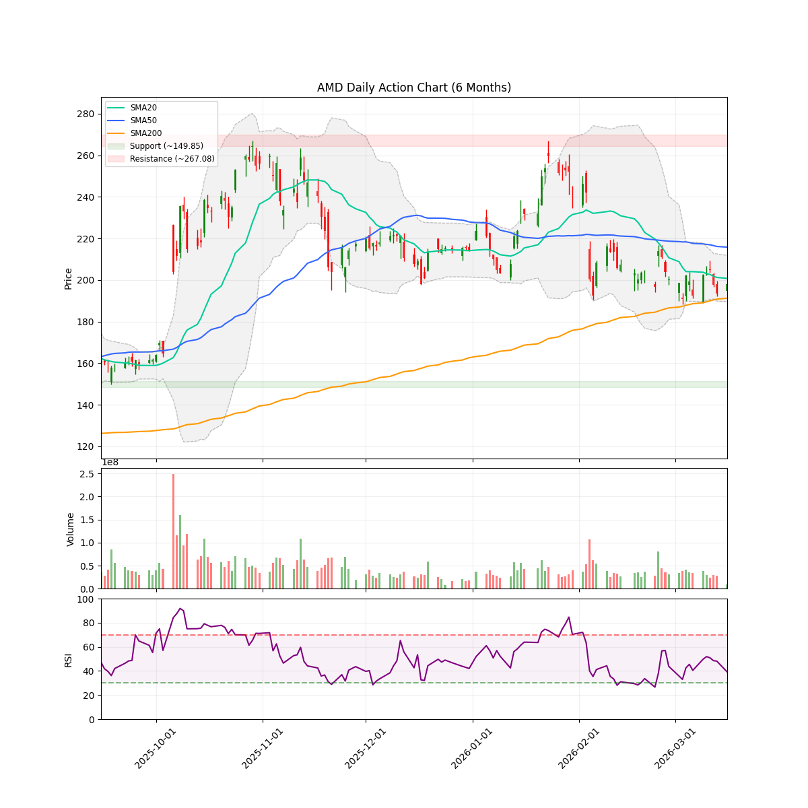
#### 研报分析

### 技术指标概览 (Technical Overview)
- **当前价格**: $198.15
- **RSI (14)**: 39.14
- **移动平均线**: SMA20: $200.77 | SMA50: $215.81 | SMA200: $191.24 (Bullish)
- **波动率**: ATR (14): 8.41 (预计周度波动: +/- $18.80)
- **关键位 (6m)**: 支撑位 $149.85 | 阻力位 $267.08
- **即时状态**: Below SMA50

# AMD 情绪审计报告：AI 战场的“木马计”与两百美金的心理防线

**日期：** 2026年03月16日
**研究员：** 叙事经济学分析小组
**标的：** AMD (Advanced Micro Devices)

---

### 1. 叙事背景：当愿景撞上重力
现在的 AMD 就像是一个刚在马拉松比赛中领跑了半程，突然停下来系鞋带的选手。虽然场边（媒体）欢呼声不断，但看台上的赌徒们（二级市场）却因为他放慢了速度而开始焦躁不安。

目前你正站在风暴眼中心。你的持仓均价在 **$220.54**，而现在的股价 **$198.15** 刚好跌破了心理关口。更糟糕的是，你那张 **$200 的 Put（看跌期权）** 已经感受到了深水区的压力。但这到底是“趋势终结”还是“黎明前的黑暗”？让我们拆解一下现在的叙事。

---

### 2. 催化剂分级 (Catalyst Categorization)

*   **A-Tier：Meta 深度联姻与 AI 加速器 (核心叙事)**
    *   *来源：The Motley Fool / Seeking Alpha*
    *   **分析：** 媒体把 AMD 比作“机房里的木马”。与 Meta 的合作不是小打小闹，这代表着 AI 芯片市场正在从英伟达的“独裁”转向“双头垄断”。只要 Meta 还在大买芯片，AMD 的基本面就没有坍塌。这是支撑股价长期回升的钢筋混凝土。
*   **B-Tier：从破产边缘到“二哥”地位的励志故事**
    *   *来源：Yahoo Finance*
    *   **分析：** 这种叙事在市场信心低迷时非常管用。它在提醒投资者：这家公司有极强的生命力和抗压基因。虽然不直接产生订单，但能稳住机构持仓的耐心。
*   **C-Tier：估值过高的历史对比与 Zacks 的杂音**
    *   *来源：Forbes / Zacks*
    *   **分析：** Forbes 拿 2008 年和 2020 年的崩盘来吓唬人，这纯粹是噪音。现在的半导体周期与当年不可同日而语。这种文章的出现，往往是散户恐慌情绪触顶的标志。

---

### 3. 分歧检测：利好“涨不动”的背后
**现状：** 我们看到了极具煽动性的利好新闻（Meta 合作、服务器市场渗透），但股价却被 SMA50（$215.81）压得喘不过气。

**老兵视角：** 这种“好消息不涨”的局面通常被称为**看跌穷尽 (Bearish Exhaustion)** 的前奏。你的 RSI 已经杀到了 **39.14**，这说明卖盘已经杀红了眼。现在的价格（$198）正在死磕 **SMA200（$191.24）**。在职业交易员眼中，SMA200 是“牛熊分界线”，也是最好的“捡漏区”。

---

### 4. 账户诊断：你的“阵痛”在哪里？
你现在的仓位很重（占比 50.56%），且均价偏高。
*   **正股持仓：** -9.22% 的浮亏还在可控范围内，但这 600 股让你现在的心理压力极大。
*   **期权风险：** 卖出的 $200 Put 已经跌破行权价，亏损 -58.28%。这实际上是在逼你“折价接货”。

**叙事逻辑：** 市场正在经历一场针对“过度乐观”的清洗。如果你相信 Meta 和服务器的叙事（A-Tier），那么现在的下跌只是在为你补齐剩下的拼图。

---

### 5. 情绪评分 (Sentiment Score): 7.2 / 10
*评语：尽管技术面看上去像是一场灾难，但基本面的叙事依然坚如磐石。这是一场典型的“基本面向上，技术面向下”的背离。*

*   **逻辑支撑：**
    *   (+3) AI 芯片需求的结构性短缺依然存在。
    *   (+3) 与 Meta 的合作确立了其行业地位。
    *   (+2) 价格逼近 SMA200 强支撑。
    *   (-1) 英伟达 (NVDA) 股价脱节带来的板块拖累效应。

---

### 6. 关键数据与展望

*   **Logic Score:** **7.2/10** (长期牛市叙事未破，短期受板块情绪拖累)
*   **下个重大日期：** **2026年4月下旬 (预计 Q1 财报发布日)**
    *   *注意：在此之前，需密切关注英伟达 GTC 大会后的溢出效应。*
*   **引述参考：** 
    *   [Motley Fool]: "AMD 与 Meta 的合作可能揭示 AI 芯片竞赛的重大转变。"
    *   [Seeking Alpha]: "AMD 是机房里的木马，AI 加速器业务提供了巨大的期权价值。"

**老兵的临别赠言：**
咖啡还没凉，别急着关机。$191 附近的 SMA200 是你最后的战壕。只要不放量跌破这里，这次的回调更像是为了下一次跳跃而做的深蹲。你那张 $200 的 Put 虽然现在难看，但如果财报前股价收复失地，那不过是一场虚惊。**忍住，别在黎明前把筹码送人。**
#### 近期新闻与事件
- **[Seeking Alpha]** [AMD: The Trojan Horse In The Server Room](https://seekingalpha.com/article/4882644-amd-the-trojan-horse-in-the-server-room)
- **[The Motley Fool]** [Why AMD Stock Could Have More Upside Than Investors Realize](https://www.fool.com/investing/2026/03/16/why-amd-stock-could-have-more-upside-than-investor/)
- **[Yahoo Finance]** [1 Artificial Intelligence (AI) Stock I'd Never Sell](https://finance.yahoo.com/news/1-artificial-intelligence-ai-stock-162200280.html)
- **[Forbes]** [Is AMD Stock Overvalued?](https://www.forbes.com/sites/greatspeculations/2026/03/11/is-amd-stock-overvalued/)
- **[24/7 Wall St.]** [AMD vs. TSMC: Which Chip Stock Actually Delivers the Smarter Return in 2026?](https://247wallst.com/investing/2026/03/13/amd-vs-tsmc-which-chip-stock-actually-delivers-the-smarter-return-in-2026/)

---

### AMZN
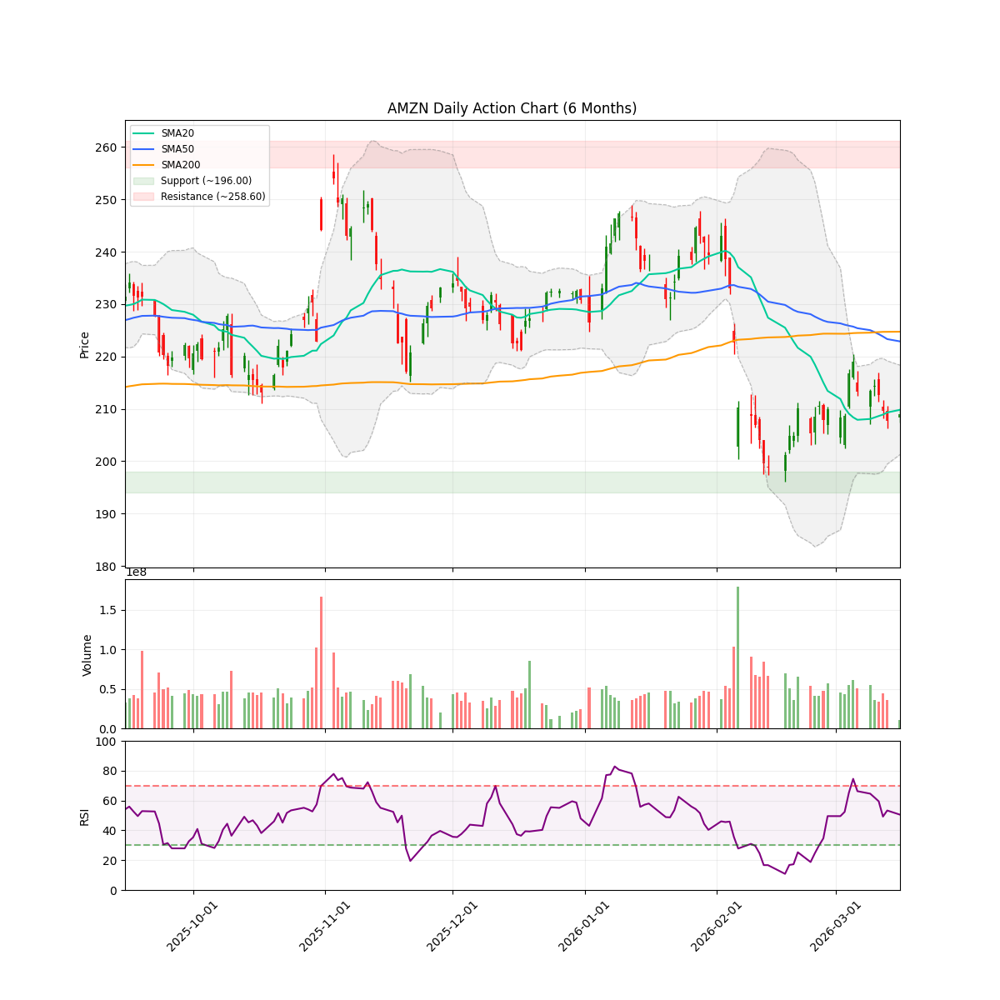
#### 研报分析

### 技术指标概览 (Technical Overview)
- **当前价格**: $208.93
- **RSI (14)**: 50.55
- **移动平均线**: SMA20: $209.80 | SMA50: $222.87 | SMA200: $224.72 (Bearish)
- **波动率**: ATR (14): 5.31 (预计周度波动: +/- $11.87)
- **关键位 (6m)**: 支撑位 $196.00 | 阻力位 $258.60
- **即时状态**: Below SMA50

你好。来，先喝口咖啡，我们聊聊现在的亚马逊（AMZN）。

在“叙事经济学”的视角下，目前的亚马逊正处于一个非常微妙的阶段：**华尔街的“老钱”正在逢低吸纳，而市场的情绪却因为沉重的技术面和庞大的资本开支而显得有些步履蹒跚。**

以下是基于 2026 年 3 月 16 日市场数据的深度情绪审计报告。

---

### 1. 催化剂分类 (Categorize Catalysts)

我们将近期的信息流进行权重拆解，看看哪些是真正的“硬通货”，哪些只是“噪音”：

*   **A-Tier (核心叙事驱动项)：**
    *   **大佬“抄底”：** 亿万富翁 Seth Klarman 在第四季度豪掷 5 亿美元建仓 AMZN。这不仅是资金，更是信心的背书。当这位以价值投资著称的猎手从 Alphabet 转向 Amazon，说明在 200 美元附近的 AMZN 具有极强的“安全边际”。
    *   **地缘政治红利：** 2026 年印美贸易协议的签署。这不仅仅是政策新闻，对于亚马逊印度区（Amazon India）来说，这是打开物流与支付枷锁的钥匙。
    *   **2000 亿美金豪赌：** 亚马逊计划在 2026 年投入 2000 亿美元用于资本支出（AI 芯片、卫星、超快速配送）。这是“军备竞赛”级别的投入。
*   **B-Tier (行业与竞争项)：**
    *   **AMZN vs. WMT：** 市场正在重新评估零售之王的宝座。沃尔玛销售额破 7000 亿，而亚马逊则用 AI 和物流速度进行降维打击，这种竞争态势维持了股价的热度。
*   **C-Tier (日常噪音)：**
    *   **澳洲 ETF 动态：** 属于外围流动性变动，对纳斯达克主战场影响有限。

---

### 2. 背离检测 (Divergence Detection)

**这是一个典型的“利好不涨”的磨底期。**

*   **现象：** 亚马逊披露了 11%-15% 的稳健增长指引，且有顶级大佬 5 亿美金的加持，但股价目前报收 $208.93，仍处于 SMA50 ($222.87) 和 SMA200 ($224.72) 之下。
*   **诊断：** 市场正在经历“开支焦虑症”。那 2000 亿美金的资本支出虽然是长期利好，但短期内压制了自由现金流的预期。
*   **结论：** 存在**看涨背离**。散户被技术面的“死亡交叉”（SMA50 跌破 SMA200）吓跑了，但聪明的资金（如 Seth Klarman）正在利用这种恐惧接货。这更像是一个“春天前的倒春寒”，而非基本面的溃败。

---

### 3. 情绪评分与逻辑 (Sentiment Score)

**得分：6.8 / 10**

*   **评分逻辑：**
    *   **(+3.0)**：顶级机构与亿万富翁的主动加仓提供了强大的底部支撑。
    *   **(+2.0)**：印美贸易协议带来的增量叙事极具想象力。
    *   **(-1.5)**：技术面极度难看，跌破 200 日线意味着上方套牢盘沉重。
    *   **(-0.7)**：市场对 2000 亿支出的消化仍需时间，短期缺乏直接的暴涨催化剂。

---

### 4. 深度叙事：是陷阱还是黄金坑？

现在的亚马逊，像极了一个正在闭关修炼“绝世武功”的巨兽。

大家都在盯着它今年要花掉的 2000 亿美金，觉得这包袱太重。但你要明白，这笔钱是砸向 AI 基础设施和近地轨道卫星的。**目前的股价走势（跌破均线）是在“洗掉”那些没有耐心的投机者。**

目前你的持仓成本在 $201.61，距离 6 个月低点 $196.00 仅一步之遥。这说明你的仓位非常安全。市场在 200-210 美元这个区间正在进行一场无声的筹码交换——一边是恐惧技术破位的散户，另一边是像 Klarman 这样拿着计算器进场的猎食者。

---

### 5. 关键参考信息

*   **重要引用：**
    *   *Billionaire Seth Klarman Buys $500M in Q4*: [Blockonomi](https://blockonomi.com/amazon-amzn-stock-billionaire-seth-klarman-buys-500m-in-q4-after-trimming-alphabet-position/)
    *   *Amazon plans $200B in capital expenditures for 2026*: [Barchart](https://www.msn.com/en-us/money/general/amzn-vs-wmt-which-is-the-better-stock-to-buy-for-the-next-10-years/ar-AA1YuN5v)
*   **下一个重大日期 (Next Major Date)：**
    *   **2026 年 4 月 30 日（预估）：** **2026 年第一季度财报发布日。** 这将是验证那 2000 亿投入是否开始产生协同效应的关键节点。

---

**老兵建议：** 既然你的成本价有优势，且目前 RSI 为 50.55 处于中性，不需要急着止盈。在这个阶段，我们要做的就是像 Seth Klarman 一样，无视技术面的小波动，盯紧那 2000 亿美金转化成的“护城河”。只要不跌破 $196.00 的强支撑，这就不是陷阱，而是蓄势。
#### 近期新闻与事件
- **[Motley Fool Australia on MSN]** [3 ASX ETFs for new investors to consider in 2026](https://www.msn.com/en-au/money/top-stocks/3-asx-etfs-for-new-investors-to-consider-in-2026/ar-AA1YFDEg?ocid=BingNewsVerp)
- **[The Motley Fool]** [Breakfast News: Nvidia Set To Reveal 2026 AI Plans](https://www.fool.com/investing/breakfast-news/2026/03/16/breakfast-news-nvidia-set-to-reveal-2026-ai-plans/)
- **[The Motley Fool on MSN]** [Boston Omaha Looks Cheap on Paper, but Weak Management Could Keep It a Value Trap](https://www.msn.com/en-us/money/other/boston-omaha-looks-cheap-on-paper-but-weak-management-could-keep-it-a-value-trap/ar-AA1YGldD?ocid=BingNewsVerp)
- **[Barchart]** [AMZN vs. WMT: Which is the better stock to buy for the next 10 years?](https://www.msn.com/en-us/money/general/amzn-vs-wmt-which-is-the-better-stock-to-buy-for-the-next-10-years/ar-AA1YuN5v)
- **[Mint]** [India-US Trade Deal 2026: 9 Ways It Changes How Indians Should Look at US Stocks and ETFs](https://www.livemint.com/focus/indiaus-trade-deal-2026-9-ways-it-changes-how-indians-should-look-at-us-stocks-and-etfs-11772091106207.html)

---

### GOOGL
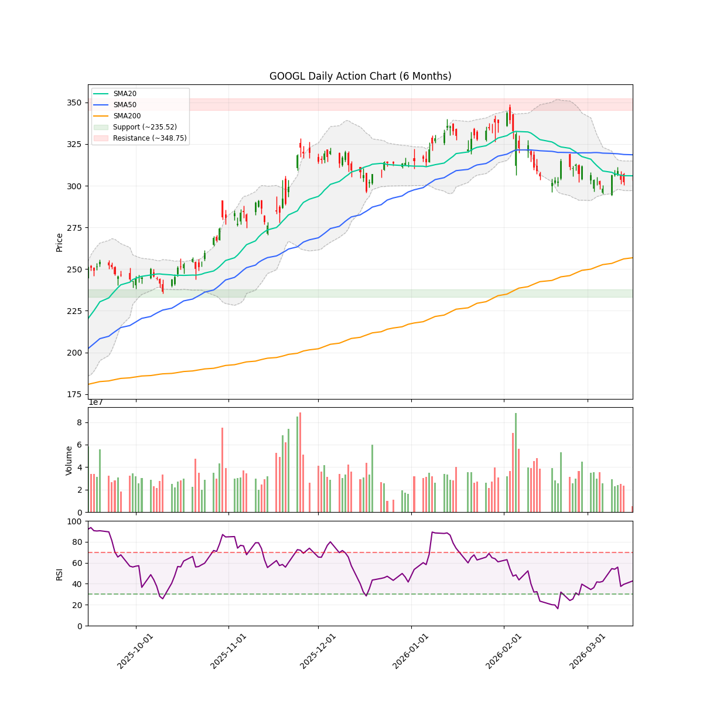
#### 研报分析

### 技术指标概览 (Technical Overview)
- **当前价格**: $304.24
- **RSI (14)**: 42.66
- **移动平均线**: SMA20: $305.97 | SMA50: $318.58 | SMA200: $256.79 (Bullish)
- **波动率**: ATR (14): 7.22 (预计周度波动: +/- $16.14)
- **关键位 (6m)**: 支撑位 $235.52 | 阻力位 $348.75
- **即时状态**: Below SMA50

你好。把椅子拉近点，咱们来聊聊你手里的这位“科技老兵”——Alphabet (GOOGL)。

在华尔街，我们常说“叙事即一切”。现在的 GOOGL 就像是一个正处于“中年危机”的精英：虽然底子厚实，但比起隔壁风头正劲、肌肉发达的 Meta，它似乎显得有点疲态。

以下是针对 GOOGL 的**情绪审计报告**：

### 1. 催化剂分类：谁在拉盘，谁在砸盘？

*   **A-Tier (重磅催化剂)：白宫数据中心盟约与 AI 长跑**
    *   *详情*：Alphabet 与其他巨头在白宫承诺支持下一代数据中心建设（[Insider Monkey, 03-15]）。这是长期的“护城河”新闻。AI 不是短期玩具，而是基础设施的军备竞赛，Google 依然是执牛耳者。
*   **B-Tier (中坚力量)：Gemini 深度嵌入工作流**
    *   *详情*：Gemini AI 正式接管 Workspace，从 Docs 到 Drive 全面自动化（[Blockonomi, 03-11]）。这证明了 Google 的变现能力正在从“实验室”走向“账单”。
*   **C-Tier (杂音与情绪)：Meta 的拉踩与“千元大饼”**
    *   *详情*：Forbes 认为 Meta 是比 Google 更好的选择（[Forbes, 03-16]），而 Motley Fool 在喊话 1000 美元（[Motley Fool, 03-06]）。这些都是典型的市场杂音，反映了当前资金在“Magnificent 7”内部的审美疲劳和轮动。

### 2. 背离检测：好消息为什么带不动股价？

这是一个有趣的警示信号。虽然 Gemini 的集成和白宫的合作都在推进，但股价却在 SMA20 (305.97) 和 SMA50 (318.58) 之下徘徊。

**结论：这不是“利好出尽”，而是“估值消化”。** 
过去 12 个月 71% 的涨幅（[Forbes, 02-23]）让市场变得异常挑剔。当 Meta 的增速看起来更猛时，资金自然会产生位移。目前的下跌更像是**看涨情绪的耗竭**，而非基本面的崩溃。目前的 RSI 为 42.66，还没到跌透了的“超卖区”，但也离恐慌不远了。

### 3. 叙事分析：现在的 Google 是“陷阱”还是“趋势”？

现在的叙事逻辑是：**“老巨头的重塑阵痛”**。

你目前的持仓成本是 **$268.53**，相比现价 $304.24，你手里还有约 16% 的“安全垫”。从叙事角度看，这不算一个陷阱，但确实进入了一个**“平庸期”**。

*   **利好面**：Google 依然是 AI 生态的基石，长期逻辑未变。
*   **风险面**：市场正在惩罚那些“增长不够快”的巨头。如果股价不能在短期内收复 SMA20 (305.97)，它可能会回踩 SMA200 (256.79) 寻求终极支撑。

---

### 情绪评分 (Logic Score): 6.2 / 10

> **评价：稳健但缺乏“兴奋点”。** 
> 尽管技术面略显拉跨（处于均线下方），但其 AI 的基建地位决定了它没有系统性崩盘的风险。这更像是一个“持股观望”的阶段，而不是加仓的冲刺点。

---

### 投资备忘录

*   **目前的头寸建议**：你目前的持仓占账户 20.99%，比例不算低。考虑到你已有 16% 的浮盈，**不建议在跌破 SMA50 的情况下继续补仓**。守住你的成本价优势，静待下个财报季的业绩确认。
*   **关键支撑位**：$288.00 (心理位) / $256.79 (SMA200 终极防线)。
*   **关键压力位**：$318.58 (SMA50)，只有站稳这里，多头叙事才会重启。

**下一个重大日期 (Next Major Date)：**
*   **2026年4月下旬 (预计)**：Q1 2026 财报发布日。这将是验证 Gemini 到底为 Google Cloud 贡献了多少真金白银的关键时刻。

**老兵寄语**：
“老兄，别被 Forbes 的‘拉踩文’搞乱了心态。Google 不是输给了 Meta，它只是在跑一场马拉松，现在刚好在补给站喝水。只要搜索和云的基础还在，它就依然是那个无法撼动的巨无霸。”
#### 近期新闻与事件
- **[Forbes]** [Why Meta Platforms Is A Better Pick Than Google Stock](https://www.forbes.com/sites/greatspeculations/2026/03/16/why-meta-platforms-is-a-better-pick-than-google-stock/)
- **[Insider Monkey]** [Is Alphabet Inc. (GOOGL) A Good Stock To Buy Now?](https://www.msn.com/en-us/news/technology/is-alphabet-inc-googl-a-good-stock-to-buy-now/ar-AA1YGjRp)
- **[Zacks Investment Research]** [Investors heavily search Alphabet Inc. (GOOGL): Here is what you need to know](https://www.msn.com/en-us/money/general/investors-heavily-search-alphabet-inc-googl-here-is-what-you-need-to-know/ar-AA1YK360)
- **[Insider Monkey]** [Alphabet (GOOGL) and Other Tech Giants Pledge at White House to Power Next-Generation Data Centers](https://www.msn.com/en-us/money/news/alphabet-googl-and-other-tech-giants-pledge-at-white-house-to-power-next-generation-data-centers/ar-AA1YDY69)
- **[Blockonomi]** [Alphabet (GOOGL) Stock Rises as Gemini AI Powers Workspace Automation](https://blockonomi.com/alphabet-googl-stock-rises-as-gemini-ai-powers-workspace-automation/)

---

## 🔍 观察池机会分析

### AMAT
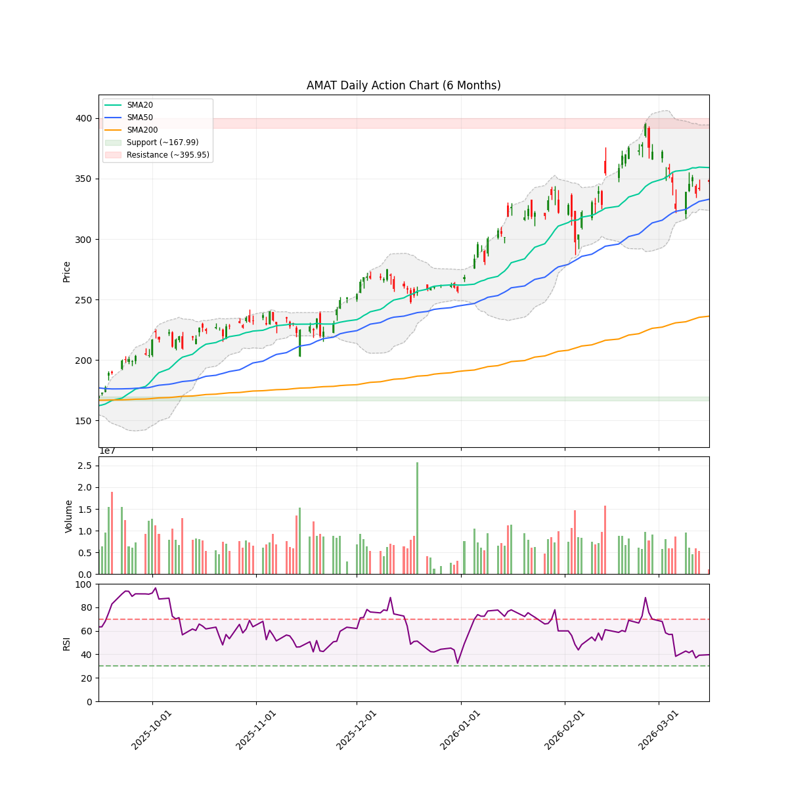
#### 研报分析

### 技术指标概览 (Technical Overview)
- **当前价格**: $347.01
- **RSI (14)**: 39.69
- **移动平均线**: SMA20: $359.07 | SMA50: $332.90 | SMA200: $236.27 (Bullish)
- **波动率**: ATR (14): 17.00 (预计周度波动: +/- $38.01)
- **关键位 (6m)**: 支撑位 $167.99 | 阻力位 $395.95
- **即时状态**: Above SMA50

你好！来，坐下喝杯咖啡。咱们聊聊半导体设备领域的老大哥——应用材料（Applied Materials, **AMAT**）。

现在的市场就像是一场已经跑了半程的马拉松，AMAT 刚刚经历了一段极其亮眼的冲刺（三个月涨了 33%），现在的回调更像是它在补给站“喘口气”。虽然股价跌破了 20 日均线，但我从“叙事经济学”的角度嗅到了一丝不同寻常的味道。

以下是针对 AMAT 的深度情绪审计报告：

---

### **1. 催化剂分类 (Catalyst Categorization)**

我们要把噪音和真正的金子分开：

*   **A-Tier (核心叙事 - 增长引擎):**
    *   **次世代存储伙伴关系**：AMAT 宣布与美光 (Micron) 和 SK 海力士 (SK Hynix) 合作开发下一代存储技术（2026-03-14）。这不仅仅是签个字，这是在 AI 浪潮中锁定了 HBM（高带宽内存）和 DRAM 的核心供应链地位。这属于“必赢”的局。
    *   **Q1 财报余温**：此前披露的逻辑电路和 DRAM 业务的创纪录增长，证明了其基本面不是靠吹出来的，而是真金白银的订单。
*   **B-Tier (行业情绪 - 助推器):**
    *   **分析师的一致看好**：Zacks 和多家机构的 ABR（平均经纪商建议）依然维持在“买入”区间（2026-03-09）。虽然 Erste Group 给了个“持有”评级，但这更像是对短期涨幅过快的风险警示，而非基本面恶化。
*   **C-Tier (市场噪音):**
    *   **搜索热度激增**：Zacks 提到投资者搜寻热度很高。这通常意味着散户注意力开始集中，往往预示着短期波动的加剧。

### **2. 情绪背离检测 (Divergence Detection)**

**关键发现：看跌竭尽 (Bearish Exhaustion)**
现在的盘面很有意思。2026-03-14 刚刚传出与美光和海力士合作的重量级利好，但股价目前（347.01）却处于 SMA20（359.07）下方，且 RSI 掉到了 39.69。

这就是典型的**“利好不涨”陷阱吗？不，我认为这是“良性消化”**。RSI 接近 30 的超卖区间，意味着短期获利了结的卖盘已经快流干了。股价在 SMA50（332.90）上方获得支撑的可能性极大。这种“好消息叠加小幅下跌”其实是市场在剔除不坚定的杠杆资金，为下一波冲顶做准备。

### **3. 叙事得分 (Sentiment Logic Score)**

**得分：7.8 / 10**

*   **理由**：如果 10 分是“疯狂的牛市泡沫”，0 分是“系统性崩溃”，那么 7.8 分代表的是“**稳健增长中的技术性回调**”。AMAT 掌握着半导体制造的“铲子”，只要 AI 和存储的需求还在，它的叙事逻辑就没断。目前的估值回归（Valuation Assessment, 2026-03-13）反而是给错过第一波行情的人留了入场券。

### **4. 深度洞察：老兵的碎碎念**

朋友，别被这几天的阴线吓着。AMAT 的故事现在是由**“高带宽内存 (HBM)”**和**“先进制程逻辑芯片”**双轮驱动的。

你看，它和美光、SK 海力士的深度绑定，实际上是抓住了 AI 算力的心脏。尽管短期内市场因为涨多了在打哈欠，但 SMA200（236.27）还在遥远的下方，大趋势是绝对的牛市形态。现在的下行空间受限于 330 附近的 SMA50 支撑，而上行空间一旦突破 360，目标就是 400 大关。

---

### **输出要求摘要**

*   **情绪逻辑得分**: **7.8**
*   **引用新闻源**:
    *   *Partnership with Micron/SK Hynix*: [Insider Monkey/Yahoo Finance (2026-03-14)](https://finance.yahoo.com/news/applied-materials-amat-partners-micron-183107515.html)
    *   *Erste Group Hold Rating*: [Erste Group/Yahoo Finance (2026-03-10)](https://finance.yahoo.com/news/erste-group-initiated-applied-materials-112849670.html)
    *   *Q1 Growth Records*: [Zacks (2026-03-02)](https://finance.yahoo.com/news/amat-climbs-33-4-3-142900401.html)
*   **下一个重大日期**: **2026年5月中旬** (预计 Q2 财报发布日)。

**建议**：关注 332-340 区间的企稳信号。如果 RSI 触碰 30 后反弹，那就是发令枪响的时候。
#### 近期新闻与事件
- **[Insider Monkey· via Yahoo Finance]** [Erste Group Initiated Applied Materials, Inc. (AMAT) With a Hold Rating – Here’s...](https://finance.yahoo.com/news/erste-group-initiated-applied-materials-112849670.html)
- **[Zacks· via Yahoo Finance]** [Investors Heavily Search Applied Materials, Inc. (AMAT): Here is What You Need...](https://finance.yahoo.com/news/investors-heavily-search-applied-materials-130005120.html)
- **[Insider Monkey· via Yahoo Finance]** [Applied Materials (AMAT) Partners with Micron (MU), SK Hynix for Next-Gen Memory...](https://finance.yahoo.com/news/applied-materials-amat-partners-micron-183107515.html)
- **[Barchart· via Yahoo Finance]** [Applied Materials and Micron Are Partnering on Memory. Is AMAT or MU Stock a...](https://finance.yahoo.com/news/applied-materials-micron-partnering-memory-161722664.html)
- **[Simply Wall St.· via Yahoo Finance]** [Assessing Applied Materials (AMAT) Valuation After Strong Shareholder Returns...](https://finance.yahoo.com/news/assessing-applied-materials-amat-valuation-230947868.html)

---

### ASML
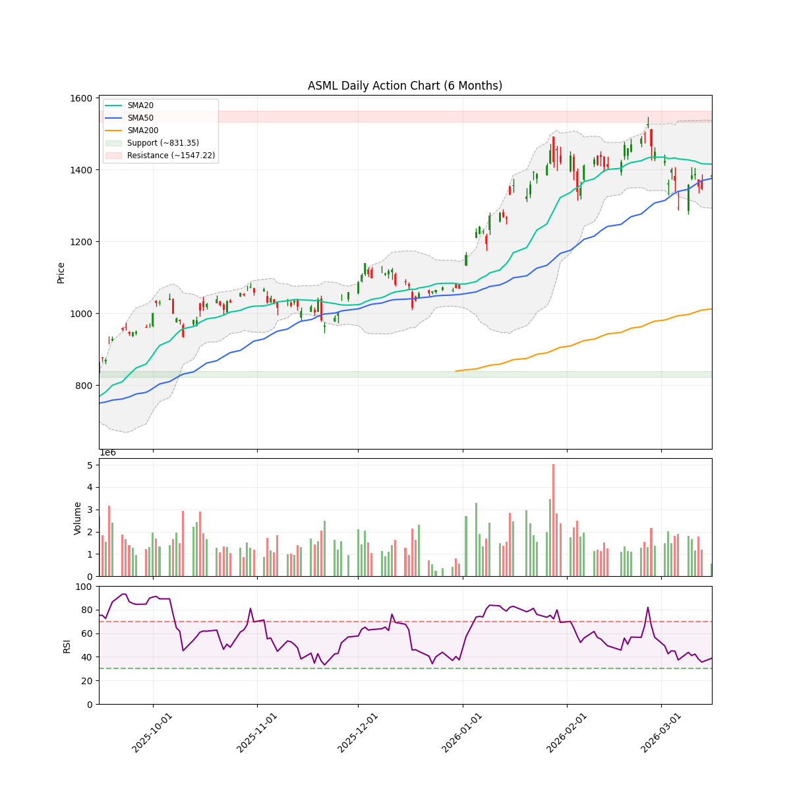
#### 研报分析

### 技术指标概览 (Technical Overview)
- **当前价格**: $1383.27
- **RSI (14)**: 38.81
- **移动平均线**: SMA20: $1414.74 | SMA50: $1375.12 | SMA200: $1011.90 (Bullish)
- **波动率**: ATR (14): 58.88 (预计周度波动: +/- $131.67)
- **关键位 (6m)**: 支撑位 $831.35 | 阻力位 $1547.22
- **即时状态**: Above SMA50

# ASML：光刻机巨头的“中场休息”，是机会还是陷阱？—— 情绪审计报告

**日期：** 2026年03月16日
**研究员：** 叙事经济学分析组

---

### 1. 叙事背景：数字时代的“造物主”正在呼吸
喝杯咖啡，咱们来聊聊 ASML。

在当前的叙事里，ASML 不是一家普通的科技公司，它是整个数字文明的“单向阀”。如果你认同 AI 推理市场到2030年能达到2550亿美元（正如 *The Motley Fool* 所引用的数据），那么你就必须承认：没有 ASML 的 EUV 光刻机，这一切都是空中楼阁。

目前的盘面显示，ASML 的价格在 **1383.27** 左右徘徊，处于 SMA50（1375.12）的临界点。有趣的是，华尔街的“精英派”和市场的“情绪派”正在这里玩一场心理博弈。

---

### 2. 催化剂分类：谁在推波助澜？

#### **A-Tier（核心动力）：**
*   **机构重仓背书：** TD Cowen 坚定维持“买入”评级，并将目标价（PT）定在 **$1,500**；美国银行（BofA）因 EUV 需求前景强劲也上调了目标价。这是典型的“聪明钱”在筑底。
*   **结构性叙事：** 随着 AI 推理市场的爆炸式增长，TSMC 作为 ASML 的头号客户，其订单深度直接锁定了 ASML 未来几年的确定性。

#### **B-Tier（管理与预期）：**
*   **权力交接：** 2026年股东大会（AGM）议程披露了董事会变动和新 CTO 的任命计划。虽然这带来了些许不确定性，但对于这种技术驱动型公司，新鲜血液通常被视为长期利好。

#### **C-Tier（市场杂音）：**
*   **媒体情绪：** 各类“12只即将飞天的AI股”名单（Insider Monkey）和 Zacks 的常规走势分析。这些内容更多是跟随行情，而非驱动行情。

---

### 3. 背离检测：好消息里的“冷水”
**警报信号：** 我们观察到一个有趣的背离。尽管 BofA 和 TD Cowen 在 3 月初连续释放利好，但股价却从 SMA20（1414.74）上方跌落。

**分析：** 这种“见光死”的走势通常有两种解释：
1.  **获利了结：** 股价在 SMA200 以上涨幅过大，市场需要消化 1547 美元高点带来的恐高症。
2.  **情绪疲劳：** RSI 目前处于 **38.81**，这不仅不是衰竭，反而是一个**看涨的背离点**。当基本面（A-Tier 利好）在改善，而价格因为技术性调整而走低时，这往往是“牛市回踩”，而非“趋势终结”。

---

### 4. 情绪评分 (Sentiment Score)

# **Logic Score: 7.8/10**

> **逻辑推演：** 
> 这是一个 **“强基本面驱动的降温期”**。
> 虽然短期技术形态略显疲态（跌破 SMA20），但股价在 SMA50（1375）附近表现出了明显的支撑韧性。只要价格守住 1375 这一线，当前的下跌就是一个完美的“长线布局区”。由于没有系统性利空（如技术故障或出口禁令升级），目前的调整更像是为冲刺 $1,500 关口积蓄能量。

---

### 5. 关键参考与后续关注

*   **引援参考：**
    *   *TD Cowen 重申“买入”评级 & $1,500 目标价* [MSN/Insider Monkey](https://www.msn.com/en-us/money/topstocks/td-cowen-reiterates-buy-rating-on-asml-asml-with-1500-pt/ar-AA1YEobo)
    *   *BofA 基于 EUV 需求上调目标价* [Investing.com](https://www.investing.com/news/analyst-ratings/bofa-raises-asml-stock-price-target-on-stronger-euv-demand-outlook-93CH-4544756)
    *   *2026 股东大会议程公告* [The Globe and Mail](https://www.theglobeandmail.com/investing/markets/stocks/ASML/pressreleases/713769/asml-sets-2026-agm-agenda-with-board-changes-and-new-cto-appointment-plan/)

*   **下一个关键日期：**
    *   **2026年4月（待定）：** 2026年第一季度财报发布日。这将是验证“AI推理市场转化率”的第一个试金石。
    *   **2026年4月下旬：** 年度股东大会（AGM），届时 CTO 的新任命和战略转型细节将正式敲定。

**老兵结语：** 别被这两周的阴线吓跑了。ASML 正在做的不是在修路，它是在修整个世界的地基。只要地基没裂，每一次回踩都是在给错过的投资者补票的机会。
#### 近期新闻与事件
- **[Yahoo Finance]** [Is ASML Holding N.V. (ASML) A Good Stock To Buy Now?](https://finance.yahoo.com/news/asml-holding-n-v-asml-003537790.html)
- **[The Motley Fool]** [The Artificial Intelligence (AI) Inference Market Could Reach $255 Billion by 2030. This Stock Is Best Positioned to Win.](https://www.fool.com/investing/2026/03/16/artificial-intelligence-ai-inference-market-stock/)
- **[Insider Monkey]** [12 AI Stocks That Will Skyrocket](https://www.msn.com/en-us/money/companies/12-ai-stocks-that-will-skyrocket/ar-AA1YJRNP)
- **[Insider Monkey]** [TD Cowen Reiterates "Buy" Rating on ASML (ASML) With $1,500 PT](https://www.msn.com/en-us/money/topstocks/td-cowen-reiterates-buy-rating-on-asml-asml-with-1500-pt/ar-AA1YEobo)
- **[The Globe and Mail]** [ASML Sets 2026 AGM Agenda With Board Changes and New CTO Appointment Plan](https://www.theglobeandmail.com/investing/markets/stocks/ASML/pressreleases/713769/asml-sets-2026-agm-agenda-with-board-changes-and-new-cto-appointment-plan/)

---

### AVGO
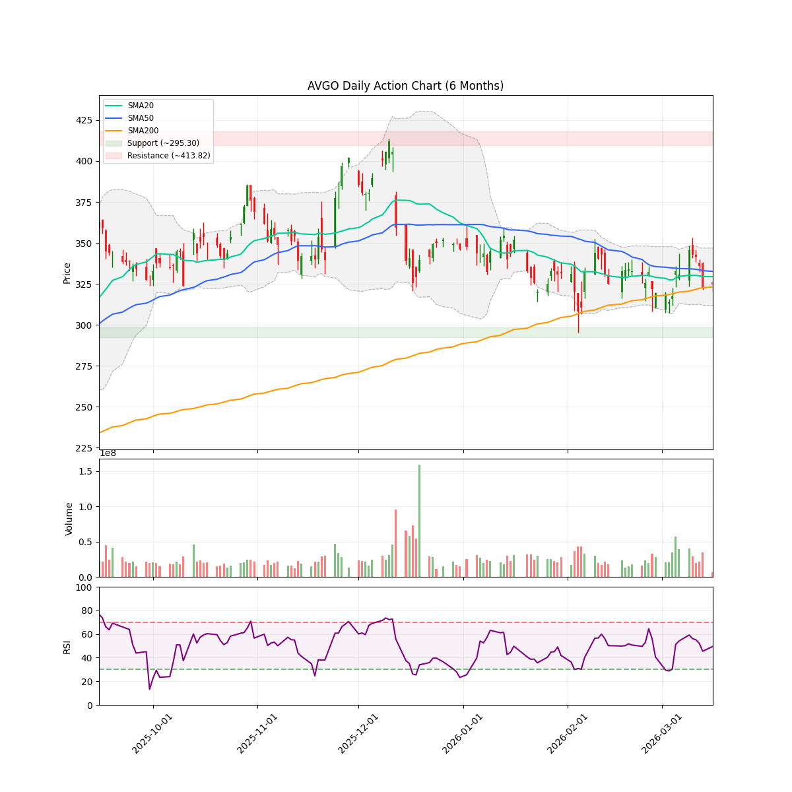
#### 研报分析

### 技术指标概览 (Technical Overview)
- **当前价格**: $324.62
- **RSI (14)**: 49.51
- **移动平均线**: SMA20: $329.41 | SMA50: $332.63 | SMA200: $323.11 (Bullish)
- **波动率**: ATR (14): 13.83 (预计周度波动: +/- $30.92)
- **关键位 (6m)**: 支撑位 $295.30 | 阻力位 $413.82
- **即时状态**: Below SMA50

# 博通 (AVGO) 叙事经济学情绪审计报告

**报告日期：** 2026-03-16
**分析师：** 对冲基金研究助理（叙事经济学专家）

---

### 1. 市场叙事综述：繁华背后的“中场休息”

坐下来，朋友。让我们聊聊博通（Broadcom）。在现在的硅谷和华尔街，博通就像是那个在高端晚宴上低调却掌握着所有秘密的人。

目前的盘面非常耐人寻味。一方面，博通正站在 AI 时代的巅峰，手握 2027 年实现 1000 亿美元 AI 芯片销售额的宏伟蓝图（Yahoo Finance, 2026-03-15）；另一方面，股价却在 324.62 美元附近徘徊，不仅低于 50 日均线，甚至还在试探 200 日均线（323.11）的支撑力。

这种**“基本面如日中天，股价却步履蹒跚”**的背离，正是我们要拆解的叙事核心。

---

### 2. 催化剂分级 (Catalyst Categorization)

#### **A-Tier (核弹级：重塑格局的动力)**
*   **1000 亿美元 AI 芯片预估：** 这种规模的叙事在芯片界几乎是统治性的。博通不仅仅在卖芯片，它在卖 AI 的“通行证”。
*   **Q1 财报双击：** 193 亿美元的营收超出预期（Blockonomi, 2026-03-05），证明其并非纸上谈兵。
*   **3nm 技术量产：** 正式发布 Taurus™ BCM83640，这是全球领先的 3nm 光学 DSP 芯片，牢牢锁定了技术护城河（Insider Monkey, 2026-03-15）。

#### **B-Tier (推进级：维持热度的燃料)**
*   **华尔街的一致看好：** 470 美元的中位目标价（意味着超过 35% 的空间）为市场注入了长期的“信心鸡血”。
*   **指数联动：** 随着纳斯达克期货在周一的反弹，博通作为科技龙头的 Beta 属性使其自动受益于风险偏好回升。

#### **C-Tier (噪音级：可忽略的情绪微波)**
*   **私募信贷担忧：** Raymond James 提到的银行信贷风险（2026-03-16）虽然拖累了大盘，但对博通这种现金流充足的巨头而言，更多是心理层面的干扰而非实质伤害。
*   **自媒体看多：** Investomine Substack 的看多观点（Insider Monkey, 2026-03-16），属于常规的市场噪音。

---

### 3. 背离检测：为什么好消息没能让股价“飞”起来？

**诊断：看多情绪的“消化不良”。**

尽管新闻头条都在高喊“AI 终极标的”（Forbes, 2026-03-05），但股价却从 2025 年 12 月的 413 美元高点大幅回撤。目前 RSI 处于 49.51 的平衡点，这意味着：
1.  **抛售竭尽：** 股价目前死守 200 日均线（323.11），这是一个“生死线”。如果跌破，叙事将转向“估值回归”；如果守住，这里就是所谓的“黄金坑”。
2.  **盈利回吐：** 市场正在消化前期巨大的涨幅。即使有 $1000 亿的远景，投资者现在更关心的是：**下个季度的现金流能不能跟上这种叙事的速度？**

---

### 4. 情绪评分 (Sentiment Score): 7.2/10

*   **逻辑：** 叙事本身是 10 分（AI 领导地位、技术壁垒），但技术面表现仅能给 5 分（处于多条均线之下）。综合来看，博通目前处于一个**“蓄势待发的长期牛市牛蹄中”**，但短期内它需要一次强力的突破来证明自己不是一个“多头陷阱”。

---

### 5. 核心洞察：是机会还是陷阱？

**结论：这是一个“慢火炖牛排”的机会。**

现在的博通不是那种能让你一夜暴富的投机股，而是那种在机构调仓时被压住筹码的蓝筹资产。尽管短期技术形态偏弱（Below SMA50），但 3nm 芯片的量产和 1000 亿的预期已经为博通构筑了一个极高的下行地板。

**下一步行动建议：**
关注 323.11 美元（200日均线）的支撑情况。如果本周能放量重回 330 美元（SMA20）上方，那么“AI 领头羊”的叙事将重新主导盘面。

---

### 6. 关键日程

*   **下个重大日期：** **2026 年 6 月初** (预计发布 Q2 财报)。
*   **关注点：** 观察 Taurus 芯片的早期订单反馈，以及 AI 芯片销售指引是否有进一步上调。

---

*免责声明：本报告仅代表叙事经济学视角下的情绪分析，不构成直接投资建议。市场有风险，入市需谨慎。*
#### 近期新闻与事件
- **[Investing.com]** [Raymond James flags private credit concerns as bank stocks retreat](https://www.investing.com/news/stock-market-news/raymond-james-flags-private-credit-concerns-as-bank-stocks-retreat-93CH-4562799)
- **[Insider Monkey]** [Is Broadcom Inc. (AVGO) a good stock to buy now?](https://www.msn.com/en-us/money/topstocks/is-broadcom-inc-avgo-a-good-stock-to-buy-now/ar-AA1YHfBt)
- **[Yahoo Finance]** [Strong Wall Street Sentiment on Broadcom (AVGO) Amid $100+ Billion AI Chip Sales Forecast](https://finance.yahoo.com/news/strong-wall-street-sentiment-broadcom-072531014.html)
- **[Benzinga]** [What's going on with Broadcom stock Monday?](https://www.msn.com/en-us/money/general/what-s-going-on-with-broadcom-stock-monday/ar-AA1YK9Ul)
- **[Insider Monkey]** [Broadcom Inc. (AVGO) Announces the Availability of the Taurus™ BCM83640](https://www.msn.com/en-us/money/technologyinvesting/broadcom-inc-avgo-announces-the-availability-of-the-taurus-bcm83640/ar-AA1YFDNP)

---

### CEG
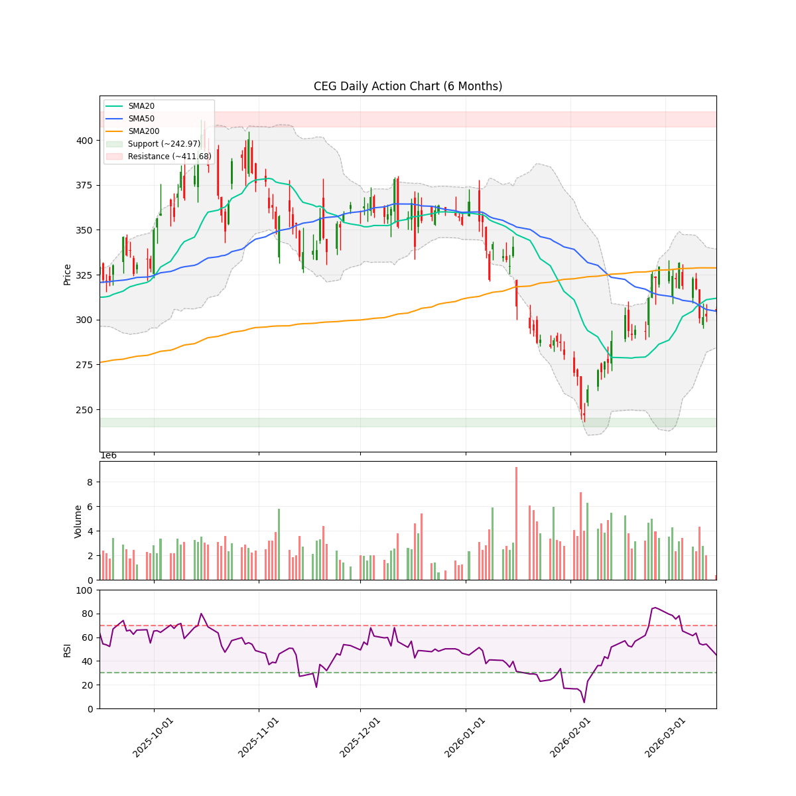
#### 研报分析

### 技术指标概览 (Technical Overview)
- **当前价格**: $304.30
- **RSI (14)**: 45.12
- **移动平均线**: SMA20: $311.89 | SMA50: $304.66 | SMA200: $328.79 (Bearish)
- **波动率**: ATR (14): 13.36 (预计周度波动: +/- $29.87)
- **关键位 (6m)**: 支撑位 $242.97 | 阻力位 $411.68
- **即时状态**: Below SMA50

### CEG 情感审计报告：核能宠儿的“倒春寒”，还是AI叙事的终结？

**日期：** 2026年3月16日
**研究员：** 叙事经济学分析组
**标的：** Constellation Energy (CEG)

---

#### 1. 叙事背景：当“核电梦”撞上“估值墙”

现在的 Constellation Energy (CEG) 给人的感觉，就像是一场狂欢派对后的清晨。几个月前，它还是华尔街的宠儿，是“AI+核能”这一宏大叙事的核心主角。但现在，坐在咖啡馆里，看着 304.30 美元的股价，我们不得不承认：市场的耐心正在被高估值磨平。

虽然 Oracle 的财报（2026-03-11）再次证明了 AI 需求依然如火如荼，但这把火似乎没能直接烧到 CEG 的身上。相反，由于通胀数据“粘性”过强以及美债收益率的攀升，这种资本密集型的公用事业股开始感到阵阵寒意。

#### 2. 催化剂分类 (Catalyst Tiers)

*   **A-Tier（顶级催化剂）：** *暂无。* 目前缺乏能扭转趋势的重磅财报或新的超大规模数据中心售电协议。
*   **B-Tier（二类催化剂）：** 
    *   **AI 需求侧证实：** Oracle 财报 [Investopedia, 2026-03-11] 虽然未引爆板块，但确认了 AI 算力的长期需求。
    *   **机构重申看好：** 《环球邮报》将 CEG 列为“目前值得买入的 3 大核能股” [The Globe and Mail, 2026-03-14]，维持了市场的叙事余温。
*   **C-Tier（噪音与微小扰动）：**
    *   **社交媒体情绪：** X.com 上的看多言论 [Insider Monkey, 2026-03-15] 更多是散户的抱团取暖，缺乏机构资金的实质推动。
    *   **内部分析师分歧：** Seeking Alpha 的“强力卖出”评级 [2026-02-23] 指出其 P/E 超过 31 倍，这对公用事业股来说确实是个刺眼的数字。

#### 3. 背离检测：利好不涨的尴尬

这是一个非常典型的**“看跌衰竭”与“利好不涨”的混合体**。尽管媒体仍在反复吟唱“核能是 AI 的终极归宿”，但 CEG 的股价却跌破了 SMA20 (311.89) 和 SMA50 (304.66)，甚至在 SMA200 (328.79) 下方挣扎。

这种背离告诉我们：**叙事已经透支。** 当一个故事被讲了太多遍，而利润表还没能完全跟上估值的脚步时，任何关于通胀或利率的微小风吹草动 [Yahoo Finance UK, 2026-03-12] 都会变成抛售的理由。

#### 4. 情绪评分 (Sentiment Score)

### **逻辑得分：4.2 / 10**

*   **评分逻辑：**
    *   **技术面溃败 (-3)：** 股价处于所有主要均线下方，趋势明显偏弱，目前正在 300 美元的心理关口反复摩擦。
    *   **估值重锤 (-2)：** 31倍的市盈率在当前高收益率环境下显得极具攻击性。
    *   **叙事惯性 (+1.2)：** 核能作为 AI 唯一解的逻辑未变，这提供了一个坚实的底部支撑（6个月低点 242.97）。
    *   **宏观阻力 (-2)：** 粘性通胀和地缘政治风险让投资者更倾向于防守，而非追逐溢价过高的成长性公用事业。

#### 5. 市场洞察：咖啡馆里的总结

CEG 现在正处于一个“叙事陷阱”中。长期来看，它是伟大的；但短期来看，它正在还去年过度炒作的债。RSI 45.12 显示它还没有进入极度超卖的“捡钱区”，但已经开始失去杀跌的动力。

如果本周股价无法守住 300 美元大关并站回 SMA50，那么回测 242-260 美元的支撑区间将是大概率事件。对于投资者而言，目前不是“冲锋”的时候，而是“埋伏”的时候。

---

**关键参考链接：**
- [Oracle 财报影响分析 - Investopedia](https://www.investopedia.com/oracle-earnings-heated-up-its-stock-but-couldn-t-spark-an-ai-rally-orcl-11923904)
- [核能股推荐名单 - The Globe and Mail](https://www.theglobeandmail.com/investing/markets/stocks/CEG/pressreleases/756371/3-top-nuclear-stocks-to-buy-right-now/)
- [看跌研报 - Seeking Alpha](https://seekingalpha.com/article/4873456-constellation-energy-skip-this-stock-if-you-want-returns)

**下一个重大日期：**
- **2026年5月初：** 第一季度（Q1）财报发布。这将是验证 AI 数据中心收益是否开始兑现的核心时刻。
#### 近期新闻与事件
- **[Insider Monkey]** [Is Constellation Energy Corporation (CEG) A Good Stock To Buy Now?](https://www.msn.com/en-us/money/general/is-constellation-energy-corporation-ceg-a-good-stock-to-buy-now/ar-AA1YGsqA)
- **[The Globe and Mail]** [Better Utility Stock: Constellation Energy vs. NextEra Energy](https://www.theglobeandmail.com/investing/markets/stocks/CEG-Q/pressreleases/765090/better-utility-stock-constellation-energy-vs-nextera-energy/)
- **[Investopedia]** [Oracle Earnings Heated Up Its Stock—But Couldn't Spark an AI Rally](https://www.investopedia.com/oracle-earnings-heated-up-its-stock-but-couldn-t-spark-an-ai-rally-orcl-11923904)
- **[The Globe and Mail]** [3 Top Nuclear Stocks to Buy Right Now](https://www.theglobeandmail.com/investing/markets/stocks/CEG/pressreleases/756371/3-top-nuclear-stocks-to-buy-right-now/)
- **[Yahoo Finance UK]** [US Stock Market Today S&P 500 Futures Slip As Sticky Inflation And Yields Bite](https://uk.finance.yahoo.com/news/us-stock-market-today-p-101158958.html)

---

### EQT
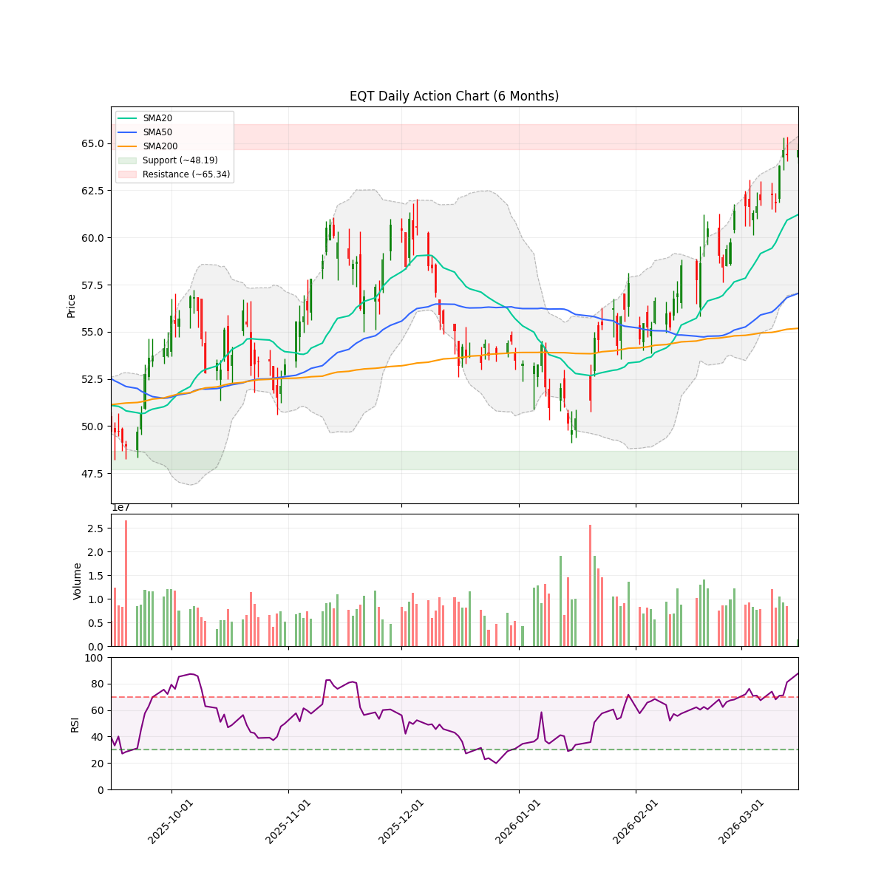
#### 研报分析

### 技术指标概览 (Technical Overview)
- **当前价格**: $64.63
- **RSI (14)**: 87.83
- **移动平均线**: SMA20: $61.22 | SMA50: $57.04 | SMA200: $55.18 (Bullish)
- **波动率**: ATR (14): 1.56 (预计周度波动: +/- $3.48)
- **关键位 (6m)**: 支撑位 $48.19 | 阻力位 $65.34
- **即时状态**: Above SMA50

# EQT 情感审计报告：是天然气巨头的华丽转身，还是动量交易的“甜蜜陷阱”？

**审计日期：** 2026年03月16日
**研究员：** 叙事经济学分析组

---

### 1. 核心叙事：从“挖矿工”到“财务魔术师”

现在的 **EQT Corporation (EQT)** 讲的不再仅仅是一个关于页岩气产量的老掉牙故事。如果你坐在我的对面，我会告诉你：这是一家正处于“财务洗牌”关键期的公司。

目前的市场情绪异常亢奋，股价已经在 64.63 美元附近震荡，逼近 65.34 美元的半年高点。EQT 正在通过大规模的债务回购（Tender Offer）重塑其资产负债表。这种行为在老练的投资者眼里意味着一件事：**管理层极其看好未来的现金流。** 他们不再满足于单纯的开采，而是在利用天然气价格上涨的周期红利，把公司变成一台更精简、更抗风险的“现金流收割机”。

---

### 2. 催化剂分级 (Catalyst Categorization)

*   **A-Tier：财务大手术 (Debt Tender Offer)**
    *   **详情：** EQT 启动了高达 11.5 亿美元的债务要约回购，旨在回购 2027 年至 2031 年到期的优先票据 [[The Globe and Mail]](https://www.theglobeandmail.com/investing/markets/stocks/EQT-N/pressreleases/698186/eqt-announces-major-debt-tender-offer-and-redemption/)。
    *   **影响：** 这是顶级的利好，直接优化资本结构，减少利息支出，为未来的派息或进一步扩张腾挪空间。
*   **B-Tier：投行背书与价值重估**
    *   **详情：** 巴克莱银行将目标价从 67 美元上调至 69 美元，维持“超配”评级 [[Yahoo Finance]](https://finance.yahoo.com/news/why-eqt-corporation-eqt-one-184915803.html)。
    *   **影响：** 机构的“唱多”为股价提供了心理支撑，证实了其作为“低估值能源股”的叙事正在发酵。
*   **C-Tier：行业噪音与交叉干扰**
    *   **详情：** 市场流传关于 EQT AB（瑞典私募巨头）参与 AES 收购的消息。
    *   **注意：** 虽然这属于“同名干扰”，但由于投资者往往只看代码不看全称，这种大型并购的氛围偶尔会产生误导性的流动性溢价。

---

### 3. 背离检测：警惕“氧气稀薄”的高空

**这是最关键的部分：**
尽管新闻面上全是利好（降债、评级上调、低估值），但技术面上已经发出了强烈的**红色预警**。

*   **RSI 处于 87.83 的极端超买区。** 这是一个典型的“过度拥挤”的信号。在 narrative economics 看来，当每一个路人都知道它是“最被低估的能源股”时，它的价格可能已经不再低估了。
*   **背离迹象：** 股价已经冲破了 SMA20、SMA50 和 SMA200 的重重包围，甚至超出了其周波动的预估上限 (+/- 3.48)。这种冲刺往往预示着“买方竭尽”（Bullish Exhaustion）。如果 EQT 在如此完美的利好组合下无法一举冲破 65.34 美元的阻力位，那么“利好出尽即是利空”的戏码就会上演。

---

### 4. 情感评分 (Sentiment Score): 7.8/10

**逻辑阐述：**
*   **动力 (8.5/10):** 强劲的现金流和主动的债务管理提供了扎实的基本面底色。
*   **叙事强度 (9.0/10):** “能源安全+财务重组”是当前最受资本青睐的故事。
*   **风险溢价 (4.0/10):** RSI 指标接近极限，技术性回调的压力像大坝蓄水一样沉重。

**结论：** 这是一个**“可持续的趋势”**，但在当前的价位，它极大概率是一个**“短线回撤陷阱”**。如果你现在追进去，你可能正处在这一波情绪浪潮的顶端。

---

### 5. 关键日期与展望

*   **下一个重大日期：2026年第一季度财报发布 (预计 2026年4月下旬)**
    *   **关注重点：** 届时市场将验证债务回购对利息费用的实际削减效果，以及自由现金流（FCF）是否如预期般爆发。
*   **短期阻力位：** 65.34 (前高)
*   **建议支撑位：** 61.22 (SMA20)，如果回踩此位不破，则是更健康的入场点。

**老兵寄语：** “别在派对最热闹的时候买入，哪怕音乐再好听。等他们收拾桌子（回调）的时候，才是你进场捡便宜的时候。”
#### 近期新闻与事件
- **[Yahoo Finance]** [Why EQT Corporation (EQT) is One of the Most Undervalued Energy Stocks to Buy Now](https://finance.yahoo.com/news/why-eqt-corporation-eqt-one-184915803.html)
- **[Yahoo Finance]** [EQT Debt Tender Reshapes Balance Sheet And Future Cash Flow Profile](https://finance.yahoo.com/news/eqt-debt-tender-reshapes-balance-082325678.html)
- **[Zacks· via Yahoo Finance]** [Archrock Stock: Buy at a Premium or Wait for a Better Entry Point?](https://finance.yahoo.com/news/archrock-stock-buy-premium-wait-160900338.html)
- **[Simply Wall St.· via Yahoo Finance]** [Is EQT (EQT) Still Attractive After A 110.6% Three Year Share Price Surge](https://finance.yahoo.com/news/eqt-eqt-still-attractive-110-161259753.html)
- **[Insider Monkey· via Yahoo Finance]** [AES Draws $10.7 Billion Buyout from BlackRock’s GIP and EQT](https://finance.yahoo.com/news/aes-draws-10-7-billion-043117082.html)

---

### ETN
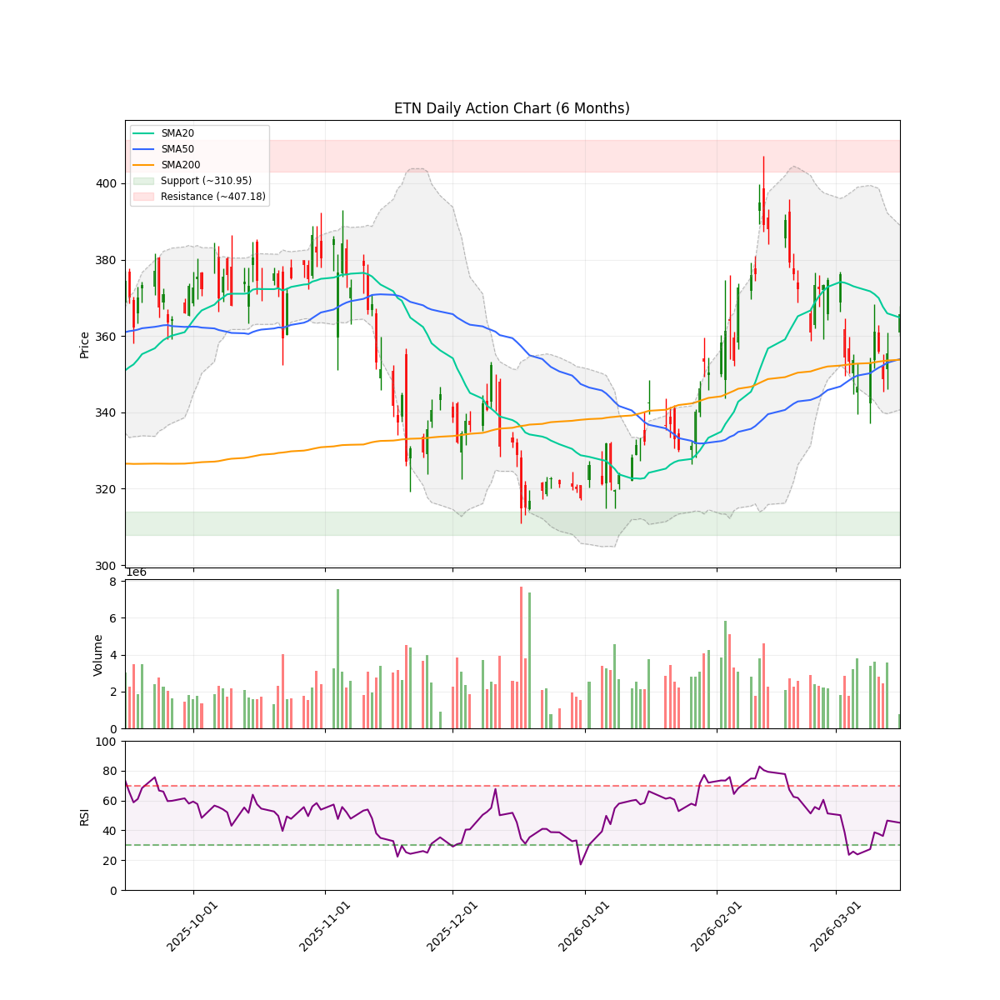
#### 研报分析

### 技术指标概览 (Technical Overview)
- **当前价格**: $365.70
- **RSI (14)**: 45.13
- **移动平均线**: SMA20: $364.82 | SMA50: $353.94 | SMA200: $353.78 (Bullish)
- **波动率**: ATR (14): 13.17 (预计周度波动: +/- $29.46)
- **关键位 (6m)**: 支撑位 $310.95 | 阻力位 $407.18
- **即时状态**: Above SMA50

# 伊顿 (Eaton Corporation - ETN) 情绪审计报告：电气化浪潮中的“中场休息”，是陷阱还是蓄势？

**日期：** 2026年03月16日
**研究员：** 叙事经济学分析助理

---

### 1. 市场叙事总结：AI 时代的“电力搬运工”

如果把当前的 AI 狂潮比作一场淘金热，那么伊顿（ETN）就是那个卖铲子的人——或者更准确地说，是那个为矿井铺设电力电缆和变压器的人。

目前的市场共识非常明确：**电气化（Electrification）和 AI 数据中心**是 ETN 的双引擎。正如 [Seeking Alpha](https://seekingalpha.com/article/4880520-eatons-electrification-surge-is-real-but-stock-may-already-be-too-hot) 所言，这种增长是真实存在的。但现在的争议点在于：这种叙事是否已经过于拥挤？股票在 407 美元的高点遇阻后，目前正处于一种“迷茫的盘整期”。

---

### 2. 催化剂分级 (Catalyst Categorization)

*   **A-Tier（核心动力）：机构上调目标价与 AI 基础设施叙事**
    *   RBC Capital 和 Bernstein 近期上调了 ETN 的目标价 ([Insider Monkey](https://www.msn.com/en-us/money/savingandinvesting/rbc-capital-and-bernstein-lift-eaton-corporation-plc-etn-price-targets/ar-AA1YqeFA))。顶级分析师的背书证明了机构资金对 ETN 在电气化美洲业务（Electrical Americas）长期利润率的认可。这不是短线投机，而是深度的产业逻辑转移。
*   **B-Tier（技术支撑）：相对强度（RS）评级提升**
    *   根据 [IBD](https://www.msn.com/en-us/money/topstocks/eaton-stock-hit-a-record-high-paused-on-the-move-again/ar-AA1YoZwF) 的报告，ETN 的相对强度评级得到提升。这意味着尽管大盘震荡，ETN 的技术面表现依然优于大多数个股，它正在经历“创历史新高后的正常回踩”。
*   **C-Tier（噪音）：小众媒体的看多文章**
    *   Insider Monkey 多次转载关于 WealthWise Substack 的看多观点。这类信息属于长线叙事的重复，对短期股价波动影响有限。

---

### 3. 背离检测：好消息背后的“冷思考”

这里出现了一个有趣的现象：**看涨叙事依然如日中天，但股价却在财报后下跌了 2.9%** ([Zacks](https://www.msn.com/en-us/money/topstocks/why-is-eaton-etn-down-2-9-since-last-earnings-report/ar-AA1XBiHR))。

*   **看跌详析：** 尽管 RBC 和 Bernstein 在 3 月份还在唱多，但市场却拒绝在 365 美元上方继续“买账”。这表明 400 美元以上的价位在短期内已经透支了部分利好。
*   **技术形态：** RSI 目前处于 45.13，这是一个非常“中性”的位置。股价目前贴着 SMA20 (364.82) 摩擦，下方 SMA50 和 SMA200 在 353 附近形成强支撑。这说明市场正在“消化”之前的涨幅，而非崩盘。

---

### 4. 情绪评分 (Sentiment Logic Score)

#### **逻辑评分：7.8 / 10**

*   **理由：** 叙事逻辑极其稳固（AI + 能源转型）。虽然 [Seeking Alpha](https://seekingalpha.com/article/4880520-eatons-electrification-surge-is-real-but-stock-may-already-be-too-hot) 警告“太热了”，但基本面没有出现裂痕。
*   **现状判断：** 这不是一个典型的“陷阱”，而是一个**“高位整理区”**。资金并没有大规模撤离，只是在等待下一个爆发点。当前的震荡更像是洗掉不坚定的短线客。

---

### 5. 资深老兵的咖啡谈话 (The "Coffee Talk" Insight)

“听着，伙计们，ETN 现在就像是一个跑了马拉松之后正在路边喝水的长跑选手。你看到它停下来了，就开始担心它是不是跑不动了？别傻了。看看它的肌肉——那些数据中心的订单和电网改造的合同不是虚的。

财报后的那次下跌其实是好事，它挤出了一些想吃快餐的投机者。现在的 365 美元左右是一个非常微妙的平衡点。如果它能守住 353 美元（SMA50）的底线，那么这波调整就是为了下一次冲击 400 美元蓄力。现在进场不需要冲动，分批布局，盯着那个电气化业务的利润率就行。”

---

### 6. 关键数据与下一重要日期

*   **当前价格：** 365.70
*   **下方关键支撑：** 353.00 (SMA50/SMA200 汇合区)
*   **上方关键阻力：** 407.18 (6个月高点)
*   **下一重大事件：** **2026 年第一季度财报发布会 (预计在 2026 年 5 月初)**。在此之前，3 月底的行业会议或任何关于大型 AI 数据中心扩建的消息都可能成为提前启动的催化剂。

---
**免责声明：** *本报告仅供参考，不构成投资建议。市场有风险，入市需谨慎。*
#### 近期新闻与事件
- **[Insider Monkey on MSN]** [Is Eaton Corporation plc (ETN) A Good Stock To Buy Now?](https://www.msn.com/en-us/money/savingandinvesting/is-eaton-corporation-plc-etn-a-good-stock-to-buy-now/ar-AA1YGNTc?ocid=BingNewsVerp)
- **[Insider Monkey]** [Is Eaton Corporation plc (ETN) A Good Stock To Buy Now?](https://www.msn.com/en-us/money/savingandinvesting/is-eaton-corporation-plc-etn-a-good-stock-to-buy-now/ar-AA1YGNTc)
- **[Seeking Alpha]** [Eaton's Electrification Surge Is Real, But The Stock May Already Be Too Hot](https://seekingalpha.com/article/4880520-eatons-electrification-surge-is-real-but-stock-may-already-be-too-hot)
- **[Zacks Investment Research]** [VWDRY vs. ETN: Which stock is the better value option?](https://www.msn.com/en-us/money/savingandinvesting/vwdry-vs-etn-which-stock-is-the-better-value-option/ar-AA1XQcUJ)
- **[Investor's Business Daily]** [Eaton stock hit a record high, paused, on the move again](https://www.msn.com/en-us/money/topstocks/eaton-stock-hit-a-record-high-paused-on-the-move-again/ar-AA1YoZwF)

---

### META
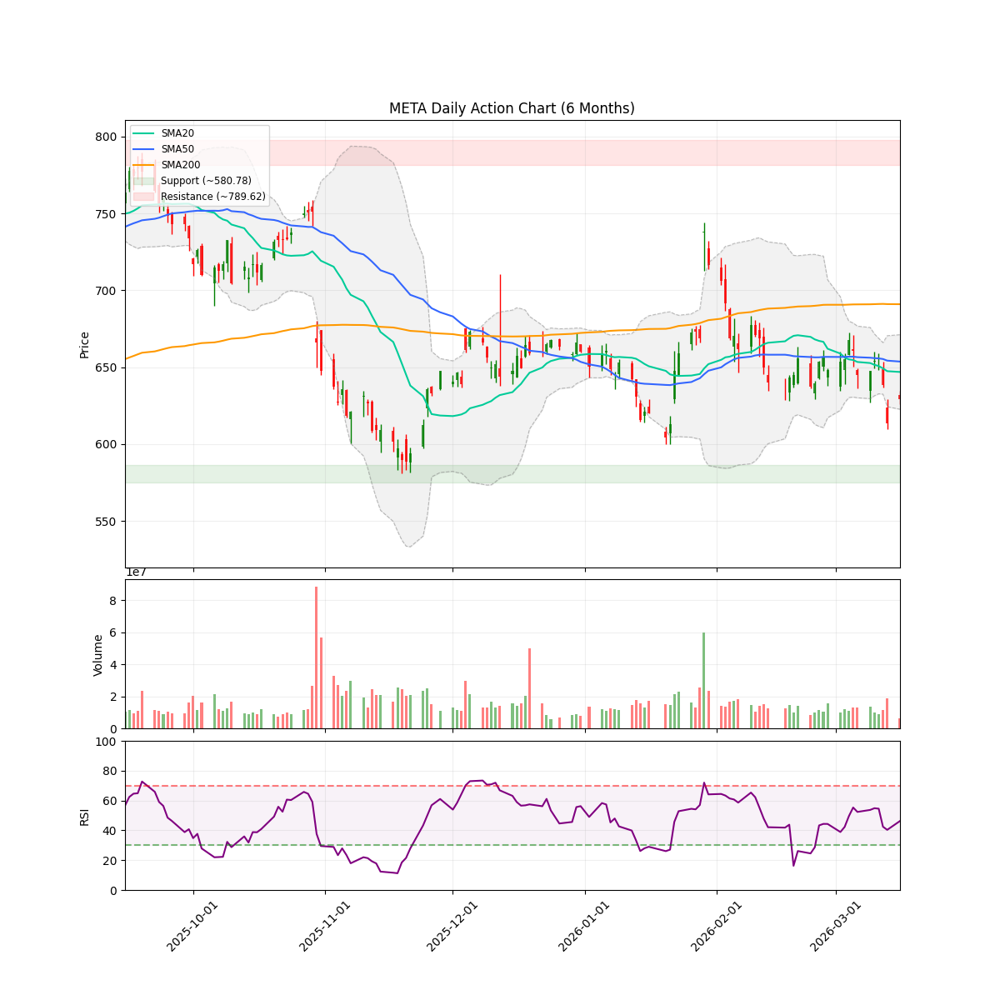
#### 研报分析

### 技术指标概览 (Technical Overview)
- **当前价格**: $629.25
- **RSI (14)**: 46.30
- **移动平均线**: SMA20: $646.88 | SMA50: $653.64 | SMA200: $690.95 (Bearish)
- **波动率**: ATR (14): 19.10 (预计周度波动: +/- $42.71)
- **关键位 (6m)**: 支撑位 $580.78 | 阻力位 $789.62
- **即时状态**: Below SMA50

你好！我是你的对冲基金研究员，专门盯着这些“叙事经济学”背后的门道。咱们坐下来，边喝咖啡边聊聊 Meta (META) 现在的局势。

说实话，现在的 Meta 就像是一个正在进行“心脏移植”的巨人——一边是疯狂烧钱的 AI 基建，另一边则是为了保住利润率而挥向自己的“手术刀”。

以下是基于 2026 年 3 月 16 日最新动态的情报分析：

---

### **1. 催化剂分类：真相与噪音**

*   **A-Tier（顶级催化剂）：大规模裁员与 AI 支出博弈**
    *   **动态：** 路透社等媒体确认 Meta 计划裁员 20% 或更多 ([Reuters](https://www.reuters.com/business/meta-shares-jump-after-reuters-report-plans-layoffs-20-or-more-2026-03-16/))。
    *   **解读：** 这是市场的“定心丸”。投资者对 2026 年高达 1350 亿美元的 AI 资本开支感到恐惧，而扎克伯格再次祭出“效率之年 2.0”的大招。裁员不仅仅是省钱，它向华尔街传递了一个信号：Meta 不会为了 AI 梦想而牺牲财务底线。
    *   **此外：** 与 Nebius 签订的 270 亿美元 AI 基础设施协议 ([Economic Times](https://www.msn.com/en-in/news/other/nbis-stock-today-rallies-after-meta-signs-27-billion-ai-infrastructure-partnership-with-nebius-heres-what-investors-need-to-know/ar-AA1YK08R)) 表明，他们的 AI 布局已经进入了“疯狂基建期”。

*   **B-Tier（重要支点）：投行背书**
    *   **动态：** 摩根士丹利重申增持，Yahoo Finance 甚至称其为“七巨头中的最佳选择”。
    *   **解读：** 尽管股价处于技术性回调，但机构的“信仰”还没崩。分析师们正在利用这次下跌来重新定价 Meta 的长期价值。

*   **C-Tier（市场噪音）：期权波动与大盘跟风**
    *   **动态：** SVI 指数显示近期期权价格相对便宜。
    *   **解读：** 这是一个波段交易者的信号，暗示市场对剧烈波动的预期正在降低，可能进入震荡磨底阶段。

---

### **2. 背离检测：好消息为何“救”不动股价？**

现在的盘面非常有意思：**Meta 正在经历一场“利好钝化”的磨难。**

即便报出了 20% 裁员这种级别的“利好”，股价虽然跳空高开（涨约 3%），但依然被压在 SMA50（653.64）和 SMA200（690.95）这两条“大山”之下。

*   **看跌枯竭还是陷阱？** RSI 只有 46.30，不算超卖，但也绝对不热。目前的走势显示，市场在等待更确凿的证据：**裁员是否真的能覆盖那 1350 亿的支出？** 
*   **结论：** 这是一个典型的**叙事真空期**。好消息阻止了崩盘，但由于价格处于 200 日均线下方，大资金目前更多是在“观察”而非“梭哈”。

---

### **3. 情感得分（Sentiment Score）：6.5 / 10**

**评分逻辑：**
*   **正向（+2.5）：** 扎克伯格再次展现了其强大的“成本控制能力”，裁员传闻是极佳的止痛药。
*   **负向（-3.5）：** 技术形态极其难看（处于 200 日线下的熊市区间），1350 亿的烧钱速度让保守型基金感到不安。
*   **预期（+7.5）：** 市场普遍认为 Meta 是七巨头中估值最合理的 AI 标的。

**整体叙事：** “一个正在努力省钱以供养昂贵梦想的科技霸主。” 情绪正处于从“恐慌”转向“重新审视”的转折点。

---

### **4. 市场脉动：老兵的私房话**

“朋友，现在的 Meta 就像一个在健身房疯狂挥汗的重量级拳击手。他在节食（裁员），但他买的补剂（AI 基建）实在太贵了。629 美元的价格距离 6 个月低点 580 美元并不远，如果股价能守住 600-610 美元这个区间，配合裁员消息的进一步坐实，这可能是一个经典的‘利空出尽’买点。但记住，**在它站回 SMA50（653.64）之前，所有的上涨都只能看作是‘死猫跳’或者反弹，而不是反转。**”

---

### **5. 关键情报总结**

*   **逻辑得分：** **6.5**（叙事转暖，但技术面仍在挣扎）。
*   **关键新闻引用：** 
    *   [Reuters] 关于 20% 裁员计划的报道，这是目前股价的核心支撑。
    *   [The Economic Times] 与 Nebius 的 270 亿美元合作，揭示了烧钱的去向。
*   **下一个重大日期：** **2026 年 4 月下旬（预估财报季）**。
    *   *注：虽然具体日期未完全定死，但通常在 4 月底。那将是决定 Meta 是重回 700 美元还是跌向 500 美元的“审判日”。*

**操作策略建议：** 关注 630 美元的争夺。如果日线收盘能站稳 650 美元，叙事将正式从“缩减成本”转向“增长加速”。
#### 近期新闻与事件
- **[Reuters]** [Meta shares jump after Reuters report on plans for layoffs of 20% or more](https://www.reuters.com/business/meta-shares-jump-after-reuters-report-plans-layoffs-20-or-more-2026-03-16/)
- **[Investing.com]** [Meta stock gains on report of possible 20% workforce cuts to offset AI costs](https://www.investing.com/news/stock-market-news/meta-stock-gains-on-report-of-possible-20-workforce-cuts-to-offset-ai-costs-4561878)
- **[CNBC on MSN]** [Meta stock climbs nearly 3% on report of planned layoffs to offset AI spending](https://www.msn.com/en-us/money/companies/meta-stock-climbs-nearly-3-on-report-of-planned-layoffs-to-offset-ai-spending/ar-AA1YJcMS?ocid=BingNewsVerp)
- **[Schaeffer's Investment Research]** [Meta Platforms Stock Rises Amid Nebius Partnership, Layoff Rumors](https://www.schaeffersresearch.com/content/news/2026/03/16/meta-platforms-stock-rises-amid-nebius-partnership-layoff-rumors)
- **[The Economic Times on MSN]** [NBIS stock today rallies after Meta signs $27 billion AI infrastructure partnership with Nebius - here's what investors need to know](https://www.msn.com/en-in/news/other/nbis-stock-today-rallies-after-meta-signs-27-billion-ai-infrastructure-partnership-with-nebius-heres-what-investors-need-to-know/ar-AA1YK08R?ocid=BingNewsVerp)

---

### MSFT
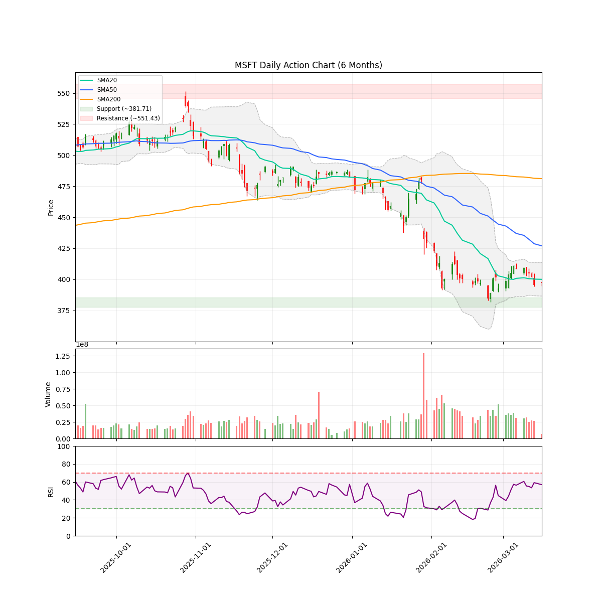
#### 研报分析

### 技术指标概览 (Technical Overview)
- **当前价格**: $396.98
- **RSI (14)**: 56.99
- **移动平均线**: SMA20: $400.03 | SMA50: $426.98 | SMA200: $481.13 (Bearish)
- **波动率**: ATR (14): 8.56 (预计周度波动: +/- $19.14)
- **关键位 (6m)**: 支撑位 $381.71 | 阻力位 $551.43
- **即时状态**: Below SMA50

你好！来，坐下喝杯咖啡。咱们聊聊这位曾经的“AI领头羊”——微软（MSFT）。

如果你最近盯着屏幕看，可能会觉得背脊发凉。就在不久前，微软还是市场的宠儿，大家觉得它会靠着 OpenAI 一路冲向云端。但现在？它正经历一场从神坛跌落的阵痛。

这是我对微软（MSFT）当前“叙事经济学”的深度审计报告：

### 1. 催化剂分类报告 (Catalyst Categorization)

我们要分清哪些是真金白银的变动，哪些只是媒体在敲边鼓。

*   **A-Tier (核心催化剂)：即将到来的财报与AI支出回报率 (ROI)**
    *   目前市场最担心的不是微软能不能赚钱，而是它烧了那么多钱买芯片，**利润什么时候能兑现？** 雅虎财经提到的“AI支出质疑”是决定股价能否重回 500 美元的唯一钥匙。
*   **B-Tier (行业与机构动向)：机构的“抄底辩论”**
    *   Forbes 和 Insider Monkey 都在讨论“现在是不是买点”。这种机构级别的心理博弈属于 B 级。当这些大佬开始讨论“价值”而非“增长”时，说明风向变了，大家在寻找安全垫。
*   **C-Tier (杂讯与小波段)：期权套利机会与小众研报**
    *   关于 $4000 的期权机会或是 Substack 上的看涨小作文，这些属于噪音。它们能提供短期流动性，但改变不了大趋势。

### 2. 背离检测：好消息里的“陷阱”还是“黄金坑”？

目前的盘面非常有趣，也非常残酷。
*   **叙事背离：** 媒体还在说它是“2026年最安全的AI股”（见 AOL 报道），甚至有人喊着“历史规律会重演”。但在技术面上，股价已经杀破了 SMA200（481.13），目前在 396.98 震荡。
*   **我的诊断：** 这不是“利好出尽”，而是**“信仰重塑”**。市场正在惩罚那些只有愿景、没有即时利润支撑的溢价。当股价在利好研报轰炸下依然止不住跌势时，说明主流资金正在进行“去杠杆”和“风险规避”。

### 3. 情绪审计报告：巨人的“中年危机”

*   **情绪评分 (Logic Score)：4.5 / 10**
    *   **现状：** 处于“怀疑与消沉”阶段。
    *   **解读：** 现在的微软，像是一个背负了太多期望的长跑冠军，跑得有点喘。RSI 56.99 显示虽然没有超卖，但也完全没有反弹的动能。市场现在的逻辑很简单：**“别跟我谈未来，给我看现金流。”**

### 4. 资深分析师视角：这场戏怎么演？

老伙计，现在的微软不是在走下降通道，它是在**“杀估值”**。

从 551 美元的高点滑落到 396 美元，这 15% 以上的跌幅已经让很多追高 AI 浪潮的散户洗出了局。SMA20、50、200 全线压制，这在技术上是标准的中期熊市形态。

**但是（这是一个重要的“但是”）：**
大家都在问“现在是不是买点”，说明贪婪的心还没死透。真正的底部往往出现在没人写这种文章的时候。目前 381.71 的 6 个月低点是最后的防线。如果守不住，那就是系统性溃败；如果能在这里横盘，那就是在筑“黄金坑”。

### 5. 关键参考与节点

*   **引用证据：**
    *   *Forbes* (2026-03-13) 提出的“结构性问题还是风险规避”是目前的核心矛盾。 [链接](https://www.forbes.com/sites/greatspeculations/2026/03/13/down-15-is-microsoft-stock-worth-buying-now/)
    *   *Yahoo Finance* 指出的 AI 支出疑问是导致本次回撤的导火索。 [链接](https://finance.yahoo.com/news/microsoft-stock-correction-created-4k-153417503.html)
*   **下一个大日子 (Next Major Date)：**
    *   **2026年4月下旬 (预计财报发布日)**：这将是微软的“审判日”。如果 Copilot 的转化率不能让华尔街尖叫，这股跌势可能还没到头。

**总结建议：**
别急着接飞刀。现在的微软是在“挤泡沫”。等它在 380-400 之间磨出个像样的平台，且 SMA20 开始走平的时候，才是我们重新入场书写新叙事的时候。

**情绪得分：4.5 (观望为上，等待信仰归位)**
#### 近期新闻与事件
- **[Insider Monkey]** [Is Microsoft Corporation (MSFT) A Good Stock To Buy Now?](https://www.msn.com/en-us/money/other/is-microsoft-corporation-msft-a-good-stock-to-buy-now/ar-AA1YGu3o)
- **[Yahoo Finance]** [Is Microsoft Stock a Buy Now?](https://finance.yahoo.com/news/microsoft-stock-buy-now-111700988.html)
- **[Forbes]** [Microsoft Stock: What Could Ignite The Next Rally?](https://www.forbes.com/sites/greatspeculations/2026/03/13/microsoft-stock-what-could-ignite-the-next-rally/)
- **[Forbes]** [Down 15%, Is Microsoft Stock Worth Buying Now?](https://www.forbes.com/sites/greatspeculations/2026/03/13/down-15-is-microsoft-stock-worth-buying-now/)
- **[AOL]** [Here's Why Microsoft Is Still the Safest AI Stock You Can Own in 2026](https://www.aol.com/finance/heres-why-microsoft-still-safest-180035443.html)

---

### MU
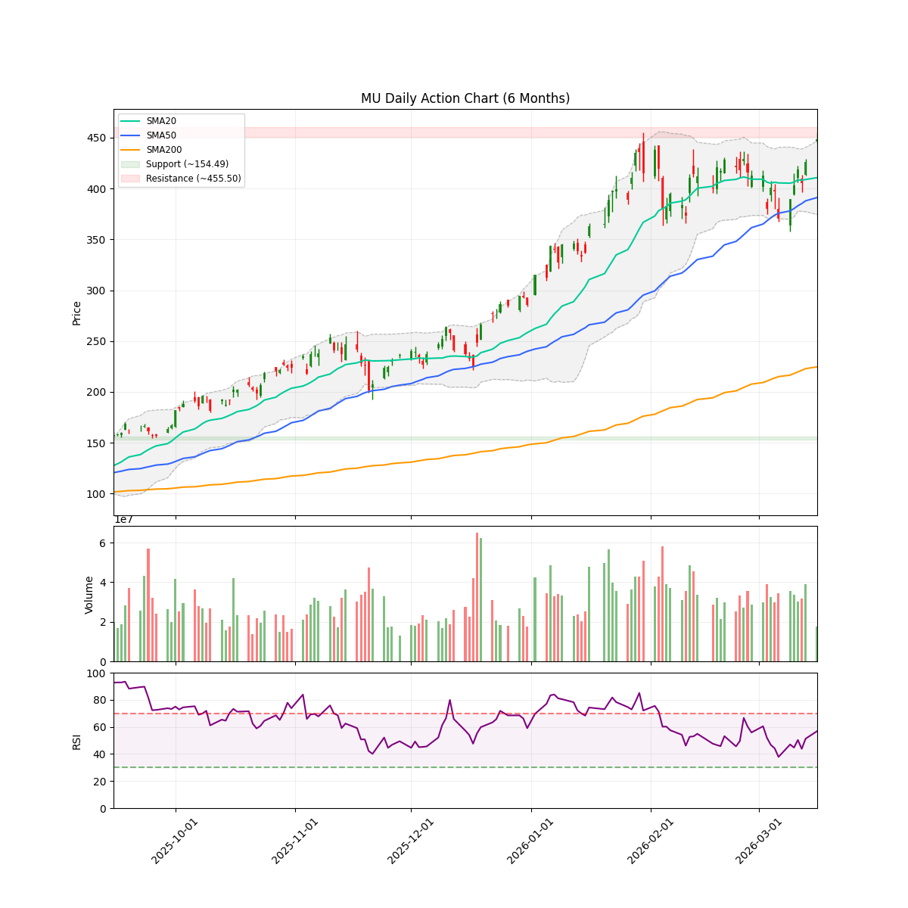
#### 研报分析

### 技术指标概览 (Technical Overview)
- **当前价格**: $448.11
- **RSI (14)**: 56.94
- **移动平均线**: SMA20: $410.67 | SMA50: $391.13 | SMA200: $224.65 (Bullish)
- **波动率**: ATR (14): 25.80 (预计周度波动: +/- $57.69)
- **关键位 (6m)**: 支撑位 $154.49 | 阻力位 $455.50
- **即时状态**: Above SMA50

# 情绪审计报告：美光科技 (MU) —— 存储之王的“AI封神之路”

**审计日期：** 2026年03月16日  
**分析师：** 叙事经济学研究员 (Hedge Fund Associate)  
**当前股价：** 448.11  
**逻辑评分：** 8.7/10 (强劲牛市叙事，但面临“预期过高”的压力测试)

---

### 1. 叙事背景：当存储器不再是“周期品”，而是“AI燃料”

如果把 AI 革命比作一场淘金热，那么 GPU 是铲子，而美光（MU）提供的 HBM（高带宽内存）就是矿工们必须喝的水。现在的市场叙事已经完全脱离了过去那种“存储芯片涨价-跌价”的枯燥循环，取而代之的是一种**“资源稀缺性”**的疯狂。

美光目前的走势就像是一台高速运转的离心机。随着 HBM 产能被爆出**直到 2027 年都已经售罄** ([Blockonomi](https://blockonomi.com/micron-mu-stock-soars-on-record-price-targets-as-memory-demand-explodes/))，市场对它的看法已经从“半导体公司”进化到了“AI 核心基建设施”。这种情绪在财报前夕被推向了顶峰。

---

### 2. 催化剂分类 (Catalyst Hierarchy)

#### **A-Tier (核心引擎)：**
*   **HBM 售罄神话：** 产能排到 2027 年 ([Blockonomi](https://blockonomi.com/micron-mu-stock-soars-on-record-price-targets-as-memory-demand-explodes/))。这直接消除了投资者对存储行业周期性波动的恐惧。
*   **Q2 财报生死考：** 本周即将发布的第二季度财报是决定 MU 能否站上 $500 大关的关键 ([Asianet Newsable](https://www.msn.com/en-in/money/general/micron-stock-tops-nasdaq-100-weekly-gainers-amid-memory-chip-rally-q2-report-this-week-is-the-next-test/ar-AA1YHuQr?ocid=BingNewsVerp))。
*   **华尔街“认错式”调价：** 分析师给出了 $500 的目标价，这种破纪录的预期正在诱发空头回补。

#### **B-Tier (行业共振)：**
*   **纳指领涨者：** MU 已成为纳斯达克 100 指数的周涨幅冠军，这种“明星效应”会吸引更多动量资金流入 ([Asianet Newsable](https://www.msn.com/en-in/money/general/micron-stock-tops-nasdaq-100-weekly-gainers-amid-memory-chip-rally-q2-report-this-week-is-the-next-test/ar-AA1YHuQr?ocid=BingNewsVerp))。
*   **AI 电力关联叙事：** 印度电力股受追捧暗示了全球数据中心对基础设施的饥渴 ([Mint](https://www.livemint.com/market/stock-market-news/fii-investment-power-sector-energy-stocks-ai-data-centre-peak-electricity-demand-11773632072796.html))，这侧面印证了美光下游需求的确定性。

#### **C-Tier (外部噪音)：**
*   **地缘政治博弈：** 伊朗局势的波动虽然让油价震荡，但目前来看对科技股仅表现为短暂的“避险情绪”，尚未伤及半导体供应链核心 ([Seeking Alpha](https://www.msn.com/en-us/money/top-stocks/stock-index-futures-move-higher-while-oil-slides-as-focus-remains-on-iran-conflict/ar-AA1YJj0Q?ocid=BingNewsVerp))。

---

### 3. 背离检测：强势中的“恐高症”？

*   **技术面观察：** MU 目前报收 448.11，距离 6 个月高点 455.50 仅一步之遥。SMA20 (410.67) 远在脚下，说明短期情绪极其亢奋。
*   **RSI 警示：** 56.94 的 RSI 依然处于“舒适区”，这意味着虽然涨得快，但还没到“失去理智”的超买地步。
*   **心理博弈：** 市场正在期待一个“Blowout”式的财报。这种“股价先行、业绩后补”的走势，最怕的是财报即便“不错”但“没有惊喜”。如果财报后股价下挫，那将是典型的“利好出尽”陷阱。

---

### 4. 逻辑评分深度解析：8.7/10

*   **为什么是 8.7？** 
    *   **核心驱动力极强 (+5.0)：** 产能售罄到 2027 年是硬逻辑，无法反驳。
    *   **动量一致性 (+2.5)：** 均线系统多头排列，属于“强者恒强”的典型。
    *   **叙事吸引力 (+1.5)：** $500 的目标价给市场留下了充分的想象空间。
    *   **扣分项 (-0.3)：** 极高的业绩预期（High Whisper Number）意味着容错率变低，任何不及预期的指引都会引发剧烈波动。

---

### 5. 结论与后续关注

美光现在正处于一个“不可阻挡的看涨周期”。它不再仅仅是跟随行业波动的波浪，而是自己在制造海啸。只要本周的 Q2 财报能够证实 HBM 的利润率确实如传闻般惊人，455.50 的阻力位将瞬间化为齑粉。

*   **Logic Score:** **8.7 / 10**
*   **关键新闻来源：**
    1.  [Blockonomi: Micron (MU) 产能售罄至2027年](https://blockonomi.com/micron-mu-stock-soars-on-record-price-targets-as-memory-demand-explodes/)
    2.  [IBTimes: AI驱动HBM需求推动股价冲向$426以上](https://www.ibtimes.com/micron-technology-shares-jump-5-42613-ai-driven-hbm-demand-fuels-rally-ahead-earnings-3799262)
    3.  [Asianet: MU 成为纳指周涨幅王，Q2财报是下一考验](https://www.msn.com/en-in/money/general/micron-stock-tops-nasdaq-100-weekly-gainers-amid-memory-chip-rally-q2-report-this-week-is-the-next-test/ar-AA1YHuQr?ocid=BingNewsVerp)

*   **下一个关键日期：**
    *   **2026年3月中旬 (本周)：** **Q2 财报发布日**（这是决定 MU 是冲向 $500 还是回测 $410 支撑位的终极审判）。
#### 近期新闻与事件
- **[Asianet Newsable on MSN]** [Micron stock tops Nasdaq 100 weekly gainers amid memory chip rally: Q2 report this week is the next test](https://www.msn.com/en-in/money/general/micron-stock-tops-nasdaq-100-weekly-gainers-amid-memory-chip-rally-q2-report-this-week-is-the-next-test/ar-AA1YHuQr?ocid=BingNewsVerp)
- **[Mint]** [Global risk sparks $497 million flight to India power stocks by FIIs in February](https://www.livemint.com/market/stock-market-news/fii-investment-power-sector-energy-stocks-ai-data-centre-peak-electricity-demand-11773632072796.html)
- **[Seeking Alpha on MSN]** [Stock index futures move higher, while oil slides as focus remains on Iran conflict](https://www.msn.com/en-us/money/top-stocks/stock-index-futures-move-higher-while-oil-slides-as-focus-remains-on-iran-conflict/ar-AA1YJj0Q?ocid=BingNewsVerp)
- **[The Motley Fool on MSN]** [Meet the monster stock that continues to crush the market](https://www.msn.com/en-us/money/general/meet-the-monster-stock-that-continues-to-crush-the-market/ar-AA1YFDAe?ocid=BingNewsVerp)
- **[Barchart on MSN]** [Stocks set to open higher as bond yields fall, Fed meeting and Middle East conflict in focus](https://www.msn.com/en-us/money/markets/stocks-set-to-open-higher-as-bond-yields-fall-fed-meeting-and-middle-east-conflict-in-focus/ar-AA1YK6Nq?ocid=BingNewsVerp)

---

### NVDA
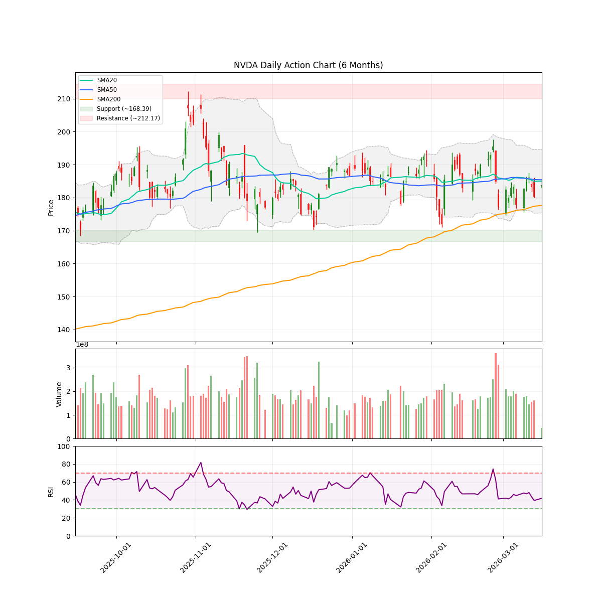
#### 研报分析

### 技术指标概览 (Technical Overview)
- **当前价格**: $183.81
- **RSI (14)**: 41.82
- **移动平均线**: SMA20: $185.00 | SMA50: $185.40 | SMA200: $177.62 (Bullish)
- **波动率**: ATR (14): 6.17 (预计周度波动: +/- $13.81)
- **关键位 (6m)**: 支撑位 $168.39 | 阻力位 $212.17
- **即时状态**: Below SMA50

你好！来，坐下喝杯咖啡。咱们聊聊现在的英伟达（NVDA）。

今天的日期是 2026年3月16日。如果你盯着屏幕看，现在的 NVDA 就像是一个在派对连续狂欢了三天三夜后的摇滚巨星——虽然底子还在，但显然有点“审美疲劳”，正处于一个微妙的、甚至有点磨人的“休眠期”。

以下是我为你整理的**情绪审计报告**：

---

### 1. 催化剂分类 (Catalyst Categorization)

我们要把噪音和真正的信号分开：

*   **A-Tier（顶级催化剂）：GTC 2026 大会 (今日开启)**
    *   **详情**：这是“AI 界的伍德斯托克”。黄仁勋（Jensen Huang）今天就要登台。市场目前处于极度的“预期饥渴”状态。正如 [SiliconValley.com] 所说，普通的利好已经没用了，市场在等一个能“惊掉下巴”的意外惊喜来打破沉闷。
*   **B-Tier（二线动力）：华尔街大行的集体“护盘”**
    *   **详情**：富国银行（Wells Fargo）和美银（Bank of America）在 GTC 前夕转为看涨，美银甚至维持 300 美元的目标价（[Blockonomi]）。这种机构背书为股价提供了一个坚实的“心理底价”。
*   **C-Tier（市场杂音）：散户的动摇与对比**
    *   **详情**：像 [The Motley Fool] 讨论“是否该忘记英伟达去买其他 AI 股”，这种言论通常出现在股价回调期，反映了散户的耐心正在耗尽。这反而是洗掉“不坚定筹码”的好时机。

---

### 2. 背离检测 (Divergence Detection)

**现状：利好麻木与技术面承压。**

目前的 NVDA 处在一个典型的“利好不出货，但也不涨”的尴尬位置。
*   **价格与均线**：股价（183.81）目前尴尬地压在 SMA50（185.40）下方。这意味着中短期趋势处于“亚健康”状态。
*   **情绪背离**：尽管大行喊出了 300 美元的天价（近 60% 的上涨空间），但市场并没有立刻买单。二月初财报后的抛售阴影还没散去。
*   **诊断**：这不是系统性崩溃，而是**“看涨衰竭”**后的蓄势。RSI 41.82 告诉我们，它还没跌透，但也绝对没有过热。目前的阴跌更像是为了迎接 GTC 惊喜而进行的“深蹲”。

---

### 3. 叙事分析：这是一个“陷阱”吗？

从叙事经济学角度看，目前的 NVDA 不是陷阱，而是一个**“高门槛的考场”**。

前两年，英伟达只要呼吸就能涨。但现在，叙事变了：市场不再满足于“卖铲子赚钱”，市场想看到的是“下一代计算架构的具体交付”和“主权 AI 的爆发”。
现在的股价沉闷，本质上是市场在问老黄：“你还能拿出比之前更厉害的东西吗？”

---

### 4. 情绪评分 (Logic Score)

# **7.2 / 10**

> **逻辑依据**：基本面依然坚如磐石（机构目标价 300 美元），但技术面正处于“磨底”阶段。7.2 分代表：这是一个**“高胜率、慢节奏”**的阶段。风险在于 GTC 如果只是陈词滥调，股价可能回踩 168.39 美元的支撑位；机会在于，只要有一点超预期的火星，这颗干透了的稻草堆就会瞬间复燃。

---

### 5. 关键信息总结

*   **当前价格**: 183.81
*   **关键支撑位**: 168.39 (六个月低点)
*   **关键阻力位**: 185.40 (SMA50 - 站稳此处才是真正的反攻信号)
*   **下一个重大日期**: 
    *   **今日 (2026-03-16)**: GTC 2026 盛大开幕（全周关注）。
    *   **预计财报日**: 2026年5月下旬。

**老兵建议**：
不要在 GTC 演讲的第一分钟就冲进去追高。看清老黄发布的硬件参数是否真的具有跨时代意义。如果股价能借此放量收复 185.40 美元，那这波“沉睡”就宣告结束了。

**引用来源**:
- [SiliconValley.com]: *Nvidia event needs a surprise to jolt stock* (2026-03-16)
- [Blockonomi]: *Major Banks Turn Bullish Before GTC 2026* (2026-03-15)
- [Yahoo Finance]: *Nvidia Stock Forecast: $300 in 2026?* (2026-03-02)
#### 近期新闻与事件
- **[SiliconValley.com]** [Nvidia event needs a surprise to jolt stock out of its slumber](https://www.siliconvalley.com/2026/03/16/nvidia-event-needs-a-surprise-to-jolt-stock-out-of-its-slumber/)
- **[Investor's Business Daily on MSN]** [Stock market today: Dow jumps as oil prices retreat; chip plays shine as Nvidia, Meta rally (live coverage)](https://www.msn.com/en-us/money/markets/stock-market-today-dow-jumps-as-oil-prices-retreat-chip-plays-shine-as-nvidia-meta-rally-live-coverage/ar-AA1YK9ea?ocid=BingNewsVerp)
- **[The Motley Fool on MSN]** [Should You Forget Nvidia and Buy 2 Artificial Intelligence (AI) Stocks Instead?](https://www.msn.com/en-us/money/topstocks/should-you-forget-nvidia-and-buy-2-artificial-intelligence-ai-stocks-instead/ar-AA1YHVpI?ocid=BingNewsVerp)
- **[Blockonomi]** [Nvidia (NVDA) Stock: Major Banks Turn Bullish Before GTC 2026 Conference](https://blockonomi.com/nvidia-nvda-stock-major-banks-turn-bullish-before-gtc-2026-conference/)
- **[The Motley Fool]** [Best Artificial Intelligence (AI) Stock to Buy Now: Nvidia vs. Palantir](https://www.msn.com/en-us/money/savingandinvesting/best-artificial-intelligence-ai-stock-to-buy-now-nvidia-vs-palantir/ar-AA1YG6Ag)

---

### PLTR
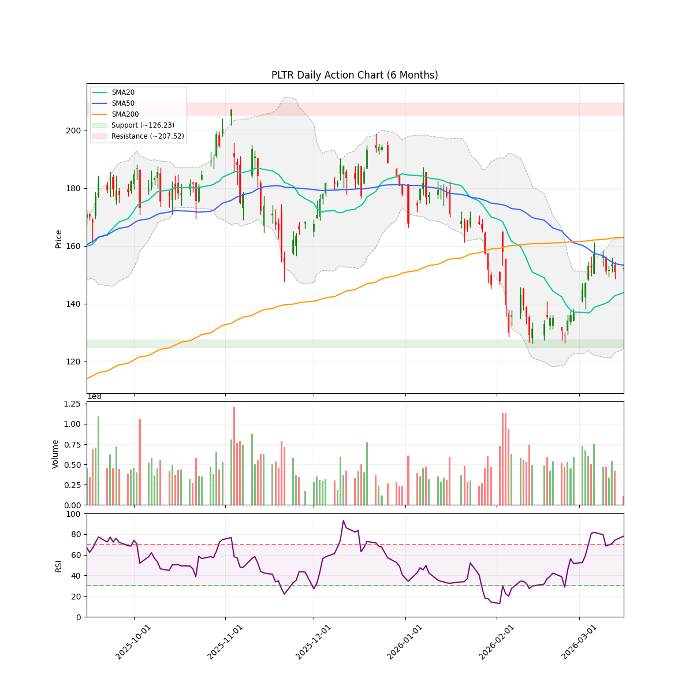
#### 研报分析

### 技术指标概览 (Technical Overview)
- **当前价格**: $152.05
- **RSI (14)**: 78.04
- **移动平均线**: SMA20: $143.82 | SMA50: $153.34 | SMA200: $162.95 (Bearish)
- **波动率**: ATR (14): 6.44 (预计周度波动: +/- $14.40)
- **关键位 (6m)**: 支撑位 $126.23 | 阻力位 $207.52
- **即时状态**: Below SMA50

# Palantir (PLTR) 情绪审计报告：战争迷雾中的“叙事陷阱”还是“深蹲起跳”？

**审计日期：** 2026年3月16日
**分析师：** 叙事经济学研究组

---

### 1. 核心叙事：战争、AI 与“聪明的钱”在撤退

兄弟，坐稳了。现在的 Palantir (PLTR) 就像是一部好莱坞大片的转折点：背景是伊朗局势的硝烟，主角是 Alex Karp 在中东展示他的“AI 秘密武器”。表面上看，股价正在从低位暴力反弹（近期大涨 12%），但如果你仔细闻闻，这股热闹劲里夹杂着几分不安。

目前的叙事非常割裂：**一方面是地缘政治催生的“战争机器”刚需，另一方面却是创始人 Peter Thiel 和女股神 Cathie Wood 正在悄悄离场。** 市场在欢呼，但真正的庄家似乎在借着利好发货。

---

### 2. 催化剂分级 (Catalyst Categorization)

*   **A-Tier (核心驱动力):**
    *   **商业模式的质变：** Q4 财报显示商业客户增长高达 137% [Blockonomi]。这不再仅仅是一家靠政府订单吃饭的公司，它的 AI 平台正在深刻渗透到企业端。这是支撑它 150 美元价格的核心骨架。
    *   **中东实战验证：** CEO Alex Karp 直接披露 AI 技术在敏感地区的应用细节，将 PLTR 塑造成了数字时代的“军工霸主”。

*   **B-Tier (行业顺风):**
    *   **对冲基金入场：** 尽管 Cathie Wood 减持，但 Insider Monkey 报告显示持有 PLTR 的对冲基金数量从 81 家增加到 89 家。主力资金正在洗牌，而不是纯粹撤离。
    *   **AI 技术加速论：** 摩根士丹利强调 AI 进化速度超过企业适应速度，这让 PLTR 的先发优势更显珍贵。

*   **C-Tier (杂音与花边):**
    *   **体育博彩切入点：** 虽有新闻提到 PLTR 涉及博彩数据 [Yahoo Finance]，但这更像是华尔街为了维持热度找的新理由，对基本面影响微乎其微。

---

### 3. 背离检测：在狂欢中嗅到“陷阱”的味道 (Divergence Detection)

**这是最值得玩味的地方。** 

*   **技术面的尴尬：** 股价目前报 152.05 美元，虽然刚完成 12% 的反弹，但它依然**运行在 50 日均线 (153.34) 和 200 日均线 (162.95) 之下**。在老练的猎人眼里，这叫“熊市反弹”，而非趋势反转。
*   **利好下的“熊性疲劳”？** 并不尽然。虽然伊朗战争的利好把股价推高，但 **RSI 已经飙升到了 78.04**。这是一个极度超买的信号。
*   **信号灯警告：** 最致命的背离来自创始人——Peter Thiel 在利好满天飞时抛售了 2.89 亿美元股票 [storage.googleapis.com]。当一个公司的灵魂人物在股价反弹时选择“套现离场”，你必须问问自己：他是不是看到了我们没看到的玻璃天花板？

---

### 4. 情绪评分 (Logic Score)

**得分：5.5 / 10**

*   **理由：** 叙事上给到了 9 分（战争、AI、业绩爆发），但资金流向和技术面只给到了 2 分。PLTR 目前处于一种“高位博弈”状态。短期动能被地缘政治点燃，极具诱惑力，但 150 倍的远期市盈率和创始人的巨额减持，说明当前的上涨更像是一个**华丽的流动性陷阱**。它需要站稳 163 美元（SMA200）才能证明这不是一次“死猫跳”。

---

### 5. 资深老兵的碎碎念 (Veteran's Insight)

“朋友，别被那些关于‘中东秘密武器’的标题党冲昏了头。PLTR 的基本面确实在变好，那 137% 的商业增长不是闹着玩的。但是，现在的技术指标在尖叫。RSI 冲到 78，价格却还在长期均线下面压着，这说明现在的买盘大多是短线投机客在追逐战争题材。

如果你已经仓位很重，现在是减仓、把利润装进口袋的好时机；如果你想冲进去，建议等它回踩 140 美元附近，或者等它真正突破并站稳 163 美元后再说。记住，Peter Thiel 卖出的那 2.9 亿，总得有人去接盘。”

---

### 6. 下一个关键节点

*   **下一次财报日 (预估):** **2026年5月上旬** (具体日期有待官方确认)。
*   **关键观察：** 需关注 3 月底机构持仓披露，看是否有更多大型共同基金接过 Cathie Wood 和 Peter Thiel 抛出的筹码。

--- 
*注：引用资料来源于 Yahoo Finance, Insider Monkey, Blockonomi 等近期（2026年3月）报道。*
#### 近期新闻与事件
- **[Yahoo Finance]** [Why I Wouldn't Dare Buy Palantir Stock's Latest Bounce](https://finance.yahoo.com/news/why-wouldn-t-dare-buy-131119910.html)
- **[Insider Monkey]** [Cathie Wood 2026 Portfolio: 5 Best Stocks to Buy](https://www.insidermonkey.com/blog/cathie-wood-2026-portfolio-5-best-stocks-to-buy-1716197/)
- **[Insider Monkey]** [15 AI Stocks That Are Quietly Making Investors Rich](https://www.msn.com/en-us/money/news/15-ai-stocks-that-are-quietly-making-investors-rich/ar-AA1YEtcc)
- **[Blockonomi]** [Palantir (PLTR) Stock Surges 12% After CEO Details Middle East AI Operations](https://blockonomi.com/palantir-pltr-stock-surges-12-after-ceo-details-middle-east-ai-operations/)
- **[storage.googleapis.com]** [Palantir stock alert: Peter Thiel dumps $289M! What now? #barchart #stocks #trading #pltr](https://www.msn.com/en-us/money/top-stocks/palantir-stock-alert-peter-thiel-dumps-289m-what-now-barchart-stocks-trading-pltr/vi-AA1XQagR)

---

### TSM
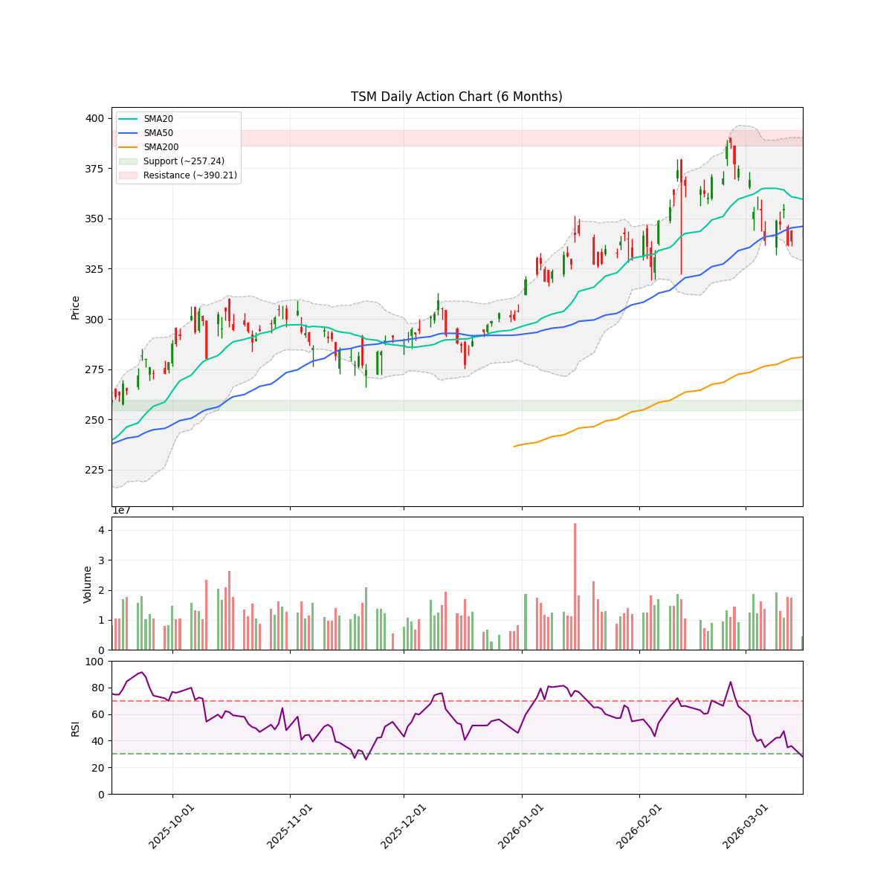
#### 研报分析

### 技术指标概览 (Technical Overview)
- **当前价格**: $341.25
- **RSI (14)**: 27.91
- **移动平均线**: SMA20: $359.57 | SMA50: $346.05 | SMA200: $281.07 (Bullish)
- **波动率**: ATR (14): 12.64 (预计周度波动: +/- $28.25)
- **关键位 (6m)**: 支撑位 $257.24 | 阻力位 $390.21
- **即时状态**: Below SMA50

你好！很高兴能坐下来和你聊聊台积电（TSM）。现在是2026年3月16日，咱们先撇开那些冰冷的财务报表，来感受一下市场的脉搏。

目前的 TSM 就像是一个明明身强力壮、手里攥着未来五年订单的“巨人”，却被突如其来的地缘政治冷风吹得打了个喷嚏。虽然股价在 341.25 美元附近徘徊，跌破了 50 日均线，但如果你仔细观察那不到 28 的 RSI 指数，你会发现：**市场可能正在制造一个巨大的“叙事陷阱”。**

以下是我的深度拆解：

### 1. 催化剂分级 (Catalyst Tiering)

我们将近期的信息流进行权重剥离，看看什么是真正的“干货”，什么是“噪音”：

*   **A-Tier（核心驱动力）**
    *   **Bernstein 的强力背书：** Bernstein 将目标价上调至 2,200 台币，并预测 2026 年 AI 营收占比将突破 20% [Blockonomi]。这不仅仅是上调评级，这是对 TSM “AI 基建之王”地位的终极确认。
    *   **450 亿美元扩张计划：** 如此规模的资本开支意味着 TSM 对未来的需求极其笃定。在半导体行业，产能就是硬通货。
    *   **2 月份强劲营收数据：** 3 月 10 日披露的 2 月营收数据证明，尽管宏观环境波动，其吸金能力依然稳健 [Yahoo Finance]。

*   **B-Tier（行业共振）**
    *   **Zacks 强力买入评级：** Zacks 将其列为 Rank #1，反映了分析师一致看好其盈利预期 [Yahoo Finance UK]。
    *   **英伟达 (Nvidia) 的溢出效应：** Blackwell 芯片需求依然供不应求，作为背后唯一的“打铁匠”，TSM 的基本盘稳如泰山 [MarketWatch]。

*   **C-Tier（短期噪音）**
    *   **AMD vs TSM 的对比文章：** 这种对比更像是给散户看的入门指南，对机构定价权影响微乎其微 [24/7 Wall St.]。
    *   **小众媒体的“百万富翁”推荐：** 情绪拉动大于实际估值参考 [The Motley Fool]。

---

### 2. 背离监测：好消息里的“倒春寒” (Divergence Detection)

这是一个非常有趣的现象：**一边是 Bernstein 和 Zacks 的疯狂点赞，一边是股价跌破 SMA50 并触发 RSI 超卖（27.91）。**

为什么？答案就在 3 月 12 日的那场大跌 [Benzinga]。美-以-伊冲突引发了市场对芯片关键材料供应中断的非理性恐慌。
*   **诊断：** 这是典型的“利好叙事”与“宏观避险”的对撞。由于股价跌破了短期（SMA20）和中期（SMA50）支撑，但仍远高于 200 日均线（281.07），这说明**长线牛市逻辑并未破坏，目前的下跌更多是由于地缘政治引发的情绪性踩踏。** RSI 低于 30 通常预示着空头动能即将耗尽，现在更像是一个“压弹簧”的过程。

---

### 3. 情绪评分 (Sentiment Logic Score)

#### **逻辑评分：7.8/10**

*   **理由：** 如果只看基本面，我会给 9.5 分；但地缘政治风险是目前挥之不去的阴影。目前 TSM 处于**“过度惩罚”**阶段。
*   **叙事结论：** 这不是系统性崩盘（Systemic Failure），而是一场针对杠杆盘的**“洗盘”**。市场正在利用战争恐慌，来消化之前 83% 涨幅带来的获利盘。

---

### 4. 操盘建议与视角

现在的 TSM 就像是这间咖啡馆里最昂贵的那支豆子，虽然外面的风雨让它看起来有些冷清，但它的香味（AI 营收增长）正变得越来越浓。341.25 美元的价格已经逼近了预估的周度震荡区间下限。

如果你相信 AI 的叙事还没写到终章，那么在这个 RSI 指数跌入冰点的时刻，其实是“聪明钱”开始入场捡拾廉价筹码的时候。

---

### 5. 后续关键节点 (Next Major Date)

*   **下一次关键日期：2026 年 4 月 16 日 (预计)**
    *   **事件：** 2026 年第一季度财报发布及法说会。
    *   **关注重点：** 管理层对中东冲突影响供应链的官方表态，以及 2nm 产能爬坡的最新指引。

---

**老兵私语：** 别被那些惊悚的头条吓到，看清谁在买，看清谁在造。只要 Blackwell 的需求还没掉下来，台积电的护城河就依然深不可测。
#### 近期新闻与事件
- **[Blockonomi]** [Taiwan Semiconductor (TSM) Stock Soars 83% — Bernstein Says Rally Isn't Over Yet](https://blockonomi.com/taiwan-semiconductor-tsm-stock-soars-83-bernstein-says-rally-isnt-over-yet/)
- **[24/7 Wall St.]** [AMD vs. TSMC: Which Chip Stock Actually Delivers the Smarter Return in 2026?](https://247wallst.com/investing/2026/03/13/amd-vs-tsmc-which-chip-stock-actually-delivers-the-smarter-return-in-2026/)
- **[Yahoo Finance]** [Taiwan Semiconductor Manufacturing (TSM) Reports Feb 2026 Revenue Data](https://finance.yahoo.com/news/taiwan-semiconductor-manufacturing-tsm-reports-175744466.html)
- **[Benzinga]** [Taiwan Semiconductor stock slides Thursday: What's happening?](https://www.msn.com/en-us/money/markets/taiwan-semiconductor-stock-slides-thursday-whats-happening/ar-AA1Yvni9)
- **[The Motley Fool]** [Top 5 Unstoppable AI Stocks to Buy for 2026](https://www.msn.com/en-us/money/general/top-5-unstoppable-ai-stocks-to-buy-for-2026/ar-AA1XVLKR)

---

### VRT
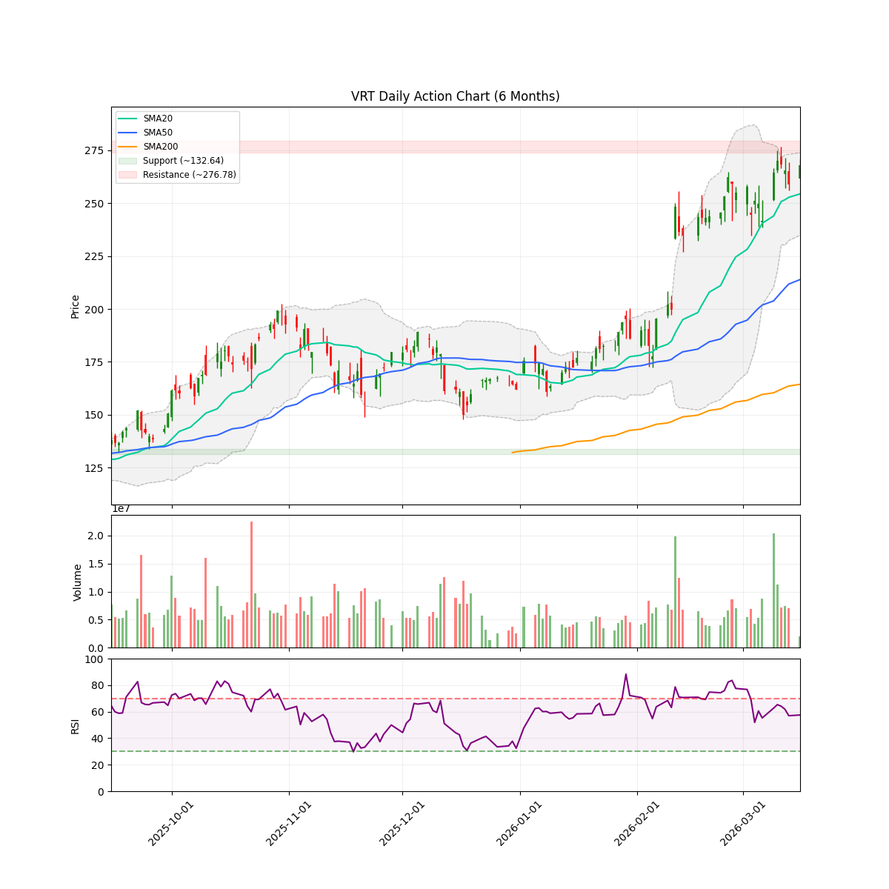
#### 研报分析

### 技术指标概览 (Technical Overview)
- **当前价格**: $267.78
- **RSI (14)**: 57.52
- **移动平均线**: SMA20: $254.41 | SMA50: $213.89 | SMA200: $164.40 (Bullish)
- **波动率**: ATR (14): 15.12 (预计周度波动: +/- $33.81)
- **关键位 (6m)**: 支撑位 $132.64 | 阻力位 $276.78
- **即时状态**: Above SMA50

# VRT 情绪审计报告：AI 革命的“散热器”——是登顶时刻还是入场哨声？

**日期：** 2026年03月16日
**分析标的：** Vertiv Holdings (VRT)
**当前价格：** 267.78 美元

---

### 1. 叙事背景：AI 时代的“水利工程”

如果说英伟达（NVIDIA）是 AI 时代的发动机，那么 Vertiv (VRT) 就是确保这台发动机不被烧毁的顶配冷却系统。在当前的叙事逻辑中，市场已经从单纯的“算力崇拜”转向了对“基础设施”的疯狂追逐。

最近的 VRT 走势就像一列不知疲倦的重载列车。即便大盘偶尔打个喷嚏，VRT 也能逆市上扬（比如 3 月 11 日标普跌而它逆势涨 2%）。这不仅仅是买盘在支撑，这是一种“信仰”的溢价——华尔街正形成一个共识：没有 Vertiv 的散热和电源管理，AI 数据中心就是一堆废铁。

---

### 2. 催化剂分级 (Catalyst Categorization)

*   **A-Tier（顶级驱动）：标普 500 指数纳入 (S&P 500 Inclusion)**
    这是目前最强劲的单一动能。VRT 即将于 3 月 23 日正式加入标普 500 指数。这不仅是地位的象征，更意味着数以百亿计的指数基金必须被动买入。这种“皇冠加冕”式的利好是推动股价冲击 276.78 美元历史高点的核心燃料。
    *引用：[Yahoo Finance - Should You Buy Vertiv Stock Before March 23?]*

*   **B-Tier（战略利好）：BYOP&C 生态系统发布**
    Vertiv 与 Generate Capital 合作推出针对数据中心的 BYOP&C (Bring Your Own Power & Cooling) 生态系统。这显示了公司正在从单纯的硬件供应商向系统集成和解决方案商转型，护城河在加深。
    *引用：[Insider Monkey - Vertiv & Generate Capital Partner]*

*   **C-Tier（市场噪音）：媒体名嘴与机构背书**
    Jim Cramer 的大加赞赏（“What a Stock, What a Company”）以及 Zacks 的持续关注。虽然这些属于“情绪放大器”，但在目前极度看涨的环境下，它们起到了很好的“火上浇油”作用。
    *引用：[Jim Cramer on Vertiv, Zacks Analysts]*

---

### 3. 背离检测与盘面解读 (Divergence Detection)

**看涨背离信号：** 
在 2026 年 3 月 11 日的交易时段，标普 500 指数下跌了 0.21%，但 VRT 却逆势收涨 2.16% 报 270.06 美元。
*   **解读：** 这种“大盘跌、我独涨”的表现是典型的**多头衰竭缺失**。说明机构投资者在指数纳入前正急于抢筹，甚至不惜在市场整体走弱时逆势加仓。

**风险提示：** 
目前 RSI 处于 57.52，尚未进入 70 以上的超买区，意味着还有冲刺空间。但要注意股价距离 SMA200 (164.40) 已经非常遥远，偏离率过大意味着一旦 3 月 23 日利好兑现，可能会出现阶段性的“利好出尽”回撤。

---

### 4. 情绪评分 (Sentiment Score): 9.2 / 10

**评价：不可阻挡的牛市周期**
目前的 VRT 处于一个近乎完美的叙事闭环中：基本面有 AI 刚需支撑，流动性有标普 500 纳入预期支撑，技术面处于健康的趋势加速期。

**逻辑分值 (Logic Score): 9.0 / 10**
*   **支持理由：** 核心逻辑在于“稀缺性”。在电力电子和高效散热领域，能满足超大规模数据中心（Hyperscale）需求的标的极少，VRT 是纯度最高的一个。

---

### 5. 总结与行动指南

VRT 目前正处于**“机构最后抢筹期”**。由于 3 月 23 日的指数纳入是确定性事件，本周（3 月 16 日 - 3 月 20 日）股价大概率会在高位宽幅震荡，并尝试突破 276.78 的阻力位。

*   **操作策略：** 不要试图在“标普 500 加入”前夕做空这头猛兽。但若股价在 3 月 23 日后出现 5%-10% 的回撤，那是由于被动资金买入完毕后的正常获利了结，而非基本面崩坏。
*   **下一关键日期：** 
    *   **2026-03-23：** 标普 500 指数纳入生效日（关键节点，注意剧烈波动）。
    *   **预计下次财报：** 4 月下旬（具体待定，需关注指引是否随 AI 需求再次上调）。

---
*声明：本报告基于市场公开数据进行叙事分析，不构成直接投资建议。市场有风险，入市需谨慎。*
#### 近期新闻与事件
- **[Insider Monkey· via Yahoo Finance]** [Jim Cramer on Vertiv Holdings: “What a Stock, What a Company”](https://finance.yahoo.com/news/jim-cramer-vertiv-holdings-stock-120640667.html)
- **[Zacks· via Yahoo Finance]** [Is Vertiv (VRT) a Buy as Wall Street Analysts Look Optimistic?](https://finance.yahoo.com/news/vertiv-vrt-buy-wall-street-133003585.html)
- **[Zacks· via Yahoo Finance]** [Is Most-Watched Stock Vertiv Holdings Co. (VRT) Worth Betting on Now?](https://finance.yahoo.com/news/most-watched-stock-vertiv-holdings-130006475.html)
- **[Insider Monkey· via Yahoo Finance]** [Vertiv Holdings (VRT), Generate Capital Partner to Launch BYOP&C Ecosystem for Data Centers](https://finance.yahoo.com/news/vertiv-holdings-vrt-generate-capital-183058772.html)
- **[StockStory· via Yahoo Finance]** [3 Big Reasons to Love Vertiv (VRT)](https://finance.yahoo.com/news/3-big-reasons-love-vertiv-201916257.html)

---

### VST
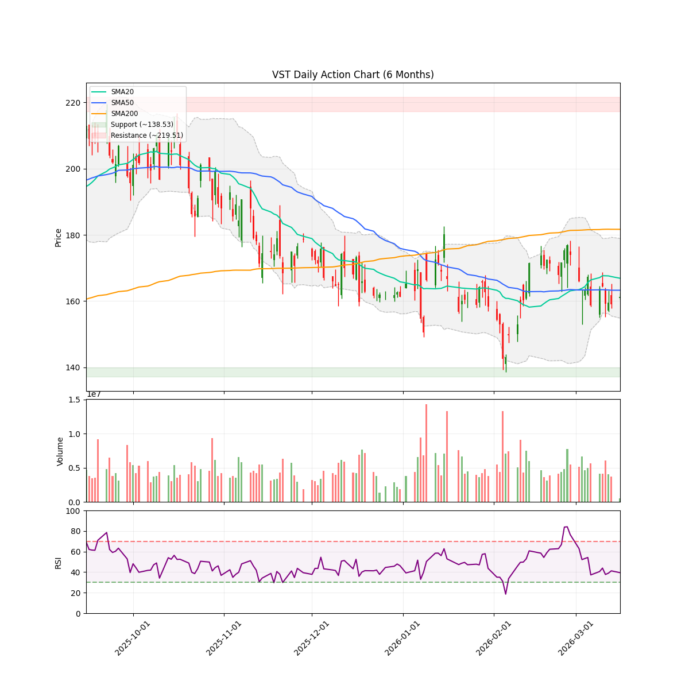
#### 研报分析

### 技术指标概览 (Technical Overview)
- **当前价格**: $161.27
- **RSI (14)**: 39.47
- **移动平均线**: SMA20: $166.89 | SMA50: $163.27 | SMA200: $181.67 (Bearish)
- **波动率**: ATR (14): 7.99 (预计周度波动: +/- $17.86)
- **关键位 (6m)**: 支撑位 $138.53 | 阻力位 $219.51
- **即时状态**: Below SMA50

这是一份为您准备的 **Vistra Corp (VST)** 情绪审计报告。

---

# ☕ 叙事经济学观察：Vistra 是“AI 电力”的回调，还是神话的终结？

嘿，伙计。坐下来喝杯咖啡，我们来聊聊 **VST**。 

如果你去年问我最性感的股票是什么，我不会说芯片，我会说“电力”。Vistra 曾是那个穿着实用主义外衣、实则流着 AI 血液的巨星。但看着现在的盘面——161.27 美元，跌破了 200 日均线（181.67），这可不是什么好兆头。市场现在的感觉就像是派对结束后的清晨，宿醉感正席卷而来。

### 1. 催化剂分类 (Catalyst Categorization)

我们要从杂音中过滤出真正的信号：

*   **B-Tier (中级催化剂)：甲骨文 (Oracle) 财报的“哑火”溢出效应**
    *   [Investopedia] 提到甲骨文财报虽然显示 AI 需求健康，但未能点燃整体 AI 行情。作为 AI 数据中心的电力供应商预期者，VST 没能借到这股东风，说明市场对其“AI 叙事”的溢出效应已经产生了免疫力。
*   **B-Tier (中级催化剂)：大额减持的寒气**
    *   [The Globe and Mail] 报道称有基金清算了 1200 万美元的头寸。虽然 1200 万对比 VST 的市值不算天量，但在股价跌破关键均线时，这种“出逃”的动作会引发散户的心理崩塌。
*   **C-Tier (噪音与常规信息)：**
    *   [Zacks] 和 [Simply Wall St.] 的估值检查与行业对比。这些大多是算法生成的常规分析，提醒我们 VST 过去一年表现出色，但近期正在掉队。

### 2. 背离检测 (Divergence Detection)

**警报：负面背离正在发生。**

通常情况下，如果行业领头羊（如 BIP）依然被看好 [Yahoo Finance]，且 AI 需求被证明“依然健康”，作为能源核心的 VST 理应获得支撑。然而，VST 的股价却无视这些宏观“好消息”，持续阴跌并处于 SMA50 (163.27) 下方。

这说明什么？**这说明市场正在修正此前过度乐观的溢价。** 现在的逻辑不是“AI 需要多少电”，而是“我们之前是不是为了这些电付了太高的溢价”。RSI 跌至 39.47，虽然接近超卖，但还没到那种“让人想闭眼捡钱”的极端恐慌点。

### 3. 情绪报告：从“狂热”转向“怀疑”

目前的叙事已经从**“无限增长的能源霸主”**降级为**“一个需要重新定价的传统公用事业股”**。

*   **市场脉搏：** 寒冷。
*   **资金流向：** 机构正在从这些涨幅过大的“AI 衍生概念”中撤回资金，寻找更安全的避风港（如 BIP 这种更具防御性的基建）。
*   **技术形态：** 这是一个典型的“多头陷阱”后的估值回归。只要股价还在 200 日均线下方，任何反弹都会被视为离场的机会，而非入场点。

---

### 4. 情绪评分 (Logic Score): 3.5/10

*   **评分逻辑：** 尽管基本面（AI 长期需求）没变，但短期趋势已经完全破位。跌破 SMA200 是机构投资者止损的信号。在没有 A-Tier 催化剂（如超预期财报或巨额新合同）出现前，这种“阴跌”很难停止。目前的 VST 像是一个掉落的飞刀，虽然由于 RSI 较低可能产生技术性抽风，但中线趋势依然极其疲软。

---

### 5. 核心参考资料
*   **机构减持报告:** [The Globe and Mail - Fund Liquidates Stake](https://www.theglobeandmail.com/investing/markets/stocks/VST/pressreleases/723765/auto-marketplace-stock-down-65-in-a-year-as-one-fund-liquidates-12-million-stake/)
*   **AI 行业关联:** [Investopedia - Oracle Earnings & AI Rally](https://www.investopedia.com/oracle-earnings-heated-up-its-stock-but-couldn-t-spark-an-ai-rally-orcl-11923904)
*   **近期表现对比:** [Yahoo Finance - Vistra Performance Check](https://finance.yahoo.com/news/vistras-stock-performance-compared-other-131846909.html)

---

### 📅 下一个重大关注日 (Next Major Date)
**2026年5月上旬 (预计 2026 Q1 财报发布日)**
*注：目前处于财报后的真空期，市场缺乏强力驱动力，震荡阴跌的概率较大。下一个转机点必须等到 Q1 财报用真实的数据来重新证明其 AI 电力逻辑的变现能力。*

---
**老兵的建议：** 现在的 VST 就像是在风暴中摇摆的电线杆。与其现在冲进去赌它触底反弹，不如等它站回 167 美元（SMA20）上方再说。记住，在叙事经济学里，**一旦一个故事开始让人感到怀疑，它就失去了最锋利的涨势。**
#### 近期新闻与事件
- **[Yahoo Finance]** [Is Brookfield Infrastructure Partners L.P. (BIP) A Good Stock To Buy?](https://finance.yahoo.com/news/brookfield-infrastructure-partners-l-p-010841212.html)
- **[Yahoo Finance]** [How Is Vistra's Stock Performance Compared to Other Utilities Stocks?](https://finance.yahoo.com/news/vistras-stock-performance-compared-other-131846909.html?fr=sycsrp_catchall)
- **[Yahoo Finance UK]** [Is It Too Late To Consider Vistra (VST) After Its Strong Three Year Run?](https://uk.finance.yahoo.com/news/too-consider-vistra-vst-strong-090939665.html)
- **[The Globe and Mail]** [Auto Marketplace Stock Down 65% in a Year as One Fund Liquidates $12 Million Stake](https://www.theglobeandmail.com/investing/markets/stocks/VST/pressreleases/723765/auto-marketplace-stock-down-65-in-a-year-as-one-fund-liquidates-12-million-stake/)
- **[Investopedia]** [Oracle Earnings Heated Up Its Stock—But Couldn't Spark an AI Rally](https://www.investopedia.com/oracle-earnings-heated-up-its-stock-but-couldn-t-spark-an-ai-rally-orcl-11923904)

---
