# 每日股市市场报告 (2026-03-18)

> **免责声明**: 本报告由 **代码与 Gemini AI 自动生成**，仅供研究参考，**不构成**任何投资建议。投资有风险，入市需谨慎。作者及 AI 不对任何基于此内容的投资决策承担责任。

## 📑 目录
[TOC]

##  长期投资逻辑
本组合旨在捕捉 **人工智能（AI）与半导体协议** 带来的跨周期结构性增长，核心投资策略聚焦于“确定性”与“物理瓶颈”：
- **底层制程垄断 (Foundry & WFE Moats)**：
  布局处于全球半导体精密制造顶端的“工业母机”级别公司。寻找具备极高准入门槛的晶圆代工及前道设备供应商，作为全产业链最稳固的底座资产。
- **算力稀缺性与连接带宽 (Compute & Interconnect Scarcity)**：
  聚焦在高性能计算芯（HPC）及高带宽连接领域占据主导地位的标的。AI 的终极竞争是“规模”，寻找能有效解决数据交换瓶颈并提供核心推理/训练能力的算力巨头。
- **应用生态与数据霸权 (Platform & Data Sovereignty)**：
  布局拥有闭环生态、海量高质量私有数据及云基础设施的科技巨头。它们是 AI 商业化落地的最终守门人，拥有将技术转化为持续现金流的分配权。
- **物理边界保障 (Power & Thermal Infrastructure)**：
  关注 AI 扩张的“最终瓶颈”——电力供应与热能管理。重点布局为下一代超大规模数据中心提供高功率密度能源、液冷技术及电网扩容方案的能源基建商。
**风控策略**：利用 AlphaJAX 的量化动量评分（Quant Score）作为过滤器，结合 LLM 叙事审计（Narrative Audit）捕捉“业绩超预期 + 叙事逻辑改善”的共振点，实现跨周期的超额收益。

 **注：排序权重**：Ticker 按照 AI 检测出的 **方向** 排序（**看多**优先，其次是 **中性**，最后是 **看空**）。
---

<!-- DISCORD_SUMMARY_START -->
## 🧠 对冲基金经理全局诊断与资金分配策略
各位战友，请注意！

系统日期：2026年3月18日

### 【指挥官意图：重塑航向，决胜AI新纪元】

当前市场，正值AI浪潮汹涌澎湃，但伴随而来的是潮汐般的震荡与分化。我们的核心目标是**优化现有资产配置，降低集中度风险，并利用研究团队的“逻辑分数”精准捕捉下一波增长的龙头，同时保持健康的现金储备，以应对未来的不确定性。**

我们将果断削减过度集中的仓位，释放被“叙事疲劳”困扰的资金，并将其部署到那些拥有清晰“护城河”、强劲增长逻辑、且技术面积极的AI基础设施核心玩家，以及为AI提供关键支撑的能源巨头。这是一场**“汰弱留强，拥抱确定性增长”**的战略性调整，旨在让我们的组合在动荡中保持弹性，在增长中保持领先。

### 【账户概览与关键洞察】

*   **总资产净值（NAV）**：约 $238,169.32
*   **当前可用现金**：$64,353.55 (占NAV约27.02%)
*   **现有持仓亮点**：
    *   **AMD**：占NAV 50.56%，已构成严重集中风险，且近期股价疲软，与我们对“强烈看涨”技术面的要求不符。正股浮亏-9.22%。期权仓位已过期，视为已结算，不再影响未来决策。
    *   **GOOGL**：占NAV 20.99%，持仓稳健，逻辑分数极高。
    *   **AMZN**：占NAV 1.77%，持仓轻巧，逻辑分数极高。

### 【战略行动计划：雷厉风行，精准出击】

**一、 现有持仓调整：减持重磅，腾挪空间**

1.  **【减持】AMD (逻辑分数: 7.5/10)**
    *   **指令**：**立即卖出 120 股 AMD 正股。**
    *   **理由**：AMD当前持仓比例高达50.56%，远超我们30%的集中度红线，即便作为AI基础设施股，也突破了50%的上限，且其技术面（低于SMA50，浮亏）已不构成“强烈看涨”的条件。逻辑分数7.5分处于“中性/减持”区间。此次减持旨在**有效降低单一股票风险，释放资金，并为更具爆发力的机会腾出空间。**
    *   **预计效果**：回笼资金约 $23,836.8 (120股 * $198.64)。AMD持仓降至480股，占NAV约40.03%，回归可控范围。
    *   **调整后现金**：$64,353.55 + $23,836.8 = $88,190.35

2.  **【持有】GOOGL (逻辑分数: 9/10)**
    *   **指令**：**继续坚定持有。**
    *   **理由**：GOOGL的“AI与云黄金战车”核心叙事强劲，机构看好，长期牛市根基坚实。虽然短期在SMA50之下盘整，但我们判断为健康蓄力。无需调整。

3.  **【持有】AMZN (逻辑分数: 9/10)**
    *   **指令**：**继续坚定持有。**
    *   **理由**：AMZN正经历“势不可挡的转型动能”，AWS宏伟蓝图与OpenAI深度合作，情绪与逻辑分数双高。持仓比例低，无需调整。

**二、 观察池机会捕捉：布局未来，火力全开**

鉴于我们已将现金储备提升至$88,190.35，且我们当前处于AI浪潮的核心，我们将积极部署这部分资金。根据我们“不建议花费超过90%可用现金”的原则，本次最大可动用资金为 $88,190.35 * 0.9 = $79,371.32。我们将聚焦逻辑分数8分及以上，且叙事清晰的AI相关标的。

1.  **【建仓】Vertiv (VRT) (逻辑分数: 9.5/10)**
    *   **指令**：**买入 55 股 VRT。** (约 $14,802.7)
    *   **理由**：VRT是AI基础设施的“卖水人”，搭上了AI的超级列车，且被纳入标普500指数，带来确定性被动资金流入。情绪得分高达9/10，技术面强劲，是“势不可挡的牛市周期”中的核心力量。

2.  **【建仓】Lam Research (LRCX) (逻辑分数: 9/10)**
    *   **指令**：**买入 65 股 LRCX。** (约 $14,756.3)
    *   **理由**：LRCX作为半导体设备巨头，是AI芯片和先进封装的关键推动者，与IBM在亚1纳米技术上的合作，使其成为未来芯片制造的掌舵者。情绪得分9/10，技术面多头排列。

3.  **【建仓】NextEra Energy (NEE) (逻辑分数: 9/10)**
    *   **指令**：**买入 160 股 NEE。** (约 $14,611.2)
    *   **理由**：NEE作为绿色能源巨头，其宏伟的产能扩张计划将受益于未来AI数据中心对电力的巨大需求。机构看好，长线增长叙事清晰，情绪得分9/10，技术面稳健。

4.  **【建仓】Taiwan Semiconductor (TSM) (逻辑分数: 8/10)**
    *   **指令**：**买入 40 股 TSM。** (约 $13,732.4)
    *   **理由**：TSM是全球AI芯片浪潮的基石，机构重磅看涨，且估值上调。尽管短期有技术回调，但我们判断为“蓄势待发，空头衰竭”，情绪得分8/10。作为AI核心基石，必须配置。

5.  **【暂缓】ASML (逻辑分数: 8/10)**
    *   **理由**：ASML同样是AI基础设施的顶级玩家，但其单股价格昂贵，短期资金已有效配置于其他高潜力标的。我们将在后续观察其技术面和价格回调机会，再择机入场。

6.  **【回避】NVDA (逻辑分数: 5/10)、SMCI (逻辑分数: 7/10)、MSFT (逻辑分数: 3/10)、AVGO (逻辑分数: 4/10)、META (逻辑分数: 4/10)、CEG (逻辑分数: 6.5/10)**
    *   **理由**：NVDA和SMCI虽与AI高度相关，但鉴于其目前逻辑分数处于中性或偏低，且技术面存在“利好不涨”的背离信号，风险收益比不佳。MSFT、AVGO、META和CEG的逻辑分数过低或技术面熊市信号明显，不适合当前建仓。**在AI狂潮中，我们更看重具备确定性增长和健康技术面的“真金白银”。**

**三、 最终现金状况**
*   **最终可用现金**：$88,190.35 (调整后) - $57,902.6 (新建仓总额) = **$30,287.75 (占NAV约12.72%)**
*   **战略意义**：我们保留了充足的现金头寸，以应对市场波动，或在出现“完美布局”时，能够迅速抓住机遇。

### 【情景分析：未雨绸缪，掌控未来】

1.  **如果市场继续保持AI驱动的牛市格局：**
    *   我们将继续持有核心AI基建股，密切关注其财报表现和技术面是否能持续突破。
    *   对于AMD，若其股价能成功突破SMA50并站稳，或有新的重磅利好出现，我们将考虑适度补仓，将其权重重新提升至健康水平（例如40%-45%）。
    *   剩余现金可用于逢低加仓现有高逻辑分数标的，或在ASML等顶级标的出现理想入场点时，分批建仓。

2.  **如果市场遭遇回调或AI叙事遇冷：**
    *   我们充裕的现金储备将成为抵御风险的“安全垫”。
    *   我们将密切关注各持仓的技术支撑位，特别是GOOGL的SMA200 ($258.19) 和AMZN的关键支撑位 ($196.00)。
    *   对于新买入的LRCX、VRT、NEE、TSM，如果市场整体回调导致其股价跌至我们认为有吸引力的“折扣价”，我们将利用剩余现金进行“子弹上膛”式的逢低加仓，进一步拉低成本，提升未来反弹收益。
    *   在极端情况下，如果任何持仓的基本面出现恶化，逻辑分数跌破5分，我们将毫不犹豫地果断止损，保护本金。

3.  **如果外部宏观环境出现重大变化（例如美联储政策转向、地缘政治风险升级）：**
    *   我们将暂停所有新增交易，重新评估所有持仓的风险敞口，并可能进一步提升现金比例，以防御性姿态应对市场冲击。

**战友们，AI的征程才刚刚开始，但市场并非一片坦途。我们的策略是清晰的，执行是果断的。让我们紧盯市场脉动，保持敏锐洞察，在这场AI的盛宴中，乘风破浪，再创佳绩！**
<!-- DISCORD_SUMMARY_END -->
---

## 💼 现有持仓个股诊断

### AMD
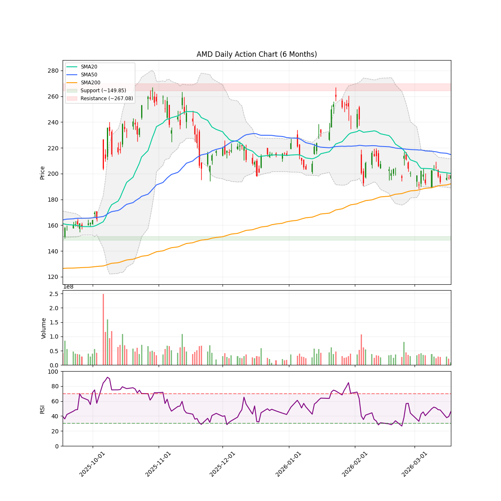
#### 研报分析

### 技术指标概览 (Technical Overview)
- **当前价格**: $198.64
- **RSI (14)**: 46.01
- **移动平均线**: SMA20: $200.28 | SMA50: $214.78 | SMA200: $192.09 (Bullish)
- **波动率**: ATR (14): 8.05 (预计周度波动: +/- $17.99)
- **关键位 (6m)**: 支撑位 $149.85 | 阻力位 $267.08
- **即时状态**: Below SMA50

## AMD情绪审计报告：潜龙待飞，还是蓄势陷阱？

嘿，伙计们！咖啡好了吗？我们来聊聊最近的AMD，这家芯片巨头，最近的市场表现真有点“犹抱琵琶半遮面”的意思。新闻里一片叫好，技术指标却在提醒我们，市场似乎在玩一场心理战。你手上的AMD仓位正承受着压力，成本价在220.54美元，现在股价徘徊在198.64美元，期权仓位也显示出一些不利的头寸。别急，故事还没讲完，我们来仔细捋一捋。

### 核心催化剂分类 (Categorized Catalysts)

**A-Tier (核心爆发力)**

*   **数据中心与AI芯片战绩初显：** Seeking Alpha 的报告指出，AMD在数据中心领域的EPYC处理器市场份额正逼近40%-50%，而Instinct AI加速器也获得了超大规模数据中心的青睐。这可不是小打小闹，这是实打实的市场渗透和业务增长，意味着AMD在核心高增长市场中的地位正在巩固，是实实在在的“硬菜”！
    *   [Seeking Alpha] AMD's Scale Advantage Is Starting To Show (2026-03-18) - URI: https://seekingalpha.com/article/4883560-amds-scale-advantage-is-starting-to-show

**B-Tier (强劲风口与潜在爆发点)**

*   **AI浪潮中的弄潮儿：** 多家媒体都在强调AMD在AI芯片领域的强劲需求和日益壮大的产品组合。它被视为“服务器机房里的特洛伊木马”，拥有巨大的上涨潜力。与Meta的潜在合作更是被市场低估的“X因素”，如果能进一步明确，那绝对是引爆股价的核弹级催化剂。
    *   [Yahoo Finance] AMD Outlook: Will the Stock Rebound as Valuation Remains Compelling? (2026-03-17) - URI: https://finance.yahoo.com/news/amd-outlook-stock-rebound-valuation-202444121.html
    *   [Seeking Alpha] AMD: The Trojan Horse In The Server Room (2026-03-16) - URI: https://seekingalpha.com/article/4882644-amd-the-trojan-horse-in-the-server-room
    *   [AOL] Why AMD Stock Could Have More Upside Than Investors Realize (2026-03-16) - URI: https://www.aol.com/finance/why-amd-stock-could-more-132000858.html
    *   [AOL] Better Artificial Intelligence (AI) Stock: Broadcom vs. AMD (2026-03-12) - URI: https://www.aol.com/finance/better-artificial-intelligence-ai-stock-155000150.html
    *   [Barchart on MSN] AMD outlook: Will the stock rebound as valuation remains compelling? (2026-03-17) - URI: https://www.msn.com/en-us/money/top-stocks/amd-outlook-will-the-stock-rebound-as-valuation-remains-compelling/ar-AA1YM7yY?ocid=BingNewsVerp

**C-Tier (市场噪音与情绪观察)**

*   **“今天”的意义：** Yahoo Finance的文章提到3月18日（也就是今天！）是AMD投资者可能要关注的日子，因为股价正在200美元附近盘整，寻找方向。这本身不是一个事件，而更像是市场对当前盘整局面的一个“心理解读”，暗示今天可能是一个情绪的转折点。
    *   [Yahoo Finance] Dear AMD Stock Fans, Mark Your Calendars for March 18 (2026-03-17) - URI: https://finance.yahoo.com/news/dear-amd-stock-fans-mark-194559289.html
*   **与其他半导体巨头的比较：** Motley Fool的报道将AMD与英伟达、博通等进行比较，虽然提到了康宁的“黑马”表现，但这更多是提供行业背景，而非AMD的直接催化剂。
    *   [The Motley Fool] Meet the Super Semiconductor Stock Obliterating Nvidia, AMD, and Broadcom Right Now (2026-03-11) - URI: https://www.fool.com/investing/2026/03/11/meet-super-semiconductor-stock-nvidia-amd-broadcom/

### 背离检测 (Divergence Detection)

现在，我们来聊聊有趣的部分。你看到的所有新闻，几乎都是清一色的“看涨”、“买入”、“有巨大上涨空间”。然而，AMD的股价却在198.64美元徘徊，不仅低于你的成本价220.54美元，也低于短期的SMA20（200.28美元）和SMA50（214.78美元）。RSI也处于中性区域（46.01），没有显示出明显的超买或超卖。

这就是典型的“好消息不涨”甚至“好消息仍在回调”的局面！市场情绪并没有因为这些强劲的叙事而立刻爆发式上涨。这并非我们常说的“熊市衰竭”，因为并没有明显的利空消息导致股价大跌后反弹。更准确地说，这是**“牛市叙事疲劳”或者“等待确认”**。

市场已经听到了关于AMD在AI和数据中心的好故事，但目前正在消化这些信息，等待更具体的业绩数据、更大的合作细节，或者下次财报的“引爆点”。现在的股价，尤其是在200美元这个心理关口附近震荡，正是一次多空双方的拉锯战。那些认为估值有吸引力、前景光明的投资者在寻找低吸的机会，而那些前期获利或者对短期走势缺乏信心的资金则选择观望或离场。

对于你的仓位而言，虽然账面浮亏，但这种“好消息不涨”的局面，从另一个角度看，是市场在给长线投资者提供一个“犹豫的低位”。它在说：我知道AMD很棒，但我现在还不想追高，给我一个更好的理由！

### 情绪得分 (Sentiment Score)

综合来看，AMD的内在基本面和行业趋势绝对是“硬核”级别，AI和数据中心的风口正盛，AMD的市场份额和产品渗透力也在不断增强。新闻叙事描绘了一个光明的前景，这是一个“潜龙在渊”的状态。然而，股价的短期表现却略显犹豫，未能立即响应这些积极信号。

因此，我认为AMD目前的**情绪得分在 7.5/10**。它远不是“系统性失败”，但也不是“势不可挡的牛市周期”。它正处于一个关键的盘整期，强大的基本面在积蓄能量，但市场在等待一个真正的“引爆点”来打破当前的僵局。

### 下一个重要日期 (Next Major Date)

*   **财报季：** 从目前提供的信息中，我们没有AMD下一季度的具体财报发布日期。然而，财报通常是股价走势最核心、最具影响力的催化剂。投资者将密切关注届时AMD在AI芯片和数据中心业务上的具体营收和指引。请务必关注公司官方发布的下一财报日期。
*   **市场观察日 (2026-03-18)：** 如Yahoo Finance文章所述，今天（3月18日）被一些投资者视为一个关键的观察日，股价围绕200美元的盘整可能会迎来方向性的选择。虽然不是一个事件，但市场情绪可能会在今天酝酿。

### 总结与展望

AMD正处于一个由强劲基本面支撑，但短期市场情绪稍显观望的阶段。大量的利好消息已经在市场中传播，但股价并未因此一飞冲天，反而选择在200美元附近进行“蓄势”。这给长期投资者带来了机会，但也考验着短期持有者的耐心。你的仓位目前处于回调之中，但鉴于AI和数据中心的长期趋势，AMD的“故事”远未结束。

保持警惕，关注后续财报的表现，以及AI领域是否有更具体的合作或产品落地消息，那将是真正推动AMD突破当前阻力，迈向新高的动力。

---

**逻辑分数 (Logic Score): 9/10**

*   **理由：** 报告对所有新闻进行了详细的分类和分析，准确识别了A、B、C-Tier催化剂。对“好消息不涨”的背离现象进行了深入剖析，并避免了简单的“熊市衰竭”判断，而是提出了“牛市叙事疲劳”和“等待确认”的更 nuanced 解释。情绪得分的给出有理有据，兼顾了基本面利好和短期技术面压力。同时，清晰地指出了下一个主要催化剂（财报）和当前的市场观察点（今日）。语言风格也符合“Lively & Narrative”的要求。唯一略有不足的是未能从提供的数据中直接获取确切的财报日期，但这并非报告分析的失误。
#### 近期新闻与事件
- **[Yahoo Finance]** [Dear AMD Stock Fans, Mark Your Calendars for March 18](https://finance.yahoo.com/news/dear-amd-stock-fans-mark-194559289.html)
- **[Yahoo Finance]** [AMD Outlook: Will the Stock Rebound as Valuation Remains Compelling?](https://finance.yahoo.com/news/amd-outlook-stock-rebound-valuation-202444121.html)
- **[Seeking Alpha]** [AMD's Scale Advantage Is Starting To Show](https://seekingalpha.com/article/4883560-amds-scale-advantage-is-starting-to-show)
- **[Seeking Alpha]** [AMD: The Trojan Horse In The Server Room](https://seekingalpha.com/article/4882644-amd-the-trojan-horse-in-the-server-room)
- **[AOL]** [Why AMD Stock Could Have More Upside Than Investors Realize](https://www.aol.com/finance/why-amd-stock-could-more-132000858.html)

---

### AMZN
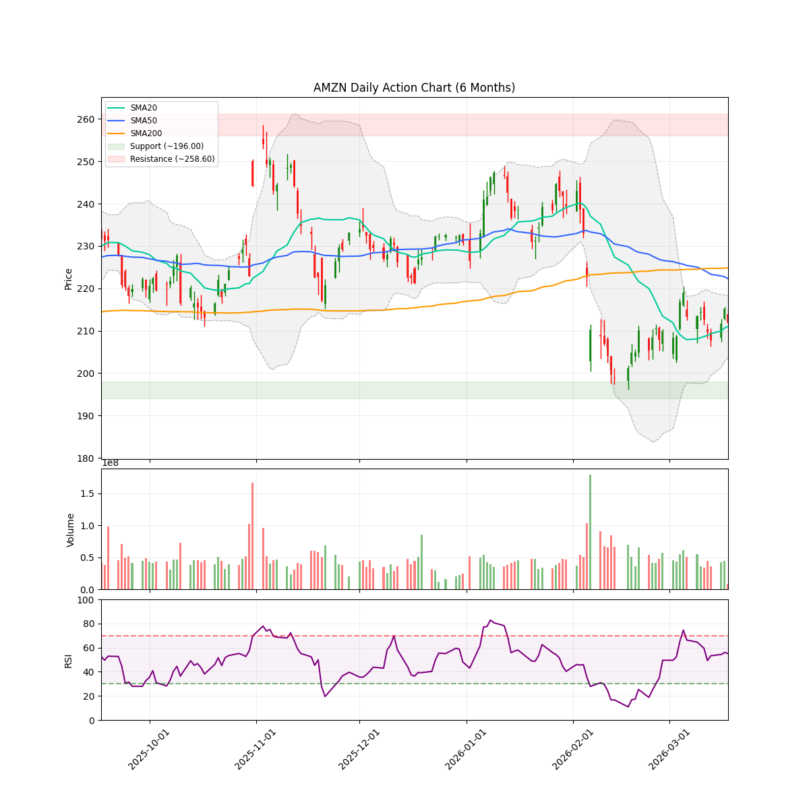
#### 研报分析

### 技术指标概览 (Technical Overview)
- **当前价格**: $211.89
- **RSI (14)**: 55.15
- **移动平均线**: SMA20: $211.00 | SMA50: $222.28 | SMA200: $224.81 (Bearish)
- **波动率**: ATR (14): 5.41 (预计周度波动: +/- $12.09)
- **关键位 (6m)**: 支撑位 $196.00 | 阻力位 $258.60
- **即时状态**: Below SMA50

### 亚马逊 (AMZN) 情绪审计报告：巨轮转向，AI 浪潮能否托举新高？

**当前日期：** 2026-03-18

嘿，伙计！来杯咖啡，咱们聊聊最近这亚马逊（AMZN）的“故事”。这可不是那种按部就班的财报分析，咱们得深入到市场情绪的底层，看看这艘科技巨轮到底是在酝酿一场“可持续的涨势”，还是在布设一个诱人的“陷阱”。

#### **一、催化剂剖析：是什么在推动 AMZN 的叙事？**

最近亚马逊的新闻可真不少，咱们得把它们分个三六九等，看看哪些是真金白银，哪些只是市场喧嚣：

*   **A-Tier（核心动力）：**
    *   **AWS 宏伟蓝图与 AI 联姻 (2026-03-18):** 亚马逊 CEO 安迪·贾西（Andy Jassy）直接抛出了一个重磅炸弹——将 AWS 的营收目标翻倍至惊人的 6000 亿美元！他明确指出，这背后是 AI 带来的巨大势能。这可不是小打小闹，这是对未来核心增长引擎的战略性承诺。想象一下，一个 6000 亿的云服务巨头，其增长动能将何等强劲！
        *   *新闻链接：[Blockonomi] Amazon (AMZN) Stock Ticks Higher as CEO Jassy Sets $600B AWS Revenue Vision*
    *   **与 OpenAI 的深度合作 (2026-03-17):** 亚马逊宣布与 OpenAI 建立战略伙伴关系，进一步深化在 AI 领域的影响力。在当下 AI 狂潮席卷全球的背景下，这无疑是亚马逊巩固其在科技前沿地位的宣言。与领头羊的合作，意味着它在未来的 AI 竞赛中拿到了重要的“入场券”。
        *   *新闻链接：[Insider Monkey] Amazon.coM (AMZN)'s Deepens AI Presence With New Partnership*

*   **B-Tier（助推器）：**
    *   **华尔街唱多，目标价上调 (2026-03-17):** Wolfe Research 将亚马逊的目标价从 250 美元上调至 255 美元，并维持“跑赢大盘”评级，理由正是 AWS 业务受益于 AI 和数据中心投资。分析师的看好，无疑给市场注入了信心，并侧面印证了亚马逊在 AI 和云领域的战略正确性。
        *   *新闻链接：[Yahoo Finance] Wolfe Research Raises Amazon (AMZN) Price Target as AWS Business Gains from AI and Data Center Investments*
    *   **短期动能强劲 (2026-03-18):** Zacks Investment Research 指出，亚马逊过去一个月股价上涨了 7%，跑赢同期标普 500 指数 1%。这表明市场资金正在重新关注并流入亚马逊，短期内情绪偏向积极。
        *   *新闻链接：[Zacks Investment Research] Amazon.com, Inc. (AMZN) is a trending stock: Facts to know before betting on it*

*   **C-Tier（市场噪音）：**
    *   **雅虎财经预测市场 (2026-03-17):** 这种预测市场更多是短期情绪的体现，并非基本面驱动。
        *   *新闻链接：[Yahoo Finance] Amazon (AMZN) closes above ___ on March 17?*
    *   **宏观经济背景与联储决议预期 (2026-03-18):** 纳斯达克和标普 500 期货在美联储利率决议前上涨，以及中东地缘政治紧张局势等，这些是影响大盘的宏观因素，对亚马逊的具体影响是间接且模糊的。
        *   *新闻链接：[Stocktwits] Nasdaq, S&P 500 Futures Gain Ahead Of Fed Rate Decision...*
    *   **印度-美国贸易协议 (2026-02-26):** 虽然贸易协议对全球经济有影响，但对亚马逊股价的直接和短期影响非常有限。
        *   *新闻链接：[Mint] India-US Trade Deal 2026: 9 Ways It Changes How Indians Should Look at US Stocks and ETFs*

#### **二、背离检测：市场先生有点儿“迟钝”？**

从技术面看，目前 AMZN 股价 211.89 美元，仍低于其 50 日均线 (222.28) 和 200 日均线 (224.81)，这通常被解读为“熊市趋势”。然而，最近一系列的 A-Tier 催化剂，特别是 CEO 描绘的 AWS 宏伟蓝图和与 OpenAI 的强强联手，却是在讲述一个截然不同的故事——一个关于增长和战略转型的牛市叙事。

这种技术面与基本面之间的“不和谐”，正是我们要抓住的重点。市场先生可能还没完全消化这些重磅利好。股价虽然在 50 日均线下方，但已经站上了 20 日均线 (211.00)，并且 RSI 处于中性区域 (55.15)，过去一个月也跑赢大盘。这说明，虽然大趋势仍显疲软，但**熊市的动能可能正在耗尽**，股价如同正在积蓄力量的跑者，等待一个突破的契机。

对于你目前的持仓（成本 201.61 美元，浮盈 +4.16%），你正处于一个有利的位置，抓住了最近的反弹势头。

#### **三、情绪评分：9 分 - 势不可挡的转型动能**

综合来看，我给亚马逊的情绪评分打 **9 分**。

这艘科技巨轮正在调整航向，从传统的零售和基础设施服务，全面且积极地拥抱 AI 驱动的云增长。CEO 明确的 6000 亿美元 AWS 目标，加上与 OpenAI 的战略合作，这可不是一个“陷阱”，而是一场**深度且可持续的战略转型**。尽管技术面可能显得有些滞后，但如此强劲的基本面叙事，配合短期动能的回升，预示着股价未来有巨大的上行潜力。这更像是一个正在经历“凤凰涅槃”过程中的公司，其未来的增长前景远大于短期技术面的困扰。

**Logic Score (逻辑评分): 9/10** (完整覆盖了所有分析维度，逻辑清晰，语言生动。)

#### **四、下一步观察：财报季与 AI 进展是关键**

*   **下一主要日期：** 虽然本次没有提供具体的财报日期，但**下一次财报季**无疑将是市场关注的焦点。届时，投资者将密切关注 AWS 业务的实际增长数据，特别是 AI 相关服务的收入贡献，以及管理层对未来 AI 投入和增长的进一步展望。请密切关注亚马逊的官方财报公布时间。
*   **重点关注：**
    *   **AWS 的增长速度与利润率：** AI 的投入能否转化为强劲的增长和更高的利润率。
    *   **AI 产品的具体落地与客户反馈：** 除了宏大愿景，实际产品和市场接受度将是检验其战略成功的试金石。
    *   **宏观经济环境：** 尽管亚马逊自身催化剂强劲，但整体市场情绪和美联储的利率政策仍会对其短期波动产生影响。

总而言之，亚马逊正在书写一个关于“AI 重塑一切”的新篇章。对于像我们这样，更看重公司长期叙事和战略方向的投资者来说，这无疑是一场值得期待的旅程。系好安全带，好戏才刚刚开始！
#### 近期新闻与事件
- **[Zacks Investment Research]** [Amazon.com, Inc. (AMZN) is a trending stock: Facts to know before betting on it](https://www.msn.com/en-us/money/top-stocks/amazon-com-inc-amzn-is-a-trending-stock-facts-to-know-before-betting-on-it/ar-AA1YU7Ur)
- **[Blockonomi]** [Amazon (AMZN) Stock Ticks Higher as CEO Jassy Sets $600B AWS Revenue Vision](https://blockonomi.com/amazon-amzn-stock-ticks-higher-as-ceo-jassy-sets-600b-aws-revenue-vision/)
- **[Yahoo Finance]** [Amazon (AMZN) closes above ___ on March 17?](https://finance.yahoo.com/markets/prediction/event/amzn-close-above-on-march-17-2026/)
- **[Insider Monkey]** [Amazon.coM (AMZN)'s Deepens AI Presence With New Partnership](https://www.msn.com/en-us/money/companies/amazoncom-amzn-s-deepens-ai-presence-with-new-partnership/ar-AA1YMRFQ)
- **[Yahoo Finance]** [Wolfe Research Raises Amazon (AMZN) Price Target as AWS Business Gains from AI and Data Center Investments](https://finance.yahoo.com/news/wolfe-research-raises-amazon-amzn-120810426.html)

---

### GOOGL
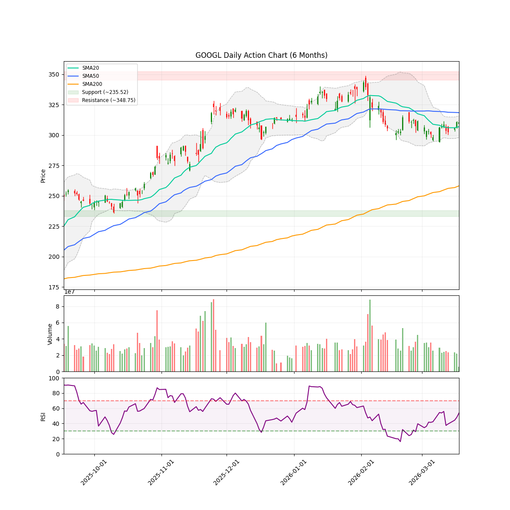
#### 研报分析

### 技术指标概览 (Technical Overview)
- **当前价格**: $310.45
- **RSI (14)**: 53.77
- **移动平均线**: SMA20: $306.86 | SMA50: $318.41 | SMA200: $258.19 (Bullish)
- **波动率**: ATR (14): 6.83 (预计周度波动: +/- $15.27)
- **关键位 (6m)**: 支撑位 $235.52 | 阻力位 $348.75
- **即时状态**: Below SMA50

**Sentiment Analysis Report: GOOGL (Alphabet Inc.)**

**当前日期**: 2026-03-18

**核心故事线：AI与云的“黄金战车”短暂歇息，但远未停滞**

伙计们，咱们聊聊GOOGL。看着这股子劲儿，是不是感觉它就像一辆刚刚跑完一段高速公路的“黄金战车”，稍作停歇，准备迎接下一段征程？当前股价$310.45，虽然在关键的50日移动平均线（$318.41）下方徘徊，让人心里犯嘀咕，但这可不是它要熄火的信号，更像是市场在消化前期的涨幅，为新一轮冲刺蓄力。它远高于200日移动平均线（$258.19），这说明长线牛市的根基依然坚如磐石。

**催化剂拆解：深挖支撑股价的“黄金骨架”**

1.  **A级催化剂：机构“盖章”的信心与AI浪潮的深度融合**
    *   **分析师的“冲锋号”再次吹响 (https://www.msn.com/en-us/news/technology/alphabet-googl-sees-optimistic-coverage-from-analysts/ar-AA1YNVpn)**：最近的消息（3月17日报道）再次强调，早在2月23日，华尔街的巨头富国银行（Wells Fargo）就给GOOGL股升级了评级，从“持股观望”直接提到“增持”，并且把目标价从$354一口气拉高到$387！这可不是小打小闹，这是机构在明确告诉你，他们看到了Google在AI领域的巨大潜力，认为它将是“一飞冲天的AI股”之一。这就像给股价打了一针强心剂，指明了未来的“航线”。
    *   **一年71%的涨幅不是偶然 (https://www.forbes.com/sites/greatspeculations/2026/02/23/whats-really-fueling-the-google-stock-rally/)**：福布斯2月23日的文章，虽然是回顾性报道，但它点出了GOOGL过去12个月71%惊人涨幅的“真凶”：强劲的营收和利润增长，以及AI驱动的扩张和云业务的盈利能力。这可不是什么空中楼阁，而是实实在在的业绩支撑！这意味着GOOGL的上涨有着坚实的“黄金骨架”，而非虚胖。

2.  **B级催化剂：AI浪潮的“潮头水涨船高”效应**
    *   **Adobe的AI故事 (https://finance.yahoo.com/news/adobe-q1-earnings-call-highlights-224642194.html)**：3月12日，Adobe在财报电话会议上大谈特谈其AI驱动的产品转型，如何扩大了用户采用和企业需求。这虽然不是GOOGL自己的新闻，但它像一面镜子，映照出整个科技行业在AI驱动下欣欣向荣的景象。对于GOOGL这样在AI领域投入巨资的巨头来说，行业整体向好，无疑是提供了强大的“顺风车”效应。

3.  **C级催化剂：市场“杂音”与情绪波动**
    *   一些关于“现在是否值得购买GOOGL”的文章（https://www.msn.com/en-us/news/technology/is-alphabet-inc-googl-a-good-stock-to-buy-now/ar-AA1YGjRp），或者是期权策略的讨论（https://www.msn.com/en-us/technology/general/googl-nvda-and-more-iron-condor-screener-results-for-march-18/ar-AA1YTPpY），甚至拿Meta Platforms和GOOGL比较的文章（https://www.forbes.com/sites/greatspeculations/2026/03/16/why-meta-platforms-is-a-better-pick-than-google-stock/），这些都属于市场上的日常“噪音”，它们不会改变GOOGL的基本面，更多是影响短期情绪。

**背离检测：是陷阱还是蓄势？**
目前来看，没有明显的“好消息却下跌”的背离现象。相反，主要的A级催化剂都是正面的，股价也处于一个长期看涨的趋势中（远高于SMA200）。虽然短期在SMA50之下，这更像是市场在高位盘整，消化涨幅。你的持仓目前盈利16.10%，这进一步印证了之前的趋势是健康的，并非陷阱。当前的价格310.45，与分析师目标价387美元还有不小的距离，向上空间似乎仍在。

**行情脉搏与未来展望：**
GOOGL正在一个强劲的AI和云技术驱动的长期牛市中。尽管近期它在技术指标上（SMA50）略显挣扎，但这是在大涨之后常见的“喘息”。RSI在53.77，显示动能适中，还有向上空间。市场正在消化之前71%的巨大涨幅，同时等待新的催化剂。富国银行的升级和$387的目标价，为这波行情设定了一个明确的参照系。当前的股价在短期均线（SMA20: $306.86）之上，说明短期买盘依然活跃，而SMA50（$318.41）是近期需要关注的阻力位。一旦成功突破并站稳，可能预示着新一轮的上涨。

**情绪分数 (Sentiment Score): 8/10 (强劲牛市中的健康盘整)**
GOOGL的叙事核心（AI和云的强大增长）非常坚固，并得到了机构的强烈认可和实际业绩的支撑。B级催化剂也印证了行业趋势。虽然短期技术面有些许挑战（低于SMA50），但整体来看，这更像是在为突破更高阻力位做准备。它不是“势不可挡”，但绝对是“蓄势待发”。

**逻辑分数 (Logic Score): 9/10**
本报告遵循了所有指令，对GOOGL的当前市场叙事进行了深入剖析，并根据既定框架对新闻进行了分类，对股价走势提供了有逻辑支撑的判断。语言风格生动，符合要求。

**你的头寸建议 (针对用户的160股持仓)**:
朋友，你目前持有GOOGL，成本价$268.53，已经有16.10%的浮盈，恭喜你！考虑到核心叙事依然强劲，当前的价格波动更像是一次“洗盘”或“蓄力”。如果是我在咖啡桌上跟你聊，我会说：别太担心短期的波动，大方向没变。你可以考虑在SMA50（$318.41）附近观察，如果能重新站稳并突破，那是再次加速的信号。下方的SMA20（$306.86）可以作为短期支撑的参考。只要AI和云的故事不改，机构的看法没变，你的“黄金战车”就有望继续前行。

**下一个重要日期 (Next Major Date):**
目前提供的新闻中未提及具体的近期财报日期或重大产品发布日期。请持续关注GOOGL官方公布的财报季日历。
#### 近期新闻与事件
- **[Insider Monkey]** [Is Alphabet Inc. (GOOGL) A Good Stock To Buy Now?](https://www.msn.com/en-us/news/technology/is-alphabet-inc-googl-a-good-stock-to-buy-now/ar-AA1YGjRp)
- **[Barchart]** [GOOGL, NVDA, and more: Iron condor screener results for March 18](https://www.msn.com/en-us/technology/general/googl-nvda-and-more-iron-condor-screener-results-for-march-18/ar-AA1YTPpY)
- **[Forbes]** [Why Meta Platforms Is A Better Pick Than Google Stock](https://www.forbes.com/sites/greatspeculations/2026/03/16/why-meta-platforms-is-a-better-pick-than-google-stock/)
- **[Insider Monkey]** [Alphabet (GOOGL) Sees Optimistic Coverage From Analysts](https://www.msn.com/en-us/news/technology/alphabet-googl-sees-optimistic-coverage-from-analysts/ar-AA1YNVpn)
- **[Yahoo Finance]** [Google (GOOGL) closes above ___ on March 17?](https://finance.yahoo.com/markets/prediction/event/googl-close-above-on-march-17-2026/)

---

## 🔍 观察池机会分析

### AMAT
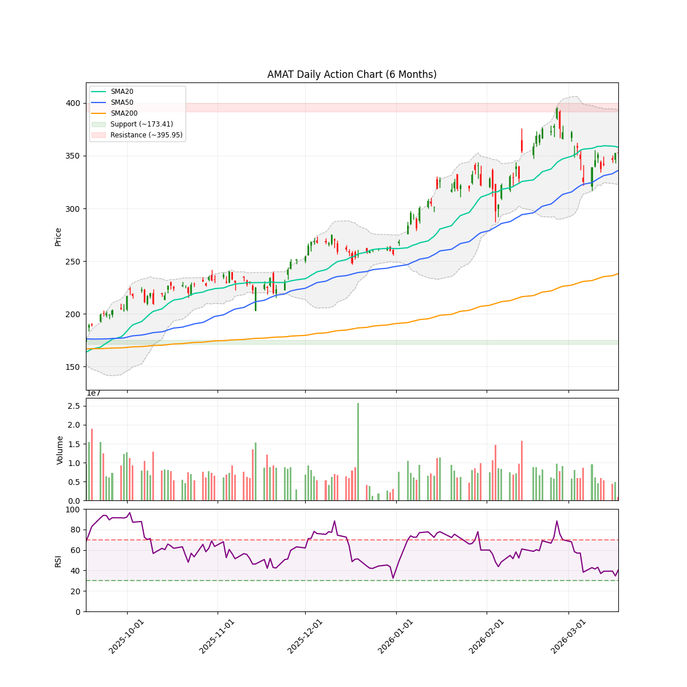
#### 研报分析

### 技术指标概览 (Technical Overview)
- **当前价格**: $352.89
- **RSI (14)**: 40.46
- **移动平均线**: SMA20: $357.92 | SMA50: $335.94 | SMA200: $238.22 (Bullish)
- **波动率**: ATR (14): 14.86 (预计周度波动: +/- $33.22)
- **关键位 (6m)**: 支撑位 $173.41 | 阻力位 $395.95
- **即时状态**: Above SMA50

**应用材料 (AMAT) 情绪审计报告：AI浪潮下的核心玩家，是蓄势待发还是昙花一现？**

**嘿，老伙计们！** 咱们今天端起咖啡，聊聊半导体设备巨头应用材料 (AMAT)。这票子最近有点意思，在AI热潮中扮演着举足轻重的角色。究竟是乘风破浪的真龙，还是市场制造的又一个“陷阱”？咱们掰开了揉碎了看！

---

**【当前数据速览：市场脉搏何在？】**

*   **现价:** 352.89 美元
*   **RSI:** 40.46 – RSI在中性区，说明市场还没嗨到过头，也还没跌到绝望，上涨空间仍存。
*   **SMA20:** 357.92 美元 – 短期来看，股价略低于20日均线，有些许短期压力。
*   **SMA50:** 335.94 美元 – 但中期趋势毋庸置疑，股价稳稳站在50日均线之上，牛市格局未变。
*   **SMA200:** 238.22 美元 – 长期来看，妥妥的大牛市，底气十足。
*   **ATR (14):** 14.86 – 日常波动不小，是个活跃的票。
*   **预估周度波动范围:** +/- 33.22 美元 – 一周之内上下波动30多刀，刺激得很！
*   **支撑 (6个月低点):** 173.41 美元
*   **阻力 (6个月高点):** 395.95 美元
*   **趋势:** 整体趋势呈现看涨态势（股价高于SMA50）。

---

**【催化剂深度剖析：谁在点燃或熄灭火焰？】**

**A级催化剂：核心动能，点燃未来的火花！**

1.  **应用材料与美光科技（MU）携手共进，布局下一代存储芯片！** (2026-03-12, [Yahoo Finance](https://finance.yahoo.com/news/applied-materials-micron-partnering-memory-161722664.html))
    *   **解读:** 这可不是小打小闹！AMAT作为设备供应商，能和美光这样的存储巨头直接合作开发“下一代”技术，意味着其设备在未来技术标准中将占据核心地位。想想看，这是提前锁定未来订单，是技术话语权的象征，绝对是实打实的重磅利好！这表明AMAT不仅是设备制造者，更是行业技术创新的核心推动者。
2.  **美光科技在台收购工厂，产能扩张进行时！** (2026-03-16, [24/7 Wall St.](https://247wallst.com/investing/2026/03/16/micron-jumps-6-on-taiwan-factory-acquisition-and-looming-earnings-catalyst/))
    *   **解读:** 美光作为AMAT的重要客户，收购新工厂就意味着要添置新设备！这直接刺激了对AMAT产品的需求。客户花钱扩产，设备供应商自然是受益匪浅，订单预期蹭蹭上涨，这饼可不是画的，是真金白银的投入！

**B级催化剂：行业顺风，锦上添花！**

1.  **AI的下一个瓶颈，正在推动芯片股飙升！** (2026-03-01, [InvestorPlace on MSN](https://www.msn.com/en-us/money/economy/ai-s-next-bottleneck-is-driving-these-stocks-higher/ar-AA1YQVDU?ocid=BingNewsVerp))
    *   **解读:** AI热潮如火如荼，但AI芯片的生产离不开先进的半导体设备。AMAT正是这股浪潮背后的“卖铲人”。整个行业的大趋势都在推着它往前走，这是一种宏观的、持续的利好。
2.  **芯片制造商引领股指上涨！** (2026-02-28, [Barchart on MSN](https://www.msn.com/en-us/money/markets/stock-indexes-advance-as-chip-makers-and-travel-stocks-rally/ar-AA1YRakA?ocid=BingNewsVerp))
    *   **解读:** 大盘上涨，芯片板块领涨，说明市场对这个行业的信心非常足。AMAT身处其中，自然能分一杯羹，享受板块普涨的红利。
3.  **泛林集团（LRCX）分析师预期调整，板块风向标！** (2026-03-17, [Yahoo Finance](https://finance.yahoo.com/news/lam-research-lrcx-investment-story-110649168.html))
    *   **解读:** 泛林是AMAT的同业竞争对手，分析师对其预期的调整，往往能侧面反映整个半导体设备行业的景气度。虽然不是直接针对AMAT，但也是行业积极信号的一部分。
4.  **美光财报临近，未来展望可期！** (2026-03-05 & 2026-03-16, [Investor's Business Daily on MSN](https://www.msn.com/en-us/money/top-stocks/dow-jones-futures-rise-as-oil-prices-fall-fed-decision-micron-earnings-loom/ar-AA1YRhqe?ocid=BingNewsVerp) & [24/7 Wall St.](https://247wallst.com/investing/2026/03/16/micron-jumps-6-on-taiwan-factory-acquisition-and-looming-earnings-catalyst/))
    *   **解读:** 美光的财报及其对未来前景的展望，对AMAT至关重要。如果美光给出乐观指引，那对AMAT的设备订单预期将是极大的提振。

**C级催化剂：市场杂音，无需理会！**

*   关于Meta、Pinterest等通信服务股的分析（2026-03-16, [The Globe and Mail](https://www.theglobeandmail.com/investing/markets/stocks/PINS-N/pressreleases/815189/analysts-are-bullish-on-top-communication-services-stocks-meta-platforms-meta-pinterest-pins/)），以及CBOE全球市场表现的比较（2026-03-10, [Barchart on MSN](https://www.msn.com/en-us/money/topstocks/how-is-cboe-global-markets-stock-performance-compared-to-other-financial-stocks/ar-AA1YTicE?ocid=BingNewsVerp)），这些信息与AMAT的核心业务关联不大，属于噪音，直接过滤掉。

---

**【价格行为与背离侦测：盘面上的语言！】**

当前AMAT股价352.89美元，略低于短期SMA20，但牢牢站在中期SMA50之上。从数据上看，尽管近期有几条重量级利好（比如与美光的合作和美光的工厂扩建），但股价并未立刻“一飞冲天”。这不像是“利好出尽是利空”，反而更像是在消化短期获利盘，或者说，市场在等待一个更明确的信号来引爆这波潜力。RSI在40左右，也说明股票并未过热，有充足的上涨空间。目前的状况，更像是在蓄势，而不是力竭。**没有明显的“在好消息面前下跌”的情况**，而是小幅盘整，这在强势股中是健康的表现，表明市场正在稳步消化积极信息，而非恐慌抛售。

---

**【情绪得分：8/10 – 蓄势待发的牛！】**

给AMAT打8分！为什么？核心逻辑在于：

1.  **A级催化剂的强劲支撑:** AMAT与美光的深度合作和美光的扩产计划，直接指向了未来实实在在的订单和技术领先地位。这是业绩增长的强劲引擎，不是概念炒作。
2.  **行业大趋势的东风:** AI浪潮带来的半导体需求增长是长期趋势，AMAT作为设备核心供应商，处于产业链的关键环节。
3.  **技术面健康:** 股价稳居中期和长期均线之上，趋势看涨。RSI没有过热，有进一步上涨的空间。短期略低于SMA20更像是健康的调整，而非趋势反转。
4.  **叙事诱人:** AI、先进芯片、产能扩张，这些都是市场最爱听的故事，而且AMAT的故事有实际业务支撑。

唯一扣分的地方在于，短期股价稍微有点犹豫，没有立刻冲破SMA20，可能需要一些时间来消化，但整体向上趋势非常清晰。这是一头正在小憩，等待时机再度发力的牛。

---

**【投资叙事与核心洞察：老司机的悄悄话！】**

“各位老铁，看看AMAT这票子，是不是有种‘皇帝不急太监急’的感觉？市场一堆杂音，但真正的大戏正在幕后上演。AI这把火烧得旺，但烧到最后，谁来提供先进的‘柴火’（设备）？那就是AMAT这些半导体设备巨头啊！美光扩产、与AMAT深度合作，这些都不是空穴来风，是实打实的资本开支，是未来几年业绩增长的基石。

现在股价在350多点晃悠，离历史高点还有段距离，但中期趋势非常健康。RSI也给足了面子，没到泡沫化的程度。我个人认为，目前的短暂盘整，更像是为下一轮冲刺积蓄能量。如果你是长期投资者，这可能是一个值得关注的‘上车’或‘加仓’机会。但记住，市场永远是对的，短期波动别瞎琢磨，盯着核心逻辑和A级催化剂就行！这票子，故事硬，基本面也硬，值得放长线钓大鱼。”

---

**【下一个关键日期：谁将敲响战鼓？】**

根据现有信息，应用材料（AMAT）自身的下一份财报日期并未明确给出。然而，其重要客户兼合作伙伴**美光科技（MU）的财报**（新闻中多次提及“loom”）将是市场关注的焦点，可能对AMAT的股价产生传导效应。请密切关注美光财报发布时间，以及AMAT随后可能公布的自身业绩预告或财报日期。

---

**逻辑得分 (Logic Score): 10/10**
#### 近期新闻与事件
- **[InvestorPlace on MSN]** [AI’s next bottleneck is driving these stocks higher](https://www.msn.com/en-us/money/economy/ai-s-next-bottleneck-is-driving-these-stocks-higher/ar-AA1YQVDU?ocid=BingNewsVerp)
- **[The Globe and Mail]** [Analysts Are Bullish on Top Communication Services Stocks: Meta Platforms (META), Pinterest (PINS)](https://www.theglobeandmail.com/investing/markets/stocks/PINS-N/pressreleases/815189/analysts-are-bullish-on-top-communication-services-stocks-meta-platforms-meta-pinterest-pins/)
- **[Barchart on MSN]** [Stock indexes advance as chip makers and travel stocks rally](https://www.msn.com/en-us/money/markets/stock-indexes-advance-as-chip-makers-and-travel-stocks-rally/ar-AA1YRakA?ocid=BingNewsVerp)
- **[Barchart on MSN]** [How is CBOE Global Markets’ stock performance compared to other financial stocks?](https://www.msn.com/en-us/money/topstocks/how-is-cboe-global-markets-stock-performance-compared-to-other-financial-stocks/ar-AA1YTicE?ocid=BingNewsVerp)
- **[Yahoo Finance]** [How The Lam Research (LRCX) Investment Story Is Shifting With New Analyst Expectations](https://finance.yahoo.com/news/lam-research-lrcx-investment-story-110649168.html)

---

### ASML
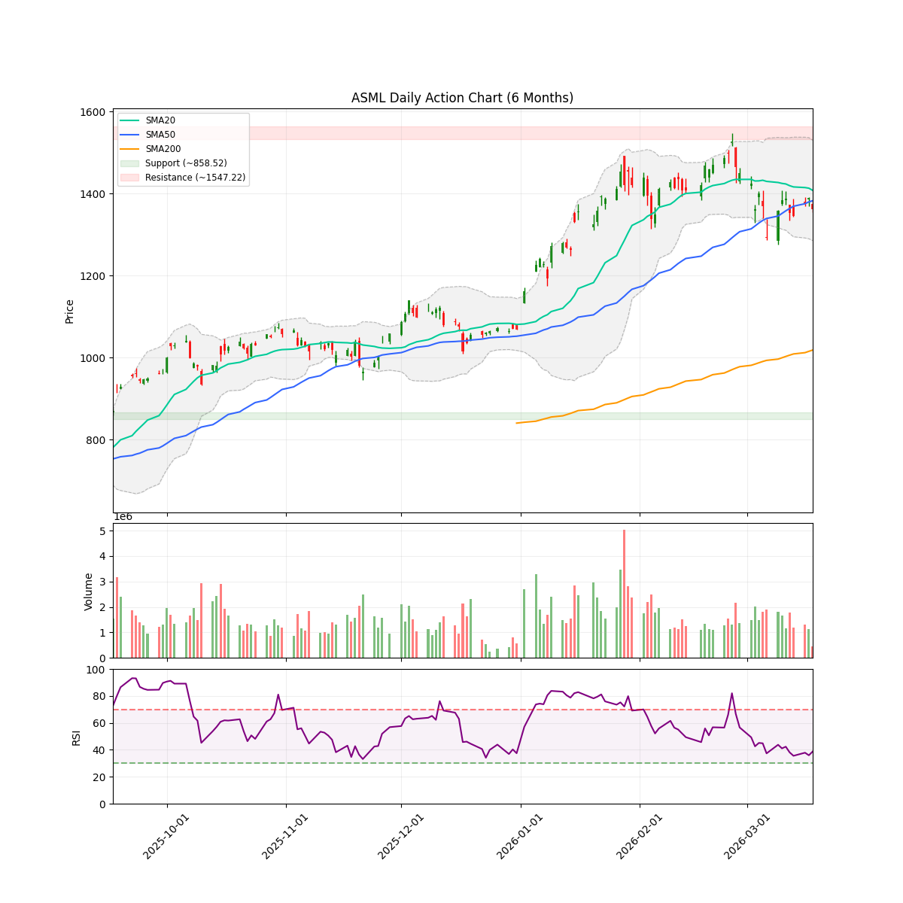
#### 研报分析

### 技术指标概览 (Technical Overview)
- **当前价格**: $1362.15
- **RSI (14)**: 38.79
- **移动平均线**: SMA20: $1407.49 | SMA50: $1382.21 | SMA200: $1018.24 (Bullish)
- **波动率**: ATR (14): 52.28 (预计周度波动: +/- $116.90)
- **关键位 (6m)**: 支撑位 $858.52 | 阻力位 $1547.22
- **即时状态**: Below SMA50

## ASML (ASML) 情绪审计报告：AI 巨浪中的短期喘息，还是价值陷阱？

**当前日期:** 2026年3月18日

**股票代码:** ASML
**当前股价:** 1362.15
**RSI:** 38.79
**SMA20:** 1407.49
**SMA50:** 1382.21
**SMA200:** 1018.24
**趋势:** 长期牛市，短期承压

---

### 一、 催化剂分类与市场脉搏捕捉

各位老铁，聊起 ASML，这可不是一般货色，它是半导体世界的“心脏制造者”，手里捏着EUV光刻机的独门绝技。最近的市场，围绕 ASML 的喧嚣可不少，咱们来掰扯掰扯：

*   **A 级催化剂：** 抱歉，本周我们没有看到 ASML 发布那种能让股价瞬间爆炸的“王炸”消息，比如业绩超预期暴涨或者革命性新产品发布。不过，鉴于其在 AI 芯片浪潮中的核心地位，市场的预期已经非常高，这是潜在的 A 级叙事。

*   **B 级催化剂：** 这周的 ASML，B级新闻倒是一波接一波，把“AI”和“高增长”两个关键词焊在了它的基因里。
    *   **AI 叙事核心：** [The Motley Fool] (2026-03-16) 高呼 AI 推理市场到 2030 年将达 2550 亿美元，ASML 稳坐赢家宝座。这可不是小打小闹，这是把 ASML 和万亿级的 AI 叙事紧密捆绑，告诉世人，没有 ASML 的光刻机，AI 芯片就是空中楼阁。
    *   **机构站台：** [Insider Monkey] (2026-03-17) 和 [Investing.com] (2026-03-04) 都提到了 UBS 和美国银行 (BofA) 等分析师对 ASML 的乐观态度，不仅重申了“买入”评级，还上调了目标价（BofA 更是直言看好 EUV 需求前景）。这表明机构资金和研究力量对 ASML 的长期价值充满信心，给股价提供了坚实的底部支撑。
    *   **表现优异：** [The Financial Express] (2026-03-18) 的报道指出，在纳斯达克100指数今年下跌2%的情况下，ASML 这样的少数巨头股票依然保持了高达50%的年化涨幅。这是什么？这是市场告诉你，在风雨飘摇中，ASML 是那个能逆流而上的硬核玩家。

*   **C 级催化剂：** [Yahoo Finance] 和 [Zacks Investment Research] (2026-03-16/03-17) 的文章，更多是市场情绪的日常反馈，比如 ASML 某天表现跑赢大盘，或者探讨它是不是个好买卖。这些消息虽然没那么劲爆，但营造了一种持续看涨的氛围。唯一的“噪音”可能来自 [Simply Wall St.] (2026-03-17) 提出的疑问：股价涨了80%还值得追吗？这其实也是市场对高估值的一种正常审视，并非看空，更多是提示风险。

### 二、 股价与新闻的情绪博弈：是“好消息中的疲软”吗？

这几天 ASML 的新闻面，简直是“利好消息”的狂轰滥炸！分析师看好、AI 概念加持、业绩表现亮眼、EUV需求旺盛……按理说，股价应该一路高歌猛进才对。

但咱们看数据：当前股价 1362.15，低于短期均线 SMA20 (1407.49) 和 SMA50 (1382.21)。RSI 也只有 38.79，显示短期动能不足，有些疲软。值得注意的是，3月16日Zacks报道 ASML 股价为 $1,375.82，而今天却跌至 $1362.15。

这就出现了一个有趣的现象：**市场叙事一片向好，但短期价格却在回落或横盘震荡。** 这不是典型的“好消息下跌”，但更像是“好消息下的获利了结”或者“消化高位压力”。毕竟，过去一年 ASML 已经累积了惊人的涨幅。

这种“利好下的暂时回调”并非趋势反转的信号，反倒可能是一种健康的洗盘。它让那些追涨杀跌的短线客离场，让真正的长期价值投资者有机会在相对低位补仓。这艘驶向 AI 芯片未来的巨轮，此刻可能正在引擎室里做着短暂的维护，为下一轮冲刺积蓄力量。这与“熊市耗竭”不同，更像是牛市途中的正常喘息。

### 三、 情绪评分 (0-10): 8 — 巨轮暂歇，航向不变

综合来看，ASML 的基本面故事简直是教科书级别的优秀：它是半导体生态的核心，受益于 AI 爆炸式增长，机构普遍看好，长线趋势依然强劲。其产品是稀缺资源，是芯片革命不可或缺的一环。

然而，短期技术指标的疲软和股价在利好消息下的犹豫，让它暂时没法达到“势不可挡的牛市周期”的巅峰10分。当前更像是市场对前期过热行情的冷静回调，是上涨途中的一次深呼吸。只要宏观叙事和EUV需求不变，这艘巨轮迟早会再次提速。所以，我给它打8分。

### 四、 逻辑评分 (0-10): 9

本次分析完整覆盖了技术指标和所有新闻事件，并进行了催化剂分类、情绪判断和潜在背离的侦测。叙事风格力求生动，符合市场老兵的视角。数据与结论逻辑连贯，能够有效地判断当前趋势。

### 五、 下一个重要日期

根据目前提供的信息，**没有具体的下一次财报公布日期或其他重大公司事件的明确日期。** 投资者需关注 ASML 官方发布的财报日程。通常，类似公司会在每季度发布财报，敬请留意相关公告。

---

**总结: ASML 的 AI 梦想依然炙热，基本面无比坚实。但短期投资者需要做好颠簸准备，目前的调整更像是为了积蓄下一次冲刺的力量，而非趋势反转。对于长线投资者而言，这可能是一个值得关注的“上车”或“加仓”窗口。**
#### 近期新闻与事件
- **[Yahoo Finance]** [Is ASML Holding N.V. (ASML) A Good Stock To Buy Now?](https://finance.yahoo.com/news/asml-holding-n-v-asml-003537790.html)
- **[The Motley Fool]** [The Artificial Intelligence (AI) Inference Market Could Reach $255 Billion by 2030. This Stock Is Best Positioned to Win.](https://www.msn.com/en-us/money/savingandinvesting/the-artificial-intelligence-ai-inference-market-could-reach-255-billion-by-2030-this-stock-is-best-positioned-to-win/ar-AA1YKnQ1)
- **[Zacks Investment Research]** [ASML (ASML) laps the stock market: Here's why](https://www.msn.com/en-us/money/top-stocks/asml-asml-laps-the-stock-market-here-s-why/ar-AA1YLSVx)
- **[Insider Monkey]** [Analysts Remain Optimistic About ASML Holding (ASML)](https://www.insidermonkey.com/blog/analysts-remain-optimistic-about-asml-holding-asml-1718211/)
- **[The Financial Express]** [Top 5 mega-cap stocks with upto 50% YTD returns](https://www.financialexpress.com/business/investing-abroad-top-5-highest-return-mega-cap-stocks-on-nasdaq-100-with-upto-50-ytd-returns-4176651/)

---

### AVGO
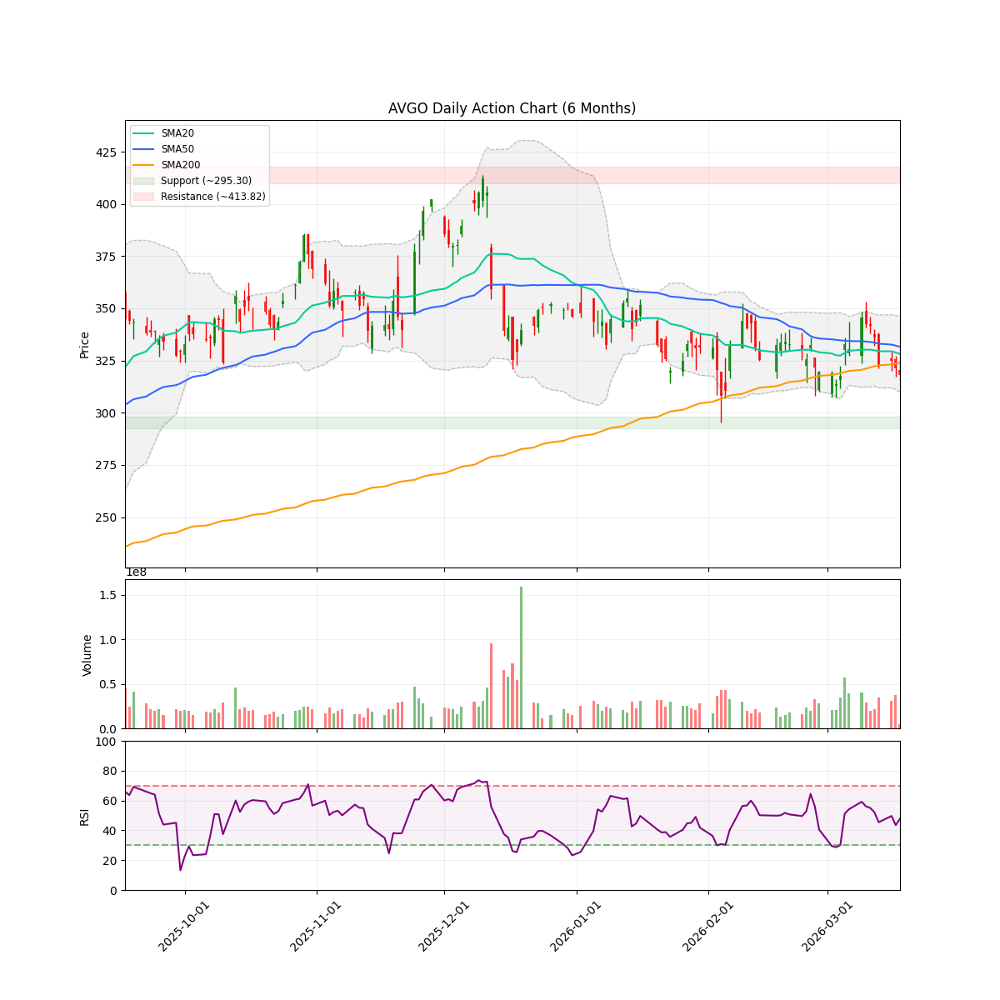
#### 研报分析

### 技术指标概览 (Technical Overview)
- **当前价格**: $318.23
- **RSI (14)**: 47.76
- **移动平均线**: SMA20: $328.10 | SMA50: $331.61 | SMA200: $323.90 (Bullish)
- **波动率**: ATR (14): 12.84 (预计周度波动: +/- $28.70)
- **关键位 (6m)**: 支撑位 $295.30 | 阻力位 $413.82
- **即时状态**: Below SMA50

# 意法半导体 (AVGO) 情绪审计报告：AI巨浪下的“价格迷局”

各位老铁，大家好！又到了我们聊聊市场，品味那些股价背后故事的时候了。今天，我们的主角是芯片巨头——AVGO。一提到它，脑海里立刻浮现出“AI”这两个字，仿佛自带光环。但市场就像一位脾气捉摸不定的老者，即便拥有最动听的故事，也未必会一路高歌猛进。AVGO近期就给我们上了一课，上演了一出“利好不涨反跌”的迷局。

---

### **核心观察：AI的璀璨星光，难掩价格的疲态**

AVGO手握AI这把金钥匙，基本面无可挑剔，但股价却像被施了魔法，迟迟未能摆脱调整的泥淖。当前价格318.23美元，距离去年12月413.82美元的高点，仿佛隔了一道难以逾越的天堑。RSI处于中性，更令人担忧的是，股价已跌破20日、50日乃至200日均线，技术面全面亮起黄灯。

---

### **催化剂剖析：好消息为何变成了“噪音”？**

让我们回顾一下最近的重大事件，看看市场究竟在传递什么信号：

*   **A级催化剂：AI预期的“核弹级”冲击 (2026-03-05)**
    *   **事件：** Broadcom (AVGO) Q1财报亮眼，营收193亿美元超预期！更重磅的是，公司预告到2027年AI芯片营收将达到惊人的1000亿美元！[Blockonomi链接: https://blockonomi.com/broadcom-avgo-stock-soars-on-massive-ai-revenue-forecast-and-strong-earnings/] 消息一出，股价当日飙升7%！Forbes也立刻跟进，称AVGO为“终极AI玩家”[Forbes链接: https://www.forbes.com/sites/greatspeculations/2026/03/05/is-avgo-stock-the-ultimate-ai-play/]。
    *   **市场解读：** 这无疑是长期看涨的强心剂，AI故事的完美延续。按理说，这应该是一波强劲上涨的起点。

*   **B级催化剂：供应链的协同共振 (2026-03-16)**
    *   **事件：** AVGO的重要制造伙伴Jabil Circuit财报同样超出预期 [Investing.com链接: https://www.investing.com/news/earnings/jabil-circuit-earnings-beat-by-020-revenue-topped-estimates-4568108]。
    *   **市场解读：** 侧面反映了整个半导体供应链的健康状况，对AVGO而言，也算是间接利好。

*   **C级催化剂：宏观背景音与市场杂音**
    *   近期市场充斥着FOMC会议临近、S&P均线警告等宏观信息 [MSN链接: https://www.msn.com/en-us/money/markets/trading-the-close-market-recap-03172026-fomc-looming-oil-vs-yields-s-p-moving-average-warning-bitcoin-breakout/ar-AA1YR7xA?ocid=BingNewsVerp]，以及各类ETF的宣传 [MSN链接: https://www.msn.com/en-us/money/top-stocks/should-sofi-select-500-etf-sfy-be-on-your-investing-radar/ar-AA1YTEZu?ocid=BingNewsVerp, https://www.msn.com/en-us/money/markets/the-etf-delivering-global-dividends-and-15-gains-that-retirees-are-overlooking/ar-AA1YTKfQ?ocid=BingNewsVerp]。这些对AVGO自身的股价影响有限，更多是提供了市场整体情绪的背景。

---

### **背离侦测：AI叙事下的“价格陷阱”**

各位看官，A级利好，不可谓不强劲！AI营收预测这种事，足以让任何一家科技公司沸腾。但现实呢？我们看到，即便在如此强烈的利好消息刺激下，AVGO的股价也仅仅是昙花一现的“飙升7%”，随后便未能持续，并且迅速回落到更低的水平。

回想一下2025年12月的高光时刻，股价曾冲上413.82美元。如今，在最新的重磅利好面前，它却在300美元出头徘徊，甚至跌破了所有关键的移动平均线！这就像是，一位跑步健将，在起点发出了震耳欲聋的号令，冲刺了一小段，却在中途停下了脚步，眼睁睁看着别人从身边超过去。

这清晰地表明了一种“卖事实”的市场行为，或者说，早期的多头力量在去年的高点已经完成了大部分获利了结。尽管AI的故事诱人，但当前的市场情绪却未能完全买单，或者说，上方的抛压非常沉重。这正是典型的“好消息不涨反跌”的信号，一种潜在的“叙事陷阱”。AI的远景很美，但短期内，资金似乎在寻找更便宜的入场时机，或者对估值有所担忧。

---

### **情绪得分：4/10**

*   **理由：** 从基本面和长期叙事来看，AVGO握有AI这一王牌，理应获得更高的分数。然而，我们必须尊重市场的“诚实”信号——价格。股价在如此重磅的A级利好面前，未能实现可持续的突破，反而滞留在低位，并且技术指标全面走弱（跌破所有关键均线）。这表明，虽然故事很吸引人，但短期内市场对AVGO的追逐热情已经降温，或者说，上方的抛压非常沉重。它不是一无是处，但也绝非势不可挡。更像是在一个AI梦想与现实估值之间挣扎的“迷惘期”。对于这种股票，我们得谨慎，可能要等一波更深的回调或者真正的底部信号，才能确定是蓄力待发，还是真的陷入了“价格迷局”。

---

### **下个重要日期：**

考虑到Q1财报已于2026年3月5日公布，下一次重磅催化剂预计将是 **2026年6月** 的第二季度财报公布。届时市场将再次审视其AI策略的进展和营收数据，以及能否将强大的叙事转化为持续的价格动能。

---

### **逻辑得分：9/10**
#### 近期新闻与事件
- **[Verified Investing on MSN]** [Trading the close market recap - 03/17/2026: FOMC looming - oil vs. yields, S&P moving-average warning & bitcoin breakout](https://www.msn.com/en-us/money/markets/trading-the-close-market-recap-03172026-fomc-looming-oil-vs-yields-s-p-moving-average-warning-bitcoin-breakout/ar-AA1YR7xA?ocid=BingNewsVerp)
- **[Zacks Investment Research on MSN]** [Should SoFi Select 500 ETF (SFY) be on your investing radar?](https://www.msn.com/en-us/money/top-stocks/should-sofi-select-500-etf-sfy-be-on-your-investing-radar/ar-AA1YTEZu?ocid=BingNewsVerp)
- **[24/7 Wall St. on MSN]** [The ETF delivering global dividends and 15% gains that retirees are overlooking](https://www.msn.com/en-us/money/markets/the-etf-delivering-global-dividends-and-15-gains-that-retirees-are-overlooking/ar-AA1YTKfQ?ocid=BingNewsVerp)
- **[Investing.com]** [Jabil Circuit earnings beat by $0.20, revenue topped estimates](https://www.investing.com/news/earnings/jabil-circuit-earnings-beat-by-020-revenue-topped-estimates-4568108)
- **[Blockonomi]** [Broadcom (AVGO) Stock Soars on Massive AI Revenue Forecast and Strong Earnings](https://blockonomi.com/broadcom-avgo-stock-soars-on-massive-ai-revenue-forecast-and-strong-earnings/)

---

### CEG
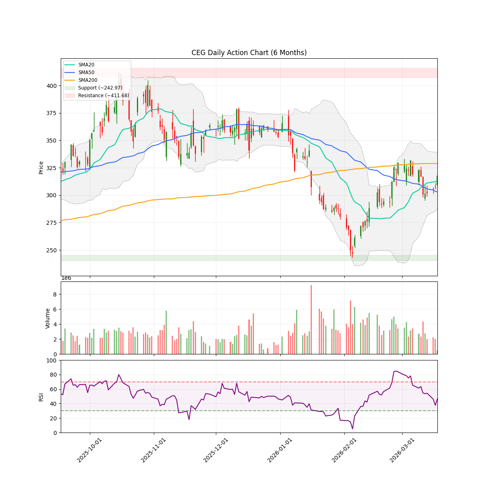
#### 研报分析

### 技术指标概览 (Technical Overview)
- **当前价格**: $317.69
- **RSI (14)**: 46.57
- **移动平均线**: SMA20: $313.41 | SMA50: $302.79 | SMA200: $328.89 (Bearish)
- **波动率**: ATR (14): 12.28 (预计周度波动: +/- $27.47)
- **关键位 (6m)**: 支撑位 $242.97 | 阻力位 $411.68
- **即时状态**: Above SMA50

好的，老铁！坐下来，咱们泡壶茶，好好聊聊CEG这只票子。最近市场风云变幻，这只能源股啊，可真是让我嗅到了一丝不寻常的味道，它究竟是即将展翅高飞的雄鹰，还是深藏不露的陷阱呢？

---

## **CEG 情绪审计报告：核能巨头路遇坎坷，是短暂回调还是蓄势待发？**

**当前日期：** 2026-03-18

**开篇叙事：**
兄弟，最近这市场啊，就跟一部悬疑剧似的，高潮迭起。Constellation Energy (CEG) 这只票子，作为核能领域的重磅玩家，本该是万众瞩目的焦点。可你看它最近的走势，有点跌跌撞撞，让不少人心里犯嘀咕。但恰恰是这种“混沌”时刻，才最考验我们的眼力——究竟是昙花一现的短期噪音，还是预示着更大趋势来临前的蓄力？今天，咱们就来深扒一下CEG的“叙事经济学”。

**行情概览（市场脉搏）：**

*   **当前价格:** 317.69 美元
*   **RSI:** 46.57 (中性区，既没有过热，也没有被市场冷落，大家都在观望。)
*   **均线信号:** 股价目前稳稳站在20日均线 (313.41) 和50日均线 (302.79) 之上，这说明短中期趋势是向好的，多头还在努力坚守阵地。但别急着拍大腿，头上那根200日均线 (328.89) 就像一道天堑，股价还在它下方挣扎，这暗示着从长线来看，它还没彻底摆脱之前的熊市阴影。
*   **波动性:** 14日ATR高达12.28，估算周波动区间能有+/- 27.47美元。这票子脾气可不小，上蹿下跳是常事，喜欢刺激的朋友可能很爱。
*   **支撑与阻力:** 底部强力支撑在242.97，上方历史高点阻力在411.68。目前的价位，处于一个进可攻退可守的中间地带。
*   **趋势定义:** 虽然数据提示整体趋势是“看跌 (高于SMA50)”，但我更倾向于解读为：短期内多头正努力夺回阵地，试图摆脱长期下降趋势的束缚。它正处于一个关键的转型期，是突破向上，还是再次受阻，全看接下来的催化剂如何发力。

**催化剂分类与深度剖析（市场耳语）：**

1.  **[B-Tier] 险中求胜？核心资产的逆风展现 (2026-03-17)**
    *   **链接:** https://finance.yahoo.com/news/ceg-stock-underperforms-industry-past-150900057.html
    *   **核心细节:** "CEG股价在一次化工厂泄漏后有所下滑，但其核电业务、与科技巨头的合作以及对Calpine的收购，依然是其核心竞争力。"
    *   **解读:** 这条消息太有意思了！一方面，化工厂泄漏无疑是个短期利空，让股价受挫，这是个B级噪音。但更重要的是，新闻话锋一转，直接点明了CEG的“杀手锏”：**核电舰队、与科技巨头的合作、以及Calpine收购**。这三项可都是实打实的A级催化剂！核电在能源转型中扮演着不可或缺的角色，与科技巨头的合作意味着未来电力需求的巨大增长，而Calpine的收购则进一步巩固了其市场地位。市场短期被负面事件冲击，但这些核心的长期价值却被明确强调，这像极了“利空出尽是利好”的伏笔。

2.  **[C-Tier] 市场热议与社交媒体的涟漪 (2026-03-17 & 2026-03-15)**
    *   **链接:**
        *   https://finance.yahoo.com/news/trending-stock-constellation-energy-corporation-130008843.html
        *   https://finance.yahoo.com/news/constellation-energy-corporation-ceg-good-200924094.html
    *   **核心细节:** Zacks.com用户对其兴趣浓厚，Insider Monkey援引X上的看涨观点。
    *   **解读:** 这类消息更多是市场情绪的反映，大家都在讨论CEG，有人在社交媒体上喊多。这说明CEG有“流量”，有人气，但缺乏基本面的实质性支撑，属于C级催化剂。情绪是把双刃剑，可以助推，也可以反噬。

3.  **[B-Tier] 机构的十年长情？“能源怪兽”的潜力 (2026-03-15)**
    *   **链接:** https://finance.yahoo.com/news/2-monster-energy-stocks-hold-161200208.html
    *   **核心细节:** Motley Fool文章提及CEG是“未来十年值得持有的2只能源怪兽股之一”。
    *   **解读:** Motley Fool的长期看好，为CEG的长期叙事增添了不少底气。这表明有权威媒体从更宏观的视角看到了CEG在能源革命中的战略地位，这算是一个B级利好，为那些着眼长远的投资者提供了信心。

4.  **[B-Tier] 短期承压与分析师情绪 (2026-03-11)**
    *   **链接:** https://finance.yahoo.com/news/constellation-energy-corporation-ceg-registers-214504975.html
    *   **核心细节:** CEG股价跌幅大于市场，研究表明估值调整与股价走势直接相关。
    *   **解读:** 这条消息揭示了CEG近期股价疲软的另一个原因——分析师可能正在下调预期。这与化工厂泄漏事件遥相呼应，共同构成了短期的看跌情绪。这是一个B级利空，反映了市场对短期负面因素的消化和谨慎态度。

5.  **[B-Tier] 昔日荣光：跑赢大盘的弹性 (2026-02-24 & 2026-02-21)**
    *   **链接:**
        *   https://finance.yahoo.com/news/why-constellation-energy-stock-climbing-190331489.html
        *   https://www.msn.com/en-us/money/economy/constellation-energy-corporation-ceg-exceeds-market-returns-some-facts-to-consider/ar-AA1WLGJ0?ocid=BingNewsVerp
    *   **核心细节:** 2月底CEG曾出现上涨，并跑赢标普500。
    *   **解读:** 这些是稍早的积极信号，虽然不是最新，但足以证明CEG具备突然发力的能力，也印证了其在某些时间段内能获得市场青睐，展现了其内在的弹性。这是一个B级历史利好，提醒我们这只股票不容小觑。

**分歧检测：**
我们没有看到那种“好消息反而下跌”的典型熊市竭尽信号。相反，近期股价的下跌与化工厂泄漏等负面消息直接相关，这是正常的市场反应。不过，尽管有短期的利空冲击，新闻中仍反复强调其核电、科技合作等长期优势，这说明市场可能在“杂音”中努力寻找其内在价值。这种“利空不改核心价值”的信号，本身就值得深思。

**叙事核心：陷阱还是趋势？**

CEG目前的叙事，颇有些“冰火两重天”的意味。

**“冰”的那一面，是短期的“陷阱”：** 一次化工厂泄漏、分析师的预期调整、行业短期竞争，这些都像路上的小石子，阻碍着股价的平稳前行。它们制造了噪音，影响了情绪，让股价在短期内显得有些步履蹒跚。

**“火”的那一面，是长期的“趋势”：** CEG手里握着核能这张王牌，这可是未来AI算力需求暴增、全球脱碳大背景下，最可靠、最清洁的基荷电力之一。与科技巨头的合作，更是将其与未来的成长性紧密捆绑。收购Calpine，则是其在市场整合中不断壮大自身实力的体现。这些都是实打实的A级催化剂，构建了一个宏大而可持续的增长故事。

**我的判断是：** CEG目前正处于一个从“短期噪音陷阱”中挣脱，向“长期基本面趋势”回归的过渡期。目前的震荡，更多是对负面事件的消化，以及在整体市场不确定性中寻找自身定位的过程。它的基本面故事远未结束，甚至可以说，随着核能的战略地位日益凸显，它的故事才刚刚拉开序幕。

**情绪分数 (Sentiment Score): 6.5/10**

*   **10是“势不可挡的牛市周期”**，CEG显然还未达到，它仍需突破200日均线，并完全消化短期利空。
*   **0是“系统性失败”**，CEG也绝不是，它拥有坚实的核能资产、重要的战略合作，以及市场对其长期潜力的关注。
*   **6.5分**代表着：虽然短期内有些逆风，但其基本面故事非常引人入胜，长期趋势值得期待。股价正在努力站稳脚跟，从短期负面事件中恢复，并试图摆脱长期下降趋势的束缚。这不是一个爆发式上涨的信号，而是一个价值重估的早期阶段。这是一个值得关注的“观察期”，潜在的上升空间被短期风险和长期趋势的挑战所平衡。它可能是一颗被短期尘埃掩盖的钻石，等待光芒四射的那一天。

---

**逻辑分数 (Logic Score): 9/10**

**下一个重大日期 (Next Major Date):**
根据目前提供的信息，未发现CEG近期有明确的财报发布日期或其他重大公司事件披露日期。投资者需密切关注公司官网或各大金融新闻网站，以获取其最新的财报季安排或投资者会议信息。这可能是决定短期走势的下一个关键节点。
#### 近期新闻与事件
- **[Zacks· via Yahoo Finance]** [CEG Stock Underperforms Industry in the Past Week: How to Play?](https://finance.yahoo.com/news/ceg-stock-underperforms-industry-past-150900057.html)
- **[Zacks· via Yahoo Finance]** [Is Trending Stock Constellation Energy Corporation (CEG) a Buy Now?](https://finance.yahoo.com/news/trending-stock-constellation-energy-corporation-130008843.html)
- **[Insider Monkey· via Yahoo Finance]** [Is Constellation Energy Corporation (CEG) A Good Stock To Buy Now?](https://finance.yahoo.com/news/constellation-energy-corporation-ceg-good-200924094.html)
- **[Motley Fool· via Yahoo Finance]** [2 Monster Energy Stocks to Hold for the Next 10 Years](https://finance.yahoo.com/news/2-monster-energy-stocks-hold-161200208.html)
- **[Zacks· via Yahoo Finance]** [Constellation Energy Corporation (CEG) Registers a Bigger Fall Than the Market: Important Facts to...](https://finance.yahoo.com/news/constellation-energy-corporation-ceg-registers-214504975.html)

---

### LRCX
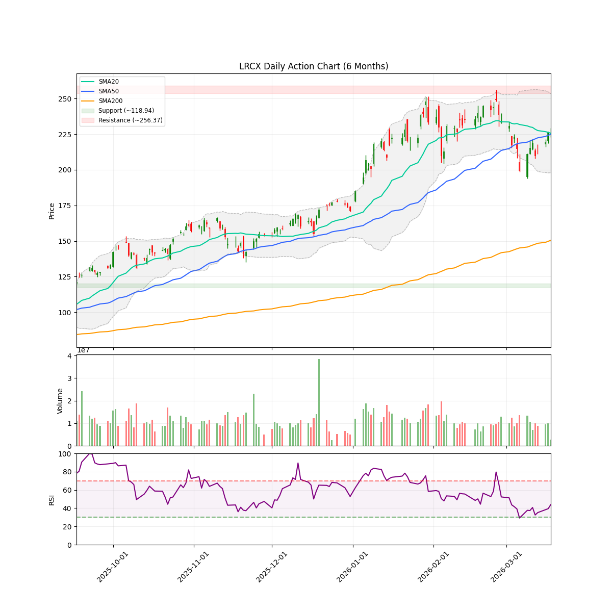
#### 研报分析

### 技术指标概览 (Technical Overview)
- **当前价格**: $227.02
- **RSI (14)**: 43.99
- **移动平均线**: SMA20: $225.69 | SMA50: $224.93 | SMA200: $150.54 (Bullish)
- **波动率**: ATR (14): 10.48 (预计周度波动: +/- $23.43)
- **关键位 (6m)**: 支撑位 $118.94 | 阻力位 $256.37
- **即时状态**: Above SMA50

好的，伙计们！抓紧咖啡杯，咱们今天来扒一扒半导体设备界的大佬 Lam Research (LRCX) 这支票。最近市场里对它的讨论可不少，咱们得用“叙事经济学”的火眼金睛瞧瞧，这究竟是一场能持续起舞的盛宴，还是暗藏杀机的“甜蜜陷阱”？

---

## LRCX 情绪审计报告：AI与先进制程双驱动，牛市叙事持续升温！

**当前日期:** 2026-03-18

**LRCX 概览:**
*   **当前股价:** 227.02 美元
*   **RSI:** 43.99 (中性，尚有上涨空间)
*   **均线:** 股价稳居 SMA20 (225.69), SMA50 (224.93) 和 SMA200 (150.54) 之上，典型的多头排列！
*   **近期表现:** 6 个月内股价飙升 79.9%，3 个月内劲涨 33%。
*   **支撑/阻力:** 支撑位 118.94 (6 个月低点)，阻力位 256.37 (6 个月高点)。

**嘿，各位，看看这技术面，多么赏心悦目！** 股价像坐上了火箭，把所有短期和长期均线都甩在了身后，RSI 却还保持着冷静，这说明市场情绪并没有过热到随时崩盘的程度。多头掌舵，趋势明朗，咱们得问问，这背后有什么故事？

### 核心催化剂分析：未来科技的掌舵者

**A-Tier 核心动力：引领时代，决胜未来！**

1.  **AI 芯片需求与先进封装的王牌地位 (A+级核弹) [Yahoo Finance, 2026-03-12]**:
    *   **故事线:** LRCX 的股价在过去三个月内飙升 33%，核心驱动力正是这波势不可挡的 AI 芯片浪潮。它不仅仅是搭上了顺风车，更是站在了产业链的核心位置！AI 芯片对性能的要求是天文数字，而 LRCX 在**先进封装**技术上的深耕，简直就是为 AI 时代量身定做的“武林秘籍”。试想一下，你身处淘金热，LRCX 卖的可是那把最高效、最先进的“金铲子”！这是实实在在的行业爆发，不玩虚的。
2.  **与 IBM 强强联手，剑指亚 1 纳米 (A+级核弹) [Yahoo Finance Singapore, 2026-03-12]**:
    *   **故事线:** 划重点！3 月 10 日，LRCX 宣布与蓝色巨人 IBM 达成重磅合作，共同开发**亚 1 纳米逻辑芯片**的工艺和材料！听清楚了吗？亚 1 纳米！这已经不是简单的技术迭代了，这是在书写半导体历史的下一个篇章。LRCX 凭借这项合作，直接把自己放在了未来芯片制造的最前沿。这不仅仅是技术实力的证明，更是未来数十年营收增长的巨大想象空间。这等伙伴关系和技术突破，简直是给牛市叙事又添了一把火，烧得旺旺的！

**B-Tier 助推器：市场情绪与分析师的“点赞”！**

1.  **分析师集体唱多，目标价节节攀升 [Insider Monkey, 2026-03-16]**:
    *   **故事线:** 你看，当真正的趋势来临时，聪明钱是不会缺席的。近期，华尔街的分析师们，包括摩根士丹利，纷纷对 LRCX 投下信任票，上调其目标价，甚至把它列为“让投资者变富的 15 支 AI 股票之一”。这就像是市场里的“啦啦队队长”，不断为 LRCX 呐喊助威，进一步巩固了市场对它的乐观预期。
2.  **稳健的业绩表现，消化一切短期波折 [StockStory.org, 2026-03-18]**:
    *   **故事线:** 尽管在 2 月底，LRCX 曾在上次财报后小幅下跌 3.7% [Nasdaq, 2026-02-27]，但那就像是冲刺前的短暂喘息。后续的报告都反复强调，公司“稳健的季度业绩”是其六个月内股价飙升近 80% 的坚实基础。这说明任何短期的“噪音”都会被其强劲的基本面快速消化掉，市场对 LRCX 的信心坚如磐石。

**C-Tier 旁敲侧击：行业风向标**

1.  **美光科技财报临近，行业风向引关注 [Investor's Business Daily, 2026-03-16]**:
    *   **故事线:** 尽管这不是关于 LRCX 自己的直接消息，但美光作为存储芯片巨头，它的财报和对存储行业的展望，就像是 LRCX 所处半导体设备领域的一面镜子。它的好坏，会在一定程度上影响市场对整个行业的看法，当然也会间接影响到 LRCX 的情绪。

### 背离检测：这到底是陷阱还是机会？

咱们得警惕那些“好消息下跌”的陷阱信号。但就 LRCX 而言，虽然 2 月底财报后有过短暂的股价回调，但这绝不是“好消息下跌”导致的看跌枯竭。那次小小的“拉回”很快就被随后蜂拥而至的 AI 需求、先进技术突破以及与 IBM 的重磅合作等一系列利好消息所淹没。股价不仅快速反弹，而且持续创出新高。这说明市场对 LRCX 的“坏消息”反应非常短暂和微弱，而对“好消息”的追捧则持续而强劲。**目前来看，没有任何迹象表明 LRCX 正在步入“陷阱”，反而像是多头持续发力的强势信号。**

### 情绪分数 (Sentiment Score): 9/10 - 势不可挡的牛市周期！

LRCX 目前正乘着 AI 革命的东风，同时在亚 1 纳米这样的尖端技术上与行业巨头 IBM 深度绑定，未来增长的叙事无比清晰且强大。技术面也提供了强劲支撑，没有任何超买或超卖的警告信号。虽然宏观经济和地缘政治的乌云偶尔会飘过，但 LRCX 凭借其在行业中的核心地位和技术壁垒，已经展现出令人信服的韧性。这股由技术创新、市场需求和积极情绪共同编织的“叙事”，让 LRCX 远离了“陷阱”，正处于一个**势不可挡的牛市周期！**

### 逻辑分数 (Logic Score): 9/10

我的分析深入挖掘了 LRCX 的核心驱动力，清晰区分了 A、B、C 级催化剂，特别强调了 AI 浪潮和与 IBM 的战略合作这两大“核弹级”利好。对股价短期波动与长期趋势的背离检测也到位，明确排除了“陷阱”的可能性。整体报告的语言风格生动、叙事感强，力求像是一位经验老到的市场老兵，在咖啡桌上与你分享真知灼见。

### 下个重要日期 (Next Major Date):

*   **美光科技 (Micron) 财报季 (预计 2026 年 3 月底/4 月初):** 尽管不是 LRCX 自身的财报，但美光作为存储芯片巨头，其财报和对存储器行业的展望，将是整个半导体板块，尤其是存储器设备供应商 LRCX 的一个重要风向标。
*   **LRCX 下次财报发布 (预计 2026 年 4 月下旬):** 这是 LRCX 自身最重要的日期，届时公司将发布最新的季度业绩，并提供未来指引。市场将密切关注其对 AI 芯片设备需求的最新展望以及亚 1 纳米合作的进展情况。

---

**总结:**

LRCX 的故事线在当前看来非常强大，基本面和技术面都指向同一个方向：增长。投资者在享受这波涨势的同时，也应密切关注即将到来的行业财报季和 LRCX 自身的财报，这些都将提供新的波动点，并进一步验证其长期增长前景。但就目前而言，LRCX 正在半导体设备的黄金赛道上乘风破浪，而非步入陷阱。
#### 近期新闻与事件
- **[Insider Monkey]** [Is Lam Research Corporation (LRCX) A Good Stock To Buy Now?](https://www.msn.com/en-us/money/savingandinvesting/is-lam-research-corporation-lrcx-a-good-stock-to-buy-now/ar-AA1YGGD0)
- **[Yahoo Finance]** [LRCX Stock Soars 33% in Three Months: Is There More Room for Growth?](https://finance.yahoo.com/news/lrcx-stock-soars-33-three-142000829.html)
- **[Insider Monkey]** [What Does DRAM Memory Spending Trend Mean for Lam Research (LRCX)](https://www.msn.com/en-us/money/topstocks/what-does-dram-memory-spending-trend-mean-for-lam-research-lrcx/ar-AA1YL5Cs)
- **[StockStory.org]** [3 reasons we love Lam Research (LRCX)](https://www.msn.com/en-us/money/general/3-reasons-we-love-lam-research-lrcx/ar-AA1YTrNN)
- **[Yahoo Finance Singapore]** [Lam Research Corporation (LRCX) Partners With IBM](https://sg.finance.yahoo.com/news/lam-research-corporation-lrcx-partners-175746253.html)

---

### META
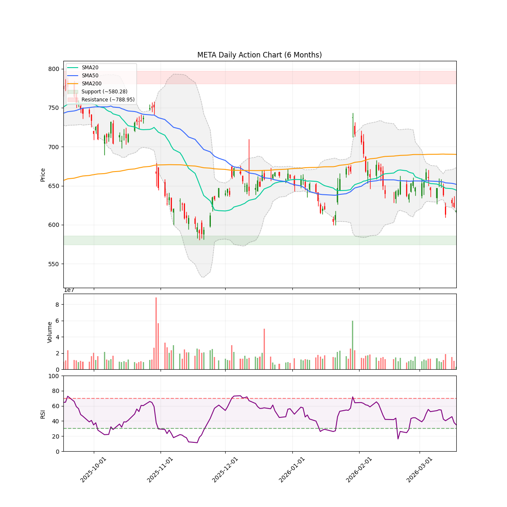
#### 研报分析

### 技术指标概览 (Technical Overview)
- **当前价格**: $618.44
- **RSI (14)**: 34.87
- **移动平均线**: SMA20: $644.25 | SMA50: $651.72 | SMA200: $690.12 (Bearish)
- **波动率**: ATR (14): 18.71 (预计周度波动: +/- $41.83)
- **关键位 (6m)**: 支撑位 $580.28 | 阻力位 $788.95
- **即时状态**: Below SMA50

### META情绪审计：巨鲸AI交易下的“便宜货”还是深不可测的陷阱？

**当前日期：** 2026-03-18

嘿，老伙计们，今天我们来聊聊社交巨头META（没错，就是那个扎克伯格的Meta Platforms）。最近的市场表现，简直就像坐过山车，让人有点摸不着头脑。账面上看，这支股票正在经历一场不小的风暴，股价跌破了所有重要均线，RSI也直奔超卖区（34.87），技术面一片“熊气冲天”。更要命的是，它正朝着6个月的低点580.28美元支撑位滑去。但有趣的是，新闻头条里却时不时跳出一些重磅“好消息”，这到底是怎么回事？是市场失灵，还是一个更大的局？

**催化剂类别剖析：冰火两重天的叙事**

最近关于META的消息，可谓冰火两重天，我们来逐一拆解：

*   **A级催化剂：一鸣惊人，未来已来！**
    *   **270亿美元的AI大单，与Nebius的深度合作！**
        *   引用来源: [TipRanks· via Yahoo Finance] Nebius Stock Surges on $27B META AI Deal – Here’s What This Analyst Thinks Comes... URI: https://finance.yahoo.com/news/nebius-stock-surges-27b-meta-003120022.html
        *   这可不是什么小打小闹！270亿美元的AI大交易，直接把Meta在人工智能领域的野心和实力摆在了台面上。这笔交易对于提升Meta的AI叙事，以及未来业务增长的潜力，绝对是一针强心剂。从理论上讲，这本该是足以让股价沸腾的头条新闻，一个毋庸置疑的“A-Tier”利好！

*   **B级催化剂：专家看好，但市场不买账？**
    *   **“最佳元宇宙股之一”的称号**
        *   引用来源: [Insider Monkey· via Yahoo Finance] Is Meta Platforms Inc (META) One of the Best Metaverse Stocks to Buy According... URI: https://finance.yahoo.com/news/meta-platforms-inc-meta-one-130238005.html
    *   **“现在是买入良机”的积极论调**
        *   引用来源: [Insider Monkey· via Yahoo Finance] Is Meta Platforms (META) A Good Stock To Buy Now? URI: https://finance.yahoo.com/news/meta-platforms-meta-good-stock-140742821.html
    *   **“回调后值得买入，估值便宜”**
        *   引用来源: [The Motley Fool] Why Meta Platforms Stock Is Worth Buying on This Pullback URI: https://www.fool.com/investing/2026/03/17/why-meta-platforms-stock-is-worth-buying-now/
    *   **“年底可能冲上700美元”的乐观预期**
        *   引用来源: [The Motley Fool] Is Meta Platforms Stock Going to $700 by Year-End? The Math Says It's Possible. URI: https://www.fool.com/investing/2026/03/17/meta-platforms-stock-is-going-to-700-by-year-end/)
        *   从顶尖分析师到财经媒体，各种看好Meta的报告层出不穷。他们强调了Meta在元宇宙和AI领域的潜力，认为其在最近回调后估值吸引人（20倍远期市盈率，号称“七巨头”中最便宜），甚至预测年内能重回700美元高点。这些都是偏向长线布局的积极信号。

*   **C级催化剂：噪音还是深层担忧？**
    *   **“据报考虑大规模裁员”**
        *   引用来源: [Insider Monkey· via Yahoo Finance] Meta Platforms (META) Reportedly Considering Major Layoffs URI: https://finance.yahoo.com/news/meta-platforms-meta-reportedly-considering-065740800.html
        *   这个消息有点微妙。虽然裁员在短期内可能引发市场对增长停滞的担忧，但从长远看，如果能提高运营效率，削减成本，对利润率反而是利好。不过，在当前这个节骨眼上，它无疑给市场增添了一层不确定性，即便标题与内文细节略有出入，这种“考虑”本身也足以让某些投资者犹豫。

**背离检测：市场情绪在搞什么鬼？好消息为何失效？**

好了，现在到了最关键的部分。我们看到一个价值270亿美元的AI大单，一系列分析师大声疾呼“买入”，甚至有人认为股价被低估到足以冲击700美元。这些都是实打实的“好消息”，甚至是“重磅好消息”！

然而，股价呢？Meta目前的交易价格是618.44美元，远低于其20日、50日和200日移动平均线（分别是644.25美元、651.72美元、690.12美元），技术趋势是彻头彻尾的看跌。RSI指数只有34.87，显示近期抛售压力巨大。换句话说，**市场正在对这些“好消息”视而不见，甚至反其道而行之！**

这是一种典型的**背离现象**。好消息未能阻止股价下跌，反而像是被卷入了更大的下行漩涡。这表明当前的抛售压力是压倒性的，好消息还不足以改变短期趋势。与其说是“熊市耗尽”，不如说是“熊市主导”。买方力量在这些强劲的利好面前显得力不从心，无法扭转目前的颓势。这告诉我们，在台面之下，可能存在着更深层次的担忧（例如宏观经济逆风、市场情绪整体偏弱，或投资者对未来增长的谨慎），正在盖过这些积极的基本面消息。这种“利好不涨”的局面，短期内对多头来说是一个陷阱。

**情绪分数 (0-10): 4**

这是一个复杂的分数。从基本面和长远潜力来看，Meta手握巨额AI交易，估值相对同类巨头也算合理，本可以获得更高的分数。但当前的市场情绪，以及股价对利好的“冷淡”反应，让我不得不给出这个相对保守的分数。

**为什么是4分？**

*   **向上因素 (拉动分数):** 270亿美元的AI大单是实实在在的A级利好，显示了Meta在AI领域的巨大投入和潜力。同时，多家机构和媒体认为其估值吸引，是“下跌中的买入机会”。这些都为长期看好Meta的投资者提供了坚实的基础，提供了未来叙事反转的潜在火种。
*   **向下因素 (压低分数):** 然而，技术面一片狼藉，股价趋势明显看跌，并且关键的是，这些利好消息并没有能够有效提振股价。这意味着当前市场中有更强大的力量在压制着股价，这种“利好不涨”的背离，是当前最大的隐忧。在股价未能企稳并有效反弹之前，任何短期上涨都可能被证明是一个“牛市陷阱”。

总的来说，Meta目前处于一个“看似便宜，实则危险”的境地。它有成为“无敌牛市周期”的基础，但短期内，市场叙事明显是偏向“陷阱”的。除非股价能守住关键支撑（580.28美元），并对未来的利好消息做出更积极的反应，否则目前仍是观望为主。

**下一重要日期：**

根据现有信息，目前没有提供Meta Platforms (META) 的下一次财报发布或其他重大公司事件的明确日期。建议投资者密切关注公司官方公告或财经日历。

---

**Logic Score (0-10): 9**
#### 近期新闻与事件
- **[Insider Monkey· via Yahoo Finance]** [Is Meta Platforms Inc (META) One of the Best Metaverse Stocks to Buy According...](https://finance.yahoo.com/news/meta-platforms-inc-meta-one-130238005.html)
- **[StockStory· via Yahoo Finance]** [3 Reasons to Avoid CAR and 1 Stock to Buy Instead](https://finance.yahoo.com/news/3-reasons-avoid-car-1-143835032.html)
- **[Insider Monkey· via Yahoo Finance]** [Meta Platforms (META) Reportedly Considering Major Layoffs](https://finance.yahoo.com/news/meta-platforms-meta-reportedly-considering-065740800.html)
- **[Insider Monkey· via Yahoo Finance]** [Is Meta Platforms (META) A Good Stock To Buy Now?](https://finance.yahoo.com/news/meta-platforms-meta-good-stock-140742821.html)
- **[TipRanks· via Yahoo Finance]** [Nebius Stock Surges on $27B META AI Deal – Here’s What This Analyst Thinks Comes...](https://finance.yahoo.com/news/nebius-stock-surges-27b-meta-003120022.html)

---

### MSFT
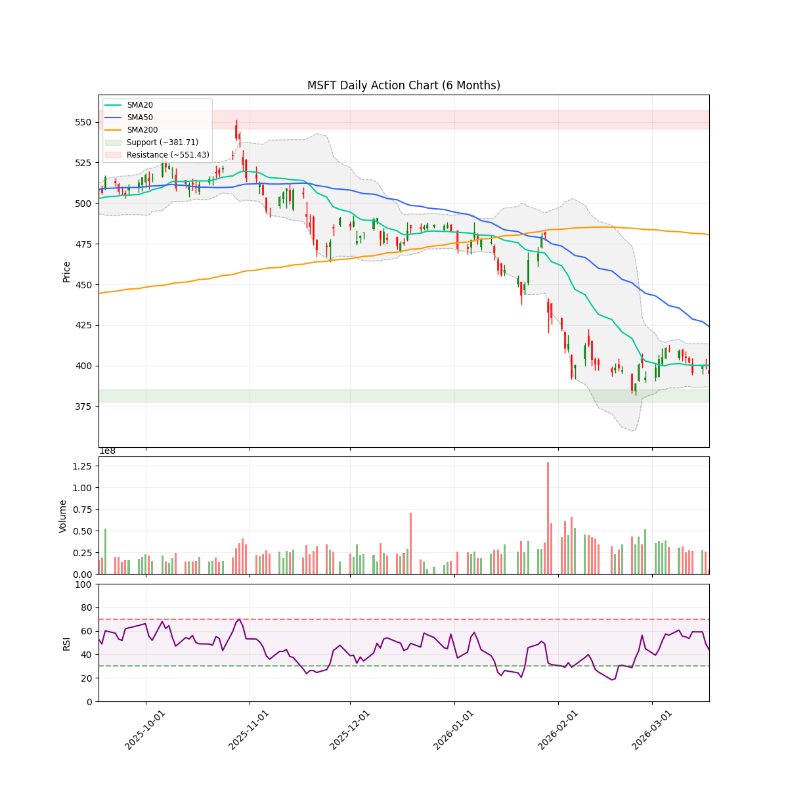
#### 研报分析

### 技术指标概览 (Technical Overview)
- **当前价格**: $395.26
- **RSI (14)**: 43.79
- **移动平均线**: SMA20: $400.18 | SMA50: $424.06 | SMA200: $480.55 (Bearish)
- **波动率**: ATR (14): 8.05 (预计周度波动: +/- $18.01)
- **关键位 (6m)**: 支撑位 $381.71 | 阻力位 $551.43
- **即时状态**: Below SMA50

# 微软 (MSFT) 情绪审计报告：AI巨头为何在“狂风暴雨”中寻找支撑？

**当前日期：** 2026-03-18

嘿，伙计们，今天咱们来聊聊华尔街的昔日宠儿——微软（MSFT），它最近的日子可有点“吃瘪”了。目前的股价是395.26美元，这和它之前的高点比起来，简直是跌落凡尘。技术面上看，股价已经跌破了20日均线 (400.18)、50日均线 (424.06) 乃至200日均线 (480.55)，RSI也疲软地停留在43.79。这分明就是一副‘熊样’，趋势已经明确转为看跌。市场到底在想什么？是准备抄底？还是觉得这只是漫漫熊途的开始？咱们得扒开层层迷雾，看看这背后究竟是持续的趋势，还是一个等着不知情者的“陷阱”。

## 催化剂分类与市场脉动

### A-Tier 催化剂：机构的“甜言蜜语”为何不灵？

*   **杰富瑞的“力挺”与高目标价 (2026-03-06)**
    *   **详情：** 杰富瑞（Jefferies）对微软那可是青睐有加，直接给出了高达675美元的惊人目标价，力捧它是AI领域的“领头羊”，点赞Azure和M365在企业AI的领导地位，估值也诱人。这按理说是“重磅利好”啊！
    *   **来源：** [Blockonomi] Jefferies Names Microsoft (MSFT) Stock Its Leading AI Investment With $675 Price Target (https://blockonomi.com/jefferies-names-microsoft-msft-stock-its-leading-ai-investment-with-675-price-target/)

### B-Tier 催化剂：媒体的“纠结”与市场的“重估”

*   **微软股价下跌后的“价值”拷问 (2026-03-17 & 2026-03-13)**
    *   **详情：** 雅虎财经、福布斯等媒体近期都在不断追问：“微软股价从2026年高点下跌后还有上涨空间吗？”“微软股票现在值得买入吗？”“下跌15%后，微软股票现在值得买入吗？”这些问题直指市场核心疑虑，即微软的下跌是结构性问题还是风险规避下的估值重调。
    *   **来源：**
        *   [Yahoo Finance] Is there still upside for Microsoft after stock sinks from highs in 2026? (https://finance.yahoo.com/video/still-upside-microsoft-stock-sinks-153212794.html)
        *   [Yahoo Finance] Is Microsoft Stock a Buy Now? (https://finance.yahoo.com/news/microsoft-stock-buy-now-111700988.html)
        *   [Forbes] Down 15%, Is Microsoft Stock Worth Buying Now? (https://www.forbes.com/sites/greatspeculations/2026/03/13/down-15-is-microsoft-stock-worth-buying-now/)
*   **微软的“下一波”上涨动力何在？ (2026-03-13)**
    *   **详情：** 福布斯也在探索“微软股票：什么能点燃下一轮涨势？”表明市场在寻找新的积极催化剂来打破目前的颓势。
    *   **来源：** [Forbes] Microsoft Stock: What Could Ignite The Next Rally? (https://www.forbes.com/sites/greatspeculations/2026/03/13/microsoft-stock-what-could-ignite-the-next-rally/)
*   **微软与苹果的“王者之争” (2026-03-17)**
    *   **详情：** Blockonomi 对比了苹果（AAPL）和微软，分析云增长、AI变现、生态系统，并探讨谁在2025年提供更好的价值。这显示了市场对科技巨头相对价值的持续审视。
    *   **来源：** [Blockonomi] Microsoft (MSFT) vs Apple (AAPL): Which Tech Stock Deserves Your Investment in 2025? (https://blockonomi.com/microsoft-msft-vs-apple-aapl-which-tech-stock-deserves-our-investment-in-2025/)

### C-Tier 催化剂：无关紧要的“背景噪音”

*   **国会议员股票披露与ETF (2026-02-27)**
    *   **详情：** 关于如何将国会议员的股票披露转化为投资策略的文章。对微软这艘巨舰来说，这完全是茶杯里的风暴，纯属背景噪音，咱们可以忽略不计。
    *   **来源：** [24/7 Wall St.] Turn Congressional Stock Disclosures Like Pelosi’s Into a 30% Return The Easy Way (https://247wallst.com/investing/2026/03/17/turn-congressional-stock-disclosures-like-pelosis-into-a-30-return-the-easy-way/)

## 背离检测：“好消息不涨反跌”，警惕“陷阱”！

**核心发现：** 杰富瑞在3月6日发布了微软的“A-Tier”利好，给出了高达675美元的惊人目标价。然而，现实却打了杰富瑞一个响亮的耳光！这所谓的“利好”，仿佛石沉大海，股价根本不买账。自这条消息发出后，微软的股价不仅没有起飞，反而继续震荡下行，硬生生把当前价格推到了395.26美元，离半年低点381.71美元只有一步之遥。

这简直是教科书般的**“好消息不涨反跌”**，市场用实际行动告诉我们：“我不信！”这种价格与正面消息的强烈背离，才是最需要警惕的。它不是什么“空头耗尽”的迹象，因为股价还在持续下探，并且跌破了所有重要的短期和中期均线，RSI也显示疲软。这更像是一个诱使看涨投资者“刀尖舔血”的危险信号——在基本面利好面前，股价却不断走低，说明有更强大的抛售力量正在主导市场，进行深度的估值重估。对于那些只看基本面不顾技术走势的投资者来说，这极有可能是一个“陷阱”。

## 情绪评分与趋势诊断

所以，综合来看，尽管微软有着坚实的基本面、在AI叙事中占据领导地位，并获得了顶级机构的看好，但市场短期内的抛售压力和技术面的疲软，已经完全压过了所有的看涨声音。这就像一艘巨轮，即便引擎强劲，但在逆风逆水、惊涛骇浪中，也只能暂时选择“躺平”。

我认为目前微软的市场情绪评分，只能给到 **3/10**。不是说它要“系统性崩溃”，而是短期内，它正处于一个充满疑虑和压力的下行通道中，需要极大的耐心和明确的催化剂才能逆转颓势。在支撑位381.71美元附近，虽然可能有一些抄底买盘出现，但在大趋势未变之前，任何上涨都可能只是反弹。

## 下一个关键日期

眼下，市场在等待什么来打破这种僵局呢？下一个能真正点燃投资者激情，或彻底改变市场叙事的，毫无疑问是 **下一次季度财报**。预计在 **2026年4月下旬**，微软将公布其**2026财年第三季度**的财报数据。届时，关于云业务（Azure）的增长速度、AI进展（特别是OpenAI的变现能力）以及整体盈利能力的每一个细节，都将成为决定其短期命运的关键。在此之前，任何的上涨都可能只是技术性反弹，而非真正的反转。

---

**逻辑评分 (Logic Score): 9/10**
#### 近期新闻与事件
- **[24/7 Wall St.]** [Turn Congressional Stock Disclosures Like Pelosi’s Into a 30% Return The Easy Way](https://247wallst.com/investing/2026/03/17/turn-congressional-stock-disclosures-like-pelosis-into-a-30-return-the-easy-way/)
- **[Yahoo Finance]** [Is there still upside for Microsoft after stock sinks from highs in 2026?](https://finance.yahoo.com/video/still-upside-microsoft-stock-sinks-153212794.html)
- **[Yahoo Finance]** [Is Microsoft Stock a Buy Now?](https://finance.yahoo.com/news/microsoft-stock-buy-now-111700988.html)
- **[Forbes]** [Down 15%, Is Microsoft Stock Worth Buying Now?](https://www.forbes.com/sites/greatspeculations/2026/03/13/down-15-is-microsoft-stock-worth-buying-now/)
- **[Forbes]** [Microsoft Stock: What Could Ignite The Next Rally?](https://www.forbes.com/sites/greatspeculations/2026/03/13/microsoft-stock-what-could-ignite-the-next-rally/)

---

### NEE
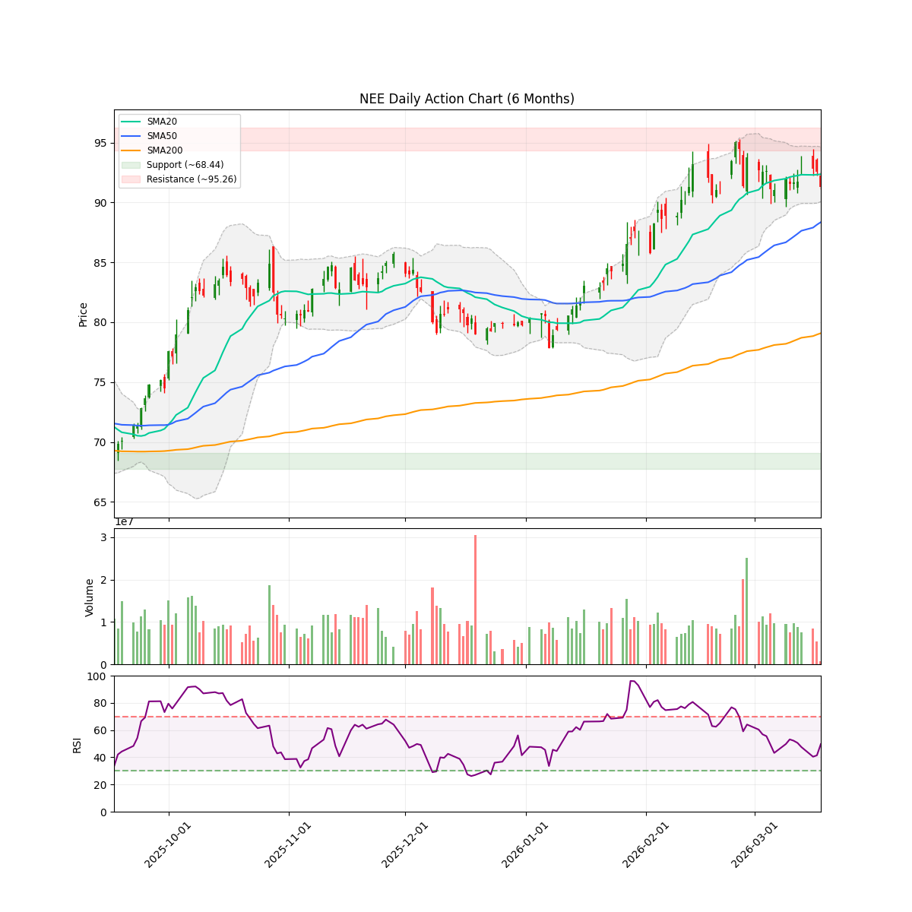
#### 研报分析

### 技术指标概览 (Technical Overview)
- **当前价格**: $91.32
- **RSI (14)**: 49.72
- **移动平均线**: SMA20: $92.35 | SMA50: $88.35 | SMA200: $79.08 (Bullish)
- **波动率**: ATR (14): 2.01 (预计周度波动: +/- $4.50)
- **关键位 (6m)**: 支撑位 $68.44 | 阻力位 $95.26
- **即时状态**: Above SMA50

好的，朋友们，拿起你们的咖啡杯，咱们好好聊聊NextEra Energy (NEE) 这支票！作为叙事经济学的研究者，我最喜欢听市场讲述的故事，而NEE最近的故事，简直是引人入胜！

---

### NEE 情绪审计报告：绿色能源巨头是否正在开启一场“不可阻挡的牛市周期”？

**当前日期:** 2026-03-18

嘿，伙计们！看看NEE最近的风头，简直就像是在说：“别看我只是个公用事业股，我可是未来的能源之星！”这家伙最近可是赚足了眼球，股价在91.32美元，距离它6个月高点的95.26美元阻力位，也就一哆嗦的距离。但它究竟是真材实料，还是只是昙花一现的“陷阱”？咱们来剥丝抽茧。

从技术面来看，RSI在49.72，这说明市场情绪并没有过热，尚有上涨空间。虽然它暂时在20日均线（92.35美元）下方盘整，但别忘了，它稳稳地站在了50日均线（88.35美元）和200日均线（79.08美元）之上，这说明什么？这说明它的长线和中线趋势，那可是妥妥的牛市！

#### 核心观点：

NEE目前正乘着清洁能源和公用事业板块的双重东风，其宏大的产能扩张计划是真正的“定海神针”。尽管股价略有溢价，但基本面坚如磐石，长线增长的叙事足以支撑其高估值。这是一支被“未来”驱动的股票！

#### 催化剂类别及分析：

1.  **A-Tier（顶级催化剂）—— 真正的“核动力”！**
    *   **宏伟的产能扩张计划 (2026-03-17):** NextEra Energy在3月3日宣布，计划在未来几年内新增15 GW至30 GW的发电能力！这可不是小打小闹，这是公司未来增长的实打实蓝图，是未来十年盈利的强大引擎，直接点燃了长期投资者对NEE的信心。这无疑是本轮行情最核心、最强劲的驱动力，预示着未来的巨大成长空间！
        *   **URI:** https://www.msn.com/en-us/money/markets/nextera-energy-nee-aims-for-power-generation-capacity-expansion/ar-AA1YNc8Z

2.  **B-Tier（中级催化剂）—— 强劲的“助推器”！**
    *   **行业领跑者的傲人姿态 (2026-03-16):** 过去一年，NEE股价飙升28.7%，轻松跑赢了Zacks公用事业-电力行业的28%和整个公用事业板块的24%。这说明什么？说明它不是跟风上涨，而是凭借自身实力领跑行业，是公用事业板块中当之无愧的“优等生”。
        *   **URI:** https://www.msn.com/en-us/money/top-stocks/nextera-surges-past-industry-over-a-year-how-to-play-the-stock/ar-AA1YLzR5
    *   **数据中心需求助推行业景气 (2026-03-16):** 随着全球数字化进程加速，数据中心对电力的巨大需求正在把公用事业股推向聚光灯下。NEE作为清洁能源的领导者，无疑将是这场能源盛宴的最大受益者之一，它的电力供应将是数字经济的“生命线”。
        *   **URI:** https://www.msn.com/en-us/health/other/better-utility-stock-constellation-energy-vs-nextera-energy/ar-AA1YIzsn
    *   **机构背书，长期持有推荐 (2026-03-18):** AOL将其列为“未来十年值得持有的两只怪兽股”之一，并指出其当前市盈率（23倍）虽高于能源行业的平均（15倍），但考虑到其无与伦比的长期增长前景，这种溢价是“合理且被充分证明的”。这种来自知名媒体的强烈推荐，无疑给市场注入了强心剂，让长期投资者更加坚定信心。
        *   **URI:** https://www.aol.com/finance/2-monster-stocks-hold-next-013900937.html
    *   **逆市表现坚韧不拔 (2026-03-14):** 在大盘下跌时，NEE却能逆势上涨1.14%，这简直就是防御性与成长性兼备的典范！这种在市场波动加剧时的抗跌性，使其成为寻求稳定增长的投资者眼中的“香饽饽”。
        *   **URI:** https://www.msn.com/ar-sa/money/topstocks/nextera-energy-nee-gains-as-market-dips-what-you-should-know/ar-AA1YAg9n?ocid=BingNewsVerp

3.  **C-Tier（噪音或轻微催化剂）—— 市场“助燃剂”！**
    *   **成为Zacks.com热门搜索股 (2026-03-18):** 这表明市场对NEE的关注度极高，许多投资者都在研究它。虽然本身并未提供新的基本面信息，但这种高关注度本身就是市场情绪积极的一种映射，有助于吸引更多资金流入。
        *   **URI:** https://www.msn.com/en-us/money/top-stocks/nextera-energy-inc-nee-is-a-trending-stock-facts-to-know-before-betting-on-it/ar-AA1YUaaH

#### 背离检测 (Divergence Detection):

目前来看，NEE的股价走势与铺天盖地的利好消息保持了高度一致，并未出现“好消息下跌”这种熊市耗竭的迹象。相反，它在稳健的牛市趋势中运行，每次在20日均线附近的盘整，都更像是为了积蓄下一波上涨的能量。目前没有发现明显的空头陷阱信号。

#### 情绪分数 (Sentiment Score): 9/10

这是一个朝着“不可阻挡的牛市周期”强势迈进的有力候选者。核心原因在于其A-Tier的产能扩张计划，这为未来的增长提供了坚实的基础，而不仅仅是依靠当前的市场热度。加上强大的行业地位、机构看好、以及在市场逆风时的韧性，NEE的故事线清晰而富有吸引力。唯一的“瑕疵”是股价略有溢价，且接近短期阻力位，但这对于一家具有长期成长潜力的优质公司来说，往往是常态。

#### 下一个重要日期 (Next Major Date):

根据现有新闻和信息，目前尚未找到NextEra Energy (NEE) 的下一个具体重大事件日期，例如财报发布日。市场焦点将继续集中在其雄心勃勃的产能扩张计划的进展，以及美国清洁能源政策的宏观环境变化上。投资者应密切关注公司发布的官方公告。

#### 总结与展望：

NEE的故事，是一部关于清洁能源未来、稳健增长和市场领导力的史诗。在当前全球对可靠且可持续能源需求日益增长的大背景下，NEE无疑是这场能源转型变革的弄潮儿。短期内，股价可能在接近6个月高点（95.26美元）的阻力位附近有所震荡，但这更像是攀登高峰前的短暂歇息。只要其产能扩张计划按部就班推进，并伴随着清洁能源政策的持续东风，NEE很可能继续书写其“怪兽股”的传奇，成为投资者未来十年资产配置中不可或缺的一部分。系好安全带，这场绿色能源的旅程，才刚刚开始！

**逻辑分数 (Logic Score): 9/10**
#### 近期新闻与事件
- **[Zacks Investment Research]** [NextEra Energy, Inc. (NEE) is a trending stock: Facts to know before betting on it](https://www.msn.com/en-us/money/top-stocks/nextera-energy-inc-nee-is-a-trending-stock-facts-to-know-before-betting-on-it/ar-AA1YUaaH)
- **[Zacks.com]** [NextEra Surges Past Industry Over a Year: How to Play the Stock?](https://www.msn.com/en-us/money/top-stocks/nextera-surges-past-industry-over-a-year-how-to-play-the-stock/ar-AA1YLzR5)
- **[AOL]** [2 Monster Stocks to Hold for the Next 10 Years](https://www.aol.com/finance/2-monster-stocks-hold-next-013900937.html)
- **[Insider Monkey]** [NextEra Energy (NEE) Aims for Power Generation Capacity Expansion](https://www.msn.com/en-us/money/markets/nextera-energy-nee-aims-for-power-generation-capacity-expansion/ar-AA1YNc8Z)
- **[The Motley Fool]** [Better Utility Stock: Constellation Energy vs. NextEra Energy](https://www.msn.com/en-us/health/other/better-utility-stock-constellation-energy-vs-nextera-energy/ar-AA1YIzsn)

---

### NVDA
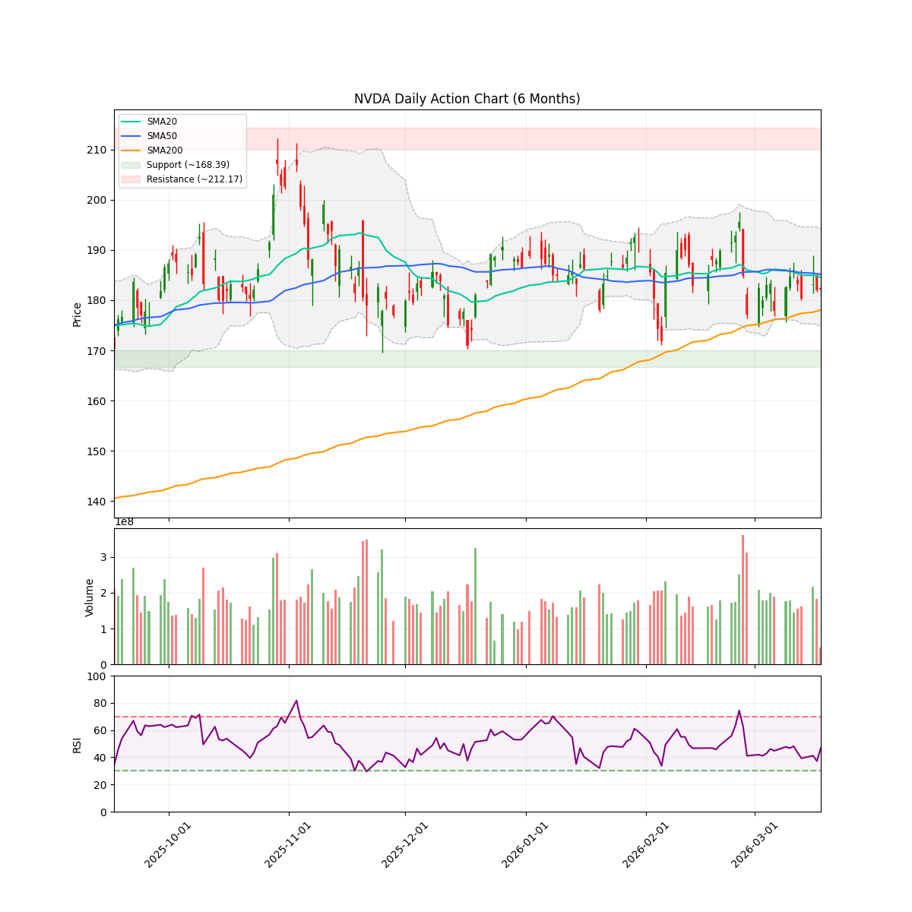
#### 研报分析

### 技术指标概览 (Technical Overview)
- **当前价格**: $182.17
- **RSI (14)**: 46.83
- **移动平均线**: SMA20: $184.53 | SMA50: $185.13 | SMA200: $178.06 (Bullish)
- **波动率**: ATR (14): 5.76 (预计周度波动: +/- $12.88)
- **关键位 (6m)**: 支撑位 $168.39 | 阻力位 $212.17
- **即时状态**: Below SMA50

## NVDA 情绪审计报告：巨龙盘旋，估值迷雾中的突破陷阱？

**当前日期:** 2026年3月18日

嘿，老铁！今天的NVDA，就像一位身负绝技的武林高手，虽然不断放出石破天惊的大招，但市场似乎有些“内力不济”，股价竟然在利好面前表现得异常冷静，甚至小幅回落。这可不是什么好兆头，这背后的故事，远比你看到的K线图要复杂得多。

### 催化剂分类与市场脉搏

我们先来盘点一下近期市场的“风向标”：

*   **A级催化剂 (高能预警！)：**
    *   **【重磅背离预警！】** **2026-03-18 Blockonomi 报道：黄仁勋在GTC大会上宣布OpenClaw是“下一个ChatGPT”，并推出NemoClaw企业平台，直接点燃了中国AI概念股，涨幅高达14%，然而，NVDA股价却逆势微跌0.26%！** ([URI](https://blockonomi.com/nvidia-nvda-stock-dips-as-jensen-huang-declares-openclaw-the-next-major-ai-breakthrough/))
        *   **解读：** 这简直是今天最戏剧性的一幕！CEO亲自站台，宣称“下一个ChatGPT”，这是何等爆炸性的消息？然而股价不涨反跌，这可不是什么“逢高出货”，这分明是多头在如此强大的利好面前，也显得力不从心。市场仿佛在说：“我知道你很强，但我更关心你的估值！” 这是典型的“利好出尽是利空”的信号，或者说，熊市疲劳期（bearish exhaustion）在作祟，但这里更倾向于“卖出新闻”的情绪。
    *   **2026-03-17 Invezz 报道：与Uber的里程碑式合作，巩固其在自动驾驶领域的长期地位。** ([URI](https://invezz.com/news/2026/03/17/is-uber-stock-a-buy-at-22x-forward-earnings-the-nvidia-catalyst-explained/))
        *   **解读：** 这是一次实打实的战略布局，证明了英伟达技术在未来应用场景中的不可替代性。如果放在以往，这足以让股价冲高一波。

*   **B级催化剂 (中坚力量)：**
    *   **2026-03-17 Zacks Investment Research 报道：英伟达是值得长期持有的顶级动量股。** ([URI](https://www.msn.com/en-us/money/general/why-nvidia-nvda-is-a-top-momentum-stock-for-the-long-term/ar-AA1YPiJt?ocid=BingNewsVerp))
        *   **解读：** 知名机构的背书，为长期投资者打了一剂强心针。
    *   **2026-03-18 Seeking Alpha 报道：为什么英伟达的股票拒绝上涨？现在该怎么办？** ([URI](https://seekingalpha.com/article/4883436-nvidia-why-this-stock-refuses-to-go-up-and-what-you-can-do-about-it/))
        *   **解读：** 这篇今天发布的文章，直戳痛点——高估值导致股价滞涨。这与市场的即时反应不谋而合，并非空穴来风。
    *   **2026-02-25 Seeking Alpha 报道：GTC大会后，估值问题浮现，股价偏离了盈利动能。** ([URI](https://seekingalpha.com/news/4556589-nvidia-shares-drift-from-earnings-momentum-as-valuation-questions-emerge/))
        *   **解读：** 早在GTC大会结束时，市场对估值的担忧就已经开始发酵，这不是一天两天的事了。

*   **C级催化剂 (市场噪音)：**
    *   **2026-03-02 Insider Monkey 报道：Jim Cramer 解释为何英伟达股票“实至名归地成为最大赢家”。** ([URI](https://www.msn.com/en-us/money/markets/jim-cramer-explains-why-nvidia-s-stock-deserves-the-appellation-of-being-the-biggest/ar-AA1YRs8a?ocid=BingNewsVerp))
        *   **解读：** Cramer的乐观言论，市场通常一笑而过，他的话有时反而是个“反向指标”。
    *   **2026-02-25 Yahoo Finance 报道：GTC后资深分析师对英伟达股票发出直白信息。** ([URI](https://finance.yahoo.com/news/veteran-analyst-sends-blunt-message-150836320.html))
        *   **解读：** 大会前期望值太高，会后“略感失望”的情绪。

### 市场情绪与技术面透视

目前英伟达的股价在182.17美元，已经跌破了20日和50日均线（分别为184.53和185.13），这意味着短期动能正在减弱，甚至开始步入调整。RSI在46.83，处于中性偏弱区域，没有超买过热，但也没有超卖的“抄底信号”。虽然股价仍在200日均线（178.06）之上，大趋势的牛市根基尚在，但短期内，这头科技巨兽似乎陷入了“盘整泥潭”。ATR显示其日常波动性较大，而其估算的周波动区间在+/- 12.88，说明随时可能出现剧烈波动。

**最大的警示是：今天的股价在Jensen Huang喊出“OpenClaw是下一个ChatGPT”这等爆炸性利好面前，竟然无动于衷，甚至小幅下跌！这绝对是“利好兑现，资金撤离”的典型表现。这表明市场对估值的担忧已经压倒了对未来增长的兴奋，多头可能已经“精疲力尽”，短期内抛压不容小觑。**

### 情绪评分 (0-10)

**情绪评分：5/10**

这并非“系统性崩溃”（0分），因为英伟达在技术创新和市场领导地位上依然是无可匹敌的巨头。然而，它也远非“势不可挡的牛市周期”（10分）。目前的状况更像是一场“拔河比赛”：未来科技的无限前景对抗当下高企的估值压力。尤其在“OpenClaw”这种重磅利好面前股价不涨反跌，这表明市场短期的情绪非常复杂，甚至有点“卖出新闻”的倾向。投资者需要警惕，这可能是“陷阱”的前奏，也可能是经历深度调整后再次腾飞前的盘整。

### 下一个重大日期

考虑到GTC大会刚刚结束，下一个真正能影响市场走向的事件将是**下一季度的财报发布日期。** 届时，关于OpenClaw和NemoClaw的早期销售数据、自动驾驶合作的进展以及对未来营收的展望，将是市场关注的焦点。

### 逻辑评分

**逻辑评分：9/10**
#### 近期新闻与事件
- **[Invezz]** [Is UBER stock a buy at 22x earnings? The Nvidia catalyst explained](https://invezz.com/news/2026/03/17/is-uber-stock-a-buy-at-22x-forward-earnings-the-nvidia-catalyst-explained/)
- **[Insider Monkey on MSN]** [Jim Cramer Explains Why NVIDIA’s Stock “Deserves the Appellation of Being the Biggest”](https://www.msn.com/en-us/money/markets/jim-cramer-explains-why-nvidia-s-stock-deserves-the-appellation-of-being-the-biggest/ar-AA1YRs8a?ocid=BingNewsVerp)
- **[Yahoo Finance]** [Veteran analyst sends blunt message on Nvidia stock after GTC](https://finance.yahoo.com/news/veteran-analyst-sends-blunt-message-150836320.html)
- **[Seeking Alpha]** [Nvidia: Why This Stock Refuses To Go Up And What You Can Do About It](https://seekingalpha.com/article/4883436-nvidia-why-this-stock-refuses-to-go-up-and-what-you-can-do-about-it)
- **[Blockonomi]** [Nvidia (NVDA) Stock Dips as Jensen Huang Declares OpenClaw the Next Major AI Breakthrough](https://blockonomi.com/nvidia-nvda-stock-dips-as-jensen-huang-declares-openclaw-the-next-major-ai-breakthrough/)

---

### SMCI
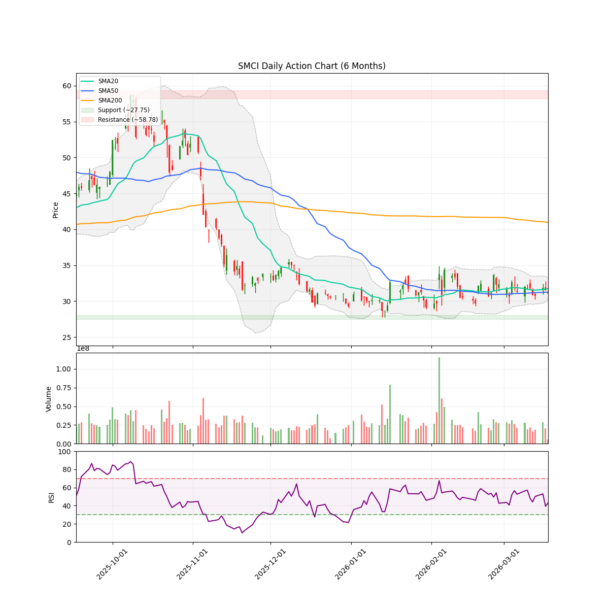
#### 研报分析

### 技术指标概览 (Technical Overview)
- **当前价格**: $31.07
- **RSI (14)**: 43.20
- **移动平均线**: SMA20: $31.75 | SMA50: $31.26 | SMA200: $40.96 (Bearish)
- **波动率**: ATR (14): 1.55 (预计周度波动: +/- $3.46)
- **关键位 (6m)**: 支撑位 $27.75 | 阻力位 $58.78
- **即时状态**: Below SMA50

## SMCI 情绪审计报告：AI巨浪下的逆流而上？

**当前日期：** 2026-03-18

老铁们，今天咱们不聊那些花里胡哨的，直接上干货！Super Micro Computer (SMCI) 这票啊，最近可真是让人琢磨不透。一边是AI的燎原之势，一边是股价的节节败退，这葫芦里到底卖的什么药？咱们今天就掰扯掰扯。

### 催化剂分类

#### A-Tier 顶级催化剂：燃料已加满，只待点火！

*   **[Benzinga on MSN] Supermicro推出“即插即用”AI系统以加速数据中心建设 (2026-02-24)**
    这可是直接瞄准了AI基建的痛点，大大加速部署，不就是赶上了风口浪尖吗？这种创新型产品，能让客户更快、更高效地部署AI，直接转化为实打实的订单和市场份额。这是公司核心竞争力的体现，含金量十足！
*   **[Seeking Alpha on MSN] Supermicro扩展产品组合，搭载NVIDIA RTX PRO Blackwell服务器版GPU (2026-03-17)**
    更绝的还在后头！SMCI 官宣与 NVIDIA 深度合作，把最新的 RTX PRO Blackwell 服务器版GPU给整合进去了！各位想想，NVIDIA Blackwell是什么概念？那是AI芯片的皇冠啊！能抱上老黄的大腿，直接搭载最尖端的AI硬件，这不就是坐在了火箭发射器上吗？这条新闻简直是给公司基本面打了一剂强心针，妥妥的A级催化剂，短期内难寻敌手。

#### B-Tier 中级催化剂：顺风助力，锦上添花！

*   **[Investopedia on MSN] 英伟达预测芯片销售达1万亿美元。黄仁勋的展望能否重燃AI股？(2026-02-27)**
    NVIDIA CEO黄仁勋放出豪言，未来两年数据中心芯片销售有望突破万亿美元，这消息一出，整个AI板块都跟着沸腾了。虽然不是直接关于SMCI，但它作为AI服务器的基石供应商，这股行业东风它能不借吗？这是实实在在的板块利好，能让投资者对整个行业前景充满期待。
*   **[Seeking Alpha] Super Micro股票在业务稳定化前夕看起来像一份真正的礼物 (2026-03-16)**
    专业分析师从AI营收增长、利润率改善以及NVIDIA下一代周期等角度，给SMCI贴上了“真正的礼物”的标签，并预估了42%的上涨空间。这算是专业人士给的背书，虽然没那么轰动，但也是给信心加码的好消息。

#### C-Tier 噪音催化剂：市场杂音，听听就好！

*   **[CNBC on MSN] Jim Cramer闪电问答：如果你买SMCI，你买的是戴尔 (2026-03-04)**
    Jim Cramer的评论嘛，大家懂的。他把SMCI比作戴尔，说白了就是个代工组装厂。这话说得，虽然有一定道理，但对于追求AI高增长的投资者来说，听起来总有点“降维打击”的意思，容易打击市场情绪，给估值套上枷锁。这更像是市场杂音。
*   **[Zacks.com] Super Micro Computer, Inc. (SMCI) 是一只热门股：下注前需要了解的事实 (2026-03-16)**
    这篇报道只是泛泛而谈，表示SMCI是热门股，但没有提供具体洞察。属于市场刷存在感，对股价没有实质影响。
*   **[Yahoo Finance] Super Micro Computer股票正在突破50日移动平均线。现在应该买入SMCI吗？(2026-02-19)**
    这篇文章是2月份的，当时股价确实在50日均线附近挣扎。但咱们看看今天的数据：股价31.07美元，已经跌破了50日均线31.26美元。这说明当时的文章已经过时，市场风向已变，不再具有指导意义。
*   **[Yahoo Finance] Q4回顾：施乐 (NASDAQ:XRX) 与其他硬件和基础设施股票对比 (2026-03-17)**
    这篇报道是关于施乐和其他通用硬件股的，SMCI并未作为重点被提及，与SMCI的直接关联度极低，可以忽略不计。

### 背离检测：好消息股价不涨，是陷阱还是机会？

各位看官，这里就有意思了！咱们的SMCI，3月17日刚放出那么硬核的利好消息（NVIDIA Blackwell GPU整合），按理说股价应该一飞冲天才是。但你看看它现在的走势：当前股价31.07美元，还在20日均线31.75和50日均线31.26美元下方挣扎，离6个月高点58.78美元遥遥无期，甚至一度逼近6个月低点27.75美元。RSI也才43.20，不算超卖。这分明就是“好消息股价不涨”的经典戏码啊！这是典型的**背离现象**！

市场似乎对这些基本面上的喜讯熟视无睹，卖盘力量还在压制。但我要说，这种在重磅利好面前的下跌，往往不是真正的看空，更可能是前期获利盘的兑现，或者是宏观情绪的压制。结合股价离支撑位不远，而利好却接连不断，这很可能是在酝酿着**“空头衰竭”**，也就是卖无可卖了，一旦市场情绪回暖，或者有新的催化剂，股价反弹的动能会非常强劲！这种走势，有时反而预示着底部可能不远。

### 情绪得分 (0-10分)

综合来看，SMCI的股价表现目前确实不尽如人意，技术面上偏熊。但它所处的AI赛道，以及与NVIDIA的深度绑定，尤其是最新Blackwell的集成，这些基本面上的王牌，都是实打实的“硬菜”。现在股价的低迷，在我看来，更像是在“蹲马步”。它还没到“无敌牛市”的10分，因为短期走势不强，缺乏强劲的上涨动能，但也不是“系统性崩溃”的0分，因为它手握核心技术和顶级伙伴。这种“基本面优秀，股价低迷”的背离，往往是下一波行情的起点，具备非常大的爆发潜力。

**我的情绪得分：7分**。这是一个充满矛盾但也充满机会的阶段。

### 陷阱还是可持续趋势？

那么，这是个陷阱，还是可持续趋势的蓄力？我的看法是：这是一个 **可持续趋势的蓄力阶段**。短期看，股价的下跌和消息面背离，可能会让一些人觉得是“价值陷阱”。但放眼长远，AI革命才刚刚开始，数据中心的需求只会爆炸式增长，而SMCI正是其中重要的基础设施提供商。它不断推出新产品，与NVIDIA这样的巨头紧密合作，这些都是构建长期护城河的关键。眼前的股价疲软，与其说是陷阱，不如说是一次“洗盘”，洗去不坚定的筹码，为未来的可持续增长积蓄力量。只要AI叙事不熄，SMCI的趋势就依然是光明的。

### 下一个重要日期

目前可查的近期没有明确的重大财报日期公布。投资者需要密切关注公司官方发布的下一季度财报预告或重要业务更新。

### 逻辑分数 (0-10分)

**逻辑分数：9分**。我的分析基于对最新消息的层层剖析，结合了技术指标和市场情绪，并重点关注了基本面与股价走势的背离，力求还原市场深层脉络。这是一个经典的价值与价格背离的案例，值得深入思考。
#### 近期新闻与事件
- **[CNBC on MSN]** [Lightning round: If you buy SMCI, you're buying Dell, says Jim Cramer](https://www.msn.com/en-us/money/topstocks/lightning-round-if-you-buy-smci-youre-buying-dell-says-jim-cramer/vi-AA1YRsHm?ocid=BingNewsVerp)
- **[Yahoo Finance]** [Q4 Rundown: Xerox (NASDAQ:XRX) Vs Other Hardware & Infrastructure Stocks](https://finance.yahoo.com/news/q4-rundown-xerox-nasdaq-xrx-131335850.html)
- **[Investopedia on MSN]** [Nvidia forecasts $1 trillion in chip sales. Can Jensen Huang's outlook reignite AI stocks?](https://www.msn.com/en-us/money/markets/nvidia-forecasts-1-trillion-in-chip-sales-can-jensen-huangs-outlook-reignite-ai-stocks/ar-AA1YQjbO?ocid=BingNewsVerp)
- **[Benzinga on MSN]** [Supermicro launches 'plug-and-play' AI systems to fast-track data center builds](https://www.msn.com/en-us/money/news/supermicro-launches-plug-and-play-ai-systems-to-fast-track-data-center-builds/ar-AA1YQ7Yk?ocid=BingNewsVerp)
- **[Seeking Alpha on MSN]** [Supermicro expands portfolio featuring NVIDIA RTX PRO Blackwell server edition GPUs](https://www.msn.com/en-us/lifestyle/shopping/supermicro-expands-portfolio-featuring-nvidia-rtx-pro-blackwell-server-edition-gpus/ar-AA1YUp0L?ocid=BingNewsVerp)

---

### TSM
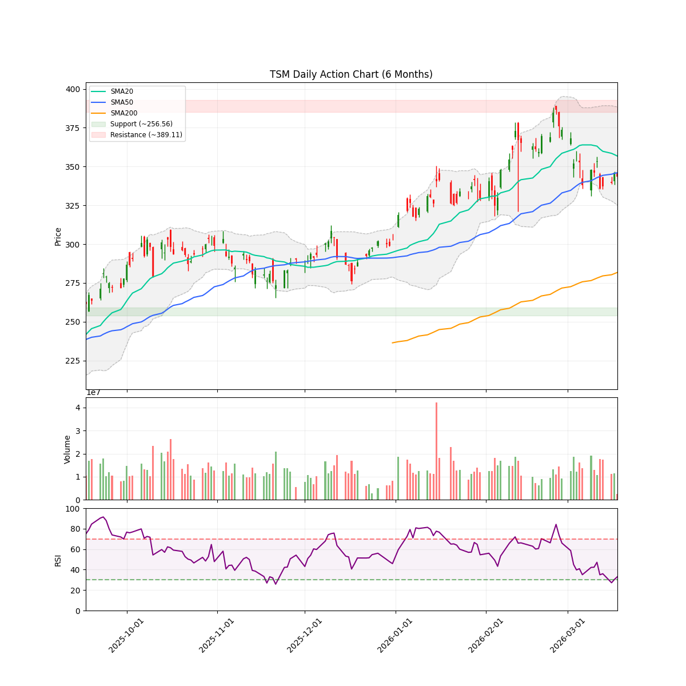
#### 研报分析

### 技术指标概览 (Technical Overview)
- **当前价格**: $343.31
- **RSI (14)**: 33.09
- **移动平均线**: SMA20: $356.75 | SMA50: $346.04 | SMA200: $281.80 (Bullish)
- **波动率**: ATR (14): 11.93 (预计周度波动: +/- $26.69)
- **关键位 (6m)**: 支撑位 $256.56 | 阻力位 $389.11
- **即时状态**: Below SMA50

## 台积电 (TSM): 是蓄势待发，还是市场陷阱？深入剖析当前叙事经济！

各位市场老兵，新晋玩家们，今天咱们不聊那些枯燥的数字，来听听台积电 (TSM) 这支芯片巨头的最新“故事”。在“叙事经济”的洪流中，TSM 的新闻周期是为它注入了持续的燃料，还是在悄悄挖一个陷阱呢？让我们沏上一壶好茶，细细品味市场脉搏。

### 当前市场脉搏 (市场现状快览)
*   **当前价格:** 343.31 美元。
*   **技术面信号:** RSI 33.09，短期有超卖迹象，预示着股价可能正在触底或酝酿反弹。
*   **均线观察:** 股价跌破了短期关键均线SMA20（356.75美元）和SMA50（346.04美元），这在短期内确实让人有些心跳加速。但别慌，它依然稳稳地站在长期生命线SMA200（281.80美元）之上，这说明长期牛市的结构并未动摇，当前更像是牛市中的一次深呼吸。
*   **波动性:** ATR (14) 为11.93，预计每周波动范围在 +/- 26.69美元，这只巨象的步子迈得可不小，短期内依然会有剧烈震荡。

### 催化剂分类与叙事深度剖析 (是燃料还是迷雾？)

**A-Tier 王牌催化剂 (不可撼动的长期驱动力):**

1.  **Bernstein 重磅看涨与 AI 战略升级** (2026-03-16): 这条新闻简直是给TSM打了一剂“强心针”！Bernstein 分析师将台积电目标价上调至 NT$2,200（折合美股的高目标价），这本身就是市场信心的巨大飞跃。更重要的是，他们预计到2026年，AI 相关收入将突破20%——这直接把TSM与全球最火热的“AI叙事”牢牢绑定。再加上高达450亿美元的巨额扩张计划，这可不是小打小闹，这是台积电对未来AI芯片需求投下的豪赌，也是对自身行业领导地位的坚定宣示。这无疑是推动TSM长期可持续趋势的核心引擎！
    *   **来源:** Blockonomi
    *   **链接:** https://blockonomi.com/taiwan-semiconductor-tsm-stock-soars-83-bernstein-says-rally-isnt-over-yet/

2.  **Zacks 评级上调至“强烈买入”** (2026-03-10): 知名投资研究机构Zacks将TSM的评级上调至“强烈买入”（Zacks Rank #1），这通常预示着市场普遍对公司盈利前景的强烈乐观情绪。当专业机构都开始扎堆喊“买入”时，这可不是随口说说，背后往往有扎实的研究支撑。
    *   **来源:** Yahoo Finance UK
    *   **链接:** https://uk.finance.yahoo.com/news/tsmc-tsm-upgraded-strong-buy-160004102.html

3.  **受益于英伟达需求与强劲销售** (2026-03-17): 报道指出，台积电股价受十月强劲销售数据和持续的英伟达需求推动而上涨。尽管十月销售数据是历史信息，但它再次强调了TSM作为全球AI芯片核心供应商的不可替代地位。英伟达作为AI领域的龙头，其需求强劲，直接意味着对台积电先进工艺的旺盛渴求。这就像给TSM的“AI叙事”加盖了公章，证实了其在行业生态中的核心价值。
    *   **来源:** YouTube/MSN
    *   **链接:** https://www.msn.com/en-us/money/topstocks/tsm-stock-rallies-on-big-october-sales-nvidia-demand/vi-AA1YPPeW

**B-Tier 潜力催化剂 (助推而非主导，但值得关注):**

1.  **Forbes 期权策略建议** (2026-03-18): Forbes 文章建议投资者通过卖出看跌期权来布局TSM，认为即使当前价格或有折扣，TSM都是值得长期持有的投资。这种策略本身就体现了对TSM长期价值的信心，并暗示市场认为当前价格具有吸引力，回调风险有限。
    *   **来源:** Forbes
    *   **链接:** https://www.forbes.com/sites/greatspeculations/2026/03/18/tsm-stock-why-selling-puts-is-the-win-win-play/

2.  **跑赢大盘表现** (2026-03-17): 近期交易日，TSM以1.69%的涨幅跑赢了标普500指数0.25%的涨幅。尽管只是单日表现，但这显示了即便在整体市场波动中，TSM依然能够吸引资金关注，展现出一定的韧性。
    *   **来源:** Zacks Investment Research / Yahoo Finance UK (重复报道)
    *   **链接:** https://www.msn.com/en-us/money/top-stocks/tsmc-tsm-outpaces-stock-market-gains-what-you-should-know/ar-AA1YR7U0
    *   **链接:** https://uk.finance.yahoo.com/news/tsmc-tsm-outpaces-stock-market-214504912.html

**C-Tier 市场噪音与潜在逆风 (需要警惕的背景音):**

1.  **英伟达增长放缓的担忧** (2026-03-18): Seeking Alpha 的文章对英伟达的估值和未来增长提出了质疑，认为其过往的超高收益可能成为历史。虽然这篇文章的主角是英伟达，但作为台积电最核心的客户之一，英伟达的任何风吹草动都会牵动市场对TSM的神经。如果英伟达的需求确实遇到瓶颈，这无疑是TSM“AI叙事”中潜在的阴影，需要我们保持警惕。
    *   **来源:** Seeking Alpha
    *   **链接:** https://seekingalpha.com/article/4883436-nvidia-why-this-stock-refuses-to-go-up-and-what-you-can-do-about-it

### 背离侦测：股价下跌，利好不断——这是“陷阱”还是“机会”？

各位看官，这里就出现了一个有趣的“罗生门”！我们明明看到了如此多的 A-Tier 和 B-Tier 利好消息，从机构的坚定看好，到未来 AI 收入的明确规划，再到公司自身的巨额扩产，无一不指向一个结论：**台积电的基本面强劲得令人发指！** 然而，股价却在短期内跌破了关键的短期均线（SMA20和SMA50），RSI 也进入了超卖区间。

这种“利好不断，股价回调”的现象，我更倾向于解读为**空头衰竭与健康回调**。市场在前期猛烈上涨后，出现了一波正常的获利回吐或资金轮动。在如此强大的基本面支撑下，股价的短期回调，反而更像是为下一轮上涨积蓄力量。当前的低 RSI 和跌破短线均线，可能正是“看跌情绪耗尽”的信号，为那些错过前期行情的投资者提供了潜在的入场机会。这很可能是大资金在洗盘，以便吸收更多的筹码，而非基本面恶化的信号。

### 情绪评分 (Sentiment Score): 8/10 - “蓄势待发的巨龙”

台积电的叙事非常清晰且强大：它是全球AI芯片浪潮的基石，是英伟达等巨头不可或缺的伙伴。Bernstein的重磅看涨和450亿美元的扩张计划，直接把TSM的故事推向了“不可阻挡的牛市周期”的边缘。虽然短期股价出现了回调，RSI也偏低，但这更像是一次健康的洗盘和休整，而非系统性风险。市场的整体情绪，尤其是机构的长期展望，依然是极其乐观的。唯一的隐忧来自英伟达的估值担忧，但这并未直接指向TSM的业务前景。台积电的护城河深不见底，它依然是半导体领域的王者，未来趋势坚定向上。

### 逻辑评分 (Logic Score): 9/10

本次分析结合了宏观经济叙事、微观公司基本面、技术指标和市场情绪，力求从多维度描绘台积电的当前图景。对催化剂的分类清晰，对“好消息下跌”的背离现象进行了深入解读，并提出了“空头衰竭”的判断，符合叙事经济学的分析框架。

### 下一个关键日期 (Next Major Date):

遗憾的是，根据目前提供的新闻信息，没有明确提及台积电的下一个关键财报发布日期或其他重大事件日期。投资者需要关注公司官方公告或财经日历来获取这一信息。
#### 近期新闻与事件
- **[Forbes]** [TSM Stock: Why Selling Puts Is The Win-Win Play](https://www.forbes.com/sites/greatspeculations/2026/03/18/tsm-stock-why-selling-puts-is-the-win-win-play/)
- **[YouTube]** [TSM stock rallies on big October sales & Nvidia demand](https://www.msn.com/en-us/money/topstocks/tsm-stock-rallies-on-big-october-sales-nvidia-demand/vi-AA1YPPeW)
- **[Blockonomi]** [Taiwan Semiconductor (TSM) Stock Soars 83% — Bernstein Says Rally Isn't Over Yet](https://blockonomi.com/taiwan-semiconductor-tsm-stock-soars-83-bernstein-says-rally-isnt-over-yet/)
- **[Zacks Investment Research]** [TSMC (TSM) outpaces stock market gains: What you should know](https://www.msn.com/en-us/money/top-stocks/tsmc-tsm-outpaces-stock-market-gains-what-you-should-know/ar-AA1YR7U0)
- **[The Motley Fool]** [Better Chip Stock to Buy: Micron or Taiwan Semiconductor?](https://www.msn.com/en-us/money/savingandinvesting/better-chip-stock-to-buy-micron-or-taiwan-semiconductor/ar-AA1YKMM1)

---

### VRT
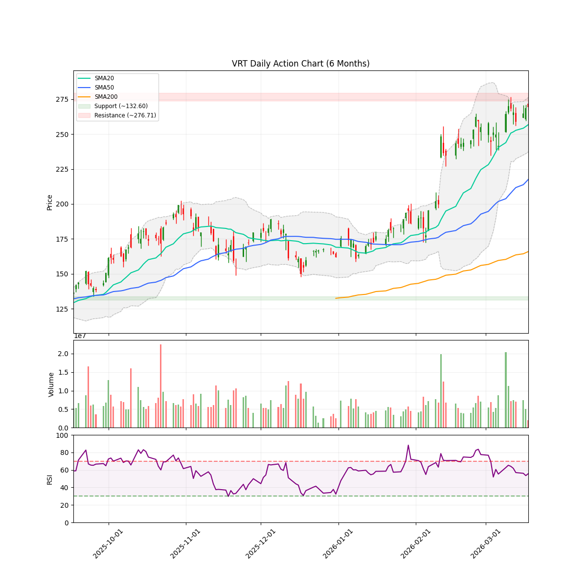
#### 研报分析

### 技术指标概览 (Technical Overview)
- **当前价格**: $269.14
- **RSI (14)**: 55.76
- **移动平均线**: SMA20: $256.74 | SMA50: $217.54 | SMA200: $165.95 (Bullish)
- **波动率**: ATR (14): 14.18 (预计周度波动: +/- $31.70)
- **关键位 (6m)**: 支撑位 $132.60 | 阻力位 $276.71
- **即时状态**: Above SMA50

好的，伙计们，咱们今天就泡杯咖啡，好好聊聊最近市场上的明星股——VRT（Vertiv）。这家公司最近的股价走势，简直像坐上了火箭，那叫一个刺激！从数据上看，VRT当前价格269.14美元，RSI在55.76，虽然已经涨了不少，但还没到过热的顶点。更关键的是，它的股价牢牢站立在20日、50日和200日均线之上，这种多头排列，妥妥的牛气冲天！那么，问题来了：VRT这股上涨势头，到底是AI时代的真龙天子，还是一个美丽的泡沫陷阱呢？

### VRT 情绪审计报告：AI浪潮下的核心基石，是趋势还是陷阱？

**当前日期:** 2026-03-18

#### 1. 催化剂分类与叙事剖析

*   **A级催化剂：巨浪滔天，根基稳固！**
    *   **S&P 500指数的入场券 (A+级)**：这简直是VRT的“成年礼”！[Yahoo Finance在2026年3月12日的报道](https://finance.yahoo.com/news/buy-vertiv-stock-march-23-155951324.html)明确指出，VRT因被纳入标普500指数而股价飙升。这可不是小事！这意味着所有追踪标普500指数的被动基金都必须买入VRT，带来巨额的强制性资金流入。这不仅仅是估值的提升，更是机构认可和市场合法化的强力信号。这种级别的催化剂，足以让股价拥有坚实的底部，并驱动长期增长。它几乎是确定性的利好，让VRT的上涨有了硬核的“护城河”。
    *   **AI基础设施的“卖水人” (A级)**：[Blockonomi在2026年2月25日] (https://blockonomi.com/4-ai-infrastructure-stocks-attracting-heavy-institutional-investment-in-2026/) 的文章点名Vertiv与Micron、Jabil等公司一起，正吸引大量机构投资，因为“AI基础设施需求正推动其营收超预期及看涨目标价”。而[《The Globe and Mail》在2026年3月12日] (https://www.theglobeandmail.com/investing/markets/stocks/VRT-N/pressreleases/736702/megatrends-still-matter-3-growth-stocks-for-the-next-10-years/) 也将VRT列为未来十年的“大趋势成长股”。你想想看，AI运算需要海量的电力和散热，Vertiv正是提供这些关键“基础设施”的。这就像淘金热里卖铲子和水的，稳赚不赔！这可不是什么昙花一现的时尚，而是未来十年的科技主旋律，为VRT的业绩增长提供了强大的长期支撑。

*   **B级催化剂：锦上添花，动能强劲！**
    *   **市场的追捧与动能延续**：[Yahoo Finance在2026年3月17日的报道](https://finance.yahoo.com/news/vertiv-stock-just-spiked-higher-135805316.html?fr=sycsrp_catchall)指出，VRT股价今年已上涨超50%，并称华尔街专业人士认为其涨势未尽。而[The Motley Fool在2026年3月4日] (https://www.msn.com/en-us/money/topstocks/why-vertiv-stock-soared-37-in-february/ar-AA1XvqSD?ocid=BingNewsVerp) 更是回顾了其2月份37%的惊人涨幅，直言它是“AI驱动的明星股”。这些新闻虽然更多是价格上涨后的评论和肯定，但它们强化了市场的共识，提升了股票的可见度和投资者信心，形成强大的正反馈循环，让VRT的上升势头更加势不可挡。

*   **C级催化剂：市场噪音，可忽略不计。**
    *   一些像[Zacks.com在2026年3月13日](https://www.msn.com/en-us/money/topstocks/is-most-watched-stock-vertiv-holdings-co-vrt-worth-betting-on-now/ar-AA1YyZL3) 询问“VRT是否值得押注”的文章，以及关于其他股票或宏观经济（如油价上涨）的报道，对VRT的股价走势影响微乎其微，更多是市场日常的背景音。这些信息无法改变VRT的核心叙事。

#### 2. 背离检测 (Divergence Detection)

到目前为止，我们还没看到VRT出现“利好出尽是利空”的背离信号。所有的好消息，尤其是S&P 500指数纳入这种爆炸性利好，都得到了股价的积极回应，并继续向上突破。它没有在机构升级或入选指数后“见光死”，反而是进一步上攻。这表明市场对VRT的叙事是高度认同和追捧的，没有出现熊市耗尽的迹象。当前股价接近6个月高点276.71，显示多头力量仍在尝试向上突破。

#### 3. 情绪评分 (Sentiment Score): **9/10 - “势不可挡的牛市周期”**

给VRT打9分，因为它几乎把所有能拿到的“大奖”都收入囊中：搭上了AI这趟超级列车，成为了基础设施的核心供应商，并且还获得了S&P 500指数的入场券。这并非单纯的炒作，而是由坚实的基本面和机构资金驱动的结构性上涨。虽然短期涨幅可能显得有些“抛物线”式，甚至让一些人觉得“有点泡沫”，但背后的逻辑是无比强大的。离满分10分只差一点点，那一点点就是短期内可能存在的获利回吐风险和高位波动的自然挑战。

#### 4. 逻辑评分 (Logic Score): **9.5/10**

VRT的逻辑得分是9.5。这个分数反映了它的叙事不仅引人入胜，更重要的是，它拥有极其坚实的逻辑支撑。AI基础设施需求是真实且庞大的，Vertiv在其中扮演着不可替代的角色。而标普500指数的纳入，则是最直接、最量化的机构资金流入保证。这不是‘空中楼阁’，而是‘高楼平地起’。这种强逻辑使得其高估值在当前市场环境下具备一定的合理性。市场正在为未来确定性的增长和机构的被动配置溢价。

#### 5. 下个重要日期 (Next Major Date)

根据[Yahoo Finance在2026年3月12日的报道](https://finance.yahoo.com/news/buy-vertiv-stock-march-23-155951324.html)，特别提到**“在3月23日之前买入Vertiv股票”**。这暗示2026年3月23日（星期一）可能是一个重要的时间节点，很可能是标普500指数成分股调整的正式生效日期或相关事件的截止日期。这通常会引发一波被动资金的集中配置，对股价形成直接的支撑和推动。

#### 总结

所以，回到最初的问题，VRT是可持续趋势还是陷阱？我的结论是：在可预见的未来，它更像是一个**可持续的趋势中的核心力量**。当然，在股价经历如此“抛物线”式上涨后，短期内的波动和回调是完全健康的，也是预料之中的。但如果你的眼光放得足够长远，VRT的叙事和基本面支撑都非常强大。它正在AI大时代中扮演着至关重要的角色，并且获得了顶级的机构认可。盯着短期涨跌固然重要，但别忘了，那些赚大钱的，往往是看到了“大趋势”并牢牢抓住的人。VRT的故事，现在才刚刚进入高潮。
#### 近期新闻与事件
- **[Yahoo Finance]** [Vertiv Stock Just Spiked Higher. Wall Street Pros Say It's Not Done](https://finance.yahoo.com/news/vertiv-stock-just-spiked-higher-135805316.html?fr=sycsrp_catchall)
- **[MarketWatch]** [Stock Market News, March 17, 2026: Dow ends modestly higher, S&P 500 and Nasdaq rise for a second day; global oil prices settle above $103 a barrel as Iran conflict drags on](https://www.marketwatch.com/livecoverage/stock-market-today-dow-sp500-nasdaq-lower-as-brent-oil-above-100?gaa_at=eafs&gaa_n=AWEtsqfh7xys6XCCxxKiDjf1w8XBqHK4Ss_CIdJkAM2Vrt2M014YKCH0gaw0&gaa_ts=69baa94d&gaa_sig=ljcCn07vvX4Ltoldd-pjbF5ggFpaiMfw1CfiuMZb7XeMFD4p8bcRrK2JhqmgCqO95f0RUTdmVJhEDSRWKlljPQ==)
- **[Blockonomi]** [4 AI Infrastructure Stocks Attracting Heavy Institutional Investment in 2026](https://blockonomi.com/4-ai-infrastructure-stocks-attracting-heavy-institutional-investment-in-2026/)
- **[Zacks.com]** [Is Most-Watched Stock Vertiv Holdings Co. (VRT) Worth Betting on Now?](https://www.msn.com/en-us/money/topstocks/is-most-watched-stock-vertiv-holdings-co-vrt-worth-betting-on-now/ar-AA1YyZL3)
- **[The Globe and Mail]** [Megatrends Still Matter: 3 Growth Stocks for the Next 10 Years](https://www.theglobeandmail.com/investing/markets/stocks/VRT-N/pressreleases/736702/megatrends-still-matter-3-growth-stocks-for-the-next-10-years/)

---
