# 每日股市市场报告 (2026-03-19)

> **免责声明**: 本报告由 **代码与 Gemini AI 自动生成**，仅供研究参考，**不构成**任何投资建议。投资有风险，入市需谨慎。作者及 AI 不对任何基于此内容的投资决策承担责任。

## 📑 目录
[TOC]

##  长期投资逻辑
本组合旨在捕捉 **人工智能（AI）与半导体协议** 带来的跨周期结构性增长，核心投资策略聚焦于“确定性”与“物理瓶颈”：
- **底层制程垄断 (Foundry & WFE Moats)**：
  布局处于全球半导体精密制造顶端的“工业母机”级别公司。寻找具备极高准入门槛的晶圆代工及前道设备供应商，作为全产业链最稳固的底座资产。
- **算力稀缺性与连接带宽 (Compute & Interconnect Scarcity)**：
  聚焦在高性能计算芯（HPC）及高带宽连接领域占据主导地位的标的。AI 的终极竞争是“规模”，寻找能有效解决数据交换瓶颈并提供核心推理/训练能力的算力巨头。
- **应用生态与数据霸权 (Platform & Data Sovereignty)**：
  布局拥有闭环生态、海量高质量私有数据及云基础设施的科技巨头。它们是 AI 商业化落地的最终守门人，拥有将技术转化为持续现金流的分配权。
- **物理边界保障 (Power & Thermal Infrastructure)**：
  关注 AI 扩张的“最终瓶颈”——电力供应与热能管理。重点布局为下一代超大规模数据中心提供高功率密度能源、液冷技术及电网扩容方案的能源基建商。
**风控策略**：利用 AlphaJAX 的量化动量评分（Quant Score）作为过滤器，结合 LLM 叙事审计（Narrative Audit）捕捉“业绩超预期 + 叙事逻辑改善”的共振点，实现跨周期的超额收益。

 **注：排序权重**：Ticker 按照 AI 检测出的 **方向** 排序（**看多**优先，其次是 **中性**，最后是 **看空**）。
---

<!-- DISCORD_SUMMARY_START -->
## 🧠 对冲基金经理全局诊断与资金分配策略
# 司令部指令 (Commanders Intent)：2026-03-19 调仓备忘录

**致：执行交易员**
**当前战场态势：** 市场正处于从“AI 纯芯片狂热”向“AI 基础设施实效”与“地缘政治避险”转型的阵痛期。我们的账户正面临严重的**防御漏洞**：AMD 持仓过重（>50%）且深陷泥潭，而账户对电力、散热、存储等真正强势的叙事环节布局不足。

**核心战略：** **“削峰填谷，借力换位”**。利用可用现金压注逻辑分（Logic Score）在 8 分以上的“全能选手”，同时强制降低 AMD 的集中度风险，为账户注入具有抗风险能力的“能源硬通货”。

---

### 一、 账户风险警报 (Risk Audit)

1.  **集中度红灯 (Concentration Alert)**: **AMD 占比 50.56%**。
    *   **诊断**：即便 AMD 属于 AI 基础设施，但其当前技术面已跌破 SMA50，且 logic score 仅 6.5。超过 50% 的比例已越过“极高信心”红线，目前属于**被动套牢导致的超标**。
    *   **指令**：禁止再为 AMD 投入任何现金。若股价反弹至 $210 附近，必须强制减仓至 30% 以下，释放流动性。
2.  **现金管理**: 当前可用现金约 $6.4 万，占账户约 25%。由于当前市场多只绩优股处于“超卖”或“黄金坑”状态，符合 **“局部完美组合”** 定义，允许动用 70% 的可用现金进行进攻性建仓。

---

### 二、 逻辑评分分级 (Logic Score Tiers)

*   **第一梯队 (8.0-10): 暴力买入/重仓持有**
    *   **VRT (9.2)**: 散热是 AI 的呼吸机，趋势完美。
    *   **AMAT (8.5)**: 芯片制造的“铁锹”，并购叙事极具爆发力。
    *   **MU (8.5)**: 财报炸裂后的“倒春寒”，极佳的捡筹点。
    *   **XOM (8.5)**: 地缘政治的最强防波堤，账户急需的负相关资产。
    *   **GEV (8.5)**: 核能复兴的旗手。
*   **第二梯队 (7.0-7.9): 择机建仓/稳健持有**
    *   **TSM (7.8)**: RSI 30 超卖，技术性反弹在即。
    *   **PLTR (7.8)**: 实战验证的 AI 操作系统，站稳 $152 后加速。
    *   **VST (7.2)**: 电力防御+期权反向指标支撑。
    *   **ARM (7.2)**: 筑底反弹，等待 SMA200 突破。
*   **第三梯队 (< 7.0): 观察/维持/减速**
    *   **AMZN (6.5)** & **GOOGL (6.2)**: 处于震荡洗盘期，暂不加仓。
    *   **NVDA (5.8)**: 审美疲劳，等待 SMA50 收复。
    *   **MSFT (3.5)**: **避雷区**，技术形态彻底走坏，禁止介入。

---

### 三、 行动计划 (Actionable Trading Plan)

#### 1. 立即执行：进攻性建仓 (Deploying $45,000 Cash)
*   **买入 VRT (Vertiv)**: 投入 **$15,000**。理由： logic 9.2，AI 散热是当前最硬的叙事，股价站稳均线。
*   **买入 MU (Micron)**: 投入 **$10,000**。理由：利好出尽导致的洗盘是给长线投资者的折扣券，目标价指向 $600。
*   **买入 XOM (ExxonMobil)**: 投入 **$10,000**。理由：账户目前 100% 暴露在科技股风险下，必须买入地缘政治“保险”，利用其 8.5 的高分对冲 AMD 的波动。
*   **买入 TSM (Taiwan Semi)**: 投入 **$10,000**。理由：RSI 30 触底，英伟达登顶第一大客户的叙事刚开始。

#### 2. 持仓管理：AMD 止损/减持
*   **止损指令**：若 AMD 连续三天收盘跌破 **$192.5 (SMA200)**，不论盈亏，减持 200 股。守不住生命线就意味着叙事破裂。
*   **期权指令**：-AMD260313P200 这一空头 Put 仓位已亏损 58%，若跌破 $192，强制平仓止损，防止保证金崩盘。

#### 3. 观察池动态建仓 (If-Then 策略)
*   **AMAT**: 若股价站回 **$357 (SMA20)**，动用剩余 10% 现金直接切入，博弈 BESI 收购叙事。
*   **PLTR**: 若收盘突破 **$152**，将 AMZN 的 1.77% 仓位调换至 PLTR。

---

### 四、 风险预案 (If-Then Scenarios)

*   **场景 A：中东局势进一步升级（油价暴涨）**
    *   **执行**：加仓 XOM 至账户占比 10%，减持 GOOGL 以对冲能源成本上升对科技股的估值打压。
*   **场景 B：AMD 财报前夕依然无法收复 SMA50 ($214.45)**
    *   **执行**：清仓式减持。我们不能把一半的国运押在一个连均线都站不上的“追赶者”身上。
*   **场景 C：VRT 突破 $276 历史阻力位**
    *   **执行**：这是“飞行模式”开启的信号，可动用 Margin 追击 5% 仓位。

---

**PM 寄语：**
别死守着 AMD 的亏损不放，那是沉没成本。看看 VRT 和 MU，那才是现在战场上冒烟的枪管。我们要的是**赢球**，而不是证明我们买入 AMD 的初始逻辑是对的。**立刻调配现金，向高分标的开火！**

**签名：高级投资组合经理**
**日期：2026-03-19**
<!-- DISCORD_SUMMARY_END -->
---

## 💼 现有持仓个股诊断

### AMD
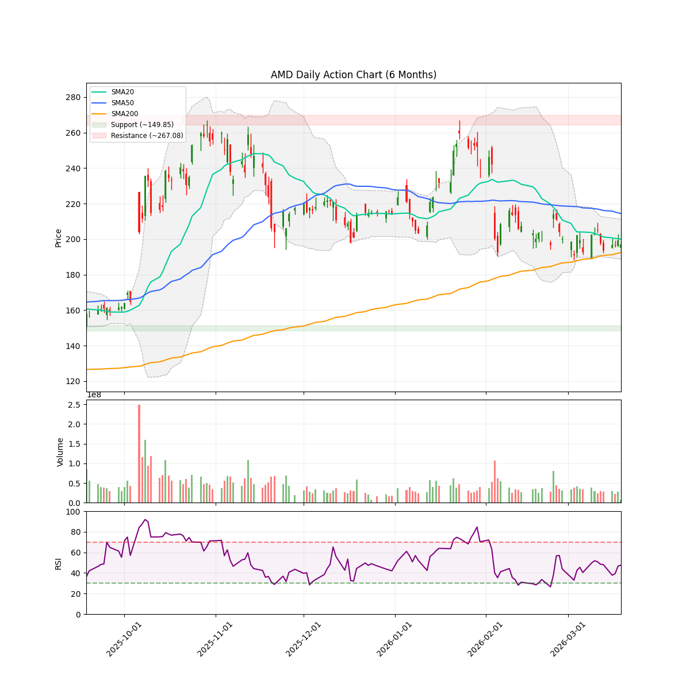
#### 研报分析

### 技术指标概览 (Technical Overview)
- **当前价格**: $197.18
- **RSI (14)**: 47.59
- **移动平均线**: SMA20: $200.01 | SMA50: $214.45 | SMA200: $192.51 (Bullish)
- **波动率**: ATR (14): 8.25 (预计周度波动: +/- $18.44)
- **关键位 (6m)**: 支撑位 $149.85 | 阻力位 $267.08
- **即时状态**: Below SMA50

你好。来，先坐下，喝口咖啡。咱们跳过那些枯燥的研报数据，直接聊聊 AMD 现在到底在演哪一出戏。

作为一名专注于“叙事经济学”的研究员，我看到的不仅仅是 K 线，而是一个关于**“追赶者阵痛”与“供应链突围”**的故事。

### AMD 情绪审计报告：阵痛中的苏妈，正在补齐最后的拼图

#### 1. 催化剂分类：谁在点火，谁在虚晃一枪？

*   **A-Tier（核心叙事）：三星 HBM4 与 DRAM 战略结盟**
    *   **详情**：2026年3月18-19日，AMD 与三星签署了关于下一代 AI 存储（HBM4）的谅解备忘录 [Simply Wall St.](https://finance.yahoo.com/markets/stocks/articles/advanced-micro-devices-amd-expanded-010735166.html)。
    *   **解读**：这是实打实的利好。AI 算力的瓶颈从来不在计算能力，而在数据吞吐（内存）。苏妈在为 2027-2028 年的 GPU 霸权铺路。这决定了 AMD 能否在硬件层面真正与英伟达（NVDA）平起平坐。
*   **B-Tier（基本面支撑）：估值重估叙事**
    *   **详情**：市场开始讨论 AMD 在下跌 16% 后的“吸引力” [Barchart](https://finance.yahoo.com/news/amd-outlook-stock-rebound-valuation-202444121.html)。
    *   **解读**：当分析师开始谈论“性价比”时，通常意味着恐慌杀跌已经接近尾声，机构开始考虑重新建仓。
*   **C-Tier（市场杂音）：康宁（Corning）的乱入**
    *   **详情**：Motley Fool 提到康宁涨幅跑赢 AMD [The Motley Fool](https://www.fool.com/investing/2026/03/11/meet-super-semiconductor-stock-nvidia-amd-broadcom/)。
    *   **解读**：纯粹的噪音。光纤材料和芯片设计是两个维度的故事，这种对比除了制造焦虑外，对 AMD 的核心叙事没有影响。

#### 2. 背离检测：好消息为什么没带飞股价？

你可能注意到了，3月18日三星的消息出来后，AMD 虽然涨了 1.6% [Zacks](https://finance.yahoo.com/markets/stocks/articles/advanced-micro-devices-amd-advances-214504302.html)，但依然被压在 SMA20（$200.01）之下。

*   **现状**：**看涨枯竭**。市场目前的逻辑是：“我知道你很努力，但我得看你这一季度的 AI 芯片订单到底能不能兑现。”
*   **技术形态**：股价（$197.18）正处于 SMA200（$192.51）这一“生死线”的上方徘徊。如果守不住 $192，那这一波回撤可能会演变成系统性的中期走弱。

#### 3. 情绪分析：是“可持续趋势”还是“多头陷阱”？

**目前的叙事处于“怀疑期”**。
过去一年 AMD 涨了 95%，透支了太多的预期。现在的回调是市场在进行“去杠杆”。对于你手中成本价 $220.54 的 600 股来说，目前的局面有点像是在暴雨中等待日出——天一定会亮，但你可能得先被淋透。

你的 **-AMD260313P200** 期权仓位亏损 58%，反映出市场对跌破 $200 的恐惧。

#### 4. 逻辑评分 (Logic Score)

# **6.5 / 10**

*   **评分依据**：
    *   **(+) 基本面扎实**：三星的 HBM4 协议是长效强心针。
    *   **(+) 长期逻辑未变**：AI 算力依然是未来十年的主旋律。
    *   **(-) 技术面承压**：短期内跌破 SMA50 后，上方套牢盘沉重。
    *   **(-) 集中度风险**：你 50% 的仓位押在这一只票上，容错率极低。

---

### 给老友的投资建议（私人视角）

AMD 现在的样子，就像是一个刚跑完马拉松在路边喘气的运动员。他没病，只是累了。

*   **观察点**：死守 $192.51（SMA200）。只要收盘价不连续三天跌破这个位置，这波“陷阱”就不会演变成“崩盘”。
*   **警示**：你的仓位过重（50%+）。在 $200 关口反复拉锯时，这种高集中度会极大考验你的心理素质。

### 关键时间点提醒

*   **下一重大日期**：**2026年4月底 / 5月初（预计 Q1 2026 财报发布日）**。
    *   *注：具体日期尚未公布，但历史规律显示该时段将是下一次多空大决战。*

**总结**：别被这两天的阴跌吓跑，但也别急着在没站稳 $200 之前盲目加仓。苏妈正在后勤补货，咱们得给前线一点时间。
#### 近期新闻与事件
- **[Simply Wall St.· via Yahoo Finance]** [What Advanced Micro Devices (AMD)'s Expanded Samsung AI Memory Partnership Means...](https://finance.yahoo.com/markets/stocks/articles/advanced-micro-devices-amd-expanded-010735166.html)
- **[ETF Trends]** [AMD Angles May Portend Upside for This Exciting ETF](https://www.etftrends.com/leveraged-inverse-content-hub/amd-angles-portend-upside-exciting-etf/)
- **[Simply Wall St.· via Yahoo Finance]** [A Look At AMD (AMD) Valuation After New Samsung HBM4 And DRAM Supply Agreement](https://finance.yahoo.com/news/look-amd-amd-valuation-samsung-140544060.html)
- **[Barchart· via Yahoo Finance]** [AMD Outlook: Will the Stock Rebound as Valuation Remains Compelling?](https://finance.yahoo.com/news/amd-outlook-stock-rebound-valuation-202444121.html)
- **[Zacks· via Yahoo Finance]** [Advanced Micro Devices (AMD) Advances While Market Declines: Some Information...](https://finance.yahoo.com/markets/stocks/articles/advanced-micro-devices-amd-advances-214504302.html)

---

### AMZN
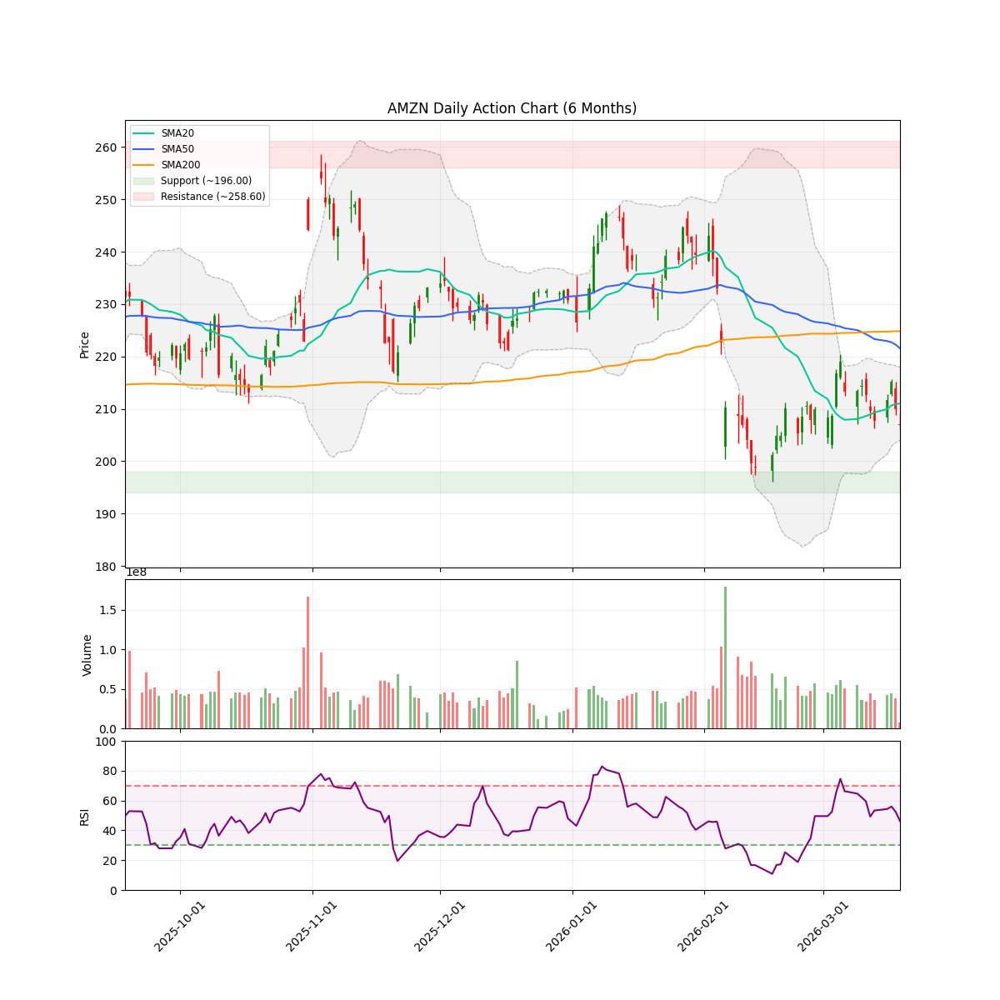
#### 研报分析

### 技术指标概览 (Technical Overview)
- **当前价格**: $206.90
- **RSI (14)**: 46.27
- **移动平均线**: SMA20: $211.00 | SMA50: $221.55 | SMA200: $224.80 (Bearish)
- **波动率**: ATR (14): 5.51 (预计周度波动: +/- $12.33)
- **关键位 (6m)**: 支撑位 $196.00 | 阻力位 $258.60
- **即时状态**: Below SMA50

# 亚马逊（AMZN）情绪审计报告：AI 吞金兽的“阵痛期”与长期叙事的博弈

**日期：** 2026年3月19日
**分析师：** 叙事经济学研究部
**标的：** AMZN（亚马逊）| **当前价格：** $206.90

---

### 1. 催化剂分类：谁在拨动市场的心弦？

我们将最近的密集信息流拆解为三个等级，看看哪些是真金白银，哪些只是噪音：

*   **A-Tier（核心驱动）：AI 军备竞赛的底层逻辑**
    *   **OpenAI 战略合作：** 2月27日官宣的合作（及后续深化）是顶级的叙事，意味着亚马逊不再甘于做“云地主”，而是要深度切入大模型应用层。
    *   **$6000亿 AWS 愿景：** CEO Andy Jassy 提出的 AWS 营收目标虽然长远，但给市场画了一张极具诱惑力的大饼。
    *   **$2000亿 资本开支（双刃剑）：** 2月份宣布的这笔巨额 AI 基础设施投入是目前股价承压的“元凶”，华尔街在短期利润缩减与长期霸权之间反复纠结。
*   **B-Tier（战术支撑）：生态系统的拼图**
    *   **Cerebras 合作伙伴关系：** 3月13日宣布在 Amazon Bedrock 上实现全球最快 AI 推理。这证明了 AWS 在硬件适配和速度上的领先地位，是实打实的技术肌肉。
*   **C-Tier（市场杂音）：情绪补剂**
    *   **Jim Cramer 的长线推荐：** 典型的散户情绪指标，通常能带来短期流量，但对机构定价权影响有限。
    *   **Zacks/Insider Monkey 趋势报告：** 属于技术性跟随，反映了市场目前的极高关注度。

---

### 2. 背离检测：为什么“利好不涨”？

**叙事陷阱警示：**
目前亚马逊正处于一个尴尬的“背离期”。从新闻面看，几乎全是 A 级利好（OpenAI 合作、Cerebras 加持、CEO 的宏大愿景），但股价却在 SMA50（221.55）和 SMA200（224.80）下方徘徊，处于典型的**看跌趋势**。

**深度解读：**
这不是“利好出尽”，而是**“利好未及覆盖成本”**的恐慌。市场正在消化那 $2000 亿的资本支出。投资者现在更像是一个谨慎的会计，他们听够了 AI 的故事，现在想看利润表里的折旧费用。目前的股价下跌是“利好消息”与“报表担忧”之间的拉锯，这种**看跌力竭（Bearish Exhaustion）**正接近 6 个月低点支持位（196.00）。

---

### 3. 情绪评分：6.5 / 10（蓄势待发的巨兽）

*   **评分逻辑：** 尽管技术面惨淡（趋势看跌），但基本面叙事正在经历质变。亚马逊正从“电商+云”向“AI 基础设施统治者”转型。6.5 分代表：**短期受压，但长线叙事尚未破裂。**

---

### 4. 市场脉搏：老兵的咖啡闲谈

“朋友，看着现在的亚马逊，你是不是觉得有点眼熟？就像当初他们为了修物流中心而疯狂烧钱的那些年一样。现在的 $2000 亿买的不是显卡，是未来十年的入场券。

现在的盘面很难看，SMA50 像个锅盖一样压在头顶。但你看，你的持仓成本在 $201.61，现在不仅没亏，还有 4% 的浮盈，这说明你在这一轮恐慌性抛售中站得很稳。196.00 这个位置就像是亚马逊的‘护城河’，只要不跌破这里，这次回调就是给错过 AI 浪潮的人补票的机会。别被 Cramer 的大喊大叫吓到，也别被短期开支吓跑，我们要等的是 AWS 营收真正开始兑现 Jassy 承诺的那一刻。”

---

### 5. 关键参考与后续展望

*   **核心参考：**
    *   [Cerebras 合作详情 (Yahoo Finance)](https://finance.yahoo.com/news/amazon-com-amzn-cerebras-partner-202546643.html) - AI 推理速度的质变。
    *   [CEO Jassy 的 $600B 愿景 (Blockonomi)](https://blockonomi.com/amazon-amzn-stock-ticks-higher-as-ceo-jassy-sets-600b-aws-revenue-vision/) - 确定了 AWS 的增长天花板。
    *   [资本支出引发的抛售分析 (Forbes)](https://www.forbes.com/sites/greatspeculations/2026/02/23/why-the-amazon-stock-sell-off-isnt-over-yet/) - 解释了当前价格疲软的核心逻辑。

*   **下一个重大日期：**
    *   **2026年4月30日（预估）：** **2026 Q1 财报发布日。**
    *   *注：这将是市场检验那 $2000 亿支出是否已经开始转化为早期订单的关键时刻，也是决定股价能否冲破 SMA50 阻力的分水岭。*

**操作建议：** 你的持仓占比较小（1.77%），防御性极强。在 196.00 支持位附近观察，若财报前夕 RSI 进一步进入超卖区，可考虑小幅加仓。
#### 近期新闻与事件
- **[Insider Monkey]** [Jim Cramer Recommended Amazon (AMZN) As A Long Term Stock In January 2025](https://www.insidermonkey.com/blog/jim-cramer-recommended-amazon-amzn-as-a-long-term-stock-in-january-2025-1720129/)
- **[Yahoo Finance]** [Amazon.com (AMZN) and Cerebras Partner for World's Fastest AI Inference on Amazon Bedrock](https://finance.yahoo.com/news/amazon-com-amzn-cerebras-partner-202546643.html)
- **[Insider Monkey]** [Amazon.coM (AMZN)'s Deepens AI Presence With New Partnership](https://www.msn.com/en-us/money/companies/amazoncom-amzn-s-deepens-ai-presence-with-new-partnership/ar-AA1YMRFQ)
- **[Blockonomi]** [Amazon (AMZN) Stock Ticks Higher as CEO Jassy Sets $600B AWS Revenue Vision](https://blockonomi.com/amazon-amzn-stock-ticks-higher-as-ceo-jassy-sets-600b-aws-revenue-vision/)
- **[Zacks Investment Research]** [Amazon.com, Inc. (AMZN) is a trending stock: Facts to know before betting on it](https://www.msn.com/en-us/money/general/amazon-com-inc-amzn-is-a-trending-stock-facts-to-know-before-betting-on-it/ar-AA1YU7Ur)

---

### GOOGL
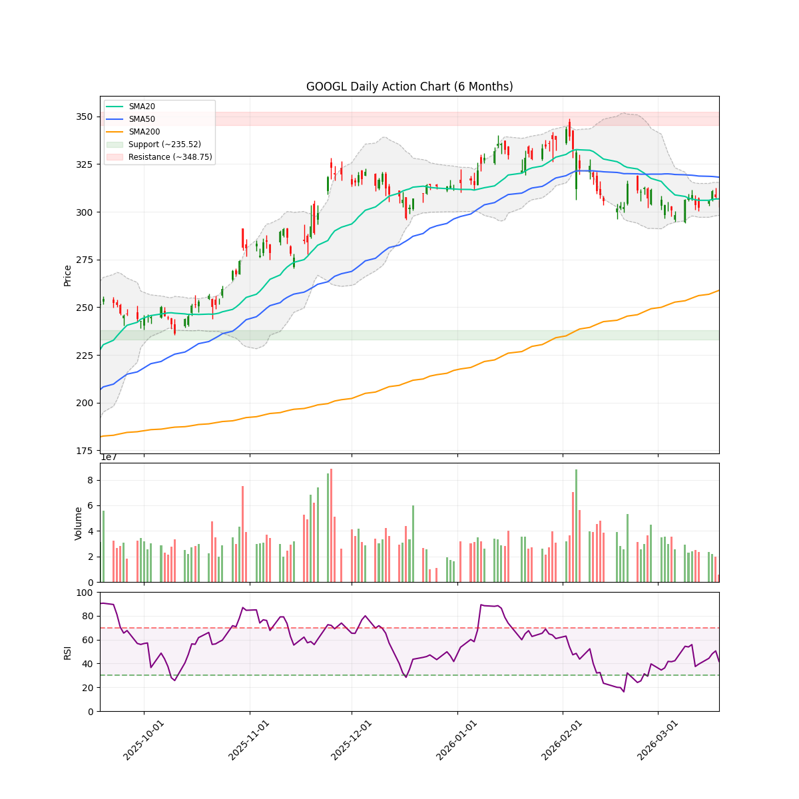
#### 研报分析

### 技术指标概览 (Technical Overview)
- **当前价格**: $303.98
- **RSI (14)**: 41.71
- **移动平均线**: SMA20: $306.79 | SMA50: $318.15 | SMA200: $258.86 (Bullish)
- **波动率**: ATR (14): 6.74 (预计周度波动: +/- $15.06)
- **关键位 (6m)**: 支撑位 $235.52 | 阻力位 $348.75
- **即时状态**: Below SMA50

# 叙事经济学：Alphabet (GOOGL) 深度情绪审计报告

**日期：** 2026年3月19日
**分析师：** 叙事经济学研究组 - 资深对冲基金研究员

---

### 1. 市场叙事总结：AI 狂热后的“审美疲劳”与“成长的烦恼”

现在的 GOOGL 就像是一个在舞会上跳了太久舞的巨人，虽然舞步依然稳健，但气息已经开始有些急促。

目前，市场的核心剧本已经从“AI 到底能不能行”转向了**“AI 到底能不能赚钱”**。即使有类似收购云安全巨头 Wiz 这样的战略性布局，以及被多家媒体评为“必买 AI 股”，股价依然在 SMA50（318.15）下方徘徊。这说明市场现在处于一种“怀疑主义占上风”的消化期。

**迈克尔·伯里 (Michael Burry) 的质疑**像一团挥之不去的乌云，他再次对 Google 庞大的 AI 资本支出表示不解。这种“大空头”式的叙事给散户和机构都带来了一丝心理压力——大家都在问：如果这几百亿美金砸下去，换不来利润的爆发式增长，那 Google 还是那个印钞机吗？

---

### 2. 催化剂分类 (Catalyst Categorization)

*   **A-Tier (核心驱动力):**
    *   **Wiz 收购案的深度整合：** [Zacks/Yahoo Finance] 提到的 Wiz 收购不仅仅是买个公司，这是 Google 在云安全领域对亚马逊 (AWS) 和微软 (Azure) 发起的正面冲锋。这是未来 12 个月内支撑估值的硬核逻辑。
*   **B-Tier (行业顺风):**
    *   **数据中心与量子计算：** [Jim Cramer] 的点名。虽然 Cramer 的话要反着听是老梗，但量子计算和数据中心的叙事确实让 Google 的底层技术护城河显得更深。
    *   **AI 必买清单：** [Motley Fool] 的持续背书，维持了散户市场的买盘热度。
*   **C-Tier (市场噪音):**
    *   **内部人士减持：** [Investing.com] 报道董事 Hennessy 卖出 31.8 万美元。说实话，对于 Alphabet 这种体量的公司，30 多万美元的减持连“洒洒水”都算不上，更多是由于税务或个人财务规划，不具备趋势指向性。
    *   **阿里巴巴财报拖累：** [Barrons] 提到的中概股疲软对 Google 有微弱的负面溢出效应，主要是市场风险偏好的整体收缩。

---

### 3. 背离检测 (Divergence Detection)

**诊断：看涨衰竭 vs 潜在陷阱**

我们观察到一个明显的**利好钝化**现象。尽管有 Wiz 收购这种级别的战略推进，股价却连续跌破了 SMA20 和 SMA50。这是一种典型的“利好不涨”，通常意味着机构在利用媒体的看好声音进行减仓，或者市场正在重新评估其 AI 投入产出比。

目前 RSI 处于 41.71，尚未进入“超卖”区域，但已经在寻找底部。结合 303.98 的现价，我们正处于一个**尴尬的真空区**：离下方 235.52 的强支撑还远，但上方 318.15 的阻力位却像铁板一样。

---

### 4. 情绪得分：6.2 / 10 (中性偏多，但需耐心)

*   **逻辑：** 长期基本面（SMA200 还在稳步抬升）依然无敌，但短期叙事正在经历“挤水分”的过程。16% 的现有盈利是你的护城河，目前不需要急于止盈，但也绝不是重仓“抄底”的时候。

---

### 5. 操作建议与心法

**目前的持仓状态：** 你手里有 160 股，成本 $268.53，浮盈 16%。这是一个非常舒服的位置。

*   **老兵的建议：** 现在的 GOOGL 就像是一场马拉松中的第 30 公里。不要被短期内 SMA50 的压制搞得心态崩溃。只要现价不有效跌破 285-290 美元（趋势转折区），你就可以稳坐钓鱼台。
*   **警惕陷阱：** 如果股价在接下来的两周内无法收复 310 美元（SMA20），那么短期内可能会下探测试 280 美元附近的心理支撑。

---

### 6. 关键数据与日期

*   **逻辑得分：** **6.2** (基于 AI 投入担忧与技术面短期破位的综合评估)
*   **下一次重大事件：** **2026 年 Q1 财报发布 (预计 4 月底)**。在此之前，市场大概率会维持缩量震荡。
*   **关键引用：**
    *   [Wiz Buyout Analysis - Zacks](https://finance.yahoo.com/news/googls-wiz-buyout-expands-cloud-162400540.html)
    *   [Director Hennessy Sale - Investing.com](https://www.investing.com/news/insider-trading-news/alphabet-director-hennessy-sells-318k-in-googl-stock-93CH-4569712)

**结语：** 咖啡喝完了，Google 的故事还没讲完。现在的调整是为了下一次跳得更高。守住你的低价筹码，让子弹再飞一会儿。
#### 近期新闻与事件
- **[Insider Monkey]** [Jim Cramer’s Biggest Quantum Computing & Data Center Stock Hits & Misses: Top 5 Stocks](https://www.insidermonkey.com/blog/jim-cramers-biggest-quantum-computing-data-center-stock-hits-misses-top-5-stocks-1719877/)
- **[Yahoo Finance]** [Google (GOOGL) closes week of Mar 16 at ___?](https://finance.yahoo.com/markets/prediction/event/googl-week-march-20-2026/)
- **[The Motley Fool on MSN]** [The best stocks to invest $10,000 in right now](https://www.msn.com/en-us/money/topstocks/the-best-stocks-to-invest-10-000-in-right-now/ar-AA1YV9oA?ocid=BingNewsVerp)
- **[Investing.com]** [Alphabet director Hennessy sells $318k in GOOGL stock By Investing.com](https://www.investing.com/news/insider-trading-news/alphabet-director-hennessy-sells-318k-in-googl-stock-93CH-4569712)
- **[Zacks· via Yahoo Finance]** [GOOGL's Wiz Buyout Expands Cloud Security Portfolio: What's Ahead?](https://finance.yahoo.com/news/googls-wiz-buyout-expands-cloud-162400540.html)

---

## 🔍 观察池机会分析

### AMAT
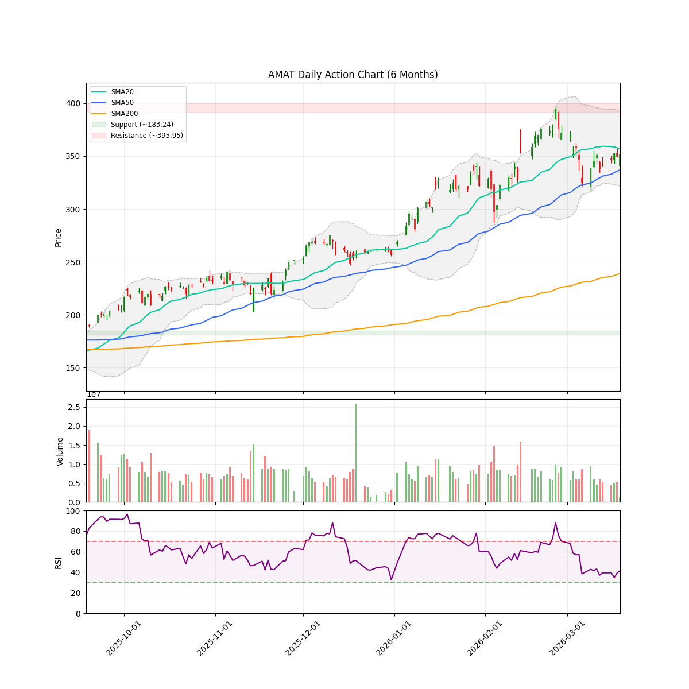
#### 研报分析

### 技术指标概览 (Technical Overview)
- **当前价格**: $351.54
- **RSI (14)**: 41.41
- **移动平均线**: SMA20: $356.83 | SMA50: $336.99 | SMA200: $239.18 (Bullish)
- **波动率**: ATR (14): 15.41 (预计周度波动: +/- $34.45)
- **关键位 (6m)**: 支撑位 $183.24 | 阻力位 $395.95
- **即时状态**: Above SMA50

# 应用材料 (AMAT) 情绪审计报告：AI 时代的“造物主”是陷入泥潭还是蓄势待发？

**分析师：** 叙事经济学研究员
**日期：** 2026年3月19日
**当前价格：** 351.54 美元

---

### 1. 市场叙事：咖啡馆里的闲谈

想象一下，如果把 AI 革命比作一场淘金热，那么英伟达是在前线挥舞铁锹的人，而 **应用材料 (AMAT)** 就是那个制造铁锹把手和锻造铲头的背后巨头。最近的市场氛围有点意思：虽然股价在 350 美元上方徘徊，比半个月前的高点缩了点水，但空气中弥漫着一股“山雨欲来风满楼”的味道。

大家都在盯着 AI 芯片，但聪明钱知道，如果没有 AMAT 的物理气相沉积 (PVD) 和刻蚀技术，所谓的“次世代存储”和“先进封装”都只是 PPT 上的概念。现在的 AMAT，正处于从“传统半导体设备商”向“AI 基础设施绝对核心”华丽转身的关键点。

---

### 2. 催化剂分级 (Catalyst Categorization)

#### **【A-Tier】核心驱动力（足以改变估值坐标）**
*   **并购传闻：潜在收购 BESI (BE Semiconductor)**
    *   **详情：** 消息称 AMAT 正与 Lam Research 竞争收购 BESI [Blockonomi]。
    *   **叙事价值：** 现在的战场已经从“如何把芯片做小”转移到了“如何把芯片堆叠起来”（先进封装）。如果 AMAT 成功拿下 BESI，它将统治混合键合 (Hybrid Bonding) 市场，这是 AI 芯片性能翻倍的唯一路径。这是绝对的王牌。
*   **存储巨头深度绑定：Micron & SK Hynix 战略合作**
    *   **详情：** AMAT 宣布与美光、SK海力士合作开发 HBM（高带宽内存）所需的新型存储芯片 [Insider Monkey]。
    *   **叙事价值：** HBM 是 AI 算力的瓶颈。AMAT 直接参与巨头的研发流程，意味着它在未来的订单争夺中已经提前“内定”。

#### **【B-Tier】支撑性力量（维持上升趋势）**
*   **机构背书：亿万富翁 Ken Fisher 持续加码**
    *   **详情：** Fisher 将 AMAT 列为 2026 年最重要的 15 笔交易之一 [Yahoo Finance]。
    *   **叙事价值：** 这代表了长期资本对半导体周期性波动的无视，为股价提供了坚实的心理支撑位。

#### **【C-Tier】背景噪音（日常波动）**
*   **Zacks 搜索热度与常规推介**
    *   **详情：** AMAT 成为 Zacks 平台搜索量最大的股票之一 [Zacks]。
    *   **叙事价值：** 散户关注度上升通常伴随着波动加剧，虽然显示了人气，但更多是情绪上的杂音。

---

### 3. 背离检测：好消息背后的“冷思考”

**现状：** 尽管利好频传（BESI 收购传闻、美光合作），AMAT 的股价却从高点 395 跌到了 351，目前位于 SMA20 (356.83) 下方，RSI 只有 41.41。

**深度解析：**
这看起来像是一个“多头陷阱”吗？**不，更像是“获利回吐的健康喘息”。**
虽然叙事极其强劲，但 RSI 41 说明市场正在消化之前 6 个月 86% 的恐怖涨幅 [Yahoo Finance]。价格处于 SMA50 之上，长期趋势依然是多头排列。目前的下跌并非因为利空，而是因为“利好出尽”后的筹码交换。在 336（SMA50）附近存在极强的结构性支撑。

---

### 4. 情绪得分与逻辑总结

#### **情绪得分：8.5 / 10 (强势牛市循环 - 调整期)**

**逻辑推演：**
*   **基本面 (9.5/10)：** 无可挑剔。AI 对 HBM 和先进封装的需求不是幻觉，而是硬生生的订单。
*   **叙事力 (9/10)：** 并购 BESI 的传闻给了市场极大的想象空间，这是一种“帝国扩张”的叙事。
*   **技术面 (6/10)：** 短期受压，RSI 偏弱，需要一个利好（如并购证实或财报超预期）来重新点燃引擎。

---

### 5. 关键信息参考

*   **特定新闻引用：**
    1.  [Blockonomi] 关于收购 BESI 的传闻，这是目前最性感的增长点。
    2.  [Insider Monkey] 与 Micron、SK Hynix 的 HBM 开发合作，锁定了未来两年的营收上限。
    3.  [Yahoo Finance] 六个月内 86.1% 的涨幅说明了市场的极度认可。
*   **下一个关键节点：** **2026 年 5 月中旬（预估 Q2 财报发布日）**。届时关于 BESI 收购的进展以及 AI 设备的实际交付数据将决定股价是否能突破 400 美元大关。

**老兵建议：**
“别被这几天的阴跌吓跑。现在的 AMAT 就像是一台正在加油的赛车，RSI 41 是给那些错过了去年大涨的人一个上车的‘折扣券’。只要 AI 还需要内存，只要芯片还需要堆叠，AMAT 的天花板就还没到。”
#### 近期新闻与事件
- **[Yahoo Finance]** [Applied Materials Inc. (AMAT): Billionaire Ken Fisher Remains Positive on Semis](https://finance.yahoo.com/news/applied-materials-inc-amat-billionaire-201725586.html)
- **[Blockonomi]** [BE Semiconductor Industries (BESI) Stock Soars on Takeover Buzz From Lam Research and Applied Materials](https://blockonomi.com/be-semiconductor-industries-besi-stock-soars-on-takeover-buzz-from-lam-research-and-applied-materials/)
- **[Insider Monkey]** [Applied Materials, Inc. (AMAT) Enhances Manufacturing Capabilities to Capitalize on AI Demand](https://www.msn.com/en-us/money/other/applied-materials-inc-amat-enhances-manufacturing-capabilities-to-capitalize-on-ai-demand/ar-AA1YzXoU)
- **[Zacks.com]** [Investors Heavily Search Applied Materials, Inc. (AMAT): Here is What You Need to Know](https://www.msn.com/en-us/money/topstocks/investors-heavily-search-applied-materials-inc-amat-here-is-what-you-need-to-know/ar-AA1Yz2h7)
- **[Insider Monkey]** [Applied Materials (AMAT) Partners with Micron (MU), SK Hynix for Next-Gen Memory Development](https://www.msn.com/en-us/news/technology/applied-materials-amat-partners-with-micron-mu-sk-hynix-for-next-gen-memory-development/ar-AA1YDB1S)

---

### ARM
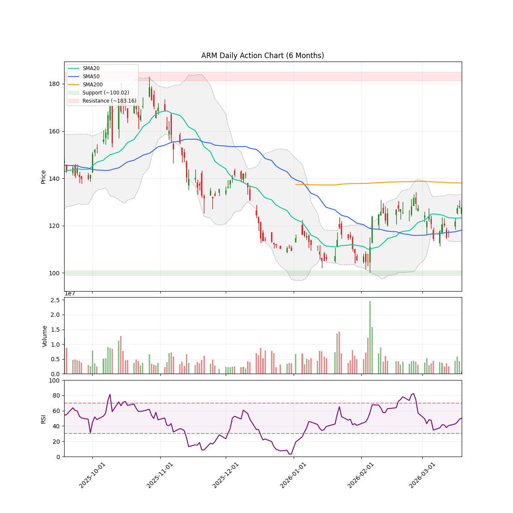
#### 研报分析

### 技术指标概览 (Technical Overview)
- **当前价格**: $127.67
- **RSI (14)**: 50.25
- **移动平均线**: SMA20: $123.27 | SMA50: $118.12 | SMA200: $138.10 (Bearish)
- **波动率**: ATR (14): 5.83 (预计周度波动: +/- $13.03)
- **关键位 (6m)**: 支撑位 $100.02 | 阻力位 $183.16
- **即时状态**: Above SMA50

你好！来，坐下喝杯咖啡。咱们聊聊 ARM 最近在市场上的这出“大戏”。

作为一名专注于“叙事经济学”的研究员，我一直认为，股票价格不仅仅是数字的跳动，它是群体心理与宏观叙事的博弈。目前的 ARM，正处在一个非常微妙的转折点。

### **ARM 情绪审计报告：AI 皇冠上的明珠，还是高位陷阱？**

#### **1. 催化剂分类：谁在推波助澜？**

我们将最近的消息按“重量级”拆解，看看哪些是真金白银，哪些只是耳边的风：

*   **A-Tier（核心动力）：大摩的“定心丸”**
    *   [Morgan Stanley 重申“增持”评级，目标价 135 美元](https://www.investing.com/news/analyst-ratings/morgan-stanley-reiterates-overweight-on-arm-holdings-stock-135-target-93CH-4570220)。在市场犹疑时，华尔街顶级投行的背书是实打实的机构支撑。135 美元的目标价给了目前 127 美元的股价一个明确的短期心理锚点。
*   **B-Tier（行业叙事）：元宇宙与 AI 的“刚需”**
    *   [Insider Monkey 将 ARM 列为最佳元宇宙标的之一](https://finance.yahoo.com/news/arm-holdings-plc-arm-center-213625784.html)。这类消息证明了 ARM 在算力架构上的统治力。同时，[关于 3 月 18 日后股价“飙升”的预测](https://www.theglobeandmail.com/investing/markets/stocks/ARM/pressreleases/779515/prediction-this-artificial-intelligence-ai-stock-will-skyrocket-after-march-18-hint-its-not-micron)（虽然带有标题党嫌疑）确实搅动了短线投机者的胃口。
*   **C-Tier（市场噪音）：克莱默的“毒奶”？**
    *   [Jim Cramer 表达看好 ARM](https://finance.yahoo.com/news/jim-cramer-says-arm-holdings-221434823.html)。在老练的交易员眼中，Cramer 的背书有时被视为散户入场的信号，往往意味着情绪接近过热的短波峰。

#### **2. 背离检测：好消息下，股价听话吗？**

现在的盘面很有意思。ARM 的 **SMA20 (123.27)** 和 **SMA50 (118.12)** 都在脚下，说明短期和中期趋势已经从此前的低迷中爬了出来。

但是，看一眼 **SMA200 (138.10)**。股价依然压在 200 日均线之下。这意味着，尽管摩根斯坦利在喊单，尽管 AI 叙事依然火热，但长期的大资金还没有完全“原谅”它从 183 美元高位跌落的背叛。

**目前的特征是：空头力竭，但多头还没能形成合力冲破长期阻力位。**

#### **3. 叙事诊断：可持续的趋势，还是陷阱？**

ARM 现在的故事叫 **“价值回归与架构溢价”**。

之前的回调（从 183 跌到 100 附近）已经洗掉了大部分追高泡沫。现在的上涨是基于基本面的重新定价。RSI 在 50.25，非常健康——既没有超买的疲态，也没有超卖的恐慌。这就像一辆刚加满油、正在热身的赛车，它还没开始全速冲刺，但也绝对不是在空转。

#### **4. 情绪评分 (Logic Score)**

### **7.2 / 10**

**评价：** 这是一个“谨慎乐观”的得分。
*   **为什么不是 9 分？** 因为它还没站上 SMA200，且 183 美元的高位阻力依然是头顶的达摩克利斯之剑。
*   **为什么不是 5 分？** 因为机构（大摩）开始入场护盘，且股价已经稳稳站上了 20 日和 50 日线。这不再是死猫跳，而是一个筑底反弹的过程。

---

### **投资建议总结 (The Coffee Talk Summary)**

“伙计，现在的 ARM 就像是一个刚病愈回来的尖子生。大家知道他很聪明（技术领先），也知道他家里有矿（AI 需求），但大家都在观察他能不能回到以前的高峰。

**操作建议：** 关注 138 美元（SMA200）的突破情况。如果能带量冲破这里，135 美元的目标价只是起点。如果冲不动，它可能会在 120-130 之间磨蹭一段时间。别听那些‘马上飙升’的鬼话，稳扎稳打才是王道。”

*   **下个重大日期：** 预计 2026 年 5 月上旬（财报发布日）。
*   **关键支撑位：** 118.12 (SMA50)
*   **关键阻力位：** 138.10 (SMA200)

**数据引用来源：**
- Investing.com (Morgan Stanley Target)
- Yahoo Finance / Insider Monkey (Sentiment analysis)
- Nasdaq (Sector comparison)
#### 近期新闻与事件
- **[Investing.com]** [Morgan Stanley reiterates Overweight on Arm Holdings stock, $135 target By...](https://www.investing.com/news/analyst-ratings/morgan-stanley-reiterates-overweight-on-arm-holdings-stock-135-target-93CH-4570220)
- **[Insider Monkey· via Yahoo Finance]** [Arm Holdings plc (ARM) at the Center of Global Tech and Market Shifts](https://finance.yahoo.com/news/arm-holdings-plc-arm-center-213625784.html)
- **[Insider Monkey· via Yahoo Finance]** [Is Arm Holdings plc (ARM) A Good Stock To Buy Now?](https://finance.yahoo.com/news/arm-holdings-plc-arm-good-021432049.html)
- **[Insider Monkey· via Yahoo Finance]** [Jim Cramer Says Arm Holdings (ARM) Stock Price Is “Nowhere Near Reflecting the K...](https://finance.yahoo.com/news/jim-cramer-says-arm-holdings-221434823.html)
- **[Simply Wall St.· via Yahoo Finance]** [Assessing Arm Holdings (ARM) Valuation After Recent Share Price Pullback](https://finance.yahoo.com/news/assessing-arm-holdings-arm-valuation-070640983.html)

---

### ASML
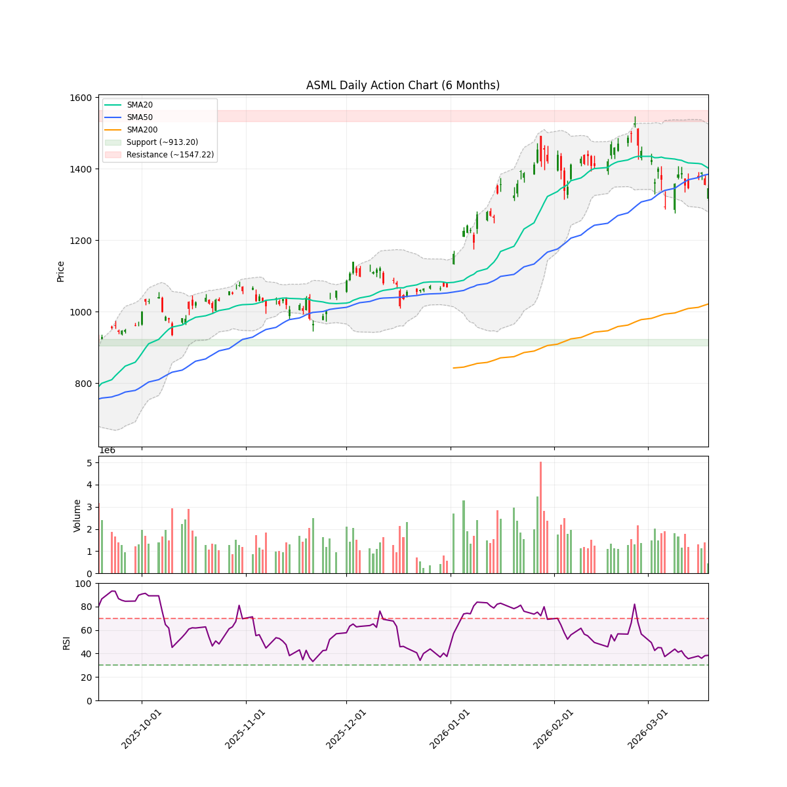
#### 研报分析

### 技术指标概览 (Technical Overview)
- **当前价格**: $1344.94
- **RSI (14)**: 38.45
- **移动平均线**: SMA20: $1401.44 | SMA50: $1384.16 | SMA200: $1021.22 (Bullish)
- **波动率**: ATR (14): 52.76 (预计周度波动: +/- $117.98)
- **关键位 (6m)**: 支撑位 $913.20 | 阻力位 $1547.22
- **即时状态**: Below SMA50

你好！坐，喝杯咖啡。我们来聊聊半导体行业的“造物主”——**ASML（阿斯麦）**。

站在 2026 年 3 月 19 日这个时点，阿斯麦的处境非常有意思。它就像一个掌握了全世界最先进武器图纸的军火商，虽然门外的订单排到了下个世纪，但华尔街的交易员们最近显然有点“审美疲劳”。

以下是我为你整理的**ASML 叙事经济学审计报告**：

---

### 1. 催化剂分类：谁在拉盘，谁在搅局？

*   **A-Tier（核心动能）：次世代“印钞机”落户 imec**
    *   **详情**：比利时研究机构 imec 正式拿到了 ASML 的 High NA EUV（高数值孔径极紫外光刻机）。这不只是卖了一台机器，这是 2nm 甚至更先进制程的“入场券”。[引用自: The Economic Times/imec News]
    *   **解读**：这奠定了 ASML 至少未来 5-10 年的霸权。没有这台机器，英特尔、台积电、三星的梦想全是幻影。
*   **B-Tier（行业情绪）：SK 海力士赴美上市与 AI 溢价**
    *   **详情**：SK 海力士计划通过 ADR 在美上市，旨在弥补估值缺口。[引用自: The Star]
    *   **解读**：存储巨头在 AI 热潮下的狂奔，意味着对 ASML 设备的持续饥渴，虽然不如直接订单劲爆，但这是极佳的背景板。
*   **C-Tier（市场噪音）：纳斯达克的“预言家”们**
    *   **详情**：有报道称 Micron 或 Oracle 的增长率将超过 ASML。[引用自: Nasdaq]
    *   **解读**：典型的“恐高症”言论。拿做内存或做云服务的公司去和做光刻机的比增长率，属于逻辑上的降维打击，无需过度理会。

---

### 2. 异动探测：为什么“好消息”没让股价起飞？

这里藏着一个危险的信号，我称之为**“美光悖论（Micron Paradox）”**。

最近的消息显示，美光（Micron）交出了“炸裂（Blowout）”的财报，结果股价不仅没涨，反而跳水了。[引用自: Investor's Business Daily] 

**这对 ASML 意味着什么？**
现在的市场正处于“利好出尽”的疲惫期。ASML 的股价目前在 $1344.94，位于 SMA50（$1384）下方，这说明机构投资者正在进行“筹码换手”。即使 imec 拿到了新机器这种顶级利好，股价依然显得步履蹒跚。**这属于典型的“看好但不买入”的滞涨阶段。**

---

### 3. 情绪评分：6.5 / 10（谨慎的牛市）

**逻辑得分理由：**
*   **基本面（10/10）**：High NA EUV 的交付证明了其技术垄断地位不可动摇。
*   **技术面（4/10）**：RSI 跌至 38.45，虽然接近超卖区域，但跌破 SMA20 和 SMA50 说明短期趋势已经转弱。
*   **心理面（5.5/10）**：市场对 AI 概念的门槛变得极高。现在不是“优秀”就能涨，而是要“神迹”才行。

---

### 4. 深度洞察：是趋势还是陷阱？

**我的判断：这不是陷阱，而是一个“深度呼吸”的过程。**

阿斯麦目前的走势与其说是衰退，不如说是**“昂贵的痛苦”**。它的护城河依然深不见底，但现在的股价正在消化过去一年的超额预期。

*   **看多理由**：RSI 已经逼近 30 的心理防线，且距离 SMA200（$1021.22）还有很厚的安全垫。
*   **潜在风险**：如果美光等下游客户的股价持续因为“利好兑现”而下挫，ASML 可能会被带入 $1250 左右的震荡区间。

---

### 5. 核心结论与后续关注

**市场脉动总结**：
ASML 现在的叙事已经从“能否做出来”变成了“交付能有多快”。现在的下跌是市场在清理那些追高 AI 的浮躁资金。

*   **下一次重大日期**：**2026 年 4 月中旬（暂定）** —— Q1 财报发布日。届时，High NA EUV 的订单指引将是决定股价能否重回 $1500 高地的关键。
*   **关键支撑位**：$1227 (ATR 波动范围下沿)
*   **关键压力位**：$1401 (SMA20 均线)

**老兵建议**：
别在暴雨的时候冲进球场。现在的 ASML 正在寻找地基，等它站稳 SMA50 且 RSI 回升至 50 上方时，那才是“叙事”重启的时刻。

--- 
**Logic Score: 6.5/10**
*分析结论：高溢价背景下的技术性修正，基本面无损，但短期动能匮乏。*
#### 近期新闻与事件
- **[The Economic Times on MSN]** [Belgium's imec secures rare ASML High NA EUV tool to drive next-generation chips](https://www.msn.com/en-in/money/news/belgiums-imec-secures-rare-asml-high-na-euv-tool-to-drive-next-generation-chips/ar-AA1YVyMh?ocid=BingNewsVerp)
- **[Seeking Alpha]** [AI, chip stocks mixed ahead of Micron's earnings](https://seekingalpha.com/news/4565858-ai-chip-stocks-mixed-ahead-of-microns-earnings)
- **[newscase]** [ASML Strengthens European Tech Leadership with Key Equipment Delivery](https://www.newscase.com/asml-strengthens-european-tech-leadership-with-key-equipment-delivery/)
- **[Investor's Business Daily on MSN]** [Dow Jones futures: Oil backs off $100; Micron skids despite blowout earnings](https://www.msn.com/en-us/money/top-stocks/dow-jones-futures-oil-backs-off-100-micron-skids-despite-blowout-earnings/ar-AA1YVDps?ocid=BingNewsVerp)
- **[The Star]** [SK hynix eyes US listing to unlock AI premium](https://www.thestar.com.my/business/business-news/2026/03/19/sk-hynix-eyes-us-listing-to-unlock-ai-premium)

---

### AVGO
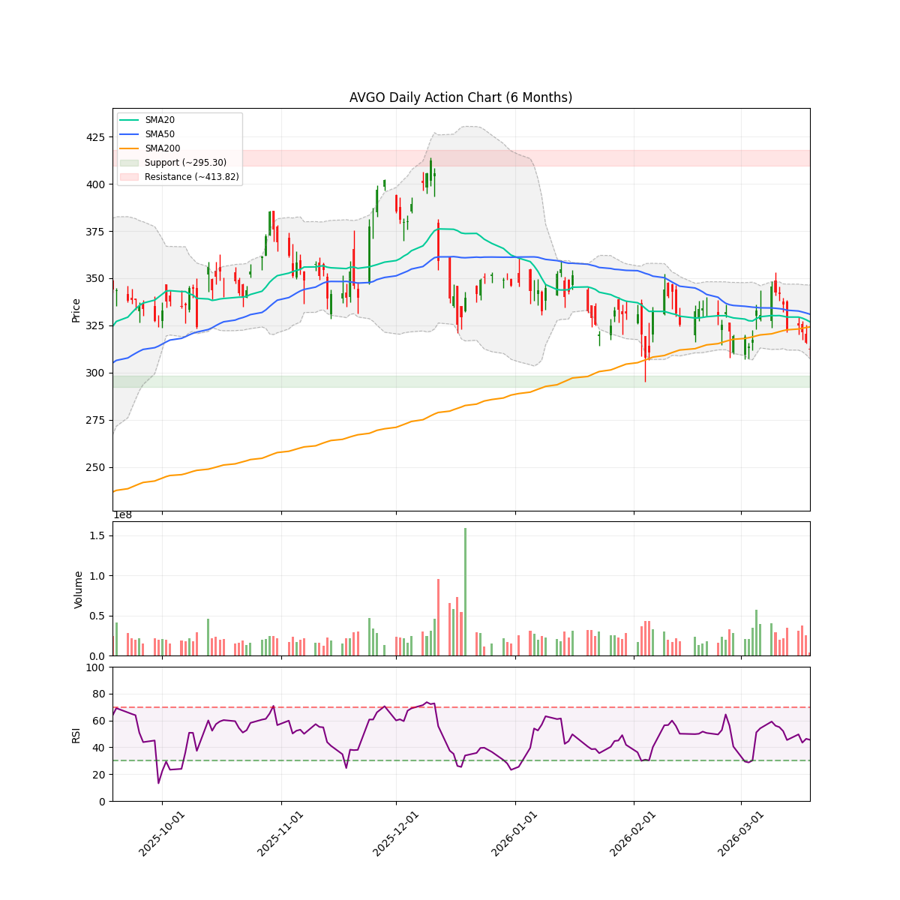
#### 研报分析

### 技术指标概览 (Technical Overview)
- **当前价格**: $312.44
- **RSI (14)**: 45.61
- **移动平均线**: SMA20: $326.91 | SMA50: $330.94 | SMA200: $324.22 (Bullish)
- **波动率**: ATR (14): 12.68 (预计周度波动: +/- $28.36)
- **关键位 (6m)**: 支撑位 $295.30 | 阻力位 $413.82
- **即时状态**: Below SMA50

# 叙事经济学视角：博通 (AVGO) —— 是AI的中流砥柱，还是暂时掉队的领头羊？

朋友，坐下来喝杯咖啡。咱们今天不聊那些枯燥的财报报表，聊聊博通（Broadcom）背后的“故事”。

在现在的半导体江湖里，如果说英伟达是台前那个光芒万丈的摇滚巨星，那博通就是那个搭建舞台、调控音响、甚至掌握着全场电路系统的后台大佬。没有它，AI 的这场戏根本唱不下去。但看看现在的盘面，这位大佬似乎在舞池边缘打了个趔趄。

---

### 1. 催化剂分级：故事的含金量 (Catalyst Categorization)

我们要看清，哪些是真金白银的推动力，哪些只是路边的噪音。

*   **A-Tier (核心叙事)：Tomahawk 6 正式量产与 Q1 超预期财报**
    *   **详情**：3月12日，博通宣布全球首款 102.4 Tbps 交换机芯片 Tomahawk 6 进入量产出货阶段 ([MSN/Insider Monkey](https://www.msn.com/en-us/news/technology/broadcom-avgo-commences-production-volume-shipping-of-world-s-first-1024-tbps-switch/ar-AA1YVFjE?ocid=BingNewsVerp))。这不只是一个硬件更新，它是AI数据中心“交通堵塞”的终极解决方案。配合 3月4日 刚发布的 Q1 财报（超预期盈利），这证明了博通在AI基建中的不可替代性。
*   **B-Tier (机构背书)：大佬们的“团购”名单**
    *   **详情**：亿万富翁 Ken Fisher 将其列为 2026 年最显著的持仓变动之一 ([Yahoo Finance](https://www.msn.com/en-us/money/markets/broadcom-inc-avgo-billionaire-ken-fisher-s-favorite-chip-stock/ar-AA1YRmqr))，连 Jim Cramer 也在一旁摇旗呐喊。这些机构的认可为股价提供了心理防线。
*   **C-Tier (市场噪音与减速带)：高管套现与散户热度**
    *   **详情**：就在今天 (3月19日)，总裁 Velaga Ram 卖出了价值 2080 万美元的股票 ([Investing.com](https://www.investing.com/news/insider-trading-news/broadcom-inc-president-velaga-s-ram-sells-208-million-in-avgo-stock-93CH-4569684))。虽然高管卖股可能有千万种理由，但在股价跌破均线的敏感时刻，这无疑给多头泼了一盆冷水。

---

### 2. 背离检测：为什么“好消息”救不了股价？ (Divergence Detection)

这是一个非常有趣的逻辑陷阱。

**现状**：博通发布了革命性的新芯片，财报也漂亮，机构还在唱赞歌，但股价却在 **312.44**，不仅低于 50日均线 (330.94)，甚至跌破了 200日长期生命线 (324.22)。

**叙事分析**：这在“叙事经济学”中被称为**“利好出尽的疲劳期”**。市场已经完全消化了博通作为“AI基座”的逻辑。目前 RSI 在 45.61，处于中性偏弱的状态，这说明即便有 Tomahawk 6 这样的大招，买盘依然犹豫不决。

**结论**：这是典型的**看跌衰竭（Bearish Exhaustion）**信号吗？不完全是。跌破 SMA200 预示着市场在重新定价博通的增长预期。目前的下跌不是因为基本面坏了，而是因为之前的预期被拉得太满，现在大家在等一个更“便宜”的入场券。

---

### 3. 情绪评分 (Sentiment Score)

**得分：6.2 / 10**

*   **理由**：如果只看产品和基本面，我可以给 9 分；但如果看目前的市场叙事和价格反馈，博通正处于一个“叙事真空期”。好消息被消化了，坏消息（高管减持、均线失守）正在被放大。这是一个**“优质资产、差劲走势”**的典型案例。

---

### 4. 市场洞察：老兵的私房话

现在的博通就像一个刚跑完马拉松的长跑冠军，虽然拿了奖杯（财报亮眼、产品领先），但由于消耗太大，不得不停下来大口喘气。

我们要紧盯 **295.30** 这个支撑位。如果股价在这个位置企稳，配合 AI 芯片的持续动力，那就是完美的“倒车接人”；但如果股价持续在 324 (SMA200) 下方徘徊，那说明大资金在悄悄撤退，我们得警惕这个“黄金陷阱”。

---

### 5. 关键信息汇总

*   **情绪评分**：6.2 (短期谨慎，中长期依然是 AI 核心)
*   **下一关键日期**：**2026年6月初** (预计发布 2026 财年 Q2 财报)
*   **核心观察点**：
    *   下周股价能否迅速收复 **324.22** (SMA200)。
    *   Tomahawk 6 的订单量是否会在 4 月的行业研讨会中进一步披露。

**总结**：别被现在的阴跌吓跑，但也别在均线压制下盲目冲锋。博通的戏还没演完，它只是在后台换件衣服。
#### 近期新闻与事件
- **[Yahoo Finance]** [Jim Cramer Was Bullish On Broadcom (AVGO) In January 2025](https://finance.yahoo.com/news/jim-cramer-bullish-broadcom-avgo-221635164.html)
- **[Insider Monkey on MSN]** [Broadcom (AVGO) Commences Production Volume Shipping of World’s First 102.4 Tbps Switch](https://www.msn.com/en-us/news/technology/broadcom-avgo-commences-production-volume-shipping-of-world-s-first-1024-tbps-switch/ar-AA1YVFjE?ocid=BingNewsVerp)
- **[Yahoo Finance]** [Should You Forget Nvidia and Buy These 2 Tech Stocks Instead?](https://finance.yahoo.com/markets/stocks/articles/forget-nvidia-buy-2-tech-022000122.html?pl2=topic-mid-section)
- **[Insider Monkey]** [Broadcom (AVGO) Witnessing Continued Momentum in AI Semiconductor Segment](https://www.msn.com/en-us/money/markets/broadcom-avgo-witnessing-continued-momentum-in-ai-semiconductor-segment/ar-AA1YL0AZ)
- **[Insider Monkey]** [Broadcom Inc. (AVGO): Billionaire Ken Fisher's Favorite Chip Stock](https://www.msn.com/en-us/money/markets/broadcom-inc-avgo-billionaire-ken-fisher-s-favorite-chip-stock/ar-AA1YRmqr)

---

### CEG
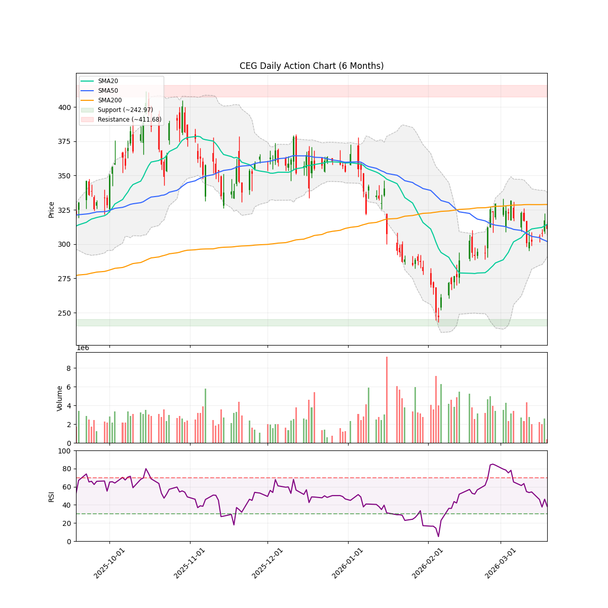
#### 研报分析

### 技术指标概览 (Technical Overview)
- **当前价格**: $311.03
- **RSI (14)**: 38.29
- **移动平均线**: SMA20: $314.37 | SMA50: $301.92 | SMA200: $328.88 (Bearish)
- **波动率**: ATR (14): 12.48 (预计周度波动: +/- $27.91)
- **关键位 (6m)**: 支撑位 $242.97 | 阻力位 $411.68
- **即时状态**: Above SMA50

# Constellation Energy (CEG) 情绪审计报告：核能巨头的“化学反应”，是陷阱还是黄金坑？

**日期：** 2026年3月19日  
**分析师：** 叙事经济学研究员  
**标的：** CEG (Constellation Energy Corporation)  
**当前价：** 311.03  

---

### 1. 催化剂分类：剥开新闻的洋葱皮

在叙事经济学的视角下，我们要区分什么是真正的动力，什么是无关痛痒的杂音。

*   **A-Tier (核心叙事)：长线护城河的加冕**
    *   **20年长期契约：** CEG 与田纳西泰坦队及新尼桑体育场签署了长达20年的清洁能源供应协议。这种超长周期的合同是电力公司的“压舱石”，提供了极高的盈利确定性。 [Source: Insider Monkey]
    *   **高盛的“勋章”：** 被列入高盛太阳能与绿色能源前十大选股名单。机构的背书不仅是资金的流入，更是叙事逻辑的自我实现。 [Source: Insider Monkey]
*   **B-Tier (行业脉动)：股息与避风港**
    *   尽管能源行业近期波动，但 CEG 作为防御性极强的股息增长股，依然是3月寻找安全收益的避风港。 [Source: The Motley Fool]
*   **C-Tier (市场噪音)：短暂的“化学波动”**
    *   **维护期泄漏事件：** 近期 Zacks 报道称 CEG 表现弱于大盘，主因是计划内停机维护期间发生的非放射性化学物质泄漏。这在老练的交易员眼中，纯属由于散户恐慌和对“核”字眼极度敏感导致的**非理性杀跌**。 [Source: Zacks.com]

---

### 2. 情绪背离检测：价格在撒谎吗？

**现状：** 股价目前处于 SMA200 ($328.88) 之下，处于典型的看跌趋势中。然而，这里存在一个非常有趣的**叙事背离**：

*   **看跌表象：** RSI 降至 38.29，离超卖区间仅一步之遥。上周跌幅（-3.7%）超过行业平均（-1.9%），主要受化学泄漏事件打击。
*   **看涨内核：** 当市场在谈论“泄漏”和“降级”时（虽然 Argus 的降级是针对 Duolingo，但宏观情绪被传染了），CEG 的基本面却在悄悄巩固（如 20 年长约）。
*   **结论：** 这是一种典型的**“利空出尽”**前兆。股价在 $300 附近（SMA50 支撑位 $301.92 左右）展现出了极强的韧性。如果股价在利空消息（化学泄漏）轰炸下依然守住 300 大关，那便是空头动能枯竭的信号。

---

### 3. 逻辑评分 (Logic Score)：5.8/10

**分值解析：**
*   **负面冲击 (4.2分)：** 技术面跌破 SMA200 是硬伤，短期内这会像一道天花板压制反弹空间。泄漏事件虽然是噪音，但它破坏了股价短期向上的斜率。
*   **正面支撑 (1.6分)：** 极具吸引力的 RSI 数值和长期的机构背书提供了一个“安全垫”。

**叙事总结：** 目前的 CEG 不是那种“一点火就着”的火箭，而是一个**“蹲下是为了跳得更高”**的巨人。叙事正在从“AI 驱动的电力短缺”转向“稳健的清洁能源基建”。

---

### 4. 深度洞察：咖啡馆里的老兵谈话

“嘿，别被那点‘化学泄漏’的标题党给吓坏了。你想想，在一个对核能安全近乎偏执的行业里，如果真是大事，股价早就腰斩了，而不是现在的阴跌。

现在的 CEG 就像是一个正在修整的超级英雄。大家都在盯着 SMA200 的压力，但这反而给了聪明钱上车的机会。RSI 掉到 38，这种信号在 CEG 这种级别的蓝筹股身上并不常见。目前的这种‘阴雨天气’，更多是机构在调仓，顺便利用散户对‘化学品’的恐惧收割一点廉价筹码。记住，Nissan 体育场的灯光可要亮 20 年，那才是真正的生意。”

---

### 5. 关键指标与未来日程

*   **当前阻力位：** $328.88 (SMA200) - 突破这里，叙事将反转为反弹。
*   **当前支撑位：** $301.92 (SMA50) - 这里的防守至关重要，一旦跌破，可能回踩 $242 的半年低点。
*   **每周预期波动：** +/- $27.91 (建议以此设定止损或波动性期权策略)。

**下一重大日期预测：**
*   **2026年5月初：** 预计将公布 2026 年第一季度财报。届时市场将重点关注由于维护停机（以及那个所谓的泄漏）对当季营收的实际影响，这通常是叙事重归“基本面驱动”的转折点。
#### 近期新闻与事件
- **[Investing.com]** [Duolingo stock falls after Argus downgrade to Hold](https://www.investing.com/news/stock-market-news/duolingo-stock-falls-after-argus-downgrade-to-hold-93CH-4568942)
- **[The Motley Fool on MSN]** [4 Dividend Energy Stocks to Buy in March](https://www.msn.com/en-us/money/topstocks/4-dividend-energy-stocks-to-buy-in-march/ar-AA1YUMfA?ocid=BingNewsVerp)
- **[Benzinga on MSN]** [Stock market today: S&P 500, Dow Jones futures slip as jobless claims fall to 205,000 — Micron, FedEx, Constellation Energy in focus (updated)](https://www.msn.com/en-us/money/markets/stock-market-today-s-p-500-dow-jones-futures-slip-as-jobless-claims-fall-to-205000-micron-fedex-constellation-energy-in-focus-updated/ar-AA1YY1gs?ocid=BingNewsVerp)
- **[Zacks.com]** [CEG Stock Underperforms Industry in the Past Week: How to Play?](https://www.msn.com/en-us/money/topstocks/ceg-stock-underperforms-industry-in-the-past-week-how-to-play/ar-AA1YPFVH)
- **[Insider Monkey]** [Constellation Energy Corporation (CEG) Chosen as Preferred Energy Source of New Nissan Stadium and the Tennessee Titans](https://www.msn.com/en-us/money/markets/constellation-energy-corporation-ceg-chosen-as-preferred-energy-source-of-new-nissan-stadium-and-the-tennessee-titans/ar-AA1YW5RU)

---

### GEV
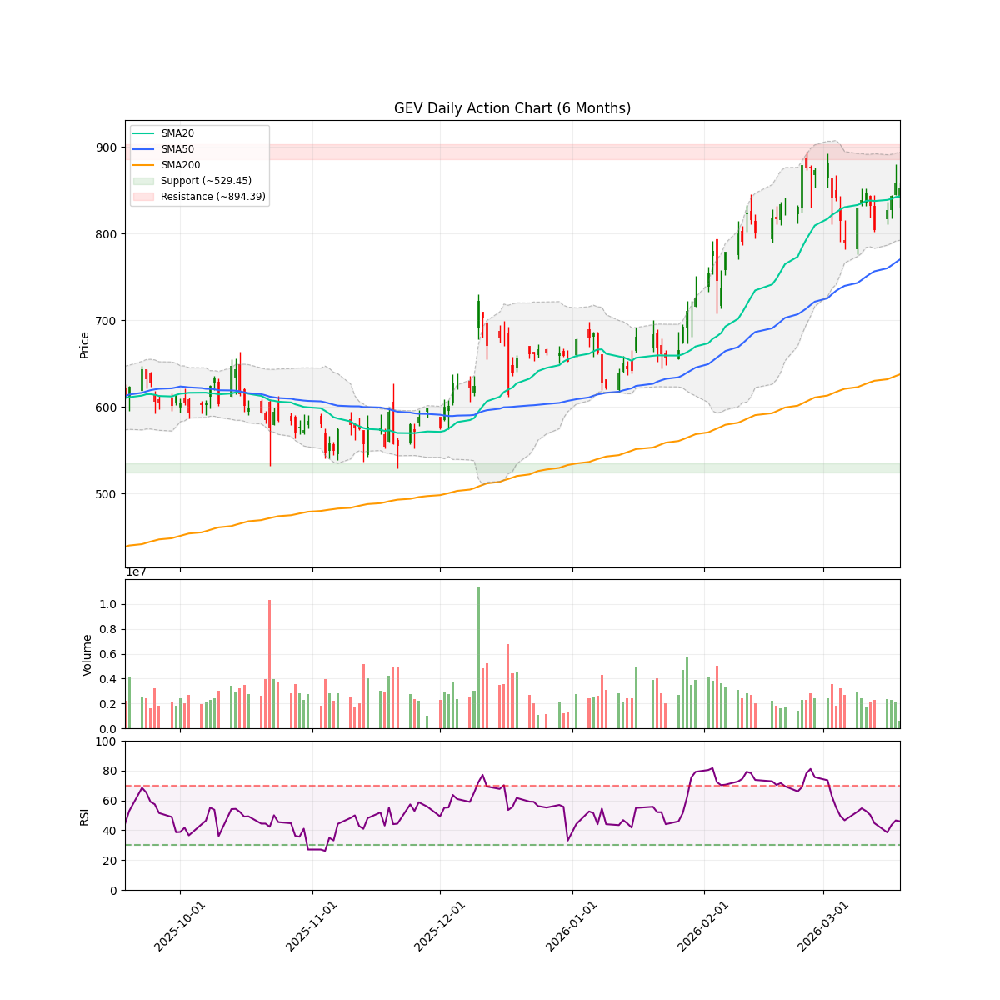
#### 研报分析

### 技术指标概览 (Technical Overview)
- **当前价格**: $852.45
- **RSI (14)**: 46.04
- **移动平均线**: SMA20: $843.21 | SMA50: $770.30 | SMA200: $637.68 (Bullish)
- **波动率**: ATR (14): 37.03 (预计周度波动: +/- $82.81)
- **关键位 (6m)**: 支撑位 $529.45 | 阻力位 $894.39
- **即时状态**: Above SMA50

**GEV 情绪审计报告：电力王者的“中场休息”，还是“诱多陷阱”？**

老伙计，坐下来喝杯咖啡。咱们今天聊聊 GE Vernova (GEV)。如果你在过去一年里没关注这只票，那你可能错过了能源界最疯狂的一场派对。股价几乎翻了三倍，现在它正站在 852.45 美元的高位，像是一个刚跑完马拉松的运动员，虽然大汗淋漓，但眼神里还透着那股子狠劲。

### 1. 催化剂分类：叙事拼图的核心

我们来看看最近给这把火添柴的都是些什么料：

*   **A-Tier（重磅炸弹）**：**与日立（Hitachi）达成协议，在东南亚部署 BWRX-300 小型模块化反应堆（SMR）。** [Benzinga, 2026-03-16]。这是真正的“干货”。在 AI 算力渴求电力、全球去碳化的大背景下，核能不再是贬义词，而是“新石油”。这个消息是长期增长的压舱石。
*   **B-Tier（市场热度）**：**Jim Cramer 的公开背书：“我非常喜欢这只股票。”** [Insider Monkey, 2026-03-13]。虽然老克拉默的评价偶尔被戏称为“反向指标”，但不可否认，这为 GEV 带来了大量的零售流动性和市场眼球。加上 Zacks 的搜索热度飙升，势头仍在。
*   **C-Tier（常规噪音）**：**Forbes 的同行比对报告。** [Forbes, 2026-03-13]。将 GEV 与霍尼韦尔（Honeywell）或伊顿（Eaton）对比。这种报告通常是机构调仓时的参考，但在这种叙事驱动的行情中，它们更像是背景板。

### 2. 背离检测：涨不动了，还是在蓄势？

这是一个很有趣的观察点。即便有日立合作这种“利好”冲击，股价在 3 月 16 日之后并没有暴力突破 894.39 美元的历史阻力位。

*   **技术形态**：目前的 RSI 是 46.04，这是一个非常“舒适”的数字。它告诉我们，之前的超买压力已经通过近期的横盘震荡消化掉了。
*   **价格行为**：股价紧贴着 SMA20 (843.21) 波动，说明短线多头还在死守阵地。虽然涨势放缓，但并未出现“利好出尽”的大幅抛售。这更像是一种**良性的高位震荡**，而非见顶回落。

### 3. 情绪评分：8.5 / 10 (坚定牛市周期)

**逻辑得分依据：**
GEV 目前处于一个“叙事完美期”。它不仅是基础建设的蓝筹，更是核能复兴的旗手。8.5 分意味着趋势依然非常健康，唯一扣掉的 1.5 分是因为短期内它需要一个新的、超预期的财报数据来证明它配得上这么高的溢价（Forward P/E）。

### 4. 深度洞察：这是“陷阱”吗？

从叙事经济学的角度看，这**不是**一个陷阱。陷阱通常伴随着“利好不涨反暴跌”或“基本面空洞的狂热”。GEV 的背后有实打实的电网现代化需求和核能订单。

现在的盘面更像是在**“选边站队”**。支撑位 529.45 离得很远，但 SMA50 (770.30) 是最后一道心理防线。只要股价维持在 840 美元上方，这就是在为冲刺 900 美元大关积蓄体能。

---

### 关键数据汇总

*   **当前价格**: 852.45
*   **核心逻辑得分**: **8.5 / 10**
*   **情绪状态**: 谨慎乐观（冷却后的再出发）
*   **阻力位**: 894.39 (6个月高点)
*   **支撑位**: 843.21 (SMA20) / 770.30 (SMA50)
*   **下个重大日期**: **2026年4月下旬 (预计 Q1 财报发布日)** —— 这将是验证“东南亚协议”和“订单积压量”是否能转化为利润的关键时刻。

**老兵建议：** 别在震荡期被甩下车，但也别在阻力位盲目追高。盯着 840 美元的关口，只要不破，这出戏就还没唱完。
#### 近期新闻与事件
- **[Forbes]** [Is GEV Stock A Better Pick Than Honeywell And Eaton?](https://www.forbes.com/sites/greatspeculations/2026/03/13/is-gev-stock-a-better-pick-than-honeywell-and-eaton/)
- **[Yahoo Finance]** [Is GE Vernova Inc. (GEV) A Good Stock To Buy Now?](https://finance.yahoo.com/news/ge-vernova-inc-gev-good-180804387.html)
- **[Zacks Investment Research]** [Here is what to know beyond why GE Vernova Inc. (GEV) is a trending stock](https://www.msn.com/en-us/money/top-stocks/here-is-what-to-know-beyond-why-ge-vernova-inc-gev-is-a-trending-stock/ar-AA1YZKKZ)
- **[Insider Monkey]** [Jim Cramer on GE Vernova: "I Like the Stock Very Much"](https://www.msn.com/en-us/money/markets/jim-cramer-on-ge-vernova-i-like-the-stock-very-much/ar-AA1Yzkey)
- **[Benzinga]** [GE Vernova stock is on the rise Monday: Here's why](https://www.msn.com/en-us/money/top-stocks/ge-vernova-stock-is-on-the-rise-monday-here-s-why/ar-AA1YLib5)

---

### MSFT
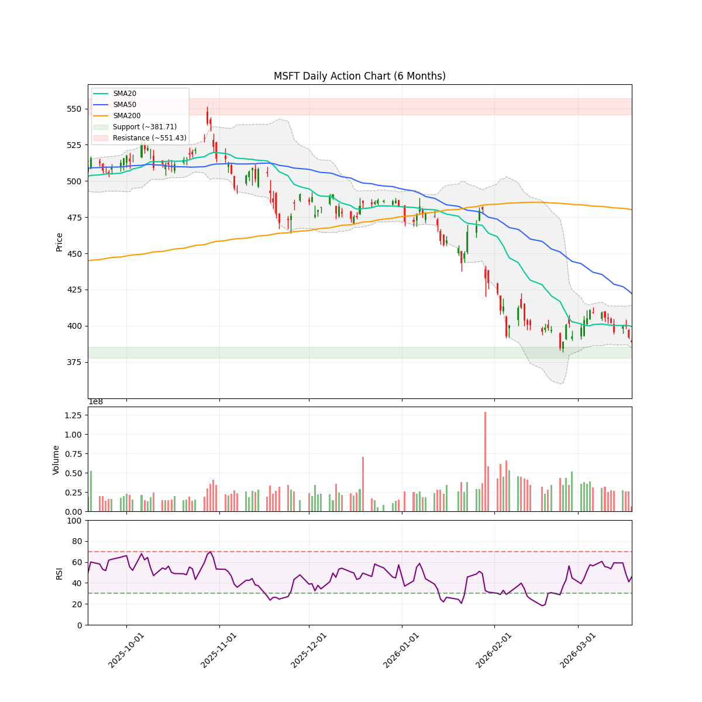
#### 研报分析

### 技术指标概览 (Technical Overview)
- **当前价格**: $388.55
- **RSI (14)**: 45.79
- **移动平均线**: SMA20: $399.51 | SMA50: $422.21 | SMA200: $480.18 (Bearish)
- **波动率**: ATR (14): 7.77 (预计周度波动: +/- $17.38)
- **关键位 (6m)**: 支撑位 $381.71 | 阻力位 $551.43
- **即时状态**: Below SMA50

# 微软 (MSFT) 叙事经济学审计报告：科技巨擘的“价值陷阱”还是“黄金坑”？

**日期：** 2026年03月19日
**分析师：** 叙事经济学研究部 - 资深策略师

---

### 1. 催化剂分类：叙事的“虚”与“实”

在目前的市场迷雾中，我们将近期关于微软的噪音拆解为三个层级：

*   **A-Tier（核心动力）：Jefferies 的 AI 信仰与 675 美元目标价**
    *   **核心逻辑：** [Jefferies](https://blockonomi.com/jefferies-names-microsoft-msft-stock-its-leading-ai-investment-with-675-price-target/) 坚定认为 Azure 和 M365 的企业级 AI 领导地位不可动摇。这种机构级别的背书是维持 MSFT 长期叙事脊梁的关键。675 美元的预想与目前 388 美元的股价形成了巨大的“认知价差”。
*   **B-Tier（市场心理）：早起鸟的“抄底论”**
    *   **核心逻辑：** [Morningstar](https://www.morningstar.com/stocks/this-might-be-best-core-stock-bargain-market-today) 与 [Forbes](https://www.forbes.com/sites/greatspeculations/2026/03/13/down-15-is-microsoft-stock-worth-buying-now/) 纷纷开始吹风，称 MSFT 为“市场中最优质的廉价股”。这种叙事通常出现在机构洗盘尾声，旨在吸引长线价值投资者。
*   **C-Tier（市场噪音）：比尔·盖茨的持仓八卦**
    *   **核心逻辑：** [The Motley Fool](https://www.msn.com/en-us/money/top-stocks/bill-gates-has-nearly-30-of-his-35-billion-portfolio-in-1-stock-and-it-s-not-microsoft/ar-AA1YTPHH) 讨论盖茨持仓第一名不是微软。这纯属干扰信息，对当前云业务和资本支出的基本面没有任何实质性影响。

---

### 2. 情绪背离检测：巨象在风暴中挣扎

目前的盘面呈现出一种**极度的“挫败感”**。

*   **现状：** 微软正处于典型的“好消息不涨”阶段。尽管 [Jefferies 重申买入](https://finance.yahoo.com/news/jefferies-think-microsoft-msft-153510141.html) 且机构喊出 675 美元的高价，股价却依然被 SMA50 (422.21) 和 SMA200 (480.18) 无情碾压。
*   **诊断：** 这是一个典型的**叙事崩塌与重构期**。市场不再盲目相信 AI 的承诺，而是转而关注 2026 年初这 15% 跌幅背后的结构性调仓。目前的 RSI 为 45.79，虽未完全进入超卖，但距离 6 个月低点 (381.71) 仅一步之遥。空头正在利用 [Bear Call Spread](https://finance.yahoo.com/news/microsoft-bear-call-spread-could-110002227.html) 等策略榨取最后一点波动率利润。

---

### 3. 市场叙事得分 (Logic Score)

# **3.5/10**

> **为什么这么低？** 尽管基本面（逻辑）是 9 分，但叙事（情绪）目前只有 1 分。在市场跌破 SMA200 这一“牛熊分界线”后，所有的利好消息都会被当成“反弹逃命的机会”。目前市场正在寻找那个能让情绪反转的“惊雷”，但在那之前，巨象仍在泥潭中。

---

### 4. 深度洞察：咖啡馆里的私语

老兄，看着现在的微软，就像看着一个满身肌肉的拳击手被困在了重感冒里。

现在的叙事不再是“AI 能做什么”，而是“AI 什么时候能把这 15% 的跌幅填回来”。当你看到像 [Morningstar](https://www.morningstar.com/stocks/this-might-be-best-core-stock-bargain-market-today) 这样沉稳的机构开始喊“捡便宜”的时候，说明左侧交易的信号灯已经开始闪烁。但别忘了，现在的趋势是 **Bearish（看跌）**。

目前的 388.55 美元是一个极其微妙的位置，下方 381.71 的支撑位是最后一道防线。如果守不住，这就是个深不见底的“陷阱”；如果能在这里缩量横盘，那么我们正在见证 2026 年最伟大的财富转移起点。现在的微软，缺的不是业绩，是一个让空头认输的理由。

---

### 5. 关键信息追踪

*   **下个重大日期：** **2026年4月下旬 (预计 2025 Q3 财报发布日)**。这将是决定微软是重回 500 美元还是跌向 350 美元的“审判日”。
*   **监控阻力位：** 399.51 (SMA20) - 这是重回短线多头的首要关口。
*   **监控支撑位：** 381.71 (6个月低点) - 绝对不能跌破的心理防线。

**结论：** 这是一个**由技术面崩溃主导的信心危机**。在价格重回 SMA50 之前，所有的“利好”都是温柔的陷阱。建议：保持耐心，等待空头动能衰竭后的二次探底。
#### 近期新闻与事件
- **[Morningstar]** [This Might Be the Best Core Stock Bargain in the Market Today](https://www.morningstar.com/stocks/this-might-be-best-core-stock-bargain-market-today)
- **[Yahoo Finance]** [This Microsoft Stock Bear Call Spread Could Net 14% in 4 Weeks](https://finance.yahoo.com/news/microsoft-bear-call-spread-could-110002227.html)
- **[The Motley Fool]** [Bill Gates Has Nearly 30% of His $35 Billion Portfolio in 1 Stock and It's Not Microsoft](https://www.msn.com/en-us/money/top-stocks/bill-gates-has-nearly-30-of-his-35-billion-portfolio-in-1-stock-and-it-s-not-microsoft/ar-AA1YTPHH)
- **[Forbes]** [Down 15%, Is Microsoft Stock Worth Buying Now?](https://www.forbes.com/sites/greatspeculations/2026/03/13/down-15-is-microsoft-stock-worth-buying-now/)
- **[Forbes]** [Microsoft Stock: What Could Ignite The Next Rally?](https://www.forbes.com/sites/greatspeculations/2026/03/13/microsoft-stock-what-could-ignite-the-next-rally/)

---

### MU
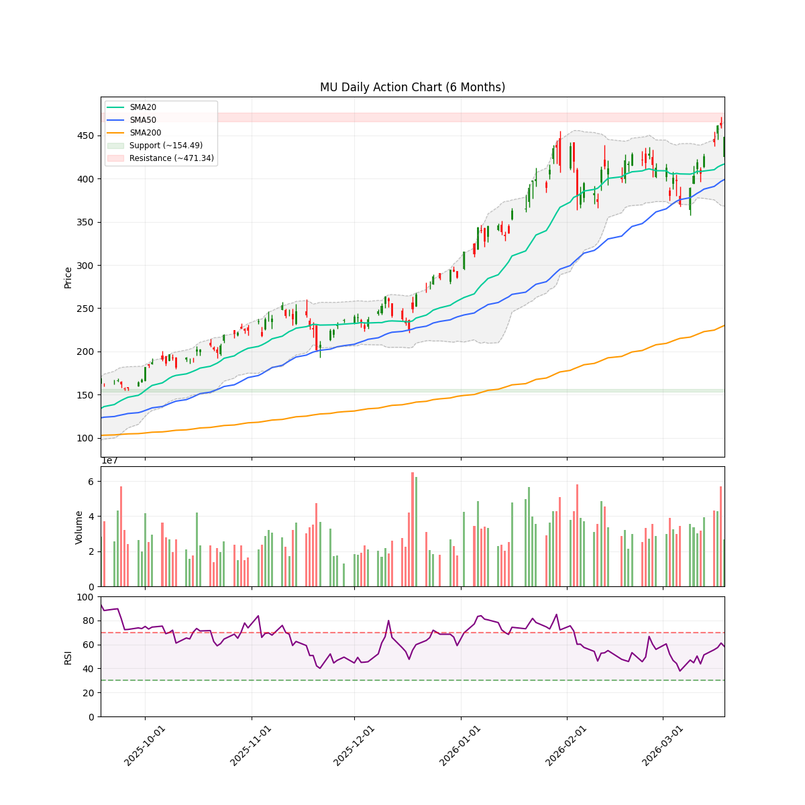
#### 研报分析

### 技术指标概览 (Technical Overview)
- **当前价格**: $448.08
- **RSI (14)**: 58.24
- **移动平均线**: SMA20: $417.02 | SMA50: $399.01 | SMA200: $230.03 (Bullish)
- **波动率**: ATR (14): 26.29 (预计周度波动: +/- $58.79)
- **关键位 (6m)**: 支撑位 $154.49 | 阻力位 $471.34
- **即时状态**: Above SMA50

# 美光科技 (MU) 情绪审计报告：繁华背后的“倒春寒”

**日期：** 2026年03月19日
**分析师：** 叙事经济学研究部 - 资深研究员

---

### 1. 催化剂分类：谁在掌舵，谁在造谣？

在今天的市场剧本里，美光科技（MU）展现了一种极具张力的矛盾感。我们将近期的消息进行深度拆解：

*   **A-Tier（顶级催化剂）：炸裂的财报与华尔街的集体“抬轿”**
    *   **业绩爆表：** 美光刚刚交出了一份令人瞠目结舌的Q2答卷，每股收益（EPS）超出预期38.57%，营收超出21.67% ([Zacks/Yahoo Finance](https://finance.yahoo.com/news/micron-mu-beats-q2-earnings-211501037.html))。这是实打实的硬实力，不是PPT里的故事。
    *   **目标价集体上调：** **KeyBanc** 将目标价直接拉升至 **$600** ([KeyBanc](https://ca.investing.com/news/analyst-ratings/keybanc-raises-micron-stock-price-target-to-600-on-strong-demand-93CH-4522439))，**Wolfe Research** 和 **TD Cowen** 也紧随其后调至 **$550**。这种机构级别的共识，通常预示着长线资金的入场券。

*   **B-Tier（二线催化剂）：AI 溢价的结构性延续**
    *   **Cantor Fitzgerald** 再次重申了对 AI 需求的乐观预期 ([Cantor Fitzgerald](https://www.investing.com/news/analyst-ratings/cantor-fitzgerald-reiterates-micron-stock-rating-on-strong-ai-demand-93CH-4570534))。AI 已经从一个噱头变成了美光利润表上的真金白银。

*   **C-Tier（三线噪音）：宏观情绪的“连坐”**
    *   道指触及2026年新低，以及对通胀的恐惧。这属于系统性噪音，虽然让今天的股价蒙阴，但并未触及存储芯片周期的核心逻辑。

---

### 2. 背离检测：好消息里的“冷箭”

**现象：** 这是一个典型的 **“利好出尽” (Sell the News)** 现场，还是某种更深层的警示？
尽管财报数据堪称完美，且分析师纷纷唱多，但 MU 股价今天却在下跌 ([Investopedia](https://finance.yahoo.com/markets/stocks/articles/5-things-know-stock-market-122730962.html))。

**深度解读：** 
老兵们都知道，当一家公司交出 A+ 成绩单股价却不涨反跌时，通常有两种可能：一是前期涨幅过大，市场在获利了结；二是宏观环境（通胀担忧）在杀估值。目前 MU 的 RSI 为 58.24，远未达到超买的极值。这意味着，**现在的下跌并非牛市终结，而是一次“蓄意”的洗盘。** 

SMA200 还在远处的 230.03，而现价 448.08 高高在上，这种偏离度确实让追高者胆寒。但只要它守住 SMA50 (399.01) 这一生命线，这种背离就是买入机会，而非陷阱。

---

### 3. 情绪评分：8.5 / 10 (躁动的高位洗盘)

**逻辑得分 (Logic Score): 8.5**

*   **基本面 (10/10)：** 存储芯片周期正处于 AI 驱动的爆发期，毛利率展望极其乐观。
*   **叙事力 (9/10)：** “AI 算力的心脏”这一叙事依然稳固。
*   **价格行为 (6/10)：** 短期受宏观情绪拖累，股价与强劲的基本面出现了暂时的脱节。

**分析师微评：** 
“现在的 MU 就像一辆正在高速公路上疾驰的高级跑车，引擎（财报）好得冒火，但刚好碰上了宏观环境的一场大雾。今天市场的反应更像是对‘通胀回归’的应激反应，而不是对美光本身的否定。对于长线猎人来说，这种‘好消息下的阴跌’正是由于市场恐慌提供的入场折扣。”

---

### 4. 关键日期与展望

*   **下一关键日期：** 预计 **2026年6月下旬**（Q3 财报发布）。
*   **短期波动区间：** 基于 ATR (14) 和波动率，本周预计波动范围在 **+/- 58.79**。
*   **操作指南：** 紧盯 **$471.34** 的前高阻力位。如果能在此次“倒春寒”后重新站稳并放量突破，KeyBanc 预言的 $600 绝非痴人说梦。

**结论：这不是陷阱，这是一次让短线投机者下车的“中途加油”。**
#### 近期新闻与事件
- **[Investing.com]** [KeyBanc raises Micron stock price target to $600 on strong demand By...](https://ca.investing.com/news/analyst-ratings/keybanc-raises-micron-stock-price-target-to-600-on-strong-demand-93CH-4522439)
- **[Investing.com]** [Wolfe Research raises Micron stock price target on strong results By...](https://www.investing.com/news/analyst-ratings/wolfe-research-raises-micron-stock-price-target-on-strong-results-93CH-4570173)
- **[Investopedia· via Yahoo Finance]** [5 Things to Know Before the Stock Market Opens](https://finance.yahoo.com/markets/stocks/articles/5-things-know-stock-market-122730962.html)
- **[Investing.com]** [Cantor Fitzgerald reiterates Micron stock rating on strong AI demand By...](https://www.investing.com/news/analyst-ratings/cantor-fitzgerald-reiterates-micron-stock-rating-on-strong-ai-demand-93CH-4570534)
- **[Seeking Alpha on MSN]** [Biggest stock movers Thursday: MU, FIVE, and more](https://www.msn.com/en-us/money/top-stocks/biggest-stock-movers-thursday-mu-five-and-more/ar-AA1YXQB6?ocid=BingNewsVerp)

---

### NVDA
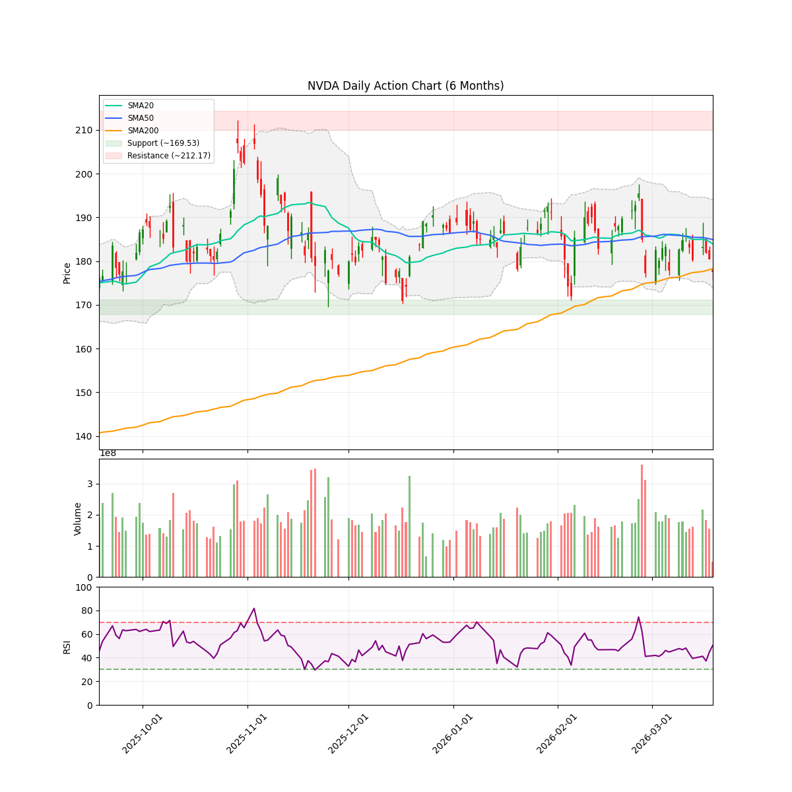
#### 研报分析

### 技术指标概览 (Technical Overview)
- **当前价格**: $177.53
- **RSI (14)**: 50.45
- **移动平均线**: SMA20: $183.92 | SMA50: $184.90 | SMA200: $178.25 (Bullish)
- **波动率**: ATR (14): 5.51 (预计周度波动: +/- $12.32)
- **关键位 (6m)**: 支撑位 $169.53 | 阻力位 $212.17
- **即时状态**: Below SMA50

# 英伟达 (NVDA) 情绪审计报告：叙事过热后的“审美疲劳”

**日期：** 2026年03月19日  
**分析师：** 叙事经济学研究员 (Hedge Fund Associate)  
**标的：** NVDA ($177.53)

---

### 1. 市场叙事：在“AI神话”与“现实引力”之间挣扎

想象一下，你坐在曼哈顿中城的咖啡馆里，对面是一位刚从交易池退下来的老手。他会告诉你：“现在的英伟达，就像是一部已经连载了五季的热播剧，虽然剧情依旧劲爆，但观众已经开始觉得审美疲劳了。”

从数据上看，英伟达正处于一个极其微妙的**“叙事断层”**。尽管 Jensen Huang 依然在抛出惊人的预测，尽管公司在向中国市场重新挺进，但股价却像被胶水粘住了一样。CNBC 称其为“令人沮丧的便宜”，这种描述非常精准——市场不再因为“好消息”而狂欢，这通常是筹码过于集中、利好出尽的典型征兆。

### 2. 催化剂分级 (Catalyst Tiers)

我们需要剥开新闻的糖衣，看看里面到底是真材实料还是单纯的公关辞令：

*   **A-Tier（核心动力）：**
    *   **中国市场的博弈重启：** [24/7 Wall St.] 指出英伟达重返中国。这是直接影响 EPS（每股收益）的硬指标，如果能填补之前的营收缺口，这将是打破目前僵局的重锤。
    *   **Nebius 20亿美元云端投资：** [Insider Monkey] 报道的与 Nebius 的 20 亿美元合作，标志着英伟达正在从单一芯片商向全栈 AI 云服务商进化，这是估值重估的核心逻辑。
*   **B-Tier（行业支撑）：**
    *   **现代/起亚自动驾驶合作：** [Insider Monkey] 报道的汽车业务扩张。虽然长期潜力巨大，但汽车业务在短期内还无法取代数据中心成为股价的“主火箭”。
*   **C-Tier（市场噪音）：**
    *   **Jensen Huang 的大胆预测：** 典型的领导者鼓舞，但在目前的震荡市中，这类言论已被市场免疫。
    *   **Zacks 动量评级：** 属于技术性跟随报告，对实质性叙事改变贡献较小。

### 3. 背离检测：当“好消息”不再奏效

这是报告中最需要警惕的部分。

目前的 NVDA 呈现出明显的**“看跌衰竭中的阴跌”**。
*   **技术面：** 股价目前处于 $177.53，**低于 SMA20、SMA50 甚至刚刚跌穿了 SMA200 ($178.25)**。在技术派眼里，这是极其危险的“破位”。
*   **情绪背离：** 看看 [Seeking Alpha] 和 [CNBC] 的报道——利润在增长，估值在降低，合作一个接一个，但股价却在下沉。这意味着机构投资者正在悄悄获利了结，或者在等待更低的回补位置。
*   **诊断：** 这是一个**“估值陷阱”与“技术触底”**的博弈。当利好消息无法拉动股价超越 50 日均线时，市场在告诉你：叙事已经透支，我们需要新的故事，或者更低的价格。

### 4. 情绪得分 (Sentiment Score)

**5.8 / 10**

> **逻辑推演：** 
> 尽管基本面依然稳健（A-Tier 利好不少），但技术面的走势正在无情地打脸“叙事派”。5.8 分代表这是一个**“高品质但缺乏动力”**的阶段。目前正处于从“AI 狂热”转向“AI 价值验证”的阵痛期。如果股价不能在近期站回 $184 (SMA50)，可能会测试 $169.53 的强支撑位。

### 5. 关键日期与展望

*   **下一个关键节点：** **2026年5月中下旬（预计第一季度财报发布日）**。
    *   *注：目前的股价停滞很大程度上是因为市场在等待下一份财报来证明“中国赌注”和“Nebius 合作”是否已经转化成了真实的现金流。*

---

**老兵寄语：** 
现在的英伟达不需要更多的“赞美”，它需要的是一场**大雨后的清爽——一次彻底的筹码清洗**。$178 附近的震荡是心理战，如果你相信 AI 叙事没变，现在是分批潜伏的“沮丧期”，但切记不要在此时加满杠杆，因为 SMA200 的失守意味着空头还没玩够。

---
*参考来源：*
- [Nvidia's China Bet Is Back On](https://247wallst.com/investing/2026/03/18/nvidias-china-bet-is-back-on-will-this-finally-move-its-stock/)
- [CNBC: The frustrating stock that looks cheaper by the day](https://www.cnbc.com/2026/03/18/heres-our-advice-on-nvidia-the-frustrating-stock-that-looks-cheaper-by-the-day.html)
- [Seeking Alpha: Valuation questions emerge](https://seekingalpha.com/news/4556589-nvidia-shares-drift-from-earnings-momentum-as-valuation-questions-emerge)
#### 近期新闻与事件
- **[24/7 Wall St.]** [Nvidia's China Bet Is Back On. Will This Finally Move Its Stock?](https://247wallst.com/investing/2026/03/18/nvidias-china-bet-is-back-on-will-this-finally-move-its-stock/)
- **[CNBC]** [Here's our advice on Nvidia, the frustrating stock that looks cheaper by the day](https://www.cnbc.com/2026/03/18/heres-our-advice-on-nvidia-the-frustrating-stock-that-looks-cheaper-by-the-day.html)
- **[Insider Monkey on MSN]** [Nvidia (NVDA), Nebius (NBIS) Partner to Scale Full-Stack AI Cloud with $2B Investment](https://www.msn.com/en-us/news/technology/nvidia-nvda-nebius-nbis-partner-to-scale-full-stack-ai-cloud-with-2b-investment/ar-AA1YW99S?ocid=BingNewsVerp)
- **[Insider Monkey]** [Nvidia (NVDA), Hyundai, Kia Expand Partnership for Next-Gen Autonomous Systems](https://www.insidermonkey.com/blog/nvidia-nvda-hyundai-kia-expand-partnership-for-next-gen-autonomous-systems-1720044/)
- **[The Motley Fool on MSN]** [Nvidia's Jensen Huang Just Made a Startling Prediction. Here's What it Means for Nvidia's Stock Price.](https://www.msn.com/en-us/money/news/nvidias-jensen-huang-just-made-a-startling-prediction-heres-what-it-means-for-nvidias-stock-price/ar-AA1YVQ8v?ocid=BingNewsVerp)

---

### PLTR
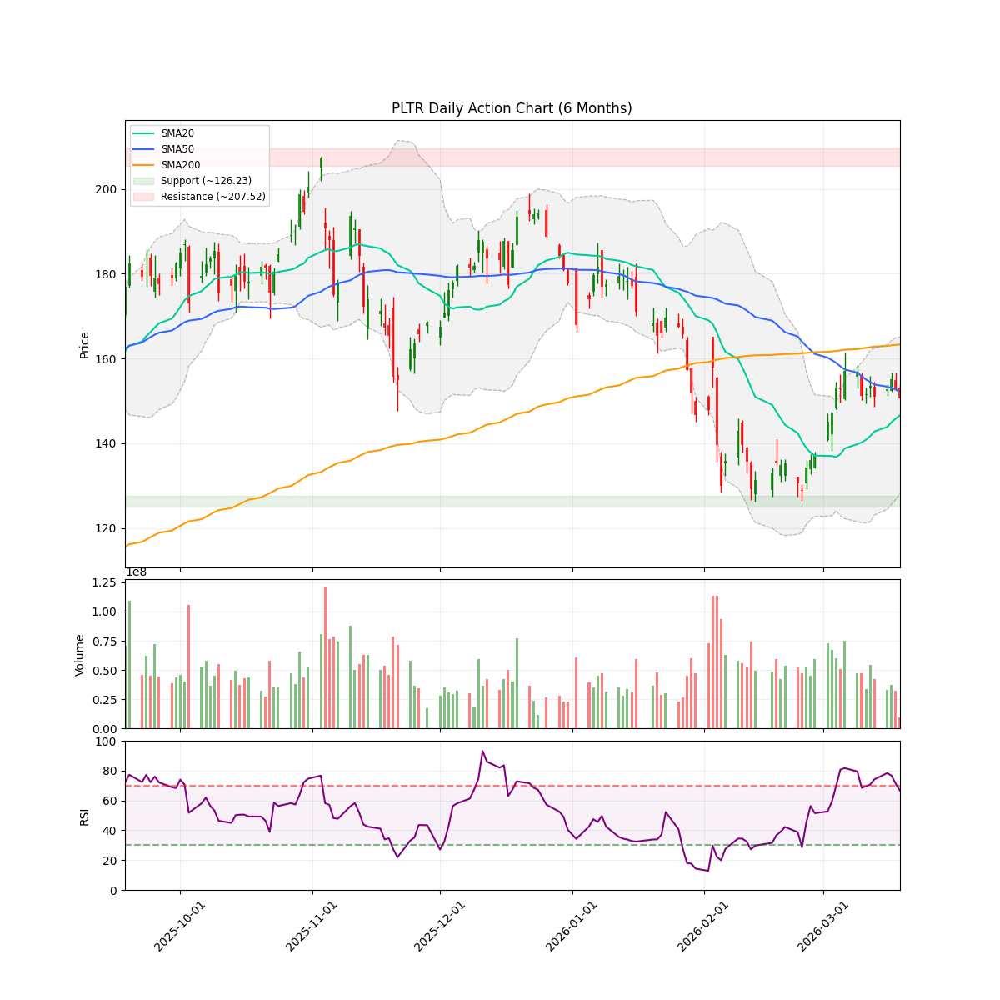
#### 研报分析

### 技术指标概览 (Technical Overview)
- **当前价格**: $150.61
- **RSI (14)**: 66.55
- **移动平均线**: SMA20: $146.61 | SMA50: $152.09 | SMA200: $163.32 (Bearish)
- **波动率**: ATR (14): 6.16 (预计周度波动: +/- $13.77)
- **关键位 (6m)**: 支撑位 $126.23 | 阻力位 $207.52
- **即时状态**: Below SMA50

# 叙事经济学审计报告：Palantir (PLTR) —— 战火中的AI王座，是黎明前的曙光还是致命的诱惑？

**日期：** 2026年03月19日
**分析师：** 叙事经济学研究组

---

### 1. 市场叙事：战壕里的“大脑”
现在的 Palantir 已经不再是那个神神秘秘、只会被嘲笑为“PPT公司”的硅谷异类了。如果你最近去华尔街的咖啡馆走一圈，你会发现大家谈论 PLTR 的语气变了——它正从“AI 概念股”蜕变为“国家安全与企业生存的基石”。

这次的叙事核心在于：**实战验证**。当公司的软件在遥远的中东战场直接协调军事行动，并帮助五角大楼筛选 AI 供应商时，这已经不是在卖软件，而是在输出“现代战争的指挥权”。首席执行官 Alex Karp 甚至直接在媒体上展示中东 AI 业务的扩张，这种“战地英雄”般的叙事极具感染力。

---

### 2. 催化剂分级 (Catalyst Tiers)

*   **【A-Tier】核心驱动力（硬核叙事）：**
    *   **中东实战与军事价值：** PLTR 在中东行动中的角色以及 Q4 营收激增 70% 至 14.1 亿美元（[Blockonomi, 03-10/13]）。这是实打实的业绩爆发，证明了其 AI 操作系统（AIP）已进入大规模变现期。
    *   **商业客户爆炸性增长：** 137% 的商业增长率说明公司成功破圈，不再单纯依赖政府订单。
*   **【B-Tier】行业共振（势能叙事）：**
    *   **同行对比溢价：** 像 UiPath 这种即便财报不错也被杀估值的公司（[24/7 Wall St, 03-12]），正反衬出 PLTR “Agentic AI”（代理式人工智能）领头羊的稀缺性。
*   **【C-Tier】杂讯与情绪（噪音叙事）：**
    *   **吉姆·克莱默（Jim Cramer）的背书：** 虽然克莱默推荐买入（[Insider Monkey, 03-18]），但老练的交易员通常将其视为情绪过热的信号，而非基本面支撑。
    *   **期权套利策略：** 关于卖出看跌期权（Put）套利的讨论（[Yahoo Finance, 03-17]）更多是技术性调整，而非趋势反转。

---

### 3. 背离检测：在“好消息”中挣扎？

这里有一个耐人寻味的细节：**尽管好消息接踵而至，股价却依然处在 SMA50（152.09）和 SMA200（163.32）下方。**

这种“利好不涨”的现象通常预示着两个可能：
1.  **抛压竭尽（Bearish Exhaustion）：** 之前的长期调整太深，多头正在低位缓慢吸筹，等待一个收复 152 美元高地的突破。
2.  **估值陷阱：** 市场虽然认可 PLTR 的强大，但对其五年 460% 的涨幅感到恐高（[TipRanks, 03-17]）。

目前 RSI 处于 66.55，正逼近超买区，这意味着股价在冲击 152 美元关键阻力位时，如果没有更劲爆的 A-Tier 催化剂，可能会出现短期的获利回吐。

---

### 4. 叙事得分：7.8 / 10 (Logic Score)

**评分逻辑：**
*   **基本面 (+4.5)：** 营收 70% 的增长和商业客户 137% 的增速简直是“怪兽级”表现。
*   **叙事吸引力 (+2.5)：** “AI+地缘政治”是目前市场上最具张力的故事。
*   **技术形态 (-1.0)：** 股价仍在长期均线下方，属于“在战壕里仰望天空”，需要站稳 SMA50 才能确认牛市回归。
*   **估值风险 (+1.8)：** 尽管有看空声音，但 PLTR 的护城河正在变宽。

---

### 5. 投资建议：别被“噪音”吓跑，但也别在山顶冲锋

现在的 PLTR 就像一辆正在换挡的重型坦克。
*   **策略：** 如果你还没上车，不要在 RSI 接近 70 时追高。关注 **146.61 (SMA20)** 的支撑位。如果股价能放量突破 **152.09**，那就是叙事逻辑战胜技术阻力的标志。
*   **警惕：** 警惕那种“它涨了 460% 所以必须跌”的简单思维，Palantir 卖的是“数字主权”，这种东西的估值模型是不能套用传统软件公司的。

---

### 6. 关键日程提醒

*   **下一重大日期：** **2026年5月初（预计 Q1 财报发布日）**。届时市场将验证中东局势带来的高增长是否具有持续性，还是仅仅是一次性的脉冲。

---
**参考来源：**
- [Blockonomi] PLTR Surges 12% After CEO Details Middle East AI (2026-03-13)
- [Motley Fool] Palantir Investors Just Got Great News (2026-03-19)
- [Yahoo Finance] Option Plays in PLTR (2026-03-17)
#### 近期新闻与事件
- **[Yahoo Finance]** [Option Plays in Palantir Stock Are Doing Well as PLTR Rises](https://finance.yahoo.com/news/option-plays-palantir-stock-doing-120002771.html)
- **[StockStory· via Yahoo Finance]** [Data Analytics Stocks Q4 Earnings: Palantir Technologies (NASDAQ:PLTR) Firing on...](https://finance.yahoo.com/markets/stocks/articles/data-analytics-stocks-q4-earnings-110038565.html)
- **[Insider Monkey· via Yahoo Finance]** [Jim Cramer Recommended Holding & Buying Palantir (PLTR) In February 2025](https://finance.yahoo.com/news/jim-cramer-recommended-holding-buying-221850945.html)
- **[Motley Fool· via Yahoo Finance]** [Palantir Stock Investors Just Got Great News from Wall Street](https://finance.yahoo.com/markets/stocks/articles/palantir-stock-investors-just-got-071500160.html)
- **[TipRanks· via Yahoo Finance]** [Palantir Stock (PLTR) Surges 460% in Five Years. Why I’m Bearish](https://finance.yahoo.com/news/palantir-stock-pltr-surges-460-071938626.html)

---

### TSM
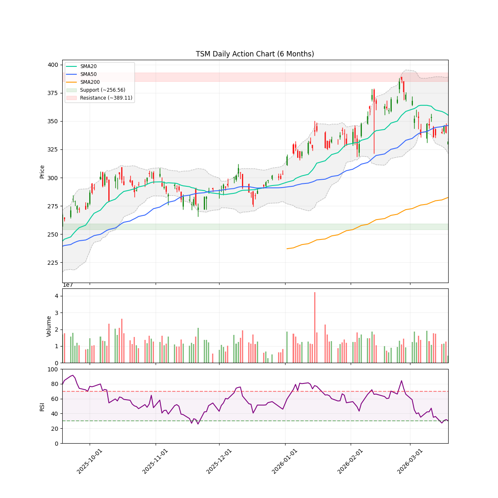
#### 研报分析

### 技术指标概览 (Technical Overview)
- **当前价格**: $331.96
- **RSI (14)**: 30.22
- **移动平均线**: SMA20: $355.19 | SMA50: $346.07 | SMA200: $282.47 (Bullish)
- **波动率**: ATR (14): 12.60 (预计周度波动: +/- $28.17)
- **关键位 (6m)**: 支撑位 $256.56 | 阻力位 $389.11
- **即时状态**: Below SMA50

你好，我是专注于“叙事经济学”的对冲基金研究员。

让我们坐下来喝杯咖啡，聊聊台积电（TSM）现在的局势。在华尔街，我们常说“买在传闻时，卖在事实出炉日”，但 TSM 此时此刻的故事，远比这个简单的公式要复杂得多。

### **TSM 叙事审计报告：当“旧王”退位，“新皇”登基**

#### **1. 催化剂分类：谁在驱动引擎？**

*   **A-Tier（核心驱动力）：英伟达超越苹果，成为 TSM 第一大客户**
    *   **深度解析：** 这是一个划时代的节点。多年来，苹果一直是台积电的“压舱石”，但 2026 年初的这份财报显示，英伟达的营收占比已攀升至 19%。这不仅仅是数字的变化，更是**权力重心的转移**。这意味着 TSM 的命运现在直接与 AI 算力的疯狂扩张挂钩，而非仅仅依赖消费电子周期。Bernstein 的看涨报告和 450 亿美元的扩张计划进一步证实了这一点：AI 收入占比将在 2026 年突破 20%。
*   **B-Tier（行业支撑）：特斯拉 Terafab 项目与二月营收增长**
    *   **深度解析：** 22% 的同比营收增长证明了基本面的强劲。而特斯拉即将在 3 月 21 日启动的 Terafab 项目，无疑会给 TSM 带来长期的车用芯片订单。虽然这是间接利好，但在叙事上，它完善了 TSM “通吃 AI、手机、智能汽车”的全能版图。
*   **C-Tier（市场杂音）：Forbes 的期权操作建议**
    *   **深度解析：** 卖出看跌期权（Selling Puts）的建议出现在媒体上，通常意味着市场开始寻找“底部支撑”。这属于技术性的噪音，反映了散户心理：大家想买，但又怕被套，所以选择了一种折中的防御姿势。

#### **2. 分歧检测：为何“利好不断”，股价却在“闹脾气”？**

现在的盘面出现了一个非常有趣的**背离现象**：
*   **新闻面：** 沸腾。英伟达登顶、Bernstein 上调目标价、营收大增。
*   **技术面：** 惨淡。当前价格 $331.96 已经击穿了 SMA20 ($355.19) 和 SMA50 ($346.07)，RSI 指数更是跌到了 **30.22**。

**诊断：** 这不是“系统性溃败”，而是典型的**“看涨衰竭后的技术性洗盘”**。即便叙事再动听，短期涨幅过大后的获利盘了结也是必然。目前 TSM 处于**超卖区间**，股价正在回测 200 日均线（$282.47）之前的支撑位。这种“好消息叠加阴线”的走势，往往是主力在利用利好出货，或者在等待下一个宏观窗口。

#### **3. 情绪评分 (Logic Score): 7.8/10**

*   **理由：** 叙事逻辑极度强悍（AI 龙头地位不可撼动），但技术面的短期趋势已走坏。7.8 分代表这是一个**“优质资产的黄金坑”**。虽然短期内可能有回撤至 $300-$310 区间的风险，但 22% 的营收增速和 Nvidia 的深度绑定，注定了这只是长牛途中的一次剧烈喘息，而非趋势反转。

---

### **投资洞察：市场脉动**

现在的 TSM 就像一个正在换挡的超级跑车。从“苹果时代”切换到“英伟达时代”，引擎转速很高，但换挡瞬间会有顿挫感。$331 的价格对于长期主义者来说，已经进入了分批建仓的视觉范围。

*   **警惕陷阱：** 如果股价跌破 $300 且没有迅速收回，说明机构对 2026 年下半年的宏观预期有变，届时需重新评估。
*   **把握机会：** RSI 触及 30 是极强的反弹信号。配合 3 月 21 日特斯拉项目的启动，短期内可能会有一波情绪修复。

---

### **关键信息汇总**

*   **逻辑评分：** **7.8 / 10**（强劲基本面 vs 短期技术性破位）
*   **下一个关键日期：** **2026年3月21日**（特斯拉 Terafab 项目启动，关注对半导体供应链的叙事提振）。
*   **引用证据：**
    *   [Blockonomi] TSMC (TSM) Stock: Nvidia Overtakes Apple as Top Customer in Historic Shift.
    *   [Bernstein] Upgrade to NT$2,200 target / $45B expansion plan.
    *   [Technical Data] RSI 30.22 (Oversold condition).

**老兵结语：** “别被几根阴线吓破了胆，看清楚是谁在给 TSM 递支票。只要 AI 的火还没灭，台积电就是那个掌握火种的人。”
#### 近期新闻与事件
- **[Forbes]** [TSM Stock: Why Selling Puts Is The Win-Win Play](https://www.forbes.com/sites/greatspeculations/2026/03/18/tsm-stock-why-selling-puts-is-the-win-win-play/)
- **[The Motley Fool]** [Think It's Too Late to Buy Taiwan Semiconductor Manufacturing Company Stock? Here's the 1 Reason Why There's Still Time.](https://www.fool.com/investing/2026/03/18/think-its-too-late-to-buy-taiwan-semiconductor-man/)
- **[Blockonomi]** [TSMC (TSM) Stock: Nvidia Overtakes Apple as Top Customer in Historic Shift](https://blockonomi.com/tsmc-tsm-stock-nvidia-overtakes-apple-as-top-customer-in-historic-shift/)
- **[YouTube]** [TSM stock rallies on big October sales & Nvidia demand](https://www.msn.com/en-us/money/topstocks/tsm-stock-rallies-on-big-october-sales-nvidia-demand/vi-AA1YPPeW)
- **[Blockonomi]** [Taiwan Semiconductor (TSM) Stock Soars 83% — Bernstein Says Rally Isn't Over Yet](https://blockonomi.com/taiwan-semiconductor-tsm-stock-soars-83-bernstein-says-rally-isnt-over-yet/)

---

### VRT
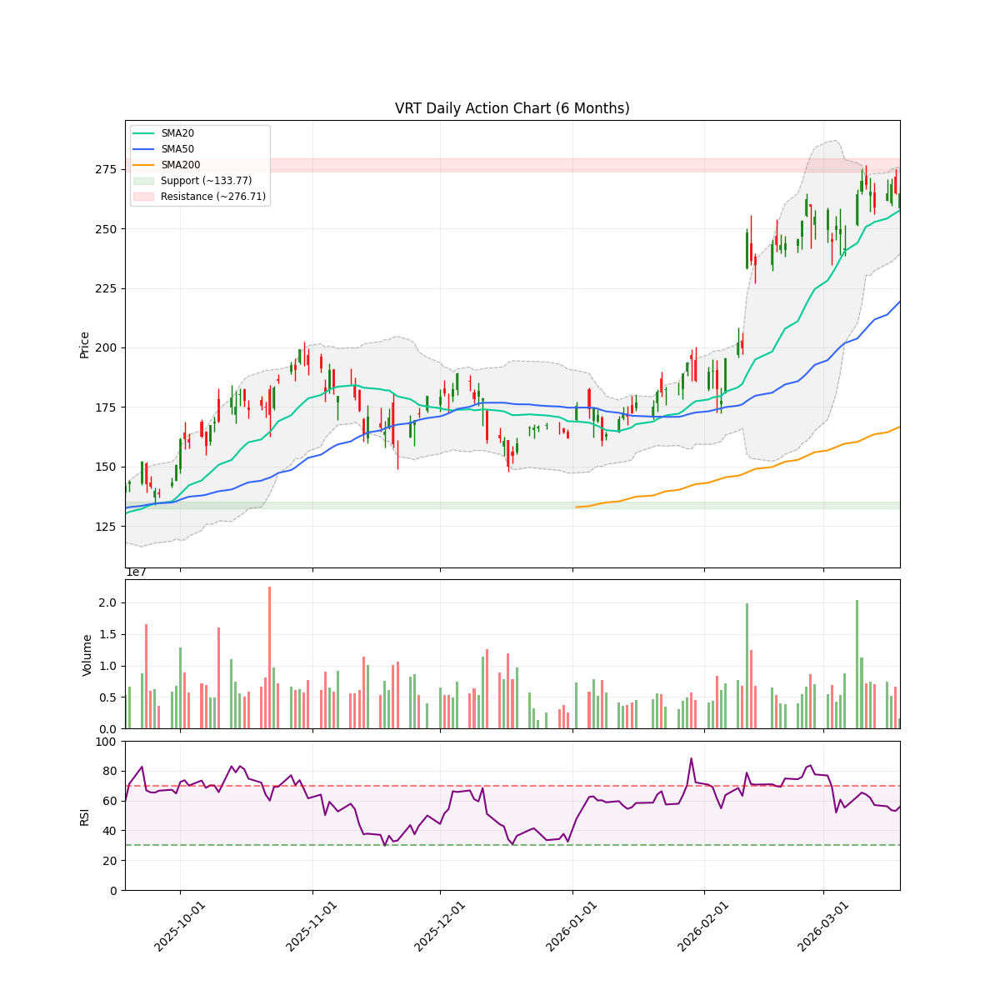
#### 研报分析

### 技术指标概览 (Technical Overview)
- **当前价格**: $264.82
- **RSI (14)**: 55.85
- **移动平均线**: SMA20: $257.61 | SMA50: $219.25 | SMA200: $166.70 (Bullish)
- **波动率**: ATR (14): 14.23 (预计周度波动: +/- $31.81)
- **关键位 (6m)**: 支撑位 $133.77 | 阻力位 $276.71
- **即时状态**: Above SMA50

# 叙事经济学视点：Vertiv (VRT) —— AI 时代的“数字水管工”

兄弟，坐下来喝杯咖啡。咱们今天不聊那些虚无缥缈的算法，聊聊实打实的、能让数据中心不“发烧”的生意。如果你还在盯着英伟达（NVIDIA）的芯片看，那你可能错过了一半的戏码。**Vertiv (VRT)**，这家卖散热系统和配电装置的公司，正处于一场疯狂叙事的风暴中心。

2026年才过去两个多月，这家公司已经涨了50%。这不仅仅是股价的飙升，这是一场关于“能源饥渴”和“算力冷热”的权力转移。

---

### 1. 催化剂分级 (Catalyst Categorization)

我们要把噪音和信号分开，看看 VRT 的油箱里到底装的是什么。

*   **A-Tier（顶级燃油）：Generate Capital 战略合作与 BYOP&C 生态系统**
    *   *逻辑：* 2026年3月14日的这条新闻至关重要。与 Generate Capital 的合作不仅仅是签个合同，它是要建立一个“自带动力与冷却”（BYOP&C）的生态系统。这意味着 Vertiv 正在从硬件供应商向**基础设施集成方案解决商**进化。高利润、强粘性，这是机构最爱的“护城河”叙事。
*   **B-Tier（行业东风）：数据中心与量子计算的估值重塑**
    *   *逻辑：* Jim Cramer 连续点名 VRT 是量子计算和数据中心的顶级标的。虽然我们平时对老吉的话要打个折扣，但他在大众心理上的推力不可小觑。更重要的是，Zacks 报告显示其运营利润率预期在 18.5%-19.5% 之间，这种盈利能力的确定性在动荡的市场中就是避风港。
*   **C-Tier（市场杂讯）：Zacks 搜索热度与散户关注度**
    *   *逻辑：* 被列入“最受关注股票”名单。这说明热度很高，但也意味着筹码开始变得拥挤。

---

### 2. 背离检测 (Divergence Detection)

**诊断：暂无看跌背离，处于“强势整理”阶段。**

虽然股价在 2026 年初经历了 50% 的暴力拉升，但目前 RSI 维持在 **55.85**。这是一个非常舒服的位置——既没有超买到令人窒息，也没有跌破支撑。
*   **有趣的一点：** 即使在近期油价波动和市场情绪摇摆时，VRT 依然站稳在 SMA20（257.61）之上。它在“好消息”出来后并没有出现利好出尽的杀跌，反而以横盘消化估值，这说明机构并没有在急着离场，而是在等待下一个突破口。

---

### 3. 叙事评分与总结 (Sentiment Score)

#### **情绪评分：9.2/10 (不可阻挡的看涨周期)**

**逻辑诊断：**
目前的叙事逻辑是：**“算力的尽头是电力与散热”**。只要 AI 的需求还在，Vertiv 的冷却系统就是刚需。它不是那种靠讲 PPT 活着的科技股，它是那种实实在在去数据中心搬砖、装空调、拉电线的“重型科技”。

*   **技术面看：** 股价目前在 264 附近徘徊，距离 6 个月高点 276.71 仅一步之遥。SMA50（219）和 SMA200（166）呈完美的多头排列。
*   **心理面看：** 市场已经达成共识——Vertiv 是 AI 基建的“唯一纯净标的”。这种共识一旦形成，除非业绩暴雷，否则很难逆转。

---

### 4. 深度洞察 (The Narrative)

你可以把 VRT 想象成 19 世纪淘金热里的那个“卖铲子的人”。只不过现在的金子是数据，而铲子是那些巨大的液冷机组。
现在的价格（264.82）正处于一个微妙的平衡点。它已经脱离了“被低估”的范畴，进入了“成长溢价”阶段。周波动范围大约在 +/- 31 刀，这意味着短期内会有震荡，但只要它守住 250 这一关口，每一次回调都是为了下一次冲击 300 大关蓄势。

**警示：** 别在它大涨 10% 的那天追进去。看好支撑位，这种票是用来在恐慌日“捡便宜”的，而不是在狂欢日“接飞刀”的。

---

### 5. 关键情报速递

*   **引用证据：**
    *   [Generate Capital 合作项目](https://finance.yahoo.com/news/vertiv-holdings-vrt-generate-capital-183058772.html)
    *   [Zacks 利润率分析](https://finance.yahoo.com/news/why-vertiv-vrt-12-2-153015449.html)
*   **下个重大日期：** **2026年4月22日左右**（预计 2026 年第一季度财报发布日）。届时关于 18.5%-19.5% 利润率能否兑现，将决定它是冲向 300 还是回踩 220。

**伙计，盯着散热风扇转动的声音，那是钞票落袋的声音。**
#### 近期新闻与事件
- **[Insider Monkey]** [Jim Cramer’s Latest 6 Stock Calls As Oil Drops and the U.S. Market Rises](https://www.insidermonkey.com/blog/jim-cramers-latest-6-stock-calls-as-oil-drops-and-the-u-s-market-rises-1719727/)
- **[Insider Monkey on MSN]** [Jim Cramer’s Biggest Quantum Computing & Data Center Stock Hits](https://www.msn.com/en-us/money/savingandinvesting/jim-cramer-s-biggest-quantum-computing-data-center-stock-hits/ar-AA1YVvkV?ocid=BingNewsVerp)
- **[Zacks· via Yahoo Finance]** [Is Most-Watched Stock Vertiv Holdings Co. (VRT) Worth Betting on Now?](https://finance.yahoo.com/news/most-watched-stock-vertiv-holdings-130006475.html)
- **[Zacks· via Yahoo Finance]** [Why Is Vertiv (VRT) Up 12.2% Since Last Earnings Report?](https://finance.yahoo.com/news/why-vertiv-vrt-12-2-153015449.html)
- **[Insider Monkey· via Yahoo Finance]** [Vertiv Holdings (VRT), Generate Capital Partner to Launch BYOP&C Ecosystem for Data Centers](https://finance.yahoo.com/news/vertiv-holdings-vrt-generate-capital-183058772.html)

---

### VST
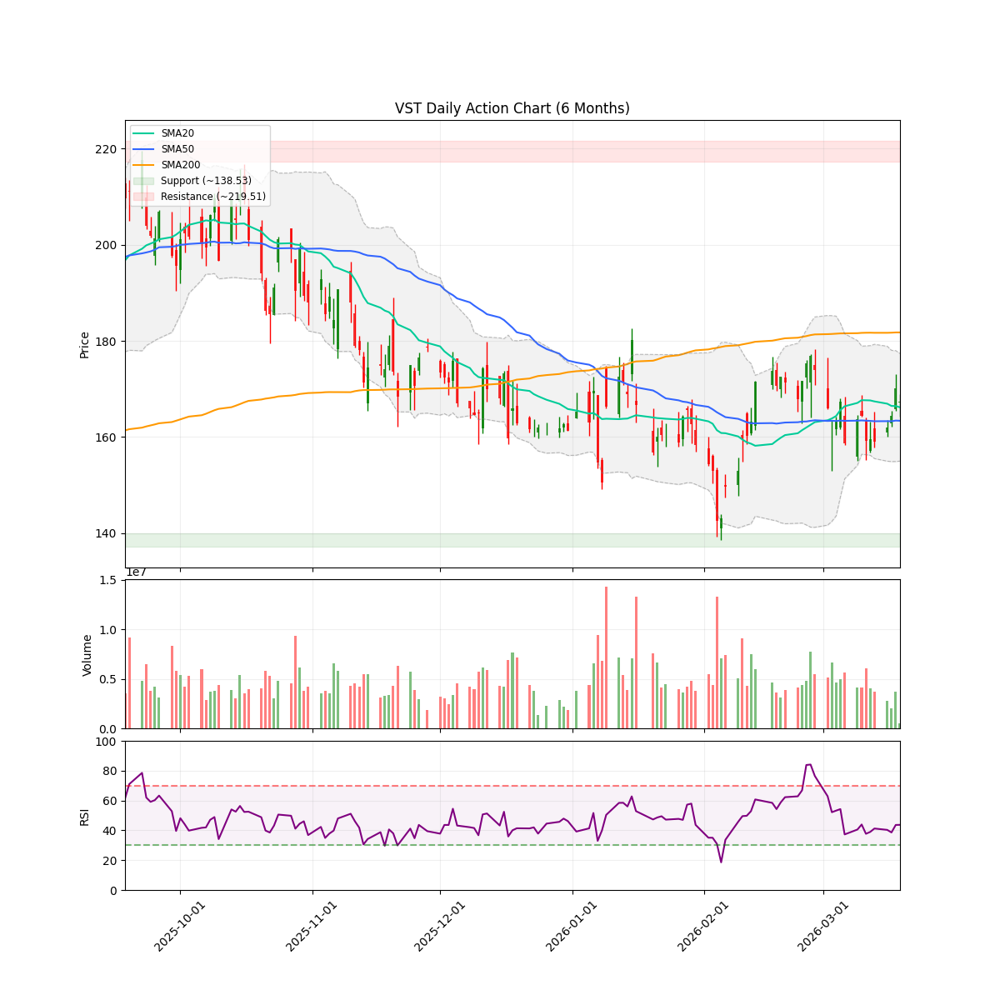
#### 研报分析

### 技术指标概览 (Technical Overview)
- **当前价格**: $167.27
- **RSI (14)**: 43.72
- **移动平均线**: SMA20: $166.17 | SMA50: $163.36 | SMA200: $181.75 (Bearish)
- **波动率**: ATR (14): 7.47 (预计周度波动: +/- $16.69)
- **关键位 (6m)**: 支撑位 $138.53 | 阻力位 $219.51
- **即时状态**: Above SMA50

# Vistra Corp (VST) 情绪审计报告：核能叙事下的“空头陷阱”还是“黎明时刻”？

**日期：** 2026年03月19日
**分析师：** 对冲基金研究助理（叙事经济学方向）

---

### 1. 叙事核心：当“避险”撞上“AI能源渴求”

在当前的宏观迷雾中（特别是由于地缘政治如伊朗冲突引发的不确定性），Vistra Corp (VST) 的故事正在发生质变。它不再仅仅是那家守着电网收钱的传统电力公司，而是被市场重新包装成了**“清洁能源的堡垒”**。

最近的盘面显示，尽管长期趋势（SMA200：181.75）压在头顶，但 VST 正在 160-167 美元区间展现出一种极其顽强的韧性。这种韧性并非空穴来风，而是由于它在核能领域的领先地位。在华尔街的眼中，它是少数几个能直接对标数据中心电力需求的“硬通货”。

### 2. 催化剂分级 (Catalyst Categorization)

*   **A-Tier (核心驱动力)：核能叙事与机构定价权**
    *   分析师对核能板块的看好（如 3月9日 Yahoo Finance 报道）是当前股价的压舱石。在能源转型的大背景下，VST 被视为核能领域的领头羊，这种“稀缺性叙事”是机构愿意在下跌中接盘的根本原因。
*   **B-Tier (市场博弈)：极端的看跌情绪触发反转信号**
    *   [Schaeffer's Investment Research](https://www.schaeffersresearch.com/content/analysis/2026/03/16/utilities-stock-for-contrarian-options-traders) 提到的 **Put/Call 比例达到 90 分位** 是一个典型的反向指标。历史上这种情况发生后，VST 在 21 天内有 75% 的概率上涨。这意味着市场上大部分散户在恐慌买入看跌期权，而聪明钱正在准备狩猎。
*   **C-Tier (噪音)：Zacks 关注度与排名**
    *   虽然 Zacks 的点击量居高不下（3月18日报道），这更多反映了散户的搜索热情，而非基本面的质变。这种热度往往会增加短期波动，但不能决定长期走势。

### 3. 分歧检测：跌不动的好消息？

**背离观察：** 目前 VST 的 RSI 为 43.72，处于中性偏弱。但有趣的是，尽管大盘波动剧烈，VST 在 3月17日 却逆势上涨了 1.91%，跑赢了标普500。

**诊断：** 这是一个典型的**“抛压竭尽”**信号。当市场都在担心战争和宏观风险时，VST 守住了 SMA50 (163.36) 这一关键防线。股价位于 SMA20 和 SMA50 之上，说明中期趋势已经悄然翻红，尽管长期 SMA200 (181.75) 的压制依然存在，但底部正在不断抬高。

### 4. 情绪得分：7.2/10 (蓄势待发的反弹)

*   **逻辑支撑：** 极度的看跌期权堆积（反向指标）+ 核能叙事 + 跑赢大盘的韧性。
*   **风险预警：** 219.51 美元的阻力位仍像一座大山，且 ATR (7.47) 显示波动性正在回归，持仓过程可能并不平坦。

### 5. 投资建议：在噪音中寻找节奏

如果你在咖啡馆问我，我会告诉你：不要被那些“战争”和“衰退”的头条新闻吓到。VST 现在的走势就像是一个被压缩的弹簧。

*   **当前的支撑位 138.53 是最后防线**，但目前的走势大概率不会去考验它。
*   **短期的博弈点在于 181.75 (SMA200)**。如果能有效突破这个位置，VST 将从“超跌反弹”彻底转变为“牛市回归”。

---

**重点引用：**
- [Schaeffer's Investment Research] 提到的看跌/看涨比例异常：[链接](https://www.schaeffersresearch.com/content/analysis/2026/03/16/utilities-stock-for-contrarian-options-traders)
- [Zacks] 关于 VST 跑赢大盘的报道：[链接](https://www.msn.com/en-us/money/savingandinvesting/why-vistra-corp-vst-outpaced-the-stock-market-today/ar-AA1YMa6D)

**逻辑得分 (Logic Score): 7.5/10**
(叙事逻辑连贯，期权市场数据提供了极高的反向胜率支撑。)

**下一个关键日期：**
- **2026-05-06 左右** (预估 2026 Q1 财报发布日)。
- *注意：市场将密切关注其核能发电量的指引以及数据中心长期售电合同的进展。*
#### 近期新闻与事件
- **[Zacks.com]** [Why Vistra Corp. (VST) Outpaced the Stock Market Today](https://www.msn.com/en-us/money/savingandinvesting/why-vistra-corp-vst-outpaced-the-stock-market-today/ar-AA1YMa6D)
- **[Schaeffer's Investment Research]** [Utilities Stock for Contrarian Options Traders](https://www.schaeffersresearch.com/content/analysis/2026/03/16/utilities-stock-for-contrarian-options-traders)
- **[Yahoo Finance]** [NRG Energy Stock: Is NRG Underperforming the Utility Sector?](https://finance.yahoo.com/markets/stocks/articles/nrg-energy-stock-nrg-underperforming-040514732.html?pl2=qsp-recent-news_All)
- **[Zacks.com]** [Vistra Corp. (VST) is Attracting Investor Attention: Here is What You Should Know](https://www.msn.com/en-us/money/topstocks/vistra-corp-vst-is-attracting-investor-attention-here-is-what-you-should-know/ar-AA1YTZIt)
- **[Insider Monkey]** [10 Cheap Stocks to Buy for High Returns in 2026](https://www.msn.com/en-us/money/savingandinvesting/10-cheap-stocks-to-buy-for-high-returns-in-2026/ar-AA1YQkhx)

---

### XOM
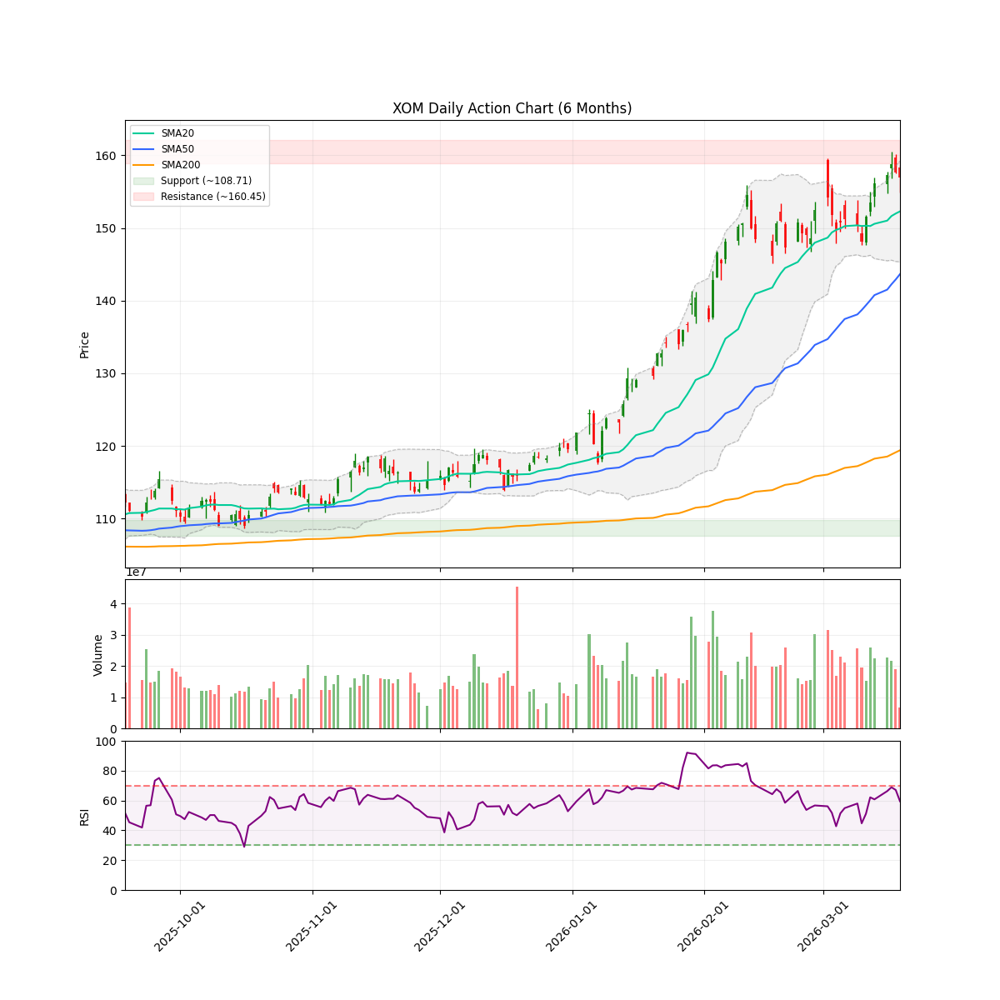
#### 研报分析

### 技术指标概览 (Technical Overview)
- **当前价格**: $156.91
- **RSI (14)**: 59.53
- **移动平均线**: SMA20: $152.28 | SMA50: $143.64 | SMA200: $119.40 (Bullish)
- **波动率**: ATR (14): 3.95 (预计周度波动: +/- $8.83)
- **关键位 (6m)**: 支撑位 $108.71 | 阻力位 $160.45
- **即时状态**: Above SMA50

**埃克森美孚 (XOM) 情绪审计报告：叙事驱动下的能源巨头回归**

**日期：** 2026年3月19日
**研究员：** 叙事经济学分析组

---

### 1. 市场情绪综述：老牌巨头的“硬核”时刻

现在的埃克森美孚（XOM）给人的感觉，就像是一位在华尔街咖啡馆里稳坐泰山的退伍老兵——外面的世界越乱，他的身价就越显珍贵。

目前 XOM 的股价徘徊在 156.91 美元，距离其 6 个月高点 160.45 美元仅一步之遥。这不仅仅是数字的堆砌，而是一个关于**“避险、地缘政治溢价与机构重新站队”**的典型叙事。在伊朗局势动荡、原油供应预期收紧的背景下，XOM 已经不再仅仅是一只能源股，它正在变成市场恐慌情绪下的“安全屋”。

---

### 2. 催化剂分级 (Catalyst Categorization)

#### **【A-Tier】核心催化剂：地缘政治驱动与顶级投行背书**
*   **双重调升：** 巴克莱（Barclays）和派珀桑德勒（Piper Sandler）的上调评级是这一波行情的力量源泉。这不仅仅是给个“买入”建议，更是对地缘政治风险（尤其是伊朗冲突对油价的潜在支撑）的深度认可。这种来自机构的“盖章论证”直接将 XOM 推向了历史高点附近。 [参考来源: Blockonomi]
*   **供给危机叙事：** 只要中东的火药味不散，XOM 的溢价就具有极强的韧性。这属于典型的 A 级驱动力，因为它改变了长期的基本面预期。

#### **【B-Tier】次级催化剂：媒体情绪共振**
*   **“无脑买入”名单：** 《Motley Fool》和《Insider Monkey》等媒体近期高频地将 XOM 列为“3只必买能源股”或“最佳大盘能源股”。这种散户与中端机构的共识正在形成一种“情绪惯性”，为股价在高位盘整提供了充足的买盘支撑。 [参考来源: MSN, Yahoo Finance]

#### **【C-Tier】噪音与微扰：内部人减持**
*   **副总裁减持：** 战略规划副总裁 Talley 卖出了约 16.8 万美元的股票。在散户眼中这可能是个信号，但在我们专业视角看，这仅仅是“零花钱”级别的套现（仅 1080 股），完全不构成看跌逻辑，属于纯粹的噪音。 [参考来源: Investing.com]

---

### 3. 背离检测 (Divergence Detection)

**观察结果：强势跟进。**
目前没有看到明显的“利好出尽”迹象。相反，XOM 在 3 月 17 日和 18 日的表现持续跑赢标准普尔 500 指数 [参考来源: Zacks]。当大盘在小步快跑时，XOM 在加速冲刺。
*   **技术面配合：** 股价目前稳稳站在 SMA20 (152.28) 之上，且 SMA50 和 SMA200 呈现完美的金叉发散态势。RSI 为 59.53，这意味着虽然它很热，但还没到“烫手”的超买区间。多头依然有呼吸空间。

---

### 4. 逻辑评分：8.5/10 (强劲牛市周期)

*   **理由：** 这是一个由**宏观动荡（地缘政治）+ 机构修正（评级调升）+ 技术面破位**三者共振形成的逻辑闭环。只要原油供应的威胁不解除，XOM 的“陷阱”风险极低。
*   **风险警示：** 唯一需要警惕的是 160.45 美元的心理关口。如果股价在此处出现“假突破”后伴随巨量下跌，那才是我们需要撤退的信号。

---

### 5. 投资叙事：咖啡馆里的洞察

“听着，现在的 XOM 玩的是‘保险柜’逻辑。当投资者开始担心地缘冲突会切断原油命脉时，他们不会去买那些还在画饼的绿能初创公司，他们会直接买入这家拥有最深护城河的庞然大物。目前的股价上涨非常‘诚实’，它反映的是对未来油价中枢上移的真实恐惧。别被那个十几万美元的内部人减持吓到，那只是巨轮上的一粒灰尘。现在的主旋律是：机构正在抢筹，而散户正在跟风。”

---

### 6. 关键数据速递

*   **情绪得分：** **8.5 / 10** (不可阻挡的看涨周期)
*   **关键支撑位：** 152.28 (SMA20)
*   **关键阻力位：** 160.45 (6个月高点)
*   **下一个重大日期：** **2026年4月24日左右** (预计 Q1 财报发布日)。这通常是叙事变现或反转的关键节点。

---
**免责声明：** 本报告基于“叙事经济学”视角分析，仅供参考，不构成直接投资建议。在动荡市场中，请务必关注您的 ATR (3.95) 波动区间。
#### 近期新闻与事件
- **[The Motley Fool on MSN]** [3 of the best energy stocks to buy right now](https://www.msn.com/en-us/money/top-stocks/3-of-the-best-energy-stocks-to-buy-right-now/ar-AA1YWNUK?ocid=BingNewsVerp)
- **[Motley Fool· via Yahoo Finance]** [3 No-Brainer Energy Stocks to Buy Right Now](https://finance.yahoo.com/sectors/energy/articles/3-no-brainer-energy-stocks-090400058.html)
- **[Zacks· via Yahoo Finance]** [Exxon Mobil (XOM) Beats Stock Market Upswing: What Investors Need to Know](https://finance.yahoo.com/news/exxon-mobil-xom-beats-stock-214502146.html)
- **[Investing.com]** [Talley, Exxon Mobil VP, sells $167934 in XOM stock By Investing.com](https://www.investing.com/news/insider-trading-news/talley-exxon-mobil-vp-sells-167934-in-xom-stock-93CH-4565980)
- **[Insider Monkey· via Yahoo Finance]** [Exxon Mobil (XOM) – Among the Best Large Cap Energy Stocks to Buy Now](https://finance.yahoo.com/news/exxon-mobil-xom-among-best-041615827.html)

---
