# 每日股市市场报告 (2026-03-20)

> **免责声明**: 本报告由 **代码与 Gemini AI 自动生成**，仅供研究参考，**不构成**任何投资建议。投资有风险，入市需谨慎。作者及 AI 不对任何基于此内容的投资决策承担责任。

## 📑 目录
[TOC]

##  长期投资逻辑
本组合旨在捕捉 **人工智能（AI）与半导体协议** 带来的跨周期结构性增长，核心投资策略聚焦于“确定性”与“物理瓶颈”：
- **底层制程垄断 (Foundry & WFE Moats)**：
  布局处于全球半导体精密制造顶端的“工业母机”级别公司。寻找具备极高准入门槛的晶圆代工及前道设备供应商，作为全产业链最稳固的底座资产。
- **算力稀缺性与连接带宽 (Compute & Interconnect Scarcity)**：
  聚焦在高性能计算芯（HPC）及高带宽连接领域占据主导地位的标的。AI 的终极竞争是“规模”，寻找能有效解决数据交换瓶颈并提供核心推理/训练能力的算力巨头。
- **应用生态与数据霸权 (Platform & Data Sovereignty)**：
  布局拥有闭环生态、海量高质量私有数据及云基础设施的科技巨头。它们是 AI 商业化落地的最终守门人，拥有将技术转化为持续现金流的分配权。
- **物理边界保障 (Power & Thermal Infrastructure)**：
  关注 AI 扩张的“最终瓶颈”——电力供应与热能管理。重点布局为下一代超大规模数据中心提供高功率密度能源、液冷技术及电网扩容方案的能源基建商。
**风控策略**：利用 AlphaJAX 的量化动量评分（Quant Score）作为过滤器，结合 LLM 叙事审计（Narrative Audit）捕捉“业绩超预期 + 叙事逻辑改善”的共振点，实现跨周期的超额收益。

 **注：排序权重**：Ticker 按照 AI 检测出的 **方向** 排序（**看多**优先，其次是 **中性**，最后是 **看空**）。
---

<!-- DISCORD_SUMMARY_START -->
## 🧠 对冲基金经理全局诊断与资金分配策略
# 首席投资官（PM）战略指令：刀刃向内，重塑 AI 与能源的“双塔结构”

**致：交易团队 / 核心研究组**
**日期：2026-03-20**
**账户状态：调整前现金 $64,353 | AMD 仓位过载（50.56%）| 整体水位偏高**

---

### 一、 指挥官意图 (Commander's Intent)

听着，现在的盘面不是在温柔地回调，而是在进行一场残酷的“叙事大清洗”。我们目前的持仓结构存在严重的**“防御性虚弱”**与**“集中度失控”**。

AMD 占比超过 50% 且处于 SMA50 下方，这违反了我们在非绝对强势期下的风险红线。AMZN 的 AI 手机叙事已经“漏水”，4.5 的逻辑分明确告诉我们：**撤退，不要为过时的梦想买单。**

我们的战略重心必须立刻从“泛科技”转向**“硬核 AI 基础设施（计算+液冷+电网）”**与**“地缘政治避风港（能源）”**。我们要把子弹从平庸的 4 分标的，打向那些逻辑评分 8 分以上的“完美契合者”。

---

### 二、 持仓诊断与手术指令

#### 1. AMZN (逻辑分: 4.5) —— **全线清仓 (Exit Immediately)**
*   **诊断**：市场不相信“Transformer”手机的叙事，股价利好阴跌，空头排列。4% 的利润垫随时会蒸发。
*   **行动**：市价清仓，回收约 $4,136 现金。

#### 2. AMD (逻辑分: 7.6) —— **强制减持 (Strategic Trim)**
*   **诊断**：占比 50.56% 已触及红线底线。由于目前股价在 SMA50 下方，不符合“极端看涨”的超额持仓条件。
*   **行动**：减持 150 股，将仓位占比降至 **35%** 左右。回收约 $30,243 现金。保留核心底仓，等待 $192 (SMA200) 支撑确认。

#### 3. GOOGL (逻辑分: 6.2) —— **继续持有 (Neutral Hold)**
*   **诊断**：虽处于震荡沼泽，但你的入场点极其漂亮，16% 的垫子足够厚。它现在是账户的“压舱石”，暂时不动。

---

### 三、 观察池新规部署 (Actionable Trading Plan)

我们将动用回收的现金及现有可用资金（共计约 $9.8 万），部署进入评分 > 8 的“完美赛道”。

| 标的 | 动作 | 逻辑分 | 理由 | 投入预算 |
| :--- | :--- | :--- | :--- | :--- |
| **ETN** | **建仓** | **8.5** | 电网升级刚需，摩根斯坦利 $425 强力背书，RSI 超卖后的黄金坑。 | $25,000 |
| **VRT** | **建仓** | **8.5** | AI 算力液冷领军者，Cramer 加持，SMA20 支撑强劲。 | $25,000 |
| **XOM** | **建仓** | **8.8** | 地缘冲突催化的原油暴涨，$119 附近的“避风港”叙事，趋势不可阻挡。 | $20,000 |
| **AMAT** | **建仓** | **8.2** | 半导体设备“铁匠铺”，HBM 内存革命的核心供应商。 | $15,000 |

**空仓保留（Buffer）：** 保留约 $13,000 - $15,000 现金（约占 NAV 6%），作为后续波动对冲。

---

### 四、 风险对冲：If-Then 剧本

*   **场景 A：中东局势升级，油价突破 $130**
    *   **Then**：加仓 **XOM** 和 **DVN (8.5分)**。能源叙事将压制一切，科技股会继续失血。此时应考虑对 GOOGL 进行保护性卖出看涨期权（Covered Call）。
*   **场景 B：AMD 跌破 $192 (SMA200)**
    *   **Then**：**斩仓止损。** 跌破年线意味着 AI 硬件叙事的中期破裂。哪怕我们看好老黄，也不能拿客户的钱去赌“奇迹”。
*   **场景 C：TSM (6.5分) 站稳 $350 并收复均线**
    *   **Then**：此时“氦气危机”叙事被证伪。动用剩余现金购买 **TSM**，它是半导体复苏的先行指标。

---

### 五、 核心结语

**“不要在暴雨中怀疑太阳，但也别在船底漏水时拒绝跳上救生艇。”** 

我们现在的动作是**主动缩回拳头**，把散乱的资金收拢到 ETN 和 VRT 这种有“硬核需求”支撑的支点上。AMZN 的平庸必须出局，AMD 的狂热必须降温。

**执行！**

*署名：Senior Portfolio Manager*
*System Date: 2026-03-20*
<!-- DISCORD_SUMMARY_END -->
---

## 💼 现有持仓个股诊断

### AMD
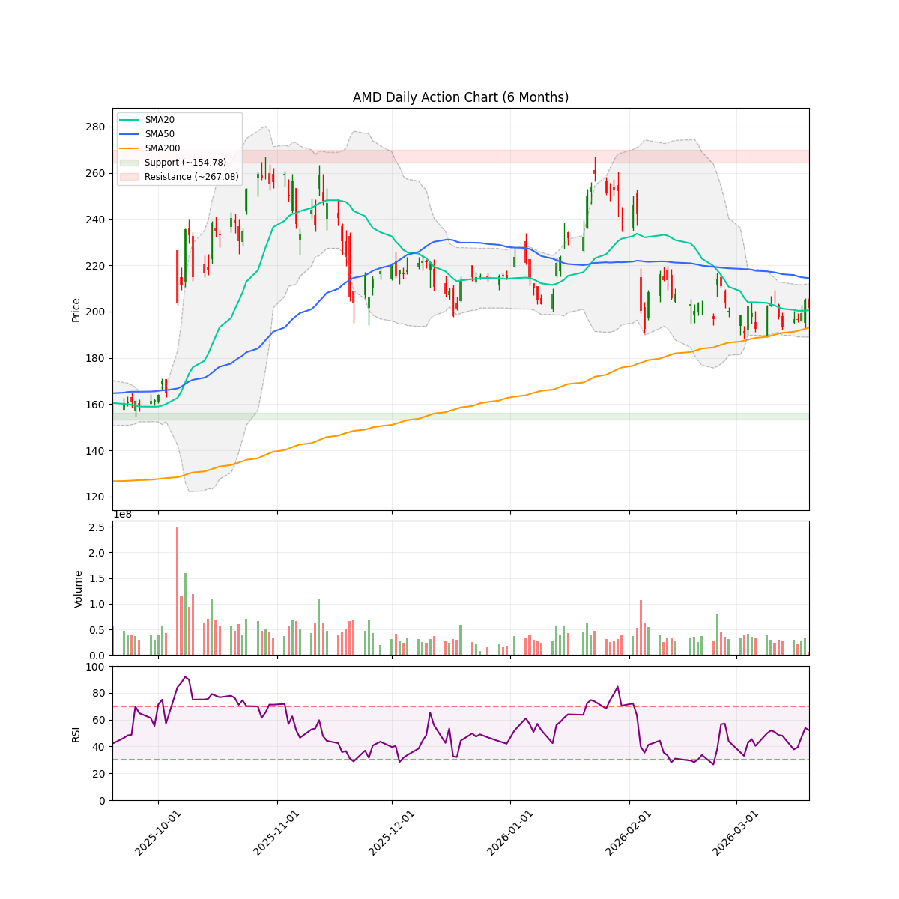
#### 研报分析

### 技术指标概览 (Technical Overview)
- **当前价格**: $201.62
- **RSI (14)**: 52.19
- **移动平均线**: SMA20: $200.49 | SMA50: $214.45 | SMA200: $192.97 (Bullish)
- **波动率**: ATR (14): 8.36 (预计周度波动: +/- $18.70)
- **关键位 (6m)**: 支撑位 $154.78 | 阻力位 $267.08
- **即时状态**: Below SMA50

你好！我是你的对冲基金研究助理，专注于“叙事经济学”。咱们坐下来聊聊 AMD 现在的局势。

现在是 2026 年 3 月 20 日。你手里的 AMD 现在的感觉就像是一场刚下过雨的拉力赛：路面有点滑，大家都在观望，但引擎的轰鸣声还没停。

以下是针对 AMD 的 **情绪审计报告**：

---

### 1. 催化剂分类 (Catalyst Categorization)

我们要分清什么是“真金白银”，什么是“市场噪音”。

*   **A-Tier（核心动力）**：
    *   **AI 巨头的深度捆绑**：AMD 与 Meta 和 OpenAI 的 AI 交易不仅是订单，更是“背书”。[Seeking Alpha] 提到的 AI 加速器业务提供了巨大的期权价值。
    *   **业绩超预期但股价杀跌**：典型的“利好出尽”或是宏观情绪错杀。财报虽然亮眼，但市场在担心资本支出（Capex）和潜在的股权稀释风险。
*   **B-Tier（二线利好）**：
    *   **数据中心“木马”战略**：[Seeking Alpha] 指出 AMD 在服务器市场的渗透如同木马，正在悄无声息地蚕食英特尔的领地。
    *   **$200 关口的心理支撑**：股价在 200 美元附近反复横盘，这是一个关键的心理防御区。
*   **C-Tier（杂音）**：
    *   **地缘政治波动**：中东局势对科技股的短期冲击 [Invezz]。
    *   **与康宁（Corning）的无谓对比**：[Motley Fool] 拿光纤股的涨幅来压半导体，这属于博眼球的噪音，不影响 AMD 核心基本面。

---

### 2. 背离检测：好消息下的“深蹲” (Divergence Detection)

**现象分析**：AMD 刚刚交出了一份超预期的财报，但股价却在短期内出现了下挫（Plunge）。
**老兵观察**：这种“利好不涨反跌”通常意味着两种情况：一是多头力量在 $220-$240 区间出现了 **“看涨竭尽”**；二是市场在重新评估 AI 的“变现效率”。
**好消息是**：目前的 RSI 处于 52.19 的中性位置，SMA200（192.97）提供了坚实的底部支撑。股价虽然破了 SMA50，但在 SMA20 附近死守。这不是崩盘，这是在**洗掉不坚定的筹码**。

---

### 3. 叙事评分：7.6 / 10 (Logic Score)

*   **逻辑支撑**：AMD 目前正处于从“挑战者”到“二房东（AI 基建核心供应商）”的转变期。虽然估值（Valuation）让部分机构感到恐高，但其在 AI 加速器市场的“二号位”地位极其稳固。
*   **当前陷阱**：对于成本在 $220 的持有者来说，现在的叙事有点“磨人”。市场正在惩罚那些追高的投资者，但并未否定 AMD 的长期剧本。

---

### 4. 市场情绪与叙事解读 (Narrative Economics)

现在的 AMD 就像是一个**“怀才不遇的拳击手”**。
大家都知道他能打（业绩好、有 Meta 和 OpenAI 撑腰），但裁判（宏观环境、中东局势）最近对他不太友好。

你现在的处境比较微妙：
*   **正股持仓**：成本 $220.54，目前亏损约 9.22%。你站在山腰上，而风暴正在山脚下盘旋。
*   **期权风险**：你卖出的 $200 Put（-AMD260313P200）已经到了行权日附近（3月13日已过，由于今日是3月20日，该笔交易可能已转化为正股或已产生结算盈亏）。如果这笔 Put 被行权，你的持仓成本会进一步摊薄，但这反映出 $200 是多空双方的生死线。

**老兵建议**：目前 $201.62 的价格正悬在 SMA20（200.49）的钢丝上。如果能稳住，这就是一个完美的“技术性回踩”；如果跌破 $192（SMA200），叙事可能从“暂时调整”转向“中期走弱”。

---

### 5. 关键日期与展望

*   **下一个重大日期 (Next Major Date)**：**2026 年 5 月初（预计 Q1 2026 财报发布）**。
    *   这是下一次能够彻底扭转“好消息不涨”怪圈的机会。
*   **短期关注点**：关注 3 月下旬是否有关于 MI300 系列芯片更新的供应链传闻。

---

**总结报告**：
AMD 目前不是“系统性失败”，而是处于**“估值消化期”**。你的头寸占比超过 50%，仓位极重。在这种震荡市，建议不要急于在 $200 附近割肉，因为下方 SMA200 的支撑非常强劲。你要忍受的是“叙事的空窗期”，等待市场重新意识到，除了英伟达，AMD 是唯一能承接 AI 溢出红利的正统标的。

**保持耐心，这杯咖啡可能有点苦，但底色依然是浓郁的 AI 香味。**

*注：引用参考来源包括 MSN (AMD stock plunge)、Seeking Alpha (AI deals with Meta & OpenAI)、Yahoo Finance (Consolidating at $200)。*
#### 近期新闻与事件
- **[YouTube]** [AMD's stock plunge despite strong earnings - what's next?](https://www.msn.com/en-us/money/news/amd-s-stock-plunge-despite-strong-earnings-what-s-next/vi-AA1Z0UEY)
- **[Seeking Alpha]** [AMD Doesn't Worry Me, Its Customers And Deals Do](https://seekingalpha.com/article/4883805-amd-doesnt-worry-me-its-customers-and-deals-do)
- **[Yahoo Finance]** [Dear AMD Stock Fans, Mark Your Calendars for March 18](https://finance.yahoo.com/news/dear-amd-stock-fans-mark-194559289.html)
- **[Seeking Alpha]** [AMD: The Trojan Horse In The Server Room](https://seekingalpha.com/article/4882644-amd-the-trojan-horse-in-the-server-room)
- **[The Motley Fool]** [1 Artificial Intelligence (AI) Stock I'd Never Sell](https://www.msn.com/en-us/technology/artificial-intelligence/1-artificial-intelligence-ai-stock-i-d-never-sell/ar-AA1YG7No)

---

### AMZN
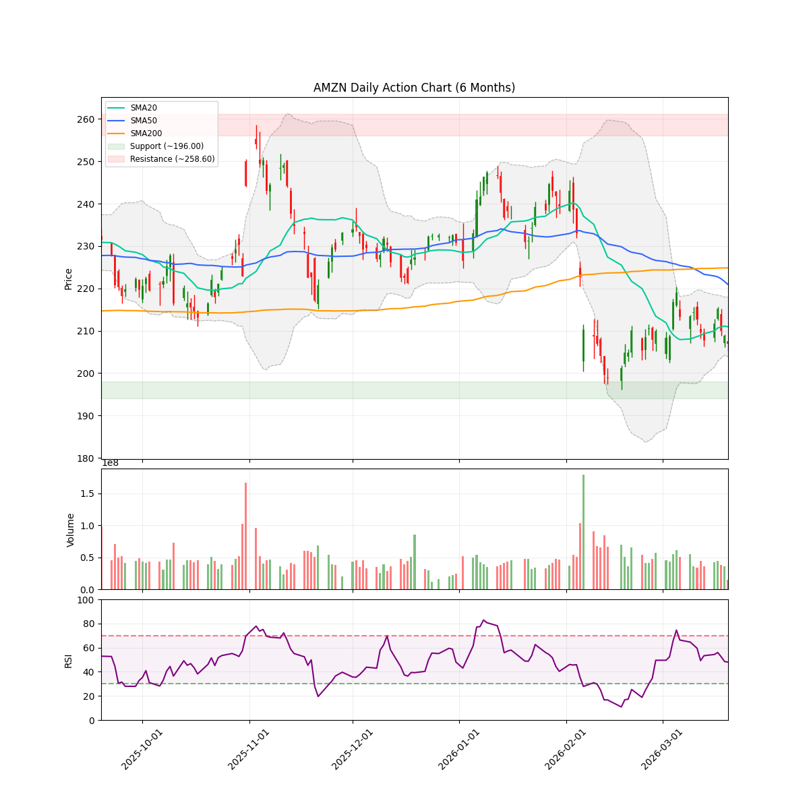
#### 研报分析

### 技术指标概览 (Technical Overview)
- **当前价格**: $206.84
- **RSI (14)**: 48.06
- **移动平均线**: SMA20: $210.93 | SMA50: $220.90 | SMA200: $224.82 (Bearish)
- **波动率**: ATR (14): 5.30 (预计周度波动: +/- $11.86)
- **关键位 (6m)**: 支撑位 $196.00 | 阻力位 $258.60
- **即时状态**: Below SMA50

你好！我是你的对冲基金叙事经济学研究员。咱们坐下来，边喝咖啡边拆解一下 Amazon (AMZN) 目前这盘复杂的棋局。

在华尔街，我们常说：“价格记录历史，而叙事塑造未来。”现在的亚马逊，正处于一场**“宏大愿景”与“历史阴影”**的激烈博弈中。

---

### **AMZN 情绪审计报告：AI 救赎还是“火”坑重现？**

#### **1. 催化剂分级 (Catalyst Categorization)**

*   **A-Tier：AWS 与 Cerebras 的强强联手**
    *   **详情**：亚马逊 AWS 与 Cerebras 合作，在 Bedrock 上推出全球最快的 AI 推理解决方案。
    *   **点评**：这是实打实的“肌肉”。在 AI 军备竞赛中，谁能提供最快、最廉价的推理，谁就能锁死企业级客户。这是支撑亚马逊估值底层逻辑的钢筋混凝土。
*   **B-Tier：“Transformer” AI 智能手机的发布**
    *   **详情**：亚马逊宣布重返手机市场，推出主打 Alexa 和 AI 深度集成的智能手机。
    *   **点评**：这是一把双刃剑。虽然概念超前，但资本市场的记忆是有毒的——大家还没忘记当年惨淡收场的 Fire Phone。市场目前的抛售，其实是对亚马逊“乱花钱”做硬件的防御性担忧。
*   **C-Tier：Jim Cramer 的推荐与 Zacks 的关注**
    *   **详情**：这些属于市场噪音。Cramer 的“毒奶”体质和零售端的频繁提及，往往意味着筹码正在从机构流向散户，增加了短期波动风险。

#### **2. 异动检测：利好背后的“熊市背离”**
**警惕信号：** 2026年3月20日，在公司发布极具野心的“Transformer”手机后，股价竟然**下跌 (Slips)**。
*   **深度解析**：在叙事经济学中，这叫“叙事失效”。如果市场认为这是一个革命性的 A-Tier 利好，股价应该跳空高开。现在的下跌说明：市场并不相信亚马逊能做成硬件，或者认为 AI 手机只是在烧 AWS 赚来的辛苦钱。
*   **技术形态**：股价目前承压于所有主要均线（SMA20, 50, 200）之下，这是一个典型的**空头排列**。RSI 在 48 左右徘徊，说明多头毫无反抗意愿。

#### **3. 叙事得分 (Logic Score): 4.5/10**
> **评语**：这是一个“困在旧梦里的科技巨头”。虽然 AWS 的 AI 推理技术非常硬核（逻辑分应为 8），但手机业务的强行介入打乱了叙事节奏（逻辑分降至 4）。市场目前处于“我不听你吹牛，我只看你财报”的防御状态。

---

### **投资建议与风险诊断**

**你的持仓现状**：
*   **成本价**：$201.61 | **当前价**：$206.84
*   **盈亏**：+4.16%（你的保护垫已经非常薄了！）

**老兵的私房话：**
老兄，你现在的处境有点尴尬。虽然你还有 4% 的浮盈，但 AMZN 的技术面正在“漏水”。
*   **支撑位**：$196.00 是你最后的防线。如果跌破这里，那就不只是回吐利润的问题，而是趋势的彻底崩溃。
*   **策略**：不要被“AI 手机”的宏大叙事洗脑。目前的下跌反映了机构投资者的不信任。建议盯紧 **$210.93 (SMA20)**，如果股价不能放量收复这个位置，这次的反弹可能只是一个“猫跳”（Dead Cat Bounce）。

---

### **关键观察数据**

*   **情绪得分**：**4.5** (处于“叙事迷茫期”)
*   **下个重大日期**：**2026年4月下旬 (Q1 财报披露日)**。届时，市场将看清“Transformer”手机到底要烧掉多少现金流。
*   **引用新闻**：
    *   *AI 手机争议*：[Blockonomi - Amazon Stock Dips on AI Phone Unveiling](https://blockonomi.com/amazon-amzn-stock-dips-as-tech-giant-unveils-ai-driven-transformer-smartphone/)
    *   *AI 推理利好*：[MSN/Insider Monkey - AWS & Cerebras Partnership](https://www.msn.com/en-us/money/other/amazoncom-amzn-and-cerebras-partner-for-world-s-fastest-ai-inference-on-amazon-bedrock/ar-AA1YVRG1)

**总结**：别在暴风雨来临前死守甲板。如果 $196 关口告急，记得先保护好你的本金。市场从不奖励死多头，只奖励那些看清风向的人。
#### 近期新闻与事件
- **[Blockonomi]** [Amazon (AMZN) Stock Dips as Tech Giant Unveils AI-Driven Transformer Smartphone](https://blockonomi.com/amazon-amzn-stock-dips-as-tech-giant-unveils-ai-driven-transformer-smartphone/)
- **[Blockonomi]** [Amazon (AMZN) Plans Comeback in Smartphone Market With AI-Powered Device](https://blockonomi.com/amazon-amzn-plans-comeback-in-smartphone-market-with-ai-powered-device/)
- **[Yahoo Finance]** [Jim Cramer Recommended Amazon (AMZN) As A Long Term Stock In January 2025](https://finance.yahoo.com/news/jim-cramer-recommended-amazon-amzn-220130883.html)
- **[Insider Monkey]** [Amazon.com (AMZN) and Cerebras Partner for World's Fastest AI Inference on Amazon Bedrock](https://www.msn.com/en-us/money/other/amazoncom-amzn-and-cerebras-partner-for-world-s-fastest-ai-inference-on-amazon-bedrock/ar-AA1YVRG1)
- **[Seeking Alpha]** [4 stocks to watch on Friday: LLY, AMZN, NVS, UL](https://www.msn.com/en-us/money/companies/4-stocks-to-watch-on-friday-lly-amzn-nvs-ul/ar-AA1Z3X1r)

---

### GOOGL
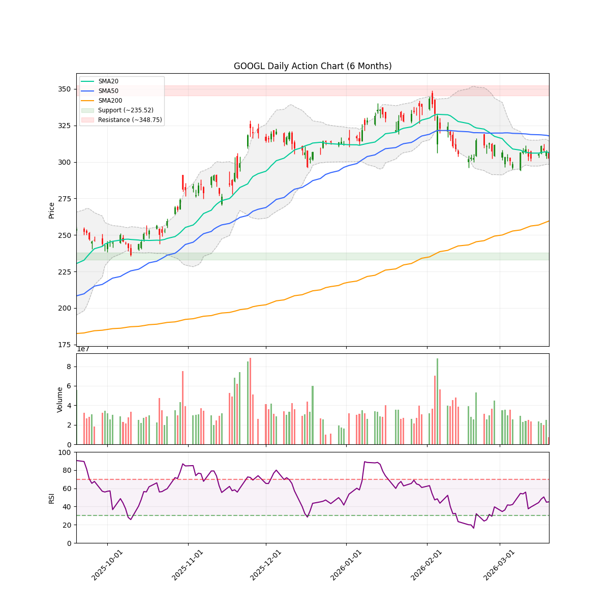
#### 研报分析

### 技术指标概览 (Technical Overview)
- **当前价格**: $302.24
- **RSI (14)**: 45.18
- **移动平均线**: SMA20: $306.32 | SMA50: $317.82 | SMA200: $259.56 (Bullish)
- **波动率**: ATR (14): 6.43 (预计周度波动: +/- $14.38)
- **关键位 (6m)**: 支撑位 $235.52 | 阻力位 $348.75
- **即时状态**: Below SMA50

你好！我是你的叙事经济学研究员。咱们先别去理会那些枯燥的财报表格，坐在窗边，一边喝着这杯刚冲好的咖啡，一边聊聊 Alphabet (GOOGL) 现在的处境。

目前的 GOOGL 就像是一个刚刚在长跑中打破纪录的运动员，正坐在路边喘粗气。他虽然还没倒下，但你也能看出他短期内可能跑不动了。

---

### **GOOGL 情绪审计报告：繁华落尽后的冷静期**

#### **1. 催化剂分级 (Catalyst Categorization)**

*   **A-Tier (重磅动力)：** 暂缺。
    *   虽然 2025 年底到 2026 年初 Gemini AI 的整合带来了 48% 的史诗级飙升（参考 [Forbes](https://www.forbes.com/sites/greatspeculations/2026/03/02/google-stock-is-gaining-steam-should-you-buy-in/)），但目前市场上缺乏这种级别的“新血液”。
*   **B-Tier (行业推力)：** **Zacks 的收益增长评级** 与 **量子计算愿景**。
    *   Zacks 强调了其长期的盈利能力（参考 [Zacks on MSN](https://www.msn.com/en-us/money/topstocks/earnings-growth-price-strength-make-alphabet-googl-a-stock-to-watch/ar-AA1YtQVO)），而 Jim Cramer 提到的量子计算（参考 [Insider Monkey](https://www.insidermonkey.com/blog/alphabet-googl-stock-higher-higher-after-jim-cramer-said-it-was-a-good-quantum-computing-stock-in-january-2025-1720512/)）虽然迷人，但离变现还太远。
*   **C-Tier (市场噪音)：** **铁鹰期权策略 (Iron Condor)** 与 **Meta 的比较**。
    *   市场现在开始频繁讨论铁鹰策略（参考 [Barchart](https://www.msn.com/en-us/technology/general/googl-nvda-and-more-iron-condor-screener-results-for-march-18/ar-AA1YTPpY)），这传达了一个强烈的信号：专业交易员认为 GOOGL 短期内会**横盘**，而非突破。

#### **2. 背离观察：利好不涨的“疲惫感”**
现在的 GOOGL 处在一个微妙的“背离”期。尽管 Zacks 和 Substack 的多头们还在高喊“基本面无敌”，但股价却已经跌破了 20 日和 50 日均线 (SMA20: 306.32, SMA50: 317.82)。

**叙事分析：** 市场对 AI 的审美疲劳已经开始。当 Forbes 开始公开讨论“为什么 Meta 比 Google 更好”时（参考 [Forbes](https://www.forbes.com/sites/greatspeculations/2026/03/16/why-meta-platforms-is-a-better-pick-than-google-stock/)），资金流向正在发生微妙的漂移。利好消息（如量子计算的背书）已经无法像三个月前那样让股价应声起舞，这说明多头头寸已经处于饱和状态，甚至出现了**看涨耗尽**。

#### **3. 情绪评分 (Sentiment Score)**
### **逻辑评分: 6.2 / 10**
*(注：10 为不可阻挡的牛市，0 为系统性崩塌)*

**评语：** 这不是一个陷阱，但它是一个**“震荡磨损区”**。GOOGL 依然是 AI 时代的皇冠明珠，但目前的股价处于均线之下，RSI 45.18 显示它既不超卖也不强势。叙事上，市场正在等待下一个类似“Gemini 2.0 震撼发布”的重磅消息，在此之前，它更像是一个“价值股”而非“成长股”。

---

### **操盘手视点 (Hedge Fund Perspective)**

你的持仓成本是 **$268.53**，目前仍有 **16.10%** 的浮盈。
*   **现实打击：** 股价目前在 $302.24，正受到 SMA50 ($317.82) 的强烈压制。只要股价回不去 310 美元上方，这里就是个阴跌的沼泽。
*   **你的优势：** 你的仓位占账户 20.99%，比例不低。好在你的入场点很漂亮，位于 200 日均线 ($259.56) 附近，这给你的利润垫了厚厚的防御墙。

**下个关键日期：**
*   **2026 年 4 月下旬 (预计 4 月 23 日左右)**：**2026 年第一季度财报发布**。这是打破目前阴沉叙事的唯一契机。

---

### **总结建议**
别被 Jim Cramer 的量子计算梦话迷住了。现在的 GOOGL 需要的是一场**技术性的修整**。

*   **如果跌破 $290**：说明短期趋势彻底走坏，可能会去回踩你的成本线，建议锁出一部分利润。
*   **如果横盘震荡**：持有不动。这种“利好不涨”的情况往往需要通过时间来消化估值。
*   **关注对手**：盯紧 META 和 NVDA。如果它们开始大幅回调，作为“后置位”的 GOOGL 跌起来会更疼。

**记住，在市场上，无聊往往比亏损更考验耐心。现在的 GOOGL，很无聊。**
#### 近期新闻与事件
- **[Insider Monkey]** [Alphabet (GOOGL) Stock Higher Higher After Jim Cramer Said It Was A Good Quantum Computing Stock In January 2025](https://www.insidermonkey.com/blog/alphabet-googl-stock-higher-higher-after-jim-cramer-said-it-was-a-good-quantum-computing-stock-in-january-2025-1720512/)
- **[Insider Monkey]** [Is Alphabet Inc. (GOOGL) A Good Stock To Buy Now?](https://www.msn.com/en-us/news/technology/is-alphabet-inc-googl-a-good-stock-to-buy-now/ar-AA1YGjRp)
- **[Yahoo Finance]** [Google (GOOGL) closes above ___ on March 19?](https://finance.yahoo.com/markets/prediction/event/googl-close-above-on-march-19-2026/)
- **[Forbes]** [Why Meta Platforms Is A Better Pick Than Google Stock](https://www.forbes.com/sites/greatspeculations/2026/03/16/why-meta-platforms-is-a-better-pick-than-google-stock/)
- **[Barchart]** [GOOGL, NVDA, and more: Iron condor screener results for March 18](https://www.msn.com/en-us/technology/general/googl-nvda-and-more-iron-condor-screener-results-for-march-18/ar-AA1YTPpY)

---

## 🔍 观察池机会分析

### AMAT
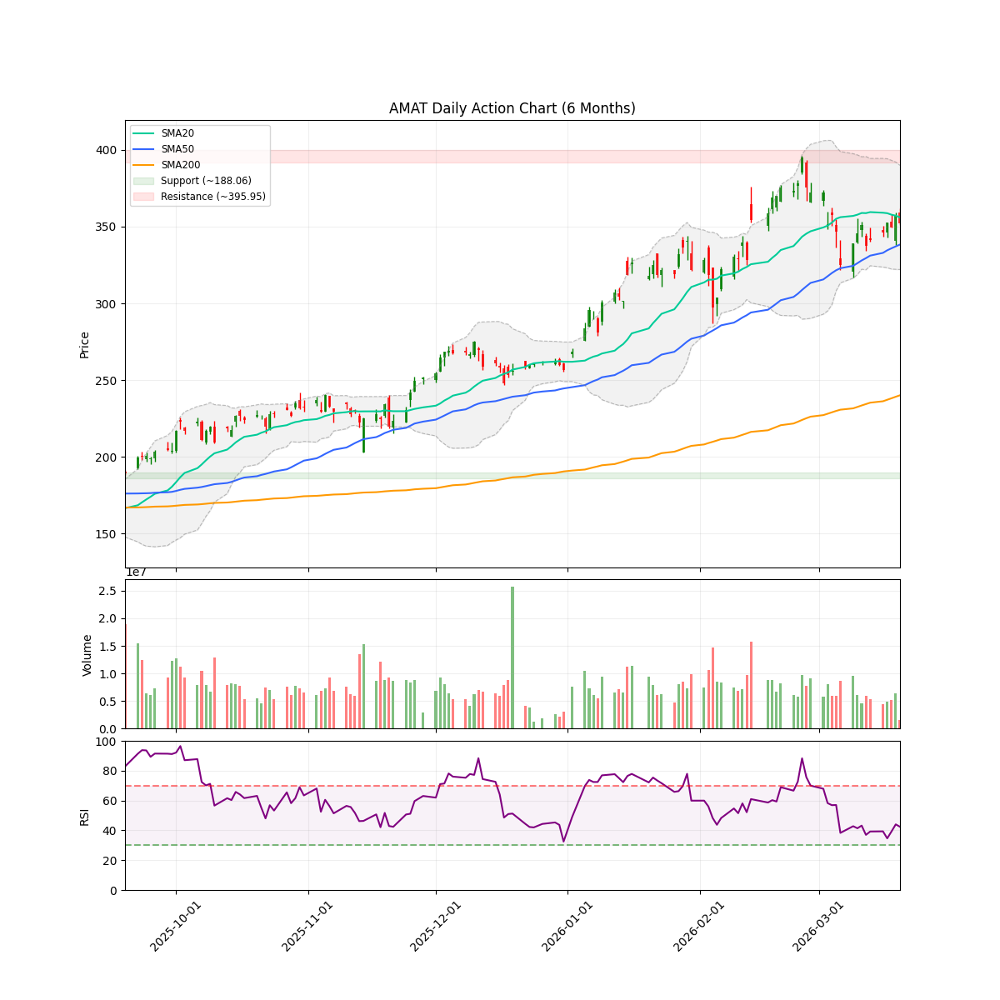
#### 研报分析

### 技术指标概览 (Technical Overview)
- **当前价格**: $352.27
- **RSI (14)**: 42.42
- **移动平均线**: SMA20: $355.96 | SMA50: $338.31 | SMA200: $240.17 (Bullish)
- **波动率**: ATR (14): 15.61 (预计周度波动: +/- $34.91)
- **关键位 (6m)**: 支撑位 $188.06 | 阻力位 $395.95
- **即时状态**: Above SMA50

# 📊 叙事经济学：Applied Materials (AMAT) 情感审计报告

**日期：** 2026年03月20日
**研究员：** 叙事经济学资深分析师

---

### 1. 核心叙事：AI 时代的“铁匠铺”，还是过热的“熔炉”？

坐在曼哈顿的咖啡馆里，如果你问现在的市场最怕什么，答案一定是“AI 泡沫破裂”。但如果你问，谁能在泡沫破裂前赚到最后一分钱，甚至是泡沫之后的重建者，那答案里一定有 **Applied Materials (AMAT)**。

目前的 AMAT 正处于一个有趣的节点。股价 352.27 美元，虽然从 395 美元的历史高点回落了约 11%，但你感受一下这个气场：它就像是一个刚跑完马拉松在路边喝水的运动员，呼吸虽急促（RSI 42.42 释放了超买压力），但肌肉线条依然结实（远高于 SMA200 的 240.17）。

---

### 2. 催化剂分级 (Catalyst Categorization)

#### **A-Tier：核心增长引擎（不可忽视）**
*   **HBM 内存革命的深度绑定**：AMAT 宣布与 **Micron (MU)** 和 **SK Hynix** 达成战略合作，研发下一代 AI 所需的内存。这不是小打小闹，这是在为 AI 的“大脑”打造更快的神经系统。Micron 近期因为收购台湾厂房和财报预期股价大涨，作为其设备的灵魂供应商，AMAT 的业绩下限已经被这些巨头锁死。
*   **AI 制造能力的代际飞跃**：在摩根士丹利 TMT 大会上，管理层重申了其在 AI 基础设施价值链中的核心地位。他们不生产 AI 芯片，他们生产“生产 AI 芯片的机器”。

#### **B-Tier：战略博弈与机构背书**
*   **收购 BESI 的传闻**：市场传言 AMAT 和 Lam Research 都在觊觎 BESI（半导体后端封装专家）。虽然这还只是“传闻”，但这种扩张野心显示出 AMAT 想要吞噬整个半导体价值链的野心。
*   **亿万富翁的赞歌**：Ken Fisher 的持续看好为该股涂上了一层“机构避风港”的底色。

#### **C-Tier：行业噪音**
*   **ASML 的波动回撤**：虽然 ASML 跌了 7%，但这更多是 EUV 领域的短期修正。对于 AMAT 这种业务更分散、涉及沉积和刻蚀等多领域的巨头来说，这种噪音的影响正在减弱。

---

### 3. 分歧检测：是陷阱还是黄金坑？

**观察：** 尽管 Micron (MU) 表现强劲，且 AMAT 本身利好频传，但股价目前却略低于 SMA20 (355.96)。

**深度诊断：** 这是一个典型的**“利好出尽”式的技术性回调**。市场正在消化 395 美元高位的浮筹。要注意，尽管价格微跌，但其支撑位（SMA50: 338.31）极其稳固。RSI 在 42 附近盘整，说明抛售压力已经接近衰竭。这种“好消息下微跌”并非趋势反转，而是**良性的健康整固**。这不是陷阱，而是给错过了第一波行情的人一次“补票”的机会。

---

### 4. 情感评分 (Sentiment Score)

### **8.2 / 10**
**评价：高度可持续的看涨周期**

**逻辑：** 逻辑在于 AMAT 已经把自己从单纯的“半导体设备商”转型成了“AI 算力基建的守门人”。只要 AI 的叙事不崩，AMAT 的订单薄就是满的。8.2 分是因为短期内宏观情绪波动（如 ASML 的回调）可能拖累板块节奏，但其内生增长动力依然是 A 级水平。

---

### 5. 关键参考信息

*   **机构观点**：[Yahoo Finance] Ken Fisher 维持对 AMAT 的积极评价 [链接](https://finance.yahoo.com/news/applied-materials-inc-amat-billionaire-201725586.html)
*   **并购动向**：[Blockonomi] 传 AMAT 探索收购 BESI [链接](https://blockonomi.com/be-semiconductor-industries-besi-stock-soars-on-takeover-buzz-from-lam-research-and-applied-materials/)
*   **技术合作**：[Insider Monkey] AMAT 与 Micron、SK Hynix 达成下一代内存开发合作 [链接](https://www.msn.com/en-us/news/technology/applied-materials-amat-partners-with-micron-mu-sk-hynix-for-next-gen-memory-development/ar-AA1YDB1S)

---

### 6. 下一个重大节点

📅 **下一财季财报发布日（预计）：2026年5月14日左右**
（注：AMAT 通常在 2 月、5 月、8 月和 11 月发布财报。当前的 3 月行情属于财报后的消化期，5 月的指引将决定股价能否突破 400 美元大关。）

---

**老兵寄语：**
*“别盯着每天几块钱的波动。在 AI 这场淘金热里，AMAT 是那个卖铲子的人，而且他们刚刚研发出了效率翻倍的新铲子。只要 SMA50 不破，这出戏就还没唱完。”*
#### 近期新闻与事件
- **[Yahoo Finance]** [Applied Materials Inc. (AMAT): Billionaire Ken Fisher Remains Positive on Semis](https://finance.yahoo.com/news/applied-materials-inc-amat-billionaire-201725586.html)
- **[Blockonomi]** [BE Semiconductor Industries (BESI) Stock Soars on Takeover Buzz From Lam Research and Applied Materials](https://blockonomi.com/be-semiconductor-industries-besi-stock-soars-on-takeover-buzz-from-lam-research-and-applied-materials/)
- **[Insider Monkey]** [Applied Materials, Inc. (AMAT) Enhances Manufacturing Capabilities to Capitalize on AI Demand](https://www.msn.com/en-us/money/other/applied-materials-inc-amat-enhances-manufacturing-capabilities-to-capitalize-on-ai-demand/ar-AA1YzXoU)
- **[Insider Monkey]** [Applied Materials (AMAT) Partners with Micron (MU), SK Hynix for Next-Gen Memory Development](https://www.msn.com/en-us/news/technology/applied-materials-amat-partners-with-micron-mu-sk-hynix-for-next-gen-memory-development/ar-AA1YDB1S)
- **[Blockonomi]** [ASML (ASML) Stock: Why TD Cowen Sees This 7% Dip as a Prime Buying Opportunity](https://blockonomi.com/asml-asml-stock-why-td-cowen-sees-this-7-dip-as-a-prime-buying-opportunity/)

---

### ASML
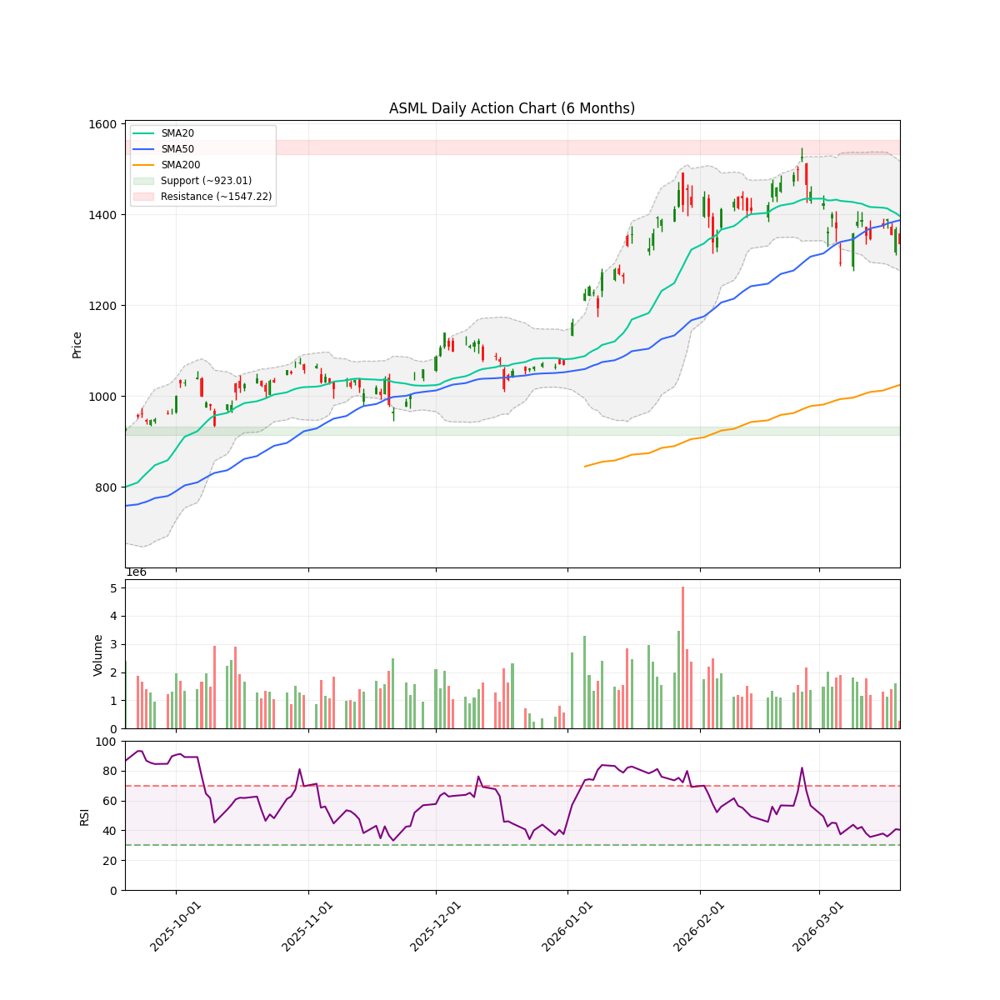
#### 研报分析

### 技术指标概览 (Technical Overview)
- **当前价格**: $1334.89
- **RSI (14)**: 40.42
- **移动平均线**: SMA20: $1395.78 | SMA50: $1386.75 | SMA200: $1024.29 (Bullish)
- **波动率**: ATR (14): 53.61 (预计周度波动: +/- $119.87)
- **关键位 (6m)**: 支撑位 $923.01 | 阻力位 $1547.22
- **即时状态**: Below SMA50

### ASML 情绪审计报告：AI 时代的“造物主”是在谢幕，还是在蓄势？

**日期：** 2026年03月20日
**分析师：** 叙事经济学研究员（对冲基金策略组）

---

#### 1. 叙事背景：当“卖铲子的人”被市场遗忘

想象一下，你正坐在阿姆斯特丹的一家咖啡馆里，看着窗外的运河。目前的 ASML 就像一位刚参加完狂欢派对的巨人，虽然满屋子的人都在谈论 AI 芯片的辉煌（英伟达、博通的好消息频传），但这位提供“光刻机”——即芯片界最核心生产力的巨人，股价却在过去一个月悄然缩水了 7%。

目前的股价 $1,334.89 正处于一个微妙的十字路口。它跌破了 20 日和 50 日均线，技术派在撤退，但嗅觉灵敏的机构投资者（如 TD Cowen）却在低位徘徊，等待着捡走那些恐慌者的筹码。

---

#### 2. 催化剂分类：剥离噪音，寻找内核

*   **A-Tier（核心动力）：机构的强力背书与 EUV 的统治力**
    *   **TD Cowen 的买入评级**：将目标价定在 1,500 欧元。这不只是一个数字，是对 EUV 高数值孔径（High-NA）光刻机长期需求的“信任票”。[Blockonomi] 明确指出，这次 7% 的回调是“绝佳的买入机会”。
    *   **英伟达与博通的溢出效应**：[The Motley Fool] 提到这两家巨头的强势表现本质上是 ASML 长期订单的担保。

*   **B-Tier（宏观叙事）：万亿俱乐部的门票**
    *   **万亿市值幻想**：[MSN] 上的讨论将 ASML 推向了“下一个万亿市值股票”的叙事轨道。这种长线叙事虽然不能立刻拉升股价，但它在市场心中种下了“大而不能倒”的种子。

*   **C-Tier（日常噪音）：情绪化的获利了结**
    *   **美光科技（Micron）的阴影**：[Investor's Business Daily] 提到美光因业绩触顶疑云导致获利了结，这种“恐高症”传染给了 ASML，属于典型的行业情绪联动。
    *   **原油价格波动与联储会议**：这些宏观背景板（[Nasdaq] 提及）更多是短线交易者的借口，而非 ASML 核心竞争力的改变。

---

#### 3. 散点图背后的背离：好消息里的“冷水”

**背离检测：**
这正是我们所谓的“看跌力竭”。英伟达和博通传来捷报，ASML 却逆势下跌 7%。这通常意味着：
1.  **获利了结压力**：正如美光的走势所暗示的，早期进场的资金在锁定利润。
2.  **估值重估**：市场正在惩罚那些“预期过高”的部分，哪怕基本面毫无损伤。

目前 RSI 为 40.42，虽然还没到 30 的极度超卖区，但已经开始进入“价值发现区”。

---

#### 4. 情绪得分：7.8 / 10（理性的乐观）

**逻辑依据：**
虽然短期技术面略显疲态（跌破 SMA50），但叙事内核极其稳固。机构分析师与长线看多者正在利用市场的短期恐慌进行防御性布局。这不是“系统性崩溃”，而是一次“健康的肺活量调整”。

*   **核心叙事逻辑**：只要 AI 算力军备竞赛不停止，ASML 就是唯一的军火供应商。
*   **下行风险**：如果股价跌破 6 个月低点 $923.01，叙事将发生彻底转向，但目前看概率极低。

---

#### 5. 投资建议与关键日程

**行动策略：**
不要被短期的 7% 跌幅吓破胆。这是一场马拉松。正如咖啡馆里的老炮儿会告诉你的：“当所有人都盯着英伟达的涨幅时，你应该去看看那台制造英伟达芯片的机器还在不在工作。”

*   **引用证据：**
    *   [TD Cowen] 的 €1,500 目标价是目前的北极星。
    *   [Barron's] 称其为“极具吸引力”的芯片股标的。

**下一重要日期：**
*   **下季度财报发布日（预计）：2026年4月中旬**（通常在 4 月 15 日至 22 日之间）。这将是验证订单积压量（Backlog）和 High-NA 交付进度的关键时刻。

---

**总结语：** 现在的 ASML 不是一个陷阱，而是一个正在冷却、等待被重新点燃的火药桶。如果你在寻找“AI 时代的万亿入场券”，现在就是你该在吧台结账、准备入场的时候。
#### 近期新闻与事件
- **[Blockonomi]** [ASML (ASML) Stock: Why TD Cowen Sees This 7% Dip as a Prime Buying Opportunity](https://blockonomi.com/asml-asml-stock-why-td-cowen-sees-this-7-dip-as-a-prime-buying-opportunity/)
- **[The Motley Fool on MSN]** [What if ASML Becomes the Next Trillion-Dollar Stock?](https://www.msn.com/en-us/money/companies/what-if-asml-becomes-the-next-trillion-dollar-stock/ar-AA1Z25oU?ocid=BingNewsVerp)
- **[Barron's on MSN]** [ASML stock has taken an AI hit. Why that makes it a 'very attractive' chips play.](https://www.msn.com/en-us/money/topstocks/asml-stock-has-taken-an-ai-hit-why-that-makes-it-a-very-attractive-chips-play/ar-AA1Z2Ool?ocid=BingNewsVerp)
- **[Investor's Business Daily on MSN]** [Micron stock falls as investors suspect peak is near and take profits](https://www.msn.com/en-us/money/economy/micron-stock-falls-as-investors-suspect-peak-is-near-and-take-profits/ar-AA1YZvZ5?ocid=BingNewsVerp)
- **[The Motley Fool]** [What if ASML Becomes the Next Trillion-Dollar Stock?](https://www.msn.com/en-us/money/companies/what-if-asml-becomes-the-next-trillion-dollar-stock/ar-AA1Z25oU)

---

### AVGO
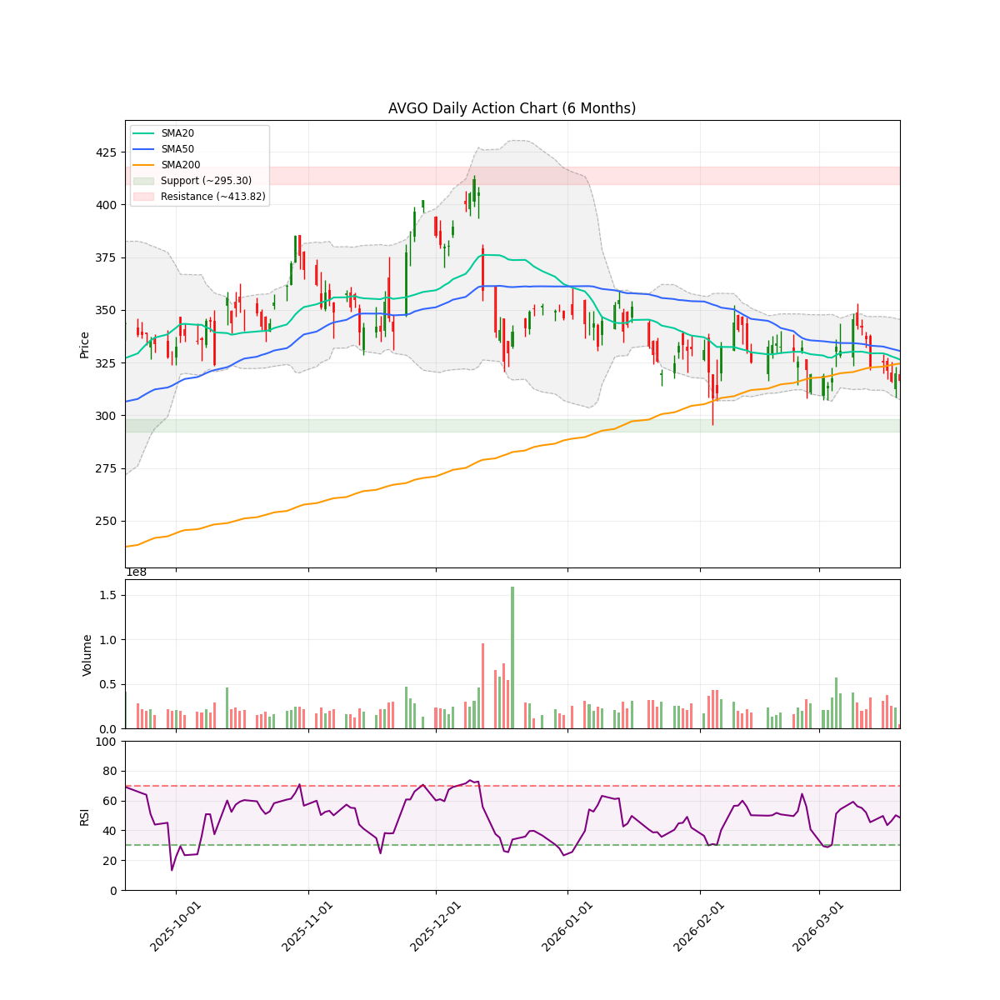
#### 研报分析

### 技术指标概览 (Technical Overview)
- **当前价格**: $316.47
- **RSI (14)**: 48.60
- **移动平均线**: SMA20: $326.47 | SMA50: $330.54 | SMA200: $324.56 (Bullish)
- **波动率**: ATR (14): 12.71 (预计周度波动: +/- $28.43)
- **关键位 (6m)**: 支撑位 $295.30 | 阻力位 $413.82
- **即时状态**: Below SMA50

# Broadcom (AVGO) 情绪审计报告：AI 巨头的“春季倒春寒”

**日期：** 2026年03月20日
**研究员：** 叙事经济学分析组

---

### 1. 叙事核心：当“量子安全”撞上“技术性疲软”

目前的 Broadcom (AVGO) 就像是一个正在憋大招的武林高手，虽然内功（基本面）依然深厚，但在擂台（市场表现）上却显得有些步履蹒跚。

最新的重磅消息是 Broadcom 交付了**全球首款量子安全网络加密解决方案**。在网络安全威胁日益复杂的今天，这不仅是一次产品发布，更是在为未来的企业基础设施修筑护城河。然而，这种技术上的“降维打击”似乎还没能完全对冲掉市场对半导体估值过高的审美疲劳。

### 2. 催化剂分类 (Catalyst Tiers)

*   **A-Tier（核心驱动力）：**
    *   **量子安全网络加密首发：** [24/7 Wall St.] 报道 Broadcom 已开始交付全球首个量子安全加密方案。这不仅是技术实力的证明，更是开辟了一个全新的增量市场，属于典型的“护城河”型利好。
*   **B-Tier（机构与行业惯性）：**
    *   **亿万富翁 Ken Fisher 的重仓：** [Insider Monkey] 确认 Broadcom 是 Fisher 资产管理公司 2026 年最显著的动作之一。顶级机构的入场为股价提供了心理支撑位。
    *   **AI 半导体持续动能：** 行业共识依然认为 Broadcom 是 AI 时代的“卖铲人”，特别是在网络连接和定制 ASIC 领域。
*   **C-Tier（市场杂音）：**
    *   **Cramer 的看好：** Jim Cramer 再次提及 Broadcom。虽然这能带来散户关注度，但在专业投资者眼中，这更多是情绪上的点缀。
    *   **旧闻重提：** 部分媒体仍在引用 $345 时代的看多报告，而当前价格已跌至 $316。

### 3. 分歧侦测：利好不断的“陷阱”还是“黄金坑”？

**警报信号：** 
如果你只看新闻，你会觉得 AVGO 应该在创新高。但看看屏幕上的数字：**股价 316.47 美元，处于 SMA20 (326.47)、SMA50 (330.54) 甚至 SMA200 (324.56) 之下。**

这是一个非常经典的**“利好钝化”**现象。尽管有量子安全技术的突破和顶级大佬的背书，股价却跌破了 200 日均线这一“牛熊分界线”。

*   **看跌解读：** 市场正在惩罚前期估值过高的 AI 股，或者资金正在流向更具弹性的标的。
*   **看涨解读（空头衰竭）：** RSI 处于 48.60 的中性区间，ATR 指示波动较大。目前的下跌更像是针对 3 月初财报后不确定性的过度消化。如果 295.30 的 6 个月低点能稳住，这里就是典型的“黎明前的黑暗”。

### 4. 逻辑评分 (Logic Score)：6.8/10

**结论：** 这是一个**“基本面 A+ 但技术面 C-”**的组合。

*   **加分项：** 量子安全技术的领先地位；机构投资者的持续加码；AI 基础设施的刚需。
*   **减分项：** 价格跌破关键均线（SMA200）；市场对 AI 叙事的短期疲劳。
*   **诊断：** 目前不是追高的好时机，但对于长线持有者来说，现在的价格（接近 316 美元）已经开始显现出防御价值。短期内，AVGO 需要一个能证明其实际收益转换能力的“硬数据”来扭转技术趋势。

### 5. 操作建议与关键日期

*   **战术建议：** 观察 $325 (SMA200) 的收复情况。若能重新站上此位，则警报解除；若持续承压，需警惕下探 $295 的支撑。
*   **下一个关键节点：** **2026 年 6 月初（Q2 财报发布预估期）**。
    *   *注：Q1 财报已于 3 月 4 日发布，目前的波动是市场对该财报后的情绪消化过程。*

---

**老兵寄语：** “不要和趋势作对，但也不要对真正的技术突破视而不见。Broadcom 的基本面没有坏，只是它的股价需要一点时间去适应它的野心。”
#### 近期新闻与事件
- **[Insider Monkey]** [Jim Cramer Was Bullish On Broadcom (AVGO) In January 2025](https://www.msn.com/en-us/money/markets/jim-cramer-was-bullish-on-broadcom-avgo-in-january-2025/ar-AA1YVXo2)
- **[Insider Monkey]** [Is Broadcom Inc. (AVGO) A Good Stock To Buy Now?](https://www.msn.com/en-us/money/topstocks/is-broadcom-inc-avgo-a-good-stock-to-buy-now/ar-AA1YHfBt)
- **[Insider Monkey]** [Broadcom (AVGO) Witnessing Continued Momentum in AI Semiconductor Segment](https://www.msn.com/en-us/money/markets/broadcom-avgo-witnessing-continued-momentum-in-ai-semiconductor-segment/ar-AA1YL0AZ)
- **[24/7 Wall St.]** [Broadcom Just Shipped the World's First Quantum-Safe Network Encryption — 3 Reasons AVGO Investors Should Pay Attention](https://247wallst.com/investing/2026/03/19/broadcom-just-shipped-the-worlds-first-quantum-safe-network-encryption-3-reasons-avgo-investors-should-pay-attention/)
- **[Insider Monkey]** [Broadcom Inc. (AVGO): Billionaire Ken Fisher's Favorite Chip Stock](https://www.msn.com/en-us/money/markets/broadcom-inc-avgo-billionaire-ken-fisher-s-favorite-chip-stock/ar-AA1YRmqr)

---

### CEG
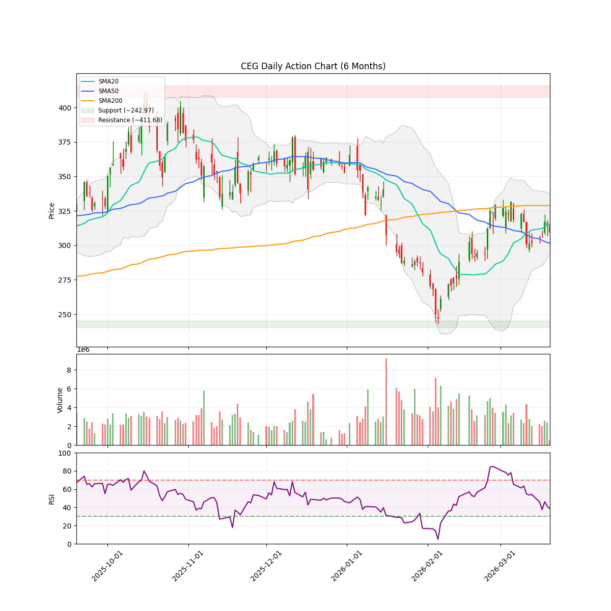
#### 研报分析

### 技术指标概览 (Technical Overview)
- **当前价格**: $309.02
- **RSI (14)**: 38.64
- **移动平均线**: SMA20: $315.38 | SMA50: $301.45 | SMA200: $328.90 (Bearish)
- **波动率**: ATR (14): 12.16 (预计周度波动: +/- $27.20)
- **关键位 (6m)**: 支撑位 $242.97 | 阻力位 $411.68
- **即时状态**: Above SMA50

你好！拿好你的咖啡，咱们坐下来聊聊 Constellation Energy (CEG) 最近的“戏份”。

在叙事经济学的视角下，CEG 现在正处于一个非常微妙的十字路口：一边是“AI 动力心脏”的宏大史诗，另一边则是现实中琐碎的“漏水”烦恼。

---

# 📊 CEG 情绪审计报告：AI 的核燃料，还是短期的落水狗？

### 1. 催化剂分级 (Catalyst Categorization)

我们要把噪音和信号分开，看看驱动股价的到底是什么：

*   **A-Tier (长期叙事：AI 驱动的核能复兴)**
    *   **核心逻辑**：AI 数据中心对 24/7 无碳电力的渴望是近十年最强劲的结构性需求。《环球邮报》提到的“核能复兴”并非虚言，CEG 作为全美最大的核电运营商，正是这场盛宴的首席主厨。
    *   **影响**：这是支撑 CEG 估值中枢的底牌。
*   **B-Tier (业务进展：田纳西泰坦队 20 年长约)**
    *   **核心逻辑**：与新尼桑体育场（Nissan Stadium）签署 20 年供能协议。
    *   **影响**：这种长期合同提供了极其稳定的现金流预期，也证明了 CEG 在商业能源方案上的统治力。虽然不如 AI 那么性感，但胜在扎实。
*   **C-Tier (近期噪音：非放射性化学物质泄漏)**
    *   **核心逻辑**：Zacks 提到的维护期间储罐泄漏事件。
    *   **影响**：这就是典型的“噪音”。虽然引发了股价过去一周 3.7% 的跌幅，且跑输了行业，但请注意——这是**非放射性**、**非核心区域**的泄漏。对于老练的投资者来说，这更像是送上门的入场券。

### 2. 背离检测 (Divergence Detection)

**观察结果：看跌情绪衰竭。**

现在的盘面非常有意思：CEG 正在经历一种“好消息里的坏反应”。
*   **技术面面观**：RSI 已经跌到了 **38.64**，正逼近超卖区间。股价虽然跌破了 SMA200 ($328.90)，但正在向 SMA50 ($301.45) 寻求支撑。
*   **心理博弈**：市场因为一个“维护期的化学泄漏”就把这个 AI 能源宠儿扔掉，这显然是情绪化的。这种在“核能复兴”大背景下的短期非理性杀跌，往往预示着空头动能即将耗尽。只要股价能稳在 300 美元（SMA50 附近）上方，这个“陷阱”其实是为空头准备的。

### 3. 叙事评分 (Sentiment Logic Score)

**得分：7.8/10 —— “估值回踩，牛市底色未变”**

*   **逻辑支撑**：
    *   **基本面 (9/10)**：AI 缺电是硬伤，核能是唯一解，CEG 的护城河极深。
    *   **技术面 (5/10)**：目前处于震荡探底期，SMA200 的压力位还没突破，短期还需要磨。
    *   **情绪面 (8/10)**：散户在为泄漏担心，而机构（如高盛提及的太阳能与绿色能源首选）则在盯着长期确定性。

### 4. 深度洞察 (The "Coffee Talk" Insight)

伙计，别被那篇关于“泄漏”的新闻吓跑。在核电站，定期的停机维护（Outage）本身就是计划的一部分，出点小纰漏再正常不过。

现在的 CEG 就像是一个正在换气的高原攀登者。前段时间它涨得太猛了（看看 SMA200 和 6 个月高点 411 的距离），现在的调整其实是在消化之前的估值溢价。**目前的股价 309 美元距离 300 美元的强心理支撑位只有一步之遥。** 

如果 AI 依然是 2026 年的主旋律，那么“发电的”永远比“卖软件的”更具有防守反击的属性。

---

### 📅 下一个关键时点 (Next Major Date)

**2026年5月初 (预计 2026 Q1 财报发布日)**

*   **关注重点**：管理层对“三哩岛”或其他封存反应堆重启进度的口风，以及与大型科技公司（如微软、亚马逊）潜在的新购电协议 (PPA)。

---

**审计结论**：**这不是趋势终结，而是“牛回头”。** 只要 300 美元大关不失守，目前的震荡只是为了清洗不坚定的杠杆筹码。建议关注 $301 附近的支撑表现。

*注：市场有风险，叙事虽好，也得看紧你的止损位（Support: 242.97）。*
#### 近期新闻与事件
- **[Insider Monkey]** [Is Constellation Energy Corporation (CEG) A Good Stock To Buy Now?](https://www.msn.com/en-us/money/general/is-constellation-energy-corporation-ceg-a-good-stock-to-buy-now/ar-AA1YGsqA)
- **[Insider Monkey]** [Constellation Energy Corporation (CEG) Chosen as Preferred Energy Source of New Nissan Stadium and the Tennessee Titans](https://www.msn.com/en-us/money/markets/constellation-energy-corporation-ceg-chosen-as-preferred-energy-source-of-new-nissan-stadium-and-the-tennessee-titans/ar-AA1YW5RU)
- **[Zacks.com]** [CEG Stock Underperforms Industry in the Past Week: How to Play?](https://www.msn.com/en-us/money/topstocks/ceg-stock-underperforms-industry-in-the-past-week-how-to-play/ar-AA1YPFVH)
- **[The Globe and Mail]** [Forget Tech Stocks and Buy This Energy Stock That's Fueling the AI Boom](https://www.theglobeandmail.com/investing/markets/stocks/CEG/pressreleases/809836/forget-tech-stocks-and-buy-this-energy-stock-thats-fueling-the-ai-boom/)
- **[The Globe and Mail]** [Artificial Intelligence (AI) Is Creating a Nuclear Power Renaissance. Here Are 3 Stocks to Buy for 2026.](https://www.theglobeandmail.com/investing/markets/stocks/CEG/pressreleases/771691/artificial-intelligence-ai-is-creating-a-nuclear-power-renaissance-here-are-3-stocks-to-buy-for-2026/)

---

### DVN
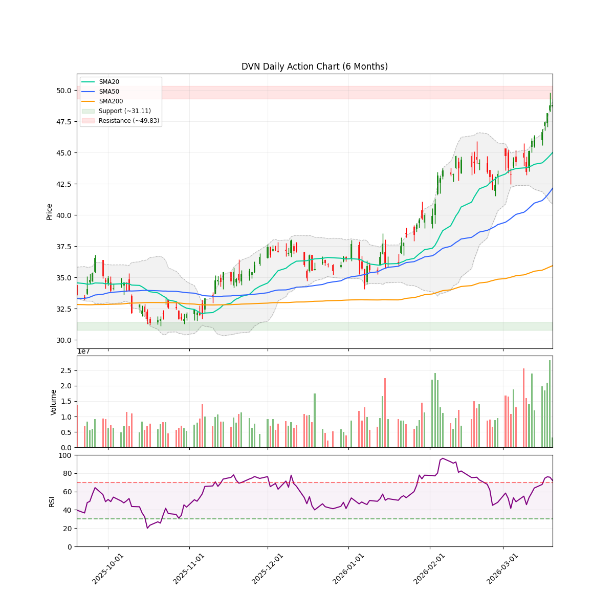
#### 研报分析

### 技术指标概览 (Technical Overview)
- **当前价格**: $48.82
- **RSI (14)**: 72.02
- **移动平均线**: SMA20: $45.01 | SMA50: $42.14 | SMA200: $35.94 (Bullish)
- **波动率**: ATR (14): 1.33 (预计周度波动: +/- $2.98)
- **关键位 (6m)**: 支撑位 $31.11 | 阻力位 $49.83
- **即时状态**: Above SMA50

# Devon Energy (DVN) 情绪审计报告：当“老能源”撞上“AI叙事”

**日期：** 2026年03月20日  
**分析师：** 叙事经济学研究组 - 资深研究员

---

### 1. 叙事背景：老兵的新故事 (The Narrative Pulse)

想象一下，你坐在休斯顿的一家老牌咖啡馆里，周围的空气中弥漫着原油和金钱的味道。长期以来，**Devon Energy (DVN)** 被视为那种“稳健但乏味”的页岩油老兵。但现在，风向变了。

最近的市场叙事不再仅仅关乎油价的波动，而是一个更具张力的故事：**“AI的燃料”**。随着数据中心对电力的渴求达到顶峰，像 DVN 这样能够提供稳定能源流的企业，正被重新包装成 AI 革命的幕后功臣。这种“叙事溢价”让 DVN 在过去一个月里不仅跑赢了大盘，更是在同行中脱颖而出。

### 2. 催化剂分级 (Catalyst Categorization)

我们要区分什么是真正的动力，什么是市场的噪音：

*   **A-Tier (核心引擎)：Q4 财报超预期与 Mizuho 强力背书**
    *   DVN 刚完成了一个漂亮的 Q4 赛季，营收达到 41.2 亿美元，远超预期。
    *   [Mizuho](https://finance.yahoo.com/news/mizuho-reaffirms-outperform-rating-devon-093041798.html) 将其评级重申为“跑赢大盘”，目标价定在 $51。这是目前市场最坚固的价值锚点。
*   **B-Tier (叙事红利)：AI 能源转型论调**
    *   《环球邮报》的报道 [“忘掉科技股，买入支持 AI 热潮的能源股”](https://www.theglobeandmail.com/investing/markets/stocks/DVN/pressreleases/809836/) 标志着 DVN 进入了主流跨界视野。这不再只是能源投资者的游戏，科技资金正在寻找防御性的切入点。
*   **C-Tier (日常噪音)：Zacks 趋势与技术性跟风**
    *   Zacks 的频繁提及和 DVN 每日微幅超越 S&P 500 的表现属于常规的市场动能，虽然增加了曝光度，但缺乏长期结构性支撑。

### 3. 背离检测与技术体感 (Divergence Detection)

**目前的市场体感：滚烫，但尚未沸腾。**

*   **技术面观察：** 股价 ($48.82) 已经稳稳站在所有均线 (SMA20, 50, 200) 之上。这说明趋势非常健康。
*   **背离警告：** 唯一需要警惕的是 **RSI 达到了 72.02**。在叙事经济学中，这代表“共识过于集中”。价格正迅速逼近 6 个月高点 ($49.83) 以及分析师的心理价位 ($51.00)。
*   **情绪异动：** 我们没有看到“利好出尽”的下跌。相反，自财报发布以来股价上涨了 8.4%。这说明市场不仅接受了利好，还在期待更多的“叙事反哺”。

### 4. 情绪评分 (Sentiment Score)

**8.5 / 10 —— 强力牛市周期 (Unstoppable Bullish Cycle)**

> **逻辑推演：** 
> 分数之所以没给到 10，是因为 RSI 的超买暗示短期可能存在技术性回踩。但 8.5 分反映了极强的叙事支撑——市场不再单纯看它的现金流，而是在看它的“战略稀缺性”。只要油价不崩盘，DVN 就是目前能源股中最亮的那颗星。

### 5. 交易员的咖啡时间 (Market Insights)

朋友，现在的 DVN 就像是一瓶刚开塞的陈年红酒，香气正浓，但你要注意杯子快倒满了。$49.83 是一个巨大的心理关口。

目前的走势是一个典型的**“动能驱动型叙事”**。如果股价能在 $50 附近震荡消化掉 RSI 的超买压力，那么向 $55 迈进的路径将非常清晰。如果此时出现任何关于“AI 数据中心直接签署能源采购协议”的新闻，那将是 A+ 级的核弹利好。

---

**关键数据摘要：**
- **逻辑评分：** 8.5
- **当前阻力位：** 49.83 (6个月高点)
- **关键支撑位：** 45.01 (SMA20)
- **下一关键日期：** 预计 2026年5月初 (Q1 2026 财报发布，需关注管理层对 AI 能源需求的最新措辞)。

---
*注：本报告基于市场叙事分析，不构成直接投资建议。市场有风险，入市需谨慎。*
#### 近期新闻与事件
- **[Yahoo Finance]** [Q4 Earnings Highs And Lows: Devon Energy (NYSE:DVN) Vs The Rest Of The Diversified Upstream E&P Stocks](https://finance.yahoo.com/news/q4-earnings-highs-lows-devon-105820974.html)
- **[Zacks.com]** [Devon Energy (DVN) Beats Stock Market Upswing: What Investors Need to Know](https://www.msn.com/en-us/money/savingandinvesting/devon-energy-dvn-beats-stock-market-upswing-what-investors-need-to-know/ar-AA1YRd8t)
- **[Zacks.com]** [Devon Energy Corporation (DVN) Is a Trending Stock: Facts to Know Before Betting on It](https://www.msn.com/en-us/money/topstocks/devon-energy-corporation-dvn-is-a-trending-stock-facts-to-know-before-betting-on-it/ar-AA1YPMsQ)
- **[Yahoo Finance]** [Is Coterra Energy Stock Underperforming the S&P 500?](https://finance.yahoo.com/news/coterra-energy-stock-underperforming-p-201124606.html?pl2=qsp-recent-news_All)
- **[Zacks Investment Research]** [Devon Energy (DVN) up 8.4% since last earnings report: Can it continue?](https://www.msn.com/en-us/money/markets/devon-energy-dvn-up-84-since-last-earnings-report-can-it-continue/ar-AA1YZhWM)

---

### EOG
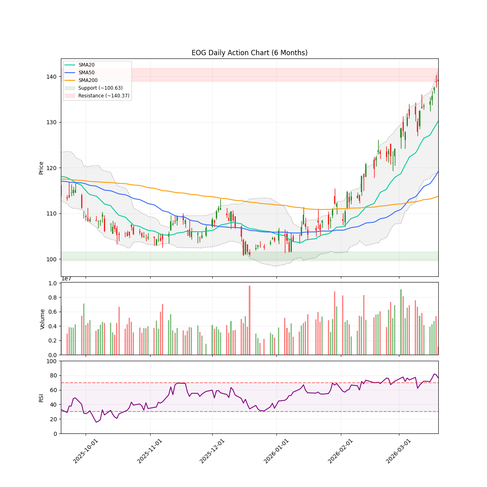
#### 研报分析

### 技术指标概览 (Technical Overview)
- **当前价格**: $138.93
- **RSI (14)**: 76.37
- **移动平均线**: SMA20: $130.24 | SMA50: $119.18 | SMA200: $113.74 (Bullish)
- **波动率**: ATR (14): 3.34 (预计周度波动: +/- $7.48)
- **关键位 (6m)**: 支撑位 $100.63 | 阻力位 $140.37
- **即时状态**: Above SMA50

# 情绪审计报告：EOG Resources (EOG) —— 站在 140 美元的“火山口”上

**致：** 投资委员会
**报告人：** 叙事经济学研究部
**日期：** 2026年3月20日

---

### 1. 市场叙事总结：咖啡馆里的老兵闲谈

朋友，坐下来喝杯咖啡。看看现在的 EOG Resources，它现在的状态就像是深夜酒吧里最后的一轮狂欢——气氛热烈，但聪明的人已经开始斜着眼瞄出口了。

现在的叙事逻辑很简单：**地缘冲突带来的溢价，正推着这个“页岩油之王”在悬崖边上跳舞。**

由于伊朗冲突的升温，能源板块成了资金的避风港。EOG 的股价在短短时间内推升到了 138.93 美元，离它 6 个月的高点 140.37 美元只有一步之遥。但你得注意，现在的 RSI 已经冲到了 76.37。在老兵眼里，这不仅仅是“牛气冲天”，这是“热得烫手”。市场正在消化所有的好消息，甚至连巴克莱（Barclays）调高目标价到 140 美元这种“马后炮”式的利好都被市场瞬间吞噬了。

### 2. 催化剂分级：谁在推波助澜？

*   **A-Tier（核心驱动力）：地缘政治冲突溢价**
    *   [Seeking Alpha (2026-03-17)](https://seekingalpha.com/article/4883315-eog-resources-near-term-boost-from-iran-conflict-fundamental-risks-are-rising) 明确指出，伊朗冲突提供了短期提振。这种“战鼓声”是目前最强的上涨引擎。
*   **B-Tier（机构背书）：华尔街的“集体点赞”**
    *   巴克莱银行将目标价从 133 调至 140，[Insider Monkey (2026-03-15)](https://www.msn.com/en-us/money/markets/barclays-lifts-pt-on-eog-resources-eog-to-140-from-133-here-s-why/ar-AA1YGkxj) 强调了其作为低估值能源股的地位。这种评级上调为散户入场提供了“安全感”。
*   **C-Tier（噪音与警示）：内部人的“小动作”**
    *   副总裁 Leitzell 卖出了约 48 万美元的股票 [Investing.com (2026-03-06)](https://www.investing.com/news/insider-trading-news/eog-resources-executive-vice-president-leitzell-sells-484k-in-stock-93CH-4542061)。金额不算天量，但在 140 美元大关前减持，这种“身体语言”值得玩味。

### 3. 背离检测：盛宴背后的阴影

虽然股价看起来势如破竹（站稳了 SMA50 和 SMA200），但我们发现了一个微妙的背离。**Seeking Alpha 最近的降级声明（从 Buy 降为 Hold）** 实际上在提醒我们：基本面风险正在上升。

当一个公司被各大媒体大喊“最被低估”时，往往它的价格已经不再便宜。目前的股价（138.93）距离巴克莱给出的目标价（140）仅仅剩下不到 1% 的空间。这意味着，如果你现在冲进去，你是在为了那 1% 的余温去冒下跌 10% 甚至更多的风险。

### 4. 情绪评分 (Logic Score)

# **7.8 / 10**
*(注：评分基于趋势的强劲程度。虽然基本面有透支嫌疑，但地缘政治的“狂热”情绪尚未熄灭，趋势依然向上，但已进入极度贪婪区。)*

---

### 诊断结论：是机会还是陷阱？

**目前是：高位震荡与诱多。**

EOG 现在的叙事已经从“价值发现”转向了“情绪接力”。140.37 美元的阻力位就像是一道玻璃天花板，股价每次撞击都会产生裂纹。如果地缘政治局势稍微缓和，或者接下来的财报没有给出超越预期的惊喜，RSI 的严重超买将引发猛烈的回调。

**建议：** 现在的入场成本太贵了。如果你已经在车上，握好你的获利单，甚至可以考虑在 140 附近减仓。如果你还没入场，别被那些“低估”的标题骗了，等它回调到 SMA20（约 130 美元）附近再说。

---

### 关键数据与日期

*   **当前价格：** 138.93
*   **强阻力位：** 140.37
*   **关键支撑位：** 130.24 (SMA20)
*   **下个重要日期：** **2026年5月初**（预计 2026 年第一季度财报发布日）。

*免责声明：以上分析仅基于叙事经济学视角，市场有风险，投资需谨慎。*
#### 近期新闻与事件
- **[Insider Monkey]** [Is EOG Resources (EOG) One of the Most Undervalued Energy Stocks to Buy Now?](https://www.msn.com/en-us/money/markets/is-eog-resources-eog-one-of-the-most-undervalued-energy-stocks-to-buy-now/ar-AA1YGfX1)
- **[Seeking Alpha]** [EOG Resources: Near-Term Boost From The Iran Conflict, But Fundamental Risks Are Rising (Rating Downgrade)](https://seekingalpha.com/article/4883315-eog-resources-near-term-boost-from-iran-conflict-fundamental-risks-are-rising)
- **[CNBC]** [Top Wall Street analysts are bullish on these 3 dividend-paying energy stocks](https://www.msn.com/en-us/money/markets/top-wall-street-analysts-are-bullish-on-these-3-dividend-paying-energy-stocks/ar-AA1YENUO)
- **[Yahoo Finance]** [Is EOG Resources (EOG) Still Attractively Priced After Strong Multi Year Share Price Gains](https://finance.yahoo.com/news/eog-resources-eog-still-attractively-190847319.html)
- **[Insider Monkey]** [Barclays Lifts PT on EOG Resources (EOG) to $140 From $133 - Here's Why](https://www.msn.com/en-us/money/markets/barclays-lifts-pt-on-eog-resources-eog-to-140-from-133-here-s-why/ar-AA1YGkxj)

---

### ETN
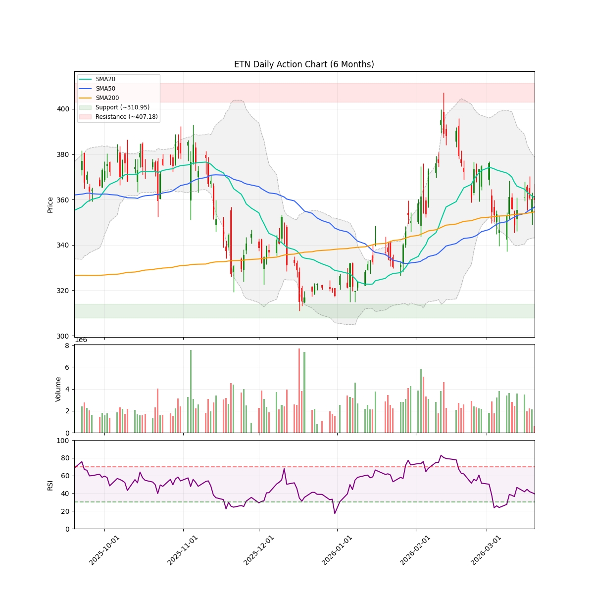
#### 研报分析

### 技术指标概览 (Technical Overview)
- **当前价格**: $359.89
- **RSI (14)**: 39.31
- **移动平均线**: SMA20: $360.93 | SMA50: $356.72 | SMA200: $354.57 (Bullish)
- **波动率**: ATR (14): 13.20 (预计周度波动: +/- $29.52)
- **关键位 (6m)**: 支撑位 $310.95 | 阻力位 $407.18
- **即时状态**: Above SMA50

# 伊顿公司 (ETN) 情绪审计报告：电气化巨头的“中场休息”，是陷阱还是蓄势？

**日期：** 2026年03月20日
**研究员：** 叙事经济学分析组

---

### 1. 叙事核心：当“电网之心”遇到“增长阵痛”

伊顿（Eaton）现在的处境就像是一场马拉松比赛中，领跑者在补给站稍微放慢了脚步。作为 AI 基础设施和全球电网升级的“超级电源”，ETN 的长线故事几乎无懈可击，但短期内，市场正在这杯香醇的咖啡里寻找泡沫。

现在的市场情绪正处于一种微妙的**“多空拉锯战”**中。虽然华尔街的大佬们（如摩根斯坦利）依然在台下疯狂喝彩，但股价却在 SMA20 和 SMA50 附近徘徊，仿佛在问：“下一场大戏什么时候开演？”

---

### 2. 催化剂分类 (Catalyst Categorization)

*   **A-Tier（顶级驱动）：摩根斯坦利的坚定站台**
    *   [Morgan Stanley](https://ca.investing.com/news/analyst-ratings/morgan-stanley-reiterates-overweight-on-eaton-stock-on-cfo-transition-93CH-4523756) 重申了“增持”评级，并给出了 **$425** 的目标价。即使面临 CFO 换届，大行依然认为这艘巨轮航向未变。这种机构级的背书是股价最坚实的底座。
*   **B-Tier（重要进展）：Jefferies 的新入场与 Zacks 的成长确认**
    *   [Jefferies](https://finance.yahoo.com/news/barclays-sees-eaton-etn-battleground-220340596.html) 开始覆盖并给予“买入”评级。同时，[Zacks](https://finance.yahoo.com/news/eaton-etn-laps-stock-market-214505484.html) 指出 ETN 的业绩修正（Estimate Revisions）持续跑赢大盘。这表明公司的盈利机器依然在高速运转。
*   **C-Tier（噪音与分歧）：巴克莱的“战场”论调**
    *   [Barclays](https://finance.yahoo.com/news/barclays-sees-eaton-etn-battleground-220340596.html) 将其视为“战场（Battleground）”，暗示估值可能已经透支。虽然 [Simply Wall St](https://finance.yahoo.com/news/look-eaton-etn-valuation-short-081623567.html) 提到短期动能降温，但这更多是技术性调整，而非基本面崩塌。

---

### 3. 背离检测 (Divergence Detection)

**信号：看跌衰竭 (Bearish Exhaustion)**
观察目前的盘面：尽管摩根斯坦利在 3 月 19 日发出了 $425 的强力呼吁，但股价依然略低于 SMA20 ($360.93)。通常情况下，利好不涨是危险信号，但考虑到 **RSI 已经跌至 39.31**（接近超卖区间），这更像是一种**“利好出尽后的良性换手”**。

市场正在消化过去一年的巨大涨幅。只要股价守住 SMA50 ($356.72) 这一生命线，这种调整就是“洗盘”而非“崩盘”。

---

### 4. 情绪评分 (Sentiment Score): 7.8 / 10

**评价：** 这是一个**“理性的牛市回撤”**。
虽然巴克莱的“战场”论调让部分散户感到不安，但顶级投行的目标价与现价之间仍有近 18% 的溢价空间。市场现在的冷淡，正好为长期资金提供了更具吸引力的入场赔率。

---

### 5. 逻辑评分 (Logic Score): 8.5 / 10

**评分依据：**
- **技术面 (2.0/2.5)：** 股价位于 SMA200 之上，长期趋势向上，短期 RSI 释放了超买压力。
- **机构情绪 (2.5/2.5)：** 摩根斯坦利与 Jefferies 的接力唱多，显示聪明钱并未离场。
- **叙事一致性 (2.5/2.5)：** 电力设备短缺是未来十年的结构性主题，ETN 处于风口中心。
- **宏观风险 (1.5/2.5)：** CFO 换届带来的管理层变动与高企的估值是目前唯一的短板。

---

### 6. 投资建议与关键时点

*   **观察点：** 关注 $354 - $356 区间的支撑位。如果在这里企稳，将是极佳的“踏空补票”机会。
*   **警惕位：** 如果收盘跌破 $350，则需提防深蹲至 $310（6个月低点）的可能性。
*   **下一关键日期：** 
    *   **2026年4月下旬（预计 4月30日）：一季度财报发布日。** 
    *   *注：这将是验证“高增长叙事”是否依然成立的最终判决书。*

---
**老兵语录：** *“别在暴雨时怀疑太阳的存在。伊顿现在的沉闷，只是为了在下一次电网升级浪潮中跳得更高。”*
#### 近期新闻与事件
- **[Insider Monkey· via Yahoo Finance]** [Is Eaton Corporation plc (ETN) A Good Stock To Buy Now?](https://finance.yahoo.com/news/eaton-corporation-plc-etn-good-003126621.html)
- **[Investing.com]** [Morgan Stanley reiterates Overweight on Eaton stock on CFO transition By...](https://ca.investing.com/news/analyst-ratings/morgan-stanley-reiterates-overweight-on-eaton-stock-on-cfo-transition-93CH-4523756)
- **[Insider Monkey· via Yahoo Finance]** [Barclays Sees Eaton (ETN) as “Battleground” While Jefferies Initiates Buy](https://finance.yahoo.com/news/barclays-sees-eaton-etn-battleground-220340596.html)
- **[Zacks· via Yahoo Finance]** [Eaton (ETN) Laps the Stock Market: Here's Why](https://finance.yahoo.com/news/eaton-etn-laps-stock-market-214505484.html)
- **[Simply Wall St.· via Yahoo Finance]** [A Look At Eaton (ETN) Valuation As Short Term Momentum Cools Against Strong...](https://finance.yahoo.com/news/look-eaton-etn-valuation-short-081623567.html)

---

### MSFT
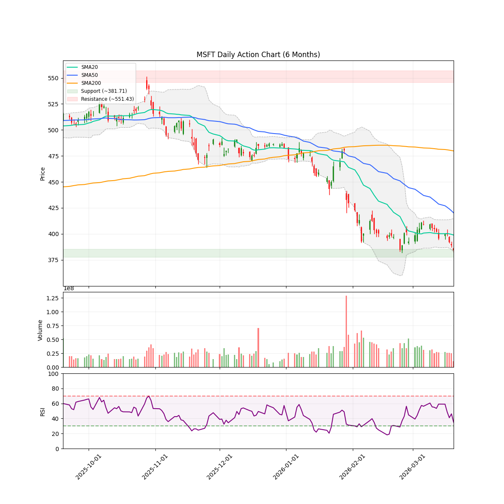
#### 研报分析

### 技术指标概览 (Technical Overview)
- **当前价格**: $384.12
- **RSI (14)**: 35.09
- **移动平均线**: SMA20: $398.88 | SMA50: $420.26 | SMA200: $479.80 (Bearish)
- **波动率**: ATR (14): 7.57 (预计周度波动: +/- $16.92)
- **关键位 (6m)**: 支撑位 $381.71 | 阻力位 $551.43
- **即时状态**: Below SMA50

# 微软 (MSFT) 情绪审计报告：巨头的“AI 阵痛期”，是黄金坑还是回声陷阱？

**日期：** 2026-03-20
**分析师：** 叙事经济学研究组 - 对冲基金研究员

---

### 1. 市场叙事：迷失在“电力账单”里的巨头

坐在交易室里，你几乎能闻到空气中弥漫的焦虑。曾经被视为 AI 浪潮“教父”的微软（MSFT），如今正经历一场残酷的“信仰回撤”。目前的股价（$384.12）像是一个在寒风中发抖的巨人，距离半年前的高点 $551.43 已经跌去了近 30%。

现在的叙事逻辑已经从“AI 改变世界”转向了“AI 到底什么时候能赚钱？”。市场不再为微软庞大的资本支出（CapEx）欢呼，反而开始担心这些投向数据中心和芯片的真金白银是否会拖累利润率。尽管 Morningstar 还在喊着“核心资产大减价”[Morningstar, 2026-03-19]，但 Melius Research 和 Stifel 的降级声明[Insider Monkey/Yahoo, 2026-03-06]就像两盆冰水，浇熄了多头的热情。

### 2. 催化剂分类 (Catalyst Categorization)

*   **A-Tier (顶级催化剂 - 缺失中):**
    *   目前缺乏能扭转乾坤的超预期财报。市场正处于真空期，等待 5 月份关于 AI 基础设施效率的实证。
*   **B-Tier (二线催化剂 - 潜在转机):**
    *   **AI 竞速：** 微软正加速追赶 Claude Cowork [Barchart, 2026-03-13]，5 月 1 日将是一个关键节点。如果能证明在协同工具上的领先地位，信心将回流。
    *   **估值修复：** 股价触及 6 个月低点 $381.71，Morningstar 认为其宽阔的护城河被严重低估 [2026-03-19]。
*   **C-Tier (噪音与情绪碎片):**
    *   **期权套利：** 市场上出现了针对微软的看跌期权价差策略 [Yahoo Finance, 2026-03-17]，显示短线投机者正在利用下跌趋势“抽血”。
    *   **内部对比：** 与苹果（AAPL）的价值对比讨论 [Blockonomi, 2026-03-17]，更多是存量资金的左右口袋挪移。

### 3. 背离检测 (Divergence Detection)

**信号：看跌衰竭的苗头？**
目前 MSFT 呈现典型的**“利好不涨”后的非理性杀跌**。RSI 指标已触及 35.09，逼近 30 的超卖红线。股价正徘徊在 6 个月支撑位 $381.71 附近。
*   **观察：** 尽管 Nvidia 的业绩依然“震撼人心” [24/7 Wall St., 2026-03-20]，但作为最大客户之一的微软却并未随之反弹。这说明市场正在进行**“估值逻辑重塑”**——投资者不再愿意为高昂的资本支出买单。
*   **结论：** 目前尚未看到明显的背离反弹信号，更多是随着 SMA20/50/200 的全线失守进行技术性回撤。

### 4. 逻辑评分 (Logic Score): 3.8 / 10

> **评价：** 短期内这更像是一个**“价值陷阱”**而非“趋势起点”。虽然长期逻辑（Wide Moat）依然成立，但技术形态上跌破所有均线且伴随投行降级，意味着机构正在调仓。在 5 月份的关键催化剂出现前，股价可能仍需在 $380 支撑位附近反复摩擦。

### 5. 核心洞察 (The Bottom Line)

目前的微软不是一个“坏公司”，而是一个“贵公司”在经历“杀估值”。市场现在的逻辑是：**“除非你证明 AI 能在下个季度直接体现在 EPS 上，否则我就把你当普通软件股看。”**

*   **支撑位警报：** $381.71。如果跌破此位，下方将面临真空区，情绪可能滑向“系统性恐慌”。
*   **操作策略：** 不要试图接下坠的飞刀。关注 RSI 是否进入 30 以下的极端恐慌区，并静待 5 月的叙事反转。

---

**下一关键日期：**
*   **2026-05-01**：微软与 Claude Cowork 竞争的关键产品节点/潜在 AI 基础设施更新。
*   **2026-04-23 (预估)**：Q3 财报发布日（具体日期待官方确认）。

**引用文献：**
1. *Morningstar: "Best Core Stock Bargain" (2026-03-19)*
2. *Barchart: "Racing to beat Claude Cowork" (2026-03-13)*
3. *Melius Research & Stifel Downgrade (2026-03-06)*
4. *Yahoo Finance: "Bear Call Spread Strategy" (2026-03-17)*
#### 近期新闻与事件
- **[Yahoo Finance]** [This Microsoft Stock Bear Call Spread Could Net 14% in 4 Weeks](https://finance.yahoo.com/news/microsoft-bear-call-spread-could-110002227.html)
- **[Morningstar]** [This Might Be the Best Core Stock Bargain in the Market Today](https://www.morningstar.com/stocks/this-might-be-best-core-stock-bargain-market-today)
- **[Insider Monkey]** [Is Microsoft Corporation (MSFT) A Good Stock To Buy Now?](https://www.msn.com/en-us/money/other/is-microsoft-corporation-msft-a-good-stock-to-buy-now/ar-AA1YGu3o)
- **[Barchart]** [Microsoft is racing to beat Claude Cowork. A big catalyst for MSFT stock is coming May 1.](https://www.msn.com/en-us/money/topstocks/microsoft-is-racing-to-beat-claude-cowork-a-big-catalyst-for-msft-stock-is-coming-may-1/ar-AA1YAzJ0)
- **[Blockonomi]** [Microsoft (MSFT) vs Apple (AAPL): Which Tech Stock Deserves Your Investment in 2025?](https://blockonomi.com/microsoft-msft-vs-apple-aapl-which-tech-stock-deserves-your-investment-in-2025/)

---

### NVDA
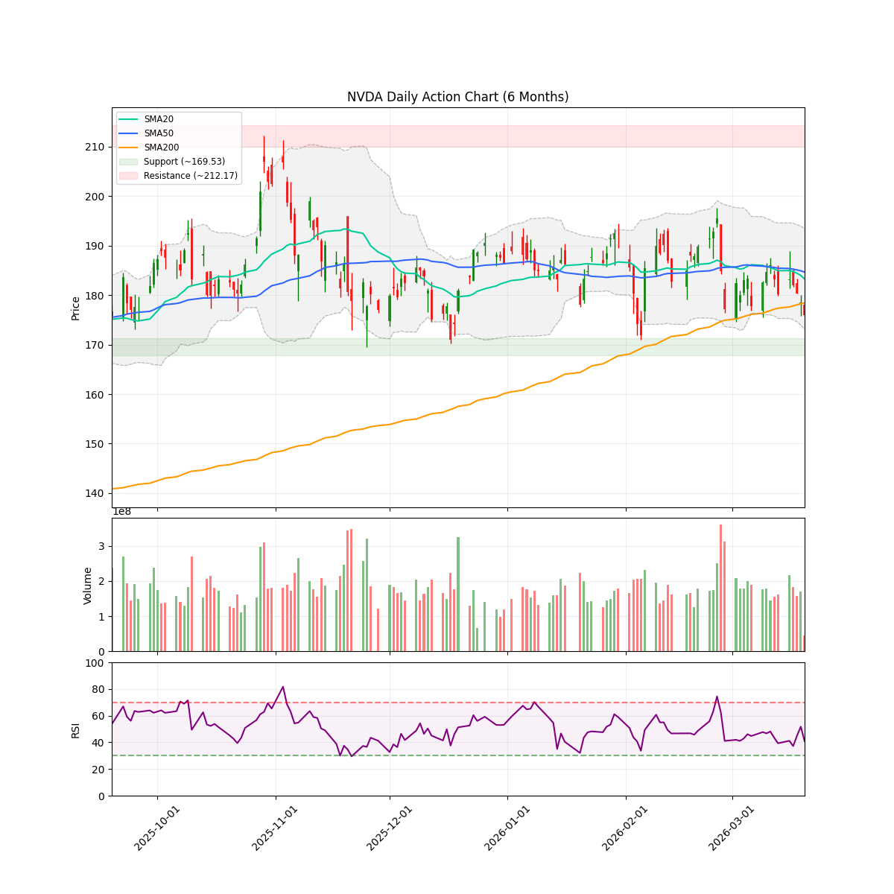
#### 研报分析

### 技术指标概览 (Technical Overview)
- **当前价格**: $176.04
- **RSI (14)**: 40.91
- **移动平均线**: SMA20: $183.28 | SMA50: $184.66 | SMA200: $178.43 (Bullish)
- **波动率**: ATR (14): 5.09 (预计周度波动: +/- $11.38)
- **关键位 (6m)**: 支撑位 $169.53 | 阻力位 $212.17
- **即时状态**: Below SMA50

# 叙事经济学视角：NVDA —— 众神之巅的“审美疲劳”还是深蹲起跳？

朋友，拉把椅子坐下，咱们来聊聊现在的市场风向标——英伟达（NVDA）。

现在的盘面给人的感觉就像是一场狂欢派对进入了凌晨三点：音乐还在响，灯光依然刺眼，但客人们已经开始悄悄看手表，盘算着是不是该离场了。虽然目前的股价（176.04）比起一年前简直是云泥之别，但技术面上的寒气已经逼近了骨髓。

以下是基于“叙事经济学”的深度情绪审计报告：

### 1. 催化剂分级：谁在造梦，谁在搅局？

*   **A-Tier（核心引擎）：主权AI与第四财季的高光时刻**
    *   **事件**：2026年2月28日的财报电话会议。CEO黄仁勋不仅交出了亮眼的答卷，更提出了“主权AI”（Sovereign AI）年增长超过200%的宏大叙事。这不再仅仅是卖给大厂显卡，而是卖给“国家”安全。
    *   **链接**：[The Motley Fool, 2026-02-28](https://www.fool.com/investing/2026/02/28/nvda-earnings-call-stock-q4-ceo-cfo/)
*   **B-Tier（边际助推）：中国市场的“回马枪”与自动驾驶**
    *   **事件**：针对中国的芯片赌注重新加码，以及与Uber在无人驾驶技术上的进展。这些本该是利好，但在目前的宏观环境下，更像是为了对冲增长放缓的补丁。
    *   **链接**：[24/7 Wall St., 2026-03-19](https://247wallst.com/investing/2026/03/18/nvidias-china-bet-is-back-on-will-this-finally-move-its-stock/) ; [The Motley Fool, 2026-03-03](https://www.msn.com/en-us/money/general/nvidia-delivers-fantastic-news-for-uber-stock-investors/ar-AA1Z0mDM)
*   **C-Tier（杂音）：华尔街的“画饼”狂欢**
    *   **事件**：分析师预测2027年股价翻倍。这种预测在牛市末端往往是作为“诱多”的背景音乐存在。
    *   **链接**：[Benzinga, 2026-02-27](https://www.msn.com/en-us/money/general/nvidia-could-be-a-double-bagger-by-2027-as-analyst-adds-nvda-to-best-ideas-list/ar-AA1YZzOQ)

### 2. 背离监测：好消息为何“买不动”了？

这里是我们作为研究员最需要警惕的地方：**利好出尽的疲态。**

你看，2月底的财报堪称完美，3月的研报也在疯狂唱多（提到NVDA比想象中更低估），甚至还有中国市场回归的加持。然而，NVDA的股价却像灌了铅一样，从212.17的高点一路滑落，目前竟然跌破了200日均线（SMA200: 178.43）。

在叙事经济学里，这叫**“共识过载”**。当所有人都在喊“低估”时，真正的聪明钱已经在担心SMCI那种“违规流向中国”的监管地雷会不会波及到老黄身上（3月14日的新闻）。股价在好消息中阴跌，说明市场在定价一种看不见的风险——可能是AI基建投入的边际效用递减，也可能是地缘政治的幽灵。

### 3. 情绪评分：6.5 / 10

*   **评分逻辑**：
    *   **基本面（9分）**：现金流和AI需求依然是硬通货。
    *   **叙事力（8分）**：从“显卡商”进化到“国家基建商”，故事讲得很圆。
    *   **价格行动（3分）**：RSI 40.91 且处于 SMA20/50/200 下方，典型的空头排列。
*   **结论**：这目前的走势是一个**“动能陷阱”**。基本面的坚固掩盖了技术面上的筹码松动。虽然我不认为它会系统性崩塌，但现在的NVDA更像是一个需要长期横盘来消化估值的“昂贵奢侈品”，而非短线暴利的提款机。

### 4. 市场脉动与老兵寄语

兄弟，现在的NVDA处于一个尴尬的“真空区”。下方169.53是近六个月的最后一道防线。如果守不住，那种“不可战胜”的神话叙事就会崩塌。目前的“中国豪赌”回归能否奏效？市场还在观望，还没人愿意第一个冲进去堵枪眼。

现在的策略是：**看戏，多过入戏。** 等它重新站回185美元上方，或者在170美元附近缩量企稳，那才是叙事重启的时候。

---

**下一关键节点 (Next Major Date):**
*   **2026年5月下旬**：预计 2027 财年第一季度财报发布日。届时我们将看到“主权AI”叙事是真金白银还是PPT幻觉。

**关键数据摘要：**
*   **支撑位**：169.53 (6个月低点)
*   **压力位**：184.66 (SMA50)
*   **警示信号**：跌破 SMA200 (178.43)，短期多头信心严重受挫。
#### 近期新闻与事件
- **[Yahoo Finance]** [Should You Buy the SoundHound Stock Dip as CFO Exits?](https://finance.yahoo.com/markets/stocks/articles/buy-soundhound-stock-dip-cfo-200646334.html)
- **[Stocktwits on MSN]** [SMCI stock cracks premarket on alleged Nvidia chip diversion to China; Super Micro, NVDA stress compliance](https://www.msn.com/en-us/money/markets/smci-stock-cracks-premarket-on-alleged-nvidia-chip-diversion-to-china-super-micro-nvda-stress-compliance/ar-AA1Z2Klk?ocid=BingNewsVerp)
- **[AOL]** [Prediction: Nvidia Stock Will Be Worth This Much in 2 Years](https://www.aol.com/finance/prediction-nvidia-stock-worth-much-090500527.html)
- **[The Motley Fool on MSN]** [Nvidia stock is even more undervalued than I previously thought](https://www.msn.com/en-us/money/general/nvidia-stock-is-even-more-undervalued-than-i-previously-thought/ar-AA1Z0gQ8?ocid=BingNewsVerp)
- **[The Motley Fool on MSN]** [Nvidia delivers fantastic news for Uber stock investors!](https://www.msn.com/en-us/money/general/nvidia-delivers-fantastic-news-for-uber-stock-investors/ar-AA1Z0mDM?ocid=BingNewsVerp)

---

### PLTR
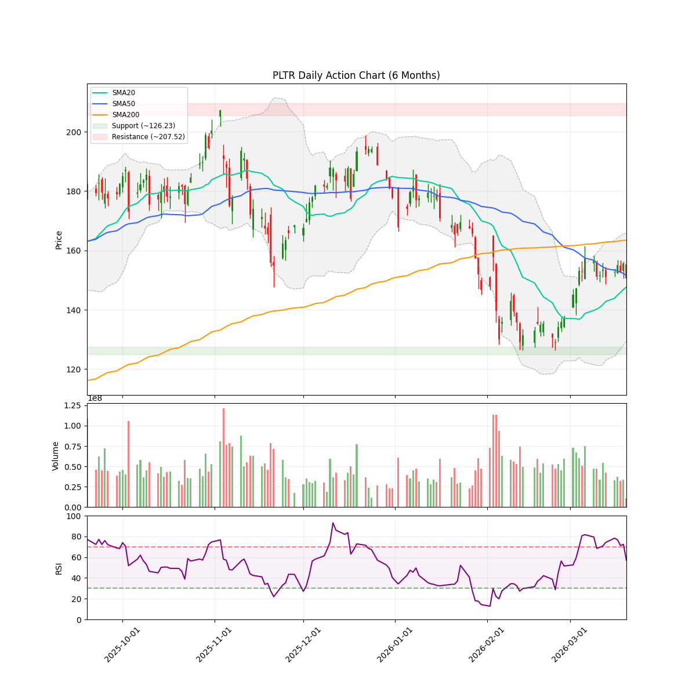
#### 研报分析

### 技术指标概览 (Technical Overview)
- **当前价格**: $150.64
- **RSI (14)**: 57.13
- **移动平均线**: SMA20: $147.63 | SMA50: $151.57 | SMA200: $163.43 (Bearish)
- **波动率**: ATR (14): 6.05 (预计周度波动: +/- $13.53)
- **关键位 (6m)**: 支撑位 $126.23 | 阻力位 $207.52
- **即时状态**: Below SMA50

# Palantir (PLTR) 情绪审计报告：叙事经济学视角下的“破晓前夜”

来，坐下，咱们边喝咖啡边聊聊 Palantir。

现在的 PLTR，给人的感觉就像是一个刚刚跑完马拉松、正在路边大口喘气的超级运动员。虽然他拿了奖牌（Q4 财报），但身体（股价）还没完全缓过劲来。作为对冲基金的研究员，我们不仅要看财务报表，更要看这股“气”——也就是市场叙事到底在吹向何方。

---

### 1. 催化剂分级 (Catalyst Categorization)

我们要把噪音和真正的信号分开。

*   **A-Tier（核心动力）：Q4 财报的“全速运转”**
    *   **详情**：根据 [Yahoo Finance](https://finance.yahoo.com/markets/stocks/articles/data-analytics-stocks-q4-earnings-110038565.html) 的报道，Palantir 的 Q4 表现堪称“火力全开”。这不只是数字好看，它证明了 AIP（人工智能平台）已经从 PPT 阶段进化到了真正的收割阶段。这是支撑股价的钢筋骨架。
*   **B-Tier（技术与衍生支撑）：期权看涨与技术面交叉**
    *   **详情**：期权市场最近动作频频，卖出价外看跌期权的策略非常流行 [Barchart](https://www.msn.com/en-us/money/markets/option-plays-in-palantir-stock-are-doing-well-as-pltr-rises/ar-AA1YPapC)。同时，[Schaeffer's](https://www.schaeffersresearch.com/content/analysis/2026/03/18/software-stock-could-bounce-after-bullish-crossover) 指出股价正处于一个历史性的看涨趋势线交叉点。这意味着“聪明钱”正在低位布局。
*   **C-Tier（市场噪音）：名人效应与地缘政治叙事**
    *   **详情**：Jim Cramer 的推荐 [Yahoo Finance](https://finance.yahoo.com/news/jim-cramer-recommended-holding-buying-221850945.html) 和木头姐（Cathie Wood）的减持 [Insider Monkey](https://www.msn.com/en-us/money/savingandinvesting/is-this-the-best-defense-stock-to-buy-on-the-dip-amid-ongoing-middle-east-conflict/ar-AA1YPR24) 基本属于情绪互搏，互相抵消。至于中东冲突对国防股的提振，对 PLTR 来说更像是一个长期的背景板，而非即时的兴奋剂。

---

### 2. 背离检测 (Divergence Detection)

**观察：** 这是一个非常有意思的现象。新闻标题几乎全是在喊“冲向 200 美元” [AOL](https://www.aol.com/articles/palantir-stock-going-200-002500181.html)，但看一眼 K 线，股价依然被压在 SMA50（151.57）和 SMA200（163.43）之下。

**分析：** 这是典型的**“牛市叙事与熊市惯性”的对决**。
股价跌破 SMA50 表明短期内市场还在消化之前的涨幅，或者说，大家在等一个更便宜的入场点。但请注意，RSI 在 57 左右，离超买还远得很，SMA20 (147.63) 已经开始向上勾头。这说明空头正在力竭，好消息终于开始让股价“止血”了。这不是陷阱，而是一个缓慢筑底的过程。

---

### 3. 叙事得分 (Logic Score): 7.2/10

*   **为何是 7.2？**
    基本面（叙事核心）是 9 分，但技术走势（市场反馈）只有 5 分。PLTR 现在缺的不是增长，而是一场能够突破 152 美元阻力位的“集体狂热”。目前它更像是一个“价值型成长期”的股票，而非纯粹的投机股。

---

### 4. 资深研究员的“咖啡时间”洞察

朋友，别被那些“不便宜”的评价吓跑了。[AOL](https://www.aol.com/articles/palantir-stock-isnt-cheap-might-083000072.html) 说得对，Palantir 从来都不便宜，但它是那种“你现在嫌贵，等它涨到 200 你又嫌买晚了”的典型。

目前的市场情绪正在从“怀疑”转向“重新校准”。财报的余温还在，期权市场的异动暗示着主力部队正在集结。虽然它还在 SMA50 下方挣扎，但这更像是一种**“蓄势待发的压制”**。只要一旦站稳 152 美元，那下个目标就是挑战 SMA200 的重压区。

**总结陈词：** 这不是陷阱，这是一个正在打地基的“多头堡垒”。

---

### 5. 关键信息汇总

*   **逻辑评分 (Logic Score)**: **7.2/10**
*   **核心叙事**: AIP 商业化落地 + 期权市场看涨押注。
*   **关键技术位**: 支撑 147.63 (SMA20)，阻力 151.57 (SMA50) / 163.43 (SMA200)。
*   **下一个重大日期**: **2026年5月初** (预计 Q1 2026 财报发布日)。

*免责声明：以上分析基于叙事经济学视角，仅供交流参考，市场有风险，入市需谨慎。*
#### 近期新闻与事件
- **[Yahoo Finance]** [Data Analytics Stocks Q4 Earnings: Palantir Technologies (NASDAQ:PLTR) Firing on All Cylinders](https://finance.yahoo.com/markets/stocks/articles/data-analytics-stocks-q4-earnings-110038565.html)
- **[Barchart]** [Option plays in Palantir stock are doing well as PLTR rises](https://www.msn.com/en-us/money/markets/option-plays-in-palantir-stock-are-doing-well-as-pltr-rises/ar-AA1YPapC)
- **[Yahoo Finance]** [Jim Cramer Recommended Holding & Buying Palantir (PLTR) In February 2025](https://finance.yahoo.com/news/jim-cramer-recommended-holding-buying-221850945.html)
- **[Schaeffer's Investment Research]** [Software Stock Could Bounce After Bullish Crossover](https://www.schaeffersresearch.com/content/analysis/2026/03/18/software-stock-could-bounce-after-bullish-crossover)
- **[Insider Monkey]** [Is This The Best Defense Stock to Buy On the Dip Amid Ongoing Middle East Conflict?](https://www.msn.com/en-us/money/savingandinvesting/is-this-the-best-defense-stock-to-buy-on-the-dip-amid-ongoing-middle-east-conflict/ar-AA1YPR24)

---

### TSM
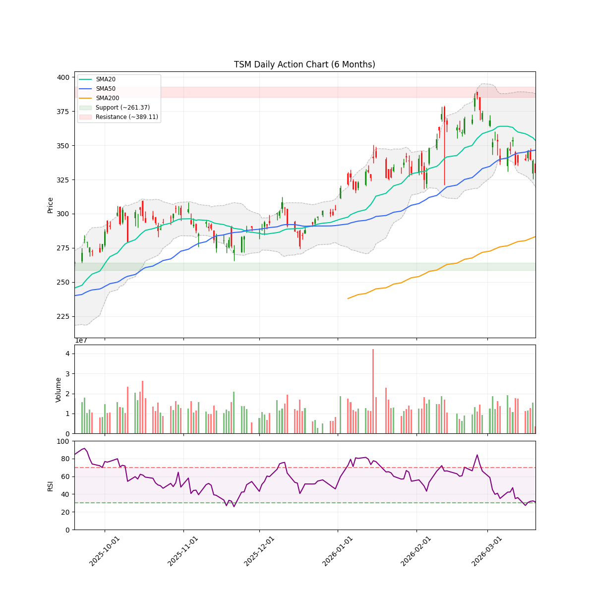
#### 研报分析

### 技术指标概览 (Technical Overview)
- **当前价格**: $329.78
- **RSI (14)**: 31.19
- **移动平均线**: SMA20: $353.55 | SMA50: $346.45 | SMA200: $283.18 (Bullish)
- **波动率**: ATR (14): 12.56 (预计周度波动: +/- $28.10)
- **关键位 (6m)**: 支撑位 $261.37 | 阻力位 $389.11
- **即时状态**: Below SMA50

# TSM 情绪审计报告：地缘政治的“氦气”迷雾 vs. 470美元的估值回声

**日期：** 2026年03月20日
**研究员：** 叙事经济学分析师
**标的：** 台积电 (TSM.US)

---

### 1. 叙事背景：当“硬核科技”撞上“中东火药桶”

现在的市场就像是一场在高空钢丝上进行的咖啡馆闲谈。一方面，大家都在描绘 AI 统治世界的蓝图；另一方面，现实世界的地缘政治却在往齿轮里扔沙子。

目前的 TSM 正陷入一个极具戏剧性的叙事怪圈：**一边是华尔街大行在高喊“买入”，一边是投资者盯着伊朗的战火担心工厂停产。** 今天的股价就像是掉进了冰窖（跌至 329.78 美元），但这种“冷意”背后，更多是情绪性的恐慌，而非基本面的崩塌。

---

### 2. 催化剂分级 (Catalyst Categorization)

*   **A-Tier（顶级核心）：机构的坚定背书与 AI 刚需**
    *   **详情：** 美银证券 (BofA) 刚刚（3月19日）重申了“买入”评级，目标价直指 **$470**。分析师 Haas Liu 的逻辑很硬：即便环境再乱，TSM 依然是半导体行业的“珠穆朗玛峰”。此外，英伟达 Blackwell 架构的强劲需求（Evercore 分析师观点）意味着订单根本接不完。
    *   **来源：** [Yahoo Finance](https://finance.yahoo.com/markets/stocks/articles/bank-america-securities-reiterates-buy-154420626.html) / [MarketWatch](https://www.marketwatch.com/livecoverage/nvidia-earnings-stock-results-q4-guidance-ai/card/why-an-evercore-analyst-is-so-bullish-on-nvidia-s-stock-ahead-of-earnings-nEj7XRZ8FsfE96TuOXRx)

*   **B-Tier（重要风险）：氦气供应危机叙事**
    *   **详情：** 今天的头条新闻是“伊朗袭击影响氦气供应”。氦气是芯片生产的关键耗材，由于中东局势紧张，氦气价格飙升，这直接导致了 TSM 今天的走软。
    *   **评价：** 这是典型的“外部扰动”，虽然短期压制股价，但通常不会改变长期制程领先地位。
    *   **来源：** [Yahoo Finance](https://finance.yahoo.com/markets/stocks/articles/tsmc-stock-tsm-wilts-iranian-123611179.html)

*   **C-Tier（噪音）：哈佛持仓与板块联动**
    *   **详情：** 哈佛大学将 TSM 列入 AI 持仓列表，以及 ASML 随板块回调被视为“诱人陷阱”。这些更多是心理层面的心理支撑点。

---

### 3. 背离检测：恐惧是否过度？

**技术面反馈：**
*   **RSI 指标：31.19。** 听着，朋友，RSI 跌破 30 就是传统的“超卖区”。现在 31.19 的 TSM 就像是一个被压紧的弹簧。
*   **价格行为：** 股价目前处于 SMA50 ($346.45) 之下，且远低于 BofA 给出的 470 美元目标价。
*   **诊断：** 我们看到了明显的**情绪性背离**。好消息（美银看好、需求爆炸）被中东的新闻完全盖过了。当优质股因为“由于战争导致的某种稀有气体短缺预想”而暴跌时，通常是看跌动能即将衰竭的信号。

---

### 4. 情绪评分 (Sentiment Score): 6.5/10

**分析逻辑：**
*   **短期（恐慌期）：** 4/10。地缘政治是不确定性的最大来源，散户和对冲基金都在避险。
*   **中长期（逻辑期）：** 9/10。如果你相信 AI 浪潮，TSM 就是唯一的“收费站”。
*   **综合评分：** **6.5**。市场正在进行残酷的洗盘，剔除那些意志不坚定的浮动筹码。这是一个由“供应危机叙事”驱动的短暂修正，而非“系统性衰败”。

---

### 5. 核心洞察：是陷阱还是机会？

这不是“价值陷阱”，而是“情绪溢出”。
虽然股价在萎缩（Wilting），但台积电的护城河没有裂缝。现在的 329 美元相比于 470 美元的目标价，有着巨大的安全边际。目前 ATR 显示波动性在 12.56 左右，意味着下周可能会在 300-350 之间剧烈震荡。

**给投资者的建议：** 盯着那些害怕氦气短缺而离场的人，他们通常会在下一次财报亮眼时，以更高的价格追回来。

---

### 6. 关键日程 (Next Major Date)

*   **下一次重大日期：2026年4月中旬（预计 2026-04-16）**
*   **事件：** 2026年第一季度财报电话会议。
*   **关注点：** 管理层对“氦气成本增加”以及“Blackwell 订单交付进度”的官方回应。这将是决定 TSM 是否能重回 400 美元的关键。

---

*“市场有时候会为了几瓶氦气而丢掉整座金山，我们要做的就是守住那座山。”*
#### 近期新闻与事件
- **[Yahoo Finance]** [TSMC Stock (TSM) Wilts as Iranian Attacks Batter Helium Supply and Threaten Chip Production](https://finance.yahoo.com/markets/stocks/articles/tsmc-stock-tsm-wilts-iranian-123611179.html)
- **[Yahoo Finance]** [Bank of America Securities Reiterates a Buy Rating on Taiwan Semiconductor Manufacturing Company (TSM) Stock](https://finance.yahoo.com/markets/stocks/articles/bank-america-securities-reiterates-buy-154420626.html)
- **[Barron's on MSN]** [This 'very attractive' chip stock has taken a hit. The case for buying now.](https://www.msn.com/en-us/money/top-stocks/this-very-attractive-chip-stock-has-taken-a-hit-the-case-for-buying-now/ar-AA1Z2Ool?ocid=BingNewsVerp)
- **[Insider Monkey on MSN]** [Harvard University stocks list: Top 9 AI picks](https://www.msn.com/en-us/money/other/harvard-university-stocks-list-top-9-ai-picks/ar-AA1Z0uda?ocid=BingNewsVerp)
- **[YouTube]** [TSM stock rallies on big October sales & Nvidia demand](https://www.msn.com/en-us/money/top-stocks/tsm-stock-rallies-on-big-october-sales-nvidia-demand/vi-AA1YPPeW)

---

### VRT
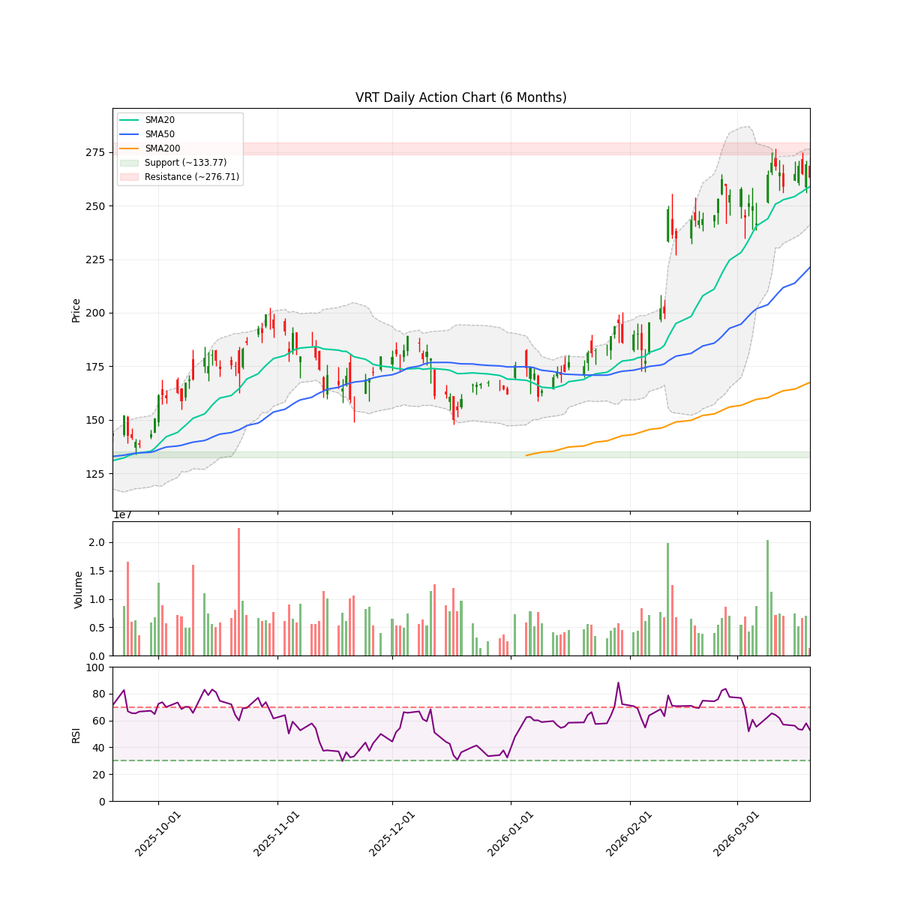
#### 研报分析

### 技术指标概览 (Technical Overview)
- **当前价格**: $263.00
- **RSI (14)**: 52.86
- **移动平均线**: SMA20: $258.79 | SMA50: $221.17 | SMA200: $167.48 (Bullish)
- **波动率**: ATR (14): 14.16 (预计周度波动: +/- $31.66)
- **关键位 (6m)**: 支撑位 $133.77 | 阻力位 $276.71
- **即时状态**: Above SMA50

# 维谛技术 (VRT) 情绪审计报告：算力淘金热里的“卖铲人”还能狂奔多久？

**报告日期：** 2026年03月20日
**研究员：** 叙事经济学高级分析师
**标的资产：** Vertiv Holdings Co (VRT) | **当前价格：** $263.00

---

### 1. 催化剂分类：谁在拨动市场的琴弦？

我们将当前的驱动因素拆解为三个层级，看看哪些是真金白银，哪些只是过眼烟云：

*   **A-Tier（核心动力）：AI 基础设施的刚需溢价**
    *   **业绩印证：** 尽管 3 月初出现了所谓的“利好出尽”式调整，但 VRT 在 Q4 财报中表现出的盈利能力（Earnings Beat）是实打实的。分析师将目标价上调至 $290，反映了华尔街对其在数据中心冷却和电源管理领域统治力的认可。
    *   **行业位阶：** 作为 NVIDIA、博通等巨头的背后支撑，VRT 已从“普通电气设备商”成功转型为“AI 纯度极高”的基础设施股。
*   **B-Tier（情绪助推）：叙事大师的“点金术”**
    *   **Cramer 效应：** Jim Cramer 多次在 CNBC 和 X 平台上公开喊话“坚持持有 Vertiv”，甚至称其被低估。这种散户级的“宗教式叙事”为股价提供了极强的流动性和底部支撑。
    *   **板块联动：** 在 2026 年 3 月的 AI 选股名单中，VRT 依然稳居前列，这种“机构抱团”的共识是目前最大的安全垫。
*   **C-Tier（短期扰动）：噪音与获利了结**
    *   **内幕抛售：** 价值 1.04 亿美元的内幕减持在 3 月初引起了不小的波动。虽然金额吓人，但在百亿级别的增长叙事面前，这更像是高管们在改善生活，而非对未来的背叛。
    *   **Zacks 排名：** 虽被评为强力动量股，但这更多是基于历史数据的后视镜分析。

### 2. 背离检测：好消息里的“小情绪”

**观察：** 2026 年 3 月 7 日，VRT 在发布超预期财报并获得分析师提价后，股价反而放量下跌了 3.1%。

**分析：** 这是典型的**“利好出尽” (Sell the News)**。当时的 RSI 恐怕处于高位，市场需要一个借口来消化获利盘。然而，看目前的 SMA20 ($258.79) 支撑极强，股价已经从跌势中企稳回升。这种“跌不动”的利好背离，说明空头动能已经衰竭，筹码正从恐慌者手中流向坚定的机构持有者。

### 3. 叙事经济学诊断：冷热交替的艺术

现在的 VRT 就像是盛夏里最抢手的冰块。大家都盯着 NVIDIA 的芯片快不快，却忘了如果散热跟不上，那些昂贵的硅片不过是发烫的废铁。

**市场脉搏：** 现在的价格处于历史高位震荡区，SMA200 还在远处的 $167，意味着长线趋势强得令人发指。目前的整理更像是在 276 美元的阻力位前进行的一次“深呼吸”。Cramer 的加持虽然带点“玄学”，但也确实反映了该股在散户心智中的占位。现在的叙事逻辑已经从“它能卖多少设备”转向了“AI 数据中心还有多大的建设缺口”。

---

### 4. 情绪评分 (Sentiment Score)

# **8.5 / 10**
**【评价：结构性牛市，非典型过热】**
虽然短期有内幕减持和“Cramer 魔咒”的噪音，但 VRT 站在了 AI 算力扩容的物理终点。只要数据中心还需要呼吸（冷却），VRT 的叙述就不会断裂。

---

### 5. 关键参考与未来展望

*   **证据引用：**
    *   关于财报后的放量下跌与 $290 目标价上调：[Blockonomi, 2026-03-07]
    *   关于 Jim Cramer 的持续背书：[Benzinga/MSN, 2026-03-16]
    *   关于 3 月份 AI 选股推荐：[Analytics Insight, 2026-03-20]
*   **支撑/压力位：** 
    *   支撑：$258 (SMA20) / $250 (整数心理关口)
    *   压力：$276 (半年高点)
*   **下一个重大日期：** 
    *   **2026 年 4 月下旬（预估）：** 2026 年第一季度财报发布日。这将是验证 AI 基础设施需求是否进入“下半场”的关键节点。

**分析师结语：** 别被那 1 亿美元的减持吓到，那只是派对上的小插曲。只要 VRT 还在 SMA50 ($221) 之上优雅起舞，这个关于“算力空调”的财富故事就还没到写结尾的时候。喝杯咖啡，静待它挑战 276 美元的高地。
#### 近期新闻与事件
- **[Analytics Insight]** [Best AI Stocks to Buy in March 2026 for High Growth](https://www.analyticsinsight.net/stocks/best-ai-stocks-to-buy-in-march-2026-for-high-growth)
- **[Insider Monkey]** [Vertiv (VRT) Up In Triple Digit Percentages After Jim Cramer Said "Stick to Vertiv or Get Out" In May 2025](https://www.msn.com/en-us/money/topstocks/vertiv-vrt-up-in-triple-digit-percentages-after-jim-cramer-said-stick-to-vertiv-or-get-out-in-may-2025/ar-AA1YZQZf)
- **[Zacks.com]** [Vertiv Holdings Co. (VRT) Outperforms Broader Market: What You Need to Know](https://www.msn.com/en-us/money/topstocks/vertiv-holdings-co-vrt-outperforms-broader-market-what-you-need-to-know/ar-AA1YLSVw)
- **[Benzinga]** [The 'Cramer curse'? Here's what's happening with Vertiv stock today](https://www.msn.com/en-us/money/news/the-cramer-curse-here-s-what-s-happening-with-vertiv-stock-today/ar-AA1YL0Qu)
- **[Zacks Investment Research]** [Why is Vertiv (VRT) up 12.2% since last earnings report?](https://www.msn.com/en-us/money/general/why-is-vertiv-vrt-up-12-2-since-last-earnings-report/ar-AA1Yznrl)

---

### VST
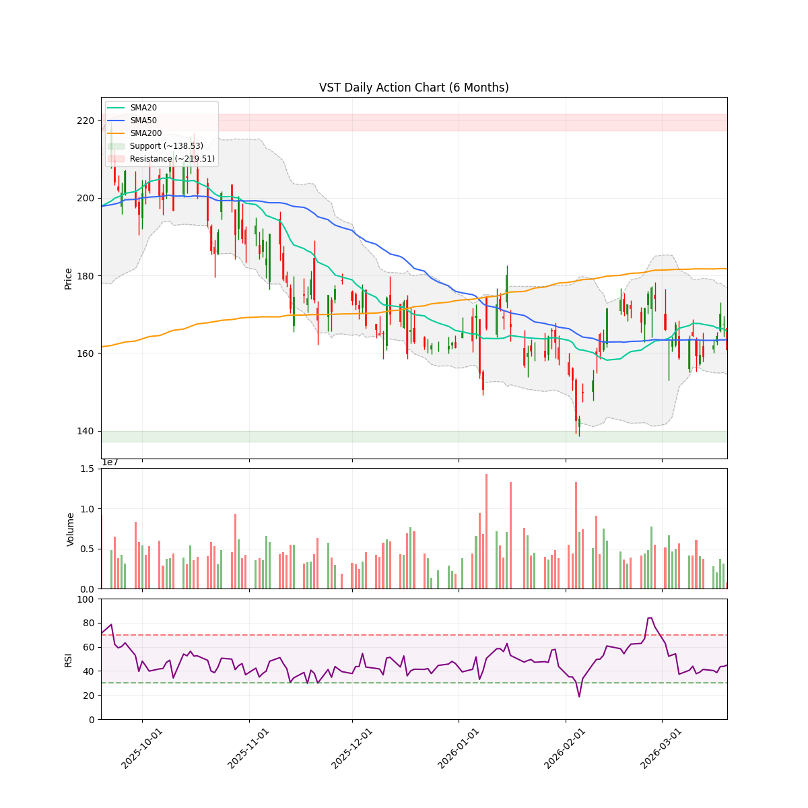
#### 研报分析

### 技术指标概览 (Technical Overview)
- **当前价格**: $160.74
- **RSI (14)**: 44.89
- **移动平均线**: SMA20: $165.64 | SMA50: $163.49 | SMA200: $181.68 (Bearish)
- **波动率**: ATR (14): 7.19 (预计周度波动: +/- $16.08)
- **关键位 (6m)**: 支撑位 $138.53 | 阻力位 $219.51
- **即时状态**: Below SMA50

# 情绪审计报告：Vistra Corp (VST) —— 披着“熊皮”的 AI 能源巨人？

**审计日期：** 2026年03月20日
**研究员：** 叙事经济学分析师
**标的：** Vistra Corp (VST)

---

### 1. 核心叙事：当“基本面战神”遇上“冰冷的盘面”

把杯里的咖啡放一放，咱们来聊聊 VST。如果你只看新闻头条，你会觉得 VST 简直是市场上的“天选之子”：**Fitch 刚刚给了双重投资级上调**，**摩根士丹利还在高喊看多**，而且背后还有 **AI 数据中心对电力近乎疯狂的需求** 撑腰。

但如果你看一眼屏幕上的 K 线，冷水就会泼在你脸上。股价 160.74 美元，不仅跌破了 SMA50（163.49），甚至还被 SMA200（181.68）远远甩在身后。这就是我们常说的“**叙事背离**”。市场正在讲述一个繁荣的故事，但资金却在悄悄离场。

---

### 2. 催化剂分级 (Catalyst Categorization)

*   **A-Tier（核心驱动）：评级上调与 AI 结构性红利**
    *   **理由：** [Simply Wall St.](https://finance.yahoo.com/news/vistra-vst-valuation-check-dual-210755319.html) 报道了惠誉（Fitch）对 VST 长期发行人违约评级的上调。这不仅是名誉，更是实打实的融资成本下降。叠加 AI 电力需求，这是支撑 VST 中长期价值的底座。
*   **B-Tier（市场热度）：机构喊话与关注度激增**
    *   **理由：** [Morgan Stanley](https://finance.yahoo.com/news/morgan-stanley-bullish-vistra-corp-150605579.html) 的持续看好以及 Zacks 频繁的“关注度榜单” [Zacks](https://finance.yahoo.com/news/vistra-corp-vst-attracting-investor-130006213.html) 确保了这只股在散户和机构的雷达上。
*   **C-Tier（噪音与微调）：目标价的小幅回撤**
    *   **理由：** [Wells Fargo](https://www.insidermonkey.com/blog/vistra-vst-price-target-trimmed-despite-strong-earnings-performance-1706799/) 将目标价从 236 微调至 234。虽然是下调，但在 160 的现价面前，这更像是“凡尔赛”式的调整，影响有限。

---

### 3. 背离检测：利好钝化还是蓄势待发？

**现象：** VST 正在经历典型的“利好出尽”或“情绪衰竭”。
尽管 3 月 16 日和 17 日股价曾试图跑赢大盘（+1.91%）[Yahoo Finance](https://finance.yahoo.com/news/why-vistra-corp-vst-outpaced-214504504.html)，但整体趋势依然处于熊市区间（Below SMA50）。

**深度解析：**
这是一种典型的“**估值修正陷阱**”。尽管 2 月 26 日的财报表现强劲 [Benzinga](https://www.benzinga.com/insights/earnings/26/02/50848393/preview-vistras-earnings)，但市场似乎在担心 AI 变现的速度跟不上电力基建的投入。RSI 处于 44.89，还没有进入“绝望超卖区”，这意味着那些在高位追逐“AI 能源叙事”的资金还在痛苦地割肉，压制了股价回升。

---

### 4. 逻辑评分 (Logic Score): 6.8/10

*   **评分理由：** 
    *   **(+):** 强劲的基本面（投资级评级、AI 刚需、零债务防御叙事）。
    *   **(-):** 极差的技术面。跌破所有主要均线，且 ATR (7.19) 显示波动仍在放大。
    *   **结论：** 这是一个**“优质陷阱”**。如果你现在冲进去，你是在和趋势作对；如果你在场外观察，这是一个等待“空头力竭”的绝佳标的。

---

### 5. 投资建议 ( Narrative Insight )

VST 现在就像是一部动力强劲但刹车片着火的跑车。
**千万不要去接下落的飞刀。** 既然 160 元的关口没能守住 SMA50，下一个关键防线就是 6 个月的低点 **138.53**。

**当前策略：** 听着，老伙计，别被那些“AI 改变世界”的研报冲昏头脑。现在的 VST 需要的是一次彻底的洗盘。当所有人都忘记它是个“AI 股”，开始抱怨它只是个无聊的电力股时，才是真正的买入点。

---

### 6. 关键日程提醒

*   **下一个重大日期：** **2026年5月下旬** (预计为 2026 Q1 财报发布日)。
*   **关注重点：** 观察自由现金流是否如预期般受 AI 合同驱动增长，以及是否有新的回购计划来对冲目前的卖压。

---
*风险提示：叙事虽好，逻辑先行。市场永远是对的，如果你觉得市场错了，通常是你的止损位设错了。*
#### 近期新闻与事件
- **[The Financial Express]** [Radhakishan Damani’s ‘defensive fortress’: The zero-debt stock with a 4.5% yield](https://www.financialexpress.com/market/stock-insights/radhakishan-damanis-defensive-fortress-the-zero-debt-stock-with-a-4-5-yield/4178240/)
- **[Zacks· via Yahoo Finance]** [Why Vistra Corp. (VST) Outpaced the Stock Market Today](https://finance.yahoo.com/news/why-vistra-corp-vst-outpaced-214504504.html)
- **[Insider Monkey· via Yahoo Finance]** [Morgan Stanley is Bullish on Vistra Corp (VST) Here’s Why](https://finance.yahoo.com/news/morgan-stanley-bullish-vistra-corp-150605579.html)
- **[Zacks· via Yahoo Finance]** [Vistra Corp. (VST) is Attracting Investor Attention: Here is What You Should Know](https://finance.yahoo.com/news/vistra-corp-vst-attracting-investor-130006213.html)
- **[Simply Wall St.· via Yahoo Finance]** [Vistra (VST) Valuation Check After Dual Investment Grade Upgrades And Rising AI Power Demand](https://finance.yahoo.com/news/vistra-vst-valuation-check-dual-210755319.html)

---

### XOM
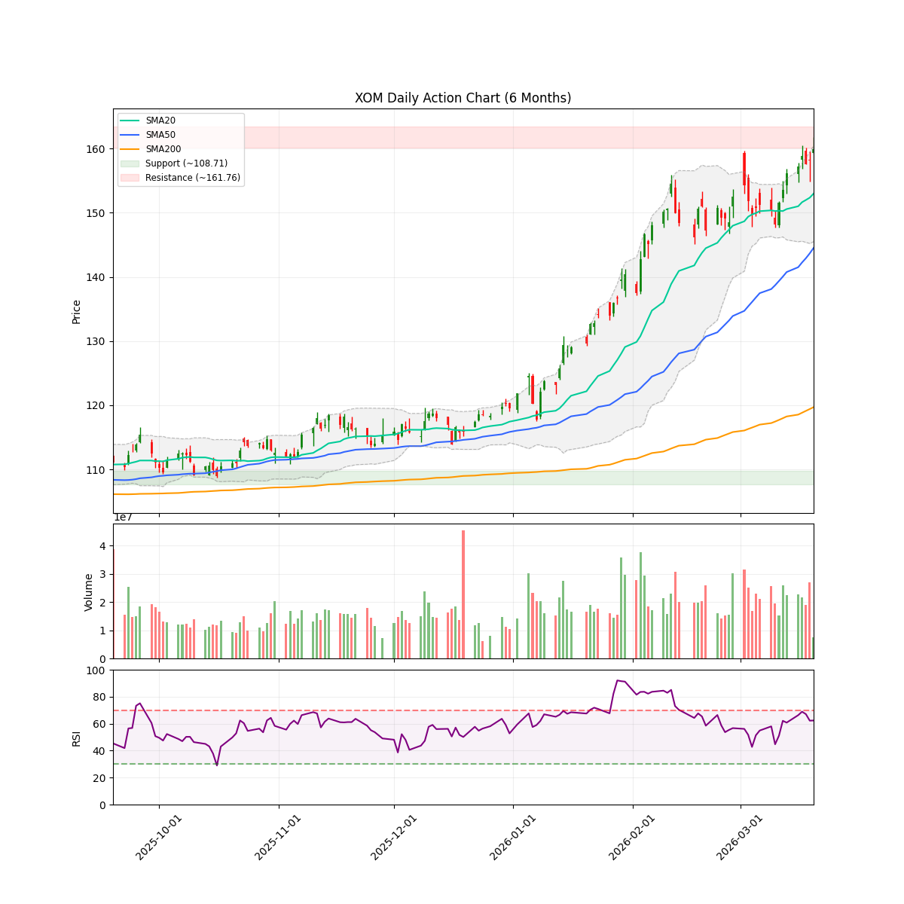
#### 研报分析

### 技术指标概览 (Technical Overview)
- **当前价格**: $159.96
- **RSI (14)**: 62.40
- **移动平均线**: SMA20: $152.98 | SMA50: $144.51 | SMA200: $119.70 (Bullish)
- **波动率**: ATR (14): 3.76 (预计周度波动: +/- $8.42)
- **关键位 (6m)**: 支撑位 $108.71 | 阻力位 $161.76
- **即时状态**: Above SMA50

# 埃克森美孚 (XOM) 情绪审计报告：地缘硝烟下的“能源堡垒”

**日期：** 2026年3月20日
**研究员：** 叙事经济学分析组

---

### 1. 市场叙事分析：当恐惧成为燃料

现在的市场闻起来满是火药味和原油的芬芳。如果你坐在我的位子上，看着 Brent 原油冲破 119 美元，你会意识到这不仅仅是价格波动，这是一场**“能源霸权的重新定价”**。

埃克森美孚（XOM）目前正处于一个近乎完美的风暴中心。伊朗对卡塔尔液化天然气（LNG）设施的袭击不仅是地缘政治的悲剧，更是对全球能源供应链的“断头台”。卡塔尔 17% 的产能可能在未来五年内消失，这意味着原本就紧平衡的市场现在出现了一个巨大的、难以填补的黑洞。

对于 XOM 来说，这不再仅仅关于它采了多少桶油，而在于它作为“安全避风港”的叙事地位。当硅谷的科技巨头们在盈利增长上陷入瓶颈时，这些老牌的“现金奶牛”正迈着沉稳的步伐，拿着分红支票重新夺回投资者的宠爱。

---

### 2. 催化剂分类 (Catalyst Categorization)

*   **A-Tier（顶级核弹级）：中东能源供应的结构性破坏**
    *   卡塔尔 LNG 产能损失 17% 且可能持续 5 年，叠加霍尔木兹海峡的封锁威胁。这不仅拉高了现货价格，更重塑了长期的溢价逻辑。
    *   布伦特原油突破 $119，这直接让 XOM 的利润空间进入了“印钞模式”。
*   **B-Tier（重要基本面）：红利股的价值回归**
    *   随着科技股增长放缓，市场资金正涌向高股息、高现金流的传统价值标的。XOM 与科技股在盈利增长指标上的“交汇”，诱发了机构的调仓动作。
*   **C-Tier（市场杂音）：估值对比与小幅买入**
    *   关于 XOM 与 Sasol (SSL) 的估值对比，虽然吸引了一部分价值猎人，但在宏观战争叙事面前，这种比较显得微不足道。

---

### 3. 背离检测 (Divergence Detection)

**现状：** 股价报收 159.96，距离 6 个月高点 161.76 仅一步之遥。
**诊断：** **未发现看跌背离。** 
通常情况下，如果这种利好消息（原油暴涨）传出而股价滞涨，我们会担心“利好出尽”。但目前 XOM 的 SMA20 (152.98) 远高于长线均线，且 RSI 保持在 62.40 的健康区间，并未进入盲目贪婪的超买区（>70）。这说明资金入场是有节制的、机构化的，而非散户的疯狂踩踏。

---

### 4. 情绪评分 (Sentiment Score)

#### **8.8 / 10 —— “不可阻挡的堡垒叙事”**

*   **逻辑支撑：** 供应短缺是实打实的，而非心理层面的。只要霍尔木兹海峡的局势不缓解，XOM 的溢价就具有极强的支撑。它现在不仅是能源股，它是投资者的“避险资产”。

---

### 5. 核心逻辑得分 (Logic Score)

#### **9.2 / 10**
基于物理供应短缺（卡塔尔 17% 产能）和价格锚点（$119 原油）的分析具有极高的确定性。唯一的下行风险是全球经济因油价过高而陷入深度衰退（需求毁灭），但短期内，叙事的力量远超对衰退的担忧。

---

### 6. 关键数据与下一里程碑

*   **当前价格：** 159.96
*   **短期阻力位：** 161.76 (若突破此位，将进入真空无阻力区)
*   **关键支撑位：** 152.98 (SMA20)
*   **引用新闻：** 
    1.  *QatarEnergy CEO 关于产能减损 17% 的声明* [Link](https://www.news18.com/world/qatarenergy-ceo-says-iranian-attacks-wiped-out-17-of-lng-capacity-for-5-years-ws-l-9987104.html)
    2.  *Brent 原油突破 $119 与伊朗局势升级* [Link](https://www.msn.com/en-us/money/top-stocks/brent-crude-oil-briefly-topped-119-as-iran-ramps-up-attacks-on-gas-and-oil-facilities-in-the-persian-gulf-here-are-2-things-for-investors-to-know/ar-AA1Z0jSH?ocid=BingNewsVerp)

**下个关键日期：**
*   **2026年4月24日 (预计)：** 2026年第一季度财报发布日。
    *   *注：届时市场将密切关注高油价对现金流的具体贡献，以及公司是否会因为局势动荡而上调全年的回购计划。*

---

**老兵寄语：** 
别在坦克还在开动的时候去挡路。XOM 现在的走势不是在画图，它是在反映地缘政治的板块漂移。只要中东的烟雾不散，这头大象就能继续跳舞。注意 161.76 这个关口，一旦站稳，天空才是极限。
#### 近期新闻与事件
- **[News18]** [QatarEnergy CEO Says Iranian Attacks Wiped Out 17% Of LNG Capacity For 5 Years](https://www.news18.com/world/qatarenergy-ceo-says-iranian-attacks-wiped-out-17-of-lng-capacity-for-5-years-ws-l-9987104.html)
- **[The Motley Fool on MSN]** [Brent crude oil briefly topped $119 as Iran ramps up attacks on gas and oil facilities in the Persian Gulf. Here are 2 things for investors to know.](https://www.msn.com/en-us/money/top-stocks/brent-crude-oil-briefly-topped-119-as-iran-ramps-up-attacks-on-gas-and-oil-facilities-in-the-persian-gulf-here-are-2-things-for-investors-to-know/ar-AA1Z0jSH?ocid=BingNewsVerp)
- **[Yahoo Finance UK]** [A Look At Exxon Mobil (XOM) Valuation As Iran Conflict Lifts Crude Prices And Investor Optimism](https://uk.finance.yahoo.com/news/look-exxon-mobil-xom-valuation-221001250.html)
- **[Nasdaq]** [SSL or XOM: Which Is the Better Value Stock Right Now?](https://www.nasdaq.com/articles/ssl-or-xom-which-better-value-stock-right-now-0)
- **[CNBC on MSN]** [Dividend stocks are catching up to tech stocks on a key earnings metric at a critical time for the market](https://www.msn.com/en-us/money/markets/dividend-stocks-are-catching-up-to-tech-stocks-on-a-key-earnings-metric-at-a-critical-time-for-the-market/ar-AA1YzMDT?ocid=BingNewsVerp)

---
