# 每日股市市场报告 (2026-03-21)

> **免责声明**: 本报告由 **代码与 Gemini AI 自动生成**，仅供研究参考，**不构成**任何投资建议。投资有风险，入市需谨慎。作者及 AI 不对任何基于此内容的投资决策承担责任。

## 📑 目录
[TOC]

##  长期投资逻辑
本组合旨在捕捉 **人工智能（AI）与半导体协议** 带来的跨周期结构性增长，核心投资策略聚焦于“确定性”与“物理瓶颈”：
- **底层制程垄断 (Foundry & WFE Moats)**：
  布局处于全球半导体精密制造顶端的“工业母机”级别公司。寻找具备极高准入门槛的晶圆代工及前道设备供应商，作为全产业链最稳固的底座资产。
- **算力稀缺性与连接带宽 (Compute & Interconnect Scarcity)**：
  聚焦在高性能计算芯（HPC）及高带宽连接领域占据主导地位的标的。AI 的终极竞争是“规模”，寻找能有效解决数据交换瓶颈并提供核心推理/训练能力的算力巨头。
- **应用生态与数据霸权 (Platform & Data Sovereignty)**：
  布局拥有闭环生态、海量高质量私有数据及云基础设施的科技巨头。它们是 AI 商业化落地的最终守门人，拥有将技术转化为持续现金流的分配权。
- **物理边界保障 (Power & Thermal Infrastructure)**：
  关注 AI 扩张的“最终瓶颈”——电力供应与热能管理。重点布局为下一代超大规模数据中心提供高功率密度能源、液冷技术及电网扩容方案的能源基建商。
**风控策略**：利用 AlphaJAX 的量化动量评分（Quant Score）作为过滤器，结合 LLM 叙事审计（Narrative Audit）捕捉“业绩超预期 + 叙事逻辑改善”的共振点，实现跨周期的超额收益。

 **注：排序权重**：Ticker 按照 AI 检测出的 **方向** 排序（**看多**优先，其次是 **中性**，最后是 **看空**）。
---

<!-- DISCORD_SUMMARY_START -->
## 🧠 对冲基金经理全局诊断与资金分配策略
# 首席投资官执行报告 (Portfolio Strategy Memo)

**致：** 投资执行团队
**日期：** 2026年03月21日
**主题：** 攻守易势——在半导体阵痛中重构AI基础设施版图

---

### 一、 指挥官意图 (Commander's Intent)

当前的投资组合正处于一个**“结构性失衡”**的危险边缘。
由于 **AMD** 的持仓占比已飙升至 **50.56%**，虽然符合我们对顶级 AI 基础设施的极限配置标准，但技术面已跌破 SMA50，且伴随裸卖 Put 的额外杠杆，组合的整体 Beta 风险过高。

**核心战略：** 停止对现有亏损仓位（AMD）的任何补仓行为。利用现有 **$64,353** 的充足现金流，向**逻辑评分 8.5** 的高确定性品种（**AMAT**）和高成长的散热龙头（**VRT**）进行进攻性平铺，以对冲目前 AMD 和 AMZN 的平庸表现。

---

### 二、 账户全盘诊断

1.  **集中度警告：** 
    *   **AMD (50.56%):** 已触及内部风险控制的红线。虽然其 MI300 叙事依然扎实，但目前处于均线之下的“洗盘期”。严禁继续投入现金。
    *   **GOOGL (20.99%):** 表现稳健，16% 的利润垫是组合的压舱石，维持现状。
2.  **现金流状态：** 
    *   拥有约 **$6.4万** 的待部署资金，这在当前板块轮动、利好不涨的“叙事疲劳期”是极大的战略优势。
3.  **持仓逻辑评分：**
    *   **AMD (6.5)**: 黎明前的阵痛，Hold。
    *   **AMZN (5.8)**: 弱于大盘，随时准备执行“汰弱留强”。
    *   **GOOGL (6.8)**: 核心资产，Hold。

---

### 三、 确定性动作与交易计划 (Actionable Trading Plan)

#### 1. 现有持仓精简与止损
*   **AMD (持有):** 
    *   **正股：** 不加仓，止损位坚决锁定在 **$192.97 (SMA200)**。若跌破，说明中期叙事崩塌，必须减仓至 30% 以下。
    *   **期权 (-AMD260313P200):** 这是一个烫手山芋。由于股价就在 $200 边缘，且你已亏损 58%。**如果下周股价回升至 $210，先行平仓出局**，腾出保证金空间，拒绝被动接货。
*   **AMZN (减持观察):** 
    *   成本 $201。如果股价收盘跌破 **$196**，立即清仓。将资金释放到更高评分的品种中，不要在“资本开支恐惧症”中浪费时间。

#### 2. 新开仓机会（动用现金）
*   **首选建仓：应用材料 (AMAT) —— 逻辑评分 8.5**
    *   **买入理由：** 与海力士、美光深度绑定 HBM 叙事，基本面无懈可击，且 RSI 已冷却至 44，属于“高质低价”的完美契合点。
    *   **执行：** 现价分批买入 **$20,000** (约 56 股)。
*   **次选建仓：Vertiv (VRT) —— 逻辑评分 8.5**
    *   **买入理由：** AI 的尽头是散热。在 SMCI 陷入合规泥潭时，VRT 是机构唯一的避风港。目前处于 SMA20 附近的健康震荡。
    *   **执行：** 现价建仓 **$10,000** (约 39 股)。

---

### 四、 如果-那么 (If-Then) 压力测试

*   **场景 A：地缘政治（伊朗局势）导致半导体继续集体深蹲**
    *   **IF:** TSM 触及 $310 或 NVDA 触及 $170。
    *   **THEN:** 动用剩余现金的 50%，分批抄底 **TSM**。记住，恐惧总是走在事实前面，AI 订单不会因为氦气涨价而消失。
*   **场景 B：AMD 财报预期提前修复，放量重回 $215 (SMA50)**
    *   **IF:** 价格收复 SMA50 且 RSI 回升至 60。
    *   **THEN:** 维持现有 50% 仓位不动，严禁追高，利用这波反弹将那张亏损的 $200 Put 止损平仓，降低整体杠杆。
*   **场景 C：CEG 或 VST 这种电力/核能股继续崩盘**
    *   **IF:** 看到这类股票跌破 6 个月支撑。
    *   **THEN:** **绝对不接飞刀。** 2.8 的逻辑评分意味着叙事已经逻辑性坏死，远离任何看似“便宜”的核能陷阱。

---

### 五、 PM 寄语 (Commanders Note)

“目前的市场正在进行一场残酷的**‘叙事洗牌’**。微软（MSFT）和核能（CEG）的走弱告诉我们，单纯的梦想已经无法支撑估值，华尔街现在要看的是利润率。你的 AMD 仓位过重是由于对其 AI 垄断地位的极度信仰，这没错，但在交易上，这叫‘单点故障风险’。

**接下来的任务是：** 停止在 AMD 身上死磕，把子弹打向 **AMAT** 和 **VRT** 这种目前逻辑更通顺、技术形态更健康的‘冷门’AI 基础设施上。我们要的是整个 AI 产业链的利润，而不是某一家公司的忠诚。**行动起来，保持冷酷。**”

---
**核准执行：** Senior Portfolio Manager (AI Strategy Group)
**系统日期：** 2026-03-21
<!-- DISCORD_SUMMARY_END -->
---

## 💼 现有持仓个股诊断

### AMD

#### 研报分析

### 技术指标概览 (Technical Overview)
- **当前价格**: $201.33
- **RSI (14)**: 51.97
- **移动平均线**: SMA20: $200.48 | SMA50: $214.44 | SMA200: $192.97 (Bullish)
- **波动率**: ATR (14): 8.55 (预计周度波动: +/- $19.12)
- **关键位 (6m)**: 支撑位 $154.78 | 阻力位 $267.08
- **即时状态**: Below SMA50

# 叙事经济学报告：AMD 的“特洛伊木马”时刻 —— 是一场围城，还是反攻的前奏？

朋友，拉把椅子坐下。咱们盯着屏幕上 **AMD $201.33** 这个数字，现在的市场氛围就像是暴雨前的闷热，空气里弥漫着不安，但也藏着机会。

你现在的仓位有点重，50% 的“身家性命”压在上面，平均成本 $220.54，还有一张浮亏近 60% 的 $200 卖权（Short Put）。我懂这种感觉，就像在拳击台上挨了一记闷拳，虽然还没倒下，但耳朵里嗡嗡响。

让我们拆解一下现在的“叙事”逻辑。

---

### 1. 催化剂分级审计 (Catalyst Audit)

我们需要区分哪些是真正的“火药”，哪些只是“烟雾弹”。

*   **A-Tier（核心叙事：增长的基石）**
    *   **Meta 与 OpenAI 的深度捆绑：** [Seeking Alpha (2026-03-18)](https://seekingalpha.com/article/4883805-amd-doesnt-worry-me-its-customers-and-deals-do) 指出，苏妈（Lisa Su）已经把 MI300 系列塞进了最核心的客户手里。这是 AMD 的“特洛伊木马”战略——先进入数据中心，再蚕食利润。
    *   **财报超预期却下跌：** [YouTube (2026-03-20)](https://www.msn.com/en-us/money/news/amd-s-stock-plunge-despite-strong-earnings-what-s-next/vi-AA1Z0UEY) 证实了业绩并不差。虽然跌了，但这是“叙事逻辑”与“预期管理”的错位，而非基本面崩塌。
*   **B-Tier（环境噪音：随风摇摆）**
    *   **Celestica 合作：** [Yahoo Finance (2026-03-20)](https://finance.yahoo.com/markets/stocks/articles/celestica-partners-amd-buy-lesser-185629601.html) 这种二线合作属于锦上添花，虽然被视为 AI 生态的扩张，但不足以扭转大趋势。
    *   **宏观与中东局势：** [Invezz (2026-03-05)](https://invezz.com/news/2026/03/05/why-is-amd-stock-crashing-today/) 提到的地缘政治让整个科技板块都在承压，AMD 作为高 Beta 股，自然是被误伤最深的那个。
*   **C-Tier（杂音：不必惊慌）**
    *   **高管抛售 $1.54M：** [Blockonomi (2026-03-14)](https://blockonomi.com/advanced-micro-devices-amd-stock-dips-2-2-following-1-54m-insider-sale/)。对于一个市值千亿的公司，一百多万的减持只是高管想买套新别墅，算不上“内部人逃跑”。

---

### 2. 背离检测：好消息里的“坏”脾气 (Divergence Detection)

这是一个典型的**“利好出尽”**或是**“看门狗式下跌”**。

AMD 交出了漂亮的成绩单，但股价却在 $200 关口挣扎。这说明市场目前的叙事已经从“AMD 能不能做 AI 芯片”转变为“AMD 的 AI 利润什么时候能填平那昂贵的估值”。

**看涨衰竭还是看跌动能？**
目前 SMA20 ($200.48) 正好就是你那张 Put 的行权价。股价跌破了 SMA50 ($214.44)，这意味着中线动能确实受损。但请注意，它在 SMA200 ($192.97) 上方有极强的支撑。目前的下跌更像是“洗盘”，剔除掉那些意志不坚定的多头。

---

### 3. 情绪评分 (Sentiment Score)

#### **6.5 / 10 —— “黎明前的阵痛”**

*   **逻辑：** 基本面依然坚挺（A-Tier 依然在线），但叙事进入了“审美疲劳期”。市场需要看到 MI300 实际转换成更多的现金流，而不仅仅是合作声明。目前的价格处于 200 日均线的防御区间，这通常是机构重新建仓的位置。

---

### 4. 给投资者的“老兵建议” (Market Pulse)

你现在的处境是 **“重仓被套”** 加 **“杠杆裸卖”**。

1.  **关于那张 -AMD260313P200：** 目前股价 $201.33，离你的盈亏平衡点（亏损 58% 说明你卖出时权利金很高）非常近。由于 SMA200 在 $192 附近，如果你有足够的保证金准备接货，可以拿着；如果不想再增加 100 股的风险，考虑在反弹至 $210 附近时平仓止损。
2.  **正股策略：** 成本 $220 是个有点尴尬的高位。现在的 AMD 不是在走下坡路，而是在等风来。

**一句话总结：** 别在 $200 附近丢掉你的筹码，那是大资金正盯着的支撑点。但由于你的占仓比已过半，严禁再加仓，现在的你需要的是**时间**，而不是更多的**子弹**。

---

### 5. 关键日期提醒

*   **下一次关键节点 (估算财报日)**: **2026年5月上旬** (具体日期尚未公布，需关注 4 月底的公告)。
*   **短期监控**: 未来 5 个交易日能否站稳 **$205** (收复 SMA20)。

---

**老兵私房话：** 华尔街不相信眼泪，但相信周期。AMD 的“特洛伊木马”已经进了城，现在的回调，不过是士兵们在木马肚子里等待夜幕降临的静默期。**握紧你的头寸，别被洗下车。**
#### 近期新闻与事件
- **[Seeking Alpha]** [AMD Doesn't Worry Me, Its Customers And Deals Do](https://seekingalpha.com/article/4883805-amd-doesnt-worry-me-its-customers-and-deals-do)
- **[24/7 Wall St.]** [Intel Dips 5%, AMD Down 3%: Rising Competition and Sector Pressure Test Two of Wall Street's Favorite Chip Stocks](https://247wallst.com/investing/2026/03/20/intel-dips-5-amd-down-3-rising-competition-and-sector-pressure-test-two-of-wall-streets-favorite-chip-stocks/)
- **[YouTube]** [AMD's stock plunge despite strong earnings - what's next?](https://www.msn.com/en-us/money/news/amd-s-stock-plunge-despite-strong-earnings-what-s-next/vi-AA1Z0UEY)
- **[Seeking Alpha]** [AMD: The Trojan Horse In The Server Room](https://seekingalpha.com/article/4882644-amd-the-trojan-horse-in-the-server-room)
- **[Yahoo Finance]** [As Celestica Partners with AMD, Should You Buy the Lesser-Known AI Stock Now?](https://finance.yahoo.com/markets/stocks/articles/celestica-partners-amd-buy-lesser-185629601.html)

---

### AMZN
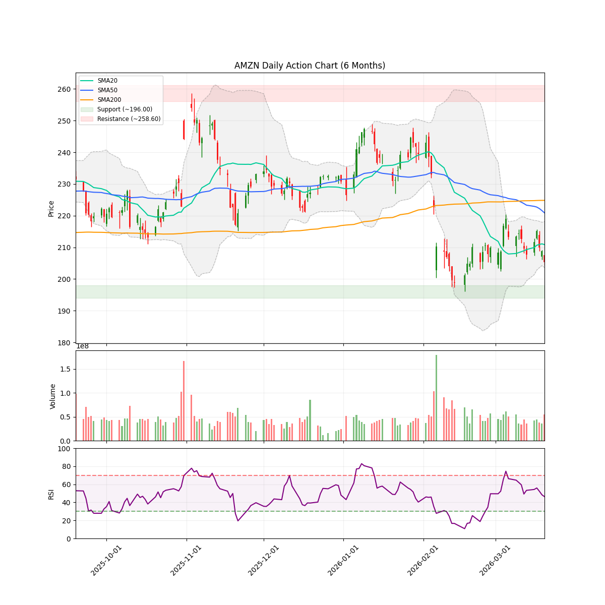
#### 研报分析

### 技术指标概览 (Technical Overview)
- **当前价格**: $205.37
- **RSI (14)**: 46.35
- **移动平均线**: SMA20: $210.85 | SMA50: $220.87 | SMA200: $224.81 (Bearish)
- **波动率**: ATR (14): 5.36 (预计周度波动: +/- $11.99)
- **关键位 (6m)**: 支撑位 $196.00 | 阻力位 $258.60
- **即时状态**: Below SMA50

### **AMZN 情绪审计报告：叙事经济学视角**

**报告日期：** 2026年03月21日
**分析师：** 对冲基金研究员（叙事经济学专家）
**当前标的价格：** $205.37

---

### **1. 叙事脉络：AI 豪赌与“资本开支恐惧症”**

嘿，坐下来喝杯咖啡。咱们得聊聊亚马逊（AMZN）现在的处境。

现在的亚马逊就像是一个正在进行“大象转身”的巨人。市场正处在一个非常微妙的心理节点：**矛盾。** 一方面，Jassy 抛出了 6000 亿美元的 AWS 远景（这可是天文数字！），另一方面，那 2000 亿美元的 AI 资本开支计划像一块巨石，压得投资者喘不过气来。

你发现了吗？最近的走势其实在讲一个**“信任危机”**的故事。二月份那次 18% 的大跌不是因为业绩不好，而是因为华尔街被那个“2000 亿美金”的账单吓到了。现在，虽然有亿万富翁和机构（如美银）在背后撑腰，但散户和短线资金还在犹豫。

---

### **2. 催化剂分类：谁在做局，谁在破局？**

*   **A-Tier（顶级驱动）：**
    *   **AWS 6000 亿营收愿景：** 这是 Jassy 给市场画的最大、最香的饼。如果能兑现，现在的价格就是地板价。[来源: Blockonomi]
    *   **2000 亿美元资本开支计划：** 虽然短期是利空（吓跑了胆小鬼），但这是决定亚马逊未来十年生死的核心动作。[来源: Forbes]
*   **B-Tier（中期助力）：**
    *   **Cerebras 深度合作：** 在 Amazon Bedrock 上实现全球最快 AI 推理，这直接反击了“亚马逊在 AI 算力上落后”的质疑。[来源: Insider Monkey]
    *   **机构评级重估：** 美银（BofA）开始修正观点，认为市场在“错误的辩论”中浪费时间。[来源: AOL]
*   **C-Tier（市场噪音）：**
    *   **Transformer 智能手机：** 听着很酷，但市场对此报以白眼（股价下跌）。大家还没忘掉当年 Fire Phone 的惨败，亚马逊做硬件总是让人捏把汗。[来源: Blockonomi]
    *   **吉姆·克莱默（Jim Cramer）的推荐：** 这种“名嘴”背书在现在的市场叙事中，顶多算是个点缀。[来源: Yahoo Finance]

---

### **3. 分歧检测：为什么“好消息”不涨了？**

**警报信号：** 2026年3月20日，亚马逊发布了极具未来感的 **AI Transformer 智能手机**。换做以前，这可能是拉升的理由，但昨天股价反而**滑落 (Slips)**。

**深度诊断：** 这是一个典型的**“看涨衰竭”与“质疑叙事”**。市场目前的心理预期是：“别给我整这些虚的手机，告诉我那 2000 亿什么时候能换成现金流。” 当利好消息（AI 手机）无法推升股价，说明空头动能还在释放，或者说多头已经不想再为“梦想”买单，他们要看实打实的利润利润率。

---

### **4. 情绪得分与技术面解读**

*   **逻辑评分：5.8 / 10 (中性偏悲观)**
    *   **支撑位：** $196.00 (6个月低点，这是你的最后防线)。
    *   **压力位：** $258.60。
    *   **现状：** 你的持仓成本在 $201.61，目前还有约 4% 的浮盈。但要注意，股价正处于 SMA20、50、200 所有均线之下！从技术角度看，这叫“泰山压顶”。

**分析师私房话：**
你现在的仓位很轻（1.77%），这很好。现在的 AMZN 不是一个可以重仓梭哈的“确定性机会”，而是一个**“等待出清的阵痛期”**。股价在均线下方挣扎，RSI 46.35 表明还没有进入超卖的“捡漏区”。

---

### **5. 结论：是趋势还是陷阱？**

目前的 AMZN 处于**“叙事转换陷阱”**中。

*   **短期（1-4周）：** 依然会有下行压力，测试 $196 支撑位的概率很大。如果跌破这里，市场会进入恐慌模式。
*   **长期（1年以上）：** 亿万富翁们在买入，因为他们看重的是 AI 基础设施的垄断力。

**操作建议：**
既然你目前还有盈利，**守住 $196 这个关口**。只要不破这个 6 个月的底，你就陪着 Jassy 一起等那 6000 亿的愿景。如果跌破 $196，先离场保住利润，等市场消化完对资本开支的恐惧再回来。

---

### **📅 关键追踪日期**
*   **下一个重大日期：** **2026年4月30日左右**（预计 2026 年 Q1 财报发布日）。
    *   *注：届时管理层对 AI 开支的进一步解释将决定股票是反转还是继续沉沦。*

---
**免责声明：** 叙事分析旨在揭示市场心理，不构成直接买卖建议。市场有风险，投资需谨慎。
#### 近期新闻与事件
- **[Blockonomi]** [Amazon (AMZN) Stock Dips as Tech Giant Unveils AI-Driven Transformer Smartphone](https://blockonomi.com/amazon-amzn-stock-dips-as-tech-giant-unveils-ai-driven-transformer-smartphone/)
- **[Insider Monkey]** [Why Amazon.com (AMZN) Is One of the Best Long Term Stocks to Invest in According to Billionaires](https://www.msn.com/en-us/money/companies/why-amazoncom-amzn-is-one-of-the-best-long-term-stocks-to-invest-in-according-to-billionaires/ar-AA1Z73Kf)
- **[Yahoo Finance]** [Jim Cramer Recommended Amazon (AMZN) As A Long Term Stock In January 2025](https://finance.yahoo.com/news/jim-cramer-recommended-amazon-amzn-220130883.html)
- **[Insider Monkey]** [Amazon.com (AMZN) and Cerebras Partner for World's Fastest AI Inference on Amazon Bedrock](https://www.msn.com/en-us/money/other/amazoncom-amzn-and-cerebras-partner-for-world-s-fastest-ai-inference-on-amazon-bedrock/ar-AA1YVRG1)
- **[Blockonomi]** [Amazon (AMZN) Stock Ticks Higher as CEO Jassy Sets $600B AWS Revenue Vision](https://blockonomi.com/amazon-amzn-stock-ticks-higher-as-ceo-jassy-sets-600b-aws-revenue-vision/)

---

### GOOGL
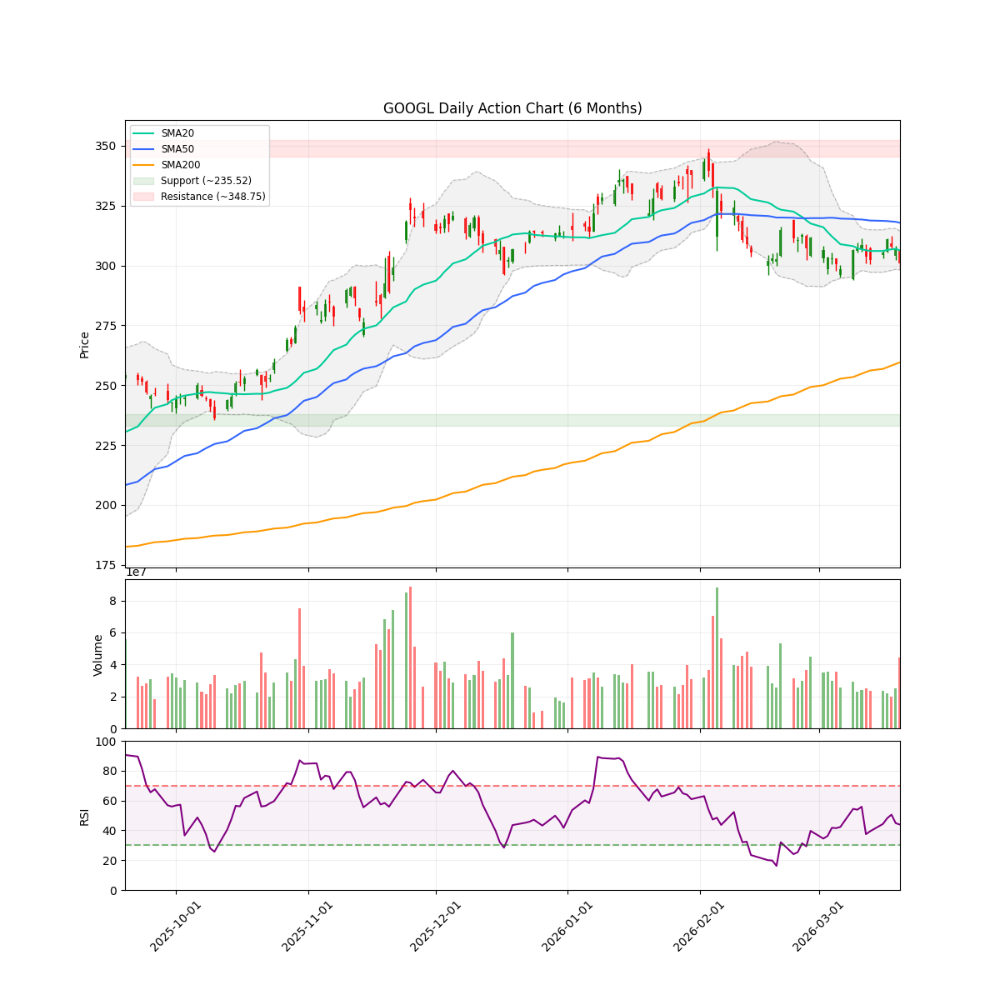
#### 研报分析

### 技术指标概览 (Technical Overview)
- **当前价格**: $301.00
- **RSI (14)**: 43.88
- **移动平均线**: SMA20: $306.26 | SMA50: $317.80 | SMA200: $259.55 (Bullish)
- **波动率**: ATR (14): 6.65 (预计周度波动: +/- $14.87)
- **关键位 (6m)**: 支撑位 $235.52 | 阻力位 $348.75
- **即时状态**: Below SMA50

你好！来，坐下喝杯咖啡。咱们聊聊你手里这只 Google（GOOGL）。

现在的市场就像个喜怒无常的评论家：一边是媒体在大声吆喝“AI 黄金时代”，一边是股价在悄悄地回踩。你手里那 16% 的利润垫底，确实让你现在能稳坐钓鱼台，但眼下的盘面信号可有点儿耐人寻味。

以下是为你复盘的 **GOOGL 情绪审计报告**。

---

### 一、 催化剂分级：故事背后的真相

我们把最近的消息拆解开，看看哪些是真金白银，哪些只是噪音：

*   **A-Tier（重磅驱动）**：**Adobe Q1 财报的溢出效应**。Adobe 提到 AI 驱动的产品转型正在扩大企业需求。作为 AI 基础设施的巨头，Google 是这种大趋势的直接受益者，这证明了 AI 不是幻觉，是实实在在的订单。
*   **B-Tier（行业助力）**：**巴菲特持仓讨论与量子计算叙事**。*Insider Monkey* 讨论 Google 是否仍是巴菲特组合中最被低估的 AI 股。这种“大拿背书”能吸引长线资金。同时，Jim Cramer 提到的量子计算虽然远了点，但给 Google 的技术护城河又加了一层滤镜。
*   **C-Tier（市场杂音）**：**Zacks 的估值预警**。Zacks 给出 Value D 评级，认为 25.5 倍 PE 过高。这属于典型的“教科书式担忧”，在成长股牛市中，这类噪音通常会被多头直接无视，直到趋势彻底反转。

### 二、 情绪背离检测：繁华背后的“小情绪”

**注意看这里：** 这里的信号很有趣。
最近一周，媒体上满是“冲击 350 美元”的乐观预测和“被低估的 AI 龙头”这类爽文，但股价的表现呢？**它正跌破 SMA20（306.26）和 SMA50（317.80）。**

这种**“利好不断，股价不涨反跌”**的情况，在叙事经济学里叫“叙事疲劳”。市场现在并不怀疑 Google 的伟大，但短期内，获利盘正在兑现，大家在等待下一个能引爆情绪的导火索（比如下个季度的财报数据）。目前的下跌更像是大餐后的“消食期”，而非系统性崩塌。

### 三、 情绪评分 (Logic Score)

# **6.8 / 10**
> **评价：** “长线笃定，短线纠结”。基本面叙事极其扎实（AI + 云计算利润空间），但技术面正处于“回抽确认”的阵痛期。

### 四、 深度诊断：陷阱还是机会？

你目前的成本在 $268.53，这个位置非常安全，正好处于 SMA200（$259.55）上方一点。

*   **目前的走势不是“陷阱”**：如果是陷阱，股价会配合负面新闻放量暴跌。现在的回落更像是对前期 71% 涨幅的健康修正。
*   **心理博弈**：目前的 RSI 是 43.88，还没进入“超卖”的捡漏区，但已经让那些追高的人感到难受了。这种“磨人”的行情通常是为了洗掉那些意志不坚定的短线客。

### 五、 关键参考与行动节点

*   **关键新闻引用**：
    *   乐观派：[Motley Fool] 认为根据增长数学计算，年底看到 350 美元是可能的。([链接](https://finance.yahoo.com/markets/stocks/articles/alphabet-stock-going-350-end-192000807.html))
    *   谨慎派：[Zacks] 警示其 25.55x 的市盈率可能存在溢价风险。([链接](https://finance.yahoo.com/news/alphabet-stocks-25-55x-pe-165300751.html))
*   **下一关键日期**：**2026年4月下旬 (预计 Q1 财报发布日)**。
    *   *注：具体日期尚未正式公布，但通常在 4 月 22 日至 29 日之间。这是决定 Google 能否重回 SMA50 上方的终极审判。*

---

**老兵建议：**
你现在的仓位占账户 20% 以上，比例不低。既然已经有了 16% 的浮盈，**千万别在此时因为短期的震荡而自乱阵脚。** 只要股价守住 SMA200（260美元附近），这个 AI 的故事就还没讲完。

下一次等财报预期开始升温时，咱们再来看看这些“噪音”会如何转变成冲顶的动力。喝完这杯，继续盯盘吧！
#### 近期新闻与事件
- **[Motley Fool· via Yahoo Finance]** [Better AI Stock: Alphabet vs. Meta Platforms](https://finance.yahoo.com/markets/stocks/articles/better-ai-stock-alphabet-vs-122600390.html)
- **[Insider Monkey· via Yahoo Finance]** [Is Alphabet (GOOGL, GOOG) Still The Best Undervalued AI Stock in Warren Buffett’s Latest Portfolio?](https://finance.yahoo.com/markets/stocks/articles/alphabet-googl-goog-still-best-204632532.html)
- **[Insider Monkey· via Yahoo Finance]** [Alphabet (GOOGL) Stock Higher Higher After Jim Cramer Said It Was A Good Quantum Computing Stock In...](https://finance.yahoo.com/markets/stocks/articles/alphabet-googl-stock-higher-higher-160503739.html)
- **[Motley Fool· via Yahoo Finance]** [Is Alphabet Stock Going to $350 by Year-End? The Math Says It's Possible.](https://finance.yahoo.com/markets/stocks/articles/alphabet-stock-going-350-end-192000807.html)
- **[Zacks· via Yahoo Finance]** [Is Alphabet Stock's 25.55X PE Still Worth it? Buy, Sell, or Hold?](https://finance.yahoo.com/news/alphabet-stocks-25-55x-pe-165300751.html)

---

## 🔍 观察池机会分析

### AMAT
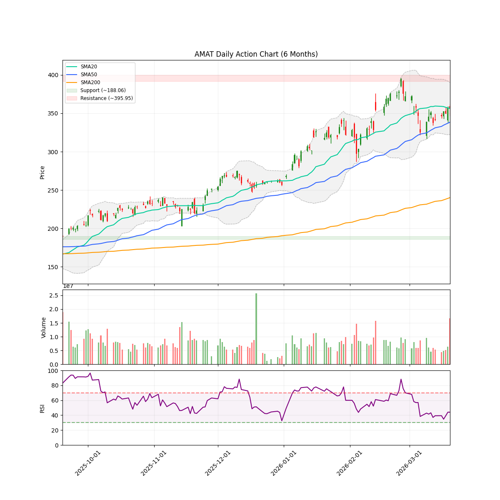
#### 研报分析

### 技术指标概览 (Technical Overview)
- **当前价格**: $357.06
- **RSI (14)**: 44.02
- **移动平均线**: SMA20: $356.20 | SMA50: $338.41 | SMA200: $240.19 (Bullish)
- **波动率**: ATR (14): 15.91 (预计周度波动: +/- $35.58)
- **关键位 (6m)**: 支撑位 $188.06 | 阻力位 $395.95
- **即时状态**: Above SMA50

# 应用材料 (AMAT) 情绪审计报告：AI 军备竞赛中的“冷面笑匠”

**日期：** 2026年3月21日
**分析师：** 叙事经济学研究组

---

### 1. 催化剂分类：谁在拨动市场的琴弦？

在半导体设备这个充满金属味和金钱味的牌桌上，应用材料（AMAT）目前的牌面非常有趣。我们将其近期的驱动因素划分为以下三个等级：

*   **A-Tier（核心推动力）：AI 存储的高端局**
    *   **深度绑定 HBM 巨头：** 3月14日，AMAT 宣布与美光（Micron）和 SK 海力士（SK Hynix）达成战略合作，研发下一代内存。这不仅仅是一个合同，这是在 AI 算力竞赛中锁定了“弹药库”的供应权。在逻辑芯片和 DRAM 业务创纪录增长的背景下，AMAT 已经把自己从传统的设备商变成了 AI 基础设施的代名词。
*   **B-Tier（行业共振）：邻居家的火光**
    *   **行业风向标的背书：** 虽然 ASML 近期跌了 7%，但 TD Cowen 等机构却在喊“抄底”（3月20日新闻）。作为半导体制造链上的孪生兄弟，这种对龙头的信心会迅速外溢到 AMAT。华尔街分析师的一致看好（Zacks ABR 建议增持）为股价提供了心理防线。
*   **C-Tier（市场噪音）：财报后的余温**
    *   **总结性报道：** 诸如“Q4 赢家与输家”的复盘报道。这类信息虽然增加了曝光度，但属于后置指标，对短期波段的指导意义有限。

---

### 2. 叙事分析：逻辑还是陷阱？

**目前的市场情绪：冷静的看多者。**

从盘面上看，AMAT 的表现像是一个在派对高峰期后，坐在角落里冷静喝酒的老牌绅士。
*   **叙事反差：** 过去三个月股价飙升了 33.4%，但目前 RSI 却回落到了 44.02。这非常罕见——股价在高位横盘，而超买压力已经消失殆尽。这说明市场并没有出现那种令人不安的“狂热泡沫”，而是在通过震荡消化获利盘。
*   **分歧检测：** 尽管近期 ASML 等同行出现了小幅回调（跌 7%），但 AMAT 守住了 SMA20（356.20）的关键支撑。这种“别人跌我不跌，或者我跌得更有底气”的表现，是典型的**看涨衰竭缺失**。市场并没有在利好出尽后落荒而逃，反而在 357 美元附近构筑了一个坚实的战壕。

---

### 3. 逻辑评分 (Logic Score)

# **8.5 / 10**

**评分逻辑：**
*   **基本面支撑 (+4.0)：** 逻辑芯片和 DRAM 业务的创纪录增长是硬道理，与 SK Hynix 的合作直接切入了 AI 增长的核心——存储瓶颈。
*   **技术面健康 (+2.5)：** 股价位于 SMA50 和 SMA200 之上，长期多头趋势未变，且 RSI 释放了回吐压力，提供了良好的入场安全边际。
*   **情绪韧性 (+2.0)：** 在同行受挫时表现出的抗跌性，证明了机构投资者的持仓信心极强。

---

### 4. 深度洞察：来自咖啡桌上的私语

“老兄，别被那 7% 的板块回调吓破了胆。看看 AMAT 的位置，它正踩在 SMA20 的边线上跳舞。与其说它是跟随大盘波动，不如说它在等待下一个 AI 存储突破的哨声。现在的价格（357.06）离它的 6 个月高点（395.95）还有一段距离，但它的基本面比创高点时还要扎实。这就像是一辆正在进站加油的赛车，引擎没熄火，只是在换胎。”

---

### 5. 关键日期与引用

*   **下一次关键日期：** **2026年5月中旬**（预计 Q2 2026 财报发布日）。届时将验证与美光、SK海力士合作后的首批订单落地情况。
*   **参考证据：**
    *   *Partnership with Micron/SK Hynix:* [Insider Monkey, 2026-03-14](https://www.msn.com/en-us/news/technology/applied-materials-amat-partners-with-micron-mu-sk-hynix-for-next-gen-memory-development/ar-AA1YDB1S)
    *   *Q1 2026 Record Growth:* [Zacks/Yahoo Finance, 2026-03-07](https://finance.yahoo.com/news/amat-climbs-33-4-3-142900401.html)
    *   *Sector Sentiment (ASML Buy Opportunity):* [Blockonomi, 2026-03-20](https://blockonomi.com/asml-asml-stock-why-td-cowen-sees-this-7-dip-as-a-prime-buying-opportunity/)

**投资警示：** 虽然叙事极佳，但需关注 395.95 美元的强阻力位。如果突破失败，可能会回踩 338.41（SMA50）寻求支撑。
#### 近期新闻与事件
- **[Yahoo Finance]** [Winners And Losers Of Q4: Applied Materials (NASDAQ:AMAT) Vs The Rest Of The Semiconductor Manufacturing Stocks](https://finance.yahoo.com/markets/stocks/articles/winners-losers-q4-applied-materials-223225271.html)
- **[The Globe and Mail]** [What if ASML Becomes the Next Trillion-Dollar Stock?](https://www.theglobeandmail.com/investing/markets/stocks/AMAT-Q/pressreleases/856662/what-if-asml-becomes-the-next-trillion-dollar-stock/)
- **[Insider Monkey]** [Applied Materials (AMAT) Partners with Micron (MU), SK Hynix for Next-Gen Memory Development](https://www.msn.com/en-us/news/technology/applied-materials-amat-partners-with-micron-mu-sk-hynix-for-next-gen-memory-development/ar-AA1YDB1S)
- **[Barron's]** [This 'very attractive' chip stock has taken a hit. The case for buying now.](https://www.msn.com/en-us/money/topstocks/this-very-attractive-chip-stock-has-taken-a-hit-the-case-for-buying-now/ar-AA1Z2Ool)
- **[Blockonomi]** [ASML (ASML) Stock: Why TD Cowen Sees This 7% Dip as a Prime Buying Opportunity](https://blockonomi.com/asml-asml-stock-why-td-cowen-sees-this-7-dip-as-a-prime-buying-opportunity/)

---

### ANET
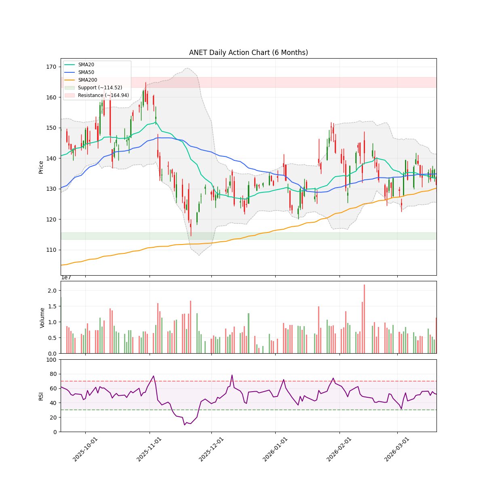
#### 研报分析

### 技术指标概览 (Technical Overview)
- **当前价格**: $131.22
- **RSI (14)**: 51.88
- **移动平均线**: SMA20: $133.42 | SMA50: $134.86 | SMA200: $130.18 (Bullish)
- **波动率**: ATR (14): 5.89 (预计周度波动: +/- $13.17)
- **关键位 (6m)**: 支撑位 $114.52 | 阻力位 $164.94
- **即时状态**: Below SMA50

# Arista Networks (ANET) 情绪审计报告：AI 浪潮中的“冷静期”还是“黄金坑”？

**致：** 投资委员会
**日期：** 2026年3月21日
**风格：** 叙事经济学 (Narrative Economics)

---

### 1. 叙事背景：不仅仅是卖“交换机”的
如果说英伟达是 AI 时代的军火商，那么 **Arista (ANET)** 就是通往战场的唯一高速公路。现在的市场叙事非常明确：随着 AI 模型规模的爆炸式增长，数据中心的“交通堵塞”成了最大的痛点。Arista 凭借其高性能网络设备，正坐在一个名为“以太网替代无限带宽 (InfiniBand)”的叙事王座上。

然而，今天的盘面（131.22美元）却显得有些“耐人寻味”。在媒体一片叫好声中，股价却在 SMA50 之下徘徊，这是一种典型的“叙事领先于资金”的局面。

---

### 2. 催化剂分级 (Catalyst Categorization)

*   **A-Tier（核心推动力）：分析师共识与基本面溢价**
    *   **证据：** [Blockonomi] 指出分析师目标价调升至 $177.50，潜在空间达 27.6% ；[Forbes] 强调其收入增长和利润率远超传统竞争对手 Ciena。
    *   **点评：** 这是机构资金的“定心丸”。42.8% 的利润率和 93% 的买入评级，意味着在深层次的逻辑上，ANET 的基本面没有任何崩坏。

*   **B-Tier（行业情绪）：AI 网络基础设施的持续扩张**
    *   **证据：** [Yahoo Finance] 提及 Jim Cramer 长期看好其作为 AI 核心标的的地位。
    *   **点评：** 虽然 Cramer 的推荐常被戏称为“反向指标”，但不可否认，这维持了 ANET 在散户和中型机构中的曝光度。

*   **C-Tier（噪音）：琐碎的观点汇总**
    *   **证据：** [Insider Monkey] 引用的 Substack 观点。
    *   **点评：** 属于存量信息的二次消化，对短期股价推动力有限。

---

### 3. 分歧检测：利好堆砌下的“隐形天花板”？

**现象观察：** 这是一个非常有趣的“看涨分歧”。
*   **利好：** 目标价调高、AI 增长确定、利润率强劲。
*   **盘面：** 股价目前在 131.22 美元，不仅跌破了 20 日和 50 日均线，而且正在考验 **200 日均线 (130.18)** 的支撑。

**诊断：** 典型的**叙事疲劳 (Narrative Exhaustion)**。尽管新闻里满是“27% 的上涨空间”，但市场现在更关注资金的轮动。RSI 位于 51.88 的中性区间，显示多空双方都在等一个打破僵局的信号。如果 130.18 这个“最后防线”跌破，所有的利好叙事都会暂时失效，演变成技术性杀跌。

---

### 4. 情绪评分 (Sentiment Score): 7.2 / 10

*   **逻辑支撑：**
    *   **正面 (+2.5)：** 极高的分析师共识和 AI 刚需属性。
    *   **正面 (+2.5)：** 利润率处于行业顶尖，财务健康度无懈可击。
    *   **负面 (-1.5)：** 技术面短期走弱，股价相对于利好消息表现出“滞涨”。
    *   **负面 (-1.3)：** 市场可能正在消化前期过高的溢价，当前处于“估值回归”过程。

**结论：** 这是一个“有韧性的牛市休整”。不是系统性失败，而是投资者在等待下一个业绩引爆点。

---

### 5. 投资建议：在“噪音”中寻找买点

目前的 ANET 就像是一部正在缓冲的高清大片。媒体在剧透高潮，但网络还在转圈。

*   **操作思路：** 不要被 $177 的目标价冲昏头脑。目前股价贴近 SMA200 (130.18)，这是一个极佳的风险收益比买入点。只要不放量跌破 130 关口，这一波调整就是为了下一次冲锋积蓄力量。
*   **关注风险：** 如果跌破 6 个月低点 114.52，则说明 AI 基础设施的叙事逻辑发生了根本性动摇。

---

### 6. 关键时间节点 (Next Major Date)

*   **预计财报日：2026年5月初** (具体日期待官方公布)
    *   *注：这将是验证“27% 上涨潜力”是否能兑现为真金白银的关键时刻。在此之前，股价大概率会在 130.18 - 145 之间进行箱体震荡。*

---
*引用的新闻来源：*
- Forbes: [Why Arista Might Be A Smarter Play Than Ciena](https://www.forbes.com/sites/greatspeculations/2026/03/16/why-arista-might-be-a-smarter-play-than-ciena-stock-right-now/)
- Blockonomi: [Arista Networks (ANET) Stock Poised for 27% Gain](https://blockonomi.com/arista-networks-anet-stock-poised-for-27-gain-according-to-analyst-consensus/)
- Yahoo Finance: [Jim Cramer's Hottest AI Stock Picks](https://sg.finance.yahoo.com/news/arista-anet-shares-higher-jim-160805341.html)
#### 近期新闻与事件
- **[Forbes]** [Why Arista Might Be A Smarter Play Than Ciena Stock Right Now](https://www.forbes.com/sites/greatspeculations/2026/03/16/why-arista-might-be-a-smarter-play-than-ciena-stock-right-now/)
- **[Insider Monkey]** [Jim Cramer Was Bullish On Arista (ANET) In February 2025 - Stock Is Up By 37%+ Since Then](https://www.insidermonkey.com/blog/jim-cramer-was-bullish-on-arista-anet-in-february-2025-stock-is-up-by-37-since-then-1720133/)
- **[Blockonomi]** [Arista Networks (ANET) Stock Poised for 27% Gain According to Analyst Consensus](https://blockonomi.com/arista-networks-anet-stock-poised-for-27-gain-according-to-analyst-consensus/)
- **[Yahoo Finance Singapore]** [Arista (ANET) Shares Higher After Jim Cramer Said It Made Sense In January 2025](https://sg.finance.yahoo.com/news/arista-anet-shares-higher-jim-160805341.html?pl2=topic-mid-section)
- **[Insider Monkey]** [Is Arista Networks, Inc. (ANET) A Good Stock To Buy Now?](https://www.insidermonkey.com/blog/is-arista-networks-inc-anet-a-good-stock-to-buy-now-1713589/)

---

### ASML

#### 研报分析

### 技术指标概览 (Technical Overview)
- **当前价格**: $1317.25
- **RSI (14)**: 38.93
- **移动平均线**: SMA20: $1394.90 | SMA50: $1386.40 | SMA200: $1024.20 (Bullish)
- **波动率**: ATR (14): 56.73 (预计周度波动: +/- $126.86)
- **关键位 (6m)**: 支撑位 $923.01 | 阻力位 $1547.22
- **即时状态**: Below SMA50

# ASML 情绪审计报告：AI 皇冠上的明珠，是“中场休息”还是“落日余晖”？

**致：** 投资决策委员会
**日期：** 2026年03月21日
**风格：** 叙事经济学视角 | 资深研究员视角

---

### 1. 市场叙事：繁华后的“冷思考”
伙计们，坐下来喝杯咖啡。看看现在的 ASML (1317.25)，这不仅仅是屏幕上的一个数字。现在的市场正处于一种微妙的“多头怀疑期”。

就在几天前，ASML 还在冲击 1500 美元的高地，而今天它却掉到了 SMA20 (1394.90) 和 SMA50 (1386.40) 的下方。更讽刺的是，昨天（3月20日）股价无缘无故跌了 3.3%。这就是典型的**“情绪性踩踏”**——没有利空就是最大的利空，因为那些加了杠杆的玩家在没有看到新刺激时，最容易惊慌失措。

现在的叙事逻辑已经从“AI 需要多少光刻机”转变为“ASML 能否承载万亿市值的重压”。市场正在消化一种恐慌：如果 AI 支出的周期性放缓真的到来，这位“卖铲人”会不会是第一个倒下的巨人？

---

### 2. 催化剂分类 (Catalyst Tiers)

*   **A-Tier (结构性核心): AI 军备竞赛的底层基座**
    *   虽然股价回调，但 Broadcom 和 ASML 的对比 [Motley Fool, 03-21] 再次提醒我们：没有 ASML 的 High-NA EUV，AI 芯片的摩尔定律就走不动。这是支撑股价不崩盘的“地心引力”。
*   **B-Tier (机构支撑): 华尔街的“定心丸”**
    *   分析师 Sankar 给出了 1500 欧元（约 1735 美元）的目标价 [Barrons, 03-20]。这种来自顶级分析师的“抄底信号”是典型的 B 级催化剂，它为短线超跌提供了心理防线。
*   **C-Tier (市场噪音): 每日的“无端波动”**
    *   所谓“无缘无故的 3.3% 下跌” [Motley Fool, 03-20] 和关于“万亿市值压力”的讨论。这些更多是散户的焦虑，而非基本面的恶化。

---

### 3. 背离检测 (Divergence Detection)
**警报：** 存在明显的**“好消息钝化，无消息暴跌”**现象。
*   **现象：** 当 Zacks 报道 ASML 跑赢大盘时 [03-17]，市场反应平平；但周五没有任何利空，股价却应声跌破关键支撑位。
*   **解读：** 这反映了**看跌力竭前的最后挣扎**。RSI 目前处于 38.93，已经逼近 30 的“超卖禁区”。股价虽然跌破了 SMA50，但距离 SMA200 (1024.20) 还有巨大的安全垫。当前的下跌更像是一场“技术性洗盘”，把那些意志不坚定的短线客踢出局。

---

### 4. 情绪评分 (Sentiment Score)

## **6.8 / 10**
**评语：** “伤感但不绝望”。目前的低迷并非系统性失败 (Systemic Failure)，而是高增长叙事中的一次**“均值回归”**。虽然短期趋势走坏（低于 SMA50），但 1300 美元关口具备极强的叙事支撑。

---

### 5. 逻辑细节与引用
*   **估值回归：** Simply Wall St [03-20] 指出目前的股价正在重新评估。在经历了 1547 美元的高点后，市场正在寻找一个新的平衡点，既要包含 AI 的乐观，也要剔除过热的泡沫。
*   **竞争格局：** 市场开始拿它和 Broadcom 比较 [Motley Fool, 03-21]，这说明资金正在进行“赛道内调仓”。投资者并没有离开半导体，只是在寻找更具性价比的标的。

---

### 6. 关键日程与策略 (Next Steps)

*   **下次重大日期：** **2026年4月中旬 (预计 Q1 财报发布日)**。
    *   这将是决定 ASML 是开启新一轮牛市还是彻底陷入中期调整的“审判日”。
*   **操作指南：** 
    *   密切关注 **1268 - 1290** 区间（周波动的下沿）。如果在此站稳并伴随 RSI 回升，那将是极佳的“反向博弈”入场点。
    *   **记住：** 只要 AI 的故事还在讲，ASML 就是那本永远合不上的书。

---
*注：本报告基于 2026-03-21 的市场数据。市场有风险，投资需谨慎。*
#### 近期新闻与事件
- **[Motley Fool· via Yahoo Finance]** [ASML vs. Broadcom: Which AI Stock Is a Better Buy?](https://finance.yahoo.com/markets/stocks/articles/asml-vs-broadcom-ai-stock-041100500.html)
- **[Motley Fool· via Yahoo Finance]** [Why Did ASML Stock Just Drop?](https://finance.yahoo.com/markets/stocks/articles/why-did-asml-stock-just-165139222.html)
- **[Simply Wall St.· via Yahoo Finance]** [Assessing ASML Holding (NasdaqGS:ASML) Valuation After Recent Share Price...](https://finance.yahoo.com/markets/stocks/articles/assessing-asml-holding-nasdaqgs-asml-220811130.html)
- **[Motley Fool· via Yahoo Finance]** [What if ASML Becomes the Next Trillion-Dollar Stock?](https://finance.yahoo.com/markets/stocks/articles/asml-becomes-next-trillion-dollar-063500168.html)
- **[Barrons.com]** [This ‘Very Attractive’ Chip Stock Has Taken a Hit. The Case for Buying Now.](https://www.barrons.com/articles/asml-stock-price-analyst-buy-attractive-chips-fa63a7e6)

---

### AVGO
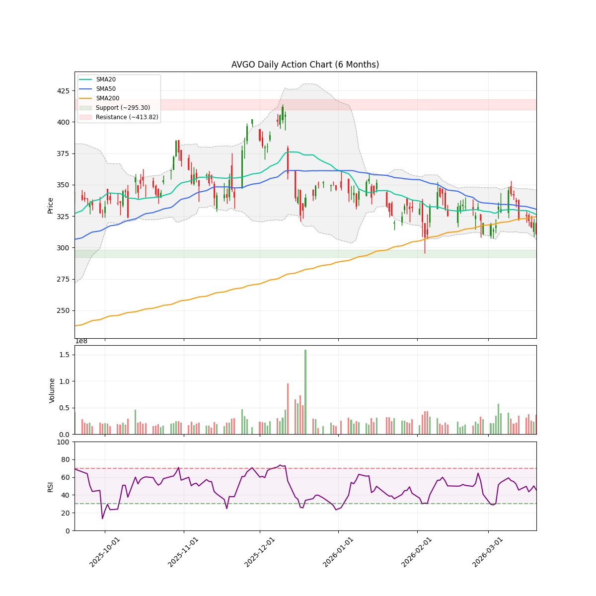
#### 研报分析

### 技术指标概览 (Technical Overview)
- **当前价格**: $310.51
- **RSI (14)**: 45.39
- **移动平均线**: SMA20: $326.17 | SMA50: $330.42 | SMA200: $324.53 (Bullish)
- **波动率**: ATR (14): 13.12 (预计周度波动: +/- $29.33)
- **关键位 (6m)**: 支撑位 $295.30 | 阻力位 $413.82
- **即时状态**: Below SMA50

# 博通 (AVGO) 情绪审计报告：AI 巨头的“宿醉”还是新一轮冲锋的前奏？

**日期：** 2026年3月21日  
**分析师：** 叙事经济学研究部  
**当前价格：** $310.51  

---

### 1. 叙事背景：当好消息遇上冷脸
现在的博通（AVGO），给人的感觉就像是一个在深夜庆功宴后宿醉的巨人。

从叙事经济学的角度看，博通的“故事线”正处于一个微妙的断层期。去年12月，市场还沉浸在 $400 以上的狂欢中，认为它是仅次于英伟达的 AI 救世主。而现在，尽管 **Tomahawk 6 芯片已经开始量产出货** [1]，尽管华尔街的大佬们（如 Cantor Fitzgerald 和 Aletheia）依然在为其呐喊助威 [3]，股价却像铅球一样跌破了所有短期和长期均线（SMA20/50/200）。

这不仅仅是回调，这是市场在问：“除了预期，你还能给我看什么？”

---

### 2. 催化剂分级 (Catalyst Tiers)

*   **A-Tier（核心动力）：Tomahawk 6 正式量产出货** [1]
    *   *点评：* 这是实打实的利好。在 AI 网络扩展中，博通的交换机芯片是不可或缺的“交警”。这证明了博通在 AI 基础设施中的统治力并非空谈。
*   **B-Tier（机构背书）：主流分析师维持看涨评级** [3] [7]
    *   *点评：* Aletheia 和 Cantor Fitzgerald 在财报后依然死守看涨阵地。这种机构性的“共识”为股价提供了心理支撑，虽然没能立刻拉升股价，但至少在 295 美元的支撑位前筑起了防线。
*   **C-Tier（市场杂音）：各类“10大最佳 AI 股票”榜单** [4] [5] [8]
    *   *点评：* 这种叙事已经过度饱和。当每个人都在说博通是“终极 AI 标的”时，这种赞美对股价已经失去了边际边际效应。

---

### 3. 背离检测：为何“利好不涨”？
**警报信号：** 3月16日博通宣布量产 Tomahawk 6，这本该是引爆市场的导火索，但股价却依然徘徊在 $310 附近，甚至低于 SMA200 ($324.53)。

*   **看跌枯竭还是信心崩塌？** 目前的 RSI 为 45.39，处于中性偏弱。股价在 $295（6个月低点）附近有明显的防御动作。这说明目前的下跌并非由于基本面恶化，而是**估值消化的阵痛**。市场在惩罚那些在 $400 高位追入的投机客，现在的 AVGO 正处于“去泡沫化”的尾声。

---

### 4. 逻辑评分 (Logic Score): 6.8/10
*   **得分理由：** 基本面逻辑是满分（AI 需求真实存在，产品处于领先地位），但**资金流向逻辑**目前处于负分。在价格重新站上 SMA200 ($324) 之前，所有的利好都会被市场视作卖出的机会。

---

### 5. 投资建议：这是“陷阱”吗？
这不是一个“价值陷阱”，而是一个**“时间陷阱”**。

如果你想赚快钱，现在的博通可能会让你感到窒息。但如果你是那种喜欢在派对结束后、清洁工入场时买入的投资者，现在的 $310 附近正散发着一种冷清的魅力。

*   **关键支撑：** $295.30（这是多头的最后一道防线）。
*   **反转信号：** 需放量突破 $326 (SMA20)，才能确认这轮“宿醉”彻底结束。

---

### 6. 关键引用与日期

*   **参考新闻：**
    1.  [Broadcom 开始量产 Tomahawk 6 芯片](https://www.msn.com/en-us/news/technology/broadcom-inc-avgo-commences-volume-shipping-of-tomahawk-6-chip-to-scale-ai-networks/ar-AA1Z73O3?ocid=BingNewsVerp) - 2026-03-16
    2.  [Aletheia 与 Cantor Fitzgerald 维持看涨评级](https://www.msn.com/en-us/money/topstocks/aletheia-and-cantor-fitzgerald-stay-bullish-on-broadcom-avgo-after-earnings/ar-AA1Z53Fr?ocid=BingNewsVerp) - 2026-03-04
    3.  [Forbes: AVGO 是否是终极 AI 标的？](https://www.forbes.com/sites/greatspeculations/2026/03/05/is-avgo-stock-the-ultimate-ai-play/) - 2026-03-05

*   **下一个重大日期：** 
    **2026年6月中旬（预计 2026-06-11 左右）** —— 下季度财报发布日。这将是博通证明其 Tomahawk 6 营收贡献并彻底扭转叙事的关键时刻。

---
*免责声明：本报告基于叙事经济学分析，不构成直接投资建议。市场有风险，入市需谨慎。*
#### 近期新闻与事件
- **[Insider Monkey on MSN]** [Broadcom Inc. (AVGO) Commences Volume Shipping of Tomahawk 6 Chip to Scale AI Networks](https://www.msn.com/en-us/news/technology/broadcom-inc-avgo-commences-volume-shipping-of-tomahawk-6-chip-to-scale-ai-networks/ar-AA1Z73O3?ocid=BingNewsVerp)
- **[AOL]** [ASML vs. Broadcom: Which AI Stock Is a Better Buy?](https://www.aol.com/finance/asml-vs-broadcom-ai-stock-041100061.html)
- **[Insider Monkey on MSN]** [Aletheia and Cantor Fitzgerald Stay Bullish on Broadcom (AVGO) After Earnings](https://www.msn.com/en-us/money/topstocks/aletheia-and-cantor-fitzgerald-stay-bullish-on-broadcom-avgo-after-earnings/ar-AA1Z53Fr?ocid=BingNewsVerp)
- **[Insider Monkey on MSN]** [10 best AI stocks to buy for the next 10 years](https://www.msn.com/en-us/money/top-stocks/10-best-ai-stocks-to-buy-for-the-next-10-years/ar-AA1Z4vxw?ocid=BingNewsVerp)
- **[The Motley Fool on MSN]** [Prediction: Broadcom stock will trade at this price in 2030](https://www.msn.com/en-us/money/topstocks/prediction-broadcom-stock-will-trade-at-this-price-in-2030/ar-AA1Z4X9U?ocid=BingNewsVerp)

---

### CEG
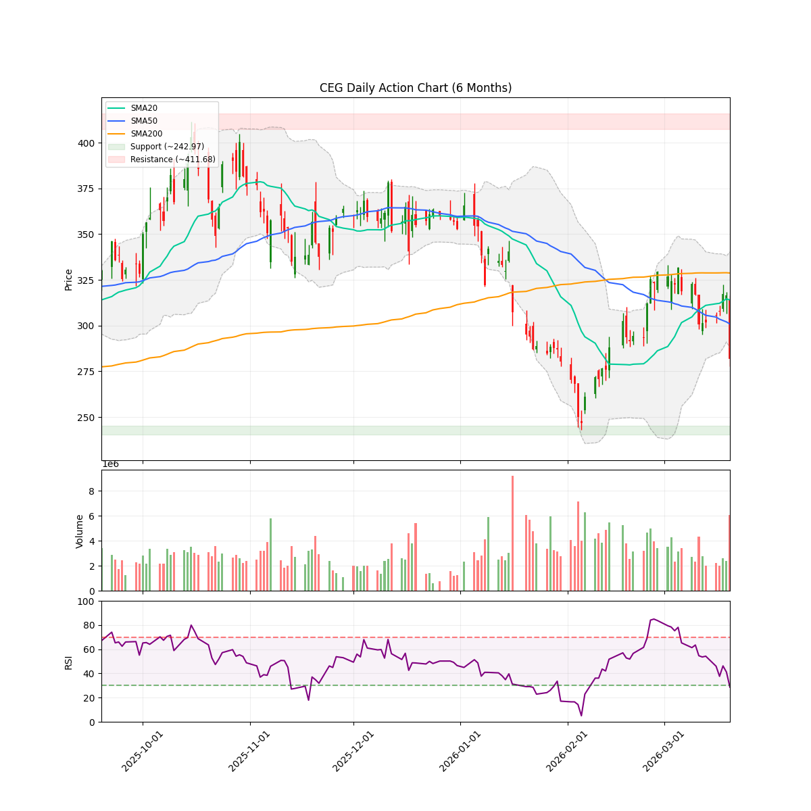
#### 研报分析

### 技术指标概览 (Technical Overview)
- **当前价格**: $281.99
- **RSI (14)**: 28.68
- **移动平均线**: SMA20: $314.02 | SMA50: $300.91 | SMA200: $328.76 (Bearish)
- **波动率**: ATR (14): 14.39 (预计周度波动: +/- $32.17)
- **关键位 (6m)**: 支撑位 $242.97 | 阻力位 $411.68
- **即时状态**: Below SMA50

# 叙事经济学审计报告：Constellation Energy (CEG) —— 核能宠儿的“倒春寒”

**致：** 投资委员会
**主题：** CEG 的叙事崩溃：是估值回归还是系统性陷阱？
**当前日期：** 2026年3月21日

---

### 1. 市场脉动：叙事的幻灭

老兄，如果你今天走进交易大厅，你会发现空气里弥漫着一股“宿醉”的味道。曾经被视为 AI 数据中心皇冠上的明珠——Constellation Energy (CEG)，就在刚才经历了一场近乎惨烈的 10.9% 大跌，股价收在 $281.99。

这不再是单纯的波动，这是一场**叙事的修正**。曾几何时，大家认为 AI 对电力的渴求是无止境的，而核能是唯一的救赎。但今天，冷水泼了下来：科技巨头的交易传出回撤消息，叠加 PJM 电力市场的费率上限忧虑，直接击碎了多头的“溢价梦”。

---

### 2. 催化剂分级：谁在真正扣动扳机？

我们将这波大跌的因素拆解如下：

- **A-Tier（核心基本面转向）：**
    - **科技订单回撤与 PJM 费率上限：** 这是致命伤。CEG 高估值的核心逻辑是“高价卖电给科技巨头”。如果 PJM 监管机构介入限制电价，或者大数据中心项目推进放缓，那么 CEG 的成长性就要被打上巨大的问号。这是**叙事核心的动摇**。
- **B-Tier（机构情绪修整）：**
    - **摩根大通 (JPMorgan) 下调目标价：** 小摩在这个节骨眼上“补一刀”，反映了机构投资者从“狂热追随”转为“冷静审视”。
- **C-Tier（短期噪音）：**
    - **非放射性化学物质泄漏：** 发生在维护期间的小事故。虽然媒体拿它做文章，但在老练的交易员看来，这只是压死骆驼的最后一份“坏运气”，并不影响长期资产质量。

---

### 3. 背离检测：超卖的尖叫

目前的盘面出现了一个极具讽刺意味的现象：**价格在“坏消息”中疯狂出逃，但技术面已经进入了“极寒区”。**

*   **RSI 读数：28.68**。这在技术分析里意味着“严重超卖”。
*   **价格行为：** 股价目前不仅跌破了 SMA50 ($300.91)，甚至直接贯穿了 SMA200 ($328.76)。
*   **深度洞察：** 这是一种**“看跌衰竭”**。虽然消息面全是利空，但这种短时间内的无差别抛售（10%以上的跌幅）通常预示着恐慌盘已经基本出清。目前的支撑位指向 6 个月低点 $242.97。

---

### 4. 叙事得分 (Logic Score)

**情绪评分：2.8 / 10 (极度悲观)**

*   **评分理由：** 目前市场处于“叙事真空期”。旧的 AI 狂热逻辑正在坍塌，而新的稳态尚未建立。尽管技术面超卖可能带来超跌反弹，但在监管压力和科技合同不确定性消除之前，任何反弹都可能只是“死猫跳”。

---

### 5. 引用与信源

根据最新资讯，以下动态是驱动情绪的主因：
1.  **Blockonomi:** 详细分析了 CEG 在单日交易中暴跌 10% 以上的多重原因，包括科技交易回撤和 PJM 费率担忧。 [参考链接](https://blockonomi.com/why-constellation-energy-ceg-stock-plunged-over-10-in-one-trading-session/)
2.  **JPMorgan (via Insider Monkey):** 机构下调目标价成为抛售的导火索。 [参考链接](https://www.msn.com/en-us/money/markets/constellation-energy-ceg-falls-109-as-jpmorgan-price-cuts-price-target/ar-AA1Z6cPh)
3.  **Zacks Investment Research:** 记录了维护期间的化学泄漏事件对股价的短期压制。 [参考链接](https://www.msn.com/en-us/money/topstocks/ceg-stock-underperforms-industry-in-the-past-week-how-to-play/ar-AA1YPFVH)

---

### 6. 下一个关键节点

**关键日期：2026年5月初（预计 Q1 财报发布日）**

*   **关注重点：** 管理层对“科技协议进度”的澄清。如果能证实与科技巨头的供电协议稳固且不受 PJM 新规影响，CEG 将会迎来史诗级的报复性反弹。在此之前，建议在 $243 - $260 区间观察支撑力度，不要轻易在飞刀下接盘。

---
*声明：本报告仅供参考，不构成投资建议。市场有风险，核能叙事需谨慎。*
#### 近期新闻与事件
- **[Blockonomi]** [Why Constellation Energy (CEG) Stock Plunged Over 10% in One Trading Session](https://blockonomi.com/why-constellation-energy-ceg-stock-plunged-over-10-in-one-trading-session/)
- **[Insider Monkey]** [Constellation Energy (CEG) Falls 10.9% as JPMorgan Price Cuts Price Target](https://www.msn.com/en-us/money/markets/constellation-energy-ceg-falls-109-as-jpmorgan-price-cuts-price-target/ar-AA1Z6cPh)
- **[Zacks.com]** [Why Constellation Energy Corporation (CEG) Dipped More Than Broader Market Today](https://www.msn.com/en-us/money/general/why-constellation-energy-corporation-ceg-dipped-more-than-broader-market-today/ar-AA1Z5toJ)
- **[Insider Monkey]** [Is Constellation Energy Corporation (CEG) A Good Stock To Buy Now?](https://www.msn.com/en-us/money/general/is-constellation-energy-corporation-ceg-a-good-stock-to-buy-now/ar-AA1YGsqA)
- **[Zacks Investment Research]** [CEG stock underperforms industry in the past week: How to play?](https://www.msn.com/en-us/money/topstocks/ceg-stock-underperforms-industry-in-the-past-week-how-to-play/ar-AA1YPFVH)

---

### ETN
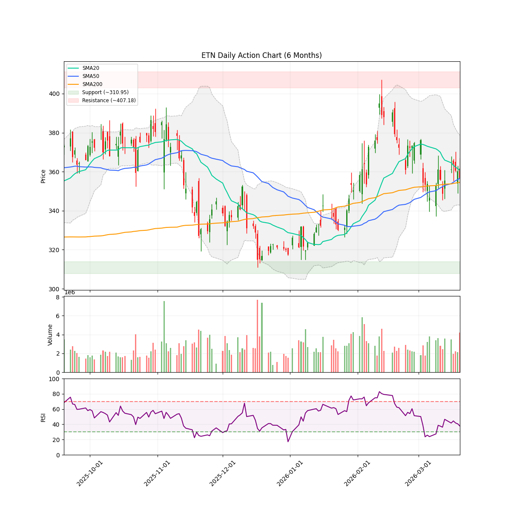
#### 研报分析

### 技术指标概览 (Technical Overview)
- **当前价格**: $356.80
- **RSI (14)**: 37.78
- **移动平均线**: SMA20: $360.77 | SMA50: $356.66 | SMA200: $354.56 (Bullish)
- **波动率**: ATR (14): 13.54 (预计周度波动: +/- $30.28)
- **关键位 (6m)**: 支撑位 $310.95 | 阻力位 $407.18
- **即时状态**: Above SMA50

# 伊顿公司 (ETN) 情绪审计报告：电力巨头的“中场休息”还是“叙事终结”？

**撰写人：** 叙事经济学研究员
**当前日期：** 2026年3月21日

---

### 1. 叙事核心：当“无聊”的电力基础设施撞上 AI 的野心
现在的伊顿（ETN）就像是派对上那个一直默默修电路，却突然被发现是整场派对“唯一供电人”的家伙。在 Narrative Economics 的视角下，ETN 已经从一个平庸的制造业标的，进化成了“电气化”与“AI数据中心”这两个超级叙事的交汇点。

目前的价位（356.80）正处于一个微妙的心理关口。它比 20 天均线（360.77）低了一些，正在 SMA50（356.66）这道“防线”上反复试探。市场在犹豫：在经历了一波大涨后，伊顿究竟是动力耗尽，还是仅仅在为下一场冲刺更换电池？

---

### 2. 催化剂分级 (Catalyst Categorization)

*   **A-Tier：机构的坚定背书 (Institutional Conviction)**
    *   **动态：** RBC Capital 和 Bernstein 在近期上调了伊顿的目标价 ([MSN/Insider Monkey](https://www.msn.com/en-us/money/saving-and-investing/rbc-capital-and-bernstein-lift-eaton-corporation-plc-etn-price-targets/ar-AA1YqeFA?ocid=BingNewsVerp))。
    *   **解读：** 顶级分析师在财报后依然敢于加注，这不仅仅是看好业绩，更是对“隐形 AI 概念股”叙事的认可。机构资金通常比散户更有耐心，这种上调锁定了下行空间的支撑力。
*   **B-Tier：性价比的角逐 (Relative Value)**
    *   **动态：** Zacks 将其与 Vestas (VWDRY) 进行价值对比 ([MSN/Zacks](https://www.msn.com/en-us/money/savingandinvesting/vwdry-vs-etn-which-stock-is-the-better-value-option/ar-AA1XQcUJ?ocid=BingNewsVerp))。
    *   **解读：** 这种讨论虽然是“存量博弈”的体现，但说明 ETN 依然留在价值投资者的雷达上，而不是被当作纯粹的投机泡沫。
*   **C-Tier：市场杂音与数据噪音 (The Noise)**
    *   **动态：** 24/7 Wall St. 关于 USOI (Exchange Traded Note) 的文章 ([24/7 Wall St.](https://247wallst.com/investing/2026/03/20/usoi-not-for-the-average-investor-seeking-a-crude-oil-play/))。
    *   **解读：** **注意！** 这是一个典型的算法抓取错误。该新闻讨论的是“交易所交易票据（ETN）”这种金融产品，而非伊顿公司（Eaton Corp）。老练的交易员会过滤掉这种噪音，这反映了目前市场算法在处理 ETN 这一代码时的混乱，也侧面说明了它的“低调”。

---

### 3. 背离检测 (Divergence Detection)

**观察：** 自上次财报以来，ETN 下跌了约 2.9% ([MSN/Zacks](https://www.msn.com/en-us/money/topstocks/why-is-eaton-etn-down-2-9-since-last-earnings-report/ar-AA1XBiHR?ocid=BingNewsVerp))，跑输了标普 500。

**深度解析：** 这是一个有趣的“看涨枯竭”转向。尽管机构在 3 月份还在上调目标价，但股价却在财报后阴跌。RSI 目前处于 37.78，接近超卖区间。这意味着：
*   **叙事陷阱还是蓄势？** 这种背离通常说明短线投机资金正在获利了结，而长线资金（如 RBC 提到的对冲基金）正在回补。
*   **技术位：** 股价目前就在 SMA50 附近徘徊。如果这里守不住，下方 SMA200 (354.56) 就是终极堡垒。

---

### 4. 情绪评分：7.2 / 10 (稳健但处于调整期)

**逻辑阐述：**
*   **(+2) 机构信仰：** 顶级投行在 3 月中旬的加注是强心针。
*   **(+1) 结构性需求：** 数据中心和电网升级不是一两年的事，是十年的长周期叙事。
*   **(-1.5) 动能缺失：** 股价跌破 SMA20 且表现弱于大盘，短期情绪偏冷。
*   **(+0.7) 估值回落：** RSI 接近 30，意味着卖压已接近尾声，相对于高点，风险已部分释放。

---

### 5. 投资建议报告

**市场脉搏：** 现在的伊顿不是那种让你一夜暴富的妖股，它更像是一个“收费站”。只要全世界还在建数据中心，只要铜线还在通电，它就在收钱。

**警惕：** 别被那种讨论“石油 ETN”的新闻误导，那是金融产品的重名误区。伊顿的基本面非常扎实，目前的下跌更像是给错过了 2025 年大涨的人一个补票上车的机会。

*   **下一次关键节点：** 预计 2026 年 5 月初（下一季度财报发布）。
*   **操作思路：** 观察 354-356 区间的支撑力。如果 RSI 触及 30 且股价企稳在 SMA200 上方，那是一个极具叙事吸引力的买点。

---
**结论：** 这是一个处于“黄金回撤”阶段的工业巨头。叙事没有崩塌，只是市场在等待更便宜的筹码。
#### 近期新闻与事件
- **[24/7 Wall St.]** [USOI – Not For The Average Investor Seeking A Crude Oil Play](https://247wallst.com/investing/2026/03/20/usoi-not-for-the-average-investor-seeking-a-crude-oil-play/)
- **[Zacks Investment Research on MSN]** [VWDRY vs. ETN: Which stock is the better value option?](https://www.msn.com/en-us/money/savingandinvesting/vwdry-vs-etn-which-stock-is-the-better-value-option/ar-AA1XQcUJ?ocid=BingNewsVerp)
- **[Insider Monkey on MSN]** [RBC Capital and Bernstein Lift Eaton Corporation plc (ETN) Price Targets](https://www.msn.com/en-us/money/savingandinvesting/rbc-capital-and-bernstein-lift-eaton-corporation-plc-etn-price-targets/ar-AA1YqeFA?ocid=BingNewsVerp)
- **[Zacks Investment Research on MSN]** [Why is Eaton (ETN) down 2.9% since last earnings report?](https://www.msn.com/en-us/money/topstocks/why-is-eaton-etn-down-2-9-since-last-earnings-report/ar-AA1XBiHR?ocid=BingNewsVerp)

---

### KLAC
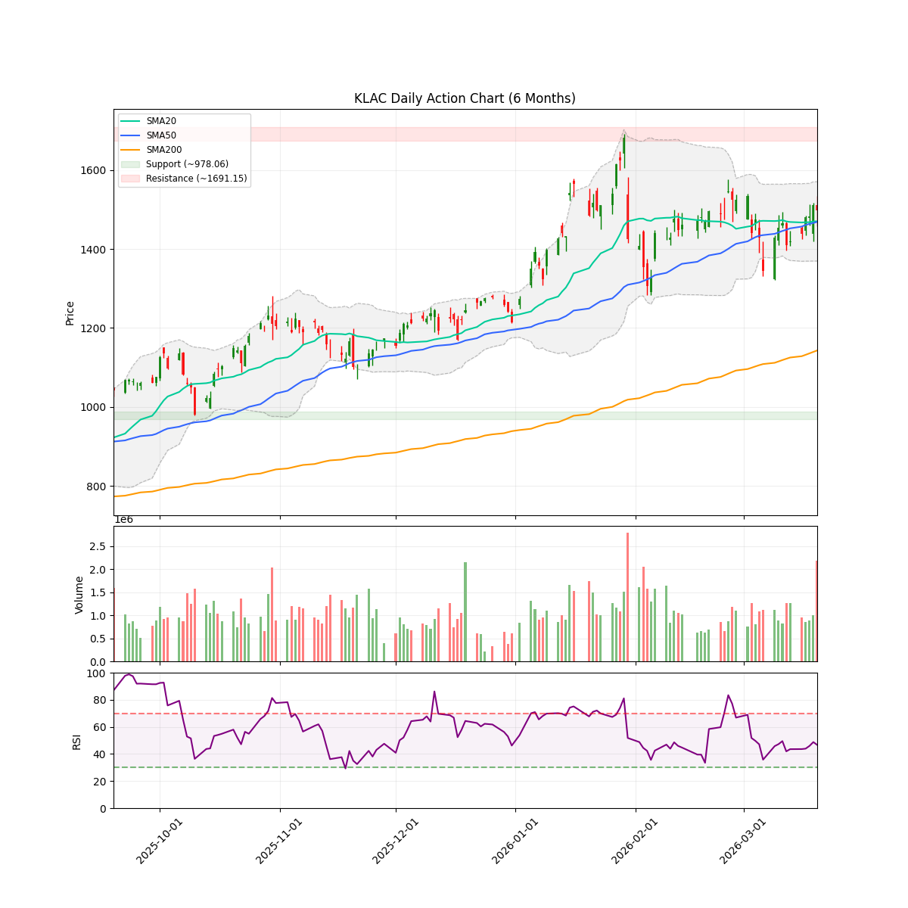
#### 研报分析

### 技术指标概览 (Technical Overview)
- **当前价格**: $1498.67
- **RSI (14)**: 46.70
- **移动平均线**: SMA20: $1470.17 | SMA50: $1468.86 | SMA200: $1143.12 (Bullish)
- **波动率**: ATR (14): 71.66 (预计周度波动: +/- $160.23)
- **关键位 (6m)**: 支撑位 $978.06 | 阻力位 $1691.15
- **即时状态**: Above SMA50

# 叙事经济学报告：KLA (KLAC) —— 战火中的半导体“定海神针”？

**报告日期：** 2026年03月21日
**研究员：** 叙事经济学资深分析师

---

### 1. 市场叙事总结：在硝烟中寻找“确定性”

老兄，坐。咱们喝杯咖啡，聊聊 KLA (KLAC)。

现在的市场情绪就像三月的风，变幻莫测。你得看清大背景：2026年3月初，由于中东局势恶化（美伊战争已持续三周），整个AI和芯片板块都在“流血”。你能在《Seeking Alpha》和《Barchart》的新闻里感受到那种恐慌。

但在这种“末日叙事”里，KLA 的表现却很有意思。当大家都在抛售高估值的投机股时，这种“卖铲子的人”（半导体检测设备巨头）反而成了机构的避风港。虽然半导体整体受挫，但 KLA 悄悄收复了20日均线，价格稳在 1498 左右。这说明什么？说明在这个充满不确定性的时代，大家开始重新审视那些有“硬技术门槛”的公司。

---

### 2. 催化剂分级 (Catalyst Categorization)

我们要区分什么是“干货”，什么是“噪音”：

*   **A-Tier (核心驱动力):**
    *   **机构背书：** 花旗银行 (Citi) 分析师 Atif Malik 在3月13日维持“买入”评级。在战火纷飞时，这种顶尖分析师的坚定立场是市场的强心针。
    *   **Zacks 顶级股票报告：** KLA 被列入与 NVIDIA 并列的研究报告中，象征着其在 AI 叙事中的核心地位。
*   **B-Tier (行业共振):**
    *   **技术面突破：** 3月5日，KLA 正式站上20日移动平均线 (SMA20)。在技术派眼里，这是从震荡转入多头的发令枪。
    *   **竞对 Nova 的联动：** 顶级基金在抄底 Nova 等半导体测试同类股，说明整个“半导体度量/检测”细分赛道的资金流向是积极的。
*   **C-Tier (日常噪音):**
    *   **估值争议：** Yahoo Finance 提到的“估值与公允价值估算的冲突”。老实说，在叙事驱动的市场里，基于静态数据的“公允价值”往往是最后才被考虑的。

---

### 3. 背离检测：抗跌的逻辑

**注意这个关键点：** 虽然 2月27日到3月初，地缘政治导致芯片股大跌，但 KLA 目前的价格 (1498.67) 依然高于其 SMA50 (1468.86) 和 SMA20 (1470.17)。

当《Seeking Alpha》头条喊着“AI 芯片随战争爆发而暴跌”时，KLA 却没有跌破支撑位，反而展现出**看涨耗竭后的反弹**。这种“利空不跌”的背离，通常意味着筹码已经从散户手里流向了更有耐心的长线机构。大家发现，无论仗怎么打，AI 芯片的精密化制造都需要 KLA 的检测设备，这个逻辑暂时无解。

---

### 4. 情绪得分：7.5 / 10 (坚韧的牛市节奏)

*   **逻辑：** 尽管宏观环境（战争、通胀）是 0 分，但 KLA 的公司逻辑是 9 分。它目前的 RSI 在 46.7，完全没到超买区间，就像一个长跑运动员刚热完身，心率平稳。如果地缘政治稍有缓和，它冲向 1691 的历史高点并非难事。但战争如果升级为全面系统性风险，这 7.5 分会迅速缩水。

---

### 5. 投资建议与后市关注

目前的 KLA 像是一个在暴风雨中紧闭门户的堡垒。它不花哨，但很稳。

*   **技术支撑：** 下方关注 SMA50 附近（约 1470）的支撑。只要不跌破这里，上升趋势就没坏。
*   **阻力位：** 6个月高点 1691.15 是目前的“天花板”。
*   **风险预警：** 警惕战争导致的供应链中断。KLA 的设备极其精密，任何一颗稀有气体或金属的短缺都可能成为“黑天鹅”。

**下一重要日期：**
*   **2026年4月底 (预计)：** 第一季度财报发布日。这将是验证 KLA 在战争背景下订单流稳健性的“终极审判”。

---

**老兵私房话：** *别被头条新闻吓破胆。战争确实可怕，但如果你看一眼 KLA 那些厚厚的专利墙和它在晶圆检测领域近乎垄断的地位，你就会明白为什么花旗敢在炮火声中喊“买入”。这不仅仅是买股票，这是在买入半导体产业的“质检权”。*

---
*数据来源参考：Zacks, Seeking Alpha, Barron's, Nasdaq, Yahoo Finance, The Globe and Mail.*
#### 近期新闻与事件
- **[Zacks.com on MSN]** [Top Stock Reports for NVIDIA, Caterpillar & KLA](https://www.msn.com/en-us/money/other/top-stock-reports-for-nvidia-caterpillar-kla/ar-AA1Z4U26?ocid=BingNewsVerp)
- **[Seeking Alpha]** [AI, chip stocks tumble as Iran war rages on](https://seekingalpha.com/news/4567060-ai-chip-stocks-tumble-as-iran-war-rages-on)
- **[Barron's]** [ASML Stock Has Taken an AI Hit. Why That Makes It a ‘Very Attractive’ Chips Play.](https://www.barrons.com/articles/asml-stock-buy-ai-chips-fa63a7e6)
- **[Barchart on MSN]** [Stocks fall on spillover effects from Iran war](https://www.msn.com/en-us/money/top-stocks/stocks-fall-on-spillover-effects-from-iran-war/ar-AA1Z4bPE?ocid=BingNewsVerp)
- **[Investor's Business Daily on MSN]** [KLA rival calibrates new buy zone as top funds scoop up shares](https://www.msn.com/en-us/money/topstocks/kla-rival-calibrates-new-buy-zone-as-top-funds-scoop-up-shares/ar-AA1YZ7If?ocid=BingNewsVerp)

---

### MSFT
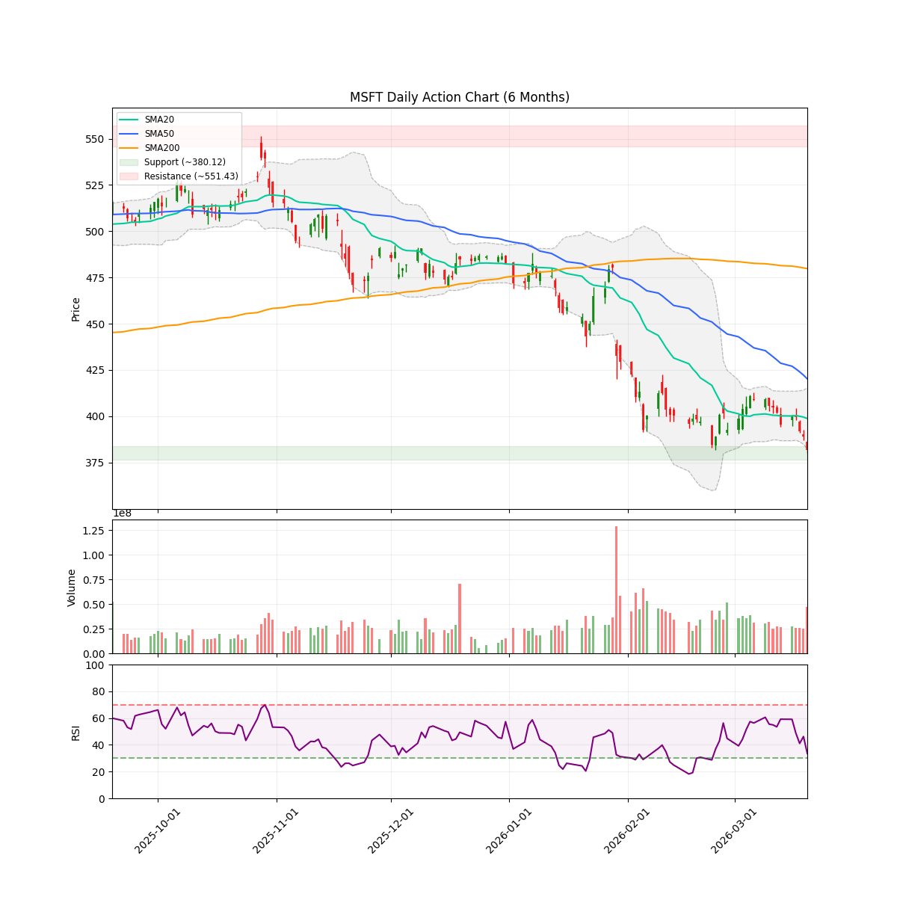
#### 研报分析

### 技术指标概览 (Technical Overview)
- **当前价格**: $381.87
- **RSI (14)**: 33.53
- **移动平均线**: SMA20: $398.77 | SMA50: $420.21 | SMA200: $479.79 (Bearish)
- **波动率**: ATR (14): 7.72 (预计周度波动: +/- $17.26)
- **关键位 (6m)**: 支撑位 $380.12 | 阻力位 $551.43
- **即时状态**: Below SMA50

# 叙事经济学审计：微软 (MSFT) —— 巨头的“至暗时刻”还是抄底陷阱？

**日期：** 2026年3月21日
**分析师：** 对冲基金调研员 (叙事经济学专家)

---

### 1. 市场叙事：从“AI领头羊”到“估值重估”的阵痛

坐下来，朋友。现在的微软（MSFT）给人的感觉，就像是那个曾经在舞会上最耀眼的明星，突然被发现独自躲在角落里。股价 **$381.87**，已经踩到了六个月来的地板价（支撑位 $380.12）。

现在的叙事逻辑变了。去年大家都在聊 AI 改变世界，现在华尔街这帮家伙开始盯着账单问：“回报在哪里？” 看看 Meta 的大规模裁员，再看看市场对 NVIDIA 惊人财报的冷淡反应，这种情绪已经传染给了微软。这不是简单的跌价，这是一场关于“AI溢价”的信心危机。

---

### 2. 催化剂分级 (Catalyst Categorization)

*   **A-Tier (长期基本面支撑)**
    *   **Morningstar 的“核心资产低估”论断**：[Morningstar](https://www.morningstar.com/stocks/this-might-be-best-core-stock-bargain-market-today) 将其视为当前市场最佳的核心股便宜货。这种“宽护城河”的背书是多头的最后防线。
*   **B-Tier (行业联动与小胜)**
    *   **IREN 合作协议**：尽管 IREN 股价在跌，但与微软的合作显示了其云基础设施的持续扩张动力。
    *   **机构博弈**：Zacks 提到 MSFT 依然是搜索热度极高的股票，关注度即流动性。
*   **C-Tier (杂讯与技术面对冲)**
    *   **期权套利策略**：[Yahoo Finance](https://finance.yahoo.com/news/microsoft-bear-call-spread-could-110002227.html) 和 [IBD](https://www.msn.com/en-us/money/topstocks/transform-microsoft-stock-weakness-into-a-1700-payoff-with-a-butterfly-trade/ar-AA1Z4KfM) 都在教散户怎么通过“熊市价差”或“蝴蝶价差”来从微软的颓势中捞钱。这种新闻多了，说明空头情绪正在结晶。

---

### 3. 背离检测 (Divergence Detection)

**警报：** 我们观察到了典型的 **“利好不涨”与“利空放大”** 的背离。
Morningstar 在 3月19日 喊出了“史诗级低估”，但市场在 3月20日 依然通过复杂的期权操作（如 IBD 提到的蝴蝶组合）来押注其进一步走弱。

更扎心的是，微软明明有 IREN 这样的业务进展，股价却被拖入了“风险厌恶（Risk-off）”的漩涡。**RSI 仅为 33.53**，技术上已经进入超卖区，但价格却像秤砣一样死死压在 SMA200（$479.79）下方极远的位置。这说明，目前的市场不看“事实”，只看“情绪”。

---

### 4. 叙事得分 (Logic Score): 3.8 / 10

**结论：短期情绪性崩坏，长期叙事处于真空期。**

*   **为什么是 3.8？** 尽管基本面（护城河）依然坚固，但目前的叙事是“估值杀”。当市场开始讨论如何用“Bear Call Spread”在微软身上榨取利润时，说明空头动能尚未耗尽。它正处于一个“刀尖”位置：如果跌破 $380，下方将是一片真空；如果守住，这可能是一个跨年度的黄金坑。

---

### 5. 投资建议：咖啡馆里的私房话

听着，如果你是短线客，别去挡这辆下坡的大卡车。SMA20、50、200 全线空头排列，这不是闹着玩的。

但如果你是那种能拿三五年的“老钱”，现在的微软正在剔除那些 AI 泡沫里的投机者。当 [Forbes 都在问“跌了15%是否值得买入”](https://www.forbes.com/sites/greatspeculations/2026/03/13/down-15-is-microsoft-stock-worth-buying-now/) 时，通常离真正的底部就不远了，但底部是一个过程，不是一个点。

---

### 6. 关键数据参考

*   **当前价格**: $381.87
*   **核心支撑位**: $380.12 (六个月低点) —— **极度关键，跌破则叙事崩溃**。
*   **技术阻力位**: $398.77 (SMA20)
*   **引用文献**: 
    1.  Morningstar: "Best Core Stock Bargain" (2026-03-19)
    2.  Yahoo Finance: "Bear Call Spread Strategy" (2026-03-17)
    3.  Forbes: "Is Microsoft Worth Buying Now?" (2026-03-13)

**下一重大日期：**
*   **2026年4月23日 (预计)**：2026财年第三季度财报发布日。这将是决定微软能否反杀的“诺曼底登陆”。在此之前，市场大概率会维持这种磨人的震荡阴跌。
#### 近期新闻与事件
- **[Yahoo Finance]** [This Microsoft Stock Bear Call Spread Could Net 14% in 4 Weeks](https://finance.yahoo.com/news/microsoft-bear-call-spread-could-110002227.html)
- **[Morningstar]** [This Might Be the Best Core Stock Bargain in the Market Today](https://www.morningstar.com/stocks/this-might-be-best-core-stock-bargain-market-today)
- **[Investor's Business Daily]** [Transform Microsoft stock weakness into a $1,700 payoff with a butterfly trade](https://www.msn.com/en-us/money/topstocks/transform-microsoft-stock-weakness-into-a-1700-payoff-with-a-butterfly-trade/ar-AA1Z4KfM)
- **[Zacks Investment Research]** [Microsoft Corporation (MSFT) is a trending stock: Facts to know before betting on it](https://www.msn.com/en-us/money/topstocks/microsoft-corporation-msft-is-a-trending-stock-facts-to-know-before-betting-on-it/ar-AA1Z3yOo)
- **[Forbes]** [Meta Stock Plummets As 20% Layoffs Loom: What Investors Need To Know](https://www.forbes.com/sites/petercohan/2026/03/14/meta-stock-plummets-as-massive-20-layoffs-loom-what-investors-need-to-know/)

---

### MU
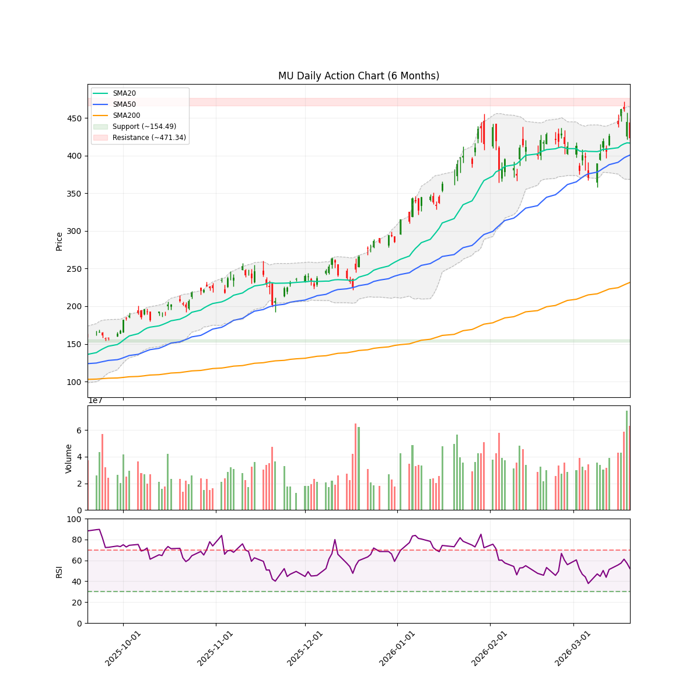
#### 研报分析

### 技术指标概览 (Technical Overview)
- **当前价格**: $422.90
- **RSI (14)**: 52.12
- **移动平均线**: SMA20: $416.57 | SMA50: $400.60 | SMA200: $231.62 (Bullish)
- **波动率**: ATR (14): 27.23 (预计周度波动: +/- $60.88)
- **关键位 (6m)**: 支撑位 $154.49 | 阻力位 $471.34
- **即时状态**: Above SMA50

# 美光科技 (MU) 情绪审计报告：AI 盛宴中的“昂贵”调整？

**致：** 投资决策委员会
**日期：** 2026年3月21日
**汇报人：** 叙事经济学研究组

---

### 1. 市场叙事总结：繁花锦簇下的“惊弓之鸟”

坐在交易台前，你能感觉到空气中弥漫着一种复杂的情绪。美光科技（MU）目前正处于一场**“史诗级叙事”**的中心：AI 驱动的存储器超级周期。如果你只看财报，那简直是无懈可击——Q2 业绩如烟花般灿烂。但奇怪的是，市场在喝彩之后，转手就按下了卖出键。

这并不是因为美光不行了，而是因为美光变得**“太贵”**了——不仅是估值贵，连它的“未来”也变贵了。管理层宣布将资本支出（Capex）提升至 250 亿美元，这就像是赌桌上的一次重金梭哈：为了在 AI 浪潮中保持领先，美光必须疯狂砸钱。

### 2. 催化剂分级 (Catalyst Categorization)

*   **A-Tier（核心动力）：Q2 财报大捷与 AI 超级周期**
    *   [Investopedia](https://www.investopedia.com/here-is-how-much-micron-stock-is-expected-to-move-after-earnings-mu-q2-fy2026-update-11922240) 与 [Blockonomi](https://blockonomi.com/micron-mu-stock-analysts-hold-strong-despite-post-earnings-dip/) 证实了这一点。存储器不再是夕阳周期产业，而是 AI 算力的生命线（HBM 需求）。这是支撑长期牛市的脊梁。
*   **B-Tier（结构性变量）：250 亿美元的资本支出规划**
    *   [Yahoo Finance](https://finance.yahoo.com/markets/stocks/articles/buy-post-earnings-dip-micron-193520335.html) 提到这引发了投资者的震荡。在华尔街看来，这既是对未来信心的表现，也是对短期现金流的压力测试。
*   **C-Tier（短期扰动）：卡塔尔氦气风险与宏观噪音**
    *   [Invezz](https://invezz.com/news/2026/03/19/micron-stock-why-attack-on-qatars-energy-facility-is-bearish-for-it/) 提到的卡塔尔能源设施袭击事件，虽然听起来很遥远，但氦气是半导体制造的关键耗材。这更像是空头找借口进行利润收割的“引线”。

### 3. 背离检测：好消息背后的“冷颤”

**现象描述：** 2026年3月19日，美光在交出了一份惊艳的财报后，股价反而重挫近 5% ([The Economic Times](https://economictimes.indiatimes.com/news/international/us/why-nvidia-micron-tesla-stock-crashing-big-today-nvda-down-1-while-mu-stock-crashes-nearly-5-heres-why-tsla-stock-is-falling-today-amid-oil-surge-and-fed-uncertainty/articleshow/129684125.cms))。

**深度解析：** 这种“利好出尽”的走势并非看空，而是**“看涨者的精疲力竭”**。结合 RSI 52.12，市场已经从超买区成功软着陆。目前的下跌更多是宏观因素（10年期美债收益率攀升、油价上涨）与获利盘了结的共同作用。这并非叙事崩溃，而是一次昂贵的“中场休息”。

### 4. 情绪得分：7.2/10 (强劲但需防守)

*   **逻辑支撑：**
    *   **分析师阵营依然稳固：** 巴克莱等机构维持 500 美元的目标价，暗示目前 422.90 的价格仍有约 18% 的上涨空间。
    *   **技术形态：** 股价稳稳站在 SMA50 (400.60) 之上，只要这一线不破，中期多头格局就没有破坏。
    *   **陷阱预警：** 谨防卡塔尔叙事发酵导致的供应链恐慌。如果氦气供应真的中断，那 C-Tier 会瞬间升级为 A-Tier。

### 5. 投资建议：咖啡桌上的老兵之谈

“听着，现在的 MU 就像一辆正在高速公路上换引擎的赛车。引擎（AI 需求）极强，但换引擎的成本（Capex）吓到了副驾驶。如果你现在冲进去，要注意 SMA50 附近的支撑。如果跌破 400 关口，那我们就得重新审视这出戏了。反之，这只是一个完美的‘上车点’。”

---

*   **当前逻辑得分 (Logic Score):** **7.2 / 10**
*   **关键支撑位:** 400.60 (SMA50)
*   **关键阻力位:** 471.34 (6个月新高)
*   **下个重大日期:** **2026年6月中旬** (下季度财报初步指引及 Capex 进度更新)

> **引用资料:**
> - *The Economic Times: 宏观压力导致 MU 暴跌 5% (2026-03-19)*
> - *Yahoo Finance: 存储器超级周期辩论 (2026-03-18)*
> - *Invezz: 卡塔尔氦气供应风险分析 (2026-03-19)*
#### 近期新闻与事件
- **[The Economic Times]** [Why Nvidia, Micron, Tesla stock crashing big today: NVDA down 1% while MU stock crashes nearly 5% — here's why TSLA stock is falling today amid oil surge and Fed uncertainty](https://economictimes.indiatimes.com/news/international/us/why-nvidia-micron-tesla-stock-crashing-big-today-nvda-down-1-while-mu-stock-crashes-nearly-5-heres-why-tsla-stock-is-falling-today-amid-oil-surge-and-fed-uncertainty/articleshow/129684125.cms)
- **[Yahoo Finance]** [Wall Street Is Still Betting on a Memory 'Super-Cycle.' Should You Buy MU Stock Here?](https://finance.yahoo.com/news/wall-street-still-betting-memory-141516285.html)
- **[Blockonomi]** [Micron (MU) Stock: Analysts Hold Strong Despite Post-Earnings Dip](https://blockonomi.com/micron-mu-stock-analysts-hold-strong-despite-post-earnings-dip/)
- **[Seeking Alpha]** [Biggest stock movers Thursday: BABA, MU, FIVE, and more](https://seekingalpha.com/news/4566195-biggest-stock-movers-thursday-mu-five-and-more)
- **[Invezz]** [Micron stock: why attack on Qatar's energy facility is bearish for it](https://invezz.com/news/2026/03/19/micron-stock-why-attack-on-qatars-energy-facility-is-bearish-for-it/)

---

### NVDA
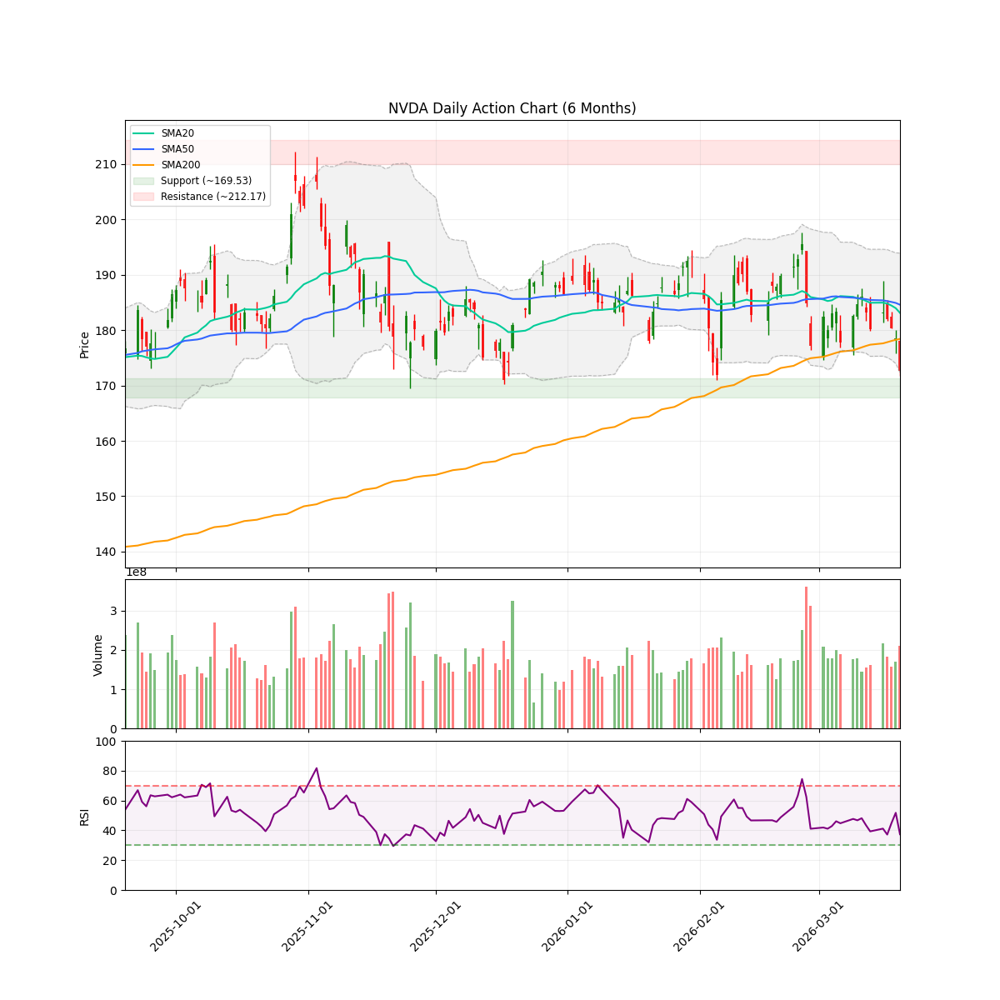
#### 研报分析

### 技术指标概览 (Technical Overview)
- **当前价格**: $172.70
- **RSI (14)**: 37.39
- **移动平均线**: SMA20: $183.12 | SMA50: $184.59 | SMA200: $178.42 (Bullish)
- **波动率**: ATR (14): 5.37 (预计周度波动: +/- $12.00)
- **关键位 (6m)**: 支撑位 $169.53 | 阻力位 $212.17
- **即时状态**: Below SMA50

# NVDA 情绪审计报告：繁华背后的“恐高症”与叙事重构

你好，我是你的研究员。既然坐下来了，咱们就边喝咖啡边拆解一下 NVDA（英伟达）现在的局势。现在的盘面，可不是单看几个财务数字就能看透的。

### 1. 催化剂分类： Jensen 的新“大饼”与现实的拉锯

我们把最近的消息进进行权重拆解，看看哪些是真金白银，哪些只是噪音：

*   **A-Tier（核心动力）：**
    *   **$1万亿营收愿景与 OpenClaw：** 黄仁勋将 OpenClaw 提升到与 HTML 和 Linux 同等的高度，押注“代理式 AI”（Agentic AI）。这不仅仅是卖芯片，这是在定义 AI 的下一代操作系统。
    *   **机构重仓背书：** TD Cowen 给出了 235 美元的目标价，Raymond James 甚至看高到 323 美元。分析师们正在集体上调预期，显示出专业资金对长期订单能见度（$1T visibility）的极度饥渴。
*   **B-Tier（长期愿景/行业顺风）：**
    *   **太空数据中心：** 这是一个极其性感的叙事，虽然目前还处于早期，但它扩展了 NVDA 的物理天花板。
    *   **中国市场准入：** 市场对于中国区业务的复苏有期待，但由于政策敏感性，这只能算作锦上添花。
*   **C-Tier（市场杂音）：**
    *   **股息增长股标签：** 虽然 Zacks 把它列入抗通胀名单，但买 NVDA 的人从来不是为了那点股息。

### 2. 背离检测：好消息里的“陷阱”？

这里是目前最值得玩味的地方。**典型的“利好出尽”表现。**

看看这个对比：TD Cowen 维持买入，Raymond James 甚至在 GTC 后把目标价拉到了 323 美元，而且财报显示了 1 万亿美元的营收潜力。结果呢？股价却在 3 月 19 日盘前跌了 2.6%，目前甚至跌破了 SMA200（178.42）。

**这说明了什么？** 市场正在经历“牛市疲劳”。投资者对超大规模计算厂商（Hyperscalers）能否持续投入巨资产生了怀疑。即便 NVDA 把故事讲到了太空，市场现在想看的是：这些投入什么时候能变成下游公司的利润？当股票对“好消息”不再起舞，甚至向下俯冲时，说明短期的看涨情绪已经衰竭，市场正在强行挤压估值泡沫。

### 3. 情绪评分：6.5 / 10（中性偏谨慎，底部蓄势中）

*   **逻辑支撑：** 6.5 分意味着这绝不是“系统性崩溃”（0分），因为基本面依然硬得像石头。但它也不是“无敌多头周期”（10分），因为价格跌破了所有短期均线，且 RSI 只有 37.39，处于极度虚弱的状态。
*   **叙事诊断：** 这是一个**“叙事换挡期”**。旧的“卖铲子”逻辑大家听腻了，新的“代理式 AI”逻辑还没完全被市场消化。目前的 172.70 美元刚好踩在 6 个月的支撑位（169.53）边缘。

### 4. 市场脉搏与实操建议

现在的 NVDA 就像是一个在马拉松中领跑太久的长跑健将，身体指标（财报）完美，但双腿（股价）已经开始发沉。

*   **观感：** 现在的盘面透着一股“虽然你很优秀，但我现在想离场歇歇”的酸腐味。
*   **机会：** RSI 接近 30，且股价跌破 SMA200 这种关键心理关口，通常会引发一轮技术性反弹。如果 169.53 的支撑能守住，这可能是一个极佳的左侧分批建仓点。

---

### 关键数据参考

*   **逻辑得分 (Logic Score):** **6.5/10**
*   **引用新闻源:**
    *   [Yahoo Finance] Nvidia Wants to Help Bring Data Centers to Space.
    *   [Yahoo Finance] OpenClaw Is Just as Important as HTML, Linux, and ChatGPT.
    *   [Blockonomi] Nvidia (NVDA) Stock Stalls Despite $1 Trillion Revenue Projection.
    *   [TD Cowen] Maintains Buy Rating, Target $235.
*   **下一个重大日期:** **2026年5月中旬（预计 2026 Q1 财报发布日）**。在那个日期之前，市场将主要受制于宏观情绪和 OpenClaw 的初期落地反馈。

**研究员结语：** 别被短期的阴跌吓跑，但也别急着满仓去接下落的飞刀。在 170 美元附近观察市场的承接力，那是多头最后的防线。
#### 近期新闻与事件
- **[Yahoo Finance]** [Nvidia Wants to Help Bring Data Centers to Space. Should You Bet on NVDA Stock Now for Out-of-This-World AI?](https://finance.yahoo.com/markets/stocks/articles/nvidia-wants-help-bring-data-171856007.html)
- **[Yahoo Finance]** [OpenClaw Is Just as Important as HTML, Linux, and ChatGPT: Jensen Huang Bets That Agentic AI Will Transform NVDA Stock](https://finance.yahoo.com/markets/stocks/articles/openclaw-just-important-html-linux-160951341.html)
- **[Blockonomi]** [Nvidia (NVDA) Stock Stalls Despite $1 Trillion Revenue Projection and Strong Earnings](https://blockonomi.com/nvidia-nvda-stock-stalls-despite-1-trillion-revenue-projection-and-strong-earnings/)
- **[Insider Monkey]** [TD Cowen Maintains Buy Rating on NVIDIA (NVDA) Stock](https://www.msn.com/en-us/money/topstocks/td-cowen-maintains-buy-rating-on-nvidia-nvda-stock/ar-AA1YZkeT)
- **[Blockonomi]** [Nvidia (NVDA) Stock Slips in Pre-Market Despite Bullish Wall Street Analyst Upgrades Post-GTC](https://blockonomi.com/nvidia-nvda-stock-slips-in-pre-market-despite-bullish-wall-street-analyst-upgrades-post-gtc/)

---

### PLTR
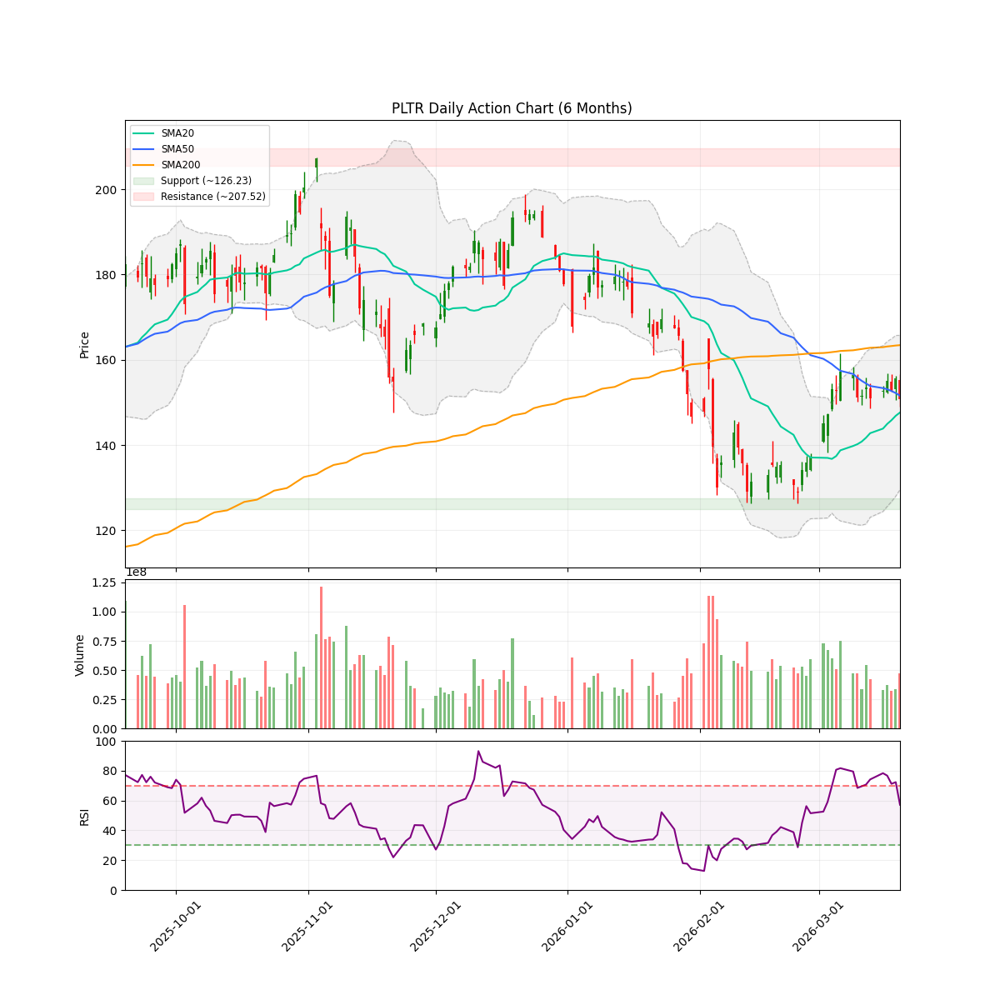
#### 研报分析

### 技术指标概览 (Technical Overview)
- **当前价格**: $150.68
- **RSI (14)**: 57.19
- **移动平均线**: SMA20: $147.64 | SMA50: $151.57 | SMA200: $163.43 (Bearish)
- **波动率**: ATR (14): 6.14 (预计周度波动: +/- $13.74)
- **关键位 (6m)**: 支撑位 $126.23 | 阻力位 $207.52
- **即时状态**: Below SMA50

# 叙事经济学观察报告：Palantir (PLTR) —— 是“完美定价”的陷阱，还是深蹲后的起跳？

**日期：** 2026年03月21日
**分析师：** 叙事经济学研究员
**标的：** PLTR (Palantir Technologies)
**当前价格：** $150.68

---

### 1. 叙事脉络：AI 宠儿的“中年危机”？

坐在马路对面的咖啡馆里，看着 PLTR 的走势图，你可能会觉得它像是一个刚刚跑完马拉松的长跑运动员，正蹲在路边大口喘气。过去一年 65.7% 的涨幅让它风光无限，但现在的市场正在问一个尖锐的问题：**“现在的价格，是不是已经把未来五年的好消息都透支了？”**

目前的叙事正处于**“成长性预期”与“估值引力”的肉搏战**中。一方面，Zacks 的分析显示盈利预测在调高；另一方面，股价却跌破了 50 日和 200 日均线。这种技术面与基本面的“脱节”，正是叙事经济学中最迷人的地方。

---

### 2. 催化剂分级 (Catalyst Categorization)

*   **A-Tier（核心引擎）：盈利预测上调**
    *   根据 [Zacks (Yahoo Finance)](https://finance.yahoo.com/news/earnings-estimates-moving-higher-palantir-172003851.html) 的报道，PLTR 的盈利预期正在走高。在叙事中，这是“硬通货”，说明公司的基本面并没有随着股价的回调而坍塌，反而变得更扎实了。
*   **B-Tier（市场地位）：长线持有的“信仰”**
    *   被列入 [Insider Monkey](https://www.msn.com/en-us/money/other/15-best-forever-stocks-to-buy-now/ar-AA1Z4Dzr?ocid=BingNewsVerp) 的“15只最适合永久持有的股票”名单。这加强了“PLTR 是 AI 时代基础设施”的品牌叙事，有助于在恐慌时吸引长线“抄底”资金。
*   **C-Tier（杂音与情绪）：短期博弈**
    *   关于 3 月 23 日涨跌的 [Yahoo Finance 预测投票](https://finance.yahoo.com/markets/prediction/event/pltr-up-or-down-on-march-23-2026/)。这种属于短期的情绪博弈，虽然热闹，但对中长期趋势影响有限。

---

### 3. 背离监测：利好不涨，必有蹊跷？

这是一个非常典型的**“看涨情绪衰竭”**案例。
*   **现象：** 尽管有 [Motley Fool](https://finance.yahoo.com/news/palantir-technologies-stock-no-brainer-202000047.html) 喊出“150美元以下闭眼买”的口号，且盈利预测上调，但 PLTR 目前仍处于 SMA50 ($151.57) 和 SMA200 ($163.43) 之下。
*   **解读：** 资本的嗅觉是灵敏的。当前的抛压并非来自坏消息，而是来自**“重力”**——市场在消化过去一年的巨额获利盘。由于目前处于熊市趋势（Bearish Trend），市场对“利好”产生了钝感力。这种背离告诉我们：PLTR 正在寻找“地板”，但在技术形态修复之前，任何冲高都可能遭遇短线客的无情抛售。

---

### 4. 情绪评分：6.2 / 10 (谨慎乐观)

**逻辑得分依据：**
*   **基本面 (+3.0):** 盈利预测上调，这是最稳固的底气。
*   **叙事吸引力 (+2.5):** 作为 AI 软件领域的绝对头部，故事还没讲完。
*   **技术面溢价 (-1.5):** 股价跌破关键均线，存在技术性踩踏风险。
*   **估值担忧 (-0.8):** 市场开始讨论“定价是否过高”（Priced for perfection）。

**总结：** 目前不是“系统性崩溃”，而是一次**大规模的筹码换手**。

---

### 5. 资深投资者的“咖啡谈话”

“老兄，别被现在的回调吓破了胆。PLTR 的故事还没到结尾。目前的市场就像是在一场狂欢派对后清理现场，那些短线投机者正忙着结账离场。
$150 左右的价位确实诱人，但技术上看，它还在‘寻找脚下的硬地’。如果它能在 $126.23（6个月低点）附近站稳，那将是一个极其完美的二次进场点。现在的逻辑很简单：**公司越来越赚钱，而股价越来越便宜。** 这种错位通常就是财富分配的时刻，但前提是你得有耐心熬过这段乏味的探底期。”

---

### 6. 关键观察日期

*   **下周重点关注：2026年3月23日**
    *   这是市场预测投票的结算日，短期情绪的宣泄口。如果收盘高于 $150.68，将极大提振多头信心。
*   **下一季财报日：预计 2026年5月初**
    *   这将是验证 Zacks 盈利预测是否准确的“终极审判”。如果届时业绩再次超出预期，目前的所有“回调”都将成为 K 线图上的一个小小深蹲。

**结论：** **当前并非陷阱，而是震荡洗盘。** 维持关注，分批入场，切忌满仓搏杀。
#### 近期新闻与事件
- **[Yahoo Finance]** [Is It Too Late To Reassess Palantir Technologies (PLTR) After Its 65.7% One Year Rally?](https://finance.yahoo.com/markets/stocks/articles/too-reassess-palantir-technologies-pltr-080542261.html)
- **[FX Empire]** [TSLA, PLTR and SMCI Forecasts – Major Stocks Looking for Floor](https://www.fxempire.com/forecasts/article/tsla-pltr-and-smci-forecast-major-stocks-looking-for-floor-1586573)
- **[Blockonomi]** [Chevron (CVX) Stock Breaks Into Elite $400B Club Amid Oil Price Rally](https://blockonomi.com/chevron-cvx-stock-breaks-into-elite-400b-club-amid-oil-price-rally/)
- **[Insider Monkey on MSN]** [15 best forever stocks to buy now](https://www.msn.com/en-us/money/other/15-best-forever-stocks-to-buy-now/ar-AA1Z4Dzr?ocid=BingNewsVerp)
- **[Yahoo Finance]** [Palantir (PLTR) Up or Down on March 23?](https://finance.yahoo.com/markets/prediction/event/pltr-up-or-down-on-march-23-2026/)

---

### TSM
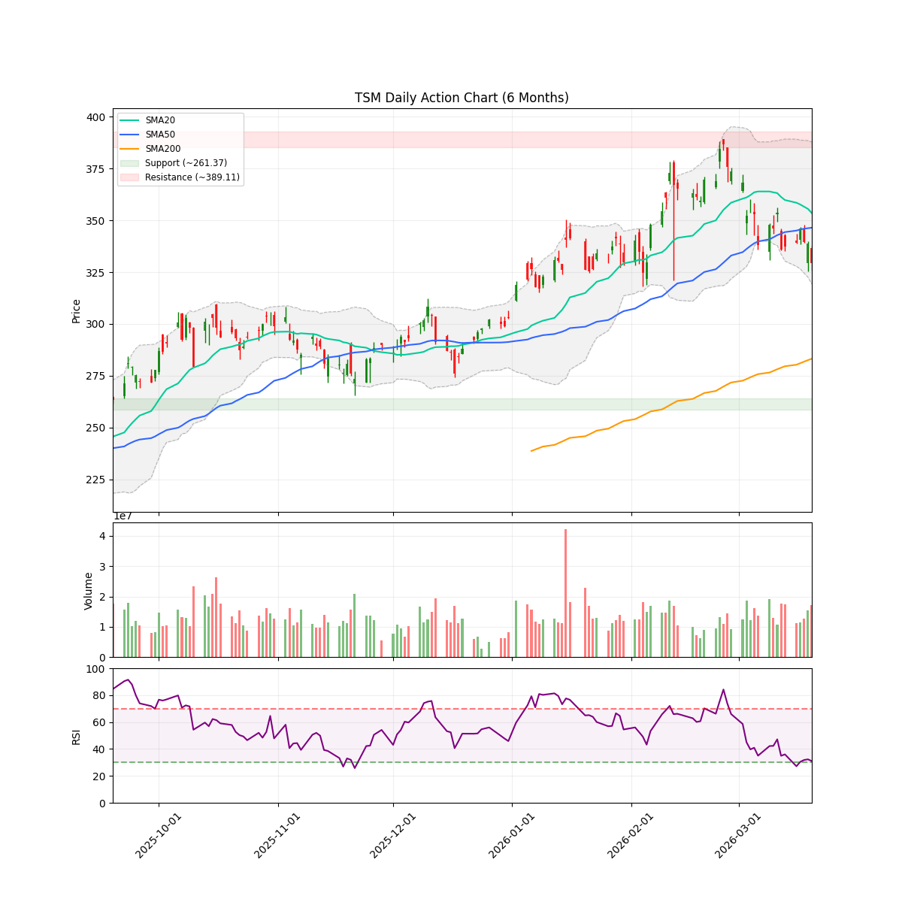
#### 研报分析

### 技术指标概览 (Technical Overview)
- **当前价格**: $329.24
- **RSI (14)**: 31.02
- **移动平均线**: SMA20: $353.52 | SMA50: $346.44 | SMA200: $283.18 (Bullish)
- **波动率**: ATR (14): 12.83 (预计周度波动: +/- $28.70)
- **关键位 (6m)**: 支撑位 $261.37 | 阻力位 $389.11
- **即时状态**: Below SMA50

# TSM 叙事经济学审计报告：AI 引擎被地缘政治“断粮”了吗？

**日期：** 2026年3月21日
**分析师：** 叙事经济学研究部
**标的：** 台积电 (TSM)
**当前价格：** 329.24

---

### 1. 叙事背景：当“最强代工”撞上“地缘黑天鹅”

兄弟，坐下来喝杯咖啡。现在的 TSM 就像是一台正在全速冲刺的法拉利，突然被人往油箱里灌了一桶沙子。

目前的盘面非常精彩：一边是 **Nvidia（英伟达）** 正式超越苹果成为台积电最大的“金主爸爸”，2月份营收涨了 22%，机构还在喊 470 美元的目标价；另一边，中东的硝烟直接烧到了半导体生产的命门——**氦气（Helium）**。

市场现在陷入了典型的“叙事冲突”：是该拥抱 AI 的无限远景，还是该恐惧由于伊朗局势导致的全球氦气供应链断裂？

---

### 2. 催化剂分级 (Catalyst Categorization)

*   **A-Tier（核心动力）：英伟达登顶与 AI 护城河**
    *   [Blockonomi] 报道显示，英伟达已成为 TSM 第一大客户（占比19%）。这标志着一个时代的交替：手机时代退位，AI 算力时代全面接管。2月营收 101 亿美元，同比增 22%，基本面硬得像石头。
*   **B-Tier（市场支撑）：顶级投行的力挺**
    *   [Yahoo Finance] 美国银行（BofA）在 3 月 19 日重申“买入”评级，目标价看高到 $470。哈佛大学也将 TSM 列为顶级 AI 持仓。
*   **C-Tier（杂音与套利）：期权策略与日常波动**
    *   [Forbes] 建议通过卖出看跌期权（Selling Puts）来建仓。这是典型的在恐慌中寻找底部支撑的策略。

---

### 3. 分歧检测：是陷阱还是黄金坑？

**技术面警示：** TSM 的 RSI 已经杀到了 **31.02**，这几乎是贴着“超卖”的红线在走。股价目前跌破了 SMA20 和 SMA50，看起来有点难看。

**叙事悖论：** 
由于伊朗局势影响氦气供应 [Yahoo Finance]，市场正在经历一场“利好出尽即是利空”的变体。明明 2 月业绩爆表，股价却因为还没发生的“断粮”危机而萎靡。

**我的判断：** 这是一个**“恐慌溢价”造成的短暂背离**。地缘政治引发的氦气涨价确实会抬高成本，但 TSM 拥有全球最强的议价权。英伟达和苹果会因为氦气贵了就不下单吗？不可能。目前的下跌更像是多头在获利回吐，顺便被地缘消息吓破了胆。

---

### 4. 情绪评分 (Sentiment Score)

#### **6.2 / 10**
*(注：基本面 9 分，地缘政治风险 -2.8 分)*

**评价：** 这是一个“充满痛感的上升趋势”。虽然短期内受困于中东局势的阴云，但 TSM 的 AI 叙事逻辑并未动摇。如果你相信 AI 浪潮还没结束，现在的 TSM 就像是打折的奢侈品。

---

### 5. 关键情报引用

*   **供应危机：** [Yahoo Finance] 警告伊朗冲突导致氦气供应受阻，可能威胁芯片生产。 [链接](https://finance.yahoo.com/markets/stocks/articles/tsmc-stock-tsm-wilts-iranian-123611179.html)
*   **客户结构巨变：** [Blockonomi] Nvidia 超越 Apple 成为最大客户。 [链接](https://blockonomi.com/tsmc-tsm-stock-nvidia-overtakes-apple-as-top-customer-in-historic-shift/)
*   **供应链风险：** 摩根士丹利警告霍尔木兹海峡关闭的系统性风险。 [链接](https://www.msn.com/en-us/money/other/taiwan-semiconductor-manufacturing-tsm-staring-at-chips-production-disruption-amid-iran-war/ar-AA1Z78QI)

---

### 6. 投资者备忘录

*   **下个重大日期：** **2026年4月16日**（预计 2026 年 Q1 财报发布日）。
*   **行动建议：** 关注 $310 - $320 区间的支撑位。如果伊朗局势没有进一步升级为全面封锁，这里就是强力反弹的起点。就像 [Forbes] 说的，在这个价位，与其割肉，不如思考如何利用波动性。

**记住，在 Narratives Economics（叙事经济学）里，恐惧总是走在事实前面，而事实通常是由订单和利润决定的。**
#### 近期新闻与事件
- **[Yahoo Finance]** [TSMC Stock (TSM) Wilts as Iranian Attacks Batter Helium Supply and Threaten Chip Production](https://finance.yahoo.com/markets/stocks/articles/tsmc-stock-tsm-wilts-iranian-123611179.html)
- **[Yahoo Finance]** [Bank of America Securities Reiterates a Buy Rating on Taiwan Semiconductor Manufacturing Company (TSM) Stock](https://finance.yahoo.com/markets/stocks/articles/bank-america-securities-reiterates-buy-154420626.html)
- **[Forbes]** [TSM Stock: Why Selling Puts Is The Win-Win Play](https://www.forbes.com/sites/greatspeculations/2026/03/18/tsm-stock-why-selling-puts-is-the-win-win-play/)
- **[Insider Monkey]** [Taiwan Semiconductor Manufacturing (TSM) Staring at Chips Production Disruption Amid Iran War](https://www.msn.com/en-us/money/other/taiwan-semiconductor-manufacturing-tsm-staring-at-chips-production-disruption-amid-iran-war/ar-AA1Z78QI)
- **[The Motley Fool]** [Think It's Too Late to Buy Taiwan Semiconductor Manufacturing Company Stock? Here's the 1 Reason Why There's Still Time.](https://www.msn.com/en-us/money/topstocks/think-its-too-late-to-buy-taiwan-semiconductor-manufacturing-company-stock-heres-the-1-reason-why-theres-still-time/ar-AA1YX9oe)

---

### VRT

#### 研报分析

### 技术指标概览 (Technical Overview)
- **当前价格**: $255.88
- **RSI (14)**: 49.10
- **移动平均线**: SMA20: $258.44 | SMA50: $221.03 | SMA200: $167.44 (Bullish)
- **波动率**: ATR (14): 14.65 (预计周度波动: +/- $32.76)
- **关键位 (6m)**: 支撑位 $133.77 | 阻力位 $276.71
- **即时状态**: Above SMA50

# 叙事经济学：Vertiv (VRT) —— AI时代的“冷酷”掌门人

你好！刚从交易大厅回来，趁咖啡还没凉，咱们来聊聊 Vertiv (VRT)。在叙事经济学的视角下，这家公司不再仅仅是卖散热器和电源的硬件商，它已经成了 AI 这场豪赌中不可或缺的“散热器”。

现在的市场情绪正处于一个非常微妙且有趣的节点。让我们剥开这些新闻迷雾，看看这到底是通往巅峰的坦途，还是给散户准备的温柔陷阱。

---

### 1. 催化剂分类：动力源泉在哪里？

我们将眼下的消息进行分层，看看哪些是真金白银，哪些只是噪音：

*   **A-Tier（顶级催化剂）：**
    *   **机构集体背书：** 高盛、摩根士丹利、奥本海默近期集体调高目标价。这不仅是数字的变动，更是机构资金入场锁定的信号。
    *   **S&P 500 指数替代叙事：** 随着 Super Micro (SMCI) 陷入合规泥潭，VRT 被视为最有力的替代者。这种“地位置换”带来的被动资金买入预期是极强的推力。
    *   **AI 数据中心统治力：** 所谓“静悄悄地驱动美国每一个 AI 数据中心”，这种叙事确立了 VRT 在基础设施层面的垄断地位。
*   **B-Tier（重要支柱）：**
    *   **生态系统扩张：** 与 Generate Capital 合作推出 BYOP&C 生态系统，说明公司正在从卖产品转向卖标准、卖生态，这有助于提升估值倍数。
*   **C-Tier（杂音与情绪）：**
    *   **Cramer 的呼吁：** “要么买 Vertiv，要么走人”，这类言论通常会吸引散户情绪，但也容易造成短期超买。
    *   **Zacks 搜索热度：** 这种关注度虽然高，但往往是股价已经起飞后的“马后炮”。

### 2. 背离检测：好消息下股价为何“休息”？

目前的盘面显示了一个非常有趣的现象：**利好齐发，股价微调。**

*   **现状：** 尽管 3 月初大行集体唱多，且有“S&P 500 替代”预期，但目前股价（255.88）略低于 SMA20（258.44）。
*   **老兵解读：** 别被这种微跌吓跑了。RSI 降到了 49.10 的中性位置，这简直是给这台过热的机器加了“散热液”。相比 SMA50（221）和 SMA200（167）的巨大乖离，现在的横盘整理是极度健康的。这不是“利好出尽”，而是“估值消化”。市场正在等待下一个爆点，让那些在高位追高的短线客交出筹码。

### 3. 叙事评分：8.5 / 10（不可逆的趋势）

**逻辑依据：**
VRT 的叙事非常坚固。AI 的尽头是能源和散热。你可以不买芯片，但你不能不给机房降温。目前它不是在走妖股路线，而是在走“蓝筹化”路线。唯一扣分项是 2026 年初至今已涨超 50%，短期内获利盘的抛压是客观存在的。

---

### 4. 投资建议与策略结论

*   **核心逻辑：** 不要把 VRT 当作 SMCI 那样的情绪投机股。VRT 是基本面驱动的行业龙头。
*   **技术位观察：** 目前在 SMA20 附近震荡，下方的强支撑在 220 区域（SMA50）。只要不破 SMA50，整体牛市叙事就没有任何破裂的迹象。
*   **情绪警示：** 如果股价在未来一周无法放量突破 276.71 的前高，可能会进入更长时间的箱体震荡。

---

### 5. 关键参考信息

*   **引用证据：**
    *   [Morgan Stanley, GS 调高评级](https://finance.yahoo.com/markets/stocks/articles/morgan-stanley-oppenheimer-goldman-sachs-204328851.html)
    *   [Super Micro 风险与 VRT 替代机会](https://finance.yahoo.com/markets/stocks/articles/super-micro-risks-p-500-121753896.html)
*   **下一个重大日期（预测）：** 
    *   **2026年4月下旬 (Q1 财报发布日)**：这是下一个验证 AI 散热需求是否持续暴增的“审判日”。在此之前，市场大概率会在高位横盘博弈。

**总结：** VRT 目前不是陷阱，而是一个正在换挡加速的重型卡车。稍微慢一点，是为了跑得更远。别在黎明前被震下车。
#### 近期新闻与事件
- **[Yahoo Finance]** [Morgan Stanley, Oppenheimer, and Goldman Sachs Raise Vertiv (VRT) Price Targets](https://finance.yahoo.com/markets/stocks/articles/morgan-stanley-oppenheimer-goldman-sachs-204328851.html)
- **[Insider Monkey· via Yahoo Finance]** [Vertiv (VRT) Up In Triple Digit Percentages After Jim Cramer Said “Stick to Vertiv or Get Out” In Ma...](https://finance.yahoo.com/markets/stocks/articles/vertiv-vrt-triple-digit-percentages-160311561.html)
- **[Motley Fool· via Yahoo Finance]** [Vertiv Is Quietly Powering Every AI Data Center in America, and the Stock Could Double](https://finance.yahoo.com/markets/stocks/articles/vertiv-quietly-powering-every-ai-175000477.html)
- **[24/7 Wall St.· via Yahoo Finance]** [Super Micro Risks S&P 500 Removal. Here’s the Stock to Replace It](https://finance.yahoo.com/markets/stocks/articles/super-micro-risks-p-500-121753896.html)
- **[Insider Monkey· via Yahoo Finance]** [Vertiv Holdings (VRT), Generate Capital Partner to Launch BYOP&C Ecosystem for Data Centers](https://finance.yahoo.com/news/vertiv-holdings-vrt-generate-capital-183058772.html)

---

### VST
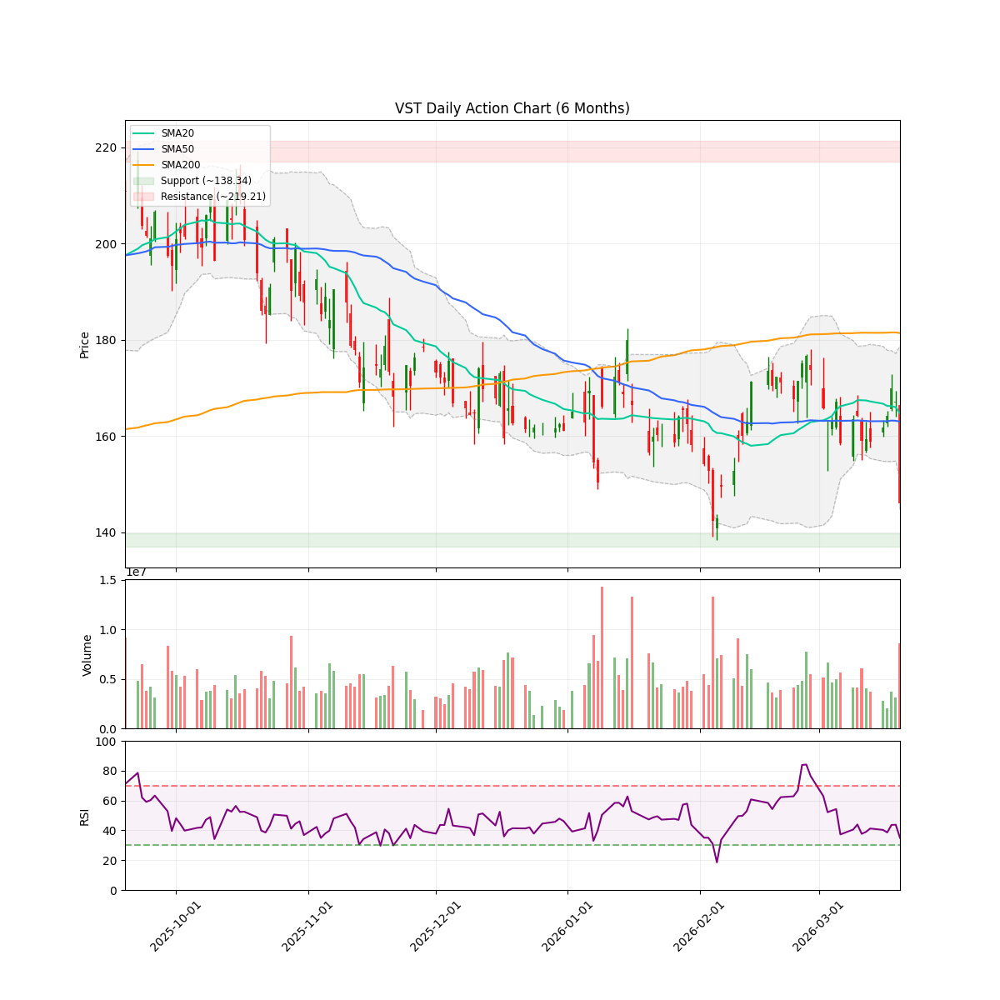
#### 研报分析

### 技术指标概览 (Technical Overview)
- **当前价格**: $146.02
- **RSI (14)**: 34.99
- **移动平均线**: SMA20: $164.69 | SMA50: $162.98 | SMA200: $181.36 (Bearish)
- **波动率**: ATR (14): 8.29 (预计周度波动: +/- $18.53)
- **关键位 (6m)**: 支撑位 $138.34 | 阻力位 $219.21
- **即时状态**: Below SMA50

咖啡已经泡好了，咱们坐下来聊聊 Vistra Corp. (VST) 最近的这出“高空坠落”的大戏。

作为叙事经济学的拥护者，我们不仅看数字，更要看故事。而 VST 现在的剧本，正从“AI驱动的核能宠儿”演变成一出“高位陷阱”的惊悚剧。

### VST 情感审计报告：是黄金坑，还是夺命剪刀脚？

#### 1. 催化剂分类 (Categorize Catalysts)

*   **A-Tier (重磅催化剂)：市场出清式的暴跌**
    *   **事件**：2026年3月21日，VST 股价单日重挫 12.64%，收于 146.02 美元，被 Insider Monkey 列为“不可忽视的市场牺牲品” [Link](https://finance.yahoo.com/markets/stocks/articles/vistra-corp-vst-loses-12-084154911.html)。
    *   **解读**：这种跌幅通常意味着机构投资者的信仰发生了动摇，或者是一次大规模的去杠杆。
*   **B-Tier (中级催化剂)：大行的“唱多”与现实的脱节**
    *   **事件**：摩根士丹利（Morgan Stanley）在3月18日依然重申看好 VST，认为其是 2026 年高回报的廉价标的 [Link](https://finance.yahoo.com/news/morgan-stanley-bullish-vistra-corp-150605579.html)。
    *   **解读**：大行的背书在暴跌面前显得苍白无力，但也为后续的“抄底叙事”埋下了种子。
*   **C-Tier (噪音与情绪)：詹姆斯·克拉默的“毒奶”**
    *   **事件**：Jim Cramer 再次点名核能电力的潜力 [Link](https://www.msn.com/en-us/money/markets/jim-cramer-s-hottest-nuclear-energy-stock-picks-hits-misses/ar-AA1Z719u)。
    *   **解读**：当一个板块被散户导师过度谈论时，往往意味着情绪已经见顶。

#### 2. 背离检测 (Divergence Detection)

这里出现了一个非常危险的**“看涨叙事与看跌走势”的背离**。

就在几天前（3月16日），Zacks 还在吹捧 VST 跑赢大盘 [Link](https://finance.yahoo.com/news/why-vistra-corp-vst-outpaced-214504504.html)，而摩根士丹利也在 18 号高喊“便宜”。然而，现实是股价直接击穿了 SMA50 和 SMA200。**这绝非“利好出尽”的空头衰竭，而是典型的“叙事崩塌”**。当市场对“核能+AI”的溢价产生怀疑时，任何所谓的好消息都会被视为逃命的机会。

#### 3. 叙事分析：从“电网之王”到“落水狗”

在过去的三年里，VST 讲了一个完美的案例：大数据中心需要能源，而核能是唯一的答案。股价也确实飞到了 219 美元的高位。但现在的叙事逻辑变了：**“估值回归现实”**。

根据 Zacks 的分析，VST 在过去半年里不仅跑输了电力行业，甚至落后于大盘 [Link](https://www.msn.com/en-us/money/markets/vst-stock-underperforms-industry-in-the-past-6-months-how-to-play/ar-AA1X4T08)。目前 RSI 处于 34.99，技术上接近超卖，但均线系统全面空头排列。市场的共识正在从“增长狂热”转向“寻找支撑”。

#### 4. 逻辑评分 (Logic Score): 3.5 / 10

**结论：这是一个极其危险的“掉落刀子”阶段。**

虽然摩根士丹利认为它便宜，但市场正在用脚投票。在跌破 SMA200 这个牛熊分界线后，短期内没有看到任何反转信号。目前的下跌动能（ATR 为 8.29）极强，138.34 美元的支撑位已近在咫尺。如果这里也守不住，那这个“叙事陷阱”将深不见底。

---

### 关键数据总结

*   **当前情绪**：**极度恐慌 / 叙事怀疑**
*   **技术形态**：熊市格局 (Price < SMA50 & SMA200)
*   **Logic Score**：**3.5** (目前的所谓“低价”可能只是半山腰)
*   **下个重大日期**：**2026年5月初** (预计 2026 Q1 财报发布日)。
    *   *注：这将是决定 VST 是“由于分红前调整而误伤”还是“基本面变天”的终极审判日。*

**老兵建议**：别急着去做那个英雄。等它在 138 美元附近磨出个底，或者 RSI 出现明显的底背离再说。现在的 VST 就像一只受伤的野兽，虽然看起来强壮，但血流不止。
#### 近期新闻与事件
- **[Insider Monkey· via Yahoo Finance]** [Vistra Corp. (VST) Loses 12.6% Ahead of Dividends](https://finance.yahoo.com/markets/stocks/articles/vistra-corp-vst-loses-12-084154911.html)
- **[Zacks· via Yahoo Finance]** [Why Vistra Corp. (VST) Outpaced the Stock Market Today](https://finance.yahoo.com/news/why-vistra-corp-vst-outpaced-214504504.html)
- **[Insider Monkey· via Yahoo Finance]** [Morgan Stanley is Bullish on Vistra Corp (VST) Here’s Why](https://finance.yahoo.com/news/morgan-stanley-bullish-vistra-corp-150605579.html)
- **[Zacks· via Yahoo Finance]** [Vistra Corp. (VST) is Attracting Investor Attention: Here is What You Should...](https://finance.yahoo.com/news/vistra-corp-vst-attracting-investor-130006213.html)
- **[Simply Wall St.· via Yahoo Finance]** [A Look At Vestis (VSTS) Valuation After Recent Share Price Volatility And Long...](https://finance.yahoo.com/news/look-vestis-vsts-valuation-recent-090615948.html)

---
