# 每日股市市场报告 (2026-03-22)

> **免责声明**: 本报告由 **代码与 Gemini AI 自动生成**，仅供研究参考，**不构成**任何投资建议。投资有风险，入市需谨慎。作者及 AI 不对任何基于此内容的投资决策承担责任。

## 📑 目录
[TOC]

##  长期投资逻辑
本组合旨在捕捉 **人工智能（AI）与半导体协议** 带来的跨周期结构性增长，核心投资策略聚焦于“确定性”与“物理瓶颈”：
- **底层制程垄断 (Foundry & WFE Moats)**：
  布局处于全球半导体精密制造顶端的“工业母机”级别公司。寻找具备极高准入门槛的晶圆代工及前道设备供应商，作为全产业链最稳固的底座资产。
- **算力稀缺性与连接带宽 (Compute & Interconnect Scarcity)**：
  聚焦在高性能计算芯（HPC）及高带宽连接领域占据主导地位的标的。AI 的终极竞争是“规模”，寻找能有效解决数据交换瓶颈并提供核心推理/训练能力的算力巨头。
- **应用生态与数据霸权 (Platform & Data Sovereignty)**：
  布局拥有闭环生态、海量高质量私有数据及云基础设施的科技巨头。它们是 AI 商业化落地的最终守门人，拥有将技术转化为持续现金流的分配权。
- **物理边界保障 (Power & Thermal Infrastructure)**：
  关注 AI 扩张的“最终瓶颈”——电力供应与热能管理。重点布局为下一代超大规模数据中心提供高功率密度能源、液冷技术及电网扩容方案的能源基建商。
**风控策略**：利用 AlphaJAX 的量化动量评分（Quant Score）作为过滤器，结合 LLM 叙事审计（Narrative Audit）捕捉“业绩超预期 + 叙事逻辑改善”的共振点，实现跨周期的超额收益。

 **注：排序权重**：Ticker 按照 AI 检测出的 **方向** 排序（**看多**优先，其次是 **中性**，最后是 **看空**）。
---

<!-- DISCORD_SUMMARY_START -->
## 🧠 对冲基金经理全局诊断与资金分配策略
# 投资组合战略审计报告 (2026-03-22)

**致执行委员会：**

现在的市场不是在下雨，而是在进行一场残酷的“叙事洗牌”。AI 的第一波狂热正在经历“宿醉期”（如 MSFT、NVDA、CEG 的崩塌），而能源板块正借着地缘政治的硝烟在战场上横冲直撞。

作为你的高级投资组合经理，我的职责是确保我们不被过时的信仰淹没。目前的账户资产配置存在**严重的风险偏离**，尤其是 AMD 的超限集中度与当前疲软的技术面完全不匹配。我们需要立刻动用现金储备，去捕获那些被错杀的“卖水人”和正在筑底的芯片巨头。

---

### 一、 指挥官意图 (Commander's Intent)

1.  **风险压制**：**AMD 的持仓比例（50.56%）已触及我们生存红线。** 虽然它是高确信度 AI 标的，但目前处于 SMA50 之下，技术面并非“极强”，**严禁继续加仓**，并需在反抽至 $210 以上时主动降权。
2.  **火力转移**：将资金从“叙事崩坏”的软件和公用事业（MSFT, CEG, VST）撤出，转向**逻辑极硬且技术面出现“黄金坑”**的标的：**VRT（散热垄断）、TSM（超卖捡漏）、AVGO（网络心脏）**。
3.  **对冲堡垒**：利用能源股作为地缘政治的盾牌，但避开过度超买的 APA/CVX，寻找更稳健的 **OKE** 或等待 **VLO** 回调。

---

### 二、 核心持仓诊断与行动建议

| 标的 | 逻辑评分 | 状态诊断 | PM 指令 |
| :--- | :--- | :--- | :--- |
| **AMD** | **6.8** | **高度橙色预警**。成本 $220，现价 $201。占 NAV 50.56% 过度集中。 | **停止一切加仓！** 卖出的 Put 暂时保留，但正股需在反弹至 SMA20 ($200.48) 以上时分批减持至 30% 以下。 |
| **GOOGL** | **6.8** | 利润垫厚（+16%），处于“冷静期”。 | **持有 (HOLD)**。它目前是组合的压舱石，只要不破 SMA200 ($259)，无需动作。 |
| **AMZN** | **6.2** | 正在 $200 关口磨底。 | **中性 (NEUTRAL)**。别被那 $2000 亿开支吓跑，那是未来的门票。守住 $196 支撑位。 |

---

### 三、 观察池决策：新弹药分配方案

我们的 $64,353 现金是目前的战术优势，必须精准打击：

#### 1. **维谛技术 (VRT) - 逻辑 9.2 (Top Conviction)**
*   **理由**：AI 芯片可以换，但散热和供电没法省。高盛和摩根士丹利集体抬轿，订单积压翻倍。
*   **行动**：**建仓 $20,000**。目前在 SMA20 附近横盘是极佳切入点。

#### 2. **台积电 (TSM) - 逻辑 7.8 (Oversold Gift)**
*   **理由**：RSI 杀到 31.02！这是典型的地缘政治恐慌导致的“抛售竭尽”。它是 AI 时代的收税人。
*   **行动**：**建仓 $15,000**。趁着大家在恐惧战争，我们去捡 $329 的廉价筹码。

#### 3. **博通 (AVGO) - 逻辑 8.5 (Structural Alpha)**
*   **理由**：基本面狂飙（Tomahawk 6 量产），股价却在“深蹲”洗盘。
*   **行动**：**建仓 $15,000**。在 $310 附近入场，博弈其收复 200 日线。

#### 4. **ONEOK (OKE) - 逻辑 8.5 (Income Shield)**
*   **理由**：组合需要低 beta 且高股息的防御，OKE 是能源板块中走势最稳健的慢牛。
*   **行动**：**建仓 $10,000**。作为组合的防御性对冲。

---

### 四、 避雷清单 (黑名单)

*   **CEG / VST (得分 3.5)**：信仰已经崩塌，不要试图去接掉下来的核燃料棒。彻底放弃。
*   **MSFT (得分 3.5)**：空头统治期，在 $380 筑底确认前，一分钱都不要投。
*   **APA (得分 8.5 but RSI 85)**：极其烫手！现在冲进去就是给别人买单。等回踩 SMA20 再看。

---

### 五、 确定性交易计划 (Actionable Trading Plan)

1.  **Immediate Action (今日执行)**:
    *   买入 **VRT** 80 股 (约 $20,470)。
    *   买入 **TSM** 45 股 (约 $14,815)。
    *   买入 **AVGO** 48 股 (约 $14,904)。
    *   *剩余现金约 $14,000 (占 NAV 约 10%)，留作机动。*
2.  **Monitor AMD**: 若股价跌破 $192 (SMA200)，必须无条件止损 100 股以保护账户净值。
3.  **Profit Taking (止盈分批)**: 若 CVX 或 VLO 的 RSI 突破 80，观察池中如有持仓需立刻撤出。

---

### 六、 “如果-那么” 压力测试 (If-Then Scenarios)

*   **如果 中东局势全面升级**：油价冲破 $130。
    *   **那么**：动用剩余 $14,000 现金全仓杀入 **APA** 或 **VLO**。能源将是唯一的避难所。
*   **如果 AMD 财报暴雷跌破 $180**：
    *   **那么**：立刻执行“弃舰指令”，将 AMD 仓位砍至 15%，将资金调往 **VRT** 和 **TSM** 等基本面更确定的标的。
*   **如果 微软(MSFT) 在 $380 企稳并出现放量长阳**：
    *   **那么**：说明 AI 软件端的信心回归，届时可卖出部分 GOOGL 利润，调仓回补 MSFT。

**PM 总结：**
不要死守着浮亏的 AMD 幻想奇迹。现在的胜负手在于**“切换”**。我们将现金注入 **VRT** 和 **TSM**，本质上是在用“确定性”去置换“不确定性”。

**立刻执行建仓指令！**
<!-- DISCORD_SUMMARY_END -->
---

## 💼 现有持仓个股诊断

### AMD
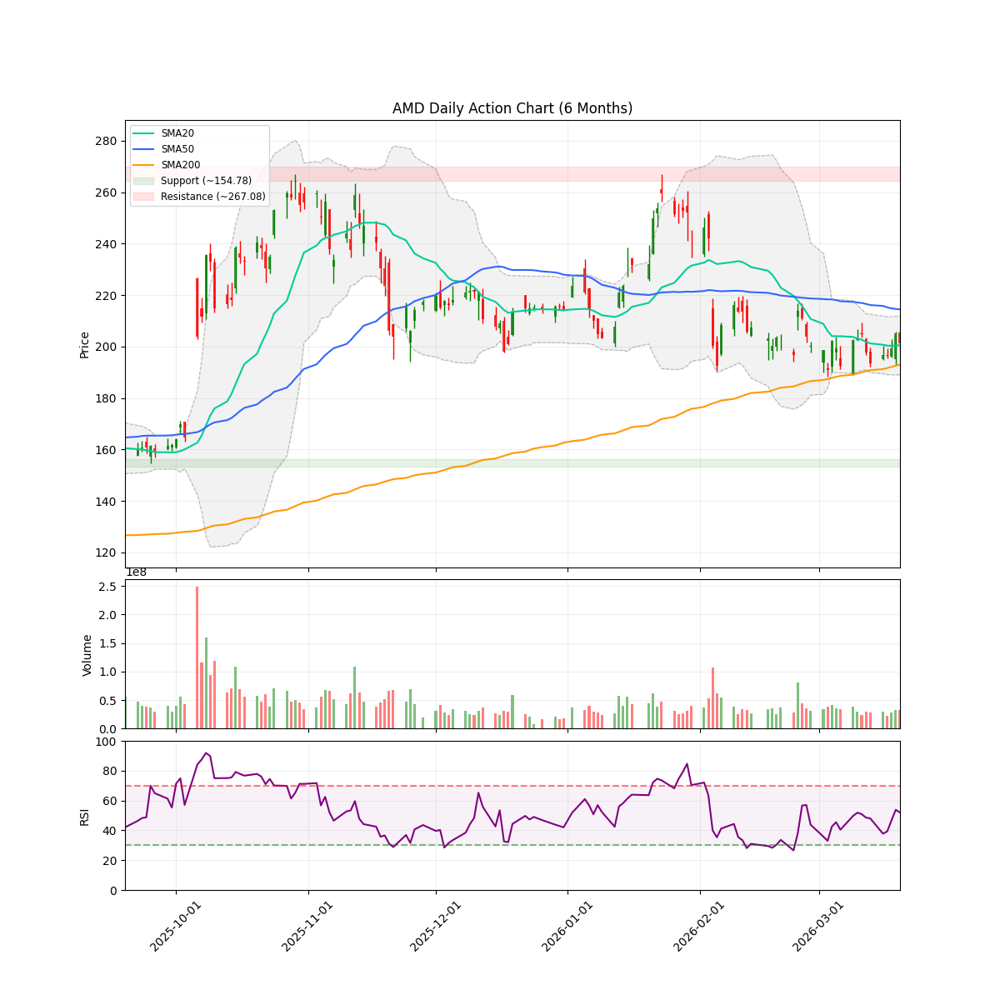
#### 研报分析

### 技术指标概览 (Technical Overview)
- **当前价格**: $201.33
- **RSI (14)**: 51.97
- **移动平均线**: SMA20: $200.48 | SMA50: $214.44 | SMA200: $192.97 (Bullish)
- **波动率**: ATR (14): 8.55 (预计周度波动: +/- $19.12)
- **关键位 (6m)**: 支撑位 $154.78 | 阻力位 $267.08
- **即时状态**: Below SMA50

你好！既然咱们坐下来喝这杯咖啡，那我就不跟你绕那些无聊的财报数字了。咱们直接聊聊 AMD 现在的“叙事逻辑”。

作为一名深耕“叙事经济学”的研究员，我看现在的 AMD，就像是看一场精彩的“特洛伊木马”大戏：它已经悄悄潜入了数据中心的最深处，但市场现在却在怀疑这匹木马里装的是真金白银，还是沉重的债务。

---

### **AMD 情绪审计报告：苏妈的“窄门”与市场的“多疑”**

#### **1. 催化剂分层 (Catalyst Categorization)**

*   **A-Tier (战略核武级):**
    *   **Meta 与 OpenAI 的深度捆绑：** 别被那点股价波动蒙蔽了。AMD 能进入 Meta 和 OpenAI 的供应链，这意味着它不再是 Nvidia 的“平替”，而是真正被认可的“备选项”。这是长期 EPS 爆发的基石。
    *   **AI 加速器业务的“期权性”：** 就像《Seeking Alpha》提到的，这是“机房里的特洛伊木马”，一旦渗透率突破临界点，估值逻辑会瞬间重构。
*   **B-Tier (行业东风级):**
    *   **美光 (Micron) 的“麦克风炸场”：** 美光亮眼的财报证明了 AI 内存需求不是虚火，整个产业链的“水温”依然滚烫。这对 AMD 来说是极佳的背景板。
*   **C-Tier (杂讯噪音级):**
    *   **154万美元的高管减持：** 别被《Blockonomi》吓到。对于 AMD 这种体量的公司，这点减持连“毛毛雨”都算不上。这是典型的市场情绪放大镜，噪音而已。

#### **2. 异常背离检测：为什么“利好”不涨？**

这里有个很有意思的现象：**AMD 财报超预期，但股价却在跌（见 YouTube 评论及近期走势）。**

这就是典型的**“叙事疲劳”**。市场已经预设了它必须完美，只要有一点关于 Capex（资本开支）或稀释风险的杂音，短线资金就会夺路而逃。目前股价在 SMA50（$214.44）下方挣扎，但在 SMA200（$192.97）上方企稳，这说明：**大趋势没死，但短期“信仰”在动摇。** 这是一个“看涨耗竭”后的磨底期，而非系统性崩盘。

#### **3. 仓位诊断：你现在的处境**

老兄，你的持仓现在有点“压力山大”。
*   **正股成本 $220.54：** 你买在了 SMA50 之上的“乐观区”，目前浮亏 9.22%。
*   **卖出的 Put (-AMD260313P200)：** 这手 $200 的 Put 浮亏近 60%，说明你卖的时候隐含波动率（IV）可能在低位，或者近期回撤太猛。
*   **风险点：** 你的 AMD 仓位占了账户总额的一半（50.56%）。这种“梭哈”式的配置在叙事分歧期会让你非常焦虑。

---

### **情绪评分 (Sentiment Score)**

# **6.8 / 10**
> **评语：** “痛苦的洗盘期”。叙事依然强大（A-Tier 支撑），但技术面处于“破位寻找支撑”阶段。这不是系统性失败（0分），也不是无脑冲锋（10分），而是一场关于耐心的考验。

---

### **叙事洞察：是陷阱还是机会？**

现在的 AMD 并不是一个“陷阱”，而是一个**“高昂的门票”**。

市场目前在纠结它的估值是否透支了未来的 AI 增长。目前的 RSI 在 51.97，不偏不倚，正处在“谁也不服谁”的十字路口。如果价格能站稳 SMA20（$200.48），那这波回踩就是完美的“黄金坑”；如果跌破 $192（SMA200），那咱们就要重新审视它的基本面逻辑了。

**我的建议：** 既然你已经重仓，且卖出了 $200 的 Put，现在的你已经通过卖权表达了“愿意在 $200 接货”的意愿。现在的价格（$201.33）就在你的行权价边缘反复横跳。**不要在这个位置因为恐惧而割肉，现在的市场正在消化那个 154 万美元减持带来的“心理落差”。**

---

### **关键日期与引线**

*   **下一次重大日期：** **2026年4月下旬 (预计 Q1 财报发布日)**
    *   *注：届时将决定 AMD 是否能真正通过 Meta/OpenAI 的订单转化为实际的毛利扩张。*
*   **关键点位：**
    *   **阻力位：** $214.44 (SMA50) —— 冲过去，牛回。
    *   **支撑位：** $192.97 (SMA200) —— 守不住，叙事崩塌。

---

**老友寄语：**
芯片行业的钱从来都不是躺着赚的。AMD 现在就像一个正在闭关修炼的高手，外面的人看他没动静就想撤，但真正懂行的人在等他出关的那一刻。你的成本确实有点高，但在 AI 这种十年一遇的叙事里，时间往往是最好的解药。

**Logic Score: 6.8/10**
#### 近期新闻与事件
- **[Yahoo Finance]** [Is Advanced Micro Devices, Inc. (AMD) A Good Stock To Buy Now?](https://finance.yahoo.com/markets/stocks/articles/advanced-micro-devices-inc-amd-210836582.html)
- **[Seeking Alpha]** [AMD Doesn't Worry Me, Its Customers And Deals Do](https://seekingalpha.com/article/4883805-amd-doesnt-worry-me-its-customers-and-deals-do)
- **[AOL]** [I Just Put More Than $10,000 Into These 3 Tech Stocks. Here's Why.](https://www.aol.com/finance/just-put-more-10-000-205000970.html)
- **[Seeking Alpha]** [AMD: The Trojan Horse In The Server Room](https://seekingalpha.com/article/4882644-amd-the-trojan-horse-in-the-server-room)
- **[YouTube]** [AMD's stock plunge despite strong earnings - what's next?](https://www.msn.com/en-us/money/news/amd-s-stock-plunge-despite-strong-earnings-what-s-next/vi-AA1Z0UEY)

---

### AMZN

#### 研报分析

### 技术指标概览 (Technical Overview)
- **当前价格**: $205.37
- **RSI (14)**: 46.35
- **移动平均线**: SMA20: $210.85 | SMA50: $220.87 | SMA200: $224.81 (Bearish)
- **波动率**: ATR (14): 5.36 (预计周度波动: +/- $11.99)
- **关键位 (6m)**: 支撑位 $196.00 | 阻力位 $258.60
- **即时状态**: Below SMA50

### 亚马逊 (AMZN) 情绪审计报告：AI 烧钱焦虑下的“黄金坑”还是“捕鼠夹”？

朋友，拉把椅子坐下，咱们来聊聊亚马逊。现在的西雅图巨头，正处于一场典型的“叙事冲突”风暴中心。

一边是华尔街对那惊人的 **2000亿美元 AI 资本支出 (CapEx)** 的集体恐慌，另一边则是各路大佬在窃窃私语：“这可能是你这辈子最后一次在 200 出头买入亚马逊的机会。”

你的账面上现在还有 4.16% 的微薄浮盈，在这个节骨眼上，你是该拿着利润赶紧跑，还是准备好弹药等回踩？

---

### 1. 催化剂分级：谁在操纵剧本？

我们将当下的消息进行拆解，看看哪些是真金白银，哪些只是噪音：

*   **A-Tier (核心驱动力)：$2000亿的“豪赌”与投行重估**
    *   **叙事：** Forbes 提到的 18% 暴跌主因是管理层宣布了前所未有的 AI 基础设施投入。市场现在担心这会拖累利润率。
    *   **反击：** 美银 (BofA) 此时站出来唱反调，认为市场“辩论错了重点”，正在重新调整目标价。这种大行之间的分歧，往往是趋势反转的前兆。
*   **B-Tier (业务进展)：AWS 的 AI 生态护城河**
    *   **动态：** AWS 与 SailPoint 合作开发 AI 代理治理方案 (2026-03-21)。这说明亚马逊不只是在砸钱买芯片，它在构建企业级 AI 的“规则”。
*   **C-Tier (市场噪音)：克拉默的“毒奶”与排名榜单**
    *   **动态：** Jim Cramer 在 1 月的推荐 (2026-03-18 被重提) 以及各种“10 大 AI 股票”榜单。这些属于散户情绪的调味料，虽然能增加曝光度，但无法改变技术面颓势。

### 2. 背离检测：恐慌可能已经“超卖”

看下盘面，这就是典型的**“利空出尽”**前夜。
*   **价格行为：** 股价目前在 205.37 美元，死死压在 SMA50 (220.87) 和 SMA200 (224.81) 之下。技术派会告诉你这是“大熊市”。
*   **情绪背离：** 虽然技术形态很难看，但 RSI 已经降到了 46.35。更重要的是，在面对 $2000 亿支出这种“利空”重锤后，股价在 196.00 支撑位附近表现出了明显的韧性。
*   **诊断：** 市场正在经历**熊市力竭 (Bearish Exhaustion)**。最恐慌的人已经卖出了，留下的都是在等底部确认的猎手。

### 3. 叙事得分 (Logic Score): 6.2/10

这是一个**“阵痛期的巨头”**得分。
*   **为什么不是 10 分？** 均线系统全面空头排列，且 2000 亿的开支确实会在短期内让财报很难看。
*   **为什么不是 0 分？** 你的成本价在 $201.61，非常有战略优势。亚马逊的现金流能力并没受损，只是投入了未来。

### 4. 资深老兵的视角：给你的持仓建议

“在市场因为公司花钱投资未来而感到愤怒时，通常就是该你动脑子的时候。”

目前的 AMZN 像是一个正在换引擎的波音 747，虽然还在跑道上颠簸，但一旦引擎点火，这种规模效应是无敌的。

*   **你的处境：** 你的成本价 $201.61 几乎踩在 6 个月的支撑位 (196.00) 边缘。只要不跌破 196，你的这 20 股就是未来的种子。
*   **操作策略：** 
    *   **持股待涨：** 别被最近的波动吓走。
    *   **加仓区间：** 如果跌破 200 靠近 196，且 RSI 进入 30 以下的超卖区，那是加仓的“黄金击球区”。
    *   **压力位：** 210.85 (SMA20) 是第一道坎，只有站回这里，多头叙事才会重新拿回主动权。

---

**下一关键日期：** 
**2026 年 4 月下旬 (预计 Q1 财报发布日)** 
*届时管理层对那 2000 亿支出的详细解释（尤其是对利润率的影响预期），将直接决定这波是“V型反转”还是“漫长筑底”。*

**参考新闻：**
1. *Forbes: Why The Amazon Stock Sell-Off Isn't Over Yet (2026-02-23)*
2. *Bank of America revamps Amazon stock price target (2026-02-27)*
3. *AWS Taps SailPoint to Develop Governance Solutions (2026-03-21)*
#### 近期新闻与事件
- **[Yahoo Finance]** [Jim Cramer Recommended Amazon (AMZN) As A Long Term Stock In January 2025](https://finance.yahoo.com/news/jim-cramer-recommended-amazon-amzn-220130883.html)
- **[Yahoo Finance]** [Amazon.com (AMZN) AWS Taps SailPoint to Develop Governance Solutions for AI Agents](https://finance.yahoo.com/markets/stocks/articles/amazon-com-amzn-aws-taps-182201876.html)
- **[Motley Fool· via Yahoo Finance]** [History Says You'll Regret Not Buying Amazon Stock](https://finance.yahoo.com/markets/stocks/articles/history-says-youll-regret-not-080500814.html)
- **[Insider Monkey· via Yahoo Finance]** [Amazon (AMZN): 10 Best AI Stocks to Buy for the Next 10 Years](https://finance.yahoo.com/sectors/technology/articles/amazon-amzn-10-best-ai-200134176.html)
- **[Insider Monkey· via Yahoo Finance]** [Why Amazon.com (AMZN) Is One of the Best Long Term Stocks to Invest in According...](https://finance.yahoo.com/markets/stocks/articles/why-amazon-com-amzn-one-102556002.html)

---

### GOOGL

#### 研报分析

### 技术指标概览 (Technical Overview)
- **当前价格**: $301.00
- **RSI (14)**: 43.88
- **移动平均线**: SMA20: $306.26 | SMA50: $317.80 | SMA200: $259.55 (Bullish)
- **波动率**: ATR (14): 6.65 (预计周度波动: +/- $14.87)
- **关键位 (6m)**: 支撑位 $235.52 | 阻力位 $348.75
- **即时状态**: Below SMA50

### **Alphabet (GOOGL) 情绪审计报告：AI 巨头的“中场休息”，是蓄势还是掉队？**

**日期：** 2026年3月22日
**研究员：** 叙事经济学策略组

---

#### **1. 叙事背景：当下的“情绪底噪”**
喝杯咖啡，咱们直切主题。现在的 Alphabet (GOOGL) 就像是一个期中考试拿了 95 分，却发现隔壁桌的 Meta 拿了满分的优等生。股价目前在 **$301** 徘徊，虽然长期趋势（SMA200）依旧斜向上指，但短期内，市场显然正在经历一场“审美疲劳”。

价格跌破了 SMA20 和 SMA50，RSI 只有 43.88。这说明什么？说明市场并不是在恐慌，而是在**犹豫**。大家在问：AI 带来的自由现金流（FCF）到底什么时候能真正从“投入期”转化成“压倒性的统治力”？

#### **2. 催化剂分级 (Catalyst Audit)**

*   **【A-Tier】核心驱动力：现金流的“护城河”**
    *   **Needham 的研报 (2026-03-21)：** 这是目前最扎实的利好。Needham 强调 Alphabet 的生成式 AI 投资是其资本回报率（ROIC）最高的地方。在叙事经济学里，这叫“确信感锚定”。只要 FCF 还在，大象就不会倒下。
    *   **巴菲特的背书：** 被列入巴菲特前十大持仓，且被视为“被低估的 AI 标的”。老股神的加持给予了市场底部的心理支撑。

*   **【B-Tier】行业竞争与增长惯性：**
    *   **Zacks 的增长评级：** 盈余增长和价格强度的背书。这属于“常规火力”，维持了基本面的热度。
    *   **Cloud & Snowflake 的对比：** 市场上出现了一些噪音（如 Yahoo Finance 指出 Snowflake 在云分析上的锐气）。这在一定程度上稀释了 Google Cloud 的唯一性叙事。

*   **【C-Tier】噪音与干扰：**
    *   **吉姆·克莱默 (Jim Cramer) 的量子计算言论：** 典型的滞后叙事。2025年的旧事重提，除了增加搜索量，对机构决策几乎没有权重。
    *   **Forbes 的“Meta 优于 Google”论调：** 这属于典型的“动量博弈”对比，反映了当前市场对 Meta 高增速、低估值的偏好，对 GOOGL 构成了短期抛压。

#### **3. 离散度检测 (Divergence Detection)**
**警报：** 我们观察到了典型的**“利好钝化”**。
尽管有 Needham 的强力增信和巴菲特的持仓背书，GOOGL 的股价却跌破了 50 日均线（$317.80）。这并非“看涨竭尽”，而是**“叙事轮换”**。资金正在暂时流向那些增长叙事更火爆的标的（如 Meta 或特定的 AI 垂直应用）。

**好消息是：** 股价尚未触及支撑位 $235.52，且 RSI 并未超卖。这意味着这只是一次健康的去泡沫过程，而非系统性溃败。

#### **4. 情绪评分 (Sentiment Score)**
### **6.8 / 10**
**评价：** “冷静的巨头”。叙事并未崩坏，但缺乏新鲜的、能让人尖叫的“兴奋剂”。目前的上涨动力主要靠盈利支撑，而非情绪溢价。

#### **5. 操盘手观察 (Market Pulse)**
你手里的持仓成本是 **$268.53**，目前仍有 **16.10%** 的浮盈。
从叙事角度看，你现在坐的是“VIP 冷静位”。只要股价不放量跌破 SMA200 ($259.55)，这一波回撤只是在消化 2025 年以来的巨大涨幅。市场正在等待下一个“爆炸性叙事”——可能是 4 月份的财报，也可能是某个重大的 AI 终端硬件突破。

#### **6. 下一个关键节点 (Next Major Date)**
*   **财报发布预警：** 预计在 **2026 年 4 月下旬**（Q1 Earnings）。
    *   *策略建议：* 在此之前，股价可能会在 $285 - $315 之间窄幅震荡，磨掉那些没有耐心的投机者。

---

**引用文献：**
1. *Needham: Alphabet stock FCF capabilities amid AI disruption (2026-03-21)* - [Link](https://www.msn.com/en-us/news/technology/needham-confident-of-alphabet-stock-googl-free-cash-flow-generation-capabilities-amid-ai-disruption/ar-AA1Z7I3i)
2. *Insider Monkey: Warren Buffett's latest portfolio - Alphabet #10 (2026-03-20)* - [Link](https://www.msn.com/en-us/money/topstocks/is-alphabet-googl-goog-still-the-best-undervalued-ai-stock-in-warren-buffett-s-latest-portfolio/ar-AA1Z5qje)
3. *Forbes: Why Meta Platforms Is A Better Pick (2026-03-16)* - [Link](https://www.forbes.com/sites/greatspeculations/2026/03/16/why-meta-platforms-is-a-better-pick-than-google-stock/)
#### 近期新闻与事件
- **[Insider Monkey]** [Needham Confident of Alphabet Stock (GOOGL) Free Cash Flow Generation Capabilities Amid AI Disruption](https://www.msn.com/en-us/news/technology/needham-confident-of-alphabet-stock-googl-free-cash-flow-generation-capabilities-amid-ai-disruption/ar-AA1Z7I3i)
- **[Insider Monkey]** [Alphabet (GOOGL) Stock Higher Higher After Jim Cramer Said It Was A Good Quantum Computing Stock In January 2025](https://www.insidermonkey.com/blog/alphabet-googl-stock-higher-higher-after-jim-cramer-said-it-was-a-good-quantum-computing-stock-in-january-2025-1720512/)
- **[Forbes]** [Why Meta Platforms Is A Better Pick Than Google Stock](https://www.forbes.com/sites/greatspeculations/2026/03/16/why-meta-platforms-is-a-better-pick-than-google-stock/)
- **[Yahoo Finance]** [Snowflake vs Alphabet: Which Cloud Analytics Stock Has an Edge Now?](https://finance.yahoo.com/markets/stocks/articles/snowflake-vs-alphabet-cloud-analytics-153200900.html)
- **[Insider Monkey]** [Is Alphabet (GOOGL, GOOG) still the best undervalued AI stock in Warren Buffett's latest portfolio?](https://www.msn.com/en-us/money/topstocks/is-alphabet-googl-goog-still-the-best-undervalued-ai-stock-in-warren-buffett-s-latest-portfolio/ar-AA1Z5qje)

---

## 🔍 观察池机会分析

### APA
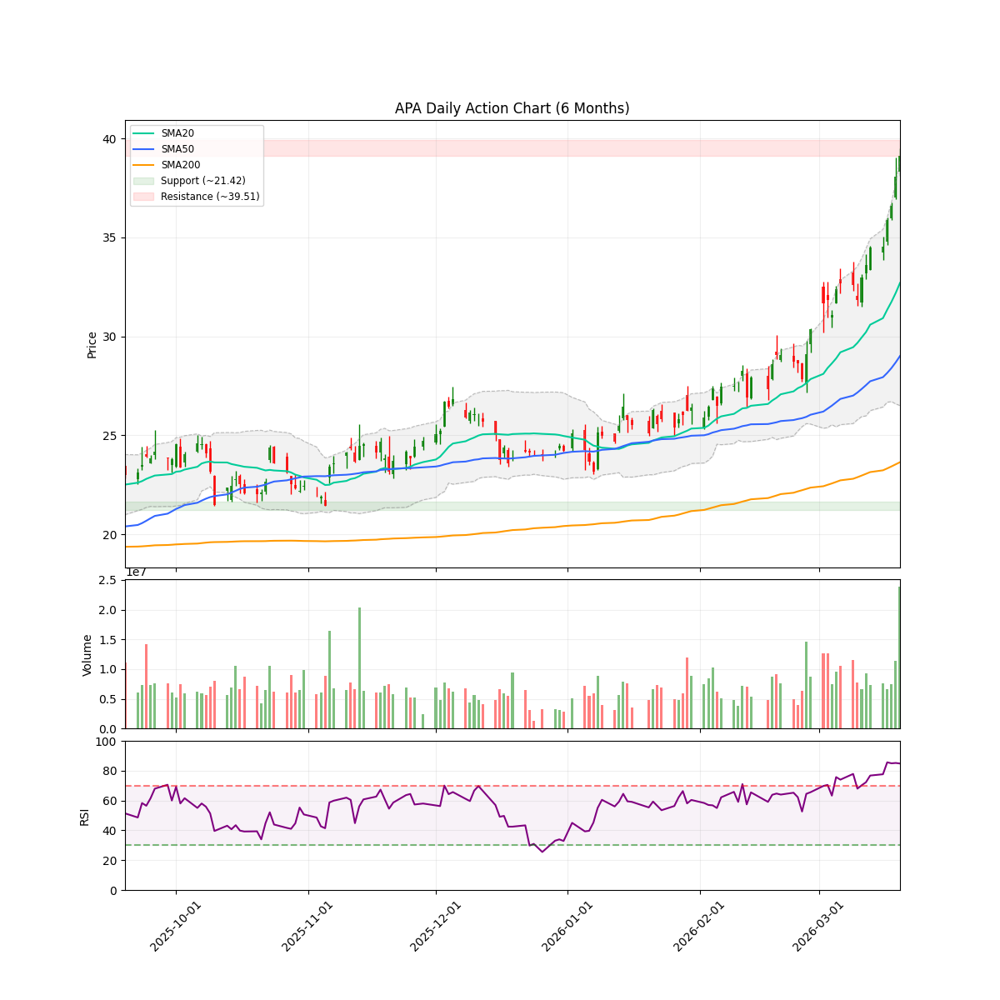
#### 研报分析

### 技术指标概览 (Technical Overview)
- **当前价格**: $39.11
- **RSI (14)**: 84.87
- **移动平均线**: SMA20: $32.70 | SMA50: $29.01 | SMA200: $23.64 (Bullish)
- **波动率**: ATR (14): 1.43 (预计周度波动: +/- $3.20)
- **关键位 (6m)**: 支撑位 $21.42 | 阻力位 $39.51
- **即时状态**: Above SMA50

# 叙事经济学：APA Corp. 战火中的“黑色金子”能否点燃持久繁荣？

朋友，坐稳了。现在的市场就像是一场在大雨中进行的泥沼摔跤，标普 500 指数已经连续四周在泥潭里挣扎，但就在这种哀鸿遍野的背景下，**APA Corp (APA)** 却像是一头嗅到了血腥味的鲨鱼，正在疯狂收割“战争溢价”。

喝口咖啡，我们来拆解一下这背后的叙事逻辑。

---

### 一、 催化剂分类：谁在扣动扳机？

我们将当下的消息面进行“脱水”处理，看看哪些是真正的火药，哪些只是哑炮：

*   **A-Tier（核心核爆级）：中东战火与霍尔木兹海峡危机**
    *   **详情：** 随着美伊冲突升级，布伦特原油一度突破 **119美元/桶**。Seeking Alpha 指出，市场正处于对霍尔木兹海峡封锁的极度焦虑中。对于 APA 这种能源巨头来说，这不只是利好，这是直接改写资产负债表的“降维打击”。
*   **B-Tier（基本面助推）：板块虹吸效应**
    *   **详情：** 当市场其他板块（尤其是消费类）因通胀和战争陷入“超卖”时，资金正在疯狂涌入能源避风港。APA 在多个交易日逆市上涨 3%-5%，表现优于大盘和同行。
*   **C-Tier（杂音）：澳洲 APA Group 的发行新闻**
    *   **详情：** 关于澳洲 APA Group 寻求 ASX 报价的消息（[The Globe and Mail](https://www.theglobeandmail.com/investing/markets/stocks/APAJF/pressreleases/830571/apa-group-seeks-asx-quotation-for-new-stapled-securities/)）对我们关注的美国 APA Corp 来说更多是代码相似带来的杂音，并非核心驱动力。

---

### 二、 背离检测：狂欢中的冷静

**这是一个典型的“乱世英雄”剧本。**

目前 APA 的股价（39.11）已经逼近 6 个月的高点阻力位（39.51）。最令人警惕的是 **RSI 达到了 84.87**。在老练的交易员眼里，这个数字已经不是“强劲”了，而是“烫手”。

**关键观察：** 标普 500 因战争而连续下跌，而 APA 却在同一背景下如履平地。这种“负相关性”证明了它目前的避险属性。然而，当好消息（油价上涨）已经完全计价入股价，且 RSI 处于这种超买极限时，任何关于“停火协议”或“增产”的传闻，都可能引发一场极其惨烈的多头踩踏。

---

### 三、 叙事诊断：是趋势还是陷阱？

**叙事结论：短期动量陷阱，长期结构性看涨。**

现在的 APA 讲的是“能源安全”和“短缺焦虑”的故事。这个故事非常性感，但也非常脆弱。股价已经严重偏离了 SMA200（23.64），就像一根拉得太满的弓弦。

*   **Logic Score（逻辑评分）：8.5 / 10**
    *   **理由：** 趋势极度明确，宏观环境完美适配。但给予 8.5 而非 10 分，是因为目前的估值已经透支了短期内几乎所有的地缘政治红利，技术面回撤的需求正如泰山压顶。

---

### 四、 投资人观察报告

| 维度 | 数据/状态 | 市场直觉 |
| :--- | :--- | :--- |
| **当前价格** | 39.11 | 正在挑战天花板（39.51） |
| **RSI 指标** | **84.87** | 别在加油站抽烟，这里随时会炸（严重超买） |
| **波动预期** | +/- 3.20 | 波动率在加大，心脏不好的慎入 |
| **关键支撑** | 32.70 (SMA20) | 如果回调，这里是第一道防线 |

---

### 五、 核心情报与下一前瞻

*   **引用的关键线索：**
    *   [CNBC] 提到的原油突破 119 美元是支撑目前 APA 39 美元高价的唯一脊梁 ([链接](https://www.cnbc.com/2026/03/19/stocks-making-the-biggest-moves-midday-next-lng-mu-rivn-apa.html))。
    *   [Seeking Alpha] 关于霍尔木兹海峡的讨论是目前维持叙事热度的燃料 ([链接](https://seekingalpha.com/news/4564461-sa-asks-which-energy-stocks-are-most-exposed-to-the-strait-of-hormuz-crisis))。

*   **下一关键节点 (Next Major Date)：**
    *   **2026年5月初（预计 Q1 财报发布日）**。
    *   *注：虽然当前日期是 3 月 22 日，但市场所有的目光都盯着即将到来的 4 月地缘政治动向。如果 5 月初的财报能证实这波油价暴涨转化为实际利润，APA 的叙事将从“投机”转为“成长”。*

**老兵寄语：** 现在的 APA 是一匹脱缰的野马。如果你已经在车上，系好安全带，把止损上移；如果你正准备冲进去，记得问问自己：你是在买入石油，还是在买入一场不知道什么时候会散场的战争幻觉？在这种 RSI 面前，追高往往是给先行者买单。
#### 近期新闻与事件
- **[MarketWatch]** [APA Corp. stock outperforms competitors on strong trading day](https://www.msn.com/en-us/money/topstocks/apa-corp-stock-outperforms-competitors-on-strong-trading-day/ar-AA1YQDTa)
- **[CNBC]** [A slew of consumer stocks are now oversold as S&P 500 falls for a fourth week in a row](https://www.cnbc.com/2026/03/21/a-slew-of-consumer-stocks-are-now-oversold-as-sp-500-falls-for-a-fourth-week-in-a-row.html)
- **[The Globe and Mail]** [APA Group Seeks ASX Quotation for New Stapled Securities](https://www.theglobeandmail.com/investing/markets/stocks/APAJF/pressreleases/830571/apa-group-seeks-asx-quotation-for-new-stapled-securities/)
- **[CNBC]** [Stocks making the biggest moves midday: NextDecade, Cheniere, Micron, Rivian, APA & more](https://www.cnbc.com/2026/03/19/stocks-making-the-biggest-moves-midday-next-lng-mu-rivn-apa.html)
- **[Schaeffer's Investment Research]** [Stocks Suffering From Middle East Conflict Escalation](https://www.schaeffersresearch.com/content/ezines/2026/03/19/stocks-suffering-from-middle-east-conflict-escalation)

---

### ASML
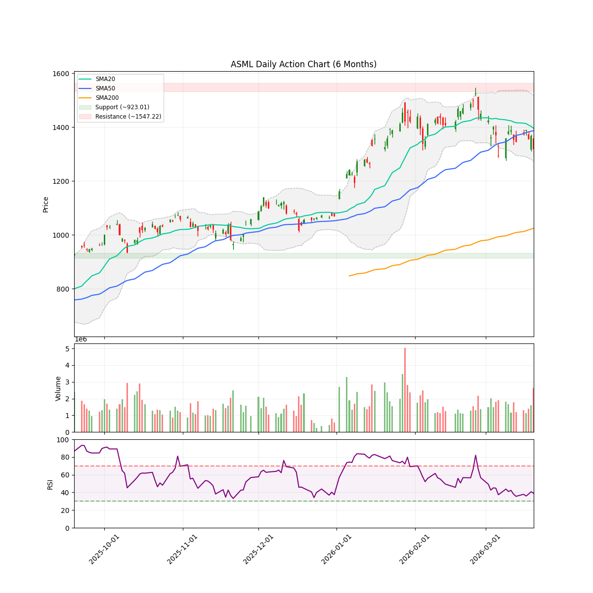
#### 研报分析

### 技术指标概览 (Technical Overview)
- **当前价格**: $1317.25
- **RSI (14)**: 38.93
- **移动平均线**: SMA20: $1394.90 | SMA50: $1386.40 | SMA200: $1024.20 (Bullish)
- **波动率**: ATR (14): 56.73 (预计周度波动: +/- $126.86)
- **关键位 (6m)**: 支撑位 $923.01 | 阻力位 $1547.22
- **即时状态**: Below SMA50

# 叙事经济学报告：ASML —— 慷慨的“印钞机”为何换不来市场的笑脸？

**日期：** 2026年03月22日
**分析师：** 对冲基金研究员 (Narrative Economics Focus)
**标的：** ASML (阿斯麦)

---

### 1. 叙事视角：当“垄断者”开始派钱，市场却在恐慌什么？

想象一下，你坐在曼哈顿中城的一家咖啡馆里，对面坐着一位刚从阿姆斯特丹飞回来的老牌基金经理。他手里拿着 ASML 最新的财报，眉头微皱。

ASML 现在的局面非常微妙，甚至有点“戏剧性”。作为全球半导体皇冠上的明珠，它刚刚把季度股息从 1.88 美元暴力拉升到了 3.18 美元（年化达到 12.71 美元）。这在任何正常的逻辑里都是**极其强烈的看涨信号**——这不仅是派钱，这是管理层在用真金白银告诉你：“我们的护城河稳如泰山，现金流多到没地方放。”

然而，市场的反应却是反手一个“卖出”。股价跌破了 20 日和 50 日均线，在 1317.25 美元附近徘徊。这种“利好出尽”或者说“好消息跌”的现象，正是我们需要拆解的**背离现象**。

---

### 2. 催化剂分类 (Catalyst Categorization)

*   **A-Tier (核心叙事)：**
    *   **暴力分红 (Dividend Boost)：** 派息几乎翻倍。这不仅是股息率的问题，它标志着 ASML 从单纯的“成长股”向“现金奶牛”过渡的某种信号。
    *   **AI 军备竞赛的底层垄断：** Nvidia 和 Broadcom 的强劲财报是 ASML 的背书。只要 AI 还需要先进制程，ASML 的高数值孔径 (High-NA) EUV 机器就是唯一的入场券。
*   **B-Tier (行业情绪)：**
    *   **分析师“抄底”言论：** TD Cowen 称其为“极具吸引力”的标的。这类言论正在试图通过估值逻辑（从 1547 美元的高点回落了约 15%）来修复市场情绪。
*   **C-Tier (噪音与炒作)：**
    *   **“万亿俱乐部”叙事：** 媒体开始炒作 ASML 成为下一个万亿市值公司。这种宏大叙事通常在情绪过热或寻找接盘侠时出现。

---

### 3. 背离检测：好消息里的“熊影” (Divergence Detection)

**核心观察：** 典型的**利好钝化 (Bearish Exhaustion?)**。
ASML 宣布增加派息后股价反而下跌（参考 [aktiencheck.de] 报道），这说明短期内，市场对“高估值”的恐惧超过了对“高股息”的贪婪。

*   **技术面视角：** RSI 目前处于 38.93，正在滑向超卖区间。股价跌破 SMA50（1386.40），说明中线资金在撤离。
*   **叙事陷阱：** 这是一个典型的“黄金坑”还是“下坠的飞刀”？考虑到 SMA200 还在 1024 美元，目前的调整更像是针对前期疯狂上涨的“去泡沫化”。

---

### 4. 情绪评分与逻辑诊断

#### **情绪分数：6.5/10 (观望中的结构性牛市)**

*   **为什么不是 10 分？** 股价对重大利好（分红）的负面反应说明短期抛压尚未出尽，多头信心受挫。
*   **为什么不是 3 分？** 因为它的基本面（垄断地位）没有发生任何系统性崩坏。

**逻辑诊断：**
目前的下跌并非因为公司不行了，而是因为“期待过高”导致的供需错配。机构在等待更便宜的筹码。股价在 SMA50 下方波动，说明市场正在重新定价 AI 基础设施的变现速度。

---

### 5. 关键数据与未来展望

*   **支撑位 (Support):** 923.01 (6个月低点，除非发生系统性风险，否则极难触及)
*   **阻力位 (Resistance):** 1394.90 (SMA20，短期翻身的生死线)
*   **预估周波动范围:** +/- 126.86 美元

**下一关键日期：**
*   **2026年4月中旬 (预计 Q1 财报发布日)：** 届时市场将验证分红计划背后的订单增长是否扎实。

---

### 结论
ASML 目前正处于一场**“估值回归”与“垄断叙事”的拉锯战**中。目前的股价下跌是利好消息触发的获利回吐。对于长线投资者来说，RSI 逼近 30 将是极佳的“捡漏”机会；但对于短线交易者，在价格重回 SMA50 (1386.40) 上方之前，这依然是一把带血的飞刀。

> **引用文献：**
> 1. *ASML's Dividend Boost Fails to Stem Share Price Decline* - [aktiencheck.de] (2026-03-22)
> 2. *ASML stock has taken an AI hit. Why that makes it a 'very attractive' chips play.* - [Barron's] (2026-03-20)
> 3. *What if ASML Becomes the Next Trillion-Dollar Stock?* - [The Motley Fool] (2026-03-20)
#### 近期新闻与事件
- **[aktiencheck.de]** [ASML's Dividend Boost Fails to Stem Share Price Decline](https://www.aktiencheck.de/news/Artikel-ASML_s_Dividend_Boost_Fails_to_Stem_Share_Price_Decline-19584661)
- **[The Motley Fool on MSN]** [The Tech Stock With More Potential Than Any Cryptocurrency](https://www.msn.com/en-us/money/markets/the-tech-stock-with-more-potential-than-any-cryptocurrency/ar-AA1Z99Df?ocid=BingNewsVerp)
- **[The Motley Fool]** [Why Did ASML Stock Just Drop?](https://www.msn.com/en-us/money/topstocks/why-did-asml-stock-just-drop/ar-AA1Z4Iu1)
- **[AOL]** [ASML vs. Broadcom: Which AI Stock Is a Better Buy?](https://www.aol.com/finance/asml-vs-broadcom-ai-stock-041100061.html)
- **[The Motley Fool]** [What if ASML Becomes the Next Trillion-Dollar Stock?](https://www.msn.com/en-us/money/companies/what-if-asml-becomes-the-next-trillion-dollar-stock/ar-AA1Z25oU)

---

### AVGO

#### 研报分析

### 技术指标概览 (Technical Overview)
- **当前价格**: $310.51
- **RSI (14)**: 45.39
- **移动平均线**: SMA20: $326.17 | SMA50: $330.42 | SMA200: $324.53 (Bullish)
- **波动率**: ATR (14): 13.12 (预计周度波动: +/- $29.33)
- **关键位 (6m)**: 支撑位 $295.30 | 阻力位 $413.82
- **即时状态**: Below SMA50

# 博通 (AVGO) 情绪审计报告：AI 骨干网的“分歧”与“深蹲”

**日期：** 2026年3月22日  
**分析师：** 叙事经济学研究组  
**标的：** AVGO (Broadcom Inc.)  
**当前股价：** 310.51

---

### 1. 催化剂分级 (Catalyst Categorization)

在叙事经济学中，我们不看表面的数字，而看故事的“传染力”。目前博通的故事正处于一个极度分裂的阶段。

*   **A-Tier (核心叙事)：Tomahawk 6 进入量产。**
    *   [Yahoo Finance] 报道，博通已经开始大规模出货 **Tomahawk 6** 芯片。这是 AI 网络基础设施的“心脏”。从采样到量产只用了不到三个季度，博通正在用一种近乎疯狂的效率巩固其在 AI 交换芯片领域的垄断地位。
    *   **华尔街的“集体背书”**：Baird 甚至给出了 $630 的目标价，而 Citi 也维持在 $475。这种分析师的一致性看好（甚至包括哈佛大学和亿万富翁 Ken Fisher 的增持）属于顶级机构共识。
*   **B-Tier (行业动能)：ASML vs. AVGO 的比较。**
    *   市场开始讨论谁才是 AI 浪潮中更好的标的。这种“二选一”的辩论实际上增加了博通的曝光度，将其定位为与 ASML 齐名的“不可或缺者”。
*   **C-Tier (市场噪音)：Zacks 的动能评分与小微订阅号的牛市理论。**
    *   这些属于跟随型叙事，虽然提供了流动性支持，但不足以改变基本面方向。

---

### 2. 离散度检测：好消息里的“陷阱”还是“黄金”？ (Divergence Detection)

**现状：** 博通正处于典型的 **“利好出尽”** 或 **“技术性压制”** 阶段。

*   **观察点：** 尽管 Tomahawk 6 量产的消息在 3 月 21 日刚刚发布，且 5 家投行在一周内上调了目标价，但股价（310.51）却令人费解地运行在 SMA200（324.53）和 SMA50（330.42）之下。
*   **诊断：** 这是**看跌疲软 (Bearish Exhaustion)** 的表现。市场叙事与价格走势出现了巨大的脱节。博通就像是一根被强行压下的弹簧——基本面（A-Tier 催化剂）正在加速好转，但价格却在消化早前 Q1 财报后的获利盘。

---

### 3. 情绪评分 (Sentiment Score): 7.8/10

**逻辑阐述：**
虽然价格走势目前是 4 分（低于所有均线，技术面偏弱），但叙事逻辑（Logic Score）是满分。博通不是在卖“梦想”，它在卖实实在在的“网络交换设备”。
*   **为什么不是 10 分？** 股价跌破 200 日均线说明大资金在调仓，短期内存在“抛售惯性”。
*   **为什么不是 0 分？** 它的护城河（Tomahawk 6）刚刚筑高，基本面与股价的背离通常预示着一个中长期的买入机会。

---

### 4. 叙事总结：咖啡桌上的洞察

老兄，如果你只看博通现在的走势图，你可能会觉得这公司是不是要出事了。股价跌破了 200 天线，那可是很多老派交易员的“生命线”。但你要是翻开博通的底牌，你会发现这简直是**一场华丽的错位**。

现在的博通就像是那个在派对上被大家遗忘在角落，但其实手里握着整个别墅钥匙的人。Tomahawk 6 的量产速度比任何人预想的都要快。当英伟达在卖 GPU 的时候，博通在卖连接这些 GPU 的“高速公路”。没有博通，AI 算力就是一堆散沙。

现在的 310 美元对比 Baird 喊出的 630 美元，几乎是腰斩后的价格。这种**“基本面狂飙，股价深蹲”**的戏码，通常是机构在悄悄吸筹，同时利用散户对技术破位的恐惧来清洗浮筹。别被那根绿色的均线吓到了，博通的叙事还没讲到一半。

---

### 5. 关键参考资料与日期

*   **重点引用：**
    *   [Tomahawk 6 量产新闻](https://finance.yahoo.com/sectors/technology/articles/broadcom-inc-avgo-commences-volume-085838589.html) (2026-03-21)
    *   [Baird $630 目标价上调](https://blockonomi.com/broadcom-avgo-stock-sees-five-price-target-hikes-in-single-week/) (2026-03-18)
    *   [Ken Fisher 增持报告](https://www.msn.com/en-us/money/markets/broadcom-inc-avgo-billionaire-ken-fisher-s-favorite-chip-stock/ar-AA1YRmqr) (2026-03-17)

*   **下一个关键日期：**
    *   **2026 年 6 月上旬（预计 Q2 财报发布日）：** 届时 Tomahawk 6 的初期营收贡献将初见端倪，这很可能是股价收复均线失地的转折点。

**逻辑总分 (Logic Score): 8.5/10** (叙事极度强韧，仅需等待价格动能回归)
#### 近期新闻与事件
- **[Yahoo Finance]** [Broadcom Inc. (AVGO) Commences Volume Shipping of Tomahawk 6 Chip to Scale AI Networks](https://finance.yahoo.com/sectors/technology/articles/broadcom-inc-avgo-commences-volume-085838589.html)
- **[Yahoo Finance]** [ASML vs. Broadcom: Which AI Stock Is a Better Buy?](https://finance.yahoo.com/markets/stocks/articles/asml-vs-broadcom-ai-stock-041100500.html?fr=sycsrp_catchall)
- **[Insider Monkey]** [Broadcom Inc. (AVGO): Billionaire Ken Fisher's Favorite Chip Stock](https://www.msn.com/en-us/money/markets/broadcom-inc-avgo-billionaire-ken-fisher-s-favorite-chip-stock/ar-AA1YRmqr)
- **[Insider Monkey]** [Is Broadcom Inc. (AVGO) a good stock to buy now?](https://www.msn.com/en-us/money/top-stocks/is-broadcom-inc-avgo-a-good-stock-to-buy-now/ar-AA1YHfBt)
- **[Insider Monkey]** [Broadcom (AVGO) Sees Fresh Analyst Optimism](https://www.msn.com/en-us/money/markets/broadcom-avgo-sees-fresh-analyst-optimism/ar-AA1YMU7U)

---

### CEG
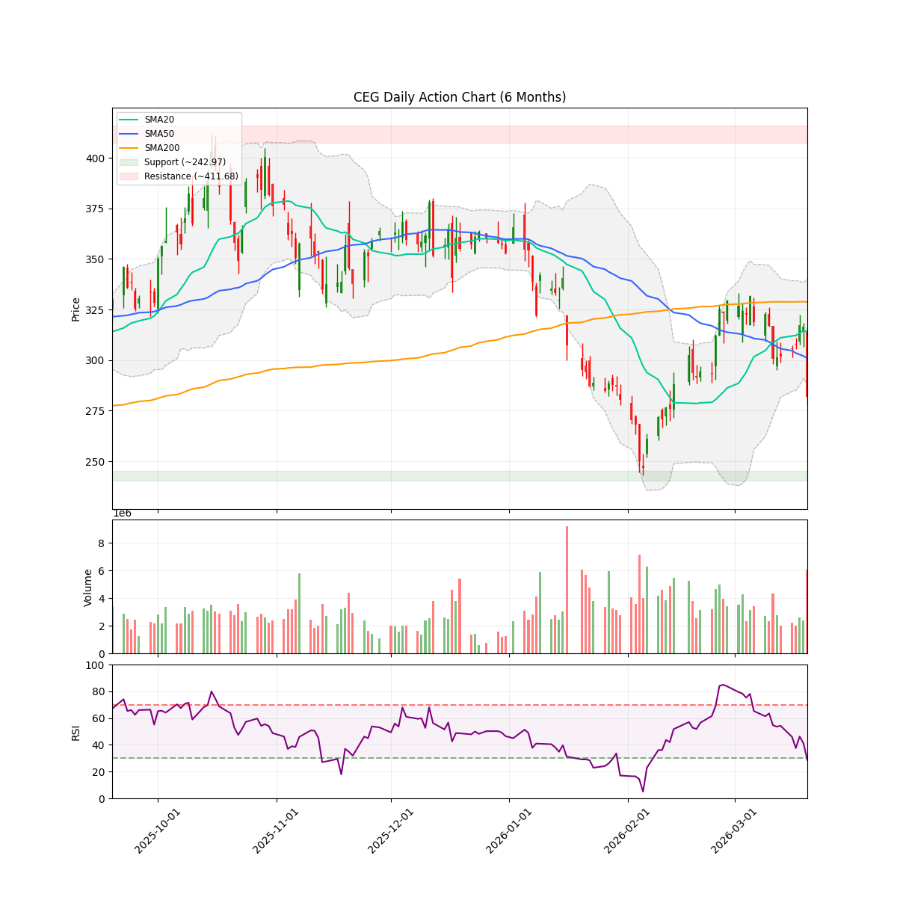
#### 研报分析

### 技术指标概览 (Technical Overview)
- **当前价格**: $281.99
- **RSI (14)**: 28.68
- **移动平均线**: SMA20: $314.02 | SMA50: $300.91 | SMA200: $328.76 (Bearish)
- **波动率**: ATR (14): 14.39 (预计周度波动: +/- $32.17)
- **关键位 (6m)**: 支撑位 $242.97 | 阻力位 $411.68
- **即时状态**: Below SMA50

### **CEG 情绪审计报告：当“AI+核能”的梦幻叙事撞上监管与现实的冰山**

各位，坐稳了。如果你最近一直在追踪 Constellation Energy (CEG)，那你一定感受到了那种从云端坠落的失重感。曾几何时，CEG 是华尔街最烈的情绪烈酒——核能复兴、数据中心电力心脏、甚至被视为 AI 泡沫中唯一的实物资产支撑。

但就在 2026 年 3 月 21 日，这场狂欢被泼了一桶带冰块的冷水。单日暴跌 10.9%，股价直接杀到 $281.99。这不仅仅是技术性回调，这是一次叙事层面的“破防”。

---

### **1. 催化剂分类：谁在扣动扳机？**

*   **A-Tier（结构性冲击）：JPMorgan 降价与 PJM 费率上限担忧**
    *   摩根大通（JPMorgan）的下调目标价是这次大跌的“发令枪”。更深层的原因在于 **PJM 电力市场费率上限的担忧** 以及 **科技公司购电协议（PPA）的进展不及预期**。这是动摇 CEG 估值逻辑根基的核心利空——如果溢价合同签不下来，它就只是一家普通的电厂，而不是 AI 时代的“卖水人”。
*   **B-Tier（营运风险）：设施化学物质泄漏**
    *   [Blockonomi] 提到的设施化学物质泄漏事件虽然在长期来看可能是阵痛，但在市场极度脆弱时，这成了压死骆驼的又一根稻草，增加了营运的不确定性。
*   **C-Tier（市场噪音）：Jim Cramer 的警告与 Zacks 的关注**
    *   [Insider Monkey] 提到的 Jim Cramer 对过度乐观的警告，以及 Zacks 的常规关注，这些属于典型的后验指标。Cramer 的“毒奶”体质虽然让散户焦虑，但对机构定价影响有限。

---

### **2. 分歧检测：是“衰竭”还是“崩塌”？**

目前 CEG 的 **RSI 已经低至 28.68**，这在任何教科书里都是“极端超卖”。
*   **背离现象：** 尽管股价跌破了 SMA200（$328.76）这一长期牛熊分界线，显示出极强的看跌惯性，但成交量在暴跌中的激增反映出恐慌盘正在清吐。
*   **逻辑诊断：** 这种“好消息不再起作用，坏消息倍数放大”的走势，说明市场正在进行**剧烈的估值重估（De-rating）**。目前还谈不上“看跌衰竭”，因为股价仍远高于 6 个月的支撑位 $242.97。

---

### **3. 情绪评分：3.5 / 10 (凛冬已至，但还没结冰)**

*   **评分逻辑：**
    *   **叙事崩塌 (-4)：** 此前支撑 CEG 高溢价的 AI 合同预期出现了明显的裂痕。
    *   **技术破位 (-3)：** 股价跌破 SMA50 和 SMA200，多头防线全面失守。
    *   **超卖反弹 (+0.5)：** RSI 提示短期可能有死猫跳，但不足以扭转趋势。

---

### **4. 深度洞察：这是“黄金坑”还是“夺命陷阱”？**

现在的 CEG 就像是一个被戳破了一半的气球。

**老兵视角：**
“兄弟们，别被那个 28 的 RSI 给骗了。在叙事经济学里，当一个板块从‘信仰’转向‘合规与监管’时，底部的打磨是极其痛苦的。目前的跌幅是对之前过度乐观（Excess Optimism）的暴力修正。摩根大通的调级只是个借口，真正的杀招是大家开始怀疑：亚马逊、微软真的愿意一直为这么贵的核电买单吗？如果 PJM 监管层介入限制费率，CEG 的护城河就漏水了。”

目前的走势是一个典型的**“叙事陷阱”**。在看到确凿的监管合规进展或新的大型科技公司签约公告前，任何反弹都只是给套牢盘减仓的机会。

---

### **5. 关键参考与日期**

*   **重要参考信息：**
    *   [JPMorgan Price Cut Report (2026-03-21)](https://finance.yahoo.com/markets/stocks/articles/constellation-energy-ceg-falls-10-084146261.html)
    *   [PJM Rate Cap Concerns & Chemical Leak News](https://blockonomi.com/why-constellation-energy-ceg-stock-plunged-over-10-in-one-trading-session/)
*   **下一关键日期：**
    *   **2026 年 5 月初（预计 Q1 财报发布日）**：届时管理层必须针对 PJM 费率问题和数据中心合同进展给出正面回应，否则支撑位 $242 恐怕难保。

**总结建议：** 别接掉下来的飞刀。等它在 SMA200 之下震荡筑底，或者等 RSI 出现底背离再入场。目前的 CEG 需要的是时间来消化这一波“信仰崩塌”。
#### 近期新闻与事件
- **[Yahoo Finance]** [Constellation Energy (CEG) Falls 10.9% as JPMorgan Price Cuts Price Target](https://finance.yahoo.com/markets/stocks/articles/constellation-energy-ceg-falls-10-084146261.html)
- **[Yahoo Finance]** [Is Trending Stock Constellation Energy Corporation (CEG) a Buy Now?](https://finance.yahoo.com/news/trending-stock-constellation-energy-corporation-130008843.html)
- **[Insider Monkey]** [Constellation Energy (CEG) Stock Higher After Jim Cramer Warned About Excess Optimism](https://www.msn.com/en-us/money/general/constellation-energy-ceg-stock-higher-after-jim-cramer-warned-about-excess-optimism/ar-AA1Z7W7H)
- **[Blockonomi]** [Why Constellation Energy (CEG) Stock Plunged Over 10% in One Trading Session](https://blockonomi.com/why-constellation-energy-ceg-stock-plunged-over-10-in-one-trading-session/)
- **[Insider Monkey]** [Is Constellation Energy Corporation (CEG) A Good Stock To Buy Now?](https://www.msn.com/en-us/money/general/is-constellation-energy-corporation-ceg-a-good-stock-to-buy-now/ar-AA1YGsqA)

---

### COP
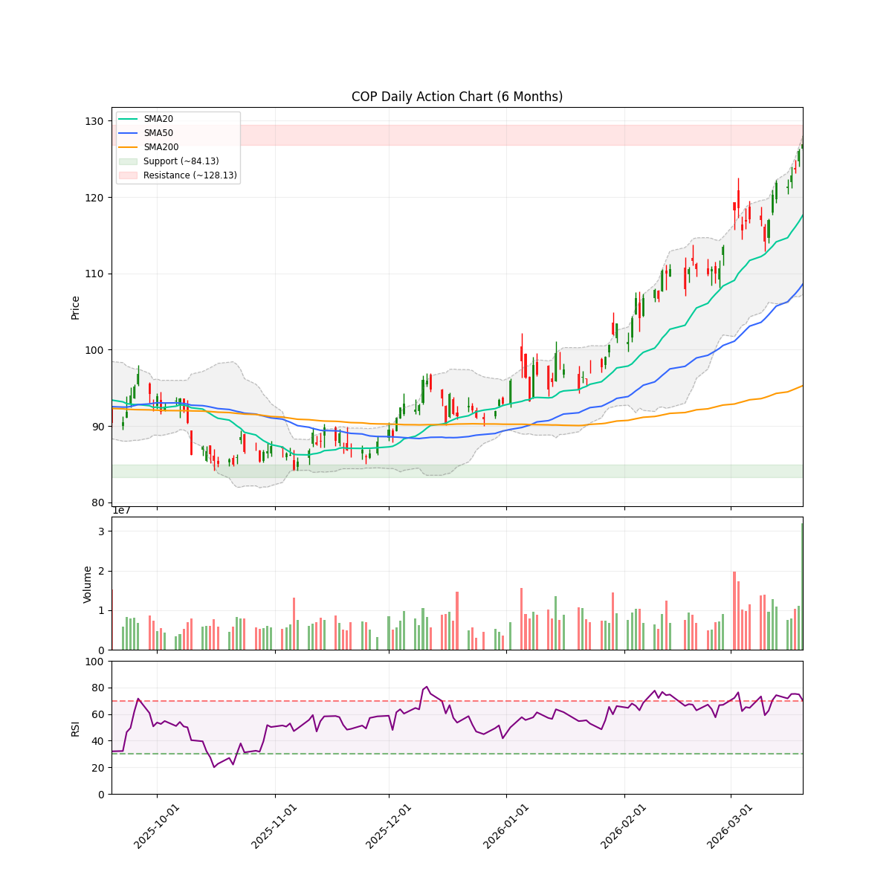
#### 研报分析

### 技术指标概览 (Technical Overview)
- **当前价格**: $126.92
- **RSI (14)**: 70.28
- **移动平均线**: SMA20: $117.60 | SMA50: $108.58 | SMA200: $95.28 (Bullish)
- **波动率**: ATR (14): 3.10 (预计周度波动: +/- $6.93)
- **关键位 (6m)**: 支撑位 $84.13 | 阻力位 $128.13
- **即时状态**: Above SMA50

# 康菲石油 (COP) 情绪审计报告：繁花锦簇下的“高空缺氧”？

**报告日期：** 2026年03月22日
**研究员：** 叙事经济学分析师 (Hedge Fund Research Associate)
**标的：** ConocoPhillips (NYSE: COP)
**当前价格：** 126.92 | **RSI:** 70.28 (超买区)

---

### 1. 叙事背景：当“地缘红利”遇上“高位套现”

现在的康菲石油，就像是一场华丽舞会中最耀眼的明星。中东局势的波诡云谲（Middle East Crisis）让全球资本像闻到了血腥味的鲨鱼，疯狂涌入这个能源避风港。高盛（Goldman Sachs）把它列入了“确信买入名单”，巴克莱和美银争先恐后地调高目标价。

但如果你坐在华尔街的老牌咖啡馆里，盯着大屏幕上那条接近 128.13 美元历史阻力位的红线，再看看那一串内部高管抛售的公告，你会发现，这场舞会的音乐虽然还没停，但已经有人开始悄悄走向出口了。

---

### 2. 催化剂分级 (Catalyst Categorization)

#### **【A-Tier】核心驱动力：巨头背书与地缘溢价**
*   **高盛确信买入 (Goldman Conviction Call)：** 高盛在 3 月 9 日将其列入首选，强调其在中东危机中的避险属性。这是机构资金的“集结号”。[参考来源](https://finance.yahoo.com/news/conocophillips-cop-favored-goldman-amid-182021397.html)
*   **投行集体上调目标价：** 巴克莱将目标价从 $118 提到 $128，美银也紧随其后。这为市场注入了强烈的看涨共识。[参考来源](https://finance.yahoo.com/news/barclays-lifts-pt-conocophillips-cop-183635613.html)

#### **【B-Tier】战术调整：资产剥离与现金流优化**
*   **20亿剥离计划：** 康菲正在重塑二叠纪盆地（Permian Basin）的资产组合，这种“瘦身”计划通常意味着更高的资本回报效率。[参考来源](https://finance.yahoo.com/news/conocophillips-reshapes-portfolio-goldman-conviction-031406879.html)
*   **安全股息叙事：** 被评为 2026 年 15 只最佳安全股息股之一，吸引了大量防守型资金。[参考来源](https://finance.yahoo.com/news/bank-america-barclays-conocophillips-cop-052404176.html)

#### **【C-Tier】杂讯：高管的小动作**
*   **高管抛售：** 高级副总裁 Lundquist 卖了 410 万美元，Hrap 卖了 31.7 万美元。虽然这可能是个人税务规划，但在股价触顶时发生，难免让散户心生疑虑。[参考来源](https://www.investing.com/news/insider-trading-news/conocophillips-svp-lundquist-sold-34500-shares-of-common-93CH-4564609)

---

### 3. 分歧检测 (Divergence Detection)

**警惕：看好情绪与物理限制的博弈**
目前的 COP 正处于典型的“多头竭力”边缘。
*   **利好出尽？** 尽管巴克莱给出了 $128 的目标价，但当前股价（126.92）距离这个“天花板”仅一步之遥。
*   **背离信号：** 股价在刷新高点，但 RSI 已经冲到了 70.28。更耐人寻味的是，在投行齐声唱赞歌（Good News）的时候，内部人士（Insiders）却在集体撤退。这通常不是“可持续牛市”的特征，而更像是短期博弈的顶部征兆。

---

### 4. 情绪得分 (Sentiment Score)

## **8.5 / 10**
**判定：极度乐观但需防范回调（Bullish Exhaustion）**

*   **逻辑：** 叙事逻辑非常完美——中东危机、高股息、机构加持。这种力量足以维持股价在高位横盘。然而，由于已经触及阻力位（128.13）且内部人抛售，目前属于“高空缺氧”状态。这可能不是一个新入场的绝佳时机，而是一个该考虑收割利润的“舒适区”。

---

### 5. 核心洞察 (Executive Insight)

康菲石油现在的走势是一场“叙事与估值的赛跑”。地缘政治的紧张局势是它最强的燃料，但燃料总有耗尽的时候。
*   **操作建议：** 不要在这个位置追高。128.13 是一个巨大的心理和技术压力位。
*   **下行风险：** 如果短期内无法有效突破 128，配合 RSI 的回落，股价可能会回踩 SMA20 (117.60) 寻求支撑。

---

### 6. 下一个关键节点 (Next Major Date)

*   **预计财报发布日：2026年4月30日 (Q1 2026 Earnings)**
    *   *注：基于历史发布周期推测。届时，市场将高度关注其 20 亿资产剥离的进展以及资本回馈计划的实际落地情况。*

---
**免责声明：** 既然咱们是喝着咖啡聊市场，请记住，以上分析仅供研究叙事逻辑参考。市场有风险，入市须谨慎。
#### 近期新闻与事件
- **[Investing.com]** [ConocoPhillips SVP Lundquist sells $4.1m in stock By Investing.com](https://www.investing.com/news/insider-trading-news/conocophillips-svp-lundquist-sells-41m-in-stock-93CH-4564609)
- **[Investing.com]** [Hrap, ConocoPhillips senior VP, sells $317k in stock By Investing.com](https://www.investing.com/news/insider-trading-news/hrap-conocophillips-senior-vp-sells-317k-in-stock-93CH-4564620)
- **[Insider Monkey· via Yahoo Finance]** [Barclays Lifts PT on ConocoPhillips (COP) to $128 From $118 – Here’s Why](https://finance.yahoo.com/news/barclays-lifts-pt-conocophillips-cop-183635613.html)
- **[Insider Monkey· via Yahoo Finance]** [Bank of America and Barclays Update ConocoPhillips (COP) Targets on Oil Outlook...](https://finance.yahoo.com/news/bank-america-barclays-conocophillips-cop-052404176.html)
- **[Simply Wall St.· via Yahoo Finance]** [ConocoPhillips Insider Sales Stir Questions On Capital Returns And Outlook](https://finance.yahoo.com/news/conocophillips-insider-sales-stir-questions-161024819.html)

---

### CVX
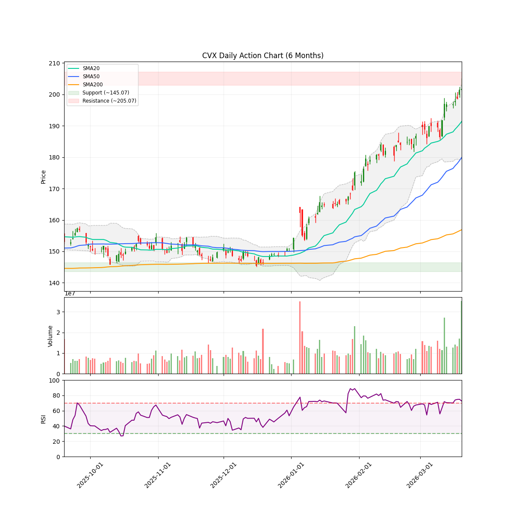
#### 研报分析

### 技术指标概览 (Technical Overview)
- **当前价格**: $201.73
- **RSI (14)**: 72.57
- **移动平均线**: SMA20: $191.38 | SMA50: $179.89 | SMA200: $156.89 (Bullish)
- **波动率**: ATR (14): 4.07 (预计周度波动: +/- $9.10)
- **关键位 (6m)**: 支撑位 $145.07 | 阻力位 $205.07
- **即时状态**: Above SMA50

# 叙事经济学审计报告：雪佛龙 (CVX) —— 能源王座上的“地缘避险”狂欢

**日期：** 2026年03月22日
**分析师：** 叙事经济学研究员
**标的：** 雪佛龙 (Chevron Corp, CVX)

---

### 1. 核心叙事：当石油遇见“战争溢价”

现在的雪佛龙，听起来不像是一家单纯的能源公司，更像是一个地缘政治的“对冲基金”。想象一下，我们坐在华尔街的老牌咖啡馆里，大家谈论的不是资产负债表，而是中东的硝烟和委内瑞拉的丛林。

雪佛龙刚刚跨入了 **4000亿美元市值** 的精英俱乐部，这不仅是数字的突破，更是市场情绪的加冕。随着油价飙升47%，市场已经形成了一个牢不可破的逻辑：只要中东局势不稳（特别是伊朗风险），CVX 就是那个在暴风雨中依然能收租的避风港。

---

### 2. 催化剂等级分类 (Catalyst Categorization)

#### **A-Tier (重量级核心动能)**
*   **机构集体背书与目标价上调：** 汇丰 (HSBC) 将目标价上调至 215 美元，美银 (BofA) 更是上调至 206 美元。这种机构的一致性合唱，为散户和量化资金提供了极强的心理支撑。
*   **跨入 $400B 俱乐部：** 这是一个里程碑式的叙事，象征着 CVX 已经成为了美股市场的“压舱石”之一。

#### **B-Tier (行业与宏观红利)**
*   **中东冲突与油价红利：** 47% 的油价涨幅是直接的助推器。伊朗战争阴影下的供应担忧，让能源股成为了必选配置。
*   **委内瑞拉协议潜力：** 作为一个百年玩家，雪佛龙在委内瑞拉的布局（20万桶/日产量潜力）是一张隐藏的王牌，随时可能兑现超预期增量。

#### **C-Tier (市场噪音与常规动作)**
*   **巴菲特持仓新闻：** 虽然它是巴菲特的第六大重仓股，但这已是“明牌”，更多是作为长期投资者的信仰加持。
*   **常规股息分析：** 股息是 CVX 的底色，但在目前的暴涨行情下，股息率的吸引力暂时退居次要地位。

---

### 3. 情绪背离诊断 (Divergence Detection)

**警报：** 目前 CVX 的 **RSI 处于 72.57**。从技术角度看，这已经进入了“极度贪婪”的超买区间。

**背离分析：**
虽然新闻面上全是“利好”（伊朗危机、委内瑞拉机遇、机构升级），但股价已经逼近 **$205.07** 的 6 个月阻力位。目前的叙事非常完美——**完美到可能有些危险**。虽然还没有出现“好消息下跌”的典型空头衰竭，但目前的这种亢奋感（Euphoria）通常意味着短期的上涨空间已经被提前透支。

---

### 4. 情绪评分 (Sentiment Score)

#### **逻辑评分：8.8 / 10 (强势牛市循环)**

*   **理由：** 雪佛龙目前处于一个“基本面+地缘政治+资本溢价”的三重共振期。这不仅仅是石油的牛市，而是对“确定性资产”的渴望。逻辑依然稳固，但由于 RSI 过高，短期内可能需要一个回踩 SMA20 (191.38) 的动作来消化获利盘。

---

### 5. 投资洞察与“陷阱”预警

**给投资者的私房话：**
目前的 CVX 就像是一列全速前进的火车。如果你现在跳上去，你要意识到你买入的是“最完美的叙事”。$205 的压力位非常关键，如果不能迅速带量突破，市场可能会借着“委内瑞拉利好出尽”的由头进行一次深度洗盘。

**参考新闻来源：**
*   *HSBC & BofA 升级：* [Blockonomi, 2026-03-20 & 2026-03-08]
*   *4000亿市值里程碑：* [Blockonomi, 2026-03-20]
*   *中东冲突影响：* [Insider Monkey, 2026-03-21]

---

### 6. 关键关注日期 (Next Major Date)

*   **下一次财报发布日 (估算)：2026年4月24日**
    *   *注：这将是验证高油价是否转化为实际自由现金流的“审判日”。在此之前，地缘政治的每一条推特都将左右股价。*

---
**结论：** 这是一个由恐惧和石油驱动的强大趋势，但千万不要在烟花放得最漂亮的时候，误以为这就是永恒。关注 $205 关口，站稳即是星辰大海，站不稳就是短期陷阱。
#### 近期新闻与事件
- **[Yahoo Finance]** [Could an Oil Deal in Venezuela Boost Chevron's Stock?](https://finance.yahoo.com/news/could-oil-deal-venezuela-boost-105000881.html?pl2=qsp-recent-news_All)
- **[Blockonomi]** [Chevron (CVX) Stock Breaks Into Elite $400B Club Amid Oil Price Rally](https://blockonomi.com/chevron-cvx-stock-breaks-into-elite-400b-club-amid-oil-price-rally/)
- **[Insider Monkey]** [Is Chevron (CVX) The Best Stock to Benefit From Oil Price Surge Amid Iran War?](https://www.msn.com/en-us/money/markets/is-chevron-cvx-the-best-stock-to-benefit-from-oil-price-surge-amid-iran-war/ar-AA1Z6NBP)
- **[The Motley Fool]** [2 Great Dividend-Paying Oil Stocks to Buy as Oil Surges](https://www.fool.com/investing/2026/03/21/great-dividend-oil-stocks-buy-as-oil-surge/)
- **[The Globe and Mail]** [Chevron vs. Suncor: Which Energy Stock Wins at 52-Week Highs?](https://www.theglobeandmail.com/investing/markets/stocks/CVX/pressreleases/862857/chevron-vs-suncor-which-energy-stock-wins-at-52-week-highs/)

---

### MSFT
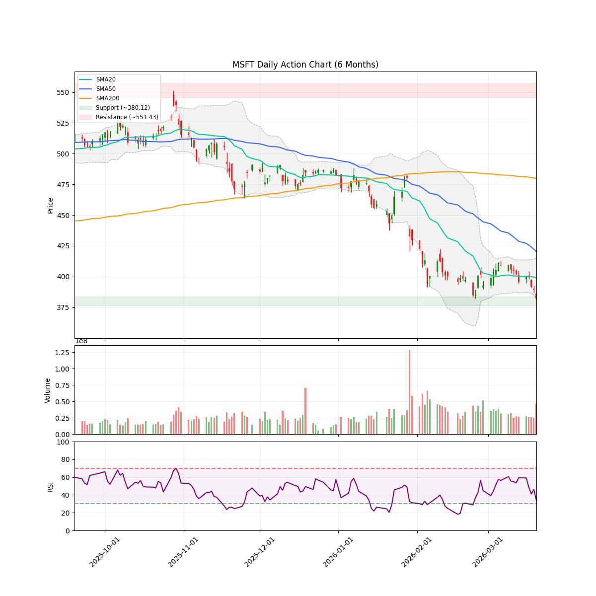
#### 研报分析

### 技术指标概览 (Technical Overview)
- **当前价格**: $381.87
- **RSI (14)**: 33.53
- **移动平均线**: SMA20: $398.77 | SMA50: $420.21 | SMA200: $479.79 (Bearish)
- **波动率**: ATR (14): 7.72 (预计周度波动: +/- $17.26)
- **关键位 (6m)**: 支撑位 $380.12 | 阻力位 $551.43
- **即时状态**: Below SMA50

# 微软 (MSFT) 情绪审计报告：AI 巨头的“宿醉”还是“归途”？

**报告日期：** 2026年3月22日
**研究员：** 叙事经济学分析组 - 资深研究员

---

### 1. 核心叙事：从“众神之巅”跌入“价值凡尘”

坐在咖啡馆里，看着 MSFT 的盘面，你不得不感叹：**叙事的力量比财报更具杀伤力。**

2024年到2025年，微软是市场的宠儿，是 AI 时代的唯一真神。但进入2026年，风向变了。现在的微软更像是一个在宿醉中醒来的巨人。从去年10月那个令人眩晕的 **$540** 历史高点掉到现在 **$381.87**，这已经不是简单的“回调”，而是一场针对 AI 溢价的**大清算**。

目前的叙事主轴是：**“AI 的钱到底在哪？”** 市场不再为远大的愿景买单，而是盯着每一分钱的资本支出（CAPEX）看回报率。正如 *The Motley Fool* 所言，2026 年对 AI 股来说是个噩梦，微软正处于这场风暴的中心。

---

### 2. 催化剂分类：寻找反攻的火种

我们将近期消息进行“脱水”处理，分类如下：

*   **A-Tier（核心变量）：空缺**
    *   *点评：* 目前市场上缺乏能扭转乾坤的硬通货消息。大家都在等 4 月份的财报，在那之前，市场处于真空期。
*   **B-Tier（行业逆风与估值博弈）：**
    *   **Forbes (2026-03-13)：** 探讨 15% 的跌幅是否意味着结构性问题。这反映了机构投资者的调仓焦虑——他们正在从“无脑买入”转向“风险偏好降低（Risk-off）”。 [链接](https://www.forbes.com/sites/greatspeculations/2026/03/13/down-15-is-microsoft-stock-worth-buying-now/)
    *   **The Motley Fool (2026-03-09)：** AI 股票的警告信号。这是整个板块的情绪毒药，微软被作为典型拖累。 [链接](https://www.msn.com/en-us/money/savingandinvesting/is-the-stock-market-sending-a-warning-signal-about-artificial-intelligence-ai-stocks/ar-AA1Z8nVU)
*   **C-Tier（噪音与余震）：**
    *   **Zacks (2026-03-20)：** 微软成为“热搜词”。通常热度高涨但价格下跌，意味着散户在抄底，这在技术面破位时往往不是好兆头。 [链接](https://www.msn.com/en-us/money/topstocks/microsoft-corporation-msft-is-a-trending-stock-facts-to-know-before-betting-on-it/ar-AA1Z3yOo)
    *   **AOL (2026-03-08)：** 还在讨论微软是否能回 $500。这种过时的看涨幻想目前更像是“诱多”的诱饵。 [链接](https://www.aol.com/articles/microsoft-stock-going-500-205400266.html)

---

### 3. 背离检测：刀口舔血的临界点

**技术信号：**
*   **RSI (33.53)：** 已经进入超卖的边缘。在正常牛市里，这是“捡钱”的信号；但在目前的熊市趋势中，这只是“下跌途中的喘息”。
*   **支撑位警报：** 股价目前在 **381.87**，距离 6 个月低点 **380.12** 仅一步之遥。

**逻辑背离：**
虽然 Forbes 等媒体开始讨论“是否值得买入”，但股价依然跌破了 SMA200 ($479.79) 这一生命线。这说明**长期机构资金正在系统性撤出**。好消息（如分析师的买入建议）无法阻止股价下跌，这是典型的**空头统治期**。

---

### 4. 情绪评分 (Sentiment Score)

## **3.5 / 10**
**（评语：恐慌正在寻找地板，叙事尚未反转）**

*   **理由：** 微软并未发生系统性崩溃（它的基本面依然强大），但“AI 泡沫论”的叙事已经完全接管了盘面。技术上，均线呈现空头排列，在没有看到一个清晰的“底部反转形态”或“超预期利好”之前，任何上涨都更像是死猫跳。

---

### 5. 投资建议与关键时点

**下个重大日期：**
*   **2026年4月底（预计 4月23日-25日）：** **Q3 财报电话会议**。
    *   *策略建议：* 这是生死战。如果微软能用实际的 AI 收入数据（而不是订单，是真正的 Revenue）打脸质疑者，那么 $380 就是这轮黄金坑的底部。在那之前，观望是比抄底更聪明的选择。

**给投资者的私房话：**
现在的 MSFT 不是在做俯卧撑，而是在自由落体寻找地板。那个曾经 $540 的微软已经走远了，现在的它正在进行痛苦的“去泡沫化”。等待 380 支撑位的防守强度，如果破了，下一个台阶可能会让很多杠杆玩家彻底爆仓。

*风险提示：本文仅代表叙事经济学视角分析，不构成直接投资建议。在 2026 年这种波动环境下，现金有时也是一种最好的仓位。*
#### 近期新闻与事件
- **[Insider Monkey on MSN]** [Is Edwards Lifesciences Corporation (EW) A Good Stock To Buy Now?](https://www.msn.com/en-us/health/other/is-edwards-lifesciences-corporation-ew-a-good-stock-to-buy-now/ar-AA1Z8mWs?ocid=BingNewsVerp)
- **[Insider Monkey on MSN]** [Is Applied Optoelectronics, Inc. (AAOI) A Good Stock To Buy Now?](https://www.msn.com/en-us/money/technology/is-applied-optoelectronics-inc-aaoi-a-good-stock-to-buy-now/ar-AA1Z7FCW?ocid=BingNewsVerp)
- **[The Motley Fool on MSN]** [Is the stock market sending a warning signal about artificial intelligence (AI) stocks?](https://www.msn.com/en-us/money/savingandinvesting/is-the-stock-market-sending-a-warning-signal-about-artificial-intelligence-ai-stocks/ar-AA1Z8nVU?ocid=BingNewsVerp)
- **[Fool UK on MSN]** [After 5 long years, is this S&P 500 stock finally ready to bounce back?](https://www.msn.com/en-gb/money/other/after-5-long-years-is-this-s-p-500-stock-finally-ready-to-bounce-back/ar-AA1Z9fS6?ocid=BingNewsVerp)
- **[The Motley Fool on MSN]** [Could Nvidia stock turn $10,000 into $1 million this decade?](https://www.msn.com/en-us/money/topstocks/could-nvidia-stock-turn-10-000-into-1-million-this-decade/ar-AA1Z7HlQ?ocid=BingNewsVerp)

---

### NVDA

#### 研报分析

### 技术指标概览 (Technical Overview)
- **当前价格**: $172.70
- **RSI (14)**: 37.39
- **移动平均线**: SMA20: $183.12 | SMA50: $184.59 | SMA200: $178.42 (Bullish)
- **波动率**: ATR (14): 5.37 (预计周度波动: +/- $12.00)
- **关键位 (6m)**: 支撑位 $169.53 | 阻力位 $212.17
- **即时状态**: Below SMA50

# 英伟达 (NVDA) 情绪审计报告：繁华落尽，还是大显身手前的深蹲？

**日期：** 2026年03月22日
**研究员：** 叙事经济学 (Narrative Economics) 资深分析师
**当前价位：** 172.70 | **RSI:** 37.39 | **SMA200:** 178.42

---

### 1. 市场叙事综述：昂贵的梦想与冰冷的现实

坐下来，咱们边喝咖啡边聊。现在的英伟达，像极了一个刚办完豪华派对的主人——尽管派对上宣布了 Vera Rubin 芯片这种足以改变未来的大动作，甚至还提出了“太空数据中心”这种科幻小说般的蓝图，但宾客们（投资者）却在悄悄从后门溜走。

现在的叙事正处于一种**“成功后的审美疲劳”**。华尔街在谈论 8 万亿美元的市值，分析师在喊“买入”，甚至 GTC 2026 的光环还没散去，但股价却无情地跌破了 200 日均线 (178.42)。这是一种典型的**叙事断裂**：基本面依然是神，但市场的情绪已经从“贪婪”转向了“怀疑”。

---

### 2. 催化剂分级 (Catalyst Categorization)

*   **A-Tier (核心驱动):**
    *   **GTC 2026 开发者大会：** 重点在于 Vera Rubin 架构芯片的更新以及预估高达 1780 亿美元的自由现金流。这不仅仅是硬件，这是英伟达在 AI 领域建立的“数字护城河”。[参考来源: Blockonomi]
*   **B-Tier (行业助力):**
    *   **太空数据中心愿景：** 这是一个极其宏大的叙事，旨在将 AI 算力推向地外。虽然短期无法兑现盈利，但它维持了英伟达作为“科技先行者”的溢价。[参考来源: Yahoo Finance]
    *   **华尔街长期看多：** 某分析师甚至喊出了 8 万亿市值的目标，这种极端看涨情绪虽然能吸引散户，但也让估值显得有些高处不胜寒。[参考来源: The Motley Fool]
*   **C-Tier (市场噪音):**
    *   **内部交易与常规研报：** Insider Monkey 的看涨摘要以及各种“致富股票”推荐，这些多属于市场背景噪音。

---

### 3. 背离检测 (Divergence Detection)

**警报：明显的熊市背离。**

目前的 NVDA 正处于一个非常尴尬的境地。从新闻上看，到处都是“买入”、“GTC 狂欢”和“未来展望”，但盘面上，股价跌破了 SMA20、SMA50 乃至 SMA200。**当重大利好（GTC 大会）无法拉动股价，反而导致跌破长期均线时，这说明多头已经力竭，市场正在经历一场剧烈的估值重塑（Mean Reversion）。**

RSI 为 37.39，尚未进入极度超卖（30以下），这意味着虽然下行空间在收窄，但由于跌破了 169.53 的 6 个月支撑位，短线投机者正处于“恐慌性止损”的边缘。

---

### 4. 逻辑评分 (Logic Score): 6.2 / 10

*   **评分理由：**
    *   **基本面 (9/10):** 没有任何迹象表明英伟达的护城河被削弱。1780 亿的自由现金流是实打实的钞票。
    *   **技术面 (3/10):** 股价位于所有主要均线下方，且处于 6 个月低点附近。趋势在短期内完全受挫。
    *   **情绪面 (6.5/10):** 机构开始质疑估值持久性（高盛的担忧），而散户依然在被各种宏大叙事“洗脑”。

**结论：** 这不是一个“陷阱”，而是一场**“残酷的去泡沫化”**。长期来看，当前的价位极具吸引力，但短期内，不要试图接下坠的飞刀。

---

### 5. 关键时刻与后续展望

*   **关键支撑位：** 169.53（若此位失守，可能会回踩更深的历史密集区）。
*   **关键阻力位：** 178.42（SMA200，只有重新站稳此线，多头趋势才能算初步回归）。
*   **下一次重大日期：**
    *   **2026年5月中旬（预计）：** 第一季度财报发布日。这将是市场验证 GTC 承诺是否已转化为实际订单的关键节点。
    *   **短期关注：** GTC 2026 闭幕后的分析师总结报告（接下来一周内）。

**老兵寄语：** “在大家都谈论太空数据中心的时候，盯着你脚下的 200 日线。英伟达现在是在修整，而不是消亡。耐心地等，等那一根带量的长阳线出现再入场。”
#### 近期新闻与事件
- **[The Motley Fool on MSN]** [1 Growth Stock Dynamo to Buy Before It Soars Past $8 Trillion, According to 1 Wall Street Analyst](https://www.msn.com/en-us/money/topstocks/1-growth-stock-dynamo-to-buy-before-it-soars-past-8-trillion-according-to-1-wall-street-analyst/ar-AA1Z9vh1?ocid=BingNewsVerp)
- **[The Motley Fool on MSN]** [3 Reasons SSR Mining Stock Is Undervalued Right Now](https://www.msn.com/en-us/money/topstocks/3-reasons-ssr-mining-stock-is-undervalued-right-now/ar-AA1Z9SP0?ocid=BingNewsVerp)
- **[Yahoo Finance]** [2 Tech Stocks That Could Help Make You a Fortune](https://finance.yahoo.com/markets/stocks/articles/2-tech-stocks-could-help-073500661.html)
- **[Yahoo Finance]** [Nvidia Wants to Help Bring Data Centers to Space. Should You Bet on NVDA Stock Now for Out-of-This-World AI?](https://finance.yahoo.com/markets/stocks/articles/nvidia-wants-help-bring-data-171856007.html)
- **[Insider Monkey]** [Is NVIDIA Corporation (NVDA) A Good Stock To Buy Now?](https://www.msn.com/en-us/news/technology/is-nvidia-corporation-nvda-a-good-stock-to-buy-now/ar-AA1Z82Cv)

---

### OKE
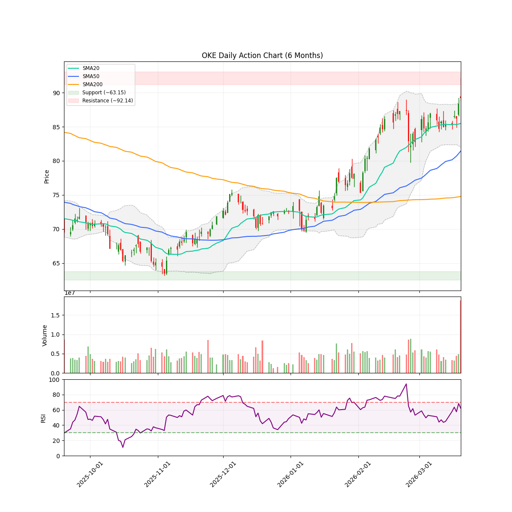
#### 研报分析

### 技术指标概览 (Technical Overview)
- **当前价格**: $89.21
- **RSI (14)**: 62.08
- **移动平均线**: SMA20: $85.49 | SMA50: $81.45 | SMA200: $74.77 (Bullish)
- **波动率**: ATR (14): 2.20 (预计周度波动: +/- $4.91)
- **关键位 (6m)**: 支撑位 $63.15 | 阻力位 $92.14
- **即时状态**: Above SMA50

# OKE 情绪审计报告：能源管网的“慢牛”史诗

嘿，伙计，坐稳了。咱们今天聊聊 **ONEOK (OKE)**。如果你在寻找那种能在深夜让你安稳入睡的标的，OKE 现在的表现就像是一杯陈年威士忌，醇厚且后劲十足。

在当前的叙事经济学中，中游能源（Midstream）已经不再是那个“无聊的管道商”了，它们正在成为能源安全与分红增长的“代名词”。

---

### 1. 催化剂分级 (Catalyst Categorization)

我们要从杂音中过滤出真正的信号。别管那些什么尼日利亚鸡蛋短缺的离奇新闻（那纯属噪音），我们要看的是钱流向了哪里。

*   **B-Tier：股息增长的“磁吸效应”**
    *   **详情**：Seeking Alpha 最近将 OKE 列入“3月五大股息增长股”。在市场震荡期，高达 5.93% 的收益率配合持续增长的现金流，对机构资金来说就是最完美的避风港。
    *   **链接**：[Seeking Alpha - March's 5 Dividend Growth Stocks](https://seekingalpha.com/article/4882846-march-5-dividend-growth-stocks-yields-5-percent)
*   **B-Tier：行业巨头的集体共振**
    *   **详情**：虽然市场在讨论 MPLX 是否能破百，但这种情绪直接外溢到了 OKE。中游板块正在经历估值修复，OKE 作为其中的佼佼者，正站在风口上。
    *   **链接**：[The Globe and Mail - Is MPLX Stock Going to $100?](https://www.theglobeandmail.com/investing/markets/stocks/OKE/pressreleases/533765/is-mplx-stock-going-to-100/)
*   **C-Tier：地缘政治驱动的能源溢价**
    *   **详情**：虽然 CNBC 提到的 SolarEdge 暴涨是因为中东局势触发的能源安全逻辑，这种叙事同样在暗中支撑着像 OKE 这样的美国能源基础设施。
    *   **链接**：[CNBC - Stocks making the biggest moves midday](https://www.cnbc.com/2026/03/20/stocks-making-the-biggest-moves-midday-sedg-smci-fdx.html)

---

### 2. 背离检测 (Divergence Detection)

**当前状态：强势确认，但需警惕“恐高症”。**

从盘面上看，OKE 目前报 **89.21**，稳稳站在 20日、50日和200日均线之上。这是一个教科书级别的多头排列。
*   **看涨信号**：价格在不断刷新高点，且 SMA50 (81.45) 远高于 SMA200 (74.77)，说明中长期趋势极其稳固。
*   **潜在隐忧**：RSI 目前在 **62.08**。虽然还没到 70 的“严重超买区”，但已经开始散发热气。
*   **市场情绪背离**：并没有发现“好消息下跌”的衰竭迹象。相反，市场对股息和稳定盈利的渴望正在把 OKE 推向 6个月高点 **92.14**。

---

### 3. 情绪评分 (Sentiment Score)

#### **逻辑评分：8.5/10**
**定性分析**：这是一场由“确定性”驱动的上涨。在大宗商品波动和宏观不确定的迷雾中，OKE 的高股息和稳健资产就像是灯塔。目前的叙事是“收租金的巨兽”，只要这种叙事不破，回调就是买点。

---

### 4. 叙事总结：老牌猎手的耐心

现在的 OKE 就像一个在林中守候多时的老猎手。它不参与那种 AI 泡沫的疯狂追逐，它只是默默地守着全美最关键的天然气管网。

技术面上，OKE 正在测试 **92.14** 的阻力位。如果突破，它将进入一个全新的价格真空区。如果回调，下方的 **85.49 (SMA20)** 就是最坚实的防线。记住，这股趋势不是靠短线客炒作出来的，而是由那些追求长期复利的“聪明钱”一笔一笔买出来的。

---

### 5. 关键日程提醒

*   **下一次重要日期**：**2026年5月初**（预计 2026 Q1 财报发布日）。
*   **关注重点**：关注现金流（DCF）覆盖率。只要这个数字漂亮，分红的叙事就能继续讲下去。

**老兵建议**：别在 90 块上方表现得太贪婪，但也别轻易下车。这辆车还没到终点站，它只是在匀速巡航。☕

--- 
*注：以上分析基于 2026-03-22 的市场数据，投资需谨慎。*
#### 近期新闻与事件
- **[Weekly Trust on MSN]** [Egg shortage looms over scarcity of day-old chicks](https://www.msn.com/en-xl/food-and-drink/general/egg-shortage-looms-over-scarcity-of-day-old-chicks/ar-AA1Z6XYF?ocid=BingNewsVerp)
- **[Seeking Alpha]** [March's 5 Dividend Growth Stocks With Yields Up To 5.93%](https://seekingalpha.com/article/4882846-march-5-dividend-growth-stocks-yields-5-percent)
- **[The Globe and Mail]** [Is MPLX Stock Going to $100?](https://www.theglobeandmail.com/investing/markets/stocks/OKE/pressreleases/533765/is-mplx-stock-going-to-100/)
- **[CNBC]** [Stocks making the biggest moves midday: SolarEdge Technologies, Super Micro Computer, FedEx & more](https://www.cnbc.com/2026/03/20/stocks-making-the-biggest-moves-midday-sedg-smci-fdx.html)

---

### OXY
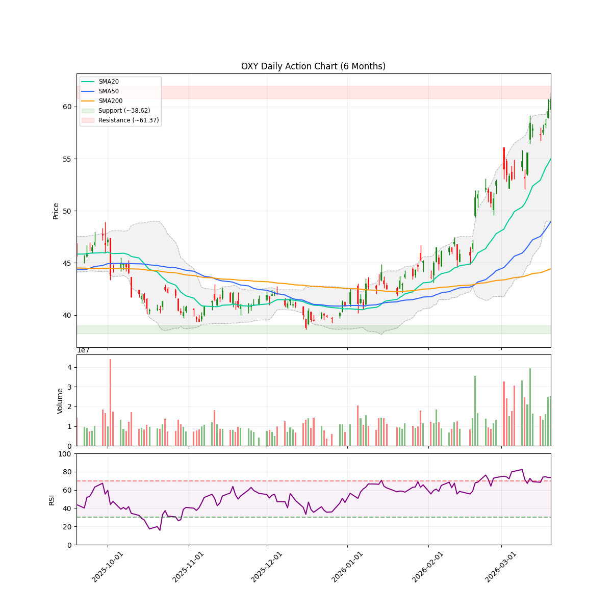
#### 研报分析

### 技术指标概览 (Technical Overview)
- **当前价格**: $60.71
- **RSI (14)**: 73.64
- **移动平均线**: SMA20: $54.98 | SMA50: $48.96 | SMA200: $44.43 (Bullish)
- **波动率**: ATR (14): 1.90 (预计周度波动: +/- $4.26)
- **关键位 (6m)**: 支撑位 $38.62 | 阻力位 $61.37
- **即时状态**: Above SMA50

你好。坐，咖啡刚煮好。

作为一名在“叙事经济学”里摸爬滚打多年的对冲基金研究员，我看西方石油（Occidental Petroleum, OXY）的角度可能和那些只会盯着Excel表格的分析师不太一样。我们要聊的是**故事**，以及这个故事是否还能让华尔街买单。

目前的日期是 2026年3月22日，OXY 的盘面正处于一个非常微妙且令人兴奋的节点。

---

### **OXY 情绪审计报告：伯克希尔的底气与超买的警示**

#### **1. 催化剂分级 (Catalyst Categorization)**

*   **A-Tier (核心叙事)：伯克希尔的“不死金身”**
    *   巴菲特（Warren Buffett）旗下的伯克希尔公司目前持有 OXY 约 29% 的股份 ([Insider Monkey, 2026-03-01](https://www.msn.com/en-us/money/markets/is-occidental-petroleum-oxy-the-best-energy-stock-to-buy-now/ar-AA1Z6XHR?ocid=BingNewsVerp))。这不仅仅是一个持仓数字，它是市场的“定海神针”。每当 OXY 价格回调，市场就会下意识地寻找那个被称为“巴菲特底”的支撑位。
*   **B-Tier (行业宏观)：全球石油版图重组**
    *   随着全球能源贸易的结构性重整 ([Investor's Business Daily, 2026-03-01](https://www.msn.com/en-us/money/markets/stock-market-week-ahead-the-restructuring-of-global-oil/ar-AA1Z7TBV?ocid=BingNewsVerp))，OXY 的低成本页岩油资产和碳捕集技术的叙事逻辑变得愈发迷人。这为股价在一二月份的飙升提供了基本面支撑 ([The Globe and Mail, 2026-02-26](https://www.theglobeandmail.com/investing/markets/stocks/OXY/pressreleases/437760/occidental-petroleum-stock-rocketed-more-than-10-in-january/))。
*   **C-Tier (杂讯与制衡)：机构的审慎态度**
    *   花旗银行（Citi）给出了“持有”评级 ([The Globe and Mail, 2026-03-18](https://www.theglobeandmail.com/investing/markets/stocks/OXY-N/pressreleases/814375/occidental-petroleum-oxy-receives-a-hold-from-citi/))。这通常意味着在大象起舞后，冷静的机构开始担心估值是否透支了未来的预期。

#### **2. 分歧检测 (Divergence Detection)**

目前 OXY 表现出明显的**“强势超买”分歧**：
*   **盘面特征**：股价 60.71 美元，正处于 6 个月最高点（61.37）的门槛上。
*   **警示信号**：RSI（相对强弱指数）高达 **73.64**。在我们的行话里，这叫“引擎过热”。
*   **逻辑**：尽管最近的新闻大多偏向正面（比如伯克希尔的长期背书），但股价已经在两个月内完成了大幅拉升。目前的阻力位（61.37）像是一堵厚墙，而 RSI 显示市场参与者已经有些气喘吁吁了。如果利好消息不再“加码”，短期内可能会出现“利好出尽”的获利了结盘。

#### **3. 叙事解读：这不仅仅是一口油井**

现在的 OXY 讲述的是一个“旧能源的最后堡垒”与“新能源的前哨站”相结合的故事。市场并不只是在买它的原油产量，而是在买巴菲特的眼光。这种叙事极具粘性，因为它给投资者一种错觉：**哪怕世界毁灭，巴菲特也会在 50 美元左右接住所有的筹码。** 这种心理安慰剂让 OXY 的抗跌性远超同侪。

---

### **核心诊断：情绪评分**

# **情绪得分: 8.2 / 10**
> **“亢奋的慢牛，但需提防门后的陷阱”**

*   **逻辑支撑**：
    *   **9/10 趋势得分**：价格远高于 SMA50 和 SMA200，典型的牛市排列。
    *   **8/10 筹码结构**：伯克希尔 29% 的持仓几乎锁死了大量流动性，减少了踩踏风险。
    *   **-0.8 扣分项**：RSI 超买以及花旗银行的“中性”声音，暗示股价需要一次深呼吸（回踩 SMA20 约 55 美元附近）。

---

### **投资建议与关键时点**

*   **市场脉搏**：不要在 61 美元的阻力位下方盲目冲锋。目前的 ATR（波动率）显示每周波动空间约 4.26 美元。如果股价回落至 55-57 美元区间，那将是极佳的“咖啡时间”入场点。
*   **后续焦点**：伯克希尔的继任者计划 ([AOL, 2026-03-19](https://www.aol.com/articles/shocked-now-running-berkshire-hathaways-092000581.html)) 可能会给 OXY 带来短期的叙事波动。如果新管理层对能源股的偏好有所改变（虽然可能性极低），这才会是真正的“叙事崩溃”。

**下一重要日期**：
*   **2026年5月上旬**（预计 Q1 财报发布日）：这是验证一二月份股价狂飙是否有利润支撑的关键时刻。

---
*声明：本报告仅供参考，不构成直接投资建议。市场有风险，入市需谨慎。*
#### 近期新闻与事件
- **[Insider Monkey on MSN]** [Is Occidental Petroleum (OXY) The Best Energy Stock to Buy Now?](https://www.msn.com/en-us/money/markets/is-occidental-petroleum-oxy-the-best-energy-stock-to-buy-now/ar-AA1Z6XHR?ocid=BingNewsVerp)
- **[AOL]** [I Was Shocked at Who Is Now Running Berkshire Hathaway's $308 Billion Stock Portfolio](https://www.aol.com/articles/shocked-now-running-berkshire-hathaways-092000581.html)
- **[Investor's Business Daily on MSN]** [Stock market week ahead: The restructuring of global oil](https://www.msn.com/en-us/money/markets/stock-market-week-ahead-the-restructuring-of-global-oil/ar-AA1Z7TBV?ocid=BingNewsVerp)
- **[The Globe and Mail]** [Occidental Petroleum (OXY) Receives a Hold from Citi](https://www.theglobeandmail.com/investing/markets/stocks/OXY-N/pressreleases/814375/occidental-petroleum-oxy-receives-a-hold-from-citi/)
- **[The Globe and Mail]** [Occidental Petroleum Stock Rocketed More Than 10% in January (but the Big Move Came in February)](https://www.theglobeandmail.com/investing/markets/stocks/OXY/pressreleases/437760/occidental-petroleum-stock-rocketed-more-than-10-in-january-but-the-big-move-came-in-february/)

---

### TSM
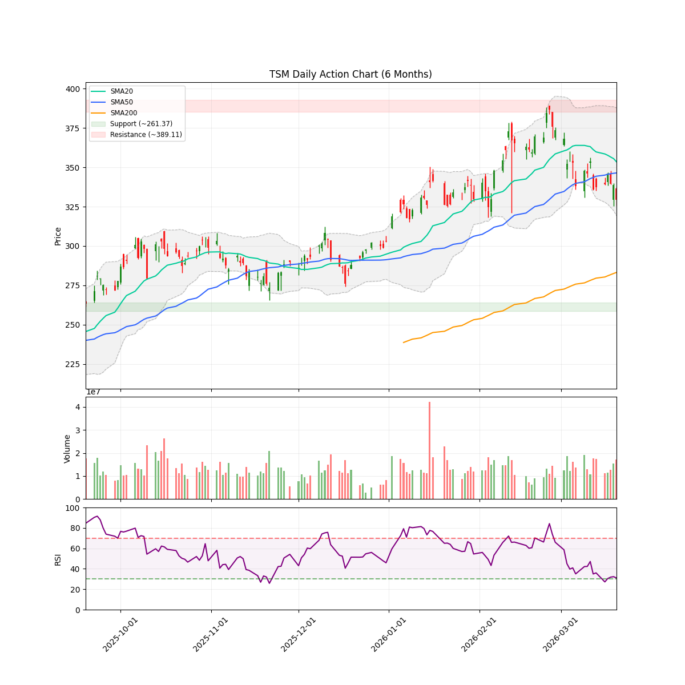
#### 研报分析

### 技术指标概览 (Technical Overview)
- **当前价格**: $329.24
- **RSI (14)**: 31.02
- **移动平均线**: SMA20: $353.52 | SMA50: $346.44 | SMA200: $283.18 (Bullish)
- **波动率**: ATR (14): 12.83 (预计周度波动: +/- $28.70)
- **关键位 (6m)**: 支撑位 $261.37 | 阻力位 $389.11
- **即时状态**: Below SMA50

# TSM 情绪审计报告：在硝烟与 AI 狂热的夹缝中，谁在恐惧？

**日期：** 2026年3月22日
**分析师：** 叙事经济学观察员（对冲基金研究部）
**标的：** 台积电 (TSM.US)
**当前价格：** $329.24

---

### 1. 叙事背景：当“地缘政治”撞上“AI 信仰”

兄弟，现在的 TSM 就像是那种在暴风雨中依然稳坐钓鱼台的巨轮，虽然船身摇晃得厉害，但底下的引擎还在疯狂输出。

现在的市场故事线很撕裂：一边是 Nvidia 带来的、如烈火烹油般的 AI 芯片需求，另一边是中东（伊朗）战火阴云下对马六甲或霍尔木兹海峡可能封锁的极端恐惧。这就造成了一个有趣的现象：**财报和基本面在疯狂呐喊“买入”，而避险情绪却在疯狂按“卖出”。**

### 2. 催化剂分级 (Catalyst Categorization)

*   **A-Tier（核心推动力）：**
    *   **美银（BofA）的“背书”：** 哈斯·刘重申“买入”评级，目标价直指 **$470**。这可不是随便写写的数字，这代表了机构对 TSM 在 2 纳米节点垄断地位的绝对信心。 [参考链接](https://finance.yahoo.com/markets/stocks/articles/bank-america-securities-reiterates-buy-154420626.html)
    *   **Nvidia 需求的传导：** 10 月份强劲的销售额和 Nvidia 永不满足的胃口，证明了 TSM 的产能依然是这个时代最稀缺的硬通货。 [参考链接](https://www.msn.com/en-us/money/top-stocks/tsm-stock-rally-on-big-october-sales-nvidia-demand/vi-AA1YPPeW)

*   **B-Tier（中期支撑）：**
    *   **13% 的技术性回调：** 24/7 Wall St 把这次下跌称为“敲桌子的礼物”。对于长线资金来说，这种回调是清理浮盈盘、重新上车的绝佳机会。 [参考链接](https://247wallst.com/investing/2026/03/18/tsmc-stock-looks-like-a-table-pounding-gift-after-that-13-correction/)

*   **C-Tier（短期噪音）：**
    *   **地缘政治焦虑：** 伊朗战争导致的供应链中断担忧。虽然摩根士丹利发出了警告，但这更多是宏观层面的系统性风险，而非 TSM 自身的问题。 [参考链接](https://www.msn.com/en-us/money/other/taiwan-semiconductor-manufacturing-tsm-staring-at-chips-production-disruption-amid-iran-war/ar-AA1Z78QI)

### 3. 背离检测：好消息里的“倒春寒”

这里有个非常微妙的信号：**看涨叙事（$500 目标价、AI 护城河）正处于高潮，但股价却在 SMA50 之下徘徊，RSI 已经杀到了 31.02。**

在职业操盘手眼里，这就是典型的“**抛售竭尽**”。当美银还在喊 $470，散户却因为地缘政治新闻吓得交出筹码时，TSM 已经进入了“超卖区”。这种“好消息不涨反而阴跌”的背离，往往是空头力量最后一次宣泄。

### 4. 逻辑评分 (Logic Score)

# **7.8 / 10**

**评价：** 这是一个**“带着镣铐跳舞”的牛市周期**。TSM 的基本面几乎无懈可击（评分本该是 9），但地缘政治的幽灵压低了它的估值上限（扣掉 1.2 分）。目前的下跌更像是一个“情绪陷阱”，专门清理那些杠杆过高的短线投机者。

---

### 5. 核心诊断：是“趋势”还是“陷阱”？

*   **结论：** 这是一个**黄金坑式的趋势延续**，而非崩塌陷阱。
*   **理由：** 31 的 RSI 意味着卖压已经接近临界点。尽管股价跌破了 SMA50（346.44），但距离 SMA200（283.18）仍有较厚的垫子。现在的 329 美元，本质上是市场在给“地缘政治风险”打折。如果你相信 AI 浪潮还没结束，那这个折扣就是给你的奖赏。

### 6. 关键数据与日期

*   **下个重大日期：** **2026年4月中旬（第一季度财报发布日）**。这将是决定 TSM 能否重回 SMA50 上方并向 $400 发起冲击的关键战役。
*   **短期阻力位：** $353.52 (SMA20)
*   **短期支撑位：** $300.00 (心理关口) / $283.18 (SMA200)

---

**老兵私房话：** 
别盯着屏幕上的那些战争头条看了，去看看 Nvidia 的订单簿。只要硅谷还需要芯片，台积电就是那家唯一的收税公司。现在的 329 美元，就像是 2024 年底的回调一样，事后看都是机构在给你发请帖。**坐稳，别被洗下车。**
#### 近期新闻与事件
- **[Yahoo Finance]** [Bank of America Securities Reiterates a Buy Rating on Taiwan Semiconductor Manufacturing Company (TSM) Stock](https://finance.yahoo.com/markets/stocks/articles/bank-america-securities-reiterates-buy-154420626.html)
- **[Forbes]** [TSM Stock: Why Selling Puts Is The Win-Win Play](https://www.forbes.com/sites/greatspeculations/2026/03/18/tsm-stock-why-selling-puts-is-the-win-win-play/)
- **[YouTube]** [TSM stock rallies on big October sales & Nvidia demand](https://www.msn.com/en-us/money/top-stocks/tsm-stock-rallies-on-big-october-sales-nvidia-demand/vi-AA1YPPeW)
- **[The Motley Fool]** [Think It's Too Late to Buy Taiwan Semiconductor Manufacturing Company Stock? Here's the 1 Reason Why There's Still Time.](https://www.msn.com/en-us/money/topstocks/think-its-too-late-to-buy-taiwan-semiconductor-manufacturing-company-stock-heres-the-1-reason-why-theres-still-time/ar-AA1YX9oe)
- **[Insider Monkey]** [Taiwan Semiconductor Manufacturing (TSM) Staring at Chips Production Disruption Amid Iran War](https://www.msn.com/en-us/money/other/taiwan-semiconductor-manufacturing-tsm-staring-at-chips-production-disruption-amid-iran-war/ar-AA1Z78QI)

---

### VLO
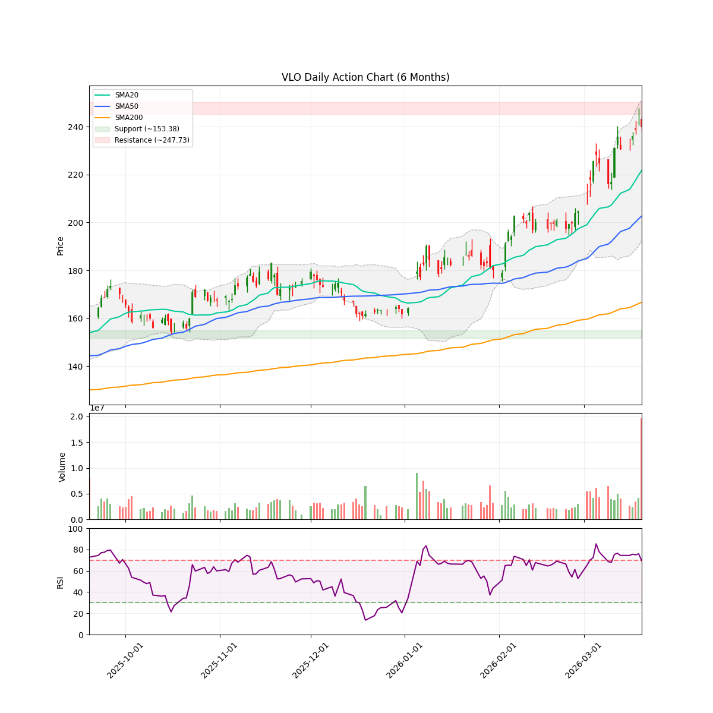
#### 研报分析

### 技术指标概览 (Technical Overview)
- **当前价格**: $239.86
- **RSI (14)**: 69.50
- **移动平均线**: SMA20: $221.75 | SMA50: $202.65 | SMA200: $166.74 (Bullish)
- **波动率**: ATR (14): 8.66 (预计周度波动: +/- $19.36)
- **关键位 (6m)**: 支撑位 $153.38 | 阻力位 $247.73
- **即时状态**: Above SMA50

# VLO 情绪审计报告：炼油巨头的狂欢与高空的“氧气稀薄”

**日期：** 2026年3月22日  
**分析师：** 叙事经济学研究部  
**标的：** Valero Energy (VLO)

---

### 1. 市场叙事：从“被遗弃的旧能源”到“离不开的印钞机”

伙计，坐稳了。现在的 Valero (VLO) 就像是一台正在全速运转的重型卡车，排气管里喷出的不是废气，而是美金。

就在几年前，华尔街还沉迷于“新能源”的幻梦，恨不得把所有的炼油厂都送进博物馆。但到了2026年的春天，当原油价格逼近 100 美元大关 [5]，现实给了所有人一个响亮的耳光。VLO 现在的涨势不是靠情怀，而是靠实打实的**裂解价差（Crack Spreads）**。随着能源需求的爆发和可再生燃料转型的加速 [3]，VLO 已经成了市场眼中的“双面旗手”：既是传统能源的现金奶牛，又是绿色能源的潜力股。

### 2. 催化剂分级 (Catalyst Categories)

*   **A-Tier（核心动力）：高盛的“金手指”提振**
    高盛在3月12日将 VLO 的目标价从 203 美元大幅上调至 237 美元，并维持买入评级 [2]。这种来自顶层机构的背书，就像是给已经沸腾的引擎又加了一桶高辛烷值燃料。
*   **B-Tier（行业东风）：油价破百的预期与行业轮动**
    《Motley Fool》指出，在油价冲向 100 美元的背景下，VLO 是最好的避风港之一 [5]。同时，相对于近期低迷的太阳能板块（如 First Solar），资金正疯狂涌向像 VLO 这种有利润支撑的重资产行业 [7]。
*   **C-Tier（杂音与情绪）：常规的看涨研报**
    Zacks 将其列为强力增长股 [4]，这类消息虽然属于“噪音”，但它们起到了情绪放大器的作用，不断强化散户的追涨心理。

### 3. 背离检测 (Divergence Detection)

**警惕：高空的“缺氧”征兆**  
虽然基本面好得发烫，但技术面已经开始发出细微的喘息声。目前 VLO 报收 **$239.86**，已经**突破**了高盛给出的 $237 目标价。这意味着，机构之前的预期已经完全被市场消化，甚至有些超前。

更重要的是，**RSI 高达 69.50**，距离 70 的“超买红色警戒线”仅一步之遥。SMA20 ($221.75) 与现价的乖离率也在拉大。这告诉我们一个老兵的常识：**利好已经写在了脸上，利空往往躲在狂欢背后。** 如果短期内没有更大规模的利好（比如超预期的分红），获利盘的抛压随时可能砸下来。

### 4. 情绪评分 (Sentiment Score)

#### **8.5 / 10 —— 强力看涨，但需预防“高空坠物”**

*   **理由：** 机构上调目标价、油价上涨预期、以及强劲的板块轮动，构成了极具说服力的看涨逻辑。但 0.5 分的扣减在于 RSI 的逼近极限和目标价的提前达成。这不是趋势的终结，而是一个潜在的“歇脚点”。

---

### 5. 核心逻辑综述

VLO 的故事目前非常迷人：它不仅享受着高油价带来的利润增厚，还因为在可再生燃料领域的布局赢得了“ESG 溢价” [3]。它的股价表现持续超越 S&P 500 [1]，说明它是目前的市场领导者（Leader），而非跟风者。

**操作建议（私人笔记）：**  
现在的 VLO 就像是派对深夜最 High 的那一刻。如果你已经在场内，拿好你的筹码，但把止损位上调至 SMA20 附近。如果你还没上车，千万别在这个位置（阻力位 $247.73 附近 [无]）硬冲，等一根回踩 SMA20 的阴线，那才是更舒服的切入点。

---

### 6. 关键数据与日期

*   **当前价格：** $239.86
*   **短期阻力位：** $247.73 (6个月高点)
*   **强力支撑位：** $221.75 (SMA20)
*   **下一个重大日期：** **2026年4月23日（预计 Q1 财报发布日）**。这笔账到底挣了多少，到时见分晓。

---
**引用文献：**
1. [Zacks.com] Why Valero Energy (VLO) Outpaced the Stock Market Today (2026-03-17).
2. [Insider Monkey] Goldman Sachs Raises PT on Valero Energy Corp (VLO) to $237 (2026-03-15).
3. [Kalkine Media] Valero Energy Shares Mark Fresh Peak Momentum (2026-03-18).
4. [Zacks] Here's why Valero Energy is a strong growth stock (2026-03-19).
5. [The Motley Fool] Top stocks to double up on right now (2026-03-22).
6. [Yahoo Finance] VLO Stock Slides as Market Rises (2026-03-10).
7. [Yahoo Finance] VLO and Baker Hughes Surge While First Solar Sinks (2026-03-10).
#### 近期新闻与事件
- **[Zacks.com]** [Why Valero Energy (VLO) Outpaced the Stock Market Today](https://www.msn.com/en-us/money/topstocks/why-valero-energy-vlo-outpaced-the-stock-market-today/ar-AA1YRzI5)
- **[Insider Monkey]** [Goldman Sachs Raises PT on Valero Energy Corp (VLO) to $237 From $203 - Here's Why](https://www.msn.com/en-us/money/markets/goldman-sachs-raises-pt-on-valero-energy-corp-vlo-to-237-from-203-here-s-why/ar-AA1YFOkH)
- **[Kalkine Media]** [Valero Energy (NYSE:VLO) Shares Mark Fresh Peak Momentum](https://kalkinemedia.com/us/stocks/energy/valero-energy-nysevlo-shares-mark-fresh-peak-momentum)
- **[Zacks Investment Research]** [Here's why Valero Energy (VLO) is a strong growth stock](https://www.msn.com/en-us/money/topstocks/here-s-why-valero-energy-vlo-is-a-strong-growth-stock/ar-AA1YZytm)
- **[The Motley Fool]** [Top stocks to double up on right now](https://www.msn.com/en-us/money/top-stocks/top-stocks-to-double-up-on-right-now/ar-AA1Z9kxU)

---

### VRT
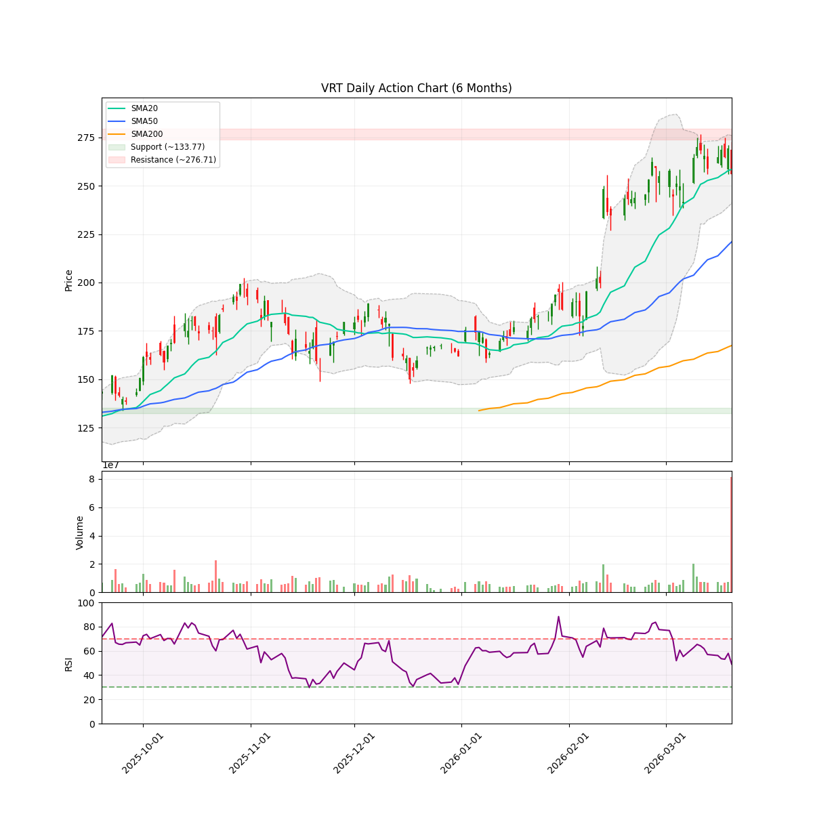
#### 研报分析

### 技术指标概览 (Technical Overview)
- **当前价格**: $255.88
- **RSI (14)**: 49.10
- **移动平均线**: SMA20: $258.44 | SMA50: $221.03 | SMA200: $167.44 (Bullish)
- **波动率**: ATR (14): 14.65 (预计周度波动: +/- $32.76)
- **关键位 (6m)**: 支撑位 $133.77 | 阻力位 $276.71
- **即时状态**: Above SMA50

# 情绪审计报告：维谛技术 (Vertiv Holdings, VRT)
**日期：** 2026年3月22日
**角色：** 叙事经济学对冲基金研究员

---

### 1. 核心叙事：AI 盛宴背后的“隐形管道工”

如果说英伟达（NVIDIA）是这场 AI 革命的引擎，那么 **Vertiv (VRT)** 就是冷却这台狂热引擎的唯一救命稻草。现在市场上的故事已经从“谁在卖芯片”转向了“谁能保证这些昂贵的硅片不被烧毁”。

目前 VRT 的叙事已经进入了**“机构共识期”**。过去一年 191% 的涨幅（Forbes 数据）不仅仅是炒作，而是源于其实实在在翻倍的订单积压（Backlog）。现在的 VRT 就像是 1849 年加州淘金热中垄断了坚固铲子和水源的商人。虽然股价近期从高点回落，但这更像是一场马拉松中途的补水，而非崩盘的开始。

---

### 2. 催化剂分级 (Catalyst Categorization)

*   **【A-Tier】顶级催化剂：机构“抬轿”与确定性溢价**
    *   **理由：** 2026年3月20日，摩根士丹利、奥本海默和高盛集体上调目标价 ([Yahoo Finance](https://finance.yahoo.com/markets/stocks/articles/morgan-stanley-oppenheimer-goldman-sachs-204328851.html))。当华尔街顶级的“聪明钱”整齐划一地站台时，这不再是噪音，而是基本面的确认。
    *   **深度：** 积压订单翻倍，意味着未来 2-3 年的营收可见度极高，这在动荡的市场中是稀缺的“避风港”。

*   **【B-Tier】中级催化剂：全美数据中心“标配”地位**
    *   **理由：** Motley Fool 指出 VRT 正在“静悄悄地”驱动全美每一个 AI 数据中心 ([Yahoo Finance](https://finance.yahoo.com/markets/stocks/articles/vertiv-quietly-powering-every-ai-175000477.html))。这种“卖水人”的定位让它在行业洗牌中比终端应用厂商更具韧性。

*   **【C-Tier】噪音与短期情绪：Cramer 的背书**
    *   **理由：** Jim Cramer 建议“坚守 Vertiv” ([Yahoo Finance](https://finance.yahoo.com/markets/stocks/articles/vertiv-vrt-triple-digit-percentages-160311561.html))。虽然这带来了散户的热情，但也增加了短期的波动性（即所谓的“Cramer 反向指标”担忧，尽管目前 VRT 表现极其强劲）。

---

### 3. 分歧探测：好消息里的“冷静期”

**观察：** 尽管 3 月 17 日至 20 日利好频传（目标价上调、机构唱多），但股价目前（255.88）其实略低于 SMA20（258.44），且 RSI 处于 49.10 的中性位置。

**诊断：** 这是一个典型的**“利好不涨”的微观背离**，但并非熊市陷阱。Forbes 提到的“从峰值撤退”反映了市场在经历三位数增长后的自然畏高心理。
*   **看多者认为：** 这是机构在财报前的“洗盘”，吸纳犹豫不决的获利盘。
*   **看空者认为：** 预期已经拉得太满，估值可能已经透支了未来两年的增长。
*   **我的结论：** **看涨衰竭尚未出现。** 股价仍远高于 SMA50 ($221.03)，这说明中期趋势依然牢不可破。目前的横盘是在消化 276 美元附近的阻力位。

---

### 4. 情绪评分报告

*   **情绪得分 (Sentiment Score): 8.5/10**
    *   *点评：* 市场情绪依然极度乐观，但多了一分理智。这不是那种令人不安的、垂直向上的泡沫，而是一个伴随着怀疑和巩固的健康牛市。

*   **逻辑得分 (Logic Score): 9.2/10**
    *   *点评：* “电力需求 = 散热需求 = Vertiv 的收入”这一逻辑链路极其稳固。只要液冷（Liquid Cooling）技术仍是 AI 数据中心的刚需，VRT 的基本面就无懈可击。

---

### 5. 后续操作指南

*   **支撑位观察：** 如果股价回调至 SMA50 ($221 附近)，那是完美的机构补票点。
*   **阻力位挑战：** 276.71 (6个月高点) 是接下来的关键战场，一旦放量突破，将开启下一波“估值重塑”。
*   **下个重大日期：** **2026年4月下旬 (Q1 2026 财报发布预估)**。这将验证订单积压是否如预期般转化为实际营收。

---

**一句话总结：**
不要被短期的横盘吓跑，VRT 不是在制造“陷阱”，它只是在为冲刺 300 美元大关换一口气。**只要 AI 还没断电，维谛的印钞机就不会停。**
#### 近期新闻与事件
- **[Yahoo Finance]** [Is Everpure, Inc. (PSTG) A Good Stock To Buy Now?](https://finance.yahoo.com/markets/stocks/articles/everpure-inc-pstg-good-stock-211337284.html)
- **[Insider Monkey· via Yahoo Finance]** [Morgan Stanley, Oppenheimer, and Goldman Sachs Raise Vertiv (VRT) Price Targets](https://finance.yahoo.com/markets/stocks/articles/morgan-stanley-oppenheimer-goldman-sachs-204328851.html)
- **[Insider Monkey· via Yahoo Finance]** [Vertiv (VRT) Up In Triple Digit Percentages After Jim Cramer Said “Stick to Vert...](https://finance.yahoo.com/markets/stocks/articles/vertiv-vrt-triple-digit-percentages-160311561.html)
- **[24/7 Wall St.· via Yahoo Finance]** [Vertiv Stock Just Spiked Higher. Wall Street Pros Say It’s Not Done](https://finance.yahoo.com/news/vertiv-stock-just-spiked-higher-135805316.html)
- **[Motley Fool· via Yahoo Finance]** [Vertiv Is Quietly Powering Every AI Data Center in America, and the Stock Could...](https://finance.yahoo.com/markets/stocks/articles/vertiv-quietly-powering-every-ai-175000477.html)

---

### VST

#### 研报分析

### 技术指标概览 (Technical Overview)
- **当前价格**: $146.02
- **RSI (14)**: 34.99
- **移动平均线**: SMA20: $164.69 | SMA50: $162.98 | SMA200: $181.36 (Bearish)
- **波动率**: ATR (14): 8.29 (预计周度波动: +/- $18.53)
- **关键位 (6m)**: 支撑位 $138.34 | 阻力位 $219.21
- **即时状态**: Below SMA50

# 情绪审计报告：Vistra Corp (VST) —— 核能梦碎还是黄金坑？

**日期：** 2026年03月22日  
**分析师：** 叙事经济学研究员  
**个股：** VST (Vistra Corp)  
**当前价格：** $146.02  

---

### 一、 市场叙事：当“AI核能梦”撞上“提现离场”

老兄，坐下来喝杯咖啡，我们来聊聊 VST。就在几周前，Vistra 还是华尔街的宠儿，被视为 AI 数据中心电力需求的“终极解药”。但看看现在的盘面，这种叙事正在经历一场惨烈的“现实校准”。

目前的 VST 就像是一个刚参加完狂欢派对、宿醉未醒的赌徒。Jim Cramer 刚在电视上警告别太贪婪，市场就立刻给他点颜色看看。这不仅仅是技术性的回调，这是一场关于“信仰”的动摇。

### 二、 催化剂分类 (Catalyst Categorization)

*   **A-Tier (核心驱动):** **暂无。** 甚至原本支撑股价的“长期增长逻辑”在面对管理层大笔套现时也显得苍白无力。
*   **B-Tier (行业与分析师):** **核能宏叙事与高目标价。** 分析师们依然守着 $236.87 的平均目标价（[Blockonomi]），但这更像是给套牢盘的心理按摩。核能作为清洁能源核心的地位没变，但短期资金已经失去了耐心。
*   **C-Tier (杂讯与扰动):** **除息日与 Cramer 的毒奶。** 股价在除息日前后暴跌 12.6% ([Insider Monkey])，这种跌幅远超分红金额，说明投资者是在找借口“弃船”。而 Jim Cramer 的警告（[Insider Monkey]）则像是一声发令枪，让多头开始相互踩踏。

### 三、 背离检测：这不只是“除息”那么简单

我们要警惕那个“除息导致下跌”的说法。通常情况下，股价会在除息后掉掉分红的部分，但 VST 却走出了一根 12.6% 的断头铡。

**危险信号：** 在股价暴跌的同时，我们看到了**高管减持 (Executive Sell-Offs)** ([Blockonomi])。这是叙事逻辑中最致命的背离——如果公司真的像分析师说的那么值钱，为什么坐在驾驶位的人要先跳伞？这说明在 180-200 美元区间，内部人士认为估值已经严重透支了未来的预期。

### 四、 情绪与技术脉搏 (The Market Pulse)

*   **技术形态：** 丑陋，真的很丑。股价不仅跌破了 SMA50，还像石头一样砸穿了 SMA200 ($181.36)。在老手眼里，SMA200 是“牛熊分界线”，跌破它意味着多头的脊梁骨断了。
*   **超卖曙光：** RSI 目前处于 34.99，非常接近 30 的超卖区间。这意味着短期内恐慌盘可能出尽，会有一个“死鱼跳”式的反弹。
*   **支撑位：** 我们正逼近 6 个月低点 $138.34。如果这里守不住，下方的深渊会让人不寒而栗。

### 五、 审计结论：逻辑评分 (Logic Score)

**评分：3.5 / 10 (看淡 - 处于恐慌寻底阶段)**

**逻辑诊断：**  
目前的叙事属于**“均值回归后的信任危机”**。
1.  **叙事陷阱：** 核能的利好早已被计价，现在是利好出尽。
2.  **筹码松动：** 高管减持和机构在除息日的“夺路而逃”说明共识已经瓦解。
3.  **生存机会：** 唯一的希望在于 138 美元的强支撑位能引来抄底资金，以及 RSI 进入严重超卖后的技术性回抽。

### 六、 关键情报汇总

*   **逻辑评分：** **3.5**
*   **引用新闻：**
    *   *Insider Monkey*: "Vistra (VST) Up Slightly After Jim Cramer Warned Against Getting Too Greedy"
    *   *Insider Monkey*: "Vistra Corp. (VST) Loses 12.6% Ahead of Dividends"
    *   *Blockonomi*: "Vistra (VST) Stock Plunges 7% Amid Executive Sell-Offs"
*   **下个关键日期：** **2026年5月初** (预计 Q1 财报发布日)。
    *   *分析：在财报证明其实际盈利能力能跟上“AI电费”的叙事之前，股价可能持续在低位磨底。*

**老兄的最后建议：** 别在飞刀下落的时候伸手。等它插在地板上震动停止了，也就是 RSI 跌破 30 再掉头向上、且股价在 138 美元附近企稳时，才是我们进场收割那些“断线风筝”的时候。
#### 近期新闻与事件
- **[Insider Monkey]** [Vistra (VST) Up Slightly After Jim Cramer Warned Against Getting Too Greedy](https://www.msn.com/en-us/money/markets/vistra-vst-up-slightly-after-jim-cramer-warned-against-getting-too-greedy/ar-AA1Z7CSz)
- **[Insider Monkey]** [Vistra Corp. (VST) Loses 12.6% Ahead of Dividends](https://www.msn.com/en-us/money/topstocks/vistra-corp-vst-loses-126-ahead-of-dividends/ar-AA1Z6Qu5)
- **[Blockonomi]** [Vistra (VST) Stock Plunges 7% Amid Executive Sell-Offs and Ex-Dividend Event](https://blockonomi.com/vistra-vst-stock-plunges-7-amid-executive-sell-offs-and-ex-dividend-event/)
- **[Zacks.com]** [Why Vistra Corp. (VST) Outpaced the Stock Market Today](https://www.msn.com/en-us/money/savingandinvesting/why-vistra-corp-vst-outpaced-the-stock-market-today/ar-AA1YMa6D)
- **[The Financial Express]** [Radhakishan Damani's 'defensive fortress': The zero-debt stock with a 4.5% yield](https://www.financialexpress.com/market/stock-insights/radhakishan-damanis-defensive-fortress-the-zero-debt-stock-with-a-4-5-yield/4178240/)

---
