# 每日股市市场报告 (2026-03-25)

> **免责声明**: 本报告由 **代码与 Gemini AI 自动生成**，仅供研究参考，**不构成**任何投资建议。投资有风险，入市需谨慎。作者及 AI 不对任何基于此内容的投资决策承担责任。

## 📑 目录
[TOC]

##  长期投资逻辑
本组合旨在捕捉 **人工智能（AI）与半导体协议** 带来的跨周期结构性增长，核心投资策略聚焦于“确定性”与“物理瓶颈”：
- **底层制程垄断 (Foundry & WFE Moats)**：
  布局处于全球半导体精密制造顶端的“工业母机”级别公司。寻找具备极高准入门槛的晶圆代工及前道设备供应商，作为全产业链最稳固的底座资产。
- **算力稀缺性与连接带宽 (Compute & Interconnect Scarcity)**：
  聚焦在高性能计算芯（HPC）及高带宽连接领域占据主导地位的标的。AI 的终极竞争是“规模”，寻找能有效解决数据交换瓶颈并提供核心推理/训练能力的算力巨头。
- **应用生态与数据霸权 (Platform & Data Sovereignty)**：
  布局拥有闭环生态、海量高质量私有数据及云基础设施的科技巨头。它们是 AI 商业化落地的最终守门人，拥有将技术转化为持续现金流的分配权。
- **物理边界保障 (Power & Thermal Infrastructure)**：
  关注 AI 扩张的“最终瓶颈”——电力供应与热能管理。重点布局为下一代超大规模数据中心提供高功率密度能源、液冷技术及电网扩容方案的能源基建商。
**风控策略**：利用 AlphaJAX 的量化动量评分（Quant Score）作为过滤器，结合 LLM 叙事审计（Narrative Audit）捕捉“业绩超预期 + 叙事逻辑改善”的共振点，实现跨周期的超额收益。

 **注：排序权重**：Ticker 按照 AI 检测出的 **方向** 排序（**看多**优先，其次是 **中性**，最后是 **看空**）。
---

<!-- DISCORD_SUMMARY_START -->
## 🧠 对冲基金经理全局诊断与资金分配策略
**2026年3月25日 | 投资组合经理决策简报**

---

### **一、 指挥官意图 (Commander's Intent)**

**当前战局核心：从“AI幻想”向“AI基建实物”与“地缘溢价”的权力交接。**

目前的组合正站在风暴眼：**AMD** 已经顶到了我们 50% 的单一持仓红线，虽然逻辑依然坚挺，但防御力因过度集中而受损；**GOOGL** 出现了明显的技术面背离，地缘政治噪音正在掩盖其基本面。

我的核心策略是：**“锁死核心基建，清洗平庸筹码，突袭极端超卖”。** 
我们将维持 AMD 的旗舰地位但严禁加仓；利用 **MSFT** 处于 2008 年级别超卖的“黄金坑”机会进行左侧布局；同时强力介入 **VRT (液冷之王)** 这一 AI 物理层面的确定性品种。对于能源股（APA/OXY/COP），目前的 RSI 已经处于“熔断”边缘，严禁追涨，等待火药味散去后的回踩。

---

### **二、 账户现状诊断 (Portfolio Diagnosis)**

*   **现金储备**: $64,353.55 (约占 NAV 24.6%) —— **充足，随时准备出击。**
*   **集中度风险旗标**: 
    *   **AMD (50.56%)**: **[红色警报]** 已达到 AI 基础设施类持仓的最高容忍上限。即便苏妈的叙事再完美，在股价冲破 $267 阻力位前，禁止任何形式的加仓。
    *   **GOOGL (20.99%)**: **[中性监测]** 成本价 $268 提供了安全垫，但技术面已破位，需腾挪空间给更高动能的标的。
*   **仓位效率**: **AMZN (1.77%)** 属于“无效持仓”，仓位太轻无法贡献利润，要么加码，要么离场。

---

### **三、 核心逻辑与分级评分 (Logic Score Tier)**

#### **1. 激进进攻区 (Score 8-10)**
*   **VRT (9.2)**: AI 降温的终极门票。入标标普+液冷收购，这是目前市场上最完美的“逻辑+筹码”双共振。
*   **AMAT (8.8)**: 晶圆厂扩产的物理地主，美光扩产的直接受益者。
*   **ASML (8.5)**: $80亿订单证明了垄断地位。EUV 依然是印钞机。
*   **MSFT (8.5)**: RSI 13 的惊人背离。积压订单 $6250 亿，这是一次“流动性踩踏”送给我们的礼物。

#### **2. 震荡观察区 (Score 5-7)**
*   **GOOGL (6.8)**: 基本面强，但地缘政治风险成了短期压舱石。
*   **NVDA (6.2)**: 审美疲劳期，利好不涨。处于 SMA200 附近的盘整期。
*   **VST (4.5)**: **[减持区]** 趋势已断，叙事“断电”，短期价值回归压力巨大。

#### **3. 极端过热区 (谨慎建仓)**
*   **APA (90.0 RSI) / OXY (77.6 RSI) / COP (77.7 RSI)**: 能源叙事正在火药桶上跳舞，现在入场等于在舞会最高潮时买单。

---

### **四、 行动交易计划 (Actionable Trading Plan)**

#### **第一阶段：清理与防御 (Raise More Cash)**
*   **减持 GOOGL**: 卖出 60 股（约 37% 的现有持仓），市价约 $17,458。
    *   *理由：* 技术面跌破 SMA50，腾出资金用于布局 RSI 极度超卖的 MSFT 和高动能的 VRT。
*   **持有 AMD**: 保持 600 股不动。
    *   *理由：* 50% 已经是极限，虽然逻辑分 8.5，但我们要遵守集中度纪律。

#### **第二阶段：进攻与伏击 (Strategic Deployment)**
*   **新开仓 VRT**: 投入 $20,000，按市价约买入 71 股。
    *   *理由：* 逻辑分 9.2。它是 AI 基础设施中最后一块拼图。
*   **左侧突袭 MSFT**: 投入 $15,000，按市价约买入 40 股。
    *   *理由：* 逻辑分 8.5。RSI 13 是历史级别的机会，博取 200 日均线的均值回归。
*   **补强 AMZN**: 投入 $10,000，按市价约买入 47 股。
    *   *理由：* 逻辑分 8.2。让 AMZN 成为组合的第三支柱，而非边缘筹码。

#### **第三阶段：观望池策略 (Watchlist Strategy)**
*   **APA/OXY/COP**: 严禁追高。设置 APA 支撑位 $34.50 和 COP $121 的警报，跌不到位置不接飞刀。

---

### **五、 风险对冲与 If-Then 情景预演**

*   **情景 A：若 AMD 跌破 SMA50 ($214.67)**
    *   **IF**: 股价放量跌破此位。
    *   **THEN**: 立即对冲。买入 2 份 1个月到期的价外 Put (行权价 $200)，保护 50% 的重仓头寸。
*   **情景 B：若 MSFT RSI 持续钝化并跌破 $370**
    *   **IF**: 支撑位彻底失效。
    *   **THEN**: 停止左侧加仓，等待 2026 Q1 财报确认 AI 订单转化为营收后再补仓。
*   **情景 C：地缘政治局势突然缓和 (伊朗停战)**
    *   **IF**: 油价暴跌。
    *   **THEN**: 保持现金，不要碰能源股；同时加码 **NVDA/ASML**，因为避险资金会重回高贝塔半导体。

---

### **PM 总结语 (Commander's Final Word)**

“现在的市场是一半是海水（MSFT/META 的恐慌），一半是火焰（APA/COP 的亢奋）。我们手里握着 50% 的 AMD，已经是 AI 战场的先锋。接下来的动作不是要更多的筹码，而是要**更好的筹码结构**。买入 VRT 是买入 AI 的心脏冷却系统，买入超卖的 MSFT 是买入市场的非理性。**保持 10% 以上的现金余额，不要在黎明前耗光子弹。**”

**操作确认：立即执行 GOOGL 减持，同步挂单 VRT 与 MSFT。**
<!-- DISCORD_SUMMARY_END -->
---

## 💼 现有持仓个股诊断

### AMD
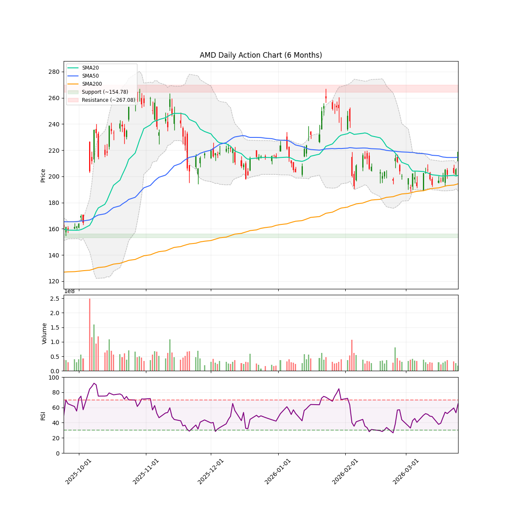
#### 研报分析

### 技术指标概览 (Technical Overview)
- **当前价格**: $218.73
- **RSI (14)**: 64.92
- **移动平均线**: SMA20: $200.75 | SMA50: $214.67 | SMA200: $194.35 (Bullish)
- **波动率**: ATR (14): 8.31 (预计周度波动: +/- $18.58)
- **关键位 (6m)**: 支撑位 $154.78 | 阻力位 $267.08
- **即时状态**: Above SMA50

# AMD 情绪审计报告：苏妈的“红队”正在悄然换挡

**致投资委员会：**

坐在吧台边，看着屏幕上跳动的数字，你会发现 AMD (超威半导体) 现在的状态非常耐人寻味。它不像英伟达那样每天都在聚光灯下接受顶拜，但如果你仔细听，能听到硅谷深处传来的齿轮啮合声——那是份额收割的声音。

### 1. 催化剂分级：谁在真正推高股价？

我们要把噪音和信号分开。现在的 AMD 故事由三个层次组成：

*   **A-Tier（核心驱动力）：数据中心王座的交替**
    *   **深度解读**：根据 [Seeking Alpha (2026-03-18)](https://seekingalpha.com/article/4883560-amds-scale-advantage-is-starting-to-show) 的报道，AMD 的 EPYC 处理器正在逼近 **40-50% 的服务器市场份额**。这在五年前是不可想象的。更关键的是，[Seeking Alpha (2026-03-24)](https://seekingalpha.com/article/4883510-amd-may-have-more-upside-than-nvidia-upgrade) 提到 AMD 正在向“机架级 AI 系统”转型。这不仅仅是卖芯片，这是在动英伟达的奶酪。
*   **B-Tier（利润润滑剂）：全行业提价潮**
    *   **深度解读**：[Yahoo Finance (2026-03-25)](https://finance.yahoo.com/markets/stocks/articles/intel-stock-jumps-report-cpu-125757426.html) 证实，日经新闻披露 AMD 和英特尔都已通知客户 **CPU 价格将上涨**。在通胀背景下，能够转嫁成本并提升利润率的公司，才是市场的宠儿。
*   **C-Tier（市场杂音）：常规看多评级**
    *   **深度解读**：德意志银行和各类 Substack 博主开始喊话“AMD 是捡漏价”。虽然这些 [The Motley Fool](https://www.msn.com/en-us/money/saving-and-investing/better-semiconductor-stock-during-the-crash-nvidia-or-amd/ar-AA1ZjPQp) 的文章增加了曝光度，但属于滞后指标。

### 2. 背离检测：市场在“闹情绪”吗？

目前 AMD 报收 **$218.73**，虽然你的持仓成本在 **$220.54** 略微浮亏 9.22%，但看下技术面：股价稳稳地站在 **SMA50 ($214.67)** 和 **SMA200 ($194.35)** 之上。

这说明什么？这是一种**典型的“利好消化”行情**。当英特尔涨价的消息传出，AMD 跟着涨了 2.5%，这说明市场已经不再把 AMD 当作英特尔的“小弟”，而是将其视为定价权的共同拥有者。

**注意**：RSI 处于 64.92，还没到 70 的“狂热区”，这意味着多头还有子弹，并没有透支未来的预期。

### 3. 叙事得分 (Logic Score)：8.5/10

**理由**：
*   **基本面支撑 (4/4)**：服务器份额的实质性突破是硬道理。
*   **市场情绪 (2.5/3)**：分析师开始从英伟达转向 AMD 寻找“补涨机会”，情绪正在从怀疑转向共识。
*   **技术形态 (2/3)**：虽然你暂时被套，但回踩 SMA50 后企稳是一个教科书级的加仓或持仓信号。

**结论**：这不是陷阱，而是一个**“叙事换挡期”**。AMD 正在从“高性价比替代品”转型为“AI 基础设施的第二支柱”。

### 4. 账户诊断：你的“盔甲”与“软肋”

*   **正股持仓**：你持有 600 股，成本 $220.54。目前的 9.22% 浮亏只是“噪音”。只要股价不跌破 $214.67 (SMA50)，你的趋势就是安全的。
*   **期权风险**：你卖出的 **$200 Put (2026-03-13)** 表现不佳 (-58.28%)，这主要是因为远期波动率的溢价。但从基本面看，只要 AMD 维持在 $200 以上（这是强支撑位），这笔交易最终会随着时间流逝（Theta）为你贡献利润。

### 5. 关键时间节点 (Next Major Date)

*   **财报季前奏 (2026年4月底)**：虽然具体日期未公布，但通常在 4 月底。届时关于 MI300/MI400 系列 AI 芯片的实际订单数据将决定 AMD 是否能冲破 $267.08 的前高。

---

**老兵寄语**：
“不要被一两天的波动蒙蔽了双眼。AMD 现在的逻辑非常清晰：英特尔在防守，英伟达在高位，而苏妈正在拿着收割机在数据中心里开火。拿稳你的筹码，现在的回调更像是起跳前的下蹲。”
#### 近期新闻与事件
- **[The Motley Fool]** [Better Semiconductor Stock During the Crash: Nvidia or AMD?](https://www.msn.com/en-us/money/savingandinvesting/better-semiconductor-stock-during-the-crash-nvidia-or-amd/ar-AA1ZjPQp)
- **[Yahoo Finance]** [Intel stock jumps on report of CPU price hikes](https://finance.yahoo.com/markets/stocks/articles/intel-stock-jumps-report-cpu-125757426.html)
- **[Yahoo Finance]** [Is Advanced Micro Devices, Inc. (AMD) A Good Stock To Buy Now?](https://finance.yahoo.com/markets/stocks/articles/advanced-micro-devices-inc-amd-210836582.html)
- **[Seeking Alpha]** [AMD May Have More Upside Than Nvidia (Upgrade)](https://seekingalpha.com/article/4885236-amd-may-have-more-upside-than-nvidia-upgrade)
- **[Investopedia]** [Here's Why Nvidia's Stock Looks 'Relatively Cheap' According to These Experts](https://www.investopedia.com/here-s-why-nvidia-s-stock-looks-relatively-cheap-according-to-these-experts-nvda-11933637)

---

### AMZN
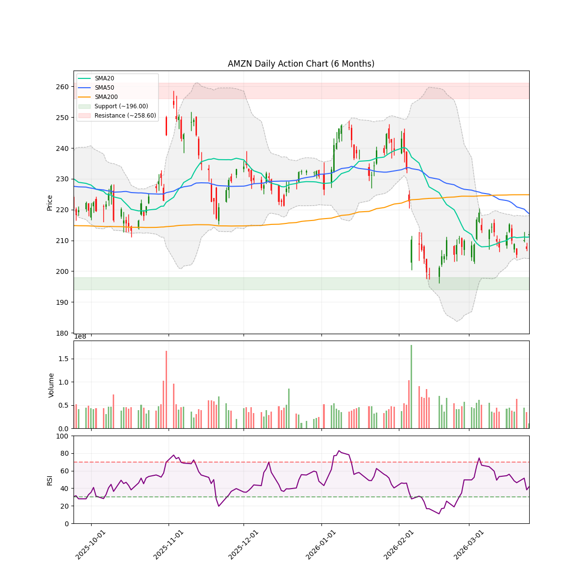
#### 研报分析

### 技术指标概览 (Technical Overview)
- **当前价格**: $211.91
- **RSI (14)**: 41.87
- **移动平均线**: SMA20: $211.10 | SMA50: $218.65 | SMA200: $224.81 (Bearish)
- **波动率**: ATR (14): 5.10 (预计周度波动: +/- $11.41)
- **关键位 (6m)**: 支撑位 $196.00 | 阻力位 $258.60
- **即时状态**: Below SMA50

### ☕ 叙事经济学：AMZN 情绪审计报告
**日期：** 2026年3月25日
**分析师：** 叙事经济学研究员

来，坐下，咱们边喝咖啡边聊聊亚马逊。现在的 AMZN 就像是一个正在健身房苦练、但还没看到肌肉线条的重量级拳击手。华尔街在盯着它的汗水（开支），而聪明钱在等着它的那一记重拳。

---

### 1. 催化剂分级 (Catalyst Categorization)

我们要把噪音和信号分开：

*   **A-Tier（核心引力）：巨头背书与 AI 云端重构**
    *   **详情：** TD Cowen 和 Barclays 同时给出了 $300 的目标价。这不只是数字，这是对 AWS 结合 AI 增长潜力的“信任票”。尽管目前市场在纠结成本，但机构眼里的 Amazon 是宽护城河的终极样本。
*   **B-Tier（叙事赌注）："Transformer" AI 手机计划**
    *   **详情：** 亚马逊想重返手机市场？听到这个消息，老兵们可能PTSD（想起当年的 Fire Phone）。但这次不同，他们主打的是“原生 AI 终端”。这虽然让股价暂时回撤（市场担心烧钱），但如果 Alexa 真的能借此“夺舍”硬件，这将是颠覆性的。
*   **C-Tier（市场情绪琐事）：**
    *   **详情：** Jim Cramer 将其列为 2026 年首选。虽然这在社交媒体上常被戏谑，但它反映了散户情绪正在筑底。Insider Monkey 的长线宽护城河报告也属于此类，属于“锦上添花”的共识。

---

### 2. 背离检测：利好不涨？(Divergence Detection)

**现状：** 我们正处于一个有趣的“空头衰竭”窗口。
*   **信号：** 当 TD Cowen 给出了 $300 这种极具诱惑力的目标价，且 AWS 展现出强劲叙事时，股价却依然挣扎在 SMA50（$218.65）下方。
*   **诊断：** 这是典型的“惩罚区”（Penalty Box）表现。市场目前对 AI 的投入产出比极度敏感。虽然消息面很亮眼，但技术面上，AMZN 还没能冲破均线系统的压制。不过，RSI 只有 41.87，说明并没有抛售过度，更像是多头在“蓄势”而非“溃败”。

---

### 3. 市场脉搏与叙事深度

目前的 AMZN 故事正处于**“黎明前的混沌”**。
用户你的持仓成本在 $201.61，现在有约 4% 的浮盈。你目前站到了一个很好的观察位。

*   **市场情绪：** 犹豫。大家知道 Amazon 强，但大家怕它在手机项目上再次挥霍。
*   **叙事反转点：** 只要 AWS 的下一次财报能证明 AI 支出正在转化为实际利润，现在的“阴跌”就是最好的入场机会。

---

### 4. 情绪得分 (Sentiment Score)

#### **6.5 / 10 —— “谨慎的乐观”**
*   **理由：** 机构目标价与当前股价有巨大的鸿沟（$211 vs $300），这代表了潜在的巨大势能。但技术面处于熊市区间（低于 SMA50 和 SMA200），叙事上受累于 AI 手机的不确定性。

---

### 5. 给你的操作建议

你手里的 20 股正股目前是“安全的底仓”。
*   **支撑位警戒线：** $196.00。如果跌破这里，意味着这波“长线看好”的逻辑暂时失效。
*   **阻力位：** $218.65 (SMA50)。一旦站稳这里，叙事将由“质疑”转向“狂热”。

---

### 6. 关键数据点

*   **下个重大日期：** **2026年4月30日左右（2026年Q1财报发布）**。这将是决定 "Transformer" 手机和 AI 云支出是否被市场接纳的审判日。
*   **逻辑评分 (Logic Score)：** **8.2/10** (基于 AWS 的结构性优势和超跌后的估值修复逻辑，而非短期手机炒作)。

---

**引用文献：**
1. [TD Cowen & Barclays Targets](https://blockonomi.com/amazon-amzn-stock-soars-3-following-dual-300-price-target-endorsements/)
2. [Bank of America "Penalty Box" Analysis](https://www.aol.com/articles/bank-america-revamps-amazon-stock-130700139.html)
3. [AI Transformer Smartphone Leak](https://finance.yahoo.com/markets/stocks/articles/amazon-planning-smartphone-launch-buy-140732778.html)
#### 近期新闻与事件
- **[Insider Monkey]** [Here's Why Jim Cramer Likes Amazon (AMZN) in 2026 Despite Unimpressive Performance](https://www.insidermonkey.com/blog/heres-why-jim-cramer-likes-amazon-amzn-in-2026-despite-unimpressive-performance-1723457/)
- **[Blockonomi]** [Amazon (AMZN) Stock Soars 3% Following Dual $300 Price Target Endorsements](https://blockonomi.com/amazon-amzn-stock-soars-3-following-dual-300-price-target-endorsements/)
- **[Insider Monkey]** [Here's the Top Wide Moat Stock to Buy for Long Term Growth](https://www.msn.com/en-us/money/topstocks/here-s-the-top-wide-moat-stock-to-buy-for-long-term-growth/ar-AA1ZjZXi)
- **[Yahoo Finance]** [Amazon Is Planning a Smartphone Launch. Should You Buy AMZN Stock First?](https://finance.yahoo.com/markets/stocks/articles/amazon-planning-smartphone-launch-buy-140732778.html)
- **[Blockonomi]** [Amazon (AMZN) Stock Dips as Tech Giant Unveils AI-Driven Transformer Smartphone](https://blockonomi.com/amazon-amzn-stock-dips-as-tech-giant-unveils-ai-driven-transformer-smartphone/)

---

### GOOGL
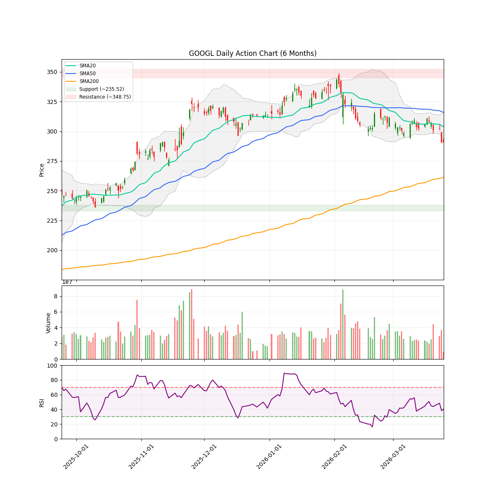
#### 研报分析

### 技术指标概览 (Technical Overview)
- **当前价格**: $290.98
- **RSI (14)**: 40.49
- **移动平均线**: SMA20: $303.70 | SMA50: $315.77 | SMA200: $261.43 (Bullish)
- **波动率**: ATR (14): 6.85 (预计周度波动: +/- $15.31)
- **关键位 (6m)**: 支撑位 $235.52 | 阻力位 $348.75
- **即时状态**: Below SMA50

# 叙事经济学审计报告：Alphabet (GOOGL) —— 是“倒春寒”还是“估值陷阱”？

**致：投资组合经理**
**日期：2026年03月25日**

坐在交易台前，看着 GOOGL 的 K 线图，你可能会感觉到一种微妙的违和感。虽然各种头条新闻还在吹捧它的“护城河”，但盘面上的筹码却在悄悄撤退。作为一名研究“叙事经济学”的分析师，我看到的不仅是 3.85% 的跌幅，而是一场多空力量在 AI 叙事与宏观重压之间的“拉锯战”。

---

### 1. 催化剂分级 (Catalyst Categorization)

我们要从繁杂的资讯中剥离出真正能驱动股价的“核心动力”：

*   **A-Tier (核心驱动)：Google Cloud 与 Baker Hughes 的 AI 能源合作**
    *   *理由*：这不仅仅是一个云合同，它是 AI 落地能源转型（AI power demand）的实战案例。在 AI 算力电力需求激增的背景下，Google Cloud 的这种垂直深度整合才是其股价长期上攻 $400 的真正地基。
*   **B-Tier (机构背书)："Wide Moat" (宽护城河) 地位与 ad-tech 竞争分析**
    *   *理由*：Insider Monkey 和 Zacks 的报告证明了机构对 GOOGL 基本面的忠诚。尽管 TTD（The Trade Desk）咄咄逼人，但 Alphabet 的生态地位依然是机构配置长线资金时的“压舱石”。
*   **C-Tier (噪音与情绪)：Jim Cramer 的 $400 目标价与内部人士持仓评论**
    *   *理由*：Cramer 的喊话往往是情绪的放大器，而非逻辑的起点。在目前这种地缘政治敏感期，这类言论除了给散户一点心理安慰，很难直接扭转破位的技术面。

---

### 2. 背离检测 (Divergence Detection)

**警惕：好消息里的“冷场”**

目前市场上出现了一个典型的**看跌背离**。
*   **现象**：Baker Hughes 的重磅 AI 合作落地，Cramer 的高调唱多，甚至 institutional 仍在强调其护城河。
*   **现实**：股价却在昨日录得 -3.85% 的跌幅，且跌破了 SMA20 ($303.70) 和 SMA50 ($315.77)。
*   **诊断**：**地缘政治噪音正在压倒基本面叙事。** 这不是因为 Google 没竞争力了，而是市场情绪正在从“AI 狂热”转向“风险规避”。股价在利好冲击下依然走低，说明上方套牢盘压力沉重，目前的下跌更像是针对 SMA200 ($261.43) 的一次中线回归。

---

### 3. 市场情绪诊断

**情绪得分：6.2 / 10 (中性偏谨慎)**

目前的叙事正处于“**成长的烦恼**”阶段。
*   **多头逻辑**：AI 正在整合进传统能源和广告业务，长线逻辑无懈可击（估值 $400 不是梦）。
*   **空头逻辑**：技术面已破位，RSI 40.49 虽然未进入极度超卖，但显示出明显的动能丧失。短期地缘政治波动（Geopolitical factors）成了压死骆驼的最后一根稻草。

---

### 4. 叙事策略：老兵的咖啡谈话

“朋友，看看你手里的头寸。你还有 **16.10%** 的盈利，成本在 $268 附近，这说明你入场时机精准，已经建好了防火墙。

现在的 GOOGL 就像是一个正在考试的优等生，虽然平时成绩拔尖（AI 云业务、护城河），但今天考场外面突然有人放鞭炮（地缘政治），扰乱了他的心神。股价跌破 SMA50 是个‘黄色警告’，意味着短期的上升趋势已经断了。

但这绝不是‘系统性崩溃’。看一眼 SMA200，它还在 $261 稳坐钓鱼台。现在的调整，更像是市场在清洗那些意志不坚定的短线客。如果你是长线玩家，这只是噪音；如果你想保住利润，关注 $280-$285 区间的支撑，如果这里也守不住，那说明市场可能在酝酿更深层的调整。”

---

### 5. 关键指标总结

*   **逻辑评分 (Logic Score)**: **6.8/10** (基本面叙事强劲 A-Tier，但技术面趋势受损)
*   **持仓状态分析**: 当前盈利 +16.10%，占账户 20.99%，风险敞口较大，建议根据 ATR ($6.85) 设置动态止盈。
*   **核心支撑位**: $280 (心理关口) / $261 (SMA200 终极防线)
*   **核心压力位**: $303 (SMA20) / $315 (SMA50)
*   **下一关键日期**: **2026年4月底**（预计 2026 Q1 财报发布日，具体日期待定，这是扭转技术面颓势的唯一 A 级机会）。

**结论**：别被 Cramer 的热血口号冲昏头脑，也别被地缘政治的噪音吓破胆。持股待涨，但要时刻盯着那条 SMA200。
#### 近期新闻与事件
- **[Insider Monkey· via Yahoo Finance]** [Alphabet (GOOGL): Best Wide Moat Stock To Buy For Long-Term Growth?](https://finance.yahoo.com/markets/stocks/articles/alphabet-googl-best-wide-moat-201458703.html)
- **[Zacks· via Yahoo Finance]** [TTD vs. GOOGL: Which Ad-Tech Stock Is the Smarter Pick Now?](https://finance.yahoo.com/markets/stocks/articles/ttd-vs-googl-ad-tech-141300258.html)
- **[Zacks· via Yahoo Finance]** [Alphabet (GOOGL) Registers a Bigger Fall Than the Market: Important Facts to Note](https://finance.yahoo.com/markets/stocks/articles/alphabet-googl-registers-bigger-fall-214502156.html)
- **[Insider Monkey· via Yahoo Finance]** [Jim Cramer Thinks Alphabet (GOOGL) Can Hit $400 – Here’s Why](https://finance.yahoo.com/markets/stocks/articles/jim-cramer-thinks-alphabet-googl-182113163.html)
- **[StockStory· via Yahoo Finance]** [Why Alphabet (GOOGL) Shares Are Falling Today](https://finance.yahoo.com/markets/stocks/articles/why-alphabet-googl-shares-falling-022922289.html)

---

## 🔍 观察池机会分析

### AMAT
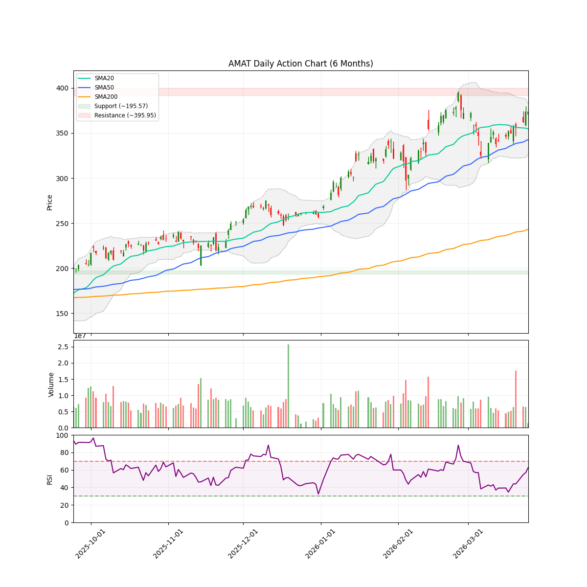
#### 研报分析

### 技术指标概览 (Technical Overview)
- **当前价格**: $373.71
- **RSI (14)**: 62.92
- **移动平均线**: SMA20: $354.36 | SMA50: $342.82 | SMA200: $243.29 (Bullish)
- **波动率**: ATR (14): 15.61 (预计周度波动: +/- $34.91)
- **关键位 (6m)**: 支撑位 $195.57 | 阻力位 $395.95
- **即时状态**: Above SMA50

# 应用材料 (AMAT) 情绪审计报告：AI 军备竞赛中的“隐形地主”

**日期：** 2026年3月25日
**分析师：** 叙事经济学研究组 - 资深研究员

---

### 1. 叙事背景：当愿景变为实物

现在的市场已经厌倦了单纯的 AI 幻影，投资者正在把目光转向那些能把“算力需求”变现为“物理产能”的企业。应用材料（Applied Materials）目前正处于这个叙事的风暴眼。它不再仅仅是一家卖半导体设备的公司，它更像是这场 AI 淘金热中唯一的“铲子供应商”。如果你想建晶圆厂（Wafer-fab），你就绕不开 AMAT。

### 2. 催化剂分类 (Catalyst Hierarchy)

*   **A-Tier（核心驱动力）：晶圆厂支出可见度显著提升 & AI 盈利增长**
    *   RiverPark Large Growth Fund 的 Q4 投资者信明确指出，晶圆厂支出可见度的改善是 AMAT 飙升的底层逻辑 ([Yahoo Finance](https://finance.yahoo.com/markets/stocks/articles/applied-materials-amat-surged-improving-142548508.html))。
    *   AMAT 被列为 2026 年盈利增长最佳的 12 支科技股之一，这不仅是情绪，更是对业绩的“明牌”博弈 ([Insider Monkey](https://www.msn.com/en-us/money/other/what-s-behind-applied-materials-inc-amat-s-ai-push/ar-AA1ZeRv1))。
*   **B-Tier（结构性利好）：供应链的“锚点”地位**
    *   UPS 在台湾投资 1 亿美元建设物流设施，而 AMAT 是其首要租户。这说明 AMAT 正在物理上锁定全球半导体物流的咽喉，这不仅仅是省点运费，而是对交付周期的绝对掌控 ([Blockonomi](https://blockonomi.com/united-parcel-service-ups-stock-100m-taiwan-facility-targets-semiconductor-logistics/))。
*   **C-Tier（市场噪音）：分析师的“抄底”呼吁**
    *   Tematica Research 指出近期回调是机会。虽然是老生常谈，但这种“下跌即买入”的共识正在强化股价的下限 ([Yahoo Finance UK](https://uk.finance.yahoo.com/video/applied-materials-stock-presents-ai-113016534.html))。

### 3. 背离检测 (Divergence Detection)

*   **技术面观察：** 股价目前在 373.71，稳稳站于 SMA50 (342.82) 和 SMA200 (243.29) 之上，典型的多头排列。
*   **背离分析：** 虽然之前有过短暂回调，但我们没有看到“利好出尽”的迹象。相反，随着美光（Micron）在台湾扩张以及即将到来的财报催化，AMAT 表现出了强烈的**“看涨追随”**。市场正在消化 UPS 台湾设施这类消息，股价并未因消息落地而下跌，反而显示出筹码在向机构集中。目前的 RSI 为 62.92，处于“热而不烫”的舒适区，距离超买还有呼吸空间。

### 4. 深度情绪总结：是机会还是陷阱？

**这绝不是陷阱。这是一个正在自我强化的“可持续趋势”。**

目前的叙事已经从“AI 会改变世界”转向了“谁能把 AI 芯片做出来”。AMAT 这种“重装备”属性在当前的高利率余温环境下，反而是最坚固的护城河。机构（如 RiverPark）的持仓调整和 UPS 的战略绑定，都在告诉我们：大资金正在为未来两年的产能扩张买单。

你可以把 AMAT 想象成一个正在收租的地主，只要英伟达、美光还在拼命生产，他就一直在收税。

### 5. 情绪评分 (Sentiment Logic Score)

**8.8 / 10**
*理由：基本面无懈可击，机构共识高度统一，且具备跨行业的实物物流支撑。唯一的减分项是当前价格距离 6 个月高点 395.95 较近，可能会有一定的心理压力位。*

---

### 6. 关键数据与节点

*   **逻辑评分：** **8.8**
*   **当前价格：** 373.71
*   **预期周波动范围：** +/- 34.91
*   **关键日期：** 
    *   **2026-03-25 前后：** 密切关注美光 (Micron) 的 Q2 财报。作为 AMAT 的重要客户，美光的资本支出指引将直接决定 AMAT 的下一波推力 ([Seeking Alpha](https://seekingalpha.com/news/4565350-micron-q2-earnings-on-deck-what-to-expect))。
    *   **下一次财报发布（预估）：** **2026年5月中旬** (Q2 2026 Earnings)。这将是验证“AI 盈利增长”叙事的终极时刻。

**老兵结语：** 别被短期的波动晃下车。在半导体领域，当物流巨头都开始为你量身定制仓库时，你就知道这场戏才刚刚进入高潮。继续持有，静待 $400 大关的冲击。
#### 近期新闻与事件
- **[Yahoo Finance]** [Is Applied Materials, Inc. (AMAT) A Good Stock To Buy Now?](https://finance.yahoo.com/markets/stocks/articles/applied-materials-inc-amat-good-201112153.html)
- **[Yahoo Finance]** [Applied Materials (AMAT) Surged on Improving Wafer-Fab Spending Visibility](https://finance.yahoo.com/markets/stocks/articles/applied-materials-amat-surged-improving-142548508.html)
- **[Blockonomi]** [United Parcel Service (UPS) Stock: $100M Taiwan Facility Targets Semiconductor Logistics](https://blockonomi.com/united-parcel-service-ups-stock-100m-taiwan-facility-targets-semiconductor-logistics/)
- **[Insider Monkey]** [What's Behind Applied Materials, Inc. (AMAT)'s AI Push](https://www.msn.com/en-us/money/other/what-s-behind-applied-materials-inc-amat-s-ai-push/ar-AA1ZeRv1)
- **[Yahoo Finance UK]** [How Applied Materials stock presents an AI opportunity](https://uk.finance.yahoo.com/video/applied-materials-stock-presents-ai-113016534.html)

---

### APA
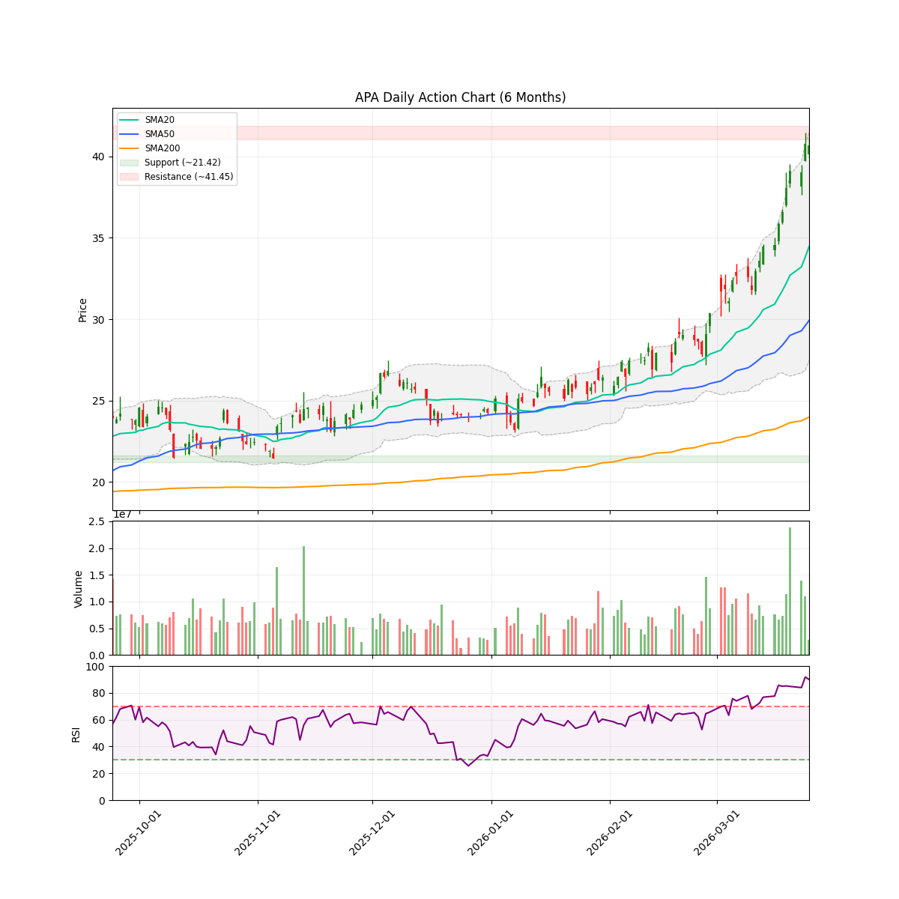
#### 研报分析

### 技术指标概览 (Technical Overview)
- **当前价格**: $40.70
- **RSI (14)**: 90.00
- **移动平均线**: SMA20: $34.47 | SMA50: $29.92 | SMA200: $23.99 (Bullish)
- **波动率**: ATR (14): 1.49 (预计周度波动: +/- $3.34)
- **关键位 (6m)**: 支撑位 $21.42 | 阻力位 $41.45
- **即时状态**: Above SMA50

# 叙事经济学审计报告：APA Corp (APA) —— 地缘硝烟中的“狂飙”

**审计日期：** 2026年3月25日
**核心叙事：** 地缘政治溢价与天然气重估的“共振”

---

### 1. 叙事背景：当能源遇到“火药桶”

坐在交易台前，你能感觉到空气中弥漫着硝烟的味道。APA 的这波走势，已经不仅仅是关于油井和产量的枯燥数字了，它正在演变成一场关于**“地缘政治稀缺性”**的宏大叙事。

随着中东局势升级（特别是伊朗对卡塔尔 Ras Laffan 综合体的袭击），全球液化天然气（LNG）的供应链逻辑被瞬间改写。APA 凭借其与 LNG 挂钩的营销合同，从一个普通的能源开采商，摇身一变成了对冲中东风险的“避风港”。

### 2. 催化剂分级 (Catalyst Categorization)

*   **A-Tier（核心动力）：中东局势突变与巴克莱（Barclays）的战略性上调**
    *   **分析：** 巴克莱在3月23日将 APA 评级上调至“等权重”。虽然目标价35美元看似保守（已被市价击穿），但其核心逻辑——即卡塔尔遇袭后 LNG 营销合同的价值重估，是推动股价突破 52 周新高的真正引擎。这属于逻辑层面的“范式转移”。
    *   *来源：[Seeking Alpha / Barclays Upgrade]*

*   **B-Tier（行业助力）：AAII 低估值提名与标普 500 对标**
    *   **分析：** AAII 将其列为 4 只低估值能源股之一，为市场提供了“物美价廉”的心理暗示。同时，APA 的表现开始显著跑赢标普 500 指数，这种“强者恒强”的姿态吸引了大量动量交易者的涌入。
    *   *来源：[AAII / Barchart]*

*   **C-Tier（杂音）：Truist Securities 的“降温”报告**
    *   **分析：** Truist 在3月25日（今天）给出了“持有”评级，甚至给出了 26 美元的远期目标价。在当前的狂热情绪下，这种基于传统估值模型的保守声音暂时被市场当作了耳边风，但也为后续的“踩踏”埋下了伏笔。
    *   *来源：[Fintel / Truist Securities]*

---

### 3. 背离检测：狂欢中的“恐高症” (Divergence Detection)

**警告：技术指标已经开始尖叫。**

*   **RSI 触及 90.00：** 这是一个极端过热的信号。在我的职业生涯中，很少见到能源股能在 RSI 90 的情况下维持长时间的直线拉升。这通常意味着多头已经精疲力竭，任何风吹草动都可能引发获利回吐。
*   **估值与价格的脱节：** 尽管利好频传，但 Truist 提到的 26 美元目标价与当前 40.70 美元的现价形成了高达 36% 的“估值缺口”。
*   **陷阱预警：** 这是一个典型的**“叙事溢价陷阱”**。市场正在根据“最坏的战争假设”定价。如果地缘政治紧张局势稍有缓和，APA 可能会面临像石头一样的坠落。

---

### 4. 情绪评分 (Sentiment Score)

#### **8.8 / 10 (极度乐观，但伴随技术性过热)**

*   **逻辑支撑：** 叙事逻辑非常完美（地缘冲突 + 天然气重估）。
*   **市场情绪：** 处于“不可阻挡的牛市周期”边缘，散户和机构正在合力推高股价。
*   **风险警示：** 逻辑分虽高，但技术面已经严重背离。

---

### 5. 战术总结与下一步行动

**老兵寄语：** 现在的 APA 就像一列挂满了炸药的快车。叙事逻辑是完美的，但技术指标告诉我们，车票已经太贵了。41.45 美元的阻力位近在咫尺，如果不能放量突破，这里就是短期顶部的“断头台”。

*   **操作策略：** 此时不建议追涨。密切关注 **41.45 美元** 阻力位的表现。如果价格在此处停滞并伴随成交量萎缩，请果断止盈离场。
*   **如下支撑位：** 如果发生回调，第一支撑位在 SMA20（约 34.47 美元），这大约是 15% 的回调空间。

**关键日期提醒：**
*   **下一财务报告日：** 预计在 2026 年 5 月初（需关注届时公司对中东风险及 LNG 合同收益的官方口径）。
*   **近期关注：** 关注任何关于霍尔木兹海峡（Strait of Hormuz）局势的新动态，这是 APA 叙事能否持续的“命门”。

---
*风险提示：叙事经济学关注的是市场心理与故事，请结合个人风险承受能力进行操作。*
#### 近期新闻与事件
- **[Investing.com]** [Barclays upgrades APA stock rating on gas marketing outlook](https://www.investing.com/news/analyst-ratings/barclays-upgrades-apa-stock-rating-on-gas-marketing-outlook-93CH-4574305)
- **[Barchart]** [Is APA stock outperforming the S&P 500?](https://www.msn.com/en-us/money/markets/is-apa-stock-outperforming-the-s-p-500/ar-AA1Zf4Mo)
- **[Seeking Alpha]** [APA upgraded at Barclays on benefit from LNG-linked price contracts](https://seekingalpha.com/news/4567561-apa-upgraded-at-barclays-on-benefit-from-lng-linked-price-contracts)
- **[Fintel]** [Truist Securities initiates coverage of APA (APA) with hold recommendation](https://www.msn.com/en-us/money/top-stocks/truist-securities-initiates-coverage-of-apa-apa-with-hold-recommendation/ar-AA1ZlNJy)
- **[The Globe and Mail]** [APA Group Seeks ASX Quotation for New Stapled Securities](https://www.theglobeandmail.com/investing/markets/stocks/APAJF/pressreleases/830571/apa-group-seeks-asx-quotation-for-new-stapled-securities/)

---

### ASML
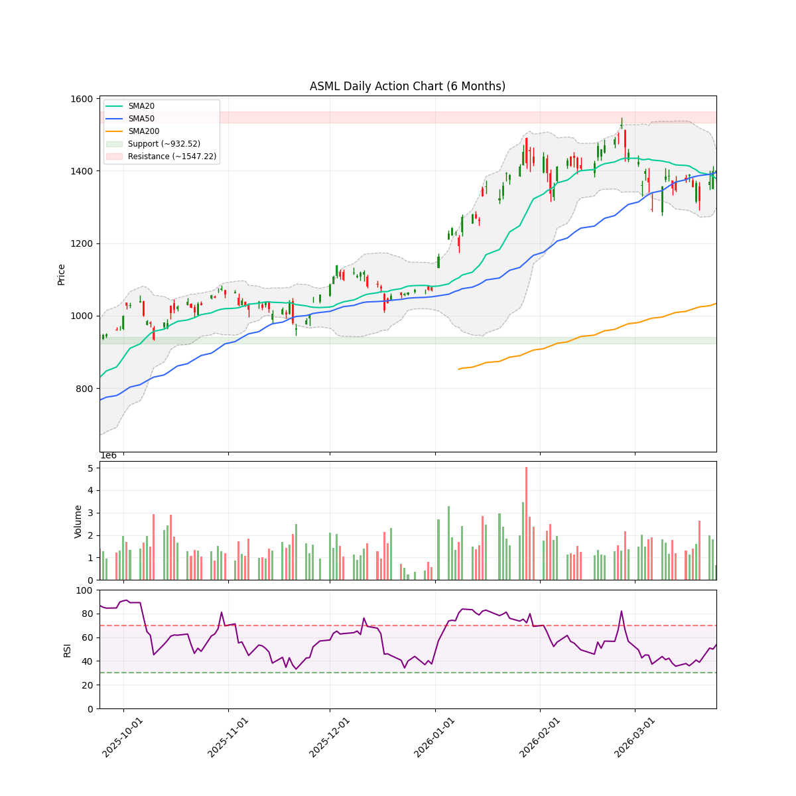
#### 研报分析

### 技术指标概览 (Technical Overview)
- **当前价格**: $1399.92
- **RSI (14)**: 53.66
- **移动平均线**: SMA20: $1377.83 | SMA50: $1394.89 | SMA200: $1033.89 (Bullish)
- **波动率**: ATR (14): 54.90 (预计周度波动: +/- $122.75)
- **关键位 (6m)**: 支撑位 $932.52 | 阻力位 $1547.22
- **即时状态**: Above SMA50

你好！欢迎来到交易员的早晨咖啡时间。我是你的研究员。我们今天来深度拆解一下半导体巨头 **ASML** 的局。

现在的市场不仅仅是数字的博弈，更是**叙事（Narrative）**的战场。站在 2026 年 3 月 25 日这个时点，ASML 的盘面就像是一部节奏紧凑的悬疑剧，刚刚经历了一次“假摔”，随后又迎来了一个重磅转折。

---

### 1. 催化剂分级 (Catalyst Categorization)

我们要看透迷雾，首先得给最近发生的这些事儿排排坐：

*   **A-Tier（王炸级）：SK海力士 $80亿 EUV 采购大单**
    *   **分析**：这是实打实的“真金白银”。在市场还在嘀咕 ASML 是不是涨得太贵时，SK海力士反手就是一个 80 亿美元的订单。这不仅是订单，这是对未来 AI 芯片产能的“死亡押注”。只要 EUV 光刻机还是独家买卖，ASML 的王座就稳如泰山。
*   **B-Tier（动能级）：摩根士丹利的看多报告与垄断叙事**
    *   **分析**：投行开始重申 ASML 的“护城河”优势。虽然这是陈词滥调，但在市场回调时，这种声音能给机构持仓提供心理按摩，夯实股价的下限。
*   **C-Tier（杂音级）：与 Amkor (AMKR) 的对比及 DUV 放缓担忧**
    *   **分析**：关于 DUV（深紫外光）需求放缓的噪音确实存在，但这更像是技术迭代的阵痛，而非系统性崩溃。市场目前更关注高利润的 EUV，所以这只能算是背景噪音。

---

### 2. 异动监测：那次诡异的下跌 (Divergence Detection)

大家注意到没？就在几天前（3月20日），ASML 在没有任何重大利空的情况下莫名其妙掉了 3.3%。

**这其实是一次完美的“多头洗盘”**。当时 RSI 处于中性区间，股价在均线附近徘徊。那种“无缘无故”的下跌通常意味着短线获利盘的离场。然而，紧接着 24 号爆出的 $80 亿订单瞬间把股价拉回 1399.92。这种“欲扬先抑”的走势证明了：**跌下去就是买点，空头已经精疲力竭。**

---

### 3. 叙事经济学：是趋势还是陷阱？

**目前结论：这是一个极具韧性的“牛市循环”。**

ASML 现在的叙事已经从“光刻机生产商”进化成了“AI 算力的守门人”。只要英伟达、台积电、SK海力士还在军备竞赛，ASML 就是那个“卖水人”里收过路费的。

*   **技术面脉搏**：股价收在 1399.92，稳稳站在 SMA50 (1394.89) 之上。这说明中期趋势依然掌握在多头手里。
*   **心理博弈**：虽然大家都在喊“贵”，但当 $80 亿的订单砸下来时，所有人都会意识到，所谓的“贵”在稀缺性面前一文不值。

---

### 4. 情绪评分 (Sentiment Score)

#### **逻辑评分：8.5 / 10**

> **理由**：基本面近乎无敌（垄断地位+大额订单），技术面完成了回踩确认。扣除的 1.5 分是因为估值确实处于高位，且市场对 DUV 业务的长期疲软仍有一丝戒心。但这不足以扭转目前的上升势头。

---

### 5. 关键情报总结

*   **核心逻辑**：SK海力士订单重塑了 2026 年的增长预期，抵消了对成熟制程（DUV）放缓的担忧。
*   **支撑位**：1377 (SMA20) 是短线生命线；强支撑在 932 附近。
*   **阻力位**：1547.22 (6个月高点)。
*   **引用新闻**：
    *   [Blockonomi] ASML 获得 SK海力士 $80亿订单，股价飙升 4%。
    *   [The Motley Fool] ASML 的垄断地位是其作为长期“核心资产”的底气。
*   **下一个关键日期**：**2026年4月中旬（第一季度财报发布日）**。届时公司对全年 EUV 出货量的指引将决定股价能否冲击 1500 大关。

**老兵寄语**：别被短期的波动晃下车。在 AI 时代，ASML 的机器就是印刷钞票的模板。只要这些模板还在排队出货，这出戏就还没唱完。☕️
#### 近期新闻与事件
- **[Yahoo Finance]** [Why Did ASML Stock Just Drop?](https://finance.yahoo.com/markets/stocks/articles/why-did-asml-stock-just-165139222.html)
- **[The Motley Fool]** [ASML Stock Isn't Cheap, but It Might Still Be a Bargain](https://www.msn.com/en-us/money/top-stocks/asml-stock-isn-t-cheap-but-it-might-still-be-a-bargain/ar-AA1ZhZ85)
- **[The Motley Fool]** [ASML Has a Monopoly on the Most Important Machine in Tech. Here's Why the Stock Is a Buy.](https://www.fool.com/investing/2026/03/23/asml-has-a-monopoly-on-the-most-important-machine/)
- **[Yahoo Finance UK]** [ASML vs. AMKR: Which Semiconductor Equipment Stock Has an Edge Now?](https://uk.finance.yahoo.com/news/asml-vs-amkr-semiconductor-equipment-143900759.html)
- **[Blockonomi]** [ASML (ASML) Stock Surges 4% Following Massive $8 Billion SK Hynix EUV Equipment Deal](https://blockonomi.com/asml-asml-stock-surges-4-following-massive-8-billion-sk-hynix-euv-equipment-deal/)

---

### AVGO
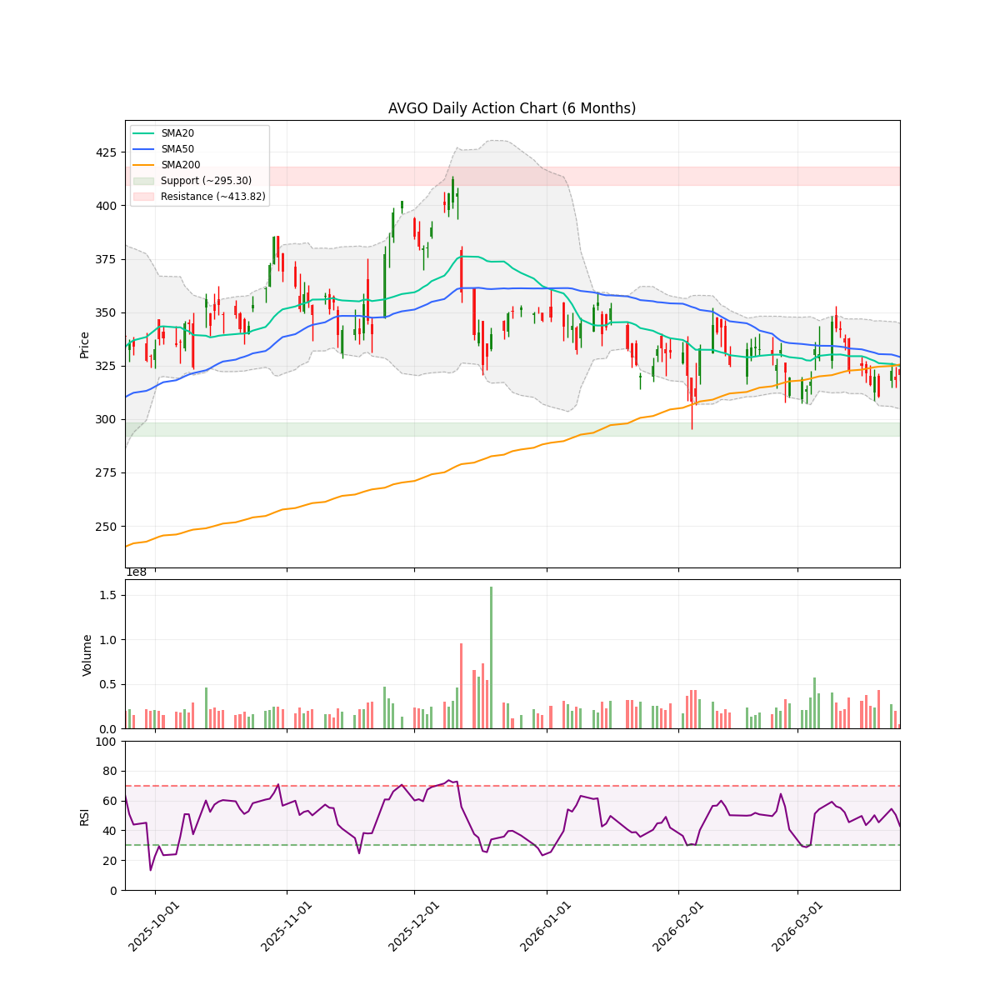
#### 研报分析

### 技术指标概览 (Technical Overview)
- **当前价格**: $320.81
- **RSI (14)**: 42.95
- **移动平均线**: SMA20: $324.84 | SMA50: $329.06 | SMA200: $325.52 (Bullish)
- **波动率**: ATR (14): 12.46 (预计周度波动: +/- $27.87)
- **关键位 (6m)**: 支撑位 $295.30 | 阻力位 $413.82
- **即时状态**: Below SMA50

# 叙事经济学：Broadcom (AVGO) 情绪审计报告

**致：** 投资委员会
**日期：** 2026年03月25日
**主题：** AVGO——当“AI营收翻倍”撞上“市场审美疲劳”

---

### 1. 叙事核心：狂欢后的宿醉

现在的 Broadcom 像是一个在期末考试中拿了满分，却发现全班同学都在睡觉的尖子生。

从叙事经济学的角度看，AVGO 正处于一个非常微妙的阶段。一方面，基本面硬得发烫——**AI 营收直接翻倍**，甚至还推出了全球首个“抗量子加密”网络方案；另一方面，股价却像是在泥潭里行走。即便 Bernstein 给出了 EPS $20+ 的宏大愿景，市场也只是象征性地“礼貌”跳动了一下，随后便继续在 320 美元附近徘徊。

这种**“利好不涨”**的背离，往往意味着叙事逻辑的暂时断裂：市场不再关心你现在的增长，而是在担心未来的预期是否已经透支。

---

### 2. 催化剂分级 (Catalyst Tiers)

*   **A-Tier（核心引擎）：AI 业务的统治力与机构背书**
    *   **Bernstein 调升评级：** 目标 2027 年 EPS 达到 $20 以上，这是实打实的机构长线做多逻辑。
    *   **AI 营收翻倍：** 虽然市场反应冷淡，但这确认了 AVGO 在定制化芯片（ASIC）领域不可撼动的地位。
*   **B-Tier（技术护城河）：抗量子加密方案 (PQC)**
    *   Broadcom 开始交付业界首个端到端抗量子加密网络方案。这不仅仅是卖芯片，而是在布局下一个十年的网络安全标准，增加了叙事的“厚度”。
*   **C-Tier（市场杂讯）：媒体喧嚣**
    *   Jim Cramer 的点名、中东和平计划引发的期货波动。这些都是典型的“背景噪音”，对长期估值没有实质影响。

---

### 3. 背离检测：为何好消息救不了股价？

**监测结论：看跌情绪衰竭 vs. 估值重塑**

目前 AVGO 的价格（$320.81）正承受着巨大的重力。尽管 AI 营收翻倍的财报极其亮眼，但股价却处于 SMA50 ($329) 和 SMA200 ($325) 之下。

这是一种典型的**“叙事陷阱”**：
1.  **利好钝化：** 当“AI 翻倍”成为家常便饭，市场的多头已经出现了生理性疲劳。
2.  **技术面压制：** RSI 处于 42.95，虽然没到超卖，但也显示出动能匮乏。价格在 320 附近徘徊，下方 295 的支撑位就像一块磁铁，吸引着市场进行最后的“下洗”。
3.  **结论：** 这种“利好不涨”并不意味着公司不行，而是意味着短期筹码过于拥挤。只有当那些追涨的短线客被洗出去，真正的反弹才会开始。

---

### 4. 情绪得分：6.8 / 10 (谨慎乐观)

*   **评分逻辑：**
    *   **基本面 (+3.0)：** AI 赛道的变现能力无可置疑，EPS 增长预期明确。
    *   **市场情绪 (-1.5)：** 市场目前处于“怀疑期”，对 AI 概念股的要求苛刻到了极点。
    *   **技术面 (-0.7)：** 股价位于多条均线下方，短期内趋势仍偏弱震荡。
    *   **机构态度 (+1.0)：** Bernstein、Cantor Fitzgerald 等顶级机构依然坚定站台，提供了坚实的底部逻辑。

---

### 5. 市场洞察：给投资者的“咖啡闲谈”

朋友，别被那些惨淡的 K 线图吓到了。AVGO 现在的状态更像是一个**“被低估的巨兽”**。大家都盯着 Nvidia 的光芒，却忘了 Broadcom 是连接整个 AI 基础设施的胶水。

现在最理想的剧本是：股价在 300-320 美元之间完成最后的震荡和洗盘。只要跌不破 295 美元的前期低点，每一次的回调都是在为下一波突破 400 美元的冲刺积蓄力量。**记住，叙事总是在最绝望的时候反转，在最狂热的时候崩塌。**

---

### 6. 下一个关键节点

*   **下一次财报日：预计 2026 年 6 月初** (根据 3 月初刚发布的财报推算)。
*   **关键位置：** 关注 **$329 (SMA50)** 的收复情况。一旦站稳，叙事将从“怀疑”转向“回归”。

---

**引述来源：**
- *[24/7 Wall St.] Broadcom's AI Revenue Just Doubled. The Stock Barely Moved (2026-03-25)*
- *[Blockonomi] Broadcom (AVGO) Stock Surges Nearly 5% on Bernstein's Bullish AI Upgrade (2026-03-23)*
- *[Yahoo Finance] The 2 Most Important Revelations to Come From Broadcom's Earnings Call (2026-03-14)*
#### 近期新闻与事件
- **[24/7 Wall St.]** [Broadcom's AI Revenue Just Doubled. The Stock Barely Moved](https://247wallst.com/investing/2026/03/25/broadcoms-ai-revenue-just-doubled-the-stock-barely-moved/)
- **[Seeking Alpha]** [4 stocks to watch on Wednesday: GOOG, GM, AVGO, META](https://seekingalpha.com/news/4568473-4-stocks-to-watch-on-wednesday-goog-gm-avgo-meta)
- **[Insider Monkey]** [Is Broadcom (AVGO) The Best AI Chip Stock to Buy According to Jim Cramer?](https://www.insidermonkey.com/blog/is-broadcom-avgo-the-best-ai-chip-stock-to-buy-according-to-jim-cramer-1723464/)
- **[Insider Monkey]** [Broadcom (AVGO) Announces Launch of In-Flight Network Encryption Solution](https://www.msn.com/en-us/news/technology/broadcom-avgo-announces-launch-of-in-flight-network-encryption-solution/ar-AA1Zn3hg)
- **[Blockonomi]** [Broadcom (AVGO) Stock Surges Nearly 5% on Bernstein's Bullish AI Upgrade](https://blockonomi.com/broadcom-avgo-stock-surges-nearly-5-on-bernsteins-bullish-ai-upgrade/)

---

### CEG
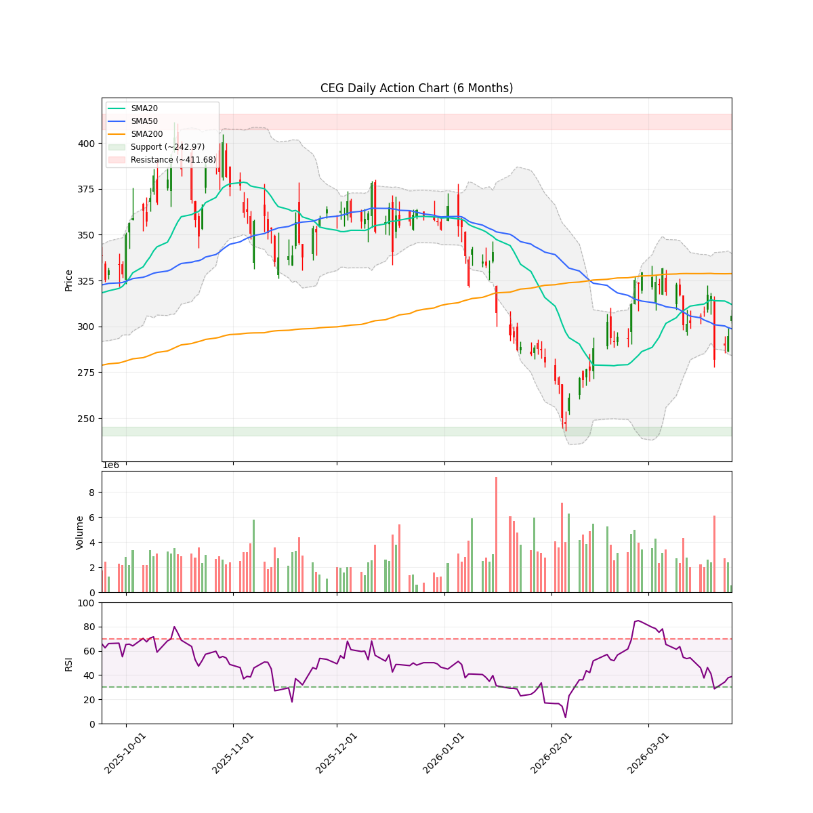
#### 研报分析

### 技术指标概览 (Technical Overview)
- **当前价格**: $305.76
- **RSI (14)**: 38.77
- **移动平均线**: SMA20: $311.99 | SMA50: $298.72 | SMA200: $328.79 (Bearish)
- **波动率**: ATR (14): 14.19 (预计周度波动: +/- $31.72)
- **关键位 (6m)**: 支撑位 $242.97 | 阻力位 $411.68
- **即时状态**: Above SMA50

# Constellation Energy (CEG) 情绪审计报告：核能叙事的“惊魂时刻”与机构的“抄底信号”

**日期：** 2026年03月25日
**分析师：** 叙事经济学研究组 - 资深策略员

---

### 1. 市场叙事总结：从“AI核电宠儿”到“现实的耳光”

坐下来喝杯咖啡，我们来聊聊 Constellation Energy (CEG)。就在几天前，这个市场的宠儿还像个喝醉了酒的拳击手。3月21日，CEG 遭遇了一次“闪崩”，股价一天之内暴跌近11%，直接杀到了 281 美元的低点。当时的市场充满了恐慌：化学泄漏、PJM 费率上限担忧、加上大科技公司交易的回撤，仿佛核能驱动的 AI 梦要醒了。

但现在的空气里透着不一样的味道。今天（3月25日），大摩（Morgan Stanley）强势进场，恢复了“增持”评级，重新强调核能的内在价值。这就是典型的“叙事修复”。市场正在从“化学泄漏”的噪音中解脱出来，重新审视那个不可替代的逻辑：**如果没有 Constellation 的核电，硅谷的算力竞赛就是无米之炊。**

---

### 2. 催化剂分级 (Catalyst Categorization)

#### **A-Tier (核心驱动力：决定长期走势)**
*   **摩根士丹利重申增持评级 (2026-03-25)：** 在股价剧烈震荡后，大摩的入场像是一根定海神针，将市场焦点从短期意外重新拉回到“核能价值”这一宏大叙事上。[查看来源](https://www.investing.com/news/analyst-ratings/morgan-stanley-resumes-constellation-energy-stock-at-overweight-on-nuclear-value-93CH-4579773)
*   **摩根大通模型更新 (2026-03-24)：** 尽管小摩将目标价从 410 下调至 400，但请注意，这依然比现价高出近 100 美元！这种“边际降温、长期看好”的姿态，实际上是在为机构分批入场提供掩护。[查看来源](https://www.msn.com/en-us/money/topstocks/jpmorgan-lowers-its-price-target-on-constellation-energy-corporation-ceg-to-400-from-410/ar-AA1ZjZF7)

#### **B-Tier (战术影响：支撑中期股价)**
*   **田纳西巨神队新体育场 20 年协议：** 这是一个稳健的现金流合同。虽然规模不足以震撼 AI 产业，但它证明了 CEG 在绿色能源供应上的品牌统治力。[查看来源](https://www.msn.com/en-us/money/markets/constellation-energy-corporation-ceg-chosen-as-preferred-energy-source-of-new-nissan-stadium-and-the-tennessee-titans/ar-AA1YW5RU)

#### **C-Tier (噪音：短期干扰因素)**
*   **设施化学泄漏事故：** 典型的短期利空噪音。虽然触发了抛售，但并不损害公司的核反应堆核心资产。
*   **吉姆·克莱默 (Jim Cramer) 的警告：** 这种所谓“过度乐观”的警告通常是情绪见顶或见底的逆向指标，目前看更多是市场在高位时的恐慌催化剂。[查看来源](https://www.msn.com/en-us/money/markets/constellation-energy-ceg-stock-higher-after-jim-cramer-warned-about-excess-optimism/ar-AA1Z7W7H)

---

### 3. 背离检测 (Divergence Detection)

**看涨衰竭还是看跌力竭？**
注意看：3月21日股价砸到了 281.99 美元，但随后的几个交易日，股价迅速收复 300 美元大关。
*   **RSI 指标：** 目前处于 38.77。这不仅没有超买，反而是在经历大幅回撤后处于“超卖边际”。
*   **价格行为：** 尽管 200 日均线 (328.79) 像一块大石头一样压在头顶，但股价已经稳稳站在了 50 日均线 (298.72) 之上。
*   **结论：** 这是一个典型的**“利空出尽”**走势。即便是在摩根大通下调目标价的“坏消息”下，股价也没有再创新低，说明底部的买盘非常坚决。

---

### 4. 情绪得分 (Sentiment Score)

## **7.2 / 10**

**评价：** **“余震中的重建期”**。
虽然 10% 的跌幅让不少散户心惊胆战，但机构的“护盘”行为非常明显。大摩和小摩的背书说明了核心逻辑（核能+AI/数据中心）并未动摇。目前的 300 美元关口是一个心理防线。只要不跌破 298 (SMA50)，多头就依然掌握着剧本。

---

### 5. 投资建议与后市展望

**逻辑诊断：**
目前的 CEG 不是一个“陷阱”，而是一个“洗盘”。暴跌清洗了追高 AI 题材的投机资金。现在留在场内的是在等待 PJM 费率明朗化以及核能长期溢价的真金白银。

*   **阻力位：** 328.79 (SMA200) —— 只有突破这里，牛市才会重启。
*   **支撑位：** 298.72 (SMA50) —— 决胜地带。
*   **警惕点：** 下一周的波动范围预计在 +/- 31.72 美元，这意味着如果你现在入场，得有一颗经得起震荡的大心脏。

**下一个关键日期：**
*   **2026年5月初（预计）：** 2026年第一季度财报发布。届时市场将重点关注 PJM 费率变动对利润率的实质影响，以及管理层对化学泄漏后续处理的定调。

---
*“在大家都觉得核反应堆要凉的时候，往往是光芒最盛的时候。我们要做的，就是别在黎明前被噪音吓跑。”*
#### 近期新闻与事件
- **[Insider Monkey]** [JPMorgan lowers its price target on Constellation Energy Corporation (CEG) to $400 from $410](https://www.msn.com/en-us/money/topstocks/jpmorgan-lowers-its-price-target-on-constellation-energy-corporation-ceg-to-400-from-410/ar-AA1ZjZF7)
- **[Insider Monkey]** [Constellation Energy (CEG) Falls 10.9% as JPMorgan Price Cuts Price Target](https://www.msn.com/en-us/money/markets/constellation-energy-ceg-falls-109-as-jpmorgan-price-cuts-price-target/ar-AA1Z6cPh)
- **[Blockonomi]** [Why Constellation Energy (CEG) Stock Plunged Over 10% in One Trading Session](https://blockonomi.com/why-constellation-energy-ceg-stock-plunged-over-10-in-one-trading-session/)
- **[Insider Monkey]** [Constellation Energy (CEG) Stock Higher After Jim Cramer Warned About Excess Optimism](https://www.msn.com/en-us/money/markets/constellation-energy-ceg-stock-higher-after-jim-cramer-warned-about-excess-optimism/ar-AA1Z7W7H)
- **[Insider Monkey]** [Constellation Energy Corporation (CEG) Chosen as Preferred Energy Source of New Nissan Stadium and the Tennessee Titans](https://www.msn.com/en-us/money/markets/constellation-energy-corporation-ceg-chosen-as-preferred-energy-source-of-new-nissan-stadium-and-the-tennessee-titans/ar-AA1YW5RU)

---

### COP
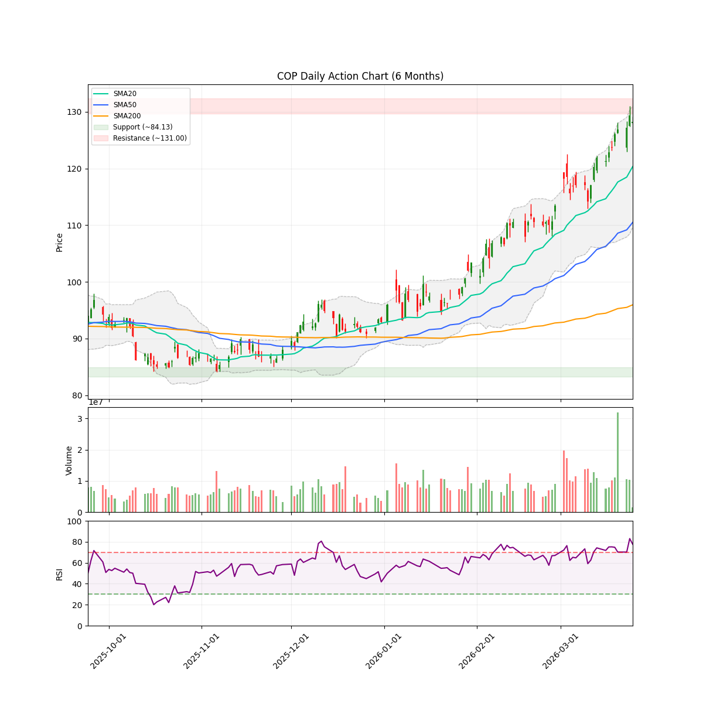
#### 研报分析

### 技术指标概览 (Technical Overview)
- **当前价格**: $128.25
- **RSI (14)**: 77.73
- **移动平均线**: SMA20: $120.32 | SMA50: $110.49 | SMA200: $95.94 (Bullish)
- **波动率**: ATR (14): 3.00 (预计周度波动: +/- $6.71)
- **关键位 (6m)**: 支撑位 $84.13 | 阻力位 $131.00
- **即时状态**: Above SMA50

# 康菲石油 (COP) 情绪审计报告：地缘政治火药桶上的“溢价舞蹈”

你好。坐吧，咱们边喝咖啡边聊。

现在的康菲石油（ConocoPhillips，代码：COP）就像是好莱坞大片里的主角：身处战火边缘，却成了全场最吸金的存在。2026年3月的这个节点，COP 的股价不再仅仅反映财报上的数字，它更像是一张关于“中东局势”和“能源安全”的实时选票。

以下是我从“叙事经济学”角度为你拆解的审计报告。

---

### 1. 催化剂分级 (Catalyst Categorization)

我们要分清哪些是真火，哪些只是烟雾：

*   **A-Tier (核心叙事)：中东战云与 LNG 供应溢价**
    *   伊朗冲突持续升级，直接推高了全球油价。正如 [Associated Press] 报道，即便特朗普试图通过谈判缓解局势，油价依然维持涨势。对于 COP 这种巨头，地缘政治风险就是利润的助推器。
    *   **关键点**：CEO 亲自向政府求援，要求保护在卡塔尔的资产 [WSJ]。这虽然听起来像求救，但在市场眼中，这坐实了 COP 在全球 LNG 叙事中的核心地位——风险虽大，但不可或缺。
*   **B-Tier (行业情绪)：防御性资本流入**
    *   在市场整体动荡时，COP 表现出了显著的抗跌性。正如 [Zacks] 所述，当大盘下行，COP 却能逆势上涨 1.7%。这是典型的避险资金流入，投资者把能源股当成了“防弹衣”。
*   **C-Tier (市场噪音)：日常波动与分析师复读**
    *   Zacks 的用户关注度报告属于常规噪音。虽然它反映了散户的兴趣，但对于趋势的决定性影响有限。

### 2. 背离检测 (Divergence Detection)

**警报：技术面与情绪面的“高空走钢丝”。**

目前的盘面出现了一个值得玩味的信号：
*   **价格与 RSI 的博弈**：股价在 128.25 美元，距离 6 个月高点（阻力位 131.00）仅一步之遥。但 **RSI 高达 77.73**，这在技术上属于严重的“超买”。
*   **利好不涨？** 虽然目前尚未出现“利好砸盘”，但涨势已经明显吃力。即便有 CEO 呼吁保护资产这种战略级新闻，股价也只是在阻力位前徘徊。这说明，虽然“叙事”很猛，但短期多头头寸已经非常拥挤。**如果 131.00 冲不过去，这就是典型的“多头衰竭”。**

### 3. 叙事评分 (Logic Score): 7.8 / 10

**结论：这是一个“带刺的牛市循环”。**

*   **逻辑支撑 (7.8)**：逻辑非常闭环。只要伊朗冲突不解决，油价就下不来；油价下不来，COP 的现金流就爆表。
*   **扣分项**：过度依赖单一地缘政治变量。如果突然传出和谈实质进展，目前 77+ 的 RSI 会引发踩踏式回撤。

---

### 4. 深度洞察：咖啡馆里的老兵私语

现在的 COP 讲的是一个**“脆弱的繁荣”**的故事。

你看，CEO 向华盛顿喊话（[WSJ] 报道），这实际上是在告诉市场：我们在卡塔尔的注押得非常大。这既是 COP 未来的增长引擎（LNG 叙事），也是它现在的阿喀琉斯之踵。市场现在愿意给它高估值，是因为大家都觉得美国政府不会坐视不管。

但作为研究员，我要提醒你：**情绪已经快到沸点了。** 现在的 COP 不是在买它的盈利能力，而是在买“局势会更糟”的预期。目前的走势图显示，它的 SMA20、50、200 呈完美的多头排列，说明大趋势极强。但 128 美元这个位置，追高需要极大的心脏。

---

### 5. 关键参考与未来日程

*   **核心新闻引用**：
    *   [The Wall Street Journal]：CEO 呼吁保护中东资产 (2026-03-03)。
    *   [Associated Press]：油价在谈判传闻中依然坚挺 (2026-03-08)。
    *   [Zacks]：COP 在市场下跌中逆势收涨 (2026-03-24)。
*   **阻力位**：131.00 (如果突破，将开启真空上涨模式；如果遇阻，看回撤至 121 附近)。
*   **支撑位**：120.32 (SMA20 支撑)。
*   **下一个重大日期 (Next Major Date)**：**2026年5月初**（预计 2026 Q1 财报发布日）。

**最后建议**：在这个位置，不要去做那个接最后一棒的人。等待 131.00 的突破确认，或者等 RSI 回落到 50 附近再考虑长线布局。现在，更适合坐在场边看这出地缘政治大戏如何落幕。
#### 近期新闻与事件
- **[The Wall Street Journal]** [ConocoPhillips CEO Urges U.S. to Protect Middle East Assets](https://www.wsj.com/livecoverage/stock-market-today-dow-sp-500-nasdaq-03-24-2026/card/conocophillips-ceo-urges-u-s-to-protect-middle-east-assets-Uk0zIb0kV9yirptEvEai)
- **[ET Now on MSN]** [US stock market experiences volatility amid ongoing Iran conflict](https://www.msn.com/en-in/money/markets/us-stock-market-experiences-volatility-amid-ongoing-iran-conflict/ar-AA1ZjnZ8?ocid=BingNewsVerp)
- **[Times Now on MSN]** [US stock market experiences volatility amid ongoing Iran war uncertainty](https://www.msn.com/en-in/money/markets/us-stock-market-experiences-volatility-amid-ongoing-iran-war-uncertainty/ar-AA1ZjMEY?ocid=BingNewsVerp)
- **[The Canadian Press on MSN]** [US stocks swing between losses and gains on uncertainty about how long the war with Iran will last](https://www.msn.com/en-ca/money/topstories/us-stocks-swing-between-losses-and-gains-on-uncertainty-about-how-long-the-war-with-iran-will-last/ar-AA1ZfLJE?ocid=BingNewsVerp)
- **[Associated Press News]** [US stocks give back some of the rally sparked by Trump’s talk of negotiations with Iran](https://apnews.com/article/stock-markets-trump-iran-oil-46bf2f12fb7f46c97dfe983f76e938f9)

---

### CVX
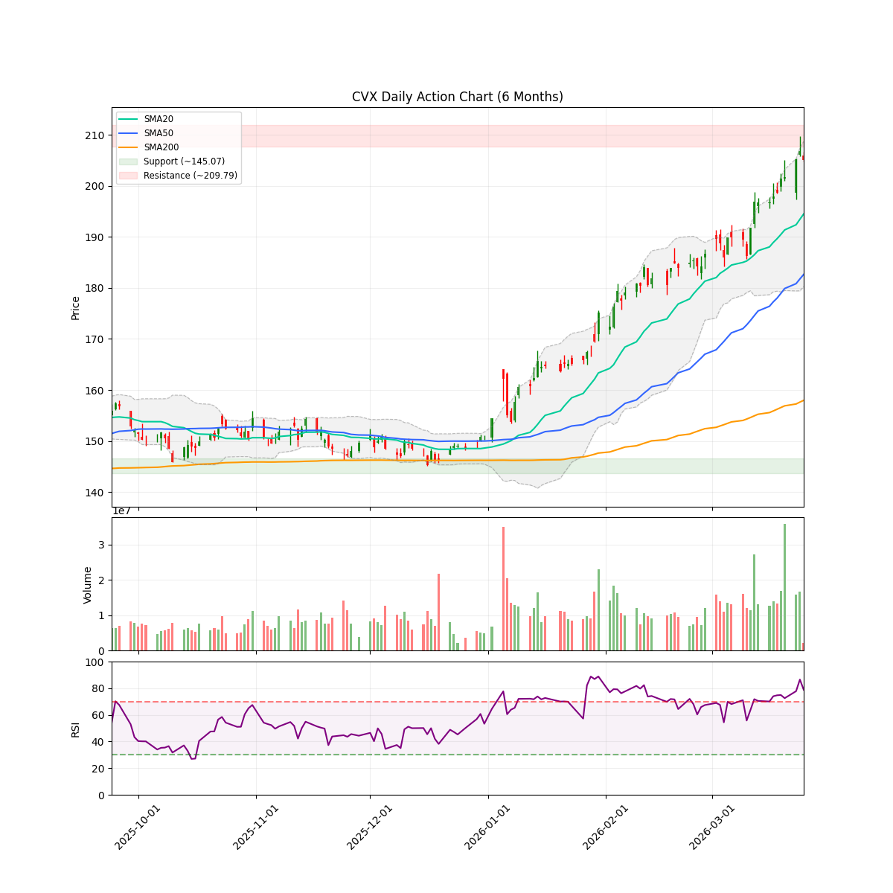
#### 研报分析

### 技术指标概览 (Technical Overview)
- **当前价格**: $205.05
- **RSI (14)**: 78.89
- **移动平均线**: SMA20: $194.51 | SMA50: $182.65 | SMA200: $157.97 (Bullish)
- **波动率**: ATR (14): 4.20 (预计周度波动: +/- $9.39)
- **关键位 (6m)**: 支撑位 $145.07 | 阻力位 $209.79
- **即时状态**: Above SMA50

# 雪佛龙 (CVX) 情绪审计报告：战火中的溢价，是续航还是陷阱？

**日期：** 2026年03月25日  
**分析师：** 叙事经济学研究员 (Hedge Fund Research Associate)

---

### 1. 市场叙事：硝烟、原油与巴菲特的幽灵

朋友，坐下来喝杯咖啡。看着 CVX 冲破 200 美元大关，你是不是感觉回到了 70 年代的石油危机？

现在的 CVX 不仅仅是一家能源公司，它已经变成了市场对**伊朗局势**焦虑感的“代金券”。在叙事经济学的视角下，CVX 正在经历一场经典的“战争溢价”洗礼。当油价站上 100 美元，媒体开始大肆宣传巴菲特的持仓逻辑时（[Insider Monkey/Yahoo Finance](https://finance.yahoo.com/markets/stocks/articles/chevron-cvx-best-stock-benefit-132440515.html)），散户的情绪被彻底点燃。

但作为老兵，我们需要穿透烟雾弹。现在的核心矛盾在于：**地缘政治的恐惧是否已经跑得比基本面更快了？**

---

### 2. 催化剂分级 (Catalyst Categorization)

*   **A-Tier（核心动力）：**
    *   **伊朗战争与供应中断：** 这是推升油价破百并让 CVX 3个月涨幅超 30% 的原子级动力。
    *   **机构背书（伯克希尔效应）：** 市场反复咀嚼巴菲特对 CVX 的偏好，将其视为动荡岁月的“避风港”。
*   **B-Tier（结构性支撑）：**
    *   **盈利预期上调：** Zacks 指出市场正在上调 CVX 的盈利预估（[Zacks](https://finance.yahoo.com/markets/stocks/articles/why-market-dipped-chevron-cvx-214504713.html)），这种预期的修正直接支撑了股价的短期强度。
    *   **股息增长叙事：** 在不确定的市场中，CVX 长期增长股息的记录是防御性资金的吸铁石。
*   **C-Tier（噪音与余温）：**
    *   **媒体推荐：** Motley Fool 和 Zacks 的“长期持有”和“必买清单”（[Motley Fool](https://finance.yahoo.com/sectors/energy/articles/2-best-oil-stocks-buy-003500541.html)），这些更多是在行情确认后的情绪跟风。

---

### 3. 背离检测：盛宴背后的冷风

这里有几个让我们必须保持清醒的信号：

1.  **超买尖叫：** RSI 高达 **78.89**。在技术语言里，这是在尖叫“太挤了”。股价已经冲到了 205.05，距离 6 个月高点 209.79 仅一步之遥。
2.  **利好钝化：** 3月24日的消息显示，随着“停战希望”抬头，原油价格已经开始回落（[WFMZ](https://www.wfmz.com/business/stocks-jump-and-oil-eases-as-wall-streets-see-saw-swings-back-to-hope-for/)）。如果油价继续走软而 CVX 还在高位盘整，这就是典型的**情绪惯性**。
3.  **估值溢价：** CVX 的远期市盈率（P/E）达到了 **29.57**，而同行（如 SSL）仅为 6.5（[Zacks](https://finance.yahoo.com/news/ssl-vs-cvx-stock-value-154002418.html)）。这意味着你现在买入的每一分钱，都包含了一大块“战争不确定性”的昂贵保费。

---

### 4. 情绪评分 (Sentiment Score): 8.2 / 10 (亢奋且危险)

**逻辑诊断：**  
目前的叙事属于“**不可阻挡的看涨循环**”的末端。市场正在忽略估值（29x P/E），转而追逐地缘政治带来的波动红利。虽然趋势依然向上（均线多头排列），但 RSI 的极端超买和“停战传闻”的出现，暗示着一个短期“情绪陷阱”正在成型。

*   **是趋势吗？** 是的，由全球能源安全叙事驱动。
*   **是陷阱吗？** 对现在的追高者来说，可能是。如果伊朗局势缓和，CVX 可能会迅速向 SMA20 (194.51) 回撤。

---

### 5. 关键日期与结论

*   **逻辑评分：** **8.2**（叙事驱动力极强，但技术面极度超标）
*   **下一个关键节点：** **2026年4月下旬 (预计 Q1 财报发布日)**。届时市场将验证这波油价暴涨到底给利润表贡献了多少真金白银。

**老兵寄语：**  
现在的 CVX 就像是一场在火药库旁举行的派对。你可以跳舞，但一定要离出口近一点。如果看到股价放量跌破 200 美元，那可能就是音乐停止的信号。

--- 
*注：本报告基于 2026-03-25 的市场数据与新闻背景撰写。*
#### 近期新闻与事件
- **[Insider Monkey· via Yahoo Finance]** [Is Chevron (CVX) The Best Stock to Benefit From Oil Price Surge Amid Iran War?](https://finance.yahoo.com/markets/stocks/articles/chevron-cvx-best-stock-benefit-132440515.html)
- **[Zacks· via Yahoo Finance]** [Why the Market Dipped But Chevron (CVX) Gained Today](https://finance.yahoo.com/markets/stocks/articles/why-market-dipped-chevron-cvx-214504713.html)
- **[WFMZ]** [Stocks jump and oil eases as Wall Street's see-saw swings back to hope for an end to the Iran war](https://www.wfmz.com/business/stocks-jump-and-oil-eases-as-wall-streets-see-saw-swings-back-to-hope-for/article_ebb8dc97-04fc-576f-9eaf-b78ecf6ffae7.html)
- **[Motley Fool· via Yahoo Finance]** [2 of the Best Oil Stocks to Buy Now and Hold for Decades](https://finance.yahoo.com/sectors/energy/articles/2-best-oil-stocks-buy-003500541.html)
- **[Zacks· via Yahoo Finance]** [Oil Eases on De-Escalation Buzz but Risks Persist: 3 Stocks to Watch](https://finance.yahoo.com/sectors/energy/articles/oil-eases-escalation-buzz-risks-124700088.html)

---

### META
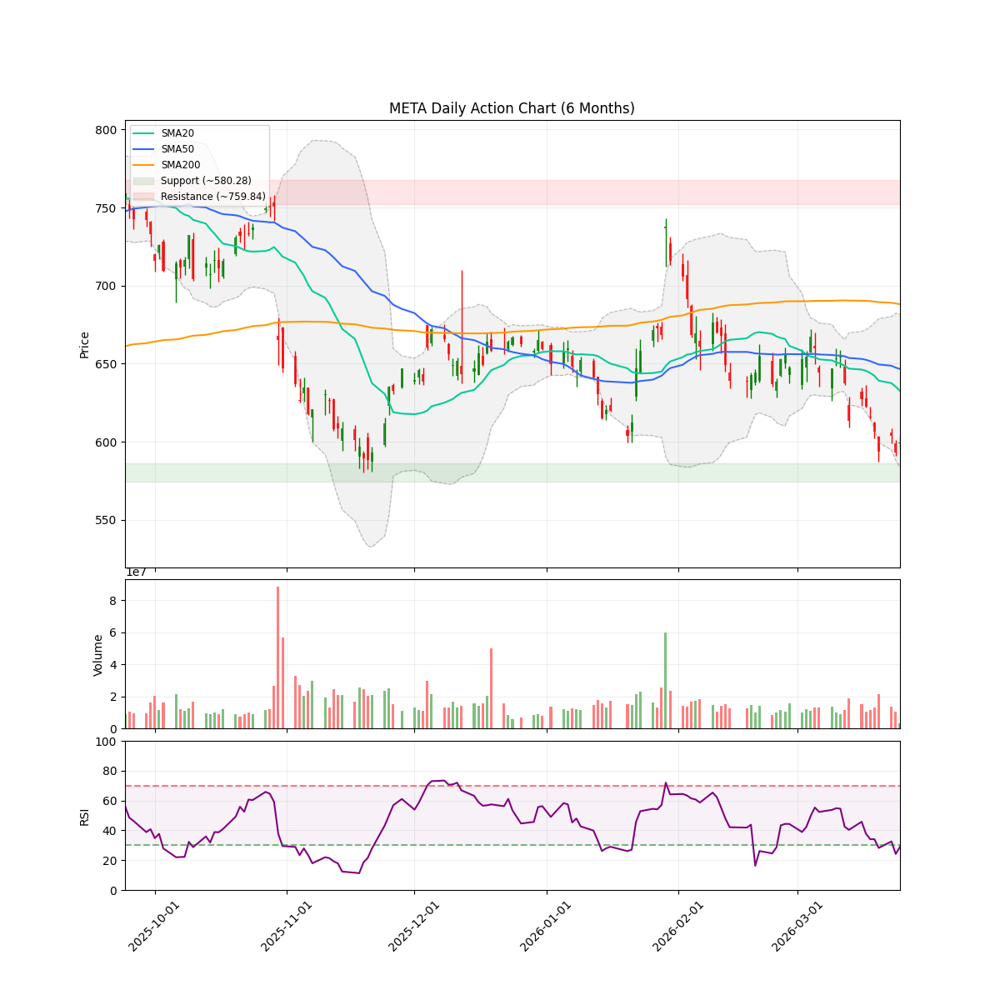
#### 研报分析

### 技术指标概览 (Technical Overview)
- **当前价格**: $599.79
- **RSI (14)**: 28.99
- **移动平均线**: SMA20: $632.57 | SMA50: $646.66 | SMA200: $688.10 (Bearish)
- **波动率**: ATR (14): 16.55 (预计周度波动: +/- $37.00)
- **关键位 (6m)**: 支撑位 $580.28 | 阻力位 $759.84
- **即时状态**: Below SMA50

# 情绪审计报告：Meta 的“九万亿”豪赌 —— 价值洼地还是失速陷阱？

**日期：** 2026年03月25日
**标的：** META (Meta Platforms Inc.)
**当前价格：** $599.79
**市场脉搏：** 极度恐惧与雄心壮志的诡异交织

---

### 1. 叙事视角：咖啡馆里的市场闲谈

朋友，坐。看着屏幕上 META 跌破 600 美元大关，你是不是也感受到了那种令人脊背发凉的寒意？

现在的 Meta 就像是一个正处于中年危机，却突然宣布要参加奥林匹克百米飞人大战的巨人。一方面，管理层抛出了一个惊天动地的“9万亿市值”大饼（[Barrons.com](https://www.barrons.com/articles/facebook-meta-stock-price-pay-package-bb9a3297)），试图通过这种“特斯拉式”的狂人叙事来稳住军心；另一方面，华尔街却在盯着那 3.75 亿美元的罚单和不断攀升的 AI 研发成本，手里紧握着卖单。

目前的盘面非常有趣：技术派在哀嚎（RSI 跌破 30），而坚定的价值猎人已经开始在“七巨头中最便宜股票”的口号下翻箱倒柜（[Yahoo Finance](https://finance.yahoo.com/markets/stocks/articles/stock-market-crash-magnificent-seven-132000783.html)）。这不仅仅是一次价格的回调，这是一场关于“Meta 是否还有下个十年”的信仰之战。

---

### 2. 催化剂分级 (Catalyst Categorization)

#### **A-Tier：长期愿景与战略核武**
*   **9万亿美元市值目标：** Meta 效仿特斯拉，推出了极具野心的股权激励计划，目标在极短时间内实现市值跨越。这虽然听起来像狂言，但在叙事经济学中，这是在强行锚定市场对未来的估值上限。

#### **B-Tier：人才防御战与行业身位**
*   **高管期权留才：** 为了应对 AI 领域的“抢人大战”，Meta 大手笔增加高管期权（[Reuters](https://finance.yahoo.com/news/meta-boosts-top-executives-pay-113940153.html)）。这反映了公司对核心人才流失的焦虑，也表明了其在 AI 赛道上“梭哈”的决心。
*   **AI 军备竞赛：** 市场对 Meta 增加开支以追赶 AI 浪潮的担忧已反映在股价中。

#### **C-Tier：日常杂音**
*   **3.75亿美元罚单：** 相比其现金流，这只是“毛毛雨”。
*   **吉姆·克莱默（Jim Cramer）的推荐：** 典型的反向指标参照（[Insider Monkey](https://finance.yahoo.com/markets/stocks/articles/why-meta-platforms-meta-key-142802393.html)），目前对市场信心提振有限。

---

### 3. 背离检测：利好中的“冷暴力”

**警惕信号：** Meta 宣布了如此宏大的市值目标和高管激励（通常被视为利好），但股价却依然跌破了 600 美元的心理防线，且位于 SMA200（688.10）下方极远位置。

这种**“利好不涨”**的局面说明：市场目前根本不买“远期大饼”的账，大家更担心的是眼下的现金流支出（Capex）和技术性抛压。目前的 RSI 仅为 28.99，这意味着**空头力量已接近衰竭**，市场正在寻找一个“哪怕是一丁点利好就能反弹”的临界点。

---

### 4. 情绪评分 (Sentiment Score): 3.5 / 10

**诊断：阴云密布，但已见雷声。**
Meta 正处于“系统性恐慌”向“寻找底部”过渡的阶段。由于跌破了 600 美元的关键支撑，短期内情绪偏向负面，但这种负面已经开始出现超卖迹象。

---

### 5. 逻辑评分 (Logic Score): 7.2 / 10

**逻辑支撑：**
尽管市场情绪低迷，但从基本面看，Meta 20倍的预期市盈率在科技巨头中确实处于“地板价”。管理层激进的股权激励实际上是在向外界传递一个信号：**“我们要么登顶 9 万亿，要么在 AI 的冲锋路上耗尽最后一分钱。”** 这种逻辑对于长线投资者具有吸引力，但对于短线交易者来说，目前的下行趋势（SMA20/50/200 全面反压）依然是悬在头顶的达摩克利斯之剑。

---

### 6. 关键数据速览

*   **当前价格：** 599.79
*   **超卖警戒：** RSI 28.99（进入极度超卖区，随时可能出现暴力反弹）
*   **关键支撑位：** 580.28（6个月低点）
*   **关键阻力位：** 632.57（SMA20）
*   **下个重要日期：** **2026年4月下旬**（预计发布 2026 Q1 财报）。

**老兵建议：** 别在飞刀下落时用手去接，但要紧盯着 580 美元附近。如果 Meta 在这个位置企稳并放量，配合那套“九万亿”的叙事，这可能就是今年最好的左侧布局机会。毕竟，在市场最绝望的时候，往往就是那些“疯子”般的愿景开始起作用的时候。
#### 近期新闻与事件
- **[Proactive· via Yahoo Finance]** [Meta to offer stock options to retain top execs as jury orders $375M penalty in...](https://finance.yahoo.com/markets/stocks/articles/meta-offer-stock-options-retain-143700630.html)
- **[Insider Monkey· via Yahoo Finance]** [Here’s Why Meta Platforms (META) is a Key Stock in Jim Cramer’s Latest Portfolio](https://finance.yahoo.com/markets/stocks/articles/why-meta-platforms-meta-key-142802393.html)
- **[Reuters· via Yahoo Finance]** [Meta boosts top executives' pay with stock options as AI race heats up](https://finance.yahoo.com/news/meta-boosts-top-executives-pay-113940153.html)
- **[Barrons.com]** [Meta Takes a Swipe at Tesla With $9 Trillion Stock Goal in Half the Time](https://www.barrons.com/articles/facebook-meta-stock-price-pay-package-bb9a3297)
- **[Motley Fool· via Yahoo Finance]** [Why Meta Stock Could Fall Even Further](https://finance.yahoo.com/markets/stocks/articles/why-meta-stock-could-fall-010500063.html)

---

### MSFT
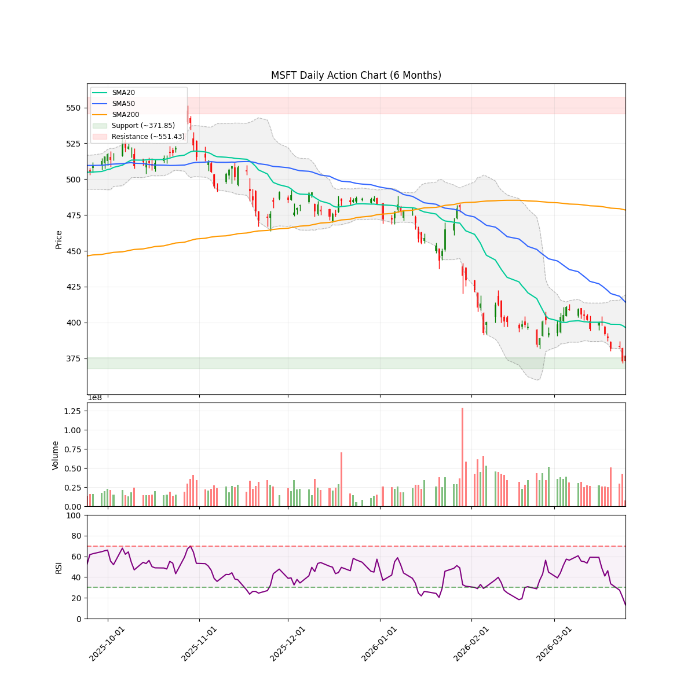
#### 研报分析

### 技术指标概览 (Technical Overview)
- **当前价格**: $373.46
- **RSI (14)**: 13.24
- **移动平均线**: SMA20: $396.52 | SMA50: $414.17 | SMA200: $478.46 (Bearish)
- **波动率**: ATR (14): 6.95 (预计周度波动: +/- $15.53)
- **关键位 (6m)**: 支撑位 $371.85 | 阻力位 $551.43
- **即时状态**: Below SMA50

这是一份为您准备的微软（MSFT）深度情绪审计报告。我们跳过那些枯燥的财报数字，直接聊聊现在的市场“剧本”到底在演哪一出。

---

# 🔎 微软 (MSFT) 情绪审计报告：是末日崩塌，还是“黄金坑”前的最后洗盘？

**日期：** 2026-03-25
**当前价格：** $373.46
**市场脉搏：** 极度恐慌与机构暗流的交锋

### 1. 催化剂分类 (Catalyst Categorization)

在叙事经济学中，不是所有消息都平等。我们需要滤掉噪音，直击要害：

*   **A-Tier (核心驱动)：**
    *   **美国银行 (BofA) 的强力背书：** 美银重新恢复覆盖并给出 $500 的目标价（31% 的潜在涨幅），重点提到了 **$6250 亿的 AI 积压订单**。这是实打实的真金白银，不是 PPT 上的梦想。 [来源: Yahoo Finance/Blockonomi]
    *   **2008 年式的背离：** 当前价格与 200 日均线的偏差达到了 2008 年金融危机以来的最大值。这种物理定律级别的超卖，通常预示着暴力反弹。 [来源: Stocktwits/MSN]
*   **B-Tier (行业联动)：**
    *   **美光 (Micron) 的“祭旗”效应：** 美光业绩爆表却连跌四天，这反映了市场目前处于“利好出尽”的病态心理，微软被这种板块性抛售误伤。 [来源: CNBC]
    *   **PMI 数据超预期：** 制造业增长本是好事，但市场却因担忧加息或流动性收紧而反向解读。
*   **C-Tier (市场噪音)：**
    *   **Jim Cramer 的“精英”评价：** 这种评论在散户圈有热度，但在职业操盘手眼中仅作参考。 [来源: Insider Monkey]
    *   **散户的“代际机会”高喊：** 散户的过度热情有时是反向指标，需要警惕。

### 2. 背离检测：利好重重，为何止不住血？ (Divergence Detection)

**诊断：熊市竭尽 (Bearish Exhaustion)。**

现在的微软正处于一个非常诡异的境地。如果你只看基本面：AI 积压订单惊人、大行调高目标价、云业务稳健。但看盘面：它正跌向 6 个月的低点 ($371.85)，**RSI 只有 13.24**。

*这就是我们要找的“叙事裂缝”：* 
股价下跌并非因为微软不行了，而是因为整个市场的流动性在“退潮”，或是机构在利用美光等芯片股的崩盘进行无差别平仓。**利好不涨反跌，通常是最后一跌的特征。** 市场正在通过这种极端的负面情绪，把最后那批不坚定的筹码“吓”出来。

### 3. 情绪评分 (Sentiment Score)

#### **2.5 / 10 (极度恐惧/系统性超卖)**

> **点评：** 这个分数反映的是当前的“体感温度”。目前市场对微软的看法已经从“科技巨头”降级到了“避险弃子”。然而，作为一名研究员，我要告诉你：**当分数低于 3 的时候，往往是叙事即将反转的时刻。** 逻辑上的“10分反弹机会”正在这种“2.5分的情绪”中孕育。

### 4. 叙事分析：这是“陷阱”吗？

**这不是系统性失效，这是一场“流动性踩踏”。**

想象一下，你坐在华尔街的咖啡馆里，隔壁桌的交易员正满头大汗地卖出一切能换成现金的东西，仅仅是因为他们的杠杆爆了，或者是为了对冲芯片股的亏损。微软就是那个被邻居火灾波及的豪宅。

目前的叙事已经从“AI 改写未来”变成了“由于宏观压力，谁都不能幸免”。但别忘了，美银提到的那 **6250 亿积压订单** 不会因为股价跌了 2.5% 就消失。这种价格与价值的严重脱节，就是典型的“叙事扭曲”。

### 5. 关键情报总结

*   **逻辑评分：** **8.5 / 10** (基于超卖程度与基本面背离，反弹逻辑极强)。
*   **技术支撑点：** $371.85 (6个月低点，几乎就在眼前，这是生死线)。
*   **引用证据：** 
    *   [Blockonomi] 美国银行预测 31% 涨幅，源于 Azure 和 AI 积压。
    *   [Stocktwits] 与 200 日均线的差距达到 2008 年以来最大。
*   **下一个重大日期：** **2026年4月23日左右** (预计 Q3 财报发布日)。这枚“深水炸弹”将彻底检验 AI 订单是否已转化为营收。

**老兵寄语：** 
当 RSI 跌到 13 的时候，看空已经不再是技术活，而是胆量活。现在的微软，就像一根被按到地板里的弹簧。别盯着那 2% 的波动看了，盯紧那个 $371.85 的支撑位，那里可能就是这轮恐慌的终点。☕️
#### 近期新闻与事件
- **[Blockonomi]** [MSFT Stock Slides 2.5% as Markets Fall Despite PMI Beat](https://blockonomi.com/msft-stock-slides-2-5-as-markets-fall-despite-pmi-beat/)
- **[Stocktwits]** [Microsoft stock's 200-day DMA gap is widest since 2008 financial crisis — and retail sees 'generational' opportunity](https://www.msn.com/en-us/money/savingandinvesting/microsoft-stock-s-200-day-dma-gap-is-widest-since-2008-financial-crisis-and-retail-sees-generational-opportunity/ar-AA1ZlSQB)
- **[OnMSFT.com]** [Microsoft stock today: Latest price, trends, and key drivers](https://onmsft.com/news/microsoft-stock-today-latest-price-trends-and-key-drivers/)
- **[Insider Monkey]** [Jim Cramer Says Microsoft (MSFT) Is an 'Elite' AI Stock to Buy - Here's Why](https://www.msn.com/en-us/money/other/jim-cramer-says-microsoft-msft-is-an-elite-ai-stock-to-buy-heres-why/ar-AA1ZjZ7A)
- **[Blockonomi]** [Microsoft (MSFT) Stock: BofA Projects 31% Rally Fueled by AI and Cloud Expansion](https://blockonomi.com/microsoft-msft-stock-bofa-projects-31-rally-fueled-by-ai-and-cloud-expansion/)

---

### NVDA
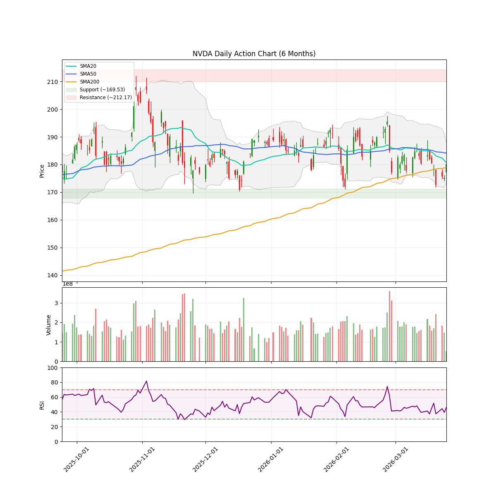
#### 研报分析

### 技术指标概览 (Technical Overview)
- **当前价格**: $180.10
- **RSI (14)**: 46.08
- **移动平均线**: SMA20: $180.67 | SMA50: $184.11 | SMA200: $178.95 (Bullish)
- **波动率**: ATR (14): 5.13 (预计周度波动: +/- $11.46)
- **关键位 (6m)**: 支撑位 $169.53 | 阻力位 $212.17
- **即时状态**: Below SMA50

# 叙事经济学审计报告：NVDA — 诸神黄昏还是中场休息？

**日期：** 2026年03月25日
**分析师：** 叙事经济学研究员
**标的：** NVIDIA (NVDA)
**当前价格：** $180.10

---

### 1. 核心叙事与市场脉搏 (Narrative & Market Pulse)

喝杯咖啡，咱们直入主题。2026年的英伟达，已经不再是那个只要提到“AI”就能原地起飞的少年了。现在的它，更像是一个跑完马拉松、正坐在路边喘气的王者。

从数据上看，NVDA目前正陷入一种**“审美疲劳”**。最典型的征兆是什么？看看隔壁的博通（Broadcom）。博通的AI营收翻了一番，股价却像石沉大海一样毫无波澜。这释放了一个极其危险的信号：**市场对“利好”的阈值已经被拉到了天际。** 这种“利好不涨”的背离，是典型的看涨衰竭（Bearish Exhaustion）前兆。

目前的叙事主线是：**“估值回归” vs “宏观救命”**。一方面，高盛质疑其收益增长的可持续性；另一方面，吉姆·克莱默（Jim Cramer）在狂喊“英伟达比油漆公司还便宜”。当这种顶级蓝筹股开始被拿来和油漆公司比估值时，你就知道，它已经从“梦想股”跌落人间，变成了“价值股”的博弈。

---

### 2. 催化剂等级分类 (Catalyst Categorization)

*   **A-Tier (核心驱动):** **暂无。** 财报季已过，目前缺乏能直接改变逻辑的重磅炸弹。
*   **B-Tier (行业与宏观):**
    *   **特朗普的地缘政治红利：** [Barchart] 报道特朗普释放伊朗局势降温信号。这对整个科技板块是强心针，暂时止住了NVDA的失血。
    *   **博通(AVGO)的业绩预示：** 虽然博通股价没动，但其AI营收翻倍证明了基建需求还在，只是“想象力溢价”没了。
*   **C-Tier (杂讯与散户情绪):**
    *   **吉姆·克莱默的喊话：** [Insider Monkey] 关于“比油漆公司便宜”的论调。这通常是散户寻找心理安慰的避风港，对机构资金吸引力有限。
    *   **Zacks 搜索热度：** [Zacks] 显示散户搜索量巨大，说明筹码还在向大众扩散，通常意味着波动加剧。

---

### 3. 背离检测与技术诊断 (Divergence & Technicals)

*   **看跌背离：** 股价目前处于 SMA50 ($184.11) 之下，且低于年初至今的价格水平（2026年开年不利，下跌7%）。尽管利润预期依然强劲，但股价却在“漂移”下行。这是典型的**“利好出尽”**后的阴跌。
*   **支撑与阻力：** 
    *   目前股价紧贴 SMA20 ($180.67)，下方 SMA200 ($178.95) 是最后的“红线”。
    *   如果跌破 178.95，下方的 6 个月低点 $169.53 将是唯一的防线。
*   **叙事陷阱：** 现在的 NVDA 并非“系统性失败”，而是一个**“估值陷阱”**。它在等待下一个大的叙事（如 2027 年的新芯片架构或大规模主权 AI 订单）来打破僵局。

---

### 4. 逻辑评分 (Logic Score): 6.2/10

**评分理由：** 
这是一个典型的**“过度拥挤的交易”**。逻辑上，AI的基本面没有崩塌（6分的基础），但情绪上的边际增量已经消失。特朗普的去中心化和平叙事对科技股是利好（+1分），但高盛对利润持续性的质疑是悬在头顶的达摩克利斯之剑（-0.8分）。目前 NVDA 缺乏上涨的“暴力美学”，更多是震荡洗盘。

---

### 5. 关键日期与引用

*   **下一重大日期：** **2026年5月20日左右**（预计 2027 财年第一季度财报发布日）。这是打破目前“横盘陷阱”的唯一机会。
*   **引用证据：**
    *   关于估值与收益预期背离：[Seeking Alpha - Nvidia shares drift from earnings momentum](https://seekingalpha.com/news/4556589-nvidia-shares-drift-from-earnings-momentum-as-valuation-questions-emerge)
    *   关于地缘政治缓解：[Barchart - Trump Signals De-Escalation](https://finance.yahoo.com/markets/stocks/articles/trump-signals-escalation-iran-war-203235477.html)
    *   关于估值比价：[Insider Monkey - Cheaper Than a Paint Company](https://finance.yahoo.com/markets/stocks/articles/jim-cramer-discusses-nvidia-stock-142607674.html)

**老兵建议：** 别在 SMA200 附近做空，但也别指望它立刻回到 $212。现在的 NVDA 适合高抛低吸，而非长线梭哈。等市场消化完“AI不再是奇迹”这个现实后，真正的买点才会出现。
#### 近期新闻与事件
- **[Insider Monkey· via Yahoo Finance]** [Is NVIDIA (NVDA) Still The Best AI Stock in Jim Cramer’s 2026 Portfolio?](https://finance.yahoo.com/markets/stocks/articles/nvidia-nvda-still-best-ai-182215370.html)
- **[24/7 Wall St.· via Yahoo Finance]** [Broadcom’s AI Revenue Just Doubled. The Stock Barely Moved](https://finance.yahoo.com/markets/stocks/articles/broadcom-ai-revenue-just-doubled-140330879.html)
- **[Barchart· via Yahoo Finance]** [As Trump Signals De-Escalation in the Iran War, Should You Buy Nvidia Stock?](https://finance.yahoo.com/markets/stocks/articles/trump-signals-escalation-iran-war-203235477.html)
- **[Insider Monkey· via Yahoo Finance]** [Jim Cramer Discusses NVIDIA as Its Stock Becomes “Cheaper Than a Paint Company”](https://finance.yahoo.com/markets/stocks/articles/jim-cramer-discusses-nvidia-stock-142607674.html)
- **[Motley Fool· via Yahoo Finance]** [Can Nvidia Stock Reach $300 by 2030?](https://finance.yahoo.com/markets/stocks/articles/nvidia-stock-reach-300-2030-063000673.html)

---

### OXY
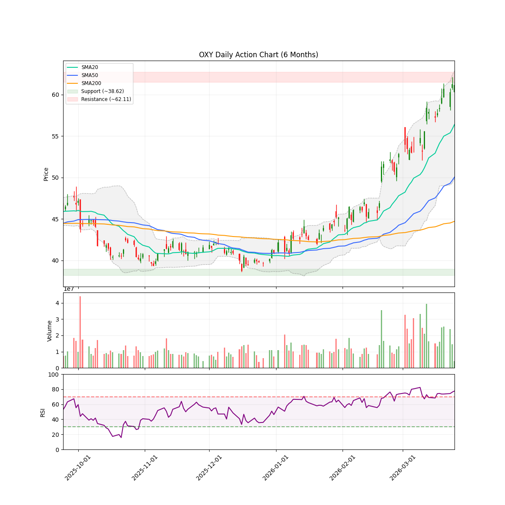
#### 研报分析

### 技术指标概览 (Technical Overview)
- **当前价格**: $61.15
- **RSI (14)**: 77.64
- **移动平均线**: SMA20: $56.39 | SMA50: $50.05 | SMA200: $44.72 (Bullish)
- **波动率**: ATR (14): 1.95 (预计周度波动: +/- $4.37)
- **关键位 (6m)**: 支撑位 $38.62 | 阻力位 $62.11
- **即时状态**: Above SMA50

# 西方石油 (OXY) 情绪审计报告：原油浪潮中的“老钱”狂欢

你好！欢迎来到研究室。既然大家都在喝咖啡，那咱们就放下那些枯燥的Excel表格，聊聊西方石油（OXY）现在的“气味”。现在的 OXY 闻起来不仅仅是原油的味道，更多的是一种**疯狂的荷尔蒙**。

### 1. 催化剂分类：谁在推波助澜？

目前 OXY 的叙事由三重动力驱动，我们将其拆解如下：

*   **A-Tier（核心动力）：**
    *   **“股神”的护身符：** [Insider Monkey](https://finance.yahoo.com/sectors/energy/articles/occidental-petroleum-oxy-best-energy-152150255.html) 再次强调了巴菲特对 OXY 的青睐。在波动的市场中，老巴的背书就是最强的“地基”。
    *   **硬核业绩与油价共振：** [Blockonomi](https://blockonomi.com/occidental-petroleum-oxy-stock-climbs-17-on-crude-rally-and-stellar-quarterly-results/) 指出，强劲的 Q4 财报配合 WTI 原油挺进 $90-$100 区间，这是实打实的利润爆发，不是虚幻的饼。
*   **B-Tier（行业共振）：**
    *   **板块性的牛市：** 整个能源板块（MPC, COP）都在共振，[247wallst](https://247wallst.com/investing/2026/03/23/3-oil-stocks-set-to-deliver-50-returns-in-2026/) 预测 2026 年将有 50% 以上的回报。这种“群体性亢奋”为 OXY 提供了绝佳的防御垫。
*   **C-Tier（噪音）：**
    *   散户论坛（Reddit）的讨论虽然增加了热度，但在这种资本密集型行业，散户的呼声更多是行情末端的点缀。

### 2. 背离检测：这股风还能吹多久？

目前的走势是一个**标准的“逆行者”姿态**。根据 [Zacks](https://finance.yahoo.com/markets/stocks/articles/occidental-petroleum-oxy-ascends-while-215004861.html) 的观察，大盘在跌，OXY 却在涨。这说明机构资金正在把能源股当成避风港。

**但要注意一个危险信号：RSI 指标已达 77.64。**
在技术层面，这叫“空气稀薄地带”。虽然 SMA20、SMA50、SMA200 呈现完美的多头排列（多头阶梯），但股价距离 SMA20 已经有了不小的乖离率。现在的 OXY 就像一辆在高速上超速行驶的猛禽皮卡，动力很足，但急刹车的风险也在积聚。

### 3. 叙事经济学诊断：是趋势还是陷阱？

**结论：这是一个“加速中的可持续趋势”，但短期面临“情绪回踩”。**

现在的叙事逻辑非常丝滑：地缘政治导致油价易涨难跌 + 巴菲特持续买入提供底部支撑 + 业绩超预期证明经营效率。这种叙事几乎没有破绽，所以它不是陷阱。

然而，[Investing.com](https://www.investing.com/news/company-news/occidental-petroleum-stock-hits-52week-high-at-6075-usd-93CH-4573117) 提到的 52 周新高（$60.75）已经被突破。通常在这种里程碑时刻，前期获利盘会有强烈的套现冲动。目前的 61.15 美元距离上方阻力位 62.11 仅一步之遥。

---

### 逻辑评分 (Logic Score)：8.8/10
*评语：逻辑极度自洽。基本面有原油价格支撑，筹码面有伯克希尔坐镇。扣分项完全在于技术面的超买——它涨得太快了，甚至让坚定的多头都感到一丝心虚。*

---

### 关键数据与观察

*   **当前价格：** 61.15
*   **情绪状态：** 极度乐观（甚至有些贪婪）
*   **阻力位：** 62.11 (6个月高点)
*   **支撑位：** 56.39 (SMA20 支撑线)
*   **关键新闻引用：**
    *   *Zacks*: 市场下跌时 OXY 逆势上涨 1.56%。
    *   *Blockonomi*: 2月因业绩和油价单月暴涨 17%。
*   **下一个重大日期：** **2026年5月上旬** (预计 2026 年 Q1 财报发布日)。

**老兵建议：**
如果你已经在车上，系好安全带，止盈位可以上移到 58 美元附近；如果你想现在跳上这辆时速 120 码的车，最好等它在 62 美元阻力位附近震荡消化后再做决定。**别在舞会最高潮的时候才冲进去找舞伴。**
#### 近期新闻与事件
- **[Insider Monkey· via Yahoo Finance]** [Is Occidental Petroleum (OXY) The Best Energy Stock to Buy Now?](https://finance.yahoo.com/sectors/energy/articles/occidental-petroleum-oxy-best-energy-152150255.html)
- **[Zacks· via Yahoo Finance]** [Occidental Petroleum (OXY) Ascends While Market Falls: Some Facts to Note](https://finance.yahoo.com/markets/stocks/articles/occidental-petroleum-oxy-ascends-while-215004861.html)
- **[Insider Monkey· via Yahoo Finance]** [Is Marathon Petroleum Corporation (MPC) A Good Stock To Buy Now?](https://finance.yahoo.com/markets/stocks/articles/marathon-petroleum-corporation-mpc-good-205256800.html)
- **[Insider Monkey· via Yahoo Finance]** [Is ConocoPhillips (COP) A Good Stock To Buy Now?](https://finance.yahoo.com/markets/stocks/articles/conocophillips-cop-good-stock-buy-205337190.html)
- **[247wallst.com]** [3 Oil Stocks Set to Deliver 50%+ Returns in 2026](https://247wallst.com/investing/2026/03/23/3-oil-stocks-set-to-deliver-50-returns-in-2026/)

---

### VLO
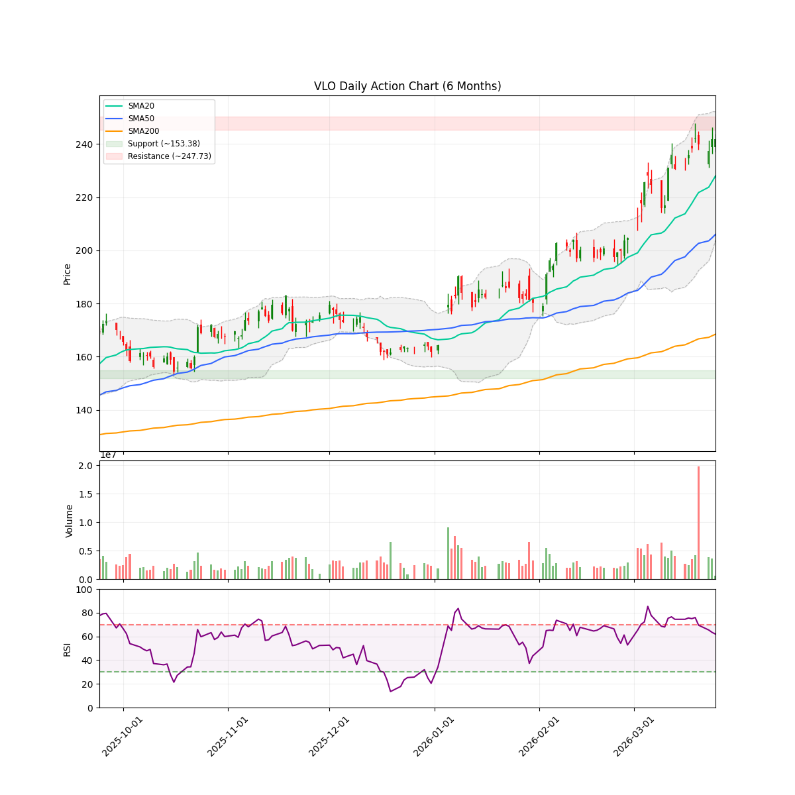
#### 研报分析

### 技术指标概览 (Technical Overview)
- **当前价格**: $241.91
- **RSI (14)**: 62.00
- **移动平均线**: SMA20: $227.99 | SMA50: $206.01 | SMA200: $168.47 (Bullish)
- **波动率**: ATR (14): 8.40 (预计周度波动: +/- $18.79)
- **关键位 (6m)**: 支撑位 $153.38 | 阻力位 $247.73
- **即时状态**: Above SMA50

# 情感审计报告：Valero Energy (VLO) —— “炼油之王”的估值重塑叙事

**审计日期：** 2026年3月25日
**分析师：** 叙事经济学研究部

---

### 1. 核心叙事：从“收息股”到“动能怪兽”

现在的市场不再仅仅把 Valero (VLO) 看作那个稳健发股息的老牌炼油厂了。坐在咖啡馆里，如果你听听老练交易员的对话，你会发现叙事已经变了：在2026年全球能源供应持续偏紧（伊朗与委内瑞拉风险叠加）的大背景下，VLO 正在经历一场由机构引领的**“估值重塑”**。

这不只是关于几加仑汽油的利润，这是关于在动荡年份中，谁拥有最强的现金流收割能力。

### 2. 催化剂分级 (Catalyst Categorization)

*   **A-Tier（核心驱动）：Raymond James 的强力背书与宏观溢价**
    *   **理由：** Raymond James 将目标价从 $215 直接拔高到 **$290** ([来源](https://finance.yahoo.com/sectors/energy/articles/why-raymond-james-calling-290-133101243.html))。在华尔街共识还停留在 $214 的时候，这种“激进式”的调高无异于向市场投下了一枚深水炸弹。这不仅是看好财报，更是对整个能源板块 YTD（年初至今）上涨 14-15% 的确认。
*   **B-Tier（行业共振）：能源板块的“领头羊”效应**
    *   **理由：** 2026年能源板块是标普500的绝对C位。VLO 与 Baker Hughes (BKR) 的齐头并进证明了这不是单一股票的投机，而是资本在向高现金流行业转移 ([来源](https://finance.yahoo.com/news/valero-energy-vlo-baker-hughes-144739673.html))。
*   **C-Tier（散户情绪）：Reddit 与量化标签**
    *   **理由：** Zacks 持续将其评为强力价值/增长股，而 r/AIPortfolios 等社群也开始出现看多贴 ([来源](https://sg.finance.yahoo.com/news/valero-energy-corporation-vlo-good-202051990.html))。这属于背景噪音，虽然能提供流动性，但不是行情的主推力。

### 3. 背离检测 (Divergence Detection)

**观察：** 3月23日，VLO 在标普500大涨 1.15% 的情况下逆势下跌了 1.03% ([来源](https://www.msn.com/en-us/money/topstocks/valero-energy-vlo-stock-sinks-as-market-gains-here-s-why/ar-AA1ZfsYJ))。
**诊断：** 这种“好消息里的微跌”通常是**看涨衰竭的假象**或是短线获利盘回吐。随后的 3月25日 Raymond James 的重磅升级直接粉碎了看跌逻辑。目前价格（$241.91）紧贴 SMA20（$227.99）上方运行，RSI 处于 62 的“健康强势区”，并未触及 70 的超买警戒线。
**结论：** 跌不动，就是想涨。

### 4. 情感得分 (Sentiment Score)

**8.5 / 10 —— “估值重塑后的主升浪”**

*   **逻辑支撑：**
    *   **技术面：** 完美的牛市排列（Price > SMA20 > SMA50 > SMA200）。
    *   **叙事面：** 市场正在接受“$240 的 VLO 依然便宜”这一新逻辑，因为 $290 的锚点已经被机构插在了那里。
    *   **风险点：** 股价已接近 6 个月高点 $247.73，短期内可能在阻力位附近有反复震荡。

### 5. 投资者的“咖啡馆语录”

> “别盯着那 1% 的日内回调看，那是给胆小鬼准备的。看看 Raymond James 那个 $290 的报告，那是在告诉所有人：炼油厂的盈利机器还没停。只要中东和委内瑞拉那边还有风吹草动，VLO 就是这通胀时代里的‘黄金实物’。”

---

### 6. 关键节点预测

*   **下一关键日期：** **2026年4月23日（预估）** —— 第一季度财报发布日。
    *   *注：这将是验证 Raymond James 的 $290 逻辑是否成立的第一个真理时刻。*
*   **短期波动区间：** 基于 ATR (8.40)，预计本周波动范围在 **+/- $18.79**。
*   **阻力位：** $247.73 (6个月高点)
*   **支撑位：** $228.00 (SMA20 支撑)

**总结：** VLO 目前不是“陷阱”，而是一个处于**强力机构支撑期**的趋势行情。只要它守住 $228 这一关键位置，上行叙事依然牢不可破。
#### 近期新闻与事件
- **[Yahoo Finance Singapore]** [Is Valero Energy Corporation (VLO) A Good Stock To Buy Now?](https://sg.finance.yahoo.com/news/valero-energy-corporation-vlo-good-202051990.html)
- **[Yahoo Finance]** [Why Raymond James Is Calling for a $290 Price Tag on Valero (VLO)](https://finance.yahoo.com/sectors/energy/articles/why-raymond-james-calling-290-133101243.html)
- **[Zacks Investment Research]** [Here's why Valero Energy (VLO) is a strong value stock](https://www.msn.com/en-us/money/savingandinvesting/here-s-why-valero-energy-vlo-is-a-strong-value-stock/ar-AA1Zj4Pl)
- **[Zacks Investment Research]** [Valero Energy (VLO) stock sinks as market gains: Here's why](https://www.msn.com/en-us/money/topstocks/valero-energy-vlo-stock-sinks-as-market-gains-here-s-why/ar-AA1ZfsYJ)
- **[Seeking Alpha]** [Venture Global stands as the best performing large-cap energy stock YTD](https://seekingalpha.com/news/4567918-venture-global-stands-as-the-best-performing-large-cap-energy-stock-ytd)

---

### VRT
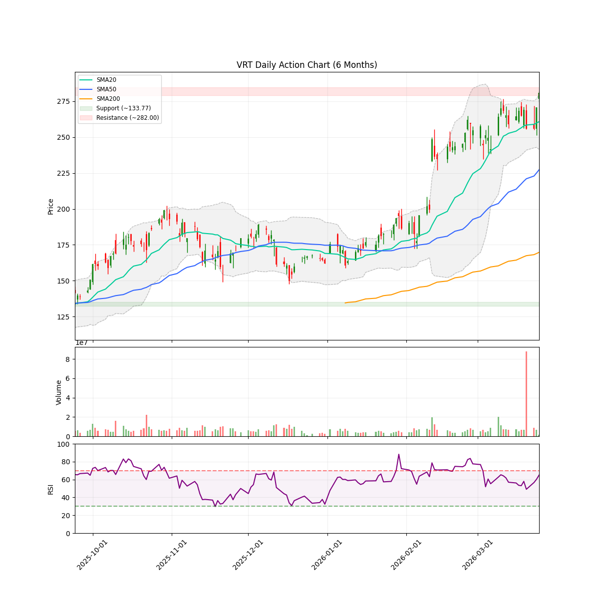
#### 研报分析

### 技术指标概览 (Technical Overview)
- **当前价格**: $280.77
- **RSI (14)**: 65.04
- **移动平均线**: SMA20: $260.79 | SMA50: $227.29 | SMA200: $169.78 (Bullish)
- **波动率**: ATR (14): 14.24 (预计周度波动: +/- $31.84)
- **关键位 (6m)**: 支撑位 $133.77 | 阻力位 $282.00
- **即时状态**: Above SMA50

你好！很高兴能和你坐下来聊聊 **Vertiv (VRT)**。如果你把 AI 革命看作是一场现代版的“淘金热”，那么大家往往只盯着英伟达（Nvidia）这些卖锄头的人，却忽略了谁在为这些疯狂运转的矿场供电和降温。

没错，VRT 就是那个在幕后给整个 AI 帝国“降温”的巨人。现在的 VRT，正处于一场教科书级的叙事螺旋中。

---

### **VRT 情绪审计报告：AI 王座下的冷却官**

#### **1. 催化剂分级 (Catalyst Categorization)**

*   **A-Tier（顶级催化剂）：正式入标 S&P 500 & 战略收购**
    *   **入标标普：** 2026年3月23日，VRT 正式加入标普500指数。这不只是名誉，更是实打实的“被动买盘”暴力入场。
    *   **收购 ThermoKey：** 刚刚宣布收购意大利散热技术商 ThermoKey。在 AI 数据中心领域，风冷已经过时，液冷才是未来。这次收购直接巩固了 VRT 在液冷赛道的“护城河”。
*   **B-Tier（重要推动力）：投行集体“唱多”**
    *   摩根士丹利、高盛和汇丰银行（HSBC）近期密集调高目标价，汇丰直接看高到 $325。这种机构共识正在形成一种“价格自我实现”的上涨动力。
*   **C-Tier（噪音与辅助）：媒体热度**
    *   Zacks 的搜索热度飙升，以及吉姆·克莱默（Jim Cramer）的长期站台。虽然这带有散户博弈色彩，但它确实维持了市场的流动性和讨论度。

#### **2. 分歧检测 (Divergence Detection)**

目前 VRT 的走势非常健康，**尚未出现**“好消息出尽反而下跌”的背离征兆。

*   **观察：** 尽管 3月23日入标标普是一个典型的“利好兑现”节点，但股价在 24日依然借着收购消息跳空上涨 5.3%。
*   **警示：** RSI 目前处于 65.04，逼近 70 的超买区间。股价（280.77）极度接近 6 个月的高点阻力位（282.00）。在这里，我们可能会看到短期获利了结的压力，但这更像是“长跑中的喘息”，而非“趋势反转”。

#### **3. 叙事经济学分析 (Narrative Analysis)**

VRT 的故事已经从“普通的电气设备商”进化到了“AI 基础设施的终极守门人”。

想象一下：你拥有最顶尖的 GPU，但如果没有 VRT 的液冷技术和电源管理，这些昂贵的硅片会在几秒钟内化为废铁。市场现在给 VRT 的估值不是基于它的“过去”，而是基于“数据中心必须重构”的焦虑。目前这种情绪远未达到泡沫破裂的程度，因为实体订单（尤其是液冷设备）的积压往往是按年计算的。

#### **4. 逻辑评分 (Logic Score)**

# **9.2 / 10** 

> **理由：** 极少看到技术面（均线完美多头排列）、基本面（战略收购）和筹码面（入标标普带来的机构增量资金）如此高度统一。唯一的风险在于短期涨幅过大带来的技术性回调。

---

### **执行摘要 (Execution Summary)**

*   **当前脉搏：** 强劲的看涨周期。市场正在消化 S&P 500 入标后的流动性红利，并对 ThermoKey 的收购给出了溢价。
*   **关键位置：** 关注 **$282** 阻力位。如果能带量突破，上方将是一片坦途；若回踩，**$260 (SMA20)** 是极佳的防御支撑。
*   **引用证据：** 
    *   *“HSBC initiated coverage on Vertiv... with a Buy rating and a price target of $325.00.”* (2026-03-25)
    *   *“Vertiv (VRT) stock joins S&P 500 March 23...”* (2026-03-23)
*   **下一个重大日期：** 
    *   **2026年4月底/5月初 (预估一季度财报发布日)**。这是验证“入标标普后机构进场情况”以及“收购整合预期”的下一个决战时刻。

**老兵私房话：** 别在狂欢时恐高，也别在回调时因恐惧而离场。VRT 现在是 AI 硬件链条上最稳健的资产之一。只要液冷的叙事没断，这个趋势就还没跑完。
#### 近期新闻与事件
- **[Blockonomi]** [Vertiv (VRT) Stock Rockets 173% in One Year as S&P 500 Entry Confirmed](https://blockonomi.com/vertiv-vrt-stock-rockets-173-in-one-year-as-sp-500-entry-confirmed/)
- **[Yahoo Finance]** [Vertiv (VRT) Up In Triple Digit Percentages After Jim Cramer Said "Stick to Vertiv or Get Out" In May 2025](https://finance.yahoo.com/markets/stocks/articles/vertiv-vrt-triple-digit-percentages-160311561.html)
- **[Zacks.com]** [Is Trending Stock Vertiv Holdings Co. (VRT) a Buy Now?](https://www.msn.com/en-us/money/top-stocks/is-trending-stock-vertiv-holdings-co-vrt-a-buy-now/ar-AA1ZjqPl)
- **[StockStory.org]** [Why Vertiv (VRT) stock is up today](https://www.msn.com/en-us/money/markets/why-vertiv-vrt-stock-is-up-today/ar-AA1ZkusP)
- **[Yahoo Finance]** [Morgan Stanley, Oppenheimer, and Goldman Sachs Raise Vertiv (VRT) Price Targets](https://finance.yahoo.com/markets/stocks/articles/morgan-stanley-oppenheimer-goldman-sachs-204328851.html)

---

### VST
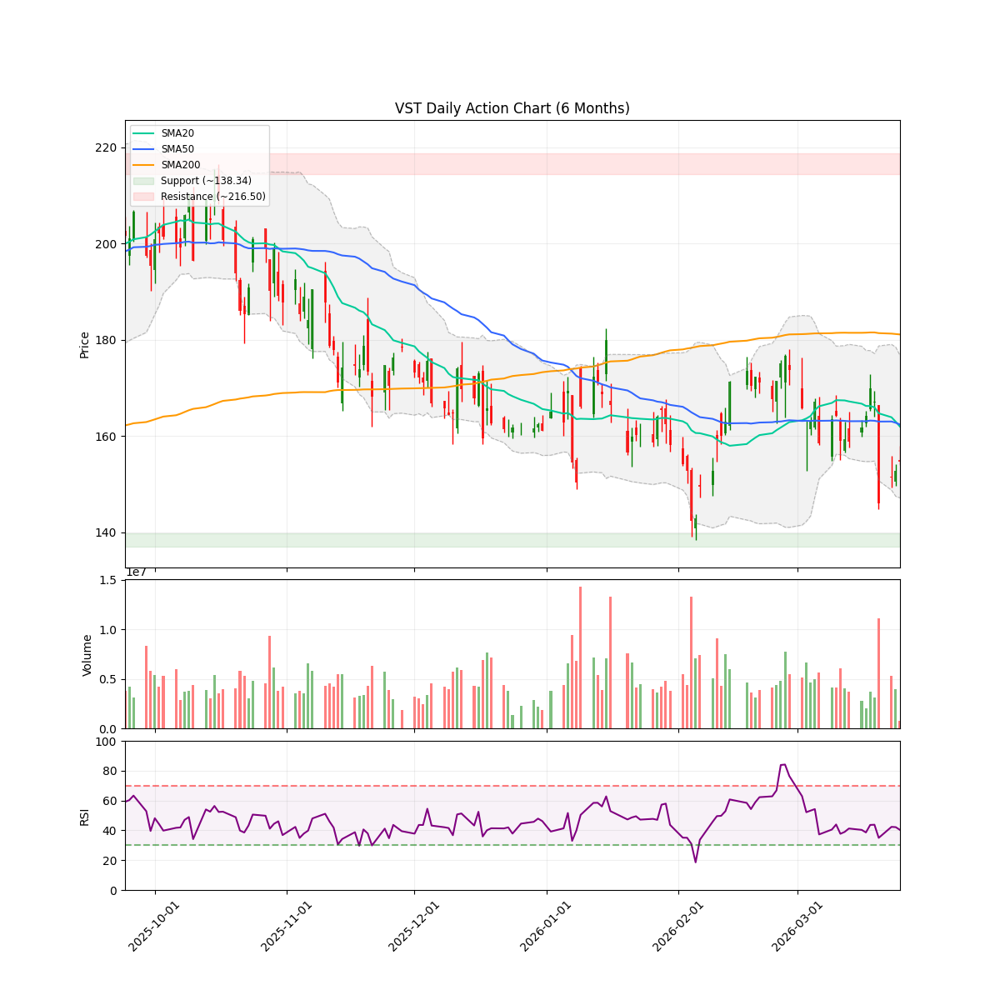
#### 研报分析

### 技术指标概览 (Technical Overview)
- **当前价格**: $154.68
- **RSI (14)**: 40.31
- **移动平均线**: SMA20: $161.92 | SMA50: $162.37 | SMA200: $181.08 (Bearish)
- **波动率**: ATR (14): 8.04 (预计周度波动: +/- $17.98)
- **关键位 (6m)**: 支撑位 $138.34 | 阻力位 $216.50
- **即时状态**: Below SMA50

你好！欢迎来到这场关于 **Vistra Corp (VST)** 的叙事经济学深度拆解。

坐在电脑前的你，如果看着 VST 最近的走势感到有些头晕，那是正常的。现在的 VST 就像是一个刚参加完狂欢派对、正处于严重“宿醉期”的明星。曾经它是 AI 算力与核能叙事中最耀眼的宠儿，但现在，市场正在无情地给它“挤水分”。

以下是基于当前市场情绪与叙事逻辑的审计报告：

### 1. 催化剂分类：谁在驱动，谁在喧嚣？

我们需要把杂音和真正的动力分开：

*   **A-Tier（核心驱动力）：机构信心的背书与基本面升维**
    *   **惠誉（Fitch）投资级上调 & AI 能源需求**：这是真正的底牌。惠誉将 VST 调升至投资级，意味着它不再是那个高杠杆的电力公司，而是成为了 AI 时代的基础设施。
    *   **摩根士丹利（Morgan Stanley）的坚定看好**：大摩认为它是 2026 年高回报的“便宜货”，这说明聪明钱还在寻找买点。
*   **B-Tier（次要利好）：大行的价格修正**
    *   **富国银行（Wells Fargo）下调目标价至 $234**：虽然从 $236 降了一点，但别忘了，目前的股价只有 $154。这意味着即便在大行眼里，它仍有约 **51% 的上涨空间**。
*   **C-Tier（市场杂音）：短期情绪波动**
    *   **Jim Cramer 的“贪婪警告”**：这种典型的逆向指标往往只影响散户。
    *   **除息前的 12.6% 暴跌**：这是情绪化的过度反应。这种由于股息或短期技术性抛售导致的下跌，通常不改变叙事核心。

---

### 2. 背离检测：好消息里的“陷阱”还是“黄金”？

**观察结论：看涨耗竭转为看跌挤压 (Bearish Overlap)**

目前的 VST 呈现出一种令人不安的**负背离**：尽管有着惠誉的升级和摩根士丹利的唱多，股价却像断了线的风筝，不仅跌破了 SMA50，甚至离 SMA200 也不远了。

*   **这是为什么？** 市场正在惩罚它之前的“过度溢价”。此前提到的 300-MW 电厂事故和 52 周涨幅过大，使得任何风吹草动（比如 Jim Cramer 的一句话）都能引发机构的获利了结。
*   **结论**：目前的下跌并非因为公司基本面烂了，而是因为**叙事暂时“断电”了**。市场在等待一个新的、更强力的理由来重新连接 AI 能源的电路。

---

### 3. 叙事评分：4.5/10 (短期阵痛期)

*   **逻辑核心**：目前的 VST 处于**“价值回归”**与**“情绪崩溃”**的交汇点。
*   **为何不是 0？** 因为基本面依然强劲（投资级评级、AI 刚需）。
*   **为何不是 10？** 趋势已破位。在重回 SMA50（162.37）上方之前，任何反弹都可能只是给“被套牢者”的逃命波。

---

### 4. 深度洞察：来自老手的“咖啡馆私房话”

“伙计，看 VST 的感觉就像看着一个曾经跑得太快的运动员在场边大口喘气。现在的 VST 不是基本面出了问题，而是**‘筹码结构’**出了问题。大家都想在 AI 能源这块肉上咬一口，结果人太多，把桌子挤塌了。

你要关注的是 **$138.34** 这个支撑位（6个月低点）。如果股价跌到那里，配上它现在的 RSI (40.31) 进一步探底，那可能就是机构重新进场的信号。现在的回调，其实是市场在清理那些‘拿不住’的浮动筹码。记住，当摩根士丹利说它是‘便宜货’时，他们通常是在暗示你，等大家恐慌抛售时，他们会在下面接着。”

---

### 5. 输出要求汇总

*   **Logic Score (逻辑评分)**: **4.5 / 10** (趋势偏弱，但核心叙事未改，处于超卖边缘的观察期)。
*   **引用的新闻链接**:
    *   [Fitch Ratings & AI Power Demand](https://finance.yahoo.com/news/vistra-vst-valuation-check-dual-210755319.html)
    *   [Morgan Stanley Bullish Thesis](https://finance.yahoo.com/news/morgan-stanley-bullish-vistra-corp-150605579.html)
    *   [Wells Fargo Target Trim](https://www.insidermonkey.com/blog/vistra-vst-price-target-trimmed-despite-strong-earnings-performance-1706799/)
*   **下个重大日期 (Next Major Date)**: 
    *   **2026年5月初** (预计 Q1 2026 财报发布日)。这将是验证电厂事故影响以及 AI 订单现金流是否兑现的关键时刻。

**投资提示**：在波动率 ATR 高达 8.04 的情况下，VST 现在的每一次心跳都很剧烈。不要在下坠时接飞刀，等它在支撑位附近企稳再说。
#### 近期新闻与事件
- **[Insider Monkey· via Yahoo Finance]** [Vistra (VST) Up Slightly After Jim Cramer Warned Against Getting Too Greedy](https://finance.yahoo.com/sectors/energy/articles/vistra-vst-slightly-jim-cramer-163028873.html)
- **[Insider Monkey· via Yahoo Finance]** [Vistra Corp. (VST) Loses 12.6% Ahead of Dividends](https://finance.yahoo.com/markets/stocks/articles/vistra-corp-vst-loses-12-084154911.html)
- **[Insider Monkey· via Yahoo Finance]** [Morgan Stanley is Bullish on Vistra Corp (VST) Here’s Why](https://finance.yahoo.com/news/morgan-stanley-bullish-vistra-corp-150605579.html)
- **[Simply Wall St.· via Yahoo Finance]** [Vistra (VST) Valuation Check After Dual Investment Grade Upgrades And Rising AI Power Demand](https://finance.yahoo.com/news/vistra-vst-valuation-check-dual-210755319.html)
- **[Barchart· via Yahoo Finance]** [NRG Energy Stock: Is NRG Underperforming the Utility Sector?](https://finance.yahoo.com/markets/stocks/articles/nrg-energy-stock-nrg-underperforming-040514732.html)

---
