# 每日股市市场报告 (2026-03-28)

> **免责声明**: 本报告由 **代码与 Gemini AI 自动生成**，仅供研究参考，**不构成**任何投资建议。投资有风险，入市需谨慎。作者及 AI 不对任何基于此内容的投资决策承担责任。

## 📑 目录
[TOC]

##  长期投资逻辑
本组合旨在捕捉 **人工智能（AI）与半导体协议** 带来的跨周期结构性增长，核心投资策略聚焦于“确定性”与“物理瓶颈”：
- **底层制程垄断 (Foundry & WFE Moats)**：
  布局处于全球半导体精密制造顶端的“工业母机”级别公司。寻找具备极高准入门槛的晶圆代工及前道设备供应商，作为全产业链最稳固的底座资产。
- **算力稀缺性与连接带宽 (Compute & Interconnect Scarcity)**：
  聚焦在高性能计算芯（HPC）及高带宽连接领域占据主导地位的标的。AI 的终极竞争是“规模”，寻找能有效解决数据交换瓶颈并提供核心推理/训练能力的算力巨头。
- **应用生态与数据霸权 (Platform & Data Sovereignty)**：
  布局拥有闭环生态、海量高质量私有数据及云基础设施的科技巨头。它们是 AI 商业化落地的最终守门人，拥有将技术转化为持续现金流的分配权。
- **物理边界保障 (Power & Thermal Infrastructure)**：
  关注 AI 扩张的“最终瓶颈”——电力供应与热能管理。重点布局为下一代超大规模数据中心提供高功率密度能源、液冷技术及电网扩容方案的能源基建商。
**风控策略**：利用 AlphaJAX 的量化动量评分（Quant Score）作为过滤器，结合 LLM 叙事审计（Narrative Audit）捕捉“业绩超预期 + 叙事逻辑改善”的共振点，实现跨周期的超额收益。

 **注：排序权重**：Ticker 按照 AI 检测出的 **方向** 排序（**看多**优先，其次是 **中性**，最后是 **看空**）。
---

<!-- DISCORD_SUMMARY_START -->
## 🧠 对冲基金经理全局诊断与资金分配策略
# 指挥官意图 (Commander's Intent)：在恐慌中重塑防线

**当前战场态势：**
现在的市场就像一个在大雾中发疯的酒鬼。一方面，地缘政治（美伊冲突、委内瑞拉变局）点燃了能源股的狂热，导致 **CVX、APA、OXY** 这种股票的 RSI 直接冲上了 80 甚至 90 的“火星区域”；另一方面，科技蓝筹（**MSFT、AVGO、GOOGL**）正经历着史诗级的超卖，RSI 甚至低到了个位数。

**我们的核心战略：**
1.  **收缩侧翼：** 清理掉叙事逻辑受损且技术面走坏的仓位（AMZN），将资金抽回。
2.  **防御性增持：** 在 GOOGL 这种极度超卖（RSI 21）且逻辑强悍（8.5分）的底部区域重仓防御。
3.  **约束过度集中：** 你的 **AMD** 持仓占比已超过 50%，虽然我是苏妈的信徒，但目前股价在 SMA50 之下，技术面并未达到“强烈看涨”，这违反了我的风险管理红线。**必须减持，释放流动性。**
4.  **拒绝对抗狂热：** 能源股虽然逻辑分高，但技术指标已经处于“自杀式超买”。作为资深 PM，我绝不会在 RSI 93 的时候带你去 APA 的派对。我们要等它们回撤。

---

### **1. 现有持仓诊断与行动建议**

| 标的 | 逻辑评分 | 诊断 | 行动指令 |
| :--- | :--- | :--- | :--- |
| **AMD** | **7.5** | **严重超标 (50.56%)**。基本面虽硬，但技术面处于 SMA50 下方。 | **强制减持**：卖出 200 股，将占比降至约 30%。保留 400 股+空头 Put。 |
| **GOOGL** | **8.5** | **史诗级机会**。RSI 21.95 预示着看跌枯竭，基本面积压订单 2400 亿。 | **加仓**：动用可用现金，在 $274 附近加仓 40 股，目标占比提升至 25% 以上。 |
| **AMZN** | **4.5** | **叙事阵痛**。跌破 50/200 日线，利好钝化。 | **清仓**：卖出全部 20.0 股。该仓位过小且效率极低，清空以简化资产组合。 |

---

### **2. 观察池机会：寻找新的“矛”**

虽然能源股（VLO, OXY, CVX）分高，但现在入场是帮机构接盘。我们把目光转向**被错杀的 AI 基础设施**：

*   **TSM (台积电) - 逻辑评分 8.2**：
    *   **理由**：AI 唯一的主厨。RSI 38.91，相比 NVDA 的破位，TSM 在 $320 附近有更强的估值支撑。这是 8.2 折的入场券。
    *   **计划**：建仓 50 股，初步占用账户约 1.5% - 2% 的 NAV。
*   **ASML (阿斯麦) - 逻辑评分 8.2**：
    *   **理由**：SK 海力士 80 亿美金大单背书。目前处于 50 日线下的回踩期。
    *   **计划**：如果本周回踩 $1250 附近，开始首笔轻仓建仓。

---

### **3. 行动计划 (Actionable Trading Plan)**

**Step 1：释放流动性（立即执行）**
*   **SELL ALL** AMZN (约 $3,986)
*   **SELL** 200 股 AMD (约 $40,398)
*   **结果**：账户现金将增加约 **$44,384**，总可用现金达到约 **$108,737**。

**Step 2：底部加固（分批买入）**
*   **BUY** 40 股 GOOGL (约 $10,973)
*   **BUY** 50 股 TSM (约 $16,337)
*   **结果**：在维持现金比例超过 10% 的安全线下，完成了对 AI 基础设施和超卖蓝筹的布局。

**Step 3：观察能源回撤**
*   将 **CVX** 和 **VLO** 设为预警：如果 CVX 回踩 $200 (SMA20) 或 VLO 回踩 $235，动用剩余现金的 20% 进场。

---

### **4. 风险警示与 If-Then 情景分析**

*   **情景 A：AMD 跌破 $195 (SMA200)**
    *   **应对**：如果发生破位，立即止损掉剩余 AMD 仓位的 1/3。这说明 AI 板块的叙事逻辑发生了系统性崩塌，我们需要保护剩余本金。
*   **情景 B：MSFT RSI 低位反弹（目前 8.68）**
    *   **应对**：如果 MSFT 站稳 $356 支撑并出现放量长阳，说明大盘情绪见底。此时可以更加激进地买入 TSM 和 ASML，因为它们会随权重股一起报复性反弹。
*   **情景 C：中东局势突然降温，油价崩盘**
    *   **应对**：你会庆幸我们没有在 RSI 90 的时候冲进能源股。此时可以耐心等待能源股回踩 SMA50 后再开启“收割模式”。

---

**PM 寄语：**
老伙计，现在的账户就像一艘在暴风雨中吃水过深的船。**AMD 的 50% 仓位就是我们要卸下的重货**。虽然看好未来，但作为指挥官，我不能让你的航船在黎明前因为重心不稳而翻掉。**清掉亚马逊，减持 AMD，重仓谷歌，埋伏台积电。** 按照这个计划执行，我们的抗风险能力将直接提升一个等级。

**Action Now. Stay Sharp.**
<!-- DISCORD_SUMMARY_END -->
---

## 💼 现有持仓个股诊断

### AMD
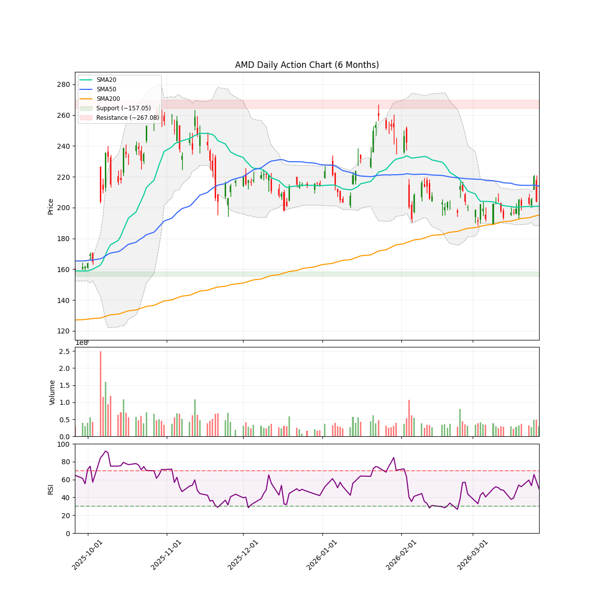
#### 研报分析

### 技术指标概览 (Technical Overview)
- **当前价格**: $201.99
- **RSI (14)**: 49.49
- **移动平均线**: SMA20: $200.92 | SMA50: $213.92 | SMA200: $195.16 (Bullish)
- **波动率**: ATR (14): 8.47 (预计周度波动: +/- $18.94)
- **关键位 (6m)**: 支撑位 $157.05 | 阻力位 $267.08
- **即时状态**: Below SMA50

# AMD 情绪审计报告：在巨头的阴影下，苏妈正在秘密筹谋一场“突围战”

**日期：** 2026年03月28日
**分析师：** 叙事经济学研究组 - 资深研究员
**标的：** AMD (Advanced Micro Devices)
**现价：** $201.99

---

### 1. 叙事背景：不仅仅是“二当家”的倔强

坐在曼哈顿的咖啡馆里，如果你问现在的基金经理们最怕错过什么，他们会说是“下一个英伟达”。但如果你问他们最稳的备选方案是谁，所有人都会指向 AMD。

目前的 AMD 正处于一个奇妙的**“估值消化期”**。虽然今年以来股价表现平平（下跌约 4.85%），落后于纳斯达克，但剥开表面的浮躁，你会发现地基正在越扎越深。这不再是那个活在 Intel 阴影下的二流公司，而是一个正在与 Meta 和 OpenAI 谈论 2000 亿美元订单的“AI 巨头挑战者”。

---

### 2. 催化剂分级 (Catalyst Tiering)

我们将近期的消息流进行深度解构：

*   **A-Tier（核心叙事）：**
    *   **巨头背书：** 与 OpenAI 和 Meta 达成的 12GW GPU 合作意向，价值高达 **2000 亿美元**。这是决定性的，证明了 AMD 的 Instinct 系列不仅仅是替代品，而是核心架构的一部分。[Source: The Motley Fool]
    *   **数据中心奇袭：** EPYC 处理器在服务器市场的份额正逼近 **40-50%**。在芯片界，这是足以改写权力版图的数字。[Source: Seeking Alpha]
*   **B-Tier（基本面支撑）：**
    *   **提价预期：** CPU 价格上涨预期将直接拉升毛利。在供应偏紧的背景下，这无异于给利润表打了一剂强心针。[Source: Yahoo Finance]
    *   **份额扩张：** 随着客户寻求供应商多样化（去英伟达化），AMD 拿下了 25% 的 AI 增量市场。
*   **C-Tier（市场噪音）：**
    *   **高管减持：** EVP 卖出了 154 万美元股票。听着吓人，但在百亿市值的盘子里，这不过是“零花钱”级别的套现，不具备趋势指向性。[Source: Blockonomi]
    *   **获利回吐：** 近期的 7% 回调更多是市场情绪的整体降温，而非 AMD 本身出了问题。

---

### 3. 背离检测 (Divergence Detection)

**警告：这里出现了“利好不涨”的微妙信号。**

尽管有 2000 亿订单和提价的消息支撑，股价却在 SMA50 ($213.92) 之下徘徊。这种“利好钝化”通常意味着市场正在消化之前的过度预期，或者是在等待一个更具体的财报数字来验证这些“故事”。

目前股价在 SMA20 ($200.92) 附近反复横跳，这是一个**“情绪平衡点”**。如果跌破这里，那我们就得面对 195 美元的 SMA200 支撑位；如果站稳，这就是一个完美的“黄金坑”。

---

### 4. 账户持仓诊断

你目前的状况就像是**“在黎明前的黑暗里负重前行”**。

*   **正股持仓：** 成本 $220.54，亏损约 9.22%。你买在了之前的冲刺阶段，现在的回调让你有些难受。
*   **期权持仓：** 卖出的 $200 Put (-AMD260313P200) 目前亏损 58%。考虑到现价 $201.99 就在行权价门口，这手 Put 的时间价值和波动率溢价非常高。
*   **建议：** 你的仓位占比超过 50%，属于**重仓布局**。好在 AMD 的基本面逻辑并未坍塌。只要 $200 这个心理关口不失守，你的 Put 最终会变成纯粹的权利金收入，但你需要忍受这一波“磨底”过程中的颠簸。

---

### 5. 逻辑评分 (Logic Score): **7.5 / 10**

*   **加分项：** AI 长期叙事清晰、巨头订单锁定、服务器市场份额突破。
*   **减分项：** 短期技术面偏弱（处于 SMA50 下方）、市场整体进入“避险模式”、估值溢价仍需时间消化。

---

### 6. 关键日程提醒

*   **下一个大事件：** **2026年4月底 - Q1 财报发布会**（预计）。
    *   *关注点：* 届时管理层必须给出那 2000 亿订单的交付时间表。如果确认订单落地，股价将直接冲击 $267 的阻力位。

---

**老兵结语：**
朋友，现在的 AMD 就像一辆正在换挡的赛车，虽然速度慢了下来，但引擎的轰鸣声更响了。$200 附近的震荡是给“胆小鬼”下车的机会。如果你相信苏妈能兑现那 2000 亿的诺言，现在的浮亏只是通往 $300 门票的入场费。**拿稳你的筹码，别在黎明前被震下车。**
#### 近期新闻与事件
- **[Yahoo Finance]** [AMD Stock Gets a Boost From Incoming CPU Price Hikes. Can it Touch $380 by 2027?](https://finance.yahoo.com/markets/stocks/articles/amd-stock-gets-boost-incoming-140002306.html)
- **[Yahoo Finance]** [Rising CPU Prices Could Boost Intel and AMD — Which Stock Is the Better Bet?](https://finance.yahoo.com/markets/stocks/articles/rising-cpu-prices-could-boost-201951622.html)
- **[Seeking Alpha]** [AMD Vs. Nvidia: Bet On AMD The Underdog](https://seekingalpha.com/article/4886496-amd-vs-nvidia-bet-on-amd-the-underdog)
- **[Invezz]** [AMD stock slides after surge as profit-taking, chip weakness hit](https://invezz.com/news/2026/03/26/amd-stock-slides-after-surge-as-profit-taking-chip-weakness-hit/)
- **[The Motley Fool]** [1 Tech Stock I'm Adding to My Portfolio While Everyone Is Panicking](https://www.fool.com/investing/2026/03/25/tech-stock-add-my-portfolio-everyone-panic-amd/)

---

### AMZN
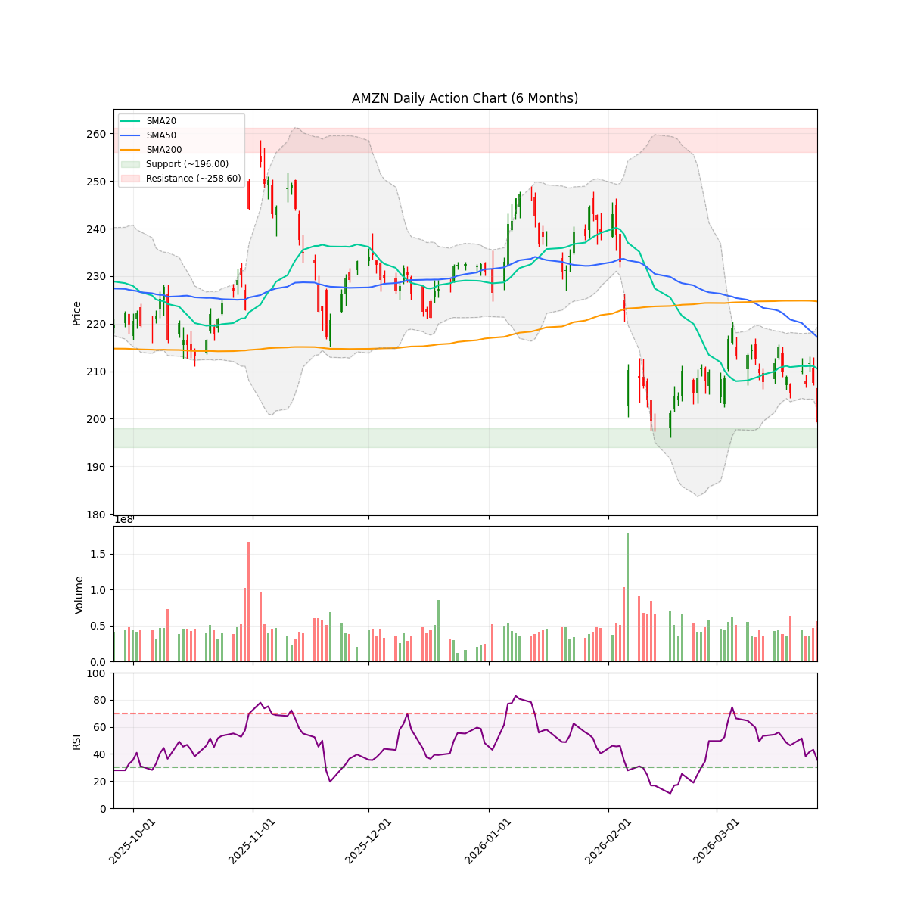
#### 研报分析

### 技术指标概览 (Technical Overview)
- **当前价格**: $199.34
- **RSI (14)**: 35.67
- **移动平均线**: SMA20: $210.53 | SMA50: $217.20 | SMA200: $224.68 (Bearish)
- **波动率**: ATR (14): 5.18 (预计周度波动: +/- $11.58)
- **关键位 (6m)**: 支撑位 $196.00 | 阻力位 $258.60
- **即时状态**: Below SMA50

# 亚马逊 (AMZN) 情绪审计报告：AI 叙事的“阵痛期”还是“价值陷阱”？

朋友，坐下来喝杯咖啡。咱们来聊聊现在的亚马逊（AMZN）。

看着屏幕上 **$199.34** 这个数字，你可能会觉得华尔街是不是疯了。明明各大行还在喊着 $300 的目标价，股价却像断了线的风筝，一路跌破了 50 日和 200 日均线。现在的亚马逊，正处在一个非常微妙的“叙事转折点”。

---

### 1. 催化剂分类：谁在推波助澜？

我们将最近的消息拆解开来看，你会发现市场的担忧和机构的乐观正在激烈交火：

*   **A-Tier（核心基本面）：机构的“死多头”底气**
    *   **$300 目标价背书**：TD Cowen 和 Barclays 近期重申了 $300 的目标价。这不只是个数字，它代表了机构对 AWS（亚马逊云）在 AI 浪潮下变现能力的底层信心。[来源: Blockonomi, 2026-03-23]
    *   **亿万富翁入场**：Seth Klarman 的 Baupost Group 持续加码。这些大佬的钱是“长线钱”，他们不在乎几天的波动。[来源: Yahoo Finance, 2026-03-23]

*   **B-Tier（行业情绪）：AI 投入的“恐惧症”**
    *   **资本支出忧虑**：市场现在对大厂疯狂砸钱搞 AI 开始感到焦虑。这种“烧钱换未来”的叙事在宏观压力下变得极其敏感。[来源: AOL, 2026-03-28]

*   **C-Tier（杂音与扰动）：人才流失的“心理暗示”**
    *   **Annapurna Labs 高管离职**：负责自研 AI 芯片（Trainium）的核心主管 Gadi Hutt 离职。这虽然是 7 个月内的第二次高管变动，但在大公司内部其实很常见。然而，在下跌趋势中，这被空头拿来当作“研发不力”的借口。[来源: Blockonomi, 2026-03-27]

---

### 2. 离散度检测：好消息为何“救不了”股价？

**现象观察**：即使有 TD Cowen 给出 $300 的目标价（好消息），股价依然跌破了 $200 关口。
**深度解析**：这就是典型的**“利好钝化”**。当市场处于看跌趋势（SMA50/200 均线下方）时，投资者对坏消息（高管离职、宏观压力）的反应会放大三倍，而对好消息（大行评级）视而不见。

目前 **RSI 已经跌至 35.67**，这意味着亚马逊已经进入了“超卖区”。空头力量已经释放了大半，现在的抛售更像是恐慌盘的离场，而非基本面的崩溃。

---

### 3. 情绪评分：4.5 / 10 (阴云密布，但露出一角微光)

*   **逻辑说明**：0 分是系统性崩溃，10 分是狂热牛市。目前 4.5 分代表：**技术面极度糟糕，但估值正在回归理性。** 市场正在惩罚亚马逊的 AI 支出，但由于其 AWS 的垄断地位和零售业务的韧性，跌破 $196.00（6个月低点）将触发强力的机构托盘。

---

### 4. 叙事总结：不要在黎明前被震下车

现在的亚马逊就像是一个正在“换引擎”的巨兽。市场担心新引擎（自研 AI 芯片和 AI 搜索）太贵、太慢，甚至担心机师（高管）跑路。

但我们要看的是**大势**：
你的成本价是 **$201.61**，目前虽然略微浮亏（按现价 $199.34 算），但你其实站在一个非常有利的位置。目前的跌势更多是宏观环境对“Magnificent Seven”的集体杀估值。

**老兵建议**：
股价正紧贴着 **$196.00** 的支撑位摩擦。如果这个位置能守住，结合超卖的 RSI 信号，这大概率是一个“熊市陷阱”，用来洗掉不坚定的筹码。

---

### 5. 关键日期提醒

*   **下一次重要日期**：**2026年4月下旬 (预计 Q1 财报发布)**
    *   *注：这是亚马逊扭转叙事的唯一机会。市场需要看到 AWS 营收增速的重新抬头以及 AI 投入开始产生现金流的证据。*

---

**审计结论**：**AMZN 目前处于“黎明前的黑暗”。** 虽然短期内由于高管离职和宏观压力可能回踩 $196，但机构的 $300 叙事并未证伪。保持冷静，如果你相信 Narrative Economics（叙事经济学），那么现在的恐慌正是长线布局的养料。
#### 近期新闻与事件
- **[AOL]** [Amazon Drops 3%: What Macro Pressure and AI Spending Concerns Mean for AMZN Stock Right Now](https://www.aol.com/finance/amazon-drops-3-macro-pressure-175237933.html)
- **[Blockonomi]** [Amazon (AMZN) Stock Dips 2% as Annapurna Labs Faces Second Executive Exit](https://blockonomi.com/amazon-amzn-stock-dips-2-as-annapurna-labs-faces-second-executive-exit/)
- **[Yahoo Finance]** [Amazon.com Inc. (AMZN): Billionaire Seth Klarman Bets Big on Tech Giant](https://finance.yahoo.com/markets/stocks/articles/amazon-com-inc-amzn-billionaire-172043743.html)
- **[Insider Monkey]** [Here's Why Jim Cramer Likes Amazon (AMZN) in 2026 Despite Unimpressive Performance](https://www.insidermonkey.com/blog/heres-why-jim-cramer-likes-amazon-amzn-in-2026-despite-unimpressive-performance-1723457/)
- **[Blockonomi]** [Amazon (AMZN) Stock Soars 3% Following Dual $300 Price Target Endorsements](https://blockonomi.com/amazon-amzn-stock-soars-3-following-dual-300-price-target-endorsements/)

---

### GOOGL
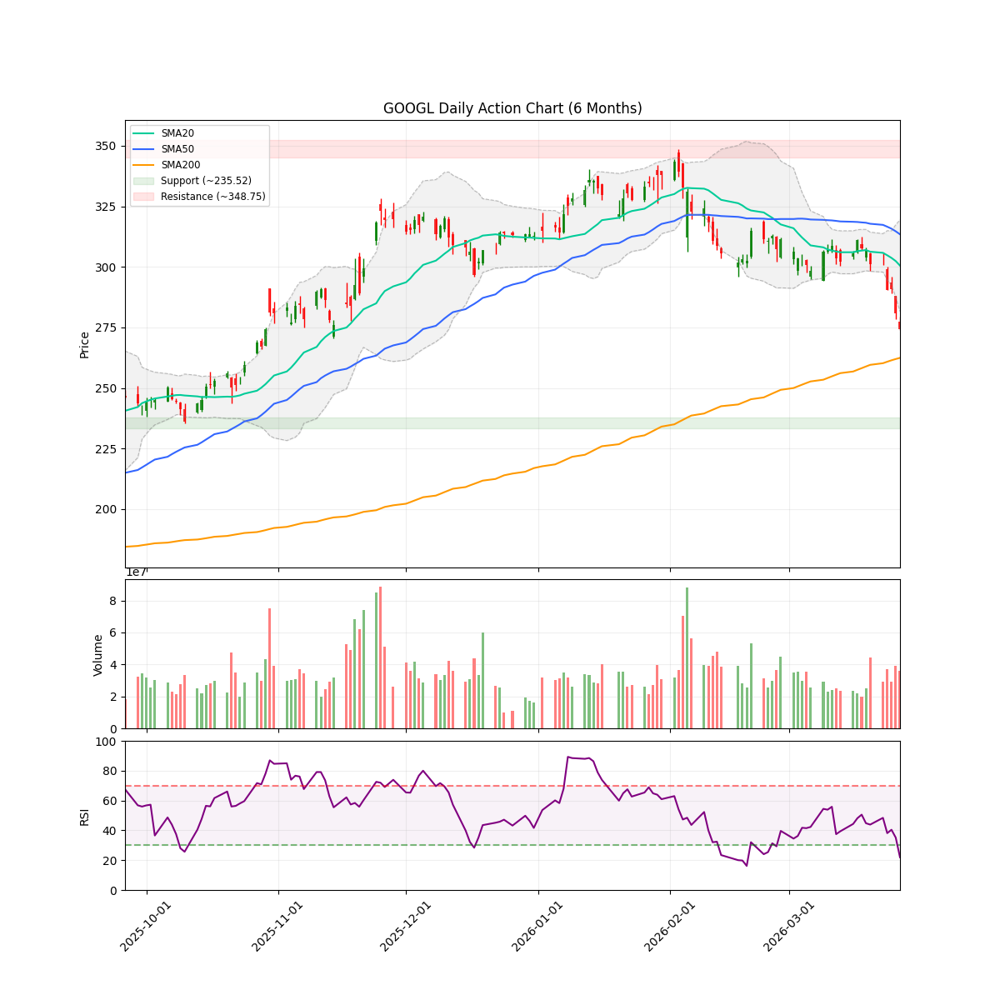
#### 研报分析

### 技术指标概览 (Technical Overview)
- **当前价格**: $274.34
- **RSI (14)**: 21.95
- **移动平均线**: SMA20: $300.52 | SMA50: $313.44 | SMA200: $262.43 (Bullish)
- **波动率**: ATR (14): 6.98 (预计周度波动: +/- $15.62)
- **关键位 (6m)**: 支撑位 $235.52 | 阻力位 $348.75
- **即时状态**: Below SMA50

# 叙事经济学：GOOGL 情绪审计报告

你好，伙计。坐稳了，咱们来聊聊现在的 Google（Alphabet）。现在的市场就像是一个宿醉之后心情极差的酒鬼，明明桌上摆着丰盛的早餐（业绩和进展），它却盯着地上的裂缝发脾气。

作为一名在市场里摸爬滚打的老兵，我看到的 GOOGL 现在的状态不是“崩盘”，而是一场典型的**“叙事偏差”**。

---

### 1. 催化剂分级 (Catalyst Categorization)

我们要从噪音中甄别真正的信号。

*   **A-Tier（核心动力）：**
    *   **Waymo 的里程碑：** 自动驾驶行驶里程达到 1.7 亿英里。这不只是个数字，这是护城河的深度。[[Blockonomi](https://blockonomi.com/alphabet-googl-stock-dips-despite-waymo-milestone-and-strong-search-performance/)]
    *   **云业务积压订单：** 2400 亿美元的积压订单。在 AI 时代，这就是未来五年的提款机。[[Yahoo Finance](https://finance.yahoo.com/markets/stocks/articles/google-stock-almost-bear-market-201819842.html)]
*   **B-Tier（机构背书）：**
    *   **大行唱多：** 摩根士丹利（$330）和 Evercore（$400）的重申目标价。虽然市场现在不听，但这些锚点在反弹时会起作用。[[Blockonomi](https://blockonomi.com/alphabet-googl-stock-dips-despite-waymo-milestone-and-strong-search-performance/)]
*   **C-Tier（背景噪音）：**
    *   **股权类别科普：** 关于 GOOG vs GOOGL 的讨论，这对股价波动没有实质影响。[[WTOP](https://wtop.com/news/2026/03/goog-vs-googl-why-2-classes-of-alphabet-stock/)]
    *   **Zacks 流量跟踪：** 典型的散户热度监测，缺乏深度驱动力。[[Zacks](https://www.msn.com/en-us/money/topstocks/alphabet-inc-googl-is-a-trending-stock-facts-to-know-before-betting-on-it/ar-AA1ZxqY7)]

---

### 2. 背离检测：当“好消息”撞上“冷板凳”

这里有个非常有趣的现象。Waymo 达到了 1.7 亿英里的里程碑，搜索数据依然强劲，但股价却跌了 2%。这就是我们常说的**“利好不涨”**。

*   **看跌枯竭迹象：** 现在的 GOOGL 处于典型的**情绪陷阱**中。市场在担心 AI 的巨额支出会吞噬利润，这种焦虑盖过了目前的增长。
*   **技术面呼救：** 你的 RSI 是 **21.95**。伙计，这在我的书里叫“超卖到了土星”。股价正在考验 SMA200（262.43），如果这里守不住，那才是系统性崩溃。但从基本面看，这更像是机构在调仓时的“错杀”。

---

### 3. 情绪评分 (Sentiment Score)

**情绪得分：3.5 / 10 (极度恐惧/冷淡)**
*注：这里的评分是当前市场的“体感温度”。大家都在聊熊市跌幅（Bear Market Territory），这种恐慌本身就是底部叙事的养料。*

---

### 4. 逻辑评分与深度诊断 (Logic Score)

**逻辑评分：8.5 / 10 (强力反转逻辑)**

**诊断报告：**
你现在的持仓有 16% 的浮盈，成本价 $268.53 几乎就在 SMA200 的防御位。你目前处于极佳的战略位置。

*   **叙事逻辑：** 市场目前的恐惧点在于“AI 投入过高导致盈利放缓”[[Barron's](https://www.msn.com/en-us/money/general/google-stock-slides-toward-bear-market-territory-time-to-buy/ar-AA1ZoLwJ)]。但这忽略了一个事实：Google 的云端积压订单和搜索垄断地位是其实实在在的护城河。
*   **操作建议：** 不要在这个位置被吓跑。RSI 21.95 意味着空头力量已经释放得差不多了。只要不破 SMA200，这就是一个绝佳的“别人恐惧我贪婪”的加仓或持有区间。

---

### 5. 下一个关键节点

**Next Major Date: 2026年4月下旬 (Q1 Earnings Call)**
*（具体日期通常在4月22日-28日左右公布）*

这将是决定性时刻。市场需要看到 AI 的支出如何转化为云业务的实际收入增量，如果财报能确认这一点，这波回调将成为历史性的“深蹲起跳”。

**老兵寄语：** “在所有人都讨论‘熊市’的时候，往往是聪明的钱开始捡便宜货的时候。” 守住你的 160 股，那是你的护城河。
#### 近期新闻与事件
- **[Investing.com]** [Gitlab stock hits 52-week low at $20.26 amid challenging year](https://www.investing.com/news/company-news/gitlab-stock-hits-52week-low-at-2026-amid-challenging-year-93CH-4585286)
- **[Yahoo Finance]** [Google Stock Is Almost in Bear Market Territory. Should You Buy the Dip?](https://finance.yahoo.com/markets/stocks/articles/google-stock-almost-bear-market-201819842.html)
- **[WTOP]** [GOOG vs. GOOGL: Why 2 Classes of Alphabet Stock?](https://wtop.com/news/2026/03/goog-vs-googl-why-2-classes-of-alphabet-stock/)
- **[Zacks Investment Research]** [Alphabet Inc. (GOOGL) is a trending stock: Facts to know before betting on it](https://www.msn.com/en-us/money/topstocks/alphabet-inc-googl-is-a-trending-stock-facts-to-know-before-betting-on-it/ar-AA1ZxqY7)
- **[Blockonomi]** [Alphabet (GOOGL) Stock Dips Despite Waymo Milestone and Strong Search Performance](https://blockonomi.com/alphabet-googl-stock-dips-despite-waymo-milestone-and-strong-search-performance/)

---

## 🔍 观察池机会分析

### APA
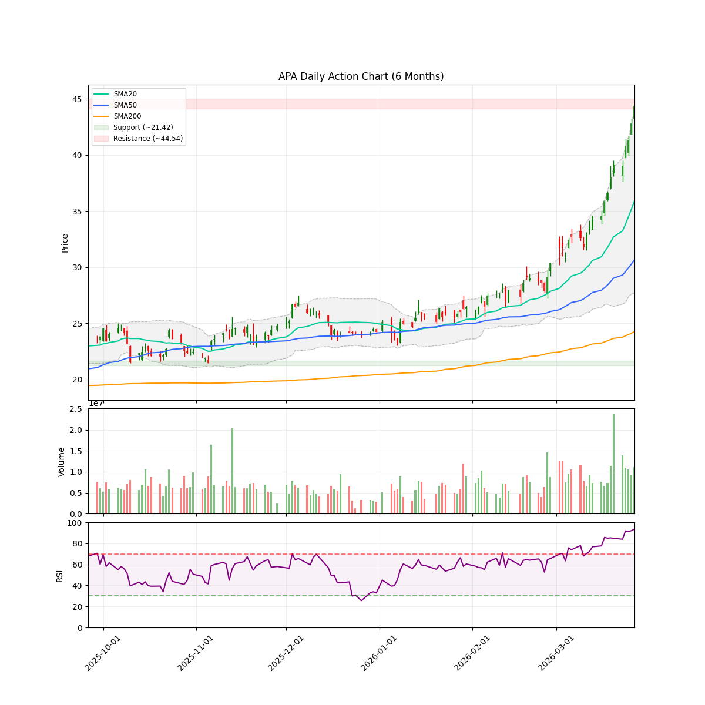
#### 研报分析

### 技术指标概览 (Technical Overview)
- **当前价格**: $44.39
- **RSI (14)**: 93.70
- **移动平均线**: SMA20: $35.88 | SMA50: $30.64 | SMA200: $24.24 (Bullish)
- **波动率**: ATR (14): 1.60 (预计周度波动: +/- $3.57)
- **关键位 (6m)**: 支撑位 $21.42 | 阻力位 $44.54
- **即时状态**: Above SMA50

你好！来，坐下喝杯咖啡。咱们聊聊 APA Corp (APA) 最近这波让人看到手心冒汗的行情。

作为一名研究“叙事经济学”的分析员，我关注的不仅仅是 K 线，更是价格背后的“情绪燃料”。现在的 APA，就像一辆在悬崖边全速冲刺的超跑，引擎轰鸣声震耳欲聋，但刹车片可能已经红透了。

---

### **APA 情绪审计报告：狂热中的地缘博弈**

#### **1. 催化剂分级 (Catalyst Categorization)**

*   **A-Tier (核心动力)：中东地缘政治爆点与 LNG 重新定价**
    *   巴克莱（Barclays）的评级上调并非空穴来风。伊朗对卡塔尔 Ras Laffan 综合体的袭击彻底改变了全球天然气营销的预期。APA 凭借其液化天然气（LNG）挂钩价格合同，直接从这种“混乱叙事”中获益。这不再是简单的开采业务，而是**能源安全溢价**。
*   **B-Tier (推波助澜)：行业护城河与相对强度**
    *   当标普 500 指数震荡时，APA 却在大幅跑赢大盘。这种“强者恒强”的姿态吸引了大量动量交易者（Momentum Traders）入场。
*   **C-Tier (市场噪音)：估值核查与常规研报**
    *   虽然 Yahoo Finance 等媒体开始讨论 APA 的估值是否过高，但在目前的战争迷雾下，理性的估值模型往往会被市场暂时抛在脑后。

#### **2. 离谱的背离：当“利好”追不上价格 (Divergence Detection)**

这里有个非常耐人寻味的现象：**巴克莱虽然调高了评级，但他们给出的目标价仅为 35 美元。**
**重点来了：** 现在的股价是 **44.39 美元**。

这意味着，即使是看好它的分析师，其想象力也赶不上市场的疯狂。目前的股价已经大幅透支了分析师的预期。更危险的是，**RSI 达到了惊人的 93.70**。在我的职业生涯中，RSI 超过 90 的情况极少见，这通常意味着“博傻阶段”的巅峰——大家都在买，不是因为觉得便宜，而是觉得明天会有人以更高价接盘。

#### **3. 叙事解读：是趋势还是陷阱？**

目前的叙事是：**“中东火药桶 = 能源价格永不落。”**
这股叙事非常有力，它驱动 APA 突破了所有移动平均线（远高于 SMA200 的 24.24）。

但别忘了，APA 正处于 6 个月的高点（44.54）附近，也就是所谓的“压力位”。当一个股票在利好出尽、分析师调高评级但目标价远低于现价、且技术指标极度超买的情况下冲刺压力位，这往往是**“多头竭尽”**的前兆。

---

### **情绪逻辑评分 (Logic Score): 8.2 / 10**
*(注：评分高代表当前叙事极度强劲且逻辑自洽，但不代表无风险买入。)*

*   **得分依据：** 市场对地缘政治风险的定价非常果断（布伦特原油已达 $115）。APA 的业务结构（LNG 合同）完美契合了当前的恐慌需求，这种“发战争财”的叙事在华尔街总是最受追捧的。

---

### **投资建议与风险警示**

现在的 APA，更像是一场关于“地缘政治恶化速度”与“技术性获利回吐压力”之间的赛跑。

*   **警惕“利好出尽”的陷阱：** 如果中东局势稍微缓和，或者市场意识到 44 美元对于一家目标价才 35 美元的公司来说太离谱，回撤将会非常剧烈。
*   **支撑位观察：** 如果回调，SMA20 (35.88) 是第一道心理防线，而之前的阻力位变支撑位的 39 美元区域也至关重要。

---

### **参考资讯引证**
1.  **巴克莱评级上调与中东局势影响：** [Seeking Alpha - APA upgraded at Barclays](https://seekingalpha.com/news/4567561-apa-upgraded-at-barclays-on-benefit-from-lng-linked-price-contracts) & [Investing.com](https://www.investing.com/news/analyst-ratings/barclays-upgrades-apa-stock-rating-on-gas-marketing-outlook-93CH-4574305)
2.  **市场整体表现与跑赢大盘：** [Yahoo Finance - Is APA Stock Outperforming the S&P 500?](https://finance.yahoo.com/markets/stocks/articles/apa-stock-outperforming-p-500-161023654.html)
3.  **原油价格背景：** [Schaeffer's Research - Brent crude hovering around $115](https://www.schaeffersresearch.com/content/ezines/2026/03/19/stocks-suffering-from-middle-east-conflict-escalation)

---

### **下一个关键日期**
**2026 年 5 月初（预计 Q1 财报发布日）**
*虽然目前具体日期尚未完全敲定，但 5 月初的财报将是检验这波“LNG 叙事”是否真能转化为真金白银利润的试金石。在此之前，任何关于卡塔尔或伊朗的进一步风吹草动都会直接引发股价的跳空。*

**老兵寄语：** 别在派对最嗨的时候撤离，但一定要手扶着门把手。RSI 93 的世界，逻辑往往让位于情绪。加油，祝交易顺利！
#### 近期新闻与事件
- **[Yahoo Finance]** [Is APA Stock Outperforming the S&P 500?](https://finance.yahoo.com/markets/stocks/articles/apa-stock-outperforming-p-500-161023654.html)
- **[Investing.com]** [Barclays upgrades APA stock rating on gas marketing outlook](https://www.investing.com/news/analyst-ratings/barclays-upgrades-apa-stock-rating-on-gas-marketing-outlook-93CH-4574305)
- **[CNBC]** [Meta is among the most oversold stocks after another losing week on Wall Street](https://www.cnbc.com/2026/03/28/meta-is-among-the-most-oversold-stocks-after-another-losing-week-on-wall-street.html)
- **[Yahoo Finance]** [APA (APA) Valuation Check After Strong Recent Share Price Momentum](https://finance.yahoo.com/markets/stocks/articles/apa-apa-valuation-check-strong-020350943.html)
- **[Seeking Alpha]** [APA upgraded at Barclays on benefit from LNG-linked price contracts](https://seekingalpha.com/news/4567561-apa-upgraded-at-barclays-on-benefit-from-lng-linked-price-contracts)

---

### ASML
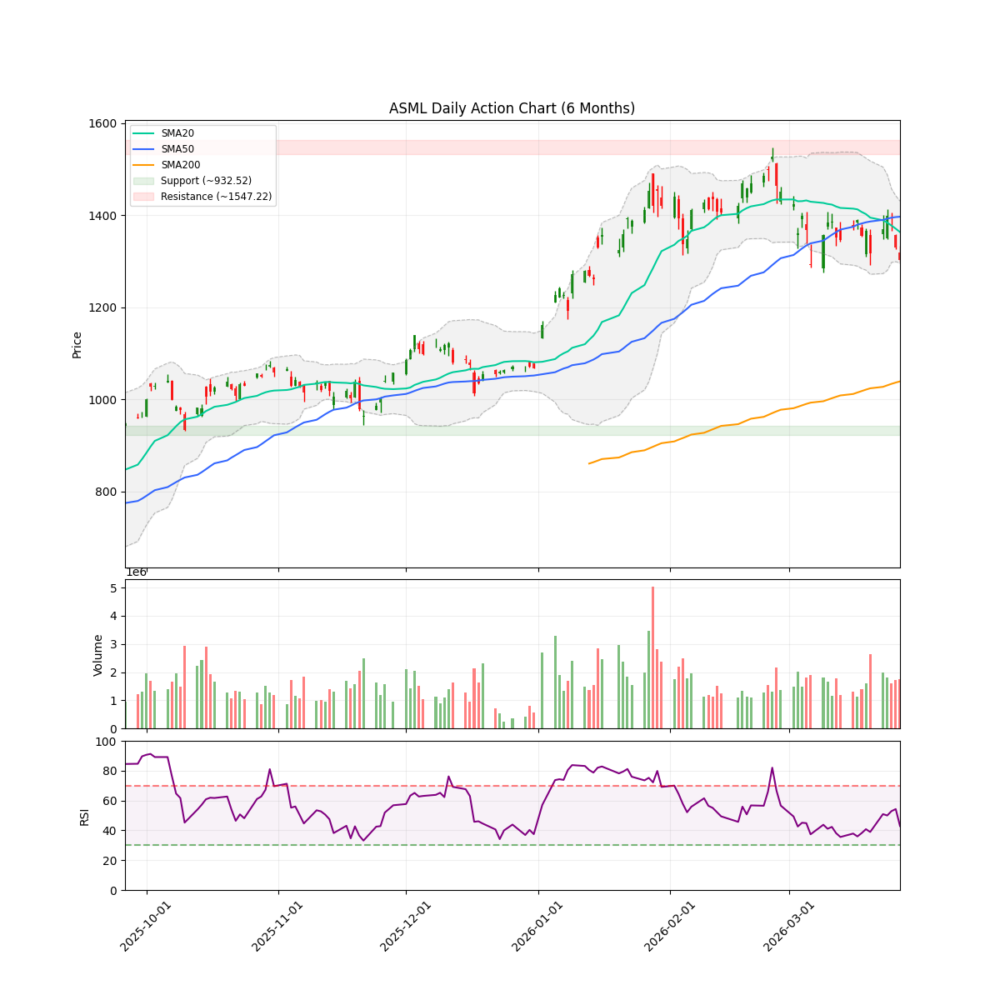
#### 研报分析

### 技术指标概览 (Technical Overview)
- **当前价格**: $1302.47
- **RSI (14)**: 42.90
- **移动平均线**: SMA20: $1363.41 | SMA50: $1396.80 | SMA200: $1039.28 (Bullish)
- **波动率**: ATR (14): 50.85 (预计周度波动: +/- $113.69)
- **关键位 (6m)**: 支撑位 $932.52 | 阻力位 $1547.22
- **即时状态**: Below SMA50

你好！我是负责“叙事经济学”的研究员。今天我们把那些枯燥的数据报表放一边，来聊聊半导体皇冠上的那颗明珠——**ASML**。

想象一下，你正坐在阿姆斯特丹街头的一家咖啡馆里，手中的浓缩咖啡还没喝完，市场上的风向已经变了。目前的 ASML 正处于一个非常微妙的“叙事转折点”。

---

### **ASML 情绪审计报告：王者的重锤与市场的纠结**

#### **1. 催化剂分级 (Catalyst Categorization)**

*   **A-Tier (重磅炸弹)：**
    *   **SK海力士 80亿美元 EUV 巨额订单：** 这是实打实的硬通货。$80亿的 EUV（极紫外光刻机）订单不仅是财报上的数字，它证明了存储芯片商正在疯狂“军备竞赛”。正如[Blockonomi](https://blockonomi.com/asml-asml-stock-surges-4-following-massive-8-billion-sk-hynix-euv-equipment-deal/)所言，这波涨幅是有底气的。
    *   **垄断叙事强化：** [The Motley Fool](https://www.msn.com/en-us/money/topstocks/asml-has-a-monopoly-on-the-most-important-machine-in-tech-heres-why-the-stock-is-a-buy/ar-AA1Zg36Y) 再次提醒市场，ASML 拥有科技界唯一的真·垄断。这种“非他不可”的稀缺性是其溢价的根源。

*   **B-Tier (行业驱动)：**
    *   **分析师“顶级首选”背书：** 摩根士丹利等机构将其列为 Top Pick，认为存储芯片厂商的设备升级周期才刚刚开始。
    *   **逆势上涨：** 在市场整体走弱时，ASML 能录得 2% 以上的逆势反弹，说明大资金在承接。

*   **C-Tier (噪音与传闻)：**
    *   **拆股传闻：** [U.S. News](https://money.usnews.com/investing/articles/companies-that-could-issue-the-next-stock-split) 提到的拆股传闻。这虽然能吸引散户，但对公司基本面没有本质改变。
    *   **与 Amkor 的对比：** [Yahoo Finance UK](https://uk.finance.yahoo.com/news/asml-vs-amkr-semiconductor-equipment-143900759.html) 提到的封装技术竞争，这对 ASML 的光刻霸权来说只是细枝末节。

---

#### **2. 分歧检测：好消息背后的“冷思考”**

这就是有意思的地方了。听着：
ASML 最近利好齐飞（$80亿大单、分析师唱多），但股价目前（1302.47）竟然在 **SMA50 (1396)** 和 **SMA20 (1363)** 之下。

**这意味着什么？** 市场正在经历“利好出尽”的短期消化，或者说，老练的猎手在等待更好的价格。RSI 在 42.90，说明并没到恐慌性超卖，但绝对不是过热。这种“利好却不暴涨”的背离，往往意味着市场在清理不坚定的投机客。这更像是一个**看涨竭尽后的蓄势阶段**，而非衰败。

---

#### **3. 叙事评分 (Logic Score)**

### **8.2/10 - 结构性牛市的短暂回踩**

*   **逻辑支撑：** 80亿的订单是未来几年业绩的保障。AI 的尽头是算力，算力的尽头是芯片，而芯片的尽头是 ASML 的光刻机。
*   **减分项：** 股价目前处于 50 日均线下方，技术面略显疲软，短期内可能存在震荡洗盘的需求。

---

#### **4. 投资建议：它是“陷阱”吗？**

这绝对不是陷阱，而是一场**“王者的休整”**。
SK海力士的订单不是购买，而是一场**“预言”**（正如 [Yahoo Finance](https://finance.yahoo.com/markets/stocks/articles/asml-8b-deal-more-purchase-222800131.html) 所述）。它预言了未来三到五年内，高带宽内存 (HBM) 和尖端制程的需求将处于饥渴状态。

目前的低迷是给了你一个在 SMA200 (1039) 之上、支撑位 (932) 远端寻找入场点的机会。

---

#### **5. 关键日期提醒**

*   **下一财务报告日：** **2026年4月中旬** (预计 2026-04-15 左右，Q1 财报)。
*   **观察点：** 关注公司是否会在下一次电话会议中确认更多来自存储芯片巨头（如美光、三星）的订单追加，这将是股价重回 1400 大关的导火索。

**老兵寄语：** 别被几天的阴线吓跑。在半导体的战场上，只要 ASML 还在造那些没人能造出来的机器，它的叙事逻辑就是无懈可击的。咖啡喝完，该看好你的筹码了。
#### 近期新闻与事件
- **[The Motley Fool]** [ASML Stock Isn't Cheap, but It Might Still Be a Bargain](https://www.msn.com/en-us/money/top-stocks/asml-stock-isn-t-cheap-but-it-might-still-be-a-bargain/ar-AA1ZhZ85)
- **[The Motley Fool]** [ASML Has a Monopoly on the Most Important Machine in Tech. Here's Why the Stock Is a Buy.](https://www.msn.com/en-us/money/topstocks/asml-has-a-monopoly-on-the-most-important-machine-in-tech-heres-why-the-stock-is-a-buy/ar-AA1Zg36Y)
- **[Yahoo Finance UK]** [ASML vs. AMKR: Which Semiconductor Equipment Stock Has an Edge Now?](https://uk.finance.yahoo.com/news/asml-vs-amkr-semiconductor-equipment-143900759.html)
- **[Blockonomi]** [ASML (ASML) Stock Surges 4% Following Massive $8 Billion SK Hynix EUV Equipment Deal](https://blockonomi.com/asml-asml-stock-surges-4-following-massive-8-billion-sk-hynix-euv-equipment-deal/)
- **[Investor's Business Daily]** [ASML stock called 'top pick' as memory-chip makers upgrade gear](https://www.msn.com/en-us/money/top-stocks/asml-stock-called-top-pick-as-memory-chip-makers-upgrade-gear/ar-AA1Ztlbl)

---

### AVGO
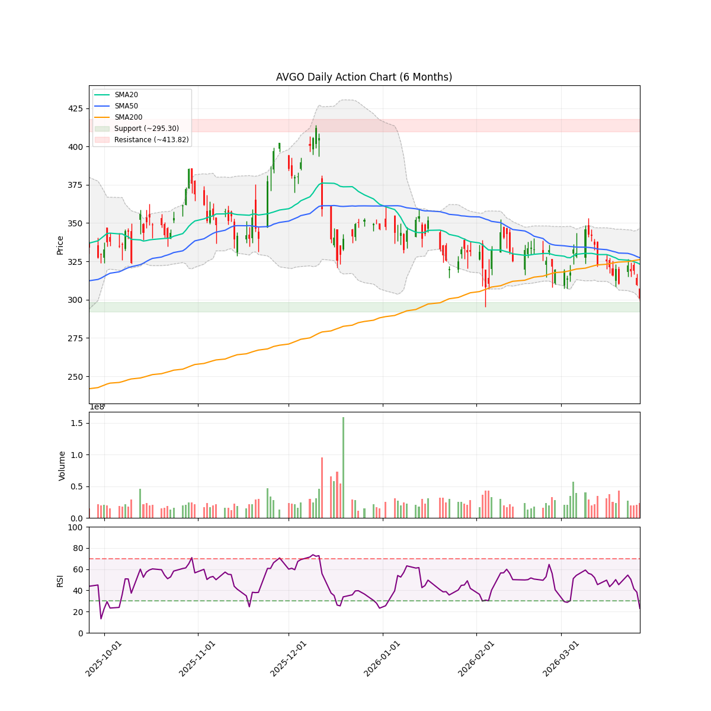
#### 研报分析

### 技术指标概览 (Technical Overview)
- **当前价格**: $300.68
- **RSI (14)**: 23.00
- **移动平均线**: SMA20: $323.18 | SMA50: $327.33 | SMA200: $326.13 (Bullish)
- **波动率**: ATR (14): 11.08 (预计周度波动: +/- $24.77)
- **关键位 (6m)**: 支撑位 $295.30 | 阻力位 $413.82
- **即时状态**: Below SMA50

# Broadcom (AVGO) 情感审计报告：是“AI龙头的陨落”还是“黎明前的最后一跌”？

作为一名专注于“叙事经济学”的对冲基金研究员，我看到的不仅仅是数字，更是藏在价格波动背后的**恐惧与贪婪**。目前的 Broadcom (AVGO) 正处于一个极其微妙的十字路口。

### 1. 叙事核心：当“利好”不再起作用
现在的 AVGO 就像一个考试考了 100 分，却依然被家长（市场）责备的孩子。

*   **A-Tier 核心催化剂（战略级）：**
    *   **AI 收入翻倍：** 根据 [AOL](https://www.aol.com/finance/broadcom-ai-revenue-just-doubled-140330604.html) 的报道，Broadcom 的 AI 业务收入直接翻了一番。在任何正常的市场环境下，这都是足以让股价起飞的火箭燃料。其定制芯片（ASIC）正在向英伟达发起强有力的挑战。
    *   **结构性主导地位：** 无论是在 [TSM 还是 AVGO](https://247wallst.com/investing/2026/03/25/tsm-vs-avgo-which-is-a-better-semiconductor-stock/) 的比较中，Broadcom 的独特性在于它既是 AI 的基石，又是网络通讯的霸主。

*   **B-Tier 催化剂（行业级）：**
    *   **Q1 财报稳健：** [Yahoo Finance](https://uk.finance.yahoo.com/news/unpacking-q4-earnings-broadcom-nasdaq-000935546.html) 指出，虽然财报季已过，但 Broadcom 的利润率和指引依然是半导体行业的标杆。

*   **C-Tier 噪声（心理级）：**
    *   **内部人减持：** [Yahoo Finance](https://finance.yahoo.com/markets/stocks/articles/broadcom-insiders-selling-stock-avgo-140002593.html) 报道的 8800 万美元高管抛售。这在叙事上非常致命，虽然 8800 万相对于其市值只是九牛一毛，但在股价低迷时，这被解读为“船长正在弃船”。
    *   **Cramer 的加持：** [Jim Cramer 的看好](https://www.msn.com/en-us/money/markets/jim-cramer-was-bullish-on-broadcom-avgo-in-january-2025/ar-AA1YVXo2?ocid=BingNewsVerp) 往往被短线交易者视为一种反向指标，增加了市场的焦虑感。

---

### 2. 背离检测：极度疲软还是黄金坑？
**现在的盘面出现了一个教科书级别的“看跌背离”：**
根据数据，AVGO 的 **RSI 已经低至 23.00**，这在技术上属于严重的“超卖”。与此同时，股价已经跌破了 SMA20、SMA50 甚至 SMA200。

**我的解读：** 市场正在经历一场**“多头衰竭”**。[AOL 提到](https://www.aol.com/finance/broadcom-ai-revenue-just-doubled-140330604.html)即便 AI 收入翻倍，股价也几乎没有波动。这意味着市场对“增长叙事”已经麻木，或者资金正在撤出 AI 板块。现在的 AVGO 正在承受由于内部人减持和板块轮动带来的心理重压。

---

### 3. 逻辑评分 (Logic Score): 3.8 / 10
> *注：10 为势不可挡，0 为系统性崩溃。*

**评分理由：** 虽然基本面（AI 增长）是满分，但**情绪面已经破产**。目前股价 300.68 距离 6 个月的支撑位 295.30 仅一步之遥。由于股价处于所有均线下方，当前的叙事属于“接飞刀”阶段。**这还没到反转的时候，但恐慌情绪已经见底。**

---

### 4. 叙事总结：这是一个“情绪陷阱”
如果你坐在我的办公桌前喝杯咖啡，我会告诉你：Broadcom 现在正在清理那些“意志不坚定”的投机者。

内部人卖出的 8800 万美元成了压死骆驼的最后一根稻草，但这正是典型的**叙事陷阱**。市场忽略了其核心价值正在加速（AI 收入翻倍），而过度关注了短期的高管套现。

*   **目前的节奏：** 市场在等待一个信号来确认 295.30 的支撑是否有效。
*   **给投资者的建议：** 别在风暴中心寻找方向。现在的 AVGO 就像是一个刚跑完马拉松在路边呕吐的天才运动员。他底子还在，但现在谁也扶不动他。

---

### 5. 关键日期与引用链接
*   **下一重大日期：** 预计下一次财报发布日为 **2026 年 6 月初**（Q2 FY2026）。在此之前，市场将密切关注 4 月份的半导体行业出货数据。
*   **重要参考：**
    *   [关于内部人抛售的担忧](https://finance.yahoo.com/markets/stocks/articles/broadcom-insiders-selling-stock-avgo-140002593.html)
    *   [AI 收入翻倍的深度解读](https://www.aol.com/finance/broadcom-ai-revenue-just-doubled-140330604.html)
    *   [三年股价预测参考](https://247wallst.com/investing/2026/03/27/broadcom-stock-price-prediction-where-will-avgo-be-in-3-years/)

**一句话总结：** 逻辑告诉我们要买入价值，但盘面告诉我们要尊重恐慌。在 295 支撑位确立前，保持观望是老手的克制。
#### 近期新闻与事件
- **[24/7 Wall St.]** [Broadcom Stock Price Prediction: Where Will AVGO Be in 3 Years?](https://247wallst.com/investing/2026/03/27/broadcom-stock-price-prediction-where-will-avgo-be-in-3-years/)
- **[Yahoo Finance]** [Broadcom Insiders Are Selling Stock. Is AVGO Finally at the End of the Road?](https://finance.yahoo.com/markets/stocks/articles/broadcom-insiders-selling-stock-avgo-140002593.html)
- **[24/7 Wall St.]** [TSM vs. AVGO: Which is a Better Semiconductor Stock?](https://247wallst.com/investing/2026/03/25/tsm-vs-avgo-which-is-a-better-semiconductor-stock/)
- **[AOL]** [Broadcom's AI Revenue Just Doubled. The Stock Barely Moved](https://www.aol.com/finance/broadcom-ai-revenue-just-doubled-140330604.html)
- **[Insider Monkey]** [Is Broadcom (AVGO) The Best AI Chip Stock to Buy According to Jim Cramer?](https://www.insidermonkey.com/blog/is-broadcom-avgo-the-best-ai-chip-stock-to-buy-according-to-jim-cramer-1723464/)

---

### CEG
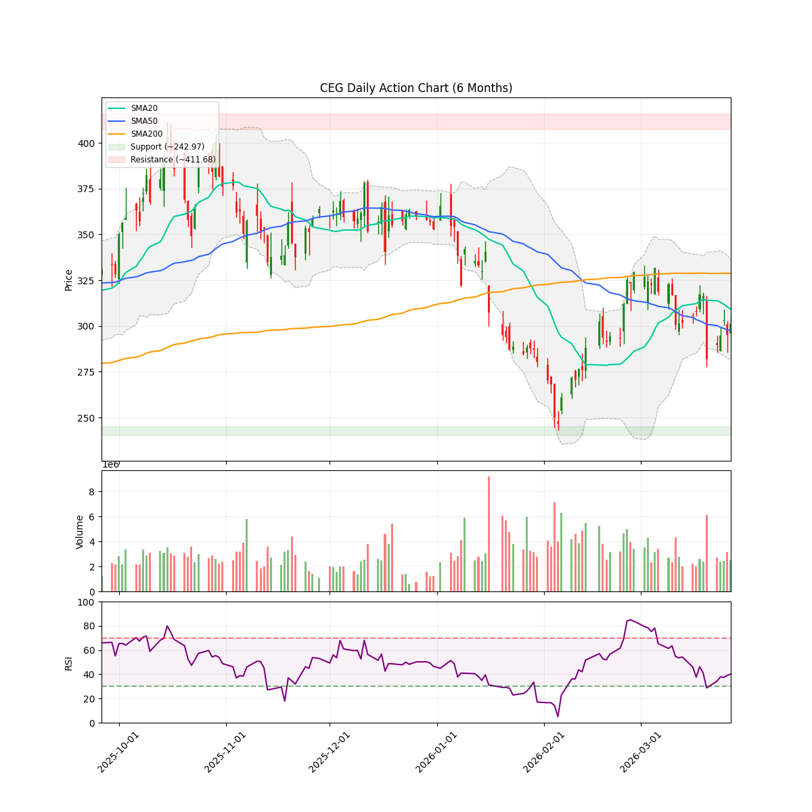
#### 研报分析

### 技术指标概览 (Technical Overview)
- **当前价格**: $301.49
- **RSI (14)**: 40.21
- **移动平均线**: SMA20: $309.07 | SMA50: $297.35 | SMA200: $328.82 (Bearish)
- **波动率**: ATR (14): 14.18 (预计周度波动: +/- $31.71)
- **关键位 (6m)**: 支撑位 $242.97 | 阻力位 $411.68
- **即时状态**: Above SMA50

### **CEG 情绪审计报告：核能宠儿的“倒春寒”，是陷阱还是黄金坑？**

**日期：** 2026年03月28日
**分析师：** 叙事经济学研究组 - 资深研究员
**标的：** Constellation Energy (CEG)
**当前价格：** $301.49

---

### **1. 催化剂分类 (Catalyst Categorization)**

在这场名为“AI 算力与核能复兴”的宏大叙事中，CEG 正处于一个微妙的十字路口。我们将最近的动向分为三个层级：

*   **A-Tier（核心驱动）：**
    *   **摩根士丹利（Morgan Stanley）的强力背书：** 2026年3月25日，大摩给予“增持”评级，目标价看至 $385。理由直指心脏——数据中心对核能资产的渴求。这是“A级”催化剂，因为它确立了 CEG 作为 AI 基础设施底层逻辑的地位。[参考链接](https://blockonomi.com/constellation-energy-ceg-stock-surges-4-on-morgan-stanleys-bullish-upgrade/)
*   **B-Tier（战略协作）：**
    *   **与 LS Power 的协议：** 3月26日披露的合作协议显示了 CEG 在整合电力市场资源方面的野心。虽然细节尚未完全释放，但这属于夯实护城河的稳健动作。[参考链接](https://finance.yahoo.com/sectors/energy/articles/constellation-energy-ceg-ls-power-155036530.html)
*   **C-Tier（市场杂音）：**
    *   **Jim Cramer 的“反向信号”：** Cramer 警告市场对核能过于乐观。有趣的是，消息出炉后股价反而走高，说明市场目前对这位“意见领袖”的预警采取了免疫态度。[参考链接](https://finance.yahoo.com/markets/stocks/articles/constellation-energy-ceg-stock-higher-163024293.html)
    *   **摩根大通（JPMorgan）微调目标价：** 从 $410 降至 $400。这种不到 3% 的调整在波动性极大的能源股中更像是“技术性校准”，而非看空信号。[参考链接](https://finance.yahoo.com/markets/stocks/articles/jpmorgan-lowers-price-target-constellation-193235255.html)

---

### **2. 叙事背离检测 (Divergence Detection)**

**现象：** 这里的盘面透着一股“诡异”。
尽管摩根士丹利给出了极具诱惑力的 $385 目标价，且核能依然是 2026 年最热的投资主题，但 CEG 的价格却在财报后下跌了 6.9%，目前徘徊在 $301 附近，远低于其 200 日均线 ($328.82)。

**诊断：** **看涨情绪的暂时衰竭（Bearish Exhaustion）。**
这种背离说明，早期的获利盘正在疯狂离场。目前的市场不再仅仅满足于“AI 扩容需要电力”这种宏大口号，而是开始考量 CEG 的现金流是否能跟上其昂贵的估值（如 Zacks 提到的财报后跌幅）。RSI 处于 40.21，意味着空头力量正接近强弩之末，市场正在等待一个“靴子落地”的契机。

---

### **3. 叙事得分 (Logic & Sentiment Score)**

#### **逻辑评分 (Logic Score): 7.5/10**
*   **支撑逻辑：** 核能是唯一能 24/7 提供稳定零碳排放的大规模电源，数据中心巨头没有第二选择。
*   **压力逻辑：** 200 日均线的失守意味着技术面正在修复过热的情绪。

#### **情绪评分 (Sentiment Score): 6.0/10**
*   **当前状态：** **“余温尚存的宿醉期”**。
*   **解读：** 去年那种闭眼入的狂热已经消失，现在的投资者变得挑剔且多疑。但只要 $242 (6个月低点) 守住，这波回调更像是对长线叙事的健康修正，而非系统性崩塌。

---

### **4. 市场观察员随笔：咖啡馆里的真心话**

“嘿，别被这几天的阴线吓破了胆。CEG 现在的表现，就像是一场狂欢派对后的清晨——头有点疼，但昨晚谈成的大生意（核能供电合同）依然作数。

摩根大通把目标价从 410 降到 400，这简直是逗你玩，现在的市价才 300 出头，那 30% 的肉还没人吃呢。真正的看点在于：CEG 正在从一个‘公用事业股’蜕变成‘科技基建股’。现在的下跌，更像是市场在给那些错过了去年大涨的机构一个‘重新上车’的借口。只要 AI 数据中心的冷却系统还在转，CEG 的核反应堆就是印钞机。

不过，小心 200 日均线（$328.82）的压制，在收复这个阵地之前，多头还需要一点耐心。记住，伟大的公司总是在沉闷的财报平淡期积累下一波爆发的力量。”

---

### **5. 关键信息汇总**

*   **下一次重大事件 (Next Major Date)：** **2026年5月初**（第一季度财报发布日，具体待官方确认）。
*   **关键支撑位：** $297.35 (SMA50) 以及 $242.97 (半年低点)。
*   **关键阻力位：** $328.82 (SMA200) 以及 $411.68 (历史高点)。
*   **波动提示：** 预计本周波动范围在 +/- $31.71 左右，注意风险控制。

**结论：** 这是一个**“B-Tier”进场机会**。叙事未冷，只是估值在寻找新的平衡点。不要在恐慌中卖出，要在这种“Good News, Lower Price”的背离中寻找布局良机。
#### 近期新闻与事件
- **[Insider Monkey· via Yahoo Finance]** [Constellation Energy (CEG) Stock Higher After Jim Cramer Warned About Excess Optimism](https://finance.yahoo.com/markets/stocks/articles/constellation-energy-ceg-stock-higher-163024293.html)
- **[Insider Monkey· via Yahoo Finance]** [JPMorgan Lowers its Price Target on Constellation Energy Corporation (CEG) to $400 from $410](https://finance.yahoo.com/markets/stocks/articles/jpmorgan-lowers-price-target-constellation-193235255.html)
- **[Insider Monkey· via Yahoo Finance]** [Constellation Energy (CEG) and LS Power Equity Advisors, LLC Announce an Agreement](https://finance.yahoo.com/sectors/energy/articles/constellation-energy-ceg-ls-power-155036530.html)
- **[Zacks· via Yahoo Finance]** [Why Is Constellation Energy Corporation (CEG) Down 6.9% Since Last Earnings Report?](https://finance.yahoo.com/markets/stocks/articles/why-constellation-energy-corporation-ceg-153003733.html)
- **[Zacks· via Yahoo Finance]** [Constellation Energy Corporation (CEG) Registers a Bigger Fall Than the Market: Important Facts to...](https://finance.yahoo.com/markets/stocks/articles/constellation-energy-corporation-ceg-registers-214505921.html)

---

### COP
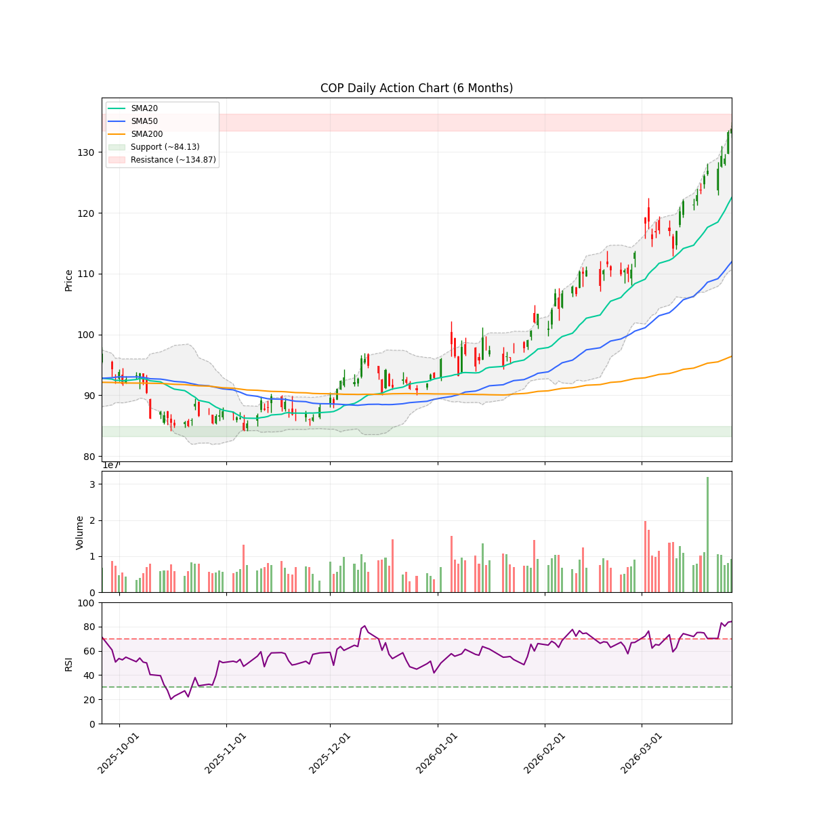
#### 研报分析

### 技术指标概览 (Technical Overview)
- **当前价格**: $133.80
- **RSI (14)**: 84.21
- **移动平均线**: SMA20: $122.50 | SMA50: $111.94 | SMA200: $96.40 (Bullish)
- **波动率**: ATR (14): 3.15 (预计周度波动: +/- $7.03)
- **关键位 (6m)**: 支撑位 $84.13 | 阻力位 $134.87
- **即时状态**: Above SMA50

# 情绪审计报告：康菲石油 (COP) —— 叙事巅峰还是华尔街陷阱？

**日期：** 2026年3月28日
**研究员：** 叙事经济学策略组

---

### 1. 市场叙事：硝烟中的财富盛宴
坐在曼哈顿的咖啡馆里，如果你听听隔壁桌的谈话，你会发现现在的原油市场充斥着一种“末日疯狂”。由于伊朗局势的持续动荡，市场已经不再讨论油价是否会跌，而是在屏息以待它何时冲破150美元的大关。

康菲石油（COP）目前正处于这场风暴的中心。它不只是在涨，它是在“起飞”。股价已经摸到了133.80美元，距离六个月来的最高点134.87美元仅一步之遥。但作为老练的猎人，我们必须问自己：这究竟是趋势的延续，还是机构在撤离前最后一次往火堆里添柴？

### 2. 催化剂分级 (Catalyst Categorization)

*   **A-Tier（核心驱动）：地缘政治溢价与资产重塑**
    *   **伊朗战争迷雾：** 这是支撑当前高油价的核动力。只要中东的炮火不熄，[The Motley Fool] 提到的“油价冲向150美元”的叙事就会持续发酵，而COP作为纯粹的上游生产商，是这种叙事的最大受益者。
    *   **高盛确信买入名单与资产剥离：** COP计划剥离20亿美元的二线二叠纪资产 [Simply Wall St.]。这种“去粗取精”的策略深受华尔街喜爱，证明管理层在狂欢中依然保持冷静。
*   **B-Tier（支撑动力）：分红叙事与投行背书**
    *   **股息增长：** COP承诺其股息增长将位列标普500前25% [The Motley Fool]。在充满不确定性的市场中，这种确定的现金回报是防御性资金的避风港。
    *   **UBS力挺：** 瑞银将其列为平价环境下的价值创造首选 [Investing.com]，为目前的估值提供了专业背书。
*   **C-Tier（噪音）：散户情绪**
    *   **Zacks热度：** COP成为Zacks平台上被搜索最多的股票之一 [Zacks]。通常，当散户开始疯狂搜索一个已经创下52周新高的股票时，这意味着“情绪过热”。

### 3. 分歧检测：繁华背后的阴影
这里出现了典型的**“技术性背离”**。

*   **指标警报：** 我们的 RSI 已经飙升至 **84.21**。在任何一本教科书里，这都是极度超买。股价虽然不断创新高 [Investing.com]，但动能已经开始显得疲惫。
*   **策略信号：** 值得注意的是，[Yahoo Finance] 已经在推荐“备兑看涨期权（Covered Call）”策略。这通常是老手们的做法——他们认为股价上行空间有限，开始通过卖出期权来锁定收益，而不是盲目追涨。
*   **逻辑：** 市场正在向“利好出尽”转变。当大家都觉得油价必到150美元时，这种预期往往已经反映在133美元的股价里了。

### 4. 情绪得分：8.5/10 (烈火烹油)
**逻辑评分依据：**
虽然基本面（A-Tier催化剂）异常强劲，但技术面的极端超买和叙事的过于一致（Everyone is a bull）意味着这里存在“短期回调陷阱”。这不仅仅是一个上涨趋势，这更像是一个**“情绪冲刺期”**。

### 5. 投资建议：不要在午夜之后继续逗留
目前的COP就像是一场已经进行到凌晨两点的派对。音乐依然劲爆，但警察可能随时敲门。

*   **如果你持仓：** 考虑分批套现，或者像主流建议那样做备兑看涨期权。
*   **如果你想入场：** 现在的价格是在“刀口舔血”。等待均线回归，SMA20（122.50美元）附近才是更理性的切入点。

---

### 下一个关键日期 (Next Major Date)
**2026年5月初（预计）：2026年第一季度财报发布日。**
这将是验证中东局势对其实际利润贡献的“时刻之真相”。在那之前，震荡和获利回吐将是主旋律。

---
**引用文献：**
1. *Is ConocoPhillips Stock at a Peak?* - Yahoo Finance (2026-03-24)
2. *2 Energy Stocks to Buy Before Oil Hits $150* - The Motley Fool (2026-03-28)
3. *Conocophillips stock hits 52-week high* - Investing.com (2026-03-26)
4. *UBS Names Top Oil & Gas Stocks* - Investing.com (2026-03-27)
5. *ConocoPhillips Reshapes Portfolio* - Simply Wall St. (2026-03-14)
#### 近期新闻与事件
- **[Yahoo Finance]** [Is ConocoPhillips Stock at a Peak? - Covered Call COP Plays Look Attractive](https://finance.yahoo.com/markets/stocks/articles/conocophillips-stock-peak-covered-call-130002315.html)
- **[The Motley Fool]** [2 Energy Stocks to Buy Before Oil Hits $150 a Barrel](https://www.fool.com/investing/2026/03/28/2-energy-stocks-to-buy-before-oil-hits-100-a/)
- **[Investing.com]** [Conocophillips stock hits 52-week high at 131.04 USD](https://www.investing.com/news/company-news/conocophillips-stock-hits-52week-high-at-13104-usd-93CH-4582724)
- **[Yahoo Finance]** [Is ConocoPhillips (COP) Still Attractively Priced After Its Strong Recent Share Price Run?](https://finance.yahoo.com/markets/stocks/articles/conocophillips-cop-still-attractively-priced-210855960.html)
- **[The Motley Fool]** [Better Dividend Stock: ConocoPhillips vs. EOG Resources](https://www.fool.com/investing/2026/03/24/better-dividend-stock-conocophillips-vs-eog-resour/)

---

### CVX
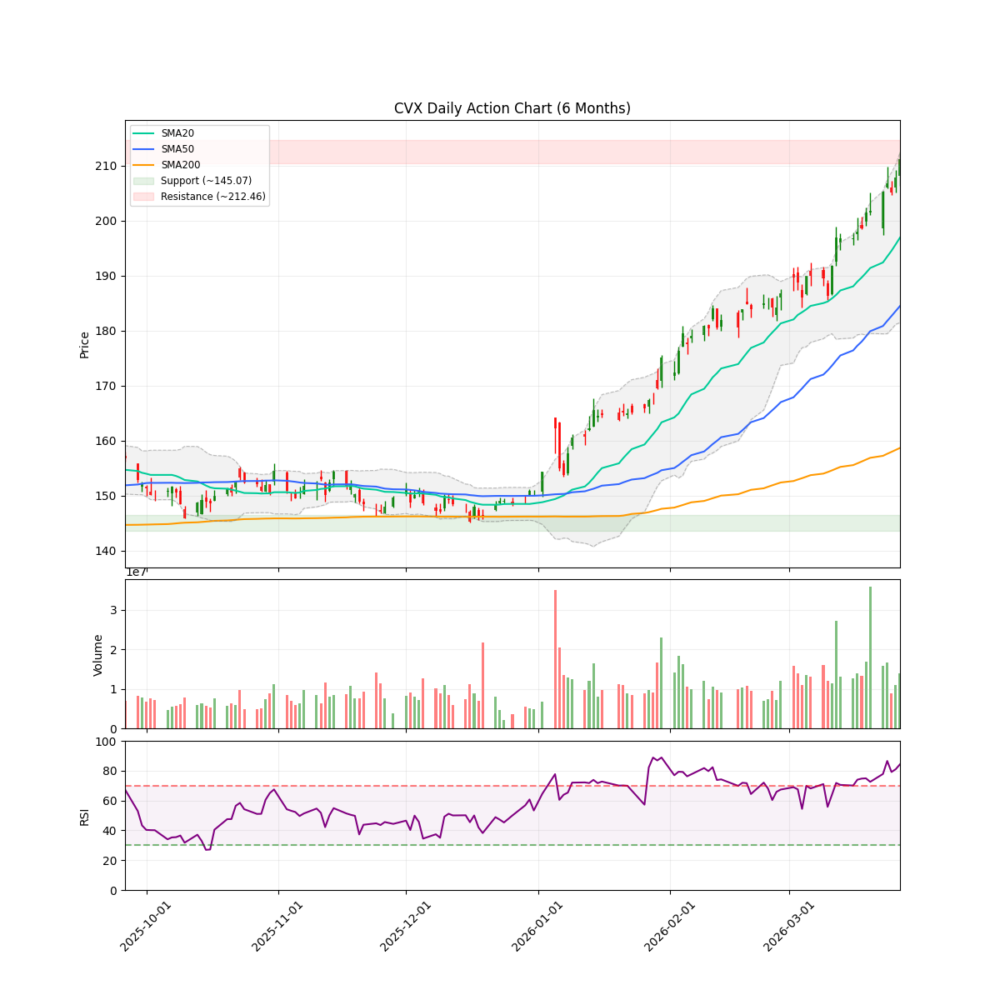
#### 研报分析

### 技术指标概览 (Technical Overview)
- **当前价格**: $211.15
- **RSI (14)**: 84.36
- **移动平均线**: SMA20: $196.91 | SMA50: $184.48 | SMA200: $158.69 (Bullish)
- **波动率**: ATR (14): 4.42 (预计周度波动: +/- $9.89)
- **关键位 (6m)**: 支撑位 $145.07 | 阻力位 $212.46
- **即时状态**: Above SMA50

来，坐下喝杯咖啡。咱们聊聊雪佛龙 (CVX) 最近这波让人肾上腺素飙升的行情。

现在的市场不仅仅是在交易原油，而是在交易“恐惧”和“稀缺”。当 CVX 的股价冲破 211 美元大关时，我们看到的不仅仅是一个数字，而是一个充满了地缘政治博弈、供应危机以及华盛顿内部消息影子的宏大故事。

### **一、 叙事催化剂分类 (Catalyst Categorization)**

**A-Tier：核心动力源 (顶级利好)**
*   **霍尔木兹海峡的阴霾 (CEO 警告)：** 雪佛龙 CEO Mike Wirth 亲自下场“喊话”，警告市场低估了霍尔木兹海峡关闭可能带来的供应中断。这不仅是口头警告，而是为油价定下了一个“稀缺性”的基调。这属于最高级别的叙事，因为它直接重塑了供应预期。
*   **历史新高的心理突破：** 股价触及 209.87 美元并继续上攻至 211.15 美元，打破了所有的上方阻力。这种“全天候”的突破（All-Time High）通常会吸引那些只看趋势的机构资金疯狂涌入。

**B-Tier：助燃剂 (中级影响)**
*   **委内瑞拉变局与“先知型”买入：** 马杜罗被捕的消息震惊市场，而国会议员 Markwayne Mullin 在变局前几天精准建仓 CVX 的消息，给这只股票披上了一层“内幕色彩”。不管真相如何，这种叙事在散户和短线交易者眼中就是“稳赢”的信号。
*   **基本面溢价：** 相比于 Devon 等同行，雪佛龙更强的运营底座和分红增长使其成为了避险资金的避风港。

**C-Tier：噪音 (低级影响)**
*   **常规媒体喊多：** Zacks 和 Motley Fool 的常规推荐属于典型的追涨叙事，虽然增加了热度，但缺乏实质性的边际驱动力。

---

### **二、 背离检测 (Divergence Detection)**

**目前并未出现“好消息下跌”的看跌背离，但出现了“技术指标与情绪的博弈”。**

*   **观察：** CVX 目前的价格（211.15）远高于 SMA200（158.69），这显示出极强的牛市惯性。
*   **警示信号：** **RSI 高达 84.36**。在叙事经济学中，这意味着“故事已经讲得太完美了”。当所有人都在谈论霍尔木兹海峡和马杜罗时，盘面已经处于极度超买状态。短期内，任何“不够好”的消息都可能引发剧烈的踩踏式获利回吐。

---

### **三、 情绪评分 (Sentiment Score)**

#### **Logic Score: 8.8/10**
> **评价：** 这是一个由地缘政治危机驱动的“史诗级叙事”。虽然技术上极度过热，但只要中东的炮火声和供应的不确定性还在，这列火车就很难停下来。不过，高昂的入场价意味着你现在是在为“完美的预期”买单。

---

### **四、 深度审计报告**

**【叙事总结：地缘政治的完美风暴】**
CVX 现在的走势就像是一部好莱坞大片：有地缘政治的动荡（委内瑞拉、霍尔木兹海峡），有神秘的政客建仓，还有一位强力的 CEO 在向市场宣战。

*   **为什么这不是“陷阱”？** 因为这种上涨是由结构性供应短缺支撑的。正如 [Blockonomi] 报道，CEO 指出的市场与现实的“脱节”正在被修正。
*   **风险在哪里？** RSI 84.36 告诉我们，市场已经进入了“贪婪呼吸”阶段。目前股价位于 6 个月高点附近，且波动率（ATR）暗示本周可能有上下 10 美元左右的震动。

**【信息源引用】**
- *CEO 警告供应危机：* [Blockonomi](https://blockonomi.com/chevron-cvx-stock-climbs-as-ceo-highlights-market-disconnect-on-oil-supply-crisis/)
- *历史新高确认：* [Investing.com](https://www.investing.com/news/company-news/chevron-stock-hits-alltime-high-at-20987-usd-93CH-4585247)
- *议员精准交易：* [Snopes/MSN](https://www.msn.com/en-us/money/news/markwayne-mullin-bought-chevron-raytheon-stock-days-before-maduro-capture/ar-AA1ZhzCK)

---

### **五、 关键时间节点 (Next Major Date)**

**下个重要日期：2026年4月24日 (预计 2026 Q1 财报发布日)**

**策略建议：**
目前的 CVX 就像一头冲进瓷器店的公牛。如果你已经在车上，握紧你的筹码，但要盯紧 SMA20 (196.91) 的支撑。如果你还没入场，别在 RSI 84 的时候冲进去帮人解套，等一个回踩 200 美元心理关口的机会，那才是叙事与性价比的结合点。
#### 近期新闻与事件
- **[Yahoo Finance]** [Surging Chevron stock has more going for it than just higher oil prices](https://finance.yahoo.com/markets/stocks/articles/surging-chevron-stock-more-going-003700565.html)
- **[Snopes]** [Markwayne Mullin bought Chevron, Raytheon stock days before Maduro capture](https://www.msn.com/en-us/money/news/markwayne-mullin-bought-chevron-raytheon-stock-days-before-maduro-capture/ar-AA1ZhzCK)
- **[The Motley Fool]** [Better Oil Stock: Chevron vs. Devon Energy](https://www.msn.com/en-us/money/markets/better-oil-stock-chevron-vs-devon-energy/ar-AA1Ztpvq)
- **[Blockonomi]** [Chevron (CVX) Stock Climbs as CEO Highlights Market Disconnect on Oil Supply Crisis](https://blockonomi.com/chevron-cvx-stock-climbs-as-ceo-highlights-market-disconnect-on-oil-supply-crisis/)
- **[Investing.com]** [Chevron stock hits all-time high at 209.87 USD](https://www.investing.com/news/company-news/chevron-stock-hits-alltime-high-at-20987-usd-93CH-4585247)

---

### MSFT
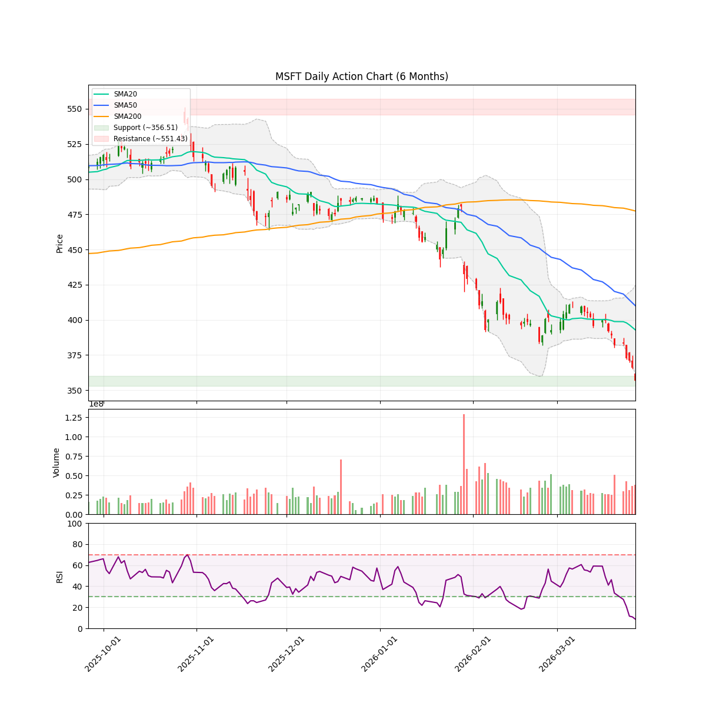
#### 研报分析

### 技术指标概览 (Technical Overview)
- **当前价格**: $356.77
- **RSI (14)**: 8.68
- **移动平均线**: SMA20: $392.82 | SMA50: $410.02 | SMA200: $477.38 (Bearish)
- **波动率**: ATR (14): 7.71 (预计周度波动: +/- $17.25)
- **关键位 (6m)**: 支撑位 $356.51 | 阻力位 $551.43
- **即时状态**: Below SMA50

# 微软 (MSFT) 情绪审计报告：AI 巨头的“信仰危机”还是“黄金坑”？

**报告日期：** 2026年03月28日
**分析师：** 叙事经济学研究组

---

### 1. 叙事分类：催化剂定级 (Catalyst Categorization)

当前微软正处于多重叙事交织的风暴中心，我们将最近的动态分为以下等级：

*   **A-Tier (核心叙事障碍)：AI Copilot 变现不及预期 & 增长故事受疑**
    *   [Blockonomi] 报道指出，微软股价自高点暴跌 32%，核心原因是 Copilot 的采用率落后于华尔街的激进预期。这不仅是数据的下滑，更是市场对“AI 领头羊”逻辑的根基产生了怀疑。
*   **B-Tier (宏观黑天鹅)：地缘政治冲突导致的流动性枯竭**
    *   [Live Mint] 提到美伊战争引发“七巨头”市值蒸发 1.72 万亿美元。这类系统性风险引发了无差别的抛售，微软作为权重股首当其冲。
*   **C-Tier (杂讯与抄底呼声)：分析师的“无脑买入”建议**
    *   [The Motley Fool] 与 [AOL] 频繁发布“不要错过下一次上涨”、“你会后悔卖出”的评论。此类叙事在暴跌中显得苍白无力，更多是由于估值修复逻辑驱动的防御性言论。

---

### 2. 背离检测：市场在说谎吗？ (Divergence Detection)

**现状：** 微软股价正经历自 2009 年以来最糟糕的表现。
**技术背离：** 目前 **RSI (相对强弱指标) 竟然低至 8.68**。在市场老手的眼中，这是一个几乎令人窒息的数字。通常 RSI 低于 30 是超卖，低于 10 则意味着“地板之下还有地窖”，但也标志着**空头动能已处于极致的衰竭边缘**。

尽管新闻面上充斥着“Copilot 失败”和“战争恐慌”，但股价已经精准地回落到了 **6 个月低点支撑位 (356.51)**。目前的价位 (356.77) 距离支撑位仅差毫厘。市场正在用极端的恐惧消化所有的利空。如果利空出尽，哪怕是一个微小的利好（如 Copilot 活跃用户的小幅反弹），都可能引发猛烈的空头回补。

---

### 3. 深度叙事分析：咖啡馆里的市场观察

朋友，如果你现在坐在我对面，我会告诉你：**这就是典型的“信仰崩塌”现场。**

几个月前，微软还是那个“通往 AI 王座的唯一门票”，现在却被弃若敝履。32% 的回撤对于这样一个个体量巨大的蓝筹股来说，无异于一场小型崩盘。市场现在的痛点在于：**我们给了微软太多的溢价，而它交出的 AI 答卷只是“及格”而非“卓越”。**

但别被恐惧蒙蔽了双眼。虽然 Copilot 的普及速度慢于预期，但微软的生态护城河并没有裂缝。现在的下跌，更多是**地缘政治的血腥味**加上**高预期落空后的反噬**。当吉姆·克莱默 (Jim Cramer) 开始对他曾经最爱的股票展示出动摇，而 RSI 指标已经跌到个位数时，这往往不是离场的时刻，而是“刀口舔血”者开始观察地板价的时刻。

---

### 4. 情绪得分 (Sentiment Score)

## **3.5 / 10**
*(注：0 为系统性崩溃，10 为不可阻挡的牛市)*

**逻辑依据：** 情绪极其低迷（甚至有些过头）。由于价格处于关键支撑位且 RSI 处于历史性低位，叙事上已经从“成长焦虑”转向了“恐慌性抛售”。得分低是因为目前依然缺乏扭转趋势的直接利好，但极低的得分也预示着反弹潜力。

---

### 5. 关键参考与未来展望

*   **引用证据：**
    *   股价跌幅达 32%，系 2009 年以来最差表现 ([Blockonomi](https://blockonomi.com/microsoft-msft-stock-plunges-32-from-peak/))。
    *   美伊战争导致科技股流动性崩盘 ([Live Mint](https://www.msn.com/en-in/money/markets/tesla-nvidia-microsoft-to-apple-magnificent-7-stocks-market-cap-crashes-172-trillion-during-us-iran-war-us-stocks/ar-AA1ZzWqt?ocid=BingNewsVerp))。
    *   RSI 8.68 预示技术性极端超卖。

*   **下一个关键节点 (Next Major Date)：**
    *   **2026年4月下旬 (预计 4月23日左右)**：**Q3 财报发布日**。
    *   *分析：* 这将是决定性的时刻。市场不再关心总营收，只会盯着 Copilot 的订阅数据和 Azure 的 AI 贡献率。如果数据有一丝转机，这 32% 的跌幅将成为史诗级的“空头陷阱”。

**总结：** 微软正处于“至暗时刻”。现在的它不是在走下坡路，而是在为了下一次跃迁清理那些意志不坚定的多头。**守住 356.51 的底线，反攻可能就在一瞬之间。**
#### 近期新闻与事件
- **[AOL]** [3 AI Stocks to Buy Before the Next Leg Up](https://www.aol.com/articles/3-ai-stocks-buy-next-163500515.html)
- **[Live Mint on MSN]** [Tesla, NVIDIA, Microsoft to Apple: Magnificent 7 stocks market cap crashes $1.72 trillion during US-Iran war US stocks](https://www.msn.com/en-in/money/markets/tesla-nvidia-microsoft-to-apple-magnificent-7-stocks-market-cap-crashes-172-trillion-during-us-iran-war-us-stocks/ar-AA1ZzWqt?ocid=BingNewsVerp)
- **[TheStreet on MSN]** [Jim Cramer drops unexpected take on Microsoft stock](https://www.msn.com/en-us/money/markets/jim-cramer-drops-unexpected-take-on-microsoft-stock/ar-AA1ZzIgm?ocid=BingNewsVerp)
- **[The Motley Fool on MSN]** [3 No-Brainer AI Stocks to Buy Before They Soar, According to Wall Street](https://www.msn.com/en-us/money/topstocks/3-no-brainer-ai-stocks-to-buy-before-they-soar-according-to-wall-street/ar-AA1ZB0Uj?ocid=BingNewsVerp)
- **[The Motley Fool on MSN]** [This AI Giant Aims to Reach $9 Trillion in Market Cap. Is the Stock a Buy?](https://www.msn.com/en-us/money/other/this-ai-giant-aims-to-reach-9-trillion-in-market-cap-is-the-stock-a-buy/ar-AA1ZBnbG?ocid=BingNewsVerp)

---

### NVDA
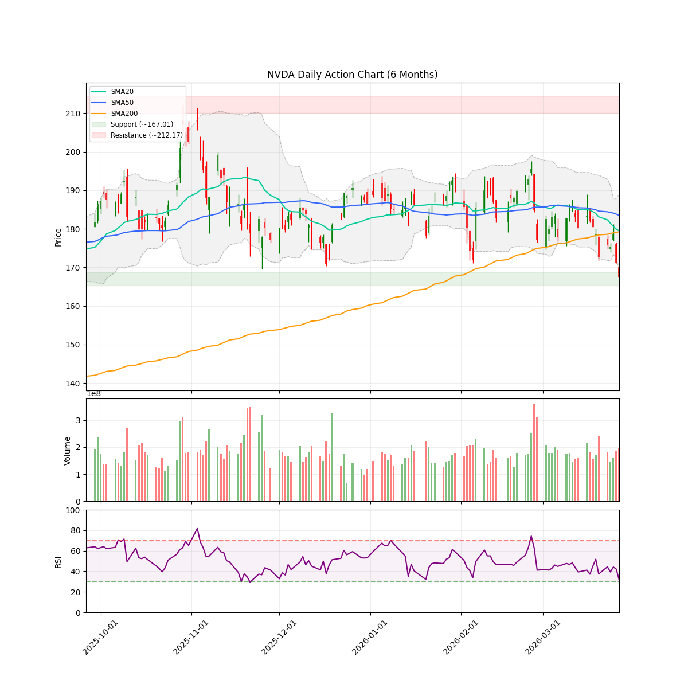
#### 研报分析

### 技术指标概览 (Technical Overview)
- **当前价格**: $167.52
- **RSI (14)**: 31.42
- **移动平均线**: SMA20: $179.43 | SMA50: $183.48 | SMA200: $179.21 (Bullish)
- **波动率**: ATR (14): 5.04 (预计周度波动: +/- $11.27)
- **关键位 (6m)**: 支撑位 $167.01 | 阻力位 $212.17
- **即时状态**: Below SMA50

# NVIDIA (NVDA) 情感审计报告：叙事真空期的“倒春寒”

**日期：** 2026年3月28日
**分析师：** 叙事经济学研究部

---

### 1. 宏观叙事：当“AI 信仰”撞上“石油危机”

老伙计，坐下来喝杯咖啡。看看现在的 NVDA，这感觉就像是派对狂欢后的宿醉。

现在的盘面不仅仅是技术性的回调，而是一个典型的**“叙事转换陷阱”**。去年，大家还在讨论 AI 如何改变世界；而现在，市场的焦点全被飙升的油价和美联储的迟疑勾走了。当纳斯达克进入回调区间（Correction Territory），即便是像英伟达这样的“全村的希望”，也难免被拉下神坛。

最讽刺的叙事信号是什么？是**埃克森美孚（XOM）的估值竟然跑赢了英伟达**。这标志着市场资金正在从“未来的算力梦想”逃向“当下的能源避险”。

---

### 2. 催化剂分级 (Catalyst Categorization)

我们要学会剥开新闻的糖衣，看清里面的药效。

*   **A-Tier（缺席中）：** 目前缺乏像“炸裂式财报”或“B系列架构出货”这样的核心重锤。市场正在经历 2 月财报后的真空期。
*   **B-Tier（长期护城河）：** 
    *   **能源与 AI 的联姻：** 与斯伦贝谢 (SLB) 的合作 [Barchart on MSN] 是神来之笔。英伟达深知，AI 的终点是能源，深入能源行业不仅是卖卡，更是布局基础设施。
    *   **医疗 BioNeMo 扩展：** [24/7 Wall St.] 提到的 BioNeMo 进展是典型的增长点，虽然短期无法反映在股价，但确保了叙事的可持续性。
*   **C-Tier（噪音与干扰）：** 
    *   **美光 (MU) 与特斯拉 (TSLA) 的拖累：** [The Economic Times] 提到的板块联动下跌。半导体板块现在的“连坐”效应非常严重，美光的疲软直接泼了 NVDA 一头冷水。

---

### 3. 背离监测 (Divergence Detection)：利好不涨，必有蹊跷

**警报：** 这里出现了明显的**看跌背离**。

注意看：英伟达在 3 月 23 日有过一次漂亮的“周一反弹”[24/7 Wall St.]，当时市场试图炒作能源伙伴关系和 BioNeMo 的利好。然而，这种反弹转瞬即逝。股价目前跌至 **$167.52**，几乎触及了 6 个月来的最低支撑位 ($167.01)。

**分析结论：** “好消息”已经无法驱动股价。当 SLB 这种重磅合作都带不动节奏时，说明场内资金已经处于“精疲力竭”的状态，或者说，宏观的重力（美债收益率上升和石油通胀）实在太重了。

---

### 4. 情感评分与逻辑 (Sentiment Score)

**情感评分：4.2 / 10 (阶段性悲观/过度抛售边缘)**

*   **逻辑：** 
    *   **恐慌情绪：** RSI 已经杀到了 **31.42**，这是一个极其接近“超卖区”的数字。技术派正在持刀等待底部的确认。
    *   **破位风险：** 股价目前跌破了所有主要均线（SMA20, 50, 200），且 SMA200 ($179.21) 已经从支撑变成了强压力位。
    *   **生存现状：** 这不是系统性溃败（Systemic Failure），而是极致的**情绪杀**。资金在等待一个理由重新入场，但那个理由目前还没出现。

---

### 5. 关键参考与后续观察

*   **引用证据：**
    *   关于 SLB 合作增强牛市逻辑的讨论：[MSN/Barchart](https://www.msn.com/en-us/money/topstocks/nvidia-is-doubling-down-on-the-energy-industry-with-slb-does-that-strengthen-the-nvda-bull-case-now/ar-AA1ZyG29?ocid=BingNewsVerp)
    *   纳斯达克回调对技术股的影响：[The Motley Fool](https://www.msn.com/en-us/money/other/the-nasdaq-just-hit-correction-territory-history-says-the-stock-market-will-do-this-next-hint-it-may-shock-you/ar-AA1ZBjfF?ocid=BingNewsVerp)
    *   近期板块重挫的原因分析：[The Economic Times](https://economictimes.indiatimes.com/news/international/us/why-nvidia-micron-tesla-stock crashing-big-today-nvda-down-1-while-mu-stock-crashes-nearly-5-heres-why-tsla-stock-is-falling-today-amid-oil-surge-and-fed-uncertainty/articleshow/129684125.cms)

**下个重大日期：** 
*   **2026年5月中旬（预计）：** 第一季度财报发布日。
*   **关键观察期：** 未来两周内能否守住 $167 这一“生死线”。如果跌破，$150 关口将是下一个心理防线。

**老兵建议：** 现在的 NVDA 就像是蹲在起跑线前被雨淋湿的猎豹。别在它发抖的时候嘲笑它，但也别在乌云散去前过早地压上所有筹码。观望 $167 的支撑力度，等待叙事从“石油和通胀”重回“AI 生产力”。
#### 近期新闻与事件
- **[Zacks Investment Research on MSN]** [Why is Nvidia (NVDA) down 7.4% since last earnings report?](https://www.msn.com/en-us/money/companies/why-is-nvidia-nvda-down-7-4-since-last-earnings-report/ar-AA1ZyAsC?ocid=BingNewsVerp)
- **[Barchart on MSN]** [Nvidia is doubling down on the energy industry with SLB. Does that strengthen the NVDA bull case now?](https://www.msn.com/en-us/money/topstocks/nvidia-is-doubling-down-on-the-energy-industry-with-slb-does-that-strengthen-the-nvda-bull-case-now/ar-AA1ZyG29?ocid=BingNewsVerp)
- **[The Globe and Mail]** [The Brutal Truth About Micron Stock.](https://www.theglobeandmail.com/investing/markets/stocks/NVDA/pressreleases/1006207/the-brutal-truth-about-micron-stock/)
- **[The Motley Fool on MSN]** [The Nasdaq Just Hit Correction Territory. History Says the Stock Market Will Do This Next (Hint: It May Shock You).](https://www.msn.com/en-us/money/other/the-nasdaq-just-hit-correction-territory-history-says-the-stock-market-will-do-this-next-hint-it-may-shock-you/ar-AA1ZBjfF?ocid=BingNewsVerp)
- **[Barchart on MSN]** [Exxon Mobil is now more expensive than Nvidia stock. What gives, and how should you play XOM here?](https://www.msn.com/en-us/money/topstocks/exxon-mobil-is-now-more-expensive-than-nvidia-stock-what-gives-and-how-should-you-play-xom-here/ar-AA1ZyHJL?ocid=BingNewsVerp)

---

### OKE

#### 研报分析

### 技术指标概览 (Technical Overview)
- **当前价格**: $93.96
- **RSI (14)**: 80.67
- **移动平均线**: SMA20: $87.55 | SMA50: $83.41 | SMA200: $75.12 (Bullish)
- **波动率**: ATR (14): 2.30 (预计周度波动: +/- $5.13)
- **关键位 (6m)**: 支撑位 $63.15 | 阻力位 $95.30
- **即时状态**: Above SMA50

嘿，老伙计，坐。咱们来聊聊 ONEOK (OKE)。现在的能源市场就像是一场在大雾中进行的接力赛，而 OKE 现在的表现，简直就像是那个在终点线前疯狂冲刺、甚至快要跑出跑道的选手。

把你的咖啡放下，咱们来看看这份**叙事经济学**视角下的审计报告。

### 1. 催化剂分类：谁在背后推波助澜？

目前 OKE 的新闻周期非常密集，但我们需要分清哪些是“真金白银”，哪些只是“背景噪音”。

*   **A-Tier（重磅推手）：机构的“明牌”加持**
    *   **Barclays 的目标价上调** (2026-03-12)：Barclays 调高了 OKE 的目标价，尽管维持了“平配”评级。这释放了一个信号：即使是谨慎的分析师也无法忽视它的估值重估。这不仅仅是数字的变动，这是机构在为更高的价格中枢背书。
*   **B-Tier（中期动能）：股息叙事的回归**
    *   **Seeking Alpha 与 U.S. News 的背书** (2026-03-10, 03-17)：在能源波动加剧的当下，OKE 被列入“高增长股息榜单”。这种叙事对那些厌恶风险的长线资金（尤其是养老基金和散户收割机）有着致命的吸引力。它被塑造成了市场的“避风港”。
*   **C-Tier（市场噪音）：跟风式的价值重估**
    *   **Yahoo Finance 的估值关注** (2026-03-12)：这种属于典型的“涨了才找理由”的报道，反映了市场情绪的滞后跟随，但也侧面说明了目前的动能非常强。

### 2. 离散度检测：是繁荣还是“陷阱”？

这里的信号非常微妙，甚至有点“烫手”。

*   **技术面的“高烧”**：你看这个 **RSI (80.67)**，这已经不是热了，这是在“发烧”。股价 (93.96) 正死死顶在 6 个月的高点 (95.30) 上。
*   **背离警示**：通常，当所有人都在喊“股息安全”、“快买入”的时候（如 Seeking Alpha 的文章），股价应该已经反映了这些预期。目前 OKE 运行在 SMA200 (75.12) 之上太远了。
*   **叙事陷阱**：现在的叙事是“避风港”，但价格却像“成长股”一样飙升。这是一种典型的逻辑错位。当一个管道股跑出了 AI 股的斜率，我们就得防着那帮机构在 95 美元上方“交棒”给散户。

### 3. 市场情绪评分 (Sentiment Score)

**得分：8.2 / 10 —— “亢奋的管道工”**

*   **逻辑**：趋势无疑是极度牛市。市场现在完全沉浸在 OKE 作为能源基建领头羊的优越感中。只要股息增长的叙事不破，回调就会被视为买入机会。但给不到 9 分或 10 分，是因为 RSI 已经在尖叫，这更像是一个**“上涨趋势中的高潮时刻”**，而非趋势的起点。

### 4. 深度洞察：这场戏怎么演？

老伙计，目前的 OKE 就像是一辆满载着现金的重型卡车。它惯性极大，很难立刻停下来。

目前的市场情绪是**“恐高但更怕错过 (FOMO)”**。Barclays 的报告（[链接](https://www.msn.com/en-us/money/topstocks/barclays-boosts-oneok-oke-price-target-while-maintaining-equal-weight-rating/ar-AA1YrCEF?ocid=BingNewsVerp)）其实是在告诉大家：它的估值已经不便宜了（Low PE 的红利正在消失），但股息和现金流依然坚挺。

如果你现在跳进去，你不是在买“价值”，你是在买“动能”。

### 5. 关键参考信息

*   **支撑位 (Safety Net)**：87.55 (SMA20) 是第一道防线，如果跌破这里，那这波情绪溢价就要出水了。
*   **阻力位 (The Ceiling)**：95.30 (6个月高点)。如果能带量突破这里，下个目标就是三位数。
*   **下个重大日期 (Next Major Date)**：
    *   **2026年5月初（预计）**：一季度财报发布日。这将是检验这一波叙事（现金流是否真的能支撑更高的估值）的“终极审判”。

**老兵建议**：在这个位置（RSI > 80），别去追高。让子弹飞一会儿。如果股价能缩量回踩到 88-90 美元附近，那才是我们喝着咖啡、气定神闲入场的时候。现在的 94 美元？那是留给那些心急的年轻人的。
#### 近期新闻与事件
- **[U.S. News Money]** [7 Pipeline Stocks to Buy With Big Dividends](https://money.usnews.com/investing/articles/pipeline-stocks-to-buy-with-big-dividends)
- **[Yahoo Finance UK]** [A Look At ONEOK (OKE) Valuation After Recent Share Price Momentum](https://uk.finance.yahoo.com/news/look-oneok-oke-valuation-recent-070613512.html)
- **[Insider Monkey on MSN]** [Barclays Boosts ONEOK (OKE) Price Target While Maintaining Equal Weight Rating](https://www.msn.com/en-us/money/topstocks/barclays-boosts-oneok-oke-price-target-while-maintaining-equal-weight-rating/ar-AA1YrCEF?ocid=BingNewsVerp)
- **[Seeking Alpha]** [March's 5 Dividend Growth Stocks With Yields Up To 5.93%](https://seekingalpha.com/article/4882846-march-5-dividend-growth-stocks-yields-5-percent)

---

### OXY
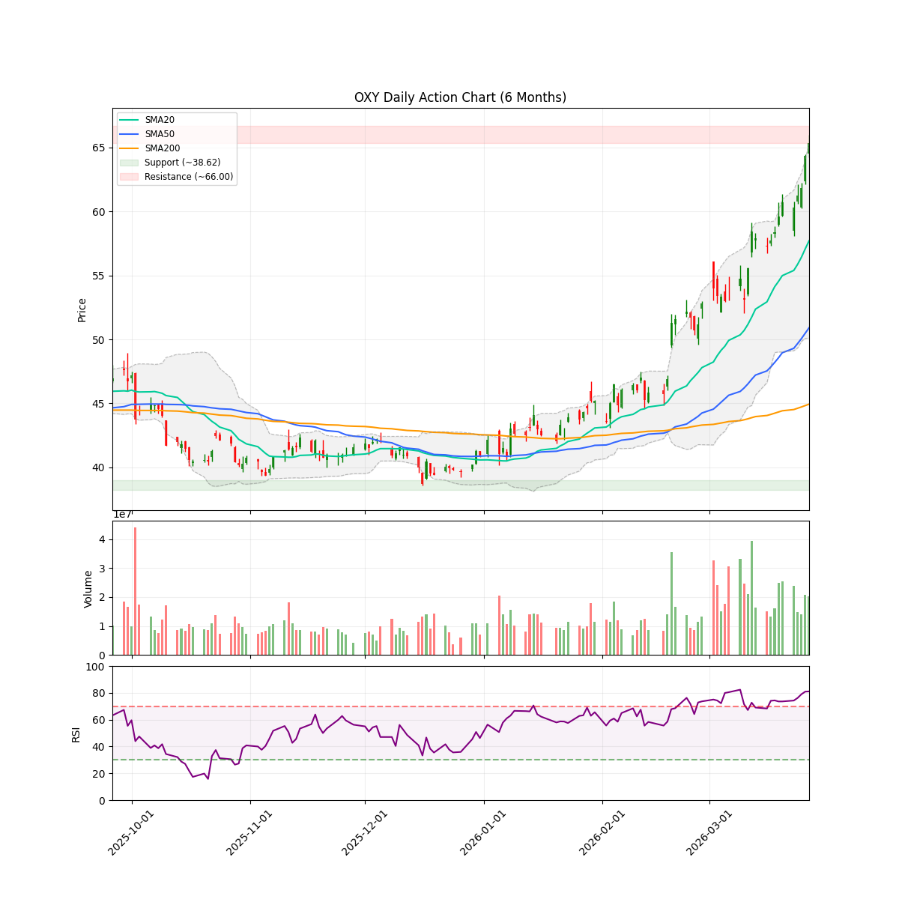
#### 研报分析

### 技术指标概览 (Technical Overview)
- **当前价格**: $65.32
- **RSI (14)**: 81.13
- **移动平均线**: SMA20: $57.71 | SMA50: $50.91 | SMA200: $44.94 (Bullish)
- **波动率**: ATR (14): 2.03 (预计周度波动: +/- $4.55)
- **关键位 (6m)**: 支撑位 $38.62 | 阻力位 $66.00
- **即时状态**: Above SMA50

# 西方石油 (OXY) 情绪审计报告：新王登基还是最后的疯狂？

想象一下，我们正坐在华尔街拐角的一家咖啡馆里，手中的拿铁还没凉，但屏幕上 **OXY（西方石油）** 的走势图已经烫手了。现在的 OXY 不仅仅是一家石油公司，它正演变成一场关于“权力更迭”和“叙事重构”的金融大戏。

作为一名专注于“叙事经济学”的分析师，我看到的不仅仅是 K 线，而是背后涌动的人心。

---

### 1. 催化剂分级：谁在推波助澜？

我们将当前的利好消息拆解开来，看看哪些是真金白银，哪些只是噪音：

*   **A-Tier（核心动力）：CEO 继任计划的明朗化**
    *   根据 [Investing.com](https://in.investing.com/news/stock-market-news/occidental-stock-rises-on-ceo-succession-report-93CH-5310402) 和 [Insider Monkey](https://finance.yahoo.com/markets/stocks/articles/occidental-petroleum-oxy-soars-52-024105363.html) 的报道，关于 Vicki Hollub 继任者的传闻让市场兴奋不已。在华尔街眼中，领导层更迭通常意味着战略重组的可能。这种“变天”的预期往往能吸引长期机构资金提前布局。
*   **B-Tier（光环加持）：巴菲特背书与 52 周新高**
    *   市场再次提及 [Warren Buffett 的持仓逻辑](https://finance.yahoo.com/sectors/energy/articles/occidental-petroleum-oxy-best-energy-152150255.html)。只要老巴还在买，这就是一个“带保险杠”的交易。冲破 52 周新高则吸引了大量的趋势交易者（Quant funds）入场。
*   **C-Tier（日常杂音）：Zacks 的搜索热度与短期波动**
    *   [Zacks](https://finance.yahoo.com/news/trending-stock-occidental-petroleum-corporation-130002297.html) 提到的搜索热度反映了散户的关注点，虽然能增加流动性，但往往也是情绪过热的信号。

---

### 2. 背离检测：在狂欢中寻找裂痕

现在是泼冷水的时间。看看数据：**RSI 高达 81.13**。

在技术分析的语言里，这已经不是“强劲”了，这是“窒息”。股价正顶着 66.00 美元的 6 个月阻力位疯狂试探。
*   **熊市精疲力竭？** 不，现在是**多头过度扩张**。
*   **有趣的现象：** [Zacks 指出](https://finance.yahoo.com/markets/stocks/articles/occidental-petroleum-oxy-ascends-while-215004861.html)，在 3 月 24 日大盘下跌时，OXY 逆势上涨。这说明资金正在从成长股逃向这个有“确定性”的避风港。这种“独立行情”非常吸睛，但 81 的 RSI 预示着短期的获利了结压力随时可能像山洪一样爆发。

---

### 3. 叙事得分 (Logic Score)

**综合评分：8.2 / 10 —— “极其强劲的牛市叙事，但需警惕技术性回踩”**

*   **逻辑支撑：** 领导层更迭带来的“想象空间”+ 能源行业的结构性坚挺 + 伯克希尔哈撒韦的隐形地板。
*   **警示：** 我们离估值天花板非常近。如果股价无法在下周放量突破 66.00 美元，那些在高位追入的散户可能会遭遇一波回撤洗盘。

---

### 4. 投资建议：市场老兵的私房话

现在的 OXY 就像一列全速前进的高铁，风景很美，但如果你还没上车，千万别在轨道中间去拦它。
*   **对于持仓者：** 握紧你的筹码，但可以考虑在 66 美元附近设置移动止盈。
*   **对于观望者：** 等待 RSI 回归到 60 左右，或者回踩 SMA20 (57.71 附近) 才是更优雅的入场姿势。目前的 Weekly Range (+/- 4.55) 告诉我们，波动才刚刚开始。

---

### 关键时间点追踪

*   **下个重大日期：** **2026年5月初**（预计 2026 年第一季度财报发布日）。
*   **关注重点：** 管理层是否会在接下来的几周内正式确认继任者细节。任何关于“继承人”履历的深度解析都将成为 A-Tier 级别的波动诱因。

**审计总结：** 趋势是真实的，情绪是激昂的，但请记住，即便是最凶猛的公牛也需要停下来喘口气。**不要在 52 周新高的尖顶上，为别人的狂欢买单。**
#### 近期新闻与事件
- **[Insider Monkey· via Yahoo Finance]** [Occidental Petroleum (OXY) Soars to 52-Week High on Leadership Transition](https://finance.yahoo.com/markets/stocks/articles/occidental-petroleum-oxy-soars-52-024105363.html)
- **[Investing.com]** [Occidental stock rises on CEO succession report By Investing.com](https://in.investing.com/news/stock-market-news/occidental-stock-rises-on-ceo-succession-report-93CH-5310402)
- **[Insider Monkey· via Yahoo Finance]** [Is Occidental Petroleum (OXY) The Best Energy Stock to Buy Now?](https://finance.yahoo.com/sectors/energy/articles/occidental-petroleum-oxy-best-energy-152150255.html)
- **[Simply Wall St.· via Yahoo Finance]** [US Stock Market Today S&P 500 Futures Steady As Rate Hike Worries Build](https://finance.yahoo.com/markets/stocks/articles/us-stock-market-today-p-100547896.html)
- **[Zacks· via Yahoo Finance]** [Occidental Petroleum (OXY) Ascends While Market Falls: Some Facts to Note](https://finance.yahoo.com/markets/stocks/articles/occidental-petroleum-oxy-ascends-while-215004861.html)

---

### TSM
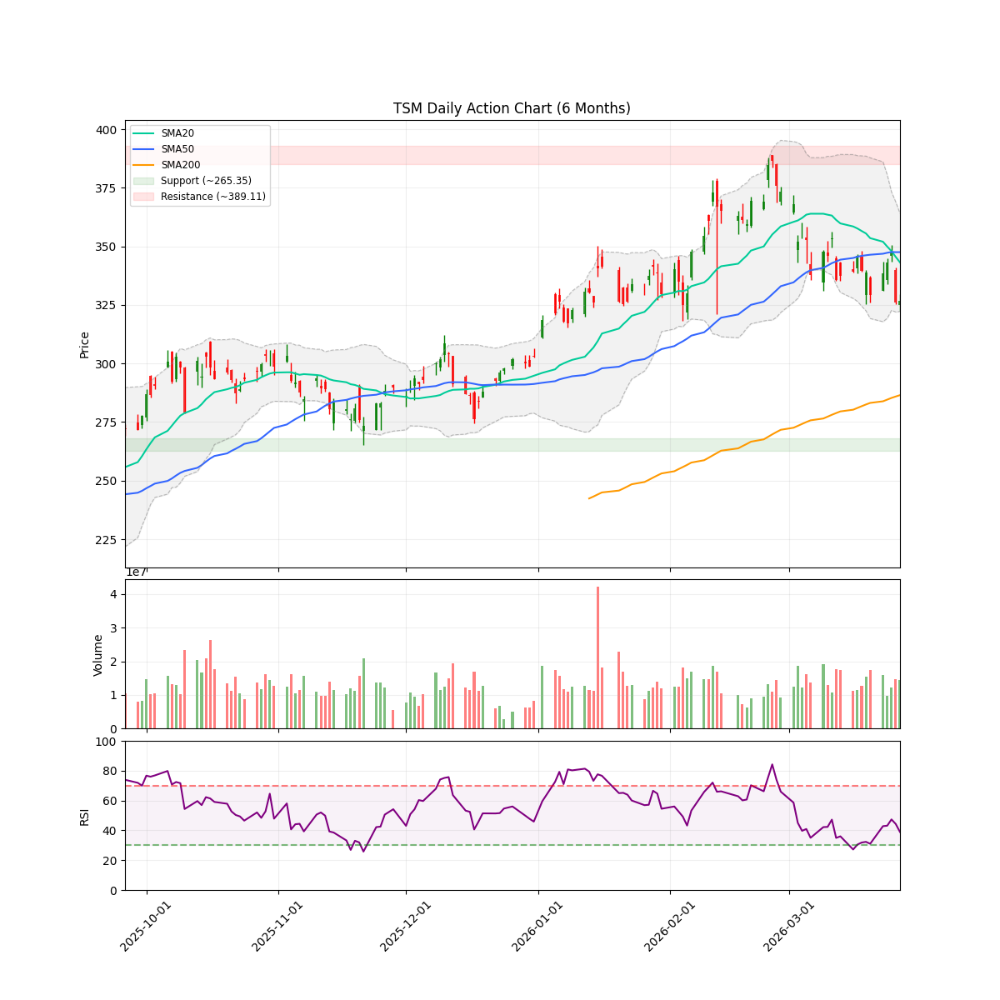
#### 研报分析

### 技术指标概览 (Technical Overview)
- **当前价格**: $326.74
- **RSI (14)**: 38.91
- **移动平均线**: SMA20: $343.16 | SMA50: $347.54 | SMA200: $286.50 (Bullish)
- **波动率**: ATR (14): 11.32 (预计周度波动: +/- $25.32)
- **关键位 (6m)**: 支撑位 $265.35 | 阻力位 $389.11
- **即时状态**: Below SMA50

# TSM 情绪审计报告：AI 王座上的“幸福烦恼”与入场券

**日期：** 2026年3月28日
**标的：** 台积电 (TSM.US)
**当前价格：** $326.74

---

### 1. 叙事背景：当“供不应求”变成一种恐慌
现在的台积电，就像是全球科技盛宴上唯一的主厨。大家都在抢他手里的那盘“2纳米”大餐，由于想吃的人太多，后厨冒烟了。

目前的叙事核心正从单纯的“AI爆发”转向“物理极限的瓶颈”。最近关于 **2纳米产能短缺** 迫使英伟达（Nvidia）可能要重新设计 2028 年 Feynman 芯片的消息，像是一盆冷水，直接泼在了火热的股价上。但作为老牌观察员，我们要问的是：这是基本面崩了，还是成长的烦恼？

---

### 2. 催化剂分类审计 (Catalyst Categorization)

*   **A-Tier（核心动能）：全球 AI 基础设施的“唯一提款机”**
    *   尽管股价回调，但台积电仍是今年万亿市值俱乐部中唯一维持正收益的股票。其在代工市场的定价权（Pricing Power）依然无敌。2纳米的“瓶颈”本质上是对未来数年需求确定性的侧面背书。
*   **B-Tier（行业博弈）：TSM vs. AVGO 的双雄会**
    *   市场正在重新审视半导体版图。比起博通（Broadcom）的平台化扩张，台积电作为“铲子提供者”的角色在动荡市场中显得更具防御性。分析师将其 13% 的回调称为“拍桌子敲定的礼物 (Table-pounding gift)”，这种声音正在积聚买盘力量。
*   **C-Tier（市场杂讯）：短期技术面修正**
    *   关于 13% 回调的讨论大多属于马后炮式的噪音。这种修正更像是长跑途中的系鞋带，而非体力不支的倒地。

---

### 3. 分歧检测：跌出的机会，还是陷阱？ (Divergence Detection)

**现状：好消息里的“小碎步”下跌**
目前 TSM 正在经历一种典型的“预期超前后的修正”。虽然市场一片哀嚎说产能不足，但请记住：**在制造业，产能不足通常是牛市的序曲，而产能过剩才是熊市的葬礼。**

*   **看跌衰竭信号：** RSI 已经跌至 **38.91**，逼近 30 的超卖区间。
*   **支撑位逻辑：** 股价目前在 SMA50 ($347.54) 下方徘徊，但距离 SMA200 ($286.50) 还有一段安全垫。目前的 $326 处在一种“心理拉锯战”中。
*   **结论：** 这不是系统性失败，而是**看涨叙事中的技术性回踩**。

---

### 4. 逻辑评分 (Logic Score): 8.2 / 10

**评分理由：**
*   **基本面 (10/10)：** 无可争议的护城河，AI 时代的绝对受益者。
*   **情绪面 (7/10)：** 市场对“2纳米瓶颈”反应过度，导致短期情绪略显低迷，但这也洗掉了不少投机浮筹。
*   **技术面 (6/10)：** 短期均线空头排列，需要时间震荡筑底。

**总结：** 这是一个 8 分以上的优质标的在经历一场“8.2 折”的限时促销。

---

### 5. 市场老兵的咖啡谈话 (The Narrative)

“嘿，伙计，别被那些‘产能瓶颈’的头条吓破了胆。你想想，如果一家餐馆排队排到了三个街区外，主厨说由于炉灶不够，明年的新菜可能要推迟上，你会觉得这家餐馆要倒闭了吗？不，你会想办法去买它的股份。

现在 TSM 的股价跌破了 50 日线，RSI 只有 38 点，这在去年的 AI 狂欢里是根本见不到的‘清仓价’。那些喊着 500 美元目标价的人还没走，他们只是在等一个借口重新杀回来。现在的回调，正是市场在剔除那些心理素质不稳定的投机者。当大家都在讨论英伟达不得不重新设计芯片时，别忘了，无论它怎么设计，最后还是得求着台积电把它造出来。”

---

### 6. 关键参数与重要日期

*   **引用新闻：** 
    *   [24/7 Wall St.] TSMC 13% 回调是“拍桌子”级别的礼物。
    *   [Blockonomi] 英伟达因 2nm 瓶颈可能重新设计 2028 芯片。
*   **支撑位参考：** $286.50 (SMA200) / $265.35 (6个月低点)
*   **阻力位参考：** $389.11 (历史高点)
*   **下一个重大日期：** **2026年4月中旬（预计 Q1 2026 财报发布日）**。
    *   *注：这将是下一次决定叙事走向的关键转折点，届时管理层对 2nm 进度的指引将决定股价能否重回 350 美元上方。*

**操作建议：** 关注 $310-$320 区间的企稳迹象，在 4 月财报季前分批入场，布局长线的 AI 基础设施红利。
#### 近期新闻与事件
- **[24/7 Wall St.]** [TSM vs. AVGO: Which is a Better Semiconductor Stock?](https://247wallst.com/investing/2026/03/25/tsm-vs-avgo-which-is-a-better-semiconductor-stock/)
- **[The Motley Fool]** [There Are 10 Trillion-Dollar Stocks On the Market. This Is the Only One That's Up This Year](https://www.msn.com/en-us/money/topstocks/there-are-10-trillion-dollar-stocks-on-the-market-this-is-the-only-one-thats-up-this-year/ar-AA1ZAGQt)
- **[Blockonomi]** [Nvidia (NVDA) Stock Drops 3% Amid TSMC Manufacturing Bottleneck Concerns](https://blockonomi.com/nvidia-nvda-stock-drops-3-amid-tsmc-manufacturing-bottleneck-concerns/)
- **[International Business Times]** [10 Best Rising AI Stocks to Buy in 2026: Top Analyst Picks](https://www.ibtimes.com/10-best-rising-ai-stocks-buy-2026-top-analyst-picks-3800335)
- **[The Motley Fool on MSN]** [There Are 10 Trillion-Dollar Stocks On the Market. This Is the Only One That's Up This Year](https://www.msn.com/en-us/money/topstocks/there-are-10-trillion-dollar-stocks-on-the-market-this-is-the-only-one-thats-up-this-year/ar-AA1ZAGQt?ocid=BingNewsVerp)

---

### VLO
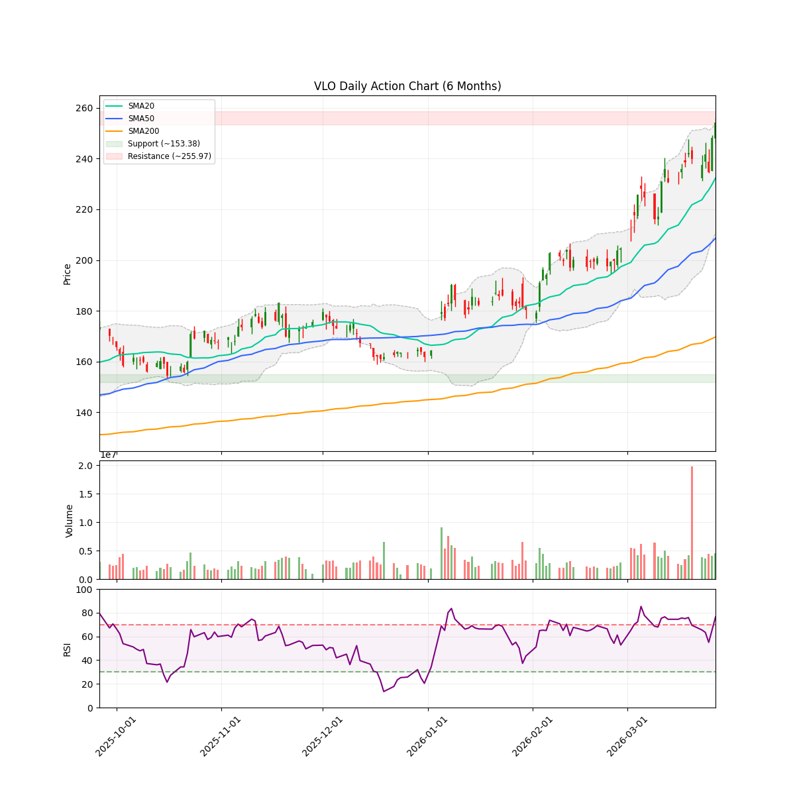
#### 研报分析

### 技术指标概览 (Technical Overview)
- **当前价格**: $254.32
- **RSI (14)**: 76.43
- **移动平均线**: SMA20: $232.32 | SMA50: $208.60 | SMA200: $169.67 (Bullish)
- **波动率**: ATR (14): 8.83 (预计周度波动: +/- $19.74)
- **关键位 (6m)**: 支撑位 $153.38 | 阻力位 $255.97
- **即时状态**: Above SMA50

# Valero Energy (VLO) 叙事经济学审计报告：在炮火与溢价中狂欢

**日期：** 2026年3月28日
**分析师：** 叙事经济学研究组 - 资深对冲基金副研究员

---

### 1. 市场叙事：炼油厂的火光与地缘政治的博弈

如果你现在坐在华尔街底层的咖啡馆里，空气中弥漫的不再是拿铁的味道，而是地缘政治的硝烟味。Valero (VLO) 现在的股价走势，简直就是一部现实版的“叙事史诗”。

从2月28日针对伊朗的敌对行动开始，能源股就成了市场上唯一能让多头感到“安全”的避难所。这不仅仅是关于原油，这是关于**裂解价差（Crack Spreads）**在动荡年代的暴利叙事。尽管前几天特朗普的一条社交媒体帖子让油价震了一下，但 VLO 的韧性展示了什么叫“硬通货”。

### 2. 催化剂分类：谁在扣动扳机？

我们将当前的驱动力按强度划分为三个等级：

*   **A-Tier (核心叙事者):**
    *   **Raymond James 的“激进背书”：** 3月25日，Raymond James 将目标价从 $215 暴力拉升至 **$290** (引用：[Yahoo Finance](https://finance.yahoo.com/sectors/energy/articles/why-raymond-james-calling-290-133101243.html))。这不仅仅是上调，这是在告诉市场：华尔街还没意识到 VLO 到底有多能赚钱。
    *   **地缘政治溢价：** 2月底以来的中东局势直接锁定了能源板块的牛市底色（引用：[MarketBeat](https://www.msn.com/en-us/money/markets/energy-stocks-surge-on-oil-spike-buy-hold-or-take-profits/ar-AA1ZoCHd)）。

*   **B-Tier (机构共振):**
    *   **Scotiabank 的“买入”重申：** 3月26日 Scotiabank 继续敲鼓，确认了机构资金的留存意愿（引用：[The Globe and Mail](https://www.theglobeandmail.com/investing/markets/stocks/VLO/pressreleases/982876/scotiabank-reaffirms-their-buy-rating-on-valero-energy-vlo/)）。
    *   **Zacks 的增长/价值双重认证：** Zacks 连续发文将其列为“增长”与“价值”的交集，这种“全能型选手”的标签非常吸引散户和量化基金的眼球（引用：[Nasdaq](https://www.nasdaq.com/articles/why-valero-energy-vlo-top-growth-stock-long-term)）。

*   **C-Tier (噪音与情绪碎片):**
    *   **Reddit (r/AIPortfolios) 的讨论：** 社交媒体上的看多言论（引用：[Insider Monkey](https://www.msn.com/en-us/money/markets/is-valero-energy-corporation-vlo-a-good-stock-to-buy-now/ar-AA1ZjNFL)），这反映了散户情绪的回归，但也可能是某种过热信号。

### 3. 背离检测：警惕“高原反应”

目前的盘面出现了一个值得玩味的信号：
**现象：** VLO 股价目前在 **$254.32**，正对着 6 个月的高点 **$255.97** 磨刀霍霍。
**风险点：** 我们的 **RSI 高达 76.43**。在老派交易员眼里，这叫“贪婪的呼吸声”。虽然趋势处于强烈的多头排列（远高于 SMA50 和 SMA200），但短期内股价已经透支了部分利好。3月23日 Zacks 观察到的股价在标普上涨时反而微跌（引用：[Zacks](https://www.msn.com/en-us/money/topstocks/valero-energy-vlo-stock-sinks-as-market-gains-here-s-why/ar-AA1ZfsYJ)），这就是典型的**高位抛压**：聪明钱在借好消息偷偷撤离一部分筹码。

### 4. 情绪得分：8.8 / 10 (亢奋且可持续)

*   **逻辑：** 只要中东的火还没熄灭，只要 Raymond James 的 $290 预期还在诱导资金，这个趋势就不是“泡沫”，而是“溢价重估”。VLO 目前不是在乱涨，它是在补涨——补上对未来炼油利润长期高企的预期。

### 5. 投资建议：咖啡馆里的老兵私语

“听着，现在的 VLO 就像一辆满载柴油的重卡冲向 $290。如果你已经上车，握紧你的方向盘，但把止损提到 SMA20 附近。如果你还没上车，别在 $255 附近强攻，等它回踩 $235-$240 区间，那才是老手进场的时机。”

---

### 下一个关键日期 (Next Major Date)
**2026年4月23日 (预计)**：VLO 2026年第一季度财报发布日。
*这是检验“叙事”是否变成“真金白银”的终极时刻。如果裂解价差没有如预期般爆炸，那这就是本轮趋势的终点。*

---
**免责声明：** 这里的每一句话都是基于“叙事经济学”的推演，不构成直接投资建议。市场有风险，炼油需谨慎。
#### 近期新闻与事件
- **[Insider Monkey]** [Is Valero Energy Corporation (VLO) A Good Stock To Buy Now?](https://www.msn.com/en-us/money/markets/is-valero-energy-corporation-vlo-a-good-stock-to-buy-now/ar-AA1ZjNFL)
- **[Yahoo Finance]** [Why Raymond James Is Calling for a $290 Price Tag on Valero (VLO)](https://finance.yahoo.com/sectors/energy/articles/why-raymond-james-calling-290-133101243.html)
- **[Zacks Investment Research]** [Valero Energy Corporation (VLO) is a trending stock: Facts to know before betting on it](https://www.msn.com/en-us/money/topstocks/valero-energy-corporation-vlo-is-a-trending-stock-facts-to-know-before-betting-on-it/ar-AA1ZseRO)
- **[MarketBeat]** [Energy Stocks Surge on Oil Spike: Buy, Hold, or Take Profits?](https://www.msn.com/en-us/money/markets/energy-stocks-surge-on-oil-spike-buy-hold-or-take-profits/ar-AA1ZoCHd)
- **[Zacks Investment Research]** [Valero Energy (VLO) stock sinks as market gains: Here's why](https://www.msn.com/en-us/money/topstocks/valero-energy-vlo-stock-sinks-as-market-gains-here-s-why/ar-AA1ZfsYJ)

---

### VRT
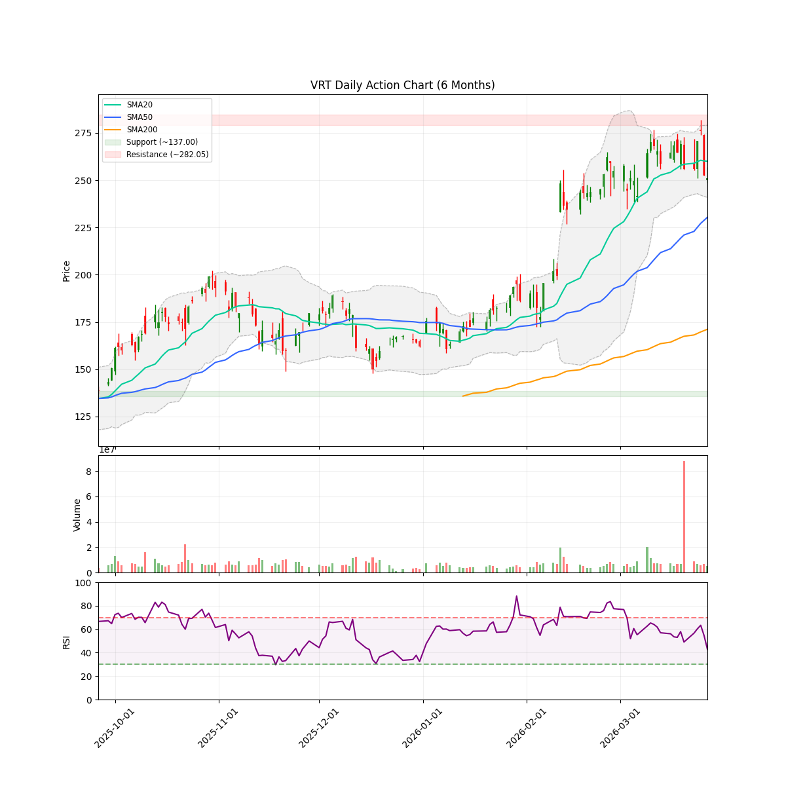
#### 研报分析

### 技术指标概览 (Technical Overview)
- **当前价格**: $251.07
- **RSI (14)**: 42.92
- **移动平均线**: SMA20: $260.03 | SMA50: $230.40 | SMA200: $171.18 (Bullish)
- **波动率**: ATR (14): 13.84 (预计周度波动: +/- $30.95)
- **关键位 (6m)**: 支撑位 $137.00 | 阻力位 $282.05
- **即时状态**: Above SMA50

# 维谛技术 (VRT) 情绪审计报告：AI 散热王者的“成长的烦恼”

你好！来，坐下喝杯咖啡。咱们今天聊聊 **Vertiv (VRT)**。如果你一直在关注 AI 赛道，你就会知道，如果没有维谛提供的那些“冷酷”的电力和散热基础设施，英伟达那些发烫的芯片不过是一堆昂贵的硅片。

目前的 VRT 就像是一个刚考进常春藤盟校（S&P 500）的学霸，虽然光环加身，但最近几天的期末考压力（股价回调）让它显得有些疲惫。

---

### 1. 催化剂分类：叙事引擎的动力源

我们把消息面的“干货”拆开来看，看看哪些是真金白银，哪些只是噪音：

*   **A-Tier（核心动力）：标普500指数入选 & AI 基础设施扩张**
    *   **分析**：3月5日入选标普500指数是“成人礼” [Yahoo Finance]。这意味着海量的被动指数基金必须买入。更重要的是，公司在 AI 领域的持续扩张不是画大饼，而是实实在在的订单增长。
*   **B-Tier（行业助力）：能源需求与核能叙事**
    *   **分析**：IBD 提到资金正涌向与数据中心电力相关的标的 [MSN/IBD]。VRT 虽然不直接造核反应堆，但它是电力分配链条上不可或缺的一环。这种“能源焦虑”是股价长期走牛的基石。
*   **C-Tier（市场杂音）：Zacks 的搜索热度与排名**
    *   **分析**：关于 VRT 是否是“最受关注股票”的讨论属于情绪补涨 [Zacks]。这类消息能维持热度，但不能决定生死。

---

### 2. 背离检测：利好出尽了吗？

这是目前最有趣的地方。

**观察点**：3月25日，股价还在 **$276.16** 附近徘徊，媒体还在高喊“为什么 VRT 今天大涨” [StockStory]。然而，截至今天（3月28日），价格已经回落到 **$251.07**。

**诊断**：**看跌衰竭中的技术性回调**。
尽管新闻页面上满是“顶级成长股”、“跑赢大盘”的赞美诗，但股价却跌破了 SMA20 ($260.03)。这说明市场正在经历典型的“利好兑现”（Sell the News）。进入标普500的兴奋劲儿过去了，现在的买家在等它回踩 SMA50 ($230.40) 的支撑位。RSI 在 42.92，还没跌到“地板价”，但已经不再过热。

---

### 3. 叙事得分 (Logic Score)

**得分：7.8 / 10**

*   **逻辑支撑**：VRT 的叙事非常坚固——它是 AI 物理层的“收税人”。只要大模型还在训练，散热和电力就是刚需。
*   **减分项**：短期内估值消化压力大。从 $137 飙升到 $282，这种垂直向上的走势需要时间通过横盘或深度回调来换取空间。

---

### 4. 市场脉动与老兵点评

“听着，VRT 现在不是坏了，它只是‘发热’了。就像它卖的液冷系统一样，股价也需要降降温。目前的调整是健康的。如果你看长线，只要它守住 $230（SMA50）这一关，这波 AI 基础设施的牛市就还没走完。现在的回调，更像是给那些错过了标普500入选行情的机构一个‘补票’上车的机会。”

---

### 5. 关键参考信息

*   **引用的核心新闻**：
    *   [入选标普500与估值评估](https://finance.yahoo.com/markets/stocks/articles/assessing-vertiv-vrt-valuation-p-130718563.html) (2026-03-05)
    *   [3月25日的大涨复盘](https://finance.yahoo.com/markets/stocks/articles/why-vertiv-vrt-stock-today-024422053.html) (2026-03-25)
    *   [电力与 AI 数据中心叙事](https://www.msn.com/en-us/money/other/funds-go-nuclear-for-this-ibd-50-stock-with-unique-power-ai-data-centers-us-navy-fuel-growth/ar-AA1ZrDYl) (2026-03-10)

*   **下一个重大日期**：**2026年4月底 (Q1 财报发布预估)**
    *   *注意*：届时市场将屏息以待其积压订单 (Backlog) 的增长情况，尤其是液冷产品的渗透率。

**操作建议：** 别在飞刀下落时硬接，关注 $240-$230 区间的企稳信号。如果叙事没变，这只是下一次起跳前的深蹲。
#### 近期新闻与事件
- **[Yahoo Finance]** [Assessing Vertiv (VRT) Valuation After S&P 500 Entry And AI Infrastructure Expansion Moves](https://finance.yahoo.com/markets/stocks/articles/assessing-vertiv-vrt-valuation-p-130718563.html)
- **[Zacks· via Yahoo Finance]** [Is Trending Stock Vertiv Holdings Co. (VRT) a Buy Now?](https://finance.yahoo.com/markets/stocks/articles/trending-stock-vertiv-holdings-co-130006843.html)
- **[StockStory· via Yahoo Finance]** [Why Vertiv (VRT) Stock Is Up Today](https://finance.yahoo.com/markets/stocks/articles/why-vertiv-vrt-stock-today-024422053.html)
- **[Zacks· via Yahoo Finance]** [Why Vertiv Holdings Co. (VRT) Outpaced the Stock Market Today](https://finance.yahoo.com/markets/stocks/articles/why-vertiv-holdings-co-vrt-214505185.html)
- **[Investor's Business Daily on MSN]** [Funds go nuclear for this IBD 50 stock with unique power. AI data centers, US Navy fuel growth.](https://www.msn.com/en-us/money/other/funds-go-nuclear-for-this-ibd-50-stock-with-unique-power-ai-data-centers-us-navy-fuel-growth/ar-AA1ZrDYl?ocid=BingNewsVerp)

---

### VST
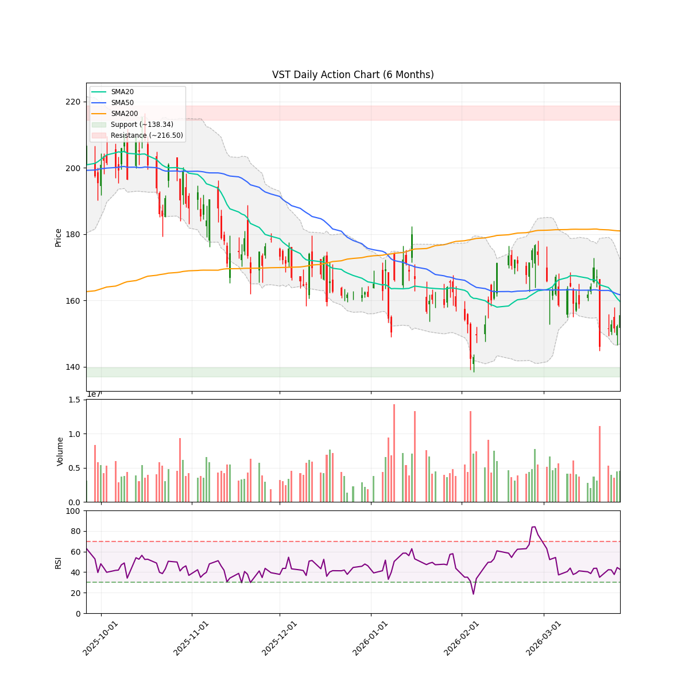
#### 研报分析

### 技术指标概览 (Technical Overview)
- **当前价格**: $155.48
- **RSI (14)**: 42.66
- **移动平均线**: SMA20: $159.64 | SMA50: $161.67 | SMA200: $180.94 (Bearish)
- **波动率**: ATR (14): 7.85 (预计周度波动: +/- $17.55)
- **关键位 (6m)**: 支撑位 $138.34 | 阻力位 $216.50
- **即时状态**: Below SMA50

你好。拿杯咖啡坐下，我们来聊聊 Vistra Corp (VST) 的近况。

在“叙事经济学”的显微镜下，VST 现在就像是一个刚拿到了常春藤录取通知书，却在毕业舞会上摔了一跤的天才少年。虽然它的简历（基本面）金光闪闪，但市场这个老家伙最近似乎对它有点刻薄。

以下是针对 VST 的深度情绪审计报告：

### 1. 催化剂分级 (Catalyst Categorization)

我们要区分什么是“改变游戏规则的重磅”，什么是“市场的噪音”。

*   **A-Tier (核心驱动力：基本面质变)**
    *   **信用评级调升**：Fitch 将 VST 的长期发行人违约评级上调至“投资级” (Investment Grade)。这不仅仅是面子问题，这意味着更低的融资成本和机构大资金的“入场券”。[参考 2026-03-19 Yahoo Finance UK]
    *   **强劲的 Q4 业绩**：营收增长 13.6%，EPS 从 $1.14 翻倍至 $2.18。在公用事业领域，这种增长简直是“超跑”级别的。[参考 2026-02-27 Nasdaq]
*   **B-Tier (行业叙事：顺风车)**
    *   **AI 电力需求与核能复兴**：随着数据中心对电力的渴求，VST 作为核能领头羊，被贴上了“AI 能源基座”的标签。这是支撑长期溢价的关键叙事。[参考 2026-03-24 Insider Monkey]
    *   **机构增持**：Brown Advisory 等中型成长基金的背书，证明了聪明钱仍在场内。
*   **C-Tier (市场噪音：情绪波动)**
    *   **Jim Cramer 的警告**：Cramer 建议“不要太贪婪”。在老练的交易员眼中，这通常被视为一种反向的情绪指标，或者是短期的心理阻力。[参考 2026-03-21 Insider Monkey]
    *   **Zacks 的每日波动简报**：这些关于日内表现超过标普 500 的报告属于短期噪音，不改变大趋势。

### 2. 背离检测 (Divergence Detection)

**警报：明显的“好消息不涨”现象。**

在这里，我们看到了教科书般的**看跌压制 (Bearish Exhaustion)**。看看这个对比：
*   **新闻面**：双重投资级上调、业绩翻倍、AI 需求激增。这本该送股价上云霄。
*   **盘面**：股价 (155.48) 跌破了 SMA50 (161.67)，甚至远低于 SMA200 (180.94)。

**诊断**：VST 正在经历“叙事过热”后的冷却期。即便在 3 月 12 日和 27 日大盘下跌时它表现坚挺，但技术面上它仍处于空头排列。这意味着：**市场目前并不怀疑 VST 的伟大，但它正在怀疑 VST 的估值。** 180 美元以上的筹码正在割肉，而 138 美元的支撑位（6个月低点）才是多头真正的防线。

### 3. 情绪评分 (Sentiment Score)

**得分：6.8 / 10**

*   **逻辑阐述**：基本面是扎实的 9 分（盈利能力、评级上调、行业赛道）；但技术面和短期情绪只能给 4 分。这种脱节意味着 VST 不是“系统性失败”，而是一个**“估值陷阱后的价值回归”**。它在等待一个引爆点来重新夺回 SMA200。

### 4. 叙事总结：是趋势还是陷阱？

现在的 VST 并不是一个“陷阱”，而是一场**“耐心的长跑”**。

去年大家把 VST 当成 AI 科技股来炒，现在它回归了公用事业的本质——即便是“带核能翅膀”的公用事业。目前的股价下跌是由于之前预期透支太快。当 Jim Cramer 开始叫大家小心，当股价跌破 200 日线，那些追涨的投机客正在离场。

对于长线投资者来说，这种**“好消息下的阴跌”**往往是机构在悄悄重新建仓。只要 AI 算力的终点是能源，VST 的故事就没讲完。

### 5. 关键信息看板

*   **逻辑评分**：**6.8** (强基本面 vs 弱技术面)
*   **下个重大日期**：**2026 年 5 月初** (预计发布 2026 年 Q1 财报)。这将是验证“AI 电力需求”是否真正转化为现金流的下个节点。
*   **关键位监测**：
    *   **支撑**：138.34 (必须守住，否则叙事破裂)
    *   **阻力**：180.94 (SMA200，夺回此线方可确认多头回归)

---
*注：本报告基于叙事经济学分析，不构成直接投资建议。市场有风险，入市需谨慎。*
#### 近期新闻与事件
- **[Zacks· via Yahoo Finance]** [Vistra Corp. (VST) Increases Despite Market Slip: Here's What You Need to Know](https://finance.yahoo.com/markets/stocks/articles/vistra-corp-vst-increases-despite-214505041.html)
- **[Insider Monkey· via Yahoo Finance]** [Vistra (VST) Up Slightly After Jim Cramer Warned Against Getting Too Greedy](https://finance.yahoo.com/sectors/energy/articles/vistra-vst-slightly-jim-cramer-163028873.html)
- **[Zacks.com on MSN]** [Vistra Corp. (VST) Increases Despite Market Slip: Here's What You Need to Know](https://www.msn.com/en-us/money/savingandinvesting/vistra-corp-vst-increases-despite-market-slip-heres-what-you-need-to-know/ar-AA1ZzIoe?ocid=BingNewsVerp)
- **[Insider Monkey· via Yahoo Finance]** [Vistra Corp. (VST) Gained from the Rise in Power Demand](https://finance.yahoo.com/markets/stocks/articles/vistra-vst-gained-rise-power-130835649.html)
- **[Zacks· via Yahoo Finance]** [CEG vs. VST: Which Nuclear Stock Has the Edge in the Utility Sector?](https://finance.yahoo.com/sectors/energy/articles/ceg-vs-vst-nuclear-stock-154300195.html)

---
