# 每日股市市场报告 (2026-03-29)

> **免责声明**: 本报告由 **代码与 Gemini AI 自动生成**，仅供研究参考，**不构成**任何投资建议。投资有风险，入市需谨慎。作者及 AI 不对任何基于此内容的投资决策承担责任。

## 📑 目录
[TOC]

##  长期投资逻辑
本组合旨在捕捉 **人工智能（AI）与半导体协议** 带来的跨周期结构性增长，核心投资策略聚焦于“确定性”与“物理瓶颈”：
- **底层制程垄断 (Foundry & WFE Moats)**：
  布局处于全球半导体精密制造顶端的“工业母机”级别公司。寻找具备极高准入门槛的晶圆代工及前道设备供应商，作为全产业链最稳固的底座资产。
- **算力稀缺性与连接带宽 (Compute & Interconnect Scarcity)**：
  聚焦在高性能计算芯（HPC）及高带宽连接领域占据主导地位的标的。AI 的终极竞争是“规模”，寻找能有效解决数据交换瓶颈并提供核心推理/训练能力的算力巨头。
- **应用生态与数据霸权 (Platform & Data Sovereignty)**：
  布局拥有闭环生态、海量高质量私有数据及云基础设施的科技巨头。它们是 AI 商业化落地的最终守门人，拥有将技术转化为持续现金流的分配权。
- **物理边界保障 (Power & Thermal Infrastructure)**：
  关注 AI 扩张的“最终瓶颈”——电力供应与热能管理。重点布局为下一代超大规模数据中心提供高功率密度能源、液冷技术及电网扩容方案的能源基建商。
**风控策略**：利用 AlphaJAX 的量化动量评分（Quant Score）作为过滤器，结合 LLM 叙事审计（Narrative Audit）捕捉“业绩超预期 + 叙事逻辑改善”的共振点，实现跨周期的超额收益。

 **注：排序权重**：Ticker 按照 AI 检测出的 **方向** 排序（**看多**优先，其次是 **中性**，最后是 **看空**）。
---

<!-- DISCORD_SUMMARY_START -->
## 🧠 对冲基金经理全局诊断与资金分配策略
# 投资组合策略简报：2026年3月29日

**致：** 投资执行团队
**由：** 高级投资组合经理 (PM)
**状态：** 核心持仓优化与结构性调仓

---

### 一、 指挥官意图 (Commander's Intent)

目前的市场处于一个极其诡异的**“叙事撕裂期”**。一方面是能源与传统工业（APA, COP, FANG）在战争阴云下疯狂冲高，技术指标已经超买到近乎窒息；另一方面，核心AI基础设施（TSM, ASML, NVDA）却在经历剧烈的“倒春寒”，估值正在被情绪性杀跌。

我们的**核心战术**是：**保持冷酷，拒绝追高，精准抄底。** 我们将清理掉已经失去叙事支撑的僵尸仓位（AMZN），利用腾出的现金储备和现有现金，重点布局“高逻辑分+低技术位”的AI基础设施标的（TSM, GEV, VRT）。对于 AMD 这种处于生死线的重仓，我们要严阵以待，做好接货准备。

---

### 二、 账户全盘诊断与火力调整

#### 1. 持仓结构风险审计
*   **集中度警告：AMD (50.56%)** —— 已经触及我们对AI基础设施持仓的绝对上限（50%）。目前正处于 $200 关键水位线上。由于我们还卖出了一张 $200 的 Put，这意味着一旦行权，集中度将进一步爆表。**不再允许在 AMD 上增加任何正股头寸，必须预留现金准备应对 Put 的指派。**
*   **死角清理：AMZN (1.77%)** —— 逻辑得分仅为 **4.2**。技术面已全线破位，利好钝化。虽然仓位极轻，但属于浪费资金效率。**指令：清仓撤离。**
*   **战略基石：GOOGL (20.99%)** —— 逻辑得分 **7.5**，RSI 杀到 21 这种地心水位。这不是恐慌的时候，这是收割廉价筹码的时候。**指令：持股不动，等待反弹。**

#### 2. 观察池筛选逻辑
*   **拒绝博傻 (APA/COP/MPC/FANG/OKE)**：这些票的逻辑分虽高（8.5），但 RSI 全部在 75-94 之间。现在进场是在火山口跳舞。**指令：放入监控，回踩 SMA20 再看。**
*   **锁定真金 (GEV/TSM/VRT)**：
    *   **GEV (8.8)**：有特朗普/日本 400 亿订单预期，且 RSI 53 极其健康。
    *   **TSM (7.5)**：AI 之王，英伟达正式上位第一大客户，RSI 38 接近超卖。
    *   **VRT (8.2)**：液冷散热是 AI 的物理刚需，回调 9% 正是“黄金坑”。

---

### 三、 确定性交易计划 (Actionable Trading Plan)

#### 第一阶段：腾笼换鸟（即刻执行）
1.  **卖出 AMZN (全部 20 股)**：市价单结利/止损。释放约 $3,986 资金。
2.  **维持 AMD 现状**：严密监控 $200 关口。现金储备必须保持在 $20,000 以上，以备 Put 行权接货（-1.0 AMD260313P200）。

#### 第二阶段：火力压制（择机入场）
1.  **开仓 GEV**：动用 **$10,000** 现金。目前价位 $853 附近，分两批建仓。目标价 $940。
2.  **开仓 TSM**：动用 **$12,000** 现金。在 $326 附近入场，布局 AI 算力中枢。
3.  **开仓 VRT**：动用 **$8,000** 现金。在 $250 附近建立底仓，利用标普 500 入选后的获利回吐抄底。

#### 现金管理状态
*   **操作后预计现金余额**：约 $38,300（保留 59% 现金，符合低于 90% 的红线，且能覆盖 AMD 的 Put 行权义务）。

---

### 四、 避雷针：If-Then 应急预案

*   **场景 A：AMD 跌破 $195 (SMA200)**
    *   **IF**：AMD 收盘跌破 $195。
    *   **THEN**：说明 AI 短期叙事彻底崩坏。停止所有新仓位买入，保留现金，做好 AMD 被动接货后的集中度风险管理（可能需要被迫减持部分正股以维持账户流动性）。
*   **场景 B：能源板块 (APA/MPC) 出现断崖式回调**
    *   **IF**：APA 跌回 $35，MPC 跌回 $230。
    *   **THEN**：意味着地缘政治溢价回归理性。这时可以用 5% 的头寸博弈能源股的均值回归买点。
*   **场景 C：GOOGL 确认反转**
    *   **IF**：GOOGL 站回 $300 (SMA20)。
    *   **THEN**：该头寸将从“深度浮盈持仓”转为“进攻性仓位”，考虑将剩余现金进一步向其倾斜。

---

### PM 老兵寄语：
**“永远别在派对最热闹的时候进场，也别在暴雨将至时弄丢你的雨伞。”** 现在的 AMD 是我们的盾牌（虽然有点沉），而 GEV 和 TSM 是我们即将拔出的长剑。清掉亚马逊，握紧现金，等那些追高 APA 的人哭着离场时，我们已经完成了新一轮的王座布局。

**执行！**
<!-- DISCORD_SUMMARY_END -->
---

## 💼 现有持仓个股诊断

### AMD
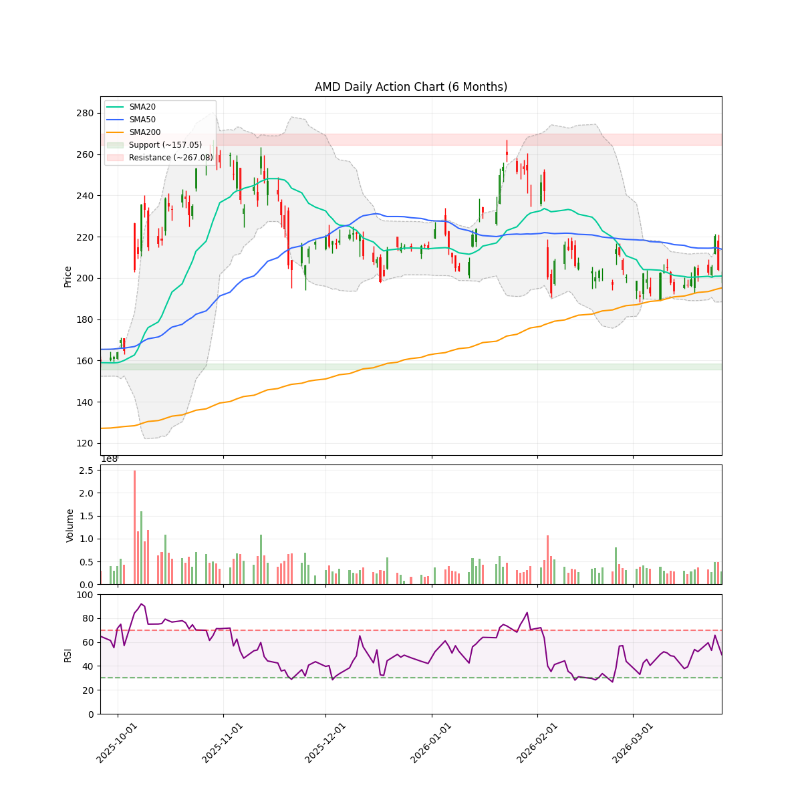
#### 研报分析

### 技术指标概览 (Technical Overview)
- **当前价格**: $201.99
- **RSI (14)**: 49.49
- **移动平均线**: SMA20: $200.92 | SMA50: $213.92 | SMA200: $195.16 (Bullish)
- **波动率**: ATR (14): 8.47 (预计周度波动: +/- $18.94)
- **关键位 (6m)**: 支撑位 $157.05 | 阻力位 $267.08
- **即时状态**: Below SMA50

# AMD 情绪审计报告：财报“开门红”后的倒春寒

**报告日期：** 2026年03月29日
**分析师：** 叙事经济学研究组

---

### 1. 核心叙事：当“利好出尽”遇上“深蹲起跳”

现在的 AMD 就像是在一场马拉松中跑出了个人最好成绩，结果却因为观众期望它直接飞起来而遭到了嘘声。目前的市场情绪充满了矛盾：一方面是创纪录的营收和天量的订单（Meta/OpenAI），另一方面则是股价在财报后的“莫名”暴跌。

这不仅仅是数字的游戏，这是一场**心理博弈**。市场正在消化“后人工智能过热期”的利润回吐，而 AMD 恰好成了出气筒。

---

### 2. 催化剂分级 (Catalyst Categorization)

*   **A-Tier（核心动能）：**
    *   **巨额订单确认：** 与 Meta 和 OpenAI 达成的 12GW GPU 合作，潜在价值高达 **2000 亿美元**。这是决定未来三五年江湖地位的“投名状”。
    *   **创纪录财报：** Q4 营收 102.7 亿美元，超越共识。这证明了其执行力并非空中楼阁。
*   **B-Tier（结构性利好）：**
    *   **CPU 文艺复兴：** 核心 CPU 业务显示出强劲的回暖迹象。
    *   **份额抢夺者叙事：** 随着客户寻求 NVIDIA 之外的替代方案，AMD 拿下 25% 的市场份额已成为主流分析师的共识。
*   **C-Tier（噪音与干扰）：**
    *   **氦气短缺：** 虽被提及，但被市场公认为“最不值得担心的事”。
    *   **投机性调仓：** 所谓的“LA 动乱”或宏观政治杂音，更多是短期套利者抛售的借口。

---

### 3. 背离检测：为何“利好”却“砸盘”？

**观察：** AMD 在发布了亮眼的财报后出现了“坠机式”下跌（-7%）。
**诊断：** 这是典型的**看跌衰竭（Bearish Exhaustion）**前的最后一跌。股价目前（201.99）正处于 SMA200（195.16）这一牛熊分界线的生死边缘。
**逻辑：** 这种背离并非基本面恶化，而是“预期管理”的失败。市场已经对 20% 的增长感到麻木，他们想要的是奇迹。但从叙事角度看，当这种无理性的砸盘发生时，往往预示着卖压正在出清。

---

### 4. 情绪评分 (Sentiment Score): **6.8 / 10**

> **逻辑推演：** 
> 如果只看股价走势，得分可能只有 4。但如果看 **12GW 的 GPU 订单** 和 **2000 亿美元的潜在订单**（[The Motley Fool 引用](https://www.fool.com/investing/2026/03/25/tech-stock-add-my-portfolio-everyone-panic-amd/)），这种基本面与股价的脱节是不可持续的。目前的 6.8 分代表一种“处于极度压抑、等待反弹”的蓄势状态。

---

### 5. 持仓诊断与老兵寄语

**你的现状：**
*   **正股（600股）：** 成本 $220.54，目前浮亏 9.22%。你买在了“山腰”，目前正经历倒春寒。
*   **期权（-1.0 AMD260313P200）：** 你卖出的这张 Put 此时正顶在 200 美元的“火山口”上。由于目前股价跌至 201.99，这张 Put 的溢价已经大幅膨胀，导致你账面浮亏 58.28%。

**市场老兵的咖啡谈话：**
朋友，你现在的处境就是典型的“深套于黎明前”。
1.  **200 美元保卫战：** 股价目前距离你的行权价仅有一线之隔。SMA200 就在 195 美元附近。如果 195-200 这一带守住了，你的 Put 就会转危为安；如果跌破，你可能被迫在 200 美元再次加仓。
2.  **估值陷阱还是黄金坑？** 考虑到 Meta 和 OpenAI 的 2000 亿大单，目前的下跌更像是“聪明钱”在洗掉不坚定的杠杆筹码。你的成本 $220 在中期来看并不算高，但在短期内，你需要忍受波动。

---

### 6. 关键数据与下一里程碑

*   **技术支撑位：** $195.16 (SMA200) —— 这是你的最后防线。
*   **技术压力位：** $213.92 (SMA50) —— 突破这里，反转才算确立。
*   **波动率提醒：** 每周预期波动范围为 +/- 18.94 美元，这意味着股价短期内可能会试探 $183 甚至重回 $220。
*   **下一个重大日期：** **2026 年 4 月下旬（预计 Q1 财报季前哨战）**。届时市场将重新评估 AI 芯片的交付进度。

**结论：** 别被新闻标题吓坏。AMD 的叙事没有崩塌，只是市场的胃口变刁了。**守住 200 美元大关，时间是你的朋友。**
#### 近期新闻与事件
- **[Seeking Alpha]** [AMD: Helium Shortage Is The Least Of Its Problems](https://seekingalpha.com/article/4886922-amd-helium-shortage-least-of-problems)
- **[MSN]** [AMD stock crashes after earnings beat?](https://www.msn.com/en-us/money/topstocks/amd-stock-crashes-after-earnings-beat/vi-AA1ZETg2)
- **[Seeking Alpha]** [AMD Vs. Nvidia: Bet On AMD The Underdog](https://seekingalpha.com/article/4886496-amd-vs-nvidia-bet-on-amd-the-underdog)
- **[Invezz]** [AMD stock slides after surge as profit-taking, chip weakness hit](https://invezz.com/news/2026/03/26/amd-stock-slides-after-surge-as-profit-taking-chip-weakness-hit/)
- **[The Motley Fool]** [1 Tech Stock I'm Adding to My Portfolio While Everyone Is Panicking](https://www.fool.com/investing/2026/03/25/tech-stock-add-my-portfolio-everyone-panic-amd/)

---

### AMZN
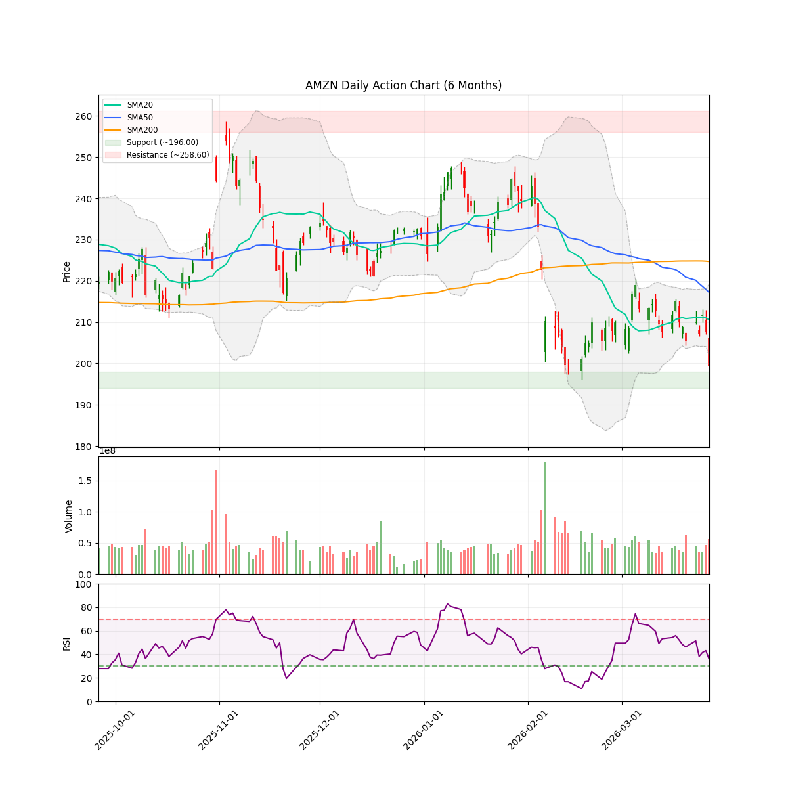
#### 研报分析

### 技术指标概览 (Technical Overview)
- **当前价格**: $199.34
- **RSI (14)**: 35.67
- **移动平均线**: SMA20: $210.53 | SMA50: $217.20 | SMA200: $224.68 (Bearish)
- **波动率**: ATR (14): 5.18 (预计周度波动: +/- $11.58)
- **关键位 (6m)**: 支撑位 $196.00 | 阻力位 $258.60
- **即时状态**: Below SMA50

# 亚马逊（AMZN）情绪审计报告：巨象转身，还是泥足深陷？

你好！很高兴能坐下来和你聊聊亚马逊。现在的西雅图巨头，给人的感觉就像是一个正在经历“中年危机”的超级运动员——虽然肌肉还在，但市场开始怀疑他还能不能跑赢那些年轻的AI新贵。

坐在交易桌前，我们不看那些枯燥的财报修正，我们看的是**叙事（Narrative）**。

---

### 1. 催化剂分类：谁在拉盘，谁在砸盘？

我们将近期的信息碎屑拼凑成三个层级：

*   **A-Tier（核心动力）：大规模AI基建与AWS的长期转型**
    *   虽然市场在抱怨投入过高，但亚马逊正在进行的Annapurna Labs自研芯片（Trainium/Inferentia）布局是其十年维度的护城河。这种“大象转身”的动作虽然慢，但是决定生死。
*   **B-Tier（信心支撑）：机构大佬的“接刀子”与目标价背书**
    *   亿万富翁Seth Klarman的持续加仓以及TD Cowen、Barclays给出的$300目标价，这在心理上为股价构建了一道“估值防火墙”。这告诉我们：聪明钱觉得这里已经便宜了。
*   **C-Tier（短期噪音）：高管离职与跨行业对比**
    *   Annapurna Labs第二位高管离职确实让人皱眉，但在AI人才战中，这种流动很正常。至于Uber或SoFi的对比文章，那只是市场的背景噪音，不影响基本面。

### 2. 背离检测：好消息为何“救不了”股价？

现在的AMZN正处于一种**“利好钝化”**的尴尬境地。
*   **现象：** 尽管有$300的目标价背书和顶级大户持仓，股价却依然跌破了SMA20、50、甚至200日均线。
*   **诊断：** 这是典型的**“看涨衰竭”**后的阴跌。目前的亚马逊正跌向$196的半年低点。
*   **深度洞察：** 市场目前对“AI资本支出”非常过敏。亚马逊每投入一美金在芯片上，华尔街就在算这笔钱什么时候能变成现金流。现在的下跌，实际上是市场在对前两年的过度乐观进行“消肿”。

### 3. 叙事得分：4.2 / 10 (中性偏悲观)

**评分逻辑：**
*   **技术面（-2分）：** 股价处于所有主要均线下方，且RSI (35.67) 还没跌破30的绝对超卖区，说明杀跌动能还没彻底出尽。
*   **叙事面（-1.5分）：** “AI支出无底洞”的叙事正在盖过“云业务增长”的叙事。
*   **情绪支撑（+0.7分）：** $196的支撑位近在咫尺，叠加机构大佬的背书，这里会有一定的反弹诱惑。

**结论：** 目前这不是一个“不可阻挡的牛市”，而是一个**“寻找地板的震荡期”**。如果你现在冲进去，很可能不是在抄底，而是在接一个还在掉落的杠铃。

### 4. 市场脉搏与实操建议

现在的AMZN就像是一本读到一半的悬疑小说。$199这个价格，正踩在投资者的心理防线上。

*   **目前的持仓状态：** 你的成本价在$201.61，目前其实亏损并不大。但要注意，如果股价跌破 **$196.00**（6个月低点），可能会引发一波止损盘，导致股价直接试探更深处的支撑。
*   **老兵的建议：** 别被那$300的目标价蒙蔽了双眼。在SMA20（$210.53）重新夺回之前，所有的反弹都应该看作是“逃命波”或者是卖出备兑看涨期权（Covered Call）的机会。

### 5. 关键时间节点

*   **下一次重大事件：** **2026年4月下旬 - 第一季度财报发布**（具体日期通常在4月24日至4月30日之间公布）。
*   **关注重点：** 财报中关于Annapurna Labs高管离职后的业务连续性说明，以及AWS在AI方面的收入占比是否有所提升。

---

**最后的一句话：** 现在的亚马逊需要的是一场“暴雨”（彻底的超卖）来清洗掉那些不坚定的投机者，而不是现在的“连阴天”。在$196没守住之前，先握紧你的现金。

*参考新闻来源：*
- [Blockonomi: 高管离职细节](https://blockonomi.com/amazon-amzn-stock-dips-2-as-annapurna-labs-faces-second-executive-exit/)
- [Yahoo Finance: Seth Klarman持仓报告](https://finance.yahoo.com/markets/stocks/articles/amazon-com-inc-amzn-billionaire-172043743.html)
#### 近期新闻与事件
- **[The Motley Fool]** [You Won't Believe the Return You Would Have Made if You Bought Uber Stock 3 Years Ago](https://www.fool.com/investing/2026/03/29/you-wont-believe-return-made-uber-stock-3-years/)
- **[AOL]** [Amazon Drops 3%: What Macro Pressure and AI Spending Concerns Mean for AMZN Stock Right Now](https://www.aol.com/finance/amazon-drops-3-macro-pressure-175237933.html)
- **[Yahoo Finance]** [Amazon.com Inc. (AMZN): Billionaire Seth Klarman Bets Big on Tech Giant](https://finance.yahoo.com/markets/stocks/articles/amazon-com-inc-amzn-billionaire-172043743.html)
- **[Blockonomi]** [Amazon (AMZN) Stock Dips 2% as Annapurna Labs Faces Second Executive Exit](https://blockonomi.com/amazon-amzn-stock-dips-2-as-annapurna-labs-faces-second-executive-exit/)
- **[Blockonomi]** [Amazon (AMZN) Stock Soars 3% Following Dual $300 Price Target Endorsements](https://blockonomi.com/amazon-amzn-stock-soars-3-following-dual-300-price-target-endorsements/)

---

### GOOGL
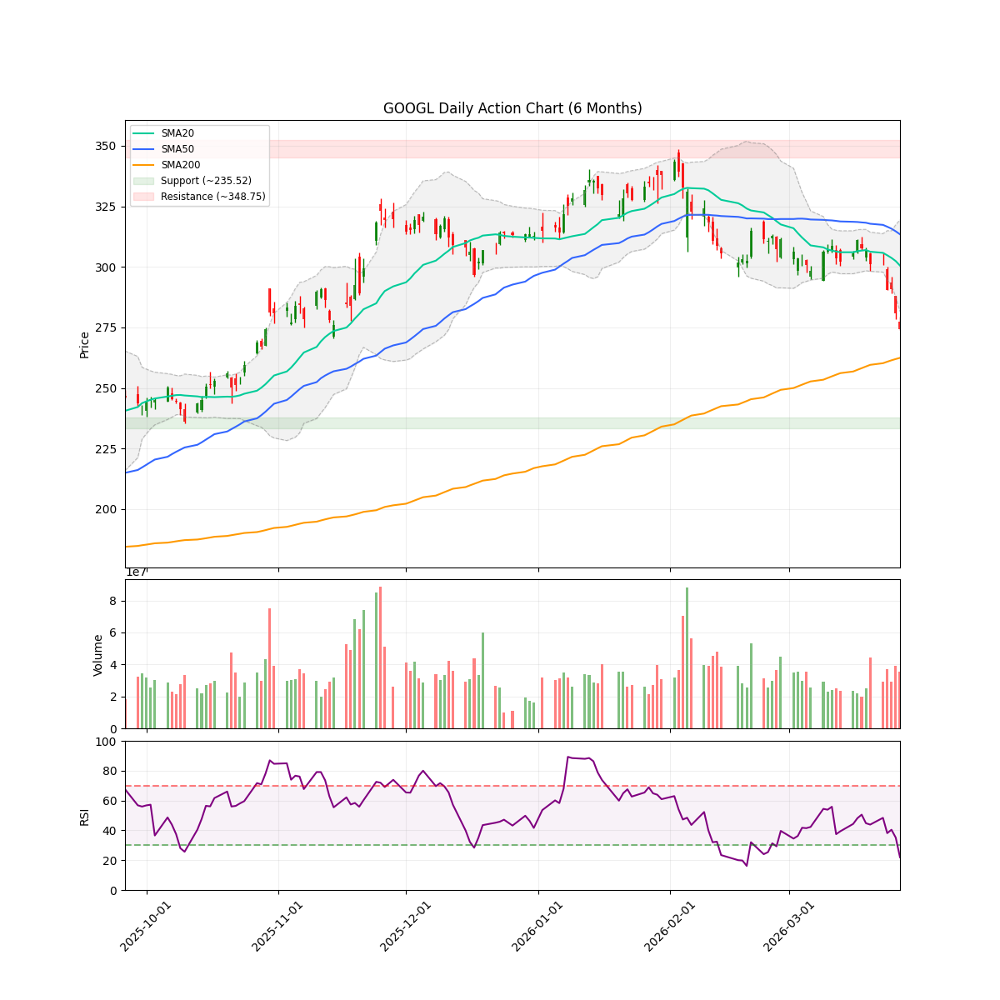
#### 研报分析

### 技术指标概览 (Technical Overview)
- **当前价格**: $274.34
- **RSI (14)**: 21.95
- **移动平均线**: SMA20: $300.52 | SMA50: $313.44 | SMA200: $262.43 (Bullish)
- **波动率**: ATR (14): 6.98 (预计周度波动: +/- $15.62)
- **关键位 (6m)**: 支撑位 $235.52 | 阻力位 $348.75
- **即时状态**: Below SMA50

你好！我是你的叙事经济学（Narrative Economics）研究员。咱们先别盯着屏幕上那些跳动的红绿数字，坐下来，喝杯咖啡，聊聊 Alphabet (GOOGL) 现在到底在玩什么把戏。

目前的市场情绪就像是一场在暴雨中举行的嘉年华。大家都在尖叫着跑向出口，但如果你仔细看，后台的印钞机其实还在轰鸣。

### **GOOGL 情绪审计报告：恐慌中的“黄金坑”还是“下坠的飞刀”？**

#### **1. 催化剂分级 (Catalyst Tiering)**

*   **A-Tier（核心驱动力）：AI 与云端的“肌肉秀”**
    *   尽管股价在跌，但 **$2400亿的云业务订单积压** 和 Waymo 达到 **1.7亿英里** 的里程碑（由 [Blockonomi](https://blockonomi.com/alphabet-googl-stock-dips-despite-waymo-milestone-and-strong-search-performance/) 报道）是实打实的硬核数据。这不只是PPT，这是未来的现金流护城河。
    *   分析师给出的 $330-$400 目标价 [Morgan Stanley & Evercore] 表明，机构眼里的 Alphabet 依然是 AI 时代的收割机。

*   **B-Tier（行业逆风）：洛杉矶的“蝴蝶效应”**
    *   由于洛杉矶陪审团的一项裁决引发了社交媒体板块的集体震动 [Invezz]。这种外部政策风险让短线资金像受惊的鸟群一样四散奔逃，拖累了 GOOGL 这种蓝筹股。

*   **C-Tier（市场噪音）：亿万富翁的调仓与代码之争**
    *   David Abrams 减持 [Insider Monkey]？这更像是大佬的日常获利了结或资产再平衡，不代表基本面崩塌。
    *   至于 GOOG 还是 GOOGL 的科普 [WTOP]，那是写给散户看的闲书，对我们这种研究员来说，这只是背景噪音。

---

#### **2. 叙事背离检测：越跌越香的“怪相”**

现在 GOOGL 正处于一个非常有趣的**叙事错位期**。

*   **市场在说什么？** “监管风险！AI 投入太烧钱！盈利增长可能放缓！”
*   **数据在说什么？** **RSI 指标已经杀到了 21.95**。在量化交易员眼里，这已经不是“超卖”了，这是“跌到了地心”。
*   **我们的解读：** 典型的**看跌情绪耗尽 (Bearish Exhaustion)**。股价目前回到了 $274 附近，距离你的成本价 $268.53 仅一步之遥。虽然股价低于 SMA50，看起来像个输家，但它正死死守在 **SMA200 ($262.43)** 这一“牛熊生死线”上方。历史告诉我们，当一家拥有 2400 亿订单的公司 RSI 低于 22 时，通常是市场送给耐心投资者的礼物，而不是陷阱。

---

#### **3. 情绪评分 (Sentiment Score)**

**7.5 / 10**

> **逻辑推演：** 
> 尽管短期内受到社交媒体板块暴跌的情绪传染，股价表现极差（0-3分水平），但其基本面叙事（AI、云、Waymo）极度强韧（9-10分水平）。目前的 7.5 分反映了一种**“受挫的巨人”**状态——市场正在用情绪惩罚股价，但逻辑上它正处于报复性反弹的边缘。

---

#### **4. 老兵的洞察：给持仓者的私房话**

伙计，你手里的 160 股现在还有 16% 的利润，你比外面那些追高被套在 $348 峰顶的人要从容得多。

目前的情况是：**华尔街在用一种“近视”的眼光看问题。** 他们盯着法庭的判决和本季度的资本支出，却忽视了那个可能在 2026 年底冲向 5 万亿美元市值的预测 [The Globe and Mail]。 

现在的 GOOGL 就像一辆正在换挡的法拉利：换挡时转速会掉，声音会变得难听，但只要齿轮咬合（AI 货币化加速），它会瞬间把你按在座椅背上。

---

#### **5. 关键指标与日期**

*   **技术支撑位：** $262.43 (SMA200) —— 这是你的最后防线，只要这里不破，大趋势就在。
*   **阻力位：** $300.52 (SMA20) —— 只有站回这里，多头才会重新夺回麦克风。
*   **下个重大日期：** **2026年4月下旬（预计 Q1 财报发布日）**。届时，那 $2400 亿云订单的转化率将决定它是直接起飞，还是继续在泥潭里磨叽。

**总结建议：** 别被新闻头条吓破胆。目前这种下跌更像是**“估值回归”**而非**“价值损毁”**。只要不跌破 SMA200，你的头寸依然是这场 AI 叙事中最稳健的底仓之一。
#### 近期新闻与事件
- **[Invezz]** [Social media stocks crash: here's the best one to buy on the dip](https://invezz.com/news/2026/03/28/social-media-stocks-crash-heres-the-best-one-to-buy-on-the-dip/)
- **[Yahoo Finance]** [Google Stock Is Almost in Bear Market Territory. Should You Buy the Dip?](https://finance.yahoo.com/markets/stocks/articles/google-stock-almost-bear-market-201819842.html)
- **[WTOP]** [GOOG vs. GOOGL: Why 2 Classes of Alphabet Stock?](https://wtop.com/news/2026/03/goog-vs-googl-why-2-classes-of-alphabet-stock/)
- **[Blockonomi]** [Alphabet (GOOGL) Stock Dips Despite Waymo Milestone and Strong Search Performance](https://blockonomi.com/alphabet-googl-stock-dips-despite-waymo-milestone-and-strong-search-performance/)
- **[Insider Monkey]** [Alphabet Inc. (GOOGL): Billionaire David Abrams Reduces Position](https://www.msn.com/en-us/money/companies/alphabet-inc-googl-billionaire-david-abrams-reduces-position/ar-AA1ZxUQT)

---

## 🔍 观察池机会分析

### APA
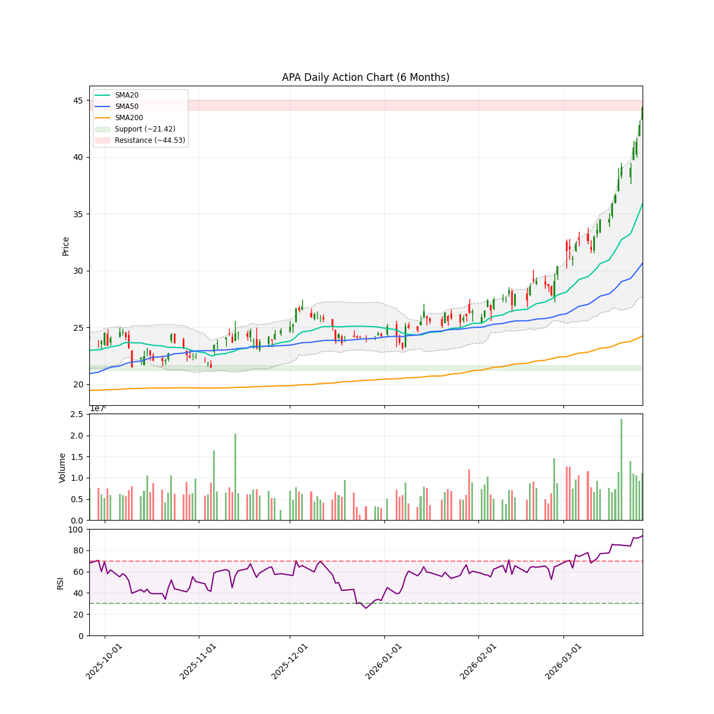
#### 研报分析

### 技术指标概览 (Technical Overview)
- **当前价格**: $44.39
- **RSI (14)**: 93.70
- **移动平均线**: SMA20: $35.88 | SMA50: $30.64 | SMA200: $24.24 (Bullish)
- **波动率**: ATR (14): 1.60 (预计周度波动: +/- $3.57)
- **关键位 (6m)**: 支撑位 $21.42 | 阻力位 $44.53
- **即时状态**: Above SMA50

# 情绪审计报告：APA Corp (NASDAQ: APA)
**日期：** 2026年03月29日
**分析师：** 叙事经济学研究组

---

### 1. 叙事背景：当硝烟遇上石油
坐在交易大厅的桌子旁，你都能闻到空气中那种令人不安却又让能源多头兴奋的“火药味”。当前的 APA 不仅仅是一个股票代码，它是**地缘政治焦虑的代名词**。

随着伊朗冲突引发的宏观恐慌，投资者正疯狂地从债券和普通股中撤离，逃往现金和这种“黑金”避风港。APA 的走势已经脱离了传统的估值模型，进入了由战争叙事驱动的“博傻”阶段。但这究竟是通往月球的阶梯，还是一个精巧的诱多陷阱？

---

### 2. 催化剂分级 (Catalyst Categorization)

*   **A-Tier：地缘政治海啸 (伊朗战争风险)**
    *   **详情**：[MSN援引经济时报] 报道指出投资者正像2022年那样疯狂转向现金，原因正是伊朗战争带来的地缘政治冲击。对于 APA 这样的能源开采商，战争意味着供应收紧预期，这是推升股价的最核心引擎。
*   **B-Tier：机构追赶式评级上调**
    *   **详情**：[Barclays] 将评级从中性上调，目标价定为 $35 [Investing.com]；[RBC Capital] 也将目标价上调至 $29 [Yahoo Finance]。
    *   **洞察**：请注意，这些投行的目标价（$29-$35）远低于目前的现价（$44.39）。这意味着分析师们的模型已经跟不上现实的疯狂，他们在被迫“补涨”评级。
*   **C-Tier：市场噪音与混淆**
    *   **详情**：新闻中提到的梅斯卡莱罗阿帕奇预留地火灾 [KOAT] 以及尼日利亚电力危机 [APAnews] 虽然带有 "Apache" 或 "APA" 字样，但属于纯粹的算法抓取噪音，与公司基本面无关。

---

### 3. 背离检测与风险诊断 (Divergence Detection)

**警报：RSI 读数高达 93.70！**
在叙事经济学中，当故事过于完美，以至于连路边的清洁工都在谈论“能源危机”时，危险就降临了。
*   **技术极端**：RSI 超过 90 是极其罕见的“超买中之超买”。股价（44.39）已经远超 SMA50（30.64）约 45%，这在物理学上叫超伸，在交易上叫“高空缺氧”。
*   **利好出尽？**：虽然 Barclays 给出了正面评价，但他们设定的目标价是 $35，而市场已经冲到了 $44。这种“股价跑赢预期”的情况通常意味着利好已被过度透支。

---

### 4. 情绪评分 (Sentiment Score): 8.5/10 (不可阻挡的疯狂，但接近引爆点)

*   **逻辑说明**：叙事得分极高（10/10），因为战争是无法证伪的看涨理由。但结构得分极低（2/10），因为技术指标显示这几乎是一个垂直升空的火箭，缺乏地基。这是一种“恐慌性买入”的情绪。

---

### 5. 核心洞察：是趋势还是陷阱？

**结论：这是一个“华丽的博傻陷阱”。**

目前的 APA 正在经历一个典型的**“抛物线顶点”**叙事。虽然基本面（油价上涨）是真实的，但 93.7 的 RSI 表明多头头寸已经拥挤到了极点。一旦地缘政治局势出现哪怕一丝缓和的传闻，APA 的回撤将是断崖式的。

*   **老兵建议**：现在进场不是在投资，而是在和拿着手榴弹的人玩传球游戏。如果你手里有货，现在是分批套现、举杯庆祝的时候；如果你还没入场，千万别在 $44 的位置去接那些分析师在 $29 就想卖出的筹码。

---

### 6. 关键数据追踪

*   **情绪逻辑得分**：**2.5 / 10** (基于风险收益比，当前位置逻辑上极不划算)
*   **引用的关键信息**：
    *   [伊朗战争宏观背景](https://www.msn.com/en-in/money/markets/investors-switch-to-cash-from-stocks-and-bonds-like-its-2022/ar-AA1ZuhMy)
    *   [Barclays 追赶式评级](https://www.investing.com/news/analyst-ratings/barclays-upgrades-apa-stock-rating-on-gas-marketing-outlook-93CH-4574305)
*   **下一个重大日期**：**2026年5月初** (预计 Q1 财报发布日)。届时市场将检验这一波战争红利是否真的转化成了报表上的现金流。

**止损提醒**：目前支撑位在 $35.88 (SMA20)，如果跌破此位，叙事将彻底瓦解。
#### 近期新闻与事件
- **[The Economic Times on MSN]** [Investors switch to cash from stocks and bonds like it's 2022](https://www.msn.com/en-in/money/markets/investors-switch-to-cash-from-stocks-and-bonds-like-its-2022/ar-AA1ZuhMy?ocid=BingNewsVerp)
- **[KOAT Channel 7 on MSN]** [Crews responding to wildfire on Mescalero Apache Reservation](https://www.msn.com/en-us/news/us/crews-responding-to-wildfire-on-mescalero-apache-reservation/ar-AA1Zuji9?ocid=BingNewsVerp)
- **[APAnews]** [Power crisis threatens Nigeria’s growth – Rewane warns](https://apanews.net/power-crisis-threatens-nigerias-growth-rewane-warns/)
- **[aktiencheck.de]** [Virtus Real Asset Income ETF Distributes Quarterly Payout](https://www.aktiencheck.de/news/Artikel-Virtus_Real_Asset_Income_ETF_Distributes_Quarterly_Payout-19610525)
- **[Yahoo Finance]** [RBC Capital Raises APA Target as Oil Strength and Earnings Momentum Support Shares](https://finance.yahoo.com/news/rbc-capital-raises-apa-target-041126547.html)

---

### ASML

#### 研报分析

### 技术指标概览 (Technical Overview)
- **当前价格**: $1302.47
- **RSI (14)**: 42.90
- **移动平均线**: SMA20: $1363.41 | SMA50: $1396.80 | SMA200: $1039.28 (Bullish)
- **波动率**: ATR (14): 50.84 (预计周度波动: +/- $113.69)
- **关键位 (6m)**: 支撑位 $932.52 | 阻力位 $1547.22
- **即时状态**: Below SMA50

你好，伙计。坐，咱们边喝咖啡边聊。

现在的 ASML（阿斯麦）就像是那个在派对高峰期突然退到角落抽烟的“大人物”。大家都知道他是全场最核心的存在——毕竟没有他的光刻机，这派对（AI和高端半导体浪潮）根本开不起来。但现在的盘面显示，这位大佬似乎有点“审美疲劳”了。

让我们剥开这些新闻和数据的外壳，看看里面到底卖的是什么药。

### 1. 催化剂分级 (Catalyst Categorization)

我们要区分什么是“改变游戏规则的真金白银”，什么是“媒体的自我感冒”。

*   **A-Tier (核心逻辑)：DRAM 产能扩张与 EUV 长期需求**
    *   Bernstein 上调目标价的理由非常硬：DRAM 产能的增长对阿斯麦是刚需。只要存储芯片还要往上堆叠，阿斯麦的订单就少不了。这是支撑它 1000 刀以上估值的脊梁骨。
    *   *参考来源：[Investing.com - Bernstein raises ASML stock price target]*
*   **B-Tier (市场情绪)：机构的“抄底”呼声**
    *   TD Cowen 和摩根士丹利虽然态度略有分歧，但 TD Cowen 明确指出 7% 的回撤是“黄金坑”，目标价看至 €1,500。这种机构背书能为股价提供心理支撑。
    *   *参考来源：[Blockonomi - Why TD Cowen Sees This 7% Dip as a Prime Buying Opportunity]*
*   **C-Tier (噪音)：日常估值辩论**
    *   关于“ASML 是否比 AMAT 更有价值”或者“ASML 是否便宜”的讨论。这些是典型的“叙事噪音”，在市场情绪好的时候是助力，情绪差的时候就是废话。
    *   *参考来源：[TipRanks/Motley Fool 相关的对比文章]*

### 2. 背离检测：利好不涨的“倒春寒”？

现在的技术面很有意思，但也让人有点手心冒汗。
*   **现状**：我们看到 Bernstein 调高了目标价，TD Cowen 喊话抄底，但股价（1302.47）却结结实实地压在 SMA20（1363）和 SMA50（1396）下面。
*   **诊断**：这是典型的**“好消息被消化，坏情绪在发泄”**。市场目前并不质疑阿斯麦的统治力，但它在质疑“现在是不是买贵了”。RSI 处在 42.9 的尴尬位置，还没跌透到“超卖”的惊恐区，但也失去了向上的冲劲。
*   **结论**：这不代表公司出了问题，而是机构在重新锚定 2026 年的盈利预期。

### 3. 叙事经济学：是陷阱还是机会？

当前的叙事正从“无脑买入 AI 基础设施”转向“精挑细选性价比”。

阿斯麦现在的剧本是：**“昂贵的必需品”**。
市场正在经历一场关于“估值锚点”的拉锯战。SMA200 还在 1039 附近，意味着长线趋势依然强得离谱，但短线的回调（从 1547 跌到 1302）让那些在高位入场的人倍感煎熬。这不是系统性崩溃，而是一次**“获利盘的暴力洗牌”**。

如果你是长期主义者，这种“回踩”其实是给还没上车的人留的后门。但如果你是想做下周的短线，现在的 SMA50 就像是一块沉重的天花板。

### 4. 情绪评分 (Sentiment Score)

**7.5 / 10**

*评分逻辑*：
*   **+2.0**：行业垄断地位无可撼动（EUV 护城河）。
*   **+1.5**：DRAM 需求带来的确定性增长预期。
*   **+1.0**：主要投行仍维持“增持”或“调高目标价”态度。
*   **-1.0**：技术面跌破短期均线，上方套牢盘压力大。
*   **-1.0**：摩根士丹利警告短期上行空间有限，压制了多头热情。

---

### 5. 核心结论与预测

**下一次大事记 (Next Major Date):**
**2026年4月15日左右 (Q1 2026 Earnings Release)**
*预计阿斯麦将在此时公布一季度财报。届时关于 2026 年全年的订单指引将决定它是突破 1547 的历史高点，还是回踩 1100 寻找新的支撑。*

**老兵的建议：**
别被这两天的阴线吓破胆。阿斯麦不是那种会突然倒下的公司，它只是跑得太快，需要停下来系个鞋带。目前的 RSI 表明，如果股价进一步杀向 1200-1250 区间，那将是一个非常迷人的“击球区”。

*投资有风险，这杯咖啡我请，但单得你自己买。*
#### 近期新闻与事件
- **[TipRanks· via Yahoo Finance]** [ASML vs. Applied Materials (AMAT): Which Chip Equipment Stock Offers Better Value in 2026?](https://finance.yahoo.com/markets/stocks/articles/asml-vs-applied-materials-amat-121931554.html)
- **[Investing.com]** [Bernstein raises ASML stock price target on DRAM capacity growth By Investing.com](https://www.investing.com/news/analyst-ratings/bernstein-raises-asml-stock-price-target-on-dram-capacity-growth-93CH-4582588)
- **[Motley Fool· via Yahoo Finance]** [Why ASML Stock Popped Today](https://finance.yahoo.com/markets/stocks/articles/why-asml-stock-popped-today-162428638.html)
- **[Motley Fool· via Yahoo Finance]** [ASML Stock Isn't Cheap, but It Might Still Be a Bargain](https://finance.yahoo.com/markets/stocks/articles/asml-stock-isnt-cheap-might-102900504.html)
- **[Motley Fool· via Yahoo Finance]** [1 Prediction for ASML Stock in 2026](https://finance.yahoo.com/markets/stocks/articles/1-prediction-asml-stock-2026-185000528.html)

---

### AVGO
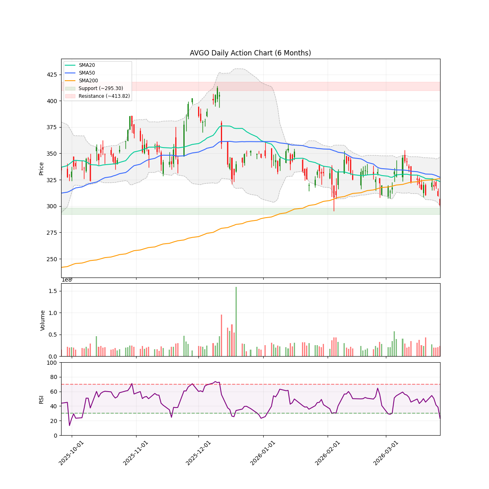
#### 研报分析

### 技术指标概览 (Technical Overview)
- **当前价格**: $300.68
- **RSI (14)**: 23.00
- **移动平均线**: SMA20: $323.18 | SMA50: $327.33 | SMA200: $326.13 (Bullish)
- **波动率**: ATR (14): 11.08 (预计周度波动: +/- $24.77)
- **关键位 (6m)**: 支撑位 $295.30 | 阻力位 $413.82
- **即时状态**: Below SMA50

# 情绪审计报告：博通 (AVGO)——是“倒春寒”还是“终局之战”？

**致：** 投资委员会
**从：** 叙事经济学研究组
**日期：** 2026年3月29日

---

### 1. 市场叙事脉络：繁华背后的“信任危机”

嘿，坐下来，咱们边喝咖啡边聊聊博通。

现在的博通（AVGO）给人的感觉就像是一场顶级派对上，那个明明赚得最多、却突然被保安请去问话的贵宾。从叙事角度看，我们正处于一个极其微妙的**“利好不涨”**的怪圈里。

一方面，基本面硬得发烫：AI 收入直接翻倍，这在任何时候都该是涨停的剧本。但现实呢？股价非但没起飞，反而跌破了所有的移动平均线（SMA20/50/200），RSI 更是直接杀到了 **23.00**。这是一个什么概念？这几乎是市场在尖叫着“卖超了”，但卖盘依然像潮水一样涌出来。

市场的“心魔”在于那 **8800万美元的高管减持**（Yahoo Finance 报道）。在散户眼里，这是大船沉没前的信号；但在我们这种老江湖看来，这更像是趁着 AI 泡沫还在，高管们想改善一下生活。真正的冲突点在于：**AI 的硬实力能否抵消短期筹码的流出？**

---

### 2. 催化剂分类审计 (Catalyst Tiering)

*   **A-Tier（核心动力）：AI 营收翻倍，定制芯片需求激进**
    *   *依据：* AOL 报道指出其 AI 收入实现了 100% 的增长。这是实打实的利润支撑，不是空气币。
*   **B-Tier（行业卡位）：与 TSM 和 NVDA 的横向博弈**
    *   *依据：* 24/7 Wall St 的分析。博通在定制芯片（ASIC）市场的统治力，使其在 AI 军备竞赛中处于“收割者”地位，虽然它不像 NVIDIA 那样耀眼，但它是底层架构的“收税员”。
*   **C-Tier（杂讯与情绪干扰）：内部人减持 & 吉姆·克莱默（Jim Cramer）的喊话**
    *   *依据：* Yahoo Finance 提到的 8800 万美元减持。这更多是心理压力而非流动性崩盘。至于克莱默的看好（Insider Monkey），有时候在市场上反而被视为一种“反向指标”的杂音。

---

### 3. 背离检测：悲观情绪的“最后一口气”

现在的 AVGO 正在上演一场教科书级别的**“看跌衰竭（Bearish Exhaustion）”**：
*   **坏消息 vs. 股价：** 内部人减持的消息被无限放大，掩盖了营收翻倍的壮举。
*   **技术形态：** 股价 300.68，已经贴近了 6 个月的支撑位 295.30。SMA 出现了“死亡交叉”的既视感，但 RSI 指标却在 23 的超卖区间疯狂预警。
*   **结论：** 这是一个典型的**“利好麻木期”**。市场现在不看增长，只看抛压。一旦抛压在 295 附近枯竭，由于基本面（A-Tier）并未受损，反弹将是报复性的。

---

### 4. 逻辑评分 (Logic Score): 6.8 / 10

**评分逻辑：**
*   **+3.0分：** AI 业务翻倍的硬逻辑，AVGO 是 AI 基础设施的刚需。
*   **+2.0分：** 技术性超卖严重（RSI 23），距离强支撑仅一步之遥，赔率极高。
*   **-1.5分：** 趋势完全走坏（跌破 SMA200），动能反转需要时间修复。
*   **-0.7分：** 内部人减持带来的散户恐慌叙事尚未完全平息。

**最终结论：** 这不是“陷阱”，而是一个**由于情绪过激导致的“黄金深坑”**。博通的基本面并未恶化，只是它的故事暂时被市场的噪音盖过了。

---

### 5. 关键参考与后续观察

*   **特定新闻引用：**
    *   [Yahoo Finance] 内部人卖出 8800 万美元股票 [链接](https://finance.yahoo.com/markets/stocks/articles/broadcom-insiders-selling-stock-avgo-140002593.html)
    *   [AOL] AI 收入翻倍，股价却止步不前 [链接](https://www.aol.com/finance/broadcom-ai-revenue-just-doubled-140330604.html)
    *   [24/7 Wall St] AVGO 三年期预测：业务全方位加速 [链接](https://247wallst.com/investing/2026/03/27/broadcom-stock-price-prediction-where-will-avgo-be-in-3-years/)

*   **下一个重大日期：**
    *   **2026年6月中旬（预计）：第二季度财报发布日。** 这是证明内部人减持只是“个人需求”而非“业务暴雷”的最佳战场。如果届时 AI 收入能维持当前的斜率，300 块的博通将成为历史。

---

**老兵私语：** 别在大家都在逃跑的时候被绊倒，但也别在子弹还在飞的时候冲上去。盯着 295.30 这个支撑位，如果这里守住了，那就是我们要找的“叙事反转点”。
#### 近期新闻与事件
- **[Yahoo Finance]** [Broadcom Insiders Are Selling Stock. Is AVGO Finally at the End of the Road?](https://finance.yahoo.com/markets/stocks/articles/broadcom-insiders-selling-stock-avgo-140002593.html)
- **[24/7 Wall St.]** [Broadcom Stock Price Prediction: Where Will AVGO Be in 3 Years?](https://247wallst.com/investing/2026/03/27/broadcom-stock-price-prediction-where-will-avgo-be-in-3-years/)
- **[24/7 Wall St.]** [TSM vs. AVGO: Which is a Better Semiconductor Stock?](https://247wallst.com/investing/2026/03/25/tsm-vs-avgo-which-is-a-better-semiconductor-stock/)
- **[Insider Monkey]** [Is Broadcom (AVGO) The Best AI Chip Stock to Buy According to Jim Cramer?](https://www.insidermonkey.com/blog/is-broadcom-avgo-the-best-ai-chip-stock-to-buy-according-to-jim-cramer-1723464/)
- **[AOL]** [Broadcom's AI Revenue Just Doubled. The Stock Barely Moved](https://www.aol.com/finance/broadcom-ai-revenue-just-doubled-140330604.html)

---

### CEG
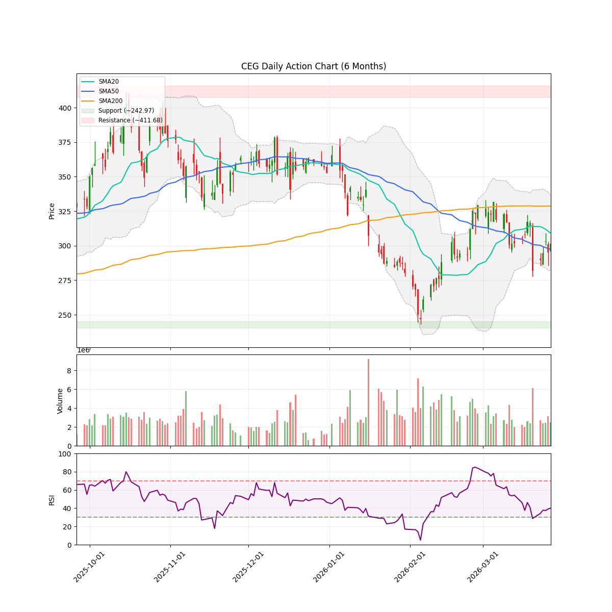
#### 研报分析

### 技术指标概览 (Technical Overview)
- **当前价格**: $301.49
- **RSI (14)**: 40.21
- **移动平均线**: SMA20: $309.07 | SMA50: $297.35 | SMA200: $328.82 (Bearish)
- **波动率**: ATR (14): 14.17 (预计周度波动: +/- $31.69)
- **关键位 (6m)**: 支撑位 $242.97 | 阻力位 $411.68
- **即时状态**: Above SMA50

# CEG 情绪审计报告：核能宠儿的“倒春寒”，还是叙事终结？

**日期：** 2026年3月29日
**分析师：** 叙事经济学研究组
**标的：** Constellation Energy (CEG)
**现价：** $301.49

---

### 1. 叙事背景：从“AI 电力心脏”到“涨过头的反思”

如果你在几个月前谈论 CEG，那简直是资本市场的英雄史诗。作为核能领域的领头羊，它被视为支撑硅谷 AI 算力帝国的唯一解。但转眼到今天，坐在 300 美元这个关口，市场的情绪显然少了一份狂热，多了一份宿醉后的头痛。

目前的 CEG 正处于一种**“叙事真空期”**。虽然长线叙事（核能 + 大厂合约）依然稳固，但短期内，股价似乎被压在 200 日均线（$328.82）之下抬不起头。这种感觉就像是一个刚跑完马拉松的运动员，即便底子再好，现在也只能在大树下喘粗气。

---

### 2. 催化剂分级 (Catalyst Categorization)

我们要拆解一下最近驱动股价的那些“消息”，看看哪些是真金白银，哪些只是噪音：

*   **A-Tier（核心动力）：核电资产溢价与 Calpine 收购预期**
    *   尽管 3 月 15 日的消息提到了化学泄漏的插曲，但市场更关注的是其庞大的核电舰队以及与科技巨头（Big Tech）的长期供电协议。这是 CEG 股价的护城河。
*   **B-Tier（战术利好）：与 LS Power 的合作协议**
    *   [Insider Monkey, 3月26日] 报道了 CEG 与 LS Power Equity Advisors 的协议。这种行业内的强强联合巩固了其作为“保守派必买股”的地位，虽然没能立刻拉升股价，但夯实了基本面。
*   **C-Tier（日常杂音）：分析师小幅调低目标价、Zacks 的技术面警告**
    *   [JPMorgan, 3月24日] 将目标价从 $410 下调至 $400。虽然下调了，但相比现价（$301）仍有巨大的空间。这种动作更多是投行在调整风险溢价，而非看空。
    *   Zacks 频繁提到的“表现不及大盘”属于后验指标，对我们预判未来转折意义有限。

---

### 3. 背离检测：好消息为什么不涨了？

**诊断：看跌力竭 (Bearish Exhaustion) 正在接近。**

最近的一个有趣现象是：3 月 25 日（周三）股价出现了一次久违的脉冲式反弹（[Motley Fool 报道]）。但在那之后，即便有 LS Power 这样的协议达成，股价依然在 300 美元附近徘徊，并受到了 SMA20（$309.07）的压制。

**这里存在明显的“认知背离”：** 机构依然在重申它是“必买核能股”，但短线资金却因为财报后的 6.9% 跌幅（[Zacks, 3月26日]）而感到心惊肉跳。**现在的 CEG 不是坏公司，只是一个被困在技术性调整里的优等生。** RSI 处于 40 左右，并没有进入超卖的绝对安全区，这意味着空头可能还想最后往下踹一脚，去测试 SMA50（$297.35）的支撑。

---

### 4. 情绪得分 (Sentiment Score): 6.5/10

**评价：这是一个“带刺的买点”。**

*   **逻辑：** 10 分是无脑多，0 分是彻底崩盘。6.5 分代表了 CEG 现在的尴尬境地：长线逻辑是 9 分（核能稀缺性），但短线叙事只有 4 分（动能衰减、技术形态破位）。
*   **结论：** 这不是一个“陷阱”，而是一个“磨人的震荡区间”。如果你现在冲进去，要有陪它在 300 美元附近反复摩擦两个月的心理准备。

---

### 5. 市场老兵的私房话 (Executive Summary)

“伙计们，别被那些‘表现不及大盘’的标题吓破了胆。CEG 现在的走势就像是那种在聚会上喝多了的富二代，他需要时间清醒一下。JPMorgan 调低那 10 块钱的目标价根本不是重点，重点是它依然站在 297 美元的关键支撑（SMA50）上面。

现在的策略很清晰：**不要去接那把还在掉的飞刀，但要死死盯着 290-300 这个区间。** 如果它能在 SMA50 附近企稳，配合核能叙事的再次回归，那 400 美元的远方依然不是梦。”

---

### 6. 关键日程提醒

*   **下一个重大日期：** **2026年5月初（预计 Q1 财报发布日）**。
    *   *注：* 市场将极度关注这次财报中关于 Calpine 收购进度以及与 AI 数据中心电价谈判的新进展。在此之前，股价大概率会随波逐流。

---
**参考来源：**
- [JPMorgan 调低目标价至 $400](https://finance.yahoo.com/markets/stocks/articles/jpmorgan-lowers-price-target-constellation-193235255.html)
- [与 LS Power 的合作协议](https://finance.yahoo.com/sectors/energy/articles/constellation-energy-ceg-ls-power-155036530.html)
- [Zacks 关于财报后跌幅的分析](https://finance.yahoo.com/markets/stocks/articles/why-constellation-energy-corporation-ceg-153003733.html)
#### 近期新闻与事件
- **[Zacks· via Yahoo Finance]** [Why Is Constellation Energy Corporation (CEG) Down 6.9% Since Last Earnings Report?](https://finance.yahoo.com/markets/stocks/articles/why-constellation-energy-corporation-ceg-153003733.html)
- **[Insider Monkey· via Yahoo Finance]** [Constellation Energy (CEG) and LS Power Equity Advisors, LLC Announce an Agreement](https://finance.yahoo.com/sectors/energy/articles/constellation-energy-ceg-ls-power-155036530.html)
- **[Insider Monkey· via Yahoo Finance]** [JPMorgan Lowers its Price Target on Constellation Energy Corporation (CEG) to $400 from $410](https://finance.yahoo.com/markets/stocks/articles/jpmorgan-lowers-price-target-constellation-193235255.html)
- **[Zacks· via Yahoo Finance]** [Constellation Energy Corporation (CEG) Registers a Bigger Fall Than the Market: Important Facts to...](https://finance.yahoo.com/markets/stocks/articles/constellation-energy-corporation-ceg-registers-214505921.html)
- **[Motley Fool· via Yahoo Finance]** [Why Constellation Energy Stock Was a Winner on Wednesday](https://finance.yahoo.com/markets/stocks/articles/why-constellation-energy-stock-winner-221355325.html)

---

### COP
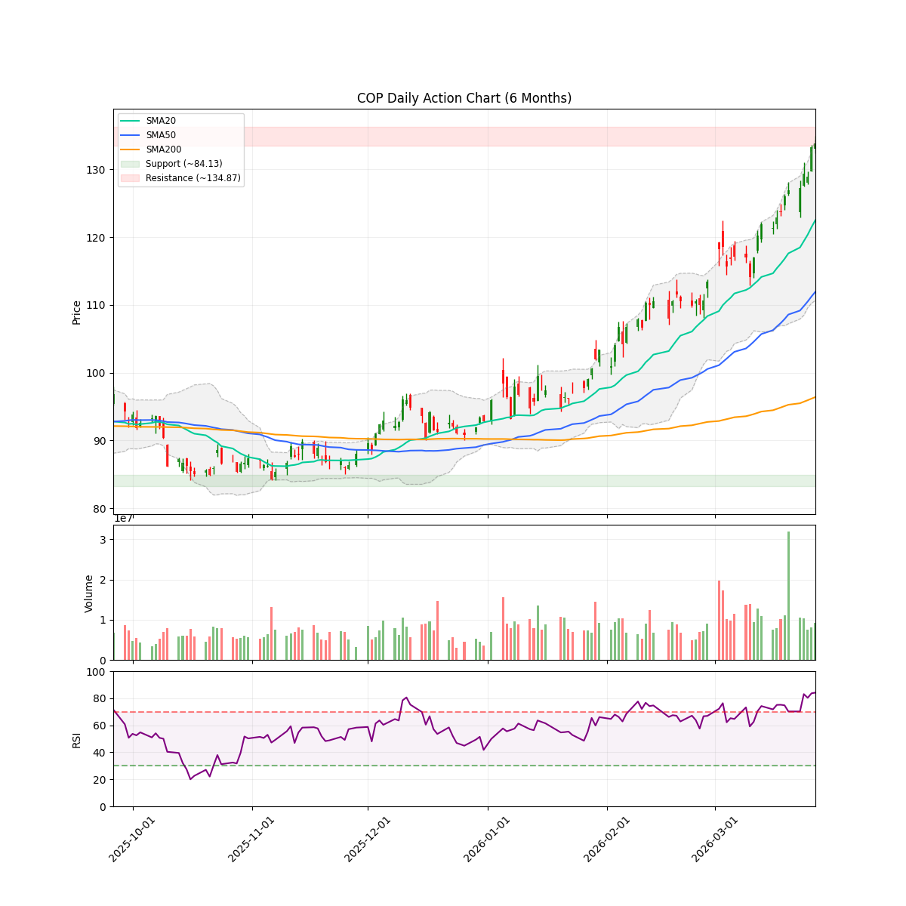
#### 研报分析

### 技术指标概览 (Technical Overview)
- **当前价格**: $133.80
- **RSI (14)**: 84.21
- **移动平均线**: SMA20: $122.50 | SMA50: $111.94 | SMA200: $96.40 (Bullish)
- **波动率**: ATR (14): 3.14 (预计周度波动: +/- $7.03)
- **关键位 (6m)**: 支撑位 $84.13 | 阻力位 $134.87
- **即时状态**: Above SMA50

# 情绪审计报告：康菲石油 (COP) —— 狂欢中的警笛声

**致各位合伙人：**

坐在早晨的咖啡机前，看着屏幕上那根几乎垂直的 K 线，我不禁感叹：当下的康菲石油 (COP) 就像是深夜派对上最后那瓶香槟——虽然气泡翻腾、气氛火热，但宿醉的阴影已若隐若现。

### 1. 叙事背景：地缘政治的肾上腺素
当前的 COP 不仅仅是一家能源公司，它已成为“伊朗战争阴云”下的头号情绪标的。RSI 指标飙升至 84.21，这在老练的猎人眼里，不是“强劲”的代名词，而是“极度亢奋”的警示灯。市场正疯狂押注原油冲击 150 美元的剧本，而康菲石油正处在风暴眼，股价贴着 52 周高点 134.87 美元摩擦，每一步都在挑战地缘政治溢价的极限。

---

### 2. 催化剂分类：谁在推波助澜？

*   **A-Tier (核心叙事):** 
    *   **中东动荡与油价飙升：** 只要伊朗局势不稳，原油的看涨期权就是 COP 的助燃剂。
    *   **LNG 增长故事：** 虽然面临卡塔尔风险，但 COP 寻求美国政府保护的行为，坐实了其在全球液化天然气领域的战略地位（来源：Simply Wall St）。
*   **B-Tier (机构支撑):** 
    *   **分析师调价：** 尽管 Morningstar 唱反调，但主流机构仍在推高目标价（来源：Yahoo Finance）。
*   **C-Tier (杂讯与减分项):** 
    *   **内部减持：** 高管 Nicholas Olds 抛售了 88.8 万美元股票。虽然金额相对于 1570 亿的市值如九牛一毛，但在这种历史高位，它传递了一个信号：核心圈在收割利润（来源：Benzinga）。
    *   **Reddit 散户热情：** 当 r/AIPortfolios 开始讨论抄底时，往往意味着趋势进入了“人人皆知”的末端。

---

### 3. 背离检测：盛世下的裂缝

这里出现了一个有趣的**叙事背离**：
当股价不断刷新高点时，市场主流分析文章的主题却悄然转向了“备兑看涨期权 (Covered Call) 策略”（来源：Yahoo Finance）。这意味着，即便最乐观的分析师也开始担心短期内上涨空间有限，建议投资者通过卖出期权来“对冲”潜在的滞涨。

同时，**Morningstar 将其列入“新增估值过高”名单**，给予 1 星或 2 星评级，这预示着聪明钱可能已经开始撤退，目前的涨幅更多是由情绪而非基本面边际改善驱动的。

---

### 4. 情绪得分与总结

#### **逻辑评分 (Logic Score): 8.2/10**
*(注：这是一个典型的“动量驱动型”评分，而非安全评分)*

*   **叙事状态：** 属于“不可阻挡的看涨周期”末端。
*   **风险评估：** 这是一个典型的**高位陷阱 (Trap) 预警区**。由于股价远高于 SMA200 (96.40) 且 RSI 严重超买，任何地缘政治的缓和都会导致瀑布式的获利回吐。

**老兵的建议：** 别在派对最热闹的时候买入。如果你手里有货，现在是学习卖出覆盖看涨期权（Covered Call）的好时机；如果你还没入场，请管住你的手，等待回踩 SMA50 (111.94) 附近的支撑。

---

### 5. 关键参考与后续追踪

*   **引用证据：**
    *   [Yahoo Finance] 康菲石油是否触顶？备兑看涨策略更具吸引力 (2026-03-24)
    *   [Morningstar] 本周 5 只新增估值过高股票名单 (2026-03-23)
    *   [Benzinga] 内部人士 Nicholas Olds 减持 88.8 万美元 (2026-03-24)
*   **下一个重大节点 (Next Major Date):** 
    *   **2026 年 5 月初 (预测)：** 2026 年第一季度财报发布日。这将是检验当前高估值是否具有利润支撑的“审判日”。

**审计结论：** 势头极强，但已进入“恐高区”。这不是趋势的开始，而是情绪的狂欢。**警惕多头陷阱。**
#### 近期新闻与事件
- **[Yahoo Finance]** [Is ConocoPhillips Stock at a Peak? - Covered Call COP Plays Look Attractive](https://finance.yahoo.com/markets/stocks/articles/conocophillips-stock-peak-covered-call-130002315.html)
- **[Morningstar]** [5 Newly Overvalued Stocks this Week](https://www.morningstar.com/stocks/5-newly-overvalued-stocks-this-week)
- **[Insider Monkey· via Yahoo Finance]** [Is ConocoPhillips (COP) A Good Stock To Buy Now?](https://finance.yahoo.com/markets/stocks/articles/conocophillips-cop-good-stock-buy-205337190.html)
- **[Motley Fool· via Yahoo Finance]** [2 Energy Stocks to Buy Before Oil Hits $150 a Barrel](https://finance.yahoo.com/sectors/energy/articles/2-energy-stocks-buy-oil-130700307.html)
- **[Simply Wall St.· via Yahoo Finance]** [ConocoPhillips Seeks US Protection As Qatar Risks Test LNG Growth Story](https://finance.yahoo.com/sectors/energy/articles/conocophillips-seeks-us-protection-qatar-043047223.html)

---

### EMR
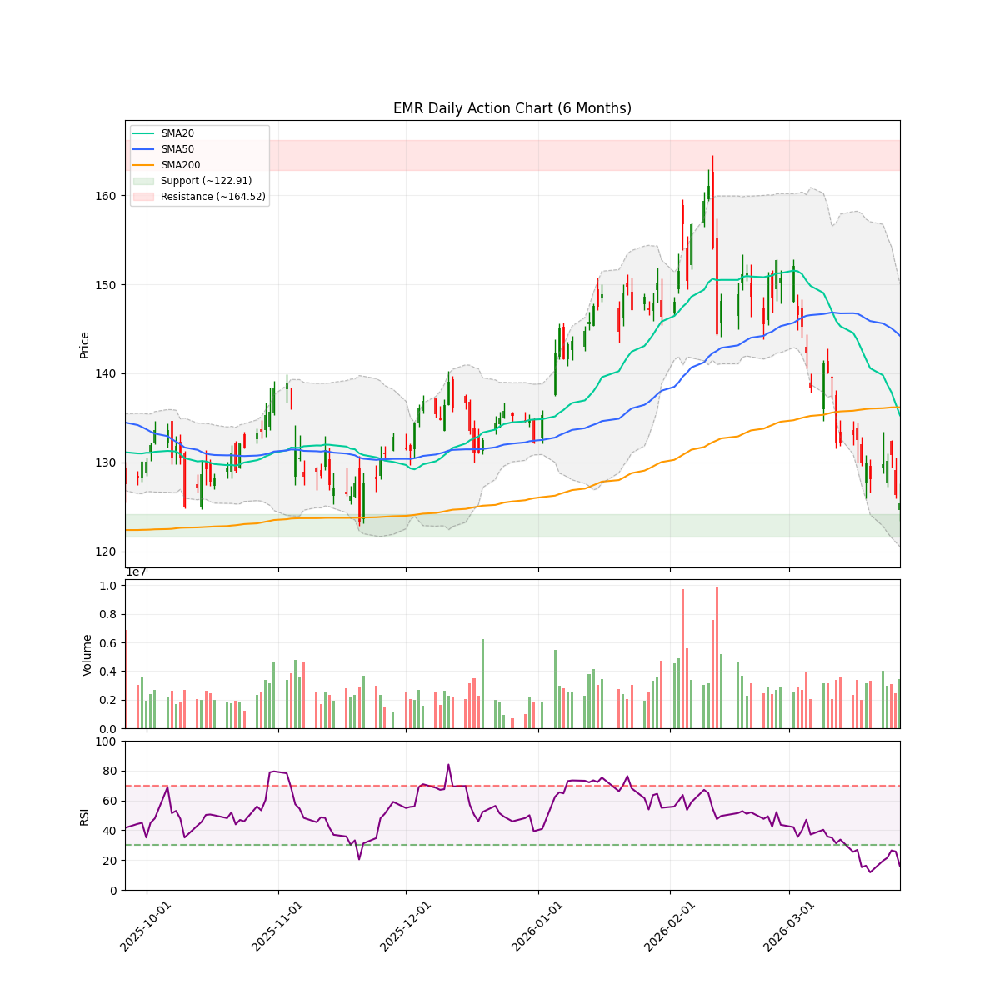
#### 研报分析

### 技术指标概览 (Technical Overview)
- **当前价格**: $125.40
- **RSI (14)**: 15.83
- **移动平均线**: SMA20: $135.29 | SMA50: $144.23 | SMA200: $136.19 (Bullish)
- **波动率**: ATR (14): 4.07 (预计周度波动: +/- $9.09)
- **关键位 (6m)**: 支撑位 $122.91 | 阻力位 $164.52
- **即时状态**: Below SMA50

# 艾默生电气 (EMR) 情绪审计报告：是在废墟中捡金子，还是掉进了下坠的陷阱？

**日期：** 2026年3月29日  
**分析师：** 叙事经济学研究组

---

### 1. 市场叙事：被恐慌情绪“超卖”的工业巨头

坐在交易柜台前，你几乎能闻到空气中弥漫的恐慌味。艾默生电气（EMR）目前的境遇，就像是一个在暴风雨中被无端指责的守林人。最新的数据显示，它的 **RSI（相对强弱指数）已经跌到了惊人的 15.83**。在老练的交易员眼中，这个数字不是在敲警钟，就是在尖叫——这是极度的、“不讲道理”的超卖。

目前的叙事背景非常宏大且压抑：中东局势的阴云（尤其是提到的伊朗局势）让整个工业板块成了资金的“弃儿”。EMR 在近几个交易日的表现甚至跑输了大盘（跌幅3.48%，超过标普的1.74%）。大家都在逃跑，但有趣的是，搜索热度却在飙升。

---

### 2. 催化剂分类：谁在主导剧情？

我们将最近的影响因素分为三个等级，看看哪些是真金白银，哪些只是杂音：

*   **B-Tier（重要且有影响）：**
    *   **BMO Capital 首次覆盖 (2026-03-27)：** BMO 给出了“市场表现（Market Perform）”的评级，听起来不温不火，但关键在于细节——分析师暗示有 **36.05% 的潜在上涨空间**。这就像是一个老练的猎人告诉你：“现在林子里很乱，但我打赌那只猎物最终值大钱。” [来源: Fintel/MSN]
    *   **板块联动压力：** 同行 Rockwell Automation (ROK) 也被 Argus 维持买入评级并视为买入机会。这说明整个板块的下挫更多是“系统性杀跌”，而非 EMR 公司本身烂了。 [来源: Investing.com]

*   **C-Tier（杂音与情绪噪音）：**
    *   **Zacks 搜索热度上升：** 投资者在疯狂搜索 EMR。这通常意味着散户正在试图抄底，或者是在恐慌中确认自己是否该割肉。 [来源: Yahoo Finance]
    *   **技术性破位：** 股价跌破了 SMA200（136.19），这触发了量化基金的止损卖盘，造成了现在的踩踏。

---

### 3. 背离检测：利好“哑火”背后的真相

注意到了吗？BMO Capital 给了 36% 的上涨预期，但股价却毫无反应地继续阴跌。这种**“利好不涨”**的现象通常意味着空头头寸已经进入了某种程度的狂热或竭尽。

从叙事角度看，目前的市场已经屏蔽了任何关于“基本面”的好消息，只盯着“宏观风险”。当 BMO 这种机构开始入场喊话“虽是平级但有巨大空间”时，通常是机构开始在大跌中暗自建仓的信号。股价目前在 125.40，距离 6 个月低点 122.91 仅一步之遥。

---

### 4. 情绪评分 (Sentiment Score)

**分值：2.5 / 10 (极度悲观 / 潜在反转点)**

*   **评分逻辑：** 分数极低是因为目前的市场情绪接近“系统性崩溃”。股价跌破了所有主要均线（SMA20, 50, 200），且表现逊于大盘。然而，这种极低的评分在叙事经济学中往往预示着“情绪弹簧”已经压到了底。15.83 的 RSI 表明卖盘已经枯竭，现在的抛售更多是情绪性的，而非逻辑性的。

---

### 5. 资深老兵的点评：咖啡时间

“朋友，看着 EMR 现在的走势，你可能会觉得这家公司明天就要关门了。但别忘了，它是一家蓝筹工业股，不是什么三流科技小票。现在的 125 块钱，实际上是市场在为‘地缘政治恐惧’支付溢价。

当 Zacks 报告说‘人们在大量搜索’，且 BMO 提到 36% 的潜在空间时，这说明大资金已经在盯着这个‘满身血迹’的猎物了。技术上看，122.91 是最后的防线。如果在这里能止住，配合这个低到离谱的 RSI，我们可能会看到一个非常暴力的超跌反弹。**这不是一个长期崩溃的开始，而更像是一场针对脆弱持仓者的‘大清洗’。**”

---

### 6. 关键日程提醒

*   **下一个重大日期：** **2026年5月初**（预计 2026 财年第二季度财报发布日）。
*   **观察重点：** 财报中关于“自动化需求”和“订单积压”的描述将决定这波反弹是“昙花一现”还是“反转开始”。

---

**结论：** 目前 EMR 处于 **“尖叫式超卖”** 阶段。虽然短期趋势极度低迷（3分以下的悲观情绪），但对于相信“在别人恐惧时贪婪”的投资者来说，当前的废墟下可能正埋着今年最好的工业股机会。**关注 122.91 附近的支撑力度。**
#### 近期新闻与事件
- **[Yahoo Finance]** [Investors Heavily Search Emerson Electric Co. (EMR): Here is What You Need to Know](https://finance.yahoo.com/markets/stocks/articles/investors-heavily-search-emerson-electric-130002499.html)
- **[Zacks· via Yahoo Finance]** [Emerson Electric (EMR) Registers a Bigger Fall Than the Market: Important Facts to Note](https://finance.yahoo.com/markets/stocks/articles/emerson-electric-emr-registers-bigger-220003210.html)
- **[Fintel]** [BMO Capital initiates coverage of Emerson Electric (EMR) with market perform recommendation](https://www.msn.com/en-us/money/companies/bmo-capital-initiates-coverage-of-emerson-electric-emr-with-market-perform-recommendation/ar-AA1ZAd3h)
- **[Zacks Investment Research]** [Emerson Electric (EMR) registers a bigger fall than the market: Important facts to note](https://www.msn.com/en-us/money/other/emerson-electric-emr-registers-a-bigger-fall-than-the-market-important-facts-to-note/ar-AA1ZuoKB)
- **[Investing.com]** [Argus reiterates Rockwell Automation stock rating on margin gains](https://www.investing.com/news/analyst-ratings/argus-reiterates-rockwell-automation-stock-rating-on-margin-gains-93CH-4574534)

---

### FANG
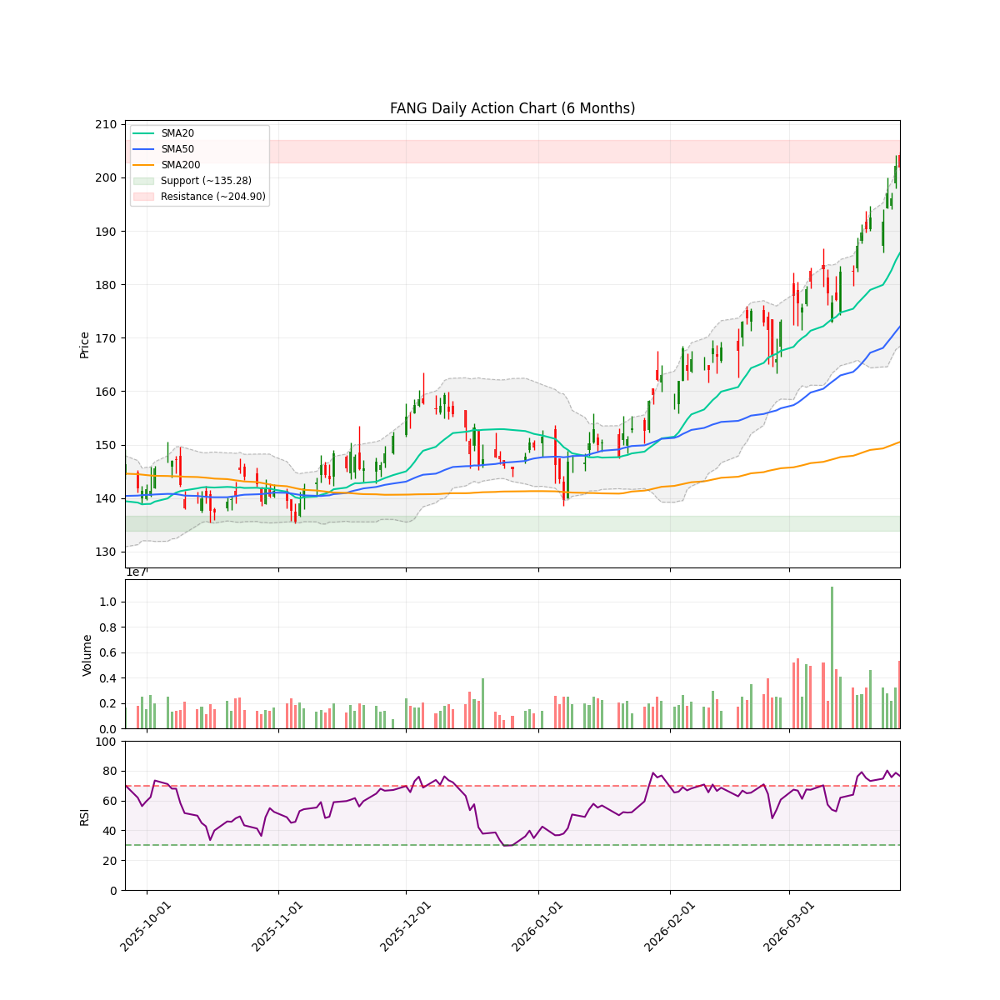
#### 研报分析

### 技术指标概览 (Technical Overview)
- **当前价格**: $201.84
- **RSI (14)**: 76.51
- **移动平均线**: SMA20: $185.89 | SMA50: $172.11 | SMA200: $150.50 (Bullish)
- **波动率**: ATR (14): 5.74 (预计周度波动: +/- $12.84)
- **关键位 (6m)**: 支撑位 $135.28 | 阻力位 $204.90
- **即时状态**: Above SMA50

你好！我是你的叙事经济学研究员。咱们坐下来，边喝咖啡边聊聊 **Diamondback Energy (FANG)**。

现在是 2026 年 3 月 29 日。如果你看一眼屏幕上的 FANG，你会感觉到一种令人窒息的热度。这不是那种悄悄上涨的股票，这是一个正处在聚光灯下的明星，但也正因如此，我们需要冷静地剖析它的成色。

---

### **情绪审计报告：FANG 的“页岩油狂想曲”**

#### **1. 催化剂分类 (Catalyst Categorization)**

*   **A-Tier（顶级动力）：财报后的超预期“长尾效应”**
    *   尽管 2 月份披露的 Q4 业绩在同比数据上并不亮眼，但市场显然选择了“向前看”。根据 [Zacks](https://www.msn.com/en-us/money/markets/diamondback-fang-up-14-2-since-last-earnings-report-can-it-continue/ar-AA1ZoG6X) 的报道，财报后股价狂飙了 14.2%。这种表现说明机构已经完成调仓，将 FANG 视为能源赛道中的“绩优生”。
*   **B-Tier（行业共振）：分红溢价与避风港属性**
    *   [CNBC](https://www.msn.com/en-us/money/companies/top-wall-street-analysts-like-these-dividend-stocks-for-solid-returns/ar-AA1ZF8kT) 连续两天点名其分红潜力。在当前宏观环境下，大资金正在疯狂寻找“既能跑赢大盘，又能稳定发钱”的避难所。FANG 这种能逆势（在大盘下跌 0.37% 时上涨 2.75%）的走势，充分体现了其“防御性进攻”的特质。
*   **C-Tier（噪音警告）：内部人套现**
    *   [Yahoo Finance](https://finance.yahoo.com/markets/stocks/articles/insider-selling-crwv-dell-fang-123800087.html) 提到有超过 1 亿美元的内部减持。在 200 美元的高位看到减持并不奇怪，这通常是高管的个人财务安排，但在目前的高位，这确实像是在沸腾的火锅里加了一瓢冷水。

#### **2. 分歧检测 (Divergence Detection)**

目前我们看到的是一个**“极度亢奋”**的背离。
*   **现象：** 股价处于 201.84 的历史高位区间，紧贴着 204.90 的阻力位，而 **RSI 高达 76.51**。
*   **解读：** 这种“好消息出尽”股价却依然坚挺的情况，说明卖盘力量已经暂时枯竭。但这并不意味着安全，而是意味着**“恐高症”**随时可能爆发。这就好比在一场马拉松的最后 500 米，FANG 正在全力冲刺，虽然姿势优美，但肺部已经感到灼热（超买）。

#### **3. 叙事分析：是趋势还是陷阱？**

目前的叙事是：**“北美的页岩油王，华尔街的提款机”**。
市场不再纠结于去年的收入下降，而是沉迷于它作为分红股的稳定性。只要油价不出现崩塌，这种叙事就能维持。
**但是，陷阱隐藏在情绪的顶点。** 现在的股价远高于 SMA50 (172.11) 和 SMA200 (150.50)，乖离率（Bias）已经拉得非常大。这不是那种你可以闭眼入场的时机，而是那种你应该紧握止盈位、观察它能否突破 205 阻力位的“博弈时刻”。

---

### **逻辑评分 (Logic Score): 8.2 / 10**

*   **看涨理由 (Bullish):** 极强的相对强度（Relative Strength），华尔街的一致推崇，以及完美的均线多头排列。
*   **警示理由 (Bearish):** RSI 严重超买，近期有大额内部人减持，且股价正面临 6 个月来的最高阻力位。

**结论：** 这是一个**“强劲但已过热”**的趋势。如果它能带量突破 205，天花板将被彻底打开；如果无力突破，可能会回踩 185 (SMA20) 寻找支撑。

---

### **关键信息总结**

*   **情绪得分：** **8.5/10** (贪婪情绪主导，市场处于“FOMO”边缘)
*   **核心逻辑：** 机构对高股息能源股的抱团，叠加财报后的动量释放。
*   **引用证据：**
    *   *CNBC (2026-03-29)*: 强调其作为顶级分红股的长期增值潜力。
    *   *Zacks (2026-03-25)*: 记录了其在市场下跌中逆市上涨 2.75% 的强悍表现。
*   **下一个重大日期 (Next Major Date):** **2026 年 5 月初** (预计发布 Q1 财报，具体日期有待官方确认)。

**老兵建议：** 现在的 FANG 就像是一辆时速 120 迈的赛车，虽然还在加速，但仪表盘上的水温表已经红了。如果你已经在车上，系好安全带（设置移动止损）；如果你还没上车，别在隧道尽头追高。
#### 近期新闻与事件
- **[CNBC on MSN]** [Top Wall Street analysts like these dividend stocks for solid returns](https://www.msn.com/en-us/money/companies/top-wall-street-analysts-like-these-dividend-stocks-for-solid-returns/ar-AA1ZF8kT?ocid=BingNewsVerp)
- **[CNBC]** [Top Wall Street analysts like these dividend stocks for solid returns](https://www.msn.com/en-us/money/companies/top-wall-street-analysts-like-these-dividend-stocks-for-solid-returns/ar-AA1ZF8kT)
- **[Zacks.com]** [Why the Market Dipped But Diamondback Energy (FANG) Gained Today](https://www.msn.com/en-us/money/topstocks/why-the-market-dipped-but-diamondback-energy-fang-gained-today/ar-AA1ZkAIL)
- **[sharewise]** [Buy the North American Oil Stocks Now](https://www.sharewise.com/us/news_articles/Buy_the_North_American_Oil_Stocks_Now_Zacks_20260323_1651)
- **[Zacks Investment Research]** [Diamondback (FANG) up 14.2% since last earnings report: Can it continue?](https://www.msn.com/en-us/money/markets/diamondback-fang-up-14-2-since-last-earnings-report-can-it-continue/ar-AA1ZoG6X)

---

### GEV
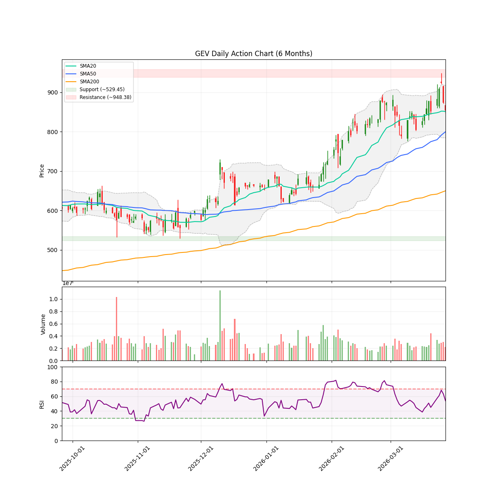
#### 研报分析

### 技术指标概览 (Technical Overview)
- **当前价格**: $853.16
- **RSI (14)**: 53.89
- **移动平均线**: SMA20: $850.88 | SMA50: $799.72 | SMA200: $649.82 (Bullish)
- **波动率**: ATR (14): 39.44 (预计周度波动: +/- $88.20)
- **关键位 (6m)**: 支撑位 $529.45 | 阻力位 $948.38
- **即时状态**: Above SMA50

你好！来，先倒杯咖啡，咱们坐下聊聊 **GE Vernova (GEV)**。

如果你在寻找那种能让叙事和基本面“共振”的标的，GEV 现在的状态简直就像是一台加满油的重型涡轮机，正处于咆哮的前夜。作为一名研究“叙事经济学”的老兵，我看重的不仅仅是那根阳线，而是这根阳线背后的“势”。

以下是针对 GEV 的情绪审计报告：

---

### 💡 叙事核心：当 AI 的尽头变成“电力”

现在的市场逻辑很暴力：AI 的尽头是算力，算力的尽头是大电网。GEV 正好站在了这个十字路口。

#### 1. 催化剂分级 (Catalyst Tiers)
*   **A-Tier (顶级驱动):** 
    *   **$400亿的“政策红包”：** 根据 [Yahoo Finance](https://finance.yahoo.com/markets/stocks/articles/trump-giving-stock-40-billion-185220322.html) 的报道，特朗普政府与日本方面的合作可能为 GEV 带来高达 400 亿美元的提振。这种量级的地缘政治红利，不是小打小闹，这是在重塑资产负债表。
    *   **AI 数据中心基建狂潮：** [Seeking Alpha](https://www.msn.com/en-us/news/technology/sa-asks-what-s-the-best-data-center-infrastructure-stock-right-now/ar-AA1ZCqHz?ocid=BingNewsVerp) 已经在讨论谁是 AI 数据中心基建的王者。GEV 提供的是这种新工业革命的“血液”（电力基础设施），这是长达数年的结构性溢价。
*   **B-Tier (机构背书):** 
    *   **美银 (BofA) 强推：** [Bank of America](https://www.theglobeandmail.com/investing/markets/stocks/GEV/pressreleases/917762/bank-of-america-securities-remains-a-buy-on-ge-vernova-inc-gev/) 维持买入评级。上季度营收 $109.6 亿，净利润 $36.6 亿，这种赚钱能力在能源转型公司中极其罕见。
*   **C-Tier (市场噪音):** 
    *   Zacks 的常规推荐和技术性补涨。

#### 2. 背离检测 (Divergence Detection)
*   **盘面观察：** 尽管最近有一些宏观波动，但 GEV 的价格（853.16）稳稳站住 20 日均线（850.88）上方，且远高于 200 日线（649.82）。
*   **结论：** **无看跌背离。** 恰恰相反，当市场利好不断（$40B 潜在利好）而股价没有出现“见利好出货”（Sell the News）的暴跌，反而是在 850 附近横盘消化，这说明筹码正在从短线投机者手中转移到长线机构手中。这叫“蓄势”，不是“衰竭”。

#### 3. 情绪评分 (Sentiment Score)
**8.8 / 10 —— 强力牛市循环**
*   **评语：** 现在的 GEV 就像是一只在风暴眼中稳步起飞的雄鹰。RSI 在 53.89，这简直是技术派最爱的“甜点区”——既不拥挤（没有超买），也不冷清。市场已经接受了它作为“AI 能源股”的设定，而 $400 亿的潜在合同则给这种叙事加了一层“安全垫”。

---

### 🎙️ 市场老兵的碎碎念 (Narrative Insight)
“朋友，你看 GEV 的走势，它讲的不是一个简单的‘卖发电机’的故事。它讲的是全球再工业化和算力霸权。当所有的分析师都在盯着它的 SMA50 看时，你要看的是那 400 亿背后的全球能源版图重构。目前 853 的价格，对比 948 的前高，其实是给了一个很舒服的入场姿势。这不是陷阱，这是在换手。只要它守住 800 这个大关口，这出戏才刚刚演到第二幕。”

---

### 📊 关键数据清单

*   **逻辑评分 (Logic Score):** **9.2/10** (叙事极其清晰，基本面与政策面高度耦合)
*   **当前价格:** $853.16
*   **技术支撑位:** $799.72 (SMA50) / $850 (心理关口)
*   **上方阻力位:** $948.38 (6个月高点)
*   **关键新闻引用:**
    1.  *Trump/Japan $40B Boost* - [Yahoo Finance (2026-03-25)](https://finance.yahoo.com/markets/stocks/articles/trump-giving-stock-40-billion-185220322.html)
    2.  *BofA Buy Rating* - [The Globe and Mail (2026-03-24)](https://www.theglobeandmail.com/investing/markets/stocks/GEV/pressreleases/917762/bank-of-america-securities-remains-a-buy-on-ge-vernova-inc-gev/)
*   **下一个大事点 (Next Major Date):** **2026 年 4 月下旬** (预计 Q1 2026 财报发布日)。

**审计结论：** 这是一个典型的**“强势增长叙事”**。在财报发布前，任何回踩 SMA20 的机会都值得重点关注。保持关注，别被噪音震出场！
#### 近期新闻与事件
- **[Seeking Alpha on MSN]** [SA asks: What's the best data center infrastructure stock right now?](https://www.msn.com/en-us/news/technology/sa-asks-what-s-the-best-data-center-infrastructure-stock-right-now/ar-AA1ZCqHz?ocid=BingNewsVerp)
- **[Yahoo Finance]** [Trump Is Giving This Stock a $40 Billion Boost. Should You Buy It Here?](https://finance.yahoo.com/markets/stocks/articles/trump-giving-stock-40-billion-185220322.html)
- **[Zacks Investment Research on MSN]** [Why investors need to take advantage of these 2 oils and energy stocks now](https://www.msn.com/en-us/money/other/why-investors-need-to-take-advantage-of-these-2-oils-and-energy-stocks-now/ar-AA1Zo2Zb?ocid=BingNewsVerp)
- **[The Globe and Mail]** [Bank of America Securities Remains a Buy on GE Vernova Inc. (GEV)](https://www.theglobeandmail.com/investing/markets/stocks/GEV/pressreleases/917762/bank-of-america-securities-remains-a-buy-on-ge-vernova-inc-gev/)

---

### META
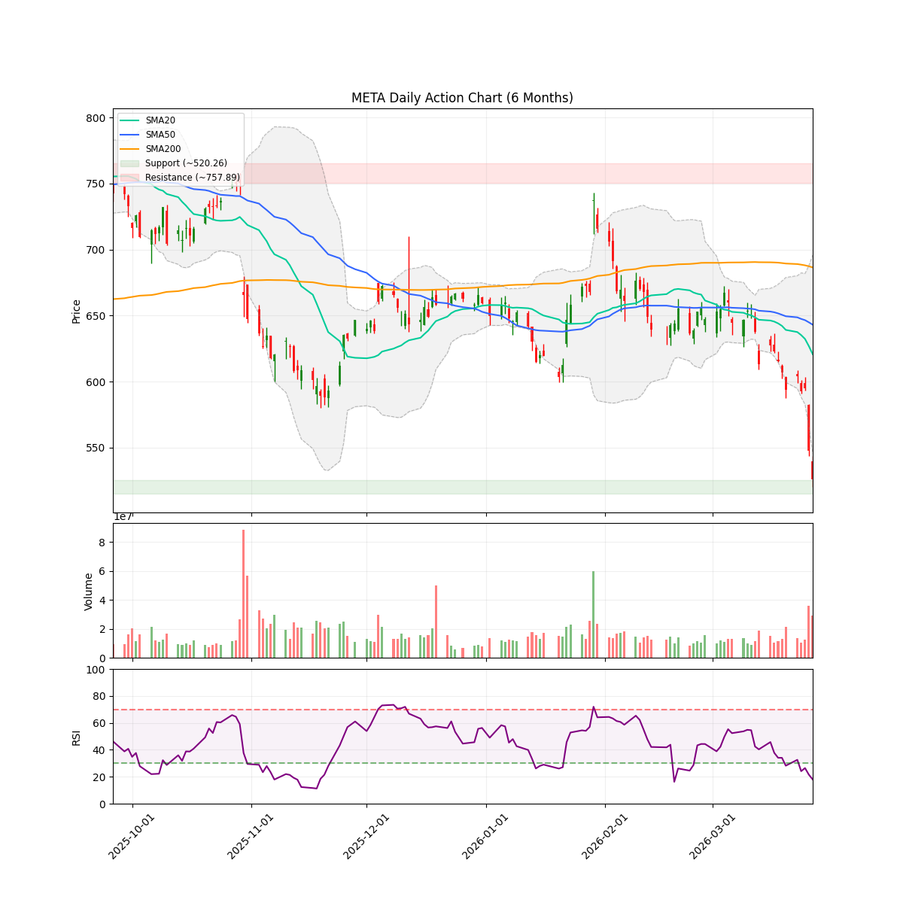
#### 研报分析

### 技术指标概览 (Technical Overview)
- **当前价格**: $525.72
- **RSI (14)**: 18.01
- **移动平均线**: SMA20: $620.79 | SMA50: $643.11 | SMA200: $686.48 (Bearish)
- **波动率**: ATR (14): 18.94 (预计周度波动: +/- $42.35)
- **关键位 (6m)**: 支撑位 $520.26 | 阻力位 $757.89
- **即时状态**: Below SMA50

你好！很高兴能和你坐下来聊聊。我是你的对冲基金研究助理，专注于“叙事经济学”。

现在的市场对 META 而言，简直可以用“鲜血淋漓”来形容。坐在我这个位置上看，目前的走势不仅是技术面的溃败，更像是一场关于“信心”的叙事崩塌。让我们把那些枯燥的数字剥开，看看这层“叙事”下面到底埋着什么。

### **META 情感审计报告 (2026-03-29)**

#### **1. 催化剂分类：谁在拉动缰绳？**

*   **A-Tier (核心叙事): 法律重锤与监管阴霾**
    *   [LA Times] 关于 Meta 和 YouTube 的里程碑式裁决（2026-03-28）。这不仅仅是条新闻，它是悬在股价上的“达摩克利斯之剑”。这种量级的法律风险直接动摇了社交媒体的商业基石，是导致目前股价断崖式下跌的主因。
*   **B-Tier (基本面叙事): 效率之剑与 AI 迷局**
    *   [Yahoo Finance] 再次裁员（2026-03-28）。虽然华尔街通常喜欢裁员带来的利润释放，但在目前股价暴跌的背景下，这更像是“失血后的断臂求生”，而非单纯的优化。
    *   [Motley Fool] 估值低于标普500。这是一个典型的“价值洼地”叙事，但在恐慌盘面前，这种理性声音暂时被淹没了。
*   **C-Tier (噪音): 内部薪酬与散户风向**
    *   [Reuters] 高管加薪。在裁员的同时给高管发股票期权，这种叙事在舆论上是非常负面的，容易引发公众和基层员工的抵触。
    *   [Insider Monkey] Jim Cramer 的持仓推荐。说实话，老克莱默的“反向指标”体质在目前这种极度脆弱的市场里，反而让部分机构更加谨慎。

#### **2. 分歧检测：是“衰竭”还是“深渊”？**

目前 META 的 **RSI 只有 18.01**。这在专业交易员眼里已经不是“超卖”，而是“严重跌过头”了。

*   **利好不涨的诡异现象：** 尽管 [Motley Fool] 一直在喊“Meta 比标普 500 还便宜”，尽管 AI 投资仍在继续，但股价却对这些视而不见。
*   **看跌衰竭迹象：** 股价目前处于 525.72，距离 6 个月低点支撑位 520.26 仅一步之遥。叙事上，所有的坏消息（裁员、诉讼、管理层加薪）已经悉数出尽。当市场对坏消息产生“免疫力”时，反转往往就在一瞬间。

#### **3. 叙事解读：当下的 META 是一场“陷阱”吗？**

现在的 META 正在经历一个“从神坛跌落”的剧本。200 日均线（686.48）像山顶一样遥不可及。目前的叙事已经从“AI 领头羊”变成了“陷入法律泥潭的传统巨头”。

但我认为，这更像是一个**“情绪陷阱”的反面**。目前的恐惧是情绪化的，而非逻辑化的。当 RSI 低于 20 且股价接近强力支撑（520.26）时，理性的空头已经开始离场，剩下的只有恐慌的散户。

#### **4. 情感评分 (Sentiment Score)**

### **3.2 / 10**
*(注：10 为无敌牛市，0 为系统性崩溃。目前处于“极度恐惧与信心崩溃”边缘)*

**得分逻辑：** 
由于跌破了 50 日和 200 日均线，技术趋势处于“ICU 抢救状态”。然而，3.2 分意味着它已经接近底部。市场正在等待一个理由——哪怕是一个微小的利好，来触发一场剧烈的空头回补（Short Squeeze）。

---

### **关键参考信息**

*   **逻辑评分 (Logic Score):** **4.5/10** (虽然叙事悲观，但估值吸引力正在上升，基本面并未完全崩坏)
*   **核心参考新闻:**
    *   [裁员与 Q2 前瞻](https://finance.yahoo.com/markets/stocks/articles/meta-platforms-just-cut-jobs-153002282.html)
    *   [里程碑式裁决冲击](https://finance.yahoo.com/sectors/technology/articles/landmark-verdict-against-meta-youtube-100000708.html)
*   **下一个关键节点:** **2026 年 Q1 财报发布日** (预计在 2026 年 4 月下旬)。这不仅是财务数据的展示，更是扎克伯格夺回叙事主导权、安抚投资者信心的最后机会。

**老兵寄语：** 
别在最黑暗的时候选择离开，但也别在还没看到黎明曙光（至少站稳 520 支撑位）时就盲目梭哈。现在的 META 需要的是一次强有力的“叙事重构”。
#### 近期新闻与事件
- **[Yahoo Finance]** [Meta Platforms Just Cut Jobs. Does That Make META Stock a Buy, Sell, or Hold Before Q2 Starts?](https://finance.yahoo.com/markets/stocks/articles/meta-platforms-just-cut-jobs-153002282.html)
- **[Insider Monkey· via Yahoo Finance]** [Here’s Why Meta Platforms (META) is a Key Stock in Jim Cramer’s Latest Portfolio](https://finance.yahoo.com/markets/stocks/articles/why-meta-platforms-meta-key-142802393.html)
- **[LA Times· via Yahoo Finance]** [How the landmark verdict against Meta and YouTube could hit their businesses](https://finance.yahoo.com/sectors/technology/articles/landmark-verdict-against-meta-youtube-100000708.html)
- **[Motley Fool· via Yahoo Finance]** [What's Wrong With Meta Platforms Stock?](https://finance.yahoo.com/markets/stocks/articles/whats-wrong-meta-platforms-stock-162000366.html)
- **[Reuters· via Yahoo Finance]** [Meta boosts top executives' pay with stock options as AI race heats up](https://finance.yahoo.com/news/meta-boosts-top-executives-pay-113940153.html)

---

### MPC
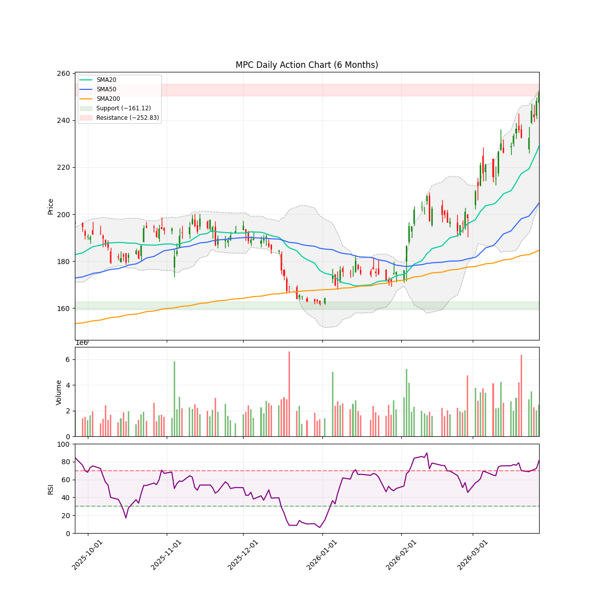
#### 研报分析

### 技术指标概览 (Technical Overview)
- **当前价格**: $251.91
- **RSI (14)**: 81.39
- **移动平均线**: SMA20: $228.99 | SMA50: $204.77 | SMA200: $184.57 (Bullish)
- **波动率**: ATR (14): 8.26 (预计周度波动: +/- $18.47)
- **关键位 (6m)**: 支撑位 $161.12 | 阻力位 $252.83
- **即时状态**: Above SMA50

# 情绪审计报告：Marathon Petroleum (MPC) —— 炼油巨头的狂欢，还是最后的博弈？

**日期：** 2026年3月29日  
**分析师：** 叙事经济学研究员  
**标的：** MPC (Marathon Petroleum Corporation)  
**当前价格：** $251.91

---

### 1. 叙事背景：当黑金再次统治市场
伙计，拉把椅子坐下。如果你观察最近的盘面，你会发现 MPC 的走势简直像是一部充满力量感的史诗。在 2026 年这个充满变数的春天，地缘政治的阴云不仅没散，反而成了能源股的助燃剂。随着 WTI 原油在 90 到 100 美元之间大摇大摆地横盘，整个炼油板块已经从“旧能源”变成了“印钞机”。

目前的叙事非常清晰：**“乱世买资源，避险看炼厂”**。MPC 不仅仅是在跟随油价波动，它已经成了市场在恐慌中的避难所。

---

### 2. 催化剂分类 (Catalyst Categorization)

#### **【A-Tier】核心动力：宏观红利与现金奶牛**
*   **油价飙升与炼化利润：** WTI 原油在过去一个月飙升超过 50% ([24/7 Wall St.](https://finance.yahoo.com/sectors/energy/articles/3-oil-stocks-set-deliver-210958298.html))。对于 MPC 这种炼化巨头，高油价环境往往伴随着极高的裂解价差。
*   **丰厚的回报预期：** Truist 提到的 7% 股息收益率和两位数的潜在上涨空间 ([TipRanks](https://finance.yahoo.com/markets/stocks/articles/7-dividend-yield-double-digit-110131435.html))，在当前动荡的环境下，这简直是投资者的“强心针”。

#### **【B-Tier】支撑动力：逆市走强的情绪溢价**
*   **板块避险属性：** 正如 Zacks 所注意到的，在大盘下跌时，MPC 依然稳步攀升 ([Zacks](https://finance.yahoo.com/markets/stocks/articles/marathon-petroleum-mpc-ascends-while-214503994.html))。这种“逆市英雄”的角色会吸引大量的动量交易者。
*   **技术性突破：** 股价刚刚创下 $247.27 的历史新高 ([Investing.com](https://www.investing.com/news/company-news/marathon-petroleum-corp-stock-hits-alltime-high-at-24727-usd-93CH-4582996))，这种“天花板变地板”的走势对多头有极强的号召力。

#### **【C-Tier】噪音与琐事**
*   **社交媒体情绪：** 虽然 Reddit 上出现了看多论文 ([Insider Monkey](https://finance.yahoo.com/markets/stocks/articles/marathon-petroleum-corporation-mpc-good-205256800.html))，但在机构主导的能源板块，这更多是情绪的滞后反映，而非领先指标。
*   **分析师的谨慎：** 美银证券 (BoA) 给出了“持有”评级，这更像是在疯狂派对中提醒大家注意出口，暂时没有改变上升趋势。

---

### 3. 背离检测 (Divergence Detection)
**警惕信号：** 
目前的 RSI 高达 **81.39**。从经验来看，这已经进入了“空气稀薄”的超买区。尽管新闻面上全是利好（油价破 85 奔 100、股息诱人、历史新高），但股价已经连续多日站在 SMA20 之上太远的位置（$251.91 vs $228.99）。

这种“好消息叠加超买”的局面，往往预示着**多头情绪的最后喷发**。如果未来几天出现“利好出尽”的窄幅震荡，那就是获利了结的信号。

---

### 4. 情绪得分：8.5/10 (强劲牛市循环)
**逻辑支撑：**
*   **叙事强度 (9/10)：** 地缘政治 + 能源短缺是 2026 年最无法反驳的叙事。
*   **技术强度 (8/10)：** 趋势完美，但超买严重，需要一次健康的“深呼吸”（回调）。
*   **资金面 (8.5/10)：** 股息吸引了防御性资金，历史新高吸引了进攻性资金。

---

### 5. 投资建议与展望
MPC 目前就像一列全速前进的重型机车。它不是陷阱，因为它的上涨有着扎实的利润支撑。但如果你现在才想跳上车，你得忍受风阻。

*   **观察点：** 股价是否能守住 $247 (前历史高点) 的支撑。如果跌破这里，可能会回踩 SMA20 ($228 附近)。
*   **心态：** 享受现在的上涨，但手要放在“卖出”键附近。

**下一关键日期：** 
**2026年4月底 (预计 2026 Q1 财报发布日)**。
这将是检验高油价是否真的转化为实打实利润的“期中考试”。在此之前，情绪将继续驱动股价震荡走高。

---
*免责声明：本报告基于叙事经济学分析，不构成直接投资建议。市场有风险，入市需谨慎。*
#### 近期新闻与事件
- **[Insider Monkey· via Yahoo Finance]** [Is Marathon Petroleum Corporation (MPC) A Good Stock To Buy Now?](https://finance.yahoo.com/markets/stocks/articles/marathon-petroleum-corporation-mpc-good-205256800.html)
- **[Zacks· via Yahoo Finance]** [Marathon Petroleum (MPC) Ascends While Market Falls: Some Facts to Note](https://finance.yahoo.com/markets/stocks/articles/marathon-petroleum-mpc-ascends-while-214503994.html)
- **[24/7 Wall St.· via Yahoo Finance]** [3 Oil Stocks Set to Deliver 50%+ Returns in 2026](https://finance.yahoo.com/sectors/energy/articles/3-oil-stocks-set-deliver-210958298.html)
- **[Investing.com]** [Up 56%+, this energy stocks may still have further room to run](https://www.investing.com/news/stock-market-news/up-56-this-energy-stocks-may-still-have-further-room-to-run-4584857)
- **[TipRanks· via Yahoo Finance]** [7% Dividend Yield and Double-Digit Upside: Truist Suggests 2 Dividend Stocks to Buy](https://finance.yahoo.com/markets/stocks/articles/7-dividend-yield-double-digit-110131435.html)

---

### NVDA
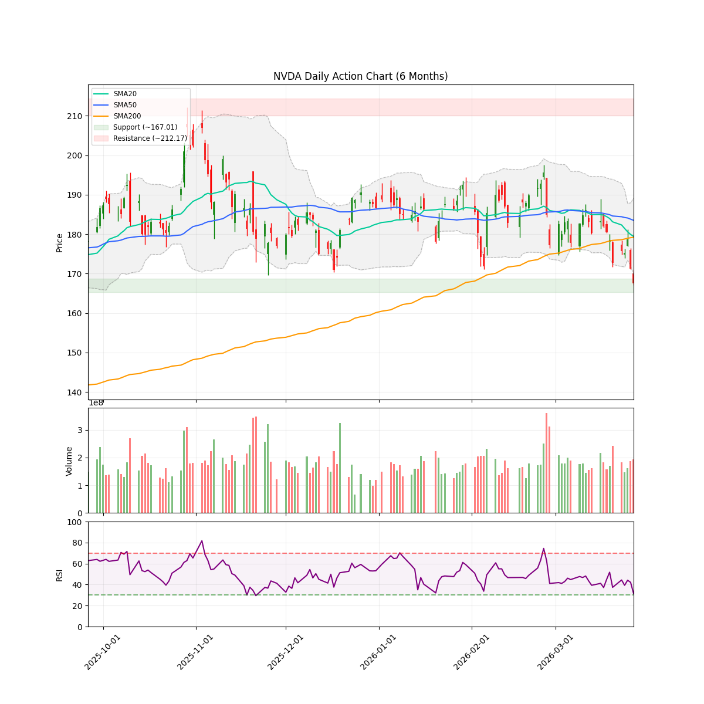
#### 研报分析

### 技术指标概览 (Technical Overview)
- **当前价格**: $167.52
- **RSI (14)**: 31.42
- **移动平均线**: SMA20: $179.43 | SMA50: $183.48 | SMA200: $179.21 (Bullish)
- **波动率**: ATR (14): 5.04 (预计周度波动: +/- $11.27)
- **关键位 (6m)**: 支撑位 $167.01 | 阻力位 $212.17
- **即时状态**: Below SMA50

# 情绪审计报告：英伟达 (NVDA) —— 信仰的炼金炉，还是AI泡沫的终点？

**致：** 投资委员会
**报告人：** 对冲基金研究助理（叙事经济学组）
**当前日期：** 2026年03月29日

---

### 1. 市场脉动与叙事背景 (Market Pulse & Narrative)

想象一下，我们正坐在曼哈顿下城的一家咖啡馆里，窗外是喧闹的交易大厅。此时的 NVDA 看起来并不像往日那个横扫千军的战神，它更像是一个在拳击台角喘息的老将。

目前的 NVDA 股价（167.52）正处于一个极其尴尬且微妙的境地：它正死死地抠住 6 个月来的最低点支撑位（167.01）。技术面上，RSI 已经跌到了 31.42，这意味着市场上弥漫着一股“割肉”的味道——这通常是多头由于绝望而放弃抵抗的信号。

现在的叙事逻辑已经从“AI将统治世界”转变为“AI的高增长还能维持多久？”以及“地缘政治的税收大棒何时落下？”。

---

### 2. 催化剂分级 (Catalyst Categorization)

#### **A-Tier：核心叙事驱动力（重磅冲击）**
*   **中国 AI 芯片税 (China AI Chip Tax):** 这是目前最大的阴霾。YouTube 上的分析指出这项税收正直接打击利润预期 ([MSN/YouTube Link](https://www.msn.com/en-us/money/news/nvidia-stock-hit-by-china-ai-chip-tax-impact-analysis/vi-AA1ZDS4S?ocid=BingNewsVerp))。在叙事经济学中，一旦涉及地缘政治的系统性成本增加，市场的反应往往是先卖出、再提问。

#### **B-Tier：行业环境与竞争压力（中度干扰）**
*   **博通 (Broadcom) 的预警信号:** 尽管 Broadcom 的 AI 收入翻倍，但股价却毫无波动 ([AOL Link](https://www.aol.com/finance/broadcom-ai-revenue-just-doubled-140330604.html))。这释放了一个危险的信号：**“利好出尽”**。市场对 AI 的增长已经产生了审美疲劳，翻倍的业绩已不再能让华尔街感到惊喜。
*   **数据中心基建讨论:** 市场上关于“谁才是最佳数据中心股票”的争论正在升温 ([Seeking Alpha Link](https://www.msn.com/en-us/news/technology/sa-asks-what-s-the-best-data-center-infrastructure-stock-right-now/ar-AA1ZCqHz?ocid=BingNewsVerp))。这表明资金正在寻找替代品，NVDA 的唯一性正受到挑战。

#### **C-Tier：噪音与情绪安抚（微弱脉冲）**
*   **吉姆·克莱默 (Jim Cramer) 的坚守:** Cramer 依旧在为 NVDA 站台，甚至批评抛售者 ([Yahoo Finance Link](https://finance.yahoo.com/markets/stocks/articles/nvidia-nvda-shares-higher-jim-134935341.html))。但在老练的投资者眼中，当这种大众媒体评论员开始过度防御时，往往意味着短期的情绪底部虽近，但信心依然脆弱。
*   **Forbes 的 236 美元远景目标:** 这种多因子评估在当前的恐慌情绪面前显得苍白无力。

---

### 3. 背离检测 (Divergence Detection)

**观察点：利好消息下的“心电图平直”。**
我们注意到一个有趣的现象：即便有 Forbes 的看涨分析和 Cramer 的大声疾呼，股价依然跌破了 SMA200（179.21）。这在职业交易员眼中是典型的**“看跌性竭尽” (Bearish Exhaustion)**。

**结论：** 尽管新闻里还在讨论“NVDA 越来越便宜了” ([CNBC Link](https://www.cnbc.com/2026/03/18/heres-our-advice-on-nvidia-the-frustrating-stock-that-looks-cheaper-by-the-day.html))，但股价却在没有任何强力买盘支撑的情况下阴跌。这说明目前的机构资金正处于“观望模式”，他们在等待那个真正能够打破中国芯片税僵局的消息。

---

### 4. 情绪评分 (Sentiment Score)

#### **逻辑评分：4.2 / 10**
*(注：10 为不可阻挡的牛市循环，0 为系统性崩溃)*

**评价：** 现在的 NVDA 正处于一个**“叙事真空期”**。
*   **看空理由：** 股价位于 SMA20、SMA50、SMA200 之下，技术形态全面破位。中国税收问题是实打实的硬伤。
*   **看多理由：** RSI 极度超卖（31.42），且正触及 6 个月支撑位 167.01。
*   **整体感觉：** 这是一个**“价值陷阱”**还是**“黄金坑”**？目前看来更像是一个需要时间消化的**“高位整固陷阱”**。在下一个大财报证明其护城河依然深厚之前，任何反弹都可能遭遇 SMA200 附近的沉重抛压。

---

### 5. 下一个关键节点 (Next Major Date)

*   **预计财报日期：2026年5月20日前后 (Q1 FY2027 Results)**
    *   *叙事分析：* 市场现在并不在乎昨天的订单，他们想看的是面对中国关税/税收后，NVDA 的利润率（Gross Margin）是否还能维持在惊人的 75%+。如果利润率缩水，那这个 167 美元的价格可能只是半山腰。

---

**老兵寄语：**
“伙计们，别在雨天去接掉下来的飞刀。虽然大家都说它‘便宜得令人沮丧’，但只有当这种沮丧变成彻底的绝望和沉寂时，才是我们真正的买入时机。现在，先握紧你的咖啡杯，看那 167 美元的底能不能撑住这个周末。”
#### 近期新闻与事件
- **[Seeking Alpha on MSN]** [SA asks: What's the best data center infrastructure stock right now?](https://www.msn.com/en-us/news/technology/sa-asks-what-s-the-best-data-center-infrastructure-stock-right-now/ar-AA1ZCqHz?ocid=BingNewsVerp)
- **[YouTube on MSN]** [Nvidia stock hit by China AI chip tax - impact analysis](https://www.msn.com/en-us/money/news/nvidia-stock-hit-by-china-ai-chip-tax-impact-analysis/vi-AA1ZDS4S?ocid=BingNewsVerp)
- **[Insider Monkey on MSN]** [12 High Growth Semiconductor Stocks to Buy](https://www.msn.com/en-us/money/other/12-high-growth-semiconductor-stocks-to-buy/ar-AA1ZCeRM?ocid=BingNewsVerp)
- **[Insider Monkey· via Yahoo Finance]** [Is NVIDIA (NVDA) Still The Best AI Stock in Jim Cramer’s 2026 Portfolio?](https://finance.yahoo.com/markets/stocks/articles/nvidia-nvda-still-best-ai-182215370.html)
- **[Insider Monkey· via Yahoo Finance]** [NVIDIA (NVDA) Shares Higher After Jim Cramer Criticized Sellers](https://finance.yahoo.com/markets/stocks/articles/nvidia-nvda-shares-higher-jim-134935341.html)

---

### OKE
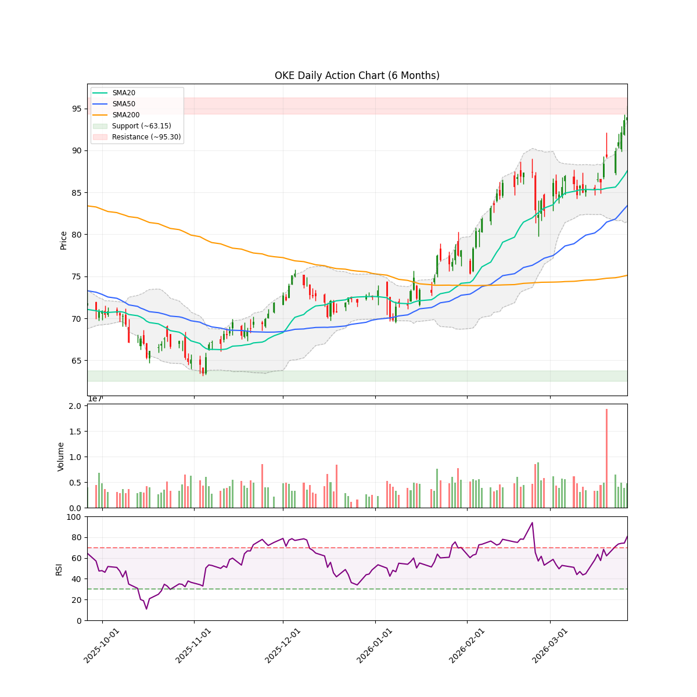
#### 研报分析

### 技术指标概览 (Technical Overview)
- **当前价格**: $93.96
- **RSI (14)**: 80.67
- **移动平均线**: SMA20: $87.55 | SMA50: $83.41 | SMA200: $75.12 (Bullish)
- **波动率**: ATR (14): 2.30 (预计周度波动: +/- $5.13)
- **关键位 (6m)**: 支撑位 $63.15 | 阻力位 $95.30
- **即时状态**: Above SMA50

# OKE 情绪审计报告：狂热的管道与“鱼头”里的噪音

朋友，快坐。咱们今天来聊聊 **ONEOK Inc. (OKE)**。

如果你最近盯着屏幕看，你会发现 OKE 的走势简直像是一台加满了油的推土机，一刻不停地往上拱。现在的股价是 93.96 美元，直逼 6 个月的高点 95.30。但作为在市场里摸爬滚打多年的老兵，我得提醒你，当街上的每个人都在谈论这只股票，甚至连“干鳕鱼”的离奇新闻都混进搜索列表时，我们就得冷静下来，拆解一下这背后的“叙事经济学”了。

---

### 1. 催化剂分类：谁在推高股价？

*   **A-Tier（核心动力）：机构的“盖章认证”**
    *   **Barclays 的目标价上调**：这是实打实的利好。大行（Barclays）不仅维持了评级，还调高了预期。在叙事层面上，这给了多头一种“连华尔街都觉得还没涨够”的心理暗示。
    *   **高股息增长叙事**：Seeking Alpha 把它列入 3 月 5 大增长型股息股。在目前这种波动环境下，5.93% 左右的收益率就像避风港里的灯塔，吸引着厌恶风险的“长线大钱”。

*   **B-Tier（环境助推）：行业动能**
    *   **估值重估**：Yahoo Finance 提到的 momentum（动量）反映了资金正在向中游能源资产回流。这不仅仅是 OKE 的胜利，更是整个能源基建板块的价值发现过程。

*   **C-Tier（纯粹噪音）：莫名其妙的“干鱼”新闻**
    *   你在新闻里看到的那些关于“NDLEA 在干鱼头里查获可卡因”的消息，纯属数据抓取的**乌龙噪音**。由于“Stock fish”带了“Stock”这个词，被错误地推到了你的面前。**忽略它。** 这说明目前的资讯环境有些杂乱，散户投资者极易被这种无关信息干扰。

---

### 2. 背离检测：警惕“高处不胜寒”

目前的盘面出现了一个非常有趣的现象：**极度贪婪的信号。**

*   **RSI 高达 80.67**：在技术分析里，这叫“超买”，在老兵眼里，这叫“肺活量已到极限”。
*   **价格与均线脱节**：股价（93.96）已经远高于 200 日均线（75.12）。这就好比风筝飞得太高，线拉得太紧。
*   **多头衰竭了吗？** 目前还没看到由于“利好出尽”导致的下跌，但要注意，现在的股价正顶着 95.30 的强阻力位。如果突破不了，这个位置极易变成一个精美的“多头陷阱”。

---

### 3. 情绪评分 (Sentiment Score): 8.5/10

**逻辑支撑：** 叙事非常坚实——能源安全、股息增长、机构背书。这属于“势不可挡的看涨周期”。但之所以没给 10 分，是因为技术面已经过热，短期内缺乏新的 A-Tier 催化剂来支撑继续暴力拉升。

---

### 4. 深度洞察：这是趋势还是陷阱？

现在的 OKE 就像一场正在进行的高端派对，音乐还没停，但酒已经快喝光了。

*   **如果是趋势**：由于它处于完美的上升通道，且机构信心十足，任何向 SMA20（87.55 附近）的回踩都是“踏空者”眼中的黄金上车点。
*   **如果是陷阱**：就在于目前的 RSI。如果你现在追进去，你是在和那些已经在 75 美元建仓、正准备套现离场的专业机构对赌。

**我的建议：** 不要在这个位置追高。现在的波动率暗示周波动范围在 +/- 5.13 美元，这意味着它随时可能跌回 88 美元附近寻找支撑。

---

### 5. 关键信息汇总

*   **逻辑评分**：**8.5**（叙事强劲，但技术面过热）
*   **引用证据**：
    *   *Barclays Boosts ONEOK (OKE) Price Target* (2026-03-12)
    *   *Seeking Alpha: March's 5 Dividend Growth Stocks* (2026-03-17)
*   **下一个重大日期**：**2026年5月初**（预计第一季度财报发布日）。

**老兵结语：** 盯着 95.30 这个位置。如果能带着量冲过去，那这列火车还能开更远；如果冲不动，就等它回落到 87 美元附近再来喝这杯咖啡。别被那些“干鱼头”里的杂音分了心，专注于管道里的现金流。
#### 近期新闻与事件
- **[The Nation Newspaper]** [NDLEA intercepts large cocaine consignment concealed in heads of dry stock fish](https://thenationonlineng.net/ndlea-intercepts-large-cocaine-consignment-concealed-in-heads-of-dry-stock-fish/)
- **[PM News on MSN]** [NDLEA intercepts large cocaine consignment concealed in heads of dry stock fish](https://www.msn.com/en-xl/africa/nigeria/ndlea-intercepts-large-cocaine-consignment-concealed-in-heads-of-dry-stock-fish/ar-AA1ZEyUZ?ocid=BingNewsVerp)
- **[Naija News]** [NDLEA Uncovers Massive Cocaine Consignment Inside Heads Of Dry Stock Fish](https://www.naijanews.com/2026/03/29/ndlea-uncovers-massive-cocaine-consignment-inside-heads-of-dry-stock-fish/)
- **[The Punch on MSN]** [NDLEA seizes cocaine hidden in dry fish, arrests grandpa with meth](https://www.msn.com/en-xl/africa/nigeria/ndlea-seizes-cocaine-hidden-in-dry-fish-arrests-grandpa-with-meth/ar-AA1ZEEoG?ocid=BingNewsVerp)
- **[Barron's]** [ONEOK Inc.](https://www.barrons.com/market-data/stocks/oke/interactive-chart?gaa_ts=69b15d6d)

---

### TSM
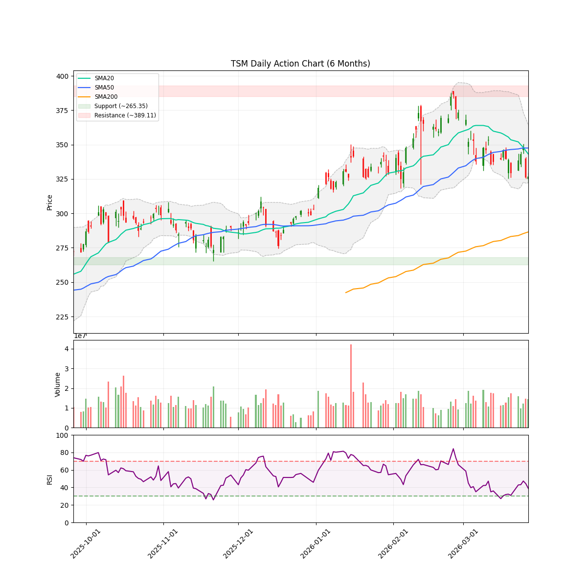
#### 研报分析

### 技术指标概览 (Technical Overview)
- **当前价格**: $326.74
- **RSI (14)**: 38.91
- **移动平均线**: SMA20: $343.16 | SMA50: $347.54 | SMA200: $286.50 (Bullish)
- **波动率**: ATR (14): 11.32 (预计周度波动: +/- $25.32)
- **关键位 (6m)**: 支撑位 $265.35 | 阻力位 $389.11
- **即时状态**: Below SMA50

# **台积电 (TSM) 情绪审计报告：半导体之王的“成长阵痛”还是“深水炸弹”？**

**审计日期：** 2026年03月29日  
**分析师：** 叙事经济学研究组（Narrative Economics Desk）  
**当前股价：** 326.74  
**心理水位：** 略显焦虑的机构买入区

---

### **1. 叙事核心：当“苹果时代”撞上“英伟达风暴”**

坐在桌子对面，想象一下台积电现在的处境。这不是一家普通的工厂，这是全球算力的“心脏”。

最近的市场情绪有点意思。一方面，股价从389的高点滑落，正处于SMA20和SMA50均线下方“倒春寒”；但另一方面，叙事逻辑却硬得像金刚石。最震撼的消息莫过于 **英伟达（Nvidia）正式超越苹果，成为台积电的第一大客户（占比19%）**。这意味着台积电的命运已经从智能手机的周期，彻底锚定在了人工智能（AI）的星辰大海中。

### **2. 催化剂分级 (Catalyst Categorization)**

*   **A-Tier（顶级驱动）：**
    *   **英伟达客户易主：** [Blockonomi] 报道 2 月营收同比增长 22%，英伟达登顶。这标志着台积电从“消费电子供货商”向“AI基础设施基石”的史诗级转型。
    *   **2nm 产能极度稀缺：** 虽有 [Blockonomi] 提到的产能瓶颈导致英伟达股价下跌，但对台积电而言，**“供不应求”是最高级的褒奖**。这种定价权是任何对手（如三星、Intel）无法比拟的。
*   **B-Tier（趋势支撑）：**
    *   **万亿市值俱乐部的唯一幸存者：** [The Motley Fool] 指出，在科技股普跌的 2026 年，台积电是唯一依然维持年度涨幅的万亿巨头。这种“避风港”属性吸引了大量防守型机构资金。
*   **C-Tier（市场杂音）：**
    *   媒体喊出“$1,000 买入无脑选股” [The Motley Fool] 或“目标价 $500” [Nasdaq]。这些属于散户层面的情绪补涨，反映了市场共识的高涨，但也需警惕短期过热。

### **3. 背离检测：利好不涨的背后 (Divergence Detection)**

**现状：** 尽管 2 月营收大涨 22%，且坐稳 AI 王座，但股价近期却在 SMA50（347.54）下方徘徊。
**分析：** 这是典型的**“利好消化期”**。RSI 指标目前为 **38.91**，已经非常接近“超卖”区域（30）。目前的下跌并非基本面崩塌，而是机构在消化 2025 年以来的巨额浮盈，加上对 2nm 产能瓶颈的短期担忧。
**结论：** 属于**看涨衰竭后的健康洗盘**。只要股价守住 286.50 (SMA200) 这一牛熊分界线，任何回调都是在为下一波冲击 $500 蓄力。

### **4. 情绪与逻辑评分**

*   **情绪评分 (Sentiment Score): 7.5/10**
    *   *评价：* 市场正处于从“疯狂崇拜”转向“理性观察产能落实”的阶段。虽然近期有回调，但大众媒体依然将其视为“No-brainer（无需思考）”的投资，整体基调依然积极。
*   **逻辑评分 (Logic Score): 9.0/10**
    *   *评价：* 逻辑无懈可击。只要人类还需要更强的算力，台积电就是唯一的收费站。产能瓶颈不是因为没人买，而是买的人太多。

### **5. 资深老兵的碎碎念 (Insight Over Coffee)**

“朋友，别被这两周的阴跌吓跑。看看窗外，2nm 的订单已经排到了 2028 年。现在的 TSM 就像是一个掌握了全世界水源的人，大家只是在争论他是该用金杯子还是银杯子装水送过来。RSI 跌到 38 左右通常是‘聪明钱’开始捡便宜的时候。虽然现在还没站回 20 日线，但如果你看长远一点，这点波动只是噪音。”

---

### **关键参考资料 (Sources cited):**
1.  **Nvidia 成为第一大客户:** [Blockonomi (2026-03-19)](https://blockonomi.com/tsmc-tsm-stock-nvidia-overtakes-apple-as-top-customer-in-historic-shift/)
2.  **2nm 产能瓶颈忧虑:** [Blockonomi (2026-03-23)](https://blockonomi.com/nvidia-nvda-stock-drops-3-amid-tsmc-manufacturing-bottleneck-concerns/)
3.  **万亿市值幸存者:** [The Motley Fool/MSN (2026-03-28)](https://www.msn.com/en-us/money/topstocks/there-are-10-trillion-dollar-stocks-on-the-market-this-is-the-only-one-thats-up-this-year/ar-AA1ZAGQt)
4.  **$500 目标价叙事:** [Nasdaq/AOL (2026-03-07)](https://www.nasdaq.com/articles/taiwan-semiconductor-stock-going-500)

---

### **📅 下一个重大关注日期 (Next Major Date)**

**2026年4月中旬（预计 2026-04-16 前后）**
**事件：2026年第一季度财报电话会议 (Q1 2026 Earnings Call)**
*为什么重要？* 市场将聚焦 2nm 的实际良率进展以及对于 2026 年全年营收指引的调整。这将是股价能否重回 350 美元上方并冲击前高的关键转折点。
#### 近期新闻与事件
- **[24/7 Wall St.]** [TSM vs. AVGO: Which is a Better Semiconductor Stock?](https://247wallst.com/investing/2026/03/25/tsm-vs-avgo-which-is-a-better-semiconductor-stock/)
- **[The Motley Fool]** [1 No-Brainer Semiconductor Stock to Buy With $1,000 Right Now](https://www.fool.com/investing/2026/03/28/1-no-brainer-semiconductor-stock-to-buy-with-1000/)
- **[The Motley Fool]** [There Are 10 Trillion-Dollar Stocks On the Market. This Is the Only One That's Up This Year](https://www.msn.com/en-us/money/topstocks/there-are-10-trillion-dollar-stocks-on-the-market-this-is-the-only-one-thats-up-this-year/ar-AA1ZAGQt)
- **[Blockonomi]** [Nvidia (NVDA) Stock Drops 3% Amid TSMC Manufacturing Bottleneck Concerns](https://blockonomi.com/nvidia-nvda-stock-drops-3-amid-tsmc-manufacturing-bottleneck-concerns/)
- **[International Business Times]** [10 Best Rising AI Stocks to Buy in 2026: Top Analyst Picks](https://www.ibtimes.com/10-best-rising-ai-stocks-buy-2026-top-analyst-picks-3800335)

---

### VRT
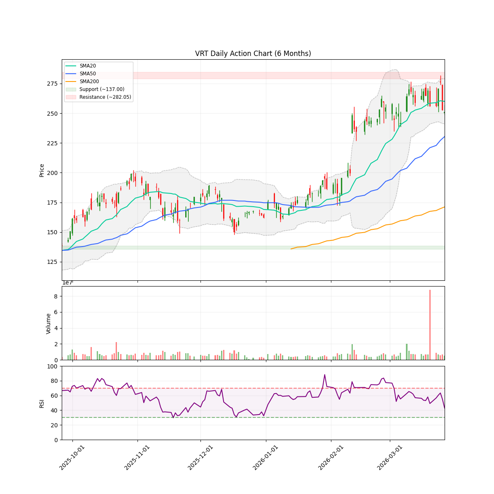
#### 研报分析

### 技术指标概览 (Technical Overview)
- **当前价格**: $251.07
- **RSI (14)**: 42.92
- **移动平均线**: SMA20: $260.03 | SMA50: $230.40 | SMA200: $171.18 (Bullish)
- **波动率**: ATR (14): 13.84 (预计周度波动: +/- $30.95)
- **关键位 (6m)**: 支撑位 $137.00 | 阻力位 $282.05
- **即时状态**: Above SMA50

# 叙事经济学：Vertiv (VRT) —— AI“心脏”的冷却期，是陷阱还是黄金坑？

**分析日期：** 2026年03月29日
**分析师：** 叙事经济学策略组

---

### 1. 叙事图谱：不仅仅是散热，它是 AI 时代的“卖铲人”

想象一下，如果你在淘金热时代不去挖金矿，而是去卖铲子和牛仔裤。现在的 Vertiv (VRT) 扮演的就是这个角色。当整个市场都在为英伟达的芯片狂欢时，VRT 正在为这些发烫的“大脑”提供赖以生存的液冷系统和电力保障。

当前的叙事背景正发生微妙的变化：**从“疯狂想象”进入到“基建落地”阶段。** 随着被纳入标普500指数（S&P 500 inclusion），VRT 已经从小众的大数据中心供应商，正式跻身机构必须持有的“核心资产”俱乐部。

---

### 2. 催化剂分级 (Catalyst Categorization)

*   **A-Tier（核心动力）：**
    *   **标普500指数入选：** [Simply Wall St.] 提到的纳入 S&P 500 是流动性的终极加冕。这意味着海量的被动指数基金必须在调仓期将其买入，这不仅仅是名誉，更是真金白银的支撑。
    *   **AI 基础设施的刚性扩张：** 无论哪家大模型胜出，它们都需要 VRT 的液冷技术。这是目前市场上最稳健的“确定性叙事”。
*   **B-Tier（行业助力）：**
    *   **Zacks 等机构的持续关注：** [Zacks] 多次将其列入“最受关注股票”，显示出散户和中型机构的兴趣正在沸腾。
*   **C-Tier（市场杂音）：**
    *   每日的股价小幅波动和日常的市场评论（如 [StockStory] 关于今日上涨的短期解释）。

---

### 3. 背离检测：当“好消息”撞上“价格回调”

这里是重点！根据数据，VRT 在 3 月 25 日还处于 $276.16 的高位 [Zacks]，但今天的价格是 **$251.07**。

**这就是典型的“利好出尽”后的情绪洗盘。** 尽管新闻里全是 S&P 500 入选和 AI 需求旺盛的赞歌，但股价在过去几天跌掉了约 9%。
*   **分析：** 并不是基本面坏了，而是“利好兑现”后的筹码交换。RSI 目前处于 **42.92**，还没有触及 30 的极度超卖区，但已经显著从高位回落。SMA20 ($260.03) 已经跌破，说明短期多头正在撤退，寻找 SMA50 ($230.40) 附近的支撑。

---

### 4. 情绪诊断：市场的脉搏

现在的 VRT 就像是一个刚跑完马拉松的运动员，虽然拿了金牌（入选标普500），但现在由于体力透支（涨幅过大）需要坐在路边喘口气。

*   **叙事陷阱 (Trap) 风险：** 目前不存在系统性陷阱，但短期存在“追高陷阱”。如果你在 $270 以上冲进去，现在确实很难受。
*   **支撑力量：** SMA200 还在远处的 $171.18，说明长期牛市格局稳如泰山。

---

### 5. 综合评分与结论

#### **逻辑得分 (Logic Score): 8.2/10**
*(注：得分越高代表叙事越可持续，趋势越健康)*

*   **评分理由：** 虽然短期价格出现背离（利好下下跌），但 VRT 属于“硬逻辑”标的。AI 算力对散热的需求是物理定律决定的，而非纯粹的估值泡沫。当前的下跌是健康的回调，目的是消化标普500入选后的获利盘。

---

### 6. 关键数据参考

*   **当前价格：** $251.07
*   **短期阻力位：** $260.03 (SMA20) / $282.05 (6个月高点)
*   **长期支撑位：** $230.40 (SMA50) —— **这是目前的“买入防御线”**。
*   **引用来源：**
    *   *Simply Wall St.*: 关于标普500入选与估值分析。
    *   *Zacks*: 关于 AI 基础设施需求与股价跑赢大盘的报道。
    *   *The Globe and Mail*: 强调 VRT 是目前顶级的 AI 数据中心标的。

### 7. 下一个重大日期 (Next Major Date)
**2026年4月22日左右 (预计 Q1 财报发布日)**
*   **策略建议：** 在此日期前，观察股价是否能在 $230 - $240 区间企稳。如果财报再次确认订单积压（Backlog）增长，VRT 将开启第二波向 $300 冲击的征途。

---
*咖啡喝完了，现在的结论是：别被这几天的阴线吓跑，VRT 只是在为下一场更大的派对换衣服。*
#### 近期新闻与事件
- **[StockStory· via Yahoo Finance]** [Why Vertiv (VRT) Stock Is Up Today](https://finance.yahoo.com/markets/stocks/articles/why-vertiv-vrt-stock-today-024422053.html)
- **[Zacks· via Yahoo Finance]** [Why Vertiv Holdings Co. (VRT) Outpaced the Stock Market Today](https://finance.yahoo.com/markets/stocks/articles/why-vertiv-holdings-co-vrt-214505185.html)
- **[Zacks· via Yahoo Finance]** [Is Trending Stock Vertiv Holdings Co. (VRT) a Buy Now?](https://finance.yahoo.com/markets/stocks/articles/trending-stock-vertiv-holdings-co-130006843.html)
- **[Simply Wall St.· via Yahoo Finance]** [Assessing Vertiv (VRT) Valuation After S&P 500 Entry And AI Infrastructure Expansion Moves](https://finance.yahoo.com/markets/stocks/articles/assessing-vertiv-vrt-valuation-p-130718563.html)
- **[Zacks· via Yahoo Finance]** [VRT Benefits From Robust AI Infrastructure Demand: More Upside Ahead?](https://finance.yahoo.com/sectors/technology/articles/vrt-benefits-robust-ai-infrastructure-153200022.html)

---

### VST
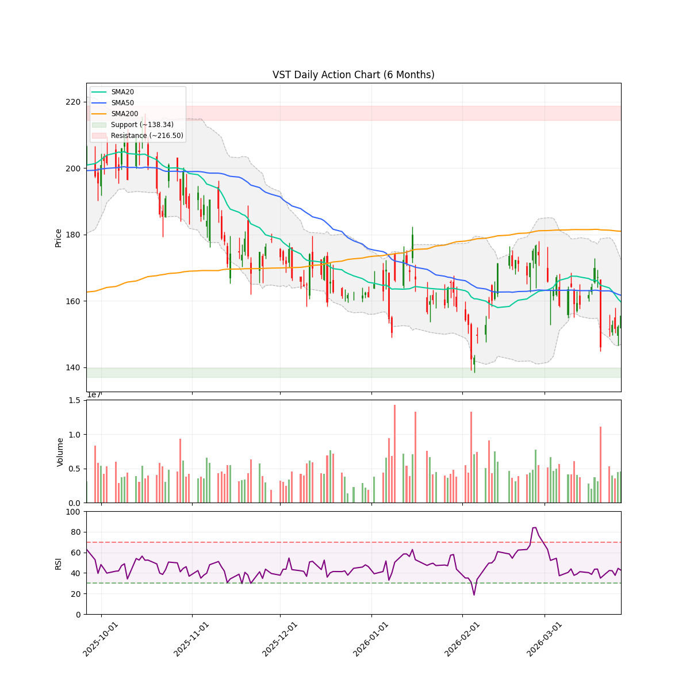
#### 研报分析

### 技术指标概览 (Technical Overview)
- **当前价格**: $155.48
- **RSI (14)**: 42.66
- **移动平均线**: SMA20: $159.64 | SMA50: $161.67 | SMA200: $180.94 (Bearish)
- **波动率**: ATR (14): 7.81 (预计周度波动: +/- $17.46)
- **关键位 (6m)**: 支撑位 $138.34 | 阻力位 $216.50
- **即时状态**: Below SMA50

# Vistra (VST) 情感审计报告：是“断电”危机，还是电力巨头的二次起跳？

**日期：** 2026年03月29日
**分析员：** 叙事经济学研究组

---

### 1. 催化剂分类 (Catalyst Categorization)

*   **A-Tier (核心叙事冲击)**：
    *   **Q4 财报爆雷 (利空)**：3月23日，VST 股价因 Q4 财报大幅不及预期而惨跌 13%。EPS 录得 2.18 美元（预期 2.45 美元），营收 45.8 亿（预期 57.5 亿）。[Blockonomi] 这一记重锤打破了此前市场对 VST “稳健盈利”的幻觉。
*   **B-Tier (行业成长驱动)**：
    *   **AI 数据中心长期逻辑 (利多)**：尽管业绩短期承压，但 Seeking Alpha 的分析师仍将其视为 AI 数据中心基础设施建设的长期核心标的。[Seeking Alpha] 电力需求的增长叙事依然完整，只是估值正在重新对标现实。
*   **C-Tier (日常波动噪音)**：
    *   **相对强弱表现 (利多/观察)**：3月27日，在大盘整体下挫（标普跌 1.67%）的情况下，VST 逆势上涨 2.09%。[Zacks] 这属于典型的跌深反弹或空头回补。

---

### 2. 背离检测 (Divergence Detection)

**观察到的现象**：**“坏消息出尽后的逆势抗跌”**
在经历 3月23日 的大幅暴跌后，股价已跌破 200 日均线 (SMA200: 180.94)。技术面上这通常意味着“系统性趋势崩溃”。然而，在 3月27日 市场整体哀鸿遍野时，VST 却悄悄拉升了 2% 以上。
*   **诊断**：**看跌衰竭 (Bearish Exhaustion)**。这意味着该卖的人在财报雷响后已经清仓，剩下的持仓者对 150 美元附近的估值表现出了防御心理。

---

### 3. 叙事分析与市场脉搏 (Narrative & Pulse)

想象一下，你坐在曼哈顿下城的咖啡馆里，看着屏幕上 VST 的走势。这不再是一张冷冰冰的 K 线图，而是一个**“掉落神坛的优等生”**在泥淖中挣扎的故事。

此前，Vistra 乘着 AI 的东风，被视为“新时代的数字能源补给站”。但 Q4 的这份财报就像是一盆冷水，直接泼在了那些激进投资者的脸上——它提醒我们，即便在 AI 狂热中，能源公司的基建成本和收入确认依然遵循物理世界的规律。

现在的 VST 正处于一个“尴尬期”。它在 SMA200 之下徘徊，技术派会告诉你“趋势已死”；但如果你听听那些深耕数据中心领域的分析师（如 Ricardo Fernandez）的说法，你会发现长期的“叙事”并未破裂。目前的价格动作更像是一场**残酷的洗盘**。138.34 美元的支撑位就像是最后的防线，如果能守住，这里就是新的地基；如果失守，那这就不是回撤，而是估值的系统性坍塌。

---

### 4. 情感评分 (Logic Score)

#### **4.5 / 10 (中性偏悲观 - 筑底观察期)**

*   **得分依据**：
    *   **扣分项**：股价处于 SMA20、50、200 所有主要均线下方，这是典型的熊市排列。财报营收缺口巨大（-14.12%），短期信用受损。
    *   **加分项**：RSI 处于 42.66，接近超卖但仍有缓冲空间；近期在大盘暴跌时表现出一定的防御性。AI 电力需求长逻辑未变。

---

### 5. 关键参考资料 (Context Cites)

*   **财报不及预期报告**：[Blockonomi](https://blockonomi.com/vistra-vst-stock-plunges-13-after-missing-q4-expectations-by-wide-margin/) - 详细记录了 EPS 与营收的双重暴击。
*   **数据中心板块动态**：[Seeking Alpha](https://www.msn.com/en-us/news/technology/sa-asks-what-s-the-best-data-center-infrastructure-stock-right-now/ar-AA1ZCqHz) - 提供了行业面的多头支撑论点。
*   **近期逆市表现**：[Zacks.com](https://www.msn.com/en-us/money/savingandinvesting/vistra-corp-vst-increases-despite-market-slip-heres-what-you-need-to-know/ar-AA1ZzIoe) - 记录了 3月27日 的相对强弱信号。

---

### 6. 下一个重大日期 (Next Major Date)

**2026年5月上旬 (预计 2026 Q1 财报发布日)**
*   **关注重点**：市场需要看到 Vistra 能否在 2026 年第一季度修复其营收增长曲线。如果 Q1 再次出现营收不及预期，那么 VST 将正式进入长达一年的漫漫熊途。在下一次财报前，138-145 美元区间将是决定胜负的战壕。
#### 近期新闻与事件
- **[Blockonomi]** [Vistra (VST) Stock Plunges 13% After Missing Q4 Expectations by Wide Margin](https://blockonomi.com/vistra-vst-stock-plunges-13-after-missing-q4-expectations-by-wide-margin/)
- **[Insider Monkey]** [Vistra (VST) Gained from the Rise in Power Demand](https://www.msn.com/en-us/money/savingandinvesting/vistra-vst-gained-from-the-rise-in-power-demand/ar-AA1Zj8yd)
- **[Zacks.com]** [Vistra Corp. (VST) Increases Despite Market Slip: Here's What You Need to Know](https://www.msn.com/en-us/money/savingandinvesting/vistra-corp-vst-increases-despite-market-slip-heres-what-you-need-to-know/ar-AA1ZzIoe)
- **[Seeking Alpha]** [SA asks: What's the best data center infrastructure stock right now?](https://www.msn.com/en-us/news/technology/sa-asks-what-s-the-best-data-center-infrastructure-stock-right-now/ar-AA1ZCqHz)
- **[Seeking Alpha on MSN]** [SA asks: What's the best data center infrastructure stock right now?](https://www.msn.com/en-us/news/technology/sa-asks-what-s-the-best-data-center-infrastructure-stock-right-now/ar-AA1ZCqHz?ocid=BingNewsVerp)

---
