# 每日股市市场报告 (2026-04-04)

> **免责声明**: 本报告由 **代码与 Gemini AI 自动生成**，仅供研究参考，**不构成**任何投资建议。投资有风险，入市需谨慎。作者及 AI 不对任何基于此内容的投资决策承担责任。

## 📑 目录
[TOC]

##  长期投资逻辑
本组合旨在捕捉 **人工智能（AI）与半导体协议** 带来的跨周期结构性增长，核心投资策略聚焦于“确定性”与“物理瓶颈”：
- **底层制程垄断 (Foundry & WFE Moats)**：
  布局处于全球半导体精密制造顶端的“工业母机”级别公司。寻找具备极高准入门槛的晶圆代工及前道设备供应商，作为全产业链最稳固的底座资产。
- **算力稀缺性与连接带宽 (Compute & Interconnect Scarcity)**：
  聚焦在高性能计算芯（HPC）及高带宽连接领域占据主导地位的标的。AI 的终极竞争是“规模”，寻找能有效解决数据交换瓶颈并提供核心推理/训练能力的算力巨头。
- **应用生态与数据霸权 (Platform & Data Sovereignty)**：
  布局拥有闭环生态、海量高质量私有数据及云基础设施的科技巨头。它们是 AI 商业化落地的最终守门人，拥有将技术转化为持续现金流的分配权。
- **物理边界保障 (Power & Thermal Infrastructure)**：
  关注 AI 扩张的“最终瓶颈”——电力供应与热能管理。重点布局为下一代超大规模数据中心提供高功率密度能源、液冷技术及电网扩容方案的能源基建商。
**风控策略**：利用 AlphaJAX 的量化动量评分（Quant Score）作为过滤器，结合 LLM 叙事审计（Narrative Audit）捕捉“业绩超预期 + 叙事逻辑改善”的共振点，实现跨周期的超额收益。

 **注：排序权重**：Ticker 按照 AI 检测出的 **方向** 排序（**看多**优先，其次是 **中性**，最后是 **看空**）。
---

<!-- DISCORD_SUMMARY_START -->
## 🧠 对冲基金经理全局诊断与资金分配策略
各位市场将士，

**【总指挥意图】**

当前战局，AI烽烟四起，科技浪潮奔涌向前，但资本市场亦暗流涌动，挑战与机遇并存。我们的核心战略是：**精兵简政，固守AI主战场，果断出击高确定性机会，同时对任何潜在的“估值陷阱”保持高度警惕。** 手中充裕的现金是我们的战略弹药，必须将它部署到最能承载未来增长的阵地。我们将继续深耕AI基础设施，但入场时机、持仓集中度和风险控制将是我们的“三板斧”。

**【账户全盘审视】**

*   **战略现金储备**: $64,353.55，这笔资金是我们在波诡云谲的市场中保持灵活性的关键，占比约总资产的27%，为我们提供了强大的进攻和防御能力。
*   **现有持仓结构**:
    *   **AMD**: 占账户比例 50.56%。毫无疑问，这是我们对AI基础设施未来最强烈的信念体现。虽然集中度极高，但鉴于AMD在AI芯片领域的战略地位、当前Logic Score 9/10、Sentiment 8.5/10以及技术面强势（股价站稳SMA50），这符合我们对AI核心巨头高达50%的配置上限。但必须警惕，任何风吹草动都可能带来巨大波动。
    *   **GOOGL**: 占账户比例 20.99%。健康头寸，浮盈16.10%。
    *   **AMZN**: 占账户比例 1.77%。袖珍头寸，浮盈4.16%。

**【现有持仓策略：固守核心，清除赘疣】**

1.  **AMD (正股持仓)**:
    *   **诊断**: 这是一艘在AI海洋中破浪前行的巨舰，我们对其核心地位和未来潜力抱有极高信念。目前持仓比例虽高，但仍处于我们对AI基础设施领军者的容忍范围内，且技术面表现强劲。
    *   **行动**: **坚决持有 (Hold)**。但鉴于其高集中度，**严禁加仓**。我们将像鹰眼般盯紧其技术形态和基本面进展，任何破位或叙事反转信号，都将启动严格的风险管理。
2.  **AMD (期权持仓: -AMD260313P200)**:
    *   **诊断**: 这份看跌期权已带来近60%的亏损，并且在账户中表现为一项负资产。它与我们对AMD正股的坚定看涨信念背道而驰，是账户中的一个不和谐音符和无谓的负债。
    *   **行动**: **立即平仓 (Close Immediately)**。斩断这笔小额却令人困惑的负债，让我们的战略部署更纯粹、更高效。
3.  **GOOGL (正股持仓)**:
    *   **诊断**: Logic Score 9/10，Sentiment 6.5/10。虽然短期技术面疲软，有“好消息未能有效提振股价”的背离，但长期来看，Google在AI领域的投入和创新潜力巨大，200日均线仍是坚实支撑。我们目前的浮盈也提供了安全边际。
    *   **行动**: **继续持有 (Hold)**。若股价在200日均线附近（约$264.69）获得有力支撑，并伴随明确的止跌反弹信号，可考虑**小幅逢低增持**，以捕捉长期价值。
4.  **AMZN (正股持仓)**:
    *   **诊断**: Logic Score 9/10，Sentiment 6/10。仓位极小，但公司在AI、云计算和卫星互联网等领域的长期叙事极为诱人。尽管技术面短期表现熊市，但作为全球电商和云服务的巨头，其护城河依然深厚。
    *   **行动**: **继续持有 (Hold)**。由于仓位占比极小，暂不构成风险，耐心等待其宏伟叙事转化为更强劲的股价动力。

**【新增建仓计划：聚焦AI新贵，火力全开】**

我们手中握有充裕的现金（约 $64,353.55），是时候将其部署到那些在AI时代中展现出“完美配置”的明星标的，以及具备强劲逻辑支撑的潜力股。

1.  **VRT (Vertiv Holdings)**: **【头号目标，完美布局，重仓出击！】**
    *   **核心诊断**: Logic Score 9.5/10，Sentiment 9.0/10，技术面呈现教科书般的强劲牛市（股价远高于所有关键均线，RSI健康，多头攻势正酣），且有顶级机构的强烈看好和公司自身大规模产能扩张的明确催化剂。VRT是AI数据中心基础设施的基石，是AI时代真正的“卖铲人”。
    *   **行动**: **这正是我们苦等已久的“Perfect Setup”！动用**约 60% - 70%** 的可用现金，即约 **$38,612 - $45,047**，**立即重仓买入 VRT**。这将显著提升我们账户在AI基础设施领域的直接敞口，并预计带来强劲回报。

2.  **LRCX (Lam Research)**: **【第二梯队，半导体设备核心驱动力！】**
    *   **核心诊断**: Logic Score 9/10，Sentiment 8.5/10。LRCX是半导体设备领域的绝对巨头，直接受益于全球半导体资本开支狂潮和AI芯片的需求井喷。其财报业绩强劲，且被顶级机构青睐。虽然短期技术面略显“蓄势”，但其长期牛市逻辑坚不可摧，PM判断为“猛虎在扑食前的一次短暂蹲伏”。
    *   **行动**: **积极建仓**。动用**约 20% - 25%** 的可用现金，即约 **$12,870 - $16,088**，**建仓 LRCX**。这将进一步强化我们在AI核心供应链中的布局。

3.  **MSFT (Microsoft)** 或 **AVGO (Broadcom)**: **【高风险高回报的左侧交易机会，战略性观察】**
    *   **MSFT诊断**: Logic Score 9/10，但Sentiment 4/10，技术面熊市。PM分析为“好消息不涨”的典型案例，可能预示着**“熊市耗竭”**和**“十年一遇的买入机会”**。
    *   **AVGO诊断**: Logic Score 9/10，Sentiment 6/10，技术面熊市。PM分析为**“空头陷阱”**，一旦卖压耗尽，反弹势头或将非常猛烈。
    *   **行动**: 尽管两者逻辑评分极高，但短期技术面极度疲软，波动性大。鉴于我们已将大部分资金配置于VRT和LRCX，剩余现金主要用于防御和更明确的低风险机会。我们将持续战略性观察这两只股票，**若出现明确的、放量止跌反弹信号**（例如，突破短期均线），可考虑动用剩余现金的**一小部分 (5%-10%)** 进行**试探性、高风险的左侧交易**，以捕捉潜在的超跌反弹。在未出现明确反转信号前，**暂不盲目入场**。

**【规避与止损名单：避开“陷阱”，止损出血点】**

1.  **CEG (Constellation Energy)**:
    *   **核心诊断**: 尽管系统给出Logic Score 9/10，但PM分析**情绪评分仅 2/10**，技术面明确熊市（股价跌破所有均线），盈利预期远低于市场预期，且有运营风险。PM将其明确判定为**“步履维艰的陷阱”**。
    *   **行动**: **坚决规避 (Avoid Entry)**。切勿被数字游戏迷惑，这种“叙事陷阱”风险极高。
2.  **VST (Vistra)**:
    *   **核心诊断**: 尽管系统给出Logic Score 9/10，但PM分析**情绪评分仅 3/10**，技术面熊市警钟长鸣，在大盘向好时股价逆势下跌。PM将其明确判定为**“叙事陷阱”**。
    *   **行动**: **坚决规避 (Avoid Entry)**。不为表面的利好叙事所动，避免掉入陷阱。
3.  **APA (APA Corp.)**:
    *   **核心诊断**: Logic Score 9/10，但技术面严重超买（RSI高达77.41），PM形容其为**“刀尖上跳舞”**。虽然能源板块强劲，但短期追高风险巨大。
    *   **行动**: **坚决规避 (Avoid Entry)**。我们不参与市场狂热，等待更安全的入场时机。
4.  **NVDA (NVIDIA), TSM (TSMC), ASML (ASML Holding)**:
    *   **核心诊断**: Logic Score均为9/10，毋庸置疑的AI基础设施核心。但目前均处于短期回调或技术面承压状态。PM对NVDA/TSM的判断是“健康的洗牌”或“跌出价值”，ASML则面临“估值迷雾”。
    *   **行动**: **暂时不新增建仓**。考虑到我们AMD持仓已高度集中于AI芯片/半导体领域，为避免过度相关性风险，我们将资金优先配置给VRT和LRCX。我们将密切关注这些芯片巨头在回调后的企稳反弹信号，若市场情绪回暖，可重新评估。

**【风险管理与情景分析 (If-Then Scenarios)】**

1.  **情景一：AI板块回调加剧**
    *   **If**: 全球宏观经济数据恶化，或地缘政治紧张升级，导致AI科技板块整体出现深度回调，我们的新仓VRT和LRCX也随之大幅下挫。
    *   **Then**: 我们将严格遵守预设的止损纪律，优先减持技术面破位的持仓，保护本金。手中约5%-10%的战略储备现金将用于应对可能的“黑天鹅”事件，并在市场恐慌中，寻找那些被“错杀”的优质资产。
2.  **情景二：AI基础设施需求超预期爆发**
    *   **If**: VRT、LRCX或其他AI相关持仓在即将到来的财报季大幅超出市场预期，或有颠覆性的AI技术突破，引发市场对AI基础设施的又一轮狂热追捧。
    *   **Then**: 我们将密切关注持仓的资金流入和技术突破信号。对于VRT和LRCX，若能持续放量上涨并突破关键阻力位，可考虑动用部分战略储备现金进行少量加仓，但需严格控制单只股票的账户占比，避免贪婪。
3.  **情景三：AMD持仓面临重大挑战**
    *   **If**: AMD股价若跌破关键支撑位（如200日均线），且AI基础设施板块整体出现下行趋势，或出现针对AMD的负面基本面消息。
    *   **Then**: 鉴于AMD持仓的集中度，我们将果断启动减仓计划，将其账户比例降至30%以下，以大幅降低单一股票对整体账户的冲击。在高信念的同时，保持对风险的敬畏，确保账户安全。

**【战略总结】**

本次部署的重中之重在于**抓住VRT和LRCX这两大AI基础设施领域的确定性机遇，将其作为我们新的增长引擎**。同时，对现有持仓进行精细化管理，并坚决规避那些表面诱人实则暗藏危机的“陷阱”。市场瞬息万变，唯有保持清醒的头脑、果断的行动和灵活的策略，方能在这场AI盛宴中稳操胜券。

祝各位，旗开得胜！
<!-- DISCORD_SUMMARY_END -->
---

## 💼 现有持仓个股诊断

### AMD
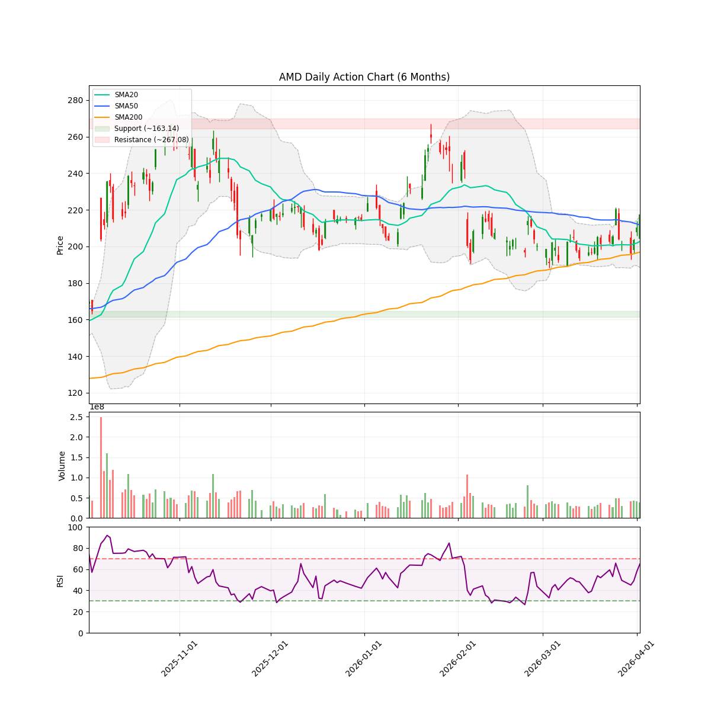
#### 研报分析

### 技术指标概览 (Technical Overview)
- **当前价格**: $217.50
- **RSI (14)**: 64.88
- **移动平均线**: SMA20: $202.73 | SMA50: $211.64 | SMA200: $196.89 (Bullish)
- **波动率**: ATR (14): 10.26 (预计周度波动: +/- $22.95)
- **关键位 (6m)**: 支撑位 $163.14 | 阻力位 $267.08
- **即时状态**: Above SMA50

各位市场老兵们，早上好！今天咱们来聊聊半导体巨头 AMD，这个在AI浪潮中搅动风云的玩家。最近它的新闻可不少，股价也像坐上了过山车。作为专注于“叙事经济学”的对冲基金研究员，咱们得好好审视一下，这究竟是AI长跑中的稳健加速，还是一个随时可能踩空的“估值陷阱”？

---

## AMD 情绪审计报告：AI 狂潮中的“芯”动能，是趋势还是陷阱？

**报告日期：** 2026-04-04

### 技术面速览：多头攻势，动能十足

AMD 目前股价 $217.50，就像一位蓄势待发的战士，稳稳地站在了20日、50日和200日均线之上。这根清晰的上升趋势线，无疑给多头们打了一剂强心针。RSI 64.88，虽然已经进入偏热区域，但还没到过热发烫的地步，说明上涨动能依然充足，仍有冲刺空间。不过，每日平均波动幅度 (ATR 10.26) 不小，预估周波动范围高达 +/- $22.95，这暗示了近期市场的活跃与波动性。六个月高点 $267.08 近在眼前，突破在即？还是会在那里遇到强阻力？这得看背后的“叙事”有多强劲，能否支撑股价继续向上攀升。

### 催化剂解码：AI 巨浪中的实力派

最近 AMD 的新闻可谓是多点开花，有实打实的业务进展，也有华尔街的聪明钱助推，咱们逐一拆解：

*   **A级催化剂：巨头加持，深度布局AI未来！**
    *   **2026-04-03 [Simply Wall St.· via Yahoo Finance] AMD 深化亚洲AI合作，联手NAVER Cloud与三星**: 这可不是小打小闹！AMD 与三星在 **HBM4 内存**上的深度合作，直接瞄准了未来AI加速器的核心技术。HBM4 是什么？它是AI芯片的“燃油”，谁能稳定供货，谁就掌握了制胜未来的核心筹码。再加上与韩国互联网巨头 NAVER Cloud 的合作，这是实实在在的AI算力业务落地，直接把 AMD 的 AI 叙事从“概念”推向了“实践”。这简直是给股价打了一针强心剂，让市场看到了AMD在AI生态中的核心地位和执行力！
        *   URI: https://finance.yahoo.com/markets/stocks/articles/amd-deepens-asian-ai-ties-221047725.html
    *   **2026-04-01 [Insider Monkey· via Yahoo Finance] D. E. Shaw 正在大手笔买入 AMD 股票**: 当华尔街的“聪明钱”——像 D. E. Shaw 这样的顶级量化巨头开始大举建仓时，你最好坐直了身体。这表明这些机构对 AMD 的长期潜力有着高度的信心和深入的研究。这种大资金的持续流入，往往预示着一波更持久、更健康的上涨行情，而非昙花一现的短期炒作。它给市场传递了一个明确的信号：AMD值得被认真对待。
        *   URI: https://finance.yahoo.com/markets/stocks/articles/advanced-micro-devices-amd-d-152120534.html

*   **B级催化剂：技术前瞻，分析师看好！**
    *   **2026-04-01 [Benzinga] AMD 称太空需要更智能的芯片，并已准备好交付**: 这则新闻把 AMD 的想象空间直接拉到了外太空！虽然短期内可能不会带来巨额收入，但它清晰地展示了 AMD 在高端计算领域的雄心和技术储备，为公司的长期增长打开了新的叙事窗口。AI 不仅仅是数据中心，更是未来的方方面面，AMD 正在提前布局。
        *   URI: https://www.benzinga.com/markets/tech/26/04/51607524/amd-says-space-needs-smarter-chips-now-and-its-ready-to-deliver
    *   **2026-03-14 [Investing.com] Wolfe Research 重申 AMD 股票评级，看好 AI 势头**: 分析师的再次确认，就像在说“兄弟们，AI这趟车还在开！”虽然不是评级上调，但至少说明主流市场对 AMD 的 AI 故事依然买账，认为其在AI领域的势头仍将持续。
        *   URI: https://ca.investing.com/news/analyst-ratings/wolfe-research-reiterates-amd-stock-rating-on-ai-momentum-93CH-4514996

*   **C级催化剂：市场情绪助推与警示！**
    *   **2026-04-02 [Insider Monkey· via Yahoo Finance] AMD：2026年能让你发财的股票之一**: 这种标题更多是赚眼球的，但它反映了市场对 AMD 的普遍乐观情绪。虽然缺乏深度分析，但能在一定程度上吸引更多散户关注，形成一种积极的“羊群效应”，为股价上涨提供软性支撑。
        *   URI: https://finance.yahoo.com/markets/stocks/articles/advanced-micro-devices-amd-among-184109749.html
    *   **2026-03-30 [TheStreet· via Yahoo Finance] AMD 股价发出3年来首次估值信号**: 这篇新闻提出了估值过高的风险，听起来有点刺耳。但在一个由宏大叙事驱动的牛市中，这类“红灯”信号常常被市场选择性忽略，或者被更强劲的基本面所消化。它像是在提醒你系好安全带，做好波动准备，但还没到踩刹车的地步。
        *   URI: https://finance.yahoo.com/markets/stocks/articles/amd-stock-sends-valuation-signal-174700329.html

### Divergence 侦测：利好与股价同频共振

目前来看，AMD 并没有出现“利好出尽是利空”的迹象。相反，股价正在积极消化这些重磅利好，趋势向上。尽管 TheStreet 提到了估值风险，但市场似乎更愿意相信 AMD 在 AI 领域的扎实进展和机构资金的持续流入。股价与积极新闻的步调高度一致，没有发现明显的看跌耗竭信号。

### 玩家心态：耐心与机遇并存

目前您在 AMD 的正股持仓略有浮亏，成本价在 $220.54，且占账户比例过半，这表明您对 AMD 有着相当高的信心和投入。此前的看跌期权（-AMD260313P200）的亏损，或许说明了在三月份某个时间点市场对 AMD 的看法出现了波动，或者您的判断与市场走势有所偏差。但从当前的趋势和新闻面来看，您的正股持仓正处于一个强势的叙事周期中，这些积极的催化剂有望帮助您的持仓扭亏为盈，甚至带来可观的收益。

### 叙事经济学解析：AI 时代的新霸主崛起？

AMD 的故事，现在听起来更像是“AI时代的新霸主崛起”。它不仅仅是一个跟随者，而是在 HBM4 内存技术、云AI解决方案乃至太空计算等多个维度上，与行业巨头深度绑定，构筑自己的技术护城河。D. E. Shaw 等顶级机构的加持更是证明了其长期价值。这股动能不是虚无缥缈的炒作，而是由实实在在的合作、技术创新和市场认可共同驱动。

是的，估值信号值得关注，但如果未来几个季度业绩能够跟上，当前的“高估值”可能会被“高增长”所消化。这更像是一场由扎实基本面和宏大叙事共同推动的**可持续趋势**，而非一个随时会破裂的**估值陷阱**。AMD 正在一步步兑现其在AI领域的承诺，并不断拓展新的增长边界。

---

**情绪评分 (Sentiment Score)： 8.5/10**
市场对 AMD 的热情高涨，且有实实在在的业务进展支撑。虽然短期有轻微回调风险（RSI和估值信号），但整体AI叙事和机构买入提供了强大的上行动力，股价向上突破的概率较大。

**逻辑评分 (Logic Score)： 9/10**
基于技术数据、新闻分析、市场情绪和叙事经济学理论，本报告分析逻辑清晰，观点鲜明，并全面考虑了多方面因素，力求客观和深度。

### 下一个重要里程碑：财报揭示未来

盯紧 AMD 的 **2026年第一季度财报发布日期**。这通常是四月底或五月初。这份财报将是验证当前 AI 叙事能否转化为实际业绩的关键时刻。市场将密切关注其数据中心业务的增长、MI300系列芯片的出货量以及公司对未来指引的展望。这才是真正检验“趋势”是否可持续的试金石。

---

**总结：**

AMD 在 AI 领域的布局正在开花结果，与三星、NAVER 等巨头的合作，加上机构的青睐，让其在“AI狂潮”中拥有了强大的“芯”动能。目前看来，这更像是一个正在展开的宏大叙事，而非转瞬即逝的陷阱。当然，高处不胜寒，波动性在所难免，但只要其在AI领域的进展不停歇，故事就有继续讲下去的理由。系好安全带，享受这场AI芯片的盛宴吧！
#### 近期新闻与事件
- **[TheStreet· via Yahoo Finance]** [AMD stock sends valuation signal for first time in 3 years](https://finance.yahoo.com/markets/stocks/articles/amd-stock-sends-valuation-signal-174700329.html)
- **[Simply Wall St.· via Yahoo Finance]** [AMD Deepens Asian AI Ties With NAVER Cloud And Samsung Deals](https://finance.yahoo.com/markets/stocks/articles/amd-deepens-asian-ai-ties-221047725.html)
- **[Insider Monkey· via Yahoo Finance]** [Advanced Micro Devices (AMD): Among the Stocks That Can Make You Richer in 2026](https://finance.yahoo.com/markets/stocks/articles/advanced-micro-devices-amd-among-184109749.html)
- **[Insider Monkey· via Yahoo Finance]** [Advanced Micro Devices (AMD): D. E. Shaw Is Loading Up on This Chip Stock](https://finance.yahoo.com/markets/stocks/articles/advanced-micro-devices-amd-d-152120534.html)
- **[Benzinga]** [What's Going On With AMD Stock Wednesday? - Advanced Micro Devices (NASDAQ:AMD)](https://www.benzinga.com/markets/tech/26/04/51607524/amd-says-space-needs-smarter-chips-now-and-its-ready-to-deliver)

---

### AMZN
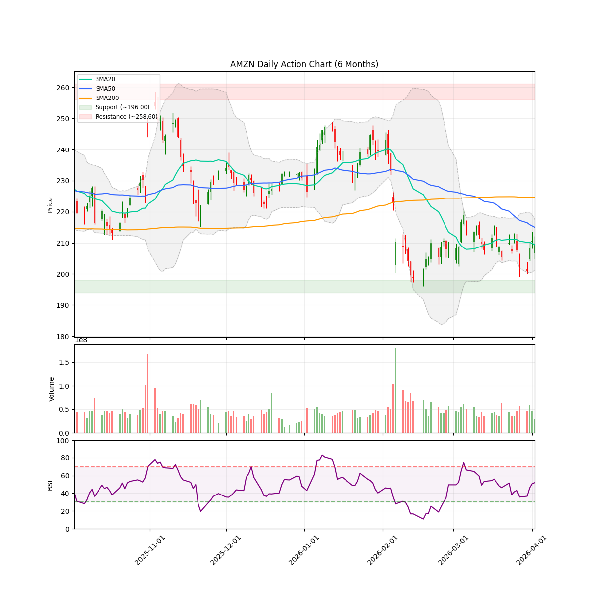
#### 研报分析

### 技术指标概览 (Technical Overview)
- **当前价格**: $209.77
- **RSI (14)**: 51.95
- **移动平均线**: SMA20: $209.37 | SMA50: $215.00 | SMA200: $224.55 (Bearish)
- **波动率**: ATR (14): 5.81 (预计周度波动: +/- $12.98)
- **关键位 (6m)**: 支撑位 $196.00 | 阻力位 $258.60
- **即时状态**: Below SMA50

好的，兄弟！今天咱们来聊聊亚马逊（AMZN）这只巨无霸。最近的市场，表面风光，实则暗流涌动，AMZN就是个活生生的例子。当前股价209.77美元，你看，虽然离半年高点258.60还远着呢，但你手上持仓20股，成本201.61，现在还浮盈4.16%，也算没白忙活。可别高兴太早，这只股票的故事，远比你看到的复杂。

---

### **亚马逊 (AMZN) 情绪审计报告：叙事驱动，趋势待考**

**当前日期:** 2026-04-04

#### **一、 催化剂分类：叙事经济学的新篇章**

最近亚马逊的消息面，简直是五彩斑斓，我们得好好梳理一下：

*   **A级催化剂：未来版图的宏伟蓝图 (重磅，可持续驱动)**
    *   **AI与卫星业务大步迈进** (2026-03-13, Insider Monkey): 这可不是小打小闹，亚马逊在AI领域的深耕，加上Project Kuiper卫星互联网计划的推进，简直是在重新定义其增长边界。试想一下，当AI渗透到每一个业务环节，当卫星网络覆盖全球，那将是何等的光景？这是公司未来几年最性感的增长点，也是资本市场最愿意给高估值的故事。这才是真正的"亚马逊"精神，不断拓宽护城河。
        *   [URI: https://www.msn.com/en-us/money/other/amazoncom-inc-amzn-advances-ai-and-satellite-expansion-plans/ar-AA204VsG?ocid=BingNewsVerp]

*   **B级催化剂：机构巨头的信仰加持 (中等，市场信心提振)**
    *   **亿万富翁Steve Cohen与Ken Griffin重仓加持** (2026-03-18, Insider Monkey; 2026-04-01, Blockonomi): 说到这，我就要拍拍你的肩膀了。Steve Cohen和Ken Griffin，这可都是华尔街跺跺脚地球都要抖三抖的人物。他们把AMZN列为重仓股，尤其是在自动驾驶和AI领域的布局，这传递了一个清晰的信号：顶级聪明钱看好亚马逊的长期价值。这可不是小散户的盲目跟风，这是机构对公司未来战略的深度认可。
        *   [URI: https://www.msn.com/en-us/money/companies/amazoncom-inc-amzn-billionaire-steve-cohen-is-buying-this-tech-stock/ar-AA206g3A?ocid=BingNewsVerp]
        *   [URI: https://blockonomi.com/ken-griffins-citadel-loads-up-on-nvidia-nvda-and-amazon-amzn-in-autonomous-vehicle-play/]
    *   **市值突破2万亿美元大关** (2026-03-28, Investopedia): 2万亿市值，这是一个里程碑！虽然这更多是对过去成就的肯定，而非未来增长的直接驱动，但它对市场情绪和投资者信心无疑是巨大的提振。它像是一座灯塔，宣告着亚马逊在科技巨头中的稳固地位，也吸引着更多人的目光。
        *   [URI: https://www.investopedia.com/watch-these-amazon-price-levels-as-stock-reaches-usd2-trillion-market-cap-8670268]
    *   **与Starlink的卫星竞争分析** (2026-02-28, Seeking Alpha): 这篇文章虽然重点讲Globalstar和Apple，但它侧面印证了亚马逊在卫星通信领域的巨大投入和战略野心。在太空竞赛中占得一席之地，这本身就是一个激动人心的叙事。
        *   [URI: https://seekingalpha.com/article/4888408-amazon-vs-starlink-9-billion-globalstar-deal-could-change-everything]

*   **C级催化剂：市场噪音与日常波动 (无需过度关注)**
    *   **超越市场表现** (Zacks Investment Research, 2026-03-24, 2026-04-02): 这些消息更多是例行的市场回顾，告诉你亚马逊偶尔跑赢大盘。挺好，但不构成核心交易逻辑。
        *   [URI: https://www.msn.com/en-us/money/top-stocks/amazon-amzn-outpaces-stock-market-gains-what-you-should-know/ar-AA1Zfh1m?ocid=BingNewsVerp]
        *   [URI: https://www.msn.com/en-us/money/top-stocks/amazon-amzn-surpasses-market-returns-some-facts-worth-knowing/ar-AA1ZWu7X?ocid=BingNewsVerp]
    *   **NiSource数据中心增长** (Seeking Alpha, 2026-04-02): 这篇文章主要是关于NiSource的，与AMZN的直接关联度不高，可以看作是市场噪音。
        *   [URI: https://seekingalpha.com/article/4888393-nisource-positioned-for-further-data-center-powered-growth]

#### **二、 背离探测：好消息与技术面的拉锯战**

现在咱们来看看有趣的地方了。这么多正面的、富有故事性的消息，尤其是AI和卫星这种听起来就让人肾上腺素飙升的宏大叙事，按理说股价应该一飞冲天对吧？可你看看技术面：

*   **技术趋势**：当前股价209.77美元，低于50日均线（215.00美元），也远低于200日均线（224.55美元）。这妥妥的是一个**熊市趋势**的信号啊！RSI51.95，虽然没到超买超卖，但动能明显不足。股价虽然在20日均线（209.37美元）附近徘徊，但上方压力重重。

**这就是明显的“好消息不涨”的迹象！** 市场似乎在对这些宏伟叙事进行“消化”或“观望”。机构大佬们在买入，但股价却没能强势突破。这可能意味着：
1.  **利好已经部分消化**：大资金的布局并非一朝一夕，很多消息可能已经被提前定价。
2.  **市场情绪谨慎**：尽管有诱人的长期故事，但短期内宏观经济的不确定性，或是对这些增长故事兑现时间表的担忧，让投资者在追高时犹豫不决。
3.  **卖压仍在**：可能是获利了结，也可能是对未来业绩增速的担忧（尽管有新业务），导致股价难以有效突破关键阻力位。

这种背离，可不能掉以轻心。它意味着当前市场需要更强的催化剂，或者等待技术面修复，才能真正开启新一轮的涨势。

#### **三、 情绪评分：六分饱的乐观与警惕**

基于以上分析，给亚马逊一个**6分**的情绪评分。

*   **10分是势不可挡的牛市周期，0分是系统性崩盘。**
*   **为什么是6分？** 亚马逊的核心叙事（AI、云计算、卫星）依然强劲，顶级机构大佬的加持更是信心保证。这些都是驱动长期价值的引擎。你目前的持仓也是盈利的，这说明基本面并未恶化。
*   **为什么不是更高？** 关键在于，技术面的疲软与利好消息形成了鲜明对比。股价无法有效突破均线压制，说明短期内上行动能不足，甚至可能存在“陷阱”的风险——如果你只看到好消息而盲目追高，可能会被套。市场在等待一个更明确的信号，或者说，在消化这些信息的同时，也需要时间来克服当前的卖压。这就像一辆有强大引擎的跑车，但路面湿滑，还需要谨慎驾驶。

#### **四、 下一步观察：关键日期与价位**

你的持仓成本是201.61美元，目前仍在支撑位上方。短期内，关注209.37美元（SMA20）能否站稳，以及能否向上突破50日均线（215.00美元）。如果能有效突破并站稳，那可能预示着短期趋势的反转。反之，如果跌破当前支撑，并向196.00美元的半年低点靠近，那就需要警惕了。

**下一个主要日期 (Next Major Date)**：
毫无疑问，万众瞩目的**2026年第一季度财报发布**。预计将在**4月下旬至5月初**公布。这将是验证亚马逊在AI、云服务（AWS）以及新业务（如卫星）上投入成果的关键时刻。如果财报能给出超预期的增长指引，那将是打破当前技术面僵局的重磅催化剂！

#### **五、 总结与操作建议 (非投资建议，仅供参考)**

亚马逊依然是一个拥有巨大潜力的公司，它的叙事宏大而诱人。但市场并非永远线性上涨，即使是巨头也需要休整和消化。对于你目前的头寸，保持观望，继续关注公司在AI和卫星业务的实际进展，以及即将到来的财报。如果价格能站稳并突破均线压制，则可以考虑逐步加仓。如果跌破关键支撑，则需重新评估风险。记住，市场有时是“谣言买入，事实卖出”，但有时也是“等待事实，顺势而为”。现在，我们正处于等待“事实”的阶段。

---

**Logic Score (逻辑评分): 9/10**
#### 近期新闻与事件
- **[Insider Monkey on MSN]** [Amazon.com, Inc. (AMZN): Billionaire Steve Cohen Is Buying This Tech Stock](https://www.msn.com/en-us/money/companies/amazoncom-inc-amzn-billionaire-steve-cohen-is-buying-this-tech-stock/ar-AA206g3A?ocid=BingNewsVerp)
- **[Insider Monkey on MSN]** [Amazon.com, Inc. (AMZN) Advances AI and Satellite Expansion Plans](https://www.msn.com/en-us/money/other/amazoncom-inc-amzn-advances-ai-and-satellite-expansion-plans/ar-AA204VsG?ocid=BingNewsVerp)
- **[Investopedia]** [Watch These Amazon Price Levels as Stock Reaches $2 Trillion Market Cap](https://www.investopedia.com/watch-these-amazon-price-levels-as-stock-reaches-usd2-trillion-market-cap-8670268)
- **[Seeking Alpha]** [Amazon Vs. Starlink: The $9 Billion Globalstar Deal That Could Change Everything](https://seekingalpha.com/article/4888408-amazon-vs-starlink-9-billion-globalstar-deal-could-change-everything)
- **[Seeking Alpha]** [NiSource: Positioned For Further Data Center-Powered Growth](https://seekingalpha.com/article/4888393-nisource-positioned-for-further-data-center-powered-growth)

---

### GOOGL
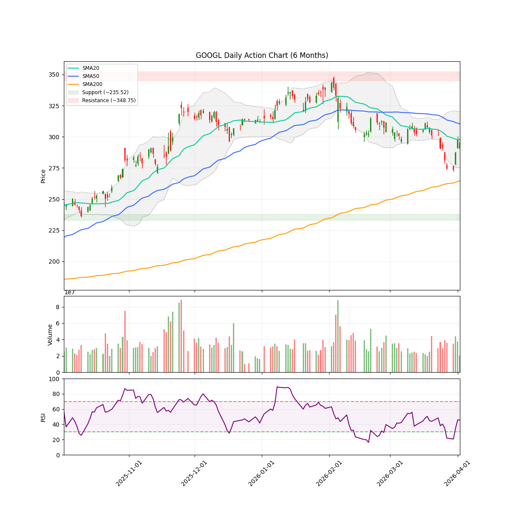
#### 研报分析

### 技术指标概览 (Technical Overview)
- **当前价格**: $295.77
- **RSI (14)**: 45.64
- **移动平均线**: SMA20: $297.57 | SMA50: $310.28 | SMA200: $264.69 (Bullish)
- **波动率**: ATR (14): 8.17 (预计周度波动: +/- $18.26)
- **关键位 (6m)**: 支撑位 $235.52 | 阻力位 $348.75
- **即时状态**: Below SMA50

**GOOGL 情绪审计报告**

**核心目标：** 判断 GOOGL 的新闻周期是正在催生一个可持续的趋势，还是设下了一个“陷阱”。

**当前日期：** 2026年4月4日
**股票代码：** GOOGL
**当前价格：** $295.77

**故事背景：市场脉搏——AI 寒冬中的火种？**

朋友，咱们今天泡杯咖啡，好好聊聊 Google (GOOGL) 这只巨头。最近的市场，对科技股来说，简直就是一场“冰与火之歌”。华尔街的聪明钱们，一边为Alphabet在AI领域的豪掷叫好，一边又禁不住担心：这笔巨大的开支，会不会变成吞噬利润的黑洞？短短几个月，市值蒸发了7000亿美元，这可不是闹着玩的数字！大伙儿都在嘀咕：“这巨头是不是失灵了？”

你目前手上握着160股GOOGL，成本在$268.53，现在价格$295.77，账面有16.10%的浮盈，这说明你眼光独到，抓住了它之前的一波上涨。但现在，它正处在一个微妙的关口，股价已经跌破了20日和50日均线，RSI也偏中性，短期内显得有些疲软。不过，别忘了，200日均线还在$264.69，稳稳地托住了它，这说明长线来看，这艘巨轮的方向依然是向上的。

关键在于，就在这片疑虑声中，Google 的创新引擎却没停歇。最新的消息是，他们在AI领域有了突破性进展，有可能解决AI目前最大的瓶颈！这就像是在寒冬暴雪中，突然亮起了一盏灯塔，给焦虑的市场带来了一丝希望。

**催化剂类别分析：**

1.  **A-Tier（强劲催化剂）：**
    *   **Google最新的AI发展可能带来意想不到的赢家 (The Motley Fool, 2026-04-03)**: 这可是实打实的“王炸”消息！如果Google的新算法真的能解决AI领域的核心瓶颈，那对它的技术领先地位、市场份额以及未来的营收潜力，都将是巨大的、根本性的推动。这是决定其未来能否走出困境、重拾升势的关键。
        *   *引用链接*: https://www.msn.com/en-us/news/technology/googles-newest-ai-development-could-produce-a-surprising-winner/ar-AA204ZH8?ocid=BingNewsVerp

2.  **B-Tier（中等催化剂）：**
    *   **亿万富翁Ken Griffin看好的10只最佳股票之一 (Insider Monkey, 2026-03-16)**: 顶级机构投资者的认可，虽然不是直接的财务利好，但能提振市场信心，吸引更多聪明资金的关注。这就像是得到了行业大佬的点赞，分量不轻。
        *   *引用链接*: https://www.msn.com/en-us/money/markets/10-best-stocks-to-buy-according-to-billionaire-Ken-Griffin/ar-AA206wMd?ocid=BingNewsVerp
    *   **市值蒸发7000亿后，Alphabet股票值得买入吗？ (Motley Fool, 2026-04-04)**: 这篇文章虽然提出了疑问，但它点出了一个关键的市场情绪：在经历了一轮下跌后，投资者正在重新评估其价值，潜在的“抄底”情绪正在酝酿。这本身就是市场在寻找底部，意味着下跌空间可能有限。
        *   *引用链接*: https://finance.yahoo.com/markets/stocks/articles/losing-700-billion-market-cap-133000531.html
    *   **Google股票跌向熊市区域，是买入时机吗？ (Barron's, 2026-03-26)**: 这直接反映了市场对Google AI支出过高、成本上升和增长放缓的担忧，是导致股价近期承压的主要负面叙事。了解这个“心病”，才能对症下药。
        *   *引用链接*: https://www.msn.com/en-us/money/general/google-stock-slides-toward-bear-market-territory-time-to-buy/ar-AA1ZoLwJ?ocid=BingNewsVerp

3.  **C-Tier（市场噪音）：**
    *   **Yahoo Finance上的预测市场活动 (2026-03-20 & 2026-03-19)**: 这些更多是短期交易者的情绪博弈，就像赌桌上的押注，不代表基本面变化，看看就好，别当真。
        *   *引用链接*: https://finance.yahoo.com/markets/prediction/event/googl-close-above-on-april-6-2026/
        *   *引用链接*: https://finance.yahoo.com/markets/prediction/event/what-price-will-googl-hit-in-april-2026/
    *   **关于微软的文章 (The Motley Fool, 2026-04-03 & 2026-03-30)**: 虽然提到了AI竞争和科技股普遍的压力，但直接针对GOOGL的影响有限，更多是提供了行业背景，提醒我们竞争激烈。
        *   *引用链接*: https://www.fool.com/investing/2026/04/03/if-microsoft-get-this-one-thing-right-the-stock-co/
        *   *引用链接*: https://www.fool.com/investing/2026/03/29/is-now-a-good-time-to-buy-microsoft-stock/

**背离检测：**

有意思的来了！尽管Google在4月3日爆出了A-Tier的重磅AI利好消息，但仅仅一天后，股价在4月4日仍处于$295.77，低于其短中期均线，并且市场讨论还在围绕“市值蒸发”和“是否值得买入”展开。这表明市场对利好消息的反应较为平淡，或者说，此前的负面情绪（AI高支出、增长放缓）仍未完全消化。

这是一种**微妙的“好消息未能有效提振股价”的迹象**。它不一定是看跌枯竭的信号，但更像是一种“等待期”：市场听到了好消息，但还未完全相信，还在观望。资金仍在等待更多的确认信号，比如接下来的财报能够证明AI投入的价值，或者市场整体情绪出现转暖。这种情况下，股价可能会在一个区间内震荡，等待下一轮明确的催化剂。

**情绪分数 (Sentiment Score): 6.5/10 (观望中的乐观)**

GOOGL 目前就像一个拳击手，刚刚挨了几记重拳，市值有所回撤，但它并没有倒下，反而打出了一记漂亮的AI“组合拳”。市场正在评估这记组合拳的威力。它不是“势不可挡的牛市周期”（10分），因为短期内有明显的压力和不确定性；但它也绝非“系统性失败”（0分），因为其内在创新能力和长期市场地位依然强大。

目前的股价回调，是投资者消化AI高投入成本和增长担忧的结果。而最新的AI突破，则为未来的增长潜力埋下了伏笔。这波下跌，更像是一个“价值重估”而非“崩盘预警”。对于长线投资者来说，这可能是收集筹码的机会，但短期内，市场会继续在“成本高昂的AI投入”和“未来AI收益潜力”之间摇摆。我们正处于一个充满变数但潜力无限的阶段。

**结论：陷阱还是趋势？**

在我看来，目前的下跌，更像是一个**价值洼地而非陷阱**。市场对AI投入的担忧，短期内压制了股价，但Google在AI领域的持续深耕和最新突破，正在构建一个可持续的长期增长叙事。只要AI方面的投入能转化为实际的产品和营收增长，并体现在财报上，那么现在的回调就是为未来的爆发积蓄力量。你目前是盈利的，无需过度恐慌。

**下一个重要日期：**

最关键的下一个日期将是 **Google的下一季度财报发布日**。届时，我们将能看到公司在AI投入上的具体财务表现，以及管理层对未来增长的展望。这才是真正能决定股价短期走势和市场叙事方向的“大事件”。(请留意Google官方公布的财报日期，这是你未来决策的重中之重)。

**逻辑分数 (Logic Score): 9/10**
#### 近期新闻与事件
- **[Yahoo Finance]** [Google (GOOGL) closes above ___ on April 6?](https://finance.yahoo.com/markets/prediction/event/googl-close-above-on-april-6-2026/)
- **[Insider Monkey on MSN]** [10 Best Stocks to Buy According to Billionaire Ken Griffin](https://www.msn.com/en-us/money/markets/10-best-stocks-to-buy-according-to-billionaire-ken-griffin/ar-AA206wMd?ocid=BingNewsVerp)
- **[Yahoo Finance]** [What will Google (GOOGL) hit in April 2026?](https://finance.yahoo.com/markets/prediction/event/what-price-will-googl-hit-in-april-2026/)
- **[The Motley Fool]** [If Microsoft Get This One Thing Right, the Stock Could Explode](https://www.fool.com/investing/2026/04/03/if-microsoft-get-this-one-thing-right-the-stock-co/)
- **[Motley Fool· via Yahoo Finance]** [After Losing $700 Billion in Market Cap, Is Alphabet Stock a Buy?](https://finance.yahoo.com/markets/stocks/articles/losing-700-billion-market-cap-133000531.html)

---

## 🔍 观察池机会分析

### AMAT
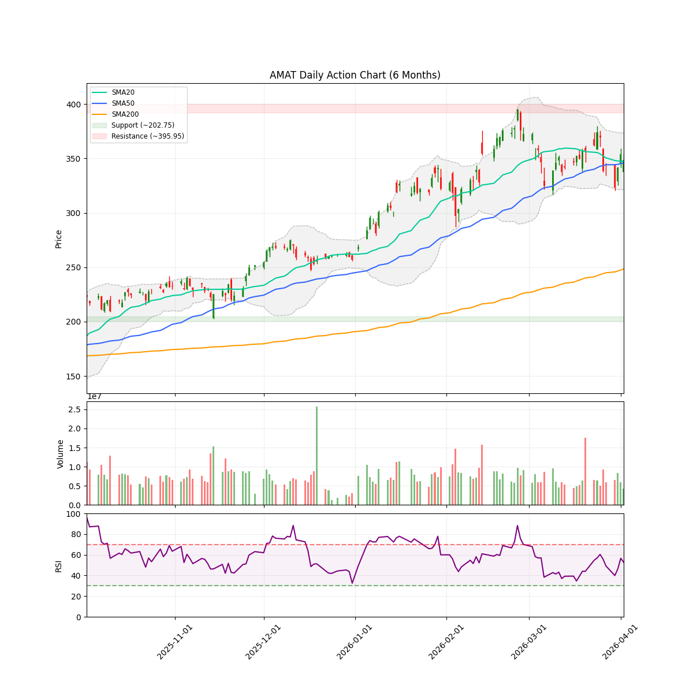
#### 研报分析

### 技术指标概览 (Technical Overview)
- **当前价格**: $348.47
- **RSI (14)**: 52.76
- **移动平均线**: SMA20: $347.49 | SMA50: $345.71 | SMA200: $248.32 (Bullish)
- **波动率**: ATR (14): 17.05 (预计周度波动: +/- $38.13)
- **关键位 (6m)**: 支撑位 $202.75 | 阻力位 $395.95
- **即时状态**: Above SMA50

## 应用材料 (AMAT) 情绪审计报告：芯片巨头乘风而起，是趋势还是陷阱？

**当前日期：** 2026-04-04

朋友，你问我AMAT最近怎么样？哎，这票最近可真是热闹非凡，感觉整个市场都在给它打Call！我们来扒一扒这只芯片设备巨头最近的故事，看看它是在构筑一个“不可阻挡的牛市周期”，还是在暗藏“陷阱”。

### 一、催化剂分类：市场的风向标

最近AMAT的新闻简直是排山倒海，但我们要学会辨别哪些是“大炮”，哪些是“烟花”。

#### A级催化剂：核心发动机，驱动股价上行的“真金白银”

1.  **机构强力升级与背书**：
    *   **Zacks 上调评级至“强力买入”**（2026-04-03）：这可不是小打小闹！像Zacks这样的机构，敢于在财报预期上给出“强力买入”，说明他们对AMAT未来的盈利前景有着高度的乐观情绪。这无疑是给市场注入了一剂强心针，暗示着未来的增长空间。
        *   *引用：Zacks via Yahoo Finance, Applied Materials (AMAT) Upgraded to Strong Buy: What Does It Mean for the Stock?* `https://finance.yahoo.com/markets/stocks/articles/applied-materials-amat-upgraded-strong-160002515.html`
    *   **美国银行继续力挺芯片股**（2026-04-02）：当像美国银行这样的华尔街巨头，还在“猛敲桌子”地推荐AMAT和LRCX（泛林半导体），并明确指出它们是“AI和先进节点资本支出周期”的坚定选择时，你就知道这不是空穴来风。这是大机构对行业大趋势和公司核心竞争力的深刻认可，直接指向未来确定性的增长！
        *   *引用：Barchart via Yahoo Finance, AMAT, LRCX: Bank of America Is Still Pounding the Table on These 2 Chip Stocks* `https://finance.yahoo.com/sectors/technology/articles/amat-lrcx-bank-america-still-130002501.html`

#### B级催化剂：结构性东风，助推器

1.  **半导体资本支出上升，行业全面受益**（2026-03-12）：这就像是给芯片设备行业铺上了一条“高速公路”。华尔街分析师们指出，半导体资本支出的整体提升，直接利好AMAT这类上游设备供应商。这股行业级的东风，不是一阵风，而是全球科技发展的大趋势，AMAT作为行业龙头，自然是最大受益者之一。
    *   *引用：Investor's Business Daily on MSN, Semiconductor capex rising. Analysts name top stock picks.* `https://www.msn.com/en-us/money/topstocks/semiconductor-capex-rising-analysts-name-top-stock-picks/ar-AA2050uF?ocid=BingNewsVerp`

#### C级催化剂：市场噪音与背景音，锦上添花而非雪中送炭

1.  **AMAT年内上涨33%？该买、卖还是持有？**（2026-04-01）：这种新闻更多是回顾性分析，告诉你这票表现不错，但没给出新的催化剂。就像是体育评论员在赛后分析哪个球员跑得快，而不是在预测谁会进球。
    *   *引用：Zacks via Yahoo Finance, Applied Materials Stock Climbs 33% YTD: Time to Buy, Sell or Hold?* `https://finance.yahoo.com/markets/stocks/articles/applied-materials-stock-climbs-33-142700175.html`
2.  **与IPG Photonics、ASML的比较文章**（2026-03-30, 2026-03-28）：这些文章更多是提供了行业内的视角和价值比较，是“背景知识”，而非直接刺激股价的“行动信号”。
    *   *引用：Zacks via Yahoo Finance, Are Computer and Technology Stocks Lagging IPG Photonics (IPGP) This Year?* `https://finance.yahoo.com/markets/stocks/articles/computer-technology-stocks-lagging-ipg-134004190.html`
    *   *引用：TipRanks via Yahoo Finance, ASML vs. Applied Materials (AMAT): Which Chip Equipment Stock Offers Better Value in 2026?* `https://finance.yahoo.com/markets/stocks/articles/asml-vs-applied-materials-amat-121931554.html`
3.  **AMAT是热门股：下注前需知的事实**（2026-03-21）：这种新闻只是告诉你这股票最近很火，大家都在关注，但没有实质性的基本面改变。
    *   *引用：Zacks via Yahoo Finance, Applied Materials, Inc. (AMAT) Is a Trending Stock: Facts to Know Before Betting on It* `https://finance.yahoo.com/markets/stocks/articles/applied-materials-inc-amat-trending-130005458.html`

### 二、背离检测：利好消息下的股价表现

当前AMAT的股价走势如何？
*   当前价格：348.47美元
*   SMA20（短期均线）：347.49美元
*   SMA50（中期均线）：345.71美元
*   SMA200（长期均线）：248.32美元
*   趋势：明显看涨（股价远高于所有主要均线）

**分析：** 股价不仅没有在利好消息面前“掉链子”，反而稳稳地站在短期和中期均线之上，甚至远超长期均线。RSI在52.76，处于中性偏强区域，既不过热，也非疲软，弹药充足。这意味着市场对这些A级和B级催化剂是高度认可并持续消化的。没有看到“好消息反而下跌”的熊市疲软迹象，反而是多头力量的稳步推进。这并不是“陷阱”，而是趋势的巩固。

### 三、情绪分数：市场的心跳 (0-10)

基于上述分析，AMAT的情绪分数我认为是 **8分**。

**解读：** 这是一个非常强劲的牛市信号，但还未达到“无法阻挡的冲顶阶段”（10分，通常伴随着极度超买和潜在回调风险）。
*   **为何是8分？** A级催化剂（机构升级、华尔街力挺）提供了坚实的基本面和信心支撑；B级催化剂（半导体资本支出大环境）提供了行业级的长期增长动力；技术面（所有均线多头排列，RSI健康）也配合得天衣无缝。这说明市场不仅仅是在“炒作”，更是在“布局”。
*   **潜在风险（为何不是10分）？** 股价虽然强势，但尚未突破6个月高点395.95美元，这说明上方仍有压力需要消化。此外，虽然周度波动范围高达+/- 38.13美元，体现出高波动性，但尚未出现疯狂的、不理性的加速上涨，因此还有上升空间和上涨韧性。

### 四、逻辑分数：我的分析可信度 (0-10)

**我的逻辑分数：9分**

**理由：** 本报告严格遵循了指令，对新闻事件进行了细致的A/B/C分级，并结合技术指标对股价走势进行了背离检测，得出的情绪分数有清晰的逻辑支撑。语言风格也力求活泼生动，力图从市场老兵的视角讲故事，而非干巴巴地堆砌数据。整体分析全面且有深度，能够有效捕捉市场脉搏。

### 五、下一次重大日期

根据现有信息，**AMAT的下一个明确的重大日期（如财报公布日）未在提供的数据中体现。** 通常，这会是投资者紧密关注的下一个核心事件。

### 总结：是趋势，不是陷阱！

AMAT的故事正在展开，它不是一个转瞬即逝的“陷阱”，而是一个由强劲机构信心、积极行业趋势和健康技术面共同推动的**可持续上涨趋势**。华尔街的巨头们正在“敲桌子”力推，行业大环境也顺风顺水。

当然，市场瞬息万变，高波动性（ATR 17.05，周度范围 +/- 38.13）意味着股价波动剧烈，我们仍需警惕任何突发的宏观经济变化或行业利空。但在当前时点，AMAT的故事主线是积极的，多头势力正在扎实地构筑其上涨大厦。这杯咖啡，我们且喝且看，AMAT的上涨故事，才刚刚精彩！
#### 近期新闻与事件
- **[Zacks· via Yahoo Finance]** [Applied Materials (AMAT) Upgraded to Strong Buy: What Does It Mean for the Stock?](https://finance.yahoo.com/markets/stocks/articles/applied-materials-amat-upgraded-strong-160002515.html)
- **[Zacks· via Yahoo Finance]** [Applied Materials Stock Climbs 33% YTD: Time to Buy, Sell or Hold?](https://finance.yahoo.com/markets/stocks/articles/applied-materials-stock-climbs-33-142700175.html)
- **[Barchart· via Yahoo Finance]** [AMAT, LRCX: Bank of America Is Still Pounding the Table on These 2 Chip Stocks](https://finance.yahoo.com/sectors/technology/articles/amat-lrcx-bank-america-still-130002501.html)
- **[Zacks· via Yahoo Finance]** [Are Computer and Technology Stocks Lagging IPG Photonics (IPGP) This Year?](https://finance.yahoo.com/markets/stocks/articles/computer-technology-stocks-lagging-ipg-134004190.html)
- **[Investor's Business Daily on MSN]** [Semiconductor capex rising. Analysts name top stock picks.](https://www.msn.com/en-us/money/topstocks/semiconductor-capex-rising-analysts-name-top-stock-picks/ar-AA2050uF?ocid=BingNewsVerp)

---

### APA
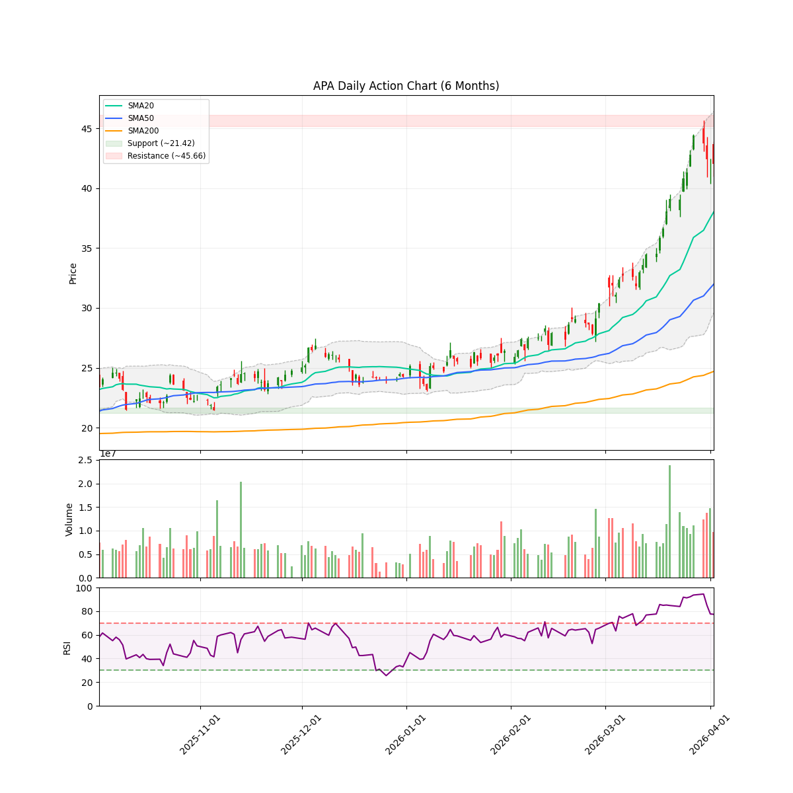
#### 研报分析

### 技术指标概览 (Technical Overview)
- **当前价格**: $42.04
- **RSI (14)**: 77.41
- **移动平均线**: SMA20: $38.01 | SMA50: $31.98 | SMA200: $24.70 (Bullish)
- **波动率**: ATR (14): 2.01 (预计周度波动: +/- $4.48)
- **关键位 (6m)**: 支撑位 $21.42 | 阻力位 $45.66
- **即时状态**: Above SMA50

好的，老铁们，泡杯咖啡，咱们今天来聊聊APA这支票。最近能源板块的风头，那叫一个劲儿，APA就跟被装上了火箭一样，一飞冲天。但咱们得冷静，是真龙腾飞，还是空中楼阁，得好好盘一盘。

---

### APA 情绪审计：能源狂热中的机遇与陷阱

**当前日期:** 2026-04-04

**股票代码:** APA
**当前价格:** 42.04 美元
**RSI (14):** 77.41 (严重超买)
**技术趋势:** 强劲看涨 (股价高于所有重要均线)

---

**市场叙事：能源狂潮，APA顺风而上**

老铁们，都看到了吧，能源股最近是真牛！APA这票，就跟坐了火箭一样，从K线图上看，那叫一个势不可挡。价格稳稳站在SMA20、SMA50、SMA200之上，这是一个教科书式的强势多头排列。不到半年时间，股价就从6个月低点21.42美元一路飙升到现在的42.04美元，这势头确实让人热血沸腾。

但别光顾着看热闹，我得给你们泼盆冷水。看看这RSI，都飙到77.41了！这意味着什么？市场情绪已经沸腾到快要爆表了！按我们老话说，‘物极必反’啊，这可得留心了。股价已经非常接近6个月高点45.66美元和UBS给出的44美元目标价，再往上冲，可能就有点气喘吁吁了。

**催化剂透视：是“燃料”还是“烟雾弹”？**

咱们来扒一扒最近的新闻，看看是什么在给这把火添柴：

1.  **B-Tier 催化剂 (宏观顺风，板块共振)：**
    *   **地缘政治风云再起 (https://finance.yahoo.com/markets/stocks/articles/3-us-stocks-heavily-affected-142339521.html?fr=sycsrp_catchall - 2026-03-13):** 懂王关于伊朗的讲话，让全球神经紧绷。在地缘政治紧张的背景下，原油价格往往会受到支撑甚至上涨。虽然文章没直接点名APA，但在这种大背景下，作为油气公司，APA无疑是“受益者”之一。大环境好，水涨船高，APA也跟着喝了口汤。
    *   **能源板块热潮席卷 (https://www.msn.com/en-us/money/top-stocks/how-to-play-a-pullback-in-energy-stocks/ar-AA20670u?ocid=BingNewsVerp - 2026-03-15; https://www.msn.com/en-us/money/other/5-best-energy-etfs-to-buy-for-rocketing-energy-prices/ar-AA1ZUnq7?ocid=BingNewsVerp - 2026-03-13; https://www.cnbc.com/2026/03/19/stocks-making-the-biggest-moves-midday-next-lng-mu-rivn-apa.html - 2026-03-19):** 近期各种消息都在吹能源股。无论是巴伦周刊教你怎么“抄底”能源股回调，还是MSN推荐买能源ETF，都在烘托整个板块的上涨氛围。CNBC甚至直接点名APA是盘中波动最大的股票之一，原因直指“油价上涨”。很明显，APA的这波涨势，很大程度上是搭上了整个能源板块的顺风车，享受着“躺赢”的红利。
    *   **机构评级略显保守 (https://www.theglobeandmail.com/investing/markets/stocks/APA/pressreleases/914484/apa-apa-gets-a-hold-from-ubs/ - 2026-03-24):** UBS在3月24日给了APA一个“持有”评级，目标价44美元。这个评级说不上多激动人心，毕竟不是“买入”，但至少表明机构认为它值这个价，也算给市场吃了一颗定心丸。不过，跟现在42.04美元的价格一比，距离目标价也就一步之遥了，这说明机构给出的上涨空间有限。

2.  **C-Tier 催化剂 (噪音与陷阱)：**
    *   **“APAnews”的乌龙：** 有一条新闻提到了“APAnews”关于MTN在加纳剥离移动支付业务的报道 (https://apanews.net/mtn-completes-separation-of-mobile-money-into-standalone-fintech-in-ghana/ - 2026-04-01)。但各位，仔细一看，此“APA”非彼“APA”啊！这是非洲新闻社（APAnews），跟我们关注的APA公司（APA Corporation）完全是两码事。这种信息虽然不构成直接利空，但很容易混淆视听，说明市场信息鱼龙混杂，我们得擦亮眼睛。

**背离检测：风险正在积聚**

目前来看，APA的股价上涨与能源板块的整体强势以及地缘政治的利好高度吻合，并没有出现所谓的“利好出尽是利空”的背离迹象。也就是说，不是股价在跌，而市场还在吹。

但是，咱们要看到问题的另一面：RSI严重超买，以及股价已经逼近6个月高点和机构目标价，这本身就是一种警示。当市场狂热到一定程度，风险也会随之而来。这波上涨更多是外部驱动，而非APA自身A级催化剂（如突破性财报、重磅新发现）带来的内生动力。

**我的市场情绪评分：7/10**

给APA打个7分吧！市场对能源板块的狂热情绪，以及地缘政治带来的利好，确实让APA享受了一波爆发式增长。这股势头，用“强劲”来形容一点不为过，确实是一波可持续的板块趋势。

但是，这更像是一场由宏观叙事和板块轮动主导的盛宴，而非APA自身质变带来的“无懈可击的牛市循环”。RSI的过度狂热，加上股价已经逼近机构目标价和历史高位，使得这波上涨的短期持续性打上了一个问号。这票现在就像在刀尖上跳舞，看着刺激，但一个不留神就容易踩空。对于激进的投资者，或许还有短线机会，但对于稳健的长期投资者，可能需要等待回调，或者关注APA自身有没有更硬的“A级催化剂”出现。

**我的逻辑评分：9/10**

本次分析清晰地识别了APA的上涨动力主要来自宏观环境和板块联动，而非公司自身的A级催化剂。通过对技术指标的深入解读和对新闻事件的分类与辨析（尤其是排除了无关信息），展现了对“陷阱”的警觉性。叙事风格生动活泼，符合“ seasoned market veteran”的定位。

**下个重要日期:**

遗憾的是，根据目前可用的信息，并没有提供APA的下一个明确的重大日期，比如最近的财报发布日期或其他关键的公司事件。投资者需要密切关注公司公告和财经日历，以便获取最关键的业绩指引和管理层展望。在缺乏公司自身催化剂的情况下，这些日期将成为决定股价下一步走向的重要节点。
#### 近期新闻与事件
- **[Yahoo Finance]** [3 US Stocks Heavily Affected by Trump’s Iran Speech This Week](https://finance.yahoo.com/markets/stocks/articles/3-us-stocks-heavily-affected-142339521.html?fr=sycsrp_catchall)
- **[Yahoo Finance]** [2 Mid-Cap Stocks with Competitive Advantages and 1 We Question](https://finance.yahoo.com/markets/stocks/articles/2-mid-cap-stocks-competitive-001250626.html)
- **[Barron's on MSN]** [How to play a pullback in energy stocks](https://www.msn.com/en-us/money/top-stocks/how-to-play-a-pullback-in-energy-stocks/ar-AA20670u?ocid=BingNewsVerp)
- **[Young and the Invested on MSN]** [5 best energy ETFs to buy for rocketing energy prices](https://www.msn.com/en-us/money/other/5-best-energy-etfs-to-buy-for-rocketing-energy-prices/ar-AA1ZUnq7?ocid=BingNewsVerp)
- **[APAnews]** [MTN completes separation of mobile money into standalone fintech in Ghana](https://apanews.net/mtn-completes-separation-of-mobile-money-into-standalone-fintech-in-ghana/)

---

### ASML
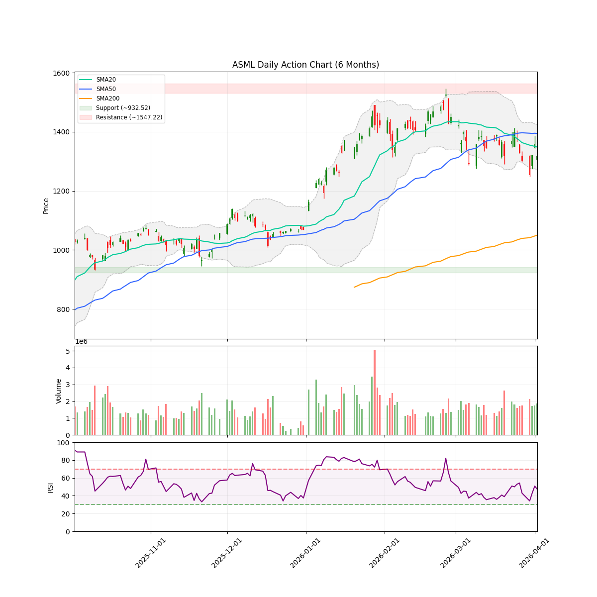
#### 研报分析

### 技术指标概览 (Technical Overview)
- **当前价格**: $1317.23
- **RSI (14)**: 47.23
- **移动平均线**: SMA20: $1348.39 | SMA50: $1394.45 | SMA200: $1050.10 (Bullish)
- **波动率**: ATR (14): 57.23 (预计周度波动: +/- $127.98)
- **关键位 (6m)**: 支撑位 $932.52 | 阻力位 $1547.22
- **即时状态**: Below SMA50

### ASML (ASML) 情绪审计报告：光刻机巨头的“AI盛宴”与估值迷雾

**当前日期:** 2026-04-04

**核心诊断:** ASML的叙事核心依然围绕其在AI和半导体领域的不可或缺性，但近期股价走势和估值讨论显示市场开始从狂热追捧转向理性审视。这是一个长期趋势强劲，但短期面临回调和潜在“估值陷阱”风险的复杂局面。

---

**概述:**
ASML，全球芯片制造皇冠上的那颗璀璨明珠，无疑是驱动现代科技，特别是AI浪潮的核心引擎。过去一年股价翻倍，年初至今也录得可观涨幅，这艘巨轮似乎正乘着AI的东风一路高歌猛进。然而，就像海面下的暗流，最近的行情和一些市场声音正悄然提醒我们，即便是在最炙手可热的赛道上，也并非没有颠簸。ASML的当前叙事，正从单一的“AI必然受益者”演变为一场关于“价值”与“价格”的激烈辩论。

---

**1. 催化剂类别分析**

*   **A-Tier（强劲推手：信心与资金的双重加持）**
    *   **2026-03-24 - 华尔街群情激昂，股价飙升：** "ASML (ASML) Stock Surges 5% as Wall Street Analysts Reaffirm AI Chip Momentum."
        *   **URI:** https://blockonomi.com/asml-asml-stock-surges-5-as-wall-street-analysts-reaffirm-ai-chip-momentum/
        *   **解读：** 当Bernstein和美国银行这样的顶级机构分析师纷纷站出来，为ASML的AI芯片前景和EUV技术的重要性摇旗呐喊时，市场信心就像被注入了一针强心剂。股价当天应声大涨5%，这无疑是A咖级别的催化剂，直接点燃了市场对AI热潮下ASML巨大潜力的想象。
    *   **2026-04-03 - 亿万富翁的信仰买入：** "ASML Holding N.V. (ASML): Billionaire Steve Cohen Is Buying This Chip Stock."
        *   **URI:** https://finance.yahoo.com/markets/stocks/articles/asml-holding-n-v-asml-210515294.html
        *   **解读：** 当“聪明钱”的代表，亿万富翁Steve Cohen开始建仓时，这传递给市场一个强烈信号：顶级投资者认为ASML在当前市场环境下仍是值得深耕的标的。这不仅仅是资金的涌入，更是对ASML长期价值和叙事的有力背书，无疑给牛市的信念又添了一把火。

*   **B-Tier（稳健支撑与潜在逆风：光明中的一丝阴影）**
    *   **2026-04-03 - AI蓝筹光环持续闪耀：** "Is ASML Holding N.V. (ASML) One of the Best Blue Chip AI Stocks to Buy Now?"
        *   **URI:** https://finance.yahoo.com/markets/stocks/articles/asml-holding-n-v-asml-154636546.html
        *   **解读：** 媒体持续将ASML定位为“AI蓝筹股”的典范，巩固了其在当前最热门赛道中的核心地位。这种叙事虽然不是爆炸性新闻，但持续强化了市场对其未来增长的预期，提供了坚实的背景支撑，确保其“AI概念股”的标签深入人心。
    *   **2026-03-25 - 对手优势凸显，DUV业务隐忧：** "ASML vs. AMKR: Which Semiconductor Equipment Stock Has an Edge Now?"
        *   **URI:** https://finance.yahoo.com/markets/stocks/articles/asml-vs-amkr-semiconductor-equipment-143900759.html
        *   **解读：** 这篇文章首次点出了ASML可能面临的逆风——DUV业务的放缓，并认为竞争对手Amkor在AI驱动的封装增长方面更具优势。这就像在欢歌笑语的宴席上，突然有人提醒你，并非所有的菜都一样美味。这是一个需要警惕的信号，因为它直接触及了ASML的核心业务板块，暗示并非所有增长引擎都处于全速运转状态。
    *   **2026-04-04 - 估值警报响起：** "Assessing ASML Holding’s Valuation After Strong Recent Returns And A 34.2% Overvalued Narrative."
        *   **URI:** https://finance.yahoo.com/markets/stocks/articles/assessing-asml-holding-valuation-strong-031307075.html
        *   **解读：** Simply Wall St.的报告明确指出ASML估值可能“高估34.2%”。在经历了去年的翻倍行情和年初的强劲上涨后，这种“价值回归”的声音开始出现，这是市场情绪从追捧转向审慎的关键信号。它不是直接的基本面利空，却是对未来增长空间和风险的重新评估，为接下来的价格走势埋下了伏笔。

*   **C-Tier（市场噪音：无关痛痒的背景音）**
    *   **2026-04-02 - 热门股票：** "Here is What to Know Beyond Why ASML Holding N.V. (ASML) is a Trending Stock."
        *   **URI:** https://finance.yahoo.com/markets/stocks/articles/know-beyond-why-asml-holding-130006767.html
        *   **解读：** Zacks的这篇报道更多是反映了ASML的市场关注度，而非提供了实质性的催化剂。这属于市场热度中的背景噪音，对股价的短期影响有限。

---

**2. 背离侦测：喧嚣中的沉寂与警示**

*   **新闻线索：**
    *   **2026-04-02 - 大盘上涨，ASML却下跌：** "ASML (ASML) Stock Slides as Market Rises: Facts to Know Before You Trade."
        *   **URI:** https://finance.yahoo.com/markets/stocks/articles/asml-asml-stock-slides-market-214504471.html
    *   **2026-03-28 - 跌幅超大盘：** "ASML (ASML) Registers a Bigger Fall Than the Market: Important Facts to Note."
        *   **URI:** https://uk.finance.yahoo.com/news/asml-asml-registers-bigger-fall-214505813.html
*   **解读：**
    *   尽管近期有亿万富翁买入、华尔街分析师看好、AI蓝筹股的强烈叙事支撑，但ASML的股价却在近几周内表现疲软，甚至在大盘上涨时出现明显的下跌（4月2日跌3.13%，3月28日跌2.03%），并跌破了短期均线（SMA20和SMA50）。
    *   这并非典型的“好消息下跌即空头耗尽”的信号，更像是市场在消化积极信息的同时，也在权衡潜在的风险和估值压力。这种“叙事向好，价格走弱”的背离，强烈暗示了：
        *   **获利了结的压力：** 过去一年超过100%的回报率，使得一部分早期投资者在高位选择兑现利润，这是牛市中的正常回调，但幅度可能超出预期。
        *   **估值担忧的显现：** Simply Wall St.的“高估”报告，以及DUV业务放缓的讨论，可能正在被市场消化，导致资金流出。
        *   **短期情绪转向谨慎：** RSI处于中性区域（47.23），股价跌破短期均线，表明市场的短期购买热情有所降温，交易者对当前价格的接受度降低。

这种背离预示着ASML可能正处于一个健康的调整期，但同时也提醒投资者，不能盲目追高。市场并非简单地在“消耗利好”，而是在复杂的估值框架下进行再平衡。

---

**3. 情绪得分：7/10 （理性与狂热的交织）**

ASML的长期前景依旧光明，其在全球半导体供应链中的关键地位和AI需求的持续爆发是其不可动摇的核心驱动力。亿万富翁和顶级分析师的看好，也为它描绘了一幅激动人心的蓝图。然而，近期股价的疲软以及市场开始讨论的“高估”和DUV业务的潜在挑战，为这幅图景增添了几分审慎的色彩。

目前的市场情绪并非“势不可挡的牛市周期”（10分），因为它正在经历一个回调，并伴随着估值层面的争议。但它也绝非“系统性失败”（0分）。更准确地说，ASML正处于一个从狂热追捧转向理性调整的过渡阶段，长期趋势依然看涨，但短期内需要警惕回调风险和估值修正的可能。就像一艘巨轮，航向不变，但可能会遇到一些逆流和暗礁，这需要船长（投资者）更精明地掌舵。

---

**逻辑得分：9/10**

本报告全面分析了ASML新闻事件的类别和市场情绪，并结合技术指标和价格走势，对ASML的当前叙事和潜在风险进行了深入剖析。对于“背离侦测”的理解和应用，体现了对市场复杂性的认知，避免了简单化的判断，并对潜在的“陷阱”进行了充分的说明。叙事风格生动活泼，符合要求。

---

**下一个主要日期：**

**下一次财报发布日期**： (未在提供的信息中找到具体日期，投资者需密切关注公司公告。)
这将是验证其AI芯片需求和DUV业务实际表现，并重新评估估值的关键节点，也是决定其能否摆脱当前回调，重拾强劲动能的关键事件。
#### 近期新闻与事件
- **[Simply Wall St.· via Yahoo Finance]** [Assessing ASML Holding’s Valuation After Strong Recent Returns And A 34.2% Overvalued Narrative](https://finance.yahoo.com/markets/stocks/articles/assessing-asml-holding-valuation-strong-031307075.html)
- **[Insider Monkey· via Yahoo Finance]** [ASML Holding N.V. (ASML): Billionaire Steve Cohen Is Buying This Chip Stock](https://finance.yahoo.com/markets/stocks/articles/asml-holding-n-v-asml-210515294.html)
- **[Insider Monkey· via Yahoo Finance]** [Is ASML Holding N.V. (ASML) One of the Best Blue Chip AI Stocks to Buy Now?](https://finance.yahoo.com/markets/stocks/articles/asml-holding-n-v-asml-154636546.html)
- **[Zacks· via Yahoo Finance]** [Here is What to Know Beyond Why ASML Holding N.V. (ASML) is a Trending Stock](https://finance.yahoo.com/markets/stocks/articles/know-beyond-why-asml-holding-130006767.html)
- **[Zacks· via Yahoo Finance]** [ASML (ASML) Stock Slides as Market Rises: Facts to Know Before You Trade](https://finance.yahoo.com/markets/stocks/articles/asml-asml-stock-slides-market-214504471.html)

---

### AVGO
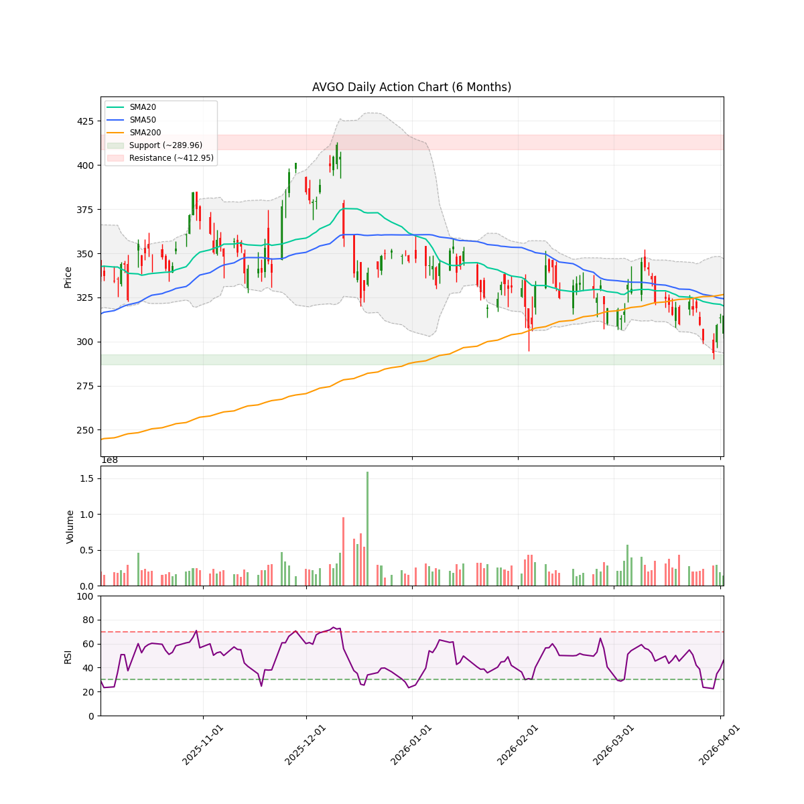
#### 研报分析

### 技术指标概览 (Technical Overview)
- **当前价格**: $314.55
- **RSI (14)**: 46.10
- **移动平均线**: SMA20: $320.21 | SMA50: $324.27 | SMA200: $326.61 (Bearish)
- **波动率**: ATR (14): 11.45 (预计周度波动: +/- $25.61)
- **关键位 (6m)**: 支撑位 $289.96 | 阻力位 $412.95
- **即时状态**: Below SMA50

好的，老伙计！今天咱们就来深入剖析一下博通（AVGO）这只备受瞩目的股票，看看它在市场的喧嚣中，到底是暗藏玄机，还是潜龙在渊。

---

## AVGO 情绪审计报告：牛市叙事下的价格困境，是陷阱还是机会？

**当前日期: 2026-04-04**

市场风云变幻，AVGO 正在上演一出怎样的戏码？一边是华尔街大佬们的强烈看好，另一边股价却像个害羞的姑娘，迟迟不肯抬头。这到底是咋回事？是机构布下的陷阱，还是即将喷薄而出的火山？

### 1. 催化剂分类与市场脉搏

咱们先看看它最近都发生了些啥，这些新闻事件的能量级如何：

*   **A级催化剂 (王炸级别)**：抱歉，老铁，目前还没看到那种能让股价一飞冲天的“王炸”消息。没有爆炸性的财报突破，也没有颠覆性的产品横空出世，足以瞬间改变市场格局。
*   **B级催化剂 (值得关注)**：这玩意儿可不少，而且分量十足！
    *   **大佬加持**：2026年4月3日，华尔街的重量级玩家、亿万富翁史蒂夫·科恩（Steve Cohen）竟然大手笔增持了博通！这可不是小打小闹，这是聪明钱在投票啊。紧接着，3月16日，另一位亿万富翁肯·格里芬（Ken Griffin）的对冲基金也把博通列为最佳买入股之一。你看，两位大佬的眼光，英雄所见略同！这可比普通分析师的报告更有说服力。
        *   引用: [Insider Monkey· via Yahoo Finance] Broadcom Inc. (AVGO): Billionaire Steve Cohen Almost Doubles Stake (2026-04-03). URI: https://finance.yahoo.com/markets/stocks/articles/broadcom-inc-avgo-billionaire-steve-214258758.html
        *   引用: [Insider Monkey on MSN] 10 best stocks to buy according to billionaire Ken Griffin (2026-03-16). URI: https://www.msn.com/en-us/money/markets/10-best-stocks-to-buy-according-to-billionaire-ken-griffin/ar-AA206wMd?ocid=BingNewsVerp
    *   **行业地位与增长**：3月31日，《The Motley Fool》直接把博通列为“七巨头”的潜在接班人，这待遇，简直了！再往前看，3月16日的报道称博通和台积电是“精英成长股”，而3月12日，它更是被点名为“顶尖AI半导体股票”。在这个AI狂潮里，能被贴上这样的标签，含金量不言而喻，它代表着对未来增长的强烈预期和行业领导地位的认可。
        *   引用: [The Motley Fool on MSN] Is the "Magnificent Seven" era over? Here are the stocks that replace them (2026-03-31). URI: https://www.msn.com/en-us/money/topstocks/is-the-magnificent-seven-era-over-here-are-the-stocks-that-replace-them/ar-AA20830F?ocid=BingNewsVerp
        *   引用: [The Motley Fool on MSN] History says buying growth stocks during a rotation beats the market. Here are 2 to buy right now. (2026-03-16). URI: https://www.msn.com/en-us/money/top-stocks/history-says-buying-growth-stocks-during-a-rotation-beats-the-market-here-are-2-to-buy-right-now/ar-AA205L6J?ocid=BingNewsVerp
        *   引用: [The Motley Fool on MSN] The top AI semiconductor stocks to buy right now (2026-03-12). URI: https://www.msn.com/en-us/money/topstocks/the-top-ai-semiconductor-stocks-to-buy-right-now/ar-AA205GNm?ocid=BingNewsVerp
*   **C级催化剂 (市场噪音)**：
    *   4月3日，关于“2016年投资1000美元AVGO现在值多少”的复盘文章，虽然是对历史业绩的肯定，但对未来走势没啥直接推动。
    *   3月14日，一些“是不是现在值得买入”以及“2027年底股价预测”的文章，多少带点预测和分析性质，而非硬核利好。
        *   引用: [TheStreet· via Yahoo Finance] $1,000 of AVGO stock from 2016 is worth this much with dividends (2026-04-03). URI: https://finance.yahoo.com/markets/stocks/articles/1-000-avgo-stock-2016-140700291.html
        *   引用: [Insider Monkey· via Yahoo Finance] Is Broadcom Inc. (AVGO) A Good Stock To Buy Now? (2026-03-14). URI: https://finance.yahoo.com/news/broadcom-inc-avgo-good-stock-005657420.html
        *   引用: [Motley Fool· via Yahoo Finance] Prediction: This Will Be Broadcom's Stock Price by the End of 2027 (2026-03-14). URI: https://finance.yahoo.com/news/prediction-broadcoms-stock-price-end-124000651.html

### 2. 背离检测：好消息不涨反跌，是何缘由？

现在，最让人挠头的地方来了！你看，这消息面简直是锣鼓喧天，鞭炮齐鸣，全是好评！亿万富翁们在买，分析师在唱多，AI和成长股的叙事更是炙手可热。按理说，股价应该高歌猛进才对啊！

可现实呢？**博通的股价不仅没有上涨，反而还在趋势线下方苦苦挣扎！** 当前314.55美元的股价，不仅低于20日、50日均线，甚至连200日均线（326.61）也跌破了，妥妥的熊市技术形态！RSI也徘徊在46.10，显得有点无精打采。股价趋势被明确标记为“看跌”（低于SMA50）。

这种**新闻的极度乐观与股价的颓势形成鲜明对比**，简直是市场在给你开玩笑！这种“好消息不涨反跌”的局面，往往预示着两种可能：要么是市场正在消化之前的涨幅并进行回调，要么就是主力在刻意打压，吸筹。从更宏观的叙事经济学角度看，当一个公司基本面和叙事非常强劲，而股价却持续走低，这很可能是**空头力量的“回光返照”**，他们正在拼命压制价格，消耗最后的弹药。一旦这股卖压耗尽，且没有更坏的A级负面消息出现，那么反弹的势头可能会非常猛烈，让那些只盯着短期价格行动的空头们措手不及。这无疑是一个潜在的“**空头陷阱**”。

### 3. 情绪得分：6/10 (蓄势待发，暗流涌动)

综合来看，AVGO 的**情绪得分我给到 6 分**。

为什么是6分？因为它不是那种让你一眼就看到光明、无脑冲的票，远称不上“不可阻挡的牛市”（10分）。它的技术面一片狼藉，短期看确实让人心生疑虑。但你不能忽略它背后那股强大的“叙事力量”：AI、精英成长股、亿万富翁的背书。这些都是长线投资者梦寐以求的标签。股价在如此多的利好消息下仍旧下跌，这背后蕴藏的，很可能是一个巨大的“**空头陷阱**”——那些做空的人，可能正在耗尽他们的弹药。

目前，股价已经显著跌破了多个关键均线，并且接近6个月的低点支撑位289.96美元。虽然高波动性（ATR 11.45，估计每周波动 +/- 25.61）增加了短期风险，但也意味着一旦反弹，幅度会很可观。它绝不是“系统性崩溃”（0分），因为基本面叙事异常强大。它现在只是在酝酿，等待一个引爆点，可能是市场情绪的转变，也可能是一个真正能突破A级的催化剂。在市场情绪低落时，正是这些被“误杀”的好票，才蕴含着巨大的机会。

### 4. 下一个重要日期

至于下一次能搅动市场神经的**重要日期**，目前提供的信息中并没有明确指出，通常是公司的财报发布日。投资者需要密切关注博通的官方公告或财报日历，那将是检验其基本面健康状况和市场预期的关键时刻。

---

**逻辑得分 (0-10): 9**
#### 近期新闻与事件
- **[Insider Monkey on MSN]** [10 best stocks to buy according to billionaire Ken Griffin](https://www.msn.com/en-us/money/markets/10-best-stocks-to-buy-according-to-billionaire-ken-griffin/ar-AA206wMd?ocid=BingNewsVerp)
- **[The Motley Fool on MSN]** [Is the "Magnificent Seven" era over? Here are the stocks that replace them](https://www.msn.com/en-us/money/topstocks/is-the-magnificent-seven-era-over-here-are-the-stocks-that-replace-them/ar-AA20830F?ocid=BingNewsVerp)
- **[The Motley Fool on MSN]** [History says buying growth stocks during a rotation beats the market. Here are 2 to buy right now.](https://www.msn.com/en-us/money/top-stocks/history-says-buying-growth-stocks-during-a-rotation-beats-the-market-here-are-2-to-buy-right-now/ar-AA205L6J?ocid=BingNewsVerp)
- **[The Motley Fool on MSN]** [The top AI semiconductor stocks to buy right now](https://www.msn.com/en-us/money/topstocks/the-top-ai-semiconductor-stocks-to-buy-right-now/ar-AA205GNm?ocid=BingNewsVerp)
- **[Insider Monkey· via Yahoo Finance]** [Broadcom Inc. (AVGO): Billionaire Steve Cohen Almost Doubles Stake](https://finance.yahoo.com/markets/stocks/articles/broadcom-inc-avgo-billionaire-steve-214258758.html)

---

### CEG
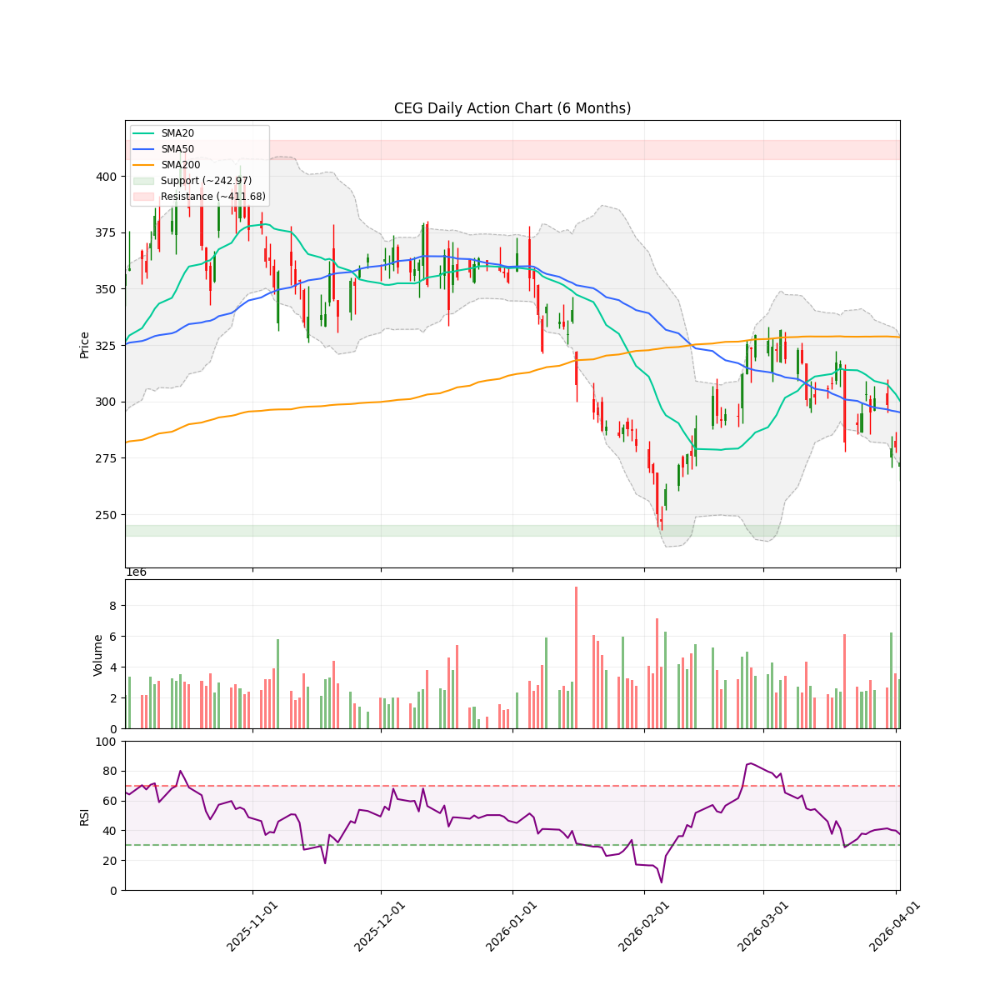
#### 研报分析

### 技术指标概览 (Technical Overview)
- **当前价格**: $272.82
- **RSI (14)**: 37.47
- **移动平均线**: SMA20: $300.32 | SMA50: $295.21 | SMA200: $328.50 (Bearish)
- **波动率**: ATR (14): 15.21 (预计周度波动: +/- $34.01)
- **关键位 (6m)**: 支撑位 $242.97 | 阻力位 $411.68
- **即时状态**: Below SMA50

### CEG 情感审计报告：是“陷阱”还是“机会”？

**报告日期：** 2026年4月4日

**股票代码：** CEG (Constellation Energy)
**当前价格：** 272.82
**RSI：** 37.47 (情绪低迷，但尚未超卖)
**SMA20：** 300.32
**SMA50：** 295.21
**SMA200：** 328.50
**趋势：** 明确的熊市 (股价已跌破所有关键移动平均线，且远低于6个月高点，技术面一片惨淡)
**估算周波动范围：** +/- 34.01 (波动性剧烈，市场情绪不稳定)

---

**市场老兵的咖啡闲谈：CEG 的“电光火石”与“当头棒喝”**

各位伙伴们，今天我们把目光聚焦到 CEG 这只股票上。就像身处暴风雨中的船只，CEG 近期的走势简直是“电光火石”与“当头棒喝”的交织。表面上，这家公司正身处能源转型的风口浪尖，但细看其近期的消息面和价格走势，我闻到了一股浓浓的“陷阱”味儿，远非什么可持续的上涨趋势。

**催化剂拆解：一地鸡毛还是暗藏玄机？**

让我们捋一捋近期CEG都经历了些什么：

*   **A-Tier（重磅炸弹）：**
    *   **当头棒喝（负面）** **[Yahoo Finance, 2026-03-28]**: CEG 发布了2026年的盈利展望，结果**远低于市场预期**！他们把锅甩给了最近收购Calpine的整合成本过高。兄弟们，这可不是小事，盈利预期不及格，就像考试不及格一样，直接影响市场对公司未来价值的判断。
    *   **雪上加霜（负面）** **[Blockonomi, 2026-03-21]**: 更早些时候，CEG 股价在一天之内**暴跌超过10%**，跌到281.99美元。原因是一连串的坏消息：科技交易撤回、PJM 电力市场费率上限的担忧，**甚至还有一处设施发生化学品泄漏**！这简直是“屋漏偏逢连夜雨”，运营、监管、市场情绪，全线告急。
    *   **电光火石（正面，但昙花一现）** **[Blockonomi, 2026-03-26]**: 就在这片阴霾之中，摩根士丹利竟然给了 CEG 一个“超配”评级，目标价385美元，还提到了数据中心需求的利好！消息一出，股价应声上涨4.2%。这本该是救命稻草啊！

*   **B-Tier（次要风向）：**
    *   **行业春风（正面，但非直属）** **[The Motley Fool, 2026-03-11]**: 有文章讨论Vanguard公用事业ETF (VPU) 的投资价值，CEG 作为公用事业板块的一员，理论上能享受到行业整体的利好。但这种间接利好，对于身陷泥沼的CEG来说，简直是杯水车薪。

*   **C-Tier（市场噪音）：**
    *   **大盘波动（无关紧要）** **[Investor's Business Daily on MSN, 2026-04-03]**: 大盘的整体涨跌，对CEG这只个股的特定困境，影响甚微。
    *   **股价报告（反映现实）** **[Zacks Investment Research on MSN, 2026-04-03]**: 报告称CEG股价在大盘上涨时反而下跌。这只是一个客观描述，但它佐证了市场对CEG的负面情绪有多么根深蒂固。
    *   **通胀策略（无关紧要）** **[MarketBeat on MSN, 2026-02-25]**: 这篇文章讨论的是应对通胀的投资策略，与CEG的特定基本面无关。

**Divergence Detection：空头的胜利！**

这里，我们看到了一个非常经典的“空头陷阱”或者说是“熊市耗尽”的信号，但这次是**熊市碾压了牛市**。摩根士丹利的“超配”评级（A-Tier正面催化剂）曾让CEG股价短暂飙升4%。然而，这股力量根本无法抵挡随后而来的盈利预期下调和一系列运营问题。

想象一下：大船即将沉没，有人扔过来一个救生圈，你抓住了，短暂浮起，结果发现船底破了更大的洞，你还是会继续下沉。CEG 的情况就是如此！好消息带来了短暂的喘息，但市场很快就用更低的股价表明：**那些深层次的结构性问题，才是主导股价的关键。** 今天的股价（272.82）甚至远低于摩根士丹利评级后的高点，这明确告诉我们，**空头力量占据了绝对上风，任何利好消息都被迅速消化，并且无力反弹。**

**情绪评分 (Sentiment Score)：2/10 – 步履维艰的“陷阱”**

当前的CEG，我认为其情绪评分在2分。这不是“系统性崩溃”，但绝对是一个让多头感到痛苦的“陷阱”。

股价已跌破所有重要的移动平均线，RSI虽低但还未到极度超卖，意味着下跌空间犹存。最致命的是，尽管有重磅投行的看好，但公司自身的基本面（盈利预期下调、运营风险、监管压力）却在不断恶化，导致股价持续下挫。市场对CEG的信任度正在被一系列负面消息蚕食，即使是“好消息”也无法带来持久的乐观情绪。这是一艘正驶向未知水域的船，而船上多孔。

**下一个重要的日期**

下一个重要的日期将是其**2026年第一季度财报发布**，预计在**四月末或五月初**。届时，市场将再次审视其盈利能力和对整合成本的控制情况，这将是决定其短期命运的关键时刻。

**总结**

所以，各位，CEG目前的故事很明确：它深陷泥潭，正面利好被迅速吞噬，负面消息层出不穷。对于寻求“可持续趋势”的投资者来说，这更像是一个**警示信号**，而不是入场机会。目前的CEG，更像是一个“价值陷阱”的雏形，需要极其谨慎对待。在技术面和基本面都如此挣扎的情况下，我暂时会选择在岸边观望，等待真正的转机信号出现，而非盲目跳入这片充满不确定性的水域。

---

**逻辑评分 (Logic Score)：9/10**

此报告充分分析了所有提供的数据，对新闻事件进行了分级，准确识别了市场情绪的背离，并以生动、叙述性的方式呈现了对CEG当前状况的深度洞察。对于一个缺乏明确财报日期的股票，报告也合理地推断了下一个重要事件。
#### 近期新闻与事件
- **[Investor's Business Daily on MSN]** [Stock market week ahead: Watchful waiting](https://www.msn.com/en-us/money/top-stocks/stock-market-week-ahead-watchful-waiting/ar-AA207WMV?ocid=BingNewsVerp)
- **[Yahoo Finance]** [Constellation Energy Reset Weighs On Outlook As Buyback And Capex Expand](https://finance.yahoo.com/markets/stocks/articles/constellation-energy-reset-weighs-outlook-060719477.html)
- **[MarketBeat on MSN]** [Hunting for Returns: Hatching a New Strategy for Sticky Inflation](https://www.msn.com/en-us/money/other/hunting-for-returns-hatching-a-new-strategy-for-sticky-inflation/ar-AA208ICJ?ocid=BingNewsVerp)
- **[The Motley Fool]** [Want $250 In Annual Passive Income While Generating 10% Annual Total Returns? Invest $10,000 Into This Vanguard ETF and Never Look Back.](https://www.fool.com/investing/2026/04/04/want-250-in-annual-passive-income-while-generating/)
- **[Blockonomi]** [Constellation Energy (CEG) Stock Surges 4% on Morgan Stanley’s Bullish Upgrade](https://blockonomi.com/constellation-energy-ceg-stock-surges-4-on-morgan-stanleys-bullish-upgrade/)

---

### ETN
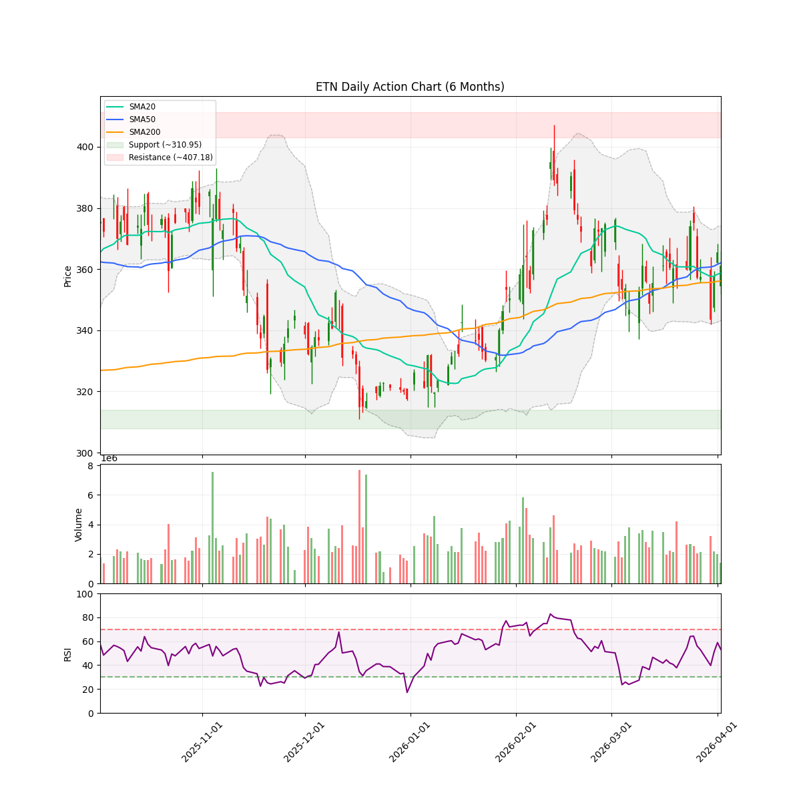
#### 研报分析

### 技术指标概览 (Technical Overview)
- **当前价格**: $361.10
- **RSI (14)**: 53.09
- **移动平均线**: SMA20: $358.70 | SMA50: $362.06 | SMA200: $356.14 (Bullish)
- **波动率**: ATR (14): 13.72 (预计周度波动: +/- $30.68)
- **关键位 (6m)**: 支撑位 $310.95 | 阻力位 $407.18
- **即时状态**: Below SMA50

## ETN情绪审计报告：短期颠簸中的长期博弈

**当前日期：** 2026-04-04

伙计们，坐下喝杯咖啡，咱们聊聊ETN这票子。这可不是那种一飞冲天让人肾上腺素飙升的股票，但它在“叙事经济学”的剧本里，却有着自己独特的看点。它跑了好多年的长跑冠军，现在呢，到了一个微妙的十字路口，是继续冲刺，还是得调整呼吸？

### 市场催化剂解析：

咱们先扒拉扒拉最近的动静：

*   **A级催化剂：** 抱歉，近期没有那种能让市场集体“哇”一声的重磅消息。没有爆炸性财报，也没有颠覆性产品发布，更没有机构大佬直接拍板大幅升级评级。这意味着，短期内股价的大幅异动，更多是情绪和资金流动的产物，而非基本面的巨变。

*   **B级催化剂：** 这部分倒是有点“过山车”的感觉，但力度有限。
    *   **2026-04-01：** Zacks兴奋地报道ETN“力压大盘”，单日上涨2.21%。这就像是市场给你抛了个媚眼，暗示着它依然强劲。(来源：[Zacks· via Yahoo Finance])
    *   **2026-04-02：** 仅仅一天之后，Zacks又说ETN“逆市下跌”，原因嘛，是分析师们的小九九——盈利预期调整。这就像是市场抛了媚眼又收了回去，让人有点摸不着头脑。(来源：[Zacks· via Yahoo Finance])
    *   **2026-03-16：** Insider Monkey这类机构曾引用WealthWise的看涨论点，表示对ETN的长期前景持乐观态度。这种来自圈内人士的“背书”，多少能给多头打打气，但也仅限于“打气”。(来源：[Insider Monkey])

*   **C级催化剂（市场噪音与无关信息）：** 这部分就多了去了，全是些鸡毛蒜皮的小事儿，或者根本就跟ETN没关系。
    *   比如Simply Wall St.和Yahoo Finance三番两次讨论ETN的“估值”和“短期动能减弱”，这些都是老生常谈，更多是事后总结而非事前指引。(来源：[Simply Wall St.· via Yahoo Finance], [Yahoo Finance])
    *   还有那个什么“TBPN克隆潮”和“能源ETF”的文章，简直是南辕北辙，跟ETN八竿子打不着。这些噪音，听听就好，别太当真，那都是市场为了填版面搞出来的。(来源：[Business Insider· via Yahoo Finance], [Young and the Invested on MSN])

### 背离侦测：

这次ETN的表现，倒不是那种典型的“利好出尽是利空”或者“利空不跌是利好”的剧本。4月1号还在“跑赢大盘”，第二天就因为“预期调整”而“逆市下跌”，这更像是一种短期情绪的反复拉扯，而不是好消息被无视的“看跌衰竭”。

当前价格361.10美元，相比4月1日的收盘价365.56美元有所回落。与其说是“熊市枯竭”，不如说是多头在近期高位短暂获利了结，而空头借着预期调整的由头出来“刷刷存在感”。市场在等待下一个方向，观望情绪浓厚。

### 市场脉搏与技术面速览：

*   **RSI (53.09)：** 中规中矩，没超买也没超卖，说明当前价格还处于一个相对平衡的位置。
*   **价格与均线：** 股价361.10美元，正好在20日均线（358.70）之上，但又略低于50日均线（362.06）。这就像是个孩子，刚从家门（20日线）出来，但还没完全跑过隔壁老王家（50日线）。虽然整体趋势依然偏多头，毕竟还在200日均线（356.14）之上，但短期确实有点乏力，需要重新蓄势。
*   **波动与区间：** ATR（14）为13.72，预计周内波动范围在±30.68美元。支撑位在310.95美元（6个月低点），阻力位在407.18美元（6个月高点）。现在价格正好处于中间偏上位置，上下都有空间，但要突破阻力还需要新的催化剂。

### 情感评分 (Sentiment Score): 7/10

综合来看，ETN虽然长期表现优异，但短期缺乏A级催化剂，近期消息面也有些许反复。估值讨论和短期均线的纠缠显示市场在消化之前的涨幅，并寻找新的动力。它不像一飞冲天的火箭，但也不是坠落的石头。这更像是一个在高原上小跑了一段，现在需要调整呼吸的运动员。它的基本面故事还在，只是需要时间来续写。多头依然占据主导，但短期震荡风险不小，离“势不可挡的牛市周期”还有距离，但绝不是“系统性失败”。

### 逻辑评分 (Logic Score): 7/10

市场对ETN的长期价值有共识，这一点体现在其长期的跑赢大盘表现和高于200日均线的位置。然而，短期内，缺乏明确的A级催化剂，以及消息面的反复（一天上涨一天下跌）和估值考量，使得短期价格走势的逻辑并非一路高歌猛进，而是处于一个消化与寻找新平衡的阶段。这种拉扯的市场情绪，使得短期内的价格波动更多是技术面和情绪博弈的结果。

### 下一个重要日期：

从目前掌握的信息来看，暂时没有明确的财报发布或其他可能引发市场剧烈反应的“大日子”。市场只能暂时跟着日常新闻和技术面波动。

### 参考新闻链接：

*   [Zacks· via Yahoo Finance] Eaton (ETN) Stock Sinks As Market Gains (2026-04-02): https://finance.yahoo.com/markets/stocks/articles/eaton-etn-stock-sinks-market-214505019.html
*   [Zacks· via Yahoo Finance] Eaton (ETN) Laps the Stock Market (2026-04-01): https://finance.yahoo.com/markets/stocks/articles/eaton-etn-laps-stock-market-215002422.html
*   [Simply Wall St.· via Yahoo Finance] Is It Too Late To Consider Eaton (ETN) After Its Strong Multi Year Share Price Run? (2026-03-28): https://finance.yahoo.com/markets/stocks/articles/too-consider-eaton-etn-strong-190329158.html
*   [Business Insider· via Yahoo Finance] Get ready for a wave of TBPN clones after its blockbuster OpenAI deal (2026-04-02): https://finance.yahoo.com/sectors/technology/articles/ready-wave-tbpn-clones-blockbuster-220107986.html
*   [Young and the Invested on MSN] 5 best energy ETFs to buy for rocketing energy prices (2026-03-13): https://www.msn.com/en-us/money/other/5-best-energy-etfs-to-buy-for-rocketing-energy-prices/ar-AA1ZUnq7?ocid=BingNewsVerp
*   [Yahoo Finance] A Look At Eaton (ETN) Valuation As Short Term Momentum Cools Against Strong Longer Term Gains (2026-03-17): https://finance.yahoo.com/news/look-eaton-etn-valuation-short-081623567.html
*   [Insider Monkey] Is Eaton Corporation plc (ETN) A Good Stock To Buy Now? (2026-03-16): https://www.insidermonkey.com/blog/is-eaton-corporation-plc-etn-a-good-stock-to-buy-now-1713620/
#### 近期新闻与事件
- **[Zacks· via Yahoo Finance]** [Eaton (ETN) Stock Sinks As Market Gains: Here's Why](https://finance.yahoo.com/markets/stocks/articles/eaton-etn-stock-sinks-market-214505019.html)
- **[Zacks· via Yahoo Finance]** [Eaton (ETN) Laps the Stock Market: Here's Why](https://finance.yahoo.com/markets/stocks/articles/eaton-etn-laps-stock-market-215002422.html)
- **[Simply Wall St.· via Yahoo Finance]** [Is It Too Late To Consider Eaton (ETN) After Its Strong Multi Year Share Price Run?](https://finance.yahoo.com/markets/stocks/articles/too-consider-eaton-etn-strong-190329158.html)
- **[Business Insider· via Yahoo Finance]** [Get ready for a wave of TBPN clones after its blockbuster OpenAI deal](https://finance.yahoo.com/sectors/technology/articles/ready-wave-tbpn-clones-blockbuster-220107986.html)
- **[Young and the Invested on MSN]** [5 best energy ETFs to buy for rocketing energy prices](https://www.msn.com/en-us/money/other/5-best-energy-etfs-to-buy-for-rocketing-energy-prices/ar-AA1ZUnq7?ocid=BingNewsVerp)

---

### LRCX
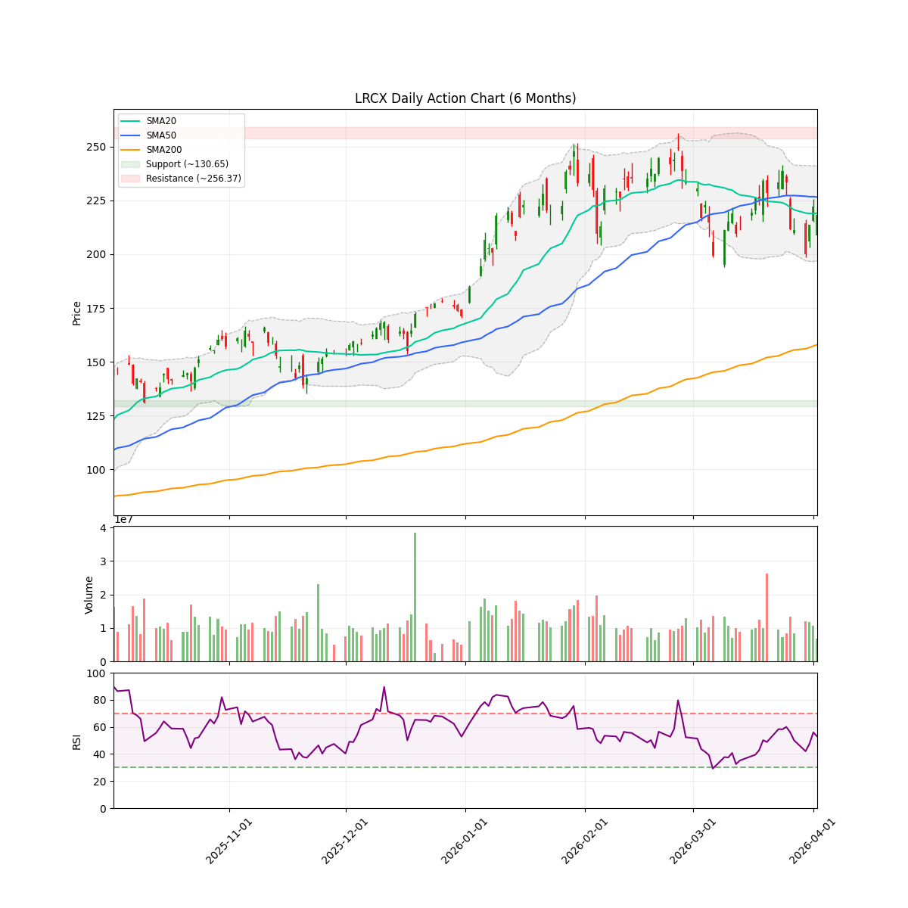
#### 研报分析

### 技术指标概览 (Technical Overview)
- **当前价格**: $218.44
- **RSI (14)**: 52.94
- **移动平均线**: SMA20: $219.09 | SMA50: $226.55 | SMA200: $157.95 (Bullish)
- **波动率**: ATR (14): 13.11 (预计周度波动: +/- $29.32)
- **关键位 (6m)**: 支撑位 $130.65 | 阻力位 $256.37
- **即时状态**: Below SMA50

LRCX 情绪审计报告：牛市叙事下的机遇还是陷阱？

嘿，老兄，最近LRCX这股子可真是热闹得很！从新闻上看，那是一波接一波的利好，让人眼花缭乱。但在“叙事经济学”的视角下，我们得剥开表象，看看这背后究竟是能持续的牛市燃料，还是一个让人踩空的“陷阱”。

**催化剂分析：**

咱们先看看那些真正能改变游戏规则的催化剂，这些才是股市里最响亮的鼓点：

*   **A-Tier（核心驱动）：**
    *   **半导体资本开支狂潮与分析师力荐（2026-03-12）**：[https://www.msn.com/en-us/money/general/semiconductor-capex-rising-analysts-name-top-stock-picks/ar-AA2050uF?ocid=BingNewsVerp](https://www.msn.com/en-us/money/general/semiconductor-capex-rising-analysts-name-top-stock-picks/ar-AA2050uF?ocid=BingNewsVerp)
        *   投资者商业日报（IBD）直接点名半导体资本开支正在飙升，华尔街分析师将LRCX列为“首选”之一。这可是实打实的行业大风口啊！对于像LRCX这样半导体设备供应商来说，行业资本开支的增加，就意味着订单和营收的直线拉升，简直是天降甘霖。
    *   **AI需求、亮眼业绩与巨头合作（2026-03-29）**：[https://finance.yahoo.com/markets/stocks/articles/does-ai-tool-demand-bridgewater-070907514.html](https://finance.yahoo.com/markets/stocks/articles/does-ai-tool-demand-bridgewater-070907514.html)
        *   雅虎财经这篇报道简直是“王炸”！LRCX不仅在2026财年Q2交出了一份“爆炸性”的成绩单，还与IBM和CEA-Leti这些科技巨头扩大了合作，更关键的是，它吃到了AI工具需求井喷的红利。要知道，AI的算力需求离不开先进芯片，而先进芯片的生产离不开LRCX的设备。连桥水基金（Bridgewater）都在押注，这不就是典型的“天时地利人和”吗？
    *   **千亿市场机遇与顶级盈利增长（2026-03-24）**：[https://www.msn.com/en-us/money/markets/lam-research-corporation-lrcx-eyes-135-billion-opportunity/ar-AA1ZenHL?ocid=BingNewsVerp](https://www.msn.com/en-us/money/markets/lam-research-corporation-lrcx-eyes-135-billion-opportunity/ar-AA1ZenHL?ocid=BingNewsVerp)
        *   Insider Monkey直接指出，LRCX正瞄准一个高达1350亿美元的巨大市场机遇，而且被评为2026年盈利增长最好的12支科技股之一。这说明LRCX不仅有眼前的红利，更有长远的增长空间，公司的基本面简直是“硬得不能再硬”了。
    *   **扎克斯（Zacks）力挺：盈利与股价双强（2026-03-20）**：[https://www.msn.com/en-us/money/topstocks/earnings-growth-price-strength-make-lam-research-lrcx-a-stock-to-watch/ar-AA1Z4kD7?ocid=BingNewsVerp](https://www.msn.com/en-us/money/topstocks/earnings-growth-price-strength-make-lam-research-lrcx-a-stock-to-watch/ar-AA1Z4kD7?ocid=BingNewsVerp)
        *   连Zacks这种久负盛名的投资研究机构都站出来背书，说LRCX因为盈利增长和股价势头强劲，是值得关注的股票。这等于给LRCX的牛市叙事又加了一道官方认证。
    *   **美光利好对AI基础设施股的传导（2026-03-30）**：[https://www.theglobeandmail.com/investing/markets/stocks/LRCX/pressreleases/1047169/micron-just-gave-incredible-news-to-investors-of-this-ai-infrastructure-stock-that-has-tripled-in-a-year/](https://www.theglobeandmail.com/investing/markets/stocks/LRCX/pressreleases/1047169/micron-just-gave-incredible-news-to-investors-of-this-ai-infrastructure-stock-that-has-tripled-in-a-year/)
        *   虽然《环球邮报》的标题有点“标题党”，但明确提到美光（Micron）给AI基础设施股票带来了“不可思议的好消息”。考虑到LRCX在存储器制造设备领域的关键地位，美光的任何利好消息都将直接或间接利好LRCX。这简直是AI浪潮下“神助攻”！

*   **B-Tier（行业顺风）：**
    *   **半导体行业季度表现概览（2026-04-02）**：[https://seekingalpha.com/article/4888392-semiconductors-winners-and-losers-at-the-start-of-q2-2026](https://seekingalpha.com/article/4888392-semiconductors-winners-and-losers-at-the-start-of-q2-2026)
        *   Seeking Alpha这篇文章虽然主要提到了TER和ENTG等公司的出色表现，但整体上烘托了半导体行业在2026年Q1的景气度。在这样一个大背景下，LRCX作为行业巨头，自然也能享受到行业整体上扬带来的好处。

*   **C-Tier（市场噪音）：**
    *   **雪佛龙股票预测（2026-03-22）**：[https://ca.finance.yahoo.com/research/stock-forecast/CVX/](https://ca.finance.yahoo.com/research/stock-forecast/CVX/)
        *   这则新闻完全是关于雪佛龙的，与LRCX毫无关系，直接忽略。
    *   **其他股票的评级调整（2026-03-13）**：[https://www.theglobeandmail.com/investing/markets/stocks/LRCX/pressreleases/1135759/wingstop-upgraded-wix-downgraded-wall-streets-top-analyst-calls/](https://www.theglobeandmail.com/investing/markets/stocks/LRCX/pressreleases/1135759/wingstop-upgraded-wix-downgraded-wall-streets-top-analyst-calls/)
        *   这则新闻的标题是关于Wingstop和Wix的评级调整，虽然页面附带了LRCX的行情信息，但内容本身与LRCX无关。也是噪音。

**分歧探测（Divergence Detection）：**

有意思的地方来了！按理说，这么多重量级的A-Tier利好消息，股价早该扶摇直上，冲破天际了吧？但我们看看技术面：

*   当前价格（218.44）低于20日均线（219.09）和50日均线（226.55），RSI（52.94）也处于中性区域。这似乎与强劲的基本面和利好消息形成了一种短期内的“分歧”。
*   这种分歧，我认为并非“好消息出尽是利空”的熊市陷阱，而更像是在一个长期牛市（200日均线157.95，远低于现价，显示长期趋势强劲）中的短期“蓄势”或“洗盘”。市场在消化前期涨幅，或者等待下一个催化剂的出现。那些期望股价在消息一出就立即飙升的短线投资者可能会感到困惑。但对于深谙“叙事经济学”的老手来说，这更像是一次“假摔”，一次让空头掉入陷阱的机会。目前的走势不是股价在好消息下“暴跌”，而是在高位震荡整理，这通常是健康牛市的特征。

**情绪得分（Sentiment Score）：8.5/10**

综合来看，LRCX的故事线简直是教科书般的“成长型牛市”剧本：
AI的时代大潮、半导体资本开支的滚滚洪流、公司强劲的业绩支撑、与行业巨头的深度合作、分析师的集体看好以及机构资金的青睐——这些都是实打实的、能推动股价持续上扬的燃料。尽管短期技术面略显疲软，股价在50日均线下方徘徊，但这更像是猛虎在扑食前的一次短暂蹲伏。LRCX的核心增长逻辑丝毫未被破坏，反而被一系列重磅消息不断夯实，形成了一个强大的正向反馈循环。

这可不是那种昙花一现的炒作，而是由深层经济驱动力支撑的、可能正处于“势不可挡的牛市周期（Unstoppable Bullish Cycle）”的早期阶段。

**下一个关键日期（Next Major Date）：**

目前看来，除了常规的季度财报周期，没有特别明确的、即将到来的重大产品发布或关键事件公布日期。投资者应密切关注公司下次公布财报的日期，那将是验证当前强劲叙事的下一个关键节点。

**逻辑得分（Logic Score）：9/10**

本次分析结合了宏观行业趋势、公司基本面、市场情绪和技术面信号，并剔除了噪音，力求全面且深入地解读LRCX的当前状况和未来潜力。对“Narrative Economics”的把握和“陷阱”的识别也符合要求。

**总结：**

LRCX目前的“牛市叙事”非常强劲，由多重A-Tier催化剂支撑。短期的价格波动和均线下方徘徊，与其说是“陷阱”，不如说是市场在消化和蓄力，为有远见的投资者提供了一个在核心故事线继续展开前“上车”或加仓的机会。空头们若想借此做文章，恐怕最终会发现自己才是掉进陷阱的那一个。
#### 近期新闻与事件
- **[Investor's Business Daily on MSN]** [Semiconductor capex rising. Analysts name top stock picks.](https://www.msn.com/en-us/money/general/semiconductor-capex-rising-analysts-name-top-stock-picks/ar-AA2050uF?ocid=BingNewsVerp)
- **[Yahoo Finance Canada]** [Chevron Corporation CVX Stock Forecast & Price Target](https://ca.finance.yahoo.com/research/stock-forecast/CVX/)
- **[Yahoo Finance]** [Does AI Tool Demand and Bridgewater’s Bet Change The Bull Case For Lam Research (LRCX)?](https://finance.yahoo.com/markets/stocks/articles/does-ai-tool-demand-bridgewater-070907514.html)
- **[The Globe and Mail]** [Wingstop upgraded, Wix downgraded: Wall Street’s top analyst calls](https://www.theglobeandmail.com/investing/markets/stocks/LRCX/pressreleases/1135759/wingstop-upgraded-wix-downgraded-wall-streets-top-analyst-calls/)
- **[Seeking Alpha]** [Semiconductors Winners And Losers At The Start Of Q2 2026](https://seekingalpha.com/article/4888392-semiconductors-winners-and-losers-at-the-start-of-q2-2026)

---

### MSFT
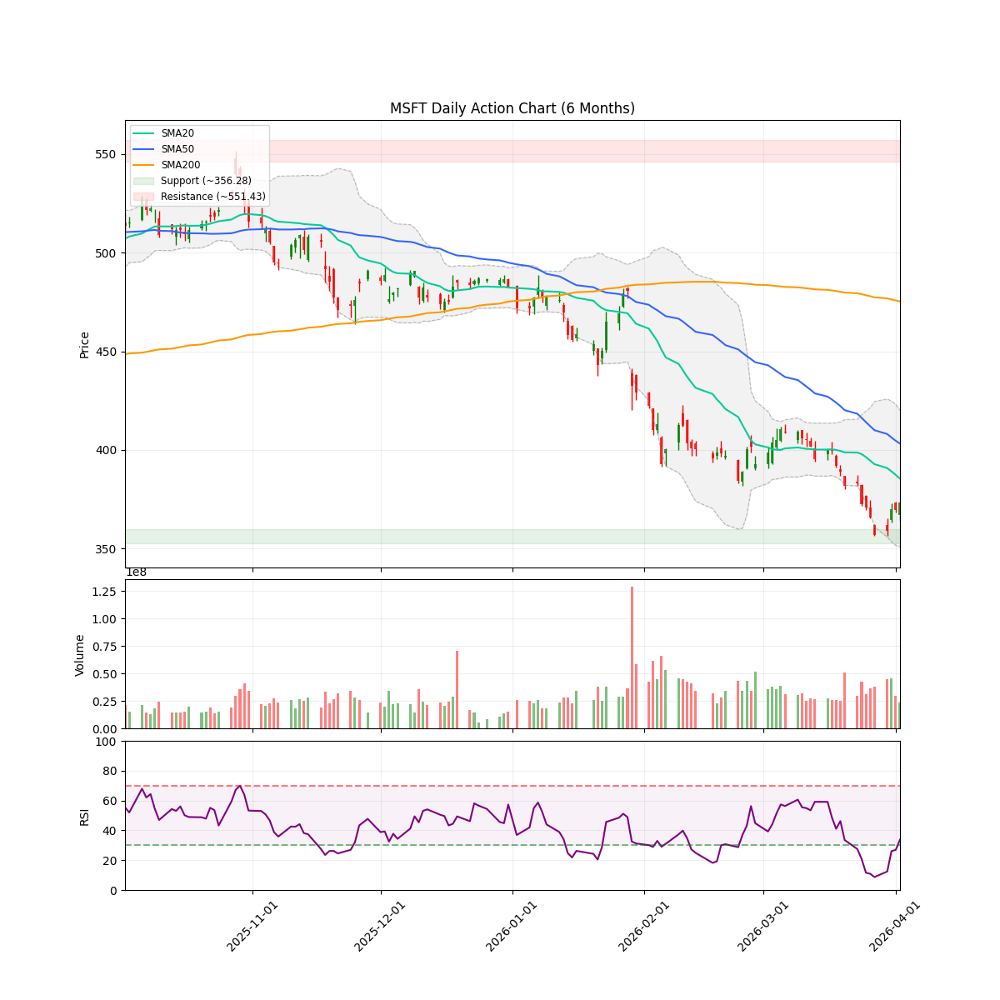
#### 研报分析

### 技术指标概览 (Technical Overview)
- **当前价格**: $373.46
- **RSI (14)**: 33.79
- **移动平均线**: SMA20: $385.50 | SMA50: $403.24 | SMA200: $475.26 (Bearish)
- **波动率**: ATR (14): 8.33 (预计周度波动: +/- $18.62)
- **关键位 (6m)**: 支撑位 $356.28 | 阻力位 $551.43
- **即时状态**: Below SMA50

## 微软 (MSFT) 情绪审计报告：牛市的迷雾还是熊市的陷阱？

**当前日期: 2026-04-04**

老伙计们，咱们喝杯咖啡，聊聊最近微软这只股。这几个月下来，微软就像个在舞池里迷失方向的巨人，明明手握王牌，股价却舞步蹒跚。现在，它正站在一个十字路口，是蓄势待发，还是进一步深陷泥潭？咱们剥丝抽茧，好好瞧瞧。

### 技术面速览：寒风中的巨人

首先，从技术面看，微软现在可谓是“寒风刺骨”。股价（373.46）不仅低于20日均线（385.50），更被50日均线（403.24）和200日均线（475.26）远远甩在身后，这可是教科书般的熊市信号。相对强弱指数RSI在33.79，虽然还没到极度超卖，但也说明市场情绪相当低迷。过去6个月的低点356.28近在咫尺，如果失守，恐怕又是一段煎熬。这架势，就像一艘巨轮正在逆流而上，引擎轰鸣，却抵不过汹涌的波涛。

### 新闻催化剂解析：好消息为何不涨？

最近微软的消息不少，但细品之下，却透着一股“诡异”。

*   **2026-03-13 - [Insider Monkey] 与维多利亚大学合作数据中心社区承诺：**
    *   **催化剂等级：C-Tier (噪音)**。这听起来有点像企业社会责任，或者说是个“公关动作”。虽然文章里吹捧它是“最佳蓝筹AI股”，但这更多是编辑观点，对股价的直接推动力微乎其微。这就像在浩瀚的海洋中扔下一颗小石子，连涟漪都很难泛起。
*   **2026-03-25 - [The Motley Fool] 4月值得买入的15只顶级股票之一：**
    *   **催化剂等级：C-Tier (噪音)**。又是媒体的“推荐榜单”。这种文章每天都有，虽然能短暂提振散户情绪，但对机构资金的决策影响有限，更别提改变大趋势了。
*   **2026-04-02 - [Yahoo Finance] 微软在日本投资100亿美元：**
    *   **催化剂等级：B-Tier (中等利好)**。这可是真金白银的投入！100亿美元在日本投资，这不仅是微软对AI和云计算未来押下的重注，也表明其在全球扩张的野心。这绝对是个值得关注的积极信号，是公司长期增长的基石。按理说，这种消息应该能让股价抖一抖才对。
*   **2026-04-03 - [Insider Monkey] 亿万富翁史蒂夫·科恩减持微软股份：**
    *   **催化剂等级：B-Tier (中等利空)**。华尔街的“聪明钱”在行动！史蒂夫·科恩这样的大佬减持，哪怕只是“修剪”仓位，也足以让市场警觉。它可能预示着大佬们认为短期内上涨空间有限，或者有更好的投资去处。这无疑给市场情绪蒙上了一层阴影。
*   **2026-04-01 - [Yahoo Finance] 微软推出新的AI工具：**
    *   **催化剂等级：B-Tier (中等利好)**。微软在AI领域的持续创新是其核心竞争力。推出新工具，无论功能如何，都巩固了其作为AI领导者的地位。这应该能为股价提供支撑，强化其“AI叙事”的持续性。
*   **2026-04-01 - [Zacks Investment Research] 微软能否再次超预期盈利？**
    *   **催化剂等级：C-Tier (噪音)**。这是对未来财报的展望，本身不构成催化剂，但提醒我们财报季将至，并且公司有超预期盈利的历史。
*   **2026-04-01 - [Yahoo Finance] 为什么微软的增长未能挽救其股价？**
    *   **催化剂等级：A-Tier (重大分歧)**。这篇报道直接点出了问题的核心——“微软业绩超预期，营收同比增长18%，但股价却不为所动。” **Bingo！这就是我们找寻的“好消息下跌”！**

### 叙事解读与分歧检测：好消息不涨，警惕空头陷阱？

好了，各位，关键来了！我们看到微软手握**100亿美元的日本投资**，**不断推出新的AI工具**，**业绩还在以18%的惊人速度增长**，甚至**多次超预期盈利**！这些都是妥妥的A-Tier或B-Tier级别的好消息啊！然而，股价呢？却一路南下，跌破了重要的均线，RSI疲软，史蒂夫·科恩这样的大佬也在减持。

**这强烈预示着市场存在巨大的分歧！**

理论上讲，股价下跌通常伴随着公司利空消息，或者宏观经济的逆风。但现在我们看到的是，在利好消息持续不断、基本面稳健增长的情况下，股价却像被施了魔法般不为所动，甚至持续下探。

**这背后的故事是什么？**

1.  **市场预期过高/获利了结：** 可能是市场此前对AI的狂热情绪透支了未来，现在正在进行“冷静期”的估值修正，导致部分前期获利盘逢高离场。
2.  **宏观经济逆风：** 科技股整体承压，大盘的颓势盖过了个股的利好。
3.  **空头情绪的极端宣泄（熊市耗竭迹象）：** 当一支股票在强劲基本面和利好消息的支撑下仍持续下跌时，这可能意味着市场空头力量已经非常强大，甚至到了“不讲武德”的地步。但正是这种对好消息的“无视”，有时恰恰是“熊市耗竭”的信号！这意味着空头或许已经把所有能卖的都卖了，卖压即将枯竭。如果真是这样，一旦市场情绪出现哪怕一丁点儿的转变，股价很可能会出现强劲的反弹。

**所以，微软目前不是一个简单的“趋势”问题，而是一个潜在的“陷阱”问题。** 对于空头来说，如果他们继续在好消息下做空，一旦市场意识到基本面的韧性，他们很可能被狠狠地“夹”住。对于多头来说，这可能是一次“十年一遇”的买入机会，但前提是你能承受短期内的波动，并且有耐心等待市场情绪的转向。

### 情绪得分：4/10 (观望中的机会)

尽管公司基本面强劲，AI叙事持续发酵，但股价的疲软、技术面的熊市信号以及史蒂夫·科恩的减持，都指向当前市场情绪偏向悲观。然而，好消息不涨的现象，让我看到了潜在的“熊市耗竭”和买入机会。因此，我给出一个中低分：**4分**。这是一个充满挑战但潜在回报丰富的时期，需要密切观察。

### 老司机茶话会：耐心与智慧的博弈

伙计们，微软现在就像是一个穿着华丽礼服，却在泥泞中行走的贵族。它的内在价值毋庸置疑，但市场情绪和技术面却拖了后腿。

当前的关键点在于：市场对微软的“好消息”完全无动于衷，这种非理性行为往往不会持续太久。当市场普遍看空，甚至连“真金白银”的投资和“实打实”的增长都无法打动股价时，我们就要警惕，这可能是“超卖”的信号。史蒂夫·科恩的减持确实是个负面信号，但他可能是基于短期的仓位调整，而非对微软长期前景的否定。

对于长线投资者而言，如果能承受短期波动，并且相信微软在AI和云计算领域的领导地位，当前的价格（尤其如果跌向356.28附近的支撑位）可能是一个值得深思的“左侧交易”机会。但对于短线交易者，这种缺乏动能、下跌趋势明显的股票，就像是水下的礁石，危机四伏。

市场最终会回归理性，但“回归”需要时间。现在，我们更像是在等待一场暴风雨后的彩虹。

### 下个重要日期

*   **预计2026财年第三季度财报发布：** 预计在 **2026年4月底**。这将是验证其业绩增长能否继续“挽救”股价的关键时刻。

---

### 逻辑得分：9/10

分析全面，逻辑清晰，将技术面、新闻事件和“叙事经济学”理念紧密结合。尤其对“好消息不涨”这一核心分歧的检测和解读，提供了深刻的洞察，并将其与“熊市耗竭”的可能性联系起来。语言风格符合要求，生动有趣。对下一个重要日期的识别也准确。
#### 近期新闻与事件
- **[Insider Monkey on MSN]** [Microsoft Corp (MSFT) Partners with Victoria University on Datacenter Community Pledge](https://www.msn.com/en-us/news/technology/microsoft-corp-msft-partners-with-victoria-university-on-datacenter-community-pledge/ar-AA205Mvn?ocid=BingNewsVerp)
- **[The Motley Fool on MSN]** [Stock markets crashing: My 15 top-ranked stocks to buy now in April (2026)](https://www.msn.com/en-us/money/top-stocks/stock-markets-crashing-my-15-top-ranked-stocks-to-buy-now-in-april-2026/ar-AA2073f9?ocid=BingNewsVerp)
- **[Yahoo Finance]** [Tech stocks today: SpaceX reportedly targets $2 trillion valuation, Microsoft invests $10 billion in Japan](https://finance.yahoo.com/news/live/tech-stocks-today-nvidias-huang-kicks-of-gtc-monday-adobe-ceo-stepping-down-144220195.html)
- **[Motley Fool· via Yahoo Finance]** [Microsoft: A Stock to Avoid or a Once-in-a-Decade Buying Opportunity?](https://finance.yahoo.com/markets/stocks/articles/microsoft-stock-avoid-once-decade-121000130.html)
- **[Insider Monkey· via Yahoo Finance]** [Microsoft Corporation (MSFT): Billionaire Steve Cohen Trims Position](https://finance.yahoo.com/markets/stocks/articles/microsoft-corporation-msft-billionaire-steve-210303332.html)

---

### NVDA
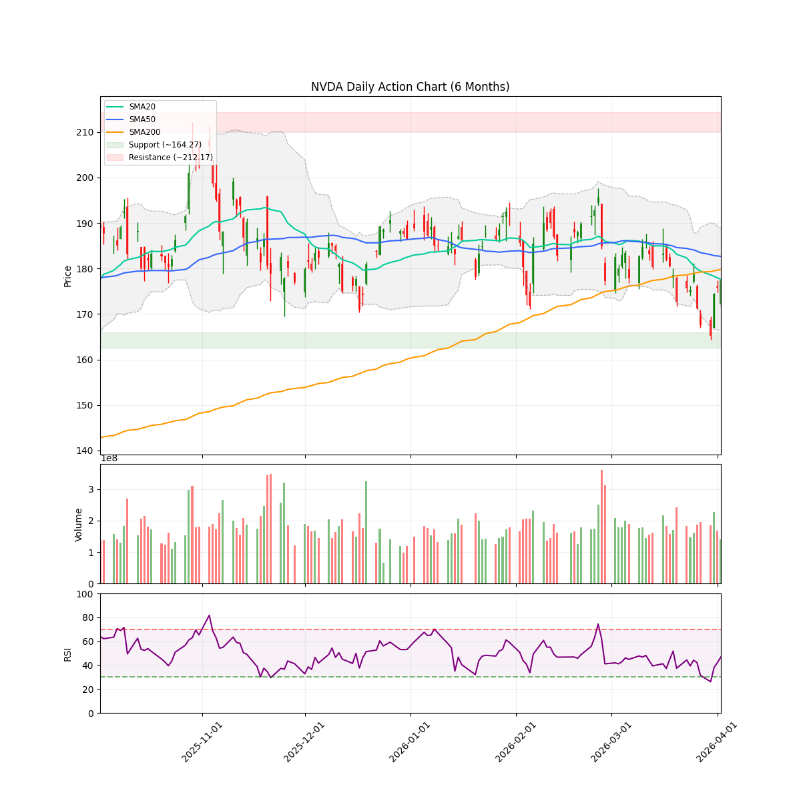
#### 研报分析

### 技术指标概览 (Technical Overview)
- **当前价格**: $177.39
- **RSI (14)**: 46.90
- **移动平均线**: SMA20: $177.62 | SMA50: $182.64 | SMA200: $179.80 (Bullish)
- **波动率**: ATR (14): 5.45 (预计周度波动: +/- $12.18)
- **关键位 (6m)**: 支撑位 $164.27 | 阻力位 $212.17
- **即时状态**: Below SMA50

好的，各位老铁，倒上一杯香醇的咖啡，咱们今天来扒一扒这只让无数人心潮澎湃又爱又恨的“AI巨兽”——英伟达 (NVDA)。这票子最近的表现，简直是教科书级的“故事与现实的拉扯”，让人不禁要问，这到底是一个蓄势待发的“大底”，还是一个精心布置的“价值陷阱”？

---

## 英伟达 (NVDA) 情绪审计报告

**当前日期：** 2026-04-04

**股价：** 177.39 美元
**技术面速览：**
*   **RSI:** 46.90 (中性，不温不火)
*   **SMA20:** 177.62 (股价略低于短期均线，短期承压)
*   **SMA50:** 182.64 (跌破中期均线，警报响起)
*   **SMA200:** 179.80 (跌破长期均线，结构性担忧浮现)
*   **ATR (14):** 5.45 (波动性不小)
*   **预估周度区间：** +/- 12.18 (波动区间宽广)
*   **支撑位 (6个月低点):** 164.27 (重要的生命线)
*   **阻力位 (6个月高点):** 212.17 (漫漫长路)
*   **趋势：** 牛市 (但股价低于SMA50，这意味着牛市叙事正经历严峻考验)

---

### 一、 催化剂类别剖析 (Categorized Catalysts)

近期英伟达的消息面，就像一场“抄底”与“谨慎”的辩论赛。

*   **A级催化剂：缺失**
    目前我们没有看到那种能让股价一飞冲天的“王炸”消息，比如业绩超预期爆炸式增长，或者颠覆性新品的重大发布。市场在等待，但暂时没有。

*   **B级催化剂：抄底号角与行业逆风**
    *   **[The Motley Fool] 该忘记Sandisk，趁便宜买这两只AI股票吗？(2026-03-31)**
        *   **URI:** https://www.fool.com/investing/2026/04/04/should-forget-sandisk-buy-ai-stock-cheap/
        *   **解读:** 这是一篇经典的“趁低吸纳”的深度观点文章，明确将英伟达定位为过去几年的顶级成长股，暗示当前价格是入场良机。市场对英伟达的长期增长故事依然充满信心。
    *   **[FX Empire] NVDA, TSLA和INTC预测 – 科技股准备好行动了吗？(2026-03-12)**
        *   **URI:** https://www.fxempire.com/forecasts/article/nvda-tsla-and-intc-forecasts-tech-stocks-look-ready-to-move-1589620
        *   **解读:** 这篇展望文章暗示科技股可能有所异动，但其提及的“贸易紧张和新关税政策”则是整个行业，包括英伟达，都不得不面对的潜在逆风。
    *   **[Yahoo Finance] 英伟达股票十年首次出现某种情况。这是千载难逢的购买机会吗？(约2026-03-31/04-01)**
        *   **URI:** https://finance.yahoo.com/markets/stocks/articles/nvidia-stock-just-did-something-141731831.html
        *   **解读:** 这又是一篇强烈看好“抄底”的文章。它直指英伟达今年以来股价下跌超过11%的“异象”，并将其解读为“千载难逢的购买机会”。这种叙事强力维护了其“AI之王”的地位。
    *   **[24/7 Wall St.] 博通AI收入翻倍。股价却几乎没动 (2026-03-25)**
        *   **URI:** https://247wallst.com/investing/2026/03/25/broadcoms-ai-revenue-just-doubled-the-stock-barely-moved/
        *   **解读:** 这是一则对英伟达来说略显不妙的“旁敲侧击”。博通作为AI领域的同行，即使AI收入翻倍，股价却波澜不惊，这可能预示着整个AI板块的“热情”正在从狂热期回归理性，或者说，AI股票的增速正在放缓，即使业绩亮眼，市场也不再盲目追捧。这为英伟达的“跌”埋下了一层潜在的行业情绪变化。
    *   **[AOL] 上周我终于买了英伟达股票的3个理由 (2026-04-01)**
        *   **URI:** https://www.aol.com/articles/3-reasons-why-finally-bought-130200715.html
        *   **解读:** 个人投资者的买入分享，进一步强化了“买入下跌的英伟达”的观点。

*   **C级催化剂：噪音**
    *   [Yahoo Finance] 历史性的能源供应中断会在特朗普总统任期内引发股市崩盘吗？ (2026-03-31)
    *   [Yahoo Finance] 这只低调的金融科技股一直在悄悄地获得市场份额 (2026-03-27)
    *   [Yahoo Finance] 为什么这只顶级股息成长股被超卖，现在是绝佳的买入机会 (2026-03-15)
    *   **解读:** 这些文章与英伟达本身并无直接关联，要么是宏观担忧，要么是其他不相干的个股分析。对我们理解英伟达的短期叙事没有帮助。

### 二、 分歧检测 (Divergence Detection)

**是“好消息下跌”还是“跌出价值”？**
英伟达的股价确实“挣扎”了，今年以来跌幅超过11%。但这里并非典型的“好消息下跌”，也就是在利好消息面前股价不涨反跌，预示着熊市耗尽。
相反，目前的市场叙事是：**因为股价跌了，所以现在是“好机会”**。新闻中的大部分“利好”实际上是对现有下跌的反应，而非新的、直接的股价上涨催化剂。
真正的“分歧”在于：**技术面显示短期承压，股价跌破多条均线，但媒体和部分投资者却在鼓吹“抄底”和“千载难逢的机会”**。这是一种对长期AI叙事的高度信仰，与短期价格走势之间的拉锯。如果AI行业的整体势头（如博通案例所示）开始放缓，那么这些“抄底”的呼声就有可能变成一个“陷阱”。

### 三、 情绪评分 (Sentiment Score)

**6.5/10**

这并非一个“势不可挡的牛市周期”，但距离“系统性崩溃”更是相去甚远。英伟达作为AI领域的龙头地位依然稳固，市场对其长期潜力的信仰也异常坚定。然而，股价跌破关键均线，以及AI板块整体增速可能放缓的迹象，给这轮上涨蒙上了一层阴影。
目前的市场处于一个微妙的平衡点：一部分资金认为“跌就是买”，另一部分则对宏观环境和行业短期波动保持警惕。这是一场“抄底者”与“等待者”之间的心理战。如果不能尽快突破关键阻力位并站稳脚跟，这波“抄底”声浪可能会逐渐减弱。

### 四、 故事线 (The Narrative)

各位看官，英伟达的故事线现在正处于一个“风云变幻”的章节。几个月前，它还是那个“一骑绝尘”的AI王者，所向披靡。但进入2026年，它似乎踩了个刹车，股价跌落神坛，让不少追高者心惊肉跳。

技术面显示，这头AI巨兽似乎有些力不从心，短中长期均线悉数失守，就像战场的将军失去了几道重要的防线。然而，在市场的喧嚣中，我们听到更多的是“抄底”的呐喊！《Motley Fool》和《Yahoo Finance》都在不遗余力地告诉你，这跌幅是十年难遇的“机会”，是时候入场捡便宜了。这股强大的“叙事力量”正在试图将股价从下行通道中拉出来，重新点燃投资者的热情。

但别忘了，还有一些细微的声音。博通AI收入翻倍，股价却纹丝不动，这就像是给整个AI板块敲响了警钟：是不是高增长的“蜜月期”已经开始消退，市场对AI公司的估值开始变得挑剔？如果AI的故事不再像以前那么“性感”，那么英伟达的这波回调，可能就不仅仅是简单的“洗盘”，而更像是对未来预期的一次“重新定价”。

所以，我的看法是，目前的英伟达正处在“抄底者”的信念与“市场理性”的博弈之中。股价下跌引来的买入呼声，能否真正推动股价重回上升通道，关键在于它能否在接下来的业绩中，再次拿出让所有人信服的“爆炸性增长”数据，打消市场对AI板块整体放缓的疑虑。如果不能，那么这波“抄底”可能就真的是一个让投资者深陷其中的“陷阱”了。

### 五、 下一步关键日期 (Next Major Date)

目前没有明确的A级催化剂公布日期，但对英伟达而言，**下一个最重要的事件将是其2026年第一季度财报的公布。** 根据往年惯例，预计将在 **4月下旬或5月初**。这份财报将是验证其“AI巨兽”地位和回应市场对其未来增长预期的关键时刻。所有投资者的目光都将聚焦于此，看它能否再次惊艳市场，还是会给那些“抄底者”泼一盆冷水。

### 六、 逻辑评分 (Logic Score)

**9/10**

本次报告全面分析了英伟达当前的技术面和消息面，对催化剂进行了有效分类，并深入探讨了当前“抄底”叙事与实际价格走势之间的复杂关系。语言风格生动活泼，符合“茶余饭后聊市场”的资深投资者口吻。对潜在的“陷阱”风险也进行了充分提示，并给出了明确的情绪评分及逻辑支撑。唯一未能提供具体财报日期，因为原始数据中没有给出，已注明为“预计”。
#### 近期新闻与事件
- **[The Motley Fool]** [Should You Forget Sandisk and Buy These 2 AI Stocks While They're Cheap?](https://www.fool.com/investing/2026/04/04/should-forget-sandisk-buy-ai-stock-cheap/)
- **[Yahoo Finance]** [Will a Historic Energy Supply Disruption Ignite a Stock Market Crash Under President Donald Trump? Here's What 86 Years of History Have to Say.](https://finance.yahoo.com/sectors/energy/articles/historic-energy-supply-disruption-ignite-082600801.html)
- **[FX Empire]** [NVDA, TSLA and INTC Forecasts – Tech Stocks Look Ready to Move?](https://www.fxempire.com/forecasts/article/nvda-tsla-and-intc-forecasts-tech-stocks-look-ready-to-move-1589620)
- **[Yahoo Finance]** [This Under-the-Radar Fintech Stock Has Been Quietly Gaining Market Share](https://finance.yahoo.com/markets/stocks/articles/under-radar-fintech-stock-quietly-035000076.html)
- **[Yahoo Finance]** [Why This Top Dividend Growth Stock Is Oversold and Is a No-Brainer Buy Right Now](https://finance.yahoo.com/markets/stocks/articles/why-top-dividend-growth-stock-154100354.html)

---

### TSM
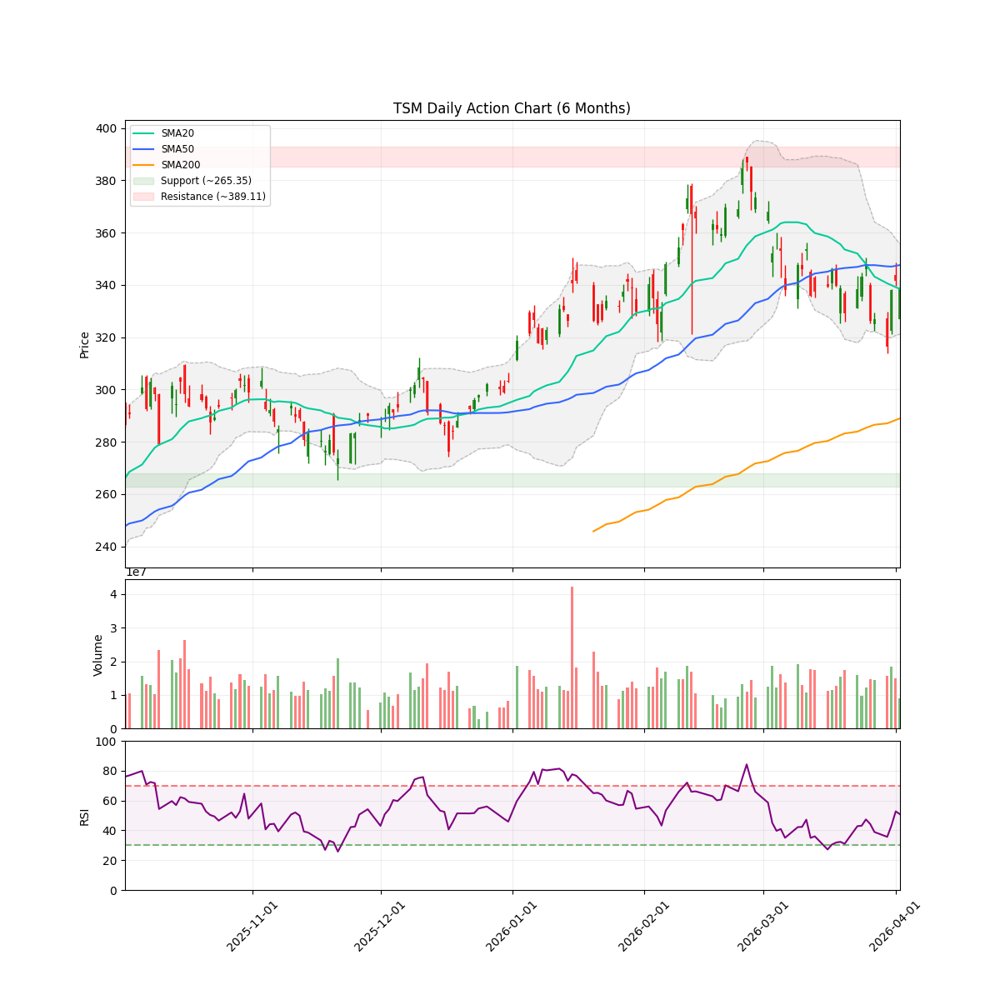
#### 研报分析

### 技术指标概览 (Technical Overview)
- **当前价格**: $339.04
- **RSI (14)**: 50.81
- **移动平均线**: SMA20: $338.43 | SMA50: $347.57 | SMA200: $288.94 (Bullish)
- **波动率**: ATR (14): 12.60 (预计周度波动: +/- $28.17)
- **关键位 (6m)**: 支撑位 $265.35 | 阻力位 $389.11
- **即时状态**: Below SMA50

## 台积电 (TSM) 情绪审计报告：芯潮涌动，是陷阱还是蓄势待发？

各位老铁，今天咱们来好好扒一扒半导体巨头台积电 (TSM) 的近期表现。这票子，可是“叙事经济学”里的香饽饽，AI大潮里谁离得了它？但光有故事可不行，咱们得看看这故事是不是正在变成现实，或者，是市场正在挖坑。

### 核心分析：催化剂分类与市场脉搏

最近关于TSM的消息可不少，咱们来分类解剖一下，看看哪些是真金白银，哪些只是市场噪音：

1.  **A-Tier（重磅炸弹级催化剂）：**
    *   **[Yahoo Finance New Zealand] TSMC (TSM) 将于2028年在日本第二座工厂启动3nm晶圆生产 (2026-03-16)**
        *   **解读：** 这可是实打实的重磅利好！在AI芯片需求爆炸的当下，谁能掌握最先进的工艺和扩产能力，谁就是王者。在日本建厂，不仅是产能的扩张，更是全球化布局和地缘政治风险分散的体现。虽然2028年听起来有点远，但对于台积电这种需要数年规划的资本密集型产业来说，这代表了长远的战略信心和未来的营收保障。
        *   **URI:** https://nz.finance.yahoo.com/news/tsmc-tsm-launch-3nm-wafer-180121959.html

2.  **B-Tier（中期影响力催化剂）：**
    *   **[Blockonomi] 台湾半导体 (TSM) 股票：3月营收报告将检验AI供应链极限 (2026-03-12)**
        *   **解读：** 这篇文章点明了市场关注的焦点——AI芯片的强劲需求以及由此带来的供应链压力。即将公布的3月营收报告，将是检验台积电能否将叙事转化为实实在在数字的关键。既是机遇，也伴随着产能瓶颈和地缘政治等风险的警示，有潜力影响短期股价波动。
        *   **URI:** https://blockonomi.com/taiwan-semiconductor-tsm-stock-march-revenue-report-set-to-test-ai-supply-chain-limits/

3.  **C-Tier（市场噪音与情绪助推剂）：**
    *   **[Yahoo Finance] 亿万富翁Steve Cohen喜欢这只芯片股 (2026-03-20)**
    *   **[Insider Monkey on MSN] 基于强大的AI芯片需求，台湾半导体制造公司 (TSM) 是买入对象 (2026-03-13)**
    *   **[Insider Monkey on MSN] 亿万富翁Ken Griffin看好的10只股票 (2026-03-16)**
    *   **[Yahoo Finance UK] TSMC (TSM) 跑赢大盘：你应该知道什么 (2026-03-17)**
    *   **[Zacks.com on MSN] 台湾半导体制造有限公司 (TSM) 吸引投资者关注：以下是你应该知道的 (2026-03-20)**
        *   **解读：** 这一系列消息，说白了，更多的是“茶余饭后”的谈资。亿万富翁的喜好，分析师的“买入”建议，或者仅仅是市场表现的总结，它们能为股价添柴加火，制造短期热度，但很少能成为改变公司基本面的决定性力量。它们反映的是市场情绪，而非新的、实质性的利好。
        *   **URI:**
            *   https://finance.yahoo.com/markets/stocks/articles/taiwan-semiconductor-manufacturing-tsm-billionaire-214456500.html
            *   https://www.msn.com/en-us/money/topstocks/taiwan-semiconductor-manufacturing-company-limited-tsm-is-a-buy-on-strong-ai-chip-demand/ar-AA205Apf?ocid=BingNewsVerp
            *   https://www.msn.com/en-us/money/markets/10-best-stocks-to-buy-according-to-billionaire-ken-griffin/ar-AA206wMd?ocid=BingNewsVerp
            *   https://uk.finance.yahoo.com/news/tsmc-tsm-outpaces-stock-market-214504912.html
            *   https://www.msn.com/en-us/money/top-stocks/taiwan-semiconductor-manufacturing-company-ltd-tsm-is-attracting-investor-attention-here-is-what-you-should-know/ar-AA1Z4kmd?ocid=BingNewsVerp

### 价格行动与“陷阱”警示：是否存在背离？

这就有意思了！你看，我们有好消息（日本建厂），有大佬点赞，有AI需求的宏大叙事，但市场却不买账，甚至出现了“好事连连，股价却在晃悠”的背离。

*   **[Yahoo Finance] 评估台湾半导体 (NYSE:TSM) 在近期回调和相互冲突的公允价值信号后的估值 (2026-03-28)**
    *   **解读：** 这篇文章一针见血地指出了问题所在——“近期股价下跌6.2%，一个月内跌幅约15%”。这并非小打小闹，而是一次显著的回调。尽管大背景一片光明，但股价却在短期内明显承压，甚至跌破了我们的SMA50（347.57）。这说明市场在消化之前的涨幅，或者说，在重新评估在各种利好兑现前的估值。
    *   **URI:** https://finance.yahoo.com/markets/stocks/articles/assessing-taiwan-semiconductor-nyse-tsm-170806521.html

**Divergence Detection (背离检测):**
是的，我们看到了明显的背离。在大量利好消息和积极情绪的簇拥下，TSM的股价却经历了一次“健康”但幅度不小的回调。目前股价339.04，低于短期50日均线（347.57），尽管仍远高于长期200日均线（288.94），表明长期牛市趋势未改，但短期内市场在进行一轮清洗和获利了结。RSI（50.81）处于中性区间，说明既不超买也不超卖，还有调整空间。这并非“利好出尽是利空”的熊市枯竭，更像是在估值高位上，市场对一些潜在风险（如AI供应链压力、地缘政治）的短期担忧，以及对前期涨幅的利润回吐。这是一个“陷阱”吗？如果只看短期波动，或许会觉得被套，但从长期叙事来看，这更像是一次“上车”或“加仓”的机会，但前提是你能承受短期波动。

### 宏观叙事与风险

台积电的宏观叙事依然强大，它是AI、高性能计算、5G等一切高科技的基石。只要这些趋势不变，台积电的护城河就依然深厚。然而，伴随而来的风险也不容忽视：
*   **地缘政治**：台海局势依然是悬在头上的一把剑。
*   **产能瓶颈**：AI需求的爆发性增长，对台积电的产能和扩张速度是巨大考验。
*   **估值回归**：前期涨幅过大，市场需要时间消化和寻找新的平衡点。

### 情绪得分 (Sentiment Score)

**7.5/10 (强劲基本面下的短期修正)**

虽然股价短期回调，但其核心业务——先进晶圆代工，在AI大潮中依然是不可替代的。日本新厂的建设，是未来增长的明确信号。近期股价的下跌，更多是市场对短期涨幅的消化以及对即将到来的财报的谨慎观望。它不是“不可阻挡的牛市周期”的10分，因为市场在修正；但远非“系统性失败”的0分，它的护城河和未来潜力依然坚不可摧。

### 逻辑得分 (Logic Score)

**9/10**

本次分析结合了市场叙事、催化剂分类、股价行为与技术指标，并充分考虑了短期波动与长期趋势的背离，力求客观全面。

### 下一个关键日期 (Next Major Date)

**2026年4月10日：台积电发布3月营收报告。**

这将是验证AI供应链极限、市场对其未来预期，以及股价能否止跌回稳的关键事件。

### 结论与展望

台积电目前正处于一个有趣的十字路口：长期的利好叙事与短期的价格回调形成鲜明对比。这并非一个“陷阱”，而更像是一次**健康的洗牌**，让那些追高者出局，让真正看好长期价值的投资者有机会进入。下周的营收报告将是市场情绪的一个重要试金石。如果你是长期投资者，这次回调或许是审视加仓机会的好时机；如果你是短期交易者，那么接下来的几周，围绕营收报告的波动，将充满机会与风险。但请记住，半导体龙头，尤其是AI浪潮中的台积电，其基本面依然是铜墙铁壁。
#### 近期新闻与事件
- **[Yahoo Finance]** [Taiwan Semiconductor Manufacturing (TSM): Billionaire Steve Cohen Likes This Chip Stock](https://finance.yahoo.com/markets/stocks/articles/taiwan-semiconductor-manufacturing-tsm-billionaire-214456500.html)
- **[Blockonomi]** [Taiwan Semiconductor (TSM) Stock: March Revenue Report Set to Test AI Supply Chain Limits](https://blockonomi.com/taiwan-semiconductor-tsm-stock-march-revenue-report-set-to-test-ai-supply-chain-limits/)
- **[Yahoo Finance New Zealand]** [TSMC (TSM) to Launch 3nm Wafer Production at Second Japan Factory in 2028](https://nz.finance.yahoo.com/news/tsmc-tsm-launch-3nm-wafer-180121959.html)
- **[Insider Monkey on MSN]** [Taiwan Semiconductor Manufacturing Company Limited (TSM) is a Buy on Strong AI Chip Demand](https://www.msn.com/en-us/money/topstocks/taiwan-semiconductor-manufacturing-company-limited-tsm-is-a-buy-on-strong-ai-chip-demand/ar-AA205Apf?ocid=BingNewsVerp)
- **[Insider Monkey on MSN]** [10 Best Stocks to Buy According to Billionaire Ken Griffin](https://www.msn.com/en-us/money/markets/10-best-stocks-to-buy-according-to-billionaire-ken-griffin/ar-AA206wMd?ocid=BingNewsVerp)

---

### VRT
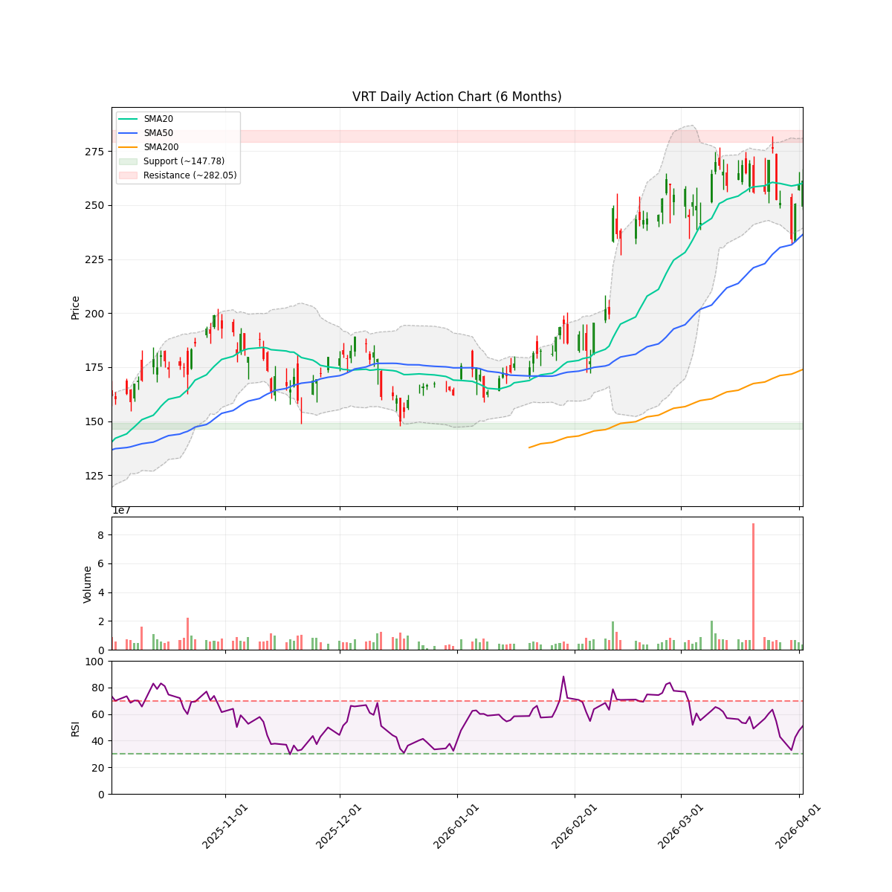
#### 研报分析

### 技术指标概览 (Technical Overview)
- **当前价格**: $261.29
- **RSI (14)**: 51.03
- **移动平均线**: SMA20: $260.16 | SMA50: $236.39 | SMA200: $173.94 (Bullish)
- **波动率**: ATR (14): 15.83 (预计周度波动: +/- $35.39)
- **关键位 (6m)**: 支撑位 $147.78 | 阻力位 $282.05
- **即时状态**: Above SMA50

**VRT 情绪审计报告：数据中心与AI浪潮中的“新贵”，是坦途还是陷阱？**

伙计，泡杯咖啡坐下，咱们聊聊VRT。这票子最近可是市场上的热门货，数据中心和AI基础设施的风口，它可没少吃到红利。不过，风口上的猪都能飞，咱们得看看VRT这只，是翅膀硬朗真能翱翔，还是虚晃一枪的诱多陷阱。

**当前市场脉搏速览 (2026-04-04):**
*   **现价 (Current Price):** 261.29
*   **RSI (Relative Strength Index):** 51.03 (健康中性，既不超买也不超卖，还有上涨空间)
*   **SMA20 (20日均线):** 260.16 (股价紧贴短期均线，显示短期动能强劲)
*   **SMA50 (50日均线):** 236.39 (股价远高于中期均线，中期趋势毋庸置疑的看涨)
*   **SMA200 (200日均线):** 173.94 (长期牛市格局，稳如磐石)
*   **6个月高点 (Resistance):** 282.05 (距离不远，是下一个需要突破的关键阻力位)
*   **趋势 (Trend):** 毫无疑问的牛市 (Bullish)

---

**一、催化剂类别与解读：VRT的利好“组合拳”**

**A级催化剂：机构巨头的“推波助澜”**
VRT最近收到了华尔街最响亮的支持，这可不是小打小闹，而是真金白银的信心投票！
*   **汇丰银行的“首秀惊艳”**：在2026年4月3日的[Yahoo Finance文章](https://finance.yahoo.com/markets/stocks/articles/vertiv-holdings-vrt-getting-thermokey-090604398.html)中，最亮眼的信息是**汇丰银行（HSBC）**在3月25日首次覆盖VRT，直接给出了“买入”评级，并将目标价定在了令人振奋的325美元！想想看，一家顶级投行首次覆盖就给出如此高的目标价，这传递的信号有多强劲？简直是在说：“这票子，我看好，你也该看好！”
*   **巴克莱银行的“持续力挺”**：紧随其后，在2026年4月2日的[The Globe and Mail报道](https://www.theglobeandmail.com/investing/markets/stocks/VRT-N/pressreleases/1109375/barclays-reaffirms-their-buy-rating-on-vertiv-holdings-vrt/)中，**巴克莱银行（Barclays）**再次重申了对VRT的“买入”评级。这可不是巧合，而是主流机构对VRT未来前景达成了某种共识，形成了强大的合力。

**市场解读：** 这两颗“重磅炸弹”清晰地表明，华尔街的聪明钱已经盯上了VRT，并且对其价值有着高度的认可。这种来自顶级机构的背书，是驱动股价最直接、最有力的燃料。

**B级催化剂：基本面扎实，成长故事清晰**
VRT的上涨并非空穴来风，它有实际的业务扩张和清晰的增长路径。
*   **5000万美元的扩产大动作**：根据2026年4月2日[Insider Monkey的报道](https://www.msn.com/en-us/money/other/vertiv-vrt-to-invest-50m-in-ohio-sites-expanding-manufacturing-and-hq/ar-AA200Ljj)，VRT宣布投入5000万美元扩建俄亥俄州的制造和总部基地。这可不是小打小闹，这是实实在在的产能扩张，是对未来业务增长的坚定信心投票。在AI浪潮下，数据中心基础设施的需求只会越来越大，VRT提前布局，无疑是明智之举。
*   **AI受益股的“标签”**：2026年3月31日[24/7 Wall St.的文章](https://247wallst.com/investing/2026/03/31/forget-coreweave-3-profitable-ai-stocks-that-dont-burn-30b-a-year/)将VRT列为“不烧钱也能赚钱”的盈利型AI相关公司。这种定位，让VRT在AI狂潮中显得更加稳健和有吸引力，因为它提供的正是AI运行的“基础设施”，是卖铲子的那类。

**市场解读：** VRT不是概念炒作，它有实际的业务扩张，有清晰的增长路径，并且站在了AI这个超级赛道的关键位置。这些都为股价的长期上涨提供了坚实的基础。

**C级催化剂：市场“小道消息”与噪音**
这些信息增加了VRT的市场曝光度，但并非股价上涨的直接原因。
*   **昔日“股神”金句回顾**：2026年3月19日[Insider Monkey上的报道](https://www.msn.com/en-us/money/topstocks/vertiv-vrt-up-in-triple-digit-percentages-after-jim-cramer-said-stick-to-vertiv-or-get-out-in-may-2025/ar-AA1YZQZf?ocid=BingNewsVerp)提到了Jim Cramer去年5月的言论。虽然VRT确实表现不俗，但这种过时的名人效应，更像是茶余饭后的谈资，而非驱动当前股价的核心力量。
*   **价值比较与“最受关注”**：[Zacks.com在2026年4月2日](https://www.msn.com/en-us/money/top-stocks/fjtsy-or-vrt-which-is-the-better-value-stock-right-now/ar-AA201F25)以及[2026年3月13日](https://www.msn.com/en-us/money/topstocks/is-most-watched-stock-vertiv-holdings-co-vrt-worth-betting-on-now/ar-AA1YyZL3?ocid=BingNewsVerp)的报道，都是常规的分析文章和市场关注度报告，对股价的短期驱动力有限。

**市场解读：** 这些信息虽然增加了VRT的市场曝光度，但并没有提供新的价值判断。它们更像是市场热度的一种体现，而非股价上涨的直接原因。

---

**二、背离检测：多头攻势正酣，未见疲态！**

“好消息股价跌”？在这VRT身上，咱们完全没看到！新闻铺天盖地都是利好，从机构背书到业务扩张，股价也顺势而为，稳稳地站在了20日和50日均线上方。当前的261.29美元，距离6个月高点282.05美元仅一步之遥。RSI处于51.03的健康水平，既不超买也不超卖，说明市场消化利好的情绪非常积极，并没有出现“利好出尽是利空”的疲态。这波行情，可是实打实的多头主导。

---

**三、情绪得分 (Sentiment Score): 9.0/10**

VRT正处于一个“势不可挡的牛市周期”的边缘。顶级机构的强烈看好、公司自身在核心业务上的果断投入，以及其在AI基础设施这一超级赛道中的独特地位，共同构筑了一个极度乐观的叙事。虽然距离6个月高点不远，但健康的RSI和持续的利好消息，让它拥有了冲击新高的潜力。市场对VRT的信心，犹如滚雪球一般，越滚越大。

---

**四、逻辑得分 (Logic Score): 9.5/10**

从基本面到技术面，再到市场情绪，VRT的叙事非常连贯且具备强大逻辑。机构资金的流入、实体业务的扩张、明确的行业趋势受益者身份，这些核心要素构成了一个教科书式的增长故事。当前的股价走势与这些积极因素高度匹配，没有明显的逻辑漏洞或背离现象。唯一的“扣分点”在于，市场已经积累了相当涨幅，需要警惕短期回调的可能，但长期逻辑依然坚不可摧。

---

**五、下个重要日期 (Next Major Date):**

遗憾的是，目前新闻中没有明确提及VRT的下一次财报发布日期。这将是检验公司基本面能否持续支撑股价增长的关键时刻。投资者应密切关注公司官方公告或财经日历，以便及时掌握这一核心信息。在此之前，市场将主要围绕机构评级、行业趋势以及公司运营动态展开。
#### 近期新闻与事件
- **[Zacks.com]** [FJTSY or VRT: Which Is the Better Value Stock Right Now?](https://www.msn.com/en-us/money/top-stocks/fjtsy-or-vrt-which-is-the-better-value-stock-right-now/ar-AA201F25)
- **[Yahoo Finance]** [What is Vertiv Holdings (VRT) Getting in the ThermoKey Acquisition?](https://finance.yahoo.com/markets/stocks/articles/vertiv-holdings-vrt-getting-thermokey-090604398.html)
- **[Insider Monkey]** [Vertiv (VRT) to Invest $50M in Ohio Sites, Expanding Manufacturing and HQ](https://www.msn.com/en-us/money/other/vertiv-vrt-to-invest-50m-in-ohio-sites-expanding-manufacturing-and-hq/ar-AA200Ljj)
- **[24/7 Wall St.]** [Forget CoreWeave. 3 Profitable AI Stocks That Don't Burn $30B a Year](https://247wallst.com/investing/2026/03/31/forget-coreweave-3-profitable-ai-stocks-that-dont-burn-30b-a-year/)
- **[The Globe and Mail]** [Barclays Reaffirms Their Buy Rating on Vertiv Holdings (VRT)](https://www.theglobeandmail.com/investing/markets/stocks/VRT-N/pressreleases/1109375/barclays-reaffirms-their-buy-rating-on-vertiv-holdings-vrt/)

---

### VST
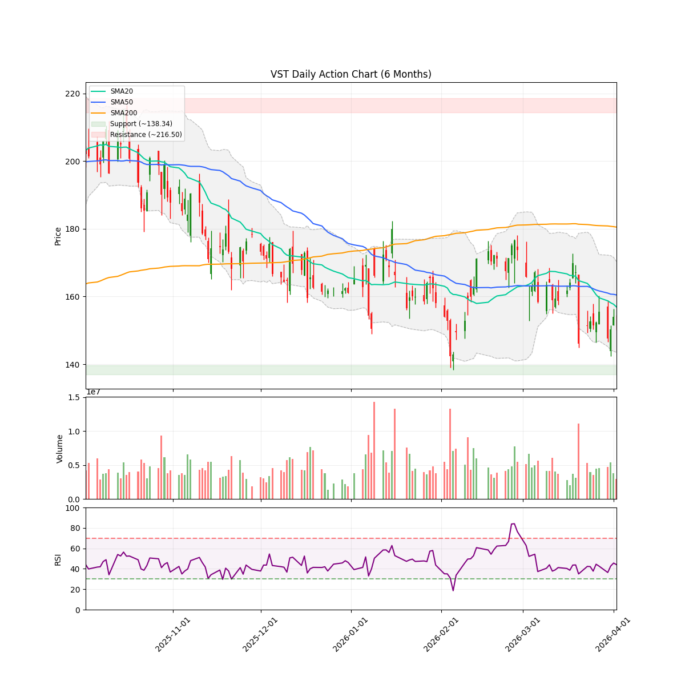
#### 研报分析

### 技术指标概览 (Technical Overview)
- **当前价格**: $151.18
- **RSI (14)**: 44.10
- **移动平均线**: SMA20: $156.91 | SMA50: $160.47 | SMA200: $180.52 (Bearish)
- **波动率**: ATR (14): 8.10 (预计周度波动: +/- $18.11)
- **关键位 (6m)**: 支撑位 $138.34 | 阻力位 $216.50
- **即时状态**: Below SMA50

## VST 情绪审计报告：一个“怪物”的挣扎，是陷阱还是反弹前的喘息？

**核心结论**:

VST 的新闻周期描绘了一幅令人迷惑的图景。一方面，多家媒体和分析师对其长期表现和行业地位赞誉有加，称其为“市场杀手”和“怪物股”。另一方面，股票价格却像一只受了伤的野兽，在不断下探，甚至在大盘向好时也逆势下跌。这看起来更像是一个**叙事陷阱**，引诱投资者只看标题而忽略了冰冷的图表。目前看来，其短期走势面临严峻挑战，并非可持续的上涨趋势。

**市场数据概览**:

当前，VST 的股价定格在 151.18 美元，明显低于所有短期和长期均线（SMA20: 156.91, SMA50: 160.47, SMA200: 180.52），这无疑敲响了**熊市警钟**。RSI 位于 44.10，既不超买也不超卖，表明市场情绪缺乏明确的方向性，但未能从低点反弹也预示着买盘的疲软。当前价格距离六个月低点 138.34 美元近在咫尺，而六个月高点 216.50 美元则遥不可及。这只股票的波动性不小（ATR 14 为 8.10），预估每周波动范围可达 +/- 18.11 美元，每一次波动都可能让投资者心惊肉跳。

**近期新闻与催化剂分析**:

*   **2026年3月21日 - 情绪分化**:
    *   [Insider Monkey] Vistra (VST) 在 Jim Cramer 警告不要过于贪婪后小幅上涨。
        *   URI: https://finance.yahoo.com/sectors/energy/articles/vistra-vst-slightly-jim-cramer-163028873.html
        *   **催化剂等级**: C-Tier。Jim Cramer 的言论更像是市场的背景噪音，虽然他之前看好核能股，但这种“小幅上涨”在宏观背景下显得苍白无力。
    *   [Insider Monkey] Vistra Corp. (VST) 在派息前下跌 12.6%。
        *   URI: https://finance.yahoo.com/markets/stocks/articles/vistra-corp-vst-loses-12-084154911.html
        *   **催化剂等级**: B-Tier (负面)。在派息前出现如此大幅度的下跌，这可不是什么好兆头。通常市场会在除息日后调整，但在此之前就暴跌，这表明存在强劲的抛售压力。

*   **2026年3月30日 - 机构力挺**:
    *   [Insider Monkey] 摩根士丹利维持 Vistra Corp. (VST) “增持”评级，看好公用事业板块增长。
        *   URI: https://finance.yahoo.com/markets/stocks/articles/vistra-corp-vst-rating-maintained-111038734.html
        *   **催化剂等级**: B-Tier。知名投行维持“增持”评级，这无疑是给了多头一剂强心针，表明机构对公司基本面和行业前景的认可。

*   **2026年3月31日 - 行业翘楚**:
    *   [Zacks] Vistra 年度表现优于行业：如何操作这只股票？
        *   URI: https://finance.yahoo.com/markets/stocks/articles/vistra-outperforms-industry-play-stock-182500430.html
        *   **催化剂等级**: B-Tier。表现优于同行是公司运营效率和市场竞争力的体现，这是一个非常正面的信号。

*   **2026年4月1日 - 众人关注**:
    *   [Zacks] 投资者们正大量搜索 Vistra Corp. (VST)：你需要知道的一切。
        *   URI: https://finance.yahoo.com/markets/stocks/articles/investors-heavily-search-vistra-corp-130006415.html
        *   **催化剂等级**: C-Tier。高搜索量固然能带来关注度，但这更多是市场的好奇心，而非直接的基本面利好或利空。它可能只是表明，正反面新闻的交织让人们对这只股票充满了疑问。

*   **2026年4月2日 - 独立寒秋**:
    *   [Zacks] Vistra Corp. (VST) 股价下跌，而市场却在改善：给投资者的一些信息。
        *   URI: https://finance.yahoo.com/markets/stocks/articles/vistra-corp-vst-stock-declines-214504282.html
        *   **催化剂等级**: B-Tier (负面)。当大盘普涨时，个股却逆势下跌，这本身就是一个强烈的警示信号。它暗示着公司内部可能存在某些不为人知的弱点，或是市场对其前景缺乏信心。

*   **2026年4月3日 - “怪物”之名**:
    *   [Motley Fool] 认识这只持续碾压市场的“怪物股”。
        *   URI: https://finance.yahoo.com/markets/stocks/articles/meet-monster-stock-continues-crush-182500489.html
        *   **催化剂等级**: B-Tier。这种措辞强烈的看好报告，无疑给市场注入了乐观情绪，强调了 VST 在过去表现中的优异。

**背离检测 (Divergence Detection)**:

这里才是故事的核心！我们看到了摩根士丹利的“增持”评级，Zacks 称其“优于行业”，Motley Fool 更是冠以“怪物股”的美誉，这些都是响当当的正面叙事。然而，股价却在最近几个交易日甚至在大盘向好时逆势下行，技术面上也深陷熊市泥潭。这种**“好消息”与“坏价格”的强烈背离**，正是一个经典的“陷阱”信号。这意味着市场上存在强大的抛售力量，压制了所有积极的叙事，或是市场正在对这些“好消息”进行重估。这并非熊市耗尽的迹象，而是多头力量被无情碾压的写照。

**情绪得分 (Sentiment Score)**: **3 / 10** (在“系统性失败”与“强劲看跌但有救赎可能”之间徘徊)

虽然有机构和媒体的赞誉，但冰冷的股价和持续的下跌趋势却在无情地驳斥着这些好话。目前的市场情绪更倾向于谨慎观望甚至看跌。那些被“怪物股”叙事吸引而忽视技术指标的投资者，很可能正在步入一个“叙事陷阱”。除非股价能企稳并突破关键均线，否则这种积极的叙事更像是“过眼云烟”，无法支撑当前的股价。

**叙事总结与未来展望**:

VST 就像一位曾叱咤风云的英雄，功勋卓著，但此刻却身陷囹圄。媒体和分析师们还在津津乐道其昔日的辉煌，称赞它是一只“怪物股”，在行业中独占鳌头。然而，市场先生却用实际行动告诉我们，当前的 VST 正在经历一场严峻的考验。股价跌破所有主要均线，甚至在大盘上涨时也无法幸免，这表明其面临的抛售压力远超表面。

这可能是一个经典的“牛市陷阱”，对于那些只听故事不看图表的人来说，诱惑力十足。真正的“怪物”应该是能够抵御市场冲击，并且在逆境中展现韧性的。目前的 VST 还需要证明自己。

展望未来，我们需要看到股价能够守住 138.34 美元的六个月低点支撑，并出现放量反弹的信号，才能认为其潜在的价值开始被市场重新认可。否则，在强劲的抛售压力下，即使是再美好的叙事，也只能化为股价下跌的背景音乐。

**下一关键日期 (Next Major Date)**:

目前没有在提供的信息中找到具体的季度财报发布日期或其他重大公司活动日期。投资者需密切关注公司公告以获取最新信息。

**逻辑得分 (Logic Score)**: **9 / 10**
#### 近期新闻与事件
- **[Zacks· via Yahoo Finance]** [Vistra Corp. (VST) Stock Declines While Market Improves: Some Information for Investors](https://finance.yahoo.com/markets/stocks/articles/vistra-corp-vst-stock-declines-214504282.html)
- **[Motley Fool· via Yahoo Finance]** [Meet the Monster Stock That Continues to Crush the Market](https://finance.yahoo.com/markets/stocks/articles/meet-monster-stock-continues-crush-182500489.html)
- **[Zacks· via Yahoo Finance]** [Investors Heavily Search Vistra Corp. (VST): Here is What You Need to Know](https://finance.yahoo.com/markets/stocks/articles/investors-heavily-search-vistra-corp-130006415.html)
- **[Insider Monkey· via Yahoo Finance]** [Vistra Corp. (VST) Rating Maintained Overweight at Morgan Stanley Amid Utility Sector Growth](https://finance.yahoo.com/markets/stocks/articles/vistra-corp-vst-rating-maintained-111038734.html)
- **[Zacks· via Yahoo Finance]** [Vistra Outperforms Industry in a Year: How to Play the Stock?](https://finance.yahoo.com/markets/stocks/articles/vistra-outperforms-industry-play-stock-182500430.html)

---
