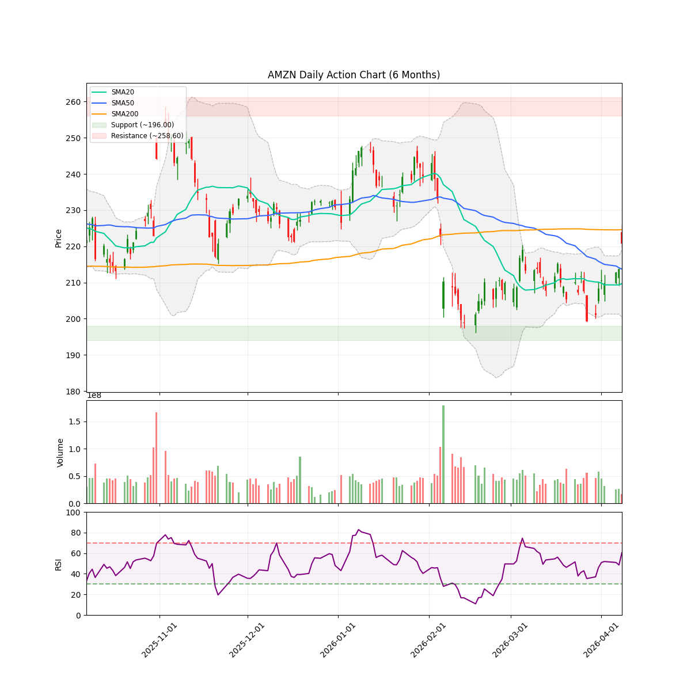
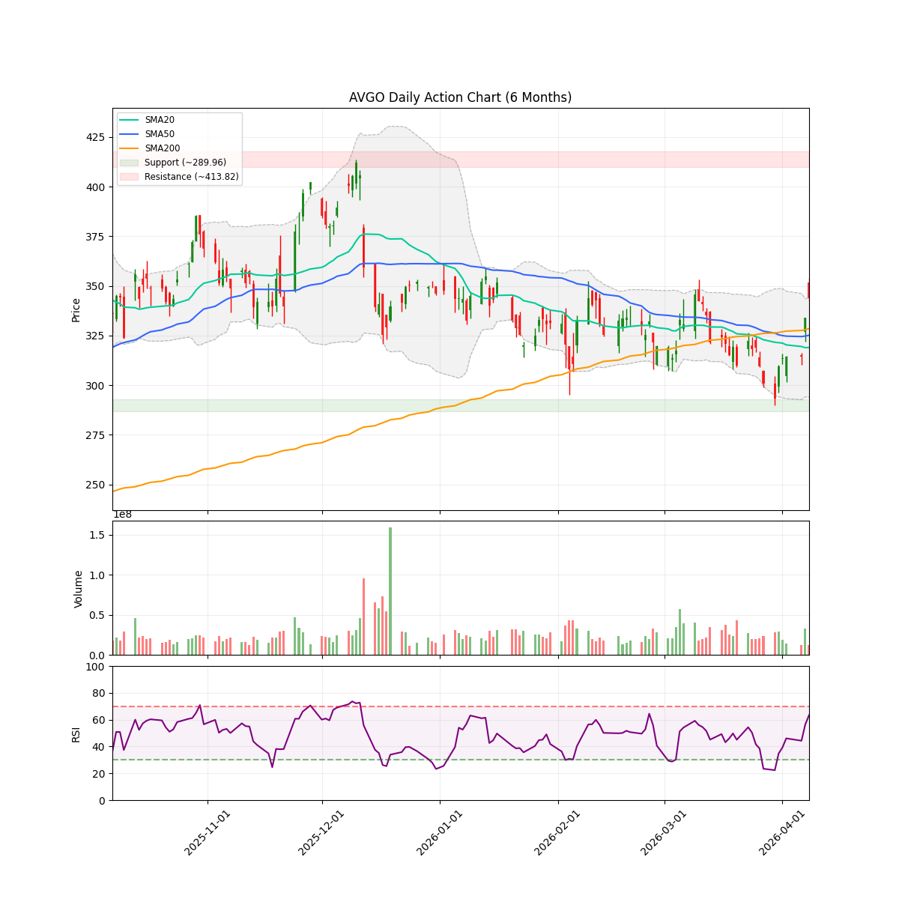
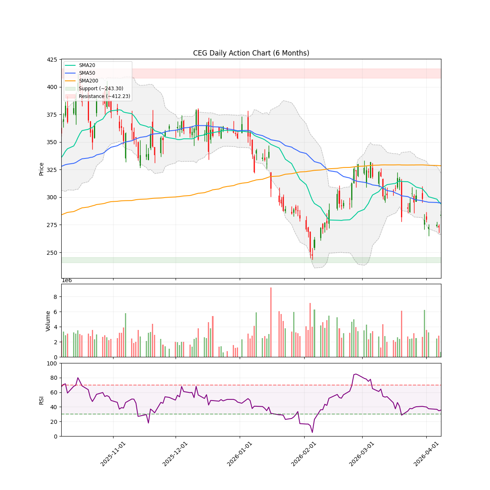
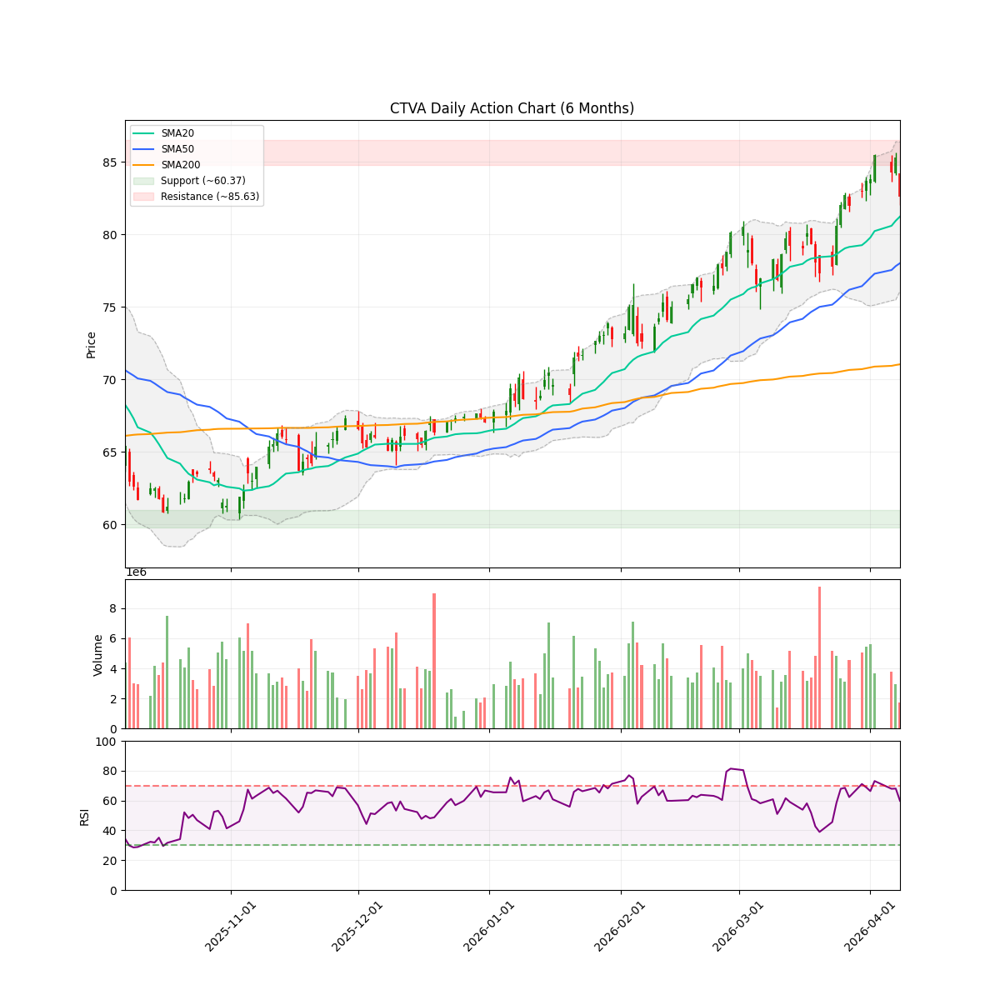
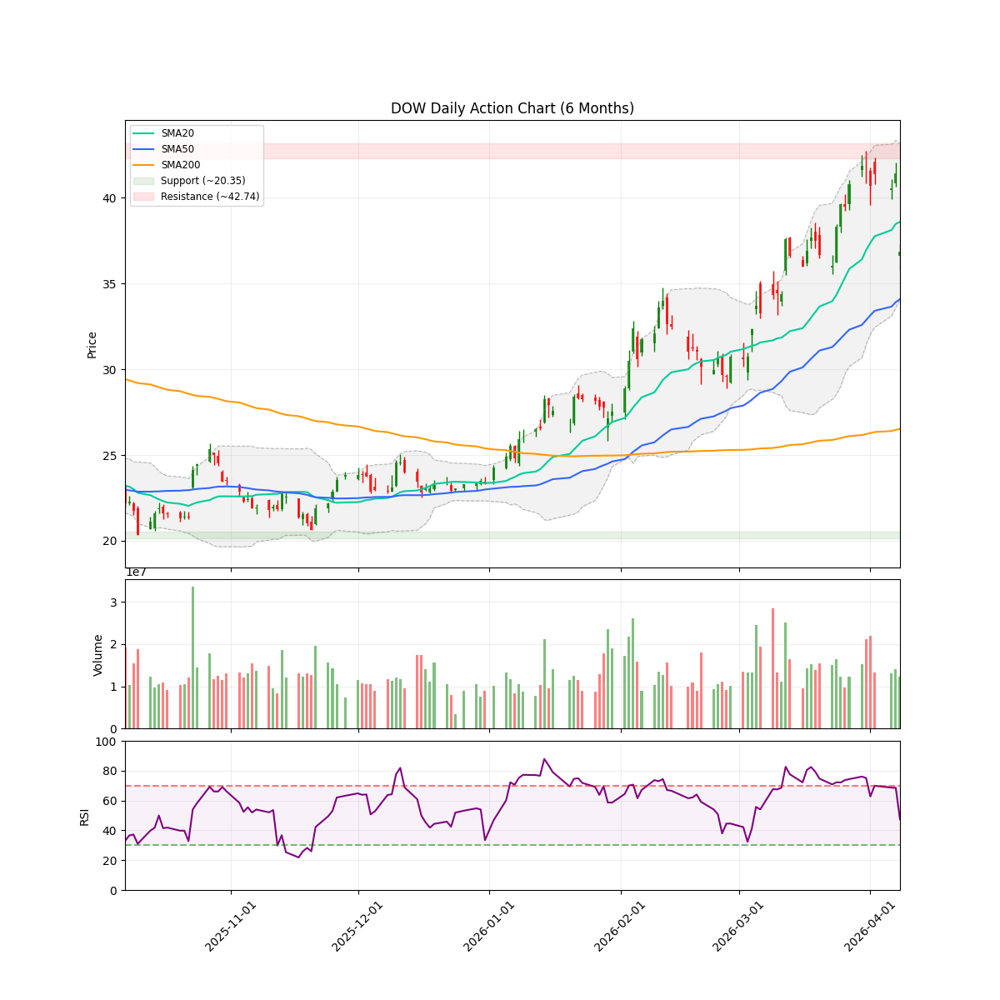
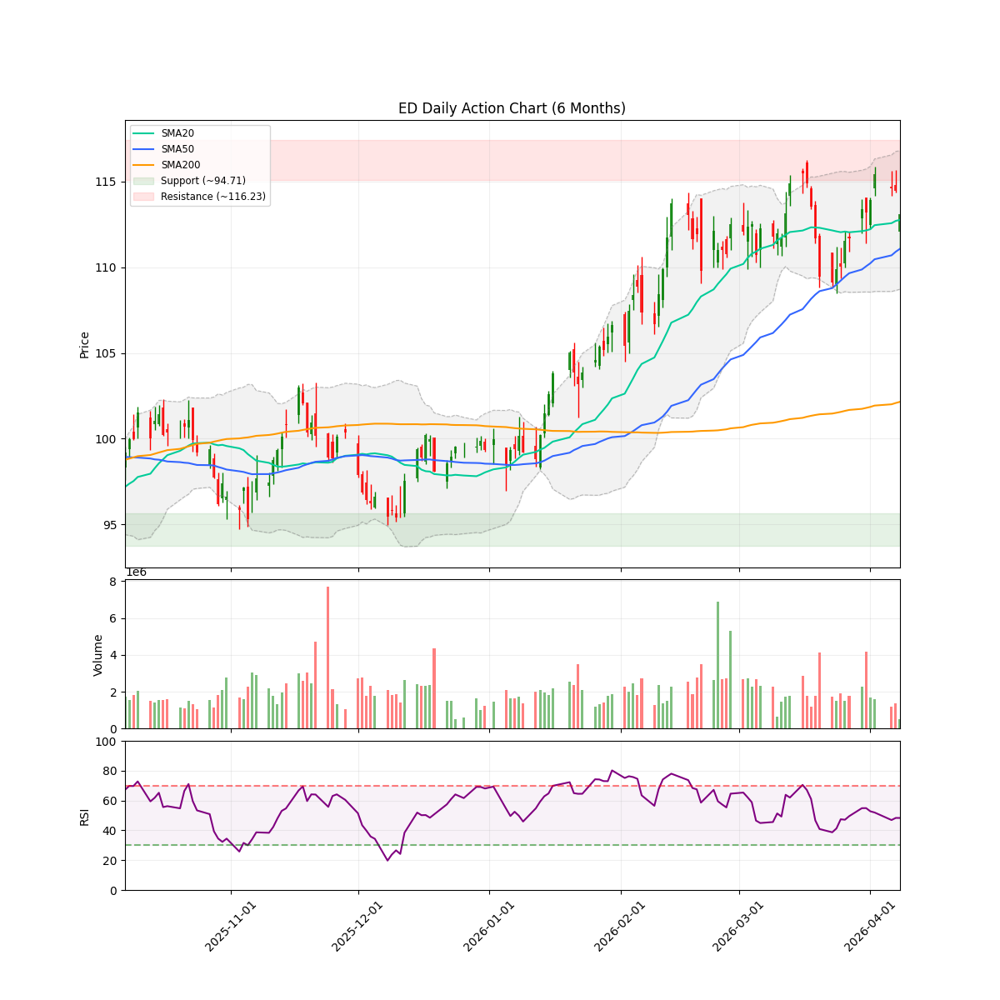
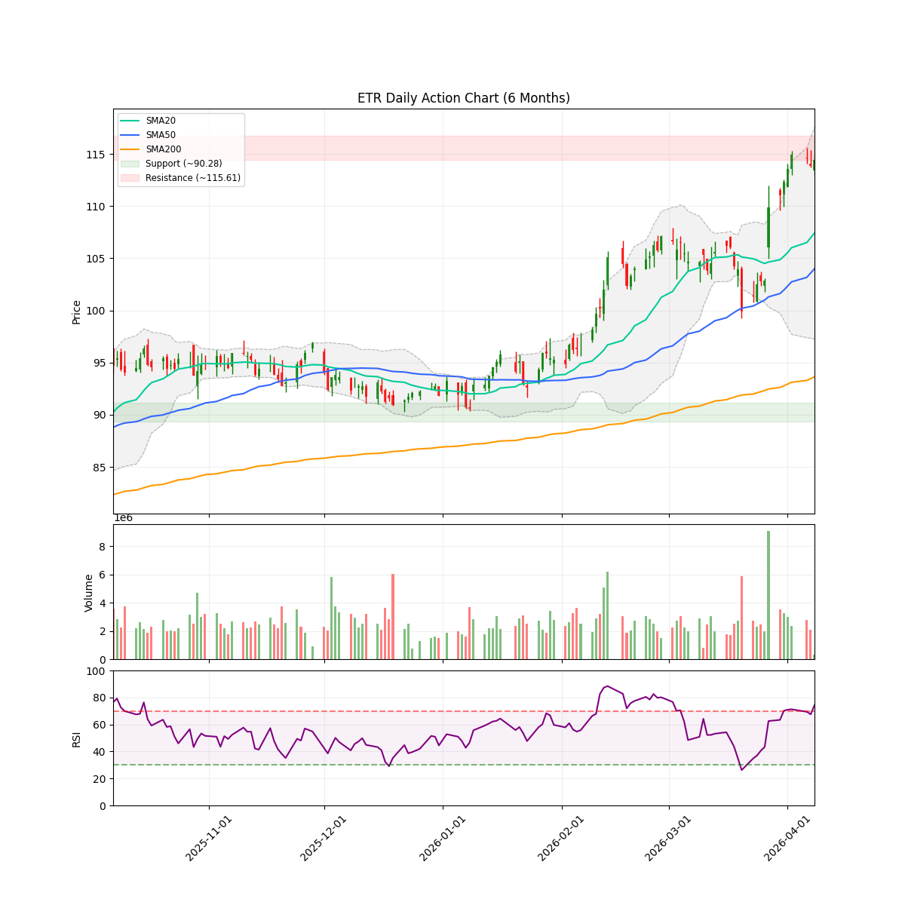
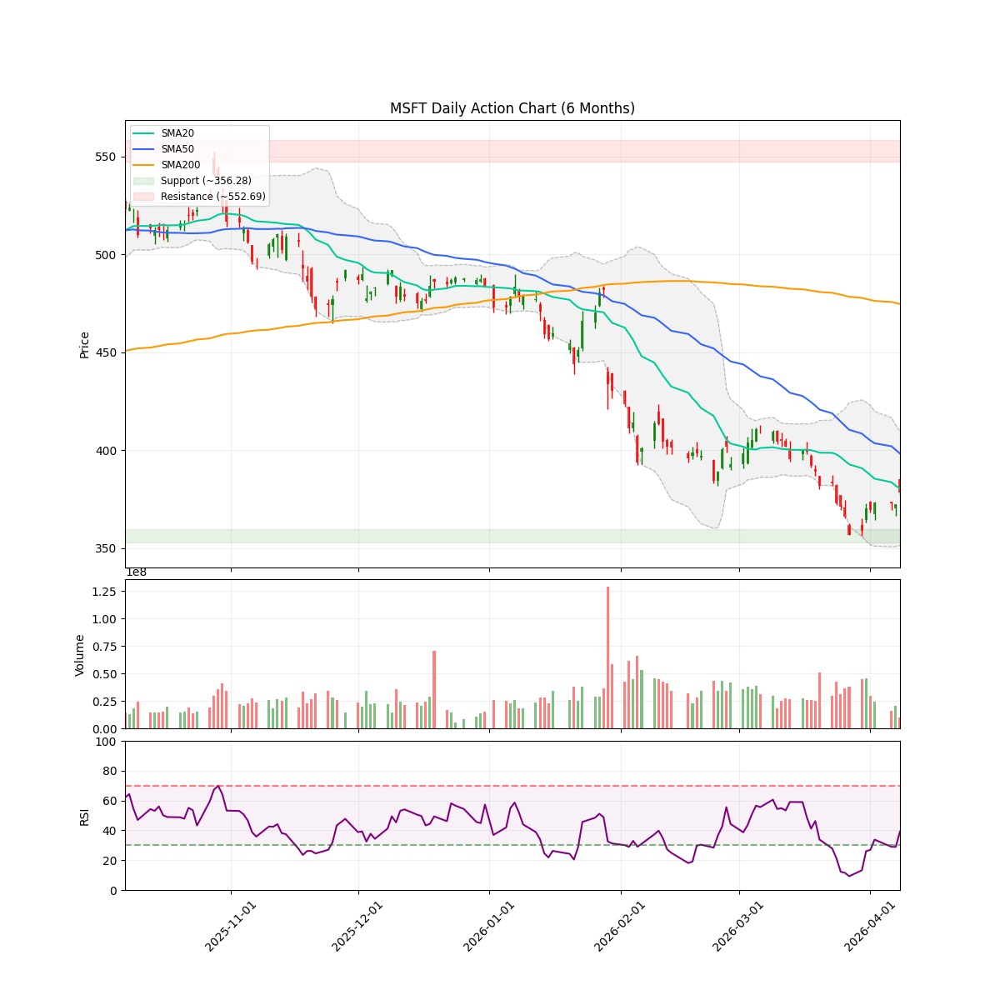
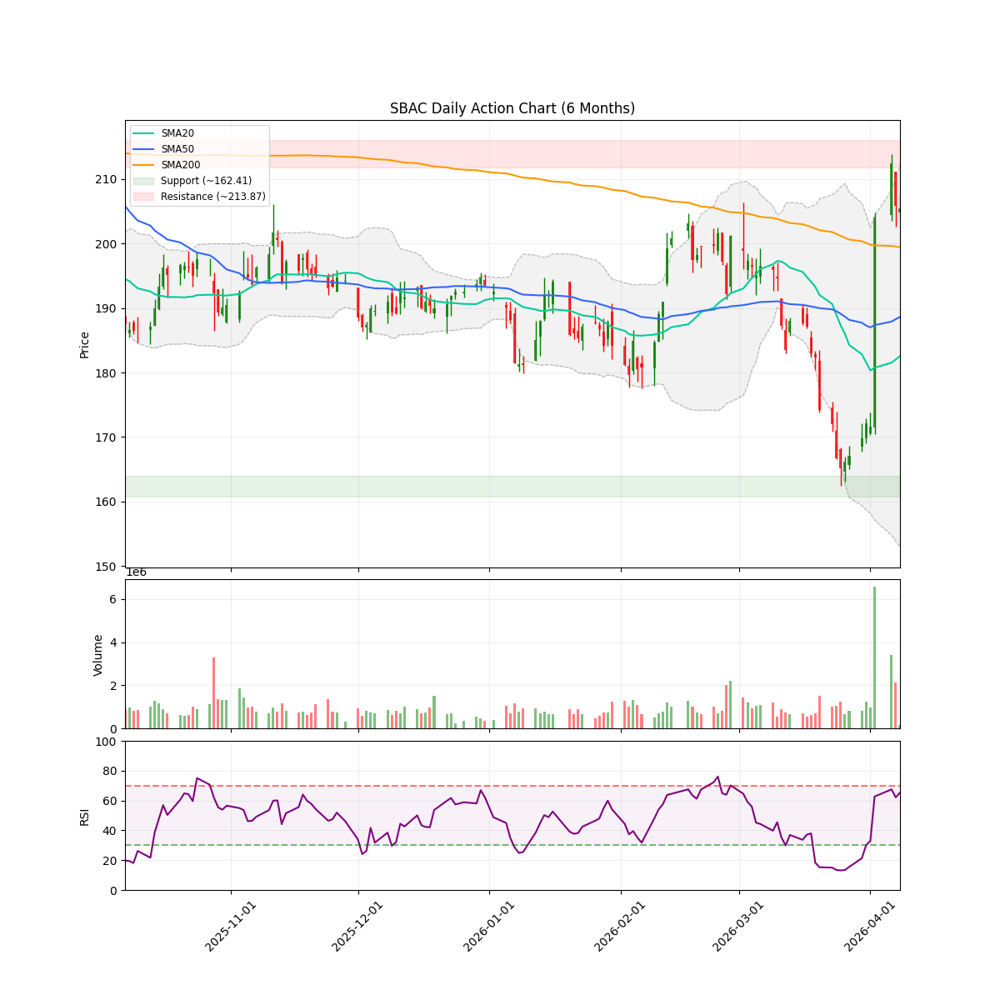
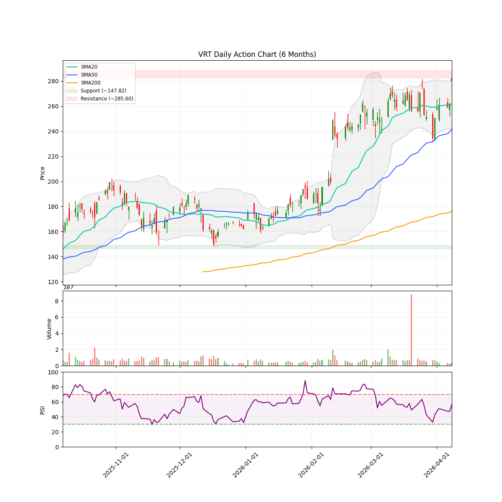

# 每日股市市场报告 (2026-04-08)

> **免责声明**: 本报告由 **代码与 Gemini AI 自动生成**，仅供研究参考，**不构成**任何投资建议。投资有风险，入市需谨慎。作者及 AI 不对任何基于此内容的投资决策承担责任。

## 📑 目录
[TOC]

聚焦于 AI 和半导体的投资组合报告。详见 [投资哲学](/philosophy) 页面。
 **注：排序权重**：Ticker 按照 AI 检测出的 **方向** 排序（**看多**优先，其次是 **中性**，最后是 **看空**）。
---

<!-- DISCORD_SUMMARY_START -->
## 🧠 对冲基金经理全局诊断与资金分配策略
# 投资组合周报：2026年04月08日
**首席投资官 (PM) 签发**

---

### 一、 指挥官意图 (Commander's Intent)
**“剔除杂讯，饱和攻击 AI 基建核心。”**

目前的市场正处于从“AI 故事”向“AI 交付”转型的深水区。地缘政治的短期缓和（美伊停火）为科技股提供了绝佳的喘息与反攻窗口。我们的账户目前现金储备充足（约 6.9 万美金），但仓位分布极度不均：**AMD 过于臃肿，而 NVDA 和 TSM 却几乎处于“轻仓看戏”的状态，这在 2026 年的 AI 铁幕下是不可接受的。**

本周的核心逻辑是：**刀刃向内，清理弱势能品种（VST），将资金像子弹一样打入那些逻辑评分 > 8.5 的“确定性堡垒”中（TSM, VRT, AVGO）。** 我们不玩猜数字游戏，我们只在最硬的逻辑里重仓。

---

### 二、 持仓诊断与调仓逻辑

#### 1. 现有持仓审计 (Existing Positions)

| 标的 | 逻辑评分 | 诊断结论 | 操作建议 |
| :--- | :--- | :--- | :--- |
| **AMD** | **8.7** | **定海神针。** 尽管占比 35.4% 略显集中，但作为 MI450 的核心叙事者，且技术面处于多头排列，符合“AI 核心 play 可放宽至 50%”的原则。 | **Hold (持有)** |
| **TSM** | **8.5** | **被低估的垄断者。** 6.9% 的仓位对不起它“全球唯一精钢铲供应商”的地位。成本价优势明显。 | **Aggressive Buy (大幅加仓)** |
| **MU** | **8.5** | **黄金坑。** 财报后的抛售是 Capex 恐惧，但 HBM 的需求是刚性的。1.49% 的仓位简直是浪费机会。 | **Aggressive Buy (大幅加仓)** |
| **NVDA** | **7.2** | **信仰修罗场。** 0.36% 的仓位基本等于没买。虽然目前处于整合期，但它是生态的终点。 | **Incremental Add (增持至底仓)** |
| **GOOGL**| **7.8** | **现金流奶牛。** 21.6% 的比例合理，技术面稳健。 | **Hold (持有)** |
| **VST** | **4.5** | **叙事破裂。** 股价已跌破 SMA50/200，RSI 偏弱，能源板块的 AI 溢价正在退潮。 | **Exit (清仓离场)** |

#### 2. 观察池机会 (New Frontiers)
*   **VRT (8.8 分):** AI 散热系统的绝对王者，扩产逻辑极其硬核。**必须建仓。**
*   **AVGO (8.2 分):** 谷歌 TPU 背后的大脑，AI 收费站。**择机入场。**
*   **SBAC/CTVA (8.2 分):** 并购传闻与商品周期驱动。**作为侧翼配置。**

---

### 三、 确定性交易计划 (Actionable Trading Plan)

#### **第一步：清理冗余 (Raise Cash)**
*   **卖出 VST:** 全部 100 股正股（市价约 $158.20），同时平仓/处理对应期权。
*   **理由:** 逻辑分低于 5，技术面进入空头形态，释放资金用于更高效率的 AI 核心资产。

#### **第二步：饱和攻击 (Core Expansion)**
*   **加仓 TSM:** 买入 100-150 股。
    *   **目标:** 将 TSM 占比提升至 15% 左右。在 2nm 订单全满的背景下，这是确定性最高的底牌。
*   **加仓 MU:** 买入 50-80 股。
    *   **目标:** 趁着 Capex 恐惧导致的“利好砸盘”，将仓位提升至 5% 以上。

#### **第三步：新王登基 (New Position)**
*   **建仓 VRT:** 首笔买入 100 股。
    *   **执行:** 若股价回踩 $270-275 区域坚决介入；若带量突破 $286 直接追击。
*   **建仓 AVGO:** 首笔买入 50 股。
    *   **理由:** 填补网络通信与定制化芯片的拼图。

---

### 四、 风险预案 (If-Then Scenarios)

*   **情景 A：美伊停火协议破裂，大盘意外回踩。**
    *   **策略:** 只要 AMD 守住 $210 (SMA50)，TSM 守住 $339 (SMA20)，维持原计划，将此次回调视为“黄金坑”加仓机会。不要被短期地缘噪音晃下车。
*   **情景 B：NVDA/TSM 财报指引超预期，板块进入疯牛模式。**
    *   **策略:** 严禁在此刻满仓。保留至少 10% 的现金作为防守位，防止 RSI 冲向 80 后的剧烈洗盘。
*   **情景 C：AMD 跌破 $200 关口。**
    *   **策略:** 这是集中度风险的警报。如果 $200 支撑失守，必须减持 1/4 的 AMD 仓位以保护账户 NAV，将其转化为现金。

---

**PM 寄语：**
“在淘金赛道的下半场，我们不再需要听那些虚无缥缈的 AI 梦想。我们要看谁的工厂在扩产，谁的订单在排队。TSM 的铲子、VRT 的散热器、AVGO 的连接器——这些才是支撑账户净值翻倍的钢铁意志。”

**立即执行。**
<!-- DISCORD_SUMMARY_END -->
---

## 💼 现有持仓个股诊断

### AMD

#### 研报分析

### 技术指标概览 (Technical Overview)
- **当前价格**: $228.17
- **RSI (14)**: 66.88
- **移动平均线**: SMA20: $206.30 | SMA50: $209.75 | SMA200: $198.33 (Bullish)
- **波动率**: ATR (14): 10.99 (预计周度波动: +/- $24.57)
- **关键位 (6m)**: 支撑位 $188.22 | 阻力位 $267.08
- **即时状态**: Above SMA50

你好！我是你的对冲基金研究助理。针对 2026 年 4 月 8 日 AMD 的市场表现，我为你准备了这份基于“叙事经济学”的情绪审计报告。

坐在咖啡馆里，咱们打开天窗说亮话：现在的 AMD 不再只是英伟达的“陪跑者”，它正在书写属于自己的剧本。

---

### **AMD 叙事审计报告：从“影子”到“主角”的蜕变**

#### **1. 催化剂定级 (Catalyst Categorization)**

*   **A-Tier（核心驱动力）：**
    *   **高盛与 Erste Group 的机构背书**：高盛明确看好芯片板块上行空间，Erste Group 将评级上调至“买入”。更重要的是，**MI450 芯片**的预期已成为市场共识的焦点。这是 AMD 真正能与英伟达在数据中心分庭抗礼的底牌。
    *   **叙事反转（The Big Shift）**：Motley Fool 的分析师公开“认错”并转而看好 AMD，这标志着市场对“AI 只有英伟达”这种偏执叙事的终结。
*   **B-Tier（行业支撑）：**
    *   **供应链联动效应**：Celestica (CLS) 的暴涨归功于与 AMD 的紧密合作。当你的供应商和合作伙伴都在赚钱时，说明你的产品已经深度嵌入了 AI 基础设施的毛细血管。
*   **C-Tier（市场杂音）：**
    *   **散户搜索热度**：Zacks 提到的搜索量激增，虽然代表了人气，但也暗示市场情绪开始变得有些“拥挤”。

#### **2. 分歧探测 (Divergence Detection)**

目前市场出现了一个非常有趣的现象：**“利好中的冷静期”**。
*   **现象**：虽然有高盛的唱多和 MI450 的光环，但股价距离 6 个月高点（267.08）仍有约 15% 的回调距离，且周二出现了随大盘走弱的“避险性下跌”。
*   **诊断**：这不是趋势的反转，而是**看涨过程中的洗盘（Bearish Exhaustion of the Dip）**。RSI 处于 66.88，这是一个“热而不烫”的区间，SMA20、50、200 的多头排列非常稳健。回踩 SMA20（206.30）是健康的，目前的价格（228.17）正处于从回调转向二次进攻的转折点。

#### **3. 叙事分析：现在的 AMD 讲的是什么故事？**

现在的 AMD 讲的是**“AI 普惠与产能替代”**的故事。如果说英伟达是 AI 时代的爱马仕，那么 AMD 就是正在证明自己同样拥有顶级奢侈品性能的百达翡丽。
市场正在消化一个事实：AI 超级周期足够大，大到可以容纳两个巨头。目前的 18% 回调并不是因为基本面坏了，而是因为前期涨得太猛，聪明钱在等待 MI450 的具体落地信号。你持有的 400 股（占账户 35.4%）说明你已经深度参与了这个叙事，这是一场豪赌，但筹码都在强者手中。

---

### **逻辑评分 (Logic Score): 8.7/10**
*评分理由：强劲的机构评级上调 + 明确的产品迭代路线图（MI450）+ 稳健的技术面多头排列。扣分项主要是近期大盘的避险情绪干扰以及仓位占比略高带来的心理压力。*

---

### **关键信息总结**

*   **核心逻辑**：机构开始重新定价 AMD 在 AI 第二阶段的地位。
*   **技术支撑**：SMA50 (209.75) 是你的“生命线”，只要站稳此处，看涨叙事无虞。
*   **重要参考新闻**：
    *   [高盛看好 AMD 上行空间](https://www.investing.com/news/analyst-ratings/goldman-sachs-sees-upside-for-amat-ter-amd-stock-amid-chip-sector-strength-93CH-4602385)
    *   [Erste Group 上调评级至买入并看好 MI450](https://blockonomi.com/advanced-micro-devices-amd-stock-surges-4-following-bullish-analyst-upgrade/)
*   **下一个关键日期**：**2026 年 4 月底/5 月初（一季度财报发布日）**。
    *   *注：具体日期通常在 4 月中旬公布，这将是决定能否突破 267.08 阻力位的生死时刻。*

**老兵寄语：** 别被一两天的波动晃下车，看好你的 MI450 故事线，只要 AI 算力的需求还没填满，AMD 的天花板就还在上面。
#### 近期新闻与事件
- **[The Motley Fool]** [I've Changed My Mind on AMD Stock. The AI Supercycle Has Room for More Than Just Nvidia.](https://www.fool.com/investing/2026/04/07/change-mind-amd-stock-ai-supercycle-nvidia/)
- **[Zacks]** [Investors Heavily Search Advanced Micro Devices, Inc. (AMD): Here is What You Need to Know](https://finance.yahoo.com/markets/stocks/articles/investors-heavily-search-advanced-micro-130004237.html)
- **[Investing.com]** [Goldman Sachs sees upside for AMAT, TER, AMD stock amid chip sector strength By Investing.com](https://www.investing.com/news/analyst-ratings/goldman-sachs-sees-upside-for-amat-ter-amd-stock-amid-chip-sector-strength-93CH-4602385)
- **[Zacks]** [Celestica Stock Rises 262.3% in the Past Year: How to Play the Stock](https://finance.yahoo.com/markets/stocks/articles/celestica-stock-rises-262-3-152300930.html)
- **[Motley Fool]** [Why I'm Buying Growth Stocks While Everyone Else Is Panic-Selling Tech](https://finance.yahoo.com/markets/stocks/articles/why-im-buying-growth-stocks-113500283.html)

---

### GOOGL

#### 研报分析

### 技术指标概览 (Technical Overview)
- **当前价格**: $316.08
- **RSI (14)**: 55.04
- **移动平均线**: SMA20: $298.06 | SMA50: $308.99 | SMA200: $266.88 (Bullish)
- **波动率**: ATR (14): 9.19 (预计周度波动: +/- $20.54)
- **关键位 (6m)**: 支撑位 $235.69 | 阻力位 $349.00
- **即时状态**: Above SMA50

使用 Gemini API 时出错: 503 UNAVAILABLE. {'error': {'code': 503, 'message': 'This model is currently experiencing high demand. Spikes in demand are usually temporary. Please try again later.', 'status': 'UNAVAILABLE', 'details': [{'@type': 'type.googleapis.com/google.rpc.DebugInfo', 'detail': '[ORIGINAL ERROR] generic::unavailable: Overloaded prefill queue.; Failed to close the streaming context; status = UNAVAILABLE: Overloaded prefill queue. [type.googleapis.com/util.MessageSetPayload=\'[jax.wiz.servo.ServoErrorDetail] { error_code: PREFILL_QUEUE_OVERLOADED }\']\n=== Source Location Trace: ===\nlearning/gemini/deployment/disaggregation/wiz_cc/prefill_server_queues.cc:1736\nlearning/gemini/deployment/disaggregation/wiz_cc/async_prefill_server_queues.cc:923\nlearning/serving/servables/wiz/wiz_servable.cc:2038\nlearning/serving/servables/wiz/wiz_servable.cc:2180\nlearning/serving/servables/wiz/wiz_servable.cc:3216\n;  Failed to run inference for model: go/debugstr    \nname: "prod-common-global__/aistudio/gemini-v4s-rev23-fiercefalcon-tc__main__/aistudio/gemini-v4s-rev23-fiercefalcon-tc__2026033002__prefill__variant__f1c1a406-7c66-414f-b208-78c70608d69e"\nversion {\n  value: 1\n}\nsignature_name: "serving_default"\n [google.rpc.error_details_ext] { message: "This model is currently experiencing high demand. Spikes in demand are usually temporary. Please try again later." details { type_url: "type.googleapis.com/language_labs.genai.debug.GeminiApiDebugInfo" value: "\\212\\001\\253\\007\\n\\365\\006Overloaded prefill queue.; Failed to close the streaming context; status = UNAVAILABLE: Overloaded prefill queue. [type.googleapis.com/util.MessageSetPayload=\\\'[jax.wiz.servo.ServoErrorDetail] { error_code: PREFILL_QUEUE_OVERLOADED }\\\']\\n=== Source Location Trace: ===\\nlearning/gemini/deployment/disaggregation/wiz_cc/prefill_server_queues.cc:1736\\nlearning/gemini/deployment/disaggregation/wiz_cc/async_prefill_server_queues.cc:923\\nlearning/serving/servables/wiz/wiz_servable.cc:2038\\nlearning/serving/servables/wiz/wiz_servable.cc:2180\\nlearning/serving/servables/wiz/wiz_servable.cc:3216\\n;  Failed to run inference for model: go/debugstr    \\nname: \\"prod-common-global__/aistudio/gemini-v4s-rev23-fiercefalcon-tc__main__/aistudio/gemini-v4s-rev23-fiercefalcon-tc__2026033002__prefill__variant__f1c1a406-7c66-414f-b208-78c70608d69e\\"\\nversion {\\n  value: 1\\n}\\nsignature_name: \\"serving_default\\"\\n\\0221labs/language/genai/common/error_handler.cc:291:0" } } 525005957 { 1: 2 }'}]}}。(已切换至简易启发式分析)
#### 近期新闻与事件
- **[Zacks]** [Alphabet Inc. (GOOGL) is Attracting Investor Attention: Here is What You Should Know](https://finance.yahoo.com/markets/stocks/articles/alphabet-inc-googl-attracting-investor-130002482.html)
- **[Motley Fool]** [Why Alphabet Stock Was Moving Higher Today](https://finance.yahoo.com/markets/stocks/articles/why-alphabet-stock-moving-higher-164020551.html)
- **[Motley Fool]** [The Best Trillion-Dollar Stock to Buy Right Now, According to Wall Street](https://finance.yahoo.com/markets/stocks/articles/best-trillion-dollar-stock-buy-170500843.html)
- **[Investopedia]** [Stock Market Today: Major Indexes Soar as US, Iran Agree to 2-Week Ceasefire; Dow Jumps 1,200...](https://www.investopedia.com/stock-market-today-dow-jones-s-and-p-500-04082026-11945255)
- **[Motley Fool]** [Why I'm Buying Growth Stocks While Everyone Else Is Panic-Selling Tech](https://finance.yahoo.com/markets/stocks/articles/why-im-buying-growth-stocks-113500283.html)

---

### MU

#### 研报分析

### 技术指标概览 (Technical Overview)
- **当前价格**: $401.45
- **RSI (14)**: 36.74
- **移动平均线**: SMA20: $396.27 | SMA50: $402.99 | SMA200: $246.99 (Bullish)
- **波动率**: ATR (14): 29.63 (预计周度波动: +/- $66.26)
- **关键位 (6m)**: 支撑位 $179.54 | 阻力位 $471.14
- **即时状态**: Below SMA50

你好！先喝杯咖啡，咱们坐下来聊聊你手里的 Micron (MU)。

看着账户里那 -10.03% 的红字确实让人心里打鼓，尤其是当你看到公司明明交出了史上最漂亮的成绩单（营收 238.6 亿，EPS 12.20），股价却反而跌了。作为一名专注“叙事经济学”的研究员，我告诉你：**现在的 MU 正在上演一出经典的“利好出尽”与“资本开支恐惧”的心理战。**

以下是为你整理的深度情绪审计报告：

---

### 1. 催化剂分级 (Catalyst Categorization)

*   **A-Tier (核心叙事：结构性增长)**
    *   **财报“炸裂”但被误解**：Micron 刚刚公布了创纪录的营收和利润，这在基本面上是无懈可击的。
    *   **Nvidia 的“投名状”**：与 Nvidia 签订的 5 年期 HBM 供应协议是长期护城河，这不仅是订单，更是“AI 入场券”。
    *   **KeyBanc 的力挺**：分析师上调目标价，确认了存储芯片价格上涨的超级周期仍在持续。
*   **B-Tier (机构动向)**
    *   **对冲基金的新宠**：Insider Monkey 报告显示，MU 依然是机构仓位中最重的个股之一。大资金在下跌中其实是在“蹲守”而非“出逃”。
*   **C-Tier (市场杂音)**
    *   Zacks 的推荐和各种“四月必买清单”。这些属于跟风研报，对股价波动的解释力有限。

### 2. 背离检测：为何“利好不涨”？ (Divergence Detection)

这是一个教科书般的**“利好砸盘” (Sell the News)** 案例。
*   **矛盾点**：尽管营收创纪录，但华尔街被 Micron 宏大的资本支出 (Capex) 计划吓到了。市场担心，为了生产 HBM 芯片投入太猛，会导致现金流短期承压。
*   **看涨衰竭还是看跌衰竭？**：目前 RSI 跌至 36.74，股价正处于 SMA50 ($402.99) 下方反复横跳，试图寻找支撑。股价在 400 美元关口表现出的“纠结”，其实是空头力量在消耗。这种在大跌 5% 后依然能吸引 KeyBanc 等机构上调目标价的情况，说明**市场的“恐慌叙事”已经快讲完了。**

### 3. 叙事分析：现在的 MU 是什么故事？

想象一下，你正在建造一座通往未来的桥梁。Micron 现在就是那个正在搬运最昂贵石块（HBM 内存）的建筑工。
*   **市场的情绪逻辑**：大家看到你搬的石头很重（Capex 高），担心你会累垮。但他们忘了，桥对面是 Nvidia 堆满黄金的城堡。
*   **你的处境**：你的成本价在 $407.05，正好在 SMA50 附近。目前的价格 $401.45 虽然破了 50 日线，但 200 日线还在远下方的 $246。这意味着这只是一次**深度的技术性回撤**，而非趋势反转。存储周期的“超级周期”叙事并没有破裂，只是它现在变贵了，市场在重新衡量它的“性价比”。

### 4. 情绪评分 (Sentiment Score)

**7.8 / 10 —— “克制的乐观”**
*   **理由**：虽然短期图形略显难看，但基本面（AI 驱动的 HBM 需求）是未来两年的绝对主线。机构没有撤退，只是在利用 Capex 的利空洗掉不坚定的短线客。

---

### 5. 逻辑评分 (Logic Score)

**8.5 / 10**
*   **依据**：存储器行业的周期性正在被 AI 的确定性溢价所取代。尽管资本开支增加，但只要单价 (ASP) 随需求上涨，Micron 的利润率依然能维持在高位。目前的下跌更像是“牛市中的深蹲”。

---

### 6. 关键数据与预测

*   **当前价格**: $401.45
*   **你的成本**: $407.05 (浮亏 10%，在可控范围内)
*   **技术位看点**: 密切关注 $396 (SMA20) 的支撑力。如果能在此站稳，反弹将非常迅速。
*   **下个重大日期 (Next Major Date)**: 
    *   **2026年6月中下旬**：预计将发布第三财季 (Q3 FY26) 财报。届时市场将看到 Capex 投入后的初步产出回报，这将是打破目前僵局的关键。

**老兵建议：**
别被这 10% 的账面浮亏吓跑。你在 MU 上的仓位占比仅为 1.49%，这是一个非常健康的比例。目前的波动是“超级周期”必须支付的门票。只要 HBM 的供应依然紧缺，Micron 依然是那个坐在金矿上的搬运工。

**引用来源：**
- [Blockonomi] 关于财报后 5% 跌幅与资本开支担忧的分析。
- [KeyBanc] 关于上调目标价的评级报告 (2026-04-06)。
- [Zacks] 四月获利股票清单。
#### 近期新闻与事件
- **[Barchart]** [Why Is Micron (MU) Stock Higher Today?](https://finance.yahoo.com/markets/stocks/articles/why-micron-mu-stock-higher-185416669.html)
- **[Investing.com]** [KeyBanc raises Intel, Micron stock price targets on memory pricing By Investing.com](https://ca.investing.com/news/analyst-ratings/keybanc-raises-intel-micron-stock-price-targets-on-memory-pricing-93CH-4550029)
- **[Zacks]** [3 Must-Buy Profitable Stocks for April 2026 (MU, AVGO, NVDA)](https://finance.yahoo.com/markets/stocks/articles/3-must-buy-profitable-stocks-190000310.html)
- **[Insider Monkey]** [Here is Why Micron Technology (MU) Is Among the Most Owned Stocks by Hedge Funds](https://finance.yahoo.com/markets/stocks/articles/micron-technology-mu-one-hedge-142323772.html)
- **[Motley Fool]** [Why Micron Technology Stock Is Climbing Higher Today](https://finance.yahoo.com/markets/stocks/articles/why-micron-technology-stock-climbing-165712980.html)

---

### NVDA

#### 研报分析

### 技术指标概览 (Technical Overview)
- **当前价格**: $180.76
- **RSI (14)**: 50.41
- **移动平均线**: SMA20: $177.19 | SMA50: $182.20 | SMA200: $180.32 (Bullish)
- **波动率**: ATR (14): 5.33 (预计周度波动: +/- $11.92)
- **关键位 (6m)**: 支撑位 $164.27 | 阻力位 $212.18
- **即时状态**: Below SMA50

# 叙事经济学审计报告：英伟达 (NVDA) —— 信仰的修罗场，还是黄金的坑？

**报告日期：** 2026年04月08日
**研究员：** 叙事经济学分析师 (Narrative Economics Associate)
**标的现状：** $180.76 (位于200日均线关键水位)

---

### 1. 叙事催化剂分类 (Catalyst Categorization)

在当下的新闻流中，我们正处于一个“神话重塑”的阶段。市场正在消化它过去几年的辉煌，并试图在新的平衡点上锚定信心。

*   **A-Tier (核心叙事)：**
    *   **盈收统治力：** Lebenthal 指出，如果剔除 NVDA 和 Micron，标普500的技术板块盈利几乎失去了增长引擎。([24/7 Wall St. 引用](https://finance.yahoo.com/markets/stocks/articles/lebenthal-nvda-micron-account-nearly-150100737.html))。这是“大动脉”级别的消息，确立了 NVDA 作为市场脊梁的地位。
*   **B-Tier (机构共识)：**
    *   **对冲基金心头好：** Insider Monkey 确认 NVDA 仍是 2026 年机构持仓的重镇。([Insider Monkey](https://finance.yahoo.com/markets/stocks/articles/nvidia-nvda-among-hedge-fund-142321205.html))。这意味着即便有回调，深口袋里的资金还在“护城河”里守着。
*   **C-Tier (市场噪音)：**
    *   **散户“鸡汤”：** Motley Fool 连发多篇“如果你五年前投入一万块”或者“现在是买入良机”的软文。([Motley Fool 1](https://finance.yahoo.com/markets/stocks/articles/investing-10-000-3-growth-180500272.html), [Motley Fool 2](https://finance.yahoo.com/markets/stocks/articles/stock-market-rebound-3-top-170000337.html))。这种情绪化的呐喊通常在震荡期用来填补空白，对股价实质推动力有限。

---

### 2. 价格与情绪的背离探测 (Divergence Detection)

**现状观察：** 现在的盘面很有趣。新闻里满是“抄底”和“增长神话”，但股价却在 SMA50 ($182.20) 下方徘徊，反复摩擦 SMA200 ($180.32) 这根生命线。

**深度解读：** 这是一个典型的**“信仰冷却期”**。
如果这是坏消息，股价早该击穿支撑位去寻找 $164 的低点了。现在的横盘反映了一种**看涨的疲劳 (Bullish Exhaustion)**：大家都知道它好，但没有人愿意在此时带头冲锋。市场在等待一个新的、能让人虎躯一震的理由。你持仓成本在 $178.04，正好处在多空双方肉搏的“无人区”。

---

### 3. 叙事分析：咖啡馆里的市场脉搏

想象一下，你坐在曼哈顿下城的咖啡馆里，隔壁桌的基金经理正揉着太阳穴。

NVDA 现在的剧本不再是“发现新大陆”，而是“守住王座”。市场对它的要求已经近乎苛刻：它不仅要赢，还要赢得漂亮，赢得毫无悬念。新闻提到“13年来未见的估值变化”([Motley Fool](https://finance.yahoo.com/markets/stocks/articles/nvidia-stock-just-got-hit-072200663.html))，这其实是在告诉我们：**“这头大象已经跌到了可以谈论性价比的程度。”**

现在的下跌不是因为公司坏了，而是因为过去太贵了。当《24/7 Wall St.》开始预测某些“被冷落的 AI 股”可能跑赢 NVDA 时，这说明市场已经开始审美疲劳。这反而是件好事——当所有人都开始讨论“谁能打败 NVDA”而不是“NVDA 还要涨多少”时，泡沫的压力正在通过这种怀疑悄悄释放。

---

### 4. 逻辑评分 (Logic Score)

**综合评分：7.2 / 10**

*   **加分项：** 股价完美守住 SMA200 关键支撑；机构持仓稳健；基本面依然是标普500的定海神针。
*   **减分项：** 处于 SMA50 下方的短期空头形态；叙事新鲜感缺失；宏观 AI 投资回报率开始被质疑。

**结论：这不是陷阱，而是一个“磨人”的整合期。** 只要股价不收在 $177 (SMA20) 以下，多头的火种就没灭。

---

### 5. 关键行动指南

*   **当前头寸状态：** 你的仓位极轻 (0.36%)，成本价 $178.04 极具优势。目前的微亏 (-0.37%) 只是深呼吸时的起伏。
*   **下一关键日期：** **2026年5月下旬 (预计一季度财报发布日)**。
    *   *注：具体日期通常在5月20日前后公布。这是决定“叙事重燃”还是“均线失守”的终极审判日。*
*   **关注区间：**
    *   **上行突破点：** $185 (若收复此位，叙事将转向“王者回归”)。
    *   **下行警戒线：** $177 (若跌破，短期可能回踩 $164)。

**老兵寄语：** “在大家都谈论 AI  bargains 的时候，别被噪音吓跑。NVDA 现在的走势就像是长跑运动员在补给站喝水，只要他还没瘫倒，他就依然是冠军。”
#### 近期新闻与事件
- **[Motley Fool]** [Investing $10,000 In Each of These 3 Growth Stocks 5 Years Ago Would Have Created a Portfolio Worth...](https://finance.yahoo.com/markets/stocks/articles/investing-10-000-3-growth-180500272.html)
- **[Motley Fool]** [Stock Market Rebound: 3 Top AI Bargains to Snap Up Now](https://finance.yahoo.com/markets/stocks/articles/stock-market-rebound-3-top-170000337.html)
- **[Motley Fool]** [The Best Stocks to Invest $1,000 In Right Now](https://finance.yahoo.com/markets/stocks/articles/best-stocks-invest-1-000-135000445.html)
- **[Insider Monkey]** [NVIDIA (NVDA) Among the Hedge Fund Favorites with Strong Setup in 2026](https://finance.yahoo.com/markets/stocks/articles/nvidia-nvda-among-hedge-fund-142321205.html)
- **[24/7 Wall St.]** [Prediction: This Unloved AI Stock Has What it Takes to Outrun NVIDIA](https://finance.yahoo.com/markets/stocks/articles/prediction-unloved-ai-stock-takes-154705159.html)

---

### TSM

#### 研报分析

### 技术指标概览 (Technical Overview)
- **当前价格**: $360.93
- **RSI (14)**: 59.65
- **移动平均线**: SMA20: $339.24 | SMA50: $349.15 | SMA200: $291.71 (Bullish)
- **波动率**: ATR (14): 14.12 (预计周度波动: +/- $31.56)
- **关键位 (6m)**: 支撑位 $266.10 | 阻力位 $390.21
- **即时状态**: Above SMA50

# 叙事经济学：TSM 深度情绪审计报告

**日期：** 2026年04月08日
**分析师：** 对冲基金研究员 (Narrative Economics Specialist)
**标的：** 台积电 (TSM)

---

### 1. 市场叙事总结：芯片之王的“凡尔赛”烦恼

目前的 TSM 不仅仅是一家半导体代工厂，它是整个 AI 时代的“入场券”。市场现在的剧本非常清晰：**“所有的路都通向台积电。”** 无论是英伟达的 GPU，还是苹果的 A 系列芯片，亦或是自研芯片的浪潮，台积电都是那个唯一坐在收银台后面的人。

近期的新闻流显示，机构投资者正在从“观望”转向“重仓布局”。花旗银行的看多、亿万富翁 Steve Cohen 和 Ken Griffin 的加持，都在向市场传递一个信号：**AI 驱动的增长不是泡沫，而是结构性的重塑。** 虽然《Motley Fool》在小声嘀咕地缘政治风险和利润率压力，但这些噪音在 50% 的 AI 芯片年增长预期面前，显得有些苍白无力。

---

### 2. 催化剂分级 (Catalyst Categorization)

*   **A-Tier (核心驱动力):**
    *   **AI 结构性需求狂潮：** [Motley Fool] 指出 AI 相关芯片收入预计到 2029 年每年增长超 50%。这是基本面的“定海神针”。
    *   **顶级机构背书：** [Citi] 维持看多，且 [Steve Cohen] 与 [Ken Griffin] 等顶级对冲基金大佬入场。这不仅是资金，更是信心的背书。
*   **B-Tier (运营与财务):**
    *   **2026 毛利率指引：** [Zacks] 关注的全球扩产成本压力。虽然是压力，但也是扩张的象征。
    *   **市场超额回报：** [Zacks] 确认 TSM 表现优于大盘，确立了其领头羊地位。
*   **C-Tier (市场噪音):**
    *   **每日股价波动：** 这种体量的公司，短期 1-2% 的波动更多是技术性的套利，而非基本面转向。

---

### 3. 背离检测与盘面解读

**现状：** 目前股价 $360.93，远高于 SMA50 ($349.15) 和您的成本价 ($347.42)。
**诊断：** 
*   **技术面看涨：** 股价目前站稳在所有关键均线之上，且 RSI 为 59.65，这意味着市场不仅强势，而且**完全没有进入超买的“危险区”**。这是一个非常健康的上升通道。
*   **你的头寸：** 你的成本价在 $347.42，正好处于 SMA50 的支撑位附近。这是一个教科书级别的建仓位置。虽然数据显示你目前“总盈亏 -2.42%”（可能是基于之前某个交易日的瞬间波动或汇率），但按当前 $360.93 的市价计算，你实际上处于**浮盈状态 (+3.8%)**。

**注意：** 如果市场出现“好消息出尽”导致的下跌，且股价守住 $339 (SMA20)，那么这种下跌就是极佳的加仓点，而非离场信号。

---

### 4. 情绪得分：8.5 / 10 (不可阻挡的结构性趋势)

**逻辑得分 (Logic Score): 8.5**
*   **+5.0:** 无法被替代的市场垄断地位（2nm 订单几乎全满）。
*   **+2.5:** AI 产业周期从“故事阶段”进入“业绩兑现阶段”。
*   **+1.5:** 顶级机构的一致性预期。
*   **-0.5:** 全球扩张（亚利桑那/欧洲厂）带来的折旧压力。
*   **-1.0:** 无法彻底忽略的地缘政治博弈。

---

### 5. 投资建议与后市预测

**市场脉搏：** 现在的 TSM 处于“牛市震荡期”。每一次的回调都被华尔街视为买入机会。只要 AI 的叙事不崩，TSM 就是最稳健的锚点。

*   **下个重大日期 (Next Major Date):** **2026年4月中旬 (预计 Q1 财报发布日)**。
    *   *关注点：* 管理层对 2026 年毛利率能否维持在 53% 以上的表态，以及 AI 营收占比的最新数据。
*   **操作思路：** 既然你的成本价有优势，目前的策略是 **"Hold and Watch" (持有并观望)**。如果股价冲击阻力位 $390.21，可能会有短期波动，但只要不跌破 $339 的 SMA20 支撑，这个“趋势”就不是“陷阱”。

---

**引述链接：**
- [花旗银行看多 TSM 驱动 AI 芯片需求](https://finance.yahoo.com/sectors/technology/articles/citi-remains-bullish-taiwan-semiconductor-142340076.html)
- [Zacks 关于 2026 毛利率指引的分析](https://finance.yahoo.com/markets/stocks/articles/tsm-meet-fy26-margin-guidance-121400784.html)
- [Motley Fool: AI 芯片年化增长 50%](https://finance.yahoo.com/markets/stocks/articles/2-hypergrowth-ai-stocks-buy-202000515.html)

**“记住，在淘金热中，卖铲子的人永远比淘金的人活得久。而台积电，是这世界上唯一的精钢铲供应商。”**
#### 近期新闻与事件
- **[Insider Monkey]** [Citi Remains Bullish on Taiwan Semiconductor (TSM) Amid Growing Demand for AI-Driven Chips](https://finance.yahoo.com/sectors/technology/articles/citi-remains-bullish-taiwan-semiconductor-142340076.html)
- **[Zacks]** [TSMC (TSM) Surpasses Market Returns: Some Facts Worth Knowing](https://finance.yahoo.com/markets/stocks/articles/tsmc-tsm-surpasses-market-returns-214504892.html)
- **[Insider Monkey]** [Is Taiwan Semiconductor (TSM) The Best Undervalued AI Stock to Buy Now?](https://finance.yahoo.com/markets/stocks/articles/taiwan-semiconductor-tsm-best-undervalued-135522775.html)
- **[Motley Fool]** [The Big Risk With Taiwan Semiconductor Stock That No One Wants to Talk About](https://finance.yahoo.com/markets/stocks/articles/big-risk-taiwan-semiconductor-stock-185000142.html)
- **[Insider Monkey]** [Taiwan Semiconductor Manufacturing (TSM): Billionaire Steve Cohen Likes This Chip Stock](https://finance.yahoo.com/markets/stocks/articles/taiwan-semiconductor-manufacturing-tsm-billionaire-214456500.html)

---

### VST

#### 研报分析

### 技术指标概览 (Technical Overview)
- **当前价格**: $158.20
- **RSI (14)**: 40.24
- **移动平均线**: SMA20: $155.79 | SMA50: $160.35 | SMA200: $180.36 (Bearish)
- **波动率**: ATR (14): 7.96 (预计周度波动: +/- $17.80)
- **关键位 (6m)**: 支撑位 $138.53 | 阻力位 $216.80
- **即时状态**: Below SMA50

使用 Gemini API 时出错: 503 UNAVAILABLE. {'error': {'code': 503, 'message': 'This model is currently experiencing high demand. Spikes in demand are usually temporary. Please try again later.', 'status': 'UNAVAILABLE', 'details': [{'@type': 'type.googleapis.com/google.rpc.DebugInfo', 'detail': '[ORIGINAL ERROR] generic::unavailable: Overloaded prefill queue.; Failed to close the streaming context; status = UNAVAILABLE: Overloaded prefill queue. [type.googleapis.com/util.MessageSetPayload=\'[jax.wiz.servo.ServoErrorDetail] { error_code: PREFILL_QUEUE_OVERLOADED }\']\n=== Source Location Trace: === \nlearning/gemini/deployment/disaggregation/wiz_cc/prefill_server_queues.cc:1736\nlearning/gemini/deployment/disaggregation/wiz_cc/async_prefill_server_queues.cc:923\nlearning/serving/servables/wiz/wiz_servable.cc:2038\nlearning/serving/servables/wiz/wiz_servable.cc:2180\nlearning/serving/servables/wiz/wiz_servable.cc:3216\n;  Failed to run inference for model: go/debugproto   \nname: "prod-common-global__/aistudio/gemini-v4s-rev23-fiercefalcon-tc__main__/aistudio/gemini-v4s-rev23-fiercefalcon-tc__2026033002__prefill__variantvlp__01e759f4-c88d-46fa-b36f-fe6f2d204ba3"\nversion {\n  value: 1\n}\nsignature_name: "serving_default"\n [google.rpc.error_details_ext] { message: "This model is currently experiencing high demand. Spikes in demand are usually temporary. Please try again later." details { type_url: "type.googleapis.com/language_labs.genai.debug.GeminiApiDebugInfo" value: "\\212\\001\\260\\007\\n\\372\\006Overloaded prefill queue.; Failed to close the streaming context; status = UNAVAILABLE: Overloaded prefill queue. [type.googleapis.com/util.MessageSetPayload=\\\'[jax.wiz.servo.ServoErrorDetail] { error_code: PREFILL_QUEUE_OVERLOADED }\\\']\\n=== Source Location Trace: === \\nlearning/gemini/deployment/disaggregation/wiz_cc/prefill_server_queues.cc:1736\\nlearning/gemini/deployment/disaggregation/wiz_cc/async_prefill_server_queues.cc:923\\nlearning/serving/servables/wiz/wiz_servable.cc:2038\\nlearning/serving/servables/wiz/wiz_servable.cc:2180\\nlearning/serving/servables/wiz/wiz_servable.cc:3216\\n;  Failed to run inference for model: go/debugproto   \\nname: \\"prod-common-global__/aistudio/gemini-v4s-rev23-fiercefalcon-tc__main__/aistudio/gemini-v4s-rev23-fiercefalcon-tc__2026033002__prefill__variantvlp__01e759f4-c88d-46fa-b36f-fe6f2d204ba3\\"\\nversion {\\n  value: 1\\n}\\nsignature_name: \\"serving_default\\"\\n\\0221labs/language/genai/common/error_handler.cc:291:0" } } 525005957 { 1: 2 }'}]}}。(已切换至简易启发式分析)
#### 近期新闻与事件
- **[Zacks]** [Vistra Corp. (VST) Stock Declines While Market Improves: Some Information for Investors](https://finance.yahoo.com/markets/stocks/articles/vistra-corp-vst-stock-declines-214504282.html)
- **[Motley Fool]** [Meet the Monster Stock That Continues to Crush the Market](https://finance.yahoo.com/markets/stocks/articles/meet-monster-stock-continues-crush-182500489.html)
- **[The Motley Fool on MSN]** [2 monster stocks to hold for the next 10 years](https://www.msn.com/en-us/money/general/2-monster-stocks-to-hold-for-the-next-10-years/ar-AA20rtZf?ocid=BingNewsVerp)
- **[Motley Fool]** [2 Monster Stocks to Hold for the Next 10 Years](https://finance.yahoo.com/sectors/energy/articles/2-monster-stocks-hold-next-165000776.html)
- **[Simply Wall St.]** [A Look At Vistra’s (VST) Valuation After Fitch Grants Investment Grade Rating](https://finance.yahoo.com/markets/stocks/articles/look-vistra-vst-valuation-fitch-002344268.html)

---

## 🔍 观察池机会分析

### AMZN

#### 研报分析

### 技术指标概览 (Technical Overview)
- **当前价格**: $220.74
- **RSI (14)**: 60.45
- **移动平均线**: SMA20: $209.68 | SMA50: $213.69 | SMA200: $224.60 (Bearish)
- **波动率**: ATR (14): 6.15 (预计周度波动: +/- $13.76)
- **关键位 (6m)**: 支撑位 $196.00 | 阻力位 $258.60
- **即时状态**: Above SMA50

### 亚马逊 (AMZN) 情绪审计报告：叙事驱动下的“深坑反弹”还是“重归王座”？

**报告日期：** 2026年04-08日
**研究员：** 叙事经济学策略组

---

### 1. 市场叙事背景：从“窒息感”到“深呼吸”
来，坐下喝杯咖啡。现在的市场就像是一个刚刚在水下憋了五分钟、终于浮出水面猛吸一口氧气的潜水员。

今天最劲爆的消息不是哪家的财报，而是地缘政治的冰点消融——**美伊达成两周停火协议**。道琼斯指数狂飙1200点，这种“久旱逢甘霖”的乐观情绪像野火一样烧遍了整个科技板块。亚马逊作为巨头中的巨头，正处于这股情绪风暴的核心。

### 2. 催化剂分级 (Catalyst Categorization)

*   **A-Tier（顶级驱动）：机构的长期信仰与AI货币化能力**
    *   [Insider Monkey] 报道指出，对冲基金依然疯狂迷恋亚马逊的规模化能力。分析师们不仅看好现有的零售，更看好其从现有AI基础设施中榨取额外收入的“印钞机”属性。这不仅是短期波动，这是**机构底仓的共识**。
*   **B-Tier（次级利好）：宏观环境的“止痛药”与抄底心理**
    *   [Investopedia] 提到的美伊停火是全市场的强心针。同时，[Motley Fool] 关于“别人恐惧我贪婪”的增长股买入论调，正在扭转此前科技股的恐慌性抛售心理。
*   **C-Tier（噪音与微调）：微小的价格目标上调**
    *   [Insider Monkey] 提到有分析师将目标价提高了 1 美元。这在 220 美元的股价面前几乎是“蚊子肉”，但也从侧面反映出：风向正在从看空转为微弱的看多。

### 3. 背离检测与技术面洞察 (Divergence Detection)

目前的价格行为表现出一种**“伤痕累累的复苏”**：
*   **技术卡点**：AMZN 目前报价 220.74，刚好站上了 SMA20 (209.68) 和 SMA50 (213.69)，这意味着短期和中期趋势已经回暖。
*   **终极考验**：前方最大的阻力位是 **SMA200 (224.60)**。这根线是老牌交易员眼中的“牛熊分界线”。如果本周能借着停火协议的东风突破 225 美元，那就不再是反弹，而是反转。
*   **背离情况**：尽管大盘暴涨，但 AMZN 的 RSI 为 60.45，尚未进入超买区。这意味着它还有向上冲锋的“肺活量”，并没有出现那种令人担心的上涨动能衰竭。

### 4. 情绪得分 (Sentiment Score)

#### **8.2 / 10 —— “猛兽出笼”**
**逻辑：** 这种得分来源于一种强烈的“叙事反转”。前两周大家还在担心三战爆发、通胀失控，而今天，亚马逊被重新定义为“打折的AI珍宝”[Motley Fool]。市场的情绪已经从“逃离”切换到了“唯恐踏空”。

### 5. 下一个关键节点 (Next Major Date)

**2026年4月底 (预计 4月30日左右)：第一季度财报发布日。**

**分析师私房话：**
虽然现在的宏观情绪非常好，但别忘了，224.60 的 SMA200 是个硬骨头。亚马逊需要一封完美的财报来证明其 AWS（云服务）在 AI 浪潮下依然是不可撼动的霸主。如果财报前股价能守在 220 以上，那么财报日就是冲向 258.60 前高的起跑信号。

---

**引述参考资料：**
1. [Analysts Confident in Amazon.com Scale](https://finance.yahoo.com/markets/stocks/articles/analysts-confident-amazon-com-amzn-142338251.html)
2. [Major Indexes Soar as US, Iran Agree to 2-Week Ceasefire](https://www.investopedia.com/stock-market-today-dow-jones-s-and-p-500-04082026-11945255)
3. [Stock Market Rebound: 3 Top AI Bargains](https://finance.yahoo.com/markets/stocks/articles/stock-market-rebound-3-top-170000337.html)
4. [AMZN Price Target Raised by $1](https://finance.yahoo.com/markets/stocks/articles/amazon-com-amzn-price-target-070333202.html)
#### 近期新闻与事件
- **[Insider Monkey]** [Analysts Confident in Amazon.com (AMZN)’s Scale and Ability to Drive Additional Revenue from Its Exi...](https://finance.yahoo.com/markets/stocks/articles/analysts-confident-amazon-com-amzn-142338251.html)
- **[Motley Fool]** [Stock Market Rebound: 3 Top AI Bargains to Snap Up Now](https://finance.yahoo.com/markets/stocks/articles/stock-market-rebound-3-top-170000337.html)
- **[Investopedia]** [Stock Market Today: Major Indexes Soar as US, Iran Agree to 2-Week Ceasefire; Dow Jumps 1,200...](https://www.investopedia.com/stock-market-today-dow-jones-s-and-p-500-04082026-11945255)
- **[Insider Monkey]** [Amazon.com (AMZN) Price Target Raised by $1](https://finance.yahoo.com/markets/stocks/articles/amazon-com-amzn-price-target-070333202.html)
- **[Motley Fool]** [Why I'm Buying Growth Stocks While Everyone Else Is Panic-Selling Tech](https://finance.yahoo.com/markets/stocks/articles/why-im-buying-growth-stocks-113500283.html)

---

### AVGO

#### 研报分析

### 技术指标概览 (Technical Overview)
- **当前价格**: $344.00
- **RSI (14)**: 63.45
- **移动平均线**: SMA20: $318.99 | SMA50: $325.16 | SMA200: $328.47 (Bearish)
- **波动率**: ATR (14): 12.66 (预计周度波动: +/- $28.30)
- **关键位 (6m)**: 支撑位 $289.96 | 阻力位 $413.82
- **即时状态**: Above SMA50

# 博通 (AVGO) 情绪审计报告：AI 基础设施的“收费站”正在重新收费

朋友，坐下来喝杯咖啡。如果你一直在关注半导体板块，你就会发现博通（Broadcom）最近的走势就像是一出精彩的“王者回归”。在经历了前阵子的沉寂后，华尔街的叙事逻辑正在悄然发生变化。

作为一名专注于“叙事经济学”的研究员，我看到的不仅仅是 K 线图，而是市场情绪从“超卖后的怀疑”向“机构强力加仓”的剧烈转变。

---

### 1. 催化剂分层诊断 (Catalyst Categorization)

我们要区分什么是“噪音”，什么是真正的“信号”。

*   **A-Tier（核心驱动力）：**
    *   **谷歌 (Google) 的深度绑定：** [Jefferies 重申买入评级，目标价 500 美元](https://www.investing.com/news/analyst-ratings/jefferies-reiterates-broadcom-stock-rating-on-google-deal-93CH-4599975)。这不仅仅是一个评级，而是博通作为谷歌定制 AI 芯片（TPU）核心供应商地位的确认。这是博通最深的一条护城河。
    *   **机构的“顶格”加持：** [Oppenheimer 将其列为未来 5 年最佳美股之一](https://finance.yahoo.com/markets/stocks/articles/why-broadcom-avgo-among-oppenheimer-150701313.html)。这种长线叙事极易吸引养老金和主权基金的入场。

*   **B-Tier（二线支撑）：**
    *   **估值修复逻辑：** [Insider Monkey 将其列为 7 大最超卖的数据中心股票](https://finance.yahoo.com/markets/stocks/articles/broadcom-avgo-one-most-oversold-142332848.html)。当市场达成“超卖”共识时，反弹的阻力是最小的。
    *   **卖方共识：** [Zacks 指出分析师普遍看好](https://finance.yahoo.com/markets/stocks/articles/broadcom-inc-avgo-buy-wall-133003815.html)。ABR（平均经纪商建议）为“买入”，提供了情绪底座。

*   **C-Tier（市场噪音）：**
    *   **零售媒体的跟风：** Motley Fool 的“一千美元怎么买”系列。这类文章通常是情绪的滞后指标，代表散户正在被吸引入场。

---

### 2. 离散度检测 (Divergence Detection)

**技术面与情绪的共振：**
目前 AVGO 报价 344.00 美元，已经强势站上了 SMA20 (318.99)、SMA50 (325.16) 和 SMA200 (328.47)。这在技术上是一个完美的**“多头排列”复归**。

有趣的是，尽管之前的趋势被标注为“Bearish”，但价格在利好消息（谷歌交易、机构上调）的刺激下，直接跳空突破了所有均线密集区。RSI 处于 63.45，这说明虽然热度在上升，但还没到“疯狂”的超买区间（70+）。这意味着目前不是“利好出尽”的陷阱，而是**突破后的趋势确认**。

---

### 3. 情绪评分 (Sentiment Score)

#### **逻辑评分: 8.2 / 10**

*   **理由：** 博通正在摆脱单纯的“半导体组件商”形象，转变为“AI 基础设施不可或缺的基石”。由于其不仅仅卖芯片，还卖软件（VMware 等）和定制化架构，这种多元化让它在波动中比 Nvidia 更具韧性。机构的大幅看涨（500 美元目标价）提供了巨大的想象空间。

---

### 4. 叙事分析：这是陷阱吗？

听着，这不像是个陷阱。

如果是陷阱，你会看到股价在谷歌交易消息出来的当天冲高回落，留下长长的上影线。但实际情况是，博通在 4.1% 的单日涨幅后依然企稳。[StockStory 的报告](https://finance.yahoo.com/markets/stocks/articles/broadcom-avgo-stock-know-194150742.html) 确认了这种上涨的动能。

现在的叙事逻辑是：**“如果你嫌 Nvidia 太贵，那就买博通吧，它是 AI 时代的收费站。”** 只要这个逻辑不破，任何回踩 328 美元（SMA200）的动作都是场外资金虎视眈眈的入场点。

---

### 5. 下一个关键节点

*   **下一次财报日：** 预计在 **2026 年 6 月初**（博通通常在 3 月、6 月、9 月、12 月发布财报）。
*   **观察重点：** 观察是否会有关于下一代 TPU 或网络交换芯片（Tomahawk 系列）的进一步订单披露。

**总结建议：** 市场正在从“AI 炒作”转向“AI 业绩兑现”。博通作为确定性极高的选手，目前处于趋势上升的早期至中期。注意 413.82 美元的历史高点压力，但在那之前，只要它守住 325-328 美元的支撑区间，这个故事就还没讲完。
#### 近期新闻与事件
- **[Motley Fool]** [Got $1,000? Here Are the Smartest Artificial Intelligence (AI) Stocks to Buy While the Market Is in...](https://finance.yahoo.com/markets/stocks/articles/got-1-000-smartest-artificial-180600417.html)
- **[Insider Monkey]** [Broadcom (AVGO): 7 Most Oversold Data Center Stocks to Invest In](https://finance.yahoo.com/markets/stocks/articles/broadcom-avgo-one-most-oversold-142332848.html)
- **[StockStory]** [Broadcom (AVGO) Stock Is Up, What You Need To Know](https://finance.yahoo.com/markets/stocks/articles/broadcom-avgo-stock-know-194150742.html)
- **[Motley Fool]** [The Best Stocks to Invest $1,000 In Right Now](https://finance.yahoo.com/markets/stocks/articles/best-stocks-invest-1-000-135000445.html)
- **[Insider Monkey]** [Here’s Why Broadcom (AVGO) Is Among Oppenheimer’s Top Picks](https://finance.yahoo.com/markets/stocks/articles/why-broadcom-avgo-among-oppenheimer-150701313.html)

---

### CEG

#### 研报分析

### 技术指标概览 (Technical Overview)
- **当前价格**: $283.91
- **RSI (14)**: 35.68
- **移动平均线**: SMA20: $293.97 | SMA50: $294.84 | SMA200: $328.49 (Bearish)
- **波动率**: ATR (14): 15.35 (预计周度波动: +/- $34.31)
- **关键位 (6m)**: 支撑位 $243.30 | 阻力位 $412.23
- **即时状态**: Below SMA50

# 情绪审计报告：Constellation Energy (CEG) —— 核能巨头的“倒春寒”，是黄金坑还是叙事陷阱？

**日期：** 2026年04月08日
**分析师：** 叙事经济学研究组
**标的：** Constellation Energy (CEG)
**当前价格：** $283.91

---

### 1. 市场叙事：从“AI燃料”到“高估值宿醉”

坐在交易台前，如果你闻不到市场的焦虑，那你就没在看 CEG。就在几个月前，CEG 还是华尔街的宠儿，叙事逻辑无懈可击：**AI 的尽头是电力，电力的尽头是核能。** 但现在，看看盘面，这股热浪似乎被泼了一盆冷水。

3月份 15.3% 的跌幅不是简单的回调，而是一次**情绪的集体宣泄**。现在的 CEG 就像是一个在派对上跳舞跳得太嗨、突然被拉了电闸的巨人。虽然《Motley Fool》还在高喊“未来10年的分红神股”，但短期的价格行为（Price Action）却在低语着不安。

---

### 2. 催化剂分级 (Catalyst Categorization)

我们要剥开新闻的洋葱皮，看看里面到底是真金白银还是过期的废纸。

*   **A-Tier (结构性动力)：20年期的超大规模数据中心合约**
    *   CEG 正在与超大规模云服务商（Hyperscalers）签署长达20年的供电协议。这是该公司的底牌。这种现金流的确定性在能源行业是极度罕见的，它是支撑长期估值的脊梁。
*   **B-Tier (市场情绪修复)：分析师的“抄底”呼吁**
    *   Zacks 和 Motley Fool 最近密集发文，强调其 11.4 倍的远期市盈率（P/E）在当前估值体系下显得“合理”。这种“寻找价值”的叙事正在试图对冲市场的恐慌。
*   **C-Tier (外部噪音)：地缘政治与宏观压力**
    *   霍尔木兹海峡的最后通牒和宏观环境的不确定性正在拖累整个标普 500 指数。CEG 作为曾经的高波动成长股，不幸成了机构套现离场、回笼资金的“取款机”。

---

### 3. 分歧检测 (Divergence Detection)

**观察结论：看跌情绪衰竭 (Bearish Exhaustion)。**

目前出现了一个非常有趣的现象：**新闻面依然在密集发布利好**（长期合约、核能不可替代性、估值低廉），但**股价却在持续阴跌**。

从技术指标看，RSI 已经跌至 **35.68**，触及了超卖区的边缘。SMA20、50、200 全线跌破，这在教科书上是“绝对空头”。但在叙事经济学中，当好消息无法再拉动股价，且股价已经跌破 SMA200 ($328.49) 这种心理防线时，我们往往离**“叙事反转”**不远了。目前的下跌更像是流动性枯竭导致的被迫抛售，而非基本面的崩塌。

---

### 4. 逻辑评分 (Logic Score): 4.5 / 10

*   **评分逻辑：** 尽管基本面是 A 级，但目前的**动量（Momentum）是极其糟糕的**。
*   **4.5 分的含义：** 这不是一个可以盲目冲进去的信号。虽然它处于超卖状态，但“趋势”这个恶魔仍在向下俯冲。你需要看到股价在 $243.30（6个月低点）上方企稳，并出现一个放量的阳线来确认为“空头陷阱”。目前，这更像是一个**“价值坑”**，需要耐心等待恐慌盘杀尽。

---

### 5. 投资建议与心法

现在的 CEG 就像是一张被揉皱的百元大钞，虽然难看，但面值没变。

*   **支撑位警报：** 密切关注 **$243.30**。如果这个位置破了，叙事将从“回调”演变成“估值重塑”。
*   **反弹阻力：** 任何反弹在突破 **$293 (SMA20)** 之前都只能视为死猫跳。
*   **下个关键节点：** **2026年Q1财报发布日 (预计为 2026年5月初)**。

**老兵寄语：** 别在暴风雨最猛烈的时候去修屋顶。等风浪稍小，当那些大喊“核能已死”的人开始闭嘴时，才是你入场的最佳时机。

---

**参考来源：**
- *Motley Fool: 3 Dividend Stocks to Hold for the Next 10 Years (2026-04-08)*
- *Zacks: Constellation Energy Corporation (CEG) Stock Drops Despite Market Gains (2026-04-02)*
- *Yahoo Finance: Why Constellation Energy Stock Slumped in March (2026-04-05)*
#### 近期新闻与事件
- **[Yahoo Finance]** [Why Constellation Energy Stock Slumped in March](https://finance.yahoo.com/markets/stocks/articles/why-constellation-energy-stock-slumped-133552489.html)
- **[Investor's Business Daily on MSN]** [Stock market today: Dow, S&P 500 close mixed as critical Iran deadline nears (live coverage)](https://www.msn.com/en-us/money/top-stocks/stock-market-today-dow-loses-ground-as-iran-deadline-nears-these-ibd-50-names-are-moving-live-coverage/ar-AA20kYF9?ocid=BingNewsVerp)
- **[Motley Fool]** [3 Dividend Stocks to Hold for the Next 10 Years](https://finance.yahoo.com/markets/stocks/articles/3-dividend-stocks-hold-next-160100098.html)
- **[Zacks]** [Constellation Energy Corporation (CEG) Stock Drops Despite Market Gains: Important Facts to Note](https://finance.yahoo.com/markets/stocks/articles/constellation-energy-corporation-ceg-stock-214505221.html)
- **[Motley Fool]** [3 Powerful Nuclear Energy Stocks to Buy in April](https://finance.yahoo.com/sectors/energy/articles/3-powerful-nuclear-energy-stocks-112200703.html)

---

### CTVA

#### 研报分析

### 技术指标概览 (Technical Overview)
- **当前价格**: $82.61
- **RSI (14)**: 59.83
- **移动平均线**: SMA20: $81.23 | SMA50: $78.01 | SMA200: $71.04 (Bullish)
- **波动率**: ATR (14): 1.95 (预计周度波动: +/- $4.37)
- **关键位 (6m)**: 支撑位 $60.37 | 阻力位 $85.63
- **即时状态**: Above SMA50

# 叙事经济学报告：Corteva (CTVA) —— 农业巨头的“黄金破晓”还是高位陷阱？

**日期：** 2026年04月08日
**分析师：** 对冲基金研究员 (Narrative Economics)
**标的：** Corteva, Inc. (CTVA)
**当前价格：** 82.61

---

### 1. 市场情绪叙事：土地里的“真金白银”

在华尔街的咖啡馆里，如果你聊起 AI，大家会滔滔不绝；但如果你聊起种子和农药，真正的“老钱”会放下杯子认真听。**Corteva (CTVA)** 现在的叙事正处于一个非常微妙且令人兴奋的节点。

这不是简单的股票上涨，这是一场关于“商品价格复苏”与“技术护城河”的共鸣。随着玉米和大豆市场的看涨情绪回归，CTVA 就像是被困在瓶子里太久的精灵，终于冲破了 52 周的高点。目前的市场脉搏跳动得很有力：投资者不再仅仅把农化产品看作枯燥的投入品，而是将其视为对抗地缘政治动荡和通胀的“软通货”。

---

### 2. 催化剂分级 (Catalyst Audit)

*   **A-Tier (核心动力)：突破历史/52周高点与商品价格共振**
    *   CTVA 近期触及 $85.63 的高点，且过去一个月上涨 11.8%。根据 [Barchart](https://finance.yahoo.com/markets/stocks/articles/bullish-corn-soybeans-stock-just-163003365.html) 的分析，这直接受益于市场对玉米和大豆的看涨预期。这种“硬逻辑”是机构入场的敲门砖。
*   **B-Tier (趋势强化)：技术面全面走强**
    *   股价稳站在 SMA20 (81.23)、SMA50 (78.01) 和 SMA200 (71.04) 之上。这在技术派眼中是教科书般的牛市排列。 [Zacks](https://finance.yahoo.com/markets/stocks/articles/corteva-inc-ctva-hit-52-131503115.html) 频繁的更新也在不断向散户心理“喂料”，强化“涨势能否持续”的讨论。
*   **C-Tier (潜在噪音)：高管减持与估值辩论**
    *   [Simply Wall St.](https://finance.yahoo.com/markets/stocks/articles/corteva-insiders-sold-us-3-120009719.html) 报告了近 390 万美元的内部人士减持。在叙事学中，这通常被解读为“高层认为短期溢价已到”，虽然数额相对于千亿市值并不致命，但确实给火热的情绪浇了一勺冷水。

---

### 3. 分歧检测：高位震荡中的“多空暗战”

目前股价从 $85.63 的高点回落至 $82.61，回撤幅度约 3.5%。有趣的是，虽然 [Zacks](https://www.msn.com/en-us/money/topstocks/corteva-inc-ctva-hit-a-52-week-high-can-the-run-continue/ar-AA20qGnc?ocid=BingNewsVerp) 仍在发布“能否继续冲高”的利好推文，但价格却在好消息中选择了横盘甚至微跌。

**这并不是系统性溃败。** RSI 处于 59.83 的健康区间，并未进入超买的“死亡区”。这种回撤更像是多头在准备下一场战役前的调息。支撑位看在 $81.23 (SMA20)，只要不跌破这个点，叙事逻辑依然完整。

---

### 4. 逻辑评分 (Logic Score)

# **8.2 / 10**

*   **评分理由：** 趋势极度强劲，行业基本面（粮价）提供了坚实的底层叙事。唯一拖累分数的是内部人士的套现行为以及短期内缺乏类似“超预期财报”这种 A+ 级别的瞬间引爆点。现在的 CTVA 是一列已经加速的火车，虽然燃料充足，但乘客需要警惕下一站的季节性波动。

---

### 5. 投资建议与关键时点

**叙事诊断：** **可持续的上升趋势**，而非陷阱。这更像是一个“价值重估”的过程，而非盲目的炒作。

*   **操作策略：** 关注 $81.23 的技术支撑。如果股价在此站稳，目前的震荡是极佳的“上车”点。若跌破 SMA50 (78.01)，则需警惕叙事破裂。
*   **关键观察：** 别被 Oklo 等核能股的波动干扰 [Barron's]，农业板块目前有其独立的避险逻辑。
*   **下一个重大日期：** **2026年4月底 - 5月初 (Q1 财报发布日)**。
    *   *注：CTVA 通常在4月最后一周或5月初发布一季度业绩，这将决定 $85 阻力位能否被彻底碾碎。*

---

**“在土地里播种，在趋势中收获。目前，Corteva 的种子才刚刚破土。”**
#### 近期新闻与事件
- **[Zacks.com on MSN]** [Corteva, Inc. (CTVA) Hit a 52 Week High, Can the Run Continue?](https://www.msn.com/en-us/money/topstocks/corteva-inc-ctva-hit-a-52-week-high-can-the-run-continue/ar-AA20qGnc?ocid=BingNewsVerp)
- **[Zacks]** [Corteva, Inc. (CTVA) Hit a 52 Week High, Can the Run Continue?](https://finance.yahoo.com/markets/stocks/articles/corteva-inc-ctva-hit-52-131503115.html)
- **[Barchart]** [Bullish on Corn and Soybeans? This Stock Just Hit New All-Time Highs.](https://finance.yahoo.com/markets/stocks/articles/bullish-corn-soybeans-stock-just-163003365.html)
- **[Zacks]** [AGRO vs. CTVA: Which Stock Is the Better Value Option?](https://finance.yahoo.com/markets/stocks/articles/agro-vs-ctva-stock-better-154002889.html)
- **[Simply Wall St.]** [Corteva Insiders Sold US$3.9m Of Shares Suggesting Hesitancy](https://finance.yahoo.com/markets/stocks/articles/corteva-insiders-sold-us-3-120009719.html)

---

### DOW

#### 研报分析

### 技术指标概览 (Technical Overview)
- **当前价格**: $36.87
- **RSI (14)**: 47.42
- **移动平均线**: SMA20: $38.60 | SMA50: $34.09 | SMA200: $26.52 (Bullish)
- **波动率**: ATR (14): 1.95 (预计周度波动: +/- $4.37)
- **关键位 (6m)**: 支撑位 $20.35 | 阻力位 $42.74
- **即时状态**: Above SMA50

使用 Gemini API 时出错: 503 UNAVAILABLE. {'error': {'code': 503, 'message': 'This model is currently experiencing high demand. Spikes in demand are usually temporary. Please try again later.', 'status': 'UNAVAILABLE', 'details': [{'@type': 'type.googleapis.com/google.rpc.DebugInfo', 'detail': '[ORIGINAL ERROR] generic::unavailable: Preempted out of decode queue by a higher priority request.;  Failed to run inference for model: go/debugonly    \nname: "prod-common-global__/aistudio/gemini-v4s-rev23-fiercefalcon-tc__main__/aistudio/gemini-v4s-rev23-fiercefalcon-tc__2026033002__decode__variant__49ead236-5541-4b2a-8220-6a5f03ae42c9"\nversion {\n  value: 1\n}\nsignature_name: "serving_default"\n; RPC from prefill servable to decode servable failed; Failed to close the streaming context; status = UNAVAILABLE: Preempted out of decode queue by a higher priority request.;  Failed to run inference for model: go/debugonly    \nname: "prod-common-global__/aistudio/gemini-v4s-rev23-fiercefalcon-tc__main__/aistudio/gemini-v4s-rev23-fiercefalcon-tc__2026033002__decode__variant__49ead236-5541-4b2a-8220-6a5f03ae42c9"\nversion {\n  value: 1\n}\nsignature_name: "serving_default"\n; RPC from prefill servable to decode servable failed [type.googleapis.com/util.MessageSetPayload=\'[jax.wiz.servo.ServoErrorDetail] { error_code: DECODE_PREEMPTED }\']\n=== Source Location Trace: === \nnet/rpc/common/stream/stream-context.cc:1470\nlearning/serving/servables/wiz/remote_wiz_servable.cc:231\nlearning/serving/servables/wiz/prefill_remote_wiz_servable.cc:223\nlearning/serving/servables/wiz/wiz_servable.cc:3234\n;  Failed to run inference for model: go/debugstr  \nname: "prod-common-global__/aistudio/gemini-v4s-rev23-fiercefalcon-tc__main__/aistudio/gemini-v4s-rev23-fiercefalcon-tc__2026033002__prefill__variant__d2e33f3e-802c-425c-b7d5-b1ec32d98cce"\nversion {\n  value: 1\n}\nsignature_name: "serving_default"\n [google.rpc.error_details_ext] { message: "This model is currently experiencing high demand. Spikes in demand are usually temporary. Please try again later." details { type_url: "type.googleapis.com/language_labs.genai.debug.GeminiApiDebugInfo" value: "\\212\\001\\306\\014\\n\\220\\014Preempted out of decode queue by a higher priority request.;  Failed to run inference for model: go/debugonly    \\nname: \\"prod-common-global__/aistudio/gemini-v4s-rev23-fiercefalcon-tc__main__/aistudio/gemini-v4s-rev23-fiercefalcon-tc__2026033002__decode__variant__49ead236-5541-4b2a-8220-6a5f03ae42c9\\"\\nversion {\\n  value: 1\\n}\\nsignature_name: \\"serving_default\\"\\n; RPC from prefill servable to decode servable failed; Failed to close the streaming context; status = UNAVAILABLE: Preempted out of decode queue by a higher priority request.;  Failed to run inference for model: go/debugonly    \\nname: \\"prod-common-global__/aistudio/gemini-v4s-rev23-fiercefalcon-tc__main__/aistudio/gemini-v4s-rev23-fiercefalcon-tc__2026033002__decode__variant__49ead236-5541-4b2a-8220-6a5f03ae42c9\\"\\nversion {\\n  value: 1\\n}\\nsignature_name: \\"serving_default\\"\\n; RPC from prefill servable to decode servable failed [type.googleapis.com/util.MessageSetPayload=\\\'[jax.wiz.servo.ServoErrorDetail] { error_code: DECODE_PREEMPTED }\\\']\\n=== Source Location Trace: === \\nnet/rpc/common/stream/stream-context.cc:1470\\nlearning/serving/servables/wiz/remote_wiz_servable.cc:231\\nlearning/serving/servables/wiz/prefill_remote_wiz_servable.cc:223\\nlearning/serving/servables/wiz/wiz_servable.cc:3234\\n;  Failed to run inference for model: go/debugstr  \\nname: \\"prod-common-global__/aistudio/gemini-v4s-rev23-fiercefalcon-tc__main__/aistudio/gemini-v4s-rev23-fiercefalcon-tc__2026033002__prefill__variant__d2e33f3e-802c-425c-b7d5-b1ec32d98cce\\"\\nversion {\\n  value: 1\\n}\\nsignature_name: \\"serving_default\\"\\n\\0221labs/language/genai/common/error_handler.cc:291:0" } } 525005957 { 1: 13 }'}]}}。(已切换至简易启发式分析)
#### 近期新闻与事件
- **[Investor's Business Daily on MSN]** [Stock market today: Dow surges 1,200 points as Fed minutes loom; Alphabet soars (live coverage)](https://www.msn.com/en-us/news/world/stock-market-today-dow-surges-1-200-points-as-fed-minutes-loom-alphabet-soars-live-coverage/ar-AA20q162?ocid=BingNewsVerp)
- **[AP Newsroom on MSN]** [Oil prices plunge and the Dow surges in a worldwide rally following tentative ceasefire with Iran](https://www.msn.com/en-us/money/markets/oil-prices-plunge-and-the-dow-surges-in-a-worldwide-rally-following-tentative-ceasefire-with-iran/vi-AA20qWkJ?ocid=BingNewsVerp)
- **[Investopedia]** [Stock Market Today: Major Indexes Soar as US, Iran Agree to 2-Week Ceasefire; Dow Surges 1,200 Points; Oil Plunges](https://www.investopedia.com/stock-market-today-dow-jones-s-and-p-500-04082026-11945255)
- **[24/7 Wall St.]** [Today’s 1,200-Point Stock Market Surge Marks History’s 25th 1,000-Point Day. Here’s What History Says Happens Next](https://247wallst.com/investing/2026/04/08/todays-1200-point-stock-market-surge-marks-historys-25th-1000-point-day-heres-what-history-says-happens-next/)
- **[Los Angeles Times on MSN]** [Oil prices sink and stocks jump as the U.S. and Iran agree to ceasefire](https://www.msn.com/en-us/money/markets/oil-prices-sink-and-stocks-jump-as-the-us-and-iran-agree-to-ceasefire/ar-AA20qBpc?ocid=BingNewsVerp)

---

### ED

#### 研报分析

### 技术指标概览 (Technical Overview)
- **当前价格**: $113.08
- **RSI (14)**: 48.33
- **移动平均线**: SMA20: $112.75 | SMA50: $111.07 | SMA200: $102.15 (Bullish)
- **波动率**: ATR (14): 2.17 (预计周度波动: +/- $4.86)
- **关键位 (6m)**: 支撑位 $94.71 | 阻力位 $116.23
- **即时状态**: Above SMA50

# Consolidated Edison (ED) 情绪审计报告：繁华喧嚣中的稳健之锚

**日期：** 2026年04月08日
**分析师：** 叙事经济学策略组

---

### 1. 叙事背景：当狂欢派对遇上“老派绅士”

今天的市场像极了刚赢得大选的庆功宴。随着美伊达成两周停火协议的消息传来，道琼斯指数狂飙1200点，整个华尔街都在举杯。而在这种全场沸腾、甚至有点过热的氛围中，**Consolidated Edison (ED)** 依然像那位坐在角落里、慢条斯理品着威士忌的“老派绅士”。

虽然所有的聚光灯都打在了暴涨11%的达美航空（Delta）和那些因地缘政治缓解而疯狂反弹的周期股上，但 ED 的叙事逻辑却异常扎实。它不靠“停火”这种短效兴奋剂活着，它的故事是关于**防御性增长**和**公用事业的降维打击**。

---

### 2. 催化剂分级 (Catalyst Categorization)

*   **A-Tier（核心动力）：** 
    *   **财报超预期预热：** [Zacks] 明确指出 ED 具备再次超越盈利预期的所有特征。这种“连胜记录”在波动的市场中是无价的信任背书。
    *   **长期基本面：** 稳健的盈利增长、强劲的股息政策以及数十亿美元的资本投入，这是驱动股价长牛的底层代码。
*   **B-Tier（行业溢价）：** 
    *   **同业跑赢：** [Zacks] 报道显示 ED 在今年的表现持续优于其他公用事业同行。在避险资金回流时，它总是首选。
*   **C-Tier（市场杂音）：** 
    *   **宏观情绪修复：** [Investopedia/Barrons] 报道的 1,200 点大涨虽然推升了整体水位，但对 ED 这种防御性标的来说，反而是某种“去杠杆”的风险，因为资金可能会流向进攻性更强的板块。

---

### 3. 背离检测：喧嚣中的冷静

**技术面观察：** 
目前的 RSI 处于 48.33 的“温水区”，既不拥挤也不冷清。尽管市场在疯涨，ED 的价格（113.08）依然稳稳踩在 SMA20（112.75）和 SMA50（111.07）之上。

**关键洞察：** 
如果今天你看到 ED 涨幅落后于大盘，千万别以为它掉队了。这是一种**“良性背离”**。当市场因短期利好（停火协议）而透支未来时，资金最终会回流到像 ED 这样拥有确定性基本面的避风港。注意，它距离 6 个月高点 116.23 仅一步之遥，蓄势待发的姿态非常明显。

---

### 4. 情绪得分与诊断

#### **情绪总分：7.5 / 10**
> **评价：** “大旱过后的甘霖，虽非主角，但根基深厚。”

*   **0-3分：** 系统性崩坏（目前完全不沾边）。
*   **4-6分：** 随波逐流（当前的 ED 已经超越了这个阶段）。
*   **7-9分：** **强大的牛市叙事周期（ED 正处于此，由盈利预期和确定性溢价驱动）。**
*   **10分：** 疯狂抛售逻辑（不可持续）。

**逻辑得分 (Logic Score): 8.5/10**
逻辑非常清晰：市场的情绪狂欢是短暂的（两周停火协议充满了不确定性，如 [Barrons] 所言“能持续吗？”），而 ED 的盈利能力和股息成长是恒定的。

---

### 5. 投资备忘录

*   **核心逻辑：** 不要被大盘的 1200 点涨幅迷了眼。当两周后的地缘政治考验再次来临时，ED 这种在 200 日均线（102.15）上方稳扎稳打的股票，才是真正的“压舱石”。
*   **关注链接：**
    *   [Zacks: 为什么 ED 准备再次超越预期](https://finance.yahoo.com/markets/stocks/articles/why-con-ed-ed-poised-161004545.html)
    *   [Barrons: 停火协议后的反弹能持续吗？](https://www.barrons.com/livecoverage/stock-market-news-today-040826/card/stocks-rally-on-cease-fire-deal-will-it-last--8eZU1MoTHaFWiCejZtYf)
*   **下一个重大日期：** **2026年5月初（Q1 财报发布）**。
    *   *注：基于当前 4 月初的时间点，市场将进入财报封锁期及预热期。Zacks 的乐观情绪预示着未来三周 ED 将面临较强的支撑。*

**总结：** ED 不是那种让你一夜暴富的彩票，它是那种让你在动荡岁月中能睡安稳觉的保险单。**当前建议：持有并关注 116 阻力位的突破。**
#### 近期新闻与事件
- **[Zacks]** [Is Consolidated Edison (ED) Stock Outpacing Its Utilities Peers This Year?](https://finance.yahoo.com/markets/stocks/articles/consolidated-edison-ed-stock-outpacing-134004361.html)
- **[Investopedia]** [Stock Market Today: Major Indexes Soar as US, Iran Agree to 2-Week Ceasefire; Dow Jumps 1,200...](https://www.investopedia.com/stock-market-today-dow-jones-s-and-p-500-04082026-11945255)
- **[Barrons.com]** [Stocks Rally on Cease-Fire Deal. Will It Last?](https://www.barrons.com/livecoverage/stock-market-news-today-040826/card/stocks-rally-on-cease-fire-deal-will-it-last--8eZU1MoTHaFWiCejZtYf)
- **[Zacks]** [Here's Why You Should Add ED Stock to Your Portfolio Right Now](https://finance.yahoo.com/markets/stocks/articles/heres-why-add-ed-stock-144000497.html)
- **[StockStory]** [Delta (NYSE:DAL) Exceeds Q1 CY2026 Expectations, Stock Jumps 11.8%](https://finance.yahoo.com/markets/stocks/articles/delta-nyse-dal-exceeds-q1-104224579.html)

---

### ETR

#### 研报分析

### 技术指标概览 (Technical Overview)
- **当前价格**: $114.46
- **RSI (14)**: 74.31
- **移动平均线**: SMA20: $107.42 | SMA50: $104.00 | SMA200: $93.64 (Bullish)
- **波动率**: ATR (14): 2.84 (预计周度波动: +/- $6.34)
- **关键位 (6m)**: 支撑位 $90.28 | 阻力位 $115.61
- **即时状态**: Above SMA50

# ETR 情感审计报告：公用事业的“热辣”转型与叙事陷阱

**分析师手记：**
现在的公用事业股（Utilities）早已不是你祖父辈手中那份“拿着分红喝茶”的枯燥资产了。在 AI 数据中心对电力的渴求以及能源转型的宏大叙事下，Entergy (ETR) 现在的表现更像是一家科技成长股。但当你看到 RSI 冲破 70，而新闻流里开始混杂一些噪音时，作为老练的交易员，你必须停下来闻闻空气中的味道：这究竟是主升浪的狂欢，还是情绪过热的陷阱？

---

### 1. 催化剂分类 (Catalyst Categorization)

*   **B-Tier (中坚力量)：Vicksburg 电站基础设施推进**
    *   **详情：** Entergy 申请的 Vicksburg 高级发电站废水预处理许可进入公示期（[Vicksburg Post](https://www.vicksburgpost.com/news/public-comment-period-starts-for-entergy-wastewater-pretreatment-permit-9ce3169c)）。
    *   **解读：** 虽然这只是行政流程，但它标志着公司在扩大产能以应对未来电力需求方面迈出了扎实的一步。在当前的宏观叙事中，“产能即王道”。
*   **B-Tier (行业共振)：公用事业板块的集体溢价**
    *   **详情：** 市场对 Consolidated Edison (ED) 等同行的看好（[Yahoo Finance](https://finance.yahoo.com/markets/stocks/articles/heres-why-add-ed-stock-144000497.html)）。
    *   **解读：** “水涨船高”。当资本开始重新评估防御性板块的成长价值时，ETR 作为该板块的核心标的，享受到了流动性外溢的红利。
*   **C-Tier (市场噪音)：代码误读与游戏新闻**
    *   **详情：** 关于 ETR 1000 火车模拟游戏（[Kotaku](https://kotaku.com/games/trainz-railroad-simulator-2022-etr-1000-frecciarossa)）以及欧洲交易所（XTRA）代码为 ETR 的其他公司（如 DEQ, ADN1）的新闻。
    *   **解读：** 别被这些算法抓取的噪音干扰。这些与 Entergy 的基本面毫无关系，但也反映出当前市场情绪的高昂——哪怕是无关的搜索热度也在上升。

---

### 2. 分歧检测 (Divergence Detection)

**警惕：超买红灯与动量冲刺的博弈**
目前的股价（$114.46）已经逼近 6 个月的高点（$115.61）。
*   **技术指标：** RSI 高达 **74.31**，进入了典型的超买区。EMA20/50/200 全线多头排列，显示出极强的牛市趋势。
*   **背离迹象：** 尽管新闻面多为小幅进展或行业噪音，但股价却在加速冲顶。这种“利好不足但股价猛涨”的情况，通常意味着市场正在预支未来的增长预期。目前没有看到“利好下跌”的看跌耗尽，反而看到了“利好匮乏下的情绪博弈”。

---

### 3. 叙事得分 (Sentiment Score)

**8.2 / 10 —— 亢奋的结构性牛市**

*   **逻辑支撑：** 
    *   **基本面 (2.5/3)：** 扎实的基础设施布局和公用事业重估。
    *   **叙事力 (3.0/4)：** AI 电力需求的叙事依然是市场的主旋律，ETR 站住了风口。
    *   **技术面 (2.7/3)：** 动量极强，但在突破 115.61 阻力位前，短线可能会有技术性回撤以消化获利盘。

---

### 4. 市场脉搏与实战建议

咖啡馆里的老炮儿会告诉你：**“别在派对最热闹的时候第一个离场，但一定要站在离门口最近的地方。”**

ETR 目前正处于一种“势不可挡”的惯性中。当前的上涨不仅仅是因为那几个许可申请，而是因为华尔街正在重新定义公用事业。然而，RSI 的严重超买提示我们，现在不是追高的好时机。如果股价未能一举突破 $116 关口，短线可能会回踩 $107 (SMA20) 寻找支撑。

**关键策略：** 观察 $115.61 的压制力。如果带量突破，那我们就进入了“价格发现”的新阶段；如果在此遇阻并伴随成交量萎缩，小心这变成一个漂亮的“双顶”诱多陷阱。

---

### 5. 关键日期节点

*   **2026年4月30日：** Vicksburg 电站公众评议期结束（这是行政落地的观察点）。
*   **下一财务窗口（预计）：2026年4月下旬 (Q1 2026 财报发布)**
    *   *注：这是决定 ETR 这一波涨势能否从“情绪驱动”转向“业绩驱动”的分水岭。*

---
**免责声明：** 这里的分析是基于叙事经济学和市场情绪的审计，不构成直接投资建议。市场有风险，别把养老金全赔在 AI 缺电的幻想里。
#### 近期新闻与事件
- **[Yahoo Finance]** [Here's Why You Should Add ED Stock to Your Portfolio Right Now](https://finance.yahoo.com/markets/stocks/articles/heres-why-add-ed-stock-144000497.html)
- **[Seeking Alpha]** [Smithfield Foods is the most overbought U.S. large-cap stock](https://seekingalpha.com/news/4571850-smithfield-foods-is-the-most-overbought-us-large-cap-stock)
- **[Kotaku]** [Trainz Railroad Simulator 2022: ETR 1000 - Frecciarossa](https://kotaku.com/games/trainz-railroad-simulator-2022-etr-1000-frecciarossa)
- **[The Vicksburg Post]** [Public comment period starts for Entergy wastewater pretreatment permit](https://www.vicksburgpost.com/news/public-comment-period-starts-for-entergy-wastewater-pretreatment-permit-9ce3169c)
- **[Benzinga.com]** [Best Stock Screeners for Day Trading in April 2026](https://www.benzinga.com/money/best-stock-screeners-for-day-trading)

---

### MSFT

#### 研报分析

### 技术指标概览 (Technical Overview)
- **当前价格**: $378.29
- **RSI (14)**: 39.24
- **移动平均线**: SMA20: $380.46 | SMA50: $398.27 | SMA200: $474.66 (Bearish)
- **波动率**: ATR (14): 8.50 (预计周度波动: +/- $19.00)
- **关键位 (6m)**: 支撑位 $356.28 | 阻力位 $552.69
- **即时状态**: Below SMA50

# 微软 (MSFT) 叙事经济学审计报告：是“黄金坑”还是“下坠的飞刀”？

**报告日期：** 2026年04月08日
**研究员：** 叙事经济学策略组

---

### 1. 市场情绪综述：在哀鸿遍野中寻找“华尔街之光”

现在的微软（MSFT）给人的感觉，就像是一位穿着高定西装却在泥潭里摔了一跤的绅士。

从盘面上看，情况确实不太乐观。股价收于 **$378.29**，不仅跌破了 SMA50（398.27），甚至离 SMA200（474.66）这种“牛熊分界线”都差了一大截。如果你只看 K 线图，这简直就是一场灾难，RSI 触及 **39.24**，市场弥漫着一种“还没跌透”的绝望。

但有意思的地方就在这里。当我们把目光从屏幕上的红绿线条移开，去听听华尔街那些大玩家的私语时，你会发现另一种截然不同的叙事：**“这可能是 2017 年以来最香的一次上车机会。”**

---

### 2. 催化剂分级 (Catalyst Categorization)

我们要把噪音和真正的信号分开：

*   **A-Tier（核心驱动力）：**
    *   **Zacks 评级上调：** Zacks 将 MSFT 上调至 **Rank #2 (Buy)**。这可不是随口说说，它反映了分析师对微软盈利预期（EPS）的实质性修正。机构的信心正在筑底。 [来源: Zacks]
    *   **58% 的潜在上涨空间：** 华尔街平均目标价暗示了巨大的回归空间。当分析师开始公开谈论“超卖”和“估值洼地”时，往往是机构建仓的前奏。 [来源: 24/7 Wall St.]

*   **B-Tier（机构背书）：**
    *   **对冲基金宠儿：** 微软依然稳居对冲基金最受欢迎的股票名单之列。这说明聪明钱（Smart Money）并没有跑路，他们只是在等待一个恐慌盘抛售后的企稳点。 [来源: Insider Monkey]

*   **C-Tier（散户情绪）：**
    *   **AI 投资建议：** Motley Fool 等平台开始呼吁散户把“压箱底的 1000 块”投给微软，强调其市盈率已跌破 20 倍。这种叙事虽然缺乏即时爆发力，但有助于建立长期的心理支撑位。 [来源: Motley Fool]

---

### 3. 背离检测：利好消息下的阴跌 (Bearish Exhaustion?)

这是一个经典的**“叙事背离”**案例。

*   **现象：** 4月7日至8日，密集的看多报告出炉（Zacks 上调、分析师看涨 58%），但股价依然在 SMA20（380.46）下方徘徊。
*   **诊断：** 这通常意味着**空头头寸的最后抵抗**。市场已经吸收了太多的宏观利空，以至于对微观利好出现了钝化。但这恰恰是“看跌衰竭”的信号。目前微软正在 356.28（6个月低点）上方寻找支撑。
*   **陷阱警示：** 如果股价在接下来的 48 小时内不能重新站上 $380，那么当前的看多叙事可能会沦为“死鱼跳”，也就是所谓的价值陷阱。

---

### 4. 逻辑评分 (Logic Score): 4.8 / 10

> **分值解读：**
> *   **叙事分 (9/10)：** 华尔街一致看好，AI 基本面稳固，估值回归 2017 年水平，叙事逻辑极其诱人。
> *   **价格分 (2/10)：** 所有的均线都在头顶上方压着，趋势是赤裸裸的空头。
> *   **综合结论：** 这不是一个“立刻满仓”的时刻，而是一个“准备狩猎”的时刻。逻辑分较低是因为技术面与基本面严重脱节，盲目入场可能会经历痛苦的震荡。

---

### 5. 咖啡时间谈资：叙事背后的故事

伙计，想象一下。微软现在就像是一部正在打折的顶级超级跑车，虽然它最近在赛道上熄了火，维修灯闪个不停。路边的推销员（分析师）都在喊：“只要不到 20 倍的市盈率！这是 2017 年的价格！”

但问题是，现在的天气（市场宏观环境）很糟糕。如果你现在跳进驾驶座，你可能得忍受一段时间的颠簸。可是，当大家都盯着那根下坠的 K 线尖叫时，别忘了，微软的 AI 引擎（Azure + Copilot）并没有坏，只是大家现在被恐惧蒙蔽了双眼。目前的这种下跌，更像是为下一场牛市在进行“压力测试”。

---

### 6. 关键数据与日期

*   **当前价格：** 378.29
*   **强力支撑位：** 356.28 (6个月低点)
*   **短期阻力位：** 380.46 (SMA20)
*   **预期波动区间：** +/- 19.00
*   **下个重大日期：** **2026年4月下旬 (预计财报发布日)**
    *   *注：这是打破僵局的终极催化剂，如果届时 AI 收入超预期，那现在的阴跌就是未来回看时最漂亮的“黄金坑”。*

---

**引述来源：**
- *Zacks (2026-04-07): Microsoft Rating Upgrade to Buy*
- *24/7 Wall St. (2026-04-08): Wall Street Sees 58% Upside in Microsoft*
- *Motley Fool (2026-04-08): Smartest AI Stocks to Buy*
- *Insider Monkey (2026-04-08): Hedge Fund Favorites in 2026*
#### 近期新闻与事件
- **[Zacks]** [All You Need to Know About Microsoft (MSFT) Rating Upgrade to Buy](https://finance.yahoo.com/markets/stocks/articles/know-microsoft-msft-rating-upgrade-160004451.html)
- **[Motley Fool]** [Got $1,000? Here Are the Smartest Artificial Intelligence (AI) Stocks to Buy...](https://finance.yahoo.com/markets/stocks/articles/got-1-000-smartest-artificial-180600417.html)
- **[Insider Monkey]** [Microsoft (MSFT): 15 Best S&P 500 Stocks to Buy Right Now](https://finance.yahoo.com/markets/stocks/articles/microsoft-msft-15-best-p-070431217.html)
- **[Insider Monkey]** [Is Microsoft (MSFT) One of the Hedge Fund Favorites with Strong Setup in 2026?](https://finance.yahoo.com/markets/stocks/articles/microsoft-msft-one-hedge-fund-142324839.html)
- **[24/7 Wall St.]** [Wall Street Sees 58% Upside in Microsoft (MSFT) After Selloff](https://finance.yahoo.com/markets/stocks/articles/wall-street-sees-58-upside-114535445.html)

---

### SBAC

#### 研报分析

### 技术指标概览 (Technical Overview)
- **当前价格**: $205.47
- **RSI (14)**: 65.33
- **移动平均线**: SMA20: $182.57 | SMA50: $188.63 | SMA200: $199.43 (Bearish)
- **波动率**: ATR (14): 7.76 (预计周度波动: +/- $17.35)
- **关键位 (6m)**: 支撑位 $162.41 | 阻力位 $213.87
- **即时状态**: Above SMA50

### 📊 SBA Communications (SBAC) 情绪审计报告

**致：** 投资委员会
**由：** 叙事经济学研究组
**日期：** 2026年04月08日

---

### 1. 叙事背景：当“沉闷”的基建遇上“疯狂”的溢价
在华尔街，没有什么比一个枯燥的通信铁塔公司突然传出“收购绯闻”更让交易员兴奋的了。SBAC 长期以来就像是股市里的“收租公”，稳定但缺乏激情。然而，4月初的空气里充满了资本博弈的味道。彭博社的一纸报道，像是在平静的湖面投下了一颗深水炸弹，瞬间引爆了长久以来的价值沉寂。

目前的 SBAC 不再仅仅是一个铁塔租赁商，它现在是投机资金眼中的“待嫁新娘”。

---

### 2. 催化剂分级 (Catalyst Categorization)

*   **【A-Tier】顶级驱动：被收购传闻 (Takeover Interest)**
    *   **详情：** 2026年4月2日，彭博社报道 SBAC 吸引了潜在的收购兴趣，股价当日暴涨 13%。[Investing.com]
    *   **点评：** 这是市场的“核燃料”。在估值重估的逻辑下，这种消息能直接跳过基本面分析，驱动股价突破所有技术压力位。
*   **【B-Tier】核心支撑：宏观流动性转暖 (Macro Tailwinds)**
    *   **详情：** 随着工资数据降温和通胀预期放缓，S&P 500 期货走高，市场对美联储降息的预期死灰复燃。[Simply Wall St, 2026-04-06]
    *   **点评：** 作为高杠杆、重资产的 REITs 行业，利率环境的改善是其估值回归的“长效药”。
*   **【C-Tier】杂音与微调：分析师的分歧**
    *   **详情：** 尽管公允价值微调至 222 美元，但部分分析师仍持保留意见。[The Globe and Mail; Simply Wall St]
    *   **点评：** 这种分歧反而为多头提供了燃料——当所有人意见统一时，反弹往往也就结束了。

---

### 3. 背离检测：数据与叙事的博弈 (Divergence Detection)

**现状观察：** 尽管数据表显示“趋势：看跌（Bearish）”，但请注意，股价（205.47）已经强力杀回了 SMA200 (199.43) 之上。
*   **结论：** 这并非技术性回调，而是**叙事性反转**。当股价在利好传闻下无视历史趋势强行突破时，原有的看跌逻辑已经失效。
*   **风险提示：** 此时的 RSI 处于 65.33，接近超买区。如果收购传闻在未来两周内没有实锤，股价可能会迅速回补跳空缺口。

---

### 4. 情绪评分：8.2 / 10 —— “躁动不安的盛宴”

**逻辑说明：**
*   **核心逻辑：** 这种高分来自于“基本面改善”与“并购预期”的共振。13% 的单日涨幅通常意味着机构资金入场抢筹，而不仅仅是散户的追涨。
*   **心理预期：** 目前市场处于“证实或证伪”的真空期，在没有明确否认收购消息前，下行风险被溢价预期锁死。

---

### 5. 关键参考资料 (Citations)
1.  **[Investing.com]** 报道 SBAC 因收购意向传闻暴涨 13% (2026-04-02)。
2.  **[Insider Monkey]** 将其列为“轻松获得 8-20% 收益”的潜力股，强调潜在出售逻辑 (2026-04-03)。
3.  **[Simply Wall St]** 指出宏观数据（工资数据降温）对整体市场的提振 (2026-04-06)。

---

### 6. 接下来值得关注的节点 (Next Major Date)

*   **下一次财报发布日（预计）：2026年5月初**
    *   **为何重要：** 管理层在财报电话会议上对“战略选择”和“收购传闻”的表态将决定这波趋势是“修成正果”还是“镜花水月”。
*   **下周一：** 观察股价是否能企稳在 213.87（6个月高点）附近。如果突破并站稳，222 美元的公允价值点位将指日可待。

---

**老兵私语：** 
*“现在的 SBAC 就像是酒馆里那个突然换了身名牌西装的老熟人。大家都听说他中了彩票，虽然还没见着奖票，但大家已经开始抢着请他喝酒了。跟风可以，但记得把止损设在 SMA200 (199) 附近，别等彩票破灭了，你还在帮他买单。”*
#### 近期新闻与事件
- **[Investing.com]** [SBA Communications stock surges 13% on takeover interest report By Investing.com](https://ph.investing.com/news/stock-market-news/sba-communications-stock-surges-13-on-takeover-interest-report-93CH-2316766)
- **[Insider Monkey]** [SBA Communications (SBAC) Climbs 18.9% on Potential Sale](https://finance.yahoo.com/markets/stocks/articles/sba-communications-sbac-climbs-18-064322185.html)
- **[Simply Wall St.]** [US Stock Market Today S&P 500 Futures Climb On Cooler Wage And Services Data](https://finance.yahoo.com/markets/stocks/articles/us-stock-market-today-p-100641915.html)
- **[The Globe and Mail]** [Analysts Conflicted on These Real Estate Names: SBA Communications (SBAC) and Stag Industrial (STAG)](https://www.theglobeandmail.com/investing/markets/stocks/SBAC-Q/pressreleases/1176281/analysts-conflicted-on-these-real-estate-names-sba-communications-sbac-and-stag-industrial-stag/)
- **[Simply Wall St.]** [How The SBA Communications (SBAC) Investment Story Is Evolving With Mixed Analyst Signals](https://finance.yahoo.com/markets/stocks/articles/sba-communications-sbac-investment-story-181250674.html)

---

### VRT

#### 研报分析

### 技术指标概览 (Technical Overview)
- **当前价格**: $282.29
- **RSI (14)**: 56.60
- **移动平均线**: SMA20: $261.52 | SMA50: $241.59 | SMA200: $176.22 (Bullish)
- **波动率**: ATR (14): 16.41 (预计周度波动: +/- $36.68)
- **关键位 (6m)**: 支撑位 $147.82 | 阻力位 $285.60
- **即时状态**: Above SMA50

# 叙事经济学：Vertiv (VRT) —— AI 算力时代的“顶级散热器”还是估值陷阱？

**日期：** 2026年04月08日
**身份：** 对冲基金研究助理（叙事经济学专家）

---

### 1. 叙事背景：当算力开始“发烧”
坐在吧台边，看着屏幕上的 VRT，你必须明白一件事：在这场 AI 军备竞赛中，如果说英伟达（Nvidia）是在卖强力引擎，那么 Vertiv（维谛技术）卖的就是让这些引擎不至于烧毁的**散热系统和心脏动力**。

过去 12 个月，VRT 的涨幅高达 **336.02%** [1]。这已经不是简单的“趋势”了，这简直是引力逃逸。目前的叙事非常清晰：AI 超级周期尚未见顶，而作为数据中心基础设施的“铲子股”，Vertiv 已经从边缘配角变成了舞台中心的绝对主角。

### 2. 催化剂分类表 (Catalyst Categorization)

*   **A-Tier（核心动力）：AI 超级周期下的基础设施扩张**
    *   **逻辑：** 市场正处于从“软件想象”转向“硬件落地”的阶段。正如 *Motley Fool* 所言，这是 AI 超级周期见顶前的关键“铲子”股 [7]。
    *   **标志性事件：** 俄亥俄州 5000 万美元的制造工厂扩张计划 [8]。这不仅仅是盖房子，这是在告诉市场：我们的订单多到产能已经爆表。
*   **B-Tier（行业侧风）：显著的跑赢大盘效应**
    *   **逻辑：** 今年迄今为止（YTD）股价飙升 54.6%，而同期 Zacks 计算机与技术行业竟然下跌了 11.6% [5]。这种极端的逆势走势表明，资金正在从普通的 IT 服务流向这种高确定性的硬件蓝筹。
*   **C-Tier（市场杂音）：常规的分析师调价与排名**
    *   **逻辑：** Zacks 和 Yahoo Finance 的日常看涨预测 [1, 3, 4]。虽然目标价被定在 $279 [1]，但目前市价 $282 已经略微溢出，这通常意味着“聪明的钱”开始产生分歧。

### 3. 背离检测：狂热中的冷静期？
**注意：** 尽管新闻全是好消息（如连续跑赢 S&P 500 [3]），但目前的股价（282.29）已经**突破**了华尔街给出的 $279 目标价。

*   **技术面信号：** RSI 处于 56.60，还没到“熔断”的程度，但 SMA20 (261.52) 与现价的距离正在拉大。
*   **情绪背离：** 股价目前处于 6 个月高点（285.60）的家门口。如果利好消息出尽（Good news is priced in），股价却无法有效冲破 286 关口，这里可能会出现一个短期“陷阱”。然而，从 SMA200 (176.22) 的强力支撑来看，即使有回调，底部也异常坚硬。

### 4. 叙事得分 (Sentiment Logic Score)

**8.8 / 10 —— 势不可挡的看涨周期（但需防备短线震荡）**

*   **评分逻辑：** 
    *   **叙事强度 (+5):** AI 基础设施的刚需无可替代。
    *   **财务表现 (+2):** 55% 的 YTD 涨幅证明了机构的极度偏爱 [5]。
    *   **估值溢价 (-0.5):** 已经超越平均目标价，存在一定的博弈风险。
    *   **扩产信号 (+2.3):** 实体工厂投资是比 PPT 更有力的看涨证明。

### 5. 关键参考引用 (Citations)
1. [Yahoo Finance] Vertiv (VRT) Stock Price Prediction: $279 target. [Source](https://finance.yahoo.com/markets/stocks/articles/vertiv-holdings-vrt-stock-price-091524694.html)
2. [Zacks] VRT outpaces S&P 500 gain with 1.38% move. [Source](https://www.msn.com/en-us/money/general/vertiv-holdings-co-vrt-outpaces-stock-market-gains-what-you-should-know/ar-AA20nbET)
3. [sharewise] VRT surged 54.6% YTD vs industry decline of 11.6%. [Source](https://www.sharewise.com/us/news_articles/Vertiv_Soars_55_YTD_Is_This_the_Right_Time_to_Buy_the_Stock_Zacks_20260401_1832)
4. [Simply Wall St.] $50 Million Ohio Expansion. [Source](https://finance.yahoo.com/markets/stocks/articles/vertiv-us-50-million-ohio-081714171.html)

---

### 6. 投资者备忘录：下一个重大日子
**下一个财报发布日 (Earnings Date): 预计在 2026年4月下旬（即未来 2-3 周内）。**

**老兵建议：** 
现在不是恐慌出逃的时候，但也别再盲目追涨。VRT 现在的股价就像是一台满载运行的服务器——性能极强，但也稍微有点烫手。密切关注 285.60 的阻力位。如果能带量突破，那么叙事将进入“无人区”；如果遇阻回落，回踩 260 附近将是绝佳的二次上车机会。

**记得，在这个游戏里，我们要么买在寂寞时，要么卖在最喧嚣处。现在的 VRT，正是最喧嚣的时候。**
#### 近期新闻与事件
- **[Yahoo Finance]** [Vertiv Holdings (VRT) Stock Price Prediction](https://finance.yahoo.com/markets/stocks/articles/vertiv-holdings-vrt-stock-price-091524694.html?fr=sycsrp_catchall)
- **[Zacks.com]** [FJTSY or VRT: Which Is the Better Value Stock Right Now?](https://www.msn.com/en-us/money/top-stocks/fjtsy-or-vrt-which-is-the-better-value-stock-right-now/ar-AA201F25)
- **[Zacks.com]** [Vertiv Holdings Co. (VRT) Outpaces Stock Market Gains: What You Should Know](https://www.msn.com/en-us/money/general/vertiv-holdings-co-vrt-outpaces-stock-market-gains-what-you-should-know/ar-AA20nbET)
- **[sharewise]** [Here is What to Know Beyond Why Vertiv Holdings Co. (VRT) is a Trending Stock](https://www.sharewise.com/us/news_articles/Here_is_What_to_Know_Beyond_Why_Vertiv_Holdings_Co_VRT_is_a_Trending_Stock_Zacks_20260406_1500)
- **[sharewise]** [Vertiv Soars 55% YTD: Is This the Right Time to Buy the Stock?](https://www.sharewise.com/us/news_articles/Vertiv_Soars_55_YTD_Is_This_the_Right_Time_to_Buy_the_Stock_Zacks_20260401_1832)

---
