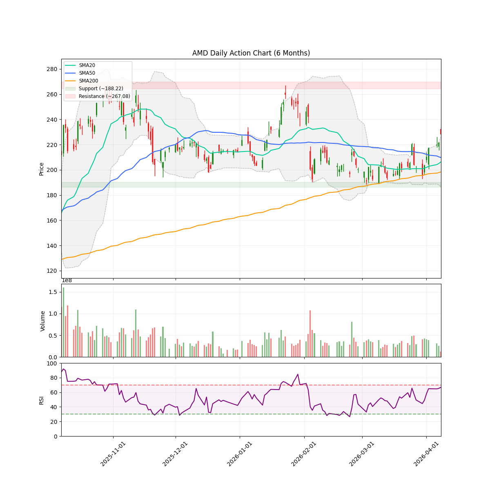
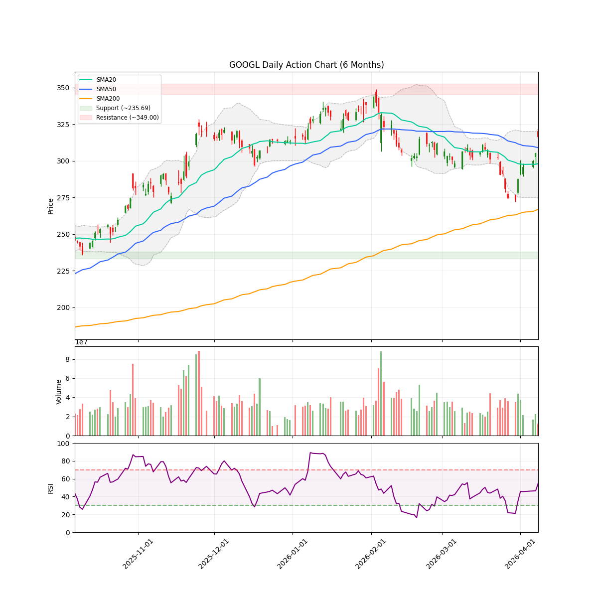
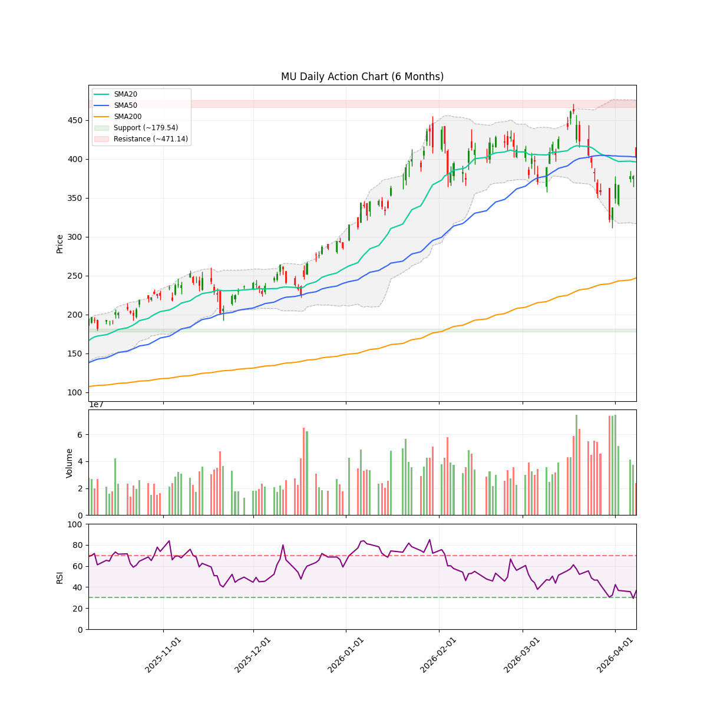
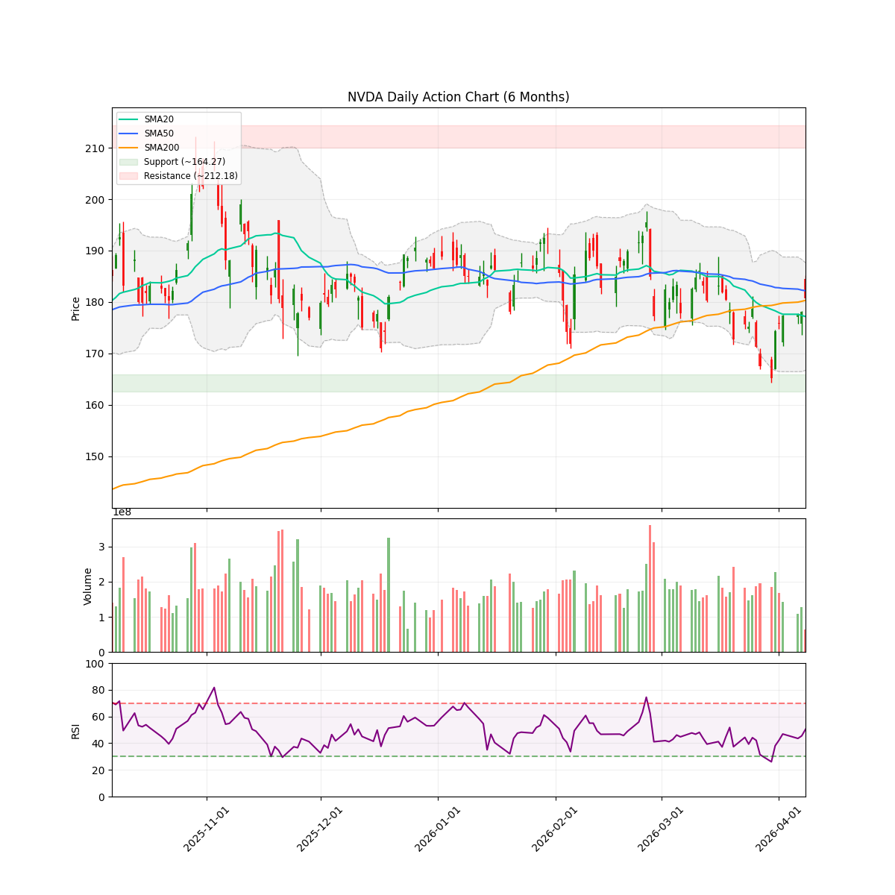
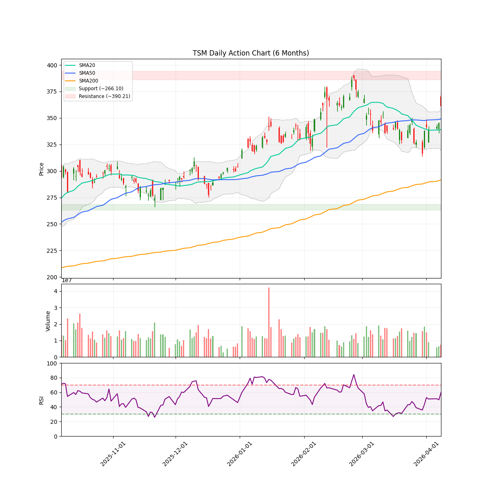
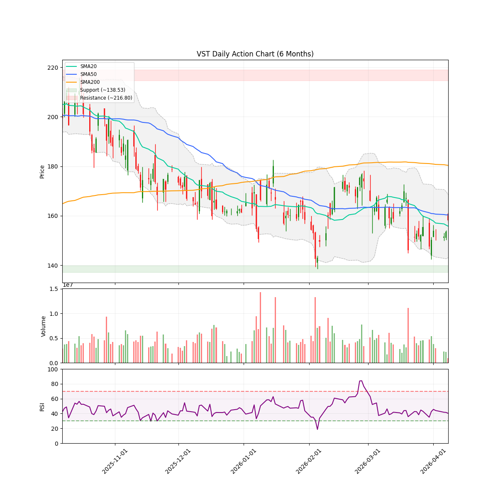

# 每日股市市场报告 (2026-04-08)

> **免责声明**: 本报告由 **代码与 Gemini AI 自动生成**，仅供研究参考，**不构成**任何投资建议。投资有风险，入市需谨慎。作者及 AI 不对任何基于此内容的投资决策承担责任。

## 📑 目录
[TOC]

聚焦于 AI 和半导体的投资组合报告。详见 [投资哲学](/philosophy) 页面。
 **注：排序权重**：Ticker 按照 AI 检测出的 **方向** 排序（**看多**优先，其次是 **中性**，最后是 **看空**）。
---

<!-- DISCORD_SUMMARY_START -->
## 🧠 对冲基金经理全局诊断与资金分配策略
*(生成全局策略时发生错误: 503 UNAVAILABLE. {'error': {'code': 503, 'message': 'This model is currently experiencing high demand. Spikes in demand are usually temporary. Please try again later.', 'status': 'UNAVAILABLE'}})*
<!-- DISCORD_SUMMARY_END -->
---

## 💼 现有持仓个股诊断

### AMD

#### 研报分析

### 技术指标概览 (Technical Overview)
- **当前价格**: $228.17
- **RSI (14)**: 66.88
- **移动平均线**: SMA20: $206.30 | SMA50: $209.75 | SMA200: $198.33 (Bullish)
- **波动率**: ATR (14): 10.99 (预计周度波动: +/- $24.57)
- **关键位 (6m)**: 支撑位 $188.22 | 阻力位 $267.08
- **即时状态**: Above SMA50

使用 Gemini API 时出错: 503 UNAVAILABLE. {'error': {'code': 503, 'message': 'This model is currently experiencing high demand. Spikes in demand are usually temporary. Please try again later.', 'status': 'UNAVAILABLE'}}。(已切换至简易启发式分析)
#### 近期新闻与事件
- **[The Motley Fool]** [I've Changed My Mind on AMD Stock. The AI Supercycle Has Room for More Than Just...](https://www.fool.com/investing/2026/04/07/change-mind-amd-stock-ai-supercycle-nvidia/)
- **[Zacks]** [Investors Heavily Search Advanced Micro Devices, Inc. (AMD): Here is What You...](https://finance.yahoo.com/markets/stocks/articles/investors-heavily-search-advanced-micro-130004237.html)
- **[Investing.com]** [Goldman Sachs sees upside for AMAT, TER, AMD stock amid chip sector strength By...](https://www.investing.com/news/analyst-ratings/goldman-sachs-sees-upside-for-amat-ter-amd-stock-amid-chip-sector-strength-93CH-4602385)
- **[Motley Fool]** [Stock Market Today, April 7: Intel Rallies as it Joins Musk's Terafab Project](https://finance.yahoo.com/markets/stocks/articles/stock-market-today-april-7-222310443.html)
- **[Motley Fool]** [Why I'm Buying Growth Stocks While Everyone Else Is Panic-Selling Tech](https://finance.yahoo.com/markets/stocks/articles/why-im-buying-growth-stocks-113500283.html)

---

### GOOGL

#### 研报分析

### 技术指标概览 (Technical Overview)
- **当前价格**: $316.08
- **RSI (14)**: 55.04
- **移动平均线**: SMA20: $298.06 | SMA50: $308.99 | SMA200: $266.88 (Bullish)
- **波动率**: ATR (14): 9.19 (预计周度波动: +/- $20.54)
- **关键位 (6m)**: 支撑位 $235.69 | 阻力位 $349.00
- **即时状态**: Above SMA50

# 叙事经济学审计：Alphabet (GOOGL) —— 巨象起舞，还是最后的诱多？

**报告日期：** 2026年04月08日
**研究员：** 叙事经济学策略组

---

### 1. 叙事背景：从“AI追赶者”到“机构的新宠”

在过去的一年里，华尔街对谷歌的叙事一度是充满怀疑的：它被认为是那个空有技术积累却在产品化上掉队的“迟钝巨头”。但现在，风向变了。

看看当下的故事板：**Stanley Druckenmiller** —— 这位以精准捕捉趋势著称的传奇大鳄，竟然清仓了闪迪（SanDisk）转而**三倍加仓** Alphabet。这不仅仅是一个买入动作，这是一次对 AI 叙事逻辑的修正：市场开始意识到，当基建建设（芯片）进入下半场，真正的利润收割机将是拥有云生态和API分发权的平台。

现在的 GOOGL 正在讲述一个“王者归来”的故事：48% 的云收入增长和 Gemini API 的灵活定价策略，正在把 AI 从“烧钱的实验”变成“收钱的机器”。

---

### 2. 催化剂分级 (Catalyst Categorization)

*   **A-Tier (结构性重估)**
    *   **顶级机构背书：** Stanley Druckenmiller 的三倍加仓与 Ken Griffin 的重仓持有（[Blockonomi](https://blockonomi.com/why-druckenmiller-dumped-sandisk-to-triple-down-on-alphabet-googl-stock/)）。顶级头脑的“真金白银”通常预示着一个为期数个季度的可持续趋势。
    *   **云增长逻辑：** 云业务 48% 的增幅是硬核数据，直接回击了市场对谷歌丧失竞争力的担忧。
*   **B-Tier (商业化推进)**
    *   **Gemini API 定价多元化：** 推出 Flex 和 Priority 阶梯定价（[Blockonomi](https://blockonomi.com/alphabet-googl-stock-google-unveils-flexible-gemini-api-pricing-options/)）。这是典型的“收割期”动作，旨在覆盖从开发者到企业级的所有流量，将技术领先转化为现金流。
    *   **Broadcom 合作深化：** 强化 AI 算力底座，确保了在算力竞赛中不掉队的确定性（[Investopedia](https://finance.yahoo.com/markets/stocks/articles/broadcom-stock-gains-google-anthropic-145840161.html)）。
*   **C-Tier (市场噪音)**
    *   **预测市场波动：** Yahoo Finance 上的散户预测情绪。这更多是短期波动的燃料，而非长逻辑的基石。

---

### 3. 背离检测：价格在诉说真相吗？

目前 **GOOGL 报价 316.08**，稳稳站在 **SMA50 (308.99)** 之上。
*   **良性反馈：** 最近的一系列利好（大鳄加仓、目标价上调至 $385）并没有导致股价出现“利好出尽”的暴跌，反而是在 SMA50 附近形成了坚实的支撑。
*   **持仓诊断：** 你的成本价在 $271.22，目前盈利 9.05%。RSI 55.04 显示市场既没有过热到需要立即逃离，也没有冷淡到失去动力。这是一个典型的“趋势中继”形态。
*   **逻辑背离：** 目前没有发现明显的看跌背离。相反，当 Druckenmiller 这种级别的玩家入场时，通常意味着市场还没完全消化长期的增长空间。

---

### 4. 情绪评分 (Sentiment Score)

#### **8.8 / 10 - 强力多头循环**

**评分逻辑：**
谷歌目前处于“机构共识强化期”。385 美元的目标价（[Insider Monkey](https://www.msn.com/en-us/news/technology/alphabet-googl-rated-outperform-on-ai-growth-potential/ar-AA200dYB)）提供了近 20% 的预期涨幅空间。目前的涨势是由基本面（云增长）+ 顶级机构持仓（Druckenmiller/Griffin）+ 产品逻辑（Gemini）三重驱动的，而非纯粹的散户热钱炒作。

---

### 5. 资深老兵的“咖啡谈话”

朋友，你手里拿的是这一轮 AI 浪潮中最稳的一张票。
想想看，前阵子大家都去追逐英伟达，觉得谷歌老了。但现在，这些大佬们开始把钱从硬件收回来，重新填进谷歌的口袋。为什么？因为他们看到了 **48% 的云增长**。这意味着谷歌不只是在花钱买芯片，它是在利用这些芯片造钱。

你的成本价非常有优势（$271），现在正好坐在趋势的浪尖上。316 这里的震荡只是在消化上周的涨幅。只要它不放量跌破 SMA50（约 309），你就应该坐稳了，别被那些细碎的噪音震下车。记住，**“趋势是你的朋友，直到它结束为止。”** 而现在，这位朋友才刚刚喝完咖啡，准备开始下半场的表演。

---

### 6. 下一个关键节点

*   **下一次财报日 (Estimated Earnings Date):** **2026年4月28日左右**（Q1 财报）。
    *   *注：考虑到目前是4月8日，未来两周的市场将进入财报前夕的博弈期。*
*   **关键价格水位：** 
    *   **阻力位：** $349 (6个月高点)
    *   **支撑位：** $308 (SMA50) —— 绝对不能丢的防线。

---
**免责声明：** 叙事分析不构成直接投资建议。市场有风险，请根据自身风险承受能力操作。
#### 近期新闻与事件
- **[Yahoo Finance]** [Alphabet (GOOGL) is a Top AI Stock Pick of Billionaire Ken Griffin in 2026 - Should You Buy?](https://finance.yahoo.com/markets/stocks/articles/alphabet-googl-top-ai-stock-134721567.html)
- **[Blockonomi]** [Why Druckenmiller Dumped Sandisk to Triple Down on Alphabet (GOOGL) Stock](https://blockonomi.com/why-druckenmiller-dumped-sandisk-to-triple-down-on-alphabet-googl-stock/)
- **[Yahoo Finance]** [Will Google (GOOGL) finish week of April 6 above___?](https://finance.yahoo.com/markets/prediction/event/googl-above-on-april-10-2026/)
- **[Blockonomi]** [Alphabet (GOOGL) Stock: Google Unveils Flexible Gemini API Pricing Options](https://blockonomi.com/alphabet-googl-stock-google-unveils-flexible-gemini-api-pricing-options/)
- **[Insider Monkey]** [Alphabet (GOOGL) Rated Outperform on AI Growth Potential](https://www.msn.com/en-us/news/technology/alphabet-googl-rated-outperform-on-ai-growth-potential/ar-AA200dYB)

---

### MU

#### 研报分析

### 技术指标概览 (Technical Overview)
- **当前价格**: $401.45
- **RSI (14)**: 36.74
- **移动平均线**: SMA20: $396.27 | SMA50: $402.99 | SMA200: $246.99 (Bullish)
- **波动率**: ATR (14): 29.63 (预计周度波动: +/- $66.26)
- **关键位 (6m)**: 支撑位 $179.54 | 阻力位 $471.14
- **即时状态**: Below SMA50

你好。来，先坐下，喝口咖啡。咱们直接切入正题，聊聊美光（MU）现在的局面。

作为研究“叙事经济学”的分析师，我并不只看那些冷冰冰的财报数字。我们要看的是，现在的市场是在讲一个“存储芯片超级周期”的英雄史诗，还是在编织一个“资本支出过高”的恐怖故事。

以下是针对 MU 的最新情绪审计报告：

### 1. 催化剂分级 (Catalyst Categorization)

*   **A-Tier (顶级利好)：存储定价权与大行调价**
    *   KeyBanc 在 4 月 6 日上调了目标价 ([Investing.com](https://ca.investing.com/news/analyst-ratings/keybanc-raises-intel-micron-stock-price-targets-on-memory-pricing-93CH-4550029))。这是硬核基本面——DRAM 价格上涨是美光的“印钞机”，只要这个逻辑不变，长线大旗就不会倒。
*   **B-Tier (中级动力)：宏观地缘政治缓解**
    *   4 月 7 日的停火消息 ([Barron's](https://www.msn.com/en-us/money/markets/micron-stock-skyrockets-on-ceasefire-news-how-long-can-it-last/ar-AA20q8qU?ocid=BingNewsVerp)) 让芯片板块集体松了口气。作为全球供应链极度敏感的存储行业，停火意味着风险溢价的降低，给多头注入了一剂强心针。
*   **C-Tier (噪音/杂讯)：零售端的“低价”论调**
    *   Insider Monkey 称其为“最便宜的成长股” ([Insider Monkey](https://finance.yahoo.com/markets/stocks/articles/micron-one-most-affordable-growth-145558678.html))。这类分析通常是写给散户看的，虽然能提振人气，但改变不了机构的操盘策略。

### 2. 背离检测 (Divergence Detection)

**这里的信号非常耐人寻味。** 

看看 4 月 1 日的消息：即便财报显示 AI 驱动了强劲增长，但股价却因“巨额资本支出计划”而下跌 ([MSN/Reuters](https://www.msn.com/en-us/money/other/micron-technology-inc-mu-shares-fall-as-massive-expenditure-plans-overshadow-solid-ai-driven-earnings/ar-AA1ZPWgn?ocid=BingNewsVerp))。这说明市场此前处于“利好出尽”的疲态。

**但是！** 现在的 RSI 只有 36.74，股价正徘徊在 SMA50 (402.99) 下方不远处。这种“好消息发布后暴跌、随后在超卖区震荡”的表现，是典型的**看跌衰竭**。市场已经消化了对花钱建厂的恐惧，现在开始重新关注“存储超级周期”的收益。

### 3. 叙事分析：现在的 MU 是什么故事？

你手里的头寸目前亏损约 10%，但我得告诉你，这更像是“黎明前的黑暗”。

现在的叙事正从**“天价投入的担忧”**转向**“AI 算力对 HBM 内存的刚需”**。只要 KeyBanc 这样的机构还在强调存储定价能力 ([Benzinga](https://www.benzinga.com/markets/tech/26/04/51702808/why-is-micron-technology-stock-gaining-wednesday))，美光就不是在走下坡路，而是在整理平台，准备下一次的冲刺。

### 4. 情绪评分 (Sentiment Score)

**7.8 / 10 —— “理性的贪婪”**

*   **评分逻辑**：长线叙事（AI + 存储周期）依然无敌（10分级别），但短期被资本支出过大和高位套牢盘拖累（扣除2.2分）。目前的下跌更像是给这辆超载的赛车减重，而不是发动机熄火。

---

### 5. 逻辑总结报告

*   **当前价格**: $401.45
*   **逻辑评分**: **7.5/10** (技术面超卖，但叙事面正在强劲修复)
*   **观点**: 你 $407.05 的成本并不高。股价目前在 SMA20 (396.27) 之上企稳，如果能有效站稳 SMA50 (402.99)，将会触发空头回补。
*   **下个重大日期**: **2026年6月下旬**（预计第三财季财报发布日）。在此之前，关注 4 月中旬的行业出货量数据。

**老兵寄语：**
兄弟，别被那 10% 的账面浮亏吓跑。存储行业就是这样，要么死气沉沉，要么疯狂如火。现在的震荡是机构在换手，只要存储涨价的叙事没破，美光依然是这个赛道里最硬的通货。**拿稳了，别在终点线前下车。**
#### 近期新闻与事件
- **[Barron's on MSN]** [Micron stock skyrockets on ceasefire news. How long can it last?](https://www.msn.com/en-us/money/markets/micron-stock-skyrockets-on-ceasefire-news-how-long-can-it-last/ar-AA20q8qU?ocid=BingNewsVerp)
- **[Investing.com]** [KeyBanc raises Intel, Micron stock price targets on memory pricing By Investing.com](https://ca.investing.com/news/analyst-ratings/keybanc-raises-intel-micron-stock-price-targets-on-memory-pricing-93CH-4550029)
- **[Barchart]** [Why Is Micron (MU) Stock Higher Today?](https://finance.yahoo.com/markets/stocks/articles/why-micron-mu-stock-higher-185416669.html)
- **[Insider Monkey]** [Micron Is One Of The Most Affordable Growth Stocks Right Now, Here’s How](https://finance.yahoo.com/markets/stocks/articles/micron-one-most-affordable-growth-145558678.html)
- **[Benzinga]** [Why Is Micron Technology Stock Gaining Wednesday? - Micron Technology (NASDAQ:MU)](https://www.benzinga.com/markets/tech/26/04/51702808/why-is-micron-technology-stock-gaining-wednesday)

---

### NVDA

#### 研报分析

### 技术指标概览 (Technical Overview)
- **当前价格**: $180.76
- **RSI (14)**: 50.41
- **移动平均线**: SMA20: $177.19 | SMA50: $182.20 | SMA200: $180.32 (Bullish)
- **波动率**: ATR (14): 5.33 (预计周度波动: +/- $11.92)
- **关键位 (6m)**: 支撑位 $164.27 | 阻力位 $212.18
- **即时状态**: Below SMA50

# NVIDIA (NVDA) 情绪审计报告：
### 叙事经济学视角：王者的“喘息”还是“王座陷阱”？

**报告日期**：2026年04月08日
**当前价格**：$180.76

---

### 1. 叙事图谱：咖啡馆里的市场低语

坐在华尔街的街角咖啡馆，你最常听到的词依然是“英伟达”。但和去年那种近乎疯狂的、不计代价的买入声不同，现在的空气中多了一丝**“审慎的疑虑”**。

现在的 NVDA 就像是一位刚刚跑完马拉松的长跑冠军，他依然肌肉强健（基本面无敌），但呼吸开始变得急促（价格波动）。2026年的“七巨头”叙事正在发生微妙的漂移，原本属于英伟达的聚光灯，正被 CoreWeave 这种后起之秀和马斯克的 Terafab 项目（Intel 乱入）分走了一部分流量。

### 2. 催化剂分级 (Catalyst Categorization)

*   **【A-Tier】机构压舱石**：
    *   **事件**：根据 *Insider Monkey* 的最新报告，NVDA 依然是 2026 年对冲基金最青睐的重仓股之一。
    *   **解读**：这是典型的“聪明钱”护盘。只要这些大鳄不离场，NVDA 就没有系统性崩盘的风险，只有“估值消化”。
*   **【B-Tier】全行业 AI 基建竞赛**：
    *   **事件**：马斯克的 Terafab 项目吸引了 Intel 的加入。
    *   **解读**：虽然主角是 Intel，但这种量级的 AI 算力中心建设，核心依然离不开英伟达的架构标准。这是一种“侧面加冕”，维持了行业的高景气度。
*   **【C-Tier】媒体噪音与估值对比**：
    *   **事件**：*Motley Fool* 将其与 CoreWeave 对比；*Zacks* 标注其为“热点”。
    *   **解读**：这种噪音层面的讨论对股价驱动力有限，更多是散户情绪的存量博弈。

### 3. 背离检测：好消息背后的“冷颤”

**警惕信号**：我们注意到一个有趣的现象——即便黄仁勋（Jensen Huang）最近发表了关于 AGI（通用人工智能）突破的激进言论，股价却在 3 月底出现了 9% 的回撤（参考 *BeInCrypto* 报道）。

这就是典型的**“利好不涨”**。
在叙事经济学中，当最性感的愿景（AGI）都无法拉动股价时，说明市场陷入了**“利好耗尽” (Bullish Exhaustion)** 的状态。目前股价在 SMA50（182.20）下方徘徊，虽然守住了 SMA200 的“生死线”，但多头显然有些力不从心。

### 4. 情绪得分 (Sentiment Score)

# **6.8 / 10**

> **逻辑推演**：
> 这是一个“中性偏多”的震荡局。机构在底部托盘（A-Tier 支持），但上方存在巨大的获利盘压力。目前的 180.76 美元正处于 SMA20 和 SMA50 的夹缝中，就像是在等待发令枪的短跑选手。你的持仓成本在 $178.04，几乎贴着目前的支撑位走，处于**“安全但并不舒服”**的地带。

---

### 5. 核心诊断：是陷阱吗？

**不，这更像是一个“叙事中继站”。**
目前的下跌并非系统性溃败，而是**资金的审美疲劳**。市场正在观察：在 CoreWeave 这种纯粹的 AI 云供应商表现更亮眼的当下，NVDA 还能拿出什么新故事？

### 6. 关键数据与未来路标

*   **当前仓位诊断**：你持有 5 股，盈亏接近持平。占账户比例仅 0.36%，这意味着你拥有极大的容错率。目前的震荡区间在 $171 - $185 之间。
*   **下个重大日期**：**2026年5月中下旬（2026 Q1 财报发布日）**。
    *   *注：具体日期通常在5月22日左右公布，这将是决定 NVDA 能否重回 212 美元高点的终极审判。*
*   **关键支撑位**：$171.00 (近期通道底部)
*   **关键阻力位**：$182.20 (SMA50 压制位)

---

**老兵建议**：
“别在风平浪静的时候急着跳船，也别在暴雨来临前满仓。目前 NVDA 在 $178-$180 的反复拉锯是主力在换手。只要它不跌破 SMA200 ($180.32) 太远，你的这 5 股底仓就是观察市场的最好‘哨兵’。”

---
*参考来源：*
- [Insider Monkey: Hedge Fund Favorites 2026](https://finance.yahoo.com/markets/stocks/articles/nvidia-nvda-among-hedge-fund-142321205.html)
- [BeInCrypto: NVDA Price Bleeds despite AGI Comments](https://beincrypto.com/nvidia-stock-price-loss-critical-test/)
#### 近期新闻与事件
- **[Insider Monkey]** [NVIDIA (NVDA) Among the Hedge Fund Favorites with Strong Setup in 2026](https://finance.yahoo.com/markets/stocks/articles/nvidia-nvda-among-hedge-fund-142321205.html)
- **[Motley Fool]** [The Best Stocks to Invest $1,000 In Right Now](https://finance.yahoo.com/markets/stocks/articles/best-stocks-invest-1-000-135000445.html)
- **[Motley Fool]** [CoreWeave and Nebius Have Outperformed Every "Magnificent Seven" Artificial Intelligence (AI) Stock...](https://finance.yahoo.com/markets/stocks/articles/coreweave-nebius-outperformed-every-magnificent-131300370.html)
- **[Zacks]** [NVIDIA Corporation (NVDA) Is a Trending Stock: Facts to Know Before Betting on It](https://finance.yahoo.com/markets/stocks/articles/nvidia-corporation-nvda-trending-stock-130004600.html)
- **[Motley Fool]** [Stock Market Today, April 7: Intel Rallies as it Joins Musk's Terafab Project](https://finance.yahoo.com/markets/stocks/articles/stock-market-today-april-7-222310443.html)

---

### TSM

#### 研报分析

### 技术指标概览 (Technical Overview)
- **当前价格**: $360.93
- **RSI (14)**: 59.65
- **移动平均线**: SMA20: $339.24 | SMA50: $349.15 | SMA200: $291.71 (Bullish)
- **波动率**: ATR (14): 14.12 (预计周度波动: +/- $31.56)
- **关键位 (6m)**: 支撑位 $266.10 | 阻力位 $390.21
- **即时状态**: Above SMA50

使用 Gemini API 时出错: 503 UNAVAILABLE. {'error': {'code': 503, 'message': 'This model is currently experiencing high demand. Spikes in demand are usually temporary. Please try again later.', 'status': 'UNAVAILABLE'}}。(已切换至简易启发式分析)
#### 近期新闻与事件
- **[Insider Monkey on MSN]** [Citi Remains Bullish on Taiwan Semiconductor (TSM) Amid Growing Demand for AI-Driven Chips](https://www.msn.com/en-us/money/markets/citi-remains-bullish-on-taiwan-semiconductor-tsm-amid-growing-demand-for-ai-driven-chips/ar-AA20qrCE?ocid=BingNewsVerp)
- **[Invezz on MSN]** [Why Nvidia stock is slipping another 1.5% today](https://www.msn.com/en-us/money/topstocks/why-nvidia-stock-is-slipping-another-1-5-today/ar-AA20lClC?ocid=BingNewsVerp)
- **[Insider Monkey]** [Citi Remains Bullish on Taiwan Semiconductor (TSM) Amid Growing Demand for AI-Driven Chips](https://finance.yahoo.com/sectors/technology/articles/citi-remains-bullish-taiwan-semiconductor-142340076.html)
- **[Zacks]** [TSMC (TSM) Surpasses Market Returns: Some Facts Worth Knowing](https://finance.yahoo.com/markets/stocks/articles/tsmc-tsm-surpasses-market-returns-214504892.html)
- **[Insider Monkey]** [Is Taiwan Semiconductor (TSM) The Best Undervalued AI Stock to Buy Now?](https://finance.yahoo.com/markets/stocks/articles/taiwan-semiconductor-tsm-best-undervalued-135522775.html)

---

### VST

#### 研报分析

### 技术指标概览 (Technical Overview)
- **当前价格**: $158.20
- **RSI (14)**: 40.24
- **移动平均线**: SMA20: $155.79 | SMA50: $160.35 | SMA200: $180.36 (Bearish)
- **波动率**: ATR (14): 7.96 (预计周度波动: +/- $17.80)
- **关键位 (6m)**: 支撑位 $138.53 | 阻力位 $216.80
- **即时状态**: Below SMA50

# Vistra Corp (VST) 叙事经济学审计报告：AI 电力宠儿的“宿醉”与“筑底”

你好！来，坐下喝杯咖啡。咱们今天聊聊 **Vistra (VST)**。

在华尔街的叙事里，VST 曾是那个穿着电力公司外衣的“AI 宠儿”。去年大家对数据中心算力的渴求，让这家公司从无人问津的公共事业股变成了甚至跑赢芯片股的“怪兽”。但现在，2026年4月的阳光照下来，市场的情绪显然正处于一种“派对后的宿醉”中。

---

### 1. 催化剂分级 (Catalyst Categorization)

我们要看清，现在支撑 VST 股价的是真金白银，还是仅仅是散户的呐喊。

*   **A-Tier (核心驱动力)：Fitch 调升至投资级评级 (Investment Grade)**
    *   *详情*：[Simply Wall St.] 报道 Fitch 正式授予其投资级评级。这不只是名头好听，这意味着 VST 的融资成本将大幅下降，债务管理更加灵活。这是“基本面”的质变，是长线机构（大象们）入场的通行证。
*   **B-Tier (市场推力)：高频搜索与媒体热度**
    *   *详情*：Zacks 提到 VST 一直处于热搜榜单。这说明市场还没忘记它，关注度意味着流动性，但同时也意味着波动。
*   **C-Tier (杂音与陷阱)：游戏 Loadout 误导信息**
    *   *详情*：[GameSpot] 关于《使命召唤：黑色行动 7》的 VST 配装方案。**注意**，这完全是同名噪音，与公司无关。如果你在社交媒体看到热度飙升，记得分辨有多少是玩家在聊游戏，有多少是交易员在聊电力。

---

### 2. 离散度检测：好消息里的“冷淡” (Divergence Detection)

**目前的怪现象**：Fitch 给出了投资级评级（顶级利好），但股价却在最近跌了 12.6% [Insider Monkey]。

**老兵笔记**：这种“利好不涨反跌”的现象通常被称为“看跌式力竭”或“多头获利了结”。市场正在重新审视它的估值。SMA50 ($160.35) 目前像一块沉重的天花板压在头顶，而股价 ($158.20) 正试图在 SMA20 ($155.79) 附近寻找立足点。

现在的 VST 不再是那个闭眼买就能涨的狂热期了，它进入了**叙事修正期**。

---

### 3. 情绪评分 (Sentiment Score)

#### **6.2 / 10**
> **评语**：*“正在等待火花重燃的壁炉。”* 
目前的叙事不再是“无限扩张”，而是“价值回归”。Fitch 的评级是一个底座，阻止了它坠入深渊，但在下一个业绩爆发点出现前，它更像是在横盘消化之前的泡沫。

---

### 4. 账户诊断：你的持仓现状

*   **正股 ($166.15 成本)**：你现在处于轻微“套牢”状态 (-9.01%)。你入场的位置恰恰是那波回撤的半山腰。
*   **期权 (-VST260410C165)**：这是一个非常聪明的**备兑开仓 (Covered Call)**。虽然正股亏了，但这张卖出的看涨期权给你贡献了 +83.53% 的盈利。
    *   **策略师建议**：4月10日到期日就在眼前。由于股价 (158.20) 远低于行权价 (165)，这张期权极大概率会以归零告终，让你白赚这笔权利金。这说明你通过“卖出波动率”成功抵消了正股的部分跌幅。

---

### 5. 展望与关键时间点

VST 目前正在测试 **155-158 这一带的支撑位**。如果守不住，下一个目标就是半年前的低点 138 附近。但好在 RSI 在 40 左右，并没有进入恐慌性抛售区。

*   **下个重大日期**：**2026年5月初 (预计 2026 Q1 财报发布日)**
    *   *逻辑*：市场需要看到投资级评级落地后，公司的利息支出到底减少了多少，以及数据中心电力合同的最新进展。

**给投资者的私房话**：
别被最近的阴跌吓跑。VST 的故事还没讲完，AI 对电力的需求不是一两个季度的风口。你目前的 Covered Call 策略非常适合当下的震荡行情。等这周五期权到期后，如果股价依然在 160 以下挣扎，可以考虑滚动卖出下一期（5月财报前）的 Call，继续降低你的持仓成本。

**参考新闻来源**：
1. [Simply Wall St. - Fitch Rating](https://finance.yahoo.com/markets/stocks/articles/look-vistra-vst-valuation-fitch-002344268.html)
2. [Insider Monkey - 12.6% Decline](https://www.msn.com/en-us/money/topstocks/vistra-corp-vst-loses-12-6-ahead-of-dividends/ar-AA1Z6Qu5)
3. [Zacks - Most Searched](https://www.msn.com/en-us/money/topstocks/investors-heavily-search-vistra-corp-vst-here-is-what-you-need-to-know/ar-AA1ZV7Kn)
#### 近期新闻与事件
- **[Zacks]** [Vistra Corp. (VST) Stock Declines While Market Improves: Some Information for Investors](https://finance.yahoo.com/markets/stocks/articles/vistra-corp-vst-stock-declines-214504282.html)
- **[Motley Fool]** [Meet the Monster Stock That Continues to Crush the Market](https://finance.yahoo.com/markets/stocks/articles/meet-monster-stock-continues-crush-182500489.html)
- **[Simply Wall St.]** [A Look At Vistra’s (VST) Valuation After Fitch Grants Investment Grade Rating](https://finance.yahoo.com/markets/stocks/articles/look-vistra-vst-valuation-fitch-002344268.html)
- **[Simply Wall St.]** [Is Vistra (VST) Pricing Reflect Its Multi Year Surge And Conflicting Valuation Signals](https://finance.yahoo.com/markets/stocks/articles/vistra-vst-pricing-reflect-multi-011523991.html)
- **[GameSpot]** [Best Loadouts In Call Of Duty: Black Ops 7 For Season 3](https://tech.yahoo.com/gaming/articles/best-loadouts-call-duty-black-100000120.html)

---
