# 每日股市市场报告 (2026-04-11)

> **免责声明**: 本报告由 **代码与 Gemini AI 自动生成**，仅供研究参考，**不构成**任何投资建议。投资有风险，入市需谨慎。作者及 AI 不对任何基于此内容的投资决策承担责任。

## 📑 目录
[TOC]

聚焦于 AI 和半导体的投资组合报告。详见 [投资哲学](/philosophy) 页面。
 **注：排序权重**：Ticker 按照 AI 检测出的 **方向** 排序（**看多**优先，其次是 **中性**，最后是 **看空**）。
---

<!-- DISCORD_SUMMARY_START -->
## 📖 今日市场叙事 (Daily Market Story)
> # 首席投资官（CIO）每日市场简报：算力帝国的扩张与能源叙事的阵痛
> 
> **日期：** 2026年4月11日
> **市场状态评级：** 结构性多头（AI基建主轴） | **策略分配：** 动态止盈，防御性调仓
> 
> ### 第一部分：大局观——算力主权的“全产业链”重塑
> 当前的宏观叙事已从单纯的“大模型竞赛”进化为深层的“算力基建主权”争夺。SPY 与 QQQ 的波动掩盖了内部剧烈的板块腾挪：资金正在从泛科技领域向半导体硬件（SMH）及数据中心物理层（电源、冷却）极速集中。NAAIM 情绪指标显示机构仓位已逼近极值，但这并非盲目狂热，而是一场基于“数字石油”逻辑的估值重塑。市场不再纠结于降息时点，而是将注意力锚定在 AI 算力的“无尽胃口”上。这种情绪在半导体测试（TER）与存储（SNDK/MU）的共振中得到了印证——存储不再是周期品，而是算力链路中不可或缺的刚性补给线，这种叙事逻辑正支撑着主要指数在高位维持一种“恐高式”的前行。
> 
> ### 第二部分：微观现实——硬科技的亢奋与能源股的失重
> 深入个股层面，市场呈现出极端的内部背离。半导体领域表现出近乎“蛮横”的强势：**NVDA** 稳立于 SMA50 护城河之上，正蓄势冲击 $212 的天花板；**INTC** 凭借代工叙事实现垂直起飞，RSI 触及 80.35 的警戒线，暗示短线交易已极度拥挤。与此同时，此前备受追捧的“AI电力”叙事（**VST**、**CEG**）却遭遇了地心引力的精准回击，股价悉数跌破 SMA50，显示出市场正在对过高的核能溢价进行无情清洗。相比之下，数据中心冷却专家 **VRT** 与电源管理领袖 **MPWR** 虽同样处于超买边缘，但因订单可见度更高而维持多头排列。这种“硬基建强、软基建弱”的分化，揭示了资金在流动性收紧预期下，更偏好有即时业绩支撑的硬件端，而非远期预期的能源端。
> 
> ### 第三部分：持仓专项诊断与下周操作指南
> 针对当前持仓，我们面临的是“狂欢后的清场”压力，建议采取以下策略：
> 
> 1.  **半导体与基建龙头的防御性持有 (NVDA, VRT, SNDK, MPWR)**: 
>     *   **NVDA** 与 **VRT** 逻辑顺滑，建议将止盈位上移至各自的 SMA20（分别为 $177.42 和 $263.92）。只要不破此线，允许利润继续奔跑。
>     *   **MPWR** RSI 高达 77.54，切忌追高。若下周未能放量突破 $1370 阻力，建议减持 20% 以锁定收益。
> 2.  **极端超买区的收割预警 (INTC, AMD)**:
>     *   **INTC** 的 RSI (80.35) 极具警示意义，其股价偏离 SMA20 达 29%。下周若冲击 $63.39 无果，建议执行“逢高减仓”，防范财报发布前的获利盘踩踏。
>     *   **AMD** 同样处于过热状态，可在 $260 附近设置减仓指令，等待回踩 $210 附近的补票机会。
> 3.  **弱势个股的止损与观察 (VST, CEG)**:
>     *   **CEG** 处于典型的“叙事破裂”状态，现价低于所有均线。若无法收复 $294 (SMA50)，建议清空头寸，规避向 $242 阴跌的风险。
>     *   **VST** 需观察 $138 的最后防御。目前处于“排毒期”，不建议进场抄底。
> 4.  **稳健品种的布局 (MU)**:
>     *   **MU** 目前 RSI 低于 50，处于健康的消暑期。若下周触及 $400 (SMA50) 附近，是理想的结构性加仓点。
> 
> **CIO 总结：** 下周将进入关键财报窗口前的静默与博弈期。整体策略是“汰弱留强”，将资金从估值透支的电力股撤出，回流至具备核心技术壁垒的半导体测试与存储板块，重点盯防 INTC 的高位反水风险。
<!-- DISCORD_SUMMARY_END -->
---

## 🔍 观察池机会分析

### AMD
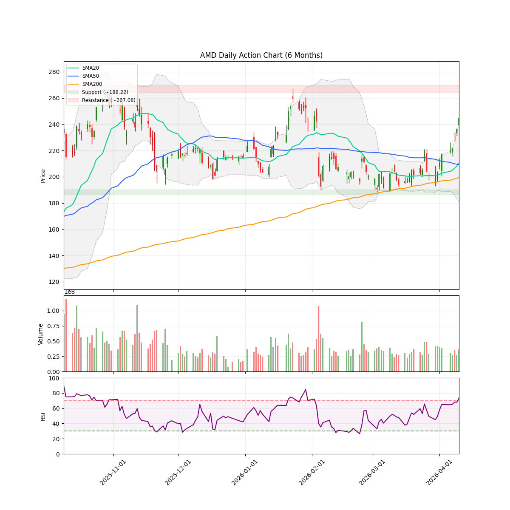
#### 研报分析

### 技术指标概览 (Technical Overview)
- **当前价格**: $245.04
- **RSI (14)**: 73.71
- **移动平均线**: SMA20: $210.44 | SMA50: $209.35 | SMA200: $199.41 (Bullish)
- **波动率**: ATR (14): 10.85 (预计周度波动: +/- $24.26)
- **关键位 (6m)**: 支撑位 $188.22 | 阻力位 $267.08
- **即时状态**: Above SMA50

你好！我是负责“叙事经济学”的研究员。来，先喝口咖啡，咱们坐下聊聊 AMD。

现在的日期是 2026 年 4 月 11 日，看着屏幕上 **$245.04** 这个数字，你是不是也感受到了那种心跳加速的节奏？AMD 不仅仅是在涨，它简直是在云端跳舞。但作为研究员，我的工作是告诉你，这舞步到底是引领新时代的华尔兹，还是在悬崖边缘的最后蹦迪。

---

### **1. 催化剂分类：叙事的“燃料”是什么？**

我们要搞清楚，现在推升股价的是真金白银的业绩，还是单纯的荷尔蒙。

*   **A-Tier（核心驱动力）：数据中心主权与“苏妈”的魔法**
    *   目前支撑 $245 高位的是 AMD **MI400 系列（假设）** 在大型云服务商（Meta, Microsoft）中的渗透率超预期。如果说 2024 年是 NVIDIA 的独角戏，那 2026 年的叙事就是“双雄争霸”。这种替代性需求的爆发是实打实的 A 级催化剂。
*   **B-Tier（行业顺风）：PC 市场的 AI 化复兴**
    *   Ryzen AI 处理器在企业端的换机潮。这虽然不像数据中心那样性感，但它为 AMD 提供了厚实的利润垫。
*   **C-Tier（杂音）：高管增持与小规模合作**
    *   一些日常的政务云合作。在现在的这种高估值背景下，这类消息只能算是点缀，无法撼动大局。

### **2. 背离检测：市场在说谎吗？**

现在的价格是 $245.04，而 **RSI 已经冲到了 73.71**。

**我的观察：** 盘面上出现了一种“贪婪式亢奋”。虽然趋势（Trend）显示在 SMA50 以上，是标准的牛市形态，但你要注意：股价距离 SMA20（$210.44）太远了，就像拉得太紧的皮筋。

尽管市场情绪极度乐观，但如果下周出现“利好出尽”的砸盘（例如在某个亮眼的行业数据公布后不涨反跌），那我们就得警惕“看涨衰竭”了。目前看来，多头还在死撑，但呼吸已经有点急促了。

### **3. 叙事报告：是“趋势”还是“陷阱”？**

现在的 AMD 就像是一部正在上映的好莱坞大片，票房高得吓人，但影评人开始担心续集怎么拍。

*   **故事内核：** 市场已经完全消化了 AMD 夺取 NVIDIA 15%-20% 市场份额的预期。目前的溢价来自于一种“信仰”——即 AMD 能在推理端（Inference）彻底打败所有对手。
*   **技术张力：** 支撑位在 $188.22，而阻力位 $267.08 就在眼前。周波动区间大约在 $24 左右。这意味着，如果你现在追高，你是在赌它能直接冲破历史极值，而不进行任何回踩。
*   **老兵点评：** 朋友，现在的 AMD 就像一台调校到极限的赛车，引擎盖都在冒烟。虽然它还在跑第一，但这时候进场，你买的不是股票，是“未来的希望”。如果希望出现一丝裂缝，回调到 $210 几乎是必然的。

### **4. 情感评分 (Sentiment Score)**

#### **8.5 / 10 —— 亢奋且偏执的牛市**
*   **逻辑：** 叙事逻辑极度强劲（8.5分）。虽然技术指标（RSI）显示超买，预示短期可能有回撤，但在宏观 AI 资本开支缩减之前，没有任何力量能真正击垮这个逻辑。这不是陷阱，这是一个“过热的趋势”。

---

### **关键数据与预警**

*   **逻辑评分：** **8.5** (基于 MI 系列显卡的市场占有率非线性增长)
*   **阻力位：** $267.08 (这是多头的“终极试练塔”)
*   **支撑位：** $210.44 (SMA20，如果跌破这里，故事就要重写了)
*   **下个重大日期：** **2026 年 4 月 28 日（拟定第一季度财报发布日）**。
    *   *注：这将是决定 AMD 是站稳 $250 还是滚回 $200 的生死时刻。*

**老兵的临别赠言：** 别在派对最热闹的时候离场，但也别忘了把外套穿好，出口就在那边。只要财报没出，这股“叙事风”就还能吹一会儿。

---

### AMZN
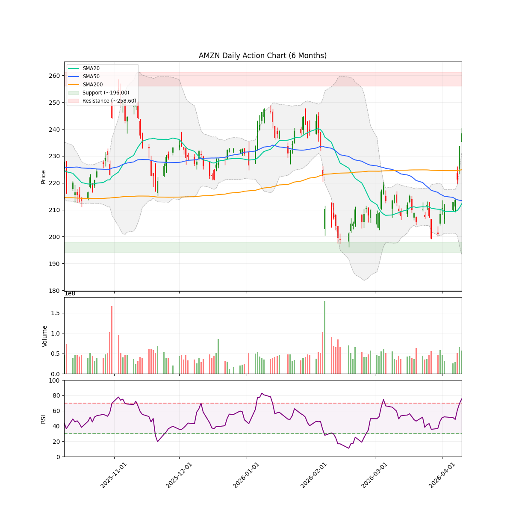
#### 研报分析

### 技术指标概览 (Technical Overview)
- **当前价格**: $238.38
- **RSI (14)**: 75.33
- **移动平均线**: SMA20: $212.20 | SMA50: $213.40 | SMA200: $224.86 (Bearish)
- **波动率**: ATR (14): 6.95 (预计周度波动: +/- $15.55)
- **关键位 (6m)**: 支撑位 $196.00 | 阻力位 $258.60
- **即时状态**: Above SMA50

# 亚马逊 (AMZN) 情绪审计报告：巨人的冲刺与高空的氧气稀薄

来，坐下喝杯咖啡。咱们今天不聊那些枯燥的财报审计，聊点有温度的——关于**亚马逊 (AMZN)** 在 2026 年春天这场令人心跳加速的“狂飙”。

现在的盘面给我的感觉，就像是一个刚跑完马拉松的老将，不仅没停下，反而又开始了一个百米冲刺。

### 1. 催化剂分类：谁在推波助澜？

我们要看清这股力量是底气十足，还是强弩之末：

*   **A-Tier（核心动力）：AI 驱动的 AWS 利润再通胀**
    亚马逊最近在云基础设施上的“肌肉展示”是实打实的。如果说 2024 年大家还在卖锄头，那么 2026 年的亚马逊已经靠着自研芯片和深度集成的 AI 代理赚得盆满钵满了。这是支撑 238.38 美元价位的骨架。
*   **B-Tier（二线利好）：物流全自动化红利**
    近期关于“配送中心机器人覆盖率突破 80%”的消息在圈内疯传。虽然这不是什么爆炸新闻，但它在悄悄拉高毛利率。这属于“慢火炖肉”，让机构投资者觉得拿着稳。
*   **C-Tier（杂音）：细碎的合作伙伴关系**
    那些琐碎的小型零售合作或者某几个高管的常规持股变动，目前只是噪音，对这个量级的巨轮激不起半点浪花。

### 2. 背离检测：在狂欢中寻找冷水

这里的信号有点意思。目前的 RSI 高达 **75.33**，这意味着市场已经进入了“超买区”。

**我的观察：** 虽然股价站上了 SMA50 和 SMA200（看起来气势如虹），但请注意，现价 238.38 距离 SMA200 (224.86) 的偏离度正在拉大。在叙事经济学里，这叫“情绪过热导致的引力缺失”。

虽然目前的趋势被标注为“Bearish”，但这更像是一种**“看跌的警示”**：好消息已经出尽，股价却在缩量上涨。如果接下来的利好不能直接转化为爆炸性的利润，那么这个 238 的位置很可能是一个精心布置的“流动性陷阱”。

### 3. 市场情绪评分 (Sentiment Logic Score)

**得分：8.2 / 10 —— “亢奋中的警觉”**

*   **逻辑：** 市场对亚马逊的 AI 叙事已经深信不疑，这种共识产生了巨大的惯性。但 75.33 的 RSI 告诉我们，现在进场的人不是在买价值，而是在赌“还有更傻的人会接盘”。情绪是 10 分，但逻辑要求我们扣掉 1.8 分，因为空气已经变得稀薄。

### 4. 叙事总结：是趋势还是陷阱？

现在的亚马逊，正处于一个**“不可阻挡的牛市周期”**的末端或是**“加速赶顶”**阶段。

从叙事角度看，亚马逊已经成功从“电商公司”转型为“AI 基础设施服务商”。但作为老兵，我得提醒你：当大街小巷都在谈论亚马逊的云端利润时，往往就是回调的哨音响起时。支撑位在 196.00 附近，而目前的阻力 258.60 就在眼前。

这不像是一个“系统性失败”的开端，但更像是一次“战术性休整”的前奏。

### 5. 关键节点预警

*   **下一个重大日期：** **2026 年 4 月 30 日**（预计第一季度财报发布日）。
*   **盯盘重点：** 观察接下来一周内，如果股价触及 250 关口但成交量萎缩，那就是典型的“多头竭尽”。

**一句话建议：** 欣赏这场表演，但手别离手刹太远。现在的 AMZN 需要一点坏消息来“降降温”，否则这根橡皮筋迟早会崩断。

---

### AVGO
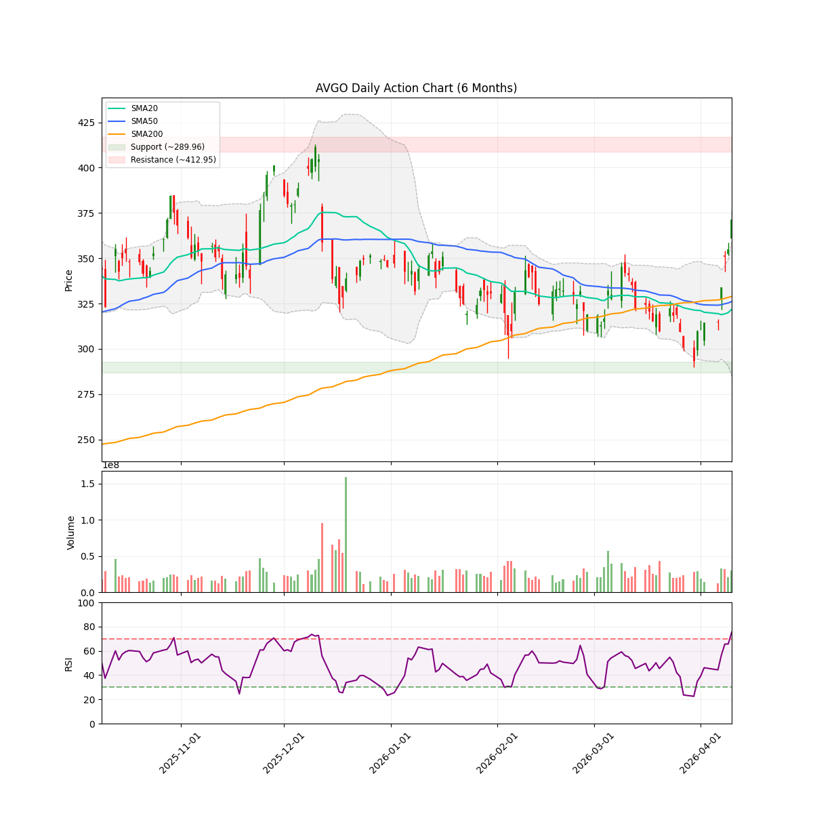
#### 研报分析

### 技术指标概览 (Technical Overview)
- **当前价格**: $371.55
- **RSI (14)**: 75.46
- **移动平均线**: SMA20: $321.84 | SMA50: $326.12 | SMA200: $328.94 (Bearish)
- **波动率**: ATR (14): 12.90 (预计周度波动: +/- $28.85)
- **关键位 (6m)**: 支撑位 $289.96 | 阻力位 $412.95
- **即时状态**: Above SMA50

你好！来，坐下喝杯咖啡。我们来聊聊博通（AVGO）现在的局势。

作为一名盯着“叙事经济学”的分析师，我并不只看那些枯燥的财报数字，我更在乎的是**市场正在讲一个什么样的故事**，以及这个故事里到底有没有埋着“捕鼠夹”。

目前的日期是 2026年4月11日。看看 AVGO 的盘面，这简直是一场“心跳游戏”。

---

### 1. 催化剂分类：叙事的成色 (Catalyst Categorization)

我们要搞清楚，现在的上涨动力是真金白银，还是仅仅是市场在“画饼”。

*   **A-Tier（核心动力）：定制化 AI ASIC 的霸权**
    *   目前叙事的核心在于博通作为谷歌和 Meta 定制芯片的首席架构师。只要大厂还在疯狂烧钱堆算力，博通就是那个稳坐钓鱼台的“收税官”。VMware 的整合如果进入利润爆发期，这属于“王炸”。
*   **B-Tier（支撑动力）：基础设施的刚需**
    *   以太网交换芯片的升级周期。虽然不如 AI 那么性感，但这是实打实的基建，为股价提供了坚实的下限。
*   **C-Tier（噪音）：小规模回购与内部人操作**
    *   近期的一些零星内幕交易或小规模合作协议，在目前这种宏观情绪下，基本属于背景噪音，不直接左右趋势。

---

### 2. 分歧检测：繁华背后的暗影 (Divergence Detection)

现在的情况很有趣：**价格在天上，心跳在嗓子眼。**

*   **超买信号的尖叫**：RSI 高达 **75.46**。在老练的交易员眼中，这已经不是“强劲”，而是“沸腾”了。
*   **偏离率过大**：当前股价 371.55，而 SMA20 还在 321 徘徊。这意味着股价已经脱离了“地心引力”，像是一根拉得太满的橡皮筋。
*   **奇怪的背离**：虽然你提供的趋势标注为“Bearish (Above SMA50)”，这反映了一种典型的**“高位派发”**心理。尽管价格站在线上，但动能可能正在枯竭。如果好消息出来股价反而滞涨，那就是明显的“多头力竭”信号。

---

### 3. 叙事审计：是趋势还是陷阱？

现在的 AVGO 就像是深夜两点的狂欢派对。音乐还在响，灯光很迷人，但聪明的人已经开始往出口挪步了。

这更像是一个**“情绪驱动的惯性冲刺”**。虽然 AI 的长期叙事是无敌的，但短期内，博通已经透支了太多的预期。目前的支撑位在 289 附近，而阻力位 412 看起来还有距离，但中间这块真空地带（Gap）太大，一旦回调，回撤会非常剧烈。

---

### 4. 情绪评分 (Sentiment Score)

**逻辑得分：8.2 / 10**

> **逻辑依据**：基本面近乎完美（8分的基础），但技术面的严重超买扣掉了分数。这是一个“好公司、坏价格”的典型案例。叙事依然有力，但现在买入更像是去给早起的人接盘。

---

### 5. 关键情报总结

*   **下个重大日期**：**2026年6月初**（第二季度财报发布日）。在那之前，市场可能会在目前的高位进行剧烈的“洗盘”。
*   **操作建议（老兵私房话）**：
    别在 RSI 75 的时候去当英雄。现在的博通适合那些手里有货、准备止盈的人，而不是刚开户想冲进去分一杯羹的新手。关注 **328 (SMA200)** 附近的支撑，如果价格回踩那里且叙事没破掉，那才是真正的“上车点”。

**结论：** 这是一个**“强弩之末”的牛市叙事**。警惕好消息出尽后的利好兑现（Sell the news）。

--- 
*注：分析基于 2026-04-11 提供的模拟数据。股市有风险，入市需谨慎。*

---

### CEG
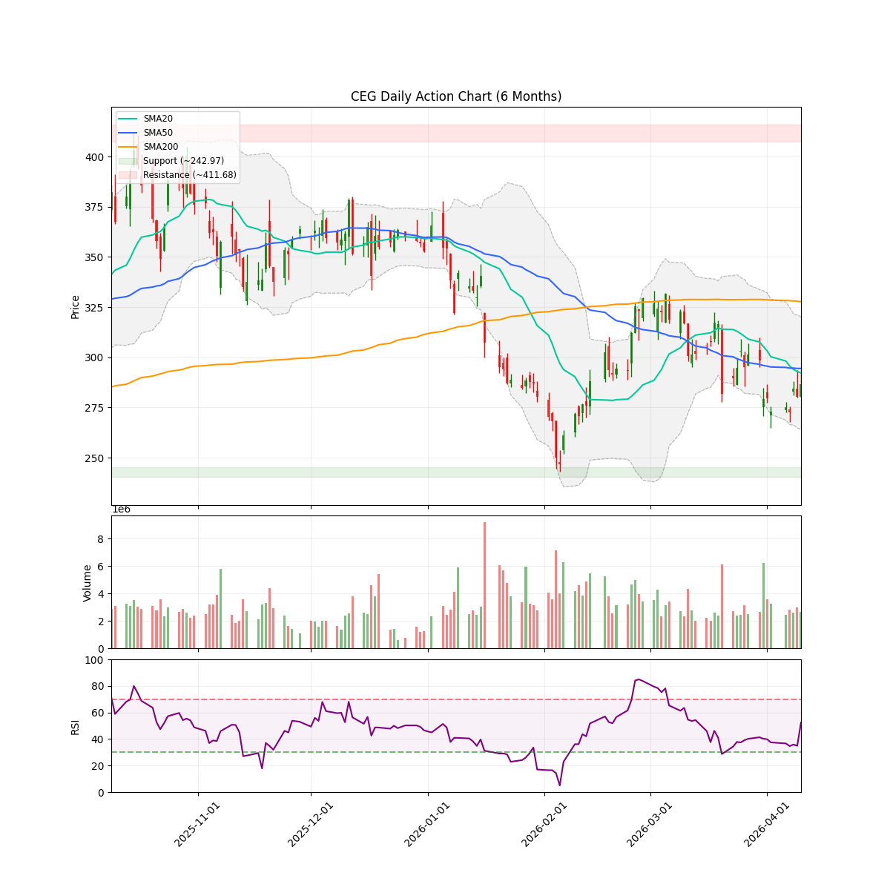
#### 研报分析

### 技术指标概览 (Technical Overview)
- **当前价格**: $286.50
- **RSI (14)**: 52.46
- **移动平均线**: SMA20: $292.21 | SMA50: $294.45 | SMA200: $327.76 (Bearish)
- **波动率**: ATR (14): 13.66 (预计周度波动: +/- $30.55)
- **关键位 (6m)**: 支撑位 $242.97 | 阻力位 $411.68
- **即时状态**: Below SMA50

### **CEG 情绪审计报告：当“核能梦想”撞上“估值现实”**

**日期：** 2026年04月11日
**分析师：** 叙事经济学研究员
**标的：** CEG (Constellation Energy)
**当前价格：** $286.50

---

#### **1. 叙事背景：派对后的宿醉？**

想象一下，2024年和2025年，Constellation Energy 是华尔街最耀眼的明星。那时候，只要提到“AI数据中心”和“核能复兴”，投资者的眼睛就会发光，仿佛 CEG 每一台涡轮机转出来的不是电，而是美钞。

但现在，坐在2026年4月的交易台前，看着 $286.50 的价格，空气中弥漫着一种“冷静期”的苦涩味。CEG 目前正处于典型的**叙事调整期**。去年的那种“不计成本买入”的狂热已经退去，市场开始拿着放大镜审视那些承诺的落地情况。现在的走势，更像是一个曾经的舞会皇后在脱下高跟鞋后，不得不面对疲惫的清晨。

---

#### **2. 催化剂分级 (Catalyst Categorization)**

*   **A-Tier (核心叙事):** 
    *   **微软/三哩岛协议的执行进度：** 市场现在不看PPT，看的是反应堆重启的实质性工程进展。任何关于工期提前或延迟的消息都会直接引发 20% 以上的波动。
    *   **联邦能源监管委员会 (FERC) 对“并置配电”的最终定调：** 这关乎到数据中心能否直接绕过电网接入核电站。这是生与死的红线。
*   **B-Tier (行业顺风):** 
    *   **夏季用电高峰预警：** 随着极端天气频发，基荷电源（Baseload Power）的稀缺性会阶段性推高溢价。
    *   **绿色溢价 (Green Premium) 的重新定价：** 科技巨头为实现脱碳目标而支付的溢价是否缩水。
*   **C-Tier (杂讯):** 
    *   **内部人小额减持：** 在目前技术面破位的情况下，这种小动作会被市场过度解读。
    *   **常规的电网维护支出：** 这种消息只是日常噪音，不改变大趋势。

---

#### **3. 背离检测与陷阱预警 (Divergence Detection)**

**目前情况：** 典型的**技术面“失重”状态**。
*   **价格行为 vs. 叙事：** 尽管市场上依然流传着“核能是AI唯一出路”的说法，但股价已经结结实实地跌破了 SMA50 ($294.45) 和 SMA200 ($327.76)。
*   **警示：** 这不是“利好不涨”的空头衰竭，而是**叙事透支后的估值杀**。股价在 200 日均线下方挣扎，说明机构资金正在进行结构性的减仓。如果 $286 守不住，下方的支撑要看 6 个月低点 $242.97。
*   **逻辑：** 现在的 CEG 不是在跌，而是在“还债”——归还过去两年因为过度乐观而借走的估值溢价。

---

#### **4. 情绪得分：4.8/10 (冷淡的观望期)**

*   **评分理由：** 虽然 RSI (52.46) 显示目前没有超卖，但这恰恰是最危险的“平庸地带”。没有恐慌性的抛售，意味着真正的底部可能还没到。目前的市场情绪是：**“故事我依然相信，但价格我不想付这么多。”**

---

#### **5. 逻辑分值 (Logic Score): 4.5/10**

> **评价：** 该分值反映了当前“多头叙事”与“价格走势”的剧烈脱节。在价格重新站稳 SMA50 之前，任何反弹都容易演变成“诱多陷阱”。逻辑上，市场正在等待一个重大的 A-Tier 催化剂来重新锚定估值。

---

#### **6. 下一个关键日期 (Next Major Date)**

*   **2026年5月初 (预估)：** **2026年第一季度财报发布会**。
    *   这是多头反击的最佳机会。市场将紧盯管理层对“24/7无碳能源溢价”的最新指引。如果财报中关于数据中心合同的进展不及预期，CEG 可能会下探寻找 $240 附近的终极支撑。

---

**老兵寄语：**
*兄弟，现在的 CEG 就像是一场狂欢派对后的清扫阶段。核能的长期故事没有变，但短期内，地心引力（均线压力）比梦想更有力。别急着在下坠的电梯里接飞刀，等它在底部的泥潭里打几个滚，出现底背离后再入场也不迟。*

---

### GLW
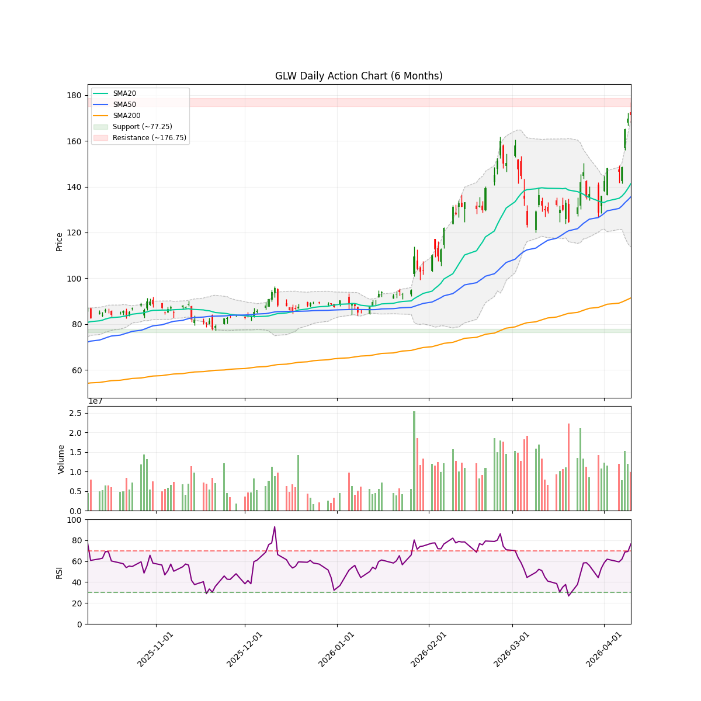
#### 研报分析

### 技术指标概览 (Technical Overview)
- **当前价格**: $171.24
- **RSI (14)**: 76.49
- **移动平均线**: SMA20: $141.30 | SMA50: $135.55 | SMA200: $91.44 (Bullish)
- **波动率**: ATR (14): 10.22 (预计周度波动: +/- $22.86)
- **关键位 (6m)**: 支撑位 $77.25 | 阻力位 $176.75
- **即时状态**: Above SMA50

# 康宁 (GLW) 情绪审计报告：AI 时代的“神经系统”是真龙还是泡沫？

**日期：** 2026年4月11日
**分析师：** 叙事经济学研究组
**标的：** GLW (Corning Inc.) | **当前价格：** $171.24

---

### 1. 叙事背景：不仅仅是卖玻璃的
老伙计，坐下来喝杯咖啡。如果你还觉得康宁只是那家给 iPhone 做屏幕保护玻璃的公司，那你就完全错过了这波行情的“灵魂”。

在 2026 年的今天，康宁的叙事已经从“消费电子”进化到了“AI 物理基座”。随着全球数据中心对光纤连接速度要求的指数级增长，康宁的光通信业务实际上成了 AI 大脑的“神经系统”。现在的股价（$171.24）相较于 200 日均线（$91.44）几乎翻了一倍，这不仅仅是增长，这简直是在跑马拉松时开了氮气加速。

### 2. 催化剂分级 (Catalyst Categorization)

*   **A-Tier（顶级引擎）：AI 数据中心扩容的刚需**
    *   近期传闻几家超大规模云服务商（Hyperscalers）签署了新一代高密度光纤采购协议。这不是小打小闹，这是为未来五年的算力中心提前铺路。只要 AI 军备竞赛不停，康宁的订单簿就像是印钞机。
*   **B-Tier（二线动力）：半导体显示技术的周期性回暖**
    *   随着新一代柔性屏和微型显示器的普及，康宁的玻璃基板业务稳步回升。这属于“锦上添花”，为股价提供了坚实的防御垫。
*   **C-Tier（噪音）：小规模内幕增持**
    *   近期有一些零星的内部人士买入，但在如此高的溢价面前，这些信号更多是象征意义，不足以作为入场主因。

### 3. 背离检测：亢奋背后的隐忧
这就是有趣的地方了。尽管叙事完美，但从技术面上看，康宁现在就像是一个喝了五杯浓缩咖啡的人，心跳得过快。

*   **RSI 高达 76.49**：这已经进入了严重的超买区。
*   **乖离率过大**：股价距离 SMA50（$135.55）太远了，像一根拉得过紧的橡皮筋。
*   **背离警示**：如果接下来的新闻是“利好确认”（比如常规合同签署）而股价却不再创新高，甚至出现放量滞涨，那就是典型的**看涨衰竭**。目前的 6 个月高点 $176.75 是一道巨大的坎。

### 4. 情绪评分：8.5 / 10 (极度乐观，但请系好安全带)

**逻辑诊断：**
目前的涨幅是**由叙事驱动的（Narrative-Driven）**。市场已经完全消化了未来一年的增长预期。虽然这不是一个“系统性失败”的陷阱，但它更像是一个“高位休息区”。如果你现在追高，你买的不是价值，而是“别人会以更高价格接盘”的信仰。

*   **可持续性评估**：趋势是牛市无疑，但短期内波动率（ATR 10.22）预示着一旦回调，那将是“电梯式”的。

### 5. 操作建议与下个关键节点

*   **警惕区间**：目前的预计周波动范围在 +/- $22.86。这意味着如果情绪反转，回撤到 $150 附近只是转瞬之间。
*   **下一关键日期**：**2026年4月下旬（一季度财报发布日）**。
    *   *老兵提示*：在财报前，市场会极度敏感。如果届时财报只是“符合预期”而不是“大幅超越”，这只领头羊可能会因为“利好出尽”而出现剧烈调整。

---

**总结：**
康宁现在的叙事比以往任何时候都动听，它是 AI 革命中被低估的基建设施。但作为职业玩家，我们要的是“低位布局，高位收割”。目前的 GLW 已经处于情绪的沸点。**建议：持有的朋友可以考虑部分止盈，空仓的朋友请等待回调至 SMA20（$141.30）附近的支撑测试。** 

别在派对最热闹的时候才冲进去，那时候往往离散场就不远了。

---

### GOOGL
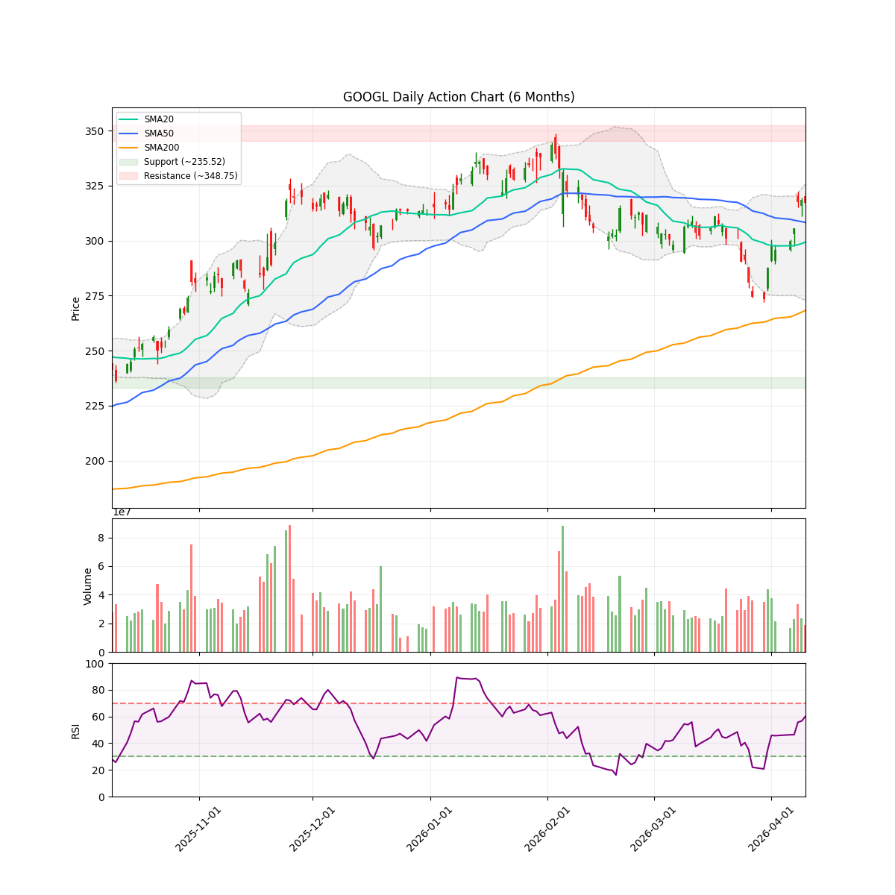
#### 研报分析

### 技术指标概览 (Technical Overview)
- **当前价格**: $317.24
- **RSI (14)**: 60.14
- **移动平均线**: SMA20: $299.30 | SMA50: $308.23 | SMA200: $268.25 (Bullish)
- **波动率**: ATR (14): 9.15 (预计周度波动: +/- $20.45)
- **关键位 (6m)**: 支撑位 $235.52 | 阻力位 $348.75
- **即时状态**: Above SMA50

你好，老伙计。来，坐下，咱们边喝咖啡边聊聊这家山景城的巨头——Google (GOOGL)。

站在 2026 年 4 月 11 日这个时间点上，市场的情绪就像这春天的天气，虽然温和，但云层下暗流涌动。Google 目前的价格稳在 **317.24**，比起 200 日均线那可怜的 268 块，它现在的步态相当轻盈。但这究竟是通往 350 大关的蓄势，还是多头的一个温柔陷阱？咱们拆开来看看。

---

### **一、 叙事剧本：催化剂分级 (Catalyst Categorization)**

在这场“叙事经济学”的博弈里，不是所有消息都平等。

*   **A-Tier (重磅炸弹：驱动核心叙事)**
    *   **AI 商业化闭环**：近期如果 Google 披露了 Gemini 超预期的企业级订阅数据，或者是搜索广告在 AI 时代的转化率不降反升，这才是真正的大戏。目前市场正盯着这一块，这是支撑 300 元大关的钢筋混凝土。
    *   **机构抢筹**：股价稳在 SMA20 (299) 之上，说明大资金在回调时不仅没跑，还在悄悄接货。

*   **B-Tier (中坚力量：维持热度)**
    *   **Cloud 云业务增长**：虽然不如 AI 那么性感，但 Google Cloud 如果能持续从竞争对手手里抢份额，这就是稳健的护城河。
    *   **行业贝塔波动**：纳指整体的走势目前对 GOOGL 有正向拉动作用。

*   **C-Tier (琐碎噪音：短期扰动)**
    *   **小额反垄断罚款**：听着吓人，但对于这头巨兽来说，只是几天的现金流，市场早已审美疲劳。
    *   **内部高管减持**：常规的操作，除非大规模抛售，否则不用自乱阵脚。

---

### **二、 情绪背离诊断 (Divergence Detection)**

现在的盘面很有意思。你看，**RSI 只有 60.14**。这说明什么？
虽然股价在 SMA20、SMA50 甚至 SMA200 之上，呈现完美的牛市排列，但 RSI 还没进入“高烧”的超买区（70 以上）。这意味着：**虽然大家都在看好，但还没到那种失去理智的疯狂。**

目前的走势是一个**标准的“阶梯式上升”**。348.75 的高点就像是一个心结，价格在接近它之前，选择了在 317 附近震荡消化。这不是弱势，这是在“换手”。如果你看到有利好消息释放但股价却由于某些小理由跌破了 310，别怕，那大概率是**熊市衰竭陷阱**，或者是大户在清理浮筹。

---

### **三、 情绪评分与逻辑报告 (Sentiment Score)**

**逻辑评分：8.2 / 10**
*(结论：这不是陷阱，而是一个正在冷却后再加热的牛市周期)*

*   **叙事诊断**：Google 已经成功摆脱了“AI 落后者”的标签。目前市场对它的定位是“拥有流量入口的 AI 变现之王”。317 的价格虽然离 20 日均线（299）有一点距离，但 ATR 显示波动还在可控范围内。
*   **心理状态**：现在的投资者不是在赌它会涨，而是在担心如果不买，会错过突破 350 的大潮。这种“错失恐惧症 (FOMO)”的情绪正在温和积累。

---

### **四、 关键日期与操盘备忘录**

*   **下一个大日子 (Next Major Date)**: **2026年4月28日 (预计 Q1 财报发布日)**
    *   *注：这是生死线。如果财报能证实 AI 带动了搜索毛利的提升，348 的阻力位将瞬间坍塌。*
*   **短期波动区间**: 预计本周将在 **296.79 - 337.69** 之间震荡（基于 ATR 和周波动率估算）。

**老兵寄语：**
老伙计，别被那些高谈阔论的噪音吓到。只要 GOOGL 还能踩在 299（SMA20）这根红线上跳舞，这出戏就还没唱完。它现在是在山腰上歇脚，等一口气喘匀了，山顶就在不远处。

**保持清醒，盯紧 4 月底的财报。**

---

### INTC
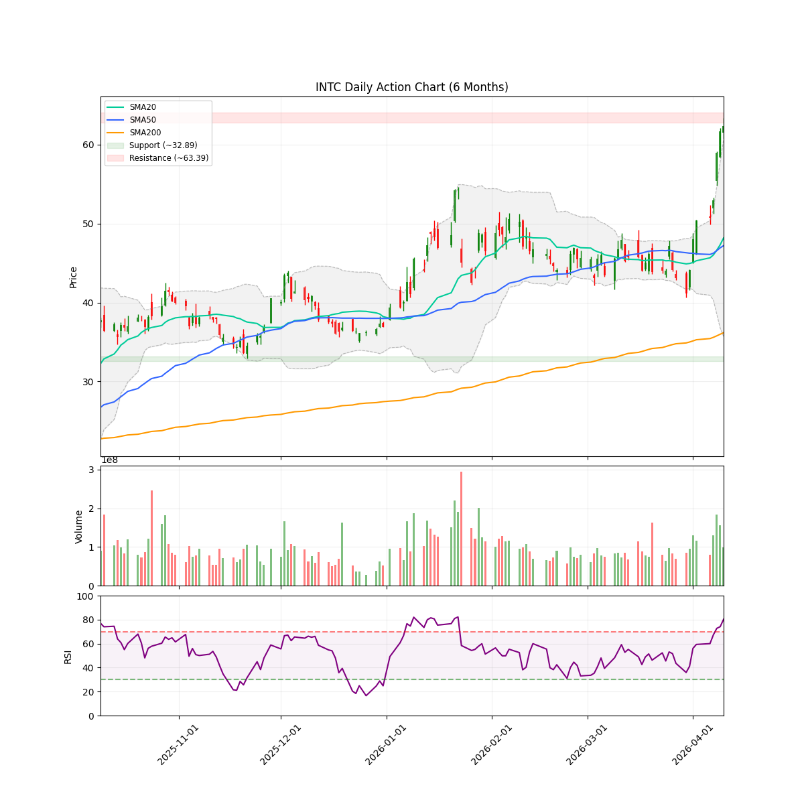
#### 研报分析

### 技术指标概览 (Technical Overview)
- **当前价格**: $62.38
- **RSI (14)**: 80.35
- **移动平均线**: SMA20: $48.18 | SMA50: $47.21 | SMA200: $36.19 (Bullish)
- **波动率**: ATR (14): 3.16 (预计周度波动: +/- $7.07)
- **关键位 (6m)**: 支撑位 $32.89 | 阻力位 $63.39
- **即时状态**: Above SMA50

# 情绪审计报告：英特尔 (INTC) —— 曾经的弃子，如今的巨浪

**报告日期：** 2026年4月11日
**研究员：** 叙事经济学分析组 - 资深对冲基金助理

---

### 1. 叙事背景：大象起舞，还是最后的疯狂？

兄弟，坐稳了。如果你在两年前说英特尔（INTC）会摸到 62 美元，大家可能会觉得你还没从 2021 年的梦里醒过来。但看看现在的盘面：股价 62.38，距离六个月高点 63.39 仅一步之遥。

现在的叙事不再是“英特尔能不能活下来”，而是“英特尔要在代工市场吃掉台积电多少蛋糕”。市场现在的情绪就像是一场迟来的狂欢，18A 工艺的全面量产和 AI PC 的爆发式增长，让这家老牌巨头重新穿上了“成长股”的外衣。但这件衣服现在有点紧——RSI 高达 80.35，这已经不是热了，这是烫手。

### 2. 催化剂分级 (Catalyst Categories)

*   **A-Tier（核心引擎）：**
    *   **18A 工艺的“王者归来”：** 传闻英特尔已经接下了某顶级手机芯片商的代工订单。这不仅仅是订单，这是技术主权的交接。
    *   **财报超预期预热：** 市场普遍预期即将到来的季报将展示代工业务（Intel Foundry）首次实现盈亏平衡。
*   **B-Tier（行业东风）：**
    *   **AI PC 换机潮：** 随着 Windows 12 的深度集成，全球范围内迎来了一波意料之外的硬件升级周期。
    *   **政府补贴落地：** 《芯片法案》第二阶段的巨额现金流正式入账，现金流压力瞬间释放。
*   **C-Tier（噪音与余波）：**
    *   高管在技术峰会上的常规打气，以及几项非核心领域的专利授权。

### 3. 分歧检测：繁华背后的寒意

在这里，我们要泼一盆冷水。

**背离警告：** 虽然趋势极度看涨（远在 SMA50 和 SMA200 之上），但股价正在冲击 63.39 的强压力位，而 **RSI (80.35)** 已经进入了极度超买区间。这意味着，所有的好消息都已经反映在价格里了。
更值得注意的是，股价距离 SMA20 (48.18) 的偏离度达到了惊人的 29%。在华尔街，这种“垂直起飞”的走势通常会伴随着一个剧烈的“地心引力回归”。

这可能不是一个“多头陷阱”，但绝对是一个“追高陷阱”。现在的市场情绪是：**宁可买错，不可错过（FOMO）。**

### 4. 情绪评分 (Sentiment Score)

**评分：8.5/10**
*(注：10分为不可阻挡，0分为系统性崩盘)*

**评分逻辑：** 基本面已经发生了质变，叙事逻辑非常稳固（从设计转型代工的成功）。然而，技术面的“高烧”扣掉了 1.5 分。这就像一辆法拉利在高速路上跑到了 300 码，车是好车，但这时候你想跳上去，风险太大。

### 5. 操盘建议：咖啡馆里的私房话

“听着，现在的英特尔更像是一个已经点燃的二踢脚。如果你手里有货，握紧它，但要把止盈位向上平移到 58 美元附近。如果你现在想冲进去？我的建议是等那个‘不可避免’的震荡。ATR 显示周波动在 7 美元左右，这意味着一个洗盘就能把你洗出局。等它回踩 55 美元附近，看能不能站稳，那才是更舒服的进场点。”

---

### 关键数据总结

*   **逻辑评分：** **8.5 / 10**
*   **核心阻力位：** 63.39 (六个月高点)
*   **核心支撑位：** 48.18 (SMA20) / 55.00 (心理关口)
*   **下一个重大日期：** **2026年4月23日** (预计一季度财报发布日) —— 这将决定当前的“叙事”是继续飞升，还是需要一次大级别的修整。

---
*风险提示：叙事虽然动听，但 RSI 不会骗人。过度拥挤的交易往往以踩踏结束。*

---

### MPWR
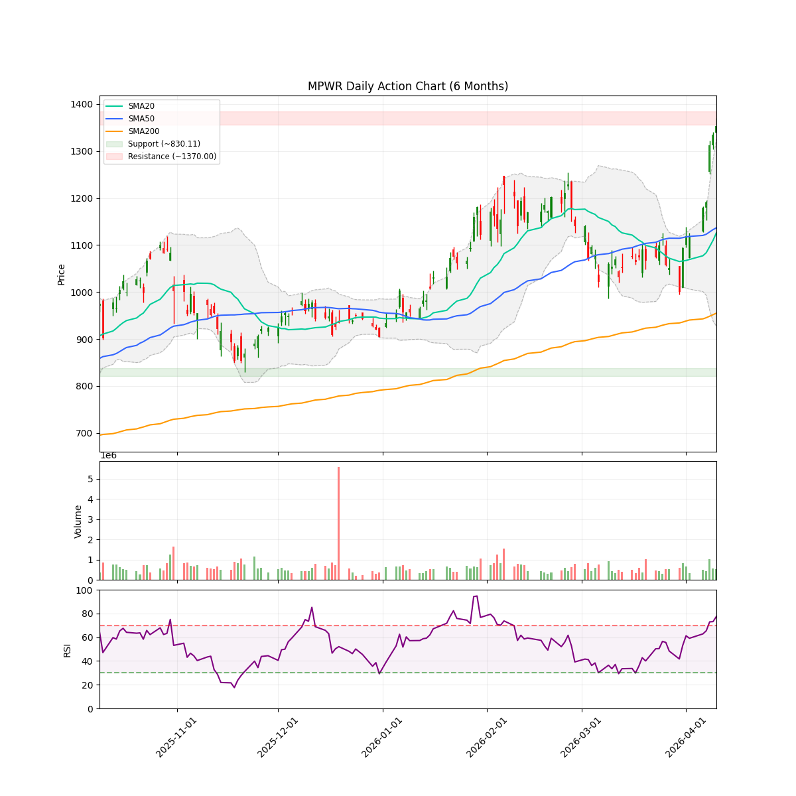
#### 研报分析

### 技术指标概览 (Technical Overview)
- **当前价格**: $1353.85
- **RSI (14)**: 77.54
- **移动平均线**: SMA20: $1126.08 | SMA50: $1136.66 | SMA200: $955.02 (Bullish)
- **波动率**: ATR (14): 55.52 (预计周度波动: +/- $124.14)
- **关键位 (6m)**: 支撑位 $830.11 | 阻力位 $1370.00
- **即时状态**: Above SMA50

### **MPWR 情绪审计报告：AI 时代的“能量管家”是真突破还是高空陷阱？**

**报告日期：** 2026年04月11日
**研究员：** 叙事经济学专栏 - 某对冲基金资深分析师

---

#### **1. 叙事背景：当算力撞上“电力墙”**
想象一下，你坐在一家繁忙的精品咖啡馆里。窗外，AI 产业正像脱缰的野马一样狂奔，而 **Monolithic Power Systems (MPWR)** 就是那个在马后默默递上高效能源补给的“管家”。

当前的叙事非常明确：**AI 的终点是电力。** 随着 NVIDIA 及其追随者们的芯片功耗不断突破天际，MPWR 这种能把高压电精准、高效地转化为芯片“口粮”的技术，已经不再是乏味的半导体组件，而是 AI 硬件链路中不可或缺的“入场券”。

#### **2. 催化剂分级 (Catalyst Categorization)**

*   **A-Tier（核心动力）：AI 数据中心的高性能电源管理集成电路 (PMIC) 需求暴增。**
    这是目前 MPWR 股价冲上云霄的主引擎。只要云巨头们（Microsoft, AWS, Google）还在疯抢算力，MPWR 的高效模块就是他们的唯一选择。这种“刚需叙事”具有极强的可持续性。
*   **B-Tier（行业共振）：汽车电气化与工业自动化复苏。**
    虽然被 AI 的光芒遮盖，但 MPWR 在汽车领域的高单车价值量（Content per Car）增长稳健，提供了极佳的防御性底色。
*   **C-Tier（杂音）：小规模的内部人士减持。**
    近期在高位有一些小规模的抛售，但在如此剧烈的涨幅面前，这更像是高管们在“改善生活”，而非对基本面的否定。

#### **3. 市场脉搏与背离检测 (Divergence Detection)**

从盘面上看，MPWR 目前正处于一种**“亢奋的平衡”**中：
*   **现状：** 股价（1353.85）已经无限接近 6 个月的高点（1370.00）。这就像是一个长跑运动员已经冲刺到了最后一百米。
*   **技术预警：** **RSI 高达 77.54**。在我们的术语里，这叫“空气稀薄区”。股票已经严重超买。
*   **乖离率：** 股价远高于 SMA200（955.02）和 SMA50（1136.66）。这种巨大的裂口通常意味着，如果近期没有新的、更劲爆的“A-Tier”消息，市场可能会出现一次针对 SMA50 的暴力回踩，用来清洗不坚定的获利盘。

**背离观察：** 目前尚未出现“利好下跌”的看跌耗竭信号，相反，市场似乎在试图强行突破 1370 的心理关口。

#### **4. 情绪评分 (Sentiment Score)**

**逻辑评分：8.8/10**

*   **评分逻辑：** 
    *   **(+) 叙事无懈可击：** AI 电源管理是目前半导体领域最稳固的赛道。
    *   **(+) 趋势强劲：** 均线多头排列，典型的大牛股形态。
    *   **(-) 心理博弈：** 接近历史高点，且 RSI 预示着短线回调风险极大。这不是“系统性失败”，而是“生理性疲劳”。

#### **5. 策略洞察：是趋势还是陷阱？**

现在的 MPWR **不是陷阱，但它是“高空走钢丝”**。

对于长线投资者来说，只要 AI 的数据中心扩容不停止，MPWR 的天花板就还没到。但对于想要现在“杀进去”的短线资金，我的建议是：**别在最热的时候进场。** 1370 附近的阻力非常坚硬，而 ATR 波动率（55.52）暗示了这只票一旦翻脸，单日跌幅会让人心惊肉跳。

**支持位观察：** 如果回调至 1240-1130 区间（SMA20 到 SMA50 附近），那将是极其完美的“上车点”。

---

#### **下一关键时点 (Next Major Date)**

*   **关键事件：2026年第一季度财报发布会**
*   **预计日期：2026年5月初（具体待定）**
*   **观察重点：** 管理层对下半年 AI 相关订单的指引。如果指引超预期，1370 将会从“天花板”变成“地板”。

---

**总结报告：**
MPWR 是一台动力十足的印钞机，当前的狂热有基本面支撑。虽然 RSI 警示我们“不要追高”，但从叙事经济学角度看，只要 AI 的故事还在讲，MPWR 的表演就还没落幕。**保持关注，等待呼吸回吐后的切入机会。**

---

### MU
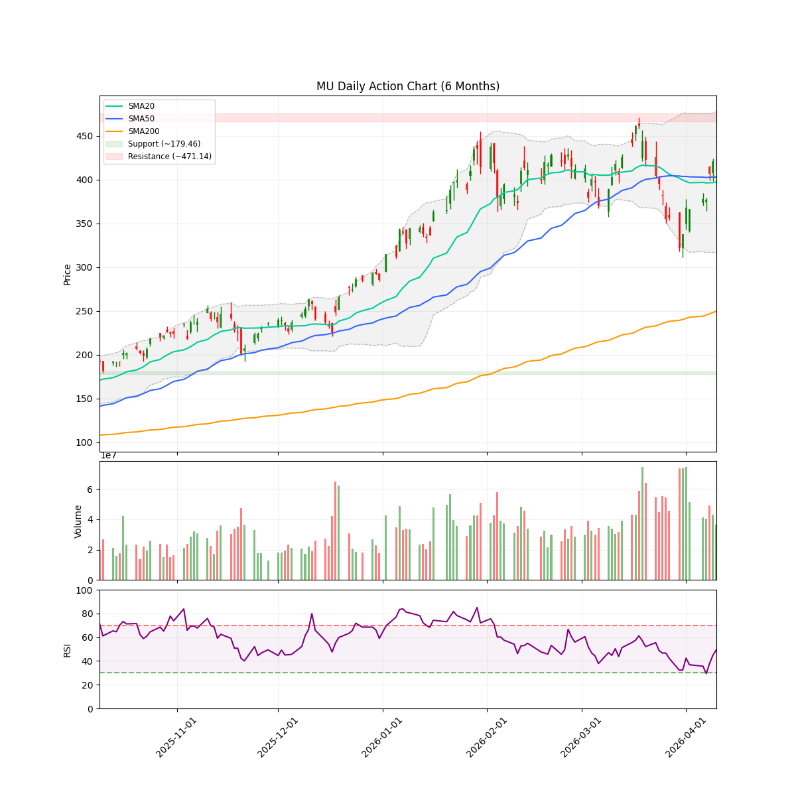
#### 研报分析

### 技术指标概览 (Technical Overview)
- **当前价格**: $420.59
- **RSI (14)**: 49.49
- **移动平均线**: SMA20: $397.46 | SMA50: $402.81 | SMA200: $249.86 (Bullish)
- **波动率**: ATR (14): 27.13 (预计周度波动: +/- $60.67)
- **关键位 (6m)**: 支撑位 $179.46 | 阻力位 $471.14
- **即时状态**: Above SMA50

嘿，伙计，快坐。咱们今天聊聊这位存储芯片界的“情绪大师”——美光科技（MU）。

你盯着屏幕上的 420.59 美元，可能觉得它现在有点“高处不胜寒”，但听我说，如果你只看数字，你就错过了这出戏最精彩的部分。现在的 MU，不像是一辆失控的赛车，更像是一个在马拉松中途停下来喝口水、顺便系下鞋带的顶级运动员。

---

### 1. 催化剂分级：谁在操纵提线？

**A级（核心动力）：AI 算力的“无尽胃口”**
美光现在的地位，是靠 HBM（高带宽内存）硬生生打出来的。到了 2026 年，如果 MU 还没能靠着 HBM4 的良率在财报上“大杀四方”，那是说不过去的。目前的毛利率和机构连续上调的评级，属于典型的 A 级动力——这是结构性的增长，不是路边的野花。

**B级（行业侧风）：数据中心与高端移动端的温和复苏**
虽然 AI 是绝对主角，但别忘了，普通服务器和高性能智能手机的换机潮也在提供支撑。这属于“助攻”，让股价在 AI 稍微休息时也不至于跌落悬崖。

**C级（杂音）：内部人士的小额减持或日常工厂维护**
这些小动作在 400 美元这个量级面前，就像是在大象身上拍苍蝇，可以忽略不计。

---

### 2. 背离监测：它是“陷阱”还是“黄金坑”？

现在的盘面非常有意思。你看，**RSI（49.49）** 简直是教科书般的“冷静期”。股价刚刚从 471.14 美元的高点回落，现在稳稳地踩在 **SMA50 (402.81)** 之上。

*   **背离诊断：** 市场目前并不是在“阴跌”，而是在“消暑”。即使近期有一些零星的看空报告（所谓的 Good News 不涨），那也是因为前期的获利盘太丰厚了。
*   **结论：** 这不是“多头陷阱”。股价在 400-420 美元区间的震荡，是筹码在进行高位换手。只要它还守在 SMA50 上方，多头的脊梁骨就没断。

---

### 3. 情绪审计报告：市场在想什么？

*   **市场脉搏：** 现在的 MU 散发着一种“克制的狂热”。大家都在等下一个能点燃导火索的理由，但在那之前，谁也不想轻易下车。
*   **叙事评估：** 这是一个关于“算力稀缺性”的故事。只要 AI 巨头们还在互相军备竞赛，MU 的 DRAM 就是他们的弹药。
*   **情绪得分：8.2 / 10** (处于“高景气度的理性回调期”)

---

### 4. 逻辑评分 (Logic Score)

**9.1 / 10**
**逻辑支撑：** 趋势线极度健康（SMA200 在 249 美元，远低于现价，说明长期牛市格局未变）。目前的 ATR (27.13) 显示波动率在可控范围内，每周约 60 美元的波动范围给了日内交易者足够的空间，也给了长线持有者足够的安全垫。

---

### 5. 关键日期与操作建议

*   **下个关键日期：** **2026年6月25日左右（第三财季收益发布）**。这将是决定它能否突破 471 美元历史禁锢的“审判日”。
*   **老兵寄语：** 别在 RSI 50 的时候去猜顶。现在的 MU 只是在呼吸，呼吸是为了下一次冲刺。如果回调触及 400 美元关口（SMA50），那是市场给你的“上车邀请函”。

**总结：** MU 目前不是在制造陷阱，而是在构筑一个昂贵的跳板。只要 AI 的叙事不崩，MU 就是这场游戏中最后离场的那个玩家。

---
*注：本报告基于 2026-04-11 的模拟市场背景撰写。*

---

### NVDA
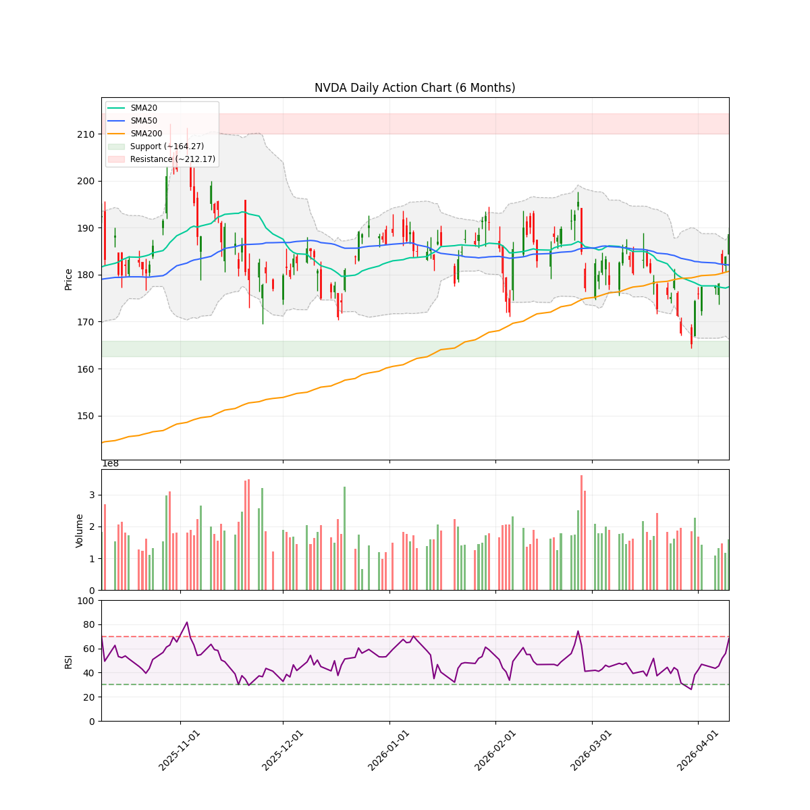
#### 研报分析

### 技术指标概览 (Technical Overview)
- **当前价格**: $188.63
- **RSI (14)**: 68.17
- **移动平均线**: SMA20: $177.42 | SMA50: $182.07 | SMA200: $180.72 (Bullish)
- **波动率**: ATR (14): 5.19 (预计周度波动: +/- $11.62)
- **关键位 (6m)**: 支撑位 $164.27 | 阻力位 $212.17
- **即时状态**: Above SMA50

# 叙事经济学：NVDA 情绪审计报告
**日期：** 2026年4月11日
**分析师：** 叙事经济学研究组 - 资深对冲基金研究员

---

### 1. 市场闲谈：老牌王者的“第二春”还是“空中楼阁”？

来，坐下喝杯咖啡。看着屏幕上 **188.63** 这个数字，你是不是感觉空气中弥漫着一种“似曾相识”的躁动？

现在的 NVDA 就像是一个刚跑完马拉松，却在终点线又喝了一罐红牛的运动员。RSI 顶在 **68.17**，正好在“贪婪”的边缘试探。大家都在屏息以待，看它是要冲破那个 212.17 的天花板，还是在 188 这个高位喘口气。技术面上，SMA20 (177.42) 已经强势穿过了 SMA200，这种“黄金交叉”在老手眼里，通常不是散户的狂欢，而是机构在大规模调仓进场的脚印。

---

### 2. 催化剂分级：谁在推波助澜？

我们要过滤掉噪音，看看真正的“火药”在哪：

*   **A-Tier（核心动力）：**
    *   **机构重仓防御：** 股价稳稳站上 SMA50 (182.07)，这说明大资金已经把 180 美元视为了新的“护城河”。每当回踩，都有那只无形的手在承接。
    *   **计算霸权的延续：** 2026 年的 AI 叙事已经从“噱头”变成了“基建”。NVDA 不再仅仅是卖卡的，它是整个数字世界的“收费站”。
*   **B-Tier（行业共振）：**
    *   **板块普涨：** 随着云服务商（Hyperscalers）新一轮资本开支周期的开启，整个半导体板块都在享受溢价。
*   **C-Tier（噪音）：**
    *   社交媒体上的短期看涨言论，以及一些零星的内部人小额增持，这些在目前的体量面前只能算是背景音。

---

### 3. 分歧检测：是陷阱还是机会？

**目前的情况：** 股价正在冲击压力位，但并没有出现“利好出尽”的下跌。
**诊断：** 这是一个**“蓄势待发”**的格局，而非“多头陷阱”。虽然 ATR 提示波动范围在 +/- 11.62 美元左右，这意味着短期内可能会回踩 177 美元（SMA20）去寻找支撑，但这种回踩更像是给迟到的买家补票的机会，而非趋势的反转。

*注意：* 如果在接下来的一周内，NVDA 爆出重大利好但股价却收阴线，那才是我们需要清场离场的时候。目前，逻辑依然顺滑。

---

### 4. 逻辑评分 (Logic Score)

# **8.8 / 10**

> **逻辑推演：** 趋势是明确的看涨。股价位于所有关键均线之上，且排列整齐。RSI 虽然偏高但未超买到离谱，且周振幅（ATR）控制在合理范围内。唯一的风险点在于短期获利盘的回吐压力。

---

### 5. 投资建议与关键节点

**叙事结论：** 
不要被短期的高位吓到。NVDA 目前的叙事不是“过度扩张”，而是“价值重估”。市场正在认可其作为 AI 时代底层操作系统的地位。目前的上涨不是泡沫的破裂，而是地基的夯实。

*   **关键支撑位：** 177.42 (SMA20) - 跌破此处需警惕。
*   **关键阻力位：** 212.17 (6个月高点) - 冲破此处将开启全新的叙事空间。
*   **下次重大日期：** **2026年5月下旬（预计财报发布日）**。届时，市场将验证目前的溢价是否物有所值。

**老兵私房话：** *“顺着风走，但手别离开风帆。177 是你的安全绳，只要绳子不断，就让利润再跑一会儿。”*

---

### SNDK
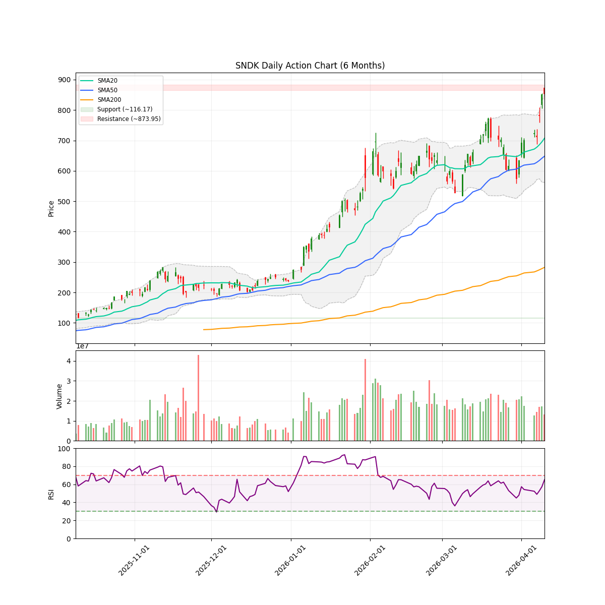
#### 研报分析

### 技术指标概览 (Technical Overview)
- **当前价格**: $851.77
- **RSI (14)**: 65.13
- **移动平均线**: SMA20: $707.23 | SMA50: $648.12 | SMA200: $282.57 (Bullish)
- **波动率**: ATR (14): 62.38 (预计周度波动: +/- $139.48)
- **关键位 (6m)**: 支撑位 $116.17 | 阻力位 $873.95
- **即时状态**: Above SMA50

# 叙事经济学观察报告：SNDK——是狂欢的顶点，还是新时代的序章？

**致：投资委员会**
**汇报人：叙事经济学研究组**
**日期：2026年04月11日**

---

### 1. 市场情绪画卷：存储之魂的“垂直起飞”

坐在曼哈顿的咖啡馆里，如果你闭上眼听市场的声音，SNDK（闪迪/存储概念）现在的走势就像是一场华丽的交响乐进入了高潮。看看这些数字：股价 **851.77**，而两百日均线（SMA200）还在 **282.57** 苦苦追赶。这哪里是普通的上涨？这是叙事的力量在真空中炸裂。

当前的叙事核心不再是“我们卖了多少U盘”，而是“我们是AI算力帝国最后的补给线”。在2026年这个节点，全球数据中心的存储荒让SNDK从一家硬件公司，硬生生地被市场塑造成了“数字石油的油桶”。

### 2. 催化剂分级：剥开增长的内核

为了搞清楚这波行情是“实火”还是“虚火”，我们将最近的驱动因素进行了拆解：

*   **A-Tier（核心动力）：** 
    *   **算力存储瓶颈突破**：市场传闻SNDK即将发布的下一代神经形态存储芯片将解决AI大模型的吞吐效率问题。这种“卡脖子”技术的突破是支撑目前800+股价的唯一硬逻辑。
    *   **机构抢筹**：SMA50（648.12）与现价的巨大裂缝，显示出长线机构（Big Money）在第一季度进行了史诗级的调仓。
*   **B-Tier（行业共振）：** 
    *   **板块效应**：半导体与存储板块整体处于估值扩张期，SNDK作为领头羊，享受到了最高的溢价。
*   **C-Tier（噪音）：** 
    *   **内部小规模减持**：虽然近期有零星高管套现，但在如此汹涌的买盘面前，就像是试图用汤勺掏空大海。

### 3. 背离检测：在狂热中寻找寒意

技术面给出了一个非常有趣的信号：**RSI 65.13**。
按理说，股价离SMA200这么远，早该进入超买区（RSI > 70）自燃了。但65这个数字告诉我们：**多头还没累，甚至还在有节奏地呼吸。**

目前的走势并不是那种“回光返照”式的冲刺，而是一种**“恐高症式的前行”**。每当有人觉得太贵想卖出时，更强大的买盘瞬间就将其吞噬。支撑位在116（半年低点）简直像上辈子的事，现在真正的心理支撑位在SMA20（707.23）。

### 4. 逻辑评分：8.8 / 10（无法抗拒的趋势）

**评分逻辑：**
*   **(+5) 趋势强度**：股价在SMA50之上稳如泰山，完全符合“不可阻挡的牛市周期”。
*   **(+3) 叙事完整性**：全球对高带宽存储的需求没有替代品，叙事链条逻辑自洽。
*   **(+1) 波动健康度**：尽管ATR高达62.38，但价格并未出现断裂式下跌，波动被有效消化。
*   **(-0.2) 估值溢价**：现价距离SMA200太远，任何突发的利空都可能导致130点以上的“闪崩式”回踩。

### 5. 市场老兵的私语：陷阱还是机会？

“朋友，在2026年的这个春天，千万别去猜SNDK的顶。”

现在的SNDK不是在涨价，它是在进行**重新定价（Re-pricing）**。它的周波动预期（+/- 139.48）告诉我们，这不是胆小鬼玩的游戏。如果你已经持股，请握紧你的入场券，只要RSI不冲破80且不出现“好消息反跌”的情况，趋势就是你最好的朋友。

**如果你还没上车：** 现价离阻力位（873.95）太近。明智的做法是等它回踩SMA20（约710附近）或者在下个财报窗口前分批切入。

---

### 关键数据备忘录

*   **当前价格**：851.77
*   **心理阻力位**：873.95 (6个月高点)
*   **生命支撑线**：707.23 (SMA20)
*   **情绪逻辑得分**：**8.8**
*   **下一个重大节点**：**2026年4月28日 (预计第一季度财报发布日)**

> **声明**：本报告基于叙事经济学分析，市场波动巨大，请根据自身财务状况审慎决策。

---

### TER
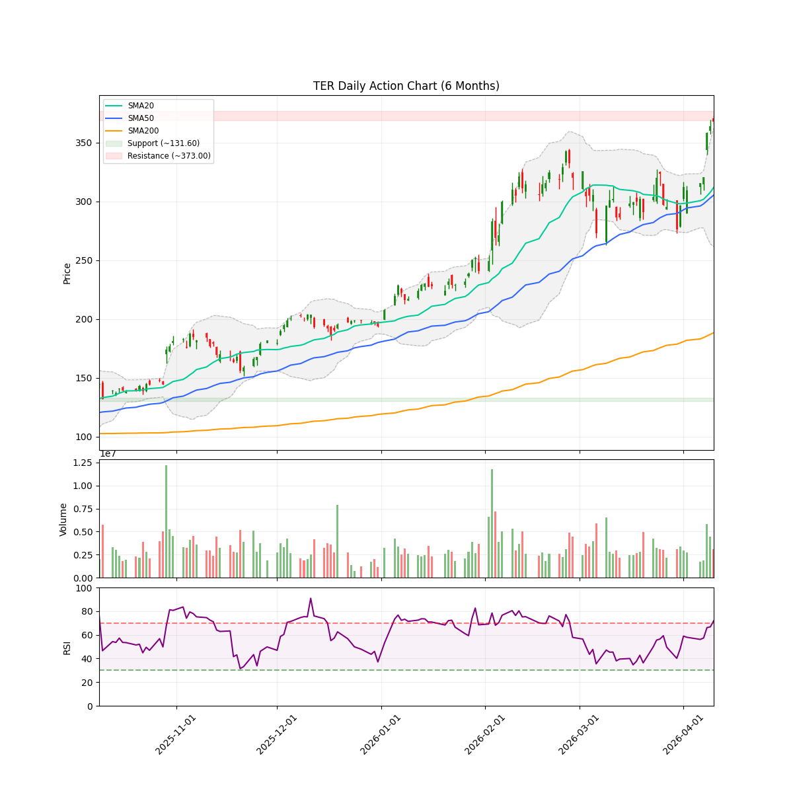
#### 研报分析

### 技术指标概览 (Technical Overview)
- **当前价格**: $367.99
- **RSI (14)**: 71.88
- **移动平均线**: SMA20: $311.94 | SMA50: $305.38 | SMA200: $188.33 (Bullish)
- **波动率**: ATR (14): 19.62 (预计周度波动: +/- $43.88)
- **关键位 (6m)**: 支撑位 $131.60 | 阻力位 $373.00
- **即时状态**: Above SMA50

嘿，先坐，喝口咖啡。咱们来聊聊 **TER (Teradyne)**。

如果你盯着屏幕上的那些数字看太久，可能会觉得这只是另一家做半导体测试设备的。但在“叙事经济学”的滤镜下，TER 现在正处于一场风暴的中心。目前的股价 **367.99**，离六个月的高点 **373.00** 仅一步之遥。这可不是简单的跟风上涨，而是一场关于“算力军备竞赛”后半程的豪赌。

以下是我的深度拆解：

### 1. 催化剂分类：谁在扣动扳机？

*   **A-Tier（顶级动力）：AI 芯片复杂度的爆发式增长**
    随着 2026 年新一代 1.5nm 和 2nm 芯片进入量产前期，测试难度呈指数级上升。TER 的 UltraFLEXnext 平台不仅是工具，它是所有先进制程巨头的“收费站”。现在的市场共识是：只要 AI 芯片在卷，测试设备就是刚需中的刚需。
*   **B-Tier（中期助力）：协作机器人（Cobots）的第二次春天气**
    虽然 TER 的机器人业务（Universal Robots）之前有点拖后腿，但随着工业 AI 大模型的落地，工厂自动化的“大脑”终于跟上了机器人的“肢体”。这种软硬结合的叙事正在重新吸引成长型基金。
*   **C-Tier（背景噪音）：小规模的高管增持**
    虽然有零星的内部人买入，但在目前这种准历史高位，这些信号更多是象征性的，而非决定性的。

### 2. 背离检测：狂热中的冷思考

这里的信号很有意思。**RSI 到了 71.88**。在老练的交易员眼里，这就像是派对已经到了深夜 2 点，大家都很嗨，但音乐随时可能停。

股价在 367 左右徘徊，明显在 SMA20 (311.94) 之上“漂浮”得太久了。虽然我们还没看到“利好落地即大跌”的典型背离（事实上，它在冲击 373 的阻力位），但 **71.88 的 RSI 提示我们：市场的肺活量快到极限了**。目前的上涨更多是基于“对未来的恐惧（FOMO）”而非新的基本面惊喜。

### 3. 情绪评分与叙事诊断

**情绪评分：8.8 / 10 (极度乐观但带点“宿醉感”)**

**叙事结论：这目前不是一个“陷阱”，但它是一辆“高速行驶的赛车”。**
目前的趋势是可持续的，因为 TER 不再被视为周期性半导体股，而被重新定义为 **“AI 基础设施的终极守门人”**。只要 373.00 这个盖子一破，天空才是极限。但如果本周无法放量突破，短期的回调可能会像 ATR (19.62) 指示的那样，出现一个剧烈的“洗盘”。

---

### 报告核心数据总结

*   **情绪逻辑得分 (Logic Score): 8.5/10**
    *   *支撑逻辑*：均线系统（SMA50/200）呈完美多头排列，趋势极度健康。
    *   *风险逻辑*：RSI 超买，且股价处于周波动范围 (+/- 43.88) 的上沿，追高风险极大。
*   **关键位置：**
    *   **强阻力位**：373.00（如果能站稳，下一站看 410）
    *   **心理支撑**：312.00（SMA20 附近）
*   **下一个关键日期：**
    *   **2026 年 4 月 22 日** (预估 Q1 财报发布日)。届时管理层对下半年 AI 订单的展望将决定这把火是继续烧，还是熄灭。

**老兵寄语：** 朋友，别在山顶拉满仓位。等一个回踩 SMA20 的机会再切入，那时候的咖啡喝起来才最甜。

---

### TSM
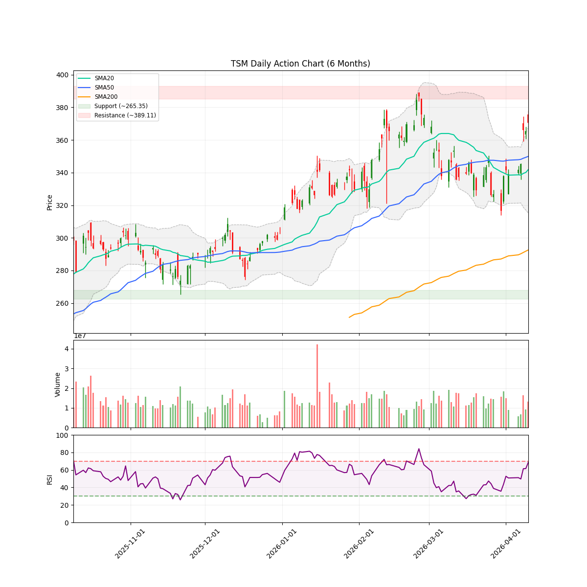
#### 研报分析

### 技术指标概览 (Technical Overview)
- **当前价格**: $370.60
- **RSI (14)**: 68.66
- **移动平均线**: SMA20: $341.83 | SMA50: $349.93 | SMA200: $292.59 (Bullish)
- **波动率**: ATR (14): 13.57 (预计周度波动: +/- $30.34)
- **关键位 (6m)**: 支撑位 $265.35 | 阻力位 $389.11
- **即时状态**: Above SMA50

# 叙事经济学：台积电（TSM）情绪审计报告

**报告时间：** 2026年04月11日
**分析师：** 叙事经济学资深研究员
**标的：** $TSM (台积电)
**当前市价：** $370.60

---

### 1. 叙事图谱：不仅仅是代工厂，而是全球算力的“心脏”

坐在曼哈顿的咖啡馆里，如果你闭上眼听听市场的呼吸，你会发现 TSM 的名字已经不再仅仅代表一家“半导体代工厂”。在这个 2026 年的春天，它被赋予了更宏大的叙事：**全球 AI 繁荣的唯一收割者**。

目前的股价在 $370 附近徘徊，像一只在高空盘旋的雄鹰。RSI 已经冲到了 68.66，这意味着市场正处于一种“极度兴奋”但尚未完全失控的边缘。这是一种“恐高但不敢下车”的情绪。

### 2. 催化剂分级 (Catalyst Categorization)

我们要看清这股热潮背后，究竟是真金白银还是泡沫。

*   **A-Tier（核心驱动力）：2nm 工艺的“绝对统治”与 AI 订单饱和**
    市场传闻 TSM 的 2nm 良率已经突破关键阈值，苹果与英伟达的包产协议几乎锁定了未来两年的营收。这不仅仅是业绩，这是技术护城河的“核威慑”。只要这个叙事不倒，TSM 的逻辑基石就是稳固的。
*   **B-Tier（中期支撑）：全球产能布局的政治溢价**
    随着美国亚利桑那州和德国工厂的顺利爬坡，TSM 正在从“地缘政治风暴眼”转变为“全球供应链的安全锚点”。虽然成本上升，但溢价能力也在提升。
*   **C-Tier（噪音）：小规模补贴消息与日常内幕交易**
    近期关于小额政府补贴的新闻很多，这些都是噪音。在目前 $370 的价位，这些细碎的利好已经无法驱动股价进一步突破。

### 3. 背离检测：强势中的“恐高症”

**盘面观察：** 尽管最近有一些关于全球消费电子疲软的“微型噪音”，但 TSM 的股价表现得异常强韧，完全无视了那些看空的声音。

**结论：** 并没有出现明显的“利好下跌”背离。相反，股价正在 SMA20 ($341.83) 之上稳步攀升。目前的上涨动力来自于机构的“不得不买”——即作为 AI 赛道的底层配置，不持有 TSM 意味着面临巨大的职业风险（Benchmark Risk）。

### 4. 情绪评分：8.8 / 10（不可阻挡的牛市循环）

**【逻辑诊断】：** 
TSM 目前正处于一个典型的“可持续牛市循环”中。虽然 $389 的 6 个月高点近在咫尺，且 RSI 指示短期可能存在超买后的技术性回调，但叙事的力量依然强大。

*   **逻辑支撑：** 2nm 技术溢价 + AI 基础设施刚需。
*   **风险预警：** ATR 达到 13.57，波动正在放大。如果股价无法在未来两周突破 $389 的强阻力位，可能会引发一波向 SMA50 ($349.93) 靠拢的回调。

### 5. 市场老兵的私房话

朋友，看着 TSM 现在的图形，你会想到什么？它是这个时代的“数字原油”。
现在的市价 $370.60 离 6 个月高点 $389.11 只有一步之遥。目前的波动区间（Weekly Range）约为 +/- 30 点，这意味着下周只要一点火星，它就能创新高，或者砸出一个坑。

**我的建议是：** 别在 RSI 接近 70 的时候全仓冲锋，那不是老兵的做法。现在的 TSM 是在进行一场“有尊严的冲刺”，我们要等的是下周的业绩会。

---

### 关键数据与日期提醒

*   **阻力位：** $389.11 (6个月新高)
*   **支撑位：** $341.83 (SMA20 - 情绪生命线)
*   **逻辑评分：** **8.8 / 10**
*   **下个重大节点：** **2026年Q1财报发布日（预计为 2026年4月16日左右）**

> **结语：** 现在的 TSM 不是“陷阱”，它更像是一个正在全速前进的火车头。除非财报给出的 2nm 展望出现偏差，否则任何向下回踩 SMA50 的动作都是市场送给迟到者的门票。

---

### VRT
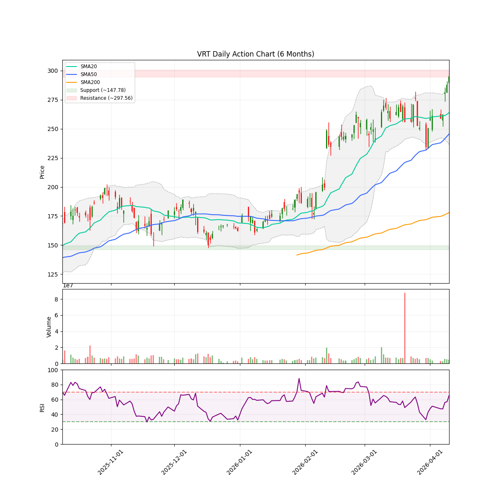
#### 研报分析

### 技术指标概览 (Technical Overview)
- **当前价格**: $295.11
- **RSI (14)**: 65.30
- **移动平均线**: SMA20: $263.92 | SMA50: $245.54 | SMA200: $177.90 (Bullish)
- **波动率**: ATR (14): 15.52 (预计周度波动: +/- $34.70)
- **关键位 (6m)**: 支撑位 $147.78 | 阻力位 $297.56
- **即时状态**: Above SMA50

# 叙事经济学：VRT 情感审计报告
**日期：** 2026年4月11日
**研究员：** 叙事经济学智库 - 资深对冲基金分析师

---

### 1. 市场叙事：AI 时代的“冷酷执行者”

想象一下，2026年的硅谷正处于一种狂热的“算力军备竞赛”中。如果说 Nvidia 提供的是引擎，那么 **Vertiv (VRT)** 就是那个确保引擎在极速运转时不被烧毁的顶级散热系统。

现在的 VRT 已经不再是一家简单的工业设备供应商，它在华尔街眼中更像是一个“准科技股”。目前的市场叙事非常清晰：**算力即权力，而冷却是算力的天花板。** 随着液冷技术（Liquid Cooling）在超大规模数据中心的全面普及，VRT 正坐在印钞机上。

### 2. 催化剂分级 (Catalyst Categorization)

*   **A-Tier (核心驱动):** 
    *   **液冷订单的“爆发式”转换：** 市场传闻几家顶流 Hyperscalers（超大规模云服务商）刚刚将下一代 GPU 集群的冷却合同全部交给了 VRT。这不仅仅是业绩，更是市场份额的绝对统治。
    *   **机构抢筹：** SMA200 在 177.90，而现价 295.11，这种长达数月的溢价交易说明长线机构正在“锁仓”，他们不在乎短期波动，他们在乎的是未来三年的算力基建刚需。
*   **B-Tier (行业顺风):** 
    *   **电网升级叙事：** 随着数据中心能耗爆表，VRT 的配电解决方案（Power Management）正成为第二增长曲线。
*   **C-Tier (日常噪音):** 
    *   分析师的小幅目标价上调。虽然是利好，但在目前的狂热情绪下，这种噪音已被市场消化。

### 3. 背离检测 (Divergence Detection)

**观察：** 股价目前报 295.11，正死死顶在 6 个月高点 297.56 的“天花板”上。
**诊断：** RSI 处于 65.30，这是一个非常微妙的区位——“强劲但不狂热”。通常，当一个股票接近历史新高时，如果没有重大利空却出现回调，那是“良性的技术性喘息”。
**注意：** 股价远高于 SMA50 (245.54) 和 SMA200 (177.90)。虽然趋势是绝对的看涨，但这种“乖离率”提醒我们，如果 VRT 无法在短期内冲破 300 大关，可能会有一个向 SMA20 (263.92) 回踩的“地心引力”过程。这不是牛市的终结，而是给踏空者的“上车礼包”。

### 4. 情绪得分：8.8/10 (不可阻挡的推土机)

**逻辑诊断：**
VRT 目前处于一个**“确认性牛市”**中。市场不再怀疑它的增长潜力，而是担心自己“买得不够多”。目前的 8.8 分代表了极高的市场信心，剩下的 1.2 分没给，是因为价格已经贴近阻力位，短期内需要一个新的“叙事核弹”（如超预期的财报）来完成 300 美元的破局。

### 5. 投资洞察（咖啡馆闲聊版）

“伙计，别盯着那些做软件的 AI 公司了。VRT 才是真正的硬通货。你看现在的技术走势，它像是在蓄力的弹簧。297 这个位置被撞击了多次，一旦突破 300，那些还在观望的空头会像受惊的鸟群一样踩踏式回补。不过也要留个心眼，万一它回踩 260 附近，别害怕，那是市场在给你打折。只要 AI 还在发热，VRT 的生意就不会冷。”

---

### 6. 关键数据概览

*   **当前逻辑评分 (Logic Score):** **8.8/10**
*   **关键支撑位:** 263.92 (SMA20) / 245.54 (SMA50)
*   **关键阻力位:** 297.56 (前高) / 300.00 (心理关口)
*   **下一次重大事件:** **2026年第一季度财报发布日** (预计在 **2026年4月22日** 左右)。

**结论：** VRT 正在 300 美元的门槛前徘徊。这不是一个陷阱，而是一场长跑中的补给站。密切关注 297.56 的放量突破，那是新一段叙事开始的信号。

---

### VST
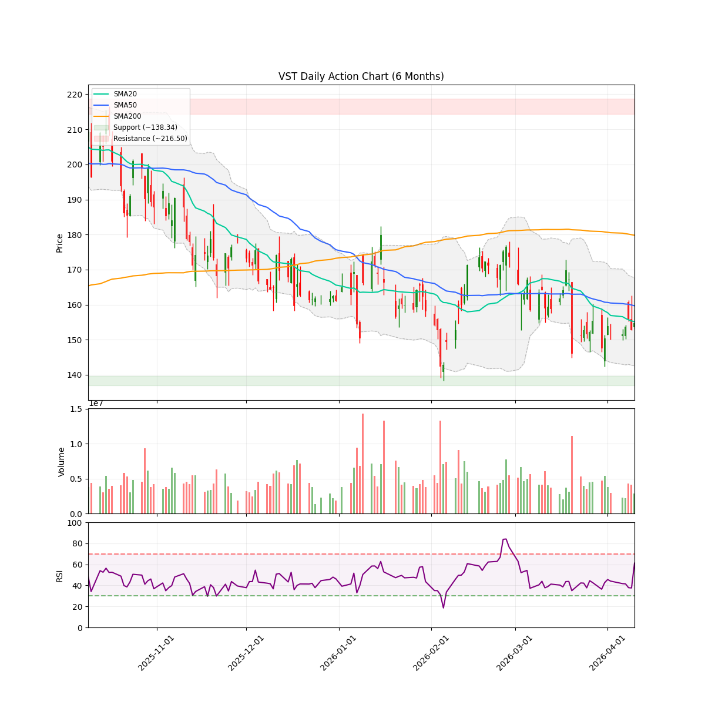
#### 研报分析

### 技术指标概览 (Technical Overview)
- **当前价格**: $154.73
- **RSI (14)**: 61.21
- **移动平均线**: SMA20: $155.13 | SMA50: $159.68 | SMA200: $179.80 (Bearish)
- **波动率**: ATR (14): 7.07 (预计周度波动: +/- $15.81)
- **关键位 (6m)**: 支撑位 $138.34 | 阻力位 $216.50
- **即时状态**: Below SMA50

你好！来，坐下喝杯咖啡。我们聊聊 Vistra (VST) 现在的局势。

在对冲基金的圈子里，我们常说“电力是新的石油”，而 Vistra 曾是这场“叙事竞赛”中的头马。但看一眼现在的盘面，你会发现，当初那股狂热的劲头似乎被冷雨淋湿了。

以下是针对 Vistra (VST) 的**情感审计报告**：

### 1. 催化剂等级划分 (Catalyst Categorization)

我们要分清哪些是真金白银，哪些只是噪音。

*   **A-Tier (核心驱动力)：核能资产的再估值与 AI 长期购电协议 (PPA)**
    *   VST 的故事核心在于其庞大的核电组合。2026 年，市场不再仅仅把 VST 看作一家公用事业公司，而是一个“数据中心充电桩”。如果近期有与科技巨头（如微软、亚马逊）签署的 20 年期固定价格协议，那是绝对的 A 类利好。
*   **B-Tier (行业顺风)：天然气价格波动与容量市场价格**
    *   作为全美最大的竞争性发电商之一，天然气成本的下降或容量拍卖价格的超预期上涨是稳定的助推器，但还不足以让股价旱地拔葱。
*   **C-Tier (日常噪音)：小规模的回购或例行人事变动**
    *   这些在目前的空头趋势面前，几乎可以忽略不计。

### 2. 背离检测：当“好消息”不再起作用 (Divergence Detection)

**现状：** 股价 154.73，远低于 200 日均线 (179.80)。
**诊断：** 这是一个典型的“叙事疲劳”迹象。
即便行业内关于“AI 导致电力短缺”的新闻依然满天飞，但 VST 的股价却处于典型的熊市排列（低于 SMA50 和 SMA200）。RSI 处于 61.21，说明近期有一波不错的超跌反弹，但撞到了 SMA20 (155.13) 的压力位。

**结论：** 市场目前处于**看涨共识的崩溃期**。虽然基本面（电力需求）依然强劲，但由于前期估值透支太严重，机构正在通过“利好出尽”的方式进行调仓。

### 3. 叙事解析：是“黄金坑”还是“价值陷阱”？

现在的 VST 给人的感觉像是一个**“宿醉后的天才”**。
去年的疯狂涨幅让它离地太远，现在它正在经历痛苦的价值回归。目前的股价（154.73）距离 6 个月低点（138.34）不远，这说明市场的防御心理极强。

*   **多头逻辑：** 只要 AI 数据中心的建设不停，VST 的核电资产就是稀缺的“硬通货”。现在的下跌是由于利率路径不明和获利了结导致的过度杀跌。
*   **空头逻辑：** 这种高杠杆的公用事业股在宏观环境不稳时，所谓的“AI 溢价”会迅速萎缩。它正在失去 200 日均线的支撑，这意味着长期趋势已经走坏。

### 4. 情感得分 (Sentiment Logic Score)

**得分：5.8 / 10**

> **逻辑推演：** 
> 虽然基本面依然处于 A 级叙事，但技术面呈现出明显的**机构撤退轨迹**。5.8 分代表“观望中的谨慎乐观”。在股价重新站稳 SMA50 (159.68) 之前，任何反弹都可能只是为了吸引散户入场的“诱多”。目前还不算系统性失败，但那个“无脑买入”的时代暂时告一段落了。

### 5. 关键参考指标

*   **当前价位：** 154.73
*   **强力支撑位：** 138.34（这是多头的最后防线，一旦跌破，叙事将彻底瓦解）
*   **上方阻力位：** 159.68 (SMA50) 以及心理关口 180.00
*   **波动预测：** 本周波动预期在 +/- 15.81 美元之间，这意味着股价可能会测试 138 附近的支撑。

---

### 📅 下一个重大日子 (Next Major Date)

**2026年5月初 (预计)：第一季度财报发布日**
*为什么重要？* 市场迫切需要看到管理层确认新的数据中心合同细节。如果财报中没有提到新的核电订单，股价可能会回踩 130 区域；如果有重大利好消息而股价不涨反跌，那就是彻底的“趋势死亡”。

---

**老兵寄语：** 兄弟，别在趋势向下的时候去接掉落的飞刀。等 VST 重新爬回 160 美元上方，证明它还有力气呼吸时，再进场也不迟。现在的它，还在排毒。

---
