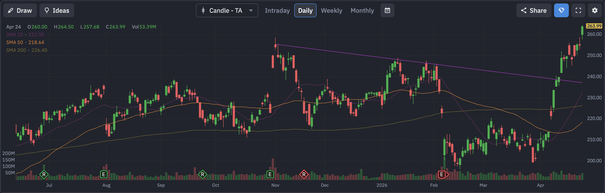

# Amazon.com (AMZN) 定量基本面深度分析报告
<!-- more -->

## 1. 🏢 公司概览与核心投资逻辑
**公司概览**：Amazon.com, Inc. (NASDAQ: AMZN) 是全球最大的电子商务和云计算巨头。其 AWS（亚马逊网络服务）是全球云基础设施市场的绝对领导者，同时其电商、广告和流媒体业务也具有极强的竞争力。

**投资逻辑**：
*   **AWS 与 AI 双重驱动**：随着 AI 对算力需求的爆发，AWS 正在加大 AI 服务的投入，成为公司新的增长引擎。
*   **电商效率提升**：区域化配送网络的优化显著提升了电商业务的利润率。
*   **期权市场极度狂热**：在财报前夕，期权市场出现了单日超 **3.2 万张** 的天量 Call 单对赌，暗示可能有大行情。

## 2. 📊 财务三表核心数据摘要
基于最新收盘价 $263.99，公司财务状况极其庞大且稳健：（数据来源：yfinance）
*   **损益表摘要**：
    *   **总营收**：~$7169.24 亿美元。
    *   **EBITDA**：~$1457.31 亿美元。
*   **现金流量表摘要**：
    *   **自由现金流 (FCF)**：**~$237.93 亿美元 (正值)**。充沛的现金流支持其在 AI 和物流领域的巨额资本开支。

## 3. ⚖️ 评估与定价分析
*   **估值乘数**：
    *   **市盈率 (P/E)**：滚动市盈率约为 36.77 倍。
    *   **远期市盈率 (Forward P/E)**：约为 **27.91 倍**。
    *   **PEG Ratio**：**1.91**。PEG 接近 2，表明相对于其增速，估值已处于合理偏高水平。
*   **目标价**：市场平均目标价约为 $283.79。**当前股价 $263.99 较目标价仍有约 7.5% 的上涨空间**。

## 4. 📅 市场共识与重大日期
*   **华尔街共识评级**：**强力买入 (Strong Buy)**。
*   **重大日期 (财报日历)**：
    *   **下一个财报日**：**2026年4月29日**（后天）。

## 5. 🌐 第三方平台数据透视（如 Finviz 等）
*   **Finviz 走势图快照**：
    
*   **数据深度解析**：
    *   **趋势分析**：从走势图可以看出，AMZN 近期走出了极强的多头突破形态。股价已突破前期高点（约 $250），并远高于 20日均线 ($232.95)、50日均线 ($218.64) 和 200日均线 ($226.40)。这属于典型的**“多头排列+向上突破”**形态。
    *   **空头比例 (Short Float)**：**0.95%**。极低的空头比例，说明市场几乎没有做空意愿。
    *   **机构持股比例 (Inst Own)**：**67.04%**。

## 6. 📈 技术面与筹码分布分析
基于最新收盘价 $263.99 的技术面分析：（数据来源：yfinance 计算）
*   **均线系统**：
    *   **20日均线**：$232.95。
    *   **50日均线**：$218.64。
    *   **200日均线**：$226.40。所有均线均在下方形成强力支撑，技术面无懈可击。
*   **支撑与阻力位**：
    *   **短期支撑**：**$199.14**。
    *   **短期阻力**：**$264.50**（历史高点附近）。

## 7. 🌊 期权异动与大单追踪 (高强度量化分析)
针对 **2026-04-27 到期**（极短期，对赌财报前夕）的期权链扫描，发现了**极其震撼的成交量**：
*   **Call 端天量扫货**：
    *   **$265.0 Call**：成交量高达 **32,116** 张（未平仓 4564）。
    *   **$262.5 Call**：成交量达 **21,394** 张。
    *   **$270.0 Call**：成交量达 **20,923** 张。
*   **深度解析**：在距离财报仅剩 2 天的时刻，针对极短期（4月27日）的 $265 Call 出现了**超过 3.2 万张**的成交量！这极其罕见，强烈暗示有超级机构在进行超短期的爆发性对赌，或者有重磅消息即将在财报前夕提前发酵。

## 8. ⚠️ 风险因素分析
*   **反垄断审查** (🔴 高风险)：作为电商和云巨头，持续面临欧美监管机构的反垄断诉讼。
*   **消费疲软** (🟡 中风险)：宏观经济若衰退，电商业务将直接承压。

## 9. ⚖️ 多空理由深度辩论
*   **看多理由 (Bull Case)**：
    *   **完美的技术形态**：突破历史高点，均线多头排列。
    *   **期权市场疯狂**：单日 3.2 万张的 Call 单是极强的动能催化剂。
*   **看空理由 (Bear Case)**：
    *   **估值不便宜**：PEG 接近 2，说明预期已经打得比较满，容错率降低。
    *   **买预期卖现实**：如此疯狂的期权交易，需防范财报后“利好出尽”的风险。

## 10. 💡 结论与交易策略
**最终结论**：**积极买入 (Aggressive Buy) / 动量跟随**。
AMZN 目前正处于极强的多头动能中，期权市场的狂热为短期突破提供了充足的燃料。

**可操作策略**：
*   **激进策略**：跟随机构大单，可轻仓参与 $265 或 $270 的末日 Call，博取财报前的脉冲式上涨。
*   **稳健策略**：股价已高，建议等待财报落地。若财报后因指引问题回踩 $230-$240（均线支撑区），将是极佳的中长期低吸机会。

---
**数据来源**：本报告分析基于 yfinance 实时数据（经用户确认价格约为 $263.99）及市场公开信息。
