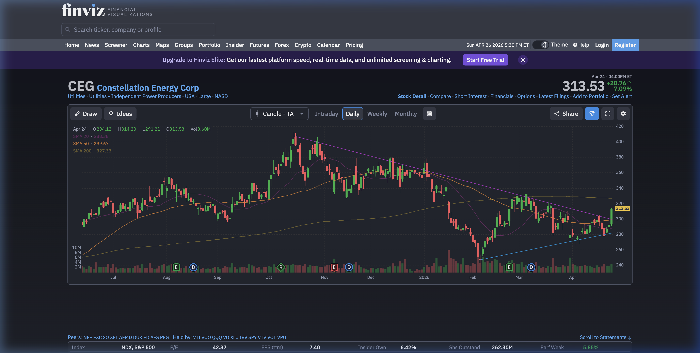

# Constellation Energy (CEG) 定量基本面深度分析报告

## 1. 🏢 公司概览与核心投资逻辑
**公司概览**：Constellation Energy (NYSE: CEG) 是全美最大的无碳能源生产商，拥有领先的核电资产组合。公司通过其庞大的核电舰队，提供稳定、清洁、24/7 的电力，在当前的能源转型中占据独特地位。

**投资逻辑**：CEG 正处于 AI 数据中心电力需求爆发的最核心受益位置。科技巨头（Hyperscalers）对零碳、高可靠性电力的需求极其迫切。
*   **里程碑式合约**：2024年9月，CEG 与微软签署了为期 20 年s的协议，将重启三哩岛（Three Mile Island）1号机组（现更名为 Crane Clean Energy Center, CCEC），为其提供 835 MW 的无碳电力，预计 2027-2028 年投产。这树立了行业标杆，证明了其核电资产的极致稀缺性。

## 2. 📊 财务三表核心数据与 10-K 要点
基于 2025年 10-K 报告及实时数据，公司财务健康，且造血能力强：（数据来源：yfinance & 10-K 分析）
*   **损益表摘要**：
    *   **总营收**：~$223.69 亿美元。
    *   **EBITDA**：~$43.50 亿美元。
*   **资产负债表摘要**：
    *   **总负债**：~$74.23 亿美元。**相比 Vistra (VST) 的 200亿+ 负债，CEG 的财务杠杆明显更轻**。
    *   **总现金**：~$2.77 亿美元。
*   **现金流量表摘要**：
    *   **自由现金流 (FCF)**：**~$17.15 亿美元 (正值)**。这与 VST 短期负 FCF 形成鲜明对比，显示出极强的即时派息 and 回购能力。
*   **10-K 核心要点**：
    *   **重启 Capex**：三哩岛重启项目预计耗资约 16 亿美元，支出分摊在 2025-2027 年。
    *   **核电增容**：除了重启，公司还在现有核电站中寻找增容机会，计划增加数百兆瓦容量。

## 3. ⚖️ 评估与定价分析
*   **估值乘数**：
    *   **市盈率 (P/E)**：滚动市盈率约为 25.7 倍。
    *   **远期市盈率 (Forward P/E)**：约为 23.6 倍。
    *   **PEG Ratio**：**0.82**。这表明在其预期增长面前，估值仍具吸引力（通常 PEG < 1 被认为低估）。
*   **目标价**：市场平均目标价约为 $304.56。

## 4. 📅 市场共识与重大日期
*   **华尔街共识评级**：**强力买入 (Strong Buy)**。这反映了卖方对 CEG 核电稀缺性逻辑的高度认可。
*   **机构目标价与评级异动 (数据源: Finviz)**：
    *   **近期目标价**：2026年3月和4月，**Morgan Stanley** 和 **Evercore ISI** 分别给出了 **$385** 和 **$380** 的目标价，远高于当前价格 ($313.53)。
    *   **最高目标价**：**Wells Fargo** 在 2025年10月给出了 **$478** 的极高目标价；**TD Cowen** 在 2026年1月给出了 **$440** 的目标价。
*   **重大日期**：
    *   **下一个财报日**：预计在 **2026年5月5日** 左右。

## 5. 📜 10-K 财报核心要点 (Gemini AI 分析)
基于对 CEG 2025年 10-K 报告的 AI 深度分析，投资者需重点关注以下由传统发电商向“AI 时代清洁能源王者”转型的关键点：

*   **数据中心与 AI 负载增长**：
    *   **强劲动力**：大型数据中心、AI 技术转型及社会的全面电气化正在加速电力负荷增长。
    *   **里程碑合约**：2024年9月与微软签署 20 年期协议，为其提供 835 MW 的无碳电力，涉及重启三哩岛（Three Mile Island）1号机组（现更名为 Crane Clean Energy Center, CCEC），预计 2027-2028 年投产。
*   **核电扩张与资本开支 (Capex)**：
    *   **扩张规模**：除了重启三哩岛外，公司还在现有核电站中寻找增容机会，计划增加数百兆瓦容量。
    *   **Capex 安排**：重启 CCEC 项目预计耗资约 16 亿美元，支出分摊在 2025-2027 年。
*   **关键风险因素**：
    *   **共址负荷 (Co-location) 监管争议**：报告深入讨论了关于大型负荷（如数据中心）直接连接核电站（Behind-the-meter）的监管争议，可能会影响整个行业的合同定价逻辑。
    *   **市场机制变动**：PJM 市场的容量拍卖机制变动对收入影响巨大。
*   **财务健康度**：
    *   截至2025年底总债务约 **74.2 亿美元**，相比 VST 明显更轻，财务杠杆更低。
    *   **自由现金流为正**（约 17 亿美元），显示出极强的即时派息和回购能力，这与 VST 短期负 FCF 形成鲜明对比。

## 6. 🌐 第三方平台数据透视（如 Finviz 等）
*   **空头比例 (Short Float)**：**2.12%**。表明市场看空情绪极低，极少有人敢于做空这只清洁能源龙头。
*   **机构持股比例 (Inst Own)**：**87.11%**。显示筹码高度集中在机构手中，控盘度高，走势相对稳健。
*   **Finviz 走势图快照**：
    
*   **走势深度解析**：从 Finviz 日 K 线图可以看出，CEG 股价近期在 $300 附近震荡后，出现了一根强劲的放量阳线，收于 $313.53，突破了前期的盘整区间。股价站稳在均线系统上方，显示出极强的多头动能。

## 7. 📈 技术面与筹码分布分析
基于最新收盘价 $313.53 的技术面分析：
*   **均线系统**：
    *   **20日均线**：**$288.38**，股价远高于此位，显示短期极强动能。
    *   **50日均线**：**$299.54**，是中期关键防守位。
*   **支撑与阻力位**：
    *   **短期支撑**：**$264.74**（20日低点）。
    *   **短期阻力**：**$314.20**（近期高点，目前正处于突破边缘）。
    *   **中期支撑**：**$242.97**（60日低点）。
    *   **中期阻力**：**$333.35**。
    *   **长期支撑**：**$242.97**。
    *   **长期阻力**：**$405.03**（6个月高点）。

## 8. 🌊 期权异动与大单追踪
*   **最新期权快照 (数据日期: 2026-04-26)**：
    *   **目标到期日**：**2026-05-01**（临近财报）。
    *   **高额成交 Call 异动**：发现深度价外 Call 成交量显著放大。其中 **$330 行权价的 Call** 成交量达 **724** 张，**$310 行权价的 Call** 成交量达 **518** 张。
    *   **Put 端异动**：**$300 行权价的 Put** 成交量达 **472** 张。
*   **成交量深入分析与机构意图**：
    1.  **Volume 远大于 OI，暗示新资金进场**：特别是在 **$330 Call**（成交量 724 vs 未平仓 89）和 **$300 Put**（成交量 472 vs 未平仓 14）上，成交量远超历史沉淀的未平仓合约。这极大概率是**日内新开仓**，表明有资金在强力介入，而非仅仅是平仓。
    2.  **价外 Call 的激进押注**：当前股价约 $313.51，而成交量最大的 $330 Call 属于深度价外（OTM）。在临近 5月1日到期（且不覆盖 5月5日财报）的情况下，如此激进的价外 Call 押注，暗示市场中存在**预期利好可能提前释放**的投机资金，或者是在进行某种复杂的组合策略。
    3.  **多空力量博弈**：虽然 Call 端（$330 和 $310）合计成交量超 1200 张占据主导，但 $300 Put 也有 472 张成交。这显示在股价突破 $300 后，市场也存在一部分防守或看空声音，形成了一定的多空博弈格局。

## 9. ⚠️ 风险因素分析
*   **共址负荷 (Co-location) 监管争议** (🟡 中风险)：虽然微软合同是通过电网供电，但市场中其他类似项目（如 Talen/Amazon 案例）面临的 FERC 审查，可能会影响整个行业的合同定价逻辑。
*   **市场机制变动** (🟡 中风险)：PJM 市场的容量拍卖机制变动对 CEG 收入影响巨大。
*   **核能特有风险** (🔴 高风险)：核电站运营安全、乏燃料处理及长期的拆除（Decommissioning）责任。

## 10. ⚖️ 多空理由深度辩论
*   **看多理由 (Bull Case)**：
    *   **AI 时代的清洁能源王者**：24/7 零碳电力是 Hyperscalers 唯一的选择。
    *   **财务结构极佳**：正向自由现金流（17亿）且负债远低于主要竞争对手 VST，安全边际高。
    *   **确定性大单**：微软 20 年长约锁定了未来增长。
*   **看空理由 (Bear Case)**：
    *   **估值绝对值高于 VST**：Forward P/E 23.6 倍 vs VST 的 14 倍。
    *   **核电长期负债**：尽管目前可控，但核能的长期潜在负债（如退役成本）是客观存在的。

## 11. 💡 结论与交易策略
**最终结论**：**买入 (Buy)**。
CEG 是真正的“AI 基础设施电力保障商”。**CEG 拥有更健康的资产负债表和正向自由现金流**，这使其在应对未来的资本开支时更加从容。Forward P/E 约 23.6 倍，作为 AI 数据中心“零碳”电力唯一可依赖来源的稀缺性，完全配得上这一估值溢价。

**可操作策略（分时段建议）**：

*   **短期建议 (1个月以内，聚焦财报季)**：
    *   **现状**：当前股价约 $313.53，已突破前期目标价，处于高位。
    *   **策略**：不建议在当前价格直接追高现货。鉴于期权市场在 5月1日到期（不覆盖 5月5日财报）的 $310 和 $330 Call 上有异动，**激进投资者**可轻仓参与这些价外 Call，博取财报前的“抢跑”行情。**稳健投资者**可考虑卖出 5月8日到期（覆盖财报）的价外 Put（如 $285 以下），利用财报前的高隐含波动率（IV）赚取丰厚权利金，或在回调中被动低吸。
*   **中期建议 (1-6个月)**：
    *   **现状**：财报后可能存在预期兑现后的震荡或回调。
    *   **策略**：若股价因财报或监管噪音回调至 **$285 - $300** 区间，将是极佳的**现货分批建仓机会**。中期目标价看向 $330-$350 区域。
*   **长期建议 (6个月以上)**：
    *   **现状**：AI 对零碳 24/7 电力的需求是未来十年的确定性趋势。
    *   **策略**：**坚定持有现货**，与微软的 20 年长约为业绩筑底。若觉得现货资金占用大，可考虑配置 **2027年到期的 LEAPs**（平价或轻微价外 Call），以小博大，锁定 AI 长期红利。

**止损/防守**：若股价有效跌破 **$270**（跌破重要心理位和强期权支撑区），需重新评估投资逻辑，特别是核电与数据中心共置的监管政策是否有重大不利变化。

---
**数据来源**：本报告分析基于 yfinance 实时数据、Constellation Energy 2025年 10-K 财报（Gemini AI 解析）及市场公开信息。
