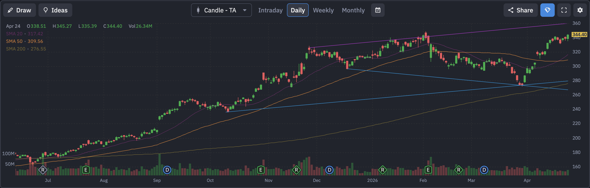

# Alphabet (GOOGL) 定量基本面深度分析报告

## 1. 🏢 公司概览与核心投资逻辑
**公司概览**：Alphabet Inc. (NASDAQ: GOOGL) 是全球互联网巨头，拥有谷歌搜索、YouTube、Android 操作系统、Google Cloud 等核心资产。公司正全力以赴向生成式 AI 转型，试图在搜索和云计算领域巩固其领导地位。

**投资逻辑**：
*   **AI 赋能搜索与云**：Gemini 模型的推出和整合，正在重塑其搜索体验，并推动 Google Cloud 的高速增长。
*   **现金流王者**：拥有极度恐怖的赚钱能力，自由现金流超 380 亿美金。
*   **期权天量异动**：在财报前夕，期权市场出现了单日超 **1.6 万张** 的天量 Call 单（行权价 $340）对赌，暗示可能有利好预期。

## 2. 📊 财务三表核心数据摘要
基于最新收盘价 $344.40，公司财务状况极其庞大且稳健：（数据来源：yfinance）
*   **损益表摘要**：
    *   **总营收**：~$4028.36 亿美元。
    *   **EBITDA**：~$1501.75 亿美元。
*   **现金流量表摘要**：
    *   **自由现金流 (FCF)**：**~$380.88 亿美元 (正值)**。

## 3. ⚖️ 评估与定价分析
*   **估值乘数**：
    *   **市盈率 (P/E)**：滚动市盈率约为 31.86 倍。
    *   **远期市盈率 (Forward P/E)**：约为 **25.51 倍**。
    *   **PEG Ratio**：**2.36**。PEG 大于 2，表明相对于其增速，估值已处于较高水平。
*   **目标价**：市场平均目标价约为 $377.29。**当前股价 $344.40 较目标价仍有约 9.5% 的上涨空间**。

## 4. 📅 市场共识与重大日期
*   **华尔街共识评级**：**强力买入 (Strong Buy)**。
*   **重大日期 (财报日历)**：
    *   **下一个财报日**：**2026年4月29日**（后天）。

## 5. 🌐 第三方平台数据透视（如 Finviz 等）
*   **Finviz 走势图快照**：
    
*   **数据深度解析**：
    *   **趋势分析**：从走势图可以看出，GOOGL 近期走出极强的多头突破形态。股价已突破前期高点（约 $320），并远高于 20日均线 ($317.42)、50日均线 ($309.49) 和 200日均线 ($276.55)。这属于典型的**“多头排列+向上突破”**形态。
    *   **空头比例 (Short Float)**：**1.34%**。极低的空头比例。
    *   **机构持股比例 (Inst Own)**：**80.66%**。

## 6. 📈 技术面与筹码分布分析
基于最新收盘价 $344.40 的技术面分析：（数据来源：yfinance 计算）
*   **均线系统**：
    *   **20日均线**：$317.42。
    *   **50日均线**：$309.49。
    *   **200日均线**：$276.55。所有均线均在下方形成强力支撑，技术面极强。
*   **支撑与阻力位**：
    *   **短期支撑**：**$272.11**。
    *   **短期阻力**：**$345.27**（历史高点附近）。

## 7. 🌊 期权异动与大单追踪 (高强度量化分析)
针对 **2026-04-27 到期**（极短期，对赌财报前夕）的期权链扫描，发现了**极其震撼的成交量**：
*   **Call 端天量扫货**：
    *   **$340.0 Call**：成交量高达 **16,513** 张（未平仓 1802）。
    *   **$345.0 Call**：成交量达 **14,187** 张。
    *   **$350.0 Call**：成交量达 **13,672** 张。
*   **深度解析**：在距离财报仅剩 2 天的时刻，针对极短期（4月27日）的 $340 Call 出现了**超过 1.6 万张**的成交量！这极其罕见，强烈暗示有超级机构在进行超短期的爆发性对赌。

## 8. ⚠️ 风险因素分析
*   **反垄断审查** (🔴 高风险)：作为搜索巨头，持续面临欧美监管机构的反垄断诉讼。
*   **AI 搜索竞争** (🟡 中风险)：面临 OpenAI 等新兴 AI 搜索的竞争压力。

## 9. ⚖️ 多空理由深度辩论
*   **看多理由 (Bull Case)**：
    *   **完美的技术形态**：突破历史高点，均线多头排列。
    *   **期权市场狂热**：单日 1.6 万张的 Call 单是极强的动能催化剂。
*   **看空理由 (Bear Case)**：
    *   **估值不便宜**：PEG 达 2.36，说明预期已经打得比较满，容错率降低。
    *   **反垄断风险**：长期的诉讼可能分散管理层精力并带来财务惩罚。

## 10. 💡 结论与交易策略
**最终结论**：**积极买入 (Aggressive Buy) / 动量跟随**。
GOOGL 目前正处于极强的多头动能中，期权市场的狂热为短期突破提供了充足的燃料。

**可操作策略**：
*   **激进策略**：跟随机构大单，可轻仓参与 $340 或 $345 的末日 Call，博取财报前的脉冲式上涨。
*   **稳健策略**：股价已高，建议等待财报落地。若财报后因指引问题回踩 $310-$320（均线支撑区），将是极佳的中长期低吸机会。

---
**数据来源**：本报告分析基于 yfinance 实时数据（经用户确认价格约为 $344.40）及市场公开信息。
