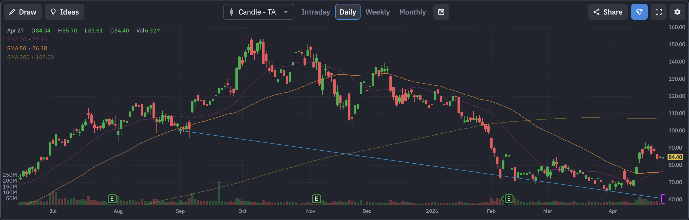

# Robinhood (HOOD) 定量基本面深度分析报告

## 1. 🏢 公司概览与核心投资逻辑
**公司概览**：Robinhood Markets, Inc. (NASDAQ: HOOD) 是美国著名的散户免佣金交易平台。公司以简化交易流程、吸引年轻一代投资者闻名，业务涵盖股票、期权、加密货币交易以及现金管理服务。

**投资逻辑**：
*   **散户交易与加密货币回暖**：随着市场情绪改善和加密货币价格上涨，散户交易活跃度显著提升，直接增厚公司交易收入。
*   **新产品线拓展**：公司正在推广“Robinhood Gold”会员服务，以及拓展欧洲市场和退休账户（IRA）匹配服务，寻找新的增长点。
*   **财报临门**：财报将于 **明日（2026年4月28日）** 发布，是决定短期走势的关键催化剂。

## 2. 📊 财务三表核心数据摘要
基于最新收盘价 $84.49，公司财务状况如下：（数据来源：yfinance）
*   **损益表摘要**：
    *   **总营收**：~$44.73 亿美元。
*   **现金流量表摘要**：
    *   *(注：当前实时数据中自由现金流 FCF 显示为 null，需关注明日财报中的现金流表现。)*

## 3. ⚖️ 评估与定价分析
*   **估值乘数**：
    *   **市盈率 (P/E)**：滚动市盈率约为 41.20 倍。
    *   **远期市盈率 (Forward P/E)**：约为 **31.36 倍**。
*   **目标价**：市场平均目标价约为 $101.15。**当前股价 $84.49 较目标价仍有约 19.7% 的上涨空间**，显示华尔街仍看好其后市表现。

## 4. 📅 市场共识与重大日期
*   **华尔街共识评级**：**买入 (Buy)**。
*   **重大日期 (财报日历)**：
    *   **下一个财报日**：**2026年4月28日**（明日）。

## 5. 🌐 第三方平台数据透视（如 Finviz 等）
*   **Finviz 走势图快照**：
    
*   **数据深度解析**：
    *   **趋势分析**：从走势图可以看出，HOOD 在经历了一波深幅回调后，近期在 $70 附近企稳并展开强劲反弹。股价目前已成功站上 20日均线 ($77.93) 和 50日均线 ($76.38)。目前股价仍受制于 **200日均线 ($107.09)**，该位置将是中长期趋势反转的终极考验。
    *   **空头比例 (Short Float)**：**4.08%**。适中的空头比例，存在一定的潜在轧空动力。
    *   **机构持股比例 (Inst Own)**：**73.71%**。

## 6. 📈 技术面与筹码分布分析
基于最新收盘价 $84.46 的技术面分析：（数据来源：yfinance 计算）
*   **均线系统**：
    *   **20日均线**：$77.93。
    *   **50日均线**：$76.38。
    *   **200日均线**：$107.09。股价正处于短中期多头动能释放、挑战长期阻力位的过程中。
*   **支撑与阻力位**：
    *   **短期支撑**：**$63.51**。
    *   **短期阻力**：**$93.32**。

## 7. 🌊 期权异动与大单追踪 (高强度量化分析)
针对 **2026-05-01 到期**（完美覆盖明日财报）的期权链扫描，发现了较为活跃的对赌仓位：
*   **Call 端扫货**：
    *   **$90.0 Call**：成交量达 **3001** 张（未平仓高达 14975，显示历史上此处有重仓）。
    *   **$100.0 Call**：成交量达 **2348** 张（未平仓 13333）。
*   **Put 端防守**：
    *   **$80.0 Put**：成交量 2413 张。
*   **深度解析**：在财报前夕，$90 和 $100 这种深度价外（OTM）的 Call 出现数千张成交，配合巨大的未平仓量，**表明市场中有相当一部分资金在激进押注财报超预期带来的暴涨**。同时 $80 Put 的成交也显示了部分资金在进行锁利防守。

## 8. ⚠️ 风险因素分析
*   **监管风险** (🔴 高风险)：加密货币业务持续面临 SEC 的监管压力，且其 PFOF（订单流支付）模式也一直饱受争议。
*   **市场波动风险** (🟡 中风险)：业绩高度依赖散户交易量，若市场转熊，收入将锐减。

## 9. ⚖️ 多空理由深度辩论
*   **看多理由 (Bull Case)**：
    *   **散户情绪风向标**：在牛市或局部狂热中，HOOD 的业绩弹性极大。
    *   **目标价空间大**：距离 $101 的目标价仍有近 20% 空间。
*   **看空理由 (Bear Case)**：
    *   **现金流数据缺失的隐忧**：目前 FCF 显示为 null，需防范财报中现金流不及预期的暴雷。
    *   **200日均线强压**：$107 附近的 200日均线是极重的长期抛压区。

## 10. 💡 结论与交易策略
**最终结论**：**中性偏多 (Neutral to Bullish) / 财报前夕观望**。
这是一场高风险、高回报的财报博弈。技术面反弹强烈，但受制于 200日均线，且现金流状况不明。

**可操作策略**：
*   **激进策略**：可考虑在财报前轻仓参与 $90 或 $100 的价外 Call，博取财报超预期带来的脉冲式暴涨。
*   **稳健策略**：等待明日财报落地。若财报确认 FCF 改善且指引强劲，股价站稳 $90 后顺势做多；若财报不及预期引发大跌，关注 $70 附近的企稳低吸机会。

---
**数据来源**：本报告分析基于 yfinance 实时数据（经用户确认价格约为 $84.49）及市场公开信息。
