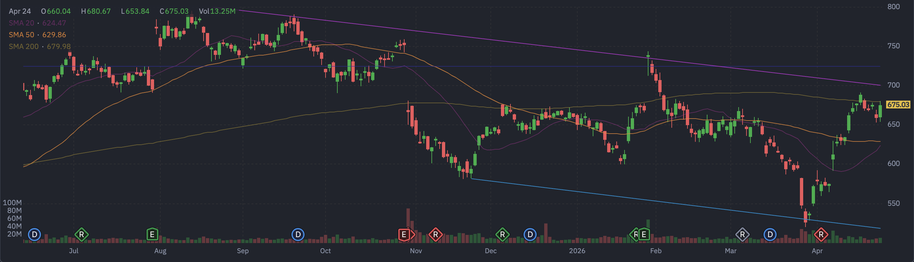

# Meta Platforms (META) 定量基本面深度分析报告

## 1. 🏢 公司概览与核心投资逻辑
**公司概览**：Meta Platforms, Inc. (NASDAQ: META) 是全球社交媒体巨头，拥有 Facebook、Instagram、WhatsApp 等旗舰应用。公司正全力以赴向元宇宙（Metaverse）和生成式 AI 转型，试图打造下一代计算平台。

**投资逻辑**：
*   **AI 赋能广告引擎**：Meta 正在利用 AI 优化广告投放和内容推荐，显著提升了广告主的 ROI 和用户时长。
*   **估值仍具吸引力**：尽管股价处于高位，但其 **Forward P/E 仅为 18.72 倍**，且 **PEG 为 1.10**，在科技巨头中估值相对合理。
*   **财报催化**：财报将于 **后天（2026年4月29日）** 发布，市场预期极高。

## 2. 📊 财务三表核心数据摘要
基于最新收盘价 $675.03，公司财务状况极其庞大且稳健：（数据来源：yfinance）
*   **损益表摘要**：
    *   **总营收**：~$2009.66 亿美元。
    *   **EBITDA**：~$1018.92 亿美元。
*   **现金流量表摘要**：
    *   **自由现金流 (FCF)**：**~$234.32 亿美元 (正值)**。充沛的现金流支持其巨额的研发投入和股东回报。

## 3. ⚖️ 评估与定价分析
*   **估值乘数**：
    *   **市盈率 (P/E)**：滚动市盈率约为 28.74 倍。
    *   **远期市盈率 (Forward P/E)**：约为 **18.72 倍**。
    *   **PEG Ratio**：**1.10**。
*   **目标价**：市场平均目标价约为 $855.11。**当前股价 $675.03 较目标价仍有约 26% 的上涨空间**，显示华尔街对其长期前景非常看好。

## 4. 📅 市场共识与重大日期
*   **华尔街共识评级**：**强力买入 (Strong Buy)**。
*   **重大日期 (财报日历)**：
    *   **下一个财报日**：**2026年4月29日**（后天）。

## 5. 🌐 第三方平台数据透视（如 Finviz 等）
*   **Finviz 走势图快照**：
    
*   **数据深度解析**：
    *   **趋势分析**：从走势图可以看出，META 近期强势反弹，股价已站上 20日均线 ($624.47) 和 50日均线 ($629.86)。目前股价正处于 **200日均线 ($679.98)** 的关键压制位附近，能否有效放量突破将决定其中长期趋势。
    *   **空头比例 (Short Float)**：**1.21%**。极低的空头比例，说明市场几乎没有做空意愿。
    *   **机构持股比例 (Inst Own)**：**78.34%**。筹码高度集中在机构手中。

## 6. 📈 技术面与筹码分布分析
基于最新收盘价 $675.03 的技术面分析：（数据来源：yfinance 计算）
*   **均线系统**：
    *   **20日均线**：$624.47。
    *   **50日均线**：$629.86。
    *   **200日均线**：$679.98。股价正处于短中期多头动能释放、挑战长期阻力位的关键时刻。
*   **支撑与阻力位**：
    *   **短期支撑**：**$520.26**。
    *   **短期阻力**：**$691.52**。

## 7. 🌊 期权异动与大单追踪 (高强度量化分析)
针对 **2026-04-27 到期**（极短期）以及覆盖财报的期权链扫描，发现了**极其疯狂的 Call 端天量扫货**：
*   **Call 端天量扫货**：
    *   **$680.0 Call**：成交量高达 **7648** 张（未平仓 1909）。
    *   **$700.0 Call**：成交量达 **6724** 张。
    *   **$690.0 Call**：成交量达 **6683** 张。
*   **深度解析**：在财报前夕，如此巨量且集中的 Call 单涌入 $680-$700 的价外行权价，**强烈暗示有超级机构在押注财报将带来股价的脉冲式暴涨，目标直指 $700 关口**。

## 8. ⚠️ 风险因素分析
*   **Reality Labs 持续失血** (🔴 高风险)：元宇宙业务每年亏损超百亿美金，是拖累整体利润的最大黑洞。
*   **监管与反垄断风险** (🟡 中风险)：作为社交巨头，持续面临反垄断和隐私保护的强监管。

## 9. ⚖️ 多空理由深度辩论
*   **看多理由 (Bull Case)**：
    *   **AI 变现能力最强**：广告业务的 AI 赋能已见成效，Forward P/E 18倍极具性价比。
    *   **期权市场疯狂看涨**：近 8000 张 $680 Call 显示了主力资金的急迫性。
*   **看空理由 (Bear Case)**：
    *   **资本开支黑洞**：元宇宙业务何时能盈利仍是未知数。
    *   **200日均线压制**：技术面上正面临强阻力，突破失败可能引来获利盘回吐。

## 10. 💡 结论与交易策略
**最终结论**：**积极买入 (Aggressive Buy) / 动量突破**。
QCOM 展现出极强的进攻姿态。期权市场的天量大单和远低于目标价的现状，提供了极高的赔率。

**可操作策略**：
*   **激进策略**：跟随机构大单，可考虑轻仓参与 5月1日（或更近）的 $690/$700 Call，博取财报跳空。
*   **稳健策略**：等待股价有效放量突破 200日均线（$680 附近）后顺势做多，或者在回踩 50日均线（$630 附近）时低吸。

---
**数据来源**：本报告分析基于 yfinance 实时数据（经用户确认价格约为 $675.03）及市场公开信息。
