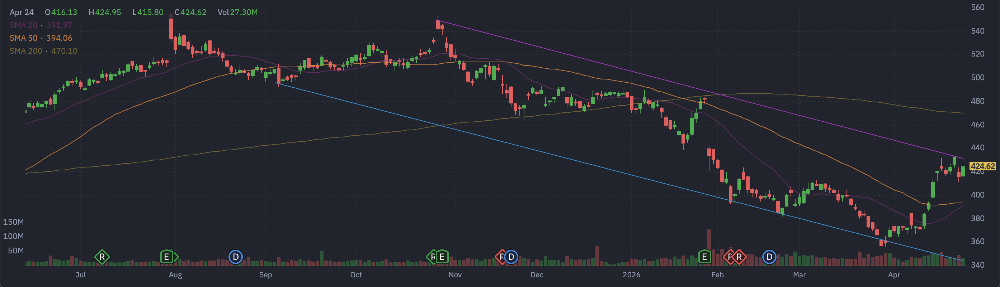

# Microsoft (MSFT) 定量基本面深度分析报告

## 1. 🏢 公司概览与核心投资逻辑
**公司概览**：Microsoft Corporation (NASDAQ: MSFT) 是全球最大的软件和云计算巨头。其业务涵盖 Windows 操作系统、Office 生产力套件、Azure 云服务、LinkedIn 以及游戏业务（Xbox）。公司正通过与 OpenAI 的深度合作，全力将 AI 整合到其所有产品中。

**投资逻辑**：
*   **Azure 云与 AI 绝对龙头**：Azure 持续保持高增长，且通过 Copilot 等 AI 工具实现了强劲的变现。
*   **现金流王者**：拥有极度恐怖的赚钱能力，自由现金流超 500 亿美金。
*   **期权天量异动**：在财报前夕，期权市场出现了单日超 **2 万张** 的天量 Call 单（行权价 $425）对赌，暗示可能有大惊喜。

## 2. 📊 财务三表核心数据摘要
基于最新收盘价 $424.62，公司财务状况极其庞大且稳健：（数据来源：yfinance）
*   **损益表摘要**：
    *   **总营收**：~$3054.53 亿美元。
    *   **EBITDA**：~$1752.59 亿美元。
*   **现金流量表摘要**：
    *   **自由现金流 (FCF)**：**~$536.41 亿美元 (正值)**。

## 3. ⚖️ 评估与定价分析
*   **估值乘数**：
    *   **市盈率 (P/E)**：滚动市盈率约为 26.59 倍。
    *   **远期市盈率 (Forward P/E)**：约为 **22.44 倍**。
    *   **PEG Ratio**：**1.34**。处于合理区间，显示出成长性与估值的匹配。
*   **目标价**：市场平均目标价约为 $576.43。**当前股价 $424.62 较目标价仍有约 35% 的巨大上涨空间**，显示华尔街对其长期前景的极度乐观。

## 4. 📅 市场共识与重大日期
*   **华尔街共识评级**：**强力买入 (Strong Buy)**。
*   **重大日期 (财报日历)**：
    *   **下一个财报日**：**2026年4月29日**（后天）。

## 5. 🌐 第三方平台数据透视（如 Finviz 等）
*   **Finviz 走势图快照**：
    
*   **数据深度解析**：
    *   **趋势分析**：从走势图可以看出，MSFT 近期强势反弹，股价已站上 20日均线 ($391.97) 和 50日均线 ($393.98)。目前股价仍受制于 **200日均线 ($470.10)**，距离该位置仍有较大空间。
    *   **空头比例 (Short Float)**：**1.12%**。极低的空头比例。
    *   **机构持股比例 (Inst Own)**：**75.88%**。

## 6. 📈 技术面与筹码分布分析
基于最新收盘价 $424.62 的技术面分析：（数据来源：yfinance 计算）
*   **均线系统**：
    *   **20日均线**：$391.97。
    *   **50日均线**：$393.98。
    *   **200日均线**：$470.10。股价正处于短中期多头动能释放阶段。
*   **支撑与阻力位**：
    *   **短期支撑**：**$356.28**。
    *   **短期阻力**：**$433.70**。

## 7. 🌊 期权异动与大单追踪 (高强度量化分析)
针对 **2026-04-27 到期**（极短期，对赌财报前夕）的期权链扫描，发现了**极其震撼的成交量**：
*   **Call 端天量扫货**：
    *   **$425.0 Call**：成交量高达 **20,207** 张（未平仓 3963）。
    *   **$420.0 Call**：成交量达 **19,299** 张。
    *   **$430.0 Call**：成交量达 **18,671** 张。
*   **深度解析**：在距离财报仅剩 2 天的时刻，针对极短期（4月27日）的 $425 Call 出现了**超过 2 万张**的成交量！这极其罕见，强烈暗示有超级机构在进行超短期的爆发性对赌。

## 8. ⚠️ 风险因素分析
*   **反垄断审查** (🟡 中风险)：作为软件和云巨头，持续面临欧美监管机构的反垄断关注。
*   **云服务竞争** (🟡 中风险)：与 AWS 和谷歌云的竞争依然激烈。

## 9. ⚖️ 多空理由深度辩论
*   **看多理由 (Bull Case)**：
    *   **AI 领跑者**：与 OpenAI 绑定，Copilot 变现能力强。
    *   **期权市场狂热**：单日 2 万张的 Call 单是极强的动能催化剂。
*   **看空理由 (Bear Case)**：
    *   **增长基数巨大**：体量已极庞大，持续维持高增长的难度增加。
    *   **200日均线压制**：虽然反弹，但长期均线仍在上方形成压制。

## 10. 💡 结论与交易策略
**最终结论**：**积极买入 (Aggressive Buy) / 动量跟随**。
MSFT 拥有极强的 AI 叙事和恐怖的现金流，期权市场的狂热为短期突破提供了充足的燃料。

**可操作策略**：
*   **激进策略**：跟随机构大单，可轻仓参与 $425 或 $430 的末日 Call，博取财报前的脉冲式上涨。
*   **稳健策略**：股价已从低位反弹，建议等待财报落地。若财报后因指引问题回踩 $390-$400（均线支撑区），将是极佳的中长期低吸机会。

---
**数据来源**：本报告分析基于 yfinance 实时数据（经用户确认价格约为 $424）及市场公开信息。
