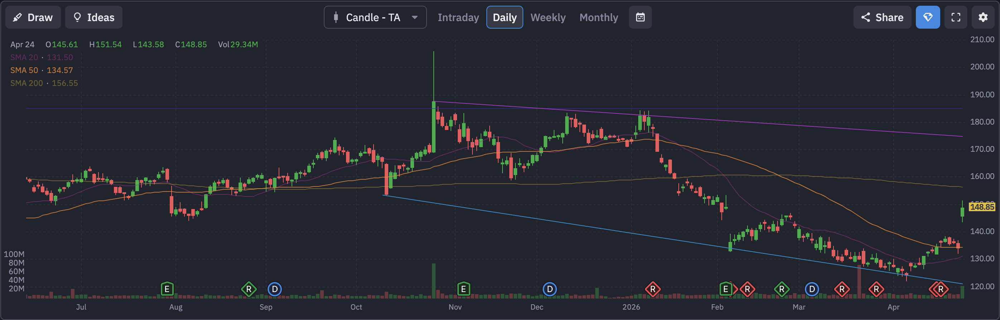

# QUALCOMM (QCOM) 定量基本面深度分析报告

## 1. 🏢 公司概览与核心投资逻辑
**公司概览**：QUALCOMM Incorporated (NASDAQ: QCOM) 是全球无线通信技术和芯片巨头，在 5G 及未来通信技术中拥有绝对垄断性的专利库（QTL 业务），同时其 Snapdragon 芯片在高端安卓手机市场占据统治地位。

**投资逻辑**：
*   **边缘 AI 龙头**：AI 正在从云端走向终端（端侧 AI）。QCOM 的 NPU（神经网络处理器）在手机和 AI PC 领域具有极强的竞争力。
*   **极度低估的价值洼地**：在当前价格下，**Forward P/E 仅为 13.51 倍**，且 **PEG 低至 0.64**，在科技巨头中属于罕见的低估值高增长组合。
*   **财报临门**：财报将于 **后天（2026年4月29日）** 发布，是决定短期走势的终极催化剂。

## 2. 📊 财务三表核心数据摘要
基于实时数据（经用户确认价格约为 $148.85），公司财务状况极其稳健：（数据来源：yfinance）
*   **损益表摘要**：
    *   **总营收**：~$448.67 亿美元。
    *   **EBITDA**：~$137.64 亿美元。
*   **现金流量表摘要**：
    *   **自由现金流 (FCF)**：**~$104.23 亿美元 (正值)**。庞大的现金流为其提供了极厚的安全垫。

## 3. ⚖️ 评估与定价分析
*   **估值乘数**：
    *   **市盈率 (P/E)**：滚动市盈率约为 30.01 倍。
    *   **远期市盈率 (Forward P/E)**：约为 **13.51 倍**。
    *   **PEG Ratio**：**0.64**。
*   **目标价**：市场平均目标价约为 $150.10。当前股价 $148.85 几乎与目标价持平，显示市场短期内看法偏向中性。

## 4. 📅 市场共识与重大日期
*   **华尔街共识评级**：**持有 (Hold)**。这反映了市场对智能手机换机周期延长以及大客户（如苹果）自研芯片的长期担忧。
*   **重大日期 (财报日历)**：
    *   **下一个财报日**：**2026年4月29日**（后天）。

## 5. 📜 10-K 财报核心要点 (Gemini AI 分析)
基于对 QCOM 最新 10-K 报告的 AI 深度分析，投资者需重点关注以下业务转型与潜在风险：
*   **智能边缘计算转型**：公司正从纯手机芯片商转型为“智能边缘计算”公司。其 Snapdragon 平台集成了强大的 NPU，能直接在设备上运行复杂 AI 模型，处于 Edge AI 领先地位。
*   **汽车业务高速增长**：受益于“骁龙数字底盘”，汽车业务收入在 2024 财年达到 **24.86 亿美元**，同比增长 31%，成为重要增长极。
*   **关键风险**：前三大客户贡献了很大比例营收，客户集中度高。报告明确提到**苹果自研基带芯片**是长期的、确定性较高的风险。

## 6. 🌐 第三方平台数据透视（如 Finviz 等）
*   **Finviz 走势图快照**：
    
*   **数据深度解析**：
    *   **趋势分析**：从走势图可以看出，QCOM 在经历了一波下跌后，近期在 $130 附近企稳并开始反弹。股价目前已站上 20日和 50日均线，但仍受制于 **200日均线 ($156.55)**。能否有效突破 200日均线是判断其中长期趋势反转的关键。
    *   **空头比例 (Short Float)**：**5.10%**。适中的空头比例，存在一定的轧空（Short Squeeze）潜力。
    *   **机构持股比例 (Inst Own)**：**81.50%**。筹码高度集中在机构手中，走势具有机构票的稳健特征。

## 7. 📈 技术面与筹码分布分析
基于最新收盘价 $148.85 的技术面分析：（数据来源：yfinance 计算）
*   **均线系统**：
    *   **20日均线**：**$131.50**。
    *   **50日均线**：**$134.31**。股价目前处于均线上方，显示出良好的中期多头形态。
*   **支撑与阻力位**：
    *   **短期支撑**：**$121.99**。
    *   **短期阻力**：**$151.54**。目前股价正处于逼近阻力位的关键时刻。

## 8. 🌊 期权异动与大单追踪 (高强度量化分析)
针对 **2026-05-01 到期**（完美覆盖财报）的期权链扫描，发现了**极其疯狂的机构天量对赌**：
*   **Call 端天量扫货**：
    *   **$142.0 Call**：成交量高达 **8064** 张（未平仓 1300）。
    *   **$150.0 Call**：成交量达 **6261** 张。
    *   **$155.0 Call**：成交量达 **6109** 张。
*   **Put 端防御**：
    *   **$136.0 Put**：成交量 1225 张。
*   **深度解析**：在财报前夕，**Call 端成交量出现数千张的爆发**，尤其是 $142（已在价内）和 $150（轻微价外）的巨量成交，**强烈暗示有超级机构在疯狂押注财报后的跳空暴涨**。

## 9. ⚠️ 风险因素分析
*   **智能手机市场饱和** (🔴 高风险)：公司营收仍高度依赖手机出货量。
*   **竞争与替代风险** (🟡 中风险)：苹果自研基带芯片的进度是悬在头顶的达摩克利斯之剑。

## 10. ⚖️ 多空理由深度辩论
*   **看多理由 (Bull Case)**：
    *   **估值极度低估**：13.5 倍 Forward P/E 在科技巨头中几乎是地板价。
    *   **期权天量大单**：8000+ 张 Call 单显示了多头的绝对信心。
*   **看空理由 (Bear Case)**：
    *   **缺乏想象力**：手机市场增长乏力，汽车和 PC 业务短期内贡献有限。
    *   **机构评级偏淡**：Hold 评级说明大多数分析师不认为它短期内能有爆发性表现。

## 11. 💡 结论与交易策略
**最终结论**：**积极买入 (Aggressive Buy) / 财报博弈**。
这是一场高赔率的博弈。超低的估值锁定了下行空间，而期权市场的天量大单则指明了向上的方向。

**可操作策略**：
*   **激进策略**：跟随机构大单，轻仓买入 5月1日到期的 $150 Call，博取财报后的爆发。
*   **稳健策略**：现货分批建仓。若财报后因大盘或指引回调至 $135-$140 均线密集区，将是极佳的“黄金坑”低吸机会。

---
**数据来源**：本报告分析基于 yfinance 实时数据（经用户确认价格约为 $148.85）、Qualcomm 2024年 10-K 财报（Gemini AI 解析）及市场公开信息。
