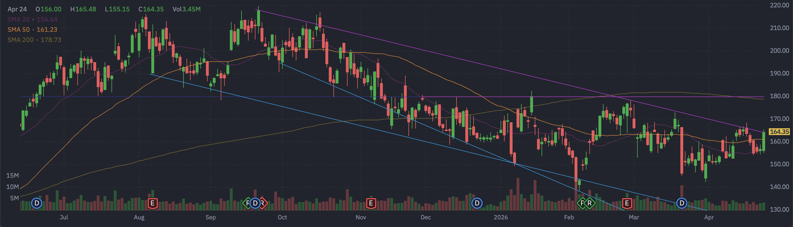

# Vistra Corp (VST) 定量基本面深度分析报告

## 1. 🏢 公司概览与投资逻辑
**公司概览**：Vistra Corp (NYSE: VST) 是一家领先的综合零售电力和发电公司。通过近期收购 Energy Harbor 的核电资产，公司已成功转型为兼具传统发电和清洁能源（核能）能力的综合能源巨头。公司在 ERCOT（德克萨斯州）等竞争性市场中占有重要地位。

**投资逻辑**：VST 目前正处于 AI 数据中心需求爆发的超级周期交汇点。根据 **VST 2025年 10-K 财报**，公司明确指出“人工智能（AI）等技术的转型”和“大型负载数据中心”的出现加速了其服务区域的负荷增长。科技巨头（Hyperscalers）正在积极寻求稳定、24/7 的清洁电力（如核能）来满足 AI 数据中心的巨大能耗。VST 拥有的核电资产使其成为这一趋势的稀缺受益者。

## 2. 📊 基本面评估与定价分析
**定价现状**：
*   **市盈率 (P/E)**：目前滚动市盈率 (Trailing P/E) 约为 72-75 倍，处于历史高位，反映了市场对其核电资产溢价的初步认可。
*   **远期市盈率 (Forward P/E)**：约为 14 倍。这一显著的“估值倒挂”表明市场预期其未来盈利将出现爆发式增长，或者当前股价尚未充分计入未来的高确定性现金流。
*   **目标价**：市场平均目标价约为 $233-$239，较当前约 $164 的价格有显著的上涨空间（约 40%+）。

**未定价的机会 (Unpriced Opportunities)**：
*   **“核电+AI”的溢价合约**：市场可能尚未完全计入 VST 与科技巨巨头签订长期、高溢价的“幕后”（Behind-the-Meter）供电合约的潜力。这类合约将提供极其稳定且高毛利的现金流，类似于 Constellation Energy (CEG) 所经历的估值重估。
*   **PEG 估值分歧**：根据不同数据源，VST 的 PEG 存在分歧。**Finviz 显示其 PEG 低至 0.18**，而**实时查询 yfinance 显示当前 PEG 约为 1.41**。这表明 0.18 的低值可能是基于不同的增长预期或统计口径。在考虑 AI 带来的结构性增长后，1.41 的 PEG 依然具有吸引力。

## 3. 📅 市场共识与重大日期
*   **华尔街共识评级**：**1.4 (强力买入 / Strong Buy)**（评分范围 1-5，1为最强）。这表明卖方分析师对 VST 的前景高度一致看好。（数据来源：yfinance）
*   **买方独立观点**：与卖方的强力买入共识一致，我们（买方）认为 VST 处于 AI 数据中心需求爆发的超级周期，Forward P/E 仅 14 倍，估值极具吸引力。尽管短期自由现金流为负，但这是用于核电扩容的合理资本开支，维持“买入”评级。
*   **机构平均目标价**：**$233.37**。较当前约 $164 的价格有约 42% 的潜在上涨空间。
*   **重大日期（催化剂）**：
    *   **下一个财报日 (Earnings Date)**：**2026年5月7日**。
    *   **除权除息日 (Ex-Dividend Date)**：**2026年3月19日**（上次）。预计下一个除权日在 2026年6月中旬。
    *   **深度解析**：我们在第 7 节中发现的 5月15日巨量 Call 异动，**完美覆盖了 5月7日的财报窗口**。这几乎可以确认，大资金正在利用期权杠杆押注财报可能带来的重磅利好。

## 4. 📊 财务三表核心数据摘要
基于最新财务数据，VST 呈现出典型的“高负荷、高投入、高增长预期”的资本密集型企业特征：（数据来源：yfinance）
*   **损益表 (Income Statement) 摘要**：
    *   **总营收 (Total Revenue)**：~$177.38 亿美元。
    *   **EBITDA**：~$52.28 亿美元。显示出强大的核心业务盈利能力。
    *   **归母净利润**：~$7.52 亿美元。
*   **资产负债表 (Balance Sheet) 摘要**：
    *   **总负债 (Total Debt)**：~$204.17 亿美元。
    *   **总现金**：~$7.95 亿美元。
    *   **风险解析**：高负债率是公用事业和独立发电厂（IPP）的常态，但配合 10-K 中提到的核电扩容“巨额资本支出”，投资者需密切关注其债务利息覆盖率。
*   **现金流量表 (Cash Flow) 摘要**：
    *   **经营性现金流**：~$40.70 亿美元。
    *   **自由现金流 (Free Cash Flow)**：**-$4.59 亿美元 (负值)**。
    *   **深度解析**：**自由现金流为负是本次升级分析中最关键的发现之一**。这印证了公司正在进行激进的资本开支（Capex），用于核电资产的升级和扩容，以抢占 AI 数据中心的电力市场。短期内自由现金流承压，但若能换取长期高确定性的 AI 供电合约，则是合理的战略投入。

## 5. 📜 10-K 财报核心要点 (Gemini AI 分析)
基于对 VST 2025年 10-K 报告的 AI 深度分析，投资者需重点关注以下由传统发电商向“电力+科技”集成运营商转型的关键点：

*   **数据中心与 AI 负载增长**：
    *   **强劲动力**：大型负载数据中心、AI 技术变革及二叠纪盆地油田电气化是需求增长主因。
    *   **重磅合同**：2025年9月与 Amazon (AWS) 签署 20 年协议（1200 MW，由 Comanche Peak 核电站供应）；2026年1月与 Meta 签署 20 年协议（2609 MW，由 PJM 区域核电站供应）。
*   **核电扩张与资本开支 (Capex)**：
    *   **增容计划**：计划对 PJM 区域的核电站进行技术升级，预计增加 **433 MW** 零碳发电能力，持续到 2031-2034年。
    *   **2026年 Capex**：预计约 **25.87 亿美元**（包含 10.87 亿发电/矿场维护、3 亿新能源开发、4.75 亿核燃料及 9 亿其他增长支出）。
*   **关键风险因素**：
    *   **监管与市场结构**：PJM 对“共置负载 (Co-location)”规则的更新可能增加成本，这直接呼应了市场关注的 Talen 案例。
    *   **商誉减值风险**：若市场恶化，收购 Energy Harbor 产生的巨额商誉面临减值风险。
*   **财务与股东回报**：
    *   **债务与评级**：总债务约 **207 亿美元**，标普已上调评级至**投资级 (BBB-)**，将降低融资成本。
    *   **激进回购**：2025年回购约 10 亿美元股票，自2021年累计回购 59 亿美元，仍余 18 亿美元授权额度。

## 6. 📊 Finviz 深度数据分析
*   **Finviz 走势图快照**：
    
*   **数据深度解析**：
    *   **盈利爆发力**：Finviz 数据显示，VST 的 **EPS next Y (明年每股收益) 预计高达 11.14**，较当前的 EPS (ttm) 2.19 有数倍的增长。这解释了为什么 Forward P/E 会低至 14 倍左右。
    *   **机构高度控盘**：**Inst Own (机构持股比例) 高达 91.93%**。这表明绝大多数流通筹码掌握在机构手中，洗盘充分，未来拉升阻力较小。
    *   **空头风险极低**：**Short Float (空头比例) 仅为 3.35%**，表明市场极少有人敢于做空这只受 AI 驱动的能源股，市场看涨共识强烈。
    *   **销售与盈利背离**：Sales Q/Q 显示为 -68.24%，这可能与季节性电力需求或特定的资产剥离有关，但并没有阻碍 EPS 的高速增长（EPS this Y 295.82%），显示出极强的经营杠杆。

## 7. 📈 技术面分析
*   **趋势**：当前股价约 $164.35，高于 20日均线 ($156.67) 和 50日均线 ($161.25)，显示出短期的多头动能。然而，股价仍低于 200日均线 ($178.53)，表明长期趋势仍处于修复或蓄势阶段。（数据来源：yfinance）
*   **强弱指标 (RSI)**：RSI 约为 63.22，处于强势区间，接近超买但仍有上行空间。
*   **MACD**：MACD 柱状图为正 (0.53)，且位于信号线上方，确认了短期的看涨动能。
*   **筹码分布 (Volume Profile) 分析**：
    *   **控制点 (POC)**：根据过去6个月的成交量分布，**POC 位于 $164.52**，与当前股价几乎重合，表明目前处于筹码最密集的“战场”区域。
    *   **高成交量区 (HVN) 支撑与阻力**：下方强支撑位在 **$158.65**（高成交量节点），上方短期阻力位在 **$167.45**。股价若能有效放量突破 $167.45，将打开新的上涨空间。（数据来源：本地归档数据计算）

## 8. 🌊 期权异动与大单追踪
*   **最新期权快照 (数据日期: 2026-04-26)**：
    *   **成交量 Call/Put 比例**：**1.33**。显示短期内看涨期权成交活跃。
    *   **未平仓 (OI) Call/Put 比例**：**0.89**。显示历史沉淀的 Put 头寸较多，可能多为长线对冲或保护性头寸。（数据来源：yfinance 实时查询）
*   **高额成交 Call 异动**：发现 **2026-05-15 到期的 $180 行权价 Call** 成交量巨大 (3310)，且未平仓合约高达 7311。同时，**$210 行权价的 Call** 也有显著成交 (2505)。
*   **深度解析与机构意图**：
    1.  **隐含重大催化剂**：5月15日到期的期权时间点通常覆盖了 VST 的第一季度财报发布。在深度价外（OTM）行权价上出现如此巨大的成交量，表明聪明钱在押注财报利好或重磅合约签署。
    2.  **伽马挤压（Gamma Squeeze）潜力**：$180 和 $210 聚集了大量的未平仓合约。一旦股价逼近 $180，做市商为保持 Delta 中性将被迫买入正股对冲，极易引发“伽马挤压”。
    3.  **极端看涨偏度**：$210 这种深度价外期权的高成交，反映出市场中存在极强的右尾风险偏好。

## 9. ⚠️ 风险因素
*   **监管与市场结构风险** (🔴 高风险)：这是目前最大的**未定价风险**。监管机构（如 FERC 或德州 ERCOT）可能会对核电站与数据中心直接挂钩的合约结构提出异议（参考 Talen 案例）。
*   **项目执行与资本开支风险** (🟡 中风险)：**10-K 财报**中明确提到，核电扩容（nuclear uprates）需要“巨额资本支出”，存在项目执行风险。
*   **需求不及预期风险** (🟡 中风险)：**10-K 财报**警告，如果技术变革导致更高效的 AI 解决方案，或者 AI 产品采用缓慢，需求增长可能不及预期。
*   **商品价格波动** (🟡 中风险)：天然气发电受气价波动影响。（数据来源：10-K 及市场分析）

## 10. ⚖️ 买入与卖出理由辩论

在给出最终结论之前，我们对 VST 的多空逻辑进行深度辩论：

*   **看多理由 (Bull Case)**：
    *   **AI 浪潮下的稀缺资产**：核电提供 24/7 稳定清洁能源，是科技巨头数据中心的刚需。VST 拥有的核电资产使其在溢价供电合约谈判中处于极佳位置。
    *   **估值吸引力与盈利爆发力**：Forward P/E 仅 14 倍，明后年 EPS 预期暴增。相比其成长性，目前的估值极具吸引力。
    *   **资金面与筹码面优势**：机构控盘度极高（90%+），且近期期权市场出现针对财报窗口的巨量价外 Call 押注，显示大资金对后市的乐观预期。

*   **看空理由 (Bear Case)**：
    *   **财务压力与资本开支黑洞**：最新的自由现金流为负（-4.59亿），且背负 204 亿巨额负债。核电扩容需要巨额且长期的资本开支，短期内将持续压制现金流。
    *   **致命的监管风险**：这是最大的黑天鹅。监管机构可能否决核电站与数据中心的直接供电合约，导致商业逻辑被颠覆。
    *   **估值高位与情绪泡沫**：滚动 P/E 达 70+ 倍，已透支了部分预期。市场容错率低，一旦业绩不及预期或项目延期，可能面临剧烈回调。

## 11. 💡 结论与交易策略
**最终结论**：**买入 (Buy)**。
经过上述辩论，我们认为**看多逻辑在胜率和赔率上均占据优势**。虽然高负债和负自由现金流是客观存在的风险，但这是公司为了抢占 AI 时代电力制高点而进行的合理战略投入。Forward P/E 14 倍提供了足够的安全边际，而 AI 数据中心的确定性需求则是最强的催化剂。

**可操作策略**：
*   **现货买入**：在 $160-$165 区间分批建仓。
*   **期权策略**：
    *   **短线爆发 (Call)**：鉴于我们在第 8 节中发现的 5月15日到期 $180/$210 Call 的巨量异动（完美覆盖 5月7日财报），激进投资者可考虑轻仓参与这部分价外 Call，博取财报季的爆发式上涨。
    *   **长线布局 (LEAPs)**：若认为直接买入现货成本较高，可考虑购买 2027 年到期的 LEAPs（平价或轻微价外看涨期权），以较低的权利金博取 AI 长期红利。
    *   **收益增强 (Short Put)**：鉴于机构高度控盘且 Short Float 极低，看涨共识强烈，稳健投资者可考虑在 $150 以下（主要均线支撑下方）卖出深度价外 Put，赚取权利金并降低持仓成本。
*   **止损/防守**：若跌破 $150（跌破主要均线支撑），则需重新评估投资逻辑，特别是监管政策是否有变。

---
**数据来源**：本报告分析基于 yfinance 实时数据、Finviz 市场数据、Vistra Corp 2025年 10-K 财报以及市场公开信息。
