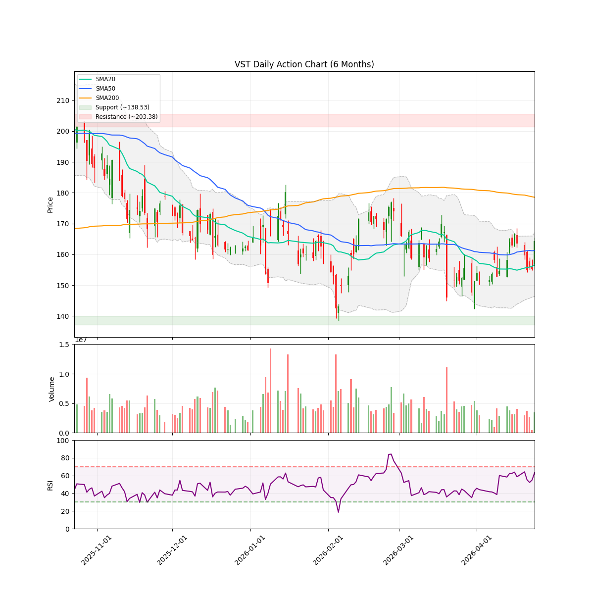
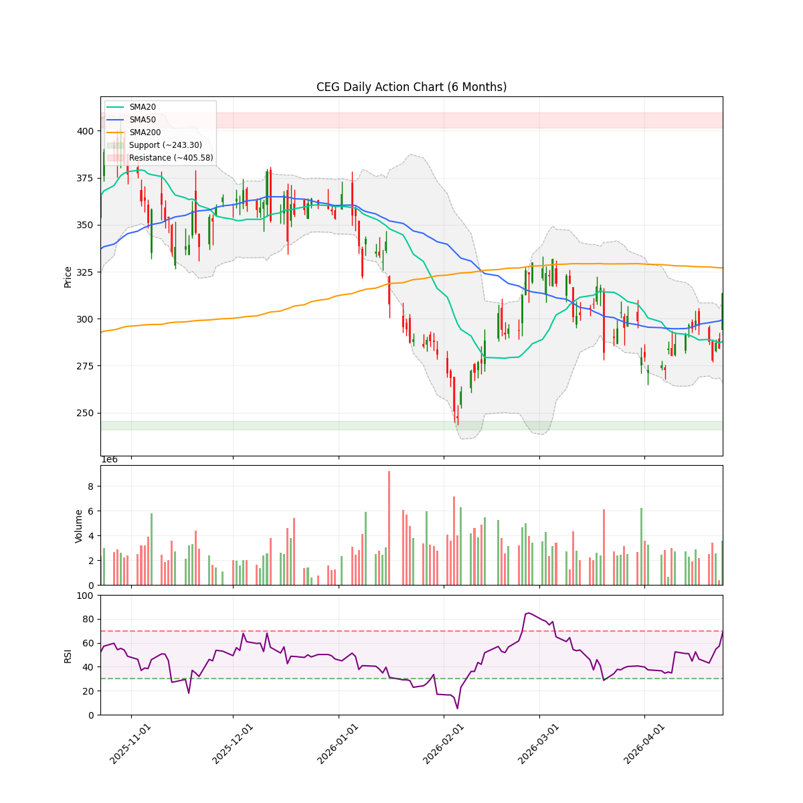

# AI 算力时代的能源双雄：VST vs CEG 深度解析报告

在人工智能（AI）军备竞赛中，算力是核心，而电力则是算力的终极瓶颈。科技巨头（Hyperscalers）正在不惜代价锁定稳定、零碳的基荷电力。在美股市场中，**Constellation Energy (CEG)** 和 **Vistra Corp (VST)** 成为了这一趋势下最受瞩目的两家能源巨头。

本报告将从基本面、技术面以及期权维度，对这两家公司进行全方位对比，并提供投资建议。

---

## 🏢 公司概况与核心逻辑

### Constellation Energy (CEG) —— 纯正的核电龙头
- **核心优势**：全美最大的商业核电运营商，拥有最庞大的零碳基荷电力容量。
- **催化剂**：2024年9月与**微软**签署了为期20年的协议，将重启三哩岛核电站（Crane Clean Energy Center）为其数据中心供电，规模达 **835 MW**。此外，还与 **Meta** 签署了 Clinton 电厂的供电协议。
- **定位**：AI 核电风口的最纯正标标的，行业带头大哥。

### Vistra Corp (VST) —— 高弹性的德州霸主
- **核心优势**：在德州（ERCOT市场）拥有统治地位，资产组合多元（天然气、核电、煤炭及储能）。通过收购 Energy Harbor，大幅增强了核电实力（增加 4,048 MW）。
- **催化剂**：与**亚马逊 AWS** 签署了长达20年的协议，由其 Comanche Peak 核电站为 AWS 提供 **1,200 MW** 的零碳电力。
- **定位**：德州 AI 负荷激增的最大受益者，高弹性挑战者。

---

## 🔢 量化财务与估值对比

根据最新本地缓存数据（截至 2026 年 4 月 25 日）：

| 指标 | Vistra Corp (VST) | Constellation Energy (CEG) | 简评 |
| :--- | :--- | :--- | :--- |
| **当前股价** | ~$164.35 | ~$313.53 | - |
| **市盈率 (Trailing P/E)** | 72.43 | 42.37 | VST 历史市盈率偏高，反映了之前的资产减值和波动。 |
| **预测市盈率 (Forward P/E)** | **14.05** | **22.92** | **关键点**：VST 的远期市盈率显著低于 CEG，显示出更高的性价比和盈利爆发力。 |
| **PEG 比例** | 1.37 | 3.74 | VST 的 PEG 更低，说明其增长性相对于估值更匹配。 |
| **市值** | ~534 亿美元 | ~1135 亿美元 | CEG 体量是 VST 的两倍，更受大资金青睐。 |

---

## 📊 技术面与图表分析

以下是基于最新周线和日线图表的分析。

### Vistra Corp (VST) 技术面

- **价格形态**：当前股价（~$164）处于 50日均线（$161.25）附近，但**明显低于 200日均线（$178.53）**。
- **观点**：VST 经历了较大幅度的回调，目前正在寻找支撑。股价偏离 200日均线约 8%，对于看好其长期基本面的投资者，这提供了一个更具性价比的入场或加仓区间。

### Constellation Energy (CEG) 技术面

- **价格形态**：股价（~$313.53）高于 50日均线（$299.48），且更接近其 200日均线（$327.05）。
- **观点**：CEG 的技术形态明显强于 VST，RSI 接近 70（超买边缘），显示出极强的上升动量。机构资金在 CEG 上的抱团更加坚定。

---

## 🐋 期权市场异动

最新扫描显示，上周 VST 和 CEG 的期权市场均**未出现显著的异常大单（Volume > OI）**。两者的成交量多集中在个位数或极小规模，表明市场主力资金目前在这两只股票的衍生品操作上处于观望状态。

---

## 🎯 长期投资买入价格指导

基于当前的均线位置和机构目标价，为长线投资者提供以下分批建仓的价格指导：

### Vistra Corp (VST)
- **当前价格**：~$158 - $164
- **第一梯队建仓区（合理）**：**$155 - $162**（此区间有50日均线支撑，且已较200日均线有约8%的折价）。
- **第二梯队加仓区（极具性价比）**：**$145 - $150**（如果市场出现系统性调整，此区间将提供极高的安全边际）。
- **机构目标价**：$233.95（潜在上涨空间巨大）。

### Constellation Energy (CEG)
- **当前价格**：~$313.53
- **第一梯队建仓区（合理）**：**$300 - $310**（回踩50日均线 $300 附近是较好的长线切入点）。
- **第二梯队加仓区（极具性价比）**：**$280 - $290**（若能跌破300，将是非常难得的击球区）。
- **机构目标价**：$372.38。

---

## 💡 投资建议 (Manager's Verdict)

基于量化基本面和技术面分析，我们给出以下投资建议：

1.  **稳健型与大资金配置首选：CEG**
    - 如果您追求的是**行业龙头溢价、最高的确定性**，以及最纯正的 AI 核电逻辑，CEG 是不二之选。其强势技术形态表明机构抱团依然紧密。
2.  **进攻型与追求高弹性配置首选：VST**
    - 如果您觉得 CEG 涨幅过大，或者更看好**德州独立电网市场的爆发力**，VST 提供了更好的**估值性价比**（Forward P/E 仅为 14倍左右）。它从高点回调后，正处于一个不错的右侧建仓或加仓区间。

**风险提示**：两家公司在未来几年都面临核电站重启/运营的监管风险，以及下游客户因电力和水资源短缺导致的数据中心建设延期风险。建议投资者控制好仓位，避免单一股票的过度集中。
