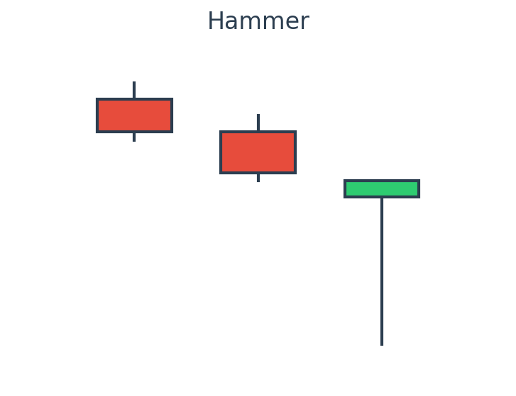
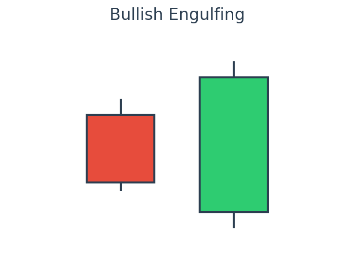
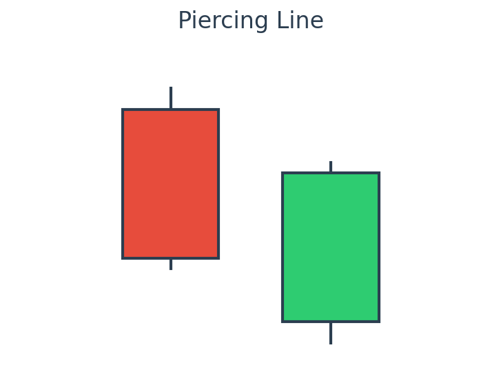

# lec14: 拒绝接飞刀：如何利用 K 线“右侧信号”精准抄底？

在股票交易中，很多人喜欢“抄底”。但盲目抄底往往就像徒手接飞刀，很容易被套在半山腰。
专业的交易员更喜欢**“右侧交易”**——宁可买得贵一点，也要等市场给出明确的止跌信号再入场。

本文为你整理了三种最经典、最实用的 K 线“右侧买入信号”，帮你提高抄底的成功率。

---

## 什么是“右侧信号”？

*   **左侧交易**：在股价下跌过程中，凭感觉或某个指标（如 RSI 超卖）认为“跌够了”就买入。这时候趋势还在向下，风险极高。
*   **右侧交易**：在股价下跌后，**等待股价止跌并出现反转迹象**时再买入。这时候趋势已经有转变的苗头，安全度大大提升。

K 线图就是市场情绪的晴雨表。当股价跌到关键位置时，以下三种 K 线形态就是市场在向你发出“多头开始反击”的信号。

---

## 三大经典 K 线买入信号

### 1. 锤子线（Hammer）/ 长下影线
**形态特征**：
*   出现在连续下跌之后。
*   K 线实体很小（红绿皆可，红色更佳），位于上方。
*   **下影线很长**（通常是实体的 2 倍以上），几乎没有上影线。

**示意图**：

**背后逻辑**：
开盘后空头继续疯狂打压，股价创出新低；但在盘中，多头突然发力，把价格强行拉了回来，最终收在开盘价附近。这说明**下方有极强的买盘支撑**，空头力量可能已经耗尽。

> [!NOTE]
> 下影线越长，成交量越大，见底信号越明确。

### 2. 看涨吞没（Bullish Engulfing）/ 阳包阴
**形态特征**：
*   由两根 K 线组成。
*   第一天是一根阴线。
*   第二天是一根**强劲的阳线**，且**阳线的实体完全包裹住了第一天的阴线实体**。

**示意图**：

**背后逻辑**：
第一天市场还在悲观中，空头占优。第二天虽然可能低开，但多头以压倒性的优势反扑，将价格推高到前一天开盘价之上。这代表**市场主导权已经从空头完全转交到了多头手中**。

### 3. 曙光初现（Piercing Line）
**形态特征**：
*   由两根 K 线组成。
*   第一天是大阴线。
*   第二天跳空低开，但随后一路走高，收盘价**深入到第一天阴线实体的 50% 以上**。

**示意图**：

**背后逻辑**：
低开说明空头还在发力，但随后的强劲反弹说明多头开始收复失地。虽然没有完全“吞没”前一天的阴线，但深入 50% 以上已经展示了多头的肌肉。

---

## 黄金交易法则：位置 + 信号 + 成交量

光看 K 线形态还不够，要让胜率更高，必须满足**“三合一”**法则：

1.  **位置（Where）**：这些信号必须出现在**强支撑区**（如前低、均线、或者成交量密集区 VAH/VAL）。如果在半空中出现，很可能是假信号。
2.  **信号（What）**：就是上述的经典 K 线形态，或者 RSI 重新站上 30。
3.  **成交量（Volume）**：反转的那天，**成交量最好能明显放大**。无量反弹往往走不远。

---

## 进阶讨论：如何将胜率从 50% 提升到 80%？

单纯看 K 线形态，胜率往往只有 50% 左右，因为市场上充斥着大量的“假信号”。职业交易员通常会结合以下三个维度进行“共振”确认，以大幅提升成功率：

### 1. 结合成交量分布（Volume Profile）
*   **核心逻辑**：K 线反映的是价格，而成交量反映的是**资金的真实态度**。
*   **实战技巧**：观察**成交量密集区（POC, Point of Control）**。如果一个“锤子线”恰好发生在前期的筹码密集区，说明主力资金在这里有强烈的护盘意愿，这个信号的含金量极高。反之，如果在“筹码真空区”出现反转形态，大概率是弱势反弹。

### 2. 多周期共振（Multi-Timeframe Analysis）
*   **核心逻辑**：大周期的趋势决定小周期的生死。
*   **实战技巧**：
    *   **第一步**：在周线级别寻找强支撑位（如 250 日均线，或前期历史低点）。
    *   **第二步**：当周线触及支撑时，切换到日线级别寻找“看涨吞没”或“锤子线”。
    *   大周期提供“安全垫”，小周期提供“精准买点”，这就是**右侧交易的精髓**。

### 3. 识别“形态失败”（Failure of Signals）
*   **核心逻辑**：失败的形态往往蕴含着更大的交易机会（如“多头陷阱”）。
*   **实战技巧**：如果出现了一个标准的“看涨吞没”，但随后几天股价并没有继续上攻，反而跌破了那根阳线的低点，这就是**形态失败**。这时候应该果断止损，甚至反手做空，因为这意味着多头反扑失败，空头将开启更猛烈的下跌。

---

## 推荐学习与参考资料

如果你想系统性地掌握这套技术，以下资源是行业公认的“圣经”：

### 1. 必读书籍
*   **《日本蜡烛图技术》(Japanese Candlestick Charting Techniques)** —— 史蒂夫·尼森 (Steve Nison)
    *   *点评*：K 线技术的鼻祖之作，详细剖析了每种形态背后的多空心理。
*   **《期货市场技术分析》(Technical Analysis of the Financial Markets)** —— 约翰·墨菲 (John Murphy)
    *   *点评*：技术分析的百科全书，涵盖趋势、形态、指标等所有基础知识。

### 2. 优质网站
*   **StockCharts School** (stockcharts.com/school): 提供系统且免费的技术分析教程（英文）。
*   **TradingView 社区**：可以搜索 "Candlestick Patterns"，学习其他交易员如何用代码标记这些形态。

---

**结语**：
交易是一场耐心的游戏。学会等待右侧信号，就是学会保护自己的本金。下次看到心仪的股票大跌时，不妨默念这篇博客的要点，等子弹飞一会儿，看到多头的“集结号”（K线反转）再冲锋！
