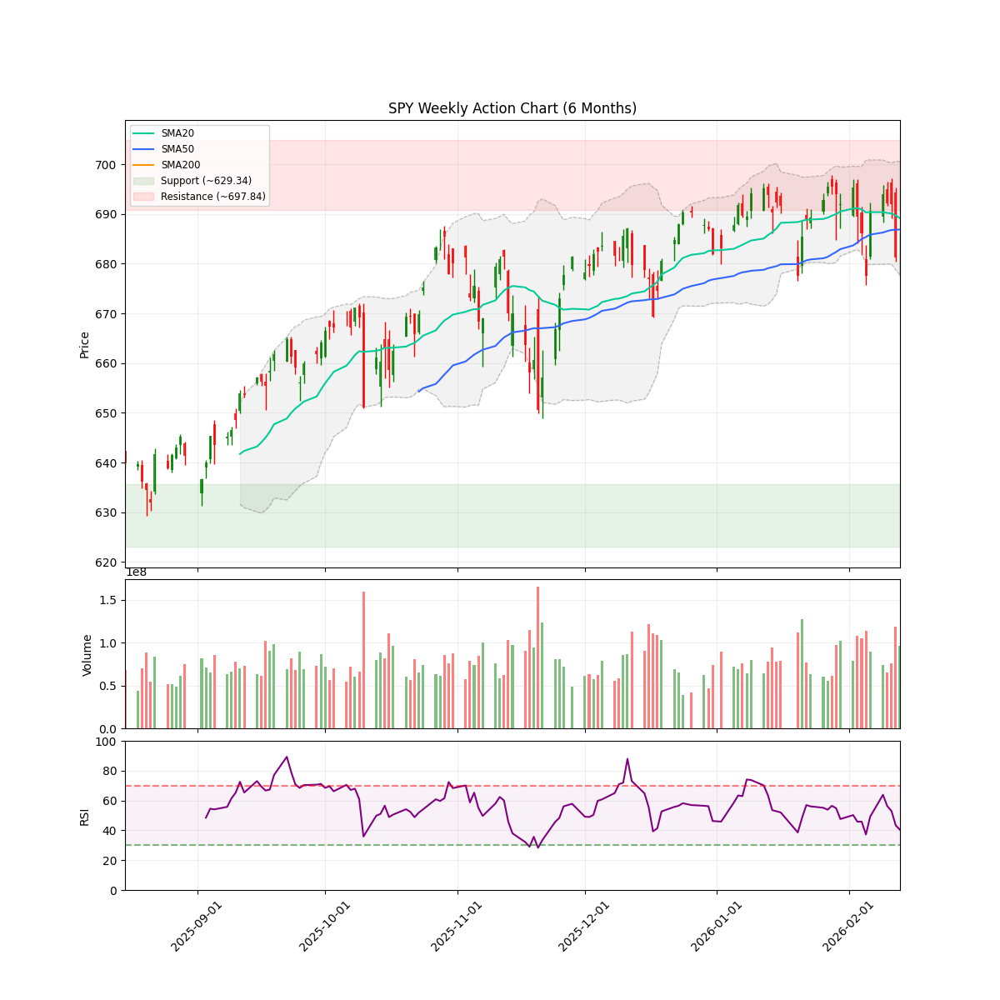
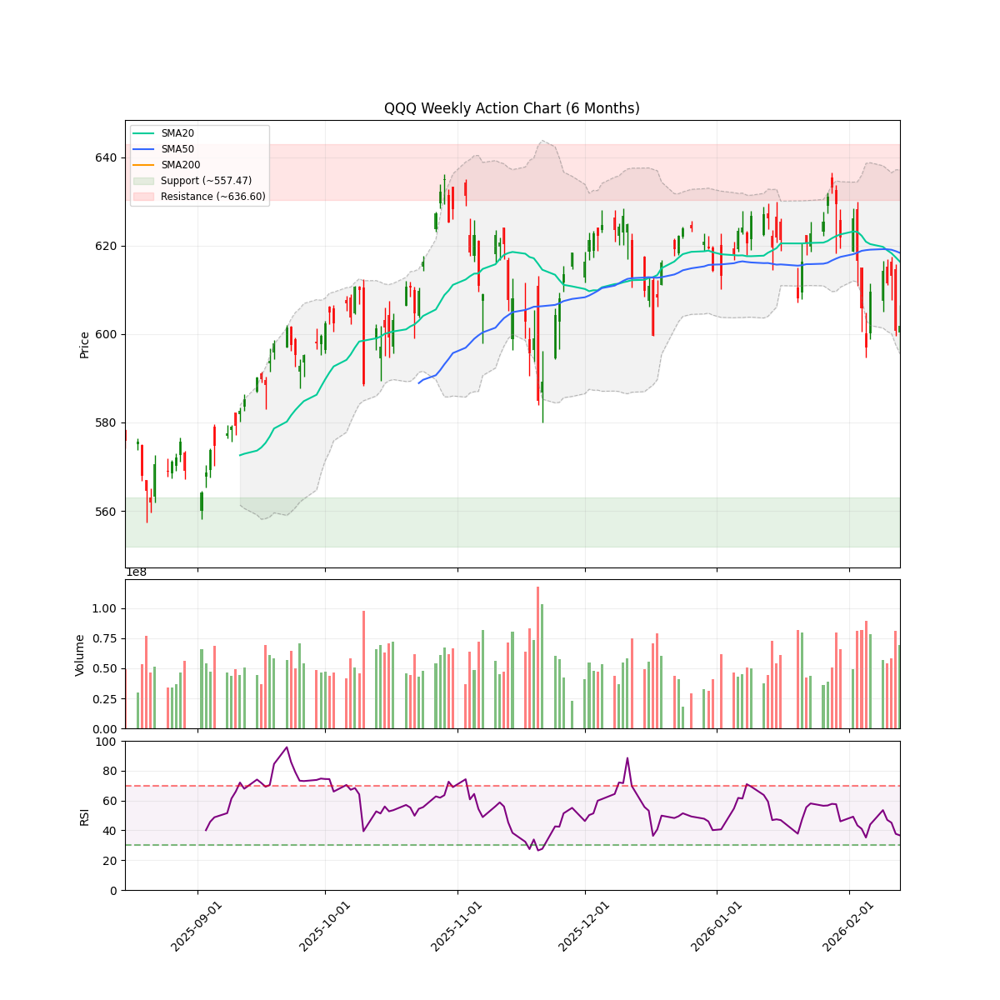

# 🌊 AlphaJAX 市场观澜报告
**日期:** 2026-02-15 | **期数:** 2026-W07 | **引擎:** AlphaJAX 2.0 (限界动量)

## 📑 目录
[TOC]

---

## 📖 本周市场叙事 (Market Story)

> 截至2026年2月中旬，美股大盘呈现明显的震荡下行态势，SPY与QQQ均跌破关键均线进入技术性下降趋势。尽管NAAIM经理仓位指数仍维持在80.61的高位，反映出主动管理资金的惯性滞后，但我们的量化模型已明确将市场定性为“防御（Defense）”机制，并将建议风险敞口审慎压缩至55%。这种宏观层面的撕裂揭示了市场正在经历从高估值科技成长股向具备高质量现金流和防御属性板块的剧烈切换。在降息预期推迟及利率风险回升的背景下，资金正加速流向医疗（XLV）、工业（XLI）以及具备盈利韧性的半导体龙头，以对抗由于无风险收益率上行带来的估值坍塌。
> 
> 在这一轮风格轮动中，微观层面的博弈核心在于如何在“实物资产复兴”与“工业能源化”中寻找确定性增长。GE Vernova (GEV) 成为当前机构辩论并达成共识的焦点标的。作为能源基础设施领域的领军者，GEV不仅完美契合我们对“质量”与“价值”因子的超配策略，其在电网现代化和脱碳技术领域的护城河，使其在当前波动的宏观环境下展现出极强的阿尔法属性。相比于估值过载的软件板块，GEV所代表的高壁垒、强现金流属性使其成为防守反击阶段的最佳配置选择，是我们当前坚定的买入评级标的。

### 📈 宏观走势速览
| **SPY (标普500)** | **QQQ (纳指100)** |
| :---: | :---: |
|  |  |

---

## 🌍 宏观市场环境 (Macro Context & Regime)

| 指数 | 当前价格 | 20日均线 | 50日均线 | 技术状态 |
|------|----------|----------|----------|----------|
| **SPY** | $681.75 | $689.15 | $686.87 | 🔴 DOWNTREND |
| **QQQ** | $601.92 | $616.34 | $618.35 | 🔴 DOWNTREND |

> **🔥 市场体制 (Market Regime):** `DEFENSE` (Breadth: 60.9%)
> **🛡️ 建议仓位 (Exposure):** `55%` (medium Volatility)
> **📊 NAAIM 曝光指数 (Smart Money):** `80.61`
> 💡 **导读:** 大盘趋势是最好的过滤器。当 SPY/QQQ 跌破 20日均线且 NAAIM < 60 时，应进入防御模式。

---

## 🔄 板块轮动 (Sector Rotation)

| 板块 ETF | 名称 | 1周表现 | 1月表现 | 动量状态 |
|----------|------|---------|---------|----------|
| **XLV** | Healthcare | +206.57% | +1308.78% | 🔥 领涨 |
| **XLY** | Consumer Discr | +206.57% | +1308.78% | 🔥 领涨 |
| **XLI** | Industrials | +206.57% | +1308.78% | 🔥 领涨 |
| **SMH** | Semiconductors | +206.57% | +1308.78% | 🔥 领涨 |
| **IGV** | Software | +206.57% | +1308.78% | 🔥 领涨 |
| **XLK** | Technology | -153.40% | -496.52% | 🔴 领跌 |
| **XLE** | Energy | -153.40% | -496.52% | 🔴 领跌 |
| **XLF** | Financials | -481.02% | -461.68% | 🔴 领跌 |

> 💡 **导读:** 资金流向是行情的燃料。关注资金是否从科技(XLK)轮动到防御性或周期性板块。

---

## 🔥 动量热力图 (Top 3 候选)

| 排名 | 代码 | VCP | RSM Z | 衰竭度 | RS Z | 量能比 | ATR止损 |
|:----:|:----:|:---:|:-----:|:------:|:----:|:------:|:-------:|
| 1 | **GEV** | 0.00 | +3.96 🔥 | 🟩🟩⬜⬜⬜⬜⬜⬜⬜⬜ 27 | +12.60 | 0.6x | $726.75 |
| 2 | **SNDK** | 0.00 | -0.52 📉 | 🟩⬜⬜⬜⬜⬜⬜⬜⬜⬜ 15 | +18.42 | 1.1x | $499.21 |
| 3 | **KMI** | 0.00 | +2.60 🔥 | 🟨🟨🟨🟨⬜⬜⬜⬜⬜⬜ 47 | -0.07 | 1.0x | $31.01 |

> 📊 扫描统计: 511 标的 → 3 通过过滤

---

## 🎯 Top 1 动量辩论报告

### GEV

#### 📈 量化信号卡片
| 指标 | 数值 | 状态 |
|------|------|------|
| 综合得分 | 4.588 | 排名 #1 |
| VCP (波动收缩) | 0.00 | 发散 |
| RSM (动量) | +3.96 | 强势 |
| 衰竭度 | 27/100 | 🟢 HEALTHY |
| RS (相对强度) | +12.60 | 跑赢基准 |
| 当前价 | $802.13 | - |
| ATR止损 | $726.75 | 风险 9.4% |

#### 🥊 多轮辩论过程
**第1轮：**
- 🐂 多头: GEV正处于典型的突破后回踩确认阶段，极低的涨势枯竭度（27/100）配合强劲的机构看涨期权布局，预示着基于电网现代化的长期多头趋势将加速延续。
- 🐻 空头: 当前估值严重透支未来增长，平均目标价显示存在下行风险，且2026年的定金流入无法掩盖2030年才能兑现收入的时间错配风险。

#### 🏆 最终裁决
- **AlphaJAX 2.0 矩阵裁定:** **🟢 重仓买入 (Heavy Buy - Tech & Logic Aligned)**
- **操作建议:** BUY
- **逻辑评分 (Logic):** 9/10
- **信心指数:** 85%
- **仓位建议:** Half
- **核心论点:** 在极低涨势枯竭度（27/100）与极高相对强度（RSM 3.96）的背书下，技术面回踩确认了长期电网现代化需求的增长逻辑，足以对冲短期估值博弈风险。

#### 💰 交易计划
| 项目 | 建议 |
|------|------|
| 入场策略 | 在$800-$805区间先行建立底仓，若价格回踩$785支撑位可进行二次增持。 |
| 止损位 | $726.75 |
| 目标位 | $930.00 |
| 盈亏比 | 1.7:1 |

#### ⚠️ 关键监控点
- RSM Z-Score 跌破 3.0
- 机构看涨期权未平仓量显著下降
- 2026年预付款流入进度不及预期

---

---
*Report automatically generated by [AlphaJAX](https://github.com/your-repo/alphajax).*