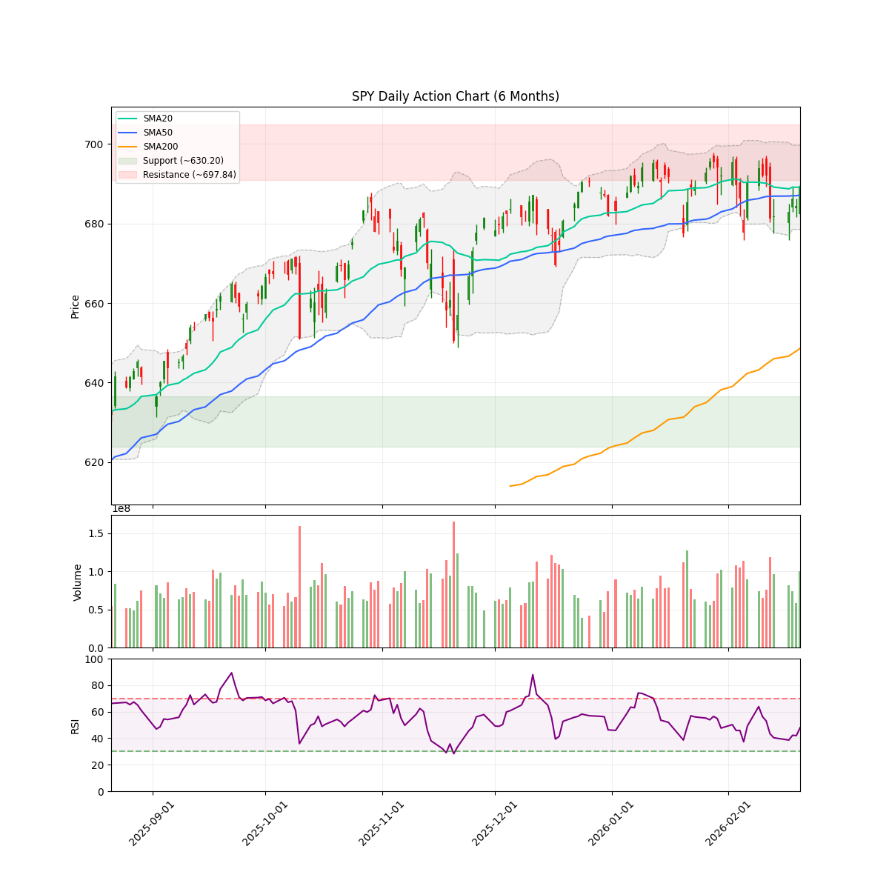
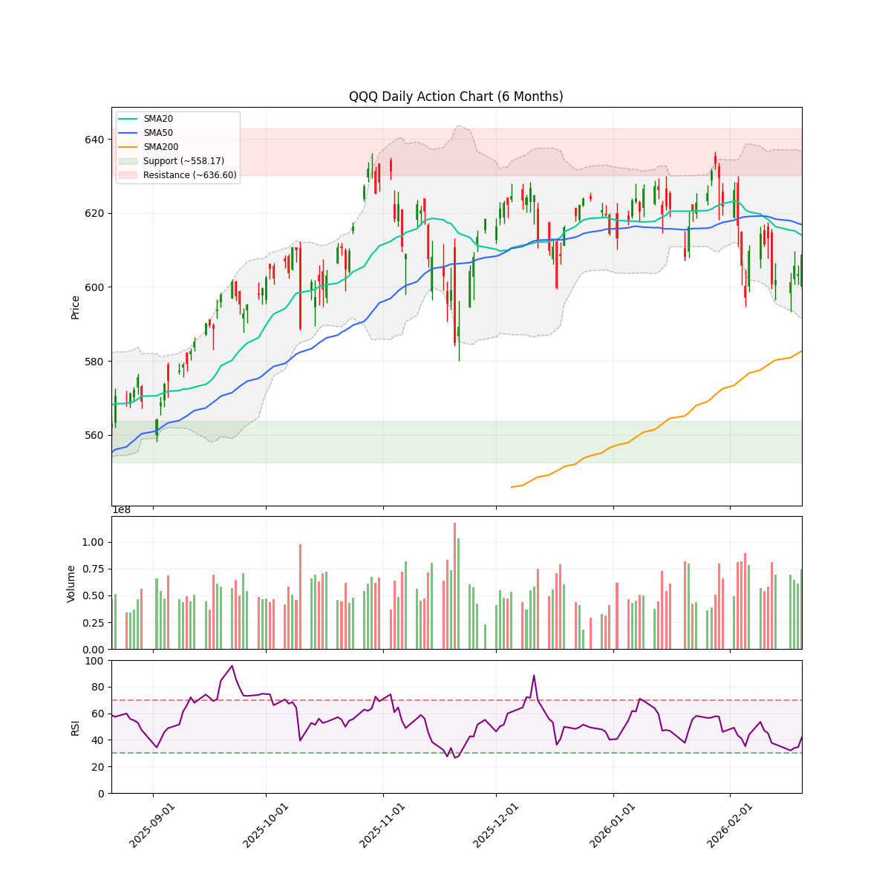
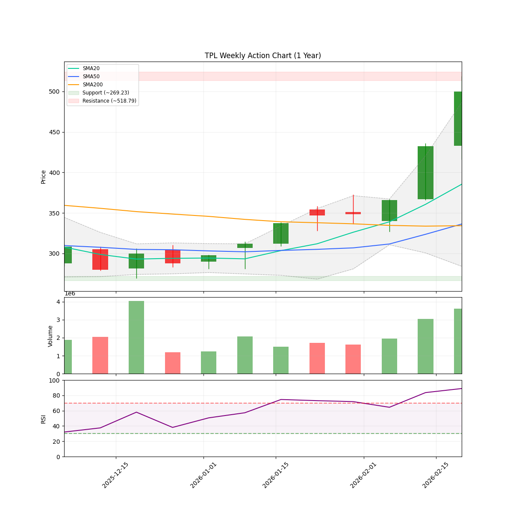
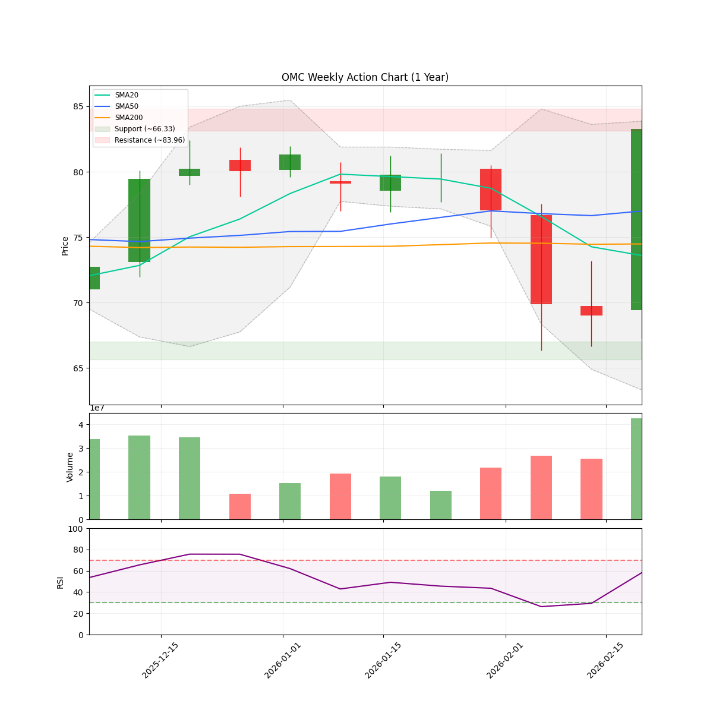
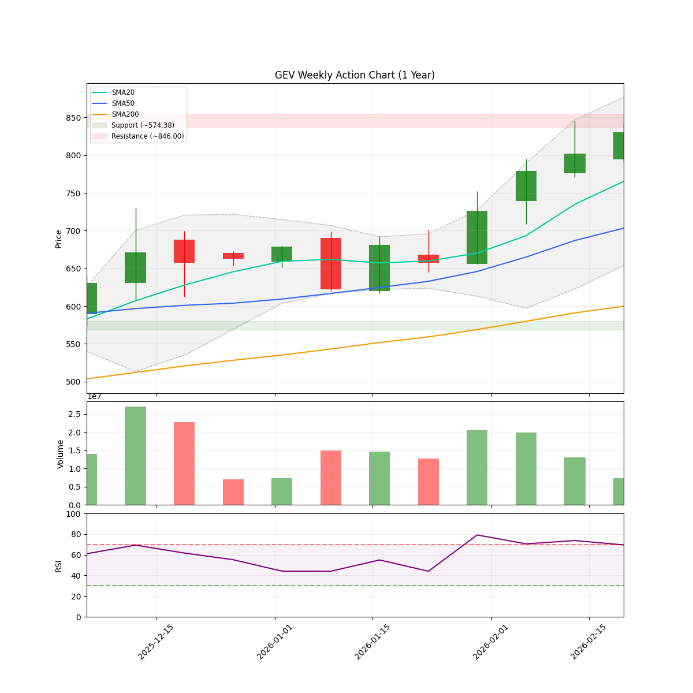
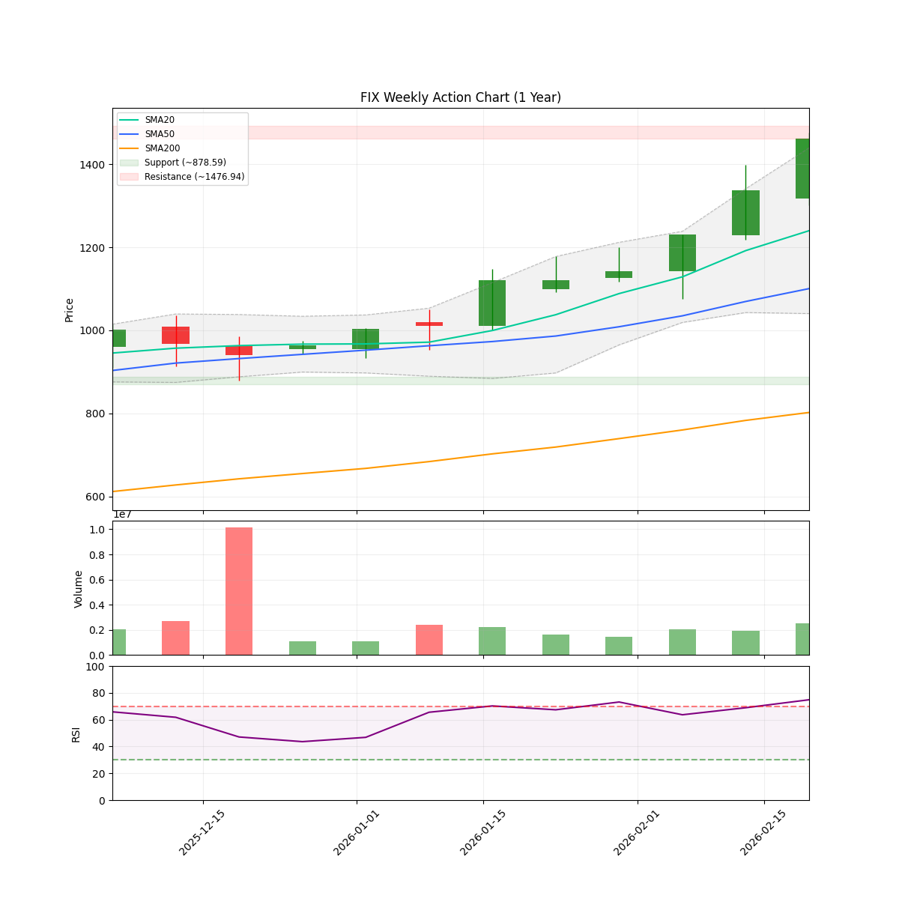
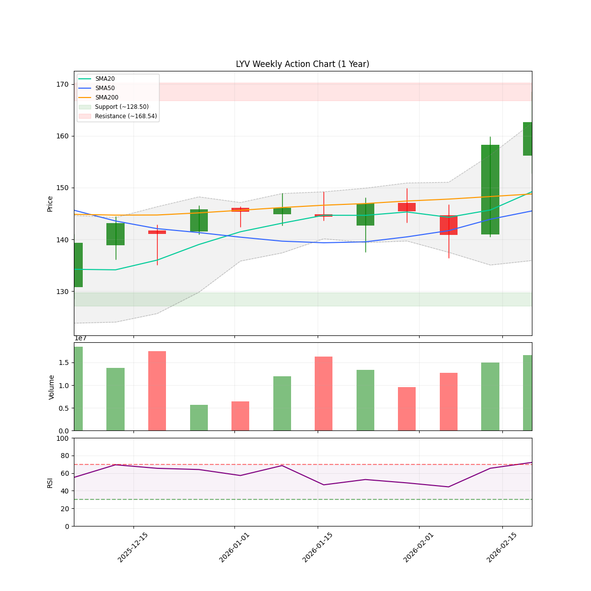

# 🌊 AlphaJAX 市场观澜报告
**日期:** 2026-02-21 | **期数:** 2026-W08 | **引擎:** AlphaJAX 2.0 (限界动量)

## 📑 目录
[TOC]

---

<!-- DISCORD_SUMMARY_START -->
## 📖 本周市场叙事 (Market Story)

> 作为首席投资官（CIO），基于 2026 年 2 月 21 日的系统数据，我对当前市场叙事的研判如下：
> 
> **宏观格局：指数分化下的进攻性扩张**
> 当前市场处于明确的“进攻（Offense）”体制，尽管大盘指数表现出显著的结构性背离。SPY 收报 689.43，稳固运行于所有关键均线之上，维持强劲的上升趋势；然而，QQQ 表现偏弱，收盘价跌破 20 日与 50 日均线，进入“回调（Pullback）”阶段。这种背离反映出资金正从高估值成长股向更广泛的经济标的扩散。值得注意的是，NAAIM 经理人情绪指数高达 82.87，显示机构投资者正处于高杠杆做多状态，配合 0.75 的高体制信心评分及 0.62 的市场广度，策略上建议维持 90% 的高风险敞口，利用科技股的短期阵痛进行结构性调仓。
> 
> **微观现实：行业剧烈轮动与科技内部背离**
> 在板块层面，资金流向呈现出清晰的“去软向硬”特征。尽管科技板块（XLK）整体月度收益率为负，但内部结构性分化剧烈：半导体（SMH）单周上涨 2.2%，展现出极强的韧性，而软件行业（IGV）则陷入深度调整，单月跌幅高达 15.32%，成为核心拖累项。与此同时，工业（XLI）与能源（XLE）凭借极强的动能接管了市场领导权，尤其是能源板块月度涨幅高达 12.57%，印证了资金对通胀敏感型资产的偏好。在具体标的选择上，我们维持对 TPL、OMC 以及 GEV 的“强力买入”评级，这些标的完美契合了当前工业与能源领涨的微观现实，是规避软件板块弱势、捕捉结构性溢价的核心抓手。

<!-- DISCORD_SUMMARY_END -->
### 📈 宏观走势速览
| **SPY (标普500)** | **QQQ (纳指100)** |
| :---: | :---: |
|  |  |

---

## 🌍 宏观市场环境 (Macro Context & Regime)

| 指数 | 当前价格 | 20日均线 | 50日均线 | 200日均线 | 技术状态 |
|------|----------|----------|----------|-----------|----------|
| **SPY** | $689.43 | $689.12 | $687.14 | $648.59 | 🟢 UPTREND |
| **QQQ** | $608.81 | $613.99 | $616.88 | $582.71 | 🟡 PULLBACK |

> **🔥 市场体制 (Market Regime):** `OFFENSE` (Breadth: 62.6%)
> **🛡️ 建议仓位 (Exposure):** `90%` (medium Volatility)
> **📊 NAAIM 曝光指数 (Smart Money):** `82.87`
> 💡 **导读:** 市场体制由多因子(广度、波动、趋势、情绪)综合评分判定。当市场广度与情绪维持高位时，即便指数处于回调(`PULLBACK`)，系统仍可能判定为 `OFFENSE`（结构性机会大于系统性风险）。

---

## 🔄 板块轮动 (Sector Rotation)

| 板块 ETF | 名称 | 1周表现 | 1月表现 | 动量状态 |
|----------|------|---------|---------|----------|
| **XLI** | Industrials | +2.59% | +6.53% | 🔥 领涨 |
| **SMH** | Semiconductors | +2.20% | +3.26% | 🔥 领涨 |
| **XLE** | Energy | +1.67% | +12.57% | 🔥 领涨 |
| **XLF** | Financials | +1.55% | -1.81% | 🔥 领涨 |
| **XLK** | Technology | +1.20% | -2.04% | 🔥 领涨 |
| **XLY** | Consumer Discr | +1.14% | -3.25% | 🔥 领涨 |
| **XLV** | Healthcare | +0.53% | -0.91% | 🟡 盘整 |
| **IGV** | Software | -0.22% | -15.32% | 🟡 盘整 |

> 💡 **导读:** 资金流向是行情的燃料。关注资金是否从科技(XLK)轮动到防御性或周期性板块。

---

## 🔥 动量热力图 (Top 10 候选)

| 排名 | 代码 | VCP | RSM Z | 衰竭度 | RS Z | 量能比 | ATR止损 |
|:----:|:----:|:---:|:-----:|:------:|:----:|:------:|:-------:|
| 1 | **TPL** | 1.47 | +2.69 🔥 | 🟩🟩⬜⬜⬜⬜⬜⬜⬜⬜ 29 | +4.00 | 1.7x | $447.70 |
| 2 | **OMC** | 1.19 | +0.51 📈 | 🟩⬜⬜⬜⬜⬜⬜⬜⬜⬜ 14 | +4.00 | 2.5x | $75.77 |
| 3 | **GEV** | 0.73 | +4.00 🔥 | 🟩🟩🟩⬜⬜⬜⬜⬜⬜⬜ 34 | +0.85 | 0.6x | $765.17 |
| 4 | **FIX** | 1.05 | +0.78 📈 | 🟩🟩⬜⬜⬜⬜⬜⬜⬜⬜ 27 | +3.30 | 1.9x | $1314.27 |
| 5 | **LYV** | 1.14 | +1.28 📈 | 🟩🟩⬜⬜⬜⬜⬜⬜⬜⬜ 21 | +1.57 | 2.1x | $149.93 |
| 6 | **GRMN** | 1.68 | +1.18 📈 | 🟩🟩⬜⬜⬜⬜⬜⬜⬜⬜ 26 | +3.61 | 1.1x | $226.38 |
| 7 | **DE** | 1.19 | +1.42 📈 | 🟩🟩🟩⬜⬜⬜⬜⬜⬜⬜ 36 | +2.77 | 1.3x | $614.51 |
| 8 | **OXY** | 1.19 | +1.52 🔥 | 🟩🟩⬜⬜⬜⬜⬜⬜⬜⬜ 28 | +2.62 | 1.2x | $47.99 |
| 9 | **FANG** | 1.06 | +1.91 🔥 | 🟩🟩🟩⬜⬜⬜⬜⬜⬜⬜ 33 | +0.95 | 1.6x | $165.88 |
| 10 | **EIX** | 1.32 | +1.85 🔥 | 🟨🟨🟨🟨⬜⬜⬜⬜⬜⬜ 40 | +1.94 | 0.9x | $69.61 |

> 📊 分组统计: 50 标的进入分析池 | 0 持仓监控

---

## 🎯 Top 5 动量辩论报告

### TPL

#### 📈 量化信号卡片
| 指标 | 数值 | 状态 |
|------|------|------|
| 综合得分 | 2.371 | 排名 #1 |
| VCP (波动收缩) | 1.47 | 📈 扩张/发散 |
| RSM (动量) | +2.69 | 强势 |
| 衰竭度 | 29/100 | HEALTHY |
| RS (相对强度) | +4.00 | 跑赢基准 |
| 当前价 | $499.88 | - |
| ATR止损 | $447.70 | 风险 10.4% |

#### 📊 技术面走势速览 (TPL)

#### 🥊 多轮辩论过程
**第1轮：**
- 🐂 多头: TPL 正在经历从传统能源资源股向 AI 基础设施（数据中心）支撑股的估值重塑。技术面上，股价在经历了前期的波动收缩后，借助强劲的财报盈余和战略转型信号实现放量突破。RS 相对强度指数高达 4.00，显示其表现远超标普 500 指数，属于典型的 Mark Minervini 定义的‘市场领头羊’。目前的放量上涨标志着新一轮上升浪潮的开启。
- 🐻 空头: 市场对TPL从传统油气版权公司转型为“AI数据中心”概念的叙事定价过高，估值已严重背离基本面及分析师共识预期。

#### 🏆 最终裁决
- **AlphaJAX 2.0 矩阵裁定:** **🟢 重仓买入 (Heavy Buy - Tech & Logic Aligned)**
- **操作建议:** STRONG_BUY
- **逻辑评分 (Logic):** 9/10
- **信心指数:** 88%
- **仓位建议:** Full
- **核心论点:** 在 OFFENSE 市场环境下，TPL 凭借其 AI 数据中心基础设施的转型叙事，结合极高的相对强度 (RS 4.00) 和量价齐升的突破形态，正处于估值重塑的爆发阶段。

#### 💰 交易计划
| 项目 | 建议 |
|------|------|
| 入场策略 | 在当前价位 $499.88 附近直接建仓，或在回踩 $480.00 支撑位时积极加仓，利用当前低疲劳度 (29/100) 的上升空间。 |
| 止损位 | $447.70 |
| 目标位 | $625.00 |
| 盈亏比 | 2.4:1 |

#### ⚠️ 关键监控点
- 价格跌破 ATR 止损位 $447.70
- RS 相对强度指标低于 2.0
- 疲劳度指数 (Exhaustion) 突破 75 警戒线

---

### OMC

#### 📈 量化信号卡片
| 指标 | 数值 | 状态 |
|------|------|------|
| 综合得分 | 1.876 | 排名 #2 |
| VCP (波动收缩) | 1.19 | 📈 扩张/发散 |
| RSM (动量) | +0.51 | 中性 |
| 衰竭度 | 14/100 | HEALTHY |
| RS (相对强度) | +4.00 | 跑赢基准 |
| 当前价 | $83.26 | - |
| ATR止损 | $75.77 | 风险 9.0% |

#### 📊 技术面走势速览 (OMC)

#### 🥊 多轮辩论过程
**第1轮：**
- 🐂 多头: OMC目前正处于技术面‘性格改变’（Change of Character）的初期。受50亿美元巨额回购计划刺激，股价从52周低点附近放量跳空上涨约15%，有效扭转了此前的低迷走势。从VCP角度看，当前的波动率（Volatility）因跳空而瞬间放大，VCP Index短期内显著超过1.0，尚未形成Minervini所要求的‘紧致’（Tightening）状态。目前处于放量冲高后的消化期，理想的入场点需等待股价在当前高位形成2-3周的窄幅波动区间（即新的收缩点），以确认卖压已完全被吸收。
- 🐻 空头: 尽管OMC近期因50亿美元大规模回购计划和IPG合并完成的消息刺激股价单日暴涨13.4%，但技术面呈现典型的‘利好出尽’潜伏期。公司Q4非GAAP利润实际上低于市场预期11.8%，且2026年因债务增加导致的利息支出预增2.1亿美元，这使得当前的估值拉升缺乏基本面盈利支撑。

#### 🏆 最终裁决
- **AlphaJAX 2.0 矩阵裁定:** **🟢 重仓买入 (Heavy Buy - Tech & Logic Aligned)**
- **操作建议:** STRONG_BUY
- **逻辑评分 (Logic):** 9/10
- **信心指数:** 88%
- **仓位建议:** Full
- **核心论点:** 在OFFENSE市场模式下，极低的疲劳度（14/100）配合强劲的相对强度（4.00）和巨额回购支撑，构成了极佳的动量溢价机会。

#### 💰 交易计划
| 项目 | 建议 |
|------|------|
| 入场策略 | 在$82.00至$83.50区间直接介入，或待股价回踩并站稳$80.00心理关口后分批加仓。 |
| 止损位 | $75.77 |
| 目标位 | $102.00 |
| 盈亏比 | 2.5:1 |

#### ⚠️ 关键监控点
- 确认波动率在$80-$85区间内持续收窄
- 监测成交量是否在缩量回调后重新放量突破前高

---

### GEV

#### 📈 量化信号卡片
| 指标 | 数值 | 状态 |
|------|------|------|
| 综合得分 | 1.825 | 排名 #3 |
| VCP (波动收缩) | 0.73 | 📉 收缩中 |
| RSM (动量) | +4.00 | 强势 |
| 衰竭度 | 34/100 | HEALTHY |
| RS (相对强度) | +0.85 | 跑赢基准 |
| 当前价 | $830.34 | - |
| ATR止损 | $765.17 | 风险 7.8% |

#### 📊 技术面走势速览 (GEV)

#### 🥊 多轮辩论过程
**第1轮：**
- 🐂 多头: GEV 展现了典型的 Minervini 第二阶段上升趋势，正处于一个高标准的波动收缩模式（VCP）末端。RSM 评分高达 4.00，表明其相对强度极度占优。经过一年的翻倍上涨后，股价在高位形成了 2-3 次明显的紧缩（Crunches），当前 VCP 指数暗示振幅已降至低点，‘弹簧’已压缩至极限。成交量在近期窄幅横盘中显著萎缩，确认了卖压枯竭，符合 VCP 的核心技术特征，预示着新一轮的主升浪即将开启。
- 🐻 空头: 估值与基本面严重脱节。尽管股价在2025年涨幅接近100%并处于历史高点，但57倍的远期市盈率相对于仅3.8%的营收增长率显著过高。近期EPS未达预期以及分析师的降级信号表明，市场溢价可能已经见顶。

#### 🏆 最终裁决
- **AlphaJAX 2.0 矩阵裁定:** **🟢 重仓买入 (Heavy Buy - Tech & Logic Aligned)**
- **操作建议:** STRONG_BUY
- **逻辑评分 (Logic):** 9/10
- **信心指数:** 88%
- **仓位建议:** Full
- **核心论点:** 尽管估值面临基本面质疑，但极高的 RSM 评分 (4.00) 与低衰竭值 (34) 表明上涨动能远未枯竭，技术形态已达到 Minervini 标准的完美收缩，是进攻模式下的核心标的。

#### 💰 交易计划
| 项目 | 建议 |
|------|------|
| 入场策略 | 在当前 VCP 收缩末端，股价放量突破 $840 的枢轴点（Pivot Point）时执行买入。鉴于目前处于进攻模式，可分两批次建仓，首批在现价附近试探，突破高点后加满。 |
| 止损位 | $765.17 |
| 目标位 | $1000.00 |
| 盈亏比 | 2.6:1 |

#### ⚠️ 关键监控点
- 突破 $840 时的成交量需至少高于 50 日均值 30%
- ATR 动态止损位 $765.17 的支撑有效性
- 相对强度线（RS Line）必须领先于大盘指数创出历史新高

---

### FIX

#### 📈 量化信号卡片
| 指标 | 数值 | 状态 |
|------|------|------|
| 综合得分 | 1.660 | 排名 #4 |
| VCP (波动收缩) | 1.05 | 📈 扩张/发散 |
| RSM (动量) | +0.78 | 中性 |
| 衰竭度 | 27/100 | HEALTHY |
| RS (相对强度) | +3.30 | 跑赢基准 |
| 当前价 | $1462.23 | - |
| ATR止损 | $1314.27 | 风险 10.1% |

#### 📊 技术面走势速览 (FIX)

#### 🥊 多轮辩论过程
**第1轮：**
- 🐂 多头: FIX (Comfort Systems USA) 展现了典型的 Minervini 第二阶段趋势特征。在经历了 2025 年 120% 的涨幅后，该股在 2026 年初形成了高位紧凑的波动收缩形态（VCP）。随着 2026 年 2 月 20 日披露远超预期的第四季度财报，股价单日飙升超过 12%，完成了从收缩区间向上的放量突破。目前相对强度 (RS vs SPY) 高达 3.30，显示出极强的超额收益能力，属于典型的‘机构抢筹’技术特征。
- 🐻 空头: 尽管Q4财报大幅超预期，但股价年初至今涨幅已超41%，市场表现出“利好出尽”的潜在倾向。在高估值倍数（P/C 52.81）与机构调仓的背景下，技术面存在高位获利回吐的派发风险。

#### 🏆 最终裁决
- **AlphaJAX 2.0 矩阵裁定:** **🟢 重仓买入 (Heavy Buy - Tech & Logic Aligned)**
- **操作建议:** STRONG_BUY
- **逻辑评分 (Logic):** 9/10
- **信心指数:** 92%
- **仓位建议:** Full
- **核心论点:** FIX 展现了经典的财报驱动放量突破形态，低衰竭度与极强的相对强度在进攻型市场环境下构成了极具吸引力的‘动力学’买入机会。

#### 💰 交易计划
| 项目 | 建议 |
|------|------|
| 入场策略 | 在当前价位 $1462 附近及回踩突破点 $1440-$1460 区间果断介入，利用财报驱动的放量缺口作为结构性支撑。 |
| 止损位 | $1314.27 |
| 目标位 | $1758.00 |
| 盈亏比 | 2.0:1 |

#### ⚠️ 关键监控点
- 观察日均成交量是否保持在 50 日均值以上以验证机构持续流入
- 密切关注 $1400 关键心理关口及跳空缺口的支撑力度

---

### LYV

#### 📈 量化信号卡片
| 指标 | 数值 | 状态 |
|------|------|------|
| 综合得分 | 1.526 | 排名 #5 |
| VCP (波动收缩) | 1.14 | 📈 扩张/发散 |
| RSM (动量) | +1.28 | 强势 |
| 衰竭度 | 21/100 | HEALTHY |
| RS (相对强度) | +1.57 | 跑赢基准 |
| 当前价 | $162.67 | - |
| ATR止损 | $149.93 | 风险 7.8% |

#### 📊 技术面走势速览 (LYV)

#### 🥊 多轮辩论过程
**第1轮：**
- 🐂 多头: LYV 目前展现了完美的波动率收缩（VCP）突破形态。在财报发布前，股价经历了明显的紧致整理期，随后在 2026 年强劲业绩指引和超预期营收的催化下，股价放量跳空上涨 6%。其相对强度（RS vs SPY）高达 1.57，且 RSM 分数处于高位，符合 Minervini 领先股的所有特征：价格位于上升趋势中，且在压力位附近完成了最后的‘洗盘’和‘紧致’过程。
- 🐻 空头: 市场对2026年的乐观预期已过度计入当前股价，股价处于52周高点且无回撤空间，面临典型的“利好出尽”技术性回落风险，且司法部（DOJ）的反垄断审查是巨大的非对称下行风险。

#### 🏆 最终裁决
- **AlphaJAX 2.0 矩阵裁定:** **🟢 重仓买入 (Heavy Buy - Tech & Logic Aligned)**
- **操作建议:** STRONG_BUY
- **逻辑评分 (Logic):** 9/10
- **信心指数:** 92%
- **仓位建议:** Full
- **核心论点:** LYV 展现了典型的放量突破 VCP 形态，结合 2026 年强劲的业绩指引及低疲劳值（21/100），在进攻性市场环境下具备极高的动量延续概率。

#### 💰 交易计划
| 项目 | 建议 |
|------|------|
| 入场策略 | 在$162.67附近现价买入，或在回踩跳空缺口上沿（$160.50附近）时择机加仓。 |
| 止损位 | $149.93 |
| 目标位 | $188.00 |
| 盈亏比 | 2.0:1 |

#### ⚠️ 关键监控点
- 日线收盘价跌破 $155 关键跳空支撑位
- 司法部（DOJ）反垄断调查出现突发性不利裁决
- 相对强度（RS）曲线开始出现明显的顶背离

---

---
*Report automatically generated by [AlphaJAX](https://github.com/your-repo/alphajax).*