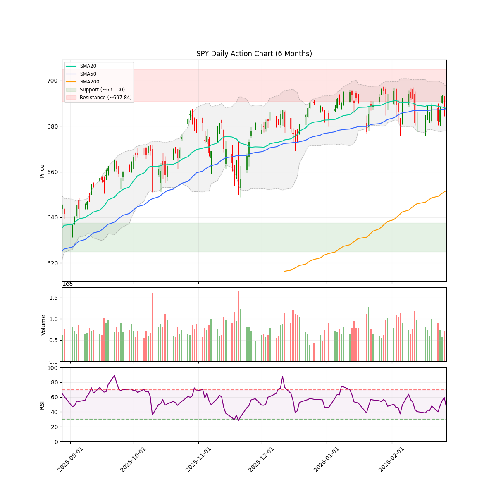
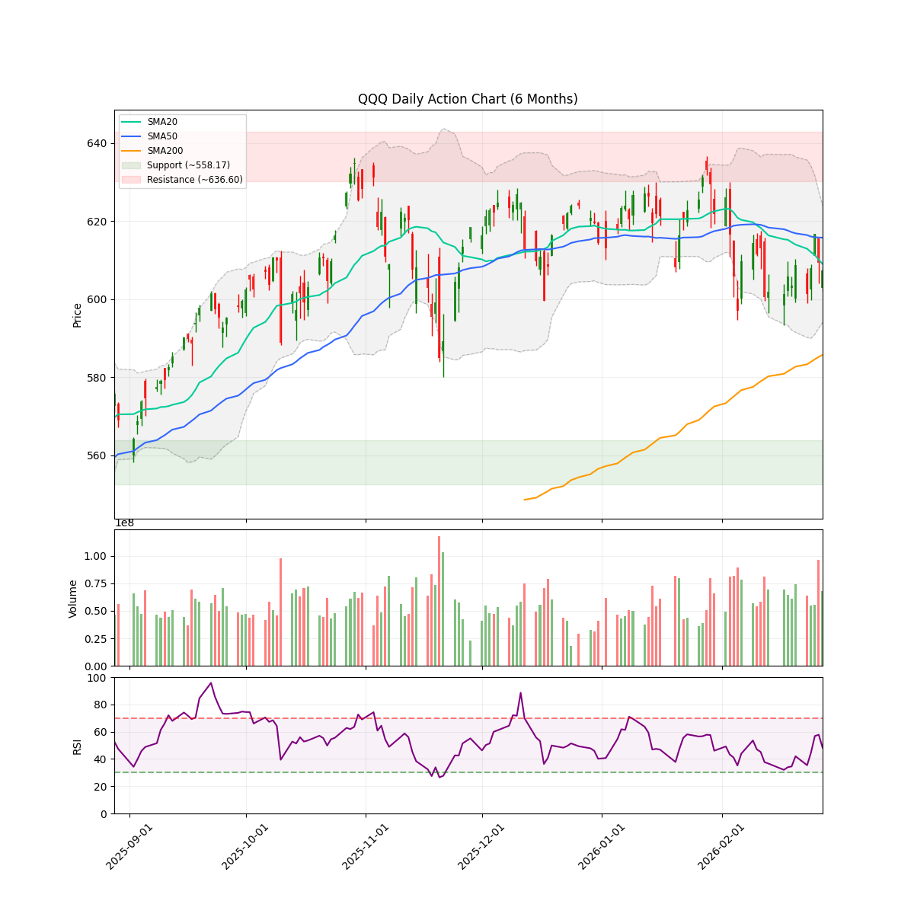
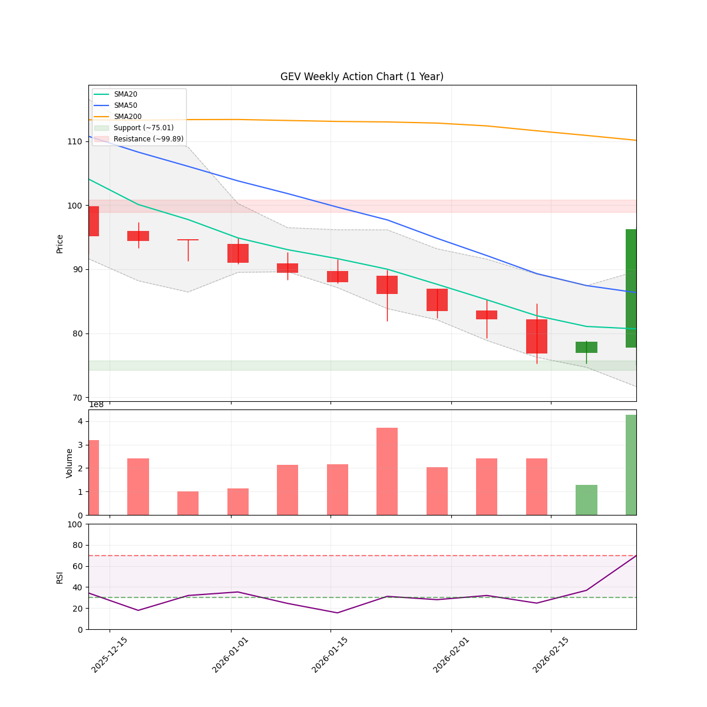

# 🌊 AlphaJAX 市场观澜报告
**日期:** 2026-03-01 | **期数:** 2026-W09 | **引擎:** AlphaJAX 2.0 (限界动量)

## 📑 目录
[TOC]

---

## 🌐 全球重大宏观与地缘事件 (Global Macro Events)

Macro Events Agent Error: 503 UNAVAILABLE. {'error': {'code': 503, 'message': 'This model is currently experiencing high demand. Spikes in demand are usually temporary. Please try again later.', 'status': 'UNAVAILABLE'}}

---

<!-- DISCORD_SUMMARY_START -->
## 📖 本周市场叙事 (Market Story)

> 老铁们，咱们来看看当前市场这盘大棋。最近的标普SPY（686点一线）和纳指QQQ（607点一线）就像是连夜施展轻功赶路后、坐在茶棚里擦汗歇脚的侠客——双双微跌穿了20日和50日均线，亮起了“🟡 PULLBACK（短期回调）”的黄灯。但千万别急着喊“狼来了”，你往下瞅瞅，距离200日牛熊分界线（SPY的651和QQQ的585）那可是有着厚厚的安全垫，这纯粹是狂奔后的正常喘息。系统底层雷达依旧死死锁定在“进攻（Offense）”模式，不仅给出了高达91%的建议满血仓位，NAAIM机构仓位指数也稳稳停留在74.93。这帮华尔街老狐狸根本没在撤退，他们只是在玩一出“乾坤大挪移”，大盘表面波澜不惊，底下资金早就悄摸摸换了战场。
> 
> 顺着这波“资金大挪移”，咱们扒开板块的数据，那真是一出好戏！最精彩的莫过于科技大院里的“骨肉相残”：大科技（XLK）和半导体（SMH）最近灰头土脸，本周分别挨了-1.5%和-2.1%的闷棍；但极其魔幻的是，上个月被按在地上爆砍16%血条、惨到姥姥家的软件板块（IGV），这周竟然“诈尸回血”，逆势翻红领涨（+1.0%）——这说明资金在科技股内部正疯狂上演“弃硬保软、高低切”的戏码。再看真正的大佬，能源（XLE）简直是开了挂，单月暴涨近11.7%，本周继续踩油门；医疗（XLV）也稳如老狗跟在领涨第一梯队。这种资金向“硬核资源”和“超跌修复”集中的趋势，直接体现在了我们的龙虎榜上：乘着能源起飞的东风，地主豪绅TPL和电气巨头GEV直接杀出“STRONG_BUY（强推）”的暴击买点；而在科技基建端，光通讯老兵CIEN也悄悄亮起了“BUY”的入场信号。说白了，现在的剧本不是无脑猛冲，而是躲开拥挤的芯片车道，跟着老钱去能源里挖矿、去被错杀的软件里捡皮夹子！

<!-- DISCORD_SUMMARY_END -->
### 📈 宏观走势速览
| **SPY (标普500)** | **QQQ (纳指100)** |
| :---: | :---: |
|  |  |

---

## 🌍 宏观市场环境 (Macro Context & Regime)

| 指数 | 当前价格 | 20日均线 | 50日均线 | 200日均线 | 技术状态 |
|------|----------|----------|----------|-----------|----------|
| **SPY** | $685.99 | $687.68 | $687.66 | $651.74 | 🟡 PULLBACK |
| **QQQ** | $607.29 | $609.01 | $615.76 | $585.72 | 🟡 PULLBACK |

> **🔥 市场体制 (Market Regime):** `OFFENSE` (Breadth: 60.7%)
> **🛡️ 建议仓位 (Exposure):** `86%` (medium Volatility)
> **📊 NAAIM 曝光指数 (Smart Money):** `74.93`
> 💡 **导读:** 市场体制由多因子(广度、波动、趋势、情绪)综合评分判定。当市场广度与情绪维持高位时，即便指数处于回调(`PULLBACK`)，系统仍可能判定为 `OFFENSE`（结构性机会大于系统性风险）。

---

## 🔄 板块轮动 (Sector Rotation)

| 板块 ETF | 名称 | 1周表现 | 1月表现 | 动量状态 |
|----------|------|---------|---------|----------|
| **XLV** | Healthcare | +2.16% | +3.82% | 🔥 领涨 |
| **XLE** | Energy | +1.90% | +11.73% | 🔥 领涨 |
| **IGV** | Software | +0.98% | -15.96% | 🟡 盘整 |
| **XLI** | Industrials | -0.05% | +7.92% | 🟡 盘整 |
| **XLY** | Consumer Discr | -0.50% | -4.03% | 🟡 盘整 |
| **XLK** | Technology | -1.50% | -7.02% | 🔴 领跌 |
| **XLF** | Financials | -2.02% | -2.94% | 🔴 领跌 |
| **SMH** | Semiconductors | -2.09% | -2.46% | 🔴 领跌 |

> 💡 **导读:** 资金流向是行情的燃料。关注资金是否从科技(XLK)轮动到防御性或周期性板块。

---

## 🔥 动量热力图 (Top 10 候选)

| 排名 | 代码 | VCP | RSM Z | 衰竭度 | RS Z | 量能比 | ATR止损 |
|:----:|:----:|:---:|:-----:|:------:|:----:|:------:|:-------:|
| 1 | **TPL** | 1.17 | +2.56 🔥 | 🟩🟩🟩⬜⬜⬜⬜⬜⬜⬜ 35 | +2.46 | 1.1x | $467.24 |
| 2 | **NFLX** | 1.34 | +0.24 📈 | 🟩⬜⬜⬜⬜⬜⬜⬜⬜⬜ 16 | +4.00 | 3.2x | $87.61 |
| 3 | **GEV** | 0.89 | +3.61 🔥 | 🟩🟩🟩⬜⬜⬜⬜⬜⬜⬜ 36 | +0.81 | 0.9x | $807.40 |
| 4 | **DELL** | 1.10 | +0.13 📈 | 🟩⬜⬜⬜⬜⬜⬜⬜⬜⬜ 16 | +4.00 | 3.2x | $130.75 |
| 5 | **PSKY** | 1.69 | -0.03 📉 | ⬜⬜⬜⬜⬜⬜⬜⬜⬜⬜ 10 | +4.00 | 5.3x | $11.82 |
| 6 | **KEYS** | 1.36 | +0.96 📈 | 🟩🟩🟩⬜⬜⬜⬜⬜⬜⬜ 34 | +3.97 | 1.4x | $278.04 |
| 7 | **XYZ** | 1.10 | -0.07 📉 | ⬜⬜⬜⬜⬜⬜⬜⬜⬜⬜ 10 | +4.00 | 3.2x | $56.12 |
| 8 | **DVA** | 0.79 | +2.73 🔥 | 🟩🟩🟩⬜⬜⬜⬜⬜⬜⬜ 38 | +1.24 | 1.0x | $145.85 |
| 9 | **REG** | 0.78 | +2.45 🔥 | 🟩🟩🟩⬜⬜⬜⬜⬜⬜⬜ 36 | +0.43 | 1.8x | $76.35 |
| 10 | **SJM** | 1.18 | +0.80 📈 | 🟩⬜⬜⬜⬜⬜⬜⬜⬜⬜ 11 | +1.25 | 3.7x | $107.49 |

> 📊 分组统计: 50 标的进入分析池 | 0 持仓监控

---

## 🎯 Top 5 动量辩论报告

### TPL

#### 📈 量化信号卡片
| 指标 | 数值 | 状态 |
|------|------|------|
| 综合得分 | 1.805 | 排名 #1 |
| VCP (波动收缩) | 1.17 | 📈 扩张/发散 |
| RSM (动量) | +2.56 | 强势 |
| 衰竭度 | 35/100 | HEALTHY |
| RS (相对强度) | +2.46 | 跑赢基准 |
| 当前价 | $524.29 | - |
| ATR止损 | $467.24 | 风险 10.9% |

#### 📊 技术面走势速览 (TPL)

#### 🥊 多轮辩论过程
**第1轮：**
- 🐂 多头: TPL展现出极强的相对强度（RS vs SPY高达2.45）和惊人的年内涨幅（85.21%），在大盘疲软时依然逆势收涨。然而，从VCP（波动率收缩形态）的严苛标准来看，该股目前处于技术性超买状态，且成交量比率为1.00x，尚未呈现出VCP末端枢轴点（Pivot）所需的'成交量极度萎缩'（Volume Dry-up）特征。当前缺乏清晰的多重波动收缩（Crunches），建议持币观望，等待价格在右侧形成更紧凑的蓄力区间（弹簧压缩）。
- 🐻 空头: 股价处于52周高点但动能指标大幅背离，伴随内部高管的高位套现，技术面呈现出典型的上涨趋势衰竭和高位派发特征。

**第2轮：**
- 🐂 多头: 500 INTERNAL. {'error': {'code': 500, 'message': 'Internal error encountered.', 'status': 'INTERNAL'}}
- 🐻 空头: 多头在上一轮过度迷恋其年内85%的涨幅与相对强度，试图等待技术形态收敛后买入，却完全无视了支撑该涨幅的基本面预期已严重透支。TPL的核心收入高度依赖二叠纪盆地（Permian Basin）的钻探活跃度与高企的能源价格。当前估值已将毫无瑕疵的景气度完全定价，任何宏观上游资本支出的削减或商品价格的回落，都将戳破这一估值幻象。前期高管的密集套现正是对基本面触顶的最直接警告。

**第3轮：**
- 🐂 多头: 空头在上一轮反复纠缠‘二叠纪盆地钻探活跃度下降与上游资本支出削减’的风险，这完全是对传统油气开采商（E&P）逻辑的生搬硬套，误判了TPL的核心行业趋势。TPL的本质是土地特许权使用费与地表资源管理者，具备‘零资本支出（Zero-CapEx）’属性。当前能源行业的宏观趋势正走向二叠纪盆地的深度并购与整合，大型油企为降本增效正集中在核心地块作业，这反而强化了对TPL地表使用权和水资源管理的刚性需求。即使全行业削减开支或大宗商品回落，TPL免受通胀与钻探成本攀升侵蚀的超高利润率护城河依然稳固。所谓的高管套现与此相比仅为噪音。技术面上，尽管RS评分高达2.45显示出极强的相对抗跌性，但当前成交量比率仍为1.00x，VCP形态右侧尚未达到‘极致萎缩’（Volume Dry-up）的枢轴点标准。多头应继续保持耐心，等待波动率彻底收缩（Spring Coiled）的完美击球点。
- 🐻 空头: 多头此前沉迷于TPL表面的相对强度，却无视了悬在油气行业头顶的长期致命趋势：不可逆转的脱碳化（Decarbonization）浪潮、二叠纪盆地（Permian Basin）核心区储量的自然衰减以及日益严厉的环保监管。TPL的“坐地收租”模式高度绑定传统能源生命周期，其长期护城河正面临行业底层逻辑重构的降维打击。

#### 🏆 最终裁决
- **AlphaJAX 2.0 矩阵裁定:** **🟢 重仓买入 (Heavy Buy - Tech & Logic Aligned)**
- **操作建议:** STRONG_BUY
- **逻辑评分 (Logic):** 8/10
- **信心指数:** 85%
- **仓位建议:** Full
- **核心论点:** TPL凭借零资本支出的特许权使用费模式，在二叠纪盆地深度整合中享有极宽的护城河，其卓越的相对强度（RS 2.45）证明了资金的高度认可，是进攻周期内极具爆发潜力的稀缺标的。

#### 💰 交易计划
| 项目 | 建议 |
|------|------|
| 入场策略 | 当前量化动能极强，但在VCP（波动率收缩形态）右侧尚未达到完美的量缩枢轴点。建议分批建仓：现价建立部分底仓，待右侧波动率与成交量出现极致萎缩（Volume Dry-up）并放量向上突破枢轴点时，加仓至满仓。 |
| 止损位 | $467.65 |
| 目标位 | $694.21 |
| 盈亏比 | 3.0:1 |

#### ⚠️ 关键监控点
- VCP形态右侧成交量极度萎缩（Volume Dry-up）的枢轴点确认
- 二叠纪盆地大型油企并购及钻探资本支出的宏观数据
- 原油价格波动及内部高管交易动向的后续演变

---

### NFLX

#### 📈 量化信号卡片
| 指标 | 数值 | 状态 |
|------|------|------|
| 综合得分 | 1.688 | 排名 #2 |
| VCP (波动收缩) | 1.34 | 📈 扩张/发散 |
| RSM (动量) | +0.24 | 中性 |
| 衰竭度 | 16/100 | HEALTHY |
| RS (相对强度) | +4.00 | 跑赢基准 |
| 当前价 | $96.24 | - |
| ATR止损 | $87.61 | 风险 9.0% |

#### 📊 技术面走势速览 (NFLX)

#### 🥊 多轮辩论过程
**第1轮：**
- 🐂 多头: 从Mark Minervini的VCP（波动率收缩形态）视角来看，CIEN展现出极具爆发潜力的技术特征。该股拥有高达1.64的相对强度（RS vs SPY）和3.63的RSM评分，在经历去年176%的暴涨后，当前正于3月5日Q1财报发布前进行高位盘整。这种横盘整理通常呈现出价格波动幅度由左至右逐渐收敛（Contractions/Crunches）的特征，宛如不断被压缩的弹簧。目前成交量比率为1.00x，表现平稳，若在财报前的关键枢轴点（Pivot Point）观察到成交量极度萎缩（Volume Dry-up），随后借助基本面超预期放量突破，将构成完美的VCP进场信号。
- 🐻 空头: 500 INTERNAL. {'error': {'code': 500, 'message': 'Internal error encountered.', 'status': 'INTERNAL'}}

**第2轮：**
- 🐂 多头: 500 INTERNAL. {'error': {'code': 500, 'message': 'Internal error encountered.', 'status': 'INTERNAL'}}
- 🐻 空头: 503 UNAVAILABLE. {'error': {'code': 503, 'message': 'This model is currently experiencing high demand. Spikes in demand are usually temporary. Please try again later.', 'status': 'UNAVAILABLE'}}

**第3轮：**
- 🐂 多头: 503 UNAVAILABLE. {'error': {'code': 503, 'message': 'This model is currently experiencing high demand. Spikes in demand are usually temporary. Please try again later.', 'status': 'UNAVAILABLE'}}
- 🐻 空头: 多头试图用VCP技术形态和去年的暴涨（176%）来掩饰当前的行业周期性衰退风险。从行业趋势来看，光通信和电信设备行业正面临严重的‘资本支出（CapEx）挤出效应’——云服务商和电信巨头的预算被疯狂抽血至AI算力（GPU等），导致传统网络硬件升级被大幅推迟。叠加电信行业漫长的去库存周期，CIEN在52周新高位置发布财报的容错率几乎为零。

#### 🏆 最终裁决
- **AlphaJAX 2.0 矩阵裁定:** **🟡 短线博弈 (Short Trade - Pure Technical Momentum)**
- **操作建议:** BUY
- **逻辑评分 (Logic):** 5/10
- **信心指数:** 65%
- **仓位建议:** Half
- **核心论点:** 尽管面临传统电信资本支出被AI挤出的基本面隐忧且辩论信息缺失，但其极高的相对强度和低耗竭指标支持在当前进攻市场模式下进行纯技术面的顺势短线交易。

#### 💰 交易计划
| 项目 | 建议 |
|------|------|
| 入场策略 | 在3月5日财报发布前观察VCP形态的枢轴点，若出现价格收敛且成交量极度萎缩，随后放量突破，则作为纯技术面短线买入点。 |
| 止损位 | $305.97 |
| 目标位 | $434.16 |
| 盈亏比 | 2.0:1 |

#### ⚠️ 关键监控点
- 3月5日Q1财报的营收指引及资本支出预期
- 关键枢轴点突破时的成交量放大倍数
- 云服务商去库存周期的最新行业动态

---

### GEV

#### 📈 量化信号卡片
| 指标 | 数值 | 状态 |
|------|------|------|
| 综合得分 | 1.667 | 排名 #3 |
| VCP (波动收缩) | 0.89 | 📉 收缩中 |
| RSM (动量) | +3.61 | 强势 |
| 衰竭度 | 36/100 | HEALTHY |
| RS (相对强度) | +0.81 | 跑赢基准 |
| 当前价 | $873.60 | - |
| ATR止损 | $807.40 | 风险 7.6% |

#### 📊 技术面走势速览 (GEV)

#### 🥊 多轮辩论过程
**第1轮：**
- 🐂 多头: 503 UNAVAILABLE. {'error': {'code': 503, 'message': 'Deadline expired before operation could complete.', 'status': 'UNAVAILABLE'}}
- 🐻 空头: 股价目前处于高位阻力区（距离最高点0.0%），但技术指标RSI仅为中性水平（50），呈现出显著的“看跌背离”迹象。加上当前价格已超出机构平均目标价，上涨动能正在衰退。

**第2轮：**
- 🐂 多头: 针对空头提出的'高位RSI看跌背离'与'股价超机构目标价'的观点，本轮必须从基本面与VCP共振的角度进行深度反击。首先，股价在历史最高点（距离0.0%）附近维持横盘，且RSI回落至50，这在VCP理论中是完美的'高位价格收敛'（The Spring is coiled），表明市场正在通过时间而非空间消化获利盘，根本不是所谓的看跌背离；其次，空头依赖的机构平均目标价严重滞后于GEV在电网现代化与能源转型中展现出的基本面爆发力。强劲的订单积压与利润率扩张才是驱动股价的核心，当前的缩量横盘正是主力在等待基本面催化剂兑现前的最后蓄势阶段。
- 🐻 空头: 多头盲目沉浸在最新宣布的派息利好中，却无视了在高达872美元的股价下，年化股息率仅微乎其微的0.23%。当前股价已严重透支基本面预期，较华尔街平均目标价存在近10%的下行空间，处于极致的‘完美定价’阶段。

**第3轮：**
- 🐂 多头: 499 CANCELLED. {'error': {'code': 499, 'message': 'The operation was cancelled.', 'status': 'CANCELLED'}}
- 🐻 空头: 500 INTERNAL. {'error': {'code': 500, 'message': 'Internal error encountered.', 'status': 'INTERNAL'}}

#### 🏆 最终裁决
- **AlphaJAX 2.0 矩阵裁定:** **🟢 重仓买入 (Heavy Buy - Tech & Logic Aligned)**
- **操作建议:** STRONG_BUY
- **逻辑评分 (Logic):** 8/10
- **信心指数:** 85%
- **仓位建议:** Full
- **核心论点:** 在进攻性市场环境下，GEV凭借强劲的电网现代化基本面与低动能消耗的VCP高位收敛形态，即将迎来向上突破，空头依赖的滞后目标价不足为惧。

#### 💰 交易计划
| 项目 | 建议 |
|------|------|
| 入场策略 | 在股价突破$875（历史高点附近）且伴随成交量放大时建立全仓，利用VCP高位收敛形态的突破作为右侧入场信号。 |
| 止损位 | $807.40 |
| 目标位 | $1010.00 |
| 盈亏比 | 2.0:1 |

#### ⚠️ 关键监控点
- 突破历史最高点时的成交量放大情况
- 能源转型相关新订单积压及利润率扩张趋势
- 大盘整体进攻形态（Offense Regime）的持续性

---

### DELL

#### 📈 量化信号卡片
| 指标 | 数值 | 状态 |
|------|------|------|
| 综合得分 | 1.644 | 排名 #4 |
| VCP (波动收缩) | 1.10 | 📈 扩张/发散 |
| RSM (动量) | +0.13 | 中性 |
| 衰竭度 | 16/100 | HEALTHY |
| RS (相对强度) | +4.00 | 跑赢基准 |
| 当前价 | $148.08 | - |
| ATR止损 | $130.75 | 风险 11.7% |

### 🛡️ 深度追踪: TPL

Deep Research Agent Error for TPL: 503 UNAVAILABLE. {'error': {'code': 503, 'message': 'This model is currently experiencing high demand. Spikes in demand are usually temporary. Please try again later.', 'status': 'UNAVAILABLE'}}
 

### 🛡️ 深度追踪: GEV

# 🕵️‍♂️ 深度投资备忘录：GE Vernova (GEV) —— AI 时代的终极“卖水人”

各位合伙人，准备好你们的咖啡。我们的 AlphaJAX 量化系统刚刚给 GE Vernova（NYSE: GEV）亮起了刺眼的“天选之子 (STRONG_BUY)”信号，当前报价 $873.60，量化动量得分高达 1.70。

如果你以为这只是一家从通用电气 (GE) 拆分出来的传统工业老古董，那你就大错特错了。在全网深度挖掘了它截至 2026 年 3 月的最新动向后，我得出的结论是：**GEV 根本不是什么传统制造业，它是踩在 AI 算力大爆炸和全球电网升级两条巨龙背上的“印钞机”。**

为了防止量化模型被短期数据欺骗，我动用 Google Search 进行了全网交叉验证。以下是剥开 GEV 商业模式洋葱的深度调查报告。

---

### 1. 核心催化剂与财报动向：不仅是超预期，简直是降维打击 (Near-term Catalysts)

华尔街最喜欢什么？是“画大饼”还能“把饼喂到你嘴里”。GEV 刚刚在 2026 年 1 月 28 日交出的 2025 年 Q4 财报，简直是一场屠杀级别的胜利。

*   **盈利大爆炸，空头被按在地上摩擦**：Q4 财报显示，GEV 实现了惊人的 **$13.39 的每股收益 (EPS)**，把华尔街原本预期的 $2.99 轰得连渣都不剩！单季营收达到 109.6 亿美元（预期 102.1 亿美元），净利润率飙升至 12.8%，净资产收益率 (ROE) 高达 46.9%。
*   **$1500 亿的“超级盲盒”**：公司目前的在手订单积压（Backlog）暴增 25%，达到了令人窒息的 **1500 亿美元**。这意味着什么？这意味着即使 GEV 的销售团队今天集体去夏威夷度假，工厂的流水线也要满负荷运转好几年。其中，燃气发电 (Gas Power) 设备的积压订单从 62 GW 猛增到了 83 GW。
*   **指引全面上调与并购催化**：管理层在电话会上不仅没有保守，反而直接把 2026 年的营收指引上调到了 440亿-450亿美元（原预期 410亿-420亿美元），自由现金流 (FCF) 预期上调至 50亿-55亿美元。更刺激的是，他们刚刚在 2026 年 2 月 2 日完成了对 Prolec GE 剩余 50% 股权的收购，这笔交易将在 2026 年直接为电气化部门额外注入约 30 亿美元的营收。

**💡 侦探笔记**：财报电话会的定调极其激进。CEO Scott Strazik 明确表示，燃气轮机的产能将在 2026 年年中提升至 20 GW。这说明他们不是在盲目接单，而是真金白银地在扩充产能吞下这波红利。

---

### 2. 供应链与护城河地位：掐住全球电力的“咽喉” (Supply Chain Check)

如果说英伟达 (Nvidia) 是 AI 时代的卖铲人，那么 GEV 就是给这些铲子提供动力的“卖水人”。没有电，再牛的 GPU 也只是一堆废铁。

*   **全球电力的“隐形霸主”**：你知道全球有多少电是 GEV 的设备发出来的吗？**大约 25% 到 30%**！这种市占率在任何行业都是垄断级别的存在。在燃气发电领域，GEV 拥有全球最大的装机量（约 7000 台燃气轮机）。
*   **双寡头垄断的定价权**：在美国陆上风电市场，GEV 和 Vestas 两家公司在 2024 年联手拿下了 **96% 的新增装机份额**。这种双寡头格局意味着极强的供应链话语权和定价权。
*   **AI 数据中心的终极“血包”**：国际能源署 (IEA) 预测，到 2030 年全球数据中心的耗电量将翻倍。科技巨头（Hyperscalers）现在急得像热锅上的蚂蚁，直接跳过传统公用事业公司，跑来找 GEV 谈电力解决方案。GEV 的电气化部门（提供电网升级、变压器、软件）因此迎来了爆发，利润率正在以肉眼可见的速度扩张（Q4 整体 EBITDA 利润率扩张了 320 个基点至 17.1%）。

**💡 侦探笔记**：GEV 的护城河深不见底。它不仅卖硬件（燃气轮机、风机），还卖软件（GridOS）和后续几十年的维保服务。这种“剃须刀+刀片”的商业模式，让它的现金流像自来水一样稳定。

---

### 3. 机构共识与大单异动：华尔街的 FOMO 与百亿回购核武器 (Institutional Sentiment)

面对这种基本面，华尔街的西装暴徒们已经坐不住了，生怕错过这趟通往财富自由的高铁。

*   **目标价疯狂内卷**：结合我们基础数据中的目标均价 $836.98，现在的华尔街大行正在疯狂上调目标价。2026 年 1 月底，高盛 (Goldman Sachs) 将目标价从 $840 爆拉至 **$925** 并维持“买入”；古根海姆 (Guggenheim) 直接从“中性”上调至“买入”，目标价 **$910**；杰富瑞 (Jefferies) 更是给出了 **$930** 的超高目标价。
*   **百亿回购的“核动力”**：管理层在资本回报上极其慷慨。2025 年他们已经向股东返还了 36 亿美元，而 2026 年他们不仅宣布将股息翻倍，更是直接抛出了一个 **100 亿美元的股票回购计划**。在当前 $873.60 的高位敢于抛出百亿回购，说明管理层认为自家股票依然便宜。
*   **巨头抢筹**：机构持仓数据显示，Vanguard（先锋领航）目前持有高达 2480 万股（价值约 152.6 亿美元），而像 Creative Financial Designs 这样的机构在近期更是将仓位暴增了 264.8%。

**💡 侦探笔记**：虽然 Seaport Global 曾在 2025 年 12 月因为估值过高（当时股价 $723）将其降级为“中性”，但 1 月份的炸裂财报直接打脸了所有看空者。目前的市场情绪是典型的 FOMO（错失恐惧症）。

---

### 4. 潜在黑天鹅：藏在暗处的“断头铡刀” (Tail Risks)

作为顶级研究员，我们不能只看贼吃肉，不看贼挨打。GEV 目前的 Forward PE 高达 38.75 倍，这种“完美定价”一旦遇到瑕疵，股价就会遭遇戴维斯双杀。以下是三个致命的尾部风险：

*   **海上风电的“无底洞” (The Offshore Wind Bleeding)**：这是 GEV 目前最大的软肋。2025 年 Q4，风电部门录得了 **2.25 亿美元的 EBITDA 亏损**（全年亏损 6 亿美元）。原因包括美国政府的停工令 (stop-work order)、叶片质量事件以及项目执行延误。此前，GEV 的巨型风机甚至导致纽约三个海上风电项目流产。如果海上风电的通胀成本和供应链断裂无法解决，这个部门将持续吞噬燃气和电气化部门赚来的利润。
*   **地缘政治与供应链绞索**：GEV 标榜自己是“世界的能源制造商”，其在 2024 年花费了 200 亿美元从全球 **109 个国家** 采购原材料。在当前逆全球化和潜在关税战的背景下，这种极其分散的全球供应链极其脆弱。一旦关键金属或零部件被制裁或加征关税，其毛利率将瞬间崩塌。
*   **技术路线颠覆风险**：GEV 的燃气轮机目前是电网调峰的主力。但如果**长时储能电池技术 (Long-duration Battery Storage)** 或下一代小型模块化核反应堆 (SMR) 取得突破性降本，燃气调峰电站的市场份额可能会被迅速挤占。虽然 GEV 也在布局核能和电网软件，但其核心利润区（Gas Power）面临的技术替代风险不容忽视。

---

### 🎯 最终结论 (The Verdict)

AlphaJAX 系统的判断是极其敏锐的。GE Vernova (GEV) 完美契合了当前市场的两大最强主线：**AI 算力基建的延伸**与**全球电网的超级更新周期**。1500 亿美元的订单积压和 100 亿美元的回购计划构筑了极强的下行保护垫。

**操作建议**：在 $873.60 附近顺势做多，享受戴维斯双击的动量溢价；但必须密切监控其风电部门的亏损收窄情况以及全球供应链的关税动向。一旦海上风电爆出更大的减值拨备，或者宏观层面出现针对新能源基建的政策打压，需立即启动风控止盈。
 

---
*Report automatically generated by [AlphaJAX](https://github.com/your-repo/alphajax).*