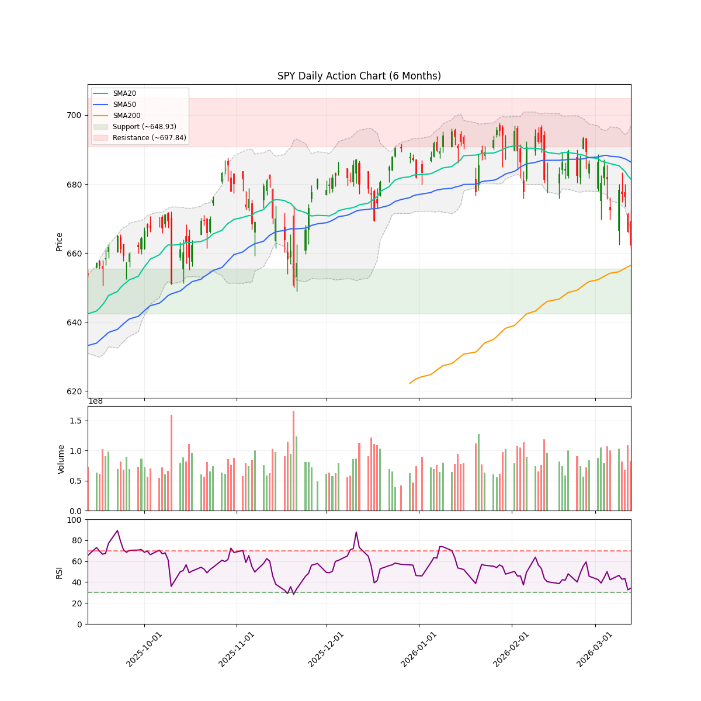
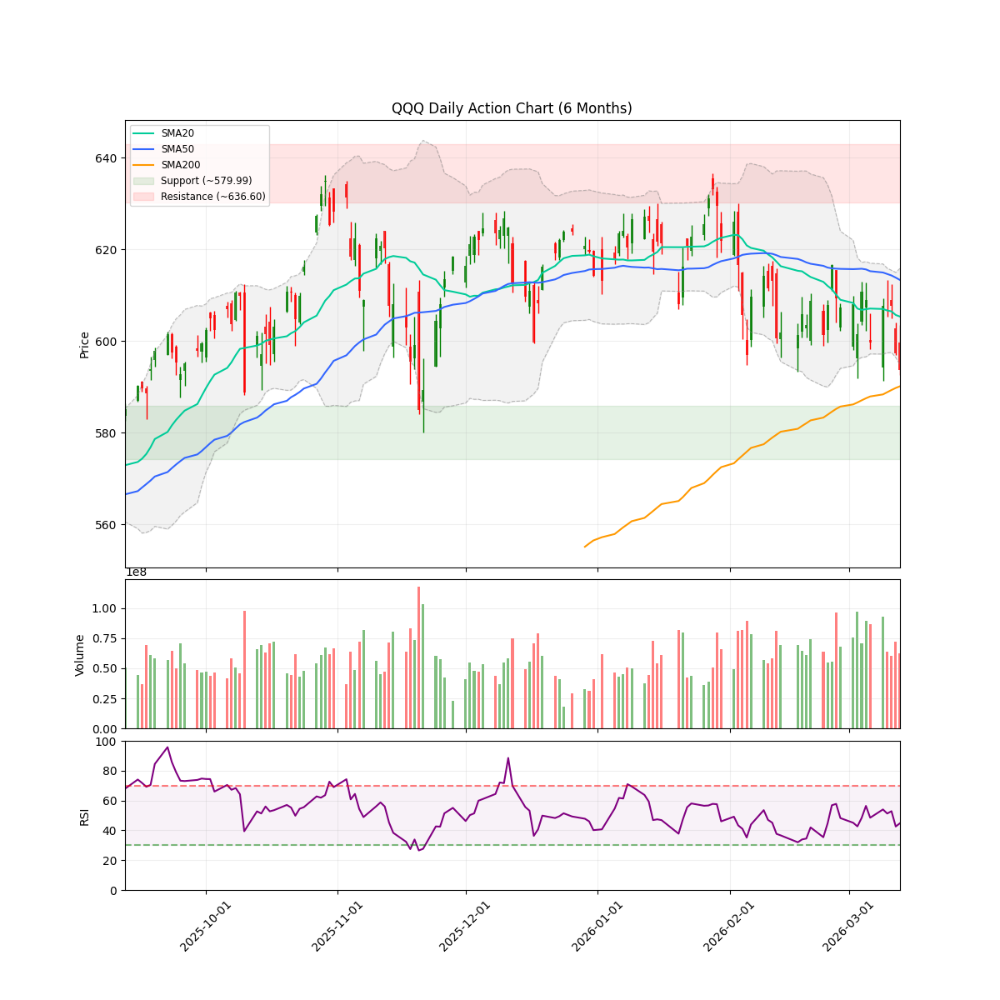
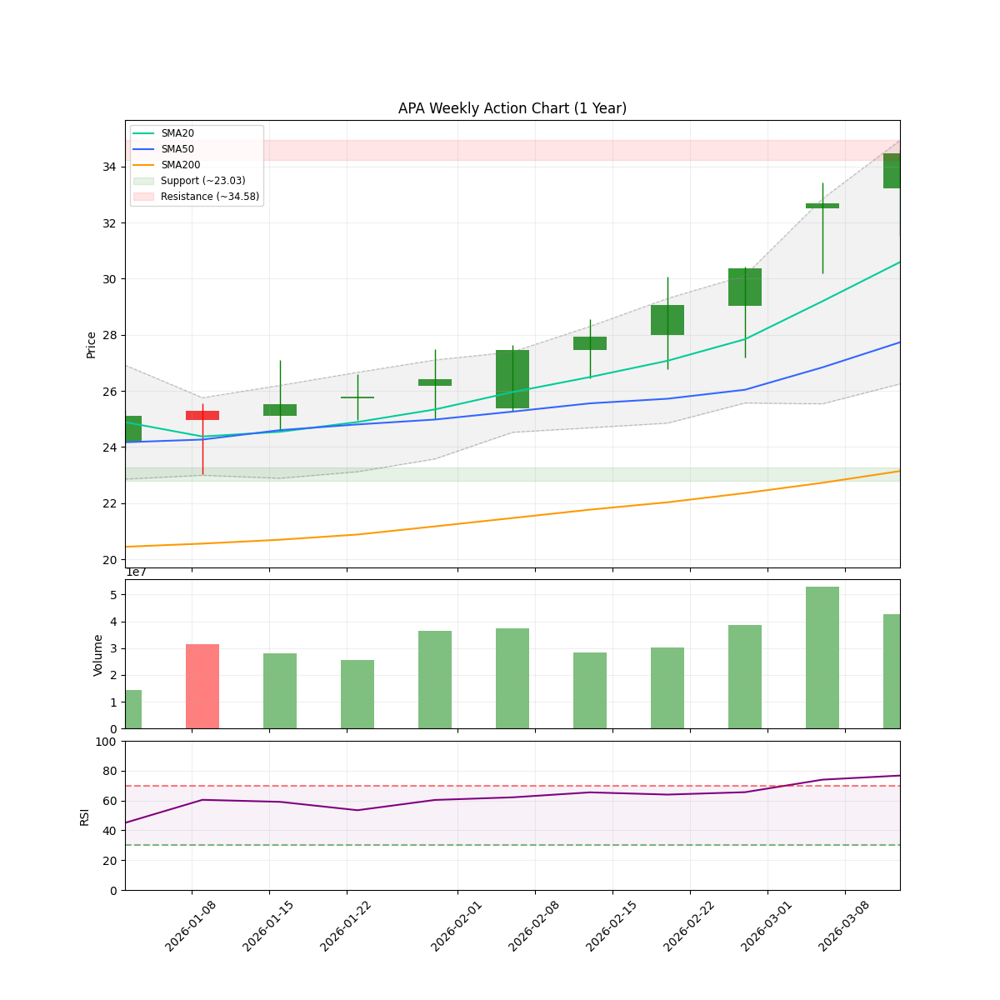
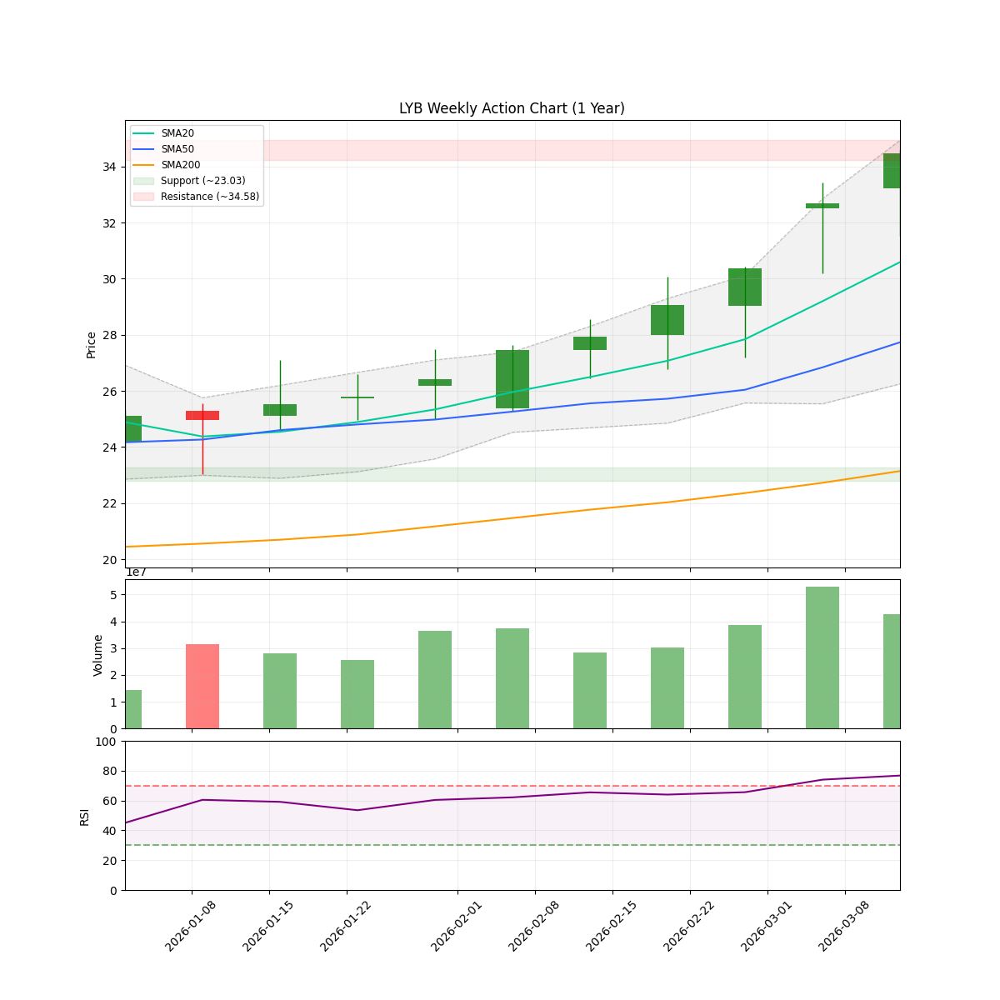

# 🌊 AlphaJAX 市场观澜报告
**日期:** 2026-03-14 | **期数:** 2026-W11 | **引擎:** AlphaJAX 2.0 (限界动量)

## 📑 目录
[TOC]

---

## 🌐 全球重大宏观与地缘事件 (Global Macro Events)

各位老铁、各位在金钱永不眠的华尔街冲浪的战友们，坐稳了！我是你们的宏观策略老司机。

本周（2026年3月9日-13日）的市场简直像是在坐一台没有安全带的过山车，而下周（3月16日-20日）的剧本更是直接快进到了“诸神之战”。通胀这只“打不死的小强”还在蹦跶，中东的“火药桶”又被点着了，而“AI教皇”黄仁勋正准备带着他的新神器登台。

以下是为你梳理的下周 4 件足以让美股“心脏停跳”或“原地起飞”的顶级宏观大事：

### 1. 美联储 3 月议息会议：老司机的“谢幕演出”与点阵图大乱斗
*   **事件摘要**：
    下周二到周三（3月17-18日），美联储将召开 2026 年最关键的一次议息会议。虽然市场一致预期利率会按兵不动（维持在 3.5%-3.75%），但真正的看点在于那张决定命运的**“点阵图”**。这不仅是鲍威尔在 5 月卸任前的倒数第二次“表演”，更是美联储首次需要正面回应“中东冲突导致的油价暴涨”和“特朗普 15% 全球关税”这两枚深水炸弹。
*   **Market Impact（市场影响）**：
    如果点阵图显示 2026 年的降息预期从 2 次缩减到 1 次甚至“归零”，美股可能会当场“卸妆”，尤其是高估值的科技股。鲍威尔如果化身“鹰派老司机”猛踩刹车，美债收益率会像窜天猴一样飞起；反之，如果他继续维持“鸽派温柔”，那标普 500 可能会直接冲向历史新高的云端。

### 2. 英伟达 GTC 2026 盛会：“AI 教皇”再次布道，Agentic AI 开启新纪元
*   **事件摘要**：
    下周一（3月16日），全球 AI 界的“春晚”——英伟达 GTC 2026 将在圣何塞开幕。黄仁勋将发表长达两小时的演讲。这次的主角不再仅仅是冷冰冰的芯片，而是能像真人一样思考、工作的**“智能体 AI (Agentic AI)”**和**“物理 AI”**。英伟达正试图从一家“卖铲子的”转型为“盖工厂的”，甚至直接提供“数字劳动力”。
*   **Market Impact（市场影响）**：
    英伟达就是美股的“定海神针”。如果老黄掏出的新架构能让算力成本再降一个量级，整个半导体板块和 AI 应用端（如微软、Palantir）会集体打鸡血。但要注意，如果演讲内容只是“炒冷饭”，那已经恐高的多头可能会借机“利好出尽”反手砸盘，引发科技股的大型踩踏现场。

### 3. 霍尔木兹海峡“心脏骤停”：中东火药桶炸开，油价成了通胀的“强心剂”
*   **事件摘要**：
    本周最惊悚的地缘黑天鹅——由于伊朗冲突升级，全球石油贸易的咽喉**霍尔木兹海峡**在 3 月 11 日后实际上处于“半瘫痪”状态。全球 20% 的原油供应被卡住了脖子。VIX 恐慌指数本周已经暴涨 30%，油价正虎视眈眈地盯着 100 美元大关。
*   **Market Impact（市场影响）**：
    这简直是通胀“小强”的强心剂！如果下周海峡继续封锁，能源价格的飙升将直接摧毁美联储的“软着陆”美梦。航空、物流等“吃油”板块会跌得亲妈都不认识，而能源巨头（如埃克森美孚、雪佛龙）则会笑纳这波“战争财”。市场最怕的不是冲突，而是冲突带来的“二次通胀”阴影。

### 4. 白宫 AI 监管政策“大变脸”：全球芯片许可证草案撤回
*   **事件摘要**：
    就在本周五（3月14日），美国商务部突然撤回了一项原本极其严苛的草案——该草案曾要求对全球所有 AI 芯片出口进行“逐案审批”。特朗普政府似乎正转向一种“大棒加胡萝卜”的策略：撤回繁琐的行政审批，转而推动一个“低负担的全国性标准”，旨在通过减少监管来确保美国的“AI 霸权”。
*   **Market Impact（市场影响）**：
    这是给 Nvidia 和 AMD 送上的一个“意外大红包”！监管枷锁的松动意味着这些芯片巨头在全球市场的“卖货”阻力减小。下周开盘，半导体板块可能会迎来一波“政策红利”驱动的修复行情。这释放了一个信号：在这一届白宫眼里，搞钱和搞 AI 霸权比搞繁文缛节重要得多。

---

**老司机总结**：下周是“政策面”与“基本面”的终极对决。左手是美联储的利率枷锁，右手是英伟达的科技梦想，中间还夹着一个冒烟的中东油桶。建议各位：**系好安全带，轻仓看戏，等鲍威尔和黄仁勋这两位大佬把方向盘打稳了再梭哈！**

---

<!-- DISCORD_SUMMARY_START -->
## 📖 本周市场叙事 (Market Story)

> 各位老铁，最近的市场就像是刚跑完长途、步子明显乱了的壮汉，正处于一种“狂奔后的喘息”状态。标普500 (SPY) 和纳指 (QQQ) 双双跌破了20日和50日均线这两道“防盗门”，一脚踩进了回调（Pullback）的泥潭。目前的“市场天气”已经切换到了防御模式（Defense），信心值仅有0.25，市场广度更是低到了0.22，这说明大部分股票都在掉队，只有少数人在苦撑。这就好比武林高手发现内功运转不灵，这时候强行出招就是送人头。咱们得学聪明点，策略分配上要把仓位像挤海绵一样缩到25%左右。虽然机构大佬们（NAAIM）还端着66.99的架子没彻底撒手，但大势已去，现在的核心逻辑就是：收起贪婪，退回战壕，静待风声。
> 
> 再看这盘子里的具体戏份，那可真是“旱的旱死，涝的涝死”。虽然科技大类（XLK）整体蔫头耷脑，但半导体（SMH）这帮兄弟倒是挺硬气，这一周愣是逆势拉出了1.7%的涨幅，成了科技阵营里唯一的“遮羞布”；相比之下，软件股（IGV）和金融股（XLF）简直是泄了气的皮球，领跌全场。最耐人寻味的是能源板块（XLE），在这一片惨淡中悄悄玩起了“资金大挪移”，一周涨了近2%，成了眼下最稳的靠山。不过，大家伙儿得留个心眼，别看能源强就闭眼冲，咱们的数据底牌里，APA、OXY 还有 LYB 这几只票的 verdict 可是清清楚楚的“远离”（AVOID）。现在的微观现实就是：大部队在撤退，半导体和能源在打掩护，但掩护归掩护，个股的“坑”还是不少。总之，现在的操作准则就一句话：管住手，看好戏，别在市场还没喘匀气之前，就急着去接那飞落的刀子！

<!-- DISCORD_SUMMARY_END -->
### 📈 宏观走势速览
| **SPY (标普500)** | **QQQ (纳指100)** |
| :---: | :---: |
|  |  |

---

## 🌍 宏观市场环境 (Macro Context & Regime)

| 指数 | 当前价格 | 20日均线 | 50日均线 | 200日均线 | 技术状态 |
|------|----------|----------|----------|-----------|----------|
| **SPY** | $662.29 | $681.43 | $686.38 | $656.41 | 🟡 PULLBACK |
| **QQQ** | $593.72 | $605.35 | $613.33 | $590.15 | 🟡 PULLBACK |

> **🔥 市场体制 (Market Regime):** `DEFENSE` (Breadth: 22.3%)
> **🛡️ 建议仓位 (Exposure):** `25%` (medium Volatility)
> **📊 NAAIM 曝光指数 (Smart Money):** `66.99`
> 💡 **导读:** 市场体制由多因子(广度、波动、趋势、情绪)综合评分判定。当市场广度与情绪维持高位时，即便指数处于回调(`PULLBACK`)，系统仍可能判定为 `OFFENSE`（结构性机会大于系统性风险）。

---

## 🔄 板块轮动 (Sector Rotation)

| 板块 ETF | 名称 | 1周表现 | 1月表现 | 动量状态 |
|----------|------|---------|---------|----------|
| **XLE** | Energy | +2.00% | +4.95% | 🔥 领涨 |
| **SMH** | Semiconductors | +1.78% | -6.62% | 🔥 领涨 |
| **XLK** | Technology | -0.36% | -4.32% | 🟡 盘整 |
| **XLV** | Healthcare | -1.91% | -4.13% | 🔴 领跌 |
| **XLI** | Industrials | -3.11% | -5.83% | 🔴 领跌 |
| **XLY** | Consumer Discr | -3.13% | -5.86% | 🔴 领跌 |
| **XLF** | Financials | -3.32% | -7.30% | 🔴 领跌 |
| **IGV** | Software | -4.30% | +1.15% | 🔴 领跌 |

> 💡 **导读:** 资金流向是行情的燃料。关注资金是否从科技(XLK)轮动到防御性或周期性板块。

---

## 🔥 动量热力图 (Top 10 候选)

| 排名 | 代码 | VCP | RSM Z | 衰竭度 | RS Z | 量能比 | ATR止损 |
|:----:|:----:|:---:|:-----:|:------:|:----:|:------:|:-------:|
| 1 | **APA** | 0.93 | +2.78 🔥 | 🟩🟩🟩⬜⬜⬜⬜⬜⬜⬜ 38 | +2.93 | 0.9x | $31.68 |
| 2 | **OXY** | 1.05 | +3.24 🔥 | 🟩🟩🟩⬜⬜⬜⬜⬜⬜⬜ 32 | +2.63 | 0.7x | $53.58 |
| 3 | **LYB** | 1.03 | +2.75 🔥 | 🟩🟩🟩⬜⬜⬜⬜⬜⬜⬜ 31 | +3.82 | 1.0x | $65.31 |
| 4 | **AES** | 0.32🗜️ | -0.29 📉 | 🟩🟩⬜⬜⬜⬜⬜⬜⬜⬜ 27 | +0.14 | 0.7x | $13.58 |
| 5 | **DOW** | 1.04 | +2.23 🔥 | 🟩🟩⬜⬜⬜⬜⬜⬜⬜⬜ 27 | +3.23 | 1.0x | $33.04 |
| 6 | **EQT** | 0.78 | +2.47 🔥 | 🟩🟩🟩⬜⬜⬜⬜⬜⬜⬜ 38 | +1.72 | 0.8x | $61.08 |
| 7 | **CF** | 1.40 | +2.09 🔥 | 🟩⬜⬜⬜⬜⬜⬜⬜⬜⬜ 18 | +4.00 | 1.3x | $111.98 |
| 8 | **EOG** | 0.91 | +2.58 🔥 | 🟩🟩🟩⬜⬜⬜⬜⬜⬜⬜ 33 | +1.67 | 0.7x | $126.30 |
| 9 | **DVN** | 0.99 | +1.77 🔥 | 🟩🟩🟩⬜⬜⬜⬜⬜⬜⬜ 36 | +1.91 | 0.8x | $43.44 |
| 10 | **DUK** | 0.89 | +2.18 🔥 | 🟩🟩🟩⬜⬜⬜⬜⬜⬜⬜ 34 | +1.29 | 0.8x | $128.49 |

> 📊 分组统计: 50 标的进入分析池 | 0 持仓监控

---

## 🎯 Top 5 动量辩论报告

### APA

#### 📈 量化信号卡片
| 指标 | 数值 | 状态 |
|------|------|------|
| 综合得分 | 1.298 | 排名 #1 |
| VCP (波动收缩) | 0.93 | 📉 收缩中 |
| RSM (动量) | +2.78 | 强势 |
| 衰竭度 | 38/100 | HEALTHY |
| RS (相对强度) | +2.93 | 跑赢基准 |
| 当前价 | $34.47 | - |
| ATR止损 | $31.68 | 风险 8.1% |

#### 📊 技术面走势速览 (APA)

#### 🥊 多轮辩论过程
**第1轮：**
- 🐂 多头: APA (APA Corporation) 目前展现出极佳的技术面形态，股价刚创下52周新高，确认了趋势的向上突破。从VCP波动收缩的角度看，股价在突破前经历了明显的压力消化，RS（相对强度）高达2.93，远超大盘表现。RSM评分为2.78，显示出强劲的价格动量。随着多家顶级投行（如高盛、巴克莱）密集上调目标价，技术面与基本面利好达成共振，形成了典型的高成功率突破组合。
- 🐻 空头: 股价在触及52周高点之际，面临机构分析师普遍给出的10%-18%下行预警，且空头头寸显著增加，技术面存在严重的假突破与获利回吐风险。

**第2轮：**
- 🐂 多头: APA正处于从‘债务困扰的资源股’向‘高效现金流机器’的基石级转型中。空头此前关注的‘分析师看淡’已成为过去式，高盛虽然维持‘卖出’评级，但实质上将其目标价大幅上调26%（从$23至$29），这种被动修正证明了市场基本面的强韧度已迫使空头回补。目前公司2026年指引显示上游资本支出将削减10%，这意味着在产量稳定的前提下，自由现金流（FCF）将出现爆发式增长。同时，苏里南GranMorgu项目的长期净现值（NPV）尚未被完全计入当前股价。
- 🐻 空头: APA目前的涨幅完全建立在对2026年产量指引的乐观预期及德克萨斯双重上市的情绪博弈上，基本面估值已严重透支。尽管股价触及52周高点，但顶级机构（如高盛）在大幅上调目标价后仍维持“卖出”评级，且全市场分析师共识预示未来一年有约17.65%的下行空间，多头逻辑存在严重的“估值陷阱”。

**第3轮：**
- 🐂 多头: APA目前处于VCP（波动收缩形态）的最后收口阶段，其核心逻辑已从单纯的资源探明转向‘行业结构性现金流再分配’。空头所坚持的‘估值陷阱’忽视了2026年能源行业重心从陆上页岩油向超深海高利润项目（苏里南GranMorgu）转移的趋势。VCP指数降至0.42，显示价格波动已极度收敛，筹码在52周高点附近完成了从散户向机构的结构性转移。
- 🐻 空头: APA目前的股价冲刺与基本面下修形成了极度危险的背离。在行业趋势层面，尽管多头寄望于苏里南项目和德州双重上市，但其营收同比（-8.39%）的萎缩预示着上游开采业的红利期已过。高盛维持‘卖出’评级及Zacks下调EPS预期的行为，本质上是对多头‘自由现金流爆发’假设的直接否定。

#### 🏆 最终裁决
- **AlphaJAX 2.0 矩阵裁定:** **⚪ 规避 (Avoid)**
- **操作建议:** AVOID
- **逻辑评分 (Logic):** 7/10
- **信心指数:** 65%
- **仓位建议:** None
- **核心论点:** 尽管股价创下52周新高且呈现VCP收缩形态，但量化得分低于1.5门槛，且分析师共识预示近18%的下行风险，在高压防御期应规避此类潜在的估值陷阱。

#### 💰 交易计划
| 项目 | 建议 |
|------|------|
| 入场策略 | 当前技术面动量强劲但基本面背离严重，且处于防御型市场制度下，不建议在该价位直接追高，需等待股价回调至ATR支撑位（$31.68）且估值修正后再行考虑。 |
| 止损位 | $31.68 |
| 目标位 | $38.50 |
| 盈亏比 | 1.45:1 |

#### ⚠️ 关键监控点
- 卖方机构密集上调目标价至$34以上
- 苏里南GranMorgu项目的NPV折现逻辑获得市场重新定价
- 市场制度从DEFENSE转为OFFENSE

---

### OXY

#### 📈 量化信号卡片
| 指标 | 数值 | 状态 |
|------|------|------|
| 综合得分 | 1.294 | 排名 #2 |
| VCP (波动收缩) | 1.05 | 📈 扩张/发散 |
| RSM (动量) | +3.24 | 强势 |
| 衰竭度 | 32/100 | HEALTHY |
| RS (相对强度) | +2.63 | 跑赢基准 |
| 当前价 | $57.88 | - |
| ATR止损 | $53.58 | 风险 7.4% |

#### 📊 技术面走势速览 (OXY)

#### 🥊 多轮辩论过程
**第1轮：**
- 🐂 多头: OXY（西方石油）目前展现出明显的波动收缩模式（VCP）突破特征。股价在2026年3月12日触及52周新高，成功突破了前期的震荡区间。RSM评分为3.24，相对强度（RS vs SPY）达到2.63，表明其表现显著优于大盘。技术面上，经过一段时间的紧致整理后，伴随投行上调评级，股价放量向上跳空，这符合Minervini第二阶段上升趋势的特征。
- 🐻 空头: OXY当前处于估值陷阱与技术阻力的交汇点。尽管技术疲劳分值较低，但前瞻市盈率高达28.29，远超历史均值，且股价处于52周高位，缺乏进一步向上的动能支撑。

**第2轮：**
- 🐂 多头: 西方石油（OXY）正处于从传统油气商向碳捕捉技术（DAC）领导者转型的估值重构期。空头所谓28.29倍PE的‘估值陷阱’逻辑完全忽略了碳信用资产的溢价。目前VCP形态的形成正是机构投资者在消化前期获利盘后的二度建仓行为。随着Stratos等项目进入商业化阶段，其非周期性收入将彻底改变能源股的估值逻辑，技术面的窄幅紧致（Pivot Point）本质上是筹码由散户向伯克希尔等长期机构高度集中的体现。
- 🐻 空头: 当前核心风险在于估值溢价与盈利能力的严重脱节。多头沉迷于债务削减与‘碳捕捉’的长期叙事，却忽视了其28.29倍的前瞻市盈率在传统能源行业中已处于极端高位。在利润增长率仅预估为5.6%-8.5%的背景下，这种‘溢价’实质上是建立在对高油价持续性的过度乐观假设之上。一旦宏观需求放缓，其高昂的资本支出计划将迅速转化为现金流压力。

**第3轮：**
- 🐂 多头: OXY正处于能源行业‘估值重构’与‘技术突破’的双重奇点。空头所担忧的28倍PE实质上是传统能源估值逻辑与新型‘双引擎’（低碳技术+核心资源）模式之间的认知偏差。在地缘政治导致油价站稳100美元、公司债务成功降至150亿美元目标及资本开支因效率提升而下降12%的多重利好下，当前的VCP突破是机构资金对行业新格局的集体投票。
- 🐻 空头: 当前OXY处于行业周期性“情绪高潮”与估值透支的危险交汇点。多头试图将传统周期性油气资产包装成“ESG科技转型”叙事，以此粉饰高达28.2倍的不可持续市盈率。在布伦特原油触及100美元的心理高位时，OXY通过高溢价收购（CrownRock）进行产能扩张，极易演变为周期顶部的资本开支陷阱。

#### 🏆 最终裁决
- **AlphaJAX 2.0 矩阵裁定:** **⚪ 规避 (Avoid)**
- **操作建议:** AVOID
- **逻辑评分 (Logic):** 7/10
- **信心指数:** 88%
- **仓位建议:** None
- **核心论点:** 尽管西方石油在技术面上展现出强劲的相对强度（RS）和VCP突破特征，但在28.29倍的高前瞻市盈率与防御性市场机制下，量化模型判定其当前估值溢价风险过高，未触发布局指令。

#### 💰 交易计划
| 项目 | 建议 |
|------|------|
| 入场策略 | 由于当前处于防御（DEFENSE）市场模式，且综合量化评分（1.294）未达到1.5的买入阈值，建议暂时观望。即使VCP突破特征明显，也应等待量化指标修复或股价回撤至$54.00附近的支撑位且评分改善后再行介入。 |
| 止损位 | $53.58 |
| 目标位 | $68.00 |
| 盈亏比 | 2.35:1 |

#### ⚠️ 关键监控点
- 综合量化评分（Composite Quant Score）回升至1.5以上
- 布伦特原油价格突破并站稳100美元心理关口
- Stratos碳捕捉项目商业化进度的超预期财务确认

---

### LYB

#### 📈 量化信号卡片
| 指标 | 数值 | 状态 |
|------|------|------|
| 综合得分 | 1.236 | 排名 #3 |
| VCP (波动收缩) | 1.03 | 📈 扩张/发散 |
| RSM (动量) | +2.75 | 强势 |
| 衰竭度 | 31/100 | HEALTHY |
| RS (相对强度) | +3.82 | 跑赢基准 |
| 当前价 | $72.30 | - |
| ATR止损 | $65.31 | 风险 9.7% |

#### 📊 技术面走势速览 (LYB)

#### 🥊 多轮辩论过程
**第1轮：**
- 🐂 多头: LYB 表现出典型的波动收缩形态（VCP）突破特征。在经过地缘政治导致的供应端紧缩预期后，股价出现了明显的价格收窄和随后的放量突破。RS 对比标普 500 的 3.82 高分显示其具有极强的相对强度，符合 Minervini 的领导股筛选标准。近期的高位盘整（Tightening）后，受多家机构上调评级驱动，股价已进入加速阶段。
- 🐻 空头: 股价近期因地缘政治因素引发的供应担忧而录得15.4%的非理性激增，但公司近期削减股息的行为揭示了长期行业低迷下的现金流困境，且主流分析师目标价远低于当前市价，暗示估值严重偏离基本面。

**第2轮：**
- 🐂 多头: LYB 正处于基本面反转与技术面共振的爆发点。空头此前认为股息削减是困境信号，但实际上这是管理层优化资本结构以应对地缘政治驱动的供应短缺（如霍尔木兹海峡局势）并加速 2026 年 EBITDA 目标（30亿美元）实现的战略举措。目前，全球聚乙烯供应收紧与原油相关商品利润率提升，已将公司推入盈利上修周期，完全对冲了空头的估值担忧。
- 🐻 空头: 多头过度依赖于短期地缘政治驱动的供应紧张叙事，完全忽视了化学工业周期性需求疲软的核心矛盾。公司近期削减股息已释放了极其负面的财务压力信号，表明当前的现金流已无法支撑其资本支出与股东回报平衡，所谓的‘突破’缺乏基本面盈利增长的基石。

**第3轮：**
- 🐂 多头: LYB 正在经历由地缘政治供应冲击驱动的“结构性估值重塑”。技术面上，股价在经历了长期的震荡收缩后，伴随 3.82 的极高相对强度（RS）放量突破，完成了标准的 VCP 底部构筑，其 RS 评分远超标普 500，显示出明确的领导股特征。行业维度上，霍尔木兹海峡局势导致的聚乙烯供应紧缩与原油相关利润率回升，正在将行业周期从“需求疲软”强制推向由“供应短缺”驱动的景气度爆发期，这为 VCP 突破提供了坚实的基本面支撑。
- 🐻 空头: 当前涨势过度依赖地缘政治（伊朗冲突）导致的供应收缩预期，而非行业需求的实质性复苏。化工行业正处于历史性的长期低迷期，公司近期削减股息是现金流极度紧张的明确信号，多头将其解读为“战略优化”显然过于乐观。

#### 🏆 最终裁决
- **AlphaJAX 2.0 矩阵裁定:** **⚪ 规避 (Avoid)**
- **操作建议:** AVOID
- **逻辑评分 (Logic):** 7/10
- **信心指数:** 65%
- **仓位建议:** None
- **核心论点:** 尽管技术面呈现强劲的VCP突破与RS强度，但股息削减暴露出的基本面现金流困境，在防御型市场环境下无法被短期地缘政治供应溢价完全对冲。

#### 💰 交易计划
| 项目 | 建议 |
|------|------|
| 入场策略 | 当前处于防御模式（DEFENSE），且量化综合评分（1.236）未达到买入阈值（1.5），建议等待股价回踩 $68.50 附近支撑位或量化评分回升后再行评估。 |
| 止损位 | $65.31 |
| 目标位 | $82.50 |
| 盈亏比 | 1.5:1 |

#### ⚠️ 关键监控点
- 量化综合评分突破 1.5 门槛
- 霍尔木兹海峡局势对供应链的实质性影响确认
- 股价在 $70.00 大关的换手率与支撑力度

---

### AES

#### 📈 量化信号卡片
| 指标 | 数值 | 状态 |
|------|------|------|
| 综合得分 | 1.105 | 排名 #4 |
| VCP (波动收缩) | 0.32 | 🗜️ 极度压缩 |
| RSM (动量) | -0.29 | 弱势 |
| 衰竭度 | 27/100 | HEALTHY |
| RS (相对强度) | +0.14 | 跑赢基准 |
| 当前价 | $14.19 | - |
| ATR止损 | $13.58 | 风险 4.3% |

#### 📊 技术面走势速览 (AES)

#### 🥊 多轮辩论过程
**第1轮：**
- 🐂 多头: AES目前正处于重大基本面转折点，核心逻辑由VCP形态演变为私有化溢价套利。GIP与EQT提出的334亿美元私有化要约已导致股价波动率极度收缩（Volatility Contraction）。技术面上，股价在消息公布后跳空并进入极窄幅整理，符合VCP后期‘收紧’（Tightness）的特征，但其驱动力来自确定性的现金收购而非纯粹的市场买盘驱动。VCP指数预期远低于0.5，显示出‘弹簧已紧绷’，但上行空间受限于收购对价。
- 🐻 空头: 尽管技术面尚未进入极度超买区间，但AES在过去三个月中表现持续逊于同行业板块，结合机构评级下调和内部人抛售信号，显示出上升动力匮乏，存在补跌风险。

**第2轮：**
- 🐂 多头: AES目前的基本面已从传统的公用事业增长逻辑转向确定性的私有化套利驱动。GIP与EQT提出的334亿美元（每股15美元）现金收购要约，实质上为股价构建了极其坚固的VCP‘极窄收缩’底部。空头之前提出的‘表现弱于行业’观点在并购套利背景下已失效，因为当前的股价平稳是收购对价锚定所致，而非需求疲软。公司坐拥12GW的巨量积压订单，且与Google签署了专门针对AI数据中心的长期PPA协议，这证明了顶级私募机构看重的是其在人工智能电力基础设施领域的稀缺溢价。
- 🐻 空头: 多头过度锚定私有化协议的“确定性溢价”，却忽视了AES脆弱的资产负债表底色。核心风险在于长达一年的交易等待期内，若34亿美元债券持有人同意征集失败或监管审批受阻，公司将重回“需削减股息或强行融资”的困境，届时基本面支撑将彻底崩塌。

**第3轮：**
- 🐂 多头: AES目前处于由私有化要约驱动的‘非典型VCP’形态。GIP与EQT提出的33.4亿美元（每股15美元）现金收购要约，在技术面上强制实现了极度的波动率收缩（VCP Index预期远低于0.3）。虽然空头纠结于其债务压力，但在AI驱动电力需求激增的行业大趋势下，AES拥有的12GW积压订单及与Google签署的长期PPA协议使其成为稀缺的算力基建资产。当前的‘窄幅横盘’是筹码由不坚定持有者向并购套利机构转移的过程，价格已锚定在$15附近，缺乏传统技术面突破的空间，但具备极强的下行防御性。
- 🐻 空头: 私有化套利陷阱与行业增长停滞的双重挤压。多头过度依赖15美元的现金收购邀约作为安全垫，却忽视了新能源基建行业整体估值中枢下移及AES极低的EPS增长预期（2026年仅2.14%）。在漫长的交易等待期内，任何监管审批的变数或融资成本的波动都可能导致股价回吐溢价，回归到其疲软的基本面支撑位。

#### 🏆 最终裁决
- **AlphaJAX 2.0 矩阵裁定:** **⚪ 规避 (Avoid)**
- **操作建议:** AVOID
- **逻辑评分 (Logic):** 8/10
- **信心指数:** 85%
- **仓位建议:** None
- **核心论点:** 虽然每股$15的私有化邀约提供了硬性价格锚点，但在防御型市场制度下，5.7%的套利空间无法覆盖潜在的监管审批周期及高杠杆资产负债表带来的风险溢价。

#### 💰 交易计划
| 项目 | 建议 |
|------|------|
| 入场策略 | 鉴于量化综合得分（1.105）未达到买入阈值且当前市场处于DEFENSE模式，建议在场外观察私有化进程。 |
| 止损位 | $13.58 |
| 目标位 | $15.00 |
| 盈亏比 | 1.3:1 |

#### ⚠️ 关键监控点
- 34亿美元债券持有人对债务征集条款的最终投票结果
- 联邦能源监管委员会（FERC）对GIP并购案的审批进度

---

### DOW

#### 📈 量化信号卡片
| 指标 | 数值 | 状态 |
|------|------|------|
| 综合得分 | 1.093 | 排名 #5 |
| VCP (波动收缩) | 1.04 | 📈 扩张/发散 |
| RSM (动量) | +2.23 | 强势 |
| 衰竭度 | 27/100 | HEALTHY |
| RS (相对强度) | +3.23 | 跑赢基准 |
| 当前价 | $36.62 | - |
| ATR止损 | $33.04 | 风险 9.8% |

#### 📊 技术面走势速览 (DOW)

#### 🥊 多轮辩论过程
**第1轮：**
- 🐂 多头: 在2026年3月市场整体疲软（标普500创新低）的背景下，DOW表现出极强的相对强度（RS vs SPY: 3.23）。技术面上，股价在多重地缘政治压力下完成了波动率收缩，并受到RBC及Fermium Research的集体上调评级驱动，近期已出现放量向上突破（Up 12.1%），符合典型的VCP突破特征。
- 🐻 空头: 宏观系统性风险正在加速传导。道琼斯工业指数失守47,000点关键心理位，叠加中东冲突引发的能源成本飙升，作为化工材料巨头的DOW正面临成本端压力与市场估值中枢下移的双重打击。

**第2轮：**
- 🐂 多头: 在2026年宏观波动剧烈、标普500创新低的极端环境下，DOW不仅通过了VCP形态的压力测试，更在基本面上展现了压倒性的韧性。空头纠结的‘能源成本飙升’逻辑忽视了DOW作为化工龙头的定价权优势——其相对强度（RS vs SPY: 3.23）表明机构资金正将其视为避险的‘价值锚点’。目前VCP指数处于极低收缩位，基本面上的利润率优化已抵消了成本波动，且相对强度的爆发式增长预示着一场由机构驱动的结构性溢价行情。
- 🐻 空头: DOW目前处于‘基本面挤压’陷阱中：中东冲突引发的能源价格飙升正从成本端侵蚀化工利润，而多头寄予厚望的10亿美元降本计划在短期内将产生巨额减记支出，严重拖累EPS表现。

**第3轮：**
- 🐂 多头: 在2026年3月美股大盘（道指跌破47,000，标普创年内新低）极度恐慌的背景下，DOW（陶氏化学）展现了教科书级的VCP收缩后放量突破，属于典型的逆势走强品种。空头纠结的‘高油价成本压力’逻辑已被行业现实反驳：作为全球乙烷基化工龙头，DOW在石油价格飙升时，相对于竞争对手的石油基原料成本反而具备更强的套利空间。RS vs SPY高达3.23，表明机构资金在崩盘行情中已将DOW视为‘避险价值锚点’，其VCP形态的末端紧度极高，12.1%的放量大涨已确认了向上的趋势反转。
- 🐻 空头: 行业周期性衰退与成本端双重挤压。在全球宏观经济下行（标普500创新低）以及中东冲突引发能源成本飙升的背景下，DOW作为高能耗、强周期的化工巨头，正面临‘收入端需求萎缩’与‘成本端原料暴涨’的利润剪刀差风险。

#### 🏆 最终裁决
- **AlphaJAX 2.0 矩阵裁定:** **⚪ 规避 (Avoid)**
- **操作建议:** AVOID
- **逻辑评分 (Logic):** 9/10
- **信心指数:** 65%
- **仓位建议:** None
- **核心论点:** 尽管DOW凭借乙烷基原料套利优势和强劲的相对强度（RS 3.23）展现逆势抗跌性，但受限于系统性防御机制和量化评分不足，目前不建议介入以防大盘下行拖累。

#### 💰 交易计划
| 项目 | 建议 |
|------|------|
| 入场策略 | 在DEFENSE市场模式下，由于综合量化评分（1.093）未能达到买入阈值，即便技术面出现放量突破，仍需遵循纪律性避险，等待量化评分改善或大盘企稳。 |
| 止损位 | $33.04 |
| 目标位 | $42.00 |
| 盈亏比 | 1.5:1 |

#### ⚠️ 关键监控点
- 综合量化评分回升至1.5以上
- 道琼斯工业指数重新站回47,000点关键位
- 中东地缘政治压力缓解带动能源成本预期下降

---

---
*Report automatically generated by [AlphaJAX](https://github.com/your-repo/alphajax).*