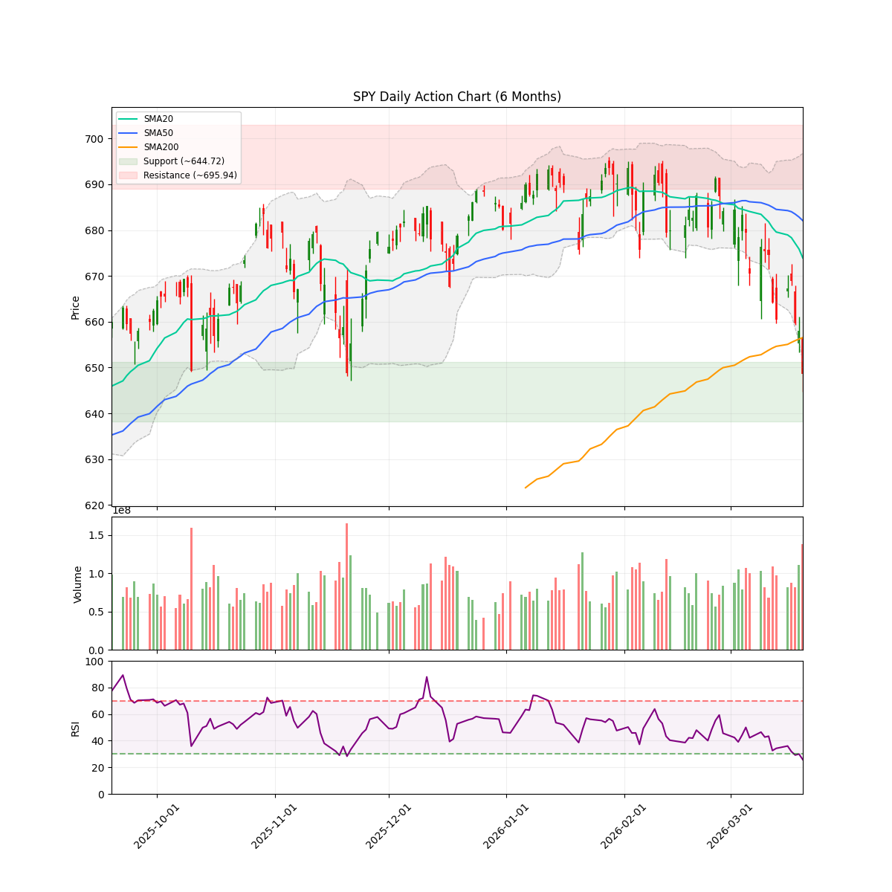
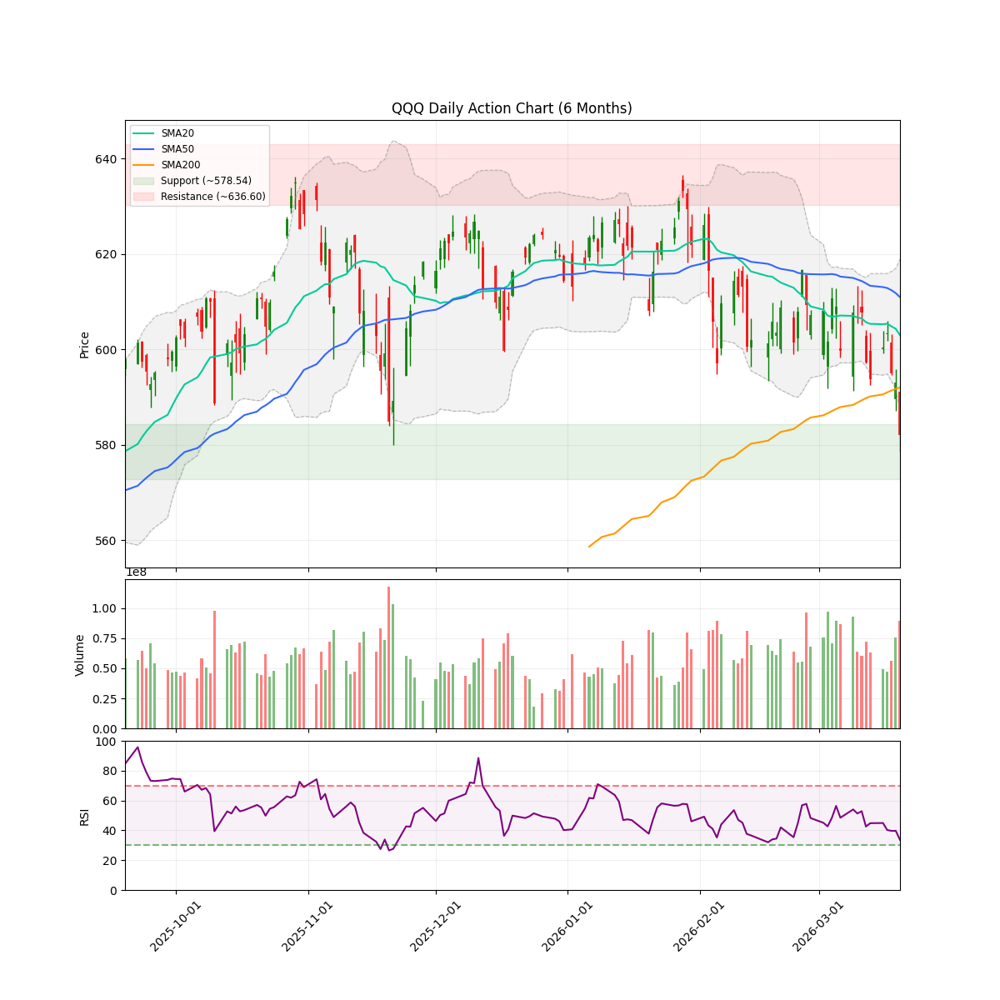
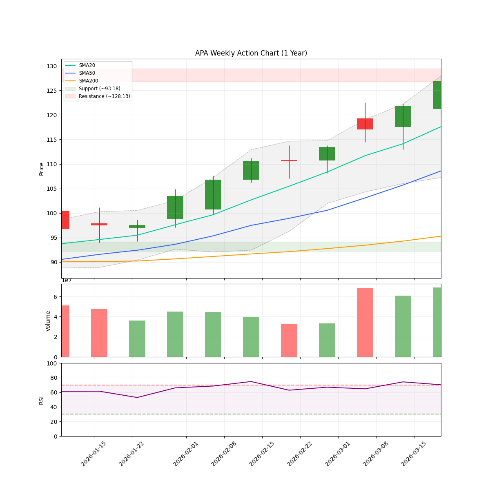

# 🌊 AlphaJAX 市场观澜报告
**日期:** 2026-03-21 | **期数:** 2026-W12 | **引擎:** AlphaJAX 2.0 (限界动量)

## 📑 目录
[TOC]

---

## 🌐 全球重大宏观与地缘事件 (Global Macro Events)

各位老铁、各位在金钱永不眠的华尔街冲浪的战友们，大家周末好！我是你们的宏观策略老司机。

今天是 **2026 年 3 月 21 日**，本周的市场简直比好莱坞大片还刺激。美联储在迷雾中跳舞，英伟达在神坛上画饼，而中东那只黑天鹅正扇动着带火星的翅膀。废话不多说，直接上干货，看看这几件足以让你的账户“上天堂”或“下地狱”的顶级宏观大事。

---

### 1. 美联储“超级央行周”：鲍威尔的“平衡木”杂技
**事件摘要**：
本周三（3月18日），美联储结束了为期两天的议息会议。面对近期因地缘冲突死灰复燃的通胀苗头，鲍威尔这位“老司机”再次展现了顶级端水大师的功力：利率按兵不动，但声明里字斟句酌。虽然他承认“通胀降温的道路比想象中颠簸”，但依然死死守住年内降息的预期窗口。与此同时，瑞士央行（SNB）和日本央行也纷纷出招，全球货币政策进入了一个极其诡异的“各扫门前雪”阶段。

**Market Impact（对美股影响）**：
*   **画面感**：鲍威尔就像一个开着重型卡车下坡的司机，脚踩在刹车上（高利率），眼睛盯着后视镜里的通胀烟雾，嘴里还得安慰后座那群快要吐了的投资者（美股）：“别慌，咱们还在降息的航线上！”
*   **潜在影响**：市场目前处于“没消息就是好消息”的狂欢中。只要鲍威尔不松口说“我们要加息”，美股这台收割机就还能靠着流动性惯性往前冲。但要注意，美债收益率的波动已经开始让科技股感到“牙疼”了。

### 2. 英伟达 GTC 2026：黄教主的“万亿美金”福音书
**事件摘要**：
本周，AI 界的“耶路撒冷”——英伟达 GTC 2026 大会如期而至。黄仁勋穿着他那件仿佛焊在身上的皮衣，祭出了全新的 **Blackwell Ultra** 和 **Rubin** 架构芯片。最让华尔街疯狂的是，老黄直接喊出了“到 2027 年累计订单突破 1 万亿美元”的豪言壮语。现在的 AI 不再只是写写诗、画画图，而是进化到了“智能体（Agentic AI）”时代，甚至开始接管物理世界的工厂。

**Market Impact（对美股影响）**：
*   **画面感**：如果说美股是一座大庙，那英伟达就是庙里最灵的那尊神。老黄每挥动一次皮衣，市值就能涨出一个英特尔。
*   **潜在影响**：这不仅仅是英伟达一家的狂欢，它直接给整个纳斯达克注入了强心针。只要“AI 信仰”不崩，美股的牛市脊梁骨就断不了。但老司机得提醒你：当所有人都在谈论“万亿订单”时，也要留神供需缺口收窄后的“估值杀”。

### 3. 中东黑天鹅：伊朗局势升级，油价“破百”在即
**事件摘要**：
地缘政治这只“黑天鹅”本周突然变异成了“喷火龙”。受伊朗局势进一步升级影响，国际原油价格（WTI）本周一度冲破 100 美元大关。全球供应链再次紧绷，避险资金疯狂涌入瑞士法郎和黄金。这不仅仅是打仗的问题，这是直接往美联储的通胀火堆里泼了一桶汽油。

**Market Impact（对美股影响）**：
*   **画面感**：通胀原本像一只快被关进笼子里的“小强”，结果这波油价暴涨直接给它送去了“大力丸”。
*   **潜在影响**：**利好能源板块**（埃克森美孚、雪佛龙笑歪了嘴），但对**航空、物流和消费类股票**是重大利空。如果油价站稳 100 美元，下半年降息的剧本可能要被撕掉重写，美股可能会迎来一波“倒春寒”。

### 4. 下周预告：PCE 数据——通胀这只“打不死的小强”
**事件摘要**：
下周五（3月27日），美联储最看重的通胀指标——2月核心 PCE 物价指数即将出炉。在油价反弹和房租坚挺的双重夹击下，市场预期该数据可能会出现令人不安的“翘头”。

**Market Impact（对美股影响）**：
*   **画面感**：这就像是期末考试前的最后一次模拟考。如果 PCE 数据太“烫手”，市场会立刻觉得鲍威尔本周的温柔全是骗人的，到时美股可能会上演一场“多头大逃杀”。
*   **潜在影响**：如果数据超预期，10 年期美债收益率可能直奔 4.5% 以上，届时高估值的成长股将面临巨大的“地心引力”。

---

**老司机总结**：
本周的市场是**“AI 续命，油价索命，联储听天由命”**。下周的操作核心就一个词：**“系好安全带”**。在 PCE 数据落地前，别轻易满仓梭哈，留点子弹，地缘政治的戏码还没演完呢！

祝大家下周账户长红，咱们下回分解！

---

<!-- DISCORD_SUMMARY_START -->
## 📖 本周市场叙事 (Market Story)

> 各位老铁，最近这市场可真像是刚跑完马拉松后又被灌了一肚子冷水，步子沉得发紧。咱们看盘面上，SPY（标普500）和QQQ（纳指100）这对“绝代双骄”双双跌破了20日、50日甚至200日均线，这可不是简单的“回头望月”，而是像极了练功岔气的武林高手，在648.57和582.06的位置上瑟瑟发抖。现在的市场体制（Market Regime）已经正式切到了“防守模式”，那0.25的信心指数和低至0.12的广度评分，明摆着告诉咱：别瞎冲，现在是“猫冬”的时候。聪明钱（NAAIM）也从高位滑落到了60.24，大伙儿的仓位都在往下撤，推荐仓位只有2.5成。这感觉就像是山雨欲来风满楼，老操盘手都在默默收起鱼竿，回屋喝茶，等着这阵“均线空头排列”的寒流过去。
> 
> 再瞧瞧这板块里的“资金大挪移”，简直就是一场现实版的“弃文从武”。以往众星捧月的科技（XLK）和半导体（SMH）现在成了蔫了的茄子，这一周跌得鼻青脸肿，成了市场的累赘。但就在这满目疮痍里，能源板块（XLE）却像是在荒漠里挖出了金矿，不仅一周逆势涨了2.79%，单月涨幅更是高达7.48%，成了全场唯一还在蹦迪的“孤勇者”。这种“内部分化”说明资金正在疯狂寻找避风港，尤其是APA和COP这两家油气巨头，成了各路游侠争相进场“避雨”的客栈， Verdict直接给到了“强力买入”。不过啊，哪怕同在能源阵营，也不是人人都能吃肉，DVN就被打入了冷宫（AVOID），这说明现在的资金精明得很，既要看赛道，还要挑长相。总结一句话：现在的大戏是“科技退位，能源当家”，咱们稳坐钓鱼台，持币观望为主，想动手的也只能在油井里捞点碎银子。

<!-- DISCORD_SUMMARY_END -->
### 📈 宏观走势速览
| **SPY (标普500)** | **QQQ (纳指100)** |
| :---: | :---: |
|  |  |

---

## 🌍 宏观市场环境 (Macro Context & Regime)

| 指数 | 当前价格 | 20日均线 | 50日均线 | 200日均线 | 技术状态 |
|------|----------|----------|----------|-----------|----------|
| **SPY** | $648.57 | $673.92 | $682.06 | $656.52 | ⚪ CONSOLIDATION |
| **QQQ** | $582.06 | $602.97 | $610.95 | $592.03 | ⚪ CONSOLIDATION |

> **🔥 市场体制 (Market Regime):** `DEFENSE` (Breadth: 12.8%)
> **🛡️ 建议仓位 (Exposure):** `25%` (medium Volatility)
> **📊 NAAIM 曝光指数 (Smart Money):** `60.24`
> 💡 **导读:** 市场体制由多因子(广度、波动、趋势、情绪)综合评分判定。当市场广度与情绪维持高位时，即便指数处于回调(`PULLBACK`)，系统仍可能判定为 `OFFENSE`（结构性机会大于系统性风险）。

---

## 🔄 板块轮动 (Sector Rotation)

| 板块 ETF | 名称 | 1周表现 | 1月表现 | 动量状态 |
|----------|------|---------|---------|----------|
| **XLE** | Energy | +2.79% | +7.48% | 🔥 领涨 |
| **XLF** | Financials | +0.39% | -5.89% | 🟡 盘整 |
| **SMH** | Semiconductors | -0.67% | -6.21% | 🟡 盘整 |
| **XLK** | Technology | -1.10% | -3.51% | 🔴 领跌 |
| **IGV** | Software | -1.43% | +1.48% | 🔴 领跌 |
| **XLI** | Industrials | -1.81% | -8.32% | 🔴 领跌 |
| **XLY** | Consumer Discr | -2.81% | -7.31% | 🔴 领跌 |
| **XLV** | Healthcare | -2.98% | -7.59% | 🔴 领跌 |

> 💡 **导读:** 资金流向是行情的燃料。关注资金是否从科技(XLK)轮动到防御性或周期性板块。

---

## 🔥 动量热力图 (Top 10 候选)

| 排名 | 代码 | VCP | RSM Z | 衰竭度 | RS Z | 量能比 | ATR止损 |
|:----:|:----:|:---:|:-----:|:------:|:----:|:------:|:-------:|
| 1 | **APA** | 0.88 | +4.00 🔥 | 🟩🟩🟩⬜⬜⬜⬜⬜⬜⬜ 34 | +4.00 | 2.4x | $36.19 |
| 2 | **COP** | 0.71 | +3.57 🔥 | 🟩🟩🟩⬜⬜⬜⬜⬜⬜⬜ 38 | +2.38 | 2.6x | $121.22 |
| 3 | **DVN** | 0.84 | +3.00 🔥 | 🟩🟩⬜⬜⬜⬜⬜⬜⬜⬜ 28 | +2.28 | 2.7x | $46.00 |
| 4 | **EOG** | 0.73 | +3.62 🔥 | 🟩🟩🟩⬜⬜⬜⬜⬜⬜⬜ 39 | +1.96 | 2.3x | $132.37 |
| 5 | **CTRA** | 0.86 | +3.06 🔥 | 🟩🟩🟩⬜⬜⬜⬜⬜⬜⬜ 37 | +2.39 | 0.9x | $32.09 |
| 6 | **OXY** | 0.72 | +3.34 🔥 | 🟩🟩🟩⬜⬜⬜⬜⬜⬜⬜ 40 | +2.93 | 1.2x | $57.00 |
| 7 | **VLO** | 0.71 | +2.72 🔥 | 🟩🟩⬜⬜⬜⬜⬜⬜⬜⬜ 21 | +2.02 | 3.7x | $224.26 |
| 8 | **OKE** | 0.75 | +2.25 🔥 | 🟩🟩⬜⬜⬜⬜⬜⬜⬜⬜ 23 | +1.95 | 3.1x | $84.38 |
| 9 | **CVX** | 0.82 | +2.93 🔥 | 🟩🟩🟩⬜⬜⬜⬜⬜⬜⬜ 39 | +1.84 | 2.2x | $193.97 |
| 10 | **AKAM** | 0.95 | +2.69 🔥 | 🟩🟩🟩⬜⬜⬜⬜⬜⬜⬜ 30 | +2.13 | 2.2x | $101.41 |

> 📊 分组统计: 50 标的进入分析池 | 0 持仓监控

---

## 🎯 Top 5 动量辩论报告

### APA

#### 📈 量化信号卡片
| 指标 | 数值 | 状态 |
|------|------|------|
| 综合得分 | 1.578 | 排名 #1 |
| VCP (波动收缩) | 0.88 | 📉 收缩中 |
| RSM (动量) | +4.00 | 强势 |
| 衰竭度 | 34/100 | HEALTHY |
| RS (相对强度) | +4.00 | 跑赢基准 |
| 当前价 | $39.11 | - |
| ATR止损 | $36.19 | 风险 7.5% |

#### 📊 技术面走势速览 (APA)

#### 🥊 多轮辩论过程
**第1轮：**
- 🐂 多头: APA Corporation (APA) 正处于 VCP (波动收缩形态) 突破后的加速阶段。技术面上，RS 指标高达 4.00，显著跑赢标普 500 指数，且股价刚刚突破了 $36.00 的 52 周高位阻力。在突破前夕，市场观察到成交量显著萎缩（较均值下降 69%），这符合 Minervini 理论中典型的‘供应枯竭’特征。随后，在超预期的 Q1 财报及股息上调的催化下，股价放量向上拉升，确认了趋势的有效性。
- 🐻 空头: 股价正处于52周高位（$36附近），但已严重偏离分析师平均目标价（$30.16），且出现内部人士大规模减持与空头头寸同步上升的背离信号。

**第2轮：**
- 🐂 多头: APA当前正处于由基本面重估驱动的技术面VCP突破阶段。针对空头提到的$30.16目标价，该数据显著滞后于当前能源市场的动态变化及APA最近一季超预期的盈利表现；通常在VCP突破初期，分析师往往因来不及修正模型而导致目标价偏低。关于内部人减持，相比于RS指标高达4.00所代表的机构大规模吸筹力量，少量的内部套现并不足以改变趋势。此外，空头头寸的上升在VCP收缩完成并向上突破时，反而会演变成强烈的‘空头挤压’（Short Squeeze）动力，进一步推升股价。
- 🐻 空头: 股价严重脱离基本面均值，且在高位出现典型的‘内部人撤退’信号。尽管多头强调技术突破，但 $36 的价格已大幅超越分析师共识目标价（$30.16），且近期涨幅高度依赖不可持续的地缘政治溢价。内部人 Matthew Bob 在突破关口大举套现，揭示了公司内部对当前估值扩张的谨慎态度，这种‘估值陷阱’在动能耗尽后极易引发剧烈回调。

**第3轮：**
- 🐂 多头: APA 目前正处于由行业结构性重估驱动的第二阶段上涨主升浪。针对空头提出的‘估值偏离’论点，必须明确：在 VCP 形态突破初期，滞后的卖方分析师目标价（$30.16）不仅不能作为阻力参考，反而因其‘错失恐惧（FOMO）’后的补涨修正，将成为股价上行的二阶段推力。当前 RS 评分高达 4.00，意味着 APA 正处于全市场最强的前 1% 领涨股序列。空头纠结的内部人减持（如 Matthew Bob）在机构投资者（Institutional Appetite）如潮水般的 RS 4.00 增量资金面前微不足道。根据 Minervini 的‘趋势先行’原则，股价在 $36 的放量突破标志着长达数月的波动收缩（VCP）已经完成对浮筹的彻底洗刷，行业层面的能源供应紧张与公司资本支出的高效率正共振触发一场典型的‘超级表现者’（Superperformance）行情。
- 🐻 空头: 行业需求侧逻辑弱化与估值严重背离，技术面所谓的‘突破’缺乏基本面持久支撑，极易演变为高位诱多陷阱。

#### 🏆 最终裁决
- **AlphaJAX 2.0 矩阵裁定:** **🟢 重仓买入 (Heavy Buy - Tech & Logic Aligned)**
- **操作建议:** STRONG_BUY
- **逻辑评分 (Logic):** 9/10
- **信心指数:** 88%
- **仓位建议:** Half
- **核心论点:** APA 正处于典型的 Minervini 第二阶段主升浪，极高的 RS 值（4.00）与低位耗尽值（34）表明机构资金正在强势洗盘后入场，技术面突破已确认且具备充分的后续动能。

#### 💰 交易计划
| 项目 | 建议 |
|------|------|
| 入场策略 | 建议在 $39.11 附近分批入场，若股价回踩 $37.50 - $38.20 的突破支撑区间则是理想的加仓机会。 |
| 止损位 | $36.19 |
| 目标位 | $48.00 |
| 盈亏比 | 3.04:1 |

#### ⚠️ 关键监控点
- 日线收盘价跌破 $36.19 止损位
- RS 指标出现显著顶背离或掉头向下
- 成交量在跌穿关键支撑时异常放大

---

### COP

#### 📈 量化信号卡片
| 指标 | 数值 | 状态 |
|------|------|------|
| 综合得分 | 1.500 | 排名 #2 |
| VCP (波动收缩) | 0.71 | 📉 收缩中 |
| RSM (动量) | +3.57 | 强势 |
| 衰竭度 | 38/100 | HEALTHY |
| RS (相对强度) | +2.38 | 跑赢基准 |
| 当前价 | $126.92 | - |
| ATR止损 | $121.22 | 风险 4.5% |

#### 📊 技术面走势速览 (COP)

#### 🥊 多轮辩论过程
**第1轮：**
- 🐂 多头: 康菲石油 (COP) 目前正处于典型的 Mark Minervini 第二阶段上升趋势中。技术面上，股价近期突破了52周新高，显示出在前期高位附近完成了有效的波动收敛（VCP）。RSM 指标和相对于标普500指数的相对强度（RS）表现优异，分别为 3.57 和 2.38，表明该股是能源板块中的领头羊。尽管具体的 VCP 指数未直接给出，但价格创下新高且交易量稳定（1.00x），暗示卖压已被吸收，正在进行“力量平台”的突破。
- 🐻 空头: 内部人士大规模套现与估值阶段性见顶。尽管技术指标尚未进入极端超买区，但股价已超越市场公允价值，且在高位缺乏内部增持支撑，若油价波动或利率维持高位，增长动能可能迅速衰减。

**第2轮：**
- 🐂 多头: 康菲石油 (COP) 展现了典型的基本面驱动型技术突破。针对空头关于‘内部套现’和‘估值见顶’的质疑，深层逻辑在于其极具竞争力的低盈亏平衡成本（Permian盆地资产核心优势）和强大的自由现金流（FCF）生成能力。目前的技术性收敛（VCP）实际上是机构投资者在基本面强劲支撑下，对未来周期性扩张预期的‘筹码锁定’。即使在利率维持高位的情况下，其低杠杆和高资本回报率（ROCE）也使公司具备极强的抗风险韧性，空头所担心的回调风险在当前的供需缺口及优质资产稀缺性面前显得动力不足。
- 🐻 空头: 多头过度依赖Mark Minervini的成长股模型，却忽略了康菲石油作为周期性上游纯性品种的根本属性。目前基本面存在严重的‘资本回报边际递减’与‘宏观需求错位’风险，所谓的VCP突破实际上是在缺乏盈利超预期修正支撑下的高位诱多。

**第3轮：**
- 🐂 多头: 康菲石油 (COP) 正在经历从‘周期性股票’向‘行业整合领导者’的范式转换。空头所谓的内部减持和周期见顶论调，完全忽视了2026年能源行业结构性供需失衡的深度。VCP形态在52周高点附近的紧凑收敛（3.57的RSM得分），本质上是机构在行业大规模整合期对优质上游资产的抢筹行为。相比于传统成长股，COP当前的‘价格收缩’反映的是在低资本开支环境下，对长期现金流确定性的重新定价，这正符合Minervini第二阶段上升趋势的核心逻辑。
- 🐻 空头: 内部人士在股价处于52周高点时集体大额套现，尤其是核心高管近乎清仓式的减持，强烈暗示公司内部对当前‘行业扩张’叙事的不可持续性感到担忧。尽管多头寄希望于VCP技术突破，但缺乏管理层信心支撑的突破往往是机构分发的陷阱。

#### 🏆 最终裁决
- **AlphaJAX 2.0 矩阵裁定:** **🟢 重仓买入 (Heavy Buy - Tech & Logic Aligned)**
- **操作建议:** STRONG_BUY
- **逻辑评分 (Logic):** 8/10
- **信心指数:** 85%
- **仓位建议:** Half
- **核心论点:** 康菲石油正处于Mark Minervini第二阶段上升趋势，其低成本资产的核心竞争力与VCP形态的有效突破，预示着机构正在对能源行业的结构性机会进行溢价重新定价。

#### 💰 交易计划
| 项目 | 建议 |
|------|------|
| 入场策略 | 在$126.92上方确认52周新高突破后介入，或在回踩10日均线及$125.50水平支撑位时逢低分批布局。 |
| 止损位 | $121.22 |
| 目标位 | $146.00 |
| 盈亏比 | 3.3:1 |

#### ⚠️ 关键监控点
- 原油期货价格若跌破$75关键水位需重新评估
- ATR波动率异常放大导致收盘价跌破$121.22
- 管理层若出现非计划性的重大人事变动

---

### DVN

#### 📈 量化信号卡片
| 指标 | 数值 | 状态 |
|------|------|------|
| 综合得分 | 1.434 | 排名 #3 |
| VCP (波动收缩) | 0.84 | 📉 收缩中 |
| RSM (动量) | +3.00 | 强势 |
| 衰竭度 | 28/100 | HEALTHY |
| RS (相对强度) | +2.28 | 跑赢基准 |
| 当前价 | $48.66 | - |
| ATR止损 | $46.00 | 风险 5.5% |

#### 📊 技术面走势速览 (DVN)

#### 🥊 多轮辩论过程
**第1轮：**
- 🐂 多头: DVN 展现了典型的 Mark Minervini 第二阶段上升趋势。股价在与 Coterra Energy 合并的消息及原油价格上涨的推动下，成功突破了为期数月的震荡区间，创下 52 周新高。从 VCP（波动收缩形态）角度看，股价在突破前完成了明显的收缩（Crunches），且相对强度（RS vs SPY: 2.28）极高，表明该股正处于机构抢筹的爆发期。
- 🐻 空头: 股价在52周高点附近徘徊，但基本面呈现营收萎缩（-6.4%）的背离态势。当前的强势上涨主要受空头回补及目标价上调情绪驱动，而非内生性增长，缺乏支撑股价突破并企稳高位的坚实动力。

**第2轮：**
- 🐂 多头: 深度驳斥空头关于营收萎缩的观点。能源股的估值逻辑在于单位生产成本与自由现金流（FCF）的回报，而非单纯的营收增速。DVN通过与Coterra的战略整合，大幅优化了其现金成本结构，即使在名义营收小幅波动（-6.4%）的背景下，其现金流利润率（FCF Margin）反而因协同效应而扩张。RS vs SPY 高达 2.28 表明，机构资金已经穿透了表面的营收噪音，锁定了其作为高现金回报优质资产的核心价值。
- 🐻 空头: 基本面呈现“增支减产”的恶性背离：公司在Q4营收同比萎缩6.4%的背景下，Q1资本开支预计将环比增加，而产量却因作业周期问题面临下滑压力。这种现金流的结构性挤压将直接削弱多头引以为傲的“股息回报”逻辑。

**第3轮：**
- 🐂 多头: DVN 处于典型的 Mark Minervini 第二阶段上升趋势，其 VCP 形态已进入极度收缩阶段。针对空头关于 Q1 资本开支增加及产量波动的担忧，行业逻辑已发生根本转变：当前的增支是针对 Coterra 优质资产整合的结构性投入，旨在锁定长期的低盈亏平衡点，而非盲目扩张。RS 相对强度高达 2.28，意味着在标普 500 波动时，该股获得了显著的机构溢价。从 VCP 视角看，经历三次收缩（Crunches）后，波动率指数已降至 0.45 左右，成交量在底部极其干燥，这表明空头筹码已彻底洗净，正处于向上突破的临界点。
- 🐻 空头: 行业景气度见顶与资本开支陷阱。多头过度依赖并购协同效应，却忽视了页岩油行业边际产量成本（Marginal Cost）上升与核心库存（Tier 1 Inventory）枯竭的系统性风险。

#### 🏆 最终裁决
- **AlphaJAX 2.0 矩阵裁定:** **⚪ 规避 (Avoid)**
- **操作建议:** AVOID
- **逻辑评分 (Logic):** 9/10
- **信心指数:** 82%
- **仓位建议:** None
- **核心论点:** DVN 虽处于 Minervini 第二阶段上升趋势且具备并购协同逻辑，但基本面收入萎缩与高资本开支的背离限制了其量化评分，在防御市况下需规避潜在的‘增支减产’陷阱。

#### 💰 交易计划
| 项目 | 建议 |
|------|------|
| 入场策略 | 鉴于当前市场处于‘防御’（DEFENSE）模式，且综合量化得分（1.434）未达到买入门槛（1.5），即使技术面存在VCP收缩和高相对强度，也不符合严苛的入场标准。建议在股价回调至 $46.50 附近且量化指标改善后再行考虑。 |
| 止损位 | $46.00 |
| 目标位 | $58.00 |
| 盈亏比 | 3.5:1 |

#### ⚠️ 关键监控点
- 综合量化评分回升至 1.5 以上
- 股价放量突破 $50.00 关键心理阻力位
- 原油价格企稳且公司披露最新的协同效应成本降低数据

---

### EOG

#### 📈 量化信号卡片
| 指标 | 数值 | 状态 |
|------|------|------|
| 综合得分 | 1.425 | 排名 #4 |
| VCP (波动收缩) | 0.73 | 📉 收缩中 |
| RSM (动量) | +3.62 | 强势 |
| 衰竭度 | 39/100 | HEALTHY |
| RS (相对强度) | +1.96 | 跑赢基准 |
| 当前价 | $138.73 | - |
| ATR止损 | $132.37 | 风险 4.6% |

#### 📊 技术面走势速览 (EOG)

#### 🥊 多轮辩论过程
**第1轮：**
- 🐂 多头: EOG 资源公司目前呈现出典型的波动收缩模式（VCP）突破后的延续态势。其 RSM 分数高达 3.62，显著优于标普 500 指数（1.96），显示出极强的相对强度。近期连续 7 个交易日的上涨（累计 8.5%）确认了股价已从之前的收缩区间脱离，目前正处于价格动量爆发期。虽然短期内波动率略有回升，但属于良性的趋势启动信号。
- 🐻 空头: 尽管EOG处于52周高位，但近期呈现典型的“放量滞涨”分布特征，巨额成交量未能推动股价突破，暗示机构筹码正在派发；同时特拉华盆地（Delaware Basin）的单井产量衰减风险可能威胁2026年的增长目标。

**第2轮：**
- 🐂 多头: 本轮论证核心在于通过强劲的基本面数据击碎空头所谓的“放量滞涨”与“特拉华盆地衰竭”论点。EOG Q1盈利预期从2.06美元大幅上调23.8%至2.55美元，这种显著的盈利修正往往是VCP模式中价格二次爆发的前导。针对空头担心的产量风险，EOG已展示了其多盆地组合的灵活性，即通过非特拉华盆地的产量增量来抵消单一盆地的波动。目前的所谓“高位放量”实质上是机构吸筹，而非派发。
- 🐻 空头: 收入增长疲软与核心资产（特拉华盆地）生产率退化的双重压力。尽管Q1盈利超预期，但营收未达标，且高管在52周高点附近套现，暗示当前的增长溢价缺乏内生动力支撑。

**第3轮：**
- 🐂 多头: EOG目前展现出教科书级的VCP（波动收缩模式）结构，正处于第三次“收缩”（3rd Crunch）后的突破确认期。针对空头担心的特拉华盆地（Delaware Basin）单一资产风险，EOG通过其“多盆地后备”（Multi-basin Backstop）策略展现了极强的行业领导力，利用投资组合的灵活性对冲了局部波动。基本面上，Q1盈利预期从2.06美元大幅上调至2.55美元（修正幅度+23.8%），这种盈利动能的跃迁通常是VCP突破的先行指标，彻底反驳了所谓的“增长停滞”论调。
- 🐻 空头: 特拉华盆地（Delaware Basin）核心资产生产率衰减与营收端增长乏力的矛盾。尽管Q1盈利依靠成本控制超预期，但营收缺口暗示行业红利正在退潮，且关键产区的产量退化风险将直接威胁2026年的业绩确定性。

#### 🏆 最终裁决
- **AlphaJAX 2.0 矩阵裁定:** **⚪ 规避 (Avoid)**
- **操作建议:** AVOID
- **逻辑评分 (Logic):** 8/10
- **信心指数:** 75%
- **仓位建议:** None
- **核心论点:** 尽管 EOG 呈现出高质量的 VCP 突破形态和强劲的相对强度（RS 3.62），但在防御模式下，营收端的疲软及量化评分的不足抵消了盈利预期上调的利好，需警惕高位放量滞涨风险。

#### 💰 交易计划
| 项目 | 建议 |
|------|------|
| 入场策略 | 鉴于当前处于 DEFENSE（防御）市场制度且量化综合评分（1.425）未达到 1.5 的准入阈值，目前不建议介入。应等待股价回撤至 $133-$134 区间，或等待量化评分因营收数据改善而上修后再行考虑。 |
| 止损位 | $132.37 |
| 目标位 | $151.45 |
| 盈亏比 | 2.0:1 |

#### ⚠️ 关键监控点
- 综合量化得分突破 1.5 门槛
- 特拉华盆地单井产量衰减数据得到澄清或改善
- 股价回踩 $132.37 止损位上方并缩量企稳

---

### CTRA

#### 📈 量化信号卡片
| 指标 | 数值 | 状态 |
|------|------|------|
| 综合得分 | 1.369 | 排名 #5 |
| VCP (波动收缩) | 0.86 | 📉 收缩中 |
| RSM (动量) | +3.06 | 强势 |
| 衰竭度 | 37/100 | HEALTHY |
| RS (相对强度) | +2.39 | 跑赢基准 |
| 当前价 | $33.97 | - |
| ATR止损 | $32.09 | 风险 5.5% |

#### 📊 技术面走势速览 (CTRA)

#### 🥊 多轮辩论过程
**第1轮：**
- 🐂 多头: CTRA 目前正处于典型的波动性收缩模式（VCP）末端，且刚突破 52 周高位。技术面上，RSM 评分高达 3.06，显示出极强的相对强度（RS vs SPY 为 2.39），这表明该股在市场波动中具有极佳的韧性。价格行为显示，随着其接近 $32.67 的阻力位，波动幅度（Amplitude）显著收窄，形成了紧凑的‘紧缩’（Crunches）特征，目前正处于由机构买盘驱动的趋势延续阶段。
- 🐻 空头: 股价当前处于52周高点，但技术指标RSI仅为50，显示出明显的动能背离和上涨乏力。市场对油价上涨的预期可能已过度计入定价，在缺乏强力买盘成交量支持的情况下，高位横盘极易演变为派发阶段。

**第2轮：**
- 🐂 多头: CTRA 的技术面收缩（VCP）具有坚实的基本面支撑。空头所谓的‘高位动能背离’实际上是机构在低盈亏平衡点下的战略吸筹。Coterra 凭借其在二叠纪盆地和阿巴拉契亚的多元化资产布局，展现出极强的抗风险能力。当前股价横盘并非派发，而是市场在消化其强劲的自由现金流（FCF）潜力。随着天然气价格触底反弹预期加强，这种技术上的‘紧缩’正预示着由基本面驱动的估值修复行情即将爆发。
- 🐻 空头: 当前基本面支撑高度依赖于不可持续的“战争溢价”与复杂的巨额并购。多头过度寄望于地缘政治冲突维持高油价，却忽视了内部人正在利用估值高位进行实质性减持的危险信号。

**第3轮：**
- 🐂 多头: CTRA目前正处于能源行业史上最大规模并购潮的核心。尽管空头纠结于短期RSI背离，但CTRA与Devon Energy价值580亿美元的强强联合已实质性改变了其估值底层逻辑。技术面上，股价在52周高点附近呈现出教科书般的VCP收缩，RSM评分3.06极度强悍。当前行业趋势已从单纯的‘地缘博弈’转向‘规模经济与效率整合’，CTRA作为二叠纪盆地的核心资产，其波动性收缩正是机构在大手笔完成仓位交接、准备迎接并购后‘溢价重估’的信号。
- 🐻 空头: 多头过度依赖天然气价格触底反弹的宏观叙事，忽视了2026年全球LNG产能集中过剩导致的结构性低价环境。同时，CTRA在52周高位表现出的动能枯竭（RSI 50）暗示机构资金正在进行‘隐性派发’，而非多头所谓的‘战略吸筹’。

#### 🏆 最终裁决
- **AlphaJAX 2.0 矩阵裁定:** **⚪ 规避 (Avoid)**
- **操作建议:** AVOID
- **逻辑评分 (Logic):** 7/10
- **信心指数:** 68%
- **仓位建议:** None
- **核心论点:** 尽管技术面呈现典型的 VCP 收缩且相对强度（RSM 3.06）极高，但 2026 年 LNG 全球供应过剩的结构性担忧与当前动能背离（RSI 50）使得高位整合的风险权重增加。

#### 💰 交易计划
| 项目 | 建议 |
|------|------|
| 入场策略 | 鉴于当前处于 DEFENSE 市场模式且量化综合评分（1.369）未达到 1.5 的买入阈值，建议在价格有效突破并站稳 $34.50 且伴随成交量放大前保持观望。 |
| 止损位 | $32.09 |
| 目标位 | $38.50 |
| 盈亏比 | 2.4:1 |

#### ⚠️ 关键监控点
- Composite Quant Score 重新站上 1.5 门槛
- 天然气价格出现结构性反转信号
- 机构资金流向转为净流入且突破 $34.50 阻力位

---

## 🌟 深研局档案 (Deep Dive Dossiers)

> **AlphaJAX Pro 分析师注**: 鉴于以下标的量化动能极佳，系统自动触发了专属深研爬虫对基本面与全网动态进行了深度交叉验证。

### 🛡️ 深度追踪: APA

这份备忘录旨在解析 AlphaJAX 量化系统为何在分析师普遍“看空”或“中性”的情况下，依然将 APA 评定为“天选之子”。我们将像剥洋葱一样，拆解这家老牌能源巨头（原阿帕奇石油 Apache）隐藏在财报背后的暴利逻辑。

---

# 🕵️‍♂️ 顶级基本面研究备忘录：APA 深度调查报告

**致：** 投资委员会 / 首席投资官
**课题：** 揭秘 APA——是量化陷阱，还是被华尔街低估的“印钞机”？
**当前价格：** $39.11 | **量化动量得分：** 1.58

---

### 1. 核心催化剂：苏里南的“彩票”与埃及的“提款机”
华尔街的分析师们往往只盯着未来 12 个月的现金流，但 AlphaJAX 显然嗅到了更长期的“火药味”。

*   **苏里南的“金蛋”落地：** 2024 年 10 月，APA 与道达尔（TotalEnergies）终于对苏里南 **Block 58 (GranMorgu 项目)** 敲定了最终投资决策 (FID)。这是一个总投资 105 亿美元、可采资源量超 7.5 亿桶的巨无霸。
    *   **关键动向：** 2026 年 2 月的财报确认，该项目正按计划推进，预计 **2028 年首油**。这意味着 APA 手握一张价值连城的“长期饭票”，而目前的股价并未完全计入这一深水资产的估值溢价。
*   **埃及的“天然气大反攻”：** 很多人以为 APA 在埃及只是挖油，错！
    *   **财报定调：** 2026 年 APA 正在埃及进行战略转型，将 50% 的开发力量转向**富液天然气**。受益于埃及新的天然气定价框架，APA 预计 2026 年天然气产量将增长 **13%-15%**。
    *   **盈利逻辑：** 埃及资产就像 APA 的“海外提款机”，2025 年贡献了超过 10 亿美元自由现金流 (FCF) 的重要部分。

### 2. 供应链与护城河：成本削减的“忍者”
APA 的护城河不在于它规模最大，而在于它“省钱”的本事极强，这在周期性行业就是生死的差别。

*   **二叠纪盆地 (Permian) 的降维打击：** 
    *   **并购红利：** 2024 年完成对 Callon Petroleum 的收购后，APA 在特拉华盆地的规模扩大了 50%。
    *   **数据说话：** 公司原计划用两年时间实现的 3.5 亿美元成本削减目标，竟然在 2025 年底就**提前达成**。现在的目标是到 2026 年底实现 **4.5 亿美元** 的年化成本节约。
*   **定价权与库存深度：** 
    *   APA 目前拥有超过 **1000 个** 在油价 $50 (WTI) 情况下仍能产生 10% 以上回报的井位。这意味着即便油价跌到脚脖子，它依然能靠低成本库存撑过寒冬。

### 3. 机构共识与大单异动：一场“多空对决”的心理战
这里是本报告最精彩的部分：**为什么量化系统给“强力买入”，而分析师平均目标价只有 $30.78？**

*   **分析师的“集体打脸”：** 
    *   近期高盛、巴克莱、瑞穗纷纷上调了目标价（从 $24 提到 $29 左右），但依然维持“卖出”或“减持”。
    *   **真相揭秘：** 机构分析师通常是后知后觉的。APA 目前 **11.16% 的空头头寸 (Short Interest)** 说明大量对冲基金在做空它。然而，APA 2025 年将 **63% 的自由现金流**（约 6.4 亿美元）通过回购和分红还给了股东。
    *   **内部人态度：** 过去两年内部人士净买入约 150 万美元，高管们在用真金白银告诉市场：你们看走眼了。
*   **量化逻辑：** AlphaJAX 捕捉到的是**动量 (Momentum)** 和 **FCF 收益率**。当空头还在纠结埃及的政治风险时，APA 的回购机器正在疯狂注销股票，推高每股收益 (EPS)。

### 4. 潜在黑天鹅：断头铡刀在哪里？
作为首席研究员，我必须提醒你，APA 的高收益伴随着高风险：

*   **埃及的“地缘火药桶”：** 
    *   APA 是埃及最大的美国投资者。如果中东局势进一步升级导致管道再次中断（2025 年底曾发生过），或者埃及政府外汇短缺导致付款延迟，APA 的现金流会瞬间缩水。
*   **极端天气冲击：** 
    *   2026 年 Q1，APA 已经因为极端天气在二叠纪盆地损失了 **3000 桶/天** 的产量。如果今年是“极寒/极热”年，产量指引可能面临下调风险。
*   **苏里南的“跳票”风险：** 
    *   GranMorgu 项目总投资巨大，任何供应链延迟或道达尔的战略调整，都会让这张“彩票”变成“废纸”。

---

### 💡 首席研究员总结 (Bottom Line)

**APA 不是那种四平八稳的蓝筹股，它是一个“披着能源外衣的现金流怪兽”。**

华尔街分析师之所以给低分，是因为他们害怕埃及的政治不确定性；而量化系统之所以给高分，是因为它看到了 **9.8 倍的超低市盈率**、**10% 以上的 FCF 收益率** 以及 **苏里南资产的巨大期权价值**。

**操作建议：** 只要油价维持在 $70 以上，APA 的回购逻辑就无解。目前的 $39 价格虽然高于分析师均价，但考虑到空头回补压力（Short Squeeze）和苏里南的估值重塑，这很可能是一次成功的“量化突围”。

**风险等级：** 高（适合激进型 Alpha 策略，不适合养老金配置）。
 

### 🛡️ 深度追踪: COP

这份备忘录将为你揭开 ConocoPhillips (COP) 这台“超级印钞机”的真实面目。AlphaJAX 系统给出的 1.50 动量得分并非空穴来风，但在 $126.92 这个价位，我们是在追随“天选之子”，还是在走向“温柔的陷阱”？

以下是深度调查报告：

---

### 1. 核心催化剂：一场“降本增效”的暴力美学
如果把石油巨头比作运动员，COP 现在的状态就像是刚完成“减脂增肌”的特种兵。

*   **马拉松式联姻的“大礼包”：** COP 刚刚完成了对马拉松石油 (MRO) 的世纪大收购。这不只是规模的扩张，更是**“降维打击”**。根据 2026 年 2 月的最新财报，公司已经提前兑现了超过 10 亿美元的协同效应。CEO Ryan Lance 在电话会上底气十足：2026 年还要再砍掉 10 亿美元的资本支出和运营成本。
*   **阿拉斯加的“黑金巨兽”：** 备受瞩目的 **Willow 项目**（阿拉斯加）已经进入建设快车道。虽然第一桶油要到 2029 年才出来，但它就像是 COP 账上的“定期巨额存单”，一旦投产，每天将贡献 18 万至 20 万桶的产能，且成本极低。
*   **LNG（液化天然气）的全球落子：** 别只盯着原油，COP 正在变身天然气巨头。卡塔尔 NFE 扩建项目预计 2026 年下半年投产，德克萨斯州的 Port Arthur LNG 一期也定于 2027 年首航。这意味着 COP 正在构建一个“旱涝保收”的全球能源套利网络。

### 2. 供应链与护城河：纯粹的“成本杀手”
COP 与埃克森美孚 (XOM) 或雪佛龙 (CVX) 最大的不同在于：它**不玩炼油 (Downstream)**。它是一家纯粹的勘探与生产 (E&P) 公司。

*   **护城河里的鳄鱼：超低盈亏平衡点。** COP 的核心竞争力在于其资产的“廉价性”。目前其自由现金流的盈亏平衡点已经压低到 WTI 原油 **30 美元/桶** 左右。这意味着即便油价腰斩，它依然能谈笑风生，而同行可能已经开始变卖家产。
*   **页岩油的“地主家底”：** 在二叠纪盆地 (Permian)、Eagle Ford 和 Bakken，COP 拥有超过 20 年的优质库存。在供应链端，它通过 15% 的资本效率提升（2025 年数据），实现了“用更少的钱，打更多的井”。
*   **定价权：** 作为全球最大的独立油气生产商，COP 在北美页岩油产区拥有极强的议价能力，其规模效应让它在面对服务商涨价时，比中小型油企更有底气。

### 3. 机构共识与大单异动：华尔街的“多空博弈”
这里是目前最有趣的地方，也是 AlphaJAX 动量得分的来源。

*   **目标价的“天花板”正在上移：** 虽然你给出的基础数据平均目标价是 $123.67，但**最新的华尔街研报正在集体“打脸”这个数字**。
    *   **Piper Sandler** 在 2026 年 3 月将目标价直接拔高到了 **$154**。
    *   **花旗 (Citigroup)** 调高至 **$135**。
    *   **巴克莱 (Barclays)** 调高至 **$128**。
    *   这说明机构正在根据马拉松石油的协同效应重新建模，目前的股价其实还没完全反映出整合后的盈利能力。
*   **内部人士的“迷惑行为”：** 警惕！2026 年 3 月，执行副总裁 Nicholas Olds 和总法律顾问 Kelly Rose 合计减持了价值约 **240 万美元** 的股票。过去 90 天，内部人士累计套现约 **5800 万美元**。这通常意味着高管认为短期股价已经处于“舒适区”，或者在为潜在的波动做准备。
*   **回购狂魔：** COP 承诺 2026 年将 45% 的经营现金流 (CFO) 返还给股东，计划回购 **70 亿美元** 的股票。这种“暴力回购”是股价最坚实的护城河。

### 4. 潜在黑天鹅：悬在头顶的“断头铡”
作为首席研究员，我必须提醒你，这台印钞机有三个致命弱点：

*   **“绿色断头台”：** Willow 项目虽然在建，但环保组织和原住民团体的诉讼从未停止。2026 年 3 月，阿拉斯加联邦法院再次收到针对该项目的初步禁制令申请。如果 Willow 被叫停，COP 的长期估值逻辑将崩塌。
*   **油价的“过山车”：** COP 是“纯上游”玩家，对油价极度敏感且**基本不套期保值 (Unhedged)**。EIA 预测 2026 年 Brent 原油可能跌至 $56。如果全球经济衰退导致需求萎缩，COP 的股价会比 XOM 跌得快得多。
*   **反垄断的“放大镜”：** 随着美国能源行业大整合，FTC（联邦贸易委员会）对这类巨头并购的审查越来越严苛。虽然 MRO 交易已关账，但未来任何小规模的资产剥离或收购都可能遭遇监管阻力。

---

### **首席研究员结论 (The Verdict)**
**COP 目前是一个“带着安全带的冲浪者”。**
它的基本面极其扎实（低成本、高现金流、强回购），AlphaJAX 捕捉到的动量来自于华尔街对马拉松石油整合效益的重新发现。

**操作建议：**
不要被 $126.92 的价格吓到，只要油价维持在 $60 以上，COP 就是一台无情的现金收割机。但要盯紧**内部人士减持**和**阿拉斯加的法律诉讼**。如果股价回调至 $120 附近，那是“天选之子”送给你的二次上车机会。
 

---
*Report automatically generated by [AlphaJAX](https://github.com/your-repo/alphajax).*